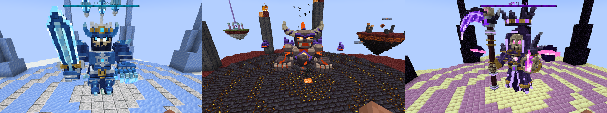
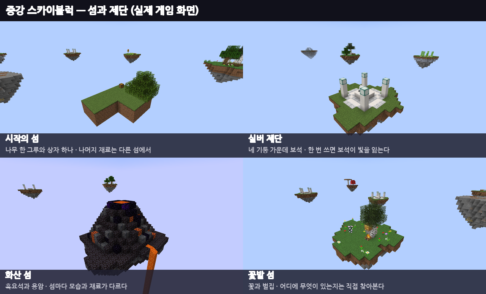
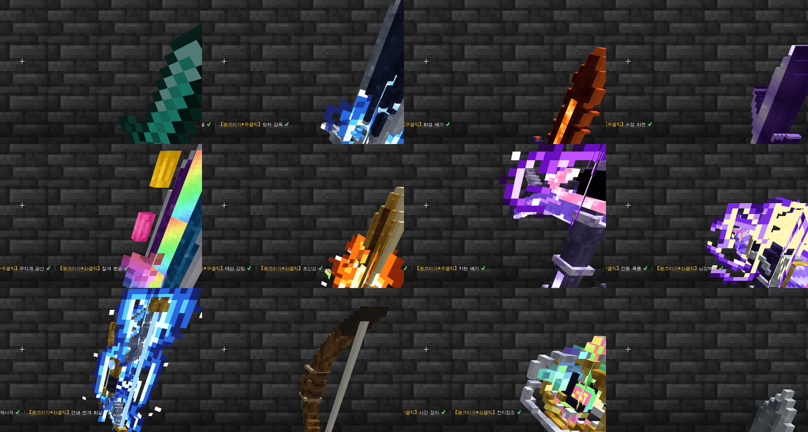
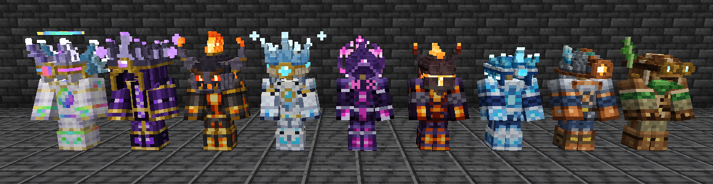
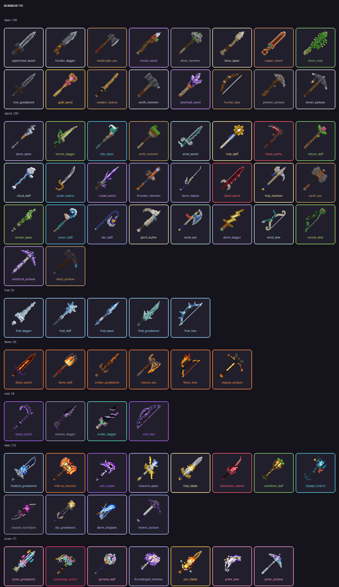

# 증강 스카이블럭

친구들과 함께하는 마인크래프트 자바 에디션 **1.21.4** 스카이블럭 서버입니다. Paper 플러그인과 미리 지어 둔 맵으로 이루어져 있습니다.

- **증강 78개**: 실버 29, 골드 30, 프리즘 19. 맵 곳곳의 제단(실버 16 · 골드 9 · 프리즘 5)을 우클릭하면 제물 없이 3개 중 하나를 고르고, 제단은 한 번 쓰면 힘을 잃습니다.
- **전투 효과는 운이 아니라 횟수**: 공격 시 효과·치명타·회피, 무기 패시브, 갑옷 세트의 전투 효과는 확률 대신 정해진 횟수마다 터집니다 (예: 공격 5번마다 불태운다). 광석 생성·수확·낚시·전리품 같은 전투 밖 확률은 그대로입니다.
- **죽으면 아이템을 떨어뜨립니다.** 지키려면 증강이 필요합니다: 단단한 주머니(핫바 칸), 무기 수호, 갑옷 결속, 보물 결속, 경험 보존, 영혼 결속(전부).
- **무기 69종 (활 8종 포함), 무기 스킬 83개**: 스킬이 붙은 무기는 55종이고, 섬 초반 무기는 대부분 스킬 없이 기본 공격(일부는 패시브)으로 싸웁니다. 우클릭 · 웅크리기+우클릭으로 스킬을 쓰고, 프리즘 무기 5종은 웅크리기+좌클릭으로 궁극기까지 씁니다. 활은 그냥 당기면 화살, 웅크리기+당겨 쏘기와 웅크리기+좌클릭은 스킬입니다. 무기마다 따로 디자인한 3D 모델이고, 보스·프리즘 무기에는 실시간으로 타오르는 아우라가 있습니다.
- **갑옷 9세트**: 2/4세트 효과, 머리에 쓰는 3D 투구.
- **새로운 몬스터 22종**: 밤에 섬에 나오는 변종, 균열 섬의 몬스터, 둥지를 지키는 3D 보스 3마리 (쓰러지면 30분 뒤 부활).
- **맵**: 반지름 약 620m에 떠 있는 섬 133개. 자원 섬은 41종(숲, 광산, 목장, 밭, 가문비 숲, 얼음 가시, 화산, 네더 요새, 코러스 숲, 자수정 정동, 산호초, 해저 유적, 난파선, 정글, 마녀의 늪, 심층 광산 …)이고, 섬마다 블록·식물·동물·생물군계가 달라 모습만 보고 알아볼 수 있으며 나는 재료가 다릅니다. 섬 사이는 보통 40~50칸, 가장 긴 다리는 80칸입니다. 이름표, 빛기둥, 위치 안내는 없습니다. 시작의 섬엔 꼭 필요한 것(용암, 얼음, 묘목, 씨앗, 뼛가루, 횃불)만 있고, 무슨 섬에서 무엇이 나는지는 안내서의 '섬 도감'에 있습니다. 네더 문은 열리지 않습니다.
- **조합법**: 무기 66종, 갑옷 6세트, 프리즘 결정을 작업대에서 만듭니다. 재료는 섬마다 나는 것(자작나무, 벌집 조각, 피뢰침, 산화된 구리, 프리즈머린, 발광석, 대나무, 응회암 …)이라 무기를 만들려면 그 섬을 찾아가야 합니다. 다른 무기를 넣는 강화 조합 13개는 같은 종류만 받고(도끼엔 도끼) 레시피 책에 진짜 무기 모양으로 보입니다. 증강 파편이 들어가는 조합은 2개뿐이고, 바닐라 조합법과 겹치는 것은 없습니다.










## 받을 파일

| 파일 | 내용 |
|---|---|
| `dist/AugmentSkyblock-Server.zip` | **이것만 받으면 됩니다.** 서버 폴더 통째로: `start.bat`, 설정, 플러그인, 맵, 설명서 |
| `dist/AugmentSkyblock-Map.zip` | 맵(`world` 폴더)만 |
| `dist/AugmentSkyblock.jar` | 플러그인만 |
| `dist/AugmentSkyblock-pack.zip` | 리소스팩만 (플러그인이 접속한 사람에게 자동으로 보냅니다) |

켜는 법과 게임 방법은 서버 zip 안의 `README.txt` 에 있습니다. 요약하면 `start.bat` 을 더블클릭하고(처음 한 번 Java 21 과 Paper 를 자동으로 받음) EULA 에 동의한 뒤, 마인크래프트 1.21.4 에서 `localhost` 로 접속합니다.

## 게임 흐름

1. 시작의 섬에서 조약돌 생성기를 만들고 섬을 넓힙니다.
2. 다리를 놓아 주변 섬을 찾아갑니다. 제단은 네 기둥 가운데 보석이 떠 있는 곳이고, 한 번 쓰면 보석이 빛을 잃습니다.
3. 섬마다 다른 재료로 무기와 갑옷을 만들고, 균열 섬을 찾아 몬스터에게서 정수를 모읍니다.
4. 둥지를 찾아 보스를 쓰러뜨리고 프리즘 결정, 증강권, 보스 무기와 갑옷을 얻습니다. 보스는 30분 뒤 다시 깨어납니다.
5. 프리즘 결정으로 최상위 무기와 프리즘 갑옷을 만들고, 남은 프리즘 제단을 찾아 나섭니다.

무기에 RPG 식 등급은 없습니다. 무기는 **얻는 곳**으로만 나뉩니다: 섬 초반 → 섬 재료 → 균열 정수 → 보스 → 프리즘 결정.



## 폴더 구성

```
augment-skyblock/
  plugin/                 Paper 플러그인 (Java 21, Gradle)
    src/main/java/kr/augsky/
      augment/            증강: 정의, 수치 합산(갑옷 세트 효과 포함), 효과 이벤트, 저장
      altar/              일회용 제단(월드 폴더에 기록), 증강 선택 화면, 증강권, 도감
      armor/              갑옷 세트: 아이템, 세트 효과, 입자
      weapon/             무기 아이템, 클릭 조합 스킬(우클릭·웅크리기), 패시브, 활
      skill/              스킬 엔진 (베기, 투사체, 광선, 돌진, 운석, 연쇄, 장판, 소환 ...)
      mob/                커스텀 몬스터, 균열 스폰, 보스 둥지(Lairs), 보스 3D 모델(Rigs), 자연 스폰 거르기, 네더 문 막기
      item/               파편/결정/증강권/정수, 조합법(레시피 책에 보이는 판 + 이름 바꾼 무기용 숨은 판), 바닐라 용도 차단
      map/                맵 짓기 (/증강관리 맵생성): 배치(MapBuilder), 섬 41종(IslandKinds), 블록 도구(MapTools), 섬검사(IslandCheck)
      pack/               리소스팩 HTTP 배포
    src/main/resources/   augments, weapons, skills, mobs, items, armor, rigs(자동 생성), config
  pack/
    gen_pack.py           리소스팩을 만든다 (무기, 갑옷, 보스, 아이템, 셰이더)
    wkit.py               복셀로 무기를 짓는 도구 (3D 모델, 움직이는 텍스처, 아우라, 손에 든 자세)
    mc3d.py               3D 아이템 모델 도구와 미리보기 렌더러
    weapons/              무기 디자인 (그룹별 모듈, preview/ 에 미리보기)
    art/                  보스 3D 모델과 갑옷 디자인
    shaders/              알파 252/251/250 픽셀을 스스로 빛나게 하는 셰이더
  server/                 서버 zip 에 들어가는 start.bat, start.sh, server.properties, README.txt
  tools/                  make_dist.py(배포 zip), render_map.py(맵 그림, --spoiler 면 제단·둥지 표시), make_catalog.py(도감 페이지)
  dist/                   배포 파일 (preview-map.png 는 제단·둥지 표시 없이 그린 맵)
```

## 내용 바꾸기

증강, 무기, 스킬, 몬스터는 전부 YAML 한 항목씩입니다. 서버의 `plugins/AugmentSkyblock/` 에서 고치고 게임 안에서 `/증강관리 리로드` 하면 됩니다. 각 파일 맨 위에 쓸 수 있는 효과와 부품이 정리되어 있습니다.

- 증강 하나 추가: `augments.yml` 에 `tier`, `name`, `icon`, `description`, `effects` 를 적습니다. 효과는 `attribute`, `lifesteal`, `ore_gen`, `double_jump` 처럼 이미 있는 종류를 조합합니다.
- 무기 하나 추가: `weapons.yml` 에 항목을 적고 `skill` · `skill2` · `skill3` 에 `skills.yml` 의 스킬 id 를 넣습니다 (우클릭 · 웅크리기+우클릭 · 웅크리기+좌클릭, 활은 웅크리기+당겨 쏘기 · 웅크리기+좌클릭. 비워 두면 스킬 없는 무기). 모양은 `pack/weapons/` 의 모듈에 `wkit` 으로 지어 `WEAPONS` 에 넣고 `pack/gen_pack.py` 를 돌립니다 (모듈이 없으면 `type` 과 `element` 로 기본 모양을 만듭니다).
- 갑옷 세트 추가: `armor.yml` 에 수치와 세트 효과를 적습니다. 그림은 `pack/art/` 모듈이 그립니다.
- 스킬 하나 추가: `skills.yml` 에 `cone`, `projectile`, `rain` 같은 부품을 이어 붙입니다. 무기에서 뺀 스킬도 지우지 않고 남겨 두었으니 골라 붙여도 됩니다.
- 조합법 바꾸기: `weapons.yml` · `items.yml` 의 `recipe` 에 `shape`(3줄까지)와 `ingredients` 를 적습니다. 재료는 바닐라 이름, `item:<아이템id>`, `weapon:<무기id>`(같은 종류 무기만). 갑옷은 `armor.yml` 의 `recipe: {M: 주재료, S: 특수 재료}` 이고, 프리즘 갑옷처럼 `shape` 와 `armor:<세트,세트>` 를 직접 적을 수도 있습니다. 바닐라 조합법과 모양이 겹치지 않게 하세요.
- 안내서: `config.yml` 의 `guide-book` 한 항목이 책 한 쪽입니다 (한 쪽에 14줄, 한 줄에 한글 14자쯤). 글을 바꾸면 플레이어가 가진 안내서도 접속할 때 새것으로 바뀝니다.
- 예전 판을 쓰던 서버는 새 플러그인을 처음 켤 때 콘텐츠 YAML 6개(augments, weapons, skills, mobs, items, armor)를 `old-content-v<예전 판>/` (v2 서버면 `old-content-v2/`) 로 옮겨 두고 새로 꺼냅니다 (안내서 글도 새것으로 바뀝니다). 고친 내용이 있었다면 그 폴더에서 옮겨 오세요.

## 다시 빌드하기

```sh
cd pack && python3 gen_pack.py             # 리소스팩 (Pillow, PyYAML 필요) → plugin/src/main/resources/pack.zip
cd plugin && ./gradlew build               # 플러그인 → plugin/build/libs/AugmentSkyblock.jar (윈도우는 gradlew.bat)
python3 tools/make_dist.py <world 폴더>     # 배포 zip
```

맵은 빈 공허 월드(`server/server.properties` 설정)에서 서버를 켜고 콘솔에 `augadmin buildmap` 을 입력하면 지어집니다. 이미 맵이 있는 월드에서는 거절합니다(`augadmin buildmap <월드> 강제` 로 억지로 지으면 예전 섬이 그대로 남아 뒤섞입니다). 다 지은 뒤 `augadmin 섬검사` 로 섬마다 있어야 할 재료가 있는지 셀 수 있습니다.

새 섬 배치는 새 `world` 폴더로만 받을 수 있습니다. 예전 world 를 계속 쓰면 예전 섬 그대로이고, 안내 글자와 빛기둥만 사라집니다. 인벤토리를 옮기려면 예전 `world/playerdata` 를 새 world 에 복사합니다.

레시피 책은 진짜 무기 모양을 보여 주도록 재료 무기를 정확히 그 아이템으로 등록합니다. 그래서 모루로 이름을 바꾸거나 마법을 부여한 무기는 레시피 책을 눌러도 칸이 채워지지 않고, 직접 칸에 넣으면 만들어집니다.

## 확인한 것

이 컨테이너에서 Paper 1.21.4 서버를 실제로 켜고, 테스트용 봇(mineflayer)과 실제 마인크래프트 1.21.4 클라이언트(가상 화면)로 접속해 확인했습니다. 마지막 확인은 `dist/AugmentSkyblock-Server.zip` 을 그대로 풀어 켠 서버에서 했습니다.

- 제단: 제물 없이 우클릭하면 바로 3개 중 선택, 고른 뒤 보석이 어두워지고 다시 누르면 "이미 힘을 다했습니다". 서버를 다시 켜도 쓴 제단은 그대로 꺼져 있음
- 증강권 우클릭, 다시 뽑기(무료 횟수 → 파편 3개), 획득 공지
- 갑옷: 서리 세트 4개 → 최대 체력·방어력 세트 효과, 바닐라 아이템과 제작기(crafter)로 보스 갑옷을 위조하지 못함
- 활: 끝까지 당겨 쏜 화살 피해, 일반 화살이 줄지 않음
- 보스 둥지: 가까이 가면 보스가 깨어나 자리를 지킴, 처치하면 30분 시계가 뜨고 둥지 기록에 남음
- 무기 69종과 스킬 135개를 불러오는 데 오류 없음, 조합법 91개 등록 (이름 바꾼 무기용 숨은 판 17개)
- 맵: 섬 133곳을 지어 `섬검사` 실패 0, 조합에 쓰는 바닐라 재료가 모두 맵에서 나옴, 맵 전체에 안내 글자·빛기둥 0개
- 조합 (봇): 강화 조합은 같은 종류의 진짜 무기만 받음(이름 바꾼 무기도 직접 넣으면 됨), 바닐라 조합(철 검, 돌 도끼, 활, 분광 화살 등)은 그대로, 제작기(crafter)로도 위조 불가
- 네더 문: 흑요석 틀에 불을 붙여도 열리지 않음. 밤에 네더 섬에 가스트·피글린이 나오지 않고, 폭 1칸 다리에는 몬스터가 생기지 않음
- 스킬 조작 (봇): 우클릭 → 1번, 웅크리기+우클릭 → 2번(없으면 1번), 웅크리기+좌클릭 → 3번(허공·블록·몹을 때릴 때 모두, 한 번만 나감), 스킬 없는 무기는 아무 일 없음, F키는 손 바꾸기
- 활 (봇): 그냥 당기면 화살, 웅크리고 끝까지 당겨 쏘면 화살 대신 스킬, 살짝 당기거나 재사용 대기 중이면 화살, 웅크리기+좌클릭은 두 번째 스킬
- 프리즘 궁극기 5개를 몹 앞에서 실제로 써서 피해와 연출 확인. 예전 판 데이터가 있는 서버에서 켜면 콘텐츠 YAML 이 `old-content-v1/` 로 옮겨지고, 예전에 만든 무기의 설명·공격력이 새것으로 바뀜
- 실제 클라이언트에서: 복셀 무기(1인칭/3인칭/왼손), 활을 당기는 모습, 보스·프리즘 무기 아우라(밤에도 스스로 빛남), 복셀 보스 3마리, 갑옷 9세트와 복셀 투구 (위 스크린샷)

확인하지 못한 것: 스킬 파티클 연출을 움직이는 화면으로 본 것, 이단 점프(봇이 비행 토글을 보낼 수 없음), 윈도우에서 `start.bat` 실행, 새 안내서(16쪽)를 실제 클라이언트로 넘겨 본 것(글꼴 폭으로 계산해 한 쪽 13줄 이하로 맞춤).
