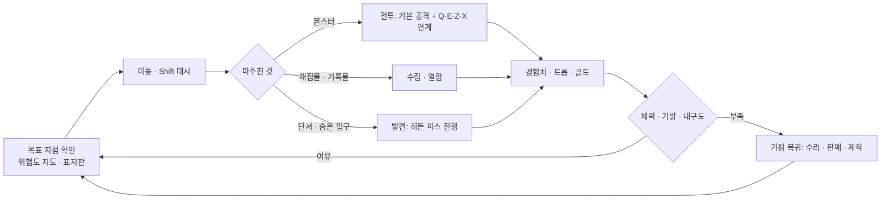
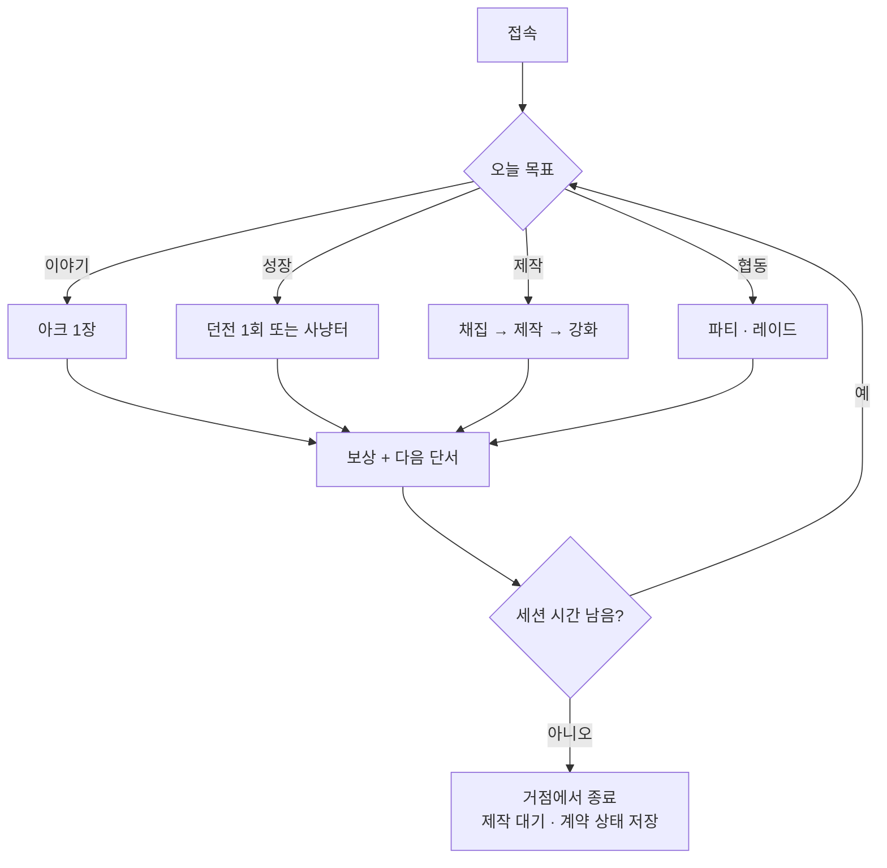
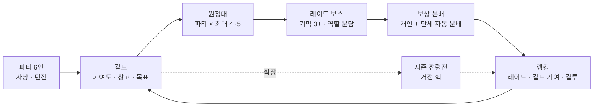
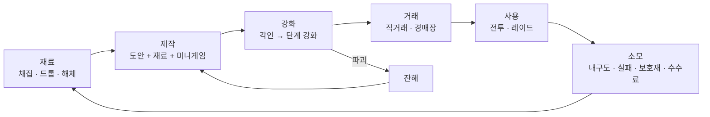
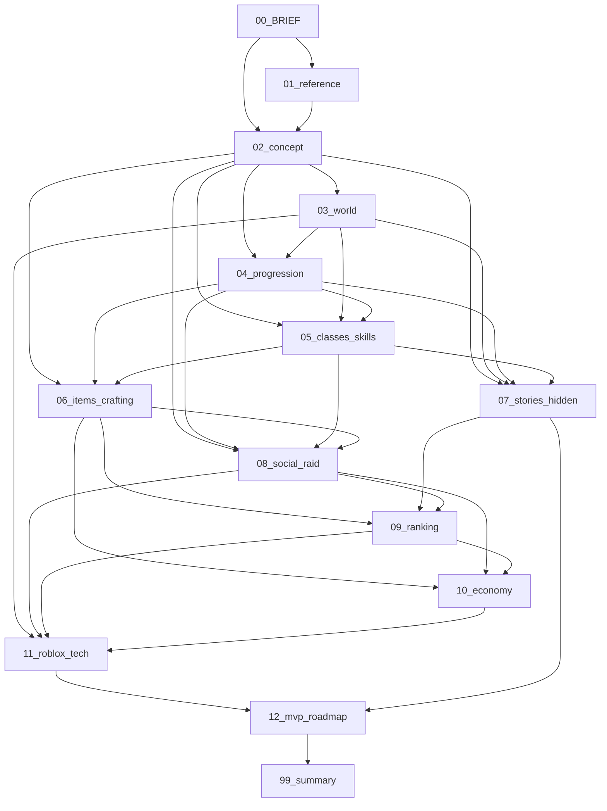

# 02_concept — 콘셉트: 베이라: 갈림길의 대륙 (Veyra Crossroads)

## 1. 문서 정보

| 항목 | 내용 |
|---|---|
| 버전 | r1 |
| 작성일 | 2026-09-30 |
| 상태 | 초안 (4명 전원 검수 대기) |
| 목적 | 3-A [진행 순서] 02번 정의: 한 줄 소개, 핵심 재미 3가지, 코어 루프, 타깃 유저와 세션 길이 가정, 차별점, 전체 문서 목차. 03~12번 문서의 공통 기준이 된다. |
| 의존 문서 | 00_BRIEF.md(기준), 01_reference.md(5장 매핑표 · 3장 강화 원칙 · 4장 비수직 교훈 · 6장 IP 금지 목록), DECISIONS.md(D-01~D-09), ASSUMPTIONS.md(A-01~A-08) |
| 이 문서를 기준으로 삼는 문서 | 03_world, 04_progression, 05_classes_skills, 06_items_crafting, 07_stories_hidden, 08_social_raid, 09_ranking, 10_economy, 11_roblox_tech, 12_mvp_roadmap, 99_summary |
| 표기 규칙 | 사실은 출처 번호를 단다(15장). 출처가 없는 수치는 **추정** 또는 **가칭**으로 표시한다. 레퍼런스는 "01번 5장 #n" 또는 레퍼런스 A(세력 경쟁형 서버 콘텐츠) / B(단축키 액션 MMORPG) / C(가상현실 게임 소재 웹소설)로만 지칭한다. 고유명사는 한국어 + 영문 병기(A-05). |
| 가칭 규칙 | 이 문서에 나오는 대륙 · 시작 위치 · 종족 · 아크 이름은 03 · 07번에서 확정하기 전까지 **가칭**이다. ID(C-, SP-, RC-, A-)는 03 · 07번이 그대로 이어받는다. |

## 2. 한 줄 소개

> **어디서 시작할지, 무엇이 될지, 누구와 갈지 — 전부 당신이 고르는 오픈월드 판타지 RPG.**

세 줄 확장:

1. 다섯 대륙(설계 기준, 가칭)으로 이루어진 세계 **베이라(Veyra)**. 정해진 주인공도, 메인 퀘스트도 없다. 지역마다 다른 이야기(아크)가 있고, 그 이야기들이 서로 맞물려 하나의 세계를 만든다(3-B-2).
2. 게임을 시작할 때 시작 위치를 고른다(3-B-3). 어디로 가든 성장할 수 있고, 위험한 땅도 들어갈 수는 있다(3-B-5, D-05).
3. 단축키 스킬로 싸우고, 대장장이가 만든 장비를 강화하고, 파티 · 길드 · 원정대로 레이드를 치른 뒤 분야별 랭킹에 이름을 올린다(3-B-9 · 12 · 13 · 10 · 14).

로블록스 스토어 설명문 초안:

| 언어 | 설명문 |
|---|---|
| 한국어 | 시작 위치를 고르고 베이라 대륙을 마음대로 탐험하세요. 메인 퀘스트는 없습니다 — 지역마다 다른 이야기가 서로 얽혀 있고, 히든 피스는 세계 곳곳에 숨어 있습니다. 단축키 스킬 전투, 대장장이 제작과 강화, 길드 레이드와 분야별 랭킹까지. 어디로 갈지는 당신이 정합니다. |
| English | Pick where you start, then explore the continents of Veyra your way. There is no main quest — every region tells its own story, and the stories connect. Hotkey skill combat, blacksmith crafting and enhancement, guild raids, and rankings in every field. Where you go next is up to you. |

## 3. 핵심 재미 3가지

| # | 이름 | 한 줄 정의 |
|---|---|---|
| F1 | **갈림길의 자유 (Freedom of the Crossroads)** | 시작 위치를 고르고, 어느 방향으로 가든 성장하는 비수직 오픈월드 탐험 |
| F2 | **맞물리는 발견 (Interlocking Discovery)** | 지역 이야기(아크)가 서로 연결되고, 그 틈에 히든 피스가 숨어 있는 세계 |
| F3 | **만들고 키우는 힘 (Forge and Grow)** | 단축키 스킬 액션 전투 + 대장장이 제작 · 강화 + 파티 · 길드 · 원정대 협동 |

### 3.1 F1 갈림길의 자유

| 항목 | 내용 |
|---|---|
| 유저가 실제로 하는 행동 | (1) 시작 화면에서 시작 위치 카드를 비교하고 하나를 고른다. (2) 표지판 · 위험도 지도를 보고 '다음에 갈 곳'을 스스로 정한다. (3) 자기 레벨보다 높은 위험도의 땅에 들어가 무관심 규칙 아래 살금살금 탐험하고, 발견 경험치와 단서를 챙겨 나온다. |
| 만드는 시스템 | 시작 위치 선택(03 · 04), 위험도 · 적정 구간 표시(04), 무관심 규칙 · 가벼운 사망 페널티 · 병렬 성장원(04), 동행 보정(04 · 08), 시작 위치별 도달 가능 아크 3+(07) |
| 레퍼런스 구조 | 01번 5장 #61(입지 선택 = 개성), #57(대륙마다 전 레벨대 사냥터), #41(레벨 순 개방 금지), #59(무거운 사망 페널티 금지), 4장 교훈 #1 · #5 · #8 · #10 |
| 실패 조건 | (a) 효율 1위 사냥터가 생겨 커뮤니티가 '정답 루트'를 만든다(4장 교훈 #3). (b) 시작 위치 간 난이도 차이가 커서 '정답 시작 위치'가 생긴다. (c) 고위험 지역에서 즉사만 반복되어 '들어갈 수는 있지만 의미가 없다'가 된다. (d) 자유만 있고 다음 목표 제안이 없어 방황한다(4장 교훈 #8). |

### 3.2 F2 맞물리는 발견

| 항목 | 내용 |
|---|---|
| 유저가 실제로 하는 행동 | (1) 아크 한 장(章)을 끝내면 다른 지역의 아크로 이어지는 단서(편지 · 지명 · NPC 이름)를 받는다. (2) 단서를 모아 지도 위의 장소를 추리해 히든 피스를 찾는다. (3) 발견한 히든 직업 · 히든 스킬 · 히든 지역을 길드 채팅과 랭킹에 자랑한다. |
| 만드는 시스템 | 아크 연결망(07: 아크 20+, 고립 0, 대형 연결 사건 3+), 히든 피스 30+(07: 전원 획득형 / 유일형), 히든 직업 발견 경로 5종(05 · 07), 봉인 슬롯(05 · 06 · 07), 탐험 랭킹(09) |
| 레퍼런스 구조 | 01번 5장 #60(지역 사건의 연쇄 서사), #5(전원 획득형 / 유일형), #6(단서 수집 → 위치 추리), #49(히든 직업 발견 경로 5종), #51(봉인 슬롯) |
| 실패 조건 | (a) 아크가 '지역 퀘스트 나열'로 전락해 연결이 체감되지 않는다(3-B-2 위반). (b) 히든 피스가 위키 없이는 못 찾는 난수 놀이가 된다(단서 없는 배치). (c) 유일형이 다수가 되어 후발 유저가 박탈감을 느낀다(4장 교훈 #6). (d) 장문 텍스트가 모바일 유저를 밀어낸다(A-08). |

### 3.3 F3 만들고 키우는 힘

| 항목 | 내용 |
|---|---|
| 유저가 실제로 하는 행동 | (1) Shift 대시로 피하고 Q · E · Z · X 스킬을 연계해 몬스터를 잡는다. (2) 도안과 재료를 모아 대장장이 미니게임으로 장비를 만들고, 각인 → 단계 강화로 키운다. (3) 파티(6) → 길드 → 원정대로 레이드 보스를 잡고 보상 분배 후 랭킹을 확인한다. |
| 만드는 시스템 | 스킬 체계 · 입력 매핑 3종(05), 장비 6등급 · 제작 · 강화(06), 대장장이 전투 겸업 역할(05 · 06 · 08, D-02), 파티 · 길드 · 원정대 · 레이드(08), 경제 순환(10), 랭킹(09) |
| 레퍼런스 구조 | 01번 5장 #15 · #16 · #10(단축키 · 스킬 유형 · 무기 슬롯), #42~#48(대장장이 · 제작), #29~#36(강화 곡선 · 잔해 · 보호재 · 천장), #23 · #26 · #27 · #28(파티 · 원정대 · 기믹 · 분배), #7(유일 장비) |
| 실패 조건 | (a) 모바일에서 스킬 연계가 불가능해 PC 전용 게임이 된다(3-C). (b) 자동 제작이 수작업보다 낫거나, 대장장이가 파티에 필요 없어 생산직이 고립된다(D-02). (c) 강화 실패가 이탈로 이어진다(잔해 · 보호재 부재). (d) 레이드가 딜 체크만 남아 장비 격차 = 승패가 된다(01번 5장 #27). (e) 과금이 강화 · 등급에 닿아 P2W가 된다(3-C). |

## 4. 코어 루프

### 4.1 루프 계층 요약

| 루프 | 시간 단위 | 핵심 행동 | 보상 | 다음 행동 동기 | 담당 문서 |
|---|---|---|---|---|---|
| L1 분 단위 | 30초~3분 | 전투(대시 · 스킬 연계) / 탐험(이동 · 발견) / 수집(채집 · 드롭) | 경험치, 재료, 골드, 발견 경험치, 단서 | 체력 · 자원이 남아 있고 다음 목표가 지도에 보인다 | 04, 05 |
| L2 세션 단위 | 모바일 15~25분 / PC 40~60분(A-03) | 아크 1장, 던전 1회, 제작 1회, 일일 계약 3개 | 장비 · 도안 조각 · 인장 · 아크 보상 · 다음 아크 단서 | "다음 장이 다른 지역에 있다", "도안이 한 조각 남았다" | 04, 06, 07 |
| L3 일 단위 | 하루 2~3세션(A-03) | 일일 계약 3개(30분 이내), 채집 · 제작 대기 회수 | 인장, 재료 상자, 길드 기여도 | 계약 초기화, 제작 대기 완료 알림 | 07, 10 |
| L4 주 단위 | 7일 | 주간 레이드(상한), 주간 계약 3개, 랭킹 정산, (확장) 점령전 창 | 레이드 도안 · 희귀 재료, 랭킹 보상 · 칭호 | 주간 초기화, 랭킹 등락, 길드 목표 | 08, 09, 10 |
| L5 사회 | 세션~시즌 | 파티 → 길드 → 원정대 → 레이드 → 랭킹 → (확장) 점령전 | 분배 보상, 길드 기여도, 세력 점수, 거점 운영권 | 길드 목표(보스 최초 처치, 랭킹 진입), 시즌 결산 | 08, 09 |
| L6 경제 | 상시 | 재료 → 제작 → 강화 → 거래 → 소모 | 골드, 장비, 제작자 서명, 거래 수익 | 소모처(내구도 · 보호재 · 수수료)가 재료 수요를 다시 만든다 | 06, 10 |

### 4.2 L1 분 단위 루프

| 행동 | 1회 소요(추정) | 보상 | 다음 행동 동기 |
|---|---|---|---|
| 일반 몬스터 전투 | 10~30초 | 경험치, 재료 드롭, 골드 | 다음 무리가 보인다 / 인장 게이지가 찬다 |
| 채집(광석 · 약초 · 목재) | 5~10초 | 재료, 채집 경험치(병렬 성장원) | 도안 재료 목록의 빈칸 |
| 기록물 열람(선택) | 10~40초 | 단서, 발견 경험치 | 다른 지역 아크의 힌트 |
| 히든 피스 진행 | 1~5분 | 히든 보상(장비 · 스킬 · 직업 입구), 탐험 랭킹 점수 | 남은 단서 수 표시 |

### 4.3 L2 세션 단위 루프

세션 목표 단위는 A-03의 세션 길이 안에서 끝나야 한다. 모든 세션 목표는 중간 저장이 되어 끊겨도 손실이 없다(11).

| 세션 목표 단위 | 목표 소요(추정) | 모바일 세션(15~25분) | PC 세션(40~60분) | 보상 | 다음 행동 동기 |
|---|---|---|---|---|---|
| 아크 1장(章) | 8~12분 | 1~2장 | 3~4장 | 아크 보상(장비 · 도안 조각 · 인장), 다음 장 · 다른 아크 단서 | 단서가 가리키는 지역 |
| 던전 1회(파티 또는 솔로) | 10~15분 | 1회 | 2~3회 | 재료 · 도안 · 인장 | 주간 던전 보상 상한 잔여 표시 |
| 제작 1회(미니게임 30초~2분 + 준비) | 5~10분 | 1~2회 | 3~5회 | 장비(제작자 서명), 숙련도 | 남은 재료로 만들 수 있는 도안 표시 |
| 강화 세션 | 3~5분 | 1회 | 1~2회 | 강화 단계, 잔해(실패 시) | 다음 단계 확률 · 안전 지점 표시 |
| 일일 계약 3개 | 10~15분 | 1회 | 1회 | 인장 · 재료 상자 · 길드 기여도 | 초기화 타이머 |
| 레이드 1회 | 30~40분 | (권장하지 않음, 참여는 가능) | 1회 | 레이드 도안 · 희귀 재료, 분배 보상 | 주간 상한, 길드 목표 |

### 4.4 L3 · L4 일 · 주 단위 루프

| 항목 | 규칙(수치는 07 · 08 · 10에서 확정) | 상한 근거 |
|---|---|---|
| 일일 계약 | 하루 3개, 합계 30분 이내에 끝나는 단위. 지역 무관(어느 대륙에서도 수행 가능) | 01번 5장 #39, A-03 |
| 주간 계약 | 주 3개(레이드 참여 · 제작 · 탐험 각 1) | 01번 5장 #39 |
| 주간 레이드 | 보스당 주 1회 보상, 연습 모드는 상한 미소모 | 01번 5장 #25 |
| 랭킹 정산 | 주간 랭킹 매주 정산, 시즌(8~12주) 결산 | 01번 5장 #12, 09 |
| 초기화 시각 | 일일 · 주간 초기화는 단일 UTC 시각으로 통일(세부 10) | 모바일 유저 혼란 방지 |
| 점령전(확장) | 주 1회 정해진 시간, 참가 신청제(D-01) | 01번 5장 #2 |

### 4.5 L5 사회 루프

| 단계 | 진입 조건 | 보상 | 다음 행동 동기 |
|---|---|---|---|
| 파티 | 없음(레벨 차이 무관, 동행 보정) | 인원 보너스 경험치, 기여도 분배 | 던전 · 필드 보스 |
| 길드 | 파티 경험 불필요, 창설 조건은 08 | 길드 창고 · 기여도 상점 · 길드 계약 | 길드 목표(주간 레이드 클리어) |
| 원정대 | 길드 또는 임시 모집, 최소 인원 없음 | 레이드 입장권 | 권장 인원 미달 도전은 허용 |
| 레이드 | 원정대 구성, 예약 서버 인스턴스(A-04) | 개인 보상 + 단체 드롭 자동 분배 | 주간 상한, 최초 처치 기록 |
| 랭킹 | 자동 | 칭호 · 시즌 보상 · 거점 운영권 후보 | 시즌 결산 |

### 4.6 L6 경제 루프

| 단계 | 유입 | 유출(골드 · 재료 소모처) | 담당 문서 |
|---|---|---|---|
| 재료 | 채집 · 몬스터 드롭 · 장비 해체 · 아크 보상 | 채집 도구 내구도 | 06, 10 |
| 제작 | 도안(상점 · 레이드 · 아크 · 히든 피스) | 재료 소모, 작업대 사용료 | 06 |
| 강화 | 각인서 · 강화 재료(게임 내 획득만) | 실패 시 재료 소실, 잔해 복원 비용, 보호재 | 06 |
| 거래 | 경매장 등록 · 직거래(A-07) | 거래 수수료(골드 소각) | 10 |
| 소모 | — | 수리비, 부활 내구도 소모, 길드 유지비, 텔레포트 요금 | 10 |

## 5. 첫 10분 경험

### 5.1 시작 위치 선택 화면

| 요소 | 설계 |
|---|---|
| 형식 | 카드 캐러셀(모바일: 좌우 스와이프, 한 화면에 카드 1장 + 배경 미리보기 / PC: 3장 나열) + '지도 보기' 토글 |
| 카드 1장의 정보 | ① 이름(한/영) ② 대륙 ③ 위험도(시작 지역은 전부 1~2) ④ 고향 종족(D-08: 어떤 종족이든 선택 가능, 고향 종족이면 초반 대사 · 평판 보너스) ⑤ 첫 아크 제목 ⑥ 추천 태그 2개(탐험 · 전투 · 제작 · 교역 · 이야기 · 사회 중) ⑦ 현재 이 위치 근처 접속 인원(추정 표시) |
| 표시 수 | 설계 기준 8곳(SP-01~08). MVP 표시 수는 12번 |
| 무작위 버튼 | '아무 곳이나' 버튼 1개(고민 없는 유저용) |
| 되돌리기 | 캐릭터 슬롯 3개(D-09)로 다른 시작 위치를 다시 경험 가능. 같은 캐릭터의 시작 위치 변경은 없음 |
| 모바일 UI 요소 수 | 카드 1장 + 좌우 화살표 2 + 지도 토글 1 + 무작위 1 + 시작 버튼 1 = **6개**(상한 7) |

시작 위치 후보(가칭, 03 · 07에서 확정):

| ID | 이름(가칭) | 대륙(가칭) | 위험도 | 고향 종족(가칭) | 첫 아크(가칭) | 추천 태그 | MVP |
|---|---|---|---|---|---|---|---|
| SP-01 | 잿바람 항구 (Ashwind Harbor) | C-01 칼드라 (Kaldra) | 1 | RC-01 인간 (Human) | A-01 표류선의 화물 | 교역 · 사회 | 포함 |
| SP-02 | 가시덤불 요새 (Thornhold) | C-01 칼드라 | 2 | RC-04 루파르 (Lupar) | A-02 국경의 늑대 울음 | 전투 · 이야기 | 포함 |
| SP-03 | 서리뿌리 마을 (Frostroot) | C-02 오스마르 (Osmar) | 1 | RC-03 드워프 (Dwarf) | A-03 멈춘 용광로 | 제작 · 광산 | 포함 |
| SP-04 | 백야 초소 (Whitenight Outpost) | C-02 오스마르 | 2 | RC-01 인간 | A-04 빙벽 너머의 불빛 | 전투 · 탐험 | 포함 |
| SP-05 | 황금모래 야영지 (Goldsand Camp) | C-03 실렌 (Silen) | 1 | RC-05 실프린 (Sylphrin) | A-05 모래 아래의 목소리 | 탐험 · 히든 | 확장 1차 |
| SP-06 | 산호만 (Coral Bay) | C-03 실렌 | 2 | RC-02 엘프 (Elf) | A-06 가라앉은 시장 | 교역 · 탐험 | 확장 1차 |
| SP-07 | 안개호수 수도원 (Mistlake Abbey) | C-04 누마 (Numa) | 2 | RC-05 실프린 | A-07 울리지 않는 종 | 이야기 · 히든 | 확장 2차 |
| SP-08 | 깊은맥 광산촌 (Deepvein) | C-04 누마 | 2 | RC-06 골레온 (Goleon) | A-08 무너진 갱도의 빛 | 제작 · 전투 | 확장 2차 |

### 5.2 첫 1분 / 3분 / 10분

| 시점 | 유저가 겪는 일 | 배우는 것 | 화면 UI 요소(모바일) |
|---|---|---|---|
| 0~1분 | 고른 위치에 도착. 고향 NPC 한 명이 말풍선 2줄(A-08)로 상황을 알린다(예: "다리가 무너졌어. 저쪽 길로 돌아가 봐"). 이동 · 점프 · 대시로 무너진 길을 건넌다 | 이동, Shift 대시(터치: 대시 버튼) | 조이스틱, 점프, 대시, 말풍선 = 4 |
| 1~3분 | 위험도 1 몬스터 2~3마리와 첫 전투. 기본 공격 → 무기 스킬 Q 1개만 열려 있다. 처치 후 첫 재료 드롭 | 기본 공격, 스킬 버튼 1개, 드롭 줍기 | + 공격, 스킬 1, 체력바 = 7 |
| 3~6분 | 첫 아크 1장 시작. NPC 부탁 1건(전투 또는 채집 택1 — 유저가 고른다). 완료 시 직업 스킬 슬롯 Z 해금 + 일반 등급 무기 1개 | 직업 스킬, 아크 UI(장 표시) | + 스킬 2 = 8(상한) |
| 6~9분 | 첫 갈림길 표지판: 방향 3개 = 이 아크 2장(같은 지역) / 다른 아크 입구(옆 지역, 위험도 2) / 사냥터(위험도 1~2) + 근처에 '이상한 흔적' 1개(히든 피스 단서) | 위험도 표시, 지도 열기, 단서 | 지도 버튼은 메뉴 안(상시 노출 아님) |
| 9~10분 | 고른 방향으로 이동. 첫 갈림길 선택 시 도안 조각 1개 또는 인장 1개 지급(어느 쪽이든 동일 가치) | "어디로 가도 보상이 있다" | — |

첫 10분 안에 반드시 일어나는 것: 시작 위치 선택 1회, 대시 1회, 스킬 2종 사용, 아크 1장 완료, 갈림길 선택 1회, 단서 1개 목격. 반드시 일어나지 않는 것: 장문 컷신, 강제 이동, 파티 · 길드 안내, 상점 안내(요청 시에만).

### 5.3 튜토리얼이 메인 퀘스트가 되지 않게 하는 장치

| 장치 | 내용 | 근거 |
|---|---|---|
| 아크 1장에 녹임 | 튜토리얼 = 각 시작 위치 첫 아크의 1장. 시작 위치 8곳마다 내용이 다르다(같은 조작을 다른 상황으로 가르친다). 완료 보상은 8곳 모두 동일 가치 | 3-B-2(메인 퀘스트 없음), 3-B-3 |
| 스킵 | 시작 카드에서 '숙련자 모드' 토글 → 안내 말풍선 · 강조 표시 없음. 아크 1장 자체는 남지만 안 해도 된다(다른 방향 표지판이 처음부터 열려 있음) | 재접속 · 부캐 유저 |
| 이탈 자유 | 첫 아크 1장을 중간에 버리고 다른 지역으로 가도 페널티 없음. 1장은 언제든 돌아와 이어 할 수 있다 | 3-B-5 |
| 조작 학습은 환경으로 | "무너진 길(대시)", "높은 턱(점프)", "부서지는 벽(스킬)"처럼 지형이 조작을 요구. 텍스트 안내는 1줄 | A-08 |
| 첫 갈림길 = 실제 갈림길 | 튜토리얼 끝의 선택지가 실제 아크 · 사냥터 · 히든 단서로 이어진다(가짜 선택 없음) | 3-B-2, 3-B-5 |

## 6. 타깃 유저와 세션 길이 가정

플랫폼 사실: 로블록스 플레이어의 약 65%가 Android이고 그중 약 60%가 RAM 2~4GB 기기다[P-5-02]. 세션의 72~80%가 모바일이라는 제3자 집계가 있다(공식 수치 아님)[R-58]. 동접 10만 이상 로블록스 RPG는 전부 모바일을 지원하고, 미지원작은 수천 명대다[R-14][R-41][조사 3절]. → 모바일 페르소나가 1순위다(2-현상황).

| 항목 | PE-1 모바일 캐주얼 탐험가 | PE-2 PC 코어 레이더 · 길드원 | PE-3 생산 · 거래 장인 | PE-4 친구 따라온 동행자 |
|---|---|---|---|---|
| 연령대(추정) | 9~15세(Mild 라벨 노출 범위, A-02[P-1-02]) | 13~22세 | 15~30세 | 9~18세 |
| 기기 | Android 중저가(RAM 2~4GB) · 태블릿 | PC(키보드 · 마우스) · 콘솔 | PC · 태블릿 | 모바일 · 콘솔 게임패드 |
| 세션 길이 | 15~25분, 하루 2~3회(A-03) | 40~60분, 하루 1~2회(A-03) | 20~40분, 하루 1~2회 + 대기 회수 | 20~40분, 친구 접속 시간에 맞춤 |
| 주 플레이 동기 | 새 지역 · 히든 피스 발견, 꾸미기, 가볍게 강해지기 | 레이드 최초 처치, 랭킹, 길드 명예, 고강화 | 도안 수집, 제작자 서명 브랜드, 경매장 수익, 제작 랭킹 | 친구와 같이 사냥, 캐리받기, 파티 보상 |
| 이 페르소나를 위한 콘텐츠 | 아크 1장 단위, 위험도 지도, 무관심 규칙 탐험, 일일 계약 3개(30분), 자동 조준 보조 | 레이드 5+(기믹 3+), 원정대, 주간 상한, 분야별 랭킹, 결투 · 분쟁 구역, (확장) 점령전 | 대장장이 직업(전투 겸업), 미니게임, 경매장, 제작 랭킹, 유일 장비 복원 의뢰 | 동행 보정(캐리 허용 + 상한), 인스턴스 한정 레벨 동기화, 파티 인원 보너스 |
| 과금 상품(확정형만, A-06) | 꾸미기(외형 · 이펙트), 가방 확장, 텔레포트 편의 | 캐릭터 슬롯 추가, 꾸미기, 길드 전용 프라이빗 서버(검토) | 작업대 외형, 제작 대기 시간 단축(강화 · 재료 지급 금지), 경매장 등록 슬롯 | 꾸미기, 파티 텔레포트 편의 |
| 이탈 위험 | 텍스트 과다, 버튼 과다, 조작 실패, 즉사 반복 | 콘텐츠 고갈, 밸런스 붕괴, 업데이트 지연[R-1][R-2] | 자동 제작이 수작업을 대체, 재료 인플레 | 레벨 차이로 파티 불가, 경험치 페널티 |

## 7. 차별점

조사 파일의 비교표(조사 1 · 3절)를 바탕으로 한다. 차별점은 '주장'이 아니라 시스템으로 적는다. 조사에서 **"메인 스토리 없음" 자체는 애니 2차창작 상위작과 하드코어 소울라이크 게임에도 있어 차별점이 아니다**[R-4][R-6][R-13] — 우리는 '없음'이 아니라 '맞물림'(아크 연결망 · 고립 0)으로 차별화한다.

| 기존 인기작 | 그 게임의 구조(확인된 범위) | 우리의 구조 | 차별이 시스템으로 구현되는 곳 |
|---|---|---|---|
| Blox Fruits (애니 2차창작 오픈월드 액션) | 진영(해적/해군) 선택만, 자유 시작 위치 없음[R-4]. 레벨대별 NPC 퀘스트 나열, 수직(레벨캡 · 열매 각성)[R-1][R-12]. 제작 없음, NPC에 재료 납품 강화만[R-12]. 현상금/명예 단일 리더보드[R-12]. 게임패스 세트 + 열매 로벅스 직판 + 가챠[R-2][R-12][R-34] | 시작 위치 8곳(설계) 자유 선택. 위험도 · 적정 구간 겹침 배치로 비수직. 유저 대장장이가 장비를 만들고 서명. 분야별 랭킹 5+. 유료 확률형 없음(A-06) | 03 · 04(시작 위치 · 위험도), 06(제작), 09(랭킹), 10(과금) |
| Sailor Piece (애니 2차창작 액션, 2025-11) | 레벨대 NPC 퀘스트 → 스탯 배분 → 다음 섬, 수직(인챈트 E0~E10)[R-1][R-6]. 메인 스토리 없음(퀘스트 나열)[R-6]. 고정 직업 없음, 종족 패시브 + 스탯[R-7]. 종족 리롤 상품[R-2] | 아크 연결망(모든 아크가 다른 아크 2+와 연결, 고립 0). 직업 6+ · 히든 직업 5+. 종족은 리롤 상품이 아니라 시작 시 자유 선택, 시작 위치와 독립(D-08) | 07(아크), 05(직업), 03(종족), 10(과금 한계선) |
| Deepwoken (하드코어 퍼머데스 소울라이크, 400R 유료 입장) | 시작 섬 2곳 택1[R-14]. 메인 퀘스트 없음, 환경 서사[R-13]. 사망 시 페널티 · 캐릭터 삭제[R-13]. 모바일 미지원(입력 수)[R-14]. 설명 전무 · 초보 구역 그리핑 불만[R-13][R-47] | 시작 위치 8곳(설계) · 3대륙 이상. 가벼운 사망 페널티(D-05 (4)), 오픈월드 강제 PvP 없음(D-01). 모바일 · 게임패드 동등 조작(스킬 버튼 6 + 공격 · 대시). 위험도 지도 · 표지판 · 단서로 '다음 갈 곳' 제안 | 04(사망 · 위험도), 05 · 11(입력), 08(PvP), 07(단서) |
| Arcane Odyssey (오리지널 해양 오픈월드 RPG) | 챕터형 메인 스토리 있음[R-1][R-17]. 생활 직업 6종(요리 · 양조 · 보석 가공 등)[R-17]. 모바일 미지원, 핫바 1~7[R-15][R-41] | 메인 스토리 없음 + 대형 연결 사건 3+가 여러 대륙을 가로지름. 생활 직업이 아니라 대장장이가 **전투 겸업 정식 직업**이며 파티 역할이 있음(D-02). 모바일 우선 설계(버튼 상한 8) | 07(연결 사건), 05 · 06 · 08(대장장이), 05 · 11(모바일) |
| Vesteria (전통 판타지 MMORPG, 서버 20인) | 클래스별 거점이 다름(자유 선택은 확인 필요)[R-25]. Warrior/Hunter/Mage → 서브클래스, 수직[R-25]. 길드 · 콜로세움 · 트리뷰트 전쟁[R-44] | 시작 위치는 직업 · 종족과 독립(D-08). 히든 직업은 발견 경로 5종으로 세계 곳곳에서 해금. PvP는 결투 신청제 · 분쟁 구역 · 시즌 점령전으로 단계화(D-01) | 03 · 04(시작 위치), 05 · 07(히든 직업), 08(PvP) |
| World // Zero (애니풍 파티 던전 MMORPG) | 클래스 선택 → 파티 던전 반복, 티어 1~5[R-27]. 상위 클래스를 로벅스로 판매(T2 200 ~ T5 1,200~1,400R) 또는 레벨 해금[R-27] | 직업 · 히든 직업은 로벅스로 팔지 않는다(3-C 한계선). 던전만이 아니라 아크 · 탐험 · 제작 · 채집이 전부 경험치(D-05 (3)) | 10(과금), 04(병렬 성장원) |
| Dungeon Quest (인스턴스 던전 루터) | 던전 반복 → 장비 드롭 → 대장장이 NPC 골드 강화, 고레벨 장비 수천 회[R-29]. 로비형, 스토리 없음. 동접 ATH 24K → 100~300대로 급감[R-28] | 강화는 3구간 곡선(안전 → 긴장 → 도박) + 잔해 복원 + 보호재 + 기대 시도 횟수 공개(01번 3장). 강화가 유일한 성장 축이 아니라 오픈월드 · 아크 · 랭킹과 병행 | 06(강화), 04(성장) |
| Swordburst 3 (층 오르기 액션 RPG) | 층 진행 · 보스 · 광석 앤빌 강화, 제작 스테이션[R-31]. 층 = 강제 순서. 동접 두 자릿수[R-30] | 층 · 레벨 순 개방 없음(01번 5장 #41 금지). 같은 성장 구간에 사냥터 3+ · 대륙 2+(4-정량). 제작은 도안 + 재료 + 미니게임 + 숙련도(3-B-12) | 03 · 04(비수직 검증표), 06(제작) |

차별점 요약(시스템 6종): ① 시작 위치 자유 선택(8곳 설계 · MVP 4곳) ② 비수직 6종 메커니즘(D-05) ③ 메인 스토리 없음 + 아크 연결망(고립 0) ④ 대장장이 중심 경제(플레이어 제작 · 서명 · 해체 순환) ⑤ 3구간 확률형 강화(잔해 · 보호재 · 확률 공개) ⑥ 분야별 랭킹 5+(제작 · 탐험 포함, 조사 범위에서 사례 없음[조사 5절]).

## 8. 설계 원칙 요약

### 8.1 D-01~D-09의 콘셉트 관점 요약

| 결정 ID | 요지 | 이 문서에서의 의미 |
|---|---|---|
| D-01 | 오픈월드 강제 PvP 없음. MVP: 길드 결투 신청제 + 지정 분쟁 구역(진입 동의). 확장: 시즌제 거점 점령전(주 1회 · 참가 신청제). 국가 전면 전쟁 없음 | F1 탐험이 PvP에 방해받지 않는다. PE-1 · PE-4가 안전하게 고위험 지역을 탐험한다. 세력 경쟁의 재미는 점령전 · 기여도 · 세력 랭킹으로(L5) |
| D-02 | 대장장이 = 전투 겸업(순수 딜러의 75~85%) + 파티 · 레이드 서포터(현장 수리 · 담금질 버프 · 방어구 보강 · 무기 개조) | F3의 축. PE-3가 파티에 자리를 가진다. 솔로 사냥도 가능 |
| D-03 | 도안 제작 조건 = 대장장이 숙련도 + 작업대 등급(캐릭터 레벨 아님). 착용 조건 = 캐릭터 레벨 + 스탯 | 제작 활동 자체가 성장 경로(병렬 성장원). 대장장이가 전투 레벨링을 강제당하지 않는다 |
| D-04 | 레벨 상한 MVP 60 → 80 → 100. 10레벨 6구간 | 10장 정량 목표표의 구간 기준. 비수직 검증표는 6구간 |
| D-05 | 비수직 6종 메커니즘 세트 | 8.2 참조 |
| D-06 | 게임 내 시프트 락 옵션 끄기 + 자체 조준 모드(별도 키) + 대시 키 재배치 허용 | 9장 조작 원칙 |
| D-07 | 세계명 베이라(Veyra), 게임명 베이라: 갈림길의 대륙(Veyra Crossroads). 모든 고유명사 한/영 병기 | 2장 |
| D-08 | 종족과 시작 위치 독립. 고향 종족은 대사 · 평판 보너스만 | 5.1 시작 카드의 '고향 종족' 칸. 선택지 = 종족 × 시작 위치 |
| D-09 | 캐릭터 슬롯 3, 직업은 캐릭터당 1개 + 전직 의식 전환. 히든 직업 = 상위 분기형 또는 별개형 | 시작 위치를 여러 번 경험하는 경로 = 슬롯. 히든 직업 발견의 가치 보존 |

### 8.2 비수직 구조 6종의 유저 체감(D-05)

| # | 메커니즘 | 유저가 보는 것 · 겪는 것 | 신규 유저가 고레벨 지역에 들어가면(3-C) |
|---|---|---|---|
| 1 | 위험도(1~6) + 적정 구간 폭 | 사냥터 입구 · 지도에 "위험도 4 · 적정 25~45"처럼 표시. '권장 레벨 30' 같은 단일 숫자 없음. 구간이 겹쳐 같은 레벨에 갈 곳이 여럿 | 입구에서 경고 1줄 + 색 표시. 입장 차단 없음 |
| 2 | 무관심 규칙 | 자기보다 15레벨 이상 높은 일반 몬스터는 먼저 때리지 않으면 무시. 몬스터 머리 위에 '무관심' 아이콘 | 몬스터 사이를 걸어 다니며 기록물 · 채집물 · 단서를 얻는다. 단, 광기 지역(예외)은 위험도 6 표시와 함께 경고 |
| 3 | 병렬 성장원 | 경험치 획득 로그에 "전투 / 이야기 / 발견 / 제작 / 채집" 태그. 어느 태그로도 레벨이 오른다 | 고레벨 지역에서 발견 경험치 · 채집 경험치로 성장 가능 |
| 4 | 가벼운 사망 페널티 | 경험치 손실 없음, 장비 내구도 소모, 근처 거점 부활 | 죽어도 잃는 것은 수리비. 다시 시도한다 |
| 5 | 동행 보정 | 파티 창에 "동행 보정: 캐리 허용 · 상한 n%" 표시. 레벨 차이로 경험치가 깎이지 않음 | 고레벨 친구와 파티로 들어가면 상한 내에서 경험치 획득 |
| 6 | 인스턴스 한정 레벨 동기화 | 레이드 · 던전 인스턴스에서만 스탯 동기화 배지 표시. 오픈월드는 동기화 없음 | 오픈월드에서는 그대로 약하다(성장 체감 유지). 인스턴스에서는 역할 수행 가능 |

### 8.3 과금 한계선 원칙(3-C, A-06)

| 구분 | 허용 | 금지 |
|---|---|---|
| 상품 형태 | 확정 지급형만(패스 · 개발자 상품 · 구독 검토)[P-2-01][P-2-02][P-2-04] | 유료 확률형(랜덤 박스 · 리롤 토큰 · 확률 상승권)(A-06)[P-1-09] |
| 효과 범위 | 꾸미기(외형 · 이펙트 · 작업대 외형), 편의(가방 · 슬롯 · 텔레포트 · 경매장 등록 슬롯), 시간 단축(채집 · 제작 **대기 시간**만) | 스탯 · 등급 · 강화 단계 · 성공률 · 강화 재료 · 보호재 · 도안 · 직업 · 히든 피스 직접 판매(01번 3장 원칙 8) |
| 간접 경로 | 로벅스로 산 어떤 것도 확률형 결과(강화 · 제작 판정)에 투입되지 않는다 → 유료 랜덤 아이템 규정의 간접 적용 자체를 회피[P-1-09][P-1-10] | 로벅스 유래 재화로 강화 재료 구매 |
| 거래 | 게임 내 아이템 · 골드의 유저 간 거래(직거래 · 경매장, A-07). 로벅스로 산 아이템은 거래 불가로 설계 | 로벅스 · 실제 화폐와 게임 재화 교환[P-2-10][P-2-11] |
| 정보 공개 | 게임 내 확률형 요소(강화 · 제작)는 무료 재화만 쓰지만 확률을 UI에 %로 공개하고 월별 실측 공개(01번 5장 #38) | 확률 미고지 변경 |

### 8.4 PvP 원칙(D-01)

| 단계 | 형태 | 참여 조건 | 보상 · 페널티 |
|---|---|---|---|
| 상시 | 없음(오픈월드 강제 PvP 0) | — | — |
| MVP | 결투 신청제(1:1 · 파티) + 지정 분쟁 구역(진입 시 경고 · 동의) | 양측 동의 | 결투 랭킹 점수. 사망 페널티 없음(내구도 소모만) |
| 확장 | 시즌제 거점 점령전(세력 단위, 주 1회 정해진 시간, 참가 신청) | 길드 · 세력 소속 + 신청 | 거점 보너스 · 세력 점수. 패배 시 개인 자산 · 성장 보존 |

## 9. 플랫폼 · 조작 원칙

상세 매핑표(PC / 모바일 / 게임패드 3종, 4-정량)는 05, 기술 근거는 11. 여기서는 원칙만 정한다.

### 9.1 PC 키 기준 슬롯 구성

| 입력 | 역할 | 슬롯 계열 | 비고 |
|---|---|---|---|
| Shift | 대시 | 이동 | 3-B-9. 시프트 락과 분리(D-06) |
| 마우스 좌클릭 | 기본 공격 | 기본 | 자동 조준 보조는 모바일 · 패드 전용 |
| Q, E | 무기 스킬 2슬롯 | 무기 계열 | 무기군마다 다름(무기 교체 시 슬롯 내용 교체) |
| Z, X, C | 직업 스킬 3슬롯 | 직업 계열 | 프리셋 2개(사냥 / 보스) |
| V | 특수 스킬 1슬롯 | 특수 계열 | 퀘스트 · 히든 피스로 배우는 스킬 10+(4-정량) |
| 마우스 휠 클릭 | 조준 모드(자체 카메라 잠금) | 카메라 | D-06. 패드 R3, 모바일 화면 버튼 |
| F | 상호작용(NPC · 채집 · 기록물) | 기본 | |
| 1, 2 | 소모품 2슬롯 | 기본 | |
| Space | 점프 | 이동 | 로블록스 기본 |
| Tab / M / I | 지도 · 가방 · 메뉴 | UI | 모바일은 메뉴 버튼 1개로 통합 |

원칙: (1) 스킬 슬롯은 무기 2 + 직업 3 + 특수 1 = **6개 고정**. 어느 플랫폼에서도 같다. (2) 모든 키는 설정에서 재배치 가능(대시 포함). (3) 스킬 매크로 없음, 연계 입력(스킬 후 특정 키로 파생기)만(01번 5장 #18).

### 9.2 모바일 · 게임패드 동등성 원칙

| 원칙 | 내용 | 근거 |
|---|---|---|
| 슬롯 수 동등 | 모바일 · 패드도 스킬 6 + 공격 + 대시 = 화면 버튼 8개 상한(조이스틱 · 점프 · 메뉴 제외). PC 전용 스킬 없음 | 3-C, 01번 5장 #17 |
| 판정 동등 | 대시 무적 시간 · 스킬 선딜 · 미니게임 판정 창은 플랫폼별로 다르지 않다. 대신 모바일 · 패드에 자동 조준 보조(가장 가까운 적 우선)와 입력 지연 보정 | 3-C(공정성) |
| 입력 판별 | UserInputService.PreferredInput으로 주 입력을 판별해 UI 세트를 바꾼다. TouchEnabled로 모바일 판별하지 않음 | [P-6-01] |
| 터치 버튼 | 자체 GUI 버튼(ContextActionService 자동 버튼의 최대 7개 제한에 묶이지 않음). 버튼 크기 · 간격 기준은 11 | [P-6-02] |
| 게임패드 | 왼쪽 스틱 이동, 오른쪽 스틱 카메라, 트리거 · 범퍼 + 버튼 조합으로 6슬롯, R3 조준 모드 | [P-6-03], D-06 |
| 미니게임 | 대장장이 미니게임은 탭 · 타이밍 · 드래그 3종 이내 입력만 사용, 판정 서버 확정, 패턴 무작위화(오토클릭 대책) | 3-C, 01번 5장 #48 |
| 자동전투 없음 | 모바일 조작 결함을 자동전투로 덮지 않는다 | 01번 5장 #19 |

### 9.3 시프트 락 해결 요약(D-06)

| 항목 | 내용 | 출처 |
|---|---|---|
| 문제 | 로블록스 기본 시프트 락이 Shift 키를 카메라 잠금 토글로 쓴다 | [P-6-05] |
| 해결 | StarterPlayer.EnableMouseLockOption = false로 기본 토글을 끈다. 자체 조준 모드를 별도 키(PC 휠 클릭 / 패드 R3 / 모바일 버튼)로 제공. 대시 키 재배치 허용 | D-06, [P-6-05] |
| 주의 | 시프트 락 관련 API가 폐기 예정이라 UserInputService.MouseBehavior 기반 자체 구현을 병기한다. 기본값 미기재(확인 필요)이므로 명시적으로 false 설정 | [P-6-06], [P-6-07] |

## 10. 세계 · 시스템 정량 목표표

4-완료기준의 정량 기준은 **설계 문서 기준**이다. MVP 구현치는 그 부분집합이며 12번에서 확정한다. 숫자는 최소치다.

| 항목 | 4-정량 기준(설계) | 담당 문서 | MVP 구현 목표(첫 출시) | 확장 목표(1~4차 누적) |
|---|---|---|---|---|
| 대륙 | 4+ | 03 | 2 (C-01, C-02) | 5 (설계 전부) |
| 국가 | 8+ | 03 | 4 | 10 |
| 도시 · 마을 | 20+ | 03 | 8 | 24 |
| 사냥터 · 던전 | 30+ | 03, 04 | 16 | 36 |
| 종족 | 6+(플레이어블 여부 표시) | 03 | 6 설계 · 플레이어블 4 | 플레이어블 6 |
| 시작 위치 | 6+, 3개 이상 대륙 | 03, 04 | 4 (2대륙) | 8 (4대륙) |
| 비수직 검증표 | 10레벨 단위 모든 구간에 사냥터 3+ · 대륙 2+, 필수 사냥터 0 | 04 | 6구간(1~60) 전부 충족, 2대륙 | 8~10구간(~100) 충족 |
| 레벨 상한 | (D-04) | 04 | 60 | 80 → 100 |
| 직업 | 기본 6+(대장장이 · 궁수 포함), 히든 5+ | 05 | 기본 6 · 히든 2 | 히든 6 |
| 스킬 | 직업당 6+, 무기군별 무기 스킬, 특수 스킬 10+ | 05 | 직업당 6, 무기군 4, 특수 6 | 직업당 8, 무기군 6, 특수 12 |
| 입력 매핑표 | PC / 모바일 / 게임패드 3종 | 05, 11 | 3종 전부 | — |
| 아크 | 20+, 모든 아크가 2+와 연결, 고립 0, 대형 연결 사건 3+, 모든 시작 위치에서 3+ 아크 도달 | 07 | 10, 대형 연결 사건 1 | 24, 대형 연결 사건 4 |
| 히든 피스 | 30+(단서 · 조건 · 보상 · 연결 아크) | 07 | 15 | 36 |
| 장비 등급 | 6단계 전부(스탯 범위 · 옵션 수 · 획득 경로) | 06 | 6단계 정의, 획득은 전설까지 | 신화 · 초월 획득 경로 개방 |
| 대장장이 | 도안 경로, 재료 체계, 미니게임 사양, 결과 공식 + 예시 3건, 제한 규칙 | 06 | 전부 | 도안 종류 확대 |
| 강화 | 단계별 확률 · 실패 결과 · 비용 · 기대 시도 횟수 · 보호 장치 | 06 | 전부(등급별 상한 10~15) | — |
| 레이드 | 길드 · 원정대 보스 5+(권장 인원 · 기믹 3+ · 역할 · 분배) | 08 | 2 | 6 |
| 랭킹 | 5개 분야+(산정식 · 주기 · 보상 · 어뷰징 방지) | 09 | 3(탐험 · 제작 · 레이드) | 6(+ 결투 · 세력 기여 · 직업별) |
| 기술 | 플레이스 구조도, 데이터 저장 구조, 서버 간 공유, 레이드 인스턴스 | 11 | 전부 | — |
| 과금 | 상품 목록 + P2W 한계선 | 10 | 상품 8~12종 | 시즌 패스(확정형) 검토 |
| MVP | 첫 출시 범위 + 업데이트 순서 | 12 | — | — |
| IP | 레퍼런스 고유명사 재사용 0건 | 전부 | 0 | 0 |

## 11. MVP → 확장 개요

A-01(1~3인, 9~12개월)에 맞춘 범위. 상세 순서 · 일정은 12번.

| 단계 | 주제 | 대륙 | 시작 위치 | 직업 | 레이드 | 레벨 상한 | 핵심 추가 |
|---|---|---|---|---|---|---|---|
| MVP(첫 출시) | "갈림길이 작동한다" | 2 (C-01 칼드라, C-02 오스마르) | 4 (SP-01~04) | 기본 6 + 히든 2 | 2 | 60 | 아크 10 · 히든 피스 15 · 강화 · 제작 · 파티 · 길드 · 결투 · 랭킹 3분야 |
| 확장 1차 | "세 번째 대륙과 바다" | +1 (C-03 실렌) | +2 (SP-05, 06) | +히든 1 | +1 | 60 | 대형 연결 사건 2, 경매장 고도화, 랭킹 5분야 |
| 확장 2차 | "안개 아래의 이야기" | +1 (C-04 누마) | +2 (SP-07, 08) | +히든 1 | +1 | 80 | 신화 등급 개방, 유일 장비, 시즌 대회(제작 · 탐험 종목) |
| 확장 3차 | "세력의 시간" | — | — | +히든 1 | +1 | 80 | 시즌제 거점 점령전(D-01 확장), 세력 기여 랭킹, 직업별 랭킹 |
| 확장 4차 | "광기의 땅" | +1 (C-05 벨크론 (Velkron), 가칭) | 검토 | +히든 1 | +1 | 100 | 초월 등급 개방, 광기 지역(무관심 규칙 예외), 대형 연결 사건 4 |

## 12. 로블록스 정책 체크리스트

조사 파일(연구 P, 확인일 2026-09-30)에서 '확인됨'인 사실만 적는다. 로블록스 한도는 변경될 수 있으므로 인용 시 확인일을 함께 적는다. 정책 문구는 출처 URL(15장)로 확인한다.

| 항목 | 확인된 사실 | 출처 | 이 콘셉트의 대응 |
|---|---|---|---|
| 연령 등급 체계 | 성숙도 라벨은 Minimal / Mild / Moderate / Restricted 4단계. 설문(Maturity & Compliance Questionnaire) 제출로 결정 | [P-1-01] | 목표 라벨 **Mild**(A-02). 설문은 '가장 극단적인 콘텐츠' 기준으로 답한다[P-1-16] |
| 라벨별 노출 | Minimal · Mild → Kids(5~8) · Select(9~15) 노출 가능. Moderate → Select · 16+. Restricted → 18+ | [P-1-02] | Mild 유지가 PE-1(9~15세) 확보 조건 |
| 16세 미만 노출 요건 | 창작자 연령 확인 + 계정 검증 + 2FA + 평가(60일 내 연령 확인 유저 250 unique plays). 긴급 심사 5만 로벅스(환불성) | [P-1-03] | 12번 출시 준비 항목에 포함. 소규모 팀 일정에 반영(A-01) |
| 판타지 폭력 | Mild = 비현실적 · 암시적(체력 0 시 즉시 소멸 등). 현실적 결과는 1회여도 Moderate 이상 | [P-1-04] | 사망 연출 = 소멸 · 빛 효과. 시체 · 현실적 결과 없음 |
| 유혈 | 비현실적 혈액 반복 → Mild. 현실적 혈액은 Moderate 이상 | [P-1-05] | 혈액 표현 없음(피격은 색 반짝임 · 파편). 03 · 07 서사도 유혈 묘사 없음 |
| 도박 | 플레이 가능한 도박(시뮬레이션 포함) 금지. 로벅스 · 실물 가치 아이템을 건 도박 · 추첨 금지 | [P-1-06][P-1-07] | 강화 · 제작은 게임 내 무료 재화만 사용. 슬롯 · 룰렛 연출 금지(01번 3장 원칙 10). 로벅스 · 로벅스 유래 재화는 확률 요소에 투입되지 않음 |
| 유료 확률형(PRI) 확률 공개 | 로벅스 또는 로벅스로 산 재화로 사는 랜덤 아이템은 모든 결과와 수치 확률(%, 합 100%)을 구매 전 표시. 키 · 티켓 · 리롤 토큰 등 간접 구매에도 적용 | [P-1-09] | **유료 확률형 없음(A-06)** → 의무 미발생. 간접 적용도 8.3 원칙으로 회피 |
| PRI 지역 제한 API | PolicyService:GetPolicyInfoForPlayerAsync의 ArePaidRandomItemsRestricted / IsPaidItemTradingAllowed로 차단 의무 | [P-1-10] | PRI 없음. 로벅스로 산 아이템은 유저 간 거래 불가로 설계해 Paid item trading 디스크립터 대상에서 제외(11에서 API 호출 여부 확정) |
| 무료 랜덤 보상 | 로벅스가 개입하지 않는 랜덤 보상은 확률 공개 의무 없음 | [P-1-11] | 의무는 없지만 강화 · 제작 확률을 UI에 %로 공개(01번 5장 #38) |
| PRI 꽝 금지 | 유료 랜덤 결과 중 '지불만 잃는' 결과 불가 | [P-1-12] | 해당 없음(PRI 없음) |
| 18+ 전용 요소 | 비속어 · 로맨스 · 알코올은 18+ 전용 | [P-1-15] | 서사 · 대사 · 에셋에 해당 요소 없음(07 · 03) |
| 패스(Game Pass) | 1회 결제 영구 특권, 1R~10억R | [P-2-01] | 꾸미기 · 슬롯 · 편의(8.3) |
| 개발자 상품 | 반복 구매, ProcessReceipt 콜백 지급 필수 | [P-2-02] | 텔레포트 요금제 · 제작 대기 단축 등 소모형(10) |
| 수익 배분 | 게임 내 로벅스 판매 창작자 70% | [P-2-03] | 10번 매출 추정 근거 |
| 구독 | 로벅스 가격형 49R+, 월 70% 지급, 게임당 최대 50개 | [P-2-04] | 확정형 월 편의 묶음으로 검토(10) |
| 프라이빗 서버 | 무료 또는 월 로벅스 구독형. 유료 액세스와 병행 불가 | [P-2-05] | 길드 전용 서버로 검토(11 · 10). 최소가 · 배분은 확인 필요[P-2-06] |
| 유저 간 로벅스 거래 | 로벅스 · 가상 콘텐츠의 서비스 외 거래 금지, 제3자 거래 · 우회 금지 | [P-2-10][P-2-11] | 게임 내 골드 · 아이템만 거래(A-07). 로벅스 ↔ 게임 재화 교환 없음 |
| 게임 내 아이템 거래 | 게임 자체 인벤토리 아이템의 유저 간 교환은 금지 조항 없음(추정). 로벅스로 산 아이템이면 디스크립터 · API 준수 필요 | [P-2-15] 확인 필요 | 로벅스 구매품 거래 불가 원칙으로 위험 회피. 10 · 11에서 재확인 |
| 판촉 규정 | 허위 품절 · 기간 한정 · 항상 같은 가격의 '세일' 금지, 오도 · 압박 구매 유도 금지 | [P-2-16] | 상점 UI 원칙(10) |
| 서버 인원 | 공지 기준 일반 최대 200명(베타 700). 공식 문서에 수치 미기재 → 대시보드 재확인 | [P-3-02] | 필드 30~50명(A-04), 레이드는 예약 서버. 근거 · 수치는 11 |
| 텔레포트 | TeleportAsync 1회 최대 50명, 같은 경험 내에서만. 텔레포트 데이터는 클라이언트 노출 · 위조 가능 | [P-3-06][P-3-08] | 원정대 상한 24~30명은 50명 한도 내. 재화 · 진행은 DataStore로(11) |
| 데이터 저장 | 키당 4MB, 총량 500MB + 1MB × 누적 유저 | [P-4-01][P-4-05] | 캐릭터 슬롯 3 × 인벤토리 설계는 11에서 4MB 내 검증 |

## 13. 전체 문서 목차

배정 검수자는 PROGRESS.md 기준. S = system, L = lore, T = roblox-tech, M = player-market.

| 번호 | 파일명 | 목적 | 반드시 포함할 내용(4-완료기준 매핑) | 의존 문서 | 배정 검수자 |
|---|---|---|---|---|---|
| 01 | 01_reference.md | 레퍼런스별 가져올 것 / 바꿔서 쓸 것 / 금지 | 매핑표(5장), 강화 원칙(3장), 비수직 교훈(4장), IP 금지 목록(6장) | 00 | L, M, S |
| 02 | 02_concept.md | 콘셉트 · 코어 루프 · 타깃 · 차별점 · 목차 | 한 줄 소개, 핵심 재미 3, 코어 루프, 페르소나, 차별점, 정량 목표표, 용어집 | 00, 01 | 전원 |
| 03 | 03_world.md | 대륙 · 국가 · 도시 · 종족 · 세력 · 역사 | 대륙 4+, 국가 8+, 도시 20+, 사냥터 30+(위험도 · 적정 구간), 종족 6+(플레이어블), 시작 위치 6+ · 3대륙, 세력 관계, 거점 핵 | 02 | L, M, T |
| 04 | 04_progression.md | 레벨 · 스탯 · 지역 난이도 · 비수직 구조 | 비수직 검증표(6구간 × 사냥터 3+ · 대륙 2+, 필수 0), D-05 6종의 수치, 사망 규칙, 스탯 임계 패시브, 인장, 동행 보정 공식 | 02, 03 | S, M, L |
| 05 | 05_classes_skills.md | 기본 · 히든 직업, 스킬, 입력 매핑 | 기본 직업 6+(대장장이 · 궁수), 히든 5+(해금 조건 · 발견 경로), 직업당 스킬 6+, 무기군 스킬, 특수 스킬 10+, 모든 스킬의 키 슬롯 · 쿨타임 · 자원 · 수치, 입력 매핑표 3종, 시프트 락 해결 | 02, 03, 04 | S, T, M |
| 06 | 06_items_crafting.md | 장비 등급, 제작, 강화 | 6등급 스탯 범위 · 옵션 수 · 획득 경로, 도안 경로, 재료 체계, 미니게임 사양, 결과 공식 + 예시 3건, 착용 · 제작 조건, 강화 확률 · 실패 · 비용 · 기대 시도 · 보호 장치, 잔해, 유일 장비 | 02, 04, 05 | S, T, M |
| 07 | 07_stories_hidden.md | 이야기 연결 · 퀘스트 · 히든 피스 | 아크 20+(연결 2+ · 고립 0 · 표 + Mermaid), 대형 연결 사건 3+, 시작 위치별 도달 아크 3+, 히든 피스 30+(단서 · 조건 · 보상 · 연결 아크 · 종류), 일일 · 주간 계약 | 02, 03, 04, 05 | L, S, M |
| 08 | 08_social_raid.md | 파티 · 길드 · 원정대 · 레이드 · PvP | 파티 6 · 보너스, 길드, 원정대(최소 인원 없음), 보스 5+(권장 인원 · 기믹 3+ · 역할 · 분배), 대장장이 역할, 결투 · 분쟁 구역, 점령전(확장) | 02, 04, 05, 06 | S, T, M |
| 09 | 09_ranking.md | 분야별 랭킹 | 5개 분야+(산정식 · 갱신 주기 · 보상 · 어뷰징 방지), 시즌 결산, 직업별 TOP N | 02, 06, 07, 08 | S, T, M |
| 10 | 10_economy.md | 화폐 · 거래 · 재료 순환 · 소모처 · 과금 | 화폐, 경매장 · 직거래, 재료 순환 총량, 골드 소모처, 상품 목록 + P2W 한계선, 확률 공개 · 규제 검토 | 02, 06, 08, 09 | S, M, T |
| 11 | 11_roblox_tech.md | 플레이스 · 데이터 · 동기화 · 인스턴스 | 플레이스 구조도, 데이터 저장 구조(4MB 검증), 서버 간 공유 데이터(길드 · 랭킹 · 월드 상태), 레이드 인스턴스, 입력 · 시프트 락 구현, 성능 · 보안. 출처 URL | 02~10 | T, S, M |
| 12 | 12_mvp_roadmap.md | 첫 출시 범위와 업데이트 순서 | MVP 범위(대륙 · 직업 · 레이드 · 시작 위치), 업데이트 1~4차, 출시 준비(설문 · 연령 확인) | 02~11 | M, T, S |
| 99 | 99_summary.md | 최종 요약 | 한 줄 소개 · 핵심 재미 3, 문서별 통과 라운드, 사용자 결정 항목, 다음 단계 | 전부 | — |

## 14. 용어집

이후 문서는 이 용어를 그대로 쓴다. 영문은 UI · 현지화용(A-05).

| # | 용어 | 영문 | 정의 | 주 문서 |
|---|---|---|---|---|
| 1 | 아크 | Arc | 한 지역에 묶인 이야기 단위. 여러 장(章)으로 나뉘며, 모든 아크는 다른 아크 2개 이상과 단서로 연결된다. ID A- | 07 |
| 2 | 장(章) | Chapter | 아크의 세션 단위(8~12분). 중간 저장됨 | 07 |
| 3 | 대형 연결 사건 | Cross-Continent Event | 여러 대륙의 아크를 한 줄로 잇는 사건. 설계 3+ | 07 |
| 4 | 히든 피스 | Hidden Piece | 숨은 지역 · 퀘스트 · NPC · 아이템 · 직업 · 스킬. 단서 · 조건 · 보상 · 연결 아크를 가진다. ID HP- | 07 |
| 5 | 전원 획득형 / 유일형 | Shared / Unique | 히든 피스 분류. 전원 획득형은 발견한 누구나 보상, 유일형은 서버 최초 1인(소수) | 07 |
| 6 | 단서 | Clue | 히든 피스 · 다음 아크의 위치를 가리키는 세계관 내 정보(지명 · NPC · 기록물) | 07 |
| 7 | 기록물 | Record | 책 · 비석 등 선택 열람 장문 서사(A-08) | 07 |
| 8 | 위험도 | Danger Level | 사냥터 · 지역의 1~6 등급. 권장 레벨이 아니다 | 04 |
| 9 | 적정 구간 | Fit Range | 사냥터의 효율이 정상인 레벨 폭(예: 15~35). 구간끼리 겹치게 배치 | 04 |
| 10 | 무관심 규칙 | Indifference Rule | 자기보다 15레벨 이상 높은 일반 몬스터는 선공하지 않는 한 플레이어를 무시 | 04 |
| 11 | 광기 지역 | Frenzy Zone | 무관심 규칙 예외 지역(위험도 6). 확장 4차 | 03, 04 |
| 12 | 병렬 성장원 | Parallel XP Sources | 전투 · 이야기 · 발견 · 제작 · 채집이 모두 캐릭터 경험치를 주는 구조 | 04 |
| 13 | 동행 보정 | Companion Adjust | 파티 레벨 차이에 따른 경험치 분배 공식(캐리 허용 · 상한) | 04, 08 |
| 14 | 인장 | Seal | 지역 귀속 성장 자원. 어느 지역이든 동급 효과, 획득 경로 3+ | 04, 07 |
| 15 | 인스턴스 한정 레벨 동기화 | Instance Sync | 레이드 · 던전 인스턴스에서만 스탯 동기화. 오픈월드 없음 | 04, 08, 11 |
| 16 | 원정대 | Expedition | 파티 여러 개(최대 4~5)를 묶은 레이드 단위. 최소 인원 없음 | 08 |
| 17 | 레이드 보스 | Raid Boss | 길드 · 원정대 단위 보스. 기믹 3+, 예약 서버 인스턴스. ID RB- | 08 |
| 18 | 팀 생명 예산 | Team Life Budget | 레이드에서 팀 전체가 쓸 수 있는 사망 횟수 | 08 |
| 19 | 도안 | Blueprint | 제작 레시피. 상점 · 레이드 · 아크 · 히든 피스로 획득. ID BP- | 06 |
| 20 | 작업대 | Workbench | 제작 장소. 등급이 도안 제작 조건(D-03) | 06 |
| 21 | 숙련도 | Mastery | 대장장이 생산 레벨. 최저 보장 등급 · 확률 보정에 관여 | 06 |
| 22 | 담금질 | Tempering | 대장장이의 전투 중 임시 무기 강화 버프(D-02). 열기 게이지 소모 | 05, 06, 08 |
| 23 | 열기 게이지 | Heat Gauge | 대장장이 직업 자원. 제작 · 전투 겸용 | 05, 06 |
| 24 | 제작자 서명 | Maker's Mark | 제작 장비에 남는 제작자 이름 + 고유 옵션 | 06, 10 |
| 25 | 각인 | Engraving | 파괴 없는 횟수제 1차 강화. 실패 시 슬롯만 소모 | 06 |
| 26 | 단계 강화 | Tier Enhancement | 확률형 단계 강화. 안전 · 긴장 · 도박 3구간 | 06 |
| 27 | 잔해 | Remnant | 강화 파괴 시 남는 것. 대장장이가 복원(등급 유지 · 단계 하향) | 06 |
| 28 | 보호재 | Guard Material | 하락 방지재 / 파괴 방지재. 게임 내 제작만 | 06, 10 |
| 29 | 해체 | Salvage | 장비를 재료로 되돌리는 행위 | 06, 10 |
| 30 | 유일 장비 | Singular Gear | 서버 단위 소수만 존재하는 초월 등급 태그. 소유 유지 조건 · 시즌 리셋 · 성능 상한 | 06, 09 |
| 31 | 전직 의식 | Class Rite | 직업 전환 절차(직업 레벨 유지, 스킬 포인트 재분배)(D-09) | 05 |
| 32 | 봉인 슬롯 | Sealed Slot | 직업 · 장비 안의 잠긴 능력. 특정 히든 피스로만 해금 | 05, 06, 07 |
| 33 | 일일 계약 / 주간 계약 | Daily / Weekly Contract | 일 3개(30분 이내) · 주 3개의 반복 과제 | 07, 10 |
| 34 | 결투 | Duel | 양측 동의 PvP(1:1 · 파티). 사망 페널티 없음 | 08 |
| 35 | 분쟁 구역 | Contested Zone | 진입 시 경고 · 동의가 필요한 지정 PvP 지역 | 03, 08 |
| 36 | 거점 핵 | Stronghold Core | 세력 거점의 코어 오브젝트. 점령전에서 파괴 = 점령 | 03, 08 |
| 37 | 점령전 | Siege | 시즌제 거점 점령 이벤트(주 1회, 참가 신청제). 확장 3차 | 08 |
| 38 | 조준 모드 | Aim Mode | 자체 카메라 잠금(D-06). PC 휠 클릭 / 패드 R3 / 모바일 버튼 | 05, 11 |
| 39 | 시즌 | Season | 8~12주 단위 랭킹 · 점령전 결산 주기 | 09 |
| 40 | 고향 종족 | Native Race | 시작 위치의 대표 종족. 해당 종족이면 대사 · 평판 보너스만(D-08) | 03 |

## 15. 출처 목록

### 15.1 프로젝트 내부

| 표기 | 문서 |
|---|---|
| 3-A, 3-B-n, 3-C, 4-정량 | design/00_BRIEF.md |
| 01번 n장 #n | design/01_reference.md(5장 매핑표, 3장 강화 원칙, 4장 비수직 교훈, 6장 IP 금지 목록) |
| D-01~D-09 | design/DECISIONS.md |
| A-01~A-08 | design/ASSUMPTIONS.md |
| 조사 n절 | 로블록스 인기 RPG 시장 조사(2026-09-30, 메인 보관 조사 파일) |
| 연구 P | 로블록스 공식 정책 · 기술 사실 조사(2026-09-30, 메인 보관 조사 파일). 아래 15.3 |

### 15.2 로블록스 인기 RPG 조사 출처(R-n = 조사 파일 출처 번호, 확인일 2026-09-30)

| 번호 | URL | 확인한 내용 |
|---|---|---|
| R-1 | https://rowatcher.com/news/best-roblox-rpgs-in-2026-ranking-the-top-10-by-gameplay-and-player-retention | 2026 로블록스 RPG 순위 · 동접 · 리텐션 요인(제3자) |
| R-2 | https://rowatcher.com/news/blox-fruits-vs-sailor-piece-which-anime-rpg-is-actually-growing-faster-in-2026 | 두 상위작의 과금 · 업데이트 주기 · 불만(제3자) |
| R-4 | https://roblox.fandom.com/wiki/Gamer_Robot_Inc/Blox_Fruits | 진영 선택, 퀘스트 나열, 모바일 조작 불만(커뮤니티 위키) |
| R-6 | https://www.sportskeeda.com/roblox-news/sailor-piece-controls-guide-pc-mobile-ps-xbox | 조작 · 모바일 핫바, 퀘스트 구조 |
| R-7 | https://beebom.com/sailor-piece-devil-fruits-guide/ | 종족 패시브 + 스탯 빌드 |
| R-12 | https://www.gamersberg.com/blox-fruits/wiki/mechanics/bounty-and-honor-system | 현상금/명예 리더보드, NPC 강화, 로벅스 직판 |
| R-13 | https://rowatcher.com/news/deepwoken-inside-roblox-s-most-brutal-hardcore-rpg | 퍼머데스, 환경 서사, 불만(제3자) |
| R-14 | https://deepwoken.fandom.com/wiki/Deepwoken_(game) | 시작 섬 2곳 택1, 모바일 미지원 사유(커뮤니티 위키) |
| R-15 | https://www.rolimons.com/game/3272915504 | Arcane Odyssey 동접 · 방문(트래커) |
| R-17 | https://devforum.roblox.com/t/arcane-odyssey-full-release-patch-notes/4200973 | 챕터형 스토리, 생활 직업 6종, 클랜(개발자 공지) |
| R-25 | https://www.playvesteria.com/ | 클래스별 거점, 서브클래스, 서버 20인(공식) |
| R-27 | https://world-zero.fandom.com/wiki/Classes | 클래스 티어 · 로벅스 판매가(커뮤니티 위키) |
| R-28 | https://www.rolimons.com/game/2414851778 | Dungeon Quest 동접 추이(트래커) |
| R-29 | https://dungeonquest-reborn.wiki/loot/ | 대장장이 골드 강화, 게임패스 |
| R-30 | https://www.rolimons.com/game/11523257493 | Swordburst 3 동접(트래커) |
| R-31 | https://swordburst3.fandom.com/wiki/Item_Database | 광석 강화, 제작 스테이션(커뮤니티 위키) |
| R-34 | https://www.sportskeeda.com/roblox-news/everything-know-gamepasses-roblox-blox-fruits | 게임패스 가격 |
| R-41 | https://progameguides.com/roblox/all-controls-in-arcane-odyssey-roblox/ | 핫바 조작, 모바일 미지원 |
| R-44 | https://vesteria.fandom.com/wiki/Update_Log | 길드 · 콜로세움 · 트리뷰트 전쟁, 모바일 개선(커뮤니티 위키) |
| R-47 | https://m.dcinside.com/board/roblox/88367 | 한국 커뮤니티의 하드코어 RPG 불만(커뮤니티) |
| R-58 | https://searchengineland.com/guide/roblox-users | 모바일 세션 비중 72~80%(제3자, 공식 아님) |

### 15.3 로블록스 공식 정책 · 기술 출처(P-n-nn = 연구 P 항목 ID, 확인일 2026-09-30)

| ID | URL | 확인한 내용 |
|---|---|---|
| P-1-01, 1-02, 1-04, 1-05, 1-06, 1-08, 1-15, 1-16 | https://create.roblox.com/docs/production/promotion/content-maturity | 성숙도 라벨 4단계, 노출 연령, 폭력 · 유혈 · 도박 · PRI 디스크립터, 18+ 요소, 설문 의무 |
| P-1-03 | https://create.roblox.com/docs/production/publishing/kids-and-select | Kids/Select 티어, 16세 미만 노출 요건 |
| P-1-07, 1-12, 2-11 | https://about.roblox.com/community-standards | 도박 금지 원문, PRI 꽝 금지, 로벅스 제3자 거래 금지 |
| P-1-09, 1-10, 1-11 | https://create.roblox.com/docs/production/monetization/paid-random-items | PRI 확률 공개 · 간접 구매 적용 · 지역 제한 API · 무료 랜덤 보상 |
| P-1-10 | https://create.roblox.com/docs/reference/engine/classes/PolicyService | GetPolicyInfoForPlayerAsync |
| P-2-01 | https://create.roblox.com/docs/production/monetization/passes | 패스 규격 |
| P-2-02 | https://create.roblox.com/docs/production/monetization/developer-products | 개발자 상품 · ProcessReceipt |
| P-2-03 | https://create.roblox.com/docs/production/earning-on-roblox | 창작자 70% |
| P-2-04 | https://create.roblox.com/docs/production/monetization/subscriptions | 구독 규격 |
| P-2-05, 2-06 | https://create.roblox.com/docs/production/monetization/private-servers | 프라이빗 서버(최소가 · 배분 확인 필요) |
| P-2-10 | https://en.help.roblox.com/hc/en-us/articles/115004647846-Roblox-Terms-of-Use | 로벅스 · 가상 콘텐츠 거래 제한 |
| P-2-15 | https://create.roblox.com/docs/production/promotion/content-maturity , https://about.roblox.com/community-standards | 게임 내 아이템 거래(추정, 확인 필요) |
| P-2-16 | https://create.roblox.com/docs/production/monetization | 판촉 규정 |
| P-3-02 | https://devforum.roblox.com/t/max-player-count-increased-in-beta/722045 , https://devforum.roblox.com/t/experience-join-improvements-server-size-join-queues-and-social-slots-reservations/2294621 | 서버 인원 200/700(공지 기준) |
| P-3-06, 3-08 | https://create.roblox.com/docs/reference/engine/classes/TeleportService , https://create.roblox.com/docs/projects/teleport | 텔레포트 50명 한도, 데이터 위조 가능 |
| P-4-01, 4-05 | https://create.roblox.com/docs/cloud-services/data-stores/error-codes-and-limits | 키당 4MB, 총 저장 용량 |
| P-5-02 | https://create.roblox.com/docs/performance-optimization/test-on-hardware | Android 65%, RAM 2~4GB 60% |
| P-6-01 | https://create.roblox.com/docs/input , https://create.roblox.com/docs/reference/engine/classes/UserInputService | PreferredInput 권장 |
| P-6-02 | https://create.roblox.com/docs/reference/engine/classes/ContextActionService | 자동 터치 버튼 최대 7개 |
| P-6-03 | https://create.roblox.com/docs/input/gamepad | 게임패드 관례 |
| P-6-05, 6-06, 6-07 | https://create.roblox.com/docs/reference/engine/classes/StarterPlayer , https://create.roblox.com/docs/reference/engine/classes/Player | EnableMouseLockOption, API 폐기 예정, 기본값 미기재 |

### 15.4 사실 · 추정 구분 요약

| 구분 | 이 문서에서의 항목 |
|---|---|
| 사실(출처 있음) | 6장 플랫폼 수치, 7장 기존 인기작 구조, 12장 정책 전부, 9장 입력 API |
| 추정 | 6장 페르소나 연령 · 세션 길이(A-03), 4장 각 행동의 소요 시간, 5장 접속 인원 표시 |
| 가칭(03 · 07에서 확정) | 대륙 C-01~05, 시작 위치 SP-01~08, 종족 RC-01~06, 아크 A-01~08 이름 |
| 확인 필요 | P-2-06(프라이빗 서버 배분), P-2-15(게임 내 아이템 거래), P-6-07(시프트 락 기본값) |
