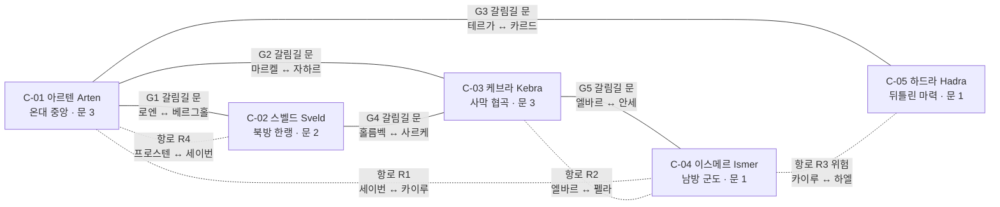

# 03_world — 세계: 대륙 · 국가 · 도시 · 종족 · 세력 관계 · 역사

## 1. 문서 정보

| 항목 | 내용 |
|---|---|
| 버전 | r1 |
| 작성일 | 2026-09-30 |
| 상태 | 검수 중 (배정: lore / player-market / roblox-tech) |
| 목적 | 3-A [진행 순서] 03번 정의: 대륙 · 국가 · 도시 · 종족 · 세력 관계 · 역사. 4-정량의 세계 기준(대륙 4+, 국가 8+, 도시 20+, 사냥터 30+, 종족 6+, 시작 위치 6+ · 3대륙, 비수직 검증표)을 이 문서에서 충족한다. |
| 의존 문서 | 00_BRIEF.md(기준), 01_reference.md(1장 용어 정의 · 4장 비수직 교훈 · 6장 IP 금지 목록), 02_concept.md(8절 설계 원칙 · 10절 정량 목표 · 14절 용어집), DECISIONS.md(D-01~D-25. 이 문서가 직접 적용하는 것: D-05 · D-08 · D-10 · D-12 · D-13 · D-15 · D-17 · D-20 · D-21 · D-22 · D-24), ASSUMPTIONS.md(A-01~A-12. A-10~A-12는 이 문서에서 제안, 14.2) |
| 이 문서를 기준으로 삼는 문서 | 04_progression(위험도 · 적정 구간 · 무관심 규칙 수치), 05_classes_skills(히든 직업 근원 지역), 06_items_crafting(재료 산지), 07_stories_hidden(아크 · 히든 피스 상세), 08_social_raid(레이드 보스 위치 · 거점 · 분쟁 구역), 09_ranking(탐험 랭킹 대상), 10_economy(교역로 · 재료 순환), 11_roblox_tech(플레이스 분할 단위), 12_mvp_roadmap(MVP 대륙 확정) |
| 표기 규칙 | 전부 한국어, 모든 고유명사는 한국어 + 영문 병기(A-05). 수치 · 반복 데이터는 표. 사실은 출처(14장), 그 외 수치는 **추정**. 레퍼런스 고유명사는 쓰지 않는다(01번 6장). |
| ID 접두어 | 대륙 C-, 국가 N-, 도시 T-, 사냥터/던전 H-, 종족 RC-, 세력 F-, 시작 위치 SP-, 아크 A-, 히든 피스 HP-, 대형 연결 사건 E-(07에서 상세) |
| 02번 가칭과의 관계 | 02번 5.1 · 11절의 대륙 · 시작 위치 · 종족 · 아크 이름은 가칭이었다(02번 1장 '가칭 규칙'). **이 문서의 이름 · ID가 확정본**이며, 02번은 이 문서 13장 색인에 맞춰 갱신한다(D-20: 시작 위치 7곳 · 대륙 5 · 13장 이름으로 통일, 14장 확인 필요 #1). |
| 용어 | 02번 14절 용어집을 그대로 쓴다. 단, 01번 r2 결정(01-r1-L-01 · L-02)에 따라 02번 용어집 #30은 **한정 장비(Limited Gear)**, #5의 둘째 분류는 **선착형 히든 피스**, #32는 **각성 홈(Awakening Socket)** 으로 읽는다(02번 갱신 대상, 14장 확인 필요 #1). |

---

## 2. 세계 개요와 지도

### 2.1 세계 한 단락

**베이라(Veyra)** 는 약 900년 전 **갈림의 날(The Great Parting)** 에 다섯 조각으로 갈라진 세계다. 그 전까지 대지는 하나였고, 고대 통일 왕조 **세르낙(Sernak)** 이 전송문과 마력 결정으로 세계를 묶고 있었다. 갈림의 날에 세르낙은 사라졌지만 그들의 유산 — 유적, 잃어버린 기술, 한정 장비, 히든 직업의 근원 — 은 다섯 대륙 곳곳에 흩어져 남았다. 지금의 국가들은 그 잔해 위에 세워졌고, 대륙 사이는 세르낙이 남긴 **갈림길 문(Crossroad Gate)** 과 항로로 이어진다. 정해진 주인공은 없다. 어느 대륙 어느 마을에서 시작하든, 그곳의 이야기가 다른 곳의 이야기와 맞물린다(3-B-2).

### 2.2 대륙 배치 그래프

- 실선 = 갈림길 문(고대 전송문, 즉시 이동). 점선 = 항로(정기 선편, 탑승 시 짧은 대기). 항로 R3는 위험도 4 해역을 지난다.
- 갈림길 문 · 항로 이용 조건: 레벨 · 평판 제한 없음(A-10). 첫 이용 시 문 옆 안내 NPC가 도착 대륙의 위험도 범위를 1줄로 알린다(3-C '위험도 표시'). 구현 방식(플레이스 텔레포트)은 11번에서 확정한다(14장 출처 #1).

### 2.3 대륙 표

| ID | 이름(영문) | 기후 · 지형 | 전반 위험도 범위 | 주요 국가 | 갈림길 문 수 | MVP 포함 여부 |
|---|---|---|---|---|---|---|
| C-01 | 아르텐 (Arten) | 온대. 평야 · 숲 · 강 · 완만한 구릉. 세계의 무역 중심 | 1~5 | N-01 카엘룬 왕국, N-02 브렌마르 자유도시연합 | 3 (G1 · G2 · G3) | **MVP 후보**(최종은 12번) |
| C-02 | 스벨드 (Sveld) | 한랭. 산악 · 설원 · 빙하 호수. 광물 산지 | 1~5 | N-03 카르니스 산왕국, N-04 이스텔 설원부족연맹 | 2 (G1 · G4) | **MVP 후보**(최종은 12번) |
| C-03 | 케브라 (Kebra) | 건조. 사막 · 협곡 · 오아시스 · 유리화된 모래 | 1~5 | N-05 미르잔 태양왕조, N-06 탈라 대상단 | 3 (G2 · G4 · G5) | 확장 1차 후보 |
| C-04 | 이스메르 (Ismer) | 열대. 군도 · 정글 · 산호해 · 폭풍 해역 | 1~5 | N-07 루카이 해상연합, N-08 벨로스 사원령 | 1 (G5) + 항로 3 | 확장 2차 후보 |
| C-05 | 하드라 (Hadra) | 뒤틀린 마력. 잿빛 평원 · 폐허 · 마력 균열. 남쪽 해안만 안정 | 1~6 (저위험 구역 2곳: H-35 위험도 1, H-36 위험도 2) | N-09 에스카 잔존 마도왕국, N-10 구르한 흑염 유목민 | 1 (G3) + 항로 1 | 확장 4차 후보 |

- 대륙 = 레벨 구간이 아니다(01번 4장 #9, D-13). 다섯 대륙 모두 1~60 전 구간 사냥터를 가진다(8 · 9장). 레벨 상한 확장(60→80→100) 시 새 구간 사냥터는 기존 대륙 2곳 이상을 포함해 배치하고, 신규 대륙은 개방 시점에 1~상한 전 구간을 가진다(D-13, 배치는 12번). 하드라만 저위험(위험도 1~2) 구역이 2곳(H-35, H-36)으로 적다.

### 2.4 갈림길 문 · 항로 표

| ID | 종류 | 양끝(도시 T-) | 대륙 | 이용 조건 | 이동 방식 | 항로 위험도 | 개방 단계 |
|---|---|---|---|---|---|---|---|
| G1 | 갈림길 문 | T-01 로엔 ↔ T-08 베르그홀 | C-01 ↔ C-02 | 없음 | 즉시(문 통과) | — | MVP |
| G2 | 갈림길 문 | T-04 마르켈 ↔ T-14 자하르 | C-01 ↔ C-03 | 없음 | 즉시 | — | 확장 1차 |
| G3 | 갈림길 문 | T-07 테르가 초소 ↔ T-24 카르드 전초기지 | C-01 ↔ C-05 | 없음(도착지 위험도 4 경고) | 즉시 | — | 확장 4차 |
| G4 | 갈림길 문 | T-11 홀름벡 ↔ T-16 사르케 | C-02 ↔ C-03 | 없음 | 즉시 | — | 확장 1차 |
| G5 | 갈림길 문 | T-18 엘바르 ↔ T-21 안세 | C-03 ↔ C-04 | 없음 | 즉시 | — | 확장 2차 |
| R1 | 항로 | T-03 세이번 ↔ T-20 카이루 | C-01 ↔ C-04 | 없음 | 정기 선편(대기 최대 60초, 추정) | 2 | 확장 2차 |
| R2 | 항로 | T-18 엘바르 ↔ T-23 펠라 | C-03 ↔ C-04 | 없음 | 정기 선편 | 2 | 확장 2차 |
| R3 | 항로(위험) | T-20 카이루 ↔ T-27 하엘 | C-04 ↔ C-05 | 없음(경고 배너) | 정기 선편, 항해 중 폭풍 이벤트 가능 | 4 | 확장 4차 |
| R4 | 항로 | T-12 프로스텐 ↔ T-03 세이번 | C-02 ↔ C-01 | 없음. 겨울 시즌엔 결빙으로 휴항(A-14 아크 소재) | 정기 선편 | 2 | MVP |

- MVP(아르텐 · 스벨드 후보)에서는 G1과 R4로 두 대륙이 두 경로로 이어진다. 한쪽이 막혀도(예: R4 결빙 이벤트) G1이 남는다.
- 도시 안 이동(같은 대륙)은 걷기 · 탈것 · 도시 간 마차/썰매/낙타/배 정기편(골드 소액, 10)으로 한다. 갈림길 문은 대륙 간 전용이다.

### 2.5 대륙별 테마 · 규칙 차이(대륙 = 레벨 구간이 아니라 '성격')

| 대륙 | 플레이 테마 | 대륙 고유 환경 규칙(원칙, 수치는 04) | 대표 재료 | 대표 세력 활동 |
|---|---|---|---|---|
| C-01 아르텐 | 교역 · 이야기 · 입문 | 없음(기준 대륙). 날씨는 연출만 | 철 · 은 · 가죽 · 목재 | 카엘룬-브렌마르 국경, 회색 등불 분소 |
| C-02 스벨드 | 제작 · 사냥 · 채광 | 눈보라 이벤트 중 시야 감소(전투 수치 영향 없음), 결빙 항로 | 철 · 은 · 별철 원석 · 상급 가죽 | 카르니스-이스텔 광산권, 모루 형제단 |
| C-03 케브라 | 탐험 · 교역 · 유적 | 낮 시간대 사막 이동 시 물통 소모(도시 · 오아시스에서 보충, 무료) | 구리 · 유리 · 마력 결정 · 독샘 | 미르잔-탈라 세금, 열쇠지기 접선 |
| C-04 이스메르 | 채집 · 항해 · 순례 | 배 필요 구역(H-29 · H-31 · H-32), 조수 이벤트 | 진주 · 해초 · 상급 목재 · 약초 | 루카이-벨로스-탈라 항로, 잠든 비늘 교단 |
| C-05 하드라 | 도전 · 균열 · 고룡 | 균열 영향 몬스터 비율 높음, 광기 지역 2곳(세계에서 이 대륙에만 있다, A-11), 저위험 구역은 남안(H-35)과 등불 초소 주변(H-36)만 | 최상급 마력 결정 · 고철 · 균열 재료 | 에스카-구르한 대립, 회색 등불 본부 |

- 환경 규칙은 '불편'이 아니라 '테마'다. 어느 규칙도 입장을 막거나 전투 스탯을 깎지 않는다(3-B-5).

---

## 3. 역사 연표와 현재 정세

### 3.1 연표

연도 표기: 갈림의 날 이전 = **BP N**(Before the Parting), 이후 = **AP N**(After the Parting). 현재는 **AP 900**.

| # | 연도 | 사건 | 남은 흔적(지역 · 세력) | 연결 대형 사건 |
|---|---|---|---|---|
| 1 | BP 620 | 세르낙 왕조 성립. 하나였던 대지를 마력 결정 도로와 전송문으로 묶기 시작 | 각 대륙의 세르낙 유적(H-06 · H-08 · H-24 · H-31 · H-38) | E-02 |
| 2 | BP 300 | 갈림길 문 5기 완공. 세르낙의 '왕도'는 지금의 하드라 중심부에 있었다 | 갈림길 문 G1~G5, 하드라 H-40 | E-02 |
| 3 | BP 120 | 고룡족 오르바르(RC-07)와 세르낙의 협약: 오르바르는 잠들고, 세르낙은 마력 결정 채굴을 제한한다 | H-16 토르마 옛 성채의 벽화, F-14 잠든 비늘 교단의 경전 | E-04 |
| 4 | BP 40 | 세르낙이 협약을 어기고 심층 마력 결정을 대량 채굴. 대장장이 명장들이 한정 장비의 원형을 만든다 | H-19 산왕의 옛 대장간, 한정 장비의 근원 | E-02 |
| 5 | AP 0 | **갈림의 날(The Great Parting)**. 대지가 다섯 조각으로 갈라지고 세르낙 왕조가 하루 만에 사라진다. 원인은 기록마다 다르다(마력 폭주 / 오르바르의 분노 / 왕조 내부 배신) | 모든 대륙의 단층 지형, 하드라 전역의 뒤틀린 마력 | E-01 · E-04 |
| 6 | AP 3 | 세르낙 잔존체 케슈(RC-08)가 하드라와 옛 유적에서 처음 목격된다 | H-24 · H-38 · H-40 | E-02 |
| 7 | AP 40 | 아르텐에서 카엘룬 왕국(N-01) 건국. 세르낙 관문 유적을 성벽 삼아 왕도 로엔을 세운다 | T-01 로엔, H-08 세르낙 관문 유적 | — |
| 8 | AP 85 | 스벨드의 드워프가 카르니스 산왕국(N-03)을 재건. 같은 해 설원 부족들이 이스텔 연맹(N-04)을 결성 | T-08 베르그홀, T-11 홀름벡 | — |
| 9 | AP 150 | 케브라에서 미르잔 태양왕조(N-05) 성립. 오아시스 수로(세르낙 유산)를 장악한 가문이 왕조가 된다 | T-14 자하르, H-26 지하 수로 사원 | E-02 |
| 10 | AP 260 | 이스메르에서 루카이 해상연합(N-07) 결성. 같은 세기에 벨로스 사원령(N-08)이 루카이에서 독립 | T-20 카이루, T-21 안세 | — |
| 11 | AP 380 | 하드라에서 에스카 잔존 마도왕국(N-09) 선포. 세르낙 왕가의 계승을 주장하지만 다른 국가는 인정하지 않는다 | T-25 오르멘 | E-02 |
| 12 | AP 520 | 아르텐 서해안 항구 도시들이 카엘룬에서 벗어나 브렌마르 자유도시연합(N-02)을 결성 | T-03 세이번, T-04 마르켈 | E-03 |
| 13 | AP 610 | 탈라 대상단(N-06)이 미르잔에게서 자치권을 사들여 국가급 상단이 된다. 첫 항로 협정(탈라 · 루카이 · 브렌마르) | T-16 사르케, 항로 R1 · R2 | E-03 |
| 14 | AP 700 | 구르한 흑염 유목민(N-10)의 대이동. 하드라 북부 잿빛 평원에 정착하고 에스카와 충돌 | T-26 조르하, H-39 | E-04 |
| 15 | AP 780 | 하드라에서 첫 마력 균열 관측. 각국 학자 · 사냥꾼이 모여 회색 등불(F-11)을 결성 | T-28 등불 초소, H-36 | E-01 |
| 16 | AP 850 | 갈림길 문 G1 · G2 재가동(회색 등불 + 카르니스 기술자). 이후 50년에 걸쳐 G3~G5 재가동 | G1~G5 | E-02 |
| 17 | AP 892 | 균열이 하드라 밖으로 번지기 시작. 아르텐 테르가, 스벨드 설원, 이스메르 산호해에서 변이 몬스터 첫 보고 | H-09 · H-13 · H-29 | E-01 |
| 18 | AP 897 | 케브라 유리사막에서 '고룡의 그림자' 첫 목격. 잠든 비늘 교단이 순례를 시작 | H-25 · H-41 | E-04 |
| 19 | AP 899 | 항로 협정 갱신 결렬. 탈라 · 루카이 · 브렌마르의 관세 분쟁 시작 | 항로 R1 · R2, T-03 · T-16 · T-20 | E-03 |
| 20 | AP 900 | **현재.** 플레이어가 베이라에 도착한다 | — | — |

### 3.2 현재 정세 요약(AP 900)

| 축 | 상태 | 플레이어에게 보이는 형태 |
|---|---|---|
| 균열(E-01) | 하드라에서 시작된 마력 균열이 네 대륙으로 번지는 중. 균열 근처 몬스터가 변이한다 | 사냥터 표의 '균열 영향' 몬스터, 회색 등불의 의뢰 |
| 유산(E-02) | 갈림길 문 재가동 이후 세르낙 유적이 다시 열리고 있다. 국가 · 결사 · 교단이 유산을 두고 경쟁 | 유적형 사냥터, 열쇠지기의 단서, 한정 장비 소문 |
| 항로(E-03) | 항로 협정 결렬로 탈라 · 루카이 · 브렌마르가 관세 · 항로 통제권을 다툰다. 무력 충돌은 없다 | 항구 도시 시세 변동, 호위 의뢰, 경제 이벤트 |
| 고룡(E-04) | 하드라 깊은 곳의 오르바르가 뒤척이기 시작. 그림자가 각 대륙에 나타난다 | 광기 지역, 잠든 비늘 교단의 순례, 토르마 · 구르한의 옛 노래 |
| 전쟁 | 국가 간 전면 전쟁은 없다(D-01). 긴장은 관세 · 국경 · 유산 경쟁 형태 | 세력 평판, (확장) 시즌제 거점 점령전 |

### 3.3 세르낙 유산의 종류(히든 피스의 세계관 근거)

| 유산 종류 | 정의 | 세계 속 위치(대표) | 게임 시스템으로의 연결 | 상세 문서 |
|---|---|---|---|---|
| 유적 | 세르낙의 건물 · 관문 · 묘역 · 선착장. 케슈가 지킨다 | H-06, H-08, H-16, H-24, H-31, H-38 | 유적형 사냥터, 히든 지역 입구, 기록물 | 07 |
| 잃어버린 기술 | 전송문 · 마력 결정 정제 · 자동인형 제작법 | H-05 자동인형, H-26 수로, G1~G5 | 상위 도안, 작업대 등급 상승 재료, 히든 스킬 | 05, 06 |
| 한정 장비의 원형 | BP 40 명장들이 만든 무구. 세계 전체 수량 N개, 유니버스 단위 관리 | H-11, H-19, H-25, H-34, H-38, H-40, H-41 | 한정 장비(초월 등급 태그), 단서는 저위험 지역부터 | 06, 07, 11 |
| 히든 직업의 근원 | 세르낙 궁정의 직책(서고지기 · 명장 · 수로 관리인 · 시련 감독관 · 첨탑 마도사)이 남긴 각성 홈 | H-11, H-19, H-24, H-33, H-38 | 히든 직업 5+(상위 분기형 · 별개형, D-09) | 05, 07 |
| 인장 | 세르낙이 도로 · 수로에 새긴 표식. 지역 귀속 성장 자원 | 모든 대륙(도시 · 사냥터 · 유적) | 인장 게이지(단일 게이지, 01번 4장 #2) | 04 |
| 기록물 | 비석 · 벽화 · 서고의 책. 갈림의 날의 원인이 기록마다 다르다 | H-06, H-11, H-16, H-24, T-21 | 선택 열람 장문 서사(A-08), 아크 단서 | 07 |

---

## 4. 국가 · 세력

### 4.1 국가 표

| ID | 이름(영문) | 대륙 | 정치 체제 | 수도(T-) | 주력 종족 | 경제 기반 | 군사 · 성향 | 세력 F- ID |
|---|---|---|---|---|---|---|---|---|
| N-01 | 카엘룬 왕국 (Kaelun) | C-01 | 세습 왕정 + 영주 회의 | T-01 로엔 | 인간, 타르쉬 | 농업 · 목축 · 내륙 교역 | 상비군 중심 · 보수적 · 질서 중시 | F-01 |
| N-02 | 브렌마르 자유도시연합 (Brenmar) | C-01 | 도시 대표 의회(의장 순환) | T-04 마르켈 | 인간, 엘프, 드워프 | 해상 무역 · 제작 · 경매 | 용병 계약 · 실리적 · 개방적 | F-02 |
| N-03 | 카르니스 산왕국 (Karnis) | C-02 | 산왕 + 장인 길드 평의회 | T-08 베르그홀 | 드워프, 토르마 | 광업 · 대장간 · 마력 결정 정제 | 요새 방어 · 전통 · 기술 자부심 | F-03 |
| N-04 | 이스텔 설원부족연맹 (Istel) | C-02 | 부족장 집회(연 1회) | T-11 홀름벡 | 인간, 타르쉬, 토르마 | 사냥 · 가죽 · 얼음 호수 어업 | 기동 사냥대 · 자유 · 자연 존중 | F-04 |
| N-05 | 미르잔 태양왕조 (Mirzan) | C-03 | 태양왕 세습 + 수로 관리청 | T-14 자하르 | 인간, 아이셀 | 오아시스 농업 · 수로 통행세 · 유리 | 궁정 근위 · 위계 · 화려함 | F-05 |
| N-06 | 탈라 대상단 (Tala) | C-03 | 상단주 선출(주주 총회) | T-16 사르케 | 인간, 타르쉬, 드워프 | 대상 무역 · 항로 · 금융 | 호위단 · 계산적 · 계약 존중 | F-06 |
| N-07 | 루카이 해상연합 (Lukai) | C-04 | 선단장 평의회 | T-20 카이루 | 인간, 타르쉬, 엘프 | 어업 · 항해 · 진주 · 조선 | 함대 · 모험적 · 느슨한 규율 | F-07 |
| N-08 | 벨로스 사원령 (Velos) | C-04 | 대사제 + 사원 회의 | T-21 안세 | 아이셀, 엘프 | 순례 · 약초 · 기록물 필사 | 사원 수호대 · 신중 · 지식 보존 | F-08 |
| N-09 | 에스카 잔존 마도왕국 (Eska) | C-05 | 마도왕 세습(세르낙 계승 주장) | T-25 오르멘 | 인간, 아이셀, 케슈(비플레이어블) | 유적 발굴 · 마력 결정 · 폐허 재활용 | 마도 방벽 · 폐쇄적 · 과거 지향 | F-09 |
| N-10 | 구르한 흑염 유목민 (Gurhan) | C-05 | 씨족장 연합(흑염 회의) | T-26 조르하 | 토르마, 타르쉬, 인간 | 유목 · 잿빛 평원 사냥 · 균열 재료 | 기마 사냥대 · 강인 · 약속 중시 | F-10 |

- 국가(N-)는 지리 · 행정 단위, 세력(F-)은 플레이어가 평판으로 소속을 고르는 NPC 조직이다(01번 1장 용어 정의). 국가 10개는 세력과 1:1이다.

### 4.2 비국가 세력 표

| ID | 이름(영문) | 성격 | 본부(T-) | 활동 대륙 | 목표 | 플레이어 소속 조건(원칙, 상세 07) |
|---|---|---|---|---|---|---|
| F-11 | 회색 등불 (Grey Lantern) | 균열 감시 · 학자 · 사냥꾼 연합 | T-28 등불 초소 | 전 대륙 | 균열의 원인 규명과 확산 저지 | 균열 영향 몬스터 처치 · 조사 의뢰 평판 |
| F-12 | 열쇠지기 (Keywardens) | 세르낙 유산 수집 비밀결사 | 고정 본부 없음(각 대륙 접선책, T-03 · T-14 · T-21에 첫 접선) | 전 대륙 | 유산을 국가가 아닌 '지킬 자'에게 | 유적 탐사 · 기록물 수집 평판, 첫 접선은 히든 단서로만 |
| F-13 | 모루 형제단 (Anvil Brotherhood) | 국가에 속하지 않는 자유 대장장이 조합 | T-09 코르딘 | 전 대륙(각 도시 대장간) | 제작 지식의 공유, 한정 장비 복원 | 제작 · 수리 · 도안 납품 평판(대장장이 외 직업도 가능) |
| F-14 | 잠든 비늘 교단 (Order of the Sleeping Scale) | 고룡 오르바르 숭배 · 순례 교단 | T-21 안세 | 이스메르 · 케브라 · 하드라 | 오르바르를 깨우지 않고 달래는 것 | 순례 · 기록물 열람 평판 |

### 4.3 세력 관계 행렬

5단계: **동맹(A)** / **우호(F)** / **중립(N)** / **긴장(T)** / **적대(H)**. 대각선은 자기 자신. 행 = 기준 세력, 열 = 상대. 관계는 대칭이다.

| | F-01 카엘룬 | F-02 브렌마르 | F-03 카르니스 | F-04 이스텔 | F-05 미르잔 | F-06 탈라 | F-07 루카이 | F-08 벨로스 | F-09 에스카 | F-10 구르한 | F-11 회색 등불 | F-12 열쇠지기 | F-13 모루 형제단 | F-14 잠든 비늘 |
|---|---|---|---|---|---|---|---|---|---|---|---|---|---|---|
| **F-01 카엘룬** | — | T | A | N | F | N | N | N | H | N | F | T | N | N |
| **F-02 브렌마르** | T | — | F | N | N | T | T | N | N | N | F | N | A | N |
| **F-03 카르니스** | A | F | — | T | N | F | N | N | T | N | F | T | F | N |
| **F-04 이스텔** | N | N | T | — | N | N | F | N | N | F | F | N | N | N |
| **F-05 미르잔** | F | N | N | N | — | T | N | F | T | N | N | T | N | F |
| **F-06 탈라** | N | T | F | N | T | — | T | N | N | F | N | N | F | N |
| **F-07 루카이** | N | T | N | F | N | T | — | T | N | N | F | N | N | N |
| **F-08 벨로스** | N | N | N | N | F | N | T | — | T | N | F | T | N | A |
| **F-09 에스카** | H | N | T | N | T | N | N | T | — | H | T | T | N | T |
| **F-10 구르한** | N | N | N | F | N | F | N | N | H | — | F | N | N | N |
| **F-11 회색 등불** | F | F | F | F | N | N | F | F | T | F | — | N | F | T |
| **F-12 열쇠지기** | T | N | T | N | T | N | N | T | T | N | N | — | F | N |
| **F-13 모루 형제단** | N | A | F | N | N | F | N | N | N | N | F | F | — | N |
| **F-14 잠든 비늘** | N | N | N | N | F | N | N | A | T | N | T | N | N | — |

집계(14×14, 91쌍): 동맹 3쌍 / 우호 19쌍 / 중립 49쌍 / 긴장 18쌍 / 적대 2쌍. 동맹 = F-01↔F-03, F-02↔F-13, F-08↔F-14. 적대 = F-01↔F-09, F-09↔F-10.

### 4.4 긴장 · 적대 관계의 이유(07 아크의 씨앗)

| 쌍 | 관계 | 이유(한 줄) | 씨앗이 되는 아크 |
|---|---|---|---|
| F-01 카엘룬 ↔ F-02 브렌마르 | 긴장 | AP 520 독립 이후 국경 관세와 오르덴 국경 순찰권을 다툰다 | A-05 |
| F-01 카엘룬 ↔ F-09 에스카 | 적대 | 에스카가 세르낙 계승을 근거로 아르텐의 관문 유적(H-08) 소유권을 주장 | A-07 · A-25 |
| F-01 카엘룬 ↔ F-12 열쇠지기 | 긴장 | 열쇠지기가 왕도 서고(H-11)의 유산을 반출했다는 의심 | A-06 |
| F-02 브렌마르 ↔ F-06 탈라 | 긴장 | 항로 협정 결렬(AP 899), 관세 · 항로 통제권 | A-03 · A-16 |
| F-02 브렌마르 ↔ F-07 루카이 | 긴장 | 같은 항로 분쟁. 루카이는 브렌마르 선박의 산호해 통과세를 올렸다 | A-23 · A-14 |
| F-03 카르니스 ↔ F-04 이스텔 | 긴장 | 서리송곳 능선(H-14) 광산권 vs 사냥권 | A-12 |
| F-03 카르니스 ↔ F-09 에스카 | 긴장 | 에스카가 산왕의 옛 대장간(H-19) 도안을 요구 | A-11 |
| F-03 카르니스 ↔ F-12 열쇠지기 | 긴장 | 열쇠지기가 드워프 명장의 도안을 '지킨다'며 가져갔다 | A-11 |
| F-05 미르잔 ↔ F-06 탈라 | 긴장 | 탈라의 자치권 매입(AP 610) 이후 수로 통행세 · 대상 세금 분쟁 | A-16 · A-18 |
| F-05 미르잔 ↔ F-09 에스카 | 긴장 | 태양왕조 묘역(H-24)의 케슈 출현을 에스카 탓으로 여긴다 | A-17 |
| F-05 미르잔 ↔ F-12 열쇠지기 | 긴장 | 오아시스 수로(세르낙 유산)의 열쇠를 두고 경쟁 | A-15 |
| F-06 탈라 ↔ F-07 루카이 | 긴장 | 항로 협정 결렬. 폭풍 군도(H-32) 등대 통제권 | A-23 |
| F-07 루카이 ↔ F-08 벨로스 | 긴장 | 벨로스 독립(AP 260) 이후 순례선 통행세와 산호해 어업권 | A-21 |
| F-08 벨로스 ↔ F-09 에스카 | 긴장 | 에스카의 마력 결정 채굴이 오르바르를 깨운다고 본다 | A-29 · A-30 |
| F-08 벨로스 ↔ F-12 열쇠지기 | 긴장 | 사원의 기록물 반출 시도 | A-22 |
| F-09 에스카 ↔ F-10 구르한 | 적대 | AP 700 대이동 이후 잿빛 평원(H-39)의 영역 충돌. 무력 충돌은 소규모 · 국지적 | A-26 |
| F-09 에스카 ↔ F-11 회색 등불 | 긴장 | 회색 등불이 균열의 원인으로 에스카의 채굴을 지목 | A-27 |
| F-09 에스카 ↔ F-12 열쇠지기 | 긴장 | 세르낙 유산의 '정당한 상속자' 다툼 | A-25 |
| F-09 에스카 ↔ F-14 잠든 비늘 | 긴장 | 오르바르를 '자원'으로 보는 에스카와 '잠들게 둬야 할 존재'로 보는 교단 | A-29 · A-30 |
| F-11 회색 등불 ↔ F-14 잠든 비늘 | 긴장 | 균열의 원인을 두고 학설 대립(마력 vs 고룡) | A-27 · A-19 |

- 적대 관계도 국가 간 전면 전쟁으로 가지 않는다(D-01). 플레이어 평판이 적대 세력 양쪽에 걸쳐 있으면 한쪽 상점 가격 · 의뢰가 제한될 뿐 입장 차단은 없다(상세 07 · 10).

### 4.5 점령전 거점과 분쟁 구역(확장 · MVP)

01번 1장 용어 정의: 거점 = 점령전 전용 고정 장소(도시 · 시작 위치 · 수도 제외), 평시 외곽 개방 · 핵 구역 봉쇄. 분쟁 구역 = 진입 시 경고 · 동의가 필요한 지정 PvP 지역(MVP). ID 접두어는 거점 ST-, 분쟁 구역 PZ-(D-23)이며 번호는 08에서 부여한다(여기서는 이름만).

| 구분 | 이름(영문) | 대륙 | 인접 사냥터 | 인접 도시 | 단계 |
|---|---|---|---|---|---|
| 거점 | 은빛 강 요새 (Silverrun Fort) | C-01 | H-07 | T-05 | 확장 3차 |
| 거점 | 서리송곳 망루 (Frostspike Watch) | C-02 | H-14 | T-11 | 확장 3차 |
| 거점 | 협곡 관문 (Canyon Gate) | C-03 | H-23 | T-17 | 확장 3차 |
| 거점 | 등대섬 (Beacon Isle) | C-04 | H-32 | T-23 | 확장 3차 |
| 거점 | 잿빛 첨탑 터 (Ash Spire Site) | C-05 | H-39 | T-26 | 확장 3차 |
| 분쟁 구역 | 강 건너 모래톱 (Far Sandbar) — H-07 안의 표시 구역 | C-01 | H-07 | T-05 | MVP |
| 분쟁 구역 | 재의 고리 (Ash Ring) — H-39 안의 표시 구역 | C-05 | H-39 | T-26 | 확장 4차 |

---

## 5. 종족 표

초기 스탯 보정은 6스탯(힘/민첩/체력/지력/정신/기교) 기준, 각 ±2 이내, 총합 0. 종족 특성은 전투 외 유틸 위주(D-08: 종족과 시작 위치는 독립).

| ID | 이름(영문) | 플레이어블 | 고향(대륙 · 지역) | 외형 · 수명 | 문화 | 초기 스탯 보정(힘/민첩/체력/지력/정신/기교) | 종족 특성(유틸) | 다른 종족과의 관계 |
|---|---|---|---|---|---|---|---|---|
| RC-01 | 인간 (Human) | 예 | 전 대륙(대표: C-01 아르텐) | 다양. 수명 약 80년 | 적응력 · 상업 · 왕국 건설. 모든 세력에 있다 | 0/0/0/0/0/0 | **넓은 발**: 모든 세력 평판 획득 +10% | 모두와 무난. 에스카 인간은 타 대륙에서 경계받음 |
| RC-02 | 드워프 (Dwarf) | 예 | C-02 스벨드 · 카르니스 | 단신 · 넓은 어깨. 수명 약 250년 | 장인 · 광업 · 가문 명예. 도안을 가보로 여김 | +1/-1/+1/-1/0/0 | **광맥 감각**: 광석 채집 속도 +15%, 지도에 광맥 표시 범위 +20% | 카르니스-이스텔 긴장으로 타르쉬 · 이스텔 인간과 미묘. 토르마와는 오랜 동료 |
| RC-03 | 엘프 (Elf) | 예 | C-04 이스메르 · 벨로스, C-01 브렌마르 | 장신 · 긴 귀. 수명 약 400년 | 기록 · 약초 · 항해 관측. 사원령과 자유도시에 분산 | -1/+1/-1/+1/0/0 | **약초 눈**: 약초 · 목재 채집 노드 발견 범위 +25% | 벨로스-루카이 긴장의 중간자. 아이셀과 학문적 교류 |
| RC-04 | 타르쉬 (Tarsh, 수인) | 예 | C-02 이스텔, C-05 구르한, C-01 카엘룬 변경 | 털 · 꼬리 · 짐승 귀. 수명 약 60년 | 사냥 · 추적 · 무리 · 약속. 부족 단위 이동 | 0/+2/0/-1/-1/0 | **추적자의 코**: 몬스터 · 채집물 발자국 표시(반경 30m, 추정), 이동 속도 +3% | 이스텔 · 구르한에서 존중. 카엘룬 도시에서는 '변경 사람' 취급 |
| RC-05 | 아이셀 (Aisel, 정령혈) | 예 | C-03 미르잔, C-04 벨로스, C-05 에스카 | 피부에 옅은 빛무늬. 수명 약 150년 | 마력 · 기록 · 의례. 세르낙 궁정 학자의 후예라는 설 | -1/0/-1/+1/+2/-1 | **결정 공명**: 마력 결정 채집량 +15%, 균열 방향 감지(지도 화살표) | 에스카 계열 아이셀은 타 대륙에서 의심받음. 엘프와 교류 |
| RC-06 | 토르마 (Torma, 거인혈) | 예 | C-02 스벨드 산중, C-05 구르한 | 2.3m 안팎 · 굵은 팔. 수명 약 120년 | 성채 · 노래 · 옛 협약의 전승. 오르바르 전설의 전승자 | +2/-1/+1/-1/-1/0 | **넓은 등**: 가방 무게 상한 +20%, 채집물 운반 시 이동 속도 저하 없음 | 드워프의 오랜 동료. 구르한에서 씨족장 다수. 에스카를 불신 |
| RC-07 | 오르바르 (Orvar, 고룡족) | **아니오** | C-05 하드라 심장부(H-40), 각 대륙 그림자 | 거대 비늘 생물. 수명 불명(수천 년) | 잠든 존재. 협약과 분노만 남아 있다 | — | — | 잠든 비늘 교단이 숭배, 에스카가 자원으로 봄. E-04의 축 |
| RC-08 | 케슈 (Kesh, 세르낙 잔존체) | **아니오** | 세르낙 유적 전반, C-05 하드라 | 반투명 · 옛 세르낙 복식의 잔영. 수명 없음 | 갈림의 날에 멈춘 존재. 옛 명령을 반복하거나 새 명령을 기다림 | — | — | 유적 파수꾼(적) 또는 이야기 NPC(중립). 에스카가 '백성'이라 부름 |

- 스탯 보정 합계 검산: RC-02 (+1-1+1-1+0+0)=0, RC-03 (-1+1-1+1+0+0)=0, RC-04 (0+2+0-1-1+0)=0, RC-05 (-1+0-1+1+2-1)=0, RC-06 (+2-1+1-1-1+0)=0.
- 종족 특성 수치는 **추정**이며 04에서 확정한다. 전투 스탯에 직접 영향을 주는 특성은 없다.
- 고향 종족 보너스(D-08): 시작 위치의 고향 종족이면 첫 아크 대사 변형 + 해당 세력 초기 평판 +50(추정). 다른 보너스 없음.

### 5.1 플레이어블 종족 간 관계 행렬

5단계(4.3과 동일 표기). 게임 규칙에는 영향이 없고 NPC 대사 · 아크 분기의 소재로만 쓴다(07).

| | RC-01 인간 | RC-02 드워프 | RC-03 엘프 | RC-04 타르쉬 | RC-05 아이셀 | RC-06 토르마 |
|---|---|---|---|---|---|---|
| **RC-01 인간** | — | F | N | N | N | N |
| **RC-02 드워프** | F | — | N | T | N | A |
| **RC-03 엘프** | N | N | — | N | F | N |
| **RC-04 타르쉬** | N | T | N | — | N | F |
| **RC-05 아이셀** | N | N | F | N | — | T |
| **RC-06 토르마** | N | A | N | F | T | — |

| 쌍 | 관계 | 이유 |
|---|---|---|
| 드워프 ↔ 토르마 | 동맹 | 카르니스 재건(AP 85)을 함께 했다. 토르마가 성채를, 드워프가 갱도를 |
| 드워프 ↔ 타르쉬 | 긴장 | 서리송곳 능선 광산권 · 사냥권 분쟁(A-12)의 양쪽 |
| 아이셀 ↔ 토르마 | 긴장 | 토르마의 전승은 세르낙 궁정(아이셀의 선조)이 협약을 깼다고 노래한다(A-13) |
| 인간 ↔ 드워프 | 우호 | 카엘룬-카르니스 동맹(F-01 ↔ F-03) |
| 엘프 ↔ 아이셀 | 우호 | 벨로스 사원에서 기록물을 함께 필사한다 |
| 타르쉬 ↔ 토르마 | 우호 | 구르한 씨족 연합의 두 축 |

### 5.2 종족별 고향 도시와 시작 위치 매핑

| 종족 | 고향 도시(대사 변형이 있는 곳) | 고향 종족으로 지정된 시작 위치 | 비고 |
|---|---|---|---|
| RC-01 인간 | T-01, T-02, T-03, T-04, T-05, T-06, T-14 | SP-01, SP-02 | 가장 넓은 고향 범위 |
| RC-02 드워프 | T-08, T-09, T-13 | SP-03 | — |
| RC-03 엘프 | T-19, T-21, T-23, T-04 | SP-06 | 브렌마르 엘프는 항해 관측사 |
| RC-04 타르쉬 | T-10, T-11, T-29, T-26, T-05 | SP-04 | 카엘룬 변경(T-05)에도 소수 |
| RC-05 아이셀 | T-15, T-14, T-21, T-24, T-25 | SP-05, SP-07 | SP-07의 고향 종족은 에스카 계열 아이셀 |
| RC-06 토르마 | T-13, T-26, T-08 | (없음) | 고향 종족 시작 위치가 없다. 8번째 시작 위치 후보로 T-13 이르멘(위험도 2, 인접 H-16은 4)은 가능하나 마을 규모, T-26 조르하는 위험도 4. 14장 확인 필요 #2 참조 |

---

## 6. 도시 · 마을 표

규모: 수도 / 도시 / 마을 / 전초기지(야영지 포함). **도시 위험도** = 성문 밖 순찰 범위에 나오는 일반 몬스터의 레벨 밴드(D-12 척도). 도시 내부는 안전 구역(몬스터 없음). 순찰대가 있는 도시는 인접 사냥터보다 1~2 낮을 수 있다(수도는 1, 하드라의 수도 · 집결지는 4). 대장간 등급 1~5(D-03 작업대 등급과 연동, 06에서 확정). 부활 지점 = 사망 시 선택 가능한 부활 위치(D-05 (4)). 야영지 정의: T- ID를 가진 소규모 거주지는 여기 표에, 사냥터 안의 야영지는 8장 '부활 지점' 열로 표기한다(01-r3-L-01 반영, ID 없음).

| ID | 이름(영문) | 대륙 / 국가 | 규모 | 위험도 | 대장간 | 상점 | 경매장 | 길드 관리 | 갈림길 문 | 항구 | 부활 지점 | 특징 한 줄 | 시작 위치 |
|---|---|---|---|---|---|---|---|---|---|---|---|---|---|
| T-01 | 로엔 (Roen) | C-01 / N-01 | 수도 | 1 | 4 | 전 품목 | ○ | ○ | G1 | × | ○ | 세르낙 관문 유적을 성벽으로 쓴 왕도. 왕립 서고 입구 | — |
| T-02 | 해든 마을 (Hadden) | C-01 / N-01 | 마을 | 1 | 1 | 기본 | × | × | × | × | ○ | 무너진 다리 때문에 유명해진 변경 마을 | **SP-01** |
| T-03 | 세이번 (Seyburn) | C-01 / N-02 | 도시 | 1 | 3 | 전 품목 | ○ | ○ | × | ○ R1 · R4 | ○ | 브렌마르 최대 항구. 하수도 아래에 옛 인장이 있다 | **SP-02** |
| T-04 | 마르켈 (Markel) | C-01 / N-02 | 수도 | 1 | 4 | 전 품목 | ○ | ○ | G2 | × | ○ | 의회 도시. 대극장이 무너진 뒤 지하가 사냥터가 됐다 | — |
| T-05 | 오르덴 요새마을 (Orden Hold) | C-01 / N-01 | 마을 | 2 | 2 | 기본 · 무기 | × | ○ | × | × | ○ | 카엘룬-브렌마르 국경. 순찰대 본부 | — |
| T-06 | 윈모어 목장촌 (Winmoor) | C-01 / N-01 | 마을 | 2 | 1 | 기본 · 가죽 | × | × | × | × | ○ | 늪 옆 목장. 밤마다 울음소리가 난다 | — |
| T-07 | 테르가 초소 (Terga Post) | C-01 / N-01 | 전초기지 | 4 | 2 | 기본 · 수리 | × | × | G3 | × | ○ | 하드라로 가는 문을 지키는 초소. 회색 등불 분소 | — |
| T-08 | 베르그홀 (Berghol) | C-02 / N-03 | 수도 | 1 | 5 | 전 품목 | ○ | ○ | G1 | × | ○ | 산속 왕도. 세계 최고 등급 대장간 | — |
| T-09 | 코르딘 광산 마을 (Kordin) | C-02 / N-03 | 마을 | 1 | 3 | 기본 · 광석 | × | × | × | × | ○ | 모루 형제단 본부. 용광로가 멈춘 적이 있다 | **SP-03** |
| T-10 | 스케른 야영지 (Skern Camp) | C-02 / N-04 | 전초기지 | 1 | 1 | 기본 · 가죽 | × | × | × | × | ○ | 이스텔 사냥꾼의 겨울 야영지 | **SP-04** |
| T-11 | 홀름벡 (Holmbek) | C-02 / N-04 | 수도 | 2 | 2 | 기본 · 가죽 · 식량 | × | ○ | G4 | × | ○ | 부족 집회지. 연 1회 집회 때만 수도 기능 | — |
| T-12 | 프로스텐 (Frosten) | C-02 / N-04 | 도시 | 2 | 2 | 전 품목 | ○ | ○ | × | ○ R4 | ○ | 얼음항. 겨울엔 배가 얼어붙는다 | — |
| T-13 | 이르멘 (Irmen) | C-02 / N-03 | 마을 | 2 | 2 | 기본 | × | × | × | × | ○ | 토르마 산중 마을. 옛 성채의 노래를 전승 | — |
| T-14 | 자하르 (Zahar) | C-03 / N-05 | 수도 | 1 | 4 | 전 품목 | ○ | ○ | G2 | × | ○ | 태양왕도. 수로 관리청이 오아시스를 통제 | — |
| T-15 | 나임 (Naim) | C-03 / N-05 | 도시 | 1 | 2 | 기본 · 식량 · 유리 | × | ○ | × | × | ○ | 오아시스 도시. 모래 아래에서 목소리가 들린다 | **SP-05** |
| T-16 | 사르케 (Sarke) | C-03 / N-06 | 수도 | 2 | 3 | 전 품목 | ○ | ○ | G4 | × | ○ | 대상단 본거지. 시세판이 도시 한가운데 있다 | — |
| T-17 | 라흐마 협곡 마을 (Rahma) | C-03 / N-06 | 마을 | 3 | 2 | 기본 · 수리 | × | × | × | × | ○ | 협곡 다리 통행세로 먹고 사는 마을 | — |
| T-18 | 엘바르 (Elvar) | C-03 / N-05 | 도시 | 2 | 2 | 전 품목 | × | ○ | G5 | ○ R2 | ○ | 케브라 남부 항구. 유리사막 순례의 출발점 | — |
| T-19 | 토모 섬 (Tomo Isle) | C-04 / N-07 | 마을 | 1 | 1 | 기본 · 어구 | × | × | × | ○(소형 선착장) | ○ | 루카이 어촌. 그물이 비기 시작했다 | **SP-06** |
| T-20 | 카이루 (Kairu) | C-04 / N-07 | 수도 | 1 | 3 | 전 품목 | ○ | ○ | × | ○ R1 · R3 | ○ | 해상연합 본항. 선단장 평의회 | — |
| T-21 | 안세 (Anse) | C-04 / N-08 | 수도 | 1 | 2 | 기본 · 약초 · 기록물 | × | ○ | G5 | × | ○ | 벨로스 대사원. 잠든 비늘 교단 본부 | — |
| T-22 | 무라 전초기지 (Mura Post) | C-04 / N-08 | 전초기지 | 3 | 1 | 기본 · 수리 | × | × | × | × | ○ | 정글 안 순례 중계지 | — |
| T-23 | 펠라 (Pela) | C-04 / N-07 | 도시 | 1 | 2 | 전 품목 | ○ | ○ | × | ○ R2 | ○ | 산호 시장 섬. 경매장이 시장 위에 떠 있다 | — |
| T-24 | 카르드 전초기지 (Kard Outpost) | C-05 / N-09 | 전초기지 | 4 | 2 | 기본 · 수리 | × | × | G3 | × | ○ | 에스카 폐허 전초기지. '숙련자용 도전 시작' | **SP-07** |
| T-25 | 오르멘 (Ormen) | C-05 / N-09 | 수도 | 4 | 4 | 전 품목 | ○ | ○ | × | × | ○ | 마도 방벽 안의 잔존 왕도. 케슈가 거리를 걷는다 | — |
| T-26 | 조르하 (Zorha) | C-05 / N-10 | 도시 | 4 | 2 | 기본 · 가죽 · 균열 재료 | × | ○ | × | × | ○ | 흑염 유목민 대집결지. 천막이 도시가 됐다 | — |
| T-27 | 하엘 (Hael) | C-05 / N-10 | 마을 | 2 | 1 | 기본 · 어구 | × | × | × | ○ R3 | ○ | 하드라 남안의 조용한 항구. 대륙에서 가장 안전한 곳 | — |
| T-28 | 등불 초소 (Lantern Post) | C-05 / F-11 | 전초기지 | 2 | 2 | 기본 · 수리 | × | × | × | × | ○ | 회색 등불 본부. 균열 관측탑 | — |
| T-29 | 요르나 (Jorna) | C-02 / N-04 | 마을 | 2 | 1 | 기본 · 식량 | × | × | × | × | ○ | 얼음 호수 마을. 겨울 낚시 | — |

- 집계: 29곳(수도 9, 도시 6, 마을 9, 전초기지 5 = 29). 대륙별 아르텐 7, 스벨드 7, 케브라 5, 이스메르 5, 하드라 5. 4-정량 20+ 충족.
- 대장간 등급이 0인 도시는 없다(모든 거주지에서 수리 가능). 경매장은 유니버스 공유(11).
- 갈림길 문 위치 검산: G1 T-01↔T-08, G2 T-04↔T-14, G3 T-07↔T-24, G4 T-11↔T-16, G5 T-18↔T-21. 대륙별 문 수: 아르텐 3, 스벨드 2, 케브라 3, 이스메르 1, 하드라 1(2.3 표와 일치).

---

## 7. 시작 위치 표

7곳(SP-01~07, D-20), 5개 대륙(아르텐 2 · 스벨드 2 · 케브라 1 · 이스메르 1 · 하드라 1). 4-정량 '6+, 3개 대륙' 충족. 시작 카드 항목은 02번 5.1 기준. 위험도 열은 D-21 형식 '도시 위험도 (반경 사냥터 위험도 범위)'.

| ID | 도시(T-) | 대륙 | 위험도 | 고향 종족 | 추천 태그(2) | 첫 화면 한 줄 소개 | 첫 아크 | 반경 내 사냥터 3곳 | 닿을 수 있는 아크(3+) | 첫 10분 권장 동선(강제 아님, 3-B-2) |
|---|---|---|---|---|---|---|---|---|---|---|
| SP-01 | T-02 해든 마을 | C-01 아르텐 | 1 (반경 1~2) | RC-01 인간 | 이야기 · 전투 | "다리가 무너진 변경 마을. 처음이라면 여기서." (입문 추천) | A-01 | H-01, H-02, H-03 | A-01, A-02, A-05, A-08 | 무너진 다리(대시) → 들판 들쥐 2~3마리 → 촌장 부탁(전투/채집 택1) → 갈림길 표지판(A-01 2장 / A-02 잿나무 숲 / H-03 국경 언덕) · 갈림길 제단(직업 체험, D-10) |
| SP-02 | T-03 세이번 | C-01 아르텐 | 1 (반경 1~2) | RC-01 인간 | 교역 · 제작 | "브렌마르 최대 항구. 만들고, 사고, 팔고 싶다면." (상업 · 제작 추천) | A-03 | H-05, H-02, H-04 | A-03, A-04, A-02, A-08 | 부두 하역 사고(점프 · 대시) → 하수도 입구 쥐 → 항만 서기 부탁(하수도 조사/화물 분류 택1) → 대장간 앞 표지판(A-03 2장 / H-05 하수도 / 경매장) |
| SP-03 | T-09 코르딘 광산 마을 | C-02 스벨드 | 1 (반경 1~2) | RC-02 드워프 | 제작 · 광산 | "용광로가 멈춘 광산 마을. 대장장이의 길." (대장장이 추천) | A-09 | H-12, H-14, H-18 | A-09, A-11, A-12, A-13 | 갱도 낙석(대시) → 상층 갱도 동굴 두더지 → 형제단 장인 부탁(광석 채집/갱도 청소 택1) → 작업대 첫 사용 → 표지판(A-09 2장 / H-12 / H-14 능선 방향) |
| SP-04 | T-10 스케른 야영지 | C-02 스벨드 | 1 (반경 1~2) | RC-04 타르쉬 | 사냥 · 탐험 | "설원의 겨울 야영지. 발자국을 따라가라." (사냥 추천) | A-10 | H-13, H-14, H-20 | A-10, A-12, A-13, A-14 | 눈사태 길(대시) → 설원 눈토끼 · 얼음여우 → 사냥대장 부탁(추적/덫 설치 택1) → 발자국 표지(A-10 2장 / H-20 얼음호수 / H-14 능선) |
| SP-05 | T-15 나임 | C-03 케브라 | 1 (반경 1~2) | RC-05 아이셀 | 탐험 · 히든 | "모래 아래 목소리가 들리는 오아시스 도시." (탐험 추천) | A-15 | H-21, H-22, H-27 | A-15, A-16, A-18, A-19 | 무너진 수로 벽(대시) → 오아시스 외곽 모래전갈 → 수로 관리인 부탁(수로 탐사/도둑 흔적 택1) → 표지판(A-15 2장 / H-22 고원 / H-27 은거지) |
| SP-06 | T-19 토모 섬 | C-04 이스메르 | 1 (반경 1~2) | RC-03 엘프 | 채집 · 항해 | "그물이 비기 시작한 어촌 섬. 바다가 부른다." (채집 · 항해 추천) | A-20 | H-28, H-29, H-30 | A-20, A-22, A-23, A-24 | 끊어진 잔교(점프 · 대시) → 갯벌 게 · 조개 → 어촌장 부탁(조개 채집/게 처치 택1) → 선착장 표지판(A-20 2장 / H-29 얕은 바다(배) / H-30 정글) |
| SP-07 | T-24 카르드 전초기지 | C-05 하드라 | 4 (반경 2~5) | RC-05 아이셀 | 도전 · 이야기 | "**숙련자용 도전 시작.** 폐허 전초기지, 위험도 4. 처음이라면 다른 곳을 권합니다." (경고 표시) | A-25 | H-37, H-36, H-38 | A-25, A-27, A-26, A-29, A-28 | 무너진 방벽(대시) → 전초기지 안뜰의 '무관심' 몬스터 사이 이동(전투 없음) → 초소장 부탁(명령서 회수/등불 초소 전령 택1) → 표지판(A-25 2장 / H-35 남안(항로) / G3 아르텐행 문) |

- 시작 카드의 위험도 = 시작 도시의 위험도(6장 정의). 괄호의 '반경'은 반경 내 사냥터 3곳의 위험도 범위다. 입문용 6곳은 반경이 1~2를 넘지 않는다(02번 5.1 '시작 지역은 전부 1~2'). 메인 골격의 'SP-03 · 04 · 05 위험도 2'는 D-12 척도에서는 '반경 1~2'로 읽는다(14장 확인 필요 #9).
- SP-07 카드에는 위험도 4 색과 경고 문구가 항상 보인다. '숙련자 모드' 토글(02번 5.3)과 무관하게 경고는 유지한다.
- 모든 시작 위치에는 '갈림길 제단(Crossroad Altar)' NPC가 있다(D-10): 직업 6종 체험 · 선택, 첫 무기 무료 수령. 직업은 시작 전에 고르지 않는다.
- 모든 시작 위치가 3개 이상의 아크와 닿는다(11장 검산). 첫 아크 1장은 튜토리얼 역할이지만 언제든 버리고 다른 방향으로 갈 수 있다(02번 5.3, 3-B-2).
- 시작 위치 수는 D-20으로 7곳 확정(02번 5.1도 7곳 · 5개 대륙으로 갱신됨). 8번째 후보는 14장 확인 필요 #2에 남긴다.
- 첫 10분 동선은 **권장**일 뿐이다. 유저는 어느 단계에서든 동선을 벗어나 표지판의 다른 방향, 다른 사냥터, 갈림길 문으로 갈 수 있고, 0장을 건너뛰어도 같은 가치의 보상을 받는다(D-10, 02번 5.2).

### 7.1 시작 위치별 첫 갈림길 표지판(6~9분 시점, 02번 5.2)

표지판은 3방향이며 어느 쪽도 강제가 아니다. 방향 3 = 옆 지역 아크 입구로 "옆 이야기로 새는 길"을 처음부터 보여준다. **D-24 적용**: 방향 3의 후보 중 1개 이상은 **1장 무대가 위험도 1 밴드 안**(✔ 표시)이어야 한다. 인접 지역이 위험도 2 이상인 아크는 1장 무대를 마을 · 초소 안(안전 구역)이나 위험도 1 가장자리로 두고, 위험도 2 이상 구역은 2장부터 들어간다(07에서 장 구성 확정). 레벨 차 8~14 완충 구간 규칙은 10.1.

| SP | 방향 1: 첫 아크 2장 | 방향 2: 사냥터 | 방향 3: 옆 아크 입구(1장 무대 · 위험도, ✔ = 위험도 1 밴드) | 이상한 흔적(히든 단서 시작점) |
|---|---|---|---|---|
| SP-01 | A-01 2장(늪 쪽 다리 기둥) | H-01 해든 들판 → H-03 국경 언덕 | ✔ A-02 잿나무 숲 입구(H-02, 위험도 1) · A-08 윈모어 목장촌(1장 무대 T-06 마을 안 · 목장 울타리, 전투 없음 → 늪 H-04 위험도 2는 2장부터) | 다리 기둥에 새겨진 세르낙 인장 |
| SP-02 | A-03 2장(항만 창고) | H-05 하수도(인스턴스) | ✔ A-04 하수도 벽(H-05 입구, 위험도 1) · A-08 윈모어 목장촌(1장 무대 T-06 마을 안, 전투 없음 → H-04 위험도 2는 2장부터) | 하수도 벽의 낯선 문양 |
| SP-03 | A-09 2장(용광로 지하) | H-12 상층 갱도 | ✔ A-11 베르그홀행 산길(1장 무대 T-08 베르그홀, 도시 위험도 1) · ✔ A-12 요르나 호수 쪽 얼음 다리 기슭(H-20, 위험도 1 → 능선 H-14 위험도 2는 2장부터) | 갱도 벽의 옛 도안 낙서 |
| SP-04 | A-10 2장(발자국 추적) | H-13 설원 → H-14 능선 | ✔ A-12 얼음 다리 기슭(H-20 요르나 호수 습지, 위험도 1 → H-14 능선은 2장부터) · A-14 프로스텐(1장 무대 T-12 얼음항 안, 전투 없음 → H-17 · H-18은 2장부터) | 눈 속 거대한 비늘 조각 |
| SP-05 | A-15 2장(수로 입구) | H-21 외곽 → H-22 고원 | ✔ A-16 은거지 입구(H-27, 위험도 1) · A-18 협곡 다리(1장 무대 T-17 마을 안의 통행세 다툼, 전투 없음 → H-23 위험도 3은 2장부터) | 오아시스 바닥의 빛나는 돌 |
| SP-06 | A-20 2장(변이 문어 흔적) | H-28 갯벌 → H-29 얕은 바다 | ✔ A-23 산호 바다 부표(H-29, 위험도 1, 배) · A-24 정글(1장 무대 T-22 무라 전초기지 안 → H-30 위험도 2는 2장부터) | 갯벌에 박힌 옛 선박 파편 |
| SP-07 | A-25 2장(명령서 회수) | H-35 남안 갈대밭(하엘 방향, 위험도 1) | ✔ A-28 하엘 밀수선(H-35 남안 갈대밭, 위험도 1) · A-27 등불 초소(1장 무대 T-28 초소 안 → H-36 위험도 2는 2장부터) · G3 아르텐행 문(도착 T-07 초소 위험도 4 → 위험도 1 마을 T-02까지 도보, A-10) | 전초기지 안뜰의 멈춘 자동인형 |

- SP-07의 방향 2는 위험도 1(H-35)로 내려가는 길이고, 방향 3에는 위험도 1 아크 입구(A-28)와 아르텐으로 나가는 문이 있다. '숙련자용'이라도 빠져나갈 길을 처음부터 보여준다(3-C).
- 검산(D-24): 7곳 모두 방향 3에 ✔(위험도 1 밴드 1장 무대) 후보가 1개 이상 있다(SP-01 A-02, SP-02 A-04, SP-03 A-11 · A-12, SP-04 A-12, SP-05 A-16, SP-06 A-23, SP-07 A-28). 가짜 선택(모든 선택지가 레벨 차 15 이상)은 없다.

---

## 8. 사냥터 · 던전 표

유형: 필드 / 동굴 / 유적 / 던전(인스턴스) / 광기 지역. **위험도 = 적정 폭 하한이 속한 10레벨 밴드**(D-12: 1=1~10, 2=11~20, 3=21~30, 4=31~40, 5=41~50, 6=51~60). 적정 레벨 폭 = 효율이 정상인 레벨 폭(02번 용어 #9), **권장 레벨이 아니다**. 위험도는 폭의 하한만 말하고, 폭의 상한은 별도로 읽는다(예: 위험도 2 · 적정 12~26). 무관심 규칙(D-05 (2))은 광기 지역만 미적용. 드롭 카테고리: 광석 / 가죽 / 목재 / 마력 결정 / 약초 / 희귀(도안 조각 · 인장 · 한정 장비 단서). 부활 지점 = 사냥터 안의 야영지(도시가 아닌 부활 위치). 몬스터 이름은 원본 명명, 상세 수치는 04. 사냥터 1곳은 플레이스 분할의 최소 단위 후보다(A-12, 여러 사냥터를 한 플레이스에 묶을 수 있음, 확정은 11).

### 8.1 아르텐 (C-01)

| ID | 이름(영문) | 국가 | 유형 | 위험도 | 적정 폭 | 대표 몬스터 3종 | 주요 드롭 | 무관심 | 부활 지점 | 연결 아크 | 파티 권장 | MVP 후보 |
|---|---|---|---|---|---|---|---|---|---|---|---|---|
| H-01 | 해든 들판 (Hadden Meadows) | N-01 | 필드 | 1 | 1~12 | 들쥐, 뿔토끼, 허수아비 정령 | 가죽 · 약초 | 적용 | T-02 인접(없음) | A-01 | 솔로 | ○ |
| H-02 | 잿나무 숲 (Ashwood) | N-01 | 필드 | 1 | 3~15 | 잿빛 늑대, 수액 슬라임, 나무껍질 거미 | 목재 · 가죽 | 적용 | 숲지기 오두막 | A-02 | 솔로 | ○ |
| H-03 | 오르덴 국경 언덕 (Orden Hills) | N-01 · N-02 | 필드 | 2 | 11~24 | 탈영 용병, 언덕 멧돼지, 바람 매 | 가죽 · 광석(철) | 적용 | 순찰 야영지 | A-05 | 솔로 | ○ |
| H-04 | 윈모어 늪 (Winmoor Fen) | N-01 | 필드 | 2 | 12~26 | 늪 두꺼비, 도깨비불, 진흙 골렘(균열 영향) | 약초 · 마력 결정(하급) | 적용 | 목장 헛간 | A-08 · A-01 | 솔로 · 2인 | ○ |
| H-05 | 세이번 하수도 (Seyburn Undercroft) | N-02 | 던전(인스턴스) | 1 | 6~20 | 하수 쥐 떼, 녹슨 자동인형, 하수도 문지기 | 광석(고철) · 희귀(옛 인장) | 적용 | 인스턴스 입구 | A-03 · A-04 | 2~4인 | ○ |
| H-06 | 로엔 옛 지하묘 (Old Crypt of Roen) | N-01 | 유적 | 3 | 21~36 | 잠든 갑주, 서고 박쥐, 케슈 파수꾼 | 광석(은) · 희귀(도안 조각) | 적용 | 유적 입구 야영지 | A-06 | 2~4인 | ○ |
| H-07 | 은빛 강 협곡 (Silverrun Gorge) | N-01 · N-02 | 필드 | 3 | 22~38 | 은빛강 큰도마뱀, 협곡 도적, 은비늘 물뱀 | 가죽 · 광석(은) | 적용 | 나룻배 야영지 | A-05 · A-07 | 솔로 · 2인 | ○ |
| H-08 | 세르낙 관문 유적 (Sernak Gatehouse Ruin) | N-01 | 유적 | 4 | 32~48 | 관문 골렘, 케슈 사관, 균열 나방 | 마력 결정(중급) · 희귀 | 적용 | 유적 외곽 야영지 | A-06 · A-07 | 3~4인 | ○ |
| H-09 | 테르가 균열 지대 (Terga Rift) | N-01 | 필드 | 4 | 35~52 | 균열 늑대, 재 거인, 뒤틀린 매 | 마력 결정(중급) · 가죽 | 적용 | 테르가 초소(T-07) | A-07 | 2~4인 | ○ |
| H-10 | 무너진 대극장 (Fallen Amphitheater) | N-02 | 던전(인스턴스) | 2 | 15~32 | 무대 인형, 가면 검객, 극장 지배인 | 희귀(도안 조각) · 목재 | 적용 | 인스턴스 입구 | A-03 · A-04 | 3~4인 | ○ |
| H-11 | 침묵의 서고 (Silent Archive) | N-01 | 던전(인스턴스) | 5 | 45~60 | 책장 골렘, 잉크 정령, 서고지기 케슈 | 희귀(한정 장비 단서) · 마력 결정(상급) | 적용 | 인스턴스 입구 | A-06 | 4~6인 | ○ |
| H-43 | 테르가 균열 심부 (Terga Rift Core) | N-01 | 필드 | 5 | 46~60 | 균열 군주, 재의 늑대 무리, 뒤틀린 재 거인 | 마력 결정(상급) · 희귀 | 적용 | 회색 등불 전진 야영지 | A-07 | 4~6인 | ○ |

### 8.2 스벨드 (C-02)

| ID | 이름(영문) | 국가 | 유형 | 위험도 | 적정 폭 | 대표 몬스터 3종 | 주요 드롭 | 무관심 | 부활 지점 | 연결 아크 | 파티 권장 | MVP 후보 |
|---|---|---|---|---|---|---|---|---|---|---|---|---|
| H-12 | 코르딘 상층 갱도 (Kordin Upper Shaft) | N-03 | 동굴 | 1 | 5~18 | 동굴 두더지, 석탄 슬라임, 갱도 박쥐 | 광석(철 · 구리) | 적용 | 갱도 휴게소 | A-09 | 솔로 | ○ |
| H-13 | 스케른 설원 (Skern Snowfield) | N-04 | 필드 | 1 | 8~24 | 눈토끼, 얼음여우, 설원 사슴(균열 영향 변이 개체) | 가죽 · 약초(설화) | 적용 | 스케른 야영지(T-10) | A-10 | 솔로 | ○ |
| H-14 | 서리송곳 능선 (Frostspike Ridge) | N-03 · N-04 | 필드 | 2 | 16~32 | 능선 염소, 서리 하피, 얼음 골렘 | 광석(은) · 가죽 | 적용 | 능선 대피소 | A-12 | 솔로 · 2인 | ○ |
| H-15 | 코르딘 심층 갱도 (Kordin Deep Shaft) | N-03 | 동굴 | 4 | 31~46 | 수정 거미, 심층 두더지 왕, 마력 결정 정령 | 광석(별철 원석 Starsteel Ore) · 마력 결정(중급) | 적용 | 심층 승강기 | A-09 · A-11 | 2~4인 | ○ |
| H-16 | 토르마 옛 성채 (Old Torma Keep) | N-03 | 유적 | 4 | 32~50 | 성채 석상, 잠든 거인 병사, 오르바르의 그림자(약) | 광석 · 희귀(옛 노래 기록물) | 적용 | 성채 문루 | A-13 | 3~4인 | ○ |
| H-17 | 눈보라 곰 골짜기 (Blizzard Den Valley) | N-04 | 필드 | 3 | 22~40 | 눈보라 곰, 설원 늑대 무리, 얼음 매 | 가죽(상급) · 약초 | 적용 | 사냥꾼 오두막 | A-10 · A-14 | 2인 | ○ |
| H-18 | 얼음궁 지하 (Icehall Depths) | N-04 | 던전(인스턴스) | 2 | 18~36 | 얼음 조각상, 서리 정령, 얼음궁 관리인 | 마력 결정(하급) · 희귀(도안 조각) | 적용 | 인스턴스 입구 | A-12 · A-14 | 2~4인 | ○ |
| H-19 | 산왕의 옛 대장간 (Old Mountain Forge) | N-03 | 던전(인스턴스) | 5 | 42~60 | 용광로 골렘, 불꽃 정령, 명장의 케슈 | 희귀(한정 장비 단서 · 상급 도안) · 광석 | 적용 | 인스턴스 입구 | A-11 | 4~6인 | ○ |
| H-20 | 요르나 얼음호수 습지 (Jorna Lakeshore) | N-04 | 필드 | 1 | 1~14 | 호수 개구리, 얼음 물고기 떼, 갈대 정령 | 약초 · 가죽 | 적용 | T-29 인접(없음) | A-12 | 솔로 | ○ |
| H-42 | 폭설 봉우리 정상 (Snowcrown Summit) | N-04 | 필드 | 5 | 48~60 | 눈폭풍 하피, 설산 거인, 얼음 고룡 그림자 | 마력 결정(상급) · 가죽(최상급) | 적용 | 정상 대피소 | A-13 | 4~6인 | ○ |

### 8.3 케브라 (C-03)

| ID | 이름(영문) | 국가 | 유형 | 위험도 | 적정 폭 | 대표 몬스터 3종 | 주요 드롭 | 무관심 | 부활 지점 | 연결 아크 | 파티 권장 | MVP 후보 |
|---|---|---|---|---|---|---|---|---|---|---|---|---|
| H-21 | 나임 오아시스 외곽 (Naim Outskirts) | N-05 | 필드 | 1 | 1~13 | 모래전갈, 오아시스 개구리, 모래 슬라임 | 약초 · 가죽 | 적용 | T-15 인접(없음) | A-15 | 솔로 | 확장 1차 |
| H-22 | 모래바람 고원 (Sandwind Plateau) | N-05 · N-06 | 필드 | 2 | 12~26 | 고원 자칼, 모래 독수리, 바람 정령 | 가죽 · 광석(구리) | 적용 | 대상 야영지 | A-16 | 솔로 | 확장 1차 |
| H-23 | 라흐마 협곡 (Rahma Canyon) | N-06 | 필드 | 3 | 22~40 | 협곡 도마뱀, 모래도둑 정찰병, 바위 골렘 | 광석(철 · 은) · 가죽 | 적용 | 협곡 다리 초소 | A-18 | 솔로 · 2인 | 확장 1차 |
| H-24 | 태양왕조 옛 묘역 (Sun Dynasty Necropolis) | N-05 | 유적 | 4 | 32~50 | 묘역 파수 석상, 케슈 서기관, 모래 유령 | 마력 결정(중급) · 희귀(도안 조각) | 적용 | 묘역 문루 | A-17 | 3~4인 | 확장 1차 |
| H-25 | 유리사막 (Glass Desert) | N-05 | 필드 | 5 | 45~60 | 유리 정령, 거울 신기루, 고룡의 그림자(약) | 마력 결정(상급) · 희귀 | 적용 | 순례자 야영지 | A-19 | 4~6인 | 확장 1차 |
| H-26 | 지하 수로 사원 (Cistern Temple) | N-05 | 던전(인스턴스) | 2 | 14~30 | 수로 큰도마뱀, 물 정령, 수로 관리 자동인형 | 마력 결정(하급) · 희귀(옛 인장) | 적용 | 인스턴스 입구 | A-15 | 2~4인 | 확장 1차 |
| H-27 | 모래도둑 은거지 (Sandthief Hideout) | N-06 | 동굴 | 1 | 8~22 | 모래도둑 견습, 은거지 뱀, 훔친 자동인형 | 가죽 · 광석(구리) | 적용 | 은거지 입구 야영지 | A-18 · A-16 | 솔로 · 2인 | 확장 1차 |

### 8.4 이스메르 (C-04)

| ID | 이름(영문) | 국가 | 유형 | 위험도 | 적정 폭 | 대표 몬스터 3종 | 주요 드롭 | 무관심 | 부활 지점 | 연결 아크 | 파티 권장 | MVP 후보 |
|---|---|---|---|---|---|---|---|---|---|---|---|---|
| H-28 | 토모 섬 갯벌 (Tomo Tideflats) | N-07 | 필드 | 1 | 1~12 | 갯벌 게, 조개 정령, 물새 | 약초(해초) · 가죽 | 적용 | T-19 인접(없음) | A-20 | 솔로 | 확장 2차 |
| H-29 | 산호 얕은 바다 (Coral Shallows) | N-07 | 필드(수중 · 배) | 1 | 6~20 | 산호 물고기 떼, 가시 해파리, 변이 문어(균열 영향) | 희귀(진주) · 약초 | 적용 | 부표 선착장 | A-20 · A-23 | 솔로 · 2인 | 확장 2차 |
| H-30 | 무라 정글 (Mura Jungle) | N-08 | 필드 | 2 | 18~36 | 정글 표범, 덩굴 정령, 독개구리 | 목재(상급) · 약초 | 적용 | 무라 전초기지(T-22) | A-24 | 솔로 · 2인 | 확장 2차 |
| H-31 | 가라앉은 세르낙 선착장 (Sunken Sernak Pier) | N-07 | 유적(수중) | 4 | 31~46 | 침몰선 케슈 선원, 바다 골렘, 심해 장어 | 마력 결정(중급) · 희귀(항로 지도 조각) | 적용 | 잠수종 야영지 | A-22 | 3~4인 | 확장 2차 |
| H-32 | 폭풍 군도 (Storm Isles) | N-07 · N-06 분쟁 | 필드 | 4 | 35~52 | 폭풍 하피, 등대 골렘, 번개 정령 | 마력 결정(중급) · 가죽 | 적용 | 등대지기 오두막 | A-23 | 2~4인 | 확장 2차 |
| H-33 | 벨로스 시련의 방 (Velos Trial Halls) | N-08 | 던전(인스턴스) | 3 | 22~38 | 시련 석상, 사원 수호 정령, 시련 감독관 | 희귀(도안 조각 · 인장) · 약초 | 적용 | 인스턴스 입구 | A-21 | 2~4인 | 확장 2차 |
| H-34 | 고래뼈 동굴 (Whalebone Cave) | N-07 | 동굴 | 5 | 42~58 | 뼈 골렘, 심해 문어 왕, 오르바르의 그림자(약) | 희귀(한정 장비 단서) · 마력 결정(상급) | 적용 | 동굴 입구 야영지 | A-22 · A-30 | 4~6인 | 확장 2차 |

### 8.5 하드라 (C-05)

| ID | 이름(영문) | 국가 | 유형 | 위험도 | 적정 폭 | 대표 몬스터 3종 | 주요 드롭 | 무관심 | 부활 지점 | 연결 아크 | 파티 권장 | MVP 후보 |
|---|---|---|---|---|---|---|---|---|---|---|---|---|
| H-35 | 하엘 남안 갈대밭 (Hael Reedbanks) | N-10 | 필드 | 1 | 5~20 | 갈대 게, 잿빛 물새, 균열 반딧불 | 약초 · 마력 결정(하급) | 적용 | T-27 인접(없음) | A-28 | 솔로 | 확장 4차 |
| H-36 | 등불 초소 잿들 (Lantern Ashfields) | F-11 | 필드 | 2 | 16~34 | 재 자칼, 균열 나방, 잿빛 골렘 | 마력 결정(하급) · 가죽 | 적용 | 등불 초소(T-28) | A-27 | 솔로 · 2인 | 확장 4차 |
| H-37 | 카르드 폐허 외곽 (Kard Ruins Outer) | N-09 | 필드 | 4 | 32~48 | 폐허 자동인형, 케슈 순찰병, 뒤틀린 까마귀 | 광석(고철) · 마력 결정(중급) | 적용 | 카르드 전초기지(T-24) | A-25 | 2~4인 | 확장 4차 |
| H-38 | 에스카 마도 첨탑 (Eska Spire) | N-09 | 유적 | 5 | 42~60 | 첨탑 골렘, 케슈 마도사, 마력 폭풍 정령 | 마력 결정(상급) · 희귀(한정 장비 단서) | 적용 | 첨탑 아래 야영지 | A-29 | 4~6인 | 확장 4차 |
| H-39 | 흑염 평원 (Blackflame Plains) | N-10 · N-09 분쟁 | 필드 | 5 | 42~58 | 흑염 들소, 평원 재 거인, 뒤틀린 기마 유령 | 가죽(최상급) · 마력 결정(상급) | 적용 | 유목민 천막 | A-26 | 2~4인 | 확장 4차 |
| H-40 | 뒤틀린 심장부 (Twisted Heart) | 무주지 | **광기 지역** | 6 | 52~60 | 광기 골렘, 오르바르의 그림자(강), 세르낙 왕도 케슈 | 희귀(한정 장비) · 마력 결정(최상급) | **미적용** | 심장부 외곽 야영지(광기 지역 밖) | A-29 · A-30 | 6인+ · 원정대 | 확장 4차 |
| H-41 | 균열의 눈 (Rift Eye) | 무주지 | **광기 지역** | 6 | 51~60 | 균열 군주, 광기 나방 떼, 뒤틀린 오르바르 그림자 | 희귀(한정 장비) · 마력 결정(최상급) | **미적용** | 균열 외곽 야영지(광기 지역 밖) | A-27 · A-30 | 6인+ · 원정대 | 확장 4차 |

### 8.6 집계

| 항목 | 값 |
|---|---|
| 사냥터 · 던전 총계 | **43곳** (H-01~H-43). 4-정량 30+ 충족 |
| 대륙별 | 아르텐 12 (H-01~11, H-43), 스벨드 10 (H-12~20, H-42), 케브라 7 (H-21~27), 이스메르 7 (H-28~34), 하드라 7 (H-35~41) |
| 유형별 | 필드 24(수중 · 배 H-29 포함), 동굴 4, 유적 6(수중 H-31 포함), 던전(인스턴스) **7** (H-05, H-10, H-11, H-18, H-19, H-26, H-33), 광기 지역 2 (H-40, H-41) |
| 위험도별(D-12 척도) | 1: 11 (H-01, 02, 05, 12, 13, 20, 21, 27, 28, 29, 35) / 2: 9 (H-03, 04, 10, 14, 18, 22, 26, 30, 36) / 3: 5 (H-06, 07, 17, 23, 33) / 4: 8 (H-08, 09, 15, 16, 24, 31, 32, 37) / 5: 8 (H-11, 19, 25, 34, 38, 39, 42, 43) / 6: 2 (H-40, 41) |
| 무관심 규칙 미적용 | 2곳(광기 지역 H-40 · H-41, 확장 4차 하드라에만. A-11) |
| 균열 영향 몬스터가 있는 사냥터 | H-04, H-08, H-09, H-13, H-29, H-35, H-36, H-43, H-40, H-41 (E-01 씨앗) |
| MVP 후보 | 아르텐 + 스벨드 22곳(최종 범위는 12번. 02번 10절 MVP 목표 16곳 이상) |

### 8.7 같은 구간 사냥터의 보상 차별화(01번 4장 #3)

같은 10레벨 구간에서 적정 폭이 겹치는 사냥터끼리는 '효율'이 아니라 아래 고유 보상으로 갈린다. 시간당 경험치 · 골드 편차 기준(±10% · ±15%)은 04에서 검증한다.

| 구간 | 사냥터 | 고유 보상(다른 곳에서 안 나오는 것) | 유형 · 규칙 차이 |
|---|---|---|---|
| 1~10 | H-01 | 해든 가죽(초급 방어구 도안 재료) | 필드, 솔로 |
| 1~10 | H-02 | 잿나무 목재(초급 활 · 지팡이 재료) | 필드, 숲 채집 노드 많음 |
| 1~10 | H-05 | 옛 인장(A-04 단서), 고철 | 인스턴스, 2~4인, 보스 1 |
| 1~10 | H-12 | 철 · 구리 원석(대장장이 첫 재료) | 동굴, 채광 노드 |
| 1~10 | H-20 | 얼음 물고기(요리 · 낚시), 갈대 약초 | 필드, 낚시 |
| 1~10 | H-21 | 모래전갈 독샘(연금 재료), 사막 약초 | 필드 |
| 1~10 | H-28 · H-29 | 해초 · 진주(장신구 재료) | 필드 · 수중, 배 사용 |
| 1~10 | H-35 | 균열 반딧불(하급 마력 결정, 하드라 유일 저위험) | 필드, 균열 영향 |
| 11~20 | H-03 | 철 원석 + 용병 장비 드롭(중고 무기) | 필드, 인간형 적 |
| 11~20 | H-04 | 하급 마력 결정, 늪 약초 | 필드, 균열 영향 |
| 11~20 | H-10 | 도안 조각(극장 무대 장비 계열) | 인스턴스, 3~4인 |
| 11~20 | H-13 · H-14 | 설원 가죽(방한 방어구) · 은 원석 | 필드, 날씨(눈보라) 이벤트 |
| 11~20 | H-22 · H-27 | 구리 원석 · 훔친 자동인형 부품(기계 도안) | 필드 · 동굴 |
| 11~20 | H-26 | 옛 인장, 수로 사원 도안 조각 | 인스턴스, 2~4인 |
| 11~20 | H-36 | 하급 마력 결정 + 회색 등불 평판 | 필드, 균열 영향 |
| 21~30 | H-06 · H-07 | 은 원석 · 지하묘 도안 조각 / 협곡 가죽 | 유적(2~4인) · 필드 |
| 21~30 | H-17 · H-18 | 상급 가죽(곰) / 얼음궁 도안 조각 | 필드 · 인스턴스 |
| 21~30 | H-23 | 협곡 광석 + 탈라 평판 | 필드 |
| 21~30 | H-30 · H-33 | 상급 목재 / 시련의 방 인장 · 도안 조각 | 필드 · 인스턴스 |
| 31~40 | H-08 · H-09 | 중급 마력 결정(관문 · 균열 계열, 서로 다른 속성) | 유적 · 필드 |
| 31~40 | H-15 · H-16 | 별철 원석 / 옛 노래 기록물(A-13 · 히든 단서) | 동굴 · 유적 |
| 31~40 | H-24 · H-31 · H-32 | 묘역 도안 조각 / 항로 지도 조각 / 폭풍 정수 | 유적 · 수중 유적 · 필드 |
| 31~40 | H-37 | 폐허 고철(하드라 자동인형 도안 재료) | 필드 |
| 41~50 | H-11 · H-19 | 한정 장비 단서(서고 계열 / 대장간 계열, 서로 다름) + 상급 도안 | 인스턴스 4~6인 |
| 41~50 | H-25 · H-34 · H-38 | 상급 마력 결정(유리 · 심해 · 첨탑, 속성 다름) + 한정 장비 단서 | 필드 · 동굴 · 유적 |
| 41~50 | H-39 · H-43 · H-42 | 최상급 가죽 / 균열 군주 재료 / 설산 거인 재료 | 필드, 파티 4~6 |
| 51~60 | H-40 · H-41 | 한정 장비 본체(선착형 포함), 최상급 마력 결정 | 광기 지역, 원정대 |

### 8.8 필드 보스 · 네임드 후보(레이드 보스 RB-와 별개, 상세 04 · 08)

| 후보 이름(영문) | 사냥터 | 위험도 | 출현 규칙(원칙) | 연결 아크 |
|---|---|---|---|---|
| 늪의 진흙 군주 (Fen Mud Lord) | H-04 | 2 | 밤 시간대 출현, 무관심 규칙 미적용(보스) | A-08 |
| 하수도 문지기 (Undercroft Gatekeeper) | H-05 | 1 | 인스턴스 최종 보스 | A-04 |
| 극장 지배인 (The Impresario) | H-10 | 2 | 인스턴스 최종 보스 | A-03 |
| 서고지기 케슈 (Archivist Kesh) | H-11 | 5 | 인스턴스 최종 보스, 히든 직업 근원 | A-06 |
| 심층 두더지 왕 (Deep Mole King) | H-15 | 4 | 심층 채광 노드 3개 채집 시 출현 | A-09 |
| 얼음궁 관리인 (Icehall Steward) | H-18 | 2 | 인스턴스 최종 보스 | A-12 |
| 명장의 케슈 (Kesh of the Master Smith) | H-19 | 5 | 인스턴스 최종 보스, 대장장이 계열 히든 근원 | A-11 |
| 케슈 서기관 (Kesh Registrar) | H-24 | 4 | 묘역 인장 3개 활성화 시 출현 | A-17 |
| 수로 관리 자동인형 (Cistern Automaton) | H-26 | 2 | 인스턴스 최종 보스 | A-15 |
| 등대 골렘 (Beacon Golem) | H-32 | 4 | 폭풍 이벤트 중 출현 | A-23 |
| 시련 감독관 (Trial Overseer) | H-33 | 3 | 인스턴스 최종 보스 | A-21 |
| 심해 문어 왕 (Abyss Octopus King) | H-34 | 5 | 조수 이벤트 시 출현 | A-22 |
| 균열 군주 (Rift Lord) | H-41 · H-43 | 5~6 | 균열 확산 이벤트(E-01) 중 출현 | A-07 · A-27 |

- 보스 · 네임드는 무관심 규칙을 적용하지 않는다(10.1). 저레벨은 출현 조건을 '트리거하지 않는' 방식으로 회피한다(예: 심층 채광 노드를 3개 채집하지 않으면 두더지 왕은 나오지 않는다).

---

## 9. 비수직 검증표

### 9.1 구간별 사냥터(D-04 6구간)

포함 기준: 사냥터의 적정 폭이 해당 10레벨 구간과 **5레벨 이상** 겹치면 그 구간의 사냥터로 센다(1~4레벨 겹침은 '지나가는 곳'으로 보고 세지 않는다 — 보수적 기준).

| 구간 | 적정 구간이 겹치는 사냥터(H-) | 곳 수 | 대륙(수) | MVP 후보만(아르텐 · 스벨드) | 판정 |
|---|---|---|---|---|---|
| 1~10 | H-01, H-02, H-05, H-12, H-20, H-21, H-28, H-29, H-35 | 9 | C-01, C-02, C-03, C-04, C-05 (5) | H-01, H-02, H-05, H-12, H-20 = 5 (2대륙) | **충족** |
| 11~20 | H-02, H-03, H-04, H-05, H-10, H-12, H-13, H-14, H-22, H-26, H-27, H-29, H-35, H-36 | 14 | C-01~C-05 (5) | H-02, H-03, H-04, H-05, H-10, H-12, H-13, H-14 = 8 (2대륙) | **충족** |
| 21~30 | H-04, H-06, H-07, H-10, H-14, H-17, H-18, H-22, H-23, H-26, H-30, H-33, H-36 | 13 | C-01~C-05 (5) | H-04, H-06, H-07, H-10, H-14, H-17, H-18 = 7 (2대륙) | **충족** |
| 31~40 | H-06, H-07, H-08, H-09, H-15, H-16, H-17, H-18, H-23, H-24, H-30, H-31, H-32, H-33, H-37 | 15 | C-01~C-05 (5) | H-06, H-07, H-08, H-09, H-15, H-16, H-17, H-18 = 8 (2대륙) | **충족** |
| 41~50 | H-08, H-09, H-11, H-15, H-16, H-19, H-24, H-25, H-31, H-32, H-34, H-37, H-38, H-39, H-43 | 15 | C-01~C-05 (5) | H-08, H-09, H-11, H-15, H-16, H-19, H-43 = 7 (2대륙) | **충족** |
| 51~60 | H-11, H-19, H-25, H-34, H-38, H-39, H-40, H-41, H-42, H-43 | 10 | C-01~C-05 (5) | H-11, H-19, H-42, H-43 = 4 (2대륙) | **충족** |

- 광기 지역(H-40, H-41)을 빼도 51~60 구간은 8곳 · 5대륙이다.
- 겹침 검산 예: H-06(18~35)은 11~20 구간과 3레벨(18~20)만 겹쳐 세지 않고, 21~30(10레벨) · 31~40(5레벨)에 센다. H-04(10~25)는 1~10과 1레벨만 겹쳐 세지 않는다.
- 같은 구간의 사냥터는 '효율'이 아니라 드롭 카테고리 · 유형 · 연결 아크로 차별화한다(01번 4장 #3). 시간당 경험치 편차 기준은 04.

### 9.2 '반드시 거쳐야 하는 사냥터 0곳' 검증

각 시작 위치에서 상한 60까지 가는 서로 다른 경로 2개씩(총 14개). 경로는 예시이며 게임이 강제하지 않는다(3-B-5). 표기: 사냥터 순서 → 도달 레벨(추정).

| 시작 위치 | 경로 | 사냥터 순서 | 대륙 이동 |
|---|---|---|---|
| SP-01 | P1 | H-01(1~12) → H-03(12~22) → H-06(22~35) → H-08(35~48) → H-11(48~60) | 없음 |
| SP-01 | P2 | H-02(1~15) → H-04(15~25) → H-07(25~38) → H-09(38~52) → H-43(52~60) | 없음 |
| SP-02 | P1 | H-05(1~20) → H-10(20~32) → H-07(32~38) → H-09(38~52) → H-43(52~60) | 없음 |
| SP-02 | P2 | H-02(1~15) → H-04(15~25) → H-06(25~35) → H-08(35~48) → H-11(48~60) | 없음 |
| SP-03 | P1 | H-12(1~18) → H-14(18~32) → H-15(32~45) → H-19(45~60) | 없음 |
| SP-03 | P2 | H-20(1~14) → H-13(14~24) → H-17(24~40) → H-16(40~50) → H-42(50~60) | 없음 |
| SP-04 | P1 | H-13(1~24) → H-17(24~40) → H-16(40~50) → H-42(50~60) | 없음 |
| SP-04 | P2 | H-12(1~18) → H-18(18~36) → H-15(36~45) → H-19(45~60) | 없음 |
| SP-05 | P1 | H-21(1~13) → H-22(13~26) → H-23(26~40) → H-24(40~50) → H-25(50~60) | 없음 |
| SP-05 | P2 | H-27(1~22) → H-26(22~30) → H-31(30~46, G5) → H-32(46~52) → H-34(52~58) → H-38(58~60, 항로 R3) | C-03 → C-04 → C-05 |
| SP-06 | P1 | H-28(1~12) → H-29(12~20) → H-30(20~36) → H-31(36~46) → H-34(46~58) → H-25(58~60, G5) | C-04 → C-03 |
| SP-06 | P2 | H-28(1~12) → H-33(12~38) → H-32(38~52) → H-39(52~58, 항로 R3) → H-41(58~60) | C-04 → C-05 |
| SP-07 | P1 | H-35(1~20) → H-36(20~34) → H-37(34~48) → H-38(48~60) | 없음 |
| SP-07 | P2 | H-35(1~20) → H-10(20~32, G3) → H-09(32~52) → H-39(52~58, G3) → H-41(58~60) | C-05 → C-01 → C-05 |

경로 등장 횟수(14개 경로 기준):

| 등장 횟수 | 사냥터 | 곳 수 | 비율(14개 경로 기준) |
|---|---|---|---|
| 3회 | H-09 | 1 | 21% |
| 2회 | H-02, H-04, H-06, H-07, H-08, H-10, H-11, H-12, H-13, H-15, H-16, H-17, H-19, H-25, H-28, H-31, H-32, H-34, H-35, H-38, H-39, H-41, H-42, H-43 | 24 | 14% |
| 1회 | H-01, H-03, H-05, H-14, H-18, H-20, H-21, H-22, H-23, H-24, H-26, H-27, H-29, H-30, H-33, H-36, H-37 | 17 | 7% |
| 0회 | H-40 | 1 | 0% |

- 최대 등장 횟수는 3회(H-09, 14개 경로 중 21%). **모든 경로에 공통으로 들어가는 사냥터는 0곳**이다. 어떤 사냥터도 절반 이상의 경로에 나오지 않는다.
- 한 시작 위치 안에서 두 경로가 같은 사냥터를 공유하는 경우: SP-02(P1 · P2 모두 H-09 없음, 공유 0), SP-06(H-28 공유: 토모 섬 유일한 위험도 1 사냥터), SP-07(H-35 공유: 하드라 저위험 구역이 2곳뿐). SP-06은 H-28 대신 항로 R1로 아르텐 H-01 · H-02에서 시작하는 대안, SP-07은 H-35 대신 G3로 아르텐 H-01로 건너가는 대안이 있다(둘 다 위험도 1, 이동 제한 없음).
- H-09가 3회 나오는 이유는 아르텐 31~52 구간 필드가 H-09 하나이기 때문이 아니다(H-07 · H-08 · H-43도 같은 구간). 예시 경로의 선택일 뿐이며, SP-07 P2는 H-09 대신 H-08(유적)로 바꿔도 성립한다.
- 병렬 성장원(D-05 (3))까지 고려하면 사냥터를 전혀 거치지 않는 경로(아크 · 채집 · 제작 경험치)도 성립한다. 수치는 04.

---

## 10. 신규 유저가 고위험 지역에 들어갔을 때

### 10.1 무관심 규칙(D-05 (2))

| 항목 | 규칙 |
|---|---|
| 기본 | 플레이어 레벨 + 15 ≤ 몬스터 레벨인 **일반 몬스터**는 플레이어를 먼저 공격하지 않는다. 머리 위에 '무관심' 아이콘(반투명 눈 감은 표시) |
| 해제 조건 | 플레이어가 그 몬스터를 공격 · 스킬 대상 지정하면 해제(해당 개체만). 채집 노드 채집 중에는 해제되지 않는다(01-r1-S-10의 채집 보상 보정은 04에서 처리) |
| 예외 | 광기 지역(H-40, H-41): 미적용. 보스 · 네임드 · 아크 전투 대상: 미적용(아크 전투는 적정 구간 내에서 발생하도록 07이 설계) |
| 완충 구간(D-24) | 몬스터 레벨 − 플레이어 레벨이 **8~14**인 구간: 무관심은 아니지만 일반 몬스터의 선공 감지 거리 50% 축소, 첫 진입 시 경고 1줄("이 구역 몬스터는 당신보다 n레벨 높습니다"), 이 구간에서 사망하면 '무관심까지 n레벨' 또는 '같은 레벨에 갈 만한 곳 2곳(9.1 같은 구간 사냥터에서 추천)' 안내. 수치 · 공식은 04 |
| 파티 | 파티원 중 한 명이라도 해제 조건에 해당하면 그 개체는 파티 전원을 공격 대상으로 삼을 수 있다 |
| 판정 시점 | 몬스터 스폰 시 + 플레이어가 감지 범위에 들어올 때마다 재계산(레벨 업 즉시 반영) |

### 10.2 위험도 표시 UI 원칙

| 위치 | 표시 |
|---|---|
| 지도 | 사냥터 영역을 위험도 색으로 칠한다: 1 초록 / 2 연두 / 3 노랑 / 4 주황 / 5 빨강 / 6 보라(광기). 영역 이름 옆에 '위험도 n · 적정 a~b' |
| 사냥터 입구(경계선 통과 시) | 화면 상단 1줄 배너 3초: "위험도 n · 적정 a~b · [경고 문구]". 입장 차단 없음 |
| 몬스터 머리 위 | 이름 · 레벨 · 무관심 아이콘(해당 시). 색은 플레이어와의 레벨 차이 기준(04) |
| 시작 카드 | 위험도 숫자 + 색. SP-07은 경고 문구 상시 |
| 모바일 | 배너는 조작 버튼 영역을 가리지 않는 상단 띠. 지도 색은 색각 보정 옵션(무늬 병기) 제공 |

### 10.3 경고 문구(입구 배너)

| 위험도 | 문구(한국어) | 문구(English) |
|---|---|---|
| 1 | "누구나 걸을 수 있는 땅입니다." | "Safe ground for any traveler." |
| 2 | "조심하면 괜찮습니다." | "Mind your step." |
| 3 | "여기서부터는 몬스터가 강해집니다." | "Monsters grow stronger from here." |
| 4 | "위험 지역. 파티를 권합니다." | "Dangerous. A party is recommended." |
| 5 | "매우 위험. 무관심 몬스터라도 건드리지 마세요." | "Very dangerous. Do not provoke indifferent monsters." |
| 6 | "광기 지역. 모든 몬스터가 먼저 공격합니다. 돌아가려면 지금." | "Frenzy Zone. Everything attacks first. Turn back now." |

### 10.4 사망 페널티와 부활 지점(D-05 (4))

| 항목 | 규칙 |
|---|---|
| 경험치 | 손실 없음 |
| 장비 | 착용 장비 내구도 -10%(추정, 06에서 확정). 드롭 없음 |
| 부활 위치 | (a) 사망한 사냥터의 야영지(8장 '부활 지점' 열) (b) 가장 가까운 도시 · 마을(T-) (c) 마지막으로 방문한 시작 위치. 셋 중 유저가 고른다 |
| 부활 대기 | 5초(추정). 광기 지역은 야영지가 지역 밖에 있다 |
| 파티 | 파티원이 부활 스킬 · 아이템을 쓰면 그 자리 부활(05 · 06) |
| 결투 · 분쟁 구역 | 내구도 소모만(D-01) |

### 10.5 저레벨이 고위험 지역에서 할 수 있는 활동

| 활동 | 내용 | 얻는 것 | 경험치 태그(D-05 (3)) |
|---|---|---|---|
| 채집 | 무관심 몬스터 옆의 채집 노드(약초 · 광석 · 마력 결정). 고등급 채집물은 채집 숙련도 요구치(캐릭터 레벨 아님), 채집 경험치는 캐릭터 레벨 기준 산정 · 상한 있음(D-17, 수치 04) | 상위 재료(숙련도 충족 시, 일일 상한 내), 채집 경험치 | 채집 |
| 이야기 NPC | 유적 · 야영지의 기록물, 케슈 NPC, 회색 등불 관측원과 대화 | 아크 단서, 기록물, 이야기 경험치 | 이야기 |
| 히든 단서 | 벽화 · 비석 · 이상한 흔적 관찰 | 히든 피스 단서(07) | 발견 |
| 발견 | 사냥터 첫 방문, 전망 지점, 갈림길 문 첫 통과. 지점당 1회(D-17) | 탐험 경험치, 탐험 랭킹 점수(09) | 발견 |
| 호위 | 고레벨 파티에 동행(동행 보정 D-05 (5)), 상단 · 순례 호위 의뢰의 비전투 역할(짐꾼 · 등불 들기) | 파티 경험치(상한 있음), 세력 평판 | 전투(동행) |
| 배달 · 전령 | 초소 간 편지 · 물자 전달(무관심 몬스터 사이를 걸어서) | 골드, 평판 | 이야기 |
| 인스턴스 던전 | 파티로 입장 시 인스턴스 한정 레벨 동기화(D-05 (6))로 역할 수행 가능 | 던전 보상 | 전투 |

### 10.6 고레벨 유저가 저위험 지역에 갈 때(원칙만, 공식은 04)

| 항목 | 원칙 |
|---|---|
| 경험치 | 플레이어 레벨이 적정 폭 상한을 넘으면 몬스터 경험치 감소. 공식 · 곡선은 04 |
| 드롭 | 재료 드롭은 유지(고레벨이 저급 재료를 채집 · 사냥으로 얻는 경로 보장). 희귀 드롭(도안 조각 · 인장)은 적정 폭 안에서만 |
| 몬스터 소유 | 먼저 공격한 플레이어(파티)에게 처치 보상. 고레벨의 '몬스터 훔치기'로 저레벨 사냥이 막히지 않게 한다 |
| 아크 | 아크는 레벨 무관하게 진행 가능. 아크 전투는 인스턴스 한정 동기화 적용 여부를 07이 정한다 |
| 이유 | 고레벨이 저위험 지역에 돌아올 이유 = 아크 · 히든 단서 · 특정 재료 · 저레벨 친구 동행(동행 보정) |

### 10.7 진입 시나리오 3건(3-C '무슨 일이 생기는지')

| # | 상황 | 단계별로 일어나는 일 | 결과 |
|---|---|---|---|
| S1 | 레벨 6 신규 유저(SP-01)가 호기심으로 H-09 테르가 균열 지대(위험도 4, 적정 35~52)에 걸어 들어간다 | ① 경계선 통과: 상단 배너 "위험도 4 · 적정 35~52 · 위험 지역. 파티를 권합니다." 지도가 주황으로 바뀐다 ② 균열 늑대(레벨 38)는 레벨 차 32 ≥ 15 → 무관심 아이콘. 유저 옆을 지나간다 ③ 유저가 길가의 중급 마력 결정 노드에 접근: 채집 숙련도 요구치 미달이면 채집 불가 표시, 하급 노드만 채집 가능(D-17). 채집 경험치는 자기 레벨 기준 ④ 회색 등불 관측원 NPC와 대화 → A-07 단서 1개, 이야기 경험치 ⑤ 실수로 늑대를 공격 → 그 개체만 해제, 유저 사망 ⑥ 부활 선택: 테르가 초소(T-07) / 해든 마을(T-02). 내구도 -10% | 잃은 것: 수리비 소량. 얻은 것: 하급 재료 1, 단서 1, 발견 경험치, "다음에 다시 오자"는 목표 |
| S2 | 레벨 12 유저(SP-03)가 레벨 45 친구와 파티로 H-19 산왕의 옛 대장간(인스턴스, 위험도 5)에 입장 | ① 인스턴스 입장 시 '레벨 동기화' 배지: 스탯이 던전 기준(예: 45)으로 동기화(D-05 (6), 수치 04) ② 역할 수행 가능(대장장이면 현장 수리 · 담금질 서포트, D-02) ③ 클리어 시 경험치는 동행 보정 상한 내(D-05 (5)), 드롭은 개인 획득 ④ 인스턴스 밖으로 나오면 동기화 해제 | 저레벨도 상위 콘텐츠를 '구경'이 아니라 '참여'한다. 오픈월드 성장 체감은 유지 |
| S4 | 레벨 10 유저(SP-01)가 H-03 오르덴 국경 언덕(위험도 2, 적정 11~24)으로 올라가 레벨 18~22 탈영 용병 구역에 들어간다 | ① 경계선 배너 "위험도 2 · 적정 11~24 · 조심하면 괜찮습니다." ② 레벨 18 용병은 레벨 차 8 → 완충 구간(D-24): 선공 감지 거리 50%로 줄어 멀리 돌아가면 싸우지 않아도 된다. 경고 1줄 "이 구역 몬스터는 당신보다 8레벨 높습니다" ③ 레벨 11~13 멧돼지(적정 하한 쪽)와 싸워 성장 ④ 용병에게 잡혀 사망 → 안내 "무관심까지 7레벨 / 지금 갈 만한 곳: H-01 해든 들판, H-02 잿나무 숲" | 완충 구간은 '들어갈 수 있지만 피해 다닐 수 있는' 구간. 적정 하한 근처의 약한 개체로 성장 가능 |
| S3 | 레벨 3 유저(SP-07 카르드 시작)가 전초기지 밖 H-37(위험도 4)로 나갔다가 H-35 남안으로 내려간다 | ① 시작 카드에서 이미 경고를 봤다 ② 전초기지 안뜰 몬스터는 전부 무관심(적정 32~48) ③ H-37 폐허 외곽(적정 32~48): 케슈 순찰병 무관심. 멈춘 자동인형(이상한 흔적) 관찰 → 히든 단서 ④ 남쪽 길 표지판 "하엘 방향 · 위험도 1" → H-35 갈대밭에서 첫 전투(갈대 게, 레벨 5~8) ⑤ 하엘(T-27)에서 항로 R3 또는 G3로 다른 대륙 이동 가능 | '숙련자용' 시작 위치도 첫 10분 안에 자기 레벨에 맞는 사냥터와 탈출로에 닿는다 |

---

## 11. 지역별 이야기 씨앗 표

상세 서사 · 장 구성 · 아크 간 연결(2+ · 고립 0)은 07이 쓴다. 여기서는 씨앗만. 대형 연결 사건: E-01 균열의 확산 / E-02 세르낙 유산 쟁탈 / E-03 대상단 항로 전쟁 / E-04 고룡의 귀환.

| ID | 아크 제목(가제, 영문) | 대륙 / 지역 | 한 줄 요지 | 관련 세력 | 대형 사건 E- | 관련 사냥터 H- | 관련 도시 T- |
|---|---|---|---|---|---|---|---|
| A-01 | 무너진 다리의 청구서 (The Broken Bridge Bill) | C-01 해든 | 다리가 무너진 원인을 따라가면 늪에서 흘러온 균열의 흔적이 나온다 | F-01 | E-01 | H-01, H-04 | T-02, T-06 |
| A-02 | 잿나무 숲의 밀렵꾼 (Poachers of Ashwood) | C-01 잿나무 숲 | 타르쉬 사냥꾼과 브렌마르 가죽 상인의 밀렵 분쟁. 가죽은 항로로 팔려 나간다 | F-01, F-02 | E-03 | H-02 | T-02, T-06 |
| A-03 | 표류 화물의 인장 (The Drifting Cargo) | C-01 세이번 | 탈라 상단 인장이 찍힌 표류 화물. 항로 분쟁의 첫 징조 | F-02, F-06 | E-03 | H-05, H-10 | T-03 |
| A-04 | 하수도 아래의 옛 인장 (The Seal Beneath) | C-01 세이번 하수도 | 하수도 벽에 새겨진 세르낙 인장과 열쇠지기의 첫 접선 | F-02, F-12 | E-02 | H-05, H-10 | T-03, T-04 |
| A-05 | 사라진 국경 순찰대 (The Missing Patrol) | C-01 오르덴 | 카엘룬 순찰대 실종. 브렌마르 탓인가, 균열 탓인가 | F-01, F-02, F-11 | E-01 | H-03, H-07 | T-05 |
| A-06 | 서고의 잃어버린 열쇠 (The Archive Key) | C-01 로엔 | 왕립 서고의 열쇠가 사라지고 지하묘가 열린다 | F-01, F-12 | E-02 | H-06, H-08, H-11 | T-01 |
| A-07 | 테르가의 꺼지지 않는 등불 (The Lantern at Terga) | C-01 테르가 | 회색 등불 분소가 균열 지대 너머 하드라의 문을 지킨다 | F-11, F-01, F-09 | E-01, E-04 | H-07, H-08, H-09, H-43 | T-07 |
| A-08 | 윈모어의 밤 울음 (Night Cries of Winmoor) | C-01 윈모어 | 목장 가축이 사라지고 늪에서 진흙 골렘이 나온다 | F-01 | E-01 | H-04 | T-06 |
| A-09 | 멈춘 용광로의 불씨 (The Cold Furnace) | C-02 코르딘 | 마력 결정이 고갈된 용광로. 모루 형제단이 심층 갱도를 열자고 한다 | F-13, F-03 | E-02 | H-12, H-15 | T-09 |
| A-10 | 설원의 큰 발자국 (The Great Tracks) | C-02 스케른 | 사냥꾼이 쫓는 거대한 발자국의 주인은 변이한 설원 사슴 | F-04 | E-01 | H-13, H-17 | T-10 |
| A-11 | 산왕의 잃어버린 망치 (The Mountain King's Hammer) | C-02 베르그홀 | 세르낙 시대 명장의 도안을 두고 카르니스 · 열쇠지기 · 에스카가 경쟁 | F-03, F-12, F-09 | E-02 | H-15, H-19 | T-08 |
| A-12 | 두 부족의 얼음 다리 (The Ice Bridge) | C-02 홀름벡 | 서리송곳 능선의 광산권과 사냥권. 얼음 다리를 누가 고칠 것인가 | F-03, F-04 | E-03 | H-14, H-18, H-20 | T-11, T-29 |
| A-13 | 옛 성채의 노래 (Song of the Old Keep) | C-02 이르멘 | 토르마의 노래가 가리키는 성채 벽화에 오르바르 협약이 그려져 있다 | F-03, F-14 | E-04 | H-16, H-42 | T-13 |
| A-14 | 얼어붙은 배 (The Frozen Ship) | C-02 프로스텐 | 얼음항에 갇힌 루카이 선박. 항로 협정 결렬의 첫 피해자 | F-04, F-07, F-02 | E-03 | H-17, H-18 | T-12 |
| A-15 | 모래 아래의 목소리 (Voices Under the Sand) | C-03 나임 | 오아시스 밑 세르낙 수로에서 들리는 목소리. 수로 관리청과 열쇠지기가 다툰다 | F-05, F-12 | E-02 | H-21, H-26 | T-15 |
| A-16 | 잃어버린 낙타 행렬 (The Lost Caravan) | C-03 사르케 | 세금 분쟁 중 사라진 대상 행렬. 고원 어딘가에 짐이 있다 | F-06, F-05 | E-03 | H-22, H-27 | T-16 |
| A-17 | 묘역의 파수꾼 (Wardens of the Necropolis) | C-03 태양왕조 묘역 | 묘역에서 깨어난 케슈 서기관이 옛 명령을 반복한다 | F-05, F-09 | E-02, E-04 | H-24 | T-14 |
| A-18 | 협곡 다리의 통행세 (The Canyon Toll) | C-03 라흐마 | 모래도둑이 협곡 다리를 점거. 마을은 통행세로 살아간다 | F-06 | E-03 | H-23, H-27 | T-17 |
| A-19 | 거울 신기루 (The Mirror Mirage) | C-03 유리사막 | 유리사막의 신기루에 비친 고룡의 그림자. 잠든 비늘 교단의 순례 | F-14, F-11 | E-04 | H-25 | T-18 |
| A-20 | 빈 그물 (The Empty Nets) | C-04 토모 섬 | 어획이 줄어든 이유는 산호해의 변이 문어 | F-07 | E-01 | H-28, H-29 | T-19 |
| A-21 | 울리지 않는 종 (The Silent Bell) | C-04 안세 | 사원의 종이 울리지 않는다. 대사제 선출과 루카이 통행세 분쟁이 얽힌다 | F-08, F-07, F-14 | E-04 | H-33 | T-21 |
| A-22 | 가라앉은 선착장의 지도 (The Sunken Chart) | C-04 세르낙 선착장 | 침몰 선착장의 항로 지도 조각. 세르낙 항로를 누가 먼저 찾을까 | F-07, F-12, F-08 | E-02, E-03 | H-31, H-34 | T-20 |
| A-23 | 등대지기의 선택 (The Lighthouse Keeper) | C-04 폭풍 군도 | 폭풍 군도 등대를 루카이 · 탈라 · 브렌마르 중 누가 통제하나 | F-07, F-06, F-02 | E-03 | H-29, H-32 | T-23 |
| A-24 | 정글의 오래된 약속 (The Jungle Promise) | C-04 무라 | 아이셀 순례자와 타르쉬 길잡이의 옛 약속. 균열이 정글을 바꾸고 있다 | F-08, F-11 | E-01 | H-30 | T-22 |
| A-25 | 마지막 명령서 (The Last Order) | C-05 카르드 | 폐허 전초기지에 남은 세르낙 왕조의 명령서. 에스카와 열쇠지기가 원한다 | F-09, F-12, F-01 | E-02 | H-37 | T-24 |
| A-26 | 흑염의 길잡이 (The Blackflame Guide) | C-05 흑염 평원 | 구르한과 에스카의 국지 충돌 사이에서 길잡이가 평원을 건넌다 | F-10, F-09 | E-04 | H-39 | T-26 |
| A-27 | 첫 균열의 기록 (The First Rift) | C-05 등불 초소 | 회색 등불의 관측 기록이 가리키는 균열의 원점 | F-11, F-09, F-14 | E-01 | H-36, H-41 | T-28 |
| A-28 | 조용한 밀수 (The Quiet Smugglers) | C-05 하엘 | 하드라 남안의 밀수선. 루카이 · 구르한 · 회색 등불이 각자 다른 이유로 지켜본다 | F-10, F-07, F-11 | E-03 | H-35 | T-27 |
| A-29 | 첨탑의 마지막 등불 (The Spire's Last Light) | C-05 오르멘 | 마도 첨탑의 마력 결정 채굴이 심장부를 흔든다 | F-09, F-08, F-14 | E-04 | H-38, H-40 | T-25 |
| A-30 | 잠든 비늘의 순례자 (Pilgrims of the Sleeping Scale) | C-05 · C-04 | 교단의 순례가 향하는 곳은 뒤틀린 심장부. 깨울 것인가, 재울 것인가 | F-14, F-11, F-09 | E-04 | H-40, H-41, H-34 | T-21, T-25 |

### 11.1 집계와 검산

| 항목 | 값 |
|---|---|
| 아크 씨앗 수 | **30** (4-정량 20+ 충족) |
| 대륙별 | 아르텐 8, 스벨드 6, 케브라 5, 이스메르 5, 하드라 6 |
| 대형 사건별 연결 | E-01 = A-01, 05, 07, 08, 10, 20, 24, 27 (8) / E-02: A-04, 06, 09, 11, 15, 17, 22, 25 (8) / E-03: A-02, 03, 12, 14, 16, 18, 22, 23, 28 (9) / E-04: A-07, 13, 17, 19, 21, 26, 29, 30 (8). 대형 사건 4개 모두 3개 이상 대륙에 걸친다 |
| 시작 위치별 도달 아크 | SP-01: A-01, 02, 05, 08 (4) / SP-02: A-03, 04, 02, 08 (4) / SP-03: A-09, 11, 12, 13 (4) / SP-04: A-10, 12, 13, 14 (4) / SP-05: A-15, 16, 18, 19 (4) / SP-06: A-20, 22, 23, 24 (4) / SP-07: A-25, 27, 26, 29, 28 (5). **전부 3+ 충족**. 첫 갈림길에서 위험도 1 밴드 아크 입구 1개 이상(D-24, 7.1 검산) |
| 사냥터 연결 | 모든 사냥터(H-01~43)가 아크 1개 이상과 연결(8장 '연결 아크' 열) |
| 대형 사건 가드레일(D-15) | 각 대형 사건의 참여 아크는 3개 대륙 이상에 흩어져 있고 진입 순서가 없다. 하드라(C-05)는 E-01 · E-04의 입구 중 하나일 뿐 종착지가 아니다(E-01 입구: A-01 아르텐, A-10 스벨드, A-20 이스메르, A-27 하드라 / E-04 입구: A-13 스벨드, A-19 케브라, A-21 이스메르, A-26 하드라). 사건 완료가 직업 · 지역 · 등급 개방의 조건이 되지 않는다 |

---

## 12. 히든 피스 배치 원칙과 지역별 후보 수

종류 · 단서 · 조건 · 보상 · 연결 아크는 07이 쓴다(4-정량 30+).

### 12.1 배치 원칙

| # | 원칙 | 근거 |
|---|---|---|
| 1 | 전 대륙 · 전 구간에 분산. 1~10 구간 지역에도 히든 직업 입구 1개 이상 | 01번 4장 #11, 3-B-7 |
| 2 | 종류 6종(지역 · 퀘스트 · NPC · 아이템 · 직업 · 스킬) 모두 포함, 한 종류가 40%를 넘지 않는다 | 3-B-7 '다양한 종류' |
| 3 | 단서 없는 히든 피스 없음. 단서는 기록물 · NPC 대사 · 지형 흔적 중 2경로 이상 | 02번 3장 실패 조건 (b) |
| 4 | 전원 획득형이 기본. **선착형 히든 피스**와 **한정 장비**는 **유니버스(게임 전체) 단위**로 관리한다(01-r1-L-02, 로블록스 서버 인스턴스 단위가 아님). 선착형은 전체의 20% 이하 | 01번 1장 용어 정의, 01-r1-M-09 |
| 5 | 히든 직업 근원은 세르낙 유산 지역(유적 · 옛 대장간 · 서고 · 묘역 · 첨탑)에 둔다 | 2.1 세계관 근거 |
| 6 | 시작 위치 반경(첫 10분 동선) 안에 '이상한 흔적' 1개(02번 5.2) = 히든 단서의 시작점 | 02번 5.2 |
| 7 | 광기 지역 · 위험도 5 지역의 히든 피스도 단서는 저위험 지역에서 시작한다(저레벨이 단서를 모아 두었다가 나중에 회수) | 3-C '신규 유저가 고레벨 지역에' |

### 12.2 대륙별 후보 수

| 대륙 | 후보 수 | 지역 · 직업 근원 후보 | 선착형 후보(유니버스 단위) | 한정 장비 단서 후보 |
|---|---|---|---|---|
| C-01 아르텐 | 9 | H-05 옛 인장, H-06 지하묘, H-08 관문 유적, H-11 서고(히든 직업 근원 1) | 2 | H-11 |
| C-02 스벨드 | 8 | H-15 심층 갱도, H-16 옛 성채 벽화, H-19 옛 대장간(히든 직업 근원 1, 대장장이 계열) | 2 | H-19 |
| C-03 케브라 | 7 | H-24 묘역(히든 직업 근원 1), H-26 수로 사원, H-25 신기루 | 1 | H-25 |
| C-04 이스메르 | 6 | H-31 선착장 지도, H-33 시련의 방(히든 직업 근원 1), H-34 고래뼈 | 1 | H-34 |
| C-05 하드라 | 6 | H-38 첨탑(히든 직업 근원 1), H-40, H-41 | 1 | H-38, H-40, H-41 |
| **합계** | **36** | 히든 직업 근원 5+ | 7 (19%) | — |

- MVP(아르텐 + 스벨드 후보)만으로 17개 → 02번 10절 MVP 목표 15 충족.

### 12.3 종류별 목표 수(07 배분 기준)

| 종류 | 목표 수 | 비율 | 대표 후보 위치 | 저위험(위험도 1~2) 지역 배치 최소 |
|---|---|---|---|---|
| 숨은 지역 | 7 | 19% | H-05 하층, H-16 지하, H-26 옆 수로, H-31 선실, H-40 안쪽 | 2 |
| 숨은 퀘스트 | 7 | 19% | 각 시작 위치의 '이상한 흔적'에서 시작하는 것 4 + 유적 3 | 4 |
| 숨은 NPC | 6 | 17% | 케슈 이야기 NPC(H-06 · H-24 · H-37), 열쇠지기 접선책(T-03 · T-14 · T-21) | 3 |
| 숨은 아이템(한정 장비 포함) | 7 | 19% | H-11, H-19, H-25, H-34, H-38, H-40, H-41 | 0(단서만 저위험에) |
| 히든 직업 | 5 | 14% | H-11, H-19, H-24, H-33, H-38(근원). 입구 단서는 1~10 구간 지역에 1+ | 1(입구) |
| 히든 스킬 | 4 | 11% | H-16 벽화, H-13 비늘 조각, H-29 진주, H-36 관측 기록 | 3 |
| **합계** | **36** | 100% | — | 13 |

- 어떤 종류도 40%를 넘지 않는다(12.1 원칙 2). 저위험 지역에 13개 이상이 있어 신규 유저도 첫 주에 히든 피스를 만난다.

---

## 13. 지명 · 고유명사 색인

이후 문서는 이 표의 이름 · ID만 쓴다. 영문은 UI · 현지화용(A-05).

### 13.1 대륙 · 국가 · 세력 · 종족 · 시작 위치

| ID | 한국어 | 영문 | 분류 |
|---|---|---|---|
| — | 베이라 | Veyra | 세계 |
| — | 세르낙 | Sernak | 고대 왕조 |
| — | 갈림의 날 | The Great Parting | 사건 |
| — | 갈림길 문 | Crossroad Gate | 전송문 |
| C-01 | 아르텐 | Arten | 대륙 |
| C-02 | 스벨드 | Sveld | 대륙 |
| C-03 | 케브라 | Kebra | 대륙 |
| C-04 | 이스메르 | Ismer | 대륙 |
| C-05 | 하드라 | Hadra | 대륙 |
| N-01 / F-01 | 카엘룬 왕국 | Kaelun | 국가 · 세력 |
| N-02 / F-02 | 브렌마르 자유도시연합 | Brenmar | 국가 · 세력 |
| N-03 / F-03 | 카르니스 산왕국 | Karnis | 국가 · 세력 |
| N-04 / F-04 | 이스텔 설원부족연맹 | Istel | 국가 · 세력 |
| N-05 / F-05 | 미르잔 태양왕조 | Mirzan | 국가 · 세력 |
| N-06 / F-06 | 탈라 대상단 | Tala | 국가 · 세력 |
| N-07 / F-07 | 루카이 해상연합 | Lukai | 국가 · 세력 |
| N-08 / F-08 | 벨로스 사원령 | Velos | 국가 · 세력 |
| N-09 / F-09 | 에스카 잔존 마도왕국 | Eska | 국가 · 세력 |
| N-10 / F-10 | 구르한 흑염 유목민 | Gurhan | 국가 · 세력 |
| F-11 | 회색 등불 | Grey Lantern | 비국가 세력 |
| F-12 | 열쇠지기 | Keywardens | 비국가 세력 |
| F-13 | 모루 형제단 | Anvil Brotherhood | 비국가 세력 |
| F-14 | 잠든 비늘 교단 | Order of the Sleeping Scale | 비국가 세력 |
| RC-01 | 인간 | Human | 종족(P) |
| RC-02 | 드워프 | Dwarf | 종족(P) |
| RC-03 | 엘프 | Elf | 종족(P) |
| RC-04 | 타르쉬 | Tarsh | 종족(P) |
| RC-05 | 아이셀 | Aisel | 종족(P) |
| RC-06 | 토르마 | Torma | 종족(P) |
| RC-07 | 오르바르(고룡족) | Orvar | 종족(NP) |
| RC-08 | 케슈(세르낙 잔존체) | Kesh | 종족(NP) |
| SP-01 | 해든 마을 시작 | Hadden Start | 시작 위치(T-02) |
| SP-02 | 세이번 시작 | Seyburn Start | 시작 위치(T-03) |
| SP-03 | 코르딘 시작 | Kordin Start | 시작 위치(T-09) |
| SP-04 | 스케른 시작 | Skern Start | 시작 위치(T-10) |
| SP-05 | 나임 시작 | Naim Start | 시작 위치(T-15) |
| SP-06 | 토모 섬 시작 | Tomo Start | 시작 위치(T-19) |
| SP-07 | 카르드 시작 | Kard Start | 시작 위치(T-24) |
| E-01 | 균열의 확산 | The Spreading Rift | 대형 사건 |
| E-02 | 세르낙 유산 쟁탈 | The Sernak Legacy | 대형 사건 |
| E-03 | 대상단 항로 전쟁 | The Trade Route War | 대형 사건 |
| E-04 | 고룡의 귀환 | Return of the Elder Dragon | 대형 사건 |
| G1~G5 | 갈림길 문 1~5 | Crossroad Gate 1~5 | 전송문(2.2) |
| R1~R4 | 항로 1~4 | Sea Route 1~4 | 항로(2.2) |

### 13.2 도시 · 마을

| ID | 한국어 | 영문 | ID | 한국어 | 영문 |
|---|---|---|---|---|---|
| T-01 | 로엔 | Roen | T-16 | 사르케 | Sarke |
| T-02 | 해든 마을 | Hadden | T-17 | 라흐마 협곡 마을 | Rahma |
| T-03 | 세이번 | Seyburn | T-18 | 엘바르 | Elvar |
| T-04 | 마르켈 | Markel | T-19 | 토모 섬 | Tomo Isle |
| T-05 | 오르덴 요새마을 | Orden Hold | T-20 | 카이루 | Kairu |
| T-06 | 윈모어 목장촌 | Winmoor | T-21 | 안세 | Anse |
| T-07 | 테르가 초소 | Terga Post | T-22 | 무라 전초기지 | Mura Post |
| T-08 | 베르그홀 | Berghol | T-23 | 펠라 | Pela |
| T-09 | 코르딘 광산 마을 | Kordin | T-24 | 카르드 전초기지 | Kard Outpost |
| T-10 | 스케른 야영지 | Skern Camp | T-25 | 오르멘 | Ormen |
| T-11 | 홀름벡 | Holmbek | T-26 | 조르하 | Zorha |
| T-12 | 프로스텐 | Frosten | T-27 | 하엘 | Hael |
| T-13 | 이르멘 | Irmen | T-28 | 등불 초소 | Lantern Post |
| T-14 | 자하르 | Zahar | T-29 | 요르나 | Jorna |
| T-15 | 나임 | Naim | | | |

### 13.3 사냥터 · 던전

| ID | 한국어 | 영문 | ID | 한국어 | 영문 |
|---|---|---|---|---|---|
| H-01 | 해든 들판 | Hadden Meadows | H-23 | 라흐마 협곡 | Rahma Canyon |
| H-02 | 잿나무 숲 | Ashwood | H-24 | 태양왕조 옛 묘역 | Sun Dynasty Necropolis |
| H-03 | 오르덴 국경 언덕 | Orden Hills | H-25 | 유리사막 | Glass Desert |
| H-04 | 윈모어 늪 | Winmoor Fen | H-26 | 지하 수로 사원 | Cistern Temple |
| H-05 | 세이번 하수도 | Seyburn Undercroft | H-27 | 모래도둑 은거지 | Sandthief Hideout |
| H-06 | 로엔 옛 지하묘 | Old Crypt of Roen | H-28 | 토모 섬 갯벌 | Tomo Tideflats |
| H-07 | 은빛 강 협곡 | Silverrun Gorge | H-29 | 산호 얕은 바다 | Coral Shallows |
| H-08 | 세르낙 관문 유적 | Sernak Gatehouse Ruin | H-30 | 무라 정글 | Mura Jungle |
| H-09 | 테르가 균열 지대 | Terga Rift | H-31 | 가라앉은 세르낙 선착장 | Sunken Sernak Pier |
| H-10 | 무너진 대극장 | Fallen Amphitheater | H-32 | 폭풍 군도 | Storm Isles |
| H-11 | 침묵의 서고 | Silent Archive | H-33 | 벨로스 시련의 방 | Velos Trial Halls |
| H-12 | 코르딘 상층 갱도 | Kordin Upper Shaft | H-34 | 고래뼈 동굴 | Whalebone Cave |
| H-13 | 스케른 설원 | Skern Snowfield | H-35 | 하엘 남안 갈대밭 | Hael Reedbanks |
| H-14 | 서리송곳 능선 | Frostspike Ridge | H-36 | 등불 초소 잿들 | Lantern Ashfields |
| H-15 | 코르딘 심층 갱도 | Kordin Deep Shaft | H-37 | 카르드 폐허 외곽 | Kard Ruins Outer |
| H-16 | 토르마 옛 성채 | Old Torma Keep | H-38 | 에스카 마도 첨탑 | Eska Spire |
| H-17 | 눈보라 곰 골짜기 | Blizzard Den Valley | H-39 | 흑염 평원 | Blackflame Plains |
| H-18 | 얼음궁 지하 | Icehall Depths | H-40 | 뒤틀린 심장부 | Twisted Heart |
| H-19 | 산왕의 옛 대장간 | Old Mountain Forge | H-41 | 균열의 눈 | Rift Eye |
| H-20 | 요르나 얼음호수 습지 | Jorna Lakeshore | H-42 | 폭설 봉우리 정상 | Snowcrown Summit |
| H-21 | 나임 오아시스 외곽 | Naim Outskirts | H-43 | 테르가 균열 심부 | Terga Rift Core |
| H-22 | 모래바람 고원 | Sandwind Plateau | | | |

### 13.4 아크 씨앗

| ID | 한국어 | 영문 | ID | 한국어 | 영문 |
|---|---|---|---|---|---|
| A-01 | 무너진 다리의 청구서 | The Broken Bridge Bill | A-16 | 잃어버린 낙타 행렬 | The Lost Caravan |
| A-02 | 잿나무 숲의 밀렵꾼 | Poachers of Ashwood | A-17 | 묘역의 파수꾼 | Wardens of the Necropolis |
| A-03 | 표류 화물의 인장 | The Drifting Cargo | A-18 | 협곡 다리의 통행세 | The Canyon Toll |
| A-04 | 하수도 아래의 옛 인장 | The Seal Beneath | A-19 | 거울 신기루 | The Mirror Mirage |
| A-05 | 사라진 국경 순찰대 | The Missing Patrol | A-20 | 빈 그물 | The Empty Nets |
| A-06 | 서고의 잃어버린 열쇠 | The Archive Key | A-21 | 울리지 않는 종 | The Silent Bell |
| A-07 | 테르가의 꺼지지 않는 등불 | The Lantern at Terga | A-22 | 가라앉은 선착장의 지도 | The Sunken Chart |
| A-08 | 윈모어의 밤 울음 | Night Cries of Winmoor | A-23 | 등대지기의 선택 | The Lighthouse Keeper |
| A-09 | 멈춘 용광로의 불씨 | The Cold Furnace | A-24 | 정글의 오래된 약속 | The Jungle Promise |
| A-10 | 설원의 큰 발자국 | The Great Tracks | A-25 | 마지막 명령서 | The Last Order |
| A-11 | 산왕의 잃어버린 망치 | The Mountain King's Hammer | A-26 | 흑염의 길잡이 | The Blackflame Guide |
| A-12 | 두 부족의 얼음 다리 | The Ice Bridge | A-27 | 첫 균열의 기록 | The First Rift |
| A-13 | 옛 성채의 노래 | Song of the Old Keep | A-28 | 조용한 밀수 | The Quiet Smugglers |
| A-14 | 얼어붙은 배 | The Frozen Ship | A-29 | 첨탑의 마지막 등불 | The Spire's Last Light |
| A-15 | 모래 아래의 목소리 | Voices Under the Sand | A-30 | 잠든 비늘의 순례자 | Pilgrims of the Sleeping Scale |

### 13.5 거점 · 분쟁 구역(접두어 ST-/PZ- D-23, 번호는 08에서 확정)

| 한국어 | 영문 | 종류 |
|---|---|---|
| 은빛 강 요새 | Silverrun Fort | 거점 |
| 서리송곳 망루 | Frostspike Watch | 거점 |
| 협곡 관문 | Canyon Gate | 거점 |
| 등대섬 | Beacon Isle | 거점 |
| 잿빛 첨탑 터 | Ash Spire Site | 거점 |
| 강 건너 모래톱 | Far Sandbar | 분쟁 구역 |
| 재의 고리 | Ash Ring | 분쟁 구역 |

---

## 14. 확인 필요 · 가정 · 출처

### 14.1 확인 필요(메인 결정 사항)

| # | 항목 | 내용 | 이 문서의 처리 | 영향 문서 |
|---|---|---|---|---|
| 1 | 02번 가칭과의 불일치 | 02번 5.1 · 11절의 대륙 · 종족 · 시작 위치 · 아크 가칭은 메인의 세계 골격과 달랐다 | **D-20으로 정리**: 03 13장 색인이 확정본, 02번은 03 이름으로 통일(02 r3에서 갱신 중). 03은 바꾸지 않는다 | 02 |
| 2 | 시작 위치 수 | 02번 5.1은 8곳(SP-01~08)이었고, 골격은 7곳(SP-01~07) | **D-20으로 7곳 확정**(4-정량 6+ 충족, 02번도 7곳 · 5개 대륙으로 갱신). 확장에서 8번째를 두려면 후보: T-23 펠라(이스메르, 위험도 1, 교역 · 항해) 또는 T-12 프로스텐(스벨드, 위험도 2, 교역 · 사냥) | 02, 07, 12 |
| 3 | MVP 대륙 | 아르텐 · 스벨드를 MVP 후보로 표시 | 최종은 12번 | 12 |
| 4 | 수인 종족명 | 초안의 종족명이 유명 게임 캐릭터명과 표기가 같아 메인이 **'타르쉬(Tarsh)'** 로 확정(D-22) | 문서 전체 교체 완료, 구 명칭 잔존 0건 | 03, 05, 07 |
| 5 | 종족 특성 · 고향 평판 수치 | 5장의 % · 반경 · 평판값은 추정 | 04 · 07에서 확정 | 04, 07 |
| 6 | 야영지 소속 | 01-r3-L-01(BACKLOG): T- ID 야영지(T-10 등)는 6장 표에, 사냥터 안 야영지는 8장 '부활 지점' 열(ID 없음) | 이 문서에서 정의함. 01번 1장에 반영 여부는 메인 판단 | 01, 04 |
| 7 | 거점 · 분쟁 구역 ID 접두어 | **D-23으로 확정**: 거점 ST-, 분쟁 구역 PZ-(몬스터 MO-, 퀘스트 Q-, NPC NP-, 대형 사건 E- 포함). CLAUDE.md에 추가됨 | 이 문서는 이름만 확정, ST-/PZ- 번호 부여는 08에서 | 08, 11 |
| 8 | 골격 고유명사와 01번 6장의 부분 일치 | '미르잔(Mirzan)'은 6.3 인물 '미르'를, '이스메르(Ismer)'는 6.3 인물 '메르'를 부분 문자열로 포함한다. '오아시스'는 6.3 플레이어명이자 지형 일반어다 | 골격대로 유지. 부분 일치는 다른 이름이므로 이슈가 아니라고 판단하되, lore-reviewer 판정에 따름. '오아시스'는 지형 일반어로만 쓰며 01번 6.4 허용어 추가 후보 | 01, 03 |
| 9 | 시작 위치 위험도 표기 | 메인 골격의 SP-03 · 04 · 05 '위험도 2'는 D-12 척도(하한 밴드)에서는 시작 도시 위험도 1 + 반경 1~2로 표기했다. 골격의 숫자를 그대로 두려면 D-12를 '도시 위험도 = 반경 내 최고 위험도'로 정의해야 한다 | **D-21로 확정**: 7장 표에 '도시 위험도 (반경 범위)' 형식으로 병기 | 02, 04, 12 |
| 10 | 자가 점검에서 교체한 이름(IP) | (a) 흑염 유목민 국가명(N-10 · F-10)의 초안 영문 표기가 대형 만화 · 영화 IP의 악역 인물명과 같았다 → **'구르한(Gurhan)'**. (b) 갈림의 날의 초안 영문명이 대형 TRPG 세계관 · 유명 온라인 게임의 대사건명과 같았다 → **'The Great Parting'**, 연도 표기도 **BP/AP**로 변경. (c) H-15 상급 광석의 초안 이름이 특정 작가가 만든 금속명이었다 → **'별철 원석(Starsteel Ore)'** | 03 안에서 전부 교체(13장 색인 포함). 02번 · 이후 문서는 이 이름을 쓴다. D- 번호 부여는 메인 | 02, 05, 06, 07 |

### 14.2 이 문서의 가정(ASSUMPTIONS.md 추가 후보)

| 가정 | 내용 | 영향 문서 |
|---|---|---|
| A-10 | 갈림길 문 · 항로는 레벨 · 평판 제한 없이 누구나 이용할 수 있다. 첫 이용 시 도착 대륙 위험도 안내만 한다 | 04, 07, 11 |
| A-11 | 광기 지역 2곳은 확장 4차(하드라)에만 있고, MVP · 확장 1~3차 대륙에는 무관심 규칙 미적용 지역이 없다 | 04, 12 |
| A-12 | 사냥터 1곳 = 플레이스 분할의 최소 단위 후보(여러 사냥터를 한 플레이스에 묶을 수 있음). 확정은 11 | 11 |

### 14.3 출처

| # | 항목 | 사실/추정 | 출처 |
|---|---|---|---|
| 1 | 갈림길 문 · 항로를 플레이스 간 이동으로 구현할 경우 로블록스는 TeleportService로 플레이스 간 텔레포트를 지원한다 | 사실(존재 여부만). 방식 · 제약 확정은 11 | https://create.roblox.com/docs/projects/teleport |
| 2 | 인스턴스 던전 · 레이드를 예약 서버로 분리한다(A-04) | 가정(A-04). 상세 11 | https://create.roblox.com/docs/reference/engine/classes/TeleportService |
| 3 | 위험도 척도 · 적정 폭 · 무관심 규칙 · 사망 페널티 · 채집 상한 | 설계 결정(D-05, D-12, D-17) | DECISIONS.md D-04, D-05, D-10, D-12, D-15, D-17 |
| 4 | 용어(세력 · 길드 · 거점 · 부활 지점 · 한정 장비 · 선착형 히든 피스 · 각성 홈) | 설계 결정 | 01_reference.md 1장, DECISIONS.md 01-r1-L-01 · L-02 · L-04, 01-r2-L-01 |
| 5 | 사냥터 · 도시 · 아크 · 몬스터 이름 | 오리지널(3-C). 01번 6.1~6.3 금지 목록과 정확 일치 0건(부분 일치 3건은 14.1 #8), 대형 IP 지명 · 인물명 동일 0건(14.1 #10에서 교체) | 01_reference.md 6장 |
