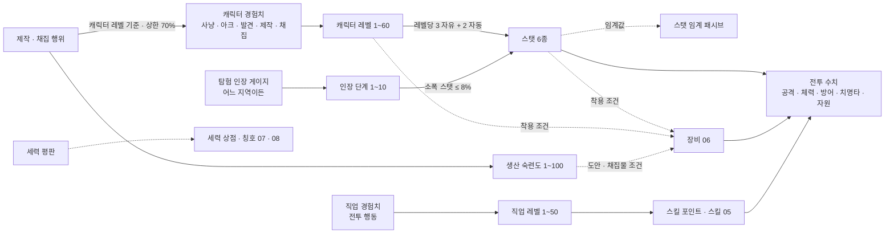

# 04_progression — 성장: 레벨 · 스탯 · 지역 난이도 · 비수직 구조

## 1. 문서 정보

| 항목 | 내용 |
|---|---|
| 버전 | r1 |
| 작성일 | 2026-10-01 |
| 상태 | 검수 중 (배정: system / player-market / lore) |
| 목적 | 3-A [진행 순서] 04번 정의: 레벨 · 스탯 · 지역 난이도 · 비수직 구조 설계. 4-정량의 **비수직 검증표**(10레벨 단위 모든 구간에 사냥터 3곳 이상 · 2대륙 이상 · 반드시 거쳐야 하는 사냥터 0곳)를 이 문서에서 수치로 검증한다. 3-C '신규 유저가 고레벨 지역에 들어가면 무슨 일이 생기는지'를 단계별 표로 적는다. |
| 의존 문서 | 00_BRIEF.md(기준), 01_reference.md(3장 강화 원칙 · 4장 비수직 교훈 · 5장 #9 · #40 · #66 · 6장 IP 금지 목록), 02_concept.md(4장 코어 루프 · 6장 페르소나 · 8.2 비수직 6종 · 14장 용어집), 03_world.md(5장 종족 · 7장 시작 위치 · 8장 사냥터 · 9장 비수직 검증표 · 10장 고위험 지역 규칙), DECISIONS.md(D-03 · D-04 · D-05 · D-08 · D-09 · D-10 · D-12 · D-13 · D-17 · D-21 · D-24 · D-25), ASSUMPTIONS.md(A-01~A-12) |
| 이 문서를 기준으로 삼는 문서 | 05_classes_skills(직업 자동 성장 분포 · 스킬 계수 · 자원 소모 · 직업 레벨), 06_items_crafting(장비 수치 범위 · 착용 조건 · 내구도 · 생산 숙련도 상세), 07_stories_hidden(아크 장 경험치 · 발견 경험치 · 히든 피스 보상), 08_social_raid(파티 경험치 분배 · 인스턴스 동기화 · 부활 횟수), 10_economy(골드 드롭 · 재분배 비용 · 일일 산출 상한) |
| 표기 규칙 | 전부 한국어. 수치는 표, 공식은 수식. 예시 계산은 문서 안에서 검산된다(모든 표의 숫자는 같은 공식 세트로 생성). 사실은 출처(14장), 그 외 수치는 **추정(튜닝 파라미터)** 이며 13장 표로 데이터 테이블에 뺀다. 레퍼런스 고유명사는 쓰지 않는다(01번 6장). |
| ID | 이 문서는 새 ID를 만들지 않는다. 사냥터 H- · 시작 위치 SP- · 종족 RC- · 도시 T- · 아크 A-는 03번 13장 색인의 것만 쓴다. 몬스터 이름은 03번 8장 '대표 몬스터'를 그대로 쓰고 MO- ID는 05 · 07에서 부여한다. |
| 표현 규칙 | 3-B-2 · 3-B-5: '권장 레벨' · '다음 사냥터' · '먼저 ○○을 끝내야' 같은 순서 강제 표현을 쓰지 않는다. 사냥터는 **위험도(D-12) + 적정 폭**으로만 말한다. |

---

## 2. 성장 축 개요

캐릭터는 6개의 성장 축을 가진다. 캐릭터 레벨은 그중 하나일 뿐이며, 어느 축도 다른 축의 **선행 조건**이 되지 않는다(D-03 · 3-B-5). 축끼리는 '영향'만 준다(예: 스탯이 장비 착용 조건에 쓰인다).

| 축 | 범위 | 오르는 방법 | 올라서 얻는 것 | 다른 축과의 관계 | 상세 문서 |
|---|---|---|---|---|---|
| 캐릭터 레벨 | 1~60(D-04. 확장 80 → 100) | 캐릭터 경험치: 사냥 · 이야기(아크 장) · 탐험 발견 · 제작 · 채집(병렬 성장원, D-05 (3)) | 레벨당 자유 스탯 3 + 직업 자동 성장 2, 최대 체력 · 마나 기본치, 장비 착용 조건(레벨) | 직업 레벨 · 생산 숙련도의 선행 조건이 **아니다** | 이 문서 3 · 6장 |
| 스탯(6종) | 각 10부터, 상한 없음(실질 60레벨 약 250) | 레벨업 포인트 + 장비 + 탐험 인장 | 공격력 · 체력 · 치명타 · 자원 · 제작 보정, 스탯 임계 패시브, 장비 착용 조건(스탯) | 재분배 가능(도시 NPC, 골드) | 이 문서 4장 |
| 직업 레벨 | 1~50(05) | 직업 선택 후 전투 행동(처치 · 스킬 사용)으로 얻는 직업 경험치 | 스킬 포인트, 직업 스킬 해금 · 강화 | 캐릭터 레벨과 독립. 전직 의식 시 유지(D-09) | 05, 이 문서 11장 |
| 생산 숙련도 | 1~100(대장장이 · 채광 · 약초 · 벌목 각각) | 제작 · 채집 행위 | 도안 제작 조건(D-03), 고등급 채집물 조건(D-17), 결과 보정(06) | 캐릭터 레벨과 독립 | 06, 이 문서 11장 |
| 탐험 인장 | 단계 1~10(캐릭터 단일 게이지) | 어느 지역에서든: 일일 계약 · 사냥 드롭 · 채집/제작 · 아크 · 발견 · 히든 피스 | 단계마다 소폭 스탯(총합 ≤ 60레벨 스탯의 8%) · 편의 효과 · 칭호 | 지역별 개별 상한 없음(01번 5장 #40) | 이 문서 12장, 07 |
| 세력 평판 | 세력(F-)별 수치 | 세력 의뢰 · 아크 · 호위 · 전령 | 세력 상점 · 칭호 · (확장) 점령전 참가 자격 | 종족 고향 보너스(D-08)는 평판에만 | 07, 08(여기서는 축 정의만) |

- 실선 = 수치가 흘러가는 관계, 점선 = 조건으로만 쓰이는 관계. 조건 관계는 모두 '장비 착용'과 '도안 · 채집물'에만 걸리고, **지역 입장 · 아크 진행 · 직업 선택에는 어떤 축도 조건이 되지 않는다**(3-B-5, D-10).

---

## 3. 레벨 · 경험치 표

### 3.1 설계 목표와 곡선 근거

| 항목 | 값 | 근거 |
|---|---|---|
| 레벨 60 도달 총 목표 시간(사냥만) | **약 90시간**(5,393분 = 89.9시간) | 모바일 세션 20분 × 하루 2.5회 = 50분/일(A-03) → 약 108일 ≈ 3.6개월. 골격 목표 '약 90시간 · 3~4개월' |
| 구간별 시간 | 1~10: 5.5h / 11~20: 15.1h / 21~30: 16.3h / 31~40: 17.2h / 41~50: 17.9h / 51~60: 18.0h | 2구간 이후는 12~18시간 안, 인접 구간 비율 최대 1.08배(급증 없음). 1~10 구간만 첫 10분 · 첫 세션 리텐션(02번 5장)을 위해 짧게 둔다(14장 확인 필요 #1) |
| 레벨 1 → 2 | 100 경험치, 사냥만 하면 약 1.1분 | 튜토리얼 0장(이야기 경험치 50 고정) + 위험도 1 몬스터 2~3마리(22씩)로 0장 완료 시점에 레벨 2 = Z 슬롯 해금(D-10) |
| 레벨당 필요 경험치 | 필요 경험치(L→L+1) = 기준 경험치/분(L) × 목표 분(L) | 시간 목표가 먼저, 경험치는 그 결과. 분 단위 표(3.2)가 데이터 테이블의 원본이다 |
| 기준 경험치/분 | 기준(L) = 4 × 일반 몬스터 경험치(L) | 같은 레벨 일반 몬스터를 분당 4마리(1마리 15초, 02번 4.2 '10~30초') 처치하는 속도. 모든 병렬 성장원(6장)과 상한(7장)의 기준값 |
| 일반 몬스터 경험치 | 경험치(M) = 20 + 2M + M²/20 (반올림) | 레벨 1에서 22, 레벨 60에서 320. 완만한 2차 곡선: 레벨이 올라도 '마리당 경험치'가 급증하지 않아 저위험 지역을 떠날 이유가 '효율'이 아니라 '보상 종류'가 되게 한다(01번 4장 #3) |
| 구간 안 평탄화 | 한 구간 안에서 레벨당 분은 단조 증가, 증가폭 ≤ 2분 | '다음 레벨이 갑자기 멀어지는' 체감 방지 |

### 3.2 레벨 · 경험치 전표(1~60)

'목표 분'은 같은 레벨 적정 사냥터에서 사냥만 할 때의 기대 시간이다. 실제로는 아크 · 발견 · 제작 · 채집 경험치가 섞이므로 더 빠를 수 있다(6장).

| 레벨 | 다음 레벨 필요 경험치 | 누적 경험치(레벨 도달 시) | 목표 분 | 기준 경험치/분 | 기준 경험치/시간 | 일반 몬스터 경험치(동레벨) |
|---|---|---|---|---|---|---|
| 1 | 100 | 0 | 1.14 | 88 | 5,280 | 22 |
| 2 | 384 | 100 | 4 | 96 | 5,760 | 24 |
| 3 | 936 | 484 | 9 | 104 | 6,240 | 26 |
| 4 | 1,972 | 1,420 | 17 | 116 | 6,960 | 29 |
| 5 | 3,472 | 3,392 | 28 | 124 | 7,440 | 31 |
| 6 | 5,848 | 6,864 | 43 | 136 | 8,160 | 34 |
| 7 | 8,640 | 12,712 | 60 | 144 | 8,640 | 36 |
| 8 | 11,700 | 21,352 | 75 | 156 | 9,360 | 39 |
| 9 | 15,120 | 33,052 | 90 | 168 | 10,080 | 42 |
| 10 | 15,480 | 48,172 | 86 | 180 | 10,800 | 45 |
| 11 | 16,704 | 63,652 | 87 | 192 | 11,520 | 48 |
| 12 | 17,952 | 80,356 | 88 | 204 | 12,240 | 51 |
| 13 | 19,224 | 98,308 | 89 | 216 | 12,960 | 54 |
| 14 | 20,880 | 117,532 | 90 | 232 | 13,920 | 58 |
| 15 | 22,204 | 138,412 | 91 | 244 | 14,640 | 61 |
| 16 | 23,920 | 160,616 | 92 | 260 | 15,600 | 65 |
| 17 | 25,296 | 184,536 | 93 | 272 | 16,320 | 68 |
| 18 | 27,072 | 209,832 | 94 | 288 | 17,280 | 72 |
| 19 | 28,880 | 236,904 | 95 | 304 | 18,240 | 76 |
| 20 | 30,720 | 265,784 | 96 | 320 | 19,200 | 80 |
| 21 | 32,256 | 296,504 | 96 | 336 | 20,160 | 84 |
| 22 | 34,144 | 328,760 | 97 | 352 | 21,120 | 88 |
| 23 | 35,696 | 362,904 | 97 | 368 | 22,080 | 92 |
| 24 | 38,024 | 398,600 | 98 | 388 | 23,280 | 97 |
| 25 | 39,592 | 436,624 | 98 | 404 | 24,240 | 101 |
| 26 | 41,976 | 476,216 | 99 | 424 | 25,440 | 106 |
| 27 | 43,560 | 518,192 | 99 | 440 | 26,400 | 110 |
| 28 | 46,000 | 561,752 | 100 | 460 | 27,600 | 115 |
| 29 | 48,000 | 607,752 | 100 | 480 | 28,800 | 120 |
| 30 | 50,500 | 655,752 | 101 | 500 | 30,000 | 125 |
| 31 | 52,520 | 706,252 | 101 | 520 | 31,200 | 130 |
| 32 | 55,080 | 758,772 | 102 | 540 | 32,400 | 135 |
| 33 | 57,120 | 813,852 | 102 | 560 | 33,600 | 140 |
| 34 | 60,152 | 870,972 | 103 | 584 | 35,040 | 146 |
| 35 | 62,212 | 931,124 | 103 | 604 | 36,240 | 151 |
| 36 | 65,312 | 993,336 | 104 | 628 | 37,680 | 157 |
| 37 | 67,392 | 1,058,648 | 104 | 648 | 38,880 | 162 |
| 38 | 70,560 | 1,126,040 | 105 | 672 | 40,320 | 168 |
| 39 | 73,080 | 1,196,600 | 105 | 696 | 41,760 | 174 |
| 40 | 76,320 | 1,269,680 | 106 | 720 | 43,200 | 180 |
| 41 | 78,864 | 1,346,000 | 106 | 744 | 44,640 | 186 |
| 42 | 81,408 | 1,424,864 | 106 | 768 | 46,080 | 192 |
| 43 | 84,744 | 1,506,272 | 107 | 792 | 47,520 | 198 |
| 44 | 87,740 | 1,591,016 | 107 | 820 | 49,200 | 205 |
| 45 | 90,308 | 1,678,756 | 107 | 844 | 50,640 | 211 |
| 46 | 94,176 | 1,769,064 | 108 | 872 | 52,320 | 218 |
| 47 | 96,768 | 1,863,240 | 108 | 896 | 53,760 | 224 |
| 48 | 99,792 | 1,960,008 | 108 | 924 | 55,440 | 231 |
| 49 | 102,816 | 2,059,800 | 108 | 952 | 57,120 | 238 |
| 50 | 105,840 | 2,162,616 | 108 | 980 | 58,800 | 245 |
| 51 | 108,864 | 2,268,456 | 108 | 1,008 | 60,480 | 252 |
| 52 | 111,888 | 2,377,320 | 108 | 1,036 | 62,160 | 259 |
| 53 | 114,912 | 2,489,208 | 108 | 1,064 | 63,840 | 266 |
| 54 | 118,368 | 2,604,120 | 108 | 1,096 | 65,760 | 274 |
| 55 | 121,392 | 2,722,488 | 108 | 1,124 | 67,440 | 281 |
| 56 | 124,848 | 2,843,880 | 108 | 1,156 | 69,360 | 289 |
| 57 | 127,872 | 2,968,728 | 108 | 1,184 | 71,040 | 296 |
| 58 | 131,328 | 3,096,600 | 108 | 1,216 | 72,960 | 304 |
| 59 | 134,784 | 3,227,928 | 108 | 1,248 | 74,880 | 312 |
| 60 | — (상한) | 3,362,712 | — | 1,280 | 76,800 | 320 |

### 3.3 구간 집계

| 구간 | 레벨업 횟수 | 구간 소요(분) | 구간 소요(시간) | 구간 필요 경험치 | 누적 시간 | 모바일 일수(50분/일) |
|---|---|---|---|---|---|---|
| 1~10 | 9 | 327 | 5.5 | 48,172 | 5.5 | 7 |
| 11~20 | 10 | 905 | 15.1 | 217,612 | 20.5 | 25 |
| 21~30 | 10 | 980 | 16.3 | 389,968 | 36.9 | 44 |
| 31~40 | 10 | 1,030 | 17.2 | 613,928 | 54.0 | 65 |
| 41~50 | 10 | 1,071 | 17.9 | 892,936 | 71.9 | 86 |
| 51~60 | 10 | 1,080 | 18.0 | 1,200,096 | 89.9 | 108 |
| 합계 | 59 | 5,393 | 89.9 | 3,362,712 | — | 108 |

- 검산: 구간 소요의 합 = 5.5 + 15.1 + 16.3 + 17.2 + 17.9 + 18.0 = 89.9시간.
- 유료 경험치 부스트(D-11, +50% 이하)는 사냥 · 아크 · 발견 · 제작 · 채집 경험치에 같은 배율로 적용되며 상한(7장)에는 적용 후 값으로 걸린다. 부스트 시 총 목표 시간 ≈ 60시간.

---

## 4. 스탯

### 4.1 6스탯 정의와 효과(선형)

모든 스탯 효과는 **선형**이다(스탯 1당 고정 증가, 구간별 배율 없음). 기본값은 모든 스탯 10(종족 보정 ±2, 10장). 상한 없음(실질 60레벨 주 스탯 약 250).

| 스탯 | 영문 | 스탯 1당 효과 | 상한 | 주로 쓰는 성장 유형 | 비고 |
|---|---|---|---|---|---|
| 힘 (STR) | Strength | 근접 물리 공격력 +2, 소지 무게 +1 | — | 근접 힘형, 생산형(보조) | 양손 · 한손 근접 무기의 주 스탯 |
| 민첩 (DEX) | Dexterity | 원거리 물리 공격력 +2, 치명타 확률 +0.1%p, 회피 +0.05%p | 치명타 확률 60%, 회피 20% | 민첩형(궁수 · 단검) | 활 · 단검의 주 스탯 |
| 체력 (VIT) | Vitality | 최대 체력 +12, 방어력 +0.5 | — | 전 유형(자동 성장에 포함) | 생존의 기본 축 |
| 지력 (INT) | Intellect | 마법 공격력 +2, 최대 마나 +6 | — | 마법형 | 지팡이 · 마도구의 주 스탯 |
| 정신 (SPR) | Spirit | 치유 · 지원 계수 +2, 최대 마나 +4, 상태이상 저항 +0.1%p | 저항 50% | 지원형 | 회복 · 버프 스킬의 주 스탯 |
| 기교 (TEC) | Technique | 치명타 피해 +0.5%p, 제작 미니게임 판정 보정 · 채집 속도 보정(06에서 수치) | 치명타 피해 250% | 생산형(대장장이), 보조로 전 유형 | 전투 · 생산 겸용 스탯(D-02) |

### 4.2 레벨별 스탯 포인트

레벨업마다 **자유 배분 3 + 직업 자동 성장 2**(견습 상태에서는 자동 성장 2도 자유 배분으로 지급하고, 직업 선택 시 이후 레벨부터 자동 분포 적용). 포인트는 즉시 쓰지 않아도 되고 모아둘 수 있다.

| 레벨 | 자유 포인트 누적 | 자동 성장 누적 | 총 포인트 누적 | 스탯 합(기본 60 + 누적) | 예시: 근접 힘형 힘 / 체력 |
|---|---|---|---|---|---|
| 1 | 0 | 0 | 0 | 60 | 10 / 10 |
| 10 | 27 | 18 | 45 | 105 | 37 / 28 |
| 20 | 57 | 38 | 95 | 155 | 67 / 48 |
| 30 | 87 | 58 | 145 | 205 | 97 / 68 |
| 40 | 117 | 78 | 195 | 255 | 127 / 88 |
| 50 | 147 | 98 | 245 | 305 | 157 / 108 |
| 60 | 177 | 118 | 295 | 355 | 187 / 128 |

- 예시 열은 '자유 3 중 힘 2 · 체력 1, 자동 2 = 힘 1 · 체력 1'로 찍은 **기준 빌드**다. 5장의 모든 플레이어 기준표가 이 빌드를 쓴다.
- 장비 스탯 보정(06)은 포인트와 별도이며 기준 장비 = 주 스탯 +0.25 × 레벨(반올림), 60레벨 전설 풀장비 = 주 스탯 +30 · 체력 +20 · 민첩 +20 · 기교 +20(06에서 확정, 이 문서는 가정값으로 검산).

### 4.3 직업 자동 성장 유형 6종(예시 분포)

직업별 실제 분포는 05에서 정한다. 여기서는 유형 6종의 분포만 정의한다. 자동 2포인트는 정수로 주기 위해 2레벨 주기로 번갈아 찍는다.

| 유형 | 홀수 레벨(2점) | 짝수 레벨(2점) | 레벨당 평균 | 대표 직업(05 예시) |
|---|---|---|---|---|
| 근접 힘형 | 힘 1 · 체력 1 | 힘 1 · 체력 1 | 힘 1.0 · 체력 1.0 | 전사 계열 |
| 민첩형 | 민첩 1 · 힘 1 | 민첩 1 · 체력 1 | 민첩 1.0 · 힘 0.5 · 체력 0.5 | 궁수(필수 직업) · 단검 계열 |
| 마법형 | 지력 1 · 정신 1 | 지력 1 · 체력 1 | 지력 1.0 · 정신 0.5 · 체력 0.5 | 마법사 계열 |
| 지원형 | 정신 1 · 지력 1 | 정신 1 · 체력 1 | 정신 1.0 · 지력 0.5 · 체력 0.5 | 사제 · 음유 계열 |
| 생산형 | 기교 1 · 힘 1 | 기교 1 · 체력 1 | 기교 1.0 · 힘 0.5 · 체력 0.5 | 대장장이(필수 직업, 전투 겸업 D-02) |
| 균형형 | 레벨 % 3 = 1: 힘 1 · 민첩 1 / = 2: 체력 1 · 지력 1 / = 0: 정신 1 · 기교 1 | (3레벨 주기) | 각 0.33 | 견습 이후 '만능' 계열, 히든 직업 일부 |

- 전직 의식(D-09)으로 직업을 바꾸면 **이미 찍힌 자동 성장분은 그대로 두고** 이후 레벨부터 새 유형을 적용한다. 자동 성장분까지 바꾸려면 4.4 재분배를 쓴다(자동 성장분도 재분배 대상).

### 4.4 스탯 재분배

| 항목 | 규칙 |
|---|---|
| 장소 | 도시 · 마을(T-)의 '수련 사범' NPC(모든 T-에 배치, 전초기지 포함). 필드 · 인스턴스에서는 불가 |
| 대상 | 자유 포인트 + 자동 성장 포인트 전부(종족 보정 · 장비 · 인장 보정은 제외) |
| 비용 | 전체 초기화 = 200 × 캐릭터 레벨 골드. 부분 이동(포인트 1개를 다른 스탯으로) = 5 × 캐릭터 레벨 골드. 레벨 20 이하에서 전체 초기화 **1회 무료**(직업 체험 후 빌드 바꾸기, D-10) |
| 횟수 제한 | 없음(비용만). 전직 의식(D-09)과 묶어 하면 전체 초기화 비용 50% |
| 처리 1층: 스탯 임계 패시브(4.5) | 재분배로 스탯이 임계값 아래로 내려가면 **즉시 꺼진다**. 다시 임계값 이상이 되면 즉시 켜진다(재습득 불필요) |
| 처리 2층: 습득 스킬(퀘스트 · 히든 피스, V 슬롯) | **유지된다**(잃지 않음). 단, 요구 스탯을 충족하지 않으면 슬롯에서 자동 해제되어 '장착 불가(요구: 힘 120)' 표시. 충족하면 다시 장착 가능. 직업 스킬은 직업 레벨에만 걸리므로 영향 없음 |
| 장비 | 재분배 후 착용 조건(레벨 + 스탯, 3-B-12)을 못 채우는 장비는 **착용 상태로 남되 효과 0**('조건 미달' 표시). 벗으면 다시 못 낀다 |
| UI | 재분배 확인 화면에 '꺼지는 패시브 n개 · 해제되는 습득 스킬 n개 · 조건 미달 장비 n개'를 먼저 보여준다 |

| 레벨 | 전체 초기화(골드) | 부분 이동 1포인트(골드) | 같은 레벨 일반 몬스터 골드 드롭 | 전체 초기화 = 몬스터 몇 마리 |
|---|---|---|---|---|
| 10 | 2,000 | 50 | 9 | 222 (약 0.9시간) |
| 20 | 4,000 | 100 | 15 | 267 (약 1.1시간) |
| 30 | 6,000 | 150 | 21 | 286 (약 1.2시간) |
| 40 | 8,000 | 200 | 27 | 296 (약 1.2시간) |
| 50 | 10,000 | 250 | 33 | 303 (약 1.3시간) |
| 60 | 12,000 | 300 | 39 | 308 (약 1.3시간) |

- 골드 드롭은 5.4의 추정식(3 + 0.6 × 몬스터 레벨)이며 10에서 확정한다. 재분배 비용은 '한 세션 안에서 결정할 수 있는 수준'(60레벨 기준 약 1.3시간 사냥)으로 둔다.

### 4.5 스탯 임계 패시브(예시 6개, 스탯별 1개)

조건부 효과(01번 5장 #9 · #66). 스탯 **총합(포인트 + 장비 + 인장)** 이 임계값 이상이면 자동으로 켜지고, 아래로 내려가면(재분배 · 장비 해제) 꺼진다. 직업 무관. 전체 목록은 05(직업별 추가 임계 패시브 포함). 2단계 임계값 160은 '한 스탯에 자유 포인트를 전부 찍은 60레벨(10 + 177 = 187)'에서만 닿는 전문화 보상이다.

| ID(05에서 확정) | 스탯 | 이름 | 1단계 임계값 | 1단계 효과 | 2단계 임계값 | 2단계 효과 | 재분배 시 |
|---|---|---|---|---|---|---|---|
| TP-STR | 힘 | 거친 손 | 100 | 근접 무기 스킬 계수 +5% | 160 | +10%, 넉백 저항 | 임계 미만이면 꺼짐 |
| TP-DEX | 민첩 | 발 빠름 | 100 | 대시 쿨타임 −10% | 160 | −20%, 대시 후 1초간 회피 +10%p | 임계 미만이면 꺼짐 |
| TP-VIT | 체력 | 굳은 살 | 100 | 받는 피해 −3% | 160 | −6%, 부활 대기 −2초 | 임계 미만이면 꺼짐 |
| TP-INT | 지력 | 맑은 머리 | 100 | 마나 소모 −8% | 160 | −15%, 마법 스킬 시전 시간 −10% | 임계 미만이면 꺼짐 |
| TP-SPR | 정신 | 평정 | 100 | 상태이상 지속 −20% | 160 | −35%, 치유 계수 +5% | 임계 미만이면 꺼짐 |
| TP-TEC | 기교 | 손끝 | 100 | 제작 미니게임 판정 창 +10%(06), 치명타 피해 +5%p | 160 | 판정 창 +20%, 치명타 피해 +10%p | 임계 미만이면 꺼짐 |

- 임계값 100 도달 시점: 자유 3을 한 스탯에 몰면 레벨 31(10 + 90), 자동 성장이 같은 스탯이면 레벨 24(10 + 23 × 4 = 102). 장비 · 인장을 더하면 더 빠르다.

---

## 5. 전투 수치

### 5.1 공식

| 항목 | 공식 | 설명 |
|---|---|---|
| 기본 공격력 | 무기 공격력 + 2 × 주 스탯 총합(근접 = 힘, 원거리 = 민첩, 마법 = 지력) | 주 스탯 총합 = 포인트 + 종족 + 장비 + 인장 |
| 최종 데미지(곱셈 완화형) | **기본 공격력 × 스킬 계수 × 100 / (100 + 대상 방어력) × 랜덤(0.95~1.05) × 치명타 배율(치명 시 치명타 피해, 아니면 1.0)** × 기타 보정(속성 · 버프, 05 · 06, 기본 1.0) | 최소 1. 방어력은 데미지를 0으로 만들지 못한다(방어 100 = 피해 절반, 방어 200 = 1/3) |
| 스킬 계수 | 기본 공격 1.0, 무기 스킬 · 직업 스킬 1.2~3.0(05) | 검산용 평균 계수 **1.4**(기본 공격 50% + 평균 1.8 스킬 50%) |
| 치명타 확률 | 5% + 0.1%p × 민첩 총합 + 장비 보정, 상한 60% | 몬스터 치명타 없음(보스 기믹 제외) |
| 치명타 피해 | 150% + 0.5%p × 기교 총합 + 장비 보정, 상한 250% | 기대 배율 = 1 + 확률 × (피해 − 1) |
| 회피 | 0.05%p × 민첩 총합 + 장비 보정, 상한 20% | 회피 시 피해 0. 몬스터 회피: 일반 0%, 정예 5%, 보스 0% |
| 최대 체력 | 100 + 10 × 레벨 + 12 × 체력 총합 | 자연 회복: 비전투 시 초당 2% |
| 방어력 | 방어구 합(06) + 0.5 × 체력 총합 | 기준 방어구 = 2.5 × 레벨, 60레벨 전설 풀장비 = 200(06 가정) |
| 받는 피해 | 공격자 기본 공격력 × 계수 × 100 / (100 + 내 방어력) × 랜덤 | 플레이어 · 몬스터 동일 식 |
| 마나(마법 · 지원 · 마법형 히든) | 50 + 3 × 레벨 + 6 × 지력 총합 + 4 × 정신 총합. 회복 초당 1% + 0.1 × 정신 | 소모 10~60(05) |
| 기력(근접 · 원거리 · 생산형) | 100 고정, 회복 초당 5. 기본 공격 적중 시 +5 | 소모 10~35(05). 대장장이는 열기 게이지 병행(05 · 06) |
| 치유량 | 스킬 기본치 + 2 × 정신 총합 × 스킬 계수 | 05 |
| 몬스터 공격 간격 | 일반 2.0초, 정예 1.8초, 보스 패턴별(08) | 피격 횟수 → 생존 시간 환산에 사용 |

### 5.2 레벨별 플레이어 기준 스탯(근접 힘형 기준 빌드 · 기준 장비)

기준 장비 = 그 레벨대에서 사냥 · 제작으로 평범하게 갖추는 장비(희귀~영웅). 무기 공격력 = 8 + 2.4 × 레벨, 방어구 합 = 2.5 × 레벨, 주 스탯 보정 = 0.25 × 레벨(반올림). 06이 장비 수치 범위를 확정하면 이 열을 갱신한다.

| 레벨 | 힘(포인트+장비) | 체력 스탯 | 무기 공격력 | 물리 공격력 | 최대 체력 | 방어력 | 치명타 확률 | 치명타 피해 | 기대 배율 | 기력 |
|---|---|---|---|---|---|---|---|---|---|---|
| 1 | 10 | 10 | 10.4 | 30 | 230 | 7.5 | 6% | 155% | 1.033 | 100 |
| 10 | 39 | 28 | 32.0 | 110 | 536 | 39.0 | 6% | 155% | 1.033 | 100 |
| 20 | 72 | 48 | 56.0 | 200 | 876 | 74.0 | 6% | 155% | 1.033 | 100 |
| 30 | 105 | 68 | 80.0 | 290 | 1,216 | 109.0 | 6% | 155% | 1.033 | 100 |
| 40 | 137 | 88 | 104.0 | 378 | 1,556 | 144.0 | 6% | 155% | 1.033 | 100 |
| 50 | 169 | 108 | 128.0 | 466 | 1,896 | 179.0 | 6% | 155% | 1.033 | 100 |
| 60 | 202 | 128 | 152.0 | 556 | 2,236 | 214.0 | 6% | 155% | 1.033 | 100 |
| 60 풀장비(전설) | 217 | 148 | 180 | 614 | 2,476 | 274 | 8% | 165% | 1.052 | 100 |

마법형 참고(지력에 자유 3, 자동 지력 1 · 정신/체력 0.5, 지팡이 공격력 = 무기와 동일 식):

| 레벨 | 지력(포인트+장비) | 마법 공격력 | 최대 마나 | 최대 체력(체력 스탯 = 10 + 1.5 × (레벨−1)) |
|---|---|---|---|---|
| 1 | 10 | 30 | 153 | 230 |
| 30 | 105 | 290 | 866 | 1,048 |
| 60 | 202 | 556 | 1,602 | 1,876 |

### 5.3 몬스터 기준 스탯(레벨 M)

| 등급 | 체력 | 공격력 | 방어력 | 경험치 | 골드(10에서 확정) | 감지 거리 | 추적 속도 | 무관심 규칙 |
|---|---|---|---|---|---|---|---|---|
| 일반 | **25M + 900 × (1 − e^(−M/10))** | 15 + 4M + 0.09M² | 2M | 20 + 2M + M²/20 | 3 + 0.6M | 24 studs | 14 studs/s | 적용 |
| 정예 | 일반 × 4 | 일반 × 1.5 | 일반 × 1.3 | 일반 × 5 | 일반 × 4 | 30 studs | 16 studs/s | **미적용**(03 10.1) |
| 보스(필드 · 인스턴스) | 일반 × 25 | 일반 × 2.2 | 일반 × 1.6 | 일반 × 40 | 일반 × 30 | 40 studs | 18 studs/s | **미적용** |
| 레이드 보스(RB-) | 08에서 별도 | | | | | | | 미적용 |

- 체력 식의 근거: 같은 레벨 기준 빌드가 평균 계수 1.4로 **약 6타**에 잡고, 레벨 60 풀장비가 위험도 6 일반 몬스터를 **4~6타**에 잡는 값(5.5 검산). 포화형(e^(−M/10))이라 레벨 상한 확장(D-13) 시에도 식을 바꾸지 않고 쓸 수 있다.
- 공격력 식의 근거: 같은 레벨 기준 빌드가 **약 12타(24초)** 를 버티는 값. 플레이어가 6타에 잡고 12타를 버티므로 1:1은 플레이어 우위, 2마리 동시는 긴장, 3마리 이상은 후퇴 판단이 필요하다.
- 모든 값은 반올림 정수로 데이터 테이블에 미리 계산해 넣는다(13장). 아래는 5레벨 단위 발췌.

| 몬스터 레벨 | 일반 체력 | 일반 공격력 | 일반 방어력 | 일반 경험치 | 일반 골드 | 정예 체력 | 정예 공격력 | 정예 경험치 | 보스 체력 | 보스 공격력 | 보스 경험치 |
|---|---|---|---|---|---|---|---|---|---|---|---|
| 1 | 111 | 19 | 2 | 22 | 4 | 444 | 28 | 110 | 2,775 | 42 | 880 |
| 5 | 479 | 37 | 10 | 31 | 6 | 1,916 | 56 | 155 | 11,975 | 81 | 1,240 |
| 10 | 819 | 64 | 20 | 45 | 9 | 3,276 | 96 | 225 | 20,475 | 141 | 1,800 |
| 15 | 1,074 | 95 | 30 | 61 | 12 | 4,296 | 142 | 305 | 26,850 | 209 | 2,440 |
| 20 | 1,278 | 131 | 40 | 80 | 15 | 5,112 | 196 | 400 | 31,950 | 288 | 3,200 |
| 25 | 1,451 | 171 | 50 | 101 | 18 | 5,804 | 256 | 505 | 36,275 | 376 | 4,040 |
| 30 | 1,605 | 216 | 60 | 125 | 21 | 6,420 | 324 | 625 | 40,125 | 475 | 5,000 |
| 35 | 1,748 | 265 | 70 | 151 | 24 | 6,992 | 398 | 755 | 43,700 | 583 | 6,040 |
| 40 | 1,884 | 319 | 80 | 180 | 27 | 7,536 | 478 | 900 | 47,100 | 702 | 7,200 |
| 45 | 2,015 | 377 | 90 | 211 | 30 | 8,060 | 566 | 1,055 | 50,375 | 829 | 8,440 |
| 50 | 2,144 | 440 | 100 | 245 | 33 | 8,576 | 660 | 1,225 | 53,600 | 968 | 9,800 |
| 55 | 2,271 | 507 | 110 | 281 | 36 | 9,084 | 760 | 1,405 | 56,775 | 1,115 | 11,240 |
| 60 | 2,398 | 579 | 120 | 320 | 39 | 9,592 | 868 | 1,600 | 59,950 | 1,274 | 12,800 |

### 5.4 같은 레벨 검산(기준 빌드 · 기준 장비 vs 같은 레벨 일반 몬스터)

| 레벨 | 플레이어 공격력 | 평균 1타(계수 1.4 × 기대 배율) | 몬스터 체력 | 처치 타수 | 몬스터 공격력 | 피격 1타 | 플레이어 체력 | 사망까지 피격 | 생존 시간(2.0초 간격) |
|---|---|---|---|---|---|---|---|---|---|
| 1(견습, 계수 1.0) | 30 | 30.8 | 111 | 3.6 | 19 | 17.7 | 230 | 13.0 | 26초 |
| 10 | 110 | 132.6 | 819 | 6.2 | 64 | 46.0 | 536 | 11.6 | 23초 |
| 20 | 200 | 206.6 | 1,278 | 6.2 | 131 | 75.3 | 876 | 11.6 | 23초 |
| 30 | 290 | 262.1 | 1,605 | 6.1 | 216 | 103.3 | 1,216 | 11.8 | 24초 |
| 40 | 378 | 303.7 | 1,884 | 6.2 | 319 | 130.7 | 1,556 | 11.9 | 24초 |
| 50 | 466 | 337.0 | 2,144 | 6.4 | 440 | 157.7 | 1,896 | 12.0 | 24초 |
| 60 | 556 | 365.5 | 2,398 | 6.6 | 579 | 184.4 | 2,236 | 12.1 | 24초 |

### 5.5 '레벨 60 풀장비 → 위험도 6 일반 몬스터 4~6타' 검산 3건

풀장비 가정(06 확정 전 가정값): 무기 공격력 180, 주 스탯 +30, 체력 +20, 민첩 +20, 기교 +20, 방어구 합 200. 랜덤 1.00(기대값). 위험도 6 사냥터(H-40 적정 52~60, H-41 51~60)의 일반 몬스터 레벨 범위는 51~60(7.1 규칙).

| # | 빌드 | 대상 | 기본 공격력 | 방어 계수 100/(100+방어) | 기대 배율 | 평균 1타(계수 1.4) | 몬스터 체력 | 타수 | 판정 |
|---|---|---|---|---|---|---|---|---|---|
| 1 | 근접 힘형 | H-40 광기 골렘(레벨 52) | 180 + 2 × 217 = **614** | 100/(100+104) = 0.490 | 1.052 | 614 × 1.4 × 0.490 × 1.052 = **443** | 2,195 | 5.0 → 5타 | 4~6타 안 |
| 2 | 마법형 | H-41 광기 나방 떼 개체(레벨 56) | 180 + 2 × 217 = **614** | 100/(100+112) = 0.472 | 1.052 | 614 × 1.4 × 0.472 × 1.052 = **427** | 2,297 | 5.4 → 6타 | 4~6타 안 |
| 3 | 민첩형(궁수) | H-41 균열 군주 휘하 일반 개체(레벨 60) | 180 + 2 × 237 = **654** | 100/(100+120) = 0.455 | 1.187 | 654 × 1.4 × 0.455 × 1.187 = **494** | 2,398 | 4.9 → 5타 | 4~6타 안 |

- 민첩형은 자유 3을 민첩에, 자동 성장은 민첩 1 · 힘/체력 0.5(4.3)이므로 민첩 총합 = 10 + 177 + 20(풀장비 민첩) + 30(주 스탯 보정) = 237, 치명타 확률 = 5% + 23.7% = 28.7%(상한 60% 안). 기본 공격만(계수 1.0) 쓰면 타수가 1.4배(7~8타)로 늘지만 스킬 연계가 전제다.
- 몬스터 레벨 52 · 56 · 60 세 경우 모두 5~6타, 위험도 6 '일반' 기준. 정예(체력 4배)는 20타 이상이 걸리므로 파티 권장(03 8장 '파티 권장 6인+ · 원정대'와 정합).

### 5.6 저레벨이 고위험 몬스터를 만났을 때(레벨 20 vs 위험도 5 몬스터 레벨 45)

| 항목 | 값 | 계산 |
|---|---|---|
| 레벨 차 | 25(≥ 15) | 일반 몬스터는 **무관심**(7.2). 아래는 플레이어가 먼저 공격했거나 채집 중 선공당한 경우 |
| 몬스터(예: H-25 유리 정령, 레벨 45) 공격력 · 방어력 · 체력 | 377 · 90 · 2,015 | 5.3 식 |
| 플레이어(레벨 20 기준) 체력 · 방어력 · 공격력 | 876 · 74 · 200 | 5.2 |
| 피격 1타 | **217** | 377 × 1.0 × 100/(100+74) |
| 사망까지 피격 | 4.0타 → **5타 = 10초** | 공격 간격 2.0초 |
| 플레이어 평균 1타 → 처치 타수 | 152 → 13타 | 싸우면 진다(처치 13타 vs 사망 5타) |
| 도주 가능성 | **가능** | 플레이어 기본 이동 16 studs/s(로블록스 Humanoid.WalkSpeed 기본값, 14장 출처 #1) + 대시(05) > 일반 몬스터 추적 14 studs/s. 몬스터는 스폰 지점에서 48 studs를 벗어나면 추적을 포기하고 돌아간다. 첫 피격(1타, 217) 후 즉시 대시로 거리를 벌리면 추가 피격 없이 이탈 가능(추적 48 studs ÷ 14 = 3.4초 < 생존 10초) |
| 사망 시 | 내구도 −10%, 경험치 손실 0, 부활 지점 선택(7.6) | 잃는 것은 수리비뿐 |

완충 구간 예시(레벨 30 vs 몬스터 40, 레벨 차 10 → D-24):

| 항목 | 값 |
|---|---|
| 선공 감지 거리 | 24 → **12 studs**(50%) |
| 피격 1타 / 사망까지 | 153 / 8타(16초) |
| 처치 타수 | 8.1타 → 1:1은 이길 수 있으나 2마리면 위험 |
| 획득 경험치 | 180(레벨 차 음수 = 감소 없음, 7.4) → 분당 상한 1.5 × 500 = 750 |
| 첫 진입 경고 | "적정 폭 밖입니다. 선공 거리가 줄어든 상태로 들어갑니다." 1줄 |

---

## 6. 병렬 성장원(D-05 (3))

모든 원천이 **같은 캐릭터 경험치**를 준다. 경험치 로그에는 태그(전투 / 이야기 / 발견 / 제작 / 채집)가 붙는다(02번 8.2 #3). '기준'은 3.1의 **기준 경험치/분(캐릭터 레벨)** 이다. 제작 · 채집은 D-17에 따라 캐릭터 레벨 기준으로 산정하고 상한 70%를 둔다.

| 원천 | 경험치 산정식 | 시간당 기준 대비 | 상한 · 조건 | 담당 문서 |
|---|---|---|---|---|
| 사냥(일반 · 정예 · 보스 처치) | 몬스터 경험치(M) × 레벨 차 보정(7.4) × 파티 분배(7.5) | **100%**(기준 그 자체) | 분당 획득 상한 = 기준 × 150%(60초 이동 창, 7.5) | 이 문서 |
| 이야기: 아크 장 완료 | 기준(L) × 10분 × 장 계수(짧은 장 0.8 / 표준 1.0 / 아크 최종 장 1.1). 튜토리얼 0장 = 50 고정 | 80~110%(단발, 장당 8~12분 소요) | 캐릭터당 장마다 1회. 레벨 무관 진행, 캐릭터 레벨 기준 산정이므로 고레벨이 저위험 아크를 해도 감소 없음 | 07(장 계수 배정) |
| 이야기: 이야기 NPC 대화 · 기록물 첫 열람 | 기준(L) × 0.5분 | 소량 | 지점당 1회 | 07 |
| 발견: 사냥터 · 던전 첫 방문 | 기준(L) × 2분 | 단발 | 사냥터당 1회(43곳 → 약 86분 분량 누적) | 07, 09(탐험 랭킹) |
| 발견: 전망 지점 · 숨은 입구 | 기준(L) × 1분 | 단발 | 지점당 1회 | 07 |
| 발견: 갈림길 문 · 항로 첫 통과, 도시 첫 방문 | 기준(L) × 3분 / × 1분 | 단발 | 문 · 항로 · 도시당 1회 | 03, 07 |
| 히든 피스 완료 | 기준(L) × 10~30분(종류별, 07) | 단발 | 1회. 감소 없음 | 07 |
| 제작 1회 | 기준(L) × 0.7 × 실제 미니게임 시간(분, 상한 3분) | **최대 70%**(연속 제작 시) | 캐릭터 레벨 기준, 도안 등급 가산 없음(D-17). 일일 제작 시도 상한(10, 계정 합산 D-25) | 06, 10 |
| 채집 1회(노드) | 기준(L) × 0.7 × 0.1분(채집 6초) = 기준 × 0.07 | **최대 70%**(연속 채집 시) | 캐릭터 레벨 기준, 노드 등급 가산 없음. 고등급 노드는 채집 숙련도 요구치. 일일 재료 산출 상한(10) | 06, 10 |
| 일일 계약 3개 | 각 기준(L) × 5분(합계 15분 분량) | 100%(15분 목표 시간과 동일) | 일 3개(02번 4.3). 계정 합산 상한(D-25) | 07, 10 |
| 주간 계약 3개 | 각 기준(L) × 20분 | 100% | 주 3개 | 07, 10 |
| 던전 클리어 보너스 | 기준(동기화 레벨) × 5분 | 단발 | 주간 던전 보상 횟수 안(08) | 08 |
| 레이드 | 08에서 정의(동기화 레벨 기준) | — | 주간 상한 | 08 |
| 세력 평판 · 호위 · 전령 | 전투 외 역할도 '이야기' 태그로 기준(L) × 소요 분 × 0.8 | 80% | 의뢰당 1회 | 07, 08 |

- 사냥을 전혀 하지 않는 경로의 추정: 아크 24개 × 평균 5장 × 10분 = 약 20시간 분량(100%) + 발견 약 3시간 분량 + 히든 피스 36개 × 평균 15분 = 9시간 분량 + 일일 계약(매일 15분 분량) + 제작 · 채집(70%). 90시간 중 약 32시간은 단발 원천으로, 나머지는 일일 계약 + 제작 · 채집으로 채우면 사냥 0회로도 60에 닿는다(소요 약 120~130시간, 추정). 03 9.2의 '사냥터를 전혀 거치지 않는 경로' 주장을 수치로 뒷받침한다.
- 유료 경험치 부스트(D-11)는 모든 원천에 같은 배율(+50% 이하)로 적용하고, 상한(분당 150%, 제작 · 채집 70%)은 부스트 적용 후 값에 건다. 따라서 부스트는 상한을 넘기지 못한다.

---

## 7. 비수직 구조 상세 규칙(D-05 6종)

### 7.1 (1) 위험도 + 적정 폭

| 조건 | 수치 | 예외 | UI 표시 |
|---|---|---|---|
| 위험도 | 적정 폭 하한이 속한 절대 레벨 밴드(D-12): 1 = 1~10 … 6 = 51~60 | 상한 확장 시 7~10 추가(D-13). 밴드의 뜻은 바뀌지 않음 | 지도 색(1 초록 / 2 연두 / 3 노랑 / 4 주황 / 5 빨강 / 6 보라), 입구 배너, 시작 카드(03 10.2) |
| 적정 폭 | 03 8장 표의 값. **몬스터 레벨 범위 = [적정 하한, 적정 상한 − 4]**, 적정 상한이 60이면 [하한, 60] | 광기 지역 H-40 52~60, H-41 51~60 | 입구 배너 "위험도 n · 적정 a~b" |
| 적정 폭의 뜻 | 그 레벨에서 시간당 경험치 효율이 기준의 **80% 이상**인 폭(8장에서 검산). 폭 상단 4레벨은 몬스터보다 1~4 높은 상태(100%), 폭 밖 위쪽은 7.4 감소 | 권장 레벨이 아니다(3-B-2) | 효율 수치는 UI에 표시하지 않는다(서열화 방지, 01번 4장 #3). 폭만 표시 |
| 도시 위험도 | 성문 밖 순찰 범위 밴드(D-21). 시작 카드 '도시 위험도 (반경 사냥터 위험도 범위)' | SP-07 '4 (반경 2~5)' 경고 상시 | 03 7장 |
| 입장 제한 | **없음**(어느 축의 어떤 값도 입장 조건이 아님) | 인스턴스 던전은 파티 인원 상한만(08) | 배너 3초, 차단 없음 |
| 몬스터 머리 위 색 | 레벨 차(몬스터 − 플레이어) 기준: ≤ −15 회색 / −14~−8 연회색 / −7~+7 흰색 / +8~+14 주황 / ≥ +15 빨강 + 무관심 아이콘 | 보스 · 정예는 항상 빨강 테두리 | 이름 · 레벨 · 아이콘(03 10.2) |

### 7.2 (2) 무관심 규칙 — 정확한 판정

판정 주체는 **몬스터 개체**이며, 대상 플레이어마다 따로 계산한다. 판정 시점: 스폰 시, 플레이어가 감지 거리에 들어올 때, 플레이어 레벨업 즉시(03 10.1).

| # | 판정 순서 | 조건 | 결과 |
|---|---|---|---|
| 1 | 몬스터 등급 | 정예 · 보스 · 네임드 · 아크 전투 대상 · 레이드 보스 | **무관심 없음**(항상 선공 가능). 저레벨은 '출현 조건을 트리거하지 않는' 방식으로 회피(03 8.8) |
| 2 | 지역 플래그 | 광기 지역(H-40, H-41. A-11: 확장 4차 전 0곳) | **무관심 없음**. 입구 배너 6단계 경고(03 10.3) |
| 3 | 적대 플래그 | 플레이어가 이 개체를 공격 · 스킬 대상 지정했거나, 같은 파티원이 이 개체와 전투 중(이 개체가 파티원을 공격 대상으로 가짐) | 그 개체는 **그 플레이어와 파티 전원**을 공격 대상으로 삼을 수 있다(해제는 개체 단위, 추적 포기 48 studs 또는 사망 · 리스폰 시 초기화) |
| 4 | 채집 중 | 플레이어가 채집 노드를 채널링 중(5~10초)이고, 이 개체가 노드 반경 **16 studs** 안 | 채집 채널링 동안 **선공 허용**(레벨 차 무관). 채널링이 끝나면(완료 · 취소) 다시 아래 판정으로 돌아가되, 이미 적대 상태면 유지(채집 리스크, D-17) |
| 5 | 레벨 차 d = 몬스터 레벨 − 플레이어 레벨 | d ≥ 15 | **무관심**: 선공 안 함, 감지 거리 0. 머리 위 회색 + 눈 감은 아이콘 |
| 6 | 완충 구간(D-24) | 8 ≤ d ≤ 14 | 선공 감지 거리 **50%**(일반 24 → 12 studs, 정예 30 → 15). 사냥터 첫 진입 시 경고 1줄, 이 상태에서 사망하면 안내(7.6) |
| 7 | 그 외 | d ≤ 7 | 정상 선공(감지 24 studs) |

| 상황 | 판정 결과 | 근거 행 |
|---|---|---|
| 레벨 6이 H-09(몬스터 35~48)를 걷는다 | 전부 무관심(d ≥ 29) | 5 |
| 레벨 6이 H-09의 중급 마력 결정 노드를 채집한다(채집 숙련도 충족 가정) | 채널링 중 반경 16 studs의 균열 늑대가 선공 가능. 채집을 시작하기 전에 주변을 보는 것이 플레이의 일부 | 4 |
| 레벨 6이 파티원(레벨 40)이 때리는 균열 늑대 옆에 서 있다 | 그 개체는 레벨 6도 공격 가능. 다른 개체는 여전히 무관심 | 3 |
| 레벨 30이 H-09(35~48)에 들어간다 | 35~44: 완충(감지 12 studs) / 45~48: 무관심 | 5 · 6 |
| 레벨 3이 SP-07 안뜰(H-37, 32~44)에서 시작한다 | 전부 무관심. 안뜰의 '멈춘 자동인형'은 오브젝트(몬스터 아님) | 5 |
| 레벨 10이 H-04의 필드 보스 '늪의 진흙 군주'(밤 출현) 근처에 간다 | 보스는 무관심 없음 → 밤에는 그 구역을 피한다(배너에 '밤: 필드 보스 출현' 표시) | 1 |
| 레벨 50이 H-40(광기 지역)에 들어간다 | 전부 선공(d 2~10이라도 완충 적용 없음) | 2 |

### 7.3 (3) 병렬 성장원

6장 표가 규칙이다. 추가 규칙:

| 조건 | 수치 | 예외 | UI 표시 |
|---|---|---|---|
| 제작 · 채집 경험치 산정 기준 | 캐릭터 레벨의 기준 경험치/분 × 0.7 × 실제 행위 시간 | 노드 · 도안 등급 가산 없음(D-17) | 경험치 로그 태그 '제작' · '채집' |
| 고등급 채집물 | 채집 숙련도 요구치(06): 하급 1 / 중급 30 / 상급 60 / 최상급 85(추정) | 캐릭터 레벨 무관 | 노드에 '채광 30 필요' 표시 |
| 일일 산출 상한 | 재료 · 제작 시도 상한은 10, 계정 합산(D-25) | 경험치 자체에는 일일 상한 없음(분당 상한만) | 상한 도달 시 노드가 '오늘은 비었다' 표시 |
| 발견 1회 규칙 | 지점당 캐릭터 1회 | 캐릭터 슬롯 3개는 각각 1회(계정 합산 아님. 탐험 랭킹 점수는 09) | 지도에 '발견됨' 체크 |

### 7.4 고레벨 → 저위험 지역(레벨 차 보정)

d = 플레이어 레벨 − 몬스터 레벨(양수 = 플레이어가 높다). 음수(몬스터가 높다)는 **감소 없음**(저레벨의 상향 사냥은 7.5 분당 상한으로만 제한).

| d | 경험치 배율 | 골드 드롭 | 재료 드롭 | 희귀 드롭(도안 조각 · 인장 · 한정 장비 단서) | 히든 피스 · 아크 · 발견 보상 |
|---|---|---|---|---|---|
| ≤ 7 | 100% | 100% | 100% | 100% | 감소 없음 |
| 8 | 85% | 100% | 100% | 100% | 감소 없음 |
| 9 | 75% | 100% | 100% | 100% | 감소 없음 |
| 10 | 65% | 100% | 100% | 100% | 감소 없음 |
| 11 | 55% | 100% | 100% | 100% | 감소 없음 |
| 12 | 45% | 100% | 100% | 100% | 감소 없음 |
| 13 | 30% | 100% | 100% | 100% | 감소 없음 |
| 14 | 20% | 100% | 100% | 100% | 감소 없음 |
| ≥ 15 | **10%** | **50%** | **100%**(재료만 정상) | **0%**(적정 폭 안에서만, 03 10.6) | **감소 없음** |

- 재료 100%는 고레벨이 저급 재료(초급 방어구 가죽 · 철 원석 등)를 다시 얻는 경로를 보장한다(03 10.6). 골드 50%는 저위험 지역 골드 파밍의 효율을 적정 사냥의 절반 이하로 둔다(10 인플레 통제).
- 희귀 드롭 0%는 '고레벨이 저위험 인스턴스를 돌며 도안 조각을 쓸어가는' 경로를 막는다. 단 d ≤ 14까지는 100%이므로 적정 폭 상단에서 조금 넘긴 플레이어는 손해가 없다.
- 몬스터 소유: 먼저 공격한 플레이어(파티)에게 처치 보상. 다른 플레이어의 대상에는 피해를 줄 수 있으나 보상 없음(몬스터 훔치기 방지, 03 10.6).

### 7.5 (5) 동행 보정 — 파티 경험치 분배

| 단계 | 식 | 설명 |
|---|---|---|
| ① 총량 | X = 몬스터 경험치(M) × P(n), P(n) = 1 + 0.1 × (n − 1), n = 처치 지점 60 studs 안의 파티원 수(최대 6 → 1.5) | 파티 보너스는 인원 비례 소폭. 멀리 있는 파티원은 n에서 제외(방치 방지) |
| ② 개인 몫 | 개인_i = X ÷ n × 배율(d_i), d_i = L_i − M(7.4 표) | **레벨 차로 깎지 않는다**(저레벨이 고레벨 몬스터 경험치를 받는 쪽은 배율 100%). 고레벨 쪽만 7.4 감소 |
| ③ 분당 상한 | 개인_i의 최근 60초 누적 ≤ **1.5 × 기준(L_i)**. 초과분은 버린다(재분배 없음) | '자기 레벨 적정 사냥 경험치/분의 150%'(골격). 솔로 · 파티 공통, 전투 태그 경험치에만 적용 |
| ④ 파티 창 표시 | "동행 보정: 캐리 허용 · 내 상한 n/분" | 02번 8.2 #5 |

예시 계산 3건(파티 처치 속도 가정: 1인 4마리/분, 2인 6마리/분, 3인 8마리/분 — 중복 타격 손실 반영한 추정):

| 예시 | ① 총량 | ② 개인 몫(마리당) | ③ 분당 결과 |
|---|---|---|---|
| (a) 레벨 30 · 28 · 8 파티, H-07 은빛 강 협곡, 몬스터 레벨 30 | X = 125 × 1.2 = 150 → 1인 몫 50 | 레벨 30: d=0 → 50 / 레벨 28: d=−2 → 50 / 레벨 8: d=−22 → 50 | 레벨 8 분당 = 50 × 8마리 = 400, 상한 1.5 × 156 = 234 → **상한 걸림, 234/분**(자기 레벨 사냥 156/분의 150%). 레벨 30: 400/분 = 기준 500의 80% |
| (b) 레벨 45가 레벨 12를 데리고 H-15 코르딘 심층 갱도, 몬스터 레벨 40 | X = 180 × 1.1 = 198 → 1인 몫 99 | 레벨 45: d=5 → 100% → 99 / 레벨 12: d=−28 → 100% → 99 | 레벨 12 분당 = 99 × 6 = 594, 상한 1.5 × 204 = 306 → **306/분**(레벨 12 → 13 필요 17,952을 약 59분에, 솔로 88분 대비 1.5배 빠름 — 그 이상은 안 됨). 레벨 45: 594/분 = 기준 844의 70%(캐리의 비용) |
| (c) 레벨 60과 레벨 50이 H-43 테르가 균열 심부, 몬스터 레벨 50 | X = 245 × 1.1 = 269.5 → 1인 몫 134.8 | 레벨 60: d=10 → 65% → 88 / 레벨 50: d=0 → 135 | 레벨 50 분당 = 135 × 6 = 808(기준 980의 82%, 상한 1470 미달) / 레벨 60: 526/분(기준 1280의 41%). 60은 레벨 55~60 몬스터를 잡아야 정상 효율 |

### 7.6 (4) 사망 페널티 · 부활

| 조건 | 수치 | 예외 | UI 표시 |
|---|---|---|---|
| 경험치 | 손실 **0** | 없음 | — |
| 장비 | 착용 장비 전부 내구도 **−10%**(최대치 기준). 수리비 = 장비 등급 · 레벨 기준 골드(06 · 10) | 결투 · 분쟁 구역 사망도 동일(D-01). 레이드는 팀 생명 예산(08) | 사망 화면에 '내구도 −10% · 예상 수리비 n골드' |
| 드롭 · 골드 손실 | 없음 | 없음 | — |
| 부활 위치 | (a) 사망한 사냥터의 야영지(03 8장 '부활 지점' 열) (b) 가장 가까운 도시 · 마을(T-) (c) 마지막 방문 시작 위치. 유저가 고른다 | 광기 지역은 야영지가 지역 밖 | 3개 버튼 + 지도 미리보기 |
| 부활 대기 | 5초(체력 임계 패시브 2단계 −2초 → 3초) | 인스턴스는 08 | 카운트다운 |
| 파티원 부활 | 부활 스킬 · 아이템(05 · 06): **시전 10초**, 그 자리 부활(체력 30%), 시전자 쿨타임 60초 | 오픈월드 횟수 무제한 / 던전 인스턴스 1회당 파티 합계 **3회** / 레이드는 팀 생명 예산(08) | 시전 바, 남은 횟수 |
| 완충 구간 사망 안내(D-24) | 사망 화면에 "무관심까지 n레벨"(n = 몬스터 레벨 − 15 − 내 레벨) 또는 "내 레벨에 갈 만한 곳: H-a · H-b"(같은 대륙에서 적정 폭이 내 레벨을 포함하는 사냥터 2곳, 효율 무관 무작위) | 적정 폭 안에서 죽으면 표시 없음 | 1줄 + 버튼 2개 |
| 반복 사망 보호 | 같은 사냥터에서 10분 안에 3회 사망 시 '다른 곳 추천 2곳' 안내(강제 아님) | — | 1줄 |

### 7.7 (6) 인스턴스 한정 레벨 동기화

| 조건 | 수치 | 예외 | UI 표시 |
|---|---|---|---|
| 적용 범위 | 던전 인스턴스 7곳(H-05, H-10, H-11, H-18, H-19, H-26, H-33) · 레이드 인스턴스(08) **안에서만** | 오픈월드(필드 · 동굴 · 유적 · 광기 지역) 동기화 **없음** | 인스턴스 안에서 '동기화 n' 배지 |
| 기준 레벨 | 인스턴스의 몬스터 최고 레벨 = min(60, 적정 상한 − 4)(7.1). H-05 16 / H-10 28 / H-18 32 / H-26 26 / H-33 34 / H-11 60 / H-19 60 | 레이드는 08에서 지정 | 입구에 '기준 레벨 n' |
| 적용 대상 | 플레이어 레벨 > 기준 레벨인 경우만(**하향만, 상향 없음**) | 레벨 ≤ 기준이면 변화 없음(저레벨은 그대로 약하다. 역할 · 동행 보정 · 드롭으로 참여) | — |
| 스탯 축소 | 6스탯 총합(포인트 + 종족 + 장비 + 인장) × s, **s = (60 + 5 × (기준 − 1)) ÷ (60 + 5 × (레벨 − 1))**(반올림) | 임계 패시브는 축소 후 값으로 판정(꺼질 수 있음) | 스탯창에 '(동기화)' 회색 수치 |
| 장비 수치 상한 | 무기 공격력 · 방어구 합 ≤ 기준 레벨 기준 장비 수치 × 1.3(= 그 레벨대 전설 수준, 06 확정 전 가정) | 옵션 · 각인 효과는 유지 | — |
| 체력 · 자원 | 축소된 스탯과 플레이어 레벨로 5.1 식 재계산(레벨 항은 **기준 레벨**을 쓴다) | — | — |
| 스킬 | 보유 스킬 · 쿨타임 · 계수는 그대로 | — | — |
| 경험치 · 드롭 | 레벨 차 보정(7.4)의 d는 **동기화 전 실제 레벨**로 계산 → 고레벨이 저레벨 인스턴스에서 경험치 · 희귀 드롭을 얻지 못함. 재료는 100% | 클리어 보너스는 기준 레벨 기준(6장) | — |

예시: 레벨 60 풀장비(근접 힘형)가 H-05 세이번 하수도(기준 레벨 16)에 들어간다.

| 항목 | 동기화 전 | 계산 | 동기화 후 |
|---|---|---|---|
| 축소 계수 s | — | (60 + 5 × 15) ÷ (60 + 5 × 59) = 135 ÷ 355 | **0.380** |
| 힘 총합 | 217 | 217 × 0.380 | 83 |
| 체력 스탯 · 민첩 · 기교 | 148 · 30 · 30 | × 0.380 | 56 · 11 · 11 |
| 무기 공격력 | 180 | 상한 (8 + 2.4 × 16) × 1.3 | 60 |
| 물리 공격력 | 614 | 60 + 2 × 83 | **226** |
| 최대 체력 | 2,476 | 100 + 10 × 16 + 12 × 56 | 932 |
| 방어력 | 274 | 52 + 0.5 × 56 | 80 |
| 하수 쥐 떼(레벨 16, 체력 1,118) 처치 타수 | 1타 | 226 × 1.4 × 100/(100+32) × 1.034 = 248 → 4.5타 | **5타**(같은 레벨 기준 빌드는 6.2타. 스킬 · 치명타 보정으로 조금 유리하지만 1타 처치는 불가) |
| 하수 쥐 떼 피격 1타 → 사망까지 | 거의 0 | 102 × 100/(100+80) = 57 → 16타 | 안전하지만 무적은 아님 |
| 경험치 | — | d = 60 − 16 = 44 ≥ 15 → 10%, 희귀 드롭 0% | 저레벨 파티원의 동행 보정 · 역할 수행이 목적 |

### 7.8 위험도 표시 UI 원칙(D-12 / D-21) 요약

| 위치 | 표시 | 규칙 |
|---|---|---|
| 지도 | 위험도 색 + '위험도 n · 적정 a~b' | 효율 % · 권장 레벨 · 순서 번호 **표시 금지** |
| 사냥터 입구 | 배너 3초(03 10.3 문구) + 완충 · 광기 추가 1줄 | 입장 차단 없음 |
| 몬스터 머리 위 | 이름 · 레벨 · 레벨 차 색(7.1) · 무관심 아이콘 | 정예 · 보스 빨강 테두리 |
| 시작 카드 | '도시 위험도 (반경 a~b)'(D-21) | SP-07 경고 상시 |
| 파티 창 | '동행 보정: 캐리 허용 · 내 상한 n/분' | — |
| 인스턴스 | '동기화 n' 배지(해당 시) | 오픈월드에서는 배지 없음 |
| 모바일 | 배너는 상단 띠(조작 버튼 미간섭), 색각 보정 시 무늬 병기 | D-16 상시 버튼 수에 산입하지 않음 |

---

## 8. 비수직 검증표(4-정량)

### 8.1 효율 산정 방식

| 항목 | 정의 |
|---|---|
| 포함 기준 | 03 9.1과 동일: 적정 폭이 구간과 **5레벨 이상** 겹치면 그 구간의 사냥터 |
| 상대 효율(%) | 구간 ∩ 적정 폭의 각 레벨 L에서 [몬스터 경험치(min(L, 몬스터 상한)) × 레벨 차 배율(7.4) × 유형 계수] ÷ 몬스터 경험치(L)를 구해 평균. 100% = 자기 레벨 몬스터를 분당 4마리 잡는 기준(3.1) |
| 유형 계수(밀도 · 파티 보정, 추정) | 필드 1.00 / 동굴 1.00 / 유적 0.95(파티 권장 · 밀도 낮음) / 던전(인스턴스) 1.05(밀도 높음 · 보스 포함, 주간 상한) / 광기 1.10(위험 프리미엄) |
| 파티 권장 사냥터 | '적정 인원으로 플레이할 때 1인당' 기준. 파티 보너스 P(n)과 스폰 밀도로 1인당 효율을 솔로 필드와 같게 맞추는 것이 설계 목표(라이브 지표로 검증, 09 · 10) |
| 판정 기준 | 같은 구간 사냥터 간 효율이 **±20% 안**(최저 ≥ 80%, 최고 ≤ 120%) → '정답 루트' 없음. 차별화는 03 8.7의 고유 보상으로만 |

### 8.2 전체 대륙(설계 기준 43곳)

| 구간 | 겹치는 사냥터(H-) : 상대 효율 % | 곳 수 | 대륙 수 | 효율 최저~최고 | 판정(3곳+ · 2대륙+ · ±20%) |
|---|---|---|---|---|---|
| 1~10 | H-01 98, H-02 100, H-05 105, H-12 100, H-20 100, H-21 99, H-28 98, H-29 100, H-35 100 | 9 | 5 (C-01, C-02, C-03, C-04, C-05) | 98~105% | **충족** |
| 11~20 | H-02 89, H-03 100, H-04 100, H-05 100, H-10 105, H-12 94, H-13 100, H-14 100, H-22 100, H-26 105, H-27 98, H-29 95, H-35 95, H-36 100 | 14 | 5 (C-01, C-02, C-03, C-04, C-05) | 89~105% | **충족** |
| 21~30 | H-04 93, H-06 95, H-07 100, H-10 104, H-14 99, H-17 100, H-18 105, H-22 93, H-23 100, H-26 101, H-30 100, H-33 105, H-36 100 | 13 | 5 (C-01, C-02, C-03, C-04, C-05) | 93~105% | **충족** |
| 31~40 | H-06 89, H-07 96, H-08 95, H-09 100, H-15 100, H-16 95, H-17 97, H-18 99, H-23 97, H-24 95, H-30 94, H-31 95, H-32 100, H-33 101, H-37 100 | 15 | 5 (C-01, C-02, C-03, C-04, C-05) | 89~101% | **충족** |
| 41~50 | H-08 92, H-09 99, H-11 105, H-43 100, H-15 95, H-16 92, H-19 105, H-24 92, H-25 100, H-31 90, H-32 99, H-34 100, H-37 96, H-38 95, H-39 100 | 15 | 5 (C-01, C-02, C-03, C-04, C-05) | 90~105% | **충족** |
| 51~60 | H-11 105, H-43 100, H-19 105, H-42 100, H-25 100, H-34 97, H-38 95, H-39 97, H-40 110, H-41 110 | 10 | 5 (C-01, C-02, C-03, C-04, C-05) | 95~110% | **충족** |

- 6구간 전부 충족. 효율 범위 전체 최저 89% · 최고 110%(광기 지역 프리미엄). 광기 지역(H-40 · H-41)을 빼면 51~60 구간은 8곳 · 5대륙, 최고 105%.
- 효율이 90% 안팎인 사냥터(예: 11~20의 H-02, 31~40의 H-06)는 그 구간에서 적정 폭의 **위쪽 끝**에 걸린 곳이다. 즉 '그 구간의 후반에는 조금 덜 효율적'일 뿐이고, 같은 사냥터가 바로 앞 구간에서는 100%다.
- 유형 계수가 없을 때(전부 1.00)의 범위는 최저 89% · 최고 100%로 더 좁다. 계수 자체가 ±10% 안이므로 라이브에서 계수를 바꿔도 ±20% 판정은 유지된다.

### 8.3 MVP 대륙만(아르텐 C-01 · 스벨드 C-02, 22곳)

| 구간 | 겹치는 사냥터(H-) : 상대 효율 % | 곳 수 | 대륙 수 | 효율 최저~최고 | 판정 |
|---|---|---|---|---|---|
| 1~10 | H-01 98, H-02 100, H-05 105, H-12 100, H-20 100 | 5 | 2 (C-01, C-02) | 98~105% | **충족** |
| 11~20 | H-02 89, H-03 100, H-04 100, H-05 100, H-10 105, H-12 94, H-13 100, H-14 100 | 8 | 2 (C-01, C-02) | 89~105% | **충족** |
| 21~30 | H-04 93, H-06 95, H-07 100, H-10 104, H-14 99, H-17 100, H-18 105 | 7 | 2 (C-01, C-02) | 93~105% | **충족** |
| 31~40 | H-06 89, H-07 96, H-08 95, H-09 100, H-15 100, H-16 95, H-17 97, H-18 99 | 8 | 2 (C-01, C-02) | 89~100% | **충족** |
| 41~50 | H-08 92, H-09 99, H-11 105, H-43 100, H-15 95, H-16 92, H-19 105 | 7 | 2 (C-01, C-02) | 92~105% | **충족** |
| 51~60 | H-11 105, H-43 100, H-19 105, H-42 100 | 4 | 2 (C-01, C-02) | 100~105% | **충족** |

- MVP 2대륙만으로 6구간 모두 3곳 이상 · 2대륙. 가장 적은 51~60 구간이 4곳(H-11 · H-19 인스턴스 2곳 + H-42 · H-43 필드 2곳)이며 인스턴스는 주간 보상 상한이 있으므로 필드 2곳이 상시 사냥처다. 12번 MVP 범위가 16곳으로 줄어도 **각 구간 3곳 · 2대륙**을 지키도록 12번에서 선별한다(14장 확인 필요 #3).
- 알파(D-19, 상한 30): 1~30 3구간은 MVP 표의 앞 3행 그대로(5 · 8 · 7곳).

### 8.4 '반드시 거쳐야 하는 사냥터 0곳' 재확인

| 검증 | 결과 | 근거 |
|---|---|---|
| 03 9.2 경로표(시작 위치 7곳 × 2경로 = 14경로) | 모든 경로에 공통으로 들어가는 사냥터 **0곳**, 최다 등장 H-09 3회(21%) | 03 9.2 |
| 이 문서의 효율표로 재검 | 어느 구간에서도 효율 1위 사냥터가 2위와 10% 이상 벌어지지 않는다(8.2). 효율 때문에 특정 사냥터로 모일 이유가 없다 | 8.2 · 8.3 |
| 사냥 없는 경로 | 아크 · 발견 · 히든 피스 · 일일 계약 · 제작 · 채집만으로 60 도달 가능(6장 추정 120~130시간) | 6장 |
| 입장 조건 | 사냥터 · 던전 · 대륙 이동(A-10)에 레벨 · 평판 · 선행 조건 없음 | 7.1 |
| 광기 지역 | H-40 · H-41에만 있는 필수 재료 · 도안 없음(02번 용어 #11) → 거치지 않아도 됨 | 02 · 03 |

---

## 9. 신규 유저가 고위험 지역에 들어갔을 때 — 시나리오 3건

03 10.7의 S1~S3을 보완하는 수치 시나리오다. 각 단계에서 **시스템이 하는 일**을 적는다.

### 9.1 시나리오 A: 레벨 5가 SP-07 카르드 전초기지(위험도 4, 반경 2~5)에서 시작

| 단계 | 유저 행동 | 시스템이 하는 일 | 수치 |
|---|---|---|---|
| 1 | 시작 카드에서 SP-07 선택 | 카드에 위험도 4 색 + "숙련자용 도전 시작" 경고 상시(D-21). 확인 탭 1회 추가 | 도시 위험도 4 (반경 2~5) |
| 2 | 전초기지 안뜰 도착(레벨 1), 0장 시작 | 안뜰 몬스터(H-37 폐허 자동인형 · 케슈 순찰병, 레벨 32~44)에 무관심 판정: d ≥ 31 → 회색 + 눈 감은 아이콘. 명령서 회수 0장은 **전투 없음**으로 설계(07) | 감지 거리 0 |
| 3 | 0장 완료 → 레벨 2 → Z 슬롯 해금 | 0장 이야기 경험치 50 + 안뜰 바깥 H-35 방향 안내. 레벨 1→2 필요 100 | 50 + 발견(전초기지 첫 방문 기준 × 1분 = 88) = 138 ≥ 100 ✓ |
| 4 | 표지판 방향 2: H-35 하엘 남안 갈대밭(위험도 1, 몬스터 5~16)로 내려감 | 입구 배너 "위험도 1 · 적정 5~20". 갈대 게(레벨 5~8) 정상 선공(d ≤ 7) | 레벨 2~5에서 갈대 게 레벨 5~8은 완충 아님(d ≤ 6) |
| 5 | 레벨 5 도달, 호기심에 H-37로 돌아가 폐허 외곽을 걷는다 | 배너 "위험도 4 · 적정 32~48 · 위험 지역. 파티를 권합니다." 몬스터 전부 무관심(d ≥ 27). 하급 노드 채집 가능(숙련도 1), 중급 노드는 '채광 30 필요' 표시 | 채집 중 반경 16 studs 선공 허용 → 케슈 순찰병(레벨 36, 공격력 276) 1타 = 227, 레벨 5 체력 366 → **2타(4초)에 사망**. 노드 옆 몬스터 거리를 보고 채집하는 것이 리스크 |
| 6 | 멈춘 자동인형(이상한 흔적) 관찰, 초소장 NPC 대화 | 히든 단서 1(07), 이야기 경험치(기준 × 0.5분), A-25 2장 입구 표시 | 발견 태그 경험치 |
| 7 | 채집 중 선공당해 사망 | 내구도 −10%, 부활 선택: 카르드 전초기지(T-24) / 하엘(T-27) / 마지막 시작 위치. 완충 구간이 아니므로(d ≥ 15) 안내는 "무관심 몬스터도 채집 중에는 공격합니다" 1줄 | 수리비 소액(10) |
| 8 | 대륙을 떠나고 싶다 | 표지판 방향 3: G3 아르텐행 문(조건 없음, A-10) → T-07 테르가 초소(위험도 4) → 도보로 H-09 옆을 지나 T-06 · T-02(위험도 1~2). 또는 하엘 항로 R3 | 이동 제한 없음. 첫 통과 발견 경험치 기준 × 3분 |

### 9.2 시나리오 B: 레벨 12가 H-08 세르낙 관문 유적(위험도 4, 적정 32~48, 몬스터 32~44)에 들어감

| 단계 | 유저 행동 | 시스템이 하는 일 | 수치 |
|---|---|---|---|
| 1 | 유적 경계선 통과 | 배너 "위험도 4 · 적정 32~48 · 위험 지역. 파티를 권합니다." 지도 주황. 입장 차단 없음 | 레벨 12 vs 32~44: d = 20~32 → 전부 무관심 |
| 2 | 관문 골렘(레벨 40) 옆을 지나 유적 외곽 야영지(부활 지점)까지 이동 | 감지 거리 0. 머리 위 회색 + 아이콘 | 발견 경험치(사냥터 첫 방문) = 기준(12) × 2분 = 408(레벨 12→13 필요 17,952의 2%) |
| 3 | 벽화 · 비석 관찰, 케슈 사관 NPC(중립)와 대화 | A-06 · A-07 단서, 히든 피스 단서(07). 이야기 경험치 | 기준 × 0.5분 |
| 4 | 실수로 균열 나방(레벨 34)을 Q 스킬로 때림 | 그 개체만 적대 플래그. 나방 공격력 255, 레벨 12 방어력 46 → 1타 175, 체력 604 → 4타(8초) | 즉시 대시로 48 studs 이탈 시 추가 피격 1~2회로 생존 가능. 못 하면 사망 |
| 5 | 사망 | 내구도 −10%. 부활: 유적 외곽 야영지 / T-01 로엔 / 시작 위치. d ≥ 15 사망이므로 완충 안내 대신 "먼저 공격하지 않으면 무관심 몬스터는 공격하지 않습니다" 1줄 | 경험치 손실 0 |
| 6 | 레벨 40 파티원과 다시 입장, 파티원이 관문 골렘과 전투 | 그 개체는 레벨 12도 공격 가능(7.2 #3). 레벨 12는 거리 유지 + 보조 역할. 처치 시 동행 보정: X = 180 × 1.1 = 198 → 1인 99, 레벨 12 분당 상한 306 | 캐리 허용, 상한 안 |
| 7 | 중급 마력 결정 노드 발견 | '채광 30 필요'(채집 숙련도). 하급 노드만 채집, 채집 경험치 = 기준(12) × 0.07 = 14.3/노드 | 고등급 재료는 숙련도가 열쇠(D-17) |

### 9.3 시나리오 C: 레벨 30 파티(3인)에 레벨 8이 합류, H-07 은빛 강 협곡(위험도 3, 적정 22~38, 몬스터 22~34)

| 단계 | 유저 행동 | 시스템이 하는 일 | 수치 |
|---|---|---|---|
| 1 | 파티 초대 수락 | 파티 창 "동행 보정: 캐리 허용 · 내 상한 234/분" | 레벨 8 기준 156/분 × 1.5 |
| 2 | 협곡 진입 | 배너 "위험도 3 · 적정 22~38". 레벨 8 vs 22~34: d = 14~26 → 22레벨 개체만 완충(감지 12 studs), 나머지 무관심 | 레벨 30 파티원: d ≤ 4 정상 |
| 3 | 파티원이 은빛강 큰도마뱀(레벨 28) 공격 | 그 개체는 레벨 8도 공격 대상. 큰도마뱀 1타 150 vs 레벨 8 체력 468 → 4타 | 파티원 뒤에 서면 공격 대상 우선순위(최근 피해량)에서 밀려 안전 |
| 4 | 처치(파티 4인, 분당 10마리 가정) | X = 115 × 1.3 = 150 → 1인 37.4. 레벨 8: 374/분 → 상한 234/분 적용. 레벨 30: 374/분(기준 500의 75%) | 레벨 8은 솔로의 1.5배로 성장, 레벨 30은 평소보다 적게 — 캐리의 비용 |
| 5 | 레벨 8 → 9 → 10 | 레벨업 즉시 무관심 재판정(03 10.1). 레벨 10이 되면 22~24 개체가 완충으로 바뀜(감지 12 studs) | 7.2 #6 |
| 6 | 파티원이 자리를 비움(60 studs 밖) | n에서 제외 → P(n) 감소. 레벨 8 혼자 남으면 적대 개체는 레벨 8을 추적 | 방치 캐리 방지 |
| 7 | 레벨 8 사망 | 파티원 부활 스킬(시전 10초, 체력 30%) 또는 나룻배 야영지 부활. 완충 구간(d 8~14) 사망이면 "무관심까지 n레벨 / 내 레벨에 갈 만한 곳: H-01 · H-02" 안내 | D-24 |

---

## 10. 종족 특성 수치 확정(RC-)

03 5장의 방향(전투 외 유틸, 초기 스탯 보정 ±2 · 총합 0)을 따라 수치를 확정한다. 전투 수치에 직접 영향을 주는 특성은 없다. 고향 종족 보너스(D-08)는 평판에만.

| RC- | 종족 | 초기 스탯 보정(힘/민첩/체력/지력/정신/기교) | 특성 | 수치 | 조건 · 비고 |
|---|---|---|---|---|---|
| RC-01 | 인간 | 0/0/0/0/0/0 | 넓은 발 | 모든 세력(F-) 평판 획득 **+10%** | 상시. 평판 수치는 07 · 08 |
| RC-02 | 드워프 | +1/−1/+1/−1/0/0 | 광맥 감각 | 광석 채집 속도 **+15%**(채널링 6초 → 5.1초), 지도 광맥 노드 표시 범위 **+20%** | 채집 속도는 산출량이 아니라 시간만 바꾼다(일일 상한 동일, D-25). 채집 경험치는 행위 시간 기준이므로 분당 경험치 변화 없음 |
| RC-03 | 엘프 | −1/+1/−1/+1/0/0 | 약초 눈 | 약초 · 목재 채집 노드 **발견 범위 +25%**(지도 표시 반경 40 → 50 studs) | 상시 |
| RC-04 | 바르쿤 | 0/+2/0/−1/−1/0 | 추적자의 코 | 반경 **30 studs** 안의 몬스터 · 채집물 발자국 표시, 비전투 이동 속도 **+3%**(16 → 16.5 studs/s) | 이동 속도 보정은 전투 상태(적대 개체가 나를 대상으로 가진 동안)에는 꺼진다 → 전투 수치 비영향 유지 |
| RC-05 | 아이셀 | −1/0/−1/+1/+2/−1 | 결정 공명 | 마력 결정 채집량 **+15%**(소수점 누적, 7회마다 +1), 균열(E-01 관련) 방향 화살표 | 채집량 +15%는 일일 산출 상한 **안**에서만(상한 자체는 동일, D-25) |
| RC-06 | 토르마 | +2/−1/+1/−1/−1/0 | 넓은 등 | 가방 무게 상한 **+20%**, 채집물 운반 중 이동 속도 저하 없음(기본은 무게 80% 초과 시 −20%) | 필드 가방 '칸' 수는 과금 무관 동일(D-11), 무게는 종족 보정만 |
| RC-07 | 오르바르 | 플레이어블 아님 | — | — | 03 |
| RC-08 | 케슈 | 플레이어블 아님 | — | — | 03 |

- 보정 합계 검산: RC-02 (+1−1+1−1)=0, RC-03 (−1+1−1+1)=0, RC-04 (+2−1−1)=0, RC-05 (−1−1+1+2−1)=0, RC-06 (+2−1+1−1−1)=0.
- 종족 보정은 재분배 대상이 아니고 임계 패시브 판정에는 포함된다(총합 기준).
- 고향 종족 보너스(D-08): 시작 위치의 고향 종족이면 해당 세력 초기 평판 **+50**(03 5장 추정값 확정) + 첫 아크 대사 변형. 다른 효과 없음.

---

## 11. 생산 숙련도 · 직업 레벨 개요

### 11.1 축 정의와 독립성

| 축 | 범위 | 경험치 원천 | 오르면 | 캐릭터 레벨과의 관계 | 상세 |
|---|---|---|---|---|---|
| 직업 레벨 | 1~50 | 직업 선택 후 몬스터 처치 시 **캐릭터 전투 경험치의 50%** 를 직업 경험치로(별도 풀), 직업 스킬 적중 시 소량 가산 | 직업 레벨당 스킬 포인트 1, 직업 스킬 해금 단계(05) | 캐릭터 레벨이 직업 레벨의 상한이 **아니다**(캐릭터 20 · 직업 30 가능). 전직 의식 시 직업 레벨 유지 · 스킬 포인트 재분배(D-09) | 05 |
| 대장장이 숙련도 | 1~100 | 제작 1회(도안 등급별 10 / 25 / 60 / 150 / 400 / 1,000, 06 확정) + 잔해 복원 · 수리 소량 | 도안 제작 조건(D-03), 최저 보장 등급 · 확률 보정(06), 작업대 등급 조건과 병행 | 캐릭터 레벨 무관. 레벨 5 대장장이가 숙련도 40일 수 있다 | 06 |
| 채집 숙련도 3종(채광 · 약초 · 벌목) | 각 1~100 | 노드 1회 채집(노드 등급별 2 / 5 / 12 / 30) | 고등급 노드 채집 조건(하급 1 / 중급 30 / 상급 60 / 최상급 85, 7.3) | 캐릭터 레벨 무관 | 06, 10 |
| 마력 결정 채집 | 채광 숙련도로 통합 | — | — | 아이셀 특성(10장) 적용 | 06 |

### 11.2 생산 숙련도 1~100 곡선 개요(4종 공통)

필요 숙련 경험치(n → n+1) = **50 + 8n + 0.3n²**(반올림). 제작 1회의 숙련 경험치는 도안 등급으로 정해지며, 자기 숙련도보다 요구치가 20 이상 낮은 도안은 숙련 경험치 50%(캐릭터 경험치의 7.4와 같은 취지, 06 확정).

| 숙련도 | 다음 단계 필요 | 누적 | 희귀 도안(25)으로 환산한 제작 횟수(누적) | 열리는 것(06 · D-03 예시) |
|---|---|---|---|---|
| 1 | 58 | 0 | 0 | 일반 도안 전부 |
| 10 | 160 | 896 | 36 | 희귀 도안 |
| 20 | 330 | 3,212 | 128 | 작업대 2등급 도안 |
| 30 | 560 | 7,498 | 300 | 중급 채집 노드 / 영웅 도안 |
| 40 | 850 | 14,354 | 574 | 잔해 복원 |
| 50 | 1,200 | 24,380 | 975 | 작업대 3등급 도안 |
| 60 | 1,610 | 38,176 | 1,527 | 상급 채집 노드 / 전설 도안 |
| 70 | 2,080 | 56,342 | 2,254 | 작업대 4등급 |
| 80 | 2,610 | 79,478 | 3,179 | 한정 장비 복원 의뢰 |
| 85 | 2,898 | 93,097 | 3,724 | 최상급 채집 노드 |
| 90 | 3,200 | 108,184 | 4,327 | 신화 도안 |
| 99 | 3,782 | 139,278 | 5,571 | 초월 도안 · 작업대 5등급 |
| 100 | — | 143,060 | 5,722 | 상한 |

- 총 필요 143,060. 희귀 도안 25 기준 약 5,722회, 영웅 도안 60 기준 약 2,384회 제작. 일일 제작 시도 상한(10)이 하루 30회라면 숙련도 100까지 약 79일(영웅 도안 위주) — 캐릭터 레벨 60(약 3~4개월)과 비슷한 길이로 둔다(D-03 '제작 활동 자체가 성장 경로').
- 직업 레벨 1~50 곡선과 스킬 포인트 표는 05. 원칙: 캐릭터 경험치의 50%를 받으므로 사냥 위주 캐릭터는 캐릭터 레벨 60 즈음 직업 레벨 40~45, 나머지는 직업 스킬 사용 가산으로 채운다.

---

## 12. 탐험 인장(캐릭터 단일 게이지)

01번 2.2.3 · 5장 #40의 변형. **어느 지역의 인장이든 같은 게이지**에 쌓인다. 지역별 개별 상한은 없고, 지역별 인장은 외형 · 칭호 수집 요소로만 쓴다(07). 단계 효과의 스탯 총합은 **28포인트 = 60레벨 기준 스탯 합 355의 7.9%**(≤ 8%).

| 단계 | 필요 게이지(누적) | 효과 | 스탯 누적 |
|---|---|---|---|
| 1 | 100 | 전 스탯 +1 | 6 |
| 2 | 250 | 비전투 이동 속도 +1% | 6 |
| 3 | 450 | 전 스탯 +1 | 12 |
| 4 | 700 | 소지 무게 +5% | 12 |
| 5 | 1,000 | 전 스탯 +1 | 18 |
| 6 | 1,350 | 채집 채널링 −5%(산출량 불변) | 18 |
| 7 | 1,750 | 전 스탯 +1 | 24 |
| 8 | 2,200 | 부활 대기 −1초 | 24 |
| 9 | 2,700 | 주 스탯 1종 선택 +4(재분배 시 함께 재선택 가능) | 28 |
| 10 | 3,250 | 칭호 '갈림길을 걷는 자' + 지도 외형 + 발견 경험치 +10% | 28 |

| 획득 경로 | 게이지 | 반복 · 조건 | 지역 조건 |
|---|---|---|---|
| 일일 계약 3개 완료 | 각 +4(합계 12/일) | 반복(일 1회), 계정 합산 상한(D-25) | 어느 지역의 계약이든 동일 |
| 사냥 드롭 '인장 조각' | +1 | 적정 폭 안(d ≤ 14) 일반 몬스터 처치 시 2%(기대 분당 0.08), 정예 20%, 보스 100% | 모든 사냥터(43곳) 공통 드롭 |
| 채집 · 제작 | 노드 10회당 +1, 제작 1회당 +1 | 반복, 일일 산출 상한 안 | 모든 지역 |
| 아크 장 완료 | +5(최종 장 +10) | 장당 1회 | 모든 아크 |
| 사냥터 · 도시 첫 발견 | +3 | 지점당 1회 | 모든 지역 |
| 히든 피스 완료 | +10~30(07) | 1회 | 모든 지역 |
| 주간 계약 | 각 +15 | 주 3개 | 모든 지역 |

- '상한은 임의 2개 지역만으로 도달 가능' 검증: 반복 경로(일일 계약 12/일 + 주간 45/주 + 드롭 · 채집)는 지역을 가리지 않으므로 **1개 지역만으로도** 3,250에 닿는다(일일 · 주간만으로 하루 평균 약 18 → 약 180일, 사냥 드롭 · 아크 · 발견을 더하면 약 60~90일 추정). 2개 지역 조건은 자동 충족.
- 인장 스탯은 재분배 대상이 아니며 임계 패시브 판정 총합에 포함된다. 인스턴스 동기화 시 축소 대상(7.7).

---

## 13. 튜닝 파라미터 목록(데이터 테이블로 뺄 상수)

| 이름 | 값 | 설명 | 쓰는 곳 |
|---|---|---|---|
| LEVEL_CAP | 60 | 캐릭터 레벨 상한(확장 80 → 100, D-04) | 3장 |
| XP_TABLE[L] | 3.2 표 | 레벨 L→L+1 필요 경험치(59개) | 3장 |
| XP_MOB(M) | 20 + 2M + M²/20 | 일반 몬스터 경험치 | 3 · 5장 |
| KILLS_PER_MIN | 4 | 기준 경험치/분 산정용 처치 속도 | 3 · 6장 |
| XP_RATE_MIN(L) | 4 × XP_MOB(L) | 기준 경험치/분 | 6 · 7장 |
| FREE_POINTS_PER_LEVEL | 3 | 레벨당 자유 스탯 | 4장 |
| AUTO_POINTS_PER_LEVEL | 2 | 레벨당 직업 자동 성장 | 4장 |
| STAT_BASE | 10 | 스탯 기본값(종족 보정 전) | 4장 |
| STR_TO_ATK / DEX_TO_ATK / INT_TO_ATK | 2 | 주 스탯 1당 공격력 | 4 · 5장 |
| VIT_TO_HP / VIT_TO_DEF | 12 / 0.5 | 체력 1당 최대 체력 · 방어력 | 5장 |
| INT_TO_MANA / SPR_TO_MANA | 6 / 4 | 지력 · 정신 1당 마나 | 5장 |
| DEX_TO_CRIT / TEC_TO_CRITDMG / DEX_TO_EVADE | 0.001 / 0.005 / 0.0005 | 민첩 · 기교 1당 치명타 확률 · 피해 · 회피 | 5장 |
| CRIT_BASE / CRITDMG_BASE | 0.05 / 1.5 | 치명타 기본값 | 5장 |
| CRIT_CAP / CRITDMG_CAP / EVADE_CAP | 0.6 / 2.5 / 0.2 | 상한 | 5장 |
| HP_BASE / HP_PER_LEVEL | 100 / 10 | 최대 체력 상수 | 5장 |
| MANA_BASE / MANA_PER_LEVEL | 50 / 3 | 마나 상수 | 5장 |
| STAMINA_MAX / STAMINA_REGEN | 100 / 5/s | 기력 | 5장 |
| DEF_SOFTCAP | 100 | 방어 계수 100/(100+방어) | 5장 |
| DMG_RANDOM | 0.95~1.05 | 랜덤 폭 | 5장 |
| AVG_SKILL_COEF | 1.4 | 검산용 평균 계수(실제 계수는 05) | 5장 |
| MOB_HP(M) | 25M + 900(1 − e^(−M/10)) | 일반 몬스터 체력 | 5장 |
| MOB_ATK(M) | 15 + 4M + 0.09M² | 일반 몬스터 공격력 | 5장 |
| MOB_DEF(M) | 2M | 일반 몬스터 방어력 | 5장 |
| MOB_GOLD(M) | 3 + 0.6M | 골드 드롭(10에서 확정) | 5 · 10장 |
| ELITE_MULT | HP 4 / ATK 1.5 / DEF 1.3 / XP 5 / GOLD 4 | 정예 배율 | 5장 |
| BOSS_MULT | HP 25 / ATK 2.2 / DEF 1.6 / XP 40 / GOLD 30 | 필드 · 인스턴스 보스 배율 | 5장 |
| MOB_ATTACK_INTERVAL | 일반 2.0s / 정예 1.8s | 공격 간격 | 5장 |
| AGGRO_RANGE | 일반 24 / 정예 30 / 보스 40 studs | 선공 감지 거리 | 7장 |
| AGGRO_RANGE_BUFFER_MULT | 0.5 | 완충 구간 감지 거리 배율(D-24) | 7장 |
| INDIFFERENCE_DIFF | 15 | 무관심 레벨 차 | 7장 |
| BUFFER_DIFF_MIN / MAX | 8 / 14 | 완충 구간 | 7장 |
| LEASH_RANGE | 48 studs | 추적 포기 거리(스폰 기준) | 7장 |
| MOB_CHASE_SPEED | 일반 14 / 정예 16 / 보스 18 studs/s | 추적 속도(플레이어 기본 16) | 5 · 7장 |
| GATHER_AGGRO_RADIUS | 16 studs | 채집 중 선공 허용 반경 | 7장 |
| FIT_RANGE_MOB_TOP_OFFSET | 4 | 몬스터 최고 레벨 = 적정 상한 − 4 | 7 · 8장 |
| XP_LEVEL_DIFF_TABLE | 7.4 표 | 레벨 차 경험치 배율 | 7장 |
| GOLD_LOWLEVEL_MULT / RARE_DROP_LOWLEVEL | 0.5 / 0 | d ≥ 15 골드 · 희귀 드롭 | 7장 |
| PARTY_BONUS_PER_MEMBER | 0.1 | P(n) = 1 + 0.1(n−1) | 7장 |
| PARTY_SHARE_RADIUS | 60 studs | 분배 인원 산정 반경 | 7장 |
| XP_PER_MIN_CAP_MULT | 1.5 | 분당 획득 상한(기준 × 1.5, 60초 이동 창) | 7장 |
| CRAFT_GATHER_XP_MULT | 0.7 | 제작 · 채집 경험치 상한 배율(D-17) | 6장 |
| GATHER_CHANNEL_SEC | 6 | 채집 채널링 기본 시간 | 6장 |
| ARC_CHAPTER_XP_MIN | 10 × {0.8, 1.0, 1.1} | 아크 장 경험치(기준 × 분) | 6장 |
| TUTORIAL_CH0_XP | 50 | 0장 고정 경험치 | 6장 |
| DISCOVERY_XP_MIN | 사냥터 2 / 전망 1 / 문·항로 3 / 도시 1 | 발견 경험치(기준 × 분) | 6장 |
| DAILY_CONTRACT_XP_MIN / WEEKLY | 5 / 20 | 계약 1개당(기준 × 분) | 6장 |
| DEATH_DURABILITY_LOSS | 0.10 | 사망 시 내구도 | 7장 |
| RESPAWN_WAIT_SEC | 5 | 부활 대기 | 7장 |
| REVIVE_CAST_SEC / REVIVE_HP / REVIVE_CD | 10 / 0.3 / 60 | 파티원 부활 | 7장 |
| DUNGEON_REVIVE_LIMIT | 3 | 던전 인스턴스 1회당 파티 부활 횟수 | 7 · 08장 |
| SYNC_BASE_LEVEL[instance] | H-05 16 / H-10 28 / H-18 32 / H-26 26 / H-33 34 / H-11 60 / H-19 60 | 인스턴스 기준 레벨 | 7장 |
| SYNC_GEAR_CAP_MULT | 1.3 | 동기화 시 장비 수치 상한 배율 | 7장 |
| RESPEC_FULL_COST / RESPEC_POINT_COST | 200 × L / 5 × L | 재분배 골드 | 4장 |
| RESPEC_FREE_UNDER | 20 | 무료 전체 초기화 1회 허용 레벨 | 4장 |
| THRESHOLD_1 / THRESHOLD_2 | 100 / 160 | 임계 패시브 임계값 | 4장 |
| SEAL_STAGE_GAUGE | 100/250/450/700/1000/1350/1750/2200/2700/3250 | 인장 단계 누적 | 12장 |
| SEAL_STAT_TOTAL_CAP | 28(= 355 × 0.079) | 인장 스탯 총합 상한(≤ 8%) | 12장 |
| TYPE_EFF_K | 필드 1.00 / 동굴 1.00 / 유적 0.95 / 던전 1.05 / 광기 1.10 | 유형 효율 계수(검증용 · 스폰 밀도 튜닝 목표) | 8장 |
| MASTERY_XP(n) | 50 + 8n + 0.3n² | 생산 숙련도 곡선 | 11장 |
| JOB_XP_RATIO | 0.5 | 처치 캐릭터 경험치 → 직업 경험치 비율 | 11장 |
| RACE_TRAITS | 10장 표 | 종족 특성 수치 | 10장 |

---

## 14. 확인 필요 · 가정 · 출처

### 14.1 확인 필요(메인 결정 사항)

| # | 항목 | 내용 | 이 문서의 처리 | 영향 문서 |
|---|---|---|---|---|
| 1 | 1~10 구간 시간 | 골격은 '구간당 12~18시간'이나 1~10 구간을 12시간으로 두면 레벨 2~5 구간이 수십 분 단위가 되어 첫 세션(02번 5장)과 충돌한다 | 1~10을 5.5시간으로 짧게, 11~60 다섯 구간은 15.1~18.0시간으로 12~18 안. 총 90시간 유지 | 04, 12 |
| 2 | 인스턴스 동기화의 방향 | 03 10.7 S2는 '레벨 12가 던전 기준(45)으로 동기화'(상향)로 적었으나 골격은 **하향만**이다 | 하향만으로 작성(7.7). 03 10.7 S2 문구를 '동기화 없음 · 역할 · 동행 보정으로 참여'로 고치거나, 메인이 상향 동기화를 허용하면 7.7에 상향 식 추가 | 03, 08 |
| 3 | MVP 사냥터 수 | 02번 10절 MVP 목표 16곳 vs 03 MVP 후보 22곳. 16곳으로 줄이면 51~60 구간(현재 4곳)이 3곳 미만이 될 수 있다 | 8.3은 22곳으로 검증. 12번에서 선별 시 구간당 3곳 · 2대륙 유지 조건 명시 필요 | 12 |
| 4 | 풀장비 가정값 | 60레벨 전설 풀장비(무기 180 · 주 스탯 +30 · 방어 200 등)는 06 확정 전 가정 | 06이 장비 수치를 정하면 5.2 · 5.5 · 7.7을 갱신. 4~6타 조건은 06의 제약으로 넘김 | 06 |
| 5 | 골드 드롭 식 | 3 + 0.6M은 재분배 비용 · 수리비의 상대 크기를 보이기 위한 추정 | 10에서 확정 후 4.4 표 갱신 | 10 |
| 6 | 03 9.1과의 집계 차이 | 03 9.1 포함 목록과 이 문서 8.2 목록은 동일(같은 기준). 03 8.6의 '위험도 2: 9곳'에 H-36(적정 16~34)이 들어 있는데 8.7 표는 11~20 구간에 H-36을 둔다 → 일관 | 변경 없음 | 03 |
| 7 | 직업 레벨 상한 50 | 05에서 정할 값이나 2장 축 표에 필요해 50으로 가정 | 05가 바꾸면 2 · 11장 갱신 | 05 |
| 8 | 채집 숙련도 3종 분리 | 채광 · 약초 · 벌목을 따로 둘지 1종으로 합칠지 | 3종(종족 특성과 대응)으로 작성. 06 · 10이 1종으로 합치면 11장 갱신 | 06, 10 |

### 14.2 이 문서의 가정(ASSUMPTIONS.md 추가 후보)

| 가정 | 내용 | 영향 문서 |
|---|---|---|
| A-13(후보) | 일반 몬스터 1마리 처치 15초(분당 4마리)를 기준 경험치/분의 전제로 한다. 라이브에서 실측 처치 속도가 ±25% 벗어나면 XP_MOB 계수가 아니라 스폰 밀도 · 체력 식을 조정한다 | 04, 05, 10 |
| A-14(후보) | 파티 처치 속도는 1인 4 / 2인 6 / 3인 8 / 4인 10마리/분(중복 타격 손실 반영)으로 추정한다 | 04, 08 |
| A-15(후보) | 레벨 1 캐릭터의 기본 이동 속도는 로블록스 Humanoid 기본값 16 studs/s를 그대로 쓰고, 일반 몬스터 추적 속도는 그보다 느린 14로 둔다(도주 보장) | 04, 05, 11 |

### 14.3 출처

| # | 항목 | 사실/추정 | 출처 |
|---|---|---|---|
| 1 | 로블록스 Humanoid.WalkSpeed 기본값 16 studs/s | 사실(검수자 재확인 요청) | https://create.roblox.com/docs/reference/engine/classes/Humanoid |
| 2 | 위험도 척도 · 무관심 · 완충 · 병렬 성장원 · 사망 페널티 · 동행 보정 · 인스턴스 동기화 | 설계 결정 | DECISIONS.md D-04, D-05, D-12, D-13, D-17, D-24, D-25 |
| 3 | 사냥터 ID · 적정 폭 · 몬스터 이름 · 부활 지점 | 03_world.md 8장 · 13.3 | 03_world.md |
| 4 | 스탯 재분배 두 층 · 인장 단일 게이지 · 비수직 교훈 | 01_reference.md 4장 · 5장 #9 · #40 · #66 | 01_reference.md |
| 5 | 세션 길이 · 페르소나 · 코어 루프 소요 시간 | 02_concept.md 4 · 6장, A-03 | 02_concept.md |
| 6 | 모든 수치 표(경험치 · 몬스터 · 플레이어 · 효율) | 추정(이 문서의 공식 세트로 생성, 13장 상수) | 이 문서 |
