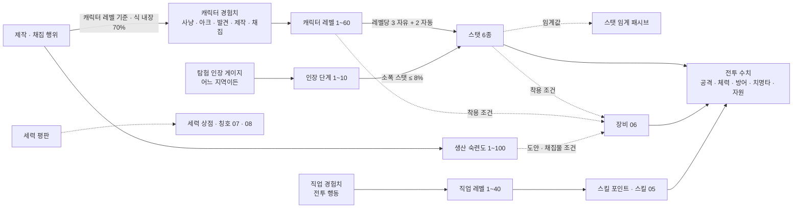

# 04_progression — 성장: 레벨 · 스탯 · 지역 난이도 · 비수직 구조

## 1. 문서 정보

| 항목 | 내용 |
|---|---|
| 버전 | r4 |
| 작성일 | 2026-10-01 |
| 상태 | 검수 중 (r4 배정: system. player-market · lore는 r2 PASS 유지) |
| r4 변경 요약 | r3 중대 1건 수용(DECISIONS 04 r3, 04-r3-S-01 (a)안). (1) 7.5 ③-2 신설: **캐리 상태가 아닌 파티원이 k ≥ 2 처치 경험치를 받은 60초 창에는 전투 경험치 분당 상한 = 1.1 × 기준(L_i) × 부스트 배율**(13장 PARTY_XP_PER_MIN_CAP_MULT = 1.1). 몰이(여러 대상을 끌어 함께 잡기) 2인 140% · 3인 160% → 110%, 최악 레벨 60 도달 약 82시간(부스트 시 약 54.5시간 = 부스트 솔로 60시간의 91%). 동레벨 함께 사냥(95~106.7%) · 캐리 수령자 150% · 예시 (a)~(c) · 9.2 #6 · 9.3 #4의 결과는 그대로(예시 (a)의 비교 문구 '레벨 28 둘만 사냥 114%'만 상한 110%로 정정). (2) 7.5 판정표에 '몰이 2인 · 3인' 행, 7.5 하단 '같은 교전 구역이면 함께 사냥 처치 속도에 묶인다' 문장 삭제 · 수정, 3.3 · 6장 · 13장 · 14.1 #15 · 14.2 후보 ② 정합. (3) r3에서 추가된 두 규칙(피해 기여 문턱 10% PARTY_CONTRIB_MIN_DMG_SHARE, 인스턴스 동기화 '공격력 · 방어력 옵션은 장비 수치 상한에 포함, % 옵션 유지')을 메인 승인에 따라 14.1 #16 · #17 확정으로 정리 |
| r3 변경 요약 | r2 중대 2건 수용(D-51) + D-49 정합. (1) 04-r2-S-01: 파티 배율 인원을 **k**(그 처치에 최근 10초 안에 피해 · 치유 · 버프 · 도발로 기여한 파티원 수)로 바꾸고 X = M × P(k), 분배는 60 studs 안 파티원 n명(최근 60초 기여 0이면 n에서 제외). 7.5 ① · ② · 흩어짐/함께 비교표 · 판정 열 · 예시 (a)~(c), 8.1, 9.2 #6, 9.3 #4 · #6, 13장(PARTY_CONTRIB_WINDOW_S 10 · PARTY_IDLE_EXCLUDE_S 60), 14.2 후보 ② 재계산. 찍기 · 흩어진 지원으로 k를 부풀리지 못하게 '기여 인정' 표(피해 = 그 대상 총 피해 10% 이상, 도발 · 치유 · 버프 = 1/m, PARTY_CONTRIB_MIN_DMG_SHARE)를 두고 남는 위험은 14.1 #15. 예시 처치 속도는 피해 기여가 인정되는 동레벨대 인원 기준으로 다시 잡았다(04-r2-S-03 경미 함께 반영). (2) 04-r2-S-02: 캐리 상태 = 그 처치에 피해 · 치유 · 버프를 준 플레이어(파티 여부 무관) 중 경험치 수령자보다 8레벨 이상 높은 사람이 있으면. 7.4 소유 규칙에 '소유 파티 밖 피해 비율 ≥ 50%면 처치 경험치 × 소유 파티 피해 비율' 추가(13장 KILL_XP_OUTSIDE_DMG_THRESHOLD). 3.3 · 6장 · 7.5 ⓪ · ③ · 13장 정합, 부스트 레벨 12 + 비파티 레벨 45 검산(7.5). (3) D-49: '풀장비' = **전설 등급 풀장비**(06 3.6 전설 +0 · Q50 · 옵션 기대값)로 명시하고 4.2 · 5.2 · 5.3 · 5.5 · 7.7 · 13장 · 14.1 #4를 06 수치로 재계산(4~5타 유지). (4) D-51: 12장 채집 · 제작 인장 '노드 20회당 +1, 제작 3회당 +1' 확정 표기 |
| r2 변경 요약 | r1 중대 11건 전부 수용(D-37~D-42). (1) D-37: 치명타 확률을 힘 · 민첩 · 지력 · 정신 1당 +0.05%p로 정규화(4.1 · 5.1 · 13장), 풀장비 가정 중복 제거(4.2 · 5.5), 유형별 기대 배율 비교표 5.5 신설, 5.2~5.6 · 7.7 · 7.9 재계산. (2) D-40: 정예도 d ≥ 15 무관심(5.3 · 7.2), 외곽 솔로 구역 규칙(7.1 · 8.1 · 8.5), 9.1 · 9.2 정합. (3) D-38: 파티 배율 P(n) 표 · 동레벨 1인당 효율 표(7.5), 예시 3건 · 9.2 · 9.3 · 13장 재계산. (4) D-39: 6장 '인스턴스 처치' 행, 7.1 · 8.1 · 8.3 · 8.5 문장 수정. (5) D-41: 3.3 부스트 적용 · 비적용 원천 표, 6장 · 7.5 상한 규칙. (6) D-42: 시작 도시 발견 0 · 본구역 경계 발동(6장), 3.4 레벨 2 도달 두 경로 표 · 세션표 재계산, 일일 산출 상수(7.3 · 13장), 6장 사냥 0회 경로 계산표. (7) 04-r1-L-01: 9.1 단계 9 R3 위험 항로 표기. 경미 반영: S-07 · S-10 · S-12 · S-13 · S-16 · S-17 · S-18, M-05 · M-06 · M-07 · M-11, L-02~L-10 |
| 목적 | 3-A [진행 순서] 04번 정의: 레벨 · 스탯 · 지역 난이도 · 비수직 구조 설계. 4-정량의 **비수직 검증표**(10레벨 단위 모든 구간에 사냥터 3곳 이상 · 2대륙 이상 · 반드시 거쳐야 하는 사냥터 0곳)를 이 문서에서 수치로 검증한다. 3-C '신규 유저가 고레벨 지역에 들어가면 무슨 일이 생기는지'를 단계별 표로 적는다. |
| 의존 문서 | 00_BRIEF.md(기준), 01_reference.md(3장 강화 원칙 · 4장 비수직 교훈 · 5장 #9 · #40 · #66 · 6장 IP 금지 목록), 02_concept.md(4장 코어 루프 · 6장 페르소나 · 8.2 비수직 6종 · 14장 용어집), 03_world.md(2.4 이동 수단 · 2.6 플레이스 분할 · 5장 종족 · 7장 시작 위치 · 7.1 표지판 · 8장 사냥터 · 8장 머리말 입문 구역 · 8.8 필드 보스 · 9장 비수직 검증표 · 10장 고위험 지역 규칙), 05_classes_skills.md(2.3 직업 레벨 1~40 · 3.1 직업별 주 스탯 · 5.3 자원 · 9장 DPM 검산), DECISIONS.md(D-01~D-51. 직접 쓰는 것: D-02 · D-03 · D-04 · D-05 · D-08 · D-09 · D-10 · D-11 · D-12 · D-13 · D-16 · D-17 · D-21 · D-22 · D-24 · D-25 · D-26 · D-27 · D-28 · D-29 · D-30 · D-31 · D-33 · D-34 · D-35 · D-36 · D-37 · D-38 · D-39 · D-40 · D-41 · D-42 · D-49 · D-51), 06_items_crafting.md(3.2 · 3.3 등급 스탯 표 · 3.6 레벨 60 전설 풀장비 검산), ASSUMPTIONS.md(AS-01~AS-13. 직접 쓰는 것: AS-03 · AS-10 · AS-11 · AS-13) |
| 이 문서를 기준으로 삼는 문서 | 05_classes_skills(직업 자동 성장 분포 · 스킬 계수 · 자원 소모 · 직업 레벨), 06_items_crafting(장비 수치 범위 · 착용 조건 · 내구도 · 생산 숙련도 상세), 07_stories_hidden(아크 장 경험치 · 발견 경험치 · 히든 피스 보상), 08_social_raid(파티 경험치 분배 · 인스턴스 동기화 · 부활 횟수), 10_economy(골드 드롭 · 재분배 비용 · 일일 산출 상한) |
| 표기 규칙 | 전부 한국어. 수치는 표, 공식은 수식. 예시 계산은 문서 안에서 검산된다(모든 표의 숫자는 같은 공식 세트로 생성). 사실은 출처(14장), 그 외 수치는 **추정(튜닝 파라미터)** 이며 13장 표로 데이터 테이블에 뺀다. 레퍼런스 고유명사는 쓰지 않는다(01번 6장). |
| ID | 이 문서는 새 ID를 만들지 않는다. 사냥터 H- · 시작 위치 SP- · 종족 RC- · 도시 T- · 아크 A-는 03번 13장 색인의 것만 쓴다. 가정 ID는 **AS-**(03-r1-L-04), A-는 아크 전용이다. 종족명은 D-22 확정 표기(RC-04 바르쿤 Varkun). 몬스터 이름은 03번 8장 '대표 몬스터'를 그대로 쓰고 MO- ID는 05 · 07에서 부여한다. |
| 표현 규칙 | 3-B-2 · 3-B-5: '권장 레벨' · '다음 사냥터' · '먼저 ○○을 끝내야' 같은 순서 강제 표현을 쓰지 않는다. 사냥터는 **위험도(D-12) + 적정 폭**으로만 말한다. |

---

## 2. 성장 축 개요

캐릭터는 6개의 성장 축을 가진다. 캐릭터 레벨은 그중 하나일 뿐이며, 어느 축도 다른 축의 **선행 조건**이 되지 않는다(D-03 · 3-B-5). 축끼리는 '영향'만 준다(예: 스탯이 장비 착용 조건에 쓰인다).

| 축 | 범위 | 오르는 방법 | 올라서 얻는 것 | 다른 축과의 관계 | 상세 문서 |
|---|---|---|---|---|---|
| 캐릭터 레벨 | 1~60(D-04. 확장 80 → 100) | 캐릭터 경험치: 사냥 · 이야기(아크 장) · 탐험 발견 · 제작 · 채집(병렬 성장원, D-05 (3)) | 레벨당 자유 스탯 3 + 직업 자동 성장 2, 최대 체력 · 마나 기본치, 장비 착용 조건(레벨) | 직업 레벨 · 생산 숙련도의 선행 조건이 **아니다** | 이 문서 3 · 6장 |
| 스탯(6종) | 각 10부터, 상한 없음(실질 60레벨 약 250) | 레벨업 포인트 + 장비 + 탐험 인장 | 공격력 · 체력 · 치명타 · 자원 · 제작 보정, 스탯 임계 패시브, 장비 착용 조건(스탯) | 재분배 가능(도시 NPC, 골드) | 이 문서 4장 |
| 직업 레벨 | 1~40(05 2.3, D-35) | 직업 선택 후 전투 행동(처치 · 스킬 사용)으로 얻는 직업 경험치 | 스킬 포인트, 직업 스킬 해금 · 강화 | 캐릭터 레벨과 독립. 전직 의식 시 유지(D-09) | 05, 이 문서 11장 |
| 생산 숙련도 | 1~100(대장장이 · 채광 · 약초 · 벌목 각각) | 제작 · 채집 행위 | 도안 제작 조건(D-03), 고등급 채집물 조건(D-17), 결과 보정(06) | 캐릭터 레벨과 독립 | 06, 이 문서 11장 |
| 탐험 인장 | 단계 1~10(캐릭터 단일 게이지) | 어느 지역에서든: 일일 계약 · 사냥 드롭 · 채집/제작 · 아크 · 발견 · 히든 피스 | 단계마다 소폭 스탯(총합 ≤ 60레벨 스탯의 8%) · 편의 효과 · 칭호 | 지역별 개별 상한 없음(01번 5장 #40) | 이 문서 12장, 07 |
| 세력 평판 | 세력(F-)별 수치 | 세력 의뢰 · 아크 · 호위 · 전령 | 세력 상점 · 칭호 · (확장) 점령전 참가 자격 | 종족 고향 보너스(D-08)는 평판에만 | 07, 08(여기서는 축 정의만) |

- 실선 = 수치가 흘러가는 관계, 점선 = 조건으로만 쓰이는 관계. 조건 관계는 모두 '장비 착용'과 '도안 · 채집물'에만 걸리고, **지역 입장 · 아크 진행 · 직업 선택에는 어떤 축도 조건이 되지 않는다**(3-B-5, D-10).

---

## 3. 레벨 · 경험치 표

### 3.1 설계 목표와 곡선 근거

| 항목 | 값 | 근거 |
|---|---|---|
| 레벨 60 도달 총 목표 시간(사냥만) | **약 90시간**(5,393분 = 89.9시간) | 모바일 세션 20분 × 하루 2.5회 = 50분/일(AS-03) → 약 108일 ≈ 3.6개월. 골격 목표 '약 90시간 · 3~4개월' |
| 구간별 시간 | 1~10: 5.5h / 11~20: 15.1h / 21~30: 16.3h / 31~40: 17.2h / 41~50: 17.9h / 51~60: 18.0h | 11~60 다섯 구간은 15~18시간 안(D-33), 인접 구간 비율 최대 1.08배(급증 없음). **1~10 구간은 5~6시간 예외(D-33)**: 첫 10분 · 첫 세션 리텐션(02번 5장)을 위해 짧게 둔다. 세션별 레벨업 체감은 3.4 |
| 레벨 1 → 2 | 100 경험치, 사냥만 하면 약 1.1분 | 0장 경로: 입문 구역 첫 전투 2~3마리(22~24씩) + 0장 부탁 + 0장 완료 50 고정 → **0장 완료 무렵(3~6분)** 레벨 2. 0장 생략 경로: 입문 구역 처치 4~5마리 · 채집으로 **5분 이내**(3.4 표). 시작 도시 첫 방문 발견 경험치는 0, 입문 구역이 있는 사냥터의 발견은 본구역 경계에서 발동(D-42)하므로 첫 전투 전에 레벨 2가 되지 않는다. Z 해금 = 레벨 2 도달 또는 첫 아크 1장 완료 중 먼저(D-10). 0장 완료에만 걸린 해금은 없다 |
| 레벨당 필요 경험치 | 필요 경험치(L→L+1) = 기준 경험치/분(L) × 목표 분(L) | 시간 목표가 먼저, 경험치는 그 결과. 분 단위 표(3.2)가 데이터 테이블의 원본이다 |
| 기준 경험치/분 | 기준(L) = 4 × 일반 몬스터 경험치(L) | 같은 레벨 일반 몬스터를 분당 4마리(1마리 15초 = 전투 약 5초(5.4: 약 5타, 05 9.2: 4~6초) + 이동 · 탐색, 02번 4.2 '10~30초') 처치하는 속도. 모든 병렬 성장원(6장)과 상한(7장)의 기준값 |
| 일반 몬스터 경험치 | 경험치(M) = 20 + 2M + M²/20 (반올림) | 레벨 1에서 22, 레벨 60에서 320. 완만한 2차 곡선: 레벨이 올라도 '마리당 경험치'가 급증하지 않아 저위험 지역을 떠날 이유가 '효율'이 아니라 '보상 종류'가 되게 한다(01번 4장 #3) |
| 구간 안 평탄화 | **11~60 구간**: 한 구간 안에서 레벨당 분은 단조 증가, 증가폭 ≤ 2분. **1~10 구간(D-33 예외)**: 레벨 1→2 약 1분에서 레벨 9→10 90분까지 단조 증가(증가폭 3~17분), 레벨 10→11(86분)부터 11~20 구간 규칙 | '다음 레벨이 갑자기 멀어지는' 체감 방지. 1~10은 첫 세션에 레벨업 3회가 들어가도록 앞을 압축한다(3.4) |

### 3.2 레벨 · 경험치 전표(1~60)

'목표 분'은 같은 레벨 적정 사냥터에서 사냥만 할 때의 기대 시간이다. 실제로는 아크 · 발견 · 제작 · 채집 경험치가 섞이므로 더 빠를 수 있다(6장).

| 레벨 | 다음 레벨 필요 경험치 | 누적 경험치(레벨 도달 시) | 목표 분 | 기준 경험치/분 | 기준 경험치/시간 | 일반 몬스터 경험치(동레벨) |
|---|---|---|---|---|---|---|
| 1 | 100 | 0 | 1.14 | 88 | 5,280 | 22 |
| 2 | 384 | 100 | 4 | 96 | 5,760 | 24 |
| 3 | 936 | 484 | 9 | 104 | 6,240 | 26 |
| 4 | 1,972 | 1,420 | 17 | 116 | 6,960 | 29 |
| 5 | 3,472 | 3,392 | 28 | 124 | 7,440 | 31 |
| 6 | 5,848 | 6,864 | 43 | 136 | 8,160 | 34 |
| 7 | 8,640 | 12,712 | 60 | 144 | 8,640 | 36 |
| 8 | 11,700 | 21,352 | 75 | 156 | 9,360 | 39 |
| 9 | 15,120 | 33,052 | 90 | 168 | 10,080 | 42 |
| 10 | 15,480 | 48,172 | 86 | 180 | 10,800 | 45 |
| 11 | 16,704 | 63,652 | 87 | 192 | 11,520 | 48 |
| 12 | 17,952 | 80,356 | 88 | 204 | 12,240 | 51 |
| 13 | 19,224 | 98,308 | 89 | 216 | 12,960 | 54 |
| 14 | 20,880 | 117,532 | 90 | 232 | 13,920 | 58 |
| 15 | 22,204 | 138,412 | 91 | 244 | 14,640 | 61 |
| 16 | 23,920 | 160,616 | 92 | 260 | 15,600 | 65 |
| 17 | 25,296 | 184,536 | 93 | 272 | 16,320 | 68 |
| 18 | 27,072 | 209,832 | 94 | 288 | 17,280 | 72 |
| 19 | 28,880 | 236,904 | 95 | 304 | 18,240 | 76 |
| 20 | 30,720 | 265,784 | 96 | 320 | 19,200 | 80 |
| 21 | 32,256 | 296,504 | 96 | 336 | 20,160 | 84 |
| 22 | 34,144 | 328,760 | 97 | 352 | 21,120 | 88 |
| 23 | 35,696 | 362,904 | 97 | 368 | 22,080 | 92 |
| 24 | 38,024 | 398,600 | 98 | 388 | 23,280 | 97 |
| 25 | 39,592 | 436,624 | 98 | 404 | 24,240 | 101 |
| 26 | 41,976 | 476,216 | 99 | 424 | 25,440 | 106 |
| 27 | 43,560 | 518,192 | 99 | 440 | 26,400 | 110 |
| 28 | 46,000 | 561,752 | 100 | 460 | 27,600 | 115 |
| 29 | 48,000 | 607,752 | 100 | 480 | 28,800 | 120 |
| 30 | 50,500 | 655,752 | 101 | 500 | 30,000 | 125 |
| 31 | 52,520 | 706,252 | 101 | 520 | 31,200 | 130 |
| 32 | 55,080 | 758,772 | 102 | 540 | 32,400 | 135 |
| 33 | 57,120 | 813,852 | 102 | 560 | 33,600 | 140 |
| 34 | 60,152 | 870,972 | 103 | 584 | 35,040 | 146 |
| 35 | 62,212 | 931,124 | 103 | 604 | 36,240 | 151 |
| 36 | 65,312 | 993,336 | 104 | 628 | 37,680 | 157 |
| 37 | 67,392 | 1,058,648 | 104 | 648 | 38,880 | 162 |
| 38 | 70,560 | 1,126,040 | 105 | 672 | 40,320 | 168 |
| 39 | 73,080 | 1,196,600 | 105 | 696 | 41,760 | 174 |
| 40 | 76,320 | 1,269,680 | 106 | 720 | 43,200 | 180 |
| 41 | 78,864 | 1,346,000 | 106 | 744 | 44,640 | 186 |
| 42 | 81,408 | 1,424,864 | 106 | 768 | 46,080 | 192 |
| 43 | 84,744 | 1,506,272 | 107 | 792 | 47,520 | 198 |
| 44 | 87,740 | 1,591,016 | 107 | 820 | 49,200 | 205 |
| 45 | 90,308 | 1,678,756 | 107 | 844 | 50,640 | 211 |
| 46 | 94,176 | 1,769,064 | 108 | 872 | 52,320 | 218 |
| 47 | 96,768 | 1,863,240 | 108 | 896 | 53,760 | 224 |
| 48 | 99,792 | 1,960,008 | 108 | 924 | 55,440 | 231 |
| 49 | 102,816 | 2,059,800 | 108 | 952 | 57,120 | 238 |
| 50 | 105,840 | 2,162,616 | 108 | 980 | 58,800 | 245 |
| 51 | 108,864 | 2,268,456 | 108 | 1,008 | 60,480 | 252 |
| 52 | 111,888 | 2,377,320 | 108 | 1,036 | 62,160 | 259 |
| 53 | 114,912 | 2,489,208 | 108 | 1,064 | 63,840 | 266 |
| 54 | 118,368 | 2,604,120 | 108 | 1,096 | 65,760 | 274 |
| 55 | 121,392 | 2,722,488 | 108 | 1,124 | 67,440 | 281 |
| 56 | 124,848 | 2,843,880 | 108 | 1,156 | 69,360 | 289 |
| 57 | 127,872 | 2,968,728 | 108 | 1,184 | 71,040 | 296 |
| 58 | 131,328 | 3,096,600 | 108 | 1,216 | 72,960 | 304 |
| 59 | 134,784 | 3,227,928 | 108 | 1,248 | 74,880 | 312 |
| 60 | — (상한) | 3,362,712 | — | 1,280 | 76,800 | 320 |

### 3.3 구간 집계

| 구간 | 레벨업 횟수 | 구간 소요(분) | 구간 소요(시간) | 구간 필요 경험치 | 누적 시간 | 모바일 일수(50분/일) |
|---|---|---|---|---|---|---|
| 1~10 | 9 | 327 | 5.5 | 48,172 | 5.5 | 7 |
| 11~20 | 10 | 905 | 15.1 | 217,612 | 20.5 | 25 |
| 21~30 | 10 | 980 | 16.3 | 389,968 | 36.9 | 44 |
| 31~40 | 10 | 1,030 | 17.2 | 613,928 | 54.0 | 65 |
| 41~50 | 10 | 1,071 | 17.9 | 892,936 | 71.9 | 86 |
| 51~60 | 10 | 1,080 | 18.0 | 1,200,096 | 89.9 | 108 |
| 합계 | 59 | 5,393 | 89.9 | 3,362,712 | — | 108 |

- 검산: 구간 소요의 합 = 5.5 + 15.1 + 16.3 + 17.2 + 17.9 + 18.0 = 89.9시간.
- 유료 경험치 부스트(D-11 · D-41, 게임 패스 1종, 배율 b = 1.5)는 아래 표의 **적용 원천 전부에 표기대로 +50%** 다. 상한도 같은 배율로 넓어지므로 부스트분이 상한에 잘려 0이 되는 원천은 없다. 부스트 시 총 목표 시간 = 5,393분 ÷ 1.5 = 3,595분 ≈ **60시간**. 10번 상품 설명 문구는 이 표를 기준으로 쓴다.

| 원천 | 부스트 | 상한 처리(부스트 적용 시) | 근거 |
|---|---|---|---|
| 사냥(필드 · 인스턴스 처치, 6장) | **×1.5** | 분당 상한 = 1.5 × 기준(L) × **b**(= 기준의 225%). 7.5 ③. 단 캐리 상태가 아닌 파티원이 k ≥ 2 처치 경험치를 받은 60초 창은 1.1 × 기준(L) × **b**(= 기준의 165%, 7.5 ③-2) | D-41, DECISIONS 04 r3 |
| 사냥 중 **캐리 상태**(그 처치에 피해 · 치유 · 버프를 준 플레이어 중 — **파티 여부 무관** — 나보다 레벨이 8 이상 높은 사람이 있을 때의 처치, 7.5 ③) | **×1.0(미적용)** | 분당 상한 = 1.5 × 기준(L)(b를 곱하지 않음). 파티를 맺지 않고 고레벨에게 대신 잡게 하는 우회는 캐리 판정(파티 무관)과 7.4 '소유 파티 밖 피해 비율 ≥ 50%' 규칙으로 막는다 | D-41: 캐리 + 부스트 결합 차단, D-51 |
| 아크 장 · 이야기 NPC · 기록물 · 발견 · 히든 피스 · 세력 의뢰 | ×1.5 | 단발 원천, 상한 없음(지점 · 장 · 의뢰당 1회 규칙은 그대로) | D-41 |
| 일일 · 주간 계약, 던전 클리어 보너스, 레이드(08) | ×1.5 | 횟수 상한(일 3 · 주 3 · 주간 보상 횟수)은 그대로 | D-41, D-25 |
| 제작 · 채집 | ×1.5 | 0.7은 **식에 내장된 값**(6장)이며 별도 분당 · 창 상한이 없다 → 부스트 시 기준의 105%. 실질 상한은 일일 상한(DAILY_CRAFT_CAP 30회 · DAILY_GATHER_CAP 200노드, 13장)이고 횟수는 늘지 않는다 | D-41, D-42 |
| 비적용: 직업 경험치 | — | 부스트 **전** 캐릭터 전투 경험치의 50%(11.1) | D-11(배율은 캐릭터 경험치 1종만) |
| 비적용: 생산 · 채집 숙련도, 인장 게이지, 세력 평판 | — | — | D-11 |
| 비적용: 골드 · 재료 · 도안 · 드롭 | — | — | D-11(배율 금지) |
| 비적용: 랭킹 점수 · 파티원 몫 | — | 랭킹은 부스트분 제외, 파티원에게 전파하지 않음(구매자 자기 몫에만) | D-11 |

### 3.4 1~10 구간의 모바일 세션별 레벨업 체감(AS-03 · 02번 4.3 · D-33)

#### 3.4.1 레벨 2 도달 시점(두 경로, D-42 · D-10)

시작 도시 첫 방문 발견 경험치 = 0(발견 체크만), 입문 구역이 있는 사냥터의 발견은 **본구역 경계**에서 발동(6장). 0장 안의 NPC 대화 · 기록물 경험치는 0장 고정 50에 포함된다(별도 지급 없음). 따라서 첫 전투 전에는 경험치가 0이다. 레벨 1 기준 경험치/분 88, 입문 구역 몬스터 경험치 레벨 1 · 2 · 3 = 22 · 24 · 26, 채집 1노드 = 88 × 0.07 = 6.2.

| 경로 | 시점(02번 5.2) | 하는 일 | 경험치(누적) | 레벨 2 |
|---|---|---|---|---|
| 0장 경로 | 0~1분 | 도착 · 이동 · 대시. 시작 도시 발견 체크(경험치 0) | 0 | — |
| 0장 경로 | 1~3분 | 입문 구역 첫 전투 2~3마리(레벨 1~2) | 44~70 | — |
| 0장 경로 | 3~6분 | 0장 부탁 택1: 전투 1마리(+22) 또는 채집 2노드(+12). 완료 전 최대 70 + 22 = 92 < 100 | 56~92 | — |
| 0장 경로 | 0장 완료(3~6분) | 0장 고정 +50 | **106~142** | **0장 완료 무렵(3~6분) 도달 ✓**(목표 3~6분) |
| 0장 생략 경로 | 0~1분 | '숙련자 모드' 또는 0장을 건너뛰고 입문 구역으로 이동(도보 60초 이내, D-29) | 0 | — |
| 0장 생략 경로 | 1~3.5분 | 입문 구역 처치 5마리(5 × 22 = 110) 또는 처치 4마리 + 채집 2노드(88 + 12 = 100). 1마리 약 15초(3.1) | **100~110** | **약 2.5~3.5분 도달 ✓**(목표 5분 이내) |
| 0장 생략 · 채집만 | 1~5분 | 0장용 개인 채집 노드(03 10.6) 17노드(17 × 6.2 = 105, 채널링 102초 + 노드 간 이동) | 105 | 약 4~5분 도달 ✓ |

- 잔해 · 몬스터를 5마리 이상 잡으면 0장 완료 전에 레벨 2가 된다(유저 선택). 어느 경로든 Z 해금(D-10)은 5분 안팎이다. 02번 5.3의 '위험도 1 몬스터 6~8마리'는 이 표의 4~5마리로 갱신한다(14.1 #11).

#### 3.4.2 세션별 레벨업(0장 경로 기준)

모바일 1세션 = 20분(AS-03 15~25분의 중간값). 02번 4.3의 L2 세션 구성(아크 1장 8~12분 + 일일 계약 15분 등)은 전부 기준 경험치/분 100%의 원천(6장)이므로 **사냥만 하는 세션과 레벨업 시점이 같다**. '사냥 환산 누적'은 3.2 목표 분의 누적, '실제 누적(추정)'은 0장 · 첫 갈림길의 경험치가 적은 시간(약 +5.5분)과 첫 본구역 발견(기준(2) × 2분 = 192, 약 −2분)을 반영해 레벨 3부터 **+3.5분**을 더한 값이다. 이후 새 사냥터 · 도시 첫 방문은 조금씩 더 앞당긴다(반영하지 않음, 보수적).

| 레벨업 | 목표 분 | 사냥 환산 누적 | 실제 누적(추정) | 도달 세션(20분) | 그 세션에서 함께 생기는 체감(02번 4.3 · D-10) |
|---|---|---|---|---|---|
| 1 → 2 | 1.1 | 1.1 | 3~6(3.4.1) | 1 | 레벨 2 = Z 슬롯 해금(D-10: 레벨 2 또는 첫 아크 1장 완료 중 먼저). 0장 완료 보상 인장 +20(12장) |
| 2 → 3 | 4 | 5.1 | 8.6 | 1 | 첫 본구역 발견(192). 첫 갈림길 선택 보상(도안 조각 1개 또는 인장 +20, 동일 가치, 12장) |
| 3 → 4 | 9 | 14.1 | 17.6 | 1 | 첫 세션 안에 **레벨업 3회**(갈림길에서 오래 머물면 레벨 4는 19~20분) |
| 4 → 5 | 17 | 31.1 | 34.6 | 2 | 직업 선택 → 직업 레벨 · 스킬 포인트 축 시작(11장) |
| 5 → 6 | 28 | 59.1 | 62.6 | 4 | 3세션째는 레벨업 없음: 아크 장 완료(장당 인장 +5) · 직업 레벨 · 일일 계약이 체감 |
| 6 → 7 | 43 | 102.1 | 105.6 | 6 | 이후 레벨업은 2~4세션에 1회. 인장 게이지 약 100~120 = **인장 단계 1**(12장: 0장 20 + 갈림길 20 + 일일 계약 3일 36 + 발견 5곳 15 + 아크 4장 20 + 드롭 약 4) |
| 7 → 8 | 60 | 162.1 | 165.6 | 9 | 인장 게이지 약 150(단계 1 유지) · 직업 레벨 |
| 8 → 9 | 75 | 237.1 | 240.6 | 13 | 11~20 구간 사냥터(위험도 2) 적정 폭 진입 |
| 9 → 10 | 90 | 327.1 | 330.6 | 17 | 1~10 구간 완료 ≈ 5.5시간 = 모바일 약 7일(50분/일). 인장 게이지 약 250 = 단계 2 무렵(주간 계약 포함) |

- 판정: 첫 2세션은 세션마다 캐릭터 레벨업이 있고(3 · 1회), 3세션째부터는 2~4세션에 1회(간격 2 · 2 · 3 · 4 · 4세션)로 11~20 구간(레벨당 86~95분 ≈ 4.5세션)과 같은 간격에 수렴한다. 레벨업이 없는 세션의 체감은 직업 레벨 · 인장 · 아크 장 보상이 맡는다(02번 4.3 '다음 행동 동기' 열). 레벨당 분을 더 평탄하게 하면 레벨 1→2가 수십 분이 되어 02번 5.2의 '첫 3~6분 레벨 2' 목표와 충돌하므로 1~10 구간은 D-33의 예외로 둔다.
- PC 세션(40~60분, AS-03)은 1세션에 레벨 5, 2세션(누적 80~120분)에 레벨 6~7 도달.

---

## 4. 스탯

### 4.1 6스탯 정의와 효과(선형)

모든 스탯 효과는 **선형**이다(스탯 1당 고정 증가, 구간별 배율 없음). 치명타 확률은 공격 스탯 4종(힘 · 민첩 · 지력 · 정신)이 1당 **똑같이 +0.05%p** 준다(D-37). 특정 주 스탯만 치명타를 받으면 레벨이 오를수록 그 직업만 앞서므로(04-r1-S-01) 어느 유형이 주 스탯을 키워도 치명타 증가 속도가 같게 둔다. 기본값은 모든 스탯 10(종족 보정 ±2, 10장). 상한 없음(실질 60레벨 주 스탯 약 250).

| 스탯 | 영문 | 스탯 1당 효과 | 상한 | 주로 쓰는 성장 유형 | 비고 |
|---|---|---|---|---|---|
| 힘 (STR) | Strength | 근접 물리 공격력 +2, 치명타 확률 +0.05%p, 소지 무게 +1 | 치명타 확률 60%(4종 합산) | 근접 힘형, 생산형(보조) | 양손 · 한손 근접 무기의 주 스탯 |
| 민첩 (DEX) | Dexterity | 원거리 물리 공격력 +2, 치명타 확률 +0.05%p, 회피 +0.05%p(민첩만의 추가 효과) | 치명타 확률 60%(4종 합산), 회피 20% | 민첩형(궁수 · 단검) | 활 · 단검의 주 스탯 |
| 체력 (VIT) | Vitality | 최대 체력 +12, 방어력 +0.5 | — | 전 유형(자동 성장에 포함) | 생존의 기본 축 |
| 지력 (INT) | Intellect | 마법 공격력 +2, 치명타 확률 +0.05%p, 최대 마나 +6 | 치명타 확률 60%(4종 합산) | 마법형 | 지팡이 · 마도구의 주 스탯 |
| 정신 (SPR) | Spirit | 치유 · 지원 계수 +2(지원형 주 스탯이면 공격력 +2, 5.1), 치명타 확률 +0.05%p, 최대 마나 +4, 상태이상 저항 +0.1%p | 치명타 확률 60%(4종 합산), 저항 50% | 지원형 | 회복 · 버프 스킬의 주 스탯 |
| 기교 (TEC) | Technique | 치명타 피해 +0.5%p, 제작 미니게임 판정 보정 · 채집 속도 보정(06에서 수치) | 치명타 피해 250% | 생산형(대장장이), 보조로 전 유형 | 전투 · 생산 겸용 스탯(D-02) |

### 4.2 레벨별 스탯 포인트

레벨업마다 **자유 배분 3 + 직업 자동 성장 2**(견습 상태에서는 자동 성장 2도 자유 배분으로 지급하고, 직업 선택 시 이후 레벨부터 자동 분포 적용). 포인트는 즉시 쓰지 않아도 되고 모아둘 수 있다.

| 레벨 | 자유 포인트 누적 | 자동 성장 누적 | 총 포인트 누적 | 스탯 합(기본 60 + 누적) | 예시: 근접 힘형 힘 / 체력 |
|---|---|---|---|---|---|
| 1 | 0 | 0 | 0 | 60 | 10 / 10 |
| 10 | 27 | 18 | 45 | 105 | 37 / 28 |
| 20 | 57 | 38 | 95 | 155 | 67 / 48 |
| 30 | 87 | 58 | 145 | 205 | 97 / 68 |
| 40 | 117 | 78 | 195 | 255 | 127 / 88 |
| 50 | 147 | 98 | 245 | 305 | 157 / 108 |
| 60 | 177 | 118 | 295 | 355 | 187 / 128 |

- 예시 열은 '자유 3 중 힘 2 · 체력 1, 자동 2 = 힘 1 · 체력 1'로 찍은 **기준 빌드**다. 5장의 모든 플레이어 기준표가 이 빌드를 쓴다.
- 장비 스탯 보정(06)은 포인트와 별도이며 기준 장비 = 주 스탯 +0.25 × 레벨(반올림). **'풀장비' = 레벨 60 전설 등급 풀장비**(D-49: 7부위 전설 +0 · 품질 50 · 각인 칸 전부 성공 · 옵션 기대값, 06 3.6 '전설 +0 (Q50) = 04 풀장비 정의' 행). 그 수치(06 3.2 · 3.3 · 3.6): 무기 공격력 **159**(T6 전설 Q50 151 × 각인 1.05), 공격력 옵션 기대 **+26**, 주 스탯 **+38**(장신구 목걸이 11 · 반지 7 + 주 스탯 옵션 기대 약 20), 기교 옵션 기대 **+7**, 체력 스탯 옵션 기대 **+5**, 치명타 확률 옵션 기대 **+6.95%p**, 치명타 피해 옵션 기대 **+19.5%p**, 방어구 합 **156** + 방어력 옵션 기대 **+9**. 주 스탯이 아닌 공격 스탯 보조 보정은 없다(r2의 '보조 2종 +20' 가정 폐지, 주 스탯 중복 없음은 D-37 그대로). 최대 체력 · 받는 피해 감소 옵션 기대값은 06 3.6과 같이 검산에서 뺀다. 신화 · 초월은 '풀장비'가 아니라 극소수 이론 상한이다(D-49, 06 3.6).
- 모바일 배분 보조(04-r1-M-11): 스탯 창 안에 '추천 배분' 버튼(위 기준 빌드: 주 스탯 2 · 체력 1)과 '레벨업 시 자동 배분' 토글을 둔다. 견습 · 첫 직업 선택 전에는 기본 켜짐, 끄면 수동. 미배분 포인트가 있으면 메뉴 아이콘에 점 표시. 버튼은 스탯 창 안에 있어 D-16 상시 노출 수에 산입하지 않는다.

### 4.3 직업 자동 성장 유형 6종(예시 분포)

직업별 실제 분포는 05에서 정한다. 여기서는 유형 6종의 분포만 정의한다. 자동 2포인트는 정수로 주기 위해 2레벨 주기로 번갈아 찍는다.

| 유형 | 홀수 레벨(2점) | 짝수 레벨(2점) | 레벨당 평균 | 대표 직업(05 예시) |
|---|---|---|---|---|
| 근접 힘형 | 힘 1 · 체력 1 | 힘 1 · 체력 1 | 힘 1.0 · 체력 1.0 | J-01 전사, J-H4 시련 감독관(체력 변형) |
| 민첩형 | 민첩 1 · 힘 1 | 민첩 1 · 체력 1 | 민첩 1.0 · 힘 0.5 · 체력 0.5 | J-02 궁수(필수 직업), J-05 그림자술사(기교 변형: 민첩 1 · 기교 1 / 민첩 1 · 체력 1) |
| 마법형 | 지력 1 · 정신 1 | 지력 1 · 체력 1 | 지력 1.0 · 정신 0.5 · 체력 0.5 | J-03 마도사, J-H5 |
| 지원형 | 정신 1 · 지력 1 | 정신 1 · 체력 1 | 정신 1.0 · 지력 0.5 · 체력 0.5 | J-04 치유사, J-H3 묘역 서기관(05의 '균형형(정신 · 지력 변형)'은 이 지원형과 같은 분포) |
| 생산형 | 기교 1 · 힘 1 | 기교 1 · 체력 1 | 기교 1.0 · 힘 0.5 · 체력 0.5 | J-06 대장장이(필수 직업, 전투 겸업 D-02. 전투 주 스탯은 힘) |
| 균형형 | 레벨 % 3 = 1: 힘 1 · 민첩 1 / = 2: 체력 1 · 지력 1 / = 0: 정신 1 · 기교 1 | (3레벨 주기) | 각 0.33 | 현재 해당 직업 없음(예약 유형, 확장 히든 직업용) |

- 전직 의식(D-09)으로 직업을 바꾸면 **이미 찍힌 자동 성장분은 그대로 두고** 이후 레벨부터 새 유형을 적용한다. 자동 성장분까지 바꾸려면 4.4 재분배를 쓴다(자동 성장분도 재분배 대상).

### 4.4 스탯 재분배

| 항목 | 규칙 |
|---|---|
| 장소 | 도시 · 마을(T-)의 '수련 사범' NPC(모든 T-에 배치, 전초기지 포함). 필드 · 인스턴스에서는 불가 |
| 대상 | 자유 포인트 + 자동 성장 포인트 전부(종족 보정 · 장비 · 인장 보정은 제외) |
| 비용 | 전체 초기화 = 200 × 캐릭터 레벨 골드. 부분 이동(포인트 1개를 다른 스탯으로) = 5 × 캐릭터 레벨 골드. 레벨 20 이하에서 전체 초기화 **1회 무료**(직업 체험 후 빌드 바꾸기, D-10) |
| 횟수 제한 | 없음(비용만). 전직 의식(D-09)과 묶어 하면 전체 초기화 비용 50% |
| 처리 1층: 스탯 임계 패시브(4.5) | 재분배로 스탯이 임계값 아래로 내려가면 **즉시 꺼진다**. 다시 임계값 이상이 되면 즉시 켜진다(재습득 불필요) |
| 처리 2층: 습득 스킬(퀘스트 · 히든 피스, V 슬롯) | **유지된다**(잃지 않음). 단, 요구 스탯을 충족하지 않으면 슬롯에서 자동 해제되어 '장착 불가(요구: 힘 120)' 표시. 충족하면 다시 장착 가능. 직업 스킬은 직업 레벨에만 걸리므로 영향 없음 |
| 장비 | 재분배 후 착용 조건(레벨 + 스탯, 3-B-12)을 못 채우는 장비는 **착용 상태로 남되 효과 0**('조건 미달' 표시). 벗으면 다시 못 낀다 |
| UI | 재분배 확인 화면에 '꺼지는 패시브 n개 · 해제되는 습득 스킬 n개 · 조건 미달 장비 n개'를 먼저 보여준다 |

| 레벨 | 전체 초기화(골드) | 부분 이동 1포인트(골드) | 같은 레벨 일반 몬스터 골드 드롭 | 전체 초기화 = 몬스터 몇 마리 |
|---|---|---|---|---|
| 10 | 2,000 | 50 | 9 | 222 (약 0.9시간) |
| 20 | 4,000 | 100 | 15 | 267 (약 1.1시간) |
| 30 | 6,000 | 150 | 21 | 286 (약 1.2시간) |
| 40 | 8,000 | 200 | 27 | 296 (약 1.2시간) |
| 50 | 10,000 | 250 | 33 | 303 (약 1.3시간) |
| 60 | 12,000 | 300 | 39 | 308 (약 1.3시간) |

- 골드 드롭은 5.4의 추정식(3 + 0.6 × 몬스터 레벨)이며 10에서 확정한다. 재분배 비용은 '한 세션 안에서 결정할 수 있는 수준'(60레벨 기준 약 1.3시간 사냥)으로 둔다.

### 4.5 스탯 임계 패시브(예시 6개, 스탯별 1개)

조건부 효과(01번 5장 #9 · #66). 스탯 **총합(포인트 + 장비 + 인장)** 이 임계값 이상이면 자동으로 켜지고, 아래로 내려가면(재분배 · 장비 해제) 꺼진다. 직업 무관. 전체 목록은 05(직업별 추가 임계 패시브 포함). 2단계 임계값 160은 기준 빌드(주 스탯 3/레벨 + 장비 0.25/레벨)로 **레벨 47**, 자유 3 + 자동 1을 한 스탯에 몰면 레벨 39, 자동 성장분까지 재분배(4.4)로 몰면 레벨 31에 닿는 후반 전문화 보상이다(04-r1-S-07). 유형 간 피해 차이에 주는 영향은 5.7에서 검산한다.

| ID(05에서 확정) | 스탯 | 이름 | 1단계 임계값 | 1단계 효과 | 2단계 임계값 | 2단계 효과 | 재분배 시 |
|---|---|---|---|---|---|---|---|
| TP-STR | 힘 | 거친 손 (Rough Hands) | 100 | 근접 무기 스킬 계수 +5% | 160 | +10%, 넉백 저항 | 임계 미만이면 꺼짐 |
| TP-DEX | 민첩 | 발 빠름 (Light Feet) | 100 | 대시 쿨타임 −10% | 160 | −20%, 대시 후 1초간 회피 +10%p | 임계 미만이면 꺼짐 |
| TP-VIT | 체력 | 굳은 살 (Callused) | 100 | 받는 피해 −3% | 160 | −6%, 부활 대기 −2초 | 임계 미만이면 꺼짐 |
| TP-INT | 지력 | 맑은 머리 (Clear Mind) | 100 | 마나 소모 −8% | 160 | −15%, 마법 스킬 시전 시간 −10% | 임계 미만이면 꺼짐 |
| TP-SPR | 정신 | 평정 (Composure) | 100 | 상태이상 지속 −20% | 160 | −35%, 치유 계수 +5% | 임계 미만이면 꺼짐 |
| TP-TEC | 기교 | 손끝 (Fingertips) | 100 | 제작 미니게임 판정 창 +10%(06), 치명타 피해 +5%p | 160 | 판정 창 +20%, 치명타 피해 +10%p | 임계 미만이면 꺼짐 |

- 임계값 100 도달 시점: 기준 빌드 레벨 29(10 + 84 + 장비 7 = 101), 자유 3을 한 스탯에 몰면 레벨 31(10 + 90, 장비 제외), 자동 성장이 같은 스탯이면 레벨 24(10 + 23 × 4 = 102). 장비 · 인장을 더하면 더 빠르다.

---

## 5. 전투 수치

### 5.1 공식

| 항목 | 공식 | 설명 |
|---|---|---|
| 기본 공격력 | 무기 공격력 + 2 × 주 스탯 총합(근접 = 힘, 원거리 = 민첩, 마법 = 지력, **지원 = 정신**: 치유사 J-04 · 묘역 서기관 J-H3, D-35) | 주 스탯 총합 = 포인트 + 종족 + 장비 + 인장. 직업별 주 스탯은 05 3.1. 무기 스킬도 들고 있는 무기가 아니라 직업의 주 스탯을 쓴다(05 5.4) |
| 최종 데미지(곱셈 완화형) | **기본 공격력 × 스킬 계수 × 100 / (100 + 대상 방어력) × 랜덤(0.95~1.05) × 치명타 배율(치명 시 치명타 피해, 아니면 1.0)** × 기타 보정(속성 · 버프, 05 · 06, 기본 1.0) | 최소 1. 방어력은 데미지를 0으로 만들지 못한다(방어 100 = 피해 절반, 방어 200 = 1/3) |
| 스킬 계수 | 기본 공격 1.0, 무기 스킬 · 직업 스킬 1.2~3.0(05) | 검산용 평균 계수 **1.6**(D-35: 05 9.2 표준 회전의 분당 실효 계수 약 1.6~1.8의 하단. 기본 공격 약 40% + 평균 2.0 스킬 약 60%). 05의 스킬 계수는 그대로 두고 이 상수만 맞춘다. 스킬이 피해에서 차지하는 몫 = 0.6 × 2.0 ÷ 1.6 = **0.75**(TP_SKILL_SHARE): 스킬 계수만 올리는 임계 패시브(TP-STR)의 피해 보정 = 1 + 보정률 × 0.75 |
| 치명타 확률 | 5% + **0.05%p × (힘 + 민첩 + 지력 + 정신 총합)** + 장비 보정, 상한 60% | 공격 스탯 4종 동일 계수(D-37, 민첩 전용 보정 폐지). 체력 · 기교는 치명타 확률을 주지 않는다. 몬스터 치명타 없음(보스 기믹 제외) |
| 치명타 피해 | 150% + 0.5%p × 기교 총합 + 장비 보정, 상한 250% | 기대 배율 = 1 + 확률 × (피해 − 1) |
| 회피 | 0.05%p × 민첩 총합 + 장비 보정, 상한 20%(민첩만의 추가 효과, D-37) | 회피 시 피해 0. 몬스터 회피: 일반 0%, 정예 5%, 보스 0% |
| 최대 체력 | 100 + 10 × 레벨 + 12 × 체력 총합 | 자연 회복: 비전투 시 초당 2% |
| 방어력 | 방어구 합(06) + 방어력 옵션 + 0.5 × 체력 총합 | 기준 방어구 = 2.5 × 레벨, 60레벨 전설 풀장비 = 방어구 합 156 + 옵션 기대 9(06 3.3 · 3.6, D-49) |
| 받는 피해 | 공격자 기본 공격력 × 계수 × 100 / (100 + 내 방어력) × 랜덤 | 플레이어 · 몬스터 동일 식 |
| 마나(마법 · 지원 · 마법형 히든) | 50 + 3 × 레벨 + 6 × 지력 총합 + 4 × 정신 총합. 회복 초당 1% + 0.1 × 정신. **지팡이 기본 공격 적중 시 마나 +4**(AS-13, 기력의 '기본 공격 적중 +5'에 대응하는 마나판) | 소모 10~60(05). +4의 튜닝은 05 · 06(AS-13) |
| 기력(근접 · 원거리 · 생산형) | 100 고정, 회복 초당 5. 기본 공격 적중 시 +5 | 소모 10~35(05). 대장장이는 열기 게이지 병행(05 · 06) |
| 치유량 | 스킬 기본치 + 2 × 정신 총합 × 스킬 계수 | 05 |
| 몬스터 공격 간격 | 일반 2.0초, 정예 1.8초, 보스 패턴별(08) | 피격 횟수 → 생존 시간 환산에 사용 |

### 5.2 레벨별 플레이어 기준 스탯(근접 힘형 기준 빌드 · 기준 장비)

기준 장비 = 그 레벨대에서 사냥 · 제작으로 평범하게 갖추는 장비(희귀~영웅). 무기 공격력 = 8 + 2.4 × 레벨, 방어구 합 = 2.5 × 레벨, 주 스탯 보정 = 0.25 × 레벨(반올림). 06이 장비 수치 범위를 확정하면 이 열을 갱신한다.

| 레벨 | 힘(포인트+장비) | 체력 스탯 | 무기 공격력 | 물리 공격력 | 최대 체력 | 방어력 | 치명타 확률(힘 + 민첩 10 + 지력 10 + 정신 10) | 치명타 피해 | 기대 배율 | TP-STR 피해 보정(4.5) | 기력 |
|---|---|---|---|---|---|---|---|---|---|---|---|
| 1 | 10 | 10 | 10.4 | 30 | 230 | 7.5 | 7.00% | 155% | 1.038 | 1.000 | 100 |
| 10 | 39 | 28 | 32.0 | 110 | 536 | 39.0 | 8.45% | 155% | 1.046 | 1.000 | 100 |
| 20 | 72 | 48 | 56.0 | 200 | 876 | 74.0 | 10.10% | 155% | 1.056 | 1.000 | 100 |
| 30 | 105 | 68 | 80.0 | 290 | 1,216 | 109.0 | 11.75% | 155% | 1.065 | 1.038(1단계) | 100 |
| 40 | 137 | 88 | 104.0 | 378 | 1,556 | 144.0 | 13.35% | 155% | 1.073 | 1.038(1단계) | 100 |
| 50 | 169 | 108 | 128.0 | 466 | 1,896 | 179.0 | 14.95% | 155% | 1.082 | 1.075(2단계) | 100 |
| 60 | 202 | 128 | 152.0 | 556 | 2,236 | 214.0 | 16.60% | 155% | 1.091 | 1.075(2단계) | 100 |
| 60 전설 풀장비(D-49, 06 3.6) | 225 | 133 | 159 | 635(공격력 옵션 +26 포함) | 2,296 | 231 | 24.70%(옵션 +6.95%p 포함) | 178% | 1.193 | 1.075(2단계) | 100 |

- 기대 배율 = 1 + 치명타 확률 × (치명타 피해 − 1). TP-STR은 힘 총합 100(레벨 29) · 160(레벨 47)에서 켜진다(4.5). 레벨 1~20의 1.038~1.056은 r1(민첩 전용 치명타) 1.033보다 약간 높다.
- '60 전설 풀장비' 행(4.2 정의): 힘 = 187 + 38 = 225, 체력 = 128 + 옵션 5 = 133, 기교 = 10 + 옵션 7 = 17, 민첩 · 지력 · 정신 10. 물리 공격력 = 159 + 26 + 2 × 225 = **635**(06 3.6 기본 공격력 635와 같음). 최대 체력 = 100 + 600 + 12 × 133 = 2,296(최대 체력 옵션 제외). 방어력 = 156 + 9 + 0.5 × 133 = 231.5 → **231**(06 3.6 '약 231'과 같음). 치명타 확률 = 5% + 0.05%p × (225 + 10 + 10 + 10) + 6.95%p = **24.70%**(06 3.6의 23.2%는 주 스탯만 넣은 값. D-37의 공격 스탯 4종 합산이면 민첩 · 지력 · 정신 30 × 0.05%p = 1.5%p가 더해진다, 14.1 #4), 치명타 피해 = 150% + 0.5%p × 17 + 19.5%p = **178%**(06과 같음), 기대 배율 = 1 + 0.247 × 0.78 = 1.193.

마법형 참고(기준 빌드와 같은 배분: 자유 3 중 지력 2 · 체력 1, 자동 지력 1 · 정신/체력 0.5 → 지력 3/레벨, 체력 1.5/레벨, 정신 0.5/레벨. 지팡이 공격력 = 무기와 동일 식):

| 레벨 | 지력(포인트+장비) | 마법 공격력 | 최대 마나 | 최대 체력(체력 스탯 = 10 + 1.5 × (레벨−1)) |
|---|---|---|---|---|
| 1 | 10 | 30 | 153 | 230 |
| 30 | 105 | 290 | 866 | 1,048 |
| 60 | 202 | 556 | 1,602 | 1,876 |

### 5.3 몬스터 기준 스탯(레벨 M)

| 등급 | 체력 | 공격력 | 방어력 | 경험치 | 골드(10에서 확정) | 감지 거리 | 추적 속도 | 무관심 규칙 |
|---|---|---|---|---|---|---|---|---|
| 일반 | **25M + 900 × (1 − e^(−M/10))** | 15 + 4M + 0.09M² | 2M | 20 + 2M + M²/20 | 3 + 0.6M | 24 studs | 14 studs/s | 적용 |
| 정예 | 일반 × 4 | 일반 × 1.5 | 일반 × 1.3 | 일반 × 5 | 일반 × 4 | 30 studs | 16 studs/s | **적용**(d ≥ 15 무관심, D-40. 완충 구간 감지 50%도 일반과 같음) |
| 보스(필드 · 인스턴스) | 일반 × 25 | 일반 × 2.2 | 일반 × 1.6 | 일반 × 40 | 일반 × 30 | 40 studs | 18 studs/s | **미적용**(03 10.1 예외). 시간 · 이벤트 출현 필드 보스는 D-31 (c) 준용(7.2 #1-A) |
| 레이드 보스(RB-) | 08에서 별도 | | | | | | | 미적용 |

- 무관심 예외(항상 선공 가능)는 보스 · 네임드 · 아크 전투 대상 · 레이드 보스 · 광기 지역 개체뿐이다(03 10.1 · D-40). 정예는 일반과 같이 d ≥ 15면 무관심이므로 파티 권장 사냥터에 정예가 섞여 있어도 저레벨의 '걸어 다니기'는 그대로 성립한다(9.1 · 9.2).
- 체력 식의 근거: 같은 레벨 기준 빌드가 평균 계수 1.6(D-35)으로 **약 5타**(4.9~5.3, 임계 패시브 포함. 미포함 5.2~5.4)에 잡고, 레벨 60 **전설** 풀장비(D-49)가 위험도 6 일반 몬스터를 **4~5타**(목표 4~6타 안)에 잡는 값(5.5 검산). 포화형(e^(−M/10))이라 레벨 상한 확장(D-13) 시에도 식을 바꾸지 않고 쓸 수 있다.
- 공격력 식의 근거: 같은 레벨 기준 빌드가 **약 12타(24초)** 를 버티는 값. 플레이어가 약 5타에 잡고 12타를 버티므로 1:1은 플레이어 우위, 2마리 동시는 긴장, 3마리 이상은 후퇴 판단이 필요하다.
- 모든 값은 반올림 정수로 데이터 테이블에 미리 계산해 넣는다(13장). 아래는 5레벨 단위 발췌.

| 몬스터 레벨 | 일반 체력 | 일반 공격력 | 일반 방어력 | 일반 경험치 | 일반 골드 | 정예 체력 | 정예 공격력 | 정예 경험치 | 보스 체력 | 보스 공격력 | 보스 경험치 |
|---|---|---|---|---|---|---|---|---|---|---|---|
| 1 | 111 | 19 | 2 | 22 | 4 | 444 | 28 | 110 | 2,775 | 42 | 880 |
| 5 | 479 | 37 | 10 | 31 | 6 | 1,916 | 56 | 155 | 11,975 | 81 | 1,240 |
| 10 | 819 | 64 | 20 | 45 | 9 | 3,276 | 96 | 225 | 20,475 | 141 | 1,800 |
| 15 | 1,074 | 95 | 30 | 61 | 12 | 4,296 | 142 | 305 | 26,850 | 209 | 2,440 |
| 20 | 1,278 | 131 | 40 | 80 | 15 | 5,112 | 196 | 400 | 31,950 | 288 | 3,200 |
| 25 | 1,451 | 171 | 50 | 101 | 18 | 5,804 | 256 | 505 | 36,275 | 376 | 4,040 |
| 30 | 1,605 | 216 | 60 | 125 | 21 | 6,420 | 324 | 625 | 40,125 | 475 | 5,000 |
| 35 | 1,748 | 265 | 70 | 151 | 24 | 6,992 | 398 | 755 | 43,700 | 583 | 6,040 |
| 40 | 1,884 | 319 | 80 | 180 | 27 | 7,536 | 478 | 900 | 47,100 | 702 | 7,200 |
| 45 | 2,015 | 377 | 90 | 211 | 30 | 8,060 | 566 | 1,055 | 50,375 | 829 | 8,440 |
| 50 | 2,144 | 440 | 100 | 245 | 33 | 8,576 | 660 | 1,225 | 53,600 | 968 | 9,800 |
| 55 | 2,271 | 507 | 110 | 281 | 36 | 9,084 | 760 | 1,405 | 56,775 | 1,115 | 11,240 |
| 60 | 2,398 | 579 | 120 | 320 | 39 | 9,592 | 868 | 1,600 | 59,950 | 1,274 | 12,800 |

### 5.4 같은 레벨 검산(기준 빌드 · 기준 장비 vs 같은 레벨 일반 몬스터)

| 레벨 | 플레이어 공격력 | 평균 1타(계수 1.6 × 기대 배율 × TP-STR) | 몬스터 체력 | 처치 타수 | 몬스터 공격력 | 피격 1타 | 플레이어 체력 | 사망까지 피격 | 생존 시간(2.0초 간격) |
|---|---|---|---|---|---|---|---|---|---|
| 1(견습, 계수 1.0) | 30 | 31.0 | 111 | 3.6 | 19 | 17.7 | 230 | 13.0 | 26초 |
| 10 | 110 | 153.5 | 819 | 5.3 | 64 | 46.0 | 536 | 11.6 | 23초 |
| 20 | 200 | 241.3 | 1,278 | 5.3 | 131 | 75.3 | 876 | 11.6 | 23초 |
| 30 | 290 | 320.3 | 1,605 | 5.0 | 216 | 103.3 | 1,216 | 11.8 | 24초 |
| 40 | 378 | 374.2 | 1,884 | 5.0 | 319 | 130.7 | 1,556 | 11.9 | 24초 |
| 50 | 466 | 433.7 | 2,144 | 4.9 | 440 | 157.7 | 1,896 | 12.0 | 24초 |
| 60 | 556 | 474.4 | 2,398 | 5.1 | 579 | 184.4 | 2,236 | 12.1 | 24초 |

- 레벨 1 평균 1타 = 30.4 × 1.0 × 100/102 × 1.038 = 31.0(04-r1-S-10). 레벨 30 = 290 × 1.6 × 100/160 × 1.065 × 1.038 = 320.3. 임계 패시브를 빼면 레벨 30~60 처치 타수는 5.2~5.4다.
- 다른 유형의 같은 레벨 기대 피해(5.5 유형별 비교표): 민첩 · 지력 · 정신 유형은 근접 힘형 대비 −6%~−3%(처치 5.2~5.4타), 생산형은 −13%~−8%(5.5~5.7타, D-02 대장장이 전투 하위)다.

### 5.5 '레벨 60 전설 풀장비 → 위험도 6 일반 몬스터 4~5타' 검산 3건 · 유형별 기대 배율 비교(D-37 · D-49)

풀장비 = **레벨 60 전설 등급 풀장비**(D-49, 4.2 정의 · 06 3.6 '전설 +0 (Q50)' 행): 무기 공격력 159, 공격력 옵션 +26, 주 스탯 +38, 기교 +7, 체력 +5, 치명타 확률 옵션 +6.95%p, 치명타 피해 옵션 +19.5%p, 방어구 합 156 + 방어 옵션 9. 주 스탯이 옵션으로 한 번 더 더해지지 않는다(04-r1-S-01). 주 스탯이 아닌 공격 스탯 보조 보정은 없다(r2의 '보조 2종 +20' 폐지). 랜덤 1.00(기대값). 위험도 6 사냥터(H-40 적정 52~60, H-41 51~60)의 일반 몬스터 레벨 범위는 51~60(7.1 규칙).

| # | 빌드 | 대상 | 기본 공격력 | 방어 계수 100/(100+방어) | 기대 배율 | 임계 패시브 | 평균 1타(계수 1.6) | 몬스터 체력 | 타수 | 판정 |
|---|---|---|---|---|---|---|---|---|---|---|
| 1 | 근접 힘형 | H-40 광기 골렘(레벨 52) | 159 + 26 + 2 × 225 = **635** | 100/(100+104) = 0.490 | 1.193(치명 24.70% · 피해 178%) | TP-STR 2단계 1.075 | 635 × 1.6 × 0.490 × 1.193 × 1.075 = **639** | 2,195 | 3.4 → 4타 | 4~5타 안 |
| 2 | 마법형 | H-41 광기 나방 떼 개체(레벨 56) | 159 + 26 + 2 × 225 = **635** | 100/(100+112) = 0.472 | 1.204(치명 26.15% · 피해 178%) | 1.000(TP-INT 2단계는 시전 시간만, 1타 피해 무관) | 635 × 1.6 × 0.472 × 1.204 = **577** | 2,297 | 4.0 → 4타 | 4~5타 안 |
| 3 | 민첩형(궁수) | H-41 뒤틀린 오르바르 그림자(레벨 60, 03 8.5 대표 몬스터) | 159 + 26 + 2 × 225 = **635** | 100/(100+120) = 0.455 | 1.204(치명 26.15% · 피해 178%) | 1.000 | 635 × 1.6 × 0.455 × 1.204 = **556** | 2,398 | 4.3 → 5타 | 4~5타 안 |

- 민첩형(4.3 기준 빌드: 자유 3 중 민첩 2 · 체력 1, 자동 홀수 민첩 1 · 힘 1 / 짝수 민첩 1 · 체력 1): 민첩 = 10 + 3 × 59 + 38(전설 풀장비 주 스탯) = **225**, 힘 = 10 + 29(홀수 레벨 3~59) = 39, 기교 = 10 + 7 = 17. 치명타 확률 = 5% + 0.05%p × (225 + 39 + 10 + 10) + 6.95%p = 5% + 14.2% + 6.95% = **26.15%**, 치명타 피해 = 150% + 0.5%p × 17 + 19.5%p = 178%, 기대 배율 = 1 + 0.2615 × 0.78 = 1.204. 마법형도 정신 39(홀수 레벨)로 같은 값. 근접 힘형: 5% + 0.05%p × (225 + 10 + 10 + 10) + 6.95%p = 24.70%, 기대 배율 1.193.
- 세 경우 모두 4~5타(3.4~4.3, AVG_SKILL_COEF 1.6 · D-35), 위험도 6 '일반' 기준. 06 3.6의 전설 +0 검산(4 · 5 · 5타)과 같은 구간이다(06은 치명 확률에 주 스탯만 넣고 TP-STR을 빼서 1타가 조금 낮다, 14.1 #4). 계수를 1.4로 되돌려도 4~5타(3.9 · 4.6 · 4.9), 기본 공격만(계수 1.0) 쓰면 6~7타(5.5 · 6.4 · 6.9)로 늘지만 스킬 연계가 전제다. 정예(체력 4배 · 방어 1.3배)는 16타 이상(15.9 · 18.4 · 20.1)이 걸리므로 파티 권장(03 8장 '파티 권장 6인+ · 원정대'와 정합). 신화(3~4타) · 초월 +15(2타)는 '풀장비'가 아닌 이론 상한이다(D-49, 06 3.6).

**유형별 기대 배율 비교표(레벨 1 · 30 · 60 · 60 전설 풀장비, 임계 패시브 포함, D-37 · D-49)**

각 유형의 4.3 자동 성장 분포 + 기준 빌드(자유 3 중 주 스탯 2 · 체력 1) + 기준 장비(무기 8 + 2.4 × 레벨, 주 스탯 +0.25 × 레벨) 또는 전설 풀장비(위 정의, D-49)로 계산했다(스크립트 r3/m3.py. 기준 빌드 행은 r2와 같은 값을 재현). 기대 피해 지수 = 기본 공격력 × 기대 배율 × 임계 패시브 보정. 임계 패시브는 4.5의 공통 6종만 넣었다: TP-STR(힘 100 · 160, 스킬 계수 +5% · +10% × 스킬 몫 0.75, 근접 무기를 쓰는 유형만), TP-TEC(기교 100 · 160, 치명 피해 +5%p · +10%p. 기준 빌드에서는 생산형도 60레벨 기교 69 · 전설 풀장비 76이라 미발동), TP-INT 2단계(시전 시간 −10% → DPM ×1.03, 시전형 스킬 비중 약 30% 추정). TP-DEX · TP-VIT · TP-SPR은 피해와 무관. 05의 직업 전용 임계 패시브(TP-J01 등)는 05 9장 DPM 재계산(r2)에서 다룬다. **딜러 = 근접 힘형 · 민첩형 · 민첩형 기교 변형 · 마법형**, 지원형 · 생산형은 역할 목표(05 9장: 치유사 60~75%, 대장장이 75~85% DPM)로 따로 판정한다.

| 조건 | 유형(주 스탯) | 주 스탯 총합 | 기본 공격력 | 치명 4종 합 → 치명 확률 | 치명 피해 | 기대 배율 | 임계 패시브 보정 | 기대 피해 지수 | 딜러 평균 대비 |
|---|---|---|---|---|---|---|---|---|---|
| 레벨 1(기준 장비) | 6유형 공통 | 10 | 30 | 40 → 7.00% | 155.0%(기교 10) | 1.038 | 1.000 | 32 | 100.0% |
| 레벨 30 기준 빌드 | 근접 힘형(힘) | 105 | 290 | 135 → 11.75% | 155.0%(기교 10) | 1.065 | TP-STR 1단계 = 1.038 | 320 | 102.4% |
| 레벨 30 기준 빌드 | 민첩형(민첩) | 105 | 290 | 149 → 12.45% | 155.0%(기교 10) | 1.068 | 1.000 | 310 | 99.1% |
| 레벨 30 기준 빌드 | 민첩형 기교 변형(민첩, J-05) | 105 | 290 | 135 → 11.75% | 162.0%(기교 24) | 1.073 | 1.000 | 311 | 99.5% |
| 레벨 30 기준 빌드 | 마법형(지력) | 105 | 290 | 149 → 12.45% | 155.0%(기교 10) | 1.068 | 1.000 | 310 | 99.1% |
| 레벨 30 기준 빌드 | 지원형(정신) | 105 | 290 | 149 → 12.45% | 155.0%(기교 10) | 1.068 | 1.000 | 310 | 99.1% |
| 레벨 30 기준 빌드 | 생산형(기교, 전투 주 스탯 힘) | 90 | 260 | 120 → 11.00% | 169.5%(기교 39) | 1.076 | 1.000 | 280 | 89.5% |
| 레벨 60 기준 빌드 | 근접 힘형(힘) | 202 | 556 | 232 → 16.60% | 155.0%(기교 10) | 1.091 | TP-STR 2단계 = 1.075 | 652 | 103.8% |
| 레벨 60 기준 빌드 | 민첩형(민첩) | 202 | 556 | 261 → 18.05% | 155.0%(기교 10) | 1.099 | 1.000 | 611 | 97.3% |
| 레벨 60 기준 빌드 | 민첩형 기교 변형(민첩, J-05) | 202 | 556 | 232 → 16.60% | 169.5%(기교 39) | 1.115 | 1.000 | 620 | 98.7% |
| 레벨 60 기준 빌드 | 마법형(지력) | 202 | 556 | 261 → 18.05% | 155.0%(기교 10) | 1.099 | TP-INT 2단계 = 1.030(추정) | 630 | 100.2% |
| 레벨 60 기준 빌드 | 지원형(정신) | 202 | 556 | 261 → 18.05% | 155.0%(기교 10) | 1.099 | 1.000 | 611 | 97.3% |
| 레벨 60 기준 빌드 | 생산형(기교, 전투 주 스탯 힘) | 172 | 496 | 202 → 15.10% | 184.5%(기교 69) | 1.128 | TP-STR 2단계 = 1.075 | 601 | 95.7% |
| 레벨 60 전설 풀장비 | 근접 힘형(힘) | 225 | 635 | 255 → 24.70%(옵션 +6.95%p 포함) | 178.0%(기교 17 · 옵션 +19.5%p) | 1.193 | TP-STR 2단계 = 1.075 | 814 | 103.5% |
| 레벨 60 전설 풀장비 | 민첩형(민첩) | 225 | 635 | 284 → 26.15% | 178.0%(기교 17) | 1.204 | 1.000 | 765 | 97.2% |
| 레벨 60 전설 풀장비 | 민첩형 기교 변형(민첩, J-05) | 225 | 635 | 255 → 24.70% | 192.5%(기교 46) | 1.229 | 1.000 | 780 | 99.2% |
| 레벨 60 전설 풀장비 | 마법형(지력) | 225 | 635 | 284 → 26.15% | 178.0%(기교 17) | 1.204 | TP-INT 2단계 = 1.030(추정) | 788 | 100.1% |
| 레벨 60 전설 풀장비 | 지원형(정신) | 225 | 635 | 284 → 26.15% | 178.0%(기교 17) | 1.204 | 1.000 | 765 | 97.2% |
| 레벨 60 전설 풀장비 | 생산형(기교, 전투 주 스탯 힘) | 195 | 575 | 225 → 23.20% | 207.5%(기교 76) | 1.249 | TP-STR 2단계 = 1.075 | 772 | 98.2% |

- 전설 풀장비 행의 '치명 4종 합'은 스탯 합이고, 치명 확률 = 5% + 0.05%p × 4종 합 + 옵션 6.95%p다. 치명 피해 = 150% + 0.5%p × 기교 + 옵션 19.5%p. 기본 공격력 = 159 + 공격력 옵션 26 + 2 × 주 스탯.

| 조건 | 딜러 4유형 딜러 평균 대비 범위 | 최고 ÷ 최저 | 판정(딜러 간 ±8% 이내) |
|---|---|---|---|
| 레벨 1 | 100.0% | 1.000 | **충족** |
| 레벨 30 기준 빌드 | 99.1~102.4% | 1.034 | **충족** |
| 레벨 60 기준 빌드 | 97.3~103.8% | 1.067 | **충족** |
| 레벨 60 전설 풀장비(D-49) | 97.2~103.5% | 1.065 | **충족** |
| (참고) r1 공식 · 레벨 60 풀장비 | 궁수 776 vs 마도사 646 | 1.20 | 미충족(04-r1-S-01) → D-37로 해소 |

- 판정: 치명타 확률이 공격 스탯 4종에 똑같이 붙으므로 레벨이 올라도 유형 간 차이는 '보조 스탯이 치명 4종에 들어가는지(체력으로 가는 자동 성장분)'와 임계 패시브에서만 생긴다. 남은 최대 차이는 근접 힘형의 TP-STR(+7.5%)이며 레벨 60에서도 최고 ÷ 최저 1.067(전설 풀장비 1.065, 딜러 평균 ±4% 안)이다. 전설 풀장비의 공격력 · 치명 옵션은 유형과 무관하게 같은 기대값이므로 유형 간 차이를 넓히지 않는다. 05 9장 DPM은 이 공식으로 r2에서 다시 계산한다(14.1 #12).
- 생산형(대장장이)은 딜러 평균의 90~98%(레벨 30 89.5% · 레벨 60 95.7% · 전설 풀장비 98.2%)로, 스킬 계수 차이를 더한 DPM 75~85%(D-02)는 05 9장에서 판정한다. 지원형은 기대 피해 지수가 딜러와 같지만 치유사 스킬 계수가 낮아 DPM 60~75%(05)가 된다.

### 5.6 저레벨이 고위험 몬스터를 만났을 때(레벨 20 vs 위험도 5 몬스터 레벨 45)

| 항목 | 값 | 계산 |
|---|---|---|
| 레벨 차 | 25(≥ 15) | 일반 몬스터는 **무관심**(7.2). 아래는 플레이어가 먼저 공격했거나 채집 중 선공당한 경우 |
| 몬스터(예: H-25 유리 정령, 레벨 45) 공격력 · 방어력 · 체력 | 377 · 90 · 2,015 | 5.3 식 |
| 플레이어(레벨 20 기준) 체력 · 방어력 · 공격력 | 876 · 74 · 200 | 5.2 |
| 피격 1타 | **217** | 377 × 1.0 × 100/(100+74) |
| 사망까지 피격 | 4.0타 → **5타 = 8초** | 공격 간격 2.0초, 첫 피격 t = 0이므로 5번째 피격은 t = 8초(04-r1-S-10) |
| 플레이어 평균 1타 → 처치 타수 | 178 → 11.3 → **12타** | 싸우면 진다(처치 12타 vs 사망 5타). 200 × 1.6 × 100/(100+90) × 1.056 = 177.8(레벨 20은 임계 패시브 없음) |
| 도주 가능성 | **가능** | 플레이어 기본 이동 16 studs/s(로블록스 Humanoid.WalkSpeed 기본값, 14장 출처 #1) + 대시(05) > 일반 몬스터 추적 14 studs/s. 몬스터는 스폰 지점에서 48 studs를 벗어나면 추적을 포기하고 돌아간다. 첫 피격(1타, 217) 후 즉시 대시로 거리를 벌리면 추가 피격 없이 이탈 가능(추적 48 studs ÷ 14 = 3.4초 < 생존 8초) |
| 사망 시 | 내구도 −10%, 경험치 손실 0, 부활 지점 선택(7.6) | 잃는 것은 수리비뿐 |

완충 구간 예시(레벨 30 vs 몬스터 40, 레벨 차 10 → D-24):

| 항목 | 값 |
|---|---|
| 선공 감지 거리 | 24 → **12 studs**(50%) |
| 피격 1타 / 사망까지 | 153 / 8타(14초, 첫 피격 t = 0) |
| 처치 타수 | 6.6타(290 × 1.6 × 100/180 × 1.065 × TP-STR 1.038 = 284.7) → 1:1은 이길 수 있으나 2마리면 위험 |
| 획득 경험치 | 180(레벨 차 음수 = 감소 없음, 7.4) → 분당 상한 1.5 × 500 = 750 |
| 첫 진입 경고 | "적정 폭 밖입니다. 선공 거리가 줄어든 상태로 들어갑니다." 1줄 |

---

## 6. 병렬 성장원(D-05 (3))

모든 원천이 **같은 캐릭터 경험치**를 준다. 경험치 로그에는 태그(전투 / 이야기 / 발견 / 제작 / 채집)가 붙는다(02번 8.2 #3). '기준'은 3.1의 **기준 경험치/분(캐릭터 레벨)** 이다. 제작 · 채집은 D-17에 따라 캐릭터 레벨 기준으로 산정하며 0.7은 **식에 내장된 배율**이다(별도 분당 · 창 상한 없음. 실질 상한은 일일 상한, D-41). 일일 상한 값은 13장 상수(DAILY_GATHER_CAP · DAILY_CRAFT_CAP)이고, 10번 문서가 최종 확정한다(값과 문서 참조를 따로 적는다, D-42).

| 원천 | 경험치 산정식 | 시간당 기준 대비 | 상한 · 조건 | 담당 문서 |
|---|---|---|---|---|
| 사냥(필드 일반 · 정예 · 보스 처치) | 몬스터 경험치(M) × 레벨 차 보정(7.4) × 파티 분배(7.5) | **100%**(기준 그 자체) | 분당 획득 상한 = 1.5 × 기준 × 부스트 배율(캐리 상태는 부스트 미적용, 3.3 · 7.5 ③), 60초 이동 창. 캐리 상태가 아닌 k ≥ 2 파티 처치 창은 1.1 × 기준 × 부스트 배율(7.5 ③-2) | 이 문서 |
| **인스턴스(던전) 처치**(D-39) | 사냥과 같은 식(몬스터 경험치 × 7.4 × 7.5). 일반 재료 드롭도 일반 사냥과 같음 | 100%(밀도가 높아 검증표 유형 계수 1.05, 8.1) | **재입장 무제한, 처치 경험치 · 일반 재료에 주간 상한 없음**(분당 상한은 사냥과 동일). 주간 보상 횟수(08)는 **클리어 보너스 · 보스 상자 · 희귀 드롭**에만 건다. 횟수를 다 쓰면 입구 배너 '주간 보상 소진: 경험치 · 재료만' | 이 문서, 08 |
| 이야기: 아크 장 완료 | 기준(L) × 10분 × 장 계수(짧은 장 0.8 / 표준 1.0 / 아크 최종 장 1.1). 튜토리얼 0장 = 50 고정(0장 안의 NPC 대화 · 기록물 경험치 포함) | 80~110%(단발, 장당 8~12분 소요) | 캐릭터당 장마다 1회. 레벨 무관 진행, 캐릭터 레벨 기준 산정이므로 고레벨이 저위험 아크를 해도 감소 없음 | 07(장 계수 배정) |
| 이야기: 이야기 NPC 대화 · 기록물 첫 열람 | 기준(L) × 0.5분 | 소량 | 지점당 1회. 0장 진행 중의 대화 · 기록물은 0장 고정 50에 포함(별도 지급 없음) | 07 |
| 발견: 사냥터 · 던전 첫 방문 | 기준(L) × 2분 | 단발 | 사냥터당 1회(43곳 → 약 86분 분량 누적). **입문 구역이 있는 사냥터(7.9의 11곳)는 본구역 경계를 넘을 때 발동**하고 입문 구역 진입은 발견이 아니다(D-42) | 07, 09(탐험 랭킹) |
| 발견: 전망 지점 · 숨은 입구 | 기준(L) × 1분 | 단발 | 지점당 1회 | 07 |
| 발견: 갈림길 문 · 항로 첫 통과, 도시 첫 방문 | 기준(L) × 3분 / × 1분 | 단발 | 문 · 항로 · 도시당 1회. **시작 도시(캐릭터가 고른 SP의 T-) 첫 방문은 0**(발견 체크만, D-42) | 03, 07 |
| 히든 피스 완료 | 기준(L) × 10~30분(종류별, 07) | 단발 | 1회. 감소 없음 | 07 |
| 제작 1회 | 기준(L) × 0.7 × **설계 시간**(도안 등급별 고정: 일반 1분 / 희귀 1.5분 / 영웅 2분 / 전설 이상 3분, 04-r1-S-16) | **최대 70%**(연속 제작 시) | 캐릭터 레벨 기준, 도안 등급 가산 없음(D-17). 실제 미니게임을 늦게 끝내도 경험치는 같다. 06은 각 등급 미니게임의 최소 소요 시간을 설계 시간 이상으로 둔다(분당 70% 유지). 일일 제작 시도 상한 = **DAILY_CRAFT_CAP 30회/캐릭터**(계정 합산 90회 = 3캐릭터분, D-25. 값은 13장, 최종 확정 10번 문서) | 06, 10 |
| 채집 1회(노드) | 기준(L) × 0.7 × **실제 채널링 시간**(분). 기본 6초 → 기준 × 0.07 | **최대 70%**(연속 채집 시) | 캐릭터 레벨 기준, 노드 등급 가산 없음. 채널링이 짧아지는 효과(RC-02 −15% · 인장 6단계 −5%)는 노드당 경험치도 같은 비율로 줄여 분당 70%를 유지한다(04-r1-S-17). 고등급 노드는 채집 숙련도 요구치. 일일 채집 상한 = **DAILY_GATHER_CAP 200노드/캐릭터**(계정 합산 600노드, D-25. 값은 13장, 최종 확정 10번 문서) | 06, 10 |
| 일일 계약 3개 | 각 기준(L) × 5분(합계 15분 분량) | 100%(15분 목표 시간과 동일) | 일 3개(02번 4.3). 계정 합산 상한(D-25) | 07, 10 |
| 주간 계약 3개 | 각 기준(L) × 20분 | 100% | 주 3개 | 07, 10 |
| 던전 클리어 보너스 | 기준(동기화 레벨) × 5분 | 단발 | 주간 던전 보상 횟수 안(08). 소진 후 재입장은 위 '인스턴스 처치' 행만 | 08 |
| 레이드 | 08에서 정의(동기화 레벨 기준) | — | 주간 상한 | 08 |
| 세력 평판 · 호위 · 전령 | 전투 외 역할도 '이야기' 태그로 기준(L) × 소요 분 × 0.8 | 80% | 의뢰당 1회 | 07, 08 |

- 유료 경험치 부스트(D-11 · D-41)는 3.3 표의 적용 원천에 표기대로 ×1.5다. 상한도 같은 배율로 넓어진다: 사냥 분당 상한 = 1.5 × 기준 × 부스트 배율, 제작 · 채집은 식에 내장된 0.7에 부스트가 곱해져 기준의 105%(별도 창 상한 없음, 일일 횟수 상한이 실질 상한). 단 **저레벨 캐리 상태의 처치와 그 분당 상한에는 부스트를 곱하지 않는다**(7.5 ③). 캐리 상태는 파티 여부와 무관하게 '그 처치에 피해 · 치유 · 버프를 준 플레이어 중 나보다 8레벨 이상 높은 사람'으로 판정하고, 소유 파티 밖 플레이어의 피해 비율이 50% 이상이면 처치 경험치 자체가 소유 파티 피해 비율만큼 줄어든다(7.4, D-51). 따라서 부스트분이 상한에 잘려 사라지는 원천은 없고, 파티를 맺든 맺지 않든 캐리와 부스트를 겹쳐 150%를 넘길 수 없다(7.5 ③ 검산: 부스트 레벨 12 + 비파티 레벨 45).

**사냥 0회 경로 계산표(03 9.2 '사냥터를 전혀 거치지 않는 경로'의 수치 근거, 04-r1-S-06)**

단위는 '기준 분'(그 레벨 기준 경험치/분 × 분 = 그 레벨 사냥 1분 분량). 레벨 60까지 필요한 총량은 3.3의 5,393분이다. 아크 수는 03 11.1의 30개, 장 수 평균 5는 07에서 확정된다(04-r1-L-07).

| 구분 | 원천 | 산정 | 경험치(기준 분) | 플레이 시간(분) |
|---|---|---|---|---|
| 단발 | 아크 장 | 30아크 × 평균 5장 × 10분 × 장 계수 평균 1.0 | 1,500 | 약 1,500(장당 8~12분) |
| 단발 | 발견 | 사냥터 · 던전 43 × 2 = 86 + 도시 28 × 1 = 28(시작 도시 1곳 0) + 문 · 항로 9(G1~G5 · R1~R4) × 3 = 27 + 전망 · 숨은 입구 약 40곳 × 1 = 40(추정, 07) | 181 | 이동에 포함(약 181) |
| 단발 | 히든 피스 | 36개(03 12.2) × 평균 15분 | 540 | 약 540 |
| 단발 | 소계 | | **2,221(37.0시간 분량)** | 약 2,221 |
| 반복 | 남는 몫 | 5,393 − 2,221 | 3,172 | — |
| 반복(일 상한) | 일일 계약 | 3개 × 5분 | 15 / 일 | 15 / 일 |
| 반복(일 상한) | 주간 계약 | 3개 × 20분 ÷ 7일 | 8.6 / 일 | 8.6 / 일 |
| 반복(일 상한) | 제작 | DAILY_CRAFT_CAP 30회 × 0.7 × 설계 시간 2분(영웅 도안 가정) | 42 / 일 | 60 / 일 |
| 반복(일 상한) | 채집 | DAILY_GATHER_CAP 200노드 × 0.07 | 14 / 일 | 20 / 일 |
| 반복(일 상한) | 합계 | 상한을 매일 다 채울 때 | **79.6 / 일** | **103.6 / 일** |

하루 플레이 시간별 결과(배분 순서: 100% 원천(계약 → 단발)을 먼저, 남는 시간에 제작 → 채집. 스크립트 r2/c4.py):

| 하루 플레이 | 레벨 60 도달 달력 일수 | 누적 플레이 시간 | 비교: 사냥만(3.3) |
|---|---|---|---|
| 50분(모바일, AS-03) | 113일 | 94시간 | 108일 · 90시간 |
| 100분 | 62일 | 103시간 | 54일 · 90시간 |
| 150분 | 53일 | 105시간 | 36일 · 90시간 |

- 사냥을 전혀 하지 않아도 레벨 60에 닿는다. 하루 50분 유저는 단발 원천과 계약(100%)만으로 대부분을 채우므로 사냥만 하는 유저와 달력 일수 차이가 5%다. 하루 플레이가 길수록 일일 상한(제작 · 채집 70%) 때문에 사냥보다 느려진다(103~105시간). 이 차이가 '사냥이 가장 빠르지만 필수는 아니다'를 수치로 보인다(8.4).
- 일일 상한을 10번 문서가 이 값보다 낮게 정하면 이 표를 다시 계산한다(14.1 #13).

---

## 7. 비수직 구조 상세 규칙(D-05 6종)

### 7.1 (1) 위험도 + 적정 폭

| 조건 | 수치 | 예외 | UI 표시 |
|---|---|---|---|
| 위험도 | 적정 폭 하한이 속한 절대 레벨 밴드(D-12): 1 = 1~10 … 6 = 51~60 | 상한 확장 시 7~10 추가(D-13). 밴드의 뜻은 바뀌지 않음 | 지도 색(1 초록 / 2 연두 / 3 노랑 / 4 주황 / 5 빨강 / 6 보라), 입구 배너, 시작 카드(03 10.2) |
| 적정 폭 | 03 8장 표의 값. **몬스터 레벨 범위 = [적정 하한, 적정 상한 − 4]**, 적정 상한이 60이면 [하한, 60] | 광기 지역 H-40 52~60, H-41 51~60 | 입구 배너 "위험도 n · 적정 a~b" |
| 적정 폭의 뜻 | 그 레벨에서 시간당 경험치 효율이 기준의 **80% 이상**인 폭(8장에서 검산). 폭 상단 4레벨은 몬스터보다 1~4 높은 상태(100%), 폭 밖 위쪽은 7.4 감소 | 권장 레벨이 아니다(3-B-2) | 효율 수치는 UI에 표시하지 않는다(서열화 방지, 01번 4장 #3). 폭만 표시 |
| 도시 위험도 | 성문 밖 순찰 범위 밴드(D-21). 시작 카드 '도시 위험도 (반경 사냥터 위험도 범위)' | SP-07 '4 (반경 2~5)' 경고 상시 | 03 7장 |
| 입장 제한 | **없음**(어느 축의 어떤 값도 입장 조건이 아님) | 인스턴스 던전은 파티 인원 상한만(08). 인스턴스는 입장 인원 1~4인(4~6인 권장은 1~6인)에 맞춰 몬스터 수 · 체력 스케일링 → **솔로 입장 가능**(D-29). **재입장 무제한**: 처치 경험치 · 일반 재료는 주간 상한 없이 일반 사냥과 같고, 주간 보상 횟수는 클리어 보너스 · 보스 상자 · 희귀 드롭에만 건다(6장 '인스턴스 처치', D-39) | 배너 3초, 차단 없음. 주간 보상 소진 시 입구 배너 '주간 보상 소진: 경험치 · 재료만' |
| 파티 권장 · 솔로 가능(D-30) | '파티 권장 n인' = 그 인원 기준 시간당 효율이 정상(100%)이라는 뜻. 모든 사냥터 · 인스턴스는 솔로 입장 · 사냥 가능, **솔로 효율 하한**은 8.1(SOLO_EFF_FLOOR) | '외곽 솔로'(H-42 · H-43)는 솔로 효율 100% 구역을 따로 둔 것(아래 행) | 입구 배너에 '파티 권장 n인' 1단어. '솔로 불가' 표현 금지 |
| **외곽 솔로 구역**(D-40) | 파티 권장 사냥터 안의 하위 구역. (1) 몬스터 레벨 범위 = **[적정 하한, 적정 상한 − 4]**(상한 60 예외를 적용하지 않음 → 본구역 최상단 레벨 개체는 본구역에만): **H-42 48~56, H-43 46~56** (2) **일반 몬스터 100%**(정예 · 보스 스폰 없음, 필드 보스 아레나와 겹치지 않음) (3) 밀도 = 솔로 필드와 같음(일반 몬스터 분당 4마리 처치가 가능한 간격) (4) 면적 = 사냥터 면적의 **30% 이상** (5) 동시 스폰 ≥ 필드 서버 인원 상한 50(AS-04) × 0.3명 × 1인당 4마리 = **60마리**(몹 쟁탈 방지, 04-r1-M-10) (6) 지도에 경계 표시 | 03 8장 H-42 '정상 대피소 주변' · H-43 '전진 야영지 주변'의 수치 정의. 효율은 8.5(41~50 100%, 51~60 98%) | 지도에 점선 경계 + '외곽 솔로' 라벨, 경계 통과 시 배너 없음 |
| 시작 도시 안전 구역(D-29) | 시작 도시 · 마을(T-) 내부(안뜰 · 부두 · 갱도 휴게소 포함)는 **몬스터 없음 · 선공 없음 · 적대 플래그 유지 안 함**(성문을 넘으면 추적 중인 몬스터도 추적 포기). 모든 도시 · 마을 공통 | 결투(D-01)는 전용 구역에서만 | 지도에 방패 아이콘 |
| 입문 구역(D-29) | 시작 위치 7곳 전부 도보 60초 이내에 몬스터 **레벨 1~4** 하위 구역 1곳 이상(03 8장 머리말 표 11곳). 경험치 · 드롭은 그 몬스터 레벨의 5.3 식 그대로(레벨 1~4 일반 몬스터 경험치 22~29, 골드 4~5) → 1~10 구간 규칙 | 상세는 7.9 | 지도에서 본구역과 다른 밝은 초록 |
| 몬스터 머리 위 색 | 레벨 차(몬스터 − 플레이어) 기준: ≤ −15 회색 / −14~−8 연회색 / −7~+7 흰색 / +8~+14 주황 / ≥ +15 빨강 + 무관심 아이콘 | 보스 · 정예는 항상 빨강 테두리 | 이름 · 레벨 · 아이콘(03 10.2) |

### 7.2 (2) 무관심 규칙 — 정확한 판정

판정 주체는 **몬스터 개체**이며, 대상 플레이어마다 따로 계산한다. 판정 시점: 스폰 시, 플레이어가 감지 거리에 들어올 때, 플레이어 레벨업 즉시(03 10.1).

| # | 판정 순서 | 조건 | 결과 |
|---|---|---|---|
| 0 | 안전 구역(D-29) | 플레이어가 도시 · 마을(T-) 내부에 있다 | 어떤 몬스터도 공격 대상으로 삼지 않는다. 추적 중이던 개체는 성문에서 추적 포기(7.1) |
| 1 | 몬스터 등급 | 보스(인스턴스 · 유저 트리거형) · 네임드 · 아크 전투 대상 · 레이드 보스(03 10.1 예외 목록과 같음, D-40). **정예는 여기에 들지 않는다**(#5 · #6을 일반과 같이 적용) | **무관심 없음**(항상 선공 가능). 아크 전투 대상은 07이 적정 구간 안에서 발생하도록 배치한다(03 10.1). 저레벨은 '출현 조건을 트리거하지 않는' 방식으로 회피(03 8.8: 심층 채광 노드 3개를 채집하지 않으면 두더지 왕은 나오지 않는다) |
| 1-A | 시간 · 이벤트 출현 필드 보스(D-31) | 03 8.8의 시간형 · 이벤트형(진흙 군주 · 등대 골렘 · 심해 문어 왕 · 균열 군주 H-43) | (a) 출현 **30초 전** 사냥터 전체 배너 + 보스 아레나(지도 원형 구역, 반경 **60 studs**) 고정 (b) 보스는 아레나 밖으로 추격하지 않는다(아레나 경계 = 추적 포기선) (c) **d ≥ 15인 플레이어**에게는 아레나 진입 경고 1줄만, 공격받기 전까지 선공하지 않음(무관심 준용. 머리 위 빨강 테두리 + 눈 감은 아이콘) (d) d ≤ 14면 아레나 안에서 정상 선공(감지 40 studs, 완충 50% 적용). 광기 지역(H-41)의 보스는 (c) 미적용. 보스 레벨 = 그 사냥터 몬스터 최고 레벨(7.1) |
| 2 | 지역 플래그 | 광기 지역(H-40, H-41. AS-11: 확장 4차 전 0곳) | **무관심 없음**. 입구 배너 6단계 경고(03 10.3) |
| 3 | 적대 플래그 | 플레이어가 이 개체를 공격 · 스킬 대상 지정했거나, 같은 파티원이 이 개체와 전투 중(이 개체가 파티원을 공격 대상으로 가짐) | 그 개체는 **그 플레이어와 파티 전원**을 공격 대상으로 삼을 수 있다(해제는 개체 단위, 추적 포기 48 studs 또는 사망 · 리스폰 시 초기화) |
| 3-A | 자동 조준(D-27) | 자동 조준 · 자동 대상 지정(모바일 · 게임패드, D-16)의 후보 선정 | **무관심 상태 개체는 후보에서 제외**. 무관심 개체를 공격하려면 직접 탭(모바일) 또는 대상 고정 키(패드 R3 · PC 클릭)로 지정 후 확인 1회("이 몬스터는 n레벨 높습니다. 공격할까요?"). 광역 스킬의 범위 피해는 무관심 개체에게 들어가지 않는다(적대 플래그 생성 없음). 완충 구간 개체(d 8~14)는 후보에 포함 |
| 4 | 채집 중 | 플레이어가 채집 노드를 채널링 중(6초, 10장 종족 보정) | 무관심은 **유지된다**(03 10.1: 채집 중 해제 없음). 완충 구간 개체(d 8~14)는 채널링 중에도 감지 12 studs 그대로 선공 가능. 저레벨의 고위험 채집 악용 방지는 선공이 아니라 D-17(캐릭터 레벨 기준 산정 · 채집 숙련도 요구치 · 일일 산출 상한)로 한다 |
| 5 | 레벨 차 d = 몬스터 레벨 − 플레이어 레벨(일반 · 정예) | d ≥ 15 | **무관심**: 선공 안 함, 감지 거리 0. 머리 위 빨강 + 눈 감은 아이콘(7.1 색 규칙과 같음. 정예는 빨강 테두리 유지) |
| 6 | 완충 구간(D-24, 일반 · 정예) | 8 ≤ d ≤ 14 | 선공 감지 거리 **50%**(일반 24 → 12 studs, 정예 30 → 15). 사냥터 첫 진입 시 경고 1줄, 이 상태에서 사망하면 안내(7.6) |
| 7 | 그 외 | d ≤ 7 | 정상 선공(감지 24 studs) |

| 상황 | 판정 결과 | 근거 행 |
|---|---|---|
| 레벨 6이 H-09(몬스터 35~48)를 걷는다 | 일반 · 정예 전부 무관심(d ≥ 29) | 5 |
| 레벨 6이 H-09의 하급 마력 결정 노드를 채집한다(중급은 채광 숙련도 30 필요) | 채널링 중에도 무관심 유지, 선공 없음. 채집 경험치는 레벨 6 기준 × 0.07 = 136 × 0.07 ≈ 9.5(D-17) | 4 |
| 레벨 6이 파티원(레벨 40)이 때리는 균열 늑대 옆에 서 있다 | 그 개체는 레벨 6도 공격 가능. 다른 개체는 여전히 무관심 | 3 |
| 레벨 6(모바일)이 H-09에서 공격 버튼을 연타한다 | 자동 조준 후보에 무관심 개체가 없으므로 허공 공격. 실수로 해제되지 않는다 | 3-A |
| 레벨 30이 H-09(35~48)에 들어간다 | 35~37: 정상 선공(d 5~7) / 38~44: 완충(감지 12 studs) / 45~48: 무관심(정예 포함) | 5 · 6 · 7 |
| 레벨 3이 SP-07 안뜰에서 시작한다 | 안뜰은 안전 구역(몬스터 없음). 방벽 밖 20초 '무너진 저장고' 입문 포켓(자동인형 잔해 레벨 1~3)은 정상 선공(d ≤ 0), 저장고 너머 H-37 본구역(32~44)은 전부 무관심(d ≥ 29). 안뜰의 '멈춘 자동인형'은 오브젝트(몬스터 아님) | 0 · 5 · 7 |
| 레벨 10이 H-04의 필드 보스 '늪의 진흙 군주'(밤 출현, 레벨 22) 근처에 간다 | d = 12 → 무관심 준용 아님. 출현 30초 전 배너를 보고 아레나(60 studs) 밖에 있으면 안전(보스는 아레나 밖 추격 없음). 아레나 안에 들어가면 완충 50% 감지(20 studs)로 선공 가능 | 1-A |
| 레벨 5가 같은 상황 | d = 17 → 아레나 진입 경고만, 보스는 선공하지 않음(SP-01 · 02 첫 갈림길 A-08 2장 무대가 H-04이므로 레벨 5 안팎을 보호, 03 8.8) | 1-A |
| 레벨 50이 H-40(광기 지역)에 들어간다 | 전부 선공(d 2~10이라도 완충 적용 없음) | 2 |

- 밤 · 조수 · 폭풍 · 균열 확산 이벤트의 시각은 UTC 기반 결정론 일정(03 2.5)이다. 주기 **추정값**: 하루 주기 실시간 20분, 그중 밤 6분(13장 DAY_CYCLE_MIN / NIGHT_MIN). 조수 · 폭풍 · 균열 확산 주기는 08에서 확정한다.

### 7.3 (3) 병렬 성장원

6장 표가 규칙이다. 추가 규칙:

| 조건 | 수치 | 예외 | UI 표시 |
|---|---|---|---|
| 제작 · 채집 경험치 산정 기준 | 캐릭터 레벨의 기준 경험치/분 × 0.7 × 행위 시간(제작 = 도안 등급별 설계 시간, 채집 = 실제 채널링 시간, 6장) | 노드 · 도안 등급 가산 없음(D-17) | 경험치 로그 태그 '제작' · '채집' |
| 고등급 채집물 | 채집 숙련도 요구치(06): 하급 1 / 중급 30 / 상급 60 / 최상급 85(추정) | 캐릭터 레벨 무관 | 노드에 '채광 30 필요' 표시 |
| 일일 산출 상한(D-42) | 채집 노드 **DAILY_GATHER_CAP = 200노드/캐릭터**, 제작 시도 **DAILY_CRAFT_CAP = 30회/캐릭터**. 계정 합산 상한 = 3캐릭터분(600노드 · 90회, D-25). 값은 13장 상수이며 최종 확정은 10번 문서 | 사냥 · 아크 경험치에는 일일 상한 없음(분당 상한만). 채집 · 제작 경험치는 이 횟수 상한이 실질 상한(6장) | 상한 도달 시 노드가 '오늘은 비었다', 작업대가 '오늘 시도 30/30' 표시 |
| 발견 1회 규칙 | 지점당 캐릭터 1회 | 캐릭터 슬롯 3개는 각각 1회(계정 합산 아님. 탐험 랭킹 점수는 09) | 지도에 '발견됨' 체크 |

### 7.4 고레벨 → 저위험 지역(레벨 차 보정)

d = 플레이어 레벨 − 몬스터 레벨(양수 = 플레이어가 높다). 음수(몬스터가 높다)는 **감소 없음**(저레벨의 상향 사냥은 7.5 분당 상한으로만 제한).

| d | 경험치 배율 | 골드 드롭 | 재료 드롭 | 희귀 드롭(도안 조각 · 인장 · 한정 장비 단서) | 히든 피스 · 아크 · 발견 보상 |
|---|---|---|---|---|---|
| ≤ 7 | 100% | 100% | 100% | 100% | 감소 없음 |
| 8 | 85% | 100% | 100% | 100% | 감소 없음 |
| 9 | 75% | 100% | 100% | 100% | 감소 없음 |
| 10 | 65% | 100% | 100% | 100% | 감소 없음 |
| 11 | 55% | 100% | 100% | 100% | 감소 없음 |
| 12 | 45% | 100% | 100% | 100% | 감소 없음 |
| 13 | 30% | 100% | 100% | 100% | 감소 없음 |
| 14 | 20% | 100% | 100% | 100% | 감소 없음 |
| ≥ 15 | **10%** | **50%** | **100%**(재료만 정상) | **0%**(적정 폭 안에서만, 03 10.6) | **감소 없음** |

- 재료 100%는 고레벨이 저급 재료(초급 방어구 가죽 · 철 원석 등)를 다시 얻는 경로를 보장한다(03 10.6). 골드 50%는 저위험 지역 골드 파밍의 효율을 적정 사냥의 절반 이하로 둔다(10 인플레 통제).
- 희귀 드롭 0%는 '고레벨이 저위험 인스턴스를 돌며 도안 조각을 쓸어가는' 경로를 막는다. 단 d ≤ 14까지는 100%이므로 적정 폭 상단에서 조금 넘긴 플레이어는 손해가 없다.
- 몬스터 소유: 먼저 공격한 플레이어(파티)에게 처치 보상. 다른 플레이어의 대상에는 피해를 줄 수 있으나 보상 없음(몬스터 훔치기 방지, 03 10.6).
- **소유 파티 밖 피해 감액(D-51)**: 그 개체가 받은 총 피해 중 **소유 파티 밖 플레이어의 피해 비율이 50% 이상**이면 **처치 경험치 = 몬스터 경험치 × 소유 파티의 피해 비율**(50% 미만이면 감액 없음, KILL_XP_OUTSIDE_DMG_THRESHOLD). 이 감액은 7.5 ⓪ 단계(처치 경험치 E)이고, 그 뒤에 7.5 파티 배율 · 분배(레벨 차 보정 포함) · 상한이 순서대로 적용된다. 골드 · 재료 · 희귀 드롭은 감액하지 않는다(소유 규칙 그대로). 목적: 파티를 맺지 않은 고레벨이 대신 잡아 주는 대리 육성(부계정 · 작업장 포함)과 캐리 판정 회피를 막는다(04-r2-S-02).

| 소유 파티 밖 피해 비율 | 처치 경험치(레벨 차 보정 전) | 예 |
|---|---|---|
| < 50% | 몬스터 경험치 × 1.0 | 지나가던 플레이어가 마무리 일격 1~2회 |
| ≥ 50% | 몬스터 경험치 × 소유 파티 피해 비율 | 비파티 고레벨이 피해 95% → 경험치 × 0.05(7.5 '캐리 판정 우회 검산') |

- 위 감액과 별도로, 파티 밖 플레이어라도 그 처치에 피해 · 치유 · 버프를 주었고 경험치 수령자보다 8레벨 이상 높으면 수령자는 **캐리 상태**다(7.5 ③, 부스트 미적용).

### 7.5 (5) 동행 보정 — 파티 경험치 분배

설계 목표(D-38 · D-51): **같은 레벨끼리 같은 대상을 함께 잡으면 1인당 분당 경험치가 솔로의 95~110%**, **파티만 맺고 흩어져 각자 잡으면 100% 이하**, **여러 대상을 끌어 함께 잡는 몰이도 110% 이하**(③-2, 04-r3-S-01). 파티를 짜는 것만으로 손해를 보지 않고(3-B-4), 파티 권장 사냥터에서 '적정 인원 = 정상 효율'(D-30)이 공식으로 성립한다. 배율은 '같은 대상을 함께 잡아 처치 속도가 인원 배만큼 늘지 않는 손실'(중복 타격)을 메우는 값이므로, **그 처치에 실제로 기여한 인원 k**에만 준다(04-r2-S-01). 저레벨 캐리는 ③ 분당 상한(자기 기준의 150%)이 그대로 막는다.

| 단계 | 식 | 설명 |
|---|---|---|
| ⓪ 처치 경험치 | E = 몬스터 경험치(M). 소유 파티 밖 플레이어의 피해 비율 ≥ 50%면 E = M × 소유 파티 피해 비율(7.4, D-51) | 파티를 맺지 않은 고레벨이 대신 잡는 경로 차단 |
| ① 총량 | X = E × **P(k)**. **k = 그 처치에 최근 10초(PARTY_CONTRIB_WINDOW_S) 안에 피해 · 치유 · 버프 · 도발로 기여한 소유 파티원 수**(아래 '기여 인정' 표, 1 ≤ k ≤ n). P(k)는 아래 표, k가 소수이면 정수 사이 선형 보간 | 흩어져 각자 잡으면 k = 1 → P = 1.0. 같은 대상을 함께 잡을 때만 배율이 붙는다 |
| ② 개인 몫 | 개인_i = X ÷ n × 배율(d_i), d_i = L_i − M(7.4 표). **n = 처치 지점 60 studs(PARTY_SHARE_RADIUS) 안의 파티원 중 최근 60초(PARTY_IDLE_EXCLUDE_S) 안에 활동 기여가 1회 이상 있는 사람 수**(최대 6). 활동 기여 = 대상 무관하게 몬스터에 피해 > 0, 파티원에게 유효 치유 · 버프 시전, 도발 중 하나 | **레벨 차로 깎지 않는다**(저레벨이 고레벨 몬스터 경험치를 받는 쪽은 배율 100%). 고레벨 쪽만 7.4 감소. 60 studs 밖이거나 60초 동안 활동 기여가 0인 파티원은 n에서 빠지고 몫이 없다(방치 방지) |
| ③ 분당 상한 | 개인_i의 최근 60초 누적 ≤ **1.5 × 기준(L_i) × 부스트 배율**. 단 **캐리 상태**는 부스트를 곱하지 않는다: 그 처치의 경험치 ×1.0, 상한 1.5 × 기준(L_i)(3.3 · D-41). **캐리 상태 = 그 처치에 최근 10초 안에 피해(> 0)를 주었거나, 그 대상과 교전 중인 소유 파티원에게 치유 · 버프를 준 플레이어 — 파티 여부 무관 — 중 L_i보다 8레벨(CARRY_LEVEL_GAP) 이상 높은 사람이 있을 때**(D-51). 초과분은 버린다(재분배 없음) | '자기 레벨 적정 사냥 경험치/분의 150%'(골격). 솔로 · 파티 공통, 전투 태그 경험치에만 적용. 캐리 판정에는 ① '기여 인정'의 10% 기준을 쓰지 않는다(고레벨의 어떤 도움이든 캐리로 본다) |
| ③-2 파티원 분당 상한(DECISIONS 04 r3, 04-r3-S-01) | **캐리 상태가 아닌 파티원**이 **k ≥ 2 처치**에서 받은 경험치가 최근 60초 창에 하나라도 들어 있으면, 그 창의 전투 경험치 누적 ≤ **1.1 × 기준(L_i) × 부스트 배율**(PARTY_XP_PER_MIN_CAP_MULT). 캐리 상태 처치는 ③(1.5 × 기준, 부스트 없음)을 따르고, 한 창에 서로 다른 상한이 걸린 처치가 섞이면 그중 **낮은 상한**을 쓴다. 초과분은 버린다(재분배 없음) | P(k)는 '같은 대상을 함께 잡아 처치 속도가 k배가 되지 않는 손실'을 메우는 값인데, 여러 대상을 끌어 광역 · 번갈아 타격으로 함께 잡는 **몰이**는 그 손실 없이 k ≥ 2를 만든다(아래 판정표 몰이 행: 2인 140% · 3인 160%). 기여 문턱(10%)으로는 막을 수 없으므로(광역 피해는 대상마다 1/k씩 나뉘어 문턱을 넘는다) 결과 쪽을 110%에 묶는다. 동레벨 함께 사냥(최대 106.7%)은 이 상한에 걸리지 않는다 |
| ④ 파티 창 표시 | "동행 보정: 캐리 허용 · 내 상한 n/분 · 함께 잡은 인원 k"(내 상한 = 지금 적용되는 ③ 또는 ③-2 값) | 02번 8.2 #5. k를 보여 주어 '흩어지면 배율 없음'을 유저가 알 수 있게 한다 |

**기여 인정(① k 산정, D-51 · 04-r2-S-01)**

| 기여 종류 | 인정 조건(최근 10초 안) | k에 세는 값 | 이유 |
|---|---|---|---|
| 피해 | 그 대상에 피해를 주었고, 그 대상이 받은 총 피해의 **10% 이상**(PARTY_CONTRIB_MIN_DMG_SHARE) | 1 | 남의 대상을 한두 번 스치는 '찍기'로 k를 올리는 행동 차단 |
| 도발 | 그 대상을 도발해 그 대상의 공격 대상이 되었다 | 1 ÷ m | 탱커 역할 인정 |
| 치유 · 버프 | 그 대상과 교전 중인(그 대상의 적대 목록에 있는) 소유 파티원에게 유효 치유(초과 치유 제외) 또는 버프를 새로 걸었다 | 1 ÷ m | 치유사 · 지원형 역할 인정 |

- m = 그 사람이 최근 10초 안에 도발 · 치유 · 버프로 지원한 **서로 다른 교전 대상 수**(같은 대상을 함께 잡으면 m = 1). 지원 1명이 흩어진 공격자 5명을 번갈아 지원하면 m = 5 → 각 처치 k = 1 + 1/5 = 1.2 → P = 1.08이 된다. 한 사람이 피해와 지원을 함께 하면 큰 쪽 하나만 센다(최대 1).
- k는 최소 1(소유 파티원 중 기여 인정자가 없으면 1로 본다), 최대 n. n에서 빠진 사람(60 studs 밖 · 60초 활동 0)은 k에도 세지 않는다.

| 인원 n · k | P(k) | 함께 사냥 처치 속도 가정(마리/분, 중복 타격 손실 반영, 14.2 후보 ②) | **흩어져 사냥**(k = 1, 각자 분당 4마리) 1인당 = 1.0 ÷ n × 4n ÷ 4 | **함께 사냥**(k = n) 1인당 = P(n) ÷ n × 처치 속도 ÷ 4 | 판정(흩어짐 ≤ 100% · 함께 95~110% · 몰이 ≤ 110%) |
|---|---|---|---|---|---|
| 1 | 1.0 | 4 | 100.0% | 100.0% | 기준 |
| 2 | 1.4 | 6 | 1.0 ÷ 2 × 8 ÷ 4 = **100.0%** | 1.4 ÷ 2 × 6 ÷ 4 = **105.0%** | 충족 |
| 3 | 1.6 | 8 | 1.0 ÷ 3 × 12 ÷ 4 = **100.0%** | 1.6 ÷ 3 × 8 ÷ 4 = **106.7%** | 충족 |
| 4 | 1.7 | 10 | 1.0 ÷ 4 × 16 ÷ 4 = **100.0%** | 1.7 ÷ 4 × 10 ÷ 4 = **106.3%** | 충족 |
| 5 | 1.8 | 11 | 1.0 ÷ 5 × 20 ÷ 4 = **100.0%** | 1.8 ÷ 5 × 11 ÷ 4 = **99.0%** | 충족 |
| 6 | 1.9 | 12 | 1.0 ÷ 6 × 24 ÷ 4 = **100.0%** | 1.9 ÷ 6 × 12 ÷ 4 = **95.0%** | 충족 |
| 몰이(다중 대상) 2인: n = k = 2, 2마리를 한 번에 끌어 둘 다 각 대상에 피해 약 50% | 1.4 | 8(15초에 2마리: 전투 5초 = 체력 2배 ÷ 화력 2배, 이동 · 탐색 10초는 같음. 처치 속도 가정 밖) | — | 상한 전 1.4 ÷ 2 × 8 ÷ 4 = 140% → **상한 후 110%**(③-2. 부스트 시 210% → 165%) | 충족(③-2) |
| 몰이(다중 대상) 3인: n = k = 3, 3마리씩 | 1.6 | 12(15초에 3마리) | — | 상한 전 1.6 ÷ 3 × 12 ÷ 4 = 160% → **상한 후 110%**(③-2. r3에서는 ③ 150%에 걸렸다. 부스트 시 240% → 165%) | 충족(③-2) |

- 몰이 검산(04-r3-S-01, ③-2): n인 몰이(n마리를 한 번에 끌어 함께 잡기)의 상한 전 1인당 효율 = P(n) ÷ n × 4n ÷ 4 = P(n) → 2인 140% · 3인 160% · 4인 170% · 5인 180% · 6인 190%. ③-2로 전부 **110%**(부스트 시 165%)에 묶인다. 최악의 레벨 60 도달 시간 = 5,393분 ÷ 1.1 = 4,903분 ≈ **약 82시간**(3.1 곡선 90시간의 91%, r3에서는 3인 몰이 150% 상한으로 약 60시간). 부스트 시 5,393 ÷ (1.1 × 1.5) = 3,268분 ≈ **약 54.5시간**(부스트 솔로 60시간의 91%, r3에서는 225% 상한으로 약 40시간). 동레벨 함께 사냥 1인당(100 / 105.0 / 106.7 / 106.3 / 99.0 / 95.0%)은 110% 미만이라 ③-2에 걸리지 않고, 캐리 수령자는 ③(150%)을 그대로 따른다. 아래 예시 (a)~(c) · 9.2 #6 · 9.3 #4의 분당 결과도 바뀌지 않는다(예시 아래 '③-2 적용 확인').
- 일반식: 파티가 동시에 여러 무리로 나뉘어 잡으면 1인당 효율 = Σ_무리 P(k_무리) × 처치 속도(k_무리) ÷ (4n). 지원 기여는 1/m로 나뉘고, 피해 기여로 두 무리의 처치에 동시에 1씩 세려면 두 대상 모두에 피해 10% 이상을 넣어야 하므로(같은 교전 구역 = 한 무리) 흩어진 무리 사이에서 Σ k_무리 ≤ n이다. P(k) ≤ k이므로 흩어질수록 100%로 내려간다. 예: 6인이 3인 두 무리로 나뉘면 2 × 1.6 × 8 ÷ (4 × 6) = 106.7%(3인 행과 같음).
- r2 식(n = 60 studs 안 인원) 대비 검산(04-r2-S-01 재계산): 2인 흩어짐 140% → **100%**, 3인 160% → **100%**, 6인 190%(상한 150%) → **100%**, 6인이 밀도 경쟁으로 1인당 분당 3마리일 때 142.5% → **75%**. 지원 1명 + 흩어진 공격자 5명: k = 1.2, P = 1.08 → 1.08 × 20 ÷ (4 × 6) = **90%**. 남의 대상 찍기(피해 10% 미만)는 k를 올리지 않는다 → 100%. 따라서 '파티만 맺고 흩어져 사냥'은 최적 행동이 아니고, 3.1의 90시간 곡선(부스트 60시간)은 그대로다.
- 방치 파티원: 동레벨 2인 중 1명이 방치하면 방치 직후 60초 동안은 n = 2, k = 1 → 사냥하는 쪽 50% · 방치자 50%(합계 100%, 총량은 늘지 않음). 60초가 지나면 방치자는 n에서 빠져 몫 0, 사냥하는 쪽 100%(r2: 방치자 70%).
- 처치 속도가 가정보다 ±10% 벗어나면 함께 사냥 효율도 ±10% 움직인다. 라이브에서 k별 실측 처치 속도로 P(k) 표를 다시 맞춘다(식은 유지, 14.2 후보 ②). 남의 대상에 10% 이상씩 피해를 나눠 주는 '부분 분담'이나 여러 대상을 끌어 함께 잡는 '몰이'는 같은 교전 구역 안에서도 처치 속도 손실 없이 k ≥ 2를 만들 수 있으므로, 처치 속도 가정(4 / 6 / 8 / 10 / 11 / 12마리/분)만으로는 묶이지 않는다. 그래서 ③-2 파티원 분당 상한(1.1 × 기준 × 부스트)이 1인당 효율을 110%에서 자른다. 라이브 지표에서 k ≥ 2 처치의 1인당 효율 분포를 보고, 상한에 걸리는 비율이 높으면 P(k) 또는 PARTY_XP_PER_MIN_CAP_MULT를 다시 맞춘다(14.1 #15). 분당 상한(③ 150% · ③-2 110%)은 동레벨 함께 사냥(최대 106.7%)에는 걸리지 않는다.

예시 계산 3건(처치 속도 = **피해 기여가 인정되는 동레벨대 인원 기준**. 레벨 8 · 12처럼 몬스터보다 20레벨 이상 낮은 파티원의 피해는 처치 속도에 넣지 않는다, 04-r2-S-03):

| 예시 | ① 총량 | ② 개인 몫(마리당) | ③ 분당 결과 |
|---|---|---|---|
| (a) 레벨 30 · 28 · 8 파티(n = 3), H-07 은빛 강 협곡, 몬스터 레벨 30. 레벨 30 · 28이 함께 분당 6마리(2인 속도). 레벨 8은 치유사(J-04)로 매 처치 교전 중인 파티원을 치유 → k = 3 | X = 125 × P(3) 1.6 = 200 → 1인 몫 66.7 | 레벨 30: d=0 → 66.7 / 레벨 28: d=−2 → 66.7 / 레벨 8: d=−22 → 66.7 | 분당 = 66.7 × 6 = **400**. 레벨 8: 상한 1.5 × 156 = 234 → **캐리 상태, 234/분**(자기 레벨 사냥 156/분의 150%, 부스트 미적용). 레벨 30: 400/분 = 기준 500의 **80%**, 레벨 28: 기준 460의 87%. 레벨 8이 피해만 10% 미만으로 주면 k = 2 → X = 175 → 58.3 × 6 = 350/분(레벨 30 70% · 레벨 28 76%). 같은 자리에서 레벨 30 · 28 둘만 사냥하면 525/분 = 105% · 110%(레벨 28은 상한 전 114%이나 k = 2 처치라 ③-2 상한 1.1 × 460 = 506에 걸림)이므로 **캐리 비용은 레벨 30 기준 25~35%p**(저레벨에게 넘어간 몫) |
| (b) 레벨 45가 레벨 12를 데리고 H-15 코르딘 심층 갱도(n = 2), 몬스터 레벨 40. 처치 속도 = 레벨 45 혼자 분당 4마리. 레벨 12가 매 처치 버프 → k = 2 | X = 180 × 1.4 = 252 → 1인 몫 126 | 레벨 45: d=5 → 100% → 126 / 레벨 12: d=−28 → 100% → 126 | 레벨 12 분당 = 126 × 4 = 504, 상한 1.5 × 204 = 306 → **306/분**(레벨 12 → 13 필요 17,952을 약 59분에, 솔로 88분 대비 1.5배 빠름 — 그 이상은 안 됨. 레벨 12가 부스트 중이어도 캐리 상태이므로 306). 레벨 45: 504/분 = 기준 844의 **60%**(혼자 레벨 40 몬스터를 잡을 때 720/분 = 85%). 레벨 12가 버프 없이 따라만 다니면(활동 기여는 있음) k = 1 → 90 × 4 = 360/분 → 레벨 12 306(상한) · 레벨 45 43% |
| (c) 레벨 60과 레벨 50이 H-43 테르가 균열 심부(n = 2), 몬스터 레벨 50. 둘 다 피해 10% 이상 → k = 2, 분당 6마리 | X = 245 × 1.4 = 343 → 1인 몫 171.5 | 레벨 60: d=10 → 65% → 111.5 / 레벨 50: d=0 → 171.5 | 레벨 50 분당 = 171.5 × 6 = 1,029(기준 980의 **105%**, 상한 1,470 미달). 레벨 50은 캐리 상태(레벨 60이 10레벨 높고 피해를 줌)이므로 부스트 중이어도 ×1.0 / 레벨 60: 669/분(기준 1,280의 52%). 60은 레벨 55~60 몬스터를 잡아야 정상 효율 |

- **③-2 적용 확인(04-r3-S-01)**: 캐리 상태가 아니고 k ≥ 2 처치를 받는 사람만 1.1배 상한을 받는다. (a) 레벨 30 · 28: 상한 550 · 506, 실제 400(k = 2이면 350) → 미달. 레벨 8은 캐리 상태 → ③ 234 그대로. (b) 레벨 45: 상한 1.1 × 844 = 928, 실제 504(k = 1이면 ③-2 비대상, 360) → 미달. 레벨 12는 캐리 상태 → ③ 306 그대로. (c) 레벨 60: 상한 1.1 × 1,280 = 1,408, 실제 669 → 미달. 레벨 50은 캐리 상태 → ③ 1,470, 실제 1,029 → 미달. 9.2 #6 레벨 40: 상한 792, 실제 504 · 360 → 미달. 9.3 #4 레벨 30: 상한 550, 실제 368 · 491 · 391 → 미달. 따라서 위 예시와 9.2 · 9.3의 결과는 r3과 같다.

**캐리 판정 우회 검산(04-r2-S-02): 부스트 레벨 12 + 파티가 아닌 레벨 45 친구**

조건: 레벨 12(부스트 b = 1.5, 기준 204/분)가 H-15의 레벨 40 몬스터를 직접 지정(D-27 확인 1회)해 먼저 친다 → 소유자. 파티가 아닌 레벨 45 친구가 그 몬스터를 처치한다(친구 혼자 처치 속도 분당 4마리). 몬스터 경험치 M = 180.

| 경우 | 소유 파티(레벨 12) 피해 비율 | ⓪ 처치 경험치 E | 캐리 상태 | 부스트 | 분당 결과 | 150% 상한(306) |
|---|---|---|---|---|---|---|
| r2 규칙(참고) | 5% | 180(감액 없음) | 아님(파티원 기준) | ×1.5 | 270 × 4 = 1,080 → 상한 1.5 × 204 × 1.5 = **459** | 초과(225%) |
| r3: 친구가 피해 95% | 5% | 180 × 0.05 = 9(밖 피해 ≥ 50%) | **예**(피해를 준 레벨 45, 파티 무관) | ×1.0 | 9 × 4 = **36** | 안(18%) |
| r3: 레벨 12가 피해 50%까지 낸다고 가정(이론 상한) | 50% | 180 × 0.5 = 90(밖 피해 50% ≥ 50%) | 예 | ×1.0 | 90 × 4 = 360 → 상한 1.5 × 204 = **306** | 안(150%) |
| r3: 친구가 치유 · 버프만 주고 레벨 12가 자기 적정 몬스터(레벨 12, M = 51)를 직접 잡음 | 100% | 51 | 예(치유 · 버프를 준 레벨 45) | ×1.0 | 51 × 4 = **204**(친구 버프로 처치가 빨라져도 상한 306) | 안(≤ 150%) |
| r3: 같은 둘이 파티를 맺음(예시 (b)) | — | 180 | 예 | ×1.0 | 504 → **306** | 안(150%) |
| 비교: 레벨 12 혼자 부스트로 자기 적정 사냥 | 100% | 51 | 아님 | ×1.5 | 51 × 1.5 × 4 = **306** | 안(150%) |

- 어느 경우도 306/분(기준 204의 150%)을 넘지 않는다. 고레벨의 도움을 받는 경로(파티 · 비파티 · 치유 · 버프)는 전부 캐리 상태가 되어 부스트가 빠지고, 도움을 받지 않는 부스트 솔로도 306/분이므로 **캐리와 부스트를 겹쳐 150%를 넘길 수 없다**(6장 · 3.3 · D-41). 부계정 · 작업장이 비파티 고레벨로 대리 육성하는 경로도 같은 이유로 막힌다.

### 7.6 (4) 사망 페널티 · 부활

| 조건 | 수치 | 예외 | UI 표시 |
|---|---|---|---|
| 경험치 | 손실 **0** | 없음 | — |
| 장비 | 착용 장비 전부 내구도 **−10%**(최대치 기준). 수리비 = 장비 등급 · 레벨 기준 골드(06 · 10) | 결투 · 분쟁 구역 사망도 동일(D-01). 레이드는 팀 생명 예산(08) | 사망 화면에 '내구도 −10% · 예상 수리비 n골드' |
| 드롭 · 골드 손실 | 없음 | 없음 | — |
| 부활 위치 | (a) 사망한 사냥터의 야영지(03 8장 '부활 지점' 열. 인스턴스 안에서는 '인스턴스 안 입구', 진행 유지) (b) 가장 가까운 도시 · 마을(T-) (c) 마지막 방문 시작 위치. 유저가 고른다 | 광기 지역은 야영지가 지역 밖. (a) · (b)는 같은 대륙 플레이스 안이므로 로딩 없음, (c)가 다른 대륙이면 텔레포트 · 로딩 화면(D-28, 추정 10초 이내) | 3개 버튼 + 지도 미리보기 |
| 부활 대기 | 5초(체력 임계 패시브 2단계 −2초 → 3초) | 인스턴스는 08 | 카운트다운 |
| 파티원 부활 | 부활 스킬 · 아이템(05 · 06): **시전 10초**, 그 자리 부활(체력 30%), 시전자 쿨타임 60초 | 오픈월드 횟수 무제한 / 던전 인스턴스 1회당 파티 합계 **3회** / 레이드는 팀 생명 예산(08) | 시전 바, 남은 횟수 |
| 완충 구간 사망 안내(D-24) | 사망 화면에 "무관심까지 n레벨: 이 몬스터보다 n레벨 이상 높은 몬스터는 먼저 공격하지 않습니다"(n = 15 − (몬스터 레벨 − 내 레벨), 완충 구간에서 1~7. 03 10.7 S4의 '무관심까지 7레벨'은 d = 8, 04-r1-S-12) 또는 "내 레벨에 갈 만한 곳: H-a · H-b"(같은 대륙에서 적정 폭이 내 레벨을 포함하는 사냥터 2곳, 효율 무관 무작위) | 적정 폭 안에서 죽으면 표시 없음 | 1줄 + 버튼 2개 |
| 반복 사망 보호 | 같은 사냥터에서 10분 안에 3회 사망 시 '다른 곳 추천 2곳' 안내(강제 아님) | — | 1줄 |

### 7.7 (6) 인스턴스 한정 레벨 동기화

| 조건 | 수치 | 예외 | UI 표시 |
|---|---|---|---|
| 적용 범위 | 던전 인스턴스 7곳(H-05, H-10, H-11, H-18, H-19, H-26, H-33) · 레이드 인스턴스(08) **안에서만** | 오픈월드(필드 · 동굴 · 유적 · 광기 지역) 동기화 **없음** | 인스턴스 안에서 '동기화 n' 배지 |
| 기준 레벨 | 인스턴스의 몬스터 최고 레벨 = min(60, 적정 상한 − 4)(7.1). H-05 16 / H-10 28 / H-18 32 / H-26 26 / H-33 34 / H-11 60 / H-19 60 | 레이드는 08에서 지정 | 입구에 '기준 레벨 n' |
| 적용 대상 | 플레이어 레벨 > 기준 레벨인 경우만(**하향만, 상향 없음**) | 레벨 ≤ 기준이면 변화 없음(저레벨은 그대로 약하다. 역할 · 동행 보정 · 드롭으로 참여) | — |
| 스탯 축소 | 6스탯 총합(포인트 + 종족 + 장비 + 인장) × s, **s = (60 + 5 × (기준 − 1)) ÷ (60 + 5 × (레벨 − 1))**(반올림) | 임계 패시브는 축소 후 값으로 판정(꺼질 수 있음) | 스탯창에 '(동기화)' 회색 수치 |
| 장비 수치 상한 | 무기 공격력(공격력 옵션 · 각인 포함) · 방어구 합(방어력 옵션 · 각인 포함) ≤ 기준 레벨 기준 장비 수치 × 1.3(= 그 레벨대 전설 수준, 06 확정 전 가정) | 주 스탯 · 체력 옵션은 위 6스탯 총합 축소에 포함. % 옵션(치명 확률 · 치명 피해 등)과 각인 외 특수 효과는 유지(옵션 처리 규칙 확정, DECISIONS 04 r3 · 14.1 #17) | — |
| 체력 · 자원 | 축소된 스탯과 플레이어 레벨로 5.1 식 재계산(레벨 항은 **기준 레벨**을 쓴다) | — | — |
| 스킬 | 보유 스킬 · 쿨타임 · 계수는 그대로 | — | — |
| 경험치 · 드롭 | 레벨 차 보정(7.4)의 d는 **동기화 전 실제 레벨**로 계산 → 고레벨이 저레벨 인스턴스에서 경험치 · 희귀 드롭을 얻지 못함. 재료는 100% | 클리어 보너스는 기준 레벨 기준(6장) | — |

예시: 레벨 60 전설 풀장비(근접 힘형, 4.2 · 5.2 정의, D-49)가 H-05 세이번 하수도(기준 레벨 16)에 들어간다.

| 항목 | 동기화 전 | 계산 | 동기화 후 |
|---|---|---|---|
| 축소 계수 s | — | (60 + 5 × 15) ÷ (60 + 5 × 59) = 135 ÷ 355 | **0.380** |
| 힘 총합 | 225 | 225 × 0.380 | 86 |
| 체력 스탯 · 민첩 · 기교 · 지력 · 정신 | 133 · 10 · 17 · 10 · 10 | × 0.380 | 51 · 4 · 6 · 4 · 4 |
| 무기 공격력(공격력 옵션 포함) | 159 + 26 = 185 | 상한 (8 + 2.4 × 16) × 1.3 | 60 |
| 물리 공격력 | 635 | 60 + 2 × 86 | **232** |
| 최대 체력 | 2,296 | 100 + 10 × 16 + 12 × 51 | 872 |
| 방어력 | 231 | 방어구 합 + 방어 옵션 165 → 상한 2.5 × 16 × 1.3 = 52, + 0.5 × 51 = 77.5 | 78 |
| 하수 쥐 떼(레벨 16, 체력 1,118) 처치 타수 | 1타 | 치명 5% + 0.05%p × (86 + 4 + 4 + 4) + 옵션 6.95%p = 16.85%, 치명 피해 150% + 0.5%p × 6 + 옵션 19.5%p = 172.5%, 기대 배율 1.122, 힘 86 < 100이라 TP-STR 꺼짐. 232 × 1.6 × 100/(100+32) × 1.122 = 315.6 → 3.5타 | **4타**(같은 레벨 기준 빌드는 5.3타. 스킬 · 치명타 보정으로 조금 유리하지만 1타 처치는 불가) |
| 하수 쥐 떼 피격 1타 → 사망까지 | 거의 0 | 102 × 100/(100+78) = 57.3 → 872 ÷ 57.3 = 15.2 → 16타 | 안전하지만 무적은 아님 |
| 경험치 | — | d = 60 − 16 = 44 ≥ 15 → 10%, 희귀 드롭 0% | 저레벨 파티원의 동행 보정 · 역할 수행이 목적 |

### 7.8 위험도 표시 UI 원칙(D-12 / D-21) 요약

| 위치 | 표시 | 규칙 |
|---|---|---|
| 지도 | 위험도 색 + '위험도 n · 적정 a~b' | 효율 % · 권장 레벨 · 순서 번호 **표시 금지** |
| 사냥터 입구 | 배너 3초(03 10.3 문구) + 완충 · 광기 추가 1줄 | 입장 차단 없음 |
| 몬스터 머리 위 | 이름 · 레벨 · 레벨 차 색(7.1) · 무관심 아이콘 | 정예 · 보스 빨강 테두리. D-31 (c) 상태의 보스는 빨강 테두리 + 눈 감은 아이콘 |
| 자동 조준(D-27) | 무관심 개체는 조준 후보 · 광역 피해 대상에서 제외. 직접 지정 시 확인 1회 | 모바일 · 패드 · PC 동일(입력 방식 간 공정, 3-C). 05 입력 매핑표에 동일 규칙 |
| 필드 보스(D-31) | 출현 30초 전 사냥터 전체 배너 + 지도에 아레나 원 | 아레나 밖 추격 없음. 03 8.8 시간형 · 이벤트형만 |
| 시작 카드 | '도시 위험도 (반경 a~b)'(D-21) | SP-07 경고 상시 |
| 안전 구역 · 입문 구역(D-29) | 도시 내부 방패 아이콘, 입문 구역 밝은 초록 | 7.9 |
| 파티 창 | '동행 보정: 캐리 허용 · 내 상한 n/분 · 함께 잡은 인원 k' | 7.5 ④ |
| 인스턴스 | '동기화 n' 배지(해당 시) | 오픈월드에서는 배지 없음 |
| 모바일 | 배너는 상단 띠(조작 버튼 미간섭), 색각 보정 시 무늬 병기 | D-16 상시 버튼 수에 산입하지 않음 |

### 7.9 시작 도시 · 입문 구역 · 이동 수단 · 플레이스(D-26 · D-28 · D-29)

03 7장 · 8장 머리말 · 2.4 · 2.6의 규칙을 이 문서의 수치로 받는다. 어느 항목도 입장 조건 · 성장 조건이 아니다(3-B-5).

| 항목 | 규칙 | 이 문서의 수치 |
|---|---|---|
| 시작 도시 안전 구역(D-29) | 시작 도시 · 마을(T-) 내부는 몬스터 없음, 선공 없음, 추적 포기선 = 성문. 결투 · 분쟁 구역(D-01)은 별도 | 7.2 #0 |
| 입문 구역(D-29) | 03 8장 머리말 표 **11곳**(H-01 · H-02 · H-05 · H-12 · H-13 · H-21 · H-27 · H-28 · H-29 · H-35 · H-37), 몬스터 레벨 1~4(H-37 입문 포켓 1~3), 시작 도시에서 도보(나룻배 · 정기 수레 포함) 60초 이내. 시작 위치 7곳 전부 1곳 이상 | 입문 구역 몬스터는 5.3 식 레벨 1~4: 체력 111 · 213 · 308 · 397, 공격력 19~32, 경험치 22~29, 골드 4~5. 레벨 1 견습(공격력 30, 계수 1.0) 기준 들쥐(레벨 1, 체력 111) 3.6타, 레벨 3 기준 빌드(공격력 49, 계수 1.6, 기대 배율 1.040)가 레벨 4 몬스터(체력 397, 방어 8) 5.2 → 6타. 적정 폭(03 8장)은 본구역 기준이므로 입문 구역은 8장 효율표에 세지 않는다. 사냥터 발견 경험치는 입문 구역이 아니라 **본구역 경계**를 넘을 때 발동한다(6장, D-42) |
| 입문 구역의 레벨 차 보정 | 7.4 그대로: 레벨 16 이상이 입문 구역 몬스터를 잡으면 d ≥ 12 → 경험치 45% 이하, 레벨 19 이상 d ≥ 15 → 10% · 골드 50% · 희귀 0% | 고레벨의 입문 구역 점유 유인 없음. 0장 · 1장용 채집 노드는 개인 노드(03 10.6) |
| ✔ 기준(D-29, 03 7.1) | 첫 갈림길 방향 3의 ✔ = 1장 무대가 '입문 구역 보유 또는 적정 하한 ≤ 3'인 사냥터, 또는 도시 · 초소 안 전투 없음. 레벨 2~3 유저가 바로 갈 수 있다 | 적정 하한 ≤ 3이면 레벨 2 유저와 몬스터 레벨 차 d ≤ 1 → 정상 선공 · 처치 가능(5.4 레벨 1 행: 3.6타 · 13타 생존) |
| 걷는 물(D-26) | 위험도 1~2 '수중' 구역(H-20 · H-28 · H-29)은 허리 높이 수심, 수영 상태 미사용. **지상 규칙 그대로**: 감지 24 studs · 추적 14 studs/s · 대시 · 스킬 · 무관심 판정 전부 동일 | 수중 전용 수치 없음(수치가 하나도 갈라지지 않는다) |
| NPC 나룻배 · 정기편(D-26) | 자동 운항, 플레이어 조종 없음. 탑승 중 플레이어는 **비전투 상태**(공격 · 피격 불가, 적대 플래그는 유지되어 하차 시 재추적 가능. 단 하차 지점이 추적 포기 48 studs 밖이면 해제됨). 레벨 · 소유 조건 없음, 첫 갈림길 방향 편은 첫 이용 무료 | 탑승 중 경험치 · 드롭 없음. 발견 경험치: 항로 · 문 첫 통과 기준 × 3분(6장), 나룻배 구간 첫 통과는 '전망 지점'과 같은 기준 × 1분 |
| 잠수종 공기 주머니(D-26) | H-31 실내 공간, 지상 전투 규칙 적용 | 수치 갈라지지 않음 |
| 플레이스(D-28) | 같은 대륙의 필드 · 동굴 · 유적 · 광기 지역 · 도시 = 대륙당 1 플레이스 → 도시 ↔ 사냥터 이동은 로딩 없음. 던전(인스턴스) 7곳 · 레이드 = 별도 플레이스(예약 서버). 대륙 간 = 갈림길 문 · 항로 텔레포트(조건 없음, AS-10) | 7.6 부활 (c), 7.7 동기화 범위 = 별도 플레이스 안에서만, 7.2 적대 플래그 · 추적은 플레이스 경계를 넘지 않는다(텔레포트 시 초기화) |
| 대륙 환경 규칙(03 2.5) | 케브라 낮 사막 물통 0 = 이동 속도 −10%(전투 스탯 무관), 스벨드 눈보라 시야 감소(전투 수치 영향 없음) | 물통: 용량 10, 낮 시간 60초마다 1 소모(추정), 도시 · 오아시스 · 야영지에서 자동 보충. 전투 수치 · 경험치에 영향 0 |

---

## 8. 비수직 검증표(4-정량)

### 8.1 효율 산정 방식

| 항목 | 정의 |
|---|---|
| 포함 기준 | 03 9.1과 동일: 적정 폭이 구간과 **5레벨 이상** 겹치면 그 구간의 사냥터 |
| 상대 효율(%) | 구간 ∩ 적정 폭의 각 레벨 L에서 [몬스터 경험치(min(L, 몬스터 상한)) × 레벨 차 배율(7.4) × 유형 계수] ÷ 몬스터 경험치(L)를 구해 평균. 100% = 자기 레벨 몬스터를 분당 4마리 잡는 기준(3.1) |
| 유형 계수(밀도 · 파티 보정, 추정) | 필드 1.00 / 동굴 1.00 / 유적 0.95(파티 권장 · 밀도 낮음) / 던전(인스턴스) 1.05(밀도 높음 · 보스 포함. 재입장 무제한이고 처치 경험치에 주간 상한이 없으므로 상시 성장처로 센다. 주간 횟수는 클리어 보너스 · 보스 상자 · 희귀 드롭에만, 6장 · D-39) / 광기 1.10(위험 프리미엄) |
| 파티 권장 사냥터 | '적정 인원이 같은 대상을 함께 잡을 때(k = n) 1인당' 기준. 7.5의 P(k) 표(1.0 / 1.4 / 1.6 / 1.7 / 1.8 / 1.9)와 처치 속도 가정(4 / 6 / 8 / 10 / 11 / 12마리/분)으로 동레벨 파티 1인당 효율 = 솔로의 95~110%(D-38). 파티를 맺고 흩어져 잡으면 k = 1이라 100% 이하(D-51)이므로 파티 권장 사냥터의 효율이 '흩어져 사냥'으로 부풀지 않는다. 여러 대상을 끌어 함께 잡는 몰이(처치 속도 가정 밖)는 7.5 ③-2 파티원 분당 상한으로 1인당 110% 이하다(DECISIONS 04 r3). 파티 권장 사냥터의 스폰 밀도는 적정 인원 파티가 이 처치 속도를 낼 수 있게 둔다(예: 3~4인 권장 = 분당 8~10마리 처치 가능 밀도). 라이브 지표로 검증(09 · 10) |
| **솔로 효율 하한(D-30, SOLO_EFF_FLOOR)** | 파티 권장 사냥터 · 인스턴스에서 **혼자** 사냥할 때의 시간당 효율 하한(기준 대비). 솔로 · 솔로 2인 사냥터 **100%**(8.2 값 그대로) / 외곽 솔로 구역(H-42 · H-43, 7.1 규칙: 본구역과 같은 식의 레벨 범위 · 일반 100% · 솔로 필드 밀도 · 면적 30%+) **100%**(8.5 계산: 41~50 100%, 51~60 98%) / 2~4인 · 2인 권장 **≥ 70%** / 3~4인 권장 **≥ 60%** / 4~6인 권장(필드 · 유적 · 동굴) **≥ 50%** / 인스턴스(1~4인 스케일링, D-29) **≥ 90%** / 광기 지역 6인+ **하한 없음**(원정대 전제). 보장 수단: 파티 권장 사냥터의 몬스터 구성에서 **일반 몬스터 비율을 유형별 하한 이상**으로 둔다(2~4인 ≥ 60%, 3~4인 ≥ 50%, 4~6인 ≥ 40%. 정예 체력 4배 = 솔로 약 20~25타이므로 솔로는 일반만 잡는다는 전제. 정예도 d ≥ 15면 무관심이므로(D-40) 저레벨에게 정예 비율은 위험 요소가 아니다) + 외곽 · 입구 구역의 일반 몬스터 밀도 = 솔로 필드와 동일. 라이브 지표(09 · 10)로 검증 |
| 판정 기준 | 같은 구간 사냥터 간 효율이 **±20% 안**(최저 ≥ 80%, 최고 ≤ 120%) → '정답 루트' 없음. 차별화는 03 8.7의 고유 보상으로만 |

### 8.2 전체 대륙(설계 기준 43곳)

| 구간 | 겹치는 사냥터(H-) : 상대 효율 % | 곳 수 | 대륙 수 | 효율 최저~최고 | 솔로 가능(03 9.1 '솔로 가능' 열, D-30) : 곳 수 · 대륙 수 | 판정(3곳+ · 2대륙+ · ±20% · 솔로 2곳+ · 2대륙+) |
|---|---|---|---|---|---|---|
| 1~10 | H-01 98, H-02 100, H-05 105, H-12 100, H-20 100, H-21 99, H-28 98, H-29 100, H-35 100 | 9 | 5 (C-01, C-02, C-03, C-04, C-05) | 98~105% | 8 · 5 (H-01 · 02 · 12 · 20 · 21 · 28 · 29 · 35) | **충족** |
| 11~20 | H-02 89, H-03 100, H-04 100, H-05 100, H-10 105, H-12 94, H-13 100, H-14 100, H-22 100, H-26 105, H-27 98, H-29 95, H-35 95, H-36 100 | 14 | 5 (C-01, C-02, C-03, C-04, C-05) | 89~105% | 11 · 5 (H-02 · 03 · 04 · 12 · 13 · 14 · 22 · 27 · 29 · 35 · 36) | **충족** |
| 21~30 | H-04 93, H-06 95, H-07 100, H-10 104, H-14 99, H-17 100, H-18 105, H-22 93, H-23 100, H-26 101, H-30 100, H-33 105, H-36 100 | 13 | 5 (C-01, C-02, C-03, C-04, C-05) | 93~105% | 7 · 5 (H-04 · 07 · 14 · 22 · 23 · 30 · 36) | **충족** |
| 31~40 | H-06 89, H-07 96, H-08 95, H-09 100, H-15 100, H-16 95, H-17 97, H-18 99, H-23 97, H-24 95, H-30 94, H-31 95, H-32 100, H-33 101, H-37 100 | 15 | 5 (C-01, C-02, C-03, C-04, C-05) | 89~101% | 5 · 4 (H-07 · 09 · 15 · 23 · 30) | **충족** |
| 41~50 | H-08 92, H-09 99, H-11 105, H-43 100, H-15 95, H-16 92, H-19 105, H-24 92, H-25 100, H-31 90, H-32 99, H-34 100, H-37 96, H-38 95, H-39 100 | 15 | 5 (C-01, C-02, C-03, C-04, C-05) | 90~105% | 4 · 3 (H-09 · 15 · 39 · 43 외곽) | **충족** |
| 51~60 | H-11 105, H-43 100, H-19 105, H-42 100, H-25 100, H-34 97, H-38 95, H-39 97, H-40 110, H-41 110 | 10 | 5 (C-01, C-02, C-03, C-04, C-05) | 95~110% | 3 · 3 (H-39 · 42 외곽 · 43 외곽) | **충족** |

- 6구간 전부 충족(3곳+ · 2대륙+ · ±20% · 솔로 가능 2곳+ · 2대륙+). 효율 범위 전체 최저 89% · 최고 110%(광기 지역 프리미엄). 솔로 가능 열의 효율 · MVP 대륙별 분포는 8.5, 파티 권장 사냥터를 솔로로 사냥할 때의 하한은 8.1 SOLO_EFF_FLOOR. 광기 지역(H-40 · H-41)을 빼면 51~60 구간은 8곳 · 5대륙, 최고 105%.
- 효율이 90% 안팎인 사냥터(예: 11~20의 H-02, 31~40의 H-06)는 그 구간에서 적정 폭의 **위쪽 끝**에 걸린 곳이다. 즉 '그 구간의 후반에는 조금 덜 효율적'일 뿐이고, 같은 사냥터가 바로 앞 구간에서는 100%다.
- 유형 계수가 없을 때(전부 1.00)의 범위는 최저 89% · 최고 100%로 더 좁다. 계수 자체가 ±10% 안이므로 라이브에서 계수를 바꿔도 ±20% 판정은 유지된다.

### 8.3 MVP 대륙만(아르텐 C-01 · 스벨드 C-02, 22곳)

| 구간 | 겹치는 사냥터(H-) : 상대 효율 % | 곳 수 | 대륙 수 | 효율 최저~최고 | 필수 18곳만(03 8.6, D-34 선별 조건) : 곳 수 · 대륙 · 효율 | 판정 |
|---|---|---|---|---|---|---|
| 1~10 | H-01 98, H-02 100, H-05 105, H-12 100, H-20 100 | 5 | 2 (C-01, C-02) | 98~105% | 5 · 2대륙 · 98~105% | **충족** |
| 11~20 | H-02 89, H-03 100, H-04 100, H-05 100, H-10 105, H-12 94, H-13 100, H-14 100 | 8 | 2 (C-01, C-02) | 89~105% | 7(H-10 제외) · 2대륙 · 89~100% | **충족** |
| 21~30 | H-04 93, H-06 95, H-07 100, H-10 104, H-14 99, H-17 100, H-18 105 | 7 | 2 (C-01, C-02) | 93~105% | 5(H-06 · H-10 제외) · 2대륙 · 93~105% | **충족** |
| 31~40 | H-06 89, H-07 96, H-08 95, H-09 100, H-15 100, H-16 95, H-17 97, H-18 99 | 8 | 2 (C-01, C-02) | 89~100% | 6(H-06 · H-08 제외) · 2대륙 · 95~100% | **충족** |
| 41~50 | H-08 92, H-09 99, H-11 105, H-43 100, H-15 95, H-16 92, H-19 105 | 7 | 2 (C-01, C-02) | 92~105% | 5(H-08 · H-11 제외) · 2대륙 · 92~105% | **충족** |
| 51~60 | H-11 105, H-43 100, H-19 105, H-42 100 | 4 | 2 (C-01, C-02) | 100~105% | 3(H-11 제외: H-19 · H-42 · H-43) · 2대륙 · 100~105% | **충족** |

- MVP 2대륙만으로 6구간 모두 3곳 이상 · 2대륙. 가장 적은 51~60 구간이 4곳(H-11 · H-19 인스턴스 2곳 + H-42 · H-43 필드 2곳)이다. 인스턴스도 재입장 무제한 · 처치 경험치 주간 상한 없음(6장 '인스턴스 처치', D-39)이므로 **4곳 모두 상시 성장처**이고, 주간 횟수가 걸리는 것은 클리어 보너스 · 보스 상자 · 희귀 드롭뿐이다. 솔로 상시 성장처는 H-42 · H-43 외곽 솔로 구역(7.1 규칙, 8.5) + H-19 인스턴스(1~4인 스케일링, 솔로 하한 90%)다.
- **D-34 MVP 선별 조건 검산**: 03 8.6의 필수 18곳(H-01 · 02 · 03 · 04 · 05 · 07 · 09 · 12 · 13 · 14 · 15 · 16 · 17 · 18 · 19 · 20 · 42 · 43)만으로 6구간 전부 **3곳 이상 · 2대륙 · 효율 ±20% 안**(최저 89% · 최고 105%)이고, 솔로 가능 1곳 이상(8.5)도 충족한다. 12번은 선택 4곳(H-06 · 08 · 10 · 11)을 빼도 되지만 **필수 18곳에서 더 빼면 51~60 구간이 3곳 미만**이 된다(H-19 · H-42 · H-43이 하한). 02번 10절의 '16곳'은 필수 18곳으로 갱신한다(12번).
- 알파(D-19, 상한 30): 1~30 3구간은 MVP 표의 앞 3행 그대로(5 · 8 · 7곳, 필수만 5 · 7 · 5곳).

### 8.4 '반드시 거쳐야 하는 사냥터 0곳' 재확인

| 검증 | 결과 | 근거 |
|---|---|---|
| 03 9.2 경로표(시작 위치 7곳 × 2경로 = 14경로) | 모든 경로에 공통으로 들어가는 사냥터 **0곳**, 최다 등장 H-09 3회(21%) | 03 9.2 |
| 이 문서의 효율표로 재검 | 어느 구간에서도 효율 1위 사냥터가 2위와 10% 이상 벌어지지 않는다(8.2). 효율 때문에 특정 사냥터로 모일 이유가 없다 | 8.2 · 8.3 |
| 사냥 없는 경로 | 아크 · 발견 · 히든 피스 · 일일 · 주간 계약 · 제작 · 채집만으로 60 도달 가능(6장 계산표: 하루 50분이면 113일 · 94시간, 하루 150분이면 53일 · 105시간. 일일 상한 DAILY_CRAFT_CAP 30 · DAILY_GATHER_CAP 200 적용 후) | 6장 |
| 입장 조건 | 사냥터 · 던전 · 대륙 이동(AS-10)에 레벨 · 평판 · 선행 조건 없음 | 7.1 |
| 광기 지역 | H-40 · H-41에만 있는 필수 재료 · 도안 없음(02번 용어 #11) → 거치지 않아도 됨 | 02 · 03 |
| 파티 강제 | 파티 권장 사냥터도 솔로 입장 · 사냥 가능, 솔로 효율 하한 보장(8.1 · 8.5) → '파티를 못 구해서 막히는 구간' 없음 | D-30 |

### 8.5 솔로 가능 사냥터 검증(D-30)

03 9.1 '솔로 가능' 열(솔로 · 솔로 2인 · 외곽 솔로)의 사냥터만 모아 8.2와 같은 식으로 효율을 구했다. 솔로 사냥터는 유형 계수가 전부 1.00(필드 · 동굴)이므로 **솔로 효율 = 8.2 값**이다. 외곽 솔로 구역은 몬스터 레벨 범위가 본구역과 달라(7.1: [적정 하한, 적정 상한 − 4], 상한 60 예외 없음) 아래 외곽 효율표로 따로 계산했다.

| 구간 | 솔로 가능 사냥터(H-) : 상대 효율 % | 곳 수 | 대륙 | MVP(C-01 / C-02) | 판정(2곳+ · 2대륙+ · MVP 대륙당 1곳+) |
|---|---|---|---|---|---|
| 1~10 | H-01 98, H-02 100, H-12 100, H-20 100, H-21 99, H-28 98, H-29 100, H-35 100 | 8 | 5 | 2 / 2 | **충족** |
| 11~20 | H-02 89, H-03 100, H-04 100, H-12 94, H-13 100, H-14 100, H-22 100, H-27 98, H-29 95, H-35 95, H-36 100 | 11 | 5 | 3 / 3 | **충족** |
| 21~30 | H-04 93, H-07 100, H-14 99, H-22 93, H-23 100, H-30 100, H-36 100 | 7 | 5 | 2 / 1 | **충족** |
| 31~40 | H-07 96, H-09 100, H-15 100, H-23 97, H-30 94 | 5 | 4 (C-01, C-02, C-03, C-04) | 2 / 1 | **충족** |
| 41~50 | H-09 99, H-15 95, H-39 100, H-43 외곽 100 | 4 | 3 (C-01, C-02, C-05) | 2 / 1 | **충족** |
| 51~60 | H-39 97, H-42 외곽 98, H-43 외곽 98 | 3 | 3 (C-01, C-02, C-05) | 1 / 1 | **충족** |

외곽 솔로 구역 효율(D-40, 04-r1-S-05). 효율(L) = 몬스터 경험치(min(L, 외곽 최고 레벨)) × 레벨 차 배율(7.4) ÷ 몬스터 경험치(L), 일반 몬스터 100% · 솔로 필드 밀도이므로 유형 계수 1.00.

| 외곽 구역 | 몬스터 레벨 | 구간 | 레벨별 효율 | 구간 평균 | 판정(≥ 80%, D-30 MVP 솔로) |
|---|---|---|---|---|---|
| H-43 외곽(전진 야영지 주변) | 46~56 | 41~50(겹침 46~50) | 46~50: 100% | **100%** | 충족 |
| H-43 외곽 | 46~56 | 51~60 | 51~56: 100% / 57: 97.6% / 58: 95.1% / 59: 92.6% / 60: 90.3%(320 대비 289) | **97.6%** | 충족 |
| H-42 외곽(정상 대피소 주변) | 48~56 | 51~60 | 51~56: 100% / 57~60: 97.6 · 95.1 · 92.6 · 90.3% | **97.6%** | 충족 |

- 레벨 57~60은 외곽 최고 레벨 56 개체를 잡으므로(d = 1~4, 배율 100%) 마리당 경험치만 XP(56)/XP(L)로 줄어든다. 외곽 구역이 낮은 레벨 개체(예: 46~50)만 두었다면 레벨 58 솔로 효율은 81% 이하가 되지만, 본구역과 같은 식의 범위를 쓰므로 90% 이상을 지킨다.
- 동시 스폰 60마리 이상(7.1)은 필드 서버 50명 중 30%(15명)가 외곽에 몰려도 1인당 4마리가 남는 값이다(04-r1-M-10, 몹 소유 규칙 7.4).
- 6구간 전부 솔로 가능 사냥터 2곳 이상 · 2대륙 이상, MVP는 대륙당 1곳 이상(D-30). 솔로 사냥터의 효율 범위 89~100%는 같은 구간 파티 권장 사냥터(최고 105~110%)와 ±20% 판정 안이다(파티 권장 사냥터의 105~110%는 인스턴스 밀도 · 광기 지역 위험 프리미엄). 솔로 유저가 '파티를 못 구해 효율이 깎이는' 구간은 없다.
- 파티 권장 사냥터에서 혼자 사냥하는 경우의 하한(8.1 SOLO_EFF_FLOOR)은 이 표와 별개의 보장이다. 예: 레벨 45 솔로가 H-16(3~4인 권장, 8.2 효율 92%)에 가면 일반 몬스터만 잡아 ≥ 60% × 92% ≈ 55% 이상, 같은 레벨에 솔로 100%인 H-09 · H-15 · H-39가 있다.

---

## 9. 신규 유저가 고위험 지역에 들어갔을 때 — 시나리오 3건

03 10.7의 S1~S3을 보완하는 수치 시나리오다. 각 단계에서 **시스템이 하는 일**을 적는다.

### 9.1 시나리오 A: 레벨 5가 SP-07 카르드 전초기지(위험도 4, 반경 2~5)에서 시작

| 단계 | 유저 행동 | 시스템이 하는 일 | 수치 |
|---|---|---|---|
| 1 | 시작 카드에서 SP-07 선택 | 카드에 위험도 4 색 + "숙련자용 도전 시작" 경고 상시(D-21). 확인 탭 1회 추가 | 도시 위험도 4 (반경 2~5) |
| 2 | 전초기지 안뜰 도착(레벨 1), 0장 시작 | 안뜰은 **안전 구역**(D-29, 몬스터 없음). 시작 도시 T-24 첫 방문은 발견 체크만(경험치 0, D-42). 안뜰의 멈춘 자동인형(이상한 흔적, 03 7.1) 관찰 → 히든 단서 1(07). 초소장 부탁(명령서 회수 / 등불 초소 전령 택1, 03 7장). 방벽 밖 20초 '무너진 저장고' 입문 포켓에서 첫 전투(고장 난 자동인형 잔해 3기, 레벨 1~3, 재생성). 입문 포켓 진입은 H-37 발견이 아니다(본구역 경계에서 발동) | 잔해(레벨 1~3) 체력 111~308 · 경험치 22 · 24 · 26. 견습 공격력 30(계수 1.0) → 레벨 1 잔해 3.6타, 3기 처치 = 72 경험치(< 100, 아직 레벨 1) |
| 3 | 0장 완료 → 레벨 2 도달 → Z 슬롯 해금 | 0장 이야기 경험치 50 고정(0장 안의 대화 경험치 포함) + 저장고 전투 경험치. 레벨 1→2 필요 100. Z 해금 = 레벨 2 도달 또는 첫 아크 1장 완료 중 먼저(D-10), 0장 완료 자체는 조건이 아니다 | 72 + 50 = **122 ≥ 100 → 0장 완료 무렵(3~6분) 레벨 2** ✓. 0장을 건너뛰면 잔해 5기(약 118)로 약 3분에 레벨 2(3.4.1 두 경로 표) |
| 4 | 저장고 너머 H-37 본구역(적정 32~48, 몬스터 32~44)으로 몇 걸음 → 표지판(03 7.1) | 본구역 경계 통과 = H-37 발견(D-42). 몬스터 전부 무관심(d ≥ 30, **일반 · 정예 모두**, D-40. 무관심 예외인 네임드 · 아크 전투 대상은 07이 적정 구간 안에 배치, 03 10.1). 모바일 자동 조준은 무관심 개체를 후보에서 빼므로 공격 버튼 연타로 해제되지 않는다(D-27). 표지판: 방향 1 A-25 2장(본구역, 전투 없음) / 방향 2 H-37 입문 포켓 → H-36(위험도 2) / 방향 3 A-28 하엘(첫 이용 무료 정기 수레 60초 → T-27 → H-35 '갈대밭 가장자리' 25초) · A-27 등불 초소 · G3 아르텐행 문 | 감지 거리 0. 발견 경험치 = 기준(2) 96 × 2분 = **192**(레벨 2 → 3 필요 384의 50%) |
| 5 | 방향 3: 정기 수레로 T-27 하엘(도시 위험도 2, 대륙에서 가장 안전한 곳, 03 6장) → H-35 하엘 남안 갈대밭(위험도 1, 몬스터 5~16) | 입구 배너 "위험도 1 · 적정 5~20". 입문 구역 '갈대밭 가장자리'(레벨 1~4) → 본구역 갈대 게(레벨 5~8) 정상 선공(d ≤ 7) | 레벨 2~5에서 갈대 게 레벨 5~8은 완충 아님(d ≤ 6). 수레 탑승 중 비전투(7.9). 발견: T-27 첫 방문 기준 × 1분 · H-35 본구역 경계 기준 × 2분 |
| 6 | 레벨 5 도달, 호기심에 수레로 돌아가 H-37 본구역을 걷는다 | 배너 "위험도 4 · 적정 32~48 · 위험 지역. 파티를 권합니다." 몬스터 전부 무관심(d ≥ 27, 일반 · 정예 모두, D-40). 하급 노드 채집 가능(숙련도 1, 채널링 중에도 무관심 유지 7.2 #4), 중급 노드는 '채광 30 필요' 표시 | 채집 경험치 = 기준(5) 124 × 0.07 ≈ 8.7/노드(D-17). A-25 2장 입구 표시 |
| 7 | PC 유저가 케슈 순찰병을 클릭 지정 → 확인 창 "이 몬스터는 31레벨 높습니다. 공격할까요?"에 확인(D-27) → 전투 | 그 개체만 적대 플래그. 케슈 순찰병(레벨 36, 공격력 276) 1타 = 227, 레벨 5 체력 366(방어 21.5) → **2타(2초, 첫 피격 t = 0)에 사망**. 즉시 대시로 48 studs 이탈 시 1타 후 생존 가능 | 확인 창을 거치지 않으면 일어나지 않는 사망 |
| 8 | 사망 | 내구도 −10%, 경험치 손실 0, 부활 선택(7.6): (a) H-37 부활 지점 = T-24 (b) 가장 가까운 거주지 = T-24(도보 20초) (c) 마지막 방문 시작 위치 = SP-07(T-24). 세 버튼이 같은 곳을 가리키면 1개로 합쳐 표시. 완충 구간이 아니므로(d ≥ 15) 안내는 "먼저 공격하지 않으면 무관심 몬스터는 공격하지 않습니다" 1줄 | 수리비 소액(금액은 10번 문서) |
| 9 | 대륙을 떠나고 싶다 | **신규 유저 탈출로(03 7.1 SP-07 방향 3)**: ① G3 아르텐행 문(T-24 안, 조건 없음, AS-10) → T-07 테르가 초소(위험도 4, 초소 안 안전 구역) → 초소 안 정기 마차 90초로 T-01 로엔(위험도 1) ② A-28 하엘(정기 수레 60초 → T-27 → H-35 입문 구역 '갈대밭 가장자리'). **별도 선택지(위험 항로)**: 하엘(T-27)의 항로 R3(이스메르 T-20 카이루행) — 위험 항로 · **위험도 4 해역**, 탑승 전 R3 위험 배너 1줄(03 2.4), 이용 제한 없음(AS-10). 신규 유저 탈출로로 안내하지 않는다 | 이동 제한 없음. 문 · 항로 첫 통과 발견 경험치 기준 × 3분, 도시 첫 방문 × 1분(시작 도시 제외) |

### 9.2 시나리오 B: 레벨 12가 H-08 세르낙 관문 유적(위험도 4, 적정 32~48, 몬스터 32~44)에 들어감

| 단계 | 유저 행동 | 시스템이 하는 일 | 수치 |
|---|---|---|---|
| 1 | 유적 경계선 통과 | 배너 "위험도 4 · 적정 32~48 · 위험 지역. 파티를 권합니다." 지도 주황. 입장 차단 없음 | 레벨 12 vs 32~44: d = 20~32 → 일반 · 정예 전부 무관심(D-40). 03 8.8의 시간 · 이벤트형 필드 보스는 H-08에 없음 |
| 2 | 관문 골렘(레벨 40) 옆을 지나 유적 외곽 야영지(부활 지점)까지 이동 | 감지 거리 0. 머리 위 빨강 + 눈 감은 아이콘(7.1) | 발견 경험치(사냥터 첫 방문) = 기준(12) × 2분 = 408(레벨 12→13 필요 17,952의 2%) |
| 3 | 벽화 · 비석 관찰, 이야기 NPC '말하는 케슈 기록관'(중립)과 대화(H-08 대표 몬스터 '케슈 사관'과 다른 개체. NP- ID와 배치는 07이 추가, 03 12.3 케슈 이야기 NPC 후보와 함께 확정) | A-06 · A-07 단서, 히든 피스 단서(07). 이야기 경험치 | 기준 × 0.5분 |
| 4 | 균열 나방(레벨 34)을 PC 클릭으로 대상 고정 → 확인 창(D-27)에서 확인을 누르고 Q 스킬로 때림(모바일 · 패드의 자동 조준은 무관심 개체를 후보에서 제외하므로 버튼 연타로는 일어나지 않는다) | 그 개체만 적대 플래그. 나방 공격력 255, 레벨 12 방어력 46 → 1타 175, 체력 604 → 4타(6초, 첫 피격 t = 0) | 즉시 대시로 48 studs 이탈 시 추가 피격 1~2회로 생존 가능. 못 하면 사망 |
| 5 | 사망 | 내구도 −10%. 부활: 유적 외곽 야영지 / T-01 로엔 / 시작 위치. d ≥ 15 사망이므로 완충 안내 대신 "먼저 공격하지 않으면 무관심 몬스터는 공격하지 않습니다" 1줄 | 경험치 손실 0 |
| 6 | 레벨 40 파티원과 다시 입장, 파티원이 관문 골렘과 전투 | 그 개체는 레벨 12도 공격 가능(7.2 #3). 레벨 12는 거리 유지 + 보조 역할(매 처치 교전 중인 파티원에게 버프 → 기여 인정, k = 2. n = 2). 처치 시 동행 보정(7.5): X = 180 × P(2) 1.4 = 252 → 1인 126, 처치 속도는 레벨 40 혼자 분당 4마리(레벨 12의 피해는 넣지 않음) → 504/분 → 레벨 12는 캐리 상태(피해를 준 레벨 40이 28레벨 높음)라 상한 1.5 × 204 = **306/분**(부스트 미적용). 레벨 40은 504/분 = 기준 720의 **70%**(혼자 잡으면 100%, 캐리 비용 30%p). 레벨 12가 버프 없이 따라만 다니면 k = 1 → 360/분(레벨 40 50%) | 캐리 허용, 상한 안 |
| 7 | 중급 마력 결정 노드 발견 | '채광 30 필요'(채집 숙련도). 하급 노드만 채집, 채집 경험치 = 기준(12) × 0.07 = 14.3/노드 | 고등급 재료는 숙련도가 열쇠(D-17) |

### 9.3 시나리오 C: 레벨 30 파티(3인)에 레벨 8이 합류, H-07 은빛 강 협곡(위험도 3, 적정 22~38, 몬스터 22~34)

| 단계 | 유저 행동 | 시스템이 하는 일 | 수치 |
|---|---|---|---|
| 1 | 파티 초대 수락 | 파티 창 "동행 보정: 캐리 허용 · 내 상한 234/분 · 함께 잡은 인원 k" | 레벨 8 기준 156/분 × 1.5(캐리 상태이므로 부스트 미적용) |
| 2 | 협곡 진입 | 배너 "위험도 3 · 적정 22~38". 레벨 8 vs 22~34: d = 14~26 → 22레벨 개체만 완충(감지 12 studs), 나머지 무관심 | 레벨 30 파티원: d ≤ 4 정상 |
| 3 | 파티원이 은빛강 큰도마뱀(레벨 28) 공격 | 그 개체는 레벨 8도 공격 대상. 큰도마뱀 1타 150 vs 레벨 8 체력 468 → 4타 | 파티원 뒤에 서면 공격 대상 우선순위(최근 피해량)에서 밀려 안전 |
| 4 | 처치(n = 4. 처치 속도 = 레벨 30 세 명의 3인 속도 분당 8마리, 7.5. 레벨 8은 피해 10% 미만 · 버프 없음 → 기여 인정 3명, k = 3) | X = 115 × P(3) **1.6** = 184 → 1인 46. 분당 46 × 8 = 368. 레벨 8: 368/분 → 캐리 상태 상한 234/분 적용. 레벨 30: d = 2 → 368/분(기준 500의 **74%**) | 레벨 8은 솔로의 1.5배로 성장(그 이상은 안 됨). 레벨 30은 셋만 잡을 때(115 × 1.6 ÷ 3 × 8 = 491/분, 98%)보다 약 24%p 줄어든다 = **캐리 비용**(레벨 8에게 넘어간 몫). 레벨 8이 매 처치 치유 · 버프로 기여하면 k = 4 → X = 195.5 → 48.9 × 8 = 391/분(레벨 30 78%) |
| 5 | 레벨 8 → 9 → 10 | 레벨업 즉시 무관심 재판정(03 10.1). 레벨 10이 되면 22~24 개체가 완충으로 바뀜(감지 12 studs) | 7.2 #6 |
| 6 | 파티원이 자리를 비움(60 studs 밖) 또는 60초 동안 아무 기여도 하지 않음 | 60 studs 밖이거나 최근 60초 활동 기여 0이면 n에서 제외(몫 없음), 최근 10초 기여가 없으면 k에서 제외 → P(k) 감소(7.5). 레벨 8 혼자 남으면 적대 개체는 레벨 8을 추적 | 방치 캐리 방지(D-51) |
| 7 | 레벨 8 사망 | 파티원 부활 스킬(시전 10초, 체력 30%) 또는 나룻배 야영지 부활. 완충 구간(d 8~14) 사망이면 "무관심까지 n레벨(n = 15 − 레벨 차) / 내 레벨에 갈 만한 곳: H-01 · H-02" 안내 | D-24 |

---

## 10. 종족 특성 수치 확정(RC-)

03 5장의 방향(전투 외 유틸, 초기 스탯 보정 ±2 · 총합 0)을 따라 수치를 확정한다. 전투 수치에 직접 영향을 주는 특성은 없다. 고향 종족 보너스(D-08)는 평판에만.

| RC- | 종족 | 초기 스탯 보정(힘/민첩/체력/지력/정신/기교) | 특성 | 수치 | 조건 · 비고 |
|---|---|---|---|---|---|
| RC-01 | 인간 (Human) | 0/0/0/0/0/0 | 넓은 발 | 모든 세력(F-) 평판 획득 **+10%** | 상시. 평판 수치는 07 · 08 |
| RC-02 | 드워프 (Dwarf) | +1/−1/+1/−1/0/0 | 광맥 감각 | 광석 채집 채널링 시간 **−15%**(6초 → 5.1초), 지도 광맥 노드 표시 범위 **+20%** | 채널링 시간만 바꾸고 산출량 · 일일 상한(DAILY_GATHER_CAP)은 같다(D-25). 채집 경험치 = 기준 × 0.7 × 실제 채널링 시간(6장)이므로 노드당 경험치는 15% 줄고 분당 경험치는 같다(70% 유지, 04-r1-S-17) |
| RC-03 | 엘프 (Elf) | −1/+1/−1/+1/0/0 | 약초 눈 | 약초 · 목재 채집 노드 **발견 범위 +25%**(지도 표시 반경 40 → 50 studs) | 상시 |
| RC-04 | 바르쿤 (Varkun, 수인, D-22) | 0/+2/0/−1/−1/0 | 추적자의 코 | 반경 **30 studs** 안의 몬스터 · 채집물 발자국 표시, 비전투 이동 속도 **+3%**(16 → 16.5 studs/s) | 이동 속도 보정은 전투 상태(적대 개체가 나를 대상으로 가진 동안)에는 꺼진다 → 전투 수치 비영향 유지 |
| RC-05 | 아이셀 (Aisel, 정령혈) | −1/0/−1/+1/+2/−1 | 결정 공명 | 마력 결정 채집량 **+15%**(소수점 누적, 7회마다 +1), 균열(E-01 관련) 방향 화살표 | 채집량 +15%는 일일 산출 상한 **안**에서만(상한 자체는 동일, D-25) |
| RC-06 | 토르마 (Torma, 거인혈) | +2/−1/+1/−1/−1/0 | 넓은 등 | 가방 무게 상한 **+20%**, 채집물 운반 중 이동 속도 저하 없음(기본은 무게 80% 초과 시 −20%) | 필드 가방 '칸' 수는 과금 무관 동일(D-11), 무게는 종족 보정만 |
| RC-07 | 오르바르 (Orvar, 고룡족) | 플레이어블 아님 | — | — | 03 |
| RC-08 | 케슈 (Kesh, 세르낙 잔존체) | 플레이어블 아님 | — | — | 03 |

- 보정 합계 검산: RC-02 (+1−1+1−1)=0, RC-03 (−1+1−1+1)=0, RC-04 (+2−1−1)=0, RC-05 (−1−1+1+2−1)=0, RC-06 (+2−1+1−1−1)=0.
- 종족 보정은 재분배 대상이 아니고 임계 패시브 판정에는 포함된다(총합 기준).
- 고향 종족 보너스(D-08): 시작 위치의 고향 종족이면 아래 표의 세력 초기 평판 **+50**(03 5장 추정값 확정) + 첫 아크 대사 변형. 고향 종족이 아니면 0. 다른 효과 없음.

| 시작 위치 | 시작 도시 | 국가 = 세력(03 4.1, N-xx = F-xx) | 고향 종족(03 7장) |
|---|---|---|---|
| SP-01 | T-02 해든 마을 | N-01 = **F-01** 카엘룬 | RC-01 인간 |
| SP-02 | T-03 세이번 | N-02 = **F-02** 브렌마르 | RC-01 인간 |
| SP-03 | T-09 코르딘 광산 마을 | N-03 = **F-03** 카르니스(같은 마을의 F-13 모루 형제단은 대상 아님) | RC-02 드워프 · RC-06 토르마 |
| SP-04 | T-10 스케른 야영지 | N-04 = **F-04** 이스텔 | RC-04 바르쿤 |
| SP-05 | T-15 나임 | N-05 = **F-05** 미르잔 | RC-05 아이셀 |
| SP-06 | T-19 토모 섬 | N-07 = **F-07** 루카이 | RC-03 엘프 |
| SP-07 | T-24 카르드 전초기지 | N-09 = **F-09** 에스카 | RC-05 아이셀 |

---

## 11. 생산 숙련도 · 직업 레벨 개요

### 11.1 축 정의와 독립성

| 축 | 범위 | 경험치 원천 | 오르면 | 캐릭터 레벨과의 관계 | 상세 |
|---|---|---|---|---|---|
| 직업 레벨 | 1~40(05 2.3, D-35) | 직업 선택 후 몬스터 처치 시 **캐릭터 전투 경험치의 50%** 를 직업 경험치로(별도 풀), 직업 스킬 적중 시 소량 가산 | 직업 레벨당 스킬 포인트 1, 직업 스킬 해금 단계(05) | 캐릭터 레벨이 직업 레벨의 상한이 **아니다**(캐릭터 20 · 직업 30 가능). 전직 의식 시 직업 레벨 유지 · 스킬 포인트 재분배(D-09) | 05 |
| 대장장이 숙련도 | 1~100 | 제작 1회(도안 등급별 10 / 25 / 60 / 150 / 400 / 1,000, 06 확정) + 잔해 복원 · 수리 소량 | 도안 제작 조건(D-03), 최저 보장 등급 · 확률 보정(06), 작업대 등급 조건과 병행 | 캐릭터 레벨 무관. 레벨 5 대장장이가 숙련도 40일 수 있다 | 06 |
| 채집 숙련도 3종(채광 · 약초 · 벌목) | 각 1~100 | 노드 1회 채집(노드 등급별 2 / 5 / 12 / 30) | 고등급 노드 채집 조건(하급 1 / 중급 30 / 상급 60 / 최상급 85, 7.3) | 캐릭터 레벨 무관 | 06, 10 |
| 마력 결정 채집 | 채광 숙련도로 통합 | — | — | 아이셀 특성(10장) 적용 | 06 |

### 11.2 생산 숙련도 1~100 곡선 개요(4종 공통)

필요 숙련 경험치(n → n+1) = **50 + 8n + 0.3n²**(반올림). 제작 1회의 숙련 경험치는 도안 등급으로 정해지며, 자기 숙련도보다 요구치가 20 이상 낮은 도안은 숙련 경험치 50%(캐릭터 경험치의 7.4와 같은 취지, 06 확정).

| 숙련도 | 다음 단계 필요 | 누적 | 희귀 도안(25)으로 환산한 제작 횟수(누적) | 열리는 것(06 · D-03 예시) |
|---|---|---|---|---|
| 1 | 58 | 0 | 0 | 일반 도안 전부 |
| 10 | 160 | 896 | 36 | 희귀 도안 |
| 20 | 330 | 3,212 | 128 | 작업대 2등급 도안 |
| 30 | 560 | 7,498 | 300 | 중급 채집 노드 / 영웅 도안 |
| 40 | 850 | 14,354 | 574 | 잔해 복원 |
| 50 | 1,200 | 24,380 | 975 | 작업대 3등급 도안 |
| 60 | 1,610 | 38,176 | 1,527 | 상급 채집 노드 / 전설 도안 |
| 70 | 2,080 | 56,342 | 2,254 | 작업대 4등급 |
| 80 | 2,610 | 79,478 | 3,179 | 한정 장비 복원 의뢰 |
| 85 | 2,898 | 93,097 | 3,724 | 최상급 채집 노드 |
| 90 | 3,200 | 108,184 | 4,327 | 신화 도안 |
| 99 | 3,782 | 139,278 | 5,571 | 초월 도안 · 작업대 5등급 |
| 100 | — | 143,060 | 5,722 | 상한 |

- 총 필요 143,060. 희귀 도안 25 기준 약 5,722회, 영웅 도안 60 기준 약 2,384회 제작. 일일 제작 시도 상한 **DAILY_CRAFT_CAP = 캐릭터당 30회**(13장 값, 최종 확정은 10번 문서, D-42)이면 숙련도 100까지 영웅 도안 위주로 약 79일(2,384 ÷ 30) — 캐릭터 레벨 60(약 3~4개월)과 비슷한 길이로 둔다(D-03 '제작 활동 자체가 성장 경로'). 숙련도는 캐릭터별이므로 30회는 10번 문서가 지켜야 할 **캐릭터당 하한 요구**다(14.1 #13). 10번이 더 낮게 정하면 이 일수를 다시 계산한다.
- 직업 레벨 1~40 곡선(JXP = 250 × n^1.55)과 스킬 포인트 표(직업 레벨당 1, 총 40)는 05 2.3. 원칙: 캐릭터 경험치의 50% + 직업 스킬 적중 가산 + 아크 장 경험치의 20%를 받으므로 사냥만 하는 캐릭터는 캐릭터 10 → 직업 9, 30 → 24, 55 → 40(상한), 아크 · 제작 위주 캐릭터는 캐릭터 60 즈음 직업 35~40(05 2.3 검산. 05 9장 DPM 검산 기준 = 캐릭터 30 · 직업 24).

---

## 12. 탐험 인장(캐릭터 단일 게이지)

01번 2.2.3 · 5장 #40의 변형. **어느 지역의 인장이든 같은 게이지**에 쌓인다. 지역별 개별 상한은 없고, 지역별 인장은 외형 · 칭호 수집 요소로만 쓴다(07). 단계 효과의 스탯 총합은 **28포인트 = 60레벨 기준 스탯 합 355의 7.9%**(≤ 8%).

| 단계 | 필요 게이지(누적) | 효과 | 스탯 누적 |
|---|---|---|---|
| 1 | 100 | 전 스탯 +1 | 6 |
| 2 | 250 | 비전투 이동 속도 +1% | 6 |
| 3 | 450 | 전 스탯 +1 | 12 |
| 4 | 700 | 소지 무게 +5% | 12 |
| 5 | 1,000 | 전 스탯 +1 | 18 |
| 6 | 1,350 | 채집 채널링 −5%(산출량 불변) | 18 |
| 7 | 1,750 | 전 스탯 +1 | 24 |
| 8 | 2,200 | 부활 대기 −1초 | 24 |
| 9 | 2,700 | 주 스탯 1종 선택 +4(재분배 시 함께 재선택 가능) | 28 |
| 10 | 3,250 | 칭호 '갈림길을 걷는 자' + 지도 외형 + 발견 경험치 +10% | 28 |

| 획득 경로 | 게이지 | 반복 · 조건 | 지역 조건 |
|---|---|---|---|
| 튜토리얼 0장 완료 | +20(단계 1의 20%) | 캐릭터당 1회 | 시작 위치 7곳 동일(02번 5.2 '인장 1' = 게이지 +20) |
| 첫 갈림길 선택(인장 택) | +20 | 캐릭터당 1회. 도안 조각 1개를 고르면 0(도안 조각 1개 = 인장 +20과 같은 가치, 07 · 10이 조각 가치를 이 기준으로 맞춘다) | 02번 5.2 '도안 조각 1개 또는 인장 1개(동일 가치)' |
| 일일 계약 3개 완료 | 각 +4(합계 12/일) | 반복(일 1회), 계정 합산 상한(D-25) | 어느 지역의 계약이든 동일 |
| 사냥 드롭 '인장 조각' | +1 | 적정 폭 안(d ≤ 14) 일반 몬스터 처치 시 2%(기대 분당 0.08), 정예 20%, 보스 100% | 모든 사냥터(43곳) 공통 드롭 |
| 채집 · 제작 | **노드 20회당 +1, 제작 3회당 +1(확정, D-51)** | 반복, 일일 상한 안(DAILY_GATHER_CAP 200 · DAILY_CRAFT_CAP 30 → 하루 최대 10 + 10 = 20). r1의 '노드 10회 · 제작 1회당 +1'을 일일 계약(12/일)과 비슷한 규모로 조정한 r2 값을 D-51로 확정 | 모든 지역 |
| 아크 장 완료 | +5(최종 장 +10) | 장당 1회 | 모든 아크 |
| 사냥터 · 도시 첫 발견 | +3 | 지점당 1회 | 모든 지역 |
| 히든 피스 완료 | +10~30(07) | 1회 | 모든 지역 |
| 주간 계약 | 각 +15 | 주 3개 | 모든 지역 |

- '상한은 임의 2개 지역만으로 도달 가능' 검증: 반복 경로(일일 계약 12/일 + 주간 45/주 + 드롭 · 채집)는 지역을 가리지 않으므로 **1개 지역만으로도** 3,250에 닿는다(일일 · 주간만으로 하루 평균 약 18 → 약 180일, 사냥 드롭 · 아크 · 발견을 더하면 약 60~90일 추정). 2개 지역 조건은 자동 충족.
- 인장 스탯은 재분배 대상이 아니며 임계 패시브 판정 총합에 포함된다. 인스턴스 동기화 시 축소 대상(7.7).

---

## 13. 튜닝 파라미터 목록(데이터 테이블로 뺄 상수)

| 이름 | 값 | 설명 | 쓰는 곳 |
|---|---|---|---|
| LEVEL_CAP | 60 | 캐릭터 레벨 상한(확장 80 → 100, D-04) | 3장 |
| XP_TABLE[L] | 3.2 표 | 레벨 L→L+1 필요 경험치(59개) | 3장 |
| XP_MOB(M) | 20 + 2M + M²/20 | 일반 몬스터 경험치 | 3 · 5장 |
| KILLS_PER_MIN | 4 | 기준 경험치/분 산정용 처치 속도 | 3 · 6장 |
| XP_RATE_MIN(L) | 4 × XP_MOB(L) | 기준 경험치/분 | 6 · 7장 |
| FREE_POINTS_PER_LEVEL | 3 | 레벨당 자유 스탯 | 4장 |
| AUTO_POINTS_PER_LEVEL | 2 | 레벨당 직업 자동 성장 | 4장 |
| STAT_BASE | 10 | 스탯 기본값(종족 보정 전) | 4장 |
| STR_TO_ATK / DEX_TO_ATK / INT_TO_ATK | 2 | 주 스탯 1당 공격력 | 4 · 5장 |
| VIT_TO_HP / VIT_TO_DEF | 12 / 0.5 | 체력 1당 최대 체력 · 방어력 | 5장 |
| INT_TO_MANA / SPR_TO_MANA | 6 / 4 | 지력 · 정신 1당 마나 | 5장 |
| CRIT_PER_ATTACK_STAT | 0.0005 | 힘 · 민첩 · 지력 · 정신 **각각** 1당 치명타 확률(4종 동일, D-37. r1의 DEX_TO_CRIT 0.001 폐지) | 4 · 5장 |
| TEC_TO_CRITDMG / DEX_TO_EVADE | 0.005 / 0.0005 | 기교 1당 치명타 피해, 민첩 1당 회피(민첩만의 추가 효과) | 4 · 5장 |
| CRIT_BASE / CRITDMG_BASE | 0.05 / 1.5 | 치명타 기본값 | 5장 |
| CRIT_CAP / CRITDMG_CAP / EVADE_CAP | 0.6 / 2.5 / 0.2 | 상한 | 5장 |
| HP_BASE / HP_PER_LEVEL | 100 / 10 | 최대 체력 상수 | 5장 |
| MANA_BASE / MANA_PER_LEVEL | 50 / 3 | 마나 상수 | 5장 |
| STAMINA_MAX / STAMINA_REGEN | 100 / 5/s | 기력 | 5장 |
| DEF_SOFTCAP | 100 | 방어 계수 100/(100+방어) | 5장 |
| DMG_RANDOM | 0.95~1.05 | 랜덤 폭 | 5장 |
| AVG_SKILL_COEF | 1.6 | 검산용 평균 계수(D-35, 05 9.2 표준 회전 실효 계수 약 1.6~1.8의 하단. 실제 계수는 05) | 5장 |
| TP_SKILL_SHARE | 0.75 | 피해 중 스킬 몫(0.6 × 2.0 ÷ 1.6). 스킬 계수 임계 패시브(TP-STR)의 피해 보정 = 1 + 보정률 × 0.75(검산용) | 5장 |
| FULL_GEAR_ASSUMPTION | 무기 159 / 공격력 옵션 +26 / 주 스탯 +38 / 기교 +7 / 체력 +5 / 치명 확률 옵션 +6.95%p / 치명 피해 옵션 +19.5%p / 방어구 합 156 + 방어 옵션 9 | '풀장비' = 60레벨 **전설** 등급 풀장비(D-49: 7부위 전설 +0 · Q50 · 각인 전부 성공 · 옵션 기대값, 06 3.6 행 값). 주 스탯 중복 없음(D-37). 신화 · 초월은 이론 상한 | 4 · 5 · 7장 |
| MOB_HP(M) | 25M + 900(1 − e^(−M/10)) | 일반 몬스터 체력 | 5장 |
| MOB_ATK(M) | 15 + 4M + 0.09M² | 일반 몬스터 공격력 | 5장 |
| MOB_DEF(M) | 2M | 일반 몬스터 방어력 | 5장 |
| MOB_GOLD(M) | 3 + 0.6M | 골드 드롭(10에서 확정) | 5 · 10장 |
| ELITE_MULT | HP 4 / ATK 1.5 / DEF 1.3 / XP 5 / GOLD 4 | 정예 배율 | 5장 |
| BOSS_MULT | HP 25 / ATK 2.2 / DEF 1.6 / XP 40 / GOLD 30 | 필드 · 인스턴스 보스 배율 | 5장 |
| MOB_ATTACK_INTERVAL | 일반 2.0s / 정예 1.8s | 공격 간격 | 5장 |
| AGGRO_RANGE | 일반 24 / 정예 30 / 보스 40 studs | 선공 감지 거리 | 7장 |
| AGGRO_RANGE_BUFFER_MULT | 0.5 | 완충 구간 감지 거리 배율(D-24) | 7장 |
| INDIFFERENCE_DIFF | 15 | 무관심 레벨 차 | 7장 |
| BUFFER_DIFF_MIN / MAX | 8 / 14 | 완충 구간 | 7장 |
| LEASH_RANGE | 48 studs | 추적 포기 거리(스폰 기준) | 7장 |
| MOB_CHASE_SPEED | 일반 14 / 정예 16 / 보스 18 studs/s | 추적 속도(플레이어 기본 16) | 5 · 7장 |
| GATHER_KEEPS_INDIFFERENCE | true | 채집 채널링 중 무관심 유지(03 10.1) | 7장 |
| AUTO_AIM_EXCLUDE_INDIFFERENT / AOE_SKIPS_INDIFFERENT | true / true | 자동 조준 후보 제외 · 광역 피해 미적용(D-27) | 7장 |
| INDIFFERENT_TARGET_CONFIRM | 1회 | 무관심 개체 직접 지정 시 확인 창 | 7장 |
| SAFE_ZONE | 도시 · 마을(T-) 내부 | 몬스터 없음 · 선공 없음 · 성문 = 추적 포기선(D-29) | 7장 |
| INTRO_ZONE_LEVEL / INTRO_ZONE_WALK_SEC | 1~4 / 60 | 입문 구역 몬스터 레벨 · 시작 도시 도보 상한(D-29, 03 8장 11곳) | 7장 |
| BOSS_SPAWN_WARN_SEC / BOSS_ARENA_RADIUS | 30 / 60 studs | 시간 · 이벤트 출현 보스 배너 · 아레나(D-31) | 7장 |
| BOSS_INDIFFERENT_DIFF | 15 | 아레나 안에서 선공하지 않는 레벨 차(D-31 (c), 광기 지역 제외) | 7장 |
| DAY_CYCLE_MIN / NIGHT_MIN | 20 / 6(추정) | 하루 주기 · 밤 길이(UTC 결정론 일정, 03 2.5. 08 확정) | 7장 |
| TRANSIT_NONCOMBAT | true | 나룻배 · 정기편 탑승 중 비전투(D-26) | 7장 |
| WATER_WADE_RULES | 지상과 동일 | 걷는 물 구역 수치 분기 없음(D-26) | 7장 |
| WATERSKIN_CAP / WATERSKIN_DRAIN_SEC | 10 / 60(추정) | 케브라 낮 사막 물통(03 2.5), 0이면 이동 속도 −10% | 7장 |
| SOLO_EFF_FLOOR | 솔로 100 / 외곽 솔로 100 / 2~4인 70 / 3~4인 60 / 4~6인 50 / 인스턴스 90 / 광기 — (%) | 파티 권장 사냥터의 솔로 효율 하한(D-30) | 8장 |
| OUTER_SOLO_ZONE | 몬스터 레벨 [적정 하한, 적정 상한 − 4](H-42 48~56 · H-43 46~56) / 일반 100% / 솔로 필드 밀도 / 면적 ≥ 30% / 동시 스폰 ≥ 60 / 지도 경계 표시 | 외곽 솔로 구역 규칙(D-40, 7.1) | 7 · 8장 |
| ELITE_INDIFFERENCE | true | 정예도 d ≥ 15면 무관심(D-40). 예외 = 보스 · 네임드 · 아크 전투 대상 · 레이드 보스 · 광기 지역 | 5 · 7장 |
| NORMAL_MOB_RATIO_MIN | 2~4인 60 / 3~4인 50 / 4~6인 40 (%) | 파티 권장 사냥터의 일반 몬스터 비율 하한(솔로 효율 보장 수단) | 8장 |
| FIT_RANGE_MOB_TOP_OFFSET | 4 | 몬스터 최고 레벨 = 적정 상한 − 4 | 7 · 8장 |
| XP_LEVEL_DIFF_TABLE | 7.4 표 | 레벨 차 경험치 배율 | 7장 |
| GOLD_LOWLEVEL_MULT / RARE_DROP_LOWLEVEL | 0.5 / 0 | d ≥ 15 골드 · 희귀 드롭 | 7장 |
| PARTY_XP_MULT[k] | 1.0 / 1.4 / 1.6 / 1.7 / 1.8 / 1.9 (k = 1~6, 소수 k는 선형 보간) | 파티 경험치 총량 배율 P(k). **k = 그 처치에 기여한 파티원 수**(D-38 · D-51. r2의 'n = 60 studs 안 인원'에서 변경, r1의 PARTY_BONUS_PER_MEMBER 0.1 폐지) | 7장 |
| PARTY_KILLS_PER_MIN_ASSUMED[k] | 4 / 6 / 8 / 10 / 11 / 12 | P(k) 검산용 '같은 대상을 함께 사냥' 처치 속도 가정(동레벨 1인당 95~110%, 7.5). 몰이(다중 대상)는 이 가정 밖이며 PARTY_XP_PER_MIN_CAP_MULT로 묶는다 | 7 · 8장 |
| PARTY_CONTRIB_WINDOW_S | 10 | k 산정 창: 처치 전 최근 10초 안의 피해 · 치유 · 버프 · 도발 기여만 센다(D-51). 캐리 판정 창도 같음 | 7장 |
| PARTY_CONTRIB_MIN_DMG_SHARE | 0.10 | 피해로 k에 세는 최소 몫(그 대상 총 피해의 10%). 도발 · 치유 · 버프는 1/m(m = 10초 안에 지원한 서로 다른 교전 대상 수). 캐리 판정에는 적용하지 않음. **확정(DECISIONS 04 r3 메인 승인)** | 7장 |
| PARTY_IDLE_EXCLUDE_S | 60 | 최근 60초 활동 기여(피해 · 유효 치유 · 버프 · 도발)가 0인 파티원은 분배 인원 n에서 제외(D-51) | 7장 |
| CARRY_LEVEL_GAP | 8 | 그 처치에 최근 10초 안에 피해 · 치유 · 버프를 준 플레이어(**파티 여부 무관**) 중 경험치 수령자보다 이만큼 이상 높은 사람이 있으면 캐리 상태(부스트 미적용, D-41 · D-51) | 3 · 7장 |
| KILL_XP_OUTSIDE_DMG_THRESHOLD | 0.5 | 소유 파티 밖 피해 비율이 이 값 이상이면 처치 경험치 = 몬스터 경험치 × 소유 파티 피해 비율(7.4, D-51) | 7장 |
| PARTY_SHARE_RADIUS | 60 studs | 분배 인원 n 산정 반경(처치 지점 기준) | 7장 |
| XP_PER_MIN_CAP_MULT | 1.5 | 분당 획득 상한 = 기준 × 1.5 × 부스트 배율(캐리 상태는 × 1.0), 60초 이동 창 | 7장 |
| PARTY_XP_PER_MIN_CAP_MULT | 1.1 | 캐리 상태가 아닌 파티원이 k ≥ 2 처치 경험치를 받은 60초 창의 전투 경험치 분당 상한 = 기준(L_i) × 1.1 × 부스트 배율. 한 창에 상한이 섞이면 낮은 쪽(7.5 ③-2, DECISIONS 04 r3 · 04-r3-S-01) | 3 · 6 · 7장 |
| XP_BOOST_MULT | 1.5 | 유료 경험치 부스트 배율(D-11 상한 +50%). 적용 · 비적용 원천은 3.3 표 | 3 · 6 · 7장 |
| CRAFT_GATHER_XP_MULT | 0.7 | 제작 · 채집 경험치 식에 내장된 배율(D-17). 별도 분당 · 창 상한 없음(D-41) | 6장 |
| CRAFT_DESIGN_MIN | 일반 1 / 희귀 1.5 / 영웅 2 / 전설 이상 3 | 제작 경험치용 도안 등급별 설계 시간(분, 고정) | 6장 |
| DAILY_GATHER_CAP | 200(노드/캐릭터/일) | 일일 채집 상한. 계정 합산 = 3캐릭터분 600(D-25 · D-42). 최종 확정 10번 문서 | 6 · 7 · 12장 |
| DAILY_CRAFT_CAP | 30(시도/캐릭터/일) | 일일 제작 시도 상한. 계정 합산 = 3캐릭터분 90(D-25 · D-42). 10번 문서가 지켜야 할 캐릭터당 하한 요구(11.2) | 6 · 7 · 11장 |
| GATHER_CHANNEL_SEC | 6 | 채집 채널링 기본 시간(채집 경험치 = 기준 × 0.7 × 실제 채널링 시간) | 6장 |
| ARC_CHAPTER_XP_MIN | 10 × {0.8, 1.0, 1.1} | 아크 장 경험치(기준 × 분) | 6장 |
| TUTORIAL_CH0_XP | 50 | 0장 고정 경험치(0장 안의 대화 · 기록물 경험치 포함) | 3 · 6장 |
| DISCOVERY_XP_MIN | 사냥터 2 / 전망 1 / 문·항로 3 / 도시 1 / **시작 도시 0** | 발견 경험치(기준 × 분). 시작 도시는 발견 체크만(D-42) | 6장 |
| DISCOVERY_TRIGGER_INTRO | 본구역 경계 | 입문 구역이 있는 사냥터의 발견 발동 지점(입문 구역 진입은 발견 아님, D-42) | 6 · 7장 |
| INSTANCE_REENTRY / INSTANCE_WEEKLY_SCOPE | 무제한 / 클리어 보너스 · 보스 상자 · 희귀 드롭 | 인스턴스 재입장, 주간 보상 횟수가 걸리는 범위(처치 경험치 · 일반 재료 제외, D-39) | 6 · 7장 |
| DAILY_CONTRACT_XP_MIN / WEEKLY | 5 / 20 | 계약 1개당(기준 × 분) | 6장 |
| DEATH_DURABILITY_LOSS | 0.10 | 사망 시 내구도 | 7장 |
| RESPAWN_WAIT_SEC | 5 | 부활 대기 | 7장 |
| REVIVE_CAST_SEC / REVIVE_HP / REVIVE_CD | 10 / 0.3 / 60 | 파티원 부활 | 7장 |
| DUNGEON_REVIVE_LIMIT | 3 | 던전 인스턴스 1회당 파티 부활 횟수 | 7 · 08장 |
| SYNC_BASE_LEVEL[instance] | H-05 16 / H-10 28 / H-18 32 / H-26 26 / H-33 34 / H-11 60 / H-19 60 | 인스턴스 기준 레벨 | 7장 |
| SYNC_GEAR_CAP_MULT | 1.3 | 동기화 시 장비 수치 상한 배율. 무기 공격력 · 방어구 합에 공격력 · 방어력 옵션(각인 포함)을 넣어 자르고, % 옵션은 유지(**확정, DECISIONS 04 r3 메인 승인**) | 7장 |
| RESPEC_FULL_COST / RESPEC_POINT_COST | 200 × L / 5 × L | 재분배 골드 | 4장 |
| RESPEC_FREE_UNDER | 20 | 무료 전체 초기화 1회 허용 레벨 | 4장 |
| THRESHOLD_1 / THRESHOLD_2 | 100 / 160 | 임계 패시브 임계값 | 4장 |
| SEAL_STAGE_GAUGE | 100/250/450/700/1000/1350/1750/2200/2700/3250 | 인장 단계 누적 | 12장 |
| SEAL_TUTORIAL / SEAL_FIRST_FORK | 20 / 20 | 0장 완료 · 첫 갈림길 인장 선택 게이지 | 3 · 12장 |
| SEAL_GATHER_PER / SEAL_CRAFT_PER | 20노드 / 3회 | 인장 +1에 필요한 채집 · 제작 횟수(확정, D-51) | 12장 |
| SEAL_STAT_TOTAL_CAP | 28(= 355 × 0.079) | 인장 스탯 총합 상한(≤ 8%) | 12장 |
| TYPE_EFF_K | 필드 1.00 / 동굴 1.00 / 유적 0.95 / 던전 1.05 / 광기 1.10 | 유형 효율 계수(검증용 · 스폰 밀도 튜닝 목표) | 8장 |
| MASTERY_XP(n) | 50 + 8n + 0.3n² | 생산 숙련도 곡선 | 11장 |
| JOB_XP_RATIO | 0.5 | 처치 캐릭터 경험치 → 직업 경험치 비율 | 11장 |
| RACE_TRAITS | 10장 표 | 종족 특성 수치 | 10장 |

---

## 14. 확인 필요 · 가정 · 출처

### 14.1 확인 필요(메인 결정 사항)

| # | 항목 | 내용 | 이 문서의 처리 | 영향 문서 |
|---|---|---|---|---|
| 1 | 1~10 구간 시간 | 골격은 '구간당 12~18시간'이나 1~10 구간을 12시간으로 두면 레벨 2~5 구간이 수십 분 단위가 되어 첫 세션(02번 5장)과 충돌한다 | **결정됨(D-33)**: 1~10을 5.5시간(5~6시간 예외), 11~60 다섯 구간은 15.1~18.0시간. 총 90시간 유지. 세션별 체감은 3.4 | 04, 12 |
| 2 | 인스턴스 동기화의 방향 | 03 10.7 S2는 '레벨 12가 던전 기준(45)으로 동기화'(상향)로 적었으나 골격은 **하향만**이다 | **결정됨(D-34)**: 하향만(7.7). 03 10.7 S2 문구는 D-34에 따라 '동기화 없음 · 역할 · 동행 보정으로 참여'로 고친다(03 수정 여부는 통합 검수에서 교차 확인) | 03, 08 |
| 3 | MVP 사냥터 수 | 02번 10절 MVP 목표 16곳 vs 03 MVP 후보 22곳(필수 18 + 선택 4). 16곳으로 줄이면 51~60 구간이 3곳 미만이 될 수 있다 | **결정됨(D-34)**: 8.3에 필수 18곳 열 추가 — 필수 18곳이 구간당 3곳 · 2대륙 · 솔로 1곳(8.5)의 하한. 12번은 02번 10절의 16곳을 18곳으로 갱신 | 02, 12 |
| 4 | 풀장비 정의 · 수치 | '풀장비' = 레벨 60 **전설** 등급 풀장비(D-49). r2 가정값(무기 180 · 주 스탯 +30 · 체력 +20 · 보조 2종 +20 · 방어 200)을 06 3.6 '전설 +0 (Q50)' 행(무기 159 · 주 스탯 225 · 기본 공격력 635 · 방어 약 231)으로 교체 | **결정됨(D-49)**: 4.2 · 5.1 · 5.2 · 5.3 · 5.5 · 7.7 · 13장 재계산 완료, 4~5타 유지(3.4 · 4.0 · 4.3타). 06에 남은 차이 2건은 06 r2에서 맞춘다: (a) 06 3.6 치명 확률이 주 스탯만 넣은 23.2%(D-37 4종 합산이면 근접 힘형 24.70%) (b) 06 3.6 1타에 TP-STR(1.075)이 빠짐. 둘 다 타수를 줄이는 방향이고 04 검산에서 4~5타 안이다 | 06 |
| 5 | 골드 드롭 식 | 3 + 0.6M은 재분배 비용 · 수리비의 상대 크기를 보이기 위한 추정 | 10에서 확정 후 4.4 표 갱신 | 10 |
| 6 | 03 9.1과의 집계 차이 | 03 9.1 포함 목록과 이 문서 8.2 목록은 동일(같은 기준). 03 8.6의 '위험도 2: 9곳'에 H-36(적정 16~34)이 들어 있는데 8.7 표는 11~20 구간에 H-36을 둔다 → 일관 | 변경 없음 | 03 |
| 7 | 직업 레벨 상한 | 초안은 50으로 가정했으나 05 2.3이 40으로 정함 | **결정됨(D-35)**: 1~40. 2장 축 표 · Mermaid · 11.1 · 11.2 · 13장 갱신 완료. 평균 계수 1.4 → 1.6, 5.1 주 스탯에 '지원 = 정신' 추가도 D-35로 반영 | 05 |
| 8 | 채집 숙련도 3종 분리 | 채광 · 약초 · 벌목을 따로 둘지 1종으로 합칠지 | 3종(종족 특성과 대응)으로 작성. 06 · 10이 1종으로 합치면 11장 갱신 | 06, 10 |
| 9 | 솔로 효율 하한의 실측 | 8.1 SOLO_EFF_FLOOR(2~4인 70 / 3~4인 60 / 4~6인 50 / 인스턴스 90%)는 일반 몬스터 비율 하한으로 보장하는 설계값이며 실측 전이다 | 라이브 지표(09 · 10)로 검증, 미달 시 NORMAL_MOB_RATIO_MIN · 외곽 구역 밀도를 조정(식은 유지) | 08, 09, 10 |
| 10 | 필드 보스 레벨 · 아레나 반경 | D-31의 아레나 반경 60 studs, 보스 레벨 = 사냥터 몬스터 최고 레벨, 밤 6분/20분은 추정 | 08이 필드 보스 패턴과 함께 확정. 변경 시 7.2 #1-A · 13장 갱신 | 08 |
| 11 | 02 5.3의 레벨 2 처치 수 | 02 5.3은 '위험도 1 몬스터 6~8마리'로 레벨 2라고 적었으나 04 수치(필요 100, 마리당 22~24)로는 4~5마리 | 3.4.1 두 경로 표가 기준. 02 문구 갱신은 통합 검수에서 교차 확인 | 02 |
| 12 | 05 DPM 재계산(D-37) | 치명타 확률이 공격 스탯 4종 동일(0.05%p)로 바뀌어 05 3.2 · 9장의 치명타 · 기대 배율 열이 r1 공식 기준이다 | 05 r2에서 5.1 공식 · 4.2 전설 풀장비 정의(D-49)로 다시 계산. 04 5.5 유형별 비교표(딜러 ±4%)가 상한 기준 | 05 |
| 13 | 일일 산출 상한(D-42) | DAILY_GATHER_CAP 200 · DAILY_CRAFT_CAP 30(캐릭터당, 계정 합산 3캐릭터분)은 04 검산 가정값 | 10번이 최종 확정. 30회는 11.2 숙련도 79일의 전제이므로 **캐릭터당 하한 요구**. 10번이 낮추면 6장 사냥 0회 계산표 · 11.2 · 12장 재계산 | 06, 10 |
| 14 | 03과의 교차 확인 목록 | (a) 03 8장 H-42 · H-43 '외곽 솔로'에 7.1 외곽 솔로 구역 수치(48~56 · 46~56, 면적 30%+) 반영 (b) 03 7.1 SP-07 주석 '위험도 1 마을 하엘' → '위험도 1 사냥터(H-35)로 이어지는 마을'(03 6장 T-27 도시 위험도 2와 정합) (c) H-08 이야기 NPC '말하는 케슈 기록관'을 03 12.3 케슈 이야기 NPC 후보에 추가(07) | 04는 수정 완료. 03은 통과 상태 유지, 통합 검수에서 확인(DECISIONS 04 r1 연동 행) | 03, 07 |
| 15 | 파티 '부분 분담' · '몰이' 대응(D-51 · DECISIONS 04 r3) | 7.5의 k는 피해 10% 이상 · 지원 1/m로 '찍기' · '흩어진 지원'을 막지만, 같은 교전 구역에서 서로의 대상에 10% 이상씩 피해를 나눠 주는 부분 분담과 여러 대상을 끌어 함께 잡는 몰이는 처치 속도 손실 없이 k ≥ 2를 만든다(몰이 2인 140% · 3인 160%). 기여 문턱을 0.2로 올려도 광역 피해가 대상마다 1/k씩 나뉘어 문턱을 넘으므로 막을 수 없다(04-r3-S-01) | **결정됨(DECISIONS 04 r3)**: 7.5 ③-2 파티원 분당 상한 1.1 × 기준 × 부스트(PARTY_XP_PER_MIN_CAP_MULT)로 몰이 · 부분 분담을 1인당 110%(부스트 165%)에 묶는다. 최악 레벨 60 도달 약 82시간(부스트 약 54.5시간). 라이브 지표: k ≥ 2 처치의 1인당 분당 효율 분포와 ③-2 상한 도달 비율을 보고, 동레벨 함께 사냥이 자주 상한에 걸리면 P(k)를, 몰이 비중이 지나치면 PARTY_XP_PER_MIN_CAP_MULT(1.1 이하)를 다시 맞춘다(식은 유지). ③ 150% 상한은 어느 경우에도 유지 | 08, 09, 10 |
| 16 | 피해 기여 인정 문턱(r3 추가 규칙) | 7.5 '기여 인정' 표: 피해로 k에 세려면 그 대상 총 피해의 10% 이상(PARTY_CONTRIB_MIN_DMG_SHARE 0.10). 캐리 판정에는 적용하지 않음 | **확정(DECISIONS 04 r3 메인 승인)**. 값 조정은 13장 상수로 | 08 |
| 17 | 인스턴스 동기화의 옵션 처리(r3 추가 규칙) | 7.7 '장비 수치 상한': 공격력 · 방어력 옵션(각인 포함)은 무기 공격력 · 방어구 합에 넣어 1.3배 상한으로 자르고, % 옵션(치명 확률 · 치명 피해 등)과 각인 외 특수 효과는 유지 | **확정(DECISIONS 04 r3 메인 승인)**. 1.3배 값 자체는 06 · 08 확정 시 재확인 | 06, 08 |

### 14.2 이 문서의 가정(ASSUMPTIONS.md 추가 후보)

AS-13(지팡이 기본 공격 적중 시 마나 +4)은 ASSUMPTIONS.md에 등록된 가정이며 5.1 마나 행에 반영했다. 아래 후보는 번호 충돌(AS-13 등록 · 05 14.2 후보 AS-17~AS-19)을 피하려고 **번호 없이 ①~④로 두고**, ASSUMPTIONS.md 등록 시 AS- 번호를 부여한다.

| 가정 | 내용 | 영향 문서 |
|---|---|---|
| AS-13(등록) | 지팡이 무기군의 기본 공격은 명중 시 마나 +4를 회복한다(마법 직업 자원 수지 보정, 05 5.3). 수치 튜닝은 05 · 06 | 04, 05, 06 |
| 후보 ① | 일반 몬스터 1마리 처치 15초(분당 4마리)를 기준 경험치/분의 전제로 한다. 라이브에서 실측 처치 속도가 ±25% 벗어나면 XP_MOB 계수가 아니라 스폰 밀도 · 체력 식을 조정한다 | 04, 05, 10 |
| 후보 ② | 같은 대상을 함께 잡는 파티(기여 인원 k)의 처치 속도는 1인 4 / 2인 6 / 3인 8 / 4인 10 / 5인 11 / 6인 12마리/분(중복 타격 손실 반영)으로 추정하고, 이 값으로 P(k) = {1.0, 1.4, 1.6, 1.7, 1.8, 1.9}가 동레벨 1인당 95~110%를 낸다(D-38 · D-51, 7.5). 흩어져 사냥(k = 1)은 P = 1.0으로 100% 이하. 이 처치 속도 가정은 '같은 대상을 함께 잡는' 경우에만 해당하며, 몰이 · 부분 분담처럼 처치 속도 손실 없이 k ≥ 2가 되는 경우는 가정 밖이므로 7.5 ③-2 파티원 분당 상한(1.1 × 기준 × 부스트)으로 110%에 묶는다(DECISIONS 04 r3). 라이브 실측이 ±10% 벗어나면 P(k) 표를 다시 맞춘다 | 04, 08 |
| 후보 ③ | 레벨 1 캐릭터의 기본 이동 속도는 로블록스 Humanoid 기본값 16 studs/s를 그대로 쓰고, 일반 몬스터 추적 속도는 그보다 느린 14로 둔다(도주 보장) | 04, 05, 11 |
| 후보 ④ | 하루 주기 = 실시간 20분, 밤 6분(UTC 결정론 일정, 03 2.5). 조수 · 폭풍 · 균열 확산 주기는 08에서 정한다 | 04, 08, 11 |

### 14.3 출처

| # | 항목 | 사실/추정 | 출처 |
|---|---|---|---|
| 1 | 로블록스 Humanoid.WalkSpeed 기본값 16 studs/s | 사실(검수자 재확인 요청) | https://create.roblox.com/docs/reference/engine/classes/Humanoid |
| 2 | 위험도 척도 · 무관심 · 완충 · 병렬 성장원 · 사망 페널티 · 동행 보정 · 인스턴스 동기화(하향만) · 자동 조준 · 플레이스 · 안전 구역 · 입문 구역 · 솔로 효율 하한 · 필드 보스 · 1~10 구간 예외 · 직업 레벨 상한 40 · 평균 계수 1.6 · 지원 주 스탯 정신 · 치명타 정규화 · 파티 배율 P(n) · 인스턴스 보상 범위 · 정예 무관심 · 외곽 솔로 구역 · 부스트 적용 범위 · 발견 발동 지점 · 일일 산출 상수 · 풀장비 = 전설(D-49) · 파티 기여 인원 k · 캐리 판정(파티 무관) · 소유 파티 밖 피해 감액 · 채집 · 제작 인장 비율(D-51) · 파티원 분당 상한 1.1 · 피해 기여 문턱 10% · 동기화 옵션 처리(DECISIONS 04 r3) | 설계 결정 | DECISIONS.md D-04, D-05, D-11, D-12, D-13, D-17, D-24, D-25, D-26, D-27, D-28, D-29, D-30, D-31, D-33, D-34, D-35, D-37, D-38, D-39, D-40, D-41, D-42, D-49, D-51 |
| 3 | 사냥터 ID · 적정 폭 · 몬스터 이름 · 부활 지점 · 입문 구역 11곳 · 솔로 가능 열 · 필수 18곳 · 이동 수단 · 표지판 | 03_world.md 2.4 · 2.6 · 7 · 7.1 · 8 · 8.6 · 8.8 · 9.1 · 13.3 | 03_world.md |
| 4 | 스탯 재분배 두 층 · 인장 단일 게이지 · 비수직 교훈 | 01_reference.md 4장 · 5장 #9 · #40 · #66 | 01_reference.md |
| 5 | 세션 길이 · 페르소나 · 코어 루프 소요 시간 | 02_concept.md 4 · 6장, AS-03 | 02_concept.md |
| 6 | 모든 수치 표(경험치 · 몬스터 · 플레이어 · 효율) | 추정(이 문서의 공식 세트로 생성, 13장 상수) | 이 문서 |
| 7 | 레벨 60 전설 풀장비 수치(무기 159 · 주 스탯 +38 · 옵션 기대값 · 방어구 합 156) | 추정(06의 장비 공식 · 옵션 풀로 생성) | 06_items_crafting.md 3.2 · 3.3 · 3.6 |
