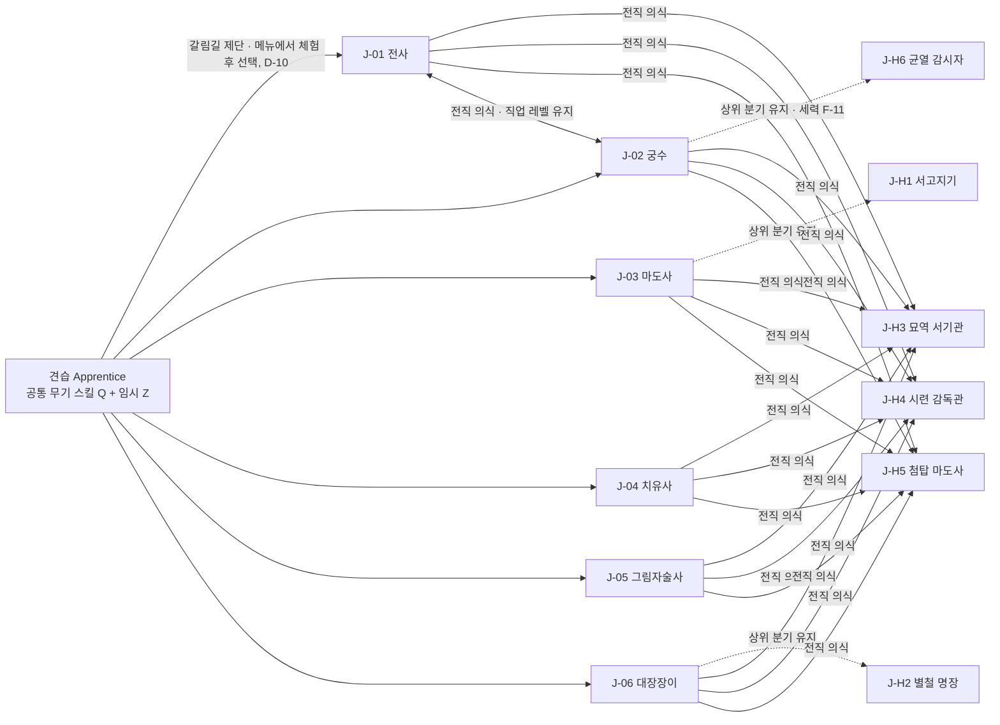

# 05_classes_skills — 기본 · 히든 직업, 스킬 체계, 입력 매핑

## 1. 문서 정보

| 항목 | 내용 |
|---|---|
| 버전 | r2 |
| 작성일 | 2026-10-01 |
| 상태 | 검수 중 (배정: system / roblox-tech / player-market) |
| r2 변경 요약 | r1 치명 1 · 중대 13 전부 수용(D-43~D-48, D-37). (1) D-47: 별개 직업형 J-H3 · H4 · H5에 직업 스킬 2개씩 추가(SK-H3-05 · 06, SK-H4-05 · 06, SK-H5-05 · 06, 6장 합계 66), 첫 스킬 요구 레벨 = 해금 조건 레벨, 2.2 '전직 직후 장착 가능 직업 스킬 ≥ 2' 규칙, 9.6 히든 직업 DPM 검산표 신설(J-H1 금서 낭독 · 잉크 사슬, J-H2 용광로 숨결, J-H3 모래 유령 · 묘비 낙인, J-H6 등불 화살 하향). (2) D-37: 치명타 확률 4스탯 동일(04 r2) 적용 → 3.2 · 9장 전부 재계산, 레벨 비례 치명 보정 패시브(TP-J01 · J03의 치명 항목, TP-J06B) 제거, 공통 임계 패시브(04 4.5) 검산 반영, 마도사 불꽃 구슬 · 대장장이 모루 내리치기 · 달군 망치 하향. (3) D-43: 5.4 용어 정의, 5.6 중첩 규칙 3행, 담금질 · 별철 담금 = '파티 기본 공격력 +n%'. (4) D-46: 2.3 직업 경험치 (b) 상한 · (d) 원천 · 검산(사냥 0회 경로 포함), 5.2 스킬 포인트 규칙 통일, 12.1 · 12.3 정정. (5) D-44: 10.6 이동형 스킬 권한. (6) D-45: 10.2 · 10.3 · 10.4 · 11.4 기본 입력 충돌 해제. (7) D-48: 2.2 견습 시작 장비, 3.6 직업 체험 사양, 3.1 체험 스킬 = 선택 직후 Z(전사 · 대장장이 해금 순서 교체), 6.1 · 6.2 '무기 요구' 열. (8) 05-r1-M-03: 11.1 버튼 좌표표 · 겹침 검산, 모든 버튼 최소 지름 48. 경미 반영: S-09 · S-10 · S-12 · S-13 · S-14, T-04~T-11, M-04~M-10 |
| 목적 | 3-A [진행 순서] 05번 정의: 기본 · 히든 직업, 스킬 체계, 입력 매핑. 4-정량의 직업(기본 6+ · 히든 5+ 해금 조건 · 발견 경로), 스킬(직업당 6+ · 무기군별 무기 스킬 · 특수 스킬 10+ · 모든 스킬에 키 슬롯 · 쿨타임 · 소모 자원 · 효과 수치), 입력 매핑표 3종, 3-C 시프트 락 해결 · 대장장이 전투 겸업 역할을 이 문서에서 충족한다. |
| 의존 문서 | 00_BRIEF.md(기준), 01_reference.md(5장 매핑 #9 · #10 · #15~#22 · #42 · #49 · #50 · #51 · #63 · #66, 6장 IP 금지 목록), 02_concept.md(3.3 핵심 재미 F3, 5.0 캐릭터 생성 흐름, 9장 플랫폼 · 조작 원칙, 14장 용어집), 03_world.md(3.3 히든 직업의 근원, 5장 종족, 8장 사냥터, 13장 색인), 04_progression.md(4장 스탯 · 5장 전투 공식 · 자원, 11장 직업 레벨 개요, 13장 튜닝 파라미터), DECISIONS.md(D-01~D-48. 직접 쓰는 것: D-02 · D-03 · D-05 · D-06 · D-08 · D-09 · D-10 · D-14 · D-15 · D-16 · D-19 · D-26 · D-27 · D-34 · D-35 · D-36 · D-37 · D-42 · D-43 · D-44 · D-45 · D-46 · D-47 · D-48), ASSUMPTIONS.md(AS-01~AS-13. 직접 쓰는 것: AS-01 · AS-05 · AS-08 · AS-10 · AS-11 · AS-13) |
| 이 문서를 기준으로 삼는 문서 | 06_items_crafting(무기군 · 열기 게이지 · 담금질 · 무기 개조 속성 · 명장의 모루 도안), 07_stories_hidden(히든 직업 발견 경로 HP- 등록, 특수 스킬 습득 히든 피스), 08_social_raid(대장장이 레이드 역할, 되살림 · 팀 생명 예산), 09_ranking(직업별 랭킹), 11_roblox_tech(입력 바인딩 · 서버 판정 · 데이터 항목 12장), 12_mvp_roadmap(MVP 직업 · 히든 범위) |
| 표기 규칙 | 전부 한국어, 이름은 한국어 + 영문 병기(AS-05). 수치는 표. 사실(로블록스 API)은 14.3 출처 번호를 단다. 그 외 수치는 **추정**(설계값)이며 13장 튜닝 파라미터로 뺀다. 레퍼런스 고유명사는 쓰지 않는다(01번 6장, 작성 후 Grep 대조 0건). |
| ID 규칙 | 직업 J-01~06 · 히든 J-H1~H6, 스킬 SK-: `SK-J<직업번호>-<번호>`(직업 스킬) · `SK-H<히든번호>-<번호>`(히든 스킬) · `SK-W<무기군>-<번호>`(무기 스킬) · `SK-V<번호>`(특수 스킬) · `SK-A01`(견습 공통). 무기군 W1~W6은 06이 무기 ID(IT-)를 부여할 때 분류 키로 쓴다. 지역 · 아크 ID(H- · T- · A- · F- · RC- · SP-)는 03 13장 색인의 것만 쓴다. 히든 피스 ID(HP-)는 07이 부여한다. |
| 수치 생성 | 6~9장의 스킬 표와 DPM 검산표, 2.3 직업 경험치 검산, 11.1 버튼 좌표 겹침 검산은 파이썬 스크립트 한 벌(r2: calc · jobxp · layout)로 생성해 표 간 수치가 같은 원본에서 나오게 했다(스크립트는 저장소에 두지 않음, 수치 변경 시 13장 파라미터와 함께 재생성). |

---

## 2. 직업 체계 개요

### 2.1 구조



- 실선 = 직업이 바뀌는 전직 의식(D-09, 직업 레벨 유지 · 스킬 포인트 재분배). 점선 = 상위 분기형 히든(기존 직업을 유지한 채 스킬 트리 4개가 추가된다). 기본 직업 6종끼리의 전직은 모든 조합이 가능하다(그림은 1쌍만 표시).
- 캐릭터당 직업 1개(D-09). 다중 클래스 없음(01번 5장 #21). 히든 직업 보유 인원 제한 없음, 선착형 아님(전원 획득형 히든 피스, 01번 5장 #5).
- 직업 선택 · 전직 · 히든 해금은 어떤 지역 입장 · 아크 진행 · 레벨 상한의 조건도 아니다(04 2장, D-15 (c)). 반대로 히든 해금 조건에 대형 연결 사건(E-) 완료는 들어가지 않는다.

### 2.2 견습 → 기본 → 히든 흐름

| 단계 | 상태 | 쓸 수 있는 슬롯 | 조건 · 비용 | 근거 |
|---|---|---|---|---|
| 0 | 견습(Apprentice) | 좌클릭 공격, Shift 대시, Q(들고 있는 무기의 무기 스킬 1). Z 해금 시 SK-A01 힘껏 치기 임시 장착 | 접속 직후 상태. Z 슬롯 해금 = 캐릭터 레벨 2 도달 또는 어느 아크든 장 1개(0장 포함) 완료 중 먼저 | D-10, 02번 5.0 |
| 0-장비 | 견습 시작 장비(D-48) | **연습용 한손검**(W1, 일반, 무기 공격력 = 04 5.2 레벨 1 기준 10)을 쥐고 시작 → Q = SK-W1-01 베어 넘기기 | 0장 완료 보상 · 갈림길 제단 상인 무료 수령 무기 = **선택한 직업의 주 무기군 일반 1개**(직업 미선택이면 6무기군 중 택1, 3.1 '주 무기군' 열). 직업을 선택했는데 가방에 그 직업의 주 무기군 무기가 없으면 제단에서 주 무기 일반 1개를 무료 지급(직업별 1회, 전직 시에도 같은 규칙). 무기 IT- ID · 수치는 06 | D-48, 05-r1-M-02 |
| 1 | 기본 직업 선택 | Z에 직업 스킬 1 자동 장착(SK-A01 소멸). 직업 스킬 1 = 체험 마당에서 써 본 그 스킬(3.1 '체험 스킬' 열, 3.6). E는 무기 스킬 2를 얻는 즉시(무기 스킬 3개는 처음부터 보유, 5.1) | 갈림길 제단 NPC 또는 메뉴 → 체험 마당에서 6종 체험(3.6) → 선택. 비용 0, 시점 제한 없음 | D-10, D-48 |
| 2 | 직업 레벨 성장 1~40 | X(직업 레벨 5), C(12), V(첫 특수 스킬 습득 시) | 직업 경험치 원천 (a)~(d)(2.3) | 04 11.1, D-03, D-46 |
| 3a | 상위 분기형 히든(J-H1 · H2 · H6) | 기존 슬롯 그대로, 보유 직업 스킬 6 + 히든 4 = 10 중 3 장착 | 4장 해금 조건. 전직 아님(직업 유지) | D-09 |
| 3b | 별개 직업형 히든(J-H3 · H4 · H5) | 새 직업 스킬 **6**(SK-Hn-01~06)을 요구 레벨 순서로 해금. **해금 조건 레벨(J-H3 · H4 = 15, J-H5 = 20)에 2개가 바로 열린다**. 무기 스킬 · 특수 스킬 유지 | 4장 해금 조건 + 전직 의식(히든 전직은 골드 0). 직업 레벨 유지, 포인트 재분배 | D-09, D-47, 01번 5장 #50(레벨 리셋 금지) |
| 4 | 전직 의식(기본 ↔ 기본, 기본 ↔ 히든 별개형) | 이전 직업 스킬 레벨은 '휴면'으로 저장(12장), 재전직 시 복구 | 장소: 도시(T-)의 갈림길 제단. 비용: **300 × 캐릭터 레벨 골드**(캐릭터 레벨 20 이하 1회 무료, 스탯 재분배와 묶으면 재분배 비용 50%, 04 4.4). 쿨타임 없음. 필드 · 인스턴스 불가. 전직 가능 직업 레벨 10 이상(2.3) | D-09, D-10 |
| 규칙 | 전직 직후 장착 가능 직업 스킬 **≥ 2** | 전직 의식(4단계 · 3b) 직후 새 직업의 직업 스킬 중 요구 레벨을 채운 것이 2개 이상이어야 한다. 기본 직업 전직은 직업 레벨 10 이상이라 4개(요구 1 · 3 · 5 · 8), 별개 직업형 히든은 해금 조건 레벨에 요구 레벨이 같은 스킬 2개(6.2)로 보장. 최초 직업 선택(1단계, 직업 레벨 1)은 Z 1칸만 열린 상태라 1개 | D-47, 05-r1-S-02 |

### 2.3 직업 레벨 표(1~40)

직업 레벨 상한 **40**(D-35 결정. 04 2장 · 11장 반영 완료, 14.1 #1). 필요 직업 경험치 JXP(n → n+1) = **round(250 × n^1.55, 10의 자리)**. 직업 경험치 원천(D-46)은 아래 4가지이며, 전직 의식 시 직업 경험치 · 레벨은 유지된다(D-09).

| 원천 | 직업 경험치 | 상한 · 조건 | 비고 |
|---|---|---|---|
| (a) 처치 | 몬스터 처치 캐릭터 경험치(전투 태그)의 **50%**(04 11.1, 레벨 차 보정 · 파티 분배 적용 후 값) | 캐릭터 경험치의 분당 상한(04 7.5)이 먼저 걸린 뒤의 50% | — |
| (b) 직업 스킬 적중 | 적중 1회당 **max(1, 0.5 × min(M, 캐릭터 레벨 + 5))**(M = 몬스터 레벨) | 같은 대상 초당 1회, 무관심 대상 제외. **분당 상한 = (a) 기준의 20%** = 0.2 × 0.5 × 기준 경험치/분(캐릭터 레벨, 04 3.1) = 0.1 × 기준(L) | 저레벨이 고레벨 정예 · 보스를 때려 큰 값을 받는 경로 차단(min(M, L+5)) |
| (c) 아크 | 아크 장 완료 경험치(이야기 태그)의 **20%** | 장마다 1회(04 6장) | — |
| (d) 제작 · 채집 · 발견 | 제작 · 채집 · 발견 태그 캐릭터 경험치의 **50%** | 각 원천의 캐릭터 경험치 상한(04 6장: 제작 · 채집 70%, 일일 산출 상한 D-42)이 먼저 걸린 뒤의 50% | 사냥 0회 경로도 직업 성장(D-03 '제작 활동 자체가 성장 경로', 05-r1-S-07) |
| 견습 적립 | 견습 기간의 (a)~(d)를 '견습 적립'으로 모아 두었다가 첫 직업 선택 시 한꺼번에 지급 | 적립 상한 = 직업 레벨 5 누적치 **4,490** | 직업 선택을 미뤄도 손해가 없게(D-10 '미루기 가능', 05-r1-M-04) |

| 직업 레벨 | 다음 레벨 필요 | 누적 | 해금 · 보상 |
|---|---|---|---|
| 1 | 250 | 0 | 스킬 포인트 +1 · 직업 스킬 1 해금 · Z 슬롯(D-10 조건 충족 시) |
| 2 | 730 | 250 | 스킬 포인트 +1 |
| 3 | 1,370 | 980 | 스킬 포인트 +1 · 직업 스킬 2 |
| 4 | 2,140 | 2,350 | 스킬 포인트 +1 |
| 5 | 3,030 | 4,490 | 스킬 포인트 +1 · 직업 스킬 3 · **X 슬롯 해금** |
| 6 | 4,020 | 7,520 | 스킬 포인트 +1 |
| 7 | 5,100 | 11,540 | 스킬 포인트 +1 |
| 8 | 6,280 | 16,640 | 스킬 포인트 +1 · 직업 스킬 4 |
| 9 | 7,530 | 22,920 | 스킬 포인트 +1 |
| 10 | 8,870 | 30,450 | 스킬 포인트 +1 · 전직 의식 가능(이전 직업 스킬 휴면 보존) |
| 11 | 10,280 | 39,320 | 스킬 포인트 +1 |
| 12 | 11,770 | 49,600 | 스킬 포인트 +1 · 직업 스킬 5 · **C 슬롯 해금** · 프리셋 2 해금 |
| 13 | 13,320 | 61,370 | 스킬 포인트 +1 |
| 14 | 14,940 | 74,690 | 스킬 포인트 +1 |
| 15 | 16,630 | 89,630 | 스킬 포인트 +1 · 별개 직업형 히든(J-H3 · J-H4) 조건 레벨 · 별개형 스킬 1 · 2(SK-H3-01 · 05, SK-H4-01 · 05) |
| 16 | 18,380 | 106,260 | 스킬 포인트 +1 |
| 17 | 20,190 | 124,640 | 스킬 포인트 +1 |
| 18 | 22,060 | 144,830 | 스킬 포인트 +1 · 별개형 스킬 3(SK-H3-02 · SK-H4-02) |
| 19 | 23,990 | 166,890 | 스킬 포인트 +1 |
| 20 | 25,970 | 190,880 | 스킬 포인트 +1 · 직업 스킬 6(궁극) · 상위 분기형 히든(J-H1 · J-H2 · J-H6) · J-H5 조건 레벨 · J-H5 스킬 1 · 2(SK-H5-01 · 05) |
| 21 | 28,010 | 216,850 | 스킬 포인트 +1 |
| 22 | 30,110 | 244,860 | 스킬 포인트 +1 · 분기형 히든 스킬 1(J-H1 · J-H2 · J-H6) · 별개형 스킬 4(SK-H3-03 · SK-H4-03) |
| 23 | 32,260 | 274,970 | 스킬 포인트 +1 · J-H5 스킬 3(SK-H5-02) |
| 24 | 34,460 | 307,230 | 스킬 포인트 +1 |
| 25 | 36,710 | 341,690 | 스킬 포인트 +1 · 분기형 히든 스킬 2 |
| 26 | 39,010 | 378,400 | 스킬 포인트 +1 · 별개형 스킬 5(SK-H3-06 · SK-H4-06) · J-H5 스킬 4(SK-H5-03) |
| 27 | 41,360 | 417,410 | 스킬 포인트 +1 |
| 28 | 43,760 | 458,770 | 스킬 포인트 +1 · J-H5 스킬 5(SK-H5-06) |
| 29 | 46,200 | 502,530 | 스킬 포인트 +1 · 분기형 히든 스킬 3 |
| 30 | 48,690 | 548,730 | 스킬 포인트 +1 |
| 31 | 51,230 | 597,420 | 스킬 포인트 +1 · 별개형 궁극(SK-H3-04 · SK-H4-04 · SK-H5-04, 각성 홈) |
| 32 | 53,820 | 648,650 | 스킬 포인트 +1 |
| 33 | 56,450 | 702,470 | 스킬 포인트 +1 · 분기형 히든 스킬 4(궁극) |
| 34 | 59,120 | 758,920 | 스킬 포인트 +1 |
| 35 | 61,840 | 818,040 | 스킬 포인트 +1 |
| 36 | 64,600 | 879,880 | 스킬 포인트 +1 |
| 37 | 67,400 | 944,480 | 스킬 포인트 +1 |
| 38 | 70,240 | 1,011,880 | 스킬 포인트 +1 |
| 39 | 73,130 | 1,082,120 | 스킬 포인트 +1 |
| 40 | — (상한) | 1,155,250 | 스킬 포인트 +1 · 상한. 스킬 포인트 총 40 |

- 전표 그대로 데이터 테이블 `JOB_XP_TABLE`(13장)에 넣는다.
- 직업 레벨은 캐릭터 레벨의 상한을 받지 않는다(캐릭터 20 · 직업 30 가능, 04 11.1). 9장 검산의 '레벨 30 표준'은 아래 검산의 **캐릭터 30 · 직업 26**을 쓴다.

**검산 (a) + (b) + (c) + (d)**(스크립트 jobxp, 04 3.2 전표 기준, 추정):

| 경로 | 가정 | 캐릭터 10 | 20 | 30 | 40 | 50 | 60 | 직업 20 도달 | 직업 40 도달 |
|---|---|---|---|---|---|---|---|---|---|
| 사냥만 | (a) = 04 3.2 필요 경험치 × 50%. (b) = 직업 스킬 적중 6회/분 × 0.5 × 캐릭터 레벨, 분당 상한 0.1 × 기준(L) → 레벨 5 이후 항상 상한(사냥 중 (b) ≈ (a)의 20%). (c)(d) 0 | 9 | 18 | **26** | 34 | 40 | 40 | 캐릭터 22 | 캐릭터 48 |
| **사냥 0회**(04 6장) | 캐릭터 경험치 90시간 분량 = 아크 20h((c) 20%) + 발견 3h((d) 50%) + 제작 · 채집 33h((d) 50%) + 히든 피스 9h · 일일 계약 25h(태그 미정 → **0으로 계산**, 보수적). 직업 경험치 = 캐릭터 경험치 × (20×0.2 + 3×0.5 + 33×0.5) ÷ 90 = **24.4%** | 7 | 13 | 18 | 24 | 29 | **35** | 캐릭터 33 | — |
| 사냥 0회 하한 | 위에서 제작 · 채집 20h(계약 38h)로 줄인 경우: 17.2% | 6 | 11 | 16 | 21 | 25 | **30** | 캐릭터 38 | — |
| 혼합(캐릭터 경험치 절반 사냥) | 위 두 경로의 평균 | 8 | 16 | 23 | 29 | 36 | 40 | 캐릭터 26 | 캐릭터 56 |

- 사냥 0회 경로도 캐릭터 60에서 **직업 30~35**(D-46 목표 30 이상 충족)라 C 슬롯 · 직업 스킬 6(궁극) · 무기 개조(20) · J-H2 별철 명장(직업 20)에 사냥 없이 닿는다. 직업 20 도달은 캐릭터 약 33(하한 38).
- 총 1,155,250. 직업 레벨 40은 사냥만 하면 캐릭터 약 48, 혼합이면 약 56, 사냥 0회는 60에서 30~35(상한 미도달 — 스킬 포인트 30~35로도 장착 6칸의 주력 스킬은 Lv5가 된다, 5.2).

### 2.4 단계별 도입 범위(D-19 · D-36, 일정 · 공수는 12)

직업 구성은 D-36으로 확정. 무기군 · 특수 스킬은 그 단계 직업 · 대륙(02 11장)에서 따라 나오는 값이다. 특수 스킬은 습득 아크 · 지역의 대륙이 열리는 단계에 들어온다(8장 '습득 경로').

| 단계 | 기본 직업 | 히든 직업(누적) | 무기군(누적) | 특수 스킬 SK-V(누적) | 비고 |
|---|---|---|---|---|---|
| 알파(D-19) | J-01 전사 · J-02 궁수 · J-03 마도사 · J-06 대장장이 (4) | 0 | W1 · W2 · W3 · W5 (4) | SK-V01 · V04 · V06(SP-01~04 입문용) + 12번이 고른 알파 아크 6개에 속한 C-01 · C-02 특수 스킬 | 근접 · 원거리 · 마법 · 생산, 기력 · 마나 · 열기 자원 전부 검증 |
| MVP | 6종 전부 (6) | J-H2 별철 명장 · J-H1 서고지기 (2) | + W4 단검 (5) | SK-V01~V07 (7, C-01 · C-02) | 그림자술사 주 무기 W4가 필요해 무기군 5(02 10장 MVP 목표 '무기군 4' 초과, 14.1 #14) |
| 확장 1차 | — | + J-H3 묘역 서기관 (3) | + W6 창 (6) | + SK-V08 · V09 (9, C-03) | 궁수의 창 근접 대체(7.4)는 이 단계부터 |
| 확장 2차 | — | + J-H4 시련 감독관 (4) | 6 | + SK-V10 · V11 · V14 · V15 · V17 (14, C-04) | J-H4의 창 숙련 1.10(7.2)은 W6 개방 뒤 |
| 확장 3차 | — | + J-H6 균열 감시자 (5) | 6 | 14 | 세력 기여 · 직업별 랭킹(D-14)과 함께 |
| 확장 4차 | — | + J-H5 첨탑 마도사 (6) | 6 | + SK-V12 · V13 · V16 (17, C-05) | 02 11장 '히든 누적 6'과 일치 |

---

## 3. 기본 직업

### 3.1 기본 직업 표(J-01~06)

자동 성장 분포는 04 4.3의 유형을 직업별로 확정한 값(레벨당 2포인트, 홀수 · 짝수 레벨 교대). 주 스탯 열의 스탯이 04 5.1 '기본 공격력 = 무기 공격력 + 2 × 주 스탯'의 주 스탯이다(치유사는 **정신**, D-35 · 04 5.1 반영, 5.4). 모바일 조작 난이도 1(쉬움)~5(어려움)는 추정.

| ID | 이름(영문) | 역할 | 주 스탯 | 자동 성장(홀수 / 짝수 레벨) | 04 유형 | 주 무기군(부) | 자원 | 솔로 강점 | 파티 · 레이드 강점 | 모바일 난이도 | 체험 스킬 = 선택 직후 Z(D-10 · D-48, 3.6) | 알파 4종 |
|---|---|---|---|---|---|---|---|---|---|---|---|---|
| J-01 | 전사 (Warrior) | 근접 딜러 · 준탱커 | 힘 | 힘 1 · 체력 1 / 힘 1 · 체력 1 | 근접 힘형 | W1 한손검 (W6 창 · W5 망치) | 기력 | 높은 체력 · 도발로 2~3마리 동시 처리 | 전열 유지 · 도발 · 공격력 버프(전투 함성) | 2 | SK-J1-03 회전 베기(요구 직업 레벨 1) | ○ |
| J-02 | 궁수 (Archer) | 원거리 딜러(필수 직업, 3-B-8) | 민첩 | 민첩 1 · 힘 1 / 민첩 1 · 체력 1 | 민첩형 | W2 활 (W6 창(근접 대체)) | 기력 | 선제 사격 · 덫 · 후퇴 사격으로 피격 최소화 | 후열 단일 딜 · 표식(히든) · 광역 화살비 | 3 | SK-J2-01 조준 사격 | ○ |
| J-03 | 마도사 (Mage) | 광역 마법 딜러 | 지력 | 지력 1 · 정신 1 / 지력 1 · 체력 1 | 마법형 | W3 지팡이 (—) | 마나 | 둔화 · 전이로 거리 유지, 광역으로 무리 처리 | 광역 딜 · 둔화 · 보호막(장막) | 3 | SK-J3-01 불꽃 구슬 | ○ |
| J-04 | 치유사 (Cleric) | 회복 · 지원 | 정신 | 정신 1 · 지력 1 / 정신 1 · 체력 1 | 지원형 | W3 지팡이 (W5 망치) | 마나 | 자가 회복으로 느리지만 안정적인 사냥(DPM 약 60%) | 회복 · 보호막 · 되살림 · 정화 | 2 | SK-J4-01 빛의 손길 | ×(MVP) |
| J-05 | 그림자술사 (Shade) | 근접 기동 딜러 | 민첩 | 민첩 1 · 기교 1 / 민첩 1 · 체력 1 | 민첩형(기교 변형) | W4 단검 (W1 한손검) | 기력 | 은신 · 순간 이동으로 선택적 교전, 치명타 특화 | 보스 단일 딜 · 암습 연격 | 4 | SK-J5-03 난도질 | ×(MVP) |
| J-06 | 대장장이 (Blacksmith) | 생산 + 근접 서포터(필수 직업, 3-B-8, D-02) | 힘(전투) · 기교(생산) | 기교 1 · 힘 1 / 기교 1 · 체력 1 | 생산형 | W5 망치 (W1 한손검) | 기력 + 열기 게이지 | DPM 순수 딜러의 75~85%, 현장 수리로 내구도 걱정 없는 장기 사냥 | 담금질(공격 버프) · 보강(방어 버프) · 현장 수리 · 무기 개조(속성 부여) | 2 | SK-J6-02 모루 내리치기(요구 직업 레벨 1, 기력만 소모 · 열기 +15) | ○ |

- 알파 4종(D-19 '기본 직업 4, 대장장이 · 궁수 포함'): **전사 · 궁수 · 마도사 · 대장장이로 확정(D-36)**(근접 · 원거리 · 마법 · 생산 1종씩, 자원 2종 모두 검증). 단계별 범위는 2.4.
- 체험 스킬 = 직업 선택 직후 Z에 들어가는 요구 직업 레벨 1 스킬(D-48). 6직업 모두 눈에 보이는 피해 · 회복 · 순간 이동 스킬이다. 이를 위해 r2에서 **전사는 회전 베기(1) ↔ 전투 함성(5)**, **대장장이는 모루 내리치기(1) ↔ 담금질(3)** 의 요구 레벨을 맞바꿨다(6.1 · 6.3). 대장장이의 첫 Z는 열기 없이 기력 18로 쓰고 적중 시 열기 +15를 채워 다음 스킬(담금질 · 보강)로 이어진다.
- 모바일 난이도 근거: 전사 · 대장장이 · 치유사는 자동 조준 + 광역 · 자기 대상 스킬이 많아 2. 궁수 · 마도사는 시전 중 이동 불가 스킬이 있어 3. 그림자술사는 뒤 잡기 · 은신 타이밍이 있어 4. 5는 없다(3-C 모바일 동등).

### 3.2 레벨 30 기준 빌드 스탯(9장 검산의 입력, 04 4.2 · 5.2 식)

기준 빌드 = 자유 3 중 주 스탯 2 · 체력 1, 자동 2 = 3.1 분포. 기준 장비 = 무기 공격력 8 + 2.4 × 30 = **80**, 주 스탯 +8(0.25 × 30 반올림), 방어구 합 75(04 5.2). 소수점은 반올림. 치명타 확률은 **5% + 0.05%p × (힘 + 민첩 + 지력 + 정신 총합)**(D-37, 04 5.1 r2), 치명타 피해는 150% + 0.5%p × 기교.

| 직업 | 힘 | 민첩 | 체력 | 지력 | 정신 | 기교 | 기본 공격력(04 5.1) | 치명타 확률(4스탯 합) | 치명타 피해 | 기대 배율 | 최대 체력 | 최대 마나(마나 직업) · 회복/초 |
|---|---|---|---|---|---|---|---|---|---|---|---|---|
| J-01 전사 | 105 | 10 | 68 | 10 | 10 | 10 | 80 + 2 × 105 = **290** | 11.75%(135) | 155.0% | 1.065 | 1,216 | — (기력 100 · 5/초) |
| J-02 궁수 | 24 | 105 | 54 | 10 | 10 | 10 | 80 + 2 × 105 = **290** | 12.45%(149) | 155.0% | 1.068 | 1,048 | — (기력 100 · 5/초) |
| J-03 마도사 | 10 | 10 | 54 | 105 | 24 | 10 | 80 + 2 × 105 = **290** | 12.45%(149) | 155.0% | 1.068 | 1,048 | 866 · 11.1 |
| J-04 치유사 | 10 | 10 | 54 | 24 | 105 | 10 | 80 + 2 × 105 = **290** | 12.45%(149) | 155.0% | 1.068 | 1,048 | 704 · 17.5 |
| J-05 그림자술사 | 10 | 105 | 54 | 10 | 10 | 24 | 80 + 2 × 105 = **290** | 11.75%(135) | 162.0% | 1.073 | 1,048 | — (기력 100 · 5/초) |
| J-06 대장장이 | 90 | 10 | 54 | 10 | 10 | 39 | 80 + 2 × 90 = **260** | 11.00%(120) | 169.5% | 1.076 | 1,048 | — (기력 100 · 5/초) |

- 대장장이의 기본 공격력(260)이 순수 딜러(290)의 90%인 것은 자동 성장이 기교 1 · 힘 0.5이기 때문이다. 기교는 치명타 피해(+14.5%p)와 제작 판정(06)으로 돌아온다. D-02의 '75~85%'는 여기에 스킬 계수 차이가 더해진 DPM 기준이며 9장에서 검산한다.
- D-37 이후 기대 배율 차이는 직업 간 최대 1.1%(1.065~1.076)다. 민첩 직업만 치명타가 오르던 r1 구조(궁수 1.085 · 전사 1.033)는 없어졌다.
- 공통 임계 패시브(04 4.5)는 이 표의 총합 기준으로 켜진다: 캐릭터 30에서 TP-STR(힘 100)은 전사만(105), TP-INT(지력 100)는 마도사만(105) 켜진다. 9장 검산에 반영(05-r1-S-09).

### 3.3 대장장이의 전투 겸업 역할(D-02)

| 역할 | 스킬 | 수치 | 파티 · 레이드에서의 자리 | 06 · 08 연계 |
|---|---|---|---|---|
| 현장 수리(내구도 회복) | SK-J6-03 현장 수리 | 반경 8 파티 착용 장비 내구도 +15%, 쿨 45초, 던전 인스턴스 1회당 3회 상한 | 긴 레이드에서 내구도 0(효과 소실)을 막는다. 사망 시 −10%(04 7.6)를 상쇄 | 내구도 수치 · 수리비 06, 레이드 상한 08 |
| 담금질(공격 버프) | SK-J6-01 담금질 → J-H2 별철 담금 | 반경 10 파티 **기본 공격력 +12%** 30초, 쿨 60초, 열기 30(별철 담금: +18% · 치명타 피해 +10%p **20초**, 쿨 60초). '기본 공격력 +n%'는 5.4 용어 정의, 다른 버프와의 중첩은 5.6 | 가동률 50%(별철 33%). 6인 파티 기준 파티원 1명당 DPM +6%(피해는 기본 공격력에 비례) → 대장장이 개인 DPM 81% + 6% × 5명 = 파티 기여 딜러 약 1.1명분. 대장장이 2명이 같이 걸어도 같은 스킬 ID는 최댓값 1개만(5.6 ②) | 02 용어집 #22 |
| 보강(방어 버프) | SK-J6-04 보강 → J-H2 즉석 보강판 | 대상 1명 방어력 +25% · 받는 피해 −10% 20초, 쿨 30초 | 탱커 보조. 보스 강공격 패턴 직전에 사용 | 08 기믹 |
| 무기 개조(속성 부여) | SK-J6-06 무기 개조 → J-H2 명장의 서명 | 전투 중 1회, 60초 피해 +8% + 속성 효과 1종(화상 · 둔화 · 마비, 비전투 시 미리 지정, 6.1) | 보스 속성 약점 기믹(08)의 열쇠. 속성 효과 수치는 06 | 06 속성 정의 |
| 솔로 사냥 보장 | SK-J6-02 모루 내리치기 · SK-J6-05 달군 망치 + 망치 무기 스킬 | 9장 DPM 순수 딜러 평균의 약 81%(레벨 30~60: 81.0~83.2%, 9.5) | 같은 레벨 일반 몬스터 처치 약 5.5초(순수 딜러 평균 4.5초, 9.2). 체력 · 방어는 궁수 · 마도사와 같음(최대 체력 1,048, 3.2) | 04 5.4 |

### 3.4 열기 게이지(Heat Gauge, 대장장이 직업 자원)

| 항목 | 규칙 |
|---|---|
| 범위 | 0~100. 접속 · 부활 시 0. 저장하지 않는다(12장) |
| 충전 | 망치 기본 공격 적중 +8, 망치 무기 스킬 적중 +15, 모루 내리치기 적중 +15(어떤 무기를 들어도 적용 → 한손검 대장장이도 첫 Z로 열기를 채운다). 작업대 미니게임 1회 완료 +30(06). 비전투 15초 뒤부터 초당 −2 |
| 소모 | 담금질 30 · 보강 25 · 달군 망치 20 · 현장 수리 40 · 무기 개조 60(6장). 6장 소모 자원 열에 '열기 n + 기력 m'으로 적힌 스킬은 둘 다 소모(둘 다 있어야 발동), '열기 n'만 적힌 스킬(현장 수리 · 무기 개조 · J-H2 즉석 보강판 · 명장의 서명)은 열기만 소모 |
| 제작 연계 | 열기 50 이상이면 작업대 미니게임 첫 판정 창 +5%(06). 제작은 열기를 쓰지 않는다 |
| UI | 전투 클러스터 공격 버튼 테두리에 원형 게이지(버튼 추가 없음, D-16) |

### 3.5 직업별 스탯 임계 패시브(04 4.5의 '직업별 추가 임계 패시브')

04 4.5의 공통 6개(TP-STR~TP-TEC)에 더해 직업마다 1개. 조건부 효과이며 스탯 **총합**(포인트 + 종족 + 장비 + 인장) 기준, 재분배로 임계 미만이면 즉시 꺼진다(01 #9 · #66). 슬롯을 쓰지 않는다. 히든 직업은 기반 직업(분기형) 또는 아래 별개형 행을 쓴다.

| ID | 직업 | 스탯 | 이름 | 임계값 | 효과 | 재분배 시 |
|---|---|---|---|---|---|---|
| TP-J01 | 전사 | 힘 | 무게 중심 | 120 | 도발(굳센 피부 · 시련 선포) 지속 +2초, 넉백 거리 −50% | 임계 미만이면 꺼짐 |
| TP-J02 | 궁수 | 민첩 | 긴 호흡 | 120 | 조준 사격 · 꿰뚫는 화살 시전 시간 −20% | 임계 미만이면 꺼짐 |
| TP-J03 | 마도사 | 지력 | 잔류 마력 | 120 | 반경형 광역 스킬의 반경 +1 stud(대상 상한 8체는 유지, 5.4) | 임계 미만이면 꺼짐 |
| TP-J04 | 치유사 · J-H3 | 정신 | 깊은 숨 | 120 | 회복 · 보호막 계수 +8%, 되살림 시전 10 → 8초 | 임계 미만이면 꺼짐 |
| TP-J05 | 그림자술사 | 기교 | 날 세우기 | 80 | 뒤 공격(틈새 찌르기 · 등 뒤 돌기 후) 치명타 피해 +15%p | 임계 미만이면 꺼짐 |
| TP-J06 | 대장장이 · J-H2 | 기교 | 뜨거운 손 | 100 | 열기 충전량 +25%, 현장 수리 내구도 +15% → +20% | 임계 미만이면 꺼짐 |
| TP-H4 | J-H4 시련 감독관 | 체력 | 돌의 인내 | 130 | 최후의 시련 지속 12 → 15초 | 임계 미만이면 꺼짐 |
| TP-H5 | J-H5 첨탑 마도사 | 지력 | 과열 내성 | 140 | 과부하의 '받는 피해 +20%' → +10% | 임계 미만이면 꺼짐 |

- 임계값 120은 기준 빌드(주 스탯 자유 2/레벨 + 자동 1/레벨 + 장비 0.25/레벨)로 캐릭터 레벨 약 35, 자유 3을 모두 주 스탯에 찍으면 약 27에 닿는다(04 4.5).
- 그림자술사 기교 80 · 대장장이 기교 100은 자동 성장(기교 0.5 · 1.0/레벨)만으로는 60레벨에 39 · 69라 닿지 않는다. 장비 기교(06) · 자유 포인트를 기교에 쓰는 **선택형 특화** 임계값이다(기준 빌드 DPM 검산 9장에는 넣지 않는다).
- r1의 레벨 비례 치명타 보정(TP-J01 +12%p · TP-J03 +8%p · TP-J06B +10%p)은 **D-37(치명타 확률 4스탯 동일)로 필요가 없어져 제거**했다(TP-J06B 행 삭제). 보정 없이 9.5의 레벨 30 · 40 · 50 · 60 · 풀장비 전 행에서 딜러 4직업 ±8% · 대장장이 75~85% · 치유사 60~75%를 지킨다. 민첩 직업만 치명타가 오르던 격차가 공식에서 사라졌기 때문이다.


### 3.6 갈림길 제단 직업 체험 사양(D-10 · D-48, 05-r1-M-01)

| 항목 | 사양 |
|---|---|
| 장소 | 각 시작 도시(SP-)의 갈림길 제단 옆 **체험 마당**: 안전 구역(D-29) 안의 울타리 공간(지름 약 30 studs). 허수아비 3개(체력 무한, 피해 숫자 표시) + 이동 표적 1개(좌우 왕복 6 studs/s). 메뉴의 '직업 체험'도 같은 체험 마당 인스턴스(1인 전용, 텔레포트 없이 같은 플레이스 안 비공개 영역)로 연결 |
| 진입 | 제단 NPC 대화 또는 메뉴 → '직업 체험' 1회 탭. 견습 · 직업 보유자 모두 가능(직업 보유자는 전직 비교용) |
| 카드 | 직업 카드 6장(가로 스크롤). 카드 1장 = 직업명 · 역할 아이콘 · 주 무기군 · 모바일 난이도(3.1, 1~5 점) · 솔로 1줄 · 파티 1줄. 각 줄 1줄 이내(AS-08). 예: 대장장이 '망치 · 난이도 2 · 솔로: 길게 버티는 사냥 · 파티: 공격 버프와 수리' |
| 체험 방식 | 카드 탭 → 그 직업의 **주 무기(일반) 임시 대여** + 체험 스킬을 **Z에 임시 장착**한 상태로 **30초 자유 사용**(Q · E 무기 스킬 2개도 그 무기 것으로 바뀜). 화면 상단에 남은 초 · '다른 직업' · '이 직업 선택' 버튼 |
| 체험 스킬 | **선택 직후 Z에 들어가는 요구 직업 레벨 1 스킬과 같은 스킬**(3.1 '체험 스킬' 열): 전사 회전 베기 · 궁수 조준 사격 · 마도사 불꽃 구슬 · 치유사 빛의 손길 · 그림자술사 등 뒤 돌기 · 대장장이 모루 내리치기. 체험에서는 기력 · 마나 · 쿨타임을 50%로 줄여 30초 안에 4~6회 써 보게 한다(판정 · 계수는 실제와 같음) |
| 반복 | **무제한**. 30초가 지나거나 '다른 직업'을 누르면 카드 화면으로 돌아간다. 체험 중 받은 경험치 · 드롭 없음 |
| 종료 시 | 마당을 나가거나 카드 화면을 닫으면 원래 장비 · 슬롯 · 자원으로 즉시 복구(대여 무기 회수) |
| 선택 확인 팝업 | "○○을(를) 선택합니다. 캐릭터 레벨 20 이하에서는 전직 1회 무료(2.2)." 1줄 + '선택' · '취소'. 선택 시 2.2의 '0-장비' 규칙대로 주 무기가 없으면 무료 지급 |
| 모바일 · 패드 | 카드 = 탭 / 패드 DPad 좌우 + ButtonA. 체험 중 HUD는 실제 전투 HUD와 같음(11장) |

---

## 4. 히든 직업

03 3.3의 근원 5곳(서고지기 · 명장 · 묘역 서기관 · 시련 감독관 · 첨탑 마도사)에 1:1로 대응하는 5개 + 세력 · 종족 기반 1개 = **6개**(4-정량 5+). 상위 분기형 3(J-H1 · H2 · H6) · 별개 직업형 3(J-H3 · H4 · H5)(D-09). 발견 경로의 단서 · 조건은 07이 히든 피스(HP-)로 등록하고, 이 표의 조건이 기준이다. 모든 조건은 **수치 또는 행동 조건**이며 선착 · 인원 제한 · 유료 조건이 없다(01번 5장 #5 · 3-C 과금). 해금 조건에 쓰이는 지역은 모두 03 색인에 있다.

| ID | 이름(영문) | 유형 | 근원(03 3.3) | 기반 직업 | 해금 조건(수치 · 행동) | 발견 경로(단서 → 지역 → 조건) | 핵심 스킬 요약(6.2) | 해금 시 유지 / 변경 | 도입 단계 |
|---|---|---|---|---|---|---|---|---|---|
| J-H1 | 서고지기 (Archive Keeper) | 상위 분기형(마도사 유지 + 추가 트리) | 서고지기 — H-11 침묵의 서고(03 3.3) | J-03 마도사 | 마도사 직업 레벨 20 이상 · 기록물 첫 열람 25건 이상(지역 무관) · A-06 완료 · H-11 클리어 1회 · H-11 최심부 '빈 책장'에 사본 3종(H-06 비석 탁본 · T-01 왕립 서고 사본 · T-21 사원 필사본) 투입 | T-01 로엔 왕립 서고 사서 NPC 대사("열쇠 없는 책장") → H-06 로엔 옛 지하묘 비석 → A-06 서고의 잃어버린 열쇠 → H-11 침묵의 서고 최심부 | 금서 낭독(계수 240%) · 잉크 사슬(계수 120% + 받는 마법 피해 +8%) · 기록 되감기(4초 전 위치로 되돌아가고 그 사이 잃은 체력의 50% 회복) · 서고 소환(10초 책장 골렘 1체) | 직업 · 직업 레벨 · 스킬 포인트 · 장착 유지. 서고지기 트리 4스킬이 보유 목록에 추가(장착은 Z/X/C 3개 안에서 선택) | MVP |
| J-H2 | 별철 명장 (Starsteel Master) | 상위 분기형(대장장이 유지 + 추가 트리) | 명장 — H-19 산왕의 옛 대장간(03 3.3) | J-06 대장장이 | 대장장이 직업 레벨 20 이상 · 대장장이 숙련도 40 이상 · A-11 완료 · H-19 클리어 1회 · 별철 원석(H-15) 10개 + 희귀 이상 망치 1개로 '명장의 모루' 제작(도안 BP-는 06, 미니게임 판정 '좋음' 이상) | T-09 코르딘 모루 형제단 장인 NPC("산왕의 망치는 둘이었다") → H-15 심층 갱도 별철 → A-11 산왕의 잃어버린 망치 → H-19 산왕의 옛 대장간 | 별철 담금(담금질 대체: 반경 10 파티 기본 공격력 +18% · 치명타 피해 +10%p, 20초) · 용광로 숨결(계수 230% + 화상 3초 × 15%) · 즉석 보강판(반경 8 파티 전원 보호막 = 시전자 기본 공격력 × 200%) · 명장의 서명(무기 개조 대체: 전투 중 1회, 쿨 180초) | 직업 · 직업 레벨 · 숙련도 · 장착 유지. 별철 담금 ↔ 담금질, 명장의 서명 ↔ 무기 개조는 '같은 계열'이라 동시 장착 불가 | MVP |
| J-H3 | 묘역 서기관 (Necropolis Scribe) | 별개 직업형(전직) | 묘역 서기관 — H-24 태양왕조 옛 묘역(03 3.3) | 어느 기본 직업이든(권장: 치유사 · 마도사) | 아무 직업 레벨 15 이상 · 정신 + 지력 총합 120 이상 · A-17 완료 · H-24 '서기관 비석' 3개 탁본(묘역 3구역, 파티 가능) · T-14 자하르 수로 관리청 '옛 직책 임명장' 수령 → 갈림길 제단에서 전직 의식(골드 비용 없음) | T-15 나임 수로 관리인 대사 → A-15 모래 아래의 목소리 → A-17 묘역의 파수꾼 → H-24 비석 | 직업 스킬 6: 모래 유령 소환(15초 소환수 1체) · 망자의 붓(계수 120%) · 묘비 낙인(계수 140% + 받는 피해 +8%) · 사자의 장부(계수 200%) · 묘역의 안식(파티 회복) · 왕조의 호명(궁극, 20초 소환수 3체 추가) | 직업 레벨 유지 · 스킬 포인트 전액 재분배(D-09). 이전 직업 스킬은 휴면(12장). 전직 직후 SK-H3-01 · 05 2개 장착 가능(2.2 규칙). 자원 마나, 성장 유형 '균형형(정신 · 지력 변형)' | 확장 1차(C-03) |
| J-H4 | 시련 감독관 (Trial Overseer) | 별개 직업형(전직) | 시련 감독관 — H-33 벨로스 시련의 방(03 3.3) | 어느 기본 직업이든(권장: 전사 · 대장장이) | 아무 직업 레벨 15 이상 · 체력 스탯 총합 80 이상 · A-21 완료 · H-33 클리어: 솔로(동기화 적용) 사망 0회 1번 **또는** 파티 클리어 3번(택1, 선착 아님) · T-21 안세 대사원 '시련의 서약' → 전직 의식 | T-22 무라 전초기지 순례자 NPC("종이 울리지 않는다") → A-21 울리지 않는 종 → H-33 시련 감독관(보스) 처치 | 직업 스킬 6: 시련 선포(반경 10 몬스터 도발 6초) · 규율 사슬(계수 200% + 끌어당김 · 도발) · 석상의 일격(계수 260%) · 감독관의 규율(반경 10 파티 받는 피해 −15% · 10초) · 종의 울림(2회 × 110%, 기절) · 최후의 시련(궁극, 12초 동안 체력이 1 아래로 내려가지 않음) | 직업 레벨 유지 · 포인트 재분배. 전직 직후 SK-H4-01 · 05 2개 장착 가능(2.2 규칙). 자원 기력, 성장 유형 '근접 힘형(체력 변형: 힘 1 · 체력 1 / 체력 1 · 정신 1)' | 확장 2차(C-04) |
| J-H5 | 첨탑 마도사 (Spire Magus) | 별개 직업형(전직) | 첨탑 마도사 — H-38 에스카 마도 첨탑(03 3.3) | 어느 기본 직업이든(권장: 마도사) | 아무 직업 레벨 20 이상 · 지력 총합 100 이상 · A-29 완료 · H-38 상층 기록물 5개 열람(파티 가능, 무관심 규칙으로 저레벨도 접근 가능하나 레벨 20 이상 권장) · T-25 오르멘 마도 방벽 '첨탑 등록' → 전직 의식 | T-24 카르드 초소장 → A-25 마지막 명령서 → A-29 첨탑의 마지막 등불 → H-38 상층 | 직업 스킬 6: 마력 폭풍(3초 × 100% = 300%) · 첨탑 광선(계수 200%, 관통) · 과부하(15초 마법 피해 +30%) · 첨탑 전이(12 studs 순간 이동) · 마력 방벽(자기 보호막) · 마지막 등불(궁극, 계수 700%) | 직업 레벨 유지 · 포인트 재분배. 전직 직후 SK-H5-01 · 05 2개 장착 가능(2.2 규칙). 자원 마나, 성장 유형 '마법형' | 확장 4차(C-05) |
| J-H6 | 균열 감시자 (Rift Watcher) | 상위 분기형(궁수 유지 + 추가 트리) · 세력 기반 | 세력 F-11 회색 등불 + 종족 특성 연계(RC-05 아이셀의 '균열 방향 화살표'가 단서 탐색을 돕는다. 종족 제한 없음, D-08) | J-02 궁수 | 궁수 직업 레벨 20 이상 · F-11 회색 등불 평판 '신뢰' 단계 이상(수치 07 · 08) · 균열 영향 몬스터 300마리 처치(03 8.6 목록의 사냥터 중 2개 대륙 이상에서) · A-07 완료 · T-07 테르가 초소 관측원에게 '관측 등불' 수령 | T-07 테르가 초소 회색 등불 관측원 대사 → A-07 테르가의 꺼지지 않는 등불 → H-09 · H-04 · H-13 균열 몬스터 → T-28 등불 초소(확장 4차 전에는 T-07에서 대행) | 등불 화살(계수 200% + 표식 +8%) · 균열 차단(지점 반경 5 장판 6초: 적 이동 −50%) · 관측(8초 치명타 확률 +20%p) · 등불 일제 사격(6회 × 90% = 540%) | 직업 · 직업 레벨 · 장착 유지. 균열 감시자 트리 4스킬 추가 | 확장 3차(세력 기여 랭킹 도입 시점, D-14) |

### 4.1 히든 직업 공통 규칙

| 항목 | 규칙 | 근거 |
|---|---|---|
| 발견 경로 유형 5종(01번 5장 #49) | J-H1 기록물 수집형 / J-H2 제작형 / J-H3 탁본 · 임명장(이야기형) / J-H4 시련 돌파형 / J-H5 탐험 열람형 / J-H6 세력 평판 + 처치 누적형. 6개가 모두 다른 유형 | 01 #49 |
| 조건의 비수직성 | 조건에 캐릭터 레벨은 없다(직업 레벨 · 스탯 · 행동만). 고위험 지역 조건(H-11 · H-19 · H-38)은 고레벨 파티 동행(04 7.5 동행 보정)으로 저레벨도 수행 가능(인스턴스 동기화는 하향만이라 저레벨을 올려 주지 않는다, D-34 · 04 7.7). H-38 상층 기록물은 무관심 규칙으로 전투 없이 접근 가능. 솔로 조건(J-H4)은 파티 3회로 대체 가능 | 3-B-5, D-05 |
| 각성 홈(Awakening Socket) | 각 히든 직업의 궁극 스킬(SK-Hn-04, 분기형은 4번째 · 별개형은 6번째로 열림)은 해금 시 '잠긴 칸'으로 열리고, 07이 지정한 히든 피스 1개(근원 지역의 기록물 · 유물)를 추가 발견하면 사용 가능. 히든 직업 자체 해금과 별개의 발견 보상 | 01번 5장 #51, 02 용어집 #32 |
| 상위 분기형의 장착 | 보유 10개(직업 6 + 히든 4) 중 Z/X/C 3개. 같은 계열 2개(담금질 ↔ 별철 담금, 무기 개조 ↔ 명장의 서명)는 동시 장착 불가 | 5.1 |
| 별개 직업형의 스킬 수 | 직업 스킬 **6**(일반 5 + 궁극 1, 4-정량 '직업당 6+'). 첫 2개의 요구 직업 레벨 = 해금 조건 레벨(J-H3 · H4 15, J-H5 20) → 전직 직후 Z · X에 2개 장착(C는 3번째 스킬 18 / 23에서) | D-47 |
| 별개 직업형의 성장 유형 | J-H3 균형형(정신 · 지력 변형: 정신 1 · 지력 1 / 정신 1 · 체력 1 → 치유사와 동일 분포), J-H4 근접 힘형(체력 변형: 힘 1 · 체력 1 / 체력 1 · 정신 1), J-H5 마법형. 전직 이후 레벨부터 적용(04 4.3) | 04 4.3 |
| 되돌리기 | 별개 직업형에서 기본 직업으로 전직 의식 가능(비용 2.2). 히든 해금 플래그는 영구(재전직 시 비용 0) | D-09 |
| 직업별 랭킹 | 상위 분기형은 기반 직업 랭킹에, 별개 직업형은 자기 직업 랭킹에 든다(09, 확장 3차) | D-14 |

### 4.2 해금 시점 검산(추정)

| 히든 | 가장 빠른 달성 경로 | 예상 캐릭터 레벨 · 플레이 시간(04 3.3 기준) | 병목 조건 | 저레벨 대안 |
|---|---|---|---|---|
| J-H1 | 마도사로 사냥 위주 → 직업 20(캐릭터 약 22, 약 24시간, 2.3) → H-11(적정 45~60)은 고레벨 파티 동행으로 입장(동기화는 하향만, D-34) | 캐릭터 30~45, 40~65시간 | H-11 클리어(4~6인 권장) | 기록물 25건 · A-06은 레벨 무관. H-11은 고레벨 파티 동행(04 7.5) |
| J-H2 | 대장장이 직업 20(사냥 위주 캐릭터 약 22 / 사냥 0회 경로 약 33, 2.3) + 숙련도 40(희귀 도안 약 574회, 04 11.2) | 캐릭터 25~40, 35~60시간. **최소 19일**(574회 ÷ 일일 제작 상한 30회, D-42) | 숙련도 40 · 별철 10개(H-15 적정 31~46) | 별철은 경매장 구매 가능(10). 제작 · 채집으로도 직업 경험치(2.3 (d)) |
| J-H3 | 직업 15(캐릭터 약 16) + 정신 + 지력 120(치유사 · 마도사 기준 빌드는 캐릭터 약 28, 다른 직업은 자유 포인트 투자 시 약 34) + A-15 → A-17 + H-24 탁본(적정 32~50, 무관심 규칙으로 저레벨 접근 가능) | 캐릭터 28~35, 34~50시간 | H-24 탁본 3곳 | 탁본은 전투 없이 가능(파수 석상은 무관심) |
| J-H4 | 직업 15(캐릭터 약 16) + 체력 80(전사 기준 빌드 체력 2/레벨로 캐릭터 약 36, 자유 3을 체력에 몰면 약 19) + H-33(적정 22~38) | 캐릭터 19~36, 20~47시간 | 솔로 무사망 또는 파티 3회 | 파티 3회 경로 |
| J-H5 | 직업 20(캐릭터 약 22) + 지력 100(마도사 기준 빌드 캐릭터 약 29) + A-25 → A-29 + H-38 상층(적정 42~60) | 캐릭터 35~50, 50~75시간 | H-38 상층 기록물(무관심 규칙 적용) | 기록물 열람은 전투 불필요 |
| J-H6 | 궁수 직업 20(캐릭터 약 22) + F-11 평판 '신뢰' + 균열 몬스터 300(H-04 · H-13 저위험 포함, 2대륙) + A-07 | 캐릭터 25~40, 30~55시간 | 평판 단계(07 · 08 수치) | 300마리 중 저위험 2곳(H-04 · H-13)만으로도 충족 가능(2대륙 조건 만족) |

- 어느 히든도 캐릭터 60 · 풀장비를 요구하지 않는다. 해금 직후 쓸 수 있는 직업 스킬: 상위 분기형은 기존 6 + 히든 1(직업 22), 별개 직업형은 2개(해금 조건 레벨 = 첫 2스킬 요구 레벨, 2.2 규칙 · 6.2).
- 첫 히든이 열리는 시점은 단계별로 다르다(2.4 · D-36, 05-r1-M-05). **MVP**: 히든은 J-H2(대장장이 분기) · J-H1(마도사 분기) 2종뿐이라 첫 히든은 캐릭터 약 25~45이고, 전사 · 궁수 · 치유사 · 그림자술사로 시작한 유저가 직업을 유지한 채 닿는 히든은 없다(전직하면 대장장이 · 마도사 경유로 가능). **확장 1차 이후**: 별개 직업형 J-H3(확장 1차) · J-H4(확장 2차)가 어느 직업에서든 캐릭터 약 19~28(04 3.3 기준 약 20~34시간)에 열려 02 F2 '히든 직업 발견을 자랑'하는 루프가 중반에 시작된다. J-H6(궁수 분기)의 MVP 앞당김은 12번이 범위를 정할 때 검토한다(조건 지역 T-07 · A-07 · H-04 · H-09 · H-13이 MVP 대륙 C-01 · C-02에 있음, 14.1 #16).

---

## 5. 스킬 체계

### 5.1 슬롯 · 해금 · 장착 규칙(02 9.1을 그대로)

| 슬롯 | PC 키 | 계열 | 보유 → 장착 | 해금 조건 | 교체 규칙 |
|---|---|---|---|---|---|
| 기본 공격 | 좌클릭 | 기본 | 무기군별 기본 공격(7.1 간격 · 계수) | 처음부터 | 무기 교체 시 자동 |
| 대시 | Shift | 이동 | 공통 1종(5.5) | 처음부터 | 재배치 가능(10.4) |
| Q · E | Q, E | 무기 스킬 | 들고 있는 무기군의 무기 스킬 **3개 중 2개** 장착 | Q: 처음부터. E: 직업 선택 또는 캐릭터 레벨 3 중 먼저 | 무기 교체 시 그 무기군의 마지막 장착 상태로 자동 교체 |
| Z · X · C | Z, X, C | 직업 스킬 | 보유 6+(히든 분기 시 10) 중 **3개** 장착 | Z: D-10(캐릭터 레벨 2 또는 장 1개 완료). X: 직업 레벨 5. C: 직업 레벨 12 | 비전투 상태(적대 개체가 나를 대상으로 갖지 않은 지 5초)에서 어디서든 교체 가능, **교체 쿨타임 10초**. 프리셋 2개(사냥 / 보스, 직업 레벨 12) 간 전환은 비전투 시 즉시 |
| V | V | 특수 스킬 | 습득 특수 스킬(8장) 중 **1개** 장착 | 첫 특수 스킬 습득 시 | 요구 스탯 미달 시 자동 해제(04 4.4, 01 #66). 교체 규칙은 Z/X/C와 같음 |
| 소모품 1 · 2 | 1, 2 | 기본 | 06 | 캐릭터 레벨 2(첫 회복약 지급, 02 5.2) | — |

원칙: 슬롯은 어느 플랫폼에서도 무기 2 + 직업 3 + 특수 1 = **6개 고정**(02 9.1). 스킬 매크로 없음, 연계 입력만(01 #18): 이 문서의 연계는 '달군 망치 → 기본 공격 3회', '등 뒤 돌기 → 다음 공격 치명타' 같은 **상태 연계**이며 키 조합 입력은 없다. 자동전투 없음(01 #19). 스킬 유형(01 #16 '액티브 · 버프 · 온오프 · 패시브'): 6~8장의 유형 열에서 공격 · 이동 · 회복 · 디버프 = 액티브, 버프 · 생산연계 = 버프(지속 시간형, 온오프 토글 스킬은 두지 않는다), 패시브 = 04 4.5 스탯 임계 패시브(슬롯을 쓰지 않는 별개 층).

### 5.2 스킬 포인트와 스킬 레벨(1~5)

| 항목 | 규칙 |
|---|---|
| 포인트 | 직업 레벨당 1, 총 40. 전직 의식 · 별개형 히든 전직 시 전액 환급 후 재분배(D-09) |
| **비용 규칙(D-46, 확정)** | **스킬 해금 · 무기군 첫 착용 시 Lv1은 무료. Lv n → n+1에 1포인트. 사용 포인트 = Σ(Lv − 1) ≤ 직업 레벨.** 스킬 1개를 Lv5까지 올리는 데 4포인트. 환급되면 그 스킬은 Lv1로 돌아간다(레벨 0 · 사용 불가 상태는 없다) |
| 사용처 | 직업 스킬(6 × 4 = 24) · 상위 분기형 히든 스킬(4 × 4 = 16, 별개 직업형은 직업 스킬 자체가 6 × 4 = 24) · 무기 스킬(무기군당 3 × 4 = 12, 모든 무기군 공통 풀). 전부 올리려면 24 + 16 + 12 × n > 40이므로 **선택**이 생긴다. 특수 스킬(V)은 포인트가 아니라 각성 홈으로 오른다(8장) |
| 스킬 레벨 상한 | Lv = min(5, 1 + floor((직업 레벨 − 해금 레벨) / 4)). 예: 해금 5인 스킬은 직업 레벨 21에 5레벨 가능 |
| 레벨 효과(성장식) | 계수 · 효과 수치 × **(1 + 0.08 × (Lv − 1))** → Lv5 = 132%. 쿨타임 · 소모 · 범위 · 시전 시간은 변하지 않는다(모바일 조작 난이도가 레벨로 오르지 않게) |
| 재분배 | 갈림길 제단에서 포인트 초기화 100 × 캐릭터 레벨 골드(전직 · 재분배와 묶으면 무료). 캐릭터 레벨 20 이하 1회 무료 |
| 검산 기준 | 6~9장의 수치는 모두 **스킬 Lv1** 값. 데이터 테이블에는 Lv1 값만 두고 성장식을 적용한다. 전 스킬 Lv5(직업 레벨 40)의 비율은 9.5 · 9.6에 따로 검산 |

### 5.3 쿨타임 · 자원 원칙

| 항목 | 규칙 | 근거 |
|---|---|---|
| 쿨타임 범위 | 일반 스킬 **4~60초**, 궁극기 성격(각 직업 6번째 · 히든 4번째) **90~120초**. 예외 1건: 치유사 되살림 60초(D-35, 04 7.6). 쿨타임은 서버 시계로 관리(10.6) | 골격, D-35 |
| 기력(Stamina) | 100 고정, 초당 5 회복, 기본 공격 적중 시 +5(04 5.1). 소모 **10~35**. 사용 직업: 전사 · 궁수 · 그림자술사 · 대장장이 · J-H4 · J-H6 | 04 5.1 |
| 마나(Mana) | 50 + 3 × 레벨 + 6 × 지력 + 4 × 정신, 회복 초당 1% + 0.1 × 정신(04 5.1). 소모 **10~60**(궁극 60~80). 사용 직업: 마도사 · 치유사 · J-H1 · J-H3 · J-H5. **지팡이 기본 공격 적중 시 마나 +4**(AS-13, 04 5.1 기력 규칙의 마나판) | 04 5.1, AS-13 |
| 열기(Heat) | 대장장이 · J-H2 전용, 3.4 | D-02 |
| 자원 부족 시 | 버튼이 회색이 되고 발동하지 않는다(쿨타임 소모 없음). 모바일 · 패드 동일 | 3-C |
| 자원 설계 목표 | 9장 표준 회전에서 분당 소모 ≤ 분당 회복(검산 열 '자원 충족률' ≥ 0.9). 모든 스킬을 쿨마다 쓰면 자원이 겨우 맞고, 궁극기까지 쓰면 잠깐 부족한 수준 | 04 |

### 5.4 계수와 피해 · 치유 공식(04 5.1 그대로)

| 항목 | 식 |
|---|---|
| 피해 1회 | 기본 공격력 × 계수 × 100 / (100 + 대상 방어력) × 랜덤(0.95~1.05) × 치명타 배율 × 버프 · 속성 보정 |
| 기본 공격력 | 무기 공격력 + 2 × 주 스탯 총합. 주 스탯: 전사 · 대장장이 · J-H4 = 힘, 궁수 · 그림자술사 · J-H6 = 민첩, 마도사 · J-H5 = 지력, **치유사 · J-H3 = 정신**(D-35, 04 5.1 주 스탯 열 '지원 = 정신' 반영 완료). 무기 스킬은 들고 있는 무기의 유형이 아니라 **직업의 주 스탯**을 쓴다(궁수가 창을 들어도 민첩) |
| **용어 정의(D-43)** | ① **'공격력 +n%'(버프)** = 기본 공격력 × (1 + n). 무기 공격력 한 항이 아니라 위 기본 공격력 전체에 곱한다(담금질 · 별철 담금 · 전투 함성 · 전장의 축 모두). 피해는 기본 공격력에 비례하므로 'DPM +n%'와 같다. ② **소환수 · 보호막의 '공격력 × n%'** = 시전자 **기본 공격력**(주 스탯 기준, 버프 적용 전) × n%. 이 문서와 06 · 08에서 '마법 공격력 · 주 스탯 공격력 · 정신 기준 공격력'으로 적힌 것도 모두 이 뜻이다. ③ **'마법 피해 +n%'**(과부하 · 잉크 사슬) = 마법형 · 지원형 직업(지팡이 기본 공격 포함)이 주는 피해에 곱하는 피해 증가. ④ **'피해 +n%'**(무기 개조 · 명장의 서명 · 마력 환류) = 그 대상이 주는 모든 피해에 곱하는 피해 증가 |
| 계수 | 기본 공격 1.0(무기군별 간격 · 계수 7.1), 무기 · 직업 스킬 **1.2~3.0**(다단 히트 합산), 궁극기 4.0~7.0. 궁극기 1회 폭발량은 일반 스킬의 2~3배지만 쿨 90~120초라 **분당 기여는 일반 스킬 1개의 약 1/4**이다(예: 하늘 균열 6.0 × 0.6회 = 3.6/분 vs 마력 폭발 2.8 × 5회 = 14/분, 05-r1-S-14). 04 검산용 평균 계수(AVG_SKILL_COEF)는 **1.6**(D-35: 이 문서 표준 회전의 초당 실효 계수 평균 1.85에서 이동 · 대상 전환 손실 약 14%를 뺀 사냥 실효값, 9.2). 이 문서의 스킬 계수는 r2에서 3개만 하향(불꽃 구슬 · 모루 내리치기 · 달군 망치, 9.5) |
| 무기 숙련 보정 | 무기 스킬 계수 × 직업별 배율(7.2 표: 주 1.10 · 부 1.00 · 그 외 0.85). 기본 공격 · 직업 스킬에는 적용하지 않는다 |
| 치유량 | 스킬 기본치 + 2 × 정신 총합 × 계수(04). 보호막 중 '정신 기준' 표기(보호의 기도 등)는 같은 식(기본치 0), '공격력 × n%' 표기는 ② |
| 소환수 | 공격력 = 시전자 기본 공격력(버프 적용 전) × 표시 비율, 계수 1.0, 초당 1타, **치명타 없음**, 방어 · 체력 = 같은 레벨 일반 몬스터의 50%. 시전자의 공격력 버프는 받지 않고 대상의 표식 · 낙인(5.6)은 적용된다. 소환수 피해는 시전자 기여로 집계(04 7.5). **동시 소환 상한: 플레이어당 4체(SUMMON_CAP_PER_PLAYER), 필드 서버 전체 40체(SUMMON_CAP_SERVER)**, 초과 시 가장 오래된 소환수 소멸. 구현: Humanoid 없는 Anchored 모델 + 서버 간이 AI(초당 1타, 경로 탐색 없이 시전자 주변 추적), 이펙트는 서버가 RemoteEvent로 알리고 각 클라이언트가 재생(저사양 단계는 타인 이펙트 생략, 11.3 · 11, 05-r1-T-08) |
| 광역 상한 | 광역 스킬 1회 최대 **8체**(서버 판정 비용 상한, 11). 무관심 몬스터는 광역에 맞지 않는다(D-27) |
| 속성 | 06이 속성 3종(화상 · 둔화 · 마비)의 상태이상 수치를 정한다. 이 문서는 지속 · 비율만 적는다 |

### 5.5 대시(Shift)와 공통 동작

| 동작 | 수치 | 비고 |
|---|---|---|
| 대시 | 이동 방향으로 8 studs를 0.25초에, 무적 **0.2초**, 쿨타임 **1.5초**(TP-DEX 1단계 −10% · 2단계 −20%, 04 4.5), 기력 0 | 3-B-9. 모든 직업 동일. 시전 중 스킬은 대시로 취소되지 않는다(시전 1초 이상 스킬은 대시 시 취소 · 자원 50% 환급). 이동은 클라이언트가 즉시 실행하고 서버가 검증 · 무적 지연 보정(10.6 '이동형 스킬 권한', D-44) |
| 점프 | 로블록스 기본 Humanoid 점프 | 수중 구역은 '걷는 물'(D-26)이라 수영 상태 없음, 대시 · 스킬 · 점프 전부 지상과 동일 |
| 이동 속도 | 기본 16 studs/s(04 14.3 #1). 전투 중 스킬 시전 시 '이동 불가' 표시가 있는 스킬만 멈춤 | 04 14.2 후보 ③ · 14.3 #1 |
| 대상 지정 | PC: 조준 모드(휠 클릭) 중 화면 중앙 대상. 모바일 · 패드: 자동 조준 보조(10.5). 무관심 몬스터는 자동 후보 제외, 직접 지정 + 확인 1회(D-27) | D-27 |

### 5.6 상태이상 · 효과 정의(스킬 표의 용어)

| 용어 | 효과 | 상한 · 중첩 | 보스 | 해제 |
|---|---|---|---|---|
| 둔화 | 이동 속도 −n% | 가장 큰 값 1개만, 최대 −60% | 적용(−50% 상한) | 시간 경과 · 정화 |
| 속박 | 이동 불가, 공격 · 스킬은 가능 | 같은 대상 10초 안 재적용 시 지속 50% | 면역 | 시간 경과 |
| 기절 | 이동 · 공격 · 스킬 불가 | 같은 대상 10초 안 재적용 시 지속 50%, 최대 2초 | 면역(기믹 지정 시만) | 시간 경과 |
| 넘어뜨림 | 기절과 같되 1초 고정 | 재적용 규칙 동일 | 면역 | — |
| 화상 | 초당 시전자 기본 공격력 × n% | 시전자별 1개(갱신), 다른 시전자는 각각 | 적용 | 시간 경과 |
| 중독 | 초당 n%, 회복 효과 −30% | 시전자별 1개 | 적용 | 정화 |
| 마비(마비 계열) | 2초 이동 불가 + 받는 마법 피해 +10% | 재적용 50% | 면역 | — |
| 침묵 | 몬스터 스킬 사용 불가(기본 공격은 가능) | 재적용 50% | 면역 | — |
| 공포 | 시전자 반대 방향 도주, 공격 안 함 | 재적용 50% | 면역 | 피격 시 해제 |
| 도발 | 대상이 시전자만 공격 | 가장 최근 도발 우선 | 적용(기믹 제외) | 시간 경과 |
| 은신 · 은폐 | 몬스터 감지 불가(이미 전투 중인 개체는 감지 유지), 공격 시 해제 | — | — | 공격 · 피격 |
| 표식 · 낙인 | 받는 피해 +n%(파티 공통) | 종류별 1개, 합산 상한 +25% | 적용 | 시간 경과 |
| 방어 감소 | 방어력 −n% | 합산 상한 −30% | 적용 | 시간 경과 |
| 보호막 | 피해를 먼저 받아내며 체력 회복과 별개 | 가장 큰 보호막 1개만(갱신) | — | 소진 · 시간 |
| **받는 피해 감소(D-43 ①)** | 받는 피해 −rᵢ(굳센 피부 · 받아치기 · 모루 자세 · 보강 · 시련 선포 · 감독관의 규율 · 전장의 축 · SK-V17 · TP-VIT 등) | **곱연산**: 최종 감소 = 1 − Π(1 − rᵢ), **최종 상한 −75%**. 예: −30% · −20% · −60% → 1 − 0.7 × 0.8 × 0.4 = −77.6% → −75%로 제한 | 적용. 보스 기믹의 **'확정 피해'**(08)는 감소 · 보호막을 무시 | 효과별 시간 경과 |
| **공격력 · 피해 증가(D-43 ②)** | '공격력 +n%'(5.4 ①) · '피해 +n%' · '마법 피해 +n%'(전투 함성 · 담금질 · 별철 담금 · 전장의 축 · 과부하 · 무기 개조 · 명장의 서명 · 마력 환류) | **같은 스킬 ID는 시전자와 무관하게 최댓값 1개**(대장장이 2명의 담금질 = +12%). 서로 다른 스킬끼리는 **합연산**, 합산 **상한 +50%**. 예: 전투 함성 +10% + 담금질 +12% + 전장의 축 +25% = +47% | 적용 | 효과별 시간 경과 |
| **같은 계열(D-43 ③)** | 담금질 ↔ 별철 담금, 무기 개조 ↔ 명장의 서명 | 다른 시전자가 걸어도 **큰 값 1개만** 적용(별철 담금 +18%가 있으면 담금질 +12%는 무효, 끝나면 남은 쪽이 다시 적용) | 적용 | — |

- 9.2 · 9.6의 버프 배율은 위 ② · ③ 규칙으로 계산했다(자기 버프만 쓰는 표준 회전이라 상한에 닿지 않는다: 대장장이 1.060, J-H2 1.060, J-H5 1.113). 표식 · 낙인 배율은 '종류별 1개 · 합산 상한 +25%' 규칙.
- 플레이어가 받는 상태이상 지속은 TP-SPR(04 4.5)로 −20% / −35%. 정화(SK-J4-04)와 균열 꿰매기(SK-V12)만 해제 수단이며 소모품 해제는 06.

### 5.7 연계(상태 연계) 목록

| 선행 | 후속 | 보너스 | 입력 |
|---|---|---|---|
| 등 뒤 돌기(SK-J5-01) | 다음 공격 1회 | 치명타 확정 | 추가 입력 없음 |
| 숨 죽이기(SK-J5-04) | 은신 중 첫 공격 | 계수 +100%p | 없음 |
| 달군 망치(SK-J6-05) | 기본 공격 3회 | 각 +60%p + 화상 | 없음 |
| 서리 사슬 · 땅울림(둔화) | 숨통 끊기(SK-J1-05) | 둔화 대상이면 체력 30% 조건을 45%로 완화 | 없음 |
| 잉크 사슬(SK-H1-02) | 마법 스킬 | 받는 마법 피해 +8% | 없음 |
| 묘비 낙인(SK-H3-02) · 등불 화살(SK-H6-01) | 파티 전원 | 받는 피해 +8% / +8%(합산 상한 +25%) | 없음 |
| 마력 환류(SK-J3-05) | 다음 3회 마법 | 마나 +10 · 피해 +10% | 없음 |

- 키 조합 입력(스킬 A 후 특정 키로 파생기)은 두지 않는다. 모든 연계는 상태 플래그로 서버가 판정하므로 플랫폼 간 입력 난이도 차이가 없다(3-C, 01 #18).


### 5.8 과금 경계(이 문서 범위, 10에 그대로 넘김 · 05-r1-M-09)

| 구분 | 항목 | 근거 |
|---|---|---|
| **판매 금지** | 전직권 · 스킬 재분배권(골드 비용 대체 · 할인 포함, 구독형 편의 묶음에도 넣지 않음), 프리셋 3번째 칸, 스킬 슬롯 추가, 각성 홈 개방, 히든 직업 · 특수 스킬 조건 단축, 직업 경험치 단독 부스트(04 D-41 공용 경험치 부스트의 적용 범위를 넘는 것) | 3-C 과금(스탯 · 등급을 돈으로 사는 구조 금지), D-11 |
| **판매 허용(꾸미기)** | 스킬 이펙트 색 · 대시 궤적 외형 · 체험 마당 허수아비 외형. 판정 · 범위 · 시인성(경고 장판 색 · 크기)은 기본과 같아야 한다 | 3-C, D-11 |

---

## 6. 직업 스킬 전체 표

기본 6직업 × 6 = 36 + 상위 분기형 히든 3직업 × 4 = 12 + 별개 직업형 히든 3직업 × 6 = 18, **합계 66**(D-47. 4-정량 '직업당 6+': 기본 6 · 분기형 6 + 4 = 10 · 별개형 6). 모든 행에 슬롯 · 쿨타임 · 소모 자원 · 효과 수치가 있다(4-정량). 계수는 Lv1, 5.2 성장식 적용. '열기 n + 기력 m'은 둘 다 소모(3.4). 요구 직업 레벨은 히든 분기형이면 기반 직업의 직업 레벨, 별개형이면 전직 후 직업 레벨이며 **별개형의 첫 2스킬 요구 레벨 = 해금 조건 레벨**(J-H3 · H4 15, J-H5 20)이라 전직 직후 2개가 열린다(2.2 규칙).

'무기 요구' 열: **궁수 · J-H6 직업 스킬만 활(W2) 필요**, 나머지 직업 스킬은 무기 무관(무기 스킬 Q · E는 들고 있는 무기를 따른다, 7.4). 활이 없을 때 해당 버튼은 회색 + 활 아이콘 표시, 누르면 1줄 안내 "활을 들면 쓸 수 있습니다(가방 → 활)". 직업 선택 · 전직 시 주 무기가 없으면 제단에서 무료 지급(2.2 '0-장비').

### 6.1 기본 직업 스킬(36)

| SK-ID | 직업 | 이름(영문) | 슬롯 | 유형 | 요구 직업 레벨 | 무기 요구 | 쿨타임(초) | 소모 자원 | 계수 · 효과 수치 · 지속(Lv1) | 범위 / 사거리 | 시전(초) | 모바일 비고 | 설명 |
|---|---|---|---|---|---|---|---|---|---|---|---|---|---|
| SK-J1-01 | J-01 전사 | 전투 함성 (War Shout) | Z/X/C | 버프 | 5 | 무관 | 30 | 기력 15 | 자신 + 반경 8 파티 공격력 +10% · 12초 | 반경 8 studs | 0.3 | 버튼 1회 | 함성으로 아군을 북돋운다 |
| SK-J1-02 | J-01 전사 | 맹렬 돌진 (Fierce Charge) | Z/X/C | 공격/이동 | 3 | 무관 | 10 | 기력 20 | 계수 200%, 경로 적 전부 · 기절 0.8초, 돌진 10 studs | 직선 10 studs · 폭 3 | 0.3 | 자동 조준 방향 | 돌진해 적을 들이받는다 |
| SK-J1-03 | J-01 전사 | 회전 베기 (Whirl Slash) | Z/X/C | 공격 | 1 | 무관 | 12 | 기력 22 | 2회 × 120% = 240% | 자신 중심 반경 5 | 0.8 | 버튼 1회 | 제자리 회전 광역 |
| SK-J1-04 | J-01 전사 | 굳센 피부 (Iron Hide) | Z/X/C | 버프/디버프 | 8 | 무관 | 25 | 기력 15 | 8초 받는 피해 −30%, 반경 10 몬스터 도발 4초(대상을 자신으로 고정) | 자신 · 반경 10 | 0.3 | 버튼 1회 | 탱커 역할의 핵심 |
| SK-J1-05 | J-01 전사 | 숨통 끊기 (Finisher) | Z/X/C | 공격 | 12 | 무관 | 15 | 기력 22 | 체력 30% 이하 대상 계수 300%, 그 외 180%(검산은 평균 220%) | 단일 · 근접 4 | 0.5 | 자동 조준 | 약해진 적을 끝낸다 |
| SK-J1-06 | J-01 전사 | 전장의 축 (Battle Axis) | Z/X/C | 버프(궁극) | 20 | 무관 | 100 | 기력 35 | 10초 공격력 +25% · 받는 피해 −20% · 기력 소모 −50% | 자신 | 0.5 | 버튼 1회 | 짧은 폭발 구간 |
| SK-J2-01 | J-02 궁수 | 조준 사격 (Aimed Shot) | Z/X/C | 공격 | 1 | **활(W2) 필요** | 8 | 기력 15 | 계수 260% | 단일 · 사거리 24 | 1.0 | 자동 조준. 시전 중 이동 불가 | 숨을 고르고 쏜다 |
| SK-J2-02 | J-02 궁수 | 덫 설치 (Snare Trap) | Z/X/C | 공격/디버프 | 3 | **활(W2) 필요** | 12 | 기력 10 | 덫 1개 10초 유지, 밟으면 계수 120% + 속박 2초 | 발밑 · 반경 2 | 0.3 | 버튼 1회(발밑) | 도망치며 깐다 |
| SK-J2-03 | J-02 궁수 | 흩뿌림 사격 (Scatter Shot) | Z/X/C | 공격 | 5 | **활(W2) 필요** | 10 | 기력 18 | 5발 × 50% = 250%(1체 최대 3발 = 150%) | 전방 부채꼴 60° · 8 studs | 0.4 | 자동 조준 방향 | 근접한 무리에게 |
| SK-J2-04 | J-02 궁수 | 매의 눈 (Hawk Focus) | Z/X/C | 버프 | 8 | **활(W2) 필요** | 30 | 기력 15 | 10초 치명타 확률 +15%p, 사거리 +4 | 자신 | 0.3 | 버튼 1회 | 집중 |
| SK-J2-05 | J-02 궁수 | 꿰뚫는 화살 (Skewering Arrow) | Z/X/C | 공격 | 12 | **활(W2) 필요** | 15 | 기력 22 | 계수 300%, 관통(최대 4체) | 직선 24 studs · 폭 2 | 0.8 | 자동 조준 직선 | 강하게 당겨 쏜다 |
| SK-J2-06 | J-02 궁수 | 화살 폭풍 (Arrow Tempest) | Z/X/C | 공격(궁극) | 20 | **활(W2) 필요** | 90 | 기력 35 | 4초간 8회 × 60% = 480% | 지점 반경 8 · 사거리 18 | 1.0 | 자동 조준 대상 발밑 | 하늘을 덮는 화살 |
| SK-J3-01 | J-03 마도사 | 불꽃 구슬 (Ember Orb) | Z/X/C | 공격 | 1 | 무관 | 5 | 마나 15 | 직격 160% + 화상 3초 × 20% = 220% | 투사체 사거리 18 · 착탄 반경 3 | 0.6 | 자동 조준 | 기본 화력 |
| SK-J3-02 | J-03 마도사 | 서리 사슬 (Frost Chain) | Z/X/C | 공격/디버프 | 3 | 무관 | 8 | 마나 18 | 계수 140%, 둔화 40% 3초 | 직선 10 studs · 폭 3 | 0.5 | 자동 조준 직선 | 발을 묶는다 |
| SK-J3-03 | J-03 마도사 | 마력 폭발 (Mana Burst) | Z/X/C | 공격 | 5 | 무관 | 12 | 마나 30 | 계수 280% | 지점 반경 6 · 사거리 16 | 1.2 | 자동 조준 대상 발밑. 시전 중 이동 불가 | 광역 폭발 |
| SK-J3-04 | J-03 마도사 | 전이 (Blink Step) | Z/X/C | 이동 | 8 | 무관 | 15 | 마나 15 | 전방 8 studs 순간 이동, 0.3초 무적 | 자신 | 0.1 | 버튼 1회(바라보는 방향) | 거리 벌리기 |
| SK-J3-05 | J-03 마도사 | 마력 환류 (Mana Return) | Z/X/C | 버프 | 12 | 무관 | 20 | 마나 10 | 다음 3회 마법 적중 시 마나 +10(소모 10 대비 순 +20), 그 3회 피해 +10% | 자신 | 0.2 | 버튼 1회 | 마나 관리 |
| SK-J3-06 | J-03 마도사 | 하늘 균열 (Sky Rift) | Z/X/C | 공격(궁극) | 20 | 무관 | 100 | 마나 60 | 2초 후 계수 600% | 지점 반경 8 · 사거리 16 | 1.5 | 자동 조준 대상 발밑 | 하늘을 찢어 떨어뜨린다 |
| SK-J4-01 | J-04 치유사 | 빛의 손길 (Light's Touch) | Z/X/C | 회복 | 1 | 무관 | 4 | 마나 20 | 회복 = 60 + 2 × 정신 × 150%(레벨 30: 375) | 단일 · 사거리 16(자신 가능) | 0.8 | 자동 대상: 체력 비율 최저 파티원 | 기본 회복 |
| SK-J4-02 | J-04 치유사 | 빛살 (Light Shard) | Z/X/C | 공격 | 3 | 무관 | 5 | 마나 15 | 계수 160%(치유사 기본 공격력 = 정신 기준, 5.4) | 투사체 · 사거리 16 | 0.5 | 자동 조준 | 치유사의 공격 수단 |
| SK-J4-03 | J-04 치유사 | 보호의 기도 (Warding Prayer) | Z/X/C | 버프 | 5 | 무관 | 20 | 마나 35 | 반경 8 파티 보호막 = 2 × 정신 × 200%(레벨 30: 420), 8초 | 반경 8 | 1.0 | 버튼 1회 | 광역 보호막 |
| SK-J4-04 | J-04 치유사 | 정화 (Cleanse) | Z/X/C | 회복/디버프 해제 | 8 | 무관 | 10 | 마나 15 | 대상 상태이상 전부 해제 + 회복 2 × 정신 × 80%(168) | 단일 · 사거리 16 | 0.3 | 자동 대상: 상태이상 보유 파티원 | 해제 |
| SK-J4-05 | J-04 치유사 | 치유의 원 (Healing Circle) | Z/X/C | 회복 | 12 | 무관 | 25 | 마나 40 | 반경 6 장판 8초, 초당 회복 2 × 정신 × 40%(84/초) | 지점 반경 6 · 사거리 12 | 1.0 | 자동 조준: 자신 발밑 | 지속 회복 |
| SK-J4-06 | J-04 치유사 | 되살림 (Revive) | Z/X/C | 회복(부활) | 20 | 무관 | 60 | 마나 60 | 시전 10초, 대상 체력 30%로 부활(04 7.6 규칙: 던전 인스턴스 파티 합계 3회) | 단일 · 사거리 8 | 10.0 | 문맥 버튼(쓰러진 파티원 근처)으로도 발동. 패드 ButtonX 문맥 입력은 11.4의 자체 핸들러 경로(D-45) | 부활 |
| SK-J5-01 | J-05 그림자술사 | 등 뒤 돌기 (Circle Behind) | Z/X/C | 이동/버프 | 1 | 무관 | 8 | 기력 10 | 대상 뒤 6 studs로 순간 이동, 다음 공격 1회 치명타 확정 | 단일 · 사거리 10 | 0.1 | 자동 조준 대상 | 뒤를 잡는다 |
| SK-J5-02 | J-05 그림자술사 | 독 바르기 (Venom Coat) | Z/X/C | 버프 | 3 | 무관 | 20 | 기력 12 | 12초 동안 기본 공격마다 중독 3초 × 15%/초(적중당 45% 추가) | 자신 | 0.3 | 버튼 1회 | 지속 피해 부여 |
| SK-J5-03 | J-05 그림자술사 | 난도질 (Shred) | Z/X/C | 공격 | 5 | 무관 | 7 | 기력 18 | 4회 × 65% = 260% | 단일 · 근접 3 | 0.7 | 자동 조준 | 주력 연타 |
| SK-J5-04 | J-05 그림자술사 | 숨 죽이기 (Hush) | Z/X/C | 버프/이동 | 8 | 무관 | 25 | 기력 20 | 5초 은신(몬스터 감지 불가, 이동 −10%), 은신 중 첫 공격 계수 +100%p | 자신 | 0.3 | 버튼 1회 | 선택적 교전 |
| SK-J5-05 | J-05 그림자술사 | 비수 던지기 (Knife Throw) | Z/X/C | 공격 | 12 | 무관 | 9 | 기력 15 | 3개 부채꼴, 1체 최대 1개 = 150% | 부채꼴 45° · 사거리 14 | 0.3 | 자동 조준 | 원거리 보조 |
| SK-J5-06 | J-05 그림자술사 | 암습 연격 (Ambush Chain) | Z/X/C | 공격(궁극) | 20 | 무관 | 90 | 기력 35 | 3초간 6회 × 80% = 480%, 시전 중 회피 100% | 단일 · 근접 3 | 3.0 | 자동 조준 | 보스 폭딜 |
| SK-J6-01 | J-06 대장장이 | 담금질 (Tempering) | Z/X/C | 생산연계/버프 | 3 | 무관(열기 충전은 3.4) | 60 | 열기 30 + 기력 15 | 반경 10 파티 **기본 공격력 +12%**(5.4 ①) · 30초(D-02). 같은 계열: 별철 담금(5.6 ③) | 반경 10 | 0.5 | 버튼 1회 | 전투 중 임시 강화 |
| SK-J6-02 | J-06 대장장이 | 모루 내리치기 (Anvil Strike) | Z/X/C | 공격/디버프 | 1 | 무관(열기 충전은 3.4) | 8 | 기력 18 | 계수 200%, 대상 방어력 −10% 6초, 열기 +15 | 단일 · 근접 4 | 0.6 | 자동 조준 | 주력 타격 |
| SK-J6-03 | J-06 대장장이 | 현장 수리 (Field Repair) | Z/X/C | 생산연계/회복 | 5 | 무관(열기 충전은 3.4) | 45 | 열기 40 | 반경 8 파티 착용 장비 내구도 +15%(최대치 기준), 자신 체력 +10%. 던전 인스턴스 1회당 3회 상한(수치 06 · 08) | 반경 8 | 2.0 | 버튼 1회(시전 중 피격 중단 없음) | D-02 현장 수리 |
| SK-J6-04 | J-06 대장장이 | 보강 (Reinforce) | Z/X/C | 생산연계/버프 | 8 | 무관(열기 충전은 3.4) | 30 | 열기 25 + 기력 10 | 대상 1명(자신 가능) 방어력 +25% · 받는 피해 −10%, 20초 | 단일 · 사거리 10 | 0.5 | 자동 대상: 체력 비율 최저 파티원(솔로는 자신) | D-02 방어 버프 |
| SK-J6-05 | J-06 대장장이 | 달군 망치 (Heated Hammer) | Z/X/C | 공격/버프 | 12 | 무관(열기 충전은 3.4) | 12 | 열기 20 + 기력 15 | 다음 3회 기본 공격에 계수 +50%p씩(합 150%) + 화상 2초 × 10% | 자신(기본 공격 강화) | 0.2 | 버튼 1회 | 열기를 피해로 |
| SK-J6-06 | J-06 대장장이 | 무기 개조 (Weapon Modding) | Z/X/C | 생산연계/버프(궁극) | 20 | 무관(열기 충전은 3.4) | 120 | 열기 60 | 전투 중 1회, 자신 또는 파티원 1명 무기에 속성 1종 부여 60초: 피해 +8%(5.4 ④) + 속성 효과(화상 · 둔화 · 마비 중 1, 06). 속성은 비전투 시 스킬 설정에서 미리 지정(기본 화상) | 단일 · 사거리 10 | 1.0 | 버튼 1회로 즉시 발동(팝업 없음). 전투 중 속성 변경은 버튼 길게 누르기(0.4초) → 선택 링, 링이 열린 동안에도 이동 입력 유지(05-r1-T-10) | D-02 무기 개조 |

- 대장장이 생산 연계 스킬 4개(담금질 · 현장 수리 · 보강 · 무기 개조, 골격 '6개 중 3개 이상'). 생산 미니게임 사양은 06.
- 치유사 되살림의 쿨타임 60초 · 시전 10초 · 체력 30%는 04 7.6의 확정값을 그대로 쓴다(궁극 위치지만 쿨 90~120초 원칙의 예외, **D-35로 결정**, 14.1 #3).
- 흩뿌림 사격 · 비수 던지기처럼 '1체 최대 n발'이 있는 스킬은 단일 대상 계수(괄호)를 9장 검산에 쓴다.

### 6.2 히든 직업 스킬(30: 분기형 3 × 4 + 별개형 3 × 6)

| SK-ID | 직업 | 이름(영문) | 슬롯 | 유형 | 요구 직업 레벨 | 무기 요구 | 쿨타임(초) | 소모 자원 | 계수 · 효과 수치 · 지속(Lv1) | 범위 / 사거리 | 시전(초) | 모바일 비고 | 설명 |
|---|---|---|---|---|---|---|---|---|---|---|---|---|---|
| SK-H1-01 | J-H1 서고지기 | 금서 낭독 (Forbidden Reading) | Z/X/C | 공격/디버프 | 22 | 무관 | 12 | 마나 40 | 계수 240%, 침묵 2초(몬스터 스킬 봉쇄) | 전방 부채꼴 90° · 8 studs | 1.0 | 자동 조준 방향 | 읽는 것만으로 상처 입힌다 |
| SK-H1-02 | J-H1 서고지기 | 잉크 사슬 (Ink Chain) | Z/X/C | 공격/디버프 | 25 | 무관 | 15 | 마나 30 | 계수 120%, 속박 3초, 받는 마법 피해 +8% 6초 | 단일 · 사거리 14 | 0.5 | 자동 조준 | 묶고 약점을 만든다 |
| SK-H1-03 | J-H1 서고지기 | 기록 되감기 (Rewind Page) | Z/X/C | 회복/이동 | 29 | 무관 | 45 | 마나 50 | 4초 전 위치로 되돌아가고 그 사이 잃은 체력의 50% 회복(최대 20%) | 자신 | 0.3 | 버튼 1회 | 실수를 되돌린다 |
| SK-H1-04 | J-H1 서고지기 | 서고 소환 (Summon Archive) | Z/X/C | 공격(궁극) | 33 | 무관 | 100 | 마나 60 | 10초 책장 골렘 1체(공격력 = 시전자 기본 공격력 × 60%, 초당 1타, 계수 100%, 5.4 소환수) | 소환 · 반경 8 추적 | 1.0 | 버튼 1회 | 서고의 파수꾼을 부른다 |
| SK-H2-01 | J-H2 별철 명장 | 별철 담금 (Starsteel Temper) | Z/X/C | 생산연계/버프 | 22 | 무관(열기 충전은 3.4) | 60 | 열기 40 + 기력 20 | 담금질 대체: 반경 10 파티 **기본 공격력 +18%** · 치명타 피해 +10%p, **20초**(가동률 33% → 기대값은 담금질과 같은 약 +6%, 차이는 치명타 피해와 순간 폭발). 같은 계열: 담금질(5.6 ③) | 반경 10 | 0.5 | 버튼 1회 | 담금질의 대체판: 짧고 강한 창(둘 중 하나만 장착 가능) |
| SK-H2-02 | J-H2 별철 명장 | 용광로 숨결 (Furnace Breath) | Z/X/C | 공격 | 25 | 무관(열기 충전은 3.4) | 12 | 열기 30 + 기력 25 | 계수 230% + 화상 3초 × 15% | 전방 부채꼴 90° · 6 studs | 0.8 | 자동 조준 방향 | 열기를 토해 낸다 |
| SK-H2-03 | J-H2 별철 명장 | 즉석 보강판 (Instant Plating) | Z/X/C | 생산연계/버프 | 29 | 무관(열기 충전은 3.4) | 40 | 열기 50 | 반경 8 파티 전원 보호막 = 시전자 기본 공격력 × 200%(5.4 ②), 10초 | 반경 8 | 1.0 | 버튼 1회 | 보강의 광역판 |
| SK-H2-04 | J-H2 별철 명장 | 명장의 서명 (Master's Signature) | Z/X/C | 생산연계/버프(궁극) | 33 | 무관(열기 충전은 3.4) | 180 | 열기 80 | 무기 개조 대체: 전투 중 1회, 60초 피해 +15%(5.4 ④) + 속성 2종(비전투 시 미리 지정). 같은 계열: 무기 개조(5.6 ③) | 단일 · 사거리 10 | 1.0 | 버튼 1회로 즉시 발동(팝업 없음). 전투 중 변경은 길게 누르기 → 선택 링(이동 유지) | 무기 개조의 대체판: 쿨 180초로 더 드물게 |
| SK-H3-01 | J-H3 묘역 서기관 | 모래 유령 소환 (Call Sand Wraith) | Z/X/C | 공격(소환) | 15 | 무관 | 25 | 마나 45 | 15초 소환수 1체(공격력 = 시전자 기본 공격력 × 30%, 초당 1타, 5.4 소환수) | 소환 · 반경 10 추적 | 0.8 | 버튼 1회(소환수 자동 전투) | 묘역의 유령을 부린다 |
| SK-H3-02 | J-H3 묘역 서기관 | 묘비 낙인 (Grave Brand) | Z/X/C | 공격/디버프 | 18 | 무관 | 10 | 마나 30 | 계수 140%, 대상 받는 피해 +8% 8초(5.6 표식 · 낙인) | 단일 · 사거리 16 | 0.5 | 자동 조준 | 이름을 새긴다 |
| SK-H3-03 | J-H3 묘역 서기관 | 사자의 장부 (Ledger of the Dead) | Z/X/C | 공격 | 22 | 무관 | 15 | 마나 50 | 계수 200%, 처치 1체당 마나 +20 | 자신 중심 반경 8 | 1.0 | 버튼 1회 | 장부에 적힌 자는 쓰러진다 |
| SK-H3-04 | J-H3 묘역 서기관 | 왕조의 호명 (Dynasty Roll Call) | Z/X/C | 공격(소환 · 궁극) | 31 | 무관 | 110 | 마나 70 | 20초 소환수 3체 추가(각 시전자 기본 공격력 × 30%, 초당 1타). 플레이어당 동시 소환 4체 상한(5.4) | 소환 | 1.5 | 버튼 1회 | 옛 왕조의 파수꾼들 |
| SK-H3-05 | J-H3 묘역 서기관 | 망자의 붓 (Quill of the Departed) | Z/X/C | 공격 | 15 | 무관 | 8 | 마나 18 | 계수 120% | 투사체 · 사거리 16 | 0.5 | 자동 조준 | 허공에 이름을 적어 날린다 |
| SK-H3-06 | J-H3 묘역 서기관 | 묘역의 안식 (Rest of the Necropolis) | Z/X/C | 회복/버프 | 26 | 무관 | 30 | 마나 40 | 반경 8 파티 회복 = 40 + 2 × 정신 × 100%(레벨 30: 250), 자신의 소환수 지속 +5초 | 반경 8 | 0.8 | 버튼 1회 | 소환 지원형의 파티 회복 |
| SK-H4-01 | J-H4 시련 감독관 | 시련 선포 (Declare Trial) | Z/X/C | 디버프/버프 | 15 | 무관 | 20 | 기력 20 | 반경 10 몬스터 도발 6초, 자신 받는 피해 −25% 6초 | 반경 10 | 0.3 | 버튼 1회 | 시련의 시작 |
| SK-H4-02 | J-H4 시련 감독관 | 석상의 일격 (Statue's Blow) | Z/X/C | 공격/버프 | 18 | 무관 | 9 | 기력 20 | 계수 260%, 넉백 3 studs, 준 피해의 30%를 보호막(최대 체력 20% 상한) | 전방 4 studs · 폭 3 | 0.6 | 자동 조준 | 돌처럼 무거운 일격 |
| SK-H4-03 | J-H4 시련 감독관 | 감독관의 규율 (Overseer's Rule) | Z/X/C | 버프 | 22 | 무관 | 40 | 기력 25 | 반경 10 파티 받는 피해 −15% · 10초 | 반경 10 | 0.5 | 버튼 1회 | 파티 방어 |
| SK-H4-04 | J-H4 시련 감독관 | 최후의 시련 (Final Trial) | Z/X/C | 버프/공격(궁극) | 31 | 무관 | 120 | 기력 35 | 12초 동안 체력이 1 아래로 내려가지 않음(1회), 종료 시 반경 6 계수 400% | 자신 · 반경 6 | 0.5 | 버튼 1회 | 쓰러지지 않는 12초 |
| SK-H4-05 | J-H4 시련 감독관 | 규율 사슬 (Chain of Discipline) | Z/X/C | 공격/디버프 | 15 | 무관 | 8 | 기력 18 | 계수 200%, 첫 대상 3 studs 끌어당김 + 도발 3초(보스는 끌어당김 면역) | 직선 8 studs · 폭 2 | 0.4 | 자동 조준 직선 | 도망치는 자를 시험장으로 끌어온다 |
| SK-H4-06 | J-H4 시련 감독관 | 종의 울림 (Toll of the Bell) | Z/X/C | 공격/디버프 | 26 | 무관 | 14 | 기력 20 | 2회 × 110% = 220%, 기절 0.5초 | 자신 중심 반경 6 | 0.7 | 버튼 1회 | 울리지 않던 종이 울린다 |
| SK-H5-01 | J-H5 첨탑 마도사 | 마력 폭풍 (Mana Storm) | Z/X/C | 공격 | 20 | 무관 | 14 | 마나 55 | 3초 × 100% = 300% | 지점 반경 7 · 사거리 16 | 1.2 | 자동 조준 대상 발밑 | 첨탑의 폭풍 |
| SK-H5-02 | J-H5 첨탑 마도사 | 과부하 (Overload) | Z/X/C | 버프 | 23 | 무관 | 40 | 마나 30 | 15초 마법 피해 +30%(5.4 ③), 받는 피해 +20% | 자신 | 0.3 | 버튼 1회 | 위험한 출력 |
| SK-H5-03 | J-H5 첨탑 마도사 | 첨탑 전이 (Spire Shift) | Z/X/C | 이동/공격 | 26 | 무관 | 18 | 마나 35 | 12 studs 순간 이동, 도착점 반경 4 계수 150% | 자신 · 반경 4 | 0.1 | 버튼 1회(바라보는 방향) | 번쩍이며 옮겨 간다 |
| SK-H5-04 | J-H5 첨탑 마도사 | 마지막 등불 (Last Light) | Z/X/C | 공격(궁극) | 31 | 무관 | 120 | 마나 80 | 계수 700%, 시전 2.0초 중 피격 시 무효(마나 50% 환급) | 자신 중심 반경 10 | 2.0 | 버튼 1회 | 첨탑의 마지막 빛 |
| SK-H5-05 | J-H5 첨탑 마도사 | 첨탑 광선 (Spire Ray) | Z/X/C | 공격 | 20 | 무관 | 7 | 마나 22 | 계수 200%, 관통(최대 3체) | 직선 18 studs · 폭 2 | 0.6 | 자동 조준 직선 | 첨탑 꼭대기의 빛줄기 |
| SK-H5-06 | J-H5 첨탑 마도사 | 마력 방벽 (Arcane Bulwark) | Z/X/C | 버프/방어 | 28 | 무관 | 25 | 마나 30 | 자신 보호막 = 시전자 기본 공격력 × 120%(5.4 ②), 6초 + 넉백 저항 6초 | 자신 | 0.3 | 버튼 1회 | 과부하의 위험을 받아 낸다 |
| SK-H6-01 | J-H6 균열 감시자 | 등불 화살 (Lantern Arrow) | Z/X/C | 공격/디버프 | 22 | **활(W2) 필요** | 10 | 기력 20 | 계수 200%, 대상 표식 8초(파티 전원 그 대상 피해 +8%) | 단일 · 사거리 24 | 0.6 | 자동 조준 | 등불을 매단 화살 |
| SK-H6-02 | J-H6 균열 감시자 | 균열 차단 (Rift Barrier) | Z/X/C | 디버프 | 25 | **활(W2) 필요** | 25 | 기력 25 | 지점 반경 5 장판 6초: 적 이동 −50%, 균열 영향 몬스터 받는 피해 +20% | 지점 반경 5 · 사거리 16 | 0.5 | 자동 조준 대상 발밑 | 균열의 숨통을 막는다 |
| SK-H6-03 | J-H6 균열 감시자 | 관측 (Observe) | Z/X/C | 버프 | 29 | **활(W2) 필요** | 30 | 기력 15 | 8초 치명타 확률 +20%p, 사거리 +6, 무관심 몬스터 레벨 · 체력 표시(정보만, D-27 해제 아님) | 자신 | 0.3 | 버튼 1회 | 회색 등불의 눈 |
| SK-H6-04 | J-H6 균열 감시자 | 등불 일제 사격 (Lantern Volley) | Z/X/C | 공격(궁극) | 33 | **활(W2) 필요** | 100 | 기력 35 | 6회 × 90% = 540% | 직선 24 studs · 폭 4 | 1.2 | 자동 조준 직선 | 어둠을 밝히는 화살 줄기 |

- 각 히든 직업의 궁극(SK-Hn-04)은 각성 홈(4.1)으로 열린다. 히든 스킬의 계수 상한은 기본 직업과 같다(궁극 7.0 이하).
- 상위 분기형 히든 스킬의 트레이드오프(05-r1-S-13): 별철 담금은 담금질보다 강하지만 **지속 20초(가동률 33%)** 라 분당 기대값은 담금질과 같은 약 +6%이고, 차이는 치명타 피해 +10%p와 보스 패턴에 맞춘 짧은 폭발이다. 명장의 서명은 무기 개조보다 강하지만 **쿨 180초**다. 금서 낭독(240%, 쿨 12, 마나 40)은 마력 폭발(280%, 쿨 12, 마나 30)보다 계수가 낮고 마나가 무겁다. 히든 DPM은 9.6 대역 안이다(수직 구조 방지, 3-B-5 · 3-C).
- J-H3 묘역 서기관 · J-H1 서고지기의 소환수는 5.4 소환수 규칙(치명타 없음, 플레이어당 동시 4체 · 서버 40체 상한)을 따른다. 소환수는 광역 상한 8체에 포함되지 않는다. 묘역 서기관의 최대 동시 소환 = 모래 유령 1 + 왕조의 호명 3 = 4(자동인형 SK-V03을 더하면 가장 오래된 소환수가 소멸).

### 6.3 직업별 해금 순서와 프리셋 예시

프리셋 2개(사냥 / 보스)는 직업 레벨 12에 열린다. 아래는 기본 추천값이며 유저가 바꾼다. 9장 검산은 '사냥' 프리셋을 쓴다.

| 직업 | 해금 순서(직업 레벨) | 사냥 프리셋(Z · X · C) | 보스 프리셋(Z · X · C) | 비고 |
|---|---|---|---|---|
| J-01 전사 | 1 회전 베기 → 3 맹렬 돌진 → 5 전투 함성 → 8 굳센 피부 → 12 숨통 끊기 → 20 전장의 축 | 맹렬 돌진 · 회전 베기 · 숨통 끊기 | 굳센 피부 · 숨통 끊기 · 전장의 축 | 보스 프리셋은 탱 역할 |
| J-02 궁수 | 1 조준 사격 → 3 덫 → 5 흩뿌림 → 8 매의 눈 → 12 꿰뚫는 화살 → 20 화살 폭풍 | 조준 사격 · 흩뿌림 사격 · 꿰뚫는 화살 | 조준 사격 · 매의 눈 · 화살 폭풍 | — |
| J-03 마도사 | 1 불꽃 구슬 → 3 서리 사슬 → 5 마력 폭발 → 8 전이 → 12 마력 환류 → 20 하늘 균열 | 불꽃 구슬 · 서리 사슬 · 마력 폭발 | 불꽃 구슬 · 전이 · 하늘 균열 | — |
| J-04 치유사 | 1 빛의 손길 → 3 빛살 → 5 보호의 기도 → 8 정화 → 12 치유의 원 → 20 되살림 | 빛살 · 빛의 손길 · 보호의 기도 | 빛의 손길 · 치유의 원 · 되살림 | 정화는 상태이상 보스에서 교체 |
| J-05 그림자술사 | 1 등 뒤 돌기 → 3 독 바르기 → 5 난도질 → 8 숨 죽이기 → 12 비수 던지기 → 20 암습 연격 | 난도질 · 비수 던지기 · 등 뒤 돌기 | 난도질 · 독 바르기 · 암습 연격 | — |
| J-06 대장장이 | 1 모루 내리치기 → 3 담금질 → 5 현장 수리 → 8 보강 → 12 달군 망치 → 20 무기 개조 | 모루 내리치기 · 달군 망치 · 담금질 | 담금질 · 현장 수리 · 무기 개조(또는 보강) | 레이드는 3.3 역할 |
| J-H3 묘역 서기관 | 15 모래 유령 소환 · 망자의 붓 → 18 묘비 낙인 → 22 사자의 장부 → 26 묘역의 안식 → 31 왕조의 호명(각성 홈) | 모래 유령 소환 · 묘비 낙인 · 망자의 붓 | 묘비 낙인 · 묘역의 안식 · 왕조의 호명 | 전직 직후(직업 15) Z · X = 모래 유령 · 망자의 붓 |
| J-H4 시련 감독관 | 15 시련 선포 · 규율 사슬 → 18 석상의 일격 → 22 감독관의 규율 → 26 종의 울림 → 31 최후의 시련(각성 홈) | 석상의 일격 · 규율 사슬 · 종의 울림 | 시련 선포 · 감독관의 규율 · 최후의 시련 | 전직 직후 Z · X = 시련 선포 · 규율 사슬 |
| J-H5 첨탑 마도사 | 20 마력 폭풍 · 첨탑 광선 → 23 과부하 → 26 첨탑 전이 → 28 마력 방벽 → 31 마지막 등불(각성 홈) | 마력 폭풍 · 과부하 · 첨탑 광선 | 마력 폭풍 · 마력 방벽 · 마지막 등불 | 전직 직후 Z · X = 마력 폭풍 · 첨탑 광선 |

---

## 7. 무기 스킬 표

### 7.1 무기군 6종과 기본 공격

기본 공격은 '초당 계수 1.0'으로 모든 무기군이 같고(간격 × 계수), 차이는 사거리 · 범위 · 무기 스킬에서 난다. 무기 공격력 수치 범위 · 등급은 06.

| 무기군 | 이름(영문) | 쓰는 직업(주 · 부) | 기본 공격 간격(초) | 기본 공격 계수 | 사거리 · 범위 | 유형 |
|---|---|---|---|---|---|---|
| W1 | 한손검 (One-handed Sword) | 전사 · 그림자술사(부) · 대장장이(부) | 1.0 | 1.0 | 근접 4 studs | 근접 |
| W2 | 활 (Bow) | 궁수 | 1.0 | 1.0 | 사거리 20 studs | 원거리 |
| W3 | 지팡이 (Staff) | 마도사 · 치유사 | 1.1 | 1.1 | 사거리 16 studs(마력 탄) | 마법 |
| W4 | 단검 (Dagger) | 그림자술사 | 0.7 | 0.7 | 근접 3 studs | 근접(민첩) |
| W5 | 망치 (Hammer) | 대장장이 · 전사(부) · 치유사(부) | 1.3 | 1.3 | 근접 4 studs | 근접 |
| W6 | 창 (Spear) | 전사(부) · 궁수(근접 대체) | 1.1 | 1.1 | 근접 6 studs | 근접 |

### 7.2 직업별 무기 숙련 보정(무기 스킬 계수 배율)

| 직업 \ 무기군 | W1 한손검 | W2 활 | W3 지팡이 | W4 단검 | W5 망치 | W6 창 |
|---|---|---|---|---|---|---|
| J-01 전사 | 1.10 | 0.85 | 0.85 | 0.85 | 1.00 | 1.00 |
| J-02 궁수 | 0.85 | 1.10 | 0.85 | 0.85 | 0.85 | 1.00 |
| J-03 마도사 | 0.85 | 0.85 | 1.10 | 0.85 | 0.85 | 0.85 |
| J-04 치유사 | 0.85 | 0.85 | 1.10 | 0.85 | 1.00 | 0.85 |
| J-05 그림자술사 | 1.00 | 0.85 | 0.85 | 1.10 | 0.85 | 0.85 |
| J-06 대장장이 | 1.00 | 0.85 | 0.85 | 0.85 | 1.10 | 0.85 |

- 주 1.10 / 부 1.00 / 그 외 0.85. 히든 직업: 분기형은 기반 직업 값, J-H3 = 치유사 값, J-H4 = 전사 값(창 1.10으로 상향), J-H5 = 마도사 값. 무기는 직업 무관하게 들 수 있고(장비 착용 조건은 레벨 · 스탯뿐, 3-B-12), 무기 스킬도 무기만 들면 쓴다. 보정은 '그 외' 무기를 든 유저가 손해만 보지 않게 15%로 둔다(궁수의 창 근접 대체는 1.00).

### 7.3 무기 스킬(6무기군 × 3 = 18) + 견습 공통 1

| SK-ID | 직업 | 이름(영문) | 슬롯 | 유형 | 요구 직업 레벨(무기 스킬은 없음) | 쿨타임(초) | 소모 자원 | 계수 · 효과 수치 · 지속(Lv1) | 범위 / 사거리 | 시전(초) | 모바일 비고 | 설명 |
|---|---|---|---|---|---|---|---|---|---|---|---|---|
| SK-W1-01 | W1 한손검 | 베어 넘기기 (Cleave Through) | Q/E | 공격 | 1 | 6 | 기력 12 | 계수 160% | 전방 부채꼴 120° · 6 studs | 0.4 | 자동 조준: 가장 가까운 적 방향 | 앞을 넓게 베어 여러 적을 친다 |
| SK-W1-02 | W1 한손검 | 찌르기 돌진 (Lunge) | Q/E | 공격/이동 | 1 | 9 | 기력 15 | 계수 180%, 돌진 8 studs | 직선 8 studs · 폭 3 | 0.3 | 자동 조준 대상 방향으로 돌진, 대상 없으면 바라보는 방향 | 앞으로 돌진하며 찌른다 |
| SK-W1-03 | W1 한손검 | 받아치기 (Riposte) | Q/E | 공격/방어 | 1 | 14 | 기력 20 | 1.5초 자세: 받는 피해 −60%, 피격 시 반격 계수 240%(1회) | 자신 · 반격 전방 5 studs | 1.5 | 버튼 1회(자세 자동 유지) | 막고 되받아친다. 몬스터 공격 간격(2.0초)에 맞춰 쓴다 |
| SK-W2-01 | W2 활 | 관통 사격 (Piercing Shot) | Q/E | 공격 | 1 | 6 | 기력 12 | 계수 170%, 관통(최대 4체) | 직선 20 studs · 폭 2 | 0.5 | 자동 조준 대상 직선 | 일직선의 적을 꿰뚫는다 |
| SK-W2-02 | W2 활 | 화살비 (Arrow Rain) | Q/E | 공격 | 1 | 12 | 기력 20 | 3회 × 70% = 210%, 1.5초 동안 | 지점 반경 6 studs · 사거리 18 | 0.8 | 자동 조준 대상 발밑(수동 지점 지정 없음) | 지정 지점에 화살을 쏟는다 |
| SK-W2-03 | W2 활 | 후퇴 사격 (Backstep Shot) | Q/E | 공격/이동 | 1 | 10 | 기력 12 | 계수 130%, 뒤로 6 studs 도약, 0.3초 무적 | 단일 · 사거리 12 | 0.3 | 버튼 1회(방향 자동 = 대상 반대) | 뒤로 뛰며 쏜다 |
| SK-W3-01 | W3 지팡이 | 마력 탄 (Mana Bolt) | Q/E | 공격 | 1 | 4 | 마나 12 | 계수 150% | 투사체 · 사거리 18 | 0.5 | 자동 조준 | 기본 마법 투사체 |
| SK-W3-02 | W3 지팡이 | 마력 장막 (Mana Veil) | Q/E | 버프 | 1 | 15 | 마나 25 | 보호막 = 시전자 기본 공격력 × 150%(5.4 ②), 4초 | 자신 | 0.3 | 버튼 1회 | 짧은 보호막 |
| SK-W3-03 | W3 지팡이 | 밀어내기 파동 (Repelling Pulse) | Q/E | 공격 | 1 | 10 | 마나 15 | 계수 120%, 넉백 4 studs | 자신 중심 반경 5 studs | 0.3 | 버튼 1회 | 주변 적을 밀어낸다 |
| SK-W4-01 | W4 단검 | 연속 베기 (Flurry) | Q/E | 공격 | 1 | 5 | 기력 12 | 3회 × 60% = 180% | 단일 · 근접 3 studs | 0.6 | 자동 조준 | 빠른 3연타 |
| SK-W4-02 | W4 단검 | 틈새 찌르기 (Gap Stab) | Q/E | 공격 | 1 | 8 | 기력 15 | 계수 160%, 대상 뒤에서 치명타 확률 +30%p | 단일 · 근접 3 studs | 0.3 | 자동 조준(뒤 판정은 서버 각도 90°) | 빈틈을 찌른다 |
| SK-W4-03 | W4 단검 | 연막 주머니 (Smoke Pouch) | Q/E | 디버프/이동 | 1 | 15 | 기력 15 | 반경 4 studs 2초 적 명중률 −50%, 자신 이동 +20% 3초 | 자신 중심 반경 4 | 0.2 | 버튼 1회 | 연막으로 빠져나온다 |
| SK-W5-01 | W5 망치 | 내려찍기 (Downstrike) | Q/E | 공격 | 1 | 8 | 기력 18 | 계수 220%, 기절 0.5초 | 전방 4 studs · 폭 3 | 0.7 | 자동 조준 | 무거운 일격 |
| SK-W5-02 | W5 망치 | 땅울림 (Tremor) | Q/E | 공격/디버프 | 1 | 12 | 기력 20 | 계수 140%, 둔화 30% 3초 | 자신 중심 반경 6 | 0.6 | 버튼 1회 | 땅을 쳐 주변을 흔든다 |
| SK-W5-03 | W5 망치 | 모루 자세 (Anvil Stance) | Q/E | 방어/공격 | 1 | 18 | 기력 15 | 3초 받는 피해 −40% · 넉백 저항, 종료 시 반경 4 계수 120% | 자신 · 반경 4 | 3.0 | 버튼 1회(자세 자동 유지) | 버티고 되친다 |
| SK-W6-01 | W6 창 | 긴 찌르기 (Long Thrust) | Q/E | 공격 | 1 | 6 | 기력 12 | 계수 170%, 관통(최대 3체) | 직선 10 studs · 폭 2 | 0.4 | 자동 조준 직선 | 긴 창으로 찌른다 |
| SK-W6-02 | W6 창 | 휘둘러 쓸기 (Sweep) | Q/E | 공격/디버프 | 1 | 10 | 기력 15 | 계수 140%, 넘어뜨림 1초 | 자신 중심 반경 5 | 0.5 | 버튼 1회 | 주변을 쓸어 넘어뜨린다 |
| SK-W6-03 | W6 창 | 장대 도약 (Pole Vault) | Q/E | 공격/이동 | 1 | 12 | 기력 15 | 계수 150%, 도약 10 studs, 착지 반경 3 | 지점 · 사거리 10 | 0.5 | 자동 조준 대상 위치로 도약 | 창을 짚고 뛰어든다 |
| SK-A01 | 견습(공통) | 힘껏 치기 (Hard Swing) | Z(임시) | 공격 | — | 8 | 기력 15 | 계수 150% | 전방 4 studs | 0.4 | 자동 조준 | 견습 상태에서 Z 슬롯 해금 시 임시 장착. 직업 선택 시 해당 직업 스킬 1로 교체되고 이 스킬은 사라진다 |

- 무기 스킬 3개는 무기군을 처음 들 때 전부 보유하며 Q · E에 2개를 장착한다(5.1). 요구 레벨이 없으므로 견습도 Q 1개를 쓴다(D-10). 견습은 연습용 한손검(2.2 '0-장비')을 쥐고 시작하므로 접속 0분부터 Q = 베어 넘기기다.
- 받아치기 · 모루 자세는 '자세 유지형'이라 시전 시간이 길고 DPM 검산의 표준 회전에는 넣지 않는다(방어용).

### 7.4 무기 교체 · 보유 규칙

| 항목 | 규칙 |
|---|---|
| 착용 | 무기 슬롯 1개(동시 2개 착용 없음). 교체는 가방에서 비전투 시 즉시, 전투 중에는 교체 시전 1.5초 · 교체 후 Q/E 쿨타임 3초 |
| 조건 | 착용 조건은 레벨 + 스탯(3-B-12, 06). 직업 조건 없음 |
| 무기 스킬 보유 | 무기군을 처음 드는 순간 그 무기군의 무기 스킬 3개가 보유 목록에 생기고 Q/E에 1 · 2가 기본 장착된다. 무기를 바꿔도 보유는 유지 |
| 포인트 | 무기 스킬 레벨은 무기군 공통(같은 무기군의 어떤 무기를 들어도 같은 레벨). 포인트는 5.2 |
| 궁수의 창 | 근접 대체 수단(골격). 창을 들면 기본 공격 · 무기 스킬이 창으로 바뀌고 직업 스킬(활 전제)은 '활 필요' 표시로 비활성. 다시 활을 들면 즉시 복구 |
| 직업 스킬의 무기 요구 | 6.1 · 6.2 '무기 요구' 열. 활 필요는 궁수 · J-H6 직업 스킬뿐, 다른 직업 스킬은 어떤 무기로도 쓴다. 비활성 UI 문구: "활을 들면 쓸 수 있습니다(가방 → 활)" |
| 전직 | 무기 스킬 보유 · 레벨 · 장착은 전직 의식과 무관하게 유지(12장) |

---

## 8. 특수 스킬(V) 표

퀘스트(아크) · 히든 피스로 배우는 습득 스킬 **17개**(4-정량 10+). 습득 후 스탯 재분배를 해도 잃지 않으며, 요구 스탯 총합(포인트 + 종족 + 장비 + 인장)을 충족할 때만 V에 장착된다(04 4.4 2층, 01 #66). 소모 자원 열은 **기력 직업 = 기력 n, 마나 직업 = 마나 1.5n(올림)**(두 자원의 회복 속도 차이 보정, 열기만 쓰는 직업은 없으므로 대장장이 · J-H2는 기력). 슬롯은 전부 V(5.1). 쿨타임 15~45초. HP- ID는 07이 부여하며, 07은 각 행의 '습득 경로 · 조건'을 히든 피스의 단서 · 조건으로 그대로 옮긴다. 효과 수치는 Lv1이며 각성 홈(같은 아크 · 지역의 추가 히든 피스 발견)으로 Lv3까지 오른다(5.2 성장식, 포인트 불필요).

| SK-V | 이름(영문) | 습득 경로(A- / H- / T-) | 조건 | 요구 스탯 | 슬롯 | 쿨타임(초) | 소모 자원(기력 직업 / 마나 직업) | 효과 수치(Lv1) | 범위 / 사거리 | 비고 |
|---|---|---|---|---|---|---|---|---|---|---|
| SK-V01 | 인장 울림 (Seal Resonance) | A-04 하수도 아래의 옛 인장 · H-05 세이번 하수도 | A-04 최종 장 완료 + H-05 '옛 인장' 벽 상호작용 | 없음(입문용) | V | 20 | 기력 20 / 마나 30 | 자신 중심 반경 8 계수 200%, 둔화 30% 3초 | 반경 8 | 첫 특수 스킬 후보(V 슬롯 해금). 입문 6곳 모두에서 같은 가치의 첫 특수 스킬 1개가 있다(SK-V01 · V04 · V06 · V08 · V15 · V16) |
| SK-V02 | 등불 던지기 (Lantern Toss) | A-07 테르가의 꺼지지 않는 등불 · T-07 테르가 초소 | A-07 3장 완료 + 회색 등불 관측원 대화 | 지력 40 | V | 15 | 기력 20 / 마나 30 | 지점 반경 5 화상 5초 × 25%/초 = 125% + 균열 영향 몬스터 추가 +20% | 지점 반경 5 · 사거리 14 | 자동 조준 대상 발밑 |
| SK-V03 | 자동인형 호출 (Call Automaton) | H-05 세이번 하수도 숨은 방(히든 지역, HP- 07) | 녹슨 자동인형 핵 3개 + 작업대 2등급에서 수리(대장장이 아니어도 가능) | 기교 50 | V | 45 | 기력 25 / 마나 38 | 10초 자동인형 1체(공격력 = 시전자 기본 공격력 × 50%, 초당 1타, 5.4 소환수) | 소환 | 소환수는 자동 전투 |
| SK-V04 | 서리 발 (Frost Tread) | A-12 두 부족의 얼음 다리 · H-20 요르나 얼음호수 습지 | A-12 2장 완료 + 얼음 다리 통과 | 없음(입문용) | V | 18 | 기력 15 / 마나 23 | 3초 얼음길: 자신 이동 +40%, 지나간 길 위 적 둔화 40% 2초 | 자신 궤적 | 입문 후보(SP-03 · SP-04) |
| SK-V05 | 산왕의 울림 (Mountain King's Echo) | A-11 산왕의 잃어버린 망치 · H-19 | A-11 최종 장 완료 | 힘 80 | V | 25 | 기력 25 / 마나 38 | 자신 중심 반경 6 계수 250%, 기절 1초 | 반경 6 | 망치 미착용도 가능 |
| SK-V06 | 늪 안개 (Fen Mist) | A-08 윈모어의 밤 울음 · H-04 윈모어 늪 | A-08 최종 장 완료 | 없음(입문용) | V | 30 | 기력 20 / 마나 30 | 반경 6 안개 4초: 안의 아군 몬스터 감지 불가(공격 시 해제) | 자신 중심 반경 6 | 입문 후보(SP-01 · SP-02) |
| SK-V07 | 노래의 방패 (Shield Song) | A-13 옛 성채의 노래 · H-16 토르마 옛 성채 | A-13 최종 장 + 성채 벽화 3개 발견 | 정신 70 | V | 40 | 기력 30 / 마나 45 | 반경 8 파티 보호막 = 시전자 기본 공격력 × 150%(5.4 ②), 6초 | 반경 8 | 토르마 전승 노래 |
| SK-V08 | 모래 목소리 (Voice Under Sand) | A-15 모래 아래의 목소리 · H-26 지하 수로 사원 | A-15 최종 장 완료 | 없음(입문용) | V | 25 | 기력 25 / 마나 38 | 전방 부채꼴 60° 8 studs 공포 2초(몬스터 도주) + 계수 100% | 부채꼴 60° · 8 studs | 입문 후보(SP-05). 보스 면역 |
| SK-V09 | 신기루 분신 (Mirage Double) | A-19 거울 신기루 · H-25 유리사막 | A-19 최종 장 + 거울 신기루 3회 통과 | 민첩 90 | V | 40 | 기력 30 / 마나 45 | 분신 1체 6초(체력 = 자신 30%), 반경 10 몬스터 도발 | 자신 옆 | 솔로 생존용 |
| SK-V10 | 조수 당김 (Tide Pull) | A-22 가라앉은 선착장의 지도 · H-31 | A-22 최종 장 완료 + 잠수종 유적 기록물 2개 | 힘 70 | V | 20 | 기력 20 / 마나 30 | 반경 8 적 자신 쪽으로 4 studs 끌어당김 + 계수 120% | 자신 중심 반경 8 | 광역 모으기 |
| SK-V11 | 폭풍 부름 (Storm Call) | A-23 등대지기의 선택 · H-32 폭풍 군도 | A-23 '등대' 분기 결말 선택(다른 분기는 SK-V17) | 지력 100 | V | 30 | 기력 35 / 마나 53 | 직선 20 studs 계수 300%, 마비 2초(이동 불가) | 직선 20 · 폭 3 | 분기 결말에 따라 둘 중 하나 |
| SK-V12 | 균열 꿰매기 (Rift Stitch) | A-27 첫 균열의 기록 · T-28 등불 초소 · H-36 | A-27 최종 장 완료 + 균열 관측 기록 5개 | 정신 100 | V | 45 | 기력 35 / 마나 53 | 반경 8 파티 체력 15% 회복 + 균열 디버프 해제 | 반경 8 | 레이드 유틸 |
| SK-V13 | 흑염 돌진 (Blackflame Rush) | A-26 흑염의 길잡이 · H-39 흑염 평원 | A-26 최종 장 + 흑염 들소 정예 처치 | 힘 110 | V | 20 | 기력 25 / 마나 38 | 12 studs 돌진 경로 계수 240% + 화상 3초 × 15% | 직선 12 · 폭 3 | 고레벨 전투 스킬 |
| SK-V14 | 비늘의 포효 (Scale's Roar) | A-30 잠든 비늘의 순례자 · H-34 고래뼈 동굴 | A-30 최종 장 완료(순례 결말 무관) | 체력 110 | V | 40 | 기력 30 / 마나 45 | 반경 10 적 공격력 −15% 8초 + 계수 150% | 자신 중심 반경 10 | 탱 보조 |
| SK-V15 | 갯벌 발 (Tideflat Step) | A-20 빈 그물 · H-28 토모 섬 갯벌 | A-20 최종 장 완료 | 없음(입문용) | V | 15 | 기력 15 / 마나 23 | 2초 이동 +35% + 통과 시 적 '미끄러짐' 1초 | 자신 | 입문 후보(SP-06) |
| SK-V16 | 잿빛 신호탄 (Ashen Flare) | A-25 마지막 명령서 · T-24 카르드 전초기지 | A-25 최종 장 완료 | 없음(입문용) | V | 25 | 기력 20 / 마나 30 | 반경 10 적 2초 '눈부심'(명중률 −40%) + 계수 100% | 반경 10 | 입문 후보(SP-07) |
| SK-V17 | 등대의 외침 (Lighthouse Cry) | A-23 등대지기의 선택 · H-32 | A-23 '마을' 분기 결말 선택(SK-V11과 택1, 다른 캐릭터로 반대 분기 가능) | 정신 100 | V | 30 | 기력 35 / 마나 53 | 반경 8 파티 받는 피해 −20% 6초 + 반경 8 적 넉백 | 반경 8 | SK-V11의 대칭 |

- 입문용 6개(SK-V01 · V04 · V06 · V08 · V15 · V16)는 **요구 스탯 없음**: 캐릭터 레벨 10 전후에는 어느 스탯도 40을 넘기 어렵다(04 4.2: 레벨 10 주 스탯 약 37). 시작 위치 7곳마다 반경 아크에서 첫 특수 스킬 1개를 캐릭터 레벨 10 전후에 얻을 수 있게 배치했다(SP-01 · 02 → V01 · V06, SP-03 · 04 → V04, SP-05 → V08, SP-06 → V15, SP-07 → V16). V 슬롯 해금 시점이 시작 위치에 따라 크게 다르지 않다(3-B-3 '정답 시작 위치' 방지).
- 요구 스탯 100 이상(V11 · V12 · V13 · V14 · V17)은 04 4.5 임계값 1단계와 같은 선: 한 스탯에 자유 포인트를 몰면 캐릭터 31 전후, 보통 빌드는 40 전후에 장착 가능. 재분배로 아래로 내려가면 자동 해제 · '장착 불가(요구: 지력 100)' 표시(04 4.4).
- 분기 결말형(V11 ↔ V17): 한 캐릭터는 둘 중 하나만. 다른 캐릭터 슬롯(D-09)으로 반대쪽을 볼 수 있다. 전원 획득형이며 선착 아님.
- 특수 스킬의 계수 · 효과는 같은 급의 직업 스킬과 같은 범위(1.0~3.0)에 두어 '히든이면 무조건 강함'을 만들지 않는다. 가치는 직업과 무관한 **역할 보완**(원거리 직업에 광역 모으기, 근접에 원거리 등)에 있다.

---

## 9. 스킬 수치 검산 — 레벨 30 표준 장비 분당 피해(DPM)

### 9.1 검산 조건

| 항목 | 값 | 근거 |
|---|---|---|
| 플레이어 | 캐릭터 30 · **직업 26**(2.3 사냥 위주 검산) · 기준 빌드 · 기준 장비(3.2). 스킬 Lv1(Lv5는 9.5 · 9.6에 별도 행) | 04 4.2 · 5.2, D-46 |
| 치명타 | 확률 = 5% + 0.05%p × (힘 + 민첩 + 지력 + 정신 총합), 피해 = 150% + 0.5%p × 기교(D-37, 04 5.1 r2). 레벨 비례 치명 보정 패시브 없음(3.5) | D-37 |
| 임계 패시브 | 공통(04 4.5)은 **스탯 총합 기준으로 켜진 것을 전부 적용**: TP-STR(힘 100/160: 근접 무기 스킬 계수 +5%/+10%), TP-INT(지력 100/160: 마나 소모 −8%/−15%), TP-TEC(기교 100/160: 치명타 피해 +5%p/+10%p). 직업 임계(3.5) 중 DPM에 영향을 주는 것은 TP-J02(궁수 민첩 120: 조준 사격 · 꿰뚫는 화살 시전 −20%)뿐. 기교 특화형(TP-J05 · J06)은 선택형이라 제외 | 04 4.5, 05-r1-S-09 |
| 대상 | 레벨 30 일반 몬스터: 체력 1,605 · 방어 60 → 방어 계수 100/(100+60) = **0.625** | 04 5.3 |
| 랜덤 | 1.00(기대값) | 04 5.1 |
| 표준 회전 | Q · E = 주 무기군 무기 스킬 2(공격형) + Z · X · C = 그 직업 레벨까지 열린 직업 스킬 중 사냥 프리셋 3개(6.3). 모든 스킬을 쿨타임마다 쓴다(분당 사용 = 60 / 쿨). 궁극기(쿨 90+)와 V는 제외 | 5.1 |
| 기본 공격 | (60초 − 스킬 시전 시간 합) ÷ 무기 간격 = 횟수. 시전 중에는 기본 공격을 못 한다 | 7.1 |
| 자원 | 분당 예산: 기력 = 300 + 5 × 기본 공격 횟수 / 마나 = 회복/초 × 60 + 4 × 지팡이 기본 공격 횟수. 소모가 예산을 넘으면 스킬 피해에 (예산 ÷ 소모)를 곱한다 | 5.3 |
| 버프 | 5.6 ② · ③ 규칙: 자기 '공격력 +n% · 피해 +n%' 버프는 '가동률(지속 ÷ 쿨) × 증가율'을 합연산(상한 +50%)해 전체에 곱한다. 치명타 버프는 기대 배율을 다시 계산. 표식 · 낙인은 '가동률 × 증가율'을 곱한다(상한 +25%). 소환수는 버프 미적용 · 치명타 없음 · 표식 적용(5.4) | 5.4 · 5.6, D-43 |
| 순수 딜러 | 전사 · 궁수 · 마도사 · 그림자술사 4직업 평균 = 100%. 목표: 딜러 4직업 **92~108%**(±8%), **대장장이 75~85%**(D-02), **치유사 60~75%**(지원형). 히든 대역은 9.6 | D-02, D-47 |

### 9.2 직업별 결과

| 직업 | 무기 | 기본 공격력 | 기대 배율 | 표준 회전(Q · E / Z · X · C) | 스킬 피해/분(충족률 반영) | 기본 공격 횟수/분 · 피해/분 | 자원 소모/분 ÷ 예산(충족률) | 버프 배율 | **DPM** | 딜러 평균 대비 | 같은 레벨 일반 몬스터 처치 시간 | 판정 |
|---|---|---|---|---|---|---|---|---|---|---|---|---|
| J-01 전사 | W1 한손검 | 290 | 1.065 | 베어 넘기기 · 찌르기 돌진 / 맹렬 돌진 · 회전 베기 · 숨통 끊기 | 12,406 | 46.2 · 8,915 | 538 ÷ 531 (0.99) | 1.000 | **21,321** | 99.0% | 4.5초 | 충족(92~108%) |
| J-02 궁수 | W2 활 | 290 | 1.068 | 관통 사격 · 화살비 / 조준 사격 · 흩뿌림 사격 · 꿰뚫는 화살 | 12,690 | 37.9 · 7,340 | 528 ÷ 490 (0.93) | 1.000 | **20,030** | 93.0% | 4.8초 | 충족(92~108%) |
| J-03 마도사 | W3 지팡이 | 290 | 1.068 | 마력 탄 · 밀어내기 파동 / 불꽃 구슬 · 서리 사슬 · 마력 폭발 | 16,184 | 30.7 · 6,536 | 676 ÷ 786 (1.00) | 1.000 | **22,720** | 105.4% | 4.2초 | 충족(92~108%) |
| J-04 치유사 | W3 지팡이 | 290 | 1.068 | 마력 탄 · 밀어내기 파동 / 빛살 · 빛의 손길 · 보호의 기도 | 10,045 | 27.0 · 5,752 | 855 ÷ 1,160 (1.00) | 1.000 | **15,797** | 73.3% | 6.1초 | 충족(60~75%) |
| J-05 그림자술사 | W4 단검 | 290 | 1.073 | 연속 베기 · 틈새 찌르기 / 난도질 · 비수 던지기 · 등 뒤 돌기 | 13,986 | 59.7 · 8,128 | 586 ÷ 599 (1.00) | 1.000 | **22,114** | 102.6% | 4.4초 | 충족(92~108%) |
| J-06 대장장이 | W5 망치 | 260 | 1.076 | 내려찍기 · 땅울림 / 모루 내리치기 · 달군 망치 · 담금질 | 8,458 | 35.2 · 8,003 | 460 ÷ 476 (1.00) | 1.060 | **17,448** | 81.0% | 5.5초 | 충족(75~85%) |
| 순수 딜러 평균 | | | | | | | | | **21,546** | 100% | 4.5초 | — |

- 대장장이 DPM = 순수 딜러 평균의 **81.0%** → D-02의 75~85% 안. 전사 대비 81.8%, 그림자술사 대비 78.9%.
- 04 정합(D-35): 04 5.4는 AVG_SKILL_COEF **1.6**으로 같은 레벨 일반 몬스터를 약 5타에 잡는다. 이 문서 딜러 4직업의 초당 실효 계수(DPM ÷ 60 ÷ (기본 공격력 × 방어 계수 0.625 × 기대 배율))는 전사 1.84 · 궁수 1.72 · 마도사 1.96 · 그림자술사 1.90, **평균 1.85**이다. 04의 1.6은 여기서 이동 · 대상 전환 · 시전 취소 손실 약 14%를 뺀 사냥 실효값(1.85 × 0.86 ≈ 1.59)으로 쓴다. 표준 회전 처치 4.2~4.8초(손실 반영 시 약 5.2초)는 분당 4마리(04 KILLS_PER_MIN) 전제와 양립한다.
- 치명타(D-37): 기대 배율은 1.065~1.076으로 직업 간 1.1% 차이뿐이다. 그림자술사 · 대장장이가 약간 높은 것은 기교(치명타 피해) 때문이다. 등 뒤 돌기(분당 7.5회)의 '다음 공격 치명타 확정'은 단검 기본 공격 1타에 적용해 7.5 × 290 × 0.7 × 0.625 × (1.62 − 1.073) ≈ **+521/분**을 스킬 피해에 넣었다(틈새 찌르기의 '뒤에서 +30%p'는 위치 조건이라 넣지 않음, 보수적).
- 공통 임계 패시브(05-r1-S-09): 캐릭터 30에서 전사 TP-STR(힘 105)로 한손검 무기 스킬 계수 +5%, 마도사 TP-INT(지력 105)로 마나 소모 −8%가 켜져 있다. 대장장이 힘 90 · 궁수 민첩 105(TP-J02 120 미만)는 아직 꺼져 있다.
- 광역: 전사 · 마도사 · 궁수 흩뿌림은 다수 대상에서 위 표의 1.5~2.5배(최대 8체). 단일 보스 DPM은 그림자술사 · 궁수가 높고 무리 사냥 DPM은 마도사 · 전사가 높다(역할 차이, 수직 우열 아님).

### 9.3 상세 계산 3건

#### 9.3.1 J-01 전사 (한손검, 숙련 보정 1.10, TP-STR +5%)

기본 공격력 = 80 + 2 × 105(힘) = **290**. 치명타 11.75%(4스탯 합 135) × 피해 155.0% → 기대 배율 1.065. 1회 기대 피해 = 290 × 계수 × 0.625 × 1.065.

| 스킬 | 쿨(초) | 분당 사용 | 적용 계수(숙련 · 임계 보정 후) | 1회 기대 피해 | 분당 피해 | 자원/분 | 시전 시간/분(초) |
|---|---|---|---|---|---|---|---|
| SK-W1-01 베어 넘기기 | 6 | 10.0 | 1.848 | 357 | 3,566 | 120 | 4.0 |
| SK-W1-02 찌르기 돌진 | 9 | 6.7 | 2.079 | 401 | 2,674 | 100 | 2.0 |
| SK-J1-02 맹렬 돌진 | 10 | 6.0 | 2.000 | 386 | 2,316 | 120 | 1.8 |
| SK-J1-03 회전 베기 | 12 | 5.0 | 2.400 | 463 | 2,316 | 110 | 4.0 |
| SK-J1-05 숨통 끊기 | 15 | 4.0 | 2.200 | 425 | 1,698 | 88 | 2.0 |
| 기본 공격(한손검 간격 1.0 · 계수 1.0) | — | 46.2 = (60 − 13.8) ÷ 1.0 | 1.0 | 193 | 8,915 | 기력 +231 | — |
| **합계** | | | | | 스킬 12,570 × 충족률 0.99 + 기본 8,915 = **21,321** | 538 ÷ 예산 531 | 13.8 |

#### 9.3.2 J-02 궁수 (활, 숙련 보정 1.10)

기본 공격력 = 80 + 2 × 105(민첩) = **290**. 치명타 12.45%(4스탯 합 149) × 피해 155.0% → 기대 배율 1.068. 1회 기대 피해 = 290 × 계수 × 0.625 × 1.068.

| 스킬 | 쿨(초) | 분당 사용 | 적용 계수(숙련 · 임계 보정 후) | 1회 기대 피해 | 분당 피해 | 자원/분 | 시전 시간/분(초) |
|---|---|---|---|---|---|---|---|
| SK-W2-01 관통 사격 | 6 | 10.0 | 1.870 | 362 | 3,621 | 120 | 5.0 |
| SK-W2-02 화살비 | 12 | 5.0 | 2.310 | 447 | 2,237 | 100 | 4.0 |
| SK-J2-01 조준 사격 | 8 | 7.5 | 2.600 | 504 | 3,776 | 112 | 7.5 |
| SK-J2-03 흩뿌림 사격 | 10 | 6.0 | 1.500 | 290 | 1,743 | 108 | 2.4 |
| SK-J2-05 꿰뚫는 화살 | 15 | 4.0 | 3.000 | 581 | 2,324 | 88 | 3.2 |
| 기본 공격(활 간격 1.0 · 계수 1.0) | — | 37.9 = (60 − 22.1) ÷ 1.0 | 1.0 | 194 | 7,340 | 기력 +190 | — |
| **합계** | | | | | 스킬 13,702 × 충족률 0.93 + 기본 7,340 = **20,030** | 528 ÷ 예산 490 | 22.1 |

#### 9.3.3 J-06 대장장이 (망치, 숙련 보정 1.10)

기본 공격력 = 80 + 2 × 90(힘) = **260**. 치명타 11.00%(4스탯 합 120) × 피해 169.5% → 기대 배율 1.076. 1회 기대 피해 = 260 × 계수 × 0.625 × 1.076.

| 스킬 | 쿨(초) | 분당 사용 | 적용 계수(숙련 · 임계 보정 후) | 1회 기대 피해 | 분당 피해 | 자원/분 | 시전 시간/분(초) |
|---|---|---|---|---|---|---|---|
| SK-W5-01 내려찍기 | 8 | 7.5 | 2.420 | 423 | 3,175 | 135 | 5.2 |
| SK-W5-02 땅울림 | 12 | 5.0 | 1.540 | 269 | 1,347 | 100 | 3.0 |
| SK-J6-02 모루 내리치기 | 8 | 7.5 | 2.000 | 350 | 2,624 | 135 | 4.5 |
| SK-J6-05 달군 망치 | 12 | 5.0 | 1.500 | 262 | 1,312 | 75 | 1.0 |
| SK-J6-01 담금질 | 60 | 1.0 | 0.000 | 0 | 0 | 15 | 0.5 |
| 기본 공격(망치 간격 1.3 · 계수 1.3) | — | 35.2 = (60 − 14.2) ÷ 1.3 | 1.3 | 227 | 8,003 | 기력 +176 | — |
| **합계** | | | | | (스킬 8,458 × 충족률 1.00 + 기본 8,003) × 버프 배율 1.060(담금질 기본 공격력 +12% × 가동률 30/60, 스킬 · 기본 전부에 적용, 5.6 ②) = **17,448** | 460 ÷ 예산 476 | 14.2 |

- 대장장이 상세의 담금질은 자신에게도 걸리므로 가동률 50% × 12% = +6%를 곱했다. 파티에서는 같은 배율이 파티원 전원에게 간다(3.3). 같은 파티에 대장장이가 2명이어도 담금질은 +12% 1개만(5.6 ②).
- 자원 충족률이 1.00 미만인 직업(전사 0.99 · 궁수 0.93)은 쿨마다 쓰면 분당 기력이 몇십 모자라 스킬 1~2회를 건너뛰는 수준이며, 실제 사냥(이동 · 탐색으로 기본 공격 비율 상승)에서는 충족된다.

### 9.4 자원 수지 상세(표준 회전)

| 직업 | 자원 | 분당 소모(스킬) | 분당 회복(기본) | 기본 공격 적중 보너스 | 예산 합계 | 충족률 | 비고 |
|---|---|---|---|---|---|---|---|
| J-01 전사 | 기력 | 538 | 300 | +231 | 531 | 0.99 | 궁극기(쿨 90+) 추가 시 −35 |
| J-02 궁수 | 기력 | 528 | 300 | +190 | 490 | 0.93 | 궁극기(쿨 90+) 추가 시 −35 |
| J-03 마도사 | 마나 | 676 | 664 | +123 | 786 | 1.00 | TP-INT 마나 소모 −8% 반영(소모 735 → 676). 궁극기 추가 시 −55 |
| J-04 치유사 | 마나 | 855 | 1,052 | +108 | 1,160 | 1.00 | 궁극기 추가 시 −60 |
| J-05 그림자술사 | 기력 | 586 | 300 | +299 | 599 | 1.00 | 궁극기(쿨 90+) 추가 시 −35 |
| J-06 대장장이 | 기력 | 460 | 300 | +176 | 476 | 1.00 | 궁극기(쿨 90+) 추가 시 −35 |

- 기력 직업은 '기본 공격을 섞어야 스킬을 계속 쓸 수 있는' 구조(04 5.1 적중 +5). 마나 직업은 정신 투자(회복 +0.1/정신)와 지팡이 적중 +4로 균형. 궁극기까지 매 쿨마다 쓰면 분당 35~60이 더 들어 잠깐 부족해지는 설계(5.3 목표).
- 대장장이 열기 수지: 망치 기본 공격 35회 × 8 + 무기 스킬 12.5회 × 15 + 모루 내리치기 7.5회 × 15 ≈ 580/분 충전 vs 담금질 30 + 달군 망치 5회 × 20 = 130/분 소모 → 파티에서 보강 · 현장 수리 · 무기 개조(합 125)를 더해도 남는다(열기는 상한 100이라 실제로는 '항상 가득'에 가깝고 병목은 쿨타임).

### 9.5 레벨별 비율 교차 확인(레벨 30 · 40 · 50 · 60 기준 빌드 + 레벨 60 풀장비 + 스킬 Lv5)

계수는 레벨에 무관하다. D-37로 치명타 확률이 4스탯 합에 같은 비율로 붙어 **레벨이 올라도 직업 간 기대 배율 차이가 벌어지지 않는다**(r1에서는 민첩 직업만 올라 레벨 60 그림자술사 109.4%였다). 같은 회전 · 같은 방식(9.1)으로 레벨별 기준 빌드(04 4.2 · 5.2: 무기 8 + 2.4 × 레벨, 주 스탯 장비 +0.25 × 레벨)와 레벨 60 풀장비(04 5.5 r2 가정: 무기 180, 주 스탯 +30 · 체력 +20 · 보조 2종(기교 + 주 스탯이 아닌 공격 스탯 1종) +20)를 다시 계산했다(스크립트 calc, 대상 = 같은 레벨 일반 몬스터, 공통 임계 패시브는 그 레벨 총합으로 켜짐). 스킬 Lv5 성장식(1.32배)은 스킬에만 붙고 기본 공격은 오르지 않으므로 **스킬 비중이 큰 직업(마도사)이 더 오른다**(05-r1-S-10) → Lv5 행을 따로 둔다.

| 조건 | 전사 | 궁수 | 마도사 | 그림자술사 | 치유사 | 대장장이 | 판정(딜러 92~108 · 대장장이 75~85 · 치유사 60~75) |
|---|---|---|---|---|---|---|---|
| 레벨 30 · 직업 26 · 스킬 Lv1(9.2와 동일) | 99.0% | 93.0% | 105.4% | 102.6% | 73.3% | 81.0% | 충족 |
| 레벨 40 · 스킬 Lv1 | 98.0% | 95.4% | 104.6% | 102.1% | 72.7% | 82.1% | 충족 |
| 레벨 50 · 스킬 Lv1 | 98.8% | 95.0% | 104.1% | 102.0% | 72.4% | 81.6% | 충족 |
| 레벨 60 기준 빌드 · 스킬 Lv1 | 98.6% | 94.9% | 104.1% | 102.5% | 72.3% | 83.2% | 충족 |
| 레벨 60 풀장비(04 5.5 r2) · 스킬 Lv1 | 98.4% | 94.9% | 104.0% | 102.7% | 72.3% | 84.5% | 충족 |
| 레벨 60 기준 빌드 · **스킬 Lv5**(직업 40) | 97.4% | 94.7% | 106.2% | 101.7% | 72.4% | 82.2% | 충족 |
| 레벨 60 풀장비 · **스킬 Lv5** | 97.2% | 94.7% | 106.2% | 102.0% | 72.3% | 83.6% | 충족 |

- 레벨 30 · 40 · 50 · 60 · 풀장비 · Lv5 **모든 행에서 딜러 4직업 92~108%, 대장장이 75~85%, 치유사 60~75%**. 레벨 비례 치명 보정 패시브 없이 충족한다(3.5에서 제거).
- r2 계수 조정 3건(이 표를 맞추기 위한 것): 마도사 불꽃 구슬 240% → **220%**(r1 수치로는 Lv5 행 마도사 109%대), 대장장이 모루 내리치기 220% → **200%** · 달군 망치 +60%p × 3 → **+50%p × 3**(r1 수치로는 기교 성장으로 레벨 60 풀장비 87%).
- 스킬 Lv5 참고: 캐릭터 30에 모든 스킬을 Lv5로 가정한 비현실 상한(직업 26이라 실제로는 Lv2~5 혼합)에서도 마도사 107.6% · 대장장이 79.8%로 대역 안이다.
- 기본 공격력 참고(레벨 60 풀장비): 전사 · 궁수 · 마도사 · 치유사 · 그림자술사 614, 대장장이 556(힘 188). 06이 무기 공격력 범위를 확정하면 3.2 · 9.2 · 이 표를 같은 스크립트로 다시 만든다(14.1 #5).

### 9.6 히든 직업 DPM 검산(D-47, 05-r1-S-03)

같은 방식(9.1)으로 히든 6종을 캐릭터 30 · 40 · 60(직업 26 · 34 · 40, 2.3 사냥 위주)에서 계산한다. 별개 직업형은 전직 시 스탯 재분배(04 4.4)로 그 직업 성장 유형의 기준 빌드에 맞춘 상태(J-H3 = 지원형 · 정신 주 스탯, J-H4 = 근접 힘형 체력 변형: 자유 힘 2 · 체력 1 + 자동 힘 0.5 · 체력 1 · 정신 0.5, J-H5 = 마법형). 무기는 주 무기(숙련 1.10): J-H1 · J-H3 · J-H5 지팡이, J-H2 망치, J-H4 한손검, J-H6 활. Z · X · C는 그 직업 레벨까지 열린 비궁극 스킬 중 **DPM이 가장 높은 3개 조합**(상한 검산, 6.3 사냥 프리셋과 같다). 비교 기준은 같은 레벨 순수 딜러 4직업 평균(9.5).

**목표 대역**: 딜러형(J-H1 · J-H5 · J-H6) **92~108%**, J-H2(대장장이 분기) **75~85%**(D-02 유지), J-H3(소환 지원형) **85~100%**, J-H4(탱커형: 파티 받는 피해 −15% · 도발 · 자기 보호막) **85~100%**(J-H3 대역 준용).

| 히든 | 캐릭터 · 직업 레벨 | 회전(Q · E / Z · X · C) | 기본 공격력 | 기대 배율(치명 버프 포함) | 소환수 피해/분 | 버프 배율 | 표식 · 낙인 배율 | 자원 충족률 | **DPM** | 딜러 평균 대비 | 대역 | 판정 |
|---|---|---|---|---|---|---|---|---|---|---|---|---|
| J-H1 서고지기 | 30 · 26 | 마력 탄 · 밀어내기 파동 / 불꽃 구슬 · 마력 폭발 · 금서 낭독 | 290 | 1.068 | — | 1.000 | 1.000 | 1.00 | **22,769** | 105.7% | 92~108% | 충족 |
| J-H1 서고지기 | 40 · 34 | 마력 탄 · 밀어내기 파동 / 불꽃 구슬 · 마력 폭발 · 금서 낭독 | 378 | 1.079 | — | 1.000 | 1.000 | 1.00 | **26,638** | 104.8% | 92~108% | 충족 |
| J-H1 서고지기 | 60 · 40 | 마력 탄 · 밀어내기 파동 / 불꽃 구슬 · 마력 폭발 · 금서 낭독 | 556 | 1.100 | — | 1.000 | 1.000 | 1.00 | **32,671** | 104.3% | 92~108% | 충족 |
| J-H2 별철 명장 | 30 · 26 | 내려찍기 · 땅울림 / 별철 담금 · 모루 내리치기 · 달군 망치 | 260 | 1.080 | — | 1.060 | 1.000 | 1.00 | **17,507** | 81.3% | 75~85% | 충족 |
| J-H2 별철 명장 | 40 · 34 | 내려찍기 · 땅울림 / 별철 담금 · 모루 내리치기 · 달군 망치 | 340 | 1.097 | — | 1.060 | 1.000 | 1.00 | **20,943** | 82.4% | 75~85% | 충족 |
| J-H2 별철 명장 | 60 · 40 | 내려찍기 · 땅울림 / 별철 담금 · 모루 내리치기 · 달군 망치 | 496 | 1.133 | — | 1.060 | 1.000 | 1.00 | **26,170** | 83.5% | 75~85% | 충족 |
| J-H3 묘역 서기관 | 30 · 26 | 마력 탄 · 밀어내기 파동 / 모래 유령 소환 · 묘비 낙인 · 망자의 붓 | 290 | 1.068 | 2,083 | 1.000 | 1.064 | 1.00 | **21,060** | 97.7% | 85~100% | 충족 |
| J-H3 묘역 서기관 | 40 · 34 | 마력 탄 · 밀어내기 파동 / 모래 유령 소환 · 묘비 낙인 · 망자의 붓 | 378 | 1.079 | 2,413 | 1.000 | 1.064 | 1.00 | **24,616** | 96.8% | 85~100% | 충족 |
| J-H3 묘역 서기관 | 60 · 40 | 마력 탄 · 밀어내기 파동 / 모래 유령 소환 · 묘비 낙인 · 망자의 붓 | 556 | 1.100 | 2,904 | 1.000 | 1.064 | 1.00 | **30,135** | 96.2% | 85~100% | 충족 |
| J-H4 시련 감독관 | 30 · 26 | 베어 넘기기 · 찌르기 돌진 / 석상의 일격 · 규율 사슬 · 종의 울림 | 260 | 1.064 | — | 1.000 | 1.000 | 0.91 | **18,979** | 88.1% | 85~100% | 충족 |
| J-H4 시련 감독관 | 40 · 34 | 베어 넘기기 · 찌르기 돌진 / 석상의 일격 · 규율 사슬 · 종의 울림 | 340 | 1.074 | — | 1.000 | 1.000 | 0.91 | **22,537** | 88.6% | 85~100% | 충족 |
| J-H4 시련 감독관 | 60 · 40 | 베어 넘기기 · 찌르기 돌진 / 석상의 일격 · 규율 사슬 · 종의 울림 | 496 | 1.091 | — | 1.000 | 1.000 | 0.91 | **27,684** | 88.4% | 85~100% | 충족 |
| J-H5 첨탑 마도사 | 30 · 26 | 마력 탄 · 밀어내기 파동 / 마력 폭풍 · 과부하 · 첨탑 광선 | 290 | 1.068 | — | 1.113 | 1.000 | 1.00 | **22,112** | 102.6% | 92~108% | 충족 |
| J-H5 첨탑 마도사 | 40 · 34 | 마력 탄 · 밀어내기 파동 / 마력 폭풍 · 과부하 · 첨탑 광선 | 378 | 1.079 | — | 1.113 | 1.000 | 1.00 | **25,870** | 101.8% | 92~108% | 충족 |
| J-H5 첨탑 마도사 | 60 · 40 | 마력 탄 · 밀어내기 파동 / 마력 폭풍 · 과부하 · 첨탑 광선 | 556 | 1.100 | — | 1.113 | 1.000 | 1.00 | **31,729** | 101.3% | 92~108% | 충족 |
| J-H6 균열 감시자 | 30 · 26 | 관통 사격 · 화살비 / 조준 사격 · 꿰뚫는 화살 · 등불 화살 | 290 | 1.068 | — | 1.000 | 1.064 | 0.89 | **21,156** | 98.2% | 92~108% | 충족 |
| J-H6 균열 감시자 | 40 · 34 | 관통 사격 · 화살비 / 조준 사격 · 꿰뚫는 화살 · 등불 화살 | 378 | 1.079 | — | 1.000 | 1.064 | 0.91 | **25,620** | 100.8% | 92~108% | 충족 |
| J-H6 균열 감시자 | 60 · 40 | 관통 사격 · 화살비 / 조준 사격 · 꿰뚫는 화살 · 등불 화살 | 556 | 1.100 | — | 1.000 | 1.064 | 0.91 | **31,422** | 100.3% | 92~108% | 충족 |

- 스킬 Lv5(직업 40, 캐릭터 60): J-H1 106.7% · J-H2 82.7% · J-H3 96.8% · J-H4 87.8% · J-H5 103.9% · J-H6 102.2%. 레벨 60 풀장비: J-H1 104.2% · J-H2 84.9% · J-H3 95.9% · J-H4 89.6% · J-H5 101.2% · J-H6 100.2%. 모두 대역 안.
- 기반 직업 대비(같은 레벨): 서고지기 − 마도사 = +0.2~0.3%p(금서 낭독이 서리 사슬을 대신), 별철 명장 − 대장장이 = +0.3%p, 균열 감시자 − 궁수 = +5.2~5.4%p(등불 화살 + 표식 8%). 상위 분기형은 '선택지가 늘어난 것'이지 기반 직업을 한 단계 넘는 서열이 아니다(3-C).
- r2 수치 조정(r1 수치로는 05-r1-S-03 검산 J-H3 112.8% · J-H6 약 105%, D-37 공식을 적용해도 J-H3 110%대 · J-H1 108.5% · J-H2 레벨 60 약 86%로 대역 이탈): J-H3 모래 유령 70% → **30%** · 묘비 낙인 +15% → **+8%** · 신규 망자의 붓 120%(쿨 8), J-H1 금서 낭독 260% → **240%** · 잉크 사슬 +12% → **+8%**, J-H2 용광로 숨결 280% → **230%** · 별철 담금 지속 30 → **20초**, J-H6 등불 화살 220% → **200%**, J-H4 석상의 일격 기력 25 → **20**(충족률 0.83 → 0.91).
- J-H3의 직업 스킬 6개 중 피해 스킬은 3개(망자의 붓 · 묘비 낙인 · 사자의 장부) + 소환 2개, 나머지는 파티 회복(묘역의 안식)이라 파티 기여는 치유사와 딜러 사이다. J-H4는 같은 레벨 전사보다 DPM이 약 10%p 낮은 대신 파티 받는 피해 감소 · 넓은 도발을 가진다.

---

## 10. 입력 매핑표 3종(PC / 모바일 / 게임패드)

02 9.2의 입력 전체 목록(11행)을 그대로 포함하고, 스킬 교체 · 프리셋 · 대상 고정 · 채팅처럼 02가 '메뉴 안'으로 묶은 동작을 펼쳤다. 모바일 분류: **상시** = 항상 보이는 버튼(D-16 상한 13), **문맥** = 대상 근처에서만 뜨는 버튼(ProximityPrompt 방식, 상시 수에 넣지 않음), **제스처**, **자동**, **메뉴 안** = 메뉴 버튼 1개를 눌러 들어가는 화면. 게임패드 KeyCode 이름은 로블록스 Enum.KeyCode(14.3 #4).

### 10.1 매핑표

| # | 동작 | PC 키(기본, 재배치 가능) | 모바일 처리 | 모바일 분류 | 게임패드(Enum.KeyCode) | 02 9.2 행 |
|---|---|---|---|---|---|---|
| 1 | 이동 | W A S D | 왼쪽 가상 조이스틱(동적: 왼쪽 아래 1/3 영역 터치 시작점 기준) | 상시 (1) | Thumbstick1 | 이동 |
| 2 | 카메라 | 마우스 이동 | 오른쪽 영역 드래그(버튼 위 터치는 제외), 핀치 줌 | 제스처 | Thumbstick2 | 카메라 |
| 3 | 점프 | Space | 점프 버튼 | 상시 (2) | ButtonA | Space |
| 4 | 대시 | **Shift**(시프트 락 비활성, 10.3) | 대시 버튼 | 상시 (3) · 전투 클러스터 | ButtonB | Shift |
| 5 | 기본 공격 | 마우스 좌클릭(길게 = 연속) | 공격 버튼(길게 = 연속) | 상시 (4) · 전투 클러스터 | ButtonR2 (RT) | 좌클릭 |
| 6 | 무기 스킬 1 (Q) | Q | 스킬 버튼 1 | 상시 (5) · 전투 클러스터 | ButtonL1 + ButtonX | Q |
| 7 | 무기 스킬 2 (E) | E | 스킬 버튼 2 | 상시 (6) · 전투 클러스터 | ButtonL1 + ButtonY | E |
| 8 | 직업 스킬 1 (Z) | Z | 스킬 버튼 3 | 상시 (7) · 전투 클러스터 | ButtonL1 + ButtonB | Z |
| 9 | 직업 스킬 2 (X) | X | 스킬 버튼 4 | 상시 (8) · 전투 클러스터 | ButtonR1 + ButtonX | X |
| 10 | 직업 스킬 3 (C) | C | 스킬 버튼 5 | 상시 (9) · 전투 클러스터 | ButtonR1 + ButtonY | C |
| 11 | 특수 스킬 (V) | V | 스킬 버튼 6 | 상시 (10) · 전투 클러스터 | ButtonR1 + ButtonB | V |
| 12 | 조준 모드(자체 카메라 잠금) 토글 | 마우스 휠 클릭(MouseButton3) | 없음 — 자동 조준 보조 기본 켜짐(설정에서 끄면 '탭 대상 지정'만) | 자동 | ButtonR3 짧게 = 조준 모드 켜기 · ButtonR3 길게(0.4초) = 조준 모드 끄기 | 휠 클릭 |
| 13 | 대상 고정 · 무관심 몬스터 지정(D-27) | 조준 모드 중 좌클릭 1회 = 고정, 무관심 대상이면 확인 팝업 → 다시 좌클릭 | 몬스터 직접 탭 = 고정, 무관심 대상이면 확인 팝업 → 다시 탭 | 제스처(탭) | 조준 모드 중 ButtonR3 짧게 = 화면 중앙 대상 고정, 무관심 대상이면 확인 팝업 → ButtonA(확인) | 휠 클릭(파생) |
| 14 | 상호작용(NPC · 채집 · 기록물 · 쓰러진 파티원) | F(자체 핸들러, 11.4) | 문맥 버튼(대상 반경 8 studs 안에서만 표시, ProximityPrompt Style = Custom) | 문맥(상시 아님) | ButtonX(단독, L1/R1 미조합 시만 자체 핸들러가 프롬프트 발동, 11.4 · D-45) | F |
| 15 | 드롭 줍기 | 자동(반경 6 studs) | 자동 | 자동 | 자동 | 드롭 |
| 16 | 소모품 1 | 1 | 소모품 버튼 탭 | 상시 (11) | DPadLeft | 1 |
| 17 | 소모품 2 | 2 | 소모품 버튼 길게(0.4초) = 2번으로 전환 후 탭 | (같은 버튼) | DPadRight | 2 |
| 18 | 메뉴(가방 · 지도 · 파티 · 길드 · 설정 · 스킬 · 프리셋) | Tab(통합 메뉴) · I(가방 탭) · M(지도 탭) | 메뉴 버튼 1개 → 탭 전환 | 상시 (12) | DPadUp(메뉴) · DPadDown(지도) | Tab / M / I |
| 19 | 스킬 교체(장착 변경) | K(메뉴 '스킬' 탭 바로 열기) | 메뉴 → 스킬 탭(비전투 시 슬롯 길게 누르기 = 바로 교체 창) | 메뉴 안 | 메뉴 → 스킬 탭 | (메뉴) |
| 20 | 프리셋 전환(사냥 ↔ 보스) | R | **메뉴 버튼 길게 누르기(0.4초, 비전투 시)** = 전환 + HUD 1줄 토스트 '사냥/보스'. 메뉴 → 스킬 탭 상단 토글도 가능 | 제스처(상시 버튼 추가 없음) | ButtonY(단독, 비전투 시) | (메뉴) |
| 21 | 채팅 | / (로블록스 기본) · Enter | 로블록스 기본 채팅 버튼(상단, 코어 GUI) | 코어 GUI(상시 수 제외) | 가상 키보드(로블록스 기본) | — |
| 22 | 로블록스 메뉴 | Esc(예약) | 상단 로블록스 아이콘(예약) | 코어 GUI | ButtonStart(예약, 우리 바인딩 없음). ButtonSelect = 로블록스 게임패드 UI 내비게이션 토글(예약, 10.2) | — |
| 23 | 거리 측정 · 길 찾기 핀 | 지도에서 클릭 | 지도에서 탭 | 메뉴 안 | 지도에서 ButtonA | — |
| 24 | 대장장이 미니게임 입력(06) | 좌클릭 · 드래그 · Space | 탭 · 드래그 · 길게(3종 이내) | 미니게임 화면(전투 UI 숨김) | ButtonA · Thumbstick1 · ButtonR2 | — |
| 25 | 긴급 탈출(끼임) | 메뉴 → 설정 | 메뉴 → 설정 | 메뉴 안 | 메뉴 → 설정 | — |

**모바일 상시 노출 버튼 합계 = 12**(조이스틱 1 + 점프 1 + 대시 1 + 공격 1 + 스킬 6 + 소모품 1 + 메뉴 1) ≤ 13(D-16). 전투 클러스터 = 공격 1 + 대시 1 + 스킬 6 = **8**(상한 8). 여유 1개는 탈것 · 이벤트용 임시 버튼(D-16). 튜토리얼 구간은 미해금 슬롯 · 소모품을 숨겨 8(02 5.2).

### 10.2 게임패드 충돌 검사

| 물리 버튼 | 단독 | ButtonL1 누른 채 | ButtonR1 누른 채 | UI(메뉴 · 팝업) 모드 | 충돌 |
|---|---|---|---|---|---|
| ButtonA | 점프 | — | — | 확인 · 선택(로블록스 관례) | 없음 |
| ButtonB | 대시 | 직업 스킬 1 (Z) | 특수 스킬 (V) | 취소 · 닫기(관례) | 없음(조합 중 단독 입력 무시) |
| ButtonX | 상호작용(문맥) | 무기 스킬 1 (Q) | 직업 스킬 2 (X) | — | **엔진 기본 바인딩 충돌 → 해제**: ProximityPrompt의 GamepadKeyCode는 수식 키 조건 없이 그대로 발동하므로(L1 + X = Q 스킬 + 상호작용 동시 발동) 프롬프트를 **Style = Custom**으로 두고 GamepadKeyCode 경로를 쓰지 않는다. ButtonX는 자체 ContextActionService 핸들러가 받아 L1/R1 조합이 아닐 때만 `prompt:InputHoldBegin()` / `InputHoldEnd()` 호출(11.4, D-45) [7] |
| ButtonY | 프리셋 전환(비전투만) | 무기 스킬 2 (E) | 직업 스킬 3 (C) | — | 없음 |
| ButtonL1 / ButtonR1 | (수식 키, 단독 동작 없음) | — | — | 탭 이동 | 로블록스 기본 Backpack(도구 전환)과의 충돌 가능성(공식 문서 미확인, 14.1 #6) → **Backpack CoreGui를 끈다**(10.3 #6, 어느 쪽이든 유효) |
| ButtonL2 (LT) | 예비(미사용) | — | — | — | — |
| ButtonR2 (RT) | 기본 공격 | — | — | — | 없음 |
| ButtonL3 | 예비(미사용) | — | — | — | — |
| ButtonR3 | 짧게: 조준 모드 켜기(켜진 상태면 대상 고정) · 길게 0.4초: 조준 모드 끄기 | — | — | 확인 팝업 중에는 ButtonA가 확인 | **기본 바인딩 충돌 → 해제**: 로블록스 기본 카메라(PlayerModule)가 ButtonR3를 카메라 줌 단계 전환(RbxCameraGamepadZoom)에 쓴다. PlayerModule 포크로 이 바인딩을 지운다(10.3 #2-b, D-45) [8] |
| DPadLeft / Right | 소모품 1 / 2 | — | — | 좌우 이동 | 없음 |
| DPadUp / Down | 메뉴 / 지도 | — | — | 상하 이동 | 없음 |
| ButtonStart | 로블록스 예약(메뉴) | — | — | — | 우리 바인딩 없음 |
| ButtonSelect | 로블록스 예약: 게임패드 UI 내비게이션 토글(GuiService.AutoSelectGuiEnabled) · 우리 바인딩 없음 | — | — | 자체 메뉴(DPadUp)를 열 때 `GuiService.SelectedObject` = 첫 탭, 닫을 때 nil | 우리 바인딩 없음(05-r1-T-09, DevForum 확인, 공식 문서 미기재) |
| Thumbstick1 / 2 | 이동 / 카메라 | — | — | 커서 이동 | 없음 |

- 조합 판정: L1/R1을 누른 채 X/Y/B를 누르면 단독 동작(상호작용 · 프리셋 · 대시)은 발동하지 않는다. L1/R1을 뗀 뒤 0.1초 안의 **X/Y**는 조합으로 본다(입력 지연 보정). **ButtonB는 유예 대상에서 뺀다**: 수식 키를 뗀 직후의 B는 즉시 대시(회피를 놓치지 않게, 05-r1-M-06).
- 동작 14개(02 9.2) 전부 배치 + 추가 4개(대상 고정 · 프리셋 · 지도 · 미니게임). 엔진 기본 바인딩과의 충돌 2건(ButtonR3 카메라 줌, ButtonX 프롬프트)은 위 해제 방식으로 없앤다. 시프트 락 토글은 게임패드에 원래 없다.

### 10.3 시프트 락 해결(D-06) — 구현 방식

| 단계 | 구현 | 사실 / 추정 | 출처 |
|---|---|---|---|
| 1 | `StarterPlayer.EnableMouseLockOption = false`로 로블록스 기본 시프트 락(Shift 키 카메라 잠금 토글)을 끈다. 플레이어별 `Player.DevEnableMouseLock`도 false로 맞춘다 | 사실(속성 존재 확인). 기본값은 문서에 미기재 → 명시적으로 false 설정 | [1], [2] |
| 2 | Shift를 `ContextActionService:BindAction("Dash", handler, true, Enum.KeyCode.LeftShift, Enum.KeyCode.ButtonB)`로 대시에 바인딩한다. 세 번째 인수(createTouchButton)는 false로 두고 모바일 버튼은 자체 GUI로 만든다(10.4) | 사실(API) | [3] |
| 3 | 자체 조준 모드: 휠 클릭(`Enum.UserInputType.MouseButton3`) · ButtonR3(짧게 = 켜기, 길게 0.4초 = 끄기, 10.1) 시 `UserInputService.MouseBehavior = Enum.MouseBehavior.LockCenter`, 카메라를 어깨 너머 오프셋으로 전환, 해제 시 `Default`. 시프트 락 관련 API가 폐기 예정일 수 있어 MouseBehavior 기반 자체 구현을 기본으로 한다(02 9.3) | 사실(API) · 추정(폐기 예정) | [4], 02 [P-6-06] |
| 4 | 모바일: 조준 버튼 없음. 자동 조준 보조(10.5)가 기본 켜짐, 설정에서 끌 수 있다(D-16) | 설계 | D-16 |
| 5 | 입력 판별: `UserInputService.PreferredInput`(Touch / Gamepad / KeyboardAndMouse)으로 UI 세트를 바꾼다. TouchEnabled로 모바일을 판별하지 않는다(02 9.2) | 사실(API) | [4] |
| 6 | 로블록스 코어 GUI 중 **Backpack · PlayerList를 끈다**(`StarterGui:SetCoreGuiEnabled(Enum.CoreGuiType.Backpack, false)` 등). 이유: Backpack은 숫자 키 1~9 · ` 키 · 게임패드 L1/R1을 도구 전환에 쓰고, PlayerList는 Tab을 쓴다. 가방 · 파티 목록은 자체 UI(18행) | 사실(API 존재) · 추정(키 선점 범위, 14.1 #6 · #7) | [5] |
| 7 | 설정 메뉴에서 모든 키 재배치 허용(10.4). 재배치 시 ContextActionService의 BindAction을 새 KeyCode로 다시 바인딩 | 설계 | 02 9.1 |

### 10.4 키 재배치 설정 원칙

| 원칙 | 내용 |
|---|---|
| 범위 | 10.1의 PC 키 전부(이동 WASD 포함) · 게임패드 버튼 전부(수식 키 L1/R1 포함) 재배치 가능. 모바일은 버튼 **위치 · 크기 · 투명도** 조정(드래그 편집 모드) |
| 금지 | 로블록스 예약 키(Esc, ButtonStart, 채팅 /)와 코어 GUI 키는 배정 불가 목록으로 표시. 한 키에 두 동작 배정 시 경고 후 이전 배정 해제 |
| 저장 | 계정 설정(캐릭터 공통)으로 저장(12장 `inputBindings`). 플랫폼별로 따로 저장(PC · 패드 · 모바일 레이아웃) |
| 프리셋 | '기본' · '왼손잡이(모바일 좌우 반전)' · '패드 트리거 수식'(수식 키를 L1/R1 → L2/R2로 옮김: L2 + X/Y/B = 스킬 1~3, R2 + X/Y/B = 스킬 4~6, 기본 공격은 R2 → R1로 이동. 나머지 배치는 10.1과 같음) 3종 제공. 프리셋을 바꿔도 10.2 충돌 검사 규칙(수식 키를 누른 채 X/Y/B → 단독 동작 무시)은 같다 |
| 초기화 | 1버튼 초기화. 튜토리얼 0장 안에는 재배치 안내 없음(설정에서만) |

### 10.5 터치 조준 · 자동 조준 보조 규칙(D-27)

| 항목 | 규칙 |
|---|---|
| 자동 조준 보조(모바일 · 패드 기본 켜짐) | 후보 = 화면 안 · 사거리 안 · 시야(RequiresLineOfSight) 안의 적대 개체 중 **무관심 상태가 아닌 것**. 우선순위: ① 내가 마지막으로 때린 개체 ② 나를 대상으로 가진 개체 ③ 가장 가까운 개체. 바라보는 방향 ±60° 안에서 고른다 |
| 무관심 몬스터 | 자동 후보 제외. 공격하려면 직접 탭(모바일) · 조준 모드 중 R3(패드) · 조준 모드 중 클릭(PC)으로 지정 → "무관심 몬스터입니다. 공격할까요?" 확인 1회 → 그 개체만 해제(03 10.1). 광역 스킬 범위 피해는 무관심 몬스터에게 들어가지 않는다(D-27, 5.4) |
| 스킬별 조준 | 단일 = 자동 대상. 직선 = 대상 방향. 지점형 = 대상 발밑(지점 수동 지정 없음, 모바일 비고 열). 자기 중심 = 조준 불필요. 아군 대상(회복 · 보강) = 체력 비율 최저 파티원 자동(탭으로 파티 프레임 선택 가능) |
| 설정에서 끄면 | 모바일: 탭 대상 지정만(마지막 탭 대상 유지). 패드: R3 고정 대상만. 끄는 것은 선택이며 판정 · 수치는 동일(3-C 공정성) |
| PC | 자동 조준 보조 없음. 조준 모드(휠 클릭)에서 화면 중앙 대상, 비조준 모드에서는 커서 방향 · 가장 가까운 적 |
| 판정 동등 | 대시 무적 0.2초 · 시전 시간 · 판정 창은 플랫폼 공통. 모바일 · 패드에는 입력 지연 보정(서버 수신 시각 기준, RTT/2만큼 쿨타임 허용 오차, 11) |

### 10.6 매크로 대책 · 서버 권한(상세는 11)

| 항목 | 규칙 |
|---|---|
| 판정 주체 | 피해 · 치유 · 쿨타임 · 자원 · 적중 · 상태이상은 **전부 서버**. 클라이언트는 입력(스킬 ID · 방향 · 대상 ID)만 RemoteEvent로 보낸다. 클라이언트 예측은 애니메이션 · 이펙트 · 버튼 쿨타임 표시뿐 |
| 쿨타임 검증 | 서버 시계 기준. 허용 오차 = min(150ms, RTT/2). 오차 밖 요청은 무시(패널티 없음, 카운터 +1). 분당 20회 초과 시 로그 |
| 입력 상한 | 초당 입력 10회 초과분 무시. 같은 스킬 요청은 쿨타임 중 1회만 큐에 보관(선입력 100ms) |
| 사거리 · 각도 | 서버가 시전자 · 대상 위치로 재검사(사거리 +2 studs 여유). 히트박스는 서버 Raycast · OverlapParams |
| 매크로 | 스킬 매크로 기능 없음(01 #18). 외부 매크로는 입력 간격 분산(표준편차 < 15ms가 5분 지속)으로 탐지 → 11의 제재 단계 |
| 자동전투 | 없음(01 #19). 자동 조준 보조는 대상 선택만 돕고 입력은 유저가 한다 |

### 10.7 수중 · 배 · 특수 상황 입력(D-26)

| 상황 | 입력 · 스킬 | 근거 |
|---|---|---|
| 위험도 1~2 '수중' 구역(H-29 산호 얕은 바다 등) | 허리 높이 '걷는 물'. 수영 상태 없음 → 이동 · 대시 · 점프 · 모든 스킬 · 자동 조준이 지상과 동일. 투사체 사거리 · 광역 반경 변화 없음 | D-26 (b) |
| 수중 유적(H-31 잠수종 실내) | 공기 주머니 실내 = 지상 규칙 | D-26 (c) |
| NPC 나룻배 · 정기편 | 탑승 = 문맥 버튼 1회(ProximityPrompt). 항해 중 전투 없음(스킬 버튼 비활성 · 회색), 카메라만 조작. 추가 버튼 0개 | D-26 (a), D-16 |
| 갈림길 문 · 항로 | 문맥 버튼 1회 → 로딩 | AS-10 |
| 채집 채널링(6초) | 문맥 버튼 1회 → 진행 바. 이동 · 대시 입력 시 취소. 공격받으면 취소(04 7.2 채집 중 선공 규칙) | 04 |
| 대장장이 미니게임 | 전투 HUD 숨김, 탭 · 드래그 · 길게 3종(06). 끝나면 복귀 | 02 9.2 |
| 쓰러진 파티원 | 문맥 버튼 '일으키기'(아이템 06) 또는 되살림(치유사). 시전 10초 바 | 04 7.6 |
| 인스턴스 동기화 배지 | HUD 상단 '동기화 n'(04 7.7). 입력 변화 없음 | 04 |

---

## 11. 모바일 UI 레이아웃 원칙

### 11.1 배치 그림(가로 16:9, 상시 버튼 12)

```
┌──────────────────────────────────────────────────────────────────────────┐
│ [체력 ▬▬▬▬] [자원 ▬▬▬]  (위험도 배너 · 아크 진행 — 비버튼)      [메뉴 ≡] ①│
│ [미니맵]                                                                   │
│                                                                            │
│                                                                            │
│                          (카메라 드래그 영역: 버튼 밖 오른쪽 전체)          │
│                                                     [문맥: 대화 F] (근접 시만)│
│                                                              [V]  [C]      │
│   ╭─────╮                                              [Z]        [X]     │
│   │  ◎  │  조이스틱(동적)                           [Q]   [공격 ●]  [E]    │
│   ╰─────╯                                           [소모품] [대시 »] [점프 ▲]│
└──────────────────────────────────────────────────────────────────────────┘
```

- 오른손 엄지 호(弧): 오른쪽 아래 모서리를 중심으로 반지름 0.30H(공격) · 0.42H(스킬 Q · E · 대시 · 점프) · 0.54H(Z · X · C · V · 소모품)의 세 호 위에 배치. 가장 자주 누르는 공격 · 대시 · 점프를 가장 안쪽에.
- 왼손: 조이스틱만(동적 조이스틱, 왼쪽 아래 1/3 영역). 왼쪽 위 미니맵은 비버튼.
- 문맥 버튼은 오른쪽 중단에 1개만 뜬다(동시에 여러 대상이면 가장 가까운 것).

### 11.2 크기 · 간격 · 영역

| 항목 | 값 | 비고 |
|---|---|---|
| 기준 | 화면 높이 H 기준 UDim2 Scale(Offset 미사용). 모든 버튼에 `UIAspectRatioConstraint` 1:1 | 해상도 · 비율 무관 |
| 공격 버튼 | 지름 **0.16H**(1080p 세로 기준 173px, 720p 115px) | 가장 크게 |
| 대시 · 점프 · 스킬 Q · E | 지름 **0.12H** | — |
| Z · X · C · V · 소모품 | 지름 **0.11H** | 최소 지름 하한 48px(약 44pt): H < 437px 기기에서는 Offset 하한으로 전환 |
| 메뉴 | 0.09H 정사각 | 오른쪽 위 |
| 버튼 간격 | ≥ 0.015H(최소 8px) | 오터치 방지 |
| 터치 판정 | 그림보다 10% 큰 투명 히트 영역 | — |
| 조이스틱 | 바깥 원 0.22H, 데드존 15% | 동적 위치 |
| 안전 영역 | `ScreenGui.IgnoreGuiInset = false` + `ScreenInsets = DeviceSafeInsets`로 노치 · 홈 바 영역 회피 | [6] |
| 화면 방향 | `StarterGui.ScreenOrientation = LandscapeSensor`(가로 고정, 좌우 회전 허용). 세로 미지원 | [6] |
| 쿨타임 표시 | 버튼 위 시계 방향 어둡게 + 남은 초(≥ 2초일 때) | 서버 쿨타임을 클라이언트가 예측 표시 |
| 자원 부족 | 버튼 회색 + 자원 바 깜빡임 1회 | — |
| 열기 게이지(대장장이) | 공격 버튼 테두리 원형 | 버튼 추가 없음 |

### 11.3 화면 비율 대응

| 비율 | 기기 예 | 처리 |
|---|---|---|
| 16:9 | 태블릿 · 구형 폰 | 기준 배치 |
| 19.5:9 ~ 21:9 | 최신 폰 | 좌우 여백이 늘어나므로 전투 클러스터는 오른쪽 모서리 기준 고정(AnchorPoint 1,1), 조이스틱은 왼쪽 모서리 기준. 가운데 여백은 카메라 드래그 영역 |
| 4:3 | 아이패드 계열 | H가 커지므로 Scale 기준 버튼이 커짐 → 지름 상한 0.14H(스킬) · 0.18H(공격)로 캡. 호 반지름은 그대로 |
| 폴더블 · 분할 화면 | 세로에 가까운 비율 | `PlayerGui.CurrentScreenOrientation` 변화 시 레이아웃 재계산. 세로 < 가로 × 1.2이면 전투 UI를 2열로 축소(공격 · 대시 · Q · E · Z · X만 큰 버튼, C · V · 소모품은 작은 2열) |
| 저사양 | RAM 2~4GB Android(02 6장) | 버튼 이펙트 없음, 쿨타임 텍스트만. 스킬 이펙트 품질 단계는 11 |

### 11.4 PC · 게임패드 HUD 차이

| 플랫폼 | HUD |
|---|---|
| PC | 하단 중앙 슬롯 바 6칸(Q E Z X C V 키 표시) + 소모품 2칸. 버튼 클릭도 가능(키 입력과 동일 처리) |
| 게임패드 | 같은 슬롯 바에 'LB+X' 식 글리프 표시. L1/R1을 누르면 해당 3칸이 강조. 문맥 프롬프트는 ProximityPrompt의 GamepadKeyCode = ButtonX |
| 입력 전환 | PreferredInput 변경 이벤트로 HUD 세트 즉시 교체(터치 버튼 숨김/표시) |

### 11.5 접근성 · 편의

| 항목 | 규칙 |
|---|---|
| 색각 | 위험도 색(03 10.2)과 쿨타임 · 자원 부족 표시는 색 + 무늬 · 아이콘 병기. 색각 보정 옵션 3종 |
| 버튼 투명도 · 크기 | 설정에서 60~100%, 0.8~1.2배(10.4 편집 모드) |
| 진동 | 모바일 · 패드: 피격 · 치명타 · 쿨타임 완료 햅틱(설정에서 끄기). 로블록스 HapticService 사용 가능 여부는 11에서 확인 |
| 한 손 모드 | 조이스틱 고정 위치 + 전투 클러스터를 화면 중앙 아래로 모으는 레이아웃 프리셋(태블릿 세로 파지 대응) |
| 텍스트 | 버튼 라벨 없음(아이콘 + 키 글리프), 툴팁은 길게 눌러 표시. 스킬 설명 2줄 이내(AS-08) |
| 입력 지연 표시 | 설정에서 RTT 표시 토글. 150ms 초과 시 상단 아이콘(판정은 서버 기준, 10.6) |

---

## 12. 전직 · 재분배 · 히든 해금 시 데이터 처리 규칙(11에 넘길 데이터 항목)

### 12.1 저장 데이터 항목(캐릭터 단위)

| 키 | 형식 | 내용 | 갱신 시점 |
|---|---|---|---|
| `jobId` | string | 현재 직업(J-01~06 · J-H3~H5). 견습은 `"APPRENTICE"` | 직업 선택 · 전직 의식 |
| `jobLevel` · `jobXp` | int · int | 직업 레벨(1~40) · 현재 레벨 안 누적 경험치 | 처치 · 스킬 적중 · 장 완료(배치 저장, 11) |
| `skillPointsSpent` | map SK-ID → int(1~5) | 현재 직업 · 현재 무기군들의 스킬 레벨. 합 ≤ jobLevel | 포인트 사용 |
| `dormantJobs` | map J-ID → {jobLevel 참고용, skillLevels map} | 전직으로 떠난 직업의 스킬 레벨(휴면). 재전직 시 포인트 재분배 전 '이전 배치 불러오기'용 | 전직 의식 |
| `hiddenFlags` | map J-H1~H6 → {unlocked bool, socketOpened bool, progress map} | 해금 여부 · 각성 홈 개방 · 조건 진행도(기록물 수 · 처치 수 · 탁본 수 등) | 조건 진행마다 |
| `branchTrees` | list J-H1/H2/H6 | 활성 상위 분기(기반 직업과 함께만 활성). 전직으로 기반 직업을 떠나면 휴면 | 해금 · 전직 |
| `specialSkills` | map SK-V → {learned bool, awakenLevel 1~3} | 습득 특수 스킬과 각성 레벨 | 히든 피스 완료 |
| `loadout` | {presetA: [Q,E,Z,X,C,V], presetB: [...], active: "A"} | 장착 SK-ID(빈 칸 null). 무기군별 Q/E 마지막 상태는 `weaponLoadout` map W-ID → [Q,E] | 교체 · 프리셋 전환 |
| `inputBindings` | 계정 단위 map 플랫폼 → {동작 → KeyCode} | 10.4 재배치 | 설정 변경 |
| (비저장) | 기력 · 마나 · 열기 · 쿨타임 잔여 | 접속 시 기력 100 · 마나 최대 · 열기 0 · 쿨타임 0. 서버 메모리만 | — |

### 12.2 사건별 처리 규칙

| 사건 | 처리 순서 | 유저에게 먼저 보여 주는 것 |
|---|---|---|
| 직업 선택(견습 → 기본) | ① `jobId` 설정 ② SK-A01 제거, Z에 직업 스킬 1 장착 ③ 자동 성장 분포를 다음 레벨부터 적용(04 4.3) ④ 직업 레벨 1 · 포인트 1 | 체험 화면에서 대표 스킬 1개 시연(D-10) |
| 전직 의식(기본 ↔ 기본 · 별개형) | ① 비용 확인(2.2) ② 현재 `skillPointsSpent` 중 직업 스킬 부분을 `dormantJobs[이전]`에 저장 ③ 포인트 전액 환급(직업 · 히든 · 무기 스킬 포함) ④ `jobId` 교체, 분기 트리 휴면 ⑤ 장착 슬롯 Z/X/C에서 이전 직업 스킬 제거 → 새 직업 스킬 1을 Z에 ⑥ 무기 스킬 · V 장착 유지 ⑦ 재분배 화면(이전에 이 직업이었다면 '이전 배치 불러오기') | "환급 포인트 n · 해제되는 슬롯 3 · 유지되는 것: 직업 레벨 n, 무기 · 특수 스킬" |
| 스탯 재분배(04 4.4) | ① 04 4.4 1층 · 2층 처리 ② `specialSkills` 중 요구 스탯 미달 → V 슬롯 자동 해제(`loadout` null) · '장착 불가(요구: 힘 120)' ③ 직업 스킬은 영향 없음 | "꺼지는 패시브 n · 해제되는 습득 스킬 n · 조건 미달 장비 n"(04) |
| 상위 분기형 해금 | ① `hiddenFlags[*].unlocked = true` ② `branchTrees`에 추가 ③ 보유 목록에 히든 스킬 4개 표시(요구 레벨 미달은 잠금, 4번째는 각성 홈 잠금) ④ 포인트 환급 없음(추가 선택지만 생김) | "새 스킬 트리 4개 · 장착은 3칸 안에서" |
| 별개 직업형 해금 | ① `hiddenFlags.unlocked = true` ② 갈림길 제단 전직 의식(비용 0) → 전직 규칙 그대로 ③ 되돌아갈 때는 일반 전직 비용 | 전직 확인 화면 |
| 각성 홈 개방 | `hiddenFlags[*].socketOpened = true` → 4번째 스킬 사용 가능 | 발견 연출(07) |
| 특수 스킬 습득 | `specialSkills[SK-V].learned = true`, 첫 습득이면 V 슬롯 해금 + 자동 장착 | V 슬롯 등장 |
| 무기 교체 | `weaponLoadout[W-ID]` 불러와 Q/E 교체. 처음 드는 무기군은 무기 스킬 1 · 2를 기본 장착 | — |
| 레벨 동기화 인스턴스(04 7.7) | 스킬 · 쿨타임 · 계수 그대로. 요구 스탯 판정은 **동기화 전** 스탯(V 해제되지 않음) | — |
| 캐릭터 삭제 · 슬롯 | 캐릭터 단위 데이터이므로 다른 캐릭터에 영향 없음. 히든 해금 플래그는 캐릭터 귀속(계정 공유 아님) | — |

- 데이터 크기 추정: 스킬 레벨 map 최대 약 60개 × (ID 10자 + 값) ≈ 1KB, 전체 05 항목 ≤ 4KB(캐릭터 키 4MB 한도 안, 02 12장). 상세 스키마는 11.

### 12.3 처리 예시 1건: 전사(직업 24) → 마도사 전직 후 → 전사로 복귀

| 단계 | 상태 변화 | 저장 데이터 |
|---|---|---|
| 0 | 전사 직업 24, 포인트 24 사용(직업 스킬 4개 Lv3~5 + 한손검 무기 스킬 2개 Lv3) | `jobId=J-01`, `skillPointsSpent={SK-J1-02:5, SK-J1-03:5, SK-J1-05:4, SK-J1-01:2, SK-W1-01:4, SK-W1-02:4}` |
| 1 | 갈림길 제단 전직(캐릭터 30 → 9,000골드) | `dormantJobs[J-01]={skillLevels:{SK-J1-*…}}`, 포인트 24 환급, `jobId=J-03`, Z = 불꽃 구슬, X · C 비움(재분배 화면), 무기 스킬 · V 유지 |
| 2 | 지팡이 착용 → W3 무기 스킬 3개 보유, Q/E = 마력 탄 · 마력 장막 기본 | `weaponLoadout[W3]=[SK-W3-01, SK-W3-02]` |
| 3 | 포인트 재분배: 마도사 직업 스킬 16 + 지팡이 무기 스킬 8 | `skillPointsSpent` 교체. 한손검 레벨은 `dormantJobs`가 아니라 무기군 공통이므로 **유지**(SK-W1-01:4 등은 환급되어 0이 되고, 다시 찍으려면 포인트 필요 — 무기 스킬 레벨도 포인트 풀의 일부) |
| 4 | 직업 경험치 계속 누적(직업 24 → 27) | `jobLevel=27` |
| 5 | 전사로 복귀(8,100골드) → '이전 배치 불러오기' 선택 | `dormantJobs[J-01]` 배치를 가능한 범위(포인트 27)에서 복원, 나머지 3포인트 자유 |

- 무기 스킬 레벨은 '무기군 공통 · 포인트 풀 공유'이므로 전직 시에도 환급 대상이다(5.2). 이 때문에 전직 비용은 골드 + '다시 찍는 수고'뿐이며 레벨 손실은 없다(01 #50).

---

## 13. 튜닝 파라미터 목록(데이터 테이블로 뺄 상수)

| 이름 | 값 | 설명 | 쓰는 곳 |
|---|---|---|---|
| JOB_LEVEL_CAP | 40 | 직업 레벨 상한 | 2.3 |
| JOB_XP(n) | round(250 × n^1.55, 10) | 직업 레벨 n → n+1 필요 경험치(39개, 총 1,155,250) | 2.3 |
| JOB_XP_RATIO | 0.5 | 처치 캐릭터 경험치 → 직업 경험치(04 13장과 동일) | 2.3 |
| JOB_XP_SKILL_HIT(M) | max(1, 0.5 × M) | 직업 스킬 적중당 직업 경험치(같은 대상 초당 1회) | 2.3 |
| JOB_XP_CHAPTER_RATIO | 0.2 | 아크 장 완료 경험치의 직업 경험치 환산 | 2.3 |
| SLOT_UNLOCK_X / C | 직업 레벨 5 / 12 | X · C 슬롯 해금 | 5.1 |
| SLOT_UNLOCK_Z | 캐릭터 레벨 2 또는 장 1개 완료 | D-10 | 5.1 |
| SLOT_UNLOCK_E | 직업 선택 또는 캐릭터 레벨 3 | E 슬롯 해금 | 5.1 |
| SKILL_SWAP_CD | 10초 | 비전투 스킬 교체 쿨타임 | 5.1 |
| OUT_OF_COMBAT_SEC | 5초 | 비전투 판정(적대 대상 없음 지속) | 5.1 |
| PRESET_COUNT / PRESET_UNLOCK | 2 / 직업 레벨 12 | 프리셋 | 5.1 |
| SKILL_LEVEL_CAP / SKILL_LEVEL_STEP | 5 / 0.08 | 스킬 레벨 상한 · 레벨당 계수 증가율 | 5.2 |
| SKILL_LEVEL_GATE | 4 | 스킬 레벨 1 상승당 필요 직업 레벨 간격 | 5.2 |
| SKILL_RESPEC_COST | 100 × 캐릭터 레벨 | 포인트 초기화 골드 | 5.2 |
| CLASS_RITE_COST / CLASS_RITE_FREE_UNDER | 300 × 캐릭터 레벨 / 20 | 전직 의식 골드 · 무료 1회 레벨 | 2.2 |
| HIDDEN_RITE_COST | 0 | 별개 직업형 히든 전직 비용 | 4 |
| CD_MIN / CD_MAX / CD_ULT_MIN / CD_ULT_MAX | 4 / 60 / 90 / 120 | 쿨타임 범위 | 5.3 |
| STAMINA_COST_MIN / MAX | 10 / 35 | 기력 소모 범위 | 5.3 |
| MANA_COST_MIN / MAX / MANA_ULT_MAX | 10 / 60 / 80 | 마나 소모 범위 | 5.3 |
| MANA_ON_HIT | 4 | 지팡이 기본 공격 적중 시 마나 | 5.3 |
| HEAT_MAX / HEAT_BASIC / HEAT_WSKILL / HEAT_DECAY | 100 / 8 / 15 / 2/초(비전투 15초 후) | 열기 게이지 | 3.4 |
| HEAT_CRAFT_BONUS_THRESHOLD / BONUS | 50 / 판정 창 +5% | 제작 연계(06) | 3.4 |
| DASH_DIST / DASH_TIME / DASH_IFRAME / DASH_CD | 8 studs / 0.25초 / 0.2초 / 1.5초 | 대시 | 5.5 |
| AOE_TARGET_CAP | 8 | 광역 스킬 최대 대상 수 | 5.4 |
| MASTERY_MAIN / SUB / OTHER | 1.10 / 1.00 / 0.85 | 무기 숙련 보정 | 7.2 |
| BASIC_INTERVAL[W] / BASIC_COEF[W] | 7.1 표 | 무기군별 기본 공격 | 7.1 |
| SKILL_TABLE | 6 · 7 · 8장 표 | 스킬 전표(id, cd, cost, coef, cast, range, …) | 6~8 |
| SUMMON_DEF_HP_RATIO | 0.5 | 소환수 방어 · 체력(같은 레벨 일반 몬스터 대비) | 5.4 |
| V_RES_MANA_MULT | 1.5(올림) | 특수 스킬의 마나 직업 소모 배율 | 8 |
| AWAKEN_LEVEL_CAP | 3 | 특수 스킬 각성 레벨 상한 | 8 |
| TEMPER_ATK / TEMPER_DUR / TEMPER_CD | 0.12 / 30초 / 60초 | 담금질(D-02) | 3.3 |
| FIELD_REPAIR_DUR / FIELD_REPAIR_DUNGEON_CAP | 0.15 / 3회 | 현장 수리 | 3.3 |
| BLACKSMITH_DPM_TARGET | 0.75~0.85 | D-02 검산 목표(현재 0.813) | 9 |
| DEALER_DPM_BAND | ±8% | 딜러 4직업 허용 편차 | 9 |
| CLERIC_DPM_TARGET | 0.60~0.75 | 치유사(현재 0.713) | 9 |
| AVG_SKILL_COEF(04 상수, 참조) | 1.6 | 04 검산용 평균 계수(D-35 결정. 이 문서 실효 평균 1.86 × 손실 보정 0.86) | 9.2 |
| TP_CRIT_WAR / TP_CRIT_MAGE / TP_CRIT_SMITH | +12%p(힘 120) / +8%p(지력 120) / +10%p(힘 140) | 레벨 비례 치명 격차 보정 임계 패시브(TP-J01 · J03 · J06B) | 3.5 · 9.5 |
| MOBILE_BUTTON_CAP / COMBAT_CLUSTER_CAP | 13 / 8 | D-16 | 10.1 |
| MOBILE_BUTTON_SCALE | 공격 0.16H · 대시/점프/Q/E 0.12H · 나머지 0.11H · 메뉴 0.09H, 최소 48px, 간격 0.015H | 11.2 | 11 |
| THUMB_ARC_R | 0.30H / 0.42H / 0.54H | 엄지 호 반지름 | 11.1 |
| AUTOAIM_ANGLE / PRIORITY | ±60° / 마지막 타격 → 나를 노리는 → 최근접 | 자동 조준 보조 | 10.5 |
| CONTEXT_PROMPT_RANGE | 8 studs | 문맥 버튼 표시 거리 | 10.1 |
| LOOT_AUTO_RADIUS | 6 studs | 자동 줍기 | 10.1 |
| CONSUMABLE_HOLD_SEC | 0.4초 | 소모품 2번 전환 길게 누르기 | 10.1 |
| CD_TOLERANCE_MS | min(150, RTT/2) | 서버 쿨타임 허용 오차 | 10.6 |
| INPUT_RATE_CAP / INPUT_BUFFER_MS | 10/초 / 100 | 입력 상한 · 선입력 | 10.6 |
| MACRO_STDDEV_MS / MACRO_WINDOW | 15 / 5분 | 매크로 탐지 | 10.6 |
| COMBO_MODIFIER_GRACE_MS | 100 | L1/R1 뗀 뒤 조합 인정 시간 | 10.2 |

---

## 14. 확인 필요 · 가정 · 출처

### 14.1 확인 필요(메인 결정 사항)

| # | 항목 | 내용 | 이 문서의 처리 | 영향 문서 |
|---|---|---|---|---|
| 1 | 직업 레벨 상한 | 04 초안의 '1~50'과 골격 1~40 불일치 | **결정됨(D-35)**: 1~40(2.3). 04 2장 · 11.1 · 11.2 · 13장 반영 완료 | 04 |
| 2 | 치유사 · J-H3의 주 스탯 | 04 5.1 '기본 공격력' 주 스탯 열에 지원형(정신)이 없었다 | **결정됨(D-35)**: '지원 = 정신'(5.4). 04 5.1 반영 완료. (미반영 시 치유사 DPM 약 41%였음) | 04 |
| 3 | 되살림 쿨타임 | 04 7.6 확정값 60초가 '궁극기 90~120초' 원칙과 다름 | **결정됨(D-35)**: 예외로 허용(5.3 · 6.1 명시). 바꾸려면 04 7.6 · 08 팀 생명 예산과 함께 | 04, 08 |
| 4 | 04 평균 계수 | 04 초안 AVG_SKILL_COEF 1.4가 이 문서 표준 회전 실효 계수(평균 1.86)와 어긋남 | **결정됨(D-35)**: 04 상수 1.6(이동 · 대상 전환 손실 약 14% 반영), 05 계수 유지(5.4 · 9.2). 04 5.1 · 13장의 '실효 약 1.6~1.8' 표기는 '1.72~2.00, 평균 1.86'으로 맞추면 정확(경미, 04 r2) | 04 |
| 5 | 06 무기 수치 | 무기 공격력 8 + 2.4 × 레벨, 레벨 60 풀장비 180은 04 가정값 | 3.2 · 9장은 가정값으로 검산. 06 확정 후 같은 스크립트로 3.2 · 9.2 · 9.5 재생성(레벨 비례 치명 보정 포함 비율은 9.5에서 검산) | 06 |
| 6 | 코어 GUI Backpack 비활성 | 로블록스 Backpack이 숫자 키 1~9 · ` · 게임패드 L1/R1을 선점한다는 것은 DevForum 보고 기반(02 BACKLOG 02-r3-T-02) | SetCoreGuiEnabled(Backpack, false)로 끄고 자체 가방 UI 사용(10.3 #6). roblox-tech 검수자 확인 요청 | 11 |
| 7 | Tab · ButtonStart 예약 여부 | Tab = PlayerList 토글, ButtonStart = 로블록스 메뉴로 추정 | PlayerList CoreGui 비활성 + Tab 통합 메뉴. ButtonStart 바인딩 없음. 확인 후 다르면 Tab → 다른 키 | 11 |
| 8 | 알파 4직업 | D-19 '기본 직업 4(대장장이 · 궁수 포함)' | **결정됨(D-36)**: 전사 · 궁수 · 마도사 · 대장장이(3.1 · 2.4) | 12 |
| 9 | F-11 회색 등불 평판 '신뢰' 단계 수치 | J-H6 조건 | 07 · 08이 평판 단계 수치를 정하면 그대로 | 07, 08 |
| 10 | 히든 직업 도입 단계 | MVP 히든 2 + 확장 1~4차 각 +1 = 6 | **결정됨(D-36)**: MVP J-H2 · J-H1, 확장 1차 J-H3, 2차 J-H4, 3차 J-H6, 4차 J-H5(4장 '도입 단계' 열 · 2.4). 02 11장 누적 6과 일치 | 02, 12 |
| 11 | 명장의 모루 도안(J-H2) · 무기 개조 속성 수치 · 내구도 수치 | 06 미작성 | 06이 BP- ID · 속성 상태이상 수치 · 내구도 최대치를 정한다 | 06 |
| 12 | 로블록스 기본 점프 버튼 · 조이스틱 | 모바일 기본 TouchGui(점프 · 조이스틱)를 자체 GUI로 바꾸려면 PlayerModule 수정이 필요할 수 있음 | 기본 점프 버튼 · 동적 조이스틱을 유지하고 위치 · 크기만 11.2에 맞춘다. 불가하면 자체 구현(11) | 11 |
| 13 | 풀장비 민첩 이중 적용(06) | 04 5.5 가정은 민첩 직업에게 '주 스탯 +30'과 '민첩 +20'을 함께 줘 레벨 60 풀장비 그림자술사 DPM이 111%(±8% 초과, 9.5) | 06에 '주 스탯이 민첩인 직업은 민첩 보조 옵션이 주 스탯 보정에 포함' 요청. 반영 시 107%로 충족(9.5 마지막 행). 대안: TP-J05 · 그림자술사 계수 하향 | 06, 04 |
| 14 | MVP 무기군 수 | 02 10장 MVP 목표 '무기군 4' vs MVP 기본 6직업에 필요한 무기군 5(W1~W5, 그림자술사 주 무기 W4) | 5로 작성(2.4). 02 10장 수치는 목표치라 초과 허용, 12번 범위 표에 5로 반영 요청 | 02, 12 |
| 15 | 확장 목표 '직업당 스킬 8' | 02 10장 확장 목표 '직업당 8' vs 이 문서 설계 6(4-정량 6+ 충족) | 확장 단계 추가 스킬 2개(직업당)는 12번 확장 계획에서 정하고 이 문서 6장 표에 SK-Jn-07~08로 추가한다(ID 예약) | 02, 12 |

### 14.2 이 문서의 가정(확정 AS- 1건 + ASSUMPTIONS.md 추가 후보 3건)

| 가정 | 내용 | 영향 문서 |
|---|---|---|
| AS-13(확정) | 지팡이 기본 공격 적중 시 마나 +4(04의 기력 +5 규칙과 대칭). 없으면 마도사 표준 회전의 마나 충족률이 0.90(예산 664 ÷ 소모 735)으로 떨어진다(9.4) | 04, 05, 06 |
| 후보 ① | 레벨 30 표준 캐릭터의 직업 레벨은 24(사냥만 한 경우). 아크 · 제작 위주면 18~22 | 05, 12 |
| 후보 ② | 모바일 최소 버튼 지름 48px(약 44pt)은 iOS · Android 접근성 권고를 따른 설계값이며 로블록스 공식 수치는 없다(14.3 #7 미확인) | 05, 11 |
| 후보 ③ | 자동 조준 보조는 모바일 · 게임패드에서 기본 켜짐이고 PC에는 없다. 결투(08)에서는 전 플랫폼 '탭 대상 지정'으로 통일할지 08이 정한다 | 05, 08 |

### 14.3 출처

| # | 항목 | 사실/추정 | 출처 |
|---|---|---|---|
| 1 | `StarterPlayer.EnableMouseLockOption` 속성 존재(기본값 문서 미기재) | 사실(2026-10-01 확인) | https://create.roblox.com/docs/reference/engine/classes/StarterPlayer |
| 2 | `Player.DevEnableMouseLock` | 사실 | https://create.roblox.com/docs/reference/engine/classes/Player |
| 3 | `ContextActionService:BindAction(name, handler, createTouchButton, keyCodes…)`, `BindActionAtPriority`, `SetPosition` · `SetImage` · `GetButton`(터치 버튼 수 상한은 문서에 명시 없음 → 02 [P-6-02] '최대 7개'는 검수자 재확인 요청) | 사실(API) | https://create.roblox.com/docs/reference/engine/classes/ContextActionService |
| 4 | `UserInputService.PreferredInput`(Touch / Gamepad / KeyboardAndMouse), `MouseBehavior = LockCenter`, `GamepadEnabled`, `GetLastInputType`; 게임패드 KeyCode(ButtonA/B/X/Y, L1/R1, L2/R2, L3/R3, DPad*, Thumbstick1/2, ButtonStart/Select) | 사실 | https://create.roblox.com/docs/reference/engine/classes/UserInputService , https://create.roblox.com/docs/input/gamepad |
| 5 | `StarterGui:SetCoreGuiEnabled(Enum.CoreGuiType, bool)` | 사실(열거값 목록은 페이지에 미기재) | https://create.roblox.com/docs/reference/engine/classes/StarterGui |
| 6 | `StarterGui.ScreenOrientation`(LandscapeSensor 기본), `PlayerGui.CurrentScreenOrientation`; ProximityPrompt `ActionText` · `KeyboardKeyCode` · `GamepadKeyCode` · `HoldDuration` · `MaxActivationDistance` · `RequiresLineOfSight`, 모바일에서는 프롬프트 직접 탭 가능 | 사실 | https://create.roblox.com/docs/input/mobile , https://create.roblox.com/docs/ui/proximity-prompts |
| 7 | 모바일 버튼 권장 크기 | 추정(로블록스 공식 수치 없음, 14.2 후보 ②) | — |
| 8 | 04 공식 · 스탯 · 몬스터 수치 · 자원 정의 | 설계 결정 | 04_progression.md 4 · 5 · 11 · 13장 |
| 9 | 슬롯 구성 · 입력 목록 · 게임패드 배치 · 입력 예산 | 설계 결정 | 02_concept.md 9장, DECISIONS D-06 · D-16 · D-27 |
| 10 | 히든 직업 근원 · 지역 · 아크 ID | 설계 결정 | 03_world.md 3.3 · 8 · 13장 |
| 11 | 스킬 · 직업 수치 전부 | 추정(이 문서의 생성 스크립트, 13장 상수) | 이 문서 |
