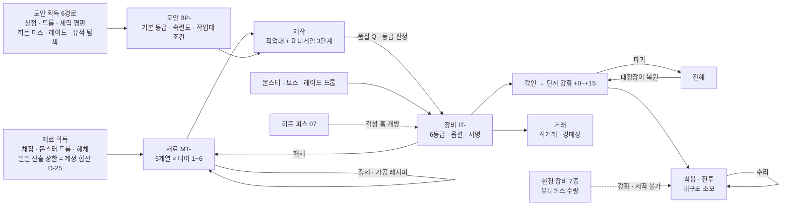
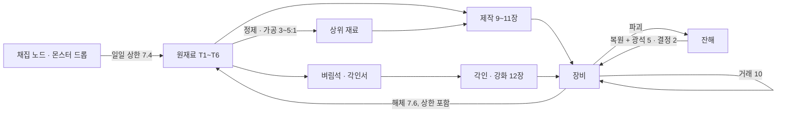

# 06_items_crafting — 장비 등급 · 대장장이 제작 · 강화

## 1. 문서 정보

| 항목 | 내용 |
|---|---|
| 버전 | r2 (r1 검수 반영: D-55 의뢰 게시판 · D-56 미니게임 재개형 · 입력 판정 · D-57 한정 장비 원장 · D-58 도안 커버리지 · 재료 산지 · 옵션 티어 계수 · 외형 계층 · 숙련 가속) |
| 작성일 | 2026-10-01 |
| 상태 | 검수 중 r2 (배정: system / roblox-tech / player-market) |
| 목적 | 3-B-11(장비 6등급) · 3-B-12(대장장이 제작: 도안 → 재료 → 미니게임 → 완성, 착용 조건) · 3-B-13(템빨식 확률 강화)과 4-완료기준의 장비 · 대장장이 · 강화 항목을 **구현에 바로 옮길 수 있는 수치 표**로 확정한다. 3-C의 미니게임 모바일 공정성 · 매크로 대책 · 과금 한계선을 함께 적는다. |
| 의존 문서 | 00_BRIEF(기준), 01_reference(1장 용어: 한정 장비 · 각성 홈, **3장 강화 원칙 1~12**, 5장 #7 · #8 · #11 · #29~#38 · #42~#48 · #51 · #64 · #65, 6장 IP 금지 목록), 02_concept(3.3 F3, 4.6 L6 경제 루프, 8.3 과금 한계선, 14장 용어집 #19~#30 · #32), 03_world(3.3 · 3.4 한정 장비 본체 · 최상급 마력 결정 산지, 6장 대장간 등급, 8장 드롭 카테고리, 13장 색인), 04_progression(4장 스탯, 5장 전투 공식 · 기준 스탯 · 몬스터 스탯, 7.6 사망 내구도, 11장 생산 숙련도, 13장 튜닝), 05_classes_skills(무기군 W1~W6, 대장장이 J-06 스킬 · 열기 게이지, J-H2 별철 명장, 7.4 착용 규칙) |
| 결정 · 가정 | DECISIONS **D-01~D-58**(직접 적용: D-02 · D-03 · D-04 · D-09 · D-10 · D-11 · D-17 · D-25 · D-32 · D-35 · D-37 · D-39 · D-41 · D-42 · D-43 · D-48 · D-49 · D-50 · **D-55 · D-56 · D-57 · D-58**), ASSUMPTIONS **AS-01~AS-13**(직접 적용: AS-02 · AS-05 · AS-06 · AS-07 · AS-10 · AS-13) |
| 이 문서를 기준으로 삼는 문서 | 04(5.2 · 5.5 장비 가정값 갱신), 05(3.2 · 9장 무기 수치 갱신, 10.1 #24 미니게임 입력), 07(각성 홈 · 도안 · 한정 장비 단서의 HP- 부여), 08(레이드 도안 · 재료 · 드롭 등급, 대장장이 레이드 역할), 09(제작 랭킹 산정 데이터), 10(골드 소모처 · 재료 일일 상한 · 거래 수수료), 11(아이템 인스턴스 · 한정 장비 유니버스 데이터 · 미니게임 서버 판정) |
| 표기 규칙 | 전부 한국어(영문 병기, AS-05). 수치는 표, 공식은 수식. **모든 수치 표는 생성 스크립트(gen06.py) 한 벌의 공식으로 계산**했고 18.4에 자가 검산 결과를 둔다. 사실은 출처(18.3), 그 외 수치는 **추정(튜닝 파라미터, 17장)**. |
| ID | 이 문서가 새로 부여: 아이템 **IT-01~IT-103**(r2에서 IT-56~IT-103 추가), 재료 **MT-01~MT-42**, 도안 **BP-01~BP-84**(r2에서 BP-38~BP-84 추가). 지역 · 도시 · 세력 · 아크(H- · T- · F- · A- · C-)는 03 13장 색인, 직업 · 스킬(J- · SK-)은 05의 것만 쓴다. 히든 피스(HP-) · 레이드 보스(RB-)는 07 · 08이 부여하므로 이 문서는 '07 부여' · '08 부여'로 적는다. 가정은 AS-, A-는 아크 전용. |
| 용어 | 02 14장 용어집 그대로: 도안 · 작업대 · 숙련도 · 담금질 · 열기 게이지 · 제작자 서명 · 각인 · 단계 강화 · 잔해 · 보호재 · 해체 · 한정 장비 · 각성 홈. 골격의 '강화석'은 이 문서에서 **벼림석(Honing Stone)** 으로 부른다(01번 6.3 · 6.4의 강화 재료 명칭 조합 회피). |

## 2. 아이템 체계 개요



| 단계 | 입력 | 출력 | 골드 · 재료 소모(15장) | 상세 |
|---|---|---|---|---|
| 재료 | 채집 노드 · 드롭 · 해체 | MT-(계열 × 티어) | 채집 도구 내구도 | 7장 |
| 정제 · 가공 | 하위 재료 3~5 + 촉매 | 상위 재료 1(손실형 변환) | 정제 촉매(골드) | 7.3 |
| 도안 | 6경로 | BP-(영구 습득, 계정 아님 · 캐릭터 단위) | 상점 구매가(골드) | 8장 |
| 제작 | 도안 + 재료 + 작업대 + 미니게임 | 장비 1개(등급 · 품질 · 옵션) | 작업대 사용료, 재료 소실 | 9~11장 |
| 각인 · 강화 | 장비 + 각인서 · 벼림석 · 골드 | 강화 단계 · 각인 칸 | 강화 골드, 보호재, 잔해 복원비 | 12장 |
| 사용 | 착용 | 전투력 | 내구도 → 수리비 | 13장 |
| 거래 · 해체 | 장비 | 골드 / 재료 | 거래 수수료(10), 해체 수수료 | 6 · 7 · 15장 |

## 3. 장비 등급 6단계

### 3.1 등급 표(3-B-11 · 4-완료기준 '스탯 범위 · 옵션 수 · 획득 경로')

| 등급 | 영문 | UI 색 · 모양(색약 대응) | 기본 스탯 배율(일반=1) | 랜덤 옵션 수 | 각성 홈 | 각인 칸 | 강화 상한 · 도박 구간 실패 | 획득 경로 | 거래 |
|---|---|---|---|---|---|---|---|---|---|
| **일반** | Common | 회색 #9AA0A6 · ● 원 | 1.00 | 0 | 0 | 2 | +15 · 파괴 없음(유지/하락만) | 상점 · 일반 몬스터 드롭 · 일반 도안 제작 · 첫 무기 무료 수령(D-10 · D-48, 6.1.1) | 자유(강화 단계 · 각인 유지) |
| **희귀** | Rare | 초록 #3DAA5C · ▲ 삼각 | 1.35 | 1 | 0 | 3 | +15 · 파괴 없음(유지/하락만) | 일반 몬스터(저확률) · 정예 드롭 · 희귀 도안 제작 · 아크 보상(07) | 자유 |
| **영웅** | Heroic | 파랑 #3A7BD5 · ■ 사각 | 1.82 | 2 | 0 | 4 | +15 · 파괴 있음(도박 구간) | 정예 · 필드 보스 · 인스턴스 보스 드롭 · 영웅 도안 제작 · 제작 승격 | 자유 |
| **전설** | Legendary | 주황 #E58A1F · ⬟ 오각 | 2.46 | 3 | 1 | 5 | +15 · 파괴 있음(도박 구간) | 필드 보스 · 인스턴스 최종 보스(저확률) · 레이드 · 전설 도안 제작 · 제작 승격 | 자유 |
| **신화** | Mythic | 진홍 #C93A3A · ⬢ 육각 | 3.32 | 4 | 2 | 6 | +15 · 파괴 있음(도박 구간) | 레이드 드롭(저확률) · 신화 도안 제작(레이드 · 히든 피스 · 유적 탐색 도안) · 전설 도안 승격 | **1회 거래**(첫 거래 후 귀속) |
| **초월** | Transcendent | 백금 #E9D9A6 + 무지개 테두리 · ★ 별 | 4.48 | 5 | 3 | 7 | +15 · 파괴 있음(도박 구간) | **초월 전용 도안 제작만**(승격으로 만들 수 없음, 신화 정수 MT-42 필요) | **거래 불가**(귀속. 의뢰 제작 시 의뢰인에게 귀속, 8.6) |

- 등급 사이 배율 1.35(R_GRADE, **D-49: 등급 간 기본 스탯 배율 ≥ 1.35**)는 01번 3장 원칙 12(강화 +15가 한 등급 위 +0을 넘지 않음)를 지키는 하한 1.330(3.7 조건 A의 가장 빠듯한 칸)을 조금 넘게 잡은 값이다. 레벨 티어(1~6)와 등급은 **독립 축**이다: 같은 티어의 일반 ~ 초월이 모두 존재할 수 있고(예: IT-39 진흙 군주의 망치 = 티어 2 · 전설, 레벨 11 착용), 획득 가능 조합은 3.4 표.
- **한정 장비(Limited Gear)는 등급이 아니라 소유 상태 표시**다(01번 1장). UI에는 등급 색 대신 '한정 n/N' 배지를 쓰고, 스탯 산정용 내부 등급만 초월로 둔다(03 3.3 '초월 등급 태그'의 뜻, 14장).
- 등급 색은 모양 아이콘과 항상 함께 표시한다(색각 이상 대응). 초월의 무지개 테두리는 정적 그라데이션이며 깜빡임 · 룰렛형 연출을 쓰지 않는다(AS-02, 01번 3장 원칙 10).

### 3.2 레벨 티어 × 등급 기본 스탯 — 무기 공격력

**식(추정, 튜닝).** 티어 T의 기준 레벨 L_T = 10T − 5(티어 중앙). 품질 Q(0~100, 11장)와 강화 단계 k(12장)를 반영한 최종 기본 스탯:

```
무기 공격력(T, G, Q, k) = 0.8 × (8 + 2.4 × L_T) × M_G / M_영웅 × (0.85 + 0.30 × Q/100) × (1 + 강화 보너스(k) + 0.01 × 각인 성공 수)
방어구 합(T, G, …)     = 0.8 × 2.5 × L_T × M_G / M_영웅 × (같은 품질 · 강화 · 각인 항)
목걸이 주 스탯         = 0.8 × (2 + 0.15 × L_T) × M_G / M_영웅 × (…),  반지 주 스탯 = 0.8 × (1 + 0.10 × L_T) × M_G / M_영웅 × (…)
M_G = 1.35^g (g = 0 일반 … 5 초월),  M_영웅 = 1.8225
```

- 계수 0.8은 '영웅 · 품질 50 · 기본 스탯 + 옵션 2줄 기대값'의 전투력이 04 5.2 기준 장비(무기 8 + 2.4 × 레벨, 옵션 없음)와 같은 수준이 되도록 맞춘 값이다(3.6 검산: 레벨 60 영웅 +0 = 5~6타, 04 5.4 같은 레벨 5.7타와 정합). 04 5.2 · 5.5의 '풀장비 가정값(무기 180 · 방어 200 · 주 스탯 +30)'은 이 문서 3.6의 값으로 갱신을 요청한다(18.1 #1).

| 티어 | 착용 레벨대 | L_T | 일반 | 희귀 | 영웅 | 전설 | 신화 | 초월 |
|---|---|---|---|---|---|---|---|---|
| T1 | 1~10 | 5 | **9** (7~10) | **12** (10~14) | **16** (14~18) | **22** (18~25) | **29** (25~34) | **39** (33~45) |
| T2 | 11~20 | 15 | **19** (16~22) | **26** (22~30) | **35** (30~40) | **48** (40~55) | **64** (55~74) | **87** (74~100) |
| T3 | 21~30 | 25 | **30** (25~34) | **40** (34~46) | **54** (46~63) | **73** (62~84) | **99** (84~114) | **134** (114~154) |
| T4 | 31~40 | 35 | **40** (34~46) | **55** (46~63) | **74** (63~85) | **99** (84~114) | **134** (114~154) | **181** (154~208) |
| T5 | 41~50 | 45 | **51** (43~59) | **69** (58~79) | **93** (79~107) | **125** (106~144) | **169** (144~194) | **228** (194~263) |
| T6 | 51~60 | 55 | **61** (52~71) | **83** (71~95) | **112** (95~129) | **151** (129~174) | **204** (174~235) | **276** (234~317) |

- 칸 = **품질 50 기준값**(품질 0 ~ 100 범위), 강화 +0 · 각인 0. 6무기군 공통(차이는 사거리 · 간격 · 무기 스킬, 05 7.1). 레벨 1 일반 무기 9는 04 5.2의 레벨 1 무기 10.4와 같은 급.

### 3.3 레벨 티어 × 등급 기본 스탯 — 방어구 · 장신구

| 티어 | 방어구 합 · 일반 | 방어구 합 · 희귀 | 방어구 합 · 영웅 | 방어구 합 · 전설 | 방어구 합 · 신화 | 방어구 합 · 초월 |
|---|---|---|---|---|---|---|
| T1 | 5 (5~6) | 7 (6~9) | 10 (9~12) | 14 (11~16) | 18 (15~21) | 25 (21~28) |
| T2 | 16 (14~19) | 22 (19~26) | 30 (26~35) | 41 (34~47) | 55 (46~63) | 74 (63~85) |
| T3 | 27 (23~32) | 37 (31~43) | 50 (43~57) | 68 (57~78) | 91 (77~105) | 123 (105~141) |
| T4 | 38 (33~44) | 52 (44~60) | 70 (60~81) | 95 (80~109) | 128 (108~147) | 172 (146~198) |
| T5 | 49 (42~57) | 67 (57~77) | 90 (77~103) | 122 (103~140) | 164 (139~189) | 221 (188~255) |
| T6 | 60 (51~69) | 81 (69~94) | 110 (94~126) | 149 (126~171) | 200 (170~231) | 271 (230~311) |

- 방어구 4부위 배분: 몸 35% · 머리 25% · 손 20% · 발 20%(각 부위 = 합 × 비율, 반올림). 예: T6 전설 방어구 합 149 → 몸 52 · 머리 37 · 손 30 · 발 30.

| 티어 | 목걸이 / 반지 · 일반 | 목걸이 / 반지 · 희귀 | 목걸이 / 반지 · 영웅 | 목걸이 / 반지 · 전설 | 목걸이 / 반지 · 신화 | 목걸이 / 반지 · 초월 |
|---|---|---|---|---|---|---|
| T1 | 1 / 1 | 2 / 1 | 2 / 1 | 3 / 2 | 4 / 2 | 5 / 3 |
| T2 | 2 / 1 | 3 / 1 | 3 / 2 | 5 / 3 | 6 / 4 | 8 / 5 |
| T3 | 3 / 2 | 3 / 2 | 5 / 3 | 6 / 4 | 8 / 5 | 11 / 7 |
| T4 | 3 / 2 | 4 / 3 | 6 / 4 | 8 / 5 | 11 / 7 | 14 / 9 |
| T5 | 4 / 2 | 5 / 3 | 7 / 4 | 9 / 6 | 13 / 8 | 17 / 11 |
| T6 | 4 / 3 | 6 / 4 | 8 / 5 | 11 / 7 | 15 / 9 | 20 / 13 |

- 장신구의 주 스탯 = 착용자 직업의 주 스탯(힘 · 민첩 · 지력 · 정신, 05 5.4)에 더해진다(장비 이름에 스탯을 고정하지 않음 → 직업 간 장신구 공유 가능). 최소 1.
- 장신구는 기본 스탯이 작고 **옵션 중심 부위**다(옵션 계수 κ = 0.40, 무기 · 방어구 0.12, 5.3).

### 3.4 등급 · 티어 획득 가능 조합과 드롭 등급 분포

| 등급 | 획득 가능 티어 | 근거 |
|---|---|---|
| 일반 · 희귀 · 영웅 | T1~T6 | 모든 위험도의 드롭 · 도안 |
| 전설 | T1~T6 | 필드 보스 · 인스턴스 보스 · 승격 · 전설 도안(T2 전설 IT-39 예) |
| 신화 | T3~T6 | 레이드 · 히든 피스 · 유적 탐색 도안(레이드 인스턴스 동기화 대상, 08) |
| 초월 | T5~T6(MVP는 T6만) | 전용 도안 3종(BP-31~33) + 신화 정수 |

| 드롭 출처 | 장비 드롭 확률 | 일반 | 희귀 | 영웅 | 전설 | 신화 | 드롭 장비 품질 Q |
|---|---|---|---|---|---|---|---|
| 일반 몬스터(적정 폭 안) | 처치당 2% | 85% | 14% | 1% | 0% | 0% | 균등 10~70 |
| 정예 몬스터 | 처치당 12% | 50% | 38% | 11% | 1% | 0% | 균등 10~70 |
| 필드 보스 · 인스턴스 최종 보스 | 1개 확정(주간 보상 소진 후 0, D-39) | 0% | 45% | 45% | 10% | 0% | 균등 20~80 |
| 레이드 보스(08이 확정) | 참가자당 1개(기준안) | 0% | 0% | 40% | 50% | 10% | 균등 30~90 |

- **인스턴스(던전) 드롭 범위(D-39)**: 인스턴스 7곳(H-05 · H-10 · H-11 · H-18 · H-19 · H-26 · H-33)은 재입장 무제한이고, 일반 · 정예 몬스터의 처치 경험치 · 일반 재료(7.2) · 위 표의 일반 · 정예 장비 드롭은 필드와 같다(분당 · 일일 상한만 적용). **H-19 용광로 골렘(일반)의 하늘쇠 원석(MT-06) 드롭도 이 '일반 재료'이며 주간 제한 밖**이다(7.2, D-58 (b)). 보스 상자의 MT-06은 아래 ①의 주간 보상분으로 따로 센다. **주간 보상 횟수(08)가 걸리는 '희귀 드롭'** = ① 인스턴스 최종 보스 장비 1개(위 표 3행) · 보스 상자, ② 인스턴스 보스 · 네임드의 도안 드롭(BP-12 H-10 극장 지배인, BP-15 H-18 얼음궁 관리인), ③ 도안 조각(MT-41)의 인스턴스 산출분, ④ 인스턴스 안 유적 탐색 도안(BP-13 · BP-16 · BP-29 · BP-33의 H-11 경로 — 원래 1캐릭터 1회라 주간 횟수와 무관하게 1회). 주간 횟수는 캐릭터별 · 계정 합산 = 3캐릭터분(D-25). 소진 후에는 ①~③이 나오지 않고 입구 배너 '주간 보상 소진: 경험치 · 재료만'(04 6장)을 띄운다.
- 드롭 장비의 티어 = ceil(몬스터 레벨 / 10). 레벨 차 15 이상(무관심 대상) 처치 시 희귀 이상 드롭 0(04 13장 RARE_DROP_LOWLEVEL). 제작품 품질 기대값(11.4 예시 43~96)이 드롭 품질 평균(40~60)보다 높아 **제작이 드롭보다 낫다**(D-02 생산 직업 가치, 02 3.3 실패 조건 (b)). 숙련도가 낮은 첫 1~2일에도 이 관계가 서도록 숙련 1~19 가속 · 첫 제작 보너스(8.2, D-58 (e))로 첫날 희귀 도안(숙련 10)에 닿게 한다.
- **드롭 기본 아이템 규칙(D-58 (a))**: 일반 · 정예 몬스터 · 보스의 장비 드롭은 ① 위 표로 등급 추첨 → ② 아래 부위 가중치로 부위 추첨 → ③ 그 티어 · 부위 칸(6.1.2 도안 커버리지 행렬)의 제작 아이템 중 균등 추첨(신화 · 초월 도안 결과 · 한정 장비 · 열쇠 물품 제외) 순서로 정한다. 아이템 이름과 등급은 독립이다(6.1 첫 문단: 같은 이름이 다른 등급으로 존재). 드롭 전용 아이템(IT-16 · IT-33~37 · IT-39 · IT-40)은 6.1 표에 적힌 출처에서만 나오며, 그 몬스터의 장비 드롭 중 50%를 대신한다.

| 부위 | 무기(6군 균등) | 머리 | 몸 | 손 | 발 | 목걸이 | 반지 | 합 |
|---|---|---|---|---|---|---|---|---|
| 드롭 부위 가중치 | 36%(군당 6%) | 11% | 11% | 11% | 11% | 10% | 10% | 100% |

### 3.5 T6 최종 스탯 범위(품질 · 강화 · 각인 포함)

| 등급 | 무기 공격력(Q0 +0 ~ Q100 +15 각인 전부) | 방어구 합 | 목걸이 주 스탯 | 옵션 수 | 각성 홈 |
|---|---|---|---|---|---|
| 일반 | 52 ~ 108 | 51 ~ 106 | 4 ~ 8 | 0 | 0 |
| 희귀 | 71 ~ 147 | 69 ~ 144 | 5 ~ 11 | 1 | 0 |
| 영웅 | 95 ~ 200 | 94 ~ 196 | 7 ~ 15 | 2 | 0 |
| 전설 | 129 ~ 271 | 126 ~ 266 | 9 ~ 20 | 3 | 1 |
| 신화 | 174 ~ 369 | 170 ~ 362 | 13 ~ 27 | 4 | 2 |
| 초월 | 234 ~ 501 | 230 ~ 492 | 17 ~ 37 | 5 | 3 |

### 3.6 레벨 60 풀장비 → 위험도 6 일반 몬스터 타수 검산(04 5.5 식)

조건: 04 5.5와 같은 근접 힘형 기준 빌드(힘 포인트 187), 평균 계수 1.6(D-35), 치명타 확률 = 5% + 0.05%p × 주 스탯(D-37), 치명 피해 = 150% + 0.5%p × 기교(10 + 옵션). 장비 7부위 같은 등급 · 같은 강화 단계 · 각인 칸 전부 성공, 옵션은 **부위별 옵션 풀 가중치의 기대값**(5.2) 또는 **공격 집중**(모든 줄을 공격력 · 주 스탯 · 치명 · 기교 중에서 고름). 몬스터 = 04 5.3 일반(레벨 52 · 56 · 60). 타수 = 올림(체력 ÷ 평균 1타).

| 장비 상태(7부위) | 무기 공격력 | 주 스탯 총합 | 치명 확률 | 치명 피해 | 기대 배율 | 기본 공격력 | Lv52 타수 | Lv56 타수 | Lv60 타수 |
|---|---|---|---|---|---|---|---|---|---|
| 영웅 +0 (Q50) | 116 | 211 | 19.0% | 167% | 1.13 | 551 | 4.51 → **5** | 4.90 → **5** | 5.31 → **6** |
| **전설 +0 (Q50) = 04 '풀장비' 정의** | 159 | 225 | 23.2% | 178% | 1.18 | 635 | 3.74 → **4** | 4.06 → **5** | 4.40 → **5** |
| 전설 +10 (권장 종착, 12.6) | 206 | 231 | 23.5% | 178% | 1.18 | 693 | 3.42 → **4** | 3.71 → **4** | 4.02 → **5** |
| 전설 +15 | 236 | 235 | 23.6% | 178% | 1.18 | 730 | 3.24 → **4** | 3.52 → **4** | 3.81 → **4** |
| 전설 +0 공격 집중 | 159 | 260 | 30.8% | 162% | 1.19 | 713 | 3.30 → **4** | 3.59 → **4** | 3.89 → **4** |
| 신화 +10 | 280 | 255 | 30.2% | 196% | 1.29 | 836 | 2.60 → **3** | 2.82 → **3** | 3.06 → **4** |
| 초월 +15 (Q100, 이론 상한) | 501 | 312 | 43.8% | 231% | 1.57 | 1210 | 1.47 → **2** | 1.60 → **2** | 1.73 → **2** |
| 초월 +15 (Q100) 공격 집중 | 501 | 407 | 50.9% | 250% | 1.76 | 1433 | 1.11 → **2** | 1.20 → **2** | 1.30 → **2** |

- **판정(D-49 '풀장비 = 전설 등급')**: 04 5.5의 '레벨 60 풀장비'(전설 +0 · 품질 50 · 옵션 기대값) = **4~5타**로 4~6타 조건을 지킨다. 전설은 +15 · 공격 집중까지 모두 4~5타 안에 있다(전설 등급 안에서는 강화 · 옵션 선택이 타수 구간을 깨지 않음).
- 신화는 3~4타, 초월 +15는 2타로 내려간다. 이는 **도달자가 극소수인 이론 상한**(초월 = 숙련도 99 · 작업대 5 · 신화 정수 · 전용 도안, +15 기대 시도 수백 회, 12.6)의 보상 구간이며, (1) 인스턴스 · 레이드는 04 7.7 동기화(장비 수치 상한 1.3배)로 이 격차가 전투 판정에 그대로 들어가지 않고, (2) 오픈월드 일반 몬스터 처치 속도는 분당 경험치 상한(04 7.4 XP_PER_MIN_CAP)에 막혀 성장 속도 격차로 번지지 않는다. 신화 이상은 '풀장비' 기준에 넣지 않는다(**D-49 확정**: 신화 3~4타 · 초월 +15 2타는 최상위 희소 장비의 결과로 허용).
- 방어 측 참고: 전설 +0 방어구 합 156 + 0.5 × 체력 스탯(128 + 옵션 기대 5) + 옵션 방어 기대 9 = 방어력 약 **231**(04 5.2 가정 274보다 낮음 → 04 5.2 '60 풀장비' 행 갱신 요청, 18.1 #1). 받는 피해 감소 · 최대 체력 옵션 기대값은 별도로 더해진다.

### 3.7 01번 3장 원칙 12 검산 — '강화 +15가 한 등급 위 +0을 넘지 않음' · '강화 상승폭 > 같은 등급 옵션 차이'

**장비 점수(GS, Gear Score)** = 기준 캐릭터(티어 6 · 레벨 55 · 영웅 장비)의 **피해 또는 유효 체력 1% = 1점**으로 환산한 장비 전투 기여. 단위 점수(GS/단위)는 5.2 표. 비교는 **같은 품질(Q50) · 각인 칸 전부 성공 · 옵션 기대값**으로 한다(품질은 등급과 독립한 ±15% 축, 각성 홈은 히든 피스 보상이라 제외).

```
EP(G, k) = 기본 점수_G × (1 + 강화 보너스(k) + 0.01 × 각인 칸_G) + 옵션 수_G × κ × 기본 점수_G
조건 A(원칙 12 후단): EP(G, +15) ≤ EP(G+1, +0)        → 1.35 × (1 + e_{G+1} + (n+1)κ) ≥ 1.51 + e_G + nκ
조건 B(원칙 12 전단): 강화 +15 상승폭 0.51 × 기본 점수 > 옵션 범위 폭 n × κ × σ × 기본 점수 (σ = 범위 폭 / 중앙값)
```

| 부위(T6, Q50) | 일반 +15 ≤ 희귀 +0 | 희귀 +15 ≤ 영웅 +0 | 영웅 +15 ≤ 전설 +0 | 전설 +15 ≤ 신화 +0 | 신화 +15 ≤ 초월 +0 |
|---|---|---|---|---|---|
| 무기 | 19.47 ≤ 19.76 ✔ | 28.52 ≤ 29.69 ✔ | 41.52 ≤ 44.16 ✔ | 60.13 ≤ 65.11 ✔ | 86.67 ≤ 95.32 ✔ |
| 머리 | 8.58 ≤ 8.71 ✔ | 12.57 ≤ 13.09 ✔ | 18.30 ≤ 19.46 ✔ | 26.50 ≤ 28.69 ✔ | 38.19 ≤ 42.00 ✔ |
| 몸 | 12.02 ≤ 12.19 ✔ | 17.60 ≤ 18.32 ✔ | 25.62 ≤ 27.24 ✔ | 37.10 ≤ 40.17 ✔ | 53.47 ≤ 58.81 ✔ |
| 손 | 6.87 ≤ 6.97 ✔ | 10.06 ≤ 10.47 ✔ | 14.64 ≤ 15.57 ✔ | 21.20 ≤ 22.95 ✔ | 30.56 ≤ 33.60 ✔ |
| 발 | 6.87 ≤ 6.97 ✔ | 10.06 ≤ 10.47 ✔ | 14.64 ≤ 15.57 ✔ | 21.20 ≤ 22.95 ✔ | 30.56 ≤ 33.60 ✔ |
| 목걸이 | 3.06 ≤ 3.86 ✔ | 5.24 ≤ 6.71 ✔ | 8.57 ≤ 11.08 ✔ | 13.59 ≤ 17.69 ✔ | 21.08 ≤ 27.56 ✔ |
| 반지 | 1.94 ≤ 2.45 ✔ | 3.32 ≤ 4.26 ✔ | 5.44 ≤ 7.03 ✔ | 8.62 ≤ 11.22 ✔ | 13.37 ≤ 17.48 ✔ |

| 부위 | 등급 | 강화 +15 상승폭(GS) | 옵션 범위 폭 합(GS) | 조건 B |
|---|---|---|---|---|
| 무기 | 희귀 | 8.76 | 1.65 | ✔ |
| 무기 | 영웅 | 11.83 | 4.45 | ✔ |
| 무기 | 전설 | 15.97 | 9.02 | ✔ |
| 무기 | 신화 | 21.56 | 16.23 | ✔ |
| 무기 | 초월 | 29.11 | 27.40 | ✔ |
| 목걸이 | 희귀 | 1.38 | 0.27 | ✔ |
| 목걸이 | 영웅 | 1.86 | 0.73 | ✔ |
| 목걸이 | 전설 | 2.51 | 1.48 | ✔ |
| 목걸이 | 신화 | 3.39 | 2.66 | ✔ |
| 목걸이 | 초월 | 4.58 | 4.49 | ✔ |

- 방어구 4부위는 무기와 같은 κ · σ라 조건 B 비율이 무기와 같다. 가장 빠듯한 칸은 일반 +15 vs 희귀 +0(여유 약 1.5%)이며, R_GRADE · κ를 바꿀 때는 이 칸부터 다시 검산한다(17장).

## 4. 장비 부위 · 착용 조건(3-B-12 필수)

| 부위 | 칸 수 | 기본 스탯 | 요구 스탯 종류 | 계수 a | 옵션 풀 | 비고 |
|---|---|---|---|---|---|---|
| 무기 | 1(05 7.4) | 공격력(물리 · 마법 공통, 04 5.1) | 무기군별: W1 힘·민첩 중 높은 값 / W2 민첩 / W3 지력·정신 중 높은 값 / W4 민첩 / W5 힘·정신 중 높은 값 / W6 힘·민첩 중 높은 값 | 1.5 | 5.2 무기 열 | 직업 조건 없음(05 7.4). 무기 스킬은 직업 주 스탯을 쓴다(05 5.4) |
| 머리 · 몸 · 손 · 발 | 각 1 | 방어력(합의 25 · 35 · 20 · 20%) | 체력 | 0.4 | 5.2 부위 열 | 4부위 모두 같은 요구식 |
| 목걸이 · 반지 | 각 1 | 주 스탯(착용자 직업 주 스탯에 가산) | 힘 · 민첩 · 지력 · 정신 중 최고값 | 0.75 | 5.2 장신구 열 | 옵션 중심 부위 |

```
요구 레벨 = 티어 하한(T1 1 · T2 11 · T3 21 · T4 31 · T5 41 · T6 51)
요구 스탯 = ⌈(10 + a × (요구 레벨 − 1)) × (1 + 0.04 × g)⌉   (g = 등급 0~5)
```

| 티어 (요구 레벨) | 일반 무기/방어구/장신구 | 희귀 무기/방어구/장신구 | 영웅 무기/방어구/장신구 | 전설 무기/방어구/장신구 | 신화 무기/방어구/장신구 | 초월 무기/방어구/장신구 |
|---|---|---|---|---|---|---|
| T1 (Lv 1) | 10 / 10 / 10 | 11 / 11 / 11 | 11 / 11 / 11 | 12 / 12 / 12 | 12 / 12 / 12 | 12 / 12 / 12 |
| T2 (Lv 11) | 25 / 14 / 18 | 26 / 15 / 19 | 27 / 16 / 19 | 29 / 16 / 20 | 29 / 17 / 21 | 30 / 17 / 21 |
| T3 (Lv 21) | 40 / 18 / 25 | 42 / 19 / 26 | 44 / 20 / 27 | 45 / 21 / 29 | 47 / 21 / 29 | 48 / 22 / 30 |
| T4 (Lv 31) | 55 / 22 / 33 | 58 / 23 / 34 | 60 / 24 / 36 | 62 / 25 / 37 | 64 / 26 / 38 | 66 / 27 / 39 |
| T5 (Lv 41) | 70 / 26 / 40 | 73 / 28 / 42 | 76 / 29 / 44 | 79 / 30 / 45 | 82 / 31 / 47 | 84 / 32 / 48 |
| T6 (Lv 51) | 85 / 30 / 48 | 89 / 32 / 50 | 92 / 33 / 52 | 96 / 34 / 54 | 99 / 35 / 56 | 102 / 36 / 57 |

**빌드별 착용 가능 검산**(04 4.2 · 4.3 분배, 장비 · 인장 보정 제외 = 가장 불리한 경우)

| 빌드 | 레벨 | 주 스탯 | 체력 스탯 | T6 전설 무기(96) | T6 초월 무기(102) | T6 전설 방어구(34) | T6 초월 방어구(36) | T6 초월 장신구(57) |
|---|---|---|---|---|---|---|---|---|
| 근접 힘형(기준 빌드) | 51 | 160 | 110 | ✔ | ✔ | ✔ | ✔ | ✔ |
| 근접 힘형(기준 빌드) | 60 | 187 | 128 | ✔ | ✔ | ✔ | ✔ | ✔ |
| 민첩형(궁수) | 51 | 160 | 85 | ✔ | ✔ | ✔ | ✔ | ✔ |
| 민첩형(궁수) | 60 | 187 | 99 | ✔ | ✔ | ✔ | ✔ | ✔ |
| 마법형(마도사) | 51 | 160 | 85 | ✔ | ✔ | ✔ | ✔ | ✔ |
| 마법형(마도사) | 60 | 187 | 99 | ✔ | ✔ | ✔ | ✔ | ✔ |
| 마법형 극단(자유 전부 지력) | 51 | 210 | 35 | ✔ | ✔ | ✔ | ✘(35<36) | ✔ |
| 마법형 극단(자유 전부 지력) | 60 | 246 | 40 | ✔ | ✔ | ✔ | ✔ | ✔ |
| 생산형(대장장이, 힘 2 · 체력 1) | 51 | 135 | 85 | ✔ | ✔ | ✔ | ✔ | ✔ |
| 생산형(대장장이, 힘 2 · 체력 1) | 60 | 158 | 99 | ✔ | ✔ | ✔ | ✔ | ✔ |

- 결과: 자기 주 스탯 무기 · 장신구는 모든 빌드가 티어 하한 레벨에 착용한다. 체력을 전혀 찍지 않는 극단 빌드만 T6 초월 방어구를 늦게 입는다(빌드 선택의 대가, 04 4.4 재분배로 언제든 조정). 다른 직업 주 스탯 무기(예: 마도사가 망치)는 그 스탯에 투자해야 쓴다.
- 조건 미달 처리(04 4.4 그대로): 재분배 · 장비 해제로 조건을 못 채우면 **착용 상태로 남되 효과 0**('조건 미달' 표시), 벗으면 다시 끼지 못한다. 인스턴스 레벨 동기화(04 7.7) 중에는 착용 조건을 다시 검사하지 않고 장비 수치만 상한(1.3배)으로 자른다.
- 도안 **제작** 조건은 캐릭터 레벨이 아니라 숙련도 + 작업대 등급(D-03, 8.2). 레벨 5 대장장이도 숙련도만 있으면 T6 장비를 만들어 팔 수 있다(착용은 못 함).

## 5. 옵션

### 5.1 옵션 규칙

| 항목 | 규칙 |
|---|---|
| 옵션 수 | 등급 고정: 일반 0 · 희귀 1 · 영웅 2 · 전설 3 · 신화 4 · 초월 5(3.1). 제작 · 드롭 동일 |
| 종류 추첨 | 부위 옵션 풀(5.2)에서 가중치 비복원 추첨(같은 종류 중복 없음). 최소 등급 미만 옵션은 풀에서 제외. 신화 · 초월은 최소 등급 제한 옵션의 가중치 ×1.5 |
| 수치 추첨 | `수치 = 중앙값 × ((1 − σ/2) + σ × R)`, `R = U^(1.5 − Q/100)`(U ~ 균등 0~1). σ = 무기 · 방어구 0.8(중앙값 × 0.6~1.4), 장신구 0.25(× 0.875~1.125). E[R] = 1/(2.5 − Q/100) → Q0 0.40 · Q50 0.50 · Q100 0.67. **품질이 높을수록 상단 수치가 잘 나온다**(3-B-12 스펙 결정) |
| 중앙값 | `중앙값 = κ × 아이템 기본 점수(GS) ÷ 단위 점수(GS/단위)`, 평탄 수치(+n) 옵션은 × 티어 계수 s(T), % 옵션은 × % 티어 계수 p(T), 장신구 평탄 옵션은 × min(s(T), p(T))(5.3, D-58 (c)). κ = 무기 · 방어구 0.12, 장신구 0.40. 모든 옵션의 중앙값은 같은 점수(등가 원칙) → 어느 옵션이 붙어도 '좋은 장비'의 기대 가치가 같다 |
| 반올림 | 평탄 옵션 정수(최소 1), % 옵션 소수 첫째 자리 |
| 합계 상한 | 치명 확률 60% · 회피 20% · 치명 피해 250%(04 5.1), 받는 피해 감소 −30%, 쿨타임 감소 −25%, 정예 · 보스 피해 +40%, 자원 회복 +60%, 치유 · 보호막 +40%. 상한 초과분은 버려지며 장비 창에 '상한 도달' 표시 |
| 제작자 서명 옵션 | 제작품에만 1줄 추가(5.4). 랜덤 옵션 수에 넣지 않으며 전투 수치 옵션이 아니다 |

### 5.2 옵션 풀(15종 + 서명 옵션 4종 = 19종)

| 번호 | 옵션 | 영문 | 단위 | GS/단위 | 무기 | 머리 | 몸 | 손 | 발 | 목걸이 | 반지 | 최소 등급 | 합계 상한 |
|---|---|---|---|---|---|---|---|---|---|---|---|---|---|
| #01 | 공격력 | Attack | +n | 0.207 (계산) | 30 | — | — | 10 | — | 15 | 15 | 희귀 | — |
| #02 | 주 스탯 | Main Stat | +n | 0.445 (계산) | 30 | 20 | 10 | 25 | 15 | 20 | 20 | 희귀 | — |
| #03 | 체력 스탯 | Vitality | +n | 0.767 (계산) | — | 20 | 25 | — | 25 | — | — | 희귀 | — |
| #04 | 기교 | Technique | +n | 0.250 (설계) | — | — | — | 15 | — | 10 | 10 | 희귀 | 치명 피해 250%(04) |
| #05 | 치명타 확률 | Crit Chance | +n%p | 0.650 (설계) | 20 | — | — | 20 | — | 15 | 15 | 희귀 | 60%(04) |
| #06 | 치명타 피해 | Crit Damage | +n%p | 0.200 (설계) | 15 | — | — | 20 | — | 15 | 15 | 희귀 | 250%(04) |
| #07 | 방어력 | Defense | +n | 0.372 (계산) | — | 15 | 20 | 10 | 20 | — | — | 희귀 | — |
| #08 | 최대 체력 | Max HP | +n | 0.048 (계산) | — | 15 | 20 | — | 20 | — | 10 | 희귀 | — |
| #09 | 받는 피해 감소 | Damage Taken | −n% | 1.000 (설계) | — | 10 | 15 | — | — | — | — | 영웅 | 합계 −30% |
| #10 | 회피 | Evasion | +n%p | 1.000 (설계) | — | — | — | — | 20 | — | 10 | 희귀 | 20%(04) |
| #11 | 스킬 쿨타임 감소 | Cooldown | −n% | 0.600 (설계) | — | 10 | — | — | — | 10 | — | 전설 | 합계 −25% |
| #12 | 정예·보스 대상 피해 | Elite/Boss Damage | +n% | 0.500 (설계) | 5 | — | — | — | — | — | — | 영웅 | 합계 +40% |
| #13 | 자원 회복 | Resource Regen | +n% | 0.250 (설계) | — | — | — | — | — | 10 | 5 | 희귀 | 합계 +60% |
| #14 | 상태이상 저항 | Status Resist | +n%p | 0.300 (설계) | — | 10 | 10 | — | — | — | — | 희귀 | 50%(04 정신 상한과 합산) |
| #15 | 치유·보호막량 | Heal/Shield | +n% | 0.500 (설계) | — | — | — | — | — | 5 | — | 희귀 | 합계 +40% |

- **치명 옵션과 D-37**: 기본 치명타 확률은 주 공격 스탯 4종(힘 · 민첩 · 지력 · 정신)이 1당 +0.05%p로 같게 주고(04 5.1, D-37), 장비 옵션 #05 치명타 확률 · #06 치명타 피해 · #04 기교는 **직업 · 무기군 · 주 스탯과 무관하게 같은 가중치 · 같은 중앙값**으로 붙는다(직업 전용 치명 보정 옵션 없음). 따라서 같은 장비 상태에서 딜러 직업 간 치명 기대 배율 차이는 D-37의 ±8% 목표를 장비가 넓히지 않는다. 회피(#10)는 민첩의 추가 효과(D-37)와 별개 옵션이며 합계 상한 20%(04)를 공유한다.
- 칸 = 그 부위 풀에서의 추첨 가중치. W3 지팡이는 무기 풀에 #15 치유 · 보호막량(가중치 15)이 추가된다. GS/단위 '계산' = 기준 캐릭터(티어 6 · L55 · 영웅 장비: 기본 공격력 483 · 최대 체력 2066 · 방어력 169)에서 1단위가 바꾸는 피해 · 유효 체력 %, '설계' = 기준 치명 20% · 치명 피해 170% 등 설계 환산치(추정).

### 5.3 옵션 중앙값(T6 희귀 기준) · 등급 배율 · 티어 계수

| 옵션(T6 희귀 중앙값) | 무기 | 머리 | 몸 | 손 | 발 | 목걸이 | 반지 |
|---|---|---|---|---|---|---|---|
| 공격력 | 10 | — | — | 4 | — | 5 | 3 |
| 주 스탯 | 5 | 2 | 3 | 2 | 2 | 2 | 2 |
| 체력 스탯 | — | 1 | 2 | — | 1 | — | — |
| 기교 | — | — | — | 3 | — | 4 | 3 |
| 치명타 확률 | 3.2 | — | — | 1.1 | — | 1.7 | 1.1 |
| 치명타 피해 | 10.3 | — | — | 3.6 | — | 5.4 | 3.4 |
| 방어력 | — | 2 | 3 | 2 | 2 | — | — |
| 최대 체력 | — | 19 | 26 | — | 15 | — | 14 |
| 받는 피해 감소 | — | 0.9 | 1.3 | — | — | — | — |
| 회피 | — | — | — | — | 0.7 | — | 0.7 |
| 스킬 쿨타임 감소 | — | 1.5 | — | — | — | 1.8 | — |
| 정예·보스 대상 피해 | 4.1 | — | — | — | — | — | — |
| 자원 회복 | — | — | — | — | — | 4.3 | 2.7 |
| 상태이상 저항 | — | 3.0 | 4.2 | — | — | — | — |
| 치유·보호막량 | 4.1 | — | — | — | — | 2.2 | — |

| 구분 | 일반 | 희귀 | 영웅 | 전설 | 신화 | 초월 |
|---|---|---|---|---|---|---|
| 등급 배율(중앙값 × M_G / M_희귀) | — | 1.00 | 1.35 | 1.82 | 2.46 | 3.32 |

| 티어 | T1 | T2 | T3 | T4 | T5 | T6 |
|---|---|---|---|---|---|---|
| 평탄 옵션 티어 계수 s(T) = (8 + 2.4 L_T) / 140 | 0.143 | 0.314 | 0.486 | 0.657 | 0.829 | 1.000 |
| % 옵션 티어 계수 p(T) = 0.5 + 0.25 × max(0, T − 4) (D-58 (c)) | 0.50 | 0.50 | 0.50 | 0.50 | 0.75 | 1.00 |
| 장신구(목걸이 · 반지) 평탄 옵션 계수 = min(s(T), p(T)) | 0.143 | 0.314 | 0.486 | 0.500 | 0.750 | 1.000 |

- 예: **T6 전설 무기 치명타 확률** 중앙값 = 3.2 × 1.82 × 1.00 = **5.8%p**, 범위 3.5~8.1%p. **T2 전설 무기 공격력** 중앙값 = 10.0 × 1.82 × 0.314 = **5.7 → 6**, 범위 3~8. **T3 전설 무기 치명타 확률** = 3.2 × 1.82 × 0.50 = **2.9%p**.
- **% 옵션 티어 계수(06-r1-S-03, D-58 (c))**: r1은 % 옵션을 티어와 무관하게 T6 크기로 붙여, 옵션 중심 부위(κ 0.40)인 장신구에서 저티어 장비가 고티어와 거의 같아졌다(아래 r1 열). r2는 % 옵션에 p(T)(T1 0.5 → T6 1.0)를 곱하고, 장신구는 평탄 옵션도 min(s(T), p(T))로 묶는다(T4 · T5 장신구의 평탄 옵션만 r1보다 작아지고 T1~T3 · T6은 r1과 같다). 3.6 · 3.7 · 14.1의 T6 수치는 p(6) = 1.0이라 바뀌지 않는다.
- 검산 기준: '한 등급 위라도 두 티어 이상 아래인 장신구는 T6 전설을 넘지 않는다'(무기 기본 스탯 순서와 같음: T4 신화 134 < T6 전설 151, 3.2). 비교는 3.7 EP 식(기본 스탯 GS + 옵션 GS), 옵션은 '부위 가중치 기대값'과 '% 옵션만 고른 경우(5.5 천장으로 종류 직접 선택)' 두 가지다.

| 장신구(Q50 · +0 · 각인 전부 성공) | 기본 스탯 GS | 장비 점수 r1(옵션 기대값 / % 옵션만) | 장비 점수 r2(옵션 기대값 / % 옵션만) | 판정(T6 전설 이하) |
|---|---|---|---|---|
| T1 전설 목걸이 (Lv 1) | 1.39 | 5.02 / 7.30 | **3.39 / 4.34** | ✔ ≤ 기준 |
| T3 신화 목걸이 (Lv 21) | 3.95 | 12.13 / 14.59 | **9.21 / 9.27** | ✔ ≤ 기준 |
| T4 신화 목걸이 (Lv 31) | 4.99 | 13.98 / 15.62 | **10.31 / 10.31** | ✔ ≤ 기준 |
| T5 전설 목걸이 (Lv 41) | 4.42 | 9.87 / 10.33 | **8.85 / 8.85** | ✔ ≤ 기준 |
| T5 신화 목걸이 (Lv 41) | 6.02 | 15.84 / 16.66 | **14.00 / 14.00** | 초과 허용(한 등급 위 · 한 티어 아래: 무기도 T5 신화 169 > T6 전설 151, 3.2) |
| T6 전설 목걸이 (Lv 51) | 5.17 | 11.08 / 11.08 | **11.08 / 11.08** | 기준 |
| T1 전설 반지 (Lv 1) | 0.76 | 2.74 / 4.51 | **1.89 / 2.63** | ✔ ≤ 기준 |
| T3 신화 반지 (Lv 21) | 2.41 | 7.25 / 9.15 | **5.73 / 5.78** | ✔ ≤ 기준 |
| T4 신화 반지 (Lv 31) | 3.09 | 8.57 / 9.84 | **6.47 / 6.47** | ✔ ≤ 기준 |
| T6 전설 반지 (Lv 51) | 3.28 | 7.03 / 7.03 | **7.03 / 7.03** | 기준 |

- 결과: r1에서 T6 전설(11.08)보다 높던 T3 신화 목걸이(14.59)가 9.27로 내려가 **저티어 장신구를 싼 재료로 재설정하는 것이 정답이 되지 않는다**. 레벨이 오르면 같은 등급의 높은 티어 장신구로 자연 교체되고, T6 재설정(3,840골드 + MT-24 3개, 5.5)이 최상위 골드 · 최상급 결정 소모처로 남는다. 계산: gen06_r2.py(18.4).

### 5.4 제작자 서명 옵션(01번 5장 #43, 제작품 전용 1줄)

| 서명 옵션 | 영문 | 효과 | 부위 | 일반 | 희귀 | 영웅 | 전설 | 신화 | 초월 |
|---|---|---|---|---|---|---|---|---|---|
| 내구 단련 | Tempered Wear | 내구도 소모 −n% | 전 부위 | 10 | 12 | 15 | 18 | 22 | 25 |
| 채집의 손 | Gatherer's Hand | 채집 채널링 시간 −n%(산출량 · 일일 상한 불변, D-17) | 손 · 발 | 3 | 4 | 5 | 6 | 7 | 8 |
| 장인의 감 | Artisan's Sense | 제작 스킬 보정 S +n(11.1, 합계 +10 상한) | 손 · 목걸이 · 반지 | 1 | 2 | 3 | 4 | 5 | 6 |
| 길손 | Wayfarer | 비전투 이동 속도 +n%(합계 +5% 상한, 전투 중 0) | 발 | 1 | 1.5 | 2 | 2.5 | 3 | 4 |

- 서명 = 제작자 이름 + 서명 옵션 1줄(부위에 맞는 것 중 제작자가 선택). **J-H2 별철 명장이 만든 장비는 서명 수치 × 1.5 + '명장 표식(★)'** 표시(05 J-H2 가치). 서명은 해체 · 재설정으로 바뀌지 않으며 거래 후에도 남는다. 제작자 서명 수는 09 제작 랭킹 데이터로 넘긴다.

### 5.5 옵션 재설정(01번 5장 #36 천장, 게임 내 재화만)

| 항목 | 규칙 |
|---|---|
| 장소 · 수행자 | 작업대 2등급 이상 도시 NPC 또는 대장장이 계열(숙련도 50 이상, 골드 −20%) |
| 대상 | 장비 1개의 옵션 1줄 선택 → 종류 · 수치를 다시 추첨(그 장비의 품질 Q로 가중, 5.1). 다른 줄 · 서명 · 강화 · 각인은 유지 |
| 비용 | 골드 = 40 × T × (g + 1)², 같은 티어 마력 결정 × g개. 예: T6 전설 = 40 × 6 × 16 = 3,840골드 + T6 마력 결정(MT-24 최상급) 3개 |
| 천장 | 같은 장비 누적 20회째 재설정은 **종류 직접 선택 + 수치 상위 25% 구간 보장**. 천장 사용 시 카운트 0 |
| 과금 | 로벅스 판매 없음. 유료 확률형 재설정 금지(01번 5장 #37, AS-06) |
| 확률 공개 | 재설정 창에 종류별 가중치(%)와 수치 분포(R의 분포)를 표시, 월별 실측 공개(01번 5장 #38) |

### 5.6 장비 효과와 버프 중첩 규칙(D-43 · 05 5.6 적용)

장비 옵션 · 각성 효과(14.3) · 한정 장비 고유 효과(14.1) · 무기 개조 속성(6.3)이 대장장이 담금질 등 스킬 버프와 만날 때의 계산 순서다. 05 5.6의 D-43 ①~③을 장비 쪽에 그대로 적용하고, 새 중첩 범주를 만들지 않는다.

| 장비 쪽 효과 | 분류(D-43 · 05 5.6) | 계산 | 예 |
|---|---|---|---|
| 평탄 옵션: 공격력 #01 · 주 스탯 #02 · 체력 스탯 #03 · 기교 #04 · 방어력 #07 · 최대 체력 #08, 장신구 주 스탯 | **기본 수치에 가산**(버프 아님) | 기본 공격력(04 5.1) · 방어 · 체력을 만들 때 더한다. 담금질 등 '공격력 +n%'(05 5.4 ①)는 **이 합 전체**에 곱한다 | 무기 159 + 옵션 공격력 +12 → 기본 공격력 계산 후 담금질 ×1.12 |
| % 옵션: 치명타 확률 #05 · 치명타 피해 #06 · 회피 #10 · 상태이상 저항 #14 · 자원 회복 #13 · 쿨타임 감소 #11 · 치유 · 보호막량 #15 | 장비 합산 항 | 같은 종류끼리 합연산, 5.1 합계 상한 → 그다음 스킬 버프와 04 · 05 상한(치명 60% · 치명 피해 250% 등)을 다시 적용 | 별철 담금 치명 피해 +10%p는 장비 치명 피해 합에 더한 뒤 250% 상한 |
| 정예 · 보스 대상 피해 #12 + 각성 #6 사냥꾼 표식 | 장비 '대상 조건 피해' 항(1개) | 합연산, **합계 상한 +40%**(5.1). D-43 ② 버프 합(상한 +50%)과는 **곱**(별도 항) | #12 +12% + 각성 #6 +6% = ×1.18, 버프 +47%와 함께면 ×1.18 × 1.47 |
| 각성 #1 처치 연쇄(공격력 +8%) · #2 대시 일격(+20%) · #5 파티 공명(최대 +6%), IT-46 왕도의 잔향(파티 피해 +4%), 무기 개조 · 명장의 서명의 '피해 +n%' | **D-43 ② 공격력 · 피해 증가**(조건부 버프로 취급) | 효과 ID별 최댓값 1개, 서로 다른 ID끼리 합연산, **스킬 버프와 같은 합에 넣어 상한 +50%** | 전투 함성 +10% + 담금질 +12% + 처치 연쇄 +8% + 대시 일격 +20% = +50%(상한 도달. 여기에 전장의 축 +25%가 더해져도 +50%) |
| IT-42 별철 울림(담금질 · 보강 · 현장 수리 효과 +20%) | 시전 효과 증폭(시전자 쪽) | 담금질 +12% → +14.4%, 별철 담금 +18% → +21.6%로 **시전 값 자체**를 바꾼 뒤 D-43 ③(같은 계열 큰 값 1개) · ②(합 상한 +50%)를 적용 | 별철 울림 대장장이의 담금질 14.4% vs 다른 J-H2의 별철 담금 18% → 큰 값 18%만 적용 |
| 받는 피해 감소 #09(장비 합 −30% 상한) · 각성 #4 굳건함(−8%) · IT-46 착용자 −4% · IT-43 거울 반사(1회 −50%) | **D-43 ① 받는 피해 감소** | 장비 #09 합계를 rᵢ 1개로, 나머지 각각 rᵢ로 곱연산 1 − Π(1 − rᵢ), **최종 상한 −75%**. 보스 '확정 피해'(08)는 무시 | #09 −30% · 굳건함 −8% · 모루 자세 −40% → 1 − 0.70 × 0.92 × 0.60 = −61.4% |
| IT-41 잉크 표식(받는 마법 피해 +6%) · 마비(받는 마법 피해 +10%) · 마비 면역 보스 받는 피해 +4%(6.3) | **표식 · 낙인**(05 5.6) | 종류별 1개, 대상 쪽 합산 상한 +25% | 잉크 표식 6% + 마비 10% = +16% |
| 6.3 화상 · 둔화 | 상태이상(05 5.6) | 화상 시전자별 1개 갱신, 둔화 합산 상한 −50%(보스) | — |

- 계산 순서(서버, 1타): 기본 공격력(장비 평탄 옵션 포함) × 스킬 계수 × (1 + D-43 ② 합, ≤ 0.50) × (1 + 대상 조건 피해 합, ≤ 0.40) × 치명 기대 배율(장비 · 버프 합산 후 상한) × (1 + 표식 합, ≤ 0.25) × 방어 감쇠(04 5.1). 받는 쪽은 1 − min(0.75, 1 − Π(1 − rᵢ)).
- 3.6 · 3.7 검산은 버프 0(장비만) 기준이다. 각성 · 한정 고유 효과는 위 ② · ① 상한 안에 들어가므로 레이드 파티 버프 합이 상한에 닿은 상태에서는 각성 피해 효과가 추가 이득을 주지 않는다(08 레이드 기믹 무력화 방지, D-43 근거).

## 6. 대표 아이템 표(IT-)

### 6.1 장비 88종(대표 40 + 견습 무기 4 + 기본형 44)

| ID | 이름(영문) | 부위 | 티어 · 착용 레벨 | 등급 | 기본 스탯(Q50 +0) | 옵션 수 | 요구 조건 | 획득 경로 | 비고 |
|---|---|---|---|---|---|---|---|---|---|
| IT-01 | 견습 한손검 (Apprentice Sword) | 무기(W1 한손검) | T1 · Lv 1 | 일반 | 공격력 9 | 0 | Lv 1 · 힘·민첩 중 높은 값 10 | 상점 · 제작(BP-01) · 첫 무기 무료 수령(D-10) | 모든 시작 위치 상인 |
| IT-02 | 사냥꾼 짧은활 (Hunter's Shortbow) | 무기(W2 활) | T1 · Lv 1 | 일반 | 공격력 9 | 0 | Lv 1 · 민첩 10 | 상점 · 제작(BP-02) · 첫 무기 무료 수령 | 〃 |
| IT-03 | 수습 지팡이 (Novice Staff) | 무기(W3 지팡이) | T1 · Lv 1 | 일반 | 공격력 9 | 0 | Lv 1 · 지력·정신 중 높은 값 10 | 상점 · 제작(BP-03) · 첫 무기 무료 수령 | 〃 |
| IT-04 | 해든 가죽 조끼 (Hadden Hide Vest) | 몸 | T1 · Lv 1 | 일반 | 방어력 2 | 0 | Lv 1 · 체력 10 | 제작(BP-04) · 드롭(H-01) | T-02 상점 도안 |
| IT-05 | 석영 반지 (Quartz Ring) | 반지 | T1 · Lv 1 | 희귀 | 주 스탯 +1 | 1 | Lv 1 · 최고 주 스탯 11 | 제작(BP-06) | H-12 도안 드롭 |
| IT-06 | 철 단검 (Iron Dagger) | 무기(W4 단검) | T2 · Lv 11 | 희귀 | 공격력 26 | 1 | Lv 11 · 민첩 26 | 제작(BP-07) · 드롭(H-03 탈영 용병) | — |
| IT-07 | 순찰 창 (Patrol Spear) | 무기(W6 창) | T2 · Lv 11 | 희귀 | 공격력 26 | 1 | Lv 11 · 힘·민첩 중 높은 값 26 | 제작(BP-08) | F-01 평판 도안 |
| IT-08 | 설원 장갑 (Snowfield Gloves) | 손 | T2 · Lv 11 | 희귀 | 방어력 4 | 1 | Lv 11 · 체력 15 | 제작(BP-09) | F-04 평판 도안 |
| IT-09 | 대장간 망치 (Smithy Hammer) | 무기(W5 망치) | T2 · Lv 11 | 일반 | 공격력 19 | 0 | Lv 11 · 힘·정신 중 높은 값 25 | 상점 · 제작(BP-05) | T-09 상점 도안 |
| IT-10 | 극장 가면 투구 (Masque Helm) | 머리 | T2 · Lv 11 | 영웅 | 방어력 8 | 2 | Lv 11 · 체력 16 | 제작(BP-12) · 드롭(H-10 가면 검객) | H-10 도안 조각 |
| IT-11 | 수로 장화 (Cistern Boots) | 발 | T2 · Lv 11 | 영웅 | 방어력 6 | 2 | Lv 11 · 체력 16 | 제작(BP-13) | H-26 유적 탐색 도안 |
| IT-12 | 은사슬 투구 (Silverlink Helm) | 머리 | T3 · Lv 21 | 희귀 | 방어력 9 | 1 | Lv 21 · 체력 19 | 제작(BP-11) | H-06 유적 탐색 도안 |
| IT-13 | 협곡 장궁 (Canyon Longbow) | 무기(W2 활) | T3 · Lv 21 | 영웅 | 공격력 54 | 2 | Lv 21 · 민첩 44 | 제작(BP-14) · 드롭(H-07 협곡 도적) | — |
| IT-14 | 얼음궁 지팡이 (Icehall Staff) | 무기(W3 지팡이) | T3 · Lv 21 | 영웅 | 공격력 54 | 2 | Lv 21 · 지력·정신 중 높은 값 44 | 제작(BP-15) · 드롭(H-18 얼음궁 관리인) | — |
| IT-15 | 시련 목걸이 (Trial Pendant) | 목걸이 | T3 · Lv 21 | 영웅 | 주 스탯 +5 | 2 | Lv 21 · 최고 주 스탯 27 | 제작(BP-16) | H-33 유적 탐색 도안 |
| IT-16 | 늪지기 장화 (Fenwarden Boots) | 발 | T2 · Lv 11 | 희귀 | 방어력 4 | 1 | Lv 11 · 체력 15 | 드롭 전용(H-04 진흙 골렘 · 늪의 진흙 군주) | 드롭 전용 |
| IT-17 | 별철 망치 (Starsteel Hammer) | 무기(W5 망치) | T4 · Lv 31 | 영웅 | 공격력 74 | 2 | Lv 31 · 힘·정신 중 높은 값 60 | 제작(BP-17) | F-13 평판 도안 |
| IT-18 | 별철 흉갑 (Starsteel Cuirass) | 몸 | T4 · Lv 31 | 영웅 | 방어력 25 | 2 | Lv 31 · 체력 24 | 제작(BP-18) | F-03 평판 도안 |
| IT-19 | 관문 수호검 (Gatewarden Blade) | 무기(W1 한손검) | T4 · Lv 31 | 전설 | 공격력 99 | 3 | Lv 31 · 힘·민첩 중 높은 값 62 | 제작(BP-20) | 하위 무기 재료형(01번 5장 #8) |
| IT-20 | 묘역 서기 지팡이 (Registrar's Staff) | 무기(W3 지팡이) | T4 · Lv 31 | 전설 | 공격력 99 | 3 | Lv 31 · 지력·정신 중 높은 값 62 | 제작(BP-23) · 드롭(H-24 케슈 서기관, 저확률) | — |
| IT-21 | 폭풍 장화 (Stormstride Boots) | 발 | T4 · Lv 31 | 전설 | 방어력 19 | 3 | Lv 31 · 체력 25 | 제작(BP-24) | F-07 평판 도안 |
| IT-22 | 서리 사냥꾼 활 (Frosthunter Bow) | 무기(W2 활) | T5 · Lv 41 | 전설 | 공격력 125 | 3 | Lv 41 · 민첩 79 | 제작(BP-21) | 하위 무기 재료형(01번 5장 #8) |
| IT-23 | 거인뼈 망치 (Giantbone Maul) | 무기(W5 망치) | T5 · Lv 41 | 전설 | 공격력 125 | 3 | Lv 41 · 힘·정신 중 높은 값 79 | 제작(BP-22) · 드롭(H-42 설산 거인, 저확률) | — |
| IT-24 | 공명 목걸이 (Resonance Pendant) | 목걸이 | T5 · Lv 41 | 전설 | 주 스탯 +9 | 3 | Lv 41 · 최고 주 스탯 45 | 제작(BP-25) | 히든 피스 도안(07) |
| IT-25 | 균열 꿰맨 갑옷 (Riftstitched Mail) | 몸 | T5 · Lv 41 | 전설 | 방어력 43 | 3 | Lv 41 · 체력 30 | 제작(BP-26) | 레이드 도안(08) |
| IT-26 | 그림자 비늘 갑주 (Shadowscale Plate) | 몸 | T6 · Lv 51 | 신화 | 방어력 70 | 4 | Lv 51 · 체력 35 | 제작(BP-27) · 레이드 드롭(08) | — |
| IT-27 | 하늘쇠 장창 (Skyiron Pike) | 무기(W6 창) | T6 · Lv 51 | 신화 | 공격력 204 | 4 | Lv 51 · 힘·민첩 중 높은 값 99 | 제작(BP-28) | 히든 피스 도안(07) |
| IT-28 | 서고 잉크 단검 (Inkblade Dagger) | 무기(W4 단검) | T6 · Lv 51 | 신화 | 공격력 204 | 4 | Lv 51 · 민첩 99 | 제작(BP-29) | H-11 유적 탐색 도안 |
| IT-29 | 첨탑 반지 (Spire Ring) | 반지 | T6 · Lv 51 | 신화 | 주 스탯 +9 | 4 | Lv 51 · 최고 주 스탯 56 | 제작(BP-30) · 레이드 드롭(08) | — |
| IT-30 | 하늘쇠 대망치 (Skyiron Greatmaul) | 무기(W5 망치) | T6 · Lv 51 | 초월 | 공격력 276 | 5 | Lv 51 · 힘·정신 중 높은 값 102 | 제작 전용(BP-31) | 초월: 전용 도안 + 신화 정수 |
| IT-31 | 하늘쇠 검 (Skyiron Sword) | 무기(W1 한손검) | T6 · Lv 51 | 초월 | 공격력 276 | 5 | Lv 51 · 힘·민첩 중 높은 값 102 | 제작 전용(BP-32) | 〃 |
| IT-32 | 별빛 심재 활 (Starlit Heartwood Bow) | 무기(W2 활) | T6 · Lv 51 | 초월 | 공격력 276 | 5 | Lv 51 · 민첩 102 | 제작 전용(BP-33) | 〃 |
| IT-33 | 재 거인 건틀릿 (Ashgiant Gauntlets) | 손 | T5 · Lv 41 | 영웅 | 방어력 18 | 2 | Lv 41 · 체력 29 | 드롭 전용(H-09 재 거인 · H-39 평원 재 거인 · H-43) | 드롭 전용 |
| IT-34 | 용병의 낡은 검 (Worn Mercenary Sword) | 무기(W1 한손검) | T2 · Lv 11 | 희귀 | 공격력 26 | 1 | Lv 11 · 힘·민첩 중 높은 값 26 | 드롭 전용(H-03 탈영 용병, 03 8.7 중고 무기) | 드롭 전용 |
| IT-35 | 등대지기 반지 (Beaconkeeper Ring) | 반지 | T4 · Lv 31 | 영웅 | 주 스탯 +4 | 2 | Lv 31 · 최고 주 스탯 36 | 드롭 전용(H-32 등대 골렘, 필드 보스) | 드롭 전용 |
| IT-36 | 설산 거인 투구 (Snowgiant Helm) | 머리 | T5 · Lv 41 | 전설 | 방어력 30 | 3 | Lv 41 · 체력 30 | 드롭 전용(H-42 설산 거인) | 드롭 전용 |
| IT-37 | 수정실 장갑 (Crystalweave Gloves) | 손 | T4 · Lv 31 | 희귀 | 방어력 10 | 1 | Lv 31 · 체력 23 | 드롭 전용(H-15 수정 거미) | 드롭 전용 |
| IT-38 | 진주 목걸이 (Pearl Necklace) | 목걸이 | T1 · Lv 1 | 희귀 | 주 스탯 +2 | 1 | Lv 1 · 최고 주 스탯 11 | 제작(BP-10) · 드롭(H-29) | — |
| IT-39 | 진흙 군주의 망치 (Mud Lord's Mallet) | 무기(W5 망치) | T2 · Lv 11 | 전설 | 공격력 48 | 3 | Lv 11 · 힘·정신 중 높은 값 29 | 드롭 전용(H-04 늪의 진흙 군주, 필드 보스 저확률) | 레벨 11 착용 전설(등급 · 티어 독립 예) |
| IT-40 | 지배인의 무대 단검 (Impresario's Stage Dagger) | 무기(W4 단검) | T2 · Lv 11 | 영웅 | 공격력 35 | 2 | Lv 11 · 민첩 27 | 드롭 전용(H-10 극장 지배인) | 드롭 전용 |
| IT-56 | 견습 단검 (Apprentice Dagger) | 무기(W4 단검) | T1 · Lv 1 | 일반 | 공격력 9 | 0 | Lv 1 · 민첩 10 | 제작(BP-38) · 상점 · 첫 무기 무료 수령(D-48) | J-05 무료 지급 · 체험 대여 |
| IT-57 | 견습 망치 (Apprentice Hammer) | 무기(W5 망치) | T1 · Lv 1 | 일반 | 공격력 9 | 0 | Lv 1 · 힘·정신 중 높은 값 10 | 제작(BP-39) · 상점 · 첫 무기 무료 수령(D-48) | J-06 무료 지급 · 체험 대여 · 대장장이 첫 자작 무기(숙련 1 · Lv 1 착용, 서명 옵션 부여, 8.2) |
| IT-58 | 견습 창 (Apprentice Spear) | 무기(W6 창) | T1 · Lv 1 | 일반 | 공격력 9 | 0 | Lv 1 · 힘·민첩 중 높은 값 10 | 제작(BP-40) · 상점 · 첫 무기 무료 수령(D-48) | 직업 미선택 택1 · 체험 대여 |
| IT-59 | 연습용 한손검 (Practice Sword) | 무기(W1 한손검) | T1 · Lv 1 | 일반 | 공격력 9 | 0 | Lv 1 · 힘·민첩 중 높은 값 10 | 견습 시작 장비(D-48, 05 2.2 '0-장비') 전용 | **귀속 · 판매가 0 · 해체 산출 0 · 도안 없음**(성능은 IT-01과 같고 시작 1자루만 존재, 6.1.1) |
| IT-60 | 구리 투구 (Copper Cap) | 머리 | T1 · Lv 1 | 일반 | 방어력 1 | 0 | Lv 1 · 체력 10 | 제작(BP-41) · 일반 · 정예 드롭(3.4 기본 아이템 규칙) | 기본형(6.1.2 행렬) |
| IT-61 | 들짐승 가죽 장갑 (Wildhide Gloves) | 손 | T1 · Lv 1 | 일반 | 방어력 1 | 0 | Lv 1 · 체력 10 | 제작(BP-42) · 일반 · 정예 드롭(3.4 기본 아이템 규칙) | 기본형(6.1.2 행렬) |
| IT-62 | 들짐승 가죽 장화 (Wildhide Boots) | 발 | T1 · Lv 1 | 일반 | 방어력 1 | 0 | Lv 1 · 체력 10 | 제작(BP-43) · 일반 · 정예 드롭(3.4 기본 아이템 규칙) | 기본형(6.1.2 행렬) |
| IT-63 | 철 기사검 (Iron Knightsword) | 무기(W1 한손검) | T2 · Lv 11 | 일반 | 공격력 19 | 0 | Lv 11 · 힘·민첩 중 높은 값 25 | 제작(BP-44) · 일반 · 정예 드롭(3.4 기본 아이템 규칙) | 기본형(6.1.2 행렬) |
| IT-64 | 늪참나무 활 (Fen Oak Bow) | 무기(W2 활) | T2 · Lv 11 | 희귀 | 공격력 26 | 1 | Lv 11 · 민첩 26 | 제작(BP-45) · 일반 · 정예 드롭(3.4 기본 아이템 규칙) | 기본형(6.1.2 행렬) |
| IT-65 | 늪참나무 지팡이 (Fen Oak Staff) | 무기(W3 지팡이) | T2 · Lv 11 | 일반 | 공격력 19 | 0 | Lv 11 · 지력·정신 중 높은 값 25 | 제작(BP-46) · 일반 · 정예 드롭(3.4 기본 아이템 규칙) | 기본형(6.1.2 행렬) |
| IT-66 | 질긴 가죽 갑옷 (Toughhide Jerkin) | 몸 | T2 · Lv 11 | 일반 | 방어력 6 | 0 | Lv 11 · 체력 14 | 제작(BP-47) · 일반 · 정예 드롭(3.4 기본 아이템 규칙) | 기본형(6.1.2 행렬) |
| IT-67 | 톱니 목걸이 (Cogwork Pendant) | 목걸이 | T2 · Lv 11 | 희귀 | 주 스탯 +3 | 1 | Lv 11 · 최고 주 스탯 19 | 제작(BP-48) · 일반 · 정예 드롭(3.4 기본 아이템 규칙) | 기본형(6.1.2 행렬) |
| IT-68 | 톱니 반지 (Cogwork Ring) | 반지 | T2 · Lv 11 | 희귀 | 주 스탯 +1 | 1 | Lv 11 · 최고 주 스탯 19 | 제작(BP-49) · 일반 · 정예 드롭(3.4 기본 아이템 규칙) | 기본형(6.1.2 행렬) |
| IT-69 | 은 장검 (Silver Longsword) | 무기(W1 한손검) | T3 · Lv 21 | 희귀 | 공격력 40 | 1 | Lv 21 · 힘·민첩 중 높은 값 42 | 제작(BP-50) · 일반 · 정예 드롭(3.4 기본 아이템 규칙) | 기본형(6.1.2 행렬) |
| IT-70 | 은 그림자 단검 (Silver Shade Dagger) | 무기(W4 단검) | T3 · Lv 21 | 전설 | 공격력 73 | 3 | Lv 21 · 민첩 45 | 제작(BP-51) · 일반 · 정예 드롭(3.4 기본 아이템 규칙) | 기본형(6.1.2 행렬) |
| IT-71 | 은 전투 망치 (Silver Warhammer) | 무기(W5 망치) | T3 · Lv 21 | 희귀 | 공격력 40 | 1 | Lv 21 · 힘·정신 중 높은 값 42 | 제작(BP-52) · 일반 · 정예 드롭(3.4 기본 아이템 규칙) | 기본형(6.1.2 행렬) |
| IT-72 | 은버들 창 (Silverwillow Spear) | 무기(W6 창) | T3 · Lv 21 | 전설 | 공격력 73 | 3 | Lv 21 · 힘·민첩 중 높은 값 45 | 제작(BP-53) · 일반 · 정예 드롭(3.4 기본 아이템 규칙) | 기본형(6.1.2 행렬) |
| IT-73 | 은 미늘 갑옷 (Silverscale Hauberk) | 몸 | T3 · Lv 21 | 일반 | 방어력 10 | 0 | Lv 21 · 체력 18 | 제작(BP-54) · 일반 · 정예 드롭(3.4 기본 아이템 규칙) | 기본형(6.1.2 행렬) |
| IT-74 | 두꺼운 가죽 장갑 (Thickhide Gauntlets) | 손 | T3 · Lv 21 | 전설 | 방어력 14 | 3 | Lv 21 · 체력 21 | 제작(BP-55) · 일반 · 정예 드롭(3.4 기본 아이템 규칙) | 기본형(6.1.2 행렬) |
| IT-75 | 두꺼운 가죽 장화 (Thickhide Boots) | 발 | T3 · Lv 21 | 희귀 | 방어력 7 | 1 | Lv 21 · 체력 19 | 제작(BP-56) · 일반 · 정예 드롭(3.4 기본 아이템 규칙) | 기본형(6.1.2 행렬) |
| IT-76 | 시련석 반지 (Trialstone Ring) | 반지 | T3 · Lv 21 | 영웅 | 주 스탯 +3 | 2 | Lv 21 · 최고 주 스탯 27 | 제작(BP-57) · 일반 · 정예 드롭(3.4 기본 아이템 규칙) | 기본형(6.1.2 행렬) |
| IT-77 | 고목 장궁 (Heartwood Longbow) | 무기(W2 활) | T4 · Lv 31 | 희귀 | 공격력 55 | 1 | Lv 31 · 민첩 58 | 제작(BP-58) · 일반 · 정예 드롭(3.4 기본 아이템 규칙) | 기본형(6.1.2 행렬) |
| IT-78 | 별철 단검 (Starsteel Dagger) | 무기(W4 단검) | T4 · Lv 31 | 영웅 | 공격력 74 | 2 | Lv 31 · 민첩 60 | 제작(BP-59) · 일반 · 정예 드롭(3.4 기본 아이템 규칙) | 기본형(6.1.2 행렬) |
| IT-79 | 고목 창 (Heartwood Spear) | 무기(W6 창) | T4 · Lv 31 | 희귀 | 공격력 55 | 1 | Lv 31 · 힘·민첩 중 높은 값 58 | 제작(BP-60) · 일반 · 정예 드롭(3.4 기본 아이템 규칙) | 기본형(6.1.2 행렬) |
| IT-80 | 별철 투구 (Starsteel Helm) | 머리 | T4 · Lv 31 | 일반 | 방어력 10 | 0 | Lv 31 · 체력 22 | 제작(BP-61) · 일반 · 정예 드롭(3.4 기본 아이템 규칙) | 기본형(6.1.2 행렬) |
| IT-81 | 비늘 가죽 장갑 (Scalehide Gloves) | 손 | T4 · Lv 31 | 희귀 | 방어력 10 | 1 | Lv 31 · 체력 23 | 제작(BP-62) · 일반 · 정예 드롭(3.4 기본 아이템 규칙) | 기본형(6.1.2 행렬) |
| IT-82 | 골렘 핵 목걸이 (Golemheart Pendant) | 목걸이 | T4 · Lv 31 | 영웅 | 주 스탯 +6 | 2 | Lv 31 · 최고 주 스탯 36 | 제작(BP-63) · 일반 · 정예 드롭(3.4 기본 아이템 규칙) | 기본형(6.1.2 행렬) |
| IT-83 | 골렘 핵 반지 (Golemheart Ring) | 반지 | T4 · Lv 31 | 희귀 | 주 스탯 +3 | 1 | Lv 31 · 최고 주 스탯 34 | 제작(BP-64) · 일반 · 정예 드롭(3.4 기본 아이템 규칙) | 기본형(6.1.2 행렬) |
| IT-84 | 운철 장검 (Meteoric Longsword) | 무기(W1 한손검) | T5 · Lv 41 | 영웅 | 공격력 93 | 2 | Lv 41 · 힘·민첩 중 높은 값 76 | 제작(BP-65) · 일반 · 정예 드롭(3.4 기본 아이템 규칙) | 기본형(6.1.2 행렬) |
| IT-85 | 철목 지팡이 (Ironwood Staff) | 무기(W3 지팡이) | T5 · Lv 41 | 희귀 | 공격력 69 | 1 | Lv 41 · 지력·정신 중 높은 값 73 | 제작(BP-66) · 일반 · 정예 드롭(3.4 기본 아이템 규칙) | 기본형(6.1.2 행렬) |
| IT-86 | 운철 단검 (Meteoric Dagger) | 무기(W4 단검) | T5 · Lv 41 | 희귀 | 공격력 69 | 1 | Lv 41 · 민첩 73 | 제작(BP-67) · 일반 · 정예 드롭(3.4 기본 아이템 규칙) | 기본형(6.1.2 행렬) |
| IT-87 | 철목 창 (Ironwood Spear) | 무기(W6 창) | T5 · Lv 41 | 영웅 | 공격력 93 | 2 | Lv 41 · 힘·민첩 중 높은 값 76 | 제작(BP-68) · 일반 · 정예 드롭(3.4 기본 아이템 규칙) | 기본형(6.1.2 행렬) |
| IT-88 | 운철 투구 (Meteoric Helm) | 머리 | T5 · Lv 41 | 희귀 | 방어력 17 | 1 | Lv 41 · 체력 28 | 제작(BP-69) · 일반 · 정예 드롭(3.4 기본 아이템 규칙) | 기본형(6.1.2 행렬) |
| IT-89 | 들소 가죽 장갑 (Bisonhide Gloves) | 손 | T5 · Lv 41 | 일반 | 방어력 10 | 0 | Lv 41 · 체력 26 | 제작(BP-70) · 일반 · 정예 드롭(3.4 기본 아이템 규칙) | 기본형(6.1.2 행렬) |
| IT-90 | 들소 가죽 장화 (Bisonhide Boots) | 발 | T5 · Lv 41 | 영웅 | 방어력 18 | 2 | Lv 41 · 체력 29 | 제작(BP-71) · 일반 · 정예 드롭(3.4 기본 아이템 규칙) | 기본형(6.1.2 행렬) |
| IT-91 | 거인뼈 반지 (Giantbone Ring) | 반지 | T5 · Lv 41 | 희귀 | 주 스탯 +3 | 1 | Lv 41 · 최고 주 스탯 42 | 제작(BP-72) · 일반 · 정예 드롭(3.4 기본 아이템 규칙) | 기본형(6.1.2 행렬) |
| IT-92 | 하늘쇠 장검 (Skyiron Longsword) | 무기(W1 한손검) | T6 · Lv 51 | 전설 | 공격력 151 | 3 | Lv 51 · 힘·민첩 중 높은 값 96 | 제작(BP-73) · 일반 · 정예 드롭(3.4 기본 아이템 규칙) | 기본형(6.1.2 행렬) |
| IT-93 | 별빛 장궁 (Starlit Longbow) | 무기(W2 활) | T6 · Lv 51 | 전설 | 공격력 151 | 3 | Lv 51 · 민첩 96 | 제작(BP-74) · 일반 · 정예 드롭(3.4 기본 아이템 규칙) | 기본형(6.1.2 행렬) |
| IT-94 | 별빛 심재 지팡이 (Starlit Staff) | 무기(W3 지팡이) | T6 · Lv 51 | 전설 | 공격력 151 | 3 | Lv 51 · 지력·정신 중 높은 값 96 | 제작(BP-75) · 일반 · 정예 드롭(3.4 기본 아이템 규칙) | 기본형(6.1.2 행렬) |
| IT-95 | 하늘쇠 단검 (Skyiron Dagger) | 무기(W4 단검) | T6 · Lv 51 | 전설 | 공격력 151 | 3 | Lv 51 · 민첩 96 | 제작(BP-76) · 일반 · 정예 드롭(3.4 기본 아이템 규칙) | 기본형(6.1.2 행렬) |
| IT-96 | 하늘쇠 전투 망치 (Skyiron Warhammer) | 무기(W5 망치) | T6 · Lv 51 | 전설 | 공격력 151 | 3 | Lv 51 · 힘·정신 중 높은 값 96 | 제작(BP-77) · 일반 · 정예 드롭(3.4 기본 아이템 규칙) | 기본형(6.1.2 행렬) |
| IT-97 | 별빛 심재 창 (Starlit Spear) | 무기(W6 창) | T6 · Lv 51 | 전설 | 공격력 151 | 3 | Lv 51 · 힘·민첩 중 높은 값 96 | 제작(BP-78) · 일반 · 정예 드롭(3.4 기본 아이템 규칙) | 기본형(6.1.2 행렬) |
| IT-98 | 하늘쇠 투구 (Skyiron Helm) | 머리 | T6 · Lv 51 | 전설 | 방어력 37 | 3 | Lv 51 · 체력 34 | 제작(BP-79) · 일반 · 정예 드롭(3.4 기본 아이템 규칙) | 기본형(6.1.2 행렬) |
| IT-99 | 하늘쇠 흉갑 (Skyiron Breastplate) | 몸 | T6 · Lv 51 | 전설 | 방어력 52 | 3 | Lv 51 · 체력 34 | 제작(BP-80) · 일반 · 정예 드롭(3.4 기본 아이템 규칙) | 기본형(6.1.2 행렬) |
| IT-100 | 최상급 가죽 장갑 (Primehide Gloves) | 손 | T6 · Lv 51 | 전설 | 방어력 30 | 3 | Lv 51 · 체력 34 | 제작(BP-81) · 일반 · 정예 드롭(3.4 기본 아이템 규칙) | 기본형(6.1.2 행렬) |
| IT-101 | 최상급 가죽 장화 (Primehide Boots) | 발 | T6 · Lv 51 | 전설 | 방어력 30 | 3 | Lv 51 · 체력 34 | 제작(BP-82) · 일반 · 정예 드롭(3.4 기본 아이템 규칙) | 기본형(6.1.2 행렬) |
| IT-102 | 그림자 비늘 목걸이 (Shadowscale Pendant) | 목걸이 | T6 · Lv 51 | 전설 | 주 스탯 +11 | 3 | Lv 51 · 최고 주 스탯 54 | 제작(BP-83) · 일반 · 정예 드롭(3.4 기본 아이템 규칙) | 기본형(6.1.2 행렬) |
| IT-103 | 그림자 비늘 반지 (Shadowscale Ring) | 반지 | T6 · Lv 51 | 전설 | 주 스탯 +7 | 3 | Lv 51 · 최고 주 스탯 54 | 제작(BP-84) · 일반 · 정예 드롭(3.4 기본 아이템 규칙) | 기본형(6.1.2 행렬) |

- 기본 스탯은 3.2 · 3.3 식의 품질 50 값(실제는 0.85~1.15배). 같은 이름의 장비도 제작 결과에 따라 등급이 승격 · 강등될 수 있다(11.2): 예를 들어 IT-17 별철 망치(영웅 도안)가 전설로 나오면 전설 기본 스탯 · 옵션 3줄을 갖는다. 이름 앞에 등급색, 뒤에 제작자 서명이 붙는다.
- 무기군 분포(IT-01~40 · IT-56~103): W1 9(연습용 IT-59 포함) · W2 7 · W3 6 · W4 8 · W5 8 · W6 7 + 한정 장비 5종(14장). **6무기군 모두 T1~T6 각 티어에 제작 도안이 있고(6.1.2), 일반 ~ 전설 아이템 · 도안을 가진다.** 신화는 신화 도안(W4 BP-29 · W6 BP-28) · 전설 도안 승격(11.2, 6무기군 전부: T6 전설 도안 BP-73~78) · 레이드 드롭(08)으로 6무기군 모두 얻을 수 있다. 초월은 MVP에서 W1 · W2 · W5만(W3 · W4 · W6 초월 도안은 확장 갱신, 12번).
- r2 추가(06-r1-S-01 · M-01, D-58 (a)): IT-56~58 견습 무기(W4 · W5 · W6 T1 일반), IT-59 연습용 한손검(견습 시작 장비), IT-60~103 기본형 44종(빈 칸 32 + T6 전설 12). 기본형은 '재료 + 부위' 이름이고 같은 칸의 대표 아이템과 성능 공식이 같다(3.2 · 3.3).

### 6.1.1 직업별 무료 지급 무기(05 2.2 '0-장비' · D-48 정합, 06-r1-M-01)

| 상황 | 지급 · 대여 무기 | 규칙 |
|---|---|---|
| 견습 시작(접속 0분) | IT-59 연습용 한손검(W1) | 견습 Q = SK-W1-01(05 5.1). 귀속 · 판매가 0 · 해체 산출 0. 05 2.2의 '무기 공격력 10'은 04 5.2 레벨 1 기준선(10.4) 표기이며 실제 값은 06의 T1 일반 9(3.2)로 통일(18.1 #11) |
| 0장 완료 보상 · 갈림길 제단 상인 무료 수령(직업 미선택) | 6무기군 중 택1: IT-01 · IT-02 · IT-03 · IT-56 · IT-57 · IT-58 | 1캐릭터 1회 |
| 직업 선택 · 전직 시 주 무기가 가방에 없을 때(직업별 1회) | J-01 전사 → IT-01(W1) · J-02 궁수 → IT-02(W2) · J-03 마도사 → IT-03(W3) · J-04 치유사 → IT-03(W3) · J-05 그림자술사 → **IT-56**(W4) · J-06 대장장이 → **IT-57**(W5). 히든 직업은 주 무기군으로 같은 표를 따른다(J-H1 · J-H3 · J-H5 W3 → IT-03, J-H2 W5 → IT-57, J-H4 W1 → IT-01, J-H6 W2 → IT-02) | 05 3.1 '주 무기군' 열 · 05 2.2 |
| 체험 마당 임시 대여(05 3.6) | 위 직업별 지급 무기와 **같은 IT-** 의 임시 인스턴스 | 체험 마당 밖으로 가져갈 수 없음(구역 이탈 시 회수) |

- 무료 지급분 · 대여분은 상점 · 제작품과 같은 IT- 이지만 인스턴스에 **귀속 · 판매가 0 · 해체 산출 0**(16.1 bound)을 걸어, 캐릭터를 만들고 지우며 무기를 모으는 악용을 막는다. 상점 구매 · 제작품은 일반 규칙(거래 자유).
- 대장장이는 숙련 1에서 BP-39 견습 망치 도안(상점, 50골드)으로 **자기 주 무기를 첫 제작품으로 만들어 바로 쓸 수 있다**(Lv 1 착용, 제작자 서명 옵션 '내구 단련 −10%' 부여 → 같은 일반 드롭보다 실익, 06-r1-M-03 (2)).

### 6.1.2 도안 커버리지 행렬(06-r1-S-01 · M-01, D-58 (a))

12부위(무기군 6 · 방어구 4 · 장신구 2) × 티어 6 = 72칸. 칸 = 그 티어 · 부위의 장비를 만드는 도안 ID(괄호 = 도안 기본 등급: 일 · 희 · 영 · 전 · 신 · 초). **빈 칸 0, T6 전설 도안 12부위 전부(BP-73~84).** 결과 등급은 11.2로 ±1 변동하므로 한 칸의 도안 1개로 그 칸의 인접 등급까지 제작 경로가 생긴다.

| 부위 \ 티어 | T1 (Lv 1~10) | T2 (11~20) | T3 (21~30) | T4 (31~40) | T5 (41~50) | T6 (51~60) |
|---|---|---|---|---|---|---|
| 무기(W1 한손검) | BP-01(일) | BP-44(일) | BP-50(희) | BP-20(전) | BP-65(영) | BP-32(초) · BP-73(전) |
| 무기(W2 활) | BP-02(일) | BP-45(희) | BP-14(영) | BP-58(희) | BP-21(전) | BP-33(초) · BP-74(전) |
| 무기(W3 지팡이) | BP-03(일) | BP-46(일) | BP-15(영) | BP-23(전) | BP-66(희) | BP-75(전) |
| 무기(W4 단검) | BP-38(일) | BP-07(희) | BP-51(전) | BP-59(영) | BP-67(희) | BP-29(신) · BP-76(전) |
| 무기(W5 망치) | BP-39(일) | BP-05(일) | BP-52(희) | BP-17(영) | BP-22(전) | BP-31(초) · BP-77(전) |
| 무기(W6 창) | BP-40(일) | BP-08(희) | BP-53(전) | BP-60(희) | BP-68(영) | BP-28(신) · BP-78(전) |
| 머리 | BP-41(일) | BP-12(영) | BP-11(희) | BP-61(일) | BP-69(희) | BP-79(전) |
| 몸 | BP-04(일) | BP-47(일) | BP-54(일) | BP-18(영) | BP-26(전) | BP-27(신) · BP-80(전) |
| 손 | BP-42(일) | BP-09(희) | BP-55(전) | BP-62(희) | BP-70(일) | BP-81(전) |
| 발 | BP-43(일) | BP-13(영) | BP-56(희) | BP-24(전) | BP-71(영) | BP-82(전) |
| 목걸이 | BP-10(희) | BP-48(희) | BP-16(영) | BP-63(영) | BP-25(전) | BP-83(전) |
| 반지 | BP-06(희) | BP-49(희) | BP-57(영) | BP-64(희) | BP-72(희) | BP-30(신) · BP-84(전) |

| 검사 | 결과 |
|---|---|
| 72칸 모두 도안 1개 이상 | 충족(빈 칸 0) |
| T6 전설 제작 경로(12부위) | BP-73~84 전설 도안 12개(+ 신화 도안 강등 · 레이드 드롭 병행) — D-49 '풀장비 = T6 전설' 제작 가능 |
| 티어별 도안 획득 경로 분산 | r2 추가 도안 47개는 각각 장소 3곳 이상 · 2대륙 이상(상점 도시 또는 몬스터 출처), 그중 1곳 이상은 MVP 대륙(C-01 · C-02) |
| 숙련도 마일스톤과 실재 도안(8.2) | 일반 T4~T6(숙련 5): BP-61 · BP-70 / 희귀 T4~T6(숙련 20): BP-58 · 60 · 62 · 64 · 66 · 67 · 69 · 72 / 영웅 T4~T6(숙련 50): BP-17 · 18 · 59 · 63 · 65 · 68 · 71 / **전설 T1~T3(숙련 60): BP-51 · BP-53 · BP-55** / 전설 T4~T6(숙련 70): BP-20~26 · BP-73~84 |

### 6.2 보호재 · 열쇠 물품 · 도구 · 소모품

| ID | 이름(영문) | 분류 | 단계 | 획득 | 효과 |
|---|---|---|---|---|---|
| IT-48 | 파괴 방지 부적 (Shatterward Charm) | 보호재 | I(장비 T1~T3) · II(T4~T6) | 제작(BP-34) | 강화 도박 구간 +11~+14 시도에서 파괴 → −1 하락(영웅 이상) |
| IT-49 | 하락 방지석 (Slipguard Stone) | 보호재 | I(T1~T3) · II(T4~T6) | 제작(BP-35) | 강화 긴장 구간 +7~+10 시도에서 하락 → 유지 |
| IT-50 | 각인서 (Engraving Scroll) | 강화 재료 | 티어 1~6 | 상점(골드) · 제작(BP-36) | 각인 1회 시도(12.8) |
| IT-51 | 명장의 모루 (Master's Anvil) | 열쇠 물품 | — | 제작(BP-19) | J-H2 별철 명장 해금 조건(05 4장). 귀속 · 거래 불가 |
| IT-52 | 이동식 모루 (Portable Anvil) | 도구 | — | 상점 · 제작(BP-37) | 필드에서 작업대 1등급으로 사용(수리 · 일반/희귀 T1~T3 도안). 내구 30회 |
| IT-53 | 회복약 (Healing Draught) | 소모품 | 소 · 중 · 대 | 상점 · 드롭 | 체력 25% / 35% / 45% 즉시 회복, 공용 쿨 15초(05 소모품 슬롯) |
| IT-54 | 정화 물약 (Cleansing Tonic) | 소모품 | — | 상점 | 해로운 상태이상 1종 해제(중독 · 둔화 · 화상 우선), 쿨 30초(05 5.6 '소모품 해제') |
| IT-55 | 일으키기 향 (Rousing Incense) | 소모품 | — | 상점 · 세력 평판 | 쓰러진 파티원 문맥 버튼 '일으키기' — 시전 10초, 체력 30% 부활(04 7.6 규칙: 던전 합계 3회 · 레이드는 팀 생명 예산) |

- IT-41~IT-47(한정 장비 7종)은 14.1 표. 소모품 수치는 05 소모품 슬롯(1 · 2)과 04 7.6 부활 규칙을 따른다.

### 6.3 무기 개조 속성 3종(05 SK-J6-06 무기 개조 · J-H2 명장의 서명 연계)

| 속성 | 효과(60초 부여 중) | 보스 | 05 5.6 용어 |
|---|---|---|---|
| 화상 | 적중 시 3초간 초당 시전자 기본 공격력 × 4%(갱신형, 시전자별 1개) | 적용 | 화상 |
| 둔화 | 적중 시 2초간 이동 속도 −30% | 적용(상한 −50%) | 둔화 |
| 마비 | 적중 시 8% 확률로 2초 이동 불가 + 받는 마법 피해 +10%(같은 대상 10초 안 재적용 50%) | 면역 → 대신 보스는 받는 피해 +4%(마비 저항 표시) | 마비 |

### 6.4 외형 계층(06-r1-M-06 · T-12, D-58 (d))

장비의 **성능(아이템 인스턴스)** 과 **보이는 모습(외형)** 을 분리한다. 10의 꾸미기 상품(02 8.3)이 붙는 자리이며, 돈으로 '등급 · 강화의 시각적 지위'를 사지 못하게 경계를 정한다(3-C 과금 한계선).

| 항목 | 규칙 |
|---|---|
| 외형 칸 | 장비 부위 7칸(무기 · 머리 · 몸 · 손 · 발 · 목걸이 · 반지)마다 외형 덮어쓰기 1개. 무기 외형은 같은 무기군 안에서만(활 → 활). 덮어써도 판정 · 사거리 · 이펙트 크기는 장비 그대로 |
| 외형 출처 ① 외형 도감(무료) | 한 번 획득(제작 · 드롭 · 구매)한 장비의 기본 모습이 **캐릭터가 아닌 계정 도감에 자동 등록**. 등록된 모습은 골드 0으로 언제든 적용 · 해제(도시 · 야영지 어디서나) |
| 외형 출처 ② 유료 외형(10) | 10이 확정하는 꾸미기 상품. **확정 지급형만**(AS-06), 성능 · 등급 · 강화 · 옵션 · 내구도 영향 0 |
| 외형 출처 ③ 시즌 · 랭킹 보상(09) | 확정형 시즌 보상 외형(02 8.3) |
| **재현 · 은폐 금지(유료 · 무료 공통)** | (1) 등급 테두리 색 · 모양(3.1)과 초월 무지개 테두리, (2) 강화 이펙트(+10 빛 · +15 등급색 불꽃, 12.1), (3) 한정 장비 본체 외형과 '한정 n/N' 배지(14.2), (4) 명장 표식 ★(5.4). 외형 상품은 이 네 가지를 **흉내 낼 수 없고**(같은 색 · 모양 · 파티클 사용 금지, 10의 상품 심사 체크리스트 항목) **가릴 수도 없다**(강화 이펙트는 외형 위에 그대로 그림) |
| 실제 등급 표시 | 외형을 덮어써도 머리 위 이름표 · 조사 창 · 파티 창 · 거래 창 · 경매장에는 **실제 등급 아이콘 · 강화 단계 · 한정 배지**를 항상 표시 |
| 한정 장비 외형 | 소유 중일 때만 외형 도감에서 쓸 수 있고, 세계로 반환(14.2)되면 즉시 해제(도감 등록 안 됨) |
| 데이터 | 16.1 `skin`(외형 ID 또는 null), 16.2 계정 `skinBook` |

| 강화 이펙트 성능 예산(06-r1-T-12) | 규칙 |
|---|---|
| 표시 대상 | 자기 캐릭터 + 화면 안 가까운 6명까지 파티클, 그 밖은 정적 글로우(텍스처 1장)로 대체 |
| 이미터 | 장비 1개당 ParticleEmitter 최대 1개 · Rate ≤ 10, 캐릭터당 강화 이펙트 이미터 최대 2개(무기 + 몸) |
| 설정 | '다른 플레이어 장비 이펙트: 전부 / 가까운 6명 / 끄기' — 끄기여도 이름표의 강화 단계 · 등급 표시는 유지 |

### 6.5 장비 비교 UI(06-r1-M-10, 모바일 우선)

| # | 규칙 |
|---|---|
| 1 | 획득 팝업 · 가방 아이콘에 착용 중 장비 대비 **장비 점수 변화 한 줄**(▲ +n / ▼ −n, 3.7 GS를 그 캐릭터 레벨 · 직업 기준으로 계산) |
| 2 | 상세는 탭해서 펼치기. 기본 표시는 기본 스탯 · 등급 · 강화 단계 3가지만, 옵션 · 각인 · 각성 · 내구도 · 서명은 펼친 뒤 |
| 3 | '더 좋은 장비 착용' 버튼 1개: 착용 조건을 채운 가방 장비 중 부위별 GS 최고로 교체(잠금 표시 장비 제외) |
| 4 | 버튼 크기 · 간격은 05 11장 모바일 최소 크기(48) 기준. 게임패드는 비교 창에서 L1/R1로 부위 전환 |

## 7. 재료 체계(MT-)

### 7.1 계열 × 티어 격자

| 티어 | 광석 | 가죽 | 목재 | 마력 결정 | 희귀 |
|---|---|---|---|---|---|
| T1 | MT-01 구리 원석 | MT-07 들짐승 가죽 | MT-13 잿나무 목재 | MT-19 마력 결정 조각 | MT-25 맑은 석영 |
| T2 | MT-02 철 원석 | MT-08 질긴 가죽 | MT-14 늪참나무 목재 | MT-20 하급 마력 결정 | MT-26 자동인형 톱니 |
| T3 | MT-03 은 원석 | MT-09 두꺼운 가죽 | MT-15 은버들 목재 | MT-21 중급 마력 결정 | MT-27 시련 석편 |
| T4 | MT-04 별철 원석 | MT-10 비늘 가죽 | MT-16 고목 심재 | MT-22 공명 마력 결정 | MT-28 골렘 핵 |
| T5 | MT-05 운철 원석 | MT-11 들소 가죽 | MT-17 철목 | MT-23 상급 마력 결정 | MT-29 거인의 뼈 |
| T6 | MT-06 하늘쇠 원석 | MT-12 최상급 가죽 | MT-18 별빛 심재 | MT-24 최상급 마력 결정 | MT-30 그림자 비늘 |

- 같은 계열 · 같은 티어의 **지역 변형**(해든 가죽 · 설원 가죽 · 곰 가죽 · 속성 결정 등, 03 8.7 고유 보상)은 같은 MT-로 취급해 서로 대체된다. 변형은 외형 색과 서명 옵션 이름 접미사만 바꾼다 → 특정 사냥터가 필수 경로가 되지 않는다(3-B-5). 광석 · 가죽 · 목재 · 마력 결정 T1~T6 모든 칸은 자연 산지가 2곳 · 2대륙 이상이다(MT-04 · MT-06은 r2에서 분산, 7.2 아래 표).

### 7.2 재료 전표(42종)

| ID | 이름(영문) | 계열 | 티어 | 산지 · 획득 | 대륙 | 정제 · 가공 · 대체 | 일일 상한/캐릭터(7.4) | MVP(C-01 · C-02) 확보 |
|---|---|---|---|---|---|---|---|---|
| MT-01 | 구리 원석 (Copper Ore) | 광석 | T1 | 채광 노드 H-12 · H-22 · H-27 | C-02 · C-03 | 고철(MT-31) 2개로 대체 가능 | 티어 합산 400 | ✔ |
| MT-02 | 철 원석 (Iron Ore) | 광석 | T2 | 채광 노드 H-03 · H-12 · H-23 | C-01 · C-02 · C-03 | 고철 2개로 대체 가능 | 티어 합산 340 | ✔ |
| MT-03 | 은 원석 (Silver Ore) | 광석 | T3 | 채광 노드 H-06 · H-07 · H-14 · H-23 | C-01 · C-02 · C-03 | — | 티어 합산 280 | ✔ |
| MT-04 | 별철 원석 (Starsteel Ore) | 광석 | T4 | 채광 노드(중급, 채광 30) H-15 · H-09(필드) · H-32(필드) · H-37(필드), 드롭 H-15 수정 거미 · H-08 관문 골렘 | C-01 · C-02 · C-04 · C-05 | 정제: 은 원석 4 + 중급 마력 결정 1(작업대 3) | 티어 합산 220 | ✔ |
| MT-05 | 운철 원석 (Meteoric Iron Ore) | 광석 | T5 | 채광 노드(상급, 채광 60) H-43(필드) · H-39(필드), 드롭 H-16 · H-19(일반 몬스터), 저확률 H-37 | C-01 · C-02 · C-05 | 정제: 별철 원석 3 + 공명 마력 결정 1 + 정제 촉매 1(작업대 4) | 티어 합산 160 | ✔ |
| MT-06 | 하늘쇠 원석 (Skyiron Ore) | 광석 | T6 | 채광 노드(최상급, 채광 85) H-42(필드) · H-43(필드) · H-25(필드) · H-34(동굴), 드롭(일반 · 정예, 주간 제한 없음) H-42 설산 거인 · H-43 뒤틀린 재 거인 · H-19 용광로 골렘, 보스 상자 · 레이드(08, 주간 보상분) | C-01 · C-02 · C-03 · C-04 | 정제: 운철 원석 3 + 상급 마력 결정 1 + 정제 촉매 1(**작업대 4**) | 티어 합산 100 | ✔ |
| MT-07 | 들짐승 가죽 (Wild Hide) | 가죽 | T1 | 드롭 H-01(해든 가죽 변형) · H-02 · H-20 · H-21 · H-28 | C-01 · C-02 · C-03 · C-04 | — | 티어 합산 400 | ✔ |
| MT-08 | 질긴 가죽 (Tough Hide) | 가죽 | T2 | 드롭 H-03 · H-13(설원 가죽 변형) · H-14 · H-22 · H-27 · H-36 | 5대륙 | — | 티어 합산 340 | ✔ |
| MT-09 | 두꺼운 가죽 (Thick Hide) | 가죽 | T3 | 드롭 H-07 · H-17(곰 가죽 변형 = 03 8.7 '상급 가죽(곰)') · H-23 | C-01 · C-02 · C-03 | — | 티어 합산 280 | ✔ |
| MT-10 | 비늘 가죽 (Scaled Hide) | 가죽 | T4 | 드롭 H-09 · H-32 | C-01 · C-04 | 가공: 두꺼운 가죽 3 + 중급 마력 결정 1(작업대 3) | 티어 합산 220 | ✔ |
| MT-11 | 들소 가죽 (Bison Hide) | 가죽 | T5 | 드롭 H-39 · H-42(설산 짐승 변형), 저확률 H-09 | C-01 · C-02 · C-05 | 가공: 비늘 가죽 3 + 공명 마력 결정 1(작업대 4) | 티어 합산 160 | ✔ |
| MT-12 | 최상급 가죽 (Prime Hide) | 가죽 | T6 | 드롭 H-39 · H-42(03 '가죽(최상급)') | C-02 · C-05 | 가공: 들소 가죽 3 + 상급 마력 결정 1 + 정제 촉매 1(작업대 4) | 티어 합산 100 | ✔ |
| MT-13 | 잿나무 목재 (Ashwood Timber) | 목재 | T1 | 벌목 노드 H-02 · H-20 · H-29(유목) | C-01 · C-02 · C-04 | — | 티어 합산 400 | ✔ |
| MT-14 | 늪참나무 목재 (Fen Oak) | 목재 | T2 | 벌목 노드 H-04 · H-14, 드롭 H-10(무대 목재) | C-01 · C-02 | — | 티어 합산 340 | ✔ |
| MT-15 | 은버들 목재 (Silverwillow) | 목재 | T3 | 벌목 노드 H-07 · H-17 · H-30 | C-01 · C-02 · C-04 | — | 티어 합산 280 | ✔ |
| MT-16 | 고목 심재 (Old Heartwood) | 목재 | T4 | 벌목 노드 H-16 · H-24 · H-32 | C-02 · C-03 · C-04 | 가공: 은버들 목재 3 + 중급 마력 결정 1(작업대 3) | 티어 합산 220 | ✔ |
| MT-17 | 철목 (Ironwood) | 목재 | T5 | 벌목 노드 H-39 · H-42 · H-43 | C-01 · C-02 · C-05 | 가공: 고목 심재 3 + 공명 마력 결정 1(작업대 4) | 티어 합산 160 | ✔ |
| MT-18 | 별빛 심재 (Starlit Heartwood) | 목재 | T6 | 드롭 H-11(책장 골렘) · H-38, 벌목 노드 H-42 정상 아래 | C-01 · C-02 · C-05 | 가공: 철목 3 + 상급 마력 결정 1 + 정제 촉매 1(작업대 4) | 티어 합산 100 | ✔ |
| MT-19 | 마력 결정 조각 (Mana Shard) | 마력 결정 | T1 | 드롭 H-04 · H-18 · H-35, 해체 | C-01 · C-02 · C-05 | — | 티어 합산 400 | ✔ |
| MT-20 | 하급 마력 결정 (Lesser Mana Crystal) | 마력 결정 | T2 | 드롭 H-04 · H-18 · H-26 · H-35 · H-36(03 '하급') | C-01 · C-02 · C-03 · C-05 | 정제: 조각 4(작업대 1) | 티어 합산 340 | ✔ |
| MT-21 | 중급 마력 결정 (Mid Mana Crystal) | 마력 결정 | T3 | 드롭 H-08 · H-09 · H-15 · H-24 · H-31 · H-32 · H-37(03 '중급') | 5대륙 | 정제: 하급 4(작업대 2) | 티어 합산 280 | ✔ |
| MT-22 | 공명 마력 결정 (Resonant Mana Crystal) | 마력 결정 | T4 | 위 7곳의 정예 · 보스(관문 · 균열 · 묘역 등 속성 변형, 03 8.7) | 5대륙 | 정제: 중급 3 + 정제 촉매 1(작업대 3) | 티어 합산 220 | ✔ |
| MT-23 | 상급 마력 결정 (Greater Mana Crystal) | 마력 결정 | T5 | 드롭 H-11 · H-25 · H-34 · H-38 · H-39 · H-42 · H-43(03 '상급') | 5대륙 | 정제: 공명 3 + 정제 촉매 1(작업대 4) | 티어 합산 160 | ✔ |
| MT-24 | 최상급 마력 결정 (Supreme Mana Crystal) | 마력 결정 | T6 | 드롭 H-40 · H-41(최고 확률), H-42 · H-25(저확률) | C-02 · C-03 · C-05 | 정제: 상급 5 + 정제 촉매 2(작업대 5, T-08 — 03 3.4) | 티어 합산 100 | ✔ |
| MT-25 | 맑은 석영 (Clear Quartz) | 희귀 | T1 | 채광 노드 저확률 H-12 · H-27 | C-02 · C-03 | 진주(MT-32)와 1:1 대체 | 티어 합산 400 | ✔ |
| MT-26 | 자동인형 톱니 (Automaton Cog) | 희귀 | T2 | 드롭 H-05(녹슨 자동인형) · H-26 · H-27 · H-37 | C-01 · C-03 · C-05 | — | 티어 합산 340 | ✔ |
| MT-27 | 시련 석편 (Trial Shard) | 희귀 | T3 | 드롭 H-06(잠든 갑주) · H-18(얼음 조각상) · H-33(시련 석상) | C-01 · C-02 · C-04 | — | 티어 합산 280 | ✔ |
| MT-28 | 골렘 핵 (Golem Core) | 희귀 | T4 | 드롭 H-08(관문 골렘) · H-16(성채 석상) · H-32(등대 골렘), 저확률 H-23 | C-01 · C-02 · C-03 · C-04 | — | 티어 합산 220 | ✔ |
| MT-29 | 거인의 뼈 (Giant Bone) | 희귀 | T5 | 드롭 H-09 · H-16 · H-39 · H-42 · H-43(거인형) | C-01 · C-02 · C-05 | — | 티어 합산 160 | ✔ |
| MT-30 | 그림자 비늘 (Shadow Scale) | 희귀 | T6 | 드롭 H-25 · H-34 · H-42 · H-40 · H-41, 저확률 H-16(오르바르의 그림자) | 5대륙 | 광기 지역 밖 산지 4곳 | 티어 합산 100 | ✔ |
| MT-31 | 고철 (Scrap Metal) | 특수(대체) | T1 | 드롭 H-05 · H-37(폐허 고철), 일반 · 희귀 장비 해체 | C-01 · C-05 | 광석 T1~T2를 2:1로 대체 | 티어 합산 400 | ✔ |
| MT-32 | 진주 (Pearl) | 특수(대체) | T2 | 드롭 · 채집 H-28 · H-29 | C-04 | 장신구 도안의 희귀 재료 T1~T2 대체 | 티어 합산 340 | 정제 · 대체 |
| MT-33 | 벼림석 1단 (Honing Stone I) | 강화 | T1 | 정제: 구리 원석 2 + 조각 1 → 3개(작업대 1) | — | 강화 재료(12.4) | —(정제 산출) | ✔(정제만, 상점 판매 없음) |
| MT-34 | 벼림석 2단 (Honing Stone II) | 강화 | T2 | 정제: 철 원석 2 + 하급 1 → 3개(작업대 1) | — | 〃 | —(정제 산출) | ✔(정제만, 상점 판매 없음) |
| MT-35 | 벼림석 3단 (Honing Stone III) | 강화 | T3 | 정제: 은 원석 2 + 중급 1 → 3개(작업대 2) | — | 〃 | —(정제 산출) | ✔(정제만, 상점 판매 없음) |
| MT-36 | 벼림석 4단 (Honing Stone IV) | 강화 | T4 | 정제: 별철 원석 2 + 공명 1 → 3개(작업대 2) | — | 〃 | —(정제 산출) | ✔(정제만, 상점 판매 없음) |
| MT-37 | 벼림석 5단 (Honing Stone V) | 강화 | T5 | 정제: 운철 원석 2 + 상급 1 → 3개(작업대 3) | — | 〃 | —(정제 산출) | ✔(정제만, 상점 판매 없음) |
| MT-38 | 벼림석 6단 (Honing Stone VI) | 강화 | T6 | 정제: 하늘쇠 원석 2 + 최상급 1 → 3개(작업대 3) | — | 〃 | —(정제 산출) | ✔(정제만, 상점 판매 없음) |
| MT-39 | 정제 촉매 (Refining Flux) | 특수(구매) | — | NPC 상점(대장간 3등급 이상 도시), 골드 | — | 골드 소모처(15장) | —(골드 구매) | ✔(정제 · 구매) |
| MT-40 | 각인 복원 가루 (Engraving Dust) | 특수 | — | 전설 이상 장비 해체 · 히든 피스(07) · 레이드(08) | — | 실패한 각인 칸 1개 복구 | 해체 · 보상 산출만 | — |
| MT-41 | 도안 조각 (Blueprint Fragment) | 특수 | — | 드롭 H-06 · H-10 · H-18 · H-24 · H-26 · H-33(03 '도안 조각') | C-01 · C-02 · C-03 · C-04 | 10개 → 그 사냥터 계열 도안 1개(모루 형제단 NPC 교환) | 해체 · 보상 산출만 | ✔ |
| MT-42 | 신화 정수 (Mythic Essence) | 특수 | T6 | 신화 장비 해체(1 → 2) · 레이드(08) | — | 초월 도안 전용 재료 | 티어 합산 100 | — |

- 산지 열은 03 8장 '주요 드롭' 카테고리를 구체화한 것이다(몬스터 드롭). **채집 노드(채광 · 벌목 · 약초) 배치는 이 문서가 정의**하며 03의 드롭 카테고리와 별개다. 노드 등급 요구 숙련도(04 7.3): T1~T2 하급 1 · T3~T4 중급 30 · T5 상급 60 · T6 최상급 85.
- 광기 지역(H-40 · H-41)에만 있는 재료는 없다: MT-24 최상급 마력 결정 = H-42 · H-25 저확률 + T-08 정제(03 3.4 · D-32), MT-30 그림자 비늘 = 광기 지역 밖 4곳. 검산 18.4.
- **T4 · T6 광석 산지 분산(06-r1-S-02, D-58 (b))**: r1은 MT-04가 H-15 1곳, MT-06이 H-19(인스턴스 보스) 1곳으로 둘 다 C-02뿐이라, 51~60 강화 재료(벼림석 6단 MT-38의 유일 입력)가 H-19를 필수 경로로 만들었다. r2는 아래처럼 바꾼다.

| 재료 | 자연 산지(r2) | 필드 산지 | 대륙 수 | 주간 제한 | MVP(C-01 · C-02) |
|---|---|---|---|---|---|
| MT-04 별철 원석(T4) | 노드 H-15 · H-09 · H-32 · H-37, 드롭 H-15 · H-08 | H-09 · H-32 · H-37 | 4(C-01 · C-02 · C-04 · C-05) | 없음 | H-15 · H-09 · H-08 |
| MT-06 하늘쇠 원석(T6) | 노드 H-42 · H-43 · H-25 · H-34, 드롭 H-42 · H-43 · H-19(일반 몬스터) | H-42 · H-43 · H-25 | 4(C-01 · C-02 · C-03 · C-04) | **없음**(보스 상자 · 레이드분만 주간 보상, 3.4) | H-42 · H-43 · H-19 |

- 채광 숙련이 모자라는 유저(최상급 노드 85)도 H-42 · H-43 필드 몬스터 드롭으로 MT-06을 얻는다(D-17: 고등급 채집물만 숙련 요구). 노드 · 드롭 1회 산출 수량은 10에서 확정(일일 상한 7.4는 공통).
- **정제 우회로 비용(정제 촉매 하향, D-58 (b))**: 정제 촉매 = **20 × 정제 결과 티어** 골드(r1 200 × 티어), MT-06 정제 촉매 2 → 1 · 작업대 5 → 4, MT-24 정제 촉매 3 → 2. T6 전설 +0 → +10 기대 벼림석 28.2개(12.4) = MT-06 18.8 + MT-24 9.4를 **전부 정제로** 만들 때 촉매 골드는 아래와 같다(운철 · 상급 결정은 자연 산지 가정).

| 경로 | MT-06 1개 촉매 | MT-24 1개 촉매 | +10까지 촉매 합 | +10 강화 골드(12.4, 20,859) 대비 |
|---|---|---|---|---|
| r1(촉매 200 × 티어, MT-06 2개 · MT-24 3개) | 5,400 | 3,600 | 135,311 | 6.49배 |
| **r2(촉매 20 × 티어, MT-06 1개 · MT-24 2개)** | 420 | 240 | **10,148** | **0.49배** |
| 자연 산지(노드 · 드롭) | 0 | 0 | 0 | 0배 |

- 판정: 자연 산지가 4곳 · 4대륙으로 늘어 정제는 '산지가 먼 유저의 우회로'로만 쓰이며, 정제로만 해도 +10 비용이 강화 골드의 약 1.5배(강화 20,859 + 촉매 10,148)로 묶여 특정 사냥터를 강제하지 않는다(3-B-5). 계산: gen06_r2.py(18.4).

### 7.3 정제 · 가공 규칙

| 항목 | 규칙 |
|---|---|
| 성격 | 하위 재료 → 상위 재료 **손실형 변환**(3~5 : 1). 자연 산지보다 비싸지만 산지가 먼 유저 · MVP 대륙만 가진 유저의 우회로(03 3.4 정제 경로의 일반화) |
| 장소 | 레시피별 작업대 등급(7.2 '정제' 열). 최상급 마력 결정 정제만 작업대 5(T-08 베르그홀, 03 3.4) |
| 조작 | 미니게임 없음(확인 탭 1회 + 2초). 누구나 가능(대장장이 계열 아니어도 됨). 숙련 경험치 2/회(대장장이 숙련도) |
| 상한 | 제작 시도 일일 상한(30회, D-42)에 넣지 않는다. 입력 재료가 이미 일일 산출 상한(7.4)을 거쳤기 때문 |
| 벼림석 | MT-33~38: 같은 티어 광석 2 + 마력 결정 1 → 3개. 강화 재료의 유일한 공급원 → 강화 시도 총량이 재료 일일 상한에 묶인다(01번 3장 원칙 8(c)) |

### 7.4 일일 산출 상한(D-17 · D-25 · D-42, 최종 수치 10)

| 티어 | 캐릭터당 재료 단위/일(5계열 합산) | 계정 합산(= 기본 슬롯 3캐릭터분, D-25) | 포함 | 제외 |
|---|---|---|---|---|
| T1 | 400 | 1200 | 드롭 · 채집 · 해체 산출 | 정제 · 가공 산출(입력이 이미 집계됨), 아크 · 히든 피스 1회성 보상 |
| T2 | 340 | 1020 | 드롭 · 채집 · 해체 산출 | 정제 · 가공 산출(입력이 이미 집계됨), 아크 · 히든 피스 1회성 보상 |
| T3 | 280 | 840 | 드롭 · 채집 · 해체 산출 | 정제 · 가공 산출(입력이 이미 집계됨), 아크 · 히든 피스 1회성 보상 |
| T4 | 220 | 660 | 드롭 · 채집 · 해체 산출 | 정제 · 가공 산출(입력이 이미 집계됨), 아크 · 히든 피스 1회성 보상 |
| T5 | 160 | 480 | 드롭 · 채집 · 해체 산출 | 정제 · 가공 산출(입력이 이미 집계됨), 아크 · 히든 피스 1회성 보상 |
| T6 | 100 | 300 | 드롭 · 채집 · 해체 산출 | 정제 · 가공 산출(입력이 이미 집계됨), 아크 · 히든 피스 1회성 보상 |

| 다른 일일 상한 | 캐릭터당 | 계정 합산 | 근거 |
|---|---|---|---|
| 채집 노드 수 | 200노드 | 600노드 | D-42 DAILY_GATHER_CAP(04 13장) |
| 제작 시도(도안 제작 · 자동 제작) | 30회 | 90회 | D-42 DAILY_CRAFT_CAP |
| 파괴 방지 부적 제작 | 2개 | 6개 | 보호재 일일 상한(D-25) |
| 하락 방지석 제작 | 4개 | 12개 | 〃 |
| 잔해 복원(받는 쪽) | 제한 없음 | — | 복원은 재료 · 골드로 제한 |

- 상한 도달 후: 재료 드롭은 '재료 대신 골드 소량(해당 재료 상점 매입가의 30%)'으로 바뀌고 UI에 '오늘 재료 한도 도달' 표시. 유료 추가 슬롯 캐릭터는 계정 풀을 나눠 쓴다(D-25). **로벅스로 상한 · 재료 · 벼림석 · 보호재를 늘리는 상품은 없다**(D-11, 01번 3장 원칙 8(c)).

### 7.5 하위 무기 재료 규칙(01번 5장 #8 경계)

| 규칙 | 내용 |
|---|---|
| 허용 범위 | **일반 전설 도안(기본 등급 전설)에만** 허용: BP-20 관문 수호검 · BP-21 서리 사냥꾼 활(상점 구매 → 대장장이 제작). 한정 장비 · 신화 · 초월 경로에는 쓰지 않는다 |
| 재료 형식 | 고정 세트가 아니라 **대체 가능 슬롯**: '같은 무기군 희귀 이상 무기 2개(아무 것이나, 강화 단계 무관)' **또는** '같은 티어 희귀 계열 재료 × 4' 중 택1 |
| 명명 | 방위 · 신수 · 원소 4종 세트 명명 금지(01번 6.4). 투입 무기의 이름 · 등급은 결과에 영향 없음 |
| 예외 기록 | BP-19 명장의 모루(05 J-H2 조건 '희귀 이상 망치 1개')는 장비가 아닌 열쇠 물품 도안으로, 이 규칙의 '일반 전설 도안' 예외로 기록한다(18.1 #3) |

### 7.6 해체(01번 5장 #46)

| 장비 등급 | 주 계열 재료(같은 티어) | 마력 결정(같은 티어) | 추가 | 수수료(골드) |
|---|---|---|---|---|
| 일반 | 2 | 0 | 고철 1(T1~T2 장비) | 5 × T |
| 희귀 | 3 | 1 | — | 10 × T |
| 영웅 | 4 | 1 | — | 20 × T |
| 전설 | 5 | 2 | 각인 복원 가루 1 | 40 × T |
| 신화 | 6 | 3 | 신화 정수 2 | 80 × T |
| 초월 | 해체 불가 | — | — | — |

- 해체 산출은 일일 재료 상한(7.4)에 포함된다(드롭 장비 대량 해체로 상한 우회 방지). 강화 단계는 해체 산출에 영향 없음(+15를 해체해도 같은 양).

## 8. 도안(BP-)

### 8.1 도안 규칙

| 항목 | 규칙 |
|---|---|
| 도안 등급 | = 그 도안으로 만드는 **기본 등급**. 결과는 11.2 표로 ±1등급 변동(초월은 승격으로 못 만듦) |
| 습득 | 도안 아이템을 사용하면 캐릭터에 영구 습득(소모되지 않음). 같은 계정 다른 캐릭터는 따로 습득 |
| 거래 | 상점 · 드롭 · 유적 탐색 도안은 **습득 전 거래 가능**. 세력 평판 · 히든 피스 · 레이드 도안은 귀속 |
| 제작 조건(D-03) | **대장장이 숙련도 + 작업대 등급**(캐릭터 레벨 무관). 제작 수행자는 대장장이 계열 직업(J-06 · J-H2)일 때만 가능(D-02 생산 직업 가치, **D-50 확정**). 전직 의식으로 대장장이를 떠나도 숙련도 · 습득 도안은 유지(D-09) |
| 제작 의뢰(D-50 · D-55) | 다른 직업 유저는 **비동기 의뢰 게시판**(8.6)에 도안 ID · 재료 · 수수료를 걸고, 대장장이가 원격으로 수락해 자기 작업대에서 미니게임을 한다. 재료는 의뢰인 데이터에 잠긴 채(에스크로) 쓰이고 결과는 의뢰인 소유(초월도 의뢰인 귀속). 같은 서버에 둘이 있으면 거래 창 '즉시 의뢰'(같은 규칙의 동기형)도 된다 |
| 도안 조각 | MT-41 10개 → 그 사냥터 계열 도안 1개(F-13 모루 형제단 NPC, 03 4.2). 이미 가진 도안은 제외하고 지급 |

### 8.2 도안 요구 숙련도 · 작업대 등급(04 11.2 마일스톤과 정합)

| 도안 기본 등급 | T1~T3: 숙련도 / 작업대 | T4~T6: 숙련도 / 작업대 | 숙련 경험치/회(04 11.1) | 작업대 사용료 T1 / T3 / T6(골드) |
|---|---|---|---|---|
| 일반 | 1 / 1 | 5 / 1 | 10 | 12 / 15 / 20 |
| 희귀 | 10 / 1 | 20 / 2 | 25 | 29 / 38 / 50 |
| 영웅 | 30 / 2 | 50 / 3 | 60 | 70 / 90 / 120 |
| 전설 | 60 / 3 | 70 / 4 | 150 | 175 / 225 / 300 |
| 신화 | 90 / 4 | 90 / 4 | 400 | 408 / 525 / 700 |
| 초월 | 99 / 5 | 99 / 5 | 1000 | 875 / 1125 / 1500 |

- 04 11.2 '열리는 것' 열과 같은 마일스톤: 숙련 10 희귀 · 20 작업대 2 도안 · 30 영웅 · 50 작업대 3 도안 · 60 전설 · 70 작업대 4 · 90 신화 · 99 초월 · 작업대 5. 숙련도 40 = 잔해 복원(12.7), 80 = 한정 장비 수리 의뢰(13장). **각 마일스톤에서 실제로 열리는 도안 ID는 6.1.2 검사표**(숙련 5 일반 T4~T6 = BP-61 · BP-70, 숙련 60 전설 T1~T3 = BP-51 · BP-53 · BP-55 등).
- 숙련 경험치: 자기 숙련도가 도안 요구치보다 20 이상 높으면 50%(04 11.2). 자동 제작 50%. 숙련도 100이면 0.
- **초반 가속(06-r1-M-03, D-58 (e))**: ① 숙련도 1~19 구간에서 얻는 모든 대장장이 숙련 경험치(제작 · 정제 · 수리 · 복원) **×3**. ② **도안별 첫 제작 보너스**: 그 도안으로 처음 수작업 완성할 때 숙련 경험치 **×5**(도안당 1회, 자동 제작 제외, ①과 곱해 숙련 1~19에서는 ×15). ③ 숙련 1에서 바로 쓸모 있는 첫 제작품: BP-39 견습 망치(대장장이 자기 주 무기, 6.1.1), BP-41~43 T1 일반 방어구(머리 · 손 · 발 — 1~10 구간 드롭률 2%라 빈 칸을 제작품이 먼저 채움), BP-37 이동식 모루(요구 숙련 15 → **5**). 제작품에는 서명 옵션(5.4 '내구 단련' 등)이 붙어 같은 일반 드롭보다 낫다.

| 첫 3일 검산(하루 제작 30회 = DAILY_CRAFT_CAP, 숙련 10 전 일반 도안 10/회 · 이후 희귀 도안 25/회) | 1일 끝 | 2일 끝 | 3일 끝 | 목표(D-58 (e)) |
|---|---|---|---|---|
| r1(가속 없음) | 300 → 숙련 5 | 600 → 7 | 900 → 10 | — |
| r2 최악(첫 제작 보너스 0회) | 900 → **숙련 10** | 3,150 → 19 | 3,950 → **22** | 첫날 30회 안 숙련 10 ✔ · 3일 안 숙련 20 ✔ |
| r2 보통(1일 일반 도안 4종 · 2일 희귀 도안 2종 첫 제작) | 2,100 → 16 | 3,800 → **21** | 4,550 → 23 | ✔ |

- 누적 필요 경험치(04 11.2 식): 숙련 10 = 896, 숙련 20 = 3,212. 재료 수지: 일반 T1 30회 = 120단위, 희귀 T2 30회 = 240단위로 일일 상한(T1 400 · T2 340, 7.4) 안. 04 11.2 표의 '희귀 도안(25) 환산' 열은 숙련 10 전 희귀 도안을 쓸 수 없으므로 '실제 제작 가능 도안 + 가속' 기준으로 갱신을 요청한다(18.1 #12).

### 8.3 재료 수량 공식

```
주 재료 = 3 + 2g,  보조 재료 = 1 + g,  마력 결정 = max(1, g) (g ≥ 1) · 0 (일반),  희귀 재료 = max(0, g − 1)   (모두 결과 티어의 재료)
초월(g = 5): + 신화 정수(MT-42) 3,   신화(g = 4): 희귀 재료는 그림자 비늘(MT-30) 고정
부위별 주 / 보조 계열: 한손검 · 단검 · 망치 = 광석 / 가죽,  창 = 목재 / 광석,  활 = 목재 / 가죽,  지팡이 = 목재 / 마력 결정(별도 마력 결정 칸 없음),
                      머리 · 몸 = 광석 / 가죽(T1~T2 몸은 가죽 / 광석),  손 · 발 = 가죽 / 광석,  목걸이 · 반지 = 희귀 / 광석
```

### 8.4 도안 전표(84종 — r2에서 BP-38~84 추가, 6.1.2 행렬)

| ID | 도안 | 결과 | 기본 등급 | 티어 | 부위 | 획득 경로 | 경로 상세 | 요구 숙련도 | 작업대 | 재료(결과 티어) | 미니게임 |
|---|---|---|---|---|---|---|---|---|---|---|---|
| BP-01 | 견습 한손검 도안 | IT-01 견습 한손검 | 일반 | T1 | 무기(W1 한손검) | 상점 | 모든 대장간(골드) | 1 | 1 | MT-01×3 · MT-07×1 | 일반 난이도 |
| BP-02 | 사냥꾼 짧은활 도안 | IT-02 사냥꾼 짧은활 | 일반 | T1 | 무기(W2 활) | 상점 | 모든 대장간 | 1 | 1 | MT-13×3 · MT-07×1 | 일반 난이도 |
| BP-03 | 수습 지팡이 도안 | IT-03 수습 지팡이 | 일반 | T1 | 무기(W3 지팡이) | 상점 | 모든 대장간 | 1 | 1 | MT-13×3 · MT-19×1 | 일반 난이도 |
| BP-04 | 해든 가죽 조끼 도안 | IT-04 해든 가죽 조끼 | 일반 | T1 | 몸 | 상점 | T-02 해든 마을 · T-10 · T-15 · T-19 | 1 | 1 | MT-07×3 · MT-01×1 | 일반 난이도 |
| BP-05 | 대장간 망치 도안 | IT-09 대장간 망치 | 일반 | T2 | 무기(W5 망치) | 상점 | T-09 코르딘 · T-03 · T-16 | 1 | 1 | MT-02×3 · MT-08×1 | 일반 난이도 |
| BP-06 | 석영 반지 도안 | IT-05 석영 반지 | 희귀 | T1 | 반지 | 몬스터 드롭 | H-12 동굴 두더지(저확률) · H-27 | 10 | 1 | MT-25×5 · MT-01×2 · MT-19×1 | 희귀 난이도 |
| BP-07 | 철 단검 도안 | IT-06 철 단검 | 희귀 | T2 | 무기(W4 단검) | 몬스터 드롭 | H-03 탈영 용병 · H-27 모래도둑 견습 | 10 | 1 | MT-02×5 · MT-08×2 · MT-20×1 | 희귀 난이도 |
| BP-08 | 순찰 창 도안 | IT-07 순찰 창 | 희귀 | T2 | 무기(W6 창) | 세력 평판 상점 | F-01 카엘룬 '우호' | 10 | 1 | MT-14×5 · MT-02×2 · MT-20×1 | 희귀 난이도 |
| BP-09 | 설원 장갑 도안 | IT-08 설원 장갑 | 희귀 | T2 | 손 | 세력 평판 상점 | F-04 이스텔 '우호' | 10 | 1 | MT-08×5 · MT-02×2 · MT-20×1 | 희귀 난이도 |
| BP-10 | 진주 목걸이 도안 | IT-38 진주 목걸이 | 희귀 | T1 | 목걸이 | 상점 | T-03 세이번 · T-20 카이루 · T-23 펠라 | 10 | 1 | MT-25×5 · MT-01×2 · MT-19×1 | 희귀 난이도 |
| BP-11 | 은사슬 투구 도안 | IT-12 은사슬 투구 | 희귀 | T3 | 머리 | 유적 탐색 | H-06 로엔 옛 지하묘 비석 방(1인 1회) | 10 | 1 | MT-03×5 · MT-09×2 · MT-21×1 | 희귀 난이도 |
| BP-12 | 극장 가면 투구 도안 | IT-10 극장 가면 투구 | 영웅 | T2 | 머리 | 몬스터 드롭 | H-10 극장 지배인 · 도안 조각 10 | 30 | 2 | MT-02×7 · MT-08×3 · MT-20×2 · MT-26×1 | 영웅 난이도 |
| BP-13 | 수로 장화 도안 | IT-11 수로 장화 | 영웅 | T2 | 발 | 유적 탐색 | H-26 수로 사원 숨은 방 | 30 | 2 | MT-08×7 · MT-02×3 · MT-20×2 · MT-26×1 | 영웅 난이도 |
| BP-14 | 협곡 장궁 도안 | IT-13 협곡 장궁 | 영웅 | T3 | 무기(W2 활) | 몬스터 드롭 | H-07 협곡 도적 · H-23 모래도둑 정찰병 | 30 | 2 | MT-15×7 · MT-09×3 · MT-21×2 · MT-27×1 | 영웅 난이도 |
| BP-15 | 얼음궁 지팡이 도안 | IT-14 얼음궁 지팡이 | 영웅 | T3 | 무기(W3 지팡이) | 몬스터 드롭 | H-18 얼음궁 관리인 · 도안 조각 10 | 30 | 2 | MT-15×7 · MT-21×3 · MT-27×1 | 영웅 난이도 |
| BP-16 | 시련 목걸이 도안 | IT-15 시련 목걸이 | 영웅 | T3 | 목걸이 | 유적 탐색 | H-33 시련의 방 완주 보상 | 30 | 2 | MT-27×7 · MT-03×3 · MT-21×2 | 영웅 난이도 |
| BP-17 | 별철 망치 도안 | IT-17 별철 망치 | 영웅 | T4 | 무기(W5 망치) | 세력 평판 상점 | F-13 모루 형제단 '신뢰' | 50 | 3 | MT-04×7 · MT-10×3 · MT-22×2 · MT-28×1 | 영웅 난이도 |
| BP-18 | 별철 흉갑 도안 | IT-18 별철 흉갑 | 영웅 | T4 | 몸 | 세력 평판 상점 | F-03 카르니스 '신뢰' | 50 | 3 | MT-04×7 · MT-10×3 · MT-22×2 · MT-28×1 | 영웅 난이도 |
| BP-19 | 명장의 모루 도안 | IT-51 | 전설(열쇠 물품) | — | — | 히든 피스 | J-H2 발견 경로(05 4장: T-09 → H-15 → A-11 → H-19), HP- 07 | 40 | 3 | MT-04×10 · 희귀 이상 W5 망치 1(05 J-H2 조건) · MT-21×2 | 전설 난이도, **점수 70(좋음) 이상**이어야 완성(05) |
| BP-20 | 관문 수호검 도안 | IT-19 관문 수호검 | 전설 | T4 | 무기(W1 한손검) | 상점 | T-01 로엔 왕립 대장간(하위 무기 재료형, 01 #8) | 70 | 4 | MT-04×9 · MT-10×4 · MT-22×3 · MT-28×2 (희귀 재료 칸 → '같은 무기군 희귀 이상 무기 2개'로 대체 가능, 7.5) | 전설 난이도 |
| BP-21 | 서리 사냥꾼 활 도안 | IT-22 서리 사냥꾼 활 | 전설 | T5 | 무기(W2 활) | 상점 | T-08 베르그홀(하위 무기 재료형, 01 #8) | 70 | 4 | MT-17×9 · MT-11×4 · MT-23×3 · MT-29×2 (희귀 재료 칸 → '같은 무기군 희귀 이상 무기 2개'로 대체 가능, 7.5) | 전설 난이도 |
| BP-22 | 거인뼈 망치 도안 | IT-23 거인뼈 망치 | 전설 | T5 | 무기(W5 망치) | 몬스터 드롭 | H-42 설산 거인 · H-16 잠든 거인 병사 | 70 | 4 | MT-05×9 · MT-11×4 · MT-23×3 · MT-29×2 | 전설 난이도 |
| BP-23 | 묘역 서기 지팡이 도안 | IT-20 묘역 서기 지팡이 | 전설 | T4 | 무기(W3 지팡이) | 유적 탐색 | H-24 케슈 서기관 출현 후 묘역 서고 | 70 | 4 | MT-16×9 · MT-22×4 · MT-28×2 | 전설 난이도 |
| BP-24 | 폭풍 장화 도안 | IT-21 폭풍 장화 | 전설 | T4 | 발 | 세력 평판 상점 | F-07 루카이 '신뢰' | 70 | 4 | MT-10×9 · MT-04×4 · MT-22×3 · MT-28×2 | 전설 난이도 |
| BP-25 | 공명 목걸이 도안 | IT-24 공명 목걸이 | 전설 | T5 | 목걸이 | 히든 피스 | HP- 07 부여(후보: A-27 · A-29 연계) | 70 | 4 | MT-29×9 · MT-05×4 · MT-23×3 | 전설 난이도 |
| BP-26 | 균열 꿰맨 갑옷 도안 | IT-25 균열 꿰맨 갑옷 | 전설 | T5 | 몸 | 레이드 | 레이드 보스(08 RB-) 주간 보상 | 70 | 4 | MT-05×9 · MT-11×4 · MT-23×3 · MT-29×2 | 전설 난이도 |
| BP-27 | 그림자 비늘 갑주 도안 | IT-26 그림자 비늘 갑주 | 신화 | T6 | 몸 | 레이드 | 레이드 보스(08 RB-) 주간 보상 | 90 | 4 | MT-06×11 · MT-12×5 · MT-24×4 · MT-30×3 | 신화 난이도 |
| BP-28 | 하늘쇠 장창 도안 | IT-27 하늘쇠 장창 | 신화 | T6 | 무기(W6 창) | 히든 피스 | HP- 07 부여(후보: A-22 · A-30 연계) | 90 | 4 | MT-18×11 · MT-06×5 · MT-24×4 · MT-30×3 | 신화 난이도 |
| BP-29 | 서고 잉크 단검 도안 | IT-28 서고 잉크 단검 | 신화 | T6 | 무기(W4 단검) | 유적 탐색 | H-11 침묵의 서고 최심부 '빈 책장' | 90 | 4 | MT-06×11 · MT-12×5 · MT-24×4 · MT-30×3 | 신화 난이도 |
| BP-30 | 첨탑 반지 도안 | IT-29 첨탑 반지 | 신화 | T6 | 반지 | 레이드 | 레이드 보스(08 RB-) 주간 보상 | 90 | 4 | MT-30×14 · MT-06×5 · MT-24×4 | 신화 난이도 |
| BP-31 | 하늘쇠 대망치 도안 | IT-30 하늘쇠 대망치 | 초월 | T6 | 무기(W5 망치) | 히든 피스 | HP- 07 부여(후보: A-11 · A-13 연계) | 99 | 5 | MT-06×13 · MT-12×6 · MT-24×5 · MT-30×4 · MT-42×3 | 초월 난이도 |
| BP-32 | 하늘쇠 검 도안 | IT-31 하늘쇠 검 | 초월 | T6 | 무기(W1 한손검) | 레이드 | 레이드 보스(08 RB-) 시즌 보상 | 99 | 5 | MT-06×13 · MT-12×6 · MT-24×5 · MT-30×4 · MT-42×3 | 초월 난이도 |
| BP-33 | 별빛 심재 활 도안 | IT-32 별빛 심재 활 | 초월 | T6 | 무기(W2 활) | 유적 탐색 | H-38 첨탑 꼭대기 관측실 · H-11 서고 금서 칸(둘 중 하나) | 99 | 5 | MT-18×13 · MT-12×6 · MT-24×5 · MT-30×4 · MT-42×3 | 초월 난이도 |
| BP-34 | 파괴 방지 부적 도안 | IT-48 | — (보호재) | I · II | — | 세력 평판 상점 | F-13 모루 형제단 '우호' | 40 | 3 | I: MT-21×2 · MT-27×1 / II: MT-23×2 · MT-29×1 | 영웅 난이도 |
| BP-35 | 하락 방지석 도안 | IT-49 | — (보호재) | I · II | — | 상점 | 대장간 2등급 이상 도시 | 20 | 2 | I: MT-03×3 · MT-20×1 / II: MT-05×3 · MT-22×1 | 희귀 난이도 |
| BP-36 | 각인서 도안 | IT-50 | — (강화 재료) | T1~T6 | — | 상점 | 모든 대장간 | 10 | 1 | 같은 티어 마력 결정 1 · 목재 1 → 각인서 2 | 미니게임 없음(정제 취급) |
| BP-37 | 이동식 모루 도안 | IT-52 | — (도구) | — | — | 상점 | T-09 · T-08 · T-01 | 5 | 1 | MT-02×6 · MT-14×4 | 일반 난이도 |
| BP-38 | 견습 단검 도안 | IT-56 견습 단검 | 일반 | T1 | 무기(W4 단검) | 상점 | 모든 대장간(골드) | 1 | 1 | MT-01×3 · MT-07×1 | 일반 난이도 |
| BP-39 | 견습 망치 도안 | IT-57 견습 망치 | 일반 | T1 | 무기(W5 망치) | 상점 | 모든 대장간(골드) | 1 | 1 | MT-01×3 · MT-07×1 | 일반 난이도 |
| BP-40 | 견습 창 도안 | IT-58 견습 창 | 일반 | T1 | 무기(W6 창) | 상점 | 모든 대장간(골드) | 1 | 1 | MT-13×3 · MT-01×1 | 일반 난이도 |
| BP-41 | 구리 투구 도안 | IT-60 구리 투구 | 일반 | T1 | 머리 | 상점 | 모든 대장간(골드) | 1 | 1 | MT-01×3 · MT-07×1 | 일반 난이도 |
| BP-42 | 들짐승 가죽 장갑 도안 | IT-61 들짐승 가죽 장갑 | 일반 | T1 | 손 | 상점 | 모든 대장간(골드) | 1 | 1 | MT-07×3 · MT-01×1 | 일반 난이도 |
| BP-43 | 들짐승 가죽 장화 도안 | IT-62 들짐승 가죽 장화 | 일반 | T1 | 발 | 상점 | 모든 대장간(골드) | 1 | 1 | MT-07×3 · MT-01×1 | 일반 난이도 |
| BP-44 | 철 기사검 도안 | IT-63 철 기사검 | 일반 | T2 | 무기(W1 한손검) | 상점 | T-05 · T-11 · T-17 · T-28 | 1 | 1 | MT-02×3 · MT-08×1 | 일반 난이도 |
| BP-45 | 늪참나무 활 도안 | IT-64 늪참나무 활 | 희귀 | T2 | 무기(W2 활) | 상점 | T-03 · T-12 · T-23 | 10 | 1 | MT-14×5 · MT-08×2 · MT-20×1 | 희귀 난이도 |
| BP-46 | 늪참나무 지팡이 도안 | IT-65 늪참나무 지팡이 | 일반 | T2 | 무기(W3 지팡이) | 상점 | T-04 · T-12 · T-21 | 1 | 1 | MT-14×3 · MT-20×1 | 일반 난이도 |
| BP-47 | 질긴 가죽 갑옷 도안 | IT-66 질긴 가죽 갑옷 | 일반 | T2 | 몸 | 상점 | T-06 · T-11 · T-26 | 1 | 1 | MT-08×3 · MT-02×1 | 일반 난이도 |
| BP-48 | 톱니 목걸이 도안 | IT-67 톱니 목걸이 | 희귀 | T2 | 목걸이 | 몬스터 드롭 | H-05 녹슨 자동인형 · H-27 훔친 자동인형 · H-37 폐허 자동인형 | 10 | 1 | MT-26×5 · MT-02×2 · MT-20×1 | 희귀 난이도 |
| BP-49 | 톱니 반지 도안 | IT-68 톱니 반지 | 희귀 | T2 | 반지 | 상점 | T-03 · T-16 · T-20 | 10 | 1 | MT-26×5 · MT-02×2 · MT-20×1 | 희귀 난이도 |
| BP-50 | 은 장검 도안 | IT-69 은 장검 | 희귀 | T3 | 무기(W1 한손검) | 몬스터 드롭 | H-06 케슈 파수꾼 · H-23 바위 골렘 · H-33 시련 석상 · 도안 조각 10 | 10 | 1 | MT-03×5 · MT-09×2 · MT-21×1 | 희귀 난이도 |
| BP-51 | 은 그림자 단검 도안 | IT-70 은 그림자 단검 | 전설 | T3 | 무기(W4 단검) | 상점 | T-03 · T-09 · T-20 | 60 | 3 | MT-03×9 · MT-09×4 · MT-21×3 · MT-27×2 | 전설 난이도 |
| BP-52 | 은 전투 망치 도안 | IT-71 은 전투 망치 | 희귀 | T3 | 무기(W5 망치) | 상점 | T-09 · T-13 · T-17 | 10 | 1 | MT-03×5 · MT-09×2 · MT-21×1 | 희귀 난이도 |
| BP-53 | 은버들 창 도안 | IT-72 은버들 창 | 전설 | T3 | 무기(W6 창) | 몬스터 드롭 | H-17 눈보라 곰 · H-23 협곡 도마뱀 · H-30 정글 표범 | 60 | 3 | MT-15×9 · MT-03×4 · MT-21×3 · MT-27×2 | 전설 난이도 |
| BP-54 | 은 미늘 갑옷 도안 | IT-73 은 미늘 갑옷 | 일반 | T3 | 몸 | 상점 | T-05 · T-13 · T-17 · T-22 | 1 | 1 | MT-03×3 · MT-09×1 | 일반 난이도 |
| BP-55 | 두꺼운 가죽 장갑 도안 | IT-74 두꺼운 가죽 장갑 | 전설 | T3 | 손 | 상점 | T-03 · T-16 · T-20 | 60 | 3 | MT-09×9 · MT-03×4 · MT-21×3 · MT-27×2 | 전설 난이도 |
| BP-56 | 두꺼운 가죽 장화 도안 | IT-75 두꺼운 가죽 장화 | 희귀 | T3 | 발 | 몬스터 드롭 | H-07 은빛강 큰도마뱀 · H-17 설원 늑대 무리 · H-23 협곡 도마뱀 | 10 | 1 | MT-09×5 · MT-03×2 · MT-21×1 | 희귀 난이도 |
| BP-57 | 시련석 반지 도안 | IT-76 시련석 반지 | 영웅 | T3 | 반지 | 몬스터 드롭 | H-06 잠든 갑주 · H-18 얼음 조각상 · H-33 시련 석상 · 도안 조각 10 | 30 | 2 | MT-27×7 · MT-03×3 · MT-21×2 | 영웅 난이도 |
| BP-58 | 고목 장궁 도안 | IT-77 고목 장궁 | 희귀 | T4 | 무기(W2 활) | 상점 | T-07 · T-12 · T-18 · T-24 | 20 | 2 | MT-16×5 · MT-10×2 · MT-22×1 | 희귀 난이도 |
| BP-59 | 별철 단검 도안 | IT-78 별철 단검 | 영웅 | T4 | 무기(W4 단검) | 상점 | T-09 · T-16 · T-20 | 50 | 3 | MT-04×7 · MT-10×3 · MT-22×2 · MT-28×1 | 영웅 난이도 |
| BP-60 | 고목 창 도안 | IT-79 고목 창 | 희귀 | T4 | 무기(W6 창) | 몬스터 드롭 | H-09 균열 늑대 · H-32 폭풍 하피 · H-37 케슈 순찰병 | 20 | 2 | MT-16×5 · MT-04×2 · MT-22×1 | 희귀 난이도 |
| BP-61 | 별철 투구 도안 | IT-80 별철 투구 | 일반 | T4 | 머리 | 상점 | 모든 대장간(골드) | 5 | 1 | MT-04×3 · MT-10×1 | 일반 난이도 |
| BP-62 | 비늘 가죽 장갑 도안 | IT-81 비늘 가죽 장갑 | 희귀 | T4 | 손 | 상점 | T-05 · T-11 · T-26 | 20 | 2 | MT-10×5 · MT-04×2 · MT-22×1 | 희귀 난이도 |
| BP-63 | 골렘 핵 목걸이 도안 | IT-82 골렘 핵 목걸이 | 영웅 | T4 | 목걸이 | 몬스터 드롭 | H-08 관문 골렘 · H-16 성채 석상 · H-24 묘역 파수 석상 · 도안 조각 10 | 50 | 3 | MT-28×7 · MT-04×3 · MT-22×2 | 영웅 난이도 |
| BP-64 | 골렘 핵 반지 도안 | IT-83 골렘 핵 반지 | 희귀 | T4 | 반지 | 상점 | T-07 · T-12 · T-18 | 20 | 2 | MT-28×5 · MT-04×2 · MT-22×1 | 희귀 난이도 |
| BP-65 | 운철 장검 도안 | IT-84 운철 장검 | 영웅 | T5 | 무기(W1 한손검) | 상점 | T-01 · T-14 · T-25 | 50 | 3 | MT-05×7 · MT-11×3 · MT-23×2 · MT-29×1 | 영웅 난이도 |
| BP-66 | 철목 지팡이 도안 | IT-85 철목 지팡이 | 희귀 | T5 | 무기(W3 지팡이) | 상점 | T-07 · T-21 · T-28 | 20 | 2 | MT-17×5 · MT-23×2 | 희귀 난이도 |
| BP-67 | 운철 단검 도안 | IT-86 운철 단검 | 희귀 | T5 | 무기(W4 단검) | 몬스터 드롭 | H-25 거울 신기루 · H-39 뒤틀린 기마 유령 · H-43 재의 늑대 무리 | 20 | 2 | MT-05×5 · MT-11×2 · MT-23×1 | 희귀 난이도 |
| BP-68 | 철목 창 도안 | IT-87 철목 창 | 영웅 | T5 | 무기(W6 창) | 몬스터 드롭 | H-34 뼈 골렘 · H-38 첨탑 골렘 · H-42 눈폭풍 하피 | 50 | 3 | MT-17×7 · MT-05×3 · MT-23×2 · MT-29×1 | 영웅 난이도 |
| BP-69 | 운철 투구 도안 | IT-88 운철 투구 | 희귀 | T5 | 머리 | 상점 | T-12 · T-18 · T-26 | 20 | 2 | MT-05×5 · MT-11×2 · MT-23×1 | 희귀 난이도 |
| BP-70 | 들소 가죽 장갑 도안 | IT-89 들소 가죽 장갑 | 일반 | T5 | 손 | 상점 | 모든 대장간(골드) | 5 | 1 | MT-11×3 · MT-05×1 | 일반 난이도 |
| BP-71 | 들소 가죽 장화 도안 | IT-90 들소 가죽 장화 | 영웅 | T5 | 발 | 상점 | T-09 · T-16 · T-20 | 50 | 3 | MT-11×7 · MT-05×3 · MT-23×2 · MT-29×1 | 영웅 난이도 |
| BP-72 | 거인뼈 반지 도안 | IT-91 거인뼈 반지 | 희귀 | T5 | 반지 | 몬스터 드롭 | H-09 재 거인 · H-39 평원 재 거인 · H-42 설산 거인 | 20 | 2 | MT-29×5 · MT-05×2 · MT-23×1 | 희귀 난이도 |
| BP-73 | 하늘쇠 장검 도안 | IT-92 하늘쇠 장검 | 전설 | T6 | 무기(W1 한손검) | 상점 | T-01 · T-08 · T-14 · T-25 | 70 | 4 | MT-06×9 · MT-12×4 · MT-24×3 · MT-30×2 | 전설 난이도 |
| BP-74 | 별빛 장궁 도안 | IT-93 별빛 장궁 | 전설 | T6 | 무기(W2 활) | 상점 | T-01 · T-08 · T-14 · T-25 | 70 | 4 | MT-18×9 · MT-12×4 · MT-24×3 · MT-30×2 | 전설 난이도 |
| BP-75 | 별빛 심재 지팡이 도안 | IT-94 별빛 심재 지팡이 | 전설 | T6 | 무기(W3 지팡이) | 상점 | T-01 · T-08 · T-14 · T-25 | 70 | 4 | MT-18×9 · MT-24×4 · MT-30×2 | 전설 난이도 |
| BP-76 | 하늘쇠 단검 도안 | IT-95 하늘쇠 단검 | 전설 | T6 | 무기(W4 단검) | 상점 | T-01 · T-08 · T-14 · T-25 | 70 | 4 | MT-06×9 · MT-12×4 · MT-24×3 · MT-30×2 | 전설 난이도 |
| BP-77 | 하늘쇠 전투 망치 도안 | IT-96 하늘쇠 전투 망치 | 전설 | T6 | 무기(W5 망치) | 상점 | T-01 · T-08 · T-14 · T-25 | 70 | 4 | MT-06×9 · MT-12×4 · MT-24×3 · MT-30×2 | 전설 난이도 |
| BP-78 | 별빛 심재 창 도안 | IT-97 별빛 심재 창 | 전설 | T6 | 무기(W6 창) | 상점 | T-01 · T-08 · T-14 · T-25 | 70 | 4 | MT-18×9 · MT-06×4 · MT-24×3 · MT-30×2 | 전설 난이도 |
| BP-79 | 하늘쇠 투구 도안 | IT-98 하늘쇠 투구 | 전설 | T6 | 머리 | 몬스터 드롭 | H-39 흑염 들소 · H-42 설산 거인 · H-43 뒤틀린 재 거인 | 70 | 4 | MT-06×9 · MT-12×4 · MT-24×3 · MT-30×2 | 전설 난이도 |
| BP-80 | 하늘쇠 흉갑 도안 | IT-99 하늘쇠 흉갑 | 전설 | T6 | 몸 | 몬스터 드롭 | H-39 흑염 들소 · H-42 설산 거인 · H-43 뒤틀린 재 거인 | 70 | 4 | MT-06×9 · MT-12×4 · MT-24×3 · MT-30×2 | 전설 난이도 |
| BP-81 | 최상급 가죽 장갑 도안 | IT-100 최상급 가죽 장갑 | 전설 | T6 | 손 | 몬스터 드롭 | H-25 유리 정령 · H-38 첨탑 골렘 · H-42 눈폭풍 하피 | 70 | 4 | MT-12×9 · MT-06×4 · MT-24×3 · MT-30×2 | 전설 난이도 |
| BP-82 | 최상급 가죽 장화 도안 | IT-101 최상급 가죽 장화 | 전설 | T6 | 발 | 몬스터 드롭 | H-25 유리 정령 · H-38 첨탑 골렘 · H-42 눈폭풍 하피 | 70 | 4 | MT-12×9 · MT-06×4 · MT-24×3 · MT-30×2 | 전설 난이도 |
| BP-83 | 그림자 비늘 목걸이 도안 | IT-102 그림자 비늘 목걸이 | 전설 | T6 | 목걸이 | 상점 | T-04 · T-08 · T-14 · T-25 | 70 | 4 | MT-30×9 · MT-06×4 · MT-24×3 | 전설 난이도 |
| BP-84 | 그림자 비늘 반지 도안 | IT-103 그림자 비늘 반지 | 전설 | T6 | 반지 | 상점 | T-04 · T-08 · T-14 · T-25 | 70 | 4 | MT-30×9 · MT-06×4 · MT-24×3 | 전설 난이도 |

### 8.5 획득 경로 집계

| 경로 | 도안 수 | 도안 ID | 설명 |
|---|---|---|---|
| 상점 | 44 | BP-01, BP-02, BP-03, BP-04, BP-05, BP-10, BP-20, BP-21, BP-35, BP-36, BP-37, BP-38, BP-39, BP-40, BP-41, BP-42, BP-43, BP-44, BP-45, BP-46, BP-47, BP-49, BP-51, BP-52, BP-54, BP-55, BP-58, BP-59, BP-61, BP-62, BP-64, BP-65, BP-66, BP-69, BP-70, BP-71, BP-73, BP-74, BP-75, BP-76, BP-77, BP-78, BP-83, BP-84 | 도시 대장간 NPC(골드). 상점가 = 50 × (g+1)² × T골드 |
| 몬스터 드롭 | 20 | BP-06, BP-07, BP-12, BP-14, BP-15, BP-22, BP-48, BP-50, BP-53, BP-56, BP-57, BP-60, BP-63, BP-67, BP-68, BP-72, BP-79, BP-80, BP-81, BP-82 | 해당 몬스터 처치 시 0.5~2%. 일반 · 정예 몬스터 출처는 주간 제한 없음, 인스턴스 보스 출처(BP-12 · BP-15)만 주간 보상(3.4). '도안 조각 10'이 적힌 도안은 MT-41 교환 병행 |
| 세력 평판 상점 | 6 | BP-08, BP-09, BP-17, BP-18, BP-24, BP-34 | 세력(F-) 평판 '우호' · '신뢰' 단계(07) |
| 히든 피스 | 4 | BP-19, BP-25, BP-28, BP-31 | 07이 HP- 부여. 전원 획득형(선착형 아님) |
| 레이드 | 4 | BP-26, BP-27, BP-30, BP-32 | 08 레이드 보스 주간 · 시즌 보상(계정 합산 횟수, D-25) |
| 유적 탐색 | 6 | BP-11, BP-13, BP-16, BP-23, BP-29, BP-33 | 유적 · 던전 안 숨은 방 · 비석 상호작용(1캐릭터 1회) |

- r2 추가 47종(BP-38~84)은 상점 33 · 몬스터 드롭 14로, 각 도안의 출처가 3곳 이상 · 2대륙 이상이고 MVP 대륙(C-01 · C-02)에 1곳 이상 있다(6.1.2 검사표). 고유 경로(세력 평판 · 히든 피스 · 레이드 · 유적 탐색)는 r1 도안 그대로 '특별한 장비'에 남긴다.

### 8.6 의뢰 규칙(06-r1-M-04 · T-03, D-55)

D-50으로 도안 제작 · 보호재 제작 · 잔해 복원은 대장장이 계열만 한다. 다른 직업이 제작품 가치(3.4)에 닿는 경로를 '같은 서버에 둘이 있어야 하는 거래 창'에만 두지 않도록, 모든 의뢰를 **비동기 게시판 + 에스크로**로 정의한다. 서버 간 큐 · 키 설계는 11(아래 '11로 넘김' 열).

| 항목 | 규칙 | 11로 넘김 |
|---|---|---|
| 의뢰 종류 | ① 제작(도안 ID 지정), ② 강화(장비 uid + 목표 단계 + 최대 시도 수 + 보호재 사용 여부), ③ 잔해 복원(잔해 uid), ④ 수리(장비 uid 1~7개) | 의뢰 레코드 스키마(16.2 commissions) |
| 등록 | **모든 도시 · 마을 대장간 NPC**에서 등록(29곳). 의뢰인이 거는 것: 대상 · 재료(제작: 8.3 수량 전부, 강화: 벼림석 · 강화 골드 · 보호재, 복원: 12.3 복원비 재료 · 골드, 수리: 13장 골드 · 광석) · **수수료(골드, 최소 = 작업대 사용료 × 1, 9장)** · 최소 숙련도. 기한은 **72시간 고정**. 의뢰인당 동시 의뢰 3건 | 등록 = 의뢰인 키 UpdateAsync 1회(에스크로 잠금 + 의뢰 ID 생성) |
| 조회 | 게시판은 **유니버스 공유**(어느 서버 · 어느 대장간에서나 같은 목록). 필터: 내가 가진 도안 · 내 숙련도로 가능 · 의뢰 종류 · 수수료 순 | MemoryStore 정렬 맵 색인(키 = 의뢰 ID, 정렬 = 수수료), 원본은 DataStore |
| **에스크로(재료 · 장비 보관)** | 재료 · 골드 · 장비는 **의뢰인 키에 그대로 남긴 채 잠금 플래그(escrowId)** 만 건다. 잠긴 것은 사용 · 거래 · 착용 · 해체 불가로 회색 표시. 대장장이 쪽으로 옮기지 않으므로 귀속 장비(초월 · 한정 · 신화 1회 거래 후)도 **이동 없이 원격 작업**된다 | 잠금 플래그 = 의뢰인 키 안 필드 |
| 수락 | 대장장이(최소 숙련도 · 작업대 조건 충족, 제작 의뢰는 그 도안을 습득한 경우만)가 게시판에서 수락 → 의뢰 레코드에 claimedBy를 **원자적으로 1회** 기록(먼저 기록한 1명만 성공). 수락 후 24시간 안에 수행하지 않으면 자동 반납되어 게시판에 다시 오른다. 대장장이당 동시 수락 3건 | 의뢰 키 UpdateAsync 조건부 기록 |
| 수행 장소 · 시점 | **대장장이 쪽 작업대**(작업대 등급은 대장장이가 있는 곳 기준). 의뢰인은 오프라인이어도 되고 어느 서버 · 플레이스에 있어도 된다 | — |
| 수락 전 위험 공개 | 수락 화면 · 의뢰인 알림에 **그 대장장이의 숙련도 · 스킬 보정 기준 등급 결과 확률**(11.2 표: 승격 · 유지 · 강등 %), 강화 의뢰는 단계별 성공 · 유지 · 하락 · 파괴 %(12.2, 대장장이 보정 반영)를 양측에 표시. 의뢰인이 '이 대장장이로 확정'을 누르기 전에는 수행 불가(30분 안 응답 없으면 의뢰인 사전 동의 설정을 따름: 기본 = 자동 확정) | — |
| 위험 부담 | **결과 위험은 의뢰인**(강등 · 하락 · 파괴 → 잔해도 의뢰인 소유). 수수료는 결과와 무관하게 지급 · 환불 없음 | — |
| 72시간 미수락 | 기한 안 수락이 없으면 재료 · 골드 · 장비 잠금을 **전액 해제**(이동이 없으므로 '반환' = 잠금 해제), 의뢰인 우편함에 알림 | 만료 처리는 의뢰인 다음 로드 시 + 게시판 정리 작업(11) |
| 결과 기록 | 서버가 결과를 확정한 즉시 **의뢰인 키에 UpdateAsync로 기록**(잠긴 재료 차감 + 결과 장비 추가 + 잠금 해제). 의뢰인이 다른 서버에 접속 중이면 그 세션 잠금을 존중해 **우편함 키**에 적재 후 MessagingService로 알림, 다음 로드 시 반영 | 우편함 키 · 세션 잠금(11) |
| 원자성 · 중복 방지 | 2단계 기록: ① 의뢰 레코드 status = 'executing'(결과 시드 기록) → ② 의뢰인 키 반영 · 대장장이 우편함에 수수료 적재 → ③ status = 'done'. 모든 쓰기에 **의뢰 ID(uid)** 를 넣어 재시도 시 같은 의뢰를 두 번 반영하지 않는다(멱등) | 2단계 기록 · 멱등 키 |
| 중간 이탈 | 대장장이가 미니게임 중 끊기면 **대장장이의 craftSession**(10.4 #6 재개형, 보관 칸과 별도의 '의뢰 작업' 1칸)에 보관, 24시간 안 재개. 만료 · 대장장이 포기 시 의뢰는 '미수행'으로 게시판에 돌아가고 잠금은 유지. 의뢰인 쪽 이탈은 결과에 영향 없음 | craftSession 소유자 = 대장장이 |
| 한도 산입 | 의뢰 1건 = **대장장이의** 제작 시도 1회(DAILY_CRAFT_CAP 30, 강화 의뢰는 묶음 1건 = 1회). 의뢰인의 제작 시도 · 재료 일일 상한에는 넣지 않는다(재료는 이미 의뢰인 상한을 거쳐 얻은 것). 보호재 제작 의뢰는 대장장이의 보호재 일일 상한(7.4)에 산입 | 계정 합산 카운터(16.2) |
| 귀속 · 몫 배분 | **숙련 경험치 · 제작 랭킹 점수 · 제작자 서명(5.4) = 대장장이**, 결과 장비 = 의뢰인. 초월 제작 의뢰 결과는 의뢰인 귀속(3.1) | 09 제작 랭킹 산정 데이터 |
| 동기형(거래 창) | 같은 서버에 둘이 있으면 거래 창 '즉시 의뢰'로 같은 규칙을 **즉시 버전**으로 수행(등록 → 수락 → 위험 공개 확인을 한 화면에서). 도중에 한쪽이 나가면 수락된 비동기 의뢰로 전환 | — |
| 사기 방지 | 재료 · 장비가 의뢰인 키를 떠나지 않으므로 '받고 잠적'이 없다. 의뢰 기록(결과 등급 · 단계 · 대장장이 이름 · 일시)을 양측 30일 보관, 대장장이 프로필에 완료 수 · 평균 결과 품질 공개 | 의뢰 로그 보관(11) |

## 9. 작업대 등급(도시 대장간 연동, 03 6장)

| 작업대 등급 | 도시(T-, 03 6장 대장간 등급) | 수 | 제작 가능 도안(8.2) | 정제 · 가공 | 추가 기능 |
|---|---|---|---|---|---|
| 1 | T-02, T-06, T-10, T-19, T-22, T-27, T-29 · 이동식 모루(IT-52) | 7 | 일반 전체 · 희귀 T1~T3 | 조각 → 하급, 벼림석 1~2단, 각인서 | 수리 · 각인 · 강화(안전 구간) |
| 2 | T-05, T-07, T-11, T-12, T-13, T-15, T-17, T-18, T-21, T-23, T-24, T-26, T-28 | 13 | + 희귀 T4~T6 · 영웅 T1~T3 | + 하급 → 중급, 벼림석 3~4단 | + 강화 전 구간 · 옵션 재설정 · 하락 방지석 |
| 3 | T-03, T-09, T-16, T-20 | 4 | + 영웅 T4~T6 · 전설 T1~T3 | + 별철 원석 · 공명 결정 · 4단 가공품 · 벼림석 5~6단 | + 잔해 복원 · 파괴 방지 부적 · 정제 촉매 판매 |
| 4 | T-01, T-04, T-14, T-25 | 4 | + 전설 T4~T6 · 신화 | + 운철 원석 · 하늘쇠 원석(r2: 작업대 5 → 4) · 상급 결정 · 5~6단 가공품 | + NPC 잔해 복원(골드 2배) |
| 5 | T-08 | 1 | + 초월 | + 최상급 마력 결정(03 3.4) | + 초월 각성 홈 효과 변경 |

- 집계 29곳 = 03 6장 도시 · 마을 수와 같다. 작업대 등급 n은 n 이하 등급 기능을 모두 포함한다. 작업대 등급이 도안 요구보다 **높으면** 미니게임 가열 띠 폭 +2%p/등급(최대 +4%p, 10.2) — 높은 등급 대장간을 찾아갈 이유이지 필수 조건은 아니다.
- 작업대 5는 T-08 1곳뿐이지만 G1 갈림길 문(T-01 ↔ T-08, 03 2.4)으로 모든 대륙에서 접근되고, 레벨 · 평판 제한이 없다(AS-10). 초월 제작 · 최상급 정제만 여기서 하며, 강화 전 구간은 작업대 2 이상 22곳, 수리 · 각인 · 안전 구간 강화는 29곳 전부에서 된다.
- 사용료(골드 소모처) = 등급 기본료 × (0.5 + T/12): 기본료 일반 20 · 희귀 50 · 영웅 120 · 전설 300 · 신화 700 · 초월 1,500(8.2 표). 길드 거점 작업대(08)는 최대 3등급 후보(08 결정).

## 10. 제작 미니게임 사양(3-B-12 · 3-C)

### 10.1 흐름과 점수

한 번의 제작 = **가열 → 단조 → 담금질** 3단계, 총 40~75초(10.2). 전투 HUD와 로블록스 기본 터치 컨트롤은 숨기고 미니게임 화면만 띄운다(05 10.7, 10.3 입력 충돌 해제). 미니게임 점수 G(0~100):

```
G = 0.3 × 가열 점수 + 0.5 × 단조 점수 + 0.2 × 담금질 점수
가열 점수 = min(100, 100 × (시작 1초 유예 이후 온도가 목표 띠 안에 있던 시간) / (가열 시간 − 1초))   ← 분자 · 분모 모두 유예 이후 구간(06-r1-S-10)
단조 점수 = 노트 판정 점수의 평균 (완벽 100 · 좋음 80 · 보통 50 · 빗나감 0)
담금질 점수 = 100 (|바늘 − 목표 중심| ≤ 내부 폭/2) → 40 (= 외부 폭/2, 선형) → 0 (외부 폭 밖)
```

| 단계 | 화면 | 조작(의미) | 판정 | 실패 시 |
|---|---|---|---|---|
| ① 가열 (Heat) | 세로 온도 게이지 + 목표 띠(서버 시드로 천천히 이동) | 누르고 있으면 온도 상승(초당 18%), 떼면 하강(초당 12%) — **홀드/릴리즈** | 띠 안에 머문 시간 비율 | 띠 밖 시간만큼 감점(즉시 실패 없음) |
| ② 단조 (Forge) | 모루 위 원형 판정 고리로 노트(망치 그림자)가 접근 | 노트가 고리에 닿는 순간 **탭**. 판정 영역 = **화면 하단 60% 어디든** | 시간 오차: 완벽 ±50ms · 좋음 ±100ms · 보통 ±160ms(× 등급 판정 창 배율 × 보정) | 빗나감 0점, 다음 노트 계속 |
| ③ 담금질 (Quench) | 가로 색 막대 위를 바늘이 한 번 지나감 | 누르고 있다가(담금) 바늘이 목표 구간에 올 때 **떼기 1회** | 바늘 위치와 목표 중심의 거리 | 바늘이 끝까지 가면 0점 |

| 총점 G | 라벨 | 05 연계 |
|---|---|---|
| 90~100 | 완벽 |  |
| 70~89 | 좋음 | J-H2 '명장의 모루' 완성 조건(70 이상, 05 4장) |
| 40~69 | 보통 |  |
| 0~39 | 미숙 | 완성은 되며 11.2 품질 구간에서 강등 확률이 커진다(재료 증발 없음) |

### 10.2 난이도 표(도안 기본 등급 기준)

| 도안 등급 | 가열 띠 폭 | 띠 이동 속도 | 가열 시간 | 단조 노트 수 | 노트 간격 | 노트 접근 시간 | 판정 창 배율 | 담금 내부/외부 폭 | 바늘 속도 | 총 소요(연출 포함) |
|---|---|---|---|---|---|---|---|---|---|---|
| 일반 | 30% | 0%/s | 16s | 4 | 2.2s(±15%) | 1.6s | ×1.00 | 12% / 30% | 40%/s | 40.4s |
| 희귀 | 26% | 2%/s | 20s | 5 | 2.0s(±15%) | 1.4s | ×1.00 | 10% / 26% | 45%/s | 45.1s |
| 영웅 | 22% | 3%/s | 24s | 6 | 1.8s(±15%) | 1.3s | ×0.95 | 9% / 24% | 50%/s | 49.6s |
| 전설 | 19% | 4%/s | 28s | 7 | 1.6s(±15%) | 1.2s | ×0.90 | 8% / 22% | 55%/s | 53.7s |
| 신화 | 16% | 5%/s | 32s | 8 | 1.5s(±15%) | 1.1s | ×0.85 | 7% / 20% | 60%/s | 58.3s |
| 초월 | 14% | 6%/s | 36s | 8 | 1.4s(±15%) | 1.0s | ×0.80 | 6% / 18% | 65%/s | 61.2s |

- 총 소요 = 시작 연출 3초 + 가열 + 전환 2초 + 단조(노트 수 × 간격 + 접근) + 전환 2초 + 담금질(100 ÷ 바늘 속도 + 1.5초) + 결과 3초. 범위 40~61초(골격 40~75초 안).
- 판정 창 보정(곱셈, 합계 상한 +30%): TP-TEC 1단계 +10% · 2단계 +20%(04 4.5), 열기 50 이상이면 **첫 노트** +5%(05 3.4), 작업대 등급이 도안 요구보다 높으면 가열 띠 폭 +2%p/등급(최대 +4%p, 9장). 이 보정들은 화면 크기 · 기기와 무관하다. 기기별 입력 · 표시 지연은 10.4의 오프셋 · 프레임 보정으로 맞춘다.
- **판정 창 하한(D-56)**: 모든 배율 · 보정을 적용한 뒤에도 **완벽 ≥ ±50ms · 좋음 ≥ ±100ms**를 유지한다(완벽 = max(50, 50 × 배율 × 보정) 등). 따라서 등급 판정 창 배율(×0.95~×0.80)은 사실상 '보통' 창(±160 → 신화 ±136 · 초월 ±128)에만 작용하고, 상위 등급의 난이도는 노트 간격 · 접근 시간 · 가열 띠 폭 · 이동 속도 · 담금 폭 · 바늘 속도가 맡는다. 저사양 30fps 기기에서도 프레임 1개(33ms)가 완벽 창(±50) 안에 들어간다.

### 10.3 모바일 · 게임패드 공정성(3-C)

| 단계 | PC | 모바일(터치) | 게임패드 | 공정성 장치 |
|---|---|---|---|---|
| ① 가열 | 좌클릭 또는 Space 누르고 있기 | 화면 하단 60% 입력 프레임 길게 누르기 | A 또는 R2 누르고 있기 | 띠 폭은 게이지 길이 대비 %(UDim2 Scale) → 화면이 작아도 판정 폭 동일 |
| ② 단조 | 좌클릭 또는 Space 탭 | 하단 60% 입력 프레임 탭(두 손가락 교대 허용) | A 또는 B 탭(어느 쪽이든) | 판정은 **시간 기준**(위치 무관) → 손가락 크기 · 화면 크기 영향 0. 기기 지연은 10.4 #5 · #7 |
| ③ 담금질 | 누르고 있다가 떼기 | 길게 누른 뒤 떼기 | A(또는 R2) 누르고 있다가 떼기 | 릴리즈 1회 판정 → 연타 · 정밀 드래그 불필요 |
| 일시정지(D-56) | **P**(설정에서 재배치 가능) | 좌상단 일시정지 버튼(지름 48 이상) | **Select(ButtonSelect)** | 가열 · 담금질 단계는 즉시 정지, 단조 노트 진행 중에는 그 노트 판정 뒤 정지. **로블록스 메뉴가 열리면 자동 일시정지**(아래 #2) |

| # | 입력 충돌 해제 · 일시정지 규칙(06-r1-T-05 · T-02 · M-02) | 출처 |
|---|---|---|
| 1 | **예약 입력 회피**: PC Esc와 게임패드 Start(ButtonStart)는 로블록스 메뉴를 여는 예약 입력이라 재정의할 수 없다(사실) → 미니게임 일시정지에 쓰지 않는다. 일시정지는 자체 입력(P · ButtonSelect · 화면 버튼)만 | [19] |
| 2 | **자동 일시정지**: `GuiService.MenuOpened`(로블록스 메뉴 열림) 수신 즉시 클라이언트가 일시정지 요청을 보내고, 서버는 정답 시각표를 일시정지 시간만큼 뒤로 민다. 메뉴를 닫으면 3초 카운트다운 후 재개. 수동 일시정지도 같은 처리 | [15] |
| 3 | **Cancel 무시**: ContextActionService 바인딩이 메뉴 · 포커스 상실 때문에 취소될 때 들어오는 `UserInputState.Cancel`은 '떼기'로 판정하지 않는다(담금질 떼기 1회가 메뉴 열기로 잘못 확정되는 것 방지). 재개 카운트다운 동안 다시 누르도록 안내하고, 카운트다운이 끝난 순간의 실제 누름 상태로 이어간다(담금질은 그 순간 누르고 있지 않으면 그 순간을 떼기로 판정) | [17] |
| 4 | **일시정지 상한**: 제작 1회당 수동 + 자동 일시정지 합계 **2회 · 누적 60초**. 넘으면 일시정지 버튼이 비활성화되고, 그 뒤 메뉴가 열려 자동 일시정지가 상한을 넘기면 '중단'으로 전환해 craftSession을 보관한다(10.4 #8 재개형, 재개 횟수에 산입) | — |
| 5 | **우선순위 바인딩**: 미니게임 시작 시 `ContextActionService:BindActionAtPriority`로 게임패드 A · B · R2, PC Space · 마우스 왼쪽 버튼을 기본 캐릭터 조작보다 높은 우선순위(`Enum.ContextActionPriority.High` + 100)에 바인딩하고 `Enum.ContextActionResult.Sink`를 돌려 점프(A · Space) · 대시(B, D-16) · 기본 공격(좌클릭)이 발동하지 않게 한다. 캐릭터 이동 · 대시는 서버 상태 '제작 중'으로도 잠근다. 종료 시 UnbindAction | [18] |
| 6 | **모바일 기본 터치 컨트롤 숨김**: 미니게임 동안 `GuiService.TouchControlsEnabled = false`로 기본 조이스틱 · 점프 버튼을 숨기고, 화면 하단 60%를 덮는 투명 입력 프레임(가로 1.0 × 세로 0.6 Scale)으로 입력을 받는다. 종료 시 원래 값으로 복원 | [16] |

- 입력 종류는 '누르기 · 떼기 · 탭' 3종이며 드래그는 쓰지 않는다(05 10.1 #24의 '드래그 · Thumbstick1'은 메뉴 이동 용도로만 남기도록 05에 갱신 요청, 18.1 #4). 게임패드는 A/B 어느 버튼으로도 탭이 인정되어 한 손 교대가 가능하다.
- 접근성: 판정 순간 진동(모바일 · 패드, 설정 끔 가능), 소리 큐 + 시각 큐 동시, 색약 모드(띠를 빗금 무늬로), '노트 접근 시간 +30%' 보조 모드. 보조 모드는 판정 창을 넓히지 않으므로 **점수 상한을 두지 않고**, 제작 랭킹(09)에서만 '보조' 표시로 구분한다(06-r1-M-09).

### 10.4 입력 판정 · 지연 보정 · 중단 처리(서버가 시드 · 정답 보유, D-56)

**위협 모델(06-r1-T-01)**: 클라이언트는 노트 정보를 받은 시각과 접근 시간으로 정답 시각을 계산할 수 있고(화면에 그려야 하므로 숨길 수 없음), 주입 스크립트 · 화면 판독 외부 오토클릭으로 '도착 순간 입력'을 만드는 것도 막을 수 없다. 따라서 이 문서는 **'자동 입력은 막을 수 없다. 서버 판정 · 좁은 허용 폭 · 통계 탐지 · 산출 상한으로 피해를 묶는다'** 를 기준으로 한다(피해 상한 10.5 #11).

| 단계 | 처리 | 사실/설계 | 출처 |
|---|---|---|---|
| 1 | 서버가 `Random.new(seed)`로 띠 이동 경로 · 노트 간격(±15% 지터) · 담금 목표 위치(40~70% 구간)를 만들어 보관한다. 전송: 단조 노트 n은 **접근 시작 시각**(정답 시각 − 접근 시간)에 1개씩, 가열 띠 경로는 **1초 구간 단위로 1초 앞서**(표시용, 미리 알아도 이득이 작음), 담금 목표는 담금질 시작 시. 가열 점수는 서버가 누르기 · 떼기 채택 시각으로 온도 곡선을 다시 시뮬레이션해 계산하며, 클라이언트 온도 표시는 예측값이다(결과 화면에서 서버 값으로 교정, 06-r1-T-06) | 설계(Random 시드 재현은 사실) | [1] |
| 2 | 시각 기준 = `workspace:GetServerTimeNow()`. 클라이언트는 각 입력의 서버 시각 추정값 t_c와 그 프레임의 `RenderStepped` 프레임 시간 dt를 함께 보낸다 | 사실(API) · 설계 | [2] [13] |
| 3 | **주장 시각 검증**: 서버 추정 t_s = t_r − RTT/2(t_r 수신 시각, RTT = `Player:GetNetworkPing()`). 세션 시작 3초 동안 핑 표본 10개로 지터 σ_j를 재고 **허용 폭 W = min(40ms, 2σ_j + 16ms)**. \|t_c − t_s\| ≤ W면 t_c 채택, 아니면 t_s로 판정(대체 판정). W(≤ 40) < 완벽 창 하한(50)이라 위조 시각으로 판정을 옮길 수 있는 폭은 최대 40ms이고, 서버는 t_c가 t_s보다 정답 쪽으로 치우친 비율을 세션 통계로 남긴다(10.5 #2). 검증은 오프셋 적용 전 원시 값끼리 한다 | 사실(API) · 설계(허용 폭) | [3] |
| 4 | 판정 · 점수 · 결과 등급 계산은 **서버에서만**. 클라이언트는 입력만 보낸다(RemoteEvent, 초당 10회 상한 = 05 INPUT_RATE_CAP) | 설계 | [4], 05 10.6 |
| 5 | **기기 지연 오프셋(06-r1-M-02)**: 설정 **−150 ~ +150ms**(10ms 단위). 첫 제작 전과 설정 메뉴에 **'박자 맞추기'**(소리 + 시각 큐 8회 탭 → 오차 중앙값을 오프셋으로 제안, 수락 1탭) 자동 보정. 오프셋은 기기별 로컬 저장(계정 키에 마지막 값 백업). 오프셋은 **표시 시점과 판정 시각 모두에** 같은 값만큼 적용한다(채택 시각 − 오프셋으로 판정) → **판정 중심만 옮기고 창 폭은 그대로**라 판정이 넓어지지 않는다. 서버는 계정별 오프셋 값 · 변경 이력을 기록해 10.5 #2 통계에 넣는다 | 설계 | — |
| 6 | **판정 창 하한**: 모든 배율 · 보정 적용 후 완벽 ≥ ±50ms · 좋음 ≥ ±100ms(10.2) | 설계 | — |
| 7 | **프레임 반 보정**: 입력이 늦은 쪽 오차 e > 0이면 e' = max(0, e − min(dt/2, **17ms**)). Roblox `InputObject`에는 입력 발생 시각 필드가 없어 입력 시각이 프레임 처리 시점으로 양자화되기 때문이다(30fps 기기 최대 33ms 늦게 기록). dt는 같은 세션 입력 간격으로 상식 범위(8~70ms)를 검사하고 범위 밖이면 0으로 본다 | 사실(InputObject 필드) · 설계 | [13] [20] |
| 8 | **연결 끊김 · 앱 전환 = 재개형(06-r1-T-02 · M-05)**: 서버가 craftSession{seed, 단계 · 노트 위치, 받은 입력, 부분 점수, 일시정지 · 재개 사용 수}을 MemoryStore에 **TTL 24시간**으로 보관하고, 단계가 끝날 때마다 캐릭터 키 pendingCraft에 요약을 기록한다(서버 종료 대비). 재접속 후 '보관 중 제작' 알림 또는 아무 작업대에서 재개하면 **같은 시드의 남은 단계 · 남은 노트부터** 3초 카운트다운 후 이어 하고 **이전 점수는 유지**한다. 끊긴 순간 정답 시각이 지난 노트는 그대로 판정(입력 없으면 빗나감), 도착 전 노트는 재개 후 접근 시간 전체로 다시 보여 준다. 가열은 남은 가열 시간부터, 담금질 도중이면 끊긴 순간의 바늘 위치로 떼기 판정(같은 목표를 두 번 볼 수 없음). 서버는 연결 끊김(PlayerRemoving)과 의도적 앱 전환 · 강제 종료를 **구분할 수 없으므로** 둘을 똑같이 처리하며, 이 방식이면 '빗나감 직후 끊고 다시 하기'의 이득이 0이다 | 설계 | [7] [14] |
| 9 | **보관 칸 · 만료**: 미완 제작 보관은 **모든 유저 무료 1칸**(대장장이의 의뢰 작업 보관은 별도 1칸, 8.6). 1칸이 찬 상태에서 새 제작을 시작하면 '보관 중인 제작 재개 / 재료 반환' 팝업을 띄워 2중 보관을 만들지 않는다. **24시간 만료 시 재료를 우편으로 전액 반환**(손실 0, 시도 횟수는 반환하지 않음). 재개는 제작 1회당 5회까지, 6번째 중단이면 남은 단계 점수 = 50(자동 제작 값)으로 확정 | 설계 | — |

### 10.5 매크로 · 오토클릭 대책(탐지와 피해 상한)

| # | 대책 | 수치(튜닝) |
|---|---|---|
| 1 | 서버 생성 랜덤 패턴: 노트 간격 지터 ±15%, 띠 이동 경로 · 담금 목표 위치가 매 제작 다름 | 10.4 #1 |
| 2 | **다변량 통계 탐지**(계정별 최근 200노드 · 최근 20제작): (a) 판정 오차 표준편차 < 12ms **이고** 평균 절대 오차 < 15ms, (b) 연속 노트 오차의 1차 자기상관 \|ρ₁\| < 0.05(사람은 템포 흔들림으로 양의 상관), (c) 오차 분포 첨도가 사람 기준 분포(출시 전 실측)에서 3σ 밖, (d) 노트 수신 → 입력 반응 시간의 변동계수 < 0.02, (e) 세션 간 G 표준편차 < 2(20제작), (f) t_c가 t_s보다 정답 쪽으로 치우친 비율 > 80%(10.4 #3), (g) 오프셋을 7일 안 5회 이상 바꾸며 G ≥ 95 유지. **2개 이상 충족 → 의심 플래그**. 봇이 정규 잡음(σ 25ms)을 섞어 (a)를 피해도 (b) · (c) · (e)가 남는다 | MACRO_CRAFT_STDDEV_MS 12 · CV 0.02 · MACRO_FLAG_MIN 2(전부 출시 전 실측으로 조정) |
| 3 | 세션 연속 제작 변주: 같은 세션 연속 제작마다 노트 수 ±1(4~8 범위 안) · 첫 노트 위치 · 띠 시작 위치 변경. 난이도(띠 폭 · 판정 창)는 바꾸지 않음 | — |
| 4 | 일일 제작 시도 상한 30회/캐릭터, 계정 90회(D-25 · D-42) | 7.4 |
| 5 | **의심 플래그 = 결과 확정 보류(06-r1-M-08)**: 점수는 정상 계산하고 결과 장비를 '보류'(거래 · 해체 · 강화 불가, 착용 가능) 상태로 지급 → 운영 검토 48시간 안. 무혐의면 그대로 해제, 확정이면 그 기간 결과 회수 · 제재(11 · 10). 오탐이 품질을 영구히 깎지 않는다 | MACRO_HOLD_HOURS 48 |
| 6 | 자동 제작(10.6)이 '미니게임을 안 해도 되는 길'을 제공해 매크로 유인 자체를 줄인다 | — |
| 7 | **선행 입력 무효**(서버 검증): 서버는 노트 n의 송신 서버 시각 t_send(n)을 기록하고, 판정 시각 < t_send(n) + 노트 접근 시간 × 0.5인 입력(노트를 받기 전에 미리 예약된 입력)은 빗나감 처리한다. 단순 예약형 매크로만 막으며, 수신 후 계산형 자동 입력은 막지 못한다(위협 모델 10.4) | 10.4 #1 |
| 8 | **시각 위조 차단**: 주장 시각이 서버 추정 시각과 허용 폭 W(≤ 40ms)보다 다르면 서버 추정 시각으로 판정(10.4 #3). '대체 판정 비율 ≥ 30%'는 **단독으로 플래그를 걸지 않고** #2 지표와 함께일 때만 1개 지표로 센다. 세션 RTT 표준편차 > 40ms(셀룰러 지터)면 이 지표를 끈다(정직한 모바일 유저 오탐 방지, 06-r1-T-07) | LATENCY_TOL_MAX_MS 40 · MACRO_SUBST_RATIO 0.30 · SUBST_OFF_RTT_SD_MS 40 |
| 9 | **점수 비보고 원칙**: 클라이언트는 점수 · 판정 · 결과를 보내지 않고 입력 이벤트(누르기 · 떼기 · 탭, 주장 시각, 프레임 시간)만 보낸다. 판정 · 점수 · 품질 · 등급 추첨은 서버만 한다(10.4 #4) | — |
| 10 | **검토 근거 보존**: 의심 플래그가 붙은 제작 세션은 입력 오차 배열(노트별 ms) · 입력 간격 · RTT 표본 · 오프셋 이력을 30일 보관(계정 키, 세션당 약 1KB) → 운영 수동 검토 · 이의 제기 근거 | MACRO_LOG_DAYS 30 |
| 11 | **탐지 실패 시 피해 상한**: 아래 표. 산출은 DAILY_CRAFT_CAP과 재료 일일 상한에 묶여 봇이 사람보다 '많이' 만들 수는 없고, 얻는 것은 회당 승격 확률 · 품질 차이뿐이다 | 아래 표 |

| 탐지 실패 시 이득(같은 대장장이 · 하루 30회 · 도안 기본 등급 유지 기준) | 사람 평균(G 70) | 봇(G 97, 오차 σ 25ms 잡음) | 하루 승격 기대 차 | 기본 스탯 차(품질) |
|---|---|---|---|---|
| 숙련 55 · 스킬 보정 44(예시 2 대장장이) | Q 62.9 → 승격 6% · 강등 2% | Q 79.1 → 승격 12% · 강등 0% | +1.8회(강등 −0.6회) | +4.9%(0.30 × 16.2/100) |
| 숙련 100 · 스킬 보정 98(예시 3 대장장이) | Q 81.8 → 승격 12% | Q 98.0 → 승격 20% | +2.4회 | +4.9% |
| 이론 상한(봇 vs 승격 0인 자동 제작) | — | 승격 20% × 30회 | **최대 6회/일 · 계정 18회/일** | — |

### 10.6 자동 제작(미니게임 생략)

| 항목 | 규칙 |
|---|---|
| 점수 | 미니게임 점수 G = **50 고정**(D-50 확정. 골격의 '품질 점수 50 고정'을 미니게임 점수로 해석: Q = 0.6 × 50 + 0.3 × 숙련도 + 0.1 × S) |
| 등급 | 11.2 표의 **승격 확률 0**(승격분은 유지로, D-50). 강등 확률은 표 그대로 → 수작업 G > 50이면 수작업 Q가 자동보다 높다(02 3.3 실패 조건 (b)). G < 50이면 수작업 Q가 더 낮으므로(예: 예시 1 조건 G 40 → Q 28.8 < 자동 34.8) 결과 화면에 '이 점수면 자동 제작보다 낮음' 1줄을 띄워 다음 제작에서 자동을 고를 수 있게 한다(06-r1-S-10) |
| 그 외 | 숙련 경험치 50%, 일일 제작 시도 상한에 포함, 소요 5초. 접근성 · 반복 제작(보호재 · 하위 장비)용 |
| 01번 5장 #44와의 관계 | #44는 '자동 제작은 일반 등급 상한'이었으나 메인 골격('품질 50 고정')을 따르고, '승격 없음'으로 수작업 우위를 보장한다(18.1 #2) |

## 11. 결과 결정 공식(3-B-12: 미니게임 + 숙련도 + 스킬)

### 11.1 품질 Q

```
Q = 0.6 × G + 0.3 × 숙련도 보정 + 0.1 × 스킬 보정          (0~100, 소수 첫째 자리)
  G           = 미니게임 점수(10.1), 자동 제작 50
  숙련도 보정 = 대장장이 숙련도 / 100 × 100 = 숙련도(1~100)
  스킬 보정 S = min(100, 직업 보정 + 기교 보정 + 히든 보정 + 서명 보정)
```

| S 구성 | 값 | 상한 | 근거 |
|---|---|---|---|
| 직업 보정 | 대장장이 계열(J-06 · J-H2) 직업 레벨 × 1 | 40 | 05 2.3 직업 레벨 1~40 |
| 기교 보정 | ⌊기교 총합 / 5⌋ | 30 | 04 4.1 기교 '제작 보정' |
| 히든 보정 | J-H2 별철 명장 +20 | 20 | 05 4장 J-H2 |
| 서명 보정 | 착용 장비의 서명 옵션 '장인의 감' 합 | 10 | 5.4 |

### 11.2 등급 결정 표

| 품질 Q 구간 | 상위 1등급 승격 | 유지(도안 기본 등급) | 하위 1등급 강등 |
|---|---|---|---|
| 0~19 | 0% | 50% | 50% |
| 20~39 | 0% | 75% | 25% |
| 40~59 | 2% | 90% | 8% |
| 60~74 | 6% | 92% | 2% |
| 75~89 | 12% | 88% | 0% |
| 90~100 | 20% | 80% | 0% |

- 예외: (1) **신화 도안은 승격 불가**(초월은 승격으로 만들 수 없음) → 승격분은 유지. (2) **초월 도안**은 유지 또는 신화로 강등만. (3) 일반 도안은 강등 불가 → 강등분은 유지. (4) **최저 보장 등급(01번 5장 #45)**: 숙련도 ≥ 도안 요구 숙련도 + 20이면 강등 0%(강등분은 유지). (5) 자동 제작은 승격 0%(10.6).
- 판정 순서: 서버가 Q 계산 → 등급 추첨 → 옵션 수(등급 고정) → 옵션 종류 · 수치 추첨(5.1, Q 가중) → 서명 옵션(제작자 선택) 부여.

### 11.3 스펙

```
기본 스탯 = 결과 등급의 기본 스탯(T, Q50 값 / 1.00) × (0.85 + 0.30 × Q/100)        (3.2 · 3.3 식)
옵션 수   = 결과 등급 고정(0/1/2/3/4/5)
옵션 수치 = 중앙값 × ((1 − σ/2) + σ × R),  R = U^(1.5 − Q/100),  기대값 = 중앙값 × ((1 − σ/2) + σ / (2.5 − Q/100))
```

### 11.4 예시 계산 3건(실제 숫자 검산)

**예시 1 · 초보 대장장이** — J-06 직업 레벨 5, 숙련도 12, 기교 총합 35, 작업대 1(T-02 해든 마을)

| 항목 | 값 | 계산 |
|---|---|---|
| 도안 | BP-07 철 단검 도안 | 희귀 · T2 · 무기(W4 단검) (요구 숙련도 10) |
| 가열 점수 | 64 | 띠 안 시간 비율 |
| 단조 점수 | 62.0 | 80 + 100 + 50 + 80 + 0 = 310 ÷ 5 |
| 담금질 점수 | 70 | — |
| 미니게임 G | 64.20 | 0.3×64 + 0.5×62.0 + 0.2×70 |
| 스킬 보정 S | 12 | 직업 5 + 기교 ⌊35/5⌋=7 + 히든 0 + 서명 0 |
| 품질 Q | **43.3** | 0.6×64.20 + 0.3×12 + 0.1×12 |
| 등급 확률 | 영웅 2% / 희귀 90% / 일반 8% | Q 구간 40~59 |
| 영웅일 때 스펙 | 공격력 34.5 → **34** | 35.2 × (0.85 + 0.30 × 43.3/100 = 0.980), 옵션 2줄 · 줄당 기대 = 중앙값 × 0.987 |
| 희귀일 때 스펙 | 공격력 25.5 → **26** | 26.1 × (0.85 + 0.30 × 43.3/100 = 0.980), 옵션 1줄 · 줄당 기대 = 중앙값 × 0.987 |
| 일반일 때 스펙 | 공격력 18.9 → **19** | 19.3 × (0.85 + 0.30 × 43.3/100 = 0.980), 옵션 0줄 · 줄당 기대 = 중앙값 × 0.987 |
| 숙련 경험치 | 25 | 희귀 도안 25 |

- 해석: 미니게임을 무난히 했지만 숙련도 · 스킬이 낮아 Q가 중간이다. 8% 확률로 일반 철 단검이 나온다(재료는 그대로 소모). 같은 조건 자동 제작이면 G = 50 → Q = 34.8, 승격 0%.

**예시 2 · 중급 대장장이** — J-06 직업 레벨 24, 숙련도 55, 기교 총합 102(TP-TEC 1단계: 판정 창 +10%), 열기 60(첫 노트 +5%), 작업대 3(T-09 코르딘)

| 항목 | 값 | 계산 |
|---|---|---|
| 도안 | BP-17 별철 망치 도안 | 영웅 · T4 · 무기(W5 망치) (요구 숙련도 50) |
| 가열 점수 | 82 | 띠 안 시간 비율 |
| 단조 점수 | 85.0 | 100 + 100 + 80 + 100 + 80 + 50 = 510 ÷ 6 |
| 담금질 점수 | 75 | — |
| 미니게임 G | 82.10 | 0.3×82 + 0.5×85.0 + 0.2×75 |
| 스킬 보정 S | 44 | 직업 24 + 기교 ⌊102/5⌋=20 + 히든 0 + 서명 0 |
| 품질 Q | **70.2** | 0.6×82.10 + 0.3×55 + 0.1×44 |
| 등급 확률 | 전설 6% / 영웅 92% / 희귀 2% | Q 구간 60~74 |
| 전설일 때 스펙 | 공격력 105.4 → **105** | 99.4 × (0.85 + 0.30 × 70.2/100 = 1.061), 옵션 3줄 · 줄당 기대 = 중앙값 × 1.045 |
| 영웅일 때 스펙 | 공격력 78.1 → **78** | 73.6 × (0.85 + 0.30 × 70.2/100 = 1.061), 옵션 2줄 · 줄당 기대 = 중앙값 × 1.045 |
| 희귀일 때 스펙 | 공격력 57.8 → **58** | 54.5 × (0.85 + 0.30 × 70.2/100 = 1.061), 옵션 1줄 · 줄당 기대 = 중앙값 × 1.045 |
| 숙련 경험치 | 60 | 영웅 도안 60 |

- 해석: 숙련도 55 < 요구 50 + 20이라 강등 2%가 남는다. 숙련도 70부터 최저 보장(강등 0%). 같은 조건 자동 제작이면 G = 50 → Q = 50.9(승격 0%, 유지 92% · 강등 8%) — 수작업 Q가 0.6 × (G − 50)만큼 높다.

**예시 3 · J-H2 별철 명장** — J-H2 직업 레벨 40, 숙련도 100, 기교 총합 180, 서명 '장인의 감' +8(착용 장신구), 작업대 5(T-08 베르그홀)

| 항목 | 값 | 계산 |
|---|---|---|
| 도안 | BP-22 거인뼈 망치 도안 | 전설 · T5 · 무기(W5 망치) (요구 숙련도 70) |
| 가열 점수 | 91 | 띠 안 시간 비율 |
| 단조 점수 | 94.3 | 100 + 100 + 100 + 80 + 100 + 100 + 80 = 660 ÷ 7 |
| 담금질 점수 | 100 | — |
| 미니게임 G | 94.44 | 0.3×91 + 0.5×94.3 + 0.2×100 |
| 스킬 보정 S | 98 | 직업 40 + 기교 ⌊180/5⌋=30 + 히든 20 + 서명 8 |
| 품질 Q | **96.5** | 0.6×94.44 + 0.3×100 + 0.1×98 |
| 등급 확률 | 신화 20% / 전설 80% | Q 구간 90~100 · 최저 보장(숙련도 ≥ 요구 + 20) |
| 신화일 때 스펙 | 공격력 192.7 → **193** | 169.1 × (0.85 + 0.30 × 96.5/100 = 1.139), 옵션 4줄 · 줄당 기대 = 중앙값 × 1.121 |
| 전설일 때 스펙 | 공격력 142.8 → **143** | 125.3 × (0.85 + 0.30 × 96.5/100 = 1.139), 옵션 3줄 · 줄당 기대 = 중앙값 × 1.121 |
| 숙련 경험치 | 0 | 전설 도안 150 (숙련도 100: 0) |

- 해석: 최상위 대장장이도 승격은 20%다(전설 → 신화). 같은 사람이 **신화 도안**을 쓰면 승격이 막혀 신화 100%가 되고, 초월은 초월 전용 도안으로만 만든다(11.2 예외 (1) · (2)).

## 12. 강화(3-B-13 템빨식, 01번 3장 원칙 1~12)

### 12.1 구조 요약

| 항목 | 규칙 | 01번 3장 원칙 |
|---|---|---|
| 단계 | +0 ~ **+15**, 6등급 공통(구간 비율 안전 6 : 긴장 4 : 도박 5 = 40 : 27 : 33%) | 2 · 6 |
| 안전 구간 +1~+6 | 성공 100% → 70%, 실패 = **유지**만 | 2 |
| 긴장 구간 +7~+10 | 성공 60% → 35%, 실패 = 유지 또는 **−1 하락** | 2 · 3(c) |
| 도박 구간 +11~+15 | 성공 30% → 8%, 실패 = 유지 / −1 하락 / **파괴(영웅 이상만)**. 일반 · 희귀는 파괴 확률분이 유지로 간다 | 2 · 3(b) · 6 |
| 확정 성공 | 장비 1개당 **+7 첫 시도 · +11 첫 시도** 각 평생 1회 100%(하락 · 복원 후 재도달 시 재적용 없음) | 5(d) |
| 연속 하락 보정 | 하락이 **2회 연속**되면 다음 1회 시도의 하락 · 파괴를 면제(실패 시 유지). 성공 · 유지 · 파괴 시 카운트 0 | 3(d) |
| 보호재 | 하락 방지석(IT-49): 긴장 구간 시도에서 하락 → 유지. 파괴 방지 부적(IT-48): 도박 구간 +11~+14 시도에서 파괴 → −1 하락(영웅 이상). **+15 시도에는 부적 불가**(도박 구간 상한, 원칙 5(c), D-50). 한 시도에 보호재는 1종만(원칙 5(a)). 사용 시 그 시도 골드 × 1.5. **복원권 없음** | 5(a)~(c) |
| 파괴 완충 | 파괴 = 사라지지 않고 **잔해**(12.7) → 대장장이 복원 시 등급 · 옵션 · 각인 유지, 강화 단계 **−3** | 4 |
| 대장장이 보정 | 대장장이 계열이 직접 강화(본인 장비 또는 '강화 의뢰', 8.6): 숙련도 60+ **+0.5%p**, 숙련도 90+ 또는 J-H2 **+1%p**(상한, 긴장 · 도박 구간 성공률, 유지 확률에서 이동). 실패 결과 종류는 바꾸지 않음 | 9 |
| 하한 | 최상위 단계 성공률 8%(1% 미만 금지) | 3(e) |
| 단계 보너스 | 기본 스탯 × (+3%/단계, **+10부터 +4%/단계**). +15 = +51%. +10 빛 이펙트, +15 외형 이펙트(등급색 불꽃) | 1(b) · 12 |
| 거래 | 강화 단계 · 각인 · 확정 사용 여부는 거래 시 유지(장비 인스턴스 필드, 16장) | — |

### 12.2 단계별 확률 · 결과 · 보호 장치

| 시도(현재 → 목표) | 구간 | 성공 | 유지 | 하락 | 파괴(영웅 이상) | 일반 · 희귀 실패 결과 | 확정 성공 | 사용 가능 보호재 | 보호재 사용 시 | 누적 스탯 보너스 | 1단계 기대 시도(1/성공률) |
|---|---|---|---|---|---|---|---|---|---|---|---|
| +0 → **+1** | 안전 | 100% | 0% | 0% | 0% | — | — | — | — | +3% | 1.00 |
| +1 → **+2** | 안전 | 95% | 5% | 0% | 0% | 유지 5% | — | — | — | +6% | 1.05 |
| +2 → **+3** | 안전 | 90% | 10% | 0% | 0% | 유지 10% | — | — | — | +9% | 1.11 |
| +3 → **+4** | 안전 | 85% | 15% | 0% | 0% | 유지 15% | — | — | — | +12% | 1.18 |
| +4 → **+5** | 안전 | 78% | 22% | 0% | 0% | 유지 22% | — | — | — | +15% | 1.28 |
| +5 → **+6** | 안전 | 70% | 30% | 0% | 0% | 유지 30% | — | — | — | +18% | 1.43 |
| +6 → **+7** | 긴장 | 60% | 30% | 10% | 0% | 유지 30% · 하락 10% | 첫 시도 100% | 하락 방지석 | 유지 40% · 하락 0% | +21% | 1.67 |
| +7 → **+8** | 긴장 | 52% | 36% | 12% | 0% | 유지 36% · 하락 12% | — | 하락 방지석 | 유지 48% · 하락 0% | +24% | 1.92 |
| +8 → **+9** | 긴장 | 44% | 42% | 14% | 0% | 유지 42% · 하락 14% | — | 하락 방지석 | 유지 56% · 하락 0% | +27% | 2.27 |
| +9 → **+10** | 긴장 | 35% | 49% | 16% | 0% | 유지 49% · 하락 16% | — | 하락 방지석 | 유지 65% · 하락 0% | +31% | 2.86 |
| +10 → **+11** | 도박 | 30% | 50% | 17% | 3% | 유지 53% · 하락 17% | 첫 시도 100% | 파괴 방지 부적 | 유지 50% · 하락 20% · 파괴 0% | +35% | 3.33 |
| +11 → **+12** | 도박 | 22% | 54% | 19% | 5% | 유지 59% · 하락 19% | — | 파괴 방지 부적 | 유지 54% · 하락 24% · 파괴 0% | +39% | 4.55 |
| +12 → **+13** | 도박 | 16% | 57% | 20% | 7% | 유지 64% · 하락 20% | — | 파괴 방지 부적 | 유지 57% · 하락 27% · 파괴 0% | +43% | 6.25 |
| +13 → **+14** | 도박 | 11% | 60% | 20% | 9% | 유지 69% · 하락 20% | — | 파괴 방지 부적 | 유지 60% · 하락 29% · 파괴 0% | +47% | 9.09 |
| +14 → **+15** | 도박 | 8% | 62% | 20% | 10% | 유지 72% · 하락 20% | — | 없음(상한 단계) | — | +51% | 12.50 |

- 세 곡선의 방향(원칙 1): 성공률 단조 감소(100 → 8), 실패 심각도 단조 증가(유지 → 하락 → 파괴, 하락 0 → 20%, 파괴 0 → 10%), 1단계 상승폭은 +3% → +4%로 비감소이고 한 단계를 잃는 비용(복구에 필요한 기대 시도)은 단계가 오를수록 커진다.

### 12.3 시도 비용

```
골드/시도 = 기본 골드(티어) × 구간 배율 × 등급 배율 × (보호재 사용 시 1.5)
  기본 골드: T1 30 · T2 70 · T3 140 · T4 250 · T5 400 · T6 600
  구간 배율: 안전 1.0 · 긴장 1.6 · 도박 2.4      등급 배율: 1 + 0.15 × g (일반 1.00 … 초월 1.75)
벼림석/시도(같은 티어 MT-33~38): 안전 1 · 긴장 2 · 도박 3
복원비(잔해) = 8 × 기본 골드(티어) × 등급 배율 + 같은 티어 광석 5 · 마력 결정 2   (NPC 복원은 골드 × 2)
```

| 티어(전설 기준) | 안전 1회 | 긴장 1회 | 도박 1회 | 긴장 + 하락 방지석 | 도박 + 부적 | 잔해 복원비 |
|---|---|---|---|---|---|---|
| T1 | 44 | 70 | 104 | 104 | 157 | 348 |
| T2 | 102 | 162 | 244 | 244 | 365 | 812 |
| T3 | 203 | 325 | 487 | 487 | 731 | 1,624 |
| T4 | 362 | 580 | 870 | 870 | 1,305 | 2,900 |
| T5 | 580 | 928 | 1,392 | 1,392 | 2,088 | 4,640 |
| T6 | 870 | 1,392 | 2,088 | 2,088 | 3,132 | 6,960 |

### 12.4 기대 시도 횟수 · 기대 비용 표(마르코프 체인)

| 목표(+0에서 처음 도달) | 영웅 이상: 보호 無 | 영웅 이상: 보호 有 | 일반 · 희귀: 無 | 일반 · 희귀: 有(하락 방지석) | 기대 벼림석 無 / 有 | 기대 골드(T6 전설) 無 / 有 | 보호재 소모 有(하락 방지석 / 부적) | 기대 파괴 횟수 無 / 有 |
|---|---|---|---|---|---|---|---|---|
| +1 | **1.0** | **1.0** | 1.0 | 1.0 | 1 / 1 | 870 / 870 | 0.0 / 0.0 | 0.00 / 0.00 |
| +2 | **2.1** | **2.1** | 2.1 | 2.1 | 2 / 2 | 1,786 / 1,786 | 0.0 / 0.0 | 0.00 / 0.00 |
| +3 | **3.2** | **3.2** | 3.2 | 3.2 | 3 / 3 | 2,752 / 2,752 | 0.0 / 0.0 | 0.00 / 0.00 |
| +4 | **4.3** | **4.3** | 4.3 | 4.3 | 4 / 4 | 3,776 / 3,776 | 0.0 / 0.0 | 0.00 / 0.00 |
| +5 | **5.6** | **5.6** | 5.6 | 5.6 | 6 / 6 | 4,891 / 4,891 | 0.0 / 0.0 | 0.00 / 0.00 |
| +6 | **7.1** | **7.1** | 7.1 | 7.1 | 7 / 7 | 6,134 / 6,134 | 0.0 / 0.0 | 0.00 / 0.00 |
| +7 | **8.1** | **8.1** | 8.1 | 8.1 | 9 / 9 | 7,526 / 7,526 | 0.0 / 0.0 | 0.00 / 0.00 |
| +8 | **10.4** | **10.0** | 10.4 | 10.0 | 14 / 13 | 10,786 / 11,542 | 1.9 / 0.0 | 0.00 / 0.00 |
| +9 | **13.4** | **12.2** | 13.4 | 12.2 | 20 / 17 | 14,983 / 16,287 | 4.2 / 0.0 | 0.00 / 0.00 |
| +10 | **17.7** | **15.1** | 17.7 | 15.1 | 28 / 23 | 20,859 / 22,253 | 7.1 / 0.0 | 0.00 / 0.00 |
| +11 | **18.7** | **16.1** | 18.7 | 16.1 | 31 / 26 | 22,947 / 24,341 | 7.1 / 0.0 | 0.00 / 0.00 |
| +12 | **32.1** | **26.4** | 28.1 | 24.9 | 66 / 55 | 49,620 / 54,305 | 9.1 / 8.2 | 0.34 / 0.00 |
| +13 | **65.4** | **49.7** | 45.9 | 42.1 | 154 / 122 | 118,315 / 123,961 | 12.4 / 28.2 | 1.38 / 0.00 |
| +14 | **178.3** | **119.5** | 87.1 | 82.1 | 455 / 323 | 354,697 / 333,814 | 20.8 / 89.6 | 5.27 / 0.00 |
| +15 | **670.7** | **434.0** | 201.8 | 193.8 | 1769 / 1228 | 1,391,037 / 1,274,900 | 58.7 / 353.7 | 22.78 / 1.25 |

- **+15 기대 시도: 영웅 이상 보호 無 670.7회 / 보호 有 434.0회**, 일반 · 희귀 201.8회 / 193.8회. 보호 有 = 긴장 구간 모든 시도에 하락 방지석, 도박 +11~+14 모든 시도에 부적(확정 성공 시도에는 쓰지 않음). 비용 열의 골드에는 복원비가 포함된다.
- 일반 · 희귀가 더 빨리 오르는 것은 파괴가 없기 때문이며(원칙 6), 기본 스탯 자체가 낮아 +15 일반이 +0 희귀를 넘지 못한다(3.7 조건 A).

### 12.5 계산 방법(재현 가능)

| 항목 | 정의 |
|---|---|
| 상태 | (현재 단계 k ∈ 0..K−1, 연속 하락 수 s ∈ {0,1,2}, +7 확정 사용 여부, +11 확정 사용 여부) — K에 도달하면 종착 상태(계산 종료) |
| 전이 | 성공 → (k+1, s=0) / 유지 → (k, s=0) / 하락 → (k−1, s+1) / 파괴 → (k−3, s=0)(복원 후 재개). s = 2이면 하락 · 파괴 확률을 유지로 옮김. 확정 미사용 상태에서 목표가 +7 · +11이면 성공 1.0 |
| 기대값 | E[x] = c(x) + Σ P(x→y) · E[y] 의 선형 연립방정식(상태 최대 15 × 3 × 2 × 2 = 180개)을 가감 소거법(행 축약)으로 풀었다. c = 시도 1회(시도 수) · 골드(복원 시 복원비 추가) · 벼림석 · 보호재 수 · 파괴 1회 |
| 검산 | +1~+6은 유지만 있으므로 기대 시도 = Σ 1/성공률 = 7.05 → 표의 +6 값 7.05와 일치. +7은 확정이라 +1회 = 8.05 |
| 생성 | gen06.py의 chain() — 확률표(12.2)를 바꾸면 표 전체가 다시 계산된다 |

### 12.6 권장 종착 · 이론 상한 · 대장장이 보정 효과(01번 3.2 '종착' 분리)

| 대장장이 보정 | +10 기대 시도 | +12 | +15 보호 無 | +15 보호 有 |
|---|---|---|---|---|
| 없음 | 17.7 | 32.1 | 670.7 | 434.0 |
| +0.5%p(숙련도 60+) | 17.5 | 31.4 | 589.7 | 383.7 |
| +1%p(숙련도 90+ · J-H2, 상한) | 17.4 | 30.8 | 522.3 | 341.8 |

| 구분 | 단계 | 의미 | T6 전설 기대 골드(보호 無) |
|---|---|---|---|
| 권장 종착 | +10 | 긴장 구간 끝. 파괴 위험 0, 확정 +11 1회가 남은 상태 | 20,859 |
| 상위권 | +12 | 도박 구간 진입 후 1단계 — 랭커 기준 | 49,620 |
| 이론 상한 | +15 | 외형 이펙트. 기대 시도 수백 회, 극소수 도달 | 1,391,037 |

- 골드 감각(04 4.4 · 10 확정 전): 레벨 60 일반 몬스터 골드 드롭 39 × 분당 4마리 ≈ 시간당 9,360골드. +10 ≈ 2.2시간분, +12 ≈ 5.3시간분. 실제 병목은 골드보다 **벼림석(재료 일일 상한)** 이다(7.4).

### 12.7 잔해와 복원

| 항목 | 규칙 |
|---|---|
| 잔해 | 파괴된 장비는 '잔해' 상태로 가방에 남는다(착용 · 거래 · 해체 불가, 이름 · 등급 · 옵션 · 각인 · 서명 보존). 보관 기한 없음 |
| 복원 수행 | 대장장이 계열 숙련도 40 이상 + 작업대 3 이상(04 11.2) — 잔해 복원 의뢰(8.6, 잔해는 의뢰인 키에 잠긴 채 원격 복원). 또는 작업대 4 이상 도시 NPC(골드 2배) |
| 결과 | 등급 · 옵션 · 각인 · 서명 유지, 강화 단계 = 파괴 직전 단계 − 3(최소 0), 연속 하락 카운트 0, 확정 성공 사용 기록 유지 |
| 비용 | 12.3 복원비. J-H2는 골드 −30%. 숙련 경험치 = 그 장비 등급 도안 경험치의 50% |
| 과금 | 복원권 · 파괴 보험 상품 없음(01번 3장 원칙 8) |

### 12.8 각인(1차 강화, 원칙 11)

| 항목 | 규칙 |
|---|---|
| 각인 칸 | 등급별 일반 2 · 희귀 3 · 영웅 4 · 전설 5 · 신화 6 · 초월 7(3.1) |
| 시도 | 각인서(IT-50, 같은 티어) 1장 + 골드 10 × T. **성공 60% → 기본 스탯 +1%**, 실패 → 그 칸 소모(✕). 파괴 · 하락 없음 |
| 복구 | 각인 복원 가루(MT-40) 1개 → ✕ 칸 1개를 빈 칸으로 |
| 순서 | 각인과 단계 강화는 독립(어느 쪽을 먼저 해도 됨). 각인 보너스는 강화 보너스와 더한다(3.2 식) |
| 역할 | 신규 유저가 '확률 강화의 리듬'을 파괴 위험 없이 먼저 익히는 단계. 기대 성공 = 칸 × 0.6 |

### 12.9 등급별 파괴 적용 표

| 등급 | 안전 실패 | 긴장 실패 | 도박 실패 | 파괴 방지 부적 | +15 기대 시도 無 / 有 |
|---|---|---|---|---|---|
| 일반 | 유지 | 유지 / 하락 | 유지 / 하락(파괴분 → 유지) | 사용 불가(파괴 없음) | 202 / 194 |
| 희귀 | 유지 | 유지 / 하락 | 유지 / 하락(파괴분 → 유지) | 사용 불가(파괴 없음) | 202 / 194 |
| 영웅 | 유지 | 유지 / 하락 | 유지 / 하락 / **파괴** | +11~+14(부적) | 671 / 434 |
| 전설 | 유지 | 유지 / 하락 | 유지 / 하락 / **파괴** | +11~+14(부적) | 671 / 434 |
| 신화 | 유지 | 유지 / 하락 | 유지 / 하락 / **파괴** | +11~+14(부적) | 671 / 434 |
| 초월 | 유지 | 유지 / 하락 | 유지 / 하락 / **파괴** | +11~+14(부적) | 671 / 434 |

### 12.10 UI · 확률 공개 · 과금 경계

| 항목 | 규칙 | 근거 |
|---|---|---|
| 1회 조작 | 확인 탭 1회 + 결과 연출 2초 이내, 결과 확인 전 다음 시도 입력 차단(연타 방지) | 원칙 10 |
| 연출 | 슬롯머신 · 룰렛 · 카운트다운 연출 금지. 망치질 1회 + 결과 문구 | AS-02, 원칙 10 |
| 표시 | 시도 전: 현재 단계의 성공/유지/하락/파괴 %(보호재 · 보정 반영 후), 확정 성공 남음 여부, 연속 하락 보정 상태. 실패 후: 잃은 것 · 남은 것(단계 · 잔해)을 즉시 표시 | 원칙 7 · 10 |
| 공개 | 이 문서 12.2 · 12.4 표를 게임 내 '강화 안내'에 그대로 공개, **월별 실측 결과(단계별 시도 수 · 결과 비율) 공개** | 원칙 7, 01번 5장 #38 |
| 과금 | 강화 시도 · 성공률 · 보호재 · 벼림석 · 복원 · 단계를 로벅스로 판매하지 않는다. 강화 관련 배율 상품 없음. 무료 재화만 확률 결과에 투입 | D-11, 원칙 8, AS-06 |

## 13. 내구도 · 수리

| 등급 | 일반 | 희귀 | 영웅 | 전설 | 신화 | 초월 | 한정 |
|---|---|---|---|---|---|---|---|
| 최대 내구도 | 50 | 70 | 90 | 110 | 130 | 150 | 150 |

| 항목 | 규칙 | 근거 |
|---|---|---|
| 사망 | 착용 장비 전부 최대치의 **−10%**(결투 · 분쟁 구역 동일, 레이드는 팀 생명 예산) | 04 7.6 |
| 전투 소모 | 무기: 적중 150회당 −1. 방어구 · 장신구: 피격 75회당 −1. 서명 '내구 단련'이 소모를 −n% | 추정 |
| 내구도 0 | 장비 **성능 50%**(기본 스탯 · 옵션 모두 절반). 파괴되지 않는다. 장비 칸에 빨간 망치 표시 | 골격 |
| 수리 — NPC | 모든 도시 · 마을 대장간(03 6장: 대장간 0인 거주지 없음). 골드 = 회복 %p × 수리 단가(티어) × (1 + 0.25 × g) | 03 6장 |
| 수리 — 대장장이 현장 | SK-J6-03 현장 수리: 반경 8 파티 장비 +15%(TP-J06 +20%), 던전 1회당 3회 상한 | 05 3.3 |
| 수리 — 대장장이 의뢰 | 수리 의뢰(8.6 게시판 · 에스크로)로 대장장이 계열이 원격 수리: NPC 골드의 80% + 같은 티어 광석 1/장비. 숙련 경험치 5 | D-02 · D-55 |
| 한정 장비 수리 | 숙련도 80 이상 대장장이의 수리 의뢰(8.6, 귀속이라 이동 없이 원격) 또는 작업대 4 이상 NPC(04 11.2 '한정 장비 복원 의뢰') | 04 11.2 |

| 티어 | 수리 단가 | 일반 | 희귀 | 영웅 | 전설 | 신화 | 초월 |
|---|---|---|---|---|---|---|---|
| T1 | 1 | 1 | 1.25 | 1.5 | 1.75 | 2 | 2.25 |
| T2 | 2 | 2 | 2.5 | 3 | 3.5 | 4 | 4.5 |
| T3 | 4 | 4 | 5 | 6 | 7 | 8 | 9 |
| T4 | 6 | 6 | 7.5 | 9 | 10.5 | 12 | 13.5 |
| T5 | 8 | 8 | 10 | 12 | 14 | 16 | 18 |
| T6 | 10 | 10 | 12.5 | 15 | 17.5 | 20 | 22.5 |

- 칸 = 내구도 1%p 회복 골드. 예: T6 전설 7부위 사망 1회 수리 = 7 × 10%p × 17.5 = **1,225골드**(04 4.4 기준 약 8분 사냥분). 사냥 1시간 소모(분당 적중 약 23 · 피격 약 12 가정) ≈ 무기 8.4%p + 기타 6부위 각 8.7%p → 수리 약 **1,063골드/시간**(시간당 골드의 약 11%, 15장 골드 소모처).

## 14. 한정 장비 · 각성 홈

### 14.1 한정 장비 7종(03 3.4 본체 위치, 01번 1장 · 5장 #7)

| ID | 이름(영문) | 부위 | 본체(H-) | 단서 시작(03 3.4) | 유니버스 수량 N | 선착형 | 기본 스탯(초월 T6 Q50 고정) | 고정 옵션 3줄(초월 중앙값) | 고유 효과 | 각성 홈 | 착용 조건 |
|---|---|---|---|---|---|---|---|---|---|---|---|
| IT-41 | 서고지기의 잉크 지팡이 (Archivist's Ink Staff) | 무기(W3 지팡이) | H-11 (C-01) | T-01 → H-06 | 5 | 아니오 | 공격력 276 | 공격력 +33 · 주 스탯 +15 · 치명타 확률 +10.5%p | 잉크 표식: 마법 스킬 적중 시 대상 받는 마법 피해 +6%(5초, 파티 공통, 05 표식 합산 상한 안) | 1 | Lv 51 · 지력·정신 중 높은 값 102 |
| IT-42 | 명장의 별철 망치 (Master's Starsteel Hammer) | 무기(W5 망치) | H-19 (C-02) | T-09 → H-15 | 5 | 아니오 | 공격력 276 | 공격력 +33 · 주 스탯 +15 · 치명타 확률 +10.5%p | 별철 울림: 담금질 · 보강 · 현장 수리 효과 +20%(대장장이 계열이 아니면 공격 시 5% 확률로 1초 둔화 30%) | 1 | Lv 51 · 힘·정신 중 높은 값 102 |
| IT-43 | 유리사막의 거울 방패 (Mirror Shield of the Glass Desert) | 목걸이 | H-25 (C-03) | T-15 → H-27 | 5 | 아니오 | 주 스탯 +20 | 주 스탯 +8 · 치명타 확률 +5.5%p · 자원 회복 +14.4% | 거울 반사: 15초마다 다음 피격 1회 피해 −50% + 그 피해의 30% 반사(등에 메는 방패 외형, 목걸이 칸 사용) | 1 | Lv 51 · 최고 주 스탯 57 |
| IT-44 | 고래뼈 작살 (Whalebone Harpoon) | 무기(W6 창) | H-34 (C-04) | T-19 → H-29 | 5 | 아니오 | 공격력 276 | 공격력 +33 · 주 스탯 +15 · 치명타 확률 +10.5%p | 작살 끌기: 무기 스킬 적중 시 일반 몬스터를 2 studs 끌어옴(보스 제외), 끌어온 대상 피해 +8% 3초 | 1 | Lv 51 · 힘·민첩 중 높은 값 102 |
| IT-45 | 첨탑 마도사의 관 (Spire Mage's Circlet) | 머리 | H-38 (C-05) | T-28 → H-36 | 5 | 아니오 | 방어력 68 | 주 스탯 +7 · 체력 스탯 +4 · 스킬 쿨타임 감소 −5.0% | 첨탑 집중: 마나 · 기력 최대치 +8%, 궁극기 쿨타임 −8% | 1 | Lv 51 · 체력 36 |
| IT-46 | 조각난 왕도의 검 (Blade of the Shattered Capital) | 무기(W1 한손검) | H-40 (C-05, 광기) | H-08 · H-24 · H-31 중 2곳 | 1 | 예(선착형) | 공격력 276 | 공격력 +33 · 주 스탯 +15 · 치명타 확률 +10.5%p | 왕도의 잔향: 반경 10 파티원 피해 +4%(중첩 없음), 착용자 받는 피해 −4% | 1 | Lv 51 · 힘·민첩 중 높은 값 102 |
| IT-47 | 균열의 눈 활 (Rift Eye Bow) | 무기(W2 활) | H-41 (C-05, 광기) | H-43 · H-29 | 1 | 예(선착형) | 공격력 276 | 공격력 +33 · 주 스탯 +15 · 치명타 확률 +10.5%p | 균열 시야: 15 studs 밖 대상 치명타 확률 +8%p, 무관심 몬스터 표시 강조 | 1 | Lv 51 · 민첩 102 |

- **성능 상한**(01번 5장 #7): 한정 무기 GS = 기본 57.1 × (1 + 3 × 0.12) + 고유 효과(옵션 1줄 상당 6.8) = **84.5** ≤ 초월 +0 Q50 기대값 **95.3**(3.7 EP). 강화 · 각인 · 재설정이 없어 초월 +15보다 항상 낮고, 대신 고유 효과 · 희소성 · 소유자 공개가 가치다.
- 이름 · 수량은 03 3.4의 가칭을 확정한다. 03 3.3의 '초월 등급 태그' = 스탯 산정용 내부 등급(UI 등급 표시는 없음).

### 14.2 한정 장비 규칙

| 항목 | 규칙 |
|---|---|
| 표시 | 등급 색 대신 '한정 n/N' 배지 + 현재 소유자 목록(유니버스 공개, 09 랭킹 화면의 '한정 장비' 탭). 소유자 목록은 아래 '원장' 키를 서버마다 `GetAsync` + 5분 캐시로 읽는다(27개 · 1KB 미만이라 MemoryStore 캐시를 두지 않음) |
| 수량 | 장비별 유니버스 단위 N개(수량 5종 × 5 + 선착형 2종 × 1 = **27개**). 전 서버 공유 데이터로 관리(11) |
| **원장(권위 데이터, D-57)** | 유니버스 DataStore 키 `limitedStock` **하나**에 7종 × 일련번호별 소유 원장 {serial: {owner(userId), charId, acquiredAt, lastSeen, returnAt}}을 둔다(27칸, 1KB 미만). **수량 = 원장의 빈 일련번호 수**이며 별도 카운터가 없다. 플레이어 인벤토리의 한정 항목은 {id, serial} **참조**일 뿐이고, 캐릭터 로드 때마다 원장과 대조해 **원장이 우선**한다(원장 소유자가 아니면 인벤토리 항목 삭제, 원장 소유자인데 인벤토리에 없으면 복구) |
| 획득 | 본체 위치(H-)의 보스 · 장치에서 서버가 원장 키에 `UpdateAsync` 1회로 **빈 일련번호 1개에 소유자를 기록**하는 데 성공할 때만 지급(수량 감소와 소유 기록이 한 키 안에서 원자적으로 일어나 '수량은 줄었는데 소유자 없음' · '복제'가 생기지 않는다). 그다음 인벤토리에 참조를 추가하고 즉시 저장한다. 인벤토리 저장 전에 서버가 꺼져도 다음 로드의 원장 대조로 복구된다. 빈 번호가 없으면 대체 보상(각인 복원 가루 2 + 같은 계열 단서 기록물) |
| 다인 공동 획득 | 원정대 처치 시 참가자 전원이 '획득 기록'(이름 공개)에 남고, 장비 본체는 08 분배 규칙으로 1인에게 |
| 소유 유지 조건 | **주 1회 이상 접속**(그 캐릭터 또는 같은 계정). `lastSeen`은 **소유자 세션이 원장에 갱신**한다(접속 시 1회 + 접속 중 6시간마다). 7일 미접속 → '휴면' 표시(성능 유지), **30일 미접속 → 세계로 반환**. 반환은 **원장에서만** 처리한다: 모든 서버가 시작 시와 1시간마다 원장 `UpdateAsync` 안에서 'lastSeen + 30일 < 현재'인 번호를 비우고 returnAt = 현재 + 24시간을 기록(조건 검사가 갱신 함수 안에 있어 여러 서버가 동시에 해도 한 번만 반영). 오프라인 소유자의 인벤토리 키는 다른 서버가 건드리지 않고, **소유자가 다음에 로드할 때 원장 대조로 제거**한다. returnAt 이후 본체 위치에서 다시 획득 가능. 반환 7일 · 1일 전 알림(로블록스 알림 기능은 11에서 검토) |
| 시즌 리셋 | 선착형 2종(IT-46 · IT-47)은 시즌(8~12주, 09) 종료 시 **같은 원장 갱신**(소유자 비움 + returnAt 기록)으로 세계로 반환되어 다음 시즌 선착 경쟁이 다시 열린다. 수량 5종은 시즌 리셋 없음 |
| 불가 행위 | 강화 · 각인 · 옵션 재설정 · 제작 · 해체 · **거래 불가**(귀속). 획득 경로에 하위 무기 조합을 쓰지 않는다(01번 5장 #8) |
| 가능 행위 | 수리(13장, 수리 의뢰는 8.6 원격), 각성 홈 1개 개방(14.3), 착용 · 외형 덮어쓰기(6.4 — 단 '한정 n/N' 배지는 가릴 수 없음) |
| 동기화 | 인스턴스 · 레이드 동기화(04 7.7) 시 다른 장비와 같은 상한 적용 |

### 14.3 각성 홈(01번 1장 · 5장 #51, 02 용어집 #32)

| 항목 | 규칙 |
|---|---|
| 대상 | 전설 1칸 · 신화 2칸 · 초월 3칸 · 한정 1칸(3.1). 처음에는 잠긴 칸으로 보인다 |
| 여는 방식 | **히든 피스(07이 HP- 부여)를 완료하면 '각성 지식' 1종을 캐릭터에 영구 습득** → 작업대 3 이상에서 각성 지식 1종 + 각인 복원 가루(MT-40) 1 + 같은 티어 마력 결정 2를 써서 칸 1개를 연다. 지식은 소모되지 않아 다른 장비에도 쓸 수 있다 |
| 효과 | 연 칸에 아래 8종 중 습득한 지식의 효과 1개가 붙는다(같은 장비에 같은 효과 중복 불가). 효과 수치는 등급 배율: 전설 ×1.0 · 신화 ×1.15 · 초월 ×1.3 · 한정 ×1.0 |
| 변경 | 작업대 3 이상(초월은 5)에서 골드 2,000 × T로 다른 습득 효과로 교체 |
| 원칙 | 각성 홈의 명칭 · 정의는 01번 6.4가 금지한 원작 시스템명 계열(잠긴 능력 슬롯류)을 쓰지 않는다. 3.7 원칙 12 비교에서 제외(히든 피스 보상) |

| # | 각성 효과 | 영문 | 효과(전설 기준) | 지식 출처 |
|---|---|---|---|---|
| #1 | 처치 연쇄 | Chain Kill | 처치 시 3초 동안 공격력 +8%(갱신형) | HP- (07 부여) |
| #2 | 대시 일격 | Dash Strike | 대시 후 1초 안 첫 공격 피해 +20% | HP- (07 부여) |
| #3 | 열기 순환 | Heat Cycle | 대장장이 열기 충전 +20%, 다른 직업은 기력 · 마나 회복 +6% | HP- (07 부여) |
| #4 | 굳건함 | Steadfast | 체력 50% 이하일 때 받는 피해 −8% | HP- (07 부여) |
| #5 | 파티 공명 | Party Resonance | 반경 10 파티원 1명당 피해 +1.2%(최대 +6%) | HP- (07 부여) |
| #6 | 사냥꾼 표식 | Hunter's Mark | 정예 · 보스 대상 피해 +6% | HP- (07 부여) |
| #7 | 회복의 숨 | Second Breath | 비전투 회복 속도 +50%, 부활 시 체력 +10%p | HP- (07 부여) |
| #8 | 길잡이 | Pathfinder | 비전투 이동 속도 +3%(합계 상한 안), 채집 채널링 −8%(산출량 불변) | HP- (07 부여) |

- 07에 넘기는 요구(D-50): 각성 지식을 주는 히든 피스 **8개 이상**(효과 1종당 1개, 종류 다양화), 그중 최소 4개는 MVP 대륙(C-01 · C-02)에 배치.

## 15. 경제 연결(상세 10)

### 15.1 골드 소모처

| 소모처 | 공식(이 문서) | 규모 예(T6 전설) | 성격 |
|---|---|---|---|
| 작업대 사용료 | 등급 기본료 × (0.5 + T/12) | 300/회 | 제작마다 |
| 도안 상점 구매 | 50 × (g+1)² × T | 4,800(전설 T6 상점 도안) | 1회성 |
| 강화 시도 | 12.3 식 | 1,392(긴장) · 2,088(도박)/회 | 핵심 소모처 |
| 보호재 사용 가산 | 시도 골드 × 0.5 추가 | 긴장 · 도박 시도의 50% | 선택 |
| 잔해 복원 | 8 × 기본 골드 × 등급 배율(NPC × 2) | 6,960 | 파괴 시 |
| 수리 | 13장 단가 | 사망 1회 1,225 · 시간당 약 1,063 | 상시 |
| 정제 촉매 | NPC 판매가 = 20 × 정제 결과 티어(r2 하향, D-58 (b)) | 120/개(T6 정제용) | 정제 · 가공 |
| 옵션 재설정 | 40 × T × (g+1)² | 3,840/회 | 선택 |
| 각인 | 10 × T/회 + 각인서 | 60/회 | 저가 |
| 해체 수수료 | 7.6 표 | 240(전설 T6) | 재료 순환 |
| 각성 효과 변경 | 2,000 × T | 12,000 | 선택 |

- 거래 수수료 · 경매장 수수료(골드 소각)는 10. 모든 골드 소모처는 **로벅스 대체 상품이 없다**(D-11).

### 15.2 재료 순환



| 순환 지점 | 유입 | 유출 · 소멸 | 통제 수단 |
|---|---|---|---|
| 원재료 | 드롭 · 채집 · 해체 | 제작 · 정제 · 벼림석 · 복원 · 각성 개방 | 일일 산출 상한(계정 합산, D-25) |
| 장비 | 제작 · 드롭 | 해체(재료 일부 회수) · 신화 1회 거래 후 귀속 · 초월 귀속 | 등급별 드롭률(3.4), 제작 시도 상한 30 |
| 강화 단계 | 벼림석 + 골드 | 하락 · 파괴(−3) | 벼림석 = 재료 상한에 종속 |
| 보호재 | 대장장이 제작(일 2 · 4개) | 사용 시 소멸 | 보호재 일일 제작 상한 |

### 15.3 과금 경로 0 검산(3-C 과금 한계선 · D-11 · D-25 · D-41 · 01번 3장 원칙 8)

강화 · 제작의 확률 결과에 들어가는 자원을 로벅스로 늘리는 경로가 직접 · 간접 모두 0인지 자원별로 확인한다. 유료 상품 목록 자체는 10이 확정하며, 10은 이 표를 판정 기준으로 쓴다.

| 자원 | 이 문서의 유일한 공급원 | 직접 판매 | 간접 경로 차단 | 근거 |
|---|---|---|---|---|
| 강화 시도 횟수 | 벼림석(MT-33~38) + 골드 | 없음 | 벼림석 = 정제만(상점 판매 없음), 입력 광석 · 결정이 재료 일일 상한(7.4)에 묶임 | 7.3, 원칙 8(c) |
| 벼림석 · 재료(MT-01~32) | 드롭 · 채집 · 해체 · 정제 | 없음 | 일일 산출 상한 = 캐릭터별 + **계정 합산 3캐릭터분 고정** → 유료 추가 슬롯 캐릭터는 풀을 나눠 씀(늘지 않음) | 7.4, D-25 |
| 보호재(IT-48 · 49) | 대장장이 제작(일 2 · 4개/캐릭터, 계정 × 3) | 없음 | 제작 상한도 계정 합산, 복원권 · 파괴 보험 상품 없음 | 7.4 · 12.7, D-25 |
| 강화 성공률 · 단계 · 확정 성공 | 12.2 표 고정 + 대장장이 보정(상한 +1%p) | 없음 | 성공률 · 보정 · 확정 횟수를 바꾸는 유료 효과 없음, '강화 관련 배율' 상품 금지 | 12.10, D-11 |
| 제작 시도(DAILY_CRAFT_CAP) | 캐릭터 30회 · 계정 90회 | 없음 | 제작 병렬 슬롯 · 쿨타임 단축 상품 금지. **미완 제작 보관 기본 1칸은 모든 유저 무료 확정**(10.4 #9, 만료 시 재료 전액 반환 → 끊김 손실 0). 10이 추가 칸을 판다면 동시 보관 수만 늘고 시도 수 · 산출 · 재개 규칙은 불변(01 원칙 8(c), 02 8.3) | D-11, D-42, D-56 |
| 숙련도 · 도안 | 제작 숙련 경험치 · 6경로 도안(8.5) | 없음 | 경험치 부스트(D-11 · D-41)는 **캐릭터 경험치에만** +50%, 대장장이 숙련도 · 채집 숙련도 · 직업 경험치 배율에는 적용하지 않는다. 도안 · 도안 조각 판매 없음 | D-11, D-41 |
| 옵션 재설정 · 각인 · 복원 · 수리 · 각성 홈 개방 | 골드 + 재료(각성은 히든 피스 지식) | 없음 | 골드 소모처를 로벅스로 대체하는 상품 없음, 로벅스 ↔ 골드 교환 없음, 각성 홈 개방 판매 금지(05 과금 표) | 15.1, D-11, AS-07 |
| 미니게임 점수 | 플레이 입력 | 없음 | 판정 창 · 점수 보정 유료 효과 없음(보정은 TP-TEC · 열기 · 작업대 등급뿐, 10.2) | 10.2 |

- 결론: 강화 · 제작 결과에 영향을 주는 자원의 유료 경로 **0**. 유료 상품은 외형 · 창고 · 연출 · 확정형 시즌 패스와 경험치 부스트 1종(D-11)으로 한정되며, 이 문서의 어떤 수치도 과금 여부로 달라지지 않는다. 유료 외형은 6.4 외형 계층에만 붙고, 등급 테두리 · 강화 이펙트 · 한정 배지 · 명장 표식을 재현하거나 가릴 수 없어 **'등급 · 강화의 시각적 지위'도 돈으로 살 수 없다**(D-58 (d)).

## 16. 데이터 구조 힌트(11에 넘길 항목)

### 16.1 아이템 인스턴스 필드

| 필드 | 타입 | 예 | 설명 |
|---|---|---|---|
| uid | string(16) | "a3f9…" | 인스턴스 고유 ID(서버 생성, `HttpService:GenerateGUID` 축약, [10]). 로드 시 같은 계정 안 uid 중복 검사, 거래 · 의뢰 로그에 uid 기록(복제 탐지, 11 인계) |
| itemId | string | "IT-23" | 이 문서 6장 ID |
| tier / grade | int / int | 5 / 3 | 티어 1~6, 등급 0~5(일반~초월) |
| quality | int | 965 | 품질 Q × 10(정수 저장) |
| options | array[{o, v}] | [{o:"CRIT", v:72}] | 옵션 키 + 수치 × 10 |
| signature | {by, name, o, v, master} | {by:123, name:"…", o:"TEC_CRAFT", v:12, master:true} | 제작자 userId · 표시명 · 서명 옵션 · 명장 표식 |
| enh | int | 10 | 강화 단계 0~15 |
| guarUsed | int(bit) | 0b01 | +7 · +11 확정 사용 여부 |
| dropStreak | int | 0~2 | 연속 하락 카운트 |
| engr | string | "OOX__" | 각인 칸 상태(O 성공 · X 실패 · _ 빈 칸) |
| awaken | array[int] | [3, 0] | 각성 홈별 효과 번호(0 = 잠김) |
| dur / durMax | int / int | 88 / 110 | 내구도 |
| state | enum | "normal" / "remnant" | 잔해 여부 |
| bound / tradeCount | bool / int | false / 1 | 귀속 · 거래 횟수(신화 1회 규칙). 무료 지급 · 체험 대여 무기(6.1.1)는 bound = true · 판매가 0 |
| rerollCount | int | 7 | 옵션 재설정 천장 카운트 |
| limited | {id, serial} | null | 한정 장비 **참조만**. 소유자 · 획득 시각 · lastSeen은 유니버스 원장(16.2 limitedStock)이 권위 데이터이며, 로드 시 원장과 대조해 원장 우선(14.2, D-57) |
| skin | string 또는 null | "skin_0412" / null | 외형 덮어쓰기 ID(6.4). 외형 도감 · 유료 외형 · 시즌 외형 공통 키. null = 장비 기본 모습. 등급 테두리 · 강화 이펙트 · 한정 배지 · 명장 표식은 skin과 무관하게 그린다 |
| lock | {type, id} 또는 null | {type:"escrow", id:"cm_9f2…"} | 의뢰 에스크로 잠금(8.6) 또는 매크로 결과 확정 보류(10.5 #5, type "hold"). 잠기면 거래 · 해체 · 강화 불가 |

- 크기 추정(추정, 06-r1-T-11 검산): 위 필드를 키 이름 포함 JSON으로 직렬화하면 옵션 5줄 · 서명 · skin 포함 1개 약 **420~460바이트**(옵션 5 × 약 20 + 서명 약 80 + 나머지 키 · 값 약 250~280). 캐릭터 가방 + 창고 300개 ≈ 135KB, 3캐릭터 ≈ 405KB — DataStore 키당 4MB 한도 안(사실, [5]). 짧은 키 이름 · 배열 위치 인코딩을 쓰면 약 200바이트로 줄일 수 있다(11에서 결정).

### 16.2 캐릭터 · 계정 · 유니버스 데이터

| 범위 | 항목 | 설명 |
|---|---|---|
| 캐릭터 | blueprints: set[BP-ID], mastery: {smith, mining, herb, logging}, awakenKnow: set[int] | 도안 습득 · 숙련도 4종 · 각성 지식 |
| 캐릭터 | daily: {craft, ward, slip, mat[T1..T6], gather}, dayKey | 일일 카운터(UTC 날짜 키, 10에서 리셋 시각 확정) |
| 계정 | dailyPool: {craft, ward, slip, mat[T1..T6], gather} | 계정 합산 카운터(D-25). DataStore에는 키를 넘는 트랜잭션이 없으므로 **계정 풀과 3캐릭터 카운터를 계정 키 하나에 두고**, 세션 잠금을 가진 서버가 메모리에서 함께 증가시킨 뒤 한 번에 저장한다. 같은 계정 동시 접속은 세션 잠금으로 막는다(11, 06-r1-T-10) |
| 캐릭터 | pendingCraft: {bp, mats, seedId, stage, partialScores, pauseUsed, resumeCount, expiresAt} · commissionCraft(같은 형식, 대장장이 의뢰 작업 1칸) | 미완 제작 보관 무료 1칸(10.4 #8 · #9). 단계가 끝날 때마다 갱신, 만료 시 mats를 우편함으로 전액 반환 |
| 유니버스(MemoryStore) | craftSession_<userId>: {seed, schedule[], inputs[], stage, noteIdx, stats, offset} | 진행 중 · 중단된 미니게임(재개형). **TTL 86,400초(24시간)**, 다른 서버에서 재접속해도 재개 가능([7] [14]). 매크로 통계는 의심 플래그 시에만 계정 키에 30일 저장(10.5 #10) |
| 계정 | skinBook: set[외형 ID], craftOffsetMs: int | 외형 도감(6.4, 계정 공유) · 미니게임 오프셋 마지막 값(10.4 #5, 기기 로컬이 우선) |
| 계정 | mailbox: array[{mailId, kind, payload, from, at}] | 우편함 키(의뢰 결과 · 수수료 · 보관 만료 반환 · 한정 반환 알림). mailId로 멱등 반영(8.6) |
| 유니버스 | commissions: {id: {kind, clientId, target(bp 또는 uid), escrow{mats, gold, uids}, fee, minMastery, createdAt, expiresAt(+72h), claimedBy, claimedAt, status(open/claimed/executing/done/expired), resultSeed}} + 게시판 색인 | 의뢰 레코드(8.6). 원본 DataStore(의뢰 ID 키), 게시판 조회 색인은 MemoryStore 정렬 맵(정렬 = 수수료). 수락 = 조건부 UpdateAsync로 claimedBy 1회 기록, 실행 = 2단계 기록(executing → done) |
| 유니버스 | limitedStock: {IT-41..47: {N, serials: {1..N: {owner, charId, acquiredAt, lastSeen, returnAt} 또는 null}}} | **한정 장비 일련번호별 소유 원장 = 권위 데이터**(D-57, 14.2). 잔여 수량 = 빈 번호 수. 획득 · 반환 · 시즌 리셋 · lastSeen 갱신 모두 이 키 하나의 UpdateAsync. 조회는 서버별 GetAsync + 5분 캐시(별도 limitedOwners 캐시 없음), [6] |
| 유니버스 | monthlyEnhStats_YYYYMM_00~15 | 강화 단계별 시도 · 결과 집계(월별 실측 공개용). 서버별로 메모리에 모은 뒤 **10분마다 샤드 키 16개 중 하나(serverJobId 해시)에 UpdateAsync로 더하고**, 공개 시점에 16개를 합산한다(쓰기 경합 분산, 06-r1-T-09). 옵션 재설정 실측(5.5)도 같은 방식 |

## 17. 튜닝 파라미터

| 이름 | 값 | 설명 | 장 |
|---|---|---|---|
| R_GRADE | 1.35 | 등급 간 기본 스탯 배율(원칙 12 하한 1.330, 3.7) | 3 |
| GEAR_ALPHA | 0.8 | 영웅 Q50 기본 스탯 = 0.8 × 04 기준 장비 식 | 3.2 |
| TIER_REF_LEVEL | 10T − 5 | 티어 기준 레벨 | 3.2 |
| ARMOR_SHARE | 몸 .35 · 머리 .25 · 손 .20 · 발 .20 | 방어구 배분 | 3.3 |
| QUALITY_FACTOR | 0.85 + 0.30 × Q/100 | 품질 → 기본 스탯 | 11.3 |
| OPT_COUNT | 0/1/2/3/4/5 | 등급별 옵션 수 | 3.1 |
| OPT_KAPPA / OPT_SIGMA | 무기 · 방어구 0.12 / 0.8, 장신구 0.40 / 0.25 | 옵션 점수 비율 · 범위 폭 | 5.1 |
| OPT_ROLL_EXP | 1.5 − Q/100 | 옵션 수치 R = U^지수 | 5.1 |
| OPT_POOL / OPT_GATE | 5.2 표 | 부위별 가중치 · 최소 등급 | 5.2 |
| REQ_A | 무기 1.5 · 방어구 0.4 · 장신구 0.75 | 요구 스탯 계수 | 4 |
| REQ_GRADE_STEP | 0.04 | 등급당 요구 스탯 +4% | 4 |
| ENGRAVE_SLOTS / RATE / BONUS | 2~7 / 0.60 / +1% | 각인 | 12.8 |
| ENH_TABLE | 12.2 표 | 강화 확률 | 12.2 |
| ENH_BONUS | +3%/단계, +10부터 +4% | 강화 스탯 보너스 | 12.1 |
| ENH_GUARANTEE | +7, +11 각 평생 1회 | 확정 성공 | 12.1 |
| DROP_STREAK_N | 2 | 연속 하락 보정 | 12.1 |
| RESTORE_DROP | 3 | 복원 시 단계 하향 | 12.7 |
| WARD_MAX_TARGET | +14 | 부적 사용 가능 최고 목표 단계 | 12.1 |
| ENH_GOLD_BASE / ZONE / GRADE | 30~600 / 1.0 · 1.6 · 2.4 / 1 + 0.15g | 강화 골드 | 12.3 |
| PROTECT_GOLD_MULT | 1.5 | 보호재 사용 시 골드 | 12.3 |
| HONE_PER_ATTEMPT | 1 / 2 / 3 | 구간별 벼림석 | 12.3 |
| SMITH_ENH_BONUS | +0.5%p(숙련 60) / +1%p(숙련 90 · J-H2) | 대장장이 강화 보정(상한 +1%p) | 12.1 |
| CRAFT_Q_WEIGHTS | 0.6 / 0.3 / 0.1 | 미니게임 · 숙련도 · 스킬 | 11.1 |
| CRAFT_S_PARTS | 직업 ≤40 · 기교/5 ≤30 · J-H2 20 · 서명 ≤10 | 스킬 보정 | 11.1 |
| GRADE_ROLL_BANDS | 11.2 표 | Q 구간별 승격 · 유지 · 강등 | 11.2 |
| MIN_GRADE_GUARANTEE | 요구 숙련도 + 20 | 강등 0% 조건 | 11.2 |
| MG_TABLE | 10.2 표 | 미니게임 난이도 | 10.2 |
| MG_WEIGHTS | 0.3 / 0.5 / 0.2 | 가열 · 단조 · 담금질 | 10.1 |
| JUDGE_MS | 50 / 100 / 160 | 완벽 · 좋음 · 보통 | 10.1 |
| LATENCY_TOL_MS | min(40, 2σ_j + 16) | 주장 시각 허용 폭(세션 지터 기반, 상한 40ms, r1 120 → r2) | 10.4 |
| JUDGE_FLOOR_MS | 완벽 50 · 좋음 100 | 배율 · 보정 적용 후 판정 창 하한 | 10.2 · 10.4 |
| CRAFT_OFFSET_MS | −150 ~ +150(10ms 단위) | 기기 지연 오프셋(판정 중심만 이동), '박자 맞추기' 8탭 중앙값 | 10.4 |
| FRAME_COMP_CAP_MS | 17 | 프레임 반 보정 상한(늦은 쪽 오차만) | 10.4 |
| CRAFT_RESUME_TTL / RESUME_MAX | 86,400초 / 5회 | 재개형 craftSession 보관 시간 · 제작당 재개 횟수 | 10.4 |
| CRAFT_HOLD_SLOTS | 1(무료) + 의뢰 작업 1 | 미완 제작 보관 칸 | 10.4 |
| PAUSE_MAX / PAUSE_TOTAL_S | 2회 / 60초 | 제작당 일시정지(수동 + 자동) 상한 | 10.3 |
| MACRO_CRAFT_STDDEV_MS / CV / FLAG_MIN | 12 / 0.02 / 2개 지표 | 매크로 의심(다변량 7지표 중 2개 이상) | 10.5 |
| MACRO_HOLD_HOURS | 48 | 의심 플래그 시 결과 확정 보류 검토 기한(r1 점수 상한 70 폐지) | 10.5 |
| MACRO_SUBST_RATIO / SUBST_OFF_RTT_SD_MS / MACRO_LOG_DAYS | 0.30 / 40 / 30 | 대체 판정 비율 보조 지표 · 지표 끄는 RTT 표준편차 · 의심 세션 로그 보관 일수 | 10.5 |
| BUFF_STACK | D-43 ① −75% · ② +50% · ③ 큰 값 1개, 대상 조건 피해 +40% · 표식 +25% | 장비 효과 · 버프 중첩 | 5.6 |
| AUTO_CRAFT_SCORE | 50 | 자동 제작 점수 | 10.6 |
| DAILY_CRAFT_CAP | 30(계정 90) | D-42 | 7.4 |
| DAILY_MAT_CAP[T] | 400 · 340 · 280 · 220 · 160 · 100(계정 × 3) | 재료 단위/일 | 7.4 |
| DAILY_WARD / SLIP_CRAFT | 2 / 4(계정 × 3) | 보호재 제작 상한 | 7.4 |
| MASTERY_XP | 10 · 25 · 60 · 150 · 400 · 1,000 | 도안 등급별 숙련 경험치(04 11.1) | 8.2 |
| MASTERY_ACCEL / FIRST_CRAFT_MULT | 숙련 1~19 ×3 / 도안별 첫 수작업 완성 ×5(곱) | 초반 숙련 가속(D-58 (e)) | 8.2 |
| PCT_TIER_COEF p(T) | 0.5 + 0.25 × max(0, T − 4) → 0.50 · 0.50 · 0.50 · 0.50 · 0.75 · 1.00 | % 옵션 티어 계수, 장신구 평탄 옵션은 min(s(T), p(T))(D-58 (c)) | 5.3 |
| DROP_PART_WEIGHT | 무기 36(군당 6) · 머리 · 몸 · 손 · 발 각 11 · 목걸이 · 반지 각 10 | 드롭 기본 아이템 부위 추첨 | 3.4 |
| FLUX_PRICE | 20 × 정제 결과 티어 | 정제 촉매 NPC 판매가(r1 200 × T) | 7.2 · 15.1 |
| COMMISSION_EXPIRE_H / ACCEPT_DO_H / MAX_OPEN | 72 / 24 / 의뢰인 3 · 대장장이 3 | 의뢰 게시판 기한 · 수락 후 수행 기한 · 동시 건수 | 8.6 |
| COMMISSION_FEE_MIN | 작업대 사용료 × 1 | 의뢰 최소 수수료 | 8.6 |
| BP_REQ | 8.2 표 | 도안 요구 숙련도 · 작업대 | 8.2 |
| WB_FEE | 20 · 50 · 120 · 300 · 700 · 1,500 × (0.5 + T/12) | 작업대 사용료 | 9 |
| DUR_MAX / DEATH_LOSS | 50~150 / 0.10 | 내구도 | 13 |
| REPAIR_RATE[T] | 1 · 2 · 4 · 6 · 8 · 10 × (1 + 0.25g) | 수리 단가 | 13 |
| LIMITED_N | 5 × 5종 + 1 × 2종 | 한정 장비 수량 | 14.1 |
| LIMITED_DORMANT / RETURN_DAYS | 7 / 30 | 휴면 · 반환 | 14.2 |
| LIMITED_LASTSEEN_H / SWEEP_H / RESPAWN_H | 6 / 1 / 24 | 원장 lastSeen 갱신 주기 · 반환 검사 주기 · 반환 후 재획득 대기 | 14.2 |
| FX_NEAR_PLAYERS / FX_RATE_MAX | 6명 / 10 | 강화 이펙트 파티클 표시 인원 · 이미터 Rate 상한 | 6.4 |
| DROP_EQUIP_RATE | 일반 2% · 정예 12% · 보스 1개 | 장비 드롭 | 3.4 |

## 18. 확인 필요 · 가정 · 출처

### 18.1 확인 필요(메인 결정 사항)

| # | 항목 | 내용 | 이 문서의 처리 | 영향 문서 |
|---|---|---|---|---|
| 1 | 풀장비 정의와 상위 등급 타수 | 04 5.5의 '레벨 60 풀장비 4~6타'를 전설(+0~+15)로 검산하면 4~5타로 지켜지지만, 01번 3장 원칙 12(+15 ≤ 한 등급 위 +0)를 지키려면 등급 간 1.35배가 필요해 신화 3~4타 · 초월 +15 2타가 된다 | **D-49로 확정**: '풀장비 = 전설', 등급 간 배율 ≥ 1.35, 신화 이상은 극소수 이론 상한(3.6). 04 5.2 '60 풀장비' 행을 3.6 값(무기 159 · 주 스탯 225 · 방어 약 231)으로, 5.2 기준 장비 열을 '영웅 Q50 = 0.8 × 기존 식 + 옵션'으로 갱신 요청 | 04, 05(9.4) |
| 2 | 자동 제작 결과 상한 | 01번 5장 #44는 '자동 제작 = 일반 등급 상한', 메인 골격은 '품질 점수 50 고정'. 품질 Q 자체를 50으로 고정하면 초보(예시 1, 수작업 Q 43.3)에게 자동 제작이 수작업보다 유리해져 02 3.3 실패 조건 (b)를 어긴다 | **D-50으로 확정**: '미니게임 점수 G = 50 고정' + **승격 0%**로 모든 숙련 단계에서 수작업 우위 보장(10.6) | 01 |
| 3 | 명장의 모루와 하위 무기 재료 경계 | 05 J-H2 조건의 '희귀 이상 망치 1개' 투입은 01번 5장 #8(하위 무기 재료는 일반 전설 도안에만)과 형식상 충돌. 요구 숙련도 40도 전설 도안 기준(60)과 다름 | BP-19를 '전설 등급 열쇠 물품 도안'(장비 아님)으로 분류해 예외 기록(7.5) | 01, 05 |
| 4 | 05 미니게임 입력 표기 | 05 10.1 #24는 '좌클릭 · 드래그 · Space / 탭 · 드래그 · 길게 / A · Thumbstick1 · R2' | 이 문서는 누르기 · 떼기 · 탭 3종, 패드 A · B · R2(10.3). 05 #24 갱신 요청(드래그 · Thumbstick1 = 메뉴 이동) | 05 |
| 5 | 강화 구간의 등급별 차이 | 01번 3장 원칙 2 · 6은 '구간 경계 · 최대 단계가 등급별로 다르다'였으나 메인 골격은 '+15 · 구간 고정, 파괴만 등급 차등' | 골격 채택. 등급 차이는 파괴 유무(12.9)와 기본 스탯 배율(3.1)로 표현 | 01 |
| 6 | 부적 사용 상한 | 01번 3장 원칙 5(c) '도박 구간 상한 이상 사용 불가'의 해석 | **D-50으로 확정**: +15 시도에는 부적 불가(+11~+14만). +15 보호 有 기대 파괴 1.25회의 원인(12.4) | — |
| 7 | 제작 수행 직업 | 3-B-12는 '대장장이 제작', D-02는 생산 직업 가치 | **D-50으로 확정**(도안 제작 = 대장장이 계열만 + 제작 의뢰). 도안 제작 · 잔해 복원 · 보호재 제작은 대장장이 계열만, 정제 · 각인 · 강화 · 수리(NPC)는 누구나. 다른 직업은 '제작 의뢰'(8.1) | 05, 08, 10 |
| 8 | 방패 장비 칸 | 03 3.4 '유리사막의 거울 방패'에 맞는 방패 칸이 없다(골격 부위 = 무기 · 방어구 4 · 장신구 2) | 목걸이 칸을 쓰는 '등에 메는 방패'로 처리(14.1) | 03 |
| 9 | 재료 일일 상한 수치 | D-25 · D-42는 원칙과 제작 · 채집 상수만 확정 | 티어별 재료 단위 상한(7.4)을 06 초안값으로 제시, 10에서 최종 | 10 |
| 10 | 각성 홈 개방 단위 | 히든 피스는 캐릭터 1회 완료인데 각성 홈은 장비마다 있다 | **D-50으로 확정**: 히든 피스 → '각성 지식'(영구) + 재료로 장비마다 개방(14.3). 07에 각성 지식 HP 8개 이상 요청 | 07 |
| 11 | 연습용 한손검 수치 | 05 2.2 '0-장비'는 연습용 한손검 공격력 10(04 5.2 레벨 1 기준선) | IT-59로 확정(6.1 · 6.1.1), 공격력 = T1 일반 9(3.2). 05 2.2의 '10'을 'IT-59, 공격력 9(06)'로 갱신 요청 | 05 |
| 12 | 04 11.2 '희귀 도안 환산' 열 | 숙련 10 전에는 희귀 도안을 쓸 수 없어 열 값(숙련 10 = 36회)이 실제와 다름 | 8.2 초반 가속(숙련 1~19 ×3, 첫 제작 ×5) 기준으로 '실제 제작 가능 도안 + 가속' 열로 갱신 요청(첫날 숙련 10 · 3일 숙련 20) | 04 |
| 13 | 직업 체험 대여 무기 ID | 05 3.6 '주 무기(일반) 임시 대여'에 W4 · W6 실물이 없었음(06-r1-M-01) | 6.1.1 표(IT-01 · 02 · 03 · 56 · 57 · 58)로 확정. 05 3.6에 IT- 참조 추가 요청 | 05 |
| 14 | 의뢰 게시판 · 우편함 · 원장의 서버 간 구현 | 06은 규칙(8.6 · 14.2)과 데이터 항목(16.2)만 정함 | 11에서 키 설계 · 큐 · 세션 잠금 · 만료 정리 작업 확정(D-55 · D-57) | 11 |

### 18.2 이 문서의 가정(ASSUMPTIONS.md 추가 후보, 번호는 메인이 부여)

| 후보 | 가정 | 영향 문서 |
|---|---|---|
| ① | 드롭 장비 품질은 균등 분포(일반 · 정예 10~70, 보스 20~80, 레이드 30~90)이고 제작 품질 기대값이 이보다 높다(D-02) | 06, 08, 10 |
| ② | 강화 · 수리 비용 감각은 04의 골드 드롭 추정(레벨 60 시간당 약 9,360)을 기준으로 했다. 10이 골드 유입을 확정하면 12.3 · 13장 계수만 비례 조정 | 06, 10 |
| ③ | 미니게임 판정 창(완벽 ±50 · 좋음 ±100 · 보통 ±160ms, 하한 완벽 50 · 좋음 100)과 주장 시각 허용 폭(상한 ±40ms), 오프셋 −150~+150ms, 프레임 반 보정 상한 17ms는 일반 리듬 게임 · 상용 터치 지연(50~150ms) 수준의 추정치. **모바일 실측 목표: 출시 전 테스트에서 플랫폼별(PC · 모바일 · 콘솔) '완벽' 판정 비율 차 ≤ 5%p**(같은 숙련 테스터 집단, 오프셋 자동 보정 후). 넘으면 오프셋 범위 · 프레임 보정 · 판정 창을 조정 | 06, 11 |
| ④ | 한정 장비 수량 N(수량형 5, 선착형 1)은 출시 초기 동시 접속 규모 미정 상태의 추정. 동접 규모가 크면 수량형만 늘린다 | 06, 09, 11 |
| ⑤ | 채집 노드(채광 · 벌목 · 약초) 배치는 06이 정의하며 03 8장 '주요 드롭'(몬스터 드롭)과 별개다 | 03, 06 |

### 18.3 출처

| # | 항목 | 사실/추정 | 출처 |
|---|---|---|---|
| 1 | `Random.new(seed)`: 시드를 주면 같은 난수열(서버 시드 패턴 재현) | 사실 | https://create.roblox.com/docs/reference/engine/datatypes/Random |
| 2 | `Workspace:GetServerTimeNow()`: 클라이언트가 추정한 서버 시각(동기화된 시각 기준) | 사실 | https://create.roblox.com/docs/reference/engine/classes/Workspace#GetServerTimeNow |
| 3 | `Player:GetNetworkPing()`: 플레이어 네트워크 지연(초). 공식 페이지에 왕복/편도 · 처리 지연 포함 여부 설명이 없음 → **확인 필요**(DevForum 비공식 설명: 처리 · 복제 지연을 뺀 격리 네트워크 왕복 지연). 그래서 10.4 #3은 고정 허용 폭이 아니라 세션 지터 기반 W를 쓴다 | 확인 필요 | https://create.roblox.com/docs/reference/engine/classes/Player#GetNetworkPing |
| 4 | RemoteEvent로 클라이언트 → 서버 입력 전달(서버 권한 판정) | 사실(API) · 설계 | https://create.roblox.com/docs/reference/engine/classes/RemoteEvent |
| 5 | DataStore 키당 값 크기 4MB(4,194,304바이트) | 사실 | https://create.roblox.com/docs/cloud-services/data-stores/error-codes-and-limits |
| 6 | `GlobalDataStore:UpdateAsync` 원자적 읽기-수정-쓰기(한정 장비 수량 감소) | 사실(API) · 설계 | https://create.roblox.com/docs/reference/engine/classes/GlobalDataStore |
| 7 | MemoryStore 정렬 맵(SortedMap)으로 서버 간 공유 조회 캐시 | 사실(API) · 설계 | https://create.roblox.com/docs/cloud-services/memory-stores |
| 8 | UDim2 = Scale(상대) + Offset(절대) → 판정 띠를 화면 대비 비율로 그림 | 사실 | https://create.roblox.com/docs/reference/engine/datatypes/UDim2 |
| 9 | `UserInputService.PreferredInput`으로 입력 UI 세트 전환(05 10.3과 동일) | 사실 | https://create.roblox.com/docs/reference/engine/classes/UserInputService |
| 10 | `HttpService:GenerateGUID`로 인스턴스 고유 ID 생성 | 사실 | https://create.roblox.com/docs/reference/engine/classes/HttpService |
| 11 | 레퍼런스 구조(강화 3결과 · 보호재 · 확정 단계 · 잔해 · 각인 · 천장 · 서명 · 자동 제작 · 해체 · 한정 장비) | 01번 3장 · 5장 매핑 번호로만 인용 | 01_reference.md |
| 12 | 등급 배율 · 옵션 · 강화 확률 · 비용 · 미니게임 수치 전부 | 추정(튜닝 파라미터, 17장) | gen06.py(생성) · gen06_r2.py(r2 추가분) · verify06.py(독립 검산) |
| 13 | `RunService.RenderStepped`: 매 프레임 렌더 전에 발생(프레임 시간 dt 전달) | 사실(API) · 설계 | https://create.roblox.com/docs/reference/engine/classes/RunService#RenderStepped |
| 14 | MemoryStore 항목은 만료 시간(TTL)으로 제거되며 기본 만료 45일, 설정한 TTL로 짧게 둘 수 있음(craftSession 24시간) | 사실 | https://create.roblox.com/docs/cloud-services/memory-stores |
| 15 | `GuiService.MenuOpened`: 사용자가 로블록스 CoreGui 메뉴(Esc 메뉴)를 열 때 발생 | 사실 | https://create.roblox.com/docs/reference/engine/classes/GuiService#MenuOpened |
| 16 | `GuiService.TouchControlsEnabled`: 터치 컨트롤과 그 표시 UI를 켜고 끔(기본 true) | 사실 | https://create.roblox.com/docs/reference/engine/classes/GuiService#TouchControlsEnabled |
| 17 | `Enum.UserInputState.Cancel`: 입력이 더 이상 유효하지 않음을 뜻하는 특수 상태(ContextActionService 바인딩 교체 등) | 사실 | https://create.roblox.com/docs/reference/engine/enums/UserInputState |
| 18 | `ContextActionService:BindActionAtPriority`: 같은 입력에 여러 액션이 바인딩되면 우선순위가 높은 쪽이 먼저 호출 | 사실 | https://create.roblox.com/docs/reference/engine/classes/ContextActionService#BindActionAtPriority |
| 19 | PC Esc · 게임패드 ButtonStart는 로블록스 메뉴용 예약 입력으로 재정의 불가(06-r1-T-05 검수자 확인) | 사실(검수자 출처) | https://create.roblox.com/docs/input/input-action-system |
| 20 | `InputObject`에 입력 발생 시각 필드가 없음(Delta · KeyCode · Position · UserInputState · UserInputType) → 입력 시각은 프레임 처리 시점으로 양자화(06-r1-M-02 검수자 확인) | 사실 | https://create.roblox.com/docs/reference/engine/classes/InputObject |

### 18.4 자가 검산(gen06.py 실행 결과)

| 검사 | 결과 | 비고 |
|---|---|---|
| 전설 +10 (권장 종착, 12.6) 4~6타 | 통과 | [3.42, 3.71, 4.02] |
| 전설 +15 4~6타 | 통과 | [3.24, 3.52, 3.81] |
| 전설 +0 공격 집중 4~6타 | 통과 | [3.3, 3.59, 3.89] |
| 도안 24+ | 통과 | 37 |
| 도안 경로 6종 각 3+ | 통과 | Counter({'상점': 11, '몬스터 드롭': 6, '세력 평판 상점': 6, '유적 탐색': 6, '히든 피스': 4, '레이드': 4}) |
| 작업대 29곳 | 통과 |  |
| 예시 3건 | 통과 |  |
| 마르코프 검산 +6 | 통과 |  |
| +7 확정 | 통과 |  |
| 한정 장비 성능 상한 | 통과 | 84.5<=95.3 |
| IT 30+ | 통과 | 55 |
| MT 30+ | 통과 | 42 |
| IP 금지어 0건 | 통과 | [] |
| ID 교차 참조 | 통과 | [] |
| IT ↔ BP 상호 참조 | 통과 | [] |
| MVP 재료 확보(티어 1~6 × 5계열) | 통과 |  |
| 원칙 12 조건 A · B(7부위 × 5등급 쌍 + 10쌍) | 통과 | 3.7 |
| 강화 확률 합 100% · 파괴 < 하락(15단계) | 통과 | 12.2 |
| 미니게임 총 소요 40~75초(6등급) | 통과 | 10.2 |
| 01번 6.1~6.3 금지어 검사 | 0건 | 금지 목록 1034개 단어 대조(3글자 이상 부분 일치, 2글자 단어 경계 일치, 1글자 단어는 초 · 칸 등 일반 단위어와 겹쳐 제외) |
| 03 · 05 색인 밖 ID | 0건 | C- · N- · F- · RC- · SP- · T- · H- · A- · E- · J- · SK- |
| 마르코프 체인 독립 재계산(verify06.py, 12.2 표를 문서에서 직접 읽어 별도 구현) | 일치 | 12.4 표 15행 × 8열 · 12.6 보정 6칸 · 12.9 전부 소수 첫째 자리까지 같음 |
| 예시 계산 3건 재계산 | 일치 | Q 43.3 · 70.2 · 96.5, 공격력 34/26/19 · 105/78/58 · 193/143, 자동 제작 Q 34.8 · 50.9 |
| 결정 반영(D-37 · D-39 · D-42 · D-43 · D-49 · D-50) | 반영 | 5.2 치명 옵션 · 3.4 인스턴스 희귀 드롭 · 7.4 상한 · 5.6 중첩 · 3.1/3.6 풀장비 · 8.1/10.6/12.1/14.3 |
| 과금 경로(강화 시도 · 보호재 · 벼림석 · 재료) | 0건 | 15.3 |

- 개수: 아이템 IT- 55개(장비 40 · 한정 7 · 기타 8), 재료 MT- 42개, 도안 BP- 37개, 옵션 15 + 서명 4 = 19종, 예시 계산 3건.

