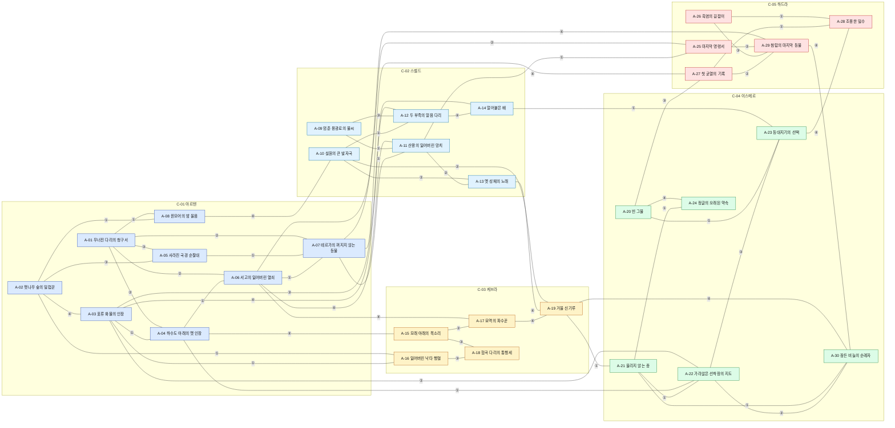
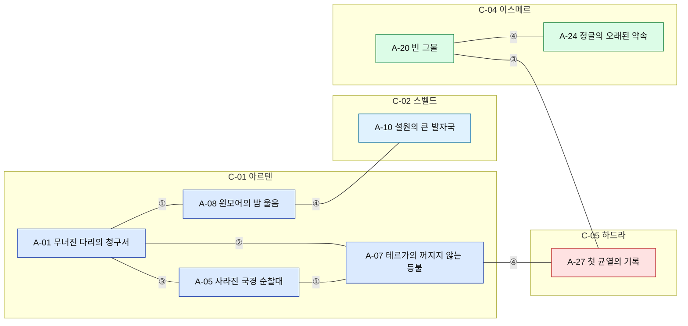
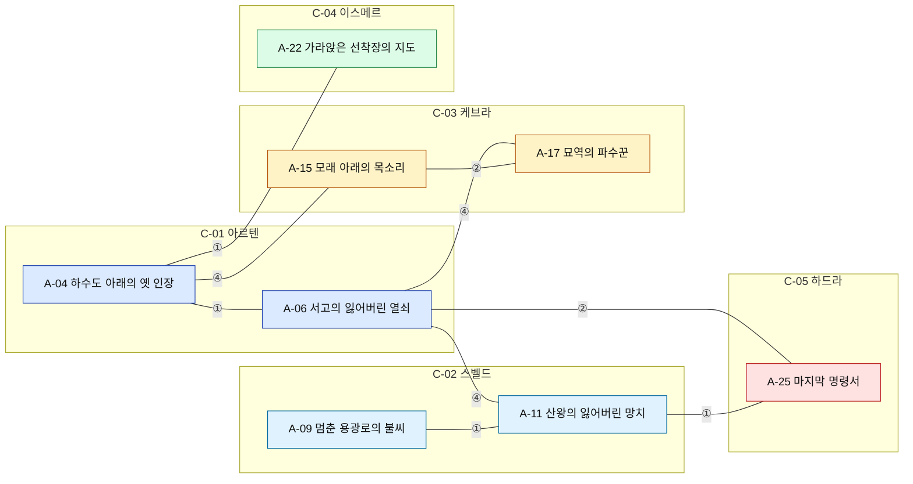
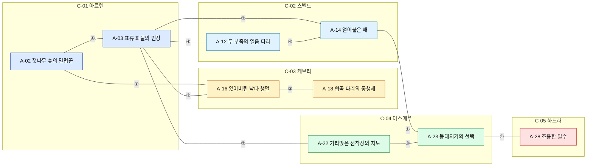
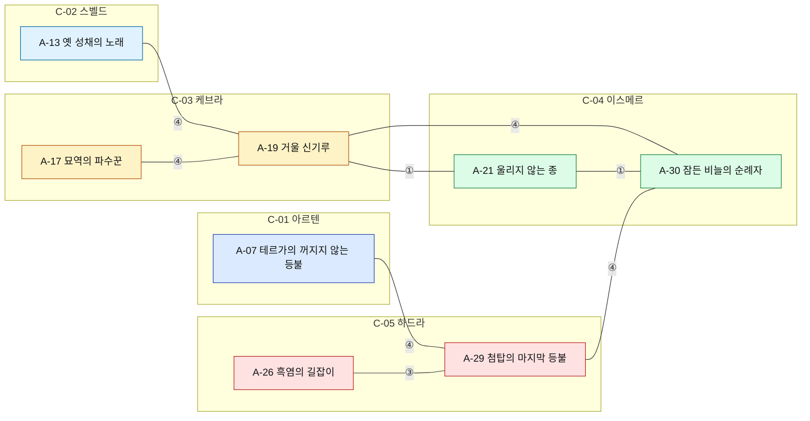
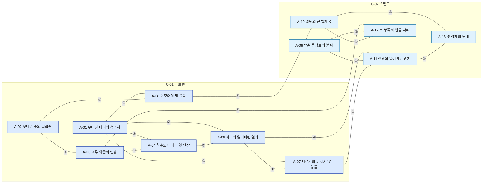

# 07_stories_hidden — 이야기 연결 구조 · 퀘스트 · 히든 피스

## 1. 문서 정보

| 항목 | 내용 |
|---|---|
| 버전 | r2 |
| r2 변경 요약 | r1 중대 13건 전부 수용(D-62). (1) L-01: CN-56을 '흔적 등장'(A-06 4장 '케슈 기록관 메모' · A-07 4장 '케슈 기록관 증언' 기록물)으로 고치고 NP-11 본인은 HP-17 완료 캐릭터에게만(MVP 연결 수 · A-07 MVP 연결 3 유지). (2) L-02: 9장 다중 위치 NPC 상시 동시 상주 규칙, 3.4 대화 장 대체 1장 무대 표(A-13 · A-17 · A-19 · A-22 · A-26 추가, 장 계수 0.8 · 전투 없음 · 2장 이동 경로), 8장 SP-04 MVP 근거. (3) S-04 · M-01: 2.3 '아크 전투 대상 레벨 = 무대 적정 하한' · 첫 아크 6개 위험도 3 이하 · 시작 위치마다 레벨 1~15 완주 가능 아크 2+(3.5 · 8장), A-09 4장 · A-13 2~3장 · A-07 5장 · A-27 5장 전투 없음, Q-A07-2 위험도 3 → 4, A-07 완주 레벨 35(05 4.2 J-H6 캐릭터 25~40 안). (4) S-01: 3.1 '장 평판 대상' 열(세력 1개), 연결 보너스 평판도 같은 기준, 12.4 검산 재계산 · 냉담 '화해 의뢰'. (5) S-02 · S-03: 12.6 단발 · 세력 의뢰 템플릿 표 · 하루 상한 · 계정 합산, 12.2 경험치 = 기준(L) × 설계 분 × 0.8, 세력 의뢰 인장 하루 합계 3건(+6/일), 일회성 인장 총량을 15.1 #12로 04에 넘김. (6) S-05: 시즌 시드(HP-28 · 29) 분리, 개인 시드 12개, 공용 사물 시드 판정 플레이어별. (7) S-06: 히든 피스 완료 캐릭터당 1회 · 한정 장비 획득 시도는 재고가 있을 때마다, 11.5 선착형 시즌 규칙 표. (8) S-07: 계약 배정 '남은 대상 > 0', Q-D11 · Q-W04 반복형 대체 계약. (9) M-04: 2.4 파티 진행 규칙 신설. (10) M-02: 11.4 아크 추천 UI 레벨 규칙 4항목. (11) M-03: 13.3 알파 8개 확정(D-62) · 알파 무대 검산 · 알파 한정 결말 보류. (12) 경미 반영: L-03 · L-04 · L-05(NP-38~44) · L-06 · L-07 · L-08 · L-09 · L-10 · L-11 · L-12, S-08 · S-09 · S-10 · S-13 · S-14 · S-15, M-05 · M-08 · M-09 · M-12 |
| r1 변경 요약 | 검수 전 자가 점검 반영. (1) D-59: A-04 · A-07을 MVP로 이동(MVP 아크 12). A-07의 MVP 안 연결이 1개뿐이라 기존 NPC 등장(NP-11 · NP-18)을 ① 인물 연결 CN-56(A-06 ↔ A-07) · CN-57(A-07 ↔ A-11)로 등록(기존 CN 번호 불변), HP-39(SK-V01)를 MVP 출시분에 추가, 13.2 특수 스킬 7(05 2.4 MVP SK-V01~V07과 일치), E-02 MVP 부분 개방 참여 아크 4, J-H1 T-01 대체본 확정 표기. (2) 13.3 알파 아크 검산 신설: D-59 '알파 7'로는 SP-01~04 도달 3+ 불가(전수 검사), 최소 8 → 15.1 #10. (3) 3-C: NPC 이름 3건 교체(NP-22 · NP-23 · NP-30, 대형 IP 인물 · 종족명과 동일). (4) 세력 평판 수치 '추정, 08 · 10 확정' 표기 통일. (5) 15.1 #1~#4 · #9 · #10을 D-59 결정 상태로 갱신 |
| 작성일 | 2026-10-01 |
| 상태 | r2 검수 대기 (배정: lore / system / player-market) |
| 목적 | 3-A [진행 순서] 07번 정의: 이야기 연결 구조 · 퀘스트 · 히든 피스. 4-정량의 이야기(아크 20+ · 모든 아크 연결 2+ · 고립 0 · 대형 연결 사건 3+ · 모든 시작 위치에서 아크 3+ · 표와 Mermaid)와 히든 피스 30+(발견 단서 · 조건 · 보상 · 연결 아크 · 종류 다양화), 3-B-2(정해진 줄거리 없음 · 이야기 연결)와 3-B-7(히든 피스 종류)을 이 문서에서 충족한다. |
| 의존 문서 | 00_BRIEF.md(3-B-2 · 3-B-7 · 4-정량), 01_reference.md(1장 용어: 한정 장비 · 선착형 히든 피스 · 각성 홈, 6장 IP 금지 목록), 02_concept.md(3.2 F2 · 5장 첫 10분 · 8.5 가드레일 · 11장 단계 · 14장 용어집), 03_world.md(3.1~3.4 역사 · 대형 사건 · 한정 장비 본체, 4장 세력, 7장 · 7.1 시작 위치 · 표지판, 8장 사냥터, 11장 아크 씨앗 30, 12장 히든 피스 배치 원칙, 13장 색인), 04_progression.md(6장 병렬 성장원 · 12장 탐험 인장), 05_classes_skills.md(4장 히든 직업 6 · 8장 특수 스킬 17), 06_items_crafting.md(8장 도안 · 14장 한정 장비 · 각성 홈), DECISIONS.md(D-01~D-63. 직접 적용: D-08 · D-09 · D-10 · D-15 · D-19 · D-24 · D-25 · D-28 · D-29 · D-31 · D-32 · D-36 · D-40 · D-48 · D-50 · D-51 · D-57 · D-59 · D-62), ASSUMPTIONS.md(AS-01~AS-13. 직접 적용: AS-02 · AS-03 · AS-05 · AS-08 · AS-10 · AS-11) |
| 이 문서를 기준으로 삼는 문서 | 08(레이드 보스와 사건의 비대응 규칙 · 평판 수치 조정), 09(탐험 랭킹: 히든 피스 · 아크 · 발견 집계, 한정 장비 탭), 10(계약 보상 · 평판 상점), 11(아크 진행 · 플래그 · 히든 피스 · 단서 노트 · 유니버스 카운터 데이터), 12(단계별 아크 · 히든 피스 출시 범위) |
| 표기 규칙 | 전부 한국어, 고유명사는 한국어 + 영문 병기(AS-05). 수치 · 반복 데이터는 ID가 있는 표. 지역 · 세력 · 종족 · 아크 이름은 03 13장 색인, 스킬 · 직업은 05, 아이템 · 도안 · 재료는 06의 ID만 쓴다. 이 문서가 새로 정의하는 ID: **NP-**(NPC) · **HP-**(히든 피스) · **Q-**(퀘스트) · **FL-**(세계 상태 플래그) · **CN-**(아크 연결). 사실은 출처(15장), 그 외 수치는 **추정**(설계값). 레퍼런스 고유명사는 쓰지 않는다(01번 6장). 생성 스크립트 대조 결과: 6.1~6.3 목록과 같은 단어는 6.4 허용어 '광기'(03 용어 '광기 지역')와 지형 일반어 '오아시스'(03 14.1 #8)뿐이고, 부분 일치(미르잔 · 이스메르)는 03 14.1 #8 판정을 따르고, 일반어 속 우연 부분 일치('하나로' · '전제로')는 고유명사가 아니다. |
| 대사 규칙 | 말풍선 한 번에 2줄 이내(AS-08), 장문 서사는 기록물(책 · 비석 · 벽화)로 선택 열람. 연령 톤은 경미(AS-02): 유혈 · 사망 묘사 없음, 위협은 '쓰러짐 · 사라짐 · 잠듦'으로 표현 |
| 수치 생성 | 아크 · 연결 · 플래그 · 히든 피스 표, 연결 수 · 고립 · 단계별 검산, 시작 위치 도달 수, Mermaid 그래프는 같은 데이터에서 스크립트(gen07.py, 저장소 밖)로 생성해 표 · 그래프 · 숫자가 일치한다. |

---

## 2. 이야기 설계 원칙

### 2.1 용어(02 14장을 따른다)

| 용어 | 정의 | ID |
|---|---|---|
| 아크 (Arc) | 한 지역에 묶인 이야기 단위. 장 3~6개 + 결말 1~3개. 시작 조건은 장소 · NPC · 물품뿐이고 레벨 · 다른 아크 완료 조건이 없다 | A-01~A-30(03 11장) |
| 장 (Chapter) | 아크의 세션 단위, 8~12분. 중간 저장. 장 계수: 짧은 장 0.8(대화 · 이동 중심) / 표준 1.0 / 최종 장 1.1(04 6장) | Q-Ann-n(두 자리 아크 번호, 3.2) |
| 0장 (Chapter Zero) | 시작 위치 첫 아크 7개에만 있는 3~5분 예외 장(D-10). 경험치 50 고정, 인장 +20. 건너뛰어도 같은 가치를 다른 경로로 얻는다(02 5.3). **캐릭터가 고른 시작 위치의 첫 아크 1개만 0장을 제안**하고, 나중에 다른 시작 도시에 도착하면 그 첫 아크는 1장부터 시작한다(04 12장 '0장 +20 캐릭터당 1회') | Q-Ann-0 |
| 결말 (Ending) | 최종 장의 선택. 결말이 2개 이상인 아크는 세계 상태 플래그(FL-)를 남기고 다른 아크가 읽는다 | 아크 표 '결말 분기' 열 |
| 연결 (Link) | 두 아크를 잇는 4유형: ① 인물(같은 NPC, 또는 그 NPC의 흔적 기록물 = '흔적 등장') · ② 사물(보상 물품 · 단서가 다른 아크의 열쇠) · ③ 결과(결말이 다른 아크의 상태를 바꿈) · ④ 사건(같은 대형 사건 E-의 다른 시점). **모든 연결은 선택적**이다 | CN-01~ |
| 대형 연결 사건 | 여러 대륙 아크 3개 이상이 같은 사건을 다른 시점에서 다루는 그물형 연결(D-15) | E-01~E-04 |
| 세계 상태 플래그 | 결말 · 보유 물품 · 사건 기록을 담는 값. **개인 단위가 기본**, 사건 세계 진행도만 유니버스 집계(세계 소식판 표시 전용) | FL- |
| 히든 피스 | 숨은 지역 · 퀘스트 · NPC · 아이템 · 직업 · 스킬 · 각성 지식. 단서 3 · 조건 · 보상 · 연결 아크를 가진다 | HP-01~ |
| 퀘스트 | 아크 장 · 일일 계약 · 주간 계약 · 단발 의뢰 · 세력 의뢰의 공통 실행 단위(12장) | Q- |

### 2.2 정해진 줄거리 없음 보장 장치(3-B-2)

| # | 장치 | 규칙 | 검증 위치 |
|---|---|---|---|
| 1 | 시작 조건 = 장소 · NPC · 물품 | 30개 아크 모두 시작 조건에 레벨 · 다른 아크 완료 · 사건 완료가 없다. 여러 진입점(대화 장 ↑ 포함)을 가진 아크는 어느 진입점에서 시작해도 같은 아크다 | 3.1 '시작 조건' 열 |
| 2 | 연결은 열쇠가 아니라 보너스 | 앞 아크를 안 해도 뒤 아크를 끝낼 수 있다. 연결이 주는 것은 대사 변형 · 단계 생략 · 연결 보너스(기록물 1 + 인장 +5 + 두 아크의 '장 평판 대상' 세력에 각 +25, 연결당 캐릭터 1회, 두 아크를 모두 완료한 시점에 지급)뿐 | 4.1 '선택성' 열 |
| 3 | 0장은 예외 단위 | 0장 완료가 어떤 해금의 조건도 아니다(D-10). Z 슬롯 · 첫 무기 · 갈림길 보상은 다른 경로로 같은 가치 | 3.2 · 02 5.3 |
| 4 | 대형 사건은 그물형 | 진입점 = 참여 아크 전부, 진행 순서 없음, 부분 진행만큼 보상, 단일 최종 보스 · 최종 지역 없음 | 6.6 가드레일 검증표 |
| 5 | 결말 무대 분산 | 같은 사건의 결말이 여러 대륙 · 여러 무대에 흩어진다(D-32). H-40 · H-41은 어떤 사건의 단독 결말 무대도 아니다 | 6.6 (d) · 6.7 |
| 6 | 해금 조건에 사건 ID 없음 | 히든 직업 · 특수 스킬 조건은 개별 아크 완료 · 행동 · 수치뿐(05). 사건(E-) 완료를 요구하는 해금은 0개 | 6.6 (c) |
| 7 | 추천은 여러 개를 동시에 | 아크 UI의 '가 볼 만한 이야기' 칸은 언제나 3개 이상(현재 대륙 2 + 다른 대륙 1)을 같은 크기로 보여 준다. 그중 2개 이상은 지금 레벨로 다음 장을 진행할 수 있는 아크다(11.4 #4). 화살표 하나짜리 '다음 목표' 표시는 없다 | 11.4 UI |
| 8 | 동시 진행 무제한 | 진행 중 아크 수 제한 없음. 화면 추적은 3개까지(유저가 고름) | 14장 데이터 |
| 9 | 텍스트는 짧게 | 장마다 말풍선 2줄 대사 최대 12개 + 선택 기록물. 컷신 없음(AS-08) | 3.2 |

### 2.3 아크 진행 규칙

| 항목 | 규칙 | 근거 |
|---|---|---|
| 레벨과 장 | 장 진행에 레벨 조건 없음. **아크 전투 대상 레벨 = 그 장 무대의 적정 하한(03 8장, 고정값)**. 입문 구역 장은 입문 몬스터(Lv1~4), 여러 무대를 거치는 장('A → B')은 전투가 일어나는 마지막 무대의 하한을 쓴다(3.2 '전투 대상 Lv' 열). 아크 전투 대상은 무관심 규칙 예외(04 7.2 #1)이므로 **진행 기준 = 플레이어 레벨 ≥ 전투 대상 레벨 − 7**(04 7.2 #7 정상 구간과 같은 폭), **아크 완주 레벨 = 그 아크 전투 장 하한의 최댓값**(장 순서상 마지막 전투 장 하한, 3.5). 전투 없는 장(대화 · 회수 · 열람 · 관측)은 무관심 몬스터 사이에서도 진행할 수 있다 | D-40, D-62 (2), 03 10.1 |
| 첫 아크 위험도 | 0장을 가진 첫 아크 6개(A-01 · A-03 · A-09 · A-10 · A-15 · A-20, SP-07 A-25 제외)는 **모든 장 무대 위험도 3 이하**(3.5 검산) | D-62 (2), D-24 |
| 시작 위치 완주 가능 아크 | 시작 위치마다 **레벨 1~15에 완주 가능한 아크(완주 레벨 ≤ 22 = 15 + 7) 2개 이상**(8장 '레벨 1~15 완주 가능' 열) | D-62 (2), 3-B-5 |
| 첫 갈림길 무대 | 첫 아크 2장과 표지판 방향 3 아크 1장은 03 7.1 ✔ 기준(입문 구역 · 적정 하한 ≤ 3 · 전투 없는 도시 · 초소). 위험도 2 이상 무대는 첫 아크 3장부터, 방향 3 아크는 2장부터 | D-24, D-29, 03 7.1 |
| 대화 장(↑) | 도보 상한을 넘는 아크(A-08 · A-11 · A-14 · A-18 · A-24)와 다른 지역에서 소개되는 아크(A-13 · A-17 · A-19 · A-22 · A-26)는 1장을 '시작 도시 안 NPC 대화 장'(전투 없음, 계수 0.8)으로 둔다. 대화 장 무대가 2곳 이상이면 **어느 무대에서 대화해도 같은 1장(Q- ID)이 완료**되고, 무대 · NPC · 2장 이동 경로는 3.4 표가 정한다 | D-28, D-62 (10), 03 7.1 검산 ③ |
| 시간형 장 | 밤 · 조수 · 폭풍 · 눈보라 이벤트가 필요한 장은 UTC 결정론 일정(03 2.5)을 쓰고, 다음 발생 시각을 지도에 표시한다. 이벤트를 기다리지 않는 대체 진행(같은 장의 낮 버전, 보상 동일)을 둔다 | AS-03(모바일 세션) |
| 결말 되돌리기 | 결말은 캐릭터당 1회 확정. 다른 결말은 다른 캐릭터 슬롯(D-09)으로 본다. 결말 확정 전 '이 선택은 FL-nn을 바꿉니다' 1줄 안내 | D-09 |
| 실패 | 장 실패(사망 · 이탈)는 장 시작 지점에서 재시작, 진행 손실 없음. 진행 기준(전투 대상 레벨 − 7)보다 낮은 레벨로 쓰러지면 11.4 #3 안내 | D-05 (4), D-24 |

### 2.4 파티 진행 규칙(D-62 (8))

아크 장 · 히든 피스를 파티로 할 때의 규칙. 처치 경험치 · 드롭은 04 7.5 · 08 3.1(개인 드롭)을 그대로 쓰고, 이 표는 장 진행 · 완료 · 보상만 정한다.

| # | 항목 | 규칙 | 근거 |
|---|---|---|---|
| ① | 아크 전투 대상 스폰 | **장 진행자 기준 개인 스폰**. 진행자와 같은 파티원에게만 보이고 함께 공격할 수 있다. 파티 밖 유저에게는 보이지 않아 처치를 가로챌 수 없다. 같은 파티에서 같은 장을 진행 중인 사람이 여럿이면 대상은 1세트만 스폰된다(파티 공유) | 3-B-4, D-40 |
| ② | 같은 장 동시 완료 | 같은 파티에서 **같은 장(Q- ID)을 진행 중인 파티원은 장 목표 달성 시 전원 완료**를 인정받는다. 조건: 목표 달성 지점 60 studs 안 · 최근 60초 안 활동 기여 1회 이상(04 7.5의 n 정의와 같음) | 04 7.5 |
| ③ | 완료자 동행 보상 | 그 장을 이미 완료한 파티원은 **동행 보상 = 장 경험치의 30%**를 받는다. 하루 3장까지(UTC 초기화, 계정 합산 = 3캐릭터분 9장, D-25). 인장 · 평판 · 연결 보너스 · 사건 기록은 없다 | 02 6장 PE-4, D-25 |
| ④ | 대화 · 결말 선택 | 대화 장과 결말 선택은 **각자 개인 UI**에서 한다. 다수결 · 파티장 대리 선택 없음. 개인 플래그(FL-)에 따른 NPC 대사는 각자 클라이언트에만 표시한다(같은 NPC 앞에서 파티원마다 다른 대사가 보여도 된다) | 7장 개인 단위, D-09 |
| ⑤ | 전투 장 강도 | **솔로로 완료 가능한 강도가 기준**(전투 대상 레벨 = 무대 적정 하한, 2.3). 파티 인원 n(1~4명, 5~6명은 4명 값)에 따라 전투 대상 체력 × (1 + 0.5 × (n − 1))(추정, D-29 인스턴스 스케일링과 같은 원리, 계수는 08 · 11 확정, 15.1 #15). 인스턴스 무대 장은 그 인스턴스 스케일링을 그대로 쓴다 | D-29, D-30 |
| ⑥ | 히든 피스 공동 수행 | 조건 상호작용을 한 사람 + **같은 파티원 중 그 히든 피스의 단서 3을 가지고 60 studs 안에 있는 사람**을 완료로 인정한다. 시드형(11.3)은 각자 자기 시드로 수행해야 한다. 선착형은 11.5 | 3-B-7 |

---

## 3. 아크 전체 표

### 3.1 아크 30개(03 11장 ID · 제목 · 대륙 그대로)

'장 수'는 0장을 뺀 수(0장은 별도 표기). '보상'의 경험치는 기준(L) × 분(04 6장 아크 장 공식, 12.2), 인장은 장당 +5 · 최종 장 +10 · 0장 +20(04 12장), 평판은 **'장 평판 대상' 세력 1개에만 장당 +100**(D-62 (3), '세력' 열의 첫 세력) + 결말 표기값(결말 표기 세력). '세력' 열의 나머지 세력은 등장 세력이며 장 평판을 받지 않는다. '연결 아크'는 4장 연결 표에서 계산한 값이다. 단계 = 출시 단계(13장).

| ID | 제목(영문) | 대륙 | 시작 조건 | 장 수 | 장별 요지 | 결말 분기 | 보상 | 세력 | 장 평판 대상 | 무대 | 연결 아크 | 단계 |
|---|---|---|---|---|---|---|---|---|---|---|---|---|
| A-01 | 무너진 다리의 청구서 (The Broken Bridge Bill) | C-01 아르텐 | SP-01 도착 시 T-02 촌장(NP-01)이 0장 제안(거절 가능) · T-02 게시판 '다리 수리비 청구서' | 5 + 0장 | 0 무너진 다리 대시로 건너기 · 들쥐 2~3 · 촌장 부탁(전투/채집 택1) / 1 청구서에 적힌 이름 셋(영주 · 목재상 · 모르는 이름) 묻기 / 2 기둥에 엉긴 진흙과 세르낙 인장 확인 / 3 늪에서 흘러온 진흙 길 추적 · 진흙 골렘 / 4 늪 깊은 곳의 균열 진흙 표본 채취 / 5 청구서를 누구에게 보낼지 결정 | (가) 목재상 고발: 부실 자재 탓으로 브렌마르 목재상에 청구 [FL-01 +1 · F-01 +500 · F-02 −300] / (나) 균열 보고: 표본을 회색 등불에 보내고 수리비는 마을 공동 부담 [FL-01 ±0 · F-11 +500] | 장 경험치 기준 × 49분 + 0장 50 고정 · 인장 +50 · 0장: 직업 주 무기 일반 1(IT-01~03 등, D-48) | F-01 · F-02 · F-11 | F-01 카엘룬(장당 +100) | T-02 · H-01 · H-04 | A-04②, A-05③, A-06②, A-07②, A-08① | MVP |
| A-02 | 잿나무 숲의 밀렵꾼 (Poachers of Ashwood) | C-01 아르텐 | H-02 입문 구역 '벌목지'의 덫에 걸린 새끼 늑대(SP-01 표지판 방향 3, SP-02 방향 2 숲 안) | 4 | 1 덫에 걸린 새끼 늑대 · 바르쿤 사냥꾼(NP-13) 만남 / 2 밀렵 덫 해체 · 잿빛 늑대 무리 / 3 윈모어 가죽 거래소에서 상인(NP-12)의 선적표 확인 / 4 밀렵꾼 일당과 대면 · 처리 결정 | (가) 경비대 인계: 밀렵꾼을 카엘룬 경비대에 넘김 [FL-01 +1 · F-01 +500] / (나) 사냥 구역 협정: 바르쿤 사냥꾼과 브렌마르 상인이 구역 표식 합의 [FL-01 −1 · F-02 +500] | 장 경험치 기준 × 39분 · 인장 +25 | F-01 · F-02 | F-01 카엘룬(장당 +100) | H-02 · T-06 | A-03④, A-05③, A-08①, A-16① | MVP |
| A-03 | 표류 화물의 인장 (The Drifting Cargo) | C-01 아르텐 | SP-02 도착 시 부두 하역 사고(0장, 거절 가능) · T-03 항만 게시판 | 5 + 0장 | 0 하역 사고(점프 · 대시) · 배수로 쥐 · 항만 서기 부탁(택1) / 1 탈라 인장이 찍힌 표류 화물 분류 / 2 화물 목록과 실제 내용물의 차이 · 창고 배수로의 하수 쥐 2(M-08) / 3 화물 일부가 흘러든 대극장 지하 / 4 표류 경로 추적 · 항로 지도 조각 발견 / 5 항만 회의에서 화물 반환 진술 | (단일) 화물을 탈라 · 브렌마르 대표 앞에서 반환(진술 내용은 FL-05 · FL-41을 읽어 대사만 바뀜) [F-02 +300 · F-06 +300] | 장 경험치 기준 × 49분 + 0장 50 고정 · 인장 +50 · 0장: 직업 주 무기 일반 1(D-48) | F-02 · F-06 | F-02 브렌마르(장당 +100) | T-03 · H-05 · H-10 · H-02 | A-02④, A-04①, A-12④, A-14③, A-16①, A-22② | MVP |
| A-04 | 하수도 아래의 옛 인장 (The Seal Beneath) | C-01 아르텐 | H-05 입구 배수로 벽의 낯선 문양(SP-02 흔적) · SP-02 표지판 방향 3 · A-03 2장 서기 대사 | 5 | 1 벽의 세르낙 인장 문양 탁본 / 2 하수 쥐 떼 · 녹슨 자동인형 / 3 뒷골목에서 정체를 밝히지 않는 수집가(NP-08)의 접선(소속 제안 없음, 03 4.2) / 4 하층의 하수도 문지기 / 5 인장 탁본을 누구에게 넘길지 결정 | (가) 열쇠지기에 넘김 [FL-22 = 열쇠지기 · F-12 +500 · F-02 −300] / (나) 브렌마르 의회에 넘김 [FL-22 = 의회 · F-02 +500 · F-12 −300] | 장 경험치 기준 × 49분 · 인장 +30 · SK-V01 습득 경로(HP-39) | F-02 · F-12 | F-02 브렌마르(장당 +100) | H-05 · T-03 | A-01②, A-03①, A-06①, A-15④, A-22① | MVP |
| A-05 | 사라진 국경 순찰대 (The Missing Patrol) | C-01 아르텐 | T-05 순찰대 본부 게시판 · H-03 언덕의 버려진 순찰 깃발 줍기(SP-01 반경) | 5 | 1 순찰대장(NP-15)의 의뢰 / 2 탈영 용병 흔적 · 버려진 야영지 / 3 브렌마르 통행증 발견(오해의 단서) / 4 협곡 균열 틈으로 이어진 발자국 / 5 생존 대원 구출 · 무엇을 보고할지 결정 | (가) 브렌마르 탓으로 보고 [FL-01 +1 · FL-02 = 브렌마르 · F-01 +500] / (나) 균열이 원인이라고 공개 [FL-01 −1 · FL-02 = 균열 · F-11 +500] / (다) 회색 등불과만 공유(비공개) [FL-02 = 비공개 · F-11 +700 · F-01 −300] | 장 경험치 기준 × 49분 · 인장 +30 | F-01 · F-02 · F-11 | F-01 카엘룬(장당 +100) | T-05 · H-03 · H-07 | A-01③, A-02③, A-07① | 확장 3차 |
| A-06 | 서고의 잃어버린 열쇠 (The Archive Key) | C-01 아르텐 | T-01 왕립 서고 사서(NP-10) '열쇠 없는 책장' | 6 | 1 서고 열쇠 분실 · 지하묘 문이 열렸다는 소식 / 2 지하묘 입구 · 서고 박쥐 / 3 비석 탁본 · 세르낙 인장 해독표 획득 / 4 관문 유적의 말하는 케슈 소문 · 열쇠 자국 · 야영지의 '케슈 기록관 메모'(기록물, NP-11의 흔적) / 5 열쇠지기(NP-08)의 알리바이 확인 / 6 열쇠를 빈 책장에 꽂는다(전투 없음, 인스턴스 본편은 선택) | (단일) 열쇠 회수(빈 책장의 수수께끼는 HP-03 · HP-33으로 이어짐) [F-01 +500] | 장 경험치 기준 × 57분 · 인장 +35 · J-H1 조건 'A-06 완료'(HP-33) | F-01 · F-12 | F-01 카엘룬(장당 +100) | T-01 · H-06 · H-08 · H-11 | A-01②, A-04①, A-07①, A-11④, A-17④, A-25② | MVP |
| A-07 | 테르가의 꺼지지 않는 등불 (The Lantern at Terga) | C-01 아르텐 | T-07 관측원(NP-09) · A-05 결말 나 · 다 후 편지 · SP-07에서 G3 통과 시 도착 대사 | 6 | 1 등불 기름 보급 의뢰 / 2 협곡 나룻배로 균열 지대까지 · 균열 늑대 · 등불 지점 점검 / 3 관측 기록 정리 · 등불 던지기 전수 / 4 에스카 조사단(NP-18)과 마주침 · 조사단이 받아 적은 '케슈 기록관 증언'(기록물, NP-11의 흔적) / 5 심부 관측(전투 없음, 무관심 접근) · G3 너머 그림자 닻의 떨림 / 6 등불을 어디에 둘지 결정(학설 선택) | (가) 테르가 심부 학설: 등불을 H-43에 유지 [FL-08 = H-43 · F-11 +500] / (나) 하드라 학설: 등불을 G3 너머로 보냄 [FL-08 = H-41 · F-11 +300 · F-01 +200] | 장 경험치 기준 × 59분 · 인장 +35 · SK-V02(3장, 아크 보상) · J-H6 조건 'A-07 완료'(HP-38) | F-11 · F-01 · F-09 | F-11 회색 등불(장당 +100) | T-07 · H-07 · H-09 · H-08 · H-43 | A-01②, A-05①, A-06①, A-11①, A-27④, A-29④ | MVP |
| A-08 | 윈모어의 밤 울음 (Night Cries of Winmoor) | C-01 아르텐 | T-02 '윈모어 목부'(NP-14) · T-03 '가죽 상인'(NP-12) 대화 장(↑, 03 7.1) · T-06 목장 | 4 | 1 사라진 가축과 밤 울음소리 이야기 / 2 가축 흔적 · 밤의 진흙 군주(D-31 보호 규칙) / 3 진흙 골렘의 균열 핵 / 4 울음의 정체(늪으로 끌려간 가축) 해결 | (단일) 가축 귀환 · 늪 경계 표식 설치 [F-01 +500] | 장 경험치 기준 × 39분 · 인장 +25 · SK-V06(최종 장, 아크 보상) | F-01 | F-01 카엘룬(장당 +100) | T-02 · T-03 · T-06 · H-04 | A-01①, A-02①, A-10④ | MVP |
| A-09 | 멈춘 용광로의 불씨 (The Cold Furnace) | C-02 스벨드 | SP-03 도착 시 갱도 낙석(0장, 거절 가능) · T-09 형제단 게시판 | 5 + 0장 | 0 갱도 낙석(대시) · 동굴 두더지 · 장인 부탁(채집/청소 택1) / 1 마력 결정 고갈 확인 · 작업대 첫 사용 / 2 결정 찌꺼기 조사 · 갱도 입구의 석탄 슬라임 2(M-08) / 3 석탄 슬라임 · 결정 찌꺼기 정령 1체 · 옛 결정맥 표시 / 4 승강기 창으로 심층 갱도의 별철 결정맥 관측(전투 없음, D-62 (2)) / 5 갱도를 더 팔지 결정 | (가) 심층 갱도 확장 [FL-03 = 확장 · F-03 +500 · F-13 −300] / (나) 정제 레시피로 대체(채굴 축소) [FL-03 = 정제 · F-13 +500] | 장 경험치 기준 × 49분 + 0장 50 고정 · 인장 +50 · 0장: 직업 주 무기 일반 1(D-48) | F-13 · F-03 | F-13 모루 형제단(장당 +100) | T-09 · H-12 | A-11①, A-12③ | MVP |
| A-10 | 설원의 큰 발자국 (The Great Tracks) | C-02 스벨드 | SP-04 도착 시 눈사태 길(0장, 거절 가능) · T-10 사냥대장(NP-04) | 5 + 0장 | 0 눈사태 길(대시) · 눈토끼 · 사냥대장 부탁(추적/덫 택1) / 1 거대 발자국 보고 / 2 발자국 추적(03 7.1 검산 ④) / 3 변이 설원 사슴 흔적 · 거대 비늘 조각 / 4 사슴의 둥지 · 눈보라 곰 / 5 사슴을 쏠지 결정 | (가) 사냥: 변이 사슴을 쓰러뜨림 [F-04 +500 · 두꺼운 가죽(MT-09) 3] / (나) 추적 기록: 놓아주고 회색 등불에 경로 보고 [F-11 +500 · 기록물 1] | 장 경험치 기준 × 49분 + 0장 50 고정 · 인장 +50 · 0장: 직업 주 무기 일반 1(D-48) | F-04 · F-11 | F-04 이스텔(장당 +100) | T-10 · H-13 · H-17 | A-08④, A-12①, A-13②, A-19② | MVP |
| A-11 | 산왕의 잃어버린 망치 (The Lost Hammer of the Peak) | C-02 스벨드 | T-09 '형제단 전령'(NP-16) 대화 장(↑) · T-08 장인 평의회 게시 | 6 | 1 산왕의 망치가 둘이었다는 소문 / 2 장인 평의회(NP-17) 청문 / 3 별철 결정맥과 옛 망치 자국 / 4 에스카 사절(NP-18)과 열쇠지기(NP-08)의 제안 / 5 명장의 케슈 흔적과 도안 조각 / 6 도안을 누구에게 맡길지 결정 | (가) 카르니스에 맡김 [FL-21 = 카르니스 · F-03 +500] / (나) 열쇠지기에 맡김 [FL-21 = 열쇠지기 · F-12 +500 · F-03 −300] / (다) 에스카에 맡김 [FL-21 = 에스카 · F-09 +500 · F-03 −300] | 장 경험치 기준 × 57분 · 인장 +35 · SK-V05(최종 장, 아크 보상) · J-H2 조건 'A-11 완료'(HP-34, 결말 무관) | F-03 · F-12 · F-09 | F-03 카르니스(장당 +100) | T-09 · T-08 · H-15 · H-19 | A-06④, A-07①, A-09①, A-13②, A-25① | MVP |
| A-12 | 두 부족의 얼음 다리 (The Ice Bridge) | C-02 스벨드 | H-14 기슭 '얼음 다리 초소'(SP-03 · 04 표지판 방향 3, 전투 없음) | 5 | 1 무너진 얼음 다리와 두 부족의 말다툼 / 2 능선 건너기 · 얼음 다리 잔해 통과 / 3 수리용 갈대 · 얼음 물고기 떼 / 4 얼음궁 관리인에게서 다리 쐐기 회수 / 5 부족 집회: 누가 다리를 고칠지 결정 | (가) 카르니스가 수리(광산권 우선) [FL-04 = 카르니스 · F-03 +500 · F-04 −300] / (나) 이스텔이 수리(사냥권 우선) [FL-04 = 이스텔 · F-04 +500 · F-03 −300] / (다) 공동 수리(통행 시간 나눔) [FL-04 = 공동 · F-03 +250 · F-04 +250] | 장 경험치 기준 × 49분 · 인장 +30 · SK-V04(2장 + 다리 통과, 아크 보상) | F-03 · F-04 | F-03 카르니스(장당 +100) | H-14 · H-20 · H-18 · T-11 | A-03④, A-09③, A-10①, A-14④ | MVP |
| A-13 | 옛 성채의 노래 (Song of the Old Keep) | C-02 스벨드 | T-13 노래꾼(NP-20) · T-09 · T-10 노래꾼(NP-20, 상시 상주) 대화 장 · 거대 비늘 조각(FL-35) 보유 시 대사 | 5 | 1 토르마 노래의 끊긴 마지막 소절 / 2 성채 석상 사이 통과 · 벽화 찾기(무관심 대상, 전투 없음) / 3 오르바르 협약 벽화 판독(전투 없음) / 4 폭설 봉우리 오르기 / 5 닻 앞에서 노래를 끝까지 부를지 결정 | (가) 재움: 노래를 끝까지 부른다 [FL-14 = 재움 · F-14 +500] / (나) 기록: 노래를 멈추고 닻의 목소리를 적는다 [FL-14 = 기록 · F-11 +300 · F-03 +200] | 장 경험치 기준 × 49분 · 인장 +30 · SK-V07 습득 경로(HP-41) | F-03 · F-14 | F-03 카르니스(장당 +100) | T-13 · T-09 · T-10 · H-16 · H-42 | A-10②, A-11②, A-19④ | MVP |
| A-14 | 얼어붙은 배 (The Frozen Ship) | C-02 스벨드 | T-10 '프로스텐 선원'(NP-21) 대화 장(↑) · T-12 항구 | 5 | 1 얼음항에 갇힌 루카이 배 소식 / 2 얼음항 · 항로 협정 결렬의 첫 피해 / 3 눈보라 속 실종 선원 수색 / 4 얼음궁 관리인에게서 얼음 쐐기 회수 / 5 얼음을 깰지, 겨울을 날지 결정 | (가) 얼음 깨기: 얼음궁 쐐기로 항로를 연다 [FL-05 = 출항 · F-07 +500] / (나) 겨울나기: 선원을 프로스텐에 머물게 함 [FL-05 = 월동 · F-04 +500] | 장 경험치 기준 × 49분 · 인장 +30 | F-04 · F-07 · F-02 | F-04 이스텔(장당 +100) | T-10 · T-12 · H-17 · H-18 | A-03③, A-12④, A-23① | 확장 3차 |
| A-15 | 모래 아래의 목소리 (Voices Under the Sand) | C-03 케브라 | SP-05 도착 시 무너진 수로 벽(0장, 거절 가능) · T-15 수로 관리인(NP-05) | 5 + 0장 | 0 수로 벽(대시) · 모래전갈 · 관리인 부탁(탐사/흔적 택1) / 1 오아시스 밑에서 들리는 목소리 / 2 초소 기록 열람(전투 없음, 03 7.1) / 3 수로 큰도마뱀 · 수로 관리 자동인형 / 4 수로 관리청과 정체를 밝히지 않는 수집가(NP-25)의 엇갈린 요구(소속 제안 없음) / 5 수로 열쇠를 누구에게 줄지 결정 | (가) 관리청에 반환 [FL-06 = 관리청 · F-05 +500] / (나) 열쇠지기에 맡김 [FL-06 = 열쇠지기 · F-12 +500 · F-05 −300] | 장 경험치 기준 × 47분 + 0장 50 고정 · 인장 +50 · 0장: 직업 주 무기 일반 1(D-48) · SK-V08(최종 장, 아크 보상) | F-05 · F-12 | F-05 미르잔(장당 +100) | T-15 · H-21 · H-26 · T-14 | A-04④, A-17②, A-18③ | 확장 1차 |
| A-16 | 잃어버린 낙타 행렬 (The Lost Caravan) | C-03 케브라 | H-27 입문 구역 '모래언덕'의 버려진 안장(SP-05 표지판 방향 3) · T-16 시세판 | 4 | 1 버려진 낙타 안장 · 모래도둑 견습 / 2 고원의 대상 흔적 · 고원 자칼 / 3 은거지에서 짐 일부 회수 / 4 짐의 수취인(NP-12) 확인 · 짐을 어디로 보낼지 결정 | (가) 탈라에 반환 [FL-07 = 탈라 · F-06 +500] / (나) 브렌마르 수취인에 인도 [FL-07 = 브렌마르 · F-02 +500 · F-06 −300] | 장 경험치 기준 × 41분 · 인장 +25 | F-06 · F-05 · F-02 | F-06 탈라(장당 +100) | H-27 · H-22 · T-16 | A-02①, A-03①, A-18③ | 확장 1차 |
| A-17 | 묘역의 파수꾼 (Wardens of the Necropolis) | C-03 케브라 | T-14 묘역 관리 사무소(NP-41) · T-15 수로 관리인(NP-05) 대화 장 · A-15 결말 후 편지 | 5 | 1 묘역에서 되풀이되는 옛 명령 / 2 파수 석상 사이 통과(무관심 대상, 전투 없음) / 3 묘역 인장 3개 활성화 / 4 케슈 서기관 출현 / 5 서기관을 쉬게 할지, 명령을 받아 적을지 결정 | (가) 안식: 서기관을 쉬게 함 [FL-18 = 안식 · F-05 +500] / (나) 기록: 명령을 받아 적음(서기 계승) [FL-18 = 기록 · F-05 +200 · 기록물 2] | 장 경험치 기준 × 49분 · 인장 +30 · J-H3 조건 'A-17 완료'(HP-35) | F-05 · F-09 | F-05 미르잔(장당 +100) | T-14 · T-15 · H-24 | A-06④, A-15②, A-19④ | 확장 1차 |
| A-18 | 협곡 다리의 통행세 (The Canyon Toll) | C-03 케브라 | T-15 '라흐마 통행세 징수원'(NP-22) 대화 장(↑) · T-17 | 4 | 1 다리를 점거한 모래도둑 소식 / 2 통행세로 사는 마을 사정 / 3 모래도둑 정찰병 · 다리 초소 / 4 통행세 협상(FL-06 · FL-07을 읽어 몫이 바뀜) | (가) 통행세 유지(미르잔 몫 인정) [F-05 +500] / (나) 공동 관리(모래도둑 일부 귀순) [F-06 +500 · F-05 −300] | 장 경험치 기준 × 39분 · 인장 +25 | F-06 · F-05 | F-06 탈라(장당 +100) | T-15 · T-17 · H-23 | A-15③, A-16③ | 확장 1차 |
| A-19 | 거울 신기루 (The Mirror Mirage) | C-03 케브라 | T-18 순례 사제(NP-30) · T-15 엘바르 순례 안내인(NP-38) 대화 장 · 거대 비늘 조각(FL-35) 보유 시 대사 | 5 | 1 순례 출발 · 고룡의 그림자 목격담 / 2 유리사막 가장자리 · 무관심 통과 / 3 첫 신기루 · 유리 정령 / 4 둘째 신기루 · 회색 등불 관측자와 합류 / 5 교단의 답과 등불의 답 중 선택 | (가) 교단의 답: 달래는 노래 [FL-15 = 재움 · F-14 +500] / (나) 등불의 답: 관측 기둥 설치 [FL-15 = 관측 · F-11 +500] | 장 경험치 기준 × 49분 · 인장 +30 · SK-V09 습득 경로(HP-42) | F-14 · F-11 | F-14 잠든 비늘(장당 +100) | T-18 · T-15 · H-25 | A-10②, A-13④, A-17④, A-21①, A-30④ | 확장 1차 |
| A-20 | 빈 그물 (The Empty Nets) | C-04 이스메르 | SP-06 도착 시 끊어진 잔교(0장, 거절 가능) · T-19 어촌장(NP-06) | 5 + 0장 | 0 끊어진 잔교(점프 · 대시) · 갯벌 게 · 어촌장 부탁(택1) / 1 빈 그물과 줄어든 어획 / 2 변이 문어 흔적(03 7.1 검산 ④) / 3 산호 사이 변이 개체 / 4 변이 문어와 해저의 균열 빛 / 5 원인을 어떻게 받아들일지 결정 | (가) 해저 학설 지지: 균열 원점이 산호해 해저라고 보고 [FL-09 = H-29 · F-11 +500] / (나) 어장 이동: 원인 규명보다 생계를 택함 [FL-09 = 이동 · F-07 +500] | 장 경험치 기준 × 49분 + 0장 50 고정 · 인장 +50 · 0장: 직업 주 무기 일반 1(D-48) · SK-V15(최종 장, 아크 보상) | F-07 · F-11 | F-07 루카이(장당 +100) | T-19 · H-28 · H-29 | A-23①, A-24④, A-27③ | 확장 2차 |
| A-21 | 울리지 않는 종 (The Silent Bell) | C-04 이스메르 | T-22 순례자(NP-27) "종이 울리지 않는다" · T-21 대사원 | 5 | 1 울리지 않는 종과 대사제 선출 / 2 루카이 통행세 문서 발견 / 3 시련 석상 · 사원 수호 정령 / 4 시련 감독관 / 5 누가 종을 울릴지 결정 | (가) 타협: 루카이와 순례선 통행세 합의 [FL-19 = 타협 · F-08 +300 · F-07 +300] / (나) 교단 우위: 잠든 비늘 교단 사제가 종을 울림 [FL-19 = 교단 · F-14 +500 · F-07 −300] | 장 경험치 기준 × 49분 · 인장 +30 · J-H4 조건 'A-21 완료'(HP-36) | F-08 · F-07 · F-14 | F-08 벨로스(장당 +100) | T-21 · H-33 | A-19①, A-22①, A-24①, A-30① | 확장 2차 |
| A-22 | 가라앉은 선착장의 지도 (The Sunken Chart) | C-04 이스메르 | T-20 지도 상인(NP-39) · T-19 표류물 수집가(NP-40) 대화 장 · 항로 지도 조각(FL-33) 보유 시 대사 | 5 | 1 세르낙 항로 지도 조각 소문 / 2 잠수종 타는 법 · 공기 주머니 안내 / 3 침몰선 케슈 선원 · 지도 조각 / 4 정체를 밝히지 않는 수집가(NP-26)의 접선(소속 제안 없음)과 사원 기록물 / 5 지도를 누구에게 넘길지 결정 | (가) 루카이 평의회에 넘김 [FL-11 = 루카이 · F-07 +500] / (나) 열쇠지기에 넘김 [FL-11 = 열쇠지기 · F-12 +500 · F-07 −300] | 장 경험치 기준 × 47분 · 인장 +30 · SK-V10 습득 경로(HP-43) | F-07 · F-12 · F-08 | F-07 루카이(장당 +100) | T-20 · T-19 · H-31 · T-21 | A-03②, A-04①, A-21①, A-23③, A-30② | 확장 2차 |
| A-23 | 등대지기의 선택 (The Lighthouse Keeper) | C-04 이스메르 | H-29 입문 구역 '얕은 물' 부표의 등대 신호(SP-06 표지판 방향 3) · T-23 | 4 | 1 부표에 걸린 등대 신호 깃발 / 2 펠라 시장의 등대 통제권 소문 / 3 폭풍 하피 · 등대 골렘 / 4 등대를 지킬지, 마을을 지킬지 결정(FL-11을 읽음) | (가) 등대: 등대를 루카이에 두고 불을 지킴 [FL-12 = 등대 · SK-V11 · F-07 +500] / (나) 마을: 등대 기름을 마을 대피에 씀 [FL-12 = 마을 · SK-V17 · F-06 +300 · F-02 +200] | 장 경험치 기준 × 39분 · 인장 +25 · SK-V11 또는 SK-V17(분기, 아크 보상) | F-07 · F-06 · F-02 | F-07 루카이(장당 +100) | H-29 · T-23 · H-32 | A-14①, A-20①, A-22③, A-28④ | 확장 2차 |
| A-24 | 정글의 오래된 약속 (The Jungle Promise) | C-04 이스메르 | T-19 '정글 길잡이 대기소'(NP-29) 대화 장(↑) · T-22 | 4 | 1 아이셀 순례자와 바르쿤 길잡이의 옛 약속 / 2 덩굴 정령 · 길잡이 표식 / 3 순례 중계지의 약속 문서(NP-27) / 4 균열에 뒤틀린 약속의 나무 되살리기 | (단일) 약속 갱신: 순례로 보호 구역 지정 [F-08 +500] | 장 경험치 기준 × 39분 · 인장 +25 | F-08 · F-11 | F-08 벨로스(장당 +100) | T-19 · H-30 · T-22 | A-20④, A-21① | 확장 2차 |
| A-25 | 마지막 명령서 (The Last Order) | C-05 하드라 | SP-07 도착 시 무너진 방벽(0장, 거절 가능) · T-24 초소장(NP-07) | 5 + 0장 | 0 안뜰(안전) · 초소장 부탁(택1) · 저장고 첫 전투 / 1 폐허에 남은 세르낙 명령서 소문 / 2 무관심 몬스터 사이에서 명령서 회수(전투 없음, 03 7.1) / 3 케슈 순찰병 · 폐허 자동인형 / 4 에스카 사절(NP-18)과 열쇠지기(NP-08) / 5 명령서를 누구에게 넘길지 결정(H-40 외곽 야영지 조망은 선택) | (가) 에스카에 넘김 [FL-20 = 에스카 · F-09 +500] / (나) 열쇠지기에 넘김 [FL-20 = 열쇠지기 · F-12 +500 · F-09 −300] | 장 경험치 기준 × 47분 + 0장 50 고정 · 인장 +50 · 0장: 직업 주 무기 일반 1(D-48) · SK-V16(최종 장, 아크 보상) | F-09 · F-12 · F-01 | F-09 에스카(장당 +100) | T-24 · H-37 | A-06②, A-11①, A-29② | 확장 4차 |
| A-26 | 흑염의 길잡이 (The Blackflame Guide) | C-05 하드라 | T-24 '구르한 길잡이'(NP-31) 대화 장 · T-26 | 4 | 1 평원을 건널 길잡이의 부탁 / 2 평원 가장자리 무관심 통과 · 잿빛 흔적 읽기 / 3 국지 충돌 지점 · 흑염 들소 / 4 누구의 길로 건널지 결정 | (가) 구르한의 길 [FL-13 = 구르한 · F-10 +500 · F-09 −300] / (나) 에스카의 길 [FL-13 = 에스카 · F-09 +500 · F-10 −300] | 장 경험치 기준 × 39분 · 인장 +25 · SK-V13 습득 경로(HP-45) | F-10 · F-09 | F-10 구르한(장당 +100) | T-26 · T-24 · H-39 | A-28①, A-29③ | 확장 4차 |
| A-27 | 첫 균열의 기록 (The First Rift) | C-05 하드라 | T-28 학자(NP-33) · SP-07 표지판 방향 3 | 6 | 1 관측 기록 정리 의뢰 / 2 재 자칼 · 균열 나방 / 3 세 학설의 기록 비교(FL-08 · FL-09를 읽음) / 4 잿빛 골렘과 관측 기둥 / 5 고른 학설 현장 관측(전투 없음, 광기 지역 안 진입 없음) / 6 학설 하나를 기록(정답 없음) | (가) 하드라 학설(H-41) [FL-10 = H-41 · F-11 +500] / (나) 아르텐 학설(H-43) [FL-10 = H-43 · F-11 +500] / (다) 이스메르 학설(H-29) [FL-10 = H-29 · F-11 +500] | 장 경험치 기준 × 59분 · 인장 +35 · SK-V12 습득 경로(HP-44) | F-11 · F-09 · F-14 | F-11 회색 등불(장당 +100) | T-28 · H-36 · H-43 · H-29 · H-41 | A-07④, A-20③, A-28①, A-29② | 확장 4차 |
| A-28 | 조용한 밀수 (The Quiet Smugglers) | C-05 하드라 | T-27 선장(NP-32)(SP-07 표지판 방향 3, 첫 이용 무료 정기 수레) | 4 | 1 밤마다 드나드는 밀수선 / 2 갈대 게 · 밀수 표식 / 3 갈대밭 은신처 / 4 밀수를 묵인할지, 알릴지 결정(FL-12를 읽음) | (가) 묵인: 하엘의 생계를 지킴 [F-10 +500] / (나) 신고: 회색 등불에 알림 [F-11 +500 · F-07 −300] | 장 경험치 기준 × 39분 · 인장 +25 | F-10 · F-07 · F-11 | F-10 구르한(장당 +100) | T-27 · H-35 | A-23④, A-26①, A-27① | 확장 4차 |
| A-29 | 첨탑의 마지막 등불 (The Spire's Last Light) | C-05 하드라 | T-25 등록관(NP-34) · T-24 초소장(NP-07) 대사 · SP-07 반경 H-38(90초) | 6 | 1 첨탑 채굴 허가증 / 2 채굴 소음과 닻의 떨림 / 3 첨탑 하층 · 첨탑 골렘 / 4 상층 기록물 열람(무관심 통과) / 5 마력 폭풍 정령 / 6 채굴을 멈출지 결정(H-40 진입은 선택, 결말 무대 아님) | (가) 채굴 중단: 닻을 재운다 [FL-17 = 재움 · F-08 +300 · F-14 +300 · F-09 −300] / (나) 채굴 지속: 닻을 관측한다 [FL-17 = 관측 · F-09 +500] | 장 경험치 기준 × 59분 · 인장 +35 · J-H5 조건 'A-29 완료'(HP-37) | F-09 · F-08 · F-14 | F-09 에스카(장당 +100) | T-25 · H-38 | A-07④, A-25②, A-26③, A-27②, A-30④ | 확장 4차 |
| A-30 | 잠든 비늘의 순례자 (Pilgrims of the Sleeping Scale) | C-04 이스메르 · C-05 하드라 | T-21 교단 사제(NP-30) · (확장 4차부터) T-25 순례 쉼터 | 5 | 1 고래뼈 동굴로 가는 순례 / 2 순례 행렬과 함께 입구까지 / 3 뼈 골렘 · 순례자 보호 / 4 오르바르의 그림자 / 5 닻을 깨울지, 재울지 결정 | (가) 재움 [FL-16 = 재움 · F-14 +500] / (나) 깨움: 닻의 목소리를 듣는다 [FL-16 = 깨움 · F-11 +300 · F-09 +200] | 장 경험치 기준 × 49분 · 인장 +30 · SK-V14(최종 장, 아크 보상) · 확장 4차 에필로그(T-25 → H-40 외곽 조망, 장 아님, 선택) | F-14 · F-11 · F-09 · F-08 | F-14 잠든 비늘(장당 +100) | T-21 · H-34 | A-19④, A-21①, A-22②, A-29④ | 확장 2차 |

### 3.2 장 구성 표(퀘스트 ID · 무대 · 위험도 · 전투 · 장 계수)

Q- ID = `Q-A<아크 번호 두 자리>-<장>`. 위험도는 03 8장 · 6장 값(도시 안은 안전, 입문 구역은 Lv1~4, 'A → B'는 두 무대 위험도). 전투 '없음' 장은 무관심 몬스터 사이에서도 진행 가능, '경미'는 입문 구역 · 적정 하한 ≤ 3 몬스터. **전투 대상 Lv = 그 장 무대의 적정 하한**(2.3, D-62 (2)). 경험치 = 기준(L) × 분(0장은 50 고정).

| Q- ID | 아크 | 장 | 무대 | 위험도 | 전투 | 전투 대상 Lv | 장 계수 | 경험치(기준 분) | 인장 |
|---|---|---|---|---|---|---|---|---|---|
| Q-A01-0 | A-01 | 0 | T-02 → H-01(입문 구역) | 1(입문 Lv1~4) | 경미 | 1~4(입문) | 0장(고정) | 50 고정 | +20 |
| Q-A01-1 | A-01 | 1 | T-02 | 안전(도시 안) | 없음 | — | 0.8 | 8 | +5 |
| Q-A01-2 | A-01 | 2 | H-01(입문 구역 가장자리 '늪 쪽 다리 기둥') | 1(입문 Lv1~4) | 경미 | 1~4(입문) | 1.0 | 10 | +5 |
| Q-A01-3 | A-01 | 3 | H-04 | 2 | 있음 | 12 | 1.0 | 10 | +5 |
| Q-A01-4 | A-01 | 4 | H-04 | 2 | 있음 | 12 | 1.0 | 10 | +5 |
| Q-A01-5 | A-01 | 5 | T-02 | 안전(도시 안) | 없음 | — | 1.1 | 11 | +10 |
| Q-A02-1 | A-02 | 1 | H-02(입문 구역 '벌목지') | 1(입문 Lv1~4) | 경미 | 1~4(입문) | 1.0 | 10 | +5 |
| Q-A02-2 | A-02 | 2 | H-02 | 1 | 있음 | 3 | 1.0 | 10 | +5 |
| Q-A02-3 | A-02 | 3 | T-06 | 안전(도시 안) | 없음 | — | 0.8 | 8 | +5 |
| Q-A02-4 | A-02 | 4 | H-02(숲지기 오두막) | 1 | 있음 | 3 | 1.1 | 11 | +10 |
| Q-A03-0 | A-03 | 0 | T-03 → H-05(입문 구역 '입구 배수로') | 1(입문 Lv1~4) | 경미 | 1~4(입문) | 0장(고정) | 50 고정 | +20 |
| Q-A03-1 | A-03 | 1 | T-03 | 안전(도시 안) | 없음 | — | 0.8 | 8 | +5 |
| Q-A03-2 | A-03 | 2 | T-03(항만 창고) → H-05(입문 구역 '입구 배수로') | 1(입문 Lv1~4) | 경미 | 1~4(입문) | 1.0 | 10 | +5 |
| Q-A03-3 | A-03 | 3 | H-10 | 2 | 있음 | 15 | 1.0 | 10 | +5 |
| Q-A03-4 | A-03 | 4 | H-02(해안 쪽) | 1 | 있음 | 3 | 1.0 | 10 | +5 |
| Q-A03-5 | A-03 | 5 | T-03 | 안전(도시 안) | 없음 | — | 1.1 | 11 | +10 |
| Q-A04-1 | A-04 | 1 | H-05(입문 구역 '입구 배수로') | 1(입문 Lv1~4) | 경미 | 1~4(입문) | 1.0 | 10 | +5 |
| Q-A04-2 | A-04 | 2 | H-05 | 1 | 있음 | 6 | 1.0 | 10 | +5 |
| Q-A04-3 | A-04 | 3 | T-03 | 안전(도시 안) | 없음 | — | 0.8 | 8 | +5 |
| Q-A04-4 | A-04 | 4 | H-05 | 1 | 있음 | 6 | 1.0 | 10 | +5 |
| Q-A04-5 | A-04 | 5 | H-05(옛 인장 벽) | 1 | 없음 | — | 1.1 | 11 | +10 |
| Q-A05-1 | A-05 | 1 | T-05 | 안전(도시 안) | 없음 | — | 0.8 | 8 | +5 |
| Q-A05-2 | A-05 | 2 | H-03 | 2 | 있음 | 11 | 1.0 | 10 | +5 |
| Q-A05-3 | A-05 | 3 | H-03(순찰 야영지) | 2 | 있음 | 11 | 1.0 | 10 | +5 |
| Q-A05-4 | A-05 | 4 | H-07 | 3 | 있음 | 22 | 1.0 | 10 | +5 |
| Q-A05-5 | A-05 | 5 | H-07(나룻배 야영지) | 3 | 없음 | — | 1.1 | 11 | +10 |
| Q-A06-1 | A-06 | 1 | T-01 | 안전(도시 안) | 없음 | — | 0.8 | 8 | +5 |
| Q-A06-2 | A-06 | 2 | H-06 | 3 | 있음 | 21 | 1.0 | 10 | +5 |
| Q-A06-3 | A-06 | 3 | H-06(비석 방) | 3 | 있음 | 21 | 1.0 | 10 | +5 |
| Q-A06-4 | A-06 | 4 | H-08(외곽 야영지) | 4 | 없음 | — | 1.0 | 10 | +5 |
| Q-A06-5 | A-06 | 5 | T-01 | 안전(도시 안) | 없음 | — | 0.8 | 8 | +5 |
| Q-A06-6 | A-06 | 6 | H-11(입구 홀) | 5 | 없음 | — | 1.1 | 11 | +10 |
| Q-A07-1 | A-07 | 1 | T-07 | 안전(도시 안) | 없음 | — | 0.8 | 8 | +5 |
| Q-A07-2 | A-07 | 2 | H-07 → H-09 | 3 → 4 | 있음 | 35 | 1.0 | 10 | +5 |
| Q-A07-3 | A-07 | 3 | T-07(관측탑) | 안전(도시 안) | 없음 | — | 1.0 | 10 | +5 |
| Q-A07-4 | A-07 | 4 | H-08 | 4 | 있음 | 32 | 1.0 | 10 | +5 |
| Q-A07-5 | A-07 | 5 | H-43(전진 야영지 외곽 관측대) | 5 | 없음 | — | 1.0 | 10 | +5 |
| Q-A07-6 | A-07 | 6 | T-07 | 안전(도시 안) | 없음 | — | 1.1 | 11 | +10 |
| Q-A08-1 | A-08 | 1 | T-02 또는 T-03(NPC 대화 장) | 안전(도시 안) | 없음 | — | 0.8 | 8 | +5 |
| Q-A08-2 | A-08 | 2 | T-06 → H-04(밤) | 안전 → 2 | 있음 | 12 | 1.0 | 10 | +5 |
| Q-A08-3 | A-08 | 3 | H-04 | 2 | 있음 | 12 | 1.0 | 10 | +5 |
| Q-A08-4 | A-08 | 4 | T-06(목장 헛간) | 안전(도시 안) | 없음 | — | 1.1 | 11 | +10 |
| Q-A09-0 | A-09 | 0 | T-09 → H-12(입문 구역) | 1(입문 Lv1~4) | 경미 | 1~4(입문) | 0장(고정) | 50 고정 | +20 |
| Q-A09-1 | A-09 | 1 | T-09 | 안전(도시 안) | 없음 | — | 0.8 | 8 | +5 |
| Q-A09-2 | A-09 | 2 | T-09(용광로 지하) → H-12(입문 구역) | 1(입문 Lv1~4) | 경미 | 1~4(입문) | 1.0 | 10 | +5 |
| Q-A09-3 | A-09 | 3 | H-12(깊은 쪽) | 1 | 있음 | 5 | 1.0 | 10 | +5 |
| Q-A09-4 | A-09 | 4 | H-12(깊은 쪽 '심층 승강기 상부 정거장') | 1 | 없음 | — | 1.0 | 10 | +5 |
| Q-A09-5 | A-09 | 5 | T-09 | 안전(도시 안) | 없음 | — | 1.1 | 11 | +10 |
| Q-A10-0 | A-10 | 0 | T-10 → H-13(입문 구역) | 1(입문 Lv1~4) | 경미 | 1~4(입문) | 0장(고정) | 50 고정 | +20 |
| Q-A10-1 | A-10 | 1 | T-10 | 안전(도시 안) | 없음 | — | 0.8 | 8 | +5 |
| Q-A10-2 | A-10 | 2 | H-13(입문 구역 '야영지 외곽 눈밭') | 1(입문 Lv1~4) | 경미 | 1~4(입문) | 1.0 | 10 | +5 |
| Q-A10-3 | A-10 | 3 | H-13 | 1 | 있음 | 8 | 1.0 | 10 | +5 |
| Q-A10-4 | A-10 | 4 | H-17 | 3 | 있음 | 22 | 1.0 | 10 | +5 |
| Q-A10-5 | A-10 | 5 | H-17(사냥꾼 오두막) | 3 | 없음 | — | 1.1 | 11 | +10 |
| Q-A11-1 | A-11 | 1 | T-09(NPC 대화 장) | 안전(도시 안) | 없음 | — | 0.8 | 8 | +5 |
| Q-A11-2 | A-11 | 2 | T-08 | 안전(도시 안) | 없음 | — | 1.0 | 10 | +5 |
| Q-A11-3 | A-11 | 3 | H-15 | 4 | 있음 | 31 | 1.0 | 10 | +5 |
| Q-A11-4 | A-11 | 4 | T-08 | 안전(도시 안) | 없음 | — | 0.8 | 8 | +5 |
| Q-A11-5 | A-11 | 5 | H-19(입구) | 5 | 있음 | 42 | 1.0 | 10 | +5 |
| Q-A11-6 | A-11 | 6 | T-08(산왕국 대장간) | 안전(도시 안) | 없음 | — | 1.1 | 11 | +10 |
| Q-A12-1 | A-12 | 1 | H-14(기슭 초소, 안전 구역) | 안전 구역 | 없음 | — | 0.8 | 8 | +5 |
| Q-A12-2 | A-12 | 2 | H-14 | 2 | 있음 | 16 | 1.0 | 10 | +5 |
| Q-A12-3 | A-12 | 3 | H-20 | 1 | 경미 | 1 | 1.0 | 10 | +5 |
| Q-A12-4 | A-12 | 4 | H-18 | 2 | 있음 | 18 | 1.0 | 10 | +5 |
| Q-A12-5 | A-12 | 5 | T-11 | 안전(도시 안) | 없음 | — | 1.1 | 11 | +10 |
| Q-A13-1 | A-13 | 1 | T-13 또는 T-09 · T-10(NPC 대화 장) | 안전(도시 안) | 없음 | — | 0.8 | 8 | +5 |
| Q-A13-2 | A-13 | 2 | H-16 | 4 | 없음 | — | 1.0 | 10 | +5 |
| Q-A13-3 | A-13 | 3 | H-16(문루) | 4 | 없음 | — | 1.0 | 10 | +5 |
| Q-A13-4 | A-13 | 4 | H-42(정상 대피소) | 5 | 있음 | 48 | 1.0 | 10 | +5 |
| Q-A13-5 | A-13 | 5 | H-42(그림자 닻) | 5 | 있음 | 48 | 1.1 | 11 | +10 |
| Q-A14-1 | A-14 | 1 | T-10(NPC 대화 장) | 안전(도시 안) | 없음 | — | 0.8 | 8 | +5 |
| Q-A14-2 | A-14 | 2 | T-12 | 안전(도시 안) | 없음 | — | 1.0 | 10 | +5 |
| Q-A14-3 | A-14 | 3 | H-17 | 3 | 있음 | 22 | 1.0 | 10 | +5 |
| Q-A14-4 | A-14 | 4 | H-18 | 2 | 있음 | 18 | 1.0 | 10 | +5 |
| Q-A14-5 | A-14 | 5 | T-12 | 안전(도시 안) | 없음 | — | 1.1 | 11 | +10 |
| Q-A15-0 | A-15 | 0 | T-15 → H-21(입문 구역) | 1(입문 Lv1~4) | 경미 | 1~4(입문) | 0장(고정) | 50 고정 | +20 |
| Q-A15-1 | A-15 | 1 | T-15 | 안전(도시 안) | 없음 | — | 0.8 | 8 | +5 |
| Q-A15-2 | A-15 | 2 | H-26(입구 바깥 수로 관리청 초소) | 2 | 없음 | — | 1.0 | 10 | +5 |
| Q-A15-3 | A-15 | 3 | H-26 | 2 | 있음 | 14 | 1.0 | 10 | +5 |
| Q-A15-4 | A-15 | 4 | T-14 | 안전(도시 안) | 없음 | — | 0.8 | 8 | +5 |
| Q-A15-5 | A-15 | 5 | H-26(최심부) | 2 | 없음 | — | 1.1 | 11 | +10 |
| Q-A16-1 | A-16 | 1 | H-27(입문 구역 '모래언덕') | 1(입문 Lv1~4) | 경미 | 1~4(입문) | 1.0 | 10 | +5 |
| Q-A16-2 | A-16 | 2 | H-22 | 2 | 있음 | 12 | 1.0 | 10 | +5 |
| Q-A16-3 | A-16 | 3 | H-27 | 1 | 있음 | 8 | 1.0 | 10 | +5 |
| Q-A16-4 | A-16 | 4 | T-16 | 안전(도시 안) | 없음 | — | 1.1 | 11 | +10 |
| Q-A17-1 | A-17 | 1 | T-14 또는 T-15(NPC 대화 장) | 안전(도시 안) | 없음 | — | 0.8 | 8 | +5 |
| Q-A17-2 | A-17 | 2 | H-24(묘역 문루) | 4 | 없음 | — | 1.0 | 10 | +5 |
| Q-A17-3 | A-17 | 3 | H-24 | 4 | 있음 | 32 | 1.0 | 10 | +5 |
| Q-A17-4 | A-17 | 4 | H-24 | 4 | 있음 | 32 | 1.0 | 10 | +5 |
| Q-A17-5 | A-17 | 5 | H-24(하층 입구) | 4 | 없음 | — | 1.1 | 11 | +10 |
| Q-A18-1 | A-18 | 1 | T-15(NPC 대화 장) | 안전(도시 안) | 없음 | — | 0.8 | 8 | +5 |
| Q-A18-2 | A-18 | 2 | T-17 | 안전(도시 안) | 없음 | — | 1.0 | 10 | +5 |
| Q-A18-3 | A-18 | 3 | H-23 | 3 | 있음 | 22 | 1.0 | 10 | +5 |
| Q-A18-4 | A-18 | 4 | T-17(협곡 다리) | 안전(도시 안) | 없음 | — | 1.1 | 11 | +10 |
| Q-A19-1 | A-19 | 1 | T-18 또는 T-15(NPC 대화 장) | 안전(도시 안) | 없음 | — | 0.8 | 8 | +5 |
| Q-A19-2 | A-19 | 2 | H-25(순례자 야영지) | 5 | 없음 | — | 1.0 | 10 | +5 |
| Q-A19-3 | A-19 | 3 | H-25 | 5 | 있음 | 45 | 1.0 | 10 | +5 |
| Q-A19-4 | A-19 | 4 | H-25 | 5 | 있음 | 45 | 1.0 | 10 | +5 |
| Q-A19-5 | A-19 | 5 | H-25(그림자 닻) | 5 | 있음 | 45 | 1.1 | 11 | +10 |
| Q-A20-0 | A-20 | 0 | T-19 → H-28(입문 구역) | 1(입문 Lv1~4) | 경미 | 1~4(입문) | 0장(고정) | 50 고정 | +20 |
| Q-A20-1 | A-20 | 1 | T-19 | 안전(도시 안) | 없음 | — | 0.8 | 8 | +5 |
| Q-A20-2 | A-20 | 2 | H-29(입문 구역 '부표 선착장 얕은 물') | 1(입문 Lv1~4) | 경미 | 1~4(입문) | 1.0 | 10 | +5 |
| Q-A20-3 | A-20 | 3 | H-29 | 1 | 있음 | 6 | 1.0 | 10 | +5 |
| Q-A20-4 | A-20 | 4 | H-29(깊은 쪽) | 1 | 있음 | 6 | 1.0 | 10 | +5 |
| Q-A20-5 | A-20 | 5 | T-19 | 안전(도시 안) | 없음 | — | 1.1 | 11 | +10 |
| Q-A21-1 | A-21 | 1 | T-21 | 안전(도시 안) | 없음 | — | 0.8 | 8 | +5 |
| Q-A21-2 | A-21 | 2 | T-21(종탑) | 안전(도시 안) | 없음 | — | 1.0 | 10 | +5 |
| Q-A21-3 | A-21 | 3 | H-33 | 3 | 있음 | 22 | 1.0 | 10 | +5 |
| Q-A21-4 | A-21 | 4 | H-33 | 3 | 있음 | 22 | 1.0 | 10 | +5 |
| Q-A21-5 | A-21 | 5 | T-21 | 안전(도시 안) | 없음 | — | 1.1 | 11 | +10 |
| Q-A22-1 | A-22 | 1 | T-20 또는 T-19(NPC 대화 장) | 안전(도시 안) | 없음 | — | 0.8 | 8 | +5 |
| Q-A22-2 | A-22 | 2 | H-31(잠수종 야영지) | 4 | 없음 | — | 1.0 | 10 | +5 |
| Q-A22-3 | A-22 | 3 | H-31 | 4 | 있음 | 31 | 1.0 | 10 | +5 |
| Q-A22-4 | A-22 | 4 | T-21 | 안전(도시 안) | 없음 | — | 0.8 | 8 | +5 |
| Q-A22-5 | A-22 | 5 | T-20(항만 평의회) | 안전(도시 안) | 없음 | — | 1.1 | 11 | +10 |
| Q-A23-1 | A-23 | 1 | H-29(입문 구역 '얕은 물') | 1(입문 Lv1~4) | 경미 | 1~4(입문) | 1.0 | 10 | +5 |
| Q-A23-2 | A-23 | 2 | T-23 | 안전(도시 안) | 없음 | — | 0.8 | 8 | +5 |
| Q-A23-3 | A-23 | 3 | H-32 | 4 | 있음 | 35 | 1.0 | 10 | +5 |
| Q-A23-4 | A-23 | 4 | H-32(등대) | 4 | 없음 | — | 1.1 | 11 | +10 |
| Q-A24-1 | A-24 | 1 | T-19(NPC 대화 장) | 안전(도시 안) | 없음 | — | 0.8 | 8 | +5 |
| Q-A24-2 | A-24 | 2 | H-30(가장자리) | 2 | 있음 | 18 | 1.0 | 10 | +5 |
| Q-A24-3 | A-24 | 3 | T-22 | 안전(도시 안) | 없음 | — | 1.0 | 10 | +5 |
| Q-A24-4 | A-24 | 4 | H-30 | 2 | 있음 | 18 | 1.1 | 11 | +10 |
| Q-A25-0 | A-25 | 0 | T-24 → H-37(입문 포켓 '무너진 저장고') | 1(입문 Lv1~4) | 경미 | 1~4(입문) | 0장(고정) | 50 고정 | +20 |
| Q-A25-1 | A-25 | 1 | T-24 | 안전(도시 안) | 없음 | — | 0.8 | 8 | +5 |
| Q-A25-2 | A-25 | 2 | H-37 | 4 | 없음 | — | 1.0 | 10 | +5 |
| Q-A25-3 | A-25 | 3 | H-37 | 4 | 있음 | 32 | 1.0 | 10 | +5 |
| Q-A25-4 | A-25 | 4 | T-24 | 안전(도시 안) | 없음 | — | 0.8 | 8 | +5 |
| Q-A25-5 | A-25 | 5 | H-37(폐허 깊은 곳) | 4 | 없음 | — | 1.1 | 11 | +10 |
| Q-A26-1 | A-26 | 1 | T-26 또는 T-24(NPC 대화 장) | 안전(도시 안) | 없음 | — | 0.8 | 8 | +5 |
| Q-A26-2 | A-26 | 2 | H-39 | 5 | 없음 | — | 1.0 | 10 | +5 |
| Q-A26-3 | A-26 | 3 | H-39 | 5 | 있음 | 42 | 1.0 | 10 | +5 |
| Q-A26-4 | A-26 | 4 | H-39(평원 건너편) | 5 | 없음 | — | 1.1 | 11 | +10 |
| Q-A27-1 | A-27 | 1 | T-28 | 안전(도시 안) | 없음 | — | 0.8 | 8 | +5 |
| Q-A27-2 | A-27 | 2 | H-36 | 2 | 있음 | 16 | 1.0 | 10 | +5 |
| Q-A27-3 | A-27 | 3 | T-28(관측탑) | 안전(도시 안) | 없음 | — | 1.0 | 10 | +5 |
| Q-A27-4 | A-27 | 4 | H-36(깊은 쪽) | 2 | 있음 | 16 | 1.0 | 10 | +5 |
| Q-A27-5 | A-27 | 5 | H-43 · H-29 · H-41 외곽 야영지 중 택1 | 5 · 1 · 6(외곽 야영지, 광기 지역 밖) | 없음 | — | 1.0 | 10 | +5 |
| Q-A27-6 | A-27 | 6 | T-28 | 안전(도시 안) | 없음 | — | 1.1 | 11 | +10 |
| Q-A28-1 | A-28 | 1 | T-27 | 안전(도시 안) | 없음 | — | 0.8 | 8 | +5 |
| Q-A28-2 | A-28 | 2 | H-35(입문 구역 '갈대밭 가장자리') | 1(입문 Lv1~4) | 경미 | 1~4(입문) | 1.0 | 10 | +5 |
| Q-A28-3 | A-28 | 3 | H-35 | 1 | 있음 | 5 | 1.0 | 10 | +5 |
| Q-A28-4 | A-28 | 4 | T-27(부두) | 안전(도시 안) | 없음 | — | 1.1 | 11 | +10 |
| Q-A29-1 | A-29 | 1 | T-25 | 안전(도시 안) | 없음 | — | 0.8 | 8 | +5 |
| Q-A29-2 | A-29 | 2 | H-38(첨탑 아래 야영지) | 5 | 없음 | — | 1.0 | 10 | +5 |
| Q-A29-3 | A-29 | 3 | H-38 | 5 | 있음 | 42 | 1.0 | 10 | +5 |
| Q-A29-4 | A-29 | 4 | H-38(상층) | 5 | 없음 | — | 1.0 | 10 | +5 |
| Q-A29-5 | A-29 | 5 | H-38(꼭대기) | 5 | 있음 | 42 | 1.0 | 10 | +5 |
| Q-A29-6 | A-29 | 6 | H-38(꼭대기) | 5 | 없음 | — | 1.1 | 11 | +10 |
| Q-A30-1 | A-30 | 1 | T-21 | 안전(도시 안) | 없음 | — | 0.8 | 8 | +5 |
| Q-A30-2 | A-30 | 2 | H-34(동굴 입구 야영지) | 5 | 없음 | — | 1.0 | 10 | +5 |
| Q-A30-3 | A-30 | 3 | H-34 | 5 | 있음 | 42 | 1.0 | 10 | +5 |
| Q-A30-4 | A-30 | 4 | H-34 | 5 | 있음 | 42 | 1.0 | 10 | +5 |
| Q-A30-5 | A-30 | 5 | H-34(그림자 닻) | 5 | 없음 | — | 1.1 | 11 | +10 |

### 3.3 집계 · 검산

| 항목 | 값 | 기준 |
|---|---|---|
| 아크 수 | **30** | 4-정량 20+ |
| 대륙별 | 아르텐 8 · 스벨드 6 · 케브라 5 · 이스메르 5 · 하드라 5, 두 대륙(A-30) 1 | 03 11.1과 같음 |
| 장 수(0장 제외) | 총 **147**장, 평균 4.90, 분포 4장 8개 · 5장 17개 · 6장 5개 | 아크당 3~6 |
| 0장 | 7개(시작 위치 7곳의 첫 아크) | D-10 |
| 아크 장 경험치 합 | 기준 × **1432분** (+ 0장 50 고정) | 04 6장 사냥 0회 경로표 가정 1,500분(30 × 5장 × 10분 × 1.0)과 차이 -4.5% → 15장 #4 |
| 결말 2개 이상 아크 | **26개** (A-01, A-02, A-04, A-05, A-07, A-09, A-10, A-11, A-12, A-13, A-14, A-15, A-16, A-17, A-18, A-19, A-20, A-21, A-22, A-23, A-25, A-26, A-27, A-28, A-29, A-30) | 골격 10+ |
| 결말 3개 아크 | A-05, A-11, A-12, A-27 | — |
| 시작 조건에 레벨 · 선행 아크 조건이 있는 아크 | 0 | 2.2 #1 |

### 3.4 대화 장 1장 무대와 2장 이동 경로(2.3 '대화 장', D-62 (10))

대화 장은 전투 없음 · 장 계수 0.8. 무대가 2곳 이상이면 어느 곳에서 대화해도 같은 1장이 완료된다. 다중 위치 NPC는 표기한 모든 곳에 상시 동시 상주한다(9장 머리말). 이동 시간은 03 2.6 연결표 값(추정).

| 아크 | Q- ID | 1장 대화 장 무대(NPC) | 2장 무대 | 1장 무대별 2장 이동 경로 |
|---|---|---|---|---|
| A-08 윈모어의 밤 울음 | Q-A08-1 | T-02(NP-14) 또는 T-03(NP-12) | T-06 → H-04(밤) | T-02 → T-06 정기편 60초 / T-03 → H-04 도보 85초 → T-06 도보 30초 |
| A-11 산왕의 잃어버린 망치 | Q-A11-1 | T-09(NP-16) | T-08 | T-09 → T-08 정기편 60초 |
| A-14 얼어붙은 배 | Q-A14-1 | T-10(NP-21) | T-12 | T-10 → H-13 → H-17 → T-12 도보 약 175초(무관심 통과) 또는 H-14 → T-11 도보 175초 → T-12 정기편 90초 |
| A-18 협곡 다리의 통행세 | Q-A18-1 | T-15(NP-22) | T-17 | T-15 → T-16 정기편 90초 → T-17 정기편 60초 |
| A-24 정글의 오래된 약속 | Q-A24-1 | T-19(NP-29) | H-30(가장자리) | T-19 → H-30 가장자리 도보 85초 |
| A-13 옛 성채의 노래 | Q-A13-1 | T-13 또는 T-09 · T-10(NP-20) | H-16 | T-13 → H-16 도보 50초 / T-09 → T-08 정기편 60초 → T-13 도보 100초 → H-16 / T-10 → H-14 → T-09 도보 165초 후 같은 경로 |
| A-17 묘역의 파수꾼 | Q-A17-1 | T-14(NP-41) 또는 T-15(NP-05) | H-24(묘역 문루) | T-14 → H-24 도보 60초 / T-15 → T-14 정기편 60초 → H-24 도보 60초 |
| A-19 거울 신기루 | Q-A19-1 | T-18(NP-30) 또는 T-15(NP-38) | H-25(순례자 야영지) | T-18 → H-25 도보 60초 / T-15 → T-16 정기편 90초 → T-17 정기편 60초 → H-23 경유 T-18 도보 130초 → H-25 |
| A-22 가라앉은 선착장의 지도 | Q-A22-1 | T-20(NP-39) 또는 T-19(NP-40) | H-31(잠수종 야영지) | T-20 → H-31 도보 50초 / T-19 → T-20 선편 90초 → H-31 |
| A-26 흑염의 길잡이 | Q-A26-1 | T-26 또는 T-24(NP-31) | H-39 | T-26 → H-39 도보 40초 / T-24 → H-38 도보 90초 → T-25 도보 60초 → T-26 정기편 90초 → H-39 |

### 3.5 아크별 레벨 검산(D-62 (2))

완주 레벨 = 전투 장 '전투 대상 Lv'의 최댓값(2.3). 레벨 1~15 완주 가능 = 완주 레벨 ≤ 22(플레이어 15 + 7). 장 위험도 범위는 11.4 아크 카드에 그대로 표시한다.

| 아크 | 장 위험도 범위 | 전투 장(전투 대상 Lv) | 완주 레벨 | 레벨 1~15 완주 가능 | 0장 첫 아크 위험도 ≤ 3 |
|---|---|---|---|---|---|
| A-01 무너진 다리의 청구서 | 안전~2 | 2장 1~4(입문) · 3장 12 · 4장 12 | **12** | ✔ | ✔(최고 2) |
| A-02 잿나무 숲의 밀렵꾼 | 안전~1 | 1장 1~4(입문) · 2장 3 · 4장 3 | **3** | ✔ | — |
| A-03 표류 화물의 인장 | 안전~2 | 2장 1~4(입문) · 3장 15 · 4장 3 | **15** | ✔ | ✔(최고 2) |
| A-04 하수도 아래의 옛 인장 | 안전~1 | 1장 1~4(입문) · 2장 6 · 4장 6 | **6** | ✔ | — |
| A-05 사라진 국경 순찰대 | 안전~3 | 2장 11 · 3장 11 · 4장 22 | **22** | ✔ | — |
| A-06 서고의 잃어버린 열쇠 | 안전~5 | 2장 21 · 3장 21 | **21** | ✔ | — |
| A-07 테르가의 꺼지지 않는 등불 | 안전~5 | 2장 35 · 4장 32 | **35** | — | — |
| A-08 윈모어의 밤 울음 | 안전~2 | 2장 12 · 3장 12 | **12** | ✔ | — |
| A-09 멈춘 용광로의 불씨 | 안전~1 | 2장 1~4(입문) · 3장 5 | **5** | ✔ | ✔(최고 1) |
| A-10 설원의 큰 발자국 | 안전~3 | 2장 1~4(입문) · 3장 8 · 4장 22 | **22** | ✔ | ✔(최고 3) |
| A-11 산왕의 잃어버린 망치 | 안전~5 | 3장 31 · 5장 42 | **42** | — | — |
| A-12 두 부족의 얼음 다리 | 안전~2 | 2장 16 · 3장 1 · 4장 18 | **18** | ✔ | — |
| A-13 옛 성채의 노래 | 안전~5 | 4장 48 · 5장 48 | **48** | — | — |
| A-14 얼어붙은 배 | 안전~3 | 3장 22 · 4장 18 | **22** | ✔ | — |
| A-15 모래 아래의 목소리 | 안전~2 | 3장 14 | **14** | ✔ | ✔(최고 2) |
| A-16 잃어버린 낙타 행렬 | 안전~2 | 1장 1~4(입문) · 2장 12 · 3장 8 | **12** | ✔ | — |
| A-17 묘역의 파수꾼 | 안전~4 | 3장 32 · 4장 32 | **32** | — | — |
| A-18 협곡 다리의 통행세 | 안전~3 | 3장 22 | **22** | ✔ | — |
| A-19 거울 신기루 | 안전~5 | 3장 45 · 4장 45 · 5장 45 | **45** | — | — |
| A-20 빈 그물 | 안전~1 | 2장 1~4(입문) · 3장 6 · 4장 6 | **6** | ✔ | ✔(최고 1) |
| A-21 울리지 않는 종 | 안전~3 | 3장 22 · 4장 22 | **22** | ✔ | — |
| A-22 가라앉은 선착장의 지도 | 안전~4 | 3장 31 | **31** | — | — |
| A-23 등대지기의 선택 | 안전~4 | 1장 1~4(입문) · 3장 35 | **35** | — | — |
| A-24 정글의 오래된 약속 | 안전~2 | 2장 18 · 4장 18 | **18** | ✔ | — |
| A-25 마지막 명령서 | 안전~4 | 3장 32 | **32** | — | — |
| A-26 흑염의 길잡이 | 안전~5 | 3장 42 | **42** | — | — |
| A-27 첫 균열의 기록 | 안전~2 | 2장 16 · 4장 16 | **16** | ✔ | — |
| A-28 조용한 밀수 | 안전~1 | 2장 1~4(입문) · 3장 5 | **5** | ✔ | — |
| A-29 첨탑의 마지막 등불 | 안전~5 | 3장 42 · 5장 42 | **42** | — | — |
| A-30 잠든 비늘의 순례자 | 안전~5 | 3장 42 · 4장 42 | **42** | — | — |

| 검산 | 값 | 판정 |
|---|---|---|
| 0장 첫 아크 6개 장 위험도 최댓값 | 3 | ✔ 3 이하(2.3) |
| 레벨 1~15 완주 가능 아크 | 19개(A-01, A-02, A-03, A-04, A-05, A-06, A-08, A-09, A-10, A-12, A-14, A-15, A-16, A-18, A-20, A-21, A-24, A-27, A-28) | 시작 위치별 수는 8장 |
| A-07(J-H6 조건 아크) 완주 레벨 | 35(2장 H-09) | 05 4.2 J-H6 예상 '캐릭터 25~40' 안 ✔. 4장 H-08(32)까지가 전투, 5장 H-43은 관측(전투 없음) |

---

## 4. 연결 표

### 4.1 아크 연결 57개

선택성 규칙: 모든 연결은 **양방향 선택**이다. 어느 아크를 먼저 하든 두 아크 모두 끝까지 진행되고, 다른 쪽을 이미 했으면 대사 변형 · 단계 생략을 받고, **두 아크를 모두 완료한 시점**(뒤에 끝낸 아크의 완료 처리 때, 14장 LinkBonus 비트 기록)에 **연결 보너스(기록물 1 + 인장 +5 + 두 아크의 '장 평판 대상' 세력에 각 +25, 같은 세력이면 +50, 연결당 캐릭터 1회)** 를 받는다(D-62 (3)). 대사 변형 · 단계 생략은 '먼저 한 쪽'을 시작만 했어도 그 장면(내용 열의 장)을 지났으면 적용된다. ③ 결과 연결의 플래그 값이 '미정'이면 기본 대사로 진행한다.

| 연결 ID | 아크 A ↔ 아크 B | 유형 | 내용 | 선택성 | 보너스 평판 |
|---|---|---|---|---|---|
| CN-01 | A-01 무너진 다리의 청구서 ↔ A-08 윈모어의 밤 울음 | ① 인물 | 윈모어 목부(NP-14)가 A-01 3장 늪 가장자리에 등장해 밤 울음 이야기를 꺼낸다 | A-08 미완료여도 A-01 진행. 먼저 한 쪽이 있으면 다른 쪽 1장 대사 변형 + 연결 보너스 | F-01 +50 |
| CN-02 | A-01 무너진 다리의 청구서 ↔ A-05 사라진 국경 순찰대 | ③ 결과 | FL-01 국경 긴장도: A-01 결말이 A-05 3장 통행증 장면의 대사 · 선택지 수를 바꾼다 | A-01 미완료면 FL-01 = 0으로 진행 | F-01 +50 |
| CN-03 | A-01 무너진 다리의 청구서 ↔ A-07 테르가의 꺼지지 않는 등불 | ② 사물 | FL-31 균열 진흙 표본(A-01 4장)을 A-07 2장 관측원에 건네면 관측 기록 1건 추가 | 표본 없이도 A-07 진행(기록 1건 적음) | F-01 +25 · F-11 +25 |
| CN-04 | A-01 무너진 다리의 청구서 ↔ A-04 하수도 아래의 옛 인장 | ② 사물 | FL-32 다리 기둥 인장 탁본(A-01 2장 · HP-11)이 A-04 5장 인장 벽의 추가 문양을 읽게 한다 | 탁본 없이도 결말 가능, 추가 기록물만 없음 | F-01 +25 · F-02 +25 |
| CN-05 | A-01 무너진 다리의 청구서 ↔ A-06 서고의 잃어버린 열쇠 | ② 사물 | FL-32 인장 탁본이 A-06 3장 비석 해독을 한 단계 줄인다 | 탁본 없이도 해독 가능(상호작용 1회 추가) | F-01 +50 |
| CN-06 | A-02 잿나무 숲의 밀렵꾼 ↔ A-08 윈모어의 밤 울음 | ① 인물 | 가죽 상인 도르카(NP-12)가 A-02 3장 선적표와 A-08 1장(T-03 대화 장)에 함께 등장 | 어느 쪽을 먼저 해도 됨. 순서에 따라 도르카 태도 대사만 다름 | F-01 +50 |
| CN-07 | A-02 잿나무 숲의 밀렵꾼 ↔ A-03 표류 화물의 인장 | ④ 사건 | E-03: 밀렵 가죽이 세이번 화물선으로 나간다(FL-41 선적표가 A-03 2장 화물 목록과 맞물림) | 선적표 없이도 A-03 진행, 있으면 목록 차이 판정 1단계 생략 | F-01 +25 · F-02 +25 |
| CN-08 | A-02 잿나무 숲의 밀렵꾼 ↔ A-16 잃어버린 낙타 행렬 | ① 인물 | 도르카(NP-12)가 사르케에서 낙타 짐의 수취인으로 다시 나타난다 | A-02 미완료면 도르카 첫 대면 대사로 진행 | F-01 +25 · F-06 +25 |
| CN-09 | A-02 잿나무 숲의 밀렵꾼 ↔ A-05 사라진 국경 순찰대 | ③ 결과 | FL-01 국경 긴장도: A-02 결말(경비대 인계 / 구역 협정)이 A-05에 반영 | A-02 미완료면 영향 없음 | F-01 +50 |
| CN-10 | A-03 표류 화물의 인장 ↔ A-04 하수도 아래의 옛 인장 | ① 인물 | 항만 서기 페릭(NP-02)이 A-03 2장에서 하수도 벽 문양을 언급, A-04 3장에도 등장 | A-04는 하수도 벽 문양만으로도 시작 | F-02 +50 |
| CN-11 | A-03 표류 화물의 인장 ↔ A-16 잃어버린 낙타 행렬 | ① 인물 | 탈라 대상 마렉(NP-23)이 세이번 항만 회의와 사르케 시세판에 모두 등장 | 양쪽 독립. 먼저 만난 쪽에 따라 첫 인사 대사만 다름 | F-02 +25 · F-06 +25 |
| CN-12 | A-03 표류 화물의 인장 ↔ A-22 가라앉은 선착장의 지도 | ② 사물 | FL-33 항로 지도 조각(세이번, A-03 4장)이 A-22 3장 지도 맞추기의 한 칸을 채운다 | 조각 없이도 A-22 진행(H-31에서 대체 조각 1개 추가 탐색) | F-02 +25 · F-07 +25 |
| CN-13 | A-03 표류 화물의 인장 ↔ A-14 얼어붙은 배 | ③ 결과 | FL-05 얼음항 결말(A-14)이 A-03 5장 항만 회의 대사(R4 항로 이야기)를 바꾼다 | A-14 미완료면 기본 대사 | F-02 +25 · F-04 +25 |
| CN-14 | A-03 표류 화물의 인장 ↔ A-12 두 부족의 얼음 다리 | ④ 사건 | E-03: 항로 결렬로 홀름벡행 다리 자재가 세이번 창고에 묶여 있다(A-03 2장 · A-12 3장) | 어느 쪽도 다른 쪽 완료가 필요 없음 | F-02 +25 · F-03 +25 |
| CN-15 | A-04 하수도 아래의 옛 인장 ↔ A-06 서고의 잃어버린 열쇠 | ① 인물 | 열쇠지기 세스(NP-08)가 A-04 3장 접선 · A-06 5장 알리바이 장면에 등장 | 세스 첫 대면이 어느 아크든 같은 소개 대사 | F-02 +25 · F-01 +25 |
| CN-16 | A-04 하수도 아래의 옛 인장 ↔ A-15 모래 아래의 목소리 | ④ 사건 | E-02: 세이번 하수도와 나임 수로에 같은 세르낙 인장 체계가 새겨져 있다 | 양쪽 독립. 둘 다 완료 시 사건 기록 보너스 | F-02 +25 · F-05 +25 |
| CN-17 | A-04 하수도 아래의 옛 인장 ↔ A-22 가라앉은 선착장의 지도 | ① 인물 | 세스(NP-08)가 카이루 항만에도 나타나 지도에 관심을 보인다(FL-22를 읽음) | A-04 미완료면 세스 첫 대면 대사 | F-02 +25 · F-07 +25 |
| CN-18 | A-05 사라진 국경 순찰대 ↔ A-07 테르가의 꺼지지 않는 등불 | ① 인물 | 순찰대장 레나(NP-15)가 A-07 1장 테르가 초소에 증원으로 와 있다(FL-02를 읽음) | A-05 미완료면 레나는 일반 순찰대장으로 등장 | F-01 +25 · F-11 +25 |
| CN-19 | A-06 서고의 잃어버린 열쇠 ↔ A-11 산왕의 잃어버린 망치 | ④ 사건 | E-02: 서고 금서 칸에 '산왕의 두 망치' 기록이 있다(A-06 4장 · A-11 1장) | 기록을 못 봤어도 A-11 진행 | F-01 +25 · F-03 +25 |
| CN-20 | A-06 서고의 잃어버린 열쇠 ↔ A-17 묘역의 파수꾼 | ④ 사건 | E-02: 왕도 조각 H-08과 H-24의 케슈가 같은 옛 명령문을 반복한다 | 양쪽 독립 | F-01 +25 · F-05 +25 |
| CN-21 | A-06 서고의 잃어버린 열쇠 ↔ A-25 마지막 명령서 | ② 사물 | FL-34 세르낙 인장 해독표(A-06 3장)로 A-25 2장 명령서의 둘째 문단을 읽는다 | 해독표 없이도 결말 가능, 둘째 문단은 T-24 학자 의뢰로 대체 | F-01 +25 · F-09 +25 |
| CN-22 | A-07 테르가의 꺼지지 않는 등불 ↔ A-27 첫 균열의 기록 | ④ 사건 | E-01: 테르가 등불과 등불 초소 관측망. FL-08이 A-27 3장 비교표에 들어간다 | A-07 미완료면 비교표의 테르가 칸이 '미관측' | F-11 +50 |
| CN-23 | A-07 테르가의 꺼지지 않는 등불 ↔ A-29 첨탑의 마지막 등불 | ④ 사건 | E-04: A-07 5장에서 G3 너머 하드라 닻의 떨림을 관측, A-29 2장의 떨림과 같은 주기 | 양쪽 독립 | F-11 +25 · F-09 +25 |
| CN-24 | A-08 윈모어의 밤 울음 ↔ A-10 설원의 큰 발자국 | ④ 사건 | E-01: 늪의 진흙 골렘과 설원 변이 사슴 — 회색 등불 편지로 두 변이를 비교 | 양쪽 독립 | F-01 +25 · F-04 +25 |
| CN-25 | A-09 멈춘 용광로의 불씨 ↔ A-11 산왕의 잃어버린 망치 | ① 인물 | 형제단 전령 핍(NP-16)과 장인 그웬(NP-03)이 두 아크를 오간다 | 어느 쪽도 다른 쪽이 필요 없음 | F-13 +25 · F-03 +25 |
| CN-26 | A-09 멈춘 용광로의 불씨 ↔ A-12 두 부족의 얼음 다리 | ③ 결과 | FL-03 심층 갱도 결말이 A-12 1장 두 부족의 다툼 강도와 5장 선택지 문구를 바꾼다 | A-09 미완료면 FL-03 = 미정 | F-13 +25 · F-03 +25 |
| CN-27 | A-10 설원의 큰 발자국 ↔ A-12 두 부족의 얼음 다리 | ① 인물 | 사냥대장 우르사(NP-04)와 부족장 아일라(NP-19)가 서로를 언급하고 함께 등장 | 양쪽 독립 | F-04 +25 · F-03 +25 |
| CN-28 | A-10 설원의 큰 발자국 ↔ A-13 옛 성채의 노래 | ② 사물 | FL-35 거대 비늘 조각(A-10 3장 · HP-13)을 이르멘 노래꾼에게 보이면 끊긴 소절 하나를 더 듣는다 | 조각 없이도 A-13 진행 | F-04 +25 · F-03 +25 |
| CN-29 | A-10 설원의 큰 발자국 ↔ A-19 거울 신기루 | ② 사물 | FL-35 거대 비늘 조각이 유리사막 신기루에 비쳐 신기루 통로 하나를 더 보여 준다 | 조각 없이도 A-19 진행 | F-04 +25 · F-14 +25 |
| CN-30 | A-11 산왕의 잃어버린 망치 ↔ A-13 옛 성채의 노래 | ② 사물 | FL-36 산왕 도안 사본(A-11 6장)과 성채 벽화를 맞추면 HP-30 단서 2가 열린다 | A-13 결말과 무관한 추가 단서 | F-03 +50 |
| CN-31 | A-11 산왕의 잃어버린 망치 ↔ A-25 마지막 명령서 | ① 인물 | 에스카 사절 세리스(NP-18)가 베르그홀과 카르드에 모두 나온다(FL-21을 읽음) | A-11 미완료면 세리스 첫 대면 대사 | F-03 +25 · F-09 +25 |
| CN-32 | A-12 두 부족의 얼음 다리 ↔ A-14 얼어붙은 배 | ④ 사건 | E-03: 얼음 다리와 얼어붙은 배 — 항로 결렬의 북방 피해. FL-04가 A-14 2장 대사에 | 양쪽 독립 | F-03 +25 · F-04 +25 |
| CN-33 | A-13 옛 성채의 노래 ↔ A-19 거울 신기루 | ④ 사건 | E-04: 토르마 노래 한 소절이 유리사막 닻을 가리킨다(닻끼리 동등, 순서 없음) | 양쪽 독립, 각자 독립 결말 | F-03 +25 · F-14 +25 |
| CN-34 | A-14 얼어붙은 배 ↔ A-23 등대지기의 선택 | ① 인물 | 루카이 선원 야노(NP-21)가 프로스텐에서 풀려나 펠라 등대 이야기에 등장(FL-05를 읽음) | A-14 미완료면 야노 첫 대면 대사 | F-04 +25 · F-07 +25 |
| CN-35 | A-15 모래 아래의 목소리 ↔ A-17 묘역의 파수꾼 | ② 사물 | FL-37 수로 관리청 옛 직책 목록(A-15 4장)이 A-17 3장 인장 활성 순서를 알려 준다 | 목록 없이도 시행착오로 활성 가능 | F-05 +50 |
| CN-36 | A-15 모래 아래의 목소리 ↔ A-18 협곡 다리의 통행세 | ③ 결과 | FL-06 수로 열쇠의 행방이 A-18 4장 관리청 몫 요구를 바꾼다 | A-15 미완료면 FL-06 = 미정 | F-05 +25 · F-06 +25 |
| CN-37 | A-16 잃어버린 낙타 행렬 ↔ A-18 협곡 다리의 통행세 | ③ 결과 | FL-07 낙타 짐의 행방이 A-18 4장 협상 상대 태도를 바꾼다 | A-16 미완료면 FL-07 = 미정 | F-06 +50 |
| CN-38 | A-17 묘역의 파수꾼 ↔ A-19 거울 신기루 | ④ 사건 | E-04: 케슈 서기관의 명령문에 '잠든 비늘의 뒤척임'이 나온다(FL-18을 읽음) | 양쪽 독립 | F-05 +25 · F-14 +25 |
| CN-39 | A-19 거울 신기루 ↔ A-21 울리지 않는 종 | ① 인물 | 순례 사제 에윈(NP-30)이 엘바르와 안세를 오간다 | 양쪽 독립 | F-14 +25 · F-08 +25 |
| CN-40 | A-19 거울 신기루 ↔ A-30 잠든 비늘의 순례자 | ④ 사건 | E-04: 유리사막 닻과 고래뼈 닻 — 같은 노래, 다른 답 | 양쪽 독립, 각자 독립 결말 | F-14 +50 |
| CN-41 | A-20 빈 그물 ↔ A-23 등대지기의 선택 | ① 인물 | 어촌장 렐리(NP-06)가 부표 신호를 처음 본 사람으로 A-23 1장에 등장 | 양쪽 독립 | F-07 +50 |
| CN-42 | A-20 빈 그물 ↔ A-24 정글의 오래된 약속 | ④ 사건 | E-01: 산호해 변이와 정글의 뒤틀림 — 같은 균열 빛 | 양쪽 독립 | F-07 +25 · F-08 +25 |
| CN-43 | A-20 빈 그물 ↔ A-27 첫 균열의 기록 | ③ 결과 | FL-09 토모 결말(해저 학설 지지 여부)이 A-27 3장 비교표와 5장 이스메르 선택지 대사에 | A-20 미완료면 이스메르 칸 '미관측' | F-07 +25 · F-11 +25 |
| CN-44 | A-21 울리지 않는 종 ↔ A-22 가라앉은 선착장의 지도 | ① 인물 | 열쇠지기 접선책 느와(NP-26)가 사원 기록물 반출 건으로 두 아크에 등장 | 양쪽 독립 | F-08 +25 · F-07 +25 |
| CN-45 | A-21 울리지 않는 종 ↔ A-24 정글의 오래된 약속 | ① 인물 | 순례자 수엔(NP-27)이 종 이야기(A-21)와 약속 문서(A-24)를 들고 다닌다 | 양쪽 독립 | F-08 +50 |
| CN-46 | A-21 울리지 않는 종 ↔ A-30 잠든 비늘의 순례자 | ① 인물 | 에윈(NP-30)이 대사제 선출(FL-19)에 따라 순례 인원을 다르게 꾸린다 | A-21 미완료면 기본 순례 행렬 | F-08 +25 · F-14 +25 |
| CN-47 | A-22 가라앉은 선착장의 지도 ↔ A-23 등대지기의 선택 | ③ 결과 | FL-11 지도 소유자가 A-23 4장 등대 통제 논쟁의 대사를 바꾼다 | A-22 미완료면 FL-11 = 미정 | F-07 +50 |
| CN-48 | A-22 가라앉은 선착장의 지도 ↔ A-30 잠든 비늘의 순례자 | ② 사물 | FL-38 고래뼈 표식 지도(A-22 5장)가 A-30 2장 동굴 지름길과 HP-31 단서 1이 된다 | 지도 없이도 A-30 진행(정면 경로) | F-07 +25 · F-14 +25 |
| CN-49 | A-23 등대지기의 선택 ↔ A-28 조용한 밀수 | ④ 사건 | E-03: 폭풍 군도 등대와 하엘 밀수선 — 같은 항로 결렬의 남쪽 끝(FL-12를 읽음) | 양쪽 독립 | F-07 +25 · F-10 +25 |
| CN-50 | A-25 마지막 명령서 ↔ A-29 첨탑의 마지막 등불 | ② 사물 | FL-39 마지막 명령서 사본(A-25 5장)이 A-29 1장 첨탑 등록 절차를 줄인다 | 사본 없이도 A-29 진행 | F-09 +50 |
| CN-51 | A-26 흑염의 길잡이 ↔ A-28 조용한 밀수 | ① 인물 | 구르한 길잡이 하르간(NP-31)이 하엘의 씨족 어항에도 들른다 | 양쪽 독립 | F-10 +50 |
| CN-52 | A-26 흑염의 길잡이 ↔ A-29 첨탑의 마지막 등불 | ③ 결과 | FL-13 흑염 길 결말이 A-29 1장 첨탑 허가 대사와 3장 동행 NPC를 바꾼다 | A-26 미완료면 FL-13 = 미정 | F-10 +25 · F-09 +25 |
| CN-53 | A-27 첫 균열의 기록 ↔ A-28 조용한 밀수 | ① 인물 | 회색 등불 학자 아스텔(NP-33)이 밀수선 관측 건으로 하엘에 온다 | 양쪽 독립 | F-11 +25 · F-10 +25 |
| CN-54 | A-27 첫 균열의 기록 ↔ A-29 첨탑의 마지막 등불 | ② 사물 | FL-40 균열 관측 기록 사본(A-27 3장)과 첨탑 기록을 합치면 HP-32 단서가 열린다 | 어느 쪽도 다른 쪽 완료가 필요 없음 | F-11 +25 · F-09 +25 |
| CN-55 | A-29 첨탑의 마지막 등불 ↔ A-30 잠든 비늘의 순례자 | ④ 사건 | E-04: 첨탑 아래 하드라 닻과 고래뼈 닻(확장 4차 에필로그에서 서로를 언급) | 양쪽 독립, 각자 독립 결말 | F-09 +25 · F-14 +25 |
| CN-56 | A-06 서고의 잃어버린 열쇠 ↔ A-07 테르가의 꺼지지 않는 등불 | ① 인물 | 흔적 등장: 말하는 케슈 기록관 아흐텔(NP-11)의 흔적이 두 아크에 나온다. A-06 4장(H-08 외곽 야영지)의 '케슈 기록관 메모'(기록물)와 A-07 4장(H-08) 조사단이 받아 적은 '케슈 기록관 증언'(기록물). NP-11 본인은 HP-17을 끝낸 캐릭터에게만 나와 두 장의 대사를 바꾼다(D-59로 두 아크 모두 MVP, D-62) | 양쪽 독립. 기록물은 HP-17과 무관하게 보이고, NP-11 본인 대사는 HP-17 완료 캐릭터에게만 | F-01 +25 · F-11 +25 |
| CN-57 | A-07 테르가의 꺼지지 않는 등불 ↔ A-11 산왕의 잃어버린 망치 | ① 인물 | 에스카 사절 세리스(NP-18)가 A-11 4장(T-08 제안)과 A-07 4장(H-08 조사단)에 나온다 | 양쪽 독립. 먼저 만난 쪽에 따라 조사 목적 설명 대사만 다름 | F-11 +25 · F-03 +25 |

### 4.2 아크별 연결 수(고립 검산)

| 아크 | 대륙 | ① | ② | ③ | ④ | 합계 | 연결 상대 | 판정(≥2) |
|---|---|---|---|---|---|---|---|---|
| A-01 | 아르텐 | 1 | 3 | 1 | 0 | **5** | A-04, A-05, A-06, A-07, A-08 | ✔ |
| A-02 | 아르텐 | 2 | 0 | 1 | 1 | **4** | A-03, A-05, A-08, A-16 | ✔ |
| A-03 | 아르텐 | 2 | 1 | 1 | 2 | **6** | A-02, A-04, A-12, A-14, A-16, A-22 | ✔ |
| A-04 | 아르텐 | 3 | 1 | 0 | 1 | **5** | A-01, A-03, A-06, A-15, A-22 | ✔ |
| A-05 | 아르텐 | 1 | 0 | 2 | 0 | **3** | A-01, A-02, A-07 | ✔ |
| A-06 | 아르텐 | 2 | 2 | 0 | 2 | **6** | A-01, A-04, A-07, A-11, A-17, A-25 | ✔ |
| A-07 | 아르텐 | 3 | 1 | 0 | 2 | **6** | A-01, A-05, A-06, A-11, A-27, A-29 | ✔ |
| A-08 | 아르텐 | 2 | 0 | 0 | 1 | **3** | A-01, A-02, A-10 | ✔ |
| A-09 | 스벨드 | 1 | 0 | 1 | 0 | **2** | A-11, A-12 | ✔ |
| A-10 | 스벨드 | 1 | 2 | 0 | 1 | **4** | A-08, A-12, A-13, A-19 | ✔ |
| A-11 | 스벨드 | 3 | 1 | 0 | 1 | **5** | A-06, A-07, A-09, A-13, A-25 | ✔ |
| A-12 | 스벨드 | 1 | 0 | 1 | 2 | **4** | A-03, A-09, A-10, A-14 | ✔ |
| A-13 | 스벨드 | 0 | 2 | 0 | 1 | **3** | A-10, A-11, A-19 | ✔ |
| A-14 | 스벨드 | 1 | 0 | 1 | 1 | **3** | A-03, A-12, A-23 | ✔ |
| A-15 | 케브라 | 0 | 1 | 1 | 1 | **3** | A-04, A-17, A-18 | ✔ |
| A-16 | 케브라 | 2 | 0 | 1 | 0 | **3** | A-02, A-03, A-18 | ✔ |
| A-17 | 케브라 | 0 | 1 | 0 | 2 | **3** | A-06, A-15, A-19 | ✔ |
| A-18 | 케브라 | 0 | 0 | 2 | 0 | **2** | A-15, A-16 | ✔ |
| A-19 | 케브라 | 1 | 1 | 0 | 3 | **5** | A-10, A-13, A-17, A-21, A-30 | ✔ |
| A-20 | 이스메르 | 1 | 0 | 1 | 1 | **3** | A-23, A-24, A-27 | ✔ |
| A-21 | 이스메르 | 4 | 0 | 0 | 0 | **4** | A-19, A-22, A-24, A-30 | ✔ |
| A-22 | 이스메르 | 2 | 2 | 1 | 0 | **5** | A-03, A-04, A-21, A-23, A-30 | ✔ |
| A-23 | 이스메르 | 2 | 0 | 1 | 1 | **4** | A-14, A-20, A-22, A-28 | ✔ |
| A-24 | 이스메르 | 1 | 0 | 0 | 1 | **2** | A-20, A-21 | ✔ |
| A-25 | 하드라 | 1 | 2 | 0 | 0 | **3** | A-06, A-11, A-29 | ✔ |
| A-26 | 하드라 | 1 | 0 | 1 | 0 | **2** | A-28, A-29 | ✔ |
| A-27 | 하드라 | 1 | 1 | 1 | 1 | **4** | A-07, A-20, A-28, A-29 | ✔ |
| A-28 | 하드라 | 2 | 0 | 0 | 1 | **3** | A-23, A-26, A-27 | ✔ |
| A-29 | 하드라 | 0 | 2 | 1 | 2 | **5** | A-07, A-25, A-26, A-27, A-30 | ✔ |
| A-30 | 이스메르 · 하드라 | 1 | 1 | 0 | 2 | **4** | A-19, A-21, A-22, A-29 | ✔ |

| 검산 항목 | 값 |
|---|---|
| 연결 총수 | **57** (① 인물 21 · ② 사물 12 · ③ 결과 9 · ④ 사건 15) |
| 최소 연결 수 | **2** (A-09, A-18, A-24, A-26) |
| 최대 연결 수 | 6 (A-03, A-06, A-07) |
| 평균 연결 수 | 3.80 |
| 고립 아크 | **0** |
| 연결 2 미만 아크 | 0 |
| 전체 그래프 연결성 | 연결됨(30개 아크가 한 덩어리) |
| 대륙을 넘는 연결 | 22 / 57 |

### 4.3 출시 단계별 연결 검산(02 11장 '출시된 아크끼리만 세어도')

미출시 대륙을 가리키는 단서는 '닫힌 문 · 닫힌 항로' 표시로 보여 주고 연결 수에 넣지 않는다(02 11장).

| 단계 | 출시 아크 수(누적) | 그 단계 활성 연결 수 | 최소 연결 수 | 연결 2 미만 아크 | 고립 |
|---|---|---|---|---|---|
| MVP | 12 | 18 | 2 | 0 | 0 |
| 확장 1차 | 17 | 28 | 2 | 0 | 0 |
| 확장 2차 | 23 | 39 | 2 | 0 | 0 |
| 확장 3차 | 25 | 45 | 2 | 0 | 0 |
| 확장 4차 | 30 | 57 | 2 | 0 | 0 |

---

## 5. Mermaid 연결 그래프

간선 라벨 ① 인물 · ② 사물 · ③ 결과 · ④ 사건. 노드 색 = 대륙(A-30은 첫 무대 대륙 이스메르에 둔다). 그래프는 4.1 표에서 생성했다.

### 5.1 전체 그래프(노드 30 · 간선 57 = 4.1 표 57행)

### 5.2 사건별 부분 그래프(4.1 표 중 양 끝이 모두 그 사건 참여 아크인 행만)

**E-01 균열의 확산 (The Spreading Rift)** — 노드 8 · 간선 8(CN-01, CN-02, CN-03, CN-18, CN-22, CN-24, CN-42, CN-43)

**E-02 세르낙 유산 쟁탈 (The Sernak Legacy)** — 노드 8 · 간선 9(CN-15, CN-16, CN-17, CN-19, CN-20, CN-21, CN-25, CN-31, CN-35)

**E-03 대상단 항로 분쟁 (The Trade Route Dispute)** — 노드 9 · 간선 11(CN-07, CN-08, CN-11, CN-12, CN-13, CN-14, CN-32, CN-34, CN-37, CN-47, CN-49)

**E-04 고룡의 귀환 (Return of the Elder Dragon)** — 노드 8 · 간선 8(CN-23, CN-33, CN-38, CN-39, CN-40, CN-46, CN-52, CN-55)

### 5.3 MVP 그래프(MVP 출시 아크 12개 사이의 연결만, D-59)

노드 12 · 간선 18(CN-01, CN-03, CN-04, CN-05, CN-06, CN-07, CN-10, CN-14, CN-15, CN-19, CN-24, CN-25, CN-26, CN-27, CN-28, CN-30, CN-56, CN-57)

---

## 6. 대형 연결 사건 E-01~E-04

4개(4-정량 3+). 사건 진행은 **사건 기록**(참여 아크 1개 완료 = 기록 +1, FL-E1~E4)으로만 센다. 기록은 보상 단계(6.5)를 열 뿐 어떤 직업 · 지역 · 레벨 상한 · 등급의 조건도 아니다(D-15 (c)).

### 6.1 E-01 균열의 확산 (The Spreading Rift)

참여 아크 8개 · 대륙 4개(아르텐 · 스벨드 · 이스메르 · 하드라) · 결말 무대: 원점 학설 3개(H-41 · H-43 · H-29), 정답 없음. A-07(H-43) · A-20(H-29) · A-27(셋 중 택1)이 각자 결말

| 참여 아크 | 대륙 | 진입점(1장 무대) | 이 아크가 보는 사건의 시점 | 부분 보상(아크 완료 시) | 단계 |
|---|---|---|---|---|---|
| A-01 무너진 다리의 청구서 | 아르텐 | T-02 | 아르텐 변경: 늪에서 흘러온 균열 진흙(현상의 첫 목격) | 사건 기록 +1 · 사건 기록물 1편 | MVP |
| A-05 사라진 국경 순찰대 | 아르텐 | T-05 | 국경: 협곡 틈의 균열을 둘러싼 오해와 정치 | 사건 기록 +1 · 사건 기록물 1편 | 확장 3차 |
| A-07 테르가의 꺼지지 않는 등불 | 아르텐 | T-07 | 테르가: 심부 학설(H-43)의 관측 현장 | 사건 기록 +1 · 사건 기록물 1편 | MVP |
| A-08 윈모어의 밤 울음 | 아르텐 | T-02 또는 T-03(NPC 대화 장) | 목장: 균열 핵을 가진 진흙 골렘(생활 피해) | 사건 기록 +1 · 사건 기록물 1편 | MVP |
| A-10 설원의 큰 발자국 | 스벨드 | T-10 | 스벨드 설원: 변이 사슴(다른 대륙의 같은 현상) | 사건 기록 +1 · 사건 기록물 1편 | MVP |
| A-20 빈 그물 | 이스메르 | T-19 | 이스메르: 해저 학설(H-29)의 현장 | 사건 기록 +1 · 사건 기록물 1편 | 확장 2차 |
| A-24 정글의 오래된 약속 | 이스메르 | T-19(NPC 대화 장) | 정글: 균열이 바꾼 옛 약속의 땅 | 사건 기록 +1 · 사건 기록물 1편 | 확장 2차 |
| A-27 첫 균열의 기록 | 하드라 | T-28 | 하드라 등불 초소: 세 학설 비교, 정답 없음 | 사건 기록 +1 · 사건 기록물 1편 | 확장 4차 |

### 6.2 E-02 세르낙 유산 쟁탈 (The Sernak Legacy)

참여 아크 8개 · 대륙 5개(아르텐 · 스벨드 · 케브라 · 이스메르 · 하드라) · 결말 무대: 왕도 조각 4곳(H-08 HP-10 · H-24 HP-05 · H-31 HP-09 · H-40 HP-28). '진짜 왕도' 없음. 참여 아크 결말은 6.7 표의 8곳에 흩어짐

| 참여 아크 | 대륙 | 진입점(1장 무대) | 이 아크가 보는 사건의 시점 | 부분 보상(아크 완료 시) | 단계 |
|---|---|---|---|---|---|
| A-04 하수도 아래의 옛 인장 | 아르텐 | H-05(입문 구역 '입구 배수로') | 세이번 하수도: 세르낙 인장 체계 발견 | 사건 기록 +1 · 사건 기록물 1편 | MVP |
| A-06 서고의 잃어버린 열쇠 | 아르텐 | T-01 | 로엔: 서고 열쇠와 왕도 조각 H-08의 케슈 | 사건 기록 +1 · 사건 기록물 1편 | MVP |
| A-09 멈춘 용광로의 불씨 | 스벨드 | T-09 | 코르딘: 세르낙 결정맥과 용광로 | 사건 기록 +1 · 사건 기록물 1편 | MVP |
| A-11 산왕의 잃어버린 망치 | 스벨드 | T-09(NPC 대화 장) | 베르그홀: 세르낙 명장의 도안 쟁탈 | 사건 기록 +1 · 사건 기록물 1편 | MVP |
| A-15 모래 아래의 목소리 | 케브라 | T-15 | 나임: 세르낙 수로의 열쇠 | 사건 기록 +1 · 사건 기록물 1편 | 확장 1차 |
| A-17 묘역의 파수꾼 | 케브라 | T-14 또는 T-15(NPC 대화 장) | 자하르 묘역: 왕도 조각 H-24의 서기관 | 사건 기록 +1 · 사건 기록물 1편 | 확장 1차 |
| A-22 가라앉은 선착장의 지도 | 이스메르 | T-20 또는 T-19(NPC 대화 장) | 카이루: 왕도 조각 H-31의 항로 지도 | 사건 기록 +1 · 사건 기록물 1편 | 확장 2차 |
| A-25 마지막 명령서 | 하드라 | T-24 | 카르드: 왕도의 마지막 명령서(H-40 조망은 선택) | 사건 기록 +1 · 사건 기록물 1편 | 확장 4차 |

### 6.3 E-03 대상단 항로 분쟁 (The Trade Route Dispute)

참여 아크 9개 · 대륙 5개(아르텐 · 스벨드 · 케브라 · 이스메르 · 하드라) · 결말 무대: 항구 3곳(T-03 A-03 · T-16 A-16 · T-20 A-22)이 중심, 북쪽 끝 T-11 · T-12와 남쪽 끝 H-32 · T-27에도 각자의 결말이 있다. 광기 지역(H-40 · H-41)과 무관

| 참여 아크 | 대륙 | 진입점(1장 무대) | 이 아크가 보는 사건의 시점 | 부분 보상(아크 완료 시) | 단계 |
|---|---|---|---|---|---|
| A-02 잿나무 숲의 밀렵꾼 | 아르텐 | H-02(입문 구역 '벌목지') | 잿나무 숲: 항로로 팔려 나가는 밀렵 가죽 | 사건 기록 +1 · 사건 기록물 1편 | MVP |
| A-03 표류 화물의 인장 | 아르텐 | T-03 | 세이번: 표류 화물(분쟁의 첫 징조) | 사건 기록 +1 · 사건 기록물 1편 | MVP |
| A-12 두 부족의 얼음 다리 | 스벨드 | H-14(기슭 초소, 안전 구역) | 홀름벡: 끊긴 북방 자재 길 | 사건 기록 +1 · 사건 기록물 1편 | MVP |
| A-14 얼어붙은 배 | 스벨드 | T-10(NPC 대화 장) | 프로스텐: 결렬의 첫 피해 선박 | 사건 기록 +1 · 사건 기록물 1편 | 확장 3차 |
| A-16 잃어버린 낙타 행렬 | 케브라 | H-27(입문 구역 '모래언덕') | 사르케: 대상 행렬과 관세 | 사건 기록 +1 · 사건 기록물 1편 | 확장 1차 |
| A-18 협곡 다리의 통행세 | 케브라 | T-15(NPC 대화 장) | 라흐마: 다리 통행세 | 사건 기록 +1 · 사건 기록물 1편 | 확장 1차 |
| A-22 가라앉은 선착장의 지도 | 이스메르 | T-20 또는 T-19(NPC 대화 장) | 카이루: 항로 지도의 주인 | 사건 기록 +1 · 사건 기록물 1편 | 확장 2차 |
| A-23 등대지기의 선택 | 이스메르 | H-29(입문 구역 '얕은 물') | 폭풍 군도: 등대 통제권 | 사건 기록 +1 · 사건 기록물 1편 | 확장 2차 |
| A-28 조용한 밀수 | 하드라 | T-27 | 하엘: 결렬 뒤 남쪽 밀수 | 사건 기록 +1 · 사건 기록물 1편 | 확장 4차 |

### 6.4 E-04 고룡의 귀환 (Return of the Elder Dragon)

참여 아크 8개 · 대륙 5개(아르텐 · 스벨드 · 케브라 · 이스메르 · 하드라) · 결말 무대: 그림자 닻 4곳(H-42 A-13 · H-25 A-19 · H-34 A-30 · H-38/H-40 A-29) 각자 독립 결말

| 참여 아크 | 대륙 | 진입점(1장 무대) | 이 아크가 보는 사건의 시점 | 부분 보상(아크 완료 시) | 단계 |
|---|---|---|---|---|---|
| A-07 테르가의 꺼지지 않는 등불 | 아르텐 | T-07 | 테르가: G3 너머 닻의 떨림 관측 | 사건 기록 +1 · 사건 기록물 1편 | MVP |
| A-13 옛 성채의 노래 | 스벨드 | T-13 또는 T-09 · T-10(NPC 대화 장) | 스벨드 닻(H-42): 토르마의 노래 | 사건 기록 +1 · 사건 기록물 1편 | MVP |
| A-17 묘역의 파수꾼 | 케브라 | T-14 또는 T-15(NPC 대화 장) | 묘역: 서기관 명령문 속 뒤척임 | 사건 기록 +1 · 사건 기록물 1편 | 확장 1차 |
| A-19 거울 신기루 | 케브라 | T-18 또는 T-15(NPC 대화 장) | 케브라 닻(H-25): 신기루 속 그림자 | 사건 기록 +1 · 사건 기록물 1편 | 확장 1차 |
| A-21 울리지 않는 종 | 이스메르 | T-21 | 안세: 교단과 사원의 종 | 사건 기록 +1 · 사건 기록물 1편 | 확장 2차 |
| A-26 흑염의 길잡이 | 하드라 | T-26 또는 T-24(NPC 대화 장) | 흑염 평원: 닻 주변의 유목 충돌 | 사건 기록 +1 · 사건 기록물 1편 | 확장 4차 |
| A-29 첨탑의 마지막 등불 | 하드라 | T-25 | 하드라 닻(H-40): 첨탑 채굴 | 사건 기록 +1 · 사건 기록물 1편 | 확장 4차 |
| A-30 잠든 비늘의 순례자 | 이스메르 · 하드라 | T-21 | 이스메르 닻(H-34): 순례의 끝 | 사건 기록 +1 · 사건 기록물 1편 | 확장 2차 |

### 6.5 사건 기록 보상(부분 진행 = 진행분만큼, D-15 (b))

사건 기록은 참여 아크 하나를 끝낼 때마다 +1(결말 무관). 아래 보상은 **외형 · 칭호 · 기록물 · 인장**뿐이며 전투 수치 · 해금과 무관하다. 4개 사건 모두 같은 표를 쓴다.

| 사건 기록 | 보상 | 성격 |
|---|---|---|
| 1 | 사건 연표 1장(기록물) · 인장 +10 | 맥락 |
| 2 | 사건 지도 외형(세계 지도 위 사건 표식) · 인장 +10 | 수집 |
| 4 | 칭호 '<사건명>의 목격자' · 인장 +20 | 자랑 |
| 6 | 외형 장식 1(사건별 다름) · 인장 +20 | 자랑 |
| 참여 아크 전부 | 칭호 '<사건명>의 기록자' · 사건 연표 완본 | 탐험 랭킹(09) 가산 항목 |

세계 진행도(FL-U1~U4)는 전 유저의 사건 기록 합을 유니버스 단위로 집계해 **세계 소식판**에만 표시한다(예: "이번 주 균열 관측 기록 1,240건"). 게임 규칙 · 보상 · 지형을 바꾸지 않는다(구현 11, 03 2.5 동기화 원칙).

### 6.6 D-15 가드레일 검증표

| # | 가드레일 | E-01 | E-02 | E-03 | E-04 | 판정 |
|---|---|---|---|---|---|---|
| (a) | 진입점 = 참여 아크 전부, 순서 무관 | 진입점 8 = 참여 8 | 진입점 8 = 참여 8 | 진입점 9 = 참여 9 | 진입점 8 = 참여 8 | ✔ 모든 참여 아크의 시작 조건에 다른 아크 · 사건 조건 없음(3.1) |
| (b) | 부분 진행만큼 보상 | 아크 8개 × 기록 +1 | 아크 8개 × 기록 +1 | 아크 9개 × 기록 +1 | 아크 8개 × 기록 +1 | ✔ 6.5 표가 기록 1부터 보상 |
| (c) | 사건 완료가 직업 · 지역 · 레벨 상한 · 등급 개방의 조건이 아님 | 0건 | 0건 | 0건 | 0건 | ✔ 03 · 04 · 05 · 06 해금 조건에 E- 없음. 히든 직업 조건은 개별 아크(A-06 · A-07 · A-11 · A-17 · A-21 · A-29) 완료이며 사건 완료가 아니다 |
| (d) | 단일 최종 사건 · 최종 보스로 합쳐지지 않음(RB- 1:1 금지) | 결말 무대 8곳 | 결말 무대 8곳 | 결말 무대 9곳 | 결말 무대 8곳 | ✔ 사건마다 결말이 참여 아크별로 흩어짐. 07은 사건 보상에 레이드 보스(RB-)를 쓰지 않고, 08은 사건 1개 ↔ 레이드 보스 1개 대응을 만들지 않는다(15장 #8) |
| (e) | C-05 하드라는 종착지가 아니라 여러 입구 중 하나 | 하드라 1 / 다른 대륙 7 | 하드라 1 / 다른 대륙 7 | 하드라 1 / 다른 대륙 8 | 하드라 3 / 다른 대륙 5 | ✔ 하드라 아크와 다른 대륙 아크 사이 연결 9개(양방향). 어느 사건이든 하드라 아크를 거치지 않고 기록을 (참여 수 − 하드라 아크 수)까지 모을 수 있고, 하드라 아크도 다른 대륙 아크 없이 시작된다 |
| 보조 | 참여 아크 3개 이상 · 3대륙 이상 | 8아크 · 4대륙 | 8아크 · 5대륙 | 9아크 · 5대륙 | 8아크 · 5대륙 | ✔ |
| 보조 | 사건 하위 그래프가 한 덩어리이고 그물형(사이클 있음) | 연결 · 간선 8 ≥ 노드 8 | 연결 · 간선 9 ≥ 노드 8 | 연결 · 간선 11 ≥ 노드 9 | 연결 · 간선 8 ≥ 노드 8 | ✔ 5.2 그래프 |

### 6.7 결말 무대 분산 검산(D-32)

| 사건 | 참여 아크 최종 장 무대(서로 다른 곳) | H-40 · H-41이 단독 결말 무대인가 |
|---|---|---|
| E-01 | H-07 · H-17 · H-30 · T-02 · T-06 · T-07 · T-19 · T-28 | 아니오 |
| E-02 | H-05 · H-11 · H-24 · H-26 · H-37 · T-08 · T-09 · T-20 | 아니오 |
| E-03 | H-02 · H-32 · T-03 · T-11 · T-12 · T-16 · T-17 · T-20 · T-27 | 아니오 |
| E-04 | H-24 · H-25 · H-34 · H-38 · H-39 · H-42 · T-07 · T-21 | 아니오 |

- 30개 아크의 최종 장 무대 중 H-40 · H-41: **0곳**. A-25 · A-29 · A-30의 H-40은 선택 조망 · 에필로그이고, A-27 5장의 H-41은 외곽 야영지(광기 지역 밖)다. E-01 원점은 학설 3개로 남는다(03 3.2). E-02 왕도 조각 4곳은 히든 피스 HP-10 · HP-05 · HP-09 · HP-28로 따로 열린다.

### 6.8 출시 단계별 사건 개방(02 11장 누적 1 → 2 → 3 → 3 → 4)

사건 개방 = 세계 소식판 표시와 사건 기록 보상(6.5)이 켜지는 시점. 개방 전에도 참여 아크는 독립 아크로 진행되고, 개방 시 이미 끝낸 아크는 기록으로 소급한다.

| 사건 | 개방 단계 | 개방 시 출시된 참여 아크 | 대륙 수 | 비고 |
|---|---|---|---|---|
| E-01 균열의 확산 | 확장 2차 | A-01, A-07, A-08, A-10, A-20, A-24 | 3 |  |
| E-02 세르낙 유산 쟁탈 | MVP | A-04, A-06, A-09, A-11 | 2 | **MVP 부분 개방(2대륙, D-59)**: D-15의 3대륙 조건은 확장 1차부터 충족(15장 #2) |
| E-03 대상단 항로 분쟁 | 확장 1차 | A-02, A-03, A-12, A-16, A-18 | 3 |  |
| E-04 고룡의 귀환 | 확장 4차 | A-07, A-13, A-17, A-19, A-21, A-26, A-29, A-30 | 5 | 참여 아크는 확장 1차부터 3대륙에 걸치지만, 하드라 닻 아크(A-26 · A-29)와 함께 개방(02 11장 일정). 그 전에는 독립 아크로 진행 |

---

## 7. 세계 상태 플래그

개인 단위가 기본이다. 한 유저의 결말이 다른 유저의 세계를 바꾸지 않는다(같은 서버의 두 유저가 서로 다른 FL-03 값을 가질 수 있음). 유니버스 단위는 사건 세계 진행도 4개뿐이며 세계 소식판 표시 전용이다. 저장 · 동기화 방식은 11(14장 힌트).

| 플래그 ID | 이름 | 종류 | 설정 아크 · 히든 피스 | 읽는 곳 | 값 | 단위 |
|---|---|---|---|---|---|---|
| FL-01 | 국경 긴장도(카엘룬-브렌마르) | 결과 | A-01, A-02, A-05 | A-05, A-07 | 정수 −2~+2(초기 0) | 개인 |
| FL-02 | 순찰대의 진실 | 결과 | A-05 | A-07 | 미정/브렌마르/균열/비공개 | 개인 |
| FL-03 | 코르딘 심층 갱도 | 결과 | A-09 | A-12, A-11 | 미정/확장/정제 | 개인 |
| FL-04 | 얼음 다리 수리 주체 | 결과 | A-12 | A-14 | 미정/카르니스/이스텔/공동 | 개인 |
| FL-05 | 얼음항의 배 | 결과 | A-14 | A-03, A-23 | 미정/출항/월동 | 개인 |
| FL-06 | 수로 열쇠 | 결과 | A-15 | A-18, A-17 | 미정/관리청/열쇠지기 | 개인 |
| FL-07 | 낙타 짐의 행방 | 결과 | A-16 | A-18 | 미정/탈라/브렌마르 | 개인 |
| FL-08 | 테르가 학설 | 결과 | A-07 | A-27 | 미정/H-43/H-41 | 개인 |
| FL-09 | 토모 결말 | 결과 | A-20 | A-27 | 미정/H-29/이동 | 개인 |
| FL-10 | 균열 원점 학설 기록 | 결과 | A-27 | A-07 · A-20 재방문 대사 | 미정/H-41/H-43/H-29 | 개인 |
| FL-11 | 항로 지도 소유 | 결과 | A-22 | A-23 | 미정/루카이/열쇠지기 | 개인 |
| FL-12 | 등대 결말 | 결과 | A-23 | A-28 | 미정/등대/마을 | 개인 |
| FL-13 | 흑염 길 | 결과 | A-26 | A-29 | 미정/구르한/에스카 | 개인 |
| FL-14 | 스벨드 닻(H-42) | 결과 | A-13 | A-19 · A-30 · A-29 대사 | 미정/재움/기록 | 개인 |
| FL-15 | 케브라 닻(H-25) | 결과 | A-19 | A-13 · A-30 · A-29 대사 | 미정/재움/관측 | 개인 |
| FL-16 | 이스메르 닻(H-34) | 결과 | A-30 | A-13 · A-19 · A-29 대사 | 미정/재움/깨움 | 개인 |
| FL-17 | 하드라 닻(H-40) | 결과 | A-29 | A-13 · A-19 · A-30 대사 | 미정/재움/관측 | 개인 |
| FL-18 | 서기관의 운명 | 결과 | A-17 | A-19 | 미정/안식/기록 | 개인 |
| FL-19 | 대사제 | 결과 | A-21 | A-30 | 미정/타협/교단 | 개인 |
| FL-20 | 명령서 행방 | 결과 | A-25 | A-29 | 미정/에스카/열쇠지기 | 개인 |
| FL-21 | 산왕 도안 행방 | 결과 | A-11 | A-25 | 미정/카르니스/열쇠지기/에스카 | 개인 |
| FL-22 | 인장 탁본 행방 | 결과 | A-04 | A-06, A-22 | 미정/열쇠지기/의회 | 개인 |
| FL-31 | 균열 진흙 표본 | 사물 | A-01(4장) | A-07 | 보유 여부(bool) | 개인 |
| FL-32 | 다리 기둥 인장 탁본 | 사물 | A-01(2장) · HP-11 | A-04, A-06, HP-10, HP-17, HP-39 | bool | 개인 |
| FL-33 | 항로 지도 조각(세이번) | 사물 | A-03(4장) | A-22, HP-09 | bool | 개인 |
| FL-34 | 세르낙 인장 해독표 | 사물 | A-06(3장) | A-25, HP-17 | bool | 개인 |
| FL-35 | 거대 비늘 조각 | 사물 | A-10(3장) · HP-13 | A-13, A-19, HP-02 | bool | 개인 |
| FL-36 | 산왕 도안 사본 | 사물 | A-11(6장) | A-13, HP-30 | bool | 개인 |
| FL-37 | 수로 관리청 옛 직책 목록 | 사물 | A-15(4장) | A-17 | bool | 개인 |
| FL-38 | 고래뼈 표식 지도 | 사물 | A-22(5장) | A-30, HP-31 | bool | 개인 |
| FL-39 | 마지막 명령서 사본 | 사물 | A-25(5장) | A-29 | bool | 개인 |
| FL-40 | 균열 관측 기록 사본 | 사물 | A-27(3장) | A-29, HP-32 | bool | 개인 |
| FL-41 | 밀렵 가죽 선적표 | 사물 | A-02(3장) | A-03 | bool | 개인 |
| FL-E1 | E-01 사건 기록 수 | 사건 | E-01 참여 아크 완료 | 사건 기록 보상(6.5) | 0~8 | 개인 |
| FL-E2 | E-02 사건 기록 수 | 사건 | E-02 참여 아크 완료 | 사건 기록 보상 | 0~8 | 개인 |
| FL-E3 | E-03 사건 기록 수 | 사건 | E-03 참여 아크 완료 | 사건 기록 보상 | 0~9 | 개인 |
| FL-E4 | E-04 사건 기록 수 | 사건 | E-04 참여 아크 완료 | 사건 기록 보상 | 0~8 | 개인 |
| FL-U1 | E-01 세계 진행도 | 사건 | 전 유저의 E-01 참여 아크 완료 합 | 세계 소식판 표시만 | 누적 정수(주 단위 구간 표시) | 유니버스 |
| FL-U2 | E-02 세계 진행도 | 사건 | 전 유저 E-02 완료 합 | 세계 소식판 표시만 | 누적 정수 | 유니버스 |
| FL-U3 | E-03 세계 진행도 | 사건 | 전 유저 E-03 완료 합 | 세계 소식판 표시만 | 누적 정수 | 유니버스 |
| FL-U4 | E-04 세계 진행도 | 사건 | 전 유저 E-04 완료 합 | 세계 소식판 표시만 | 누적 정수 | 유니버스 |

- 집계: 결과 22 · 사물 11 · 사건 8 = 41개. 개인 37 · 유니버스 4. ③ 결과 연결 9개는 전부 결과 플래그로, ② 사물 연결 12개는 전부 사물 플래그로 구현된다.
- 사물 플래그는 인벤토리 아이템이 아니라 **단서 노트 항목**(무게 0, 거래 불가, 버릴 수 없음)이다. 06 IT- 번호를 쓰지 않는다(15장 #6).
- 플래그를 읽는 아크는 값이 '미정'일 때 기본 대사로 진행한다. 어떤 플래그도 장 진입을 막지 않는다(2.2 #2).

---

## 8. 시작 위치별 도달 아크

'자연스럽게 닿는다' = (a) 첫 갈림길 표지판(03 7.1) (b) 시작 도시 안 NPC가 1장을 대화 장으로 여는 경우 (c) 반경 사냥터(성문 도보 90초 이내, D-28) 안의 아크 무대 · 진입 물품. 셋 중 하나로 그 아크 1장을 시작할 수 있으면 센다. (b)는 시작 도시가 그 아크 1장의 대화 장 무대(3.4)인 경우만 센다. 03 11.1 목록에 (b) · (c) 경로를 더했다. '레벨 1~15 완주 가능' = 도달 아크 중 완주 레벨 ≤ 22인 아크(3.5, D-62 (2): 시작 위치마다 2+).

| SP | 시작 도시 | 단계 | 도달 아크(경로) | 설계 기준 수 | 그 SP 개방 단계에서 출시된 수 | MVP 단계 수 | 레벨 1~15 완주 가능(설계 / 개방 단계) |
|---|---|---|---|---|---|---|---|
| SP-01 | T-02 해든 마을 | MVP | A-01 무너진 다리의 청구서 — 첫 아크(0장 · 표지판 방향 1) A-02 잿나무 숲의 밀렵꾼 — 표지판 방향 3 ✔ H-02 입문 구역 75초 A-08 윈모어의 밤 울음 — 표지판 방향 3 ✔↑ T-02 안 NP-14 대화 장 A-05 사라진 국경 순찰대 — 반경 H-03(85초) 버려진 순찰 깃발 (확장 3차) | **4** | 3 | 3 | **4** (A-01 · A-02 · A-08 · A-05) / 3 |
| SP-02 | T-03 세이번 | MVP | A-03 표류 화물의 인장 — 첫 아크(0장 · 표지판 방향 1) A-04 하수도 아래의 옛 인장 — 표지판 방향 3 ✔ H-05 입구(도시 안) A-08 윈모어의 밤 울음 — 표지판 방향 3 ✔↑ T-03 안 NP-12 대화 장 A-02 잿나무 숲의 밀렵꾼 — 표지판 방향 2 H-02 숲 안 입구(70초) | **4** | 4 | 4 | **4** (A-03 · A-04 · A-08 · A-02) / 4 |
| SP-03 | T-09 코르딘 | MVP | A-09 멈춘 용광로의 불씨 — 첫 아크(0장 · 표지판 방향 1) A-11 산왕의 잃어버린 망치 — 표지판 방향 3 ✔↑ T-09 안 NP-16 대화 장 A-12 두 부족의 얼음 다리 — 표지판 방향 3 ✔ H-14 기슭 초소 80초 A-13 옛 성채의 노래 — 시작 도시 NPC: T-09 노래꾼(NP-20, 상시 상주) 대화 장 = Q-A13-1 대체 무대 | **4** | 4 | 4 | **2** (A-09 · A-12) / 2 |
| SP-04 | T-10 스케른 | MVP | A-10 설원의 큰 발자국 — 첫 아크(0장 · 표지판 방향 1) A-12 두 부족의 얼음 다리 — 표지판 방향 3 ✔ H-14 기슭 초소 85초 A-14 얼어붙은 배 — 표지판 방향 3 ✔↑ T-10 안 NP-21 대화 장 (확장 3차) A-13 옛 성채의 노래 — 시작 도시 NPC: T-10 노래꾼(NP-20, 상시 상주) 대화 장 = Q-A13-1 대체 무대 | **4** | 3 | 3 | **3** (A-10 · A-12 · A-14) / 2 |
| SP-05 | T-15 나임 | 확장 1차 | A-15 모래 아래의 목소리 — 첫 아크(0장 · 표지판 방향 1) A-16 잃어버린 낙타 행렬 — 표지판 방향 3 ✔ H-27 입문 구역 70초 A-18 협곡 다리의 통행세 — 표지판 방향 3 ✔↑ T-15 안 NP-22 대화 장 A-17 묘역의 파수꾼 — 시작 도시 NPC: T-15 수로 관리인(NP-05) 대화 장 = Q-A17-1 대체 무대 A-19 거울 신기루 — 시작 도시 NPC: T-15 엘바르 순례 안내인(NP-38) 대화 장 = Q-A19-1 대체 무대 | **5** | 5 | — | **3** (A-15 · A-16 · A-18) / 3 |
| SP-06 | T-19 토모 섬 | 확장 2차 | A-20 빈 그물 — 첫 아크(0장 · 표지판 방향 1) A-23 등대지기의 선택 — 표지판 방향 3 ✔ H-29 입문 구역 나룻배 60초 A-24 정글의 오래된 약속 — 표지판 방향 3 ✔↑ T-19 안 NP-29 대화 장 A-22 가라앉은 선착장의 지도 — 시작 도시 NPC: T-19 표류물 수집가(NP-40) 대화 장 = Q-A22-1 대체 무대 | **4** | 4 | — | **2** (A-20 · A-24) / 2 |
| SP-07 | T-24 카르드 | 확장 4차 | A-25 마지막 명령서 — 첫 아크(0장 · 표지판 방향 1) A-28 조용한 밀수 — 표지판 방향 3 ✔ T-27(정기 수레 60초) A-27 첫 균열의 기록 — 표지판 방향 3 ✔ T-28(110초) A-26 흑염의 길잡이 — 시작 도시 NPC: T-24 구르한 길잡이(NP-31) 대화 장 = Q-A26-1 대체 무대 A-29 첨탑의 마지막 등불 — 반경 H-38(90초) · 초소장 NP-07 대사 A-07 테르가의 꺼지지 않는 등불 — 표지판 방향 3 G3 → T-07 도착(테르가 초소 = A-07 1장) | **6** | 6 | — | **2** (A-28 · A-27) / 2 |

| 검산 | 값 |
|---|---|
| 설계 기준 최소 | 4 (전부 3+) |
| 각 SP 개방 단계 최소 | 3 |
| MVP(SP-01~04) 최소 | 3 |
| 레벨 1~15 완주 가능 최소(설계 / 각 SP 개방 단계) | 2 / 2 (전부 2+, D-62 (2)) |
| 첫 갈림길 방향 3 ✔ 아크 1장 무대 | 03 7.1 그대로(A-02 H-02 입문 · A-08↑ · A-04 H-05 입문 · A-11↑ · A-12 초소 · A-14↑ · A-16 H-27 입문 · A-18↑ · A-23 H-29 입문 · A-24↑ · A-28 T-27 · A-27 T-28). 3.2에서 이 아크들의 1장 위험도가 전부 '안전' 또는 '1(입문)'인지 확인 |
| 다른 대륙 아크에 닿는 시작 위치 | SP-07(G3 → A-07). 나머지는 갈림길 문 · 항로 첫 통과 후(AS-10) |

- D-59로 A-04 · A-07이 MVP에 들어가 SP-02 표지판 방향 3의 ✔ 2개(A-04 H-05 입문 구역 · A-08↑)가 MVP부터 모두 작동한다. 하수도 벽 문양(이상한 흔적)은 MVP부터 A-04 시작 물품이자 HP-01 단서 1이다. MVP 단계 SP별 도달 수는 위 표 'MVP 단계 수' 열(13.2와 같은 값).
- **SP-04 MVP 근거**(D-62 (10)): A-10(첫 아크) · A-12(H-14 기슭 초소) · **A-13 = T-10 노래꾼 NP-20 대화 장(Q-A13-1 대체 무대, 3.4)**. NP-20은 T-13 · T-09 · T-10에 상시 동시 상주하므로(9장 머리말) 진입점이 시간에 따라 사라지지 않는다. SP-03의 A-13도 같은 NPC(T-09)다. A-14(T-10 NP-21)는 확장 3차부터 더해진다.

---

## 9. 주요 NPC

이야기 NPC 44명. 2개 이상 아크에 나오는 NPC가 ① 인물 연결의 축이다. 종족 · 세력은 03 색인. 케슈(RC-08)는 비플레이어블 종족의 말하는 개체, 전령 7호는 세르낙 자동인형(종족 아님).

**다중 위치 NPC 규칙(D-62 (10))**: '위치' 열에 2곳 이상이 적힌 NPC는 **표기한 모든 위치에 상시 동시 상주**한다(일정 이동 없음). 같은 NPC 데이터를 여러 곳에 두며, 위치마다 대사는 그 캐릭터의 개인 진행(아크 · 플래그 · 히든 피스)에 따라서만 달라진다. 숨은 NPC(HP- 발견형)는 그 히든 피스를 끝낸 캐릭터에게만 보인다(NP-11 · NP-24 · NP-35 · NP-36 · NP-37).

| NP ID | 이름(영문) | 종족 | 세력 | 위치 | 관련 아크 | 역할 |
|---|---|---|---|---|---|---|
| NP-01 | 엘마 듀르 (Elma Dure) | RC-01 | F-01 | T-02 | A-01 | 해든 촌장. 0장 부탁, HP-11 단서 대사 |
| NP-02 | 페릭 솔 (Perrick Sol) | RC-01 | F-02 | T-03 | A-03, A-04 | 세이번 항만 서기. 0장 부탁, HP-01 단서 대사 |
| NP-03 | 그웬 하르트 (Gwen Harth) | RC-02 | F-13 | T-09 | A-09, A-11 | 모루 형제단 장인. 0장 부탁, J-H2 단서 "산왕의 망치는 둘이었다" |
| NP-04 | 우르사 벡 (Ursa Beck) | RC-04 | F-04 | T-10 | A-10, A-12 | 스케른 사냥대장. 0장 부탁, HP-13 · HP-46 단서 |
| NP-05 | 나디르 셈 (Nadir Sem) | RC-05 | F-05 | T-15 | A-15, A-17 | 나임 수로 관리인. 0장 부탁, A-17 1장 대화 장(T-15), J-H3 단서 |
| NP-06 | 렐리 무안 (Relli Muan) | RC-03 | F-07 | T-19 | A-20, A-23 | 토모 어촌장. 0장 부탁, HP-15 단서 |
| NP-07 | 오스윈 칼데 (Oswin Calde) | RC-01 | F-09 | T-24 | A-25, A-29 | 카르드 초소장. 0장 부탁, J-H5 단서, HP-21 단서 |
| NP-08 | 세스 오르 (Seth Orr) | RC-01 | F-12 | T-03 · T-01 · T-08 · T-20 · T-24 | A-04, A-06, A-11, A-22, A-25 | 떠돌이 열쇠지기 수집가. 대륙을 오가는 인물 연결의 축 |
| NP-09 | 이델 마흐 (Idel Mah) | RC-05 | F-11 | T-07 | A-07 | 테르가 회색 등불 관측원. J-H6 단서, SK-V02 전수 |
| NP-10 | 쿠엔 래 (Quen Rae) | RC-03 | F-01 | T-01 | A-06 | 왕립 서고 사서. J-H1 단서 "열쇠 없는 책장" |
| NP-11 | 아흐텔 (Ah-Tel) | RC-08 | —(중립) | H-08 안쪽(HP-17 완료 캐릭터에게만 표시) | A-06, A-07 | 말하는 케슈 기록관(04 9.2 시나리오 B의 이야기 NPC). HP-17로 발견. HP-17 미완료 캐릭터는 A-06 · A-07에서 그의 흔적(기록물 '케슈 기록관 메모' · '증언')만 본다(CN-56) |
| NP-12 | 도르카 펜 (Dorka Fenn) | RC-01 | F-02 | T-03 · T-06 · T-16 | A-02, A-08, A-16 | 브렌마르 가죽 상인. 아르텐과 케브라를 잇는 인물 |
| NP-13 | 카샤 룬델 (Kasha Rundel) | RC-04 | F-01 | H-02 숲지기 오두막 | A-02 | 바르쿤 사냥꾼 |
| NP-14 | 히버트 노 (Hibbert Noe) | RC-01 | F-01 | T-06 · T-02 | A-08, A-01 | 윈모어 목부. A-08 1장 대화 장(T-02) |
| NP-15 | 레나 톨렌 (Lena Tollen) | RC-01 | F-01 | T-05 · T-07 | A-05, A-07 | 카엘룬 순찰대장 |
| NP-16 | 핍 가로 (Pip Garro) | RC-02 | F-13 | T-09 · T-08 | A-11, A-09 | 형제단 전령. A-11 1장 대화 장(T-09) |
| NP-17 | 도른 하임 (Dorn Haim) | RC-02 | F-03 | T-08 | A-11 | 카르니스 장인 평의원 |
| NP-18 | 세리스 발 (Seris Vahl) | RC-05 | F-09 | T-08 · T-07 · T-24 · T-25 | A-11, A-07, A-25 | 에스카 사절. 세 대륙에 나오는 인물 |
| NP-19 | 아일라 토른 (Aila Thorn) | RC-04 | F-04 | T-11 | A-12, A-10 | 이스텔 부족장 |
| NP-20 | 오말 (Omal) | RC-06 | F-03 | T-13 · T-09 · T-10 | A-13 | 토르마 노래꾼. A-13 1장 대화 장(세 곳 모두, Q-A13-1 대체 무대), HP-02 단서 |
| NP-21 | 야노 크릴 (Jano Krill) | RC-01 | F-07 | T-10 · T-12 · T-23 | A-14, A-23 | 루카이 선원. A-14 1장 대화 장(T-10) |
| NP-22 | 하심 룩 (Hasim Rook) | RC-04 | F-06 | T-15 · T-17 | A-18 | 라흐마 통행세 징수원. A-18 1장 대화 장(T-15) |
| NP-23 | 마렉 텐 (Marek Ten) | RC-01 | F-06 | T-16 · T-03 | A-03, A-16 | 탈라 대상. HP-14 단서 |
| NP-24 | 우르네 (Ur-Ne) | RC-08 | —(중립) | H-24 | A-17 | 묘역의 말하는 케슈 필경. HP-20으로 발견 |
| NP-25 | 자파 엘 (Jafa El) | RC-05 | F-12 | T-14 | A-15 | 열쇠지기 접선책(자하르). HP-18 진입점 |
| NP-26 | 느와 펠 (Nwa Fel) | RC-03 | F-12 | T-21 | A-21, A-22 | 열쇠지기 접선책(안세). HP-18 진입점 |
| NP-27 | 수엔 (Suen) | RC-05 | F-08 | T-22 | A-21, A-24 | 벨로스 순례자. J-H4 단서 "종이 울리지 않는다" |
| NP-28 | 고드 하윈 (Gord Hawin) | RC-01 | F-07 | H-32 등대 | A-23 | 등대지기. HP-22 단서 |
| NP-29 | 토카 (Toka) | RC-04 | F-08 | T-19 · T-22 | A-24 | 바르쿤 정글 길잡이. A-24 1장 대화 장(T-19), HP-51 단서 |
| NP-30 | 에윈 사우 (Ewin Sau) | RC-03 | F-14 | T-21 · T-18 · T-13 | A-19, A-21, A-30, A-13 | 잠든 비늘 순례 사제. E-04 네 닻을 오가는 인물 |
| NP-31 | 하르간 (Hargan) | RC-06 | F-10 | T-26 · T-24 · T-27 | A-26, A-28 | 구르한 길잡이. A-26 1장 대화 장(T-26 · T-24, Q-A26-1 대체 무대) |
| NP-32 | 네리 오크 (Neri Oak) | RC-04 | F-07 | T-27 | A-28 | 하엘 밀수선 선장. HP-16 단서 |
| NP-33 | 아스텔 크로 (Astel Crowe) | RC-01 | F-11 | T-28 | A-27, A-28 | 회색 등불 학자. HP-53 단서 |
| NP-34 | 벨라 수르 (Vela Sur) | RC-05 | F-09 | T-25 | A-29 | 오르멘 첨탑 등록관. J-H5 · HP-32 단서 |
| NP-35 | 해스크 (Hask) | RC-02 | F-13 | H-14 능선 동굴 | A-11, A-12 | 눈 속의 은둔 장인. HP-19로 발견 |
| NP-36 | 오렌 (Oren) | RC-01 | —(중립) | H-32 섬 3곳 중 1(개인 시드) | A-23, A-14 | 폭풍 군도 표류 은자. HP-22로 발견 |
| NP-37 | 전령 7호 (Herald No.7) | —(세르낙 자동인형) | —(중립) | T-24 안뜰 | A-25, A-29 | 멈춘 세르낙 전령 자동인형. HP-21로 깨움 |
| NP-38 | 사디아 렌 (Sadia Ren) | RC-05 | F-05 | T-18 · T-15 | A-19 | 엘바르 순례 안내인. A-19 1장 대화 장(T-15, Q-A19-1 대체 무대) |
| NP-39 | 오브 칼린 (Ob Kallin) | RC-01 | F-07 | T-20 | A-22 | 카이루 지도 상인. A-22 1장(T-20) |
| NP-40 | 미루 탄 (Miru Tan) | RC-04 | F-07 | T-19 | A-22 | 토모 표류물 수집가. A-22 1장 대화 장(T-19, Q-A22-1 대체 무대) |
| NP-41 | 자흐라 미엔 (Zahra Mien) | RC-01 | F-05 | T-14 | A-17 | 자하르 묘역 관리인. A-17 1장(T-14 관리 사무소), HP-20 단서 1 |
| NP-42 | 보른 하텔 (Born Hatel) | RC-02 | F-07 | H-31 잠수종 야영지 | A-22 | 잠수종 사공. A-22 2장 안내, HP-43 단서 2 |
| NP-43 | 레크 마일 (Rek Mile) | RC-04 | F-01 | H-07 나룻배 야영지 | A-05, A-07 | 은빛 강 나룻배 사공. HP-47 단서 1 |
| NP-44 | 닐라 포스 (Nila Foss) | RC-04 | F-04 | T-29 | A-12 | 요르나 낚시꾼. HP-52 단서 1 |

- 2개 이상 아크에 나오는 NPC: 25명. 2개 이상 대륙에 나오는 NPC: 6명(NP-08 · NP-12 · NP-18 · NP-21 · NP-23 · NP-30).
- 0장 부탁 NPC 7명(NP-01~07)은 시작 위치마다 1명. 고향 종족(D-08)이면 첫 대사 1줄이 바뀐다.

---

## 10. 히든 피스

### 10.1 히든 피스 표 A — 분류 · 위치 · 연결(HP-01~HP-53)

주 분류로 센다. 보조 분류는 겹치는 성격(예: 숨은 지역이 히든 직업의 궁극 각성 홈을 연다). 유형: 일반(전원 획득형) / 일반(수량형 = 한정 장비, 06 14.2) / 선착형(유니버스 최초 1인 · 1길드, 한정 장비 관련만). 시드 = 개인 시드(캐릭터마다 다른 조건) 또는 시즌 시드(유니버스 공통, 선착형만, 11.3). 반복: **히든 피스 완료(경험치 · 인장 · 기록)는 캐릭터당 1회**, 한정 장비 획득 시도는 별도(11.5, D-62 (6)).

| HP ID | 이름(영문) | 주 분류 | 보조 분류 | 대륙 | 위치 | 연결 아크 | 유형 | 반복 | 시드(개인 / 시즌) | 단계 | MVP 선정 |
|---|---|---|---|---|---|---|---|---|---|---|---|
| HP-01 | 인장 수로 (Seal Channel) | 숨은 지역 | — | 아르텐 | H-05 | A-04, A-03 | 일반 | 1회(구역 재입장 가능) | — | MVP | ✔ |
| HP-02 | 노래의 방 (Hall of the Song) | 숨은 지역 | 스킬(SK-V07 Lv3 각성) | 스벨드 | H-16 | A-13, A-10 | 일반 | 1회 | 소절 순서 | MVP |  |
| HP-03 | 서고 맨 아래 칸 (The Lowest Shelf) | 숨은 지역 | 직업(J-H1 궁극 각성 홈) | 아르텐 | H-11 | A-06 | 일반 | 1회 | — | MVP | ✔ |
| HP-04 | 꺼진 둘째 화로 (The Second Hearth) | 숨은 지역 | 직업(J-H2 궁극 각성 홈) | 스벨드 | H-19 | A-11 | 일반 | 1회 | — | MVP | ✔ |
| HP-05 | 세르낙 묘역 하층 (Lower Necropolis) | 숨은 지역 | 직업(J-H3 궁극 각성 홈) | 케브라 | H-24 | A-17, A-15 | 일반 | 1회(구역 재입장 가능) | 인장 순서 | 확장 1차 |  |
| HP-06 | 시련장의 옛 층 (The Elder Trial Floor) | 숨은 지역 | 직업(J-H4 궁극 각성 홈) | 이스메르 | H-33 | A-21 | 일반 | 1회 | — | 확장 2차 |  |
| HP-07 | 첨탑 기단 (The Spire Foundation) | 숨은 지역 | 직업(J-H5 궁극 각성 홈) | 하드라 | H-38 | A-29, A-25 | 일반 | 1회 | 시간대 | 확장 4차 |  |
| HP-08 | 옛 관측 참호 (Old Watch Trench) | 숨은 지역 | 직업(J-H6 궁극 각성 홈) | 아르텐 | H-09 | A-07, A-27 | 일반 | 1회 | — | 확장 3차 |  |
| HP-09 | 침몰선 선장실 (Captain's Cabin) | 숨은 지역 | — | 이스메르 | H-31 | A-22, A-03 | 일반 | 1회(구역 재입장 가능) | — | 확장 2차 |  |
| HP-10 | 안쪽 관문 (The Inner Gate) | 숨은 지역 | — | 아르텐 | H-08 | A-06, A-01 | 일반 | 1회(구역 재입장 가능) | — | MVP |  |
| HP-11 | 다리 기둥의 인장 (Seal on the Bridge Post) | 숨은 퀘스트 | — | 아르텐 | T-02 · H-01 · H-04 | A-01, A-04, A-06 | 일반 | 1회 | — | MVP | ✔ |
| HP-12 | 낙서의 주인 (Whose Scribbles) | 숨은 퀘스트 | — | 스벨드 | T-09 · H-12 · H-15 | A-09, A-11 | 일반 | 1회 | 낙서 위치 | MVP | ✔ |
| HP-13 | 비늘의 주인 (Owner of the Scale) | 숨은 퀘스트 | — | 스벨드 | T-10 · H-13 · H-17 | A-10, A-13, A-19 | 일반 | 1회 | — | MVP | ✔ |
| HP-14 | 바람이 지운 길 (The Wind-Erased Road) | 숨은 퀘스트 | — | 케브라 | H-22 | A-16, A-18 | 일반 | 1회 | 시간대 | 확장 1차 |  |
| HP-15 | 조수 시계 (The Tide Clock) | 숨은 퀘스트 | — | 이스메르 | H-28 · H-29 | A-20, A-23 | 일반 | 1회 | 바위 순서 | 확장 2차 |  |
| HP-16 | 갈대밭의 등불 신호 (Reedbank Signal) | 숨은 퀘스트 | — | 하드라 | H-35 | A-28, A-27 | 일반 | 1회 | 점화 순서 | 확장 4차 |  |
| HP-17 | 말하는 케슈 기록관 (The Speaking Recorder) | 숨은 NPC | — | 아르텐 | H-08 | A-06, A-07 | 일반 | 1회 | — | MVP |  |
| HP-18 | 열쇠지기 첫 접선 (First Contact) | 숨은 NPC | — | 아르텐 | T-03 · T-14 · T-21(진입 3곳) | A-04, A-15, A-22 | 일반 | 1회 | — | MVP |  |
| HP-19 | 눈 속의 은둔 장인 (The Hermit Smith) | 숨은 NPC | — | 스벨드 | H-14 | A-11, A-12 | 일반 | 1회 | 동굴 위치 | MVP | ✔ |
| HP-20 | 묘역의 케슈 필경 (The Necropolis Scribe) | 숨은 NPC | — | 케브라 | H-24 | A-17 | 일반 | 1회 | — | 확장 1차 |  |
| HP-21 | 전령 7호 (Herald No.7) | 숨은 NPC | — | 하드라 | T-24 | A-25, A-29 | 일반 | 1회 | — | 확장 4차 |  |
| HP-22 | 표류 은자 (The Castaway) | 숨은 NPC | — | 이스메르 | H-32 | A-23, A-14 | 일반 | 1회 | 섬 위치 | 확장 2차 |  |
| HP-23 | 서고지기의 잉크 지팡이 (Archivist's Ink Staff) | 숨은 아이템 | — | 아르텐 | H-11 | A-06 | 일반(수량형) | 완료 캐릭터당 1회 · 한정 장비 획득 시도는 재고가 있을 때 본체 처치마다(11.5) | — | 확장 2차 |  |
| HP-24 | 명장의 별철 망치 (Master's Starsteel Hammer) | 숨은 아이템 | — | 스벨드 | H-19 | A-11, A-09 | 일반(수량형) | 완료 캐릭터당 1회 · 한정 장비 획득 시도는 재고가 있을 때 본체 처치마다(11.5) | — | 확장 2차 |  |
| HP-25 | 유리사막의 거울 방패 (Mirror Shield of the Glass Desert) | 숨은 아이템 | — | 케브라 | H-25 | A-19, A-16 | 일반(수량형) | 완료 캐릭터당 1회 · 한정 장비 획득 시도는 재고가 있을 때 본체 처치마다(11.5) | — | 확장 2차 |  |
| HP-26 | 고래뼈 작살 (Whalebone Harpoon) | 숨은 아이템 | — | 이스메르 | H-34 | A-30, A-22 | 일반(수량형) | 완료 캐릭터당 1회 · 한정 장비 획득 시도는 재고가 있을 때 본체 처치마다(11.5) | — | 확장 2차 |  |
| HP-27 | 첨탑 마도사의 관 (Spire Mage's Circlet) | 숨은 아이템 | — | 하드라 | H-38 | A-29, A-27 | 일반(수량형) | 완료 캐릭터당 1회 · 한정 장비 획득 시도는 재고가 있을 때 본체 처치마다(11.5) | — | 확장 4차 |  |
| HP-28 | 조각난 왕도의 검 (Blade of the Shattered Capital) | 숨은 아이템 | — | 하드라 | H-40 | A-25, A-29, A-06 | 선착형 | 완료 캐릭터당 1회 · 한정 장비 획득 시도는 시즌마다(11.5) | 시즌 시드: 최종 장치 위치 | 확장 4차 |  |
| HP-29 | 균열의 눈 활 (Rift Eye Bow) | 숨은 아이템 | — | 하드라 | H-41 | A-27, A-07, A-20 | 선착형 | 완료 캐릭터당 1회 · 한정 장비 획득 시도는 시즌마다(11.5) | 시즌 시드: 최종 장치 위치 | 확장 4차 |  |
| HP-30 | 하늘쇠 대망치 도안 (Skyiron Greatmaul Blueprint) | 숨은 아이템 | — | 스벨드 | H-19 · H-16 | A-11, A-13 | 일반 | 1회 | — | 확장 4차 |  |
| HP-31 | 하늘쇠 장창 도안 (Skyiron Pike Blueprint) | 숨은 아이템 | — | 이스메르 | H-34 | A-22, A-30 | 일반 | 1회 | — | 확장 2차 |  |
| HP-32 | 공명 목걸이 도안 (Resonance Pendant Blueprint) | 숨은 아이템 | — | 하드라 | T-28 · H-38 | A-27, A-29 | 일반 | 1회 | — | 확장 4차 |  |
| HP-33 | 서고지기 (Archive Keeper) | 히든 직업 | — | 아르텐 | T-01 · H-06 · H-11 | A-06 | 일반 | 1회 | — | MVP | ✔ |
| HP-34 | 별철 명장 (Starsteel Master) | 히든 직업 | 아이템(BP-19 → IT-51) | 스벨드 | T-09 · H-15 · H-19 | A-11, A-09 | 일반 | 1회 | — | MVP | ✔ |
| HP-35 | 묘역 서기관 (Necropolis Scribe) | 히든 직업 | — | 케브라 | T-15 · T-14 · H-24 | A-17, A-15 | 일반 | 1회 | — | 확장 1차 |  |
| HP-36 | 시련 감독관 (Trial Overseer) | 히든 직업 | — | 이스메르 | T-22 · H-33 · T-21 | A-21 | 일반 | 1회 | — | 확장 2차 |  |
| HP-37 | 첨탑 마도사 (Spire Magus) | 히든 직업 | — | 하드라 | T-24 · H-38 · T-25 | A-29, A-25 | 일반 | 1회 | — | 확장 4차 |  |
| HP-38 | 균열 감시자 (Rift Watcher) | 히든 직업 | — | 아르텐 | T-07 · H-09 · H-04 · H-13 | A-07 | 일반 | 1회 | — | 확장 3차 |  |
| HP-39 | 인장 울림 (Seal Resonance) | 특수 스킬 | — | 아르텐 | H-05 | A-04, A-01 | 일반 | 1회 | — | MVP | ✔ |
| HP-40 | 자동인형 호출 (Call Automaton) | 특수 스킬 | — | 아르텐 | H-05 | A-03, A-04 | 일반 | 1회 | — | MVP | ✔ |
| HP-41 | 노래의 방패 (Shield Song) | 특수 스킬 | — | 스벨드 | H-16 | A-13 | 일반 | 1회 | — | MVP | ✔ |
| HP-42 | 신기루 분신 (Mirage Double) | 특수 스킬 | — | 케브라 | H-25 | A-19 | 일반 | 1회 | — | 확장 1차 |  |
| HP-43 | 조수 당김 (Tide Pull) | 특수 스킬 | — | 이스메르 | H-31 | A-22 | 일반 | 1회 | — | 확장 2차 |  |
| HP-44 | 균열 꿰매기 (Rift Stitch) | 특수 스킬 | — | 하드라 | T-28 · H-36 | A-27 | 일반 | 1회 | — | 확장 4차 |  |
| HP-45 | 흑염 돌진 (Blackflame Rush) | 특수 스킬 | — | 하드라 | H-39 | A-26 | 일반 | 1회 | — | 확장 4차 |  |
| HP-46 | 사냥꾼의 비석 (Hunter's Stone) | 각성 지식 | — | 스벨드 | H-17 | A-10, A-14 | 일반 | 1회 | — | MVP | ✔ |
| HP-47 | 바람 매의 둥지 (Hawk's Nest) | 각성 지식 | — | 아르텐 | H-07 | A-05, A-07 | 일반 | 1회 | 경로 | MVP | ✔ |
| HP-48 | 식은 결정맥 (The Cooled Vein) | 각성 지식 | — | 스벨드 | H-15 | A-09, A-11 | 일반 | 1회 | — | MVP | ✔ |
| HP-49 | 맹세의 비석 (Oath Stone) | 각성 지식 | — | 아르텐 | H-06 | A-06, A-05 | 일반 | 1회 | 비석 위치 | MVP |  |
| HP-50 | 함께 건넌 자의 종 (Bell of the Crossing) | 각성 지식 | — | 케브라 | H-23 | A-18, A-16 | 일반 | 1회 | — | 확장 1차 |  |
| HP-51 | 사냥꾼의 나무 (Hunter's Tree) | 각성 지식 | — | 이스메르 | H-30 | A-24, A-21 | 일반 | 1회 | — | 확장 2차 |  |
| HP-52 | 따뜻한 바위 (The Warm Rock) | 각성 지식 | — | 스벨드 | H-20 | A-12 | 일반 | 1회 | 시간대 | MVP | ✔ |
| HP-53 | 잿들 길표석 (Ashfield Waystones) | 각성 지식 | — | 하드라 | H-36 | A-27, A-28 | 일반 | 1회 | — | 확장 4차 |  |

### 10.2 히든 피스 표 B — 단서 · 조건 · 보상

단서 1 → 2 → 3은 대개 저위험 지역에서 시작한다(03 12.1 #7). 단서 3개가 모이면 지도에 희미한 표시(11.2). 각 행의 경험치 · 인장 = 주 분류 기본값(12.3) 그대로이며 **중복 지급하지 않는다**. 그 밖의 보상은 행에 적힌 것이다.

| HP ID | 단서 1 | 단서 2 | 단서 3 | 조건 | 보상 |
|---|---|---|---|---|---|
| HP-01 | T-03 하수도 벽의 낯선 문양(SP-02 이상한 흔적, 지형) | 항만 서기(NP-02) "배수로 밑 물소리가 두 겹"(NPC) | H-05 1구역 기록물 '하수도 도면'(기록물) | 단서 3 + H-05 1구역 물소리 벽 상호작용. 레벨 · 전투 조건 없음(인스턴스 1~4인 스케일링) | 인장 수로 구역 개방(재입장 가능) · 녹슨 자동인형 핵 채집 지점(HP-40 재료) · 각인 복원 가루(MT-40) 1 · 경험치 기준 × 10분 · 인장 +15 |
| HP-02 | 노래꾼(NP-20)의 끊긴 소절(NPC) | 거대 비늘 조각(FL-35) 보유 시 노래꾼 추가 대사(사물) | H-16 문루 기록물 '옛 노래'(기록물) | H-16 문루에서 노래 소절 3개를 개인 시드 순서로 연주(상호작용 3회, 전투 없음, 무관심 접근 가능) | 노래의 방 개방 · 기록물 '오르바르 협약 전문' · SK-V07 보유 시 Lv3 각성 · 각인 복원 가루(MT-40) 1 · 경험치 기준 × 10분 · 인장 +15 |
| HP-03 | 사서(NP-10) "맨 아래 칸은 비워 두라"(NPC) | H-06 비석 기록물(기록물) | H-11 최심부 빈 책장 아래 바닥 문양(지형) | J-H1 보유 + H-11 최심부 맨 아래 칸에 잉크 정령 잉크 3방울(H-11 드롭, 파티 공유) 투입 | SK-H1-04 각성 홈 개방(05 4.1) · 기록물 '서고지기의 마지막 목록' · 각인 복원 가루(MT-40) 1 · 경험치 기준 × 10분 · 인장 +15 |
| HP-04 | 장인(NP-03) "망치도 둘, 화로도 둘"(NPC) | H-15 별철 결정맥 옆 낙서(지형) | H-19 첫 화로 기록물(기록물) | J-H2 보유 + H-19 둘째 화로에 별철 원석(MT-04) 3 투입 후 점화(열기 게이지 100 상태 상호작용) | SK-H2-04 각성 홈 개방 · 기록물 '두 화로의 장부' · 각인 복원 가루(MT-40) 1 · 경험치 기준 × 10분 · 인장 +15 |
| HP-05 | 필경 우르네(NP-24) 대사(NPC) | A-17 3장 인장 활성 기록(기록물) | T-14 '왕릉 건축 일지'(기록물) | 묘역 인장 3개를 개인 시드 순서로 활성 후 하층 계단 진입(케슈 서기관 처치 불필요) | 하층 개방(왕도 조각 기록물, E-02) · J-H3 보유 시 SK-H3-04 각성 홈 개방 · 각인 복원 가루(MT-40) 1 · 경험치 기준 × 10분 · 인장 +15 |
| HP-06 | 순례자(NP-27) 대사(NPC) | H-33 시련 석상 기록(기록물) | T-21 사원 필사본(기록물) | H-33 1회 클리어 후 시련 석상 3개를 무기 해제 상태로 상호작용 | 옛 층 개방 · J-H4 보유 시 SK-H4-04 각성 홈 개방 · 각인 복원 가루(MT-40) 1 · 경험치 기준 × 10분 · 인장 +15 |
| HP-07 | 등록관(NP-34) 대사(NPC) | H-38 상층 기록물(기록물) | 초소장(NP-07) "첨탑은 땅 밑에서 시작한다"(NPC) | 첨탑 하층의 마력 흐름 표식 4개를 개인 시드 시간대에 확인(무관심 접근, 전투 없음) | 기단 개방 · J-H5 보유 시 SK-H5-04 각성 홈 개방 · 각인 복원 가루(MT-40) 1 · 경험치 기준 × 10분 · 인장 +15 |
| HP-08 | 관측원(NP-09) 대사(NPC) | T-07 관측탑 기록물(기록물) | H-09 꺼진 등불 지점(지형) | 등불 지점 5곳 점화 + 균열 확산 이벤트 시간(UTC 결정론) 중 참호 진입 | 참호 개방 · J-H6 보유 시 SK-H6-04 각성 홈 개방 · 각인 복원 가루(MT-40) 1 · 경험치 기준 × 10분 · 인장 +15 |
| HP-09 | 항로 지도 조각(FL-33)(사물) | 세스(NP-08) 대사(NPC) | H-31 공기 주머니 기록물(기록물) | 썰물 시간(UTC 결정론)에 잠수종 3구역 선장실 문 상호작용 | 선장실 개방(왕도 조각 이스메르 기록물) · IT-46 단서 1 · 각인 복원 가루(MT-40) 1 · 경험치 기준 × 10분 · 인장 +15 |
| HP-10 | 다리 기둥 인장 탁본(FL-32)(사물) | 아흐텔(NP-11) 대사(NPC) | H-08 외곽 야영지 기록물(기록물) | 관문 골렘(무관심) 사이 안쪽 관문 인장판 3개 상호작용(탁본 보유 시 2개) | 안쪽 관문 개방(왕도 조각 아르텐 기록물) · IT-46 단서 1 · 각인 복원 가루(MT-40) 1 · 경험치 기준 × 10분 · 인장 +15 |
| HP-11 | 다리 기둥의 세르낙 인장(SP-01 이상한 흔적, 지형) | 촌장(NP-01) "할아버지 때도 저 무늬가 있었지"(NPC) | T-02 마을 비석(기록물) | 인장 탁본 3곳(T-02 다리 기둥 · H-01 들판 표석 · H-04 늪 경계석). 전투 없음, 위험도 1~2 | FL-32 인장 탁본 · 도안 조각(MT-41) 2 · HP-10 단서 1 · 경험치 기준 × 15분 · 인장 +20 |
| HP-12 | 갱도 벽 옛 도안 낙서(SP-03 이상한 흔적, 지형) | 장인(NP-03) 대사(NPC) | H-12 휴게소 '광부 일지'(기록물) | 낙서 5개 중 개인 시드로 정해진 3개 찾기(H-12, 전투 없음) + 마지막 낙서 H-15 입구(무관심 접근) | 낙서 사본(IT-42 단서 1, 확장 2차부터 표시) · 도안 조각(MT-41) 2 · 경험치 기준 × 15분 · 인장 +20 |
| HP-13 | 눈 속 거대한 비늘 조각(SP-04 이상한 흔적, 지형) | 사냥대장(NP-04) 대사(NPC) | T-10 사냥 기록(기록물) | 비늘 조각 3개(H-13 본구역 2 · H-17 1, 무관심 접근 가능) | FL-35 거대 비늘 조각 · 기록물 · HP-02 단서 1 · 경험치 기준 × 15분 · 인장 +20 |
| HP-14 | T-16 시세판 옆 낡은 대상 지도(기록물) | 마렉(NP-23) 대사(NPC) | 바람 정령이 지나간 뒤 드러나는 표석(지형) | 개인 시드 시간대(하루 4구간 중 1)에 H-22 표석 4개 순회 | 옛 대상로 지도 표시(도보 지름길) · F-06 +200 · 경험치 기준 × 15분 · 인장 +20 |
| HP-15 | T-19 어촌 벽 조수표(기록물) | 어촌장(NP-06) 대사(NPC) | H-28 해시계 바위(지형) | 썰물 이벤트 중 개인 시드로 정해진 바위 3개를 시드가 정한 차례로 접촉 | 조수 예보(지도에 다음 썰물 시각 표시, 개인 편의) · 진주(MT-32) 3 · 경험치 기준 × 15분 · 인장 +20 |
| HP-16 | T-27 부두 등불(지형) | 선장(NP-32) 대사(NPC) | H-35 갈대밭 표지(기록물) | 밤 시간대 갈대밭 등불 3개를 개인 시드 순서로 켜기 | 밀수 은신처 지도 · F-11 +200 · 경험치 기준 × 15분 · 인장 +20 |
| HP-17 | H-06 비석에 새겨진 이름(기록물) | 사서(NP-10) "관문에 말하는 자가 있다"(NPC) | H-08 외곽 야영지 기록물(기록물) | H-08 안쪽에서 기록관 앞 '세르낙 인사'(해독표 FL-34 또는 탁본 FL-32 보유). 레벨 무관(무관심) | 이야기 NPC 아흐텔(NP-11) 대화 라인 12개(이후 A-06 4장 · A-07 4장에 본인 등장, CN-56) · A-06 · A-07 단서 · 경험치 기준 × 10분 · 인장 +10 |
| HP-18 | 기록물에 찍힌 열쇠 표식(기록물) | 하수도 · 수로 · 사원 벽의 같은 표식(지형) | 도시 뒷골목 열쇠 낙서(지형) | 열쇠 표식 3개 + 접선 장소에서 세르낙 인장 탁본 1개 제시(HP-11 · A-04 · A-15 중 아무 것) | F-12 소속 선택 가능 · 열쇠지기 세력 의뢰 해금(12.1 F-12 예외) · 접선책 NP-08 · NP-25 · NP-26 대화 라인 · 경험치 기준 × 10분 · 인장 +10 |
| HP-19 | 장인(NP-03) "능선에서 망치 소리가 난다"(NPC) | H-14 능선 대피소 기록물(기록물) | 눈보라 이벤트 중 들리는 망치 소리(지형) | 눈보라 이벤트 중(UTC 결정론) 개인 시드로 정해진 동굴 3후보 중 1곳 진입 | 은둔 장인 해스크(NP-35) · 외형 '서리 망치 장식' · F-13 +300 · 기록물 '두 망치의 행방'(HP-24 · HP-30 단서) · 경험치 기준 × 10분 · 인장 +10 |
| HP-20 | T-14 묘역 관리인(NP-41) 대사(NPC) | 묘역 벽의 필경 낙서(지형) | HP-05 단서 기록물(기록물) | 묘역 문루에서 밤 시간대 필경 잉크병 상호작용 | 이야기 NPC 우르네(NP-24) · J-H3 임명장 단서 · 경험치 기준 × 10분 · 인장 +10 |
| HP-21 | 안뜰의 멈춘 자동인형(SP-07 이상한 흔적, 지형) | 초소장(NP-07) 대사(NPC) | H-37 폐허 기록물(기록물) | 자동인형 톱니(MT-26) 3 + T-24 대장간(작업대 2)에서 수리 상호작용(대장장이 아니어도 가능) | 이야기 NPC 전령 7호(NP-37) · 세르낙 전령로 기록물 6 · IT-46 단서 1 · 경험치 기준 × 10분 · 인장 +10 |
| HP-22 | 등대지기(NP-28) 대사(NPC) | T-23 시장의 표류물(사물) | 폭풍 뒤 해안 모닥불(지형) | 폭풍 이벤트 종료 10분 안, 개인 시드로 정해진 섬 3곳 중 1곳 | 은자 오렌(NP-36) · 기록물 '항로 협정 원본 사본'(E-03) · F-07 +200 · 경험치 기준 × 10분 · 인장 +10 |
| HP-23 | T-01 왕립 서고 기록물(03 3.4)(기록물) | H-06 비석(기록물) | H-11 최심부 잉크 정령 기록(지형) | 단서 3 + H-11 서고지기 케슈 처치(파티 가능) + 잉크 정령 정수 5 투입 | IT-41(유니버스 수량 5, 06 14.2). 재고 0이면 06 대체 보상 · 경험치 기준 × 20분 · 인장 +20 |
| HP-24 | 갱도 낙서 사본(HP-12)(사물) | H-15 별철 기록(기록물) | 은둔 장인 기록물(HP-19)(기록물) | 단서 3 + H-19 명장의 케슈 처치 + 둘째 화로 장부 열람 | IT-42(수량 5) · 경험치 기준 × 20분 · 인장 +20 |
| HP-25 | T-15 오아시스 바닥 빛나는 돌(SP-05 이상한 흔적, 지형) | H-27 은거지의 훔친 거울 조각(사물) | H-25 신기루 기록(기록물) | 거울 조각 3 + 정오 시간대(UTC)에 H-25 신기루 중심 상호작용 | IT-43(수량 5) · 경험치 기준 × 20분 · 인장 +20 |
| HP-26 | 갯벌에 박힌 옛 선박 파편(SP-06 이상한 흔적, 지형) | H-29 진주 속 뼈 조각(사물) | H-34 동굴 벽화(기록물) | 심해 문어 왕(조수 이벤트) 처치 후 고래 두개골 상호작용 | IT-44(수량 5) · 경험치 기준 × 20분 · 인장 +20 |
| HP-27 | T-28 관측 기록(기록물) | H-36 잿들의 관측 기둥(지형) | H-38 꼭대기 관측실 기록물(기록물) | 단서 3 + H-38 꼭대기 마력 폭풍 정령 처치 | IT-45(수량 5) · 경험치 기준 × 20분 · 인장 +20 |
| HP-28 | 왕도 조각 기록물 2곳 이상(HP-10 · HP-05 · HP-09 중)(기록물) | 전령 7호(NP-37) 전령로 기록(NPC) | H-40 외곽 야영지(광기 지역 밖) 기록물(기록물) | 단서 3 + H-40 심장부 '왕도의 문' 장치 활성(원정대 권장). 시즌당 유니버스 최초 1인 · 1길드 | IT-46(수량 1, 시즌 반환 06 14.2) · 다른 참가자는 획득 기록 + 대체 보상 · 경험치 기준 × 20분 · 인장 +20 |
| HP-29 | H-43 학설 기록(A-07)(기록물) | H-29 깊은 쪽 해저 균열 빛(지형) | A-27 학설 기록(기록물) | 학설 기록 2개 이상 + 균열 확산 이벤트 중 H-41 균열 군주 처치(원정대 권장). 시즌당 유니버스 최초 1인 · 1길드 | IT-47(수량 1, 시즌 반환) · 다른 참가자는 획득 기록 + 대체 보상 · 경험치 기준 × 20분 · 인장 +20 |
| HP-30 | 산왕 도안 사본(FL-36, A-11)(사물) | 노래의 방 협약 전문(HP-02)(기록물) | 은둔 장인 '두 망치의 행방'(HP-19)(기록물) | A-11 완료 + A-13 3장 벽화 맞추기(또는 HP-02) + H-19 둘째 화로에서 도안 복원 상호작용 | BP-31(귀속, 제작 조건 숙련 99 · 작업대 5는 06) · 경험치 기준 × 15분 · 인장 +20 |
| HP-31 | 고래뼈 표식 지도(FL-38, A-22)(사물) | 순례 사제(NP-30) 대사(NPC) | H-34 동굴 벽화(기록물) | A-22 완료 + H-34 고래뼈 표식 지점 3곳(무관심 접근 가능) | BP-28(귀속) · 경험치 기준 × 15분 · 인장 +20 |
| HP-32 | 균열 관측 기록 사본(FL-40, A-27)(사물) | 등록관(NP-34) 대사(NPC) | H-38 상층 기록물(기록물) | A-27 3장 이상 + A-29 4장 이상 + 공명 마력 결정(MT-22) 3 봉헌 | BP-25(귀속) · 경험치 기준 × 15분 · 인장 +20 |
| HP-33 | 사서(NP-10) "열쇠 없는 책장"(NPC) | H-06 비석(기록물) | A-06 6장 빈 책장(지형) | 05 4장 J-H1 조건 그대로(마도사 직업 20 · 기록물 첫 열람 25 · A-06 완료 · H-11 클리어 1 · 사본 3종 투입). MVP 단계는 T-21 필사본 대신 T-01 '벨로스 기증 필사본' 허용(15장 #3) | J-H1 해금(05) · 경험치 기준 × 30분 · 인장 +30 |
| HP-34 | 장인(NP-03) "산왕의 망치는 둘이었다"(NPC) | H-15 별철 결정맥(지형) | A-11 6장 도안 조각(기록물) | 05 4장 J-H2 조건 그대로(대장장이 직업 20 · 숙련도 40 · A-11 완료 · H-19 클리어 1 · BP-19로 IT-51 명장의 모루 제작 판정 '좋음' 이상) | BP-19 습득(단서 2 단계에서 지급) · J-H2 해금(05) · 경험치 기준 × 30분 · 인장 +30 |
| HP-35 | 수로 관리인(NP-05) 대사(NPC) | A-15 · A-17 진행(기록물) | H-24 서기관 비석(지형) | 05 4장 J-H3 조건 그대로(아무 직업 15 · 정신 + 지력 120 · A-17 완료 · 비석 탁본 3 · T-14 임명장) | J-H3 해금(05) · 경험치 기준 × 30분 · 인장 +30 |
| HP-36 | 순례자(NP-27) "종이 울리지 않는다"(NPC) | A-21 진행(기록물) | H-33 감독관(지형) | 05 4장 J-H4 조건 그대로(아무 직업 15 · 체력 80 · A-21 완료 · H-33 솔로 무사망 1 또는 파티 3 · 시련의 서약) | J-H4 해금(05) · 경험치 기준 × 30분 · 인장 +30 |
| HP-37 | 초소장(NP-07) 대사(NPC) | A-25 · A-29 진행(기록물) | H-38 상층 기록물 5(기록물) | 05 4장 J-H5 조건 그대로(아무 직업 20 · 지력 100 · A-29 완료 · 상층 기록물 5 · 첨탑 등록) | J-H5 해금(05) · 경험치 기준 × 30분 · 인장 +30 |
| HP-38 | 관측원(NP-09) 대사(NPC) | A-07 진행(기록물) | 균열 영향 몬스터 흔적(지형) | 05 4장 J-H6 조건 그대로(궁수 직업 20 · F-11 '신뢰'(이 문서 12.4 = 3,000, 추정 · 08 · 10 확정, D-59) · 균열 몬스터 300(2대륙) · A-07 완료 · 관측 등불) | J-H6 해금(05) · 경험치 기준 × 30분 · 인장 +30 |
| HP-39 | A-04 진행(기록물) | 인장 수로의 공명음(지형) | 다리 기둥 탁본(FL-32)(사물) | 05 8장 그대로: A-04 최종 장 완료 + H-05 '옛 인장' 벽 상호작용 | SK-V01 · 경험치 기준 × 10분 · 인장 +15 |
| HP-40 | 인장 수로(HP-01)의 녹슨 핵(사물) | 항만 서기(NP-02) 대사(NPC) | 하수도 도면 기록물(기록물) | 05 8장 그대로: 녹슨 자동인형 핵 3 + 작업대 2등급 수리(대장장이 아니어도 가능) | SK-V03 · 경험치 기준 × 10분 · 인장 +15 |
| HP-41 | A-13 진행(기록물) | 노래꾼(NP-20) 대사(NPC) | 성채 벽화(지형) | 05 8장 그대로: A-13 최종 장 + 성채 벽화 3개 발견 | SK-V07 · 경험치 기준 × 10분 · 인장 +15 |
| HP-42 | A-19 진행(기록물) | 순례 사제(NP-30) 대사(NPC) | 거울 신기루(지형) | 05 8장 그대로: A-19 최종 장 + 거울 신기루 3회 통과 | SK-V09 · 경험치 기준 × 10분 · 인장 +15 |
| HP-43 | A-22 진행(기록물) | 잠수종 사공(NP-42) 대사(NPC) | 잠수종 유적 기록물(기록물) | 05 8장 그대로: A-22 최종 장 + 잠수종 유적 기록물 2 | SK-V10 · 경험치 기준 × 10분 · 인장 +15 |
| HP-44 | A-27 진행(기록물) | 학자(NP-33) 대사(NPC) | 균열 관측 기둥(지형) | 05 8장 그대로: A-27 최종 장 + 균열 관측 기록 5 | SK-V12 · 경험치 기준 × 10분 · 인장 +15 |
| HP-45 | A-26 진행(기록물) | 하르간(NP-31) 대사(NPC) | 흑염 들소 발자국(지형) | 05 8장 그대로: A-26 최종 장 + 흑염 들소 정예 처치 | SK-V13 · 경험치 기준 × 10분 · 인장 +15 |
| HP-46 | T-10 사냥꾼 비석(기록물) | 사냥대장(NP-04) 대사(NPC) | H-17 사냥꾼 오두막 기록물(기록물) | 눈보라 곰 3마리를 각각 앞 처치 후 10초 안에 연속 처치(파티 가능) → 비석 상호작용 | 각성 지식 #1 처치 연쇄(06 14.3) · 경험치 기준 × 10분 · 인장 +10 |
| HP-47 | 나룻배 사공(NP-43) 대사(NPC) | T-05 순찰대 훈련 기록(기록물) | 협곡 절벽의 둥지(지형) | 협곡 바위 사이를 대시 5회 연속으로 건너 둥지 도달(경로는 개인 시드 3종 중 1) | 각성 지식 #2 대시 일격 · 경험치 기준 × 10분 · 인장 +10 |
| HP-48 | 갱도 낙서(HP-12)(사물) | 전령 핍(NP-16) 대사(NPC) | H-15 심층 승강기 기록물(기록물) | T-09 용광로 불씨 3개를 10분 안에 H-15 식은 결정맥 3곳으로 운반(무관심 접근 가능) | 각성 지식 #3 열기 순환 · 경험치 기준 × 10분 · 인장 +10 |
| HP-49 | 잠든 갑주 기록물(기록물) | 순찰대장(NP-15) 대사(NPC) | H-06 갑주 방(지형) | 체력 50% 이하 상태로 맹세의 비석(개인 시드 3곳 중 1) 상호작용 | 각성 지식 #4 굳건함 · 경험치 기준 × 10분 · 인장 +10 |
| HP-50 | T-17 다리 비석 '함께 건넌 자'(기록물) | 징수원(NP-22) 대사(NPC) | 다리 양 끝의 종(지형) | 2인 이상이 다리 양 끝 종을 5초 안에 함께 울림. 솔로 대안: 종 사이 왕복 15초 안 2회 | 각성 지식 #5 파티 공명 · 경험치 기준 × 10분 · 인장 +10 |
| HP-51 | 길잡이 토카(NP-29) 대사(NPC) | T-22 사냥 기록(기록물) | 정글 표범 발자국(지형) | 정글 표범 정예 누적 5 처치 + 사냥꾼의 나무 상호작용 | 각성 지식 #6 사냥꾼 표식 · 경험치 기준 × 10분 · 인장 +10 |
| HP-52 | T-29 낚시꾼(NP-44) 대사(NPC) | 호숫가 비석(기록물) | 얼음 위 김 나는 구멍(지형) | 호숫가 온천 바위에서 비전투 60초 휴식(개인 시드 시간대) | 각성 지식 #7 회복의 숨 · 경험치 기준 × 10분 · 인장 +10 |
| HP-53 | 학자(NP-33) 대사(NPC) | T-28 '잿들 길표석' 기록물(기록물) | 잿 속 길표석(지형) | 길표석 6개 순회(전투 없음) | 각성 지식 #8 길잡이 · 경험치 기준 × 10분 · 인장 +10 |

### 10.3 종류별 집계

| 주 분류 | 수 | 비율 | 최소 목표 | HP ID | 보조 분류로 겹치는 수 |
|---|---|---|---|---|---|
| 숨은 지역 | **10** | 19% | 5+ | HP-01, HP-02, HP-03, HP-04, HP-05, HP-06, HP-07, HP-08, HP-09, HP-10 | 0 |
| 숨은 퀘스트 | **6** | 11% | 5+ | HP-11, HP-12, HP-13, HP-14, HP-15, HP-16 | 0 |
| 숨은 NPC | **6** | 11% | 4+ | HP-17, HP-18, HP-19, HP-20, HP-21, HP-22 | 0 |
| 숨은 아이템 | **10** | 19% | 8+(한정 장비 7 포함) | HP-23, HP-24, HP-25, HP-26, HP-27, HP-28, HP-29, HP-30, HP-31, HP-32 | 1 |
| 히든 직업 | **6** | 11% | 6(J-H1~H6 1:1) | HP-33, HP-34, HP-35, HP-36, HP-37, HP-38 | 6 |
| 특수 스킬 | **7** | 13% | 05 V 중 히든 피스 경로 전부(10.5) | HP-39, HP-40, HP-41, HP-42, HP-43, HP-44, HP-45 | 1 |
| 각성 지식 | **8** | 15% | 8+(D-50) | HP-46, HP-47, HP-48, HP-49, HP-50, HP-51, HP-52, HP-53 | 0 |
| **합계** | **53** | 100% | 30+(4-정량) · 36+(골격) | — | — |

- 어느 종류도 40%를 넘지 않는다(최대 19%, 03 12.1 #2). 선착형 2개 = 3.8%(03 12.1 #4 20% 이하). 개인 시드 12개 · 시즌 시드 2개(HP-28 · HP-29, 11.3).
- 03 12.3의 종류별 목표(36개 배분)는 출발점이고, 이 문서는 골격의 종류별 최소치(숨은 지역 5+ · 퀘스트 5+ · NPC 4+ · 아이템 8+ · 직업 6 · 각성 지식 8+)와 05 · 06 연계(10.5)를 모두 담아 53개로 늘렸다. 03 12.1 원칙(40% 상한 · 선착형 20% 이하 · 단서 2경로 이상 · 저위험 단서 시작)은 그대로 지킨다.
- 숨은 아이템 10 = 한정 장비 7(HP-23~29, IT-41~47 1:1) + 히든 피스 도안 3(HP-30 BP-31 · HP-31 BP-28 · HP-32 BP-25). 06 8.5의 '히든 피스' 도안 4종 중 BP-19는 HP-34(J-H2)의 보상으로 지급한다.

### 10.4 대륙별 · 단계별 분포

| 대륙 | 수 | 03 12.2 후보 수 | 저위험(위험도 1~2 · 도시) 위치 | 선착형 |
|---|---|---|---|---|
| C-01 아르텐 | **14** | 9 | 7 | 0 |
| C-02 스벨드 | **12** | 8 | 5 | 0 |
| C-03 케브라 | **7** | 7 | 2 | 0 |
| C-04 이스메르 | **9** | 6 | 3 | 0 |
| C-05 하드라 | **11** | 6 | 6 | 2 |
| 합계 | **53** | 36 | 23 | 2 |

| 단계 | 새로 열리는 히든 피스 | 누적 |
|---|---|---|
| MVP | 21 (HP-01, HP-02, HP-03, HP-04, HP-10, HP-11, HP-12, HP-13, HP-17, HP-18, HP-19, HP-33, HP-34, HP-39, HP-40, HP-41, HP-46, HP-47, HP-48, HP-49, HP-52) | 21 |
| 확장 1차 | 6 (HP-05, HP-14, HP-20, HP-35, HP-42, HP-50) | 27 |
| 확장 2차 | 12 (HP-06, HP-09, HP-15, HP-22, HP-23, HP-24, HP-25, HP-26, HP-31, HP-36, HP-43, HP-51) | 39 |
| 확장 3차 | 2 (HP-08, HP-38) | 41 |
| 확장 4차 | 12 (HP-07, HP-16, HP-21, HP-27, HP-28, HP-29, HP-30, HP-32, HP-37, HP-44, HP-45, HP-53) | 53 |

- MVP 단계에 설계상 열 수 있는 것은 21개이고, 그중 **16개를 MVP 출시분으로 선정**(13.2). 나머지 5개는 MVP 후 2~4주 소규모 갱신(D-19)용 예비다.
- 1~10 구간 지역(위험도 1 사냥터 · 시작 도시 반경)에 히든 직업 입구 단서가 있다: HP-33(T-01 사서) · HP-34(T-09 장인) · HP-35(T-15 수로 관리인) · HP-37(T-24 초소장) · HP-38(H-04 · H-13 균열 몬스터)(03 12.1 #1). HP-36의 단서 1(T-22 순례자)은 위험도 3 전초기지라 이 목록에 넣지 않는다.

### 10.5 05 · 06 연계 대응표

| 05 · 06 항목 | 이 문서의 히든 피스 / 아크 | 비고 |
|---|---|---|
| J-H1~J-H6 해금(05 4장) | HP-33~HP-38 1:1 | 조건은 05 그대로. 발견 단서 3단계를 이 문서가 정의 |
| 히든 직업 궁극 SK-Hn-04 각성 홈(05 4.1) | J-H1 HP-03 · J-H2 HP-04 · J-H3 HP-05 · J-H4 HP-06 · J-H5 HP-07 · J-H6 HP-08 | 근원 지역의 숨은 지역(보조 분류 '직업') |
| SK-V 습득 — 히든 피스 경로(아크 진행 밖 탐색 · 수집 · 처치가 조건에 있는 것) | SK-V01 HP-39 · V03 HP-40 · V07 HP-41 · V09 HP-42 · V10 HP-43 · V12 HP-44 · V13 HP-45 | 7개 |
| SK-V 습득 — 아크 보상 경로(장 완료 · 결말만이 조건) | V02 A-07 3장 · V04 A-12 2장 · V05 A-11 · V06 A-08 · V08 A-15 · V11/V17 A-23 결말 · V14 A-30 · V15 A-20 · V16 A-25 | 10개(V11 · V17 분기 포함). 아크 표 '보상' 열 |
| SK-V Lv2 · Lv3 각성(05 8장) | Lv2 = 습득 아크의 단서 노트 완성(그 아크 기록물 전부 열람), Lv3 = 같은 대륙 히든 피스 1개 완료(예: V07 Lv3 = HP-02) | 별도 HP 없음 |
| 각성 지식 #1~#8(06 14.3) | HP-46~HP-53 1:1 | MVP 대륙 배치 5개(HP-46 · 47 · 48 · 49 · 52) ≥ 4, MVP 출시 4개 |
| 한정 장비 IT-41~IT-47(06 14.1) | HP-23~HP-29 1:1 | 선착형 = HP-28 · HP-29만 |
| 히든 피스 도안 BP-19 · 25 · 28 · 31(06 8.5) | HP-34 · HP-32 · HP-31 · HP-30 | 06 '후보' 연계 아크 그대로(A-27 · A-29 / A-22 · A-30 / A-11 · A-13) |
| IT-51 명장의 모루(06 6.2) | HP-34 조건 안에서 BP-19로 제작 | 열쇠 물품 |
| MT-40 각인 복원 가루(06 7.2 '히든 피스') | 숨은 지역 HP 첫 완료 시 1개(HP-01~HP-10) | 각성 홈 개방 재료 |

---

## 11. 단서 시스템 · 공략 유출 대응 · 선착형 규칙

### 11.1 단서의 출처(03 12.1 #3: 2경로 이상)

| 출처 | 형태 | 표시 | 예 |
|---|---|---|---|
| 기록물 | 책 · 비석 · 벽화 · 일지. 장문 서사는 전부 여기(AS-08). 첫 열람 경험치 기준 × 0.5분(04 6장) | 단서 노트에 원문 저장, 다시 읽기 가능 | H-06 비석, T-02 마을 비석 |
| NPC 대사 | 말풍선 2줄. NPC 대화 선택지에 '최근 소문' 항목을 두고, 그 NPC와 서로 다른 게임 내 하루(실시간 20분)에 2회 이상 대화했으면 이 항목에서 단서 대사를 1회 확정 표시하고 단서 노트에 기록한다 | 단서 노트에 '누가 · 어디서' 1줄 | NP-10 "열쇠 없는 책장" |
| 지형 흔적 | 반짝이지 않는 이상한 사물(이상한 흔적). 근처에서 문맥 버튼 '살펴보기' | 단서 노트에 사진 아이콘 | 다리 기둥 인장, 눈 속 비늘 |
| 사물(플래그) | 아크 · 히든 피스 보상 단서 물품(FL-31~41) | 단서 노트 '물품' 탭 | FL-35 거대 비늘 조각 |

- 모든 히든 피스의 단서 3개 중 출처 종류는 2가지 이상이다(10.2 괄호 표기). 시작 위치 7곳의 '이상한 흔적'은 각각 HP-11 · HP-01 · HP-12 · HP-13 · HP-25 · HP-26 · HP-21의 단서 1이다.

### 11.2 단서 노트 UI와 지도 표시

| 단서 수(그 히든 피스) | 지도 | 노트 |
|---|---|---|
| 0 | 표시 없음 | 항목 없음 |
| 1 | 표시 없음 | '???' 항목 생성, 받은 단서 1줄 |
| 2 | 대륙 지도에 지역 이름만 흐리게 | 두 단서를 나란히 표시 |
| 3 | **희미한 원**(반지름 60 studs, 추정)을 지역 지도에 표시 | 조건 힌트 1줄(예: '밤에만', '숨을 고르고') |
| 완료 | 원이 발견 아이콘으로 바뀜 | 보상 · 연결 아크 표시, 탐험 랭킹 집계(09) |

- 모바일: 노트는 메뉴 안 탭(상시 버튼 추가 0, D-16). 단서를 얻으면 화면 가장자리 2초 알림 1줄.
- 단서 노트는 캐릭터 단위. 같은 계정 다른 캐릭터와 공유하지 않는다(11.3 시드와 정합).
- 한정 장비 히든 피스(HP-23~29)는 단서 2 이상 노트에 '남은 수량 n/N · 소진 시 대체 보상(06 14.2)'을 표시하고, 세계 소식판에도 재고 변화를 알린다.

### 11.3 공략 유출 대응

| 장치 | 규칙 | 적용 |
|---|---|---|
| 개인 시드 | seed = hash(캐릭터 ID, HP ID). 시드가 고르는 것: 시간대(하루 4구간 중 1) · 순서(3~4개 상호작용의 순열) · 위치(후보 3곳 중 1) | HP-02, HP-05, HP-07, HP-12, HP-14, HP-15, HP-16, HP-19, HP-22, HP-47, HP-49, HP-52(12개) |
| 시즌 시드(D-62 (5)) | seed = hash(시즌 ID, HP ID), **유니버스 공통**. 선착형의 최종 장치 위치를 시즌마다 후보 3곳 중 1곳으로 정한다. 서버만 계산하고 시즌 시작 때 공개하지 않는다. 개인 시드 목록에 넣지 않는다 | HP-28, HP-29(2개) |
| 공용 사물의 시드 판정 | 필드 · 유적 같은 공용 공간의 사물(인장 · 표석 · 등불 · 바위 · 동굴 입구)을 시드 순서 · 위치로 작동시키는 히든 피스는 **사물 상태를 플레이어별로 판정**한다. 다른 유저가 같은 사물을 다른 순서로 눌러도 서로 간섭하지 않고, 켜짐 · 열림 같은 시각 상태는 그 플레이어 화면에만 보인다 | 개인 시드 히든 피스 전부(예: HP-05 · HP-14 · HP-15 · HP-16) |
| 오답 처리 | 시드형 상호작용 프롬프트 · 후보 위치 표식은 그 히든 피스의 단서 3을 가진 캐릭터에게만 보인다. 순서형은 틀리면 초기화하고 같은 게임 내 하루(실시간 20분) 동안 재시도를 막는다. 위치형은 시드 위치가 아닌 후보에서 '빈 흔적' 기록물만 나온다 | 개인 시드 히든 피스 전부 |
| 단서 문구 연동 | 시드가 바꾼 값은 그 캐릭터의 단서 3 문구에 반영된다(예: "해가 기울 때" / "달이 뜰 때"). 공략은 '어디를 볼지'까지만 유효하고 '정답 값'은 각자 다르다 | 시드 적용 HP 전부 |
| 공략 허용 | 시드가 없는 히든 피스는 공략을 보고 해도 된다. 보상 감소 없음. 탐험 랭킹(09)은 완료 수 · 최초 발견 시각만 센다 | 전체 |
| 소규모 갱신 | 2~4주마다 히든 피스 2~3개 추가(D-19) — 10.4 MVP 예비 5개부터 | 12 |

### 11.4 아크 추천 UI(2.2 #7)

| 요소 | 규칙 |
|---|---|
| '가 볼 만한 이야기' 칸 | 미시작 아크 3개 이상을 같은 크기 카드로: 현재 대륙 2 + 다른 대륙 1(연결 상대 중). 카드 = 제목 · 1장 무대 · 1장 위험도 · 연결 아이콘(①~④) + 아래 #1 표시 |
| #1 카드 레벨 표시 | 카드에 **장 위험도 범위**(3.5, 예: '안전~5')와 **다음 장 위험도 · 적정 폭**(전투 대상 Lv, 전투 없는 장은 '전투 없음')을 함께 표시한다 |
| #2 추적 UI '다음 장' 줄 | 플레이어 레벨이 다음 장 전투 대상 Lv − 7(진행 기준, 2.3)보다 낮으면 회색으로 표시하고 1줄을 붙인다: "적정까지 n레벨 · 이 아크의 전투 없는 장은 지금 진행 가능"(남은 전투 없는 장이 없으면 뒷부분 생략) |
| #3 진입 경고 · 쓰러짐 안내 | 전투 장 무대에 들어갈 때 레벨이 진행 기준보다 낮으면 1줄 경고(진행은 막지 않음). 그 장에서 쓰러지면 D-24와 같은 방식으로 '지금 레벨에 갈 만한 이야기 2개'(#4 기준을 만족하는 미완료 아크)를 안내한다 |
| #4 추천 구성 | 3카드 중 **2개 이상은 다음 장이 현재 레벨의 진행 기준 안이거나 전투 없는 장인 아크**로 채운다. 나머지 1개는 거리 · 연결 기준(같은 크기 표시 원칙 유지). 후보가 모자라면 다른 대륙 아크로 채운다 |
| 연결 알림 | 아크를 끝내면 그 아크의 연결 상대 중 미시작 아크를 '이어지는 이야기'로 1줄 알림(최대 2개) |
| 금지 | 단일 화살표 '다음 목표', 아크 완료율 % 막대의 강조 표시, 미완료 아크 경고 |

### 11.5 선착형 규칙(한정 장비 관련만)

| 항목 | 규칙 |
|---|---|
| 대상 | HP-28(IT-46) · HP-29(IT-47) 2개(3.8%). 나머지 한정 장비 5종(HP-23~27)은 유니버스 수량 5의 수량형(선착형 아님, 06 14.2) |
| 판정 | 최종 장치 상호작용 · 보스 처치 시 서버가 원장 limitedStock의 **빈 일련번호 1개에 소유자를 기록**한다(06 14.2 D-57 · 08 8.5, UpdateAsync 1회, 별도 카운터 없음). 성공한 1인 · 1길드만 획득 |
| 시즌 | 시즌(8~12주, 09) 종료 시 세계로 반환되고 다음 시즌 선착이 다시 열린다(06 14.2). 최종 장치 위치는 시즌 시드(11.3)로 바뀐다 |
| 공개 | 세계 소식판 · 09 랭킹 '한정 장비' 탭에 소유자 공개 |
| 경계 | 선착형 보상은 성능 상한(06 14.1)을 넘지 않는다. 히든 직업 · 특수 스킬 · 각성 지식은 선착형이 없다(전원 획득형) |

**완료와 획득 시도의 분리(D-62 (6))**: 히든 피스 **완료**(경험치 · 인장 · 기록 · 탐험 랭킹)는 캐릭터당 1회다. 한정 장비 **획득 시도**는 완료와 별개로, 재고(빈 일련번호)가 있을 때 본체 보스 처치 · 장치 활성마다 할 수 있다.

| 상황 | 수량형 HP-23~27(IT-41~45, 수량 5) | 선착형 HP-28 · 29(IT-46 · 47, 시즌 1) |
|---|---|---|
| 처음 조건을 채우고 처치 · 작동, 재고 있음 | 완료 인정 + 획득 시도(원정대 · 파티면 08 8.5 분배) | 완료 인정 + 획득 시도(시즌 최초 1인 · 1길드) |
| 처음 조건을 채웠는데 재고 0 | 완료 인정 + 대체 보상(06 14.2) | 같은 시즌에 이미 선착됨 → 완료 인정 + 대체 보상 + '획득 기록'(그 원정대 참가자) |
| 선착 원정대의 다른 참가자 | (08 8.5 분배에서 떨어진 참가자) 완료 인정 + 획득 기록 | 완료 인정 + 획득 기록(이름 공개) + 대체 보상 |
| 이번 시즌 선착에 실패한 다른 원정대가 같은 시즌에 장치를 작동 | 해당 없음 | **완료 인정**(미완료 캐릭터만 경험치 · 인장) + 대체 보상. 한정 장비 없음 |
| 이미 완료한 캐릭터가 다시 처치 · 작동 | 재고(반환분 포함, 06 14.2 30일 미접속 반환)가 있으면 **획득 시도 가능**, 완료 보상은 다시 주지 않음. 같은 IT- 소유자는 후보 제외(08 8.5 ③) | 다음 시즌에 **경쟁 자격 있음**(전 시즌 완료자 · 전 시즌 소유자 포함, 시즌 리셋으로 소유가 비워짐). 완료 보상은 다시 주지 않음 |
| 재고 0일 때 다시 처치 · 작동 | 대체 보상 없음(첫 완료 때 1회만) | 대체 보상 없음(시즌당 첫 작동 1회만) |

---

## 12. 퀘스트 유형 · 보상

### 12.1 퀘스트 유형(정해진 줄거리 퀘스트 없음)

| 유형 | Q- ID 형식 | 시작 | 반복 | 지역 | 세션 단위 | 비고 |
|---|---|---|---|---|---|---|
| 아크 장 | Q-Ann-n (3.2) | 장소 · NPC · 물품(3.1) | 캐릭터당 장마다 1회(파티 동행 보상은 2.4 ③) | 그 아크 무대 | 8~12분(0장 3~5분) | 이야기의 본체. 연결 · 플래그 · 사건 기록 |
| 일일 계약 | Q-D01~Q-D11 | 계약 게시판(모든 도시 · 마을 · 야영지) 또는 메뉴 | 일 3개(UTC 초기화) | **지역 무관** | 3개 합계 15분 목표 · 상한 20분(02 4.4) | 전투 · 생산 · 탐험 범주 1개씩 배정, 하루 1회 무료 교체. **배정 · 교체 후보는 그 캐릭터의 남은 대상 수 > 0인 계약만**(D-62 (7)). 탐험 범주의 유한 대상 계약(Q-D07 · D08 · D09)이 모두 0이면 반복형 대체 계약 Q-D11을 배정 |
| 주간 계약 | Q-W01~Q-W04 | 같은 게시판 · 메뉴 | 주 3개 | 지역 무관 | 각 약 20분 분량 | 레이드 참여 · 제작 · 탐험 각 1(02 4.4). 탐험 Q-W03의 남은 대상이 0이면 Q-W04로 대체(D-62 (7)) |
| 단발 의뢰 | Q-R<도시 번호>-nn(템플릿 Q-RT01~05, 12.6) | 도시 게시판 · 이야기 NPC | 의뢰마다 1회, 게시판은 도시마다 하루 3건 갱신 | 그 도시 반경 | 설계 분 5~8(12.6) | 수집 · 처치 · 배달 · 채집 · 조사. 아크가 아니며 연결 없음 |
| 세력 의뢰 | Q-F<세력 번호>-nn(템플릿 Q-FT01~05, 12.6) | 세력 NPC(평판 '중립' 이상). **F-12 열쇠지기는 예외: HP-18 완료 후**(03 4.2 '첫 접선은 히든 단서로만'). 냉담 · 적대는 화해 의뢰(Q-FT05)만 | 세력당 하루 3건(냉담 · 적대는 화해 1건) | 그 세력 활동 대륙 | 설계 분 6~10(12.6) | 호위 · 전령 · 조사 · 토벌 · 화해. 평판의 반복 경로 |
| 숨은 퀘스트 | HP-nn(10장) | 단서 3 → 조건 | 1회 | 히든 피스 위치 | 10~20분 | 히든 피스의 한 종류 |

### 12.2 보상 공식(04 6장 · 12장 인용)

| 원천 | 캐릭터 경험치 | 인장 게이지 | 기타 |
|---|---|---|---|
| 아크 장 완료 | 기준(L) × 10분 × 장 계수(0.8 / 1.0 / 최종 1.1) | +5(최종 장 +10) | **장 평판 대상 세력(3.1) +100**. 직업 경험치는 이 값의 20%(D-46 (c) · D-54 이야기 태그) |
| 아크 장 동행(완료자) | 장 경험치의 30%(2.4 ③) | — | 하루 3장, 계정 합산 9장(D-25) |
| 0장 완료 | 50 고정(대화 · 기록물 포함) | +20 | 직업 주 무기 일반 1(D-48). 캐릭터당 1회(2.1) |
| 아크 결말 | (최종 장 경험치에 포함) | (최종 장에 포함) | 결말 표기 평판(선택 세력 +500 · 반대 세력 −300 기본) |
| 연결 보너스 | 기록물 첫 열람 경험치(기준 × 0.5분) | +5 | 두 아크의 장 평판 대상 세력에 각 +25(같은 세력이면 +50), 연결당 캐릭터 1회, 두 아크 모두 완료 시(4.1) |
| 이야기 NPC 대화 · 기록물 첫 열람 | 기준(L) × 0.5분 | — | 지점당 1회 |
| 히든 피스 완료 | 기준(L) × 10~30분(12.3) | +10~30(12.3) | 10.2 보상. 캐릭터당 1회 |
| 사건 기록 | — | 6.5 표 | 칭호 · 외형 · 기록물 |
| 일일 계약(1개) | 기준(L) × 5분 | +4 | 재료 상자 1(10) · 길드 기여(08) |
| 주간 계약(1개) | 기준(L) × 20분 | +15 | 재료 상자 2 · 길드 기여 |
| 단발 의뢰 · 세력 의뢰(1건) | **기준(L) × 설계 분 × 0.8**(이야기 태그). 설계 분 = 템플릿 고정값 5~10(12.6). **실제 소요 시간과 무관**(받아 두고 방치해도 늘지 않음) | 단발 0 · 세력 의뢰 +2(**하루 합계 3건까지 = +6/일**, 세력 무관, D-62 (4)) | 골드 G(L) × 설계 분 × 0.8(12.6) · 세력 의뢰 평판 +60. 하루 보상 상한 · 계정 합산은 12.6 |

- 기준(L)은 캐릭터 레벨 기준 경험치/분(04 3.1). 레벨 무관 진행이므로 고레벨이 저위험 아크를 해도 감소 없다(04 6장). 유료 경험치 부스트 적용은 04 3.3(D-41).

### 12.3 히든 피스 주 분류별 기본 보상(04 6장 '기준 × 10~30분' · 12장 '+10~30'의 배정)

| 주 분류 | 경험치(기준 분) | 인장 | 수 | 경험치 합(기준 분) |
|---|---|---|---|---|
| 숨은 지역 | 10 | +15 | 10 | 100 |
| 숨은 퀘스트 | 15 | +20 | 6 | 90 |
| 숨은 NPC | 10 | +10 | 6 | 60 |
| 숨은 아이템 | 15 (한정 장비 7개는 20) | +20 | 10 | 185 |
| 히든 직업 | 30 | +30 | 6 | 180 |
| 특수 스킬 | 10 | +15 | 7 | 70 |
| 각성 지식 | 10 | +10 | 8 | 80 |
| 합계 | 평균 14.4 | — | 53 | **765** |

- 04 6장 사냥 0회 경로표는 히든 피스 36 × 15분 = 540을 가정했다. 이 문서 값 765는 +225분(레벨 60 총량 5,393분의 4.2%)으로, 사냥 없는 경로를 조금 빠르게 할 뿐 90시간 곡선의 기준(사냥 100%)은 바뀌지 않는다(15장 #4).

### 12.4 세력 평판 단계(추정, 08 · 10이 상점 · 점령전 수치로 확정)

| 단계 | 평판 값 | 열리는 것(원칙) |
|---|---|---|
| 적대 | −3,000 이하 | 그 세력 상점 가격 +20%, 세력 의뢰는 화해 의뢰(Q-FT05) 하루 1건만(입장 차단 없음, 03 4.4) |
| 냉담 | −2,999 ~ −1 | 세력 의뢰는 화해 의뢰(Q-FT05) 하루 1건만(+60/일). 결말로 생긴 냉담(예: A-04 결말 (나) F-12 −300)도 약 5일이면 중립으로 돌아온다 |
| 중립 | 0 ~ 999 | 세력 의뢰 · 기본 상점 |
| 우호 | 1,000 ~ 2,999 | 평판 상점 1단(06 8.4 '우호' 도안) |
| 신뢰 | 3,000 ~ 5,999 | 평판 상점 2단(06 '신뢰' 도안), **J-H6 조건(F-11 신뢰)** |
| 명예 | 6,000 이상 | 칭호 · 외형, (확장 3차) 점령전 소속 선언 우대(08). 단계 이름은 D-59 '명예' |

| 평판 원천 | 값 | 상한 |
|---|---|---|
| 아크 장 완료 | **장 평판 대상 세력 1개(3.1 열)** +100 | 장당 1회 |
| 아크 결말 | 선택 세력 +500 · 반대 세력 −300(3.1 결말 열) | 아크당 1회 |
| 세력 의뢰 | +60 | 세력당 하루 3건 = 180/일(냉담 · 적대는 화해 1건 = 60/일) |
| 연결 보너스 | 두 아크의 장 평판 대상 세력에 각 +25(같은 세력이면 +50, 4.1 '보너스 평판' 열) | 연결당 1회 |
| 히든 피스 | +200~300(10.2) | 1회 |
| 고향 종족 | 시작 위치 세력 +50(04 10장) | 1회 |

- 검산(F-11 '신뢰' 3,000, J-H6, 장 평판 대상 기준 · 확장 3차까지 출시 아크): 장 평판은 F-11이 대상인 아크 중 확장 3차까지 출시된 A-07뿐(6장 × 100 = **+600**). 결말: A-07 (가) +500 · A-05 (나) · (다) +500~700 · A-10 (나) +500. 연결 보너스: A-07 쪽 F-11 +25 × 4(CN-03 · CN-18 · CN-56 · CN-57) = **+100**. 합계 2,200~2,400 → 남은 600~800은 세력 의뢰 180/일 × **4~5일**(또는 A-01 (나) · A-13 (나) · A-19 (나) · A-20 (가) 같은 F-11 결말 +300~500으로 대체). A-05 · A-10의 장 평판은 F-01 · F-04에 가므로 넣지 않았다.
- 레벨 검산: J-H6 조건 아크 A-07의 완주 레벨 35(3.5) · A-05 22 · A-10 22, 궁수 직업 20 = 캐릭터 약 22(05 4.2) → J-H6 해금 시점 캐릭터 약 35. **05 4.2 J-H6 예상(캐릭터 25~40)** 안이다(추정).

### 12.5 계약 풀(지역 무관)

'대상 유한' = 캐릭터가 다 쓰면 더 할 수 없는 대상(기록물 · 아크 장 · 단서 · 지점)을 쓰는 계약. 서버는 그 캐릭터의 남은 대상 수를 세어 0이면 배정 · 교체 후보에서 뺀다(D-62 (7)).

| Q- ID | 범주 | 내용 | 목표 소요 | 솔로 가능 | 대상 유한 |
|---|---|---|---|---|---|
| Q-D01 | 전투 | 적정 폭 안 일반 몬스터 20 처치(어느 사냥터든) | 5분 | ✔ | — |
| Q-D02 | 전투 | 정예 3 처치(파티 시 기여 인정, D-51) | 5분 | ✔ | — |
| Q-D03 | 전투 | 던전(인스턴스) 1구역 통과(1~4인 스케일링) | 6분 | ✔ | — |
| Q-D04 | 생산 | 채집 노드 15(일일 채집 상한 안) | 5분 | ✔ | — |
| Q-D05 | 생산 | 제작 2회 또는 수리 3회(대장장이 아니면 제작 의뢰 1회로 대체) | 5분 | ✔ | — |
| Q-D06 | 생산 | 정제 · 가공 3회(06 7.3) | 4분 | ✔ | — |
| Q-D07 | 탐험 | 기록물 2개 첫 열람 또는 이야기 NPC 대화 3 | 4분 | ✔ | ✔(미열람 기록물 · 미대화 NPC) |
| Q-D08 | 탐험 | 아크 장 목표 1단계 진행(장 완료 불필요) | 5분 | ✔ | ✔(미완료 장) |
| Q-D09 | 탐험 | 히든 피스 단서 1개 또는 새 지점 발견 1 | 5분 | ✔ | ✔(미획득 단서 · 미발견 지점) |
| Q-D10 | 탐험 | 세력 의뢰 1건 | 5분 | ✔ | — |
| Q-D11 | 탐험(반복형 대체) | 세계 소식판 사건 기록물 1편 다시 읽기 + 이미 발견한 탐험 지점 3곳 방문 | 5분 | ✔ | — (반복 가능) |
| Q-W01 | 레이드 참여 | 레이드 1회 참여(연습 모드 포함, 08) **또는** 던전 클리어 1회 + 정예 5 | 20분 | ✔(던전 대안) | — |
| Q-W02 | 제작 | 제작 10회(의뢰 수행 · 의뢰 맡김 포함) | 20분 | ✔ | — |
| Q-W03 | 탐험 | 아크 장 2개 완료 또는 히든 피스 단서 3개 | 20분 | ✔ | ✔(미완료 장 · 미획득 단서) |
| Q-W04 | 탐험(반복형 대체) | 이미 발견한 히든 피스 지역 3곳 재방문 + 단서 노트 정리(노트 항목 3개 열람) | 20분 | ✔ | — (반복 가능) |

- 일일 탐험 범주는 Q-D07 · D08 · D09 · D10 · D11 중 남은 대상 > 0인 것에서 고른다. Q-D10(세력 의뢰)은 중립 이상 세력이 하나라도 있으면 항상 가능하므로, 대상이 다 떨어진 캐릭터도 Q-D10 · Q-D11 중 하나가 배정되고 무료 교체로 다른 하나로 바꿀 수 있다. 주간 탐험은 Q-W03의 남은 대상이 0이면 Q-W04가 배정된다.
- 주간 계약 목표 소요를 20분으로 맞춰 보상(기준 × 20분)과 시간당 100%를 맞춘다(04 6장 '주간 계약 100%').

### 12.6 단발 · 세력 의뢰 템플릿과 하루 상한(D-62 (4))

도시 게시판 · 세력 NPC는 아래 템플릿에 그 도시 · 세력의 대상(사냥터 · 재료 · 거점)을 채워 의뢰를 만든다. **설계 분은 고정값**이며 경험치 · 골드는 실제 소요 시간과 무관하다. 경험치 = 기준(L) × 설계 분 × 0.8, 골드 = G(L) × 설계 분 × 0.8. G(L) = 분당 사냥 골드 추정 = 4마리 × (3 + 0.6 × L)(04 5.4 골드 추정식 × 04 7.5 솔로 분당 4마리, 10 확정).

| 템플릿 ID | 구분 | 유형 | 목표 | 설계 분 | 경험치(기준 분) | 골드(G(L) × 분) | 세력 평판 | 인장 |
|---|---|---|---|---|---|---|---|---|
| Q-RT01 | 단발 의뢰 | 수집 | 그 도시 반경 사냥터 드롭 재료 8개 납품 | 6 | 4.8 | 4.8 | — | — |
| Q-RT02 | 단발 의뢰 | 처치 | 반경 사냥터 적정 폭 안 일반 몬스터 12 | 6 | 4.8 | 4.8 | — | — |
| Q-RT03 | 단발 의뢰 | 배달 | 같은 대륙 이웃 도시 · 야영지 1곳(정기편 1회 이내)에 물품 전달 | 8 | 6.4 | 6.4 | — | — |
| Q-RT04 | 단발 의뢰 | 채집 | 채집 노드 6(일일 채집 상한 안에서 셈) | 5 | 4.0 | 4.0 | — | — |
| Q-RT05 | 단발 의뢰 | 조사 | 반경 사냥터의 표식 3곳 살펴보기 | 7 | 5.6 | 5.6 | — | — |
| Q-FT01 | 세력 의뢰 | 호위 | 세력 NPC를 반경 사냥터 경계까지 호위(습격 몬스터 = 그 무대 적정 하한, 2.3) | 10 | 8.0 | 8.0 | +60 | +2(하루 합계 3건까지) |
| Q-FT02 | 세력 의뢰 | 전령 | 세력 거점 2곳 사이 서신 전달(같은 대륙) | 8 | 6.4 | 6.4 | +60 | +2(하루 합계 3건까지) |
| Q-FT03 | 세력 의뢰 | 조사 | 지정 사냥터 지점 3곳 조사 · 기록 | 8 | 6.4 | 6.4 | +60 | +2(하루 합계 3건까지) |
| Q-FT04 | 세력 의뢰 | 토벌 | 세력이 지정한 정예 2 처치(적정 폭 안 사냥터 중 택1) | 7 | 5.6 | 5.6 | +60 | +2(하루 합계 3건까지) |
| Q-FT05 | 세력 의뢰 | 화해 | 냉담 · 적대 단계 전용. 세력 NPC 부탁 1건(전령형 또는 수집형) | 6 | 4.8 | 4.8 | +60 | +2(하루 합계 3건까지) |

| 하루 상한 항목 | 캐릭터 | 계정 합산(D-25, 기본 3슬롯분) | 비고(10에 넘길 값) |
|---|---|---|---|
| 단발 의뢰 게시 수 | 출시 도시 수 × 3(MVP 14도시 = 42건) | — | 게시만. 보상은 아래 상한 |
| 세력 의뢰 게시 수 | 활동 세력 수 × 3(MVP 8세력 = 24건: F-01 · 02 · 03 · 04 · 11 · 12 · 13 · 14) | — | F-12는 HP-18 완료 후 |
| 하루 최대 수령 건수(10 · 11 집계) | 도시 수 × 3 + 활동 세력 수 × 3(MVP 66건) | — | 게시 수 합계 |
| 단발 의뢰 경험치 · 골드 지급 | **하루 9건** | 27건 | 초과분은 지급 0(진행은 가능) |
| 세력 의뢰 경험치 · 골드 지급 | **하루 9건(세력 무관 합계)** | 27건 | 초과분은 평판만 |
| 세력 의뢰 평판 | 세력당 하루 3건(+180) | 캐릭터 단위(평판은 캐릭터 값) | 12.4 |
| 세력 의뢰 인장 | **하루 합계 3건 × +2 = +6** | 18 | D-62 (4). 04 12장 표 추가(15.1 #12) |

- 하루 9 + 9건 × 평균 설계 약 7분 × 0.8 ≈ 기준 약 100분 상당으로, 사냥 효율(100%)의 80%를 넘지 않는다. 의뢰는 지역 · 진행과 무관한 반복 원천이지만 효율 상한이 사냥보다 낮아 '의뢰만 도는 것'이 사냥을 대체하지 않는다.

---

## 13. MVP 범위와 출시 단계

### 13.1 단계별 아크 출시(02 11장 누적 목표 대비)

| 단계 | 새 아크 | 누적 | 02 11장 누적 목표 | 사건 개방(누적) | 시작 위치 |
|---|---|---|---|---|---|
| MVP | A-01, A-02, A-03, A-04, A-06, A-07, A-08, A-09, A-10, A-11, A-12, A-13 | **12** | 12 | 1(E-02) | SP-01, SP-02, SP-03, SP-04 |
| 확장 1차 | A-15, A-16, A-17, A-18, A-19 | **17** | 14 | 2(E-02, E-03) | SP-05 |
| 확장 2차 | A-20, A-21, A-22, A-23, A-24, A-30 | **23** | 20 | 3(E-01, E-02, E-03) | SP-06 |
| 확장 3차 | A-05, A-14 | **25** | 21 | 3(E-01, E-02, E-03) | — |
| 확장 4차 | A-25, A-26, A-27, A-28, A-29 | **30** | 24 | 4(E-01, E-02, E-03, E-04) | SP-07 |

- 확장 3차('세력의 시간', 새 대륙 없음)에 아르텐 · 스벨드의 세력 갈등 아크 2개(A-05 카엘룬-브렌마르 · A-14 브렌마르-루카이 항로 결렬의 북방 피해, 03 4.4)를 연다. A-04(SK-V01 습득) · A-07(SK-V02 습득)은 D-59로 MVP에 앞당겼다. A-07은 J-H6(확장 3차, 05 2.4)의 조건 아크이기도 하지만, MVP에서는 J-H6 해금(HP-38)과 각성 홈(HP-08)이 닫힌 채 아크만 독립 진행된다(조건 아크를 먼저 끝내 둔 캐릭터는 확장 3차에 소급 인정).
- 누적 수가 02 목표를 넘는 단계(확장 1차 17 · 확장 2차 23 · 확장 3차 25 · 확장 4차 30)는 '최소치 초과'다. 12번이 공수로 줄일 때는 4.3 단계별 연결 검산을 다시 돌린다(15장 #1).

### 13.2 MVP(C-01 아르텐 · C-02 스벨드)

| 항목 | MVP 값 | 근거 |
|---|---|---|
| 아크 | **12개**: A-01 무너진 다리의 청구서, A-02 잿나무 숲의 밀렵꾼, A-03 표류 화물의 인장, A-04 하수도 아래의 옛 인장, A-06 서고의 잃어버린 열쇠, A-07 테르가의 꺼지지 않는 등불, A-08 윈모어의 밤 울음, A-09 멈춘 용광로의 불씨, A-10 설원의 큰 발자국, A-11 산왕의 잃어버린 망치, A-12 두 부족의 얼음 다리, A-13 옛 성채의 노래 | 02 11장 아크 12(D-59) |
| 아크 연결(MVP 아크끼리만) | 간선 18, 최소 2, 고립 0. A-07의 MVP 연결 3(CN-03 · CN-56 · CN-57, CN-56은 흔적 등장) | 02 11장 단계별 검증 |
| 시작 위치 도달 | SP-01 3 · SP-02 4 · SP-03 4 · SP-04 3 | 각 3+ |
| 대형 사건 | E-02 부분 개방(A-04 · A-06 · A-09 · A-11, 2대륙) | 02 11장 사건 1. D-59: MVP는 2대륙 부분 개방, D-15 3대륙 조건은 확장 1차부터(6.8 · 15장 #2) |
| 히든 직업(D-36) | J-H1(HP-33, A-06 · H-11) · J-H2(HP-34, A-11 · H-19) + 궁극 각성 홈 HP-03 · HP-04. J-H1 사본 3종 중 T-21 사원 필사본은 MVP에서 T-01 '벨로스 기증 필사본'으로 대체(D-59) | 05 2.4 · 4장 |
| 특수 스킬 | 아크 보상: V02(A-07 3장) · V04(A-12 2장) · V05(A-11) · V06(A-08) / 히든 피스: V01(HP-39, A-04) · V03(HP-40) · V07(HP-41) = **7개** | 05 2.4 MVP SK-V01~V07(7)과 일치(D-59) |
| 히든 피스 | **16개**: HP-01, HP-03, HP-04, HP-11, HP-12, HP-13, HP-19, HP-33, HP-34, HP-39, HP-40, HP-41, HP-46, HP-47, HP-48, HP-52 | 02 11장 15 이상. 15 + HP-39(D-59로 SK-V01 습득 아크 A-04가 MVP에 들어와 05 2.4 MVP V01과 맞춤) |
| MVP 히든 피스 종류 | 숨은 지역 3 · 숨은 퀘스트 3 · 숨은 NPC 1 · 히든 직업 2 · 특수 스킬 3 · 각성 지식 4 | 7종 중 6종. 숨은 아이템은 한정 장비 개방(확장 2차, 02 11장) 전이라 0 |
| 각성 지식(D-50 MVP 대륙 4+) | MVP 대륙 배치 5(HP-46 · 47 · 48 · 49 · 52), MVP 출시 4 | 06 14.3 |
| MVP 예비 히든 피스 | HP-02, HP-10, HP-17, HP-18, HP-49 | MVP 후 소규모 갱신(D-19) |
| MVP 사냥터 의존(03 8.6 '선택' 4곳) | H-06: A-06, HP-33, HP-49 / H-08: A-06, A-07, HP-10, HP-17 / H-10: A-03 / H-11: A-06, HP-03, HP-33 | 15장 #5. MVP 아크 · MVP 단계 히든 피스가 '선택' 4곳을 모두 무대로 쓴다 → 12는 MVP 사냥터에 03 8.6 후보 22곳 전부(필수 18 + 선택 4)를 넣어야 한다 |

### 13.3 알파(D-19 · D-62 (1)) 아크 — 확정 8개

알파는 비공개 테스트라 02 11장 '출시 단계별 연결 검증'의 대상이 아니지만, D-62 (1)은 알파 아크가 SP-01~04를 덮을 것(각 3+)과 알파 상한 30에서 진행할 수 있는 장만 열 것을 정했다. MVP 아크 12개(C-01 · C-02) 중에서 전수 검사했다. 알파 무대 = 04 8.3 알파(1~30 3행) 사냥터 14곳(H-01 · H-02 · H-03 · H-04 · H-05 · H-06 · H-07 · H-10 · H-12 · H-13 · H-14 · H-17 · H-18 · H-20) + 도시 + 아래 '알파 비전투 무대' 1곳.

| 항목 | 값 | 판정 |
|---|---|---|
| SP-01~04 도달 3+를 만족하는 7개 조합 수 | **0** | 7개로는 불가 |
| SP-01~04 도달 3+의 최소 아크 수 | **8** (8개 조합 4가지) | 근거: SP-01 MVP 도달 아크는 A-01 · A-02 · A-08, SP-04는 A-10 · A-12 · A-13 각 3개뿐이라 6개가 고정되고, SP-02(A-03 또는 A-04) · SP-03(A-09 또는 A-11)에 1개씩 더 필요하다 |
| **알파 아크(확정, D-62)** | **8개**: A-01 무너진 다리의 청구서, A-02 잿나무 숲의 밀렵꾼, A-03 표류 화물의 인장, A-08 윈모어의 밤 울음, A-09 멈춘 용광로의 불씨, A-10 설원의 큰 발자국, A-12 두 부족의 얼음 다리, A-13 옛 성채의 노래 | 첫 아크(0장) 4개 A-01 · A-03 · A-09 · A-10 포함(02 5장 첫 10분 검증). 02 11장 · 용어집 '아크 8'과 같은 값 |
| 알파의 SP별 도달 | SP-01 3 · SP-02 3 · SP-03 3 · SP-04 3 | 각 3+ ✔ |
| 알파 안의 연결(참고) | 간선 8, 최소 1(A-01, A-09, A-13), 고립 0 | 알파는 연결 검증 대상 밖. 연결 2+까지 맞추려면 최소 9개 필요 |

**알파 아크 장 무대 검산('모든 장 무대가 알파 사냥터 · 도시 안', D-62 (1))**: ✔ = 알파 사냥터 · 도시, ◇ = 알파 비전투 무대, ⏸ = **알파 한정 결말 보류**(전투 대상 Lv 30 초과 또는 알파 밖 무대. MVP에서 열림).

| 아크 | 장별 무대 판정(장: 무대 · 전투 대상 Lv) | 알파에서 진행 가능한 장 | 알파 완주 | 완주 레벨 |
|---|---|---|---|---|
| A-01 무너진 다리의 청구서 | 0: ✔ T-02 · H-01 (Lv 1~4 입문) / 1: ✔ T-02 / 2: ✔ H-01 (Lv 1~4 입문) / 3: ✔ H-04 (Lv 12) / 4: ✔ H-04 (Lv 12) / 5: ✔ T-02 | 0~5장 | ✔ | 12 |
| A-02 잿나무 숲의 밀렵꾼 | 1: ✔ H-02 (Lv 1~4 입문) / 2: ✔ H-02 (Lv 3) / 3: ✔ T-06 / 4: ✔ H-02 (Lv 3) | 1~4장 | ✔ | 3 |
| A-03 표류 화물의 인장 | 0: ✔ T-03 · H-05 (Lv 1~4 입문) / 1: ✔ T-03 / 2: ✔ T-03 · H-05 (Lv 1~4 입문) / 3: ✔ H-10 (Lv 15) / 4: ✔ H-02 (Lv 3) / 5: ✔ T-03 | 0~5장 | ✔ | 15 |
| A-08 윈모어의 밤 울음 | 1: ✔ T-02 · T-03 / 2: ✔ T-06 · H-04 (Lv 12) / 3: ✔ H-04 (Lv 12) / 4: ✔ T-06 | 1~4장 | ✔ | 12 |
| A-09 멈춘 용광로의 불씨 | 0: ✔ T-09 · H-12 (Lv 1~4 입문) / 1: ✔ T-09 / 2: ✔ T-09 · H-12 (Lv 1~4 입문) / 3: ✔ H-12 (Lv 5) / 4: ✔ H-12 / 5: ✔ T-09 | 0~5장 | ✔ | 5 |
| A-10 설원의 큰 발자국 | 0: ✔ T-10 · H-13 (Lv 1~4 입문) / 1: ✔ T-10 / 2: ✔ H-13 (Lv 1~4 입문) / 3: ✔ H-13 (Lv 8) / 4: ✔ H-17 (Lv 22) / 5: ✔ H-17 | 0~5장 | ✔ | 22 |
| A-12 두 부족의 얼음 다리 | 1: ✔ H-14 / 2: ✔ H-14 (Lv 16) / 3: ✔ H-20 (Lv 1) / 4: ✔ H-18 (Lv 18) / 5: ✔ T-11 | 1~5장 | ✔ | 18 |
| A-13 옛 성채의 노래 | 1: ✔ T-13 · T-09 · T-10 / 2: ◇ H-16 / 3: ◇ H-16 / 4: ⏸ H-42 (Lv 48) / 5: ⏸ H-42 (Lv 48) | 1~3장 (4~5장 결말 보류) | — (진입 아크) | 48 |

| 검산 | 값 | 판정 |
|---|---|---|
| 알파 사냥터 · 도시 밖 무대를 쓰는 장 | 비전투 2장(A-13 2장, A-13 3장. H-16 = A-13 2~3장 비전투 무대(문루 · 석상 구역). 알파 사냥터 집계 밖, MVP 필수 사냥터라 선제작 손실 없음) · 결말 보류 2장 | ✔ 나머지 장은 모두 알파 사냥터 14곳 · 도시 안 |
| 결말 보류 장의 위치 | 4장 이후만(D-62 (1)) | ✔ |
| SP별 알파 완주 가능 아크 | SP-01 3 · SP-02 3 · SP-03 2 · SP-04 2 | SP-03 · SP-04는 첫 아크 + A-12의 2개 완주, A-13은 3장까지 '진입 아크'(갈림길 진입 검증용, M-03 ②) |
| 알파 특수 스킬 | V04(A-12 2장) · V06(A-08 최종 장) | A-13 최종 장이 결말 보류라 V07(HP-41)은 MVP부터. 05 2.4 알파 행('SK-V01 · V04 · V06' · '알파 아크 6개')은 A-04가 알파 밖이라 V01이 MVP부터이고 아크 수가 8이다 → 05 정합은 통합 검수(D-62, 15.1 #10) |

---

## 14. 데이터 구조 힌트(11에 넘길 것)

| 데이터 | 단위 | 필드(안) | 크기 추정 | 비고 |
|---|---|---|---|---|
| ArcProgress | 캐릭터 | arcId → {chapter: int8, state: 미시작/진행/완료, ending: int8, stepMask: uint16} × 30 + companion {day: uint16, count: int8}(2.4 ③ 동행 보상 일일 카운터) | 약 155바이트 | 진행 중 아크 수 제한 없음, 추적 3개 id 별도. 동행 보상의 계정 합산(9장/일)은 ContractState 계정 카운터 |
| PartyArcSession | 서버 메모리(저장 안 함) | {partyId, questId(Q-), spawnOwner, 진행 중 파티원 목록} | — | 2.4 ① 개인 스폰 · 파티 공유, ② 동시 완료 판정 |
| WorldFlags | 캐릭터 | FL-01~22 결과(int8) + FL-31~41 사물(bit) + FL-E1~E4(int8) | 약 40바이트 | 개인 단위(7장) |
| LinkBonus | 캐릭터 | CN-01~57 수령 여부 bit | 8바이트 | 연결 보너스 1회 |
| HiddenPieces | 캐릭터 | HP-01~53 → {clueMask: 3bit, state: 0~3, completedAt: uint32} | 약 300바이트 | 단서 노트 원천 |
| ClueNotes | 캐릭터 | 기록물 열람 id 목록(첫 열람 경험치 · J-H1 '기록물 25건' 판정) | 약 400바이트(기록물 200개 가정) | 원문은 게임 데이터, 저장은 id만 |
| HiddenSeed | 계산값 | 개인 시드 seed = hash(characterId, hpId) 12개 · 시즌 시드 seed = hash(seasonId, hpId) 2개(HP-28 · HP-29, 유니버스 공통) | 0(저장 안 함) | 서버에서 계산, 클라이언트에 정답 미전송. 공용 사물의 시드 상태는 플레이어별(11.3) |
| Reputation | 캐릭터 | F-01~F-14 int16 | 28바이트 | 12.4 단계 |
| ContractState | 캐릭터 + 계정 합산 | 일일 3 · 주간 3 진행, 단발 · 세력 의뢰 보상 건수(일), 세력 의뢰 인장 건수(일, 최대 3), 세력별 의뢰 건수(일), 동행 보상 건수(일), 계정 합산 카운터(D-25) | 약 80바이트 | 초기화 UTC. 계약 배정 시 남은 대상 수는 ArcProgress · HiddenPieces · ClueNotes에서 계산(12.5) |
| EventWorldProgress | 유니버스 | FL-U1~U4 누적 정수 | — | MemoryStore 등 서버 간 집계 → 세계 소식판(11 확정) |
| FirstClaim · LimitedGear | 유니버스 | 06 14.2 원장 limitedStock(IT-41~47 일련번호별 소유 기록, 선착형 HP-28 · 29 시즌 소유자 포함) | — | 빈 일련번호 1개에 소유자 기록(UpdateAsync 1회, 별도 카운터 없음, D-57 · 08 8.5) |

- 캐릭터당 이 문서 데이터 합계 약 1KB(추정). 로블록스 DataStore 키당 값 상한 안에서 캐릭터 데이터 한 키에 넣는 것을 전제로 하며, 상한 수치와 집계 방식은 11에서 공식 문서로 확정한다(15.3 출처).
- 서버 판정: 장 완료 · 결말 · 히든 피스 조건 판정은 전부 서버. 클라이언트는 문맥 버튼 입력만 보낸다(05 10.6 원칙).

---

## 15. 확인 필요 · 가정 · 출처

### 15.1 확인 필요(결정 필요 사항)

| # | 항목 | 내용 | 이 문서의 처리 | 영향 문서 |
|---|---|---|---|---|
| 1 | 단계별 아크 출시와 05 2.4 특수 스킬 단계 | r0: 02 11장(MVP 10 아크)과 05 2.4(MVP에 V01~V07)가 동시에 성립하지 않았다 | **D-59로 해소**: MVP 아크 12(A-04 · A-07 포함), MVP 특수 스킬 7(13.2). 02 11장은 이미 '아크 12' | 02, 05, 12 |
| 2 | MVP 대형 사건 1개와 D-15 '3대륙' | MVP는 2대륙이라 어떤 사건도 3대륙을 채울 수 없다 | **D-59로 확정**: MVP는 E-02 '부분 개방(2대륙)'으로 02의 '사건 1'을 맞추고, 3대륙 충족은 확장 1차부터(6.8) | 02, 12 |
| 3 | J-H1 조건의 T-21 사원 필사본 | 05 4장 J-H1 조건의 사본 3종 중 T-21(이스메르, 확장 2차)이 MVP 대륙 밖이다 | **D-59로 확정**: HP-33에 'MVP 단계는 T-01 벨로스 기증 필사본으로 대체'. 05 4장 J-H1 조건 문구 반영은 05 담당(현재 05에 미반영) | 05, 12 |
| 4 | 04 6장 단발 원천 가정 | 04는 아크 30 × 5장 = 1,500분, 히든 피스 36 × 15 = 540분을 가정. 이 문서는 장 147개 = 기준 × 1432분, 히든 피스 53개 = 765분 | **D-59로 확정**: 04 사냥 0회 경로표 단발 소계를 2,221 → 2,378로 갱신(장 1432분 · 히든 피스 765분, 일수 결과는 소폭 단축). 04 반영은 04 담당 | 04 |
| 5 | MVP 사냥터 '선택' 4곳 | MVP 아크 무대가 선택 4곳을 모두 쓴다: H-06(A-06 2~3장) · H-08(A-06 4장 · A-07 4장) · H-10(A-03 3장) · H-11(A-06 6장 · J-H1 · HP-03). r0는 H-11만 적었다(누락) | 13.2 'MVP 사냥터 의존' 행. 12가 MVP 사냥터를 고를 때 03 8.6 후보 22곳 전부 포함(또는 해당 장 무대 교체) | 03, 12 |
| 6 | 이야기 물품의 ID | ② 사물 연결 물품을 IT- 대신 사물 플래그(FL-31~41, 단서 노트 항목)로 두었다 | 06이 인벤토리 아이템화를 원하면 IT- 번호 부여 | 06, 11 |
| 7 | 03 11.1 시작 위치 도달 목록 | 03은 SP-05에 A-17을, SP-06에 A-22를, SP-07에 A-07을 넣지 않았다 | 시작 도시 NPC 대화 장 · G3 경로로 더했다(8장). 03 갱신은 통합 검수에서 교차 확인 | 03 |
| 8 | 레이드 보스와 사건 | D-15 (d) 'RB- 1:1 금지' | 07은 사건 보상에 RB-를 쓰지 않는다. 08은 사건 1개 ↔ 레이드 보스 1개 대응을 만들지 않는다 | 08 |
| 9 | 평판 단계 수치 | 05 14.1 #9 · 06 '우호 · 신뢰'의 수치가 없었다 | 12.4에 값(우호 1,000 · 신뢰 3,000 · 명예 6,000). **D-59: 추정, 08 · 10에서 상점 · 점령전과 함께 확정** | 05, 06, 08, 10 |
| 10 | 알파 아크 수 | r1: D-59 '알파 7'로는 SP-01~04 도달 3+가 불가(7개 조합 0가지), 최소 8(13.3) | **결정됨(D-62 (1))**: 알파 아크 8개(A-01 · A-02 · A-03 · A-08 · A-09 · A-10 · A-12 · A-13) 확정, 알파 상한 30에서 진행 가능한 장만 열고 4장 이후 레벨 30 초과 장은 '알파 한정 결말 보류'(13.3 장 무대 검산). 02 11장 · 용어집은 '아크 8'로 갱신됨. 05 2.4 알파 행('알파 아크 6개' · SK-V01)은 통합 검수에서 정합(알파 특수 스킬 = V04 · V06) | 02, 05, 12 |
| 11 | 04 14.1 #14 (c) | H-08 이야기 NPC '말하는 케슈 기록관' | NP-11 아흐텔 · HP-17로 확정. HP-17 미완료 캐릭터에게는 흔적 기록물만(CN-56, D-62) | 03, 04 |
| 12 | 04 12장 인장 획득 경로 표(D-62 (4), S-03) | 04 12장 표에 세력 의뢰 · 연결 보너스 · 사건 기록 인장이 없다 | **04 12장 반영 필요(통합 검수)**: 반복 = 세력 의뢰 +2, **하루 합계 3건(+6/일)**. 일회성 = 아크 장 885 + 0장 20(캐릭터당 1회) + 히든 피스 895 + 연결 보너스 285(57 × 5) + 사건 기록 240(4 × 60) = **2,325**(3,250의 72%) | 04 |
| 13 | 05 · 06의 히든 피스 번호 자리표시 | 05 8장 SK-V03 습득처와 06 8장 BP-19 · BP-25 · BP-28 · BP-31 획득처가 'HP- 07'로 적혀 이 문서 HP-07(첨탑 기단)과 같은 번호로 읽힌다 | **05 · 06 갱신 필요**: SK-V03 = HP-40, BP-19 = HP-34, BP-25 = HP-32, BP-28 = HP-31, BP-31 = HP-30 | 05, 06 |
| 14 | 03 8.2 H-15 '연결 아크'의 A-09 | D-62 (2)로 A-09 4장(첫 아크 위험도 3 이하)을 H-12 깊은 쪽 '심층 승강기 상부 정거장'의 관측 장으로 옮겼다. A-09는 H-15를 무대로 쓰지 않고 관측 대상으로만 다룬다(HP-12 · HP-48의 H-15 단서는 그대로) | 03 8.2 H-15 연결 아크 'A-09 · A-11' → 'A-11(A-09는 관측 대상)' 표기 정합은 통합 검수 | 03 |
| 15 | 아크 전투 대상 파티 스케일링 계수 | 2.4 ⑤ 체력 × (1 + 0.5 × (n − 1))은 추정. D-29 인스턴스 스케일링 계수가 아직 수치로 없다 | 08 · 11이 인스턴스 계수를 확정하면 같은 값으로 바꾼다 | 08, 11 |
| 16 | 단발 · 세력 의뢰 골드 G(L) | 12.6 G(L) = 4 × (3 + 0.6L)은 04 5.4 골드 추정식에서 만든 값 | 10이 골드 드롭 · 의뢰 골드를 확정할 때 하루 상한(12.6)과 함께 조정 | 10 |

### 15.2 이 문서의 가정(ASSUMPTIONS.md 추가 후보, 번호는 오케스트레이터가 부여)

| 후보 | 내용 | 영향 문서 |
|---|---|---|
| ① | 아크 결말은 캐릭터당 1회 확정, 다시 보기는 다른 캐릭터 슬롯으로만(D-09 3슬롯). 결말 초기화 상품은 두지 않는다 | 07, 10, 11 |
| ② | 세계 상태는 개인 단위. 같은 서버 유저끼리 결말이 달라도 지형 · NPC 배치는 같고 대사 · 단서만 다르다 | 07, 11 |
| ③ | 장당 대사 최대 12말풍선, 기록물 1편 최대 600자(한국어) | 07, 11 |
| ④ | 개인 시드 히든 피스의 시간대는 하루 4구간(실시간 20분 하루 기준 각 5분, 04 14.2 후보 ④)이며, 시드 시간대는 실시간 20분마다 돌아온다(대기 최대 15분) | 04, 07, 11 |

### 15.3 출처

| # | 항목 | 사실/추정 | 출처 |
|---|---|---|---|
| 1 | 사건 세계 진행도처럼 서버 간에 짧게 공유 · 집계하는 값은 MemoryStoreService로 다룰 수 있다(방식 · 한도 확정은 11) | 사실(기능 존재). 집계 주기 · 크기는 추정 | https://create.roblox.com/docs/cloud-services/memory-stores |
| 2 | 캐릭터 진행 데이터는 DataStore 키 값으로 저장하며 키당 값 크기 상한이 있다(수치 확정은 11) | 사실(상한 존재), 1KB 추정은 이 문서 | https://create.roblox.com/docs/cloud-services/data-stores |
| 3 | 문맥 버튼은 ProximityPrompt 방식(D-16 · D-45) | 사실 | https://create.roblox.com/docs/reference/engine/classes/ProximityPrompt |
| 4 | 아크 씨앗 · 대형 사건 · 한정 장비 본체 · 시작 위치 표지판 | 설계(03) | 03_world.md 3 · 7 · 11 · 12장 |
| 5 | 장 · 히든 피스 경험치, 인장 | 설계(04) | 04_progression.md 6 · 12장 |
| 6 | 히든 직업 조건 · 특수 스킬 습득 조건 | 설계(05) | 05_classes_skills.md 4 · 8장 |
| 7 | 한정 장비 · 각성 지식 · 히든 피스 도안 | 설계(06) | 06_items_crafting.md 8 · 14장 |
| 8 | 이름(NPC · 히든 피스) | 오리지널(3-C). 이 문서가 새로 지은 NPC · 히든 피스 · 장소 이름은 01번 6.1~6.3 목록과 일치 0건(생성 스크립트 대조, 1장 표기 규칙) | 01_reference.md 6장 |
