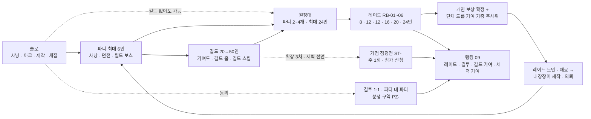

# 08_social_raid — 파티 · 길드 · 원정대 · 레이드 · PvP

## 1. 문서 정보

| 항목 | 내용 |
|---|---|
| 버전 | r1 (자가 점검 반영: 기믹 피해 계수 · D-60 · D-62 (8) · D-63 정합) |
| 작성일 | 2026-10-01 |
| 상태 | 검수 대기(배정: system · roblox-tech · player-market) |
| 목적 | 3-B-4(길드 · 파티 · 레이드), 3-B-10(길드 · 원정대 단위 보스 레이드), 3-C(대장장이의 파티 · 레이드 역할, PvP 도입 판단), 4-정량 '레이드: 길드 · 원정대 보스 5+(권장 인원 · 기믹 3+ · 역할 분담 · 보상 분배 규칙)'을 구현 가능한 수치로 확정한다 |
| 의존 문서 | 00_BRIEF(기준), 01_reference(1장 용어: 세력 · 길드 · 거점 · 부활 지점 · 한정 장비, 5장 #1~#4 · #13 · #23~#28 · #42 · #52 · #58, 6장 IP 금지 목록), 02_concept(4.4 · 4.5 사회 루프, 8.3 과금 한계선, 8.4 PvP 원칙, 11장 MVP, 14장 용어집 #13~#18 · #22 · #34~#43 · #56), 03_world(4.1~4.5 세력 · 관계 행렬 · 거점 · 분쟁 구역, 8장 사냥터 · 인스턴스 7곳, 8.8 필드 보스, 13장 색인), 04_progression(5장 전투 공식 · 몬스터 스탯 · 보스 배율, 6장 병렬 성장원, 7.5 파티 경험치, 7.6 사망 · 부활, 7.7 인스턴스 동기화, 13장 상수), 05_classes_skills(3.1 역할, 3.3 대장장이 전투 겸업, 5.6 중첩 규칙, 9장 DPM, 10.6 서버 판정), 06_items_crafting(3.1 · 3.4 등급 · 드롭 분포, 6.3 무기 개조 속성, 8.4 레이드 도안, 8.6 의뢰, 13장 내구도, 14장 한정 장비), 07_stories_hidden(3.1 아크, 6장 대형 사건 · D-15 검증, 12.4 평판 단계 추정), DECISIONS(D-01~D-63, 직접 인용: D-01 · D-02 · D-05 · D-11 · D-13 · D-14 · D-15 · D-17 · D-19 · D-25 · D-26 · D-27 · D-28 · D-29 · D-30 · D-31 · D-34 · D-38 · D-39 · D-41 · D-42 · D-43 · D-44 · D-45 · D-49 · D-50 · D-51 · D-52 · D-55 · D-57 · D-59 · D-60 · D-62 · D-63), ASSUMPTIONS(AS-01~AS-13, 직접 인용: AS-02 · AS-03 · AS-04 · AS-06 · AS-07) |
| 이 문서를 기준으로 삼는 문서 | 09(레이드 · 결투 · 길드 기여 · 세력 기여 랭킹의 원천 데이터), 10(레이드 화폐 · 깃발 조각 상점 가격, 길드 기부 · 세금 · 할인의 골드 흐름), 11(길드 공유 데이터 · 레이드 인스턴스 · 점령전 스케줄 · 채팅 구현), 12(MVP · 확장 단계별 레이드 · 거점 · 분쟁 구역 범위) |
| ID | 이 문서가 새로 부여: 레이드 보스 **RB-01~RB-06**, 거점 **ST-01~ST-06**, 분쟁 구역 **PZ-01~PZ-03**. 지역 · 도시 · 세력 · 아크 · 사건(H- · T- · F- · A- · E- · C-)은 03 13장 · 07 색인, 직업 · 스킬(J- · SK-)은 05, 아이템 · 도안 · 재료(IT- · BP- · MT-)는 06의 것만 쓴다. 가정은 AS-(이 문서에서는 후보 번호 ①~), A-는 아크 전용 |
| 사실 · 추정 표기 | 로블록스 기술 · 정책 사실은 16.3 출처 번호 [R1]~[R10]을 붙인다. 출처 없는 수치는 **설계값**(이 문서의 결정)이며 라이브 지표로 다시 맞춘다(15장 튜닝 파라미터) |
| 검산 | 보스 체력 · 처치 시간 · 기믹 피해 계수 · 내구도 압박 · 길드 성장 · 분배 확률은 스크립트 gen08.py(04 5.1 · 5.3 식, 05 9.2 실효 계수)로 생성 · 검산했다(16.4) |

---

## 2. 사회 시스템 개요

혼자 놀아도 막히지 않고(3-B-5, D-30), 같이 놀면 손해 없이 더 넓은 콘텐츠가 열리는 계단 구조다. 위 계단은 아래 계단의 **필수 조건이 아니다**(길드 없이 원정대 · 레이드 참여 가능, 파티 없이 길드 가입 가능).

| 단계 | 인원 | 진입 조건 | 핵심 보상 | MVP |
|---|---|---|---|---|
| 솔로 | 1 | 없음 | 모든 성장 경로(04 6장) | ✔ |
| 파티 | 2~6 | 없음(레벨 차 무관, 04 7.5 동행 보정) | 함께 사냥 1인당 95~110%(D-38), 던전 효율 정상 | ✔ |
| 길드 | 20~50 | 캐릭터 레벨 10 이상이 창설, 가입은 레벨 무관 | 길드 홀 · 창고 · 작업대, 길드 스킬(편의 · 경험치 +5% 상한), 길드 상점(외형) | ✔(길드 레벨 1~5) |
| 원정대 | 파티 2~4개(최대 24) | 레이드 전용 임시 연합. 길드 · 혼합 · 공개 모집 | 레이드 입장 | ✔ |
| 레이드 | 8~24(권장) | 보스별 최소 레벨만(입장 장비 점수 없음) | 개인 보상 + 단체 드롭 + 원정 훈장 | ✔(RB-01 · RB-02) |
| 결투 · 분쟁 구역 | 1:1 · 2:2~6:6 / 구역 자유 | 양측 동의 / 진입 동의 | 결투 랭킹(09) · 깃발 조각(분쟁 구역 외형 화폐) | ✔(PZ-01 · PZ-02) |
| 거점 점령전 | 측당 20 | 세력 선언 길드 + 신청 | 외형 · 칭호 · 거점 운영권(전투 스탯 없음) | 확장 3차 |

---

## 3. 파티

### 3.1 파티 규칙

| 항목 | 규칙 | 근거 |
|---|---|---|
| 인원 | 최대 **6인** | 01 5장 #23, 골격 |
| 구성 | 강제 구성 없음. 역할 태그만 표시 | 3-B-5(필수 직업 없음) |
| 역할 태그 | 탱커 · 딜러 · 치유 · 지원 · 대장장이 5종. 직업별 기본값(아래 3.2)을 쓰고 유저가 바꿀 수 있다. 태그는 파티 찾기 표시 · 레이드 역할 분담 표의 안내용일 뿐 판정에 쓰지 않는다 | 골격 |
| 파티장 | 초대 · 추방 · 위임 · 드롭 방식(아래) · 파티 찾기 등록. 파티장이 30초 이상 접속 끊김이면 자동 위임(파티 합류 순) | — |
| 레벨 차 | 제한 없음. 경험치는 04 7.5 동행 보정 그대로(아래 3.3 인용) | D-05 (5), D-38, D-51 |
| 파티 경험치 | 04 7.5 그대로. 이 문서는 수치를 새로 정하지 않는다 | 골격 '그대로 인용' |
| 드롭 | **개인 드롭**(파티원마다 따로 추첨, 남의 드롭을 볼 수 없음). 파티원 i의 처치당 장비 드롭 확률 = 06 3.4 확률 × P(k) ÷ n (n · k는 04 7.5 정의). 동레벨 6인 함께 사냥(분당 12마리)에서 1인당 분당 드롭 기회 = 12 × 1.9 ÷ 6 = 3.8마리분 ≈ 솔로 4마리분(95%) → 경험치 효율(D-38)과 같은 비율 | 경험치와 드롭을 같은 축으로 묶어 '파티 = 드롭 배수' 착취 방지 |
| 같은 서버 | 파티는 같은 플레이스 서버 안에서만 유지. 파티원이 다른 대륙(다른 플레이스)으로 가면 '원격 파티원'(채팅 · 위치 표시만, 경험치 · 드롭 분배 제외). 파티 텔레포트(파티장이 '모두 이동')는 TeleportAsync 한 번에 묶어 보낸다 [R5] | D-28(대륙 = 플레이스) |
| 던전 인스턴스 | 파티 단위 입장(입장 인원 스케일링: 2~4인 권장은 1~4인, 4~6인 권장은 1~6인, 04 7.1 · 03 8장 · D-29). **주간 보상 횟수 = 던전마다 캐릭터당 주 3회**(계정 합산 9회, D-25) — 클리어 보너스 · 보스 상자 · 희귀 드롭에만 적용, 처치 경험치 · 일반 재료는 무제한(D-39) | 04 6장 · 06 3.4가 08에 위임 |

### 3.2 직업별 기본 역할 태그

| 직업 | 기본 태그 | 바꿀 수 있는 태그(권장) | 근거(05 3.1 · 4장) |
|---|---|---|---|
| J-01 전사 | 탱커 | 딜러 | 굳센 피부 · 도발 / 근접 딜 |
| J-02 궁수 | 딜러 | 지원 | 원거리 단일 딜 |
| J-03 마도사 | 딜러 | 지원 | 광역 딜 · 둔화 |
| J-04 치유사 | 치유 | 지원 | 회복 · 보호막 · 되살림 |
| J-05 그림자술사 | 딜러 | — | 보스 단일 딜 |
| J-06 대장장이 · J-H2 별철 명장 | 대장장이 | 지원 · 딜러 | 현장 수리 · 담금질 · 보강 · 무기 개조 |
| J-H1 서고지기 | 딜러 | 지원 | 잉크 사슬(받는 마법 피해) |
| J-H3 묘역 서기관 | 지원 | 치유 | 묘비 낙인 · 묘역의 안식 |
| J-H4 시련 감독관 | 탱커 | — | 시련 선포 · 감독관의 규율 |
| J-H5 첨탑 마도사 | 딜러 | — | — |
| J-H6 균열 감시자 | 지원 | 딜러 | 등불 화살 표식 · 균열 차단 |

### 3.3 파티 경험치(04 7.5 인용, 수치 변경 없음)

| 항목 | 04 7.5 값 |
|---|---|
| P(k) | 1인 1.0 · 2인 1.4 · 3인 1.6 · 4인 1.7 · 5인 1.8 · 6인 1.9(k = 최근 10초 기여 인원) |
| 분배 | 개인_i = 몬스터 경험치 × P(k) ÷ n × 배율(d_i), n = 60 studs 안 · 60초 안 활동 기여자 |
| 동레벨 함께 사냥 1인당 | 100 / 105.0 / 106.7 / 106.3 / 99.0 / 95.0% |
| 분당 상한 | ③ 1.5 × 기준 × 부스트(캐리 상태는 부스트 없음), ③-2 k ≥ 2 처치 창은 min(③, 기준 × max(1.1, r) × 부스트) |
| 레이드 · 던전 | 레이드 보스 처치 경험치는 7.1 '레이드 클리어 경험치'로 따로 준다(P(k) 미적용) |

### 3.4 파티 찾기(Party Finder)

| 항목 | 규칙 |
|---|---|
| 등록 | 파티장이 '목적 · 지역 · 레벨 폭(표시용) · 역할 빈자리 · 언어 · 한 줄 메모(선택)'를 골라 등록. 메모는 자유 텍스트이므로 TextService 필터를 거친다(11.2) [R2] |
| 목적 7종 | 사냥 · 던전(H- 지정) · 아크(A- 지정) · 히든 피스 단서 · 필드 보스 · 채집 호위 · 레이드 연습 |
| 필터 | 대륙(C-) · 사냥터(H-) · 목적 · 레벨 폭(내 레벨이 포함된 것만 / 전부) · 역할 빈자리 · 언어 |
| 모바일 1탭 참가 | 목록 행 오른쪽 '참가' 버튼 1개(최소 지름 48, 05 11.2). 파티장의 '자동 수락'이 켜져 있으면 즉시 합류, 꺼져 있으면 파티장에게 수락 팝업(10초). 게임패드는 목록에서 A = 참가 |
| 범위 | 같은 대륙 플레이스의 모든 서버. 다른 서버의 파티에 참가하면 그 서버로 이동(TeleportToPlaceInstance)한다. 서버가 가득 차면 '가득 참' 표시 후 목록에서 내린다 |
| 갱신 | 등록 항목 TTL 120초, 파티 서버가 60초마다 갱신(살아 있는 파티만 보이게). 저장소는 11.1 '파티 찾기 색인' |
| 차단 | 내가 차단한 유저가 파티장인 항목은 목록에서 숨긴다(11.1) |

### 3.5 아크 · 히든 피스 파티 진행(D-62 (8), 07 2.3 아크 진행 규칙과 함께 쓴다)

아크 진행은 **캐릭터별**이다(07 2.3, 정해진 줄거리 없음 3-B-2). 파티는 진행을 합치지 않고 '같이 하는 것'만 돕는다. 경험치 · 평판 값은 07 12.2 · 12.4를 그대로 쓰고, 이 절은 파티일 때의 판정만 정한다.

| 항목 | 규칙 | 근거 |
|---|---|---|
| 전투 대상 스폰 | 장의 '아크 전투 대상'(07 2.3)은 그 장을 진행 중인 파티원 기준으로 **개인 스폰**하되 같은 파티원에게는 보이고 함께 공격할 수 있다(파티 공유). 파티 밖 유저에게는 보이지 않는다 | D-62 (8), 남의 아크 대상 가로채기 방지 |
| 같은 장 동시 완료 | 같은 장을 진행 중인 파티원은 목표(처치 · 회수 · 장치) 달성 순간 **모두 완료** 인정. 인정 범위 = 04 7.5의 n 정의(60 studs 안 · 최근 60초 기여 1회 이상) | D-62 (8), D-51 |
| 스케일링 | 장 전투 대상의 수 · 체력은 그 장을 함께 진행하는 파티원 수(1~4인)로 조정(D-29 인스턴스 스케일링과 같은 표, 5~6인은 4인 값). 완료자 동행은 인원에 넣지 않는다 | D-62 (8), D-29 |
| 완료자 동행 보상 | 그 장을 이미 완료한 파티원이 함께하면 **장 경험치 · 장 평판의 30%**. 캐릭터당 **하루 3장**까지, 계정 합산 상한(D-25) 적용. 결말 보상 · 히든 피스 보상 · 단서 기록 · 사건 기록(07 6.5)은 없음 | D-62 (8), 캐리 반복 착취 방지 |
| 결말 선택 | **개인**. 같은 장에서 결말을 고를 때 파티원마다 따로 고르고, 내 선택은 나의 세계 상태 플래그(07 7장)만 바꾼다. 파티장 대표 선택 없음 | D-62 (8), 07 2.3 '결말 되돌리기' |
| 히든 피스 공동 수행 | 07 10.2의 조건 중 '함께 수행 가능'(장치 · 처치형)은 조건을 처음 충족한 순간 60 studs 안 · 최근 60초 기여한 파티원 전원에게 완료 인정(각자 캐릭터당 1회, D-62 (6)). 단서 · 기록물 열람 · 대화형 조건은 개인별. 한정 장비 본체는 8.5 원정대 규칙 또는 06 14.2 선착 규칙 | D-62 (6)(8), 07 11.5 |
| 레벨 차 | 장 진행에 레벨 조건 없음(07 2.3). 파티원의 레벨이 장 적정 하한보다 높아도 동기화하지 않는다(오픈월드, D-05 (6)) · 경험치는 04 7.5 캐리 규칙 그대로 | D-05, D-51 |

---

## 4. 길드

### 4.1 창설 · 기본 규칙

| 항목 | 규칙 | 근거 |
|---|---|---|
| 창설 조건 | 캐릭터 레벨 10 이상, 골드 5,000(소모처, 10 확정), 어느 도시의 '길드 등록소' NPC | 01 5장 · 02 4.5 '창설 조건은 08' |
| 이름 · 태그 | 이름 2~12자 · 태그 2~4자(영숫자 · 한글). 등록 시 TextService 필터 + 표시 시 브로드캐스트 필터(11.2) [R2]. 레퍼런스 고유명사(01 6장) 금지어 목록과 운영 금칙어도 같이 검사 | 3-C IP, 로블록스 텍스트 필터 의무 |
| 소속 단위 | **캐릭터 단위**(캐릭터마다 다른 길드 가능). 같은 계정의 캐릭터 2개가 같은 길드에 들 수 있으나 길드 기여도 주간 상한은 **계정 합산**(4.4) | D-25 |
| 인원 상한 | 길드 레벨에 따라 20 → 50(4.2) | 골격 |
| 길드 레벨 | 1~10, 길드 경험치(= 길드원 기여도의 합)로 오른다. **MVP는 1~5**(14장) | 골격 |
| 전투 수치 | 길드 레벨 · 길드 스킬은 전투 스탯을 직접 올리지 않는다 | 골격, 3-C |

### 4.2 길드 레벨 표

길드 경험치 = 길드원 기여도(4.4)의 누적 합. 기준 성장 검산(gen08.py): 길드원의 60%가 '활동 길드원'(주 기여 약 660, 상한 700)일 때 중형 길드가 레벨 5까지 약 5주, 레벨 10까지 약 23주. **소형 길드(10명 전원 활동)** 는 레벨 5 약 7주 · 레벨 10 약 56주(약 1년) — 소형 길드도 레벨 5까지는 대형과 비슷한 속도로 닿고, 6 이후의 해금은 인원 · 외형 중심이라 늦어도 콘텐츠가 막히지 않는다.

| 길드 레벨 | 다음 레벨까지 필요 경험치 | 누적 | 인원 상한 | 해금(편의 · 외형만) | 중형 길드 도달(주) | 소형 10인 도달(주) |
|---|---|---|---|---|---|---|
| 1 | 6,000 | 0 | 20 | 길드 홀(기본 방) · 공용 창고 1탭(50칸) · 게시판 · 길드 채팅 · 길드 원정대 개설 | 0 | 0 |
| 2 | 9,000 | 6,000 | 24 | 길드 스킬 포인트 +1 · 길드 작업대 1등급 | 1 | 1 |
| 3 | 13,000 | 15,000 | 28 | 창고 2탭 · 길드 문장 색 3종 | 2 | 3 |
| 4 | 18,000 | 28,000 | 32 | 길드 스킬 포인트 +1 · 길드 계약 1개(주간, 4.6) | 3 | 5 |
| 5 | 27,000 | 46,000 | 36 | 길드 작업대 2등급 · 길드 홀 꾸미기 1단 · 길드 상점 2단 | 5 | 7 |
| 6 | 38,000 | 73,000 | 40 | 창고 3탭 · 길드 스킬 포인트 +1 · 세력 선언(확장 3차, 9.5) | 7 | 12 |
| 7 | 56,000 | 111,000 | 44 | 길드 계약 2개 · 길드 망토 문양 | 9 | 17 |
| 8 | 81,000 | 167,000 | 47 | 길드 작업대 3등급 · 길드 스킬 포인트 +1 | 13 | 26 |
| 9 | 117,000 | 248,000 | 50 | 창고 4탭 · 길드 홀 꾸미기 2단 | 17 | 38 |
| 10 | — | 365,000 | 50 | 길드 스킬 포인트 +1 · 칭호 '<길드명> 기수' · 길드 깃발 외형(점령전 깃발과 공용) | 23 | 56 |

- 길드 작업대 등급은 도시 대장간(06 9장)의 최고 5등급보다 낮게(최대 3) 둔다: 길드 홀은 '모이는 곳'이지 생산 효율의 정답이 되면 안 된다(대장간 도시 방문 동기 유지).
- 인원 상한이 줄어드는 일은 없다(길드 레벨은 내려가지 않는다).

### 4.3 직위 4단계와 권한

| 권한 | 길드장(1) | 간부(최대 5) | 정예(최대 15) | 일반 |
|---|---|---|---|---|
| 초대 | ✔ | ✔ | ✔ | — |
| 추방 | 간부 이하 | 정예 · 일반 | — | — |
| 직위 변경 | 전부 | 정예 ↔ 일반 | — | — |
| 길드장 위임 | ✔ | — | — | — |
| 공지 · 게시판 고정 | ✔ | ✔ | — | — |
| 게시판 글쓰기 | ✔ | ✔ | ✔ | ✔(하루 3건) |
| 창고 넣기 | ✔ | ✔ | ✔ | ✔ |
| 창고 꺼내기(하루) | 무제한 | 30개 | 10개 | 3개 |
| 길드 스킬 배분 | ✔ | — | — | — |
| 길드 원정대 개설(길드 명의) | ✔ | ✔ | ✔ | — |
| 길드 계약 선택 | ✔ | ✔ | — | — |
| 세력 선언 · 점령전 신청(확장 3차) | ✔ | 신청만 | — | — |
| 길드 해체 | ✔ | — | — | — |

- 창고 기록: 넣기 · 꺼내기는 30일 로그(누가 · 무엇 · 언제), 모든 직위가 열람.
- **귀속 장비(신화 1회 거래 후 · 초월 · 한정, 06 3.1 · 14.2)와 레이드 도안은 창고에 넣을 수 없다.**
- 길드장 장기 미접속: 14일 미접속이면 간부 중 '최근 4주 기여도 최고'에게 위임 투표가 열리고 7일 안 길드장 접속이 없으면 자동 위임(간부가 없으면 정예 중 같은 기준).

### 4.4 길드 기여도 원천 · 상한

기여도는 두 가지로 동시에 쌓인다: **길드 경험치**(길드 레벨용, 길드에 남음)와 **개인 기여 포인트**(길드 상점 화폐, 캐릭터에 남음 · 탈퇴해도 유지). 아래 값은 둘에 같은 값으로 들어간다.

| 원천 | 기여도 | 일일 상한 | 주간 상한 | 비고 |
|---|---|---|---|---|
| 일일 계약 1개 완료(07 12.5) | 10 | 30(3개) | — | 07 12.2 '일일 계약 · 길드 기여(08)' |
| 주간 계약 1개 완료 | 40 | — | 120(3개) | 07 12.2 |
| 던전 클리어(주간 보상 횟수 안) | 10 | 20(2회) | — | 소진 후 클리어는 0 |
| 필드 보스 처치(주간 보상 횟수 안) | 10 | 20 | — | 7.9 |
| 레이드 보스 처치(주간 보상 처치) | 60 | — | 보스당 1회 | 연습 모드 · 소진 후 0 |
| 길드원의 제작 · 수리 · 강화 의뢰 수행(06 8.6 · D-55 의뢰 게시판 · 에스크로, 의뢰인이 같은 길드) | 5 | 25(5건) | — | 자기 의뢰 · 같은 계정 의뢰는 0. 의뢰는 대장장이 일일 제작 상한(30)에 산입(D-55) |
| 골드 기부 | 100골드당 1 | 20(= 2,000골드) | — | 기부 골드는 **소멸**(골드 소모처, 10). 길드 금고로 쌓이지 않는다 |
| 재료 기부(길드 계약 4.6 납품) | 계약 표 | 계약 표 | — | 납품 재료는 소멸 |
| **합계 상한** | — | — | **캐릭터당 주 700 · 계정 합산 주 1,000** | 계정 합산 상한은 D-25 정신(캐릭터를 늘려 길드 성장을 사지 못하게) |

- 검산: 활동 길드원 주 기여 = (일일 계약 30 + 던전 20 + 필드 보스 20) × 6일 + 주간 계약 120 + 레이드 2회 120 = **660**(gen08.py). 골드 기부를 매일 상한까지 하면 +140 → 700 상한에 걸린다. 골드는 상한 때문에 '돈으로 길드 레벨 사기'가 되지 않는다(골격 '골드 기부는 상한').
- 같은 계정 · 같은 길드의 캐릭터 2개는 계정 합산 1,000을 나눠 쓴다.
- 탈퇴 후 72시간 안에 같은 길드에 다시 들어오면 그 주의 기여도는 이어서 계산(상한 우회 방지).

### 4.5 길드 스킬(포인트는 4.2 해금, 최대 5포인트)

| 스킬 | 단계 · 포인트 | 효과(단계별) | 상한 · 비고 |
|---|---|---|---|
| 동행의 등불 (Companion Lantern) | 1~3단 · 각 1포인트 | 길드원 캐릭터 경험치 +2% / +4% / **+5%** | **상한 +5%**(골격). 04 6장 원천 전부에 기본 경험치 기준 합연산으로 붙고, **분당 상한(04 7.5 ③ · ③-2)은 늘리지 않는다**. 캐리 상태 처치에는 적용하지 않는다(D-41과 같은 원리). 직업 경험치 · 숙련도 · 드롭에는 적용 없음. 랭킹 산정 영향 없음(09는 경험치를 쓰지 않는다) |
| 넓은 창고 (Wide Vault) | 1단 · 1포인트 | 공용 창고 탭당 +10칸 | 편의 |
| 길잡이 귀환 (Hall Recall) | 1단 · 1포인트 | 길드 홀 귀환 쿨타임 30분 → 15분 | 이동 편의(연출만, 골드 요금 없음) |
| 모루 공유 (Shared Anvil) | 1단 · 1포인트 | 길드 작업대 사용료 −50% | 사용료(06 9장)만, 제작 결과 · 확률 무관 |
| 원정 깃발 (Expedition Banner) | 1단 · 1포인트 | 공개 원정대 모집 목록 상단 노출 · 길드 원정대 준비 확인 시간 20초 → 40초 | 편의 |

- 포인트 5개로 위 7단계 중 5단계만 고를 수 있다(선택이 생기게). 재배분은 주 1회 무료.
- 경험치 +5% 영향 검산: 04 3.1 90시간 곡선 → 상한에 걸리지 않는 원천 기준 약 85.7시간(−4.8%). 부스트(D-11 +50%)와 함께여도 분당 상한은 그대로라 '부스트 + 길드'로 150%를 넘지 않는다.
- **판매 금지(10에 넘김)**: 길드 스킬 포인트 · 길드 경험치 · 길드 레벨 · 창고 탭을 로벅스로 파는 상품은 없다(D-11).

### 4.6 길드 홀 · 공용 창고 · 길드 작업대 · 게시판 · 길드 계약

| 시설 | 규칙 | 구현 메모(11) |
|---|---|---|
| 길드 홀 | 길드마다 1개의 **인스턴스**(길드 홀 플레이스의 예약 서버, 길드 레벨 1부터). 어느 도시의 '길드 등록소' NPC 또는 메뉴 '길드 홀 귀환'(쿨 30분)으로 입장. 마지막 길드원이 나가고 5분 뒤 닫힘 | 예약 서버 접근 코드를 길드 키에 저장해 재사용 [R5]. 첫 입장 시 생성 |
| 공용 창고 | 탭당 50칸(4.2), 길드 레벨에 따라 1~4탭. 장비 · 재료 · 소모품(귀속 불가 품목 제외) | 창고 키는 길드 핵심 키와 분리(13.1) |
| 길드 작업대 | 길드 레벨 2/5/8에 1/2/3등급(06 9장 작업대 등급 규칙 그대로). 대장장이 계열만 제작(D-50) | — |
| 게시판 | 공지 1 + 글 최대 20(오래된 것부터 삭제). 원정대 일정 글 형식(보스 · 시각 UTC · 역할 빈자리) | 자유 텍스트 필터(11.2) |
| 원정대 집결문 | 길드 홀 안에서 원정대 출발 가능(5.3) | — |
| 길드 계약 | 주 1~2개(4.2), 길드 공동 목표 1개 선택: 예) '길드원 합계 MT-03 은 원석 300 납품' · '던전 클리어 합계 20' · '레이드 처치 합계 3'. 달성 시 참여자 전원 개인 기여 포인트 +50, 길드 경험치 +1,000 | 납품 재료 소멸(재료 순환 10) |
| 길드 상점 | 개인 기여 포인트로 외형 · 길드 홀 장식 · 칭호 구매. 전투 수치 · 재료 · 도안 판매 없음 | 가격 10 |

### 4.7 가입 · 탈퇴 · 추방 · 해체

| 항목 | 규칙 | 이유 |
|---|---|---|
| 가입 | 초대 또는 '가입 신청'(길드 검색 → 신청 → 정예 이상이 수락). 레벨 제한은 길드가 선택(표시용 필터) | — |
| 자발적 탈퇴 | 즉시. 이후 **다른 길드 가입 쿨타임 24시간**, 같은 길드 재가입 72시간 | 기여 · 레이드 기록 돌려막기 방지 |
| 추방 | 직위 권한(4.3). 추방된 쪽 쿨타임 **12시간**(자발 탈퇴보다 짧게: 추방은 본인 귀책이 아닐 수 있음) | — |
| 레이드 · 점령전 중 | 진행 중인 레이드 인스턴스 · 점령전 인스턴스 안에서는 추방 · 탈퇴 처리를 **인스턴스 종료 뒤로 보류** | 분배 · 결과 중간 조작 방지 |
| 탈퇴 시 남는 것 | 개인 기여 포인트 · 구매한 외형 · 칭호 유지. 창고에 넣은 물품은 길드 소유(되돌려 받지 않음) | — |
| 해체 | 길드장만. **72시간 유예**(취소 가능, 전원 알림). 조건: 거점 보유 중 · 점령전 신청 중이면 불가. 해체 시 창고 물품은 **넣은 사람의 우편함**으로 반환(넣은 사람 캐릭터가 없으면 길드장), 길드 자금(9.4 세금)은 소멸. 길드명은 30일 뒤 해제 | 개인 자산 보존(01 5장 #4 '망명 · 재건') |
| 망명 허가 | 해체된 길드의 길드원은 해체 후 7일 동안 가입 쿨타임 없이 다른 길드에 들어갈 수 있다 | 01 5장 #4 |
| 자동 휴면 | 전원 90일 미접속이면 '휴면'(목록 비노출), 180일이면 해체 처리(위 해체 규칙) | 데이터 정리(13.1) |

### 4.8 서버 간 공유 데이터 요구(11에서 구현)

| 데이터 | 항목 | 일관성 요구 | 갱신 빈도 요구 | 크기 추정 |
|---|---|---|---|---|
| 길드 핵심 | 길드 ID · 이름 · 태그 · 레벨 · 길드 경험치 · 스킬 배분 · 길드장 · 세력 선언(확장) · 홀 접근 코드 · 생성일 | 강한 일관성(가입 · 탈퇴 · 직위 · 해체는 원자적) | 사건 발생 시 즉시(분당 수 회 미만) | 약 1KB |
| 멤버 목록 | 최대 50 × {userId, charId, 직위, 이번 주 기여, 누적 기여, 가입일, 마지막 접속} | 강한 일관성(정원 초과 금지) | 가입 · 탈퇴 · 직위 즉시, 기여 · 접속은 배치(아래) | 약 5KB |
| 기여 누적 | 길드 경험치 증가분 · 멤버별 주간 기여 | 최종 일관성 허용(수 분 지연 가능), 이중 집계 금지 | 서버별 메모리 누적 → 60초마다 공유 카운터에 원자 증가 → 5분마다 1개 서버가 영구 저장소로 반영 | — |
| 접속 상태 | 멤버별 온라인 · 위치(대륙 · 인스턴스 종류) | 최종 일관성 | 60초 갱신, TTL 120초 | 멤버당 약 60B |
| 창고 | 탭 × 50칸 + 30일 로그 | 강한 일관성(같은 칸 동시 꺼내기 방지) | 넣기 · 꺼내기 시 즉시 | 약 30KB(4탭 + 로그) |
| 게시판 | 공지 + 글 20 | 최종 일관성 | 작성 시 | 약 8KB |
| 길드 채팅 | 실시간 메시지(보관 없음, 최근 50개만 홀 · 접속 시 표시) | 최선 노력 전달(유실 허용) | 실시간 | 메시지당 ≤ 1KB [R3] |

- 원칙: **핵심 · 멤버(작고 드물게 바뀜)** 와 **기여 · 접속(자주 바뀜)** 을 같은 저장 키에 두지 않는다. 데이터 스토어는 같은 키 쓰기량이 유니버스 전체에서 분당 4MB로 제한되므로[R4], 수십 개 서버가 큰 길드 키를 매분 다시 쓰는 구조는 금지한다(13.1에서 계산).

---

## 5. 원정대(Expedition)

### 5.1 구성

| 항목 | 규칙 | 근거 |
|---|---|---|
| 정의 | **레이드 전용 임시 연합** = 파티 2~4개(최대 24인). 레이드 인스턴스가 닫히면 해산 | 골격, 01 5장 #26 |
| 최소 인원 | 없음(권장 인원만 표시). 인원이 적어도 보스 수치를 자동으로 낮추지 않는다(도전 허용) | 01 2.2.3 '원정대 최소 인원 제한' 변형 |
| 종류 | ① **길드 원정대**: 개설자가 길드 명의로 개설, 길드원 우선(빈자리를 공개 모집으로 열 수 있음) ② **공개 원정대**: 누구나 개설 · 참가. 길드 없는 유저도 참여 | 골격 |
| 혼합 | 길드 원정대가 빈자리를 공개로 열면 '혼합'. 처치 기록은 길드원이 과반이면 길드 기록, 아니면 공개 기록 | 09 레이드 랭킹 |
| 파티 배정 | 원정대장이 끌어다 놓기(PC) · 탭 두 번(모바일: 이름 탭 → 파티 탭) · 패드(A로 집기 → D-pad 이동 → A 놓기) | 3-C 입력 동등 |

### 5.2 권한

| 권한 | 원정대장 | 파티장 | 일반 |
|---|---|---|---|
| 모집 게시 · 마감 | ✔ | — | — |
| 파티 배정 · 파티장 지정 | ✔ | 자기 파티 안 순서 | — |
| 추방 | 전투 전 · 전멸 후 재시작 대기 중에만 | 자기 파티원(같은 조건) | — |
| 분배 방식(자동 / 자유 분배) | **입장 전**에만 변경(8.3) | — | 입장 시 확인 표시 |
| 연습 모드 지정 | 입장 전 | — | — |
| 전투 시작 카운트다운 · 월드 표식 4종(원 · 삼각 · 사각 · 별) | ✔ | ✔(표식만) | — |
| 준비 확인 | ✔ | 자기 파티 | 응답 |
| 원정대장 위임 | ✔ | — | — |

- 처치 순간부터 분배가 끝날 때(최대 10분)까지 **추방 · 원정대장 변경 · 분배 방식 변경 금지**. 분배 자격은 처치 순간 스냅숏으로 정한다(8.2).
- 원정대장이 끊기면 60초 뒤 파티장 중 합류 순으로 자동 위임.

### 5.3 모집 · 출발

| 단계 | 규칙 |
|---|---|
| 모집 게시판 | 모든 도시의 '원정 게시판' NPC · 길드 홀 · 메뉴. 항목 = 보스(RB-) · 시작 시각(UTC + 내 지역 시각 표시) · 최소 레벨(보스 최소 이상) · 역할 빈자리 표시(예: 탱커 2 · 치유 3 · 대장장이 2 · 딜러 5, **표시만, 강제 없음**) · 언어 · 연습 여부 · 분배 방식 |
| 모바일 1탭 참가 | 파티 찾기와 같은 '참가' 버튼. 역할 빈자리가 찬 태그로 신청하면 '그래도 신청' 1회 확인 |
| 출발 | 원정대원이 어느 도시 · 길드 홀에 있든 원정대장이 '출발' → 준비 확인 20초(원정 깃발 스킬 40초) → 응답한 인원을 레이드 플레이스의 **새 예약 서버**로 한 번에 텔레포트(최대 24 ≤ 1회 50명, 02 12장 [P-3-06]) [R5] |
| 늦은 합류 | 첫 전투 시작 전 · 전멸 후 재시작 대기 중에는 원정대원이 '합류'로 같은 인스턴스에 들어올 수 있다(접근 코드 공유, 13.2) |
| 공개 원정대 이탈 제재 | 공개 원정대에서 **전투 중 자발적 이탈**을 7일 안 3회 하면 공개 원정대 신청 30분 제한(길드 원정대는 제재 없음). 접속 끊김은 이탈로 세지 않는다(7.5) |

---

## 6. 레이드 보스 RB-01~RB-06

### 6.1 공통 수치 공식(04 5.3 보스 배율 + 인원 스케일링)

| 항목 | 공식 | 설명 |
|---|---|---|
| 기준 레벨 B | 보스마다 고정(6.2). 인스턴스 동기화는 **하향만**(04 7.7 · D-34): 레벨 > B인 참가자는 04 7.7 축소 계수 s · 장비 수치 상한(B 기준 장비 × 1.3)을 받는다. 레벨 ≤ B는 변화 없음 | D-05 (6) |
| 체력 | **HP_RB = 보스 체력(B) × N × k_HP**. 보스 체력(B) = 04 5.3 일반 체력(B) × 25. N = 권장 인원, k_HP = 보스별 시간 계수(6.2) | '인원 스케일링' = 설계 시 권장 인원 N에 비례. **실제 입장 인원으로 바꾸지 않는다**(5.1 최소 인원 없음 · 자동 보정 없음) |
| k_HP 산정 | k_HP = 목표 처치 시간 × 원정대 피해/초 ÷ (보스 체력(B) × N × 기믹 시간 계수 f). 원정대 피해/초 = 딜러 1인 피해/초 × 역할 환산 인원 × 가동률 0.70. **f = Σ(페이즈 체력 비 ÷ 페이즈 보스 피해 배율 m)**(6.2 아래 '기믹 피해 계수' 표: 소환물 · 열쇠로 돌린 피해, 보스 피해 감소 상태, 기믹 성공 보상 창을 반영) | 딜러 1인 피해/초 = 기본 공격력(B 기준 빌드 · 기준 장비, 04 5.2) × 실효 계수 1.85(05 9.2 딜러 평균) × 100/(100 + 보스 방어력) × 기대 배율. 역할 환산: 탱커 0.75 · 치유 0.30 · 대장장이 0.80 · 딜러 1.00, 버프 × (1 + 0.06 × 대장장이 담금질 커버율 + 0.03) |
| 공격력 | **ATK_RB = 보스 공격력(B) × 패턴 계수**. 보스 공격력(B) = 04 5.3 일반 공격력(B) × 2.2 | 패턴 계수는 보스별 표. 피해 = 04 5.1 받는 피해 식(방어 적용) |
| 방어력 | 보스 방어력(B) = 2B × 1.6 | 04 5.3 |
| 확정 피해 | 대상 **최대 체력 × p**. 받는 피해 감소 · 보호막을 무시(05 5.6, D-43 ①)하지만 **대시 · 무적 이동 스킬의 무적 구간에는 들어가지 않는다**(05 10.6 ④, D-52) | 기믹 실패 벌칙 전용. 장비 격차와 무관하게 '기믹을 처리했는가'만 묻는다 |
| 몬스터 치명 · 회피 | 보스 치명 없음 · 회피 0%(04 5.1) | — |
| 상태이상 | 기절 · 속박 · 넘어뜨림 · 마비 · 침묵 · 공포 면역, 둔화 −50% 상한, 도발 적용(기믹 중 제외)(05 5.6). **기믹 지정 기절**만 예외(표에 '기믹 기절') | — |
| 버프 상한 | 공격력 · 피해 증가 합 +50%, 대상 받는 피해 증가 범주 합 +25%, 받는 피해 감소 −75%(D-43 · 05 5.6). 보스 '받는 피해 +n%' 기믹 보상도 **대상 받는 피해 증가 범주**에 넣어 +25% 상한을 함께 쓴다 | 딜 체크를 기믹 처리로 대체하되 기믹 보상을 겹쳐 딜 폭주가 나지 않게(01 2.2.3) |
| 기본 공격 간격 | 탱커 대상 2.0초(04 5.1 '보스 패턴별' 확정) | — |
| 텔레그래프 | 위치 회피형 패턴 · 기믹은 **경고 표시 ≥ 1.5초**, 판정 시각에는 지연 보정 min(RTT/2, 150ms)를 적용해 '판정 시각 − 보정' 시점의 위치로 맞았는지 정한다(D-44 · D-52와 같은 상한) | 3-C 모바일 · 패드 공정 |

### 6.2 요약 표

| ID | 이름(영문) | 권장 인원 N | 기준 레벨 B | 최소 레벨 | 권장 장비(표시만) | 무대(H-, 대륙) | 출시 단계 | 체력 HP_RB(k_HP) | 보스 공격력(B) | 방어력 | 목표 처치 | 광폭화 | 팀 생명 예산 | 기믹 수 | 주간 보상 |
|---|---|---|---|---|---|---|---|---|---|---|---|---|---|---|---|
| RB-01 | 태엽 지휘자 오르골란 (Orgolan, the Clockwork Conductor) | 8 | 30 | 20 | T3 영웅 이상 | H-10 무너진 대극장 '본무대'(C-01) | **알파 · MVP** | 562,000 (1.75) | 475 | 96 | 7.5분 | 10분 | 4 | 3 | 캐릭터 주 1 |
| RB-02 | 잿불 모루거신 (Emberanvil Colossus) | 12 | 60 | 50 | T6 영웅 이상(전설 권장) | H-19 산왕의 옛 대장간 '대용광로실'(C-02) | **MVP** | 1,575,000 (2.19) | 1,274 | 192 | 10분 | 13분 | 6 | 4 | 캐릭터 주 1 |
| RB-03 | 모래시계 서기장 (The Hourglass Archon) | 12 | 60 | 50 | T6 영웅 이상(전설 권장) | H-24 태양왕조 옛 묘역 '왕릉 아래 기록실'(C-03) | 확장 1차 | 1,381,000 (1.92) | 1,274 | 192 | 10분 | 13분 | 6 | 3 | 캐릭터 주 1 |
| RB-04 | 폭풍등 갑각왕 (Stormlamp Carapace) | 16 | 80 | 70 | T8 영웅 이상(06 확장) | H-32 폭풍 군도 '번개 암초 둥지'(C-04) | 확장 2차 | 2,471,000 (2.13) | 2,004 | 256 | 11분 | 14분 30초 | 7 | 3 | 캐릭터 주 1 |
| RB-05 | 케슈 관문 집정관 (Kesh Gate Consul) | 20 | 80 | 70 | T8 영웅 이상(06 확장) | H-08 세르낙 관문 유적 '내전 회랑'(C-01) | 확장 3차 | 3,480,000 (2.40) | 2,004 | 256 | 12분 | 16분 | 8 | 3 | 캐릭터 주 1 |
| RB-06 | 재갈기 흑염수 (Ashmane, the Blackflame Beast) | 24 | 100 | 90 | T10 영웅 이상(06 확장) | H-39 흑염 평원 '흑염 회오리 분지'(C-05) | 확장 4차 | 4,162,000 (2.04) | 2,893 | 320 | 13분 | 17분 | 10 | 4 | 캐릭터 주 1 |

- 4-정량 '레이드 보스 5+': 설계 6개. 권장 인원 8 · 12 · 12 · 16 · 20 · 24(다양화). 기믹 3 · 4 · 3 · 3 · 3 · 4(전부 3+).
- 검산(gen08.py, 16.4): 권장 구성 · 기준 장비에서 처치 시간(기믹 피해 계수 f 반영) 7.5 · 10.0 · 10.0 · 11.0 · 12.0(RB-05 파수꾼 구간 제외, 7.4) · 13.0분, 광폭화까지 여유 1.30~1.34배. B 레벨 장비 상한(× 1.3, D-49 전설 풀장비 근사)까지 갖춘 원정대는 6.9 · 9.3 · 9.2 · 10.2 · 11.1 · 12.0분(약 −8%) — 장비가 좋으면 빨라지지만 기믹을 건너뛸 수는 없다(확정 피해).
- 목표 처치 시간은 **기준 장비**(04 5.2: 그 레벨대 희귀~영웅)로 맞춘다. D-49의 '풀장비 = 전설' 기준은 일반 몬스터 타수 기준이며, 레이드에서 전설 풀장비는 위 '장비 상한' 행(약 −8%)에 해당한다. 권장 장비 열은 표시만(7.1 입장 조건 아님).
- 기준 레벨 B는 레이드 플레이스에서만 쓰는 값으로 무대 H-의 오픈월드 적정 폭(03 8장)과 무관하다(예: H-32 적정 35~52, RB-04 B 80).
- **B 80 · 100 수치는 추정**: 04 5.2 기준 빌드 식(무기 8 + 2.4L, 주 스탯 10 + 3(L−1) + 0.25L)과 5.3 몬스터 식을 레벨 상한 확장 구간에 그대로 연장했다(04 5.3 '포화형 식은 확장 시에도 그대로'). 확장 2 · 4차에 04 · 06이 61~100 구간을 확정하면 같은 스크립트로 k_HP만 다시 맞춘다(15장 RAID_HP_K).

**기믹 피해 계수**(가동률 0.70 밖의 보스 피해 변화. m = 그 페이즈에서 보스에 실제로 들어가는 피해 배율, f = Σ(체력 비 ÷ m), gen08.py)

| RB | 페이즈(체력 비) · m | 반영한 기믹(가정) | f | k_HP(f 반영 전 → 후) |
|---|---|---|---|---|
| RB-01 | P1(0.40) 1.020 · P2(0.35) 0.946 · P3(0.25) 0.834 | G1 성공 +10% 8초/40초(P3 30초) · G2 성공 +20% 10초/60초 · P2 무대 인형 4기(6,420/45초) · P3 태엽 열쇠 2개(12,840/50초)로 돌린 피해 | 1.062 | 1.86 → **1.75** |
| RB-02 | P1(0.35) 1.000 · P2(0.35) 1.000 · P3(0.30) 0.978 | G3 백열(−60%) 해제까지 5초 + 성공 +20% 10초/45초. G1 · G2 · G4는 피해 배율 변화 없음(내구도는 아래 별도 검산) | 1.007 | 2.20 → **2.19** |
| RB-03 | P1(0.30) 0.861 · P2(0.35) 0.882 · P3(0.35) 0.875 | G3 해 · 달 장부(전 구간): 물리형(탱커 2 · 대장장이 2 · 딜러 3)과 마법형(치유 3 · 딜러 2) 중 감소 쪽 −50%, 무기 개조 2명이 60초씩 엇갈려 딜러 1명분을 상시 면제 → 장부 계수 0.806. × (1 + G1 받침대 3개 +24% 10초/35초(P3 28초) + G2 +20% 8초/60초) | 1.145 | 2.20 → **1.92** |
| RB-04 | P1(0.35) 1.000 · P2(0.35) 0.871 · P3(0.30) 1.032 | G2 닫힌 껍질: 동시 타격 준비 5초(받는 피해 −80%) + 갈라진 껍질 12초(+15%) 반복 · G3 성공 +20% 8초/50초 | 1.043 | 2.22 → **2.13** |
| RB-05 | 전 구간 1.000 | G1 관문 분할 동안 보스는 무적이고 **광폭화 타이머가 멈춘다**(7.4). 파수꾼 3기는 조별 피해(가동률 0.85)로 약 60초 · 2회 | 1.000 | 2.40 → **2.40** |
| RB-06 | P1(0.30) 1.000 · P2 · P3(0.70) 0.797 | G2 재 늑대 무리 5기(51,000/40초)를 4파티 중 1파티가 처리(파티 피해 기준 약 32초) | 1.178 | 2.40 → **2.04** |

- 기믹 성공 보상의 '대상 받는 피해 증가'는 범주 합 +25% 상한(6.1) 안에서 계산했다. 기믹 실패(확정 피해 · 소환물 추가)는 반영하지 않았다 → 실패가 늘면 처치 시간이 길어져 광폭화 여유(1.30배)를 먹는다.

- 무대 = 03 사냥터 H-의 깊은 구역을 **별도 레이드 플레이스**(예약 서버)로 만든 곳이다. 오픈월드 H-의 몬스터 · 필드 보스(03 8.8)와 별개이며 입구는 모든 도시의 '원정 게시판'에서 바로 출발한다(5.3) — 레이드 때문에 고위험 필드를 걸어서 지날 필요가 없다(3-B-5).

### 6.3 공통 패턴 계수와 피해 검산(기준 장비 B 레벨, 04 5.1 받는 피해 식)

| 패턴 | 계수 | 주기 | 대상 | B 30 피해(체력 비) | B 60 | B 80 | B 100 | 대응 |
|---|---|---|---|---|---|---|---|---|
| 기본 공격 | 1.0 | 2.0초 | 현재 도발 대상 | 탱커 227(18.7%) | 406(18.1%) | 522(17.9%) | 637(17.7%) | 치유사 지속 회복, 탱커 굳센 피부 −30% 시 12.4~13.1% |
| 탱커 강타 | 2.5(보스별 2.5~2.6) | 20~22초, 경고 1.5초 | 도발 대상 | 굳센 피부 중 398(32.7%) | 710(31.7%) | 913(31.3%) | 1,115(31.0%) | 굳센 피부 · 보강 · 감독관의 규율. 맨몸이면 568(46.7%) |
| 원정대 광역 | 0.6 | 15초 | 전원 | 비탱커 141(13.6%) | 255(13.6%) | 330(13.5%) | 404(13.5%) | 치유의 원 · 보호의 기도 |
| 기믹 실패 | 확정 피해 p | 기믹별 | 기믹별 | 최대 체력 × p | 〃 | 〃 | 〃 | 기믹 처리 · 대시 무적 |

- 체력 비는 B 레벨 기준 빌드의 최대 체력(탱커 = 근접 힘형 1,216 · 2,236 · 2,916 · 3,596, 비탱커 = 1,042 · 1,882 · 2,442 · 3,002) 대비. 레벨이 바뀌어도 비율이 거의 같아(±1%p) 보스 6개가 같은 체감 난이도 축 위에 놓인다.

### 6.4 RB-01 태엽 지휘자 오르골란 (8인 · B 30 · 알파 · MVP)

무너진 대극장(H-10) 무대 아래, 브렌마르 상인들이 숨겨 둔 '자동 연주 극단'의 지휘 인형이 멈추지 않는 공연을 이어 간다. 표류 화물(A-03)과 하수도 인장(A-04)의 배경 소문으로만 연결되며, 처치가 어느 아크 · 사건의 결말도 아니다(6.10).

| 페이즈 | 체력 구간 | 추가 패턴 | 소환 |
|---|---|---|---|
| P1 서곡 | 100~60% | 기본 3종 + G1 | — |
| P2 변주 | 60~25% | + G2 | 무대 인형 4기(45초마다, 체력 1,605 · 공격력 216 = 일반 30) |
| P3 피날레 | 25~0% | + G3, G1 주기 40 → 30초 | — |
| 광폭화 | 전투 10:00 | 공격력 ×1.5, 이후 20초마다 +25%p. 10:60부터 10초마다 '커튼콜' 확정 피해 100%(전멸) | — |

| 기믹 | 발동 | 해결법 | 실패 결과 | 모바일 · 패드 대응 |
|---|---|---|---|---|
| G1 조명 표식 (Spotlight Cue) · 위치 이동 | P1부터 40초마다(P3 30초), 무작위 2명(탱커 제외)에게 머리 위 조명 표식 5초 | 무대 가장자리 4개의 빛 원(반경 4 studs) 중 하나에 들어가 5초 끝 시점에 서 있기(원 1개에 1명) | 그 사람 확정 피해 50% + 반경 6 studs 안 다른 사람 25%. 성공 시 보스 '박자 놓침' 받는 피해 +10% 8초 | 원 반경 4(넓음) · 화면 가장자리 화살표 · 표식 대상 기기 진동(지원 기기). 판정은 지연 보정 위치. 이동 거리 최대 20 studs(4초 걸음) |
| G2 가면 순서 (Mask Sequence) · 순서 맞추기 | P2 진입 · 이후 60초마다. 보스가 가면 3개(색 + 모양: 붉은 원 · 푸른 삼각 · 금빛 별)를 1.5초 간격으로 보여 줌 | 무대 3면의 같은 가면 레버를 **보인 순서대로** 20초 안에 당김(근접 프롬프트 길게 0.5초, 누구나) | 원정대 전원 확정 피해 30% + 무대 인형 4기 즉시 추가. 성공 시 **기믹 기절** 6초 + 받는 피해 +20% 10초 | 색 + 모양 + 숫자(1 · 2 · 3) 병기(색각 대응). 프롬프트는 D-45 · D-52 규칙(패드 ButtonX, PC F, 모바일 자체 버튼). 레버 순서 HUD 상단 띠 표시 |
| G3 태엽 감기 (Wind-Up) · 역할 분담 + 속성 대응 | P3 진입 · 이후 50초마다. 보스가 15초 '그랜드 피날레' 시전, 무대 양끝에 태엽 열쇠 2개(각 체력 6,420 = 일반 30 × 4) 등장 | 딜러가 열쇠 2개를 15초 안에 파괴(딜러 4인 약 10초), 탱커는 보스 유지. **둔화 속성 무기(05 SK-J6-06 무기 개조 · 06 6.3) 또는 둔화 스킬 적중 시 시전 +5초**(1회) | 열쇠가 남으면 '포르티시모': 원정대 확정 피해 70% + 보스 공격력 +20%(전투 끝까지, 중첩 2회까지) | 열쇠는 자동 조준 후보 1순위(D-27 규칙의 '기믹 대상 우선'). 시전 바 · 남은 열쇠 수 HUD 표시 |

| 역할 | 할 일 |
|---|---|
| 탱커(1) | 보스를 무대 중앙에 고정, 강타 20초마다 굳센 피부. P2 무대 인형 도발(반경 10) |
| 딜러(4) | 보스 딜, P3 태엽 열쇠 우선 파괴. 조명 표식 받으면 빛 원으로 |
| 치유(2) | 탱커 지속 회복 1 · 광역 담당 1. G2 실패 직후 보호의 기도 |
| 지원(0~1) | 레버 담당(G2) 지정 3명 중 1. 표식 디버프 유지 |
| 대장장이(1) | 담금질 · 보강(탱커 강타 직전). **무기 개조 '둔화'를 G3 시작에 맞춰 딜러 1명에게**(쿨 120초 · 지속 60초라 G3 50초 주기 중 대략 2번에 1번) → 그 G3 시전 +5초. G2 레버 담당 |

| 보상(8장) | 값 |
|---|---|
| 개인 확정 | 골드 1,260 · 경험치 기준(min(레벨, 30)) × 20분(B 30 이상 10,000) · 원정 훈장 20 · MT-03 은 원석 6 · MT-21 중급 마력 결정 2 · MT-41 도안 조각 1 · 평판 F-02 · F-06 각 +150(주 1회) |
| 단체 드롭 | 장비 = 적격 · 미소진 인원 × 0.5개(최소 2), T3, 영웅 60% · 전설 37% · 신화 3% |

### 6.5 RB-02 잿불 모루거신 (12인 · B 60 · MVP · 내구도 압박 보스)

산왕의 옛 대장간(H-19) 가장 깊은 대용광로실에서, 세르낙 명장들이 남긴 용광로 거신이 녹을 먹는 불꽃으로 깨어났다. 멈춘 용광로(A-09) · 산왕의 망치(A-11)의 배경 소문, 모루 형제단(F-13) · 카르니스(F-03)의 의뢰로만 연결된다. **골격의 '대장장이가 없으면 매우 어렵지만 불가능하지 않은 장비 내구도 압박 기믹' 보스**다.

| 페이즈 | 체력 구간 | 추가 패턴 |
|---|---|---|
| P1 점화 | 100~65% | 기본 3종 + G1(전 구간) |
| P2 용해 | 65~30% | + G2 |
| P3 주조 | 30~0% | + G3, G1 강도 유지 |
| 광폭화 | 13:00 | 공격력 ×1.5, 20초마다 +25%p, 13:60부터 10초마다 확정 피해 100% |

| 기믹 | 발동 | 해결법 | 실패 결과 | 모바일 · 패드 대응 |
|---|---|---|---|---|
| G1 녹열 파동 (Rustheat Pulse) · **내구도 압박** | 전투 내내 20초마다 | **피할 수 없다**: 원정대 전원 착용 장비 내구도 −6%p(최대치 기준) + 원정대 광역 0.3배 피해. 회복 수단 ① 대장장이 현장 수리(SK-J6-03, 반경 8 파티 +15%p, 쿨 45초, **레이드에서는 횟수 상한 없음**) ② 아레나 3곳의 **식은 모루**(누구나, 근접 프롬프트 길게 3초 → 자기 장비 +12%p, 개인 쿨 43초, 모루 1개 동시 1명) | 내구도 0 장비는 성능 50%(06 13장: 기본 스탯 · 옵션 절반) → 피해 · 방어 반감 → 광폭화 초과 · 탱커 사망 | 장비 내구도 '망치 게이지'를 HUD 체력 바 아래 1줄로 상시 표시(30% 이하 주황 · 10% 이하 빨강). 식은 모루는 지도 · 화면 가장자리 아이콘. 대장장이는 '수리 집합' 빠른 신호(11.3)로 파티를 반경 8 안에 모은다 |
| G2 쇳물 거푸집 (Molten Molds) · 위치 이동 + 역할 분담 | P2부터 50초마다, 바닥에 거푸집 4개(반경 5) 표시 6초 후 쇳물 붓기 | 거푸집마다 **2명 이상**이 들어가 나눠 맞기(들어간 사람마다 확정 피해 15% + 내구도 −3%p). 탱커 2명은 보스 유지 → 딜러 · 치유 · 대장장이 · 지원 10명이 4곳 × 2~3명 | 2명 미만 거푸집마다 원정대 전원 확정 피해 25% + 그 자리에 슬래그 웅덩이 20초(밟으면 초당 내구도 −2%p) | 거푸집 안 인원 숫자(0/2)를 바닥에 크게 표시. 반경 5로 넓고 6초 여유 |
| G3 담금 수조 (Quench Sluice) · 협동 순서 + 속성 대응 | P3부터 45초마다 보스 '백열' 상태(받는 피해 −60%, 05 5.6 감소와 별개인 보스 상태) | 아레나 동 · 서 끝 수문 레버 2개를 **3초 안에 연달아** 당김(길게 2초, 누구나) → 백열 해제 + 받는 피해 +20% 10초. **둔화 속성 무기(무기 개조) 적중마다 백열 지속 −0.5초**(냉각, 최대 −6초) | 15초 안 해제 못 하면 '슬래그 폭발': 원정대 확정 피해 40% + 내구도 −8%p | 두 레버 사이 '3초 창'은 서버가 두 입력의 서버 수신 시각 차에 지연 보정 min(RTT/2, 150ms)를 각각 빼고 판정. 레버 위 남은 시간 원형 표시 |
| G4 모루 망치질 (Anvil Slam) · 탱커 교대 | 30초마다 탱커에게 '달군 자국' 중첩(1중첩당 받는 피해 +15%, 25초) | 2중첩 전에 다른 탱커가 도발해 교대(탱커 2명) | 3중첩 시 탱커 강타가 확정 피해 80%로 바뀜 | 중첩 수를 탱커 머리 위 · 파티 프레임에 숫자로. 도발 대상 자동 지정 |

**대장장이 유무에 따른 내구도 · 처치 시간 검산**(gen08.py 시간 단계 시뮬레이션, 기준 장비, 16.4)

| 구성 | 내구도 회복 수단 | 전투 중 최저 내구도 | 처치 시간 | 광폭화 13분 대비 | 판정 |
|---|---|---|---|---|---|
| 권장(대장장이 2 = 파티마다 1) | 현장 수리 15%p / 45초(분당 20%p ≥ 손실 분당 19.5%p) | 82% | 10.0분 | 여유 1.30배 | 정상 |
| 대장장이 1(한 파티만) | 한 파티 현장 수리 + 다른 파티 식은 모루 | 76%(모루 파티) | 약 11.1분 | 1.17배 | 할 만함 |
| **대장장이 0 + 식은 모루** | 모루 12%p / 43초(분당 16.7%p, 부족분은 시작 100%에서 깎임), 모루 이동 · 사용 8초 = 가동률 −18.6% | 58% | **12.5분** | **1.04배** | **매우 어렵지만 가능**(기믹 실수 1회면 실패) |
| 대장장이 0 + 모루 미사용 | 없음 | 5.3분에 0% → 이후 성능 50% | 15.0분 | 초과 | 실패 |
| 대장장이 0 + 모루 + B 장비 상한(× 1.3) | 모루 | 58% | 약 11.5분 | 1.13배 | 장비가 좋으면 여유 생김 |

- 대장장이 열기 수지: 현장 수리 40 / 45초 = 분당 53.3 소모. 망치 기본 공격 적중 +8(분당 약 35회 = 280) · 모루 내리치기 +15로 충분(05 3.4).
- 현장 수리의 '던전 인스턴스 1회당 3회 상한'(05 SK-J6-03 · 06 13장)은 **던전 인스턴스에만** 적용하고 **레이드 인스턴스에는 상한을 두지 않는다**(쿨타임 45초가 상한). 05 · 06 문구 정합 요청(16.1 #3).

| 역할 | 할 일 |
|---|---|
| 탱커(2) | 보스 고정 · G4 2중첩마다 교대. 강타 직전 굳센 피부 |
| 딜러(5) | 보스 딜. G2 거푸집 2곳 담당. 둔화 속성 무기를 받은 딜러는 G3 백열 중 보스 집중 |
| 치유(3) | 탱커 1 · 광역 2. G2 직후 거푸집 인원 회복, G1 0.3배 광역 누적 관리 |
| 지원(0~1) | G3 레버 담당(동), 표식 · 낙인 유지 |
| 대장장이(2) | **파티마다 1명, 45초마다 현장 수리**(파티원 '수리 집합'). 남는 열기로 담금질 · 보강. 1명은 무기 개조 '둔화'를 딜러에게, G3 레버 담당(서) |

| 보상(8장) | 값 |
|---|---|
| 개인 확정 | 골드 2,340 · 경험치 기준(min(레벨, 60)) × 20분(25,600) · 원정 훈장 40 · MT-06 하늘쇠 원석 4 · MT-05 운철 원석 6 · MT-40 각인 복원 가루 1 · 평판 F-03 · F-13 각 +150 |
| 단체 드롭 | 장비 T6(영웅 40 · 전설 50 · 신화 10%, 06 3.4), 신화의 50%는 IT-26 그림자 비늘 갑주 · 도안 1회 추첨(BP-26 12% · BP-27 5%, 대장장이 계열만 '필요') · MT-42 신화 정수 1(30%) |

### 6.6 RB-03 모래시계 서기장 (12인 · B 60 · 확장 1차)

태양왕조 옛 묘역(H-24) 왕릉 아래, 세르낙 묘역의 기록실을 지키던 서기장이 '시간을 되돌려 기록을 고친다'는 마지막 명령을 수행 중이다. 모래 아래의 목소리(A-15) · 묘역의 파수꾼(A-17)의 배경으로만 연결된다.

| 페이즈 | 체력 구간 | 추가 패턴 |
|---|---|---|
| P1 기록 | 100~70% | 기본 3종 + G1 + G3(해 · 달 교대) |
| P2 대조 | 70~35% | + G2 |
| P3 마감 | 35~0% | G3 '되감김' 활성, G1 주기 35 → 28초 |
| 광폭화 | 13:00 | RB-02와 같은 규칙 |

| 기믹 | 발동 | 해결법 | 실패 결과 | 모바일 · 패드 대응 |
|---|---|---|---|---|
| G1 모래시계 운반 (Hourglass Run) · 위치 이동 | 35초마다(P3 28초) 무작위 비탱커 3명에게 모래시계 8초(운반 중 이동 −20%) | 기록실 3곳의 받침대(반경 3)에 1명씩 올려놓기 | 운반자 확정 피해 60% + 속박 2초. 성공 받침대 1개당 보스 받는 피해 +8% 10초(범주 합 +25% 상한) | 받침대 3곳 지도 · 화면 가장자리 화살표, 가장 가까운 빈 받침대에 자동 길 표시 |
| G2 장부 대조 (Ledger Match) · 역할 분담 + 순서 | P2부터 60초마다 문 3개 위에 문양 3개(색 + 모양 + 숫자) | 원정대를 셋으로 나눠 같은 문양 발판에 **발판당 3명 이상** 10초 안에 서기(탱커는 보스 유지) | 틀리거나 빈 발판마다 원정대 확정 피해 20% + 모래 유령 2기(일반 60 × 2 = 체력 4,796). 성공 시 **기믹 기절** 5초 + 받는 피해 +20% 8초 | 발판 위 인원 숫자 표시, 발판 반경 5. 원정대장 월드 표식으로 미리 조 배정 가능(5.2) |
| G3 해와 달 장부 (Sun and Moon Ledgers) · 속성 대응 | 25초마다 해(물리 피해 −50%) ↔ 달(마법 피해 −50%) 교대. 머리 위 큰 아이콘 + 색 + 글자 | 그 장부에 강한 쪽이 딜을 몰고 반대쪽은 소환된 모래 유령 · 운반 지원. **무기 개조 · 명장의 서명이 걸린 무기 피해는 장부 감소를 무시**(대장장이의 속성 부여가 해법 1) | P3 '되감김': 감소된 쪽 피해의 20%만큼 보스 체력 회복(감소된 피해로 딜을 계속하면 보스가 회복) | 피해 숫자 색으로 '감소 중'(회색) 표시, 장부 전환 3초 전 소리 + 아이콘 깜빡임(깜빡임은 2회 이하, 05 접근성) |

| 역할 | 할 일 |
|---|---|
| 탱커(2) | 보스 고정 · G2 동안 보스를 문 3개에서 먼 쪽으로 유도 |
| 딜러(5) | 장부에 맞는 피해 유형으로 딜(근접 · 원거리 물리 ↔ 마법). 반대 장부 동안 유령 처리 |
| 치유(3) | 운반자 체력 관리(운반 실패 60%를 견디게), G2 실패 대비 보호막 |
| 지원(0~1) | 표식 · 낙인을 P3 기절 창에 맞춤. G2 조 배정 안내 |
| 대장장이(2) | **무기 개조(아무 속성)를 장부와 반대 유형 딜러에게** 걸어 그 딜러가 장부와 무관하게 딜하도록. 2명이 60초씩 엇갈려 걸면 딜러 1명분이 상시 면제(쿨 120초, 기믹 피해 계수 표). 보강 · 담금질 |

| 보상 | 값 |
|---|---|
| 개인 확정 | 골드 2,340 · 경험치 25,600(B 60) · 원정 훈장 40 · MT-23 상급 마력 결정 4 · MT-24 최상급 마력 결정 1 · MT-41 도안 조각 2 · 평판 F-05 · F-12 각 +150 |
| 단체 드롭 | 장비 T6(06 3.4 레이드 분포), 신화의 50%는 IT-29 첨탑 반지 · 도안 1회 추첨(BP-26 12% · BP-30 5%) · MT-42 신화 정수 1(30%) |

### 6.7 RB-04 폭풍등 갑각왕 (16인 · B 80 · 확장 2차)

폭풍 군도(H-32) 바깥 번개 암초에 등대 불빛을 등껍질에 모은 거대 갑각류가 둥지를 틀었다. 등대지기의 선택(A-23) · 빈 그물(A-20) · 가라앉은 선착장의 지도(A-22)의 배경. 무대는 다리로 이어진 바위섬 4개(수영 없음, 물 구역은 '걷는 물', D-26).

| 페이즈 | 체력 구간 | 추가 패턴 |
|---|---|---|
| P1 충전 | 100~65% | 기본 3종(강타 계수 2.5 · 22초) + G1 |
| P2 껍질 | 65~30% | + G2, 조수 교대(60초마다 바위섬 2개가 '감전 물'로, 서 있으면 초당 확정 피해 5%) |
| P3 폭풍 | 30~0% | + G3 |
| 광폭화 | 14:30 | 공통 규칙 |

| 기믹 | 발동 | 해결법 | 실패 결과 | 모바일 · 패드 대응 |
|---|---|---|---|---|
| G1 피뢰 표식 (Lightning Rod) · 위치 이동 | 30초마다 무작위 4명 '충전' 6초 | 피뢰침 4개 중 하나의 반경 3 studs 안에서 6초 끝 맞이(피뢰침 1개당 1명, 사용 후 30초 비활성) | 연쇄 번개: 그 사람 확정 피해 35% + 반경 8 안 전원 20% | 비활성 피뢰침은 회색, 활성은 노랑 + 번개 아이콘. 가장 가까운 활성 피뢰침 화살표 |
| G2 양면 껍질 (Twin Shell) · 역할 분담 | P2 동안 보스 '닫힌 껍질'(받는 피해 −80%) | 보스 앞 · 뒤 '균열 지점' 2곳에 각각 **4명 이상이 같은 5초 창 안에 적중** → 12초 '갈라진 껍질'(받는 피해 +15%). 탱커는 보스 방향 고정 | 껍질이 열리지 않으면 P2가 길어짐(시간 손실) + 40초마다 '껍질 회전' 원정대 광역 1.2배 | 균열 지점 2곳 위에 '앞 n/4 · 뒤 n/4' 카운터. 자동 조준은 가장 가까운 균열 지점 우선 |
| G3 등불 점화 순서 (Lamp Order) · 순서 맞추기 | P3부터 50초마다 바위섬 4개의 폭풍등이 순서대로 깜빡임(각 1.5초, 숫자 1~4 + 색) | 20초 안에 보인 순서대로 등 4개 점화(근접 프롬프트 길게 1초, 누구나) | 순서 틀림 · 시간 초과: 폭풍 해일 원정대 확정 피해 40% + 등 초기화. 성공: 보스 '눈부심' 8초(탱커 강타 무효) + 받는 피해 +20% | 순서 숫자를 HUD 상단 띠에 고정 표시(암기가 아닌 이동 · 분담 기믹). 섬 사이 다리 폭 8 studs |

| 역할 | 할 일 |
|---|---|
| 탱커(2) | 보스 방향 고정(G2 앞 · 뒤 균열 지점이 섬 안에 오게), 조수 교대 때 보스 이동 |
| 딜러(8) | G2 앞 4 · 뒤 4 동시 타격, G3 점화 4명 중 2 |
| 치유(4) | 조수 감전 · 연쇄 번개 대비. 섬마다 1명 |
| 지원(0~1) | 표식, G3 점화 순서 호출(빠른 신호 '1 · 2 · 3 · 4') |
| 대장장이(2) | 보강(강타), 현장 수리(장기전 내구도), **마비 속성 무기 개조 → 보스 받는 피해 +4%(06 6.3 보스 마비 대체 효과)** 와 G2 균열 지점 타격 |

| 보상 | 값 |
|---|---|
| 개인 확정 | 골드 3,060 · 경험치 기준(min(레벨, 80)) × 20분(40,000, 추정) · 원정 훈장 50 · T8 광석 · 마력 결정(06 확장 갱신 시 ID 부여) · 평판 F-07 · F-06 각 +150 |
| 단체 드롭 | 장비 T8(06 확장 정의), 분포 06 3.4 레이드 행 |

### 6.8 RB-05 케슈 관문 집정관 (20인 · B 80 · 확장 3차)

세르낙 관문 유적(H-08) 안쪽 내전 회랑에서, 세 관문의 인장을 한 몸에 묶은 케슈 집정관이 '관문을 다시 닫으라'는 옛 명령을 집행한다. 서고의 열쇠(A-06) · 테르가의 등불(A-07) · 마지막 명령서(A-25)의 배경. 확장 3차('세력의 시간')에 기존 대륙 아르텐에 추가되는 레이드다(D-13: 새 콘텐츠를 기존 대륙에도).

| 페이즈 | 체력 구간 | 추가 패턴 |
|---|---|---|
| P1 집행 | 100~70% | 기본 3종(강타 2.6) + G2 |
| P2 분할 | 70~40% | 70% 진입 시 G1(보스 '닫힘' 무적, 파수꾼 처치까지) |
| P3 명령 | 40~0% | 40% 진입 시 G1 재발동, 이후 G3 |
| 광폭화 | 16:00 | 공통 규칙. **G1 관문 분할(보스 닫힘) 동안 광폭화 타이머 정지**(7.4) |

| 기믹 | 발동 | 해결법 | 실패 결과 | 모바일 · 패드 대응 |
|---|---|---|---|---|
| G1 관문 분할 (Split Gates) · 역할 분담 | 70% · 40% 진입 시 관문 3개 개방, 보스 닫힘(무적) | 원정대를 3조(조마다 탱커 1 · 치유 1~2 포함 6~7명)로 나눠 곁방 3곳의 **인장 파수꾼**(각 체력 116,000 = 일반 80 × 40, 조 피해(가동률 0.85) 기준 약 60초)을 **서로 15초 안에** 처치 | 15초 창을 넘기면 살아남은 파수꾼이 쓰러진 파수꾼을 체력 50%로 되살림 + 원정대 확정 피해 20%. **화상 속성 무기에 맞은 파수꾼은 되살아날 때 체력 25%**(대장장이 보험) | 곁방마다 다른 파수꾼 체력 바 3개를 HUD에 상시 표시(조 사이 속도 맞추기). 관문 통과는 걷기, 로딩 없음(같은 플레이스) |
| G2 인장 공명 (Seal Resonance) · 속성(색) 대응 | 40초마다 전원에게 인장 3종(붉은 원 · 푸른 삼각 · 금빛 별) 중 하나, 보스가 같은 색 광선 3개 예고 2초 | 같은 인장끼리 자기 색 광선에 **3명 이상** 들어가 나눠 받기(광선 1개 총 확정 피해 120%를 들어간 인원이 나눔) | 다른 색 광선에 들어가면 그 사람 확정 피해 50%. 아무도 안 받은 광선은 원정대 전원 30% | 인장은 색 + 모양 + 이름 3중 표시. 광선 위에 '붉은 원 n/3' 카운터 |
| G3 명령 순서 (Command Order) · 순서 맞추기 + 위치 | P3 55초마다 동 · 서 · 남 · 북 발판(반경 6)에 1~4 번호가 2초씩 켜짐 | 전원이 3초 창마다 번호 순서대로 해당 발판으로 이동(4단계) | 각 단계에서 맞는 발판 밖의 사람 확정 피해 30% | 단계 번호 · 방향 화살표 HUD 고정, 발판 크게(반경 6). 서버가 단계 끝 시각 − 지연 보정 위치로 판정 |

| 역할 | 할 일 |
|---|---|
| 탱커(3) | 보스 1 · G1에서 조마다 파수꾼 1 |
| 딜러(9) | 조마다 3명, 파수꾼 체력 바 보며 속도 조절(빠른 조는 늦춤) |
| 치유(5) | 조마다 1~2, G2 나눠 받기 직후 광역 |
| 지원(0~2) | 조 배정 · 인장 색 호출, 표식 |
| 대장장이(3) | 조마다 1명: 담금질 · **화상 속성 무기 개조 → 파수꾼 부활 체력 25%** · 현장 수리 |

| 보상 | 값 |
|---|---|
| 개인 확정 | 골드 3,060 · 경험치 40,000(추정) · 원정 훈장 50 · T8 재료(06 확장) · 평판 F-01 · F-12 각 +150 |
| 단체 드롭 | 장비 T8(06 확장), 분포 06 3.4 레이드 행 |

### 6.9 RB-06 재갈기 흑염수 (24인 · B 100 · 확장 4차)

흑염 평원(H-39) 한가운데 흑염 회오리 분지에서, 재 갈기를 단 거대한 짐승이 유목민의 씨족 횃불을 꺼뜨리며 돈다. 흑염의 길잡이(A-26) · 조용한 밀수(A-28) · 첫 균열의 기록(A-27)의 배경. 광기 지역(H-40 · H-41)이 아닌 일반 위험도 5 사냥터의 깊은 구역에 두어 '하드라 = 종착지' 인상을 피한다(D-15 (e)).

| 페이즈 | 체력 구간 | 추가 패턴 |
|---|---|---|
| P1 질주 | 100~70% | 기본 3종(강타 = 직선 '흑염 돌진' 2.5, 폭 6 studs, 경고 2초) + G1 + G4 |
| P2 횃불 | 70~35% | + G2 |
| P3 고리 | 35~0% | + G3 |
| 광폭화 | 17:00 | 공통 규칙 |

| 기믹 | 발동 | 해결법 | 실패 결과 | 모바일 · 패드 대응 |
|---|---|---|---|---|
| G1 흑염 바람 (Blackflame Gale) · 위치 이동 | 45초마다 바람 방향(8방향) 화살표 3초 예고 | 돌기둥 6개 뒤 '바람 그늘'(기둥당 5명)로 들어가기. 기둥은 바람 2회 뒤 무너지고 60초 뒤 다시 솟음 | 그늘 밖 확정 피해 45% + 화상 5초 | 바람 화살표 화면 중앙 상단 고정, 그늘 영역 바닥 색 표시 |
| G2 씨족 횃불 (Clan Torches) · 역할 분담 | P2부터 40초마다 4방위 횃불 중 하나로 재 늑대 무리 5기(각 체력 10,200 = 일반 100 × 3, 공격력 일반 100) 돌진 | 4파티가 횃불 1개씩 맡아 무리 처리(파티 6인) | 무리가 횃불에 닿으면 꺼짐: 보스 공격력 +10%(꺼진 횃불당, 최대 +40%), G3 탈출구 감소 | 횃불 4개 상태 HUD 아이콘(켜짐 · 위험 · 꺼짐), 무리 접근 방향 화살표 |
| G3 흑염 고리 수렴 (Blackflame Ring Collapse) · 위치 + 앞 기믹 연계 | P3부터 60초마다 불 고리가 10초에 걸쳐 반경 20으로 좁혀짐 | **켜진 횃불 앞에만 탈출구**가 열림 → 탈출구로 나갔다가 고리가 풀리면 복귀 | 고리 안 · 고리 위: 확정 피해 50%. 켜진 횃불이 0개면 탈출구 없음 → 사실상 전멸 | 탈출구 위치 지도 · 화살표, 고리 수렴 남은 시간 원형 표시 |
| G4 갈기 불씨 (Mane Embers) · 속성 대응 | 70초마다 보스 '불씨' 중첩 시작(4초마다 +1) | **둔화 상태를 보스에 걸 때마다 −1**(무기 개조 '둔화', 서리 사슬 등 05 둔화 스킬, 3초에 1회까지) | 5중첩 시 흑염 폭발: 원정대 확정 피해 35% | 보스 머리 위 불씨 숫자, 둔화 적중 시 숫자 감소 효과 |

| 역할 | 할 일 |
|---|---|
| 탱커(3) | 보스 1(돌진 방향을 원정대 밖으로), 파티 2곳 무리 도발 |
| 딜러(12) | 파티마다 3명: 보스 딜 ↔ 횃불 방어 전환. 마도사 서리 사슬로 G4 불씨 감소 |
| 치유(6) | 파티마다 1~2 |
| 지원(0~2) | 바람 방향 · 그늘 배정 호출 |
| 대장장이(3) | **둔화 속성 무기 개조를 딜러에게 60초씩 엇갈려 → G4 불씨 감소를 거의 상시화**(1명 가동률 50%, 2명 이상이면 상시), 현장 수리(17분 장기전), 담금질 |

| 보상 | 값 |
|---|---|
| 개인 확정 | 골드 3,780 · 경험치 기준(min(레벨, 100)) × 20분(57,600, 추정) · 원정 훈장 60 · T10 재료(06 확장) · 평판 F-10 · F-11 각 +150 |
| 단체 드롭 | 장비 T10(06 확장), 분포 06 3.4 레이드 행 |

### 6.10 레이드 보스와 아크 · 세력 · 대형 사건의 관계(D-15 (d) 검증)

레이드 보스는 **어떤 아크 · 대형 사건의 결말 · 최종 보스가 아니다**. 레이드 처치는 사건 기록(07 6.5) · 세계 상태 플래그(07 7장)를 바꾸지 않고, 아크 진행 조건도 아니다. 관계는 '배경 소문 · 관련 세력 평판'뿐이다.

| RB | 배경 아크(07 3.1) | 관련 세력(평판) | 배경에 닿는 대형 사건 |
|---|---|---|---|
| RB-01 | A-03 · A-04 | F-02 · F-06 | E-03 · E-02 |
| RB-02 | A-09 · A-11 | F-03 · F-13 | E-02 |
| RB-03 | A-15 · A-17 | F-05 · F-12 | E-02 · E-04 |
| RB-04 | A-20 · A-22 · A-23 | F-07 · F-06 | E-01 · E-02 · E-03 |
| RB-05 | A-06 · A-07 · A-25 | F-01 · F-12 | E-01 · E-02 · E-04 |
| RB-06 | A-26 · A-27 · A-28 | F-10 · F-11 | E-01 · E-03 · E-04 |

| 대형 사건 | 배경으로 닿는 RB 수 | 1:1 여부 |
|---|---|---|
| E-01 균열의 확산 | 3(RB-04 · 05 · 06) | 아님 |
| E-02 세르낙 유산 쟁탈 | 5(RB-01 · 02 · 03 · 04 · 05) | 아님 |
| E-03 대상단 항로 분쟁 | 3(RB-01 · 04 · 06) | 아님 |
| E-04 고룡의 귀환 | 3(RB-03 · 05 · 06) | 아님 |

- 검산: 사건마다 RB 3개 이상, RB마다 아크 2개 이상 · 세력 2개. 사건 1 ↔ RB 1 대응 0건(D-15 (d), 07 15.1 #8). 그림자 닻 · 균열 원점 학설 지역(H-25 · H-34 · H-40 · H-41 · H-42 · H-29 · H-43)은 레이드 무대로 쓰지 않았다. RB-03(H-24) · RB-05(H-08)는 왕도 조각 사냥터 안이지만 **별도 레이드 플레이스의 다른 구역**(왕릉 아래 기록실 · 내전 회랑)이며, 왕도 조각 히든 피스 장치(HP-05 · HP-10, 07 6.2)와 A-17 최종 장 무대에는 손대지 않는다. 레이드 보상에 그 히든 피스 · 사건 기록을 넣지 않는다.

---

## 7. 레이드 공통 규칙

### 7.1 입장 · 동기화 · 경험치

| 항목 | 규칙 | 근거 |
|---|---|---|
| 입장 조건 | **보스별 최소 레벨만**(6.2). 장비 점수 · 직업 · 길드 · 평판 조건 없음. '권장 장비 등급'은 모집 화면 · 입구에 **표시만** | 골격, 3-B-5 |
| 입장 경로 | 모든 도시 '원정 게시판' · 길드 홀 · 메뉴 → 원정대 출발(5.3). 무대 H-로 걸어갈 필요 없음 | 모바일 동선 |
| 동기화 | 레벨 > B → 04 7.7 하향 동기화(축소 계수 s, 장비 수치 상한 = B 레벨 기준 장비 × 1.3, % 옵션 유지). 레벨 ≤ B → 변화 없음 | D-05 (6) · D-34 |
| 저레벨 참가 | 최소 레벨 이상이면 B보다 낮아도 참가. 올려 주지 않는다(하향만). 역할 · 기믹 수행으로 기여(8.2 기여 범주) | D-34 |
| 레이드 클리어 경험치 | 처치 시 1회: **기준(min(실제 레벨, B)) × 20분**(이야기 태그, 05 14.1 #19 '던전(레이드) 클리어 보너스 = 이야기'). 주간 보상 처치에만. 부스트(D-41)는 표기대로 적용 · 캐리 판정 없음(단발 보상) | 04 6장 '레이드 = 08에서 정의(동기화 레벨 기준)' |
| 보스 · 소환물 처치 경험치 | 없음(레이드는 성장 효율 경로가 아니다. 7.1 클리어 경험치만) | 04 8장 검증표에 레이드를 넣지 않음 |
| 주간 보상 횟수 | **보스마다 캐릭터당 주 1회**(처치 시 소모, 전멸 · 연습은 미소모). 계정 합산 = 기본 슬롯 3개분(보스마다 주 3회, D-25). 초기화 = 주간 초기화 UTC 단일 시각(10) | 02 4.4, D-25 |

### 7.2 인스턴스 수명 · 시도

| 항목 | 규칙 |
|---|---|
| 생성 | 원정대 출발 시 레이드 플레이스의 예약 서버 1개(원정대 전용) [R5]. 서버 인원 상한 = 권장 인원 N(8~24) + 관전 0 |
| 수명 | 생성 후 **120분**. 보스 처치 후 분배 10분 → 종료(원정대원은 출발한 도시 · 길드 홀로 귀환) |
| 시도 | 수명 안에서 무제한. 전멸 후 30초 정비 → 보스 체력 100% · 팀 생명 예산 초기화 · 소환물 제거. 전멸 횟수는 기록만(벌칙 없음) |
| 체크포인트 | 없음(페이즈 중간 저장 없음 → 처치 시간 · 기여 판정이 한 번의 시도로 끝남) |
| 전투 시작 | 원정대장 카운트다운 5초 또는 누군가 보스에 피해 · 도발 |
| 1인스턴스 1보스 | 한 인스턴스에서 한 보스만. 다른 보스는 새 원정대 출발 |

### 7.3 팀 생명 예산 · 사망 · 부활

| 권장 인원 N | 8 | 12 | 16 | 20 | 24 |
|---|---|---|---|---|---|
| 팀 생명 예산(사망 허용 횟수) | 4 | 6 | 7 | 8 | 10 |
| 인원 대비 | 50% | 50% | 44% | 40% | 42% |

| 항목 | 규칙 | 근거 |
|---|---|---|
| 사망 확정 | 05 10.6 ④ 논리 체력(서버 Attribute HP, D-60) · 사망 유예 150ms 뒤 확정(무적 되감기로 취소된 사망은 세지 않음). 팀 생명 예산 차감 · 사망 로그는 **확정 시점에만** | D-52, D-60 |
| 리셋 버튼 · 엔진 사망 | 레이드 인스턴스 안에서 리셋 버튼(ResetButtonCallback 서버 요청)은 '귀환'이 아니라 **사망 확정**(예산 −1, 내구도 −10%). Humanoid.Died · CharacterRemoving · 맵 밖 추락으로 서버가 확정하지 않은 사망이 생기면 '엔진 사망'으로 같은 처리(유예 없음). 리셋으로 기믹 표식을 떼는 꼼수는 예산을 쓰므로 이득이 없다 | D-60, 05 10.6 |
| 사망 1회 비용 | 팀 생명 예산 −1 + 04 7.6 사망 페널티(착용 장비 내구도 −10%) | 04 7.6, 06 13장 |
| 부활 방식(예산이 남아 있을 때) | ① 그 자리 부활: 치유사 되살림(SK-J4-06, 시전 10초 · 체력 30%) 또는 일으키기 향(IT-55) — **추가 예산 소모 없음** ② 15초 뒤 '인스턴스 안 입구'(아레나 가장자리) 부활(체력 100%, 복귀 걸음 약 10초) | 04 7.6 '레이드는 팀 생명 예산(08)' |
| 예산 0 | 이후 사망자는 부활 불가 → 관전(그 시도 끝까지). 살아 있는 사람만으로 계속 싸운다 | — |
| 전멸 | 살아 있는 참가자 0명 → 전멸(7.2) | — |
| 되살림 · 향 상한 | 던전의 '파티 합계 3회'(04 7.6 · 13장 DUNGEON_REVIVE_LIMIT)는 레이드에 적용하지 않는다. 레이드는 예산만 | 06 IT-55 '레이드는 팀 생명 예산' |

### 7.4 광폭화

| 시점 | 효과 |
|---|---|
| 광폭화 시각 T_E(6.2) | 보스 공격력 × 1.5, 패턴 주기 −30% |
| T_E 이후 20초마다 | 공격력 +25%p 누적 |
| T_E + 60초 | 10초마다 원정대 전원 확정 피해 100%(사실상 전멸) |
| 표시 | 남은 시간 타이머(HUD 상단), T_E 60초 전 경고 |
| 타이머 정지 | 보스가 기믹으로 **무적 · 전투 이탈 상태인 동안**(RB-05 G1 관문 분할) 광폭화 타이머가 멈춘다(HUD에 '정지' 표시). 처치 기록 시간(7.6 · 09)은 실제 경과 시간 그대로 |

### 7.5 재접속 · 이탈 처리

| 상황 | 처리 |
|---|---|
| 접속 끊김(모바일 앱 전환 포함) | 캐릭터는 10초 뒤 아레나에서 사라지고 '부재' 표시. **5분 안 재접속 시 같은 인스턴스로 복귀**(원정대 ID로 접근 코드 조회, 13.2). 부재 시간은 참여 시간에서 뺀다. 부재 중 사망 처리 · 예산 소모 없음 |
| 5분 초과 | 원정대에서 자동 제외. 그 시도의 분배 자격 없음. 제재 없음 |
| 자발적 이탈(전투 중 나가기) | 그 시도 분배 자격 상실. 공개 원정대 제재(5.3) |
| 전투 사이 교체 | 전멸 후 정비 · 첫 시도 전에만 새 인원 합류 가능 |
| 원정대장 끊김 | 60초 뒤 자동 위임(5.2) |
| 서버 장애로 인스턴스 소멸 | 처치 전: 보상 없음 · 주간 횟수 미소모. 처치 후 분배 중: 13.3 원자성 규칙으로 처치 결과는 이미 확정 기록 → 다음 접속 시 우편함으로 지급 |

### 7.6 기록

| 기록 | 내용 | 쓰는 곳 |
|---|---|---|
| 처치 기록 | 원정대 ID · RB · 시각 · 참가자(캐릭터 · 역할 태그 · 기여 C_i) · 처치 시간 · 사용 예산 · 전멸 횟수 · 길드 기록 여부(5.1) | 09 레이드 랭킹(처치 시간 · 무사망 · 시즌 처치 점수), 원정대원 개인 '레이드 일지' |
| 유니버스 최초 처치 | 보스별 최초 처치 원정대 이름(유니버스 1회, 원자적 기록) | 세계 소식판 · 칭호 '<RB> 첫 기록'(참가자 전원) |
| 분배 로그 | 아이템별 필요 · 양보 · 가중치 · 결과, 30일 보관 · 참가자 열람 | 분쟁 대응 |

### 7.7 연습 모드

| 항목 | 규칙 |
|---|---|
| 지정 | 원정대장이 입장 전에 '연습'을 켬. 같은 보스 · 같은 수치 · 같은 기믹 |
| 보상 | 개인 · 단체 · 경험치 · 훈장 · 평판 **0**, 주간 횟수 미소모 |
| 사망 | 팀 생명 예산은 그대로 적용(실전 연습), **내구도 손실 없음**(연습 부담 제거) |
| 기록 | 처치 기록은 남지만 랭킹 미반영. 07 Q-W01 주간 계약 '레이드 1회 참여(연습 포함)'은 인정 |
| 주간 보상 소진 후 재입장 | 그 캐릭터는 자동으로 '개인 연습' 상태: 실전 원정대에 들어가 도울 수 있으나 개인 보상 0 · 분배 자격 0(8.2). 원정대 전원이 소진이면 원정대 전체가 연습 모드 |

### 7.8 필드 보스 · 세계 이벤트 주기(04 7.2 · 14.1 #10 · 14.2 ④ 위임 확정)

| 항목 | 값 | 근거 |
|---|---|---|
| 하루 주기 · 밤 | 실시간 20분 중 밤 6분(04 추정값 **확정**). UTC 결정론 일정 | 04 13장 DAY_CYCLE_MIN / NIGHT_MIN |
| 조수(H-34 심해 문어 왕) | 60분 주기 중 간조 10분(출현 창) | 03 8.8 |
| 폭풍(H-32 등대 골렘) | 90분 주기 중 12분 | 03 8.8 |
| 균열 확산(H-41 · H-43 균열 군주) | 120분 주기 중 15분 | 03 8.8 |
| 필드 보스 레벨 | 그 사냥터 몬스터 레벨 범위 최고값(04 7.1) | 04 14.1 #10 |
| 아레나 반경 · 예고 | 60 studs · 30초 예고, 보스는 아레나 밖 추격 없음, 레벨 차 15 이상 유저는 진입 경고만 받고 보스는 공격받기 전 선공하지 않음(무관심 준용, D-31 확정) | D-31, 04 13장 |
| 필드 보스 주간 보상 | 보스마다 캐릭터당 주 3회(장비 1개 확정 · 보스 상자, 06 3.4), 계정 합산 9회. 소진 후 처치 경험치만 | D-39와 같은 원리 |
| 필드 보스 기여 | 보스 처치 경험치는 04 7.5 파티 규칙. 파티가 다른 유저 여럿이 함께 잡으면 피해 · 치유 · 도발 기여 10% 이상인 사람 모두 '주간 보상 처치' 인정(소유권 다툼 없음) | 03 8.8 공용 보스 |

---

## 8. 보상 분배 규칙

### 8.1 보상 구성

| 구분 | 내용 | 받는 사람 | 결정 방식 |
|---|---|---|---|
| **개인 확정 보상** | 골드(일반 골드(B) × 60) · 레이드 클리어 경험치(7.1) · 재료(보스별 6장 표) · 관련 세력 평판 +150 · **원정 훈장**(레이드 화폐, 8.8) | 분배 자격자(8.2) 전원 | 확정 지급(추첨 없음) |
| **단체 드롭** | 장비(적격 인원 × 0.5개, 최소 2) · 도안(보스별 확률 1회) · 특수 재료(MT-42 등, 보스별) | 분배 자격자 중 1명씩 | **기여 기반 가중 주사위**(기본, 8.3) 또는 자유 분배(8.4) |
| 한정 장비 | 원정대 처치형 한정 장비(8.5) | 1명 | 원장 원자 감소 + 가중 주사위 |
| 기록 보상 | 유니버스 최초 처치 칭호 · 시즌 처치 점수(8.9) | 참가자 전원(자격 무관, 연습 제외) | 확정 |

- 장비 개수 E_drop = max(2, ⌊E × 0.5 + 0.5⌋), **E = 분배 자격자 수**(주간 소진 · 자격 미달 · 연습 상태 제외). 1인 기대 장비 0.5개/주/보스. 등급 분포는 06 3.4 '레이드 보스' 행(영웅 40 · 전설 50 · 신화 10%, 품질 30~90 균등)을 쓰고, B 30인 RB-01만 영웅 60 · 전설 37 · 신화 3%(티어 T3 기준 신화 희소화). 06 3.4의 '참가자당 1개(기준안)'를 이 규칙으로 확정한다(16.1 #4).
- 장비 아이템 결정은 06 3.4 드롭 기본 아이템 규칙(등급 → 부위 → 그 티어 · 부위 칸 균등)과 같고, 보스 고유 신화(IT-26 · IT-29)는 신화 결과의 50%를 대신한다.

### 8.2 분배 자격(하한)

처치 순간에 아래 4개를 **모두** 충족한 참가자만 개인 확정 보상 · 단체 드롭 자격을 얻는다(스냅숏).

| # | 조건 | 값 | 이유 |
|---|---|---|---|
| ① | 참여 시간 | 처치한 시도의 전투 시간 중 아레나 안 체류(부재 제외) ≥ **70%** | 막판 합류 · 장시간 부재 차단 |
| ② | 생존 | 같은 시도에서 살아 있던 시간 ≥ **50%** | '생존' 조건(골격). 관전 상태로 끝까지 버티기 차단 |
| ③ | 역할 기여 C_i | ≥ **0.30**(아래 식) | 방치 · 무임 차단 |
| ④ | 주간 보상 | 그 보스 주간 보상 미소진(캐릭터 · 계정 풀) | D-25 |

**역할 기여 C_i**(서버 집계, 처치한 시도 기준)

| 범주 c | 값 v_ic | 집계 방법 |
|---|---|---|
| 피해 | 보스 · 기믹 대상(열쇠 · 파수꾼 · 무리 등)에 준 피해 | 서버 피해 판정 합 |
| 치유 | 유효 치유(초과 치유 제외) + 보호막이 실제로 흡수한 양 | 서버 |
| 방어 | 도발 대상으로서 받은 피해(감소 전) + 도발 유지 초 × 보스 기본 공격 피해/초 | 서버 |
| 지원 | 공격 버프 · 표식이 만든 추가 피해 + 방어 버프(보강 · 규율 · 굳센 피부 외 타인 대상)가 막은 피해 | 서버가 버프 적용 피해마다 '버프 없을 때와의 차'를 시전자에게 귀속 |
| 수리 | 현장 수리 · 식은 모루가 회복한 내구도 %p × 대상 인원 | 서버 |
| 기믹 | 기믹 수행 횟수(레버 · 발판 · 운반 · 점화 · 피뢰 · 나눠 받기 성공) | 서버 |

- **C_i = max_c(v_ic ÷ M_c) + 0.05 × 기믹 수행 횟수(가산 최대 +0.30)**. M_c = 그 범주 값이 0보다 큰 참가자들의 **중앙값**(그 범주 참여자가 1명이면 그 사람 값 → 비 1.0).
- 역할마다 자기 범주에서 평가되므로 치유사 · 탱커 · 대장장이가 피해 순위로 밀리지 않는다(3-C 대장장이 역할, D-02). 저레벨 참가자도 기믹 수행만으로 하한 0.30을 넘길 수 있다(기믹 6회 = 0.30).

### 8.3 기여 기반 가중 주사위(기본 분배)

| 단계 | 규칙 |
|---|---|
| 1. 선택 | 아이템마다 자격자에게 '필요 / 양보' 20초. **기본값** = 그 장비를 착용 조건(06 4장 레벨 · 스탯)상 지금 또는 동기화 전 실제 레벨로 착용 가능하면 '필요', 아니면 '양보'. **도안(BP-)은 대장장이 계열(J-06 · J-H2)만 '필요' 가능**(D-50 제작 주체), 이미 습득한 도안은 '필요' 불가 |
| 2. 가중치 | **w_i = clamp(C_i, 0.5, 1.5) × max(0.125, 0.5^{k_i}) × (이번 처치에서 이미 1개 받았으면 0.5)**. k_i = 같은 RB에서 **같은 아이템 ID**를 연속 획득한 주 수(획득하지 못한 주가 오면 0으로 초기화) |
| 3. 추첨 | '필요' 선택자 중 w_i 비례 확률(서버 난수). '필요'가 없으면 '양보' 선택자 중 균등. 아무도 없으면 자격자 전원 원정 훈장 +10으로 환산 |
| 4. 공개 | 추첨 전 각자 화면에 **자기 당첨 확률(%)** 표시, 추첨 후 분배 로그(7.6) |
| 5. 순서 | 아이템은 등급 높은 순(신화 → 전설 → 영웅) → 도안 → 특수 재료 순으로 추첨(앞에서 받은 사람의 '이번 처치 0.5'가 뒤 아이템에 적용) |
| 6. 거래 | 레이드 드롭 장비의 거래 규칙은 06 3.1 등급 규칙 그대로(신화 1회 거래). 레이드 도안은 귀속(06 8.1) |

### 8.4 자유 분배 모드

| 항목 | 규칙 |
|---|---|
| 지정 | 원정대장이 **입장 전**에만 켤 수 있다. 입장 화면에 '자유 분배 원정대' 표시, **원정대원 전원이 '동의'를 눌러야 입장**(동의하지 않으면 그 사람은 입장하지 않음) |
| 분배 | 처치 후 5분 안에 원정대장이 아이템을 **분배 자격자(8.2)에게만** 지정. 자격 없는 사람 · 원정대 밖 · 같은 아이템 2개 이상 독점 지정 불가(같은 처치에서 1인 최대 2개) |
| 미지정 | 5분 안 지정하지 않은 아이템은 자동으로 8.3 주사위 |
| 금지 | 처치 후 모드 변경 · 추방 · 원정대장 변경 금지(5.2). 개인 확정 보상은 자유 분배와 무관하게 전원 지급 |
| 공개 원정대 | 공개 원정대에서도 켤 수 있으나 모집 목록에 '자유 분배' 빨간 표시 |

### 8.5 한정 장비의 원정대 처치 분배(D-57 원장)

레이드 보스 RB-01~06은 **한정 장비를 떨어뜨리지 않는다**(한정 장비 본체는 06 14.1의 7곳). 이 절은 원정대 규모로 처치하는 한정 장비 획득(06 14.2 '다인 공동 획득', 07 HP-28 · HP-29 '원정대 권장', 확장 갱신으로 레이드에 한정 장비가 추가될 경우)에 쓰는 공통 규칙이다.

| 단계 | 처리 | 실패 시 |
|---|---|---|
| ① 처치 확정 | 처치 · 장치 활성 서버가 결과 레코드(결과 ID) 생성 | — |
| ② 원장 감소 | limitedStock 원장(D-57)에서 그 IT-의 잔여 수량을 **원자적으로 1 감소** + 빈 일련번호 1개를 '배정 대기'(결과 ID)로 예약. 선착형(IT-46 · IT-47)은 시즌 잔여 1 → 0 | 잔여 0 → 대체 보상(06 14.2: 각인 복원 가루 2 + 같은 계열 단서 기록물) 전원 |
| ③ 후보 | 분배 자격자(8.2) 중 '필요' 선택자. **이미 같은 IT- 한정 장비를 소유한 사람 제외**, 그 외 한정 장비 보유 수는 무관 | 후보 0 → '양보' 중 균등 → 그래도 0이면 예약 해제 · 수량 복구(원자 증가) |
| ④ 추첨 | 8.3 가중치(k_i는 적용 안 함 = 1.0) | — |
| ⑤ 원장 기록 | 예약 일련번호에 {owner, charId, acquiredAt, lastSeen} 기록(D-57). 결과 ID로 멱등 | 실패 시 재시도 큐 · 원장 우선(인벤토리는 다음 로드에 원장과 대조) |
| ⑥ 지급 | 당첨자 인벤토리에 '한정 참조' 항목 추가. 나머지 참가자 전원 '획득 기록'(이름 공개, 06 14.2) | — |
| 선착형 '1인 · 1길드' | 선착형은 당첨자 1인 + 처치 원정대 중 **길드 기록 길드**(5.1 과반 규칙) 1개를 '최초 길드'로 기록. 과반 길드가 없으면 '공개 원정대'로 기록 | 07 11.5 |

### 8.6 주간 횟수 소진 · 계정 합산

| 상황 | 개인 확정 | 단체 드롭 자격 | 장비 개수 E 산정 | 원정 훈장 |
|---|---|---|---|---|
| 미소진 · 자격 충족 | 전부 | ✔ | 포함 | ✔ |
| 미소진 · 자격 미달(8.2 ①~③) | **없음**(주간 횟수도 미소모) | — | 제외 | — |
| 이번 주 소진(같은 캐릭터) | 0(개인 연습, 7.7) | — | 제외 | 0 |
| 계정 풀 소진(다른 캐릭터로 3회 사용) | 0 | — | 제외 | 0 |
| 연습 모드 원정대 | 0 | — | — | 0 |

- 계정 풀(D-25): 보스마다 계정 주 3회. 유료 추가 슬롯 캐릭터는 이 풀을 나눠 쓴다(02 8.3).

### 8.7 예시 계산

**예시 1 — RB-02, 12인, 자격 · 소진 혼합, 장비 1개 추첨**

| 단계 | 계산 |
|---|---|
| 참가 | 12명. 이번 주 소진 2명(개인 연습) · 부재로 참여 시간 62%인 1명(① 미달) → 자격자 E = 9 |
| 장비 수 | E_drop = max(2, ⌊9 × 0.5 + 0.5⌋) = **5개**. 등급 추첨(06 3.4 레이드 행) 결과 신화 0 · 전설 3 · 영웅 2라고 하자 |
| 아이템 | 전설 T6 '몸 방어구'(같은 IT-) — '필요' 4명 |
| C_i 산출(피해 범주 중앙값 M = 175,000) | A 궁수 피해 210,000 → 1.20 / B 마도사 166,250 → 0.95 / C 그림자술사 245,000 → 1.40 / D 전사(딜러 태그) 105,000 → 0.60 |
| 보정 | B는 지난주 같은 IT-를 이 보스에서 받음(k = 1 → 0.5). C는 이번 처치 앞 순서에서 전설 1개를 이미 받음(× 0.5) |
| 가중치 | A 1.20 · B 0.95 × 0.5 = 0.475 · C 1.40 × 0.5 = 0.70 · D 0.60 → 합 2.975 |
| 확률 | **A 40.3% · B 16.0% · C 23.5% · D 20.2%** |

**예시 2 — 역할 범주 평가와 연속 획득 감소(같은 RB-02 처치, 영웅 장비 1개)**

| 참가자 | 주 범주 · 값 | 범주 중앙값 M | v ÷ M | 기믹 가산 | C_i | k_i | 가중치 | 확률 |
|---|---|---|---|---|---|---|---|---|
| E 대장장이 | 수리 1,200%p·인 | 1,200(수리 범주 참여자 2명 값의 중앙값) | 1.00 | 기믹 0회 | 1.00 | 0 | 1.00 | **43.5%** |
| F 치유사 | 치유 330,000 | 300,000 | 1.10 | 0 | 1.10 | 0 | 1.10 | **47.8%** |
| G 탱커 | 방어 280,000 | 400,000(탱커 2명 중앙값) | 0.70 | 레버 2회 +0.10 | 0.80 | 2(같은 장비 2주 연속) | 0.80 × 0.25 = 0.20 | **8.7%** |

- 대장장이는 피해 범주로는 하위(05 9.2 DPM 79%)지만 수리 범주에서 1.00이 되어 딜러와 같은 기준으로 경쟁한다. 같은 장비를 2주 연속 받은 G는 가중치가 1/4로 줄어 독점이 어렵다.

**예시 3 — RB-01, 8인 중 3명 소진**

| 항목 | 값 |
|---|---|
| 자격자 E | 8 − 3 = 5 |
| 장비 수 | max(2, ⌊5 × 0.5 + 0.5⌋) = **3개**(전원 미소진이었다면 4개) |
| 소진 3명 | 개인 확정 0 · 분배 0 · 처치 기록 · 시즌 점수만(8.9) |
| 자격자 1인 기대 장비 | 3 ÷ 5 = 0.6개(소진자가 도와도 자격자 몫이 줄지 않고 오히려 1인 기대가 약간 오름 → '도와주기' 동기, 장비 총량은 자격자 수에만 비례) |

**예시 4 — 한정 장비(원정대 처치형, HP-28 IT-46 선착형) 처리**

| 단계 | 값 |
|---|---|
| 원정대 | 18명, 자격자 15, '필요' 5(IT-46은 선착형이라 시즌 중 기존 소유자가 없다. 수량형 IT-41~45라면 같은 IT- 소유자를 ③에서 뺀다) |
| ② 원장 | 시즌 잔여 1 → 원자 감소 성공(0), 일련번호 #1 예약(결과 ID r-7f3a) |
| ③ 후보 | 5명(같은 IT- 소유자 0) |
| ④ 가중치 | C_i 1.3 · 1.0 · 0.9 · 0.7 · 0.5 → 합 4.4 → 29.5% · 22.7% · 20.5% · 15.9% · 11.4% |
| ⑤ 기록 | #1 = {owner: 당첨자, acquiredAt, lastSeen}. 최초 길드 = 원정대 18명 중 11명이 같은 길드 → 그 길드 |
| ⑥ 나머지 | 17명 '획득 기록' + HP-28 완료 인정(07 11.5), 대체 보상은 없음(본체가 지급되었으므로) |

### 8.8 원정 훈장(Expedition Medal) · 레이드 상점

레이드 개인 확정 보상으로만 얻는 화폐(로벅스 구매 · 거래 불가, 보유 상한 2,000). 상점은 모든 도시 '원정 게시판' NPC. 가격은 10이 경제 총량과 함께 최종 확정(여기는 설계값).

| 상품 | 가격(훈장) | 구매 상한 | 비고 |
|---|---|---|---|
| BP-26 균열 꿰맨 갑옷 도안(T5 전설) | 300 | 캐릭터 1회 | 대장장이 계열만 구매(D-50). 주간 드롭 12%의 대체 경로 |
| BP-27 그림자 비늘 갑주 도안(T6 신화) | 600 | 캐릭터 1회 | 〃 |
| BP-30 첨탑 반지 도안(T6 신화) | 600 | 캐릭터 1회 | 〃(확장 1차, RB-03 출시 후) |
| MT-42 신화 정수 | 150 | 주 1 | 초월 도안 재료(06) |
| MT-40 각인 복원 가루 | 40 | 주 2 | — |
| MT-06 하늘쇠 원석 × 5 | 30 | 주 2 | 자연 산지(06 7.2)가 주 공급원, 상점은 보조 |
| MT-41 도안 조각 × 3 | 20 | 주 3 | — |
| 외형(보스 문장 망토 · 무기 외형 · 칭호) | 120~250 | — | 성능 없음 |

- 수급 검산: MVP 주간 최대 획득(RB-01 20 + RB-02 40) = 60/주 → BP-27 600 = 10주, BP-26 300 = 5주. 드롭(12% · 5%/주)과 상점 중 먼저 오는 쪽으로 얻는다 → 주간 레이드를 꾸준히 한 대장장이는 시즌(8~12주) 안에 신화 도안 1개에 닿는다.
- **판매 금지**: 원정 훈장 · 레이드 주간 횟수 추가 · 분배 가중치를 로벅스로 파는 상품은 없다(D-11 · 02 8.3).

### 8.9 시즌 보상(시즌 = 09 랭킹 시즌, 8~12주)

| 보상 | 조건 | 성격 |
|---|---|---|
| 시즌 처치 점수 | 주간 보상 처치 1회당 RB-01 5점 · RB-02~06 10점, 그 RB 첫 처치(캐릭터 평생 1회) +10점 | 누적형(경쟁 아님) |
| BP-32 하늘쇠 검 도안(초월, 06) | 시즌 처치 점수 **120점** 도달(캐릭터 1회 · 귀속). 대장장이 계열만 도안으로 받고, 다른 직업은 같은 점수에서 '하늘쇠 검' 외형을 받는다(도안은 대장장이만 쓰므로, D-50) | 06 '레이드 보스 시즌 보상' 확정. MVP 기준 주 15점 + 첫 처치 20점 → 약 7주 |
| 시즌 칭호 · 외형 | 시즌 처치 점수 60 · 120 · 200 | 외형만 |
| 레이드 랭킹 상위 | 09가 정함(처치 시간 · 무사망) | 칭호 · 외형만(전투 수치 없음) |

---

## 9. PvP(D-01)

### 9.1 원칙

| 원칙 | 내용 | 근거 |
|---|---|---|
| 강제 PvP 0 | 오픈월드 어디에서도 동의 없는 PvP 없음. PvP는 ① 결투(양측 동의) ② 분쟁 구역(진입 동의) ③ 거점 점령전(길드 신청, 확장 3차)뿐 | D-01, 02 8.4 |
| 전투 스탯 보상 0 | 모든 PvP 보상은 외형 · 칭호 · 랭킹 · 거점 운영권(편의). 장비 · 재료 · 도안 · 강화 재료 보상 없음 | 골격, 3-C |
| 보정 | PvP 피해(플레이어 → 플레이어)에 공통 보정: 피해 × **0.40**, 치유 × 0.70, 상태이상 지속 × 0.5(기절 최대 1초), 확정 피해 없음 | 대인 교전 시간 30~60초 확보, 순간 처치 방지 |
| 대상 지정 | PvP 대상은 모든 플랫폼에서 **같은 자동 조준 보조**(가장 가까운 적대 플레이어) + 직접 지정(탭 · R3 · 클릭)으로 통일. PC도 PvP에서는 보조가 켜진다 | 05 14.2 '결투에서 전 플랫폼 탭 대상 지정 통일' 확정, 3-C 입력 공정 |
| 대시 · 무적 | 05 10.6 ④ 무적 되감기(상한 150ms) 그대로 | D-52 |

### 9.2 결투(Duel) — MVP

| 항목 | 규칙 |
|---|---|
| 형식 | 1:1 · 파티 대 파티(2:2~6:6, 기본 같은 인원. 양측 동의 시 불균형 허용) |
| 신청 | 상대 캐릭터 길게 누르기 · 우클릭 · 패드 대상 고정 후 Y → '결투 신청'. 상대 15초 안 수락(설정 '결투 신청 받지 않음' · 차단 유저는 신청 불가) |
| 장소 | ① 도시 안: 도시마다 '결투 마당'(안전 구역 안의 별도 구역) ② 도시 밖 필드: 신청자 위치에 반경 20 studs 결투 원 생성(반경 30 안에 적대 몬스터가 있으면 신청 불가). 던전 · 레이드 · 분쟁 구역 · 점령전 인스턴스에서는 신청 불가 |
| 외부 간섭 | 결투 원 안팎 서로 피해 · 치유 · 버프 불가. 원 밖으로 나가면 패배 |
| 장비 | **장비 그대로**(골격). PvP 공통 보정(9.1)만 |
| 레벨 차 보정 옵션 | 신청 화면 '레벨 맞춤' 켜기(기본: 레벨 차 5 이상이면 켜짐 제안). 켜면 **두 결투 참가자 사이 피해 · 치유 계산에만** 낮은 쪽 레벨 기준 04 7.7 축소 계수 s와 장비 수치 상한(× 1.3)을 적용. 결투 밖 대상(몬스터 · 다른 유저)과의 수치는 그대로라 오픈월드 동기화(D-05 (6) 금지)가 아니다. 파티 결투는 양측 최저 레벨 기준 |
| 승패 | 상대(파티면 상대 전원) 체력이 1이 되면 '패배'(사망 아님) · 3분 시간 초과면 남은 체력 비율 합이 큰 쪽 승 |
| 사망 페널티 | **없음**: 결투는 체력 1에서 끝나므로 04 7.6 사망 처리를 거치지 않는다(내구도 −10% 없음, 전투 소모 내구도만, 02 8.4 '내구도 소모만') |
| 보상 | 없음(일반 결투). 순위 결투만 랭킹 점수(9.3) |

### 9.3 순위 결투(결투 랭킹, MVP · D-14)

| 항목 | 규칙 | 09에 넘김 |
|---|---|---|
| 참가 | 캐릭터 레벨 **30 이상**(09 4.4), 결투 마당 NPC · 메뉴의 '순위 결투' 대기열(1:1만) | 09 4.4 |
| 경기장 | 매칭되면 두 사람을 **결투장 플레이스의 새 예약 서버**(1경기 1서버 · 2명)로 텔레포트하고, 경기 뒤 원래 서버로 돌려보낸다(D-28: 인스턴스 = 별도 플레이스) [R5]. 인스턴스 안이므로 아래 동기화가 D-05 (6)과 맞는다 | 09 4.4 '결투 인스턴스(08)' |
| 동기화(D-63) | 인스턴스 기준 레벨 = **현재 출시 단계의 레벨 상한**(MVP 60 · 확장 2차 80 · 확장 4차 100). 하향만(04 7.7 · D-34): 상한보다 높은 레벨은 없으므로 실제 효과는 **장비 수치 상한 = 기준 레벨 기준 장비 × 1.3**(전설 수준)이다 → 상한 레벨끼리는 신화 · 초월 · 고강화 격차가 '전설 수준'까지 줄어든다. 상한 미만 캐릭터는 올려 주지 않는다 | 09 4.4 · DU-7 |
| 매칭 | 레이팅(09 r) ±100에서 시작, 15초마다 ±50 확장(최대 ±400). 같은 레이팅 창 안에서는 **레벨 차 ≤ 10 상대 우선**(30초 뒤 ≤ 20, 60초 뒤 무제한). 대기 화면에 상대 레벨 표시, 내 레벨이 상한보다 낮으면 '레벨 불리(동기화 상향 없음)' 1줄 안내 | 저레벨 참가자 보호 |
| 레이팅 · 반복 상대 · 담합 | **09 4.4 그대로**(Glicko 방식, 초기 r 1,500 · RD 350, 같은 계정 쌍 7일 3경기까지 반영, DU-1~DU-8). 08은 별도 값을 두지 않는다 | 09 |
| 시간 · 승패 | 3분. 상대 논리 체력이 1이 되면 승(사망 아님, 9.2). 시간 종료 시 남은 논리 체력 비율(%, 소수 첫째 자리 반올림)이 큰 쪽 승, 같으면 **무승부** | 09 4.4 무승부 |
| 이탈 | 경기 중 이탈 · 연결 끊김 = 패(09 DU-6) | 09 |
| 보상 | 시즌 칭호 · 외형 · 휘장(09 RK-04, D-63 (2))만 | 09 |

### 9.4 분쟁 구역(Contested Zone, PZ-) — MVP 2곳

03 4.5의 분쟁 구역 이름을 확정하고 스벨드 1곳을 추가한다(골격 '1~2곳, 아르텐 · 스벨드').

| ID | 이름(영문) | 대륙 | 위치(H- 안 표시 구역) | 몬스터 레벨 | 면적(추정) | 깃발 언덕 | 단계 |
|---|---|---|---|---|---|---|---|
| PZ-01 | 강 건너 모래톱 (Far Sandbar) | C-01 | H-07 은빛 강 협곡 안(나룻배 야영지 건너편) | 22~38(H-07과 같음) | 약 250 × 250 studs | 1 | **MVP** |
| PZ-02 | 광맥 다툼 비탈 (Contested Vein Slope) | C-02 | H-14 서리송곳 능선 동쪽 비탈(ST-02 망루와 다른 구역) | 16~32(H-14와 같음) | 약 250 × 250 studs | 1 | **MVP** |
| PZ-03 | 재의 고리 (Ash Ring) | C-05 | H-39 흑염 평원 안 | 42~58(H-39와 같음) | 약 300 × 300 studs | 1 | 확장 4차 |

| 항목 | 규칙 | 근거 |
|---|---|---|
| 진입 | 경계를 넘을 때 팝업 1개: "분쟁 구역: 다른 유저가 공격할 수 있습니다." [들어가기] [돌아가기]. 들어가기 = 동의. '이번 접속 동안 묻지 않기' 체크 가능. 응답 전에는 경계 밖에 머문다. 대상(무관심 규칙)과 무관하게 **레벨 15 미만 캐릭터는 동의 버튼이 비활성**("레벨 15부터") | D-01 진입 경고 · 동의, 신규 보호 |
| PvP 상태 | 구역 안 + 나간 뒤 10초 동안 'PvP 표시'(머리 위 깃발). 파티원 · 같은 길드원 · 같은 원정대는 서로 공격 불가 | 깃발 피하기 방지 |
| 레벨 차 보호 | 공격자 레벨 − 대상 레벨 ≥ 10이면 피해 × 0.5 · 처치 보상 0, ≥ 20이면 공격 불가(대상이 그 공격자에게 면역) | 저레벨 사냥 방지(3-C 신규 유저 경험) |
| 사망 | 04 7.6 그대로(경험치 0 · 내구도 −10%). 부활 지점은 **구역 밖** 가장 가까운 야영지. 부활 후 15초 무적 · 공격 불가 | 사망 페널티 '가벼움' 유지 |
| 몬스터 | 구역 안 일반 몬스터 · 무관심 규칙은 그대로(03 10.1) | — |
| 보상 | **깃발 조각(Banner Scrap)**(분쟁 구역 전용 외형 화폐, 귀속 · 거래 불가 · 로벅스 판매 없음. 09 랭킹 보상 화폐 '휘장'(D-63 (2))과 별개): 처치 기여(피해 25% 이상) 1회 +2, 깃발 언덕 점유(15분마다 활성, 60초 유지) 참여 +5. 같은 상대를 30분 안에 다시 처치하면 0, 하루 상한 30 | 외형 · 칭호 상점(10)만 |
| 채집 | 구역 안 '분쟁 광맥' 노드: 같은 재료(PZ-01 · PZ-02 모두 MT-03 은 원석, 03 8장 H-07 · H-14 '광석(은)'), 채집량 × 1.3. **일일 채집 상한(D-17 · D-42) 안**에서만 → 산출 총량은 늘지 않고 시간만 줄어든다 | 3-B-5(여기서만 나는 재료 없음) |
| 어뷰징 방지 | 같은 두 계정 사이 처치가 1시간 안 3회를 넘으면 그 쌍의 깃발 조각 0 · 검토 큐. 피해를 전혀 주지 않은 대상(방치 · 부계정) 처치는 깃발 조각 0. 깃발 조각 획득은 계정 생성 7일 이상 · 캐릭터 레벨 15 이상 | 11 검토 큐 |
| 시각 | 지도 · 경계에 빨간 빗금 + 깃발 아이콘(색각 대응 무늬) | 04 7.8 |

### 9.5 거점 점령전(Siege, ST-) — 확장 3차

**거점 ST- 6곳**(03 4.5의 5곳 + 아르텐 오르덴 국경 1곳 추가, 골격 '6곳 이상 · 대륙별'). 거점은 필드 고정 장소이며 평시 외곽(상인 · 채집 · 이야기 NPC)만 열고 핵 구역은 봉쇄한다. 점령전은 거점을 복제한 예약 서버 인스턴스에서 한다(01 1장 용어 정의).

| ID | 이름(영문) | 대륙 | 인접 H- · T- | 연고 세력(선언 가능 세력) | 점령전 시각(UTC, 주 1회) | 단계 |
|---|---|---|---|---|---|---|
| ST-01 | 은빛 강 요새 (Silverrun Fort) | C-01 | H-07 · T-05 | F-01 · F-02 · F-11 | 토 11:00 | 확장 3차 |
| ST-02 | 서리송곳 망루 (Frostspike Watch) | C-02 | H-14 · T-11 | F-03 · F-04 · F-13 | 토 11:00 | 확장 3차 |
| ST-03 | 협곡 관문 (Canyon Gate) | C-03 | H-23 · T-17 | F-05 · F-06 · F-12 | 토 19:00 | 확장 3차 |
| ST-04 | 등대섬 (Beacon Isle) | C-04 | H-32 · T-23 | F-07 · F-06 · F-08 | 토 19:00 | 확장 3차 |
| ST-05 | 잿빛 첨탑 터 (Ash Spire Site) | C-05 | H-39 · T-26 | F-09 · F-10 · F-14 | 일 03:00 | **확장 4차**(C-05 개방, 03 4.5의 '확장 3차'를 정정 요청) |
| ST-06 | 오르덴 국경 보루 (Orden Border Bastion) | C-01 | H-03 · T-05 | F-01 · F-02 · F-12 | 일 03:00 | 확장 3차 |

- 연고 세력 집계: F-01~F-14 14개 세력이 모두 1곳 이상에 연고를 갖는다(F-01 · 02 · 06 · 12는 2곳).
- 시각 3구간(UTC 토 11:00 · 토 19:00 · 일 03:00)은 한국 · 유럽 · 미주 저녁 시간대를 하나씩 덮는다(같은 시각 거점 2곳, 한 길드는 한 시각에 1곳만 신청).

| 항목 | 규칙 | 근거 |
|---|---|---|
| 세력 선언 | 길드 레벨 6 이상(4.2) · 길드장 그 세력 평판 '신뢰' 이상 · 길드원 5명 이상 '우호' 이상 → 길드장이 세력 1개 선언. 변경 쿨타임 **4주**, 변경 시 보유 거점 운영권 즉시 상실(배신 규칙, 01 5장 #4) | 01 1장 '점령전 주체 = 세력 소속을 선언한 길드' |
| 참가 자격(개인) | 캐릭터 레벨 ≥ 현재 상한 − 10 · 선언 세력 평판 '우호' 이상 · 그 길드 가입 7일 이상 | 용병 급조 방지 |
| 신청 | 월 00:00 ~ 목 23:59 UTC, 연고 세력 선언 길드만. 신청서 = '도전장'(권리 아이템, 01 5장 #3: 거래 불가, 길드 계약 · 세력 의뢰 보상으로 획득) | 01 5장 #2 · #3 |
| 공격 측 결정 | 신청 길드 중 **도전 점수**(그 주 길드원 세력 공적 합, 1인당 상한 300, 10장) 최고 1길드 + 같은 세력 동맹 1길드(선택). 동점이면 먼저 신청 | — |
| 방어 측 | 현 보유 길드 + 같은 세력 동맹 1길드. 보유 길드가 없으면(첫 주) 신청 2위가 방어 측 | — |
| 인원 | **측당 최대 20, 총 40**(예약 서버 1개, TeleportAsync 1회 50명 이하) [R5] | AS-04 |
| 동기화 | 인스턴스 기준 레벨 = 현재 레벨 상한(하향만, 04 7.7). 장비 수치 상한 × 1.3으로 장비 격차 축소 + PvP 공통 보정(9.1) | D-34 |
| 진행 | 준비 10분(배치 · 방어 설치물 3개 배치) + 전투 20분(01 5장 #2 준비/전투 분리) | — |
| 승리 조건 | 공격 측이 20분 안 **거점 핵**(Stronghold Core) 파괴 → 공격 측 승. 핵은 보호막 3겹이며 **봉화대 3곳**을 공격 측이 30초 점유할 때마다 1겹 해제(방어 측 재점유 시 복구). 보호막 0일 때만 핵 공격 가능 | 02 용어집 #36 |
| 부활 | 측마다 진영 캠프에서 15초 뒤(팀 생명 예산 없음). 사망 페널티 없음(인스턴스 종료 시 내구도 손실 0) | 패배 부담 최소화 |
| 이탈 · 재접속 | 5분 안 재접속 복귀. 전투 중 자발 이탈 2회(4주) → 다음 점령전 개인 참가 불가 | — |

| 보상 | 내용 | 전투 스탯 |
|---|---|---|
| 거점 운영권(승리 길드, 다음 점령전까지 1주) | ① **세금**: 그 거점 외곽 NPC 상점 판매액의 2%를 길드 자금으로(주 상한 50,000골드, 길드 자금은 길드 홀 꾸미기 · 도전장 구매에만 사용, 개인 인출 불가) ② **할인**: 길드원은 그 거점 외곽 NPC 상점 5% 할인 ③ 거점 깃발 · 문장 외형 표시 | 없음 |
| 칭호 · 외형 | 참가자 '<거점> 수비대' · '<거점> 공략대' 칭호(시즌), 3주 이상 보유 길드 깃발 외형 | 없음 |
| 세력 평판 | 승 +200 · 패 +100(선언 세력), 그 세력과 '적대'(03 4.3)인 세력 −50 | 없음 |
| 랭킹 | 세력 기여 랭킹(09, 확장 3차) 원천: 점령전 참가 + 아래 '거점 핵 기여'(0~200) | 없음 |

| 개인 점령전 기여(09 RK-06 '거점 핵 기여' 원천) | 값 | 상한 |
|---|---|---|
| 봉화대 점유 · 탈환(30초 점유 완료 시 그 안에 있던 같은 측 전원) | +20 | 경기당 100 |
| 거점 핵 피해(공격 측) · 핵 방어 처치 기여(방어 측, 핵 반경 30 studs 안 처치 기여) | 핵 피해 1%당 +2 / 처치 기여 1회 +5 | 경기당 80 |
| 승리 측 | +20 | — |
| **경기당 합계** | — | **200** |
| **무교전 점령**(09 FA-2) | 경기 전체에서 양측이 상대 플레이어에게 준 피해 합 < 공격 측 인원 × 기준 레벨 기준 빌드 체력의 50%(사실상 교전 없음) 또는 한쪽 입장 인원 < 5 | 그 경기는 거점 결과만 반영하고 **개인 기여 · 세력 공적 · 평판 0**, 같은 두 길드 사이 2회 이상이면 양측 길드 검토 플래그 |

| 독점 · 운영 방지 | 규칙 |
|---|---|
| 한 길드 1거점 | 한 길드는 동시에 1곳만 보유 · 1시각에 1곳만 신청 |
| 장기 보유 | 4주 연속 보유 시 세금 1% · 다음 주 공격 측 동맹 2길드 허용 |
| 재건 | 거점을 잃은 길드는 다음 주 도전 점수 × 1.1(재건 보너스, 01 5장 #4) |
| 경제 상한 | 세금은 새 골드 생성이 아니라 NPC 상점 소모 골드의 일부를 돌려받는 것 → 소모처 감소분은 10이 총량 검산 |

---

## 10. 세력 평판

07 12.4의 추정 단계를 아래 값으로 **확정**한다(DECISIONS D-59의 '명예'는 07 표기 '존경'으로 통일, 16.1 #6).

| 단계 | 평판 값 | 세력 상점 가격 | 도안 | 외형 · 칭호 | 점령전(확장 3차) | 기타 |
|---|---|---|---|---|---|---|
| 적대 | −3,000 이하 | +20% | — | — | 선언 · 참가 불가 | 세력 의뢰 불가, 입장 차단 없음(03 4.4) |
| 냉담 | −2,999 ~ −1 | +10% | — | — | 불가 | 세력 의뢰 불가 |
| 중립 | 0 ~ 999 | 정가 | — | — | 불가 | 세력 의뢰 · 기본 상점 |
| 우호 | 1,000 ~ 2,999 | −3% | 평판 상점 1단(06 8.4 '우호' 도안) | 세력 문장 배지 | **개인 참가 가능** | — |
| 신뢰 | 3,000 ~ 5,999 | −6% | 평판 상점 2단(06 '신뢰' 도안) | 세력 망토 | **길드장 세력 선언 가능** | J-H6 조건(F-11 신뢰, 05) |
| 존경 | 6,000 이상 | −10% | — | 칭호 '<세력>의 벗' · 세력 외형 세트 | 도전 점수 동점 시 우선 | — |

| 평판 원천(07 12.4 + 이 문서 추가) | 값 | 상한 |
|---|---|---|
| 아크 장 · 결말 · 세력 의뢰 · 연결 보너스 · 히든 피스 · 고향 종족 | 07 12.4 그대로 | 07 12.4 |
| 레이드 주간 보상 처치(관련 세력 2개, 6.10) | +150씩 | 보스마다 주 1회 |
| 점령전 참가 | 승 +200 · 패 +100, 적대 세력 −50 | 주 1회 |
| 길드 계약 완료(세력 지정 계약) | +100 | 주 1~2회(4.6) |

- **세력 공적(Faction Merit)**: 평판과 별개로, 선언 세력을 위해 그 주에 한 활동(세력 의뢰 · 레이드 관련 세력 처치 · 점령전 · 세력 지정 길드 계약)의 점수. 매주 초기화. 용도 = 점령전 도전 점수(1인 주 상한 300)와 세력 기여 랭킹(09, 확장 3차). 값은 15장 FACTION_MERIT_*.
- 검산(평판 속도): 세력 의뢰 180/일 + 레이드 150/주 → 중립 0에서 우호 1,000까지 약 5일, 신뢰 3,000까지 약 15일(아크 결말 없이). 아크 결말 +500을 포함하면 07 12.4 검산(아크 3개 + 약 5일)과 같다.

---

## 11. 소셜 편의 · 안전

### 11.1 친구 · 차단 · 신고

| 기능 | 규칙 | 근거 |
|---|---|---|
| 친구 | 로블록스 친구(연결) 목록을 그대로 쓰고, 게임 안 '동료' 목록(최대 100, 파티 · 원정대를 함께한 유저 중 추가) 별도. 접속 · 위치(대륙 · 인스턴스 종류만) 표시 | 위치 세부 미표시(스토킹 방지) |
| 차단 | 차단한 유저의 채팅 · 파티 초대 · 결투 신청 · 거래 요청 · 길드 초대 · 원정대 신청이 나에게 보이지 않음, 파티 찾기 · 원정 모집에서 그 유저 항목 숨김. 차단 목록 최대 200 | — |
| 초대 받기 설정 | 파티 · 길드 · 결투 초대를 '모두 / 친구 · 길드 · 동료 / 받지 않음' 3단 | 모바일 팝업 피로 |
| 신고 | 채팅 · 행동 신고는 로블록스 기본 신고(TextChatService가 신고 · 차단 · 음소거를 지원) [R1] [R7]. 게임 규칙 위반(매크로 · 고의 방해 · 분배 사기 의심)은 게임 안 '운영 신고'로 별도 검토 큐(11) | — |
| 길드 · 원정대 신고 | 길드명 · 공지 · 게시판 글 신고 → 검토 큐, 숨김 처리 권한은 운영 | — |

### 11.2 채팅 · 텍스트 필터(로블록스 의무)

| 채널 | 범위 | 필터 · 구현(11) | 출처 |
|---|---|---|---|
| 일반 | 같은 서버 | **TextChatService 기본 채널**: 계정 정보 기반 자동 필터 | [R1] |
| 파티 · 원정대 | 같은 서버(원정대는 같은 인스턴스) | TextChatService **사용자 지정 TextChannel**(AddUserAsync로 구성원 추가) → 자동 필터 | [R6] |
| 귓속말 | 같은 서버 | TextChatService 다이렉트 채팅. 보내기 전 `CanUsersDirectChatAsync` 확인 | [R6] |
| 길드 | **서버 간**(길드원이 여러 서버에 흩어짐) | MessagingService로 서버 간 전달(메시지 ≤ 1KB, 서버당 분당 600 + 240 × 플레이어 전송 상한 등)[R3]. 받는 서버는 표시 전 받는 사람마다 `TextChatService:CanUsersChatAsync(보낸이, 받는이)`로 채팅 허용 여부를 확인하고[R6], 텍스트는 TextService 필터(보낸 사람 UserId 기준)를 거친 결과만 표시 [R2]. 구체 경로(TextChatService 서버 간 기능 사용 여부 포함)는 11에서 확정 | [R2] [R3] [R6] [R8] |
| 자유 텍스트(길드명 · 태그 · 공지 · 게시판 · 파티 · 원정 모집 메모) | 저장 후 여러 사람에게 표시 | 저장 시 `TextService:FilterStringAsync` + 표시 시 `GetNonChatStringForBroadcastAsync`. **저장된 텍스트도 표시할 때 다시 필터**(필터 규칙이 바뀔 수 있음) | [R2] |
| 빠른 신호(Quick Ping) | 같은 파티 · 원정대 | **자유 텍스트 없음**: 미리 정한 문구 12종(여기로 · 도움 · 준비 완료 · 수리 집합 · 레버 · 1 · 2 · 3 · 4 · 탱커 교대 · 피해라 · 고마워)과 월드 표식. 채팅이 제한된 유저도 레이드 협동 가능 | 모바일 타자 부담 · 연령 정책 대응 |

### 11.3 연령 정책 · 음성

| 항목 | 사실 · 대응 | 출처 |
|---|---|---|
| 채팅 연령 확인 | 로블록스는 채팅 이용에 연령 확인을 요구하며, 확인 후에는 비슷한 연령대 그룹끼리만 채팅하고 '신뢰하는 연결'은 예외다(사실, 2025-11 발표 · 도움말 기준). 게임은 이 판정을 **덮어쓰지 않는다**: 모든 채팅은 TextChatService · `CanUsersChatAsync` 결과를 따른다 | [R7] [R9] [R6] |
| 채팅 불가 유저 | 채팅 불가여도 파티 · 원정대 · 레이드 · 길드 활동이 막히지 않도록 빠른 신호 · 월드 표식 · 역할 태그로 협동 가능하게 설계(11.2) | 3-B-4 |
| 음성 | 로블록스 음성 채팅은 13세 이상 · 연령 확인(얼굴 연령 추정 또는 신분증) 후 사용 가능(사실). **이 게임은 MVP에 공간 음성을 켜지 않는다**(AS-02 Mild 목표 · 소규모 팀 운영 부담) | [R10] |
| 거래 · 분배 사기 | 분배 로그(7.6) · 자유 분배 사전 동의(8.4) · 의뢰 에스크로(D-55)로 '먼저 주면 잠적' 구조 제거 | — |
| 개인 정보 | 위치 공개는 대륙 · 인스턴스 종류까지, 접속 시간 기록은 본인 · 길드 직위자만 열람(길드 '마지막 접속'은 일 단위로 반올림) | — |

---

## 12. 대장장이의 파티 · 레이드 역할 종합(3-C, D-02)

대장장이는 **전투 겸업 생산 직업**이다(D-02). 파티 · 레이드에서 '자리가 있는 이유'를 아래처럼 수치로 보장한다. 어떤 레이드도 대장장이를 필수로 요구하지 않지만(3-B-5), RB-02는 없으면 매우 어렵다(6.5 검산).

| 역할 | 스킬(05) | 파티 · 레이드 수치 | 레이드에서의 쓰임 | 없으면 |
|---|---|---|---|---|
| 현장 수리 | SK-J6-03 | 반경 8 파티 내구도 +15%p, 쿨 45초. **레이드 횟수 상한 없음**(던전은 3회) | RB-02 녹열 파동 상쇄(분당 20%p ≥ 손실 19.5%p), 장기전(RB-04~06 14~17분) 사망 −10% 누적 회복 | 식은 모루(RB-02)로 대체 가능하나 가동률 −18.6% |
| 담금질 · 별철 담금 | SK-J6-01 · J-H2 | 반경 10 파티 기본 공격력 +12%(별철 +18% · 치명 피해 +10%p), 가동률 50%(33%) | 파티당 1명이면 파티원 1명당 DPM +6% → 6인 파티 기준 딜러 약 1.1명분(05 3.3) | 버프 상한(+50%) 안에서 다른 버프로 대체 |
| 보강 · 즉석 보강판 | SK-J6-04 · J-H2 | 대상 방어 +25% · 받는 피해 −10%(20초), 보강판 = 파티 보호막(기본 공격력 × 200%) | 탱커 강타(6.3 32%)를 약 26%로, G4 탱커 교대 보조 | 치유 부담 증가 |
| 무기 개조 · 명장의 서명 | SK-J6-06 · J-H2 | 시전 1회 = 대상 1명 · 60초, 피해 +8% + 속성 1종(화상 · 둔화 · 마비, 06 6.3). 쿨 120초(명장의 서명 180초) → 대장장이 1명당 가동률 50%(33%). 05 '전투 중 1회'는 '시전 1회당 1명'으로 읽는다(16.1 #11) | **속성 대응 기믹의 열쇠**: RB-01 G3(둔화 → 시전 +5초), RB-02 G3(둔화 → 백열 단축), RB-03 G3(장부 감소 무시), RB-04(마비 → 보스 받는 피해 +4%), RB-05 G1(화상 → 파수꾼 부활 체력 25%), RB-06 G4(둔화 → 불씨 감소) | 다른 직업의 둔화 스킬(서리 사슬 등)로 일부 대체, RB-03 · RB-05 효과는 대체 없음(난이도 상승만: RB-03 대장장이 0명(딜러로 대체)이면 장부 계수 0.806 → 0.750, 처치 약 +9% = 10.9분, 광폭화 여유 1.19배) |
| 기여 평가 | 8.2 '수리' · '지원' 범주 | 자기 범주 중앙값 대비로 평가 | 피해가 낮아도 분배 가중치 정상(8.7 예시 2) | — |
| 레이드 밖 | 06 8.6 의뢰 · 길드 작업대(4.6) · 레이드 도안 '필요' 독점권(8.3, D-50) | 레이드 도안은 대장장이 계열만 받음 → 레이드 보상이 대장장이를 거쳐 장비가 됨(01 2.3.2 '레이드 보상이 대장장이를 거치는 순환') | 길드 기여(의뢰 수행 +5) | — |

- 파티에서의 솔로 가치: DPM 75~85%(05 9.5)로 사냥 파티에서도 딜러 역할이 가능하고, 무기 개조 '둔화' · 보강으로 탱커 · 치유가 없는 소규모 파티의 부족분을 메운다.
- 대장장이 2명 이상: 같은 스킬 ID는 최댓값 1개(D-43 ②)라 담금질은 겹치지 않지만, 현장 수리 · 무기 개조 대상 · 보강 대상은 사람마다 따로 → 레이드 권장 인원표(6.2 역할 분담)에서 '파티마다 1명'.

---

## 13. 데이터 · 서버 요구(11에 넘길 것)

### 13.1 길드 데이터 크기 · 갱신 빈도

| 저장 단위 | 내용 | 크기 추정 | 쓰기 빈도(요구) | 저장소 제안 |
|---|---|---|---|---|
| 길드 핵심 키 | 4.8 '길드 핵심' + 멤버 목록(50) | 약 6KB | 가입 · 탈퇴 · 직위 · 스킬 · 레벨 업 때만(길드당 하루 수십 회) | DataStore, UpdateAsync(정원 · 직위 원자 검사) |
| 길드 창고 키 | 4탭 × 50칸 × 약 120B + 30일 로그(약 200건 × 80B) | 약 40KB | 넣기 · 꺼내기 때 | DataStore(핵심 키와 분리) |
| 길드 게시판 키 | 공지 + 20글 | 약 8KB | 글 작성 시 | DataStore |
| 기여 카운터 | 길드 경험치 증가분 · 멤버별 주간 기여 | 길드당 약 2KB | 서버마다 60초 배치 → 공유 카운터 원자 증가, 5분마다 길드당 1개 서버(잠금 보유)가 핵심 키에 반영 | MemoryStore 해시 맵(원자 갱신) [R8] → DataStore |
| 접속 상태 | 멤버별 온라인 · 위치 | 멤버당 약 60B | 60초 갱신, TTL 120초 | MemoryStore [R8] |

- 쓰기량 검산: 같은 키 쓰기 한도는 유니버스 전체 **분당 4MB**[R4]. 핵심 키(6KB)를 '매분 · 서버마다' 쓰면 길드원 50명이 50개 서버에 흩어진 최악에서 300KB/분이지만, 창고 키(40KB)를 같은 방식으로 쓰면 2MB/분으로 한도의 절반이 된다 → **창고 · 게시판은 사건 때만, 기여는 MemoryStore에서 모아 5분마다 1회**로 고정한다. 서버당 DataStore 쓰기 예산(분당 60 + 40 × 플레이어)[R4] 안에서 길드 관련 쓰기는 서버당 분당 10회 이하 목표.
- 캐릭터 키에 더할 사회 데이터: 길드 ID · 개인 기여 포인트 · 세력 평판 14개 · 세력 공적 · 원정 훈장 · 깃발 조각 · 결투 레이팅 · 레이드 주간 소진 플래그 6 · 시즌 처치 점수 · 동료 100 · 차단 200(약 4KB). 계정 키: 레이드 보스별 계정 풀 카운터 6(D-25).

### 13.2 레이드 인스턴스 생성 · 재접속 · 결과 원자성

| 항목 | 요구 | 출처 |
|---|---|---|
| 생성 | 원정대 출발 시 `TeleportOptions.ShouldReserveServer = true`로 레이드 플레이스 새 예약 서버에 원정대원을 한 번에 보낸다(≤ 24명) | [R5] |
| 접근 코드 | 원정대 ID → 예약 서버 접근 코드 · 인스턴스 정보(보스 · 연습 · 분배 방식 · 원정대 명단)를 MemoryStore에 TTL 7,200초로 저장 → 늦은 합류 · 5분 재접속에 사용 | [R8] |
| 텔레포트 데이터 | 보스 · 원정대 ID만(위조 가능하므로 보상 · 자격 판단에 쓰지 않음). 명단 · 설정은 MemoryStore에서 서버가 다시 읽는다 | [R5] '텔레포트 데이터는 클라이언트에 보이고 암호화되지 않음' |
| 결과 원자성 | 처치 시: ① 결과 레코드(결과 ID · 참가자 · C_i · 자격 · 추첨 결과)를 먼저 확정 기록 ② 참가자마다 **계정 키**에서 주간 풀 확인 · 차감(결과 ID 멱등) ③ **캐릭터 키**에 보상 지급(결과 ID 멱등) ④ 실패 · 이탈 · 서버 종료 시 미지급분은 우편함 키 → 다음 로드에 반영. 같은 결과 ID는 두 번 지급하지 않는다 | 06 8.6 · D-55의 2단계 기록 · 멱등 키와 같은 방식 |
| 유니버스 최초 처치 | 보스별 최초 처치 키 UpdateAsync 조건부 기록(비어 있을 때만) | [R4] |
| 한정 장비 | 8.5, 원장 원자 감소 · 일련번호 예약(D-57) | 06 14.2 |

### 13.3 공유 색인(MemoryStore)

| 색인 | 구조 | 항목 크기 · 수 | TTL · 갱신 |
|---|---|---|---|
| 파티 찾기 | 정렬 맵(대륙 · 목적별 분할), 정렬 = 등록 시각 | 약 300B × 동시 1,000 | 120초 · 60초 갱신 |
| 원정 모집 | 정렬 맵(보스별), 정렬 = 시작 시각 | 약 500B × 동시 300 | 시작 시각 + 30분 |
| 길드 검색 | 정렬 맵(이름 앞 글자), 원본은 DataStore | 약 200B × 길드 수 | 1일, 변경 시 |
| 레이드 인스턴스 | 해시 맵(원정대 ID → 접근 코드 · 명단) | 약 2KB × 동시 인스턴스 | 7,200초 |

- 한도: 메모리 크기 64KB + 1.2KB × 접속자, 요청 분당 1,000 + 120 × 동시 접속자, 항목 최대 32KB[R8]. 동시 접속 5,000 기준 크기 한도 약 6MB → 위 색인 합계 약 1.5MB(파티 0.3 · 모집 0.15 · 인스턴스 동시 200 × 2KB = 0.4 · 길드 검색 0.6)로 여유. 실측은 11.

### 13.4 점령전 · 분쟁 구역 스케줄

| 항목 | 요구 |
|---|---|
| 점령전 일정 | 주간 일정표(9.5 시각)를 설정 데이터로. 신청 마감(목 23:59 UTC) 직후 1개 서버가 공격 · 방어 측 결정(원자적, 결과를 거점 키에 기록) → 참가 길드원에게 알림 |
| 점령전 인스턴스 | 시작 15분 전 예약 서버 생성 · 접근 코드를 거점 키 · MemoryStore에 기록 → 참가자가 '입장' 시 텔레포트(측당 20) |
| 결과 | 핵 파괴 · 시간 종료 시 거점 키 UpdateAsync(보유 길드 · 운영권 만료 시각), 길드 핵심 키에 보유 거점 · 세금 상한 기록. 세금 정산은 일 1회 배치 |
| 분쟁 구역 | 대륙 플레이스 안 구역(별도 서버 아님). 깃발 언덕 15분 주기 = UTC 결정론 일정(03 2.5) |

---

## 14. MVP 범위

| 항목 | 알파(D-19) | MVP | 확장 |
|---|---|---|---|
| 파티 · 파티 찾기 | ✔ | ✔ | — |
| 길드 | 레벨 1~3 | **레벨 1~5**(인원 36, 창고 2탭, 스킬 포인트 2) | 확장 1차 레벨 6~10 |
| 길드 홀 | 기본 방 | 기본 방 + 꾸미기 1단 | 꾸미기 2단 |
| 원정대 | ✔(2파티) | ✔(2~4파티) | — |
| 레이드 | **1(RB-01)** | **2(RB-01 · RB-02)** | 확장 1차 RB-03 · 2차 RB-04 · 3차 RB-05 · 4차 RB-06(누적 6, 02 11장 '레이드 +1씩'과 일치) |
| 원정 훈장 상점 | — | BP-26 · BP-27 · 재료 · 외형 | BP-30(확장 1차) |
| 시즌 보상 | — | ✔(BP-32 마일스톤) | — |
| 결투 · 순위 결투 | 결투만 | ✔(D-14 결투 랭킹) | — |
| 분쟁 구역 | — | **PZ-01 · PZ-02** | 확장 4차 PZ-03 |
| 세력 평판 | 단계 · 상점 | 단계 · 상점 · 레이드 평판 | 확장 3차 세력 선언 · 세력 공적 · 점령전 |
| 거점 점령전 | — | — | 확장 3차 ST-01~04 · ST-06, 확장 4차 ST-05 |
| 빠른 신호 · 텍스트 필터 · 차단 · 신고 | ✔ | ✔ | — |

- 알파 상한 30(D-19) 안에서 RB-01(B 30)이 성립한다. 레이드 무대는 사냥터 H-10 · H-19와 **별도 레이드 플레이스**라 그 사냥터의 MVP 포함 여부와 무관하게 만들 수 있다(H-10은 03 8.6 '선택'). 다만 배경 연결(6.10)을 살리려면 H-10을 MVP에 넣는 것을 12번에 권한다(16.1 #2).
- MVP 레이드 2개의 대장장이 비중: RB-01은 대장장이 없이도 정상 난이도, RB-02는 대장장이가 있어야 정상 난이도 → '대장장이를 고른 유저가 레이드에서 원하는 자리'를 MVP부터 보여 준다(D-02).

---

## 15. 튜닝 파라미터(데이터 테이블로 뺄 상수)

| 상수 | 값 | 설명 | 절 |
|---|---|---|---|
| PARTY_MAX | 6 | 파티 인원 | 3.1 |
| PARTY_DROP_SHARE | P(k) ÷ n | 파티원 드롭 확률 배율(04 7.5와 같은 축) | 3.1 |
| PARTY_FINDER_TTL_S / REFRESH_S | 120 / 60 | 파티 찾기 항목 수명 · 갱신 | 3.4 |
| DUNGEON_WEEKLY_REWARD | 3(캐릭터) / 9(계정) | 던전마다 주간 보상 횟수 | 3.1 |
| GUILD_CREATE_LEVEL / GOLD | 10 / 5,000 | 길드 창설 조건 | 4.1 |
| GUILD_LEVEL_REQ[1..9] | 6,000 · 9,000 · 13,000 · 18,000 · 27,000 · 38,000 · 56,000 · 81,000 · 117,000 | 길드 레벨 필요 경험치 | 4.2 |
| GUILD_CAP[1..10] | 20 · 24 · 28 · 32 · 36 · 40 · 44 · 47 · 50 · 50 | 인원 상한 | 4.2 |
| GUILD_CONTRIB_WEEK_CAP | 캐릭터 700 / 계정 1,000 | 주간 기여 상한 | 4.4 |
| GUILD_GOLD_PER_CONTRIB / DAILY_CAP | 100골드 / 20(= 2,000골드) | 골드 기부 환산 · 일일 상한 | 4.4 |
| GUILD_XP_BONUS_MAX | +5% | 길드 스킬 경험치 상한(분당 상한 불변) | 4.5 |
| GUILD_LEAVE_CD_H / KICK_CD_H / REJOIN_SAME_H | 24 / 12 / 72 | 탈퇴 · 추방 쿨타임 | 4.7 |
| GUILD_DISBAND_GRACE_H | 72 | 해체 유예 | 4.7 |
| GUILD_FLUSH_S / PERSIST_S | 60 / 300 | 기여 배치 · 영구 반영 주기 | 4.8 · 13.1 |
| EXP_PARTIES / EXP_MAX | 2~4 / 24 | 원정대 구성 | 5.1 |
| READY_CHECK_S | 20(원정 깃발 40) | 준비 확인 | 5.3 |
| PUBLIC_LEAVE_PENALTY | 7일 3회 → 30분 | 공개 원정대 이탈 제재 | 5.3 |
| RAID_HP_K[RB-01..06] | 1.75 · 2.19 · 1.92 · 2.13 · 2.40 · 2.04 | 체력 시간 계수(기믹 피해 계수 f 반영) | 6.1 · 6.2 |
| RAID_GIMMICK_F[RB-01..06] | 1.062 · 1.007 · 1.145 · 1.043 · 1.000 · 1.178 | 기믹 시간 계수(알파 실측으로 갱신) | 6.2 |
| ENRAGE_PAUSE | 보스 무적 · 전투 이탈 기믹 동안 정지 | 광폭화 타이머 | 7.4 |
| RAID_ROLE_FACTOR | 탱커 0.75 · 치유 0.30 · 대장장이 0.80 · 딜러 1.00 | k_HP 산정용 | 6.1 |
| RAID_UPTIME | 0.70 | 기믹 · 이동 제외 가동률 | 6.1 |
| RAID_ENRAGE_MIN[RB-01..06] | 10 · 13 · 13 · 14.5 · 16 · 17 | 광폭화 시각 | 6.2 · 7.4 |
| ENRAGE_ATK / STEP / WIPE_S | ×1.5 / +25%p per 20초 / +60초 후 10초마다 100% | 광폭화 | 7.4 |
| TELEGRAPH_MIN_S | 1.5 | 위치 회피형 예고 하한 | 6.1 |
| LAG_COMP_CAP_MS | 150 | 기믹 판정 지연 보정 상한(D-44 · D-52와 같은 값) | 6.1 |
| RUSTHEAT_INTERVAL_S / LOSS | 20 / 6%p | RB-02 녹열 파동 | 6.5 |
| COOL_ANVIL_REPAIR / CD_S / CAST_S | 12%p / 43 / 3 | RB-02 식은 모루 | 6.5 |
| FIELD_REPAIR_RAID_LIMIT | 없음(쿨 45초) | 레이드 현장 수리 상한 | 6.5 · 12 |
| TEAM_LIFE[8 · 12 · 16 · 20 · 24] | 4 · 6 · 7 · 8 · 10 | 팀 생명 예산 | 7.3 |
| RAID_RESPAWN_S | 15 | 인스턴스 안 입구 부활 대기 | 7.3 |
| RAID_INSTANCE_LIFE_MIN / LOOT_MIN | 120 / 10 | 인스턴스 수명 · 분배 시간 | 7.2 |
| RAID_RECONNECT_MIN | 5 | 재접속 허용 | 7.5 |
| RAID_CLEAR_XP_MIN | 20 | 기준(min(L, B)) × 분 | 7.1 |
| RAID_GOLD_MULT | 60 | 일반 골드(B) × 60 | 8.1 |
| RAID_DROP_PER_ELIGIBLE / MIN | 0.5 / 2 | 단체 장비 개수 | 8.1 |
| ELIG_PRESENCE / SURVIVAL / CONTRIB_MIN | 0.70 / 0.50 / 0.30 | 분배 자격 | 8.2 |
| CONTRIB_GIMMICK_BONUS / MAX | 0.05 / 0.30 | 기믹 가산 | 8.2 |
| LOOT_W_CLAMP | 0.5~1.5 | C_i 가중 범위 | 8.3 |
| LOOT_REPEAT_DECAY / FLOOR | 0.5 / 0.125 | 연속 획득 감소 | 8.3 |
| LOOT_SAME_KILL_MULT | 0.5 | 같은 처치 2번째 아이템 | 8.3 |
| LOOT_CHOICE_S / FREE_ASSIGN_MIN / FREE_MAX_PER_PERSON | 20 / 5 / 2 | 선택 · 자유 분배 | 8.3 · 8.4 |
| MEDAL_PER_KILL[RB-01..06] | 20 · 40 · 40 · 50 · 50 · 60 | 원정 훈장 | 6장 · 8.8 |
| MEDAL_HOLD_CAP | 2,000 | 원정 훈장 보유 상한 | 8.8 |
| SEASON_POINTS / BP32_THRESHOLD | RB-01 5 · 그 외 10 · 첫 처치 +10 / 120 | 시즌 보상 | 8.9 |
| RAID_REP_PER_KILL | +150 × 2세력 | 레이드 평판 | 10 |
| PVP_DMG / HEAL / CC_MULT · STUN_MAX_S | 0.40 / 0.70 / 0.5 · 1.0 | PvP 공통 보정 | 9.1 |
| DUEL_RING_R / MOB_CLEAR_R / TIME_MIN | 20 / 30 studs / 3 | 결투 | 9.2 |
| RANKED_DUEL_LEVEL / SYNC_LEVEL / GEAR_CAP | 30 / 현재 레벨 상한(60 · 80 · 100) / 기준 장비 × 1.3 | 순위 결투(레이팅 상수는 09 4.4) | 9.3 |
| RANKED_MATCH_LVGAP | ≤ 10 → 30초 뒤 ≤ 20 → 60초 뒤 무제한 | 순위 결투 레벨 차 우선 매칭 | 9.3 |
| PZ_MIN_LEVEL / FLAG_LINGER_S | 15 / 10 | 분쟁 구역 | 9.4 |
| PZ_LEVEL_GAP_HALF / IMMUNE | 10 / 20 | 레벨 차 보호 | 9.4 |
| PZ_SCRAP_KILL / HILL / DAILY_CAP | 2 / 5 / 30 | 깃발 조각 | 9.4 |
| PZ_GATHER_MULT | 1.3(일일 상한 안) | 분쟁 광맥 | 9.4 |
| SIEGE_SIDE_MAX / PREP_MIN / BATTLE_MIN | 20 / 10 / 20 | 점령전 | 9.5 |
| SIEGE_BEACON_HOLD_S / SHIELD_LAYERS | 30 / 3 | 봉화대 · 핵 보호막 | 9.5 |
| SIEGE_TAX / TAX_WEEK_CAP / DISCOUNT | 2%(4주 연속 1%) / 50,000골드 / 5% | 거점 운영권 | 9.5 |
| FACTION_DECLARE_CD_W | 4 | 세력 변경 쿨타임 | 9.5 |
| FACTION_MERIT_WEEK_CAP | 300(1인) | 도전 점수 산입 상한 | 10 |
| REP_TIERS | −3,000 · 0 · 1,000 · 3,000 · 6,000 | 평판 단계 경계 | 10 |
| REP_SHOP_PRICE | +20 · +10 · 0 · −3 · −6 · −10% | 단계별 세력 상점 가격 | 10 |
| QUICK_PING_SET | 12종 | 빠른 신호 | 11.2 |

---

## 16. 확인 필요 · 가정 · 출처

### 16.1 확인 필요(메인 결정 · 다른 문서 정합)

| # | 항목 | 내용 | 이 문서의 처리 | 영향 문서 |
|---|---|---|---|---|
| 1 | 결투 '레벨 맞춤'과 D-05 (6) | D-05 (6)은 '인스턴스에서만 동기화, 오픈월드 동기화 없음'. 결투 레벨 맞춤은 필드 결투 원에서도 쓴다 | 두 참가자 사이 피해 · 치유 계산에만 적용(스탯 · 몬스터 전투 불변)이라 '오픈월드 동기화'가 아니라고 해석(9.2). 메인이 D-05 (6) 예외로 명시하거나, 레벨 맞춤을 결투 마당(도시 안 전용 구역)으로 한정할지 결정 | 04, 05 |
| 2 | MVP 사냥터 H-10 | RB-01 무대 배경이 H-10(03 8.6 '선택') | 레이드 플레이스는 별도라 필수는 아님. 12번에 H-10 MVP 포함 권장 | 03, 12 |
| 3 | 현장 수리 상한 문구 | 05 SK-J6-03 · 06 13장은 '던전 인스턴스 1회당 3회 상한(수치 06 · 08)' | 레이드는 상한 없음(쿨 45초만)으로 확정(6.5 · 12). 05 · 06 문구에 '레이드 제외' 추가 요청 | 05, 06 |
| 4 | 06 3.4 레이드 드롭 기준안 | 06은 '참가자당 1개(기준안)' | 8.1에서 '자격자 × 0.5개(최소 2) + 개인 확정 보상'으로 확정. RB-01만 신화 3%. 06 3.4 표 갱신 요청 | 06, 10 |
| 5 | 03 4.5 ST-05 단계 | 03은 잿빛 첨탑 터(C-05)를 '확장 3차'로 적었으나 C-05는 확장 4차 개방 | ST-05 = 확장 4차로 정정(9.5). 03 갱신은 통합 검수에서 | 03, 12 |
| 6 | 평판 최고 단계 이름 | D-59는 '명예 6,000', 07 12.4는 '존경 6,000' | '존경'으로 통일(10장). DECISIONS D-59 문구 정정 요청 | 07, 10 |
| 7 | B 80 · 100 수치 | 04 · 06이 61~100 구간 장비 · 재료(T7~T10)를 아직 정의하지 않음 | RB-04~06 체력 · 공격력은 04 식 연장 추정, 장비 · 재료 보상은 '06 확장 정의'로 표기. 확장 2 · 4차 직전 재검산(RAID_HP_K) | 04, 06, 12 |
| 8 | 02 용어집 #16 원정대 규모 | 02는 '파티 × 최대 4~5', 골격은 '2~4개(최대 24)' | 골격(최대 24) 채택. 02 용어집 갱신 요청 | 02 |
| 9 | 길드 경험치 보너스와 04 곡선 | +5%(상한)가 상한에 걸리지 않는 원천의 90시간 곡선을 약 85.7시간으로 줄인다 | 분당 상한 불변 · 캐리 미적용으로 허용(4.5). 04 3.1 비고에 1줄 추가 요청 | 04 |
| 10 | 길드 채팅 서버 간 구현 | TextChatService의 서버 간 기능 범위 vs MessagingService 직접 중계 | 요구사항(필터 · 연령 허용 확인 · 1KB)만 정함(11.2). 11이 방식 확정 | 11 |
| 11 | 05 SK-J6-06 '전투 중 1회' 문구 | 05는 '전투 중 1회 · 쿨 120초(명장의 서명 180초)'. '전투당 1회'로 읽으면 쿨타임이 의미 없고, 05 3.3 '명장의 서명은 쿨 180초라 더 드물게'와도 맞지 않는다 | '시전 1회 = 대상 1명 · 60초, 재사용은 쿨타임'으로 읽어 가동률 50%(33%)로 레이드 기믹을 설계(12장 · 기믹 피해 계수 표). 05 문구를 '시전 1회당 대상 1명'으로 정정 요청 | 05 |
| 12 | 09 1장 '08 정합 상태' 문구 | 09 1장은 '순위 결투 레벨 20 · 구간 3 · Elo K 32 · 초기 1,000'(08 초안 값)이라 적었으나 09 4.4 본문은 Glicko · 초기 1,500 · 레벨 30 · 레벨 상한 동기화 | 08 9.3을 09 4.4 본문에 맞춤(D-63 '랭크 결투 동기화는 08과 정합'). 09 1장 문구 정정 요청 | 09 |
| 13 | 3.5 아크 파티 진행과 07 | D-62 (8)의 파티 진행 규칙은 07 r2가 2.3에 반영 중 | 3.5에 판정 규칙(개인 스폰 · 동시 완료 · 동행 30% · 결말 개인 · 1~4인 · 히든 피스 공동 인정)을 두고 값은 07을 인용. 07 r2 반영 후 수치 대조 | 07 |
| 14 | 분쟁 구역 화폐 이름 | 08 초안의 '분쟁 휘장'이 D-63 (2) 랭킹 화폐 '휘장'과 겹침 | **깃발 조각(Banner Scrap)** 으로 개명(9.4). 10 상점 표에 별도 화폐로 등록 요청 | 10 |

### 16.2 이 문서의 가정(ASSUMPTIONS.md 추가 후보, 번호는 메인이 부여)

| 후보 | 가정 | 영향 문서 |
|---|---|---|
| ① | 레이드 원정대 피해 산정의 역할 환산(탱커 0.75 · 치유 0.30 · 대장장이 0.80)과 가동률 0.70은 추정. 알파 실측(보스별 처치 시간 분포)으로 RAID_HP_K를 다시 맞춘다 | 08, 12 |
| ② | 활동 길드원 비율 60% · 활동 길드원 주 기여 약 660은 추정(4.2 길드 성장 일정의 전제) | 08, 09 |
| ③ | 점령전 시각 3구간(UTC 토 11:00 · 토 19:00 · 일 03:00)은 한국 · 유럽 · 미주 저녁을 덮는다는 추정. 지역별 접속 분포 실측 후 조정 | 08, 11 |
| ④ | 공개 원정대 이탈 제재(7일 3회 → 30분)는 모바일 앱 전환 끊김을 이탈로 세지 않는다는 전제(접속 끊김 판별은 11) | 08, 11 |
| ⑤ | MVP에서 공간 음성 채팅을 켜지 않는다(AS-02 Mild 목표 · 운영 부담) | 08, 11, 12 |

### 16.3 출처(로블록스 공식 문서 · 도움말, 확인일 2026-10-01)

| 번호 | 내용(확인된 사실) | URL |
|---|---|---|
| R1 | TextChatService는 각 플레이어의 계정 정보에 따라 채팅 메시지를 자동 필터링한다 | https://create.roblox.com/docs/chat/in-experience-text-chat |
| R2 | 사용자 텍스트는 TextService:FilterStringAsync로 필터, 전원에게 보이는 텍스트는 GetNonChatStringForBroadcastAsync, 저장된 텍스트는 표시할 때 다시 필터 | https://create.roblox.com/docs/ui/text-filtering |
| R3 | 메시징 한도: 메시지 1KB(1,024자), 서버당 전송 분당 600 + 240 × 서버 인원, 토픽당 수신 분당 40 + 80 × 서버 수, 서버당 구독 20 + 8 × 서버 인원 | https://create.roblox.com/docs/cloud/guides/usage-messaging |
| R4 | 데이터 스토어: 서버당 쓰기 · 읽기 분당 60 + 40 × 플레이어, 키당 쓰기 처리량 유니버스 전체 분당 4MB, 키당 최대 4,194,304자 | https://create.roblox.com/docs/cloud-services/data-stores/error-codes-and-limits |
| R5 | 새 예약 서버로 보내려면 TeleportOptions.ShouldReserveServer = true. 텔레포트 데이터는 클라이언트에 보이고 암호화되지 않으므로 보안 데이터는 데이터 · 메모리 스토어로. (TeleportAsync 1회 최대 50명은 02 12장 [P-3-06]) | https://create.roblox.com/docs/projects/teleport · https://create.roblox.com/docs/reference/engine/classes/TeleportService |
| R6 | TextChatService:CanUserChatAsync · CanUsersChatAsync · CanUsersDirectChatAsync 메서드, 사용자 지정 TextChannel에 AddUserAsync로 구성원 추가 | https://create.roblox.com/docs/reference/engine/classes/TextChatService |
| R7 | 서버 간 채팅은 TextChatService의 확장으로 신고 · 필터 · 채팅 규칙 · 음소거 · 차단을 지원 | https://create.roblox.com/docs/chat/cross-server-chat |
| R8 | 메모리 스토어: 크기 64KB + 1.2KB × 사용자, 요청 분당 1,000 + 120 × 동시 접속자, 항목 최대 32KB, 만료 0~3,888,000초, 정렬 맵 · 큐 · 해시 맵 | https://create.roblox.com/docs/cloud-services/memory-stores |
| R9 | 채팅 연령 확인: 연령 그룹(5~8 · 9~12 · 13~15 · 16~17 · 18~20 · 21+), 확인 후 비슷한 연령대끼리만 채팅, 신뢰하는 연결 예외 | https://en.help.roblox.com/hc/en-us/articles/39143693116052-Understanding-Age-Checks-on-Roblox · https://about.roblox.com/newsroom/2025/11/roblox-requires-age-checks-limits-minor-and-adult-chat |
| R10 | 음성 채팅은 13세 이상이며 신분증 확인 또는 얼굴 연령 추정 후 처음 켤 수 있다 | https://en.help.roblox.com/hc/en-us/articles/34506487825428-How-do-I-turn-on-Voice-Chat |

- 프로젝트 내부 출처: 00_BRIEF · 01 · 02 · 03 · 04 · 05 · 06 · 07 · DECISIONS · ASSUMPTIONS(1장 의존 문서 열).
- 정책 · 한도는 바뀔 수 있으므로 11 · 12가 출시 직전 재확인한다(02 12장 원칙).

### 16.4 자가 검산(gen08.py 실행 결과 요약)

| 검산 | 결과 | 판정 |
|---|---|---|
| 기믹 피해 계수 f(6.2 표) | 1.062 · 1.007 · 1.145 · 1.043 · 1.000 · 1.178 → k_HP 1.75 · 2.19 · 1.92 · 2.13 · 2.40 · 2.04 | 초안 k(1.86 · 2.20 · 2.11 · 2.22 · 2.40 · 2.40)는 기믹으로 돌린 피해 · 장부 감소를 빼지 않아 처치가 4~18% 길어졌던 것을 정정 |
| 보스 6개 기준 장비 처치 시간(f 반영) | 7.48 · 10.01 · 9.99 · 11.02 · 12.03(파수꾼 구간 제외) · 13.00분 | 목표와 일치 |
| 광폭화 여유(광폭화 ÷ 처치) | 1.34 · 1.30 · 1.30 · 1.32 · 1.33 · 1.31 | 1.3배 이상 |
| B 장비 상한 원정대 처치 시간 | 6.91 · 9.25 · 9.23 · 10.19 · 11.12 · 12.02분 | 장비 이점 약 −8%(기믹 생략 불가) |
| 기믹 대상 처리 시간 | RB-01 열쇠 2개 딜러 4인 10.1초(창 15초) · RB-05 파수꾼 조 피해 50(가동률 1.0) / 59(0.85) / 72초(0.70) · RB-06 늑대 무리 1파티 32.0초(주기 40초) | 창 안 처리 가능 |
| RB-03 장부 계수 | 대장장이 2(무기 개조 엇갈림) 0.806 / 대장장이 0 0.750(처치 약 +9%) | 대장장이 없으면 어려워지나 가능 |
| 패턴 피해 체력 비(B 30~100) | 기본 17.7~18.7% · 강타(감소 중) 31.0~32.7% · 광역 13.5~13.6% | 레벨 무관 같은 체감 |
| RB-02 내구도(대장장이 2 / 1 / 0 + 모루 / 0 · 모루 없음) | 최저 82% · 10.0분 / 76% · 11.1분 / 58% · 12.5분 / 5.3분에 0% · 15.0분 | 대장장이 없으면 매우 어렵지만 가능(광폭화 13분) |
| 대장장이 열기 수지 | 현장 수리 분당 53.3 소모 < 충전 약 280+ | 충족 |
| 길드 성장(중형 60% 활동 / 소형 10인) | 레벨 5: 5주 / 7주, 레벨 10: 23주 / 56주 | 소형도 레벨 5까지 비슷 |
| 분배 예시 1 | 40.3 · 16.0 · 23.5 · 20.2% | 합 100% |
| 분배 예시 2 | 43.5 · 47.8 · 8.7% | 합 100% |
| 장비 개수(⌊E × 0.5 + 0.5⌋, 최소 2) | 자격자 9 → 5개, 5 → 3개, 24 → 12개 | 식과 일치(스크립트의 반올림을 내림식으로 정정) |
| 분배 예시 4 | 29.5 · 22.7 · 20.5 · 15.9 · 11.4% | 합 100% |
| D-15 (d) | 사건 4개 모두 RB 3개 이상과 배경 연결, 1:1 0건 | 충족 |
| 거점 · 분쟁 구역 | ST 6곳(5대륙, 아르텐 2) · PZ 3곳(MVP 2: 아르텐 · 스벨드) | 골격 충족 |
