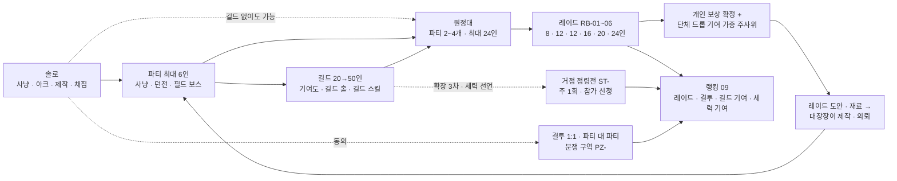

# 08_social_raid — 파티 · 길드 · 원정대 · 레이드 · PvP

## 1. 문서 정보

| 항목 | 내용 |
|---|---|
| 버전 | r1 초안 |
| 작성일 | 2026-10-01 |
| 상태 | 검수 대기(배정: system · roblox-tech · player-market) |
| 목적 | 3-B-4(길드 · 파티 · 레이드), 3-B-10(길드 · 원정대 단위 보스 레이드), 3-C(대장장이의 파티 · 레이드 역할, PvP 도입 판단), 4-정량 '레이드: 길드 · 원정대 보스 5+(권장 인원 · 기믹 3+ · 역할 분담 · 보상 분배 규칙)'을 구현 가능한 수치로 확정한다 |
| 의존 문서 | 00_BRIEF(기준), 01_reference(1장 용어: 세력 · 길드 · 거점 · 부활 지점 · 한정 장비, 5장 #1~#4 · #13 · #23~#28 · #42 · #52 · #58, 6장 IP 금지 목록), 02_concept(4.4 · 4.5 사회 루프, 8.3 과금 한계선, 8.4 PvP 원칙, 11장 MVP, 14장 용어집 #13~#18 · #22 · #34~#43 · #56), 03_world(4.1~4.5 세력 · 관계 행렬 · 거점 · 분쟁 구역, 8장 사냥터 · 인스턴스 7곳, 8.8 필드 보스, 13장 색인), 04_progression(5장 전투 공식 · 몬스터 스탯 · 보스 배율, 6장 병렬 성장원, 7.5 파티 경험치, 7.6 사망 · 부활, 7.7 인스턴스 동기화, 13장 상수), 05_classes_skills(3.1 역할, 3.3 대장장이 전투 겸업, 5.6 중첩 규칙, 9장 DPM, 10.6 서버 판정), 06_items_crafting(3.1 · 3.4 등급 · 드롭 분포, 6.3 무기 개조 속성, 8.4 레이드 도안, 8.6 의뢰, 13장 내구도, 14장 한정 장비), 07_stories_hidden(3.1 아크, 6장 대형 사건 · D-15 검증, 12.4 평판 단계 추정), DECISIONS(D-01 · D-02 · D-05 · D-11 · D-14 · D-15 · D-25 · D-28 · D-31 · D-34 · D-38 · D-39 · D-43 · D-44 · D-49 · D-50 · D-51 · D-52 · D-55 · D-57 · D-59), ASSUMPTIONS(AS-02 · AS-03 · AS-04 · AS-06 · AS-07) |
| 이 문서를 기준으로 삼는 문서 | 09(레이드 · 결투 · 길드 기여 · 세력 기여 랭킹의 원천 데이터), 10(레이드 화폐 · 휘장 상점 가격, 길드 기부 · 세금 · 할인의 골드 흐름), 11(길드 공유 데이터 · 레이드 인스턴스 · 점령전 스케줄 · 채팅 구현), 12(MVP · 확장 단계별 레이드 · 거점 · 분쟁 구역 범위) |
| ID | 이 문서가 새로 부여: 레이드 보스 **RB-01~RB-06**, 거점 **ST-01~ST-06**, 분쟁 구역 **PZ-01~PZ-03**. 지역 · 도시 · 세력 · 아크 · 사건(H- · T- · F- · A- · E- · C-)은 03 13장 · 07 색인, 직업 · 스킬(J- · SK-)은 05, 아이템 · 도안 · 재료(IT- · BP- · MT-)는 06의 것만 쓴다. 가정은 AS-(이 문서에서는 후보 번호 ①~), A-는 아크 전용 |
| 사실 · 추정 표기 | 로블록스 기술 · 정책 사실은 16.3 출처 번호 [R1]~[R10]을 붙인다. 출처 없는 수치는 **설계값**(이 문서의 결정)이며 라이브 지표로 다시 맞춘다(15장 튜닝 파라미터) |
| 검산 | 보스 체력 · 처치 시간 · 내구도 압박 · 길드 성장 · 분배 확률은 스크립트 gen08.py(04 5.1 · 5.3 식, 05 9.2 실효 계수)로 생성 · 검산했다(16.4) |

---

## 2. 사회 시스템 개요

혼자 놀아도 막히지 않고(3-B-5, D-30), 같이 놀면 손해 없이 더 넓은 콘텐츠가 열리는 계단 구조다. 위 계단은 아래 계단의 **필수 조건이 아니다**(길드 없이 원정대 · 레이드 참여 가능, 파티 없이 길드 가입 가능).

| 단계 | 인원 | 진입 조건 | 핵심 보상 | MVP |
|---|---|---|---|---|
| 솔로 | 1 | 없음 | 모든 성장 경로(04 6장) | ✔ |
| 파티 | 2~6 | 없음(레벨 차 무관, 04 7.5 동행 보정) | 함께 사냥 1인당 95~110%(D-38), 던전 효율 정상 | ✔ |
| 길드 | 20~50 | 캐릭터 레벨 10 이상이 창설, 가입은 레벨 무관 | 길드 홀 · 창고 · 작업대, 길드 스킬(편의 · 경험치 +5% 상한), 길드 상점(외형) | ✔(길드 레벨 1~5) |
| 원정대 | 파티 2~4개(최대 24) | 레이드 전용 임시 연합. 길드 · 혼합 · 공개 모집 | 레이드 입장 | ✔ |
| 레이드 | 8~24(권장) | 보스별 최소 레벨만(입장 장비 점수 없음) | 개인 보상 + 단체 드롭 + 원정 훈장 | ✔(RB-01 · RB-02) |
| 결투 · 분쟁 구역 | 1:1 · 2:2~6:6 / 구역 자유 | 양측 동의 / 진입 동의 | 결투 랭킹(09) · 분쟁 휘장(외형) | ✔(PZ-01 · PZ-02) |
| 거점 점령전 | 측당 20 | 세력 선언 길드 + 신청 | 외형 · 칭호 · 거점 운영권(전투 스탯 없음) | 확장 3차 |

---

## 3. 파티

### 3.1 파티 규칙

| 항목 | 규칙 | 근거 |
|---|---|---|
| 인원 | 최대 **6인** | 01 5장 #23, 골격 |
| 구성 | 강제 구성 없음. 역할 태그만 표시 | 3-B-5(필수 직업 없음) |
| 역할 태그 | 탱커 · 딜러 · 치유 · 지원 · 대장장이 5종. 직업별 기본값(아래 3.2)을 쓰고 유저가 바꿀 수 있다. 태그는 파티 찾기 표시 · 레이드 역할 분담 표의 안내용일 뿐 판정에 쓰지 않는다 | 골격 |
| 파티장 | 초대 · 추방 · 위임 · 드롭 방식(아래) · 파티 찾기 등록. 파티장이 30초 이상 접속 끊김이면 자동 위임(파티 합류 순) | — |
| 레벨 차 | 제한 없음. 경험치는 04 7.5 동행 보정 그대로(아래 3.3 인용) | D-05 (5), D-38, D-51 |
| 파티 경험치 | 04 7.5 그대로. 이 문서는 수치를 새로 정하지 않는다 | 골격 '그대로 인용' |
| 드롭 | **개인 드롭**(파티원마다 따로 추첨, 남의 드롭을 볼 수 없음). 파티원 i의 처치당 장비 드롭 확률 = 06 3.4 확률 × P(k) ÷ n (n · k는 04 7.5 정의). 동레벨 6인 함께 사냥(분당 12마리)에서 1인당 분당 드롭 기회 = 12 × 1.9 ÷ 6 = 3.8마리분 ≈ 솔로 4마리분(95%) → 경험치 효율(D-38)과 같은 비율 | 경험치와 드롭을 같은 축으로 묶어 '파티 = 드롭 배수' 착취 방지 |
| 같은 서버 | 파티는 같은 플레이스 서버 안에서만 유지. 파티원이 다른 대륙(다른 플레이스)으로 가면 '원격 파티원'(채팅 · 위치 표시만, 경험치 · 드롭 분배 제외). 파티 텔레포트(파티장이 '모두 이동')는 TeleportAsync 한 번에 묶어 보낸다 [R5] | D-28(대륙 = 플레이스) |
| 던전 인스턴스 | 파티 단위 입장(1~6인 스케일링, 03 8장 · D-29). **주간 보상 횟수 = 던전마다 캐릭터당 주 3회**(계정 합산 9회, D-25) — 클리어 보너스 · 보스 상자 · 희귀 드롭에만 적용, 처치 경험치 · 일반 재료는 무제한(D-39) | 04 6장 · 06 3.4가 08에 위임 |

### 3.2 직업별 기본 역할 태그

| 직업 | 기본 태그 | 바꿀 수 있는 태그(권장) | 근거(05 3.1 · 4장) |
|---|---|---|---|
| J-01 전사 | 탱커 | 딜러 | 굳센 피부 · 도발 / 근접 딜 |
| J-02 궁수 | 딜러 | 지원 | 원거리 단일 딜 |
| J-03 마도사 | 딜러 | 지원 | 광역 딜 · 둔화 |
| J-04 치유사 | 치유 | 지원 | 회복 · 보호막 · 되살림 |
| J-05 그림자술사 | 딜러 | — | 보스 단일 딜 |
| J-06 대장장이 · J-H2 별철 명장 | 대장장이 | 지원 · 딜러 | 현장 수리 · 담금질 · 보강 · 무기 개조 |
| J-H1 서고지기 | 딜러 | 지원 | 잉크 사슬(받는 마법 피해) |
| J-H3 묘역 서기관 | 지원 | 치유 | 묘비 낙인 · 묘역의 안식 |
| J-H4 시련 감독관 | 탱커 | — | 시련 선포 · 감독관의 규율 |
| J-H5 첨탑 마도사 | 딜러 | — | — |
| J-H6 균열 감시자 | 지원 | 딜러 | 등불 화살 표식 · 균열 차단 |

### 3.3 파티 경험치(04 7.5 인용, 수치 변경 없음)

| 항목 | 04 7.5 값 |
|---|---|
| P(k) | 1인 1.0 · 2인 1.4 · 3인 1.6 · 4인 1.7 · 5인 1.8 · 6인 1.9(k = 최근 10초 기여 인원) |
| 분배 | 개인_i = 몬스터 경험치 × P(k) ÷ n × 배율(d_i), n = 60 studs 안 · 60초 안 활동 기여자 |
| 동레벨 함께 사냥 1인당 | 100 / 105.0 / 106.7 / 106.3 / 99.0 / 95.0% |
| 분당 상한 | ③ 1.5 × 기준 × 부스트(캐리 상태는 부스트 없음), ③-2 k ≥ 2 처치 창은 min(③, 기준 × max(1.1, r) × 부스트) |
| 레이드 · 던전 | 레이드 보스 처치 경험치는 7.1 '레이드 클리어 경험치'로 따로 준다(P(k) 미적용) |

### 3.4 파티 찾기(Party Finder)

| 항목 | 규칙 |
|---|---|
| 등록 | 파티장이 '목적 · 지역 · 레벨 폭(표시용) · 역할 빈자리 · 언어 · 한 줄 메모(선택)'를 골라 등록. 메모는 자유 텍스트이므로 TextService 필터를 거친다(11.2) [R2] |
| 목적 7종 | 사냥 · 던전(H- 지정) · 아크(A- 지정) · 히든 피스 단서 · 필드 보스 · 채집 호위 · 레이드 연습 |
| 필터 | 대륙(C-) · 사냥터(H-) · 목적 · 레벨 폭(내 레벨이 포함된 것만 / 전부) · 역할 빈자리 · 언어 |
| 모바일 1탭 참가 | 목록 행 오른쪽 '참가' 버튼 1개(최소 지름 48, 05 11.2). 파티장의 '자동 수락'이 켜져 있으면 즉시 합류, 꺼져 있으면 파티장에게 수락 팝업(10초). 게임패드는 목록에서 A = 참가 |
| 범위 | 같은 대륙 플레이스의 모든 서버. 다른 서버의 파티에 참가하면 그 서버로 이동(TeleportToPlaceInstance)한다. 서버가 가득 차면 '가득 참' 표시 후 목록에서 내린다 |
| 갱신 | 등록 항목 TTL 120초, 파티 서버가 60초마다 갱신(살아 있는 파티만 보이게). 저장소는 11.1 '파티 찾기 색인' |
| 차단 | 내가 차단한 유저가 파티장인 항목은 목록에서 숨긴다(11.1) |

---

## 4. 길드

### 4.1 창설 · 기본 규칙

| 항목 | 규칙 | 근거 |
|---|---|---|
| 창설 조건 | 캐릭터 레벨 10 이상, 골드 5,000(소모처, 10 확정), 어느 도시의 '길드 등록소' NPC | 01 5장 · 02 4.5 '창설 조건은 08' |
| 이름 · 태그 | 이름 2~12자 · 태그 2~4자(영숫자 · 한글). 등록 시 TextService 필터 + 표시 시 브로드캐스트 필터(11.2) [R2]. 레퍼런스 고유명사(01 6장) 금지어 목록과 운영 금칙어도 같이 검사 | 3-C IP, 로블록스 텍스트 필터 의무 |
| 소속 단위 | **캐릭터 단위**(캐릭터마다 다른 길드 가능). 같은 계정의 캐릭터 2개가 같은 길드에 들 수 있으나 길드 기여도 주간 상한은 **계정 합산**(4.4) | D-25 |
| 인원 상한 | 길드 레벨에 따라 20 → 50(4.2) | 골격 |
| 길드 레벨 | 1~10, 길드 경험치(= 길드원 기여도의 합)로 오른다. **MVP는 1~5**(14장) | 골격 |
| 전투 수치 | 길드 레벨 · 길드 스킬은 전투 스탯을 직접 올리지 않는다 | 골격, 3-C |

### 4.2 길드 레벨 표

길드 경험치 = 길드원 기여도(4.4)의 누적 합. 기준 성장 검산(gen08.py): 길드원의 60%가 '활동 길드원'(주 기여 약 660, 상한 700)일 때 중형 길드가 레벨 5까지 약 5주, 레벨 10까지 약 23주. **소형 길드(10명 전원 활동)** 는 레벨 5 약 7주 · 레벨 10 약 56주(약 1년) — 소형 길드도 레벨 5까지는 대형과 비슷한 속도로 닿고, 6 이후의 해금은 인원 · 외형 중심이라 늦어도 콘텐츠가 막히지 않는다.

| 길드 레벨 | 다음 레벨까지 필요 경험치 | 누적 | 인원 상한 | 해금(편의 · 외형만) | 중형 길드 도달(주) | 소형 10인 도달(주) |
|---|---|---|---|---|---|---|
| 1 | 6,000 | 0 | 20 | 길드 홀(기본 방) · 공용 창고 1탭(50칸) · 게시판 · 길드 채팅 · 길드 원정대 개설 | 0 | 0 |
| 2 | 9,000 | 6,000 | 24 | 길드 스킬 포인트 +1 · 길드 작업대 1등급 | 1 | 1 |
| 3 | 13,000 | 15,000 | 28 | 창고 2탭 · 길드 문장 색 3종 | 2 | 3 |
| 4 | 18,000 | 28,000 | 32 | 길드 스킬 포인트 +1 · 길드 계약 1개(주간, 4.6) | 3 | 5 |
| 5 | 27,000 | 46,000 | 36 | 길드 작업대 2등급 · 길드 홀 꾸미기 1단 · 길드 상점 2단 | 5 | 7 |
| 6 | 38,000 | 73,000 | 40 | 창고 3탭 · 길드 스킬 포인트 +1 · 세력 선언(확장 3차, 9.4) | 7 | 12 |
| 7 | 56,000 | 111,000 | 44 | 길드 계약 2개 · 길드 망토 문양 | 9 | 17 |
| 8 | 81,000 | 167,000 | 47 | 길드 작업대 3등급 · 길드 스킬 포인트 +1 | 13 | 26 |
| 9 | 117,000 | 248,000 | 50 | 창고 4탭 · 길드 홀 꾸미기 2단 | 17 | 38 |
| 10 | — | 365,000 | 50 | 길드 스킬 포인트 +1 · 칭호 '<길드명> 기수' · 길드 깃발 외형(점령전 깃발과 공용) | 23 | 56 |

- 길드 작업대 등급은 도시 대장간(06 9장)의 최고 5등급보다 낮게(최대 3) 둔다: 길드 홀은 '모이는 곳'이지 생산 효율의 정답이 되면 안 된다(대장간 도시 방문 동기 유지).
- 인원 상한이 줄어드는 일은 없다(길드 레벨은 내려가지 않는다).

### 4.3 직위 4단계와 권한

| 권한 | 길드장(1) | 간부(최대 5) | 정예(최대 15) | 일반 |
|---|---|---|---|---|
| 초대 | ✔ | ✔ | ✔ | — |
| 추방 | 간부 이하 | 정예 · 일반 | — | — |
| 직위 변경 | 전부 | 정예 ↔ 일반 | — | — |
| 길드장 위임 | ✔ | — | — | — |
| 공지 · 게시판 고정 | ✔ | ✔ | — | — |
| 게시판 글쓰기 | ✔ | ✔ | ✔ | ✔(하루 3건) |
| 창고 넣기 | ✔ | ✔ | ✔ | ✔ |
| 창고 꺼내기(하루) | 무제한 | 30개 | 10개 | 3개 |
| 길드 스킬 배분 | ✔ | — | — | — |
| 길드 원정대 개설(길드 명의) | ✔ | ✔ | ✔ | — |
| 길드 계약 선택 | ✔ | ✔ | — | — |
| 세력 선언 · 점령전 신청(확장 3차) | ✔ | 신청만 | — | — |
| 길드 해체 | ✔ | — | — | — |

- 창고 기록: 넣기 · 꺼내기는 30일 로그(누가 · 무엇 · 언제), 모든 직위가 열람.
- **귀속 장비(신화 1회 거래 후 · 초월 · 한정, 06 3.1 · 14.2)와 레이드 도안은 창고에 넣을 수 없다.**
- 길드장 장기 미접속: 14일 미접속이면 간부 중 '최근 4주 기여도 최고'에게 위임 투표가 열리고 7일 안 길드장 접속이 없으면 자동 위임(간부가 없으면 정예 중 같은 기준).

### 4.4 길드 기여도 원천 · 상한

기여도는 두 가지로 동시에 쌓인다: **길드 경험치**(길드 레벨용, 길드에 남음)와 **개인 기여 포인트**(길드 상점 화폐, 캐릭터에 남음 · 탈퇴해도 유지). 아래 값은 둘에 같은 값으로 들어간다.

| 원천 | 기여도 | 일일 상한 | 주간 상한 | 비고 |
|---|---|---|---|---|
| 일일 계약 1개 완료(07 12.5) | 10 | 30(3개) | — | 07 12.2 '일일 계약 · 길드 기여(08)' |
| 주간 계약 1개 완료 | 40 | — | 120(3개) | 07 12.2 |
| 던전 클리어(주간 보상 횟수 안) | 10 | 20(2회) | — | 소진 후 클리어는 0 |
| 필드 보스 처치(주간 보상 횟수 안) | 10 | 20 | — | 7.9 |
| 레이드 보스 처치(주간 보상 처치) | 60 | — | 보스당 1회 | 연습 모드 · 소진 후 0 |
| 길드원의 제작 · 수리 · 강화 의뢰 수행(06 8.6, 의뢰인이 같은 길드) | 5 | 25(5건) | — | 자기 의뢰 · 같은 계정 의뢰는 0 |
| 골드 기부 | 100골드당 1 | 20(= 2,000골드) | — | 기부 골드는 **소멸**(골드 소모처, 10). 길드 금고로 쌓이지 않는다 |
| 재료 기부(길드 계약 4.6 납품) | 계약 표 | 계약 표 | — | 납품 재료는 소멸 |
| **합계 상한** | — | — | **캐릭터당 주 700 · 계정 합산 주 1,000** | 계정 합산 상한은 D-25 정신(캐릭터를 늘려 길드 성장을 사지 못하게) |

- 검산: 활동 길드원 주 기여 = (일일 계약 30 + 던전 20 + 필드 보스 20) × 6일 + 주간 계약 120 + 레이드 2회 120 = **660**(gen08.py). 골드 기부를 매일 상한까지 하면 +140 → 700 상한에 걸린다. 골드는 상한 때문에 '돈으로 길드 레벨 사기'가 되지 않는다(골격 '골드 기부는 상한').
- 같은 계정 · 같은 길드의 캐릭터 2개는 계정 합산 1,000을 나눠 쓴다.
- 탈퇴 후 72시간 안에 같은 길드에 다시 들어오면 그 주의 기여도는 이어서 계산(상한 우회 방지).

### 4.5 길드 스킬(포인트는 4.2 해금, 최대 5포인트)

| 스킬 | 단계 · 포인트 | 효과(단계별) | 상한 · 비고 |
|---|---|---|---|
| 동행의 등불 (Companion Lantern) | 1~3단 · 각 1포인트 | 길드원 캐릭터 경험치 +2% / +4% / **+5%** | **상한 +5%**(골격). 04 6장 원천 전부에 기본 경험치 기준 합연산으로 붙고, **분당 상한(04 7.5 ③ · ③-2)은 늘리지 않는다**. 캐리 상태 처치에는 적용하지 않는다(D-41과 같은 원리). 직업 경험치 · 숙련도 · 드롭에는 적용 없음. 랭킹 산정 영향 없음(09는 경험치를 쓰지 않는다) |
| 넓은 창고 (Wide Vault) | 1단 · 1포인트 | 공용 창고 탭당 +10칸 | 편의 |
| 길잡이 귀환 (Hall Recall) | 1단 · 1포인트 | 길드 홀 귀환 쿨타임 30분 → 15분 | 이동 편의(연출만, 골드 요금 없음) |
| 모루 공유 (Shared Anvil) | 1단 · 1포인트 | 길드 작업대 사용료 −50% | 사용료(06 9장)만, 제작 결과 · 확률 무관 |
| 원정 깃발 (Expedition Banner) | 1단 · 1포인트 | 공개 원정대 모집 목록 상단 노출 · 길드 원정대 준비 확인 시간 20초 → 40초 | 편의 |

- 포인트 5개로 위 7단계 중 5단계만 고를 수 있다(선택이 생기게). 재배분은 주 1회 무료.
- 경험치 +5% 영향 검산: 04 3.1 90시간 곡선 → 상한에 걸리지 않는 원천 기준 약 85.7시간(−4.8%). 부스트(D-11 +50%)와 함께여도 분당 상한은 그대로라 '부스트 + 길드'로 150%를 넘지 않는다.
- **판매 금지(10에 넘김)**: 길드 스킬 포인트 · 길드 경험치 · 길드 레벨 · 창고 탭을 로벅스로 파는 상품은 없다(D-11).

### 4.6 길드 홀 · 공용 창고 · 길드 작업대 · 게시판 · 길드 계약

| 시설 | 규칙 | 구현 메모(11) |
|---|---|---|
| 길드 홀 | 길드마다 1개의 **인스턴스**(길드 홀 플레이스의 예약 서버, 길드 레벨 1부터). 어느 도시의 '길드 등록소' NPC 또는 메뉴 '길드 홀 귀환'(쿨 30분)으로 입장. 마지막 길드원이 나가고 5분 뒤 닫힘 | 예약 서버 접근 코드를 길드 키에 저장해 재사용 [R5]. 첫 입장 시 생성 |
| 공용 창고 | 탭당 50칸(4.2), 길드 레벨에 따라 1~4탭. 장비 · 재료 · 소모품(귀속 불가 품목 제외) | 창고 키는 길드 핵심 키와 분리(13.1) |
| 길드 작업대 | 길드 레벨 2/5/8에 1/2/3등급(06 9장 작업대 등급 규칙 그대로). 대장장이 계열만 제작(D-50) | — |
| 게시판 | 공지 1 + 글 최대 20(오래된 것부터 삭제). 원정대 일정 글 형식(보스 · 시각 UTC · 역할 빈자리) | 자유 텍스트 필터(11.2) |
| 원정대 집결문 | 길드 홀 안에서 원정대 출발 가능(5.3) | — |
| 길드 계약 | 주 1~2개(4.2), 길드 공동 목표 1개 선택: 예) '길드원 합계 MT-03 은 원석 300 납품' · '던전 클리어 합계 20' · '레이드 처치 합계 3'. 달성 시 참여자 전원 개인 기여 포인트 +50, 길드 경험치 +1,000 | 납품 재료 소멸(재료 순환 10) |
| 길드 상점 | 개인 기여 포인트로 외형 · 길드 홀 장식 · 칭호 구매. 전투 수치 · 재료 · 도안 판매 없음 | 가격 10 |

### 4.7 가입 · 탈퇴 · 추방 · 해체

| 항목 | 규칙 | 이유 |
|---|---|---|
| 가입 | 초대 또는 '가입 신청'(길드 검색 → 신청 → 정예 이상이 수락). 레벨 제한은 길드가 선택(표시용 필터) | — |
| 자발적 탈퇴 | 즉시. 이후 **다른 길드 가입 쿨타임 24시간**, 같은 길드 재가입 72시간 | 기여 · 레이드 기록 돌려막기 방지 |
| 추방 | 직위 권한(4.3). 추방된 쪽 쿨타임 **12시간**(자발 탈퇴보다 짧게: 추방은 본인 귀책이 아닐 수 있음) | — |
| 레이드 · 점령전 중 | 진행 중인 레이드 인스턴스 · 점령전 인스턴스 안에서는 추방 · 탈퇴 처리를 **인스턴스 종료 뒤로 보류** | 분배 · 결과 중간 조작 방지 |
| 탈퇴 시 남는 것 | 개인 기여 포인트 · 구매한 외형 · 칭호 유지. 창고에 넣은 물품은 길드 소유(되돌려 받지 않음) | — |
| 해체 | 길드장만. **72시간 유예**(취소 가능, 전원 알림). 조건: 거점 보유 중 · 점령전 신청 중이면 불가. 해체 시 창고 물품은 **넣은 사람의 우편함**으로 반환(넣은 사람 캐릭터가 없으면 길드장), 길드 자금(9.4 세금)은 소멸. 길드명은 30일 뒤 해제 | 개인 자산 보존(01 5장 #4 '망명 · 재건') |
| 망명 허가 | 해체된 길드의 길드원은 해체 후 7일 동안 가입 쿨타임 없이 다른 길드에 들어갈 수 있다 | 01 5장 #4 |
| 자동 휴면 | 전원 90일 미접속이면 '휴면'(목록 비노출), 180일이면 해체 처리(위 해체 규칙) | 데이터 정리(13.1) |

### 4.8 서버 간 공유 데이터 요구(11에서 구현)

| 데이터 | 항목 | 일관성 요구 | 갱신 빈도 요구 | 크기 추정 |
|---|---|---|---|---|
| 길드 핵심 | 길드 ID · 이름 · 태그 · 레벨 · 길드 경험치 · 스킬 배분 · 길드장 · 세력 선언(확장) · 홀 접근 코드 · 생성일 | 강한 일관성(가입 · 탈퇴 · 직위 · 해체는 원자적) | 사건 발생 시 즉시(분당 수 회 미만) | 약 1KB |
| 멤버 목록 | 최대 50 × {userId, charId, 직위, 이번 주 기여, 누적 기여, 가입일, 마지막 접속} | 강한 일관성(정원 초과 금지) | 가입 · 탈퇴 · 직위 즉시, 기여 · 접속은 배치(아래) | 약 5KB |
| 기여 누적 | 길드 경험치 증가분 · 멤버별 주간 기여 | 최종 일관성 허용(수 분 지연 가능), 이중 집계 금지 | 서버별 메모리 누적 → 60초마다 공유 카운터에 원자 증가 → 5분마다 1개 서버가 영구 저장소로 반영 | — |
| 접속 상태 | 멤버별 온라인 · 위치(대륙 · 인스턴스 종류) | 최종 일관성 | 60초 갱신, TTL 120초 | 멤버당 약 60B |
| 창고 | 탭 × 50칸 + 30일 로그 | 강한 일관성(같은 칸 동시 꺼내기 방지) | 넣기 · 꺼내기 시 즉시 | 약 30KB(4탭 + 로그) |
| 게시판 | 공지 + 글 20 | 최종 일관성 | 작성 시 | 약 8KB |
| 길드 채팅 | 실시간 메시지(보관 없음, 최근 50개만 홀 · 접속 시 표시) | 최선 노력 전달(유실 허용) | 실시간 | 메시지당 ≤ 1KB [R3] |

- 원칙: **핵심 · 멤버(작고 드물게 바뀜)** 와 **기여 · 접속(자주 바뀜)** 을 같은 저장 키에 두지 않는다. 데이터 스토어는 같은 키 쓰기량이 유니버스 전체에서 분당 4MB로 제한되므로[R4], 수십 개 서버가 큰 길드 키를 매분 다시 쓰는 구조는 금지한다(13.1에서 계산).

---

## 5. 원정대(Expedition)

### 5.1 구성

| 항목 | 규칙 | 근거 |
|---|---|---|
| 정의 | **레이드 전용 임시 연합** = 파티 2~4개(최대 24인). 레이드 인스턴스가 닫히면 해산 | 골격, 01 5장 #26 |
| 최소 인원 | 없음(권장 인원만 표시). 인원이 적어도 보스 수치를 자동으로 낮추지 않는다(도전 허용) | 01 2.2.3 '원정대 최소 인원 제한' 변형 |
| 종류 | ① **길드 원정대**: 개설자가 길드 명의로 개설, 길드원 우선(빈자리를 공개 모집으로 열 수 있음) ② **공개 원정대**: 누구나 개설 · 참가. 길드 없는 유저도 참여 | 골격 |
| 혼합 | 길드 원정대가 빈자리를 공개로 열면 '혼합'. 처치 기록은 길드원이 과반이면 길드 기록, 아니면 공개 기록 | 09 레이드 랭킹 |
| 파티 배정 | 원정대장이 끌어다 놓기(PC) · 탭 두 번(모바일: 이름 탭 → 파티 탭) · 패드(A로 집기 → D-pad 이동 → A 놓기) | 3-C 입력 동등 |

### 5.2 권한

| 권한 | 원정대장 | 파티장 | 일반 |
|---|---|---|---|
| 모집 게시 · 마감 | ✔ | — | — |
| 파티 배정 · 파티장 지정 | ✔ | 자기 파티 안 순서 | — |
| 추방 | 전투 전 · 전멸 후 재시작 대기 중에만 | 자기 파티원(같은 조건) | — |
| 분배 방식(자동 / 자유 분배) | **입장 전**에만 변경(8.3) | — | 입장 시 확인 표시 |
| 연습 모드 지정 | 입장 전 | — | — |
| 전투 시작 카운트다운 · 월드 표식 4종(원 · 삼각 · 사각 · 별) | ✔ | ✔(표식만) | — |
| 준비 확인 | ✔ | 자기 파티 | 응답 |
| 원정대장 위임 | ✔ | — | — |

- 처치 순간부터 분배가 끝날 때(최대 10분)까지 **추방 · 원정대장 변경 · 분배 방식 변경 금지**. 분배 자격은 처치 순간 스냅숏으로 정한다(8.2).
- 원정대장이 끊기면 60초 뒤 파티장 중 합류 순으로 자동 위임.

### 5.3 모집 · 출발

| 단계 | 규칙 |
|---|---|
| 모집 게시판 | 모든 도시의 '원정 게시판' NPC · 길드 홀 · 메뉴. 항목 = 보스(RB-) · 시작 시각(UTC + 내 지역 시각 표시) · 최소 레벨(보스 최소 이상) · 역할 빈자리 표시(예: 탱커 2 · 치유 3 · 대장장이 2 · 딜러 5, **표시만, 강제 없음**) · 언어 · 연습 여부 · 분배 방식 |
| 모바일 1탭 참가 | 파티 찾기와 같은 '참가' 버튼. 역할 빈자리가 찬 태그로 신청하면 '그래도 신청' 1회 확인 |
| 출발 | 원정대원이 어느 도시 · 길드 홀에 있든 원정대장이 '출발' → 준비 확인 20초(원정 깃발 스킬 40초) → 응답한 인원을 레이드 플레이스의 **새 예약 서버**로 한 번에 텔레포트(최대 24 ≤ 1회 50명, 02 12장 [P-3-06]) [R5] |
| 늦은 합류 | 첫 전투 시작 전 · 전멸 후 재시작 대기 중에는 원정대원이 '합류'로 같은 인스턴스에 들어올 수 있다(접근 코드 공유, 13.2) |
| 공개 원정대 이탈 제재 | 공개 원정대에서 **전투 중 자발적 이탈**을 7일 안 3회 하면 공개 원정대 신청 30분 제한(길드 원정대는 제재 없음). 접속 끊김은 이탈로 세지 않는다(7.5) |

---
