# 베이라: 갈림길의 대륙 — 기획서 전체 묶음

생성: 2026-10-02 · 브랜치 ccr-6327a4a9-gw3zyq

> 10_economy·11_roblox_tech·12_mvp_roadmap·99_summary는 아직 작성되지 않았다. 07~09는 검수 미통과 초안이다.

## 목차

| # | 파일 | 상태 |
|---|---|---|
| 1 | 00_BRIEF.md | 기준 문서 |
| 2 | 01_reference.md | 통과(3라운드) |
| 3 | 02_concept.md | 통과(3라운드) |
| 4 | 03_world.md | 통과(3라운드) |
| 5 | 04_progression.md | 통과(5라운드) |
| 6 | 05_classes_skills.md | 통과(5라운드) |
| 7 | 06_items_crafting.md | 통과(3라운드) |
| 8 | 07_stories_hidden.md | 미완성 — r1 FAIL 후 r2 수정 도중 중단 |
| 9 | 08_social_raid.md | 미완성 — 초안, r1 검수 도중 중단 |
| 10 | 09_ranking.md | 미완성 — 초안, r1 검수 도중 중단 |
| 11 | PROGRESS.md | 진행 기록 |
| 12 | DECISIONS.md | 설계 결정·이슈 대응 |
| 13 | ASSUMPTIONS.md | 가정 |
| 14 | OPEN_ISSUES.md | 미해결 이슈 |
| 15 | BACKLOG.md | 경미 이슈 이관 |
| 16 | 부록: 검수 리뷰 61건 | design/reviews/ |


---

# 〔00_BRIEF.md〕 — 기준 문서

# 00_BRIEF — 프로젝트 기준 문서 (사용자 프롬프트 전문)

> 이 파일은 사용자가 준 프롬프트 전문이다. 모든 에이전트(메인·검수자)의 기준 문서이며, 검수 이슈의 근거 조항은 이 파일의 섹션 번호(예: 3-B-5, 3-C, 4-정량)로 인용한다.

---

너는 이 프로젝트의 메인 기획자이자 오케스트레이터다. 아래 4개 섹션(목표 / 현상황 / 조건 / 완료기준)을 모두 지켜서 작업한다.

# 1. 목표
- 상업 출시를 전제로 한 로블록스 오픈월드 판타지 RPG의 상세 기획서 세트를 완성한다.
- 완성 수준: 개발자가 이 문서만 보고 추가 질문 없이 구현에 착수할 수 있을 것.
- 핵심 콘셉트: 정해진 메인 스토리 없이 각양각색의 이야기가 서로 맞물리는 넓은 세계. 유저가 시작 위치를 고르고, 어디서 무엇을 할지 스스로 정한다.
- 이번 단계는 기획만 한다. 코드 작성과 로블록스 스튜디오 작업은 하지 않는다.

# 2. 현상황
- 아이디어와 요구사항만 있다. 기획 문서·코드·에셋은 전혀 없다(빈 폴더에서 시작).
- 개발 인원·일정·예산은 미정이다. 1인~소규모 팀도 단계적으로 만들 수 있게 'MVP → 확장' 구조로 설계한다.
- 플랫폼은 로블록스(Luau)다. PC·모바일·콘솔을 동시에 지원해야 하고 모바일 유저 비중이 높다.
- 레퍼런스 3개 (무엇을 가져올지는 01번 문서에서 분석):
  - 악어(늪지대)의 마인크래프트 콘텐츠 「마크에이지」: 여러 국가·세력의 경쟁과 전쟁, 스탯과 키 입력 스킬, 맵 곳곳 유적에 숨겨진 특수 무기, 세상에 몇 개 없는 전설급 무기
  - 메이플스토리: 직업별 스킬을 단축키로 쓰는 액션 전투, 파티·보스 레이드, 장비 강화 문화
  - 웹소설 「템빨」 속 가상현실 게임 '새티스파이': 여러 대륙·국가·도시, 히든 피스와 히든 직업, 생산 직업(대장장이)이 핵심이 되는 구조, 강화, 분야별 랭킹
  - 레퍼런스에서 모르는 부분은 추측하지 말고 웹 검색으로 확인한다. 확인이 안 되면 '확인 필요'로 표시하고 이 문서의 요구사항 문장을 기준으로 삼는다.

# 3. 조건

## 3-A. 작업 방식: 메인 기획 + 서브 검수 피드백 루프

[준비 — 가장 먼저 할 것]
1. 이 프롬프트 전문을 design/00_BRIEF.md로 저장한다. 모든 에이전트의 기준 문서다.
2. CLAUDE.md에 작업 규칙 요약과 핵심 파일 경로를 적는다. 세션이 끊기거나 컨텍스트가 압축되면 PROGRESS.md부터 읽고 이어서 한다.
3. design/PROGRESS.md를 만들고 단계·문서·라운드·판정을 매 라운드 갱신한다.
4. .claude/agents/에 검수 서브에이전트 4개를 만든다.
   - 공통 설정: model은 claude-opus-5-5, tools는 Read, Grep, Glob, Write, WebSearch, WebFetch. 검수자를 호출할 때도 model을 claude-opus-5-5로 지정한다.
   - 공통 규칙: 기획 문서를 직접 고치지 않는다. 결과는 design/reviews/에만 쓴다. 다른 검수자의 리뷰는 읽지 않는다(자기 이전 라운드 리뷰는 참고 가능). 메인에게는 판정·이슈 개수·리뷰 파일 경로만 짧게 돌려준다.
   - system-reviewer (시스템·밸런스): 성장 곡선, 스탯과 수치, 경제·인플레이션, 강화 기대값, 수직 구조가 다시 생기지 않았는지
   - lore-reviewer (세계관·서사·IP): 이야기 간 연결, 설정 모순, 고유명사 일관성, 레퍼런스 작품과의 유사성
   - roblox-tech-reviewer (구현 가능성): 서버당 인원, 플레이스 분할과 텔레포트, 서버 간 공유 데이터(길드·랭킹·월드 상태), 데이터 저장 한도, 성능, 모바일·패드 입력. 불확실한 제약은 로블록스 공식 문서(create.roblox.com/docs)로 확인하고 출처를 적는다.
   - player-market-reviewer (플레이어 경험·상업성): 첫 10분 경험, 리텐션, 모바일 유저 관점, 과금 구조와 P2W 경계, 로블록스 정책(연령 등급·과금 규정), 웹 검색으로 확인한 로블록스 인기 RPG들과의 차별점

[루프 규칙]
1. 메인이 문서 하나를 쓰거나 고친다. 검수 요청 전에 해당 완료기준을 스스로 체크한다.
2. 문서 성격에 맞는 검수자 2~3명을 병렬로 호출한다. 02번 콘셉트 문서와 3단계 통합 검수는 4명 전원이다.
3. 리뷰 파일(design/reviews/문서번호_r라운드_검수자.md)에는 반드시 다음을 쓴다.
   - 판정: PASS 또는 FAIL
   - 이슈마다 등급(치명/중대/경미), 위치, 위반한 00_BRIEF.md 조항, 수정 제안
   - 칭찬과 요약은 쓰지 않는다.
   - 00_BRIEF.md 조항을 근거로 댈 수 없는 취향성 지적은 '경미'까지만 줄 수 있다.
4. 메인은 치명·중대 이슈마다 '수용(수정)' 또는 '반박(근거 제시)'을 정하고 design/DECISIONS.md에 기록한다. 무조건 수용하지 않는다.
5. 수정본을 같은 검수자에게 다시 보낸다. 검수자는 이전 이슈 해결 여부, 반박 근거의 타당성, 새 이슈를 판정한다.
6. 통과 기준: 배정된 검수자 전원 PASS(치명 0, 중대 0). 경미 이슈는 design/BACKLOG.md로 넘긴다.
7. 문서당 최대 5라운드. 그래도 통과하지 못하면 남은 이슈를 design/OPEN_ISSUES.md에 정리하고 다음 문서로 넘어간다.
8. 같은 이슈가 수정과 되돌림을 2번 이상 반복하면 '사용자 결정 필요'로 OPEN_ISSUES.md에 넣고 넘어간다.
9. 작업 중에 사용자에게 질문하지 않는다. 불확실한 것은 합리적으로 가정하고 design/ASSUMPTIONS.md에 기록한다(그 가정에 영향받는 문서 목록 포함).

[진행 순서]
- 1단계 뼈대
  - 01_reference.md: 레퍼런스별로 가져올 것 / 바꿔서 쓸 것 / 가져오면 안 되는 것
  - 02_concept.md: 한 줄 소개, 핵심 재미 3가지, 코어 루프, 타깃 유저와 세션 길이 가정, 차별점, 전체 문서 목차
- 2단계 상세 (의존 순서대로)
  - 03_world.md: 대륙·국가·도시·종족·세력 관계·역사
  - 04_progression.md: 레벨·스탯·지역 난이도·비수직 구조 설계
  - 05_classes_skills.md: 기본·히든 직업, 스킬 체계, 입력 매핑
  - 06_items_crafting.md: 장비 등급, 대장장이 제작, 강화
  - 07_stories_hidden.md: 이야기 연결 구조, 퀘스트, 히든 피스
  - 08_social_raid.md: 파티·길드·원정대·레이드
  - 09_ranking.md: 분야별 랭킹
  - 10_economy.md: 화폐, 거래, 재료 순환, 골드 소모처, 과금 상품
  - 11_roblox_tech.md: 플레이스 구조, 데이터 구조, 서버 간 동기화, 레이드 인스턴스
  - 12_mvp_roadmap.md: 첫 출시 범위와 업데이트 순서
- 3단계 통합 검수: 4명 전원이 전체 문서를 검수한다. 문서 간 교차 참조(한 문서에서 언급한 아이템·지역·NPC·스킬이 해당 문서에 실제로 있는지)와 완료기준 전체를 확인한다. 최대 3라운드.
- 4단계: design/99_summary.md를 쓰고 최종 보고한다.

## 3-B. 게임 필수 요구사항 (하나라도 빠지면 실패)
1. 장르·플랫폼: 상업용 로블록스 판타지 RPG
2. 정해진 메인 스토리·메인 퀘스트 라인이 없다. 지역마다 다양한 이야기가 있고, 그 이야기들이 서로 연결되고 맞물린다.
3. 게임을 시작할 때 유저가 시작 위치를 고른다.
4. 필수 요소: 종족, 직업, 길드, 파티, 레이드
5. 수직 구조 지양: '1~10레벨은 사냥터1, 그다음은 사냥터2' 같은 강제 루트 금지. 같은 성장 구간에도 여러 선택지가 있어야 한다.
6. 세계: 여러 대륙과 다양한 국가·도시·사냥터·종족
7. 히든 피스: 숨은 지역·퀘스트·NPC·아이템·직업·스킬 등 다양한 종류를 세계 곳곳에 배치
8. 직업: 대장장이와 궁수 필수, 히든 직업 포함
9. 스킬 조작: Shift = 대시. Q·E·Z·X 등 = 무기 스킬 / 직업 스킬 / 특수 퀘스트·히든 피스로 배우는 스킬
10. 레이드: 길드·원정대 단위 보스 레이드
11. 장비 등급: 일반 < 희귀 < 영웅 < 전설 < 신화 < 초월 (6단계)
12. 대장장이 제작: 도안 획득 → 재료 투입 → 미니게임 → 완성. 레벨·스탯 제한이 걸린다(장비 착용 조건은 필수, 도안 제작 조건에도 걸지는 메인이 결정). 완성품의 등급과 스펙은 미니게임 결과 + 대장장이 숙련도 + 스킬로 결정된다.
13. 무기 강화: 템빨식. 템빨 속 강화 방식을 01번 문서에서 분석해 반영하고, 확인이 안 되면 '단계가 오를수록 위험과 기대감이 함께 커지는 확률형 강화'를 기준으로 한다.
14. 랭킹: 분야별로 나뉜 랭킹

## 3-C. 설계 원칙·주의사항
- IP: 레퍼런스는 구조와 재미 요소만 참고한다. 고유명사·캐릭터·스토리·대사·아트·특유의 설정은 가져오지 않는다. 모든 이름은 오리지널로 짓는다.
- 비수직 구조가 실제로 작동하는 방식을 구체적으로 설계하고, 신규 유저가 고레벨 지역에 들어가면 무슨 일이 생기는지까지 적는다. (레벨 동기화, 지역별 성장 경로 병렬화, 위험도 표시 등은 예시일 뿐이다)
- 대장장이가 생산 전용인지 전투 겸업인지 정하고, 파티·레이드에서의 역할을 정의한다.
- 국가 간 전쟁이나 PvP를 넣을지는 메인이 판단하고 근거를 DECISIONS.md에 남긴다.
- 조작은 PC 키 배치가 기준이지만, 모든 대시·스킬·미니게임은 모바일 터치와 게임패드로도 플레이할 수 있어야 한다.
- Shift는 로블록스 기본 기능인 시프트 락(Shift Lock)과 충돌할 수 있다. 해결 방식을 명시한다.
- 대장장이 미니게임은 모바일에서도 공정해야 하고(화면 크기·입력 지연), 매크로·오토클릭 대책을 포함한다.
- 과금: 돈으로 스탯이나 등급을 직접 사는 구조의 한계선을 정의한다. 유료 확률형 상품이 있으면 로블록스 정책(확률 공개 등)과 관련 규제 검토 항목을 적는다.
- 모든 문서는 한국어로 쓴다. 수치는 표로 정리한다. 아이템·스킬·몬스터·지역처럼 반복되는 데이터는 구현에 바로 옮길 수 있는 표 형식으로 쓴다.
- 사실과 추정을 구분한다. 로블록스 기술 제약 같은 사실에는 출처를 적는다.

# 4. 완료기준
아래를 전부 만족해야 완료다. 숫자는 최소치이며 넘어도 된다.

[산출물 — design/ 폴더]
- 00_BRIEF.md, 01~12번 문서, 99_summary.md
- PROGRESS.md, DECISIONS.md, ASSUMPTIONS.md, BACKLOG.md, OPEN_ISSUES.md, reviews/

[정량 기준]
- 세계: 대륙 4+, 국가 8+, 도시·마을 20+, 사냥터·던전 30+, 종족 6+(플레이어블 여부 표시)
- 시작 위치 6+, 3개 이상의 대륙에 분산
- 비수직 검증표: 레벨 10 단위의 모든 구간에서 성장 가능한 사냥터가 3곳 이상이고 2개 이상의 대륙에 걸쳐 있을 것. 반드시 거쳐야 하는 사냥터 0곳
- 직업: 기본 6+(대장장이·궁수 포함), 히든 5+(해금 조건과 발견 경로 명시)
- 스킬: 직업당 6+, 무기군별 무기 스킬, 퀘스트·히든 피스 전용 스킬 10+. 모든 스킬에 키 슬롯·쿨타임·소모 자원·효과 수치 명시
- 입력 매핑표: PC / 모바일 / 게임패드 3종 모두
- 이야기: 지역 이야기(아크) 20+. 모든 아크가 다른 아크 2개 이상과 연결되고 고립된 아크 0개. 여러 대륙을 가로지르는 대형 연결 사건 3+. 모든 시작 위치에서 3개 이상의 아크에 자연스럽게 닿을 수 있을 것. 연결 구조는 표와 Mermaid 그래프로 제시
- 히든 피스 30+(발견 단서·조건·보상·연결 아크 명시, 종류 다양화)
- 장비 등급 6단계 전부: 스탯 범위, 옵션 수, 획득 경로
- 대장장이: 도안 획득 경로, 재료 체계, 미니게임 사양(조작·판정·난이도·모바일 대응), 결과 결정 공식(수식)과 예시 계산 3건, 레벨·스탯 제한 규칙
- 강화: 단계별 성공 확률, 실패 시 결과(유지·하락·파괴)와 그 확률, 비용, 기대 시도 횟수 표, 보호 장치
- 레이드: 길드·원정대 보스 5+(권장 인원, 기믹 3+, 역할 분담, 보상 분배 규칙)
- 랭킹: 5개 분야 이상(산정식, 갱신 주기, 보상, 어뷰징 방지)
- 기술: 플레이스 구조도, 데이터 저장 구조, 서버 간 공유 데이터 처리 방식, 레이드 인스턴스 방식
- 과금: 상품 목록과 P2W 한계선
- MVP: 첫 출시 범위(대륙·직업·레이드 수)와 이후 업데이트 순서
- IP: 레퍼런스의 고유명사·설정 재사용 0건(lore-reviewer 확인)

[루프 종료]
- 3단계 통합 검수에서 4명 전원 PASS(치명 0, 중대 0)면 종료한다.
- 라운드 상한에 걸리면 OPEN_ISSUES.md를 정리하고 종료한다.

[최종 보고 — 채팅으로 짧게]
- 게임 한 줄 소개와 핵심 재미 3가지
- 문서 목록과 문서별 통과 라운드 수
- 사용자가 결정해야 할 항목(OPEN_ISSUES와 중요한 가정)
- 다음 단계 제안(구현 착수 순서)


---

# 〔01_reference.md〕 — 통과(3라운드)

# 01_reference — 레퍼런스 분석: 가져올 것 / 바꿔서 쓸 것 / 가져오면 안 되는 것

## 1. 문서 정보

| 항목 | 내용 |
|---|---|
| 버전 | r3 |
| 작성일 | 2026-09-30 |
| 상태 | 검수 중 |
| 목적 | 00_BRIEF.md 2-현상황의 레퍼런스 3종(마크에이지 · 메이플스토리 · 템빨 속 새티스파이)에서 **가져올 것 / 바꿔서 쓸 것 / 가져오면 안 되는 것**을 확정하고, 02~12번 문서가 참조할 '레퍼런스 → 우리 설계' 매핑(5장)과 IP 금지어 체크리스트(6장)를 만든다. |
| 범위 | 이 문서에서만 레퍼런스 고유명사를 '분석 대상'으로 언급한다. **02~12번 문서와 99_summary.md에는 레퍼런스 고유명사가 등장하지 않는다**(3-C, 4-정량 'IP 재사용 0건'). 02번 이후에서 레퍼런스를 가리킬 때는 "01번 5장 매핑 #번호"로 인용한다. |
| 사실 표기 규칙 | **확인됨** = 8장 출처 원문(또는 검색 엔진이 원문을 인용한 스니펫)에서 직접 확인. **확인 필요** = 검색으로 확인 못 함 → 00_BRIEF.md의 요구사항 문장을 대신 기준으로 삼고 7장에 적는다(2-현상황 "확인이 안 되면 '확인 필요'로 표시하고 이 문서의 요구사항 문장을 기준으로 삼는다"). |
| 판단 전제 | (1) 로블록스 · 모바일 유저 비중 높음(2-현상황) (2) 1인~소규모 팀, MVP → 확장(2-현상황) (3) 비수직 구조(3-B-5, 3-C) (4) P2W 한계선 · 확률 공개(3-C) (5) 연령 등급(ASSUMPTIONS AS-02: 경미 수준) (6) 유료 확률형 상품 없음(ASSUMPTIONS AS-06). '바꿔서 쓸 것'의 부적합 이유 칸에는 이 6개 전제 번호를 `[전제 (n)]`으로 표기하고, 전제가 아닌 00_BRIEF 조항 · 결정(D-)이 이유인 경우 그 번호를 대신 적는다. |
| 조사 원본 | 서브에이전트 조사 파일 3개(마크에이지 · 메이플스토리 · 템빨, 2026-09-30). 이 문서는 조사 파일에 '확인됨'으로 표시된 사실만 쓴다. 출처 번호는 8장 기준(M = 마크에이지, K = 메이플스토리, T = 템빨). |
| 채택 방식 표기 | **그대로** = 구조를 그대로 채택(이름은 오리지널) / **변형** = 구조를 바꿔 채택 / **금지** = 채택하지 않음 |
| 영향 문서 | 02(콘셉트) 03(세계) 04(성장) 05(직업·스킬) 06(아이템·제작·강화) 07(이야기·히든) 08(파티·길드·레이드) 09(랭킹) 10(경제·과금) 11(기술) 12(MVP) |
| 용어 정의(세력 · 길드 · 거점) | **세력(F-)** = 플레이어가 평판으로 소속을 고르는 NPC 조직(국가 · 교단 · 상단 등). 해체되지 않는다. **길드** = 플레이어 조직. **점령전 주체** = 세력 소속을 선언한 길드. **점령 대상** = 점령전 전용 '거점'(요새 · 유적 등)이며 도시(T-) · 시작 위치(SP-) · 국가 수도는 점령 대상에서 제외한다. **거점의 존재 형태** = 필드 맵 위의 고정 장소(03 지도에 배치). 평시에는 외곽(상인 · 채집 · 이야기 NPC)만 개방하고 핵 구역은 봉쇄한다. 점령전 시간에는 해당 거점을 복제한 예약 서버 인스턴스에서 전투한다(구현 11). **부활 지점 ≠ 거점**: 사망 시 부활은 도시 · 마을 · 야영지의 '부활 지점'에서 하며 거점은 부활 지점이 아니다. D-01(시즌제 · 참가 신청제 점령전)과 정합. 02~12번은 이 정의를 그대로 쓴다 |
| 설계 명칭 확정(r2) | **각성 홈(Awakening Socket)** = 직업 · 장비의 잠긴 칸을 히든 피스 발견으로 여는 구조(원작의 '봉인 슬롯 · 봉인된 능력' 명칭 · 정의 미사용). **한정 장비(Limited Gear)** = 세계 전체(유니버스, 전 서버 공유 데이터) 수량 N개로 관리되는 장비. 등급이 아닌 '소유 상태 표시'. **선착형 히든 피스** = 유니버스 단위 최초 1인 · 1길드만 얻는 히든 피스. '유일 장비' · '서버 유일' · '유일형' 명칭은 쓰지 않는다(6.4) |

## 2. 레퍼런스별 분석

### 2.1 마크에이지 (악어 · 늪지대의 마인크래프트 서버 콘텐츠)

#### 2.1.1 확인된 사실 요약

| 항목 | 내용 | 확인 상태 | 출처 |
|---|---|---|---|
| 형태 | 크루 멤버 8~10명이 각자 국가(시즌4 이후 길드)의 왕/길드장, 시청자가 시민. 주 1회 '회차' 생방송, 시즌 1(2012 추정)~리턴즈3(2026) | 확인됨 | M2, M12, M14 |
| 국가 = 코어 오브젝트 | 시즌3부터 국가는 '신호기' 설치로 성립. 전쟁 시간에 상대 신호기를 파괴하면 멸망. 지역마다 신호기 1개 | 확인됨 | M4, M13, M14 |
| 회차 리듬 | 회차마다 평화시간(생산·거래·경매·이벤트)과 전쟁시간 분리 | 확인됨 | M12, M13 |
| 멸망 처리 | 멸망국 왕은 승리국의 부왕으로 흡수, 시민·특수무기·자원 양도. 신호기를 다시 세워 '부활'한 사례 있음 | 확인됨 | M4, M10, M13 |
| 시즌4 길드 전쟁 규칙 | 월드 27개 구역, 길드 레벨 3 이상만 전쟁 선포, 하루 3회, 준비 10분 + 전쟁 20분, 영토 0개면 멸망, 공성 불가능 구조물 금지 | 확인됨 | M18 |
| 4R 공성전 | 성벽 3개를 순차 파괴해야 코어 접근. 전쟁시간 외 타 길드 성 진입 불가 | 확인됨 | M2, M14, M18 |
| 권리 아이템 | 약탈권 · 전쟁 선포권 · 동맹권 · 영토 점령권 · 땅 부활권 · 현상금이 화폐로 거래되는 '권리' | 확인됨 | M5, M13 |
| 외교 | 연합 · 이중스파이 · 부왕 잠입 후 배신 · 동맹 직후 뒤통수가 매 회차의 핵심 재미 | 확인됨 | M12, M13 |
| 스탯 4종 | 힘 · 민첩 · 손재주 · 집중. 레벨업당 4포인트, 최대 50레벨 = 200포인트 | 확인됨 | M2, M14, M16 |
| 스탯 임계 패시브 | 스탯 100 달성 시 패시브 부여. 특수 스킬은 최고 레벨 + 해당 스탯 최대치 후 화폐 소모로 습득. 스탯 초기화해도 배운 스킬은 유지 | 확인됨 | M16, M17 |
| 스탯 편중 | 손재주만 방어력에 관여, 집중은 투사체 전용 | 확인됨 | M17 |
| 키 입력 스킬 | 명령어를 키에 바인딩하는 '키바인드' 방식. 무기 스킬은 우클릭 / 쉬프트 2번 / 쉬프트+좌클릭 / 쉬프트+우클릭 4슬롯 | 확인됨 | M5, M9 |
| 직업 | 시즌3~4는 직업 없음(스탯 빌드로 차별화). 4R에서 '특수 직업 대장장이'(강화·커스텀·명작 제작) 첫 도입 | 확인됨 | M2, M4, M7, M14 |
| 히든 스킬 | 히든 액티브 34종 · 패시브 14종(3R3), 멤버 전용 히든 패시브(4R) | 확인됨 | M7, M9, M14 |
| 유적 | 시즌4 유적 약 70개. 돈·경험치·무기·책 획득. **유적 보상은 전원 획득 가능(선점 독점 아님)** | 확인됨 | M19 |
| 힌트 수집 | 전설 무기마다 힌트 4개(총 16개), 힌트를 화폐로 구매. 신전에서 재료 30개로 획득 | 확인됨 | M5 |
| 장인 명작 | NPC 대장장이의 명작 10종(무기 6 + 방어구 4). 4R: 재료를 모아오면 제작해 주거나 회차마다 하나씩 맵에 히든피스로 배치 | 확인됨 | M5, M7, M14 |
| 전설급 무기 | 최상위 무기 4종은 **종당 1개만 존재**. 하위 특수무기 4개(조합법 고정)로 조합. 다른 국가가 먼저 만들면 그 국가를 멸망시켜 빼앗는 것 외에 획득 방법 없음 | 확인됨 | M3, M9, M10, M16 |
| 특수 무기 규칙 | 내구도 무한, 왕/부왕 전용, 귀속(사망 시 드롭 없음), 국왕 합의 시 양도, 멸망 시 승리국에 양도 | 확인됨 | M3, M10 |
| 시즌4 최상위 무기 조건 | 요구 레벨 50(각성 70) + 요구 스탯. 기본 공격력 300~550 → 각성 4000 | 확인됨 | M5 |
| 밸런스 문제 | 최상위 무기 '한방'으로 전멸, 최상위 무기 미보유국은 사실상 전쟁 승리 불가. 시즌4 "밸런스 최악" 평가 | 확인됨 | M2, M12, M13 |
| 강화 | 시즌4: 강화서를 화폐로 구매, 저주받은 강화(최대 30회, 공+200/흡혈-50 패널티), 어둠의 강화(스탯 -1 → 공+25), 10강 시 각성. 4R: 대장장이 강화, 토템으로 확률 +0.5%씩 | 확인됨 | M5, M7, M8, M20 |
| 경매 · 현상금 | 회차당 1회 경매(물품 5개, 왕·부왕(개척자)만 입찰), 낙찰 드라마(1원 낙찰, 1억 낙찰), 현상금 | 확인됨 | M12, M13, M21 |
| 생산 경제 | 4R: 낚시·채집·농사·벌목으로 돈, 채집 도구 3단계. 5: 낚시·광질 노가다 과다로 비판 | 확인됨 | M2, M7, M18 |
| 시즌5 실패 요인 | 인력 10명 미만 · 제작 1년 미완성 · 굵직한 것만 완성되고 중간 과정 없음 · 성장 재화 과다 지급 · 세공 밸런스 파탄 → "최악의 콘텐츠" | 확인됨 | M2, M14 |

#### 2.1.2 가져올 것

| 요소 | 왜 재미있는가 | 우리 게임에서의 형태 | 반영 문서 |
|---|---|---|---|
| 코어 오브젝트 = 점령전 거점 | 승패 조건이 오브젝트 하나로 명확해 방어 건축·기습·시간 압박이 한 점에 수렴 | 점령전 전용 거점(요새·유적, 도시·시작 위치·수도 제외)마다 '거점 핵' 1개. 주체는 세력 소속을 선언한 길드. 점령전은 준비 시간 + 전투 시간 분리, 핵 파괴 = 점령 (D-01 시즌제 점령전, 1장 용어 정의) | 03, 08 |
| 준비/전투 시간 분리 | 평화시간에 쌓은 경제가 전쟁 결과로 이어져 생산이 곧 전투력이 됨 | 주간 점령전 창(정해진 요일·시간)과 그 외 '평시'. 평시에는 거점 핵 구역 봉쇄(외곽만 개방) 규칙 유지(1장 용어 정의) | 08, 10 |
| 유적 전원 획득형 보상 | 후발주자 박탈감이 없어 탐험 동기가 오래 감 | 히든 피스를 '전원 획득형'(누구나 발견 시 보상)과 '선착형'(유니버스 전체에서 최초 1인·1길드, 전 서버 공유 데이터로 판정)으로 이원화, 전원 획득형이 다수 | 07 |
| 힌트 조각 수집 → 장소 추리 | 힌트를 모아 좌표를 추리하고 먼저 찾는 탐색 경쟁 | 히든 피스 일부를 '단서 N개 수집 → 위치 추리'형으로. 단서는 세계관 내 지명·NPC 대사 기반 | 07 |
| 종당 소수만 존재하는 전설급 무기 | 소유 자체가 권력·표적이 되어 세력 갈등의 동기가 됨 | '한정 장비(Limited Gear)': 세계 전체(유니버스, 전 서버 공유 데이터) 수량 N개 소수. 등급이 아닌 소유 상태 표시. 소유자 공개, 귀속(드롭 없음), 소유 유지 조건(주간 활동)과 시즌 리셋. 획득 경로는 레이드·선착형 히든 피스·반환 재경쟁만(하위 무기 조합 불사용) | 06, 09 |
| 하위 무기 4종 → 상위 무기 조합 | 하위 무기도 고유 스킬이 있어 초반부터 '내 무기'가 생기고 조합이 중간 목표가 됨 | 희귀~영웅 무기군에 고유 액티브 부여, 일반 전설 도안 일부가 하위 무기를 재료로 요구. 경계 규칙: (a) 하위 무기 재료 도안은 한정 장비가 아닌 **일반 전설 도안에만** 허용, 한정 장비 획득 경로에 '하위 무기 조합' 불사용 (b) 고정 4종 세트가 아닌 **대체 가능 재료**(같은 무기군 희귀 이상 N개, 또는 후보 중 택N) (c) 하위 무기를 방위·신수·원소 4세트로 묶는 명명 금지 | 06 |
| 스탯 임계 패시브 · 특수 스킬 | 임계점에서 패시브가 열려 빌드 목표가 생기고, 특수 스킬은 희소 성취가 됨 | 두 층 분리: (a) 스탯 임계 패시브 = 해당 스탯이 임계값 이상일 때만 켜지는 조건부 효과 (b) 퀘스트·히든 피스로 '습득'하는 히든 스킬 = 습득 후 유지, 요구 스탯 충족 시에만 슬롯 장착 가능 | 04, 05 |
| 스탯 초기화 후 배운 스킬 유지 | 빌드 실험을 장려 | 스탯 재분배 시 '습득 스킬'(퀘스트·히든 피스)은 유지하되 요구 스탯 충족 시에만 장착 가능. 스탯 임계 패시브는 조건부 효과라 재분배하면 꺼진다(원작의 '초기화 후 누적 습득' 구조는 미채택 → 빌드 차별화 보존). 재분배 재화는 게임 내 획득 | 04, 05 |
| 무기 스킬 4슬롯 | 무기마다 슬롯 조합이 생겨 즉흥 콤보가 나옴 | 3-B-9의 Q·E·Z·X 슬롯에 무기 스킬 / 직업 스킬 / 히든 스킬 3계열 매핑 | 05 |
| 장인 명작: 제작 vs 탐색 두 경로 | 재료를 모아 만들거나 맵에서 찾거나, 두 경로가 공존 | 전설 도안은 (a) 대장장이 제작 (b) 히든 피스 발견 두 경로. 대장장이는 NPC가 아니라 플레이어 직업(D-02) | 06, 07 |
| 권리 아이템 · 현상금 · 경매 | 화폐가 정치 자원이 되어 경제 활동이 세력 결과로 이어짐 | NPC 주관 정기 경매, 현상금 게시판(PvE 표적·결투 신청 한정), 점령전 참가권 같은 '권리 아이템' | 08, 09, 10 |
| 멸망 후 망명·재건 | 탈락자가 서사를 계속 만들어 이탈을 막음 | 길드 해체·거점 상실 시 '망명/잠입/재건' 상태와 개인 자산 처리 규칙(세력은 NPC 조직이라 해체되지 않음, 1장 용어 정의). 잠입은 첩보 아이템으로 시스템화 | 08 |
| 시즌5 실패 사례(반면교사) | 미완성·노가다·재화 과다가 재미를 죽였다 | MVP → 확장에서 '중간 과정 완성도' 우선, 재화 지급 상한, 반복 노동 총량 제한 | 10, 12 |
| 입지 선택(눈·사막·산악)이 국가 개성(M4) | 시작 지형이 곧 플레이 스타일이 되어 '어디서 시작하나'에 의미가 생김 | 시작 위치 6+를 난이도가 아닌 성격(지형 · 세력 · 닿는 아크)으로 차별화, 종족 선택과 독립(D-08) | 03, 04, 07 |

#### 2.1.3 바꿔서 쓸 것

| 원래 형태 | 문제/부적합 이유 | 바꾼 형태 | 반영 문서 |
|---|---|---|---|
| 국가 멸망 = 영토 소멸 · 시민 강제 이동 · 자원 전부 양도 | 모바일·신규 유저 이탈, 소규모 팀의 민원 부담, 비수직 탐험과 오픈 PvP 충돌(D-01) [전제 (1)(2)(3)] | 점령전은 시즌제·참가 신청제. 패배 시 거점 보너스·세력 점수만 잃고 개인 자산·성장은 보존 | 08, 10 |
| 스트리머 8~10명의 인간 드라마(배신·이중스파이) | 소수 진행자 방송 구조라 재현 불가 [전제 (2)] | 시스템으로 대체: 첩보 아이템, 배신(길드 탈퇴·세력 소속 변경) 시 보상·페널티 규칙, 재건 비용 | 08 |
| 주 1회 '회차' 생방송 리듬 | 상시 서비스에는 방송 회차가 없음 [전제 (2)] | 주간 점령전 창 + 시즌(8~12주) 단위 결산 | 08, 09, 12 |
| 쉬프트 2번 · 쉬프트+클릭 4슬롯 | 로블록스 시프트 락 충돌(3-C, D-06), 모바일 터치·패드 입력 불가 [전제 (1)] | Shift = 대시 전용. 무기 스킬은 Q·E·Z·X와 모바일 화면 버튼·패드 버튼에 매핑 | 05, 11 |
| 명령어(`/c 스킬명`) 키바인드 | 채팅 명령어 입력은 모바일 불가 [전제 (1)] | 스킬 슬롯 UI(PC 키 / 터치 버튼 / 패드 버튼 3종 매핑표) | 05 |
| 4개 스탯 중 손재주만 방어, 집중은 투사체 전용 | 스탯 편중으로 빌드 강제 [전제 (3)] | 스탯마다 공격·방어·유틸 효과를 분산, 대장장이 관련 스탯은 제작 미니게임 판정에도 관여 | 04, 06 |
| 스탯 포인트를 레벨 50 · 200포인트 노가다로 획득, 경험치 소비 행위 금지 | 노가다 과다는 모바일 세션(AS-03)에 부적합 [전제 (1)] | 레벨당 포인트 고정. 이야기·탐험·제작·채집이 모두 경험치를 주므로(D-05 (3) 병렬 성장원) 사냥 노가다 없이도 레벨·포인트가 오름 | 04 |
| 전설 무기를 상점에서 화폐 일괄 구매 → 조합 | 대장장이 제작(3-B-12)이 핵심이어야 함 [3-B-12] | 전설 도안 + 재료 + 미니게임 제작 경로. 재료 일부는 레이드·히든 피스 | 06 |
| 종당 1개 전설 무기를 '국가 멸망'으로만 탈취 | 오픈 PvP·강제 전쟁 없음(D-01), 1인 고착화 [전제 (1)(3)] | 한정 장비는 소유 유지 조건(주간 활동) 미달 시 반환 → 재경쟁, 시즌 리셋, 다인 레이드로 공동 획득 경로 병행. 유니버스 단위 수량 관리(구현 11) | 06, 08, 09 |
| 최상위 무기 '한방'으로 전멸(밸런스 붕괴) | 시즌4 "밸런스 최악" 평가, P2W 한계선·검수 기준(system-reviewer) [전제 (4)] | 한정 장비의 성능 상한 = 같은 등급 최상 옵션의 +10~15% 이내(수치는 06), PvP 콘텐츠에서는 별도 보정 | 06, 08 |
| 힌트 문구가 실존 인물·실제 지명 기반 | IP · 세계관 일관성 [3-C] | 세계관 내 지명·NPC·기록물 기반 단서 | 07 |
| 저주받은 강화(30회, 큰 패널티) · 어둠의 강화(스탯 소모) | 스탯을 영구 소모하는 강화는 되돌릴 수 없어 신규·모바일 유저에 가혹 [전제 (1)(5)] | '대가형 강화'는 채택하지 않음. 강화는 3장 원칙(확률형·보호재·잔해 복원)으로 통일 | 06 |
| 낚시·채집·농사·벌목 생산 경제(4R), 낚시·광질 노가다(5) | 노가다 과다 비판(시즌5) [전제 (1)(2)] | 채집은 세션 15~25분(AS-03) 안에 완결되는 단위로, 재료 순환은 10번에서 총량 관리 | 06, 10 |

#### 2.1.4 가져오면 안 되는 것

| 항목 | 이유 |
|---|---|
| 작품·시즌명, 크루명, 실존 스트리머명, 그 밖의 모든 고유명사(6.1장 목록 포함 전체, 열린 목록) | IP(3-C). 캐릭터·NPC명으로도 금지 |
| 신호기(국가 코어 설정), 개척자, 부왕, 네더의 별(화폐) 등 시스템 용어 세트 | 원작 고유 설정 + 일부는 마인크래프트 아이템명(타사 IP) |
| 사신수·사흉수·흑룡 계열 무기명, '4종 조합 → 상위 1개' 설정, 세계관의 4수호수(사신수) 모티프 | 원작 특유의 설정(3-C). 청룡·백호 등 신화 일반명은 단독 사용 가능하나 무기명 조합·수호수 모티프 금지(6.4) |
| 그리스 12신 무기 세트, 북유럽 신명 각성명 세트, 북유럽 무기명(그람·궁니르·레바테인·발뭉 등)·엑스칼리버 | 신명 자체는 공용이나 '세트 구성'이 원작 특유. 북유럽 무기명·엑스칼리버는 원작 아이템명 자체이므로 아이템·스킬·지역·NPC명·세계관 서술 사용 금지(6.4) |
| 실존 인물명 기반 힌트·지명·오프닝 문구·명대사 | IP(3-C) |
| 오픈월드 강제 PvP · 국가 멸망 시 영토 소멸 | 설계 원칙 D-01(비수직 탐험과 충돌, 모바일 이탈), 연령 등급(AS-02) |
| 스탯을 영구 소모하는 강화, 회차당 강제 노가다 | 설계 원칙(강화 3장 원칙과 충돌, 모바일 세션) |
| 아키에이지(원작 제목의 유래) 고유명사 · 로고 | 타사 IP |

### 2.2 메이플스토리 (넥슨)

#### 2.2.1 확인된 사실 요약

| 항목 | 내용 | 확인 상태 | 출처 |
|---|---|---|---|
| 퀵슬롯 | PC 기본 8칸 + 확장권 8칸. 스킬·아이템·기능을 원하는 키에 드래그 배정, 키세팅 프리셋 3개 | 확인됨 | K28, K30 |
| 스킬 분류 | 패시브 / 액티브(쿨타임) / 버프(지속시간) / 온오프(토글) 4종. 매크로는 최대 3스킬, 쿨타임 스킬은 등록 불가 | 확인됨 | K26 |
| 직업 고유 자원 | 기본 MP 외에 직업별 게이지(예: 피격/회피 시 충전되는 에너지, 공격으로 충전되는 영혼 게이지) | 확인됨 | K31 |
| 성장 구조 | 1~4차 전직 + 5차(200레벨) + 6차(260레벨). 6차 극딜기는 6분 쿨타임 | 확인됨 | K32 |
| 모바일판 조작 | 터치 방향키가 딱딱해 발판·사다리 놓침, 손사냥 피로 → 자동전투 권장이 정설. 자동전투 1회 20분 · 하루 80분(2016 기준) | 확인됨 | K33, K34 |
| 파티 | 최대 6명. 경험치: 처치자 20% + 나머지 80%를 레벨 비례 분배, 6인 보너스 +30%, 레벨차 페널티 -10~-30% | 확인됨 | K24, K25 |
| 보스 파티 상한 | 보스마다 다름(6인 / 3인 예시). 보스 UI로 전용 맵 입장 | 확인됨 | K14 |
| 주간 보스 사이클 | 보스당 주 1회, 캐릭터당 주간 12회 상한, 목요일 0시 초기화. 연습모드는 횟수 미소모. 일간/주간/월간 3층 | 확인됨 | K15, K16 |
| 원정대 | 파티보다 큰 단위, 6~30인. 최소 인원 제한이 소수 도전을 막는다는 유저 비판. 2026-03 최소 인원 6→3 완화 사례 | 확인됨 | K19, K20, K21 |
| 보스 기믹 | 4페이즈 · 데스카운트(팀 사망 예산 12/13) · 구역 축소 · 색 매칭 탄막 · 저주 상충 · 40초 내 딜 체크 · 거미줄 맵 압박 · 21구역 중 11구역 빛 생성 | 확인됨 | K17, K18 |
| 보상 분배 | 개인 보상(결정·상자)은 각자, 희귀 장비는 단체 드롭 → 판매 후 1/N 또는 사전 비율. 파티 [분배] 설정 시 자동 분배 | 확인됨 | K22, K23 |
| 단계형 강화 확률표 | 0→15성: 95%→30%로 하강, 파괴 0. 15성 이상: 성공 30%→1%, 파괴 2.1%→19.8%. 0→30성 총 30단계 | 확인됨 | K1, K2 |
| 장비 레벨별 최대 단계 | 장비 레벨이 높을수록 최대 성 상승(5 → 8 → 10 → 15 → 20 → 30) | 확인됨 | K1 |
| 2025-03 개편 | 15성 이상 실패 시 하락 폐지("11년 만에"), 파괴방지 구간 15~17성 · 비용 200%, 디렉터 "하락 스트레스가 강화의 본질을 즐거움에서 멀어지게" | 확인됨 | K2, K3, K4 |
| 연속 실패 보정 | (구) 2회 연속 하락 시 다음 1회 100% | 확인됨 | K1, K4 |
| 이벤트 | 특정 단계(5·10·15) 100% 성공, 파괴 30% 감소, 비용 30% 할인 | 확인됨 | K6 |
| 파괴 완충 | 15성+ 파괴 시 '흔적' 아이템이 남고 동일 아이템과 합쳐 복구(GMS는 복구 시 성 하향) | 확인됨 | K1 |
| 비용 곡선 · 관행 | 비용은 장비 레벨³ × (단계+1) 계수. 17~18성 '가성비 구간', 13~16성 '함정 구간', 22성이 통상 종착(그 이상 파괴 > 성공). 12→22성 기댓값 약 57.2억 메소 | 확인됨 | K1, K5, K6 |
| 횟수제 주문서 강화 | 업그레이드 횟수만큼 시도, 실패해도 파괴 없이 횟수만 차감, 복구 주문서 존재, 낮은 확률일수록 상승폭 큼 | 확인됨 | K7 |
| 잠재능력 + 천장 | 등급 4단계 × 옵션 3줄. 게임 내 재화 재설정, 등급 상승 보장 횟수(10 / 42 / 107회) | 확인됨 | K8 |
| 확률 공개 | 2021-03 로직·확률 공개, 2021-04부터 월별 실제 시행 결과 공개. 2024-01 캐시 큐브 판매 중단·재설정 게임 재화화 | 확인됨 | K9, K10, K11 |
| 규제 사례 | 2024-01-03 공정위 과징금 116억(확률 미고지 변경). 게임산업법 시행령 2024-03-22: 캡슐형·강화형·합성형 확률 백분율 표시 의무 | 확인됨 | K12, K13 |
| 일일/주간 숙제 | 일일 초기화 00시, 주간 월요일/목요일 이원화, 출석·보스 코인샵 | 확인됨 | K40, K50 |
| 지역 귀속 성장 자원 | 200레벨+ 지역 심볼 = 주스탯 + 지역 포스. 포스 부족 시 최종 데미지 20~90% 감소. 심볼은 일일 퀘스트 · 주간 콘텐츠로만 획득(시간 게이팅) | 확인됨 | K35, K36, K37 |
| 수직 구조 문제 | 200+ 지역이 레벨 순으로 개방(200, 220 확인). "일퀘 외 포스 얻을 방법 없음", 싫은 지역 강제 체류, 250+는 한 지역만 현실적 사냥터, 본캐 교체 시 심볼 손실 | 확인됨 | K36, K38, K39 |
| 사냥터 정형화 | 커뮤니티 툴이 레벨별 사냥터를 효율%로 서열화. "사냥터가 너무 많아 뉴비는 어디서 사냥할지 모른다" | 확인됨 | K43 |
| 부캐 유도 | 보유 캐릭터 전체가 본캐를 강화(유니온·링크). 140레벨 캐릭 양산이 관행 | 확인됨 | K41, K42 |

#### 2.2.2 가져올 것

| 요소 | 왜 재미있는가 | 우리 게임에서의 형태 | 반영 문서 |
|---|---|---|---|
| 단축키 스킬 액션 전투 | 버프 → 공격 → 이동기 손 순서가 곧 숙련도 | 3-B-9 그대로: Shift 대시, Q·E·Z·X 슬롯. 스킬 유형 4종(액티브/버프/온오프/패시브) 정의 | 05 |
| 직업 고유 자원 | MP 외 게이지가 직업 정체성과 리듬을 만듦 | 직업당 자원 1종(공용 마나 + 직업 게이지). 대장장이는 '열기' 게이지로 제작·전투 겸용(D-02) | 05, 06 |
| 파티 6인 + 인원 보너스 | 인원 보너스가 '같이'를 유도 | 파티 6인, 인원 보너스 표 | 08 |
| 주간 보스 사이클 | 주 1회·상한·고정 초기화가 숙제 리듬과 보상 인플레 억제를 동시에 | 레이드 주간 상한(횟수와 보상 상한 분리), 연습모드 횟수 미소모 | 08, 10 |
| 페이즈 · 팀 생명 예산 · 구역/색 매칭 기믹 | 죽음 예산과 학습형 기믹이 '역할'을 만듦 | 보스마다 기믹 3+ (구역 축소형 / 속성 매칭형 / 딜 체크형 / 상충형). 데스카운트는 '팀 생명 예산' | 08 |
| 원정대 | 파티 여러 개를 묶는 대형 전투가 길드 단위 사회성을 만듦 | 3-B-10: 파티 6인 × 최대 4~5파티 원정대. 최소 인원 제한 없음 | 08, 11 |
| 개인 보상 + 단체 보상 분리 · 자동 분배 | 먹튀 방지와 협상 재미 공존 | 개인 드롭 + 단체 드롭(전설·신화)은 서버 자동 분배(1/N 또는 사전 비율 UI) | 08, 10 |
| 단계형 3결과 강화 곡선 | 성공/유지/파괴 3결과와 단계별 곡선이 기대와 위험을 만듦. 하락 폐지로 스트레스 완화 | 3장 원칙으로 확정. 저단계 파괴 0, 파괴는 영웅 등급 이상의 도박 구간에서만(일반·희귀는 파괴 없음), 보호재 구간 한정, 종착 단계 명시 | 06 |
| 파괴 완충(흔적 → 복구) | 파괴해도 복구 경로가 있어 이탈을 막음 | 파괴 시 '잔해' 드롭 → 대장장이 복원(등급 유지, 강화 단계 하향) | 06 |
| 특정 단계 100% 이벤트 | 안전 구간이 있어 진입 장벽이 낮음 | 이벤트가 아니라 **상시 규칙**으로: 확정 단계(긴장 구간 첫 단계 · 도박 구간 첫 단계, 최대 2곳)의 첫 시도 확정 성공. 장비 1개당 해당 단계에서 평생 1회(하락 후 재도달 시 재적용 없음), 수치는 06 | 06 |
| 횟수제 주문서(파괴 없음) | 안전한 1차 강화 + 복구 재료 수집 동기 | '각인 슬롯' 횟수제(실패 = 슬롯 소모, 복구 재료는 제작·히든 피스) | 06 |
| 옵션 재설정 천장(보장 횟수) | 보장 횟수가 절망을 막음 | 옵션 재설정은 게임 내 재화만, 등급업 보장 횟수 공개 | 06, 10 |
| 확률 공개 · 월별 실측 공개 | 사후 검증 가능성이 신뢰를 만듦 | 모든 확률형 요소를 게임 내 UI와 문서에 %로 표기, 월별 실측 로그 공개 설계 | 06, 10 |
| 일일/주간 이중 루프 + 코인샵 | 짧은 루프와 긴 루프가 겹쳐 접속 리듬 형성 | 일일 3개 · 주간 3개 상한, 총 소요 30분 상한(모바일 세션 AS-03) | 07, 08, 10 |

#### 2.2.3 바꿔서 쓸 것

| 원래 형태 | 문제/부적합 이유 | 바꾼 형태 | 반영 문서 |
|---|---|---|---|
| 퀵슬롯 8칸 + 확장 8칸, 키 드래그 배정 | 모바일 화면에 과다, 터치 오입력 [전제 (1)] | 화면 버튼 6~8개 상한, 프리셋(사냥/보스) 2개. PC/모바일/패드 매핑표 3종(4-정량) | 05 |
| 스킬 매크로(3스킬 자동 연발) | 모바일 자동화 의존, 조작 재미 상실 [전제 (1)] | 매크로 없음. 대신 '연계 입력'(스킬 후 특정 키 입력 시 파생기) 설계 | 05 |
| 모바일판의 자동전투(하루 80분)로 조작 결함을 덮음 | 손맛(3-B-9)이 핵심이라 자동전투는 배제 [전제 (1), 3-B-9] | 모바일 조작 자체를 공정하게: 큰 버튼, 판정 여유, 자동 조준 보조만 허용 | 05, 11 |
| 처치자 20% 선취 파티 경험치 | 킬 경쟁 유발 [전제 (3), D-05 (5)] | 기여도(피해·회복·도발) 기반 분배 | 08 |
| 레벨차 -10~-30% 경험치 페널티 | 비수직 원칙(3-B-5)과 충돌: 고레벨 동행 자체를 막음 [전제 (3)] | '동행 보정'(D-05): 캐리 허용 + 상한 | 04, 08 |
| 원정대 최소 인원 제한 | 소수 도전을 막는다는 유저 비판(K20), 로블록스 소인원 서버 [전제 (1)(2)] | 최소 인원 없음. 권장 인원만 표시, 인원 적으면 난이도 자동 보정은 하지 않음(도전 허용). 상한 24~30인은 예약 서버 인스턴스에서만(AS-04, 수치 11) | 08, 11 |
| 40초 내 12조 8000억 딜 체크 | 순수 딜 체크는 P2W 압력(3-C) [전제 (4)] | 딜 체크는 기믹 처리로 대체 가능하게(예: 기믹 성공 시 취약 상태) | 08 |
| 30단계 강화, 22성 종착 | 등급 6단계(3-B-11)와 안 맞고 소규모 팀 밸런싱 부담 [전제 (2)] | 등급별 최대 10~15단계(수치 06), 종착 단계와 기대 시도 횟수 표 공개 | 06 |
| 6차 극딜기(6분 쿨) 의존 | 보스전이 '딜찍누' → 기믹 무력화 [전제 (4)] | 긴 쿨 극딜기는 두되 기믹 페이즈에는 피해 상한 | 05, 08 |
| 후반 코어 슬롯(매트릭스) 수직 성장 | 소규모 팀 콘텐츠 볼륨, 수치 인플레 [전제 (2)] | 후반은 '히든 피스 스킬 10+'(4-정량)로 수평 확장 | 05, 07 |
| 지역 심볼: 일일 퀘스트 단일 경로 시간 게이팅 | 수직 구조 핵심 원인(K38), 캐주얼 유저 영원히 못 따라감 [전제 (3)] | '인장'은 **캐릭터 단일 게이지**: 어느 지역 인장이든 같은 게이지를 채우고, 상한은 임의 2개 지역 활동만으로 도달 가능(지역별 개별 상한 금지). 지역별 인장은 외형·칭호 수집 요소로만. 획득 경로 = 반복 경로 3+(일일 · 사냥 드롭 · 채집/제작) + 일회성 보너스(히든 피스) | 04, 06, 07 |
| 포스 부족 시 최종 데미지 20~90% 감소 | 사실상 지역 입장 게이트 = 강제 루트 [전제 (3)] | 지역 입장 게이트 없음. 위험도 표시 + 무관심 규칙(D-05)으로 대체 | 04 |
| 부캐 140레벨 양산 노동 | 로블록스 데이터 저장 한도, 노동 피로 [전제 (1)(2)] | 계정 단위 '가문' 보너스는 캐릭터 슬롯 3개(D-09) 범위에서 소수 캐릭 깊이 보상 | 04, 11 |
| 캐시 큐브(유료 확률형 옵션 재설정) | 공정위 제재 사례(K12), AS-06 유료 확률형 없음 [전제 (4)(6)] | 옵션 재설정은 게임 내 재화 + 대장장이 제작만 | 06, 10 |

#### 2.2.4 가져오면 안 되는 것

| 항목 | 이유 |
|---|---|
| 작품명·월드·지역·직업·보스·NPC·스킬·아이템·시스템 명칭 등 모든 고유명사(6.2장 목록 포함 전체, 열린 목록) | IP(3-C). '메이플' 접두어 전면 금지 |
| 강화 시스템 고유 명칭(스타포스·스타캐치·찬스타임) | 원작 고유 시스템명. 구조만 참고 |
| 보스 설정·대사·페이즈 연출(검은 마법사 등) | IP(3-C) |
| 유료 확률형 옵션 재설정(캐시 큐브) | AS-06, 로블록스 유료 랜덤 아이템 확률 공개 정책 + 국내 게임산업법(K13) 부담, 공정위 사례(K12) |
| 확률 미고지 변경 | 규제 위반 사례(K12). 우리 게임은 모든 확률형 요소 공개·변경 시 고지 |
| 레벨 순 지역 개방 + 포스 게이트 + 일일 퀘스트 단일 경로 | 3-B-5 비수직 구조 위반의 대표 사례 |
| 자동전투로 모바일 조작 결함 덮기 | 3-B-9(손맛), 3-C(모바일 조작 공정성) |
| 스킬 매크로 | 모바일 자동화 의존, 오토 대책(3-C)과 충돌 |
| 6인 파티 레벨차 페널티 · 원정대 최소 인원 | 3-B-5 비수직, 소인원 로블록스 서버 |

### 2.3 템빨 속 가상현실 게임 '새티스파이' (박새날 웹소설)

#### 2.3.1 확인된 사실 요약

| 항목 | 내용 | 확인 상태 | 출처 |
|---|---|---|---|
| 작품 | 2014~2024 연재, 전자책 96권. 초반은 게임판타지, 92권부터 선협 장르로 급변(후반 설정은 참고 가치 낮음) | 확인됨 | T1 |
| 세계 구조 | 2개 대륙 + 사이의 바다. 이계(정령계·신계·지옥 등)는 별도 차원 | 확인됨 | T5, T27 |
| 대륙 성격 차이 | 서쪽 대륙: 중세 서양풍, "레벨 1부터 400 이상의 상위 던전이 고루 존재". 동쪽 대륙: 동양풍, "진입장벽이 매우 높음" | 확인됨 | T5, T27 |
| 국가 구성 | 제국 1개가 서쪽 대륙의 90% 이상 지배 + 다수 왕국·공국. 종교 세력 4개(최대 교단 · 형제 교단 2 · 악신 교단) | 확인됨 | T5 |
| 유저의 국가 소속 | '가입'이 아니라 공로 보상으로 NPC 국왕에게 영지 획득 → 영주 → 건국 | 확인됨 | T5 |
| 국가 전쟁 | 유저 국가 vs NPC 제국 전면전, 길드 연합의 수도 침공전, 유저가 NPC 왕국을 멸망시킨 사례 | 확인됨 | T5 |
| 히든 피스 | 장르 공용어(만화 유래). 작중에서는 클래스에 봉인된 능력을 히든 피스로 부름. 400레벨 보상으로 개방되기도 | 확인됨 | T4, T9, T25 |
| 히든 클래스 등급 | 노말(전사·마법사·궁수·사제·상인 등) 외 히든 클래스는 레어~신화 등급. 레전드리 조건 = "전설을 꺾거나 전대 전설의 기술을 계승", 초기 레전드리 9개 | 확인됨 | T2, T4, T21 |
| 히든 클래스 발견 경로 5종 | ① 노가다 중 우연 발견(동굴의 기서) ② 장시간 퀘스트 완료 ③ NPC에게 재능·의지 인정 ④ 행동 조건(1레벨 여성 유저가 NPC를 위해 희생, 악마의 힘 거부, 농사 깨달음) ⑤ 사건 처단(타락한 교황) | 확인됨 | T1, T4 |
| 전직 구조 · 대가 | 퍼스트/세컨드/서드 클래스 순차 획득(다중 클래스). 히든 전직 시 레벨 73 → 1 초기화 사례 | 확인됨 | T2, T4, T21 |
| 대장장이 성격 | 주인공 클래스는 "전설의 대장장이이자 최고의 검사" → 생산 + 전투 겸업 | 확인됨 | T4, T6, T21 |
| 자동 제작 vs 수작업 | 일반 대장장이는 자동 제작으로 단시간 제작, 수작업은 소수 랭커만. 주인공 클래스는 수작업 필수, 제작 시간 5분~6시간(대작은 나흘) | 확인됨 | T4, T6, T23, T28 |
| 완성도 결정 | 손재주가 높을수록 완성도 높음. 스킬 단계별 최저 등급 보장(예: 상위 기술 = 최소 에픽). 제작자의 태도에 따라 감정 부여 | 확인됨 | T3, T6, T22 |
| 도안 · 재료 | 도안: 레이드 보상 · 퀘스트 · 창조 스킬. 재료: 몬스터 드롭 · 채광 · 해체(아이템 → 재료) · 신규 광물 창조 | 확인됨 | T3, T6 |
| 아이템 업그레이드 | 자작 아이템(5분 이내)의 등급을 1단계 상승, 최고 레전드리, 횟수는 숙련 스킬 레벨당 +3 | 확인됨 | T24 |
| 대장장이의 파티·길드 역할 | 자작 장비로 직접 딜러·탱커, 길드원 전원 장비 공급이 길드의 핵심 경쟁력. 대회에 '대장장이 제작' 종목 | 확인됨 | T2, T5, T17 |
| 강화 상한 · 곡선 | +1~+10 상한. "+5까지는 거의 100% 성공, +6부터 실패 확률이 매우 높아지며 높을수록 낮아진다". 일반 유저는 +6도 드묾 | 확인됨(검색 요약) | T10 |
| 강화 실패 결과 3종 | 일반 강화석: 실패 시 **-3 하락**. 축복받은 강화석: 실패 시 **-1 하락**. 축복받은 강화 주문서: 실패 시 **유지** | 확인됨 | T3, T11, T12 |
| 보호재 가격 | 축복받은 강화석은 일반의 12배 → 10배로 인하. 리스크가 큰 일반 강화석 대비 상위 랭커는 보호재 선호 | 확인됨 | T3, T10, T12 |
| 강화 일화 | 보호재로 단검을 +6 → +8 강화 성공이 초반 자금줄. +9 무기가 서사 핵심 | 확인됨 | T3, T7 |
| 아이템 등급 | 노멀 < 레어 < 에픽 < 유니크 < 레전드리 < 신화 6단계 + 특수 등급(유일 · 초월 · 비화). 성장형 아이템 존재 | 확인됨 | T3, T13 |
| 랭킹 | 통합 랭킹 + 클래스 랭킹(직업별 상위 10명만 공개), 둘 다 레벨·경험치 기준. 대장장이도 클래스 랭킹에 포함('대장장이 랭커') | 확인됨(검색 요약) | T15, T28 |
| 랭커 보상 | 게임 내 보상보다 현실 보상(스폰서 · 국가대표 · 방송) | 확인됨(검색 요약) | T15 |
| 국가대항전 | 연 1회 현실 국가 대표 30명씩, 종목 27개(PvP · 레이드 · 미궁 · 제작 · 펫 마라톤 · 공성전 · 보물찾기 등). PvP는 PvE 대비 데미지 50% | 확인됨 | T2, T16~T19 |
| 보스 · 레이드 | 필드 보스 / 던전 보스 / 네임드 보스 3종. 길드 단위 및 다길드 원정대 | 확인됨 | T5, T26 |
| PvP · 사망 페널티 | 오픈 PvP 허용(PK 집단 존재). 사망 시 레벨 비례 경험치 손실 + 장비 드롭 약 1%, 10레벨 미만 면제, 24시간 내 2회 사망 시 12시간 접속 불가 | 확인됨(검색 요약) | T8, T20 |
| 성장 | 경험치는 사냥·퀘스트·보스로만. 100레벨 단위 어드밴스먼트. 강제 루트 서술 없음 | 확인됨 | T2, T5, T29 |

#### 2.3.2 가져올 것

| 요소 | 왜 재미있는가 | 우리 게임에서의 형태 | 반영 문서 |
|---|---|---|---|
| 생산직이 핵심이 되는 구조 | '만드는 능력'이 곧 파티·길드 전력이 되어 생산직에 서사와 권력이 생김 | 대장장이가 만든 장비에 제작자 서명 + 고유 옵션. 레이드 보상(도안·희귀 재료)이 대장장이를 거쳐야 장비가 되는 순환 | 06, 08, 10 |
| 대장장이 = 전투 겸업 | 생산직도 파티에 자리가 있어 고립되지 않음 | D-02: 전투 겸업, 파티·레이드에서 현장 수리·임시 강화·방어구 보강 역할 | 05, 08 |
| 수작업 > 자동 제작 | 수고가 성능 차이를 만들어 노력이 보상됨 | 자동 제작(빠름·저품질)과 수작업(미니게임·고품질) 둘 다 제공. 3-B-12 미니게임 결과 + 숙련도 + 스킬 = 등급·스펙 | 06 |
| 스킬 단계별 최저 등급 보장 | 숙련이 오르면 최악 결과가 사라져 성장 체감이 확실 | 대장장이 숙련도 구간별 '최저 보장 등급' 표 | 06 |
| 손재주 → 완성도 | 스탯이 제작 결과에 직접 관여해 생산 빌드가 생김 | 제작 판정 스탯 1종이 미니게임 판정 폭에 관여(수치 06) | 04, 06 |
| 해체 → 재료 | 쓸모없는 장비가 재료로 돌아가 인플레를 억제 | 장비 해체 시스템, 재료 순환 | 06, 10 |
| 도안 획득 경로 다양화 | 레이드·퀘스트·창조 등 경로가 달라 대장장이마다 레퍼토리가 다름 | 도안 획득 경로 4+ (상점 · 레이드 · 이야기 아크 · 히든 피스) | 06, 07 |
| 히든 클래스 발견 경로 5종 | 우연·퀘스트·NPC 신뢰·행동 조건·사건 처단이 달라 "나만의 발견" 서사 | 히든 직업 5+마다 발견 경로 유형을 다르게(4-정량 '해금 조건과 발견 경로') | 05, 07 |
| 발견이 기존 직업·장비의 잠긴 칸을 여는 구조 | 발견이 곧 성장으로 이어짐 | 직업·장비에 '각성 홈(Awakening Socket)'을 두고 특정 히든 피스로만 연다. 원작의 '히든 피스 = 봉인된 능력' 정의와 '봉인 ○○' 명칭은 쓰지 않는다(6.4) | 05, 06, 07 |
| 등급 6단계 + 그 위의 '세계에 하나뿐' | 최상위 유저의 목표가 끝나지 않음 | 3-B-11의 6단계 + 초월 등급 내 '한정 장비' 표시(등급이 아닌 소유 상태 표시, 유니버스 단위 수량 N개. 마크에이지 항목의 한정 장비와 통합) | 06 |
| +5 안전 / +6부터 고위험 | 초반은 누구나 성공(학습·만족), 중반부터 긴장 | 3장 원칙: 저단계 안전 구간 → 중단계 하락 → 고단계 파괴(영웅 등급 이상만) | 06 |
| 보호재로 실패 결과 완화(하락 → 유지) | '돈으로 위험을 줄이는' 선택지가 전략이 됨 | 보호재 2종(하락 방지 / 파괴 방지), 게임 내 재화·대장장이 제작으로만 획득 | 06, 10 |
| 영지 → 건국 계단 | 길드 활동의 최종 목표가 생김 | 길드가 점령전 전용 거점(요새·유적)을 점유·운영하는 계단(세력 기여도 → 거점 운영권). 도시(T-)·시작 위치·수도는 점령 대상이 아니며 국가 건국은 넣지 않음(D-01, 1장 용어 정의) | 03, 08 |
| 직업별 상위 N명 공개 랭킹 | '내 직업 10위 안'이라는 현실적 목표 | 랭킹 5분야+(3-B-14): 직업별은 TOP N 공개 | 09 |
| 제작·비전투 종목 대회 | 비전투 유저도 스타가 됨 | 시즌 대회에 제작·채집·미니게임 종목 포함(MVP 이후 확장) | 09, 12 |
| 대륙별 난이도 성격 차이 | "어디로 갈지"가 곧 선택 | 4+ 대륙 각각 전 레벨대 사냥터를 두되 대륙별 테마·규칙 차이 | 03, 04 |
| 기본 직업군에 궁수 · 생산직 포함(노말 클래스: 전사 · 마법사 · 궁수 · 사제 · 상인 등 + 생산 클래스 6종, T4) | 시작 선택지가 넓고 원거리 · 생산 같은 비근접 역할이 처음부터 있음 | 기본 직업 6+에 대장장이 · 궁수 포함(3-B-8). 궁수는 투사체 전용 스탯 편중 없이 설계(2.1.3), 모바일 자동 조준 보조(2.2.3) | 05 |

#### 2.3.3 바꿔서 쓸 것

| 원래 형태 | 문제/부적합 이유 | 바꾼 형태 | 반영 문서 |
|---|---|---|---|
| 주인공 1인 독점 대장장이 | 서버당 대장장이가 다수여야 함 [3-B-8, D-02] | 도안 배포·숙련도 분포로 다수 대장장이가 경쟁·거래. 제작자 서명으로 개인 브랜드 | 06, 10 |
| 제작 시간 5분~6시간(대작 나흘) | 모바일 세션 15~25분(AS-03) [전제 (1)] | 미니게임 1회 30초~2분, 대작도 여러 세션에 나눠 진행 가능(진행 상태 저장) | 06, 11 |
| 수작업 = 캡슐 가상현실의 손기술 | 로블록스 모바일 터치·입력 지연 공정성(3-C) [전제 (1)] | 미니게임 판정 창을 넓게, 입력 지연 보정, 오토클릭 대책(패턴 무작위화·서버 판정) | 06, 11 |
| 강화 실패 시 -3 하락 | 한 번 실패로 여러 단계 손실은 신규·모바일 유저에 가혹, 로블록스 연령층 [전제 (1)(5)] | 하락 폭 1단계 고정(3장 원칙 3) | 06 |
| 파괴 없음(확인 필요) | 4-정량이 유지·하락·파괴 3종 설계를 요구 [4-정량] | 영웅 등급 이상의 도박 구간에서만 파괴 도입 + 잔해 복원 | 06 |
| 히든 전직 시 레벨 1 초기화 | 극단적 대가는 이탈 요인 [전제 (1)(5)] | 리셋 대신 '스킬 재배치' 등 부드러운 대가(D-09 전직 의식) | 05 |
| 퍼스트/세컨드/서드 다중 클래스 | 데이터 구조 복잡(11), 밸런스 부담 [전제 (2)] | 캐릭터당 직업 1개 + 전직 의식 전환(D-09) | 05, 11 |
| 영지 → 건국 → 국가 전면전 | 로블록스 서버 인원(AS-04), 강제 전쟁 없음(D-01) [전제 (2)(3)] | 거점 점령전(필드 거점을 복제한 예약 서버 인스턴스, 1장 용어 정의) + 세력 기여도. 국가는 NPC 세력으로 고정(해체 없음, 1장 용어 정의) | 03, 08 |
| 오픈 PvP · PK 집단 | 비수직 탐험 불가, 모바일·신규 이탈, 연령(AS-02) [전제 (1)(3)(5)] | 결투 신청제 + 지정 분쟁 구역(진입 동의)만(D-01) | 08 |
| 사망 시 경험치 손실 · 장비 드롭 1% · 12시간 접속 제한 | 신규 이탈, 연령, 로블록스 세션 특성 [전제 (1)(5)] | 경험치 손실 없음, 내구도 소모, 근처 부활 지점(도시 · 마을 · 야영지, 거점 아님) 부활(D-05) | 04 |
| 랭킹 보상 = 현실 스폰서 | 재현 불가 [전제 (2)] | 게임 내 칭호·시즌 보상·거점 운영권 | 09 |
| 현실 국가 대표제 대회 | 재현 불가, 지역·국적 정보 수집 문제 [전제 (2)(5)] | 서버/길드/시작 위치 진영 단위 | 09 |
| 통합 랭킹 = 레벨·경험치 | 레벨 상한 60(D-04)에서는 변별력 없음 [전제 (2)] | 분야별 5+: 제작 · 탐험(히든 피스) · 레이드 · 결투 · 세력 기여 등 | 09 |
| 2대륙(동/서) | 4-정량 대륙 4+ [4-정량] | 4+ 대륙, 동양/서양 구분 그대로 쓰지 않음 | 03 |
| 이종족은 NPC 종족 · 종족 국가로 등장(T5, T8). 플레이어 종족 선택 구조는 확인 필요(U24) | 3-B-4 종족은 플레이어 선택 요소여야 함, 원작 고유 종족명은 IP [3-C, 3-B-4] | 종족 6+ 중 다수를 플레이어블로(4-정량), 종족과 시작 위치 독립(D-08), 이름 전부 오리지널 | 03, 04 |

#### 2.3.4 가져오면 안 되는 것

| 항목 | 이유 |
|---|---|
| 작품명·게임명·인물·국가·도시·아이템·클래스·스킬명 등 모든 고유명사(6.3장 목록 포함 전체, 열린 목록) | IP(3-C) |
| 주인공 클래스 설정(전설 대장장이의 후예 + 검무 계승), 검무 스킬 명명 체계 | 원작 특유 설정(3-C) |
| '축복받은 강화석 / 축복받은 강화 주문서' 명칭 조합 | 원작 고유 아이템명. 구조(보호재 2종)만 참고 |
| 유일(唯一)·비화 등 특수 등급명, '봉인된 능력' 표현 | 원작 고유 용어. 우리 등급명은 3-B-11 6단계로 고정, 우리 명칭은 '한정 장비' · '각성 홈'(1장 설계 명칭 확정) |
| 국가대항전(현실 국가 대표) | 재현 불가 + 국적 정보 문제 |
| 오픈 PvP · PK · 12시간 접속 제한 · 장비 드롭 | D-01, D-05, 연령(AS-02) |
| 선협 장르 후반 설정(격·신위·깨달음 시스템) | 참고 가치 낮음(T1), 원작 고유 |
| 관련 작품(원작이 영향을 받은 다른 게임판타지 소설)의 고유명사 | 타 IP. 장르 공용어(히든 피스)는 허용 |

## 3. 강화 방식 심층 분석 (3-B-13)

### 3.1 템빨 속 강화에서 확인된 것 / 확인 안 된 것

| 구분 | 항목 | 내용 | 출처 |
|---|---|---|---|
| 확인됨 | 단계 상한 | +1 ~ +10 | T10 |
| 확인됨 | 곡선 형태 | +5까지 거의 100% → +6부터 실패 확률이 매우 높아지고 단계가 오를수록 낮아짐. 일반 유저는 +6도 드묾 | T10 |
| 확인됨 | 실패 결과 3종 | 일반 강화석 -3 / 보호 강화석 -1 / 보호 주문서 유지 → **재료 선택이 실패 결과를 결정** | T3, T11, T12 |
| 확인됨 | 보호재 가격 | 일반의 12배 → 10배. 상위 랭커는 보호재 선호 | T3, T12 |
| 확인됨 | 단계·비용·위험 동반 상승 | +5 안전(입문) → +6 고위험(성공률↓ + -3 하락) + 보호재 고가 → **3-B-13의 "단계가 오를수록 위험과 기대감이 함께 커지는 확률형" 구조와 일치** | T10, T11, T12 |
| 확인됨 | 서사적 역할 | +6 → +8 성공이 초반 자금줄, +9 무기가 서사 핵심 = 고강화 자체가 이야기가 됨 | T3, T7 |
| 확인 필요 | 단계별 구체 성공 확률(%) | 원작·위키에 표 없음 → 3-B-13 문장 + 4-정량 '단계별 성공 확률 표'를 기준으로 06에서 독자 설계 | — |
| 확인 필요 | 실패 시 파괴 존재 여부 | 하락/유지만 확인. 파괴 서술 없음(없다고 단정할 근거도 없음) → 4-정량 '유지·하락·파괴'를 모두 설계 | — |
| 확인 필요 | 강화 단계당 성능 상승폭 | 미확인 → 06에서 등급별 상승폭 독자 설계 | — |
| 확인 필요 | 대장장이의 강화 확률 상승 스킬 | 미확인(등급 상승 스킬만 확인) → 3-B-12 '숙련도 + 스킬' 문장 기준으로 소폭 보정 설계 | — |

### 3.2 메이플스토리 단계형 강화와의 비교

| 비교 항목 | 템빨(새티스파이) | 메이플스토리(2025-03 개편 후) | 마크에이지(4R 대장장이 강화) | 우리 게임 채택 |
|---|---|---|---|---|
| 단계 수 | 10 | 30(장비 레벨별 최대 5~30) | 검 +20, 도끼 +10 등 무기별 상이(M7) | 등급별 차등, 상한 10~15(수치 06) |
| 안전 구간 | +5까지 ~100% | 0→15성 파괴 0, 실패 = 유지 | 확인 안 됨 | 저단계 = 실패 유지, 파괴 0 |
| 하락 | 재료별 -3 / -1 / 0 | 15성+ 하락 폐지(구: -1, 2연속 하락 시 100%) | 확인 안 됨 | 중단계에서 -1만, 연속 하락 보정 |
| 파괴 | 서술 없음(확인 필요) | 15성+ 2.1% → 19.8% | 확인 안 됨 | 영웅 등급 이상의 도박 구간에서만, 파괴 확률 < 하락 확률 |
| 파괴 완충 | 해당 없음 | '흔적' → 동일 아이템과 합쳐 복구 | 해당 없음 | '잔해' → 대장장이 복원(등급 유지, 단계 하향) |
| 보호재 | 보호 강화석(-1) / 보호 주문서(유지), 10배 가격 | 파괴방지 15~17성 한정, 비용 200% | 토템으로 확률 +0.5%씩(M7) | 보호재 2종(하락 방지 / 파괴 방지), 사용 구간 한정, 게임 내 제작 |
| 성공률 보정 | 확인 안 됨 | 미니게임 +5% 곱연산(현행 여부 확인 필요, U20), 이벤트 특정 단계 100% | 토템 누적 +0.5% | 대장장이 숙련도 소폭 보정(상한 명시) + 확정 단계(최대 2곳) 첫 시도 확정 상시 규칙(장비당 단계별 평생 1회) |
| 비용 곡선 | 강화석 고가, 보호재 10배 | 장비 레벨³ × (단계+1) 계수 | 확인 안 됨 | 단계별 상승, 기대 총비용·기대 시도 횟수 표 공개 |
| 종착 | 일반 유저 +6도 드묾, 랭커 +8~+9 | 22성 통상 종착(그 이상 파괴 > 성공), 17~18 가성비 | 10강 각성(시즌4) | '권장 종착 단계'와 '이론 상한' 분리 표기 |
| 과금 연결 | 게임 내 재화 | 2024-01 이후 게임 재화, 월별 실측 공개 | 해당 없음 | 강화 재료·보호재·확률 판매 금지, 확률 게임 내 공개 |
| 대장장이 개입 | 등급 상승·재구성 스킬(강화와 별개) | 없음(시스템 NPC) | 대장장이가 직접 강화 | 강화는 누구나 가능, 대장장이는 보정·보호재 제작·잔해 복원 담당 |

### 3.3 우리 게임 강화의 설계 기준 원칙

구체 수치(단계별 성공률·실패 결과 확률·비용·기대 시도 횟수·성능 상승폭)는 06번에서 정한다. 여기서는 원칙과 곡선의 형태만 확정한다.

**기준 원칙(3-B-13).** 템빨에서 확인된 구조(3.1 '확인됨' 6건)는 채택하고, 확인 안 된 부분(3.1 '확인 필요' 4건 = 7장 U1~U4)은 00_BRIEF.md 3-B-13의 기준 문장 **'단계가 오를수록 위험과 기대감이 함께 커지는 확률형 강화'** 를 따른다. 아래 원칙 1~12는 모두 이 기준 문장에서 파생된다.

1. **확률형 단계 강화.** 단계가 오를수록 (a) 성공률은 단조 감소, (b) 1단계당 성능 상승폭은 단조 증가, (c) 실패 결과의 심각도는 단계적으로 상승한다. 세 곡선이 같은 방향으로 움직여 '위험과 기대감이 함께 커진다'(3-B-13).
2. **3구간 곡선.** 강화 단계를 세 구간으로 나눈다. 구간 경계는 등급별로 다르되 비율은 공통(수치 06).

| 구간 | 단계 위치(비율) | 성공률 형태 | 실패 결과 | 파괴 | 보호재 |
|---|---|---|---|---|---|
| 안전 구간 | 하위 약 40% | 높음(거의 확정에 가깝게 시작해 완만히 하강) | 유지만 | 0 | 불필요(사용 불가) |
| 긴장 구간 | 중위 약 30% | 중간(눈에 띄게 하강) | 유지 또는 -1 하락 | 0 | 하락 방지재 사용 가능 |
| 도박 구간 | 상위 약 30% | 낮음 | 영웅 이상: 유지 / -1 하락 / 파괴. 일반·희귀: 유지 / -1 하락 | **영웅 등급 이상에서만 도입**, 단계↑ = 파괴 확률↑. 일반·희귀는 0 | 파괴 방지재 사용 가능(영웅 이상, 구간 한정) |

등급 예외(원칙 2~3, 6 공통 문장): 구간 비율(안전/긴장/도박 ≈ 40/30/30)은 6등급 공통이지만, **파괴는 영웅 등급 이상 장비의 도박 구간에서만** 등장한다. 일반·희귀 등급은 도박 구간에서도 실패 결과가 유지/하락뿐(파괴 확률 0%).

3. **실패 결과 3종 배치 원칙.** (a) 등장 순서는 항상 유지 → 하락 → 파괴이며 역순이나 건너뜀 없음. (b) 파괴는 영웅 등급 이상 장비의 도박 구간(특정 단계 이상)에서만 등장하고, 같은 단계에서 하락과 병존할 때 파괴 확률 < 하락 확률을 유지한다. 일반·희귀 등급에는 파괴가 없다. (c) 하락 폭은 1단계 고정(템빨의 -3, 메이플 구 시스템의 하락 스트레스 모두 미채택). (d) 연속 실패 보정: 같은 단계에서 하락이 N회 연속되면 다음 시도의 하락·파괴를 면제(수치 06). (e) 최상위 단계에서도 성공률 0에 수렴시키지 않는다(1% 미만 금지).
4. **파괴 완충.** 파괴 시 장비는 사라지지 않고 '잔해'로 남는다. 잔해는 대장장이가 복원할 수 있으며 복원 결과는 등급 유지 + 강화 단계 하향(수치 06). 복원에는 재료·비용이 들고 대장장이 숙련도가 결과에 관여한다(D-02 생산 직업 가치화).
5. **보호 장치 원칙.** (a) 보호재는 2종: 하락 방지재(하락 → 유지), 파괴 방지재(파괴 → 하락). 한 단계씩만 완화하며 두 종류를 동시에 써서 완전 무위험으로 만들 수 없다. (b) 보호재는 게임 내 재화 + 대장장이 제작으로만 얻는다. (c) 사용 가능 구간을 한정하고(안전 구간 사용 불가, 도박 구간 상한 이상 사용 불가), 사용 시 비용이 오른다(메이플 200% 구조 참고, 수치 06). (d) 특정 단계 도달 시 '첫 시도 확정 성공' 안전 지점을 이벤트가 아닌 상시 규칙으로 둔다. 확정 성공은 **장비 1개당 해당 단계에서 평생 1회**(하락·복원 후 같은 단계에 재도달해도 재적용 없음)이며, 확정 단계는 긴장 구간 첫 단계 1곳 + 도박 구간 첫 단계 1곳, 최대 2곳이다. 06번 기대 시도 횟수 표는 이 1회 소모를 반영해 계산한다.
6. **등급 연동.** 6등급(3-B-11)마다 최대 강화 단계와 구간 경계가 다르다. 상위 등급일수록 상한이 높고 안전 구간이 길다(장비 레벨별 최대 성 구조 참고). 일반·희귀 등급에는 파괴가 없다(도박 구간도 유지/하락만, 원칙 2 등급 예외). 파괴는 영웅 등급 이상에서만.
7. **정보 공개.** 강화 UI에 현재 단계의 성공/유지/하락/파괴 확률을 %로 표시하고, 06번에 단계별 확률 · 비용 · 기대 시도 횟수 표를 둔다. 월별 실측 결과 공개를 설계에 포함한다(3-C '확률 공개', K9~K13 사례).
8. **과금과의 경계.** (a) 강화 재료 · 보호재 · 성공률 · 강화 단계는 로벅스로 직접 판매하지 않는다. (b) 유료 상품은 확정 지급형(꾸미기·편의·시간 단축)만(AS-06). (c) '시간 단축' 상품은 **산출량이 바뀌지 않는 대기**(이동 · 보관함 정리 · 제작 진행 저장 슬롯 추가 등)에만 허용한다. 채집 재생성 · 제작 쿨타임처럼 산출량과 연결된 타이머를 단축하는 상품과 강화 시도 횟수를 늘리는 형태(재료 지급)는 금지하고, 재료 · 보호재 · 제작 시도의 일일 산출 상한은 과금 여부와 상관없이 같게 둔다. 10번은 이 문장을 유료 상품 판정 기준으로 쓴다(세부 목록은 10번).
9. **대장장이 보정 상한.** 대장장이 숙련도·스킬에 의한 성공률 보정은 '소폭·상한 명시'(마크에이지 토템 +0.5% 누적 구조 참고). 보정이 실패 결과의 종류를 바꾸지는 않는다(보호재만 바꿈).
10. **모바일·연령 대응.** 강화 1회 = 확인 탭 1회 + 결과 연출 2초 이내, 연타 입력 차단(1회 결과 확인 후 다음 시도). 도박성 연출(슬롯머신·룰렛 연출) 금지(AS-02). 실패 시 잃은 것과 남은 것을 즉시 표시한다.
11. **횟수제 각인과의 분리.** 확률형 단계 강화와 별개로, 파괴 없는 횟수제 '각인'(메이플 주문서 구조)을 1차 강화로 둔다. 각인은 실패 시 슬롯만 소모하며, 각인 슬롯 복구 재료는 제작·히든 피스로 얻는다. 신규 유저는 각인부터 시작해 강화의 리듬을 학습한다.
12. **인플레 통제.** 강화로 얻는 총 성능 상승폭은 같은 등급 내 옵션 차이보다 크되, 한 등급 위 장비의 기본 성능을 넘지 않는다(등급 가치 보존, system-reviewer 검증 항목). 수치는 06.

## 4. 비수직 구조를 위한 레퍼런스 교훈 (3-B-5)

| # | 레퍼런스 관찰(확인됨) | 문제 또는 강점 | 설계 교훈 | 우리 게임 규칙 | 반영 문서 |
|---|---|---|---|---|---|
| 1 | 메이플: 200+ 지역이 레벨 순으로 개방, 지역 포스 부족 시 최종 데미지 20~90% 감소(K36, K37) | 레벨 = 지역 = 필수 자원이 하나로 묶여 선택지 0 | 지역 입장 게이트와 스탯 게이트를 함께 두면 강제 루트가 된다 | 지역 입장 게이트 없음. 위험도(1~6) + 적정 구간 폭 표시, 구간이 겹치게 배치(D-05) | 03, 04 |
| 2 | 메이플: 심볼이 일일 퀘스트로만 시간 게이팅, "일퀘 외 얻을 방법 없음", 싫은 지역 강제 체류(K38) | 성장 자원의 단일 경로가 체류 강제를 만든다 | 지역 귀속 자원은 획득 경로 3+ 이어야 한다 | 지역 '인장'은 캐릭터 단일 게이지(어느 지역 인장이든 같은 게이지, 지역별 개별 상한 금지, 상한은 임의 2개 지역만으로 도달). 반복 경로 3+(일일 · 사냥 드롭 · 채집/제작) + 일회성 보너스(히든 피스) | 04, 06, 07 |
| 3 | 메이플: 250+는 한 지역만 현실적 사냥터(K39), 커뮤니티 툴이 사냥터를 효율%로 서열화(K43) | 효율 1위 사냥터가 생기면 나머지는 죽는다 | 같은 구간 사냥터끼리 '효율'이 아니라 '보상 종류'로 차별화해야 한다 | 4-정량: 10레벨 구간마다 사냥터 3+ · 대륙 2+, 사냥터마다 고유 드롭(재료·도안·인장) 차별화 | 03, 04, 06 |
| 4 | 메이플: 파티 레벨차 -10~-30% 페널티, 원정대 최소 인원(K25, K20) | 고레벨과의 동행과 소인원 도전을 시스템이 막는다 | 동행은 허용하고 상한만 둔다 | 동행 보정(캐리 허용 + 상한), 원정대 최소 인원 없음(D-05) | 04, 08 |
| 5 | 마크에이지: 시즌3 입지 선택(눈·사막·산악)이 국가 개성(M4) | 시작 위치가 곧 플레이 스타일 | 시작 위치는 난이도가 아니라 '성격'이 달라야 한다 | 시작 위치 6+, 3개 대륙 분산(4-정량), 위치마다 도달 가능한 아크 3+ | 03, 07 |
| 6 | 마크에이지: 유적 보상 전원 획득(M19), 시즌4 사냥 중심 + 기억은 사냥으로만 획득(M19) | 전원 획득은 강점, 단일 획득 경로는 약점 | 핵심 성장 재화는 사냥 · 이야기 · 탐험 · 제작 어디서든 나와야 한다 | 병렬 성장원(D-05 (3)): 아크 · 탐험 발견 · 제작 · 채집이 모두 경험치 | 04, 06, 07 |
| 7 | 마크에이지: 시즌4 최상위 무기 요구 레벨 50 + 요구 스탯(M5), 미보유국 승리 불가(M13) | 장비 조건이 곧 레벨 강제 | 장비 착용 조건(3-B-12 필수)은 두되, 대체 장비 경로를 항상 둔다 | 같은 등급 장비를 여러 사냥터·도안에서 얻게 배치, 한정 장비 성능 상한 | 06 |
| 8 | 마크에이지: 시즌5 오픈월드 + 노가다 과다 + 재화 과다(M2) | 자유도만 있고 중간 과정이 비면 방황 | 비수직 = 방치가 아니다. 구간마다 '다음에 갈 만한 곳' 3개를 게임이 제안한다 | 위험도 지도 + 아크 연결 힌트 + 시작 위치별 추천 경로(강제 아님) | 03, 04, 07 |
| 9 | 템빨: 서쪽 대륙에 "레벨 1부터 400 이상의 던전이 고루 존재"(T5) | 한 대륙 안에 전 레벨대가 있어 이동 없이도 선택 가능 | 대륙마다 전 구간 사냥터를 둔다(대륙 = 레벨 구간이 아니다) | 4+ 대륙 각각에 1~60 전 구간 사냥터 배치, 대륙별 차이는 테마·규칙 | 03, 04 |
| 10 | 템빨: 동쪽 대륙 "진입장벽이 매우 높음"(T27) | 고난도 대륙은 목표가 되지만 신규 유저는 접근 불가 | 고난도 지역도 '들어갈 수는 있어야' 한다(3-C '신규 유저가 고레벨 지역에 들어가면') | 무관심 규칙(D-05 (2)) + 위험도 경고 + 인스턴스 한정 동기화 | 04, 08 |
| 11 | 템빨: 히든 클래스 발견 경로 5종(T4), 노가다 중 우연 발견(T1) | 어디서든 발견이 일어나 '내 길'이 생김 | 히든 요소는 레벨과 무관하게 세계 곳곳에 분산 | 히든 피스 30+를 전 구간 · 전 대륙에 분산, 저레벨 구간에도 히든 직업 입구 1+ | 05, 07 |
| 12 | 템빨: 사망 시 경험치 손실 + 드롭 + 접속 제한(T20) | 무거운 페널티는 고난도 지역 탐험을 막음 | 탐험을 장려하려면 실패 비용이 가벼워야 한다 | 경험치 손실 없음, 내구도 소모, 근처 부활 지점(도시 · 마을 · 야영지, 거점 아님) 부활(D-05 (4)) | 04 |

## 5. 레퍼런스 → 설계 매핑 종합표

02~12번 문서는 레퍼런스 고유명사 대신 이 표의 번호("01번 5장 #7")로 인용한다. 출처 열의 약자: 마 = 마크에이지, 메 = 메이플스토리, 템 = 템빨(새티스파이).

| # | 요소 | 출처 레퍼런스 | 채택 방식 | 반영 문서 | 비고 |
|---|---|---|---|---|---|
| 1 | 점령전 거점 = 코어 오브젝트 1개, 파괴 = 점령 | 마 | 변형 | 03, 08 | 시즌제 · 참가 신청제 점령전(D-01). 주체 = 세력 소속을 선언한 길드, 대상 = 전용 거점(도시 · 시작 위치 · 수도 제외, 1장 용어 정의). 영토 소멸 없음 |
| 2 | 준비 시간 / 전투 시간 분리 | 마 | 그대로 | 08 | 주간 점령전 창 |
| 3 | 권리 아이템(참가권 · 현상금 · 경매) | 마 | 변형 | 08, 09, 10 | 약탈권 · 전쟁 선포권은 금지(강제 PvP) |
| 4 | 멸망 후 망명 · 잠입 · 재건 | 마 | 변형 | 08 | 길드 해체 · 거점 상실 기준(세력은 NPC 조직, 해체 없음). 인간 드라마 → 첩보 아이템 · 이탈 규칙으로 시스템화 |
| 5 | 히든 피스 전원 획득형 / 선착형 이원화 | 마 | 그대로 | 07 | 전원 획득형이 다수. 선착형 = 유니버스(게임 전체) 단위 최초 1인 · 1길드, 전 서버 공유 데이터로 판정(구현 11) |
| 6 | 단서 N개 수집 → 위치 추리형 히든 피스 | 마 | 변형 | 07 | 단서는 세계관 내 지명 · NPC · 기록물 |
| 7 | 한정 장비(유니버스 단위 수량 N개, 소유자 공개, 귀속) | 마 + 템 | 변형 | 06, 09, 11 | 등급이 아닌 소유 상태 표시. 전 서버 공유 데이터로 관리(구현 11). 소유 유지 조건 · 시즌 리셋 · 다인 레이드 공동 획득. 획득 경로에 하위 무기 조합 불사용. 성능 상한 |
| 8 | 하위 무기 → 일반 전설 도안 재료 | 마 | 변형 | 06 | 상점 구매 → 대장장이 제작. 경계: 일반 전설 도안에만 허용(한정 장비 경로 불사용), 고정 4종 세트 대신 대체 가능 재료(같은 무기군 희귀 이상 N개 · 후보 중 택N), 방위 · 신수 · 원소 4세트 명명 금지(2.1.2) |
| 9 | 스탯 임계값 패시브 | 마 | 변형 | 04, 05 | 조건부 효과(스탯이 임계값 미만이면 꺼짐, #66). 임계값 · 효과는 04 |
| 10 | 무기 스킬 다슬롯 | 마 | 변형 | 05 | 쉬프트 조합 → Q·E·Z·X + 터치 · 패드 매핑 |
| 11 | 대장장이 확률 보정 누적(토템) | 마 | 변형 | 06 | 숙련도 기반 소폭 보정, 상한 명시(3장 원칙 9) |
| 12 | 회차 결산 · 세력 순위 공개 | 마 | 변형 | 09 | 주간 랭킹 + 시즌 결산 |
| 13 | 오픈 PvP · 강제 전쟁 · 국가 소멸 | 마 + 템 | 금지 | 02, 08 | D-01(결투 신청제 · 지정 분쟁 구역 · 시즌제 점령전만) |
| 14 | 노가다 과다 · 재화 과다 · 미완성 콘텐츠(시즌5) | 마 | 금지(반면교사) | 10, 12 | 재화 상한 · 반복 노동 총량 제한 · 중간 과정 완성도 |
| 15 | Shift 대시 + Q·E·Z·X 단축키 액션 전투 | 메 | 그대로 | 05, 11 | 3-B-9. 시프트 락 해결(D-06) |
| 16 | 스킬 유형 4종(액티브 · 버프 · 온오프 · 패시브) | 메 | 그대로 | 05 | 모든 스킬 표에 유형 열 |
| 17 | 퀵슬롯 8+8칸 · 드래그 배정 | 메 | 변형 | 05 | 화면 버튼 6~8개 상한, 프리셋 2개, 매핑표 3종 |
| 18 | 스킬 매크로 | 메 | 금지 | 05 | 연계 입력으로 대체 |
| 19 | 자동전투 | 메(모바일판) | 금지 | 05, 11 | 모바일 조작 공정성으로 해결 |
| 20 | 직업 고유 자원 게이지 | 메 | 그대로 | 05 | 직업당 1종, 충전 조건 단순화 |
| 21 | 차수 전직 | 메 + 템 | 변형 | 05 | 전직 3단계 + 히든 분기, 다중 클래스 없음(D-09) |
| 22 | 후반 코어 슬롯 수직 성장 | 메 | 금지 | 05, 07 | 히든 피스 스킬 10+로 수평 확장 |
| 23 | 파티 6인 + 인원 보너스 | 메 | 그대로 | 08 | 보너스 표는 08 |
| 24 | 처치자 선취 경험치 · 레벨차 페널티 | 메 | 금지 | 04, 08 | 기여도 분배 + 동행 보정(D-05) |
| 25 | 주간 보스 사이클(주 1회 · 상한 · 고정 초기화) | 메 | 변형 | 08, 10 | MVP 보스 수 기준 상한 |
| 26 | 원정대(파티 × N) | 메 + 템 | 변형 | 08, 11 | 최소 인원 없음, 예약 서버 인스턴스 |
| 27 | 페이즈 · 팀 생명 예산 · 구역/속성 매칭 기믹 | 메 | 변형 | 08 | 보스당 기믹 3+, 순수 딜 체크는 기믹 처리로 대체 가능 |
| 28 | 개인 보상 + 단체 보상 자동 분배 | 메 | 변형 | 08, 10 | 서버 자동 분배, 사전 비율 UI |
| 29 | 단계형 3결과 강화 곡선 | 메 + 템 | 변형 | 06 | 3장 원칙 1~3 |
| 30 | 파괴 완충(흔적 → 복구) | 메 | 변형 | 06 | 잔해 → 대장장이 복원 |
| 31 | 보호재(하락 방지 / 파괴 방지), 사용 구간 한정 · 비용 상승 | 메 + 템 | 변형 | 06, 10 | 게임 내 제작만 |
| 32 | 특정 단계 100% 이벤트 | 메 | 변형 | 06 | 상시 규칙화. 장비 1개당 해당 단계 평생 1회, 확정 단계 최대 2곳(3장 원칙 5(d)) |
| 33 | 등급별 최대 강화 단계 차등 | 메 | 그대로 | 06 | 6등급 연동 |
| 34 | 하락 폭 여러 단계(-3) · 구 하락 시스템 | 템 + 메(구) | 금지 | 06 | 하락 1단계 고정 |
| 35 | 횟수제 각인(파괴 없음, 복구 재료) | 메 | 변형 | 06 | 1차 강화로 배치 |
| 36 | 옵션 재설정 보장 횟수(천장) | 메 | 그대로 | 06, 10 | 게임 내 재화만 |
| 37 | 유료 확률형 옵션 재설정 · 확률 미고지 변경 | 메 | 금지 | 06, 10 | AS-06, 규제 사례 |
| 38 | 확률 게임 내 공개 + 월별 실측 공개 | 메 | 그대로 | 06, 10 | 3-C |
| 39 | 일일/주간 이중 루프 + 코인샵 | 메 | 변형 | 07, 08, 10 | 일일 3 · 주간 3, 30분 상한 |
| 40 | 지역 귀속 성장 자원(인장) | 메 | 변형 | 04, 06, 07 | 캐릭터 단일 게이지(지역별 개별 상한 금지, 임의 2개 지역으로 상한 도달). 반복 경로 3+(일일 · 사냥 드롭 · 채집/제작) + 일회성 보너스(히든 피스) |
| 41 | 레벨 순 지역 개방 + 포스 게이트 | 메 | 금지 | 03, 04 | 위험도 표시 + 무관심 규칙(D-05) |
| 42 | 대장장이 = 생산 + 전투 겸업 | 템 | 그대로 | 02, 05, 06, 08 | D-02. 06에서 제작 · 강화 보정 · 잔해 복원 역할 |
| 43 | 제작자 서명 · 고유 옵션 | 템 | 변형 | 06, 10 | 원작 '감정 부여' 구조를 서명 · 옵션으로 |
| 44 | 자동 제작(저품질) vs 수작업(미니게임) | 템 | 변형 | 06 | 자동 제작은 일반 등급 상한 |
| 45 | 숙련 구간별 최저 보장 등급 | 템 | 그대로 | 06 | 수치 06 |
| 46 | 장비 해체 → 재료 | 템 | 그대로 | 06, 10 | 재료 순환 |
| 47 | 도안 획득 경로 다양화 | 템 + 마 | 그대로 | 06, 07 | 상점 · 레이드 · 아크 · 히든 피스 |
| 48 | 제작 시간 수 시간~수 일 | 템 | 변형 | 06, 11 | 미니게임 30초~2분, 대작은 세션 분할 |
| 49 | 히든 직업 발견 경로 5종 | 템 | 그대로 | 05, 07 | 히든 직업마다 경로 유형 다르게 |
| 50 | 히든 전직 시 레벨 리셋 | 템 | 금지 | 05 | 스킬 재배치 등 부드러운 대가 |
| 51 | 각성 홈(직업 · 장비의 잠긴 칸을 발견으로 여는 구조) | 템 | 변형 | 05, 06, 07 | 특정 히든 피스로만 연다. '봉인 슬롯' · '봉인된 능력' 명칭 · 정의 금지(6.4) |
| 52 | 영지 → 건국 계단 | 템 | 변형 | 03, 08 | 전용 거점 운영권까지만(도시 영지화 없음), 국가 = NPC 세력으로 고정(1장 용어 정의) |
| 53 | 직업별 TOP N 공개 랭킹 | 템 | 그대로 | 09 | |
| 54 | 통합 랭킹 = 레벨 · 경험치 | 템 | 변형 | 09 | 분야별 5+(제작 · 탐험 · 레이드 · 결투 · 세력 기여) |
| 55 | 제작 · 비전투 종목 대회 | 템 | 변형 | 09, 12 | 시즌 대회, MVP 이후 |
| 56 | 현실 국가 대표 대회 · 현실 스폰서 보상 | 템 | 금지 | 09 | 서버 · 길드 · 진영 단위, 게임 내 보상 |
| 57 | 대륙별 테마 · 규칙 차이, 대륙마다 전 레벨대 사냥터 | 템 | 변형 | 03, 04 | 4+ 대륙 |
| 58 | 보스 3분류(필드 · 던전 · 레이드) | 템 | 그대로 | 08 | |
| 59 | 무거운 사망 페널티(경험치 · 드롭 · 접속 제한) | 템 | 금지 | 04 | D-05 (4) |
| 60 | 지역 사건이 세력 관계로 연쇄되는 서사(회차 사건 M12·M13 / 영지 → 건국 → 전쟁 T5) | 마 + 템 | 변형 | 07 | 3-B-2. 메인 퀘스트 라인 없이 지역 아크 20+가 서로 연결(고립 아크 0, 4-정량). 마크에이지 시즌3의 '메인 퀘스트'(M16)는 미채택, 원작 사건명 미사용 |
| 61 | 입지 선택 = 세력 개성 | 마 | 변형 | 03, 04, 07 | 3-B-3 시작 위치 6+, 3대륙 분산(4-정량). 난이도가 아닌 성격 차이(4장 #5), 종족과 독립(D-08) |
| 62 | 종족(시즌1 종족 대결 M2 / 이종족 국가 · NPC 종족 T5, T8) | 마 + 템 | 변형 | 03, 04 | 3-B-4, 4-정량 종족 6+(플레이어블 여부 표시). 원작 고유 종족명 금지(6.3), 시작 위치와 독립(D-08) |
| 63 | 궁수(원거리 투사체 직업: 마 집중 스탯 M17 / 메 기본 5계열 K45 / 템 노말 클래스 T4) | 마 + 메 + 템 | 변형 | 05 | 3-B-8 필수 직업. 투사체 전용 스탯 편중은 미채택(2.1.3), 모바일 자동 조준 보조(2.2.3) |
| 64 | 아이템 등급 6단계(템 6단계 + 특수 등급 T3, T13 / 마 시즌4 5단계 M5) | 템 + 마 | 변형 | 06 | 3-B-11 등급명 고정(일반 < 희귀 < 영웅 < 전설 < 신화 < 초월). 원작 특수 등급명 미사용, 등급별 스탯 범위 · 옵션 수 · 획득 경로(4-정량) |
| 65 | 장비 착용 조건(요구 레벨 + 요구 스탯, M5) | 마 | 변형 | 04, 06 | 3-B-12 착용 조건 필수. 도안 제작 조건은 캐릭터 레벨이 아닌 숙련도 · 작업대(D-03). 대체 장비 경로 항상 둠(4장 #7) |
| 66 | 스탯 재분배 시 스킬 처리(초기화 후 배운 스킬 유지, M17) | 마 | 변형 | 04, 05 | 두 층 분리: (a) 스탯 임계 패시브 = 조건부 효과, 재분배 시 꺼짐 (b) 퀘스트 · 히든 피스 습득 스킬 = 유지하되 요구 스탯 충족 시에만 슬롯 장착. 원작의 '초기화 후 누적 습득' 구조는 미채택 |

### 5.1 3-B 필수 요구사항 ↔ 매핑 대조표

3-B의 14개 요구사항이 각각 어느 레퍼런스의 어떤 구조를 가져와 어느 문서에서 설계되는지의 대조표. 매핑 # 열은 5장 표의 번호다.

| 3-B | 요구사항 | 가져온 레퍼런스 · 구조 | 매핑 # | 설계 문서 |
|---|---|---|---|---|
| 1 | 상업용 로블록스 판타지 RPG | 레퍼런스 구조 차용 없음(전제). 상업 운영 구조만 참고: 메(확률 공개 · 월별 실측, 주간 결산) · 마(시즌5 실패 반면교사) | 12, 14, 37, 38 | 02, 10, 12 |
| 2 | 메인 스토리 없음 · 지역 이야기 연결 | 마(회차 사건이 세력 관계로 연쇄) + 템(영지 → 건국 → 전쟁 연쇄)을 '아크 연결망'으로 변형 | 60 | 07 |
| 3 | 시작 위치 선택 | 마(입지 선택 = 국가 개성)를 '시작 위치 성격 차이'로 변형 | 61 | 03, 04, 07 |
| 4 | 종족 · 직업 · 길드 · 파티 · 레이드 | 종족 62 / 직업 20, 21, 42, 49, 63 / 길드 1, 2, 4, 52 / 파티 23, 24 / 레이드 25~28, 58 | 좌측 | 03, 05, 08 |
| 5 | 수직 구조 지양 | 메(레벨 순 개방 · 포스 게이트 · 레벨차 페널티) 금지 + 마(스탯 재분배 두 층 분리) + 4장 교훈 12건 | 24, 40, 41, 59, 66 (+ 4장) | 03, 04 |
| 6 | 여러 대륙 · 국가 · 도시 · 사냥터 · 종족 | 템(대륙마다 전 레벨대, 대륙별 성격) 변형 | 57, 62 | 03 |
| 7 | 히든 피스 다양화 | 마(전원 획득형 / 선착형, 단서 추리) + 템(발견 경로 5종, 각성 홈) | 5, 6, 49, 51 | 05, 06, 07 |
| 8 | 대장장이 · 궁수 필수, 히든 직업 | 템(대장장이 전투 겸업, 히든 클래스 발견 경로) + 마 · 메 · 템(궁수 계열) | 42, 49, 63 | 05 |
| 9 | Shift 대시 · Q·E·Z·X 스킬 | 메(단축키 액션, 스킬 유형 4종) + 마(무기 스킬 다슬롯, 스탯 임계 패시브 · 습득 스킬 두 층) | 9, 10, 15, 16, 17, 66 | 05, 11 |
| 10 | 길드 · 원정대 보스 레이드 | 메(원정대 · 페이즈 기믹 · 보상 분배) + 템(보스 3분류 · 다길드 원정대) | 26, 27, 28, 58 | 08, 11 |
| 11 | 장비 등급 6단계 | 템(6단계 + 특수 등급) + 마(등급 5단계 · 종당 소수 무기 → 한정 장비) | 7, 64 | 06 |
| 12 | 대장장이 제작 · 레벨 · 스탯 제한 | 템(도안 · 재료 · 수작업 · 최저 보장 · 해체) + 마(장인 명작 제작 vs 탐색, 장비 요구 레벨 · 스탯) | 8, 43~48, 65 | 06 |
| 13 | 템빨식 강화 | 템(+5 안전 / +6 고위험, 재료별 실패 결과) + 메(3결과 곡선 · 파괴 완충 · 보호재 · 천장) + 마(대장장이 보정 누적) | 11, 29~36 | 06 |
| 14 | 분야별 랭킹 | 템(직업별 TOP N, 비전투 종목) + 마(회차 결산 · 세력 순위) | 12, 53, 54, 55 | 09 |

## 6. IP 금지 고유명사 목록

- 용도: 02~12번 · 99번 문서에 등장하면 안 되는 단어. lore-reviewer가 `design/0[2-9]_*.md design/1[0-2]_*.md design/99_summary.md`를 Grep으로 검사하는 체크리스트다. 약칭 · 영문 표기 · 괄호 병기도 같이 금지한다.
- 범위 선언: **레퍼런스 3종의 모든 고유명사(작품 · 인물 · 지역 · 국가 · 아이템 · 직업 · 스킬 · 시스템명 · 대사)가 금지 대상**이며, 6.1~6.3은 그중 조사로 확인된 것을 모은 **최소 검사 세트(열린 목록)** 다. 목록에 없는 레퍼런스 고유명사도 똑같이 금지이고, 검수자가 발견하면 이슈로 잡은 뒤 이 목록에 추가한다. 2.x.4의 '(6.x장 목록 포함 전체, 열린 목록)'은 이 뜻이다.
- 검사 규칙: (1) 이 표의 단어가 본문 · 표 · ID 비고 어디에든 나오면 이슈. (2) 6.4장 허용어는 단독 사용 가능하되 '조건' 열의 조합 금지를 지킨다. (3) 조사 파일 3개의 금지 목록을 전부 합쳤고, 조사 파일에 없던 유명 고유명사는 '추가' 표시로 덧붙였다. (4) 6.1~6.3과 6.4에 같은 단어가 있으면(낙뢰 · 강타 · 명상 · 광기 · 수확 · 드워프 · 히든 피스 등) 6.4의 '조건' 열이 우선한다: 조건이 허용한 단독 사용은 허용, 원작 세트 조합 · 원작 맥락만 이슈로 잡는다. 단, **6.4의 '조건' 열이 금지한 용도**(예: 북유럽 무기명 · 엑스칼리버를 아이템명으로, '아크' · '카인'을 직업 · 인물명으로, '봉인 ○○'을 시스템명으로)에는 **6.1~6.3의 금지가 그대로 적용**된다.

### 6.1 마크에이지

출처: M2~M23 (지역명 27개는 팬 자료 M23 기반, 보수적 포함).

| 분류 | 이름 |
|---|---|
| 작품·시즌·크루명 | 마크에이지, M.C.Age, MCAges, 마크에이지 리턴즈, 전설의 시작, 개척의 시대, 영웅의 시대, 평화의 시대, 영혼의 회랑, 돌아온 전설, 잊혀진 전설, 늪지대, 악어의 놀이터, 악놀, 아키에이지(유래 작품) |
| 실존 인물(스트리머명) | 악어, 핑맨, 멋사, 중력, 너불, 너불몬, 만득, 수닝, 리타, 개리, 달자, 남봉, 김펭귄, 해로운새, 양배추, 장미희, 냄새, 깝탑, 삼기역 |
| 세계관 인물 | 카우아, 렉스, 필리아스, 미노아, 디카이온, 심포니아, 시포니아, 네메시스, 디스티시, 카인(황제), 악어왕, 뒤오 라스노, 그렉, 그렌, 왕돌이, 핀 그리드, 핀 그릭스, 도트리, 흑룡왕 레보스, 레보스, 키마키아 |
| 국가·길드·세력 | 악어왕국, 악어국가, 핑맨왕국, 멋사왕국, 중력왕국, 개리왕국, 달자왕국, 수닝왕국, 배추국가, 악사단, 해적소굴, 해적섬, 카우아 대제국, 누아르, 멋중만, 드워프 왕국(4R 대장장이 거점 맥락), 기사단원(4R 설정) |
| 지역·장소 | 청룡도, 흰산, 트리아, 에나, 심연의 갱도, 뒤오, 생명의 숲, 대륙의 통로, 발길이 머무르는 곳, 파도가 부서지는 해변, 돌아올 수 없는 섬, 갈 수 없는 섬, 물의 근원, 잊혀진 섬, 신화가 잠든 대지, 바람길목, 물거품의 바다, 태양의 열망, 구름의 휴식처, 탄식의 바다, 비명의 바다, 죽음의 바다, 신들의 고향, 개척자의 섬, 고대유적의 섬, 여유로운 바다, 생기의 마을, 배들의 놀이터, 가벼운 무법지, 평화로운 곳, 튀라노스의 성, 우라노스의 마을, 미소스의 방, 영웅월드, 사신수의 신전, 저주받은 신전, 흑룡의 신전, 흑룡의 게이트, 사신수 게이트 |
| 사신수·사흉수·흑룡 계열 무기 | 청룡의 검, 백호의 도끼, 주작의 삽, 현무의 낫, 주작의 단검, 현무의 창, 백호의 단검, 주작의 대검, 현무의 한손검, 청룡의 창, 도철의 망치, 도올의 북, 궁기의 부채, 혼돈의 낫, 궁기의 도끼, 도올의 망치, 도철의 검, 혼돈의 투구, 도철의 갑옷, 도올의 바지, 궁기의 신발, 흑룡의 지팡이, 흑룡의 검, 흑룡의 갑주, 저주받은 카우아의 검, 힘을 잃은 흑룡의 검, 힘을 되찾은 흑룡의 검, 힘을 깨우친 카우아의 검, 카우아의 검, 흑룡왕 레보스의 한손검 |
| 개척자 무기 12종 | 헤르메스의 신발, 헤르메스의 지팡이, 데메테르의 벼이삭, 헤파이스토스의 망치, 아프로디테의 거울, 디오니소스의 지팡이, 디오니소스의 북, 아레스의 검, 아폴론의 예언서, 아르테미스의 단검, 아테나의 방패, 포세이돈의 삼지창, 하데스의 낫, 제우스의 창 |
| 장인 명작·최종 무기 | 렉스의 명작, 홍염의 날개깃, 홍염의 날갯짓, 칼날 그림자, 그림자 파동, 녹색 이빨, 초록이빨, 붉은 손아귀, 인어의 검, 불굴의 대지, 고대갑주 투구, 고대갑주 갑옷, 고대갑주 바지, 고대갑주 신발, 그람, 발뭉, 레바테인, 파프니르의 발톱, 궁니르, 란드그리드, 필리아스의 투구, 필리아스의 갑옷, 필리아스의 바지, 필리아스의 신발, 트리아(무기), 에나(무기), 뒤오(무기), 주청, 현백 |
| 왕가·저주 무기 | 왕가의 은빛 검, 왕가의 은빛 투구, 왕가의 은빛 갑옷, 왕가의 은빛 바지, 왕가의 은빛 신발, 왕가의 황금 검, 왕가의 황금 투구, 왕가의 황금 갑옷, 왕가의 황금 바지, 왕가의 황금 신발, 저주받은 무기, 저주받은 강화서, 어둠의 강화, 신전 강화 |
| 영웅 전용 무기(기억 무기) | 글씨가 새겨진 낡은단검, 바다내음 작살, 불탄 작은 십자가, 깨진 와인잔, 부러진 대검, 부러진 늑대 이빨, 녹슨 표창, 꽃다발 지팡이 |
| 시즌5 무기·아이템 | 대죄 무기, 폭식의 낫, 탐욕의 망치, 색욕의 레이피어, 분노의 검, 나태의 스피어, 질투의 봉, 슬픔의 메이스, 오만의 도끼, 허식의 단도, 마기에 물든 한손검, 왕의 비보, 선대왕의 갑옷, 마족의 반지, 마족의 심장, 마족의 목걸이, 에테르 조각 |
| 기타 아이템 | 엑스칼리버(보주 조합 히든피스 맥락), 흑도, 월광도, 빛의 라이트 오브 월광도, 홍열검, 빙결검, 흑월도, 흑월망치, 킹 오브 곡괭이, 갓 오브 곡괭이, 젤리갑옷, 저항의갑옷, 빨간내복, 회복초, 보물탐지칼, 1000도칼, 천도칼, 얼음창, 악패드, 속삭임, 악마의 속삭임, 붉은악마의 입김, 해적왕의 증표, 해적의 증표, 해적의 금화, 절대계약서, 신의 문서, 작소동 토템, 청룡의 기억, 백호의 기억, 주작의 기억, 현무의 기억, 신호기의 영혼, 어둠의 조각, 빛의 보주, 어둠의 보주, 도올의 보주, 도철의 보주, 궁기의 보주, 혼돈의 보주, 부서진 신호기 |
| 시스템·설정 용어 | 개척자, 개척자 무기, 부왕, 신호기(국가 코어 설정), 네더의 별(화폐 설정), n월의 기억, 기억(영웅 기억 회복 설정), 사신수의 아이들, 사흉수의 아이들, 흑룡의 아이, 청룡의 아이, 백호의 아이, 주작의 아이, 미래의 신수, 각성 사흉수, 월드 침묵, 해방 모드, 길드석, 보석 레벨, 모험 스탯, 히든 패시브(원작 명칭 세트), 에테르(성장 재화 설정), 세공(시즌5 강화 설정), CP, 코스믹 파워, 모험가 코인, 주신의 가호, 결전기, 연격기, 마수 침공, 죄업 퀘스트, 약탈권, 전쟁 선포권, 동맹권, 영토 점령권, 땅 부활권, 해적소탕권, 스텟 초기화권, 스탯 초기화권, 기운(불/자연/바람/땅/어둠 세트), 견습 모험가(등급 체계), 신의 상점, 편의점(원작 상점명), 암시장(해적섬 상점 맥락), 약탈상점, 선원상점, 사신수 힌트, 회차(방송 단위) |
| 스킬명(히든 액티브) | 국밥, 이리와, 고속이동, 수리검, 초고속재생, 파워넉백, 스쳐가기, 그림자발걸음, 그림자순환, 강철의몸, 윈드댄싱, 쇼크웨이브, 태초의마력, 연화, 죽음의손길, 피라미드의저주, 불타는지건, 개척자의힘, 명상, 강체화, 피의검무, 겨울의분노, 탈피, 메테오스트라이크, 신수의힘, 만개, 얼음의꽃 |
| 스킬명(패시브) | 불타는손, 약자멸시, 넘치는지력, 강자극복, 단련된공포, 익숙한 공포, 몸말기, 섬세한공격, 타고난마력, 구사일생, 광기, 수확, 급소찾기, 숙련된싸움, 포션중독, 숨겨둔 힘, 넘치는 재력, 흡수(패시브 명칭), 최강자, 도박사, 황금의 손 |
| 스킬명(무기·시즌5) | 낙뢰, 감전, 심판의 검, 천둥의 춤, 강타, 포식, 절단, 최후의 일격, 화염 가르기, 열사, 지옥불 칼날, 대열풍, 역류, 절대 무적, 피의 파도, 천둥열풍, 화신강림, 대지의파도, 대격변, 연금술(뒤오 스킬), 시간 돌리기, 시간 뒤틀기, 봉인(뒤오 스킬), 천애지성, 뇌전, 중력붕괴, 별의 편린, 슬랜트, 쉐도우 스트라이크, 어센션 스트라이크, 그라운드 슬램, 포스 스트라이크, 빠른 투척, 사건의 지평선, 절검, 샘솟는 생명력, 모험가의 길, 자긍심, 사령의 가호, 빙결의 가호, 장인의 가호, 천무지체, CP 마스터리, 물약 중독자, 검의 의지, 매스 텔레포트, 절대자 |
| 보스·몬스터·종족 설정 | 핀 그리드, 핀 그릭스, 시포니아의 환영, 도트리, 화난 탈모양, 마수(시즌5 침공 설정), 마족(시즌5 세트), 붉은 늑대(백호의 아이 설정), 어인족의 심해왕, 공룡박사 |
| 탈것·펫 | 점박이, 블랙탄, 달의추종자, 응애고래, 창공의 지배자, 심연의 추적자 |
| 유명 대사·문구 | "신호기가 하늘과 맞닿을 때, 피로 물든 전쟁은 시작된다", "멸망시켜주세요. 현상금 걸께요", "뛰는 악어핑맨 위에 나는 멋중만", "내가 그렇게 악착같이 수비를 하는데 내 국가지!", "뒤오 라스노의 집에서 뒤오의 축복을 외쳐라", "왕돌이 뒤쪽 유적을 찾아라", "살을 내어주고 뼈를 취한다"(원작 전략 문구 맥락) |

### 6.2 메이플스토리

출처: 지역 K44, 직업·약칭 K45, 보스 K16·K18, 스킬·장비·시스템 K7·K8·K47, 명대사 K46. (추가) 표시는 조사 파일에 없던 유명 고유명사를 작성자가 보수적으로 덧붙인 것.

| 분류 | 이름 |
|---|---|
| 작품·서비스명 | 메이플스토리, 메이플스토리M, 메이플랜드, MapleStory, MapleStory N, 메이플 월드, 메이플 아일랜드, 메이플 유니온, 메이플 스케줄러, 메이플포인트, 메이플(접두어 전면 금지), 넥슨(개발사명은 8장 출처 표기 외 금지) |
| 대륙·월드 | 그란디스, 아케인 리버, 아케인리버, 프렌즈 월드, 오시리아, 빅토리아 아일랜드, 빅토리아, 마스테리아, 테네브리스 |
| 마을·지역 | 암허스트, 사우스페리, 리스항구, 헤네시스, 엘리니아, 커닝시티, 페리온, 노틸러스 호, 슬리피우드, 골드비치, 엘나스, 아쿠아로드, 루더스 호수, 니할 사막, 미나르숲, 무릉도원(원작 지역 맥락), 시간의 신전, 크리티아스, 리프레, 에레브, 에델슈타인, 리엔, 판테온, 헬리시움, 미우미우, 세르니움, 리멘, 소멸의 여로, 츄츄 아일랜드, 레헬른, 아르카나, 모라스, 에스페라, 문브릿지, 리미나, 여섯갈래 길, 차원의 전장, 오르비스(추가), 루디브리엄(추가), 아리안트(추가), 마가티아(추가), 에우렐(추가), 헤이븐(추가), 백초마을(추가), 아쿠아리움(추가) |
| 세력·종족·집단 | 시그너스 기사단, 레지스탕스, 블랙윙, 노바, 레프, 아니마, 군단장, 초월자(원작 설정), 흑염룡 |
| 캐릭터·NPC | 검은 마법사, 하얀 마법사, 시그너스, 오르카, 데미안, 루시드, 윌, 아카이럼, 나인하트, 프란시스, 최초의 대적자, 알리샤, 반 레온, 힐라, 진 힐라, 스우, 매그너스, 아리아, 아이온, 얄다바오트, 말리스, 말론, 비룡, MR.판쵸, 세렌, 선택받은 세렌, 칼로스, 카링, 림보, 발드릭스, 유피테르, 더스크, 벨룸, 피에르, 반반, 블러디 퀸, 자쿰, 혼테일, 핑크빈, 파풀라투스, 피아누스, 마왕 발록, 찬란한 흉성, 가디언 엔젤 슬라임, 우르스, 마야(추가), 다크로드(추가), 아테나 피어스(추가), 그렌델(추가), 데인(추가), 카이린(추가), 헬레나(추가), 로빈(추가) |
| 몬스터(추가) | 주황버섯, 리본돼지, 예티, 머쉬맘, 킹슬라임, 스텀프, 페페, 라이칸스로프 |
| 직업명 | 히어로, 팔라딘, 다크나이트, 아크메이지, 비숍, 보우마스터, 신궁, 패스파인더, 나이트로드, 섀도어, 듀얼블레이드, 바이퍼, 캡틴, 캐논슈터, 소울마스터, 미하일, 플레임위자드, 윈드브레이커, 나이트워커, 스트라이커, 블래스터, 데몬슬레이어, 데몬어벤저, 배틀메이지, 와일드헌터, 제논, 메카닉, 아란, 에반, 루미너스, 메르세데스, 팬텀, 은월, 카인, 렌, 제로, 키네시스, 엔젤릭버스터, 하야토, 칸나, 아델(추가), 일리움(추가), 아크(직업명 맥락, 추가 · 6.4 조건 참조), 칼리(추가), 카데나(추가), 호영(추가), 라라(추가), 불독, 썬콜, 보마, 패파, 나로, 섀도, 듀블, 캐슈, 소마, 플위, 윈브, 나워, 데슬, 데벤, 베메, 와헌, 루미, 메르 |
| 스킬·성장 용어 | 레이징 블로우, 트리플 블로우, 쿼드 블로우, 데스 블로우, 피니쉬 블로우, 메이플 용사, 더블 피어싱, 블랑 카르트, 플래시 앤 플리, 어큐트 센스, MP 이터, 포스실드, 데몬포스, 서플러스 에너지, 말론의 영혼, 오리진 스킬, V 매트릭스, HEXA 매트릭스, 헥사 매트릭스, 링크 스킬, 하이퍼 스탯 |
| 아이템·장비 | 아케인셰이드, 앱솔랩스, 에테르넬, 루타비스, 카루타, 카오스 루타비스, 파프니르, 제네시스 무기, 데스티니 무기, 창세의 뱃지, 칠흑의 보스 세트, 칠흑, 여명(보스 세트 맥락), 스칼렛, 타일런트, 엘리트 헬리시움, 강렬한 힘의 결정, 결정석, 주문의 흔적, 혼돈의 주문서, 백의 주문서, 순백의 주문서, 이노센트 주문서, 황금 망치, 레드 큐브, 블랙 큐브, 에디셔널 큐브, 프라임 큐브, 아케인 심볼, 어센틱 심볼, 물방울석, 메소, 유니온 코인, 선택슬롯 확장권, 자쿰의 투구(추가), 혼테일의 목걸이(추가) |
| 시스템·설정 용어 | 스타포스, 스타캐치, 찬스타임, 샤이닝 스타포스, 샤타포스, 썬데이 메이플, 미라클 타임, 잠재능력, 에디셔널 잠재능력, 큐브, 아케인포스, 어센틱포스, 에르다, 몬스터파크, 데일리 기프트, 길드 수로, 파티 퀘스트(원작 콘텐츠명), 보스돌이, 검밑솔, 에르다 스펙트럼, 헝그리 무토, 드림 브레이커, 스피릿 세이비어, 엔하임 디펜스, 프로텍트 에스페라, 챔피언 챌린지, 프로텍트 아르고, 어센던트 링크, 웡스토랑, 플레어 코인샵, 골든 옥토퍼스, 빅뱅, NEW AGE, 챌린저 서버, 무릉도장(추가), 몬스터 라이프(추가), 몬스터 컬렉션(추가), 유니온(원작 시스템 맥락) |
| 유명 대사 | "궁극의 빛은 궁극의 어둠 속에서만 발견할 수 있다", "저는 벽을 넘고 싶어하는 사람이지요", "스우는 검은마법사가 죽였어", "오직 강한 자가 살아남는다. 나약함은 죄악이다", "헤어나올 수 없는 꿈에서 발버둥 쳐 본 적이 있나요?", "아이러니하죠? 속이는 자가 속는 자를 부러워하다니", "우리는 나약하게 태어났지만 나약하게 죽지는 않을 것이다", "힘이 없는 정의는 무의미할 뿐이야", "우리가 하는 일은 계란으로 바위를 치는 일일지도 모릅니다", "그 왼팔... 마음에 들었어", "원래 결정적인 비밀은 마지막까지 숨기는 법이다", "친구... 그래, 우리는 친구였다", "난 싸운 걸 후회하는 게 아니야. 지켜내지 못한 것을 후회할 뿐", "정해진 운명이었다고?!", "난 그냥... 엄마니까, 우는 아이를 안아줄 의무가 있는 거지" (변형 인용도 금지) |

### 6.3 템빨 (새티스파이)

출처: T1~T8, T13, T21, T25.

| 분류 | 이름 |
|---|---|
| 작품·게임명 | 템빨, Overgeared, 새티스파이, Satisfy, S.A 그룹, 모르페우스(관리 컴퓨터), L.T.S, 템빨(접두어: 템빨국·템빨단·템빨신 등 전면 금지) |
| 캐릭터(플레이어) | 그리드, 신영우, 크라우젤, 아그너스, 하스터, 휴렌트, 유라, 지슈카, 크리스, 페이커, 카츠, 레가스, 유페미나, 반트너, 극검, 후로이, 지발, 데미안(원작 인물 맥락), 아레스(인물 맥락), 하오, 알렉산더, 오아시스, 봉드레, 베라딘, 백요, 흑요, 로제, 박스, 아스카, 블랙테디, 수에론, 부바트, 타르마, 버니버니, 노검마, 레쉬, 시프트(인물), 토반, 키르, 샤이, 커브, 스니퍼, 냥멍이, 김두현, 판미르, 폰 |
| 캐릭터(NPC) | 파그마, 브라함, 에슈발트, 뮐러, 마드라, 포비아, 무무드, 피아로, 칸(대장장이), 라우엘(추가), 레일 스미스(추가), 쥬벨(추가), 쥬앙데르크(추가), 하이젠(추가), 하이젠 사하란(추가), 메르세데스(원작 기사 맥락), 아이린, 루비, 로드 스테임, 바사라, 마리로즈, 아스란, 비스바덴, 아슈르, 로란, 카심, 드레비고, 미카엘, 사리엘, 네펠리나, 미르, 지크, 테루찬, 번츠델, 화린, 맥스옹, 라엘라, 스틱세이, 비반, 아스모펠, 놀, 임철호, 윤상민, 윤나희 |
| 신·악마·드래곤 | 레베카, 야탄, 도미니언, 쥬다르, 주다르, 한울, 드비리온, 가리온, 바알(원작 계약 설정), 아모락트, 베리아체, 엘리고스, 아스타로트, 베리드, 헬가오, 트라우카, 염룡, 레이더스, 네바르탄, 번헬리어, 굴절룡 |
| 조직·길드·교단 | 템빨단, 체다카 길드, 자이언트 길드, 은기사 길드, 스네이크 길드, 골든 길드, 야크 길드, 하데스 길드, 아이스 플라워 길드, 제라프 길드, 화이트 울프 길드, 블러드 카니발, 임모탈, 기적의 5인, 템빨 십공신, 지혜의 탑, 레베카교, 야탄교, 도미니언교, 쥬다르교, 그리드교, 적기사단, 검은 발 기사단, 템빨 마법기사단 |
| 대륙·차원 | 서대륙(조합 그대로), 동대륙(조합 그대로), 적해, 아스가르드, 환국, 무릉도원(원작 이계 맥락), 정령계(원작 차원 설정), 템빨계 |
| 국가 | 템빨국, 템빨제국, 사하란 제국, 사하란, 에트날 왕국, 에트날, 발할라 왕국(유저 건국 맥락), 벨토, 루반나, 메디아, 하켄, 로테몬, 가우스, 글러시안, 머레이, 바이올렛 왕국, 세이렌 왕국, 울티나, 어스름 왕국, 아크 왕국, 폴드, 본거스트, 루비아, 헤밀턴, 가야, 파(국가), 씽, 초(국가), 환(Hwan), 드워프 왕국(Dwarf Kingdom 맥락) |
| 도시·지역 | 라인하르트, 레이단, 바이란, 파트리안, 페드로, 윈스톤, 프론티어, 케산 협곡, 코그로 섬, 뱀파이어의 도시, 신비의 숲, 회색 숲, 북쪽 끝 동굴, 탈리마, 무신의 유적지, 요정의 숲, 그레니어, 세라리스, 엘렐루아 |
| 아이템 | 파그마의 기서, 갓 핸드, 파브라늄, 탐욕(아이템), 실패작(+9 검), 검은귀신, 이야루그트, 무한한 애정의 발할라, 염룡검, 염룡의 갑옷, 낙월검, 무형검, 황혼(검), 역천, 부러진 검(원작 무구), 지존도, 깨달음을 주는 불타는 열망의 무아지경의 검, 구젤의 어금니, 헥세타이아의 소검, 도미니언의 창, 최초의 성검, 리파엘의 창, 이카엘의 검, 이브리엘의 방패, 팔라리안의 눈, Eye of Pallalian, 축복받은 강화석, 축복받은 강화 주문서, 무기 강화석(명칭 조합), 방어구 강화석(명칭 조합) |
| 직업·클래스 | 파그마의 후예, Pagma's Successor, Pagma's Descendant, 템빨신, 유일신, 지공, 서사시의 마검사, 전설의 대마법사, 검성, 궁성, 붉은 현자, 오러 마스터, 데빌 슬레이어, 전설의 농부, 여신의 대행자, 바알의 계약자, 마계 귀족, 무무드의 후계자, 성녀(원작 히든 클래스 맥락), 복제술사, 블러드 워리어, 창공의 라이더, 펫 마이스터, 폭군(클래스), 그림자의 왕에게 배우는 자, 정의의 사도의 파트너, 무패왕의 후예, 포비아의 후예 |
| 스킬 | 전설적 대장장이의 기술, 전설적 대장장이의 숨결, 전설적 대장장이의 창조, 전설적 대장장이의 인내, 전설적 대장장이의 감정, 전설적 대장장이의 재구성, 신에 필적하는 대장장이의 기술, 대장장이의 눈, 아이템 변신, 아이템 합체, 자아 부여, 감정 부여, 검무(파·제·연·살·초·극·회·락·화·용·천·위), 낙룡극연살파(융합기 명명 체계), 십만대적검, 마법관조 |
| 보스·사건 | 헬가오, 베리드, 엘리고스, 트라우카, 골렘 침공전, 라인하르트 침공전, 인마대전 |
| 설정 용어 | 국가대항전, Satisfy National Competition, 봉인된 능력, Sealed Ability, 기적의 5인, 9인의 전대 전설, 대륙 3대 교단, 대륙 10대 마법사, 태초의 3악, 칠악성, 유일(唯一) 등급, 비화 등급, 온리원, Only One, 깨달음 시스템(원작 설정), 격(格), 신위, 양반(종족), 울족, 마안족, 어스름족 |
| 대사 | "물약? 스킬? 다 필요 없어! 오로지 템빨이야", "전설치고 보구없는 놈이 없다", "나는... 그리드다", "나는 신이 되겠다" |

### 6.4 허용어 (일반 판타지·게임 공용어)

| 허용어 | 조건 |
|---|---|
| 엘프, 드워프, 오크, 골렘, 뱀파이어, 정령, 드래곤, 악마, 천사, 마족, 마수 | 단독 사용 가능. 원작 아이템·사건 세트와 함께 쓰지 않는다(예: '마족의 반지·심장·목걸이' 세트, '마수 침공' 이벤트명) |
| 마나, 스탯, 힘, 민첩, 체력, 지력, 손재주, 집중, 의지 | 스탯명 일반어. 원작의 수치 효과 세트(예: 손재주만 방어)는 베끼지 않는다 |
| 길드, 파티, 원정대, 레이드, 필드 보스, 던전 보스, 네임드 보스, 공성전, 점령전, 영지, 영주 | 단독 사용 가능 |
| 히든 피스, 히든 직업, 히든 클래스, 히든 스킬, 히든 퀘스트 | 장르 공용어. '봉인된 능력'·'히든 패시브(원작 명칭 세트)'는 금지 |
| 강화, 각인, 도안, 재료, 해체, 제작, 대장장이, 연금술사, 요리사, 재봉사, 광부, 농부, 세공사 | 직업·시스템 일반어 |
| 전사, 마법사, 궁수, 도적, 사제, 상인, 기사, 암살자, 소환사 | 기본 직업 일반어. 원작 히든 클래스명(검성·궁성 등)과 조합 금지. 팔라딘·비숍·히어로는 원작 직업명과 겹치므로 회피 권장 |
| 일반, 희귀, 영웅, 전설, 신화, 초월 | 우리 등급명(3-B-11). 영문 등급명(레어·에픽·유니크·레전드리·노멀·미스)은 공용어이나 우리 문서에서는 쓰지 않는다(회피) |
| 청룡, 백호, 주작, 현무, 사신수 | 동아시아 신화 일반명. '신수명+무기' 조합('청룡의 검' 등)과 '4종 조합 → 상위 1개' 설정은 금지. 세계관의 4수호수(사신수) 모티프 · 사신수 신전 · 게이트 · '○○의 아이들' 설정으로도 쓰지 않는다(마크에이지 핵심 설정) |
| 제우스, 아테나, 하데스 등 그리스 신명 | 신화 공용어. 12신 무기 세트 구성('○○의 신발 · 지팡이' 식 개척자 무기 세트), 각성명 세트는 금지. 아이템 · 스킬 · 지역 · NPC 이름으로는 쓰지 않는다(오리지널 명명 원칙, 3-C) |
| 그람, 궁니르, 레바테인, 발뭉 등 북유럽 무기명 / 엑스칼리버 | **아이템 · 무기 · 스킬 · 지역 · NPC 이름으로 사용 금지**(6.1 마크에이지 아이템명과 동일 명칭이 됨). 세계관 서술에서도 사용하지 않는다(3-C '모든 이름은 오리지널'). 보주 조합 히든피스 설정 금지. 이 용도에는 규칙 (4)에 따라 6.1 금지가 그대로 적용된다 |
| 봉인 | 동사 · 일반 명사('봉인을 풀다', '봉인된 문')로는 사용 가능. '히든 피스 = 봉인된 능력' 정의와 '봉인 슬롯' 등 **'봉인 ○○' 시스템명은 금지**. 우리 명칭은 '각성 홈'(5장 #51) |
| 유일, 온리원 | '유일(唯一) 등급' · '온리원' · '유일 장비' · '서버 유일' · '유일형' 등 등급명 · 태그명 · 히든 피스 유형명으로 금지(6.3). 우리 명칭은 '한정 장비' · '선착형 히든 피스'(5장 #5, #7). 일반 서술어('유일한 방법')로는 사용 가능 |
| 아크 | 00_BRIEF 4-정량의 '아크(지역 이야기 단위)'로만 허용(ID 접두어 A-). 직업명 · 인물명 · 국가명 · 지명으로 사용 금지(6.2 직업 '아크', 6.3 '아크 왕국') |
| 카인 | 인물명 · 직업명 · NPC명으로 사용 금지(6.1 '카인(황제)', 6.2 직업 '카인'). 일반어 용법이 없으므로 우리 문서에서는 쓰지 않는다 |
| 해적, 기사단, 교단, 상단, 암시장, 경매장, 현상금, 편의점 | 일반어. 원작 맥락 조합(해적소굴·기사단원 4R 설정·해적섬 암시장·원작 상점명 '편의점')은 금지 |
| 낙뢰, 강타, 절단, 감전, 명상, 수확, 광기 등 일반 스킬어 | 단독 사용 가능. 같은 무기·직업에 원작과 같은 세트로 묶지 않는다 |
| 기억, 에테르, 세공, 신호기, 개척, 영웅, 모험가, 유적, 보물지도 | 일반어이나 원작에서 시스템명으로 쓰인 단어. 우리 문서에서는 다른 역할·설정으로만 쓰고, 신호기·에테르·세공은 회피한다 |
| 국가대항전 → '진영 대회', 결정석 → 다른 이름, 주문서 → '각인서' 등 | 원작 시스템명은 우리 오리지널 명칭으로 대체한다(명칭은 해당 문서에서 확정) |

## 7. 확인 필요 목록

| # | 항목 | 대신 적용한 기준(00_BRIEF.md 문장) | 영향 문서 |
|---|---|---|---|
| U1 | 템빨 강화 단계별 구체 성공 확률(%) | 3-B-13 "단계가 오를수록 위험과 기대감이 함께 커지는 확률형 강화", 4-정량 "단계별 성공 확률 … 기대 시도 횟수 표" | 06 |
| U2 | 템빨 강화 실패 시 '파괴' 존재 여부 | 4-정량 "실패 시 결과(유지·하락·파괴)와 그 확률" → 3종 모두 설계, 파괴는 영웅 등급 이상 도박 구간에서만(3장 원칙 2~3, 6) | 06 |
| U3 | 템빨 강화 단계당 성능 상승폭 | 3-B-13 → 06에서 등급별 상승폭 독자 설계 | 06 |
| U4 | 템빨 대장장이의 강화 확률 상승 스킬 유무 | 3-B-12 "완성품의 등급과 스펙은 미니게임 결과 + 대장장이 숙련도 + 스킬" → 소폭 보정(3장 원칙 9) | 06 |
| U5 | 템빨 제작 등급 결정의 수치 공식 | 4-정량 "결과 결정 공식(수식)과 예시 계산 3건" → 06에서 독자 설계 | 06 |
| U6 | 템빨 유저 시작 위치 선택 여부 | 3-B-3 "게임을 시작할 때 유저가 시작 위치를 고른다" | 03, 04 |
| U7 | 템빨 사냥터 강제 루트·레벨 동기화 유무 | 3-B-5 "수직 구조 지양", 3-C "비수직 구조가 실제로 작동하는 방식" → D-05 | 04 |
| U8 | 템빨 게임 내 상시 PvP/길드/생산 랭킹과 보상 | 3-B-14 "분야별로 나뉜 랭킹", 4-정량 "5개 분야 이상(산정식, 갱신 주기, 보상, 어뷰징 방지)" | 09 |
| U9 | 템빨 히든 던전·지역·NPC의 개별 구조 | 3-B-7 "숨은 지역·퀘스트·NPC·아이템·직업·스킬 등 다양한 종류를 세계 곳곳에 배치" | 07 |
| U10 | 템빨 레이드 보상 분배 규칙 | 4-정량 "보상 분배 규칙" → 메이플 자동 분배 구조 참고(5장 #28) | 08 |
| U11 | 템빨 레벨 상한 | 4-정량 비수직 검증표(레벨 10 단위) → D-04(60 → 80 → 100) | 04 |
| U12 | 마크에이지 시즌3 스탯 스킬의 개별 이름·발동 키 | 3-B-9 "Shift = 대시. Q·E·Z·X 등 = 무기 스킬 / 직업 스킬 / 특수 퀘스트·히든 피스로 배우는 스킬" | 05 |
| U13 | 마크에이지 시즌4 스탯별 스킬 존재 여부(무기 스킬 외) | 3-B-9 → 무기 · 직업 · 히든 3계열 독자 설계 | 05 |
| U14 | 마크에이지 시즌3 유적의 개수·형태(던전형/상자형) | 3-B-7, 4-정량 "히든 피스 30+ … 종류 다양화" | 07 |
| U15 | 마크에이지 시즌4 유적 70개의 유적별 보상·선점 규칙 세부 | 4-정량 히든 피스 → 전원 획득형/선착형 이원화(5장 #5, 선착형은 유니버스 단위) | 07, 11 |
| U16 | 마크에이지 시즌4 미니어처 침입 규칙 · 시즌5 전쟁 규칙 세부 | 3-C "국가 간 전쟁이나 PvP를 넣을지는 메인이 판단" → D-01 | 08 |
| U17 | 메이플 PC 본편 기본 키 배치 전체 | 3-B-9 문장을 그대로 기준 | 05 |
| U18 | 메이플 모바일판 스킬 슬롯·가상패드 버튼 수(4개 vs 2세트 상충) | 3-C "모든 대시·스킬·미니게임은 모바일 터치와 게임패드로도 플레이" → 자체 6~8버튼 설계. 자동전투 현행 규칙도 미확인이나 채택하지 않음 | 05, 11 |
| U19 | 메이플 보스별 파티 상한 · 입장 조건 전체 표 | 4-정량 "레이드: 길드·원정대 보스 5+(권장 인원, 기믹 3+, 역할 분담, 보상 분배 규칙)" → 08에서 자체 정의 | 08 |
| U20 | 메이플 강화 미니게임(스타캐치) 현행 여부 | 3-B-12 미니게임은 대장장이 제작으로 흡수, 강화는 미니게임 없음(3장 원칙 10) | 06 |
| U21 | 메이플 옵션 등급업 확률 전체 표 | 3-B-13 + 3-C "확률 공개" → 천장 횟수 자체 설계 | 06, 10 |
| U22 | 메이플 지역별 입장 레벨·요구 포스 전체 표, 포스 부족 시 데미지 구간표, 심볼 주간 획득량 현행 | 3-B-5 → 지역 게이트를 두지 않으므로 수치 불필요 | 04 |
| U23 | 로블록스 정책 세부(연령 등급 명칭·기준, 유료 랜덤 아이템 확률 공개 규정, 유저 간 로벅스 거래 규정) | 3-C "로블록스 정책(확률 공개 등)과 관련 규제 검토 항목", AS-02, AS-06, AS-07 → 10 · 11번에서 create.roblox.com/docs 출처로 확인 | 10, 11 |
| U24 | 템빨 플레이어 종족 선택 구조(선택 가능 종족 목록 · 종족별 보너스) | 3-B-4 "종족" 필수, 4-정량 "종족 6+(플레이어블 여부 표시)" → 03에서 독자 설계, 종족과 시작 위치 독립(D-08) | 03, 04 |

## 8. 출처 목록

확인일은 전부 2026-09-30(조사 서브에이전트 확인일). 접근 방식: '미러' = 나무위키 미러(namu.moe) 원문 열람, '스니펫' = 원문이 봇 차단(403/402/503)되어 검색 엔진이 인용한 원문 스니펫으로 확인, 그 외는 원문 열람.

### 8.1 마크에이지 (M)

| 번호 | URL | 확인한 내용 | 확인일 |
|---|---|---|---|
| M2 | https://namu.moe/w/악어(인터넷 방송인)/대규모 콘텐츠/마크에이지 | 시즌별 시기·참가자·우승·특징·평가, 동접 16만, 시즌5 실패 요인 (미러) | 2026-09-30 |
| M3 | https://namu.moe/w/악어(인터넷 방송인)/대규모 콘텐츠/마크에이지3/아이템 | 특수 무기 12종 가격·스킬, 최상위 무기 조합법(종당 1개), 특수무기 규칙 (미러) | 2026-09-30 |
| M4 | https://namu.moe/w/악어(인터넷 방송인)/대규모 콘텐츠/마크에이지3/등장 국가 | 시즌3 7개 왕국, 동맹·전쟁 경과, 9분 함락, 입지 선택 (미러) | 2026-09-30 |
| M5 | https://namu.moe/w/악어(인터넷 방송인)/대규모 콘텐츠/마크에이지 4/아이템 | 시즌4 등급 5단계, 화폐, 권리 아이템, 명작 10종, 무기 4슬롯·힌트 16개, 강화서, 최상위 무기 조건 (미러) | 2026-09-30 |
| M7 | https://namu.moe/w/악어(인터넷 방송인)/대규모 콘텐츠/마크에이지 4R/아이템 | 4R 명작 획득 경로(제작 의뢰/히든피스), 대장장이 강화·토템·재료, 히든 패시브 (미러) | 2026-09-30 |
| M8 | https://namu.moe/w/악어(인터넷 방송인)/대규모 콘텐츠/마크에이지 5/아이템 | 시즌5 등급 7단계, 재화, 대죄 무기, 세공 (미러) | 2026-09-30 |
| M9 | https://namu.moe/w/악어(인터넷 방송인)/대규모 콘텐츠/마크에이지3R3/아이템 | 3R3 특수 무기 표, 히든 액티브/패시브 명령어 표, 해적 시스템 (미러) | 2026-09-30 |
| M10 | https://namu.moe/w/악어(인터넷 방송인)/대규모 콘텐츠/마크에이지3R2/아이템 | 리턴즈2 특수무기 귀속·양도 규칙, 사흉수·흑룡 (미러) | 2026-09-30 |
| M12 | https://namu.moe/w/마크에이지 시즌3:리턴즈2/1~9회차 | 리턴즈2 규칙, 경매, 시민 시스템, 이중스파이, 명대사 (미러) | 2026-09-30 |
| M13 | https://namu.moe/w/마크에이지 시즌3:리턴즈2/10~18회차 | 부활·배신·약탈권·현상금·경매 낙찰가, 밸런스 영향 (미러) | 2026-09-30 |
| M14 | https://www.fmkorea.com/7199024072 | 커뮤니티 정리글: 시즌별 시스템 변화(스탯 4종, 미니어처, 4R 대장장이·성벽 3개, 시즌5 실패), 평가 | 2026-09-30 |
| M16 | https://namu.wiki/w/마크에이지 시즌3 | 레벨당 4포인트·50레벨, 힘 200 효과, 유적·보물지도, 최상위 무기 탈취 규칙 (스니펫) | 2026-09-30 |
| M17 | https://thewiki.kr/w/마크에이지 시즌3/스탯 | 민첩·손재주·집중 효과, 100 패시브, 특수 스킬 조건, 초기화 후 스킬 유지 (스니펫) | 2026-09-30 |
| M18 | https://namu.wiki/w/마크에이지 시즌4/규칙 | 길드·27구역·전쟁 선포 조건·건축 제한·통일 승리, 4R 영토·생산 규칙 (스니펫) | 2026-09-30 |
| M19 | https://namu.wiki/w/마크에이지 시즌4/게임 요소 | 사냥 중심, 유적 약 70개·전원 획득, 등급 5단계 (스니펫) | 2026-09-30 |
| M20 | https://namu.wiki/w/악어(인터넷 방송인)/대규모 콘텐츠/마크에이지 | 유래(아키에이지), 시즌별 성격, 스탯 첫 도입, 10강 각성 (스니펫) | 2026-09-30 |
| M21 | https://namu.wiki/w/마크에이지 리턴즈2 | 경매(회차당 1회·5개), 사흉수→흑룡 (스니펫) | 2026-09-30 |
| M23 | https://www.mindmeister.com/ko/1060076488/4 | 팬 제작 마인드맵: 시즌4 27개 지역명(비공식, 금지 목록에 보수적 포함) | 2026-09-30 |

### 8.2 메이플스토리 (K)

| 번호 | URL | 확인한 내용 | 확인일 |
|---|---|---|---|
| K1 | https://maplestorywiki.net/w/Star_Force_Enhancement | 0~30성 확률표, 레벨별 최대 성, 찬스타임, 파괴방지 200%, 비용 공식, 흔적 복구 | 2026-09-30 |
| K2 | https://orangemushroom.net/2025/03/20/kms-ver-1-2-401-maplestory-next-destiny-weapon-star-force-reorganization/ | 2025-03-20 개편: 하락 폐지, 파괴방지 15~17성, 비용 인상 | 2026-09-30 |
| K3 | https://orangemushroom.net/2025/03/13/kmst-1-2-185-destiny-weapons-huge-star-force-changes/ | 구 시스템 대비 변경, 탭 수 -45.88%·비용 +2.91% | 2026-09-30 |
| K4 | https://www.gametoc.co.kr/news/articleView.html?idxno=89973 | "11년 만에 하락 폐지", 25→30성, 디렉터 발언 | 2026-09-30 |
| K5 | https://maple.ai.kr/guide/starforce-efficiency-guide | 17~18성 가성비, 13~16 함정 구간, 22성 종착 | 2026-09-30 |
| K6 | https://namu.wiki/w/메이플스토리/스타포스 강화 | 이벤트(5·10·15성 100%, 파괴 30% 감소), 기댓값 57.2억 (스니펫) | 2026-09-30 |
| K7 | https://gi.maplestory.nexon.com/Guide/GameInformation/ItemEnhancement/Upgrade | 주문서 횟수제, 실패 시 파괴 없음, 복구 주문서 | 2026-09-30 |
| K8 | https://maplestorywiki.net/w/Potential | 잠재능력 4등급·3줄, 재설정 비용·보장 횟수(10/42/107) | 2026-09-30 |
| K9 | https://orangemushroom.net/2021/03/05/restoring-customers-trust-cube-probability-and-logic-further-compensation/ | 2021-03-05 확률·로직 공개 | 2026-09-30 |
| K10 | https://archive.maplestory.nexon.com/news/ProbabilityResult/MonthData | 2021-04부터 월별 확률형 실측 결과 공개 | 2026-09-30 |
| K11 | https://namu.wiki/w/메이플스토리 큐브 삭제 및 잠재능력 재설정 메소화 | 2024-01 캐시 큐브 판매 중단, 재화화 (스니펫) | 2026-09-30 |
| K12 | https://m.dnews.co.kr/m_home/view.jsp?idxno=202401031329368540240 | 공정위 과징금 116억, 확률 미고지 변경 경위 | 2026-09-30 |
| K13 | https://www.korea.kr/news/policyNewsView.do?newsId=148924297 | 게임산업법 시행령 2024-03-22 시행, 확률 표시 의무 | 2026-09-30 |
| K14 | https://maplestory.nexon.com/Guide/N23GameInformation/Articles/458 | 보스 파티 인원 예시(6인/3인), 주 1회 (스니펫, 원문 503) | 2026-09-30 |
| K15 | https://hoonjaelab.com/maplestory-boss-entry-clear-retry-guide/ | 주간 12회, 난이도 공유, 연습모드 | 2026-09-30 |
| K16 | https://maplestorywiki.net/w/Bosses | 보스 레벨 제한 목록, 주간 12회 상한 | 2026-09-30 |
| K17 | https://game.savetip.co.kr/maplestory-black-mage-boss-guide/ | 4페이즈 기믹, 데스카운트 12/13 | 2026-09-30 |
| K18 | https://namu.wiki/w/메이플스토리/보스 몬스터/보스 컨텐츠 | 40초 딜 체크, 거미줄, 21구역 빛 (스니펫) | 2026-09-30 |
| K19 | https://www.inven.co.kr/board/maple/2316/1681 | 원정대 6~30인 | 2026-09-30 |
| K20 | https://www.inven.co.kr/board/maple/2816/212 | 원정대 최소 인원 비판 | 2026-09-30 |
| K21 | https://mapleplanet.co.kr/board/update/462 | 2026-03 원정대 최소 인원 6→3 (스니펫) | 2026-09-30 |
| K22 | https://www.fmkorea.com/5983034435 | 개인 보상 vs 단체 보상 분배 관행 | 2026-09-30 |
| K23 | https://mapleroad.kr/utils/boss | 1/N 분할·비율 분배 계산 (스니펫) | 2026-09-30 |
| K24 | https://docs.maplestoryn.io/msn-101/beginners-guide/friends-and-guild/party | 파티 최대 6명 | 2026-09-30 |
| K25 | https://m.cafe.daum.net/mardiazeus/5dRa/9 | 파티 경험치 공식, 6인 +30%, 레벨차 페널티 (스니펫) | 2026-09-30 |
| K26 | https://docs.maplestoryn.io/msn-101/beginners-guide/character-progression/skill-basics | 스킬 4분류, 매크로 3개·제한 | 2026-09-30 |
| K28 | https://www.inven.co.kr/board/maple/5974/4522934 | 퀵슬롯 8칸 + 확장권 8칸 (스니펫) | 2026-09-30 |
| K30 | https://arca.live/b/maplestory/139139669 | 키세팅 프리셋 3개 (스니펫) | 2026-09-30 |
| K31 | https://namu.wiki/w/데몬 슬레이어(메이플스토리) , https://namu.wiki/w/제논(메이플스토리) | 직업 고유 자원 게이지 (스니펫) | 2026-09-30 |
| K32 | https://namu.wiki/w/HEXA 매트릭스 , https://maplestory.nexon.com/Guide/N23GameInformation/385021 | 5차 200·6차 260, 6분 쿨 극딜기 (스니펫) | 2026-09-30 |
| K33 | https://www.hungryapp.co.kr/news/news_view.php?bcode=news&pid=53849 | 모바일판 자동전투 20분/회, 80분/일(2016) | 2026-09-30 |
| K34 | https://namu.wiki/w/메이플스토리M/문제점 | 터치 조작감, 자동사냥 권장 (스니펫) | 2026-09-30 |
| K35 | https://maplestorywiki.net/w/Arcane_Force | 지역 심볼 구조, 지역 6종 | 2026-09-30 |
| K36 | https://maplestory.nexon.com/Guide/N23GameInformation/377408 | 지역 개방 레벨 200·220 (스니펫, 원문 503) | 2026-09-30 |
| K37 | https://maplestory.nexon.com/Community/Information/207482 | 포스 부족 시 최종 데미지 20~90% 감소 (스니펫) | 2026-09-30 |
| K38 | https://forums.maplestory.nexon.net/discussion/24384/arcane-force-timegated-and-repetative | 시간 게이팅·단일 경로·심볼 손실 비판 | 2026-09-30 |
| K39 | https://forums.maplestory.nexon.net/discussion/20432/arcane-river-really | 250+ 한 지역만 현실적 사냥터 (스니펫) | 2026-09-30 |
| K40 | https://www.inven.co.kr/board/maple/5974/5128666 | 일일·주간 숙제, 초기화 요일 | 2026-09-30 |
| K41 | https://peak.nexon.com/en/post/318 | 유니온·링크 구조 | 2026-09-30 |
| K42 | https://www.gamemeca.com/view.php?gid=1746946 | 2024-03-21 유니온 개편 | 2026-09-30 |
| K43 | https://mapleroad.kr/utils/field , https://trees.gamemeca.com/view.php?gid=1484104 | 레벨별 사냥터 효율 계산기, "뉴비는 어디서 사냥할지 모른다" (스니펫) | 2026-09-30 |
| K44 | https://gi.maplestory.nexon.com/Guide/Basic/Region | 월드 3개, 마을 23개 | 2026-09-30 |
| K45 | https://ko.wikipedia.org/wiki/메이플스토리의_직업 , https://www.inven.co.kr/board/maple/2304/36188 | 직업군 구조, 47~48개, 약칭 (스니펫) | 2026-09-30 |
| K46 | https://www.inven.co.kr/board/maple/2299/8389328 | 명대사 15선(화자 포함) | 2026-09-30 |
| K47 | https://www.gameple.co.kr/news/articleView.html?idxno=211445 , https://namu.wiki/w/메이플스토리/세트 아이템/보스 | 장비 세트명 (스니펫) | 2026-09-30 |
| K50 | https://www.fmkorea.com/8588199042 , https://www.inven.co.kr/board/maple/2300/330782 | 일일·주간 숙제 목록 (스니펫) | 2026-09-30 |

### 8.3 템빨 (T)

| 번호 | URL | 확인한 내용 | 확인일 |
|---|---|---|---|
| T1 | https://namu.wiki/w/템빨(소설) | 작가·연재·권수, 개발사, 20억 유저, 전직 계기, 대표 대사, 장르 변화 (미러) | 2026-09-30 |
| T2 | https://namu.wiki/w/템빨(소설)/설정 | 스탯 4종·레벨당 10, 클래스 등급, 400레벨 깨달음, 대회 종목 (미러) | 2026-09-30 |
| T3 | https://namu.wiki/w/템빨(소설)/아이템 | 등급 6단계+특수 등급, 강화석 +1/-3, 보호 강화석 -1, 보호 주문서 유지, 도안·재료 (미러) | 2026-09-30 |
| T4 | https://namu.wiki/w/템빨(소설)/설정/클래스 | 클래스 등급, 히든 클래스 발견 방식별 사례, 생산 클래스 6종, 전직 구조 (미러) | 2026-09-30 |
| T5 | https://namu.wiki/w/템빨(소설)/설정/세력 및 장소 | 2대륙, 국가 목록, 제국 90%, 국가 전쟁, 교단, 길드, 영지 획득, 레벨 1~400 던전 (미러) | 2026-09-30 |
| T6 | https://namu.wiki/w/그리드(템빨)/능력 | 대장장이 스킬 13종, 수작업 필수, 최저 등급 보장, 검무 (미러) | 2026-09-30 |
| T7 | https://namu.wiki/w/그리드(템빨) | 클래스 이력, 레벨 1,000, +6→+8 강화 일화 (미러) | 2026-09-30 |
| T8 | https://namu.wiki/w/템빨(소설)/등장인물 | 인물 89명, 국적, PK 집단 (미러) | 2026-09-30 |
| T9 | https://namu.wiki/w/히든피스 | 히든 피스 정의·유래 (미러) | 2026-09-30 |
| T10 | https://overgeared.fandom.com/wiki/Item_Enhancement | 상한 +10, +5까지 ~100%, +6부터 실패↑ (스니펫) | 2026-09-30 |
| T11 | https://overgeared.fandom.com/wiki/Weapon_Enhancement_Stones | 성공 +1 / 실패 -3 (스니펫) | 2026-09-30 |
| T12 | https://overgeared.fandom.com/wiki/Blessed_Weapon_Enhancement_Stone | 실패 -1, 가격 12배→10배 (스니펫) | 2026-09-30 |
| T13 | https://overgeared.fandom.com/wiki/Ratings | 등급 순서, 특수 등급 정의 (스니펫) | 2026-09-30 |
| T15 | https://overgeared.fandom.com/wiki/Rankings | 통합·클래스 랭킹(TOP10), 현실 보상 (스니펫) | 2026-09-30 |
| T16~T19 | https://overgeared.fandom.com/wiki/Satisfy_National_Competition (및 Second/Third/Fourth) | 대표 30명, 메달 보상, 27종목, PvP 데미지 50% (스니펫) | 2026-09-30 |
| T20 | https://overgeared.fandom.com/wiki/Users | 사망 페널티 (스니펫) | 2026-09-30 |
| T21 | https://overgeared.fandom.com/wiki/Pagma's_Successor_(Class) | 초기 레전드리 9개, 전투 겸업, 레벨 리셋 (스니펫) | 2026-09-30 |
| T22 | https://overgeared.fandom.com/wiki/Legendary_Blacksmith's_Craftsmanship | 손재주→완성도, 공식 불명 (스니펫) | 2026-09-30 |
| T23 | https://overgeared.fandom.com/wiki/Blacksmith | 제작 시간 5분~6시간 (스니펫) | 2026-09-30 |
| T24 | https://overgeared.fandom.com/wiki/Item_Upgrade | 등급 +1단계, 5분 이내, 횟수 (스니펫) | 2026-09-30 |
| T25 | https://overgeared.fandom.com/wiki/Legendary_Blacksmith's_Reconstruction | 히든 피스 = 봉인된 능력 (스니펫) | 2026-09-30 |
| T26 | https://overgeared.fandom.com/wiki/Bosses | 보스 3분류, 원정대 (스니펫) | 2026-09-30 |
| T27 | https://overgeared.fandom.com/wiki/West_Continent , /wiki/East_Continent | 2대륙 성격, 동쪽 4국 (스니펫) | 2026-09-30 |
| T28 | https://overgeared.fandom.com/wiki/Panmir | 자동 제작 vs 수작업, 대장장이 랭커 (스니펫) | 2026-09-30 |
| T29 | https://overgeared.fandom.com/wiki/Classes | 100레벨 단위 어드밴스먼트 (스니펫) | 2026-09-30 |


---

# 〔02_concept.md〕 — 통과(3라운드)

# 02_concept — 콘셉트: 베이라: 갈림길의 대륙 (Veyra Crossroads)

## 1. 문서 정보

| 항목 | 내용 |
|---|---|
| 버전 | r3 |
| 작성일 | 2026-09-30 (r2 수정 2026-09-30, r3 수정 2026-10-01) |
| 상태 | r3 수정 완료, 재검수 대기 (player-market · system · roblox-tech. lore의 r2 PASS는 유지, DECISIONS 02-r2 운영 항목) |
| r3 변경 요약 | 02-r2-M-01(D-24): 5.2 '6~9분' 행 · 5.3 첫 갈림길의 '다른 아크 입구'를 위험도 1 밴드로 고정, 8.2 #2에 레벨 차 8~14 완충 구간 원칙 추가. 02-r2-S-01(D-25): 8.3 캐릭터 슬롯 항목에 계정 합산 상한 원칙, 4.4 · 4.6 · 6장 PE-2 · 8.2 #3 · 12장 문구 정합, 용어집 '계정 단위 보너스' · '레벨 차 완충 구간' 추가. D-20 · D-21: 대륙 · 종족 · 시작 위치 · 아크 가칭을 03 13장 색인의 확정 이름으로 전부 교체, 시작 위치 7곳(SP-01~07)으로 통일(5.1 · 7 · 10 · 11장 · 15.4). 8.1에 D-20~D-25 요약 추가 |
| r2 변경 요약 | r1 중대 13건 전부 수용(D-10~D-19 신설). 5.0 캐릭터 생성 흐름 신설, 5.2 · 5.3 튜토리얼 0장 · Z 슬롯 해금 조건, 6장 출시 단계별 타깃, 8.2 위험도 절대 밴드 · 채집 악용 방지, 8.3 배율 부스트 · 편의 상품 경계, 8.5 대형 연결 사건 가드레일, 9장 모바일 입력 예산 · 게임패드 배치, 10 · 11장 상한 확장 원칙 · 랭킹 분야 단계 · 알파 · 갱신 주기, 12장 연령 평가, 14장 용어 갱신 |
| 목적 | 3-A [진행 순서] 02번 정의: 한 줄 소개, 핵심 재미 3가지, 코어 루프, 타깃 유저와 세션 길이 가정, 차별점, 전체 문서 목차. 03~12번 문서의 공통 기준이 된다. |
| 의존 문서 | 00_BRIEF.md(기준), 01_reference.md(5장 매핑표 · 3장 강화 원칙 · 4장 비수직 교훈 · 6장 IP 금지 목록), DECISIONS.md(D-01~D-25), ASSUMPTIONS.md(AS-01~AS-12). 고유명사만은 03_world.md 13장 색인을 따른다(D-20, 의존 관계는 아님) |
| 이 문서를 기준으로 삼는 문서 | 03_world, 04_progression, 05_classes_skills, 06_items_crafting, 07_stories_hidden, 08_social_raid, 09_ranking, 10_economy, 11_roblox_tech, 12_mvp_roadmap, 99_summary |
| 표기 규칙 | 사실은 출처 번호를 단다(15장). 출처가 없는 수치는 **추정** 또는 **가칭**으로 표시한다. 레퍼런스는 "01번 5장 #n" 또는 레퍼런스 A(세력 경쟁형 서버 콘텐츠) / B(단축키 액션 MMORPG) / C(가상현실 게임 소재 웹소설)로만 지칭한다. 고유명사는 한국어 + 영문 병기(AS-05). |
| 고유명사 규칙 | 이 문서의 대륙 · 국가 · 종족 · 시작 위치 · 아크 이름과 ID(C-, N-, RC-, SP-, A-)는 **03_world.md 13장 색인의 확정 이름**을 그대로 쓴다(D-20). r2까지의 가칭(칼드라 · 오스마르 · 실렌 · 누마 · 벨크론, 루파르 · 실프린 · 골레온, SP-08 등)은 폐기했다. 03이 세계 정의 문서이므로 이름이 어긋나면 02가 03을 따른다. |

## 2. 한 줄 소개

> **어디서 시작할지, 무엇이 될지, 누구와 갈지 — 전부 당신이 고르는 오픈월드 판타지 RPG.**

세 줄 확장:

1. 다섯 대륙(C-01 아르텐 · C-02 스벨드 · C-03 케브라 · C-04 이스메르 · C-05 하드라, 03 13장)으로 이루어진 세계 **베이라(Veyra)**. 정해진 주인공도, 메인 퀘스트도 없다. 지역마다 다른 이야기(아크)가 있고, 그 이야기들이 서로 맞물려 하나의 세계를 만든다(3-B-2).
2. 게임을 시작할 때 시작 위치를 고른다(3-B-3). 어디로 가든 성장할 수 있고, 위험한 땅도 들어갈 수는 있다(3-B-5, D-05).
3. 단축키 스킬로 싸우고, 대장장이가 만든 장비를 강화하고, 파티 · 길드 · 원정대로 레이드를 치른 뒤 분야별 랭킹에 이름을 올린다(3-B-9 · 12 · 13 · 10 · 14).

로블록스 스토어 설명문 초안:

| 언어 | 설명문 |
|---|---|
| 한국어 | 시작 위치를 고르고 베이라의 여러 대륙을 마음대로 탐험하세요. 메인 퀘스트는 없습니다 — 지역마다 다른 이야기가 서로 얽혀 있고, 히든 피스는 세계 곳곳에 숨어 있습니다. 단축키 스킬 전투, 대장장이 제작과 강화, 길드 레이드와 분야별 랭킹까지. 어디로 갈지는 당신이 정합니다. |
| English | Pick where you start, then explore the continents of Veyra your way. There is no main quest — every region tells its own story, and the stories connect. Hotkey skill combat, blacksmith crafting and enhancement, guild raids, and rankings in every field. Where you go next is up to you. |

## 3. 핵심 재미 3가지

| # | 이름 | 한 줄 정의 |
|---|---|---|
| F1 | **갈림길의 자유 (Freedom of the Crossroads)** | 시작 위치를 고르고, 어느 방향으로 가든 성장하는 비수직 오픈월드 탐험 |
| F2 | **맞물리는 발견 (Interlocking Discovery)** | 지역 이야기(아크)가 서로 연결되고, 그 틈에 히든 피스가 숨어 있는 세계 |
| F3 | **만들고 키우는 힘 (Forge and Grow)** | 단축키 스킬 액션 전투 + 대장장이 제작 · 강화 + 파티 · 길드 · 원정대 협동 |

### 3.1 F1 갈림길의 자유

| 항목 | 내용 |
|---|---|
| 유저가 실제로 하는 행동 | (1) 시작 화면에서 시작 위치 카드를 비교하고 하나를 고른다. (2) 표지판 · 위험도 지도를 보고 '다음에 갈 곳'을 스스로 정한다. (3) 자기 레벨보다 높은 위험도의 땅에 들어가 무관심 규칙 아래 살금살금 탐험하고, 발견 경험치와 단서를 챙겨 나온다. |
| 만드는 시스템 | 시작 위치 선택(03 · 04), 위험도 · 적정 구간 표시(04), 무관심 규칙 · 가벼운 사망 페널티 · 병렬 성장원(04), 동행 보정(04 · 08), 시작 위치별 도달 가능 아크 3+(07) |
| 레퍼런스 구조 | 01번 5장 #61(입지 선택 = 개성), #57(대륙마다 전 레벨대 사냥터), #41(레벨 순 개방 금지), #59(무거운 사망 페널티 금지), 4장 교훈 #1 · #5 · #8 · #10 |
| 실패 조건 | (a) 효율 1위 사냥터가 생겨 커뮤니티가 '정답 루트'를 만든다(4장 교훈 #3). (b) 시작 위치 간 난이도 차이가 커서 '정답 시작 위치'가 생긴다. (c) 고위험 지역에서 즉사만 반복되어 '들어갈 수는 있지만 의미가 없다'가 된다. (d) 자유만 있고 다음 목표 제안이 없어 방황한다(4장 교훈 #8). |

### 3.2 F2 맞물리는 발견

| 항목 | 내용 |
|---|---|
| 유저가 실제로 하는 행동 | (1) 아크 한 장(章)을 끝내면 다른 지역의 아크로 이어지는 단서(편지 · 지명 · NPC 이름)를 받는다. (2) 단서를 모아 지도 위의 장소를 추리해 히든 피스를 찾는다. (3) 발견한 히든 직업 · 히든 스킬 · 히든 지역을 길드 채팅과 랭킹에 자랑한다. |
| 만드는 시스템 | 아크 연결망(07: 아크 20+, 고립 0, 대형 연결 사건 3+ — 그물형, 8.5 가드레일), 히든 피스 30+(07: 전원 획득형 / 선착형), 히든 직업 발견 경로 5종(05 · 07), 각성 홈(05 · 06 · 07), 탐험 랭킹(09) |
| 레퍼런스 구조 | 01번 5장 #60(지역 사건의 연쇄 서사), #5(전원 획득형 / 선착형), #6(단서 수집 → 위치 추리), #49(히든 직업 발견 경로 5종), #51(각성 홈) |
| 실패 조건 | (a) 아크가 '지역 퀘스트 나열'로 전락해 연결이 체감되지 않는다(3-B-2 위반). (b) 히든 피스가 위키 없이는 못 찾는 난수 놀이가 된다(단서 없는 배치). (c) 선착형이 다수가 되어 후발 유저가 박탈감을 느낀다(4장 교훈 #6, 전원 획득형이 다수여야 한다). (d) 장문 텍스트가 모바일 유저를 밀어낸다(AS-08). |

### 3.3 F3 만들고 키우는 힘

| 항목 | 내용 |
|---|---|
| 유저가 실제로 하는 행동 | (1) Shift 대시로 피하고 Q · E · Z · X 스킬을 연계해 몬스터를 잡는다. (2) 도안과 재료를 모아 대장장이 미니게임으로 장비를 만들고, 각인 → 단계 강화로 키운다. (3) 파티(6) → 길드 → 원정대로 레이드 보스를 잡고 보상 분배 후 랭킹을 확인한다. |
| 만드는 시스템 | 스킬 체계 · 입력 매핑 3종(05), 장비 6등급 · 제작 · 강화(06), 대장장이 전투 겸업 역할(05 · 06 · 08, D-02), 파티 · 길드 · 원정대 · 레이드(08), 경제 순환(10), 랭킹(09) |
| 레퍼런스 구조 | 01번 5장 #15 · #16 · #10(단축키 · 스킬 유형 · 무기 슬롯), #42~#48(대장장이 · 제작), #29~#36(강화 곡선 · 잔해 · 보호재 · 천장), #23 · #26 · #27 · #28(파티 · 원정대 · 기믹 · 분배), #7(한정 장비) |
| 실패 조건 | (a) 모바일에서 스킬 연계가 불가능해 PC 전용 게임이 된다(3-C). (b) 자동 제작이 수작업보다 낫거나, 대장장이가 파티에 필요 없어 생산직이 고립된다(D-02). (c) 강화 실패가 이탈로 이어진다(잔해 · 보호재 부재). (d) 레이드가 딜 체크만 남아 장비 격차 = 승패가 된다(01번 5장 #27). (e) 과금이 강화 · 등급에 닿아 P2W가 된다(3-C). |

## 4. 코어 루프

### 4.1 루프 계층 요약

| 루프 | 시간 단위 | 핵심 행동 | 보상 | 다음 행동 동기 | 담당 문서 |
|---|---|---|---|---|---|
| L1 분 단위 | 30초~3분 | 전투(대시 · 스킬 연계) / 탐험(이동 · 발견) / 수집(채집 · 드롭) | 경험치, 재료, 골드, 발견 경험치, 단서 | 체력 · 자원이 남아 있고 다음 목표가 지도에 보인다 | 04, 05 |
| L2 세션 단위 | 모바일 15~25분 / PC 40~60분(AS-03) | 아크 1장, 던전 1회, 제작 1회, 일일 계약 3개 | 장비 · 도안 조각 · 인장 · 아크 보상 · 다음 아크 단서 | "다음 장이 다른 지역에 있다", "도안이 한 조각 남았다" | 04, 06, 07 |
| L3 일 단위 | 하루 2~3세션(AS-03) | 일일 계약 3개(합계 15분 목표 · 상한 20분), 채집 · 제작 대기 회수 | 인장, 재료 상자, 길드 기여도 | 계약 초기화, 제작 대기 완료 알림 | 07, 10 |
| L4 주 단위 | 7일 | 주간 레이드(상한), 주간 계약 3개, 랭킹 정산, (확장) 점령전 창 | 레이드 도안 · 희귀 재료, 랭킹 보상 · 칭호 | 주간 초기화, 랭킹 등락, 길드 목표 | 08, 09, 10 |
| L5 사회 | 세션~시즌 | 파티 → 길드 → 원정대 → 레이드 → 랭킹 → (확장) 점령전 | 분배 보상, 길드 기여도, 세력 점수, 거점 운영권 | 길드 목표(보스 최초 처치, 랭킹 진입), 시즌 결산 | 08, 09 |
| L6 경제 | 상시 | 재료 → 제작 → 강화 → 거래 → 소모 | 골드, 장비, 제작자 서명, 거래 수익 | 소모처(내구도 · 보호재 · 수수료)가 재료 수요를 다시 만든다 | 06, 10 |

### 4.2 L1 분 단위 루프

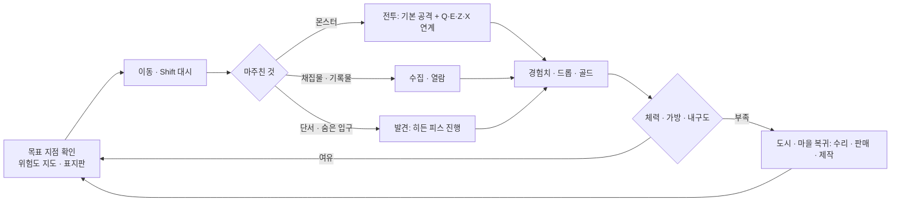

| 행동 | 1회 소요(추정) | 보상 | 다음 행동 동기 |
|---|---|---|---|
| 일반 몬스터 전투 | 10~30초 | 경험치, 재료 드롭, 골드 | 다음 무리가 보인다 / 인장 게이지가 찬다 |
| 채집(광석 · 약초 · 목재) | 5~10초 | 재료, 채집 경험치(병렬 성장원. 캐릭터 레벨 기준 산정 · 노드 등급 가산 없음, D-17) | 도안 재료 목록의 빈칸 |
| 기록물 열람(선택) | 10~40초 | 단서, 발견 경험치 | 다른 지역 아크의 힌트 |
| 히든 피스 진행 | 1~5분 | 히든 보상(장비 · 스킬 · 직업 입구), 탐험 랭킹 점수 | 남은 단서 수 표시 |

### 4.3 L2 세션 단위 루프

세션 목표 단위는 AS-03의 세션 길이 안에서 끝나야 한다. 모든 세션 목표는 중간 저장이 되어 끊겨도 손실이 없다(11).

| 세션 목표 단위 | 목표 소요(추정) | 모바일 세션(15~25분) | PC 세션(40~60분) | 보상 | 다음 행동 동기 |
|---|---|---|---|---|---|
| 아크 1장(章)(튜토리얼 0장은 3~5분 예외, D-10) | 8~12분 | 1~2장 | 3~4장 | 아크 보상(장비 · 도안 조각 · 인장), 다음 장 · 다른 아크 단서 | 단서가 가리키는 지역 |
| 던전 1회(파티 또는 솔로) | 10~15분 | 1회 | 2~3회 | 재료 · 도안 · 인장 | 주간 던전 보상 상한 잔여 표시 |
| 제작 1회(미니게임 30초~2분 + 준비) | 5~10분 | 1~2회 | 3~5회 | 장비(제작자 서명), 숙련도 | 남은 재료로 만들 수 있는 도안 표시 |
| 강화 세션 | 3~5분 | 1회 | 1~2회 | 강화 단계, 잔해(실패 시) | 다음 단계 확률 · 안전 지점 표시 |
| 일일 계약 3개 | 합계 15분 목표(상한 20분) | 1회 | 1회 | 인장 · 재료 상자 · 길드 기여도 | 초기화 타이머 |
| 레이드 1회 | 30~40분 | (권장하지 않음, 참여는 가능) | 1회 | 레이드 도안 · 희귀 재료, 분배 보상 | 주간 상한, 길드 목표 |

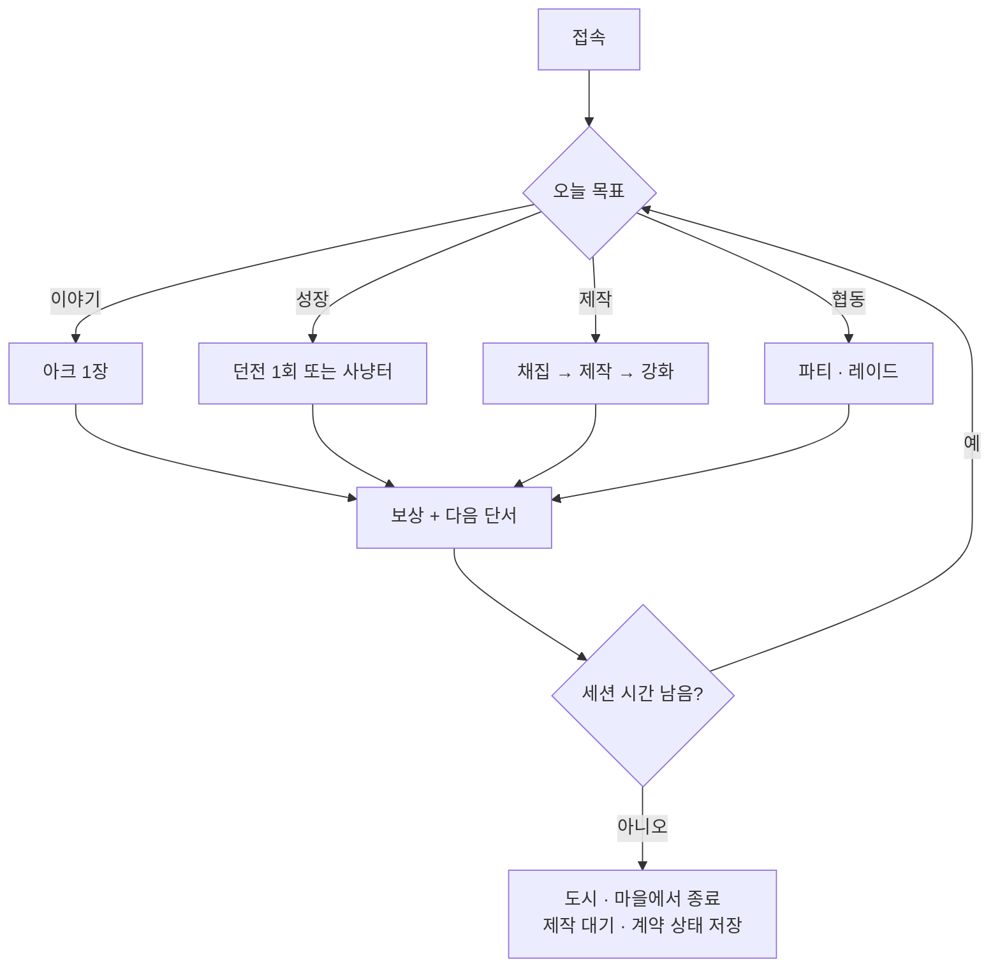

### 4.4 L3 · L4 일 · 주 단위 루프

| 항목 | 규칙(수치는 07 · 08 · 10에서 확정) | 상한 근거 |
|---|---|---|
| 일일 계약 | 하루 3개, 합계 15분 목표 · 상한 20분(모바일 1세션 안에 완료). 지역 무관(어느 대륙에서도 수행 가능) | 01번 5장 #39, AS-03 |
| 주간 계약 | 주 3개(레이드 참여 · 제작 · 탐험 각 1) | 01번 5장 #39 |
| 주간 레이드 | 보스당 캐릭터별 주 1회 보상(계정 합산 = 기본 슬롯 3개분, D-25), 연습 모드는 상한 미소모 | 01번 5장 #25 |
| 랭킹 정산 | 주간 랭킹 매주 정산, 시즌(8~12주) 결산 | 01번 5장 #12, 09 |
| 초기화 시각 | 일일 · 주간 초기화는 단일 UTC 시각으로 통일(세부 10) | 모바일 유저 혼란 방지 |
| 점령전(확장) | 주 1회 정해진 시간, 참가 신청제(D-01) | 01번 5장 #2 |
| 상한 적용 단위(D-25) | 재료 · 보호재 · 제작 시도 일일 상한, 주간 레이드 보상 횟수, 일일 · 주간 계약 보상은 **캐릭터별**로 두되 **계정 합산 상한 = 기본 슬롯 3개분으로 고정**. 유료 추가 슬롯 캐릭터는 이 계정 풀을 나눠 쓰고 풀을 늘리지 않는다. 수치 · 집계는 10, 계정 합산 카운터는 09 · 11 | 3-C 과금 한계선, 01번 3장 원칙 8(c), 8.3 |

### 4.5 L5 사회 루프

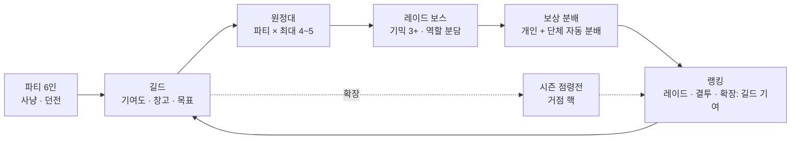

| 단계 | 진입 조건 | 보상 | 다음 행동 동기 |
|---|---|---|---|
| 파티 | 없음(레벨 차이 무관, 동행 보정) | 인원 보너스 경험치, 기여도 분배 | 던전 · 필드 보스 |
| 길드 | 파티 경험 불필요, 창설 조건은 08 | 길드 창고 · 기여도 상점 · 길드 계약 | 길드 목표(주간 레이드 클리어) |
| 원정대 | 길드 또는 임시 모집, 최소 인원 없음 | 레이드 입장권 | 권장 인원 미달 도전은 허용 |
| 레이드 | 원정대 구성, 예약 서버 인스턴스(AS-04) | 개인 보상 + 단체 드롭 자동 분배 | 주간 상한, 최초 처치 기록 |
| 랭킹 | 자동 | 칭호 · 시즌 보상 · 거점 운영권 후보 | 시즌 결산 |

### 4.6 L6 경제 루프

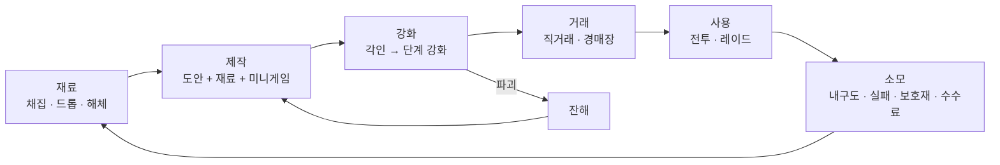

| 단계 | 유입 | 유출(골드 · 재료 소모처) | 담당 문서 |
|---|---|---|---|
| 재료 | 채집 · 몬스터 드롭 · 장비 해체 · 아크 보상. 재료 일일 산출 상한(01번 3장 원칙 8(c))은 **채집에도 적용**되며 과금 무관 동일(D-17). 상한은 캐릭터별 + **계정 합산 = 기본 슬롯 3개분 고정**(추가 슬롯은 풀 분할, D-25) | 채집 도구 내구도 | 06, 10 |
| 제작 | 도안(상점 · 레이드 · 아크 · 히든 피스) | 재료 소모, 작업대 사용료 | 06 |
| 강화 | 각인서 · 강화 재료(게임 내 획득만) | 실패 시 재료 소실, 잔해 복원 비용, 보호재 | 06 |
| 거래 | 경매장 등록 · 직거래(AS-07) | 거래 수수료(골드 소각) | 10 |
| 소모 | — | 수리비, 부활 내구도 소모, 길드 유지비, 텔레포트 골드 요금(과금 여부와 무관하게 동일, 로벅스 대체 상품 없음, D-11) | 10 |

## 5. 첫 10분 경험

### 5.0 캐릭터 생성 흐름(D-10)

접속부터 첫 조작(이동)까지 **90초 이내**. 직업은 시작 전에 고르지 않는다.

| 순서 | 화면 | 유저가 하는 일 | 시간 상한(추정) | 기본값 · 스킵 |
|---|---|---|---|---|
| ① | 종족 + 외형 1화면 | 종족 카드(플레이어블만 표시)에서 1개 선택, 외형 프리셋 선택(체형 · 피부 · 머리 · 색 4항목) | 60초 이내 | 종족 · 외형 모두 기본값이 미리 선택되어 있어 '다음'만 눌러도 진행. 종족은 시작 위치와 독립(D-08) |
| ② | 시작 위치 카드(5.1) | 카드 캐러셀에서 1곳 선택 또는 '아무 곳이나' | 30초 이내 | 무작위 버튼. **유일하게 강제되는 선택** |
| ③ | 게임 시작 | 고른 위치에 '견습(Apprentice)' 상태로 도착. 공통 무기 스킬 Q만 보유 | 로딩 포함 | — |
| ④ | 직업 선택(게임 안) | 시작 위치의 '갈림길 제단(Crossroads Shrine)' NPC 또는 메뉴에서 **언제든** 기본 직업 6종을 체험(직업별 대표 스킬 1개 시연) 후 선택. 선택 전까지 견습으로 플레이 가능 | 제한 없음 | 미루기 가능. 직업 미선택 상태에서 Z 슬롯이 해금되면 견습 공통 스킬 1개가 임시로 들어가고 직업 선택 시 교체(05에서 확정) |

| 규칙 | 내용 | 근거 |
|---|---|---|
| 직업 스킬 슬롯 Z 해금 | **캐릭터 레벨 2 도달 또는 첫 아크 1장 완료 중 먼저 달성한 것**. 레벨 2는 위험도 1 몬스터 6~8마리 처치, 채집 · 발견 경험치, 튜토리얼 0장 이야기 경험치 중 어느 경로로도 도달 가능(수치는 04). 특정 이야기 완료에만 걸린 해금이 아니다 | 3-B-2(튜토리얼이 강제 관문이 되지 않음), D-10 |
| 첫 무기 | 튜토리얼 0장 보상으로 일반 등급 무기 1개. 0장을 건너뛰어도 시작 위치 상인 NPC에게 **같은 무기를 무료 수령** 가능 | D-10 |
| 튜토리얼 장(0장) | 각 시작 위치 첫 아크의 0장. 3~5분짜리 예외 단위(일반 장 8~12분과 다름). 완료 보상은 7곳 모두 동일 가치 | D-10, 용어집 #2 · #48 |
| 직업 전환 | 이후 전환은 전직 의식(D-09) | D-09 |

### 5.1 시작 위치 선택 화면

| 요소 | 설계 |
|---|---|
| 형식 | 카드 캐러셀(모바일: 좌우 스와이프, 한 화면에 카드 1장 + 배경 미리보기 / PC: 3장 나열) + '지도 보기' 토글 |
| 카드 1장의 정보 | ① 이름(한/영) ② 대륙 ③ 위험도 — '도시 위험도 (반경 사냥터 위험도 범위)' 형식(D-21, 예: SP-03 '1 (반경 1~2)', SP-07 '4 (반경 2~5)'). 입문용 6곳은 도시 1 · 반경 1~2, SP-07만 숙련자용(위험도 4 색 + 경고 문구 상시). 첫 전투 구역은 모든 시작 위치에서 위험도 1(8.2, 03 7장) ④ 고향 종족(D-08: 어떤 종족이든 선택 가능, 고향 종족이면 초반 대사 · 평판 보너스) ⑤ 첫 아크 제목 ⑥ 추천 태그 2개(탐험 · 전투 · 사냥 · 제작 · 광산 · 교역 · 채집 · 항해 · 이야기 · 히든 · 도전 · 사회 중) ⑦ 활동 배지(근처 접속 인원이 일정 수 이상일 때만 '활발' 표시. 서버 간 집계가 필요하므로 MVP에서는 제외 가능, 11) |
| 표시 수 | 설계 기준 **7곳(SP-01~07)**, 5개 대륙 분산(아르텐 2 · 스벨드 2 · 케브라 1 · 이스메르 1 · 하드라 1, D-20 · 03 7장). 원칙: 시작 위치 6곳 이상 · 3개 이상 대륙 분산(4-정량)을 설계 문서(03)에서 항상 만족한다. MVP 표시 수(4곳 · 2대륙, 11장)는 첫 출시 부분집합이며 확장 1차 5곳 · 3대륙 → 확장 2차 6곳 · 4대륙(4-정량 도달) → 확장 4차 7곳 · 5대륙 순으로 늘어난다(12번). 8번째 추가 여부는 03 14.1 #2(후보 T-23 펠라 · T-12 프로스텐) |
| 무작위 버튼 | '아무 곳이나' 버튼 1개(고민 없는 유저용) |
| 되돌리기 | 캐릭터 슬롯 3개(D-09)로 다른 시작 위치를 다시 경험 가능. 같은 캐릭터의 시작 위치 변경은 없음 |
| 모바일 UI 요소 수 | 카드 1장 + 좌우 화살표 2 + 지도 토글 1 + 무작위 1 + 숙련자 모드 토글 1(5.3) + 시작 버튼 1 = **7개**(상한 7) |

시작 위치 7곳(03 7장 · 13장 색인 확정, D-20. 위험도 표기는 D-21):

| ID | 이름 | 대륙 | 위험도 | 고향 종족 | 첫 아크 | 추천 태그 | MVP |
|---|---|---|---|---|---|---|---|
| SP-01 | 해든 마을 시작 (Hadden Start, T-02) | C-01 아르텐 (Arten) | 1 (반경 1~2) | RC-01 인간 (Human) | A-01 무너진 다리의 청구서 | 이야기 · 전투 | 포함 |
| SP-02 | 세이번 시작 (Seyburn Start, T-03) | C-01 아르텐 | 1 (반경 1~2) | RC-01 인간 | A-03 표류 화물의 인장 | 교역 · 제작 | 포함 |
| SP-03 | 코르딘 시작 (Kordin Start, T-09) | C-02 스벨드 (Sveld) | 1 (반경 1~2) | RC-02 드워프 (Dwarf) | A-09 멈춘 용광로의 불씨 | 제작 · 광산 | 포함 |
| SP-04 | 스케른 시작 (Skern Start, T-10) | C-02 스벨드 | 1 (반경 1~2) | RC-04 바르쿤 (Varkun) | A-10 설원의 큰 발자국 | 사냥 · 탐험 | 포함 |
| SP-05 | 나임 시작 (Naim Start, T-15) | C-03 케브라 (Kebra) | 1 (반경 1~2) | RC-05 아이셀 (Aisel) | A-15 모래 아래의 목소리 | 탐험 · 히든 | 확장 1차 |
| SP-06 | 토모 섬 시작 (Tomo Start, T-19) | C-04 이스메르 (Ismer) | 1 (반경 1~2) | RC-03 엘프 (Elf) | A-20 빈 그물 | 채집 · 항해 | 확장 2차 |
| SP-07 | 카르드 시작 (Kard Start, T-24) | C-05 하드라 (Hadra) | 4 (반경 2~5), 숙련자용 경고 상시 | RC-05 아이셀 | A-25 마지막 명령서 | 도전 · 이야기 | 확장 4차 |

플레이어블 종족은 03 13장 기준 6종(RC-01 인간 · RC-02 드워프 · RC-03 엘프 · RC-04 바르쿤 · RC-05 아이셀 · RC-06 토르마). RC-06 토르마는 고향 시작 위치가 없고 어느 시작 위치든 고를 수 있다(D-08). 시작 위치별 첫 갈림길 표지판의 세 방향은 03 7.1, 아크 상세는 07.

### 5.2 첫 1분 / 3분 / 10분

0분 = 5.0 ③에서 시작 위치에 도착한 시각. 5.0 ①~②(접속부터 첫 조작까지 90초 이내)는 이 표 앞에 온다. '상시 노출 버튼(모바일)' 열은 D-16 기준 **상시 노출 버튼 수**(조이스틱 · 점프 · 메뉴 포함. 체력바 · 말풍선 같은 비버튼 표시 요소와 대상 근처에서만 뜨는 문맥 버튼은 제외)다.

| 시점 | 유저가 겪는 일 | 배우는 것 | 상시 노출 버튼(모바일) |
|---|---|---|---|
| 접속~0분 | 5.0 ① 종족 + 외형(기본값, 60초 이내) → ② 시작 위치 카드 → ③ 견습으로 시작 | 종족 · 시작 위치 선택 | 5.0 · 5.1 화면 |
| 0~1분 | 고른 위치에 도착. 고향 NPC 한 명이 말풍선 2줄(AS-08)로 상황을 알린다(예: "다리가 무너졌어. 저쪽 길로 돌아가 봐"). 이동 · 점프 · 대시로 무너진 길을 건넌다 | 이동, Shift 대시(터치: 대시 버튼) | 조이스틱, 점프, 메뉴, 대시 = 4 |
| 1~3분 | 위험도 1 몬스터 2~3마리와 첫 전투(첫 전투 구역은 모든 시작 위치에서 위험도 1). 기본 공격 → 무기 스킬 Q 1개만 열려 있다(견습). 처치 후 첫 재료 드롭은 자동 줍기 | 기본 공격, 스킬 버튼 1개 | + 공격, 스킬 Q = 6 |
| 3~6분 | 튜토리얼 0장(3~5분). NPC 부탁 1건(전투 또는 채집 택1 — 유저가 고른다. 채집 · NPC 대화는 대상 근처에서만 뜨는 문맥 버튼). 경로에 갈림길 제단이 있어 직업 6종 체험 · 선택 가능(미루기 가능). 0장 완료 보상: 일반 등급 무기 1개 + 인장 1 + 이야기 경험치 → 대개 이 시점에 레벨 2 도달 = 직업 스킬 슬롯 Z 해금(D-10) | 문맥 버튼, 직업 체험, 직업 스킬, 아크 UI(장 표시) | + 스킬 Z(해금 시) = 7 |
| 6~9분 | 첫 갈림길 표지판: 방향 3개 = 이 아크 1장(같은 지역) / **다른 아크 입구(옆 지역 경계, 위험도 1)** / 사냥터(위험도 1~2) + 근처에 '이상한 흔적' 1개(히든 피스 단서). 첫 회복약 1개 지급. '다른 아크 입구'는 인접 지역 전체가 위험도 2여도 **그 아크의 1장 무대만은 위험도 1 밴드 안**에 둔다(D-24, 03 7.1 · 07에 적용). 세 방향 모두 레벨 2~3 유저가 바로 갈 수 있고, 그 너머(위험도 2 이상, 레벨 차 8~14)로 넘어가면 8.2 #2의 **레벨 차 완충 구간** 규칙(선공 감지 거리 50% 축소 · 첫 진입 경고 1줄 · 사망 시 안내)이 적용된다 | 위험도 표시, 지도 열기(메뉴 안), 단서, 소모품 버튼, 완충 구간 경고(8.2 #2와 같은 규칙) | + 소모품 1 = **8**(튜토리얼 구간 상한 8) |
| 9~10분 | 고른 방향으로 이동. 첫 갈림길 선택 시 도안 조각 1개 또는 인장 1개 지급(어느 쪽이든 동일 가치) | "어디로 가도 보상이 있다" | 8 |

첫 10분에서 **강제되는 것은 시작 위치 선택 1회뿐**이다. 기본 경로를 따르면 일어나는 것: 대시 1회, 스킬 2종 사용, 튜토리얼 0장 완료, 직업 체험 1회 이상, 갈림길 선택 1회, 단서 1개 목격. 0장을 건너뛰거나 중간에 떠나도 Z 슬롯(레벨 2 도달) · 첫 무기(상인 무료 수령) · 갈림길 보상(첫 갈림길 선택 시 지급)은 같은 가치로 얻는다(5.3). 반드시 일어나지 않는 것: 장문 컷신, 강제 이동, 시작 전 직업 선택, 파티 · 길드 안내, 상점 안내(요청 시에만).

상시 노출 버튼 수는 D-16 한 기준으로 센다. 튜토리얼 구간 상한 **8**(미해금 스킬 슬롯 · 소모품 버튼은 해금 전 비표시), 전체 게임 기본 **12**(조이스틱 · 점프 · 메뉴 3 + 공격 · 대시 2 + 스킬 6 + 소모품 1) · 상한 **13**(9.2). 9.2의 '전투 클러스터 8'은 이 중 공격 · 대시 · 스킬 6만 센 부분집합이다.

### 5.3 튜토리얼이 메인 퀘스트가 되지 않게 하는 장치

| 장치 | 내용 | 근거 |
|---|---|---|
| 아크 0장에 녹임 | 튜토리얼 = 각 시작 위치 첫 아크의 0장(3~5분 예외 단위, D-10). 시작 위치 7곳마다 내용이 다르다(같은 조작을 다른 상황으로 가르친다, 03 7장 '첫 10분 동선'). 완료 보상은 7곳 모두 동일 가치 | 3-B-2(메인 퀘스트 없음), 3-B-3 |
| 스킵 | 시작 카드에서 '숙련자 모드' 토글 → 안내 말풍선 · 강조 표시 없음. 0장 자체는 남지만 안 해도 된다(다른 방향 표지판이 처음부터 열려 있음). **0장을 건너뛰어도 Z 슬롯(레벨 2 도달) · 첫 무기(상인 무료 수령) · 갈림길 보상(첫 갈림길 선택 시)과 같은 가치를 다른 경로로 얻는다.** 0장 완료에만 걸린 해금 · 보상은 없다 | 3-B-2, D-10, 재접속 · 부캐 유저 |
| 이탈 자유 | 0장을 중간에 버리고 다른 지역으로 가도 페널티 없음. 0장은 언제든 돌아와 이어 할 수 있다 | 3-B-5 |
| 조작 학습은 환경으로 | "무너진 길(대시)", "높은 턱(점프)", "부서지는 벽(스킬)"처럼 지형이 조작을 요구. 텍스트 안내는 1줄 | AS-08 |
| 첫 갈림길 = 실제 갈림길 | 튜토리얼 끝의 선택지가 실제 아크 · 사냥터 · 히든 단서로 이어진다(가짜 선택 없음). 세 방향 = 이 아크 1장 / **다른 아크 입구(옆 지역 경계, 위험도 1)** / 사냥터(위험도 1~2)가 전부 위험도 1 밴드에서 시작하므로 '들어갈 수는 있지만 죽기만 하는' 방향이 없다(D-24). 위험도 2 이상으로 넘어가는 지점부터는 8.2 #2 완충 구간 규칙이 같은 방식으로 적용된다(5.2 '6~9분' 행과 동일 규칙) | 3-B-2, 3-B-5, D-24 |
| 직업 선택 시점 자유 | 직업은 시작 전에 고르지 않고 견습으로 시작. 갈림길 제단 · 메뉴에서 언제든 체험 후 선택(5.0). 직업 선택이 0장 완료 조건이 아니고, 0장 완료가 직업 선택 조건도 아니다 | 3-B-4, D-10 |

## 6. 타깃 유저와 세션 길이 가정

플랫폼 사실: 로블록스 플레이어의 약 65%가 Android이고 그중 약 60%가 RAM 2~4GB 기기다[P-5-02]. 세션의 72~80%가 모바일이라는 제3자 집계가 있다(공식 수치 아님)[R-58]. 동접 10만 이상 로블록스 RPG는 전부 모바일을 지원하고, 미지원작은 수천 명대다[R-14][R-41][조사 3절]. → 모바일 페르소나가 1순위다(2-현상황).

| 항목 | PE-1 모바일 캐주얼 탐험가 | PE-2 PC 코어 레이더 · 길드원 | PE-3 생산 · 거래 장인 | PE-4 친구 따라온 동행자 |
|---|---|---|---|---|
| 연령대(추정) | 9~15세(Mild 라벨 노출 범위, AS-02[P-1-02]) | 13~22세 | 15~30세 | 9~18세 |
| 출시 단계별 우선순위(D-18) | 소프트 런치(연령 평가 기간, 16세 이상만 노출[P-1-03]): 진입 불가. 평가 통과 후 **1순위** | 소프트 런치 **주 타깃**(16세 이상) | 소프트 런치 **주 타깃**(16세 이상) | 소프트 런치: 16세 이상만. 평가 통과 후 PE-1과 함께 |
| 기기 | Android 중저가(RAM 2~4GB) · 태블릿 | PC(키보드 · 마우스) · 콘솔 | PC · 태블릿 | 모바일 · 콘솔 게임패드 |
| 세션 길이 | 15~25분, 하루 2~3회(AS-03) | 40~60분, 하루 1~2회(AS-03) | 20~40분, 하루 1~2회 + 대기 회수 | 20~40분, 친구 접속 시간에 맞춤 |
| 주 플레이 동기 | 새 지역 · 히든 피스 발견, 꾸미기, 가볍게 강해지기 | 레이드 최초 처치, 랭킹, 길드 명예, 고강화 | 도안 수집, 제작자 서명 브랜드, 경매장 수익, 제작 랭킹 | 친구와 같이 사냥, 캐리받기, 파티 보상 |
| 이 페르소나를 위한 콘텐츠 | 아크 1장 단위, 위험도 지도, 무관심 규칙 탐험, 일일 계약 3개(15분), 자동 조준 보조 | 레이드 5+(기믹 3+), 원정대, 주간 상한, 분야별 랭킹, 결투 · 분쟁 구역, (확장) 점령전 | 대장장이 직업(전투 겸업), 미니게임, 경매장, 제작 랭킹, 잔해 복원 의뢰 | 동행 보정(캐리 허용 + 상한), 인스턴스 한정 레벨 동기화, 파티 인원 보너스 |
| 과금 상품(확정형만, AS-06 · D-11) | 꾸미기(외형 · 이펙트), 창고(보관함) 확장, 텔레포트 연출(골드 요금은 동일) | 경험치 부스트 패스 1종(개인 +50% 이하, 비전파, 랭킹 제외), 캐릭터 슬롯 추가(산출 상한의 계정 합산 = 기본 슬롯 3개분 고정 · 추가 슬롯은 풀 분할 · 계정 단위 보너스 산입 없음, D-25 · 8.3), 꾸미기, 길드 전용 프라이빗 서버(검토) | 작업대 외형, 창고 확장 · 보관함 정리, 미완 미니게임 보관 슬롯(산출량이 바뀌지 않는 대기만, 01번 3장 원칙 8(c)). 필드 가방 · 제작 병렬 슬롯 · 경매장 등록 슬롯은 유료 상품 없음(과금 무관 동일) | 꾸미기, 파티 텔레포트 연출, 구독형 편의 묶음 |
| 이탈 위험 | 텍스트 과다, 버튼 과다, 조작 실패, 즉사 반복 | 콘텐츠 고갈, 밸런스 붕괴, 업데이트 지연[R-1][R-2] | 자동 제작이 수작업을 대체, 재료 인플레 | 레벨 차이로 파티 불가, 경험치 페널티 |

출시 단계별 주 타깃(D-18, AS-09). 연령 평가 사실은 12장 참조.

| 출시 단계 | 노출 대상(사실, [P-1-03]) | 주 타깃 페르소나 | 콘텐츠 · 마케팅 초점 |
|---|---|---|---|
| 소프트 런치(연령 평가 기간) | 연령 확인된 16세 이상만 | PE-2 · PE-3 | 레이드 · 랭킹 · 제작 경제 안정화. 평가 요건(60일 내 고참여 연령 확인 유저 250 unique plays) 달성 |
| 평가 통과 후(정식 출시) | Kids(5~8) · Select(9~15) 노출 가능(Mild) | PE-1 1순위, PE-4 | 첫 10분(5장) · 모바일 조작 · 일일 계약 |
| 긴급 심사(옵션) | 50,000 로벅스(환불성) 선지급 시 즉시 개방 | — | **기본 미실행**(AS-01 예산). 예산 확보 시 12번에서 결정 |

## 7. 차별점

조사 파일의 비교표(조사 1 · 3절)를 바탕으로 한다. 차별점은 '주장'이 아니라 시스템으로 적는다. 조사에서 **"메인 스토리 없음" 자체는 애니 2차창작 상위작과 하드코어 소울라이크 게임에도 있어 차별점이 아니다**[R-4][R-6][R-13] — 우리는 '없음'이 아니라 '맞물림'(아크 연결망 · 고립 0)으로 차별화한다.

| 기존 인기작 | 그 게임의 구조(확인된 범위) | 우리의 구조 | 차별이 시스템으로 구현되는 곳 |
|---|---|---|---|
| Blox Fruits (애니 2차창작 오픈월드 액션) | 진영(해적/해군) 선택만, 자유 시작 위치 없음[R-4]. 레벨대별 NPC 퀘스트 나열, 수직(레벨캡 · 열매 각성)[R-1][R-12]. 제작 없음, NPC에 재료 납품 강화만[R-12]. 현상금/명예 단일 리더보드[R-12]. 게임패스 세트 + 열매 로벅스 직판 + 가챠[R-2][R-4][R-12][R-34] | 시작 위치 7곳(설계, 5대륙) 자유 선택. 위험도 · 적정 구간 겹침 배치로 비수직. 유저 대장장이가 장비를 만들고 서명. 분야별 랭킹 5+. 유료 확률형 없음(AS-06), 배율 부스트는 경험치 1종만(D-11) | 03 · 04(시작 위치 · 위험도), 06(제작), 09(랭킹), 10(과금) |
| Sailor Piece (애니 2차창작 액션, 2025-11) | 레벨대 NPC 퀘스트 → 스탯 배분 → 다음 섬, 수직(인챈트 E0~E10)[R-1][R-6]. 메인 스토리 없음(퀘스트 나열)[R-6]. 고정 직업 없음, 종족 패시브 + 스탯[R-7]. 종족 리롤 상품[R-2] | 아크 연결망(모든 아크가 다른 아크 2+와 연결, 고립 0). 직업 6+ · 히든 직업 5+. 종족은 리롤 상품이 아니라 시작 시 자유 선택, 시작 위치와 독립(D-08) | 07(아크), 05(직업), 03(종족), 10(과금 한계선) |
| Deepwoken (하드코어 퍼머데스 소울라이크, 400R 유료 입장) | 시작 섬 2곳 택1[R-14]. 메인 퀘스트 없음, 환경 서사[R-13]. 사망 시 페널티 · 캐릭터 삭제[R-13]. 모바일 미지원(입력 수)[R-14]. 설명 전무 · 초보 구역 그리핑 불만[R-13][R-47] | 시작 위치 7곳(설계) · 5대륙. 가벼운 사망 페널티(D-05 (4)), 오픈월드 강제 PvP 없음(D-01). 모바일 · 게임패드 동등 조작(스킬 버튼 6 + 공격 · 대시). 위험도 지도 · 표지판 · 단서로 '다음 갈 곳' 제안 | 04(사망 · 위험도), 05 · 11(입력), 08(PvP), 07(단서) |
| Arcane Odyssey (오리지널 해양 오픈월드 RPG) | 챕터형 메인 스토리 있음[R-1][R-17]. 생활 직업 6종(요리 · 양조 · 보석 가공 등)[R-17]. 모바일 미지원, 핫바 1~7[R-15][R-41] | 메인 스토리 없음 + 대형 연결 사건 3+가 여러 대륙을 가로지름. 생활 직업이 아니라 대장장이가 **전투 겸업 정식 직업**이며 파티 역할이 있음(D-02). 모바일 우선 설계(전투 클러스터 8 · 상시 버튼 13 이하, D-16) | 07(연결 사건), 05 · 06 · 08(대장장이), 05 · 11(모바일) |
| Vesteria (전통 판타지 MMORPG, 서버 20인) | 클래스별 본거지(시작 마을)가 다름(자유 선택은 확인 필요)[R-25]. Warrior/Hunter/Mage → 서브클래스, 수직[R-25]. 길드 · 콜로세움 · 트리뷰트 전쟁[R-44] | 시작 위치는 직업 · 종족과 독립(D-08). 히든 직업은 발견 경로 5종으로 세계 곳곳에서 해금. PvP는 결투 신청제 · 분쟁 구역 · 시즌 점령전으로 단계화(D-01) | 03 · 04(시작 위치), 05 · 07(히든 직업), 08(PvP) |
| World // Zero (애니풍 파티 던전 MMORPG) | 클래스 선택 → 파티 던전 반복, 티어 1~5[R-27]. 상위 클래스를 로벅스로 판매(T2 200 ~ T5 1,200~1,400R) 또는 레벨 해금[R-27] | 직업 · 히든 직업은 로벅스로 팔지 않는다(3-C 한계선). 던전만이 아니라 아크 · 탐험 · 제작 · 채집이 전부 경험치(D-05 (3)) | 10(과금), 04(병렬 성장원) |
| Dungeon Quest (인스턴스 던전 루터) | 던전 반복 → 장비 드롭 → 대장장이 NPC 골드 강화, 고레벨 장비 수천 회[R-29]. 로비형, 스토리 없음. 동접 ATH 24K → 100~300대로 급감[R-28] | 강화는 3구간 곡선(안전 → 긴장 → 도박) + 잔해 복원 + 보호재 + 기대 시도 횟수 공개(01번 3장). 강화가 하나뿐인 성장 축이 아니라 오픈월드 · 아크 · 랭킹과 병행 | 06(강화), 04(성장) |
| Swordburst 3 (층 오르기 액션 RPG) | 층 진행 · 보스 · 광석 앤빌 강화, 제작 스테이션[R-31]. 층 = 강제 순서. 동접 두 자릿수[R-30] | 층 · 레벨 순 개방 없음(01번 5장 #41 금지). 같은 성장 구간에 사냥터 3+ · 대륙 2+(4-정량). 제작은 도안 + 재료 + 미니게임 + 숙련도(3-B-12) | 03 · 04(비수직 검증표), 06(제작) |

차별점 요약(시스템 6종): ① 시작 위치 자유 선택(7곳 설계 · MVP 4곳) ② 비수직 6종 메커니즘(D-05) ③ 메인 스토리 없음 + 아크 연결망(고립 0) ④ 대장장이 중심 경제(플레이어 제작 · 서명 · 해체 순환) ⑤ 3구간 확률형 강화(잔해 · 보호재 · 확률 공개) ⑥ 분야별 랭킹 5+(제작 · 탐험 포함, 조사 범위에서 사례 없음[조사 5절]).

## 8. 설계 원칙 요약

### 8.1 D-01~D-25의 콘셉트 관점 요약

| 결정 ID | 요지 | 이 문서에서의 의미 |
|---|---|---|
| D-01 | 오픈월드 강제 PvP 없음. MVP: 길드 결투 신청제 + 지정 분쟁 구역(진입 동의). 확장: 시즌제 거점 점령전(주 1회 · 참가 신청제). 국가 전면 전쟁 없음 | F1 탐험이 PvP에 방해받지 않는다. PE-1 · PE-4가 안전하게 고위험 지역을 탐험한다. 세력 경쟁의 재미는 점령전 · 기여도 · 세력 랭킹으로(L5) |
| D-02 | 대장장이 = 전투 겸업(순수 딜러의 75~85%) + 파티 · 레이드 서포터(현장 수리 · 담금질 버프 · 방어구 보강 · 무기 개조) | F3의 축. PE-3가 파티에 자리를 가진다. 솔로 사냥도 가능 |
| D-03 | 도안 제작 조건 = 대장장이 숙련도 + 작업대 등급(캐릭터 레벨 아님). 착용 조건 = 캐릭터 레벨 + 스탯 | 제작 활동 자체가 성장 경로(병렬 성장원). 대장장이가 전투 레벨링을 강제당하지 않는다 |
| D-04 | 레벨 상한 MVP 60 → 80 → 100. 10레벨 6구간 | 10장 정량 목표표의 구간 기준. 비수직 검증표는 6구간 |
| D-05 | 비수직 6종 메커니즘 세트 | 8.2 참조 |
| D-06 | 게임 내 시프트 락 옵션 끄기 + 자체 조준 모드(별도 키) + 대시 키 재배치 허용 | 9장 조작 원칙 |
| D-07 | 세계명 베이라(Veyra), 게임명 베이라: 갈림길의 대륙(Veyra Crossroads). 모든 고유명사 한/영 병기 | 2장 |
| D-08 | 종족과 시작 위치 독립. 고향 종족은 대사 · 평판 보너스만 | 5.1 시작 카드의 '고향 종족' 칸. 선택지 = 종족 × 시작 위치 |
| D-09 | 캐릭터 슬롯 3, 직업은 캐릭터당 1개 + 전직 의식 전환. 히든 직업 = 상위 분기형 또는 별개형 | 시작 위치를 여러 번 경험하는 경로 = 슬롯. 히든 직업 발견의 가치 보존 |
| D-10 | 캐릭터 생성 = 종족 + 외형 → 시작 위치 → 견습 시작(90초 이내). 직업은 게임 안에서 체험 후 선택. Z 해금 = 레벨 2 또는 첫 아크 1장 완료 중 먼저. 튜토리얼 0장 3~5분 | 5.0 · 5.2 · 5.3. 첫 10분에 강제되는 것은 시작 위치 선택 1회뿐 |
| D-11 | 경험치 부스트 패스 1종만 허용(+50% 이하 · 비전파 · 랭킹 제외). 그 외 배율 · 골드 소모처 대체 · 시간당 산출 증가 편의 금지. 유료 편의 = 창고 · 외형 · 연출 · 구독 묶음 · 확정형 시즌 패스 | 8.3 배율 부스트 행, 6장 과금 상품 행 |
| D-12 | 위험도 = 적정 구간 하한 기준 절대 레벨 밴드(1~6, 상한 확장 시 7~10 추가) | 8.2 밴드 표, 용어집 #8 |
| D-13 | 상한 확장 시 새 구간 사냥터 3+는 기존 대륙 2곳 이상 포함. 신규 대륙은 전 구간 사냥터 보유('대륙 = 레벨대' 금지) | 11장 상한 확장 원칙, 10장 검증표 |
| D-14 | 랭킹 분야 MVP 4 → 확장 1차 5 → 확장 3차 7 | 10 · 11장 분야 도입 단계 표, 8.4 결투 랭킹 |
| D-15 | 대형 연결 사건 = 그물형 연결, 가드레일 (a)~(e) | 8.5, 용어집 #3, 11장 확장 4차 |
| D-16 | 모바일 전투 클러스터 8 + 보조 입력 분류, 상시 총상한 13, 게임패드 배치 | 9.1 · 9.2, 5.2 버튼 수 |
| D-17 | 채집 · 제작 경험치는 캐릭터 레벨 기준, 고등급 채집물은 채집 숙련도 요구, 발견 경험치 지점당 1회, 채집 일일 산출 상한 | 8.2 #3, 4.2 · 4.6 |
| D-18 | 소프트 런치 주 타깃 PE-2 · PE-3(16+), 평가 통과 후 PE-1 1순위, 긴급 심사 기본 미실행 | 6장 출시 단계별 주 타깃, 12장 |
| D-19 | 알파(상한 30 · 직업 4 · 레이드 1 · 아크 8) 마일스톤, 2~4주 소규모 갱신, 8~12주 시즌 | 11장 |
| D-20 | 시작 위치 7곳(SP-01~07) 확정. 02의 가칭은 03 13장 색인 이름으로 전부 교체 | 5.1 · 10 · 11장. 이 문서의 모든 고유명사 |
| D-21 | 시작 위치 카드 위험도 = '도시 위험도 (반경 사냥터 위험도 범위)' 병기 | 5.1 카드 ③, 8.2 밴드 주석 |
| D-22 · D-23 | 수인 종족명 바르쿤(Varkun), 추가 ID 접두어(ST- · PZ- · E- · MO- · Q- · NP-) | 5.1 종족 표기, 13장 목차의 ID |
| D-24 | 레벨 차 8~14 완충 구간(선공 감지 거리 50% 축소 · 첫 진입 경고 1줄 · 사망 시 안내) + 첫 갈림길의 '다른 아크 입구'는 위험도 1 밴드 안 | 5.2 '6~9분' 행, 5.3, 8.2 #2, 용어집 #55 |
| D-25 | 산출 상한은 캐릭터별 + 계정 합산 = 기본 슬롯 3개분 고정. 추가 슬롯은 풀 분할. '계정 단위 보너스' 정의 | 4.4 · 4.6 · 6장 PE-2 · 8.2 #3 · 8.3, 용어집 #56 |

### 8.2 비수직 구조 6종의 유저 체감(D-05)

| # | 메커니즘 | 유저가 보는 것 · 겪는 것 | 신규 유저가 고레벨 지역에 들어가면(3-C) |
|---|---|---|---|
| 1 | 위험도(1~6, 절대 레벨 밴드) + 적정 구간 폭 | 사냥터 입구 · 지도에 "위험도 3 · 적정 25~45"처럼 표시. 위험도 = 적정 구간 **하한**이 속한 절대 레벨 밴드(D-12, 아래 표). '권장 레벨 30' 같은 단일 숫자 없음. 구간이 겹쳐 같은 레벨에 갈 곳이 여럿 | 입구에서 경고 1줄 + 색 표시. 입장 차단 없음 |
| 2 | 무관심 규칙 + 레벨 차 완충 구간(D-24) | 자기보다 15레벨 이상 높은 일반 몬스터는 먼저 때리지 않으면 무시. 몬스터 머리 위에 '무관심' 아이콘. **레벨 차 8~14 완충 구간**: 무관심은 아니지만 일반 몬스터의 선공 감지 거리가 50% 축소되고, 해당 구역 첫 진입 시 경고 1줄("이 구역 몬스터는 당신보다 n레벨 높습니다")이 뜬다. 레벨 차 7 이하는 적정 구간(일반 전투) | 레벨 차 15 이상: 몬스터 사이를 걸어 다니며 기록물 · 채집물 · 단서를 얻는다. 레벨 차 8~14: 감지 거리가 짧아 피해 다닐 수 있고, 이 구간에서 사망하면 '무관심까지 n레벨' 또는 '같은 레벨에 갈 만한 곳 2곳'을 부활 화면에서 안내한다(수치는 04). 첫 갈림길(5.2 '6~9분' 행)의 세 방향은 모두 위험도 1에서 시작하므로 완충 구간은 그 너머에서만 만난다. 단, 광기 지역(위험도와 별개의 속성 플래그, 확장 4차 전에는 0곳)은 위험도 표시와 함께 별도 경고 |
| 3 | 병렬 성장원 | 경험치 획득 로그에 "전투 / 이야기 / 발견 / 제작 / 채집" 태그. 어느 태그로도 레벨이 오른다. 채집 악용 방지(D-17): (1) 채집 · 제작 캐릭터 경험치는 **캐릭터 레벨 기준** 산정, 노드 등급 가산 없음, 상한 = 같은 레벨 적정 사냥 경험치/분의 70% (2) 고등급 채집물은 **채집 숙련도** 요구치(캐릭터 레벨 아님, D-03과 같은 방식) (3) 발견 경험치는 지점당 1회 (4) 재료 일일 산출 상한은 채집에도 적용(캐릭터별 + 계정 합산 = 기본 슬롯 3개분, D-25). 수치는 04 · 10 | 고레벨 지역에서 발견 · 채집 경험치로 성장 가능하되, 고위험 지역 채집이 같은 레벨 사냥보다 효율 1위가 되지는 않는다(3-B-5) |
| 4 | 가벼운 사망 페널티 | 경험치 손실 없음, 장비 내구도 소모, 근처 부활 지점(도시 · 마을 · 야영지, 점령전 거점 아님) 부활 | 죽어도 잃는 것은 수리비. 다시 시도한다 |
| 5 | 동행 보정 | 파티 창에 "동행 보정: 캐리 허용 · 상한 n%" 표시. 레벨 차이로 경험치가 깎이지 않음 | 고레벨 친구와 파티로 들어가면 상한 내에서 경험치 획득 |
| 6 | 인스턴스 한정 레벨 동기화 | 레이드 · 던전 인스턴스에서만 스탯 동기화 배지 표시. 오픈월드는 동기화 없음 | 오픈월드에서는 그대로 약하다(성장 체감 유지). 인스턴스에서는 역할 수행 가능 |

위험도 절대 밴드(D-12). 상한이 올라도 기존 밴드의 뜻은 바뀌지 않고 밴드가 추가될 뿐이다. 적정 구간 폭은 위험도와 별도로 표기한다(예: 위험도 2 · 적정 12~30). 시작 위치 카드의 '위험도'(5.1)는 '도시 위험도 (반경 사냥터 위험도 범위)' 형식(D-21)이며 첫 전투 구역은 모든 시작 위치에서 위험도 1이다(5.2). 첫 갈림길의 '다른 아크 입구'도 위험도 1 밴드 안이다(D-24).

| 위험도 | 적정 구간 하한 | 도입 단계 |
|---|---|---|
| 1 | 1~10 | MVP(알파 포함) |
| 2 | 11~20 | MVP(알파 포함) |
| 3 | 21~30 | MVP(알파 포함) |
| 4 | 31~40 | MVP |
| 5 | 41~50 | MVP |
| 6 | 51~60 | MVP |
| 7 · 8 | 61~70 · 71~80 | 확장 2차(상한 80) |
| 9 · 10 | 81~90 · 91~100 | 확장 4차(상한 100) |

### 8.3 과금 한계선 원칙(3-C, AS-06)

| 구분 | 허용 | 금지 |
|---|---|---|
| 상품 형태 | 확정 지급형만(패스 · 개발자 상품 · 구독 검토)[P-2-01][P-2-02][P-2-04] | 유료 확률형(랜덤 상자 · 리롤 토큰 · 확률 상승권)(AS-06)[P-1-09] |
| 효과 범위 | 꾸미기(외형 · 이펙트 · 작업대 외형 · 텔레포트 연출), 창고(보관함) 확장 · 보관함 정리, 캐릭터 슬롯 추가 — 단, **산출 상한의 적용 단위 원칙(D-25)**: 재료 · 보호재 · 제작 시도 일일 상한, 주간 레이드 보상 횟수, 일일 · 주간 계약 보상은 캐릭터별로 두되 **계정 합산 상한 = 기본 슬롯 3개분으로 고정**한다. 유료 추가 슬롯 캐릭터는 이 계정 풀을 나눠 쓰고 풀을 늘리지 않는다(슬롯 상품으로 '과금 여부에 따른 일일 산출 상한 차등'을 우회하지 못하게). 추가 슬롯 캐릭터는 계정 단위 보너스(용어집 #56)에도 산입하지 않는다. 수치 · 집계는 10, 계정 합산 카운터는 09 · 11, 구독형 편의 묶음, 확정형 시즌 패스, 시간 단축(**산출량이 바뀌지 않는 대기**만: 이동 연출 · 보관함 정리 · 미완 미니게임 보관 슬롯, 01번 3장 원칙 8(c)) | 스탯 · 등급 · 강화 단계 · 성공률 · 강화 재료 · 보호재 · 도안 · 직업 · 히든 피스 직접 판매(01번 3장 원칙 8). 채집 재생성 · 제작 쿨타임 · 제작 대기처럼 산출량과 연결된 타이머 단축, 강화 시도 횟수를 늘리는 재료 지급, 과금 여부에 따른 일일 산출 상한 차등(원칙 8(c)). **골드 소모처를 로벅스로 대체하는 상품**(유료 텔레포트는 연출 · 외형만, 골드 요금은 과금 무관 동일). **시간당 산출(드롭 · 제작 · 판매)을 늘리는 편의**: 필드 가방 확장 · 제작 병렬 슬롯 · 경매장 등록 슬롯은 과금 무관 동일, 유료는 창고만(D-11) |
| 배율 부스트(D-11) | **경험치 부스트 1종만 제한 허용**: 게임 패스 1종, 개인 캐릭터 경험치 +50% 이하, 파티원 비전파, 랭킹 산정에서 부스트분 제외. 경계 근거: 부스트는 상한 60 도달 **시점**만 앞당기고 도달점(스탯 · 등급)은 동일하므로 3-C '스탯 · 등급 직접 구매'가 아니며, 원칙 8(c)(재료 · 강화 시도 산출 불변)와 양립한다 | 골드 · 재료 · 도안 · 보호재 · 드롭 · 제작/채집 숙련도 · 강화 관련 배율 전부. 경험치 부스트의 중첩 · 다종 판매 · 파티 전파형 |
| 간접 경로 | 로벅스로 산 어떤 것도 확률형 결과(강화 · 제작 판정)에 투입되지 않는다 → 유료 랜덤 아이템 규정의 간접 적용 자체를 회피[P-1-09][P-1-10] | 로벅스 유래 재화로 강화 재료 구매 |
| 거래 | 게임 내 아이템 · 골드의 유저 간 거래(직거래 · 경매장, AS-07). 로벅스로 산 아이템은 거래 불가로 설계 | 로벅스 · 실제 화폐와 게임 재화 교환[P-2-10][P-2-11] |
| 정보 공개 | 게임 내 확률형 요소(강화 · 제작)는 무료 재화만 쓰지만 확률을 UI에 %로 공개하고 월별 실측 공개(01번 5장 #38) | 확률 미고지 변경 |

### 8.4 PvP 원칙(D-01)

| 단계 | 형태 | 참여 조건 | 보상 · 페널티 |
|---|---|---|---|
| 상시 | 없음(오픈월드 강제 PvP 0) | — | — |
| MVP | 결투 신청제(1:1 · 파티) + 지정 분쟁 구역(진입 시 경고 · 동의) | 양측 동의 | 결투 랭킹 점수(MVP 4분야에 포함, D-14). 사망 페널티 없음(내구도 소모만) |
| 확장 | 시즌제 거점 점령전(주 1회 정해진 시간, 참가 신청). 주체 = 세력 소속을 선언한 길드, 대상 = 점령전 전용 거점(요새 · 유적. 도시 · 시작 위치 · 수도 제외). 거점은 필드 고정 장소로 평시 외곽만 개방 · 핵 구역 봉쇄, 전투는 거점을 복제한 예약 서버 인스턴스(01번 1장 용어 정의) | 세력 소속을 선언한 길드 + 신청 | 거점 보너스 · 세력 점수. 패배 시 개인 자산 · 성장 보존 |

### 8.5 대형 연결 사건 가드레일(D-15)

대형 연결 사건 = 여러 대륙의 아크 3개 이상이 같은 사건을 서로 다른 시점에서 다루는 **그물형 연결**. 대륙을 순서대로 지나는 선형 사슬(사실상의 메인 퀘스트 라인)이 아니다. 아래 5개는 07의 검증 항목이다.

| # | 가드레일 | 검증 방법(07) |
|---|---|---|
| (a) | 진입점은 참여 아크 전부, 진행 순서 무관 | 사건별 진입 아크 목록 = 참여 아크 목록 |
| (b) | 사건을 부분만 진행해도 진행한 만큼 보상 | 사건 보상표가 아크(장) 단위로 분할됨 |
| (c) | 사건 완료가 직업 · 지역 · 레벨 상한 · 등급 개방의 필수 조건이 되지 않음 | 03 · 04 · 05 · 06의 해금 조건에 사건 ID 없음 |
| (d) | 사건끼리 단일 최종 사건 · 단일 최종 보스로 합쳐지지 않음(레이드 보스 RB-와 1:1 금지) | 사건 ↔ RB- 매핑이 1:1이 아님 |
| (e) | C-05 하드라(확장 4차)는 종착지가 아니라 여러 입구 중 하나 | C-05 아크가 다른 대륙 아크와 양방향 연결, C-05가 1~100 전 구간 사냥터 보유(D-13) |

## 9. 플랫폼 · 조작 원칙

상세 매핑표(PC / 모바일 / 게임패드 3종, 4-정량)는 05, 기술 근거는 11. 여기서는 원칙만 정한다.

### 9.1 PC 키 기준 슬롯 구성

| 입력 | 역할 | 슬롯 계열 | 비고 |
|---|---|---|---|
| Shift | 대시 | 이동 | 3-B-9. 시프트 락과 분리(D-06) |
| 마우스 좌클릭 | 기본 공격 | 기본 | 자동 조준 보조는 모바일 · 패드 전용 |
| Q, E | 무기 스킬 2슬롯 | 무기 계열 | 무기군마다 다름(무기 교체 시 슬롯 내용 교체) |
| Z, X, C | 직업 스킬 3슬롯 | 직업 계열 | 프리셋 2개(사냥 / 보스) |
| V | 특수 스킬 1슬롯 | 특수 계열 | 퀘스트 · 히든 피스로 배우는 습득 스킬 10+(4-정량). 습득 스킬은 스탯 재분배 후에도 유지되나 요구 스탯 충족 시에만 장착 가능. 스탯 임계 패시브(조건부 효과, 재분배 시 꺼짐)는 슬롯을 쓰지 않는 별개 층(01번 5장 #66) |
| 마우스 휠 클릭 | 조준 모드(자체 카메라 잠금) | 카메라 | D-06. 패드 R3. 모바일은 버튼 없음 — 자동 조준 보조 기본 켜짐 + 설정 토글(D-16) |
| F | 상호작용(NPC · 채집 · 기록물) | 기본 | 모바일: 대상 근처에서만 뜨는 문맥 버튼(ProximityPrompt 방식). 패드 X. 드롭은 전 플랫폼 자동 줍기(D-16) |
| 1, 2 | 소모품 2슬롯 | 기본 | 모바일: 버튼 1개(탭 = 1번, 길게 = 2번 전환). 패드 D-pad 좌/우(D-16) |
| Space | 점프 | 이동 | 로블록스 기본 |
| Tab / M / I | 지도 · 가방 · 메뉴 | UI | 모바일은 메뉴 버튼 1개로 통합. 패드 D-pad 위/아래(메뉴 · 지도)(D-16) |

원칙: (1) 스킬 슬롯은 무기 2 + 직업 3 + 특수 1 = **6개 고정**. 어느 플랫폼에서도 같다. (2) 모든 키는 설정에서 재배치 가능(대시 포함). (3) 스킬 매크로 없음, 연계 입력(스킬 후 특정 키로 파생기)만(01번 5장 #18).

### 9.2 모바일 · 게임패드 동등성 원칙

| 원칙 | 내용 | 근거 |
|---|---|---|
| 슬롯 수 동등 | 모바일 · 패드도 스킬 6 + 공격 + 대시. PC 전용 스킬 · 기능 없음(9.1의 모든 입력에 모바일 · 패드 대응이 있다) | 3-C, 01번 5장 #17 |
| 입력 예산 — 전투 클러스터(D-16) | 오른손 엄지 영역: 공격 1 + 대시 1 + 스킬 6 = **8개 상한** | 3-C, D-16 |
| 입력 예산 — 보조(D-16) | 조준 모드: 모바일 버튼 없음, 자동 조준 보조 기본 켜짐 + 설정 토글. 소모품: 버튼 1개(탭 = 1번, 길게 = 2번 전환). 상호작용(NPC · 채집 · 기록물): 대상 근처에서만 뜨는 문맥 버튼(ProximityPrompt 방식, 상시 아님). 드롭: 자동 줍기. 지도 · 가방: 메뉴 버튼 1개 안 | D-16, [P-6-02] |
| 상시 노출 총상한(D-16) | 조이스틱 · 점프 · 메뉴 포함 **13 이하**. 기본 구성 12 = 조이스틱 1 + 점프 1 + 메뉴 1 + 공격 1 + 대시 1 + 스킬 6 + 소모품 1. 여유 1은 이벤트 · 탈것 같은 임시 버튼용. 5.2 튜토리얼 구간은 8 | D-16 |
| 판정 동등 | 대시 무적 시간 · 스킬 선딜 · 미니게임 판정 창은 플랫폼별로 다르지 않다. 대신 모바일 · 패드에 자동 조준 보조(가장 가까운 적 우선)와 입력 지연 보정 | 3-C(공정성) |
| 입력 판별 | UserInputService.PreferredInput으로 주 입력을 판별해 UI 세트를 바꾼다. TouchEnabled로 모바일 판별하지 않음 | [P-6-01] |
| 터치 버튼 | 자체 GUI 버튼(ContextActionService 자동 버튼의 최대 7개 제한에 묶이지 않음). 버튼 크기 · 간격 기준은 11 | [P-6-02] |
| 게임패드(D-16) | 왼쪽 스틱 이동, 오른쪽 스틱 카메라. RT 공격, B 대시, A 점프, X 상호작용, LB + X/Y/B = 스킬 1~3, RB + X/Y/B = 스킬 4~6, D-pad 좌/우 소모품 1 · 2, R3 조준 모드, D-pad 위/아래 메뉴 · 지도. 필요한 동작 14개 전부 배치. Start · Select 등 로블록스 예약 버튼은 쓰지 않는다(예약 여부는 11에서 확인 필요) | [P-6-03], D-06, D-16 |
| 미니게임 | 대장장이 미니게임은 탭 · 타이밍 · 드래그 3종 이내 입력만 사용, 판정 서버 확정, 패턴 무작위화(오토클릭 대책) | 3-C, 01번 5장 #48 |
| 자동전투 없음 | 모바일 조작 결함을 자동전투로 덮지 않는다 | 01번 5장 #19 |

모바일 · 게임패드 입력 전체 목록(05 매핑표는 이 표를 그대로 따른다):

| PC 입력 | 모바일 처리 | 분류 | 게임패드 |
|---|---|---|---|
| 좌클릭 공격 | 공격 버튼 | 상시(전투 클러스터) | RT |
| Shift 대시 | 대시 버튼 | 상시(전투 클러스터) | B |
| Q · E · Z · X · C · V | 스킬 버튼 6 | 상시(전투 클러스터) | LB/RB + X/Y/B |
| Space 점프 | 점프 버튼 | 상시 | A |
| 휠 클릭 조준 모드 | 없음(자동 조준 보조 기본 켜짐 + 설정 토글) | 자동 처리 | R3 |
| F 상호작용 | 문맥 버튼(대상 근처에서만) | 상황형 | X |
| 드롭 줍기 | 자동 | 자동 처리 | 자동 |
| 1 · 2 소모품 | 버튼 1개(탭 = 1번, 길게 = 2번 전환) | 상시 | D-pad 좌/우 |
| Tab / M / I | 메뉴 버튼 1개 | 상시 | D-pad 위/아래 |
| 이동 | 조이스틱 | 상시 | 왼쪽 스틱 |
| 카메라 | 화면 드래그 | 제스처 | 오른쪽 스틱 |

### 9.3 시프트 락 해결 요약(D-06)

| 항목 | 내용 | 출처 |
|---|---|---|
| 문제 | 로블록스 기본 시프트 락이 Shift 키를 카메라 잠금 토글로 쓴다 | [P-6-05] |
| 해결 | StarterPlayer.EnableMouseLockOption = false로 기본 토글을 끈다. 자체 조준 모드를 별도 키(PC 휠 클릭 / 패드 R3)로 제공. 모바일은 조준 버튼 없이 자동 조준 보조 기본 켜짐 + 설정 토글(D-16). 대시 키 재배치 허용 | D-06, D-16, [P-6-05] |
| 주의 | 시프트 락 관련 API가 폐기 예정이라 UserInputService.MouseBehavior 기반 자체 구현을 병기한다. 기본값 미기재(확인 필요)이므로 명시적으로 false 설정 | [P-6-06], [P-6-07] |

## 10. 세계 · 시스템 정량 목표표

4-완료기준의 정량 기준은 **설계 문서 기준**이다. MVP 구현치는 그 부분집합이며 12번에서 확정한다. 숫자는 최소치다.

| 항목 | 4-정량 기준(설계) | 담당 문서 | MVP 구현 목표(첫 출시) | 확장 목표(1~4차 누적) |
|---|---|---|---|---|
| 대륙 | 4+ | 03 | 2 (C-01, C-02) | 5 (설계 전부) |
| 국가 | 8+ | 03 | 4 | 10 |
| 도시 · 마을 | 20+ | 03 | 8 | 24 |
| 사냥터 · 던전 | 30+(위험도 절대 밴드 · 적정 구간 표기, D-12) | 03, 04 | 16(알파 9+) | 36 |
| 종족 | 6+(플레이어블 여부 표시) | 03 | 설계 8(플레이어블 6, 03 13장) · MVP 플레이어블 4 | 플레이어블 6 |
| 시작 위치 | 6+, 3개 이상 대륙 | 03, 04 | 4 (SP-01~04, 2대륙) | 7 (SP-01~07, 5대륙. 확장 2차에 6곳 · 4대륙 도달, D-20) |
| 비수직 검증표 | 10레벨 단위 모든 구간에 사냥터 3+ · 대륙 2+, 필수 사냥터 0 | 04 | 6구간(1~60) 전부 충족, 2대륙(알파는 3구간 1~30) | 확장 2차 8구간(~80) · 확장 4차 10구간(~100) 충족. 새 구간 사냥터는 기존 대륙 2곳 이상 포함(D-13) |
| 레벨 상한 | (D-04) | 04 | 60(알파 30, D-19) | 80(확장 2차) → 100(확장 4차). 위험도 7~10 밴드 추가(D-12) |
| 직업 | 기본 6+(대장장이 · 궁수 포함), 히든 5+ | 05 | 기본 6 · 히든 2(알파: 기본 4, 대장장이 · 궁수 포함) | 히든 6 |
| 스킬 | 직업당 6+, 무기군별 무기 스킬, 특수 스킬 10+. 모든 스킬에 키 슬롯 · 쿨타임 · 소모 자원 · 효과 수치 명시 | 05 | 직업당 6, 무기군 4, 특수 6 | 직업당 8, 무기군 6, 특수 12 |
| 입력 매핑표 | PC / 모바일 / 게임패드 3종 | 05, 11 | 3종 전부 | — |
| 아크 | 20+, 모든 아크가 2+와 연결, 고립 0, 대형 연결 사건 3+, 모든 시작 위치에서 3+ 아크 도달. 연결 구조는 표 + Mermaid 그래프 | 07 | 10, 대형 연결 사건 1(그물형, 8.5 가드레일) | 24, 대형 연결 사건 4 |
| 히든 피스 | 30+(단서 · 조건 · 보상 · 연결 아크) | 07 | 15 | 36 |
| 장비 등급 | 6단계 전부(스탯 범위 · 옵션 수 · 획득 경로) | 06 | 6단계 정의, 획득은 전설까지 | 신화 · 초월 획득 경로 개방 |
| 대장장이 | 도안 경로, 재료 체계, 미니게임 사양, 결과 공식 + 예시 3건, 제한 규칙 | 06 | 전부 | 도안 종류 확대 |
| 강화 | 단계별 확률 · 실패 결과 · 비용 · 기대 시도 횟수 · 보호 장치 | 06 | 전부(등급별 상한 10~15) | — |
| 레이드 | 길드 · 원정대 보스 5+(권장 인원 · 기믹 3+ · 역할 · 분배) | 08 | 2(알파 1) | 6 |
| 랭킹 | 5개 분야+(산정식 · 주기 · 보상 · 어뷰징 방지) | 09 | 4(탐험 · 제작 · 레이드 · 결투) | 확장 1차 5(+ 길드 기여) → 확장 3차 7(+ 세력 기여 · 직업별)(D-14, 11장 표) |
| 기술 | 플레이스 구조도, 데이터 저장 구조, 서버 간 공유, 레이드 인스턴스 | 11 | 전부 | — |
| 과금 | 상품 목록 + P2W 한계선 | 10 | 상품 8~12종(경험치 부스트 패스 1종 포함, 그 외 배율 없음, D-11) | 구독형 편의 묶음 · 시즌 패스(확정형) 검토 |
| MVP | 첫 출시 범위 + 업데이트 순서 | 12 | — | — |
| IP | 레퍼런스 고유명사 재사용 0건 | 전부 | 0 | 0 |

## 11. MVP → 확장 개요

AS-01(1~3인, 9~12개월)에 맞춘 범위. 상세 순서 · 일정 · 콘텐츠 단위별 공수 추정 표는 12번. 여기서는 단계와 축소 축(레벨 상한 · 기본 직업 수 · 레이드 수)만 정한다. 비수직 검증표 때문에 대륙 2개는 줄이지 않는다.

| 단계 | 주제 | 대륙 | 시작 위치 | 직업 | 레이드 | 레벨 상한 | 아크 / 대형 연결 사건(누적) | 랭킹 분야(누적, D-14) | 핵심 추가 |
|---|---|---|---|---|---|---|---|---|---|
| 알파(비공개 테스트, D-19) | "갈림길이 작동하는지 확인" | 2 (C-01, C-02) | 4 (SP-01~04) | 기본 4(대장장이 · 궁수 포함) | 1 | 30 | 6 / 0 | 2(탐험 · 제작) | 3구간 × 사냥터 3+ · 2대륙(사냥터 9+), 제작 · 강화 · 파티, 입력 3종. 비수직 검증표를 3구간에서 먼저 검증 |
| MVP(첫 출시) | "갈림길이 작동한다" | 2 (C-01 아르텐, C-02 스벨드) | 4 (SP-01~04) | 기본 6 + 히든 2 | 2 | 60 | 12 / 1 | 4(+ 레이드 · 결투) | 아크 12 · 히든 피스 15 · 강화 · 제작 · 파티 · 길드 · 결투 · 랭킹 4분야. 소프트 런치(16세 이상 노출, D-18) |
| 확장 1차 | "세 번째 대륙과 사막" | +1 (C-03 케브라) | +1 (SP-05, 누적 5 · 3대륙) | +히든 1 | +1 | 60 | 14 / 2 | 5(+ 길드 기여) | 대형 연결 사건 2, 경매장 고도화. C-03은 1~60 전 구간 사냥터 보유(D-13). 연령 평가 통과 후 PE-1 확보(D-18) |
| 확장 2차 | "군도와 바다" | +1 (C-04 이스메르) | +1 (SP-06, 누적 6 · 4대륙 — 4-정량 6+ · 3대륙 도달) | +히든 1 | +1 | 80 | 20 / 3 | 5 | 신화 등급 개방, 한정 장비(유니버스 단위 수량), 시즌 대회(제작 · 탐험 종목). 61~80 구간 사냥터는 C-01~C-04 중 기존 대륙 2곳 이상 포함해 배치, C-04는 1~80 전 구간 보유(D-13). 위험도 7 · 8 추가(D-12) |
| 확장 3차 | "세력의 시간" | — | — | +히든 1 | +1 | 80 | 21 / 3 | 7(+ 세력 기여 · 직업별) | 시즌제 거점 점령전(D-01 확장), 세력 기여 랭킹, 직업별 랭킹 |
| 확장 4차 | "다섯 번째 갈림길" | +1 (C-05 하드라) | +1 (SP-07 숙련자용, 누적 7 · 5대륙) | +히든 1 | +1 | 100 | 24 / 4 | 7 | 초월 등급 개방, 광기 지역(무관심 규칙 예외 플래그), 대형 연결 사건 4. 81~100 구간 사냥터는 기존 대륙 2곳 이상 포함해 배치, C-05는 1~100 전 구간 보유. **C-05는 종착지가 아니라 여러 입구 중 하나**(D-13, D-15 (e)). 위험도 9 · 10 추가(D-12) |

상한 확장 원칙(D-13): (1) 상한 상승 시 새 10레벨 구간마다 사냥터 3곳 이상을 **기존 대륙 2곳 이상을 포함해** 배치한다. 새 대륙에만 새 구간 사냥터를 두는 것은 금지. (2) 신규 대륙(C-03 케브라 · C-04 이스메르 · C-05 하드라)은 개방 시점 상한까지 1~상한 전 구간의 사냥터를 가진다('대륙 = 레벨대' 금지, 01번 4장 교훈 #9). (3) 비수직 검증표는 확장 2차 8구간, 확장 4차 10구간을 충족한다(10장).

아크 연결의 단계별 검증(07 · 12 검증 항목): 각 출시 단계에서 **출시된 아크끼리만 세어도** 아크마다 연결 2+ · 고립 0 · 출시된 시작 위치마다 도달 아크 3+를 만족한다. 미출시 대륙을 가리키는 단서는 '닫힌 항로' 같은 세계관 내 표시로 보여 주고 연결 수에 넣지 않는다.

랭킹 분야 도입 단계(D-14):

| 단계 | 추가 분야 | 누적 | 비고 |
|---|---|---|---|
| 알파 | 탐험 · 제작 | 2 | 레이드 · 결투 미구현 |
| MVP | + 레이드 · 결투 | 4 | 결투 랭킹은 결투 신청제(8.4)와 함께 시작. 어뷰징 방지(레이팅 · 같은 상대 반복 감점)는 09 |
| 확장 1차 | + 길드 기여 | 5 | 4-정량 '5개 분야+' 도달 |
| 확장 3차 | + 세력 기여 · 직업별 | 7 | 점령전과 함께 |

라이브 갱신 원칙(D-19, 세부 일정은 12번):

| 주기 | 내용 | 근거 |
|---|---|---|
| 2~4주 | 소규모 갱신: 히든 피스 2~3개 추가 또는 주간 계약 테마 교체(대형 확장 사이 공백 방지) | [R-1] 업데이트 주기 = 리텐션 예측 변수, 2-현상황 |
| 8~12주 | 랭킹 시즌 결산 + 확정형 시즌 보상(칭호 · 외형) | 01번 5장 #12, D-19 |
| 대형 확장 | 위 표의 1~4차. 확장 간격은 12번에서 콘텐츠 단위별 공수 추정으로 정한다 | AS-01 |

## 12. 로블록스 정책 체크리스트

조사 파일(연구 P, 확인일 2026-09-30)에서 '확인됨'인 사실만 적는다. 로블록스 한도는 변경될 수 있으므로 인용 시 확인일을 함께 적는다. 정책 문구는 출처 URL(15장)로 확인한다.

| 항목 | 확인된 사실 | 출처 | 이 콘셉트의 대응 |
|---|---|---|---|
| 연령 등급 체계 | 성숙도 라벨은 Minimal / Mild / Moderate / Restricted 4단계. 설문(Maturity & Compliance Questionnaire) 제출로 결정 | [P-1-01] | 목표 라벨 **Mild**(AS-02). 설문은 '가장 극단적인 콘텐츠' 기준으로 답한다[P-1-16] |
| 라벨별 노출 | Minimal · Mild → Kids(5~8) · Select(9~15) 노출 가능. Moderate → Select · 16+. Restricted → 18+ | [P-1-02] | Mild 유지 **+ 연령 평가 통과(또는 긴급 심사)** 가 PE-1(9~15세) 확보 조건(D-18). 평가 통과 전에는 연령 확인된 16세 이상에게만 노출되므로 소프트 런치 주 타깃은 PE-2 · PE-3(6장) |
| 16세 미만 노출 요건 | 창작자 요건 = 연령 확인 + 계정 검증 + 2FA + (환불성 수수료 또는 2개월 이상 Premium). 요건 충족 후에도 **평가 통과 전까지 연령 확인된 16세 이상에게만 노출**. 평가 = 60일 내 고참여(계정 기간 · 플레이 시간 · 60일 내 결제 이력) 연령 확인 유저 250 unique plays. 긴급 심사 수수료 50,000 로벅스(환불성)는 일반 요건의 환불성 수수료와 **별개**이며 즉시 개방용 | [P-1-03], AS-09 | 12번 출시 준비 항목에 포함. 소프트 런치 주 타깃 PE-2 · PE-3, 긴급 심사는 **기본 미실행**(AS-01 예산), 예산 확보 시 옵션(D-18) |
| 판타지 폭력 | Mild = 비현실적 · 암시적(체력 0 시 즉시 소멸 등). 현실적 결과는 1회여도 Moderate 이상 | [P-1-04] | 사망 연출 = 소멸 · 빛 효과. 시체 · 현실적 결과 없음 |
| 유혈 | 비현실적 혈액 반복 → Mild. 현실적 혈액은 Moderate 이상 | [P-1-05] | 혈액 표현 없음(피격은 색 반짝임 · 파편). 03 · 07 서사도 유혈 묘사 없음 |
| 도박 | 플레이 가능한 도박(시뮬레이션 포함) 금지. 로벅스 · 실물 가치 아이템을 건 도박 · 추첨 금지 | [P-1-06][P-1-07] | 강화 · 제작은 게임 내 무료 재화만 사용. 슬롯 · 룰렛 연출 금지(01번 3장 원칙 10). 로벅스 · 로벅스 유래 재화는 확률 요소에 투입되지 않음 |
| 유료 확률형(PRI) 확률 공개 | 로벅스 또는 로벅스로 산 재화로 사는 랜덤 아이템은 모든 결과와 수치 확률(%, 합 100%)을 구매 전 표시. 키 · 티켓 · 리롤 토큰 등 간접 구매에도 적용 | [P-1-09] | **유료 확률형 없음(AS-06)** → 의무 미발생. 간접 적용도 8.3 원칙으로 회피 |
| PRI 지역 제한 API | PolicyService:GetPolicyInfoForPlayerAsync의 ArePaidRandomItemsRestricted / IsPaidItemTradingAllowed로 차단 의무 | [P-1-10] | PRI 없음. 로벅스로 산 아이템은 유저 간 거래 불가로 설계해 Paid item trading 디스크립터 대상에서 제외(11에서 API 호출 여부 확정) |
| 무료 랜덤 보상 | 로벅스가 개입하지 않는 랜덤 보상은 확률 공개 의무 없음 | [P-1-11] | 의무는 없지만 강화 · 제작 확률을 UI에 %로 공개(01번 5장 #38) |
| PRI 꽝 금지 | 유료 랜덤 결과 중 '지불만 잃는' 결과 불가 | [P-1-12] | 해당 없음(PRI 없음) |
| 18+ 전용 요소 | 비속어 · 로맨스 · 알코올은 18+ 전용 | [P-1-15] | 서사 · 대사 · 에셋에 해당 요소 없음(07 · 03) |
| 패스(Game Pass) | 1회 결제 영구 특권, 1R~10억R | [P-2-01] | 꾸미기 · 슬롯 · 편의(8.3) + 경험치 부스트 패스 1종(개인 +50% 이하, D-11) |
| 개발자 상품 | 반복 구매, ProcessReceipt 콜백 지급 필수 | [P-2-02] | 텔레포트 연출 · 보관함 정리 등 산출량 무관 편의 소모형(10, 8.3). 골드 텔레포트 요금을 대체하는 로벅스 요금제는 없음(D-11) |
| 수익 배분 | 게임 내 로벅스 판매 창작자 70% | [P-2-03] | 10번 매출 추정 근거 |
| 구독 | 로벅스 가격형 49R+, 월 70% 지급, 게임당 최대 50개 | [P-2-04] | 확정형 월 편의 묶음으로 검토(10) |
| 프라이빗 서버 | 무료 또는 월 로벅스 구독형. 유료 액세스와 병행 불가 | [P-2-05] | 길드 전용 서버로 검토(11 · 10). 최소가 · 배분은 확인 필요[P-2-06] |
| 유저 간 로벅스 거래 | 로벅스 · 가상 콘텐츠의 서비스 외 거래 금지, 제3자 거래 · 우회 금지 | [P-2-10][P-2-11] | 게임 내 골드 · 아이템만 거래(AS-07). 로벅스 ↔ 게임 재화 교환 없음 |
| 게임 내 아이템 거래 | 게임 자체 인벤토리 아이템의 유저 간 교환은 금지 조항 없음(추정). 로벅스로 산 아이템이면 디스크립터 · API 준수 필요 | [P-2-15] 확인 필요 | 로벅스 구매품 거래 불가 원칙으로 위험 회피. 10 · 11에서 재확인 |
| 판촉 규정 | 허위 품절 · 기간 한정 · 항상 같은 가격의 '세일' 금지, 오도 · 압박 구매 유도 금지 | [P-2-16] | 상점 UI 원칙(10) |
| 서버 인원 | 공지 기준 일반 최대 200명(베타 700). 공식 문서에 수치 미기재 → 대시보드 재확인 | [P-3-02] | 필드 30~50명(AS-04), 레이드는 예약 서버. 근거 · 수치는 11 |
| 텔레포트 | TeleportAsync 1회 최대 50명, 같은 경험 내에서만. 텔레포트 데이터는 클라이언트 노출 · 위조 가능 | [P-3-06][P-3-08] | 원정대 상한 24~30명은 50명 한도 내. 재화 · 진행은 DataStore로(11) |
| 데이터 저장 | 키당 4MB, 총량 500MB + 1MB × 누적 유저 | [P-4-01][P-4-05] | 캐릭터 슬롯 3 × 인벤토리 설계는 11에서 4MB 내 검증. 계정 합산 산출 카운터(D-25)는 계정 키에 둔다(구조는 11) |

## 13. 전체 문서 목차

배정 검수자는 PROGRESS.md 기준. S = system, L = lore, T = roblox-tech, M = player-market.

| 번호 | 파일명 | 목적 | 반드시 포함할 내용(4-완료기준 매핑) | 의존 문서 | 배정 검수자 |
|---|---|---|---|---|---|
| 01 | 01_reference.md | 레퍼런스별 가져올 것 / 바꿔서 쓸 것 / 금지 | 매핑표(5장), 강화 원칙(3장), 비수직 교훈(4장), IP 금지 목록(6장) | 00 | L, M, S |
| 02 | 02_concept.md | 콘셉트 · 코어 루프 · 타깃 · 차별점 · 목차 | 한 줄 소개, 핵심 재미 3, 코어 루프, 페르소나, 차별점, 정량 목표표, 용어집 | 00, 01 | 전원 |
| 03 | 03_world.md | 대륙 · 국가 · 도시 · 종족 · 세력 · 역사 | 대륙 4+, 국가 8+, 도시 20+, 사냥터 30+(위험도 · 적정 구간), 종족 6+(플레이어블), 시작 위치 6+ · 3대륙, 세력(NPC 조직) 관계, 점령전 전용 거점(도시 · 시작 위치 · 수도 제외) · 거점 핵, 부활 지점, 위험도 절대 밴드(D-12), 신규 대륙 전 구간 사냥터(D-13), 갈림길 제단(D-10), 시작 위치 7곳 · 카드 위험도 병기(D-20 · D-21), 첫 갈림길 '다른 아크 입구' 위험도 1(D-24), 13장 고유명사 색인(02~12의 이름 기준) | 02 | L, M, T |
| 04 | 04_progression.md | 레벨 · 스탯 · 지역 난이도 · 비수직 구조 | 비수직 검증표(6구간 × 사냥터 3+ · 대륙 2+, 필수 0), D-05 6종의 수치, 사망 규칙, 스탯 임계 패시브, 인장, 동행 보정 공식, 위험도 절대 밴드(D-12), 채집 · 제작 · 발견 경험치 규칙(D-17), Z 슬롯 해금 · 견습(D-10), 레벨 차 8~14 완충 구간 수치(D-24) | 02, 03 | S, M, L |
| 05 | 05_classes_skills.md | 기본 · 히든 직업, 스킬, 입력 매핑 | 기본 직업 6+(대장장이 · 궁수), 히든 5+(해금 조건 · 발견 경로), 직업당 스킬 6+, 무기군 스킬, 특수 스킬 10+, 모든 스킬의 키 슬롯 · 쿨타임 · 자원 · 수치, 입력 매핑표 3종(9.2 입력 전체 목록 · 게임패드 배치 준수, D-16), 시프트 락 해결, 견습 · 갈림길 제단 직업 체험(D-10) | 02, 03, 04 | S, T, M |
| 06 | 06_items_crafting.md | 장비 등급, 제작, 강화 | 6등급 스탯 범위 · 옵션 수 · 획득 경로, 도안 경로, 재료 체계, 미니게임 사양, 결과 공식 + 예시 3건, 착용 · 제작 조건, 강화 확률 · 실패 · 비용 · 기대 시도 · 보호 장치, 잔해, 한정 장비(유니버스 단위 수량 · 소유 상태 표시) | 02, 04, 05 | S, T, M |
| 07 | 07_stories_hidden.md | 이야기 연결 · 퀘스트 · 히든 피스 | 아크 20+(연결 2+ · 고립 0 · 표 + Mermaid), 대형 연결 사건 3+, 시작 위치별 도달 아크 3+, 히든 피스 30+(단서 · 조건 · 보상 · 연결 아크 · 종류), 일일 · 주간 계약, 대형 연결 사건 가드레일 (a)~(e) 검증(D-15), 튜토리얼 0장(D-10), 출시 단계별 아크 연결 검증(11장), 첫 갈림길 '다른 아크 입구'의 1장 무대 위험도 1(D-24) | 02, 03, 04, 05 | L, S, M |
| 08 | 08_social_raid.md | 파티 · 길드 · 원정대 · 레이드 · PvP | 파티 6 · 보너스, 길드, 원정대(최소 인원 없음), 보스 5+(권장 인원 · 기믹 3+ · 역할 · 분배), 대장장이 역할, 결투 · 분쟁 구역, 점령전(확장) | 02, 04, 05, 06 | S, T, M |
| 09 | 09_ranking.md | 분야별 랭킹 | 5개 분야+(산정식 · 갱신 주기 · 보상 · 어뷰징 방지), 분야 도입 단계(D-14), 부스트 경험치 제외(D-11), 시즌 결산, 직업별 TOP N, 계정 합산 카운터(D-25) | 02, 06, 07, 08 | S, T, M |
| 10 | 10_economy.md | 화폐 · 거래 · 재료 순환 · 소모처 · 과금 | 화폐, 경매장 · 직거래, 재료 순환 총량, 골드 소모처, 상품 목록 + P2W 한계선(배율 부스트 · 편의 상품 경계, D-11), 채집 일일 산출 상한(D-17), 산출 상한의 캐릭터별 · 계정 합산 수치와 집계(D-25), 확률 공개 · 규제 검토 | 02, 06, 08, 09 | S, M, T |
| 11 | 11_roblox_tech.md | 플레이스 · 데이터 · 동기화 · 인스턴스 | 플레이스 구조도, 데이터 저장 구조(4MB 검증), 서버 간 공유 데이터(길드 · 랭킹 · 월드 상태), 레이드 인스턴스, 입력 · 시프트 락 구현, 계정 합산 산출 카운터 데이터 구조(D-25), 성능 · 보안. 출처 URL | 02~10 | T, S, M |
| 12 | 12_mvp_roadmap.md | 첫 출시 범위와 업데이트 순서 | 알파 마일스톤 · MVP 범위(대륙 · 직업 · 레이드 · 시작 위치) · 콘텐츠 단위별 공수 추정(D-19), 업데이트 1~4차 · 소규모 갱신 주기(D-19), 상한 확장 원칙(D-13), 출시 준비(설문 · 연령 확인 · 소프트 런치 · 긴급 심사 옵션, D-18) | 02~11 | M, T, S |
| 99 | 99_summary.md | 최종 요약 | 한 줄 소개 · 핵심 재미 3, 문서별 통과 라운드, 사용자 결정 항목, 다음 단계 | 전부 | — |

아래 그래프는 직접 의존만 그린다. 02는 03~12 전부의 공통 기준(표의 '의존 문서' 열)이므로 화살표는 03~08까지만 표시했고, 11(02~10 의존) · 12(02~11 의존)도 주요 화살표만 표시했다.

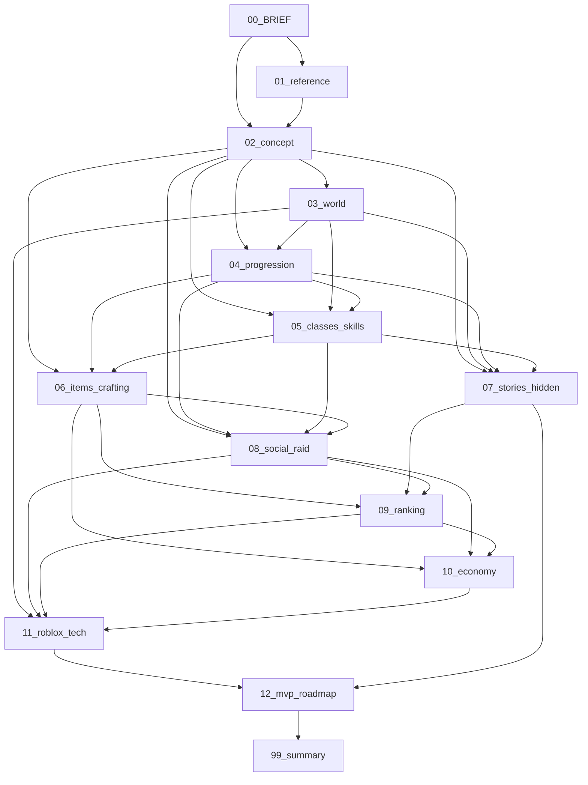

## 14. 용어집

이후 문서는 이 용어를 그대로 쓴다. 영문은 UI · 현지화용(AS-05).

| # | 용어 | 영문 | 정의 | 주 문서 |
|---|---|---|---|---|
| 1 | 아크 | Arc | 한 지역에 묶인 이야기 단위. 여러 장(章)으로 나뉘며, 모든 아크는 다른 아크 2개 이상과 단서로 연결된다. ID A- | 07 |
| 2 | 장(章) | Chapter | 아크의 세션 단위(일반 장 8~12분). 시작 위치 첫 아크의 **0장(튜토리얼 장)** 만 3~5분짜리 예외 단위(D-10, #48). 중간 저장됨 | 07 |
| 3 | 대형 연결 사건 | Cross-Continent Event | 여러 대륙의 아크 3개 이상이 같은 사건을 서로 다른 시점에서 다루는 **그물형 연결**. 참여 아크 어디서든 진입할 수 있고 진행 순서를 강제하지 않는다(8.5 가드레일, D-15). 설계 3+ | 07 |
| 4 | 히든 피스 | Hidden Piece | 숨은 지역 · 퀘스트 · NPC · 아이템 · 직업 · 스킬. 단서 · 조건 · 보상 · 연결 아크를 가진다. ID HP- | 07 |
| 5 | 전원 획득형 / 선착형 | Shared / First-Claim | 히든 피스 분류. 전원 획득형은 발견한 누구나 보상(다수). 선착형은 유니버스(게임 전체) 단위 최초 1인 · 1길드만 획득, 전 서버 공유 데이터로 판정(01번 5장 #5) | 07, 11 |
| 6 | 단서 | Clue | 히든 피스 · 다음 아크의 위치를 가리키는 세계관 내 정보(지명 · NPC · 기록물) | 07 |
| 7 | 기록물 | Record | 책 · 비석 등 선택 열람 장문 서사(AS-08) | 07 |
| 8 | 위험도 | Danger Level | 사냥터 · 지역의 등급. 적정 구간 하한이 속한 절대 레벨 밴드(1 = 1~10 … 6 = 51~60, 상한 확장 시 7~10 추가, D-12). 권장 레벨이 아니다 | 04 |
| 9 | 적정 구간 | Fit Range | 사냥터의 효율이 정상인 레벨 폭(예: 15~35). 구간끼리 겹치게 배치 | 04 |
| 10 | 무관심 규칙 | Indifference Rule | 자기보다 15레벨 이상 높은 일반 몬스터는 선공하지 않는 한 플레이어를 무시. 레벨 차 8~14는 완충 구간(#55) | 04 |
| 11 | 광기 지역 | Frenzy Zone | 무관심 규칙 예외 지역. 위험도와 별개의 속성 플래그이며 확장 4차 전에는 0곳. 광기 지역에만 있는 필수 재료 · 도안 없음 | 03, 04 |
| 12 | 병렬 성장원 | Parallel XP Sources | 전투 · 이야기 · 발견 · 제작 · 채집이 모두 캐릭터 경험치를 주는 구조 | 04 |
| 13 | 동행 보정 | Companion Adjust | 파티 레벨 차이에 따른 경험치 분배 공식(캐리 허용 · 상한) | 04, 08 |
| 14 | 인장 | Seal | 지역 귀속 성장 자원. **캐릭터 단일 게이지**: 어느 지역 인장이든 같은 게이지를 채우고 지역별 개별 상한 없음, 상한은 임의 2개 지역만으로 도달. 반복 경로 3+(일일 · 사냥 드롭 · 채집/제작) + 일회성 보너스(히든 피스)(01번 5장 #40) | 04, 06, 07 |
| 15 | 인스턴스 한정 레벨 동기화 | Instance Sync | 레이드 · 던전 인스턴스에서만 스탯 동기화. 오픈월드 없음 | 04, 08, 11 |
| 16 | 원정대 | Expedition | 파티 여러 개(최대 4~5)를 묶은 레이드 단위. 최소 인원 없음 | 08 |
| 17 | 레이드 보스 | Raid Boss | 길드 · 원정대 단위 보스. 기믹 3+, 예약 서버 인스턴스. ID RB- | 08 |
| 18 | 팀 생명 예산 | Team Life Budget | 레이드에서 팀 전체가 쓸 수 있는 사망 횟수 | 08 |
| 19 | 도안 | Blueprint | 제작 레시피. 상점 · 레이드 · 아크 · 히든 피스로 획득. ID BP- | 06 |
| 20 | 작업대 | Workbench | 제작 장소. 등급이 도안 제작 조건(D-03) | 06 |
| 21 | 숙련도 | Mastery | 대장장이 생산 레벨. 최저 보장 등급 · 확률 보정에 관여 | 06 |
| 22 | 담금질 | Tempering | 대장장이의 전투 중 임시 무기 강화 버프(D-02). 열기 게이지 소모 | 05, 06, 08 |
| 23 | 열기 게이지 | Heat Gauge | 대장장이 직업 자원. 제작 · 전투 겸용 | 05, 06 |
| 24 | 제작자 서명 | Forge Signature | 제작 장비에 남는 제작자 이름 + 고유 옵션 | 06, 10 |
| 25 | 각인 | Engraving | 파괴 없는 횟수제 1차 강화. 실패 시 슬롯만 소모 | 06 |
| 26 | 단계 강화 | Tier Enhancement | 확률형 단계 강화. 안전 · 긴장 · 도박 3구간(≈40/30/30). 파괴는 영웅 등급 이상의 도박 구간에서만(일반 · 희귀는 유지/하락만). 확정 성공 단계는 최대 2곳, 장비 1개당 해당 단계 평생 1회(01번 3장 원칙 2 · 5) | 06 |
| 27 | 잔해 | Remnant | 강화 파괴 시 남는 것. 대장장이가 복원(등급 유지 · 단계 하향) | 06 |
| 28 | 보호재 | Guard Material | 하락 방지재 / 파괴 방지재. 게임 내 제작만 | 06, 10 |
| 29 | 해체 | Salvage | 장비를 재료로 되돌리는 행위 | 06, 10 |
| 30 | 한정 장비 | Limited Gear | 유니버스(게임 전체) 단위 수량 N개로 관리되는 장비. 등급이 아닌 소유 상태 표시. 소유자 공개 · 귀속 · 소유 유지 조건 · 시즌 리셋 · 성능 상한(01번 5장 #7) | 06, 09, 11 |
| 31 | 전직 의식 | Class Rite | 직업 전환 절차(직업 레벨 유지, 스킬 포인트 재분배)(D-09) | 05 |
| 32 | 각성 홈 | Awakening Socket | 직업 · 장비의 잠긴 칸. 특정 히든 피스 발견으로만 연다(01번 5장 #51) | 05, 06, 07 |
| 33 | 일일 계약 / 주간 계약 | Daily / Weekly Contract | 일 3개(합계 15분 목표 · 상한 20분) · 주 3개의 반복 과제 | 07, 10 |
| 34 | 결투 | Duel | 양측 동의 PvP(1:1 · 파티). 사망 페널티 없음 | 08 |
| 35 | 분쟁 구역 | Contested Zone | 진입 시 경고 · 동의가 필요한 지정 PvP 지역 | 03, 08 |
| 36 | 거점 핵 | Stronghold Core | 점령전 전용 거점의 코어 오브젝트. 점령전에서 파괴 = 점령 | 03, 08 |
| 37 | 점령전 | Siege | 시즌제 거점 점령 이벤트(주 1회, 참가 신청제). 확장 3차 | 08 |
| 38 | 조준 모드 | Aim Mode | 자체 카메라 잠금(D-06). PC 휠 클릭 / 패드 R3 / 모바일 버튼 | 05, 11 |
| 39 | 시즌 | Season | 8~12주 단위 랭킹 · 점령전 결산 주기 | 09 |
| 40 | 고향 종족 | Native Race | 시작 위치의 대표 종족. 해당 종족이면 대사 · 평판 보너스만(D-08) | 03 |
| 41 | 세력 | Faction | 플레이어가 평판으로 소속을 고르는 NPC 조직(국가 · 교단 · 상단). 해체되지 않는다. ID F-. 길드(플레이어 조직)와 구분(01번 1장 용어 정의) | 03, 08 |
| 42 | 거점 | Stronghold | 점령전 전용 장소(요새 · 유적). 도시(T-) · 시작 위치(SP-) · 수도는 제외. 필드 고정 장소로 평시 외곽만 개방 · 핵 구역 봉쇄, 점령전은 거점을 복제한 예약 서버 인스턴스. 부활 지점이 아니다 | 03, 08, 11 |
| 43 | 부활 지점 | Respawn Point | 사망 시 부활하는 도시 · 마을 · 야영지. 거점과 별개(D-05 (4)) | 03, 04 |
| 44 | 스탯 임계 패시브 | Threshold Passive | 스탯이 임계값 이상일 때만 켜지는 조건부 효과. 재분배 시 꺼짐(01번 5장 #9 · #66) | 04, 05 |
| 45 | 습득 스킬 | Learned Skill | 퀘스트 · 히든 피스로 배우는 스킬(V 슬롯). 재분배 후에도 유지, 요구 스탯 충족 시에만 장착(01번 5장 #66) | 05, 07 |
| 46 | 견습 | Apprentice | 직업 선택 전 상태. 공통 무기 스킬 Q만 보유. 모든 캐릭터의 시작 상태(D-10) | 04, 05 |
| 47 | 갈림길 제단 | Crossroads Shrine | 각 시작 위치에 있는 직업 체험 · 선택 NPC 장소. 메뉴에서도 같은 기능(D-10) | 03, 05 |
| 48 | 튜토리얼 장(0장) | Chapter Zero | 시작 위치 첫 아크의 3~5분 예외 장. 완료가 어떤 해금의 필수 조건도 아니다(D-10) | 07 |
| 49 | 전투 클러스터 | Combat Cluster | 모바일 오른손 엄지 영역의 상시 버튼 8개(공격 · 대시 · 스킬 6)(D-16) | 05, 11 |
| 50 | 문맥 버튼 | Context Button | 대상 근처에서만 뜨는 상호작용 버튼(ProximityPrompt 방식). 상시 노출 수에 넣지 않는다(D-16) | 05, 11 |
| 51 | 경험치 부스트 패스 | XP Boost Pass | 유일하게 허용되는 배율 상품. 게임 패스 1종, 개인 +50% 이하 · 파티 비전파 · 랭킹 제외(D-11) | 09, 10 |
| 52 | 알파 | Alpha | MVP 이전 비공개 테스트 단계(상한 30 · 기본 직업 4 · 레이드 1 · 아크 8)(D-19, D-59) | 12 |
| 53 | 소프트 런치 | Soft Launch | 연령 평가 기간의 출시 단계(연령 확인된 16세 이상만 노출). 주 타깃 PE-2 · PE-3(D-18) | 12 |
| 54 | 갈림길의 대륙 | Veyra Crossroads | 게임 부제. 세계관 내 지명이 아니다(D-07). 세계명은 베이라(Veyra) | 02, 03 |
| 55 | 레벨 차 완충 구간 | Level-Gap Buffer | 몬스터 레벨 − 캐릭터 레벨이 8~14인 구간. 무관심 규칙(#10)은 아니지만 일반 몬스터 선공 감지 거리 50% 축소, 첫 진입 시 경고 1줄, 이 구간에서 사망하면 '무관심까지 n레벨' 또는 '같은 레벨에 갈 만한 곳 2곳' 안내(D-24). 첫 갈림길의 세 방향은 모두 위험도 1에서 시작한다 | 04, 03, 07 |
| 56 | 계정 단위 보너스 | Account-Wide Bonus | 보유 캐릭터 수에 비례하는 모든 효과(예: 가문 · 계정 레벨 보너스). 유료 추가 슬롯 캐릭터는 산입하지 않으며, 산출 상한(재료 · 보호재 · 제작 시도 일일 상한, 주간 레이드 보상 횟수, 계약 보상)은 캐릭터별 + **계정 합산 = 기본 슬롯 3개분 고정**으로 풀을 나눠 쓴다(D-25) | 09, 10, 11 |

## 15. 출처 목록

### 15.1 프로젝트 내부

| 표기 | 문서 |
|---|---|
| 3-A, 3-B-n, 3-C, 4-정량 | design/00_BRIEF.md |
| 01번 n장 #n | design/01_reference.md(5장 매핑표, 3장 강화 원칙, 4장 비수직 교훈, 6장 IP 금지 목록) |
| D-01~D-25 | design/DECISIONS.md |
| AS-01~AS-12 | design/ASSUMPTIONS.md |
| 조사 n절 | 로블록스 인기 RPG 시장 조사(2026-09-30, 메인 보관 조사 파일) |
| 연구 P | 로블록스 공식 정책 · 기술 사실 조사(2026-09-30, 메인 보관 조사 파일). 아래 15.3 |

### 15.2 로블록스 인기 RPG 조사 출처(R-n = 조사 파일 출처 번호, 확인일 2026-09-30)

| 번호 | URL | 확인한 내용 |
|---|---|---|
| R-1 | https://rowatcher.com/news/best-roblox-rpgs-in-2026-ranking-the-top-10-by-gameplay-and-player-retention | 2026 로블록스 RPG 순위 · 동접 · 리텐션 요인(제3자) |
| R-2 | https://rowatcher.com/news/blox-fruits-vs-sailor-piece-which-anime-rpg-is-actually-growing-faster-in-2026 | 두 상위작의 과금 · 업데이트 주기 · 불만(제3자) |
| R-4 | https://roblox.fandom.com/wiki/Gamer_Robot_Inc/Blox_Fruits | 진영 선택, 퀘스트 나열, 모바일 조작 불만(커뮤니티 위키) |
| R-6 | https://www.sportskeeda.com/roblox-news/sailor-piece-controls-guide-pc-mobile-ps-xbox | 조작 · 모바일 핫바, 퀘스트 구조 |
| R-7 | https://beebom.com/sailor-piece-devil-fruits-guide/ | 종족 패시브 + 스탯 빌드 |
| R-12 | https://www.gamersberg.com/blox-fruits/wiki/mechanics/bounty-and-honor-system | 현상금/명예 리더보드, NPC 강화, 로벅스 직판 |
| R-13 | https://rowatcher.com/news/deepwoken-inside-roblox-s-most-brutal-hardcore-rpg | 퍼머데스, 환경 서사, 불만(제3자) |
| R-14 | https://deepwoken.fandom.com/wiki/Deepwoken_(game) | 시작 섬 2곳 택1, 모바일 미지원 사유(커뮤니티 위키) |
| R-15 | https://www.rolimons.com/game/3272915504 | Arcane Odyssey 동접 · 방문(트래커) |
| R-17 | https://devforum.roblox.com/t/arcane-odyssey-full-release-patch-notes/4200973 | 챕터형 스토리, 생활 직업 6종, 클랜(개발자 공지) |
| R-25 | https://www.playvesteria.com/ | 클래스별 거점, 서브클래스, 서버 20인(공식) |
| R-27 | https://world-zero.fandom.com/wiki/Classes | 클래스 티어 · 로벅스 판매가(커뮤니티 위키) |
| R-28 | https://www.rolimons.com/game/2414851778 | Dungeon Quest 동접 추이(트래커) |
| R-29 | https://dungeonquest-reborn.wiki/loot/ | 대장장이 골드 강화, 게임패스 |
| R-30 | https://www.rolimons.com/game/11523257493 | Swordburst 3 동접(트래커) |
| R-31 | https://swordburst3.fandom.com/wiki/Item_Database | 광석 강화, 제작 스테이션(커뮤니티 위키) |
| R-34 | https://www.sportskeeda.com/roblox-news/everything-know-gamepasses-roblox-blox-fruits | 게임패스 가격 |
| R-41 | https://progameguides.com/roblox/all-controls-in-arcane-odyssey-roblox/ | 핫바 조작, 모바일 미지원 |
| R-44 | https://vesteria.fandom.com/wiki/Update_Log | 길드 · 콜로세움 · 트리뷰트 전쟁, 모바일 개선(커뮤니티 위키) |
| R-47 | https://m.dcinside.com/board/roblox/88367 | 한국 커뮤니티의 하드코어 RPG 불만(커뮤니티) |
| R-58 | https://searchengineland.com/guide/roblox-users | 모바일 세션 비중 72~80%(제3자, 공식 아님) |

### 15.3 로블록스 공식 정책 · 기술 출처(P-n-nn = 연구 P 항목 ID, 확인일 2026-09-30)

| ID | URL | 확인한 내용 |
|---|---|---|
| P-1-01, 1-02, 1-04, 1-05, 1-06, 1-08, 1-15, 1-16 | https://create.roblox.com/docs/production/promotion/content-maturity | 성숙도 라벨 4단계, 노출 연령, 폭력 · 유혈 · 도박 · PRI 디스크립터, 18+ 요소, 설문 의무 |
| P-1-03 | https://create.roblox.com/docs/production/publishing/kids-and-select | Kids/Select 티어, 16세 미만 노출 요건 |
| P-1-07, 1-12, 2-11 | https://about.roblox.com/community-standards | 도박 금지 원문, PRI 꽝 금지, 로벅스 제3자 거래 금지 |
| P-1-09, 1-10, 1-11 | https://create.roblox.com/docs/production/monetization/paid-random-items | PRI 확률 공개 · 간접 구매 적용 · 지역 제한 API · 무료 랜덤 보상 |
| P-1-10 | https://create.roblox.com/docs/reference/engine/classes/PolicyService | GetPolicyInfoForPlayerAsync |
| P-2-01 | https://create.roblox.com/docs/production/monetization/passes | 패스 규격 |
| P-2-02 | https://create.roblox.com/docs/production/monetization/developer-products | 개발자 상품 · ProcessReceipt |
| P-2-03 | https://create.roblox.com/docs/production/earning-on-roblox | 창작자 70% |
| P-2-04 | https://create.roblox.com/docs/production/monetization/subscriptions | 구독 규격 |
| P-2-05, 2-06 | https://create.roblox.com/docs/production/monetization/private-servers | 프라이빗 서버(최소가 · 배분 확인 필요) |
| P-2-10 | https://en.help.roblox.com/hc/en-us/articles/115004647846-Roblox-Terms-of-Use | 로벅스 · 가상 콘텐츠 거래 제한 |
| P-2-15 | https://create.roblox.com/docs/production/promotion/content-maturity , https://about.roblox.com/community-standards | 게임 내 아이템 거래(추정, 확인 필요) |
| P-2-16 | https://create.roblox.com/docs/production/monetization | 판촉 규정 |
| P-3-02 | https://devforum.roblox.com/t/max-player-count-increased-in-beta/722045 , https://devforum.roblox.com/t/experience-join-improvements-server-size-join-queues-and-social-slots-reservations/2294621 | 서버 인원 200/700(공지 기준) |
| P-3-06, 3-08 | https://create.roblox.com/docs/reference/engine/classes/TeleportService , https://create.roblox.com/docs/projects/teleport | 텔레포트 50명 한도, 데이터 위조 가능 |
| P-4-01, 4-05 | https://create.roblox.com/docs/cloud-services/data-stores/error-codes-and-limits | 키당 4MB, 총 저장 용량 |
| P-5-02 | https://create.roblox.com/docs/performance-optimization/test-on-hardware | Android 65%, RAM 2~4GB 60% |
| P-6-01 | https://create.roblox.com/docs/input , https://create.roblox.com/docs/reference/engine/classes/UserInputService | PreferredInput 권장 |
| P-6-02 | https://create.roblox.com/docs/reference/engine/classes/ContextActionService | 자동 터치 버튼 최대 7개 |
| P-6-03 | https://create.roblox.com/docs/input/gamepad | 게임패드 관례 |
| P-6-05, 6-06, 6-07 | https://create.roblox.com/docs/reference/engine/classes/StarterPlayer , https://create.roblox.com/docs/reference/engine/classes/Player | EnableMouseLockOption, API 폐기 예정, 기본값 미기재 |

### 15.4 사실 · 추정 구분 요약

| 구분 | 이 문서에서의 항목 |
|---|---|
| 사실(출처 있음) | 6장 플랫폼 수치, 7장 기존 인기작 구조, 12장 정책 전부, 9장 입력 API |
| 추정 | 6장 페르소나 연령 · 세션 길이(AS-03), 4장 각 행동의 소요 시간, 5.0 생성 흐름 시간 상한, 5장 활동 배지, 11장 알파 규모 · 갱신 주기(D-19) |
| 확정 고유명사(03 13장 색인) | 대륙 C-01~05, 시작 위치 SP-01~07, 종족 RC-01~06, 아크 A-01 · 03 · 09 · 10 · 15 · 20 · 25 이름. r2까지의 가칭은 폐기(D-20) |
| 확인 필요 | P-2-06(프라이빗 서버 배분), P-2-15(게임 내 아이템 거래), P-6-07(시프트 락 기본값) |


---

# 〔03_world.md〕 — 통과(3라운드)

# 03_world — 세계: 대륙 · 국가 · 도시 · 종족 · 세력 관계 · 역사

## 1. 문서 정보

| 항목 | 내용 |
|---|---|
| 버전 | r3 |
| 작성일 | 2026-09-30 (r3 수정 2026-10-01) |
| 상태 | 검수 중 (배정: lore / player-market / roblox-tech) |
| r3 변경 요약 | r2 중대 2건 수용 + 운영 수정 1건. (1) 03-r2-L-01: 연표 3.1 #15 · #17에서 균열 원점 · 확산 방향 단정 표현 제거('처음 기록', '번진 것인지 깨어난 것인지 학설이 갈린다'), 3.2 · 8.6 E-01 설명에 '방향 미정' 명시(이름 '균열의 확산'은 유지), 11.1 결말 무대 분산 행에 '연표는 E-01 원점을 단정하지 않는다' 검산 추가. (2) 03-r2-M-01: 7.1 ✔ 기준을 방향 1(첫 아크 2장)에도 적용, '위험도 2 이상은 방향 3 아크의 2장부터 · 방향 1은 3장부터', SP-04 2장 = H-13 입문 구역 외곽 눈밭, SP-05 2장 = H-26 입구 바깥 수로 관리청 초소(전투 없음, H-26 진입은 3장 이후), SP-07 2장 전투 없음 명시, 검산 ④ 추가, 11장 A-10 · A-15 · A-25 · A-28 요지 정합. (3) D-34: 10.7 S2 인스턴스 동기화 '하향만(상향 없음)'으로 수정 |
| r2 변경 요약 | r1 중대 16건 전부 수용(D-26~D-32 신설, D-22 갱신). (1) 수인 종족명 타르쉬 → **바르쿤(Varkun)**(웹 검색 확인, 14.3 #6). (2) 가정 인용 A-nn → AS-nn(아크 A-와 분리). (3) D-32 결말 무대 분산: 3.1 · 3.2 · 3.3 · 3.4(한정 장비 본체 표 · 최상급 마력 결정 산지) · 8.7 · 11 · 11.1 · 12.3. (4) 8장 '기원' 열, H-24 · H-33 · H-16 모순 해소. (5) D-29 입문 구역 · ✔ 기준 강화 · 표지판 7.1 단일 정의 · 방향 2/3 분리 · T-24 안뜰 안전 구역 · 인스턴스 1~4인 스케일링. (6) D-26 이동 수단 정의 표(2.4). (7) D-28 대륙 내 연결표 · Mermaid 5개 · 플레이스 분할 원칙(2.6), 반경 정의 · 방향별 도달 시간(7 · 7.1). (8) D-30 파티 권장 정의 · 9.1 솔로 가능 열. (9) D-27(10.1) · D-31(8.8). 경미 반영: E-03 명칭, H-39 · H-11 이름 통일, 9.1 검산 예, 9.2 경로 적정 폭, S3 동선, 시나리오 순서, A-11 영문, 세력 교차 참조, 물통 규칙, 개인 채집 노드, 세계 이벤트 동기화 원칙, MVP 필수/선택, 토르마 고향 시작 위치, 부활 '인스턴스 안 입구' |
| 목적 | 3-A [진행 순서] 03번 정의: 대륙 · 국가 · 도시 · 종족 · 세력 관계 · 역사. 4-정량의 세계 기준(대륙 4+, 국가 8+, 도시 20+, 사냥터 30+, 종족 6+, 시작 위치 6+ · 3대륙, 비수직 검증표)을 이 문서에서 충족한다. |
| 의존 문서 | 00_BRIEF.md(기준), 01_reference.md(1장 용어 정의 · 4장 비수직 교훈 · 6장 IP 금지 목록), 02_concept.md(8절 설계 원칙 · 10절 정량 목표 · 14절 용어집), DECISIONS.md(D-01~D-34. 이 문서가 직접 적용하는 것: D-05 · D-08 · D-10 · D-12 · D-13 · D-15 · D-17 · D-20 · D-21 · D-22 · D-24 · D-26 · D-27 · D-28 · D-29 · D-30 · D-31 · D-32 · D-34), ASSUMPTIONS.md(AS-01~AS-11. AS-10 · AS-11은 이 문서에서 제안, 14.2. 구 AS-12는 D-28로 대체) |
| 이 문서를 기준으로 삼는 문서 | 04_progression(위험도 · 적정 구간 · 무관심 규칙 수치), 05_classes_skills(히든 직업 근원 지역), 06_items_crafting(재료 산지), 07_stories_hidden(아크 · 히든 피스 상세), 08_social_raid(레이드 보스 위치 · 거점 · 분쟁 구역), 09_ranking(탐험 랭킹 대상), 10_economy(교역로 · 재료 순환), 11_roblox_tech(플레이스 분할 단위), 12_mvp_roadmap(MVP 대륙 확정) |
| 표기 규칙 | 전부 한국어, 모든 고유명사는 한국어 + 영문 병기(AS-05). 가정 인용은 **AS-nn**(ASSUMPTIONS.md), **A-nn은 아크 ID 전용**이다(03-r1-L-04). 수치 · 반복 데이터는 표. 사실은 출처(14장), 그 외 수치는 **추정**. 레퍼런스 고유명사는 쓰지 않는다(01번 6장). |
| ID 접두어 | 대륙 C-, 국가 N-, 도시 T-, 사냥터/던전 H-, 종족 RC-, 세력 F-, 시작 위치 SP-, 아크 A-, 히든 피스 HP-, 대형 연결 사건 E-(07에서 상세), 거점 ST- · 분쟁 구역 PZ-(번호는 08). 가정은 AS-(ID가 아니라 ASSUMPTIONS.md 항목 번호) |
| 02번 가칭과의 관계 | 02번 5.1 · 11절의 대륙 · 시작 위치 · 종족 · 아크 이름은 가칭이었다(02번 1장 '가칭 규칙'). **이 문서의 이름 · ID가 확정본**이며, 02번은 이 문서 13장 색인에 맞춰 갱신한다(D-20: 시작 위치 7곳 · 대륙 5 · 13장 이름으로 통일, 14장 확인 필요 #1). |
| 용어 | 02번 14절 용어집을 그대로 쓴다. 단, 01번 r2 결정(01-r1-L-01 · L-02)에 따라 02번 용어집 #30은 **한정 장비(Limited Gear)**, #5의 둘째 분류는 **선착형 히든 피스**, #32는 **각성 홈(Awakening Socket)** 으로 읽는다(02번 갱신 대상, 14장 확인 필요 #1). |

---

## 2. 세계 개요와 지도

### 2.1 세계 한 단락

**베이라(Veyra)** 는 약 900년 전 **갈림의 날(The Great Parting)** 에 다섯 조각으로 갈라진 세계다. 그 전까지 대지는 하나였고, 고대 통일 왕조 **세르낙(Sernak)** 이 전송문과 마력 결정으로 세계를 묶고 있었다. 갈림의 날에 세르낙은 사라졌지만 그들의 유산 — 유적, 잃어버린 기술, 한정 장비, 히든 직업의 근원 — 은 다섯 대륙 곳곳에 흩어져 남았다. 지금의 국가들은 그 잔해 위에 세워졌고, 대륙 사이는 세르낙이 남긴 **갈림길 문(Crossroad Gate)** 과 항로로 이어진다. 정해진 주인공은 없다. 어느 대륙 어느 마을에서 시작하든, 그곳의 이야기가 다른 곳의 이야기와 맞물린다(3-B-2).

### 2.2 대륙 배치 그래프

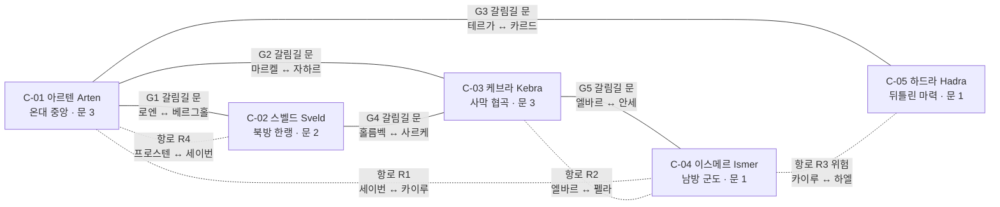

- 실선 = 갈림길 문(고대 전송문). 대륙은 서로 다른 플레이스이므로(2.6) 문 통과 = **텔레포트: 문 통과 → 로딩 화면(목표 10초 이내, 추정, 맞춤 로딩 GUI) → 도착 도시**(14.3 #8). 점선 = 항로(정기 선편, 탑승 시 짧은 대기, 도착은 같은 방식의 텔레포트). 항로 R3는 위험도 4 해역을 지난다.
- 갈림길 문 · 항로 이용 조건: 레벨 · 평판 제한 없음(AS-10). 첫 이용 시 문 옆 안내 NPC가 도착 대륙의 위험도 범위를 1줄로 알린다(3-C '위험도 표시'). 구현 방식(플레이스 텔레포트)은 11번에서 확정한다(14장 출처 #1).

### 2.3 대륙 표

| ID | 이름(영문) | 기후 · 지형 | 전반 위험도 범위 | 주요 국가 | 갈림길 문 수 | MVP 포함 여부 |
|---|---|---|---|---|---|---|
| C-01 | 아르텐 (Arten) | 온대. 평야 · 숲 · 강 · 완만한 구릉. 세계의 무역 중심 | 1~5 | N-01 카엘룬 왕국, N-02 브렌마르 자유도시연합 | 3 (G1 · G2 · G3) | **MVP 후보**(최종은 12번) |
| C-02 | 스벨드 (Sveld) | 한랭. 산악 · 설원 · 빙하 호수. 광물 산지 | 1~5 | N-03 카르니스 산왕국, N-04 이스텔 설원부족연맹 | 2 (G1 · G4) | **MVP 후보**(최종은 12번) |
| C-03 | 케브라 (Kebra) | 건조. 사막 · 협곡 · 오아시스 · 유리화된 모래 | 1~5 | N-05 미르잔 태양왕조, N-06 탈라 대상단 | 3 (G2 · G4 · G5) | 확장 1차 후보 |
| C-04 | 이스메르 (Ismer) | 열대. 군도 · 정글 · 산호해 · 폭풍 해역 | 1~5 | N-07 루카이 해상연합, N-08 벨로스 사원령 | 1 (G5) + 항로 3 | 확장 2차 후보 |
| C-05 | 하드라 (Hadra) | 뒤틀린 마력. 잿빛 평원 · 폐허 · 마력 균열. 남쪽 해안만 안정 | 1~6 (저위험 구역 2곳: H-35 위험도 1, H-36 위험도 2) | N-09 에스카 잔존 마도왕국, N-10 구르한 흑염 유목민 | 1 (G3) + 항로 1 | 확장 4차 후보 |

- 대륙 = 레벨 구간이 아니다(01번 4장 #9, D-13). 다섯 대륙 모두 1~60 전 구간 사냥터를 가진다(8 · 9장). 레벨 상한 확장(60→80→100) 시 새 구간 사냥터는 기존 대륙 2곳 이상을 포함해 배치하고, 신규 대륙은 개방 시점에 1~상한 전 구간을 가진다(D-13, 배치는 12번). 하드라만 저위험(위험도 1~2) 구역이 2곳(H-35, H-36)으로 적다.

### 2.4 갈림길 문 · 항로 표

| ID | 종류 | 양끝(도시 T-) | 대륙 | 이용 조건 | 이동 방식 | 항로 위험도 | 개방 단계 |
|---|---|---|---|---|---|---|---|
| G1 | 갈림길 문 | T-01 로엔 ↔ T-08 베르그홀 | C-01 ↔ C-02 | 없음 | 텔레포트(문 통과 → 로딩 화면, 추정 10초 이내) | — | MVP |
| G2 | 갈림길 문 | T-04 마르켈 ↔ T-14 자하르 | C-01 ↔ C-03 | 없음 | 텔레포트 | — | 확장 1차 |
| G3 | 갈림길 문 | T-07 테르가 초소 ↔ T-24 카르드 전초기지 | C-01 ↔ C-05 | 없음(도착지 위험도 4 경고) | 텔레포트 | — | 확장 4차 |
| G4 | 갈림길 문 | T-11 홀름벡 ↔ T-16 사르케 | C-02 ↔ C-03 | 없음 | 텔레포트 | — | 확장 1차 |
| G5 | 갈림길 문 | T-18 엘바르 ↔ T-21 안세 | C-03 ↔ C-04 | 없음 | 텔레포트 | — | 확장 2차 |
| R1 | 항로 | T-03 세이번 ↔ T-20 카이루 | C-01 ↔ C-04 | 없음 | 정기 선편(대기 최대 60초, 추정) | 2 | 확장 2차 |
| R2 | 항로 | T-18 엘바르 ↔ T-23 펠라 | C-03 ↔ C-04 | 없음 | 정기 선편 | 2 | 확장 2차 |
| R3 | 항로(위험) | T-20 카이루 ↔ T-27 하엘 | C-04 ↔ C-05 | 없음(경고 배너) | 정기 선편, 도착 플레이스 안의 해상 구간에서 폭풍 이벤트 연출(항해 전용 서버 없음, 소규모 팀 기준) | 4 | 확장 4차 |
| R4 | 항로 | T-12 프로스텐 ↔ T-03 세이번 | C-02 ↔ C-01 | 없음. 겨울 시즌엔 결빙으로 휴항(아크 A-14 소재, 휴항 중에도 G1이 남는다) | 정기 선편 | 2 | MVP |

- MVP(아르텐 · 스벨드 후보)에서는 G1과 R4로 두 대륙이 두 경로로 이어진다. 한쪽이 막혀도(예: R4 결빙 이벤트) G1이 남는다.
- 파티원이 같은 문 · 같은 선편을 60초 안에 이용하면 파티 단위로 묶어 같은 도착 서버로 보낸다(TeleportAsync에 파티원 배열 전달, 상세 11, 14.3 #8).
- 같은 대륙 안의 이동은 걷기와 아래 '이동 수단 정의' 표의 수단으로만 한다. 갈림길 문은 대륙 간 전용이다.

**이동 수단 정의(D-26, 03-r1-M-05 · T-02)** — 모바일 버튼 예산(D-16 상시 13 이하)과 05 스킬 사양을 건드리지 않는 것이 원칙이다. 수치 · 조작 상세는 04 · 05 · 11.

| 수단 | 정의 | 조작(PC · 모바일 · 패드 공통) | 조건 · 비용 | 적용 구역 |
|---|---|---|---|---|
| NPC 나룻배 | 선착장 · 잔교 · 부표 사이를 정해진 경로로 **자동 운항**. 플레이어 조종 없음 | 근접 프롬프트 1회(탑승) → 목적지 탭 1회. 추가 상시 버튼 0개 | 레벨 · 소유 조건 없음(AS-10과 같은 원칙). 무료 또는 소액 골드(10). 첫 갈림길 방향에 쓰이는 편은 첫 이용 무료 | H-29 부표, H-31 잠수종 선착장, H-32 등대섬, 이스메르 섬 사이, 아르텐 은빛 강 나룻배 야영지(H-07) |
| 걷는 물 | 허리 높이 수심. Humanoid 수영 상태를 쓰지 않고 **지상 이동 · 대시 · 스킬 규칙 그대로** | 추가 입력 없음 | — | 위험도 1~2 '수중' 구역 전부(H-28 갯벌, H-29 산호 얕은 바다, H-20 호수 습지) |
| 잠수종 공기 주머니 | 잠수종으로 내려가는 **공기 주머니(에어 포켓) 실내 공간**. 지상 전투 규칙 적용. 진짜 수영 전투는 넣지 않는다 | 잠수종 탑승 = 근접 프롬프트 1회 | 없음 | H-31 가라앉은 세르낙 선착장 |
| 도시 간 정기편(마차 · 썰매 · 낙타 · 선편) | 정류장 사이 자동 이동. 플레이어 조종 없음 | 근접 프롬프트 1회 → 목적지 선택 | 골드 소액(10). 첫 갈림길 방향(7.1)에 쓰이는 편은 첫 이용 무료, 소요 60초 이내 | 2.6 연결표의 '정기편' 간선 |
| 플레이어 조종 탈것(말 · 썰매 · 낙타 등) | **MVP 제외**. 넣을 경우 05 입력 매핑표(PC/모바일/패드)와 D-16 버튼 예산을 함께 고쳐야 한다 | — | — | — |

- 수영 전투를 넣지 않으므로 잠수 · 부상 입력, 수중 스킬 동작 규칙은 정의하지 않는다. 확장에서 넣는다면 05 입력 매핑표에 PC/모바일/패드 잠수 · 부상 입력과 수중 스킬 규칙을 추가해야 한다(03-r1-T-02).

### 2.5 대륙별 테마 · 규칙 차이(대륙 = 레벨 구간이 아니라 '성격')

| 대륙 | 플레이 테마 | 대륙 고유 환경 규칙(원칙, 수치는 04) | 대표 재료 | 대표 세력 활동 |
|---|---|---|---|---|
| C-01 아르텐 | 교역 · 이야기 · 입문 | 없음(기준 대륙). 날씨는 연출만 | 철 · 은 · 가죽 · 목재 | 카엘룬-브렌마르 국경, 회색 등불 분소 |
| C-02 스벨드 | 제작 · 사냥 · 채광 | 눈보라 이벤트 중 시야 감소(전투 수치 영향 없음), 결빙 항로 | 철 · 은 · 별철 원석 · 상급 가죽 | 카르니스-이스텔 광산권, 모루 형제단 |
| C-03 케브라 | 탐험 · 교역 · 유적 | 낮 시간대 사막 이동 시 물통 소모. 물통 0 = 이동 속도 -10%(전투 스탯 무관). 도시 · 오아시스 · 야영지에서 자동 무료 보충, 물통은 상시 버튼이 아닌 HUD 아이콘 1개(수치 04) | 구리 · 유리 · 마력 결정 · 독샘 | 미르잔-탈라 세금, 열쇠지기 접선 |
| C-04 이스메르 | 채집 · 항해 · 순례 | NPC 나룻배 구역(H-29 · H-31 · H-32, 2.4 이동 수단 표), 조수 이벤트 | 진주 · 해초 · 상급 목재 · 약초 | 루카이-벨로스-탈라 항로, 잠든 비늘 교단 |
| C-05 하드라 | 도전 · 균열 · 고룡 | 균열 영향 몬스터 비율 높음, 광기 지역 2곳(세계에서 이 대륙에만 있다, AS-11), 저위험 구역은 남안(H-35)과 등불 초소 주변(H-36)만 | 최상급 마력 결정(산지는 광기 지역 밖에도 있다, 3.4) · 고철 · 균열 재료 | 에스카-구르한 대립, 회색 등불 본부 |

- 환경 규칙은 '불편'이 아니라 '테마'다. 어느 규칙도 입장을 막거나 전투 스탯을 깎지 않는다(3-B-5).
- 세계 이벤트 동기화 원칙(03-r1-T-04, 확정은 11): 밤 · 조수 · 폭풍 · 눈보라 · 결빙 휴항 · 균열 확산 이벤트는 전부 **UTC 시각 기반 결정론 일정**(각 서버가 os.time으로 같은 결과를 계산, 서버 간 통신 없음)이다. 플레이어 기여로 진행되는 세계 상태(예: 균열 확산도)는 확장 단계에서만, 11에서 MemoryStore 집계로 설계한다. 주기 수치(예: 밤 = 실시간 20분 중 6분, 추정)는 04 · 08.

### 2.6 대륙 내 연결표와 플레이스 분할 원칙(D-28, 03-r1-T-01 · M-06 · M-13)

**플레이스 분할 원칙(한 줄 고정, 11이 따른다)**: 같은 대륙의 필드 사냥터 · 도시 · 동굴 · 유적 · 광기 지역 = **대륙당 1 플레이스**(StreamingEnabled, 대륙 면적 상한 약 4,000×4,000 studs = 16M studs², **추정**. 넘으면 아래 '플레이스 경계 후보' 간선에서 2분할) / 던전(인스턴스) · 레이드 · 점령전 = 별도 플레이스(예약 서버) / 대륙 간 = 텔레포트(2.2). 따라서 같은 대륙 안의 도시 ↔ 사냥터 ↔ 사냥터 이동은 전부 로딩 없는 도보 · 정기편 · 나룻배이고, 10.2의 경계선 배너와 10.7의 도보 시나리오가 그대로 성립한다. **시작 도시와 반경 사냥터 3곳(7장)은 어떤 분할에서도 같은 플레이스에 둔다**(첫 10분 텔레포트 로딩 0회). MVP(아르텐 · 스벨드)는 대륙당 1 플레이스 = 2 플레이스 + 인스턴스로 동접 밀도를 확보한다. 출처 14.3 #7 · #8.

표 읽는 법: 도보 시간은 성문(또는 구역 가장자리)에서 인접 노드 가장자리까지 **초 단위 추정**(기본 이동 속도 16 studs/s, 대시 제외). 면적 등급 S ≈ 300×300(0.09M), M ≈ 600×600(0.36M), L ≈ 1,000×1,000(1.0M studs², 추정). '정기편' = 2.4 이동 수단 표의 도시 간 정기편, '나룻배' = NPC 나룻배, '승강기' = 동굴 안 승강기, '잠수종' = 공기 주머니 진입. 인스턴스 던전은 입구 위치만 적는다(본체는 별도 플레이스, 면적 합계에서 제외). 플레이스 경계 후보 ○ = 면적이 상한을 넘을 때 끊을 수 있는 간선의 양 끝 노드. 7장 '반경'과 7.1 '도달 시간'은 이 표의 값을 쓴다.

#### 2.6.1 아르텐(C-01) — 추정 면적 합계 ≈ 6.0M studs²(여백 ×2 ≈ 12M) < 16M → 1 플레이스로 시작

| 노드 | 이름 | 인접 노드(도보 초, 추정) | 면적 | 플레이스 경계 후보 |
|---|---|---|---|---|
| T-01 | 로엔 | H-08(45) · H-06(60) · T-05(정기편 90) · T-07(정기편 90) · H-11(도시 안 왕립 서고 입구) · G1 | M | — |
| T-02 | 해든 마을(SP-01) | H-01(30) · H-02(75) · H-03(85) · T-06(150, 정기편 60) | S | — |
| T-03 | 세이번(SP-02) | H-05(도시 안 입구 0) · H-02(70) · H-04(85) · T-04(정기편 90) · R1 · R4 | M | — |
| T-04 | 마르켈 | H-10(도시 안 입구 0) · H-07(80) · T-03(정기편 90) · G2 | M | — |
| T-05 | 오르덴 요새마을 | H-03(40) · H-07(60) · T-01(정기편 90) | S | ○ |
| T-06 | 윈모어 목장촌 | H-04(30) · H-01(100) · T-02(150, 정기편 60) | S | — |
| T-07 | 테르가 초소 | H-09(30) · H-08(120) · T-01(정기편 90) · G3 | S | — |
| H-01 | 해든 들판 | T-02(30) · H-03(60) · T-06(100) | M | — |
| H-02 | 잿나무 숲 | T-02(75) · T-03(70) · H-04(90) | M | — |
| H-03 | 오르덴 국경 언덕 | T-02(85) · H-01(60) · T-05(40) | M | ○ |
| H-04 | 윈모어 늪 | T-06(30) · T-03(85) · H-02(90) · H-07(120) | M | — |
| H-05 | 세이번 하수도(인스턴스) | 입구: T-03 도시 안(0). 입문 구역 '입구 배수로'는 입구 앞 필드 구역 | — | 별도 플레이스 |
| H-06 | 로엔 옛 지하묘 | T-01(60) · H-08(90) | M | — |
| H-07 | 은빛 강 협곡 | T-05(60) · T-04(80) · H-04(120) · H-08(150, 나룻배 60) | L | ○ |
| H-08 | 세르낙 관문 유적 | T-01(45) · H-06(90) · H-09(100) · T-07(120) · H-07(150, 나룻배 60) | M | ○ |
| H-09 | 테르가 균열 지대 | T-07(30) · H-08(100) · H-43(60) | L | — |
| H-10 | 무너진 대극장(인스턴스) | 입구: T-04 도시 안(0) | — | 별도 플레이스 |
| H-11 | 침묵의 서고(인스턴스) | 입구: T-01 왕립 서고 안(0) | — | 별도 플레이스 |
| H-43 | 테르가 균열 심부 | H-09(60) | M | — |

- 경계 후보 간선: H-03–T-05, H-07–T-05, H-07–H-08 → 서부(T-02 · T-03 · T-04 · T-06 · H-01~H-05 · H-07 · H-10) / 동부(T-01 · T-05 · T-07 · H-06 · H-08 · H-09 · H-11 · H-43). SP-01 · SP-02의 반경 사냥터는 전부 서부에 있다.

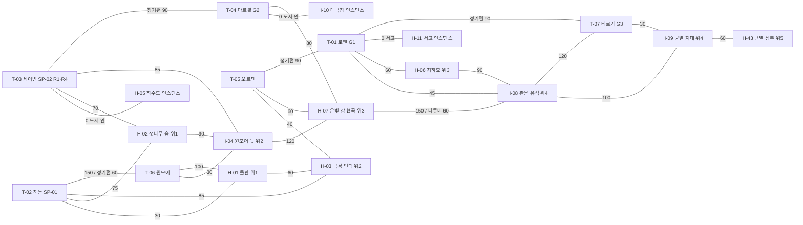

#### 2.6.2 스벨드(C-02) — 추정 면적 합계 ≈ 6.9M studs²(여백 ×2 ≈ 13.8M) < 16M → 1 플레이스(여유 적음, 경계 후보 기록)

| 노드 | 이름 | 인접 노드(도보 초, 추정) | 면적 | 플레이스 경계 후보 |
|---|---|---|---|---|
| T-08 | 베르그홀 | H-19(도시 안 입구 0) · T-13(100) · T-09(150, 정기편 60) · G1 | M | ○ |
| T-09 | 코르딘 광산 마을(SP-03) | H-12(20) · H-18 입구(70) · H-14(80) · T-08(150, 정기편 60) | S | — |
| T-10 | 스케른 야영지(SP-04) | H-13(25) · H-20(70) · H-14(85) | S | — |
| T-11 | 홀름벡 | H-14(90) · T-29(100) · T-12(정기편 90) · G4 | M | — |
| T-12 | 프로스텐 | H-17(60) · H-18 입구(80) · T-11(정기편 90) · R4 | M | — |
| T-13 | 이르멘 | H-16(50) · T-08(100) | S | — |
| T-29 | 요르나 | H-20(30) · T-11(100) | S | — |
| H-12 | 코르딘 상층 갱도 | T-09(20) · H-15(승강기 10) | M | — |
| H-13 | 스케른 설원 | T-10(25) · H-14(80) · H-17(90) | L | — |
| H-14 | 서리송곳 능선 | T-09(80) · T-10(85) · T-11(90) · H-13(80). 기슭에 '얼음 다리 초소'(안전 구역, 전투 없음, A-12 1장 무대) | L | ×(SP-03 · SP-04가 공유하는 반경 사냥터) |
| H-15 | 코르딘 심층 갱도 | H-12(승강기 10) | M | — |
| H-16 | 토르마 옛 성채 | T-13(50) · H-42(90) | M | — |
| H-17 | 눈보라 곰 골짜기 | T-12(60) · H-13(90) · H-42(100) | L | ○ |
| H-18 | 얼음궁 지하(인스턴스) | 입구: T-09(70)와 T-12(80) 사이의 얼음궁 문 | — | 별도 플레이스 |
| H-19 | 산왕의 옛 대장간(인스턴스) | 입구: T-08 도시 안(0) | — | 별도 플레이스 |
| H-20 | 요르나 얼음호수 습지 | T-29(30) · T-10(70). 걷는 물 | M | — |
| H-42 | 폭설 봉우리 정상 | H-16(90) · H-17(100) | L | ○ |

- 경계 후보 간선: T-08–T-09, H-42–H-17 → 남서(T-08 · T-13 · H-16 · H-42 · H-19) / 북동(나머지). SP-03 · SP-04의 반경이 H-14를 공유하므로 두 시작 도시는 항상 같은 플레이스다.

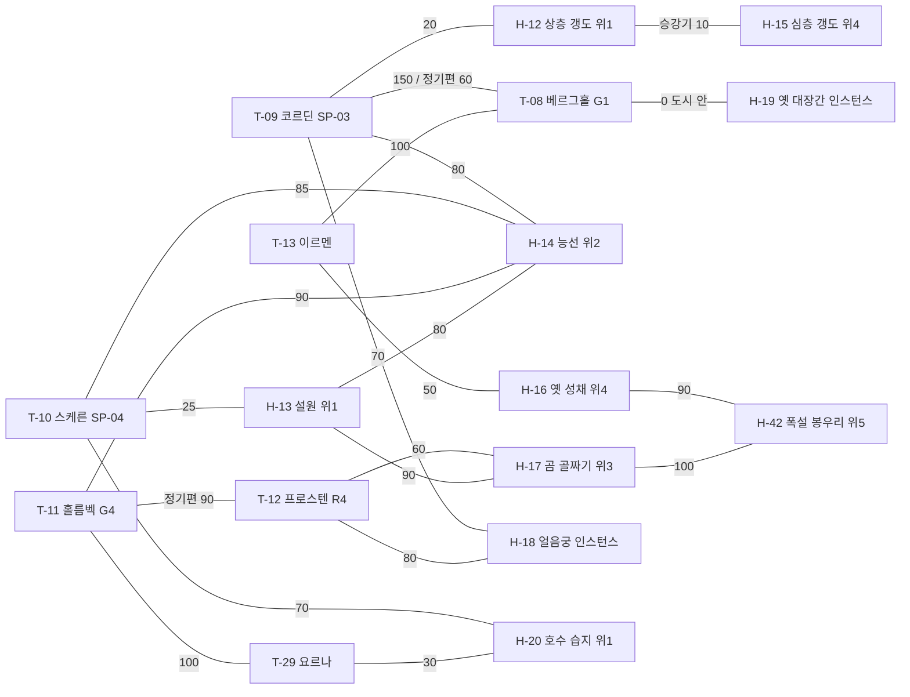

#### 2.6.3 케브라(C-03) — 추정 면적 합계 ≈ 5.3M studs²(여백 ×2 ≈ 10.7M) < 16M → 1 플레이스

| 노드 | 이름 | 인접 노드(도보 초, 추정) | 면적 | 플레이스 경계 후보 |
|---|---|---|---|---|
| T-14 | 자하르 | H-24(60) · H-26 입구(90) · T-15(정기편 60) · G2 | M | — |
| T-15 | 나임(SP-05) | H-21(25) · H-26 입구(60) · H-27(70) · H-22(80) · T-14(정기편 60) · T-16(정기편 90) | S | — |
| T-16 | 사르케 | H-22(70) · T-17(정기편 60) · T-15(정기편 90) · G4 | M | ○ |
| T-17 | 라흐마 협곡 마을 | H-23(30) · T-16(정기편 60) | S | — |
| T-18 | 엘바르 | H-25(60) · H-23(100) · G5 · R2 | M | — |
| H-21 | 나임 오아시스 외곽 | T-15(25) · H-27(60) | M | — |
| H-22 | 모래바람 고원 | T-15(80) · T-16(70) · H-27(90) | L | ○ |
| H-23 | 라흐마 협곡 | T-17(30) · T-18(100) | L | — |
| H-24 | 태양왕조 옛 묘역 | T-14(60) | M | — |
| H-25 | 유리사막 | T-18(60) | L | — |
| H-26 | 지하 수로 사원(인스턴스) | 입구: T-15(60)와 T-14(90) 사이의 오아시스 수로. 입구 바깥에 '수로 관리청 초소'(안전 구역, A-15 2장 무대) | — | 별도 플레이스 |
| H-27 | 모래도둑 은거지 | T-15(70) · H-21(60) · H-22(90) | M | — |

- 경계 후보 간선: H-22–T-16 → 서부(T-14 · T-15 · H-21 · H-22 · H-24 · H-26 · H-27) / 동부(T-16 · T-17 · T-18 · H-23 · H-25).

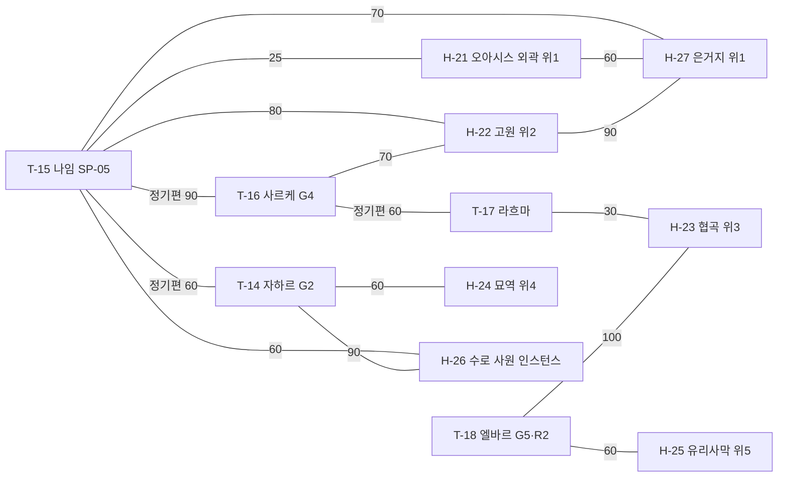

#### 2.6.4 이스메르(C-04) — 추정 면적 합계 ≈ 4.7M studs²(바다 평면 제외, 여백 ×2 ≈ 9.4M) < 16M → 1 플레이스

군도이므로 섬 사이는 NPC 나룻배 · 정기 선편(2.4)으로 잇는다. 같은 플레이스 안의 자동 운항이라 로딩은 없다.

| 노드 | 이름 | 인접 노드(도보 초, 추정) | 면적 | 플레이스 경계 후보 |
|---|---|---|---|---|
| T-19 | 토모 섬(SP-06) | H-28(30) · H-29 부표(나룻배 60) · H-30 가장자리(85) · T-20(선편 90) | S | — |
| T-20 | 카이루 | H-31 잠수종 선착장(50) · H-34(90) · H-29(나룻배 90) · T-19(선편 90) · T-23(선편 60) · R1 · R3 | M | ○ |
| T-21 | 안세 | H-33(도시 안 입구 0) · T-22(100) · G5 | M | — |
| T-22 | 무라 전초기지 | H-30(30) · T-21(100) | S | — |
| T-23 | 펠라 | H-32(나룻배 60) · T-20(선편 60) · R2 | M | — |
| H-28 | 토모 섬 갯벌 | T-19(30) · H-30(80). 걷는 물 | M | — |
| H-29 | 산호 얕은 바다 | T-19(나룻배 60) · T-20(나룻배 90). 걷는 물 | M | — |
| H-30 | 무라 정글 | T-22(30) · H-28(80) · T-19(85) | L | — |
| H-31 | 가라앉은 세르낙 선착장 | T-20(50, 잠수종) | M | — |
| H-32 | 폭풍 군도 | T-23(나룻배 60) | L | — |
| H-33 | 벨로스 시련의 방(인스턴스) | 입구: T-21 도시 안(0) | — | 별도 플레이스 |
| H-34 | 고래뼈 동굴 | T-20(90) | M | — |

- 경계 후보: 섬 사이 선편 구간(T-19–T-20, T-20–T-23)이 자연 경계. 토모 섬(T-19 · H-28 · H-29 · H-30 · T-22 · T-21)은 한 덩어리다.

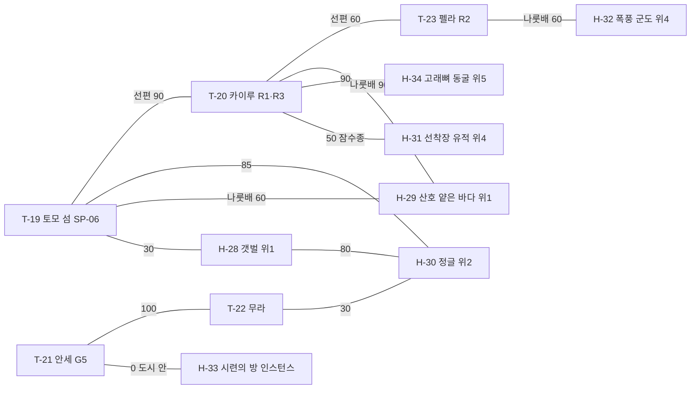

#### 2.6.5 하드라(C-05) — 추정 면적 합계 ≈ 6.1M studs²(여백 ×2 ≈ 12.1M) < 16M → 1 플레이스

| 노드 | 이름 | 인접 노드(도보 초, 추정) | 면적 | 플레이스 경계 후보 |
|---|---|---|---|---|
| T-24 | 카르드 전초기지(SP-07) | H-37(20, 방벽 바로 밖) · H-36(80) · H-38(90) · T-27(정기 수레 60, 첫 이용 무료) · G3 | S | — |
| T-25 | 오르멘 | H-38(60) · H-40 외곽 야영지(120) · T-26(정기편 90) | M | ○ |
| T-26 | 조르하 | H-39(40) · H-41 외곽 야영지(100) · T-25(정기편 90) | M | — |
| T-27 | 하엘 | H-35(25) · T-24(정기 수레 60) · R3 | S | — |
| T-28 | 등불 초소 | H-36(30) · H-41 외곽 야영지(90) | S | ○ |
| H-35 | 하엘 남안 갈대밭 | T-27(25) · H-36(110) | M | — |
| H-36 | 등불 초소 잿들 | T-28(30) · H-37(70) · T-24(80) · H-35(110) | L | — |
| H-37 | 카르드 폐허 외곽 | T-24(20) · H-38(60) · H-36(70). 방벽 바로 밖에 입문 포켓 '무너진 저장고' | M | — |
| H-38 | 에스카 마도 첨탑 | T-25(60) · H-37(60) · T-24(90) · H-40 외곽 야영지(100) | M | ○ |
| H-39 | 흑염 평원 | T-26(40) · H-41(80) · H-40(90) | L | — |
| H-40 | 뒤틀린 심장부(광기) | H-39(90) · H-38(100) · T-25(120). 외곽 야영지는 광기 지역 밖 | L | ○ |
| H-41 | 균열의 눈(광기) | H-39(80) · T-28(90) · T-26(100). 외곽 야영지는 광기 지역 밖 | L | ○ |

- 경계 후보 간선: H-38–T-25, H-38–H-40, T-28–H-41 → 남부(T-24 · T-27 · T-28 · H-35 · H-36 · H-37 · H-38) / 북부(T-25 · T-26 · H-39 · H-40 · H-41). H-38은 SP-07 반경이므로 남부에 둔다.

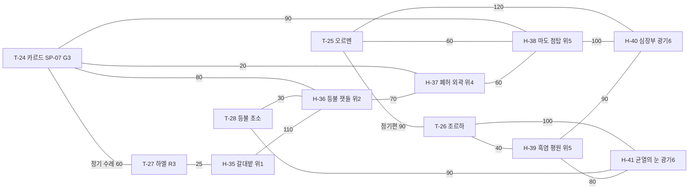

- 집계: 노드 72(도시 29 + 사냥터 43), 인스턴스 입구 7, 정기편 · 선편 간선 13, 나룻배 간선 4, 잠수종 1, 승강기 1. 다섯 대륙 모두 추정 면적이 상한 아래라 **MVP · 확장 공통으로 대륙당 1 플레이스**로 시작하고, 실측이 상한을 넘는 대륙만 위 경계에서 나눈다(11).

---

## 3. 역사 연표와 현재 정세

### 3.1 연표

연도 표기: 갈림의 날 이전 = **BP N**(Before the Parting), 이후 = **AP N**(After the Parting). 현재는 **AP 900**.

| # | 연도 | 사건 | 남은 흔적(지역 · 세력) | 연결 대형 사건 |
|---|---|---|---|---|
| 1 | BP 620 | 세르낙 왕조 성립. 하나였던 대지를 마력 결정 도로와 전송문으로 묶기 시작 | 각 대륙의 세르낙 유적(H-06 · H-08 · H-24 · H-31 · H-38) | E-02 |
| 2 | BP 300 | 갈림길 문 5기 완공. 세르낙의 '왕도'는 다섯 조각이 되기 전 대지의 중앙에 있던 하나의 도시였다. 갈림의 날에 **왕도는 조각나** 지금의 네 대륙에 흩어졌다(D-32: 관문 구역 H-08 아르텐 · 묘역 하층 H-24 케브라 · 선착장 H-31 이스메르 · 심장부 H-40 하드라). 어느 조각도 '본래의 왕도' 전체가 아니다 | 갈림길 문 G1~G5, 왕도 조각 H-08 · H-24 · H-31 · H-40 | E-02 |
| 3 | BP 120 | 고룡족 오르바르(RC-07)와 세르낙의 협약: 오르바르는 잠들고, 세르낙은 마력 결정 채굴을 제한한다 | H-16 토르마 옛 성채의 벽화, F-14 잠든 비늘 교단의 경전 | E-04 |
| 4 | BP 40 | 세르낙이 협약을 어기고 심층 마력 결정을 대량 채굴. 대장장이 명장들이 한정 장비의 원형을 만든다 | H-19 산왕의 옛 대장간, 한정 장비의 근원 | E-02 |
| 5 | AP 0 | **갈림의 날(The Great Parting)**. 대지가 다섯 조각으로 갈라지고 세르낙 왕조가 하루 만에 사라진다. 원인은 기록마다 다르다(마력 폭주 / 오르바르의 분노 / 왕조 내부 배신). 오르바르의 몸과 의식도 이날 넷으로 나뉘어 네 대륙에 잠들었다('그림자 닻' 4곳: H-42 · H-25 · H-34 · H-40, D-32) | 모든 대륙의 단층 지형, 하드라 전역의 뒤틀린 마력, 그림자 닻 4곳 | E-01 · E-04 |
| 6 | AP 3 | 세르낙 잔존체 케슈(RC-08)가 하드라와 옛 유적에서 처음 목격된다 | H-24 · H-38 · H-40 | E-02 |
| 7 | AP 40 | 아르텐에서 카엘룬 왕국(N-01) 건국. 세르낙 관문 유적의 바깥 고리를 성벽 삼아 왕도 로엔을 세운다. 성벽 밖 안쪽 관문 구역이 지금의 H-08이다 | T-01 로엔(성벽 = 유적 바깥 고리), H-08 세르낙 관문 유적(성벽 밖 관문 구역) | — |
| 8 | AP 85 | 스벨드의 드워프가 카르니스 산왕국(N-03)을 재건(BP 시대에 세르낙 휘하 '산왕'이 다스리던 드워프 왕국. H-19 산왕의 옛 대장간은 그 시절 시설). 같은 해 설원 부족들이 이스텔 연맹(N-04)을 결성 | T-08 베르그홀, T-11 홀름벡, H-19 | — |
| 9 | AP 150 | 케브라에서 미르잔 태양왕조(N-05) 성립. 오아시스 수로(세르낙 유산)를 장악한 가문이 왕조가 된다 | T-14 자하르, H-26 지하 수로 사원 | E-02 |
| 10 | AP 260 | 이스메르에서 루카이 해상연합(N-07) 결성. 같은 해 벨로스 사원령(N-08)이 루카이에서 독립(AP 260). 벨로스 사원은 세르낙 시련장 위에 세워졌다(H-33) | T-20 카이루, T-21 안세, H-33 | — |
| 11 | AP 380 | 하드라에서 에스카 잔존 마도왕국(N-09) 선포. 세르낙 왕가의 계승을 주장하지만 다른 국가는 인정하지 않는다 | T-25 오르멘 | E-02 |
| 12 | AP 520 | 아르텐 서해안 항구 도시들이 카엘룬에서 벗어나 브렌마르 자유도시연합(N-02)을 결성 | T-03 세이번(항구) · T-04 마르켈(의회 수도, 내륙) | E-03 |
| 13 | AP 610 | 탈라 대상단(N-06)이 미르잔에게서 자치권을 사들여 국가급 상단이 된다. 첫 항로 협정(탈라 · 루카이 · 브렌마르) | T-16 사르케, 항로 R1 · R2 | E-03 |
| 14 | AP 700 | 구르한 흑염 유목민(N-10)의 대이동. 하드라 북부 흑염 평원(H-39)에 정착하고 에스카와 충돌. 이후 씨족 일부가 남안까지 내려와 어항 하엘(T-27)을 차지한다 | T-26 조르하, T-27 하엘, H-39 | E-04 |
| 15 | AP 780 | 하드라에서 마력 균열이 처음 **기록**된다(관측탑과 학자가 하드라에만 있었다). 같은 시기 다른 대륙의 옛 기록에도 비슷한 현상이 있었다는 주장이 있다. 각국 학자 · 사냥꾼이 모여 회색 등불(F-11)을 결성 | T-28 등불 초소, H-36 | E-01 |
| 16 | AP 850 | 갈림길 문 G1 · G2 재가동(회색 등불 + 카르니스 기술자). 이후 50년에 걸쳐 G3~G5 재가동 | G1~G5 | E-02 |
| 17 | AP 892 | 아르텐 테르가 · 스벨드 설원 · 이스메르 산호해에서 변이 몬스터 첫 보고. 하드라에서 **번진 것인지**, 각 대륙에 **원래 잠들어 있던 균열이 깨어난 것인지** 회색 등불 안에서도 학설이 갈린다(연표는 원점 · 방향을 단정하지 않는다, D-32) | H-09 · H-13 · H-29 | E-01 |
| 18 | AP 897 | 케브라 유리사막에서 '고룡의 그림자' 첫 목격. 잠든 비늘 교단이 순례를 시작 | H-25 · H-41 | E-04 |
| 19 | AP 899 | 항로 협정 갱신 결렬. 탈라 · 루카이 · 브렌마르의 관세 분쟁 시작 | 항로 R1 · R2, T-03 · T-16 · T-20 | E-03 |
| 20 | AP 900 | **현재.** 플레이어가 베이라에 도착한다 | — | — |

### 3.2 현재 정세 요약(AP 900)

| 축 | 상태 | 플레이어에게 보이는 형태 |
|---|---|---|
| 균열(E-01) | 마력 균열이 네 대륙(하드라 · 아르텐 · 스벨드 · 이스메르)에서 관측된다. **원점은 학설 3개로 갈리고 정답을 정하지 않는다**(D-32): ① 하드라 균열의 눈(H-41) ② 아르텐 테르가 심부(H-43) ③ 이스메르 산호해 해저(H-29). 확산 **방향**도 정하지 않는다(하드라에서 번졌는지, 각 대륙의 균열이 따로 깨어났는지 — 3.1 #15 · #17). 균열 근처 몬스터가 변이한다 | 사냥터 표의 '균열 영향' 몬스터, 회색 등불의 의뢰 |
| 유산(E-02) | 갈림길 문 재가동 이후 세르낙 유적이 다시 열리고 있다. **조각난 왕도**(H-08 · H-24 · H-31 · H-40, 4대륙)를 두고 국가 · 결사 · 교단이 경쟁. 어느 조각이 '진짜 왕도'인지는 세력마다 주장이 다르다 | 유적형 사냥터, 열쇠지기의 단서, 한정 장비 소문 |
| 항로(E-03, 대상단 항로 분쟁) | 항로 협정 결렬로 탈라 · 루카이 · 브렌마르가 관세 · 항로 통제권을 다툰다. 무력 충돌은 없다 | 항구 도시 시세 변동, 호위 의뢰, 경제 이벤트 |
| 고룡(E-04) | 갈림의 날에 넷으로 나뉜 오르바르의 몸 · 의식(**그림자 닻** 4곳: H-42 스벨드 · H-25 케브라 · H-34 이스메르 · H-40 하드라)이 저마다 뒤척이기 시작. 네 닻은 서로 동등하고 어느 것도 '본체'가 아니다(D-32). 각 닻의 아크(A-13 · A-19 · A-30 · A-29)는 독립된 결말을 가진다 | 광기 지역, 잠든 비늘 교단의 순례, 토르마 · 구르한의 옛 노래 |
| 전쟁 | 국가 간 전면 전쟁은 없다(D-01). 긴장은 관세 · 국경 · 유산 경쟁 형태 | 세력 평판, (확장) 시즌제 거점 점령전 |

### 3.3 세르낙 유산의 종류(히든 피스의 세계관 근거)

| 유산 종류 | 정의 | 세계 속 위치(대표) | 게임 시스템으로의 연결 | 상세 문서 |
|---|---|---|---|---|
| 유적 | 세르낙의 건물 · 관문 · 묘역 · 선착장. 케슈가 지킨다. 후대 국가가 그 위에 시설을 얹은 곳도 있다(8장 '기원' 열) | H-06, H-08, H-24(세르낙 묘역 위에 태양왕조 왕릉), H-31, H-38, H-40 | 유적형 사냥터, 히든 지역 입구, 기록물 | 07 |
| 잃어버린 기술 | 전송문 · 마력 결정 정제 · 자동인형 제작법 | H-05 자동인형, H-26 수로, G1~G5 | 상위 도안, 작업대 등급 상승 재료, 히든 스킬 | 05, 06 |
| 한정 장비의 원형 | BP 40 명장들이 만든 무구. 세계 전체 수량 N개, 유니버스 단위 관리 | 본체 7곳 분산: H-11, H-19, H-25, H-34, H-38, H-40, H-41(장비별 본체 · 단서 위치는 3.4 표, 광기 지역 몫 2) | 한정 장비(초월 등급 태그), 단서는 저위험 지역부터 | 06, 07, 11 |
| 히든 직업의 근원 | 세르낙 궁정의 직책(서고지기 · 명장 · 묘역 서기관 · 시련 감독관 · 첨탑 마도사)이 남긴 각성 홈 | H-11(서고지기), H-19(명장), H-24(묘역 서기관, 보스 '케슈 서기관'), H-33(시련 감독관, 벨로스 사원이 세르낙 시련장을 재사용), H-38(첨탑 마도사) | 히든 직업 5+(상위 분기형 · 별개형, D-09) | 05, 07 |
| 인장 | 세르낙이 도로 · 수로에 새긴 표식. 지역 귀속 성장 자원 | 모든 대륙(도시 · 사냥터 · 유적) | 인장 게이지(단일 게이지, 01번 4장 #2) | 04 |
| 기록물 | 비석 · 벽화 · 서고의 책. 갈림의 날의 원인이 기록마다 다르다 | H-06, H-11, H-16, H-24, T-21 | 선택 열람 장문 서사(AS-08), 아크 단서 | 07 |

### 3.4 한정 장비 본체 위치와 최상급 마력 결정 산지(D-32, 03-r1-L-02 · L-05)

**한정 장비 본체 7곳**(이름은 가칭, IT- 번호 · 수량 · 스펙은 06, 단서 상세는 07). 본체 = 장비가 실제로 나오는 곳, 단서 = 저위험 지역에서 시작하는 발견 단서(12.1 #7). **광기 지역(H-40 · H-41) 몫은 7개 중 2개**다.

| # | 한정 장비(가칭, 영문) | 본체 위치 H-(대륙) | 단서 시작 H-/T- | 단서 → 본체 경로 성격 | 선착형 |
|---|---|---|---|---|---|
| 1 | 서고지기의 잉크 지팡이 (Archivist's Ink Staff) | H-11 (C-01) | T-01 왕립 서고 → H-06 | 서고 계열 단서 2경로 | 아니오(수량 N) |
| 2 | 명장의 별철 망치 (Master's Starsteel Hammer) | H-19 (C-02) | T-09 갱도 벽 낙서 → H-15 | 대장간 계열 | 아니오 |
| 3 | 유리사막의 거울 방패 (Mirror Shield of the Glass Desert) | H-25 (C-03) | T-15 빛나는 돌 → H-27 | 신기루 계열 | 아니오 |
| 4 | 고래뼈 작살 (Whalebone Harpoon) | H-34 (C-04) | T-19 선박 파편 → H-29 | 침몰선 계열 | 아니오 |
| 5 | 첨탑 마도사의 관 (Spire Mage's Circlet) | H-38 (C-05) | T-28 관측 기록 → H-36 | 첨탑 계열 | 아니오 |
| 6 | 조각난 왕도의 검 (Blade of the Shattered Capital) | H-40 (C-05, 광기) | 왕도 조각 H-08 · H-24 · H-31 중 2곳 | E-02 왕도 조각 단서를 2개 대륙 이상에서 모은다 | 예(수량 1) |
| 7 | 균열의 눈 활 (Rift Eye Bow) | H-41 (C-05, 광기) | H-43 · H-29(E-01 학설 지역) | E-01 학설 단서 | 예(수량 1) |

- 12.2 · 12.3의 '숨은 아이템 7'은 이 표의 7개와 같다. 한정 장비 획득에 '하위 무기 조합'은 쓰지 않는다(01-r1-L-03). 8장 '주요 드롭'의 '한정 장비 본체 1 · 단서'는 이 표를 가리킨다.

**최상급 마력 결정 산지** — 광기 지역에만 있는 필수 재료 · 도안은 없다(02번 용어집 #11, 3-B-5). 06이 이 재료를 초월 등급 제작 · 강화에 쓰더라도 아래 경로로 광기 지역 없이 얻을 수 있다.

| 산지 · 경로 | 대륙 | 위험도 | 방식 | 비고 |
|---|---|---|---|---|
| H-40 뒤틀린 심장부 | C-05 | 6(광기) | 일반 드롭 | 가장 높은 확률(수치 04 · 06) |
| H-41 균열의 눈 | C-05 | 6(광기) | 일반 드롭 | 〃 |
| H-42 폭설 봉우리 정상(설산 거인 · 얼음 고룡 그림자) | C-02 | 5 | 저확률 드롭 | 광기 지역 밖 산지 1 |
| H-25 유리사막(유리 정령 · 고룡의 그림자) | C-03 | 5 | 저확률 드롭 | 광기 지역 밖 산지 2 |
| 정제 레시피 | — | — | 상급 마력 결정 N개 → 작업대 5등급(T-08 베르그홀)에서 정제(도안 · 수치 06) | 사냥 없이 제작 경로 |

- 검산: 광기 지역 밖 산지 2곳 · 2대륙(C-02, C-03) + 정제 1경로. 광기 지역은 '가장 효율이 좋은 곳'일 뿐 '반드시 거쳐야 하는 곳'이 아니다(3-B-5).

---

## 4. 국가 · 세력

### 4.1 국가 표

| ID | 이름(영문) | 대륙 | 정치 체제 | 수도(T-) | 주력 종족 | 경제 기반 | 군사 · 성향 | 세력 F- ID |
|---|---|---|---|---|---|---|---|---|
| N-01 | 카엘룬 왕국 (Kaelun) | C-01 | 세습 왕정 + 영주 회의 | T-01 로엔 | 인간, 바르쿤 | 농업 · 목축 · 내륙 교역 | 상비군 중심 · 보수적 · 질서 중시 | F-01 |
| N-02 | 브렌마르 자유도시연합 (Brenmar) | C-01 | 도시 대표 의회(의장 순환) | T-04 마르켈 | 인간, 엘프, 드워프 | 해상 무역 · 제작 · 경매 | 용병 계약 · 실리적 · 개방적 | F-02 |
| N-03 | 카르니스 산왕국 (Karnis) | C-02 | 산왕 + 장인 길드 평의회 | T-08 베르그홀 | 드워프, 토르마 | 광업 · 대장간 · 마력 결정 정제 | 요새 방어 · 전통 · 기술 자부심 | F-03 |
| N-04 | 이스텔 설원부족연맹 (Istel) | C-02 | 부족장 집회(연 1회) | T-11 홀름벡 | 인간, 바르쿤, 토르마 | 사냥 · 가죽 · 얼음 호수 어업 | 기동 사냥대 · 자유 · 자연 존중 | F-04 |
| N-05 | 미르잔 태양왕조 (Mirzan) | C-03 | 태양왕 세습 + 수로 관리청 | T-14 자하르 | 인간, 아이셀 | 오아시스 농업 · 수로 통행세 · 유리 | 궁정 근위 · 위계 · 화려함 | F-05 |
| N-06 | 탈라 대상단 (Tala) | C-03 | 상단주 선출(주주 총회) | T-16 사르케 | 인간, 바르쿤, 드워프 | 대상 무역 · 항로 · 금융 | 호위단 · 계산적 · 계약 존중 | F-06 |
| N-07 | 루카이 해상연합 (Lukai) | C-04 | 선단장 평의회 | T-20 카이루 | 인간, 바르쿤, 엘프 | 어업 · 항해 · 진주 · 조선 | 함대 · 모험적 · 느슨한 규율 | F-07 |
| N-08 | 벨로스 사원령 (Velos) | C-04 | 대사제 + 사원 회의 | T-21 안세 | 아이셀, 엘프 | 순례 · 약초 · 기록물 필사 | 사원 수호대 · 신중 · 지식 보존 | F-08 |
| N-09 | 에스카 잔존 마도왕국 (Eska) | C-05 | 마도왕 세습(세르낙 계승 주장) | T-25 오르멘 | 인간, 아이셀, 케슈(비플레이어블) | 유적 발굴 · 마력 결정 · 폐허 재활용 | 마도 방벽 · 폐쇄적 · 과거 지향 | F-09 |
| N-10 | 구르한 흑염 유목민 (Gurhan) | C-05 | 씨족장 연합(흑염 회의) | T-26 조르하 | 토르마, 바르쿤, 인간 | 유목 · 잿빛 평원 사냥 · 균열 재료 | 기마 사냥대 · 강인 · 약속 중시 | F-10 |

- 국가(N-)는 지리 · 행정 단위, 세력(F-)은 플레이어가 평판으로 소속을 고르는 NPC 조직이다(01번 1장 용어 정의). 국가 10개는 세력과 1:1이다.

### 4.2 비국가 세력 표

| ID | 이름(영문) | 성격 | 본부(T-) | 활동 대륙 | 목표 | 플레이어 소속 조건(원칙, 상세 07) |
|---|---|---|---|---|---|---|
| F-11 | 회색 등불 (Grey Lantern) | 균열 감시 · 학자 · 사냥꾼 연합 | T-28 등불 초소 | 전 대륙 | 균열의 원인 규명과 확산 저지 | 균열 영향 몬스터 처치 · 조사 의뢰 평판 |
| F-12 | 열쇠지기 (Keywardens) | 세르낙 유산 수집 비밀결사 | 고정 본부 없음(각 대륙 접선책, T-03 · T-14 · T-21에 첫 접선) | 전 대륙 | 유산을 국가가 아닌 '지킬 자'에게 | 유적 탐사 · 기록물 수집 평판, 첫 접선은 히든 단서로만 |
| F-13 | 모루 형제단 (Anvil Brotherhood) | 국가에 속하지 않는 자유 대장장이 조합 | T-09 코르딘 | 전 대륙(각 도시 대장간) | 제작 지식의 공유, 한정 장비 복원 | 제작 · 수리 · 도안 납품 평판(대장장이 외 직업도 가능) |
| F-14 | 잠든 비늘 교단 (Order of the Sleeping Scale) | 고룡 오르바르 숭배 · 순례 교단 | T-21 안세 | 이스메르 · 케브라 · 하드라 · 스벨드(H-16 벽화 · H-13 비늘 조각 순례) | 오르바르를 깨우지 않고 달래는 것 | 순례 · 기록물 열람 평판 |

### 4.3 세력 관계 행렬

5단계: **동맹(A)** / **우호(F)** / **중립(N)** / **긴장(T)** / **적대(H)**. 대각선은 자기 자신. 행 = 기준 세력, 열 = 상대. 관계는 대칭이다.

| | F-01 카엘룬 | F-02 브렌마르 | F-03 카르니스 | F-04 이스텔 | F-05 미르잔 | F-06 탈라 | F-07 루카이 | F-08 벨로스 | F-09 에스카 | F-10 구르한 | F-11 회색 등불 | F-12 열쇠지기 | F-13 모루 형제단 | F-14 잠든 비늘 |
|---|---|---|---|---|---|---|---|---|---|---|---|---|---|---|
| **F-01 카엘룬** | — | T | A | N | F | N | N | N | H | N | F | T | N | N |
| **F-02 브렌마르** | T | — | F | N | N | T | T | N | N | N | F | N | A | N |
| **F-03 카르니스** | A | F | — | T | N | F | N | N | T | N | F | T | F | N |
| **F-04 이스텔** | N | N | T | — | N | N | F | N | N | F | F | N | N | N |
| **F-05 미르잔** | F | N | N | N | — | T | N | F | T | N | N | T | N | F |
| **F-06 탈라** | N | T | F | N | T | — | T | N | N | F | N | N | F | N |
| **F-07 루카이** | N | T | N | F | N | T | — | T | N | N | F | N | N | N |
| **F-08 벨로스** | N | N | N | N | F | N | T | — | T | N | F | T | N | A |
| **F-09 에스카** | H | N | T | N | T | N | N | T | — | H | T | T | N | T |
| **F-10 구르한** | N | N | N | F | N | F | N | N | H | — | F | N | N | N |
| **F-11 회색 등불** | F | F | F | F | N | N | F | F | T | F | — | N | F | T |
| **F-12 열쇠지기** | T | N | T | N | T | N | N | T | T | N | N | — | F | N |
| **F-13 모루 형제단** | N | A | F | N | N | F | N | N | N | N | F | F | — | N |
| **F-14 잠든 비늘** | N | N | N | N | F | N | N | A | T | N | T | N | N | — |

집계(14×14, 91쌍): 동맹 3쌍 / 우호 19쌍 / 중립 49쌍 / 긴장 18쌍 / 적대 2쌍. 동맹 = F-01↔F-03, F-02↔F-13, F-08↔F-14. 적대 = F-01↔F-09, F-09↔F-10.

### 4.4 긴장 · 적대 관계의 이유(07 아크의 씨앗)

| 쌍 | 관계 | 이유(한 줄) | 씨앗이 되는 아크 |
|---|---|---|---|
| F-01 카엘룬 ↔ F-02 브렌마르 | 긴장 | AP 520 독립 이후 국경 관세와 오르덴 국경 순찰권을 다툰다 | A-05 |
| F-01 카엘룬 ↔ F-09 에스카 | 적대 | 에스카가 세르낙 계승을 근거로 아르텐의 관문 유적(H-08) 소유권을 주장 | A-07 · A-25 |
| F-01 카엘룬 ↔ F-12 열쇠지기 | 긴장 | 열쇠지기가 침묵의 서고(H-11, 로엔 왕립 서고 아래)의 유산을 반출했다는 의심 | A-06 |
| F-02 브렌마르 ↔ F-06 탈라 | 긴장 | 항로 협정 결렬(AP 899), 관세 · 항로 통제권 | A-03 · A-16 |
| F-02 브렌마르 ↔ F-07 루카이 | 긴장 | 같은 항로 분쟁. 루카이는 브렌마르 선박의 산호해 통과세를 올렸다 | A-23 · A-14 |
| F-03 카르니스 ↔ F-04 이스텔 | 긴장 | 서리송곳 능선(H-14) 광산권 vs 사냥권 | A-12 |
| F-03 카르니스 ↔ F-09 에스카 | 긴장 | 에스카가 산왕의 옛 대장간(H-19) 도안을 요구 | A-11 |
| F-03 카르니스 ↔ F-12 열쇠지기 | 긴장 | 열쇠지기가 드워프 명장의 도안을 '지킨다'며 가져갔다 | A-11 |
| F-05 미르잔 ↔ F-06 탈라 | 긴장 | 탈라의 자치권 매입(AP 610) 이후 수로 통행세 · 대상 세금 분쟁 | A-16 · A-18 |
| F-05 미르잔 ↔ F-09 에스카 | 긴장 | 태양왕조 묘역(H-24)의 케슈 출현을 에스카 탓으로 여긴다 | A-17 |
| F-05 미르잔 ↔ F-12 열쇠지기 | 긴장 | 오아시스 수로(세르낙 유산)의 열쇠를 두고 경쟁 | A-15 |
| F-06 탈라 ↔ F-07 루카이 | 긴장 | 항로 협정 결렬. 폭풍 군도(H-32) 등대 통제권 | A-23 |
| F-07 루카이 ↔ F-08 벨로스 | 긴장 | 벨로스 독립(AP 260) 이후 순례선 통행세와 산호해 어업권 | A-21 |
| F-08 벨로스 ↔ F-09 에스카 | 긴장 | 에스카의 마력 결정 채굴이 오르바르를 깨운다고 본다 | A-29 · A-30 |
| F-08 벨로스 ↔ F-12 열쇠지기 | 긴장 | 사원의 기록물 반출 시도 | A-22 |
| F-09 에스카 ↔ F-10 구르한 | 적대 | AP 700 대이동 이후 흑염 평원(H-39)의 영역 충돌. 무력 충돌은 소규모 · 국지적 | A-26 |
| F-09 에스카 ↔ F-11 회색 등불 | 긴장 | 회색 등불이 균열의 원인으로 에스카의 채굴을 지목 | A-27 |
| F-09 에스카 ↔ F-12 열쇠지기 | 긴장 | 세르낙 유산의 '정당한 상속자' 다툼 | A-25 |
| F-09 에스카 ↔ F-14 잠든 비늘 | 긴장 | 오르바르를 '자원'으로 보는 에스카와 '잠들게 둬야 할 존재'로 보는 교단 | A-29 · A-30 |
| F-11 회색 등불 ↔ F-14 잠든 비늘 | 긴장 | 균열의 원인을 두고 학설 대립(마력 vs 고룡) | A-27 · A-19 |

- 적대 관계도 국가 간 전면 전쟁으로 가지 않는다(D-01). 플레이어 평판이 적대 세력 양쪽에 걸쳐 있으면 한쪽 상점 가격 · 의뢰가 제한될 뿐 입장 차단은 없다(상세 07 · 10).

### 4.5 점령전 거점과 분쟁 구역(확장 · MVP)

01번 1장 용어 정의: 거점 = 점령전 전용 고정 장소(도시 · 시작 위치 · 수도 제외), 평시 외곽 개방 · 핵 구역 봉쇄. 분쟁 구역 = 진입 시 경고 · 동의가 필요한 지정 PvP 지역(MVP). ID 접두어는 거점 ST-, 분쟁 구역 PZ-(D-23)이며 번호는 08에서 부여한다(여기서는 이름만).

| 구분 | 이름(영문) | 대륙 | 인접 사냥터 | 인접 도시 | 단계 |
|---|---|---|---|---|---|
| 거점 | 은빛 강 요새 (Silverrun Fort) | C-01 | H-07 | T-05 | 확장 3차 |
| 거점 | 서리송곳 망루 (Frostspike Watch) | C-02 | H-14 | T-11 | 확장 3차 |
| 거점 | 협곡 관문 (Canyon Gate) | C-03 | H-23 | T-17 | 확장 3차 |
| 거점 | 등대섬 (Beacon Isle) | C-04 | H-32 | T-23 | 확장 3차 |
| 거점 | 잿빛 첨탑 터 (Ash Spire Site) | C-05 | H-39 | T-26 | 확장 3차 |
| 분쟁 구역 | 강 건너 모래톱 (Far Sandbar) — H-07 안의 표시 구역 | C-01 | H-07 | T-05 | MVP |
| 분쟁 구역 | 재의 고리 (Ash Ring) — H-39 안의 표시 구역 | C-05 | H-39 | T-26 | 확장 4차 |

---

## 5. 종족 표

초기 스탯 보정은 6스탯(힘/민첩/체력/지력/정신/기교) 기준, 각 ±2 이내, 총합 0. 종족 특성은 전투 외 유틸 위주(D-08: 종족과 시작 위치는 독립).

| ID | 이름(영문) | 플레이어블 | 고향(대륙 · 지역) | 외형 · 수명 | 문화 | 초기 스탯 보정(힘/민첩/체력/지력/정신/기교) | 종족 특성(유틸) | 다른 종족과의 관계 |
|---|---|---|---|---|---|---|---|---|
| RC-01 | 인간 (Human) | 예 | 전 대륙(대표: C-01 아르텐) | 다양. 수명 약 80년 | 적응력 · 상업 · 왕국 건설. 모든 세력에 있다 | 0/0/0/0/0/0 | **넓은 발**: 모든 세력 평판 획득 +10% | 모두와 무난. 에스카 인간은 타 대륙에서 경계받음 |
| RC-02 | 드워프 (Dwarf) | 예 | C-02 스벨드 · 카르니스 | 단신 · 넓은 어깨. 수명 약 250년 | 장인 · 광업 · 가문 명예. 도안을 가보로 여김 | +1/-1/+1/-1/0/0 | **광맥 감각**: 광석 채집 속도 +15%, 지도에 광맥 표시 범위 +20% | 카르니스-이스텔 긴장으로 바르쿤 · 이스텔 인간과 미묘. 토르마와는 오랜 동료 |
| RC-03 | 엘프 (Elf) | 예 | C-04 이스메르 · 벨로스, C-01 브렌마르 | 장신 · 긴 귀. 수명 약 400년 | 기록 · 약초 · 항해 관측. 사원령과 자유도시에 분산 | -1/+1/-1/+1/0/0 | **약초 눈**: 약초 · 목재 채집 노드 발견 범위 +25% | 벨로스-루카이 긴장의 중간자. 아이셀과 학문적 교류 |
| RC-04 | 바르쿤 (Varkun, 수인) | 예 | C-02 이스텔, C-05 구르한, C-01 카엘룬 변경 | 털 · 꼬리 · 짐승 귀. 수명 약 60년 | 사냥 · 추적 · 무리 · 약속. 부족 단위 이동 | 0/+2/0/-1/-1/0 | **추적자의 코**: 몬스터 · 채집물 발자국 표시(반경 30m, 추정), 이동 속도 +3% | 이스텔 · 구르한에서 존중. 카엘룬 도시에서는 '변경 사람' 취급 |
| RC-05 | 아이셀 (Aisel, 정령혈) | 예 | C-03 미르잔, C-04 벨로스, C-05 에스카 | 피부에 옅은 빛무늬. 수명 약 150년 | 마력 · 기록 · 의례. 세르낙 궁정 학자의 후예라는 설 | -1/0/-1/+1/+2/-1 | **결정 공명**: 마력 결정 채집량 +15%, 균열 방향 감지(지도 화살표) | 에스카 계열 아이셀은 타 대륙에서 의심받음. 엘프와 교류 |
| RC-06 | 토르마 (Torma, 거인혈) | 예 | C-02 스벨드 산중, C-05 구르한 | 2.3m 안팎 · 굵은 팔. 수명 약 120년 | 성채 · 노래 · 옛 협약의 전승. 오르바르 전설의 전승자 | +2/-1/+1/-1/-1/0 | **넓은 등**: 가방 무게 상한 +20%, 채집물 운반 시 이동 속도 저하 없음 | 드워프의 오랜 동료. 구르한에서 씨족장 다수. 에스카를 불신 |
| RC-07 | 오르바르 (Orvar, 고룡족) | **아니오** | 그림자 닻 4곳(H-42 스벨드 · H-25 케브라 · H-34 이스메르 · H-40 하드라). 어느 곳도 본체가 아니다(D-32) | 거대 비늘 생물. 수명 불명(수천 년) | 잠든 존재. 협약과 분노만 남아 있다 | — | — | 잠든 비늘 교단이 숭배, 에스카가 자원으로 봄. E-04의 축 |
| RC-08 | 케슈 (Kesh, 세르낙 잔존체) | **아니오** | 세르낙 유적 전반, C-05 하드라 | 반투명 · 옛 세르낙 복식의 잔영. 수명 없음 | 갈림의 날에 멈춘 존재. 옛 명령을 반복하거나 새 명령을 기다림 | — | — | 유적 파수꾼(적) 또는 이야기 NPC(중립). 에스카가 '백성'이라 부름 |

- 스탯 보정 합계 검산: RC-02 (+1-1+1-1+0+0)=0, RC-03 (-1+1-1+1+0+0)=0, RC-04 (0+2+0-1-1+0)=0, RC-05 (-1+0-1+1+2-1)=0, RC-06 (+2-1+1-1-1+0)=0.
- 종족 특성 수치는 **추정**이며 04에서 확정한다. 전투 스탯에 직접 영향을 주는 특성은 없다.
- 고향 종족 보너스(D-08): 시작 위치의 고향 종족이면 첫 아크 대사 변형 + 해당 세력 초기 평판 +50(추정). 다른 보너스 없음.
- MVP 플레이어블 4종(02번 10절) = **RC-01 인간 · RC-02 드워프 · RC-04 바르쿤 · RC-06 토르마**(MVP 시작 위치 SP-01~04의 고향 종족, 5.2). RC-03 엘프 · RC-05 아이셀은 확장 1차(케브라)부터 플레이어블(최종은 12번).

### 5.1 플레이어블 종족 간 관계 행렬

5단계(4.3과 동일 표기). 게임 규칙에는 영향이 없고 NPC 대사 · 아크 분기의 소재로만 쓴다(07).

| | RC-01 인간 | RC-02 드워프 | RC-03 엘프 | RC-04 바르쿤 | RC-05 아이셀 | RC-06 토르마 |
|---|---|---|---|---|---|---|
| **RC-01 인간** | — | F | N | N | N | N |
| **RC-02 드워프** | F | — | N | T | N | A |
| **RC-03 엘프** | N | N | — | N | F | N |
| **RC-04 바르쿤** | N | T | N | — | N | F |
| **RC-05 아이셀** | N | N | F | N | — | T |
| **RC-06 토르마** | N | A | N | F | T | — |

| 쌍 | 관계 | 이유 |
|---|---|---|
| 드워프 ↔ 토르마 | 동맹 | 카르니스 재건(AP 85)을 함께 했다. 토르마가 성채를, 드워프가 갱도를 |
| 드워프 ↔ 바르쿤 | 긴장 | 서리송곳 능선 광산권 · 사냥권 분쟁(A-12)의 양쪽 |
| 아이셀 ↔ 토르마 | 긴장 | 토르마의 전승은 세르낙 궁정(아이셀의 선조)이 협약을 깼다고 노래한다(A-13) |
| 인간 ↔ 드워프 | 우호 | 카엘룬-카르니스 동맹(F-01 ↔ F-03) |
| 엘프 ↔ 아이셀 | 우호 | 벨로스 사원에서 기록물을 함께 필사한다 |
| 바르쿤 ↔ 토르마 | 우호 | 구르한 씨족 연합의 두 축 |

### 5.2 종족별 고향 도시와 시작 위치 매핑

| 종족 | 고향 도시(대사 변형이 있는 곳) | 고향 종족으로 지정된 시작 위치 | 비고 |
|---|---|---|---|
| RC-01 인간 | T-01, T-02, T-03, T-04, T-05, T-06, T-14 | SP-01, SP-02 | 가장 넓은 고향 범위 |
| RC-02 드워프 | T-08, T-09, T-13 | SP-03 | SP-03의 고향 종족은 드워프 · 토르마 2종 |
| RC-03 엘프 | T-19, T-21, T-23, T-04 | SP-06 | 브렌마르 엘프는 항해 관측사 |
| RC-04 바르쿤 | T-10, T-11, T-29, T-26, T-05 | SP-04 | 카엘룬 변경(T-05)에도 소수 |
| RC-05 아이셀 | T-15, T-14, T-21, T-24, T-25 | SP-05, SP-07 | SP-07의 고향 종족은 에스카 계열 아이셀 |
| RC-06 토르마 | T-13, T-26, T-08, T-09 | SP-03 | 드워프와 동맹(5.1), 고향 도시 T-08 · T-13이 T-09에 인접하므로 SP-03의 고향 종족을 드워프 · 토르마 2종으로 지정(03-r1-M-15). 8번째 시작 위치 후보는 14장 확인 필요 #2 |

---

## 6. 도시 · 마을 표

규모: 수도 / 도시 / 마을 / 전초기지(야영지 포함). **도시 위험도** = 성문 밖 순찰 범위에 나오는 일반 몬스터의 레벨 밴드(D-12 척도). 도시 내부는 안전 구역(몬스터 없음). 순찰대가 있는 도시는 인접 사냥터보다 1~2 낮을 수 있다(수도는 1, 하드라의 수도 · 집결지는 4). 대장간 등급 1~5(D-03 작업대 등급과 연동, 06에서 확정). 부활 지점 = 사망 시 선택 가능한 부활 위치(D-05 (4)). 야영지 정의: T- ID를 가진 소규모 거주지는 여기 표에, 사냥터 안의 야영지는 8장 '부활 지점' 열로 표기한다(01-r3-L-01 반영, ID 없음).

| ID | 이름(영문) | 대륙 / 국가 | 규모 | 위험도 | 대장간 | 상점 | 경매장 | 길드 관리 | 갈림길 문 | 항구 | 부활 지점 | 특징 한 줄 | 시작 위치 |
|---|---|---|---|---|---|---|---|---|---|---|---|---|---|
| T-01 | 로엔 (Roen) | C-01 / N-01 | 수도 | 1 | 4 | 전 품목 | ○ | ○ | G1 | × | ○ | 세르낙 관문 유적의 바깥 고리를 성벽으로 쓴 왕도. 왕립 서고(시설) 아래가 H-11 침묵의 서고 | — |
| T-02 | 해든 마을 (Hadden) | C-01 / N-01 | 마을 | 1 | 1 | 기본 | × | × | × | × | ○ | 무너진 다리 때문에 유명해진 변경 마을 | **SP-01** |
| T-03 | 세이번 (Seyburn) | C-01 / N-02 | 도시 | 1 | 3 | 전 품목 | ○ | ○ | × | ○ R1 · R4 | ○ | 브렌마르 최대 항구. 하수도 아래에 옛 인장이 있다 | **SP-02** |
| T-04 | 마르켈 (Markel) | C-01 / N-02 | 수도 | 1 | 4 | 전 품목 | ○ | ○ | G2 | × | ○ | 의회 도시. 대극장이 무너진 뒤 지하가 사냥터가 됐다 | — |
| T-05 | 오르덴 요새마을 (Orden Hold) | C-01 / N-01 | 마을 | 2 | 2 | 기본 · 무기 | × | ○ | × | × | ○ | 카엘룬-브렌마르 국경. 순찰대 본부 | — |
| T-06 | 윈모어 목장촌 (Winmoor) | C-01 / N-01 | 마을 | 2 | 1 | 기본 · 가죽 | × | × | × | × | ○ | 늪 옆 목장. 밤마다 울음소리가 난다 | — |
| T-07 | 테르가 초소 (Terga Post) | C-01 / N-01 | 전초기지 | 4 | 2 | 기본 · 수리 | × | × | G3 | × | ○ | 하드라로 가는 문을 지키는 초소. 회색 등불 분소. 로엔행 정기 마차(90초, G3로 온 저레벨의 탈출로) | — |
| T-08 | 베르그홀 (Berghol) | C-02 / N-03 | 수도 | 1 | 5 | 전 품목 | ○ | ○ | G1 | × | ○ | 산속 왕도. 세계 최고 등급 대장간 | — |
| T-09 | 코르딘 광산 마을 (Kordin) | C-02 / N-03 | 마을 | 1 | 3 | 기본 · 광석 | × | × | × | × | ○ | 모루 형제단 본부. 용광로가 멈춘 적이 있다 | **SP-03** |
| T-10 | 스케른 야영지 (Skern Camp) | C-02 / N-04 | 전초기지 | 1 | 1 | 기본 · 가죽 | × | × | × | × | ○ | 이스텔 사냥꾼의 겨울 야영지 | **SP-04** |
| T-11 | 홀름벡 (Holmbek) | C-02 / N-04 | 수도 | 2 | 2 | 기본 · 가죽 · 식량 | × | ○ | G4 | × | ○ | 부족 집회지. 연 1회 집회 때만 수도 기능 | — |
| T-12 | 프로스텐 (Frosten) | C-02 / N-04 | 도시 | 2 | 2 | 전 품목 | ○ | ○ | × | ○ R4 | ○ | 얼음항. 겨울엔 배가 얼어붙는다 | — |
| T-13 | 이르멘 (Irmen) | C-02 / N-03 | 마을 | 2 | 2 | 기본 | × | × | × | × | ○ | 토르마 산중 마을. 옛 성채의 노래를 전승 | — |
| T-14 | 자하르 (Zahar) | C-03 / N-05 | 수도 | 1 | 4 | 전 품목 | ○ | ○ | G2 | × | ○ | 태양왕도. 수로 관리청이 오아시스를 통제 | — |
| T-15 | 나임 (Naim) | C-03 / N-05 | 도시 | 1 | 2 | 기본 · 식량 · 유리 | × | ○ | × | × | ○ | 오아시스 도시. 모래 아래에서 목소리가 들린다 | **SP-05** |
| T-16 | 사르케 (Sarke) | C-03 / N-06 | 수도 | 2 | 3 | 전 품목 | ○ | ○ | G4 | × | ○ | 대상단 본거지. 시세판이 도시 한가운데 있다 | — |
| T-17 | 라흐마 협곡 마을 (Rahma) | C-03 / N-06 | 마을 | 3 | 2 | 기본 · 수리 | × | × | × | × | ○ | 협곡 다리 통행세로 먹고 사는 마을 | — |
| T-18 | 엘바르 (Elvar) | C-03 / N-05 | 도시 | 2 | 2 | 전 품목 | × | ○ | G5 | ○ R2 | ○ | 케브라 남부 항구. 유리사막 순례의 출발점 | — |
| T-19 | 토모 섬 (Tomo Isle) | C-04 / N-07 | 마을 | 1 | 1 | 기본 · 어구 | × | × | × | ○(소형 선착장) | ○ | 루카이 어촌. 그물이 비기 시작했다 | **SP-06** |
| T-20 | 카이루 (Kairu) | C-04 / N-07 | 수도 | 1 | 3 | 전 품목 | ○ | ○ | × | ○ R1 · R3 | ○ | 해상연합 본항. 선단장 평의회 | — |
| T-21 | 안세 (Anse) | C-04 / N-08 | 수도 | 1 | 2 | 기본 · 약초 · 기록물 | × | ○ | G5 | × | ○ | 벨로스 대사원. 잠든 비늘 교단 본부 | — |
| T-22 | 무라 전초기지 (Mura Post) | C-04 / N-08 | 전초기지 | 3 | 1 | 기본 · 수리 | × | × | × | × | ○ | 정글 안 순례 중계지 | — |
| T-23 | 펠라 (Pela) | C-04 / N-07 | 도시 | 1 | 2 | 전 품목 | ○ | ○ | × | ○ R2 | ○ | 산호 시장 섬. 경매장이 시장 위에 떠 있다 | — |
| T-24 | 카르드 전초기지 (Kard Outpost) | C-05 / N-09 | 전초기지 | 4 | 2 | 기본 · 수리 | × | × | G3 | × | ○ | 에스카 폐허 전초기지. '숙련자용 도전 시작'. 안뜰을 포함한 내부 전체가 안전 구역(D-29), 무관심 몬스터는 방벽 밖 H-37부터 | **SP-07** |
| T-25 | 오르멘 (Ormen) | C-05 / N-09 | 수도 | 4 | 4 | 전 품목 | ○ | ○ | × | × | ○ | 마도 방벽 안의 잔존 왕도. 케슈가 거리를 걷는다 | — |
| T-26 | 조르하 (Zorha) | C-05 / N-10 | 도시 | 4 | 2 | 기본 · 가죽 · 균열 재료 | × | ○ | × | × | ○ | 흑염 유목민 대집결지. 천막이 도시가 됐다 | — |
| T-27 | 하엘 (Hael) | C-05 / N-10 | 마을 | 2 | 1 | 기본 · 어구 | × | × | × | ○ R3 | ○ | 하드라 남안의 조용한 항구. 대륙에서 가장 안전한 곳 | — |
| T-28 | 등불 초소 (Lantern Post) | C-05 / F-11 | 전초기지 | 2 | 2 | 기본 · 수리 | × | × | × | × | ○ | 회색 등불 본부. 균열 관측탑 | — |
| T-29 | 요르나 (Jorna) | C-02 / N-04 | 마을 | 2 | 1 | 기본 · 식량 | × | × | × | × | ○ | 얼음 호수 마을. 겨울 낚시 | — |

- 집계: 29곳(수도 9, 도시 6, 마을 9, 전초기지 5 = 29). 대륙별 아르텐 7, 스벨드 7, 케브라 5, 이스메르 5, 하드라 5. 4-정량 20+ 충족.
- 대장간 등급이 0인 도시는 없다(모든 거주지에서 수리 가능). 경매장은 유니버스 공유(11).
- 갈림길 문 위치 검산: G1 T-01↔T-08, G2 T-04↔T-14, G3 T-07↔T-24, G4 T-11↔T-16, G5 T-18↔T-21. 대륙별 문 수: 아르텐 3, 스벨드 2, 케브라 3, 이스메르 1, 하드라 1(2.3 표와 일치).

---

## 7. 시작 위치 표

7곳(SP-01~07, D-20), 5개 대륙(아르텐 2 · 스벨드 2 · 케브라 1 · 이스메르 1 · 하드라 1). 4-정량 '6+, 3개 대륙' 충족. 시작 카드 항목은 02번 5.1 기준. 위험도 열은 D-21 형식 '도시 위험도 (반경 사냥터 위험도 범위)'. **반경** = 시작 도시 성문에서 **도보 90초 이내**(D-28, 2.6 연결표의 값). **입문 구역**(D-29) = 반경 사냥터 안의 하위 구역으로 몬스터 레벨 1~4, 시작 도시에서 도보 60초 이내(나룻배 포함), 02번 5.2 '1~3분 첫 전투'를 모든 시작 위치에서 보장한다(목록은 8장 머리말 표). 표지판 3방향은 **7.1에서만 정의**한다(03-r1-M-03).

| ID | 도시(T-) | 대륙 | 위험도 | 고향 종족 | 추천 태그(2) | 첫 화면 한 줄 소개 | 첫 아크 | 반경 내 사냥터 3곳(성문에서 도보 초) | 입문 구역(Lv1~4, 도보 60초 이내) | 닿을 수 있는 아크(3+) | 첫 10분 권장 동선(강제 아님, 3-B-2) |
|---|---|---|---|---|---|---|---|---|---|---|---|
| SP-01 | T-02 해든 마을 | C-01 아르텐 | 1 (반경 1~2) | RC-01 인간 | 이야기 · 전투 | "다리가 무너진 변경 마을. 처음이라면 여기서." (입문 추천) | A-01 | H-01(30), H-02(75), H-03(85) | H-01 '마을 앞 들판'(30초) | A-01, A-02, A-05, A-08 | 무너진 다리(대시) → 마을 앞 들판 들쥐 2~3마리(입문 구역) → 촌장 부탁(전투/채집 택1) → 갈림길 표지판(7.1) · 갈림길 제단(직업 체험, D-10) |
| SP-02 | T-03 세이번 | C-01 아르텐 | 1 (반경 1~2) | RC-01 인간 | 교역 · 제작 | "브렌마르 최대 항구. 만들고, 사고, 팔고 싶다면." (상업 · 제작 추천) | A-03 | H-05(도시 안 입구 0), H-02(70), H-04(85) | H-05 '입구 배수로'(0초, 하수도 바깥 배수로) · H-02 '숲 가장자리 벌목지'(70초) | A-03, A-04, A-02, A-08 | 부두 하역 사고(점프 · 대시) → 배수로 쥐 2~3마리(입문 구역) → 항만 서기 부탁(배수로 조사/화물 분류 택1) → 대장간 앞 표지판(7.1). 경매장 · 작업대는 표지판이 아니라 도시 안 시설 안내로 보여준다 |
| SP-03 | T-09 코르딘 광산 마을 | C-02 스벨드 | 1 (반경 1~2) | RC-02 드워프 · RC-06 토르마 | 제작 · 광산 | "용광로가 멈춘 광산 마을. 대장장이의 길." (대장장이 추천) | A-09 | H-12(20), H-14(80), H-18 입구(70) | H-12 '갱도 입구 휴게소 앞'(20초) | A-09, A-11, A-12, A-13 | 갱도 낙석(대시) → 휴게소 앞 동굴 두더지(입문 구역) → 형제단 장인 부탁(광석 채집/갱도 청소 택1, 0장용 채집 노드는 개인 노드 10.6) → 작업대 첫 사용 → 표지판(7.1) |
| SP-04 | T-10 스케른 야영지 | C-02 스벨드 | 1 (반경 1~2) | RC-04 바르쿤 | 사냥 · 탐험 | "설원의 겨울 야영지. 발자국을 따라가라." (사냥 추천) | A-10 | H-13(25), H-14(85), H-20(70) | H-13 '야영지 외곽 눈밭'(25초) | A-10, A-12, A-13, A-14 | 눈사태 길(대시) → 외곽 눈밭 눈토끼(입문 구역) → 사냥대장 부탁(추적/덫 설치 택1) → 발자국 표지(7.1) |
| SP-05 | T-15 나임 | C-03 케브라 | 1 (반경 1~2) | RC-05 아이셀 | 탐험 · 히든 | "모래 아래 목소리가 들리는 오아시스 도시." (탐험 추천) | A-15 | H-21(25), H-22(80), H-27(70) | H-21 '오아시스 둑 바깥'(25초) · H-27 '은거지 바깥 모래언덕'(70초) | A-15, A-16, A-18, A-19 | 무너진 수로 벽(대시) → 둑 바깥 모래전갈(입문 구역) → 수로 관리인 부탁(수로 탐사/도둑 흔적 택1) → 표지판(7.1) |
| SP-06 | T-19 토모 섬 | C-04 이스메르 | 1 (반경 1~2) | RC-03 엘프 | 채집 · 항해 | "그물이 비기 시작한 어촌 섬. 바다가 부른다." (채집 · 항해 추천) | A-20 | H-28(30), H-29 부표(나룻배 60), H-30 가장자리(85) | H-28 '잔교 아래 갯벌'(30초) · H-29 '부표 선착장 얕은 물'(나룻배 60초, 걷는 물) | A-20, A-22, A-23, A-24 | 끊어진 잔교(점프 · 대시) → 잔교 아래 갯벌 게(입문 구역) → 어촌장 부탁(조개 채집/게 처치 택1, 개인 채집 노드) → 선착장 표지판(7.1) |
| SP-07 | T-24 카르드 전초기지 | C-05 하드라 | 4 (반경 2~5) | RC-05 아이셀 | 도전 · 이야기 | "**숙련자용 도전 시작.** 폐허 전초기지, 위험도 4. 처음이라면 다른 곳을 권합니다." (경고 표시) | A-25 | H-37(20), H-36(80), H-38(90) | H-37 '무너진 저장고'(방벽 밖 20초, 고장 난 자동인형 잔해 3기 Lv1~3) · H-35 '갈대밭 가장자리'(하엘행 정기 수레 60초 + 25초) | A-25, A-27, A-26, A-29, A-28 | 무너진 방벽(대시) → **안뜰(안전 구역, 몬스터 없음)** 에서 초소장 부탁(명령서 회수/등불 초소 전령 택1) → 방벽 밖 '무너진 저장고'에서 첫 전투(입문 포켓, 1~3분) → 저장고 너머 H-37 본구역의 무관심 몬스터(적정 32~48) 사이로 몇 걸음(전투 없음, 자동 조준은 무관심 몬스터를 제외 D-27) → 표지판(7.1) |

- 시작 카드의 위험도 = 시작 도시의 위험도(6장 정의). 괄호의 '반경'은 반경 내 사냥터 3곳의 위험도 범위다. 입문용 6곳은 반경이 1~2를 넘지 않는다(02번 5.1 '시작 지역은 전부 1~2'). 메인 골격의 'SP-03 · 04 · 05 위험도 2'는 D-12 척도에서는 '반경 1~2'로 읽는다(14장 확인 필요 #9).
- 반경 검산(D-28): 7곳 × 3곳 = 21곳 전부 성문에서 도보 90초 이내(최대 90초 = SP-07 H-38, SP-06 H-29는 나룻배 60초). 입문 구역 검산(D-29): 7곳 전부 60초 이내에 Lv1~4 구역 1개 이상(SP-02 · 05 · 06 · 07은 2개). 시작 도시 내부(안뜰 · 부두 · 갱도 휴게소 포함)는 전부 안전 구역이다.
- SP-07 카드에는 위험도 4 색과 경고 문구가 항상 보인다. '숙련자 모드' 토글(02번 5.3)과 무관하게 경고는 유지한다. SP-07의 첫 전투는 다른 시작 위치와 같은 1~3분 시점(입문 포켓)이며, 02번 5.2에 예외를 둘 필요가 없다.
- 모든 시작 위치에는 '갈림길 제단(Crossroad Altar)' NPC가 있다(D-10): 직업 6종 체험 · 선택, 첫 무기 무료 수령. 직업은 시작 전에 고르지 않는다.
- 모든 시작 위치가 3개 이상의 아크와 닿는다(11장 검산). 첫 아크 1장은 튜토리얼 역할이지만 언제든 버리고 다른 방향으로 갈 수 있다(02번 5.3, 3-B-2).
- 시작 위치 수는 D-20으로 7곳 확정(02번 5.1도 7곳 · 5개 대륙으로 갱신됨). 8번째 후보는 14장 확인 필요 #2에 남긴다.
- 첫 10분 동선은 **권장**일 뿐이다. 유저는 어느 단계에서든 동선을 벗어나 표지판의 다른 방향, 다른 사냥터, 갈림길 문으로 갈 수 있고, 0장을 건너뛰어도 같은 가치의 보상을 받는다(D-10, 02번 5.2).

### 7.1 시작 위치별 첫 갈림길 표지판(6~9분 시점, 02번 5.2) — 표지판의 유일한 정의

표지판은 **이 표에서만 정의한다**(7장 동선은 '표지판(7.1)'로 참조, 03-r1-M-03). 3방향 = 방향 1 첫 아크 2장 / 방향 2 사냥터 / 방향 3 옆 아크 입구("옆 이야기로 새는 길"). 어느 쪽도 강제가 아니다. 경매장 · 작업대 같은 시설은 표지판이 아니라 도시 안 시설 안내다.

**D-24 · D-29 적용 — ✔ 기준(강화)**: 1장 무대가 사냥터이면 **입문 구역 보유 또는 적정 하한 ≤ 3**, 도시 · 초소 · 안전 구역 안이면 **전투 없음 + 아래 도달 상한 내**. 위험도 1 밴드이기만 한 곳(예: 적정 하한 5~8)은 ✔가 아니다(03-r1-M-02). 방향 3에 ✔ 후보 1개 이상. **같은 ✔ 기준을 방향 1(첫 아크 2장)에도 적용한다**(03-r2-M-01): 2장 무대 = **입문 구역 보유 사냥터, 적정 하한 ≤ 3인 곳, 또는 전투 없는 도시 · 초소 · 입구 바깥**. 레벨 2~3 유저가 세 방향 모두 바로 갈 수 있어야 한다(02번 5.2). **방향 2와 방향 3의 첫 목적지는 서로 다른 H-/T-** 여야 한다(03-r1-M-04). 위험도 2 이상 구역은 **방향 3 아크의 2장부터, 방향 1(첫 아크)은 3장부터** 들어간다(07에서 장 구성 확정). 레벨 차 8~14 완충 구간 규칙은 10.1.

**D-28 적용 — 도달 시간 상한**: 각 방향 **도보 120초 이내**, 다른 도시가 1장 무대면 **첫 이용 무료 정기편 60초 이내**(2.6 연결표 값). 상한을 넘는 아크는 1장 무대를 **시작 도시 안 NPC**(전투 없음)로 옮기고 2장부터 이동한다(↑ 표시). 인스턴스(H-05 등)는 **1~4인 인원 스케일링, 솔로 입장 가능**(8장 머리말).

| SP | 방향 1: 첫 아크 2장(도달) | 방향 2: 사냥터(도달) | 방향 3: 옆 아크 입구(1장 무대 · 도달 · ✔) | 이상한 흔적(히든 단서 시작점) |
|---|---|---|---|---|
| SP-01 | A-01 2장 늪 쪽 다리 기둥(T-02 옆 40초, H-01 입문 구역 '마을 앞 들판' 가장자리 Lv1~4. H-04 위험도 2는 3장부터) | H-01 해든 들판(30초) → H-03 국경 언덕(85초) | ✔ A-02 잿나무 숲 입구(H-02 입문 구역 '벌목지', 75초) · ✔↑ A-08 윈모어 목장촌(1장 무대 T-02 안 '윈모어 목부' NPC 0초, 전투 없음. 원래 무대 T-06은 도보 150초 > 상한 → 2장부터 T-06 정기편 60초, H-04 위험도 2) | 다리 기둥에 새겨진 세르낙 인장 |
| SP-02 | A-03 2장 항만 창고(T-03 안, 0초) | H-02 잿나무 숲 해안 쪽(70초, 입문 구역 '벌목지', 솔로 필드. 숲 안에 A-02 입구도 있다) | ✔ A-04 하수도 벽(H-05 입구 T-03 안 0초, 입문 구역 '입구 배수로', 인스턴스 1~4인 스케일링) · ✔↑ A-08 윈모어 목장촌(1장 무대 T-03 안 '가죽 상인' NPC 0초, 전투 없음 → 2장부터 T-06 정기편 · H-04) | 하수도 벽의 낯선 문양 |
| SP-03 | A-09 2장 용광로 지하(T-09 안, 0초) | H-12 상층 갱도(20초, 입문 구역 '휴게소 앞') | ✔↑ A-11 베르그홀행 산길(1장 무대 T-09 안 '형제단 전령' NPC 0초, 전투 없음. 원래 무대 T-08은 도보 150초 > 상한 → 2장부터 T-08 정기편 60초) · ✔ A-12 얼음 다리 초소(H-14 기슭의 안전 구역, 80초, 전투 없음 → H-14 위험도 2는 2장부터) | 갱도 벽의 옛 도안 낙서 |
| SP-04 | A-10 2장 발자국 추적(H-13 입문 구역 '야영지 외곽 눈밭' Lv1~4, 25초. H-13 본구역(적정 8~24) · H-17은 3장부터) | H-20 요르나 얼음호수 습지(70초, 적정 1~14, 솔로, 걷는 물) | ✔ A-12 얼음 다리 초소(H-14 기슭 안전 구역, 85초, 전투 없음 → H-14는 2장부터) · ✔↑ A-14 얼어붙은 배(1장 무대 T-10 안 '프로스텐 선원' NPC 0초, 전투 없음. 원래 무대 T-12는 도보 상한 초과 → 2장부터 T-12 · H-17 · H-18) | 눈 속 거대한 비늘 조각 |
| SP-05 | A-15 2장 수로 관리청 초소(H-26 입구 바깥의 안전 구역, 전투 없음, 60초. H-26 인스턴스(위험도 2, 적정 14~30) 진입은 3장 이후, 입구에는 권장 레벨 대신 '적정 14~30' 배너) | H-21 오아시스 외곽(25초) → H-22 고원(80초) | ✔ A-16 은거지 입구(H-27 입문 구역 '모래언덕', 70초) · ✔↑ A-18 협곡 다리(1장 무대 T-15 안 '라흐마 통행세 징수원' NPC 0초, 전투 없음. 원래 무대 T-17은 정기편 2구간 > 상한 → 2장부터 T-17 · H-23 위험도 3) | 오아시스 바닥의 빛나는 돌 |
| SP-06 | A-20 2장 변이 문어 흔적(H-29 입문 구역 '부표 선착장 얕은 물' Lv1~4, 나룻배 60초, 걷는 물. H-29 본구역(적정 6~20)은 3장부터) | H-28 갯벌 깊은 쪽(30초, 적정 1~12, 솔로) | ✔ A-23 산호 바다 부표(H-29 입문 구역 '얕은 물', NPC 나룻배 60초, 걷는 물) · ✔↑ A-24 정글(1장 무대 T-19 안 '정글 길잡이 대기소' 0초, 전투 없음. 원래 무대 T-22는 도보 상한 초과 → 2장부터 H-30 가장자리 85초 · T-22) | 갯벌에 박힌 옛 선박 파편 |
| SP-07 | A-25 2장 명령서 회수(H-37 본구역, 20초, **전투 없음** — 무관심 몬스터 사이에서 회수만, 자동 조준 제외 D-27. 전투는 3장부터) | H-37 입문 포켓 '무너진 저장고'(방벽 밖 20초, Lv1~3) → H-36 등불 잿들(80초, 위험도 2) | ✔ A-28 하엘 밀수선(1장 무대 T-27 마을 안, 첫 이용 무료 정기 수레 60초, 전투 없음 → 2장 H-35 입문 구역 '갈대밭 가장자리' 25초) · ✔ A-27 등불 초소(1장 무대 T-28 초소 안, 도보 110초 = H-36 가장자리 경유 · 무관심 → 2장 H-36) · G3 아르텐행 문(T-24 안, 텔레포트 → T-07 초소 위험도 4 → 초소 안 정기 마차 90초로 로엔 T-01 위험도 1, AS-10) | 전초기지 안뜰의 멈춘 자동인형 |

- SP-07의 방향 2는 방벽 밖 입문 포켓에서 시작하고, 방향 3에는 위험도 1 마을 하엘(A-28) · 등불 초소(A-27) · 아르텐으로 나가는 문이 있다. '숙련자용'이라도 빠져나갈 길을 처음부터 보여준다(3-C).
- 검산 ①(✔ 기준 강화): 7곳 모두 방향 3에 ✔ 2개 이상 — SP-01 A-02(H-02 입문 구역) · A-08↑ / SP-02 A-04(H-05 입문 구역) · A-08↑ / SP-03 A-11↑ · A-12(초소, 전투 없음) / SP-04 A-12 · A-14↑ / SP-05 A-16(H-27 입문 구역) · A-18↑ / SP-06 A-23(H-29 입문 구역) · A-24↑ / SP-07 A-28(T-27 → H-35 입문 구역) · A-27(T-28). 그중 시작 도시 밖 ✔: SP-01 A-02, SP-03 · 04 A-12, SP-05 A-16, SP-06 A-23, SP-07 A-28 · A-27. SP-02는 두 ✔가 모두 T-03 안이지만 방향 2(H-02)가 옆 지역 아크 A-02의 입구로 이어진다.
- 검산 ②(방향 2 ≠ 방향 3 첫 목적지): SP-01 H-01 vs H-02 · T-02 / SP-02 H-02 vs H-05 · T-03 / SP-03 H-12 vs T-09 · H-14 초소 / SP-04 H-20 vs H-14 초소 · T-10 / SP-05 H-21 vs H-27 · T-15 / SP-06 H-28 vs H-29 · T-19 / SP-07 H-37 vs T-27 · T-28 · G3. 전부 다르다.
- 검산 ③(도달 상한): 방향 1 최대 60초(SP-05 · 06), 방향 2 최대 85초(첫 목적지 기준), 방향 3 최대 110초(SP-07 A-27) 또는 정기편 60초. 상한 때문에 1장 무대를 시작 도시 안 NPC로 옮긴 아크(↑): A-08(T-06), A-11(T-08), A-14(T-12), A-18(T-17), A-24(T-22) — 07은 이 아크들의 1장을 '시작 도시 안 NPC 대화 장'으로 쓰고 2장부터 원래 무대로 간다. 모바일 15~25분 세션(AS-03)에서 첫 갈림길 이동이 세션을 잡아먹지 않는다.
- 검산 ④(방향 1 ✔ 기준, 03-r2-M-01): 7곳 모두 첫 아크 2장 무대가 기준을 충족한다 — SP-01 A-01 H-01 입문 구역 가장자리(Lv1~4) / SP-02 A-03 T-03 안 항만 창고(전투 없음) / SP-03 A-09 T-09 안 용광로 지하(전투 없음) / SP-04 A-10 H-13 입문 구역(Lv1~4) / SP-05 A-15 H-26 입구 바깥 초소(전투 없음) / SP-06 A-20 H-29 입문 구역(Lv1~4) / SP-07 A-25 H-37 무관심 사이 회수(전투 없음). 위험도 2 이상 무대(H-04, H-14, H-17, H-26, H-29 본구역 등)는 전부 3장 이후다. 07은 이 7개 아크의 2장을 이 기준 안에서 쓴다.
- 가짜 선택(모든 선택지가 레벨 차 15 이상)은 없다. 인스턴스 H-05(2~4인 권장)는 1~4인 스케일링으로 솔로 신규 유저도 입장할 수 있다(D-29).

---

## 8. 사냥터 · 던전 표

유형: 필드 / 동굴 / 유적 / 던전(인스턴스) / 광기 지역. **위험도 = 적정 폭 하한이 속한 10레벨 밴드**(D-12: 1=1~10, 2=11~20, 3=21~30, 4=31~40, 5=41~50, 6=51~60). 적정 레벨 폭 = 효율이 정상인 레벨 폭(02번 용어 #9), **권장 레벨이 아니다**. 위험도는 폭의 하한만 말하고, 폭의 상한은 별도로 읽는다(예: 위험도 2 · 적정 12~26). 무관심 규칙(D-05 (2))은 광기 지역만 미적용. 드롭 카테고리: 광석 / 가죽 / 목재 / 마력 결정 / 약초 / 희귀(도안 조각 · 인장 · 한정 장비 단서). 부활 지점 = 사냥터 안의 야영지(도시가 아닌 부활 위치). 인스턴스의 '인스턴스 안 입구' = 예약 서버 안에서 진행을 유지한 채 입구에서 부활, 전멸 시 필드 플레이스의 입구로 귀환(03-r1-T-05). 몬스터 이름은 원본 명명, 상세 수치는 04. 몬스터는 사냥터 간 재활용(색 · 크기 변형)을 허용한다(03-r1-T-06). 플레이스 분할은 D-28(2.6): 필드 · 동굴 · 유적 · 광기 지역은 대륙 플레이스 안의 구역, 던전(인스턴스)은 별도 플레이스(예약 서버).

- **기원 열**(03-r1-L-03): 세르낙 = 세르낙 시대 시설(케슈가 지킨다) / 세르낙 시대(토르마) = 세르낙 휘하 토르마가 지은 성채(케슈 없음) / 세르낙 위 후대 = 세르낙 유적 위에 후대 국가 · 세력이 시설을 얹음(아래층이 세르낙) / 후대 = 후대 국가 · 세력이 세움 / 자연 = 유적 없는 자연 지형.
- **파티 권장**(D-30): 그 인원 기준으로 시간당 효율이 정상이라는 뜻이다. **모든 사냥터 · 인스턴스는 솔로 입장 · 사냥이 가능**하다(솔로 효율 하한 n%는 04). '외곽 솔로' = 파티 권장 구역 안에서 솔로 효율이 정상인 외곽 구역을 분리한 것. 인스턴스는 입장 인원 **1~4인(4~6인 권장은 1~6인)** 에 맞춰 몬스터 수 · 체력을 스케일링한다(D-29).
- **MVP 후보 열**(03-r1-T-06): **필수** = 9.1 구간당 3곳 · 2대륙 + SP-01~04 반경 사냥터로 검산한 최소 세트 18곳, **선택** = 12번이 빼도 9.1이 유지되는 4곳.
- **입문 구역**(D-29): 반경 사냥터 안의 Lv1~4 하위 구역. 아래 '적정 폭'은 입문 구역을 뺀 본구역 기준이며, 입문 구역의 경험치 · 드롭은 1~10 구간 규칙(04)을 따른다.

| 입문 구역(H- 안 하위 구역) | 몬스터 레벨 | 시작 도시 · 도보 | 몬스터 예 |
|---|---|---|---|
| H-01 마을 앞 들판 | 1~4 | T-02 30초 | 들쥐, 뿔토끼(새끼) |
| H-02 숲 가장자리 벌목지 | 1~4 | T-03 70초 · T-02 75초 | 수액 슬라임, 나무껍질 거미(새끼) |
| H-05 입구 배수로(하수도 바깥) | 1~4 | T-03 0초(도시 안) | 하수 쥐 |
| H-12 갱도 입구 휴게소 앞 | 1~4 | T-09 20초 | 동굴 두더지 |
| H-13 야영지 외곽 눈밭 | 1~4 | T-10 25초 | 눈토끼 |
| H-21 오아시스 둑 바깥 | 1~4 | T-15 25초 | 모래전갈(새끼), 모래 슬라임 |
| H-27 은거지 바깥 모래언덕 | 1~4 | T-15 70초 | 모래도둑 견습(신참) |
| H-28 잔교 아래 갯벌 | 1~4 | T-19 30초 | 갯벌 게 |
| H-29 부표 선착장 얕은 물 | 1~4 | T-19 나룻배 60초 | 산호 물고기 떼(걷는 물) |
| H-35 갈대밭 가장자리 | 1~4 | T-27 25초(T-24에서 정기 수레 60초) | 갈대 게 |
| H-37 무너진 저장고(입문 포켓) | 1~3 | T-24 방벽 밖 20초 | 고장 난 자동인형 잔해 3기(재생성) |

### 8.1 아르텐 (C-01)

| ID | 이름(영문) | 국가 | 유형 | 기원 | 위험도 | 적정 폭 | 대표 몬스터 3종 | 주요 드롭 | 무관심 | 부활 지점 | 연결 아크 | 파티 권장 | MVP 후보 |
|---|---|---|---|---|---|---|---|---|---|---|---|---|---|
| H-01 | 해든 들판 (Hadden Meadows) | N-01 | 필드 | 자연 | 1 | 1~12 | 들쥐, 뿔토끼, 허수아비 정령 | 가죽 · 약초 | 적용 | T-02 인접(없음) | A-01 | 솔로 | 필수 |
| H-02 | 잿나무 숲 (Ashwood) | N-01 | 필드 | 자연 | 1 | 3~15 | 잿빛 늑대, 수액 슬라임, 나무껍질 거미 | 목재 · 가죽 | 적용 | 숲지기 오두막 | A-02 | 솔로 | 필수 |
| H-03 | 오르덴 국경 언덕 (Orden Hills) | N-01 · N-02 | 필드 | 자연(순찰 야영지는 후대) | 2 | 11~24 | 탈영 용병, 언덕 멧돼지, 바람 매 | 가죽 · 광석(철) | 적용 | 순찰 야영지 | A-05 | 솔로 | 필수 |
| H-04 | 윈모어 늪 (Winmoor Fen) | N-01 | 필드 | 자연 | 2 | 12~26 | 늪 두꺼비, 도깨비불, 진흙 골렘(균열 영향) | 약초 · 마력 결정(하급) | 적용 | 목장 헛간 | A-08 · A-01 | 솔로 · 2인 | 필수 |
| H-05 | 세이번 하수도 (Seyburn Undercroft) | N-02 | 던전(인스턴스) | 세르낙 위 후대(세르낙 인장 수로 위 브렌마르 하수도) | 1 | 6~20 | 하수 쥐 떼, 녹슨 자동인형, 하수도 문지기 | 광석(고철) · 희귀(옛 인장) | 적용 | 인스턴스 입구 | A-03 · A-04 | 2~4인 | 필수 |
| H-06 | 로엔 옛 지하묘 (Old Crypt of Roen) | N-01 | 유적 | 세르낙 | 3 | 21~36 | 잠든 갑주, 서고 박쥐, 케슈 파수꾼 | 광석(은) · 희귀(도안 조각) | 적용 | 유적 입구 야영지 | A-06 | 2~4인 | 선택 |
| H-07 | 은빛 강 협곡 (Silverrun Gorge) | N-01 · N-02 | 필드 | 자연 | 3 | 22~38 | 은빛강 큰도마뱀, 협곡 도적, 은비늘 물뱀 | 가죽 · 광석(은) | 적용 | 나룻배 야영지 | A-05 · A-07 | 솔로 · 2인 | 필수 |
| H-08 | 세르낙 관문 유적 (Sernak Gatehouse Ruin) | N-01 | 유적 | 세르낙 | 4 | 32~48 | 관문 골렘, 케슈 사관, 균열 나방 | 마력 결정(중급) · 희귀 | 적용 | 유적 외곽 야영지 | A-06 · A-07 | 3~4인 | 선택 |
| H-09 | 테르가 균열 지대 (Terga Rift) | N-01 | 필드 | 자연(균열) | 4 | 35~52 | 균열 늑대, 재 거인, 뒤틀린 매 | 마력 결정(중급) · 가죽 | 적용 | 테르가 초소(T-07) | A-07 | 솔로 · 2인 | 필수 |
| H-10 | 무너진 대극장 (Fallen Amphitheater) | N-02 | 던전(인스턴스) | 후대(브렌마르 대극장) | 2 | 15~32 | 무대 인형, 가면 검객, 극장 지배인 | 희귀(도안 조각) · 목재 | 적용 | 인스턴스 입구 | A-03 · A-04 | 3~4인 | 선택 |
| H-11 | 침묵의 서고 (Silent Archive) | N-01 | 던전(인스턴스) | 세르낙 | 5 | 45~60 | 책장 골렘, 잉크 정령, 서고지기 케슈 | 희귀(한정 장비 본체 1 · 단서, 3.4) · 마력 결정(상급) | 적용 | 인스턴스 입구 | A-06 | 4~6인 | 선택 |
| H-43 | 테르가 균열 심부 (Terga Rift Core) | N-01 | 필드 | 자연(균열) | 5 | 46~60 | 균열 군주, 재의 늑대 무리, 뒤틀린 재 거인 | 마력 결정(상급) · 희귀 | 적용 | 회색 등불 전진 야영지 | A-07 | 4~6인(전진 야영지 주변 외곽 솔로) | 필수 |

### 8.2 스벨드 (C-02)

| ID | 이름(영문) | 국가 | 유형 | 기원 | 위험도 | 적정 폭 | 대표 몬스터 3종 | 주요 드롭 | 무관심 | 부활 지점 | 연결 아크 | 파티 권장 | MVP 후보 |
|---|---|---|---|---|---|---|---|---|---|---|---|---|---|
| H-12 | 코르딘 상층 갱도 (Kordin Upper Shaft) | N-03 | 동굴 | 후대(카르니스 갱도) | 1 | 5~18 | 동굴 두더지, 석탄 슬라임, 갱도 박쥐 | 광석(철 · 구리) | 적용 | 갱도 휴게소 | A-09 | 솔로 | 필수 |
| H-13 | 스케른 설원 (Skern Snowfield) | N-04 | 필드 | 자연 | 1 | 8~24 | 눈토끼, 얼음여우, 설원 사슴(균열 영향 변이 개체) | 가죽 · 약초(설화) | 적용 | 스케른 야영지(T-10) | A-10 | 솔로 | 필수 |
| H-14 | 서리송곳 능선 (Frostspike Ridge) | N-03 · N-04 | 필드 | 자연 | 2 | 16~32 | 능선 염소, 서리 하피, 얼음 골렘 | 광석(은) · 가죽 | 적용 | 능선 대피소 | A-12 | 솔로 · 2인 | 필수 |
| H-15 | 코르딘 심층 갱도 (Kordin Deep Shaft) | N-03 | 동굴 | 후대(카르니스 갱도, 세르낙 결정맥 접촉) | 4 | 31~46 | 수정 거미, 심층 두더지 왕, 마력 결정 정령 | 광석(별철 원석 Starsteel Ore) · 마력 결정(중급) | 적용 | 심층 승강기 | A-09 · A-11 | 솔로 · 2인 | 필수 |
| H-16 | 토르마 옛 성채 (Old Torma Keep) | N-03 | 유적 | 세르낙 시대(토르마 축조, 케슈 없음) | 4 | 32~50 | 성채 석상, 잠든 거인 병사, 오르바르의 그림자(약) | 광석 · 희귀(옛 노래 기록물) | 적용 | 성채 문루 | A-13 | 3~4인 | 필수 |
| H-17 | 눈보라 곰 골짜기 (Blizzard Den Valley) | N-04 | 필드 | 자연 | 3 | 22~40 | 눈보라 곰, 설원 늑대 무리, 얼음 매 | 가죽(상급) · 약초 | 적용 | 사냥꾼 오두막 | A-10 · A-14 | 2인 | 필수 |
| H-18 | 얼음궁 지하 (Icehall Depths) | N-04 | 던전(인스턴스) | 후대(이스텔 얼음궁) | 2 | 18~36 | 얼음 조각상, 서리 정령, 얼음궁 관리인 | 마력 결정(하급) · 희귀(도안 조각) | 적용 | 인스턴스 입구 | A-12 · A-14 | 2~4인 | 필수 |
| H-19 | 산왕의 옛 대장간 (Old Mountain Forge) | N-03 | 던전(인스턴스) | 세르낙 | 5 | 42~60 | 용광로 골렘, 불꽃 정령, 명장의 케슈 | 희귀(한정 장비 본체 1 · 단서 · 상급 도안, 3.4) · 광석 | 적용 | 인스턴스 입구 | A-11 | 4~6인 | 필수 |
| H-20 | 요르나 얼음호수 습지 (Jorna Lakeshore) | N-04 | 필드 | 자연 | 1 | 1~14 | 호수 개구리, 얼음 물고기 떼, 갈대 정령 | 약초 · 가죽 | 적용 | T-29 인접(없음) | A-12 | 솔로 | 필수 |
| H-42 | 폭설 봉우리 정상 (Snowcrown Summit) | N-04 | 필드 | 자연(그림자 닻) | 5 | 48~60 | 눈폭풍 하피, 설산 거인, 얼음 고룡 그림자 | 마력 결정(상급, 최상급 저확률) · 가죽(최상급) | 적용 | 정상 대피소 | A-13 | 2~4인(정상 대피소 주변 외곽 솔로) | 필수 |

### 8.3 케브라 (C-03)

| ID | 이름(영문) | 국가 | 유형 | 기원 | 위험도 | 적정 폭 | 대표 몬스터 3종 | 주요 드롭 | 무관심 | 부활 지점 | 연결 아크 | 파티 권장 | MVP 후보 |
|---|---|---|---|---|---|---|---|---|---|---|---|---|---|
| H-21 | 나임 오아시스 외곽 (Naim Outskirts) | N-05 | 필드 | 자연 | 1 | 1~13 | 모래전갈, 오아시스 개구리, 모래 슬라임 | 약초 · 가죽 | 적용 | T-15 인접(없음) | A-15 | 솔로 | 확장 1차 |
| H-22 | 모래바람 고원 (Sandwind Plateau) | N-05 · N-06 | 필드 | 자연 | 2 | 12~26 | 고원 자칼, 모래 독수리, 바람 정령 | 가죽 · 광석(구리) | 적용 | 대상 야영지 | A-16 | 솔로 | 확장 1차 |
| H-23 | 라흐마 협곡 (Rahma Canyon) | N-06 | 필드 | 자연 | 3 | 22~40 | 협곡 도마뱀, 모래도둑 정찰병, 바위 골렘 | 광석(철 · 은) · 가죽 | 적용 | 협곡 다리 초소 | A-18 | 솔로 · 2인 | 확장 1차 |
| H-24 | 태양왕조 옛 묘역 (Sun Dynasty Necropolis) | N-05 | 유적 | 세르낙 위 후대(세르낙 묘역 위에 태양왕조 왕릉) | 4 | 32~50 | 묘역 파수 석상, 케슈 서기관, 모래 유령 | 마력 결정(중급) · 희귀(도안 조각) | 적용 | 묘역 문루 | A-17 | 3~4인 | 확장 1차 |
| H-25 | 유리사막 (Glass Desert) | N-05 | 필드 | 자연(그림자 닻) | 5 | 45~60 | 유리 정령, 거울 신기루, 고룡의 그림자(약) | 마력 결정(상급, 최상급 저확률) · 희귀(한정 장비 본체 1, 3.4) | 적용 | 순례자 야영지 | A-19 | 4~6인 | 확장 1차 |
| H-26 | 지하 수로 사원 (Cistern Temple) | N-05 | 던전(인스턴스) | 세르낙(수로, 미르잔이 관리) | 2 | 14~30 | 수로 큰도마뱀, 물 정령, 수로 관리 자동인형 | 마력 결정(하급) · 희귀(옛 인장) | 적용 | 인스턴스 입구 | A-15 | 2~4인 | 확장 1차 |
| H-27 | 모래도둑 은거지 (Sandthief Hideout) | N-06 | 동굴 | 후대(모래도둑 소굴) | 1 | 8~22 | 모래도둑 견습, 은거지 뱀, 훔친 자동인형 | 가죽 · 광석(구리) | 적용 | 은거지 입구 야영지 | A-18 · A-16 | 솔로 · 2인 | 확장 1차 |

### 8.4 이스메르 (C-04)

| ID | 이름(영문) | 국가 | 유형 | 기원 | 위험도 | 적정 폭 | 대표 몬스터 3종 | 주요 드롭 | 무관심 | 부활 지점 | 연결 아크 | 파티 권장 | MVP 후보 |
|---|---|---|---|---|---|---|---|---|---|---|---|---|---|
| H-28 | 토모 섬 갯벌 (Tomo Tideflats) | N-07 | 필드 | 자연 | 1 | 1~12 | 갯벌 게, 조개 정령, 물새 | 약초(해초) · 가죽 | 적용 | T-19 인접(없음) | A-20 | 솔로 | 확장 2차 |
| H-29 | 산호 얕은 바다 (Coral Shallows) | N-07 | 필드(걷는 물 · 나룻배) | 자연 | 1 | 6~20 | 산호 물고기 떼, 가시 해파리, 변이 문어(균열 영향) | 희귀(진주) · 약초 | 적용 | 부표 선착장 | A-20 · A-23 | 솔로 · 2인 | 확장 2차 |
| H-30 | 무라 정글 (Mura Jungle) | N-08 | 필드 | 자연 | 2 | 18~36 | 정글 표범, 덩굴 정령, 독개구리 | 목재(상급) · 약초 | 적용 | 무라 전초기지(T-22) | A-24 | 솔로 · 2인 | 확장 2차 |
| H-31 | 가라앉은 세르낙 선착장 (Sunken Sernak Pier) | N-07 | 유적(잠수종 공기 주머니) | 세르낙(왕도 조각) | 4 | 31~46 | 침몰선 케슈 선원, 바다 골렘, 심해 장어 | 마력 결정(중급) · 희귀(항로 지도 조각) | 적용 | 잠수종 야영지 | A-22 | 3~4인 | 확장 2차 |
| H-32 | 폭풍 군도 (Storm Isles) | N-07 · N-06 분쟁 | 필드 | 후대(루카이 등대) | 4 | 35~52 | 폭풍 하피, 등대 골렘, 번개 정령 | 마력 결정(중급) · 가죽 | 적용 | 등대지기 오두막 | A-23 | 2~4인 | 확장 2차 |
| H-33 | 벨로스 시련의 방 (Velos Trial Halls) | N-08 | 던전(인스턴스) | 세르낙 위 후대(세르낙 시련장을 벨로스 사원이 재사용) | 3 | 22~38 | 시련 석상, 사원 수호 정령, 시련 감독관 | 희귀(도안 조각 · 인장) · 약초 | 적용 | 인스턴스 입구 | A-21 | 2~4인 | 확장 2차 |
| H-34 | 고래뼈 동굴 (Whalebone Cave) | N-07 | 동굴 | 자연(그림자 닻) | 5 | 42~58 | 뼈 골렘, 심해 문어 왕, 오르바르의 그림자(약) | 희귀(한정 장비 본체 1 · 단서, 3.4) · 마력 결정(상급) | 적용 | 동굴 입구 야영지 | A-22 · A-30 | 4~6인 | 확장 2차 |

### 8.5 하드라 (C-05)

| ID | 이름(영문) | 국가 | 유형 | 기원 | 위험도 | 적정 폭 | 대표 몬스터 3종 | 주요 드롭 | 무관심 | 부활 지점 | 연결 아크 | 파티 권장 | MVP 후보 |
|---|---|---|---|---|---|---|---|---|---|---|---|---|---|
| H-35 | 하엘 남안 갈대밭 (Hael Reedbanks) | N-10 | 필드 | 자연 | 1 | 5~20 | 갈대 게, 잿빛 물새, 균열 반딧불 | 약초 · 마력 결정(하급) | 적용 | T-27 인접(없음) | A-28 | 솔로 | 확장 4차 |
| H-36 | 등불 초소 잿들 (Lantern Ashfields) | F-11 | 필드 | 후대(회색 등불) | 2 | 16~34 | 재 자칼, 균열 나방, 잿빛 골렘 | 마력 결정(하급) · 가죽 | 적용 | 등불 초소(T-28) | A-27 | 솔로 · 2인 | 확장 4차 |
| H-37 | 카르드 폐허 외곽 (Kard Ruins Outer) | N-09 | 필드 | 세르낙 위 후대(세르낙 폐허 위 에스카 전초기지) | 4 | 32~48 | 폐허 자동인형, 케슈 순찰병, 뒤틀린 까마귀 | 광석(고철) · 마력 결정(중급) | 적용 | 카르드 전초기지(T-24) | A-25 | 2~4인 | 확장 4차 |
| H-38 | 에스카 마도 첨탑 (Eska Spire) | N-09 | 유적 | 세르낙 위 후대(세르낙 첨탑을 에스카가 재사용) | 5 | 42~60 | 첨탑 골렘, 케슈 마도사, 마력 폭풍 정령 | 마력 결정(상급) · 희귀(한정 장비 본체 1 · 단서, 3.4) | 적용 | 첨탑 아래 야영지 | A-29 | 4~6인 | 확장 4차 |
| H-39 | 흑염 평원 (Blackflame Plains) | N-10 · N-09 분쟁 | 필드 | 자연 | 5 | 42~58 | 흑염 들소, 평원 재 거인, 뒤틀린 기마 유령 | 가죽(최상급) · 마력 결정(상급) | 적용 | 유목민 천막 | A-26 | 솔로 · 2인 | 확장 4차 |
| H-40 | 뒤틀린 심장부 (Twisted Heart) | 무주지 | **광기 지역** | 세르낙(왕도 조각 · 그림자 닻) | 6 | 52~60 | 광기 골렘, 오르바르의 그림자(강), 세르낙 왕도 케슈 | 희귀(한정 장비 본체 1 · 선착형, 3.4) · 마력 결정(최상급) | **미적용** | 심장부 외곽 야영지(광기 지역 밖) | A-29 · A-30 | 6인+ · 원정대 | 확장 4차 |
| H-41 | 균열의 눈 (Rift Eye) | 무주지 | **광기 지역** | 자연(균열) | 6 | 51~60 | 균열 군주, 광기 나방 떼, 뒤틀린 오르바르 그림자 | 희귀(한정 장비 본체 1 · 선착형, 3.4) · 마력 결정(최상급) | **미적용** | 균열 외곽 야영지(광기 지역 밖) | A-27 · A-30 | 6인+ · 원정대 | 확장 4차 |

### 8.6 집계

| 항목 | 값 |
|---|---|
| 사냥터 · 던전 총계 | **43곳** (H-01~H-43). 4-정량 30+ 충족 |
| 대륙별 | 아르텐 12 (H-01~11, H-43), 스벨드 10 (H-12~20, H-42), 케브라 7 (H-21~27), 이스메르 7 (H-28~34), 하드라 7 (H-35~41) |
| 유형별 | 필드 24(걷는 물 · 나룻배 H-29 포함), 동굴 4, 유적 6(잠수종 H-31 포함), 던전(인스턴스) **7** (H-05, H-10, H-11, H-18, H-19, H-26, H-33), 광기 지역 2 (H-40, H-41) |
| 기원별(03-r1-L-03) | 세르낙 7 (H-06, 08, 11, 19, 26, 31, 40) / 세르낙 시대(토르마) 1 (H-16) / 세르낙 위 후대 5 (H-05, 24, 33, 37, 38) / 후대 7 (H-10, 12, 15, 18, 27, 32, 36) / 자연 23 |
| 솔로 가능(D-30) | 솔로 10 (H-01, 02, 03, 12, 13, 20, 21, 22, 28, 35) + 솔로 · 2인 11 (H-04, 07, 09, 14, 15, 23, 27, 29, 30, 36, 39) + 외곽 솔로 2 (H-42, H-43) = **23곳**. 나머지도 솔로 입장은 가능(8장 머리말) |
| 입문 구역(D-29) | 11곳(8장 머리말 표), 시작 위치 7곳 전부 60초 이내 1개 이상 |
| 위험도별(D-12 척도) | 1: 11 (H-01, 02, 05, 12, 13, 20, 21, 27, 28, 29, 35) / 2: 9 (H-03, 04, 10, 14, 18, 22, 26, 30, 36) / 3: 5 (H-06, 07, 17, 23, 33) / 4: 8 (H-08, 09, 15, 16, 24, 31, 32, 37) / 5: 8 (H-11, 19, 25, 34, 38, 39, 42, 43) / 6: 2 (H-40, 41) |
| 무관심 규칙 미적용 | 2곳(광기 지역 H-40 · H-41, 확장 4차 하드라에만. AS-11) |
| 균열 영향 몬스터가 있는 사냥터 | H-04, H-08, H-09, H-13, H-29, H-35, H-36, H-43, H-40, H-41 (E-01 씨앗. 4대륙에 흩어져 있고 어느 대륙이 원점 · 출발점인지는 정하지 않는다, 3.1 · 3.2) |
| MVP 후보 | 아르텐 + 스벨드 22곳 = **필수 18** (H-01, 02, 03, 04, 05, 07, 09, 12, 13, 14, 15, 16, 17, 18, 19, 20, 42, 43) + **선택 4** (H-06, 08, 10, 11). 02번 10절 MVP 목표 16곳 이상은 필수만으로 충족. 최종 범위는 12번 |

### 8.7 같은 구간 사냥터의 보상 차별화(01번 4장 #3)

같은 10레벨 구간에서 적정 폭이 겹치는 사냥터끼리는 '효율'이 아니라 아래 고유 보상으로 갈린다. 시간당 경험치 · 골드 편차 기준(±10% · ±15%)은 04에서 검증한다.

| 구간 | 사냥터 | 고유 보상(다른 곳에서 안 나오는 것) | 유형 · 규칙 차이 |
|---|---|---|---|
| 1~10 | H-01 | 해든 가죽(초급 방어구 도안 재료) | 필드, 솔로 |
| 1~10 | H-02 | 잿나무 목재(초급 활 · 지팡이 재료) | 필드, 숲 채집 노드 많음 |
| 1~10 | H-05 | 옛 인장(A-04 단서), 고철 | 인스턴스, 2~4인, 보스 1 |
| 1~10 | H-12 | 철 · 구리 원석(대장장이 첫 재료) | 동굴, 채광 노드 |
| 1~10 | H-20 | 얼음 물고기(요리 · 낚시), 갈대 약초 | 필드, 낚시 |
| 1~10 | H-21 | 모래전갈 독샘(연금 재료), 사막 약초 | 필드 |
| 1~10 | H-28 · H-29 | 해초 · 진주(장신구 재료) | 필드 · 걷는 물, NPC 나룻배 |
| 1~10 | H-35 | 균열 반딧불(하급 마력 결정, 하드라 유일 저위험) | 필드, 균열 영향 |
| 11~20 | H-03 | 철 원석 + 용병 장비 드롭(중고 무기) | 필드, 인간형 적 |
| 11~20 | H-04 | 하급 마력 결정, 늪 약초 | 필드, 균열 영향 |
| 11~20 | H-10 | 도안 조각(극장 무대 장비 계열) | 인스턴스, 3~4인 |
| 11~20 | H-13 · H-14 | 설원 가죽(방한 방어구) · 은 원석 | 필드, 날씨(눈보라) 이벤트 |
| 11~20 | H-22 · H-27 | 구리 원석 · 훔친 자동인형 부품(기계 도안) | 필드 · 동굴 |
| 11~20 | H-26 | 옛 인장, 수로 사원 도안 조각 | 인스턴스, 2~4인 |
| 11~20 | H-36 | 하급 마력 결정 + 회색 등불 평판 | 필드, 균열 영향 |
| 21~30 | H-06 · H-07 | 은 원석 · 지하묘 도안 조각 / 협곡 가죽 | 유적(2~4인) · 필드 |
| 21~30 | H-17 · H-18 | 상급 가죽(곰) / 얼음궁 도안 조각 | 필드 · 인스턴스 |
| 21~30 | H-23 | 협곡 광석 + 탈라 평판 | 필드 |
| 21~30 | H-30 · H-33 | 상급 목재 / 시련의 방 인장 · 도안 조각 | 필드 · 인스턴스 |
| 31~40 | H-08 · H-09 | 중급 마력 결정(관문 · 균열 계열, 서로 다른 속성) | 유적 · 필드 |
| 31~40 | H-15 · H-16 | 별철 원석 / 옛 노래 기록물(A-13 · 히든 단서) | 동굴 · 유적 |
| 31~40 | H-24 · H-31 · H-32 | 묘역 도안 조각 / 항로 지도 조각 / 폭풍 정수 | 유적 · 수중 유적 · 필드 |
| 31~40 | H-37 | 폐허 고철(하드라 자동인형 도안 재료) | 필드 |
| 41~50 | H-11 · H-19 | 한정 장비 본체 1씩(서고 계열 / 대장간 계열, 3.4) + 다른 장비 단서 + 상급 도안 | 인스턴스 4~6인(1~6인 스케일링) |
| 41~50 | H-25 · H-34 · H-38 | 상급 마력 결정(유리 · 심해 · 첨탑, 속성 다름) + 한정 장비 본체 1씩(3.4). H-25는 최상급 마력 결정 저확률 | 필드 · 동굴 · 유적 |
| 41~50 | H-39 · H-43 · H-42 | 최상급 가죽 / 균열 군주 재료 / 설산 거인 재료(H-42는 최상급 마력 결정 저확률) | 필드. H-39 솔로 · 2인, H-42 · H-43 외곽 솔로(D-30) |
| 51~60 | H-40 · H-41 | 한정 장비 본체 1씩(선착형, 3.4) · 최상급 마력 결정(최고 확률) | 광기 지역, 원정대 |
| 51~60 | H-39 · H-42 외곽 · H-43 외곽 | 최상급 가죽 / 최상급 마력 결정(저확률) / 균열 군주 재료 | 필드, 솔로 가능(D-30) |

- 광기 지역의 고유 보상은 '가장 효율이 좋은 곳'일 뿐이다. 광기 지역에만 있는 필수 재료 · 도안은 없다(02번 용어집 #11, 3.4 최상급 마력 결정 산지).

### 8.8 필드 보스 · 네임드 후보(레이드 보스 RB-와 별개, 상세 04 · 08)

| 후보 이름(영문) | 사냥터 | 위험도 | 출현 규칙(원칙) | 연결 아크 |
|---|---|---|---|---|
| 늪의 진흙 군주 (Fen Mud Lord) | H-04 | 2 | 밤 시간대 출현(시간형, D-31 적용) | A-08 |
| 하수도 문지기 (Undercroft Gatekeeper) | H-05 | 1 | 인스턴스 최종 보스 | A-04 |
| 극장 지배인 (The Impresario) | H-10 | 2 | 인스턴스 최종 보스 | A-03 |
| 서고지기 케슈 (Archivist Kesh) | H-11 | 5 | 인스턴스 최종 보스, 히든 직업 근원 | A-06 |
| 심층 두더지 왕 (Deep Mole King) | H-15 | 4 | 심층 채광 노드 3개 채집 시 출현 | A-09 |
| 얼음궁 관리인 (Icehall Steward) | H-18 | 2 | 인스턴스 최종 보스 | A-12 |
| 명장의 케슈 (Kesh of the Master Smith) | H-19 | 5 | 인스턴스 최종 보스, 대장장이 계열 히든 근원 | A-11 |
| 케슈 서기관 (Kesh Registrar) | H-24 | 4 | 묘역 인장 3개 활성화 시 출현 | A-17 |
| 수로 관리 자동인형 (Cistern Automaton) | H-26 | 2 | 인스턴스 최종 보스 | A-15 |
| 등대 골렘 (Beacon Golem) | H-32 | 4 | 폭풍 이벤트 중 출현(이벤트형, D-31 적용) | A-23 |
| 시련 감독관 (Trial Overseer) | H-33 | 3 | 인스턴스 최종 보스 | A-21 |
| 심해 문어 왕 (Abyss Octopus King) | H-34 | 5 | 조수 이벤트 시 출현(이벤트형, D-31 적용) | A-22 |
| 균열 군주 (Rift Lord) | H-41 · H-43 | 5~6 | 균열 확산 이벤트(E-01) 중 출현(이벤트형, D-31 적용. H-41은 광기 지역이라 무관심 준용 없음) | A-07 · A-27 |

- 보스 · 네임드는 무관심 규칙을 적용하지 않는다(10.1). 유저 트리거형 · 인스턴스형 보스는 저레벨이 출현 조건을 '트리거하지 않는' 방식으로 회피한다(예: 심층 채광 노드를 3개 채집하지 않으면 두더지 왕은 나오지 않는다).
- **시간 · 이벤트 출현 보스 규칙(D-31, 03-r1-M-09)**: (a) 출현 30초 전에 사냥터 전체에 배너를 띄우고 보스 아레나(지도에 표시되는 원형 구역)를 고정한다. (b) 보스는 아레나 밖으로 추격하지 않는다. (c) 레벨 차 15 이상인 유저는 아레나 진입 시 경고만 받고, 보스는 그 유저에게 공격받기 전까지 선공하지 않는다(무관심 준용). 광기 지역(H-41)의 보스는 (c)를 적용하지 않는다. H-04 진흙 군주는 SP-01 · 02 첫 갈림길 A-08의 2장 무대이므로 레벨 5 안팎의 유저가 밤에 (a)~(c)로 보호된다. 세계 이벤트 시각은 2.5 동기화 원칙, 수치는 04 · 08.

---

## 9. 비수직 검증표

### 9.1 구간별 사냥터(D-04 6구간)

포함 기준: 사냥터의 적정 폭이 해당 10레벨 구간과 **5레벨 이상** 겹치면 그 구간의 사냥터로 센다(1~4레벨 겹침은 '지나가는 곳'으로 보고 세지 않는다 — 보수적 기준).

| 구간 | 적정 구간이 겹치는 사냥터(H-) | 곳 수 | 대륙(수) | MVP 후보만(아르텐 · 스벨드, 필수 18곳 기준은 괄호) | 솔로 가능(D-30: 솔로 · 솔로 · 2인 · 외곽 솔로) | 판정 |
|---|---|---|---|---|---|---|
| 1~10 | H-01, H-02, H-05, H-12, H-20, H-21, H-28, H-29, H-35 | 9 | C-01, C-02, C-03, C-04, C-05 (5) | H-01, H-02, H-05, H-12, H-20 = 5 (2대륙, 필수만 5) | H-01, H-02, H-12, H-20, H-21, H-28, H-29, H-35 = 8 (5대륙, MVP: C-01 2 · C-02 2) | **충족** |
| 11~20 | H-02, H-03, H-04, H-05, H-10, H-12, H-13, H-14, H-22, H-26, H-27, H-29, H-35, H-36 | 14 | C-01~C-05 (5) | H-02, H-03, H-04, H-05, H-10, H-12, H-13, H-14 = 8 (2대륙, 필수만 7) | H-02, H-03, H-04, H-12, H-13, H-14, H-22, H-27, H-29, H-35, H-36 = 11 (5대륙, MVP: C-01 3 · C-02 3) | **충족** |
| 21~30 | H-04, H-06, H-07, H-10, H-14, H-17, H-18, H-22, H-23, H-26, H-30, H-33, H-36 | 13 | C-01~C-05 (5) | H-04, H-06, H-07, H-10, H-14, H-17, H-18 = 7 (2대륙, 필수만 5) | H-04, H-07, H-14, H-22, H-23, H-30, H-36 = 7 (5대륙, MVP: C-01 2 · C-02 1) | **충족** |
| 31~40 | H-06, H-07, H-08, H-09, H-15, H-16, H-17, H-18, H-23, H-24, H-30, H-31, H-32, H-33, H-37 | 15 | C-01~C-05 (5) | H-06, H-07, H-08, H-09, H-15, H-16, H-17, H-18 = 8 (2대륙, 필수만 6) | H-07, H-09, H-15, H-23, H-30 = 5 (4대륙, MVP: C-01 2 · C-02 1) | **충족** |
| 41~50 | H-08, H-09, H-11, H-15, H-16, H-19, H-24, H-25, H-31, H-32, H-34, H-37, H-38, H-39, H-43 | 15 | C-01~C-05 (5) | H-08, H-09, H-11, H-15, H-16, H-19, H-43 = 7 (2대륙, 필수만 5) | H-09, H-15, H-39, H-43 외곽 = 4 (3대륙, MVP: C-01 2 · C-02 1) | **충족** |
| 51~60 | H-11, H-19, H-25, H-34, H-38, H-39, H-40, H-41, H-42, H-43 | 10 | C-01~C-05 (5) | H-11, H-19, H-42, H-43 = 4 (2대륙, 필수만 3) | H-39, H-42 외곽, H-43 외곽 = 3 (3대륙, MVP: C-01 1 · C-02 1) | **충족** |

- 광기 지역(H-40, H-41)을 빼도 51~60 구간은 8곳 · 5대륙이다.
- 겹침 검산 예(8장 표 값): H-06(21~36)은 11~20 구간과 겹침 0, 21~30(10레벨) · 31~40(6레벨)에 센다. H-04(12~26)는 1~10과 겹치지 않고 11~20(9레벨) · 21~30(6레벨)에 센다. H-13(8~24)은 1~10과 3레벨만 겹쳐 세지 않는다(입문 구역은 적정 폭에 넣지 않는다).
- 솔로 가능 검산(D-30, 03-r1-M-07): 6구간 전부 솔로 가능 사냥터 **2곳 이상 · 2대륙 이상**, MVP(아르텐 · 스벨드)는 전 구간 **대륙당 1곳 이상**. 41~50은 H-09(35~52, 솔로 · 2인) · H-15(31~46, 솔로 · 2인) · H-39(42~58, 솔로 · 2인) · H-43 외곽(46~60), 51~60은 H-39 · H-42 외곽(정상 대피소 주변) · H-43 외곽(전진 야영지 주변)이다. 솔로 효율 하한은 04.
- MVP 필수 18곳(8.6)만으로도 6구간 전부 3곳 이상 · 2대륙이다(괄호 값).
- 같은 구간의 사냥터는 '효율'이 아니라 드롭 카테고리 · 유형 · 연결 아크로 차별화한다(01번 4장 #3). 시간당 경험치 편차 기준은 04.

### 9.2 '반드시 거쳐야 하는 사냥터 0곳' 검증

각 시작 위치에서 상한 60까지 가는 서로 다른 경로 2개씩(총 14개). 경로는 예시이며 게임이 강제하지 않는다(3-B-5). 표기: 사냥터(진입 레벨~이탈 레벨, 추정). 진입 레벨은 그 사냥터 적정 하한보다 3레벨 넘게 낮지 않다(입문 구역이 있는 사냥터는 1부터, 03-r1-M-11).

| 시작 위치 | 경로 | 사냥터 순서 | 대륙 이동 |
|---|---|---|---|
| SP-01 | P1 | H-01(1~12) → H-03(12~22) → H-06(22~35) → H-08(35~48) → H-11(48~60) | 없음 |
| SP-01 | P2 | H-02(1~15) → H-04(15~25) → H-07(25~38) → H-09(38~52) → H-43(52~60) | 없음 |
| SP-02 | P1 | H-05(1~20, 입문 구역부터) → H-10(20~32) → H-07(32~38) → H-09(38~52) → H-43(52~60) | 없음 |
| SP-02 | P2 | H-02(1~15) → H-04(15~25) → H-06(25~35) → H-08(35~48) → H-11(48~60) | 없음 |
| SP-03 | P1 | H-12(1~18) → H-14(18~32) → H-15(32~45) → H-19(45~60) | 없음 |
| SP-03 | P2 | H-20(1~14) → H-13(14~24) → H-17(24~40) → H-16(40~50) → H-42(50~60) | 없음 |
| SP-04 | P1 | H-13(1~24, 입문 구역부터) → H-17(24~40) → H-16(40~50) → H-42(50~60) | 없음 |
| SP-04 | P2 | H-12(1~18) → H-18(18~36) → H-15(36~45) → H-19(45~60) | 없음 |
| SP-05 | P1 | H-21(1~13) → H-22(13~26) → H-23(26~40) → H-24(40~50) → H-25(50~60) | 없음 |
| SP-05 | P2 | H-27(1~22, 입문 구역부터) → H-26(22~30) → H-31(30~46, G5) → H-32(46~52) → H-34(52~58) → H-38(58~60, 항로 R3) | C-03 → C-04 → C-05 |
| SP-06 | P1 | H-28(1~12) → H-29(12~20) → H-30(20~36) → H-31(36~46) → H-34(46~58) → H-25(58~60, G5) | C-04 → C-03 |
| SP-06 | P2 | H-28(1~12) → H-29(12~22) → H-33(22~38) → H-32(38~52) → H-39(52~58, 항로 R3) → H-41(58~60) | C-04 → C-05 |
| SP-07 | P1 | H-35(1~20, 입문 구역부터) → H-36(20~34) → H-37(34~48) → H-38(48~60) | 없음 |
| SP-07 | P2 | H-35(1~20) → H-10(20~32, G3) → H-09(32~52) → H-39(52~58, G3) → H-41(58~60) | C-05 → C-01 → C-05 |

경로 등장 횟수(14개 경로 기준):

| 등장 횟수 | 사냥터 | 곳 수 | 비율(14개 경로 기준) |
|---|---|---|---|
| 3회 | H-09 | 1 | 21% |
| 2회 | H-02, H-04, H-06, H-07, H-08, H-10, H-11, H-12, H-13, H-15, H-16, H-17, H-19, H-25, H-28, H-29, H-31, H-32, H-34, H-35, H-38, H-39, H-41, H-42, H-43 | 25 | 14% |
| 1회 | H-01, H-03, H-05, H-14, H-18, H-20, H-21, H-22, H-23, H-24, H-26, H-27, H-30, H-33, H-36, H-37 | 16 | 7% |
| 0회 | H-40 | 1 | 0% |

- 최대 등장 횟수는 3회(H-09, 14개 경로 중 21%). **모든 경로에 공통으로 들어가는 사냥터는 0곳**이다. 어떤 사냥터도 절반 이상의 경로에 나오지 않는다.
- 한 시작 위치 안에서 두 경로가 같은 사냥터를 공유하는 경우: SP-02(P1 · P2 공유 사냥터 0), SP-06(H-28 · H-29 공유: 토모 섬의 위험도 1 사냥터가 이 둘뿐), SP-07(H-35 공유: 하드라 저위험 구역이 2곳뿐). SP-06은 H-28 대신 항로 R1로 아르텐 H-01 · H-02에서 시작하는 대안, SP-07은 H-35 대신 G3로 아르텐 H-01로 건너가는 대안이 있다(둘 다 위험도 1, 이동 제한 없음).
- H-09가 3회 나오는 이유는 아르텐 31~52 구간 필드가 H-09 하나이기 때문이 아니다(H-07 · H-08 · H-43도 같은 구간). 예시 경로의 선택일 뿐이며, SP-07 P2는 H-09 대신 H-08(유적)로 바꿔도 성립한다.
- 병렬 성장원(D-05 (3))까지 고려하면 사냥터를 전혀 거치지 않는 경로(아크 · 채집 · 제작 경험치)도 성립한다. 수치는 04.

---

## 10. 신규 유저가 고위험 지역에 들어갔을 때

### 10.1 무관심 규칙(D-05 (2))

| 항목 | 규칙 |
|---|---|
| 기본 | 플레이어 레벨 + 15 ≤ 몬스터 레벨인 **일반 몬스터**는 플레이어를 먼저 공격하지 않는다. 머리 위에 '무관심' 아이콘(반투명 눈 감은 표시) |
| 해제 조건 | 플레이어가 그 몬스터를 공격 · 스킬 대상 지정하면 해제(해당 개체만). 채집 노드 채집 중에는 해제되지 않는다(01-r1-S-10의 채집 보상 보정은 04에서 처리) |
| 예외 | 광기 지역(H-40, H-41): 미적용. 보스 · 네임드 · 아크 전투 대상: 미적용(아크 전투는 적정 구간 내에서 발생하도록 07이 설계) |
| 완충 구간(D-24) | 몬스터 레벨 − 플레이어 레벨이 **8~14**인 구간: 무관심은 아니지만 일반 몬스터의 선공 감지 거리 50% 축소, 첫 진입 시 경고 1줄("이 구역 몬스터는 당신보다 n레벨 높습니다"), 이 구간에서 사망하면 '무관심까지 n레벨' 또는 '같은 레벨에 갈 만한 곳 2곳(9.1 같은 구간 사냥터에서 추천)' 안내. 수치 · 공식은 04 |
| 자동 조준(D-27, 03-r1-M-08) | 자동 조준 · 자동 대상 지정(모바일 · 게임패드, D-16)은 **무관심 상태 몬스터를 후보에서 제외**한다. 무관심 몬스터를 공격하려면 몬스터를 직접 탭(모바일)하거나 대상 고정 키(패드 R3 · PC 클릭)로 지정한 뒤 확인 1회("이 몬스터는 n레벨 높습니다. 공격할까요?")를 거친다. 광역 스킬의 범위 피해는 무관심 몬스터에게 들어가지 않는다(해제 없음). 05 입력 매핑에 같은 규칙을 넣는다. 입력 방식 간 공정(3-C) |
| 파티 | 파티원 중 한 명이라도 해제 조건에 해당하면 그 개체는 파티 전원을 공격 대상으로 삼을 수 있다 |
| 판정 시점 | 몬스터 스폰 시 + 플레이어가 감지 범위에 들어올 때마다 재계산(레벨 업 즉시 반영) |

### 10.2 위험도 표시 UI 원칙

| 위치 | 표시 |
|---|---|
| 지도 | 사냥터 영역을 위험도 색으로 칠한다: 1 초록 / 2 연두 / 3 노랑 / 4 주황 / 5 빨강 / 6 보라(광기). 영역 이름 옆에 '위험도 n · 적정 a~b' |
| 사냥터 입구(경계선 통과 시) | 화면 상단 1줄 배너 3초: "위험도 n · 적정 a~b · [경고 문구]". 입장 차단 없음 |
| 몬스터 머리 위 | 이름 · 레벨 · 무관심 아이콘(해당 시). 색은 플레이어와의 레벨 차이 기준(04) |
| 시작 카드 | 위험도 숫자 + 색. SP-07은 경고 문구 상시 |
| 모바일 | 배너는 조작 버튼 영역을 가리지 않는 상단 띠. 지도 색은 색각 보정 옵션(무늬 병기) 제공 |

### 10.3 경고 문구(입구 배너)

| 위험도 | 문구(한국어) | 문구(English) |
|---|---|---|
| 1 | "처음 걷기 좋은 땅입니다. 깊은 곳은 조금 더 강합니다." | "Good ground for first steps. It gets tougher deeper in." |
| 2 | "조심하면 괜찮습니다." | "Mind your step." |
| 3 | "여기서부터는 몬스터가 강해집니다." | "Monsters grow stronger from here." |
| 4 | "위험 지역. 파티를 권합니다." | "Dangerous. A party is recommended." |
| 5 | "매우 위험. 무관심 몬스터라도 건드리지 마세요." | "Very dangerous. Do not provoke indifferent monsters." |
| 6 | "광기 지역. 모든 몬스터가 먼저 공격합니다. 돌아가려면 지금." | "Frenzy Zone. Everything attacks first. Turn back now." |

### 10.4 사망 페널티와 부활 지점(D-05 (4))

| 항목 | 규칙 |
|---|---|
| 경험치 | 손실 없음 |
| 장비 | 착용 장비 내구도 -10%(추정, 06에서 확정). 드롭 없음 |
| 부활 위치 | (a) 사망한 사냥터의 야영지(8장 '부활 지점' 열. 인스턴스 안에서는 '인스턴스 안 입구', 진행 유지) (b) 가장 가까운 도시 · 마을(T-) (c) 마지막으로 방문한 시작 위치(다른 플레이스면 텔레포트 · 로딩 화면 후 부활). 셋 중 유저가 고른다 |
| 부활 대기 | 5초(추정). 광기 지역은 야영지가 지역 밖에 있다 |
| 파티 | 파티원이 부활 스킬 · 아이템을 쓰면 그 자리 부활(05 · 06) |
| 결투 · 분쟁 구역 | 내구도 소모만(D-01) |

### 10.5 저레벨이 고위험 지역에서 할 수 있는 활동

| 활동 | 내용 | 얻는 것 | 경험치 태그(D-05 (3)) |
|---|---|---|---|
| 채집 | 무관심 몬스터 옆의 채집 노드(약초 · 광석 · 마력 결정). 고등급 채집물은 채집 숙련도 요구치(캐릭터 레벨 아님), 채집 경험치는 캐릭터 레벨 기준 산정 · 상한 있음(D-17, 수치 04) | 상위 재료(숙련도 충족 시, 일일 상한 내), 채집 경험치 | 채집 |
| 이야기 NPC | 유적 · 야영지의 기록물, 케슈 NPC, 회색 등불 관측원과 대화 | 아크 단서, 기록물, 이야기 경험치 | 이야기 |
| 히든 단서 | 벽화 · 비석 · 이상한 흔적 관찰 | 히든 피스 단서(07) | 발견 |
| 발견 | 사냥터 첫 방문, 전망 지점, 갈림길 문 첫 통과. 지점당 1회(D-17) | 탐험 경험치, 탐험 랭킹 점수(09) | 발견 |
| 호위 | 고레벨 파티에 동행(동행 보정 D-05 (5)), 상단 · 순례 호위 의뢰의 비전투 역할(짐꾼 · 등불 들기) | 파티 경험치(상한 있음), 세력 평판 | 전투(동행) |
| 배달 · 전령 | 초소 간 편지 · 물자 전달(무관심 몬스터 사이를 걸어서) | 골드, 평판 | 이야기 |
| 인스턴스 던전 | 파티로 입장 시 인스턴스 한정 레벨 동기화(D-05 (6))로 역할 수행 가능 | 던전 보상 | 전투 |

### 10.6 고레벨 유저가 저위험 지역에 갈 때(원칙만, 공식은 04)

| 항목 | 원칙 |
|---|---|
| 경험치 | 플레이어 레벨이 적정 폭 상한을 넘으면 몬스터 경험치 감소. 공식 · 곡선은 04 |
| 드롭 | 재료 드롭은 유지(고레벨이 저급 재료를 채집 · 사냥으로 얻는 경로 보장). 희귀 드롭(도안 조각 · 인장)은 적정 폭 안에서만 |
| 몬스터 소유 | 먼저 공격한 플레이어(파티)에게 처치 보상. 고레벨의 '몬스터 훔치기'로 저레벨 사냥이 막히지 않게 한다 |
| 아크 | 아크는 레벨 무관하게 진행 가능. 아크 전투는 인스턴스 한정 동기화 적용 여부를 07이 정한다 |
| 이유 | 고레벨이 저위험 지역에 돌아올 이유 = 아크 · 히든 단서 · 특정 재료 · 저레벨 친구 동행(동행 보정) |
| 채집 노드(03-r1-M-12) | 시작 위치의 0장 · 1장용 채집 노드는 **개인 노드**(유저별 개별 표시 · 개별 재생성), 일반 노드만 공유. 고레벨 · 부캐릭터의 선점으로 신규 유저의 첫 재료 획득이 막히지 않는다. 재생성 수치는 04 · 06 |

### 10.7 진입 시나리오 4건(3-C '무슨 일이 생기는지')

| # | 상황 | 단계별로 일어나는 일 | 결과 |
|---|---|---|---|
| S1 | 레벨 6 신규 유저(SP-01)가 호기심으로 H-09 테르가 균열 지대(위험도 4, 적정 35~52)에 걸어 들어간다 | ① 경계선 통과: 상단 배너 "위험도 4 · 적정 35~52 · 위험 지역. 파티를 권합니다." 지도가 주황으로 바뀐다 ② 균열 늑대(레벨 38)는 레벨 차 32 ≥ 15 → 무관심 아이콘. 유저 옆을 지나간다 ③ 유저가 길가의 중급 마력 결정 노드에 접근: 채집 숙련도 요구치 미달이면 채집 불가 표시, 하급 노드만 채집 가능(D-17). 채집 경험치는 자기 레벨 기준 ④ 회색 등불 관측원 NPC와 대화 → A-07 단서 1개, 이야기 경험치 ⑤ 실수로 늑대를 공격 → 그 개체만 해제, 유저 사망 ⑥ 부활 선택: 테르가 초소(T-07) / 해든 마을(T-02). 내구도 -10% | 잃은 것: 수리비 소량. 얻은 것: 하급 재료 1, 단서 1, 발견 경험치, "다음에 다시 오자"는 목표 |
| S2 | 레벨 12 유저(SP-03)가 레벨 45 친구와 파티로 H-19 산왕의 옛 대장간(인스턴스, 위험도 5)에 입장 | ① 인스턴스 입장 시 '레벨 동기화' 배지: 동기화는 **하향만, 상향 없음**(D-05 (6) · D-34, 수치 04) — 레벨 45 친구는 던전 기준 상한(예: 45)에 맞춰지거나 그대로이고, 레벨 12 유저의 스탯은 **올라가지 않는다**. 인원 스케일링(1~4인, 8장 머리말)은 적용된다 ② 역할 수행 가능(대장장이면 현장 수리 · 담금질 서포트, D-02). 저레벨은 직접 전투보다 역할 · 보조 · 채집 · 단서 수집으로 참여한다 ③ 클리어 시 경험치는 동행 보정 상한 내(D-05 (5)), 드롭은 개인 획득 ④ 인스턴스 밖으로 나오면 동기화 해제 | 저레벨도 상위 콘텐츠를 '구경'이 아니라 역할로 '참여'한다. 상향 동기화가 없으므로 오픈월드 성장 체감은 유지되고, 캐리 경험치는 동행 보정 상한에 막힌다 |
| S3 | 레벨 3 유저(SP-07 카르드 시작)가 전초기지 밖 H-37(위험도 4)로 나갔다가 하엘 · H-35 남안으로 내려간다 | ① 시작 카드에서 이미 경고를 봤다 ② 전초기지 안뜰은 안전 구역(몬스터 없음). 방벽 밖 20초 '무너진 저장고' 입문 포켓(고장 난 자동인형 잔해, Lv1~3)에서 첫 전투 ③ 저장고 너머 H-37 본구역(적정 32~48): 케슈 순찰병은 레벨 차 29 → 무관심. 모바일 자동 조준은 무관심 몬스터를 후보에서 빼므로(D-27) 공격 버튼을 눌러도 실수로 해제되지 않는다. 멈춘 자동인형(이상한 흔적) 관찰 → 히든 단서 ④ 표지판(7.1)의 하엘 방향: 첫 이용 무료 정기 수레 60초로 T-27 하엘 → 25초 거리 H-35 '갈대밭 가장자리'(Lv1~4) → 본구역 갈대 게(레벨 5~8) ⑤ 하엘(T-27)에서 항로 R3(이스메르행), 또는 수레로 카르드(T-24)에 돌아가 G3(아르텐행) | '숙련자용' 시작 위치도 첫 3분 안에 첫 전투, 첫 10분 안에 자기 레벨에 맞는 사냥터와 탈출로에 닿는다 |
| S4 | 레벨 10 유저(SP-01)가 H-03 오르덴 국경 언덕(위험도 2, 적정 11~24)으로 올라가 레벨 18~22 탈영 용병 구역에 들어간다 | ① 경계선 배너 "위험도 2 · 적정 11~24 · 조심하면 괜찮습니다." ② 레벨 18 용병은 레벨 차 8 → 완충 구간(D-24): 선공 감지 거리 50%로 줄어 멀리 돌아가면 싸우지 않아도 된다. 경고 1줄 "이 구역 몬스터는 당신보다 8레벨 높습니다" ③ 레벨 11~13 멧돼지(적정 하한 쪽)와 싸워 성장 ④ 용병에게 잡혀 사망 → 안내 "무관심까지 7레벨 / 지금 갈 만한 곳: H-01 해든 들판, H-02 잿나무 숲" | 완충 구간은 '들어갈 수 있지만 피해 다닐 수 있는' 구간. 적정 하한 근처의 약한 개체로 성장 가능 |

---

## 11. 지역별 이야기 씨앗 표

상세 서사 · 장 구성 · 아크 간 연결(2+ · 고립 0)은 07이 쓴다. 여기서는 씨앗만. 대형 연결 사건: E-01 균열의 확산 / E-02 세르낙 유산 쟁탈 / E-03 대상단 항로 분쟁(무력 충돌 없음, D-01) / E-04 고룡의 귀환. 결말 무대 분산 원칙은 D-32(11.1 검산).

| ID | 아크 제목(가제, 영문) | 대륙 / 지역 | 한 줄 요지 | 관련 세력 | 대형 사건 E- | 관련 사냥터 H- | 관련 도시 T- |
|---|---|---|---|---|---|---|---|
| A-01 | 무너진 다리의 청구서 (The Broken Bridge Bill) | C-01 해든 | 다리가 무너진 원인을 따라가면 늪에서 흘러온 균열의 흔적이 나온다 | F-01 | E-01 | H-01, H-04 | T-02, T-06 |
| A-02 | 잿나무 숲의 밀렵꾼 (Poachers of Ashwood) | C-01 잿나무 숲 | 바르쿤 사냥꾼과 브렌마르 가죽 상인의 밀렵 분쟁. 가죽은 항로로 팔려 나간다 | F-01, F-02 | E-03 | H-02 | T-02, T-06 |
| A-03 | 표류 화물의 인장 (The Drifting Cargo) | C-01 세이번 | 탈라 상단 인장이 찍힌 표류 화물. 항로 분쟁의 첫 징조 | F-02, F-06 | E-03 | H-05, H-10 | T-03 |
| A-04 | 하수도 아래의 옛 인장 (The Seal Beneath) | C-01 세이번 하수도 | 하수도 벽에 새겨진 세르낙 인장과 열쇠지기의 첫 접선 | F-02, F-12 | E-02 | H-05, H-10 | T-03, T-04 |
| A-05 | 사라진 국경 순찰대 (The Missing Patrol) | C-01 오르덴 | 카엘룬 순찰대 실종. 브렌마르 탓인가, 균열 탓인가 | F-01, F-02, F-11 | E-01 | H-03, H-07 | T-05 |
| A-06 | 서고의 잃어버린 열쇠 (The Archive Key) | C-01 로엔 | 왕립 서고의 열쇠가 사라지고 지하묘가 열린다 | F-01, F-12 | E-02 | H-06, H-08, H-11 | T-01 |
| A-07 | 테르가의 꺼지지 않는 등불 (The Lantern at Terga) | C-01 테르가 | 회색 등불 분소가 균열 지대 너머 하드라의 문을 지킨다 | F-11, F-01, F-09 | E-01, E-04 | H-07, H-08, H-09, H-43 | T-07 |
| A-08 | 윈모어의 밤 울음 (Night Cries of Winmoor) | C-01 윈모어 | 목장 가축이 사라지고 늪에서 진흙 골렘이 나온다 | F-01 | E-01 | H-04 | T-06 |
| A-09 | 멈춘 용광로의 불씨 (The Cold Furnace) | C-02 코르딘 | 마력 결정이 고갈된 용광로. 모루 형제단이 심층 갱도를 열자고 한다 | F-13, F-03 | E-02 | H-12, H-15 | T-09 |
| A-10 | 설원의 큰 발자국 (The Great Tracks) | C-02 스케른 | 사냥꾼이 쫓는 거대한 발자국의 주인은 변이한 설원 사슴. 2장은 H-13 입문 구역 '야영지 외곽 눈밭'(Lv1~4)에서 추적, 본구역 · H-17은 3장부터(7.1 검산 ④) | F-04 | E-01 | H-13, H-17 | T-10 |
| A-11 | 산왕의 잃어버린 망치 (The Lost Hammer of the Peak) | C-02 베르그홀 | 세르낙 시대 명장의 도안을 두고 카르니스 · 열쇠지기 · 에스카가 경쟁 | F-03, F-12, F-09 | E-02 | H-15, H-19 | T-08 |
| A-12 | 두 부족의 얼음 다리 (The Ice Bridge) | C-02 홀름벡 | 서리송곳 능선의 광산권과 사냥권. 얼음 다리를 누가 고칠 것인가 | F-03, F-04 | E-03 | H-14, H-18, H-20 | T-11, T-29 |
| A-13 | 옛 성채의 노래 (Song of the Old Keep) | C-02 이르멘 | 토르마의 노래가 가리키는 성채 벽화에 오르바르 협약이 그려져 있다. 노래의 끝은 폭설 봉우리(H-42)의 그림자 닻 — 이 아크만의 결말 | F-03, F-14 | E-04 | H-16, H-42 | T-13 |
| A-14 | 얼어붙은 배 (The Frozen Ship) | C-02 프로스텐 | 얼음항에 갇힌 루카이 선박. 항로 협정 결렬의 첫 피해자 | F-04, F-07, F-02 | E-03 | H-17, H-18 | T-12 |
| A-15 | 모래 아래의 목소리 (Voices Under the Sand) | C-03 나임 | 오아시스 밑 세르낙 수로에서 들리는 목소리. 수로 관리청과 열쇠지기가 다툰다. 2장은 H-26 입구 바깥 '수로 관리청 초소'(전투 없음), H-26 인스턴스 진입은 3장부터(7.1 검산 ④) | F-05, F-12 | E-02 | H-21, H-26 | T-15 |
| A-16 | 잃어버린 낙타 행렬 (The Lost Caravan) | C-03 사르케 | 세금 분쟁 중 사라진 대상 행렬. 고원 어딘가에 짐이 있다. 짐의 수취인은 브렌마르 상인 | F-06, F-05, F-02 | E-03 | H-22, H-27 | T-16 |
| A-17 | 묘역의 파수꾼 (Wardens of the Necropolis) | C-03 태양왕조 묘역 | 묘역에서 깨어난 케슈 서기관이 옛 명령을 반복한다 | F-05, F-09 | E-02, E-04 | H-24 | T-14 |
| A-18 | 협곡 다리의 통행세 (The Canyon Toll) | C-03 라흐마 | 모래도둑이 협곡 다리를 점거. 마을은 통행세로 살아간다. 미르잔 수로 관리청이 통행세 몫을 요구한다 | F-06, F-05 | E-03 | H-23, H-27 | T-17 |
| A-19 | 거울 신기루 (The Mirror Mirage) | C-03 유리사막 | 유리사막의 신기루에 비친 고룡의 그림자. 유리사막 아래의 그림자 닻을 두고 교단과 회색 등불이 다른 답을 낸다 — 이 아크만의 결말 | F-14, F-11 | E-04 | H-25 | T-18 |
| A-20 | 빈 그물 (The Empty Nets) | C-04 토모 섬 | 어획이 줄어든 이유는 산호해의 변이 문어 | F-07 | E-01 | H-28, H-29 | T-19 |
| A-21 | 울리지 않는 종 (The Silent Bell) | C-04 안세 | 사원의 종이 울리지 않는다. 대사제 선출과 루카이 통행세 분쟁이 얽힌다 | F-08, F-07, F-14 | E-04 | H-33 | T-21 |
| A-22 | 가라앉은 선착장의 지도 (The Sunken Chart) | C-04 세르낙 선착장 | 침몰 선착장의 항로 지도 조각. 세르낙 항로를 누가 먼저 찾을까 | F-07, F-12, F-08 | E-02, E-03 | H-31, H-34 | T-20 |
| A-23 | 등대지기의 선택 (The Lighthouse Keeper) | C-04 폭풍 군도 | 폭풍 군도 등대를 루카이 · 탈라 · 브렌마르 중 누가 통제하나 | F-07, F-06, F-02 | E-03 | H-29, H-32 | T-23 |
| A-24 | 정글의 오래된 약속 (The Jungle Promise) | C-04 무라 | 아이셀 순례자와 바르쿤 길잡이의 옛 약속. 균열이 정글을 바꾸고 있다 | F-08, F-11 | E-01 | H-30 | T-22 |
| A-25 | 마지막 명령서 (The Last Order) | C-05 카르드 | 폐허 전초기지에 남은 세르낙 왕조의 명령서. 에스카와 열쇠지기가 원한다. 2장은 H-37 무관심 몬스터 사이에서 명령서 회수만(전투 없음), 전투는 3장부터(7.1 검산 ④) | F-09, F-12, F-01 | E-02 | H-37 | T-24 |
| A-26 | 흑염의 길잡이 (The Blackflame Guide) | C-05 흑염 평원 | 구르한과 에스카의 국지 충돌 사이에서 길잡이가 평원을 건넌다 | F-10, F-09 | E-04 | H-39 | T-26 |
| A-27 | 첫 균열의 기록 (The First Rift) | C-05 등불 초소 | 회색 등불의 관측 기록이 가리키는 균열 원점의 세 학설(H-41 / H-43 / H-29). 어느 학설을 따를지는 플레이어가 고르고, 정답은 없다(D-32) | F-11, F-09, F-14 | E-01 | H-36, H-41, H-43, H-29 | T-28 |
| A-28 | 조용한 밀수 (The Quiet Smugglers) | C-05 하엘 | 하드라 남안의 밀수선. 루카이 · 구르한 · 회색 등불이 각자 다른 이유로 지켜본다. 1장은 하엘 마을 안(전투 없음), 2장은 H-35 입문 구역 '갈대밭 가장자리'(Lv1~4) — SP-07의 위험도 1 탈출로(7.1) | F-10, F-07, F-11 | E-03 | H-35 | T-27 |
| A-29 | 첨탑의 마지막 등불 (The Spire's Last Light) | C-05 오르멘 | 마도 첨탑의 마력 결정 채굴이 하드라의 그림자 닻(H-40)을 흔든다. 결말은 첨탑(H-38)에서 나고 H-40 진입은 선택 | F-09, F-08, F-14 | E-04 | H-38, H-40 | T-25 |
| A-30 | 잠든 비늘의 순례자 (Pilgrims of the Sleeping Scale) | C-04 · C-05 | 교단의 순례가 향하는 곳은 고래뼈 동굴(H-34)의 그림자 닻. 깨울 것인가, 재울 것인가 — 닻마다 답이 다르다. 하드라 닻(H-40)은 선택적 연결 | F-14, F-11, F-09, F-08 | E-04 | H-34, H-40 | T-21, T-25 |

### 11.1 집계와 검산

| 항목 | 값 |
|---|---|
| 아크 씨앗 수 | **30** (4-정량 20+ 충족) |
| 대륙별 | 아르텐 8, 스벨드 6, 케브라 5, 이스메르 5, 하드라 5, 두 대륙 공통(A-30, C-04 · C-05) 1 = 30 |
| 대형 사건별 연결 | E-01 = A-01, 05, 07, 08, 10, 20, 24, 27 (8) / E-02: A-04, 06, 09, 11, 15, 17, 22, 25 (8) / E-03: A-02, 03, 12, 14, 16, 18, 22, 23, 28 (9) / E-04: A-07, 13, 17, 19, 21, 26, 29, 30 (8). 대형 사건 4개 모두 3개 이상 대륙에 걸친다 |
| 시작 위치별 도달 아크 | SP-01: A-01, 02, 05, 08 (4) / SP-02: A-03, 04, 02, 08 (4) / SP-03: A-09, 11, 12, 13 (4) / SP-04: A-10, 12, 13, 14 (4) / SP-05: A-15, 16, 18, 19 (4) / SP-06: A-20, 22, 23, 24 (4) / SP-07: A-25, 27, 26, 29, 28 (5). **전부 3+ 충족**. 첫 갈림길에서 위험도 1 밴드 아크 입구 1개 이상(D-24, 7.1 검산) |
| 사냥터 연결 | 모든 사냥터(H-01~43)가 아크 1개 이상과 연결(8장 '연결 아크' 열) |
| 대형 사건 가드레일(D-15) | 각 대형 사건의 참여 아크는 3개 대륙 이상에 흩어져 있고 진입 순서가 없다. 하드라(C-05)는 E-01 · E-04의 입구 중 하나일 뿐 종착지가 아니다(E-01 입구: A-01 아르텐, A-10 스벨드, A-20 이스메르, A-27 하드라 / E-04 입구: A-13 스벨드, A-19 케브라, A-21 이스메르, A-26 하드라). 사건 완료가 직업 · 지역 · 등급 개방의 조건이 되지 않는다 |
| 결말 무대 분산(D-32, 03-r1-L-02) | E-01: 원점 학설 3개(H-41 하드라 / H-43 아르텐 / H-29 이스메르), 정답 없음 — A-27이 세 학설을 다루고 A-07 · A-20도 각각 자기 학설의 결말을 가진다. **검산: 연표(3.1 #15 · #17)는 E-01 원점을 단정하지 않는다**(하드라는 '처음 기록'된 곳일 뿐, 다른 대륙은 '번진 것인지 깨어난 것인지' 학설이 갈린다 → 세 학설 모두 연표와 충돌하지 않는다, 03-r2-L-01). E-02: 왕도 조각 4곳 · 4대륙(H-08 · H-24 · H-31 · H-40), '진짜 왕도'는 정하지 않는다. E-03: 결말 무대는 항구 3곳(T-03 · T-16 · T-20), 하드라 무관. E-04: 그림자 닻 4곳 · 4대륙(H-42 · H-25 · H-34 · H-40), 닻 아크 A-13 · A-19 · A-30 · A-29는 각각 독립 결말. **검산: H-40 · H-41은 어떤 E-의 유일한 결말 무대도 아니다**(E-01은 학설 중 하나, E-02는 조각 4곳 중 하나, E-04는 닻 4곳 중 하나, E-03은 무관). 한정 장비 본체 7곳 중 광기 지역 몫 2(3.4) |

---

## 12. 히든 피스 배치 원칙과 지역별 후보 수

종류 · 단서 · 조건 · 보상 · 연결 아크는 07이 쓴다(4-정량 30+).

### 12.1 배치 원칙

| # | 원칙 | 근거 |
|---|---|---|
| 1 | 전 대륙 · 전 구간에 분산. 1~10 구간 지역에도 히든 직업 입구 1개 이상 | 01번 4장 #11, 3-B-7 |
| 2 | 종류 6종(지역 · 퀘스트 · NPC · 아이템 · 직업 · 스킬) 모두 포함, 한 종류가 40%를 넘지 않는다 | 3-B-7 '다양한 종류' |
| 3 | 단서 없는 히든 피스 없음. 단서는 기록물 · NPC 대사 · 지형 흔적 중 2경로 이상 | 02번 3장 실패 조건 (b) |
| 4 | 전원 획득형이 기본. **선착형 히든 피스**와 **한정 장비**는 **유니버스(게임 전체) 단위**로 관리한다(01-r1-L-02, 로블록스 서버 인스턴스 단위가 아님). 선착형은 전체의 20% 이하 | 01번 1장 용어 정의, 01-r1-M-09 |
| 5 | 히든 직업 근원은 세르낙 유산 지역(서고 H-11 · 옛 대장간 H-19 · 묘역 하층 H-24 · 시련장 H-33 · 첨탑 H-38)에 둔다. 후대가 위에 시설을 얹은 곳(H-24 태양왕조 왕릉, H-33 벨로스 사원)은 그 아래 세르낙 층이 근원이다(8장 기원 열) | 2.1 · 3.3 세계관 근거 |
| 6 | 시작 위치 반경(첫 10분 동선) 안에 '이상한 흔적' 1개(02번 5.2) = 히든 단서의 시작점 | 02번 5.2 |
| 7 | 광기 지역 · 위험도 5 지역의 히든 피스도 단서는 저위험 지역에서 시작한다(저레벨이 단서를 모아 두었다가 나중에 회수) | 3-C '신규 유저가 고레벨 지역에' |

### 12.2 대륙별 후보 수

| 대륙 | 후보 수 | 지역 · 직업 근원 후보 | 선착형 후보(유니버스 단위) | 한정 장비 본체(3.4) |
|---|---|---|---|---|
| C-01 아르텐 | 9 | H-05 옛 인장, H-06 지하묘, H-08 관문 유적, H-11 서고(히든 직업 근원 1) | 2 | H-11 |
| C-02 스벨드 | 8 | H-15 심층 갱도, H-16 옛 성채 벽화, H-19 옛 대장간(히든 직업 근원 1, 대장장이 계열) | 2 | H-19 |
| C-03 케브라 | 7 | H-24 묘역(히든 직업 근원 1), H-26 수로 사원, H-25 신기루 | 1 | H-25 |
| C-04 이스메르 | 6 | H-31 선착장 지도, H-33 시련의 방(히든 직업 근원 1), H-34 고래뼈 | 1 | H-34 |
| C-05 하드라 | 6 | H-38 첨탑(히든 직업 근원 1), H-40, H-41 | 1 | H-38, H-40, H-41 |
| **합계** | **36** | 히든 직업 근원 5+ | 7 (19%) | — |

- MVP(아르텐 + 스벨드 후보)만으로 17개 → 02번 10절 MVP 목표 15 충족.

### 12.3 종류별 목표 수(07 배분 기준)

| 종류 | 목표 수 | 비율 | 대표 후보 위치 | 저위험(위험도 1~2) 지역 배치 최소 |
|---|---|---|---|---|
| 숨은 지역 | 7 | 19% | H-05 하층, H-16 지하, H-26 옆 수로, H-31 선실, H-24 하층(세르낙 묘역) | 2 |
| 숨은 퀘스트 | 7 | 19% | 각 시작 위치의 '이상한 흔적'에서 시작하는 것 4 + 유적 3 | 4 |
| 숨은 NPC | 6 | 17% | 케슈 이야기 NPC(H-06 · H-24 · H-37), 열쇠지기 접선책(T-03 · T-14 · T-21) | 3 |
| 숨은 아이템(한정 장비 포함) | 7 | 19% | H-11, H-19, H-25, H-34, H-38, H-40, H-41(한정 장비 본체 7곳, 3.4 표. 광기 지역 몫 2) | 0(단서만 저위험에) |
| 히든 직업 | 5 | 14% | H-11, H-19, H-24, H-33, H-38(근원). 입구 단서는 1~10 구간 지역에 1+ | 1(입구) |
| 히든 스킬 | 4 | 11% | H-16 벽화, H-13 비늘 조각, H-29 진주, H-36 관측 기록 | 3 |
| **합계** | **36** | 100% | — | 13 |

- 어떤 종류도 40%를 넘지 않는다(12.1 원칙 2). 저위험 지역에 13개 이상이 있어 신규 유저도 첫 주에 히든 피스를 만난다.

---

## 13. 지명 · 고유명사 색인

이후 문서는 이 표의 이름 · ID만 쓴다. 영문은 UI · 현지화용(AS-05). **A- 접두어는 아크 전용**이다. 가정은 AS-(ASSUMPTIONS.md)로 적고 이 색인에 넣지 않는다(03-r1-L-04).

### 13.1 대륙 · 국가 · 세력 · 종족 · 시작 위치

| ID | 한국어 | 영문 | 분류 |
|---|---|---|---|
| — | 베이라 | Veyra | 세계 |
| — | 세르낙 | Sernak | 고대 왕조 |
| — | 갈림의 날 | The Great Parting | 사건 |
| — | 갈림길 문 | Crossroad Gate | 전송문 |
| C-01 | 아르텐 | Arten | 대륙 |
| C-02 | 스벨드 | Sveld | 대륙 |
| C-03 | 케브라 | Kebra | 대륙 |
| C-04 | 이스메르 | Ismer | 대륙 |
| C-05 | 하드라 | Hadra | 대륙 |
| N-01 / F-01 | 카엘룬 왕국 | Kaelun | 국가 · 세력 |
| N-02 / F-02 | 브렌마르 자유도시연합 | Brenmar | 국가 · 세력 |
| N-03 / F-03 | 카르니스 산왕국 | Karnis | 국가 · 세력 |
| N-04 / F-04 | 이스텔 설원부족연맹 | Istel | 국가 · 세력 |
| N-05 / F-05 | 미르잔 태양왕조 | Mirzan | 국가 · 세력 |
| N-06 / F-06 | 탈라 대상단 | Tala | 국가 · 세력 |
| N-07 / F-07 | 루카이 해상연합 | Lukai | 국가 · 세력 |
| N-08 / F-08 | 벨로스 사원령 | Velos | 국가 · 세력 |
| N-09 / F-09 | 에스카 잔존 마도왕국 | Eska | 국가 · 세력 |
| N-10 / F-10 | 구르한 흑염 유목민 | Gurhan | 국가 · 세력 |
| F-11 | 회색 등불 | Grey Lantern | 비국가 세력 |
| F-12 | 열쇠지기 | Keywardens | 비국가 세력 |
| F-13 | 모루 형제단 | Anvil Brotherhood | 비국가 세력 |
| F-14 | 잠든 비늘 교단 | Order of the Sleeping Scale | 비국가 세력 |
| RC-01 | 인간 | Human | 종족(P) |
| RC-02 | 드워프 | Dwarf | 종족(P) |
| RC-03 | 엘프 | Elf | 종족(P) |
| RC-04 | 바르쿤 | Varkun | 종족(P) |
| RC-05 | 아이셀 | Aisel | 종족(P) |
| RC-06 | 토르마 | Torma | 종족(P) |
| RC-07 | 오르바르(고룡족) | Orvar | 종족(NP) |
| RC-08 | 케슈(세르낙 잔존체) | Kesh | 종족(NP) |
| SP-01 | 해든 마을 시작 | Hadden Start | 시작 위치(T-02) |
| SP-02 | 세이번 시작 | Seyburn Start | 시작 위치(T-03) |
| SP-03 | 코르딘 시작 | Kordin Start | 시작 위치(T-09) |
| SP-04 | 스케른 시작 | Skern Start | 시작 위치(T-10) |
| SP-05 | 나임 시작 | Naim Start | 시작 위치(T-15) |
| SP-06 | 토모 섬 시작 | Tomo Start | 시작 위치(T-19) |
| SP-07 | 카르드 시작 | Kard Start | 시작 위치(T-24) |
| E-01 | 균열의 확산 | The Spreading Rift | 대형 사건 |
| E-02 | 세르낙 유산 쟁탈 | The Sernak Legacy | 대형 사건 |
| E-03 | 대상단 항로 분쟁 | The Trade Route Dispute | 대형 사건 |
| E-04 | 고룡의 귀환 | Return of the Elder Dragon | 대형 사건 |
| G1~G5 | 갈림길 문 1~5 | Crossroad Gate 1~5 | 전송문(2.2) |
| R1~R4 | 항로 1~4 | Sea Route 1~4 | 항로(2.2) |

### 13.2 도시 · 마을

| ID | 한국어 | 영문 | ID | 한국어 | 영문 |
|---|---|---|---|---|---|
| T-01 | 로엔 | Roen | T-16 | 사르케 | Sarke |
| T-02 | 해든 마을 | Hadden | T-17 | 라흐마 협곡 마을 | Rahma |
| T-03 | 세이번 | Seyburn | T-18 | 엘바르 | Elvar |
| T-04 | 마르켈 | Markel | T-19 | 토모 섬 | Tomo Isle |
| T-05 | 오르덴 요새마을 | Orden Hold | T-20 | 카이루 | Kairu |
| T-06 | 윈모어 목장촌 | Winmoor | T-21 | 안세 | Anse |
| T-07 | 테르가 초소 | Terga Post | T-22 | 무라 전초기지 | Mura Post |
| T-08 | 베르그홀 | Berghol | T-23 | 펠라 | Pela |
| T-09 | 코르딘 광산 마을 | Kordin | T-24 | 카르드 전초기지 | Kard Outpost |
| T-10 | 스케른 야영지 | Skern Camp | T-25 | 오르멘 | Ormen |
| T-11 | 홀름벡 | Holmbek | T-26 | 조르하 | Zorha |
| T-12 | 프로스텐 | Frosten | T-27 | 하엘 | Hael |
| T-13 | 이르멘 | Irmen | T-28 | 등불 초소 | Lantern Post |
| T-14 | 자하르 | Zahar | T-29 | 요르나 | Jorna |
| T-15 | 나임 | Naim | | | |

### 13.3 사냥터 · 던전

| ID | 한국어 | 영문 | ID | 한국어 | 영문 |
|---|---|---|---|---|---|
| H-01 | 해든 들판 | Hadden Meadows | H-23 | 라흐마 협곡 | Rahma Canyon |
| H-02 | 잿나무 숲 | Ashwood | H-24 | 태양왕조 옛 묘역 | Sun Dynasty Necropolis |
| H-03 | 오르덴 국경 언덕 | Orden Hills | H-25 | 유리사막 | Glass Desert |
| H-04 | 윈모어 늪 | Winmoor Fen | H-26 | 지하 수로 사원 | Cistern Temple |
| H-05 | 세이번 하수도 | Seyburn Undercroft | H-27 | 모래도둑 은거지 | Sandthief Hideout |
| H-06 | 로엔 옛 지하묘 | Old Crypt of Roen | H-28 | 토모 섬 갯벌 | Tomo Tideflats |
| H-07 | 은빛 강 협곡 | Silverrun Gorge | H-29 | 산호 얕은 바다 | Coral Shallows |
| H-08 | 세르낙 관문 유적 | Sernak Gatehouse Ruin | H-30 | 무라 정글 | Mura Jungle |
| H-09 | 테르가 균열 지대 | Terga Rift | H-31 | 가라앉은 세르낙 선착장 | Sunken Sernak Pier |
| H-10 | 무너진 대극장 | Fallen Amphitheater | H-32 | 폭풍 군도 | Storm Isles |
| H-11 | 침묵의 서고 | Silent Archive | H-33 | 벨로스 시련의 방 | Velos Trial Halls |
| H-12 | 코르딘 상층 갱도 | Kordin Upper Shaft | H-34 | 고래뼈 동굴 | Whalebone Cave |
| H-13 | 스케른 설원 | Skern Snowfield | H-35 | 하엘 남안 갈대밭 | Hael Reedbanks |
| H-14 | 서리송곳 능선 | Frostspike Ridge | H-36 | 등불 초소 잿들 | Lantern Ashfields |
| H-15 | 코르딘 심층 갱도 | Kordin Deep Shaft | H-37 | 카르드 폐허 외곽 | Kard Ruins Outer |
| H-16 | 토르마 옛 성채 | Old Torma Keep | H-38 | 에스카 마도 첨탑 | Eska Spire |
| H-17 | 눈보라 곰 골짜기 | Blizzard Den Valley | H-39 | 흑염 평원 | Blackflame Plains |
| H-18 | 얼음궁 지하 | Icehall Depths | H-40 | 뒤틀린 심장부 | Twisted Heart |
| H-19 | 산왕의 옛 대장간 | Old Mountain Forge | H-41 | 균열의 눈 | Rift Eye |
| H-20 | 요르나 얼음호수 습지 | Jorna Lakeshore | H-42 | 폭설 봉우리 정상 | Snowcrown Summit |
| H-21 | 나임 오아시스 외곽 | Naim Outskirts | H-43 | 테르가 균열 심부 | Terga Rift Core |
| H-22 | 모래바람 고원 | Sandwind Plateau | | | |

### 13.4 아크 씨앗

| ID | 한국어 | 영문 | ID | 한국어 | 영문 |
|---|---|---|---|---|---|
| A-01 | 무너진 다리의 청구서 | The Broken Bridge Bill | A-16 | 잃어버린 낙타 행렬 | The Lost Caravan |
| A-02 | 잿나무 숲의 밀렵꾼 | Poachers of Ashwood | A-17 | 묘역의 파수꾼 | Wardens of the Necropolis |
| A-03 | 표류 화물의 인장 | The Drifting Cargo | A-18 | 협곡 다리의 통행세 | The Canyon Toll |
| A-04 | 하수도 아래의 옛 인장 | The Seal Beneath | A-19 | 거울 신기루 | The Mirror Mirage |
| A-05 | 사라진 국경 순찰대 | The Missing Patrol | A-20 | 빈 그물 | The Empty Nets |
| A-06 | 서고의 잃어버린 열쇠 | The Archive Key | A-21 | 울리지 않는 종 | The Silent Bell |
| A-07 | 테르가의 꺼지지 않는 등불 | The Lantern at Terga | A-22 | 가라앉은 선착장의 지도 | The Sunken Chart |
| A-08 | 윈모어의 밤 울음 | Night Cries of Winmoor | A-23 | 등대지기의 선택 | The Lighthouse Keeper |
| A-09 | 멈춘 용광로의 불씨 | The Cold Furnace | A-24 | 정글의 오래된 약속 | The Jungle Promise |
| A-10 | 설원의 큰 발자국 | The Great Tracks | A-25 | 마지막 명령서 | The Last Order |
| A-11 | 산왕의 잃어버린 망치 | The Lost Hammer of the Peak | A-26 | 흑염의 길잡이 | The Blackflame Guide |
| A-12 | 두 부족의 얼음 다리 | The Ice Bridge | A-27 | 첫 균열의 기록 | The First Rift |
| A-13 | 옛 성채의 노래 | Song of the Old Keep | A-28 | 조용한 밀수 | The Quiet Smugglers |
| A-14 | 얼어붙은 배 | The Frozen Ship | A-29 | 첨탑의 마지막 등불 | The Spire's Last Light |
| A-15 | 모래 아래의 목소리 | Voices Under the Sand | A-30 | 잠든 비늘의 순례자 | Pilgrims of the Sleeping Scale |

### 13.5 거점 · 분쟁 구역(접두어 ST-/PZ- D-23, 번호는 08에서 확정)

| 한국어 | 영문 | 종류 |
|---|---|---|
| 은빛 강 요새 | Silverrun Fort | 거점 |
| 서리송곳 망루 | Frostspike Watch | 거점 |
| 협곡 관문 | Canyon Gate | 거점 |
| 등대섬 | Beacon Isle | 거점 |
| 잿빛 첨탑 터 | Ash Spire Site | 거점 |
| 강 건너 모래톱 | Far Sandbar | 분쟁 구역 |
| 재의 고리 | Ash Ring | 분쟁 구역 |

---

## 14. 확인 필요 · 가정 · 출처

### 14.1 확인 필요(메인 결정 사항)

| # | 항목 | 내용 | 이 문서의 처리 | 영향 문서 |
|---|---|---|---|---|
| 1 | 02번 가칭과의 불일치 | 02번 5.1 · 11절의 대륙 · 종족 · 시작 위치 · 아크 가칭은 메인의 세계 골격과 달랐다 | **D-20으로 정리**: 03 13장 색인이 확정본, 02번은 03 이름으로 통일(02 r3에서 갱신 중). 03은 바꾸지 않는다 | 02 |
| 2 | 시작 위치 수 | 02번 5.1은 8곳(SP-01~08)이었고, 골격은 7곳(SP-01~07) | **D-20으로 7곳 확정**(4-정량 6+ 충족, 02번도 7곳 · 5개 대륙으로 갱신). 확장에서 8번째를 두려면 후보: T-23 펠라(이스메르, 위험도 1, 교역 · 항해) 또는 T-12 프로스텐(스벨드, 위험도 2, 교역 · 사냥) | 02, 07, 12 |
| 3 | MVP 대륙 | 아르텐 · 스벨드를 MVP 후보로 표시 | 최종은 12번 | 12 |
| 4 | 수인 종족명 | 초안 '라칸'은 유명 게임 캐릭터명과, r1의 '타르쉬(Tarsh)'는 TRPG 세계관 Glorantha의 국가명과 표기가 같았다(03-r1-L-01) | r2에서 D-22 후보 순서('바르쿤' → '호르벤' → '테샤르')대로 웹 검색 확인, 첫 후보 **'바르쿤(Varkun)'** 통과 → 문서 전체 교체 완료, 구 명칭(라칸 · 타르쉬) 잔존 0건. 확인 결과는 14.3 #6. D-22 갱신은 메인 | 02, 03, 05, 07 |
| 5 | 종족 특성 · 고향 평판 수치 | 5장의 % · 반경 · 평판값은 추정 | 04 · 07에서 확정 | 04, 07 |
| 6 | 야영지 소속 | 01-r3-L-01(BACKLOG): T- ID 야영지(T-10 등)는 6장 표에, 사냥터 안 야영지는 8장 '부활 지점' 열(ID 없음) | 이 문서에서 정의함. 01번 1장에 반영 여부는 메인 판단 | 01, 04 |
| 7 | 거점 · 분쟁 구역 ID 접두어 | **D-23으로 확정**: 거점 ST-, 분쟁 구역 PZ-(몬스터 MO-, 퀘스트 Q-, NPC NP-, 대형 사건 E- 포함). CLAUDE.md에 추가됨 | 이 문서는 이름만 확정, ST-/PZ- 번호 부여는 08에서 | 08, 11 |
| 8 | 골격 고유명사와 01번 6장의 부분 일치 | '미르잔(Mirzan)'은 6.3 인물 '미르'를, '이스메르(Ismer)'는 6.2 직업 약칭 '메르'를 부분 문자열로 포함한다. '오아시스'는 6.3 플레이어명이자 지형 일반어다 | 골격대로 유지. 부분 일치는 다른 이름이므로 이슈가 아니라고 판단하되, lore-reviewer 판정에 따름. '오아시스'는 지형 일반어로만 쓰며 01번 6.4 허용어 추가 후보 | 01, 03 |
| 9 | 시작 위치 위험도 표기 | 메인 골격의 SP-03 · 04 · 05 '위험도 2'는 D-12 척도(하한 밴드)에서는 시작 도시 위험도 1 + 반경 1~2로 표기했다. 골격의 숫자를 그대로 두려면 D-12를 '도시 위험도 = 반경 내 최고 위험도'로 정의해야 한다 | **D-21로 확정**: 7장 표에 '도시 위험도 (반경 범위)' 형식으로 병기 | 02, 04, 12 |
| 11 | 대륙 내 연결표(2.6)의 도보 시간 · 면적 등급 · 플레이스 면적 상한 | 전부 추정. 레벨 디자인 · 11번 실측 후 값이 바뀌면 7장 반경 · 7.1 도달 시간 검산을 다시 한다 | 원칙(D-28)과 검산 기준만 고정 | 07, 11, 12 |
| 10 | 자가 점검에서 교체한 이름(IP) | (a) 흑염 유목민 국가명(N-10 · F-10)의 초안 영문 표기가 대형 만화 · 영화 IP의 악역 인물명과 같았다 → **'구르한(Gurhan)'**. (b) 갈림의 날의 초안 영문명이 대형 TRPG 세계관 · 유명 온라인 게임의 대사건명과 같았다 → **'The Great Parting'**, 연도 표기도 **BP/AP**로 변경. (c) H-15 상급 광석의 초안 이름이 특정 작가가 만든 금속명이었다 → **'별철 원석(Starsteel Ore)'** | 03 안에서 전부 교체(13장 색인 포함). 02번 · 이후 문서는 이 이름을 쓴다. D- 번호 부여는 메인 | 02, 05, 06, 07 |

### 14.2 이 문서의 가정(ASSUMPTIONS.md 추가 후보)

| 가정 | 내용 | 영향 문서 |
|---|---|---|
| AS-10 | 갈림길 문 · 항로 · NPC 나룻배 · 정기편은 레벨 · 평판 제한 없이 누구나 이용할 수 있다. 첫 이용 시 도착 대륙 위험도 안내만 한다 | 04, 07, 11 |
| AS-11 | 광기 지역 2곳은 확장 4차(하드라)에만 있고, MVP · 확장 1~3차 대륙에는 무관심 규칙 미적용 지역이 없다 | 04, 12 |
| (구 AS-12) | 폐기. '사냥터 1곳 = 플레이스 분할 최소 단위'는 D-28(대륙당 1 플레이스 + 스트리밍, 2.6)로 대체됐다 | 11 |
| AS-04 보강 | 던전(인스턴스) 7곳도 레이드와 같이 파티 단위 예약 서버로 둔다(솔로 입장 허용, 정원 1~4 또는 1~6). 접속 끊김 후 n분 안에 같은 예약 서버로 복귀하는 규칙(ReservedServerAccessCode 보관)은 11 | 08, 11 |

### 14.3 출처

| # | 항목 | 사실/추정 | 출처 |
|---|---|---|---|
| 1 | 갈림길 문 · 항로를 플레이스 간 이동으로 구현할 경우 로블록스는 TeleportService로 플레이스 간 텔레포트를 지원한다 | 사실(존재 여부만). 방식 · 제약 확정은 11 | https://create.roblox.com/docs/projects/teleport |
| 2 | 인스턴스 던전 · 레이드를 예약 서버로 분리한다(AS-04, 던전 포함은 14.2 'AS-04 보강') | 가정(AS-04). 상세 11 | https://create.roblox.com/docs/reference/engine/classes/TeleportService |
| 3 | 위험도 척도 · 적정 폭 · 무관심 규칙 · 사망 페널티 · 채집 상한 | 설계 결정(D-05, D-12, D-17) | DECISIONS.md D-04, D-05, D-10, D-12, D-15, D-17 |
| 4 | 용어(세력 · 길드 · 거점 · 부활 지점 · 한정 장비 · 선착형 히든 피스 · 각성 홈) | 설계 결정 | 01_reference.md 1장, DECISIONS.md 01-r1-L-01 · L-02 · L-04, 01-r2-L-01 |
| 5 | 사냥터 · 도시 · 아크 · 몬스터 이름 | 오리지널(3-C). 01번 6.1~6.3 금지 목록과 정확 일치 0건(부분 일치 3건은 14.1 #8), 대형 IP 지명 · 인물명 동일 0건(14.1 #10 · #4에서 교체). A-11 영문은 유명 RTS 영웅 유닛명 연상을 피해 'The Lost Hammer of the Peak'(03-r1-L-13) | 01_reference.md 6장 |
| 6 | 수인 종족명 **'바르쿤(Varkun)'** 의 동일 고유명사 여부(D-22 후보 1순위) | 확인 결과(WebSearch, 2026-10-01): TRPG · 게임 · 소설의 **공식 고유명사(종족 · 국가 · 인물) 동일 0건**. 검색어 ① "Varkun" race OR species OR kingdom OR character game novel RPG ② "Varkun" fantasy ③ "Varkun" wiki ④ "Varkun" Warhammer OR "Dungeons & Dragons" OR "Star Wars" OR Pathfinder OR Glorantha ⑤ "Varkun Drohl". 발견된 것은 전부 비공식: 월드 오브 워크래프트 **플레이어 캐릭터명**(유저 생성, 공식 설정 아님), 판타지 이름 생성기 목록, 유튜브 창작 영상 'Varkun Drohl'(공식 IP 아님), 팬 위키 'Varku'un'(철자 다름). 후보 2 · 3('호르벤 Horven', '테샤르 Teshar')도 같은 방식으로 검색해 동일 고유명사 0건이었으나 1순위가 통과해 쓰지 않는다 | http://worldofwarcraft.blizzard.com/en-us/character/us/eitrigg/Varkun (플레이어 캐릭터) · https://mistbank.fandom.com/wiki/Varku'un (팬 위키, 철자 다름) · https://www.youtube.com/watch?v=DRPemOBK1cw (창작 영상) · https://namesatlas.com/fantasy-warrior-names/ (이름 생성기) |
| 7 | 대륙당 1 플레이스 + StreamingEnabled(2.6). StreamingEnabled는 신규 플레이스 기본 켜짐, 콘텐츠를 동적으로 로드 · 언로드해 저메모리 기기 지원. StreamingTargetRadius 기본 1024 studs | 사실(스트리밍 동작). 대륙 면적 상한 4,000×4,000 studs와 노드 면적 등급 S/M/L은 **추정**, 확정 11 | https://create.roblox.com/docs/workspace/streaming |
| 8 | 갈림길 문 = 텔레포트. 사용자는 새 플레이스 로딩 동안 로딩 화면을 본다(SetTeleportGui로 맞춤 GUI). TeleportAsync에 플레이어 배열을 넘겨 파티를 같은 서버로 보낼 수 있다. 텔레포트는 실패할 수 있어 재시도 처리 필요 | 사실. 로딩 목표 10초는 추정 | https://create.roblox.com/docs/projects/teleport · https://create.roblox.com/docs/reference/engine/classes/TeleportService |


---

# 〔04_progression.md〕 — 통과(5라운드)

# 04_progression — 성장: 레벨 · 스탯 · 지역 난이도 · 비수직 구조

## 1. 문서 정보

| 항목 | 내용 |
|---|---|
| 버전 | r5 |
| 작성일 | 2026-10-01 |
| 상태 | 검수 중 (r5 배정: system. player-market · lore는 r2 PASS 유지) |
| r5 변경 요약 | r4 중대 1건 수용(DECISIONS 04 r4, 04-r4-S-01). (1) 7.5 ③-2 상한을 처치 몬스터 레벨에 연동: **min(③ 상한, 기준(L_i) × max(1.1, r) × 부스트 배율)**, r = 60초 창 안 k ≥ 2 처치 몬스터의 일반 등급 환산 경험치(20 + 2M + M²/20, 정예 · 보스 배율 제외) 평균 ÷ 레벨 L_i 일반 몬스터 경험치(r ≥ 1). 13장 PARTY_XP_CAP_REF = max(1.1, r) 추가. (2) 7.5 판정표에 '상향 함께 사냥 d = −5 / −7 / −10' 행(레벨 30 기준 솔로 · 흩어짐 115 / 121 / 130%, 함께 상한 121 / 130 / 144%, 함께 ÷ 솔로 105 / 107 / 111%)과 검산 문단 추가. 동레벨 함께 사냥 · 동레벨 몰이 110%는 그대로, 상향 몰이 최악 레벨 60 도달 약 62시간(d ≤ −12는 ③ 150% = 약 60시간). (3) 7.5 머리말 설계 목표 · 하단 흩어짐 문장, 7.4 머리말, 3.3 · 6장 사냥 행, 13장, 14.1 #15(라이브 지표 'd < 0 처치에서 함께/흩어짐 효율 비') 정합. 예시 (a)~(c) · 9.2 #6 · 9.3 #4는 r ≤ 1.1이라 결과 불변 |
| r4 변경 요약 | r3 중대 1건 수용(DECISIONS 04 r3, 04-r3-S-01 (a)안). (1) 7.5 ③-2 신설: **캐리 상태가 아닌 파티원이 k ≥ 2 처치 경험치를 받은 60초 창에는 전투 경험치 분당 상한 = 1.1 × 기준(L_i) × 부스트 배율**(13장 PARTY_XP_PER_MIN_CAP_MULT = 1.1). 몰이(여러 대상을 끌어 함께 잡기) 2인 140% · 3인 160% → 110%, 최악 레벨 60 도달 약 82시간(부스트 시 약 54.5시간 = 부스트 솔로 60시간의 91%). 동레벨 함께 사냥(95~106.7%) · 캐리 수령자 150% · 예시 (a)~(c) · 9.2 #6 · 9.3 #4의 결과는 그대로(예시 (a)의 비교 문구 '레벨 28 둘만 사냥 114%'만 상한 110%로 정정). (2) 7.5 판정표에 '몰이 2인 · 3인' 행, 7.5 하단 '같은 교전 구역이면 함께 사냥 처치 속도에 묶인다' 문장 삭제 · 수정, 3.3 · 6장 · 13장 · 14.1 #15 · 14.2 후보 ② 정합. (3) r3에서 추가된 두 규칙(피해 기여 문턱 10% PARTY_CONTRIB_MIN_DMG_SHARE, 인스턴스 동기화 '공격력 · 방어력 옵션은 장비 수치 상한에 포함, % 옵션 유지')을 메인 승인에 따라 14.1 #16 · #17 확정으로 정리 |
| r3 변경 요약 | r2 중대 2건 수용(D-51) + D-49 정합. (1) 04-r2-S-01: 파티 배율 인원을 **k**(그 처치에 최근 10초 안에 피해 · 치유 · 버프 · 도발로 기여한 파티원 수)로 바꾸고 X = M × P(k), 분배는 60 studs 안 파티원 n명(최근 60초 기여 0이면 n에서 제외). 7.5 ① · ② · 흩어짐/함께 비교표 · 판정 열 · 예시 (a)~(c), 8.1, 9.2 #6, 9.3 #4 · #6, 13장(PARTY_CONTRIB_WINDOW_S 10 · PARTY_IDLE_EXCLUDE_S 60), 14.2 후보 ② 재계산. 찍기 · 흩어진 지원으로 k를 부풀리지 못하게 '기여 인정' 표(피해 = 그 대상 총 피해 10% 이상, 도발 · 치유 · 버프 = 1/m, PARTY_CONTRIB_MIN_DMG_SHARE)를 두고 남는 위험은 14.1 #15. 예시 처치 속도는 피해 기여가 인정되는 동레벨대 인원 기준으로 다시 잡았다(04-r2-S-03 경미 함께 반영). (2) 04-r2-S-02: 캐리 상태 = 그 처치에 피해 · 치유 · 버프를 준 플레이어(파티 여부 무관) 중 경험치 수령자보다 8레벨 이상 높은 사람이 있으면. 7.4 소유 규칙에 '소유 파티 밖 피해 비율 ≥ 50%면 처치 경험치 × 소유 파티 피해 비율' 추가(13장 KILL_XP_OUTSIDE_DMG_THRESHOLD). 3.3 · 6장 · 7.5 ⓪ · ③ · 13장 정합, 부스트 레벨 12 + 비파티 레벨 45 검산(7.5). (3) D-49: '풀장비' = **전설 등급 풀장비**(06 3.6 전설 +0 · Q50 · 옵션 기대값)로 명시하고 4.2 · 5.2 · 5.3 · 5.5 · 7.7 · 13장 · 14.1 #4를 06 수치로 재계산(4~5타 유지). (4) D-51: 12장 채집 · 제작 인장 '노드 20회당 +1, 제작 3회당 +1' 확정 표기 |
| r2 변경 요약 | r1 중대 11건 전부 수용(D-37~D-42). (1) D-37: 치명타 확률을 힘 · 민첩 · 지력 · 정신 1당 +0.05%p로 정규화(4.1 · 5.1 · 13장), 풀장비 가정 중복 제거(4.2 · 5.5), 유형별 기대 배율 비교표 5.5 신설, 5.2~5.6 · 7.7 · 7.9 재계산. (2) D-40: 정예도 d ≥ 15 무관심(5.3 · 7.2), 외곽 솔로 구역 규칙(7.1 · 8.1 · 8.5), 9.1 · 9.2 정합. (3) D-38: 파티 배율 P(n) 표 · 동레벨 1인당 효율 표(7.5), 예시 3건 · 9.2 · 9.3 · 13장 재계산. (4) D-39: 6장 '인스턴스 처치' 행, 7.1 · 8.1 · 8.3 · 8.5 문장 수정. (5) D-41: 3.3 부스트 적용 · 비적용 원천 표, 6장 · 7.5 상한 규칙. (6) D-42: 시작 도시 발견 0 · 본구역 경계 발동(6장), 3.4 레벨 2 도달 두 경로 표 · 세션표 재계산, 일일 산출 상수(7.3 · 13장), 6장 사냥 0회 경로 계산표. (7) 04-r1-L-01: 9.1 단계 9 R3 위험 항로 표기. 경미 반영: S-07 · S-10 · S-12 · S-13 · S-16 · S-17 · S-18, M-05 · M-06 · M-07 · M-11, L-02~L-10 |
| 목적 | 3-A [진행 순서] 04번 정의: 레벨 · 스탯 · 지역 난이도 · 비수직 구조 설계. 4-정량의 **비수직 검증표**(10레벨 단위 모든 구간에 사냥터 3곳 이상 · 2대륙 이상 · 반드시 거쳐야 하는 사냥터 0곳)를 이 문서에서 수치로 검증한다. 3-C '신규 유저가 고레벨 지역에 들어가면 무슨 일이 생기는지'를 단계별 표로 적는다. |
| 의존 문서 | 00_BRIEF.md(기준), 01_reference.md(3장 강화 원칙 · 4장 비수직 교훈 · 5장 #9 · #40 · #66 · 6장 IP 금지 목록), 02_concept.md(4장 코어 루프 · 6장 페르소나 · 8.2 비수직 6종 · 14장 용어집), 03_world.md(2.4 이동 수단 · 2.6 플레이스 분할 · 5장 종족 · 7장 시작 위치 · 7.1 표지판 · 8장 사냥터 · 8장 머리말 입문 구역 · 8.8 필드 보스 · 9장 비수직 검증표 · 10장 고위험 지역 규칙), 05_classes_skills.md(2.3 직업 레벨 1~40 · 3.1 직업별 주 스탯 · 5.3 자원 · 9장 DPM 검산), DECISIONS.md(D-01~D-51. 직접 쓰는 것: D-02 · D-03 · D-04 · D-05 · D-08 · D-09 · D-10 · D-11 · D-12 · D-13 · D-16 · D-17 · D-21 · D-22 · D-24 · D-25 · D-26 · D-27 · D-28 · D-29 · D-30 · D-31 · D-33 · D-34 · D-35 · D-36 · D-37 · D-38 · D-39 · D-40 · D-41 · D-42 · D-49 · D-51), 06_items_crafting.md(3.2 · 3.3 등급 스탯 표 · 3.6 레벨 60 전설 풀장비 검산), ASSUMPTIONS.md(AS-01~AS-13. 직접 쓰는 것: AS-03 · AS-10 · AS-11 · AS-13) |
| 이 문서를 기준으로 삼는 문서 | 05_classes_skills(직업 자동 성장 분포 · 스킬 계수 · 자원 소모 · 직업 레벨), 06_items_crafting(장비 수치 범위 · 착용 조건 · 내구도 · 생산 숙련도 상세), 07_stories_hidden(아크 장 경험치 · 발견 경험치 · 히든 피스 보상), 08_social_raid(파티 경험치 분배 · 인스턴스 동기화 · 부활 횟수), 10_economy(골드 드롭 · 재분배 비용 · 일일 산출 상한) |
| 표기 규칙 | 전부 한국어. 수치는 표, 공식은 수식. 예시 계산은 문서 안에서 검산된다(모든 표의 숫자는 같은 공식 세트로 생성). 사실은 출처(14장), 그 외 수치는 **추정(튜닝 파라미터)** 이며 13장 표로 데이터 테이블에 뺀다. 레퍼런스 고유명사는 쓰지 않는다(01번 6장). |
| ID | 이 문서는 새 ID를 만들지 않는다. 사냥터 H- · 시작 위치 SP- · 종족 RC- · 도시 T- · 아크 A-는 03번 13장 색인의 것만 쓴다. 가정 ID는 **AS-**(03-r1-L-04), A-는 아크 전용이다. 종족명은 D-22 확정 표기(RC-04 바르쿤 Varkun). 몬스터 이름은 03번 8장 '대표 몬스터'를 그대로 쓰고 MO- ID는 05 · 07에서 부여한다. |
| 표현 규칙 | 3-B-2 · 3-B-5: '권장 레벨' · '다음 사냥터' · '먼저 ○○을 끝내야' 같은 순서 강제 표현을 쓰지 않는다. 사냥터는 **위험도(D-12) + 적정 폭**으로만 말한다. |

---

## 2. 성장 축 개요

캐릭터는 6개의 성장 축을 가진다. 캐릭터 레벨은 그중 하나일 뿐이며, 어느 축도 다른 축의 **선행 조건**이 되지 않는다(D-03 · 3-B-5). 축끼리는 '영향'만 준다(예: 스탯이 장비 착용 조건에 쓰인다).

| 축 | 범위 | 오르는 방법 | 올라서 얻는 것 | 다른 축과의 관계 | 상세 문서 |
|---|---|---|---|---|---|
| 캐릭터 레벨 | 1~60(D-04. 확장 80 → 100) | 캐릭터 경험치: 사냥 · 이야기(아크 장) · 탐험 발견 · 제작 · 채집(병렬 성장원, D-05 (3)) | 레벨당 자유 스탯 3 + 직업 자동 성장 2, 최대 체력 · 마나 기본치, 장비 착용 조건(레벨) | 직업 레벨 · 생산 숙련도의 선행 조건이 **아니다** | 이 문서 3 · 6장 |
| 스탯(6종) | 각 10부터, 상한 없음(실질 60레벨 약 250) | 레벨업 포인트 + 장비 + 탐험 인장 | 공격력 · 체력 · 치명타 · 자원 · 제작 보정, 스탯 임계 패시브, 장비 착용 조건(스탯) | 재분배 가능(도시 NPC, 골드) | 이 문서 4장 |
| 직업 레벨 | 1~40(05 2.3, D-35) | 직업 선택 후 전투 행동(처치 · 스킬 사용)으로 얻는 직업 경험치 | 스킬 포인트, 직업 스킬 해금 · 강화 | 캐릭터 레벨과 독립. 전직 의식 시 유지(D-09) | 05, 이 문서 11장 |
| 생산 숙련도 | 1~100(대장장이 · 채광 · 약초 · 벌목 각각) | 제작 · 채집 행위 | 도안 제작 조건(D-03), 고등급 채집물 조건(D-17), 결과 보정(06) | 캐릭터 레벨과 독립 | 06, 이 문서 11장 |
| 탐험 인장 | 단계 1~10(캐릭터 단일 게이지) | 어느 지역에서든: 일일 계약 · 사냥 드롭 · 채집/제작 · 아크 · 발견 · 히든 피스 | 단계마다 소폭 스탯(총합 ≤ 60레벨 스탯의 8%) · 편의 효과 · 칭호 | 지역별 개별 상한 없음(01번 5장 #40) | 이 문서 12장, 07 |
| 세력 평판 | 세력(F-)별 수치 | 세력 의뢰 · 아크 · 호위 · 전령 | 세력 상점 · 칭호 · (확장) 점령전 참가 자격 | 종족 고향 보너스(D-08)는 평판에만 | 07, 08(여기서는 축 정의만) |

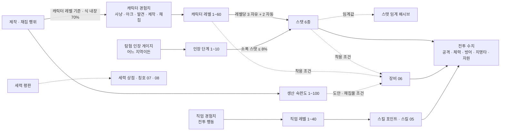

- 실선 = 수치가 흘러가는 관계, 점선 = 조건으로만 쓰이는 관계. 조건 관계는 모두 '장비 착용'과 '도안 · 채집물'에만 걸리고, **지역 입장 · 아크 진행 · 직업 선택에는 어떤 축도 조건이 되지 않는다**(3-B-5, D-10).

---

## 3. 레벨 · 경험치 표

### 3.1 설계 목표와 곡선 근거

| 항목 | 값 | 근거 |
|---|---|---|
| 레벨 60 도달 총 목표 시간(사냥만) | **약 90시간**(5,393분 = 89.9시간) | 모바일 세션 20분 × 하루 2.5회 = 50분/일(AS-03) → 약 108일 ≈ 3.6개월. 골격 목표 '약 90시간 · 3~4개월' |
| 구간별 시간 | 1~10: 5.5h / 11~20: 15.1h / 21~30: 16.3h / 31~40: 17.2h / 41~50: 17.9h / 51~60: 18.0h | 11~60 다섯 구간은 15~18시간 안(D-33), 인접 구간 비율 최대 1.08배(급증 없음). **1~10 구간은 5~6시간 예외(D-33)**: 첫 10분 · 첫 세션 리텐션(02번 5장)을 위해 짧게 둔다. 세션별 레벨업 체감은 3.4 |
| 레벨 1 → 2 | 100 경험치, 사냥만 하면 약 1.1분 | 0장 경로: 입문 구역 첫 전투 2~3마리(22~24씩) + 0장 부탁 + 0장 완료 50 고정 → **0장 완료 무렵(3~6분)** 레벨 2. 0장 생략 경로: 입문 구역 처치 4~5마리 · 채집으로 **5분 이내**(3.4 표). 시작 도시 첫 방문 발견 경험치는 0, 입문 구역이 있는 사냥터의 발견은 본구역 경계에서 발동(D-42)하므로 첫 전투 전에 레벨 2가 되지 않는다. Z 해금 = 레벨 2 도달 또는 첫 아크 1장 완료 중 먼저(D-10). 0장 완료에만 걸린 해금은 없다 |
| 레벨당 필요 경험치 | 필요 경험치(L→L+1) = 기준 경험치/분(L) × 목표 분(L) | 시간 목표가 먼저, 경험치는 그 결과. 분 단위 표(3.2)가 데이터 테이블의 원본이다 |
| 기준 경험치/분 | 기준(L) = 4 × 일반 몬스터 경험치(L) | 같은 레벨 일반 몬스터를 분당 4마리(1마리 15초 = 전투 약 5초(5.4: 약 5타, 05 9.2: 4~6초) + 이동 · 탐색, 02번 4.2 '10~30초') 처치하는 속도. 모든 병렬 성장원(6장)과 상한(7장)의 기준값 |
| 일반 몬스터 경험치 | 경험치(M) = 20 + 2M + M²/20 (반올림) | 레벨 1에서 22, 레벨 60에서 320. 완만한 2차 곡선: 레벨이 올라도 '마리당 경험치'가 급증하지 않아 저위험 지역을 떠날 이유가 '효율'이 아니라 '보상 종류'가 되게 한다(01번 4장 #3) |
| 구간 안 평탄화 | **11~60 구간**: 한 구간 안에서 레벨당 분은 단조 증가, 증가폭 ≤ 2분. **1~10 구간(D-33 예외)**: 레벨 1→2 약 1분에서 레벨 9→10 90분까지 단조 증가(증가폭 3~17분), 레벨 10→11(86분)부터 11~20 구간 규칙 | '다음 레벨이 갑자기 멀어지는' 체감 방지. 1~10은 첫 세션에 레벨업 3회가 들어가도록 앞을 압축한다(3.4) |

### 3.2 레벨 · 경험치 전표(1~60)

'목표 분'은 같은 레벨 적정 사냥터에서 사냥만 할 때의 기대 시간이다. 실제로는 아크 · 발견 · 제작 · 채집 경험치가 섞이므로 더 빠를 수 있다(6장).

| 레벨 | 다음 레벨 필요 경험치 | 누적 경험치(레벨 도달 시) | 목표 분 | 기준 경험치/분 | 기준 경험치/시간 | 일반 몬스터 경험치(동레벨) |
|---|---|---|---|---|---|---|
| 1 | 100 | 0 | 1.14 | 88 | 5,280 | 22 |
| 2 | 384 | 100 | 4 | 96 | 5,760 | 24 |
| 3 | 936 | 484 | 9 | 104 | 6,240 | 26 |
| 4 | 1,972 | 1,420 | 17 | 116 | 6,960 | 29 |
| 5 | 3,472 | 3,392 | 28 | 124 | 7,440 | 31 |
| 6 | 5,848 | 6,864 | 43 | 136 | 8,160 | 34 |
| 7 | 8,640 | 12,712 | 60 | 144 | 8,640 | 36 |
| 8 | 11,700 | 21,352 | 75 | 156 | 9,360 | 39 |
| 9 | 15,120 | 33,052 | 90 | 168 | 10,080 | 42 |
| 10 | 15,480 | 48,172 | 86 | 180 | 10,800 | 45 |
| 11 | 16,704 | 63,652 | 87 | 192 | 11,520 | 48 |
| 12 | 17,952 | 80,356 | 88 | 204 | 12,240 | 51 |
| 13 | 19,224 | 98,308 | 89 | 216 | 12,960 | 54 |
| 14 | 20,880 | 117,532 | 90 | 232 | 13,920 | 58 |
| 15 | 22,204 | 138,412 | 91 | 244 | 14,640 | 61 |
| 16 | 23,920 | 160,616 | 92 | 260 | 15,600 | 65 |
| 17 | 25,296 | 184,536 | 93 | 272 | 16,320 | 68 |
| 18 | 27,072 | 209,832 | 94 | 288 | 17,280 | 72 |
| 19 | 28,880 | 236,904 | 95 | 304 | 18,240 | 76 |
| 20 | 30,720 | 265,784 | 96 | 320 | 19,200 | 80 |
| 21 | 32,256 | 296,504 | 96 | 336 | 20,160 | 84 |
| 22 | 34,144 | 328,760 | 97 | 352 | 21,120 | 88 |
| 23 | 35,696 | 362,904 | 97 | 368 | 22,080 | 92 |
| 24 | 38,024 | 398,600 | 98 | 388 | 23,280 | 97 |
| 25 | 39,592 | 436,624 | 98 | 404 | 24,240 | 101 |
| 26 | 41,976 | 476,216 | 99 | 424 | 25,440 | 106 |
| 27 | 43,560 | 518,192 | 99 | 440 | 26,400 | 110 |
| 28 | 46,000 | 561,752 | 100 | 460 | 27,600 | 115 |
| 29 | 48,000 | 607,752 | 100 | 480 | 28,800 | 120 |
| 30 | 50,500 | 655,752 | 101 | 500 | 30,000 | 125 |
| 31 | 52,520 | 706,252 | 101 | 520 | 31,200 | 130 |
| 32 | 55,080 | 758,772 | 102 | 540 | 32,400 | 135 |
| 33 | 57,120 | 813,852 | 102 | 560 | 33,600 | 140 |
| 34 | 60,152 | 870,972 | 103 | 584 | 35,040 | 146 |
| 35 | 62,212 | 931,124 | 103 | 604 | 36,240 | 151 |
| 36 | 65,312 | 993,336 | 104 | 628 | 37,680 | 157 |
| 37 | 67,392 | 1,058,648 | 104 | 648 | 38,880 | 162 |
| 38 | 70,560 | 1,126,040 | 105 | 672 | 40,320 | 168 |
| 39 | 73,080 | 1,196,600 | 105 | 696 | 41,760 | 174 |
| 40 | 76,320 | 1,269,680 | 106 | 720 | 43,200 | 180 |
| 41 | 78,864 | 1,346,000 | 106 | 744 | 44,640 | 186 |
| 42 | 81,408 | 1,424,864 | 106 | 768 | 46,080 | 192 |
| 43 | 84,744 | 1,506,272 | 107 | 792 | 47,520 | 198 |
| 44 | 87,740 | 1,591,016 | 107 | 820 | 49,200 | 205 |
| 45 | 90,308 | 1,678,756 | 107 | 844 | 50,640 | 211 |
| 46 | 94,176 | 1,769,064 | 108 | 872 | 52,320 | 218 |
| 47 | 96,768 | 1,863,240 | 108 | 896 | 53,760 | 224 |
| 48 | 99,792 | 1,960,008 | 108 | 924 | 55,440 | 231 |
| 49 | 102,816 | 2,059,800 | 108 | 952 | 57,120 | 238 |
| 50 | 105,840 | 2,162,616 | 108 | 980 | 58,800 | 245 |
| 51 | 108,864 | 2,268,456 | 108 | 1,008 | 60,480 | 252 |
| 52 | 111,888 | 2,377,320 | 108 | 1,036 | 62,160 | 259 |
| 53 | 114,912 | 2,489,208 | 108 | 1,064 | 63,840 | 266 |
| 54 | 118,368 | 2,604,120 | 108 | 1,096 | 65,760 | 274 |
| 55 | 121,392 | 2,722,488 | 108 | 1,124 | 67,440 | 281 |
| 56 | 124,848 | 2,843,880 | 108 | 1,156 | 69,360 | 289 |
| 57 | 127,872 | 2,968,728 | 108 | 1,184 | 71,040 | 296 |
| 58 | 131,328 | 3,096,600 | 108 | 1,216 | 72,960 | 304 |
| 59 | 134,784 | 3,227,928 | 108 | 1,248 | 74,880 | 312 |
| 60 | — (상한) | 3,362,712 | — | 1,280 | 76,800 | 320 |

### 3.3 구간 집계

| 구간 | 레벨업 횟수 | 구간 소요(분) | 구간 소요(시간) | 구간 필요 경험치 | 누적 시간 | 모바일 일수(50분/일) |
|---|---|---|---|---|---|---|
| 1~10 | 9 | 327 | 5.5 | 48,172 | 5.5 | 7 |
| 11~20 | 10 | 905 | 15.1 | 217,612 | 20.5 | 25 |
| 21~30 | 10 | 980 | 16.3 | 389,968 | 36.9 | 44 |
| 31~40 | 10 | 1,030 | 17.2 | 613,928 | 54.0 | 65 |
| 41~50 | 10 | 1,071 | 17.9 | 892,936 | 71.9 | 86 |
| 51~60 | 10 | 1,080 | 18.0 | 1,200,096 | 89.9 | 108 |
| 합계 | 59 | 5,393 | 89.9 | 3,362,712 | — | 108 |

- 검산: 구간 소요의 합 = 5.5 + 15.1 + 16.3 + 17.2 + 17.9 + 18.0 = 89.9시간.
- 유료 경험치 부스트(D-11 · D-41, 게임 패스 1종, 배율 b = 1.5)는 아래 표의 **적용 원천 전부에 표기대로 +50%** 다. 상한도 같은 배율로 넓어지므로 부스트분이 상한에 잘려 0이 되는 원천은 없다. 부스트 시 총 목표 시간 = 5,393분 ÷ 1.5 = 3,595분 ≈ **60시간**. 10번 상품 설명 문구는 이 표를 기준으로 쓴다.

| 원천 | 부스트 | 상한 처리(부스트 적용 시) | 근거 |
|---|---|---|---|
| 사냥(필드 · 인스턴스 처치, 6장) | **×1.5** | 분당 상한 = 1.5 × 기준(L) × **b**(= 기준의 225%). 7.5 ③. 단 캐리 상태가 아닌 파티원이 k ≥ 2 처치 경험치를 받은 60초 창은 min(③ 상한, 기준(L) × max(1.1, r) × **b**)(동레벨 r = 1이면 기준의 165%, 상향 사냥은 r = 처치 몬스터 일반 등급 환산 경험치 ÷ 자기 레벨 일반 몬스터 경험치에 따라 최대 225%, 7.5 ③-2) | D-41, DECISIONS 04 r3 · r4 |
| 사냥 중 **캐리 상태**(그 처치에 피해 · 치유 · 버프를 준 플레이어 중 — **파티 여부 무관** — 나보다 레벨이 8 이상 높은 사람이 있을 때의 처치, 7.5 ③) | **×1.0(미적용)** | 분당 상한 = 1.5 × 기준(L)(b를 곱하지 않음). 파티를 맺지 않고 고레벨에게 대신 잡게 하는 우회는 캐리 판정(파티 무관)과 7.4 '소유 파티 밖 피해 비율 ≥ 50%' 규칙으로 막는다 | D-41: 캐리 + 부스트 결합 차단, D-51 |
| 아크 장 · 이야기 NPC · 기록물 · 발견 · 히든 피스 · 세력 의뢰 | ×1.5 | 단발 원천, 상한 없음(지점 · 장 · 의뢰당 1회 규칙은 그대로) | D-41 |
| 일일 · 주간 계약, 던전 클리어 보너스, 레이드(08) | ×1.5 | 횟수 상한(일 3 · 주 3 · 주간 보상 횟수)은 그대로 | D-41, D-25 |
| 제작 · 채집 | ×1.5 | 0.7은 **식에 내장된 값**(6장)이며 별도 분당 · 창 상한이 없다 → 부스트 시 기준의 105%. 실질 상한은 일일 상한(DAILY_CRAFT_CAP 30회 · DAILY_GATHER_CAP 200노드, 13장)이고 횟수는 늘지 않는다 | D-41, D-42 |
| 비적용: 직업 경험치 | — | 부스트 **전** 캐릭터 전투 경험치의 50%(11.1) | D-11(배율은 캐릭터 경험치 1종만) |
| 비적용: 생산 · 채집 숙련도, 인장 게이지, 세력 평판 | — | — | D-11 |
| 비적용: 골드 · 재료 · 도안 · 드롭 | — | — | D-11(배율 금지) |
| 비적용: 랭킹 점수 · 파티원 몫 | — | 랭킹은 부스트분 제외, 파티원에게 전파하지 않음(구매자 자기 몫에만) | D-11 |

### 3.4 1~10 구간의 모바일 세션별 레벨업 체감(AS-03 · 02번 4.3 · D-33)

#### 3.4.1 레벨 2 도달 시점(두 경로, D-42 · D-10)

시작 도시 첫 방문 발견 경험치 = 0(발견 체크만), 입문 구역이 있는 사냥터의 발견은 **본구역 경계**에서 발동(6장). 0장 안의 NPC 대화 · 기록물 경험치는 0장 고정 50에 포함된다(별도 지급 없음). 따라서 첫 전투 전에는 경험치가 0이다. 레벨 1 기준 경험치/분 88, 입문 구역 몬스터 경험치 레벨 1 · 2 · 3 = 22 · 24 · 26, 채집 1노드 = 88 × 0.07 = 6.2.

| 경로 | 시점(02번 5.2) | 하는 일 | 경험치(누적) | 레벨 2 |
|---|---|---|---|---|
| 0장 경로 | 0~1분 | 도착 · 이동 · 대시. 시작 도시 발견 체크(경험치 0) | 0 | — |
| 0장 경로 | 1~3분 | 입문 구역 첫 전투 2~3마리(레벨 1~2) | 44~70 | — |
| 0장 경로 | 3~6분 | 0장 부탁 택1: 전투 1마리(+22) 또는 채집 2노드(+12). 완료 전 최대 70 + 22 = 92 < 100 | 56~92 | — |
| 0장 경로 | 0장 완료(3~6분) | 0장 고정 +50 | **106~142** | **0장 완료 무렵(3~6분) 도달 ✓**(목표 3~6분) |
| 0장 생략 경로 | 0~1분 | '숙련자 모드' 또는 0장을 건너뛰고 입문 구역으로 이동(도보 60초 이내, D-29) | 0 | — |
| 0장 생략 경로 | 1~3.5분 | 입문 구역 처치 5마리(5 × 22 = 110) 또는 처치 4마리 + 채집 2노드(88 + 12 = 100). 1마리 약 15초(3.1) | **100~110** | **약 2.5~3.5분 도달 ✓**(목표 5분 이내) |
| 0장 생략 · 채집만 | 1~5분 | 0장용 개인 채집 노드(03 10.6) 17노드(17 × 6.2 = 105, 채널링 102초 + 노드 간 이동) | 105 | 약 4~5분 도달 ✓ |

- 잔해 · 몬스터를 5마리 이상 잡으면 0장 완료 전에 레벨 2가 된다(유저 선택). 어느 경로든 Z 해금(D-10)은 5분 안팎이다. 02번 5.3의 '위험도 1 몬스터 6~8마리'는 이 표의 4~5마리로 갱신한다(14.1 #11).

#### 3.4.2 세션별 레벨업(0장 경로 기준)

모바일 1세션 = 20분(AS-03 15~25분의 중간값). 02번 4.3의 L2 세션 구성(아크 1장 8~12분 + 일일 계약 15분 등)은 전부 기준 경험치/분 100%의 원천(6장)이므로 **사냥만 하는 세션과 레벨업 시점이 같다**. '사냥 환산 누적'은 3.2 목표 분의 누적, '실제 누적(추정)'은 0장 · 첫 갈림길의 경험치가 적은 시간(약 +5.5분)과 첫 본구역 발견(기준(2) × 2분 = 192, 약 −2분)을 반영해 레벨 3부터 **+3.5분**을 더한 값이다. 이후 새 사냥터 · 도시 첫 방문은 조금씩 더 앞당긴다(반영하지 않음, 보수적).

| 레벨업 | 목표 분 | 사냥 환산 누적 | 실제 누적(추정) | 도달 세션(20분) | 그 세션에서 함께 생기는 체감(02번 4.3 · D-10) |
|---|---|---|---|---|---|
| 1 → 2 | 1.1 | 1.1 | 3~6(3.4.1) | 1 | 레벨 2 = Z 슬롯 해금(D-10: 레벨 2 또는 첫 아크 1장 완료 중 먼저). 0장 완료 보상 인장 +20(12장) |
| 2 → 3 | 4 | 5.1 | 8.6 | 1 | 첫 본구역 발견(192). 첫 갈림길 선택 보상(도안 조각 1개 또는 인장 +20, 동일 가치, 12장) |
| 3 → 4 | 9 | 14.1 | 17.6 | 1 | 첫 세션 안에 **레벨업 3회**(갈림길에서 오래 머물면 레벨 4는 19~20분) |
| 4 → 5 | 17 | 31.1 | 34.6 | 2 | 직업 선택 → 직업 레벨 · 스킬 포인트 축 시작(11장) |
| 5 → 6 | 28 | 59.1 | 62.6 | 4 | 3세션째는 레벨업 없음: 아크 장 완료(장당 인장 +5) · 직업 레벨 · 일일 계약이 체감 |
| 6 → 7 | 43 | 102.1 | 105.6 | 6 | 이후 레벨업은 2~4세션에 1회. 인장 게이지 약 100~120 = **인장 단계 1**(12장: 0장 20 + 갈림길 20 + 일일 계약 3일 36 + 발견 5곳 15 + 아크 4장 20 + 드롭 약 4) |
| 7 → 8 | 60 | 162.1 | 165.6 | 9 | 인장 게이지 약 150(단계 1 유지) · 직업 레벨 |
| 8 → 9 | 75 | 237.1 | 240.6 | 13 | 11~20 구간 사냥터(위험도 2) 적정 폭 진입 |
| 9 → 10 | 90 | 327.1 | 330.6 | 17 | 1~10 구간 완료 ≈ 5.5시간 = 모바일 약 7일(50분/일). 인장 게이지 약 250 = 단계 2 무렵(주간 계약 포함) |

- 판정: 첫 2세션은 세션마다 캐릭터 레벨업이 있고(3 · 1회), 3세션째부터는 2~4세션에 1회(간격 2 · 2 · 3 · 4 · 4세션)로 11~20 구간(레벨당 86~95분 ≈ 4.5세션)과 같은 간격에 수렴한다. 레벨업이 없는 세션의 체감은 직업 레벨 · 인장 · 아크 장 보상이 맡는다(02번 4.3 '다음 행동 동기' 열). 레벨당 분을 더 평탄하게 하면 레벨 1→2가 수십 분이 되어 02번 5.2의 '첫 3~6분 레벨 2' 목표와 충돌하므로 1~10 구간은 D-33의 예외로 둔다.
- PC 세션(40~60분, AS-03)은 1세션에 레벨 5, 2세션(누적 80~120분)에 레벨 6~7 도달.

---

## 4. 스탯

### 4.1 6스탯 정의와 효과(선형)

모든 스탯 효과는 **선형**이다(스탯 1당 고정 증가, 구간별 배율 없음). 치명타 확률은 공격 스탯 4종(힘 · 민첩 · 지력 · 정신)이 1당 **똑같이 +0.05%p** 준다(D-37). 특정 주 스탯만 치명타를 받으면 레벨이 오를수록 그 직업만 앞서므로(04-r1-S-01) 어느 유형이 주 스탯을 키워도 치명타 증가 속도가 같게 둔다. 기본값은 모든 스탯 10(종족 보정 ±2, 10장). 상한 없음(실질 60레벨 주 스탯 약 250).

| 스탯 | 영문 | 스탯 1당 효과 | 상한 | 주로 쓰는 성장 유형 | 비고 |
|---|---|---|---|---|---|
| 힘 (STR) | Strength | 근접 물리 공격력 +2, 치명타 확률 +0.05%p, 소지 무게 +1 | 치명타 확률 60%(4종 합산) | 근접 힘형, 생산형(보조) | 양손 · 한손 근접 무기의 주 스탯 |
| 민첩 (DEX) | Dexterity | 원거리 물리 공격력 +2, 치명타 확률 +0.05%p, 회피 +0.05%p(민첩만의 추가 효과) | 치명타 확률 60%(4종 합산), 회피 20% | 민첩형(궁수 · 단검) | 활 · 단검의 주 스탯 |
| 체력 (VIT) | Vitality | 최대 체력 +12, 방어력 +0.5 | — | 전 유형(자동 성장에 포함) | 생존의 기본 축 |
| 지력 (INT) | Intellect | 마법 공격력 +2, 치명타 확률 +0.05%p, 최대 마나 +6 | 치명타 확률 60%(4종 합산) | 마법형 | 지팡이 · 마도구의 주 스탯 |
| 정신 (SPR) | Spirit | 치유 · 지원 계수 +2(지원형 주 스탯이면 공격력 +2, 5.1), 치명타 확률 +0.05%p, 최대 마나 +4, 상태이상 저항 +0.1%p | 치명타 확률 60%(4종 합산), 저항 50% | 지원형 | 회복 · 버프 스킬의 주 스탯 |
| 기교 (TEC) | Technique | 치명타 피해 +0.5%p, 제작 미니게임 판정 보정 · 채집 속도 보정(06에서 수치) | 치명타 피해 250% | 생산형(대장장이), 보조로 전 유형 | 전투 · 생산 겸용 스탯(D-02) |

### 4.2 레벨별 스탯 포인트

레벨업마다 **자유 배분 3 + 직업 자동 성장 2**(견습 상태에서는 자동 성장 2도 자유 배분으로 지급하고, 직업 선택 시 이후 레벨부터 자동 분포 적용). 포인트는 즉시 쓰지 않아도 되고 모아둘 수 있다.

| 레벨 | 자유 포인트 누적 | 자동 성장 누적 | 총 포인트 누적 | 스탯 합(기본 60 + 누적) | 예시: 근접 힘형 힘 / 체력 |
|---|---|---|---|---|---|
| 1 | 0 | 0 | 0 | 60 | 10 / 10 |
| 10 | 27 | 18 | 45 | 105 | 37 / 28 |
| 20 | 57 | 38 | 95 | 155 | 67 / 48 |
| 30 | 87 | 58 | 145 | 205 | 97 / 68 |
| 40 | 117 | 78 | 195 | 255 | 127 / 88 |
| 50 | 147 | 98 | 245 | 305 | 157 / 108 |
| 60 | 177 | 118 | 295 | 355 | 187 / 128 |

- 예시 열은 '자유 3 중 힘 2 · 체력 1, 자동 2 = 힘 1 · 체력 1'로 찍은 **기준 빌드**다. 5장의 모든 플레이어 기준표가 이 빌드를 쓴다.
- 장비 스탯 보정(06)은 포인트와 별도이며 기준 장비 = 주 스탯 +0.25 × 레벨(반올림). **'풀장비' = 레벨 60 전설 등급 풀장비**(D-49: 7부위 전설 +0 · 품질 50 · 각인 칸 전부 성공 · 옵션 기대값, 06 3.6 '전설 +0 (Q50) = 04 풀장비 정의' 행). 그 수치(06 3.2 · 3.3 · 3.6): 무기 공격력 **159**(T6 전설 Q50 151 × 각인 1.05), 공격력 옵션 기대 **+26**, 주 스탯 **+38**(장신구 목걸이 11 · 반지 7 + 주 스탯 옵션 기대 약 20), 기교 옵션 기대 **+7**, 체력 스탯 옵션 기대 **+5**, 치명타 확률 옵션 기대 **+6.95%p**, 치명타 피해 옵션 기대 **+19.5%p**, 방어구 합 **156** + 방어력 옵션 기대 **+9**. 주 스탯이 아닌 공격 스탯 보조 보정은 없다(r2의 '보조 2종 +20' 가정 폐지, 주 스탯 중복 없음은 D-37 그대로). 최대 체력 · 받는 피해 감소 옵션 기대값은 06 3.6과 같이 검산에서 뺀다. 신화 · 초월은 '풀장비'가 아니라 극소수 이론 상한이다(D-49, 06 3.6).
- 모바일 배분 보조(04-r1-M-11): 스탯 창 안에 '추천 배분' 버튼(위 기준 빌드: 주 스탯 2 · 체력 1)과 '레벨업 시 자동 배분' 토글을 둔다. 견습 · 첫 직업 선택 전에는 기본 켜짐, 끄면 수동. 미배분 포인트가 있으면 메뉴 아이콘에 점 표시. 버튼은 스탯 창 안에 있어 D-16 상시 노출 수에 산입하지 않는다.

### 4.3 직업 자동 성장 유형 6종(예시 분포)

직업별 실제 분포는 05에서 정한다. 여기서는 유형 6종의 분포만 정의한다. 자동 2포인트는 정수로 주기 위해 2레벨 주기로 번갈아 찍는다.

| 유형 | 홀수 레벨(2점) | 짝수 레벨(2점) | 레벨당 평균 | 대표 직업(05 예시) |
|---|---|---|---|---|
| 근접 힘형 | 힘 1 · 체력 1 | 힘 1 · 체력 1 | 힘 1.0 · 체력 1.0 | J-01 전사, J-H4 시련 감독관(체력 변형) |
| 민첩형 | 민첩 1 · 힘 1 | 민첩 1 · 체력 1 | 민첩 1.0 · 힘 0.5 · 체력 0.5 | J-02 궁수(필수 직업), J-05 그림자술사(기교 변형: 민첩 1 · 기교 1 / 민첩 1 · 체력 1) |
| 마법형 | 지력 1 · 정신 1 | 지력 1 · 체력 1 | 지력 1.0 · 정신 0.5 · 체력 0.5 | J-03 마도사, J-H5 |
| 지원형 | 정신 1 · 지력 1 | 정신 1 · 체력 1 | 정신 1.0 · 지력 0.5 · 체력 0.5 | J-04 치유사, J-H3 묘역 서기관(05의 '균형형(정신 · 지력 변형)'은 이 지원형과 같은 분포) |
| 생산형 | 기교 1 · 힘 1 | 기교 1 · 체력 1 | 기교 1.0 · 힘 0.5 · 체력 0.5 | J-06 대장장이(필수 직업, 전투 겸업 D-02. 전투 주 스탯은 힘) |
| 균형형 | 레벨 % 3 = 1: 힘 1 · 민첩 1 / = 2: 체력 1 · 지력 1 / = 0: 정신 1 · 기교 1 | (3레벨 주기) | 각 0.33 | 현재 해당 직업 없음(예약 유형, 확장 히든 직업용) |

- 전직 의식(D-09)으로 직업을 바꾸면 **이미 찍힌 자동 성장분은 그대로 두고** 이후 레벨부터 새 유형을 적용한다. 자동 성장분까지 바꾸려면 4.4 재분배를 쓴다(자동 성장분도 재분배 대상).

### 4.4 스탯 재분배

| 항목 | 규칙 |
|---|---|
| 장소 | 도시 · 마을(T-)의 '수련 사범' NPC(모든 T-에 배치, 전초기지 포함). 필드 · 인스턴스에서는 불가 |
| 대상 | 자유 포인트 + 자동 성장 포인트 전부(종족 보정 · 장비 · 인장 보정은 제외) |
| 비용 | 전체 초기화 = 200 × 캐릭터 레벨 골드. 부분 이동(포인트 1개를 다른 스탯으로) = 5 × 캐릭터 레벨 골드. 레벨 20 이하에서 전체 초기화 **1회 무료**(직업 체험 후 빌드 바꾸기, D-10) |
| 횟수 제한 | 없음(비용만). 전직 의식(D-09)과 묶어 하면 전체 초기화 비용 50% |
| 처리 1층: 스탯 임계 패시브(4.5) | 재분배로 스탯이 임계값 아래로 내려가면 **즉시 꺼진다**. 다시 임계값 이상이 되면 즉시 켜진다(재습득 불필요) |
| 처리 2층: 습득 스킬(퀘스트 · 히든 피스, V 슬롯) | **유지된다**(잃지 않음). 단, 요구 스탯을 충족하지 않으면 슬롯에서 자동 해제되어 '장착 불가(요구: 힘 120)' 표시. 충족하면 다시 장착 가능. 직업 스킬은 직업 레벨에만 걸리므로 영향 없음 |
| 장비 | 재분배 후 착용 조건(레벨 + 스탯, 3-B-12)을 못 채우는 장비는 **착용 상태로 남되 효과 0**('조건 미달' 표시). 벗으면 다시 못 낀다 |
| UI | 재분배 확인 화면에 '꺼지는 패시브 n개 · 해제되는 습득 스킬 n개 · 조건 미달 장비 n개'를 먼저 보여준다 |

| 레벨 | 전체 초기화(골드) | 부분 이동 1포인트(골드) | 같은 레벨 일반 몬스터 골드 드롭 | 전체 초기화 = 몬스터 몇 마리 |
|---|---|---|---|---|
| 10 | 2,000 | 50 | 9 | 222 (약 0.9시간) |
| 20 | 4,000 | 100 | 15 | 267 (약 1.1시간) |
| 30 | 6,000 | 150 | 21 | 286 (약 1.2시간) |
| 40 | 8,000 | 200 | 27 | 296 (약 1.2시간) |
| 50 | 10,000 | 250 | 33 | 303 (약 1.3시간) |
| 60 | 12,000 | 300 | 39 | 308 (약 1.3시간) |

- 골드 드롭은 5.4의 추정식(3 + 0.6 × 몬스터 레벨)이며 10에서 확정한다. 재분배 비용은 '한 세션 안에서 결정할 수 있는 수준'(60레벨 기준 약 1.3시간 사냥)으로 둔다.

### 4.5 스탯 임계 패시브(예시 6개, 스탯별 1개)

조건부 효과(01번 5장 #9 · #66). 스탯 **총합(포인트 + 장비 + 인장)** 이 임계값 이상이면 자동으로 켜지고, 아래로 내려가면(재분배 · 장비 해제) 꺼진다. 직업 무관. 전체 목록은 05(직업별 추가 임계 패시브 포함). 2단계 임계값 160은 기준 빌드(주 스탯 3/레벨 + 장비 0.25/레벨)로 **레벨 47**, 자유 3 + 자동 1을 한 스탯에 몰면 레벨 39, 자동 성장분까지 재분배(4.4)로 몰면 레벨 31에 닿는 후반 전문화 보상이다(04-r1-S-07). 유형 간 피해 차이에 주는 영향은 5.7에서 검산한다.

| ID(05에서 확정) | 스탯 | 이름 | 1단계 임계값 | 1단계 효과 | 2단계 임계값 | 2단계 효과 | 재분배 시 |
|---|---|---|---|---|---|---|---|
| TP-STR | 힘 | 거친 손 (Rough Hands) | 100 | 근접 무기 스킬 계수 +5% | 160 | +10%, 넉백 저항 | 임계 미만이면 꺼짐 |
| TP-DEX | 민첩 | 발 빠름 (Light Feet) | 100 | 대시 쿨타임 −10% | 160 | −20%, 대시 후 1초간 회피 +10%p | 임계 미만이면 꺼짐 |
| TP-VIT | 체력 | 굳은 살 (Callused) | 100 | 받는 피해 −3% | 160 | −6%, 부활 대기 −2초 | 임계 미만이면 꺼짐 |
| TP-INT | 지력 | 맑은 머리 (Clear Mind) | 100 | 마나 소모 −8% | 160 | −15%, 마법 스킬 시전 시간 −10% | 임계 미만이면 꺼짐 |
| TP-SPR | 정신 | 평정 (Composure) | 100 | 상태이상 지속 −20% | 160 | −35%, 치유 계수 +5% | 임계 미만이면 꺼짐 |
| TP-TEC | 기교 | 손끝 (Fingertips) | 100 | 제작 미니게임 판정 창 +10%(06), 치명타 피해 +5%p | 160 | 판정 창 +20%, 치명타 피해 +10%p | 임계 미만이면 꺼짐 |

- 임계값 100 도달 시점: 기준 빌드 레벨 29(10 + 84 + 장비 7 = 101), 자유 3을 한 스탯에 몰면 레벨 31(10 + 90, 장비 제외), 자동 성장이 같은 스탯이면 레벨 24(10 + 23 × 4 = 102). 장비 · 인장을 더하면 더 빠르다.

---

## 5. 전투 수치

### 5.1 공식

| 항목 | 공식 | 설명 |
|---|---|---|
| 기본 공격력 | 무기 공격력 + 2 × 주 스탯 총합(근접 = 힘, 원거리 = 민첩, 마법 = 지력, **지원 = 정신**: 치유사 J-04 · 묘역 서기관 J-H3, D-35) | 주 스탯 총합 = 포인트 + 종족 + 장비 + 인장. 직업별 주 스탯은 05 3.1. 무기 스킬도 들고 있는 무기가 아니라 직업의 주 스탯을 쓴다(05 5.4) |
| 최종 데미지(곱셈 완화형) | **기본 공격력 × 스킬 계수 × 100 / (100 + 대상 방어력) × 랜덤(0.95~1.05) × 치명타 배율(치명 시 치명타 피해, 아니면 1.0)** × 기타 보정(속성 · 버프, 05 · 06, 기본 1.0) | 최소 1. 방어력은 데미지를 0으로 만들지 못한다(방어 100 = 피해 절반, 방어 200 = 1/3) |
| 스킬 계수 | 기본 공격 1.0, 무기 스킬 · 직업 스킬 1.2~3.0(05) | 검산용 평균 계수 **1.6**(D-35: 05 9.2 표준 회전의 분당 실효 계수 약 1.6~1.8의 하단. 기본 공격 약 40% + 평균 2.0 스킬 약 60%). 05의 스킬 계수는 그대로 두고 이 상수만 맞춘다. 스킬이 피해에서 차지하는 몫 = 0.6 × 2.0 ÷ 1.6 = **0.75**(TP_SKILL_SHARE): 스킬 계수만 올리는 임계 패시브(TP-STR)의 피해 보정 = 1 + 보정률 × 0.75 |
| 치명타 확률 | 5% + **0.05%p × (힘 + 민첩 + 지력 + 정신 총합)** + 장비 보정, 상한 60% | 공격 스탯 4종 동일 계수(D-37, 민첩 전용 보정 폐지). 체력 · 기교는 치명타 확률을 주지 않는다. 몬스터 치명타 없음(보스 기믹 제외) |
| 치명타 피해 | 150% + 0.5%p × 기교 총합 + 장비 보정, 상한 250% | 기대 배율 = 1 + 확률 × (피해 − 1) |
| 회피 | 0.05%p × 민첩 총합 + 장비 보정, 상한 20%(민첩만의 추가 효과, D-37) | 회피 시 피해 0. 몬스터 회피: 일반 0%, 정예 5%, 보스 0% |
| 최대 체력 | 100 + 10 × 레벨 + 12 × 체력 총합 | 자연 회복: 비전투 시 초당 2% |
| 방어력 | 방어구 합(06) + 방어력 옵션 + 0.5 × 체력 총합 | 기준 방어구 = 2.5 × 레벨, 60레벨 전설 풀장비 = 방어구 합 156 + 옵션 기대 9(06 3.3 · 3.6, D-49) |
| 받는 피해 | 공격자 기본 공격력 × 계수 × 100 / (100 + 내 방어력) × 랜덤 | 플레이어 · 몬스터 동일 식 |
| 마나(마법 · 지원 · 마법형 히든) | 50 + 3 × 레벨 + 6 × 지력 총합 + 4 × 정신 총합. 회복 초당 1% + 0.1 × 정신. **지팡이 기본 공격 적중 시 마나 +4**(AS-13, 기력의 '기본 공격 적중 +5'에 대응하는 마나판) | 소모 10~60(05). +4의 튜닝은 05 · 06(AS-13) |
| 기력(근접 · 원거리 · 생산형) | 100 고정, 회복 초당 5. 기본 공격 적중 시 +5 | 소모 10~35(05). 대장장이는 열기 게이지 병행(05 · 06) |
| 치유량 | 스킬 기본치 + 2 × 정신 총합 × 스킬 계수 | 05 |
| 몬스터 공격 간격 | 일반 2.0초, 정예 1.8초, 보스 패턴별(08) | 피격 횟수 → 생존 시간 환산에 사용 |

### 5.2 레벨별 플레이어 기준 스탯(근접 힘형 기준 빌드 · 기준 장비)

기준 장비 = 그 레벨대에서 사냥 · 제작으로 평범하게 갖추는 장비(희귀~영웅). 무기 공격력 = 8 + 2.4 × 레벨, 방어구 합 = 2.5 × 레벨, 주 스탯 보정 = 0.25 × 레벨(반올림). 06이 장비 수치 범위를 확정하면 이 열을 갱신한다.

| 레벨 | 힘(포인트+장비) | 체력 스탯 | 무기 공격력 | 물리 공격력 | 최대 체력 | 방어력 | 치명타 확률(힘 + 민첩 10 + 지력 10 + 정신 10) | 치명타 피해 | 기대 배율 | TP-STR 피해 보정(4.5) | 기력 |
|---|---|---|---|---|---|---|---|---|---|---|---|
| 1 | 10 | 10 | 10.4 | 30 | 230 | 7.5 | 7.00% | 155% | 1.038 | 1.000 | 100 |
| 10 | 39 | 28 | 32.0 | 110 | 536 | 39.0 | 8.45% | 155% | 1.046 | 1.000 | 100 |
| 20 | 72 | 48 | 56.0 | 200 | 876 | 74.0 | 10.10% | 155% | 1.056 | 1.000 | 100 |
| 30 | 105 | 68 | 80.0 | 290 | 1,216 | 109.0 | 11.75% | 155% | 1.065 | 1.038(1단계) | 100 |
| 40 | 137 | 88 | 104.0 | 378 | 1,556 | 144.0 | 13.35% | 155% | 1.073 | 1.038(1단계) | 100 |
| 50 | 169 | 108 | 128.0 | 466 | 1,896 | 179.0 | 14.95% | 155% | 1.082 | 1.075(2단계) | 100 |
| 60 | 202 | 128 | 152.0 | 556 | 2,236 | 214.0 | 16.60% | 155% | 1.091 | 1.075(2단계) | 100 |
| 60 전설 풀장비(D-49, 06 3.6) | 225 | 133 | 159 | 635(공격력 옵션 +26 포함) | 2,296 | 231 | 24.70%(옵션 +6.95%p 포함) | 178% | 1.193 | 1.075(2단계) | 100 |

- 기대 배율 = 1 + 치명타 확률 × (치명타 피해 − 1). TP-STR은 힘 총합 100(레벨 29) · 160(레벨 47)에서 켜진다(4.5). 레벨 1~20의 1.038~1.056은 r1(민첩 전용 치명타) 1.033보다 약간 높다.
- '60 전설 풀장비' 행(4.2 정의): 힘 = 187 + 38 = 225, 체력 = 128 + 옵션 5 = 133, 기교 = 10 + 옵션 7 = 17, 민첩 · 지력 · 정신 10. 물리 공격력 = 159 + 26 + 2 × 225 = **635**(06 3.6 기본 공격력 635와 같음). 최대 체력 = 100 + 600 + 12 × 133 = 2,296(최대 체력 옵션 제외). 방어력 = 156 + 9 + 0.5 × 133 = 231.5 → **231**(06 3.6 '약 231'과 같음). 치명타 확률 = 5% + 0.05%p × (225 + 10 + 10 + 10) + 6.95%p = **24.70%**(06 3.6의 23.2%는 주 스탯만 넣은 값. D-37의 공격 스탯 4종 합산이면 민첩 · 지력 · 정신 30 × 0.05%p = 1.5%p가 더해진다, 14.1 #4), 치명타 피해 = 150% + 0.5%p × 17 + 19.5%p = **178%**(06과 같음), 기대 배율 = 1 + 0.247 × 0.78 = 1.193.

마법형 참고(기준 빌드와 같은 배분: 자유 3 중 지력 2 · 체력 1, 자동 지력 1 · 정신/체력 0.5 → 지력 3/레벨, 체력 1.5/레벨, 정신 0.5/레벨. 지팡이 공격력 = 무기와 동일 식):

| 레벨 | 지력(포인트+장비) | 마법 공격력 | 최대 마나 | 최대 체력(체력 스탯 = 10 + 1.5 × (레벨−1)) |
|---|---|---|---|---|
| 1 | 10 | 30 | 153 | 230 |
| 30 | 105 | 290 | 866 | 1,048 |
| 60 | 202 | 556 | 1,602 | 1,876 |

### 5.3 몬스터 기준 스탯(레벨 M)

| 등급 | 체력 | 공격력 | 방어력 | 경험치 | 골드(10에서 확정) | 감지 거리 | 추적 속도 | 무관심 규칙 |
|---|---|---|---|---|---|---|---|---|
| 일반 | **25M + 900 × (1 − e^(−M/10))** | 15 + 4M + 0.09M² | 2M | 20 + 2M + M²/20 | 3 + 0.6M | 24 studs | 14 studs/s | 적용 |
| 정예 | 일반 × 4 | 일반 × 1.5 | 일반 × 1.3 | 일반 × 5 | 일반 × 4 | 30 studs | 16 studs/s | **적용**(d ≥ 15 무관심, D-40. 완충 구간 감지 50%도 일반과 같음) |
| 보스(필드 · 인스턴스) | 일반 × 25 | 일반 × 2.2 | 일반 × 1.6 | 일반 × 40 | 일반 × 30 | 40 studs | 18 studs/s | **미적용**(03 10.1 예외). 시간 · 이벤트 출현 필드 보스는 D-31 (c) 준용(7.2 #1-A) |
| 레이드 보스(RB-) | 08에서 별도 | | | | | | | 미적용 |

- 무관심 예외(항상 선공 가능)는 보스 · 네임드 · 아크 전투 대상 · 레이드 보스 · 광기 지역 개체뿐이다(03 10.1 · D-40). 정예는 일반과 같이 d ≥ 15면 무관심이므로 파티 권장 사냥터에 정예가 섞여 있어도 저레벨의 '걸어 다니기'는 그대로 성립한다(9.1 · 9.2).
- 체력 식의 근거: 같은 레벨 기준 빌드가 평균 계수 1.6(D-35)으로 **약 5타**(4.9~5.3, 임계 패시브 포함. 미포함 5.2~5.4)에 잡고, 레벨 60 **전설** 풀장비(D-49)가 위험도 6 일반 몬스터를 **4~5타**(목표 4~6타 안)에 잡는 값(5.5 검산). 포화형(e^(−M/10))이라 레벨 상한 확장(D-13) 시에도 식을 바꾸지 않고 쓸 수 있다.
- 공격력 식의 근거: 같은 레벨 기준 빌드가 **약 12타(24초)** 를 버티는 값. 플레이어가 약 5타에 잡고 12타를 버티므로 1:1은 플레이어 우위, 2마리 동시는 긴장, 3마리 이상은 후퇴 판단이 필요하다.
- 모든 값은 반올림 정수로 데이터 테이블에 미리 계산해 넣는다(13장). 아래는 5레벨 단위 발췌.

| 몬스터 레벨 | 일반 체력 | 일반 공격력 | 일반 방어력 | 일반 경험치 | 일반 골드 | 정예 체력 | 정예 공격력 | 정예 경험치 | 보스 체력 | 보스 공격력 | 보스 경험치 |
|---|---|---|---|---|---|---|---|---|---|---|---|
| 1 | 111 | 19 | 2 | 22 | 4 | 444 | 28 | 110 | 2,775 | 42 | 880 |
| 5 | 479 | 37 | 10 | 31 | 6 | 1,916 | 56 | 155 | 11,975 | 81 | 1,240 |
| 10 | 819 | 64 | 20 | 45 | 9 | 3,276 | 96 | 225 | 20,475 | 141 | 1,800 |
| 15 | 1,074 | 95 | 30 | 61 | 12 | 4,296 | 142 | 305 | 26,850 | 209 | 2,440 |
| 20 | 1,278 | 131 | 40 | 80 | 15 | 5,112 | 196 | 400 | 31,950 | 288 | 3,200 |
| 25 | 1,451 | 171 | 50 | 101 | 18 | 5,804 | 256 | 505 | 36,275 | 376 | 4,040 |
| 30 | 1,605 | 216 | 60 | 125 | 21 | 6,420 | 324 | 625 | 40,125 | 475 | 5,000 |
| 35 | 1,748 | 265 | 70 | 151 | 24 | 6,992 | 398 | 755 | 43,700 | 583 | 6,040 |
| 40 | 1,884 | 319 | 80 | 180 | 27 | 7,536 | 478 | 900 | 47,100 | 702 | 7,200 |
| 45 | 2,015 | 377 | 90 | 211 | 30 | 8,060 | 566 | 1,055 | 50,375 | 829 | 8,440 |
| 50 | 2,144 | 440 | 100 | 245 | 33 | 8,576 | 660 | 1,225 | 53,600 | 968 | 9,800 |
| 55 | 2,271 | 507 | 110 | 281 | 36 | 9,084 | 760 | 1,405 | 56,775 | 1,115 | 11,240 |
| 60 | 2,398 | 579 | 120 | 320 | 39 | 9,592 | 868 | 1,600 | 59,950 | 1,274 | 12,800 |

### 5.4 같은 레벨 검산(기준 빌드 · 기준 장비 vs 같은 레벨 일반 몬스터)

| 레벨 | 플레이어 공격력 | 평균 1타(계수 1.6 × 기대 배율 × TP-STR) | 몬스터 체력 | 처치 타수 | 몬스터 공격력 | 피격 1타 | 플레이어 체력 | 사망까지 피격 | 생존 시간(2.0초 간격) |
|---|---|---|---|---|---|---|---|---|---|
| 1(견습, 계수 1.0) | 30 | 31.0 | 111 | 3.6 | 19 | 17.7 | 230 | 13.0 | 26초 |
| 10 | 110 | 153.5 | 819 | 5.3 | 64 | 46.0 | 536 | 11.6 | 23초 |
| 20 | 200 | 241.3 | 1,278 | 5.3 | 131 | 75.3 | 876 | 11.6 | 23초 |
| 30 | 290 | 320.3 | 1,605 | 5.0 | 216 | 103.3 | 1,216 | 11.8 | 24초 |
| 40 | 378 | 374.2 | 1,884 | 5.0 | 319 | 130.7 | 1,556 | 11.9 | 24초 |
| 50 | 466 | 433.7 | 2,144 | 4.9 | 440 | 157.7 | 1,896 | 12.0 | 24초 |
| 60 | 556 | 474.4 | 2,398 | 5.1 | 579 | 184.4 | 2,236 | 12.1 | 24초 |

- 레벨 1 평균 1타 = 30.4 × 1.0 × 100/102 × 1.038 = 31.0(04-r1-S-10). 레벨 30 = 290 × 1.6 × 100/160 × 1.065 × 1.038 = 320.3. 임계 패시브를 빼면 레벨 30~60 처치 타수는 5.2~5.4다.
- 다른 유형의 같은 레벨 기대 피해(5.5 유형별 비교표): 민첩 · 지력 · 정신 유형은 근접 힘형 대비 −6%~−3%(처치 5.2~5.4타), 생산형은 −13%~−8%(5.5~5.7타, D-02 대장장이 전투 하위)다.

### 5.5 '레벨 60 전설 풀장비 → 위험도 6 일반 몬스터 4~5타' 검산 3건 · 유형별 기대 배율 비교(D-37 · D-49)

풀장비 = **레벨 60 전설 등급 풀장비**(D-49, 4.2 정의 · 06 3.6 '전설 +0 (Q50)' 행): 무기 공격력 159, 공격력 옵션 +26, 주 스탯 +38, 기교 +7, 체력 +5, 치명타 확률 옵션 +6.95%p, 치명타 피해 옵션 +19.5%p, 방어구 합 156 + 방어 옵션 9. 주 스탯이 옵션으로 한 번 더 더해지지 않는다(04-r1-S-01). 주 스탯이 아닌 공격 스탯 보조 보정은 없다(r2의 '보조 2종 +20' 폐지). 랜덤 1.00(기대값). 위험도 6 사냥터(H-40 적정 52~60, H-41 51~60)의 일반 몬스터 레벨 범위는 51~60(7.1 규칙).

| # | 빌드 | 대상 | 기본 공격력 | 방어 계수 100/(100+방어) | 기대 배율 | 임계 패시브 | 평균 1타(계수 1.6) | 몬스터 체력 | 타수 | 판정 |
|---|---|---|---|---|---|---|---|---|---|---|
| 1 | 근접 힘형 | H-40 광기 골렘(레벨 52) | 159 + 26 + 2 × 225 = **635** | 100/(100+104) = 0.490 | 1.193(치명 24.70% · 피해 178%) | TP-STR 2단계 1.075 | 635 × 1.6 × 0.490 × 1.193 × 1.075 = **639** | 2,195 | 3.4 → 4타 | 4~5타 안 |
| 2 | 마법형 | H-41 광기 나방 떼 개체(레벨 56) | 159 + 26 + 2 × 225 = **635** | 100/(100+112) = 0.472 | 1.204(치명 26.15% · 피해 178%) | 1.000(TP-INT 2단계는 시전 시간만, 1타 피해 무관) | 635 × 1.6 × 0.472 × 1.204 = **577** | 2,297 | 4.0 → 4타 | 4~5타 안 |
| 3 | 민첩형(궁수) | H-41 뒤틀린 오르바르 그림자(레벨 60, 03 8.5 대표 몬스터) | 159 + 26 + 2 × 225 = **635** | 100/(100+120) = 0.455 | 1.204(치명 26.15% · 피해 178%) | 1.000 | 635 × 1.6 × 0.455 × 1.204 = **556** | 2,398 | 4.3 → 5타 | 4~5타 안 |

- 민첩형(4.3 기준 빌드: 자유 3 중 민첩 2 · 체력 1, 자동 홀수 민첩 1 · 힘 1 / 짝수 민첩 1 · 체력 1): 민첩 = 10 + 3 × 59 + 38(전설 풀장비 주 스탯) = **225**, 힘 = 10 + 29(홀수 레벨 3~59) = 39, 기교 = 10 + 7 = 17. 치명타 확률 = 5% + 0.05%p × (225 + 39 + 10 + 10) + 6.95%p = 5% + 14.2% + 6.95% = **26.15%**, 치명타 피해 = 150% + 0.5%p × 17 + 19.5%p = 178%, 기대 배율 = 1 + 0.2615 × 0.78 = 1.204. 마법형도 정신 39(홀수 레벨)로 같은 값. 근접 힘형: 5% + 0.05%p × (225 + 10 + 10 + 10) + 6.95%p = 24.70%, 기대 배율 1.193.
- 세 경우 모두 4~5타(3.4~4.3, AVG_SKILL_COEF 1.6 · D-35), 위험도 6 '일반' 기준. 06 3.6의 전설 +0 검산(4 · 5 · 5타)과 같은 구간이다(06은 치명 확률에 주 스탯만 넣고 TP-STR을 빼서 1타가 조금 낮다, 14.1 #4). 계수를 1.4로 되돌려도 4~5타(3.9 · 4.6 · 4.9), 기본 공격만(계수 1.0) 쓰면 6~7타(5.5 · 6.4 · 6.9)로 늘지만 스킬 연계가 전제다. 정예(체력 4배 · 방어 1.3배)는 16타 이상(15.9 · 18.4 · 20.1)이 걸리므로 파티 권장(03 8장 '파티 권장 6인+ · 원정대'와 정합). 신화(3~4타) · 초월 +15(2타)는 '풀장비'가 아닌 이론 상한이다(D-49, 06 3.6).

**유형별 기대 배율 비교표(레벨 1 · 30 · 60 · 60 전설 풀장비, 임계 패시브 포함, D-37 · D-49)**

각 유형의 4.3 자동 성장 분포 + 기준 빌드(자유 3 중 주 스탯 2 · 체력 1) + 기준 장비(무기 8 + 2.4 × 레벨, 주 스탯 +0.25 × 레벨) 또는 전설 풀장비(위 정의, D-49)로 계산했다(스크립트 r3/m3.py. 기준 빌드 행은 r2와 같은 값을 재현). 기대 피해 지수 = 기본 공격력 × 기대 배율 × 임계 패시브 보정. 임계 패시브는 4.5의 공통 6종만 넣었다: TP-STR(힘 100 · 160, 스킬 계수 +5% · +10% × 스킬 몫 0.75, 근접 무기를 쓰는 유형만), TP-TEC(기교 100 · 160, 치명 피해 +5%p · +10%p. 기준 빌드에서는 생산형도 60레벨 기교 69 · 전설 풀장비 76이라 미발동), TP-INT 2단계(시전 시간 −10% → DPM ×1.03, 시전형 스킬 비중 약 30% 추정). TP-DEX · TP-VIT · TP-SPR은 피해와 무관. 05의 직업 전용 임계 패시브(TP-J01 등)는 05 9장 DPM 재계산(r2)에서 다룬다. **딜러 = 근접 힘형 · 민첩형 · 민첩형 기교 변형 · 마법형**, 지원형 · 생산형은 역할 목표(05 9장: 치유사 60~75%, 대장장이 75~85% DPM)로 따로 판정한다.

| 조건 | 유형(주 스탯) | 주 스탯 총합 | 기본 공격력 | 치명 4종 합 → 치명 확률 | 치명 피해 | 기대 배율 | 임계 패시브 보정 | 기대 피해 지수 | 딜러 평균 대비 |
|---|---|---|---|---|---|---|---|---|---|
| 레벨 1(기준 장비) | 6유형 공통 | 10 | 30 | 40 → 7.00% | 155.0%(기교 10) | 1.038 | 1.000 | 32 | 100.0% |
| 레벨 30 기준 빌드 | 근접 힘형(힘) | 105 | 290 | 135 → 11.75% | 155.0%(기교 10) | 1.065 | TP-STR 1단계 = 1.038 | 320 | 102.4% |
| 레벨 30 기준 빌드 | 민첩형(민첩) | 105 | 290 | 149 → 12.45% | 155.0%(기교 10) | 1.068 | 1.000 | 310 | 99.1% |
| 레벨 30 기준 빌드 | 민첩형 기교 변형(민첩, J-05) | 105 | 290 | 135 → 11.75% | 162.0%(기교 24) | 1.073 | 1.000 | 311 | 99.5% |
| 레벨 30 기준 빌드 | 마법형(지력) | 105 | 290 | 149 → 12.45% | 155.0%(기교 10) | 1.068 | 1.000 | 310 | 99.1% |
| 레벨 30 기준 빌드 | 지원형(정신) | 105 | 290 | 149 → 12.45% | 155.0%(기교 10) | 1.068 | 1.000 | 310 | 99.1% |
| 레벨 30 기준 빌드 | 생산형(기교, 전투 주 스탯 힘) | 90 | 260 | 120 → 11.00% | 169.5%(기교 39) | 1.076 | 1.000 | 280 | 89.5% |
| 레벨 60 기준 빌드 | 근접 힘형(힘) | 202 | 556 | 232 → 16.60% | 155.0%(기교 10) | 1.091 | TP-STR 2단계 = 1.075 | 652 | 103.8% |
| 레벨 60 기준 빌드 | 민첩형(민첩) | 202 | 556 | 261 → 18.05% | 155.0%(기교 10) | 1.099 | 1.000 | 611 | 97.3% |
| 레벨 60 기준 빌드 | 민첩형 기교 변형(민첩, J-05) | 202 | 556 | 232 → 16.60% | 169.5%(기교 39) | 1.115 | 1.000 | 620 | 98.7% |
| 레벨 60 기준 빌드 | 마법형(지력) | 202 | 556 | 261 → 18.05% | 155.0%(기교 10) | 1.099 | TP-INT 2단계 = 1.030(추정) | 630 | 100.2% |
| 레벨 60 기준 빌드 | 지원형(정신) | 202 | 556 | 261 → 18.05% | 155.0%(기교 10) | 1.099 | 1.000 | 611 | 97.3% |
| 레벨 60 기준 빌드 | 생산형(기교, 전투 주 스탯 힘) | 172 | 496 | 202 → 15.10% | 184.5%(기교 69) | 1.128 | TP-STR 2단계 = 1.075 | 601 | 95.7% |
| 레벨 60 전설 풀장비 | 근접 힘형(힘) | 225 | 635 | 255 → 24.70%(옵션 +6.95%p 포함) | 178.0%(기교 17 · 옵션 +19.5%p) | 1.193 | TP-STR 2단계 = 1.075 | 814 | 103.5% |
| 레벨 60 전설 풀장비 | 민첩형(민첩) | 225 | 635 | 284 → 26.15% | 178.0%(기교 17) | 1.204 | 1.000 | 765 | 97.2% |
| 레벨 60 전설 풀장비 | 민첩형 기교 변형(민첩, J-05) | 225 | 635 | 255 → 24.70% | 192.5%(기교 46) | 1.229 | 1.000 | 780 | 99.2% |
| 레벨 60 전설 풀장비 | 마법형(지력) | 225 | 635 | 284 → 26.15% | 178.0%(기교 17) | 1.204 | TP-INT 2단계 = 1.030(추정) | 788 | 100.1% |
| 레벨 60 전설 풀장비 | 지원형(정신) | 225 | 635 | 284 → 26.15% | 178.0%(기교 17) | 1.204 | 1.000 | 765 | 97.2% |
| 레벨 60 전설 풀장비 | 생산형(기교, 전투 주 스탯 힘) | 195 | 575 | 225 → 23.20% | 207.5%(기교 76) | 1.249 | TP-STR 2단계 = 1.075 | 772 | 98.2% |

- 전설 풀장비 행의 '치명 4종 합'은 스탯 합이고, 치명 확률 = 5% + 0.05%p × 4종 합 + 옵션 6.95%p다. 치명 피해 = 150% + 0.5%p × 기교 + 옵션 19.5%p. 기본 공격력 = 159 + 공격력 옵션 26 + 2 × 주 스탯.

| 조건 | 딜러 4유형 딜러 평균 대비 범위 | 최고 ÷ 최저 | 판정(딜러 간 ±8% 이내) |
|---|---|---|---|
| 레벨 1 | 100.0% | 1.000 | **충족** |
| 레벨 30 기준 빌드 | 99.1~102.4% | 1.034 | **충족** |
| 레벨 60 기준 빌드 | 97.3~103.8% | 1.067 | **충족** |
| 레벨 60 전설 풀장비(D-49) | 97.2~103.5% | 1.065 | **충족** |
| (참고) r1 공식 · 레벨 60 풀장비 | 궁수 776 vs 마도사 646 | 1.20 | 미충족(04-r1-S-01) → D-37로 해소 |

- 판정: 치명타 확률이 공격 스탯 4종에 똑같이 붙으므로 레벨이 올라도 유형 간 차이는 '보조 스탯이 치명 4종에 들어가는지(체력으로 가는 자동 성장분)'와 임계 패시브에서만 생긴다. 남은 최대 차이는 근접 힘형의 TP-STR(+7.5%)이며 레벨 60에서도 최고 ÷ 최저 1.067(전설 풀장비 1.065, 딜러 평균 ±4% 안)이다. 전설 풀장비의 공격력 · 치명 옵션은 유형과 무관하게 같은 기대값이므로 유형 간 차이를 넓히지 않는다. 05 9장 DPM은 이 공식으로 r2에서 다시 계산한다(14.1 #12).
- 생산형(대장장이)은 딜러 평균의 90~98%(레벨 30 89.5% · 레벨 60 95.7% · 전설 풀장비 98.2%)로, 스킬 계수 차이를 더한 DPM 75~85%(D-02)는 05 9장에서 판정한다. 지원형은 기대 피해 지수가 딜러와 같지만 치유사 스킬 계수가 낮아 DPM 60~75%(05)가 된다.

### 5.6 저레벨이 고위험 몬스터를 만났을 때(레벨 20 vs 위험도 5 몬스터 레벨 45)

| 항목 | 값 | 계산 |
|---|---|---|
| 레벨 차 | 25(≥ 15) | 일반 몬스터는 **무관심**(7.2). 아래는 플레이어가 먼저 공격했거나 채집 중 선공당한 경우 |
| 몬스터(예: H-25 유리 정령, 레벨 45) 공격력 · 방어력 · 체력 | 377 · 90 · 2,015 | 5.3 식 |
| 플레이어(레벨 20 기준) 체력 · 방어력 · 공격력 | 876 · 74 · 200 | 5.2 |
| 피격 1타 | **217** | 377 × 1.0 × 100/(100+74) |
| 사망까지 피격 | 4.0타 → **5타 = 8초** | 공격 간격 2.0초, 첫 피격 t = 0이므로 5번째 피격은 t = 8초(04-r1-S-10) |
| 플레이어 평균 1타 → 처치 타수 | 178 → 11.3 → **12타** | 싸우면 진다(처치 12타 vs 사망 5타). 200 × 1.6 × 100/(100+90) × 1.056 = 177.8(레벨 20은 임계 패시브 없음) |
| 도주 가능성 | **가능** | 플레이어 기본 이동 16 studs/s(로블록스 Humanoid.WalkSpeed 기본값, 14장 출처 #1) + 대시(05) > 일반 몬스터 추적 14 studs/s. 몬스터는 스폰 지점에서 48 studs를 벗어나면 추적을 포기하고 돌아간다. 첫 피격(1타, 217) 후 즉시 대시로 거리를 벌리면 추가 피격 없이 이탈 가능(추적 48 studs ÷ 14 = 3.4초 < 생존 8초) |
| 사망 시 | 내구도 −10%, 경험치 손실 0, 부활 지점 선택(7.6) | 잃는 것은 수리비뿐 |

완충 구간 예시(레벨 30 vs 몬스터 40, 레벨 차 10 → D-24):

| 항목 | 값 |
|---|---|
| 선공 감지 거리 | 24 → **12 studs**(50%) |
| 피격 1타 / 사망까지 | 153 / 8타(14초, 첫 피격 t = 0) |
| 처치 타수 | 6.6타(290 × 1.6 × 100/180 × 1.065 × TP-STR 1.038 = 284.7) → 1:1은 이길 수 있으나 2마리면 위험 |
| 획득 경험치 | 180(레벨 차 음수 = 감소 없음, 7.4) → 분당 상한 1.5 × 500 = 750 |
| 첫 진입 경고 | "적정 폭 밖입니다. 선공 거리가 줄어든 상태로 들어갑니다." 1줄 |

---

## 6. 병렬 성장원(D-05 (3))

모든 원천이 **같은 캐릭터 경험치**를 준다. 경험치 로그에는 태그(전투 / 이야기 / 발견 / 제작 / 채집)가 붙는다(02번 8.2 #3). '기준'은 3.1의 **기준 경험치/분(캐릭터 레벨)** 이다. 제작 · 채집은 D-17에 따라 캐릭터 레벨 기준으로 산정하며 0.7은 **식에 내장된 배율**이다(별도 분당 · 창 상한 없음. 실질 상한은 일일 상한, D-41). 일일 상한 값은 13장 상수(DAILY_GATHER_CAP · DAILY_CRAFT_CAP)이고, 10번 문서가 최종 확정한다(값과 문서 참조를 따로 적는다, D-42).

| 원천 | 경험치 산정식 | 시간당 기준 대비 | 상한 · 조건 | 담당 문서 |
|---|---|---|---|---|
| 사냥(필드 일반 · 정예 · 보스 처치) | 몬스터 경험치(M) × 레벨 차 보정(7.4) × 파티 분배(7.5) | **100%**(기준 그 자체) | 분당 획득 상한 = 1.5 × 기준 × 부스트 배율(캐리 상태는 부스트 미적용, 3.3 · 7.5 ③), 60초 이동 창. 캐리 상태가 아닌 k ≥ 2 파티 처치 창은 min(③ 상한, 기준 × max(1.1, r) × 부스트 배율)(r = 그 창의 k ≥ 2 처치 몬스터 일반 등급 환산 경험치 평균 ÷ 자기 레벨 일반 몬스터 경험치, r ≥ 1. 7.5 ③-2) | 이 문서 |
| **인스턴스(던전) 처치**(D-39) | 사냥과 같은 식(몬스터 경험치 × 7.4 × 7.5). 일반 재료 드롭도 일반 사냥과 같음 | 100%(밀도가 높아 검증표 유형 계수 1.05, 8.1) | **재입장 무제한, 처치 경험치 · 일반 재료에 주간 상한 없음**(분당 상한은 사냥과 동일). 주간 보상 횟수(08)는 **클리어 보너스 · 보스 상자 · 희귀 드롭**에만 건다. 횟수를 다 쓰면 입구 배너 '주간 보상 소진: 경험치 · 재료만' | 이 문서, 08 |
| 이야기: 아크 장 완료 | 기준(L) × 10분 × 장 계수(짧은 장 0.8 / 표준 1.0 / 아크 최종 장 1.1). 튜토리얼 0장 = 50 고정(0장 안의 NPC 대화 · 기록물 경험치 포함) | 80~110%(단발, 장당 8~12분 소요) | 캐릭터당 장마다 1회. 레벨 무관 진행, 캐릭터 레벨 기준 산정이므로 고레벨이 저위험 아크를 해도 감소 없음 | 07(장 계수 배정) |
| 이야기: 이야기 NPC 대화 · 기록물 첫 열람 | 기준(L) × 0.5분 | 소량 | 지점당 1회. 0장 진행 중의 대화 · 기록물은 0장 고정 50에 포함(별도 지급 없음) | 07 |
| 발견: 사냥터 · 던전 첫 방문 | 기준(L) × 2분 | 단발 | 사냥터당 1회(43곳 → 약 86분 분량 누적). **입문 구역이 있는 사냥터(7.9의 11곳)는 본구역 경계를 넘을 때 발동**하고 입문 구역 진입은 발견이 아니다(D-42) | 07, 09(탐험 랭킹) |
| 발견: 전망 지점 · 숨은 입구 | 기준(L) × 1분 | 단발 | 지점당 1회 | 07 |
| 발견: 갈림길 문 · 항로 첫 통과, 도시 첫 방문 | 기준(L) × 3분 / × 1분 | 단발 | 문 · 항로 · 도시당 1회. **시작 도시(캐릭터가 고른 SP의 T-) 첫 방문은 0**(발견 체크만, D-42) | 03, 07 |
| 히든 피스 완료 | 기준(L) × 10~30분(종류별, 07) | 단발 | 1회. 감소 없음 | 07 |
| 제작 1회 | 기준(L) × 0.7 × **설계 시간**(도안 등급별 고정: 일반 1분 / 희귀 1.5분 / 영웅 2분 / 전설 이상 3분, 04-r1-S-16) | **최대 70%**(연속 제작 시) | 캐릭터 레벨 기준, 도안 등급 가산 없음(D-17). 실제 미니게임을 늦게 끝내도 경험치는 같다. 06은 각 등급 미니게임의 최소 소요 시간을 설계 시간 이상으로 둔다(분당 70% 유지). 일일 제작 시도 상한 = **DAILY_CRAFT_CAP 30회/캐릭터**(계정 합산 90회 = 3캐릭터분, D-25. 값은 13장, 최종 확정 10번 문서) | 06, 10 |
| 채집 1회(노드) | 기준(L) × 0.7 × **실제 채널링 시간**(분). 기본 6초 → 기준 × 0.07 | **최대 70%**(연속 채집 시) | 캐릭터 레벨 기준, 노드 등급 가산 없음. 채널링이 짧아지는 효과(RC-02 −15% · 인장 6단계 −5%)는 노드당 경험치도 같은 비율로 줄여 분당 70%를 유지한다(04-r1-S-17). 고등급 노드는 채집 숙련도 요구치. 일일 채집 상한 = **DAILY_GATHER_CAP 200노드/캐릭터**(계정 합산 600노드, D-25. 값은 13장, 최종 확정 10번 문서) | 06, 10 |
| 일일 계약 3개 | 각 기준(L) × 5분(합계 15분 분량) | 100%(15분 목표 시간과 동일) | 일 3개(02번 4.3). 계정 합산 상한(D-25) | 07, 10 |
| 주간 계약 3개 | 각 기준(L) × 20분 | 100% | 주 3개 | 07, 10 |
| 던전 클리어 보너스 | 기준(동기화 레벨) × 5분 | 단발 | 주간 던전 보상 횟수 안(08). 소진 후 재입장은 위 '인스턴스 처치' 행만 | 08 |
| 레이드 | 08에서 정의(동기화 레벨 기준) | — | 주간 상한 | 08 |
| 세력 평판 · 호위 · 전령 | 전투 외 역할도 '이야기' 태그로 기준(L) × 소요 분 × 0.8 | 80% | 의뢰당 1회 | 07, 08 |

- 유료 경험치 부스트(D-11 · D-41)는 3.3 표의 적용 원천에 표기대로 ×1.5다. 상한도 같은 배율로 넓어진다: 사냥 분당 상한 = 1.5 × 기준 × 부스트 배율, 제작 · 채집은 식에 내장된 0.7에 부스트가 곱해져 기준의 105%(별도 창 상한 없음, 일일 횟수 상한이 실질 상한). 단 **저레벨 캐리 상태의 처치와 그 분당 상한에는 부스트를 곱하지 않는다**(7.5 ③). 캐리 상태는 파티 여부와 무관하게 '그 처치에 피해 · 치유 · 버프를 준 플레이어 중 나보다 8레벨 이상 높은 사람'으로 판정하고, 소유 파티 밖 플레이어의 피해 비율이 50% 이상이면 처치 경험치 자체가 소유 파티 피해 비율만큼 줄어든다(7.4, D-51). 따라서 부스트분이 상한에 잘려 사라지는 원천은 없고, 파티를 맺든 맺지 않든 캐리와 부스트를 겹쳐 150%를 넘길 수 없다(7.5 ③ 검산: 부스트 레벨 12 + 비파티 레벨 45).

**사냥 0회 경로 계산표(03 9.2 '사냥터를 전혀 거치지 않는 경로'의 수치 근거, 04-r1-S-06)**

단위는 '기준 분'(그 레벨 기준 경험치/분 × 분 = 그 레벨 사냥 1분 분량). 레벨 60까지 필요한 총량은 3.3의 5,393분이다. 아크 수는 03 11.1의 30개, 장 수 평균 5는 07에서 확정된다(04-r1-L-07).

| 구분 | 원천 | 산정 | 경험치(기준 분) | 플레이 시간(분) |
|---|---|---|---|---|
| 단발 | 아크 장 | 30아크 × 평균 5장 × 10분 × 장 계수 평균 1.0 | 1,500 | 약 1,500(장당 8~12분) |
| 단발 | 발견 | 사냥터 · 던전 43 × 2 = 86 + 도시 28 × 1 = 28(시작 도시 1곳 0) + 문 · 항로 9(G1~G5 · R1~R4) × 3 = 27 + 전망 · 숨은 입구 약 40곳 × 1 = 40(추정, 07) | 181 | 이동에 포함(약 181) |
| 단발 | 히든 피스 | 36개(03 12.2) × 평균 15분 | 540 | 약 540 |
| 단발 | 소계 | | **2,221(37.0시간 분량)** | 약 2,221 |
| 반복 | 남는 몫 | 5,393 − 2,221 | 3,172 | — |
| 반복(일 상한) | 일일 계약 | 3개 × 5분 | 15 / 일 | 15 / 일 |
| 반복(일 상한) | 주간 계약 | 3개 × 20분 ÷ 7일 | 8.6 / 일 | 8.6 / 일 |
| 반복(일 상한) | 제작 | DAILY_CRAFT_CAP 30회 × 0.7 × 설계 시간 2분(영웅 도안 가정) | 42 / 일 | 60 / 일 |
| 반복(일 상한) | 채집 | DAILY_GATHER_CAP 200노드 × 0.07 | 14 / 일 | 20 / 일 |
| 반복(일 상한) | 합계 | 상한을 매일 다 채울 때 | **79.6 / 일** | **103.6 / 일** |

하루 플레이 시간별 결과(배분 순서: 100% 원천(계약 → 단발)을 먼저, 남는 시간에 제작 → 채집. 스크립트 r2/c4.py):

| 하루 플레이 | 레벨 60 도달 달력 일수 | 누적 플레이 시간 | 비교: 사냥만(3.3) |
|---|---|---|---|
| 50분(모바일, AS-03) | 113일 | 94시간 | 108일 · 90시간 |
| 100분 | 62일 | 103시간 | 54일 · 90시간 |
| 150분 | 53일 | 105시간 | 36일 · 90시간 |

- 사냥을 전혀 하지 않아도 레벨 60에 닿는다. 하루 50분 유저는 단발 원천과 계약(100%)만으로 대부분을 채우므로 사냥만 하는 유저와 달력 일수 차이가 5%다. 하루 플레이가 길수록 일일 상한(제작 · 채집 70%) 때문에 사냥보다 느려진다(103~105시간). 이 차이가 '사냥이 가장 빠르지만 필수는 아니다'를 수치로 보인다(8.4).
- 일일 상한을 10번 문서가 이 값보다 낮게 정하면 이 표를 다시 계산한다(14.1 #13).

---

## 7. 비수직 구조 상세 규칙(D-05 6종)

### 7.1 (1) 위험도 + 적정 폭

| 조건 | 수치 | 예외 | UI 표시 |
|---|---|---|---|
| 위험도 | 적정 폭 하한이 속한 절대 레벨 밴드(D-12): 1 = 1~10 … 6 = 51~60 | 상한 확장 시 7~10 추가(D-13). 밴드의 뜻은 바뀌지 않음 | 지도 색(1 초록 / 2 연두 / 3 노랑 / 4 주황 / 5 빨강 / 6 보라), 입구 배너, 시작 카드(03 10.2) |
| 적정 폭 | 03 8장 표의 값. **몬스터 레벨 범위 = [적정 하한, 적정 상한 − 4]**, 적정 상한이 60이면 [하한, 60] | 광기 지역 H-40 52~60, H-41 51~60 | 입구 배너 "위험도 n · 적정 a~b" |
| 적정 폭의 뜻 | 그 레벨에서 시간당 경험치 효율이 기준의 **80% 이상**인 폭(8장에서 검산). 폭 상단 4레벨은 몬스터보다 1~4 높은 상태(100%), 폭 밖 위쪽은 7.4 감소 | 권장 레벨이 아니다(3-B-2) | 효율 수치는 UI에 표시하지 않는다(서열화 방지, 01번 4장 #3). 폭만 표시 |
| 도시 위험도 | 성문 밖 순찰 범위 밴드(D-21). 시작 카드 '도시 위험도 (반경 사냥터 위험도 범위)' | SP-07 '4 (반경 2~5)' 경고 상시 | 03 7장 |
| 입장 제한 | **없음**(어느 축의 어떤 값도 입장 조건이 아님) | 인스턴스 던전은 파티 인원 상한만(08). 인스턴스는 입장 인원 1~4인(4~6인 권장은 1~6인)에 맞춰 몬스터 수 · 체력 스케일링 → **솔로 입장 가능**(D-29). **재입장 무제한**: 처치 경험치 · 일반 재료는 주간 상한 없이 일반 사냥과 같고, 주간 보상 횟수는 클리어 보너스 · 보스 상자 · 희귀 드롭에만 건다(6장 '인스턴스 처치', D-39) | 배너 3초, 차단 없음. 주간 보상 소진 시 입구 배너 '주간 보상 소진: 경험치 · 재료만' |
| 파티 권장 · 솔로 가능(D-30) | '파티 권장 n인' = 그 인원 기준 시간당 효율이 정상(100%)이라는 뜻. 모든 사냥터 · 인스턴스는 솔로 입장 · 사냥 가능, **솔로 효율 하한**은 8.1(SOLO_EFF_FLOOR) | '외곽 솔로'(H-42 · H-43)는 솔로 효율 100% 구역을 따로 둔 것(아래 행) | 입구 배너에 '파티 권장 n인' 1단어. '솔로 불가' 표현 금지 |
| **외곽 솔로 구역**(D-40) | 파티 권장 사냥터 안의 하위 구역. (1) 몬스터 레벨 범위 = **[적정 하한, 적정 상한 − 4]**(상한 60 예외를 적용하지 않음 → 본구역 최상단 레벨 개체는 본구역에만): **H-42 48~56, H-43 46~56** (2) **일반 몬스터 100%**(정예 · 보스 스폰 없음, 필드 보스 아레나와 겹치지 않음) (3) 밀도 = 솔로 필드와 같음(일반 몬스터 분당 4마리 처치가 가능한 간격) (4) 면적 = 사냥터 면적의 **30% 이상** (5) 동시 스폰 ≥ 필드 서버 인원 상한 50(AS-04) × 0.3명 × 1인당 4마리 = **60마리**(몹 쟁탈 방지, 04-r1-M-10) (6) 지도에 경계 표시 | 03 8장 H-42 '정상 대피소 주변' · H-43 '전진 야영지 주변'의 수치 정의. 효율은 8.5(41~50 100%, 51~60 98%) | 지도에 점선 경계 + '외곽 솔로' 라벨, 경계 통과 시 배너 없음 |
| 시작 도시 안전 구역(D-29) | 시작 도시 · 마을(T-) 내부(안뜰 · 부두 · 갱도 휴게소 포함)는 **몬스터 없음 · 선공 없음 · 적대 플래그 유지 안 함**(성문을 넘으면 추적 중인 몬스터도 추적 포기). 모든 도시 · 마을 공통 | 결투(D-01)는 전용 구역에서만 | 지도에 방패 아이콘 |
| 입문 구역(D-29) | 시작 위치 7곳 전부 도보 60초 이내에 몬스터 **레벨 1~4** 하위 구역 1곳 이상(03 8장 머리말 표 11곳). 경험치 · 드롭은 그 몬스터 레벨의 5.3 식 그대로(레벨 1~4 일반 몬스터 경험치 22~29, 골드 4~5) → 1~10 구간 규칙 | 상세는 7.9 | 지도에서 본구역과 다른 밝은 초록 |
| 몬스터 머리 위 색 | 레벨 차(몬스터 − 플레이어) 기준: ≤ −15 회색 / −14~−8 연회색 / −7~+7 흰색 / +8~+14 주황 / ≥ +15 빨강 + 무관심 아이콘 | 보스 · 정예는 항상 빨강 테두리 | 이름 · 레벨 · 아이콘(03 10.2) |

### 7.2 (2) 무관심 규칙 — 정확한 판정

판정 주체는 **몬스터 개체**이며, 대상 플레이어마다 따로 계산한다. 판정 시점: 스폰 시, 플레이어가 감지 거리에 들어올 때, 플레이어 레벨업 즉시(03 10.1).

| # | 판정 순서 | 조건 | 결과 |
|---|---|---|---|
| 0 | 안전 구역(D-29) | 플레이어가 도시 · 마을(T-) 내부에 있다 | 어떤 몬스터도 공격 대상으로 삼지 않는다. 추적 중이던 개체는 성문에서 추적 포기(7.1) |
| 1 | 몬스터 등급 | 보스(인스턴스 · 유저 트리거형) · 네임드 · 아크 전투 대상 · 레이드 보스(03 10.1 예외 목록과 같음, D-40). **정예는 여기에 들지 않는다**(#5 · #6을 일반과 같이 적용) | **무관심 없음**(항상 선공 가능). 아크 전투 대상은 07이 적정 구간 안에서 발생하도록 배치한다(03 10.1). 저레벨은 '출현 조건을 트리거하지 않는' 방식으로 회피(03 8.8: 심층 채광 노드 3개를 채집하지 않으면 두더지 왕은 나오지 않는다) |
| 1-A | 시간 · 이벤트 출현 필드 보스(D-31) | 03 8.8의 시간형 · 이벤트형(진흙 군주 · 등대 골렘 · 심해 문어 왕 · 균열 군주 H-43) | (a) 출현 **30초 전** 사냥터 전체 배너 + 보스 아레나(지도 원형 구역, 반경 **60 studs**) 고정 (b) 보스는 아레나 밖으로 추격하지 않는다(아레나 경계 = 추적 포기선) (c) **d ≥ 15인 플레이어**에게는 아레나 진입 경고 1줄만, 공격받기 전까지 선공하지 않음(무관심 준용. 머리 위 빨강 테두리 + 눈 감은 아이콘) (d) d ≤ 14면 아레나 안에서 정상 선공(감지 40 studs, 완충 50% 적용). 광기 지역(H-41)의 보스는 (c) 미적용. 보스 레벨 = 그 사냥터 몬스터 최고 레벨(7.1) |
| 2 | 지역 플래그 | 광기 지역(H-40, H-41. AS-11: 확장 4차 전 0곳) | **무관심 없음**. 입구 배너 6단계 경고(03 10.3) |
| 3 | 적대 플래그 | 플레이어가 이 개체를 공격 · 스킬 대상 지정했거나, 같은 파티원이 이 개체와 전투 중(이 개체가 파티원을 공격 대상으로 가짐) | 그 개체는 **그 플레이어와 파티 전원**을 공격 대상으로 삼을 수 있다(해제는 개체 단위, 추적 포기 48 studs 또는 사망 · 리스폰 시 초기화) |
| 3-A | 자동 조준(D-27) | 자동 조준 · 자동 대상 지정(모바일 · 게임패드, D-16)의 후보 선정 | **무관심 상태 개체는 후보에서 제외**. 무관심 개체를 공격하려면 직접 탭(모바일) 또는 대상 고정 키(패드 R3 · PC 클릭)로 지정 후 확인 1회("이 몬스터는 n레벨 높습니다. 공격할까요?"). 광역 스킬의 범위 피해는 무관심 개체에게 들어가지 않는다(적대 플래그 생성 없음). 완충 구간 개체(d 8~14)는 후보에 포함 |
| 4 | 채집 중 | 플레이어가 채집 노드를 채널링 중(6초, 10장 종족 보정) | 무관심은 **유지된다**(03 10.1: 채집 중 해제 없음). 완충 구간 개체(d 8~14)는 채널링 중에도 감지 12 studs 그대로 선공 가능. 저레벨의 고위험 채집 악용 방지는 선공이 아니라 D-17(캐릭터 레벨 기준 산정 · 채집 숙련도 요구치 · 일일 산출 상한)로 한다 |
| 5 | 레벨 차 d = 몬스터 레벨 − 플레이어 레벨(일반 · 정예) | d ≥ 15 | **무관심**: 선공 안 함, 감지 거리 0. 머리 위 빨강 + 눈 감은 아이콘(7.1 색 규칙과 같음. 정예는 빨강 테두리 유지) |
| 6 | 완충 구간(D-24, 일반 · 정예) | 8 ≤ d ≤ 14 | 선공 감지 거리 **50%**(일반 24 → 12 studs, 정예 30 → 15). 사냥터 첫 진입 시 경고 1줄, 이 상태에서 사망하면 안내(7.6) |
| 7 | 그 외 | d ≤ 7 | 정상 선공(감지 24 studs) |

| 상황 | 판정 결과 | 근거 행 |
|---|---|---|
| 레벨 6이 H-09(몬스터 35~48)를 걷는다 | 일반 · 정예 전부 무관심(d ≥ 29) | 5 |
| 레벨 6이 H-09의 하급 마력 결정 노드를 채집한다(중급은 채광 숙련도 30 필요) | 채널링 중에도 무관심 유지, 선공 없음. 채집 경험치는 레벨 6 기준 × 0.07 = 136 × 0.07 ≈ 9.5(D-17) | 4 |
| 레벨 6이 파티원(레벨 40)이 때리는 균열 늑대 옆에 서 있다 | 그 개체는 레벨 6도 공격 가능. 다른 개체는 여전히 무관심 | 3 |
| 레벨 6(모바일)이 H-09에서 공격 버튼을 연타한다 | 자동 조준 후보에 무관심 개체가 없으므로 허공 공격. 실수로 해제되지 않는다 | 3-A |
| 레벨 30이 H-09(35~48)에 들어간다 | 35~37: 정상 선공(d 5~7) / 38~44: 완충(감지 12 studs) / 45~48: 무관심(정예 포함) | 5 · 6 · 7 |
| 레벨 3이 SP-07 안뜰에서 시작한다 | 안뜰은 안전 구역(몬스터 없음). 방벽 밖 20초 '무너진 저장고' 입문 포켓(자동인형 잔해 레벨 1~3)은 정상 선공(d ≤ 0), 저장고 너머 H-37 본구역(32~44)은 전부 무관심(d ≥ 29). 안뜰의 '멈춘 자동인형'은 오브젝트(몬스터 아님) | 0 · 5 · 7 |
| 레벨 10이 H-04의 필드 보스 '늪의 진흙 군주'(밤 출현, 레벨 22) 근처에 간다 | d = 12 → 무관심 준용 아님. 출현 30초 전 배너를 보고 아레나(60 studs) 밖에 있으면 안전(보스는 아레나 밖 추격 없음). 아레나 안에 들어가면 완충 50% 감지(20 studs)로 선공 가능 | 1-A |
| 레벨 5가 같은 상황 | d = 17 → 아레나 진입 경고만, 보스는 선공하지 않음(SP-01 · 02 첫 갈림길 A-08 2장 무대가 H-04이므로 레벨 5 안팎을 보호, 03 8.8) | 1-A |
| 레벨 50이 H-40(광기 지역)에 들어간다 | 전부 선공(d 2~10이라도 완충 적용 없음) | 2 |

- 밤 · 조수 · 폭풍 · 균열 확산 이벤트의 시각은 UTC 기반 결정론 일정(03 2.5)이다. 주기 **추정값**: 하루 주기 실시간 20분, 그중 밤 6분(13장 DAY_CYCLE_MIN / NIGHT_MIN). 조수 · 폭풍 · 균열 확산 주기는 08에서 확정한다.

### 7.3 (3) 병렬 성장원

6장 표가 규칙이다. 추가 규칙:

| 조건 | 수치 | 예외 | UI 표시 |
|---|---|---|---|
| 제작 · 채집 경험치 산정 기준 | 캐릭터 레벨의 기준 경험치/분 × 0.7 × 행위 시간(제작 = 도안 등급별 설계 시간, 채집 = 실제 채널링 시간, 6장) | 노드 · 도안 등급 가산 없음(D-17) | 경험치 로그 태그 '제작' · '채집' |
| 고등급 채집물 | 채집 숙련도 요구치(06): 하급 1 / 중급 30 / 상급 60 / 최상급 85(추정) | 캐릭터 레벨 무관 | 노드에 '채광 30 필요' 표시 |
| 일일 산출 상한(D-42) | 채집 노드 **DAILY_GATHER_CAP = 200노드/캐릭터**, 제작 시도 **DAILY_CRAFT_CAP = 30회/캐릭터**. 계정 합산 상한 = 3캐릭터분(600노드 · 90회, D-25). 값은 13장 상수이며 최종 확정은 10번 문서 | 사냥 · 아크 경험치에는 일일 상한 없음(분당 상한만). 채집 · 제작 경험치는 이 횟수 상한이 실질 상한(6장) | 상한 도달 시 노드가 '오늘은 비었다', 작업대가 '오늘 시도 30/30' 표시 |
| 발견 1회 규칙 | 지점당 캐릭터 1회 | 캐릭터 슬롯 3개는 각각 1회(계정 합산 아님. 탐험 랭킹 점수는 09) | 지도에 '발견됨' 체크 |

### 7.4 고레벨 → 저위험 지역(레벨 차 보정)

d = 플레이어 레벨 − 몬스터 레벨(양수 = 플레이어가 높다). 음수(몬스터가 높다)는 **감소 없음**(저레벨의 상향 사냥은 7.5 분당 상한으로만 제한: 솔로 · 흩어짐(k = 1)은 ③ 150%, k ≥ 2 파티 처치는 ③-2 min(③ 상한, 기준 × max(1.1, r)). r이 처치 몬스터 레벨에 연동되므로 상향 함께 사냥이 흩어짐보다 불리하지 않다, 04-r4-S-01).

| d | 경험치 배율 | 골드 드롭 | 재료 드롭 | 희귀 드롭(도안 조각 · 인장 · 한정 장비 단서) | 히든 피스 · 아크 · 발견 보상 |
|---|---|---|---|---|---|
| ≤ 7 | 100% | 100% | 100% | 100% | 감소 없음 |
| 8 | 85% | 100% | 100% | 100% | 감소 없음 |
| 9 | 75% | 100% | 100% | 100% | 감소 없음 |
| 10 | 65% | 100% | 100% | 100% | 감소 없음 |
| 11 | 55% | 100% | 100% | 100% | 감소 없음 |
| 12 | 45% | 100% | 100% | 100% | 감소 없음 |
| 13 | 30% | 100% | 100% | 100% | 감소 없음 |
| 14 | 20% | 100% | 100% | 100% | 감소 없음 |
| ≥ 15 | **10%** | **50%** | **100%**(재료만 정상) | **0%**(적정 폭 안에서만, 03 10.6) | **감소 없음** |

- 재료 100%는 고레벨이 저급 재료(초급 방어구 가죽 · 철 원석 등)를 다시 얻는 경로를 보장한다(03 10.6). 골드 50%는 저위험 지역 골드 파밍의 효율을 적정 사냥의 절반 이하로 둔다(10 인플레 통제).
- 희귀 드롭 0%는 '고레벨이 저위험 인스턴스를 돌며 도안 조각을 쓸어가는' 경로를 막는다. 단 d ≤ 14까지는 100%이므로 적정 폭 상단에서 조금 넘긴 플레이어는 손해가 없다.
- 몬스터 소유: 먼저 공격한 플레이어(파티)에게 처치 보상. 다른 플레이어의 대상에는 피해를 줄 수 있으나 보상 없음(몬스터 훔치기 방지, 03 10.6).
- **소유 파티 밖 피해 감액(D-51)**: 그 개체가 받은 총 피해 중 **소유 파티 밖 플레이어의 피해 비율이 50% 이상**이면 **처치 경험치 = 몬스터 경험치 × 소유 파티의 피해 비율**(50% 미만이면 감액 없음, KILL_XP_OUTSIDE_DMG_THRESHOLD). 이 감액은 7.5 ⓪ 단계(처치 경험치 E)이고, 그 뒤에 7.5 파티 배율 · 분배(레벨 차 보정 포함) · 상한이 순서대로 적용된다. 골드 · 재료 · 희귀 드롭은 감액하지 않는다(소유 규칙 그대로). 목적: 파티를 맺지 않은 고레벨이 대신 잡아 주는 대리 육성(부계정 · 작업장 포함)과 캐리 판정 회피를 막는다(04-r2-S-02).

| 소유 파티 밖 피해 비율 | 처치 경험치(레벨 차 보정 전) | 예 |
|---|---|---|
| < 50% | 몬스터 경험치 × 1.0 | 지나가던 플레이어가 마무리 일격 1~2회 |
| ≥ 50% | 몬스터 경험치 × 소유 파티 피해 비율 | 비파티 고레벨이 피해 95% → 경험치 × 0.05(7.5 '캐리 판정 우회 검산') |

- 위 감액과 별도로, 파티 밖 플레이어라도 그 처치에 피해 · 치유 · 버프를 주었고 경험치 수령자보다 8레벨 이상 높으면 수령자는 **캐리 상태**다(7.5 ③, 부스트 미적용).

### 7.5 (5) 동행 보정 — 파티 경험치 분배

설계 목표(D-38 · D-51): **같은 레벨끼리 같은 대상을 함께 잡으면 1인당 분당 경험치가 솔로의 95~110%**, **파티만 맺고 흩어져 각자 잡으면 100% 이하**, **여러 대상을 끌어 함께 잡는 몰이도 처치 몬스터 레벨 기준의 110% 이하**(③-2: 동레벨 110%, 상향 사냥은 기준 × max(1.1, r)로 솔로 상향 사냥 대비 약 105~111%, 04-r3-S-01 · 04-r4-S-01), **상향 사냥(d < 0)에서도 함께 사냥 ≥ 흩어져 사냥**(04-r4-S-01). 파티를 짜는 것만으로 손해를 보지 않고(3-B-4), 파티 권장 사냥터에서 '적정 인원 = 정상 효율'(D-30)이 공식으로 성립한다. 배율은 '같은 대상을 함께 잡아 처치 속도가 인원 배만큼 늘지 않는 손실'(중복 타격)을 메우는 값이므로, **그 처치에 실제로 기여한 인원 k**에만 준다(04-r2-S-01). 저레벨 캐리는 ③ 분당 상한(자기 기준의 150%)이 그대로 막는다.

| 단계 | 식 | 설명 |
|---|---|---|
| ⓪ 처치 경험치 | E = 몬스터 경험치(M). 소유 파티 밖 플레이어의 피해 비율 ≥ 50%면 E = M × 소유 파티 피해 비율(7.4, D-51) | 파티를 맺지 않은 고레벨이 대신 잡는 경로 차단 |
| ① 총량 | X = E × **P(k)**. **k = 그 처치에 최근 10초(PARTY_CONTRIB_WINDOW_S) 안에 피해 · 치유 · 버프 · 도발로 기여한 소유 파티원 수**(아래 '기여 인정' 표, 1 ≤ k ≤ n). P(k)는 아래 표, k가 소수이면 정수 사이 선형 보간 | 흩어져 각자 잡으면 k = 1 → P = 1.0. 같은 대상을 함께 잡을 때만 배율이 붙는다 |
| ② 개인 몫 | 개인_i = X ÷ n × 배율(d_i), d_i = L_i − M(7.4 표). **n = 처치 지점 60 studs(PARTY_SHARE_RADIUS) 안의 파티원 중 최근 60초(PARTY_IDLE_EXCLUDE_S) 안에 활동 기여가 1회 이상 있는 사람 수**(최대 6). 활동 기여 = 대상 무관하게 몬스터에 피해 > 0, 파티원에게 유효 치유 · 버프 시전, 도발 중 하나 | **레벨 차로 깎지 않는다**(저레벨이 고레벨 몬스터 경험치를 받는 쪽은 배율 100%). 고레벨 쪽만 7.4 감소. 60 studs 밖이거나 60초 동안 활동 기여가 0인 파티원은 n에서 빠지고 몫이 없다(방치 방지) |
| ③ 분당 상한 | 개인_i의 최근 60초 누적 ≤ **1.5 × 기준(L_i) × 부스트 배율**. 단 **캐리 상태**는 부스트를 곱하지 않는다: 그 처치의 경험치 ×1.0, 상한 1.5 × 기준(L_i)(3.3 · D-41). **캐리 상태 = 그 처치에 최근 10초 안에 피해(> 0)를 주었거나, 그 대상과 교전 중인 소유 파티원에게 치유 · 버프를 준 플레이어 — 파티 여부 무관 — 중 L_i보다 8레벨(CARRY_LEVEL_GAP) 이상 높은 사람이 있을 때**(D-51). 초과분은 버린다(재분배 없음) | '자기 레벨 적정 사냥 경험치/분의 150%'(골격). 솔로 · 파티 공통, 전투 태그 경험치에만 적용. 캐리 판정에는 ① '기여 인정'의 10% 기준을 쓰지 않는다(고레벨의 어떤 도움이든 캐리로 본다) |
| ③-2 파티원 분당 상한(DECISIONS 04 r3 · r4, 04-r3-S-01 · 04-r4-S-01) | **캐리 상태가 아닌 파티원**이 **k ≥ 2 처치**에서 받은 경험치가 최근 60초 창에 하나라도 들어 있으면, 그 창의 전투 경험치 누적 ≤ **min(③ 상한, 기준(L_i) × max(1.1, r) × 부스트 배율)**(PARTY_XP_PER_MIN_CAP_MULT 1.1 · PARTY_XP_CAP_REF). **r = 그 60초 창 안 k ≥ 2 처치 몬스터들의 '일반 등급 환산 경험치'(20 + 2M + M²/20, 정예 · 보스 배율 제외) 평균 ÷ 레벨 L_i 일반 몬스터 경험치(20 + 2L_i + L_i²/20), r ≥ 1**(1 미만이면 1. 동레벨 · 하향 처치는 r = 1 → 1.1 × 기준). 캐리 상태 처치는 ③(1.5 × 기준, 부스트 없음)을 따르고, 한 창에 서로 다른 상한이 걸린 처치가 섞이면 그중 **낮은 상한**을 쓴다. 초과분은 버린다(재분배 없음) | P(k)는 '같은 대상을 함께 잡아 처치 속도가 k배가 되지 않는 손실'을 메우는 값인데, 여러 대상을 끌어 광역 · 번갈아 타격으로 함께 잡는 **몰이**는 그 손실 없이 k ≥ 2를 만든다(아래 판정표 몰이 행: 2인 140% · 3인 160%). 기여 문턱(10%)으로는 막을 수 없으므로(광역 피해는 대상마다 1/k씩 나뉘어 문턱을 넘는다) 결과 쪽을 110%에 묶는다. 동레벨 함께 사냥(최대 106.7%)은 이 상한에 걸리지 않는다. 상한 기준을 자기 레벨(1.1 × 기준(L_i))에 고정하면 상향 사냥(d < 0)에서 솔로 · 흩어짐(k = 1, ③ 150%까지)보다 함께 사냥이 불리해지므로(r4 식: d = −10에서 함께 110% < 흩어짐 130%, 04-r4-S-01) 처치 몬스터 레벨에 연동한다(r). r을 일반 등급 환산값으로 잡는 이유: 정예(경험치 × 5) · 보스(× 40) 배율을 r에 그대로 넣으면 상한이 5배 이상 풀린다 |
| ④ 파티 창 표시 | "동행 보정: 캐리 허용 · 내 상한 n/분 · 함께 잡은 인원 k"(내 상한 = 지금 적용되는 ③ 또는 ③-2 값) | 02번 8.2 #5. k를 보여 주어 '흩어지면 배율 없음'을 유저가 알 수 있게 한다 |

**기여 인정(① k 산정, D-51 · 04-r2-S-01)**

| 기여 종류 | 인정 조건(최근 10초 안) | k에 세는 값 | 이유 |
|---|---|---|---|
| 피해 | 그 대상에 피해를 주었고, 그 대상이 받은 총 피해의 **10% 이상**(PARTY_CONTRIB_MIN_DMG_SHARE) | 1 | 남의 대상을 한두 번 스치는 '찍기'로 k를 올리는 행동 차단 |
| 도발 | 그 대상을 도발해 그 대상의 공격 대상이 되었다 | 1 ÷ m | 탱커 역할 인정 |
| 치유 · 버프 | 그 대상과 교전 중인(그 대상의 적대 목록에 있는) 소유 파티원에게 유효 치유(초과 치유 제외) 또는 버프를 새로 걸었다 | 1 ÷ m | 치유사 · 지원형 역할 인정 |

- m = 그 사람이 최근 10초 안에 도발 · 치유 · 버프로 지원한 **서로 다른 교전 대상 수**(같은 대상을 함께 잡으면 m = 1). 지원 1명이 흩어진 공격자 5명을 번갈아 지원하면 m = 5 → 각 처치 k = 1 + 1/5 = 1.2 → P = 1.08이 된다. 한 사람이 피해와 지원을 함께 하면 큰 쪽 하나만 센다(최대 1).
- k는 최소 1(소유 파티원 중 기여 인정자가 없으면 1로 본다), 최대 n. n에서 빠진 사람(60 studs 밖 · 60초 활동 0)은 k에도 세지 않는다.

| 인원 n · k | P(k) | 함께 사냥 처치 속도 가정(마리/분, 중복 타격 손실 반영, 14.2 후보 ②) | **흩어져 사냥**(k = 1, 각자 분당 4마리) 1인당 = 1.0 ÷ n × 4n ÷ 4 | **함께 사냥**(k = n) 1인당 = P(n) ÷ n × 처치 속도 ÷ 4 | 판정(흩어짐 ≤ 100% · 함께 95~110% · 몰이 ≤ 110%(처치 몬스터 레벨 기준) · 상향 사냥은 함께 ≥ 흩어짐) |
|---|---|---|---|---|---|
| 1 | 1.0 | 4 | 100.0% | 100.0% | 기준 |
| 2 | 1.4 | 6 | 1.0 ÷ 2 × 8 ÷ 4 = **100.0%** | 1.4 ÷ 2 × 6 ÷ 4 = **105.0%** | 충족 |
| 3 | 1.6 | 8 | 1.0 ÷ 3 × 12 ÷ 4 = **100.0%** | 1.6 ÷ 3 × 8 ÷ 4 = **106.7%** | 충족 |
| 4 | 1.7 | 10 | 1.0 ÷ 4 × 16 ÷ 4 = **100.0%** | 1.7 ÷ 4 × 10 ÷ 4 = **106.3%** | 충족 |
| 5 | 1.8 | 11 | 1.0 ÷ 5 × 20 ÷ 4 = **100.0%** | 1.8 ÷ 5 × 11 ÷ 4 = **99.0%** | 충족 |
| 6 | 1.9 | 12 | 1.0 ÷ 6 × 24 ÷ 4 = **100.0%** | 1.9 ÷ 6 × 12 ÷ 4 = **95.0%** | 충족 |
| 몰이(다중 대상) 2인: n = k = 2, 2마리를 한 번에 끌어 둘 다 각 대상에 피해 약 50% | 1.4 | 8(15초에 2마리: 전투 5초 = 체력 2배 ÷ 화력 2배, 이동 · 탐색 10초는 같음. 처치 속도 가정 밖) | — | 상한 전 1.4 ÷ 2 × 8 ÷ 4 = 140% → **상한 후 110%**(③-2. 부스트 시 210% → 165%) | 충족(③-2) |
| 몰이(다중 대상) 3인: n = k = 3, 3마리씩 | 1.6 | 12(15초에 3마리) | — | 상한 전 1.6 ÷ 3 × 12 ÷ 4 = 160% → **상한 후 110%**(③-2. r3에서는 ③ 150%에 걸렸다. 부스트 시 240% → 165%) | 충족(③-2) |
| **상향 함께 사냥 d = −5 / −7 / −10**(04-r4-S-01): 레벨 30이 몬스터 레벨 35 / 37 / 40을 잡음. 2 · 3인 같은 대상(k = n) 및 2 · 3인 몰이 | 1.4 / 1.6 | 솔로 1마리 15.79 / 16.11 / 16.60초(전투 5초 × 처치 시간 비 1.157 / 1.221 / 1.320 + 이동 · 탐색 10초. 아래 '상향 함께 사냥 검산'). 함께 · 몰이 처치 속도도 같은 비율로 느려짐 | 솔로 · 흩어짐(k = 1, ③-2 비대상) **115 / 121 / 130%**(③ 150% 미만) | 같은 대상 2인 = 솔로 × 1.05 = 120.7 / 127.1 / 136.6%(상한 미달), 3인 = 솔로 × 1.067 = 122.7 → 121 / 129.1 / 138.8%. 몰이 상한 전 2인 161 / 169 / 182% · 3인 184 / 194 / 208% → **상한 121 / 130 / 144%**(r = 1.21 / 1.30 / 1.44. r4 식 1.1 고정이면 110%) | 함께(상한) ÷ 솔로 = **105 / 107 / 111%**(r4 식이면 96 / 91 / 85%). 함께 ≥ 흩어짐 충족(③-2 r 연동) |

- 몰이 검산(04-r3-S-01, ③-2): n인 몰이(n마리를 한 번에 끌어 함께 잡기)의 상한 전 1인당 효율 = P(n) ÷ n × 4n ÷ 4 = P(n) → 2인 140% · 3인 160% · 4인 170% · 5인 180% · 6인 190%. ③-2로 전부 **110%**(동레벨이라 r = 1, 부스트 시 165%)에 묶인다. 최악의 레벨 60 도달 시간(동레벨 몰이) = 5,393분 ÷ 1.1 = 4,903분 ≈ **약 82시간**(3.1 곡선 90시간의 91%, r3에서는 3인 몰이 150% 상한으로 약 60시간). 부스트 시 5,393 ÷ (1.1 × 1.5) = 3,268분 ≈ **약 54.5시간**(부스트 솔로 60시간의 91%, r3에서는 225% 상한으로 약 40시간). 동레벨 함께 사냥 1인당(100 / 105.0 / 106.7 / 106.3 / 99.0 / 95.0%)은 110% 미만이라 ③-2에 걸리지 않고, 캐리 수령자는 ③(150%)을 그대로 따른다. 아래 예시 (a)~(c) · 9.2 #6 · 9.3 #4의 분당 결과도 바뀌지 않는다(예시 아래 '③-2 적용 확인').
- **상향 함께 사냥 검산(04-r4-S-01, ③-2 r 연동)**: 5.3 식과 3.1 전제(같은 레벨 5타 = 전투 5초 + 이동 · 탐색 10초)로 레벨 30(기준 500, 동레벨 일반 경험치 125)을 계산한다. 처치 시간 비 = (체력_M ÷ 방어 계수_M) ÷ (1,605 ÷ 0.625), 방어 계수 = 100/(100 + 2M). 솔로 분당 = 경험치_M × 60 ÷ (5 × 처치 시간 비 + 10).

| d(몬스터 레벨) | 체력_M · 방어 계수 | 처치 시간 비 → 1마리(초) | 경험치_M | 솔로 · 흩어짐 분당(기준 대비) | r = 경험치_M ÷ 125 | ③-2 상한(기준 대비) | 함께(상한) ÷ 솔로 | r4 식(110%) ÷ 솔로 |
|---|---|---|---|---|---|---|---|---|
| 0(30) | 1,605 · 100/160 | 1.000 → 15.00 | 125 | 500(100%) | 1.00 → 1.1 | 550(110%) | 110% | 110% |
| −5(35) | 1,748 · 100/170 | 1.157 → 15.79 | 151.25 | 574.9(115%) | 1.21 | 605(121%) | **105%** | 96% |
| −7(37) | 1,803 · 100/174 | 1.221 → 16.11 | 162.45 | 605.2(121%) | 1.30 | 650(130%) | **107%** | 91% |
| −10(40) | 1,884 · 100/180 | 1.320 → 16.60 | 180 | 650.6(130%) | 1.44 | 720(144%) | **111%** | 85% |
| −12(42) | 1,937 · 100/184 | 1.387 → 16.94 | 192.2 | 680.9(136%) | 1.54 | min(③ 750, 769) = 750(150%) | 110% | 81% |

- 상향 함께 사냥 판정: 동레벨(r = 1)은 110%, 동레벨 몰이 140 · 160%도 110%로 r4와 같다. 상향 사냥에서 함께 사냥 상한이 흩어짐보다 6~14%p 높아(d = −5 / −7 / −10) '파티 권장 사냥터에서 적정 폭 상단 몬스터를 파티로 잡기'가 손해가 아니다(D-30 · D-38). 함께 ÷ 솔로는 약 105~111%로 D-38 대역 상단(110%) 근처다.
- 상향 몰이 최악 레벨 60 도달: d = −10 상한 144% → 5,393 ÷ 1.44 = 3,745분 ≈ **약 62시간**(솔로 상향 d = −10 130% → 4,148분 ≈ 약 69시간, 7.4 머리말이 이미 허용하는 범위). d ≤ −12는 r ≥ 1.5라 ③ 150%가 상한 → 5,393 ÷ 1.5 ≈ 약 60시간으로, 솔로 상향 사냥이 ③에 닿는 경우(d = −20 솔로 160% → 150%)와 같은 하한이다. 부스트 시 각 ÷ 1.5(d = −10 몰이 약 41.6시간, ③ 하한 40시간). 상향 사냥의 비용(완충 구간 선공 · d = −10 피격 8타 사망, 5.5)은 그대로 남는다.
- 일반식: 파티가 동시에 여러 무리로 나뉘어 잡으면 1인당 효율 = Σ_무리 P(k_무리) × 처치 속도(k_무리) ÷ (4n). 지원 기여는 1/m로 나뉘고, 피해 기여로 두 무리의 처치에 동시에 1씩 세려면 두 대상 모두에 피해 10% 이상을 넣어야 하므로(같은 교전 구역 = 한 무리) 흩어진 무리 사이에서 Σ k_무리 ≤ n이다. P(k) ≤ k이므로 흩어질수록 100%로 내려간다. 예: 6인이 3인 두 무리로 나뉘면 2 × 1.6 × 8 ÷ (4 × 6) = 106.7%(3인 행과 같음).
- r2 식(n = 60 studs 안 인원) 대비 검산(04-r2-S-01 재계산): 2인 흩어짐 140% → **100%**, 3인 160% → **100%**, 6인 190%(상한 150%) → **100%**, 6인이 밀도 경쟁으로 1인당 분당 3마리일 때 142.5% → **75%**. 지원 1명 + 흩어진 공격자 5명: k = 1.2, P = 1.08 → 1.08 × 20 ÷ (4 × 6) = **90%**. 남의 대상 찍기(피해 10% 미만)는 k를 올리지 않는다 → 100%. 따라서 '파티만 맺고 흩어져 사냥'은 최적 행동이 아니고, 3.1의 90시간 곡선(부스트 60시간)은 그대로다. 상향 사냥(d < 0)에서도 ③-2 상한이 처치 몬스터 레벨에 연동되므로(r) 함께 사냥 상한 121 / 130 / 144%가 흩어짐 115 / 121 / 130%보다 높다(d = −5 / −7 / −10, 판정표 '상향 함께 사냥' 행, 04-r4-S-01).
- 방치 파티원: 동레벨 2인 중 1명이 방치하면 방치 직후 60초 동안은 n = 2, k = 1 → 사냥하는 쪽 50% · 방치자 50%(합계 100%, 총량은 늘지 않음). 60초가 지나면 방치자는 n에서 빠져 몫 0, 사냥하는 쪽 100%(r2: 방치자 70%).
- 처치 속도가 가정보다 ±10% 벗어나면 함께 사냥 효율도 ±10% 움직인다. 라이브에서 k별 실측 처치 속도로 P(k) 표를 다시 맞춘다(식은 유지, 14.2 후보 ②). 남의 대상에 10% 이상씩 피해를 나눠 주는 '부분 분담'이나 여러 대상을 끌어 함께 잡는 '몰이'는 같은 교전 구역 안에서도 처치 속도 손실 없이 k ≥ 2를 만들 수 있으므로, 처치 속도 가정(4 / 6 / 8 / 10 / 11 / 12마리/분)만으로는 묶이지 않는다. 그래서 ③-2 파티원 분당 상한(min(③ 상한, 기준 × max(1.1, r) × 부스트))이 1인당 효율을 처치 몬스터 레벨 기준 110%(동레벨 110%)에서 자른다. 라이브 지표에서 k ≥ 2 처치의 1인당 효율 분포를 보고, 상한에 걸리는 비율이 높으면 P(k) 또는 PARTY_XP_PER_MIN_CAP_MULT를 다시 맞춘다(14.1 #15). 분당 상한(③ 150% · ③-2 동레벨 110%)은 동레벨 함께 사냥(최대 106.7%)에는 걸리지 않는다.

예시 계산 3건(처치 속도 = **피해 기여가 인정되는 동레벨대 인원 기준**. 레벨 8 · 12처럼 몬스터보다 20레벨 이상 낮은 파티원의 피해는 처치 속도에 넣지 않는다, 04-r2-S-03):

| 예시 | ① 총량 | ② 개인 몫(마리당) | ③ 분당 결과 |
|---|---|---|---|
| (a) 레벨 30 · 28 · 8 파티(n = 3), H-07 은빛 강 협곡, 몬스터 레벨 30. 레벨 30 · 28이 함께 분당 6마리(2인 속도). 레벨 8은 치유사(J-04)로 매 처치 교전 중인 파티원을 치유 → k = 3 | X = 125 × P(3) 1.6 = 200 → 1인 몫 66.7 | 레벨 30: d=0 → 66.7 / 레벨 28: d=−2 → 66.7 / 레벨 8: d=−22 → 66.7 | 분당 = 66.7 × 6 = **400**. 레벨 8: 상한 1.5 × 156 = 234 → **캐리 상태, 234/분**(자기 레벨 사냥 156/분의 150%, 부스트 미적용). 레벨 30: 400/분 = 기준 500의 **80%**, 레벨 28: 기준 460의 87%. 레벨 8이 피해만 10% 미만으로 주면 k = 2 → X = 175 → 58.3 × 6 = 350/분(레벨 30 70% · 레벨 28 76%). 같은 자리에서 레벨 30 · 28 둘만 사냥하면 525/분 = 105% · 110%(레벨 28은 상한 전 114%이나 k = 2 처치라 ③-2 상한 1.1 × 460 = 506에 걸림)이므로 **캐리 비용은 레벨 30 기준 25~35%p**(저레벨에게 넘어간 몫) |
| (b) 레벨 45가 레벨 12를 데리고 H-15 코르딘 심층 갱도(n = 2), 몬스터 레벨 40. 처치 속도 = 레벨 45 혼자 분당 4마리. 레벨 12가 매 처치 버프 → k = 2 | X = 180 × 1.4 = 252 → 1인 몫 126 | 레벨 45: d=5 → 100% → 126 / 레벨 12: d=−28 → 100% → 126 | 레벨 12 분당 = 126 × 4 = 504, 상한 1.5 × 204 = 306 → **306/분**(레벨 12 → 13 필요 17,952을 약 59분에, 솔로 88분 대비 1.5배 빠름 — 그 이상은 안 됨. 레벨 12가 부스트 중이어도 캐리 상태이므로 306). 레벨 45: 504/분 = 기준 844의 **60%**(혼자 레벨 40 몬스터를 잡을 때 720/분 = 85%). 레벨 12가 버프 없이 따라만 다니면(활동 기여는 있음) k = 1 → 90 × 4 = 360/분 → 레벨 12 306(상한) · 레벨 45 43% |
| (c) 레벨 60과 레벨 50이 H-43 테르가 균열 심부(n = 2), 몬스터 레벨 50. 둘 다 피해 10% 이상 → k = 2, 분당 6마리 | X = 245 × 1.4 = 343 → 1인 몫 171.5 | 레벨 60: d=10 → 65% → 111.5 / 레벨 50: d=0 → 171.5 | 레벨 50 분당 = 171.5 × 6 = 1,029(기준 980의 **105%**, 상한 1,470 미달). 레벨 50은 캐리 상태(레벨 60이 10레벨 높고 피해를 줌)이므로 부스트 중이어도 ×1.0 / 레벨 60: 669/분(기준 1,280의 52%). 60은 레벨 55~60 몬스터를 잡아야 정상 효율 |

- **③-2 적용 확인(04-r3-S-01)**: 캐리 상태가 아니고 k ≥ 2 처치를 받는 사람만 1.1배 상한을 받는다. (a) 레벨 30 · 28: 상한 550 · 506, 실제 400(k = 2이면 350) → 미달. 레벨 8은 캐리 상태 → ③ 234 그대로. (b) 레벨 45: 상한 1.1 × 844 = 928, 실제 504(k = 1이면 ③-2 비대상, 360) → 미달. 레벨 12는 캐리 상태 → ③ 306 그대로. (c) 레벨 60: 상한 1.1 × 1,280 = 1,408, 실제 669 → 미달. 레벨 50은 캐리 상태 → ③ 1,470, 실제 1,029 → 미달. 9.2 #6 레벨 40: 상한 792, 실제 504 · 360 → 미달. 9.3 #4 레벨 30: 상한 550, 실제 368 · 491 · 391 → 미달. 따라서 위 예시와 9.2 · 9.3의 결과는 r3과 같다. r 연동(04-r4-S-01) 후에도 이 사례들은 모두 r ≤ 1.1(동레벨 · 하향 처치 r = 1, (a) 레벨 28은 몬스터 30이라 r = 125 ÷ 115 = 1.09)이라 max(1.1, r) = 1.1로 상한 값이 같다.

**캐리 판정 우회 검산(04-r2-S-02): 부스트 레벨 12 + 파티가 아닌 레벨 45 친구**

조건: 레벨 12(부스트 b = 1.5, 기준 204/분)가 H-15의 레벨 40 몬스터를 직접 지정(D-27 확인 1회)해 먼저 친다 → 소유자. 파티가 아닌 레벨 45 친구가 그 몬스터를 처치한다(친구 혼자 처치 속도 분당 4마리). 몬스터 경험치 M = 180.

| 경우 | 소유 파티(레벨 12) 피해 비율 | ⓪ 처치 경험치 E | 캐리 상태 | 부스트 | 분당 결과 | 150% 상한(306) |
|---|---|---|---|---|---|---|
| r2 규칙(참고) | 5% | 180(감액 없음) | 아님(파티원 기준) | ×1.5 | 270 × 4 = 1,080 → 상한 1.5 × 204 × 1.5 = **459** | 초과(225%) |
| r3: 친구가 피해 95% | 5% | 180 × 0.05 = 9(밖 피해 ≥ 50%) | **예**(피해를 준 레벨 45, 파티 무관) | ×1.0 | 9 × 4 = **36** | 안(18%) |
| r3: 레벨 12가 피해 50%까지 낸다고 가정(이론 상한) | 50% | 180 × 0.5 = 90(밖 피해 50% ≥ 50%) | 예 | ×1.0 | 90 × 4 = 360 → 상한 1.5 × 204 = **306** | 안(150%) |
| r3: 친구가 치유 · 버프만 주고 레벨 12가 자기 적정 몬스터(레벨 12, M = 51)를 직접 잡음 | 100% | 51 | 예(치유 · 버프를 준 레벨 45) | ×1.0 | 51 × 4 = **204**(친구 버프로 처치가 빨라져도 상한 306) | 안(≤ 150%) |
| r3: 같은 둘이 파티를 맺음(예시 (b)) | — | 180 | 예 | ×1.0 | 504 → **306** | 안(150%) |
| 비교: 레벨 12 혼자 부스트로 자기 적정 사냥 | 100% | 51 | 아님 | ×1.5 | 51 × 1.5 × 4 = **306** | 안(150%) |

- 어느 경우도 306/분(기준 204의 150%)을 넘지 않는다. 고레벨의 도움을 받는 경로(파티 · 비파티 · 치유 · 버프)는 전부 캐리 상태가 되어 부스트가 빠지고, 도움을 받지 않는 부스트 솔로도 306/분이므로 **캐리와 부스트를 겹쳐 150%를 넘길 수 없다**(6장 · 3.3 · D-41). 부계정 · 작업장이 비파티 고레벨로 대리 육성하는 경로도 같은 이유로 막힌다.

### 7.6 (4) 사망 페널티 · 부활

| 조건 | 수치 | 예외 | UI 표시 |
|---|---|---|---|
| 경험치 | 손실 **0** | 없음 | — |
| 장비 | 착용 장비 전부 내구도 **−10%**(최대치 기준). 수리비 = 장비 등급 · 레벨 기준 골드(06 · 10) | 결투 · 분쟁 구역 사망도 동일(D-01). 레이드는 팀 생명 예산(08) | 사망 화면에 '내구도 −10% · 예상 수리비 n골드' |
| 드롭 · 골드 손실 | 없음 | 없음 | — |
| 부활 위치 | (a) 사망한 사냥터의 야영지(03 8장 '부활 지점' 열. 인스턴스 안에서는 '인스턴스 안 입구', 진행 유지) (b) 가장 가까운 도시 · 마을(T-) (c) 마지막 방문 시작 위치. 유저가 고른다 | 광기 지역은 야영지가 지역 밖. (a) · (b)는 같은 대륙 플레이스 안이므로 로딩 없음, (c)가 다른 대륙이면 텔레포트 · 로딩 화면(D-28, 추정 10초 이내) | 3개 버튼 + 지도 미리보기 |
| 부활 대기 | 5초(체력 임계 패시브 2단계 −2초 → 3초) | 인스턴스는 08 | 카운트다운 |
| 파티원 부활 | 부활 스킬 · 아이템(05 · 06): **시전 10초**, 그 자리 부활(체력 30%), 시전자 쿨타임 60초 | 오픈월드 횟수 무제한 / 던전 인스턴스 1회당 파티 합계 **3회** / 레이드는 팀 생명 예산(08) | 시전 바, 남은 횟수 |
| 완충 구간 사망 안내(D-24) | 사망 화면에 "무관심까지 n레벨: 이 몬스터보다 n레벨 이상 높은 몬스터는 먼저 공격하지 않습니다"(n = 15 − (몬스터 레벨 − 내 레벨), 완충 구간에서 1~7. 03 10.7 S4의 '무관심까지 7레벨'은 d = 8, 04-r1-S-12) 또는 "내 레벨에 갈 만한 곳: H-a · H-b"(같은 대륙에서 적정 폭이 내 레벨을 포함하는 사냥터 2곳, 효율 무관 무작위) | 적정 폭 안에서 죽으면 표시 없음 | 1줄 + 버튼 2개 |
| 반복 사망 보호 | 같은 사냥터에서 10분 안에 3회 사망 시 '다른 곳 추천 2곳' 안내(강제 아님) | — | 1줄 |

### 7.7 (6) 인스턴스 한정 레벨 동기화

| 조건 | 수치 | 예외 | UI 표시 |
|---|---|---|---|
| 적용 범위 | 던전 인스턴스 7곳(H-05, H-10, H-11, H-18, H-19, H-26, H-33) · 레이드 인스턴스(08) **안에서만** | 오픈월드(필드 · 동굴 · 유적 · 광기 지역) 동기화 **없음** | 인스턴스 안에서 '동기화 n' 배지 |
| 기준 레벨 | 인스턴스의 몬스터 최고 레벨 = min(60, 적정 상한 − 4)(7.1). H-05 16 / H-10 28 / H-18 32 / H-26 26 / H-33 34 / H-11 60 / H-19 60 | 레이드는 08에서 지정 | 입구에 '기준 레벨 n' |
| 적용 대상 | 플레이어 레벨 > 기준 레벨인 경우만(**하향만, 상향 없음**) | 레벨 ≤ 기준이면 변화 없음(저레벨은 그대로 약하다. 역할 · 동행 보정 · 드롭으로 참여) | — |
| 스탯 축소 | 6스탯 총합(포인트 + 종족 + 장비 + 인장) × s, **s = (60 + 5 × (기준 − 1)) ÷ (60 + 5 × (레벨 − 1))**(반올림) | 임계 패시브는 축소 후 값으로 판정(꺼질 수 있음) | 스탯창에 '(동기화)' 회색 수치 |
| 장비 수치 상한 | 무기 공격력(공격력 옵션 · 각인 포함) · 방어구 합(방어력 옵션 · 각인 포함) ≤ 기준 레벨 기준 장비 수치 × 1.3(= 그 레벨대 전설 수준, 06 확정 전 가정) | 주 스탯 · 체력 옵션은 위 6스탯 총합 축소에 포함. % 옵션(치명 확률 · 치명 피해 등)과 각인 외 특수 효과는 유지(옵션 처리 규칙 확정, DECISIONS 04 r3 · 14.1 #17) | — |
| 체력 · 자원 | 축소된 스탯과 플레이어 레벨로 5.1 식 재계산(레벨 항은 **기준 레벨**을 쓴다) | — | — |
| 스킬 | 보유 스킬 · 쿨타임 · 계수는 그대로 | — | — |
| 경험치 · 드롭 | 레벨 차 보정(7.4)의 d는 **동기화 전 실제 레벨**로 계산 → 고레벨이 저레벨 인스턴스에서 경험치 · 희귀 드롭을 얻지 못함. 재료는 100% | 클리어 보너스는 기준 레벨 기준(6장) | — |

예시: 레벨 60 전설 풀장비(근접 힘형, 4.2 · 5.2 정의, D-49)가 H-05 세이번 하수도(기준 레벨 16)에 들어간다.

| 항목 | 동기화 전 | 계산 | 동기화 후 |
|---|---|---|---|
| 축소 계수 s | — | (60 + 5 × 15) ÷ (60 + 5 × 59) = 135 ÷ 355 | **0.380** |
| 힘 총합 | 225 | 225 × 0.380 | 86 |
| 체력 스탯 · 민첩 · 기교 · 지력 · 정신 | 133 · 10 · 17 · 10 · 10 | × 0.380 | 51 · 4 · 6 · 4 · 4 |
| 무기 공격력(공격력 옵션 포함) | 159 + 26 = 185 | 상한 (8 + 2.4 × 16) × 1.3 | 60 |
| 물리 공격력 | 635 | 60 + 2 × 86 | **232** |
| 최대 체력 | 2,296 | 100 + 10 × 16 + 12 × 51 | 872 |
| 방어력 | 231 | 방어구 합 + 방어 옵션 165 → 상한 2.5 × 16 × 1.3 = 52, + 0.5 × 51 = 77.5 | 78 |
| 하수 쥐 떼(레벨 16, 체력 1,118) 처치 타수 | 1타 | 치명 5% + 0.05%p × (86 + 4 + 4 + 4) + 옵션 6.95%p = 16.85%, 치명 피해 150% + 0.5%p × 6 + 옵션 19.5%p = 172.5%, 기대 배율 1.122, 힘 86 < 100이라 TP-STR 꺼짐. 232 × 1.6 × 100/(100+32) × 1.122 = 315.6 → 3.5타 | **4타**(같은 레벨 기준 빌드는 5.3타. 스킬 · 치명타 보정으로 조금 유리하지만 1타 처치는 불가) |
| 하수 쥐 떼 피격 1타 → 사망까지 | 거의 0 | 102 × 100/(100+78) = 57.3 → 872 ÷ 57.3 = 15.2 → 16타 | 안전하지만 무적은 아님 |
| 경험치 | — | d = 60 − 16 = 44 ≥ 15 → 10%, 희귀 드롭 0% | 저레벨 파티원의 동행 보정 · 역할 수행이 목적 |

### 7.8 위험도 표시 UI 원칙(D-12 / D-21) 요약

| 위치 | 표시 | 규칙 |
|---|---|---|
| 지도 | 위험도 색 + '위험도 n · 적정 a~b' | 효율 % · 권장 레벨 · 순서 번호 **표시 금지** |
| 사냥터 입구 | 배너 3초(03 10.3 문구) + 완충 · 광기 추가 1줄 | 입장 차단 없음 |
| 몬스터 머리 위 | 이름 · 레벨 · 레벨 차 색(7.1) · 무관심 아이콘 | 정예 · 보스 빨강 테두리. D-31 (c) 상태의 보스는 빨강 테두리 + 눈 감은 아이콘 |
| 자동 조준(D-27) | 무관심 개체는 조준 후보 · 광역 피해 대상에서 제외. 직접 지정 시 확인 1회 | 모바일 · 패드 · PC 동일(입력 방식 간 공정, 3-C). 05 입력 매핑표에 동일 규칙 |
| 필드 보스(D-31) | 출현 30초 전 사냥터 전체 배너 + 지도에 아레나 원 | 아레나 밖 추격 없음. 03 8.8 시간형 · 이벤트형만 |
| 시작 카드 | '도시 위험도 (반경 a~b)'(D-21) | SP-07 경고 상시 |
| 안전 구역 · 입문 구역(D-29) | 도시 내부 방패 아이콘, 입문 구역 밝은 초록 | 7.9 |
| 파티 창 | '동행 보정: 캐리 허용 · 내 상한 n/분 · 함께 잡은 인원 k' | 7.5 ④ |
| 인스턴스 | '동기화 n' 배지(해당 시) | 오픈월드에서는 배지 없음 |
| 모바일 | 배너는 상단 띠(조작 버튼 미간섭), 색각 보정 시 무늬 병기 | D-16 상시 버튼 수에 산입하지 않음 |

### 7.9 시작 도시 · 입문 구역 · 이동 수단 · 플레이스(D-26 · D-28 · D-29)

03 7장 · 8장 머리말 · 2.4 · 2.6의 규칙을 이 문서의 수치로 받는다. 어느 항목도 입장 조건 · 성장 조건이 아니다(3-B-5).

| 항목 | 규칙 | 이 문서의 수치 |
|---|---|---|
| 시작 도시 안전 구역(D-29) | 시작 도시 · 마을(T-) 내부는 몬스터 없음, 선공 없음, 추적 포기선 = 성문. 결투 · 분쟁 구역(D-01)은 별도 | 7.2 #0 |
| 입문 구역(D-29) | 03 8장 머리말 표 **11곳**(H-01 · H-02 · H-05 · H-12 · H-13 · H-21 · H-27 · H-28 · H-29 · H-35 · H-37), 몬스터 레벨 1~4(H-37 입문 포켓 1~3), 시작 도시에서 도보(나룻배 · 정기 수레 포함) 60초 이내. 시작 위치 7곳 전부 1곳 이상 | 입문 구역 몬스터는 5.3 식 레벨 1~4: 체력 111 · 213 · 308 · 397, 공격력 19~32, 경험치 22~29, 골드 4~5. 레벨 1 견습(공격력 30, 계수 1.0) 기준 들쥐(레벨 1, 체력 111) 3.6타, 레벨 3 기준 빌드(공격력 49, 계수 1.6, 기대 배율 1.040)가 레벨 4 몬스터(체력 397, 방어 8) 5.2 → 6타. 적정 폭(03 8장)은 본구역 기준이므로 입문 구역은 8장 효율표에 세지 않는다. 사냥터 발견 경험치는 입문 구역이 아니라 **본구역 경계**를 넘을 때 발동한다(6장, D-42) |
| 입문 구역의 레벨 차 보정 | 7.4 그대로: 레벨 16 이상이 입문 구역 몬스터를 잡으면 d ≥ 12 → 경험치 45% 이하, 레벨 19 이상 d ≥ 15 → 10% · 골드 50% · 희귀 0% | 고레벨의 입문 구역 점유 유인 없음. 0장 · 1장용 채집 노드는 개인 노드(03 10.6) |
| ✔ 기준(D-29, 03 7.1) | 첫 갈림길 방향 3의 ✔ = 1장 무대가 '입문 구역 보유 또는 적정 하한 ≤ 3'인 사냥터, 또는 도시 · 초소 안 전투 없음. 레벨 2~3 유저가 바로 갈 수 있다 | 적정 하한 ≤ 3이면 레벨 2 유저와 몬스터 레벨 차 d ≤ 1 → 정상 선공 · 처치 가능(5.4 레벨 1 행: 3.6타 · 13타 생존) |
| 걷는 물(D-26) | 위험도 1~2 '수중' 구역(H-20 · H-28 · H-29)은 허리 높이 수심, 수영 상태 미사용. **지상 규칙 그대로**: 감지 24 studs · 추적 14 studs/s · 대시 · 스킬 · 무관심 판정 전부 동일 | 수중 전용 수치 없음(수치가 하나도 갈라지지 않는다) |
| NPC 나룻배 · 정기편(D-26) | 자동 운항, 플레이어 조종 없음. 탑승 중 플레이어는 **비전투 상태**(공격 · 피격 불가, 적대 플래그는 유지되어 하차 시 재추적 가능. 단 하차 지점이 추적 포기 48 studs 밖이면 해제됨). 레벨 · 소유 조건 없음, 첫 갈림길 방향 편은 첫 이용 무료 | 탑승 중 경험치 · 드롭 없음. 발견 경험치: 항로 · 문 첫 통과 기준 × 3분(6장), 나룻배 구간 첫 통과는 '전망 지점'과 같은 기준 × 1분 |
| 잠수종 공기 주머니(D-26) | H-31 실내 공간, 지상 전투 규칙 적용 | 수치 갈라지지 않음 |
| 플레이스(D-28) | 같은 대륙의 필드 · 동굴 · 유적 · 광기 지역 · 도시 = 대륙당 1 플레이스 → 도시 ↔ 사냥터 이동은 로딩 없음. 던전(인스턴스) 7곳 · 레이드 = 별도 플레이스(예약 서버). 대륙 간 = 갈림길 문 · 항로 텔레포트(조건 없음, AS-10) | 7.6 부활 (c), 7.7 동기화 범위 = 별도 플레이스 안에서만, 7.2 적대 플래그 · 추적은 플레이스 경계를 넘지 않는다(텔레포트 시 초기화) |
| 대륙 환경 규칙(03 2.5) | 케브라 낮 사막 물통 0 = 이동 속도 −10%(전투 스탯 무관), 스벨드 눈보라 시야 감소(전투 수치 영향 없음) | 물통: 용량 10, 낮 시간 60초마다 1 소모(추정), 도시 · 오아시스 · 야영지에서 자동 보충. 전투 수치 · 경험치에 영향 0 |

---

## 8. 비수직 검증표(4-정량)

### 8.1 효율 산정 방식

| 항목 | 정의 |
|---|---|
| 포함 기준 | 03 9.1과 동일: 적정 폭이 구간과 **5레벨 이상** 겹치면 그 구간의 사냥터 |
| 상대 효율(%) | 구간 ∩ 적정 폭의 각 레벨 L에서 [몬스터 경험치(min(L, 몬스터 상한)) × 레벨 차 배율(7.4) × 유형 계수] ÷ 몬스터 경험치(L)를 구해 평균. 100% = 자기 레벨 몬스터를 분당 4마리 잡는 기준(3.1) |
| 유형 계수(밀도 · 파티 보정, 추정) | 필드 1.00 / 동굴 1.00 / 유적 0.95(파티 권장 · 밀도 낮음) / 던전(인스턴스) 1.05(밀도 높음 · 보스 포함. 재입장 무제한이고 처치 경험치에 주간 상한이 없으므로 상시 성장처로 센다. 주간 횟수는 클리어 보너스 · 보스 상자 · 희귀 드롭에만, 6장 · D-39) / 광기 1.10(위험 프리미엄) |
| 파티 권장 사냥터 | '적정 인원이 같은 대상을 함께 잡을 때(k = n) 1인당' 기준. 7.5의 P(k) 표(1.0 / 1.4 / 1.6 / 1.7 / 1.8 / 1.9)와 처치 속도 가정(4 / 6 / 8 / 10 / 11 / 12마리/분)으로 동레벨 파티 1인당 효율 = 솔로의 95~110%(D-38). 파티를 맺고 흩어져 잡으면 k = 1이라 100% 이하(D-51)이므로 파티 권장 사냥터의 효율이 '흩어져 사냥'으로 부풀지 않는다. 여러 대상을 끌어 함께 잡는 몰이(처치 속도 가정 밖)는 7.5 ③-2 파티원 분당 상한으로 1인당 110% 이하다(DECISIONS 04 r3). 파티 권장 사냥터의 스폰 밀도는 적정 인원 파티가 이 처치 속도를 낼 수 있게 둔다(예: 3~4인 권장 = 분당 8~10마리 처치 가능 밀도). 라이브 지표로 검증(09 · 10) |
| **솔로 효율 하한(D-30, SOLO_EFF_FLOOR)** | 파티 권장 사냥터 · 인스턴스에서 **혼자** 사냥할 때의 시간당 효율 하한(기준 대비). 솔로 · 솔로 2인 사냥터 **100%**(8.2 값 그대로) / 외곽 솔로 구역(H-42 · H-43, 7.1 규칙: 본구역과 같은 식의 레벨 범위 · 일반 100% · 솔로 필드 밀도 · 면적 30%+) **100%**(8.5 계산: 41~50 100%, 51~60 98%) / 2~4인 · 2인 권장 **≥ 70%** / 3~4인 권장 **≥ 60%** / 4~6인 권장(필드 · 유적 · 동굴) **≥ 50%** / 인스턴스(1~4인 스케일링, D-29) **≥ 90%** / 광기 지역 6인+ **하한 없음**(원정대 전제). 보장 수단: 파티 권장 사냥터의 몬스터 구성에서 **일반 몬스터 비율을 유형별 하한 이상**으로 둔다(2~4인 ≥ 60%, 3~4인 ≥ 50%, 4~6인 ≥ 40%. 정예 체력 4배 = 솔로 약 20~25타이므로 솔로는 일반만 잡는다는 전제. 정예도 d ≥ 15면 무관심이므로(D-40) 저레벨에게 정예 비율은 위험 요소가 아니다) + 외곽 · 입구 구역의 일반 몬스터 밀도 = 솔로 필드와 동일. 라이브 지표(09 · 10)로 검증 |
| 판정 기준 | 같은 구간 사냥터 간 효율이 **±20% 안**(최저 ≥ 80%, 최고 ≤ 120%) → '정답 루트' 없음. 차별화는 03 8.7의 고유 보상으로만 |

### 8.2 전체 대륙(설계 기준 43곳)

| 구간 | 겹치는 사냥터(H-) : 상대 효율 % | 곳 수 | 대륙 수 | 효율 최저~최고 | 솔로 가능(03 9.1 '솔로 가능' 열, D-30) : 곳 수 · 대륙 수 | 판정(3곳+ · 2대륙+ · ±20% · 솔로 2곳+ · 2대륙+) |
|---|---|---|---|---|---|---|
| 1~10 | H-01 98, H-02 100, H-05 105, H-12 100, H-20 100, H-21 99, H-28 98, H-29 100, H-35 100 | 9 | 5 (C-01, C-02, C-03, C-04, C-05) | 98~105% | 8 · 5 (H-01 · 02 · 12 · 20 · 21 · 28 · 29 · 35) | **충족** |
| 11~20 | H-02 89, H-03 100, H-04 100, H-05 100, H-10 105, H-12 94, H-13 100, H-14 100, H-22 100, H-26 105, H-27 98, H-29 95, H-35 95, H-36 100 | 14 | 5 (C-01, C-02, C-03, C-04, C-05) | 89~105% | 11 · 5 (H-02 · 03 · 04 · 12 · 13 · 14 · 22 · 27 · 29 · 35 · 36) | **충족** |
| 21~30 | H-04 93, H-06 95, H-07 100, H-10 104, H-14 99, H-17 100, H-18 105, H-22 93, H-23 100, H-26 101, H-30 100, H-33 105, H-36 100 | 13 | 5 (C-01, C-02, C-03, C-04, C-05) | 93~105% | 7 · 5 (H-04 · 07 · 14 · 22 · 23 · 30 · 36) | **충족** |
| 31~40 | H-06 89, H-07 96, H-08 95, H-09 100, H-15 100, H-16 95, H-17 97, H-18 99, H-23 97, H-24 95, H-30 94, H-31 95, H-32 100, H-33 101, H-37 100 | 15 | 5 (C-01, C-02, C-03, C-04, C-05) | 89~101% | 5 · 4 (H-07 · 09 · 15 · 23 · 30) | **충족** |
| 41~50 | H-08 92, H-09 99, H-11 105, H-43 100, H-15 95, H-16 92, H-19 105, H-24 92, H-25 100, H-31 90, H-32 99, H-34 100, H-37 96, H-38 95, H-39 100 | 15 | 5 (C-01, C-02, C-03, C-04, C-05) | 90~105% | 4 · 3 (H-09 · 15 · 39 · 43 외곽) | **충족** |
| 51~60 | H-11 105, H-43 100, H-19 105, H-42 100, H-25 100, H-34 97, H-38 95, H-39 97, H-40 110, H-41 110 | 10 | 5 (C-01, C-02, C-03, C-04, C-05) | 95~110% | 3 · 3 (H-39 · 42 외곽 · 43 외곽) | **충족** |

- 6구간 전부 충족(3곳+ · 2대륙+ · ±20% · 솔로 가능 2곳+ · 2대륙+). 효율 범위 전체 최저 89% · 최고 110%(광기 지역 프리미엄). 솔로 가능 열의 효율 · MVP 대륙별 분포는 8.5, 파티 권장 사냥터를 솔로로 사냥할 때의 하한은 8.1 SOLO_EFF_FLOOR. 광기 지역(H-40 · H-41)을 빼면 51~60 구간은 8곳 · 5대륙, 최고 105%.
- 효율이 90% 안팎인 사냥터(예: 11~20의 H-02, 31~40의 H-06)는 그 구간에서 적정 폭의 **위쪽 끝**에 걸린 곳이다. 즉 '그 구간의 후반에는 조금 덜 효율적'일 뿐이고, 같은 사냥터가 바로 앞 구간에서는 100%다.
- 유형 계수가 없을 때(전부 1.00)의 범위는 최저 89% · 최고 100%로 더 좁다. 계수 자체가 ±10% 안이므로 라이브에서 계수를 바꿔도 ±20% 판정은 유지된다.

### 8.3 MVP 대륙만(아르텐 C-01 · 스벨드 C-02, 22곳)

| 구간 | 겹치는 사냥터(H-) : 상대 효율 % | 곳 수 | 대륙 수 | 효율 최저~최고 | 필수 18곳만(03 8.6, D-34 선별 조건) : 곳 수 · 대륙 · 효율 | 판정 |
|---|---|---|---|---|---|---|
| 1~10 | H-01 98, H-02 100, H-05 105, H-12 100, H-20 100 | 5 | 2 (C-01, C-02) | 98~105% | 5 · 2대륙 · 98~105% | **충족** |
| 11~20 | H-02 89, H-03 100, H-04 100, H-05 100, H-10 105, H-12 94, H-13 100, H-14 100 | 8 | 2 (C-01, C-02) | 89~105% | 7(H-10 제외) · 2대륙 · 89~100% | **충족** |
| 21~30 | H-04 93, H-06 95, H-07 100, H-10 104, H-14 99, H-17 100, H-18 105 | 7 | 2 (C-01, C-02) | 93~105% | 5(H-06 · H-10 제외) · 2대륙 · 93~105% | **충족** |
| 31~40 | H-06 89, H-07 96, H-08 95, H-09 100, H-15 100, H-16 95, H-17 97, H-18 99 | 8 | 2 (C-01, C-02) | 89~100% | 6(H-06 · H-08 제외) · 2대륙 · 95~100% | **충족** |
| 41~50 | H-08 92, H-09 99, H-11 105, H-43 100, H-15 95, H-16 92, H-19 105 | 7 | 2 (C-01, C-02) | 92~105% | 5(H-08 · H-11 제외) · 2대륙 · 92~105% | **충족** |
| 51~60 | H-11 105, H-43 100, H-19 105, H-42 100 | 4 | 2 (C-01, C-02) | 100~105% | 3(H-11 제외: H-19 · H-42 · H-43) · 2대륙 · 100~105% | **충족** |

- MVP 2대륙만으로 6구간 모두 3곳 이상 · 2대륙. 가장 적은 51~60 구간이 4곳(H-11 · H-19 인스턴스 2곳 + H-42 · H-43 필드 2곳)이다. 인스턴스도 재입장 무제한 · 처치 경험치 주간 상한 없음(6장 '인스턴스 처치', D-39)이므로 **4곳 모두 상시 성장처**이고, 주간 횟수가 걸리는 것은 클리어 보너스 · 보스 상자 · 희귀 드롭뿐이다. 솔로 상시 성장처는 H-42 · H-43 외곽 솔로 구역(7.1 규칙, 8.5) + H-19 인스턴스(1~4인 스케일링, 솔로 하한 90%)다.
- **D-34 MVP 선별 조건 검산**: 03 8.6의 필수 18곳(H-01 · 02 · 03 · 04 · 05 · 07 · 09 · 12 · 13 · 14 · 15 · 16 · 17 · 18 · 19 · 20 · 42 · 43)만으로 6구간 전부 **3곳 이상 · 2대륙 · 효율 ±20% 안**(최저 89% · 최고 105%)이고, 솔로 가능 1곳 이상(8.5)도 충족한다. 12번은 선택 4곳(H-06 · 08 · 10 · 11)을 빼도 되지만 **필수 18곳에서 더 빼면 51~60 구간이 3곳 미만**이 된다(H-19 · H-42 · H-43이 하한). 02번 10절의 '16곳'은 필수 18곳으로 갱신한다(12번).
- 알파(D-19, 상한 30): 1~30 3구간은 MVP 표의 앞 3행 그대로(5 · 8 · 7곳, 필수만 5 · 7 · 5곳).

### 8.4 '반드시 거쳐야 하는 사냥터 0곳' 재확인

| 검증 | 결과 | 근거 |
|---|---|---|
| 03 9.2 경로표(시작 위치 7곳 × 2경로 = 14경로) | 모든 경로에 공통으로 들어가는 사냥터 **0곳**, 최다 등장 H-09 3회(21%) | 03 9.2 |
| 이 문서의 효율표로 재검 | 어느 구간에서도 효율 1위 사냥터가 2위와 10% 이상 벌어지지 않는다(8.2). 효율 때문에 특정 사냥터로 모일 이유가 없다 | 8.2 · 8.3 |
| 사냥 없는 경로 | 아크 · 발견 · 히든 피스 · 일일 · 주간 계약 · 제작 · 채집만으로 60 도달 가능(6장 계산표: 하루 50분이면 113일 · 94시간, 하루 150분이면 53일 · 105시간. 일일 상한 DAILY_CRAFT_CAP 30 · DAILY_GATHER_CAP 200 적용 후) | 6장 |
| 입장 조건 | 사냥터 · 던전 · 대륙 이동(AS-10)에 레벨 · 평판 · 선행 조건 없음 | 7.1 |
| 광기 지역 | H-40 · H-41에만 있는 필수 재료 · 도안 없음(02번 용어 #11) → 거치지 않아도 됨 | 02 · 03 |
| 파티 강제 | 파티 권장 사냥터도 솔로 입장 · 사냥 가능, 솔로 효율 하한 보장(8.1 · 8.5) → '파티를 못 구해서 막히는 구간' 없음 | D-30 |

### 8.5 솔로 가능 사냥터 검증(D-30)

03 9.1 '솔로 가능' 열(솔로 · 솔로 2인 · 외곽 솔로)의 사냥터만 모아 8.2와 같은 식으로 효율을 구했다. 솔로 사냥터는 유형 계수가 전부 1.00(필드 · 동굴)이므로 **솔로 효율 = 8.2 값**이다. 외곽 솔로 구역은 몬스터 레벨 범위가 본구역과 달라(7.1: [적정 하한, 적정 상한 − 4], 상한 60 예외 없음) 아래 외곽 효율표로 따로 계산했다.

| 구간 | 솔로 가능 사냥터(H-) : 상대 효율 % | 곳 수 | 대륙 | MVP(C-01 / C-02) | 판정(2곳+ · 2대륙+ · MVP 대륙당 1곳+) |
|---|---|---|---|---|---|
| 1~10 | H-01 98, H-02 100, H-12 100, H-20 100, H-21 99, H-28 98, H-29 100, H-35 100 | 8 | 5 | 2 / 2 | **충족** |
| 11~20 | H-02 89, H-03 100, H-04 100, H-12 94, H-13 100, H-14 100, H-22 100, H-27 98, H-29 95, H-35 95, H-36 100 | 11 | 5 | 3 / 3 | **충족** |
| 21~30 | H-04 93, H-07 100, H-14 99, H-22 93, H-23 100, H-30 100, H-36 100 | 7 | 5 | 2 / 1 | **충족** |
| 31~40 | H-07 96, H-09 100, H-15 100, H-23 97, H-30 94 | 5 | 4 (C-01, C-02, C-03, C-04) | 2 / 1 | **충족** |
| 41~50 | H-09 99, H-15 95, H-39 100, H-43 외곽 100 | 4 | 3 (C-01, C-02, C-05) | 2 / 1 | **충족** |
| 51~60 | H-39 97, H-42 외곽 98, H-43 외곽 98 | 3 | 3 (C-01, C-02, C-05) | 1 / 1 | **충족** |

외곽 솔로 구역 효율(D-40, 04-r1-S-05). 효율(L) = 몬스터 경험치(min(L, 외곽 최고 레벨)) × 레벨 차 배율(7.4) ÷ 몬스터 경험치(L), 일반 몬스터 100% · 솔로 필드 밀도이므로 유형 계수 1.00.

| 외곽 구역 | 몬스터 레벨 | 구간 | 레벨별 효율 | 구간 평균 | 판정(≥ 80%, D-30 MVP 솔로) |
|---|---|---|---|---|---|
| H-43 외곽(전진 야영지 주변) | 46~56 | 41~50(겹침 46~50) | 46~50: 100% | **100%** | 충족 |
| H-43 외곽 | 46~56 | 51~60 | 51~56: 100% / 57: 97.6% / 58: 95.1% / 59: 92.6% / 60: 90.3%(320 대비 289) | **97.6%** | 충족 |
| H-42 외곽(정상 대피소 주변) | 48~56 | 51~60 | 51~56: 100% / 57~60: 97.6 · 95.1 · 92.6 · 90.3% | **97.6%** | 충족 |

- 레벨 57~60은 외곽 최고 레벨 56 개체를 잡으므로(d = 1~4, 배율 100%) 마리당 경험치만 XP(56)/XP(L)로 줄어든다. 외곽 구역이 낮은 레벨 개체(예: 46~50)만 두었다면 레벨 58 솔로 효율은 81% 이하가 되지만, 본구역과 같은 식의 범위를 쓰므로 90% 이상을 지킨다.
- 동시 스폰 60마리 이상(7.1)은 필드 서버 50명 중 30%(15명)가 외곽에 몰려도 1인당 4마리가 남는 값이다(04-r1-M-10, 몹 소유 규칙 7.4).
- 6구간 전부 솔로 가능 사냥터 2곳 이상 · 2대륙 이상, MVP는 대륙당 1곳 이상(D-30). 솔로 사냥터의 효율 범위 89~100%는 같은 구간 파티 권장 사냥터(최고 105~110%)와 ±20% 판정 안이다(파티 권장 사냥터의 105~110%는 인스턴스 밀도 · 광기 지역 위험 프리미엄). 솔로 유저가 '파티를 못 구해 효율이 깎이는' 구간은 없다.
- 파티 권장 사냥터에서 혼자 사냥하는 경우의 하한(8.1 SOLO_EFF_FLOOR)은 이 표와 별개의 보장이다. 예: 레벨 45 솔로가 H-16(3~4인 권장, 8.2 효율 92%)에 가면 일반 몬스터만 잡아 ≥ 60% × 92% ≈ 55% 이상, 같은 레벨에 솔로 100%인 H-09 · H-15 · H-39가 있다.

---

## 9. 신규 유저가 고위험 지역에 들어갔을 때 — 시나리오 3건

03 10.7의 S1~S3을 보완하는 수치 시나리오다. 각 단계에서 **시스템이 하는 일**을 적는다.

### 9.1 시나리오 A: 레벨 5가 SP-07 카르드 전초기지(위험도 4, 반경 2~5)에서 시작

| 단계 | 유저 행동 | 시스템이 하는 일 | 수치 |
|---|---|---|---|
| 1 | 시작 카드에서 SP-07 선택 | 카드에 위험도 4 색 + "숙련자용 도전 시작" 경고 상시(D-21). 확인 탭 1회 추가 | 도시 위험도 4 (반경 2~5) |
| 2 | 전초기지 안뜰 도착(레벨 1), 0장 시작 | 안뜰은 **안전 구역**(D-29, 몬스터 없음). 시작 도시 T-24 첫 방문은 발견 체크만(경험치 0, D-42). 안뜰의 멈춘 자동인형(이상한 흔적, 03 7.1) 관찰 → 히든 단서 1(07). 초소장 부탁(명령서 회수 / 등불 초소 전령 택1, 03 7장). 방벽 밖 20초 '무너진 저장고' 입문 포켓에서 첫 전투(고장 난 자동인형 잔해 3기, 레벨 1~3, 재생성). 입문 포켓 진입은 H-37 발견이 아니다(본구역 경계에서 발동) | 잔해(레벨 1~3) 체력 111~308 · 경험치 22 · 24 · 26. 견습 공격력 30(계수 1.0) → 레벨 1 잔해 3.6타, 3기 처치 = 72 경험치(< 100, 아직 레벨 1) |
| 3 | 0장 완료 → 레벨 2 도달 → Z 슬롯 해금 | 0장 이야기 경험치 50 고정(0장 안의 대화 경험치 포함) + 저장고 전투 경험치. 레벨 1→2 필요 100. Z 해금 = 레벨 2 도달 또는 첫 아크 1장 완료 중 먼저(D-10), 0장 완료 자체는 조건이 아니다 | 72 + 50 = **122 ≥ 100 → 0장 완료 무렵(3~6분) 레벨 2** ✓. 0장을 건너뛰면 잔해 5기(약 118)로 약 3분에 레벨 2(3.4.1 두 경로 표) |
| 4 | 저장고 너머 H-37 본구역(적정 32~48, 몬스터 32~44)으로 몇 걸음 → 표지판(03 7.1) | 본구역 경계 통과 = H-37 발견(D-42). 몬스터 전부 무관심(d ≥ 30, **일반 · 정예 모두**, D-40. 무관심 예외인 네임드 · 아크 전투 대상은 07이 적정 구간 안에 배치, 03 10.1). 모바일 자동 조준은 무관심 개체를 후보에서 빼므로 공격 버튼 연타로 해제되지 않는다(D-27). 표지판: 방향 1 A-25 2장(본구역, 전투 없음) / 방향 2 H-37 입문 포켓 → H-36(위험도 2) / 방향 3 A-28 하엘(첫 이용 무료 정기 수레 60초 → T-27 → H-35 '갈대밭 가장자리' 25초) · A-27 등불 초소 · G3 아르텐행 문 | 감지 거리 0. 발견 경험치 = 기준(2) 96 × 2분 = **192**(레벨 2 → 3 필요 384의 50%) |
| 5 | 방향 3: 정기 수레로 T-27 하엘(도시 위험도 2, 대륙에서 가장 안전한 곳, 03 6장) → H-35 하엘 남안 갈대밭(위험도 1, 몬스터 5~16) | 입구 배너 "위험도 1 · 적정 5~20". 입문 구역 '갈대밭 가장자리'(레벨 1~4) → 본구역 갈대 게(레벨 5~8) 정상 선공(d ≤ 7) | 레벨 2~5에서 갈대 게 레벨 5~8은 완충 아님(d ≤ 6). 수레 탑승 중 비전투(7.9). 발견: T-27 첫 방문 기준 × 1분 · H-35 본구역 경계 기준 × 2분 |
| 6 | 레벨 5 도달, 호기심에 수레로 돌아가 H-37 본구역을 걷는다 | 배너 "위험도 4 · 적정 32~48 · 위험 지역. 파티를 권합니다." 몬스터 전부 무관심(d ≥ 27, 일반 · 정예 모두, D-40). 하급 노드 채집 가능(숙련도 1, 채널링 중에도 무관심 유지 7.2 #4), 중급 노드는 '채광 30 필요' 표시 | 채집 경험치 = 기준(5) 124 × 0.07 ≈ 8.7/노드(D-17). A-25 2장 입구 표시 |
| 7 | PC 유저가 케슈 순찰병을 클릭 지정 → 확인 창 "이 몬스터는 31레벨 높습니다. 공격할까요?"에 확인(D-27) → 전투 | 그 개체만 적대 플래그. 케슈 순찰병(레벨 36, 공격력 276) 1타 = 227, 레벨 5 체력 366(방어 21.5) → **2타(2초, 첫 피격 t = 0)에 사망**. 즉시 대시로 48 studs 이탈 시 1타 후 생존 가능 | 확인 창을 거치지 않으면 일어나지 않는 사망 |
| 8 | 사망 | 내구도 −10%, 경험치 손실 0, 부활 선택(7.6): (a) H-37 부활 지점 = T-24 (b) 가장 가까운 거주지 = T-24(도보 20초) (c) 마지막 방문 시작 위치 = SP-07(T-24). 세 버튼이 같은 곳을 가리키면 1개로 합쳐 표시. 완충 구간이 아니므로(d ≥ 15) 안내는 "먼저 공격하지 않으면 무관심 몬스터는 공격하지 않습니다" 1줄 | 수리비 소액(금액은 10번 문서) |
| 9 | 대륙을 떠나고 싶다 | **신규 유저 탈출로(03 7.1 SP-07 방향 3)**: ① G3 아르텐행 문(T-24 안, 조건 없음, AS-10) → T-07 테르가 초소(위험도 4, 초소 안 안전 구역) → 초소 안 정기 마차 90초로 T-01 로엔(위험도 1) ② A-28 하엘(정기 수레 60초 → T-27 → H-35 입문 구역 '갈대밭 가장자리'). **별도 선택지(위험 항로)**: 하엘(T-27)의 항로 R3(이스메르 T-20 카이루행) — 위험 항로 · **위험도 4 해역**, 탑승 전 R3 위험 배너 1줄(03 2.4), 이용 제한 없음(AS-10). 신규 유저 탈출로로 안내하지 않는다 | 이동 제한 없음. 문 · 항로 첫 통과 발견 경험치 기준 × 3분, 도시 첫 방문 × 1분(시작 도시 제외) |

### 9.2 시나리오 B: 레벨 12가 H-08 세르낙 관문 유적(위험도 4, 적정 32~48, 몬스터 32~44)에 들어감

| 단계 | 유저 행동 | 시스템이 하는 일 | 수치 |
|---|---|---|---|
| 1 | 유적 경계선 통과 | 배너 "위험도 4 · 적정 32~48 · 위험 지역. 파티를 권합니다." 지도 주황. 입장 차단 없음 | 레벨 12 vs 32~44: d = 20~32 → 일반 · 정예 전부 무관심(D-40). 03 8.8의 시간 · 이벤트형 필드 보스는 H-08에 없음 |
| 2 | 관문 골렘(레벨 40) 옆을 지나 유적 외곽 야영지(부활 지점)까지 이동 | 감지 거리 0. 머리 위 빨강 + 눈 감은 아이콘(7.1) | 발견 경험치(사냥터 첫 방문) = 기준(12) × 2분 = 408(레벨 12→13 필요 17,952의 2%) |
| 3 | 벽화 · 비석 관찰, 이야기 NPC '말하는 케슈 기록관'(중립)과 대화(H-08 대표 몬스터 '케슈 사관'과 다른 개체. NP- ID와 배치는 07이 추가, 03 12.3 케슈 이야기 NPC 후보와 함께 확정) | A-06 · A-07 단서, 히든 피스 단서(07). 이야기 경험치 | 기준 × 0.5분 |
| 4 | 균열 나방(레벨 34)을 PC 클릭으로 대상 고정 → 확인 창(D-27)에서 확인을 누르고 Q 스킬로 때림(모바일 · 패드의 자동 조준은 무관심 개체를 후보에서 제외하므로 버튼 연타로는 일어나지 않는다) | 그 개체만 적대 플래그. 나방 공격력 255, 레벨 12 방어력 46 → 1타 175, 체력 604 → 4타(6초, 첫 피격 t = 0) | 즉시 대시로 48 studs 이탈 시 추가 피격 1~2회로 생존 가능. 못 하면 사망 |
| 5 | 사망 | 내구도 −10%. 부활: 유적 외곽 야영지 / T-01 로엔 / 시작 위치. d ≥ 15 사망이므로 완충 안내 대신 "먼저 공격하지 않으면 무관심 몬스터는 공격하지 않습니다" 1줄 | 경험치 손실 0 |
| 6 | 레벨 40 파티원과 다시 입장, 파티원이 관문 골렘과 전투 | 그 개체는 레벨 12도 공격 가능(7.2 #3). 레벨 12는 거리 유지 + 보조 역할(매 처치 교전 중인 파티원에게 버프 → 기여 인정, k = 2. n = 2). 처치 시 동행 보정(7.5): X = 180 × P(2) 1.4 = 252 → 1인 126, 처치 속도는 레벨 40 혼자 분당 4마리(레벨 12의 피해는 넣지 않음) → 504/분 → 레벨 12는 캐리 상태(피해를 준 레벨 40이 28레벨 높음)라 상한 1.5 × 204 = **306/분**(부스트 미적용). 레벨 40은 504/분 = 기준 720의 **70%**(혼자 잡으면 100%, 캐리 비용 30%p). 레벨 12가 버프 없이 따라만 다니면 k = 1 → 360/분(레벨 40 50%) | 캐리 허용, 상한 안 |
| 7 | 중급 마력 결정 노드 발견 | '채광 30 필요'(채집 숙련도). 하급 노드만 채집, 채집 경험치 = 기준(12) × 0.07 = 14.3/노드 | 고등급 재료는 숙련도가 열쇠(D-17) |

### 9.3 시나리오 C: 레벨 30 파티(3인)에 레벨 8이 합류, H-07 은빛 강 협곡(위험도 3, 적정 22~38, 몬스터 22~34)

| 단계 | 유저 행동 | 시스템이 하는 일 | 수치 |
|---|---|---|---|
| 1 | 파티 초대 수락 | 파티 창 "동행 보정: 캐리 허용 · 내 상한 234/분 · 함께 잡은 인원 k" | 레벨 8 기준 156/분 × 1.5(캐리 상태이므로 부스트 미적용) |
| 2 | 협곡 진입 | 배너 "위험도 3 · 적정 22~38". 레벨 8 vs 22~34: d = 14~26 → 22레벨 개체만 완충(감지 12 studs), 나머지 무관심 | 레벨 30 파티원: d ≤ 4 정상 |
| 3 | 파티원이 은빛강 큰도마뱀(레벨 28) 공격 | 그 개체는 레벨 8도 공격 대상. 큰도마뱀 1타 150 vs 레벨 8 체력 468 → 4타 | 파티원 뒤에 서면 공격 대상 우선순위(최근 피해량)에서 밀려 안전 |
| 4 | 처치(n = 4. 처치 속도 = 레벨 30 세 명의 3인 속도 분당 8마리, 7.5. 레벨 8은 피해 10% 미만 · 버프 없음 → 기여 인정 3명, k = 3) | X = 115 × P(3) **1.6** = 184 → 1인 46. 분당 46 × 8 = 368. 레벨 8: 368/분 → 캐리 상태 상한 234/분 적용. 레벨 30: d = 2 → 368/분(기준 500의 **74%**) | 레벨 8은 솔로의 1.5배로 성장(그 이상은 안 됨). 레벨 30은 셋만 잡을 때(115 × 1.6 ÷ 3 × 8 = 491/분, 98%)보다 약 24%p 줄어든다 = **캐리 비용**(레벨 8에게 넘어간 몫). 레벨 8이 매 처치 치유 · 버프로 기여하면 k = 4 → X = 195.5 → 48.9 × 8 = 391/분(레벨 30 78%) |
| 5 | 레벨 8 → 9 → 10 | 레벨업 즉시 무관심 재판정(03 10.1). 레벨 10이 되면 22~24 개체가 완충으로 바뀜(감지 12 studs) | 7.2 #6 |
| 6 | 파티원이 자리를 비움(60 studs 밖) 또는 60초 동안 아무 기여도 하지 않음 | 60 studs 밖이거나 최근 60초 활동 기여 0이면 n에서 제외(몫 없음), 최근 10초 기여가 없으면 k에서 제외 → P(k) 감소(7.5). 레벨 8 혼자 남으면 적대 개체는 레벨 8을 추적 | 방치 캐리 방지(D-51) |
| 7 | 레벨 8 사망 | 파티원 부활 스킬(시전 10초, 체력 30%) 또는 나룻배 야영지 부활. 완충 구간(d 8~14) 사망이면 "무관심까지 n레벨(n = 15 − 레벨 차) / 내 레벨에 갈 만한 곳: H-01 · H-02" 안내 | D-24 |

---

## 10. 종족 특성 수치 확정(RC-)

03 5장의 방향(전투 외 유틸, 초기 스탯 보정 ±2 · 총합 0)을 따라 수치를 확정한다. 전투 수치에 직접 영향을 주는 특성은 없다. 고향 종족 보너스(D-08)는 평판에만.

| RC- | 종족 | 초기 스탯 보정(힘/민첩/체력/지력/정신/기교) | 특성 | 수치 | 조건 · 비고 |
|---|---|---|---|---|---|
| RC-01 | 인간 (Human) | 0/0/0/0/0/0 | 넓은 발 | 모든 세력(F-) 평판 획득 **+10%** | 상시. 평판 수치는 07 · 08 |
| RC-02 | 드워프 (Dwarf) | +1/−1/+1/−1/0/0 | 광맥 감각 | 광석 채집 채널링 시간 **−15%**(6초 → 5.1초), 지도 광맥 노드 표시 범위 **+20%** | 채널링 시간만 바꾸고 산출량 · 일일 상한(DAILY_GATHER_CAP)은 같다(D-25). 채집 경험치 = 기준 × 0.7 × 실제 채널링 시간(6장)이므로 노드당 경험치는 15% 줄고 분당 경험치는 같다(70% 유지, 04-r1-S-17) |
| RC-03 | 엘프 (Elf) | −1/+1/−1/+1/0/0 | 약초 눈 | 약초 · 목재 채집 노드 **발견 범위 +25%**(지도 표시 반경 40 → 50 studs) | 상시 |
| RC-04 | 바르쿤 (Varkun, 수인, D-22) | 0/+2/0/−1/−1/0 | 추적자의 코 | 반경 **30 studs** 안의 몬스터 · 채집물 발자국 표시, 비전투 이동 속도 **+3%**(16 → 16.5 studs/s) | 이동 속도 보정은 전투 상태(적대 개체가 나를 대상으로 가진 동안)에는 꺼진다 → 전투 수치 비영향 유지 |
| RC-05 | 아이셀 (Aisel, 정령혈) | −1/0/−1/+1/+2/−1 | 결정 공명 | 마력 결정 채집량 **+15%**(소수점 누적, 7회마다 +1), 균열(E-01 관련) 방향 화살표 | 채집량 +15%는 일일 산출 상한 **안**에서만(상한 자체는 동일, D-25) |
| RC-06 | 토르마 (Torma, 거인혈) | +2/−1/+1/−1/−1/0 | 넓은 등 | 가방 무게 상한 **+20%**, 채집물 운반 중 이동 속도 저하 없음(기본은 무게 80% 초과 시 −20%) | 필드 가방 '칸' 수는 과금 무관 동일(D-11), 무게는 종족 보정만 |
| RC-07 | 오르바르 (Orvar, 고룡족) | 플레이어블 아님 | — | — | 03 |
| RC-08 | 케슈 (Kesh, 세르낙 잔존체) | 플레이어블 아님 | — | — | 03 |

- 보정 합계 검산: RC-02 (+1−1+1−1)=0, RC-03 (−1+1−1+1)=0, RC-04 (+2−1−1)=0, RC-05 (−1−1+1+2−1)=0, RC-06 (+2−1+1−1−1)=0.
- 종족 보정은 재분배 대상이 아니고 임계 패시브 판정에는 포함된다(총합 기준).
- 고향 종족 보너스(D-08): 시작 위치의 고향 종족이면 아래 표의 세력 초기 평판 **+50**(03 5장 추정값 확정) + 첫 아크 대사 변형. 고향 종족이 아니면 0. 다른 효과 없음.

| 시작 위치 | 시작 도시 | 국가 = 세력(03 4.1, N-xx = F-xx) | 고향 종족(03 7장) |
|---|---|---|---|
| SP-01 | T-02 해든 마을 | N-01 = **F-01** 카엘룬 | RC-01 인간 |
| SP-02 | T-03 세이번 | N-02 = **F-02** 브렌마르 | RC-01 인간 |
| SP-03 | T-09 코르딘 광산 마을 | N-03 = **F-03** 카르니스(같은 마을의 F-13 모루 형제단은 대상 아님) | RC-02 드워프 · RC-06 토르마 |
| SP-04 | T-10 스케른 야영지 | N-04 = **F-04** 이스텔 | RC-04 바르쿤 |
| SP-05 | T-15 나임 | N-05 = **F-05** 미르잔 | RC-05 아이셀 |
| SP-06 | T-19 토모 섬 | N-07 = **F-07** 루카이 | RC-03 엘프 |
| SP-07 | T-24 카르드 전초기지 | N-09 = **F-09** 에스카 | RC-05 아이셀 |

---

## 11. 생산 숙련도 · 직업 레벨 개요

### 11.1 축 정의와 독립성

| 축 | 범위 | 경험치 원천 | 오르면 | 캐릭터 레벨과의 관계 | 상세 |
|---|---|---|---|---|---|
| 직업 레벨 | 1~40(05 2.3, D-35) | 직업 선택 후 몬스터 처치 시 **캐릭터 전투 경험치의 50%** 를 직업 경험치로(별도 풀), 직업 스킬 적중 시 소량 가산 | 직업 레벨당 스킬 포인트 1, 직업 스킬 해금 단계(05) | 캐릭터 레벨이 직업 레벨의 상한이 **아니다**(캐릭터 20 · 직업 30 가능). 전직 의식 시 직업 레벨 유지 · 스킬 포인트 재분배(D-09) | 05 |
| 대장장이 숙련도 | 1~100 | 제작 1회(도안 등급별 10 / 25 / 60 / 150 / 400 / 1,000, 06 확정) + 잔해 복원 · 수리 소량 | 도안 제작 조건(D-03), 최저 보장 등급 · 확률 보정(06), 작업대 등급 조건과 병행 | 캐릭터 레벨 무관. 레벨 5 대장장이가 숙련도 40일 수 있다 | 06 |
| 채집 숙련도 3종(채광 · 약초 · 벌목) | 각 1~100 | 노드 1회 채집(노드 등급별 2 / 5 / 12 / 30) | 고등급 노드 채집 조건(하급 1 / 중급 30 / 상급 60 / 최상급 85, 7.3) | 캐릭터 레벨 무관 | 06, 10 |
| 마력 결정 채집 | 채광 숙련도로 통합 | — | — | 아이셀 특성(10장) 적용 | 06 |

### 11.2 생산 숙련도 1~100 곡선 개요(4종 공통)

필요 숙련 경험치(n → n+1) = **50 + 8n + 0.3n²**(반올림). 제작 1회의 숙련 경험치는 도안 등급으로 정해지며, 자기 숙련도보다 요구치가 20 이상 낮은 도안은 숙련 경험치 50%(캐릭터 경험치의 7.4와 같은 취지, 06 확정).

| 숙련도 | 다음 단계 필요 | 누적 | 희귀 도안(25)으로 환산한 제작 횟수(누적) | 열리는 것(06 · D-03 예시) |
|---|---|---|---|---|
| 1 | 58 | 0 | 0 | 일반 도안 전부 |
| 10 | 160 | 896 | 36 | 희귀 도안 |
| 20 | 330 | 3,212 | 128 | 작업대 2등급 도안 |
| 30 | 560 | 7,498 | 300 | 중급 채집 노드 / 영웅 도안 |
| 40 | 850 | 14,354 | 574 | 잔해 복원 |
| 50 | 1,200 | 24,380 | 975 | 작업대 3등급 도안 |
| 60 | 1,610 | 38,176 | 1,527 | 상급 채집 노드 / 전설 도안 |
| 70 | 2,080 | 56,342 | 2,254 | 작업대 4등급 |
| 80 | 2,610 | 79,478 | 3,179 | 한정 장비 복원 의뢰 |
| 85 | 2,898 | 93,097 | 3,724 | 최상급 채집 노드 |
| 90 | 3,200 | 108,184 | 4,327 | 신화 도안 |
| 99 | 3,782 | 139,278 | 5,571 | 초월 도안 · 작업대 5등급 |
| 100 | — | 143,060 | 5,722 | 상한 |

- 총 필요 143,060. 희귀 도안 25 기준 약 5,722회, 영웅 도안 60 기준 약 2,384회 제작. 일일 제작 시도 상한 **DAILY_CRAFT_CAP = 캐릭터당 30회**(13장 값, 최종 확정은 10번 문서, D-42)이면 숙련도 100까지 영웅 도안 위주로 약 79일(2,384 ÷ 30) — 캐릭터 레벨 60(약 3~4개월)과 비슷한 길이로 둔다(D-03 '제작 활동 자체가 성장 경로'). 숙련도는 캐릭터별이므로 30회는 10번 문서가 지켜야 할 **캐릭터당 하한 요구**다(14.1 #13). 10번이 더 낮게 정하면 이 일수를 다시 계산한다.
- 직업 레벨 1~40 곡선(JXP = 250 × n^1.55)과 스킬 포인트 표(직업 레벨당 1, 총 40)는 05 2.3. 원칙: 캐릭터 경험치의 50% + 직업 스킬 적중 가산 + 아크 장 경험치의 20%를 받으므로 사냥만 하는 캐릭터는 캐릭터 10 → 직업 9, 30 → 24, 55 → 40(상한), 아크 · 제작 위주 캐릭터는 캐릭터 60 즈음 직업 35~40(05 2.3 검산. 05 9장 DPM 검산 기준 = 캐릭터 30 · 직업 24).

---

## 12. 탐험 인장(캐릭터 단일 게이지)

01번 2.2.3 · 5장 #40의 변형. **어느 지역의 인장이든 같은 게이지**에 쌓인다. 지역별 개별 상한은 없고, 지역별 인장은 외형 · 칭호 수집 요소로만 쓴다(07). 단계 효과의 스탯 총합은 **28포인트 = 60레벨 기준 스탯 합 355의 7.9%**(≤ 8%).

| 단계 | 필요 게이지(누적) | 효과 | 스탯 누적 |
|---|---|---|---|
| 1 | 100 | 전 스탯 +1 | 6 |
| 2 | 250 | 비전투 이동 속도 +1% | 6 |
| 3 | 450 | 전 스탯 +1 | 12 |
| 4 | 700 | 소지 무게 +5% | 12 |
| 5 | 1,000 | 전 스탯 +1 | 18 |
| 6 | 1,350 | 채집 채널링 −5%(산출량 불변) | 18 |
| 7 | 1,750 | 전 스탯 +1 | 24 |
| 8 | 2,200 | 부활 대기 −1초 | 24 |
| 9 | 2,700 | 주 스탯 1종 선택 +4(재분배 시 함께 재선택 가능) | 28 |
| 10 | 3,250 | 칭호 '갈림길을 걷는 자' + 지도 외형 + 발견 경험치 +10% | 28 |

| 획득 경로 | 게이지 | 반복 · 조건 | 지역 조건 |
|---|---|---|---|
| 튜토리얼 0장 완료 | +20(단계 1의 20%) | 캐릭터당 1회 | 시작 위치 7곳 동일(02번 5.2 '인장 1' = 게이지 +20) |
| 첫 갈림길 선택(인장 택) | +20 | 캐릭터당 1회. 도안 조각 1개를 고르면 0(도안 조각 1개 = 인장 +20과 같은 가치, 07 · 10이 조각 가치를 이 기준으로 맞춘다) | 02번 5.2 '도안 조각 1개 또는 인장 1개(동일 가치)' |
| 일일 계약 3개 완료 | 각 +4(합계 12/일) | 반복(일 1회), 계정 합산 상한(D-25) | 어느 지역의 계약이든 동일 |
| 사냥 드롭 '인장 조각' | +1 | 적정 폭 안(d ≤ 14) 일반 몬스터 처치 시 2%(기대 분당 0.08), 정예 20%, 보스 100% | 모든 사냥터(43곳) 공통 드롭 |
| 채집 · 제작 | **노드 20회당 +1, 제작 3회당 +1(확정, D-51)** | 반복, 일일 상한 안(DAILY_GATHER_CAP 200 · DAILY_CRAFT_CAP 30 → 하루 최대 10 + 10 = 20). r1의 '노드 10회 · 제작 1회당 +1'을 일일 계약(12/일)과 비슷한 규모로 조정한 r2 값을 D-51로 확정 | 모든 지역 |
| 아크 장 완료 | +5(최종 장 +10) | 장당 1회 | 모든 아크 |
| 사냥터 · 도시 첫 발견 | +3 | 지점당 1회 | 모든 지역 |
| 히든 피스 완료 | +10~30(07) | 1회 | 모든 지역 |
| 주간 계약 | 각 +15 | 주 3개 | 모든 지역 |

- '상한은 임의 2개 지역만으로 도달 가능' 검증: 반복 경로(일일 계약 12/일 + 주간 45/주 + 드롭 · 채집)는 지역을 가리지 않으므로 **1개 지역만으로도** 3,250에 닿는다(일일 · 주간만으로 하루 평균 약 18 → 약 180일, 사냥 드롭 · 아크 · 발견을 더하면 약 60~90일 추정). 2개 지역 조건은 자동 충족.
- 인장 스탯은 재분배 대상이 아니며 임계 패시브 판정 총합에 포함된다. 인스턴스 동기화 시 축소 대상(7.7).

---

## 13. 튜닝 파라미터 목록(데이터 테이블로 뺄 상수)

| 이름 | 값 | 설명 | 쓰는 곳 |
|---|---|---|---|
| LEVEL_CAP | 60 | 캐릭터 레벨 상한(확장 80 → 100, D-04) | 3장 |
| XP_TABLE[L] | 3.2 표 | 레벨 L→L+1 필요 경험치(59개) | 3장 |
| XP_MOB(M) | 20 + 2M + M²/20 | 일반 몬스터 경험치 | 3 · 5장 |
| KILLS_PER_MIN | 4 | 기준 경험치/분 산정용 처치 속도 | 3 · 6장 |
| XP_RATE_MIN(L) | 4 × XP_MOB(L) | 기준 경험치/분 | 6 · 7장 |
| FREE_POINTS_PER_LEVEL | 3 | 레벨당 자유 스탯 | 4장 |
| AUTO_POINTS_PER_LEVEL | 2 | 레벨당 직업 자동 성장 | 4장 |
| STAT_BASE | 10 | 스탯 기본값(종족 보정 전) | 4장 |
| STR_TO_ATK / DEX_TO_ATK / INT_TO_ATK | 2 | 주 스탯 1당 공격력 | 4 · 5장 |
| VIT_TO_HP / VIT_TO_DEF | 12 / 0.5 | 체력 1당 최대 체력 · 방어력 | 5장 |
| INT_TO_MANA / SPR_TO_MANA | 6 / 4 | 지력 · 정신 1당 마나 | 5장 |
| CRIT_PER_ATTACK_STAT | 0.0005 | 힘 · 민첩 · 지력 · 정신 **각각** 1당 치명타 확률(4종 동일, D-37. r1의 DEX_TO_CRIT 0.001 폐지) | 4 · 5장 |
| TEC_TO_CRITDMG / DEX_TO_EVADE | 0.005 / 0.0005 | 기교 1당 치명타 피해, 민첩 1당 회피(민첩만의 추가 효과) | 4 · 5장 |
| CRIT_BASE / CRITDMG_BASE | 0.05 / 1.5 | 치명타 기본값 | 5장 |
| CRIT_CAP / CRITDMG_CAP / EVADE_CAP | 0.6 / 2.5 / 0.2 | 상한 | 5장 |
| HP_BASE / HP_PER_LEVEL | 100 / 10 | 최대 체력 상수 | 5장 |
| MANA_BASE / MANA_PER_LEVEL | 50 / 3 | 마나 상수 | 5장 |
| STAMINA_MAX / STAMINA_REGEN | 100 / 5/s | 기력 | 5장 |
| DEF_SOFTCAP | 100 | 방어 계수 100/(100+방어) | 5장 |
| DMG_RANDOM | 0.95~1.05 | 랜덤 폭 | 5장 |
| AVG_SKILL_COEF | 1.6 | 검산용 평균 계수(D-35, 05 9.2 표준 회전 실효 계수 약 1.6~1.8의 하단. 실제 계수는 05) | 5장 |
| TP_SKILL_SHARE | 0.75 | 피해 중 스킬 몫(0.6 × 2.0 ÷ 1.6). 스킬 계수 임계 패시브(TP-STR)의 피해 보정 = 1 + 보정률 × 0.75(검산용) | 5장 |
| FULL_GEAR_ASSUMPTION | 무기 159 / 공격력 옵션 +26 / 주 스탯 +38 / 기교 +7 / 체력 +5 / 치명 확률 옵션 +6.95%p / 치명 피해 옵션 +19.5%p / 방어구 합 156 + 방어 옵션 9 | '풀장비' = 60레벨 **전설** 등급 풀장비(D-49: 7부위 전설 +0 · Q50 · 각인 전부 성공 · 옵션 기대값, 06 3.6 행 값). 주 스탯 중복 없음(D-37). 신화 · 초월은 이론 상한 | 4 · 5 · 7장 |
| MOB_HP(M) | 25M + 900(1 − e^(−M/10)) | 일반 몬스터 체력 | 5장 |
| MOB_ATK(M) | 15 + 4M + 0.09M² | 일반 몬스터 공격력 | 5장 |
| MOB_DEF(M) | 2M | 일반 몬스터 방어력 | 5장 |
| MOB_GOLD(M) | 3 + 0.6M | 골드 드롭(10에서 확정) | 5 · 10장 |
| ELITE_MULT | HP 4 / ATK 1.5 / DEF 1.3 / XP 5 / GOLD 4 | 정예 배율 | 5장 |
| BOSS_MULT | HP 25 / ATK 2.2 / DEF 1.6 / XP 40 / GOLD 30 | 필드 · 인스턴스 보스 배율 | 5장 |
| MOB_ATTACK_INTERVAL | 일반 2.0s / 정예 1.8s | 공격 간격 | 5장 |
| AGGRO_RANGE | 일반 24 / 정예 30 / 보스 40 studs | 선공 감지 거리 | 7장 |
| AGGRO_RANGE_BUFFER_MULT | 0.5 | 완충 구간 감지 거리 배율(D-24) | 7장 |
| INDIFFERENCE_DIFF | 15 | 무관심 레벨 차 | 7장 |
| BUFFER_DIFF_MIN / MAX | 8 / 14 | 완충 구간 | 7장 |
| LEASH_RANGE | 48 studs | 추적 포기 거리(스폰 기준) | 7장 |
| MOB_CHASE_SPEED | 일반 14 / 정예 16 / 보스 18 studs/s | 추적 속도(플레이어 기본 16) | 5 · 7장 |
| GATHER_KEEPS_INDIFFERENCE | true | 채집 채널링 중 무관심 유지(03 10.1) | 7장 |
| AUTO_AIM_EXCLUDE_INDIFFERENT / AOE_SKIPS_INDIFFERENT | true / true | 자동 조준 후보 제외 · 광역 피해 미적용(D-27) | 7장 |
| INDIFFERENT_TARGET_CONFIRM | 1회 | 무관심 개체 직접 지정 시 확인 창 | 7장 |
| SAFE_ZONE | 도시 · 마을(T-) 내부 | 몬스터 없음 · 선공 없음 · 성문 = 추적 포기선(D-29) | 7장 |
| INTRO_ZONE_LEVEL / INTRO_ZONE_WALK_SEC | 1~4 / 60 | 입문 구역 몬스터 레벨 · 시작 도시 도보 상한(D-29, 03 8장 11곳) | 7장 |
| BOSS_SPAWN_WARN_SEC / BOSS_ARENA_RADIUS | 30 / 60 studs | 시간 · 이벤트 출현 보스 배너 · 아레나(D-31) | 7장 |
| BOSS_INDIFFERENT_DIFF | 15 | 아레나 안에서 선공하지 않는 레벨 차(D-31 (c), 광기 지역 제외) | 7장 |
| DAY_CYCLE_MIN / NIGHT_MIN | 20 / 6(추정) | 하루 주기 · 밤 길이(UTC 결정론 일정, 03 2.5. 08 확정) | 7장 |
| TRANSIT_NONCOMBAT | true | 나룻배 · 정기편 탑승 중 비전투(D-26) | 7장 |
| WATER_WADE_RULES | 지상과 동일 | 걷는 물 구역 수치 분기 없음(D-26) | 7장 |
| WATERSKIN_CAP / WATERSKIN_DRAIN_SEC | 10 / 60(추정) | 케브라 낮 사막 물통(03 2.5), 0이면 이동 속도 −10% | 7장 |
| SOLO_EFF_FLOOR | 솔로 100 / 외곽 솔로 100 / 2~4인 70 / 3~4인 60 / 4~6인 50 / 인스턴스 90 / 광기 — (%) | 파티 권장 사냥터의 솔로 효율 하한(D-30) | 8장 |
| OUTER_SOLO_ZONE | 몬스터 레벨 [적정 하한, 적정 상한 − 4](H-42 48~56 · H-43 46~56) / 일반 100% / 솔로 필드 밀도 / 면적 ≥ 30% / 동시 스폰 ≥ 60 / 지도 경계 표시 | 외곽 솔로 구역 규칙(D-40, 7.1) | 7 · 8장 |
| ELITE_INDIFFERENCE | true | 정예도 d ≥ 15면 무관심(D-40). 예외 = 보스 · 네임드 · 아크 전투 대상 · 레이드 보스 · 광기 지역 | 5 · 7장 |
| NORMAL_MOB_RATIO_MIN | 2~4인 60 / 3~4인 50 / 4~6인 40 (%) | 파티 권장 사냥터의 일반 몬스터 비율 하한(솔로 효율 보장 수단) | 8장 |
| FIT_RANGE_MOB_TOP_OFFSET | 4 | 몬스터 최고 레벨 = 적정 상한 − 4 | 7 · 8장 |
| XP_LEVEL_DIFF_TABLE | 7.4 표 | 레벨 차 경험치 배율 | 7장 |
| GOLD_LOWLEVEL_MULT / RARE_DROP_LOWLEVEL | 0.5 / 0 | d ≥ 15 골드 · 희귀 드롭 | 7장 |
| PARTY_XP_MULT[k] | 1.0 / 1.4 / 1.6 / 1.7 / 1.8 / 1.9 (k = 1~6, 소수 k는 선형 보간) | 파티 경험치 총량 배율 P(k). **k = 그 처치에 기여한 파티원 수**(D-38 · D-51. r2의 'n = 60 studs 안 인원'에서 변경, r1의 PARTY_BONUS_PER_MEMBER 0.1 폐지) | 7장 |
| PARTY_KILLS_PER_MIN_ASSUMED[k] | 4 / 6 / 8 / 10 / 11 / 12 | P(k) 검산용 '같은 대상을 함께 사냥' 처치 속도 가정(동레벨 1인당 95~110%, 7.5). 몰이(다중 대상)는 이 가정 밖이며 PARTY_XP_PER_MIN_CAP_MULT로 묶는다 | 7 · 8장 |
| PARTY_CONTRIB_WINDOW_S | 10 | k 산정 창: 처치 전 최근 10초 안의 피해 · 치유 · 버프 · 도발 기여만 센다(D-51). 캐리 판정 창도 같음 | 7장 |
| PARTY_CONTRIB_MIN_DMG_SHARE | 0.10 | 피해로 k에 세는 최소 몫(그 대상 총 피해의 10%). 도발 · 치유 · 버프는 1/m(m = 10초 안에 지원한 서로 다른 교전 대상 수). 캐리 판정에는 적용하지 않음. **확정(DECISIONS 04 r3 메인 승인)** | 7장 |
| PARTY_IDLE_EXCLUDE_S | 60 | 최근 60초 활동 기여(피해 · 유효 치유 · 버프 · 도발)가 0인 파티원은 분배 인원 n에서 제외(D-51) | 7장 |
| CARRY_LEVEL_GAP | 8 | 그 처치에 최근 10초 안에 피해 · 치유 · 버프를 준 플레이어(**파티 여부 무관**) 중 경험치 수령자보다 이만큼 이상 높은 사람이 있으면 캐리 상태(부스트 미적용, D-41 · D-51) | 3 · 7장 |
| KILL_XP_OUTSIDE_DMG_THRESHOLD | 0.5 | 소유 파티 밖 피해 비율이 이 값 이상이면 처치 경험치 = 몬스터 경험치 × 소유 파티 피해 비율(7.4, D-51) | 7장 |
| PARTY_SHARE_RADIUS | 60 studs | 분배 인원 n 산정 반경(처치 지점 기준) | 7장 |
| XP_PER_MIN_CAP_MULT | 1.5 | 분당 획득 상한 = 기준 × 1.5 × 부스트 배율(캐리 상태는 × 1.0), 60초 이동 창 | 7장 |
| PARTY_XP_PER_MIN_CAP_MULT | 1.1 | 캐리 상태가 아닌 파티원이 k ≥ 2 처치 경험치를 받은 60초 창의 전투 경험치 분당 상한 = min(③ 상한, 기준(L_i) × PARTY_XP_CAP_REF × 부스트 배율)의 하한 배율(동레벨 r = 1이면 1.1 × 기준). 한 창에 상한이 섞이면 낮은 쪽(7.5 ③-2, DECISIONS 04 r3 · r4, 04-r3-S-01 · 04-r4-S-01) | 3 · 6 · 7장 |
| PARTY_XP_CAP_REF | max(1.1, r) | ③-2 상한 배율. r = 그 60초 창 안 k ≥ 2 처치 몬스터의 일반 등급 환산 경험치(20 + 2M + M²/20, 정예 · 보스 배율 제외) 평균 ÷ 레벨 L_i 일반 몬스터 경험치, r ≥ 1. 상향 사냥에서 함께 사냥 상한이 흩어짐(③ 150%까지) 아래로 내려가지 않게 처치 몬스터 레벨에 연동(7.5 ③-2, 04-r4-S-01) | 3 · 6 · 7장 |
| XP_BOOST_MULT | 1.5 | 유료 경험치 부스트 배율(D-11 상한 +50%). 적용 · 비적용 원천은 3.3 표 | 3 · 6 · 7장 |
| CRAFT_GATHER_XP_MULT | 0.7 | 제작 · 채집 경험치 식에 내장된 배율(D-17). 별도 분당 · 창 상한 없음(D-41) | 6장 |
| CRAFT_DESIGN_MIN | 일반 1 / 희귀 1.5 / 영웅 2 / 전설 이상 3 | 제작 경험치용 도안 등급별 설계 시간(분, 고정) | 6장 |
| DAILY_GATHER_CAP | 200(노드/캐릭터/일) | 일일 채집 상한. 계정 합산 = 3캐릭터분 600(D-25 · D-42). 최종 확정 10번 문서 | 6 · 7 · 12장 |
| DAILY_CRAFT_CAP | 30(시도/캐릭터/일) | 일일 제작 시도 상한. 계정 합산 = 3캐릭터분 90(D-25 · D-42). 10번 문서가 지켜야 할 캐릭터당 하한 요구(11.2) | 6 · 7 · 11장 |
| GATHER_CHANNEL_SEC | 6 | 채집 채널링 기본 시간(채집 경험치 = 기준 × 0.7 × 실제 채널링 시간) | 6장 |
| ARC_CHAPTER_XP_MIN | 10 × {0.8, 1.0, 1.1} | 아크 장 경험치(기준 × 분) | 6장 |
| TUTORIAL_CH0_XP | 50 | 0장 고정 경험치(0장 안의 대화 · 기록물 경험치 포함) | 3 · 6장 |
| DISCOVERY_XP_MIN | 사냥터 2 / 전망 1 / 문·항로 3 / 도시 1 / **시작 도시 0** | 발견 경험치(기준 × 분). 시작 도시는 발견 체크만(D-42) | 6장 |
| DISCOVERY_TRIGGER_INTRO | 본구역 경계 | 입문 구역이 있는 사냥터의 발견 발동 지점(입문 구역 진입은 발견 아님, D-42) | 6 · 7장 |
| INSTANCE_REENTRY / INSTANCE_WEEKLY_SCOPE | 무제한 / 클리어 보너스 · 보스 상자 · 희귀 드롭 | 인스턴스 재입장, 주간 보상 횟수가 걸리는 범위(처치 경험치 · 일반 재료 제외, D-39) | 6 · 7장 |
| DAILY_CONTRACT_XP_MIN / WEEKLY | 5 / 20 | 계약 1개당(기준 × 분) | 6장 |
| DEATH_DURABILITY_LOSS | 0.10 | 사망 시 내구도 | 7장 |
| RESPAWN_WAIT_SEC | 5 | 부활 대기 | 7장 |
| REVIVE_CAST_SEC / REVIVE_HP / REVIVE_CD | 10 / 0.3 / 60 | 파티원 부활 | 7장 |
| DUNGEON_REVIVE_LIMIT | 3 | 던전 인스턴스 1회당 파티 부활 횟수 | 7 · 08장 |
| SYNC_BASE_LEVEL[instance] | H-05 16 / H-10 28 / H-18 32 / H-26 26 / H-33 34 / H-11 60 / H-19 60 | 인스턴스 기준 레벨 | 7장 |
| SYNC_GEAR_CAP_MULT | 1.3 | 동기화 시 장비 수치 상한 배율. 무기 공격력 · 방어구 합에 공격력 · 방어력 옵션(각인 포함)을 넣어 자르고, % 옵션은 유지(**확정, DECISIONS 04 r3 메인 승인**) | 7장 |
| RESPEC_FULL_COST / RESPEC_POINT_COST | 200 × L / 5 × L | 재분배 골드 | 4장 |
| RESPEC_FREE_UNDER | 20 | 무료 전체 초기화 1회 허용 레벨 | 4장 |
| THRESHOLD_1 / THRESHOLD_2 | 100 / 160 | 임계 패시브 임계값 | 4장 |
| SEAL_STAGE_GAUGE | 100/250/450/700/1000/1350/1750/2200/2700/3250 | 인장 단계 누적 | 12장 |
| SEAL_TUTORIAL / SEAL_FIRST_FORK | 20 / 20 | 0장 완료 · 첫 갈림길 인장 선택 게이지 | 3 · 12장 |
| SEAL_GATHER_PER / SEAL_CRAFT_PER | 20노드 / 3회 | 인장 +1에 필요한 채집 · 제작 횟수(확정, D-51) | 12장 |
| SEAL_STAT_TOTAL_CAP | 28(= 355 × 0.079) | 인장 스탯 총합 상한(≤ 8%) | 12장 |
| TYPE_EFF_K | 필드 1.00 / 동굴 1.00 / 유적 0.95 / 던전 1.05 / 광기 1.10 | 유형 효율 계수(검증용 · 스폰 밀도 튜닝 목표) | 8장 |
| MASTERY_XP(n) | 50 + 8n + 0.3n² | 생산 숙련도 곡선 | 11장 |
| JOB_XP_RATIO | 0.5 | 처치 캐릭터 경험치 → 직업 경험치 비율 | 11장 |
| RACE_TRAITS | 10장 표 | 종족 특성 수치 | 10장 |

---

## 14. 확인 필요 · 가정 · 출처

### 14.1 확인 필요(메인 결정 사항)

| # | 항목 | 내용 | 이 문서의 처리 | 영향 문서 |
|---|---|---|---|---|
| 1 | 1~10 구간 시간 | 골격은 '구간당 12~18시간'이나 1~10 구간을 12시간으로 두면 레벨 2~5 구간이 수십 분 단위가 되어 첫 세션(02번 5장)과 충돌한다 | **결정됨(D-33)**: 1~10을 5.5시간(5~6시간 예외), 11~60 다섯 구간은 15.1~18.0시간. 총 90시간 유지. 세션별 체감은 3.4 | 04, 12 |
| 2 | 인스턴스 동기화의 방향 | 03 10.7 S2는 '레벨 12가 던전 기준(45)으로 동기화'(상향)로 적었으나 골격은 **하향만**이다 | **결정됨(D-34)**: 하향만(7.7). 03 10.7 S2 문구는 D-34에 따라 '동기화 없음 · 역할 · 동행 보정으로 참여'로 고친다(03 수정 여부는 통합 검수에서 교차 확인) | 03, 08 |
| 3 | MVP 사냥터 수 | 02번 10절 MVP 목표 16곳 vs 03 MVP 후보 22곳(필수 18 + 선택 4). 16곳으로 줄이면 51~60 구간이 3곳 미만이 될 수 있다 | **결정됨(D-34)**: 8.3에 필수 18곳 열 추가 — 필수 18곳이 구간당 3곳 · 2대륙 · 솔로 1곳(8.5)의 하한. 12번은 02번 10절의 16곳을 18곳으로 갱신 | 02, 12 |
| 4 | 풀장비 정의 · 수치 | '풀장비' = 레벨 60 **전설** 등급 풀장비(D-49). r2 가정값(무기 180 · 주 스탯 +30 · 체력 +20 · 보조 2종 +20 · 방어 200)을 06 3.6 '전설 +0 (Q50)' 행(무기 159 · 주 스탯 225 · 기본 공격력 635 · 방어 약 231)으로 교체 | **결정됨(D-49)**: 4.2 · 5.1 · 5.2 · 5.3 · 5.5 · 7.7 · 13장 재계산 완료, 4~5타 유지(3.4 · 4.0 · 4.3타). 06에 남은 차이 2건은 06 r2에서 맞춘다: (a) 06 3.6 치명 확률이 주 스탯만 넣은 23.2%(D-37 4종 합산이면 근접 힘형 24.70%) (b) 06 3.6 1타에 TP-STR(1.075)이 빠짐. 둘 다 타수를 줄이는 방향이고 04 검산에서 4~5타 안이다 | 06 |
| 5 | 골드 드롭 식 | 3 + 0.6M은 재분배 비용 · 수리비의 상대 크기를 보이기 위한 추정 | 10에서 확정 후 4.4 표 갱신 | 10 |
| 6 | 03 9.1과의 집계 차이 | 03 9.1 포함 목록과 이 문서 8.2 목록은 동일(같은 기준). 03 8.6의 '위험도 2: 9곳'에 H-36(적정 16~34)이 들어 있는데 8.7 표는 11~20 구간에 H-36을 둔다 → 일관 | 변경 없음 | 03 |
| 7 | 직업 레벨 상한 | 초안은 50으로 가정했으나 05 2.3이 40으로 정함 | **결정됨(D-35)**: 1~40. 2장 축 표 · Mermaid · 11.1 · 11.2 · 13장 갱신 완료. 평균 계수 1.4 → 1.6, 5.1 주 스탯에 '지원 = 정신' 추가도 D-35로 반영 | 05 |
| 8 | 채집 숙련도 3종 분리 | 채광 · 약초 · 벌목을 따로 둘지 1종으로 합칠지 | 3종(종족 특성과 대응)으로 작성. 06 · 10이 1종으로 합치면 11장 갱신 | 06, 10 |
| 9 | 솔로 효율 하한의 실측 | 8.1 SOLO_EFF_FLOOR(2~4인 70 / 3~4인 60 / 4~6인 50 / 인스턴스 90%)는 일반 몬스터 비율 하한으로 보장하는 설계값이며 실측 전이다 | 라이브 지표(09 · 10)로 검증, 미달 시 NORMAL_MOB_RATIO_MIN · 외곽 구역 밀도를 조정(식은 유지) | 08, 09, 10 |
| 10 | 필드 보스 레벨 · 아레나 반경 | D-31의 아레나 반경 60 studs, 보스 레벨 = 사냥터 몬스터 최고 레벨, 밤 6분/20분은 추정 | 08이 필드 보스 패턴과 함께 확정. 변경 시 7.2 #1-A · 13장 갱신 | 08 |
| 11 | 02 5.3의 레벨 2 처치 수 | 02 5.3은 '위험도 1 몬스터 6~8마리'로 레벨 2라고 적었으나 04 수치(필요 100, 마리당 22~24)로는 4~5마리 | 3.4.1 두 경로 표가 기준. 02 문구 갱신은 통합 검수에서 교차 확인 | 02 |
| 12 | 05 DPM 재계산(D-37) | 치명타 확률이 공격 스탯 4종 동일(0.05%p)로 바뀌어 05 3.2 · 9장의 치명타 · 기대 배율 열이 r1 공식 기준이다 | 05 r2에서 5.1 공식 · 4.2 전설 풀장비 정의(D-49)로 다시 계산. 04 5.5 유형별 비교표(딜러 ±4%)가 상한 기준 | 05 |
| 13 | 일일 산출 상한(D-42) | DAILY_GATHER_CAP 200 · DAILY_CRAFT_CAP 30(캐릭터당, 계정 합산 3캐릭터분)은 04 검산 가정값 | 10번이 최종 확정. 30회는 11.2 숙련도 79일의 전제이므로 **캐릭터당 하한 요구**. 10번이 낮추면 6장 사냥 0회 계산표 · 11.2 · 12장 재계산 | 06, 10 |
| 14 | 03과의 교차 확인 목록 | (a) 03 8장 H-42 · H-43 '외곽 솔로'에 7.1 외곽 솔로 구역 수치(48~56 · 46~56, 면적 30%+) 반영 (b) 03 7.1 SP-07 주석 '위험도 1 마을 하엘' → '위험도 1 사냥터(H-35)로 이어지는 마을'(03 6장 T-27 도시 위험도 2와 정합) (c) H-08 이야기 NPC '말하는 케슈 기록관'을 03 12.3 케슈 이야기 NPC 후보에 추가(07) | 04는 수정 완료. 03은 통과 상태 유지, 통합 검수에서 확인(DECISIONS 04 r1 연동 행) | 03, 07 |
| 15 | 파티 '부분 분담' · '몰이' 대응(D-51 · DECISIONS 04 r3 · r4) | 7.5의 k는 피해 10% 이상 · 지원 1/m로 '찍기' · '흩어진 지원'을 막지만, 같은 교전 구역에서 서로의 대상에 10% 이상씩 피해를 나눠 주는 부분 분담과 여러 대상을 끌어 함께 잡는 몰이는 처치 속도 손실 없이 k ≥ 2를 만든다(몰이 2인 140% · 3인 160%). 기여 문턱을 0.2로 올려도 광역 피해가 대상마다 1/k씩 나뉘어 문턱을 넘으므로 막을 수 없다(04-r3-S-01) | **결정됨(DECISIONS 04 r3 · r4)**: 7.5 ③-2 파티원 분당 상한 min(③ 상한, 기준 × max(1.1, r) × 부스트)(PARTY_XP_PER_MIN_CAP_MULT · PARTY_XP_CAP_REF)로 몰이 · 부분 분담을 처치 몬스터 레벨 기준 1인당 110%(동레벨 110%, 부스트 165%)에 묶는다. 동레벨 몰이 최악 레벨 60 도달 약 82시간(부스트 약 54.5시간), 상향 몰이(d = −10) 약 62시간(d ≤ −12는 ③ 150% = 약 60시간). r은 처치 몬스터 레벨에 연동해 상향 사냥에서 함께 사냥 상한(121 / 130 / 144%)이 흩어짐(115 / 121 / 130%)보다 낮아지지 않게 한다(d = −5 / −7 / −10, 04-r4-S-01). 라이브 지표: k ≥ 2 처치의 1인당 분당 효율 분포와 ③-2 상한 도달 비율, **d < 0 처치에서 함께/흩어짐 효율 비**(1.0 미만이면 상향 함께 사냥이 손해 → PARTY_XP_CAP_REF 재검토)를 보고, 동레벨 함께 사냥이 자주 상한에 걸리면 P(k)를, 몰이 비중이 지나치면 PARTY_XP_PER_MIN_CAP_MULT(1.1 이하)를 다시 맞춘다(식은 유지). ③ 150% 상한은 어느 경우에도 유지 | 08, 09, 10 |
| 16 | 피해 기여 인정 문턱(r3 추가 규칙) | 7.5 '기여 인정' 표: 피해로 k에 세려면 그 대상 총 피해의 10% 이상(PARTY_CONTRIB_MIN_DMG_SHARE 0.10). 캐리 판정에는 적용하지 않음 | **확정(DECISIONS 04 r3 메인 승인)**. 값 조정은 13장 상수로 | 08 |
| 17 | 인스턴스 동기화의 옵션 처리(r3 추가 규칙) | 7.7 '장비 수치 상한': 공격력 · 방어력 옵션(각인 포함)은 무기 공격력 · 방어구 합에 넣어 1.3배 상한으로 자르고, % 옵션(치명 확률 · 치명 피해 등)과 각인 외 특수 효과는 유지 | **확정(DECISIONS 04 r3 메인 승인)**. 1.3배 값 자체는 06 · 08 확정 시 재확인 | 06, 08 |

### 14.2 이 문서의 가정(ASSUMPTIONS.md 추가 후보)

AS-13(지팡이 기본 공격 적중 시 마나 +4)은 ASSUMPTIONS.md에 등록된 가정이며 5.1 마나 행에 반영했다. 아래 후보는 번호 충돌(AS-13 등록 · 05 14.2 후보 AS-17~AS-19)을 피하려고 **번호 없이 ①~④로 두고**, ASSUMPTIONS.md 등록 시 AS- 번호를 부여한다.

| 가정 | 내용 | 영향 문서 |
|---|---|---|
| AS-13(등록) | 지팡이 무기군의 기본 공격은 명중 시 마나 +4를 회복한다(마법 직업 자원 수지 보정, 05 5.3). 수치 튜닝은 05 · 06 | 04, 05, 06 |
| 후보 ① | 일반 몬스터 1마리 처치 15초(분당 4마리)를 기준 경험치/분의 전제로 한다. 라이브에서 실측 처치 속도가 ±25% 벗어나면 XP_MOB 계수가 아니라 스폰 밀도 · 체력 식을 조정한다 | 04, 05, 10 |
| 후보 ② | 같은 대상을 함께 잡는 파티(기여 인원 k)의 처치 속도는 1인 4 / 2인 6 / 3인 8 / 4인 10 / 5인 11 / 6인 12마리/분(중복 타격 손실 반영)으로 추정하고, 이 값으로 P(k) = {1.0, 1.4, 1.6, 1.7, 1.8, 1.9}가 동레벨 1인당 95~110%를 낸다(D-38 · D-51, 7.5). 흩어져 사냥(k = 1)은 P = 1.0으로 100% 이하. 이 처치 속도 가정은 '같은 대상을 함께 잡는' 경우에만 해당하며, 몰이 · 부분 분담처럼 처치 속도 손실 없이 k ≥ 2가 되는 경우는 가정 밖이므로 7.5 ③-2 파티원 분당 상한(1.1 × 기준 × 부스트)으로 110%에 묶는다(DECISIONS 04 r3). 라이브 실측이 ±10% 벗어나면 P(k) 표를 다시 맞춘다 | 04, 08 |
| 후보 ③ | 레벨 1 캐릭터의 기본 이동 속도는 로블록스 Humanoid 기본값 16 studs/s를 그대로 쓰고, 일반 몬스터 추적 속도는 그보다 느린 14로 둔다(도주 보장) | 04, 05, 11 |
| 후보 ④ | 하루 주기 = 실시간 20분, 밤 6분(UTC 결정론 일정, 03 2.5). 조수 · 폭풍 · 균열 확산 주기는 08에서 정한다 | 04, 08, 11 |

### 14.3 출처

| # | 항목 | 사실/추정 | 출처 |
|---|---|---|---|
| 1 | 로블록스 Humanoid.WalkSpeed 기본값 16 studs/s | 사실(검수자 재확인 요청) | https://create.roblox.com/docs/reference/engine/classes/Humanoid |
| 2 | 위험도 척도 · 무관심 · 완충 · 병렬 성장원 · 사망 페널티 · 동행 보정 · 인스턴스 동기화(하향만) · 자동 조준 · 플레이스 · 안전 구역 · 입문 구역 · 솔로 효율 하한 · 필드 보스 · 1~10 구간 예외 · 직업 레벨 상한 40 · 평균 계수 1.6 · 지원 주 스탯 정신 · 치명타 정규화 · 파티 배율 P(n) · 인스턴스 보상 범위 · 정예 무관심 · 외곽 솔로 구역 · 부스트 적용 범위 · 발견 발동 지점 · 일일 산출 상수 · 풀장비 = 전설(D-49) · 파티 기여 인원 k · 캐리 판정(파티 무관) · 소유 파티 밖 피해 감액 · 채집 · 제작 인장 비율(D-51) · 파티원 분당 상한 1.1 · 피해 기여 문턱 10% · 동기화 옵션 처리(DECISIONS 04 r3) | 설계 결정 | DECISIONS.md D-04, D-05, D-11, D-12, D-13, D-17, D-24, D-25, D-26, D-27, D-28, D-29, D-30, D-31, D-33, D-34, D-35, D-37, D-38, D-39, D-40, D-41, D-42, D-49, D-51 |
| 3 | 사냥터 ID · 적정 폭 · 몬스터 이름 · 부활 지점 · 입문 구역 11곳 · 솔로 가능 열 · 필수 18곳 · 이동 수단 · 표지판 | 03_world.md 2.4 · 2.6 · 7 · 7.1 · 8 · 8.6 · 8.8 · 9.1 · 13.3 | 03_world.md |
| 4 | 스탯 재분배 두 층 · 인장 단일 게이지 · 비수직 교훈 | 01_reference.md 4장 · 5장 #9 · #40 · #66 | 01_reference.md |
| 5 | 세션 길이 · 페르소나 · 코어 루프 소요 시간 | 02_concept.md 4 · 6장, AS-03 | 02_concept.md |
| 6 | 모든 수치 표(경험치 · 몬스터 · 플레이어 · 효율) | 추정(이 문서의 공식 세트로 생성, 13장 상수) | 이 문서 |
| 7 | 레벨 60 전설 풀장비 수치(무기 159 · 주 스탯 +38 · 옵션 기대값 · 방어구 합 156) | 추정(06의 장비 공식 · 옵션 풀로 생성) | 06_items_crafting.md 3.2 · 3.3 · 3.6 |


---

# 〔05_classes_skills.md〕 — 통과(5라운드)

# 05_classes_skills — 기본 · 히든 직업, 스킬 체계, 입력 매핑

## 1. 문서 정보

| 항목 | 내용 |
|---|---|
| 버전 | r5 |
| 작성일 | 2026-10-01 |
| 상태 | 검수 중 (r5 배정: roblox-tech. system · player-market은 r3 PASS 유지. r5 = 문서 상한 라운드) |
| r5 변경 요약 | r4 중대 1 수용(05-r4-T-01 → D-60 보강, 엔진 사망 처리). 10.6 ④ '사망 확정' 뒤에 **엔진 사망** 3규칙: (1) 리셋 버튼 = `StarterGui:SetCore("ResetButtonCallback", BindableEvent)`로 서버 요청화 — 비전투 5초 이상 · 인스턴스 밖이면 '귀환'(부활 위치 이동, 페널티 없음), 전투 중 · 던전 · 레이드 인스턴스 안이면 사망 확정(팀 생명 예산 차감 · 내구도 −10%). (2) `Humanoid.Died` · `Player.CharacterRemoving` 감시 → 서버가 확정하지 않은 사망 · 소멸 = 엔진 사망 → 논리 HP 0 + 동일 자체 사망 처리, 사망 유예 없음. (3) `Workspace.FallenPartsDestroyHeight`는 맵 최저 지형보다 충분히 낮게, 맵 밖 추락은 (2)로 처리 · 별도 낙하 피해 없음. 12.1 HP · HPMax 행 '리스폰 시 HP = HPMax'를 사망 처리 거친 리스폰으로 한정, 13장 RESET_POLICY · ENGINE_DEATH_HANDLING 추가, 14.3 #18 StarterGui · Player.CharacterRemoving · #19 Workspace 출처 |
| r4 변경 요약 | r3 중대 1 수용(05-r3-T-01 → D-60). (1) D-60 **논리 체력 분리**: 10.6 ④에 논리 체력 = 서버 전용 Attribute `HP` · `HPMax`(피해 · 회복 · 환급 · 보호막 전부 여기에만), `Humanoid.Health` = 표시용 거울 max(1, HP)(사망 유예 중 1 유지), HUD는 Attribute HP, 사망 확정 = DEATH_GRACE_MS 동안 유효한 무적 요청이 없으면 `Humanoid.Health = 0` + 자체 사망 처리, 팀 생명 예산 차감 · 사망 로그는 확정 시점에만, 유예 중 피격 시각 이전 t0의 대시 · 무적 요청은 예외 수용, 넉백 · 끌어당김은 서버 지시 → 로컬 무적 구간이면 클라이언트가 무시 · 서버는 위치 허용 오차로 수용. 4장 · 6.2 SK-H4-04 최후의 시련 '체력 1 하한'을 논리 체력 규칙으로. 12.1 비저장 항목에 HP · HPMax, 13장 HP_SOURCE · HP_MIRROR · KNOCKBACK_AUTHORITY 추가 · DEATH_GRACE_MS 설명 갱신, 14.3 #17 Humanoid 출처. (2) D-59: 4장 J-H1 발견 경로에 'MVP: T-01 대체본'(07 HP-33), 2.4 MVP · 확장 2차 비고 정합 |
| r3 변경 요약 | r2 중대 7 전부 수용(D-52~D-54). (1) D-53: 3.1 그림자술사 체험 스킬 = SK-J5-01 등 뒤 돌기(요구 1), 3.6 체험 마당 확정 치명 숫자 강조, **첫 선택 철회** 규칙(직업 레벨 10 미만 · 제단 무료 1회 · 직업 레벨 · 견습 적립 유지 · 포인트 전액 환급, 2.2 · 3.6 팝업 · 12.2 · 13장 CLASS_REPICK_FREE · CLASS_REPICK_MAX_JOB_LEVEL). (2) D-52: 10.5 · 10.6 · 13장 무적 구간 [t0, t0 + 0.2초] · 피해 기록 150ms 환급 · 사망 유예 · 보스 확정 피해에도 무적 · 무적/회피 100% 이동 스킬 공통 적용 · RTT = Player:GetNetworkPing. 10.2 · 10.3 #7 · 10.7 · 11.4 ProximityPrompt KeyboardKeyCode = F · GamepadKeyCode = ButtonX 명시, L1/R1 누르는 동안 + 100ms ProximityPromptService.Enabled = false, InputHoldBegin/End는 모바일 자체 버튼 탭에만, MaxPromptsVisible = 1. (3) D-54: 5.6 지속 피해 공통 규칙(대상당 1개 · 갱신 · 방어 적용 · 치명 미적용), 독 바르기 문구, 2.3 직업 경험치 (c) = 이야기 태그 전체 · 사냥 0회 경로를 04 6장 배분(하루 50 / 100 / 150분)으로 재계산(캐릭터 60에서 직업 35 / 40 / 40, 비율 조정 불필요), 9장 디버프 · 지속 피해 동일 기준 · 전설 풀장비(D-49)로 재계산, 대장장이 모루 내리치기 180% · 방어 감소 4초 · 달군 망치 +30%p × 3(화상 삭제), 별철 명장 용광로 숨결 210%, 9.5 그림자술사 보스 프리셋 행. 경미 반영: S-04~S-11, T-02~T-05, M-02~M-07 |
| r2 변경 요약 | r1 치명 1 · 중대 13 전부 수용(D-43~D-48, D-37). (1) D-47: 별개 직업형 J-H3 · H4 · H5에 직업 스킬 2개씩 추가(SK-H3-05 · 06, SK-H4-05 · 06, SK-H5-05 · 06, 6장 합계 66), 첫 스킬 요구 레벨 = 해금 조건 레벨, 2.2 '전직 직후 장착 가능 직업 스킬 ≥ 2' 규칙, 9.6 히든 직업 DPM 검산표 신설(J-H1 금서 낭독 · 잉크 사슬, J-H2 용광로 숨결, J-H3 모래 유령 · 묘비 낙인, J-H6 등불 화살 하향). (2) D-37: 치명타 확률 4스탯 동일(04 r2) 적용 → 3.2 · 9장 전부 재계산, 레벨 비례 치명 보정 패시브(TP-J01 · J03의 치명 항목, TP-J06B) 제거, 공통 임계 패시브(04 4.5) 검산 반영, 마도사 불꽃 구슬 · 대장장이 모루 내리치기 · 달군 망치 하향. (3) D-43: 5.4 용어 정의, 5.6 중첩 규칙 3행, 담금질 · 별철 담금 = '파티 기본 공격력 +n%'. (4) D-46: 2.3 직업 경험치 (b) 상한 · (d) 원천 · 검산(사냥 0회 경로 포함), 5.2 스킬 포인트 규칙 통일, 12.1 · 12.3 정정. (5) D-44: 10.6 이동형 스킬 권한. (6) D-45: 10.2 · 10.3 · 10.4 · 11.4 기본 입력 충돌 해제. (7) D-48: 2.2 견습 시작 장비, 3.6 직업 체험 사양, 3.1 체험 스킬 = 선택 직후 Z(전사 · 대장장이 해금 순서 교체), 6.1 · 6.2 '무기 요구' 열. (8) 05-r1-M-03: 11.1 버튼 좌표표 · 겹침 검산, 모든 버튼 최소 지름 48. 경미 반영: S-09 · S-10 · S-12 · S-13 · S-14, T-04~T-11, M-04~M-10 |
| 목적 | 3-A [진행 순서] 05번 정의: 기본 · 히든 직업, 스킬 체계, 입력 매핑. 4-정량의 직업(기본 6+ · 히든 5+ 해금 조건 · 발견 경로), 스킬(직업당 6+ · 무기군별 무기 스킬 · 특수 스킬 10+ · 모든 스킬에 키 슬롯 · 쿨타임 · 소모 자원 · 효과 수치), 입력 매핑표 3종, 3-C 시프트 락 해결 · 대장장이 전투 겸업 역할을 이 문서에서 충족한다. |
| 의존 문서 | 00_BRIEF.md(기준), 01_reference.md(5장 매핑 #9 · #10 · #15~#22 · #42 · #49 · #50 · #51 · #63 · #66, 6장 IP 금지 목록), 02_concept.md(3.3 핵심 재미 F3, 5.0 캐릭터 생성 흐름, 9장 플랫폼 · 조작 원칙, 14장 용어집), 03_world.md(3.3 히든 직업의 근원, 5장 종족, 8장 사냥터, 13장 색인), 04_progression.md(4장 스탯 · 5장 전투 공식 · 자원, 11장 직업 레벨 개요, 13장 튜닝 파라미터), DECISIONS.md(D-01~D-60. 직접 쓰는 것: D-02 · D-03 · D-05 · D-06 · D-08 · D-09 · D-10 · D-11 · D-14 · D-15 · D-16 · D-19 · D-26 · D-27 · D-34 · D-35 · D-36 · D-37 · D-41 · D-42 · D-43 · D-44 · D-45 · D-46 · D-47 · D-48 · D-49 · D-52 · D-53 · D-54 · D-59 · D-60), 07_stories_hidden.md(HP-33 J-H1 MVP 대체본), ASSUMPTIONS.md(AS-01~AS-13. 직접 쓰는 것: AS-01 · AS-05 · AS-08 · AS-10 · AS-11 · AS-13) |
| 이 문서를 기준으로 삼는 문서 | 06_items_crafting(무기군 · 열기 게이지 · 담금질 · 무기 개조 속성 · 명장의 모루 도안), 07_stories_hidden(히든 직업 발견 경로 HP- 등록, 특수 스킬 습득 히든 피스), 08_social_raid(대장장이 레이드 역할, 되살림 · 팀 생명 예산), 09_ranking(직업별 랭킹), 11_roblox_tech(입력 바인딩 · 서버 판정 · 데이터 항목 12장), 12_mvp_roadmap(MVP 직업 · 히든 범위) |
| 표기 규칙 | 전부 한국어, 이름은 한국어 + 영문 병기(AS-05). 수치는 표. 사실(로블록스 API)은 14.3 출처 번호를 단다. 그 외 수치는 **추정**(설계값)이며 13장 튜닝 파라미터로 뺀다. 레퍼런스 고유명사는 쓰지 않는다(01번 6장, 작성 후 Grep 대조 0건). |
| ID 규칙 | 직업 J-01~06 · 히든 J-H1~H6, 스킬 SK-: `SK-J<직업번호>-<번호>`(직업 스킬) · `SK-H<히든번호>-<번호>`(히든 스킬) · `SK-W<무기군>-<번호>`(무기 스킬) · `SK-V<번호>`(특수 스킬) · `SK-A01`(견습 공통). 무기군 W1~W6은 06이 무기 ID(IT-)를 부여할 때 분류 키로 쓴다. 지역 · 아크 ID(H- · T- · A- · F- · RC- · SP-)는 03 13장 색인의 것만 쓴다. 히든 피스 ID(HP-)는 07이 부여한다. |
| 수치 생성 | 6~9장의 스킬 표와 DPM 검산표, 2.3 직업 경험치 검산, 11.1 버튼 좌표 겹침 검산은 파이썬 스크립트 한 벌(r3: calc · jobxp3 · layout · sec9)로 생성해 표 간 수치가 같은 원본에서 나오게 했다(스크립트는 저장소에 두지 않음, 수치 변경 시 13장 파라미터와 함께 재생성). |

---

## 2. 직업 체계 개요

### 2.1 구조

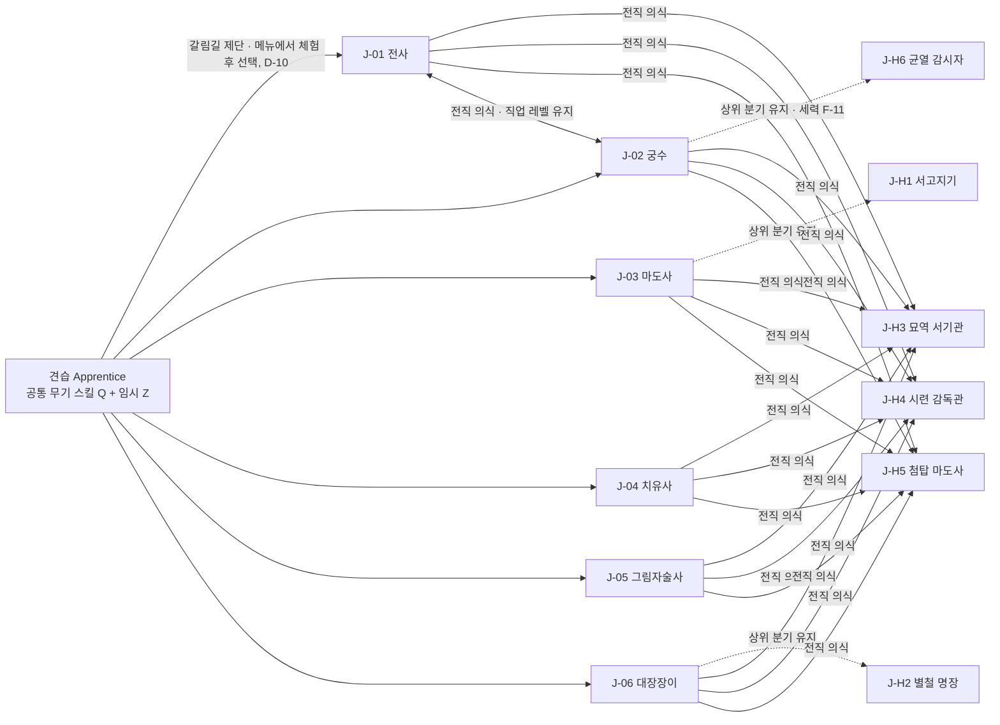

- 실선 = 직업이 바뀌는 전직 의식(D-09, 직업 레벨 유지 · 스킬 포인트 재분배). 점선 = 상위 분기형 히든(기존 직업을 유지한 채 스킬 트리 4개가 추가된다). 기본 직업 6종끼리의 전직은 모든 조합이 가능하다(그림은 1쌍만 표시).
- 캐릭터당 직업 1개(D-09). 다중 클래스 없음(01번 5장 #21). 히든 직업 보유 인원 제한 없음, 선착형 아님(전원 획득형 히든 피스, 01번 5장 #5).
- 직업 선택 · 전직 · 히든 해금은 어떤 지역 입장 · 아크 진행 · 레벨 상한의 조건도 아니다(04 2장, D-15 (c)). 반대로 히든 해금 조건에 대형 연결 사건(E-) 완료는 들어가지 않는다.

### 2.2 견습 → 기본 → 히든 흐름

| 단계 | 상태 | 쓸 수 있는 슬롯 | 조건 · 비용 | 근거 |
|---|---|---|---|---|
| 0 | 견습(Apprentice) | 좌클릭 공격, Shift 대시, Q(들고 있는 무기의 무기 스킬 1). Z 해금 시 SK-A01 힘껏 치기 임시 장착 | 접속 직후 상태. Z 슬롯 해금 = 캐릭터 레벨 2 도달 또는 어느 아크든 장 1개(0장 포함) 완료 중 먼저 | D-10, 02번 5.0 |
| 0-장비 | 견습 시작 장비(D-48) | **연습용 한손검**(W1, 일반, 무기 공격력 = 04 5.2 레벨 1 기준 10)을 쥐고 시작 → Q = SK-W1-01 베어 넘기기 | 0장 완료 보상 · 갈림길 제단 상인 무료 수령 무기 = **선택한 직업의 주 무기군 일반 1개**(직업 미선택이면 **그 단계에 개방된 무기군 중 택1: 알파 4 · MVP 5 · 확장 1차 이후 6**, 2.4 · 3.1 '주 무기군' 열). 직업을 선택했는데 가방에 그 직업의 주 무기군 무기가 없으면 제단에서 주 무기 일반 1개를 무료 지급(직업별 1회, 전직 · 첫 선택 철회 시에도 같은 규칙). **직업 선택 · 첫 선택 철회 · 전직 의식 직후 그 직업의 주 무기군 무기 중 가장 높은 등급 1개를 자동 착용**(제단은 안전 구역이라 즉시, 들고 있던 무기는 가방으로, 토스트 1줄 "주 무기(활)를 장착했습니다", 05-r2-M-04). 무기 IT- ID · 수치는 06 | D-48, 05-r1-M-02 |
| 1 | 기본 직업 선택 | Z에 직업 스킬 1 자동 장착(SK-A01 소멸). 직업 스킬 1 = 체험 마당에서 써 본 그 스킬(3.1 '체험 스킬' 열, 3.6). **E 슬롯 = 직업 선택 또는 캐릭터 레벨 3 중 먼저**(5.1 · SLOT_UNLOCK_E) | 갈림길 제단 NPC 또는 메뉴 → 체험 마당에서 그 단계에 개방된 기본 직업 체험(3.6) → 선택. 비용 0, 시점 제한 없음. 선택 후 직업 레벨 10 전까지는 아래 1-b로 1회 무료 변경 | D-10, D-48 |
| 1-b | **첫 선택 철회**(D-53) | 철회 직후 새 직업의 직업 스킬 중 요구 레벨을 채운 것을 Z(· X · C)에 자동 장착(직업 레벨 1~2면 Z 1개 = 최초 선택과 같은 취급, 아래 '규칙' 행의 예외) | 견습에서 첫 직업을 고른 뒤 **직업 레벨 10 미만(1~9)이면 갈림길 제단에서 무료 1회** 다른 기본 직업으로 바꾼다(골드 0). **직업 레벨 · 직업 경험치(견습 적립분 포함)는 유지, 스킬 포인트 전액 환급**(전직 의식 ③과 같은 환급). 이 철회권은 4단계의 '캐릭터 레벨 20 이하 1회 무료 전직'과 **별개로 센다**(CLASS_REPICK_FREE 1, CLASS_REPICK_MAX_JOB_LEVEL 9, 13장). 철회권을 쓴 뒤 직업 레벨 10 미만에서 다시 바꾸려 하면 제단 '직업 변경' 버튼은 회색이고 1줄 안내 "직업 레벨 10부터 전직 의식 가능(현재 n)" | D-53, 05-r2-M-01 |
| 2 | 직업 레벨 성장 1~40 | X(직업 레벨 5), C(12), V(첫 특수 스킬 습득 시) | 직업 경험치 원천 (a)~(d)(2.3) | 04 11.1, D-03, D-46 |
| 3a | 상위 분기형 히든(J-H1 · H2 · H6) | 기존 슬롯 그대로, 보유 직업 스킬 6 + 히든 4 = 10 중 3 장착 | 4장 해금 조건. 전직 아님(직업 유지) | D-09 |
| 3b | 별개 직업형 히든(J-H3 · H4 · H5) | 새 직업 스킬 **6**(SK-Hn-01~06)을 요구 레벨 순서로 해금. **해금 조건 레벨(J-H3 · H4 = 15, J-H5 = 20)에 2개가 바로 열린다**. 무기 스킬 · 특수 스킬 유지 | 4장 해금 조건 + 전직 의식(히든 전직은 골드 0). 직업 레벨 유지, 포인트 재분배 | D-09, D-47, 01번 5장 #50(레벨 리셋 금지) |
| 4 | 전직 의식(기본 ↔ 기본, 기본 ↔ 히든 별개형) | 이전 직업 스킬 레벨은 '휴면'으로 저장(12장), 재전직 시 복구 | 장소: 갈림길 제단(배치 규칙은 이 표 아래). 비용: **300 × 캐릭터 레벨 골드**(캐릭터 레벨 20 이하 1회 무료 — 1-b 첫 선택 철회와 별개, 스탯 재분배와 묶으면 재분배 비용 50%, 04 4.4). 쿨타임 없음. 필드 · 인스턴스 불가. 전직 가능 직업 레벨 10 이상(2.3). 직업 레벨 10 미만에서는 1-b 철회만 가능 | D-09, D-10, D-53 |
| 규칙 | 전직 직후 장착 가능 직업 스킬 **≥ 2** | Z · X(· C)에 2개 이상 자동 장착(12.2) | 전직 의식(4단계 · 3b) 직후 새 직업의 직업 스킬 중 요구 레벨을 채운 것이 2개 이상이어야 한다. 기본 직업 전직은 직업 레벨 10 이상이라 4개(요구 1 · 3 · 5 · 8), 별개 직업형 히든은 해금 조건 레벨에 요구 레벨이 같은 스킬 2개(6.2)로 보장. 최초 직업 선택(1단계, 직업 레벨 1)과 첫 선택 철회(1-b, 직업 레벨 1~2)는 Z 1칸 · 요구 1 스킬만 열린 상태라 1개(예외) | D-47, 05-r1-S-02, D-53 |

- **갈림길 제단 배치(05-r2-M-07)**: ① 모든 시작 도시(SP-의 T-, 03 7장) ② 대륙마다 시작 도시가 아닌 중심 도시 1곳 이상 → **대륙당 최소 2곳**. 03 13장 도시 색인에 '제단' 열을 추가해 위치를 확정한다(14.1 #18). 모든 제단에서 직업 선택 · 첫 선택 철회 · 전직 의식이 된다. **체험 마당(3.6)은 시작 도시 제단에만** 두고, 그 밖의 제단은 직업 카드 + 10초 영상 미리보기만 제공한다(대여 무기 · 허수아비 없음).

### 2.3 직업 레벨 표(1~40)

직업 레벨 상한 **40**(D-35 결정. 04 2장 · 11장 반영 완료, 14.1 #1). 필요 직업 경험치 JXP(n → n+1) = **round(250 × n^1.55, 10의 자리)**. 직업 경험치 원천(D-46 · D-54)은 아래 4가지이며, 전직 의식 · 첫 선택 철회 시 직업 경험치 · 레벨은 유지된다(D-09 · D-53).

**부스트 처리(05-r2-S-07 · M-05)**: (a)~(d)의 '캐릭터 경험치'는 모두 **D-41 유료 경험치 부스트 적용 전** 값이다(04 3.3 '비적용: 직업 경험치' 행). (a)의 분당 상한도 부스트 미적용 상한 1.5 × 기준(L)으로 계산한다. 따라서 유료 부스트는 직업 레벨 · 히든 직업 조건(직업 20 등)을 앞당기지 않는다(5.8).

| 원천 | 직업 경험치 | 상한 · 조건 | 비고 |
|---|---|---|---|
| (a) 처치 | 몬스터 처치 캐릭터 경험치(전투 태그, 레이드 · 인스턴스 처치 포함)의 **50%**(04 11.1, 레벨 차 보정 · 파티 분배 적용 후, **부스트 적용 전** 값) | 부스트 미적용 분당 상한 1.5 × 기준(L)(04 7.5)이 먼저 걸린 뒤의 50% | — |
| (b) 직업 스킬 적중 | 적중 1회당 **max(1, 0.5 × min(M, 캐릭터 레벨 + 5))**(M = 몬스터 레벨) | 같은 대상 초당 1회, 무관심 대상 제외. **전투 중 파티원에게 회복 · 보호막 · 버프를 준 직업 스킬 1회도 적중 1회**(M = 그 전투의 가장 높은 적대 몬스터 레벨, 같은 아군 대상 초당 1회, 05-r2-S-09). **분당 상한 = (a) 기준의 20%** = 0.2 × 0.5 × 기준 경험치/분(캐릭터 레벨, 04 3.1) = 0.1 × 기준(L) | 저레벨이 고레벨 정예 · 보스를 때려 큰 값을 받는 경로 차단(min(M, L+5)). 치유사 · 대장장이처럼 지원 스킬 위주인 직업도 (b)를 받는다 |
| (c) 이야기 | **이야기 태그 전체**의 캐릭터 경험치(부스트 적용 전)의 **20%**(D-54). 이야기 태그 = 04 6장의 아크 장 완료 · 이야기 NPC 대화 · 기록물 첫 열람 · 히든 피스 완료 · 세력 평판 · 호위 · 전령 의뢰 · 일일 · 주간 계약 · 던전 클리어 보너스(레이드 클리어 보너스가 있으면 포함) | 각 원천의 지급 횟수 규칙 그대로(장 · 지점 · 의뢰당 1회, 계약 일 3 · 주 3, 주간 보상 횟수, 04 6장). 04 6장 표에 원천별 태그 열 추가 요청(14.1 #19) | 사냥 0회 경로의 주 원천(하루 50분 유저 직업 경험치의 62%) |
| (d) 제작 · 채집 · 발견 | 제작 · 채집 · 발견 태그 캐릭터 경험치(부스트 적용 전)의 **50%** | 각 원천의 캐릭터 경험치 상한(04 6장: 제작 · 채집 70%, 일일 산출 상한 D-42)이 먼저 걸린 뒤의 50% | 사냥 0회 경로도 직업 성장(D-03 '제작 활동 자체가 성장 경로', 05-r1-S-07) |
| 견습 적립 | 견습 기간의 (a)~(d)를 '견습 적립'으로 모아 두었다가 첫 직업 선택 시 한꺼번에 지급 | 적립 상한 = 직업 레벨 5 누적치 **4,490** | 직업 선택을 미뤄도 손해가 없게(D-10 '미루기 가능', 05-r1-M-04) |

| 직업 레벨 | 다음 레벨 필요 | 누적 | 해금 · 보상 |
|---|---|---|---|
| 1 | 250 | 0 | 스킬 포인트 +1 · 직업 스킬 1 해금 · Z 슬롯(D-10 조건 충족 시) |
| 2 | 730 | 250 | 스킬 포인트 +1 |
| 3 | 1,370 | 980 | 스킬 포인트 +1 · 직업 스킬 2 |
| 4 | 2,140 | 2,350 | 스킬 포인트 +1 |
| 5 | 3,030 | 4,490 | 스킬 포인트 +1 · 직업 스킬 3 · **X 슬롯 해금** |
| 6 | 4,020 | 7,520 | 스킬 포인트 +1 |
| 7 | 5,100 | 11,540 | 스킬 포인트 +1 |
| 8 | 6,280 | 16,640 | 스킬 포인트 +1 · 직업 스킬 4 |
| 9 | 7,530 | 22,920 | 스킬 포인트 +1 |
| 10 | 8,870 | 30,450 | 스킬 포인트 +1 · 전직 의식 가능(이전 직업 스킬 휴면 보존). 직업 레벨 1~9에서는 첫 선택 철회 1회만(2.2 1-b) |
| 11 | 10,280 | 39,320 | 스킬 포인트 +1 |
| 12 | 11,770 | 49,600 | 스킬 포인트 +1 · 직업 스킬 5 · **C 슬롯 해금** · 프리셋 2 해금 |
| 13 | 13,320 | 61,370 | 스킬 포인트 +1 |
| 14 | 14,940 | 74,690 | 스킬 포인트 +1 |
| 15 | 16,630 | 89,630 | 스킬 포인트 +1 · 별개 직업형 히든(J-H3 · J-H4) 조건 레벨 · 별개형 스킬 1 · 2(SK-H3-01 · 05, SK-H4-01 · 05) |
| 16 | 18,380 | 106,260 | 스킬 포인트 +1 |
| 17 | 20,190 | 124,640 | 스킬 포인트 +1 |
| 18 | 22,060 | 144,830 | 스킬 포인트 +1 · 별개형 스킬 3(SK-H3-02 · SK-H4-02) |
| 19 | 23,990 | 166,890 | 스킬 포인트 +1 |
| 20 | 25,970 | 190,880 | 스킬 포인트 +1 · 직업 스킬 6(궁극) · 상위 분기형 히든(J-H1 · J-H2 · J-H6) · J-H5 조건 레벨 · J-H5 스킬 1 · 2(SK-H5-01 · 05) |
| 21 | 28,010 | 216,850 | 스킬 포인트 +1 |
| 22 | 30,110 | 244,860 | 스킬 포인트 +1 · 분기형 히든 스킬 1(J-H1 · J-H2 · J-H6) · 별개형 스킬 4(SK-H3-03 · SK-H4-03) |
| 23 | 32,260 | 274,970 | 스킬 포인트 +1 · J-H5 스킬 3(SK-H5-02) |
| 24 | 34,460 | 307,230 | 스킬 포인트 +1 |
| 25 | 36,710 | 341,690 | 스킬 포인트 +1 · 분기형 히든 스킬 2 |
| 26 | 39,010 | 378,400 | 스킬 포인트 +1 · 별개형 스킬 5(SK-H3-06 · SK-H4-06) · J-H5 스킬 4(SK-H5-03) |
| 27 | 41,360 | 417,410 | 스킬 포인트 +1 |
| 28 | 43,760 | 458,770 | 스킬 포인트 +1 · J-H5 스킬 5(SK-H5-06) |
| 29 | 46,200 | 502,530 | 스킬 포인트 +1 · 분기형 히든 스킬 3 |
| 30 | 48,690 | 548,730 | 스킬 포인트 +1 |
| 31 | 51,230 | 597,420 | 스킬 포인트 +1 · 별개형 궁극(SK-H3-04 · SK-H4-04 · SK-H5-04, 각성 홈) |
| 32 | 53,820 | 648,650 | 스킬 포인트 +1 |
| 33 | 56,450 | 702,470 | 스킬 포인트 +1 · 분기형 히든 스킬 4(궁극) |
| 34 | 59,120 | 758,920 | 스킬 포인트 +1 |
| 35 | 61,840 | 818,040 | 스킬 포인트 +1 |
| 36 | 64,600 | 879,880 | 스킬 포인트 +1 |
| 37 | 67,400 | 944,480 | 스킬 포인트 +1 |
| 38 | 70,240 | 1,011,880 | 스킬 포인트 +1 |
| 39 | 73,130 | 1,082,120 | 스킬 포인트 +1 |
| 40 | — (상한) | 1,155,250 | 스킬 포인트 +1 · 상한. 스킬 포인트 총 40 |

- 전표 그대로 데이터 테이블 `JOB_XP_TABLE`(13장)에 넣는다.
- 직업 레벨은 캐릭터 레벨의 상한을 받지 않는다(캐릭터 20 · 직업 30 가능, 04 11.1). 9장 검산의 '레벨 30 표준'은 아래 검산의 **캐릭터 30 · 직업 26**을 쓴다.

**검산 (a) + (b) + (c) + (d)**(스크립트 jobxp3, 04 3.2 전표 · 04 6장 사냥 0회 경로 계산표 기준, 추정):

| 경로 | 가정 | 캐릭터 10 | 20 | 30 | 40 | 50 | 60 | 직업 20 도달 | 직업 40 도달 |
|---|---|---|---|---|---|---|---|---|---|
| 사냥만 | (a) = 04 3.2 필요 경험치 × 50%. (b) = 직업 스킬 적중 6회/분 × 0.5 × 캐릭터 레벨, 분당 상한 0.1 × 기준(L) → 레벨 5 이후 항상 상한(사냥 중 (b) ≈ (a)의 20%). (c)(d) 0 | 9 | 18 | **26** | 34 | 40 | 40 | 캐릭터 22 | 캐릭터 48 |
| **사냥 0회 · 하루 50분**(모바일 주 타깃, AS-03. 04 6장 113일 · 94시간) | 04 6장 배분을 날마다 그대로 반복: 일일 계약 15 · 주간 계약 8.6 기준 분 → 단발(아크 장 1,500 · 히든 피스 540 · 발견 181 기준 분을 이 비율로) → 제작 60분(× 0.7) → 채집 20분(× 0.7). 지급 시점 캐릭터 레벨의 기준 경험치로 환산해 **이야기 태그(계약 · 아크 · 히든 피스) × 20% + 발견 · 제작 · 채집 × 50%** | 6 | 12 | 17 | 22 | 28 | **35** | 캐릭터 35 | — (60에서 35) |
| 사냥 0회 · 하루 100분(04 6장 62일 · 103시간) | 같은 배분. 제작 · 채집 비중이 커진다 | 6 | 12 | 17 | 24 | 32 | **40** | 캐릭터 35 | 캐릭터 60 |
| 사냥 0회 · 하루 150분(04 6장 53일 · 105시간) | 같은 배분 | 6 | 12 | 17 | 25 | 33 | **40** | 캐릭터 34 | 캐릭터 59 |
| 혼합(캐릭터 경험치 절반 사냥) | '사냥만'과 '사냥 0회 · 하루 50분'의 평균 | 8 | 16 | 22 | 29 | 36 | 40 | 캐릭터 26 | 캐릭터 56 |

- 사냥 0회 경로는 **하한인 하루 50분 유저도 캐릭터 60에서 직업 35**(100 · 150분은 40), D-46 · D-54 목표 '30 이상'을 충족하므로 (c) 20% · (d) 50% 비율은 조정하지 않는다. 하루 50분 유저의 직업 경험치 구성은 이야기 태그 62% · 제작 · 채집 33% · 발견 5%, 캐릭터 경험치 대비 평균 25.9%다.
- 사냥 0회 경로의 도달 시점(하루 50 / 100 / 150분 공통에 가깝다): 직업 5(X 슬롯) 캐릭터 8, 직업 10(전직 의식) 15~16, 직업 12(C 슬롯) 19, 직업 20(궁극 · 무기 개조 · J-H1 · J-H2 · J-H6 조건) 34~35, 직업 30은 50분 53 · 100분 47 · 150분 46. 사냥만 하면 직업 5 = 캐릭터 7, 10 = 11, 12 = 13.
- 총 1,155,250. 직업 레벨 40은 사냥만 하면 캐릭터 약 48, 혼합이면 약 56, 사냥 0회는 하루 100분 이상이면 59~60, 하루 50분이면 60에서 35(상한 미도달 — 스킬 포인트 35로도 포인트를 쓰는 장착 5칸(Q · E · Z · X · C) 전부 Lv5 = 20포인트가 가능하다, 5.2).

### 2.4 단계별 도입 범위(D-19 · D-36, 일정 · 공수는 12)

직업 구성은 D-36으로 확정. 무기군 · 특수 스킬은 그 단계 직업 · 대륙(02 11장)에서 따라 나오는 값이다. 특수 스킬은 습득 아크 · 지역의 대륙이 열리는 단계에 들어온다(8장 '습득 경로').

| 단계 | 기본 직업 | 히든 직업(누적) | 무기군(누적) | 특수 스킬 SK-V(누적) | 비고 |
|---|---|---|---|---|---|
| 알파(D-19) | J-01 전사 · J-02 궁수 · J-03 마도사 · J-06 대장장이 (4) | 0 | W1 · W2 · W3 · W5 (4) | SK-V01 · V04 · V06(SP-01~04 입문용) + 12번이 고른 알파 아크 6개에 속한 C-01 · C-02 특수 스킬 | 근접 · 원거리 · 마법 · 생산, 기력 · 마나 · 열기 자원 전부 검증 |
| MVP | 6종 전부 (6) | J-H2 별철 명장 · J-H1 서고지기 (2) | + W4 단검 (5) | SK-V01~V07 (7, C-01 · C-02) | 그림자술사 주 무기 W4가 필요해 무기군 5(02 10장 MVP 목표 '무기군 4' 초과, 14.1 #14). J-H1 사본 3종 중 T-21 사원 필사본(C-04)은 **T-01 '벨로스 기증 필사본'으로 대체**(D-59, 07 HP-33, 4장 J-H1 발견 경로) |
| 확장 1차 | — | + J-H3 묘역 서기관 (3) | + W6 창 (6) | + SK-V08 · V09 (9, C-03) | 궁수의 창 근접 대체(7.4)는 이 단계부터 |
| 확장 2차 | — | + J-H4 시련 감독관 (4) | 6 | + SK-V10 · V11 · V14 · V15 · V17 (14, C-04) | J-H4의 창 숙련 1.10(7.2)은 W6 개방 뒤. T-21 개방으로 J-H1 사본 원래 조건(T-21 사원 필사본)도 인정하고, T-01 대체본(D-59)도 계속 인정(어느 쪽이든 1개면 충족, 이미 해금한 캐릭터는 영향 없음) |
| 확장 3차 | — | + J-H6 균열 감시자 (5) | 6 | 14 | 세력 기여 · 직업별 랭킹(D-14)과 함께 |
| 확장 4차 | — | + J-H5 첨탑 마도사 (6) | 6 | + SK-V12 · V13 · V16 (17, C-05) | 02 11장 '히든 누적 6'과 일치 |

---

## 3. 기본 직업

### 3.1 기본 직업 표(J-01~06)

자동 성장 분포는 04 4.3의 유형을 직업별로 확정한 값(레벨당 2포인트, 홀수 · 짝수 레벨 교대). 주 스탯 열의 스탯이 04 5.1 '기본 공격력 = 무기 공격력 + 2 × 주 스탯'의 주 스탯이다(치유사는 **정신**, D-35 · 04 5.1 반영, 5.4). 모바일 조작 난이도 1(쉬움)~5(어려움)는 추정.

| ID | 이름(영문) | 역할 | 주 스탯 | 자동 성장(홀수 / 짝수 레벨) | 04 유형 | 주 무기군(부) | 자원 | 솔로 강점 | 파티 · 레이드 강점 | 모바일 난이도 | 체험 스킬 = 선택 직후 Z(D-10 · D-48, 3.6) | 알파 4종 |
|---|---|---|---|---|---|---|---|---|---|---|---|---|
| J-01 | 전사 (Warrior) | 근접 딜러 · 준탱커 | 힘 | 힘 1 · 체력 1 / 힘 1 · 체력 1 | 근접 힘형 | W1 한손검 (W6 창 · W5 망치) | 기력 | 높은 체력 · 도발로 2~3마리 동시 처리 | 전열 유지 · 도발 · 공격력 버프(전투 함성) | 2 | SK-J1-03 회전 베기(요구 직업 레벨 1) | ○ |
| J-02 | 궁수 (Archer) | 원거리 딜러(필수 직업, 3-B-8) | 민첩 | 민첩 1 · 힘 1 / 민첩 1 · 체력 1 | 민첩형 | W2 활 (W6 창(근접 대체)) | 기력 | 선제 사격 · 덫 · 후퇴 사격으로 피격 최소화 | 후열 단일 딜 · 표식(히든) · 광역 화살비 | 3 | SK-J2-01 조준 사격 | ○ |
| J-03 | 마도사 (Mage) | 광역 마법 딜러 | 지력 | 지력 1 · 정신 1 / 지력 1 · 체력 1 | 마법형 | W3 지팡이 (—) | 마나 | 둔화 · 전이로 거리 유지, 광역으로 무리 처리 | 광역 딜 · 둔화 · 보호막(장막) | 3 | SK-J3-01 불꽃 구슬 | ○ |
| J-04 | 치유사 (Cleric) | 회복 · 지원 | 정신 | 정신 1 · 지력 1 / 정신 1 · 체력 1 | 지원형 | W3 지팡이 (W5 망치) | 마나 | 자가 회복으로 느리지만 안정적인 사냥(DPM 약 73%, 딜러 평균 대비, 9.2) | 회복 · 보호막 · 되살림 · 정화 | 2 | SK-J4-01 빛의 손길 | ×(MVP) |
| J-05 | 그림자술사 (Shade) | 근접 기동 딜러 | 민첩 | 민첩 1 · 기교 1 / 민첩 1 · 체력 1 | 민첩형(기교 변형) | W4 단검 (W1 한손검) | 기력 | 은신 · 순간 이동으로 선택적 교전, 치명타 특화 | 보스 단일 딜 · 암습 연격 | 4 | SK-J5-01 등 뒤 돌기(요구 직업 레벨 1) | ×(MVP) |
| J-06 | 대장장이 (Blacksmith) | 생산 + 근접 서포터(필수 직업, 3-B-8, D-02) | 힘(전투) · 기교(생산) | 기교 1 · 힘 1 / 기교 1 · 체력 1 | 생산형 | W5 망치 (W1 한손검) | 기력 + 열기 게이지 | DPM 순수 딜러의 75~85%, 현장 수리로 내구도 걱정 없는 장기 사냥 | 담금질(공격 버프) · 보강(방어 버프) · 현장 수리 · 무기 개조(속성 부여) | 2 | SK-J6-02 모루 내리치기(요구 직업 레벨 1, 기력만 소모 · 열기 +15) | ○ |

- 알파 4종(D-19 '기본 직업 4, 대장장이 · 궁수 포함'): **전사 · 궁수 · 마도사 · 대장장이로 확정(D-36)**(근접 · 원거리 · 마법 · 생산 1종씩, 자원 2종 모두 검증). 단계별 범위는 2.4.
- 체험 스킬 = 직업 선택 직후 Z에 들어가는 요구 직업 레벨 1 스킬(D-48 · D-53). 6직업 모두 눈에 보이는 피해 · 회복 · 순간 이동 스킬이다(순간 이동 = 그림자술사 **SK-J5-01 등 뒤 돌기**. 체험 마당에서는 직후 기본 공격 1회의 확정 치명타 숫자를 강조 표시해 효과가 보이게 한다, 3.6). 12.2 '직업 선택' ②는 이 열을 원본으로 쓴다. 이를 위해 r2에서 **전사는 회전 베기(1) ↔ 전투 함성(5)**, **대장장이는 모루 내리치기(1) ↔ 담금질(3)** 의 요구 레벨을 맞바꿨다(6.1 · 6.3). 대장장이의 첫 Z는 열기 없이 기력 18로 쓰고 적중 시 열기 +15를 채워 다음 스킬(담금질 · 보강)로 이어진다.
- 모바일 난이도 근거: 전사 · 대장장이 · 치유사는 자동 조준 + 광역 · 자기 대상 스킬이 많아 2. 궁수 · 마도사는 시전 중 이동 불가 스킬이 있어 3. 그림자술사는 뒤 잡기 · 은신 타이밍이 있어 4. 5는 없다(3-C 모바일 동등).

### 3.2 레벨 30 기준 빌드 스탯(9장 검산의 입력, 04 4.2 · 5.2 식)

기준 빌드 = 자유 3 중 주 스탯 2 · 체력 1, 자동 2 = 3.1 분포. 기준 장비 = 무기 공격력 8 + 2.4 × 30 = **80**, 주 스탯 +8(0.25 × 30 반올림), 방어구 합 75(04 5.2). 소수점은 반올림. 치명타 확률은 **5% + 0.05%p × (힘 + 민첩 + 지력 + 정신 총합)**(D-37, 04 5.1 r2), 치명타 피해는 150% + 0.5%p × 기교.

| 직업 | 힘 | 민첩 | 체력 | 지력 | 정신 | 기교 | 기본 공격력(04 5.1) | 치명타 확률(4스탯 합) | 치명타 피해 | 기대 배율 | 최대 체력 | 최대 마나(마나 직업) · 회복/초 |
|---|---|---|---|---|---|---|---|---|---|---|---|---|
| J-01 전사 | 105 | 10 | 68 | 10 | 10 | 10 | 80 + 2 × 105 = **290** | 11.75%(135) | 155.0% | 1.065 | 1,216 | — (기력 100 · 5/초) |
| J-02 궁수 | 24 | 105 | 54 | 10 | 10 | 10 | 80 + 2 × 105 = **290** | 12.45%(149) | 155.0% | 1.068 | 1,048 | — (기력 100 · 5/초) |
| J-03 마도사 | 10 | 10 | 54 | 105 | 24 | 10 | 80 + 2 × 105 = **290** | 12.45%(149) | 155.0% | 1.068 | 1,048 | 866 · 11.1 |
| J-04 치유사 | 10 | 10 | 54 | 24 | 105 | 10 | 80 + 2 × 105 = **290** | 12.45%(149) | 155.0% | 1.068 | 1,048 | 704 · 17.5 |
| J-05 그림자술사 | 10 | 105 | 54 | 10 | 10 | 24 | 80 + 2 × 105 = **290** | 11.75%(135) | 162.0% | 1.073 | 1,048 | — (기력 100 · 5/초) |
| J-06 대장장이 | 90 | 10 | 54 | 10 | 10 | 39 | 80 + 2 × 90 = **260** | 11.00%(120) | 169.5% | 1.076 | 1,048 | — (기력 100 · 5/초) |

- 대장장이의 기본 공격력(260)이 순수 딜러(290)의 90%인 것은 자동 성장이 기교 1 · 힘 0.5이기 때문이다. 기교는 치명타 피해(+14.5%p)와 제작 판정(06)으로 돌아온다. D-02의 '75~85%'는 여기에 스킬 계수 차이가 더해진 DPM 기준이며 9장에서 검산한다.
- D-37 이후 기대 배율 차이는 직업 간 최대 1.1%(1.065~1.076)다. 민첩 직업만 치명타가 오르던 r1 구조(궁수 1.085 · 전사 1.033)는 없어졌다.
- 공통 임계 패시브(04 4.5)는 이 표의 총합 기준으로 켜진다: 캐릭터 30에서 TP-STR(힘 100)은 전사만(105), TP-INT(지력 100)는 마도사만(105) 켜진다. 9장 검산에 반영(05-r1-S-09).

### 3.3 대장장이의 전투 겸업 역할(D-02)

| 역할 | 스킬 | 수치 | 파티 · 레이드에서의 자리 | 06 · 08 연계 |
|---|---|---|---|---|
| 현장 수리(내구도 회복) | SK-J6-03 현장 수리 | 반경 8 파티 착용 장비 내구도 +15%, 쿨 45초, 던전 인스턴스 1회당 3회 상한 | 긴 레이드에서 내구도 0(효과 소실)을 막는다. 사망 시 −10%(04 7.6)를 상쇄 | 내구도 수치 · 수리비 06, 레이드 상한 08 |
| 담금질(공격 버프) | SK-J6-01 담금질 → J-H2 별철 담금 | 반경 10 파티 **기본 공격력 +12%** 30초, 쿨 60초, 열기 30(별철 담금: +18% · 치명타 피해 +10%p **20초**, 쿨 60초). '기본 공격력 +n%'는 5.4 용어 정의, 다른 버프와의 중첩은 5.6 | 가동률 50%(별철 33%). 6인 파티 기준 파티원 1명당 DPM +6%(피해는 기본 공격력에 비례) → 대장장이 개인 DPM 79% + 6% × 5명 = 파티 기여 딜러 약 1.1명분. 대장장이 2명이 같이 걸어도 같은 스킬 ID는 최댓값 1개만(5.6 ②) | 02 용어집 #22 |
| 보강(방어 버프) | SK-J6-04 보강 → J-H2 즉석 보강판 | 대상 1명 방어력 +25% · 받는 피해 −10% 20초, 쿨 30초 | 탱커 보조. 보스 강공격 패턴 직전에 사용 | 08 기믹 |
| 무기 개조(속성 부여) | SK-J6-06 무기 개조 → J-H2 명장의 서명 | 전투 중 1회, 60초 피해 +8% + 속성 효과 1종(화상 · 둔화 · 마비, 비전투 시 미리 지정, 6.1) | 보스 속성 약점 기믹(08)의 열쇠. 속성 효과 수치는 06 | 06 속성 정의 |
| 솔로 사냥 보장 | SK-J6-02 모루 내리치기 · SK-J6-05 달군 망치 + 망치 무기 스킬 | 9장 DPM 순수 딜러 평균의 약 79~84%(레벨 30 78.7% · 레벨 60 81.7% · 레벨 60 전설 풀장비 83.9%, 모루 내리치기 방어 감소 가동률 반영, 9.5) | 같은 레벨 일반 몬스터 처치 약 5.7초(순수 딜러 평균 4.5초, 9.2). 체력 · 방어는 궁수 · 마도사와 같음(최대 체력 1,048, 3.2) | 04 5.4 |

### 3.4 열기 게이지(Heat Gauge, 대장장이 직업 자원)

| 항목 | 규칙 |
|---|---|
| 범위 | 0~100. 접속 · 부활 시 0. 저장하지 않는다(12장) |
| 충전 | 망치 기본 공격 적중 +8, 망치 무기 스킬 적중 +15, 모루 내리치기 적중 +15(어떤 무기를 들어도 적용 → 한손검 대장장이도 첫 Z로 열기를 채운다). 작업대 미니게임 1회 완료 +30(06). 비전투 15초 뒤부터 초당 −2 |
| 소모 | 담금질 30 · 보강 25 · 달군 망치 20 · 현장 수리 40 · 무기 개조 60(6장). 6장 소모 자원 열에 '열기 n + 기력 m'으로 적힌 스킬은 둘 다 소모(둘 다 있어야 발동), '열기 n'만 적힌 스킬(현장 수리 · 무기 개조 · J-H2 즉석 보강판 · 명장의 서명)은 열기만 소모 |
| 제작 연계 | 열기 50 이상이면 작업대 미니게임 첫 판정 창 +5%(06). 제작은 열기를 쓰지 않는다 |
| UI | 전투 클러스터 공격 버튼 테두리에 원형 게이지(버튼 추가 없음, D-16) |

### 3.5 직업별 스탯 임계 패시브(04 4.5의 '직업별 추가 임계 패시브')

04 4.5의 공통 6개(TP-STR~TP-TEC)에 더해 직업마다 1개. 조건부 효과이며 스탯 **총합**(포인트 + 종족 + 장비 + 인장) 기준, 재분배로 임계 미만이면 즉시 꺼진다(01 #9 · #66). 슬롯을 쓰지 않는다. 히든 직업은 기반 직업(분기형) 또는 아래 별개형 행을 쓴다.

| ID | 직업 | 스탯 | 이름 | 임계값 | 효과 | 재분배 시 |
|---|---|---|---|---|---|---|
| TP-J01 | 전사 | 힘 | 무게 중심 | 120 | 도발(굳센 피부 · 시련 선포) 지속 +2초, 넉백 거리 −50% | 임계 미만이면 꺼짐 |
| TP-J02 | 궁수 | 민첩 | 긴 호흡 | 120 | 조준 사격 · 꿰뚫는 화살 시전 시간 −20% | 임계 미만이면 꺼짐 |
| TP-J03 | 마도사 | 지력 | 잔류 마력 | 120 | 반경형 광역 스킬의 반경 +1 stud(대상 상한 8체는 유지, 5.4) | 임계 미만이면 꺼짐 |
| TP-J04 | 치유사 · J-H3 | 정신 | 깊은 숨 | 120 | 회복 · 보호막 계수 +8%, 되살림 시전 10 → 8초 | 임계 미만이면 꺼짐 |
| TP-J05 | 그림자술사 | 기교 | 날 세우기 | 80 | 뒤 공격(틈새 찌르기 · 등 뒤 돌기 후) 치명타 피해 +15%p | 임계 미만이면 꺼짐 |
| TP-J06 | 대장장이 · J-H2 | 기교 | 뜨거운 손 | 100 | 열기 충전량 +25%, 현장 수리 내구도 +15% → +20% | 임계 미만이면 꺼짐 |
| TP-H4 | J-H4 시련 감독관 | 체력 | 돌의 인내 | 130 | 최후의 시련 지속 12 → 15초 | 임계 미만이면 꺼짐 |
| TP-H5 | J-H5 첨탑 마도사 | 지력 | 과열 내성 | 140 | 과부하의 '받는 피해 +20%' → +10% | 임계 미만이면 꺼짐 |

- 임계값 120은 기준 빌드(주 스탯 자유 2/레벨 + 자동 1/레벨 + 장비 0.25/레벨)로 캐릭터 레벨 약 35, 자유 3을 모두 주 스탯에 찍으면 약 27에 닿는다(04 4.5).
- 그림자술사 기교 80 · 대장장이 기교 100은 자동 성장(기교 0.5 · 1.0/레벨)만으로는 60레벨에 39 · 69라 닿지 않는다. 장비 기교(06) · 자유 포인트를 기교에 쓰는 **선택형 특화** 임계값이다(기준 빌드 DPM 검산 9장에는 넣지 않는다).
- r1의 레벨 비례 치명타 보정(TP-J01 +12%p · TP-J03 +8%p · TP-J06B +10%p)은 **D-37(치명타 확률 4스탯 동일)로 필요가 없어져 제거**했다(TP-J06B 행 삭제). 보정 없이 9.5의 레벨 30 · 40 · 50 · 60 · 풀장비 전 행에서 딜러 4직업 ±8% · 대장장이 75~85% · 치유사 60~75%를 지킨다. 민첩 직업만 치명타가 오르던 격차가 공식에서 사라졌기 때문이다.


### 3.6 갈림길 제단 직업 체험 사양(D-10 · D-48, 05-r1-M-01)

| 항목 | 사양 |
|---|---|
| 장소 | 각 시작 도시(SP-)의 갈림길 제단 옆 **체험 마당**: 안전 구역(D-29) 안의 울타리 공간(지름 약 30 studs). 허수아비 3개(체력 무한, 피해 숫자 표시) + 이동 표적 1개(좌우 왕복 6 studs/s). 여러 명이 동시에 써도 허수아비 · 표적은 클라이언트별 로컬 개체(서로 간섭 없음). 메뉴의 '직업 체험'은 도시 · 마을 안에서만 활성이며 누르면 가장 가까운 체험 마당(시작 도시 제단)으로 길 찾기 핀을 찍는다(필드에서는 회색). 시작 도시가 아닌 제단(2.2 배치 규칙)은 카드 + 10초 영상 미리보기만 제공 |
| 진입 | 제단 NPC 대화 또는 메뉴 → '직업 체험' 1회 탭. 견습 · 직업 보유자 모두 가능(직업 보유자는 전직 비교용) |
| 카드 | **그 단계에 개방된 기본 직업 카드**(알파 4 · MVP 이후 6, 2.4, 가로 스크롤). 카드 1장 = 직업명 · 역할 아이콘 · 주 무기군 · 모바일 난이도(3.1, 1~5 점) · 솔로 1줄 · 파티 1줄. 각 줄 1줄 이내(AS-08), 수치는 넣지 않는다. 예: 대장장이 '망치 · 난이도 2 · 솔로: 길게 버티는 사냥 · 파티: 공격 버프와 수리', 치유사 '지팡이 · 난이도 2 · 솔로: 느리지만 쓰러지지 않는 사냥 · 파티: 회복과 보호막' |
| 체험 방식 | 카드 탭 → 그 직업의 **주 무기(일반) 임시 대여** + 체험 스킬을 **Z에 임시 장착**한 상태로 **30초 자유 사용**(Q · E 무기 스킬 2개도 그 무기 것으로 바뀜). 화면 상단에 남은 초 · '다른 직업' · '이 직업 선택' 버튼 |
| 체험 스킬 | **선택 직후 Z에 들어가는 요구 직업 레벨 1 스킬과 같은 스킬**(3.1 '체험 스킬' 열): 전사 회전 베기 · 궁수 조준 사격 · 마도사 불꽃 구슬 · 치유사 빛의 손길 · 그림자술사 등 뒤 돌기(SK-J5-01) · 대장장이 모루 내리치기. 체험에서는 기력 · 마나 · 쿨타임을 50%로 줄여 30초 안에 4~6회 써 보게 한다(판정 · 계수는 실제와 같음). **그림자술사는 등 뒤 돌기 직후 기본 공격 1회의 확정 치명타 숫자를 강조 표시**(일반 피해 숫자의 1.5배 크기 · 다른 색 + '치명' 글자, 체험 마당 전용 연출)해 순간 이동만으로는 보이지 않는 효과를 30초 안에 보이게 한다(D-53) |
| 반복 | **무제한**. 30초가 지나거나 '다른 직업'을 누르면 카드 화면으로 돌아간다. 체험 중 받은 경험치 · 드롭 없음 |
| 종료 시 | 마당을 나가거나 카드 화면을 닫으면 원래 장비 · 슬롯 · 자원으로 즉시 복구(대여 무기 회수) |
| 선택 확인 팝업 | "○○을(를) 선택합니다. 직업 레벨 10 전까지 1회 무료로 다시 고를 수 있습니다." 1줄(AS-08) + '선택' · '취소'(첫 선택 철회 규칙 2.2 1-b, D-53). 철회권을 이미 쓴 직업 레벨 10 미만 캐릭터에게는 팝업 대신 회색 버튼 + "직업 레벨 10부터 전직 의식 가능(현재 n)". 선택 시 2.2의 '0-장비' 규칙대로 주 무기가 없으면 무료 지급하고 **주 무기를 자동 착용**, 팝업이 닫히면 토스트 1줄 "주 무기(○○)를 장착했습니다"(05-r2-M-04) |
| 모바일 · 패드 | 카드 = 탭 / 패드 DPad 좌우 + ButtonA. 체험 중 HUD는 실제 전투 HUD와 같음(11장) |

---

## 4. 히든 직업

03 3.3의 근원 5곳(서고지기 · 명장 · 묘역 서기관 · 시련 감독관 · 첨탑 마도사)에 1:1로 대응하는 5개 + 세력 · 종족 기반 1개 = **6개**(4-정량 5+). 상위 분기형 3(J-H1 · H2 · H6) · 별개 직업형 3(J-H3 · H4 · H5)(D-09). 발견 경로의 단서 · 조건은 07이 히든 피스(HP-)로 등록하고, 이 표의 조건이 기준이다. 모든 조건은 **수치 또는 행동 조건**이며 선착 · 인원 제한 · 유료 조건이 없다(01번 5장 #5 · 3-C 과금). 해금 조건에 쓰이는 지역은 모두 03 색인에 있다.

| ID | 이름(영문) | 유형 | 근원(03 3.3) | 기반 직업 | 해금 조건(수치 · 행동) | 발견 경로(단서 → 지역 → 조건) | 핵심 스킬 요약(6.2) | 해금 시 유지 / 변경 | 도입 단계 |
|---|---|---|---|---|---|---|---|---|---|
| J-H1 | 서고지기 (Archive Keeper) | 상위 분기형(마도사 유지 + 추가 트리) | 서고지기 — H-11 침묵의 서고(03 3.3) | J-03 마도사 | 마도사 직업 레벨 20 이상 · 기록물 첫 열람 25건 이상(지역 무관) · A-06 완료 · H-11 클리어 1회 · H-11 최심부 '빈 책장'에 사본 3종(H-06 비석 탁본 · T-01 왕립 서고 사본 · T-21 사원 필사본) 투입 | T-01 로엔 왕립 서고 사서 NPC 대사("열쇠 없는 책장") → H-06 로엔 옛 지하묘 비석 → A-06 서고의 잃어버린 열쇠 → H-11 침묵의 서고 최심부. **MVP: T-01 대체본(D-59)** — T-21(C-04, 확장 2차)이 열리기 전에는 사본 3종 중 T-21 사원 필사본 대신 T-01 '벨로스 기증 필사본'을 투입(07 HP-33). 확장 2차 이후에는 둘 다 인정(2.4) | 금서 낭독(계수 240%) · 잉크 사슬(계수 120% + 받는 마법 피해 +8%) · 기록 되감기(4초 전 위치로 되돌아가고 그 사이 잃은 체력의 50% 회복) · 서고 소환(10초 책장 골렘 1체) | 직업 · 직업 레벨 · 스킬 포인트 · 장착 유지. 서고지기 트리 4스킬이 보유 목록에 추가(장착은 Z/X/C 3개 안에서 선택) | MVP |
| J-H2 | 별철 명장 (Starsteel Master) | 상위 분기형(대장장이 유지 + 추가 트리) | 명장 — H-19 산왕의 옛 대장간(03 3.3) | J-06 대장장이 | 대장장이 직업 레벨 20 이상 · 대장장이 숙련도 40 이상 · A-11 완료 · H-19 클리어 1회 · 별철 원석(H-15) 10개 + 희귀 이상 망치 1개로 '명장의 모루' 제작(도안 BP-는 06, 미니게임 판정 '좋음' 이상) | T-09 코르딘 모루 형제단 장인 NPC("산왕의 망치는 둘이었다") → H-15 심층 갱도 별철 → A-11 산왕의 잃어버린 망치 → H-19 산왕의 옛 대장간 | 별철 담금(담금질 대체: 반경 10 파티 기본 공격력 +18% · 치명타 피해 +10%p, 20초) · 용광로 숨결(계수 210% + 화상 3초 × 15%) · 즉석 보강판(반경 8 파티 전원 보호막 = 시전자 기본 공격력 × 200%) · 명장의 서명(무기 개조 대체: 전투 중 1회, 쿨 180초) | 직업 · 직업 레벨 · 숙련도 · 장착 유지. 별철 담금 ↔ 담금질, 명장의 서명 ↔ 무기 개조는 '같은 계열'이라 동시 장착 불가 | MVP |
| J-H3 | 묘역 서기관 (Necropolis Scribe) | 별개 직업형(전직) | 묘역 서기관 — H-24 태양왕조 옛 묘역(03 3.3) | 어느 기본 직업이든(권장: 치유사 · 마도사) | 아무 직업 레벨 15 이상 · 정신 + 지력 총합 120 이상 · A-17 완료 · H-24 '서기관 비석' 3개 탁본(묘역 3구역, 파티 가능) · T-14 자하르 수로 관리청 '옛 직책 임명장' 수령 → 갈림길 제단에서 전직 의식(골드 비용 없음) | T-15 나임 수로 관리인 대사 → A-15 모래 아래의 목소리 → A-17 묘역의 파수꾼 → H-24 비석 | 직업 스킬 6: 모래 유령 소환(15초 소환수 1체) · 망자의 붓(계수 120%) · 묘비 낙인(계수 140% + 받는 피해 +8%) · 사자의 장부(계수 200%) · 묘역의 안식(파티 회복) · 왕조의 호명(궁극, 20초 소환수 3체 추가) | 직업 레벨 유지 · 스킬 포인트 전액 재분배(D-09). 이전 직업 스킬은 휴면(12장). 전직 직후 SK-H3-01 · 05 2개 장착 가능(2.2 규칙). 자원 마나, 성장 유형 '균형형(정신 · 지력 변형)' | 확장 1차(C-03) |
| J-H4 | 시련 감독관 (Trial Overseer) | 별개 직업형(전직) | 시련 감독관 — H-33 벨로스 시련의 방(03 3.3) | 어느 기본 직업이든(권장: 전사 · 대장장이) | 아무 직업 레벨 15 이상 · 체력 스탯 총합 80 이상 · A-21 완료 · H-33 클리어: 솔로(동기화 적용) 사망 0회 1번 **또는** 파티 클리어 3번(택1, 선착 아님) · T-21 안세 대사원 '시련의 서약' → 전직 의식 | T-22 무라 전초기지 순례자 NPC("종이 울리지 않는다") → A-21 울리지 않는 종 → H-33 시련 감독관(보스) 처치 | 직업 스킬 6: 시련 선포(반경 10 몬스터 도발 6초) · 규율 사슬(계수 200% + 끌어당김 · 도발) · 석상의 일격(계수 260%) · 감독관의 규율(반경 10 파티 받는 피해 −15% · 10초) · 종의 울림(2회 × 110%, 기절) · 최후의 시련(궁극, 12초 동안 **논리 체력(Attribute `HP`, 10.6 ④ D-60)**이 1 아래로 내려가지 않음: HP를 1 미만으로 만드는 피해는 HP = 1로 잘리고 사망 유예에 들어가지 않는다) | 직업 레벨 유지 · 포인트 재분배. 전직 직후 SK-H4-01 · 05 2개 장착 가능(2.2 규칙). 자원 기력, 성장 유형 '근접 힘형(체력 변형: 힘 1 · 체력 1 / 체력 1 · 정신 1)' | 확장 2차(C-04) |
| J-H5 | 첨탑 마도사 (Spire Magus) | 별개 직업형(전직) | 첨탑 마도사 — H-38 에스카 마도 첨탑(03 3.3) | 어느 기본 직업이든(권장: 마도사) | 아무 직업 레벨 20 이상 · 지력 총합 100 이상 · A-29 완료 · H-38 상층 기록물 5개 열람(파티 가능, 무관심 규칙으로 저레벨도 접근 가능하나 레벨 20 이상 권장) · T-25 오르멘 마도 방벽 '첨탑 등록' → 전직 의식 | T-24 카르드 초소장 → A-25 마지막 명령서 → A-29 첨탑의 마지막 등불 → H-38 상층 | 직업 스킬 6: 마력 폭풍(3초 × 100% = 300%) · 첨탑 광선(계수 200%, 관통) · 과부하(15초 마법 피해 +30%) · 첨탑 전이(12 studs 순간 이동) · 마력 방벽(자기 보호막) · 마지막 등불(궁극, 계수 700%) | 직업 레벨 유지 · 포인트 재분배. 전직 직후 SK-H5-01 · 05 2개 장착 가능(2.2 규칙). 자원 마나, 성장 유형 '마법형' | 확장 4차(C-05) |
| J-H6 | 균열 감시자 (Rift Watcher) | 상위 분기형(궁수 유지 + 추가 트리) · 세력 기반 | 세력 F-11 회색 등불 + 종족 특성 연계(RC-05 아이셀의 '균열 방향 화살표'가 단서 탐색을 돕는다. 종족 제한 없음, D-08) | J-02 궁수 | 궁수 직업 레벨 20 이상 · F-11 회색 등불 평판 '신뢰' 단계 이상(수치 07 · 08) · 균열 영향 몬스터 300마리 처치(03 8.6 목록의 사냥터 중 2개 대륙 이상에서) · A-07 완료 · T-07 테르가 초소 관측원에게 '관측 등불' 수령 | T-07 테르가 초소 회색 등불 관측원 대사 → A-07 테르가의 꺼지지 않는 등불 → H-09 · H-04 · H-13 균열 몬스터 → T-28 등불 초소(확장 4차 전에는 T-07에서 대행) | 등불 화살(계수 200% + 표식 +8%) · 균열 차단(지점 반경 5 장판 6초: 적 이동 −50%) · 관측(8초 치명타 확률 +20%p) · 등불 일제 사격(6회 × 90% = 540%) | 직업 · 직업 레벨 · 장착 유지. 균열 감시자 트리 4스킬 추가 | 확장 3차(세력 기여 랭킹 도입 시점, D-14) |

### 4.1 히든 직업 공통 규칙

| 항목 | 규칙 | 근거 |
|---|---|---|
| 발견 경로 유형 5종(01번 5장 #49) | J-H1 기록물 수집형 / J-H2 제작형 / J-H3 탁본 · 임명장(이야기형) / J-H4 시련 돌파형 / J-H5 탐험 열람형 / J-H6 세력 평판 + 처치 누적형. 6개가 모두 다른 유형 | 01 #49 |
| 조건의 비수직성 | 조건에 캐릭터 레벨은 없다(직업 레벨 · 스탯 · 행동만). 고위험 지역 조건(H-11 · H-19 · H-38)은 고레벨 파티 동행(04 7.5 동행 보정)으로 저레벨도 수행 가능(인스턴스 동기화는 하향만이라 저레벨을 올려 주지 않는다, D-34 · 04 7.7). H-38 상층 기록물은 무관심 규칙으로 전투 없이 접근 가능. 솔로 조건(J-H4)은 파티 3회로 대체 가능 | 3-B-5, D-05 |
| 각성 홈(Awakening Socket) | 각 히든 직업의 궁극 스킬(SK-Hn-04, 분기형은 4번째 · 별개형은 6번째로 열림)은 해금 시 '잠긴 칸'으로 열리고, 07이 지정한 히든 피스 1개(근원 지역의 기록물 · 유물)를 추가 발견하면 사용 가능. 히든 직업 자체 해금과 별개의 발견 보상 | 01번 5장 #51, 02 용어집 #32 |
| 상위 분기형의 장착 | 보유 10개(직업 6 + 히든 4) 중 Z/X/C 3개. 같은 계열 2개(담금질 ↔ 별철 담금, 무기 개조 ↔ 명장의 서명)는 동시 장착 불가 | 5.1 |
| 별개 직업형의 스킬 수 | 직업 스킬 **6**(일반 5 + 궁극 1, 4-정량 '직업당 6+'). 첫 2개의 요구 직업 레벨 = 해금 조건 레벨(J-H3 · H4 15, J-H5 20) → 전직 직후 Z · X에 2개 장착(C는 3번째 스킬 18 / 23에서) | D-47 |
| 별개 직업형의 성장 유형 | J-H3 균형형(정신 · 지력 변형: 정신 1 · 지력 1 / 정신 1 · 체력 1 → 치유사와 동일 분포), J-H4 근접 힘형(체력 변형: 힘 1 · 체력 1 / 체력 1 · 정신 1), J-H5 마법형. 전직 이후 레벨부터 적용(04 4.3) | 04 4.3 |
| 되돌리기 | 별개 직업형에서 기본 직업으로 전직 의식 가능(비용 2.2). 히든 해금 플래그는 영구(재전직 시 비용 0) | D-09 |
| 직업별 랭킹 | 상위 분기형은 기반 직업 랭킹에, 별개 직업형은 자기 직업 랭킹에 든다(09, 확장 3차) | D-14 |

### 4.2 해금 시점 검산(추정)

| 히든 | 가장 빠른 달성 경로 | 예상 캐릭터 레벨 · 플레이 시간(04 3.3 기준) | 병목 조건 | 저레벨 대안 |
|---|---|---|---|---|
| J-H1 | 마도사로 사냥 위주 → 직업 20(캐릭터 약 22, 약 24시간, 2.3) → H-11(적정 45~60)은 고레벨 파티 동행으로 입장(동기화는 하향만, D-34) | 캐릭터 30~45, 40~65시간 | H-11 클리어(4~6인 권장) | 기록물 25건 · A-06은 레벨 무관. H-11은 고레벨 파티 동행(04 7.5) |
| J-H2 | 대장장이 직업 20(사냥 위주 캐릭터 약 22 / 사냥 0회 경로 약 34~35(04 6장 배분, 하루 50~150분), 2.3) + 숙련도 40(희귀 도안 약 574회, 04 11.2) | 캐릭터 25~40, 35~60시간. **최소 20일**(574회 ÷ 일일 제작 상한 30회 = 19.1 → 20일, D-42) | 숙련도 40 · 별철 10개(H-15 적정 31~46) | 별철은 경매장 구매 가능(10). 제작 · 채집으로도 직업 경험치(2.3 (d)) |
| J-H3 | 직업 15(캐릭터 약 16) + 정신 + 지력 120(치유사 · 마도사 기준 빌드는 캐릭터 약 28, 다른 직업은 자유 포인트 투자 시 약 34) + A-15 → A-17 + H-24 탁본(적정 32~50, 무관심 규칙으로 저레벨 접근 가능) | 캐릭터 28~35, 34~50시간 | H-24 탁본 3곳 | 탁본은 전투 없이 가능(파수 석상은 무관심) |
| J-H4 | 직업 15(캐릭터 약 16) + 체력 80(전사 기준 빌드 체력 2/레벨로 캐릭터 약 36, 자유 3을 체력에 몰면 약 19) + H-33(적정 22~38) | 캐릭터 19~36, 20~47시간 | 솔로 무사망 또는 파티 3회 | 파티 3회 경로 |
| J-H5 | 직업 20(캐릭터 약 22) + 지력 100(마도사 기준 빌드 캐릭터 약 29) + A-25 → A-29 + H-38 상층(적정 42~60) | 캐릭터 35~50, 50~75시간 | H-38 상층 기록물(무관심 규칙 적용) | 기록물 열람은 전투 불필요 |
| J-H6 | 궁수 직업 20(캐릭터 약 22) + F-11 평판 '신뢰' + 균열 몬스터 300(H-04 · H-13 저위험 포함, 2대륙) + A-07 | 캐릭터 25~40, 30~55시간 | 평판 단계(07 · 08 수치) | 300마리 중 저위험 2곳(H-04 · H-13)만으로도 충족 가능(2대륙 조건 만족) |

- 어느 히든도 캐릭터 60 · 풀장비를 요구하지 않는다. 해금 직후 쓸 수 있는 직업 스킬: 상위 분기형은 기존 6 + 히든 1(직업 22), 별개 직업형은 2개(해금 조건 레벨 = 첫 2스킬 요구 레벨, 2.2 규칙 · 6.2).
- 첫 히든이 열리는 시점은 단계별로 다르다(2.4 · D-36, 05-r1-M-05). **MVP**: 히든은 J-H2(대장장이 분기) · J-H1(마도사 분기) 2종뿐이라 첫 히든은 캐릭터 약 25~45이고, 전사 · 궁수 · 치유사 · 그림자술사로 시작한 유저가 직업을 유지한 채 닿는 히든은 없다(전직하면 대장장이 · 마도사 경유로 가능). **확장 1차 이후**: 별개 직업형 J-H3(확장 1차) · J-H4(확장 2차)가 어느 직업에서든 캐릭터 약 19~28(04 3.3 기준 약 20~34시간)에 열려 02 F2 '히든 직업 발견을 자랑'하는 루프가 중반에 시작된다. J-H6(궁수 분기)의 MVP 앞당김은 12번이 범위를 정할 때 검토한다(조건 지역 T-07 · A-07 · H-04 · H-09 · H-13이 MVP 대륙 C-01 · C-02에 있음, 14.1 #16).

---

## 5. 스킬 체계

### 5.1 슬롯 · 해금 · 장착 규칙(02 9.1을 그대로)

| 슬롯 | PC 키 | 계열 | 보유 → 장착 | 해금 조건 | 교체 규칙 |
|---|---|---|---|---|---|
| 기본 공격 | 좌클릭 | 기본 | 무기군별 기본 공격(7.1 간격 · 계수) | 처음부터 | 무기 교체 시 자동 |
| 대시 | Shift | 이동 | 공통 1종(5.5) | 처음부터 | 재배치 가능(10.4) |
| Q · E | Q, E | 무기 스킬 | 들고 있는 무기군의 무기 스킬 **3개 중 2개** 장착 | Q: 처음부터. E: 직업 선택 또는 캐릭터 레벨 3 중 먼저 | 무기 교체 시 그 무기군의 마지막 장착 상태로 자동 교체 |
| Z · X · C | Z, X, C | 직업 스킬 | 보유 6+(히든 분기 시 10) 중 **3개** 장착 | Z: D-10(캐릭터 레벨 2 또는 장 1개 완료). X: 직업 레벨 5. C: 직업 레벨 12 | 비전투 상태(적대 개체가 나를 대상으로 갖지 않은 지 5초)에서 어디서든 교체 가능, **교체 쿨타임 10초**. 프리셋 2개(사냥 / 보스, 직업 레벨 12) 간 전환은 비전투 시 즉시 |
| V | V | 특수 스킬 | 습득 특수 스킬(8장) 중 **1개** 장착 | 첫 특수 스킬 습득 시 | 요구 스탯 미달 시 자동 해제(04 4.4, 01 #66). 교체 규칙은 Z/X/C와 같음 |
| 소모품 1 · 2 | 1, 2 | 기본 | 06 | 캐릭터 레벨 2(첫 회복약 지급, 02 5.2) | — |

원칙: 슬롯은 어느 플랫폼에서도 무기 2 + 직업 3 + 특수 1 = **6개 고정**(02 9.1). 스킬 매크로 없음, 연계 입력만(01 #18): 이 문서의 연계는 '달군 망치 → 기본 공격 3회', '등 뒤 돌기 → 다음 공격 치명타' 같은 **상태 연계**이며 키 조합 입력은 없다. 자동전투 없음(01 #19). 스킬 유형(01 #16 '액티브 · 버프 · 온오프 · 패시브'): 6~8장의 유형 열에서 공격 · 이동 · 회복 · 디버프 = 액티브, 버프 · 생산연계 = 버프(지속 시간형, 온오프 토글 스킬은 두지 않는다), 패시브 = 04 4.5 스탯 임계 패시브(슬롯을 쓰지 않는 별개 층).

### 5.2 스킬 포인트와 스킬 레벨(1~5)

| 항목 | 규칙 |
|---|---|
| 포인트 | 직업 레벨당 1, 총 40. 전직 의식 · 별개형 히든 전직 시 전액 환급 후 재분배(D-09) |
| **비용 규칙(D-46, 확정)** | **스킬 해금 · 무기군 첫 착용 시 Lv1은 무료. Lv n → n+1에 1포인트. 사용 포인트 = Σ(Lv − 1) ≤ 직업 레벨.** 스킬 1개를 Lv5까지 올리는 데 4포인트. 환급되면 그 스킬은 Lv1로 돌아간다(레벨 0 · 사용 불가 상태는 없다) |
| 사용처 | 직업 스킬(6 × 4 = 24) · 상위 분기형 히든 스킬(4 × 4 = 16, 별개 직업형은 직업 스킬 자체가 6 × 4 = 24) · 무기 스킬(무기군당 3 × 4 = 12, 모든 무기군 공통 풀). 전부 올리려면 24 + 16 + 12 × n > 40이므로 **선택**이 생긴다. 특수 스킬(V)은 포인트가 아니라 각성 홈으로 오른다(8장) |
| 스킬 레벨 상한 | Lv = min(5, 1 + floor((직업 레벨 − 해금 레벨) / 4)). 예: 해금 5인 스킬은 직업 레벨 21에 5레벨 가능. **해금 레벨 입력값**: 직업 스킬 = 6장 요구 직업 레벨, 상위 분기형 히든 스킬 = 6.2 요구 직업 레벨(기반 직업 레벨 기준), 별개 직업형 = 6.2 요구 레벨, **무기 스킬 = 1**(요구 레벨 없음 → 1로 본다, 7.3), 특수 스킬은 포인트가 아니라 각성 레벨(8장)이라 이 식을 쓰지 않는다(05-r2-S-11) |
| 레벨 효과(성장식) | 계수 · 효과 수치 × **(1 + 0.08 × (Lv − 1))** → Lv5 = 132%. 쿨타임 · 소모 · 범위 · 시전 시간은 변하지 않는다(모바일 조작 난이도가 레벨로 오르지 않게) |
| 재분배 | 갈림길 제단에서 포인트 초기화 100 × 캐릭터 레벨 골드(전직 · 재분배와 묶으면 무료). 캐릭터 레벨 20 이하 1회 무료 |
| 검산 기준 | 6~9장의 수치는 모두 **스킬 Lv1** 값. 데이터 테이블에는 Lv1 값만 두고 성장식을 적용한다. 전 스킬 Lv5(직업 레벨 40)의 비율은 9.5 · 9.6에 따로 검산 |

### 5.3 쿨타임 · 자원 원칙

| 항목 | 규칙 | 근거 |
|---|---|---|
| 쿨타임 범위 | 일반 스킬 **4~60초**, 궁극기 성격(기본 직업 6번째 · 히든 SK-Hn-04) **90~120초**. 예외 2건(CD_ULT_EXCEPTIONS, 13장): 치유사 되살림 60초(D-35, 04 7.6), J-H2 명장의 서명 180초(무기 개조보다 강한 대신 더 드물게, 05-r1-S-13 · 05-r2-S-06). 쿨타임은 서버 시계로 관리(10.6) | 골격, D-35 |
| 기력(Stamina) | 100 고정, 초당 5 회복, 기본 공격 적중 시 +5(04 5.1). 소모 **10~35**. 사용 직업: 전사 · 궁수 · 그림자술사 · 대장장이 · J-H4 · J-H6 | 04 5.1 |
| 마나(Mana) | 50 + 3 × 레벨 + 6 × 지력 + 4 × 정신, 회복 초당 1% + 0.1 × 정신(04 5.1). 소모 **10~60**(궁극 60~80). 사용 직업: 마도사 · 치유사 · J-H1 · J-H3 · J-H5. **지팡이 기본 공격 적중 시 마나 +4**(AS-13, 04 5.1 기력 규칙의 마나판) | 04 5.1, AS-13 |
| 열기(Heat) | 대장장이 · J-H2 전용, 3.4 | D-02 |
| 자원 부족 시 | 버튼이 회색이 되고 발동하지 않는다(쿨타임 소모 없음). 모바일 · 패드 동일 | 3-C |
| 자원 설계 목표 | 9장 표준 회전에서 분당 소모 ≤ 분당 회복(검산 열 '자원 충족률' ≥ 0.9). 모든 스킬을 쿨마다 쓰면 자원이 겨우 맞고, 궁극기까지 쓰면 잠깐 부족한 수준 | 04 |

### 5.4 계수와 피해 · 치유 공식(04 5.1 그대로)

| 항목 | 식 |
|---|---|
| 피해 1회 | 기본 공격력 × 계수 × 100 / (100 + 대상 방어력) × 랜덤(0.95~1.05) × 치명타 배율 × 버프 · 속성 보정 |
| 기본 공격력 | 무기 공격력 + 2 × 주 스탯 총합. 주 스탯: 전사 · 대장장이 · J-H4 = 힘, 궁수 · 그림자술사 · J-H6 = 민첩, 마도사 · J-H5 = 지력, **치유사 · J-H3 = 정신**(D-35, 04 5.1 주 스탯 열 '지원 = 정신' 반영 완료). 무기 스킬은 들고 있는 무기의 유형이 아니라 **직업의 주 스탯**을 쓴다(궁수가 창을 들어도 민첩) |
| **용어 정의(D-43)** | ① **'공격력 +n%'(버프)** = 기본 공격력 × (1 + n). 무기 공격력 한 항이 아니라 위 기본 공격력 전체에 곱한다(담금질 · 별철 담금 · 전투 함성 · 전장의 축 모두). 피해는 기본 공격력에 비례하므로 'DPM +n%'와 같다. ② **소환수 · 보호막의 '공격력 × n%'** = 시전자 **기본 공격력**(주 스탯 기준, 버프 적용 전) × n%. 이 문서와 06 · 08에서 '마법 공격력 · 주 스탯 공격력 · 정신 기준 공격력'으로 적힌 것도 모두 이 뜻이다. ③ **'마법 피해 +n%'**(과부하) = 마법형 · 지원형 직업(지팡이 기본 공격 포함)이 주는 피해에 곱하는 시전자 쪽 피해 증가. 잉크 사슬 · 마비의 '받는 마법 피해 +n%'는 대상 디버프라 5.6 '대상 받는 피해 증가' 범주다. ④ **'피해 +n%'**(무기 개조 · 명장의 서명 · 마력 환류) = 그 대상이 주는 모든 피해에 곱하는 피해 증가 |
| 계수 | 기본 공격 1.0(무기군별 간격 · 계수 7.1), 무기 · 직업 스킬 **1.2~3.0**(다단 히트 합산), 궁극기 4.0~7.0. 궁극기 1회 폭발량은 일반 스킬의 2~3배지만 쿨 90~120초라 **분당 기여는 일반 스킬 1개의 약 1/4**이다(예: 하늘 균열 6.0 × 0.6회 = 3.6/분 vs 마력 폭발 2.8 × 5회 = 14/분, 05-r1-S-14). 04 검산용 평균 계수(AVG_SKILL_COEF)는 **1.6**(D-35: 이 문서 표준 회전의 초당 실효 계수 평균 1.85에서 이동 · 대상 전환 손실 약 14%를 뺀 사냥 실효값, 9.2). 이 문서의 스킬 계수는 r2에서 3개(불꽃 구슬 · 모루 내리치기 · 달군 망치), r3에서 3개(모루 내리치기 · 달군 망치 · 용광로 숨결, D-54)를 하향했다(9.5 · 9.6) |
| 무기 숙련 보정 | 무기 스킬 계수 × 직업별 배율(7.2 표: 주 1.10 · 부 1.00 · 그 외 0.85). 기본 공격 · 직업 스킬에는 적용하지 않는다 |
| 치유량 | 스킬 기본치 + 2 × 정신 총합 × 계수(04). 보호막 중 '정신 기준' 표기(보호의 기도 등)는 같은 식(기본치 0), '공격력 × n%' 표기는 ② |
| 소환수 | 공격력 = 시전자 기본 공격력(버프 적용 전) × 표시 비율, 계수 1.0, 초당 1타, **치명타 없음**, 방어 · 체력 = 같은 레벨 일반 몬스터의 50%. 시전자의 공격력 버프는 받지 않고 대상의 표식 · 낙인(5.6)은 적용된다. 소환수 피해는 시전자 기여로 집계(04 7.5). **동시 소환 상한: 플레이어당 4체(SUMMON_CAP_PER_PLAYER), 필드 서버 전체 40체(SUMMON_CAP_SERVER)**. 플레이어 상한 초과 시 그 플레이어의 가장 오래된 소환수 소멸. **서버 합계가 40에 닿으면 새 소환을 시도한 본인의 가장 오래된 소환수를 소멸**시키고, 본인 소환수가 없으면 소환 수를 1체로 줄여 발동한다(자원은 정상 소모). 다른 플레이어의 소환이 내 소환수를 지우는 일은 없다(05-r2-T-05). SK-V09 신기루 분신(체력 · 도발이 있는 개체)도 소환수와 같은 서버 개체 · 상한 포함이다. 구현: Humanoid 없는 Anchored 모델 + 서버 간이 AI(초당 1타, 경로 탐색 없이 시전자 주변 추적), 이펙트는 서버가 RemoteEvent로 알리고 각 클라이언트가 재생(저사양 단계는 타인 이펙트 생략, 11.3 · 11, 05-r1-T-08) |
| 광역 상한 | 광역 스킬 1회 최대 **8체**(서버 판정 비용 상한, 11). 무관심 몬스터는 광역에 맞지 않는다(D-27) |
| 속성 | 06이 속성 3종(화상 · 둔화 · 마비)의 상태이상 수치를 정한다. 이 문서는 지속 · 비율만 적는다 |

### 5.5 대시(Shift)와 공통 동작

| 동작 | 수치 | 비고 |
|---|---|---|
| 대시 | 이동 방향으로 8 studs를 0.25초에, 무적 **0.2초**, 쿨타임 **1.5초**(TP-DEX 1단계 −10% · 2단계 −20%, 04 4.5), 기력 0 | 3-B-9. 모든 직업 동일. 시전 중 스킬은 대시로 취소되지 않는다(시전 1초 이상 스킬은 대시 시 취소 · 자원 50% 환급). 이동은 클라이언트가 즉시 실행하고 서버가 검증 · 무적 지연 보정(10.6 '이동형 스킬 권한', D-44) |
| 점프 | 로블록스 기본 Humanoid 점프 | 수중 구역은 '걷는 물'(D-26)이라 수영 상태 없음, 대시 · 스킬 · 점프 전부 지상과 동일 |
| 이동 속도 | 기본 16 studs/s(04 14.3 #1). 전투 중 스킬 시전 시 '이동 불가' 표시가 있는 스킬만 멈춤 | 04 14.2 후보 ③ · 14.3 #1 |
| 대상 지정 | PC: 조준 모드(휠 클릭) 중 화면 중앙 대상. 모바일 · 패드: 자동 조준 보조(10.5). 무관심 몬스터는 자동 후보 제외, 직접 지정 + 확인 1회(D-27) | D-27 |

### 5.6 상태이상 · 효과 정의(스킬 표의 용어)

| 용어 | 효과 | 상한 · 중첩 | 보스 | 해제 |
|---|---|---|---|---|
| 둔화 | 이동 속도 −n% | 가장 큰 값 1개만, 최대 −60% | 적용(−50% 상한) | 시간 경과 · 정화 |
| 속박 | 이동 불가, 공격 · 스킬은 가능 | 같은 대상 10초 안 재적용 시 지속 50% | 면역 | 시간 경과 |
| 기절 | 이동 · 공격 · 스킬 불가 | 같은 대상 10초 안 재적용 시 지속 50%, 최대 2초 | 면역(기믹 지정 시만) | 시간 경과 |
| 넘어뜨림 | 기절과 같되 1초 고정 | 재적용 규칙 동일 | 면역 | — |
| 화상 | 초당 시전자 기본 공격력 × n%(지속 피해 공통 규칙) | 지속 피해 공통 규칙(아래 행) | 적용 | 시간 경과 |
| 중독 | 초당 시전자 기본 공격력 × n%(지속 피해 공통 규칙), 대상 회복 효과 −30% | 지속 피해 공통 규칙(아래 행) | 적용 | 정화 |
| **지속 피해 공통 규칙(D-54)** | 화상 · 중독 같은 지속 피해 1틱 = 시전자 기본 공격력(부여 시점) × n% × 100/(100 + 대상 방어력) × 공격력 · 피해 증가 버프(②) × 대상 받는 피해 증가. **방어 계수 적용 · 치명타 미적용** | **같은 시전자의 같은 지속 피해는 대상당 1개.** 재적용 시 남은 시간을 새 지속으로 갱신하고 **합산 · 중첩하지 않는다**(예: 독 바르기 12초 동안 기본 공격마다 중독 3초 갱신 → 1회 최대 (12 + 3)초 × 15% = 225%). 다른 시전자의 같은 지속 피해는 각각 1개씩 | 적용 | 지속 종료 · 화상은 시간 경과, 중독은 정화 |
| 마비(마비 계열) | 2초 이동 불가 + 받는 마법 피해 +10% | 재적용 50% | 면역 | — |
| 침묵 | 몬스터 스킬 사용 불가(기본 공격은 가능) | 재적용 50% | 면역 | — |
| 공포 | 시전자 반대 방향 도주, 공격 안 함 | 재적용 50% | 면역 | 피격 시 해제 |
| 도발 | 대상이 시전자만 공격 | 가장 최근 도발 우선 | 적용(기믹 제외) | 시간 경과 |
| 은신 · 은폐 | 몬스터 감지 불가(이미 전투 중인 개체는 감지 유지), 공격 시 해제 | — | — | 공격 · 피격 |
| 표식 · 낙인 = **대상 받는 피해 증가 범주** | 대상이 받는 피해 +n%(파티 공통). 이 범주에 드는 것: 표식(등불 화살) · 낙인(묘비 낙인) · 잉크 사슬 '받는 마법 피해 +8%' · 마비 '받는 마법 피해 +10%' · 균열 차단 '균열 영향 몬스터 받는 피해 +20%'(05-r2-S-08) | 종류별 1개, **범주 합산 상한 +25%**(MARK_SUM_CAP, 예: 낙인 8 + 표식 8 + 균열 차단 20 = 36 → 25). '받는 마법 피해'는 마법형 · 지원형 직업의 피해에만 곱한다 | 적용 | 시간 경과 |
| 방어 감소 | 방어력 −n% | 합산 상한 −30% | 적용 | 시간 경과 |
| 보호막 | 피해를 먼저 받아내며 체력 회복과 별개 | 가장 큰 보호막 1개만(갱신) | — | 소진 · 시간 |
| **받는 피해 감소(D-43 ①)** | 받는 피해 −rᵢ(굳센 피부 · 받아치기 · 모루 자세 · 보강 · 시련 선포 · 감독관의 규율 · 전장의 축 · SK-V17 · TP-VIT 등) | **곱연산**: 최종 감소 = 1 − Π(1 − rᵢ), **최종 상한 −75%**. 예: −30% · −20% · −60% → 1 − 0.7 × 0.8 × 0.4 = −77.6% → −75%로 제한. **자기 피격 증가**(과부하 '받는 피해 +20%')는 같은 곱에 (1 + 0.2)로 곱하고, −75% 상한은 감소 쪽에만 적용한다(예: 감독관의 규율 −15% + 과부하 → 0.85 × 1.2 = 1.02, 받는 피해 +2%) | 적용. 보스 기믹의 **'확정 피해'**(08)는 감소 · 보호막을 무시하지만, **대시 · 무적 이동 스킬의 무적 판정은 확정 피해에도 적용**(10.6 ④, D-52) | 효과별 시간 경과 |
| **공격력 · 피해 증가(D-43 ②)** | '공격력 +n%'(5.4 ①) · '피해 +n%' · '마법 피해 +n%'(전투 함성 · 담금질 · 별철 담금 · 전장의 축 · 과부하 · 무기 개조 · 명장의 서명 · 마력 환류) | **같은 스킬 ID는 시전자와 무관하게 최댓값 1개**(대장장이 2명의 담금질 = +12%). 서로 다른 스킬끼리는 **합연산**, 합산 **상한 +50%**. 예: 전투 함성 +10% + 담금질 +12% + 전장의 축 +25% = +47% | 적용 | 효과별 시간 경과 |
| **같은 계열(D-43 ③)** | 담금질 ↔ 별철 담금, 무기 개조 ↔ 명장의 서명 | 다른 시전자가 걸어도 **큰 값 1개만** 적용(별철 담금 +18%가 있으면 담금질 +12%는 무효, 끝나면 남은 쪽이 다시 적용) | 적용 | — |

- 9.2 · 9.6의 버프 배율은 위 ② · ③ 규칙으로 계산했다(자기 버프만 쓰는 표준 회전이라 상한에 닿지 않는다: 대장장이 1.060, J-H2 1.060, J-H5 1.113). 표식 · 낙인 배율은 '종류별 1개 · 합산 상한 +25%' 규칙.
- 플레이어가 받는 상태이상 지속은 TP-SPR(04 4.5)로 −20% / −35%. 정화(SK-J4-04)와 균열 꿰매기(SK-V12)만 해제 수단이며 소모품 해제는 06.

### 5.7 연계(상태 연계) 목록

| 선행 | 후속 | 보너스 | 입력 |
|---|---|---|---|
| 등 뒤 돌기(SK-J5-01) | 다음 공격 1회 | 치명타 확정 | 추가 입력 없음 |
| 숨 죽이기(SK-J5-04) | 은신 중 첫 공격 | 계수 +100%p | 없음 |
| 달군 망치(SK-J6-05) | 기본 공격 3회 | 계수 가산(수치는 SK-J6-05 표 참조, r3: +30%p씩 · 화상 없음) | 없음 |
| 서리 사슬 · 땅울림(둔화) | 숨통 끊기(SK-J1-05) | 둔화 대상이면 체력 30% 조건을 45%로 완화 | 없음 |
| 잉크 사슬(SK-H1-02) | 마법 스킬 | 받는 마법 피해 +8%(5.6 대상 받는 피해 증가 범주) | 없음 |
| 묘비 낙인(SK-H3-02) · 등불 화살(SK-H6-01) | 파티 전원 | 받는 피해 +8% / +8%(합산 상한 +25%) | 없음 |
| 마력 환류(SK-J3-05) | 다음 3회 마법 | 마나 +10 · 피해 +10% | 없음 |

- 키 조합 입력(스킬 A 후 특정 키로 파생기)은 두지 않는다. 모든 연계는 상태 플래그로 서버가 판정하므로 플랫폼 간 입력 난이도 차이가 없다(3-C, 01 #18).


### 5.8 과금 경계(이 문서 범위, 10에 그대로 넘김 · 05-r1-M-09)

| 구분 | 항목 | 근거 |
|---|---|---|
| **판매 금지** | 전직권 · 스킬 재분배권(골드 비용 대체 · 할인 포함, 구독형 편의 묶음에도 넣지 않음), 프리셋 3번째 칸, 스킬 슬롯 추가, 각성 홈 개방, 히든 직업 · 특수 스킬 조건 단축, 직업 경험치에 대한 모든 유료 배율(D-41 경험치 부스트는 직업 경험치에 적용되지 않는다. 직업 경험치는 부스트 적용 전 캐릭터 경험치 기준, 2.3 · 04 3.3) | 3-C 과금(스탯 · 등급을 돈으로 사는 구조 금지), D-11 |
| **판매 허용(꾸미기)** | 스킬 이펙트 색 · 대시 궤적 외형 · 체험 마당 허수아비 외형. 판정 · 범위 · 시인성(경고 장판 색 · 크기)은 기본과 같아야 한다 | 3-C, D-11 |

---

## 6. 직업 스킬 전체 표

기본 6직업 × 6 = 36 + 상위 분기형 히든 3직업 × 4 = 12 + 별개 직업형 히든 3직업 × 6 = 18, **합계 66**(D-47. 4-정량 '직업당 6+': 기본 6 · 분기형 6 + 4 = 10 · 별개형 6). 모든 행에 슬롯 · 쿨타임 · 소모 자원 · 효과 수치가 있다(4-정량). 계수는 Lv1, 5.2 성장식 적용. '열기 n + 기력 m'은 둘 다 소모(3.4). 요구 직업 레벨은 히든 분기형이면 기반 직업의 직업 레벨, 별개형이면 전직 후 직업 레벨이며 **별개형의 첫 2스킬 요구 레벨 = 해금 조건 레벨**(J-H3 · H4 15, J-H5 20)이라 전직 직후 2개가 열린다(2.2 규칙).

'무기 요구' 열: **궁수 · J-H6 직업 스킬만 활(W2) 필요**, 나머지 직업 스킬은 무기 무관(무기 스킬 Q · E는 들고 있는 무기를 따른다, 7.4). 활이 없을 때 해당 버튼은 회색 + 활 아이콘 표시, 누르면 1줄 안내 "활을 들면 쓸 수 있습니다(가방 → 활)". 직업 선택 · 전직 시 주 무기가 없으면 제단에서 무료 지급(2.2 '0-장비').

### 6.1 기본 직업 스킬(36)

| SK-ID | 직업 | 이름(영문) | 슬롯 | 유형 | 요구 직업 레벨 | 무기 요구 | 쿨타임(초) | 소모 자원 | 계수 · 효과 수치 · 지속(Lv1) | 범위 / 사거리 | 시전(초) | 모바일 비고 | 설명 |
|---|---|---|---|---|---|---|---|---|---|---|---|---|---|
| SK-J1-01 | J-01 전사 | 전투 함성 (War Shout) | Z/X/C | 버프 | 5 | 무관 | 30 | 기력 15 | 자신 + 반경 8 파티 공격력 +10% · 12초 | 반경 8 studs | 0.3 | 버튼 1회 | 함성으로 아군을 북돋운다 |
| SK-J1-02 | J-01 전사 | 맹렬 돌진 (Fierce Charge) | Z/X/C | 공격/이동 | 3 | 무관 | 10 | 기력 20 | 계수 200%, 경로 적 전부 · 기절 0.8초, 돌진 10 studs | 직선 10 studs · 폭 3 | 0.3 | 자동 조준 방향 | 돌진해 적을 들이받는다 |
| SK-J1-03 | J-01 전사 | 회전 베기 (Whirl Slash) | Z/X/C | 공격 | 1 | 무관 | 12 | 기력 22 | 2회 × 120% = 240% | 자신 중심 반경 5 | 0.8 | 버튼 1회 | 제자리 회전 광역 |
| SK-J1-04 | J-01 전사 | 굳센 피부 (Iron Hide) | Z/X/C | 버프/디버프 | 8 | 무관 | 25 | 기력 15 | 8초 받는 피해 −30%, 반경 10 몬스터 도발 4초(대상을 자신으로 고정) | 자신 · 반경 10 | 0.3 | 버튼 1회 | 탱커 역할의 핵심 |
| SK-J1-05 | J-01 전사 | 숨통 끊기 (Finisher) | Z/X/C | 공격 | 12 | 무관 | 15 | 기력 22 | 체력 30% 이하 대상 계수 300%, 그 외 180%(검산은 평균 220%) | 단일 · 근접 4 | 0.5 | 자동 조준 | 약해진 적을 끝낸다 |
| SK-J1-06 | J-01 전사 | 전장의 축 (Battle Axis) | Z/X/C | 버프(궁극) | 20 | 무관 | 100 | 기력 35 | 10초 공격력 +25% · 받는 피해 −20% · 기력 소모 −50% | 자신 | 0.5 | 버튼 1회 | 짧은 폭발 구간 |
| SK-J2-01 | J-02 궁수 | 조준 사격 (Aimed Shot) | Z/X/C | 공격 | 1 | **활(W2) 필요** | 8 | 기력 15 | 계수 260% | 단일 · 사거리 24 | 1.0 | 자동 조준. 시전 중 이동 불가 | 숨을 고르고 쏜다 |
| SK-J2-02 | J-02 궁수 | 덫 설치 (Snare Trap) | Z/X/C | 공격/디버프 | 3 | **활(W2) 필요** | 12 | 기력 10 | 덫 1개 10초 유지, 밟으면 계수 120% + 속박 2초 | 발밑 · 반경 2 | 0.3 | 버튼 1회(발밑) | 도망치며 깐다 |
| SK-J2-03 | J-02 궁수 | 흩뿌림 사격 (Scatter Shot) | Z/X/C | 공격 | 5 | **활(W2) 필요** | 10 | 기력 18 | 5발 × 50% = 250%(1체 최대 3발 = 150%) | 전방 부채꼴 60° · 8 studs | 0.4 | 자동 조준 방향 | 근접한 무리에게 |
| SK-J2-04 | J-02 궁수 | 매의 눈 (Hawk Focus) | Z/X/C | 버프 | 8 | **활(W2) 필요** | 30 | 기력 15 | 10초 치명타 확률 +15%p, 사거리 +4 | 자신 | 0.3 | 버튼 1회 | 집중 |
| SK-J2-05 | J-02 궁수 | 꿰뚫는 화살 (Skewering Arrow) | Z/X/C | 공격 | 12 | **활(W2) 필요** | 15 | 기력 22 | 계수 300%, 관통(최대 4체) | 직선 24 studs · 폭 2 | 0.8 | 자동 조준 직선 | 강하게 당겨 쏜다 |
| SK-J2-06 | J-02 궁수 | 화살 폭풍 (Arrow Tempest) | Z/X/C | 공격(궁극) | 20 | **활(W2) 필요** | 90 | 기력 35 | 4초간 8회 × 60% = 480% | 지점 반경 8 · 사거리 18 | 1.0 | 자동 조준 대상 발밑 | 하늘을 덮는 화살 |
| SK-J3-01 | J-03 마도사 | 불꽃 구슬 (Ember Orb) | Z/X/C | 공격 | 1 | 무관 | 5 | 마나 15 | 직격 160% + 화상 3초 × 20% = 220% | 투사체 사거리 18 · 착탄 반경 3 | 0.6 | 자동 조준 | 기본 화력 |
| SK-J3-02 | J-03 마도사 | 서리 사슬 (Frost Chain) | Z/X/C | 공격/디버프 | 3 | 무관 | 8 | 마나 18 | 계수 140%, 둔화 40% 3초 | 직선 10 studs · 폭 3 | 0.5 | 자동 조준 직선 | 발을 묶는다 |
| SK-J3-03 | J-03 마도사 | 마력 폭발 (Mana Burst) | Z/X/C | 공격 | 5 | 무관 | 12 | 마나 30 | 계수 280% | 지점 반경 6 · 사거리 16 | 1.2 | 자동 조준 대상 발밑. 시전 중 이동 불가 | 광역 폭발 |
| SK-J3-04 | J-03 마도사 | 전이 (Blink Step) | Z/X/C | 이동 | 8 | 무관 | 15 | 마나 15 | 전방 8 studs 순간 이동, 0.3초 무적(서버 무적 판정 10.6 ④) | 자신 | 0.1 | 버튼 1회(바라보는 방향) | 거리 벌리기 |
| SK-J3-05 | J-03 마도사 | 마력 환류 (Mana Return) | Z/X/C | 버프 | 12 | 무관 | 20 | 마나 10 | 다음 3회 마법 적중 시 마나 +10(소모 10 대비 순 +20), 그 3회 피해 +10% | 자신 | 0.2 | 버튼 1회 | 마나 관리 |
| SK-J3-06 | J-03 마도사 | 하늘 균열 (Sky Rift) | Z/X/C | 공격(궁극) | 20 | 무관 | 100 | 마나 60 | 2초 후 계수 600% | 지점 반경 8 · 사거리 16 | 1.5 | 자동 조준 대상 발밑 | 하늘을 찢어 떨어뜨린다 |
| SK-J4-01 | J-04 치유사 | 빛의 손길 (Light's Touch) | Z/X/C | 회복 | 1 | 무관 | 4 | 마나 20 | 회복 = 60 + 2 × 정신 × 150%(레벨 30: 375) | 단일 · 사거리 16(자신 가능) | 0.8 | 자동 대상: 체력 비율 최저 파티원 | 기본 회복 |
| SK-J4-02 | J-04 치유사 | 빛살 (Light Shard) | Z/X/C | 공격 | 3 | 무관 | 5 | 마나 15 | 계수 160%(치유사 기본 공격력 = 정신 기준, 5.4) | 투사체 · 사거리 16 | 0.5 | 자동 조준 | 치유사의 공격 수단 |
| SK-J4-03 | J-04 치유사 | 보호의 기도 (Warding Prayer) | Z/X/C | 버프 | 5 | 무관 | 20 | 마나 35 | 반경 8 파티 보호막 = 2 × 정신 × 200%(레벨 30: 420), 8초 | 반경 8 | 1.0 | 버튼 1회 | 광역 보호막 |
| SK-J4-04 | J-04 치유사 | 정화 (Cleanse) | Z/X/C | 회복/디버프 해제 | 8 | 무관 | 10 | 마나 15 | 대상 상태이상 전부 해제 + 회복 2 × 정신 × 80%(168) | 단일 · 사거리 16 | 0.3 | 자동 대상: 상태이상 보유 파티원 | 해제 |
| SK-J4-05 | J-04 치유사 | 치유의 원 (Healing Circle) | Z/X/C | 회복 | 12 | 무관 | 25 | 마나 40 | 반경 6 장판 8초, 초당 회복 2 × 정신 × 40%(84/초) | 지점 반경 6 · 사거리 12 | 1.0 | 자동 조준: 자신 발밑 | 지속 회복 |
| SK-J4-06 | J-04 치유사 | 되살림 (Revive) | Z/X/C | 회복(부활) | 20 | 무관 | 60 | 마나 60 | 시전 10초, 대상 체력 30%로 부활(04 7.6 규칙: 던전 인스턴스 파티 합계 3회) | 단일 · 사거리 8 | 10.0 | 문맥 버튼(쓰러진 파티원 근처)으로도 발동. 패드 ButtonX 문맥 입력은 11.4 프롬프트 규칙(GamepadKeyCode = ButtonX, L1/R1 중 ProximityPromptService 비활성, D-45 · D-52) | 부활 |
| SK-J5-01 | J-05 그림자술사 | 등 뒤 돌기 (Circle Behind) | Z/X/C | 이동/버프 | 1 | 무관 | 8 | 기력 10 | 대상 뒤 6 studs로 순간 이동, 다음 공격 1회 치명타 확정 | 단일 · 사거리 10 | 0.1 | 자동 조준 대상 | 뒤를 잡는다 |
| SK-J5-02 | J-05 그림자술사 | 독 바르기 (Venom Coat) | Z/X/C | 버프 | 3 | 무관 | 20 | 기력 12 | 12초 동안 기본 공격 적중 시 대상에 중독(초당 15%, 3초) 부여 · 갱신(5.6 지속 피해 공통 규칙: 같은 시전자 대상당 1개, 합산 없음). **1회 최대 225%**((12 + 3)초 × 15%) | 자신 | 0.3 | 버튼 1회 | 지속 피해 부여 |
| SK-J5-03 | J-05 그림자술사 | 난도질 (Shred) | Z/X/C | 공격 | 5 | 무관 | 7 | 기력 18 | 4회 × 65% = 260% | 단일 · 근접 3 | 0.7 | 자동 조준 | 주력 연타 |
| SK-J5-04 | J-05 그림자술사 | 숨 죽이기 (Hush) | Z/X/C | 버프/이동 | 8 | 무관 | 25 | 기력 20 | 5초 은신(몬스터 감지 불가, 이동 −10%), 은신 중 첫 공격 계수 +100%p | 자신 | 0.3 | 버튼 1회 | 선택적 교전 |
| SK-J5-05 | J-05 그림자술사 | 비수 던지기 (Knife Throw) | Z/X/C | 공격 | 12 | 무관 | 9 | 기력 15 | 3개 부채꼴, 1체 최대 1개 = 150% | 부채꼴 45° · 사거리 14 | 0.3 | 자동 조준 | 원거리 보조 |
| SK-J5-06 | J-05 그림자술사 | 암습 연격 (Ambush Chain) | Z/X/C | 공격(궁극) | 20 | 무관 | 90 | 기력 35 | 3초간 6회 × 80% = 480%, 시전 중 회피 100%(서버 무적 판정 10.6 ④) | 단일 · 근접 3 | 3.0 | 자동 조준 | 보스 폭딜 |
| SK-J6-01 | J-06 대장장이 | 담금질 (Tempering) | Z/X/C | 생산연계/버프 | 3 | 무관(열기 충전은 3.4) | 60 | 열기 30 + 기력 15 | 반경 10 파티 **기본 공격력 +12%**(5.4 ①) · 30초(D-02). 같은 계열: 별철 담금(5.6 ③) | 반경 10 | 0.5 | 버튼 1회 | 전투 중 임시 강화 |
| SK-J6-02 | J-06 대장장이 | 모루 내리치기 (Anvil Strike) | Z/X/C | 공격/디버프 | 1 | 무관(열기 충전은 3.4) | 8 | 기력 18 | 계수 180%, 대상 방어력 −10% 4초(5.6 방어 감소), 열기 +15 | 단일 · 근접 4 | 0.6 | 자동 조준 | 주력 타격 |
| SK-J6-03 | J-06 대장장이 | 현장 수리 (Field Repair) | Z/X/C | 생산연계/회복 | 5 | 무관(열기 충전은 3.4) | 45 | 열기 40 | 반경 8 파티 착용 장비 내구도 +15%(최대치 기준), 자신 체력 +10%. 던전 인스턴스 1회당 3회 상한(수치 06 · 08) | 반경 8 | 2.0 | 버튼 1회(시전 중 피격 중단 없음) | D-02 현장 수리 |
| SK-J6-04 | J-06 대장장이 | 보강 (Reinforce) | Z/X/C | 생산연계/버프 | 8 | 무관(열기 충전은 3.4) | 30 | 열기 25 + 기력 10 | 대상 1명(자신 가능) 방어력 +25% · 받는 피해 −10%, 20초 | 단일 · 사거리 10 | 0.5 | 자동 대상: 체력 비율 최저 파티원(솔로는 자신) | D-02 방어 버프 |
| SK-J6-05 | J-06 대장장이 | 달군 망치 (Heated Hammer) | Z/X/C | 공격/버프 | 12 | 무관(열기 충전은 3.4) | 12 | 열기 20 + 기력 15 | 다음 3회 기본 공격에 계수 +30%p씩(합 90%, 치명타 적용). r3에서 화상 삭제(9.5) | 자신(기본 공격 강화) | 0.2 | 버튼 1회 | 열기를 피해로 |
| SK-J6-06 | J-06 대장장이 | 무기 개조 (Weapon Modding) | Z/X/C | 생산연계/버프(궁극) | 20 | 무관(열기 충전은 3.4) | 120 | 열기 60 | 전투 중 1회, 자신 또는 파티원 1명 무기에 속성 1종 부여 60초: 피해 +8%(5.4 ④) + 속성 효과(화상 · 둔화 · 마비 중 1, 06). 속성은 비전투 시 스킬 설정에서 미리 지정(기본 화상) | 단일 · 사거리 10 | 1.0 | 버튼 1회로 즉시 발동(팝업 없음). 전투 중 속성 변경은 버튼 길게 누르기(0.4초) → 선택 링, 링이 열린 동안에도 이동 입력 유지(05-r1-T-10) | D-02 무기 개조 |

- 대장장이 생산 연계 스킬 4개(담금질 · 현장 수리 · 보강 · 무기 개조, 골격 '6개 중 3개 이상'). 생산 미니게임 사양은 06.
- 치유사 되살림의 쿨타임 60초 · 시전 10초 · 체력 30%는 04 7.6의 확정값을 그대로 쓴다(궁극 위치지만 쿨 90~120초 원칙의 예외, **D-35로 결정**, 14.1 #3).
- 흩뿌림 사격 · 비수 던지기처럼 '1체 최대 n발'이 있는 스킬은 단일 대상 계수(괄호)를 9장 검산에 쓴다.

### 6.2 히든 직업 스킬(30: 분기형 3 × 4 + 별개형 3 × 6)

| SK-ID | 직업 | 이름(영문) | 슬롯 | 유형 | 요구 직업 레벨 | 무기 요구 | 쿨타임(초) | 소모 자원 | 계수 · 효과 수치 · 지속(Lv1) | 범위 / 사거리 | 시전(초) | 모바일 비고 | 설명 |
|---|---|---|---|---|---|---|---|---|---|---|---|---|---|
| SK-H1-01 | J-H1 서고지기 | 금서 낭독 (Forbidden Reading) | Z/X/C | 공격/디버프 | 22 | 무관 | 12 | 마나 40 | 계수 240%, 침묵 2초(몬스터 스킬 봉쇄) | 전방 부채꼴 90° · 8 studs | 1.0 | 자동 조준 방향 | 읽는 것만으로 상처 입힌다 |
| SK-H1-02 | J-H1 서고지기 | 잉크 사슬 (Ink Chain) | Z/X/C | 공격/디버프 | 25 | 무관 | 15 | 마나 30 | 계수 120%, 속박 3초, 받는 마법 피해 +8% 6초 | 단일 · 사거리 14 | 0.5 | 자동 조준 | 묶고 약점을 만든다 |
| SK-H1-03 | J-H1 서고지기 | 기록 되감기 (Rewind Page) | Z/X/C | 회복/이동 | 29 | 무관 | 45 | 마나 50 | 4초 전 위치로 되돌아가고 그 사이 잃은 체력의 50% 회복(최대 20%) | 자신 | 0.3 | 버튼 1회 | 실수를 되돌린다 |
| SK-H1-04 | J-H1 서고지기 | 서고 소환 (Summon Archive) | Z/X/C | 공격(궁극) | 33 | 무관 | 100 | 마나 60 | 10초 책장 골렘 1체(공격력 = 시전자 기본 공격력 × 60%, 초당 1타, 계수 100%, 5.4 소환수) | 소환 · 반경 8 추적 | 1.0 | 버튼 1회 | 서고의 파수꾼을 부른다 |
| SK-H2-01 | J-H2 별철 명장 | 별철 담금 (Starsteel Temper) | Z/X/C | 생산연계/버프 | 22 | 무관(열기 충전은 3.4) | 60 | 열기 40 + 기력 20 | 담금질 대체: 반경 10 파티 **기본 공격력 +18%** · 치명타 피해 +10%p, **20초**(가동률 33% → 기대값은 담금질과 같은 약 +6%, 차이는 치명타 피해와 순간 폭발). 같은 계열: 담금질(5.6 ③) | 반경 10 | 0.5 | 버튼 1회 | 담금질의 대체판: 짧고 강한 창(둘 중 하나만 장착 가능) |
| SK-H2-02 | J-H2 별철 명장 | 용광로 숨결 (Furnace Breath) | Z/X/C | 공격 | 25 | 무관(열기 충전은 3.4) | 12 | 열기 30 + 기력 25 | 계수 210% + 화상 3초 × 15%(5.6 지속 피해 공통 규칙) | 전방 부채꼴 90° · 6 studs | 0.8 | 자동 조준 방향 | 열기를 토해 낸다 |
| SK-H2-03 | J-H2 별철 명장 | 즉석 보강판 (Instant Plating) | Z/X/C | 생산연계/버프 | 29 | 무관(열기 충전은 3.4) | 40 | 열기 50 | 반경 8 파티 전원 보호막 = 시전자 기본 공격력 × 200%(5.4 ②), 10초 | 반경 8 | 1.0 | 버튼 1회 | 보강의 광역판 |
| SK-H2-04 | J-H2 별철 명장 | 명장의 서명 (Master's Signature) | Z/X/C | 생산연계/버프(궁극) | 33 | 무관(열기 충전은 3.4) | 180 | 열기 80 | 무기 개조 대체: 전투 중 1회, 60초 피해 +15%(5.4 ④) + 속성 2종(비전투 시 미리 지정). 같은 계열: 무기 개조(5.6 ③). 쿨 180초는 궁극 쿨 범위의 예외(5.3 · CD_ULT_EXCEPTIONS) | 단일 · 사거리 10 | 1.0 | 버튼 1회로 즉시 발동(팝업 없음). 전투 중 변경은 길게 누르기 → 선택 링(이동 유지) | 무기 개조의 대체판: 쿨 180초로 더 드물게 |
| SK-H3-01 | J-H3 묘역 서기관 | 모래 유령 소환 (Call Sand Wraith) | Z/X/C | 공격(소환) | 15 | 무관 | 25 | 마나 45 | 15초 소환수 1체(공격력 = 시전자 기본 공격력 × 30%, 초당 1타, 5.4 소환수) | 소환 · 반경 10 추적 | 0.8 | 버튼 1회(소환수 자동 전투) | 묘역의 유령을 부린다 |
| SK-H3-02 | J-H3 묘역 서기관 | 묘비 낙인 (Grave Brand) | Z/X/C | 공격/디버프 | 18 | 무관 | 10 | 마나 30 | 계수 140%, 대상 받는 피해 +8% 8초(5.6 표식 · 낙인) | 단일 · 사거리 16 | 0.5 | 자동 조준 | 이름을 새긴다 |
| SK-H3-03 | J-H3 묘역 서기관 | 사자의 장부 (Ledger of the Dead) | Z/X/C | 공격 | 22 | 무관 | 15 | 마나 50 | 계수 200%, 처치 1체당 마나 +20 | 자신 중심 반경 8 | 1.0 | 버튼 1회 | 장부에 적힌 자는 쓰러진다 |
| SK-H3-04 | J-H3 묘역 서기관 | 왕조의 호명 (Dynasty Roll Call) | Z/X/C | 공격(소환 · 궁극) | 31 | 무관 | 110 | 마나 70 | 20초 소환수 3체 추가(각 시전자 기본 공격력 × 30%, 초당 1타). 플레이어당 동시 소환 4체 상한(5.4) | 소환 | 1.5 | 버튼 1회 | 옛 왕조의 파수꾼들 |
| SK-H3-05 | J-H3 묘역 서기관 | 망자의 붓 (Quill of the Departed) | Z/X/C | 공격 | 15 | 무관 | 8 | 마나 18 | 계수 120% | 투사체 · 사거리 16 | 0.5 | 자동 조준 | 허공에 이름을 적어 날린다 |
| SK-H3-06 | J-H3 묘역 서기관 | 묘역의 안식 (Rest of the Necropolis) | Z/X/C | 회복/버프 | 26 | 무관 | 30 | 마나 40 | 반경 8 파티 회복 = 40 + 2 × 정신 × 100%(레벨 30: 250), 자신의 소환수 지속 +5초 | 반경 8 | 0.8 | 버튼 1회 | 소환 지원형의 파티 회복 |
| SK-H4-01 | J-H4 시련 감독관 | 시련 선포 (Declare Trial) | Z/X/C | 디버프/버프 | 15 | 무관 | 20 | 기력 20 | 반경 10 몬스터 도발 6초, 자신 받는 피해 −25% 6초 | 반경 10 | 0.3 | 버튼 1회 | 시련의 시작 |
| SK-H4-02 | J-H4 시련 감독관 | 석상의 일격 (Statue's Blow) | Z/X/C | 공격/버프 | 18 | 무관 | 9 | 기력 20 | 계수 260%, 넉백 3 studs, 준 피해의 30%를 보호막(최대 체력 20% 상한) | 전방 4 studs · 폭 3 | 0.6 | 자동 조준 | 돌처럼 무거운 일격 |
| SK-H4-03 | J-H4 시련 감독관 | 감독관의 규율 (Overseer's Rule) | Z/X/C | 버프 | 22 | 무관 | 40 | 기력 25 | 반경 10 파티 받는 피해 −15% · 10초 | 반경 10 | 0.5 | 버튼 1회 | 파티 방어 |
| SK-H4-04 | J-H4 시련 감독관 | 최후의 시련 (Final Trial) | Z/X/C | 버프/공격(궁극) | 31 | 무관 | 120 | 기력 35 | 12초 동안 논리 체력(Attribute `HP`)이 1 아래로 내려가지 않음(1회, HP 1 하한, 10.6 ④ D-60), 종료 시 반경 6 계수 400% | 자신 · 반경 6 | 0.5 | 버튼 1회 | 쓰러지지 않는 12초 |
| SK-H4-05 | J-H4 시련 감독관 | 규율 사슬 (Chain of Discipline) | Z/X/C | 공격/디버프 | 15 | 무관 | 8 | 기력 18 | 계수 200%, 첫 대상 3 studs 끌어당김 + 도발 3초(보스는 끌어당김 면역) | 직선 8 studs · 폭 2 | 0.4 | 자동 조준 직선 | 도망치는 자를 시험장으로 끌어온다 |
| SK-H4-06 | J-H4 시련 감독관 | 종의 울림 (Toll of the Bell) | Z/X/C | 공격/디버프 | 26 | 무관 | 14 | 기력 20 | 2회 × 110% = 220%, 기절 0.5초 | 자신 중심 반경 6 | 0.7 | 버튼 1회 | 울리지 않던 종이 울린다 |
| SK-H5-01 | J-H5 첨탑 마도사 | 마력 폭풍 (Mana Storm) | Z/X/C | 공격 | 20 | 무관 | 14 | 마나 55 | 3초 × 100% = 300% | 지점 반경 7 · 사거리 16 | 1.2 | 자동 조준 대상 발밑 | 첨탑의 폭풍 |
| SK-H5-02 | J-H5 첨탑 마도사 | 과부하 (Overload) | Z/X/C | 버프 | 23 | 무관 | 40 | 마나 30 | 15초 마법 피해 +30%(5.4 ③), 받는 피해 +20% | 자신 | 0.3 | 버튼 1회 | 위험한 출력 |
| SK-H5-03 | J-H5 첨탑 마도사 | 첨탑 전이 (Spire Shift) | Z/X/C | 이동/공격 | 26 | 무관 | 18 | 마나 35 | 12 studs 순간 이동, 도착점 반경 4 계수 150% | 자신 · 반경 4 | 0.1 | 버튼 1회(바라보는 방향) | 번쩍이며 옮겨 간다 |
| SK-H5-04 | J-H5 첨탑 마도사 | 마지막 등불 (Last Light) | Z/X/C | 공격(궁극) | 31 | 무관 | 120 | 마나 80 | 계수 700%, 시전 2.0초 중 피격 시 무효(마나 50% 환급) | 자신 중심 반경 10 | 2.0 | 버튼 1회 | 첨탑의 마지막 빛 |
| SK-H5-05 | J-H5 첨탑 마도사 | 첨탑 광선 (Spire Ray) | Z/X/C | 공격 | 20 | 무관 | 7 | 마나 22 | 계수 200%, 관통(최대 3체) | 직선 18 studs · 폭 2 | 0.6 | 자동 조준 직선 | 첨탑 꼭대기의 빛줄기 |
| SK-H5-06 | J-H5 첨탑 마도사 | 마력 방벽 (Arcane Bulwark) | Z/X/C | 버프/방어 | 28 | 무관 | 25 | 마나 30 | 자신 보호막 = 시전자 기본 공격력 × 120%(5.4 ②), 6초 + 넉백 저항 6초 | 자신 | 0.3 | 버튼 1회 | 과부하의 위험을 받아 낸다 |
| SK-H6-01 | J-H6 균열 감시자 | 등불 화살 (Lantern Arrow) | Z/X/C | 공격/디버프 | 22 | **활(W2) 필요** | 10 | 기력 20 | 계수 200%, 대상 표식 8초(파티 전원 그 대상 피해 +8%) | 단일 · 사거리 24 | 0.6 | 자동 조준 | 등불을 매단 화살 |
| SK-H6-02 | J-H6 균열 감시자 | 균열 차단 (Rift Barrier) | Z/X/C | 디버프 | 25 | **활(W2) 필요** | 25 | 기력 25 | 지점 반경 5 장판 6초: 적 이동 −50%, 균열 영향 몬스터 받는 피해 +20% | 지점 반경 5 · 사거리 16 | 0.5 | 자동 조준 대상 발밑 | 균열의 숨통을 막는다 |
| SK-H6-03 | J-H6 균열 감시자 | 관측 (Observe) | Z/X/C | 버프 | 29 | **활(W2) 필요** | 30 | 기력 15 | 8초 치명타 확률 +20%p, 사거리 +6, 무관심 몬스터 레벨 · 체력 표시(정보만, D-27 해제 아님) | 자신 | 0.3 | 버튼 1회 | 회색 등불의 눈 |
| SK-H6-04 | J-H6 균열 감시자 | 등불 일제 사격 (Lantern Volley) | Z/X/C | 공격(궁극) | 33 | **활(W2) 필요** | 100 | 기력 35 | 6회 × 90% = 540% | 직선 24 studs · 폭 4 | 1.2 | 자동 조준 직선 | 어둠을 밝히는 화살 줄기 |

- 각 히든 직업의 궁극(SK-Hn-04)은 각성 홈(4.1)으로 열린다. 히든 스킬의 계수 상한은 기본 직업과 같다(궁극 7.0 이하).
- 상위 분기형 히든 스킬의 트레이드오프(05-r1-S-13): 별철 담금은 담금질보다 강하지만 **지속 20초(가동률 33%)** 라 분당 기대값은 담금질과 같은 약 +6%이고, 차이는 치명타 피해 +10%p와 보스 패턴에 맞춘 짧은 폭발이다. 명장의 서명은 무기 개조보다 강하지만 **쿨 180초**다. 금서 낭독(240%, 쿨 12, 마나 40)은 마력 폭발(280%, 쿨 12, 마나 30)보다 계수가 낮고 마나가 무겁다. 히든 DPM은 9.6 대역 안이다(수직 구조 방지, 3-B-5 · 3-C).
- J-H3 묘역 서기관 · J-H1 서고지기의 소환수는 5.4 소환수 규칙(치명타 없음, 플레이어당 동시 4체 · 서버 40체 상한)을 따른다. 소환수는 광역 상한 8체에 포함되지 않는다. 묘역 서기관의 최대 동시 소환 = 모래 유령 1 + 왕조의 호명 3 = 4(자동인형 SK-V03을 더하면 가장 오래된 소환수가 소멸).

### 6.3 직업별 해금 순서와 프리셋 예시

프리셋 2개(사냥 / 보스)는 직업 레벨 12에 열린다. 아래는 기본 추천값이며 유저가 바꾼다. 9장 검산은 '사냥' 프리셋을 쓴다.

| 직업 | 해금 순서(직업 레벨) | 사냥 프리셋(Z · X · C) | 보스 프리셋(Z · X · C) | 비고 |
|---|---|---|---|---|
| J-01 전사 | 1 회전 베기 → 3 맹렬 돌진 → 5 전투 함성 → 8 굳센 피부 → 12 숨통 끊기 → 20 전장의 축 | 맹렬 돌진 · 회전 베기 · 숨통 끊기 | 굳센 피부 · 숨통 끊기 · 전장의 축 | 보스 프리셋은 탱 역할 |
| J-02 궁수 | 1 조준 사격 → 3 덫 → 5 흩뿌림 → 8 매의 눈 → 12 꿰뚫는 화살 → 20 화살 폭풍 | 조준 사격 · 흩뿌림 사격 · 꿰뚫는 화살 | 조준 사격 · 매의 눈 · 화살 폭풍 | — |
| J-03 마도사 | 1 불꽃 구슬 → 3 서리 사슬 → 5 마력 폭발 → 8 전이 → 12 마력 환류 → 20 하늘 균열 | 불꽃 구슬 · 서리 사슬 · 마력 폭발 | 불꽃 구슬 · 전이 · 하늘 균열 | — |
| J-04 치유사 | 1 빛의 손길 → 3 빛살 → 5 보호의 기도 → 8 정화 → 12 치유의 원 → 20 되살림 | 빛살 · 빛의 손길 · 보호의 기도 | 빛의 손길 · 치유의 원 · 되살림 | 정화는 상태이상 보스에서 교체 |
| J-05 그림자술사 | 1 등 뒤 돌기 → 3 독 바르기 → 5 난도질 → 8 숨 죽이기 → 12 비수 던지기 → 20 암습 연격 | 난도질 · 비수 던지기 · 등 뒤 돌기 | 난도질 · 독 바르기 · 암습 연격 | — |
| J-06 대장장이 | 1 모루 내리치기 → 3 담금질 → 5 현장 수리 → 8 보강 → 12 달군 망치 → 20 무기 개조 | 모루 내리치기 · 달군 망치 · 담금질 | 담금질 · 현장 수리 · 무기 개조(또는 보강) | 레이드는 3.3 역할 |
| J-H3 묘역 서기관 | 15 모래 유령 소환 · 망자의 붓 → 18 묘비 낙인 → 22 사자의 장부 → 26 묘역의 안식 → 31 왕조의 호명(각성 홈) | 모래 유령 소환 · 묘비 낙인 · 망자의 붓 | 묘비 낙인 · 묘역의 안식 · 왕조의 호명 | 전직 직후(직업 15) Z · X = 모래 유령 · 망자의 붓 |
| J-H4 시련 감독관 | 15 시련 선포 · 규율 사슬 → 18 석상의 일격 → 22 감독관의 규율 → 26 종의 울림 → 31 최후의 시련(각성 홈) | 석상의 일격 · 규율 사슬 · 종의 울림 | 시련 선포 · 감독관의 규율 · 최후의 시련 | 전직 직후 Z · X = 시련 선포 · 규율 사슬 |
| J-H5 첨탑 마도사 | 20 마력 폭풍 · 첨탑 광선 → 23 과부하 → 26 첨탑 전이 → 28 마력 방벽 → 31 마지막 등불(각성 홈) | 마력 폭풍 · 과부하 · 첨탑 광선 | 마력 폭풍 · 마력 방벽 · 마지막 등불 | 전직 직후 Z · X = 마력 폭풍 · 첨탑 광선 |

---

## 7. 무기 스킬 표

### 7.1 무기군 6종과 기본 공격

기본 공격은 '초당 계수 1.0'으로 모든 무기군이 같고(간격 × 계수), 차이는 사거리 · 범위 · 무기 스킬에서 난다. 무기 공격력 수치 범위 · 등급은 06.

| 무기군 | 이름(영문) | 쓰는 직업(주 · 부) | 기본 공격 간격(초) | 기본 공격 계수 | 사거리 · 범위 | 유형 |
|---|---|---|---|---|---|---|
| W1 | 한손검 (One-handed Sword) | 전사 · 그림자술사(부) · 대장장이(부) | 1.0 | 1.0 | 근접 4 studs | 근접 |
| W2 | 활 (Bow) | 궁수 | 1.0 | 1.0 | 사거리 20 studs | 원거리 |
| W3 | 지팡이 (Staff) | 마도사 · 치유사 | 1.1 | 1.1 | 사거리 16 studs(마력 탄) | 마법 |
| W4 | 단검 (Dagger) | 그림자술사 | 0.7 | 0.7 | 근접 3 studs | 근접(민첩) |
| W5 | 망치 (Hammer) | 대장장이 · 전사(부) · 치유사(부) | 1.3 | 1.3 | 근접 4 studs | 근접 |
| W6 | 창 (Spear) | 전사(부) · 궁수(근접 대체) | 1.1 | 1.1 | 근접 6 studs | 근접 |

### 7.2 직업별 무기 숙련 보정(무기 스킬 계수 배율)

| 직업 \ 무기군 | W1 한손검 | W2 활 | W3 지팡이 | W4 단검 | W5 망치 | W6 창 |
|---|---|---|---|---|---|---|
| J-01 전사 | 1.10 | 0.85 | 0.85 | 0.85 | 1.00 | 1.00 |
| J-02 궁수 | 0.85 | 1.10 | 0.85 | 0.85 | 0.85 | 1.00 |
| J-03 마도사 | 0.85 | 0.85 | 1.10 | 0.85 | 0.85 | 0.85 |
| J-04 치유사 | 0.85 | 0.85 | 1.10 | 0.85 | 1.00 | 0.85 |
| J-05 그림자술사 | 1.00 | 0.85 | 0.85 | 1.10 | 0.85 | 0.85 |
| J-06 대장장이 | 1.00 | 0.85 | 0.85 | 0.85 | 1.10 | 0.85 |

- 주 1.10 / 부 1.00 / 그 외 0.85. 히든 직업: 분기형은 기반 직업 값, J-H3 = 치유사 값, J-H4 = 전사 값(창 1.10으로 상향), J-H5 = 마도사 값. 무기는 직업 무관하게 들 수 있고(장비 착용 조건은 레벨 · 스탯뿐, 3-B-12), 무기 스킬도 무기만 들면 쓴다. 보정은 '그 외' 무기를 든 유저가 손해만 보지 않게 15%로 둔다(궁수의 창 근접 대체는 1.00).

### 7.3 무기 스킬(6무기군 × 3 = 18) + 견습 공통 1

| SK-ID | 직업 | 이름(영문) | 슬롯 | 유형 | 요구 직업 레벨(무기 스킬은 없음) | 쿨타임(초) | 소모 자원 | 계수 · 효과 수치 · 지속(Lv1) | 범위 / 사거리 | 시전(초) | 모바일 비고 | 설명 |
|---|---|---|---|---|---|---|---|---|---|---|---|---|
| SK-W1-01 | W1 한손검 | 베어 넘기기 (Cleave Through) | Q/E | 공격 | 1 | 6 | 기력 12 | 계수 160% | 전방 부채꼴 120° · 6 studs | 0.4 | 자동 조준: 가장 가까운 적 방향 | 앞을 넓게 베어 여러 적을 친다 |
| SK-W1-02 | W1 한손검 | 찌르기 돌진 (Lunge) | Q/E | 공격/이동 | 1 | 9 | 기력 15 | 계수 180%, 돌진 8 studs | 직선 8 studs · 폭 3 | 0.3 | 자동 조준 대상 방향으로 돌진, 대상 없으면 바라보는 방향 | 앞으로 돌진하며 찌른다 |
| SK-W1-03 | W1 한손검 | 받아치기 (Riposte) | Q/E | 공격/방어 | 1 | 14 | 기력 20 | 1.5초 자세: 받는 피해 −60%, 피격 시 반격 계수 240%(1회) | 자신 · 반격 전방 5 studs | 1.5 | 버튼 1회(자세 자동 유지) | 막고 되받아친다. 몬스터 공격 간격(2.0초)에 맞춰 쓴다 |
| SK-W2-01 | W2 활 | 관통 사격 (Piercing Shot) | Q/E | 공격 | 1 | 6 | 기력 12 | 계수 170%, 관통(최대 4체) | 직선 20 studs · 폭 2 | 0.5 | 자동 조준 대상 직선 | 일직선의 적을 꿰뚫는다 |
| SK-W2-02 | W2 활 | 화살비 (Arrow Rain) | Q/E | 공격 | 1 | 12 | 기력 20 | 3회 × 70% = 210%, 1.5초 동안 | 지점 반경 6 studs · 사거리 18 | 0.8 | 자동 조준 대상 발밑(수동 지점 지정 없음) | 지정 지점에 화살을 쏟는다 |
| SK-W2-03 | W2 활 | 후퇴 사격 (Backstep Shot) | Q/E | 공격/이동 | 1 | 10 | 기력 12 | 계수 130%, 뒤로 6 studs 도약, 0.3초 무적(서버 무적 판정 10.6 ④) | 단일 · 사거리 12 | 0.3 | 버튼 1회(방향 자동 = 대상 반대) | 뒤로 뛰며 쏜다 |
| SK-W3-01 | W3 지팡이 | 마력 탄 (Mana Bolt) | Q/E | 공격 | 1 | 4 | 마나 12 | 계수 150% | 투사체 · 사거리 18 | 0.5 | 자동 조준 | 기본 마법 투사체 |
| SK-W3-02 | W3 지팡이 | 마력 장막 (Mana Veil) | Q/E | 버프 | 1 | 15 | 마나 25 | 보호막 = 시전자 기본 공격력 × 150%(5.4 ②), 4초 | 자신 | 0.3 | 버튼 1회 | 짧은 보호막 |
| SK-W3-03 | W3 지팡이 | 밀어내기 파동 (Repelling Pulse) | Q/E | 공격 | 1 | 10 | 마나 15 | 계수 120%, 넉백 4 studs | 자신 중심 반경 5 studs | 0.3 | 버튼 1회 | 주변 적을 밀어낸다 |
| SK-W4-01 | W4 단검 | 연속 베기 (Flurry) | Q/E | 공격 | 1 | 5 | 기력 12 | 3회 × 60% = 180% | 단일 · 근접 3 studs | 0.6 | 자동 조준 | 빠른 3연타 |
| SK-W4-02 | W4 단검 | 틈새 찌르기 (Gap Stab) | Q/E | 공격 | 1 | 8 | 기력 15 | 계수 160%, 대상 뒤에서 치명타 확률 +30%p | 단일 · 근접 3 studs | 0.3 | 자동 조준(뒤 판정은 서버 각도 90°) | 빈틈을 찌른다 |
| SK-W4-03 | W4 단검 | 연막 주머니 (Smoke Pouch) | Q/E | 디버프/이동 | 1 | 15 | 기력 15 | 반경 4 studs 2초 적 명중률 −50%, 자신 이동 +20% 3초 | 자신 중심 반경 4 | 0.2 | 버튼 1회 | 연막으로 빠져나온다 |
| SK-W5-01 | W5 망치 | 내려찍기 (Downstrike) | Q/E | 공격 | 1 | 8 | 기력 18 | 계수 220%, 기절 0.5초 | 전방 4 studs · 폭 3 | 0.7 | 자동 조준 | 무거운 일격 |
| SK-W5-02 | W5 망치 | 땅울림 (Tremor) | Q/E | 공격/디버프 | 1 | 12 | 기력 20 | 계수 140%, 둔화 30% 3초 | 자신 중심 반경 6 | 0.6 | 버튼 1회 | 땅을 쳐 주변을 흔든다 |
| SK-W5-03 | W5 망치 | 모루 자세 (Anvil Stance) | Q/E | 방어/공격 | 1 | 18 | 기력 15 | 3초 받는 피해 −40% · 넉백 저항, 종료 시 반경 4 계수 120% | 자신 · 반경 4 | 3.0 | 버튼 1회(자세 자동 유지) | 버티고 되친다 |
| SK-W6-01 | W6 창 | 긴 찌르기 (Long Thrust) | Q/E | 공격 | 1 | 6 | 기력 12 | 계수 170%, 관통(최대 3체) | 직선 10 studs · 폭 2 | 0.4 | 자동 조준 직선 | 긴 창으로 찌른다 |
| SK-W6-02 | W6 창 | 휘둘러 쓸기 (Sweep) | Q/E | 공격/디버프 | 1 | 10 | 기력 15 | 계수 140%, 넘어뜨림 1초 | 자신 중심 반경 5 | 0.5 | 버튼 1회 | 주변을 쓸어 넘어뜨린다 |
| SK-W6-03 | W6 창 | 장대 도약 (Pole Vault) | Q/E | 공격/이동 | 1 | 12 | 기력 15 | 계수 150%, 도약 10 studs, 착지 반경 3 | 지점 · 사거리 10 | 0.5 | 자동 조준 대상 위치로 도약 | 창을 짚고 뛰어든다 |
| SK-A01 | 견습(공통) | 힘껏 치기 (Hard Swing) | Z(임시) | 공격 | — | 8 | 기력 15 | 계수 150% | 전방 4 studs | 0.4 | 자동 조준 | 견습 상태에서 Z 슬롯 해금 시 임시 장착. 직업 선택 시 해당 직업 스킬 1로 교체되고 이 스킬은 사라진다 |

- 무기 스킬 3개는 무기군을 처음 들 때 전부 보유하며 Q · E에 2개를 장착한다(5.1). 요구 레벨이 없으므로 견습도 Q 1개를 쓴다(D-10). 견습은 연습용 한손검(2.2 '0-장비')을 쥐고 시작하므로 접속 0분부터 Q = 베어 넘기기다.
- 받아치기 · 모루 자세는 '자세 유지형'이라 시전 시간이 길고 DPM 검산의 표준 회전에는 넣지 않는다(방어용).

### 7.4 무기 교체 · 보유 규칙

| 항목 | 규칙 |
|---|---|
| 착용 | 무기 슬롯 1개(동시 2개 착용 없음). 교체는 가방에서 비전투 시 즉시, 전투 중에는 교체 시전 1.5초 · 교체 후 Q/E 쿨타임 3초 |
| 조건 | 착용 조건은 레벨 + 스탯(3-B-12, 06). 직업 조건 없음 |
| 무기 스킬 보유 | 무기군을 처음 드는 순간 그 무기군의 무기 스킬 3개가 보유 목록에 생기고 Q/E에 1 · 2가 기본 장착된다. 무기를 바꿔도 보유는 유지 |
| 포인트 | 무기 스킬 레벨은 무기군 공통(같은 무기군의 어떤 무기를 들어도 같은 레벨). 포인트는 5.2 |
| 궁수의 창 | 근접 대체 수단(골격). 창을 들면 기본 공격 · 무기 스킬이 창으로 바뀌고 직업 스킬(활 전제)은 '활 필요' 표시로 비활성. 다시 활을 들면 즉시 복구 |
| 직업 스킬의 무기 요구 | 6.1 · 6.2 '무기 요구' 열. 활 필요는 궁수 · J-H6 직업 스킬뿐, 다른 직업 스킬은 어떤 무기로도 쓴다. 비활성 UI 문구: "활을 들면 쓸 수 있습니다(가방 → 활)" |
| 전직 | 무기 스킬 보유 · 레벨 · 장착은 전직 의식과 무관하게 유지(12장) |

---

## 8. 특수 스킬(V) 표

퀘스트(아크) · 히든 피스로 배우는 습득 스킬 **17개**(4-정량 10+). 습득 후 스탯 재분배를 해도 잃지 않으며, 요구 스탯 총합(포인트 + 종족 + 장비 + 인장)을 충족할 때만 V에 장착된다(04 4.4 2층, 01 #66). 소모 자원 열은 **기력 직업 = 기력 n, 마나 직업 = 마나 1.5n(올림)**(두 자원의 회복 속도 차이 보정, 열기만 쓰는 직업은 없으므로 대장장이 · J-H2는 기력). 슬롯은 전부 V(5.1). 쿨타임 15~45초. HP- ID는 07이 부여하며, 07은 각 행의 '습득 경로 · 조건'을 히든 피스의 단서 · 조건으로 그대로 옮긴다. 효과 수치는 Lv1이며 각성 홈(같은 아크 · 지역의 추가 히든 피스 발견)으로 Lv3까지 오른다(5.2 성장식, 포인트 불필요).

| SK-V | 이름(영문) | 습득 경로(A- / H- / T-) | 조건 | 요구 스탯 | 슬롯 | 쿨타임(초) | 소모 자원(기력 직업 / 마나 직업) | 효과 수치(Lv1) | 범위 / 사거리 | 비고 |
|---|---|---|---|---|---|---|---|---|---|---|
| SK-V01 | 인장 울림 (Seal Resonance) | A-04 하수도 아래의 옛 인장 · H-05 세이번 하수도 | A-04 최종 장 완료 + H-05 '옛 인장' 벽 상호작용 | 없음(입문용) | V | 20 | 기력 20 / 마나 30 | 자신 중심 반경 8 계수 200%, 둔화 30% 3초 | 반경 8 | 첫 특수 스킬 후보(V 슬롯 해금). 입문 6곳 모두에서 같은 가치의 첫 특수 스킬 1개가 있다(SK-V01 · V04 · V06 · V08 · V15 · V16) |
| SK-V02 | 등불 던지기 (Lantern Toss) | A-07 테르가의 꺼지지 않는 등불 · T-07 테르가 초소 | A-07 3장 완료 + 회색 등불 관측원 대화 | 지력 40 | V | 15 | 기력 20 / 마나 30 | 지점 반경 5 화상 5초 × 25%/초 = 125% + 균열 영향 몬스터 추가 +20% | 지점 반경 5 · 사거리 14 | 자동 조준 대상 발밑 |
| SK-V03 | 자동인형 호출 (Call Automaton) | H-05 세이번 하수도 숨은 방(히든 지역, HP- 07) | 녹슨 자동인형 핵 3개 + 작업대 2등급에서 수리(대장장이 아니어도 가능) | 기교 50 | V | 45 | 기력 25 / 마나 38 | 10초 자동인형 1체(공격력 = 시전자 기본 공격력 × 50%, 초당 1타, 5.4 소환수) | 소환 | 소환수는 자동 전투 |
| SK-V04 | 서리 발 (Frost Tread) | A-12 두 부족의 얼음 다리 · H-20 요르나 얼음호수 습지 | A-12 2장 완료 + 얼음 다리 통과 | 없음(입문용) | V | 18 | 기력 15 / 마나 23 | 3초 얼음길: 자신 이동 +40%, 지나간 길 위 적 둔화 40% 2초 | 자신 궤적 | 입문 후보(SP-03 · SP-04) |
| SK-V05 | 산왕의 울림 (Mountain King's Echo) | A-11 산왕의 잃어버린 망치 · H-19 | A-11 최종 장 완료 | 힘 80 | V | 25 | 기력 25 / 마나 38 | 자신 중심 반경 6 계수 250%, 기절 1초 | 반경 6 | 망치 미착용도 가능 |
| SK-V06 | 늪 안개 (Fen Mist) | A-08 윈모어의 밤 울음 · H-04 윈모어 늪 | A-08 최종 장 완료 | 없음(입문용) | V | 30 | 기력 20 / 마나 30 | 반경 6 안개 4초: 안의 아군 몬스터 감지 불가(공격 시 해제) | 자신 중심 반경 6 | 입문 후보(SP-01 · SP-02) |
| SK-V07 | 노래의 방패 (Shield Song) | A-13 옛 성채의 노래 · H-16 토르마 옛 성채 | A-13 최종 장 + 성채 벽화 3개 발견 | 정신 70 | V | 40 | 기력 30 / 마나 45 | 반경 8 파티 보호막 = 시전자 기본 공격력 × 150%(5.4 ②), 6초 | 반경 8 | 토르마 전승 노래 |
| SK-V08 | 모래 목소리 (Voice Under Sand) | A-15 모래 아래의 목소리 · H-26 지하 수로 사원 | A-15 최종 장 완료 | 없음(입문용) | V | 25 | 기력 25 / 마나 38 | 전방 부채꼴 60° 8 studs 공포 2초(몬스터 도주) + 계수 100% | 부채꼴 60° · 8 studs | 입문 후보(SP-05). 보스 면역 |
| SK-V09 | 신기루 분신 (Mirage Double) | A-19 거울 신기루 · H-25 유리사막 | A-19 최종 장 + 거울 신기루 3회 통과 | 민첩 90 | V | 40 | 기력 30 / 마나 45 | 분신 1체 6초(체력 = 자신 30%), 반경 10 몬스터 도발 | 자신 옆 | 솔로 생존용 |
| SK-V10 | 조수 당김 (Tide Pull) | A-22 가라앉은 선착장의 지도 · H-31 | A-22 최종 장 완료 + 잠수종 유적 기록물 2개 | 힘 70 | V | 20 | 기력 20 / 마나 30 | 반경 8 적 자신 쪽으로 4 studs 끌어당김 + 계수 120% | 자신 중심 반경 8 | 광역 모으기 |
| SK-V11 | 폭풍 부름 (Storm Call) | A-23 등대지기의 선택 · H-32 폭풍 군도 | A-23 '등대' 분기 결말 선택(다른 분기는 SK-V17) | 지력 100 | V | 30 | 기력 35 / 마나 53 | 직선 20 studs 계수 300%, 마비 2초(이동 불가) | 직선 20 · 폭 3 | 분기 결말에 따라 둘 중 하나 |
| SK-V12 | 균열 꿰매기 (Rift Stitch) | A-27 첫 균열의 기록 · T-28 등불 초소 · H-36 | A-27 최종 장 완료 + 균열 관측 기록 5개 | 정신 100 | V | 45 | 기력 35 / 마나 53 | 반경 8 파티 체력 15% 회복 + 균열 디버프 해제 | 반경 8 | 레이드 유틸 |
| SK-V13 | 흑염 돌진 (Blackflame Rush) | A-26 흑염의 길잡이 · H-39 흑염 평원 | A-26 최종 장 + 흑염 들소 정예 처치 | 힘 110 | V | 20 | 기력 25 / 마나 38 | 12 studs 돌진 경로 계수 240% + 화상 3초 × 15% | 직선 12 · 폭 3 | 고레벨 전투 스킬 |
| SK-V14 | 비늘의 포효 (Scale's Roar) | A-30 잠든 비늘의 순례자 · H-34 고래뼈 동굴 | A-30 최종 장 완료(순례 결말 무관) | 체력 110 | V | 40 | 기력 30 / 마나 45 | 반경 10 적 공격력 −15% 8초 + 계수 150% | 자신 중심 반경 10 | 탱 보조 |
| SK-V15 | 갯벌 발 (Tideflat Step) | A-20 빈 그물 · H-28 토모 섬 갯벌 | A-20 최종 장 완료 | 없음(입문용) | V | 15 | 기력 15 / 마나 23 | 2초 이동 +35% + 통과 시 적 '미끄러짐' 1초 | 자신 | 입문 후보(SP-06) |
| SK-V16 | 잿빛 신호탄 (Ashen Flare) | A-25 마지막 명령서 · T-24 카르드 전초기지 | A-25 최종 장 완료 | 없음(입문용) | V | 25 | 기력 20 / 마나 30 | 반경 10 적 2초 '눈부심'(명중률 −40%) + 계수 100% | 반경 10 | 입문 후보(SP-07) |
| SK-V17 | 등대의 외침 (Lighthouse Cry) | A-23 등대지기의 선택 · H-32 | A-23 '마을' 분기 결말 선택(SK-V11과 택1, 다른 캐릭터로 반대 분기 가능) | 정신 100 | V | 30 | 기력 35 / 마나 53 | 반경 8 파티 받는 피해 −20% 6초 + 반경 8 적 넉백 | 반경 8 | SK-V11의 대칭 |

- 입문용 6개(SK-V01 · V04 · V06 · V08 · V15 · V16)는 **요구 스탯 없음**: 캐릭터 레벨 10 전후에는 어느 스탯도 40을 넘기 어렵다(04 4.2: 레벨 10 주 스탯 약 37). 시작 위치 7곳마다 반경 아크에서 첫 특수 스킬 1개를 캐릭터 레벨 10 전후에 얻을 수 있게 배치했다(SP-01 · 02 → V01 · V06, SP-03 · 04 → V04, SP-05 → V08, SP-06 → V15, SP-07 → V16). V 슬롯 해금 시점이 시작 위치에 따라 크게 다르지 않다(3-B-3 '정답 시작 위치' 방지).
- 요구 스탯 100 이상(V11 · V12 · V13 · V14 · V17)은 04 4.5 임계값 1단계와 같은 선: 한 스탯에 자유 포인트를 몰면 캐릭터 31 전후, 보통 빌드는 40 전후에 장착 가능. 재분배로 아래로 내려가면 자동 해제 · '장착 불가(요구: 지력 100)' 표시(04 4.4).
- 분기 결말형(V11 ↔ V17): 한 캐릭터는 둘 중 하나만. 다른 캐릭터 슬롯(D-09)으로 반대쪽을 볼 수 있다. 전원 획득형이며 선착 아님.
- 특수 스킬의 계수 · 효과는 같은 급의 직업 스킬과 같은 범위(1.0~3.0)에 두어 '히든이면 무조건 강함'을 만들지 않는다. 가치는 직업과 무관한 **역할 보완**(원거리 직업에 광역 모으기, 근접에 원거리 등)에 있다.

---

## 9. 스킬 수치 검산 — 레벨 30 표준 장비 분당 피해(DPM)

### 9.1 검산 조건

| 항목 | 값 | 근거 |
|---|---|---|
| 플레이어 | 캐릭터 30 · **직업 26**(2.3 사냥 위주 검산) · 기준 빌드 · 기준 장비(3.2). 스킬 Lv1(Lv5는 9.5 · 9.6에 별도 행) | 04 4.2 · 5.2, D-46 |
| 치명타 | 확률 = 5% + 0.05%p × (힘 + 민첩 + 지력 + 정신 총합), 피해 = 150% + 0.5%p × 기교(D-37, 04 5.1 r2). 레벨 비례 치명 보정 패시브 없음(3.5) | D-37 |
| 임계 패시브 | 공통(04 4.5)은 **스탯 총합 기준으로 켜진 것을 전부 적용**: TP-STR(힘 100/160: 근접 무기 스킬 계수 +5%/+10%), TP-INT(지력 100/160: 마나 소모 −8%/−15%), TP-TEC(기교 100/160: 치명타 피해 +5%p/+10%p). 직업 임계(3.5) 중 DPM에 영향을 주는 것은 TP-J02(궁수 민첩 120: 조준 사격 · 꿰뚫는 화살 시전 −20%)뿐. 기교 특화형(TP-J05 · J06)은 선택형이라 제외 | 04 4.5, 05-r1-S-09 |
| 대상 | 레벨 30 일반 몬스터: 체력 1,605 · 방어 60 → 방어 계수 100/(100+60) = **0.625** | 04 5.3 |
| 랜덤 | 1.00(기대값) | 04 5.1 |
| 표준 회전 | Q · E = 주 무기군 무기 스킬 2(공격형) + Z · X · C = 그 직업 레벨까지 열린 직업 스킬 중 사냥 프리셋 3개(6.3). 모든 스킬을 쿨타임마다 쓴다(분당 사용 = 60 / 쿨). 궁극기(쿨 90+)와 V는 제외 | 5.1 |
| 기본 공격 | (60초 − 스킬 시전 시간 합) ÷ 무기 간격 = 횟수. 시전 중에는 기본 공격을 못 한다 | 7.1 |
| 자원 | 분당 예산: 기력 = 300 + 5 × 기본 공격 횟수 / 마나 = 회복/초 × 60 + 4 × 지팡이 기본 공격 횟수. 소모가 예산을 넘으면 스킬 피해에 (예산 ÷ 소모)를 곱한다 | 5.3 |
| 버프 | 5.6 ② · ③ 규칙: 자기 '공격력 +n% · 피해 +n%' 버프는 '가동률(지속 ÷ 쿨) × 증가율'을 합연산(상한 +50%)해 전체에 곱한다. 치명타 버프는 기대 배율을 다시 계산. 소환수는 버프 미적용 · 치명타 없음 · 표식 적용(5.4) | 5.4 · 5.6, D-43 |
| **디버프 · 지속 피해(D-54, 모든 직업 같은 기준)** | ① 대상 디버프(방어 감소 · 표식 · 낙인 · 받는 마법 피해)는 **가동률(지속 ÷ 쿨, 최대 1) × 효과**로 넣는다. 방어 감소는 방어 계수를 '가동 구간 100/(100 + 방어 × (1 − n)) · 비가동 구간 100/(100 + 방어)'의 가동률 가중 평균으로 바꿔 스킬 · 기본 공격 · 지속 피해 전부에 곱한다. 표식 · 낙인은 '가동률 × 증가율'을 곱한다(상한 +25%). ② 지속 피해(화상 · 중독)는 5.6 '지속 피해 공통 규칙'대로 같은 시전자 · 같은 지속 피해는 대상당 1개 · 재적용 시 갱신이므로 1회 사용이 새로 덮는 시간 = min(지속, 쿨)만큼만 센다. **방어 계수 적용 · 치명타 미적용**, 공격력 버프 · 표식은 적용. 대상: 불꽃 구슬 화상(마도사 · 서고지기) · 용광로 숨결 화상(별철 명장) · 독 바르기 중독(그림자술사 보스 프리셋, 9.5) · 모루 내리치기 방어 감소(대장장이 · 별철 명장) · 묘비 낙인 · 등불 화살 · 잉크 사슬 | 5.6, D-54, 05-r2-S-03 |
| 순수 딜러 | 전사 · 궁수 · 마도사 · 그림자술사 4직업 평균 = 100%. 목표: 딜러 4직업 **92~108%**(±8%), **대장장이 75~85%**(D-02), **치유사 60~75%**(지원형). 히든 대역은 9.6 | D-02, D-47 |

### 9.2 직업별 결과

| 직업 | 무기 | 기본 공격력 | 기대 배율 | 표준 회전(Q · E / Z · X · C) | 스킬 피해/분(충족률 반영) | 기본 공격 횟수/분 · 피해/분 | 자원 소모/분 ÷ 예산(충족률) | 버프 배율(× 방어 감소 배율) | **DPM** | 딜러 평균 대비 | 같은 레벨 일반 몬스터 처치 시간 | 판정 |
|---|---|---|---|---|---|---|---|---|---|---|---|---|
| J-01 전사 | W1 한손검 | 290 | 1.065 | 베어 넘기기 · 찌르기 돌진 / 맹렬 돌진 · 회전 베기 · 숨통 끊기 | 12,406 | 46.2 · 8,915 | 538 ÷ 531 (0.99) | 1.000 | **21,321** | 99.1% | 4.5초 | 충족(92~108%) |
| J-02 궁수 | W2 활 | 290 | 1.068 | 관통 사격 · 화살비 / 조준 사격 · 흩뿌림 사격 · 꿰뚫는 화살 | 12,690 | 37.9 · 7,340 | 528 ÷ 490 (0.93) | 1.000 | **20,030** | 93.1% | 4.8초 | 충족(92~108%) |
| J-03 마도사 | W3 지팡이 | 290 | 1.068 | 마력 탄 · 밀어내기 파동 / 불꽃 구슬 · 서리 사슬 · 마력 폭발 | 16,095 | 30.7 · 6,536 | 676 ÷ 786 (1.00) | 1.000 | **22,631** | 105.1% | 4.3초 | 충족(92~108%) |
| J-04 치유사 | W3 지팡이 | 290 | 1.068 | 마력 탄 · 밀어내기 파동 / 빛살 · 빛의 손길 · 보호의 기도 | 10,045 | 27.0 · 5,752 | 855 ÷ 1,160 (1.00) | 1.000 | **15,797** | 73.4% | 6.1초 | 충족(60~75%) |
| J-05 그림자술사 | W4 단검 | 290 | 1.073 | 연속 베기 · 틈새 찌르기 / 난도질 · 비수 던지기 · 등 뒤 돌기 | 13,986 | 59.7 · 8,128 | 586 ÷ 599 (1.00) | 1.000 | **22,114** | 102.7% | 4.4초 | 충족(92~108%) |
| J-06 대장장이 | W5 망치 | 260 | 1.076 | 내려찍기 · 땅울림 / 모루 내리치기 · 달군 망치 · 담금질 | 7,670 | 35.2 · 8,003 | 460 ÷ 476 (1.00) | 1.060 × 1.019 | **16,937** | 78.7% | 5.7초 | 충족(75~85%) |
| 순수 딜러 평균 | | | | | | | | | **21,524** | 100% | 4.5초 | — |

- 대장장이 DPM = 순수 딜러 평균의 **78.7%** → D-02의 75~85% 안. 전사 대비 79.4%, 그림자술사 대비 76.6%. 모루 내리치기 방어 −10%(4초, 쿨 8 → 가동률 50%)가 방어 계수를 0.625 → 0.6494로 올리는 구간을 가중 평균해 전체에 ×1.019를 곱했다(9.1 '디버프 · 지속 피해').
- 지속 피해(D-54): 마도사 불꽃 구슬은 직격 160%(치명타 적용) + 화상 3초 × 20% = 60%(치명타 미적용, 쿨 5초 ≥ 지속 3초라 갱신 손실 없음)로 나눠 계산했다(스킬 피해/분에 화상 1,305 포함).
- 04 정합(D-35): 04 5.4는 AVG_SKILL_COEF **1.6**으로 같은 레벨 일반 몬스터를 약 5타에 잡는다. 이 문서 딜러 4직업의 초당 실효 계수(DPM ÷ 60 ÷ (기본 공격력 × 방어 계수 0.625 × 기대 배율))는 전사 1.84 · 궁수 1.72 · 마도사 1.95 · 그림자술사 1.90, **평균 1.85**이다. 04의 1.6은 여기서 이동 · 대상 전환 · 시전 취소 손실 약 14%를 뺀 사냥 실효값(1.85 × 0.86 ≈ 1.59)으로 쓴다. 표준 회전 처치 4.3~4.8초(손실 반영 시 약 5.2초)는 분당 4마리(04 KILLS_PER_MIN) 전제와 양립한다.
- 치명타(D-37): 기대 배율은 1.065~1.076으로 직업 간 1.1% 차이뿐이다. 그림자술사 · 대장장이가 약간 높은 것은 기교(치명타 피해) 때문이다. 등 뒤 돌기(분당 7.5회)의 '다음 공격 치명타 확정'은 단검 기본 공격 1타에 적용해 7.5 × 290 × 0.7 × 0.625 × (1.62 − 1.073) ≈ **+521/분**을 스킬 피해에 넣었다(틈새 찌르기의 '뒤에서 +30%p'는 위치 조건이라 넣지 않음, 보수적).
- 공통 임계 패시브(05-r1-S-09): 캐릭터 30에서 전사 TP-STR(힘 105)로 한손검 무기 스킬 계수 +5%, 마도사 TP-INT(지력 105)로 마나 소모 −8%가 켜져 있다. 대장장이 힘 90 · 궁수 민첩 105(TP-J02 120 미만)는 아직 꺼져 있다.
- 광역: 전사 · 마도사 · 궁수 흩뿌림은 다수 대상에서 위 표의 1.5~2.5배(최대 8체). 단일 보스 DPM은 그림자술사 · 궁수가 높고 무리 사냥 DPM은 마도사 · 전사가 높다(역할 차이, 수직 우열 아님).

### 9.3 상세 계산 3건

#### 9.3.1 J-01 전사 (한손검, 숙련 보정 1.10, TP-STR +5%)

기본 공격력 = 80 + 2 × 105(힘) = **290**. 치명타 11.75%(4스탯 합 135) × 피해 155.0% → 기대 배율 1.065. 1회 기대 피해 = 290 × 계수 × 0.625 × 1.065.

| 스킬 | 쿨(초) | 분당 사용 | 적용 계수(숙련 · 임계 보정 후) | 1회 기대 피해 | 분당 피해 | 자원/분 | 시전 시간/분(초) |
|---|---|---|---|---|---|---|---|
| SK-W1-01 베어 넘기기 | 6 | 10.0 | 1.848 | 357 | 3,566 | 120 | 4.0 |
| SK-W1-02 찌르기 돌진 | 9 | 6.7 | 2.079 | 401 | 2,674 | 100 | 2.0 |
| SK-J1-02 맹렬 돌진 | 10 | 6.0 | 2.000 | 386 | 2,316 | 120 | 1.8 |
| SK-J1-03 회전 베기 | 12 | 5.0 | 2.400 | 463 | 2,316 | 110 | 4.0 |
| SK-J1-05 숨통 끊기 | 15 | 4.0 | 2.200 | 425 | 1,698 | 88 | 2.0 |
| 기본 공격(한손검 간격 1.0 · 계수 1.0) | — | 46.2 = (60 − 13.8) ÷ 1.0 | 1.0 | 193 | 8,915 | 기력 +231 | — |
| **합계** | | | | | 스킬 12,570 × 충족률 0.99 + 기본 8,915 = **21,321** | 538 ÷ 예산 531 | 13.8 |

#### 9.3.2 J-02 궁수 (활, 숙련 보정 1.10)

기본 공격력 = 80 + 2 × 105(민첩) = **290**. 치명타 12.45%(4스탯 합 149) × 피해 155.0% → 기대 배율 1.068. 1회 기대 피해 = 290 × 계수 × 0.625 × 1.068.

| 스킬 | 쿨(초) | 분당 사용 | 적용 계수(숙련 · 임계 보정 후) | 1회 기대 피해 | 분당 피해 | 자원/분 | 시전 시간/분(초) |
|---|---|---|---|---|---|---|---|
| SK-W2-01 관통 사격 | 6 | 10.0 | 1.870 | 362 | 3,621 | 120 | 5.0 |
| SK-W2-02 화살비 | 12 | 5.0 | 2.310 | 447 | 2,237 | 100 | 4.0 |
| SK-J2-01 조준 사격 | 8 | 7.5 | 2.600 | 504 | 3,776 | 112 | 7.5 |
| SK-J2-03 흩뿌림 사격 | 10 | 6.0 | 1.500 | 290 | 1,743 | 108 | 2.4 |
| SK-J2-05 꿰뚫는 화살 | 15 | 4.0 | 3.000 | 581 | 2,324 | 88 | 3.2 |
| 기본 공격(활 간격 1.0 · 계수 1.0) | — | 37.9 = (60 − 22.1) ÷ 1.0 | 1.0 | 194 | 7,340 | 기력 +190 | — |
| **합계** | | | | | 스킬 13,702 × 충족률 0.93 + 기본 7,340 = **20,030** | 528 ÷ 예산 490 | 22.1 |

#### 9.3.3 J-06 대장장이 (망치, 숙련 보정 1.10)

기본 공격력 = 80 + 2 × 90(힘) = **260**. 치명타 11.00%(4스탯 합 120) × 피해 169.5% → 기대 배율 1.076. 1회 기대 피해 = 260 × 계수 × 0.625 × 1.076.

| 스킬 | 쿨(초) | 분당 사용 | 적용 계수(숙련 · 임계 보정 후) | 1회 기대 피해 | 분당 피해 | 자원/분 | 시전 시간/분(초) |
|---|---|---|---|---|---|---|---|
| SK-W5-01 내려찍기 | 8 | 7.5 | 2.420 | 423 | 3,175 | 135 | 5.2 |
| SK-W5-02 땅울림 | 12 | 5.0 | 1.540 | 269 | 1,347 | 100 | 3.0 |
| SK-J6-02 모루 내리치기 | 8 | 7.5 | 1.800 | 315 | 2,361 | 135 | 4.5 |
| SK-J6-05 달군 망치 | 12 | 5.0 | 0.900 | 157 | 787 | 75 | 1.0 |
| SK-J6-01 담금질 | 60 | 1.0 | 0.000 | 0 | 0 | 15 | 0.5 |
| 기본 공격(망치 간격 1.3 · 계수 1.3) | — | 35.2 = (60 − 14.2) ÷ 1.3 | 1.3 | 227 | 8,003 | 기력 +176 | — |
| **합계** | | | | | (스킬 7,670 × 충족률 1.00 + 기본 8,003) × 버프 배율 1.060(담금질 기본 공격력 +12% × 가동률 30/60, 스킬 · 기본 전부에 적용, 5.6 ②) × 방어 감소 배율 1.019(모루 내리치기 방어 −10% × 가동률 4/8, 9.1) = **16,937** | 460 ÷ 예산 476 | 14.2 |

- 대장장이 상세의 달군 망치는 다음 기본 공격 3회에 +30%p씩(합 90%, 치명타 적용, r3에서 화상 삭제)이다. 담금질은 자신에게도 걸리므로 가동률 50% × 12% = +6%를 곱했다. 파티에서는 같은 배율이 파티원 전원에게 간다(3.3). 같은 파티에 대장장이가 2명이어도 담금질은 +12% 1개만(5.6 ②).
- 자원 충족률이 1.00 미만인 직업(전사 0.99 · 궁수 0.93)은 쿨마다 쓰면 분당 기력이 몇십 모자라 스킬 1~2회를 건너뛰는 수준이며, 실제 사냥(이동 · 탐색으로 기본 공격 비율 상승)에서는 충족된다.

### 9.4 자원 수지 상세(표준 회전)

| 직업 | 자원 | 분당 소모(스킬) | 분당 회복(기본) | 기본 공격 적중 보너스 | 예산 합계 | 충족률 | 비고 |
|---|---|---|---|---|---|---|---|
| J-01 전사 | 기력 | 538 | 300 | +231 | 531 | 0.99 | 궁극기(쿨 90+) 추가 시 −35 |
| J-02 궁수 | 기력 | 528 | 300 | +190 | 490 | 0.93 | 궁극기(쿨 90+) 추가 시 −35 |
| J-03 마도사 | 마나 | 676 | 664 | +123 | 786 | 1.00 | TP-INT 마나 소모 −8% 반영(소모 735 → 676). 궁극기 추가 시 −55 |
| J-04 치유사 | 마나 | 855 | 1,052 | +108 | 1,160 | 1.00 | 궁극기 추가 시 −60 |
| J-05 그림자술사 | 기력 | 586 | 300 | +299 | 599 | 1.00 | 궁극기(쿨 90+) 추가 시 −35 |
| J-06 대장장이 | 기력 | 460 | 300 | +176 | 476 | 1.00 | 궁극기(쿨 90+) 추가 시 −35 |

- 기력 직업은 '기본 공격을 섞어야 스킬을 계속 쓸 수 있는' 구조(04 5.1 적중 +5). 마나 직업은 정신 투자(회복 +0.1/정신)와 지팡이 적중 +4로 균형. 궁극기까지 매 쿨마다 쓰면 분당 35~60이 더 들어 잠깐 부족해지는 설계(5.3 목표).
- 대장장이 열기 수지: 망치 기본 공격 35회 × 8 + 무기 스킬 12.5회 × 15 + 모루 내리치기 7.5회 × 15 ≈ 580/분 충전 vs 담금질 30 + 달군 망치 5회 × 20 = 130/분 소모 → 파티에서 보강 · 현장 수리 · 무기 개조(합 125)를 더해도 남는다(열기는 상한 100이라 실제로는 '항상 가득'에 가깝고 병목은 쿨타임).

### 9.5 레벨별 비율 교차 확인(레벨 30 · 40 · 50 · 60 기준 빌드 + 레벨 60 전설 풀장비 + 스킬 Lv5 + 보스 프리셋)

계수는 레벨에 무관하다. D-37로 치명타 확률이 4스탯 합에 같은 비율로 붙어 **레벨이 올라도 직업 간 기대 배율 차이가 벌어지지 않는다**(r1에서는 민첩 직업만 올라 레벨 60 그림자술사 109.4%였다). 같은 회전 · 같은 방식(9.1)으로 레벨별 기준 빌드(04 4.2 · 5.2: 무기 8 + 2.4 × 레벨, 주 스탯 장비 +0.25 × 레벨)와 **레벨 60 전설 풀장비**(D-49, 04 4.2 · 5.5: 무기 공격력 159 + 공격력 옵션 26, 주 스탯 +38, 기교 +7, 체력 +5, 치명타 확률 옵션 +6.95%p, 치명타 피해 옵션 +19.5%p. r2의 '무기 180 · 보조 2종 +20' 가정은 폐지)를 다시 계산했다(스크립트 calc, 대상 = 같은 레벨 일반 몬스터, 공통 임계 패시브는 그 레벨 총합으로 켜짐). 스킬 Lv5 성장식(1.32배)은 스킬에만 붙고 기본 공격은 오르지 않으므로 **스킬 비중이 큰 직업(마도사)이 더 오른다**(05-r1-S-10) → Lv5 행을 따로 둔다.

| 조건 | 전사 | 궁수 | 마도사 | 그림자술사 | 치유사 | 대장장이 | 판정(딜러 92~108 · 대장장이 75~85 · 치유사 60~75) |
|---|---|---|---|---|---|---|---|
| 레벨 30 · 직업 26 · 스킬 Lv1(9.2와 동일) | 99.1% | 93.1% | 105.1% | 102.7% | 73.4% | 78.7% | 충족 |
| 레벨 40 · 스킬 Lv1 | 98.1% | 95.5% | 104.2% | 102.2% | 72.8% | 79.6% | 충족 |
| 레벨 50 · 스킬 Lv1 | 99.0% | 95.1% | 103.8% | 102.2% | 72.5% | 79.9% | 충족 |
| 레벨 60 기준 빌드 · 스킬 Lv1 | 98.8% | 95.0% | 103.6% | 102.5% | 72.5% | 81.7% | 충족 |
| 레벨 60 전설 풀장비(D-49) · 스킬 Lv1 | 98.5% | 95.0% | 103.1% | 103.3% | 72.4% | 83.9% | 충족 |
| 레벨 60 기준 빌드 · **스킬 Lv5**(직업 40) | 97.6% | 94.8% | 105.8% | 101.9% | 72.5% | 81.1% | 충족 |
| 레벨 60 전설 풀장비 · **스킬 Lv5** | 97.3% | 94.8% | 105.2% | 102.6% | 72.5% | 83.3% | 충족 |

**보스 프리셋 단일 대상 검산(05-r2-S-02)**: 그림자술사 보스 프리셋(6.3)의 독 바르기를 같은 방식으로 넣는다. 회전 = 연속 베기 · 틈새 찌르기 / 난도질 · 비수 던지기 · **독 바르기**(등 뒤 돌기 대체, 궁극 암습 연격은 9.1대로 제외). 독 바르기 1회 = 12초 동안 기본 공격 적중마다 중독(초당 15%, 3초) 부여 · 갱신(5.6) → 최대 (12 + 3)초 × 15% = **225%**(치명타 미적용 · 방어 적용), 쿨 20초라 분당 3회 = 675%. 비교 기준은 같은 조건의 딜러 4직업 평균(사냥 회전).

| 조건 | 그림자술사 보스 프리셋 DPM | 중독 피해/분 | 딜러 평균 대비 | 판정(92~108) |
|---|---|---|---|---|
| 레벨 30 · 직업 26 · 스킬 Lv1(9.2와 동일) | 22,788 | 1,223 | 105.9% | 충족 |
| 레벨 40 · 스킬 Lv1 | 26,711 | 1,417 | 105.2% | 충족 |
| 레벨 50 · 스킬 Lv1 | 30,000 | 1,573 | 105.1% | 충족 |
| 레벨 60 기준 빌드 · 스킬 Lv1 | 32,966 | 1,706 | 105.4% | 충족 |
| 레벨 60 전설 풀장비(D-49) · 스킬 Lv1 | 41,270 | 1,948 | 105.5% | 충족 |
| 레벨 60 기준 빌드 · **스킬 Lv5**(직업 40) | 39,758 | 2,252 | 105.7% | 충족 |
| 레벨 60 전설 풀장비 · **스킬 Lv5** | 49,750 | 2,572 | 105.7% | 충족 |

- 레벨 30 · 40 · 50 · 60 · 전설 풀장비 · Lv5 **모든 행에서 딜러 4직업 92~108%, 대장장이 75~85%, 치유사 60~75%**, 그림자술사 보스 프리셋도 92~108%. 레벨 비례 치명 보정 패시브 없이 충족한다(3.5에서 제거).
- r2 계수 조정 3건: 마도사 불꽃 구슬 240% → **220%**(직격 160% + 화상 60%), 대장장이 모루 내리치기 220% → 200% · 달군 망치 +60%p × 3 → +50%p × 3.
- **r3 조정(05-r2-S-03, D-54)**: 모루 내리치기의 방어 감소와 달군 망치 화상을 9.1 기준으로 넣고 풀장비를 전설 풀장비(D-49)로 바꾸자 r2 수치로는 대장장이가 레벨 30 85.3% · 레벨 60 88.7% · 전설 풀장비 90.9%, 별철 명장 레벨 60 89.1% · 전설 풀장비 91.5%로 75~85%를 벗어났다. 그래서 **모루 내리치기 200% → 180% · 방어 감소 6초 → 4초(가동률 75% → 50%)**, **달군 망치 +50%p × 3 + 화상 → +30%p × 3(화상 삭제)**, 별철 명장 **용광로 숨결 230% → 210%**(화상 3초 × 15%는 유지)로 내렸다. 전설 풀장비 행이 가장 높은 것은 생산형의 기교 성장(치명타 피해)이 옵션 +19.5%p와 겹치기 때문이다(04 5.5 생산형 98.2%).
- 스킬 Lv5 참고: 캐릭터 30에 모든 스킬을 Lv5로 가정한 비현실 상한(직업 26이라 실제로는 Lv2~5 혼합)에서도 마도사 107.3% · 대장장이 77.5%로 대역 안이다.
- 기본 공격력 참고(레벨 60 전설 풀장비): 전사 · 궁수 · 마도사 · 치유사 · 그림자술사 635, 대장장이 575(힘 195), 04 5.5 · 06 3.6과 같다. 06 수치가 바뀌면 3.2 · 9.2 · 이 표를 같은 스크립트로 다시 만든다(14.1 #5).

### 9.6 히든 직업 DPM 검산(D-47, 05-r1-S-03)

같은 방식(9.1)으로 히든 6종을 캐릭터 30 · 40 · 60(직업 26 · 34 · 40, 2.3 사냥 위주)에서 계산한다. 별개 직업형은 전직 시 스탯 재분배(04 4.4)로 그 직업 성장 유형의 기준 빌드에 맞춘 상태(J-H3 = 지원형 · 정신 주 스탯, J-H4 = 근접 힘형 체력 변형: 자유 힘 2 · 체력 1 + 자동 힘 0.5 · 체력 1 · 정신 0.5, J-H5 = 마법형). 무기는 주 무기(숙련 1.10): J-H1 · J-H3 · J-H5 지팡이, J-H2 망치, J-H4 한손검, J-H6 활. Z · X · C는 그 직업 레벨까지 열린 비궁극 스킬 중 **DPM이 가장 높은 3개 조합**(상한 검산, 6.3 사냥 프리셋과 같다). 비교 기준은 같은 레벨 순수 딜러 4직업 평균(9.5).

**목표 대역**: 딜러형(J-H1 · J-H5 · J-H6) **92~108%**, J-H2(대장장이 분기) **75~85%**(D-02 유지), J-H3(소환 지원형) **85~100%**, J-H4(탱커형: 파티 받는 피해 −15% · 도발 · 자기 보호막) **85~100%**(J-H3 대역 준용).

| 히든 | 캐릭터 · 직업 레벨 | 회전(Q · E / Z · X · C) | 기본 공격력 | 기대 배율(치명 버프 포함) | 소환수 피해/분 | 버프 배율 | 표식 · 낙인 · 방어 감소 배율 | 자원 충족률 | **DPM** | 딜러 평균 대비 | 대역 | 판정 |
|---|---|---|---|---|---|---|---|---|---|---|---|---|
| J-H1 서고지기 | 30 · 26 | 마력 탄 · 밀어내기 파동 / 불꽃 구슬 · 마력 폭발 · 금서 낭독 | 290 | 1.068 | — | 1.000 | 1.000 | 1.00 | **22,679** | 105.4% | 92~108% | 충족 |
| J-H1 서고지기 | 40 · 34 | 마력 탄 · 밀어내기 파동 / 불꽃 구슬 · 마력 폭발 · 금서 낭독 | 378 | 1.079 | — | 1.000 | 1.000 | 1.00 | **26,513** | 104.4% | 92~108% | 충족 |
| J-H1 서고지기 | 60 · 40 | 마력 탄 · 밀어내기 파동 / 불꽃 구슬 · 마력 폭발 · 금서 낭독 | 556 | 1.099 | — | 1.000 | 1.000 | 1.00 | **32,482** | 103.9% | 92~108% | 충족 |
| J-H2 별철 명장 | 30 · 26 | 내려찍기 · 땅울림 / 별철 담금 · 모루 내리치기 · 달군 망치 | 260 | 1.080 | — | 1.060 | 1.019 | 1.00 | **16,995** | 79.0% | 75~85% | 충족 |
| J-H2 별철 명장 | 40 · 34 | 내려찍기 · 땅울림 / 별철 담금 · 모루 내리치기 · 달군 망치 | 338 | 1.096 | — | 1.060 | 1.023 | 1.00 | **20,292** | 79.9% | 75~85% | 충족 |
| J-H2 별철 명장 | 60 · 40 | 내려찍기 · 땅울림 / 별철 담금 · 모루 내리치기 · 달군 망치 | 496 | 1.133 | — | 1.060 | 1.029 | 1.00 | **25,672** | 82.1% | 75~85% | 충족 |
| J-H3 묘역 서기관 | 30 · 26 | 마력 탄 · 밀어내기 파동 / 모래 유령 소환 · 묘비 낙인 · 망자의 붓 | 290 | 1.068 | 2,083 | 1.000 | 1.064 | 1.00 | **21,060** | 97.8% | 85~100% | 충족 |
| J-H3 묘역 서기관 | 40 · 34 | 마력 탄 · 밀어내기 파동 / 모래 유령 소환 · 묘비 낙인 · 망자의 붓 | 378 | 1.079 | 2,413 | 1.000 | 1.064 | 1.00 | **24,611** | 96.9% | 85~100% | 충족 |
| J-H3 묘역 서기관 | 60 · 40 | 마력 탄 · 밀어내기 파동 / 모래 유령 소환 · 묘비 낙인 · 망자의 붓 | 556 | 1.099 | 2,904 | 1.000 | 1.064 | 1.00 | **30,129** | 96.3% | 85~100% | 충족 |
| J-H4 시련 감독관 | 30 · 26 | 베어 넘기기 · 찌르기 돌진 / 석상의 일격 · 규율 사슬 · 종의 울림 | 260 | 1.065 | — | 1.000 | 1.000 | 0.91 | **18,983** | 88.2% | 85~100% | 충족 |
| J-H4 시련 감독관 | 40 · 34 | 베어 넘기기 · 찌르기 돌진 / 석상의 일격 · 규율 사슬 · 종의 울림 | 338 | 1.073 | — | 1.000 | 1.000 | 0.91 | **22,399** | 88.2% | 85~100% | 충족 |
| J-H4 시련 감독관 | 60 · 40 | 베어 넘기기 · 찌르기 돌진 / 석상의 일격 · 규율 사슬 · 종의 울림 | 496 | 1.091 | — | 1.000 | 1.000 | 0.91 | **27,684** | 88.5% | 85~100% | 충족 |
| J-H5 첨탑 마도사 | 30 · 26 | 마력 탄 · 밀어내기 파동 / 마력 폭풍 · 과부하 · 첨탑 광선 | 290 | 1.068 | — | 1.113 | 1.000 | 1.00 | **22,112** | 102.7% | 92~108% | 충족 |
| J-H5 첨탑 마도사 | 40 · 34 | 마력 탄 · 밀어내기 파동 / 마력 폭풍 · 과부하 · 첨탑 광선 | 378 | 1.079 | — | 1.113 | 1.000 | 1.00 | **25,864** | 101.9% | 92~108% | 충족 |
| J-H5 첨탑 마도사 | 60 · 40 | 마력 탄 · 밀어내기 파동 / 마력 폭풍 · 과부하 · 첨탑 광선 | 556 | 1.099 | — | 1.113 | 1.000 | 1.00 | **31,721** | 101.4% | 92~108% | 충족 |
| J-H6 균열 감시자 | 30 · 26 | 관통 사격 · 화살비 / 조준 사격 · 꿰뚫는 화살 · 등불 화살 | 290 | 1.068 | — | 1.000 | 1.064 | 0.89 | **21,156** | 98.3% | 92~108% | 충족 |
| J-H6 균열 감시자 | 40 · 34 | 관통 사격 · 화살비 / 조준 사격 · 꿰뚫는 화살 · 등불 화살 | 378 | 1.079 | — | 1.000 | 1.064 | 0.91 | **25,613** | 100.9% | 92~108% | 충족 |
| J-H6 균열 감시자 | 60 · 40 | 관통 사격 · 화살비 / 조준 사격 · 꿰뚫는 화살 · 등불 화살 | 556 | 1.099 | — | 1.000 | 1.064 | 0.91 | **31,414** | 100.4% | 92~108% | 충족 |

- 스킬 Lv5(직업 40, 캐릭터 60): J-H1 106.3% · J-H2 81.9% · J-H3 97.0% · J-H4 87.9% · J-H5 104.1% · J-H6 102.4%. 레벨 60 전설 풀장비(D-49): J-H1 103.3% · J-H2 84.4% · J-H3 95.5% · J-H4 89.6% · J-H5 101.4% · J-H6 100.4%. 모두 대역 안.
- 기반 직업 대비(같은 레벨): 서고지기 − 마도사 = +0.2%p(금서 낭독이 서리 사슬을 대신), 별철 명장 − 대장장이 = +0.3~0.4%p(별철 담금의 치명타 피해 +10%p), 균열 감시자 − 궁수 = +5.2~5.4%p(등불 화살 + 표식 8%). 상위 분기형은 '선택지가 늘어난 것'이지 기반 직업을 한 단계 넘는 서열이 아니다(3-C).
- r2 수치 조정(r1 수치로는 05-r1-S-03 검산 J-H3 112.8% · J-H6 약 105%, D-37 공식을 적용해도 J-H3 110%대 · J-H1 108.5% · J-H2 레벨 60 약 86%로 대역 이탈): J-H3 모래 유령 70% → **30%** · 묘비 낙인 +15% → **+8%** · 신규 망자의 붓 120%(쿨 8), J-H1 금서 낭독 260% → **240%** · 잉크 사슬 +12% → **+8%**, J-H2 용광로 숨결 280% → **230%** · 별철 담금 지속 30 → **20초**, J-H6 등불 화살 220% → **200%**, J-H4 석상의 일격 기력 25 → **20**(충족률 0.83 → 0.91). r3: 9.5의 대장장이 조정(모루 내리치기 · 달군 망치)을 별철 명장도 그대로 받고, 용광로 숨결 230% → **210%**(r2 수치로는 전설 풀장비 별철 명장 91.5%).
- 해금 조건의 스탯(J-H3 정신 + 지력 120, J-H4 체력 80, J-H5 지력 100)은 해금 시점 조건이고 해금 플래그는 영구(4.1 '되돌리기')라, 해금 뒤 위 기준 빌드로 재분배해도 직업은 유지된다(J-H4 기준 빌드의 레벨 30 체력은 68). J-H3 · J-H5는 기준 빌드로도 조건을 만족한다(레벨 30 정신 + 지력 129, 지력 105).
- J-H3의 직업 스킬 6개 중 피해 스킬은 3개(망자의 붓 · 묘비 낙인 · 사자의 장부) + 소환 2개, 나머지는 파티 회복(묘역의 안식)이라 파티 기여는 치유사와 딜러 사이다. J-H4는 같은 레벨 전사보다 DPM이 약 10%p 낮은 대신 파티 받는 피해 감소 · 넓은 도발을 가진다.

---

## 10. 입력 매핑표 3종(PC / 모바일 / 게임패드)

02 9.2의 입력 전체 목록(11행)을 그대로 포함하고, 스킬 교체 · 프리셋 · 대상 고정 · 채팅처럼 02가 '메뉴 안'으로 묶은 동작을 펼쳤다. 모바일 분류: **상시** = 항상 보이는 버튼(D-16 상한 13), **문맥** = 대상 근처에서만 뜨는 버튼(ProximityPrompt 방식, 상시 수에 넣지 않음), **제스처**, **자동**, **메뉴 안** = 메뉴 버튼 1개를 눌러 들어가는 화면. 게임패드 KeyCode 이름은 로블록스 Enum.KeyCode(14.3 #4).

### 10.1 매핑표

| # | 동작 | PC 키(기본, 재배치 가능) | 모바일 처리 | 모바일 분류 | 게임패드(Enum.KeyCode) | 02 9.2 행 |
|---|---|---|---|---|---|---|
| 1 | 이동 | W A S D | 왼쪽 가상 조이스틱(동적: 왼쪽 아래 1/3 영역 터치 시작점 기준) | 상시 (1) | Thumbstick1 | 이동 |
| 2 | 카메라 | 마우스 이동 | 오른쪽 영역 드래그(버튼 위 터치는 제외), 핀치 줌 | 제스처 | Thumbstick2 | 카메라 |
| 3 | 점프 | Space | 점프 버튼 | 상시 (2) | ButtonA | Space |
| 4 | 대시 | **Shift**(시프트 락 비활성, 10.3) | 대시 버튼 | 상시 (3) · 전투 클러스터 | ButtonB | Shift |
| 5 | 기본 공격 | 마우스 좌클릭(길게 = 연속) | 공격 버튼(길게 = 연속) | 상시 (4) · 전투 클러스터 | ButtonR2 (RT) | 좌클릭 |
| 6 | 무기 스킬 1 (Q) | Q | 스킬 버튼 1 | 상시 (5) · 전투 클러스터 | ButtonL1 + ButtonX | Q |
| 7 | 무기 스킬 2 (E) | E | 스킬 버튼 2 | 상시 (6) · 전투 클러스터 | ButtonL1 + ButtonY | E |
| 8 | 직업 스킬 1 (Z) | Z | 스킬 버튼 3 | 상시 (7) · 전투 클러스터 | ButtonL1 + ButtonB | Z |
| 9 | 직업 스킬 2 (X) | X | 스킬 버튼 4 | 상시 (8) · 전투 클러스터 | ButtonR1 + ButtonX | X |
| 10 | 직업 스킬 3 (C) | C | 스킬 버튼 5 | 상시 (9) · 전투 클러스터 | ButtonR1 + ButtonY | C |
| 11 | 특수 스킬 (V) | V | 스킬 버튼 6 | 상시 (10) · 전투 클러스터 | ButtonR1 + ButtonB | V |
| 12 | 조준 모드(자체 카메라 잠금) 토글 | 마우스 휠 클릭(MouseButton3) | 없음 — 자동 조준 보조 기본 켜짐(설정에서 끄면 '탭 대상 지정'만) | 자동 | ButtonR3 짧게 = 조준 모드 켜기 · ButtonR3 길게(0.4초) = 조준 모드 끄기 | 휠 클릭 |
| 13 | 대상 고정 · 무관심 몬스터 지정(D-27) | 조준 모드 중 좌클릭 1회 = 고정, 무관심 대상이면 확인 팝업 → 다시 좌클릭 | 몬스터 직접 탭 = 고정, 무관심 대상이면 확인 팝업 → 다시 탭 | 제스처(탭) | 조준 모드 중 ButtonR3 짧게 = 화면 중앙 대상 고정, 무관심 대상이면 확인 팝업 → ButtonA(확인) | 휠 클릭(파생) |
| 14 | 상호작용(NPC · 채집 · 기록물 · 쓰러진 파티원) | F(모든 프롬프트 `KeyboardKeyCode = F` 명시, 엔진 기본값 E는 무기 스킬 2와 겹치므로 쓰지 않는다, 10.3 #7) | 문맥 버튼(대상 반경 8 studs 안에서만 표시, ProximityPrompt Style = Custom, 탭 = `InputHoldBegin/End`) | 문맥(상시 아님) | ButtonX(`GamepadKeyCode = ButtonX` 명시. **L1/R1을 누르는 동안 + 100ms는 `ProximityPromptService.Enabled = false`** 로 엔진 발동 자체를 끈다, 11.4 · D-52) | F |
| 15 | 드롭 줍기 | 자동(반경 6 studs) | 자동 | 자동 | 자동 | 드롭 |
| 16 | 소모품 1 | 1 | 소모품 버튼 탭 | 상시 (11) | DPadLeft | 1 |
| 17 | 소모품 2 | 2 | 소모품 버튼 길게(0.4초) = 2번으로 전환 후 탭 | (같은 버튼) | DPadRight | 2 |
| 18 | 메뉴(가방 · 지도 · 파티 · 길드 · 설정 · 스킬 · 프리셋) | Tab(통합 메뉴) · I(가방 탭) · M(지도 탭) | 메뉴 버튼 1개 → 탭 전환 | 상시 (12) | DPadUp(메뉴) · DPadDown(지도) | Tab / M / I |
| 19 | 스킬 교체(장착 변경) | K(메뉴 '스킬' 탭 바로 열기) | 메뉴 → 스킬 탭(비전투 시 슬롯 길게 누르기 = 바로 교체 창) | 메뉴 안 | 메뉴 → 스킬 탭 | (메뉴) |
| 20 | 프리셋 전환(사냥 ↔ 보스) | R | **메뉴 버튼 길게 누르기(0.4초, 비전투 시)** = 전환 + HUD 1줄 토스트 '사냥/보스'. 메뉴 → 스킬 탭 상단 토글도 가능 | 제스처(상시 버튼 추가 없음) | ButtonY(단독, 비전투 시) | (메뉴) |
| 21 | 채팅 | / (로블록스 기본) · Enter | 로블록스 기본 채팅 버튼(상단, 코어 GUI) | 코어 GUI(상시 수 제외) | 가상 키보드(로블록스 기본) | — |
| 22 | 로블록스 메뉴 | Esc(예약) | 상단 로블록스 아이콘(예약) | 코어 GUI | ButtonStart(예약, 우리 바인딩 없음). ButtonSelect = 로블록스 게임패드 UI 내비게이션 토글(예약, 10.2) | — |
| 23 | 거리 측정 · 길 찾기 핀 | 지도에서 클릭 | 지도에서 탭 | 메뉴 안 | 지도에서 ButtonA | — |
| 24 | 대장장이 미니게임 입력(06) | 좌클릭 · 드래그 · Space | 탭 · 드래그 · 길게(3종 이내) | 미니게임 화면(전투 UI 숨김) | ButtonA · Thumbstick1 · ButtonR2 | — |
| 25 | 긴급 탈출(끼임) | 메뉴 → 설정 | 메뉴 → 설정 | 메뉴 안 | 메뉴 → 설정 | — |

**모바일 상시 노출 버튼 합계 = 12**(조이스틱 1 + 점프 1 + 대시 1 + 공격 1 + 스킬 6 + 소모품 1 + 메뉴 1) ≤ 13(D-16). 전투 클러스터 = 공격 1 + 대시 1 + 스킬 6 = **8**(상한 8). 여유 1개는 탈것 · 이벤트용 임시 버튼(D-16). 튜토리얼 구간은 미해금 슬롯 · 소모품을 숨겨 8(02 5.2).

### 10.2 게임패드 충돌 검사

| 물리 버튼 | 단독 | ButtonL1 누른 채 | ButtonR1 누른 채 | UI(메뉴 · 팝업) 모드 | 충돌 |
|---|---|---|---|---|---|
| ButtonA | 점프 | — | — | 확인 · 선택(로블록스 관례) | 없음 |
| ButtonB | 대시 | 직업 스킬 1 (Z) | 특수 스킬 (V) | 취소 · 닫기(관례) | 없음(조합 중 단독 입력 무시) |
| ButtonX | 상호작용(문맥) | 무기 스킬 1 (Q) | 직업 스킬 2 (X) | — | **엔진 기본 바인딩 충돌 → 해제(D-52)**: ProximityPrompt는 **Style과 무관하게** KeyboardKeyCode(기본 E) · GamepadKeyCode(기본 ButtonX)로 엔진이 직접 발동한다(Style = Custom은 기본 UI만 없앤다) [12]. 그래서 **Style = Custom + 수식 키 중 ProximityPromptService 비활성**으로 푼다: 모든 프롬프트에 `KeyboardKeyCode = F` · `GamepadKeyCode = ButtonX`를 명시하고, 클라이언트가 ButtonL1 · ButtonR1을 누르는 동안과 뗀 뒤 COMBO_MODIFIER_GRACE_MS(100ms) 동안 `ProximityPromptService.Enabled = false`로 둔다 → L1 + X(Q 스킬) · R1 + X(X 스킬)를 눌러도 상호작용은 발동하지 않는다(10.3 #7 · 11.4) |
| ButtonY | 프리셋 전환(비전투만) | 무기 스킬 2 (E) | 직업 스킬 3 (C) | — | 없음 |
| ButtonL1 / ButtonR1 | (수식 키, 단독 동작 없음) | — | — | 탭 이동 | 로블록스 기본 Backpack(도구 전환)과의 충돌 가능성(공식 문서 미확인, 14.1 #6) → **Backpack CoreGui를 끈다**(10.3 #6, 어느 쪽이든 유효) |
| ButtonL2 (LT) | 예비(미사용) | — | — | — | — |
| ButtonR2 (RT) | 기본 공격 | — | — | — | 없음 |
| ButtonL3 | 예비(미사용) | — | — | — | — |
| ButtonR3 | 짧게: 조준 모드 켜기(켜진 상태면 대상 고정) · 길게 0.4초: 조준 모드 끄기 | — | — | 확인 팝업 중에는 ButtonA가 확인 | **기본 바인딩 충돌 → 해제**: 로블록스 기본 카메라(PlayerModule)가 ButtonR3를 카메라 줌 단계 전환(RbxCameraGamepadZoom)에 쓴다. PlayerModule 포크로 이 바인딩을 지운다(10.3 #2-b, D-45) [13] |
| DPadLeft / Right | 소모품 1 / 2 | — | — | 좌우 이동 | 없음 |
| DPadUp / Down | 메뉴 / 지도 | — | — | 상하 이동 | 없음 |
| ButtonStart | 로블록스 예약(메뉴) | — | — | — | 우리 바인딩 없음 |
| ButtonSelect | 로블록스 예약: 게임패드 UI 내비게이션 토글(GuiService.AutoSelectGuiEnabled) · 우리 바인딩 없음 | — | — | 자체 메뉴(DPadUp)를 열 때 `GuiService.SelectedObject` = 첫 탭, 닫을 때 nil | 우리 바인딩 없음(05-r1-T-09, DevForum 확인, 공식 문서 미기재) |
| Thumbstick1 / 2 | 이동 / 카메라 | — | — | 커서 이동 | 없음 |

- 조합 판정: L1/R1을 누른 채 X/Y/B를 누르면 단독 동작(상호작용 · 프리셋 · 대시)은 발동하지 않는다. L1/R1을 뗀 뒤 0.1초 안의 **X/Y**는 조합으로 본다(입력 지연 보정). **ButtonB는 유예 대상에서 뺀다**: 수식 키를 뗀 직후의 B는 즉시 대시(회피를 놓치지 않게, 05-r1-M-06).
- 동작 14개(02 9.2) 전부 배치 + 추가 4개(대상 고정 · 프리셋 · 지도 · 미니게임). 엔진 기본 바인딩과의 충돌 3건(ButtonR3 카메라 줌, ButtonX 프롬프트, PC E 프롬프트 기본 키)은 위 해제 방식으로 없앤다. 시프트 락 토글은 게임패드에 원래 없다.

### 10.3 시프트 락 해결(D-06) — 구현 방식

| 단계 | 구현 | 사실 / 추정 | 출처 |
|---|---|---|---|
| 1 | `StarterPlayer.EnableMouseLockOption = false`로 로블록스 기본 시프트 락(Shift 키 카메라 잠금 토글)을 끈다. 플레이어별 `Player.DevEnableMouseLock`도 false로 맞춘다 | 사실(속성 존재 확인). 기본값은 문서에 미기재 → 명시적으로 false 설정 | [1], [2] |
| 2 | Shift를 `ContextActionService:BindAction("Dash", handler, false, Enum.KeyCode.LeftShift, Enum.KeyCode.RightShift, Enum.KeyCode.ButtonB)`로 대시에 바인딩한다. 세 번째 인수(createTouchButton)는 **false**(모바일 버튼은 자체 GUI, 11장). 기본 시프트 락이 왼쪽 · 오른쪽 Shift를 둘 다 썼으므로 RightShift도 대시 기본값에 포함(재배치 가능, 05-r1-T-04) | 사실(API) | [3] |
| 2-b | **기본 카메라 바인딩 해제(D-45)**: PlayerModule을 StarterPlayerScripts로 포크해 CameraInput(카메라 모듈)에서 **게임패드 ButtonR3 줌 단계 전환(RbxCameraGamepadZoom)** 과 **키보드 I · O 줌(RbxCameraKeypress의 줌 부분)** 바인딩을 지운다. 줌은 마우스 휠 · 핀치로만 남긴다. 런타임 `UnbindAction`은 PlayerModule 초기화와 경합할 수 있어 포크를 기본으로 하고, 대안은 같은 키를 `BindActionAtPriority`(기본보다 높은 우선순위)로 바인딩해 Sink를 반환하는 방식. ←/→ 카메라 회전 바인딩은 우리 키와 겹치지 않아 유지 | 사실(DevForum 보고: 기본 카메라의 R3 · I/O 바인딩 존재) · 설계(해제 방식) | [3], [13] |
| 3 | 자체 조준 모드: 휠 클릭(`Enum.UserInputType.MouseButton3`) · ButtonR3(짧게 = 켜기, 길게 0.4초 = 끄기, 10.1) 시 `UserInputService.MouseBehavior = Enum.MouseBehavior.LockCenter`, 카메라를 어깨 너머 오프셋으로 전환, 해제 시 `Default`. 시프트 락 관련 API가 폐기 예정일 수 있어 MouseBehavior 기반 자체 구현을 기본으로 한다(02 9.3) | 사실(API) · 추정(폐기 예정) | [4], 02 [P-6-06] |
| 4 | 모바일: 조준 버튼 없음. 자동 조준 보조(10.5)가 기본 켜짐, 설정에서 끌 수 있다(D-16) | 설계 | D-16 |
| 5 | 입력 판별: `UserInputService.PreferredInput`(Touch / Gamepad / KeyboardAndMouse)으로 UI 세트를 바꾼다. TouchEnabled로 모바일을 판별하지 않는다(02 9.2) | 사실(API) | [4] |
| 6 | 로블록스 코어 GUI 중 **Backpack · PlayerList를 끈다**(`StarterGui:SetCoreGuiEnabled(Enum.CoreGuiType.Backpack, false)` 등). 이유: Backpack은 숫자 키 1~9 · ` 키(게임패드 L1/R1 사용 여부는 공식 문서 미확인)를 도구 전환에 쓰고, PlayerList는 Tab을 쓴다. 가방 · 파티 목록은 자체 UI(18행) | 사실(API 존재) · 추정(키 선점 범위, 14.1 #6 · #7) | [5] |
| 7 | 상호작용 프롬프트(D-45 · D-52): ① 모든 ProximityPrompt를 `Style = Enum.ProximityPromptStyle.Custom`(자체 UI)으로 만들고 **`KeyboardKeyCode = Enum.KeyCode.F`, `GamepadKeyCode = Enum.KeyCode.ButtonX`를 명시**한다(엔진 기본값 E · ButtonX, Style과 무관하게 키 입력으로 발동). 상호작용 키를 재배치하면(10.4) 클라이언트가 `ProximityPromptService.PromptShown` 시점에 그 프롬프트의 KeyCode를 새 값으로 덮어쓴다. ② 클라이언트는 ButtonL1 · ButtonR1(패드 트리거 수식 프리셋이면 L2 · R2)을 누르는 동안과 뗀 뒤 100ms(COMBO_MODIFIER_GRACE_MS) 동안 `ProximityPromptService.Enabled = false`로 두어 엔진 발동 자체를 끈다. 그사이 자체 프롬프트 UI는 `PromptHidden`에 따라 잠시 숨는다. ③ `InputHoldBegin()` / `InputHoldEnd()`는 **모바일 자체 프롬프트 버튼을 탭할 때만** 호출한다(공식 용도: GUI 버튼으로 발동). ④ '가장 가까운 1개'는 `ProximityPromptService.MaxPromptsVisible = 1`로 보장 | 사실(API: Style은 UI만 제어 · KeyCode 기본값 · Enabled · MaxPromptsVisible · PromptShown/Hidden · InputHoldBegin/End 용도) · 설계 | [12] |
| 8 | 설정 메뉴에서 모든 키 재배치 허용(10.4). 재배치 시 ContextActionService의 BindAction을 새 KeyCode로 다시 바인딩 | 설계 | 02 9.1 |

### 10.4 키 재배치 설정 원칙

| 원칙 | 내용 |
|---|---|
| 범위 | 10.1의 PC 키 전부(이동 WASD 포함) · 게임패드 버튼 전부(수식 키 L1/R1 포함) 재배치 가능. 모바일은 버튼 **위치 · 크기 · 투명도** 조정(드래그 편집 모드) |
| 금지 ① 예약 키 | 로블록스가 쓰고 우리가 바꿀 수 없는 키: Esc, ButtonStart, ButtonSelect(게임패드 UI 내비게이션), 채팅 / · Enter. 배정 불가 목록으로 표시 |
| 금지 ② 해제한 기본 키 | 우리가 엔진 기본 바인딩을 지우고 자체 동작에 쓰는 키: LeftShift · RightShift(시프트 락 해제 → 대시), ButtonR3(카메라 줌 해제 → 조준 모드), I · O(카메라 줌 해제 → I는 가방 탭, O는 비움), Tab(PlayerList 해제 → 통합 메뉴), 숫자 1~9 · `(Backpack 해제 → 1 · 2 소모품). 재배치는 가능하지만 **기본 바인딩은 되살리지 않는다**(재배치 화면에 '기본 기능 해제됨' 표시) |
| 중복 | 한 키에 두 동작 배정 시 경고 후 이전 배정 해제 |
| 저장 | 계정 설정(캐릭터 공통)으로 저장(12.1 계정 키 `inputBindings`). 플랫폼별로 따로 저장(PC · 패드 · 모바일 레이아웃) |
| 프리셋 | '기본' · '왼손잡이(모바일 좌우 반전)' · '패드 트리거 수식'(수식 키를 L1/R1 → L2/R2로 옮김: L2 + X/Y/B = 스킬 1~3, R2 + X/Y/B = 스킬 4~6, 기본 공격은 R2 → R1로 이동. 나머지 배치는 10.1과 같음) 3종 제공. 프리셋을 바꿔도 10.2 충돌 검사 규칙(수식 키를 누른 채 X/Y/B → 단독 동작 무시)은 같다 |
| 초기화 | 1버튼 초기화. 튜토리얼 0장 안에는 재배치 안내 없음(설정에서만) |

### 10.5 터치 조준 · 자동 조준 보조 규칙(D-27)

| 항목 | 규칙 |
|---|---|
| 자동 조준 보조(모바일 · 패드 기본 켜짐) | 후보 = 화면 안 · 사거리 안 · 시야(RequiresLineOfSight) 안의 적대 개체 중 **무관심 상태가 아닌 것**. 우선순위: ① 내가 마지막으로 때린 개체 ② 나를 대상으로 가진 개체 ③ 가장 가까운 개체. 바라보는 방향 ±60° 안에서 고른다 |
| 무관심 몬스터 | 자동 후보 제외. 공격하려면 직접 탭(모바일) · 조준 모드 중 R3(패드) · 조준 모드 중 클릭(PC)으로 지정 → "무관심 몬스터입니다. 공격할까요?" 확인 1회 → 그 개체만 해제(03 10.1). 광역 스킬 범위 피해는 무관심 몬스터에게 들어가지 않는다(D-27, 5.4) |
| 스킬별 조준 | 단일 = 자동 대상. 직선 = 대상 방향. 지점형 = 대상 발밑(지점 수동 지정 없음, 모바일 비고 열). 자기 중심 = 조준 불필요. 아군 대상(회복 · 보강) = 체력 비율 최저 파티원 자동(탭으로 파티 프레임 선택 가능) |
| 설정에서 끄면 | 모바일: 탭 대상 지정만(마지막 탭 대상 유지). 패드: R3 고정 대상만. 끄는 것은 선택이며 판정 · 수치는 동일(3-C 공정성) |
| PC | 자동 조준 보조 없음. 조준 모드(휠 클릭)에서 화면 중앙 대상, 비조준 모드에서는 커서 방향 · 가장 가까운 적 |
| 판정 동등 | 대시 무적 0.2초 · 시전 시간 · 판정 창은 플랫폼 공통. 지연 보정 2종(모든 플랫폼 같은 식): 쿨타임 허용 오차 min(RTT/2, 150ms)(10.6), **무적 구간 [t0, t0 + 0.2초], t0 = 서버 수신 시각 − min(RTT/2, 150ms)**(시작 시각만 되감고 길이는 RTT와 무관하게 0.2초. RTT = `Player:GetNetworkPing()`, 10.6 ④, D-44 · D-52) |

### 10.6 매크로 대책 · 서버 권한(상세는 11)

| 항목 | 규칙 |
|---|---|
| 판정 주체 | 피해 · 치유 · 쿨타임 · 자원 · 적중 · 상태이상은 **전부 서버**. 클라이언트는 입력(스킬 ID · 방향 · 대상 ID, 이동형 스킬은 `startPos` · `endPos` 추가)만 RemoteEvent로 보낸다. 클라이언트 예측은 애니메이션 · 이펙트 · 버튼 쿨타임 표시, 그리고 아래 '이동형 스킬 권한'의 캐릭터 이동뿐 |
| **이동형 스킬 권한(D-44 · D-52 · D-60)** | 대상: 대시 · 맹렬 돌진 · 전이 · 등 뒤 돌기 · 기록 되감기 · 첨탑 전이 · 찌르기 돌진 · 후퇴 사격 · 장대 도약 · 흑염 돌진(SK-V13) 등 캐릭터를 옮기는 모든 스킬. ① **클라이언트가 즉시 이동**을 실행한다(플레이어 캐릭터의 물리 소유권은 클라이언트에 유지 [14]). ② **페이로드에 `startPos` · `endPos`를 넣고** 서버가 순서대로 검증한다(05-r2-T-02): (i) startPos와 서버가 마지막으로 아는 위치의 차이 ≤ WalkSpeed × RTT + MOVE_VALIDATE_TOL(2 studs), (ii) \|endPos − startPos\| ≤ 스킬 이동 거리 + MOVE_VALIDATE_TOL이고 경로에 벽이 없음(`workspace:Raycast`, 캐릭터 제외 필터), (iii) 수신 후 RTT + 0.25초(MOVE_CONFIRM_SEC) 안에 복제된 캐릭터 위치가 endPos ± 2 studs. 하나라도 실패하면 **startPos로 롤백**(CFrame 재설정)한다. 돌진 경로 피해는 검증된 startPos → endPos 선분으로 서버가 계산하고, 피해 · 쿨타임 · 자원은 (i)(ii) 통과 후 서버가 처리. ③ 속도 버프(서리 발 +40% · 갯벌 발 +35% · 연막 주머니 +20%)는 **서버가 Humanoid.WalkSpeed를 바꾼다**. ④ **무적 판정(D-52)**: 무적 구간 = **[t0, t0 + 무적 시간]**, **t0 = 서버 수신 시각 − r, r = min(RTT/2, 150ms)**(IFRAME_REWIND_MS_CAP). 길이는 RTT와 무관(대시 0.2초)이라 지연이 커도 무적이 길어지지 않는다. RTT = 서버에서 호출한 `Player:GetNetworkPing()`(왕복 지연, 초 단위) [16]의 플레이어별 이동 평균(최근 10회, 2초마다 측정). **논리 체력(D-60, 05-r3-T-01)**: Humanoid는 Health가 0에 닿으면 자동으로 Dead 상태가 되고 죽은 Humanoid의 Health는 계속 0으로 설정되며, BreakJointsOnDeath 기본값이 true라 관절이 끊긴다. `SetStateEnabled`는 서버 ↔ 클라이언트 사이에 복제되지 않아, 클라이언트가 소유한 플레이어 캐릭터의 Dead 전환을 서버가 막을 수단도 없다 [17]. 따라서 `Humanoid.Health`로는 '사망 취소'를 할 수 없으므로 체력을 둘로 나눈다. (가) **논리 체력** = 캐릭터 Attribute `HP` · `HPMax`, **서버만 쓴다**. 모든 피해 · 회복 · 환급 · 보호막(흡수 후 남은 피해만 HP에서 뺌) 계산은 이 값에만 적용한다. (나) **`Humanoid.Health`는 표시용 거울**: 서버가 HP가 바뀔 때마다 `Humanoid.Health = max(1, HP)`(`MaxHealth = HPMax`)로 맞추고, 사망 유예 중에도 1을 유지한다. 엔진 · 기본 스크립트가 `Humanoid.Health`를 바꿔도 논리 체력에는 반영하지 않고 다음 동기화에서 거울 값으로 덮어쓴다(기본 회복 스크립트 비활성 등 구현은 11). (다) **HUD 체력 바 · 파티 프레임은 Attribute `HP`를 읽는다**(유예 중에는 0으로 그린다). (라) '체력 1 하한' 류 효과(SK-H4-04 최후의 시련)도 논리 체력에 건다: 효과 중에는 HP를 1 미만으로 만드는 피해를 HP = 1로 자르고 사망 유예에 들어가지 않는다. **되감기 처리**: 서버는 플레이어별로 최근 150ms에 받은 피해 기록(서버 시각 · 논리 체력 피해량 · 보호막 흡수량 · 그 피해로 부여된 상태이상)을 보관하고(DMG_HISTORY_MS), 무적 요청을 받으면 **t0 이후 기록된 피해를 환급**(Attribute `HP` 복구 · 흡수된 보호막 복구 + 그 피해로 걸린 상태이상 제거, 거울 갱신)한다. **사망 유예**: HP를 0으로 만드는 피해는 바로 사망 처리하지 않고 **HP = 0 · `Humanoid.Health` = 1**로 두는 **'사망 유예' 150ms**(DEATH_GRACE_MS)를 둔다. 유예 중에는 이동 · 스킬 · 기본 공격 요청을 거부하고 추가 피해를 무시하되, **예외로 t0 ≤ 피격 시각인 대시 · 무적 요청은 받는다**(유예 시작 뒤 도착했어도 입력이 피격 이전이면 처리). 그런 요청이 오면 사망 취소 · 환급한다. **사망 확정**: DEATH_GRACE_MS가 지날 때까지 유효한 무적 요청이 없으면 서버가 `Humanoid.Health = 0`을 설정하고 **자체 사망 처리**(04 7.6 사망 페널티 · 08 팀 생명 예산 차감)를 실행한다. **팀 생명 예산 차감 · 사망 로그는 확정 시점에만** 기록한다(유예 중 취소된 사망은 차감 · 기록하지 않는다). **엔진 사망(D-60 보강, 05-r4-T-01)**: 위 경로를 거치지 않고 엔진이 캐릭터를 죽이거나 없애는 경우도 서버 사망 처리와 **똑같이 집계**한다. (1) **리셋 버튼**: 클라이언트가 접속 시 `StarterGui:SetCore("ResetButtonCallback", BindableEvent)`로 기본 리셋 동작을 끄고 [18], 그 이벤트가 발생하면 RemoteEvent로 서버에 '리셋 요청'만 보낸다(RESET_POLICY). 서버 판정: **비전투 OUT_OF_COMBAT_SEC(5초) 이상이고 던전 · 레이드 인스턴스 밖**이면 **'귀환'** = 04 7.6 부활 위치 선택 화면을 띄우고 고른 곳으로 이동, **사망으로 치지 않으므로 페널티 없음**(내구도 · 사망 로그 · 팀 생명 예산 변화 없음, HP는 그대로). **전투 중이거나 던전 · 레이드 인스턴스 안**이면 **사망 확정**으로 처리한다(논리 HP 0 → 위 '자체 사망 처리'와 동일: 08 팀 생명 예산 차감(레이드) · 04 7.6 사망 페널티(착용 장비 내구도 −10%) · 사망 로그 · 부활 위치 선택, 사망 유예 없음). (2) **엔진 사망 감시**: 서버는 모든 플레이어 캐릭터의 `Humanoid.Died`와 `Player.CharacterRemoving`을 감시하고 [17] [18], **서버가 확정하지 않은 사망 · 캐릭터 소멸**(서버 '사망 확정' · '귀환' · 지역 이동 · 인스턴스 이동 · 접속 종료 때문이 아닌 것)을 **'엔진 사망'**으로 본다. 엔진 사망은 즉시 논리 HP = 0으로 만들고 **동일한 자체 사망 처리**(04 7.6 사망 페널티 · 08 팀 생명 예산 차감 · 사망 로그 · 부활 위치 선택)를 실행하며 **사망 유예(DEATH_GRACE_MS)는 적용하지 않는다**(ENGINE_DEATH_HANDLING). 따라서 리셋 · 기타 우회로 죽어도 리스폰 시 HP = HPMax는 사망 처리를 거친 뒤에만 적용된다. (3) **낙사 높이**: `Workspace.FallenPartsDestroyHeight`는 각 플레이스의 **맵 최저 지형보다 충분히 낮게**(최저 지형 Y − 100 studs 이하) 둔다 [19]. 맵 밖으로 떨어져 엔진이 캐릭터를 제거하면 (2) 엔진 사망으로 처리한다. **별도 낙하 피해는 두지 않는다**(맵 안의 높이 차 낙하도 피해 없음). 구현 세부(PlayerModule · `CharacterAutoLoads` 처리 등)는 11. **환급할 수 없는 효과(위치 변경)**: 넉백 · 끌어당김처럼 위치를 바꾸는 효과는 서버가 RemoteEvent로 대상 클라이언트에 지시하고 클라이언트가 적용한다(물리 소유권 [14]). 클라이언트는 **자신의 로컬 무적 구간 안이면 그 지시를 무시**하고, 서버는 그로 인한 위치 차이를 ②(i)의 위치 허용 오차(WalkSpeed × RTT + MOVE_VALIDATE_TOL)로 받아준다(롤백하지 않음). **보스 '확정 피해'(5.6 · 08)도 무적 구간에는 들어가지 않는다**(확정 피해가 무시하는 것은 받는 피해 감소 · 보호막뿐). **같은 규칙을 무적 · 회피 100%를 주는 모든 이동 스킬에 적용**: 대시(0.2초) · 전이 SK-J3-04(0.3초) · 후퇴 사격 SK-W2-03(0.3초) · 암습 연격 SK-J5-06(시전 3초 회피 100%, 시작 시각만 되감기). ⑤ 기록 되감기(SK-H1-03): 서버가 플레이어별 위치 기록을 4초 × 10Hz = 40개 보관(POS_HISTORY_HZ 10), 그사이 지역 이동 · 인스턴스 진입이 있으면 되감기 무효 + 마나 50% 환급. 상세 네트워크 처리는 11 |
| 쿨타임 검증 | 서버 시계 기준. 허용 오차 = min(150ms, RTT/2). 오차 밖 요청은 무시(패널티 없음, 카운터 +1). 분당 20회 초과 시 로그 |
| 입력 상한 | 초당 입력 10회 초과분 무시. 같은 스킬 요청은 쿨타임 중 1회만 큐에 보관(선입력 100ms) |
| 사거리 · 각도 | 서버가 시전자 · 대상 위치로 재검사(사거리 +2 studs 여유). 히트박스는 서버 Raycast · OverlapParams |
| 매크로 | 스킬 매크로 기능 없음(01 #18). 외부 매크로 탐지 기준은 **서버 수신 시각**(클라이언트 보고 시각은 위조 가능하므로 쓰지 않는다): (a) 같은 스킬을 쿨타임 종료 후 첫 요청까지 걸린 시간의 분포가 30분 동안 ±1틱(1/60초) 안에 몰리는지(MACRO_CD_TICK_WINDOW), (b) 기본 공격 '길게 누르기'(연속 입력 1건)와 탭 연타(요청 n건)를 구분해 탭 연타만 간격 분포를 본다. 결과는 즉시 제재가 아니라 **검토 큐 적재**(11, 05-r1-T-07) |
| 자동전투 | 없음(01 #19). 자동 조준 보조는 대상 선택만 돕고 입력은 유저가 한다 |

### 10.7 수중 · 배 · 특수 상황 입력(D-26)

| 상황 | 입력 · 스킬 | 근거 |
|---|---|---|
| 위험도 1~2 '수중' 구역(H-29 산호 얕은 바다 등) | 허리 높이 '걷는 물'. 수영 상태 없음 → 이동 · 대시 · 점프 · 모든 스킬 · 자동 조준이 지상과 동일. 투사체 사거리 · 광역 반경 변화 없음 | D-26 (b) |
| 수중 유적(H-31 잠수종 실내) | 공기 주머니 실내 = 지상 규칙 | D-26 (c) |
| NPC 나룻배 · 정기편 | 탑승 = 문맥 버튼 1회(ProximityPrompt). 항해 중 전투 없음(스킬 버튼 비활성 · 회색), 카메라만 조작. 추가 버튼 0개 | D-26 (a), D-16 |
| 갈림길 문 · 항로 | 문맥 버튼 1회 → 로딩 | AS-10 |
| 채집 채널링(6초) | 문맥 버튼 1회 → 진행 바. 이동 · 대시 입력 시 취소. 공격받으면 취소(04 7.2 채집 중 선공 규칙) | 04 |
| 대장장이 미니게임 | 전투 HUD 숨김, 탭 · 드래그 · 길게 3종(06). 끝나면 복귀 | 02 9.2 |
| 쓰러진 파티원 | 문맥 버튼 '일으키기'(아이템 06) 또는 되살림(치유사). 시전 10초 바. 다른 상호작용과 같은 프롬프트 규칙(Style = Custom, KeyboardKeyCode = F · GamepadKeyCode = ButtonX 명시, L1/R1을 누르는 동안 + 100ms는 ProximityPromptService 비활성, 모바일은 자체 버튼 탭 → InputHoldBegin/End, 10.3 #7 · 11.4) | 04 7.6, D-45, D-52 |
| 인스턴스 동기화 배지 | HUD 상단 '동기화 n'(04 7.7). 입력 변화 없음 | 04 |

---

## 11. 모바일 UI 레이아웃 원칙

### 11.1 배치 그림과 버튼 좌표(가로, 상시 버튼 12 = 조이스틱 + 버튼 11)

```
┌──────────────────────────────────────────────────────────────────────────┐
│ [체력 ▬▬▬▬] [자원 ▬▬▬]  (위험도 배너 · 아크 진행 — 비버튼)        [메뉴 ≡]│
│ [미니맵]                                                                   │
│                                                                            │
│                          (카메라 드래그 영역: 버튼 밖 오른쪽 전체)          │
│                                                          [소모품]          │
│                                                     [V]         [점프]     │
│                                     [문맥]       [C]       [E]             │
│   ╭─────╮                                     [X]     [Q]    [공격]        │
│   │  ◎  │  조이스틱(동적)                    [Z]  [대시]                    │
│   ╰─────╯                                                          ◢ 원점  │
└──────────────────────────────────────────────────────────────────────────┘
```

- 좌표계: **원점** = 안전 영역(11.2 `ScreenInsets`) 오른쪽 아래 모서리에서 안쪽으로 (0.05U, 0.05U) 들어간 점. 버튼 중심 = 원점에서 (반지름 r, 각도 θ), θ는 아래 가장자리를 따라 왼쪽 = 0°, 오른쪽 가장자리를 따라 위 = 90°. 화면 좌표로는 오른쪽 끝에서 왼쪽으로 x = 0.05U + r cos θ, 아래 끝에서 위로 y = 0.05U + r sin θ.
- **레이아웃 단위 U = clamp(H, 400, 600)**(H = 안전 영역 높이, GUI 논리 단위). H < 400인 휴대폰은 U = 400으로 고정해 모든 버튼이 최소 지름 이상이 되고, 태블릿(H > 600)은 600으로 묶어 버튼이 과하게 커지지 않는다. 반지름과 지름이 같은 U를 쓰므로 하한이 걸려도 **겹침이 생기지 않는다**(아래 검산).

| 버튼 | 호 | 반지름 r | 각도 θ | 지름 | 최소 지름(U = 400) |
|---|---|---|---|---|---|
| 공격 | 안쪽 | 0.20U | 45° | 0.16U | 64 |
| 대시 | 중간 | 0.40U | 8° | 0.13U | 52 |
| Q(무기 스킬 1) | 중간 | 0.40U | 31° | 0.13U | 52 |
| E(무기 스킬 2) | 중간 | 0.40U | 54° | 0.13U | 52 |
| 점프 | 중간 | 0.40U | 77° | 0.13U | 52 |
| Z | 바깥 | 0.60U | 5° | 0.12U | 48 |
| X | 바깥 | 0.60U | 21° | 0.12U | 48 |
| C | 바깥 | 0.60U | 37° | 0.12U | 48 |
| V | 바깥 | 0.60U | 53° | 0.12U | 48 |
| 소모품 | 바깥 | 0.60U | 69° | 0.12U | 48 |
| 메뉴 | 오른쪽 위 모서리 기준(오른쪽 끝에서 0.08U, 위 끝에서 0.08U) | — | — | 0.12U | 48 |
| (문맥, 근접 시만) | 원점 기준 x = 0.80U, y = 0.30U(r3: 0.82U → 0.80U, 조이스틱 경계 여유 7 → 15, 05-r2-T-03) | — | — | 0.12U | 48 |

- 가장 자주 누르는 공격이 가장 안쪽(엄지 휴식 위치), 대시 · 점프 · 무기 스킬이 중간 호, 직업 · 특수 스킬과 소모품이 바깥 호다.
- 왼손: 조이스틱만(동적 조이스틱, 왼쪽 아래 1/3 영역). 왼쪽 위 미니맵은 비버튼.
- 문맥 버튼은 클러스터 왼쪽 위에 1개만 뜬다(동시에 여러 대상이면 가장 가까운 것, `ProximityPromptService.MaxPromptsVisible = 1`, 10.3 #7).

**겹침 0 검산**(스크립트 layout, 버튼 12개 = 위 표 전체, 인접 간격 = 중심 거리 − 두 반지름 합):

| 안전 영역 높이 H(논리 단위) | 화면 비율 | U | 지름 공격 / 중간 / 바깥 · 메뉴 | 최소 인접 간격(쌍) | 간격 8 미만 쌍 | 화면 가장자리 여유(최소) | 클러스터 왼쪽 끝(오른쪽 끝에서 0.05U + 0.80U + 0.06U = 0.91U) / 조이스틱 영역 경계(W × 2/3) | 판정 |
|---|---|---|---|---|---|---|---|---|
| 320 | 16:9 · 19.5:9 | 400 | 64 / 52 / 48 | 11.8(대시 · Q) | 0 | 8.0 | 364 / 379 · 462 | 겹침 0 |
| 360 | 16:9 · 19.5:9 | 400 | 64 / 52 / 48 | 11.8(대시 · Q) | 0 | 8.0 | 364 / 427 · 520 | 겹침 0 |
| 414 | 19.5:9 | 414 | 66 / 54 / 50 | 12.2(대시 · Q) | 0 | 8.3 | 377 / 598 | 겹침 0 |
| 768(태블릿) | 4:3 · 16:9 | 600 | 96 / 78 / 72 | 17.7(대시 · Q) | 0 | 12.0 | 546 / 683 · 910 | 겹침 0 |

- 모든 쌍의 간격 ≥ 8(논리 단위), 화면 밖으로 나가는 버튼 0, 클러스터가 조이스틱 영역(왼쪽 1/3)에 닿지 않는다(최소 여유 H = 320 · 16:9에서 379 − 364 = 15. r2 표는 문맥 버튼의 원점 오프셋 0.05U를 빠뜨려 352로 적었다, 05-r2-T-03). 터치 히트 영역(그림보다 지름 10% 큼, 11.2)을 넣어도 최소 간격 11.8 − 2.6 − 2.6 = 6.6 > 0이라 히트 영역끼리도 겹치지 않는다.
- 실제 휴대폰의 안전 영역 높이(GUI 논리 단위)는 약 330~414로 추정하나 공식 문서로 확인하지 못했다 → 14.1 #17 '확인 필요'. 위 검산은 320~768 전 범위에서 겹침 0이므로 실제 값이 그 안이면 수치를 바꿀 필요가 없다.

### 11.2 크기 · 간격 · 영역

| 항목 | 값 | 비고 |
|---|---|---|
| 기준 | 레이아웃 단위 **U = clamp(H, 400, 600)**(H = 안전 영역 높이, GUI 논리 단위). 위치 · 크기 모두 U의 배수를 Offset으로 계산해 넣는다(`AbsoluteSize` 변화 시 재계산). 모든 버튼에 `UIAspectRatioConstraint` 1:1 | 해상도 · 비율 무관 |
| 공격 버튼 | 지름 **0.16U**(최소 64) | 가장 크게 |
| 대시 · 점프 · 스킬 Q · E | 지름 **0.13U**(최소 52) | 자주 누르는 버튼이 바깥 호보다 항상 크다 |
| Z · X · C · V · 소모품 | 지름 **0.12U**(최소 48) | — |
| 메뉴 · 문맥 | 지름 0.12U(최소 48) | 메뉴 오른쪽 위 |
| 최소 지름 하한 | **모든 버튼 48 이상**(공격 64 · 중간 호 52 · 나머지 48), U ≥ 400이 보장 | 05-r1-M-03 · T-05. 공식 권장 수치 없음(14.3 #7) |
| 버튼 간격 | ≥ 8(논리 단위). 11.1 검산 최소 11.8 | 오터치 방지 |
| 터치 판정 | 그림보다 지름 10% 큰 투명 히트 영역 | 히트 영역끼리도 겹치지 않음(11.1) |
| 조이스틱 | 바깥 원 0.22U, 데드존 15% | 동적 위치 |
| 안전 영역 | `ScreenGui.ScreenInsets` 하나만 지정: 전투 클러스터 · HUD ScreenGui = `CoreUISafeInsets`(상단 로블록스 버튼 회피 포함), 전체 화면 연출 ScreenGui = `DeviceSafeInsets`. `IgnoreGuiInset`은 따로 설정하지 않는다(두 속성의 연동 관계는 공식 문서 미기재, 확인 필요, 05-r1-T-06) | [6], [15] |
| 화면 방향 | `StarterGui.ScreenOrientation = LandscapeSensor`(가로 고정, 좌우 회전 허용). 세로 미지원 | [6] |
| 쿨타임 표시 | 버튼 위 시계 방향 어둡게 + 남은 초(≥ 2초일 때) | 서버 쿨타임을 클라이언트가 예측 표시 |
| 자원 부족 | 버튼 회색 + 자원 바 깜빡임 1회 | — |
| 무기 요구 미충족 | 버튼 회색 + 활 아이콘, 누르면 "활을 들면 쓸 수 있습니다(가방 → 활)" 1줄(6장 '무기 요구') | D-48 |
| 열기 게이지(대장장이) | 공격 버튼 테두리 원형 | 버튼 추가 없음 |

### 11.3 화면 비율 대응

| 비율 | 기기 예 | 처리 |
|---|---|---|
| 16:9 | 태블릿 · 구형 폰 | 기준 배치 |
| 19.5:9 ~ 21:9 | 최신 폰 | 좌우 여백이 늘어나므로 전투 클러스터는 오른쪽 아래 원점 기준 고정(AnchorPoint 1,1, 11.1 좌표), 조이스틱은 왼쪽 모서리 기준. 가운데 여백은 카메라 드래그 영역 |
| 4:3 | 아이패드 계열 | H가 커져도 U = clamp(H, 400, 600)의 상한 600으로 버튼 · 호 크기가 묶인다(H 768에서 클러스터 높이 약 0.69U = 412, 화면의 54%). 11.1 검산 768 행 |
| 폴더블 · 분할 화면 | 세로에 가까운 비율 | `PlayerGui.CurrentScreenOrientation` 변화 시 레이아웃 재계산. 세로 < 가로 × 1.2이면 전투 UI를 2열로 축소(공격 · 대시 · Q · E · Z · X만 큰 버튼, C · V · 소모품은 작은 2열) |
| 저사양 | RAM 2~4GB Android(02 6장) | 버튼 이펙트 없음, 쿨타임 텍스트만. 다른 플레이어의 스킬 · 소환수 이펙트 생략(서버 RemoteEvent 알림을 받아도 재생하지 않음, 5.4). 스킬 이펙트 품질 단계는 11 |

### 11.4 PC · 게임패드 HUD 차이

| 플랫폼 | HUD |
|---|---|
| PC | 하단 중앙 슬롯 바 6칸(Q E Z X C V 키 표시) + 소모품 2칸. 버튼 클릭도 가능(키 입력과 동일 처리) |
| 게임패드 | 같은 슬롯 바에 'LB+X' 식 글리프 표시. L1/R1을 누르면 해당 3칸이 강조. **문맥 프롬프트(D-45 · D-52)**: ① ProximityPrompt **Style = Custom**(자체 프롬프트 UI에 'X' · 'F' 글리프 표시), **`KeyboardKeyCode = F` · `GamepadKeyCode = ButtonX`를 명시**(엔진 기본 E · ButtonX는 Style과 무관하게 발동하므로 기본값에 맡기지 않는다). 상호작용 키 재배치 시 `PromptShown`에서 그 프롬프트의 KeyCode를 새 값으로 덮어쓴다. ② **L1/R1을 누르는 동안과 뗀 뒤 100ms(COMBO_MODIFIER_GRACE_MS)는 `ProximityPromptService.Enabled = false`** → 엔진 발동 자체가 꺼져 **L1 + X(무기 스킬 Q) · R1 + X(직업 스킬 X)를 눌러도 상호작용은 발동하지 않는다**. 단독 X는 엔진이 GamepadKeyCode로 발동(HoldDuration 그대로). ③ `InputHoldBegin()` / `InputHoldEnd()`는 **모바일 자체 프롬프트 버튼 탭에만** 쓴다. ④ 가장 가까운 1개만: `ProximityPromptService.MaxPromptsVisible = 1`. 되살림(SK-J4-06)의 문맥 발동과 '일으키기'(10.7)도 같은 규칙 [12] |
| 입력 전환 | PreferredInput 변경 이벤트로 HUD 세트 즉시 교체(터치 버튼 숨김/표시) |

### 11.5 접근성 · 편의

| 항목 | 규칙 |
|---|---|
| 색각 | 위험도 색(03 10.2)과 쿨타임 · 자원 부족 표시는 색 + 무늬 · 아이콘 병기. 색각 보정 옵션 3종 |
| 버튼 투명도 · 크기 | 설정에서 60~100%, 0.8~1.2배(10.4 편집 모드). 축소해도 최소 지름(64 / 52 / 48) 아래로 내려가지 않고, 확대 · 위치 이동 시 간격 8 미만이 되면 편집 화면에서 빨간 테두리로 막는다 |
| 진동 | 모바일 · 패드: 피격 · 치명타 · 쿨타임 완료 햅틱(설정에서 끄기). 로블록스 HapticService 사용 가능 여부는 11에서 확인 |
| 한 손 모드 | 조이스틱 고정 위치 + 전투 클러스터를 화면 중앙 아래로 모으는 레이아웃 프리셋(**가로 화면**에서 태블릿을 한 손으로 쥐는 경우 대응. 세로 화면은 지원하지 않는다, 11.2) |
| 텍스트 | 버튼 라벨 없음(아이콘 + 키 글리프), 툴팁은 길게 눌러 표시. 스킬 설명 2줄 이내(AS-08) |
| 입력 지연 표시 | 설정에서 RTT 표시 토글. 150ms 초과 시 상단 아이콘(판정은 서버 기준, 10.6) |

---

## 12. 전직 · 재분배 · 히든 해금 시 데이터 처리 규칙(11에 넘길 데이터 항목)

### 12.1 저장 데이터 항목(캐릭터 단위 + 계정 단위)

| 키 | 형식 | 내용 | 갱신 시점 |
|---|---|---|---|
| `jobId` | string | 현재 직업(J-01~06 · J-H3~H5). 견습은 `"APPRENTICE"` | 직업 선택 · 전직 의식 |
| `jobLevel` · `jobXp` | int · int | 직업 레벨(1~40) · 현재 레벨 안 누적 경험치 | 처치 · 스킬 적중 · 장 완료 · 제작 · 채집 · 발견(2.3 (a)~(d), 배치 저장, 11) |
| `apprenticeJobXp` | int(0~4,490) | 견습 기간 직업 경험치 적립(2.3). 첫 직업 선택 시 `jobXp`로 옮기고 0 | 견습 중 경험치 획득 · 직업 선택 |
| `classRepickUsed` | bool | 첫 선택 철회(2.2 1-b) 사용 여부. 직업 레벨 10 이상이 되면 의미 없음(전직 의식으로 대체) | 첫 선택 철회 |
| `freeRiteUsed` | bool | '캐릭터 레벨 20 이하 무료 전직 1회' 사용 여부(첫 선택 철회와 별개) | 전직 의식 |
| `skillLevels` | map SK-ID → int(1~5) | 현재 직업 · 보유 무기군들의 스킬 **현재 레벨**(해금 · 첫 착용 시 1로 생성). **사용 포인트 = Σ(Lv − 1) ≤ jobLevel**(5.2, D-46). 저장값 자체는 레벨이며 포인트는 계산값 | 포인트 사용 · 환급 |
| `dormantJobs` | map J-ID → {jobLevel 참고용, skillLevels map} | 전직으로 떠난 직업의 스킬 레벨(휴면). 재전직 시 포인트 재분배 전 '이전 배치 불러오기'용 | 전직 의식 |
| `hiddenFlags` | map J-H1~H6 → {unlocked bool, socketOpened bool, progress map} | 해금 여부 · 각성 홈 개방 · 조건 진행도(기록물 수 · 처치 수 · 탁본 수 등) | 조건 진행마다 |
| `branchTrees` | list J-H1/H2/H6 | 활성 상위 분기(기반 직업과 함께만 활성). 전직으로 기반 직업을 떠나면 휴면 | 해금 · 전직 |
| `specialSkills` | map SK-V → {learned bool, awakenLevel 1~3} | 습득 특수 스킬과 각성 레벨 | 히든 피스 완료 |
| `loadout` | {presetA: [Q,E,Z,X,C,V], presetB: [...], active: "A"} | 장착 SK-ID(빈 칸 null). 무기군별 Q/E 마지막 상태는 `weaponLoadout` map W-ID → [Q,E] | 교체 · 프리셋 전환 |
| (비저장) | 기력 · 마나 · 열기 · 쿨타임 잔여 | 접속 시 기력 100 · 마나 최대 · 열기 0 · 쿨타임 0. 서버 메모리만 | — |
| (비저장, 캐릭터 Attribute) | `HP` · `HPMax`(논리 체력, D-60) | 서버만 쓰는 논리 체력(10.6 ④). `HPMax`는 스탯 · 장비에서 계산, 접속 시 HP = HPMax, 리스폰 시 HP = HPMax는 **서버 사망 처리(사망 확정 또는 엔진 사망, 10.6 ④)를 거친 리스폰에만** 적용(리셋 버튼 '귀환'은 사망이 아니므로 HP 유지). `Humanoid.Health`는 거울(max(1, HP))이라 저장하지 않는다. 피해 기록(150ms) · 사망 유예 상태는 서버 메모리만 | 피해 · 회복 · 환급 · 보호막 · 스탯 변경 · 리스폰 |

계정 단위(캐릭터 키와 분리, D-25 계정 합산 카운터와 같은 계정 키, 05-r1-T-11):

| 키 | 형식 | 내용 | 갱신 시점 |
|---|---|---|---|
| `inputBindings` | map 플랫폼(PC · 패드 · 모바일) → {동작 → KeyCode 또는 버튼 위치 · 크기 · 투명도} | 10.4 재배치 · 11.5 편집. 크기 추정: 3 플랫폼 × 동작 25 × (키 이름 약 20자 + 동작 이름 약 15자) ≈ 2.6KB | 설정 변경 |
| `trialSeen` | list J-ID | 체험 마당(3.6)에서 체험한 직업(카드 '체험함' 표시용) | 체험 시작 |

### 12.2 사건별 처리 규칙

| 사건 | 처리 순서 | 유저에게 먼저 보여 주는 것 |
|---|---|---|
| 직업 선택(견습 → 기본) | ① `jobId` 설정 ② SK-A01 제거, Z에 직업 스킬 1(= 체험 스킬, 3.1) 장착 ③ 자동 성장 분포를 다음 레벨부터 적용(04 4.3) ④ `apprenticeJobXp`를 `jobXp`에 더하고 0으로(최대 직업 레벨 5) ⑤ 가방에 그 직업의 주 무기군 무기가 없으면 제단에서 일반 1개 지급(2.2 '0-장비', 직업별 1회) ⑥ **그 직업의 주 무기군 무기 중 가장 높은 등급 1개를 자동 착용**(안전 구역이라 즉시, 들고 있던 무기는 가방으로, `weaponLoadout` 적용, 05-r2-M-04) | 체험 마당(3.6)에서 30초 체험 → 선택 확인 팝업("직업 레벨 10 전까지 1회 무료로 다시 고를 수 있습니다.") → 토스트 "주 무기(○○)를 장착했습니다" |
| **첫 선택 철회**(기본 → 다른 기본, 직업 레벨 1~9, D-53) | ① 조건 확인: `jobLevel` ≤ 9(CLASS_REPICK_MAX_JOB_LEVEL) · `classRepickUsed = false` · 현재 직업이 기본 직업 ② 현재 `skillLevels` 중 직업 스킬 부분을 `dormantJobs[이전]`에 저장 ③ 스킬 포인트 전액 환급(전직 의식 ③과 같음) ④ `jobId` 교체 · `jobLevel` · `jobXp` 유지(견습 적립분 포함) · 골드 0 ⑤ Z(· X · C)에서 이전 직업 스킬 제거 → 새 직업에서 요구 레벨을 채운 직업 스킬 자동 장착(직업 레벨 1~2면 Z 1개, 2.2 '규칙' 행의 예외) ⑥ 주 무기 지급 · 자동 착용(위 ⑤ · ⑥) ⑦ `classRepickUsed = true`(`freeRiteUsed`는 건드리지 않는다) | 제단 '직업 다시 고르기(1회 무료)' → 체험 마당 → 확인 팝업 "직업 레벨 n 유지 · 포인트 n 환급 · 다시 고르기는 이번 1회". 사용 후 직업 레벨 10 미만이면 버튼 회색 + "직업 레벨 10부터 전직 의식 가능(현재 n)" |
| 전직 의식(기본 ↔ 기본 · 별개형) | ① 비용 확인(2.2) ② 현재 `skillLevels` 중 직업 스킬 부분을 `dormantJobs[이전]`에 저장 ③ 포인트 전액 환급(직업 · 히든 · 무기 스킬 포함, 환급된 스킬은 Lv1로) ④ `jobId` 교체, 분기 트리 휴면 ⑤ 장착 슬롯 Z/X/C에서 이전 직업 스킬 제거 → 새 직업에서 요구 레벨을 채운 직업 스킬을 Z · X(· C)에 자동 장착(2개 이상, 2.2 규칙) ⑥ 무기 스킬 · V 장착 유지 ⑦ 재분배 화면(이전에 이 직업이었다면 '이전 배치 불러오기') ⑧ 새 직업의 주 무기군 무기 자동 착용(직업 선택 ⑥과 같음). 캐릭터 레벨 20 이하이고 `freeRiteUsed = false`면 비용 0 후 `freeRiteUsed = true` | "환급 포인트 n · 해제되는 슬롯 3 · 유지되는 것: 직업 레벨 n, 무기 · 특수 스킬" |
| 스탯 재분배(04 4.4) | ① 04 4.4 1층 · 2층 처리 ② `specialSkills` 중 요구 스탯 미달 → V 슬롯 자동 해제(`loadout` null) · '장착 불가(요구: 힘 120)' ③ 직업 스킬은 영향 없음 | "꺼지는 패시브 n · 해제되는 습득 스킬 n · 조건 미달 장비 n"(04) |
| 상위 분기형 해금 | ① `hiddenFlags[*].unlocked = true` ② `branchTrees`에 추가 ③ 보유 목록에 히든 스킬 4개 표시(요구 레벨 미달은 잠금, 4번째는 각성 홈 잠금) ④ 포인트 환급 없음(추가 선택지만 생김) | "새 스킬 트리 4개 · 장착은 3칸 안에서" |
| 별개 직업형 해금 | ① `hiddenFlags.unlocked = true` ② 갈림길 제단 전직 의식(비용 0) → 전직 규칙 그대로(직업 레벨 ≥ 해금 조건 레벨이므로 SK-Hn-01 · 05가 Z · X에 자동 장착, 2.2 규칙) ③ 되돌아갈 때는 일반 전직 비용 | 전직 확인 화면("장착되는 스킬 2개" 표시) |
| 각성 홈 개방 | `hiddenFlags[*].socketOpened = true` → 궁극 SK-Hn-04 사용 가능 | 발견 연출(07) |
| 특수 스킬 습득 | `specialSkills[SK-V].learned = true`, 첫 습득이면 V 슬롯 해금 + 자동 장착 | V 슬롯 등장 |
| 무기 교체 | `weaponLoadout[W-ID]` 불러와 Q/E 교체. 처음 드는 무기군은 무기 스킬 1 · 2를 기본 장착 | — |
| 레벨 동기화 인스턴스(04 7.7) | 스킬 · 쿨타임 · 계수 그대로. 요구 스탯 판정은 **동기화 전** 스탯(V 해제되지 않음) | — |
| 캐릭터 삭제 · 슬롯 | 캐릭터 단위 데이터이므로 다른 캐릭터에 영향 없음. 히든 해금 플래그는 캐릭터 귀속(계정 공유 아님) | — |

- 데이터 크기 추정: 스킬 레벨 map 최대 약 60개 × (ID 10자 + 값) ≈ 1KB, 전체 05 항목 ≤ 4KB(캐릭터 키 4MB 한도 안, 02 12장). 상세 스키마는 11.

### 12.3 처리 예시 1건: 전사(직업 24) → 마도사 전직 후 → 전사로 복귀

| 단계 | 상태 변화 | 저장 데이터 |
|---|---|---|
| 0 | 전사 직업 24, 포인트 24 중 **18 사용 + 미사용 6**(직업 스킬 4개 Lv2~5 = 4 + 4 + 3 + 1 = 12, 한손검 무기 스킬 2개 Lv4 = 3 + 3 = 6. 사용 포인트 = Σ(Lv − 1), 5.2) | `jobId=J-01`, `jobLevel=24`, `skillLevels={SK-J1-02:5, SK-J1-03:5, SK-J1-05:4, SK-J1-01:2, SK-W1-01:4, SK-W1-02:4, SK-W1-03:1, …(나머지 보유 스킬 1)}` → 사용 18 ≤ 24 |
| 1 | 갈림길 제단 전직(캐릭터 30 → 300 × 30 = 9,000골드) | `dormantJobs[J-01]={skillLevels:{SK-J1-02:5, SK-J1-03:5, SK-J1-05:4, SK-J1-01:2, …}}`, 사용 포인트 18 환급(가용 24), 환급된 스킬은 Lv1. `jobId=J-03`, Z · X · C = 불꽃 구슬 · 서리 사슬 · 마력 폭발(요구 레벨 순 자동 장착, 2.2 규칙), 무기 스킬 · V 장착 유지 |
| 2 | 지팡이 착용 → W3 무기 스킬 3개 보유(Lv1), Q/E = 마력 탄 · 마력 장막 기본 | `weaponLoadout[W3]=[SK-W3-01, SK-W3-02]`, `skillLevels`에 SK-W3-01~03:1 추가 |
| 3 | 포인트 재분배: 마도사 직업 스킬 16(4개 Lv5) + 지팡이 무기 스킬 8(2개 Lv5) = 24 | `skillLevels` 갱신(사용 24 ≤ 24). **한손검 무기 스킬은 Lv1로 돌아간 상태로 보유 · 사용 가능**(SK-W1-01:1 · SK-W1-02:1, 환급된 6포인트는 위 24에 포함). 다시 올리려면 포인트 필요(무기 스킬 레벨도 포인트 풀의 일부) |
| 4 | 직업 경험치 계속 누적(직업 24 → 27) | `jobLevel=27`(가용 포인트 +3) |
| 5 | 전사로 복귀(캐릭터 30 기준 9,000골드, 그사이 캐릭터 레벨이 올랐으면 300 × 그 레벨) → '이전 배치 불러오기' 선택 | 마도사 직업 스킬은 `dormantJobs[J-03]`에 저장, 전부 환급(가용 27). `dormantJobs[J-01]` 직업 스킬 배치(12포인트)를 복원, 남은 15포인트는 자유(한손검 무기 스킬 재투자 등) |

- 무기 스킬 레벨은 '무기군 공통 · 포인트 풀 공유'이므로 전직 시에도 환급 대상이며, 환급되면 Lv1로 돌아갈 뿐 사용은 계속 가능하다(5.2: 레벨 0 상태 없음). 이 때문에 전직 비용은 골드 + '다시 찍는 수고'뿐이며 직업 레벨 손실은 없다(01 #50).

---

## 13. 튜닝 파라미터 목록(데이터 테이블로 뺄 상수)

| 이름 | 값 | 설명 | 쓰는 곳 |
|---|---|---|---|
| JOB_LEVEL_CAP | 40 | 직업 레벨 상한 | 2.3 |
| JOB_XP(n) | round(250 × n^1.55, 10) | 직업 레벨 n → n+1 필요 경험치(39개, 총 1,155,250) | 2.3 |
| JOB_XP_RATIO | 0.5 | 처치 캐릭터 경험치(부스트 적용 전) → 직업 경험치(04 13장과 동일). (a)~(d) 모두 부스트 적용 전 값 기준 | 2.3 |
| JOB_XP_SKILL_HIT(M, L) | max(1, 0.5 × min(M, L + 5)) | 직업 스킬 적중당 직업 경험치(같은 대상 초당 1회, L = 캐릭터 레벨) | 2.3 |
| JOB_XP_SKILL_HIT_CAP | 0.2 × (a) 기준 = 0.1 × 기준 경험치/분(L) | (b) 분당 상한 | 2.3 |
| JOB_XP_OTHER_RATIO | 0.5 | (d) 제작 · 채집 · 발견 태그 캐릭터 경험치 → 직업 경험치 | 2.3 |
| APPRENTICE_JOB_XP_CAP | 4,490 | 견습 적립 상한(직업 레벨 5 누적치) | 2.3 |
| JOB_XP_STORY_RATIO(구 JOB_XP_CHAPTER_RATIO) | 0.2 | **이야기 태그 전체**(아크 장 · 이야기 NPC · 기록물 · 히든 피스 · 세력 의뢰 · 일일 / 주간 계약 · 던전 클리어 보너스) 캐릭터 경험치의 직업 경험치 환산(D-54) | 2.3 |
| SLOT_UNLOCK_X / C | 직업 레벨 5 / 12 | X · C 슬롯 해금 | 5.1 |
| SLOT_UNLOCK_Z | 캐릭터 레벨 2 또는 장 1개 완료 | D-10 | 5.1 |
| SLOT_UNLOCK_E | 직업 선택 또는 캐릭터 레벨 3 | E 슬롯 해금 | 5.1 |
| SKILL_SWAP_CD | 10초 | 비전투 스킬 교체 쿨타임 | 5.1 |
| OUT_OF_COMBAT_SEC | 5초 | 비전투 판정(적대 대상 없음 지속) | 5.1 |
| PRESET_COUNT / PRESET_UNLOCK | 2 / 직업 레벨 12 | 프리셋 | 5.1 |
| SKILL_LEVEL_CAP / SKILL_LEVEL_STEP | 5 / 0.08 | 스킬 레벨 상한 · 레벨당 계수 증가율 | 5.2 |
| SKILL_POINT_COST | Lv1 무료, Lv n → n+1 = 1 | 사용 포인트 = Σ(Lv − 1) ≤ 직업 레벨 | 5.2 |
| SKILL_LEVEL_GATE | 4 | 스킬 레벨 1 상승당 필요 직업 레벨 간격 | 5.2 |
| SKILL_RESPEC_COST | 100 × 캐릭터 레벨 | 포인트 초기화 골드 | 5.2 |
| CLASS_RITE_COST / CLASS_RITE_FREE_UNDER | 300 × 캐릭터 레벨 / 20 | 전직 의식 골드 · 무료 1회 레벨(첫 선택 철회와 별개) | 2.2 |
| CLASS_REPICK_FREE / CLASS_REPICK_MAX_JOB_LEVEL | 1 / 9 | 첫 선택 철회: 직업 레벨 9 이하에서 무료 1회, 직업 레벨 · 경험치 유지, 포인트 전액 환급(D-53) | 2.2 · 12.2 |
| HIDDEN_RITE_COST | 0 | 별개 직업형 히든 전직 비용 | 4 |
| CD_MIN / CD_MAX / CD_ULT_MIN / CD_ULT_MAX | 4 / 60 / 90 / 120 | 쿨타임 범위 | 5.3 |
| CD_ULT_EXCEPTIONS | SK-J4-06 60 · SK-H2-04 180 | 궁극 쿨 범위 검증에서 제외하는 스킬(05-r2-S-06) | 5.3 |
| STAMINA_COST_MIN / MAX | 10 / 35 | 기력 소모 범위 | 5.3 |
| MANA_COST_MIN / MAX / MANA_ULT_MAX | 10 / 60 / 80 | 마나 소모 범위 | 5.3 |
| MANA_ON_HIT | 4 | 지팡이 기본 공격 적중 시 마나 | 5.3 |
| HEAT_MAX / HEAT_BASIC / HEAT_WSKILL / HEAT_DECAY | 100 / 8 / 15 / 2/초(비전투 15초 후) | 열기 게이지 | 3.4 |
| HEAT_CRAFT_BONUS_THRESHOLD / BONUS | 50 / 판정 창 +5% | 제작 연계(06) | 3.4 |
| DASH_DIST / DASH_TIME / DASH_IFRAME / DASH_CD | 8 studs / 0.25초 / 0.2초 / 1.5초 | 대시 | 5.5 |
| AOE_TARGET_CAP | 8 | 광역 스킬 최대 대상 수 | 5.4 |
| MASTERY_MAIN / SUB / OTHER | 1.10 / 1.00 / 0.85 | 무기 숙련 보정 | 7.2 |
| BASIC_INTERVAL[W] / BASIC_COEF[W] | 7.1 표 | 무기군별 기본 공격 | 7.1 |
| SKILL_TABLE | 6 · 7 · 8장 표 | 스킬 전표(id, cd, cost, coef, cast, range, …) | 6~8 |
| SUMMON_DEF_HP_RATIO | 0.5 | 소환수 방어 · 체력(같은 레벨 일반 몬스터 대비) | 5.4 |
| V_RES_MANA_MULT | 1.5(올림) | 특수 스킬의 마나 직업 소모 배율 | 8 |
| AWAKEN_LEVEL_CAP | 3 | 특수 스킬 각성 레벨 상한 | 8 |
| TEMPER_ATK / TEMPER_DUR / TEMPER_CD | 0.12(기본 공격력) / 30초 / 60초 | 담금질(D-02) | 3.3 |
| STARSTEEL_ATK / DUR / CD | 0.18(기본 공격력) · 치명타 피해 +0.10 / 20초 / 60초 | 별철 담금 | 6.2 |
| DMG_REDUCTION_CAP | 0.75 | 받는 피해 감소 곱연산 최종 상한(D-43 ①) | 5.6 |
| ATK_BUFF_SUM_CAP | 0.50 | 공격력 · 피해 증가 합연산 상한(D-43 ②) | 5.6 |
| MARK_SUM_CAP | 0.25 | 표식 · 낙인 합산 상한 | 5.6 |
| SUMMON_CAP_PER_PLAYER / SUMMON_CAP_SERVER | 4 / 40 | 동시 소환수 상한(SK-V09 분신 포함). 초과 시 **소환한 본인의** 가장 오래된 것 소멸, 본인 소환수가 없으면 1체로 줄여 발동(05-r2-T-05) | 5.4 |
| DOT_RULE | 같은 시전자 · 같은 지속 피해 대상당 1개, 재적용 시 갱신(합산 없음), 방어 계수 적용 · 치명타 미적용 | 지속 피해 공통 규칙(D-54) | 5.6 · 9.1 |
| ANVIL_STRIKE_COEF / DEF_DOWN / DUR | 1.80 / 0.10 / 4초 | 모루 내리치기(r3 하향, D-54) | 6.1 · 9.5 |
| HEATED_HAMMER_BONUS | 3회 × +0.30(화상 없음) | 달군 망치(r3 하향) | 6.1 · 9.5 |
| FIELD_REPAIR_DUR / FIELD_REPAIR_DUNGEON_CAP | 0.15 / 3회 | 현장 수리 | 3.3 |
| BLACKSMITH_DPM_TARGET | 0.75~0.85 | D-02 검산 목표(r3 현재: 레벨 30 0.787, 레벨 30~60 기준 빌드 0.787~0.817, 레벨 60 전설 풀장비 0.839 · Lv5 0.833. 디버프 · 지속 피해 동일 기준, D-54) | 9 |
| DEALER_DPM_BAND | ±8% | 딜러 4직업 허용 편차 | 9 |
| CLERIC_DPM_TARGET | 0.60~0.75 | 치유사(현재 0.734) | 9 |
| HIDDEN_DPM_BAND | 딜러형 0.92~1.08 / J-H2 0.75~0.85 / J-H3 · J-H4 0.85~1.00 | 히든 직업 DPM 대역(D-47). r3 J-H2 0.790~0.844 | 9.6 |
| FULL_GEAR_DEF | 레벨 60 전설 풀장비(D-49, 04 5.5): 무기 159 + 공격력 옵션 26 · 주 스탯 +38 · 기교 +7 · 체력 +5 · 치명 +6.95%p · 치명 피해 +19.5%p | 9.5 · 9.6 풀장비 행의 입력 | 9.5 |
| AVG_SKILL_COEF(04 상수, 참조) | 1.6 | 04 검산용 평균 계수(D-35 결정. 이 문서 실효 평균 1.85 × 손실 보정 0.86) | 9.2 |
| MOBILE_BUTTON_CAP / COMBAT_CLUSTER_CAP | 13 / 8 | D-16 | 10.1 |
| MOBILE_LAYOUT_UNIT | U = clamp(H, 400, 600)(H = 안전 영역 높이, GUI 논리 단위) | 버튼 위치 · 크기 기준 | 11.1 · 11.2 |
| MOBILE_BUTTON_SCALE | 공격 0.16U(≥ 64) · 대시/점프/Q/E 0.13U(≥ 52) · Z/X/C/V/소모품 · 메뉴 · 문맥 0.12U(≥ 48), 간격 ≥ 8 | 11.2 | 11.2 |
| THUMB_ARC_R / THUMB_ORIGIN | 0.20U / 0.40U / 0.60U · 원점 = 안전 영역 오른쪽 아래에서 (0.05U, 0.05U) | 엄지 호 반지름, 버튼별 각도는 11.1 표(BUTTON_ANGLE) | 11.1 |
| AUTOAIM_ANGLE / PRIORITY | ±60° / 마지막 타격 → 나를 노리는 → 최근접 | 자동 조준 보조 | 10.5 |
| CONTEXT_PROMPT_RANGE | 8 studs | 문맥 버튼 표시 거리 | 10.1 |
| LOOT_AUTO_RADIUS | 6 studs | 자동 줍기 | 10.1 |
| CONSUMABLE_HOLD_SEC | 0.4초 | 소모품 2번 전환 길게 누르기 | 10.1 |
| CD_TOLERANCE_MS | min(150, RTT/2) | 서버 쿨타임 허용 오차 | 10.6 |
| MOVE_VALIDATE_TOL | 2 studs | 이동형 스킬 서버 검증 여유(startPos 차이 · 이동 거리, 초과 · 벽 통과 시 롤백) | 10.6 |
| MOVE_CONFIRM_SEC | RTT + 0.25초 | 이동형 스킬 도착 위치 복제 확인 시한(endPos ± 2 studs) | 10.6 |
| IFRAME_REWIND_MS_CAP | 150 | 무적 구간 [t0, t0 + 무적 시간], t0 = 서버 수신 시각 − min(RTT/2, 150ms). 대시 · 전이 · 후퇴 사격 · 암습 연격 등 무적 · 회피 100% 이동 스킬 공통(D-52) | 10.6 |
| RTT_SOURCE | `Player:GetNetworkPing()` 이동 평균(최근 10회, 2초 간격) | 서버 측 RTT(초 → ms) | 10.6 |
| HP_SOURCE | 캐릭터 Attribute `HP` · `HPMax`(서버만 씀) | 논리 체력. 피해 · 회복 · 환급 · 보호막은 전부 이 값에만 적용, HUD · 파티 프레임도 이 값을 읽는다(D-60) | 10.6 · 12.1 |
| HP_MIRROR | `Humanoid.Health = max(1, HP)` · `MaxHealth = HPMax`, 사망 유예 중 1, 사망 확정 시 0 | 표시용 거울. 엔진 · 기본 스크립트의 Health 변경은 다음 동기화에서 덮어쓴다(D-60 [17]) | 10.6 |
| DMG_HISTORY_MS / DEATH_GRACE_MS | 150 / 150 | 무적 되감기용 플레이어별 피해 기록(논리 체력 피해량 · 보호막 흡수량 · 상태이상) 보관 시간 · 논리 체력 0 → 사망 확정 유예. 유예 중 HP = 0 · Humanoid.Health = 1, 행동 요청 거부 · 추가 피해 무시, 예외로 t0 ≤ 피격 시각인 대시 · 무적 요청만 수용. 유효 요청이 없으면 `Humanoid.Health = 0` + 자체 사망 처리, 팀 생명 예산 차감 · 사망 로그는 확정 시점에만(D-60) | 10.6 |
| KNOCKBACK_AUTHORITY | 서버 지시(RemoteEvent) → 클라이언트 적용 | 넉백 · 끌어당김. 로컬 무적 구간이면 클라이언트가 무시, 서버는 위치 차이를 ②(i) 허용 오차로 수용(D-60) | 10.6 |
| RESET_POLICY | `StarterGui:SetCore("ResetButtonCallback", BindableEvent)` → RemoteEvent 서버 요청. 비전투 OUT_OF_COMBAT_SEC(5초) 이상 · 인스턴스 밖 = '귀환'(부활 위치 선택 후 이동, 페널티 없음 · HP 유지), 전투 중 또는 던전 · 레이드 인스턴스 안 = 사망 확정(유예 없음) | 리셋 버튼을 서버 판정으로 바꿔 팀 생명 예산 · 사망 페널티 우회를 막는다(D-60 보강, 05-r4-T-01 [18]) | 10.6 · 12.1 |
| ENGINE_DEATH_HANDLING | `Humanoid.Died` · `Player.CharacterRemoving` 감시 → 서버 미확정 사망 · 소멸 = 엔진 사망 → 논리 HP 0 + 자체 사망 처리(사망 페널티 · 팀 생명 예산 차감 · 사망 로그 · 부활 위치 선택), 사망 유예 없음 | 지역 · 인스턴스 이동 · 접속 종료 · 서버 '귀환'으로 인한 소멸은 제외. 맵 밖 추락(`FallenPartsDestroyHeight` = 맵 최저 지형 Y − 100 studs 이하)도 여기로, 별도 낙하 피해 없음(D-60 보강 [17] [18] [19]) | 10.6 · 12.1 |
| POS_HISTORY_HZ / POS_HISTORY_SEC | 10 / 4 | 기록 되감기용 서버 위치 기록(40개) | 10.6 |
| INPUT_RATE_CAP / INPUT_BUFFER_MS | 10/초 / 100 | 입력 상한 · 선입력 | 10.6 |
| MACRO_CD_TICK_WINDOW / MACRO_WINDOW | ±1틱(1/60초) / 30분 | 매크로 탐지(서버 수신 시각 기준, 결과는 검토 큐) | 10.6 |
| COMBO_MODIFIER_GRACE_MS | 100 | L1/R1 뗀 뒤 X · Y 조합 인정 시간(ButtonB 제외). 같은 시간 동안 `ProximityPromptService.Enabled = false` 유지(D-52) | 10.2 · 11.4 |
| PROMPT_KEYS / PROMPT_MAX_VISIBLE | KeyboardKeyCode F · GamepadKeyCode ButtonX(재배치 시 PromptShown에서 덮어쓰기) / 1 | ProximityPrompt 명시 키 · 동시 표시 1개 | 10.3 #7 · 11.4 |
| TRIAL_DURATION / TRIAL_COST_MULT | 30초 / 0.5 | 직업 체험 시간 · 체험 중 자원 · 쿨타임 배율 | 3.6 |
| PRESET_HOLD_SEC | 0.4초 | 모바일 메뉴 버튼 길게 누르기 = 프리셋 전환 | 10.1 |

---

## 14. 확인 필요 · 가정 · 출처

### 14.1 확인 필요(메인 결정 사항)

| # | 항목 | 내용 | 이 문서의 처리 | 영향 문서 |
|---|---|---|---|---|
| 1 | 직업 레벨 상한 | 04 초안의 '1~50'과 골격 1~40 불일치 | **결정됨(D-35)**: 1~40(2.3). 04 2장 · 11.1 · 11.2 · 13장 반영 완료 | 04 |
| 2 | 치유사 · J-H3의 주 스탯 | 04 5.1 '기본 공격력' 주 스탯 열에 지원형(정신)이 없었다 | **결정됨(D-35)**: '지원 = 정신'(5.4). 04 5.1 반영 완료. (미반영 시 치유사 DPM 약 41%였음) | 04 |
| 3 | 되살림 쿨타임 | 04 7.6 확정값 60초가 '궁극기 90~120초' 원칙과 다름 | **결정됨(D-35)**: 예외로 허용(5.3 · 6.1 명시). 바꾸려면 04 7.6 · 08 팀 생명 예산과 함께 | 04, 08 |
| 4 | 04 평균 계수 | 04 초안 AVG_SKILL_COEF 1.4가 이 문서 표준 회전 실효 계수(r2 평균 1.85)와 어긋남 | **결정됨(D-35)**: 04 상수 1.6(이동 · 대상 전환 손실 약 14% 반영), 05 계수는 r2에서 3건만 하향(5.4 · 9.5) | 04 |
| 5 | 06 무기 수치 | 기준 장비 무기 공격력 8 + 2.4 × 레벨은 04 5.2 가정값. 레벨 60 풀장비는 **D-49 전설 풀장비**(04 5.5 · 06 3.6: 무기 159 + 공격력 옵션 26 · 주 스탯 +38 · 기교 +7 · 체력 +5 · 치명 +6.95%p · 치명 피해 +19.5%p)로 확정 | 3.2 · 9장 기준 빌드는 04 5.2 가정값, 9.5 · 9.6 풀장비 행은 D-49 정의로 검산(r3). 06 수치가 바뀌면 같은 스크립트(calc)로 3.2 · 9.2 · 9.5 · 9.6 재생성 | 04, 06 |
| 6 | 코어 GUI Backpack 비활성 | Backpack이 숫자 키 1~9 · `를 도구 전환에 쓴다는 것은 DevForum 보고 기반(02 BACKLOG 02-r3-T-02). 게임패드 L1/R1 사용 여부는 공식 문서 · 검수자 모두 확인하지 못함(05-r1-T-09) | SetCoreGuiEnabled(Backpack, false)로 끄고 자체 가방 UI 사용(10.3 #6). L1/R1 사용 여부와 무관하게 유효한 처리라 유지 | 11 |
| 7 | Tab · ButtonStart · ButtonSelect 예약 여부 | Tab = PlayerList 토글, ButtonStart = 로블록스 메뉴(추정). ButtonSelect = 게임패드 UI 내비게이션 토글(GuiService.AutoSelectGuiEnabled, 05-r1-T-09 DevForum 확인) | PlayerList CoreGui 비활성 + Tab 통합 메뉴. ButtonStart · ButtonSelect 바인딩 없음(10.2 · 10.4 예약 키). 확인 후 다르면 Tab → 다른 키 | 11 |
| 8 | 알파 4직업 | D-19 '기본 직업 4(대장장이 · 궁수 포함)' | **결정됨(D-36)**: 전사 · 궁수 · 마도사 · 대장장이(3.1 · 2.4) | 12 |
| 9 | F-11 회색 등불 평판 '신뢰' 단계 수치 | J-H6 조건 | 07 · 08이 평판 단계 수치를 정하면 그대로 | 07, 08 |
| 10 | 히든 직업 도입 단계 | MVP 히든 2 + 확장 1~4차 각 +1 = 6 | **결정됨(D-36)**: MVP J-H2 · J-H1, 확장 1차 J-H3, 2차 J-H4, 3차 J-H6, 4차 J-H5(4장 '도입 단계' 열 · 2.4). 02 11장 누적 6과 일치 | 02, 12 |
| 11 | 명장의 모루 도안(J-H2) · 무기 개조 속성 수치 · 내구도 수치 | 06 미작성 | 06이 BP- ID · 속성 상태이상 수치 · 내구도 최대치를 정한다 | 06 |
| 12 | 로블록스 기본 점프 버튼 · 조이스틱 | 모바일 기본 TouchGui(점프 · 조이스틱)의 위치 · 크기를 바꾸려면 PlayerModule 수정이 필요 | **확정(D-45 포크 재사용, 05-r2-T-04)**: 10.3 2-b와 같은 PlayerModule 포크의 ControlModule에서 TouchJump 버튼 위치 · 크기를 11.1 좌표(점프 r = 0.40U, θ = 77°, 지름 0.13U)로 바꾸고, DynamicThumbstick 활성 영역을 화면 왼쪽 1/3로 묶는다. `GuiService.TouchControlsEnabled = false`는 기본 조이스틱까지 꺼지므로 쓰지 않는다. 포크 유지 규칙(11에 넘김): 포크 기준 버전 기록, 분기마다 원본과 diff 확인, 수정 범위를 CameraInput(R3 · I/O)과 TouchJump · DynamicThumbstick으로 한정 | 11 |
| 13 | 풀장비 민첩 이중 적용(06) | r1: 04 5.5 가정이 민첩 직업에게 '주 스탯 +30'과 '민첩 +20'을 함께 줘 레벨 60 풀장비 그림자술사 111% | **결정됨(D-37, 04 r2 4.2 · 5.5)**: 보조 2종 = 기교 + 주 스탯이 아닌 공격 스탯 1종, 같은 스탯 이중 적용 없음. 이후 D-49로 보조 2종 자체가 폐지(전설 풀장비 = 주 스탯 +38 · 기교 +7). r3 9.5 전설 풀장비 행 그림자술사 103.3%로 충족 | 04, 06 |
| 14 | MVP 무기군 수 | 02 10장 MVP 목표 '무기군 4' vs MVP 기본 6직업에 필요한 무기군 5(W1~W5, 그림자술사 주 무기 W4) | 5로 작성(2.4). 02 10장 수치는 목표치라 초과 허용, 12번 범위 표에 5로 반영 요청 | 02, 12 |
| 15 | 확장 목표 '직업당 스킬 8' | 02 10장 확장 목표 '직업당 8' vs 이 문서 설계 6(4-정량 6+ 충족) | 확장 단계 추가 스킬 2개(직업당)는 12번 확장 계획에서 정하고 이 문서 6장 표에 SK-Jn-07~08로 추가한다(ID 예약) | 02, 12 |
| 16 | J-H6 MVP 앞당김 | MVP에서 전사 · 궁수 · 치유사 · 그림자술사로 시작한 유저가 직업을 유지한 채 닿는 히든 0개(4.2, 05-r1-M-05) | J-H6(궁수 분기)의 조건 지역(T-07 · A-07 · H-04 · H-09 · H-13)은 MVP 대륙에 있다. F-11 '신뢰'를 MVP에서 'A-07 완료 + 관측원 의뢰 n회'로 대체하면 MVP 도입 가능. 12번이 범위 결정 시 검토 | 12, 07 |
| 17 | 모바일 실기기 뷰포트(GUI 논리 단위) | 로블록스 GUI 좌표가 휴대폰에서 논리 단위인지, 가로 모드 안전 영역 높이 H가 실제로 얼마인지(DevForum 예: iPhone XR 800 × 414) 공식 문서 미기재(05-r1-M-03 · T-05) | 11.1 검산을 H = 320~768 전 범위에서 해 겹침 0 · 최소 지름 48을 보였으므로 값과 무관하게 성립. 11(roblox-tech)이 실기기 3종(소형 Android · iPhone · 태블릿)의 AbsoluteSize를 측정해 확인 | 11 |
| 18 | 갈림길 제단 배치 | 2.2 배치 규칙(시작 도시 전부 + 대륙당 중심 도시 1곳 이상, 대륙당 최소 2곳, 05-r2-M-07) | 03 13장 도시 색인에 '제단' 열 추가 요청. 체험 마당은 시작 도시 제단에만 | 03 |
| 19 | 04 6장 원천별 태그 | 직업 경험치 (c) '이야기 태그 전체'(D-54)를 구현하려면 경험치 로그 태그가 원천마다 확정돼야 한다 | 04 6장 표에 태그 열 추가 요청: 아크 장 · 이야기 NPC · 기록물 · 히든 피스 · 세력 의뢰 · 일일 / 주간 계약 · 던전(레이드) 클리어 보너스 = 이야기, 사냥터 · 도시 · 문 첫 방문 · 전망 지점 = 발견, 제작 = 제작, 채집 = 채집, 처치 = 전투 | 04 |

### 14.2 이 문서의 가정(확정 AS- 1건 + ASSUMPTIONS.md 추가 후보 3건)

| 가정 | 내용 | 영향 문서 |
|---|---|---|
| AS-13(확정) | 지팡이 기본 공격 적중 시 마나 +4(04의 기력 +5 규칙과 대칭). 없으면 마도사 표준 회전의 마나 충족률이 TP-INT가 꺼진 구간(지력 100 미만, 캐릭터 약 29 이하)에서 약 0.90(레벨 30 수치로 예산 664 ÷ 소모 735), TP-INT가 켜진 레벨 30에서도 0.98(664 ÷ 676)로 떨어진다(9.4) | 04, 05, 06 |
| 후보 ① | 레벨 30 표준 캐릭터의 직업 레벨은 26(사냥만 한 경우, (b) 상한 포함). 사냥 0회 경로(04 6장 배분)면 캐릭터 30에서 17, 캐릭터 60에서 하루 50분 35 · 100분 이상 40(2.3) | 05, 12 |
| 후보 ② | 모바일 최소 버튼 지름 48(GUI 논리 단위, 공격 64 · 중간 호 52)은 iOS · Android 접근성 권고(약 44pt · 48dp)를 따른 설계값이며 로블록스 공식 수치는 없다(14.3 #7 미확인, 14.1 #17) | 05, 11 |
| 후보 ③ | 자동 조준 보조는 모바일 · 게임패드에서 기본 켜짐이고 PC에는 없다. 결투(08)에서는 전 플랫폼 '탭 대상 지정'으로 통일할지 08이 정한다 | 05, 08 |

### 14.3 출처

| # | 항목 | 사실/추정 | 출처 |
|---|---|---|---|
| 1 | `StarterPlayer.EnableMouseLockOption` 속성 존재(기본값 문서 미기재) | 사실(2026-10-01 확인) | https://create.roblox.com/docs/reference/engine/classes/StarterPlayer |
| 2 | `Player.DevEnableMouseLock` | 사실 | https://create.roblox.com/docs/reference/engine/classes/Player |
| 3 | `ContextActionService:BindAction(name, handler, createTouchButton, keyCodes…)`, `BindActionAtPriority`, `SetPosition` · `SetImage` · `GetButton`(자동 터치 버튼 '최대 7개'는 **공식 문서 미기재**(05-r1-T-09 검수자 확인) → 02 [P-6-02] 근거 표기 정정 필요. 05는 자체 GUI라 영향 없음) | 사실(API) | https://create.roblox.com/docs/reference/engine/classes/ContextActionService |
| 4 | `UserInputService.PreferredInput`(Touch / Gamepad / KeyboardAndMouse), `MouseBehavior = LockCenter`, `GamepadEnabled`, `GetLastInputType`; 게임패드 KeyCode(ButtonA/B/X/Y, L1/R1, L2/R2, L3/R3, DPad*, Thumbstick1/2, ButtonStart/Select) | 사실 | https://create.roblox.com/docs/reference/engine/classes/UserInputService , https://create.roblox.com/docs/input/gamepad |
| 5 | `StarterGui:SetCoreGuiEnabled(Enum.CoreGuiType, bool)` | 사실(열거값 목록은 페이지에 미기재) | https://create.roblox.com/docs/reference/engine/classes/StarterGui |
| 6 | `StarterGui.ScreenOrientation`(LandscapeSensor 기본), `PlayerGui.CurrentScreenOrientation`; ProximityPrompt `ActionText` · `KeyboardKeyCode` · `GamepadKeyCode` · `HoldDuration` · `MaxActivationDistance` · `RequiresLineOfSight`, 모바일에서는 프롬프트 직접 탭 가능 | 사실 | https://create.roblox.com/docs/input/mobile , https://create.roblox.com/docs/ui/proximity-prompts |
| 7 | 모바일 버튼 권장 크기 | 추정(로블록스 공식 수치 없음, 14.2 후보 ②) | — |
| 8 | 04 공식 · 스탯 · 몬스터 수치 · 자원 정의 | 설계 결정 | 04_progression.md 4 · 5 · 11 · 13장 |
| 9 | 슬롯 구성 · 입력 목록 · 게임패드 배치 · 입력 예산 | 설계 결정 | 02_concept.md 9장, DECISIONS D-06 · D-16 · D-27 |
| 10 | 히든 직업 근원 · 지역 · 아크 ID | 설계 결정 | 03_world.md 3.3 · 8 · 13장 |
| 11 | 스킬 · 직업 수치 전부 | 추정(이 문서의 생성 스크립트, 13장 상수) | 이 문서 |
| 12 | ProximityPrompt `Style`(Custom이면 기본 UI만 제공하지 않음 — 키 발동은 남는다), `KeyboardKeyCode` 기본 E · `GamepadKeyCode` 기본 ButtonX(누르면 그대로 발동, 수식 키 조건 기능 없음), `InputHoldBegin()` · `InputHoldEnd()`(GUI 버튼으로 발동하려는 용도), `ProximityPromptService.Enabled`(프롬프트 켜기 · 표시) · `MaxPromptsVisible` · `PromptShown` / `PromptHidden` | 사실(05-r2 검수자 확인, 공식 yaml 원본 https://github.com/Roblox/creator-docs 의 ProximityPrompt.yaml · ProximityPromptService.yaml) | https://create.roblox.com/docs/ui/proximity-prompts , https://create.roblox.com/docs/reference/engine/classes/ProximityPrompt , https://create.roblox.com/docs/reference/engine/classes/ProximityPromptService |
| 13 | 기본 카메라(PlayerModule)의 게임패드 ButtonR3 줌(RbxCameraGamepadZoom) · 키보드 I/O 줌 · ←/→ 회전(RbxCameraKeypress) 바인딩, PlayerModule 포크 권장 | 사실(DevForum 보고, 공식 문서 미기재) | https://devforum.roblox.com/t/how-would-i-disable-gamepad-camera-zoom-on-the-player-module/3124535 , https://devforum.roblox.com/t/disabling-i-and-o-keys-to-zoom-the-camera-in-and-out/620825 |
| 14 | 플레이어 캐릭터는 클라이언트가 물리를 소유(network ownership) → 서버가 이동을 검증해야 텔레포트 · 벽 통과 악용을 막는다 | 사실 | https://create.roblox.com/docs/physics/network-ownership |
| 15 | `ScreenGui.ScreenInsets`(None / DeviceSafeInsets / CoreUISafeInsets / TopbarSafeInsets). `IgnoreGuiInset`과의 관계는 페이지에 설명 없음(확인 필요) | 사실 · 확인 필요 | https://create.roblox.com/docs/reference/engine/classes/ScreenGui , https://create.roblox.com/docs/reference/engine/enums/ScreenInsets |
| 16 | `Player:GetNetworkPing()` — 플레이어의 왕복 네트워크 지연을 초 단위로 반환(서버에서 호출해 RTT 이동 평균에 사용, D-52) | 사실(05-r2-T-01 검수자 확인) | https://create.roblox.com/docs/reference/engine/classes/Player#GetNetworkPing |
| 17 | `Humanoid.Health`가 0에 닿으면 Humanoid가 자동으로 Dead 상태가 되고, 죽은 Humanoid의 Health는 계속 0으로 설정된다. `BreakJointsOnDeath` 기본값 true(사망 시 관절 분리). `SetStateEnabled()`는 서버에서 써도 클라이언트에 복제되지 않고 그 반대도 같다 → 논리 체력을 Attribute로 분리(10.6 ④, D-60) | 사실(05-r3-T-01 검수자 확인, 레퍼런스 페이지 요약본에 Health 설명이 렌더링되지 않아 공식 yaml 원본 https://github.com/Roblox/creator-docs 의 Humanoid.yaml로 확인) | https://create.roblox.com/docs/reference/engine/classes/Humanoid#Health , https://create.roblox.com/docs/reference/engine/classes/Humanoid#BreakJointsOnDeath , https://create.roblox.com/docs/reference/engine/classes/Humanoid#SetStateEnabled , https://raw.githubusercontent.com/Roblox/creator-docs/main/content/en-us/reference/engine/classes/Humanoid.yaml |
| 18 | `StarterGui:SetCore("ResetButtonCallback", …)` — 불리언으로 기본 리셋 동작 유지 여부를 정하거나, BindableEvent를 주면 플레이어가 리셋을 확인할 때 그 이벤트가 발생한다(기본 리셋 대신 서버 요청으로 처리, 10.6 ④ 엔진 사망 (1)). `Player.CharacterRemoving` — 캐릭터가 제거되기 직전 발생(엔진 사망 감시 (2)) | 사실(05-r4-T-01 검수자 확인, 공식 yaml 원본 https://github.com/Roblox/creator-docs 의 StarterGui.yaml) | https://create.roblox.com/docs/reference/engine/classes/StarterGui#SetCore , https://create.roblox.com/docs/reference/engine/classes/Player#CharacterRemoving , https://raw.githubusercontent.com/Roblox/creator-docs/main/content/en-us/reference/engine/classes/StarterGui.yaml |
| 19 | `Workspace.FallenPartsDestroyHeight` — 이 높이 아래로 떨어진 BasePart와 그 조상 Model을 엔진이 nil로 보내 Workspace에서 제거한다(모델의 마지막 파트가 제거되면 모델도 제거) → 맵 밖 추락 = 캐릭터 소멸 = 엔진 사망(10.6 ④ (3)) | 사실(05-r4-T-01 검수자 확인, 공식 yaml 원본 Workspace.yaml) | https://create.roblox.com/docs/reference/engine/classes/Workspace#FallenPartsDestroyHeight , https://raw.githubusercontent.com/Roblox/creator-docs/main/content/en-us/reference/engine/classes/Workspace.yaml |


---

# 〔06_items_crafting.md〕 — 통과(3라운드)

# 06_items_crafting — 장비 등급 · 대장장이 제작 · 강화

## 1. 문서 정보

| 항목 | 내용 |
|---|---|
| 버전 | r3 (r2 검수 반영: D-61 미니게임 시각 판정 정정 — 판정 오프셋 o_j · 표시 오프셋 o_v 분리, 주장 시각 클램프 · 세션 잔차 기반 t_s · W, 게임패드 일시정지 ButtonY). r2: D-55 의뢰 게시판 · D-56 미니게임 재개형 · 입력 판정 · D-57 한정 장비 원장 · D-58 도안 커버리지 · 재료 산지 · 옵션 티어 계수 · 외형 계층 · 숙련 가속 |
| 작성일 | 2026-10-01 |
| 상태 | 검수 중 r3 (배정: system / roblox-tech / player-market) |
| 목적 | 3-B-11(장비 6등급) · 3-B-12(대장장이 제작: 도안 → 재료 → 미니게임 → 완성, 착용 조건) · 3-B-13(템빨식 확률 강화)과 4-완료기준의 장비 · 대장장이 · 강화 항목을 **구현에 바로 옮길 수 있는 수치 표**로 확정한다. 3-C의 미니게임 모바일 공정성 · 매크로 대책 · 과금 한계선을 함께 적는다. |
| 의존 문서 | 00_BRIEF(기준), 01_reference(1장 용어: 한정 장비 · 각성 홈, **3장 강화 원칙 1~12**, 5장 #7 · #8 · #11 · #29~#38 · #42~#48 · #51 · #64 · #65, 6장 IP 금지 목록), 02_concept(3.3 F3, 4.6 L6 경제 루프, 8.3 과금 한계선, 14장 용어집 #19~#30 · #32), 03_world(3.3 · 3.4 한정 장비 본체 · 최상급 마력 결정 산지, 6장 대장간 등급, 8장 드롭 카테고리, 13장 색인), 04_progression(4장 스탯, 5장 전투 공식 · 기준 스탯 · 몬스터 스탯, 7.6 사망 내구도, 11장 생산 숙련도, 13장 튜닝), 05_classes_skills(무기군 W1~W6, 대장장이 J-06 스킬 · 열기 게이지, J-H2 별철 명장, 7.4 착용 규칙) |
| 결정 · 가정 | DECISIONS **D-01~D-61**(직접 적용: D-02 · D-03 · D-04 · D-09 · D-10 · D-11 · D-17 · D-25 · D-32 · D-35 · D-37 · D-39 · D-41 · D-42 · D-43 · D-48 · D-49 · D-50 · **D-55 · D-56 · D-57 · D-58 · D-61**), ASSUMPTIONS **AS-01~AS-13**(직접 적용: AS-02 · AS-05 · AS-06 · AS-07 · AS-10 · AS-13) |
| 이 문서를 기준으로 삼는 문서 | 04(5.2 · 5.5 장비 가정값 갱신), 05(3.2 · 9장 무기 수치 갱신, 10.1 #24 미니게임 입력), 07(각성 홈 · 도안 · 한정 장비 단서의 HP- 부여), 08(레이드 도안 · 재료 · 드롭 등급, 대장장이 레이드 역할), 09(제작 랭킹 산정 데이터), 10(골드 소모처 · 재료 일일 상한 · 거래 수수료), 11(아이템 인스턴스 · 한정 장비 유니버스 데이터 · 미니게임 서버 판정) |
| 표기 규칙 | 전부 한국어(영문 병기, AS-05). 수치는 표, 공식은 수식. **모든 수치 표는 생성 스크립트(gen06.py) 한 벌의 공식으로 계산**했고 18.4에 자가 검산 결과를 둔다. 사실은 출처(18.3), 그 외 수치는 **추정(튜닝 파라미터, 17장)**. |
| ID | 이 문서가 새로 부여: 아이템 **IT-01~IT-103**(r2에서 IT-56~IT-103 추가), 재료 **MT-01~MT-42**, 도안 **BP-01~BP-84**(r2에서 BP-38~BP-84 추가). 지역 · 도시 · 세력 · 아크(H- · T- · F- · A- · C-)는 03 13장 색인, 직업 · 스킬(J- · SK-)은 05의 것만 쓴다. 히든 피스(HP-) · 레이드 보스(RB-)는 07 · 08이 부여하므로 이 문서는 '07 부여' · '08 부여'로 적는다. 가정은 AS-, A-는 아크 전용. |
| 용어 | 02 14장 용어집 그대로: 도안 · 작업대 · 숙련도 · 담금질 · 열기 게이지 · 제작자 서명 · 각인 · 단계 강화 · 잔해 · 보호재 · 해체 · 한정 장비 · 각성 홈. 골격의 '강화석'은 이 문서에서 **벼림석(Honing Stone)** 으로 부른다(01번 6.3 · 6.4의 강화 재료 명칭 조합 회피). |

## 2. 아이템 체계 개요

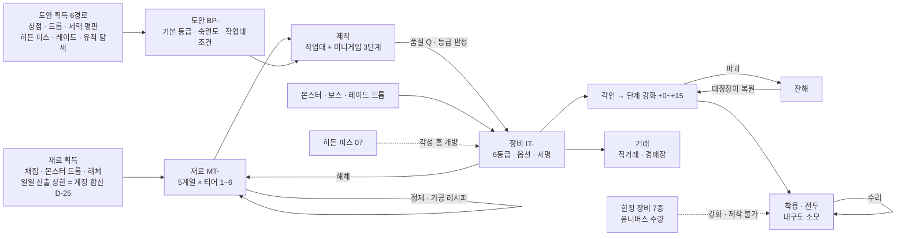

| 단계 | 입력 | 출력 | 골드 · 재료 소모(15장) | 상세 |
|---|---|---|---|---|
| 재료 | 채집 노드 · 드롭 · 해체 | MT-(계열 × 티어) | 채집 도구 내구도 | 7장 |
| 정제 · 가공 | 하위 재료 3~5 + 촉매 | 상위 재료 1(손실형 변환) | 정제 촉매(골드) | 7.3 |
| 도안 | 6경로 | BP-(영구 습득, 계정 아님 · 캐릭터 단위) | 상점 구매가(골드) | 8장 |
| 제작 | 도안 + 재료 + 작업대 + 미니게임 | 장비 1개(등급 · 품질 · 옵션) | 작업대 사용료, 재료 소실 | 9~11장 |
| 각인 · 강화 | 장비 + 각인서 · 벼림석 · 골드 | 강화 단계 · 각인 칸 | 강화 골드, 보호재, 잔해 복원비 | 12장 |
| 사용 | 착용 | 전투력 | 내구도 → 수리비 | 13장 |
| 거래 · 해체 | 장비 | 골드 / 재료 | 거래 수수료(10), 해체 수수료 | 6 · 7 · 15장 |

## 3. 장비 등급 6단계

### 3.1 등급 표(3-B-11 · 4-완료기준 '스탯 범위 · 옵션 수 · 획득 경로')

| 등급 | 영문 | UI 색 · 모양(색약 대응) | 기본 스탯 배율(일반=1) | 랜덤 옵션 수 | 각성 홈 | 각인 칸 | 강화 상한 · 도박 구간 실패 | 획득 경로 | 거래 |
|---|---|---|---|---|---|---|---|---|---|
| **일반** | Common | 회색 #9AA0A6 · ● 원 | 1.00 | 0 | 0 | 2 | +15 · 파괴 없음(유지/하락만) | 상점 · 일반 몬스터 드롭 · 일반 도안 제작 · 첫 무기 무료 수령(D-10 · D-48, 6.1.1) | 자유(강화 단계 · 각인 유지) |
| **희귀** | Rare | 초록 #3DAA5C · ▲ 삼각 | 1.35 | 1 | 0 | 3 | +15 · 파괴 없음(유지/하락만) | 일반 몬스터(저확률) · 정예 드롭 · 희귀 도안 제작 · 아크 보상(07) | 자유 |
| **영웅** | Heroic | 파랑 #3A7BD5 · ■ 사각 | 1.82 | 2 | 0 | 4 | +15 · 파괴 있음(도박 구간) | 정예 · 필드 보스 · 인스턴스 보스 드롭 · 영웅 도안 제작 · 제작 승격 | 자유 |
| **전설** | Legendary | 주황 #E58A1F · ⬟ 오각 | 2.46 | 3 | 1 | 5 | +15 · 파괴 있음(도박 구간) | 필드 보스 · 인스턴스 최종 보스(저확률) · 레이드 · 전설 도안 제작 · 제작 승격 | 자유 |
| **신화** | Mythic | 진홍 #C93A3A · ⬢ 육각 | 3.32 | 4 | 2 | 6 | +15 · 파괴 있음(도박 구간) | 레이드 드롭(저확률) · 신화 도안 제작(레이드 · 히든 피스 · 유적 탐색 도안) · 전설 도안 승격 | **1회 거래**(첫 거래 후 귀속) |
| **초월** | Transcendent | 백금 #E9D9A6 + 무지개 테두리 · ★ 별 | 4.48 | 5 | 3 | 7 | +15 · 파괴 있음(도박 구간) | **초월 전용 도안 제작만**(승격으로 만들 수 없음, 신화 정수 MT-42 필요) | **거래 불가**(귀속. 의뢰 제작 시 의뢰인에게 귀속, 8.6) |

- 등급 사이 배율 1.35(R_GRADE, **D-49: 등급 간 기본 스탯 배율 ≥ 1.35**)는 01번 3장 원칙 12(강화 +15가 한 등급 위 +0을 넘지 않음)를 지키는 하한 1.330(3.7 조건 A의 가장 빠듯한 칸)을 조금 넘게 잡은 값이다. 레벨 티어(1~6)와 등급은 **독립 축**이다: 같은 티어의 일반 ~ 초월이 모두 존재할 수 있고(예: IT-39 진흙 군주의 망치 = 티어 2 · 전설, 레벨 11 착용), 획득 가능 조합은 3.4 표.
- **한정 장비(Limited Gear)는 등급이 아니라 소유 상태 표시**다(01번 1장). UI에는 등급 색 대신 '한정 n/N' 배지를 쓰고, 스탯 산정용 내부 등급만 초월로 둔다(03 3.3 '초월 등급 태그'의 뜻, 14장).
- 등급 색은 모양 아이콘과 항상 함께 표시한다(색각 이상 대응). 초월의 무지개 테두리는 정적 그라데이션이며 깜빡임 · 룰렛형 연출을 쓰지 않는다(AS-02, 01번 3장 원칙 10).

### 3.2 레벨 티어 × 등급 기본 스탯 — 무기 공격력

**식(추정, 튜닝).** 티어 T의 기준 레벨 L_T = 10T − 5(티어 중앙). 품질 Q(0~100, 11장)와 강화 단계 k(12장)를 반영한 최종 기본 스탯:

```
무기 공격력(T, G, Q, k) = 0.8 × (8 + 2.4 × L_T) × M_G / M_영웅 × (0.85 + 0.30 × Q/100) × (1 + 강화 보너스(k) + 0.01 × 각인 성공 수)
방어구 합(T, G, …)     = 0.8 × 2.5 × L_T × M_G / M_영웅 × (같은 품질 · 강화 · 각인 항)
목걸이 주 스탯         = 0.8 × (2 + 0.15 × L_T) × M_G / M_영웅 × (…),  반지 주 스탯 = 0.8 × (1 + 0.10 × L_T) × M_G / M_영웅 × (…)
M_G = 1.35^g (g = 0 일반 … 5 초월),  M_영웅 = 1.8225
```

- 계수 0.8은 '영웅 · 품질 50 · 기본 스탯 + 옵션 2줄 기대값'의 전투력이 04 5.2 기준 장비(무기 8 + 2.4 × 레벨, 옵션 없음)와 같은 수준이 되도록 맞춘 값이다(3.6 검산: 레벨 60 영웅 +0 = 5~6타, 04 5.4 같은 레벨 5.7타와 정합). 04 5.2 · 5.5의 '풀장비 가정값(무기 180 · 방어 200 · 주 스탯 +30)'은 이 문서 3.6의 값으로 갱신을 요청한다(18.1 #1).

| 티어 | 착용 레벨대 | L_T | 일반 | 희귀 | 영웅 | 전설 | 신화 | 초월 |
|---|---|---|---|---|---|---|---|---|
| T1 | 1~10 | 5 | **9** (7~10) | **12** (10~14) | **16** (14~18) | **22** (18~25) | **29** (25~34) | **39** (33~45) |
| T2 | 11~20 | 15 | **19** (16~22) | **26** (22~30) | **35** (30~40) | **48** (40~55) | **64** (55~74) | **87** (74~100) |
| T3 | 21~30 | 25 | **30** (25~34) | **40** (34~46) | **54** (46~63) | **73** (62~84) | **99** (84~114) | **134** (114~154) |
| T4 | 31~40 | 35 | **40** (34~46) | **55** (46~63) | **74** (63~85) | **99** (84~114) | **134** (114~154) | **181** (154~208) |
| T5 | 41~50 | 45 | **51** (43~59) | **69** (58~79) | **93** (79~107) | **125** (106~144) | **169** (144~194) | **228** (194~263) |
| T6 | 51~60 | 55 | **61** (52~71) | **83** (71~95) | **112** (95~129) | **151** (129~174) | **204** (174~235) | **276** (234~317) |

- 칸 = **품질 50 기준값**(품질 0 ~ 100 범위), 강화 +0 · 각인 0. 6무기군 공통(차이는 사거리 · 간격 · 무기 스킬, 05 7.1). 레벨 1 일반 무기 9는 04 5.2의 레벨 1 무기 10.4와 같은 급.

### 3.3 레벨 티어 × 등급 기본 스탯 — 방어구 · 장신구

| 티어 | 방어구 합 · 일반 | 방어구 합 · 희귀 | 방어구 합 · 영웅 | 방어구 합 · 전설 | 방어구 합 · 신화 | 방어구 합 · 초월 |
|---|---|---|---|---|---|---|
| T1 | 5 (5~6) | 7 (6~9) | 10 (9~12) | 14 (11~16) | 18 (15~21) | 25 (21~28) |
| T2 | 16 (14~19) | 22 (19~26) | 30 (26~35) | 41 (34~47) | 55 (46~63) | 74 (63~85) |
| T3 | 27 (23~32) | 37 (31~43) | 50 (43~57) | 68 (57~78) | 91 (77~105) | 123 (105~141) |
| T4 | 38 (33~44) | 52 (44~60) | 70 (60~81) | 95 (80~109) | 128 (108~147) | 172 (146~198) |
| T5 | 49 (42~57) | 67 (57~77) | 90 (77~103) | 122 (103~140) | 164 (139~189) | 221 (188~255) |
| T6 | 60 (51~69) | 81 (69~94) | 110 (94~126) | 149 (126~171) | 200 (170~231) | 271 (230~311) |

- 방어구 4부위 배분: 몸 35% · 머리 25% · 손 20% · 발 20%(각 부위 = 합 × 비율, 반올림). 예: T6 전설 방어구 합 149 → 몸 52 · 머리 37 · 손 30 · 발 30.

| 티어 | 목걸이 / 반지 · 일반 | 목걸이 / 반지 · 희귀 | 목걸이 / 반지 · 영웅 | 목걸이 / 반지 · 전설 | 목걸이 / 반지 · 신화 | 목걸이 / 반지 · 초월 |
|---|---|---|---|---|---|---|
| T1 | 1 / 1 | 2 / 1 | 2 / 1 | 3 / 2 | 4 / 2 | 5 / 3 |
| T2 | 2 / 1 | 3 / 1 | 3 / 2 | 5 / 3 | 6 / 4 | 8 / 5 |
| T3 | 3 / 2 | 3 / 2 | 5 / 3 | 6 / 4 | 8 / 5 | 11 / 7 |
| T4 | 3 / 2 | 4 / 3 | 6 / 4 | 8 / 5 | 11 / 7 | 14 / 9 |
| T5 | 4 / 2 | 5 / 3 | 7 / 4 | 9 / 6 | 13 / 8 | 17 / 11 |
| T6 | 4 / 3 | 6 / 4 | 8 / 5 | 11 / 7 | 15 / 9 | 20 / 13 |

- 장신구의 주 스탯 = 착용자 직업의 주 스탯(힘 · 민첩 · 지력 · 정신, 05 5.4)에 더해진다(장비 이름에 스탯을 고정하지 않음 → 직업 간 장신구 공유 가능). 최소 1.
- 장신구는 기본 스탯이 작고 **옵션 중심 부위**다(옵션 계수 κ = 0.40, 무기 · 방어구 0.12, 5.3).

### 3.4 등급 · 티어 획득 가능 조합과 드롭 등급 분포

| 등급 | 획득 가능 티어 | 근거 |
|---|---|---|
| 일반 · 희귀 · 영웅 | T1~T6 | 모든 위험도의 드롭 · 도안 |
| 전설 | T1~T6 | 필드 보스 · 인스턴스 보스 · 승격 · 전설 도안(T2 전설 IT-39 예) |
| 신화 | T3~T6 | 레이드 · 히든 피스 · 유적 탐색 도안(레이드 인스턴스 동기화 대상, 08) |
| 초월 | T5~T6(MVP는 T6만) | 전용 도안 3종(BP-31~33) + 신화 정수 |

| 드롭 출처 | 장비 드롭 확률 | 일반 | 희귀 | 영웅 | 전설 | 신화 | 드롭 장비 품질 Q |
|---|---|---|---|---|---|---|---|
| 일반 몬스터(적정 폭 안) | 처치당 2% | 85% | 14% | 1% | 0% | 0% | 균등 10~70 |
| 정예 몬스터 | 처치당 12% | 50% | 38% | 11% | 1% | 0% | 균등 10~70 |
| 필드 보스 · 인스턴스 최종 보스 | 1개 확정(주간 보상 소진 후 0, D-39) | 0% | 45% | 45% | 10% | 0% | 균등 20~80 |
| 레이드 보스(08이 확정) | 참가자당 1개(기준안) | 0% | 0% | 40% | 50% | 10% | 균등 30~90 |

- **인스턴스(던전) 드롭 범위(D-39)**: 인스턴스 7곳(H-05 · H-10 · H-11 · H-18 · H-19 · H-26 · H-33)은 재입장 무제한이고, 일반 · 정예 몬스터의 처치 경험치 · 일반 재료(7.2) · 위 표의 일반 · 정예 장비 드롭은 필드와 같다(분당 · 일일 상한만 적용). **H-19 용광로 골렘(일반)의 하늘쇠 원석(MT-06) 드롭도 이 '일반 재료'이며 주간 제한 밖**이다(7.2, D-58 (b)). 보스 상자의 MT-06은 아래 ①의 주간 보상분으로 따로 센다. **주간 보상 횟수(08)가 걸리는 '희귀 드롭'** = ① 인스턴스 최종 보스 장비 1개(위 표 3행) · 보스 상자, ② 인스턴스 보스 · 네임드의 도안 드롭(BP-12 H-10 극장 지배인, BP-15 H-18 얼음궁 관리인), ③ 도안 조각(MT-41)의 인스턴스 산출분, ④ 인스턴스 안 유적 탐색 도안(BP-13 · BP-16 · BP-29 · BP-33의 H-11 경로 — 원래 1캐릭터 1회라 주간 횟수와 무관하게 1회). 주간 횟수는 캐릭터별 · 계정 합산 = 3캐릭터분(D-25). 소진 후에는 ①~③이 나오지 않고 입구 배너 '주간 보상 소진: 경험치 · 재료만'(04 6장)을 띄운다.
- 드롭 장비의 티어 = ceil(몬스터 레벨 / 10). 레벨 차 15 이상(무관심 대상) 처치 시 희귀 이상 드롭 0(04 13장 RARE_DROP_LOWLEVEL). 제작품 품질 기대값(11.4 예시 43~96)이 드롭 품질 평균(40~60)보다 높아 **제작이 드롭보다 낫다**(D-02 생산 직업 가치, 02 3.3 실패 조건 (b)). 숙련도가 낮은 첫 1~2일에도 이 관계가 서도록 숙련 1~19 가속 · 첫 제작 보너스(8.2, D-58 (e))로 첫날 희귀 도안(숙련 10)에 닿게 한다.
- **드롭 기본 아이템 규칙(D-58 (a))**: 일반 · 정예 몬스터 · 보스의 장비 드롭은 ① 위 표로 등급 추첨 → ② 아래 부위 가중치로 부위 추첨 → ③ 그 티어 · 부위 칸(6.1.2 도안 커버리지 행렬)의 제작 아이템 중 균등 추첨(신화 · 초월 도안 결과 · 한정 장비 · 열쇠 물품 제외) 순서로 정한다. 아이템 이름과 등급은 독립이다(6.1 첫 문단: 같은 이름이 다른 등급으로 존재). 드롭 전용 아이템(IT-16 · IT-33~37 · IT-39 · IT-40)은 6.1 표에 적힌 출처에서만 나오며, 그 몬스터의 장비 드롭 중 50%를 대신한다.

| 부위 | 무기(6군 균등) | 머리 | 몸 | 손 | 발 | 목걸이 | 반지 | 합 |
|---|---|---|---|---|---|---|---|---|
| 드롭 부위 가중치 | 36%(군당 6%) | 11% | 11% | 11% | 11% | 10% | 10% | 100% |

### 3.5 T6 최종 스탯 범위(품질 · 강화 · 각인 포함)

| 등급 | 무기 공격력(Q0 +0 ~ Q100 +15 각인 전부) | 방어구 합 | 목걸이 주 스탯 | 옵션 수 | 각성 홈 |
|---|---|---|---|---|---|
| 일반 | 52 ~ 108 | 51 ~ 106 | 4 ~ 8 | 0 | 0 |
| 희귀 | 71 ~ 147 | 69 ~ 144 | 5 ~ 11 | 1 | 0 |
| 영웅 | 95 ~ 200 | 94 ~ 196 | 7 ~ 15 | 2 | 0 |
| 전설 | 129 ~ 271 | 126 ~ 266 | 9 ~ 20 | 3 | 1 |
| 신화 | 174 ~ 369 | 170 ~ 362 | 13 ~ 27 | 4 | 2 |
| 초월 | 234 ~ 501 | 230 ~ 492 | 17 ~ 37 | 5 | 3 |

### 3.6 레벨 60 풀장비 → 위험도 6 일반 몬스터 타수 검산(04 5.5 식)

조건: 04 5.5와 같은 근접 힘형 기준 빌드(힘 포인트 187), 평균 계수 1.6(D-35), 치명타 확률 = 5% + 0.05%p × 주 스탯(D-37), 치명 피해 = 150% + 0.5%p × 기교(10 + 옵션). 장비 7부위 같은 등급 · 같은 강화 단계 · 각인 칸 전부 성공, 옵션은 **부위별 옵션 풀 가중치의 기대값**(5.2) 또는 **공격 집중**(모든 줄을 공격력 · 주 스탯 · 치명 · 기교 중에서 고름). 몬스터 = 04 5.3 일반(레벨 52 · 56 · 60). 타수 = 올림(체력 ÷ 평균 1타).

| 장비 상태(7부위) | 무기 공격력 | 주 스탯 총합 | 치명 확률 | 치명 피해 | 기대 배율 | 기본 공격력 | Lv52 타수 | Lv56 타수 | Lv60 타수 |
|---|---|---|---|---|---|---|---|---|---|
| 영웅 +0 (Q50) | 116 | 211 | 19.0% | 167% | 1.13 | 551 | 4.51 → **5** | 4.90 → **5** | 5.31 → **6** |
| **전설 +0 (Q50) = 04 '풀장비' 정의** | 159 | 225 | 23.2% | 178% | 1.18 | 635 | 3.74 → **4** | 4.06 → **5** | 4.40 → **5** |
| 전설 +10 (권장 종착, 12.6) | 206 | 231 | 23.5% | 178% | 1.18 | 693 | 3.42 → **4** | 3.71 → **4** | 4.02 → **5** |
| 전설 +15 | 236 | 235 | 23.6% | 178% | 1.18 | 730 | 3.24 → **4** | 3.52 → **4** | 3.81 → **4** |
| 전설 +0 공격 집중 | 159 | 260 | 30.8% | 162% | 1.19 | 713 | 3.30 → **4** | 3.59 → **4** | 3.89 → **4** |
| 신화 +10 | 280 | 255 | 30.2% | 196% | 1.29 | 836 | 2.60 → **3** | 2.82 → **3** | 3.06 → **4** |
| 초월 +15 (Q100, 이론 상한) | 501 | 312 | 43.8% | 231% | 1.57 | 1210 | 1.47 → **2** | 1.60 → **2** | 1.73 → **2** |
| 초월 +15 (Q100) 공격 집중 | 501 | 407 | 50.9% | 250% | 1.76 | 1433 | 1.11 → **2** | 1.20 → **2** | 1.30 → **2** |

- **판정(D-49 '풀장비 = 전설 등급')**: 04 5.5의 '레벨 60 풀장비'(전설 +0 · 품질 50 · 옵션 기대값) = **4~5타**로 4~6타 조건을 지킨다. 전설은 +15 · 공격 집중까지 모두 4~5타 안에 있다(전설 등급 안에서는 강화 · 옵션 선택이 타수 구간을 깨지 않음).
- 신화는 3~4타, 초월 +15는 2타로 내려간다. 이는 **도달자가 극소수인 이론 상한**(초월 = 숙련도 99 · 작업대 5 · 신화 정수 · 전용 도안, +15 기대 시도 수백 회, 12.6)의 보상 구간이며, (1) 인스턴스 · 레이드는 04 7.7 동기화(장비 수치 상한 1.3배)로 이 격차가 전투 판정에 그대로 들어가지 않고, (2) 오픈월드 일반 몬스터 처치 속도는 분당 경험치 상한(04 7.4 XP_PER_MIN_CAP)에 막혀 성장 속도 격차로 번지지 않는다. 신화 이상은 '풀장비' 기준에 넣지 않는다(**D-49 확정**: 신화 3~4타 · 초월 +15 2타는 최상위 희소 장비의 결과로 허용).
- 방어 측 참고: 전설 +0 방어구 합 156 + 0.5 × 체력 스탯(128 + 옵션 기대 5) + 옵션 방어 기대 9 = 방어력 약 **231**(04 5.2 가정 274보다 낮음 → 04 5.2 '60 풀장비' 행 갱신 요청, 18.1 #1). 받는 피해 감소 · 최대 체력 옵션 기대값은 별도로 더해진다.

### 3.7 01번 3장 원칙 12 검산 — '강화 +15가 한 등급 위 +0을 넘지 않음' · '강화 상승폭 > 같은 등급 옵션 차이'

**장비 점수(GS, Gear Score)** = 기준 캐릭터(티어 6 · 레벨 55 · 영웅 장비)의 **피해 또는 유효 체력 1% = 1점**으로 환산한 장비 전투 기여. 단위 점수(GS/단위)는 5.2 표. 비교는 **같은 품질(Q50) · 각인 칸 전부 성공 · 옵션 기대값**으로 한다(품질은 등급과 독립한 ±15% 축, 각성 홈은 히든 피스 보상이라 제외).

```
EP(G, k) = 기본 점수_G × (1 + 강화 보너스(k) + 0.01 × 각인 칸_G) + 옵션 수_G × κ × 기본 점수_G
조건 A(원칙 12 후단): EP(G, +15) ≤ EP(G+1, +0)        → 1.35 × (1 + e_{G+1} + (n+1)κ) ≥ 1.51 + e_G + nκ
조건 B(원칙 12 전단): 강화 +15 상승폭 0.51 × 기본 점수 > 옵션 범위 폭 n × κ × σ × 기본 점수 (σ = 범위 폭 / 중앙값)
```

| 부위(T6, Q50) | 일반 +15 ≤ 희귀 +0 | 희귀 +15 ≤ 영웅 +0 | 영웅 +15 ≤ 전설 +0 | 전설 +15 ≤ 신화 +0 | 신화 +15 ≤ 초월 +0 |
|---|---|---|---|---|---|
| 무기 | 19.47 ≤ 19.76 ✔ | 28.52 ≤ 29.69 ✔ | 41.52 ≤ 44.16 ✔ | 60.13 ≤ 65.11 ✔ | 86.67 ≤ 95.32 ✔ |
| 머리 | 8.58 ≤ 8.71 ✔ | 12.57 ≤ 13.09 ✔ | 18.30 ≤ 19.46 ✔ | 26.50 ≤ 28.69 ✔ | 38.19 ≤ 42.00 ✔ |
| 몸 | 12.02 ≤ 12.19 ✔ | 17.60 ≤ 18.32 ✔ | 25.62 ≤ 27.24 ✔ | 37.10 ≤ 40.17 ✔ | 53.47 ≤ 58.81 ✔ |
| 손 | 6.87 ≤ 6.97 ✔ | 10.06 ≤ 10.47 ✔ | 14.64 ≤ 15.57 ✔ | 21.20 ≤ 22.95 ✔ | 30.56 ≤ 33.60 ✔ |
| 발 | 6.87 ≤ 6.97 ✔ | 10.06 ≤ 10.47 ✔ | 14.64 ≤ 15.57 ✔ | 21.20 ≤ 22.95 ✔ | 30.56 ≤ 33.60 ✔ |
| 목걸이 | 3.06 ≤ 3.86 ✔ | 5.24 ≤ 6.71 ✔ | 8.57 ≤ 11.08 ✔ | 13.59 ≤ 17.69 ✔ | 21.08 ≤ 27.56 ✔ |
| 반지 | 1.94 ≤ 2.45 ✔ | 3.32 ≤ 4.26 ✔ | 5.44 ≤ 7.03 ✔ | 8.62 ≤ 11.22 ✔ | 13.37 ≤ 17.48 ✔ |

| 부위 | 등급 | 강화 +15 상승폭(GS) | 옵션 범위 폭 합(GS) | 조건 B |
|---|---|---|---|---|
| 무기 | 희귀 | 8.76 | 1.65 | ✔ |
| 무기 | 영웅 | 11.83 | 4.45 | ✔ |
| 무기 | 전설 | 15.97 | 9.02 | ✔ |
| 무기 | 신화 | 21.56 | 16.23 | ✔ |
| 무기 | 초월 | 29.11 | 27.40 | ✔ |
| 목걸이 | 희귀 | 1.38 | 0.27 | ✔ |
| 목걸이 | 영웅 | 1.86 | 0.73 | ✔ |
| 목걸이 | 전설 | 2.51 | 1.48 | ✔ |
| 목걸이 | 신화 | 3.39 | 2.66 | ✔ |
| 목걸이 | 초월 | 4.58 | 4.49 | ✔ |

- 방어구 4부위는 무기와 같은 κ · σ라 조건 B 비율이 무기와 같다. 가장 빠듯한 칸은 일반 +15 vs 희귀 +0(여유 약 1.5%)이며, R_GRADE · κ를 바꿀 때는 이 칸부터 다시 검산한다(17장).

## 4. 장비 부위 · 착용 조건(3-B-12 필수)

| 부위 | 칸 수 | 기본 스탯 | 요구 스탯 종류 | 계수 a | 옵션 풀 | 비고 |
|---|---|---|---|---|---|---|
| 무기 | 1(05 7.4) | 공격력(물리 · 마법 공통, 04 5.1) | 무기군별: W1 힘·민첩 중 높은 값 / W2 민첩 / W3 지력·정신 중 높은 값 / W4 민첩 / W5 힘·정신 중 높은 값 / W6 힘·민첩 중 높은 값 | 1.5 | 5.2 무기 열 | 직업 조건 없음(05 7.4). 무기 스킬은 직업 주 스탯을 쓴다(05 5.4) |
| 머리 · 몸 · 손 · 발 | 각 1 | 방어력(합의 25 · 35 · 20 · 20%) | 체력 | 0.4 | 5.2 부위 열 | 4부위 모두 같은 요구식 |
| 목걸이 · 반지 | 각 1 | 주 스탯(착용자 직업 주 스탯에 가산) | 힘 · 민첩 · 지력 · 정신 중 최고값 | 0.75 | 5.2 장신구 열 | 옵션 중심 부위 |

```
요구 레벨 = 티어 하한(T1 1 · T2 11 · T3 21 · T4 31 · T5 41 · T6 51)
요구 스탯 = ⌈(10 + a × (요구 레벨 − 1)) × (1 + 0.04 × g)⌉   (g = 등급 0~5)
```

| 티어 (요구 레벨) | 일반 무기/방어구/장신구 | 희귀 무기/방어구/장신구 | 영웅 무기/방어구/장신구 | 전설 무기/방어구/장신구 | 신화 무기/방어구/장신구 | 초월 무기/방어구/장신구 |
|---|---|---|---|---|---|---|
| T1 (Lv 1) | 10 / 10 / 10 | 11 / 11 / 11 | 11 / 11 / 11 | 12 / 12 / 12 | 12 / 12 / 12 | 12 / 12 / 12 |
| T2 (Lv 11) | 25 / 14 / 18 | 26 / 15 / 19 | 27 / 16 / 19 | 29 / 16 / 20 | 29 / 17 / 21 | 30 / 17 / 21 |
| T3 (Lv 21) | 40 / 18 / 25 | 42 / 19 / 26 | 44 / 20 / 27 | 45 / 21 / 29 | 47 / 21 / 29 | 48 / 22 / 30 |
| T4 (Lv 31) | 55 / 22 / 33 | 58 / 23 / 34 | 60 / 24 / 36 | 62 / 25 / 37 | 64 / 26 / 38 | 66 / 27 / 39 |
| T5 (Lv 41) | 70 / 26 / 40 | 73 / 28 / 42 | 76 / 29 / 44 | 79 / 30 / 45 | 82 / 31 / 47 | 84 / 32 / 48 |
| T6 (Lv 51) | 85 / 30 / 48 | 89 / 32 / 50 | 92 / 33 / 52 | 96 / 34 / 54 | 99 / 35 / 56 | 102 / 36 / 57 |

**빌드별 착용 가능 검산**(04 4.2 · 4.3 분배, 장비 · 인장 보정 제외 = 가장 불리한 경우)

| 빌드 | 레벨 | 주 스탯 | 체력 스탯 | T6 전설 무기(96) | T6 초월 무기(102) | T6 전설 방어구(34) | T6 초월 방어구(36) | T6 초월 장신구(57) |
|---|---|---|---|---|---|---|---|---|
| 근접 힘형(기준 빌드) | 51 | 160 | 110 | ✔ | ✔ | ✔ | ✔ | ✔ |
| 근접 힘형(기준 빌드) | 60 | 187 | 128 | ✔ | ✔ | ✔ | ✔ | ✔ |
| 민첩형(궁수) | 51 | 160 | 85 | ✔ | ✔ | ✔ | ✔ | ✔ |
| 민첩형(궁수) | 60 | 187 | 99 | ✔ | ✔ | ✔ | ✔ | ✔ |
| 마법형(마도사) | 51 | 160 | 85 | ✔ | ✔ | ✔ | ✔ | ✔ |
| 마법형(마도사) | 60 | 187 | 99 | ✔ | ✔ | ✔ | ✔ | ✔ |
| 마법형 극단(자유 전부 지력) | 51 | 210 | 35 | ✔ | ✔ | ✔ | ✘(35<36) | ✔ |
| 마법형 극단(자유 전부 지력) | 60 | 246 | 40 | ✔ | ✔ | ✔ | ✔ | ✔ |
| 생산형(대장장이, 힘 2 · 체력 1) | 51 | 135 | 85 | ✔ | ✔ | ✔ | ✔ | ✔ |
| 생산형(대장장이, 힘 2 · 체력 1) | 60 | 158 | 99 | ✔ | ✔ | ✔ | ✔ | ✔ |

- 결과: 자기 주 스탯 무기 · 장신구는 모든 빌드가 티어 하한 레벨에 착용한다. 체력을 전혀 찍지 않는 극단 빌드만 T6 초월 방어구를 늦게 입는다(빌드 선택의 대가, 04 4.4 재분배로 언제든 조정). 다른 직업 주 스탯 무기(예: 마도사가 망치)는 그 스탯에 투자해야 쓴다.
- 조건 미달 처리(04 4.4 그대로): 재분배 · 장비 해제로 조건을 못 채우면 **착용 상태로 남되 효과 0**('조건 미달' 표시), 벗으면 다시 끼지 못한다. 인스턴스 레벨 동기화(04 7.7) 중에는 착용 조건을 다시 검사하지 않고 장비 수치만 상한(1.3배)으로 자른다.
- 도안 **제작** 조건은 캐릭터 레벨이 아니라 숙련도 + 작업대 등급(D-03, 8.2). 레벨 5 대장장이도 숙련도만 있으면 T6 장비를 만들어 팔 수 있다(착용은 못 함).

## 5. 옵션

### 5.1 옵션 규칙

| 항목 | 규칙 |
|---|---|
| 옵션 수 | 등급 고정: 일반 0 · 희귀 1 · 영웅 2 · 전설 3 · 신화 4 · 초월 5(3.1). 제작 · 드롭 동일 |
| 종류 추첨 | 부위 옵션 풀(5.2)에서 가중치 비복원 추첨(같은 종류 중복 없음). 최소 등급 미만 옵션은 풀에서 제외. 신화 · 초월은 최소 등급 제한 옵션의 가중치 ×1.5 |
| 수치 추첨 | `수치 = 중앙값 × ((1 − σ/2) + σ × R)`, `R = U^(1.5 − Q/100)`(U ~ 균등 0~1). σ = 무기 · 방어구 0.8(중앙값 × 0.6~1.4), 장신구 0.25(× 0.875~1.125). E[R] = 1/(2.5 − Q/100) → Q0 0.40 · Q50 0.50 · Q100 0.67. **품질이 높을수록 상단 수치가 잘 나온다**(3-B-12 스펙 결정) |
| 중앙값 | `중앙값 = κ × 아이템 기본 점수(GS) ÷ 단위 점수(GS/단위)`, 평탄 수치(+n) 옵션은 × 티어 계수 s(T), % 옵션은 × % 티어 계수 p(T), 장신구 평탄 옵션은 × min(s(T), p(T))(5.3, D-58 (c)). κ = 무기 · 방어구 0.12, 장신구 0.40. 모든 옵션의 중앙값은 같은 점수(등가 원칙) → 어느 옵션이 붙어도 '좋은 장비'의 기대 가치가 같다 |
| 반올림 | 평탄 옵션 정수(최소 1), % 옵션 소수 첫째 자리 |
| 합계 상한 | 치명 확률 60% · 회피 20% · 치명 피해 250%(04 5.1), 받는 피해 감소 −30%, 쿨타임 감소 −25%, 정예 · 보스 피해 +40%, 자원 회복 +60%, 치유 · 보호막 +40%. 상한 초과분은 버려지며 장비 창에 '상한 도달' 표시 |
| 제작자 서명 옵션 | 제작품에만 1줄 추가(5.4). 랜덤 옵션 수에 넣지 않으며 전투 수치 옵션이 아니다 |

### 5.2 옵션 풀(15종 + 서명 옵션 4종 = 19종)

| 번호 | 옵션 | 영문 | 단위 | GS/단위 | 무기 | 머리 | 몸 | 손 | 발 | 목걸이 | 반지 | 최소 등급 | 합계 상한 |
|---|---|---|---|---|---|---|---|---|---|---|---|---|---|
| #01 | 공격력 | Attack | +n | 0.207 (계산) | 30 | — | — | 10 | — | 15 | 15 | 희귀 | — |
| #02 | 주 스탯 | Main Stat | +n | 0.445 (계산) | 30 | 20 | 10 | 25 | 15 | 20 | 20 | 희귀 | — |
| #03 | 체력 스탯 | Vitality | +n | 0.767 (계산) | — | 20 | 25 | — | 25 | — | — | 희귀 | — |
| #04 | 기교 | Technique | +n | 0.250 (설계) | — | — | — | 15 | — | 10 | 10 | 희귀 | 치명 피해 250%(04) |
| #05 | 치명타 확률 | Crit Chance | +n%p | 0.650 (설계) | 20 | — | — | 20 | — | 15 | 15 | 희귀 | 60%(04) |
| #06 | 치명타 피해 | Crit Damage | +n%p | 0.200 (설계) | 15 | — | — | 20 | — | 15 | 15 | 희귀 | 250%(04) |
| #07 | 방어력 | Defense | +n | 0.372 (계산) | — | 15 | 20 | 10 | 20 | — | — | 희귀 | — |
| #08 | 최대 체력 | Max HP | +n | 0.048 (계산) | — | 15 | 20 | — | 20 | — | 10 | 희귀 | — |
| #09 | 받는 피해 감소 | Damage Taken | −n% | 1.000 (설계) | — | 10 | 15 | — | — | — | — | 영웅 | 합계 −30% |
| #10 | 회피 | Evasion | +n%p | 1.000 (설계) | — | — | — | — | 20 | — | 10 | 희귀 | 20%(04) |
| #11 | 스킬 쿨타임 감소 | Cooldown | −n% | 0.600 (설계) | — | 10 | — | — | — | 10 | — | 전설 | 합계 −25% |
| #12 | 정예·보스 대상 피해 | Elite/Boss Damage | +n% | 0.500 (설계) | 5 | — | — | — | — | — | — | 영웅 | 합계 +40% |
| #13 | 자원 회복 | Resource Regen | +n% | 0.250 (설계) | — | — | — | — | — | 10 | 5 | 희귀 | 합계 +60% |
| #14 | 상태이상 저항 | Status Resist | +n%p | 0.300 (설계) | — | 10 | 10 | — | — | — | — | 희귀 | 50%(04 정신 상한과 합산) |
| #15 | 치유·보호막량 | Heal/Shield | +n% | 0.500 (설계) | — | — | — | — | — | 5 | — | 희귀 | 합계 +40% |

- **치명 옵션과 D-37**: 기본 치명타 확률은 주 공격 스탯 4종(힘 · 민첩 · 지력 · 정신)이 1당 +0.05%p로 같게 주고(04 5.1, D-37), 장비 옵션 #05 치명타 확률 · #06 치명타 피해 · #04 기교는 **직업 · 무기군 · 주 스탯과 무관하게 같은 가중치 · 같은 중앙값**으로 붙는다(직업 전용 치명 보정 옵션 없음). 따라서 같은 장비 상태에서 딜러 직업 간 치명 기대 배율 차이는 D-37의 ±8% 목표를 장비가 넓히지 않는다. 회피(#10)는 민첩의 추가 효과(D-37)와 별개 옵션이며 합계 상한 20%(04)를 공유한다.
- 칸 = 그 부위 풀에서의 추첨 가중치. W3 지팡이는 무기 풀에 #15 치유 · 보호막량(가중치 15)이 추가된다. GS/단위 '계산' = 기준 캐릭터(티어 6 · L55 · 영웅 장비: 기본 공격력 483 · 최대 체력 2066 · 방어력 169)에서 1단위가 바꾸는 피해 · 유효 체력 %, '설계' = 기준 치명 20% · 치명 피해 170% 등 설계 환산치(추정).

### 5.3 옵션 중앙값(T6 희귀 기준) · 등급 배율 · 티어 계수

| 옵션(T6 희귀 중앙값) | 무기 | 머리 | 몸 | 손 | 발 | 목걸이 | 반지 |
|---|---|---|---|---|---|---|---|
| 공격력 | 10 | — | — | 4 | — | 5 | 3 |
| 주 스탯 | 5 | 2 | 3 | 2 | 2 | 2 | 2 |
| 체력 스탯 | — | 1 | 2 | — | 1 | — | — |
| 기교 | — | — | — | 3 | — | 4 | 3 |
| 치명타 확률 | 3.2 | — | — | 1.1 | — | 1.7 | 1.1 |
| 치명타 피해 | 10.3 | — | — | 3.6 | — | 5.4 | 3.4 |
| 방어력 | — | 2 | 3 | 2 | 2 | — | — |
| 최대 체력 | — | 19 | 26 | — | 15 | — | 14 |
| 받는 피해 감소 | — | 0.9 | 1.3 | — | — | — | — |
| 회피 | — | — | — | — | 0.7 | — | 0.7 |
| 스킬 쿨타임 감소 | — | 1.5 | — | — | — | 1.8 | — |
| 정예·보스 대상 피해 | 4.1 | — | — | — | — | — | — |
| 자원 회복 | — | — | — | — | — | 4.3 | 2.7 |
| 상태이상 저항 | — | 3.0 | 4.2 | — | — | — | — |
| 치유·보호막량 | 4.1 | — | — | — | — | 2.2 | — |

| 구분 | 일반 | 희귀 | 영웅 | 전설 | 신화 | 초월 |
|---|---|---|---|---|---|---|
| 등급 배율(중앙값 × M_G / M_희귀) | — | 1.00 | 1.35 | 1.82 | 2.46 | 3.32 |

| 티어 | T1 | T2 | T3 | T4 | T5 | T6 |
|---|---|---|---|---|---|---|
| 평탄 옵션 티어 계수 s(T) = (8 + 2.4 L_T) / 140 | 0.143 | 0.314 | 0.486 | 0.657 | 0.829 | 1.000 |
| % 옵션 티어 계수 p(T) = 0.5 + 0.25 × max(0, T − 4) (D-58 (c)) | 0.50 | 0.50 | 0.50 | 0.50 | 0.75 | 1.00 |
| 장신구(목걸이 · 반지) 평탄 옵션 계수 = min(s(T), p(T)) | 0.143 | 0.314 | 0.486 | 0.500 | 0.750 | 1.000 |

- 예: **T6 전설 무기 치명타 확률** 중앙값 = 3.2 × 1.82 × 1.00 = **5.8%p**, 범위 3.5~8.1%p. **T2 전설 무기 공격력** 중앙값 = 10.0 × 1.82 × 0.314 = **5.7 → 6**, 범위 3~8. **T3 전설 무기 치명타 확률** = 3.2 × 1.82 × 0.50 = **2.9%p**.
- **% 옵션 티어 계수(06-r1-S-03, D-58 (c))**: r1은 % 옵션을 티어와 무관하게 T6 크기로 붙여, 옵션 중심 부위(κ 0.40)인 장신구에서 저티어 장비가 고티어와 거의 같아졌다(아래 r1 열). r2는 % 옵션에 p(T)(T1 0.5 → T6 1.0)를 곱하고, 장신구는 평탄 옵션도 min(s(T), p(T))로 묶는다(T4 · T5 장신구의 평탄 옵션만 r1보다 작아지고 T1~T3 · T6은 r1과 같다). 3.6 · 3.7 · 14.1의 T6 수치는 p(6) = 1.0이라 바뀌지 않는다.
- 검산 기준: '한 등급 위라도 두 티어 이상 아래인 장신구는 T6 전설을 넘지 않는다'(무기 기본 스탯 순서와 같음: T4 신화 134 < T6 전설 151, 3.2). 비교는 3.7 EP 식(기본 스탯 GS + 옵션 GS), 옵션은 '부위 가중치 기대값'과 '% 옵션만 고른 경우(5.5 천장으로 종류 직접 선택)' 두 가지다.

| 장신구(Q50 · +0 · 각인 전부 성공) | 기본 스탯 GS | 장비 점수 r1(옵션 기대값 / % 옵션만) | 장비 점수 r2(옵션 기대값 / % 옵션만) | 판정(T6 전설 이하) |
|---|---|---|---|---|
| T1 전설 목걸이 (Lv 1) | 1.39 | 5.02 / 7.30 | **3.39 / 4.34** | ✔ ≤ 기준 |
| T3 신화 목걸이 (Lv 21) | 3.95 | 12.13 / 14.59 | **9.21 / 9.27** | ✔ ≤ 기준 |
| T4 신화 목걸이 (Lv 31) | 4.99 | 13.98 / 15.62 | **10.31 / 10.31** | ✔ ≤ 기준 |
| T5 전설 목걸이 (Lv 41) | 4.42 | 9.87 / 10.33 | **8.85 / 8.85** | ✔ ≤ 기준 |
| T5 신화 목걸이 (Lv 41) | 6.02 | 15.84 / 16.66 | **14.00 / 14.00** | 초과 허용(한 등급 위 · 한 티어 아래: 무기도 T5 신화 169 > T6 전설 151, 3.2) |
| T6 전설 목걸이 (Lv 51) | 5.17 | 11.08 / 11.08 | **11.08 / 11.08** | 기준 |
| T1 전설 반지 (Lv 1) | 0.76 | 2.74 / 4.51 | **1.89 / 2.63** | ✔ ≤ 기준 |
| T3 신화 반지 (Lv 21) | 2.41 | 7.25 / 9.15 | **5.73 / 5.78** | ✔ ≤ 기준 |
| T4 신화 반지 (Lv 31) | 3.09 | 8.57 / 9.84 | **6.47 / 6.47** | ✔ ≤ 기준 |
| T6 전설 반지 (Lv 51) | 3.28 | 7.03 / 7.03 | **7.03 / 7.03** | 기준 |

- 결과: r1에서 T6 전설(11.08)보다 높던 T3 신화 목걸이(14.59)가 9.27로 내려가 **저티어 장신구를 싼 재료로 재설정하는 것이 정답이 되지 않는다**. 레벨이 오르면 같은 등급의 높은 티어 장신구로 자연 교체되고, T6 재설정(3,840골드 + MT-24 3개, 5.5)이 최상위 골드 · 최상급 결정 소모처로 남는다. 계산: gen06_r2.py(18.4).

### 5.4 제작자 서명 옵션(01번 5장 #43, 제작품 전용 1줄)

| 서명 옵션 | 영문 | 효과 | 부위 | 일반 | 희귀 | 영웅 | 전설 | 신화 | 초월 |
|---|---|---|---|---|---|---|---|---|---|
| 내구 단련 | Tempered Wear | 내구도 소모 −n% | 전 부위 | 10 | 12 | 15 | 18 | 22 | 25 |
| 채집의 손 | Gatherer's Hand | 채집 채널링 시간 −n%(산출량 · 일일 상한 불변, D-17) | 손 · 발 | 3 | 4 | 5 | 6 | 7 | 8 |
| 장인의 감 | Artisan's Sense | 제작 스킬 보정 S +n(11.1, 합계 +10 상한) | 손 · 목걸이 · 반지 | 1 | 2 | 3 | 4 | 5 | 6 |
| 길손 | Wayfarer | 비전투 이동 속도 +n%(합계 +5% 상한, 전투 중 0) | 발 | 1 | 1.5 | 2 | 2.5 | 3 | 4 |

- 서명 = 제작자 이름 + 서명 옵션 1줄(부위에 맞는 것 중 제작자가 선택). **J-H2 별철 명장이 만든 장비는 서명 수치 × 1.5 + '명장 표식(★)'** 표시(05 J-H2 가치). 서명은 해체 · 재설정으로 바뀌지 않으며 거래 후에도 남는다. 제작자 서명 수는 09 제작 랭킹 데이터로 넘긴다.

### 5.5 옵션 재설정(01번 5장 #36 천장, 게임 내 재화만)

| 항목 | 규칙 |
|---|---|
| 장소 · 수행자 | 작업대 2등급 이상 도시 NPC 또는 대장장이 계열(숙련도 50 이상, 골드 −20%) |
| 대상 | 장비 1개의 옵션 1줄 선택 → 종류 · 수치를 다시 추첨(그 장비의 품질 Q로 가중, 5.1). 다른 줄 · 서명 · 강화 · 각인은 유지 |
| 비용 | 골드 = 40 × T × (g + 1)², 같은 티어 마력 결정 × g개. 예: T6 전설 = 40 × 6 × 16 = 3,840골드 + T6 마력 결정(MT-24 최상급) 3개 |
| 천장 | 같은 장비 누적 20회째 재설정은 **종류 직접 선택 + 수치 상위 25% 구간 보장**. 천장 사용 시 카운트 0 |
| 과금 | 로벅스 판매 없음. 유료 확률형 재설정 금지(01번 5장 #37, AS-06) |
| 확률 공개 | 재설정 창에 종류별 가중치(%)와 수치 분포(R의 분포)를 표시, 월별 실측 공개(01번 5장 #38) |

### 5.6 장비 효과와 버프 중첩 규칙(D-43 · 05 5.6 적용)

장비 옵션 · 각성 효과(14.3) · 한정 장비 고유 효과(14.1) · 무기 개조 속성(6.3)이 대장장이 담금질 등 스킬 버프와 만날 때의 계산 순서다. 05 5.6의 D-43 ①~③을 장비 쪽에 그대로 적용하고, 새 중첩 범주를 만들지 않는다.

| 장비 쪽 효과 | 분류(D-43 · 05 5.6) | 계산 | 예 |
|---|---|---|---|
| 평탄 옵션: 공격력 #01 · 주 스탯 #02 · 체력 스탯 #03 · 기교 #04 · 방어력 #07 · 최대 체력 #08, 장신구 주 스탯 | **기본 수치에 가산**(버프 아님) | 기본 공격력(04 5.1) · 방어 · 체력을 만들 때 더한다. 담금질 등 '공격력 +n%'(05 5.4 ①)는 **이 합 전체**에 곱한다 | 무기 159 + 옵션 공격력 +12 → 기본 공격력 계산 후 담금질 ×1.12 |
| % 옵션: 치명타 확률 #05 · 치명타 피해 #06 · 회피 #10 · 상태이상 저항 #14 · 자원 회복 #13 · 쿨타임 감소 #11 · 치유 · 보호막량 #15 | 장비 합산 항 | 같은 종류끼리 합연산, 5.1 합계 상한 → 그다음 스킬 버프와 04 · 05 상한(치명 60% · 치명 피해 250% 등)을 다시 적용 | 별철 담금 치명 피해 +10%p는 장비 치명 피해 합에 더한 뒤 250% 상한 |
| 정예 · 보스 대상 피해 #12 + 각성 #6 사냥꾼 표식 | 장비 '대상 조건 피해' 항(1개) | 합연산, **합계 상한 +40%**(5.1). D-43 ② 버프 합(상한 +50%)과는 **곱**(별도 항) | #12 +12% + 각성 #6 +6% = ×1.18, 버프 +47%와 함께면 ×1.18 × 1.47 |
| 각성 #1 처치 연쇄(공격력 +8%) · #2 대시 일격(+20%) · #5 파티 공명(최대 +6%), IT-46 왕도의 잔향(파티 피해 +4%), 무기 개조 · 명장의 서명의 '피해 +n%' | **D-43 ② 공격력 · 피해 증가**(조건부 버프로 취급) | 효과 ID별 최댓값 1개, 서로 다른 ID끼리 합연산, **스킬 버프와 같은 합에 넣어 상한 +50%** | 전투 함성 +10% + 담금질 +12% + 처치 연쇄 +8% + 대시 일격 +20% = +50%(상한 도달. 여기에 전장의 축 +25%가 더해져도 +50%) |
| IT-42 별철 울림(담금질 · 보강 · 현장 수리 효과 +20%) | 시전 효과 증폭(시전자 쪽) | 담금질 +12% → +14.4%, 별철 담금 +18% → +21.6%로 **시전 값 자체**를 바꾼 뒤 D-43 ③(같은 계열 큰 값 1개) · ②(합 상한 +50%)를 적용 | 별철 울림 대장장이의 담금질 14.4% vs 다른 J-H2의 별철 담금 18% → 큰 값 18%만 적용 |
| 받는 피해 감소 #09(장비 합 −30% 상한) · 각성 #4 굳건함(−8%) · IT-46 착용자 −4% · IT-43 거울 반사(1회 −50%) | **D-43 ① 받는 피해 감소** | 장비 #09 합계를 rᵢ 1개로, 나머지 각각 rᵢ로 곱연산 1 − Π(1 − rᵢ), **최종 상한 −75%**. 보스 '확정 피해'(08)는 무시 | #09 −30% · 굳건함 −8% · 모루 자세 −40% → 1 − 0.70 × 0.92 × 0.60 = −61.4% |
| IT-41 잉크 표식(받는 마법 피해 +6%) · 마비(받는 마법 피해 +10%) · 마비 면역 보스 받는 피해 +4%(6.3) | **표식 · 낙인**(05 5.6) | 종류별 1개, 대상 쪽 합산 상한 +25% | 잉크 표식 6% + 마비 10% = +16% |
| 6.3 화상 · 둔화 | 상태이상(05 5.6) | 화상 시전자별 1개 갱신, 둔화 합산 상한 −50%(보스) | — |

- 계산 순서(서버, 1타): 기본 공격력(장비 평탄 옵션 포함) × 스킬 계수 × (1 + D-43 ② 합, ≤ 0.50) × (1 + 대상 조건 피해 합, ≤ 0.40) × 치명 기대 배율(장비 · 버프 합산 후 상한) × (1 + 표식 합, ≤ 0.25) × 방어 감쇠(04 5.1). 받는 쪽은 1 − min(0.75, 1 − Π(1 − rᵢ)).
- 3.6 · 3.7 검산은 버프 0(장비만) 기준이다. 각성 · 한정 고유 효과는 위 ② · ① 상한 안에 들어가므로 레이드 파티 버프 합이 상한에 닿은 상태에서는 각성 피해 효과가 추가 이득을 주지 않는다(08 레이드 기믹 무력화 방지, D-43 근거).

## 6. 대표 아이템 표(IT-)

### 6.1 장비 88종(대표 40 + 견습 무기 4 + 기본형 44)

| ID | 이름(영문) | 부위 | 티어 · 착용 레벨 | 등급 | 기본 스탯(Q50 +0) | 옵션 수 | 요구 조건 | 획득 경로 | 비고 |
|---|---|---|---|---|---|---|---|---|---|
| IT-01 | 견습 한손검 (Apprentice Sword) | 무기(W1 한손검) | T1 · Lv 1 | 일반 | 공격력 9 | 0 | Lv 1 · 힘·민첩 중 높은 값 10 | 상점 · 제작(BP-01) · 첫 무기 무료 수령(D-10) | 모든 시작 위치 상인 |
| IT-02 | 사냥꾼 짧은활 (Hunter's Shortbow) | 무기(W2 활) | T1 · Lv 1 | 일반 | 공격력 9 | 0 | Lv 1 · 민첩 10 | 상점 · 제작(BP-02) · 첫 무기 무료 수령 | 〃 |
| IT-03 | 수습 지팡이 (Novice Staff) | 무기(W3 지팡이) | T1 · Lv 1 | 일반 | 공격력 9 | 0 | Lv 1 · 지력·정신 중 높은 값 10 | 상점 · 제작(BP-03) · 첫 무기 무료 수령 | 〃 |
| IT-04 | 해든 가죽 조끼 (Hadden Hide Vest) | 몸 | T1 · Lv 1 | 일반 | 방어력 2 | 0 | Lv 1 · 체력 10 | 제작(BP-04) · 드롭(H-01) | T-02 상점 도안 |
| IT-05 | 석영 반지 (Quartz Ring) | 반지 | T1 · Lv 1 | 희귀 | 주 스탯 +1 | 1 | Lv 1 · 최고 주 스탯 11 | 제작(BP-06) | H-12 도안 드롭 |
| IT-06 | 철 단검 (Iron Dagger) | 무기(W4 단검) | T2 · Lv 11 | 희귀 | 공격력 26 | 1 | Lv 11 · 민첩 26 | 제작(BP-07) · 드롭(H-03 탈영 용병) | — |
| IT-07 | 순찰 창 (Patrol Spear) | 무기(W6 창) | T2 · Lv 11 | 희귀 | 공격력 26 | 1 | Lv 11 · 힘·민첩 중 높은 값 26 | 제작(BP-08) | F-01 평판 도안 |
| IT-08 | 설원 장갑 (Snowfield Gloves) | 손 | T2 · Lv 11 | 희귀 | 방어력 4 | 1 | Lv 11 · 체력 15 | 제작(BP-09) | F-04 평판 도안 |
| IT-09 | 대장간 망치 (Smithy Hammer) | 무기(W5 망치) | T2 · Lv 11 | 일반 | 공격력 19 | 0 | Lv 11 · 힘·정신 중 높은 값 25 | 상점 · 제작(BP-05) | T-09 상점 도안 |
| IT-10 | 극장 가면 투구 (Masque Helm) | 머리 | T2 · Lv 11 | 영웅 | 방어력 8 | 2 | Lv 11 · 체력 16 | 제작(BP-12) · 드롭(H-10 가면 검객) | H-10 도안 조각 |
| IT-11 | 수로 장화 (Cistern Boots) | 발 | T2 · Lv 11 | 영웅 | 방어력 6 | 2 | Lv 11 · 체력 16 | 제작(BP-13) | H-26 유적 탐색 도안 |
| IT-12 | 은사슬 투구 (Silverlink Helm) | 머리 | T3 · Lv 21 | 희귀 | 방어력 9 | 1 | Lv 21 · 체력 19 | 제작(BP-11) | H-06 유적 탐색 도안 |
| IT-13 | 협곡 장궁 (Canyon Longbow) | 무기(W2 활) | T3 · Lv 21 | 영웅 | 공격력 54 | 2 | Lv 21 · 민첩 44 | 제작(BP-14) · 드롭(H-07 협곡 도적) | — |
| IT-14 | 얼음궁 지팡이 (Icehall Staff) | 무기(W3 지팡이) | T3 · Lv 21 | 영웅 | 공격력 54 | 2 | Lv 21 · 지력·정신 중 높은 값 44 | 제작(BP-15) · 드롭(H-18 얼음궁 관리인) | — |
| IT-15 | 시련 목걸이 (Trial Pendant) | 목걸이 | T3 · Lv 21 | 영웅 | 주 스탯 +5 | 2 | Lv 21 · 최고 주 스탯 27 | 제작(BP-16) | H-33 유적 탐색 도안 |
| IT-16 | 늪지기 장화 (Fenwarden Boots) | 발 | T2 · Lv 11 | 희귀 | 방어력 4 | 1 | Lv 11 · 체력 15 | 드롭 전용(H-04 진흙 골렘 · 늪의 진흙 군주) | 드롭 전용 |
| IT-17 | 별철 망치 (Starsteel Hammer) | 무기(W5 망치) | T4 · Lv 31 | 영웅 | 공격력 74 | 2 | Lv 31 · 힘·정신 중 높은 값 60 | 제작(BP-17) | F-13 평판 도안 |
| IT-18 | 별철 흉갑 (Starsteel Cuirass) | 몸 | T4 · Lv 31 | 영웅 | 방어력 25 | 2 | Lv 31 · 체력 24 | 제작(BP-18) | F-03 평판 도안 |
| IT-19 | 관문 수호검 (Gatewarden Blade) | 무기(W1 한손검) | T4 · Lv 31 | 전설 | 공격력 99 | 3 | Lv 31 · 힘·민첩 중 높은 값 62 | 제작(BP-20) | 하위 무기 재료형(01번 5장 #8) |
| IT-20 | 묘역 서기 지팡이 (Registrar's Staff) | 무기(W3 지팡이) | T4 · Lv 31 | 전설 | 공격력 99 | 3 | Lv 31 · 지력·정신 중 높은 값 62 | 제작(BP-23) · 드롭(H-24 케슈 서기관, 저확률) | — |
| IT-21 | 폭풍 장화 (Stormstride Boots) | 발 | T4 · Lv 31 | 전설 | 방어력 19 | 3 | Lv 31 · 체력 25 | 제작(BP-24) | F-07 평판 도안 |
| IT-22 | 서리 사냥꾼 활 (Frosthunter Bow) | 무기(W2 활) | T5 · Lv 41 | 전설 | 공격력 125 | 3 | Lv 41 · 민첩 79 | 제작(BP-21) | 하위 무기 재료형(01번 5장 #8) |
| IT-23 | 거인뼈 망치 (Giantbone Maul) | 무기(W5 망치) | T5 · Lv 41 | 전설 | 공격력 125 | 3 | Lv 41 · 힘·정신 중 높은 값 79 | 제작(BP-22) · 드롭(H-42 설산 거인, 저확률) | — |
| IT-24 | 공명 목걸이 (Resonance Pendant) | 목걸이 | T5 · Lv 41 | 전설 | 주 스탯 +9 | 3 | Lv 41 · 최고 주 스탯 45 | 제작(BP-25) | 히든 피스 도안(07) |
| IT-25 | 균열 꿰맨 갑옷 (Riftstitched Mail) | 몸 | T5 · Lv 41 | 전설 | 방어력 43 | 3 | Lv 41 · 체력 30 | 제작(BP-26) | 레이드 도안(08) |
| IT-26 | 그림자 비늘 갑주 (Shadowscale Plate) | 몸 | T6 · Lv 51 | 신화 | 방어력 70 | 4 | Lv 51 · 체력 35 | 제작(BP-27) · 레이드 드롭(08) | — |
| IT-27 | 하늘쇠 장창 (Skyiron Pike) | 무기(W6 창) | T6 · Lv 51 | 신화 | 공격력 204 | 4 | Lv 51 · 힘·민첩 중 높은 값 99 | 제작(BP-28) | 히든 피스 도안(07) |
| IT-28 | 서고 잉크 단검 (Inkblade Dagger) | 무기(W4 단검) | T6 · Lv 51 | 신화 | 공격력 204 | 4 | Lv 51 · 민첩 99 | 제작(BP-29) | H-11 유적 탐색 도안 |
| IT-29 | 첨탑 반지 (Spire Ring) | 반지 | T6 · Lv 51 | 신화 | 주 스탯 +9 | 4 | Lv 51 · 최고 주 스탯 56 | 제작(BP-30) · 레이드 드롭(08) | — |
| IT-30 | 하늘쇠 대망치 (Skyiron Greatmaul) | 무기(W5 망치) | T6 · Lv 51 | 초월 | 공격력 276 | 5 | Lv 51 · 힘·정신 중 높은 값 102 | 제작 전용(BP-31) | 초월: 전용 도안 + 신화 정수 |
| IT-31 | 하늘쇠 검 (Skyiron Sword) | 무기(W1 한손검) | T6 · Lv 51 | 초월 | 공격력 276 | 5 | Lv 51 · 힘·민첩 중 높은 값 102 | 제작 전용(BP-32) | 〃 |
| IT-32 | 별빛 심재 활 (Starlit Heartwood Bow) | 무기(W2 활) | T6 · Lv 51 | 초월 | 공격력 276 | 5 | Lv 51 · 민첩 102 | 제작 전용(BP-33) | 〃 |
| IT-33 | 재 거인 건틀릿 (Ashgiant Gauntlets) | 손 | T5 · Lv 41 | 영웅 | 방어력 18 | 2 | Lv 41 · 체력 29 | 드롭 전용(H-09 재 거인 · H-39 평원 재 거인 · H-43) | 드롭 전용 |
| IT-34 | 용병의 낡은 검 (Worn Mercenary Sword) | 무기(W1 한손검) | T2 · Lv 11 | 희귀 | 공격력 26 | 1 | Lv 11 · 힘·민첩 중 높은 값 26 | 드롭 전용(H-03 탈영 용병, 03 8.7 중고 무기) | 드롭 전용 |
| IT-35 | 등대지기 반지 (Beaconkeeper Ring) | 반지 | T4 · Lv 31 | 영웅 | 주 스탯 +4 | 2 | Lv 31 · 최고 주 스탯 36 | 드롭 전용(H-32 등대 골렘, 필드 보스) | 드롭 전용 |
| IT-36 | 설산 거인 투구 (Snowgiant Helm) | 머리 | T5 · Lv 41 | 전설 | 방어력 30 | 3 | Lv 41 · 체력 30 | 드롭 전용(H-42 설산 거인) | 드롭 전용 |
| IT-37 | 수정실 장갑 (Crystalweave Gloves) | 손 | T4 · Lv 31 | 희귀 | 방어력 10 | 1 | Lv 31 · 체력 23 | 드롭 전용(H-15 수정 거미) | 드롭 전용 |
| IT-38 | 진주 목걸이 (Pearl Necklace) | 목걸이 | T1 · Lv 1 | 희귀 | 주 스탯 +2 | 1 | Lv 1 · 최고 주 스탯 11 | 제작(BP-10) · 드롭(H-29) | — |
| IT-39 | 진흙 군주의 망치 (Mud Lord's Mallet) | 무기(W5 망치) | T2 · Lv 11 | 전설 | 공격력 48 | 3 | Lv 11 · 힘·정신 중 높은 값 29 | 드롭 전용(H-04 늪의 진흙 군주, 필드 보스 저확률) | 레벨 11 착용 전설(등급 · 티어 독립 예) |
| IT-40 | 지배인의 무대 단검 (Impresario's Stage Dagger) | 무기(W4 단검) | T2 · Lv 11 | 영웅 | 공격력 35 | 2 | Lv 11 · 민첩 27 | 드롭 전용(H-10 극장 지배인) | 드롭 전용 |
| IT-56 | 견습 단검 (Apprentice Dagger) | 무기(W4 단검) | T1 · Lv 1 | 일반 | 공격력 9 | 0 | Lv 1 · 민첩 10 | 제작(BP-38) · 상점 · 첫 무기 무료 수령(D-48) | J-05 무료 지급 · 체험 대여 |
| IT-57 | 견습 망치 (Apprentice Hammer) | 무기(W5 망치) | T1 · Lv 1 | 일반 | 공격력 9 | 0 | Lv 1 · 힘·정신 중 높은 값 10 | 제작(BP-39) · 상점 · 첫 무기 무료 수령(D-48) | J-06 무료 지급 · 체험 대여 · 대장장이 첫 자작 무기(숙련 1 · Lv 1 착용, 서명 옵션 부여, 8.2) |
| IT-58 | 견습 창 (Apprentice Spear) | 무기(W6 창) | T1 · Lv 1 | 일반 | 공격력 9 | 0 | Lv 1 · 힘·민첩 중 높은 값 10 | 제작(BP-40) · 상점 · 첫 무기 무료 수령(D-48) | 직업 미선택 택1 · 체험 대여 |
| IT-59 | 연습용 한손검 (Practice Sword) | 무기(W1 한손검) | T1 · Lv 1 | 일반 | 공격력 9 | 0 | Lv 1 · 힘·민첩 중 높은 값 10 | 견습 시작 장비(D-48, 05 2.2 '0-장비') 전용 | **귀속 · 판매가 0 · 해체 산출 0 · 도안 없음**(성능은 IT-01과 같고 시작 1자루만 존재, 6.1.1) |
| IT-60 | 구리 투구 (Copper Cap) | 머리 | T1 · Lv 1 | 일반 | 방어력 1 | 0 | Lv 1 · 체력 10 | 제작(BP-41) · 일반 · 정예 드롭(3.4 기본 아이템 규칙) | 기본형(6.1.2 행렬) |
| IT-61 | 들짐승 가죽 장갑 (Wildhide Gloves) | 손 | T1 · Lv 1 | 일반 | 방어력 1 | 0 | Lv 1 · 체력 10 | 제작(BP-42) · 일반 · 정예 드롭(3.4 기본 아이템 규칙) | 기본형(6.1.2 행렬) |
| IT-62 | 들짐승 가죽 장화 (Wildhide Boots) | 발 | T1 · Lv 1 | 일반 | 방어력 1 | 0 | Lv 1 · 체력 10 | 제작(BP-43) · 일반 · 정예 드롭(3.4 기본 아이템 규칙) | 기본형(6.1.2 행렬) |
| IT-63 | 철 기사검 (Iron Knightsword) | 무기(W1 한손검) | T2 · Lv 11 | 일반 | 공격력 19 | 0 | Lv 11 · 힘·민첩 중 높은 값 25 | 제작(BP-44) · 일반 · 정예 드롭(3.4 기본 아이템 규칙) | 기본형(6.1.2 행렬) |
| IT-64 | 늪참나무 활 (Fen Oak Bow) | 무기(W2 활) | T2 · Lv 11 | 희귀 | 공격력 26 | 1 | Lv 11 · 민첩 26 | 제작(BP-45) · 일반 · 정예 드롭(3.4 기본 아이템 규칙) | 기본형(6.1.2 행렬) |
| IT-65 | 늪참나무 지팡이 (Fen Oak Staff) | 무기(W3 지팡이) | T2 · Lv 11 | 일반 | 공격력 19 | 0 | Lv 11 · 지력·정신 중 높은 값 25 | 제작(BP-46) · 일반 · 정예 드롭(3.4 기본 아이템 규칙) | 기본형(6.1.2 행렬) |
| IT-66 | 질긴 가죽 갑옷 (Toughhide Jerkin) | 몸 | T2 · Lv 11 | 일반 | 방어력 6 | 0 | Lv 11 · 체력 14 | 제작(BP-47) · 일반 · 정예 드롭(3.4 기본 아이템 규칙) | 기본형(6.1.2 행렬) |
| IT-67 | 톱니 목걸이 (Cogwork Pendant) | 목걸이 | T2 · Lv 11 | 희귀 | 주 스탯 +3 | 1 | Lv 11 · 최고 주 스탯 19 | 제작(BP-48) · 일반 · 정예 드롭(3.4 기본 아이템 규칙) | 기본형(6.1.2 행렬) |
| IT-68 | 톱니 반지 (Cogwork Ring) | 반지 | T2 · Lv 11 | 희귀 | 주 스탯 +1 | 1 | Lv 11 · 최고 주 스탯 19 | 제작(BP-49) · 일반 · 정예 드롭(3.4 기본 아이템 규칙) | 기본형(6.1.2 행렬) |
| IT-69 | 은 장검 (Silver Longsword) | 무기(W1 한손검) | T3 · Lv 21 | 희귀 | 공격력 40 | 1 | Lv 21 · 힘·민첩 중 높은 값 42 | 제작(BP-50) · 일반 · 정예 드롭(3.4 기본 아이템 규칙) | 기본형(6.1.2 행렬) |
| IT-70 | 은 그림자 단검 (Silver Shade Dagger) | 무기(W4 단검) | T3 · Lv 21 | 전설 | 공격력 73 | 3 | Lv 21 · 민첩 45 | 제작(BP-51) · 일반 · 정예 드롭(3.4 기본 아이템 규칙) | 기본형(6.1.2 행렬) |
| IT-71 | 은 전투 망치 (Silver Warhammer) | 무기(W5 망치) | T3 · Lv 21 | 희귀 | 공격력 40 | 1 | Lv 21 · 힘·정신 중 높은 값 42 | 제작(BP-52) · 일반 · 정예 드롭(3.4 기본 아이템 규칙) | 기본형(6.1.2 행렬) |
| IT-72 | 은버들 창 (Silverwillow Spear) | 무기(W6 창) | T3 · Lv 21 | 전설 | 공격력 73 | 3 | Lv 21 · 힘·민첩 중 높은 값 45 | 제작(BP-53) · 일반 · 정예 드롭(3.4 기본 아이템 규칙) | 기본형(6.1.2 행렬) |
| IT-73 | 은 미늘 갑옷 (Silverscale Hauberk) | 몸 | T3 · Lv 21 | 일반 | 방어력 10 | 0 | Lv 21 · 체력 18 | 제작(BP-54) · 일반 · 정예 드롭(3.4 기본 아이템 규칙) | 기본형(6.1.2 행렬) |
| IT-74 | 두꺼운 가죽 장갑 (Thickhide Gauntlets) | 손 | T3 · Lv 21 | 전설 | 방어력 14 | 3 | Lv 21 · 체력 21 | 제작(BP-55) · 일반 · 정예 드롭(3.4 기본 아이템 규칙) | 기본형(6.1.2 행렬) |
| IT-75 | 두꺼운 가죽 장화 (Thickhide Boots) | 발 | T3 · Lv 21 | 희귀 | 방어력 7 | 1 | Lv 21 · 체력 19 | 제작(BP-56) · 일반 · 정예 드롭(3.4 기본 아이템 규칙) | 기본형(6.1.2 행렬) |
| IT-76 | 시련석 반지 (Trialstone Ring) | 반지 | T3 · Lv 21 | 영웅 | 주 스탯 +3 | 2 | Lv 21 · 최고 주 스탯 27 | 제작(BP-57) · 일반 · 정예 드롭(3.4 기본 아이템 규칙) | 기본형(6.1.2 행렬) |
| IT-77 | 고목 장궁 (Heartwood Longbow) | 무기(W2 활) | T4 · Lv 31 | 희귀 | 공격력 55 | 1 | Lv 31 · 민첩 58 | 제작(BP-58) · 일반 · 정예 드롭(3.4 기본 아이템 규칙) | 기본형(6.1.2 행렬) |
| IT-78 | 별철 단검 (Starsteel Dagger) | 무기(W4 단검) | T4 · Lv 31 | 영웅 | 공격력 74 | 2 | Lv 31 · 민첩 60 | 제작(BP-59) · 일반 · 정예 드롭(3.4 기본 아이템 규칙) | 기본형(6.1.2 행렬) |
| IT-79 | 고목 창 (Heartwood Spear) | 무기(W6 창) | T4 · Lv 31 | 희귀 | 공격력 55 | 1 | Lv 31 · 힘·민첩 중 높은 값 58 | 제작(BP-60) · 일반 · 정예 드롭(3.4 기본 아이템 규칙) | 기본형(6.1.2 행렬) |
| IT-80 | 별철 투구 (Starsteel Helm) | 머리 | T4 · Lv 31 | 일반 | 방어력 10 | 0 | Lv 31 · 체력 22 | 제작(BP-61) · 일반 · 정예 드롭(3.4 기본 아이템 규칙) | 기본형(6.1.2 행렬) |
| IT-81 | 비늘 가죽 장갑 (Scalehide Gloves) | 손 | T4 · Lv 31 | 희귀 | 방어력 10 | 1 | Lv 31 · 체력 23 | 제작(BP-62) · 일반 · 정예 드롭(3.4 기본 아이템 규칙) | 기본형(6.1.2 행렬) |
| IT-82 | 골렘 핵 목걸이 (Golemheart Pendant) | 목걸이 | T4 · Lv 31 | 영웅 | 주 스탯 +6 | 2 | Lv 31 · 최고 주 스탯 36 | 제작(BP-63) · 일반 · 정예 드롭(3.4 기본 아이템 규칙) | 기본형(6.1.2 행렬) |
| IT-83 | 골렘 핵 반지 (Golemheart Ring) | 반지 | T4 · Lv 31 | 희귀 | 주 스탯 +3 | 1 | Lv 31 · 최고 주 스탯 34 | 제작(BP-64) · 일반 · 정예 드롭(3.4 기본 아이템 규칙) | 기본형(6.1.2 행렬) |
| IT-84 | 운철 장검 (Meteoric Longsword) | 무기(W1 한손검) | T5 · Lv 41 | 영웅 | 공격력 93 | 2 | Lv 41 · 힘·민첩 중 높은 값 76 | 제작(BP-65) · 일반 · 정예 드롭(3.4 기본 아이템 규칙) | 기본형(6.1.2 행렬) |
| IT-85 | 철목 지팡이 (Ironwood Staff) | 무기(W3 지팡이) | T5 · Lv 41 | 희귀 | 공격력 69 | 1 | Lv 41 · 지력·정신 중 높은 값 73 | 제작(BP-66) · 일반 · 정예 드롭(3.4 기본 아이템 규칙) | 기본형(6.1.2 행렬) |
| IT-86 | 운철 단검 (Meteoric Dagger) | 무기(W4 단검) | T5 · Lv 41 | 희귀 | 공격력 69 | 1 | Lv 41 · 민첩 73 | 제작(BP-67) · 일반 · 정예 드롭(3.4 기본 아이템 규칙) | 기본형(6.1.2 행렬) |
| IT-87 | 철목 창 (Ironwood Spear) | 무기(W6 창) | T5 · Lv 41 | 영웅 | 공격력 93 | 2 | Lv 41 · 힘·민첩 중 높은 값 76 | 제작(BP-68) · 일반 · 정예 드롭(3.4 기본 아이템 규칙) | 기본형(6.1.2 행렬) |
| IT-88 | 운철 투구 (Meteoric Helm) | 머리 | T5 · Lv 41 | 희귀 | 방어력 17 | 1 | Lv 41 · 체력 28 | 제작(BP-69) · 일반 · 정예 드롭(3.4 기본 아이템 규칙) | 기본형(6.1.2 행렬) |
| IT-89 | 들소 가죽 장갑 (Bisonhide Gloves) | 손 | T5 · Lv 41 | 일반 | 방어력 10 | 0 | Lv 41 · 체력 26 | 제작(BP-70) · 일반 · 정예 드롭(3.4 기본 아이템 규칙) | 기본형(6.1.2 행렬) |
| IT-90 | 들소 가죽 장화 (Bisonhide Boots) | 발 | T5 · Lv 41 | 영웅 | 방어력 18 | 2 | Lv 41 · 체력 29 | 제작(BP-71) · 일반 · 정예 드롭(3.4 기본 아이템 규칙) | 기본형(6.1.2 행렬) |
| IT-91 | 거인뼈 반지 (Giantbone Ring) | 반지 | T5 · Lv 41 | 희귀 | 주 스탯 +3 | 1 | Lv 41 · 최고 주 스탯 42 | 제작(BP-72) · 일반 · 정예 드롭(3.4 기본 아이템 규칙) | 기본형(6.1.2 행렬) |
| IT-92 | 하늘쇠 장검 (Skyiron Longsword) | 무기(W1 한손검) | T6 · Lv 51 | 전설 | 공격력 151 | 3 | Lv 51 · 힘·민첩 중 높은 값 96 | 제작(BP-73) · 일반 · 정예 드롭(3.4 기본 아이템 규칙) | 기본형(6.1.2 행렬) |
| IT-93 | 별빛 장궁 (Starlit Longbow) | 무기(W2 활) | T6 · Lv 51 | 전설 | 공격력 151 | 3 | Lv 51 · 민첩 96 | 제작(BP-74) · 일반 · 정예 드롭(3.4 기본 아이템 규칙) | 기본형(6.1.2 행렬) |
| IT-94 | 별빛 심재 지팡이 (Starlit Staff) | 무기(W3 지팡이) | T6 · Lv 51 | 전설 | 공격력 151 | 3 | Lv 51 · 지력·정신 중 높은 값 96 | 제작(BP-75) · 일반 · 정예 드롭(3.4 기본 아이템 규칙) | 기본형(6.1.2 행렬) |
| IT-95 | 하늘쇠 단검 (Skyiron Dagger) | 무기(W4 단검) | T6 · Lv 51 | 전설 | 공격력 151 | 3 | Lv 51 · 민첩 96 | 제작(BP-76) · 일반 · 정예 드롭(3.4 기본 아이템 규칙) | 기본형(6.1.2 행렬) |
| IT-96 | 하늘쇠 전투 망치 (Skyiron Warhammer) | 무기(W5 망치) | T6 · Lv 51 | 전설 | 공격력 151 | 3 | Lv 51 · 힘·정신 중 높은 값 96 | 제작(BP-77) · 일반 · 정예 드롭(3.4 기본 아이템 규칙) | 기본형(6.1.2 행렬) |
| IT-97 | 별빛 심재 창 (Starlit Spear) | 무기(W6 창) | T6 · Lv 51 | 전설 | 공격력 151 | 3 | Lv 51 · 힘·민첩 중 높은 값 96 | 제작(BP-78) · 일반 · 정예 드롭(3.4 기본 아이템 규칙) | 기본형(6.1.2 행렬) |
| IT-98 | 하늘쇠 투구 (Skyiron Helm) | 머리 | T6 · Lv 51 | 전설 | 방어력 37 | 3 | Lv 51 · 체력 34 | 제작(BP-79) · 일반 · 정예 드롭(3.4 기본 아이템 규칙) | 기본형(6.1.2 행렬) |
| IT-99 | 하늘쇠 흉갑 (Skyiron Breastplate) | 몸 | T6 · Lv 51 | 전설 | 방어력 52 | 3 | Lv 51 · 체력 34 | 제작(BP-80) · 일반 · 정예 드롭(3.4 기본 아이템 규칙) | 기본형(6.1.2 행렬) |
| IT-100 | 최상급 가죽 장갑 (Primehide Gloves) | 손 | T6 · Lv 51 | 전설 | 방어력 30 | 3 | Lv 51 · 체력 34 | 제작(BP-81) · 일반 · 정예 드롭(3.4 기본 아이템 규칙) | 기본형(6.1.2 행렬) |
| IT-101 | 최상급 가죽 장화 (Primehide Boots) | 발 | T6 · Lv 51 | 전설 | 방어력 30 | 3 | Lv 51 · 체력 34 | 제작(BP-82) · 일반 · 정예 드롭(3.4 기본 아이템 규칙) | 기본형(6.1.2 행렬) |
| IT-102 | 그림자 비늘 목걸이 (Shadowscale Pendant) | 목걸이 | T6 · Lv 51 | 전설 | 주 스탯 +11 | 3 | Lv 51 · 최고 주 스탯 54 | 제작(BP-83) · 일반 · 정예 드롭(3.4 기본 아이템 규칙) | 기본형(6.1.2 행렬) |
| IT-103 | 그림자 비늘 반지 (Shadowscale Ring) | 반지 | T6 · Lv 51 | 전설 | 주 스탯 +7 | 3 | Lv 51 · 최고 주 스탯 54 | 제작(BP-84) · 일반 · 정예 드롭(3.4 기본 아이템 규칙) | 기본형(6.1.2 행렬) |

- 기본 스탯은 3.2 · 3.3 식의 품질 50 값(실제는 0.85~1.15배). 같은 이름의 장비도 제작 결과에 따라 등급이 승격 · 강등될 수 있다(11.2): 예를 들어 IT-17 별철 망치(영웅 도안)가 전설로 나오면 전설 기본 스탯 · 옵션 3줄을 갖는다. 이름 앞에 등급색, 뒤에 제작자 서명이 붙는다.
- 무기군 분포(IT-01~40 · IT-56~103): W1 9(연습용 IT-59 포함) · W2 7 · W3 6 · W4 8 · W5 8 · W6 7 + 한정 장비 5종(14장). **6무기군 모두 T1~T6 각 티어에 제작 도안이 있고(6.1.2), 일반 ~ 전설 아이템 · 도안을 가진다.** 신화는 신화 도안(W4 BP-29 · W6 BP-28) · 전설 도안 승격(11.2, 6무기군 전부: T6 전설 도안 BP-73~78) · 레이드 드롭(08)으로 6무기군 모두 얻을 수 있다. 초월은 MVP에서 W1 · W2 · W5만(W3 · W4 · W6 초월 도안은 확장 갱신, 12번).
- r2 추가(06-r1-S-01 · M-01, D-58 (a)): IT-56~58 견습 무기(W4 · W5 · W6 T1 일반), IT-59 연습용 한손검(견습 시작 장비), IT-60~103 기본형 44종(빈 칸 32 + T6 전설 12). 기본형은 '재료 + 부위' 이름이고 같은 칸의 대표 아이템과 성능 공식이 같다(3.2 · 3.3).

### 6.1.1 직업별 무료 지급 무기(05 2.2 '0-장비' · D-48 정합, 06-r1-M-01)

| 상황 | 지급 · 대여 무기 | 규칙 |
|---|---|---|
| 견습 시작(접속 0분) | IT-59 연습용 한손검(W1) | 견습 Q = SK-W1-01(05 5.1). 귀속 · 판매가 0 · 해체 산출 0. 05 2.2의 '무기 공격력 10'은 04 5.2 레벨 1 기준선(10.4) 표기이며 실제 값은 06의 T1 일반 9(3.2)로 통일(18.1 #11) |
| 0장 완료 보상 · 갈림길 제단 상인 무료 수령(직업 미선택) | 6무기군 중 택1: IT-01 · IT-02 · IT-03 · IT-56 · IT-57 · IT-58 | 1캐릭터 1회 |
| 직업 선택 · 전직 시 주 무기가 가방에 없을 때(직업별 1회) | J-01 전사 → IT-01(W1) · J-02 궁수 → IT-02(W2) · J-03 마도사 → IT-03(W3) · J-04 치유사 → IT-03(W3) · J-05 그림자술사 → **IT-56**(W4) · J-06 대장장이 → **IT-57**(W5). 히든 직업은 주 무기군으로 같은 표를 따른다(J-H1 · J-H3 · J-H5 W3 → IT-03, J-H2 W5 → IT-57, J-H4 W1 → IT-01, J-H6 W2 → IT-02) | 05 3.1 '주 무기군' 열 · 05 2.2 |
| 체험 마당 임시 대여(05 3.6) | 위 직업별 지급 무기와 **같은 IT-** 의 임시 인스턴스 | 체험 마당 밖으로 가져갈 수 없음(구역 이탈 시 회수) |

- 무료 지급분 · 대여분은 상점 · 제작품과 같은 IT- 이지만 인스턴스에 **귀속 · 판매가 0 · 해체 산출 0**(16.1 bound)을 걸어, 캐릭터를 만들고 지우며 무기를 모으는 악용을 막는다. 상점 구매 · 제작품은 일반 규칙(거래 자유).
- 대장장이는 숙련 1에서 BP-39 견습 망치 도안(상점, 50골드)으로 **자기 주 무기를 첫 제작품으로 만들어 바로 쓸 수 있다**(Lv 1 착용, 제작자 서명 옵션 '내구 단련 −10%' 부여 → 같은 일반 드롭보다 실익, 06-r1-M-03 (2)).

### 6.1.2 도안 커버리지 행렬(06-r1-S-01 · M-01, D-58 (a))

12부위(무기군 6 · 방어구 4 · 장신구 2) × 티어 6 = 72칸. 칸 = 그 티어 · 부위의 장비를 만드는 도안 ID(괄호 = 도안 기본 등급: 일 · 희 · 영 · 전 · 신 · 초). **빈 칸 0, T6 전설 도안 12부위 전부(BP-73~84).** 결과 등급은 11.2로 ±1 변동하므로 한 칸의 도안 1개로 그 칸의 인접 등급까지 제작 경로가 생긴다.

| 부위 \ 티어 | T1 (Lv 1~10) | T2 (11~20) | T3 (21~30) | T4 (31~40) | T5 (41~50) | T6 (51~60) |
|---|---|---|---|---|---|---|
| 무기(W1 한손검) | BP-01(일) | BP-44(일) | BP-50(희) | BP-20(전) | BP-65(영) | BP-32(초) · BP-73(전) |
| 무기(W2 활) | BP-02(일) | BP-45(희) | BP-14(영) | BP-58(희) | BP-21(전) | BP-33(초) · BP-74(전) |
| 무기(W3 지팡이) | BP-03(일) | BP-46(일) | BP-15(영) | BP-23(전) | BP-66(희) | BP-75(전) |
| 무기(W4 단검) | BP-38(일) | BP-07(희) | BP-51(전) | BP-59(영) | BP-67(희) | BP-29(신) · BP-76(전) |
| 무기(W5 망치) | BP-39(일) | BP-05(일) | BP-52(희) | BP-17(영) | BP-22(전) | BP-31(초) · BP-77(전) |
| 무기(W6 창) | BP-40(일) | BP-08(희) | BP-53(전) | BP-60(희) | BP-68(영) | BP-28(신) · BP-78(전) |
| 머리 | BP-41(일) | BP-12(영) | BP-11(희) | BP-61(일) | BP-69(희) | BP-79(전) |
| 몸 | BP-04(일) | BP-47(일) | BP-54(일) | BP-18(영) | BP-26(전) | BP-27(신) · BP-80(전) |
| 손 | BP-42(일) | BP-09(희) | BP-55(전) | BP-62(희) | BP-70(일) | BP-81(전) |
| 발 | BP-43(일) | BP-13(영) | BP-56(희) | BP-24(전) | BP-71(영) | BP-82(전) |
| 목걸이 | BP-10(희) | BP-48(희) | BP-16(영) | BP-63(영) | BP-25(전) | BP-83(전) |
| 반지 | BP-06(희) | BP-49(희) | BP-57(영) | BP-64(희) | BP-72(희) | BP-30(신) · BP-84(전) |

| 검사 | 결과 |
|---|---|
| 72칸 모두 도안 1개 이상 | 충족(빈 칸 0) |
| T6 전설 제작 경로(12부위) | BP-73~84 전설 도안 12개(+ 신화 도안 강등 · 레이드 드롭 병행) — D-49 '풀장비 = T6 전설' 제작 가능 |
| 티어별 도안 획득 경로 분산 | r2 추가 도안 47개는 각각 장소 3곳 이상 · 2대륙 이상(상점 도시 또는 몬스터 출처), 그중 1곳 이상은 MVP 대륙(C-01 · C-02) |
| 숙련도 마일스톤과 실재 도안(8.2) | 일반 T4~T6(숙련 5): BP-61 · BP-70 / 희귀 T4~T6(숙련 20): BP-58 · 60 · 62 · 64 · 66 · 67 · 69 · 72 / 영웅 T4~T6(숙련 50): BP-17 · 18 · 59 · 63 · 65 · 68 · 71 / **전설 T1~T3(숙련 60): BP-51 · BP-53 · BP-55** / 전설 T4~T6(숙련 70): BP-20~26 · BP-73~84 |

### 6.2 보호재 · 열쇠 물품 · 도구 · 소모품

| ID | 이름(영문) | 분류 | 단계 | 획득 | 효과 |
|---|---|---|---|---|---|
| IT-48 | 파괴 방지 부적 (Shatterward Charm) | 보호재 | I(장비 T1~T3) · II(T4~T6) | 제작(BP-34) | 강화 도박 구간 +11~+14 시도에서 파괴 → −1 하락(영웅 이상) |
| IT-49 | 하락 방지석 (Slipguard Stone) | 보호재 | I(T1~T3) · II(T4~T6) | 제작(BP-35) | 강화 긴장 구간 +7~+10 시도에서 하락 → 유지 |
| IT-50 | 각인서 (Engraving Scroll) | 강화 재료 | 티어 1~6 | 상점(골드) · 제작(BP-36) | 각인 1회 시도(12.8) |
| IT-51 | 명장의 모루 (Master's Anvil) | 열쇠 물품 | — | 제작(BP-19) | J-H2 별철 명장 해금 조건(05 4장). 귀속 · 거래 불가 |
| IT-52 | 이동식 모루 (Portable Anvil) | 도구 | — | 상점 · 제작(BP-37) | 필드에서 작업대 1등급으로 사용(수리 · 일반/희귀 T1~T3 도안). 내구 30회 |
| IT-53 | 회복약 (Healing Draught) | 소모품 | 소 · 중 · 대 | 상점 · 드롭 | 체력 25% / 35% / 45% 즉시 회복, 공용 쿨 15초(05 소모품 슬롯) |
| IT-54 | 정화 물약 (Cleansing Tonic) | 소모품 | — | 상점 | 해로운 상태이상 1종 해제(중독 · 둔화 · 화상 우선), 쿨 30초(05 5.6 '소모품 해제') |
| IT-55 | 일으키기 향 (Rousing Incense) | 소모품 | — | 상점 · 세력 평판 | 쓰러진 파티원 문맥 버튼 '일으키기' — 시전 10초, 체력 30% 부활(04 7.6 규칙: 던전 합계 3회 · 레이드는 팀 생명 예산) |

- IT-41~IT-47(한정 장비 7종)은 14.1 표. 소모품 수치는 05 소모품 슬롯(1 · 2)과 04 7.6 부활 규칙을 따른다.

### 6.3 무기 개조 속성 3종(05 SK-J6-06 무기 개조 · J-H2 명장의 서명 연계)

| 속성 | 효과(60초 부여 중) | 보스 | 05 5.6 용어 |
|---|---|---|---|
| 화상 | 적중 시 3초간 초당 시전자 기본 공격력 × 4%(갱신형, 시전자별 1개) | 적용 | 화상 |
| 둔화 | 적중 시 2초간 이동 속도 −30% | 적용(상한 −50%) | 둔화 |
| 마비 | 적중 시 8% 확률로 2초 이동 불가 + 받는 마법 피해 +10%(같은 대상 10초 안 재적용 50%) | 면역 → 대신 보스는 받는 피해 +4%(마비 저항 표시) | 마비 |

### 6.4 외형 계층(06-r1-M-06 · T-12, D-58 (d))

장비의 **성능(아이템 인스턴스)** 과 **보이는 모습(외형)** 을 분리한다. 10의 꾸미기 상품(02 8.3)이 붙는 자리이며, 돈으로 '등급 · 강화의 시각적 지위'를 사지 못하게 경계를 정한다(3-C 과금 한계선).

| 항목 | 규칙 |
|---|---|
| 외형 칸 | 장비 부위 7칸(무기 · 머리 · 몸 · 손 · 발 · 목걸이 · 반지)마다 외형 덮어쓰기 1개. 무기 외형은 같은 무기군 안에서만(활 → 활). 덮어써도 판정 · 사거리 · 이펙트 크기는 장비 그대로 |
| 외형 출처 ① 외형 도감(무료) | 한 번 획득(제작 · 드롭 · 구매)한 장비의 기본 모습이 **캐릭터가 아닌 계정 도감에 자동 등록**. 등록된 모습은 골드 0으로 언제든 적용 · 해제(도시 · 야영지 어디서나) |
| 외형 출처 ② 유료 외형(10) | 10이 확정하는 꾸미기 상품. **확정 지급형만**(AS-06), 성능 · 등급 · 강화 · 옵션 · 내구도 영향 0 |
| 외형 출처 ③ 시즌 · 랭킹 보상(09) | 확정형 시즌 보상 외형(02 8.3) |
| **재현 · 은폐 금지(유료 · 무료 공통)** | (1) 등급 테두리 색 · 모양(3.1)과 초월 무지개 테두리, (2) 강화 이펙트(+10 빛 · +15 등급색 불꽃, 12.1), (3) 한정 장비 본체 외형과 '한정 n/N' 배지(14.2), (4) 명장 표식 ★(5.4). 외형 상품은 이 네 가지를 **흉내 낼 수 없고**(같은 색 · 모양 · 파티클 사용 금지, 10의 상품 심사 체크리스트 항목) **가릴 수도 없다**(강화 이펙트는 외형 위에 그대로 그림) |
| 실제 등급 표시 | 외형을 덮어써도 머리 위 이름표 · 조사 창 · 파티 창 · 거래 창 · 경매장에는 **실제 등급 아이콘 · 강화 단계 · 한정 배지**를 항상 표시 |
| 한정 장비 외형 | 소유 중일 때만 외형 도감에서 쓸 수 있고, 세계로 반환(14.2)되면 즉시 해제(도감 등록 안 됨) |
| 데이터 | 16.1 `skin`(외형 ID 또는 null), 16.2 계정 `skinBook` |

| 강화 이펙트 성능 예산(06-r1-T-12) | 규칙 |
|---|---|
| 표시 대상 | 자기 캐릭터 + 화면 안 가까운 6명까지 파티클, 그 밖은 정적 글로우(텍스처 1장)로 대체 |
| 이미터 | 장비 1개당 ParticleEmitter 최대 1개 · Rate ≤ 10, 캐릭터당 강화 이펙트 이미터 최대 2개(무기 + 몸) |
| 설정 | '다른 플레이어 장비 이펙트: 전부 / 가까운 6명 / 끄기' — 끄기여도 이름표의 강화 단계 · 등급 표시는 유지 |

### 6.5 장비 비교 UI(06-r1-M-10, 모바일 우선)

| # | 규칙 |
|---|---|
| 1 | 획득 팝업 · 가방 아이콘에 착용 중 장비 대비 **장비 점수 변화 한 줄**(▲ +n / ▼ −n, 3.7 GS를 그 캐릭터 레벨 · 직업 기준으로 계산) |
| 2 | 상세는 탭해서 펼치기. 기본 표시는 기본 스탯 · 등급 · 강화 단계 3가지만, 옵션 · 각인 · 각성 · 내구도 · 서명은 펼친 뒤 |
| 3 | '더 좋은 장비 착용' 버튼 1개: 착용 조건을 채운 가방 장비 중 부위별 GS 최고로 교체(잠금 표시 장비 제외) |
| 4 | 버튼 크기 · 간격은 05 11장 모바일 최소 크기(48) 기준. 게임패드는 비교 창에서 L1/R1로 부위 전환 |

## 7. 재료 체계(MT-)

### 7.1 계열 × 티어 격자

| 티어 | 광석 | 가죽 | 목재 | 마력 결정 | 희귀 |
|---|---|---|---|---|---|
| T1 | MT-01 구리 원석 | MT-07 들짐승 가죽 | MT-13 잿나무 목재 | MT-19 마력 결정 조각 | MT-25 맑은 석영 |
| T2 | MT-02 철 원석 | MT-08 질긴 가죽 | MT-14 늪참나무 목재 | MT-20 하급 마력 결정 | MT-26 자동인형 톱니 |
| T3 | MT-03 은 원석 | MT-09 두꺼운 가죽 | MT-15 은버들 목재 | MT-21 중급 마력 결정 | MT-27 시련 석편 |
| T4 | MT-04 별철 원석 | MT-10 비늘 가죽 | MT-16 고목 심재 | MT-22 공명 마력 결정 | MT-28 골렘 핵 |
| T5 | MT-05 운철 원석 | MT-11 들소 가죽 | MT-17 철목 | MT-23 상급 마력 결정 | MT-29 거인의 뼈 |
| T6 | MT-06 하늘쇠 원석 | MT-12 최상급 가죽 | MT-18 별빛 심재 | MT-24 최상급 마력 결정 | MT-30 그림자 비늘 |

- 같은 계열 · 같은 티어의 **지역 변형**(해든 가죽 · 설원 가죽 · 곰 가죽 · 속성 결정 등, 03 8.7 고유 보상)은 같은 MT-로 취급해 서로 대체된다. 변형은 외형 색과 서명 옵션 이름 접미사만 바꾼다 → 특정 사냥터가 필수 경로가 되지 않는다(3-B-5). 광석 · 가죽 · 목재 · 마력 결정 T1~T6 모든 칸은 자연 산지가 2곳 · 2대륙 이상이다(MT-04 · MT-06은 r2에서 분산, 7.2 아래 표).

### 7.2 재료 전표(42종)

| ID | 이름(영문) | 계열 | 티어 | 산지 · 획득 | 대륙 | 정제 · 가공 · 대체 | 일일 상한/캐릭터(7.4) | MVP(C-01 · C-02) 확보 |
|---|---|---|---|---|---|---|---|---|
| MT-01 | 구리 원석 (Copper Ore) | 광석 | T1 | 채광 노드 H-12 · H-22 · H-27 | C-02 · C-03 | 고철(MT-31) 2개로 대체 가능 | 티어 합산 400 | ✔ |
| MT-02 | 철 원석 (Iron Ore) | 광석 | T2 | 채광 노드 H-03 · H-12 · H-23 | C-01 · C-02 · C-03 | 고철 2개로 대체 가능 | 티어 합산 340 | ✔ |
| MT-03 | 은 원석 (Silver Ore) | 광석 | T3 | 채광 노드 H-06 · H-07 · H-14 · H-23 | C-01 · C-02 · C-03 | — | 티어 합산 280 | ✔ |
| MT-04 | 별철 원석 (Starsteel Ore) | 광석 | T4 | 채광 노드(중급, 채광 30) H-15 · H-09(필드) · H-32(필드) · H-37(필드), 드롭 H-15 수정 거미 · H-08 관문 골렘 | C-01 · C-02 · C-04 · C-05 | 정제: 은 원석 4 + 중급 마력 결정 1(작업대 3) | 티어 합산 220 | ✔ |
| MT-05 | 운철 원석 (Meteoric Iron Ore) | 광석 | T5 | 채광 노드(상급, 채광 60) H-43(필드) · H-39(필드), 드롭 H-16 · H-19(일반 몬스터), 저확률 H-37 | C-01 · C-02 · C-05 | 정제: 별철 원석 3 + 공명 마력 결정 1 + 정제 촉매 1(작업대 4) | 티어 합산 160 | ✔ |
| MT-06 | 하늘쇠 원석 (Skyiron Ore) | 광석 | T6 | 채광 노드(최상급, 채광 85) H-42(필드) · H-43(필드) · H-25(필드) · H-34(동굴), 드롭(일반 · 정예, 주간 제한 없음) H-42 설산 거인 · H-43 뒤틀린 재 거인 · H-19 용광로 골렘, 보스 상자 · 레이드(08, 주간 보상분) | C-01 · C-02 · C-03 · C-04 | 정제: 운철 원석 3 + 상급 마력 결정 1 + 정제 촉매 1(**작업대 4**) | 티어 합산 100 | ✔ |
| MT-07 | 들짐승 가죽 (Wild Hide) | 가죽 | T1 | 드롭 H-01(해든 가죽 변형) · H-02 · H-20 · H-21 · H-28 | C-01 · C-02 · C-03 · C-04 | — | 티어 합산 400 | ✔ |
| MT-08 | 질긴 가죽 (Tough Hide) | 가죽 | T2 | 드롭 H-03 · H-13(설원 가죽 변형) · H-14 · H-22 · H-27 · H-36 | 5대륙 | — | 티어 합산 340 | ✔ |
| MT-09 | 두꺼운 가죽 (Thick Hide) | 가죽 | T3 | 드롭 H-07 · H-17(곰 가죽 변형 = 03 8.7 '상급 가죽(곰)') · H-23 | C-01 · C-02 · C-03 | — | 티어 합산 280 | ✔ |
| MT-10 | 비늘 가죽 (Scaled Hide) | 가죽 | T4 | 드롭 H-09 · H-32 | C-01 · C-04 | 가공: 두꺼운 가죽 3 + 중급 마력 결정 1(작업대 3) | 티어 합산 220 | ✔ |
| MT-11 | 들소 가죽 (Bison Hide) | 가죽 | T5 | 드롭 H-39 · H-42(설산 짐승 변형), 저확률 H-09 | C-01 · C-02 · C-05 | 가공: 비늘 가죽 3 + 공명 마력 결정 1(작업대 4) | 티어 합산 160 | ✔ |
| MT-12 | 최상급 가죽 (Prime Hide) | 가죽 | T6 | 드롭 H-39 · H-42(03 '가죽(최상급)') | C-02 · C-05 | 가공: 들소 가죽 3 + 상급 마력 결정 1 + 정제 촉매 1(작업대 4) | 티어 합산 100 | ✔ |
| MT-13 | 잿나무 목재 (Ashwood Timber) | 목재 | T1 | 벌목 노드 H-02 · H-20 · H-29(유목) | C-01 · C-02 · C-04 | — | 티어 합산 400 | ✔ |
| MT-14 | 늪참나무 목재 (Fen Oak) | 목재 | T2 | 벌목 노드 H-04 · H-14, 드롭 H-10(무대 목재) | C-01 · C-02 | — | 티어 합산 340 | ✔ |
| MT-15 | 은버들 목재 (Silverwillow) | 목재 | T3 | 벌목 노드 H-07 · H-17 · H-30 | C-01 · C-02 · C-04 | — | 티어 합산 280 | ✔ |
| MT-16 | 고목 심재 (Old Heartwood) | 목재 | T4 | 벌목 노드 H-16 · H-24 · H-32 | C-02 · C-03 · C-04 | 가공: 은버들 목재 3 + 중급 마력 결정 1(작업대 3) | 티어 합산 220 | ✔ |
| MT-17 | 철목 (Ironwood) | 목재 | T5 | 벌목 노드 H-39 · H-42 · H-43 | C-01 · C-02 · C-05 | 가공: 고목 심재 3 + 공명 마력 결정 1(작업대 4) | 티어 합산 160 | ✔ |
| MT-18 | 별빛 심재 (Starlit Heartwood) | 목재 | T6 | 드롭 H-11(책장 골렘) · H-38, 벌목 노드 H-42 정상 아래 | C-01 · C-02 · C-05 | 가공: 철목 3 + 상급 마력 결정 1 + 정제 촉매 1(작업대 4) | 티어 합산 100 | ✔ |
| MT-19 | 마력 결정 조각 (Mana Shard) | 마력 결정 | T1 | 드롭 H-04 · H-18 · H-35, 해체 | C-01 · C-02 · C-05 | — | 티어 합산 400 | ✔ |
| MT-20 | 하급 마력 결정 (Lesser Mana Crystal) | 마력 결정 | T2 | 드롭 H-04 · H-18 · H-26 · H-35 · H-36(03 '하급') | C-01 · C-02 · C-03 · C-05 | 정제: 조각 4(작업대 1) | 티어 합산 340 | ✔ |
| MT-21 | 중급 마력 결정 (Mid Mana Crystal) | 마력 결정 | T3 | 드롭 H-08 · H-09 · H-15 · H-24 · H-31 · H-32 · H-37(03 '중급') | 5대륙 | 정제: 하급 4(작업대 2) | 티어 합산 280 | ✔ |
| MT-22 | 공명 마력 결정 (Resonant Mana Crystal) | 마력 결정 | T4 | 위 7곳의 정예 · 보스(관문 · 균열 · 묘역 등 속성 변형, 03 8.7) | 5대륙 | 정제: 중급 3 + 정제 촉매 1(작업대 3) | 티어 합산 220 | ✔ |
| MT-23 | 상급 마력 결정 (Greater Mana Crystal) | 마력 결정 | T5 | 드롭 H-11 · H-25 · H-34 · H-38 · H-39 · H-42 · H-43(03 '상급') | 5대륙 | 정제: 공명 3 + 정제 촉매 1(작업대 4) | 티어 합산 160 | ✔ |
| MT-24 | 최상급 마력 결정 (Supreme Mana Crystal) | 마력 결정 | T6 | 드롭 H-40 · H-41(최고 확률), H-42 · H-25(저확률) | C-02 · C-03 · C-05 | 정제: 상급 5 + 정제 촉매 2(작업대 5, T-08 — 03 3.4) | 티어 합산 100 | ✔ |
| MT-25 | 맑은 석영 (Clear Quartz) | 희귀 | T1 | 채광 노드 저확률 H-12 · H-27 | C-02 · C-03 | 진주(MT-32)와 1:1 대체 | 티어 합산 400 | ✔ |
| MT-26 | 자동인형 톱니 (Automaton Cog) | 희귀 | T2 | 드롭 H-05(녹슨 자동인형) · H-26 · H-27 · H-37 | C-01 · C-03 · C-05 | — | 티어 합산 340 | ✔ |
| MT-27 | 시련 석편 (Trial Shard) | 희귀 | T3 | 드롭 H-06(잠든 갑주) · H-18(얼음 조각상) · H-33(시련 석상) | C-01 · C-02 · C-04 | — | 티어 합산 280 | ✔ |
| MT-28 | 골렘 핵 (Golem Core) | 희귀 | T4 | 드롭 H-08(관문 골렘) · H-16(성채 석상) · H-32(등대 골렘), 저확률 H-23 | C-01 · C-02 · C-03 · C-04 | — | 티어 합산 220 | ✔ |
| MT-29 | 거인의 뼈 (Giant Bone) | 희귀 | T5 | 드롭 H-09 · H-16 · H-39 · H-42 · H-43(거인형) | C-01 · C-02 · C-05 | — | 티어 합산 160 | ✔ |
| MT-30 | 그림자 비늘 (Shadow Scale) | 희귀 | T6 | 드롭 H-25 · H-34 · H-42 · H-40 · H-41, 저확률 H-16(오르바르의 그림자) | 5대륙 | 광기 지역 밖 산지 4곳 | 티어 합산 100 | ✔ |
| MT-31 | 고철 (Scrap Metal) | 특수(대체) | T1 | 드롭 H-05 · H-37(폐허 고철), 일반 · 희귀 장비 해체 | C-01 · C-05 | 광석 T1~T2를 2:1로 대체 | 티어 합산 400 | ✔ |
| MT-32 | 진주 (Pearl) | 특수(대체) | T2 | 드롭 · 채집 H-28 · H-29 | C-04 | 장신구 도안의 희귀 재료 T1~T2 대체 | 티어 합산 340 | 정제 · 대체 |
| MT-33 | 벼림석 1단 (Honing Stone I) | 강화 | T1 | 정제: 구리 원석 2 + 조각 1 → 3개(작업대 1) | — | 강화 재료(12.4) | —(정제 산출) | ✔(정제만, 상점 판매 없음) |
| MT-34 | 벼림석 2단 (Honing Stone II) | 강화 | T2 | 정제: 철 원석 2 + 하급 1 → 3개(작업대 1) | — | 〃 | —(정제 산출) | ✔(정제만, 상점 판매 없음) |
| MT-35 | 벼림석 3단 (Honing Stone III) | 강화 | T3 | 정제: 은 원석 2 + 중급 1 → 3개(작업대 2) | — | 〃 | —(정제 산출) | ✔(정제만, 상점 판매 없음) |
| MT-36 | 벼림석 4단 (Honing Stone IV) | 강화 | T4 | 정제: 별철 원석 2 + 공명 1 → 3개(작업대 2) | — | 〃 | —(정제 산출) | ✔(정제만, 상점 판매 없음) |
| MT-37 | 벼림석 5단 (Honing Stone V) | 강화 | T5 | 정제: 운철 원석 2 + 상급 1 → 3개(작업대 3) | — | 〃 | —(정제 산출) | ✔(정제만, 상점 판매 없음) |
| MT-38 | 벼림석 6단 (Honing Stone VI) | 강화 | T6 | 정제: 하늘쇠 원석 2 + 최상급 1 → 3개(작업대 3) | — | 〃 | —(정제 산출) | ✔(정제만, 상점 판매 없음) |
| MT-39 | 정제 촉매 (Refining Flux) | 특수(구매) | — | NPC 상점(대장간 3등급 이상 도시), 골드 | — | 골드 소모처(15장) | —(골드 구매) | ✔(정제 · 구매) |
| MT-40 | 각인 복원 가루 (Engraving Dust) | 특수 | — | 전설 이상 장비 해체 · 히든 피스(07) · 레이드(08) | — | 실패한 각인 칸 1개 복구 | 해체 · 보상 산출만 | — |
| MT-41 | 도안 조각 (Blueprint Fragment) | 특수 | — | 드롭 H-06 · H-10 · H-18 · H-24 · H-26 · H-33(03 '도안 조각') | C-01 · C-02 · C-03 · C-04 | 10개 → 그 사냥터 계열 도안 1개(모루 형제단 NPC 교환) | 해체 · 보상 산출만 | ✔ |
| MT-42 | 신화 정수 (Mythic Essence) | 특수 | T6 | 신화 장비 해체(1 → 2) · 레이드(08) | — | 초월 도안 전용 재료 | 티어 합산 100 | — |

- 산지 열은 03 8장 '주요 드롭' 카테고리를 구체화한 것이다(몬스터 드롭). **채집 노드(채광 · 벌목 · 약초) 배치는 이 문서가 정의**하며 03의 드롭 카테고리와 별개다. 노드 등급 요구 숙련도(04 7.3): T1~T2 하급 1 · T3~T4 중급 30 · T5 상급 60 · T6 최상급 85.
- 광기 지역(H-40 · H-41)에만 있는 재료는 없다: MT-24 최상급 마력 결정 = H-42 · H-25 저확률 + T-08 정제(03 3.4 · D-32), MT-30 그림자 비늘 = 광기 지역 밖 4곳. 검산 18.4.
- **T4 · T6 광석 산지 분산(06-r1-S-02, D-58 (b))**: r1은 MT-04가 H-15 1곳, MT-06이 H-19(인스턴스 보스) 1곳으로 둘 다 C-02뿐이라, 51~60 강화 재료(벼림석 6단 MT-38의 유일 입력)가 H-19를 필수 경로로 만들었다. r2는 아래처럼 바꾼다.

| 재료 | 자연 산지(r2) | 필드 산지 | 대륙 수 | 주간 제한 | MVP(C-01 · C-02) |
|---|---|---|---|---|---|
| MT-04 별철 원석(T4) | 노드 H-15 · H-09 · H-32 · H-37, 드롭 H-15 · H-08 | H-09 · H-32 · H-37 | 4(C-01 · C-02 · C-04 · C-05) | 없음 | H-15 · H-09 · H-08 |
| MT-06 하늘쇠 원석(T6) | 노드 H-42 · H-43 · H-25 · H-34, 드롭 H-42 · H-43 · H-19(일반 몬스터) | H-42 · H-43 · H-25 | 4(C-01 · C-02 · C-03 · C-04) | **없음**(보스 상자 · 레이드분만 주간 보상, 3.4) | H-42 · H-43 · H-19 |

- 채광 숙련이 모자라는 유저(최상급 노드 85)도 H-42 · H-43 필드 몬스터 드롭으로 MT-06을 얻는다(D-17: 고등급 채집물만 숙련 요구). 노드 · 드롭 1회 산출 수량은 10에서 확정(일일 상한 7.4는 공통).
- **정제 우회로 비용(정제 촉매 하향, D-58 (b))**: 정제 촉매 = **20 × 정제 결과 티어** 골드(r1 200 × 티어), MT-06 정제 촉매 2 → 1 · 작업대 5 → 4, MT-24 정제 촉매 3 → 2. T6 전설 +0 → +10 기대 벼림석 28.2개(12.4) = MT-06 18.8 + MT-24 9.4를 **전부 정제로** 만들 때 촉매 골드는 아래와 같다(운철 · 상급 결정은 자연 산지 가정).

| 경로 | MT-06 1개 촉매 | MT-24 1개 촉매 | +10까지 촉매 합 | +10 강화 골드(12.4, 20,859) 대비 |
|---|---|---|---|---|
| r1(촉매 200 × 티어, MT-06 2개 · MT-24 3개) | 5,400 | 3,600 | 135,311 | 6.49배 |
| **r2(촉매 20 × 티어, MT-06 1개 · MT-24 2개)** | 420 | 240 | **10,148** | **0.49배** |
| 자연 산지(노드 · 드롭) | 0 | 0 | 0 | 0배 |

- 판정: 자연 산지가 4곳 · 4대륙으로 늘어 정제는 '산지가 먼 유저의 우회로'로만 쓰이며, 정제로만 해도 +10 비용이 강화 골드의 약 1.5배(강화 20,859 + 촉매 10,148)로 묶여 특정 사냥터를 강제하지 않는다(3-B-5). 계산: gen06_r2.py(18.4).

### 7.3 정제 · 가공 규칙

| 항목 | 규칙 |
|---|---|
| 성격 | 하위 재료 → 상위 재료 **손실형 변환**(3~5 : 1). 자연 산지보다 비싸지만 산지가 먼 유저 · MVP 대륙만 가진 유저의 우회로(03 3.4 정제 경로의 일반화) |
| 장소 | 레시피별 작업대 등급(7.2 '정제' 열). 최상급 마력 결정 정제만 작업대 5(T-08 베르그홀, 03 3.4) |
| 조작 | 미니게임 없음(확인 탭 1회 + 2초). 누구나 가능(대장장이 계열 아니어도 됨). 숙련 경험치 2/회(대장장이 숙련도) |
| 상한 | 제작 시도 일일 상한(30회, D-42)에 넣지 않는다. 입력 재료가 이미 일일 산출 상한(7.4)을 거쳤기 때문 |
| 벼림석 | MT-33~38: 같은 티어 광석 2 + 마력 결정 1 → 3개. 강화 재료의 유일한 공급원 → 강화 시도 총량이 재료 일일 상한에 묶인다(01번 3장 원칙 8(c)) |

### 7.4 일일 산출 상한(D-17 · D-25 · D-42, 최종 수치 10)

| 티어 | 캐릭터당 재료 단위/일(5계열 합산) | 계정 합산(= 기본 슬롯 3캐릭터분, D-25) | 포함 | 제외 |
|---|---|---|---|---|
| T1 | 400 | 1200 | 드롭 · 채집 · 해체 산출 | 정제 · 가공 산출(입력이 이미 집계됨), 아크 · 히든 피스 1회성 보상 |
| T2 | 340 | 1020 | 드롭 · 채집 · 해체 산출 | 정제 · 가공 산출(입력이 이미 집계됨), 아크 · 히든 피스 1회성 보상 |
| T3 | 280 | 840 | 드롭 · 채집 · 해체 산출 | 정제 · 가공 산출(입력이 이미 집계됨), 아크 · 히든 피스 1회성 보상 |
| T4 | 220 | 660 | 드롭 · 채집 · 해체 산출 | 정제 · 가공 산출(입력이 이미 집계됨), 아크 · 히든 피스 1회성 보상 |
| T5 | 160 | 480 | 드롭 · 채집 · 해체 산출 | 정제 · 가공 산출(입력이 이미 집계됨), 아크 · 히든 피스 1회성 보상 |
| T6 | 100 | 300 | 드롭 · 채집 · 해체 산출 | 정제 · 가공 산출(입력이 이미 집계됨), 아크 · 히든 피스 1회성 보상 |

| 다른 일일 상한 | 캐릭터당 | 계정 합산 | 근거 |
|---|---|---|---|
| 채집 노드 수 | 200노드 | 600노드 | D-42 DAILY_GATHER_CAP(04 13장) |
| 제작 시도(도안 제작 · 자동 제작) | 30회 | 90회 | D-42 DAILY_CRAFT_CAP |
| 파괴 방지 부적 제작 | 2개 | 6개 | 보호재 일일 상한(D-25) |
| 하락 방지석 제작 | 4개 | 12개 | 〃 |
| 잔해 복원(받는 쪽) | 제한 없음 | — | 복원은 재료 · 골드로 제한 |

- 상한 도달 후: 재료 드롭은 '재료 대신 골드 소량(해당 재료 상점 매입가의 30%)'으로 바뀌고 UI에 '오늘 재료 한도 도달' 표시. 유료 추가 슬롯 캐릭터는 계정 풀을 나눠 쓴다(D-25). **로벅스로 상한 · 재료 · 벼림석 · 보호재를 늘리는 상품은 없다**(D-11, 01번 3장 원칙 8(c)).

### 7.5 하위 무기 재료 규칙(01번 5장 #8 경계)

| 규칙 | 내용 |
|---|---|
| 허용 범위 | **일반 전설 도안(기본 등급 전설)에만** 허용: BP-20 관문 수호검 · BP-21 서리 사냥꾼 활(상점 구매 → 대장장이 제작). 한정 장비 · 신화 · 초월 경로에는 쓰지 않는다 |
| 재료 형식 | 고정 세트가 아니라 **대체 가능 슬롯**: '같은 무기군 희귀 이상 무기 2개(아무 것이나, 강화 단계 무관)' **또는** '같은 티어 희귀 계열 재료 × 4' 중 택1 |
| 명명 | 방위 · 신수 · 원소 4종 세트 명명 금지(01번 6.4). 투입 무기의 이름 · 등급은 결과에 영향 없음 |
| 예외 기록 | BP-19 명장의 모루(05 J-H2 조건 '희귀 이상 망치 1개')는 장비가 아닌 열쇠 물품 도안으로, 이 규칙의 '일반 전설 도안' 예외로 기록한다(18.1 #3) |

### 7.6 해체(01번 5장 #46)

| 장비 등급 | 주 계열 재료(같은 티어) | 마력 결정(같은 티어) | 추가 | 수수료(골드) |
|---|---|---|---|---|
| 일반 | 2 | 0 | 고철 1(T1~T2 장비) | 5 × T |
| 희귀 | 3 | 1 | — | 10 × T |
| 영웅 | 4 | 1 | — | 20 × T |
| 전설 | 5 | 2 | 각인 복원 가루 1 | 40 × T |
| 신화 | 6 | 3 | 신화 정수 2 | 80 × T |
| 초월 | 해체 불가 | — | — | — |

- 해체 산출은 일일 재료 상한(7.4)에 포함된다(드롭 장비 대량 해체로 상한 우회 방지). 강화 단계는 해체 산출에 영향 없음(+15를 해체해도 같은 양).

## 8. 도안(BP-)

### 8.1 도안 규칙

| 항목 | 규칙 |
|---|---|
| 도안 등급 | = 그 도안으로 만드는 **기본 등급**. 결과는 11.2 표로 ±1등급 변동(초월은 승격으로 못 만듦) |
| 습득 | 도안 아이템을 사용하면 캐릭터에 영구 습득(소모되지 않음). 같은 계정 다른 캐릭터는 따로 습득 |
| 거래 | 상점 · 드롭 · 유적 탐색 도안은 **습득 전 거래 가능**. 세력 평판 · 히든 피스 · 레이드 도안은 귀속 |
| 제작 조건(D-03) | **대장장이 숙련도 + 작업대 등급**(캐릭터 레벨 무관). 제작 수행자는 대장장이 계열 직업(J-06 · J-H2)일 때만 가능(D-02 생산 직업 가치, **D-50 확정**). 전직 의식으로 대장장이를 떠나도 숙련도 · 습득 도안은 유지(D-09) |
| 제작 의뢰(D-50 · D-55) | 다른 직업 유저는 **비동기 의뢰 게시판**(8.6)에 도안 ID · 재료 · 수수료를 걸고, 대장장이가 원격으로 수락해 자기 작업대에서 미니게임을 한다. 재료는 의뢰인 데이터에 잠긴 채(에스크로) 쓰이고 결과는 의뢰인 소유(초월도 의뢰인 귀속). 같은 서버에 둘이 있으면 거래 창 '즉시 의뢰'(같은 규칙의 동기형)도 된다 |
| 도안 조각 | MT-41 10개 → 그 사냥터 계열 도안 1개(F-13 모루 형제단 NPC, 03 4.2). 이미 가진 도안은 제외하고 지급 |

### 8.2 도안 요구 숙련도 · 작업대 등급(04 11.2 마일스톤과 정합)

| 도안 기본 등급 | T1~T3: 숙련도 / 작업대 | T4~T6: 숙련도 / 작업대 | 숙련 경험치/회(04 11.1) | 작업대 사용료 T1 / T3 / T6(골드) |
|---|---|---|---|---|
| 일반 | 1 / 1 | 5 / 1 | 10 | 12 / 15 / 20 |
| 희귀 | 10 / 1 | 20 / 2 | 25 | 29 / 38 / 50 |
| 영웅 | 30 / 2 | 50 / 3 | 60 | 70 / 90 / 120 |
| 전설 | 60 / 3 | 70 / 4 | 150 | 175 / 225 / 300 |
| 신화 | 90 / 4 | 90 / 4 | 400 | 408 / 525 / 700 |
| 초월 | 99 / 5 | 99 / 5 | 1000 | 875 / 1125 / 1500 |

- 04 11.2 '열리는 것' 열과 같은 마일스톤: 숙련 10 희귀 · 20 작업대 2 도안 · 30 영웅 · 50 작업대 3 도안 · 60 전설 · 70 작업대 4 · 90 신화 · 99 초월 · 작업대 5. 숙련도 40 = 잔해 복원(12.7), 80 = 한정 장비 수리 의뢰(13장). **각 마일스톤에서 실제로 열리는 도안 ID는 6.1.2 검사표**(숙련 5 일반 T4~T6 = BP-61 · BP-70, 숙련 60 전설 T1~T3 = BP-51 · BP-53 · BP-55 등).
- 숙련 경험치: 자기 숙련도가 도안 요구치보다 20 이상 높으면 50%(04 11.2). 자동 제작 50%. 숙련도 100이면 0.
- **초반 가속(06-r1-M-03, D-58 (e))**: ① 숙련도 1~19 구간에서 얻는 모든 대장장이 숙련 경험치(제작 · 정제 · 수리 · 복원) **×3**. ② **도안별 첫 제작 보너스**: 그 도안으로 처음 수작업 완성할 때 숙련 경험치 **×5**(도안당 1회, 자동 제작 제외, ①과 곱해 숙련 1~19에서는 ×15). ③ 숙련 1에서 바로 쓸모 있는 첫 제작품: BP-39 견습 망치(대장장이 자기 주 무기, 6.1.1), BP-41~43 T1 일반 방어구(머리 · 손 · 발 — 1~10 구간 드롭률 2%라 빈 칸을 제작품이 먼저 채움), BP-37 이동식 모루(요구 숙련 15 → **5**). 제작품에는 서명 옵션(5.4 '내구 단련' 등)이 붙어 같은 일반 드롭보다 낫다.

| 첫 3일 검산(하루 제작 30회 = DAILY_CRAFT_CAP, 숙련 10 전 일반 도안 10/회 · 이후 희귀 도안 25/회) | 1일 끝 | 2일 끝 | 3일 끝 | 목표(D-58 (e)) |
|---|---|---|---|---|
| r1(가속 없음) | 300 → 숙련 5 | 600 → 7 | 900 → 10 | — |
| r2 최악(첫 제작 보너스 0회) | 900 → **숙련 10** | 3,150 → 19 | 3,950 → **22** | 첫날 30회 안 숙련 10 ✔ · 3일 안 숙련 20 ✔ |
| r2 보통(1일 일반 도안 4종 · 2일 희귀 도안 2종 첫 제작) | 2,100 → 16 | 3,800 → **21** | 4,550 → 23 | ✔ |

- 누적 필요 경험치(04 11.2 식): 숙련 10 = 896, 숙련 20 = 3,212. 재료 수지: 일반 T1 30회 = 120단위, 희귀 T2 30회 = 240단위로 일일 상한(T1 400 · T2 340, 7.4) 안. 04 11.2 표의 '희귀 도안(25) 환산' 열은 숙련 10 전 희귀 도안을 쓸 수 없으므로 '실제 제작 가능 도안 + 가속' 기준으로 갱신을 요청한다(18.1 #12).

### 8.3 재료 수량 공식

```
주 재료 = 3 + 2g,  보조 재료 = 1 + g,  마력 결정 = max(1, g) (g ≥ 1) · 0 (일반),  희귀 재료 = max(0, g − 1)   (모두 결과 티어의 재료)
초월(g = 5): + 신화 정수(MT-42) 3,   신화(g = 4): 희귀 재료는 그림자 비늘(MT-30) 고정
부위별 주 / 보조 계열: 한손검 · 단검 · 망치 = 광석 / 가죽,  창 = 목재 / 광석,  활 = 목재 / 가죽,  지팡이 = 목재 / 마력 결정(별도 마력 결정 칸 없음),
                      머리 · 몸 = 광석 / 가죽(T1~T2 몸은 가죽 / 광석),  손 · 발 = 가죽 / 광석,  목걸이 · 반지 = 희귀 / 광석
```

### 8.4 도안 전표(84종 — r2에서 BP-38~84 추가, 6.1.2 행렬)

| ID | 도안 | 결과 | 기본 등급 | 티어 | 부위 | 획득 경로 | 경로 상세 | 요구 숙련도 | 작업대 | 재료(결과 티어) | 미니게임 |
|---|---|---|---|---|---|---|---|---|---|---|---|
| BP-01 | 견습 한손검 도안 | IT-01 견습 한손검 | 일반 | T1 | 무기(W1 한손검) | 상점 | 모든 대장간(골드) | 1 | 1 | MT-01×3 · MT-07×1 | 일반 난이도 |
| BP-02 | 사냥꾼 짧은활 도안 | IT-02 사냥꾼 짧은활 | 일반 | T1 | 무기(W2 활) | 상점 | 모든 대장간 | 1 | 1 | MT-13×3 · MT-07×1 | 일반 난이도 |
| BP-03 | 수습 지팡이 도안 | IT-03 수습 지팡이 | 일반 | T1 | 무기(W3 지팡이) | 상점 | 모든 대장간 | 1 | 1 | MT-13×3 · MT-19×1 | 일반 난이도 |
| BP-04 | 해든 가죽 조끼 도안 | IT-04 해든 가죽 조끼 | 일반 | T1 | 몸 | 상점 | T-02 해든 마을 · T-10 · T-15 · T-19 | 1 | 1 | MT-07×3 · MT-01×1 | 일반 난이도 |
| BP-05 | 대장간 망치 도안 | IT-09 대장간 망치 | 일반 | T2 | 무기(W5 망치) | 상점 | T-09 코르딘 · T-03 · T-16 | 1 | 1 | MT-02×3 · MT-08×1 | 일반 난이도 |
| BP-06 | 석영 반지 도안 | IT-05 석영 반지 | 희귀 | T1 | 반지 | 몬스터 드롭 | H-12 동굴 두더지(저확률) · H-27 | 10 | 1 | MT-25×5 · MT-01×2 · MT-19×1 | 희귀 난이도 |
| BP-07 | 철 단검 도안 | IT-06 철 단검 | 희귀 | T2 | 무기(W4 단검) | 몬스터 드롭 | H-03 탈영 용병 · H-27 모래도둑 견습 | 10 | 1 | MT-02×5 · MT-08×2 · MT-20×1 | 희귀 난이도 |
| BP-08 | 순찰 창 도안 | IT-07 순찰 창 | 희귀 | T2 | 무기(W6 창) | 세력 평판 상점 | F-01 카엘룬 '우호' | 10 | 1 | MT-14×5 · MT-02×2 · MT-20×1 | 희귀 난이도 |
| BP-09 | 설원 장갑 도안 | IT-08 설원 장갑 | 희귀 | T2 | 손 | 세력 평판 상점 | F-04 이스텔 '우호' | 10 | 1 | MT-08×5 · MT-02×2 · MT-20×1 | 희귀 난이도 |
| BP-10 | 진주 목걸이 도안 | IT-38 진주 목걸이 | 희귀 | T1 | 목걸이 | 상점 | T-03 세이번 · T-20 카이루 · T-23 펠라 | 10 | 1 | MT-25×5 · MT-01×2 · MT-19×1 | 희귀 난이도 |
| BP-11 | 은사슬 투구 도안 | IT-12 은사슬 투구 | 희귀 | T3 | 머리 | 유적 탐색 | H-06 로엔 옛 지하묘 비석 방(1인 1회) | 10 | 1 | MT-03×5 · MT-09×2 · MT-21×1 | 희귀 난이도 |
| BP-12 | 극장 가면 투구 도안 | IT-10 극장 가면 투구 | 영웅 | T2 | 머리 | 몬스터 드롭 | H-10 극장 지배인 · 도안 조각 10 | 30 | 2 | MT-02×7 · MT-08×3 · MT-20×2 · MT-26×1 | 영웅 난이도 |
| BP-13 | 수로 장화 도안 | IT-11 수로 장화 | 영웅 | T2 | 발 | 유적 탐색 | H-26 수로 사원 숨은 방 | 30 | 2 | MT-08×7 · MT-02×3 · MT-20×2 · MT-26×1 | 영웅 난이도 |
| BP-14 | 협곡 장궁 도안 | IT-13 협곡 장궁 | 영웅 | T3 | 무기(W2 활) | 몬스터 드롭 | H-07 협곡 도적 · H-23 모래도둑 정찰병 | 30 | 2 | MT-15×7 · MT-09×3 · MT-21×2 · MT-27×1 | 영웅 난이도 |
| BP-15 | 얼음궁 지팡이 도안 | IT-14 얼음궁 지팡이 | 영웅 | T3 | 무기(W3 지팡이) | 몬스터 드롭 | H-18 얼음궁 관리인 · 도안 조각 10 | 30 | 2 | MT-15×7 · MT-21×3 · MT-27×1 | 영웅 난이도 |
| BP-16 | 시련 목걸이 도안 | IT-15 시련 목걸이 | 영웅 | T3 | 목걸이 | 유적 탐색 | H-33 시련의 방 완주 보상 | 30 | 2 | MT-27×7 · MT-03×3 · MT-21×2 | 영웅 난이도 |
| BP-17 | 별철 망치 도안 | IT-17 별철 망치 | 영웅 | T4 | 무기(W5 망치) | 세력 평판 상점 | F-13 모루 형제단 '신뢰' | 50 | 3 | MT-04×7 · MT-10×3 · MT-22×2 · MT-28×1 | 영웅 난이도 |
| BP-18 | 별철 흉갑 도안 | IT-18 별철 흉갑 | 영웅 | T4 | 몸 | 세력 평판 상점 | F-03 카르니스 '신뢰' | 50 | 3 | MT-04×7 · MT-10×3 · MT-22×2 · MT-28×1 | 영웅 난이도 |
| BP-19 | 명장의 모루 도안 | IT-51 | 전설(열쇠 물품) | — | — | 히든 피스 | J-H2 발견 경로(05 4장: T-09 → H-15 → A-11 → H-19), HP- 07 | 40 | 3 | MT-04×10 · 희귀 이상 W5 망치 1(05 J-H2 조건) · MT-21×2 | 전설 난이도, **점수 70(좋음) 이상**이어야 완성(05) |
| BP-20 | 관문 수호검 도안 | IT-19 관문 수호검 | 전설 | T4 | 무기(W1 한손검) | 상점 | T-01 로엔 왕립 대장간(하위 무기 재료형, 01 #8) | 70 | 4 | MT-04×9 · MT-10×4 · MT-22×3 · MT-28×2 (희귀 재료 칸 → '같은 무기군 희귀 이상 무기 2개'로 대체 가능, 7.5) | 전설 난이도 |
| BP-21 | 서리 사냥꾼 활 도안 | IT-22 서리 사냥꾼 활 | 전설 | T5 | 무기(W2 활) | 상점 | T-08 베르그홀(하위 무기 재료형, 01 #8) | 70 | 4 | MT-17×9 · MT-11×4 · MT-23×3 · MT-29×2 (희귀 재료 칸 → '같은 무기군 희귀 이상 무기 2개'로 대체 가능, 7.5) | 전설 난이도 |
| BP-22 | 거인뼈 망치 도안 | IT-23 거인뼈 망치 | 전설 | T5 | 무기(W5 망치) | 몬스터 드롭 | H-42 설산 거인 · H-16 잠든 거인 병사 | 70 | 4 | MT-05×9 · MT-11×4 · MT-23×3 · MT-29×2 | 전설 난이도 |
| BP-23 | 묘역 서기 지팡이 도안 | IT-20 묘역 서기 지팡이 | 전설 | T4 | 무기(W3 지팡이) | 유적 탐색 | H-24 케슈 서기관 출현 후 묘역 서고 | 70 | 4 | MT-16×9 · MT-22×4 · MT-28×2 | 전설 난이도 |
| BP-24 | 폭풍 장화 도안 | IT-21 폭풍 장화 | 전설 | T4 | 발 | 세력 평판 상점 | F-07 루카이 '신뢰' | 70 | 4 | MT-10×9 · MT-04×4 · MT-22×3 · MT-28×2 | 전설 난이도 |
| BP-25 | 공명 목걸이 도안 | IT-24 공명 목걸이 | 전설 | T5 | 목걸이 | 히든 피스 | HP- 07 부여(후보: A-27 · A-29 연계) | 70 | 4 | MT-29×9 · MT-05×4 · MT-23×3 | 전설 난이도 |
| BP-26 | 균열 꿰맨 갑옷 도안 | IT-25 균열 꿰맨 갑옷 | 전설 | T5 | 몸 | 레이드 | 레이드 보스(08 RB-) 주간 보상 | 70 | 4 | MT-05×9 · MT-11×4 · MT-23×3 · MT-29×2 | 전설 난이도 |
| BP-27 | 그림자 비늘 갑주 도안 | IT-26 그림자 비늘 갑주 | 신화 | T6 | 몸 | 레이드 | 레이드 보스(08 RB-) 주간 보상 | 90 | 4 | MT-06×11 · MT-12×5 · MT-24×4 · MT-30×3 | 신화 난이도 |
| BP-28 | 하늘쇠 장창 도안 | IT-27 하늘쇠 장창 | 신화 | T6 | 무기(W6 창) | 히든 피스 | HP- 07 부여(후보: A-22 · A-30 연계) | 90 | 4 | MT-18×11 · MT-06×5 · MT-24×4 · MT-30×3 | 신화 난이도 |
| BP-29 | 서고 잉크 단검 도안 | IT-28 서고 잉크 단검 | 신화 | T6 | 무기(W4 단검) | 유적 탐색 | H-11 침묵의 서고 최심부 '빈 책장' | 90 | 4 | MT-06×11 · MT-12×5 · MT-24×4 · MT-30×3 | 신화 난이도 |
| BP-30 | 첨탑 반지 도안 | IT-29 첨탑 반지 | 신화 | T6 | 반지 | 레이드 | 레이드 보스(08 RB-) 주간 보상 | 90 | 4 | MT-30×14 · MT-06×5 · MT-24×4 | 신화 난이도 |
| BP-31 | 하늘쇠 대망치 도안 | IT-30 하늘쇠 대망치 | 초월 | T6 | 무기(W5 망치) | 히든 피스 | HP- 07 부여(후보: A-11 · A-13 연계) | 99 | 5 | MT-06×13 · MT-12×6 · MT-24×5 · MT-30×4 · MT-42×3 | 초월 난이도 |
| BP-32 | 하늘쇠 검 도안 | IT-31 하늘쇠 검 | 초월 | T6 | 무기(W1 한손검) | 레이드 | 레이드 보스(08 RB-) 시즌 보상 | 99 | 5 | MT-06×13 · MT-12×6 · MT-24×5 · MT-30×4 · MT-42×3 | 초월 난이도 |
| BP-33 | 별빛 심재 활 도안 | IT-32 별빛 심재 활 | 초월 | T6 | 무기(W2 활) | 유적 탐색 | H-38 첨탑 꼭대기 관측실 · H-11 서고 금서 칸(둘 중 하나) | 99 | 5 | MT-18×13 · MT-12×6 · MT-24×5 · MT-30×4 · MT-42×3 | 초월 난이도 |
| BP-34 | 파괴 방지 부적 도안 | IT-48 | — (보호재) | I · II | — | 세력 평판 상점 | F-13 모루 형제단 '우호' | 40 | 3 | I: MT-21×2 · MT-27×1 / II: MT-23×2 · MT-29×1 | 영웅 난이도 |
| BP-35 | 하락 방지석 도안 | IT-49 | — (보호재) | I · II | — | 상점 | 대장간 2등급 이상 도시 | 20 | 2 | I: MT-03×3 · MT-20×1 / II: MT-05×3 · MT-22×1 | 희귀 난이도 |
| BP-36 | 각인서 도안 | IT-50 | — (강화 재료) | T1~T6 | — | 상점 | 모든 대장간 | 10 | 1 | 같은 티어 마력 결정 1 · 목재 1 → 각인서 2 | 미니게임 없음(정제 취급) |
| BP-37 | 이동식 모루 도안 | IT-52 | — (도구) | — | — | 상점 | T-09 · T-08 · T-01 | 5 | 1 | MT-02×6 · MT-14×4 | 일반 난이도 |
| BP-38 | 견습 단검 도안 | IT-56 견습 단검 | 일반 | T1 | 무기(W4 단검) | 상점 | 모든 대장간(골드) | 1 | 1 | MT-01×3 · MT-07×1 | 일반 난이도 |
| BP-39 | 견습 망치 도안 | IT-57 견습 망치 | 일반 | T1 | 무기(W5 망치) | 상점 | 모든 대장간(골드) | 1 | 1 | MT-01×3 · MT-07×1 | 일반 난이도 |
| BP-40 | 견습 창 도안 | IT-58 견습 창 | 일반 | T1 | 무기(W6 창) | 상점 | 모든 대장간(골드) | 1 | 1 | MT-13×3 · MT-01×1 | 일반 난이도 |
| BP-41 | 구리 투구 도안 | IT-60 구리 투구 | 일반 | T1 | 머리 | 상점 | 모든 대장간(골드) | 1 | 1 | MT-01×3 · MT-07×1 | 일반 난이도 |
| BP-42 | 들짐승 가죽 장갑 도안 | IT-61 들짐승 가죽 장갑 | 일반 | T1 | 손 | 상점 | 모든 대장간(골드) | 1 | 1 | MT-07×3 · MT-01×1 | 일반 난이도 |
| BP-43 | 들짐승 가죽 장화 도안 | IT-62 들짐승 가죽 장화 | 일반 | T1 | 발 | 상점 | 모든 대장간(골드) | 1 | 1 | MT-07×3 · MT-01×1 | 일반 난이도 |
| BP-44 | 철 기사검 도안 | IT-63 철 기사검 | 일반 | T2 | 무기(W1 한손검) | 상점 | T-05 · T-11 · T-17 · T-28 | 1 | 1 | MT-02×3 · MT-08×1 | 일반 난이도 |
| BP-45 | 늪참나무 활 도안 | IT-64 늪참나무 활 | 희귀 | T2 | 무기(W2 활) | 상점 | T-03 · T-12 · T-23 | 10 | 1 | MT-14×5 · MT-08×2 · MT-20×1 | 희귀 난이도 |
| BP-46 | 늪참나무 지팡이 도안 | IT-65 늪참나무 지팡이 | 일반 | T2 | 무기(W3 지팡이) | 상점 | T-04 · T-12 · T-21 | 1 | 1 | MT-14×3 · MT-20×1 | 일반 난이도 |
| BP-47 | 질긴 가죽 갑옷 도안 | IT-66 질긴 가죽 갑옷 | 일반 | T2 | 몸 | 상점 | T-06 · T-11 · T-26 | 1 | 1 | MT-08×3 · MT-02×1 | 일반 난이도 |
| BP-48 | 톱니 목걸이 도안 | IT-67 톱니 목걸이 | 희귀 | T2 | 목걸이 | 몬스터 드롭 | H-05 녹슨 자동인형 · H-27 훔친 자동인형 · H-37 폐허 자동인형 | 10 | 1 | MT-26×5 · MT-02×2 · MT-20×1 | 희귀 난이도 |
| BP-49 | 톱니 반지 도안 | IT-68 톱니 반지 | 희귀 | T2 | 반지 | 상점 | T-03 · T-16 · T-20 | 10 | 1 | MT-26×5 · MT-02×2 · MT-20×1 | 희귀 난이도 |
| BP-50 | 은 장검 도안 | IT-69 은 장검 | 희귀 | T3 | 무기(W1 한손검) | 몬스터 드롭 | H-06 케슈 파수꾼 · H-23 바위 골렘 · H-33 시련 석상 · 도안 조각 10 | 10 | 1 | MT-03×5 · MT-09×2 · MT-21×1 | 희귀 난이도 |
| BP-51 | 은 그림자 단검 도안 | IT-70 은 그림자 단검 | 전설 | T3 | 무기(W4 단검) | 상점 | T-03 · T-09 · T-20 | 60 | 3 | MT-03×9 · MT-09×4 · MT-21×3 · MT-27×2 | 전설 난이도 |
| BP-52 | 은 전투 망치 도안 | IT-71 은 전투 망치 | 희귀 | T3 | 무기(W5 망치) | 상점 | T-09 · T-13 · T-17 | 10 | 1 | MT-03×5 · MT-09×2 · MT-21×1 | 희귀 난이도 |
| BP-53 | 은버들 창 도안 | IT-72 은버들 창 | 전설 | T3 | 무기(W6 창) | 몬스터 드롭 | H-17 눈보라 곰 · H-23 협곡 도마뱀 · H-30 정글 표범 | 60 | 3 | MT-15×9 · MT-03×4 · MT-21×3 · MT-27×2 | 전설 난이도 |
| BP-54 | 은 미늘 갑옷 도안 | IT-73 은 미늘 갑옷 | 일반 | T3 | 몸 | 상점 | T-05 · T-13 · T-17 · T-22 | 1 | 1 | MT-03×3 · MT-09×1 | 일반 난이도 |
| BP-55 | 두꺼운 가죽 장갑 도안 | IT-74 두꺼운 가죽 장갑 | 전설 | T3 | 손 | 상점 | T-03 · T-16 · T-20 | 60 | 3 | MT-09×9 · MT-03×4 · MT-21×3 · MT-27×2 | 전설 난이도 |
| BP-56 | 두꺼운 가죽 장화 도안 | IT-75 두꺼운 가죽 장화 | 희귀 | T3 | 발 | 몬스터 드롭 | H-07 은빛강 큰도마뱀 · H-17 설원 늑대 무리 · H-23 협곡 도마뱀 | 10 | 1 | MT-09×5 · MT-03×2 · MT-21×1 | 희귀 난이도 |
| BP-57 | 시련석 반지 도안 | IT-76 시련석 반지 | 영웅 | T3 | 반지 | 몬스터 드롭 | H-06 잠든 갑주 · H-18 얼음 조각상 · H-33 시련 석상 · 도안 조각 10 | 30 | 2 | MT-27×7 · MT-03×3 · MT-21×2 | 영웅 난이도 |
| BP-58 | 고목 장궁 도안 | IT-77 고목 장궁 | 희귀 | T4 | 무기(W2 활) | 상점 | T-07 · T-12 · T-18 · T-24 | 20 | 2 | MT-16×5 · MT-10×2 · MT-22×1 | 희귀 난이도 |
| BP-59 | 별철 단검 도안 | IT-78 별철 단검 | 영웅 | T4 | 무기(W4 단검) | 상점 | T-09 · T-16 · T-20 | 50 | 3 | MT-04×7 · MT-10×3 · MT-22×2 · MT-28×1 | 영웅 난이도 |
| BP-60 | 고목 창 도안 | IT-79 고목 창 | 희귀 | T4 | 무기(W6 창) | 몬스터 드롭 | H-09 균열 늑대 · H-32 폭풍 하피 · H-37 케슈 순찰병 | 20 | 2 | MT-16×5 · MT-04×2 · MT-22×1 | 희귀 난이도 |
| BP-61 | 별철 투구 도안 | IT-80 별철 투구 | 일반 | T4 | 머리 | 상점 | 모든 대장간(골드) | 5 | 1 | MT-04×3 · MT-10×1 | 일반 난이도 |
| BP-62 | 비늘 가죽 장갑 도안 | IT-81 비늘 가죽 장갑 | 희귀 | T4 | 손 | 상점 | T-05 · T-11 · T-26 | 20 | 2 | MT-10×5 · MT-04×2 · MT-22×1 | 희귀 난이도 |
| BP-63 | 골렘 핵 목걸이 도안 | IT-82 골렘 핵 목걸이 | 영웅 | T4 | 목걸이 | 몬스터 드롭 | H-08 관문 골렘 · H-16 성채 석상 · H-24 묘역 파수 석상 · 도안 조각 10 | 50 | 3 | MT-28×7 · MT-04×3 · MT-22×2 | 영웅 난이도 |
| BP-64 | 골렘 핵 반지 도안 | IT-83 골렘 핵 반지 | 희귀 | T4 | 반지 | 상점 | T-07 · T-12 · T-18 | 20 | 2 | MT-28×5 · MT-04×2 · MT-22×1 | 희귀 난이도 |
| BP-65 | 운철 장검 도안 | IT-84 운철 장검 | 영웅 | T5 | 무기(W1 한손검) | 상점 | T-01 · T-14 · T-25 | 50 | 3 | MT-05×7 · MT-11×3 · MT-23×2 · MT-29×1 | 영웅 난이도 |
| BP-66 | 철목 지팡이 도안 | IT-85 철목 지팡이 | 희귀 | T5 | 무기(W3 지팡이) | 상점 | T-07 · T-21 · T-28 | 20 | 2 | MT-17×5 · MT-23×2 | 희귀 난이도 |
| BP-67 | 운철 단검 도안 | IT-86 운철 단검 | 희귀 | T5 | 무기(W4 단검) | 몬스터 드롭 | H-25 거울 신기루 · H-39 뒤틀린 기마 유령 · H-43 재의 늑대 무리 | 20 | 2 | MT-05×5 · MT-11×2 · MT-23×1 | 희귀 난이도 |
| BP-68 | 철목 창 도안 | IT-87 철목 창 | 영웅 | T5 | 무기(W6 창) | 몬스터 드롭 | H-34 뼈 골렘 · H-38 첨탑 골렘 · H-42 눈폭풍 하피 | 50 | 3 | MT-17×7 · MT-05×3 · MT-23×2 · MT-29×1 | 영웅 난이도 |
| BP-69 | 운철 투구 도안 | IT-88 운철 투구 | 희귀 | T5 | 머리 | 상점 | T-12 · T-18 · T-26 | 20 | 2 | MT-05×5 · MT-11×2 · MT-23×1 | 희귀 난이도 |
| BP-70 | 들소 가죽 장갑 도안 | IT-89 들소 가죽 장갑 | 일반 | T5 | 손 | 상점 | 모든 대장간(골드) | 5 | 1 | MT-11×3 · MT-05×1 | 일반 난이도 |
| BP-71 | 들소 가죽 장화 도안 | IT-90 들소 가죽 장화 | 영웅 | T5 | 발 | 상점 | T-09 · T-16 · T-20 | 50 | 3 | MT-11×7 · MT-05×3 · MT-23×2 · MT-29×1 | 영웅 난이도 |
| BP-72 | 거인뼈 반지 도안 | IT-91 거인뼈 반지 | 희귀 | T5 | 반지 | 몬스터 드롭 | H-09 재 거인 · H-39 평원 재 거인 · H-42 설산 거인 | 20 | 2 | MT-29×5 · MT-05×2 · MT-23×1 | 희귀 난이도 |
| BP-73 | 하늘쇠 장검 도안 | IT-92 하늘쇠 장검 | 전설 | T6 | 무기(W1 한손검) | 상점 | T-01 · T-08 · T-14 · T-25 | 70 | 4 | MT-06×9 · MT-12×4 · MT-24×3 · MT-30×2 | 전설 난이도 |
| BP-74 | 별빛 장궁 도안 | IT-93 별빛 장궁 | 전설 | T6 | 무기(W2 활) | 상점 | T-01 · T-08 · T-14 · T-25 | 70 | 4 | MT-18×9 · MT-12×4 · MT-24×3 · MT-30×2 | 전설 난이도 |
| BP-75 | 별빛 심재 지팡이 도안 | IT-94 별빛 심재 지팡이 | 전설 | T6 | 무기(W3 지팡이) | 상점 | T-01 · T-08 · T-14 · T-25 | 70 | 4 | MT-18×9 · MT-24×4 · MT-30×2 | 전설 난이도 |
| BP-76 | 하늘쇠 단검 도안 | IT-95 하늘쇠 단검 | 전설 | T6 | 무기(W4 단검) | 상점 | T-01 · T-08 · T-14 · T-25 | 70 | 4 | MT-06×9 · MT-12×4 · MT-24×3 · MT-30×2 | 전설 난이도 |
| BP-77 | 하늘쇠 전투 망치 도안 | IT-96 하늘쇠 전투 망치 | 전설 | T6 | 무기(W5 망치) | 상점 | T-01 · T-08 · T-14 · T-25 | 70 | 4 | MT-06×9 · MT-12×4 · MT-24×3 · MT-30×2 | 전설 난이도 |
| BP-78 | 별빛 심재 창 도안 | IT-97 별빛 심재 창 | 전설 | T6 | 무기(W6 창) | 상점 | T-01 · T-08 · T-14 · T-25 | 70 | 4 | MT-18×9 · MT-06×4 · MT-24×3 · MT-30×2 | 전설 난이도 |
| BP-79 | 하늘쇠 투구 도안 | IT-98 하늘쇠 투구 | 전설 | T6 | 머리 | 몬스터 드롭 | H-39 흑염 들소 · H-42 설산 거인 · H-43 뒤틀린 재 거인 | 70 | 4 | MT-06×9 · MT-12×4 · MT-24×3 · MT-30×2 | 전설 난이도 |
| BP-80 | 하늘쇠 흉갑 도안 | IT-99 하늘쇠 흉갑 | 전설 | T6 | 몸 | 몬스터 드롭 | H-39 흑염 들소 · H-42 설산 거인 · H-43 뒤틀린 재 거인 | 70 | 4 | MT-06×9 · MT-12×4 · MT-24×3 · MT-30×2 | 전설 난이도 |
| BP-81 | 최상급 가죽 장갑 도안 | IT-100 최상급 가죽 장갑 | 전설 | T6 | 손 | 몬스터 드롭 | H-25 유리 정령 · H-38 첨탑 골렘 · H-42 눈폭풍 하피 | 70 | 4 | MT-12×9 · MT-06×4 · MT-24×3 · MT-30×2 | 전설 난이도 |
| BP-82 | 최상급 가죽 장화 도안 | IT-101 최상급 가죽 장화 | 전설 | T6 | 발 | 몬스터 드롭 | H-25 유리 정령 · H-38 첨탑 골렘 · H-42 눈폭풍 하피 | 70 | 4 | MT-12×9 · MT-06×4 · MT-24×3 · MT-30×2 | 전설 난이도 |
| BP-83 | 그림자 비늘 목걸이 도안 | IT-102 그림자 비늘 목걸이 | 전설 | T6 | 목걸이 | 상점 | T-04 · T-08 · T-14 · T-25 | 70 | 4 | MT-30×9 · MT-06×4 · MT-24×3 | 전설 난이도 |
| BP-84 | 그림자 비늘 반지 도안 | IT-103 그림자 비늘 반지 | 전설 | T6 | 반지 | 상점 | T-04 · T-08 · T-14 · T-25 | 70 | 4 | MT-30×9 · MT-06×4 · MT-24×3 | 전설 난이도 |

### 8.5 획득 경로 집계

| 경로 | 도안 수 | 도안 ID | 설명 |
|---|---|---|---|
| 상점 | 44 | BP-01, BP-02, BP-03, BP-04, BP-05, BP-10, BP-20, BP-21, BP-35, BP-36, BP-37, BP-38, BP-39, BP-40, BP-41, BP-42, BP-43, BP-44, BP-45, BP-46, BP-47, BP-49, BP-51, BP-52, BP-54, BP-55, BP-58, BP-59, BP-61, BP-62, BP-64, BP-65, BP-66, BP-69, BP-70, BP-71, BP-73, BP-74, BP-75, BP-76, BP-77, BP-78, BP-83, BP-84 | 도시 대장간 NPC(골드). 상점가 = 50 × (g+1)² × T골드 |
| 몬스터 드롭 | 20 | BP-06, BP-07, BP-12, BP-14, BP-15, BP-22, BP-48, BP-50, BP-53, BP-56, BP-57, BP-60, BP-63, BP-67, BP-68, BP-72, BP-79, BP-80, BP-81, BP-82 | 해당 몬스터 처치 시 0.5~2%. 일반 · 정예 몬스터 출처는 주간 제한 없음, 인스턴스 보스 출처(BP-12 · BP-15)만 주간 보상(3.4). '도안 조각 10'이 적힌 도안은 MT-41 교환 병행 |
| 세력 평판 상점 | 6 | BP-08, BP-09, BP-17, BP-18, BP-24, BP-34 | 세력(F-) 평판 '우호' · '신뢰' 단계(07) |
| 히든 피스 | 4 | BP-19, BP-25, BP-28, BP-31 | 07이 HP- 부여. 전원 획득형(선착형 아님) |
| 레이드 | 4 | BP-26, BP-27, BP-30, BP-32 | 08 레이드 보스 주간 · 시즌 보상(계정 합산 횟수, D-25) |
| 유적 탐색 | 6 | BP-11, BP-13, BP-16, BP-23, BP-29, BP-33 | 유적 · 던전 안 숨은 방 · 비석 상호작용(1캐릭터 1회) |

- r2 추가 47종(BP-38~84)은 상점 33 · 몬스터 드롭 14로, 각 도안의 출처가 3곳 이상 · 2대륙 이상이고 MVP 대륙(C-01 · C-02)에 1곳 이상 있다(6.1.2 검사표). 고유 경로(세력 평판 · 히든 피스 · 레이드 · 유적 탐색)는 r1 도안 그대로 '특별한 장비'에 남긴다.

### 8.6 의뢰 규칙(06-r1-M-04 · T-03, D-55)

D-50으로 도안 제작 · 보호재 제작 · 잔해 복원은 대장장이 계열만 한다. 다른 직업이 제작품 가치(3.4)에 닿는 경로를 '같은 서버에 둘이 있어야 하는 거래 창'에만 두지 않도록, 모든 의뢰를 **비동기 게시판 + 에스크로**로 정의한다. 서버 간 큐 · 키 설계는 11(아래 '11로 넘김' 열).

| 항목 | 규칙 | 11로 넘김 |
|---|---|---|
| 의뢰 종류 | ① 제작(도안 ID 지정), ② 강화(장비 uid + 목표 단계 + 최대 시도 수 + 보호재 사용 여부), ③ 잔해 복원(잔해 uid), ④ 수리(장비 uid 1~7개) | 의뢰 레코드 스키마(16.2 commissions) |
| 등록 | **모든 도시 · 마을 대장간 NPC**에서 등록(29곳). 의뢰인이 거는 것: 대상 · 재료(제작: 8.3 수량 전부, 강화: 벼림석 · 강화 골드 · 보호재, 복원: 12.3 복원비 재료 · 골드, 수리: 13장 골드 · 광석) · **수수료(골드, 최소 = 작업대 사용료 × 1, 9장)** · 최소 숙련도. 기한은 **72시간 고정**. 의뢰인당 동시 의뢰 3건 | 등록 = 의뢰인 키 UpdateAsync 1회(에스크로 잠금 + 의뢰 ID 생성) |
| 조회 | 게시판은 **유니버스 공유**(어느 서버 · 어느 대장간에서나 같은 목록). 필터: 내가 가진 도안 · 내 숙련도로 가능 · 의뢰 종류 · 수수료 순 | MemoryStore 정렬 맵 색인(키 = 의뢰 ID, 정렬 = 수수료), 원본은 DataStore |
| **에스크로(재료 · 장비 보관)** | 재료 · 골드 · 장비는 **의뢰인 키에 그대로 남긴 채 잠금 플래그(escrowId)** 만 건다. 잠긴 것은 사용 · 거래 · 착용 · 해체 불가로 회색 표시. 대장장이 쪽으로 옮기지 않으므로 귀속 장비(초월 · 한정 · 신화 1회 거래 후)도 **이동 없이 원격 작업**된다 | 잠금 플래그 = 의뢰인 키 안 필드 |
| 수락 | 대장장이(최소 숙련도 · 작업대 조건 충족, 제작 의뢰는 그 도안을 습득한 경우만)가 게시판에서 수락 → 의뢰 레코드에 claimedBy를 **원자적으로 1회** 기록(먼저 기록한 1명만 성공). 수락 후 24시간 안에 수행하지 않으면 자동 반납되어 게시판에 다시 오른다. 대장장이당 동시 수락 3건 | 의뢰 키 UpdateAsync 조건부 기록 |
| 수행 장소 · 시점 | **대장장이 쪽 작업대**(작업대 등급은 대장장이가 있는 곳 기준). 의뢰인은 오프라인이어도 되고 어느 서버 · 플레이스에 있어도 된다 | — |
| 수락 전 위험 공개 | 수락 화면 · 의뢰인 알림에 **그 대장장이의 숙련도 · 스킬 보정 기준 등급 결과 확률**(11.2 표: 승격 · 유지 · 강등 %), 강화 의뢰는 단계별 성공 · 유지 · 하락 · 파괴 %(12.2, 대장장이 보정 반영)를 양측에 표시. 의뢰인이 '이 대장장이로 확정'을 누르기 전에는 수행 불가(30분 안 응답 없으면 의뢰인 사전 동의 설정을 따름: 기본 = 자동 확정) | — |
| 위험 부담 | **결과 위험은 의뢰인**(강등 · 하락 · 파괴 → 잔해도 의뢰인 소유). 수수료는 결과와 무관하게 지급 · 환불 없음 | — |
| 72시간 미수락 | 기한 안 수락이 없으면 재료 · 골드 · 장비 잠금을 **전액 해제**(이동이 없으므로 '반환' = 잠금 해제), 의뢰인 우편함에 알림 | 만료 처리는 의뢰인 다음 로드 시 + 게시판 정리 작업(11) |
| 결과 기록 | 서버가 결과를 확정한 즉시 **의뢰인 키에 UpdateAsync로 기록**(잠긴 재료 차감 + 결과 장비 추가 + 잠금 해제). 의뢰인이 다른 서버에 접속 중이면 그 세션 잠금을 존중해 **우편함 키**에 적재 후 MessagingService로 알림, 다음 로드 시 반영 | 우편함 키 · 세션 잠금(11) |
| 원자성 · 중복 방지 | 2단계 기록: ① 의뢰 레코드 status = 'executing'(결과 시드 기록) → ② 의뢰인 키 반영 · 대장장이 우편함에 수수료 적재 → ③ status = 'done'. 모든 쓰기에 **의뢰 ID(uid)** 를 넣어 재시도 시 같은 의뢰를 두 번 반영하지 않는다(멱등) | 2단계 기록 · 멱등 키 |
| 중간 이탈 | 대장장이가 미니게임 중 끊기면 **대장장이의 craftSession**(10.4 #8 재개형, 보관 칸과 별도의 '의뢰 작업' 1칸)에 보관, 24시간 안 재개. 만료 · 대장장이 포기 시 의뢰는 '미수행'으로 게시판에 돌아가고 잠금은 유지. 의뢰인 쪽 이탈은 결과에 영향 없음 | craftSession 소유자 = 대장장이 |
| 한도 산입 | 의뢰 1건 = **대장장이의** 제작 시도 1회(DAILY_CRAFT_CAP 30, 강화 의뢰는 묶음 1건 = 1회). 의뢰인의 제작 시도 · 재료 일일 상한에는 넣지 않는다(재료는 이미 의뢰인 상한을 거쳐 얻은 것). 보호재 제작 의뢰는 대장장이의 보호재 일일 상한(7.4)에 산입 | 계정 합산 카운터(16.2) |
| 귀속 · 몫 배분 | **숙련 경험치 · 제작 랭킹 점수 · 제작자 서명(5.4) = 대장장이**, 결과 장비 = 의뢰인. 초월 제작 의뢰 결과는 의뢰인 귀속(3.1) | 09 제작 랭킹 산정 데이터 |
| 동기형(거래 창) | 같은 서버에 둘이 있으면 거래 창 '즉시 의뢰'로 같은 규칙을 **즉시 버전**으로 수행(등록 → 수락 → 위험 공개 확인을 한 화면에서). 도중에 한쪽이 나가면 수락된 비동기 의뢰로 전환 | — |
| 사기 방지 | 재료 · 장비가 의뢰인 키를 떠나지 않으므로 '받고 잠적'이 없다. 의뢰 기록(결과 등급 · 단계 · 대장장이 이름 · 일시)을 양측 30일 보관, 대장장이 프로필에 완료 수 · 평균 결과 품질 공개 | 의뢰 로그 보관(11) |

## 9. 작업대 등급(도시 대장간 연동, 03 6장)

| 작업대 등급 | 도시(T-, 03 6장 대장간 등급) | 수 | 제작 가능 도안(8.2) | 정제 · 가공 | 추가 기능 |
|---|---|---|---|---|---|
| 1 | T-02, T-06, T-10, T-19, T-22, T-27, T-29 · 이동식 모루(IT-52) | 7 | 일반 전체 · 희귀 T1~T3 | 조각 → 하급, 벼림석 1~2단, 각인서 | 수리 · 각인 · 강화(안전 구간) |
| 2 | T-05, T-07, T-11, T-12, T-13, T-15, T-17, T-18, T-21, T-23, T-24, T-26, T-28 | 13 | + 희귀 T4~T6 · 영웅 T1~T3 | + 하급 → 중급, 벼림석 3~4단 | + 강화 전 구간 · 옵션 재설정 · 하락 방지석 |
| 3 | T-03, T-09, T-16, T-20 | 4 | + 영웅 T4~T6 · 전설 T1~T3 | + 별철 원석 · 공명 결정 · 4단 가공품 · 벼림석 5~6단 | + 잔해 복원 · 파괴 방지 부적 · 정제 촉매 판매 |
| 4 | T-01, T-04, T-14, T-25 | 4 | + 전설 T4~T6 · 신화 | + 운철 원석 · 하늘쇠 원석(r2: 작업대 5 → 4) · 상급 결정 · 5~6단 가공품 | + NPC 잔해 복원(골드 2배) |
| 5 | T-08 | 1 | + 초월 | + 최상급 마력 결정(03 3.4) | + 초월 각성 홈 효과 변경 |

- 집계 29곳 = 03 6장 도시 · 마을 수와 같다. 작업대 등급 n은 n 이하 등급 기능을 모두 포함한다. 작업대 등급이 도안 요구보다 **높으면** 미니게임 가열 띠 폭 +2%p/등급(최대 +4%p, 10.2) — 높은 등급 대장간을 찾아갈 이유이지 필수 조건은 아니다.
- 작업대 5는 T-08 1곳뿐이지만 G1 갈림길 문(T-01 ↔ T-08, 03 2.4)으로 모든 대륙에서 접근되고, 레벨 · 평판 제한이 없다(AS-10). 초월 제작 · 최상급 정제만 여기서 하며, 강화 전 구간은 작업대 2 이상 22곳, 수리 · 각인 · 안전 구간 강화는 29곳 전부에서 된다.
- 사용료(골드 소모처) = 등급 기본료 × (0.5 + T/12): 기본료 일반 20 · 희귀 50 · 영웅 120 · 전설 300 · 신화 700 · 초월 1,500(8.2 표). 길드 거점 작업대(08)는 최대 3등급 후보(08 결정).

## 10. 제작 미니게임 사양(3-B-12 · 3-C)

### 10.1 흐름과 점수

한 번의 제작 = **가열 → 단조 → 담금질** 3단계, 총 40~75초(10.2). 전투 HUD와 로블록스 기본 터치 컨트롤은 숨기고 미니게임 화면만 띄운다(05 10.7, 10.3 입력 충돌 해제). 미니게임 점수 G(0~100):

```
G = 0.3 × 가열 점수 + 0.5 × 단조 점수 + 0.2 × 담금질 점수
가열 점수 = min(100, 100 × (시작 1초 유예 이후 온도가 목표 띠 안에 있던 시간) / (가열 시간 − 1초))   ← 분자 · 분모 모두 유예 이후 구간(06-r1-S-10)
단조 점수 = 노트 판정 점수의 평균 (완벽 100 · 좋음 80 · 보통 50 · 빗나감 0)
담금질 점수 = 100 (|바늘 − 목표 중심| ≤ 내부 폭/2) → 40 (= 외부 폭/2, 선형) → 0 (외부 폭 밖)
```

| 단계 | 화면 | 조작(의미) | 판정 | 실패 시 |
|---|---|---|---|---|
| ① 가열 (Heat) | 세로 온도 게이지 + 목표 띠(서버 시드로 천천히 이동) | 누르고 있으면 온도 상승(초당 18%), 떼면 하강(초당 12%) — **홀드/릴리즈** | 띠 안에 머문 시간 비율 | 띠 밖 시간만큼 감점(즉시 실패 없음) |
| ② 단조 (Forge) | 모루 위 원형 판정 고리로 노트(망치 그림자)가 접근 | 노트가 고리에 닿는 순간 **탭**. 판정 영역 = **화면 하단 60% 어디든** | 시간 오차: 완벽 ±50ms · 좋음 ±100ms · 보통 ±160ms(× 등급 판정 창 배율 × 보정) | 빗나감 0점, 다음 노트 계속 |
| ③ 담금질 (Quench) | 가로 색 막대 위를 바늘이 한 번 지나감 | 누르고 있다가(담금) 바늘이 목표 구간에 올 때 **떼기 1회** | 바늘 위치와 목표 중심의 거리 | 바늘이 끝까지 가면 0점 |

| 총점 G | 라벨 | 05 연계 |
|---|---|---|
| 90~100 | 완벽 |  |
| 70~89 | 좋음 | J-H2 '명장의 모루' 완성 조건(70 이상, 05 4장) |
| 40~69 | 보통 |  |
| 0~39 | 미숙 | 완성은 되며 11.2 품질 구간에서 강등 확률이 커진다(재료 증발 없음) |

### 10.2 난이도 표(도안 기본 등급 기준)

| 도안 등급 | 가열 띠 폭 | 띠 이동 속도 | 가열 시간 | 단조 노트 수 | 노트 간격 | 노트 접근 시간 | 판정 창 배율 | 담금 내부/외부 폭 | 바늘 속도 | 총 소요(연출 포함) |
|---|---|---|---|---|---|---|---|---|---|---|
| 일반 | 30% | 0%/s | 16s | 4 | 2.2s(±15%) | 1.6s | ×1.00 | 12% / 30% | 40%/s | 40.4s |
| 희귀 | 26% | 2%/s | 20s | 5 | 2.0s(±15%) | 1.4s | ×1.00 | 10% / 26% | 45%/s | 45.1s |
| 영웅 | 22% | 3%/s | 24s | 6 | 1.8s(±15%) | 1.3s | ×0.95 | 9% / 24% | 50%/s | 49.6s |
| 전설 | 19% | 4%/s | 28s | 7 | 1.6s(±15%) | 1.2s | ×0.90 | 8% / 22% | 55%/s | 53.7s |
| 신화 | 16% | 5%/s | 32s | 8 | 1.5s(±15%) | 1.1s | ×0.85 | 7% / 20% | 60%/s | 58.3s |
| 초월 | 14% | 6%/s | 36s | 8 | 1.4s(±15%) | 1.0s | ×0.80 | 6% / 18% | 65%/s | 61.2s |

- 총 소요 = 시작 연출 3초 + 가열 + 전환 2초 + 단조(노트 수 × 간격 + 접근) + 전환 2초 + 담금질(100 ÷ 바늘 속도 + 1.5초) + 결과 3초. 범위 40~61초(골격 40~75초 안).
- 판정 창 보정(곱셈, 합계 상한 +30%): TP-TEC 1단계 +10% · 2단계 +20%(04 4.5), 열기 50 이상이면 **첫 노트** +5%(05 3.4), 작업대 등급이 도안 요구보다 높으면 가열 띠 폭 +2%p/등급(최대 +4%p, 9장). 이 보정들은 화면 크기 · 기기와 무관하다. 기기별 입력 · 표시 지연은 10.4의 오프셋 · 프레임 보정으로 맞춘다.
- **판정 창 하한(D-56)**: 모든 배율 · 보정을 적용한 뒤에도 **완벽 ≥ ±50ms · 좋음 ≥ ±100ms**를 유지한다(완벽 = max(50, 50 × 배율 × 보정) 등). 따라서 등급 판정 창 배율(×0.95~×0.80)은 사실상 '보통' 창(±160 → 신화 ±136 · 초월 ±128)에만 작용하고, 상위 등급의 난이도는 노트 간격 · 접근 시간 · 가열 띠 폭 · 이동 속도 · 담금 폭 · 바늘 속도가 맡는다. 저사양 30fps 기기에서도 프레임 1개(33ms)가 완벽 창(±50) 안에 들어간다.

### 10.3 모바일 · 게임패드 공정성(3-C)

| 단계 | PC | 모바일(터치) | 게임패드 | 공정성 장치 |
|---|---|---|---|---|
| ① 가열 | 좌클릭 또는 Space 누르고 있기 | 화면 하단 60% 입력 프레임 길게 누르기 | A 또는 R2 누르고 있기 | 띠 폭은 게이지 길이 대비 %(UDim2 Scale) → 화면이 작아도 판정 폭 동일 |
| ② 단조 | 좌클릭 또는 Space 탭 | 하단 60% 입력 프레임 탭(두 손가락 교대 허용) | A 또는 B 탭(어느 쪽이든) | 판정은 **시간 기준**(위치 무관) → 손가락 크기 · 화면 크기 영향 0. 기기 지연은 10.4 #5 · #7 |
| ③ 담금질 | 누르고 있다가 떼기 | 길게 누른 뒤 떼기 | A(또는 R2) 누르고 있다가 떼기 | 릴리즈 1회 판정 → 연타 · 정밀 드래그 불필요 |
| 일시정지(D-56 · D-61) | **P**(설정에서 재배치 가능) | 좌상단 일시정지 버튼(지름 48 이상) | **Y(ButtonY) 단독**. 05의 ButtonY 단독 동작(프리셋 전환, 비전투만)은 미니게임 중 우선순위 바인딩으로 Sink(아래 #5). 일시정지 중 Y를 다시 누르면 재개 카운트다운 | 가열 · 담금질 단계는 즉시 정지, 단조 노트 진행 중에는 그 노트 판정 뒤 정지. **로블록스 메뉴가 열리면 자동 일시정지**(아래 #2) |

| # | 입력 충돌 해제 · 일시정지 규칙(06-r1-T-05 · T-02 · M-02) | 출처 |
|---|---|---|
| 1 | **예약 입력 회피**: PC Esc와 게임패드 Start(ButtonStart)는 로블록스 메뉴를 여는 예약 입력이라 재정의할 수 없다(사실) → 미니게임 일시정지에 쓰지 않는다. 일시정지는 자체 입력(P · **ButtonY** · 화면 버튼)만(D-61 (3), 06-r2-T-03). **ButtonSelect는 05 10.2 · 10.4 금지 ①의 예약 정책(우리 바인딩 없음)을 그대로 따르며**, 미니게임에서도 바인딩하지 않는다. ButtonSelect는 공식 예약 목록에는 없지만 `GuiService.AutoSelectGuiEnabled`(기본 켜짐)가 Select로 GUI 선택 모드를 켜므로 아래 #7로 미니게임 중 이 동작을 끈다 | [19] [21] |
| 2 | **자동 일시정지**: `GuiService.MenuOpened`(로블록스 메뉴 열림) 수신 즉시 클라이언트가 일시정지 요청을 보내고, 서버는 정답 시각표를 일시정지 시간만큼 뒤로 민다. 메뉴를 닫으면 3초 카운트다운 후 재개. 수동 일시정지도 같은 처리 | [15] |
| 3 | **Cancel 무시**: ContextActionService 바인딩이 메뉴 · 포커스 상실 때문에 취소될 때 들어오는 `UserInputState.Cancel`은 '떼기'로 판정하지 않는다(담금질 떼기 1회가 메뉴 열기로 잘못 확정되는 것 방지). 재개 카운트다운 동안 다시 누르도록 안내하고, 카운트다운이 끝난 순간의 실제 누름 상태로 이어간다(담금질은 그 순간 누르고 있지 않으면 그 순간을 떼기로 판정) | [17] |
| 4 | **일시정지 상한**: 제작 1회당 수동 + 자동 일시정지 합계 **2회 · 누적 60초**. 넘으면 일시정지 버튼이 비활성화되고, 그 뒤 메뉴가 열려 자동 일시정지가 상한을 넘기면 '중단'으로 전환해 craftSession을 보관한다(10.4 #8 재개형, 재개 횟수에 산입) | — |
| 5 | **우선순위 바인딩**: 미니게임 시작 시 `ContextActionService:BindActionAtPriority`로 게임패드 A · B · R2 · **Y(일시정지)**, PC Space · 마우스 왼쪽 버튼을 기본 캐릭터 조작보다 높은 우선순위(`Enum.ContextActionPriority.High` + 100)에 바인딩하고 `Enum.ContextActionResult.Sink`를 돌려 점프(A · Space) · 대시(B, D-16) · 기본 공격(좌클릭) · **프리셋 전환(Y 단독, 05 10.1 #20)**이 발동하지 않게 한다(미니게임은 비전투 상태라 05 기준으로는 Y 단독 = 프리셋 전환이 살아 있으므로 반드시 Sink). 캐릭터 이동 · 대시는 서버 상태 '제작 중'으로도 잠근다. 종료 시 UnbindAction | [18] |
| 6 | **모바일 기본 터치 컨트롤 숨김**: 미니게임 동안 `GuiService.TouchControlsEnabled = false`로 기본 조이스틱 · 점프 버튼을 숨기고, 화면 하단 60%를 덮는 투명 입력 프레임(가로 1.0 × 세로 0.6 Scale)으로 입력을 받는다. 종료 시 원래 값으로 복원 | [16] |
| 7 | **게임패드 GUI 자동 선택 끔(D-61 (3))**: 미니게임 시작 시 `GuiService.AutoSelectGuiEnabled = false`, `GuiService.SelectedObject = nil`로 두고 종료(완료 · 중단 · 보관) 시 원래 값으로 복원한다. 공식 설명상 이 속성이 켜져 있으면 게임패드 Select(또는 Backslash)가 GUI를 선택 객체로 자동 지정하므로, 미니게임 중 Select를 잘못 눌러 GUI 선택 모드가 켜지고 ButtonA가 선택된 GUI 누르기로 쓰여 단조 탭과 충돌하는 경로를 막는다(CAS 바인딩과 GUI 선택 중 A 처리 순서는 공식 문서 미기재 → 이 규칙으로 경로 자체를 없앰). 일시정지 화면의 버튼(재개 · 보관)은 Y(재개) · 화면 터치 · P로만 조작하므로 GUI 선택 모드가 필요 없다 | [21] |

- 입력 종류는 '누르기 · 떼기 · 탭' 3종이며 드래그는 쓰지 않는다(05 10.1 #24의 '드래그 · Thumbstick1'은 메뉴 이동 용도로만 남기도록 05에 갱신 요청, 18.1 #4). 게임패드는 A/B 어느 버튼으로도 탭이 인정되어 한 손 교대가 가능하다.
- 접근성: 판정 순간 진동(모바일 · 패드, 설정 끔 가능), 소리 큐 + 시각 큐 동시(소리는 보조 큐, 판정 · 오프셋 측정 기준은 시각 큐, 10.4 #5), 색약 모드(띠를 빗금 무늬로), '노트 접근 시간 +30%' 보조 모드. 보조 모드는 판정 창을 넓히지 않으므로 **점수 상한을 두지 않고**, 제작 랭킹(09)에서만 '보조' 표시로 구분한다(06-r1-M-09).

### 10.4 입력 판정 · 지연 보정 · 중단 처리(서버가 시드 · 정답 보유, D-56)

**위협 모델(06-r1-T-01)**: 클라이언트는 노트 정보를 받은 시각과 접근 시간으로 정답 시각을 계산할 수 있고(화면에 그려야 하므로 숨길 수 없음), 주입 스크립트 · 화면 판독 외부 오토클릭으로 '도착 순간 입력'을 만드는 것도 막을 수 없다. 따라서 이 문서는 **'자동 입력은 막을 수 없다. 서버 판정 · 좁은 허용 폭 · 통계 탐지 · 산출 상한으로 피해를 묶는다'** 를 기준으로 한다(피해 상한 10.5 #11).

| 단계 | 처리 | 사실/설계 | 출처 |
|---|---|---|---|
| 1 | 서버가 `Random.new(seed)`로 띠 이동 경로 · 노트 간격(±15% 지터) · 담금 목표 위치(40~70% 구간)를 만들어 보관한다. 전송: 단조 노트 n은 **접근 시작 시각**(정답 시각 − 접근 시간)에 1개씩, 가열 띠 경로는 **1초 구간 단위로 1초 앞서**(표시용, 미리 알아도 이득이 작음), 담금 목표는 담금질 시작 시. 가열 점수는 서버가 누르기 · 떼기 채택 시각으로 온도 곡선을 다시 시뮬레이션해 계산하며, 클라이언트 온도 표시는 예측값이다(결과 화면에서 서버 값으로 교정, 06-r1-T-06) | 설계(Random 시드 재현은 사실) | [1] |
| 2 | 시각 기준 = `workspace:GetServerTimeNow()`. 클라이언트는 각 입력의 서버 시각 추정값 t_c와 그 프레임의 `RenderStepped` 프레임 시간 dt를 함께 보낸다 | 사실(API) · 설계 | [2] [13] |
| 3 | **주장 시각 검증 = 클램프(D-61 (2), 06-r2-T-02 · M-01)**: 판정에 쓰는 시각은 `t_판정 = clamp(t_c, t_s − W, t_s + W)`이다. t_c가 서버 추정 시각 t_s에서 W 넘게 벗어나도 **t_s로 통째로 대체하지 않고** 허용 범위 끝값으로만 잘라 쓴다 → 정직한 입력의 손해는 초과분(\|t_c − t_s\| − W)뿐이다(예: 차이 60ms · W 40 → 오차 20ms). **① 서버 추정 시각 t_s**: RTT/2로 만들지 않는다. 공식 문서상 `Player:GetNetworkPing()`은 '왕복 · 격리된 네트워크 지연이며 역직렬화 · 처리를 포함하지 않는다'(사실, [3]) → 서버 처리 시간 · 서버가 프레임 경계에서 RemoteEvent를 처리하기까지의 대기(60Hz 기준 최대 약 16.7ms, 추정) · 업링크/다운링크 비대칭(셀룰러에서 큼, 추정)이 빠져 t_r − RTT/2는 정직한 입력의 실제 시각보다 일관되게 늦다. 대신 세션 입력의 **원시 잔차 d = t_r − t_c**(t_r = 서버 수신 시각, t_s_raw = t_r)로 이동 추정 편차 **b̂ = 최근 30개 d의 중앙값**을 구하고 **t_s = t_r − b̂**로 둔다. b̂의 초기값은 미니게임 시작 연출 3초 동안 클라이언트가 0.3초마다 보내는 시각 표본 10개(t_c 동봉 하트비트)의 d 중앙값이며, 이후 입력마다 갱신한다. b̂는 '모든 입력에 똑같이 걸리는 편차'만 흡수하므로 위조 클라이언트가 노트별로 t_c를 옮길 수 있는 폭은 여전히 W(≤ 40ms) 안이다. **② 허용 폭 W**: 세션 잔차 r = t_c − t_s(= b̂ − d)의 강건 표준편차 **σ_j = 1.4826 × MAD(최근 30개 r)** 로 **W = clamp(2σ_j + 24, 25, 40)ms**(24 = 기본 16 + 서버 수신 프레임 양자화의 절반 8). **첫 3노트는 W = 40**(잔차 표본 부족)이며 이 3노트는 10.5 #2 통계 지표에서 뺀다. **③ 상한 근거**: W(≤ 40) < 완벽 창 하한(50)이라 위조 시각으로 판정을 옮길 수 있는 폭은 최대 40ms이고, 서버는 t_c가 t_s보다 정답 쪽으로 치우친 비율을 세션 통계로 남긴다(10.5 #2 (f)). 클램프가 일어난 입력 비율은 10.5 #8의 '클램프 발생 비율'로 센다. 검증 · 클램프는 오프셋(#5) · 프레임 보정(#7) 적용 전 원시 값끼리 하고, 처리 순서는 **클램프 → − o_j(#5) → 프레임 반 보정(#7) → 판정 창 비교**다. b̂가 음수이거나 1초를 넘는 세션은 판정은 그대로 하되 검토 로그(10.5 #10)에 남긴다. `GetNetworkPing`은 판정에 쓰지 않고 연결 상태 표시용 참고값으로만 쓴다 | 사실(API · GetNetworkPing 정의) · 설계(클램프 · b̂ · W) · 추정(프레임 대기 · 비대칭) | [2] [3] |
| 4 | 판정 · 점수 · 결과 등급 계산은 **서버에서만**. 클라이언트는 입력만 보낸다(RemoteEvent, 초당 10회 상한 = 05 INPUT_RATE_CAP) | 설계 | [4], 05 10.6 |
| 5 | **기기 지연 오프셋(06-r1-M-02 → D-61 (1), 06-r2-T-01)**: 두 오프셋을 분리한다. **① 판정 오프셋 o_j**(설정 **−150 ~ +150ms**, 10ms 단위, 기본 0): **판정에만** 적용한다 — 판정 시각 = 채택 시각(#3 클램프 결과) − o_j. **노트 표시는 o_j와 무관하게 서버 시각(`GetServerTimeNow`) 기준 그대로** 그린다. 검산: 기기 지연(표시 + 입력 처리) L, 사람 오차 e면 t_c = 정답 + L + e, o_j ≈ L로 두면 판정 오차 = e → **판정 중심만 옮기고 창 폭은 그대로**라 판정이 넓어지지 않는다. **② 표시 오프셋 o_v**(설정 −100 ~ +100ms, 10ms 단위, 기본 0): 노트 · 띠 · 바늘을 그리는 시점만 옮기는 별도 설정이며 **판정에는 쓰지 않는다**(판정에는 o_j만). o_v를 바꾸면 '박자 맞추기를 다시 하세요' 안내 1줄을 띄운다. **③ '박자 맞추기'**(첫 제작 전 · 설정 메뉴): 현재 표시 상태(o_j는 표시에 영향 없음) 그대로 **시각 큐만**(고리 도착 순간 번쩍임, 소리 끔) 8회를 보여 주고 탭 8회의 **(t_c − 큐 시각) 중앙값**을 o_j로 제안한다(±150 범위로 자르고 10ms 단위 반올림, 수락 1탭). **소리 큐는 측정에 쓰지 않는다** — 모바일 블루투스 이어폰의 오디오 지연이 시각 큐보다 150ms 이상 늦을 수 있어서다(추정, 출시 전 실측). 본 미니게임에서도 소리는 보조 큐이며 판정 기준은 시각 큐다. 저장: o_j · o_v 모두 기기별 로컬 저장(계정 키에 마지막 값 백업, 16.2). 서버는 계정별 o_j 값 · 변경 이력을 기록해 10.5 #2 통계에 넣는다 | 설계 · 추정(블루투스 오디오 지연) | [2] |
| 6 | **판정 창 하한**: 모든 배율 · 보정 적용 후 완벽 ≥ ±50ms · 좋음 ≥ ±100ms(10.2) | 설계 | — |
| 7 | **프레임 반 보정**: 입력이 늦은 쪽 오차 e > 0이면 e' = max(0, e − min(dt/2, **17ms**)). Roblox `InputObject`에는 입력 발생 시각 필드가 없어 입력 시각이 프레임 처리 시점으로 양자화되기 때문이다(30fps 기기 최대 33ms 늦게 기록). dt는 같은 세션 입력 간격으로 상식 범위(8~70ms)를 검사하고 범위 밖이면 0으로 본다 | 사실(InputObject 필드) · 설계 | [13] [20] |
| 8 | **연결 끊김 · 앱 전환 = 재개형(06-r1-T-02 · M-05)**: 서버가 craftSession{seed, 단계 · 노트 위치, 받은 입력, 부분 점수, 일시정지 · 재개 사용 수}을 MemoryStore에 **TTL 24시간**으로 보관하고, 단계가 끝날 때마다 캐릭터 키 pendingCraft에 요약을 기록한다(서버 종료 대비). 재접속 후 '보관 중 제작' 알림 또는 아무 작업대에서 재개하면 **같은 시드의 남은 단계 · 남은 노트부터** 3초 카운트다운 후 이어 하고 **이전 점수는 유지**한다. 끊긴 순간 정답 시각이 지난 노트는 그대로 판정(입력 없으면 빗나감), 도착 전 노트는 재개 후 접근 시간 전체로 다시 보여 준다. 가열은 남은 가열 시간부터, 담금질 도중이면 끊긴 순간의 바늘 위치로 떼기 판정(같은 목표를 두 번 볼 수 없음). 서버는 연결 끊김(PlayerRemoving)과 의도적 앱 전환 · 강제 종료를 **구분할 수 없으므로** 둘을 똑같이 처리하며, 이 방식이면 '빗나감 직후 끊고 다시 하기'의 이득이 0이다 | 설계 | [7] [14] |
| 9 | **보관 칸 · 만료**: 미완 제작 보관은 **모든 유저 무료 1칸**(대장장이의 의뢰 작업 보관은 별도 1칸, 8.6). 1칸이 찬 상태에서 새 제작을 시작하면 '보관 중인 제작 재개 / 재료 반환' 팝업을 띄워 2중 보관을 만들지 않는다. **24시간 만료 시 재료를 우편으로 전액 반환**(손실 0, 시도 횟수는 반환하지 않음). 재개는 제작 1회당 5회까지, 6번째 중단이면 남은 단계 점수 = 50(자동 제작 값)으로 확정 | 설계 | — |

### 10.5 매크로 · 오토클릭 대책(탐지와 피해 상한)

| # | 대책 | 수치(튜닝) |
|---|---|---|
| 1 | 서버 생성 랜덤 패턴: 노트 간격 지터 ±15%, 띠 이동 경로 · 담금 목표 위치가 매 제작 다름 | 10.4 #1 |
| 2 | **다변량 통계 탐지**(계정별 최근 200노드 · 최근 20제작): (a) 판정 오차 표준편차 < 12ms **이고** 평균 절대 오차 < 15ms, (b) 연속 노트 오차의 1차 자기상관 \|ρ₁\| < 0.05(사람은 템포 흔들림으로 양의 상관), (c) 오차 분포 첨도가 사람 기준 분포(출시 전 실측)에서 3σ 밖, (d) 노트 수신 → 입력 반응 시간의 변동계수 < 0.02, (e) 세션 간 G 표준편차 < 2(20제작), (f) t_c가 t_s보다 정답 쪽으로 치우친 비율 > 80%(10.4 #3), (g) 오프셋을 7일 안 5회 이상 바꾸며 G ≥ 95 유지. **2개 이상 충족 → 의심 플래그**. 봇이 정규 잡음(σ 25ms)을 섞어 (a)를 피해도 (b) · (c) · (e)가 남는다 | MACRO_CRAFT_STDDEV_MS 12 · CV 0.02 · MACRO_FLAG_MIN 2(전부 출시 전 실측으로 조정) |
| 3 | 세션 연속 제작 변주: 같은 세션 연속 제작마다 노트 수 ±1(4~8 범위 안) · 첫 노트 위치 · 띠 시작 위치 변경. 난이도(띠 폭 · 판정 창)는 바꾸지 않음 | — |
| 4 | 일일 제작 시도 상한 30회/캐릭터, 계정 90회(D-25 · D-42) | 7.4 |
| 5 | **의심 플래그 = 결과 확정 보류(06-r1-M-08)**: 점수는 정상 계산하고 결과 장비를 '보류'(거래 · 해체 · 강화 불가, 착용 가능) 상태로 지급 → 운영 검토 48시간 안. 무혐의면 그대로 해제, 확정이면 그 기간 결과 회수 · 제재(11 · 10). 오탐이 품질을 영구히 깎지 않는다 | MACRO_HOLD_HOURS 48 |
| 6 | 자동 제작(10.6)이 '미니게임을 안 해도 되는 길'을 제공해 매크로 유인 자체를 줄인다 | — |
| 7 | **선행 입력 무효**(서버 검증): 서버는 노트 n의 송신 서버 시각 t_send(n)을 기록하고, 판정 시각 < t_send(n) + 노트 접근 시간 × 0.5인 입력(노트를 받기 전에 미리 예약된 입력)은 빗나감 처리한다. 단순 예약형 매크로만 막으며, 수신 후 계산형 자동 입력은 막지 못한다(위협 모델 10.4) | 10.4 #1 |
| 8 | **시각 위조 차단(D-61 (2))**: 주장 시각이 서버 추정 시각 t_s와 허용 폭 W(25~40ms)보다 다르면 **허용 범위 끝값으로 클램프**해 판정한다(10.4 #3, 대체 판정 폐지). 보조 지표는 **'클램프 발생 비율'**(세션 입력 중 \|t_c − t_s\| > W였던 입력의 비율, 첫 3노트 제외)이며, 이 비율 ≥ 30%는 **단독으로 플래그를 걸지 않고** #2 지표와 함께일 때만 1개 지표로 센다. 세션 잔차 강건 표준편차 σ_j > 20ms(셀룰러 지터 등으로 W가 상한 40에 붙고 정직한 입력도 약 5% 넘게 클램프되는 구간)면 이 지표를 끈다(정직한 모바일 유저 오탐 방지, 06-r1-T-07). 목표: 정직한 입력의 클램프 발생률 ≤ 5%(셀룰러 · Wi-Fi 별도 실측, 18.2 ③) | LATENCY_TOL_MAX_MS 40 · MACRO_CLAMP_RATIO 0.30 · CLAMP_OFF_SIGMA_MS 20 |
| 9 | **점수 비보고 원칙**: 클라이언트는 점수 · 판정 · 결과를 보내지 않고 입력 이벤트(누르기 · 떼기 · 탭, 주장 시각, 프레임 시간)만 보낸다. 판정 · 점수 · 품질 · 등급 추첨은 서버만 한다(10.4 #4) | — |
| 10 | **검토 근거 보존**: 의심 플래그가 붙은 제작 세션은 입력 오차 배열(노트별 ms) · 입력 간격 · 시각 잔차 표본(d · b̂ · σ_j · 클램프 여부) · 오프셋(o_j) 이력을 30일 보관(계정 키, 세션당 약 1KB) → 운영 수동 검토 · 이의 제기 근거 | MACRO_LOG_DAYS 30 |
| 11 | **탐지 실패 시 피해 상한**: 아래 표. 산출은 DAILY_CRAFT_CAP과 재료 일일 상한에 묶여 봇이 사람보다 '많이' 만들 수는 없고, 얻는 것은 회당 승격 확률 · 품질 차이뿐이다 | 아래 표 |

| 탐지 실패 시 이득(같은 대장장이 · 하루 30회 · 도안 기본 등급 유지 기준) | 사람 평균(G 70) | 봇(G 97, 오차 σ 25ms 잡음) | 하루 승격 기대 차 | 기본 스탯 차(품질) |
|---|---|---|---|---|
| 숙련 55 · 스킬 보정 44(예시 2 대장장이) | Q 62.9 → 승격 6% · 강등 2% | Q 79.1 → 승격 12% · 강등 0% | +1.8회(강등 −0.6회) | +4.9%(0.30 × 16.2/100) |
| 숙련 100 · 스킬 보정 98(예시 3 대장장이) | Q 81.8 → 승격 12% | Q 98.0 → 승격 20% | +2.4회 | +4.9% |
| 이론 상한(봇 vs 승격 0인 자동 제작) | — | 승격 20% × 30회 | **최대 6회/일 · 계정 18회/일** | — |

### 10.6 자동 제작(미니게임 생략)

| 항목 | 규칙 |
|---|---|
| 점수 | 미니게임 점수 G = **50 고정**(D-50 확정. 골격의 '품질 점수 50 고정'을 미니게임 점수로 해석: Q = 0.6 × 50 + 0.3 × 숙련도 + 0.1 × S) |
| 등급 | 11.2 표의 **승격 확률 0**(승격분은 유지로, D-50). 강등 확률은 표 그대로 → 수작업 G > 50이면 수작업 Q가 자동보다 높다(02 3.3 실패 조건 (b)). G < 50이면 수작업 Q가 더 낮으므로(예: 예시 1 조건 G 40 → Q 28.8 < 자동 34.8) 결과 화면에 '이 점수면 자동 제작보다 낮음' 1줄을 띄워 다음 제작에서 자동을 고를 수 있게 한다(06-r1-S-10) |
| 그 외 | 숙련 경험치 50%, 일일 제작 시도 상한에 포함, 소요 5초. 접근성 · 반복 제작(보호재 · 하위 장비)용 |
| 01번 5장 #44와의 관계 | #44는 '자동 제작은 일반 등급 상한'이었으나 메인 골격('품질 50 고정')을 따르고, '승격 없음'으로 수작업 우위를 보장한다(18.1 #2) |

## 11. 결과 결정 공식(3-B-12: 미니게임 + 숙련도 + 스킬)

### 11.1 품질 Q

```
Q = 0.6 × G + 0.3 × 숙련도 보정 + 0.1 × 스킬 보정          (0~100, 소수 첫째 자리)
  G           = 미니게임 점수(10.1), 자동 제작 50
  숙련도 보정 = 대장장이 숙련도 / 100 × 100 = 숙련도(1~100)
  스킬 보정 S = min(100, 직업 보정 + 기교 보정 + 히든 보정 + 서명 보정)
```

| S 구성 | 값 | 상한 | 근거 |
|---|---|---|---|
| 직업 보정 | 대장장이 계열(J-06 · J-H2) 직업 레벨 × 1 | 40 | 05 2.3 직업 레벨 1~40 |
| 기교 보정 | ⌊기교 총합 / 5⌋ | 30 | 04 4.1 기교 '제작 보정' |
| 히든 보정 | J-H2 별철 명장 +20 | 20 | 05 4장 J-H2 |
| 서명 보정 | 착용 장비의 서명 옵션 '장인의 감' 합 | 10 | 5.4 |

### 11.2 등급 결정 표

| 품질 Q 구간 | 상위 1등급 승격 | 유지(도안 기본 등급) | 하위 1등급 강등 |
|---|---|---|---|
| 0~19 | 0% | 50% | 50% |
| 20~39 | 0% | 75% | 25% |
| 40~59 | 2% | 90% | 8% |
| 60~74 | 6% | 92% | 2% |
| 75~89 | 12% | 88% | 0% |
| 90~100 | 20% | 80% | 0% |

- 예외: (1) **신화 도안은 승격 불가**(초월은 승격으로 만들 수 없음) → 승격분은 유지. (2) **초월 도안**은 유지 또는 신화로 강등만. (3) 일반 도안은 강등 불가 → 강등분은 유지. (4) **최저 보장 등급(01번 5장 #45)**: 숙련도 ≥ 도안 요구 숙련도 + 20이면 강등 0%(강등분은 유지). (5) 자동 제작은 승격 0%(10.6).
- 판정 순서: 서버가 Q 계산 → 등급 추첨 → 옵션 수(등급 고정) → 옵션 종류 · 수치 추첨(5.1, Q 가중) → 서명 옵션(제작자 선택) 부여.

### 11.3 스펙

```
기본 스탯 = 결과 등급의 기본 스탯(T, Q50 값 / 1.00) × (0.85 + 0.30 × Q/100)        (3.2 · 3.3 식)
옵션 수   = 결과 등급 고정(0/1/2/3/4/5)
옵션 수치 = 중앙값 × ((1 − σ/2) + σ × R),  R = U^(1.5 − Q/100),  기대값 = 중앙값 × ((1 − σ/2) + σ / (2.5 − Q/100))
```

### 11.4 예시 계산 3건(실제 숫자 검산)

**예시 1 · 초보 대장장이** — J-06 직업 레벨 5, 숙련도 12, 기교 총합 35, 작업대 1(T-02 해든 마을)

| 항목 | 값 | 계산 |
|---|---|---|
| 도안 | BP-07 철 단검 도안 | 희귀 · T2 · 무기(W4 단검) (요구 숙련도 10) |
| 가열 점수 | 64 | 띠 안 시간 비율 |
| 단조 점수 | 62.0 | 80 + 100 + 50 + 80 + 0 = 310 ÷ 5 |
| 담금질 점수 | 70 | — |
| 미니게임 G | 64.20 | 0.3×64 + 0.5×62.0 + 0.2×70 |
| 스킬 보정 S | 12 | 직업 5 + 기교 ⌊35/5⌋=7 + 히든 0 + 서명 0 |
| 품질 Q | **43.3** | 0.6×64.20 + 0.3×12 + 0.1×12 |
| 등급 확률 | 영웅 2% / 희귀 90% / 일반 8% | Q 구간 40~59 |
| 영웅일 때 스펙 | 공격력 34.5 → **34** | 35.2 × (0.85 + 0.30 × 43.3/100 = 0.980), 옵션 2줄 · 줄당 기대 = 중앙값 × 0.987 |
| 희귀일 때 스펙 | 공격력 25.5 → **26** | 26.1 × (0.85 + 0.30 × 43.3/100 = 0.980), 옵션 1줄 · 줄당 기대 = 중앙값 × 0.987 |
| 일반일 때 스펙 | 공격력 18.9 → **19** | 19.3 × (0.85 + 0.30 × 43.3/100 = 0.980), 옵션 0줄 · 줄당 기대 = 중앙값 × 0.987 |
| 숙련 경험치 | 25 | 희귀 도안 25 |

- 해석: 미니게임을 무난히 했지만 숙련도 · 스킬이 낮아 Q가 중간이다. 8% 확률로 일반 철 단검이 나온다(재료는 그대로 소모). 같은 조건 자동 제작이면 G = 50 → Q = 34.8, 승격 0%.

**예시 2 · 중급 대장장이** — J-06 직업 레벨 24, 숙련도 55, 기교 총합 102(TP-TEC 1단계: 판정 창 +10%), 열기 60(첫 노트 +5%), 작업대 3(T-09 코르딘)

| 항목 | 값 | 계산 |
|---|---|---|
| 도안 | BP-17 별철 망치 도안 | 영웅 · T4 · 무기(W5 망치) (요구 숙련도 50) |
| 가열 점수 | 82 | 띠 안 시간 비율 |
| 단조 점수 | 85.0 | 100 + 100 + 80 + 100 + 80 + 50 = 510 ÷ 6 |
| 담금질 점수 | 75 | — |
| 미니게임 G | 82.10 | 0.3×82 + 0.5×85.0 + 0.2×75 |
| 스킬 보정 S | 44 | 직업 24 + 기교 ⌊102/5⌋=20 + 히든 0 + 서명 0 |
| 품질 Q | **70.2** | 0.6×82.10 + 0.3×55 + 0.1×44 |
| 등급 확률 | 전설 6% / 영웅 92% / 희귀 2% | Q 구간 60~74 |
| 전설일 때 스펙 | 공격력 105.4 → **105** | 99.4 × (0.85 + 0.30 × 70.2/100 = 1.061), 옵션 3줄 · 줄당 기대 = 중앙값 × 1.045 |
| 영웅일 때 스펙 | 공격력 78.1 → **78** | 73.6 × (0.85 + 0.30 × 70.2/100 = 1.061), 옵션 2줄 · 줄당 기대 = 중앙값 × 1.045 |
| 희귀일 때 스펙 | 공격력 57.8 → **58** | 54.5 × (0.85 + 0.30 × 70.2/100 = 1.061), 옵션 1줄 · 줄당 기대 = 중앙값 × 1.045 |
| 숙련 경험치 | 60 | 영웅 도안 60 |

- 해석: 숙련도 55 < 요구 50 + 20이라 강등 2%가 남는다. 숙련도 70부터 최저 보장(강등 0%). 같은 조건 자동 제작이면 G = 50 → Q = 50.9(승격 0%, 유지 92% · 강등 8%) — 수작업 Q가 0.6 × (G − 50)만큼 높다.

**예시 3 · J-H2 별철 명장** — J-H2 직업 레벨 40, 숙련도 100, 기교 총합 180, 서명 '장인의 감' +8(착용 장신구), 작업대 5(T-08 베르그홀)

| 항목 | 값 | 계산 |
|---|---|---|
| 도안 | BP-22 거인뼈 망치 도안 | 전설 · T5 · 무기(W5 망치) (요구 숙련도 70) |
| 가열 점수 | 91 | 띠 안 시간 비율 |
| 단조 점수 | 94.3 | 100 + 100 + 100 + 80 + 100 + 100 + 80 = 660 ÷ 7 |
| 담금질 점수 | 100 | — |
| 미니게임 G | 94.44 | 0.3×91 + 0.5×94.3 + 0.2×100 |
| 스킬 보정 S | 98 | 직업 40 + 기교 ⌊180/5⌋=30 + 히든 20 + 서명 8 |
| 품질 Q | **96.5** | 0.6×94.44 + 0.3×100 + 0.1×98 |
| 등급 확률 | 신화 20% / 전설 80% | Q 구간 90~100 · 최저 보장(숙련도 ≥ 요구 + 20) |
| 신화일 때 스펙 | 공격력 192.7 → **193** | 169.1 × (0.85 + 0.30 × 96.5/100 = 1.139), 옵션 4줄 · 줄당 기대 = 중앙값 × 1.121 |
| 전설일 때 스펙 | 공격력 142.8 → **143** | 125.3 × (0.85 + 0.30 × 96.5/100 = 1.139), 옵션 3줄 · 줄당 기대 = 중앙값 × 1.121 |
| 숙련 경험치 | 0 | 전설 도안 150 (숙련도 100: 0) |

- 해석: 최상위 대장장이도 승격은 20%다(전설 → 신화). 같은 사람이 **신화 도안**을 쓰면 승격이 막혀 신화 100%가 되고, 초월은 초월 전용 도안으로만 만든다(11.2 예외 (1) · (2)).

## 12. 강화(3-B-13 템빨식, 01번 3장 원칙 1~12)

### 12.1 구조 요약

| 항목 | 규칙 | 01번 3장 원칙 |
|---|---|---|
| 단계 | +0 ~ **+15**, 6등급 공통(구간 비율 안전 6 : 긴장 4 : 도박 5 = 40 : 27 : 33%) | 2 · 6 |
| 안전 구간 +1~+6 | 성공 100% → 70%, 실패 = **유지**만 | 2 |
| 긴장 구간 +7~+10 | 성공 60% → 35%, 실패 = 유지 또는 **−1 하락** | 2 · 3(c) |
| 도박 구간 +11~+15 | 성공 30% → 8%, 실패 = 유지 / −1 하락 / **파괴(영웅 이상만)**. 일반 · 희귀는 파괴 확률분이 유지로 간다 | 2 · 3(b) · 6 |
| 확정 성공 | 장비 1개당 **+7 첫 시도 · +11 첫 시도** 각 평생 1회 100%(하락 · 복원 후 재도달 시 재적용 없음) | 5(d) |
| 연속 하락 보정 | 하락이 **2회 연속**되면 다음 1회 시도의 하락 · 파괴를 면제(실패 시 유지). 성공 · 유지 · 파괴 시 카운트 0 | 3(d) |
| 보호재 | 하락 방지석(IT-49): 긴장 구간 시도에서 하락 → 유지. 파괴 방지 부적(IT-48): 도박 구간 +11~+14 시도에서 파괴 → −1 하락(영웅 이상). **+15 시도에는 부적 불가**(도박 구간 상한, 원칙 5(c), D-50). 한 시도에 보호재는 1종만(원칙 5(a)). 사용 시 그 시도 골드 × 1.5. **복원권 없음** | 5(a)~(c) |
| 파괴 완충 | 파괴 = 사라지지 않고 **잔해**(12.7) → 대장장이 복원 시 등급 · 옵션 · 각인 유지, 강화 단계 **−3** | 4 |
| 대장장이 보정 | 대장장이 계열이 직접 강화(본인 장비 또는 '강화 의뢰', 8.6): 숙련도 60+ **+0.5%p**, 숙련도 90+ 또는 J-H2 **+1%p**(상한, 긴장 · 도박 구간 성공률, 유지 확률에서 이동). 실패 결과 종류는 바꾸지 않음 | 9 |
| 하한 | 최상위 단계 성공률 8%(1% 미만 금지) | 3(e) |
| 단계 보너스 | 기본 스탯 × (+3%/단계, **+10부터 +4%/단계**). +15 = +51%. +10 빛 이펙트, +15 외형 이펙트(등급색 불꽃). 유료 · 무료 외형이 재현하거나 가릴 수 없다(6.4), 성능 예산 6.4 | 1(b) · 12 |
| 거래 | 강화 단계 · 각인 · 확정 사용 여부는 거래 시 유지(장비 인스턴스 필드, 16장) | — |

### 12.2 단계별 확률 · 결과 · 보호 장치

| 시도(현재 → 목표) | 구간 | 성공 | 유지 | 하락 | 파괴(영웅 이상) | 일반 · 희귀 실패 결과 | 확정 성공 | 사용 가능 보호재 | 보호재 사용 시 | 누적 스탯 보너스 | 1단계 기대 시도(1/성공률) |
|---|---|---|---|---|---|---|---|---|---|---|---|
| +0 → **+1** | 안전 | 100% | 0% | 0% | 0% | — | — | — | — | +3% | 1.00 |
| +1 → **+2** | 안전 | 95% | 5% | 0% | 0% | 유지 5% | — | — | — | +6% | 1.05 |
| +2 → **+3** | 안전 | 90% | 10% | 0% | 0% | 유지 10% | — | — | — | +9% | 1.11 |
| +3 → **+4** | 안전 | 85% | 15% | 0% | 0% | 유지 15% | — | — | — | +12% | 1.18 |
| +4 → **+5** | 안전 | 78% | 22% | 0% | 0% | 유지 22% | — | — | — | +15% | 1.28 |
| +5 → **+6** | 안전 | 70% | 30% | 0% | 0% | 유지 30% | — | — | — | +18% | 1.43 |
| +6 → **+7** | 긴장 | 60% | 30% | 10% | 0% | 유지 30% · 하락 10% | 첫 시도 100% | 하락 방지석 | 유지 40% · 하락 0% | +21% | 1.67 |
| +7 → **+8** | 긴장 | 52% | 36% | 12% | 0% | 유지 36% · 하락 12% | — | 하락 방지석 | 유지 48% · 하락 0% | +24% | 1.92 |
| +8 → **+9** | 긴장 | 44% | 42% | 14% | 0% | 유지 42% · 하락 14% | — | 하락 방지석 | 유지 56% · 하락 0% | +27% | 2.27 |
| +9 → **+10** | 긴장 | 35% | 49% | 16% | 0% | 유지 49% · 하락 16% | — | 하락 방지석 | 유지 65% · 하락 0% | +31% | 2.86 |
| +10 → **+11** | 도박 | 30% | 50% | 17% | 3% | 유지 53% · 하락 17% | 첫 시도 100% | 파괴 방지 부적 | 유지 50% · 하락 20% · 파괴 0% | +35% | 3.33 |
| +11 → **+12** | 도박 | 22% | 54% | 19% | 5% | 유지 59% · 하락 19% | — | 파괴 방지 부적 | 유지 54% · 하락 24% · 파괴 0% | +39% | 4.55 |
| +12 → **+13** | 도박 | 16% | 57% | 20% | 7% | 유지 64% · 하락 20% | — | 파괴 방지 부적 | 유지 57% · 하락 27% · 파괴 0% | +43% | 6.25 |
| +13 → **+14** | 도박 | 11% | 60% | 20% | 9% | 유지 69% · 하락 20% | — | 파괴 방지 부적 | 유지 60% · 하락 29% · 파괴 0% | +47% | 9.09 |
| +14 → **+15** | 도박 | 8% | 62% | 20% | 10% | 유지 72% · 하락 20% | — | 없음(상한 단계) | — | +51% | 12.50 |

- 세 곡선의 방향(원칙 1): 성공률 단조 감소(100 → 8), 실패 심각도 단조 증가(유지 → 하락 → 파괴, 하락 0 → 20%, 파괴 0 → 10%), 1단계 상승폭은 +3% → +4%로 비감소이고 한 단계를 잃는 비용(복구에 필요한 기대 시도)은 단계가 오를수록 커진다.

### 12.3 시도 비용

```
골드/시도 = 기본 골드(티어) × 구간 배율 × 등급 배율 × (보호재 사용 시 1.5)
  기본 골드: T1 30 · T2 70 · T3 140 · T4 250 · T5 400 · T6 600
  구간 배율: 안전 1.0 · 긴장 1.6 · 도박 2.4      등급 배율: 1 + 0.15 × g (일반 1.00 … 초월 1.75)
벼림석/시도(같은 티어 MT-33~38): 안전 1 · 긴장 2 · 도박 3
복원비(잔해) = 8 × 기본 골드(티어) × 등급 배율 + 같은 티어 광석 5 · 마력 결정 2   (NPC 복원은 골드 × 2)
```

| 티어(전설 기준) | 안전 1회 | 긴장 1회 | 도박 1회 | 긴장 + 하락 방지석 | 도박 + 부적 | 잔해 복원비 |
|---|---|---|---|---|---|---|
| T1 | 44 | 70 | 104 | 104 | 157 | 348 |
| T2 | 102 | 162 | 244 | 244 | 365 | 812 |
| T3 | 203 | 325 | 487 | 487 | 731 | 1,624 |
| T4 | 362 | 580 | 870 | 870 | 1,305 | 2,900 |
| T5 | 580 | 928 | 1,392 | 1,392 | 2,088 | 4,640 |
| T6 | 870 | 1,392 | 2,088 | 2,088 | 3,132 | 6,960 |

### 12.4 기대 시도 횟수 · 기대 비용 표(마르코프 체인)

| 목표(+0에서 처음 도달) | 영웅 이상: 보호 無 | 영웅 이상: 보호 有 | 일반 · 희귀: 無 | 일반 · 희귀: 有(하락 방지석) | 기대 벼림석 無 / 有 | 기대 골드(T6 전설) 無 / 有 | 보호재 소모 有(하락 방지석 / 부적) | 기대 파괴 횟수 無 / 有 |
|---|---|---|---|---|---|---|---|---|
| +1 | **1.0** | **1.0** | 1.0 | 1.0 | 1 / 1 | 870 / 870 | 0.0 / 0.0 | 0.00 / 0.00 |
| +2 | **2.1** | **2.1** | 2.1 | 2.1 | 2 / 2 | 1,786 / 1,786 | 0.0 / 0.0 | 0.00 / 0.00 |
| +3 | **3.2** | **3.2** | 3.2 | 3.2 | 3 / 3 | 2,752 / 2,752 | 0.0 / 0.0 | 0.00 / 0.00 |
| +4 | **4.3** | **4.3** | 4.3 | 4.3 | 4 / 4 | 3,776 / 3,776 | 0.0 / 0.0 | 0.00 / 0.00 |
| +5 | **5.6** | **5.6** | 5.6 | 5.6 | 6 / 6 | 4,891 / 4,891 | 0.0 / 0.0 | 0.00 / 0.00 |
| +6 | **7.1** | **7.1** | 7.1 | 7.1 | 7 / 7 | 6,134 / 6,134 | 0.0 / 0.0 | 0.00 / 0.00 |
| +7 | **8.1** | **8.1** | 8.1 | 8.1 | 9 / 9 | 7,526 / 7,526 | 0.0 / 0.0 | 0.00 / 0.00 |
| +8 | **10.4** | **10.0** | 10.4 | 10.0 | 14 / 13 | 10,786 / 11,542 | 1.9 / 0.0 | 0.00 / 0.00 |
| +9 | **13.4** | **12.2** | 13.4 | 12.2 | 20 / 17 | 14,983 / 16,287 | 4.2 / 0.0 | 0.00 / 0.00 |
| +10 | **17.7** | **15.1** | 17.7 | 15.1 | 28 / 23 | 20,859 / 22,253 | 7.1 / 0.0 | 0.00 / 0.00 |
| +11 | **18.7** | **16.1** | 18.7 | 16.1 | 31 / 26 | 22,947 / 24,341 | 7.1 / 0.0 | 0.00 / 0.00 |
| +12 | **32.1** | **26.4** | 28.1 | 24.9 | 66 / 55 | 49,620 / 54,305 | 9.1 / 8.2 | 0.34 / 0.00 |
| +13 | **65.4** | **49.7** | 45.9 | 42.1 | 154 / 122 | 118,315 / 123,961 | 12.4 / 28.2 | 1.38 / 0.00 |
| +14 | **178.3** | **119.5** | 87.1 | 82.1 | 455 / 323 | 354,697 / 333,814 | 20.8 / 89.6 | 5.27 / 0.00 |
| +15 | **670.7** | **434.0** | 201.8 | 193.8 | 1769 / 1228 | 1,391,037 / 1,274,900 | 58.7 / 353.7 | 22.78 / 1.25 |

- **+15 기대 시도: 영웅 이상 보호 無 670.7회 / 보호 有 434.0회**, 일반 · 희귀 201.8회 / 193.8회. 보호 有 = 긴장 구간 모든 시도에 하락 방지석, 도박 +11~+14 모든 시도에 부적(확정 성공 시도에는 쓰지 않음). 비용 열의 골드에는 복원비가 포함된다.
- 일반 · 희귀가 더 빨리 오르는 것은 파괴가 없기 때문이며(원칙 6), 기본 스탯 자체가 낮아 +15 일반이 +0 희귀를 넘지 못한다(3.7 조건 A).

### 12.5 계산 방법(재현 가능)

| 항목 | 정의 |
|---|---|
| 상태 | (현재 단계 k ∈ 0..K−1, 연속 하락 수 s ∈ {0,1,2}, +7 확정 사용 여부, +11 확정 사용 여부) — K에 도달하면 종착 상태(계산 종료) |
| 전이 | 성공 → (k+1, s=0) / 유지 → (k, s=0) / 하락 → (k−1, s+1) / 파괴 → (k−3, s=0)(복원 후 재개). s = 2이면 하락 · 파괴 확률을 유지로 옮김. 확정 미사용 상태에서 목표가 +7 · +11이면 성공 1.0 |
| 기대값 | E[x] = c(x) + Σ P(x→y) · E[y] 의 선형 연립방정식(상태 최대 15 × 3 × 2 × 2 = 180개)을 가감 소거법(행 축약)으로 풀었다. c = 시도 1회(시도 수) · 골드(복원 시 복원비 추가) · 벼림석 · 보호재 수 · 파괴 1회 |
| 검산 | +1~+6은 유지만 있으므로 기대 시도 = Σ 1/성공률 = 7.05 → 표의 +6 값 7.05와 일치. +7은 확정이라 +1회 = 8.05 |
| 생성 | gen06.py의 chain() — 확률표(12.2)를 바꾸면 표 전체가 다시 계산된다 |

### 12.6 권장 종착 · 이론 상한 · 대장장이 보정 효과(01번 3.2 '종착' 분리)

| 대장장이 보정 | +10 기대 시도 | +12 | +15 보호 無 | +15 보호 有 |
|---|---|---|---|---|
| 없음 | 17.7 | 32.1 | 670.7 | 434.0 |
| +0.5%p(숙련도 60+) | 17.5 | 31.4 | 589.7 | 383.7 |
| +1%p(숙련도 90+ · J-H2, 상한) | 17.4 | 30.8 | 522.3 | 341.8 |

| 구분 | 단계 | 의미 | T6 전설 기대 골드(보호 無) |
|---|---|---|---|
| 권장 종착 | +10 | 긴장 구간 끝. 파괴 위험 0, 확정 +11 1회가 남은 상태 | 20,859 |
| 상위권 | +12 | 도박 구간 진입 후 1단계 — 랭커 기준 | 49,620 |
| 이론 상한 | +15 | 외형 이펙트. 기대 시도 수백 회, 극소수 도달 | 1,391,037 |

- 골드 감각(04 4.4 · 10 확정 전): 레벨 60 일반 몬스터 골드 드롭 39 × 분당 4마리 ≈ 시간당 9,360골드. +10 ≈ 2.2시간분, +12 ≈ 5.3시간분. 실제 병목은 골드보다 **벼림석(재료 일일 상한)** 이다(7.4).

### 12.7 잔해와 복원

| 항목 | 규칙 |
|---|---|
| 잔해 | 파괴된 장비는 '잔해' 상태로 가방에 남는다(착용 · 거래 · 해체 불가, 이름 · 등급 · 옵션 · 각인 · 서명 보존). 보관 기한 없음 |
| 복원 수행 | 대장장이 계열 숙련도 40 이상 + 작업대 3 이상(04 11.2) — 잔해 복원 의뢰(8.6, 잔해는 의뢰인 키에 잠긴 채 원격 복원). 또는 작업대 4 이상 도시 NPC(골드 2배) |
| 결과 | 등급 · 옵션 · 각인 · 서명 유지, 강화 단계 = 파괴 직전 단계 − 3(최소 0), 연속 하락 카운트 0, 확정 성공 사용 기록 유지 |
| 비용 | 12.3 복원비. J-H2는 골드 −30%. 숙련 경험치 = 그 장비 등급 도안 경험치의 50% |
| 과금 | 복원권 · 파괴 보험 상품 없음(01번 3장 원칙 8) |

### 12.8 각인(1차 강화, 원칙 11)

| 항목 | 규칙 |
|---|---|
| 각인 칸 | 등급별 일반 2 · 희귀 3 · 영웅 4 · 전설 5 · 신화 6 · 초월 7(3.1) |
| 시도 | 각인서(IT-50, 같은 티어) 1장 + 골드 10 × T. **성공 60% → 기본 스탯 +1%**, 실패 → 그 칸 소모(✕). 파괴 · 하락 없음 |
| 복구 | 각인 복원 가루(MT-40) 1개 → ✕ 칸 1개를 빈 칸으로 |
| 순서 | 각인과 단계 강화는 독립(어느 쪽을 먼저 해도 됨). 각인 보너스는 강화 보너스와 더한다(3.2 식) |
| 역할 | 신규 유저가 '확률 강화의 리듬'을 파괴 위험 없이 먼저 익히는 단계. 기대 성공 = 칸 × 0.6 |

### 12.9 등급별 파괴 적용 표

| 등급 | 안전 실패 | 긴장 실패 | 도박 실패 | 파괴 방지 부적 | +15 기대 시도 無 / 有 |
|---|---|---|---|---|---|
| 일반 | 유지 | 유지 / 하락 | 유지 / 하락(파괴분 → 유지) | 사용 불가(파괴 없음) | 202 / 194 |
| 희귀 | 유지 | 유지 / 하락 | 유지 / 하락(파괴분 → 유지) | 사용 불가(파괴 없음) | 202 / 194 |
| 영웅 | 유지 | 유지 / 하락 | 유지 / 하락 / **파괴** | +11~+14(부적) | 671 / 434 |
| 전설 | 유지 | 유지 / 하락 | 유지 / 하락 / **파괴** | +11~+14(부적) | 671 / 434 |
| 신화 | 유지 | 유지 / 하락 | 유지 / 하락 / **파괴** | +11~+14(부적) | 671 / 434 |
| 초월 | 유지 | 유지 / 하락 | 유지 / 하락 / **파괴** | +11~+14(부적) | 671 / 434 |

### 12.10 UI · 확률 공개 · 과금 경계

| 항목 | 규칙 | 근거 |
|---|---|---|
| 1회 조작 | 확인 탭 1회 + 결과 연출 2초 이내, 결과 확인 전 다음 시도 입력 차단(연타 방지) | 원칙 10 |
| 연출 | 슬롯머신 · 룰렛 · 카운트다운 연출 금지. 망치질 1회 + 결과 문구 | AS-02, 원칙 10 |
| 표시 | 시도 전: 현재 단계의 성공/유지/하락/파괴 %(보호재 · 보정 반영 후), 확정 성공 남음 여부, 연속 하락 보정 상태. 실패 후: 잃은 것 · 남은 것(단계 · 잔해)을 즉시 표시 | 원칙 7 · 10 |
| 공개 | 이 문서 12.2 · 12.4 표를 게임 내 '강화 안내'에 그대로 공개, **월별 실측 결과(단계별 시도 수 · 결과 비율) 공개** | 원칙 7, 01번 5장 #38 |
| 과금 | 강화 시도 · 성공률 · 보호재 · 벼림석 · 복원 · 단계를 로벅스로 판매하지 않는다. 강화 관련 배율 상품 없음. 무료 재화만 확률 결과에 투입 | D-11, 원칙 8, AS-06 |

## 13. 내구도 · 수리

| 등급 | 일반 | 희귀 | 영웅 | 전설 | 신화 | 초월 | 한정 |
|---|---|---|---|---|---|---|---|
| 최대 내구도 | 50 | 70 | 90 | 110 | 130 | 150 | 150 |

| 항목 | 규칙 | 근거 |
|---|---|---|
| 사망 | 착용 장비 전부 최대치의 **−10%**(결투 · 분쟁 구역 동일, 레이드는 팀 생명 예산) | 04 7.6 |
| 전투 소모 | 무기: 적중 150회당 −1. 방어구 · 장신구: 피격 75회당 −1. 서명 '내구 단련'이 소모를 −n% | 추정 |
| 내구도 0 | 장비 **성능 50%**(기본 스탯 · 옵션 모두 절반). 파괴되지 않는다. 장비 칸에 빨간 망치 표시 | 골격 |
| 수리 — NPC | 모든 도시 · 마을 대장간(03 6장: 대장간 0인 거주지 없음). 골드 = 회복 %p × 수리 단가(티어) × (1 + 0.25 × g) | 03 6장 |
| 수리 — 대장장이 현장 | SK-J6-03 현장 수리: 반경 8 파티 장비 +15%(TP-J06 +20%), 던전 1회당 3회 상한 | 05 3.3 |
| 수리 — 대장장이 의뢰 | 수리 의뢰(8.6 게시판 · 에스크로)로 대장장이 계열이 원격 수리: NPC 골드의 80% + 같은 티어 광석 1/장비. 숙련 경험치 5 | D-02 · D-55 |
| 한정 장비 수리 | 숙련도 80 이상 대장장이의 수리 의뢰(8.6, 귀속이라 이동 없이 원격) 또는 작업대 4 이상 NPC(04 11.2 '한정 장비 복원 의뢰') | 04 11.2 |

| 티어 | 수리 단가 | 일반 | 희귀 | 영웅 | 전설 | 신화 | 초월 |
|---|---|---|---|---|---|---|---|
| T1 | 1 | 1 | 1.25 | 1.5 | 1.75 | 2 | 2.25 |
| T2 | 2 | 2 | 2.5 | 3 | 3.5 | 4 | 4.5 |
| T3 | 4 | 4 | 5 | 6 | 7 | 8 | 9 |
| T4 | 6 | 6 | 7.5 | 9 | 10.5 | 12 | 13.5 |
| T5 | 8 | 8 | 10 | 12 | 14 | 16 | 18 |
| T6 | 10 | 10 | 12.5 | 15 | 17.5 | 20 | 22.5 |

- 칸 = 내구도 1%p 회복 골드. 예: T6 전설 7부위 사망 1회 수리 = 7 × 10%p × 17.5 = **1,225골드**(04 4.4 기준 약 8분 사냥분). 사냥 1시간 소모(분당 적중 약 23 · 피격 약 12 가정) ≈ 무기 8.4%p + 기타 6부위 각 8.7%p → 수리 약 **1,063골드/시간**(시간당 골드의 약 11%, 15장 골드 소모처).

## 14. 한정 장비 · 각성 홈

### 14.1 한정 장비 7종(03 3.4 본체 위치, 01번 1장 · 5장 #7)

| ID | 이름(영문) | 부위 | 본체(H-) | 단서 시작(03 3.4) | 유니버스 수량 N | 선착형 | 기본 스탯(초월 T6 Q50 고정) | 고정 옵션 3줄(초월 중앙값) | 고유 효과 | 각성 홈 | 착용 조건 |
|---|---|---|---|---|---|---|---|---|---|---|---|
| IT-41 | 서고지기의 잉크 지팡이 (Archivist's Ink Staff) | 무기(W3 지팡이) | H-11 (C-01) | T-01 → H-06 | 5 | 아니오 | 공격력 276 | 공격력 +33 · 주 스탯 +15 · 치명타 확률 +10.5%p | 잉크 표식: 마법 스킬 적중 시 대상 받는 마법 피해 +6%(5초, 파티 공통, 05 표식 합산 상한 안) | 1 | Lv 51 · 지력·정신 중 높은 값 102 |
| IT-42 | 명장의 별철 망치 (Master's Starsteel Hammer) | 무기(W5 망치) | H-19 (C-02) | T-09 → H-15 | 5 | 아니오 | 공격력 276 | 공격력 +33 · 주 스탯 +15 · 치명타 확률 +10.5%p | 별철 울림: 담금질 · 보강 · 현장 수리 효과 +20%(대장장이 계열이 아니면 공격 시 5% 확률로 1초 둔화 30%) | 1 | Lv 51 · 힘·정신 중 높은 값 102 |
| IT-43 | 유리사막의 거울 방패 (Mirror Shield of the Glass Desert) | 목걸이 | H-25 (C-03) | T-15 → H-27 | 5 | 아니오 | 주 스탯 +20 | 주 스탯 +8 · 치명타 확률 +5.5%p · 자원 회복 +14.4% | 거울 반사: 15초마다 다음 피격 1회 피해 −50% + 그 피해의 30% 반사(등에 메는 방패 외형, 목걸이 칸 사용) | 1 | Lv 51 · 최고 주 스탯 57 |
| IT-44 | 고래뼈 작살 (Whalebone Harpoon) | 무기(W6 창) | H-34 (C-04) | T-19 → H-29 | 5 | 아니오 | 공격력 276 | 공격력 +33 · 주 스탯 +15 · 치명타 확률 +10.5%p | 작살 끌기: 무기 스킬 적중 시 일반 몬스터를 2 studs 끌어옴(보스 제외), 끌어온 대상 피해 +8% 3초 | 1 | Lv 51 · 힘·민첩 중 높은 값 102 |
| IT-45 | 첨탑 마도사의 관 (Spire Mage's Circlet) | 머리 | H-38 (C-05) | T-28 → H-36 | 5 | 아니오 | 방어력 68 | 주 스탯 +7 · 체력 스탯 +4 · 스킬 쿨타임 감소 −5.0% | 첨탑 집중: 마나 · 기력 최대치 +8%, 궁극기 쿨타임 −8% | 1 | Lv 51 · 체력 36 |
| IT-46 | 조각난 왕도의 검 (Blade of the Shattered Capital) | 무기(W1 한손검) | H-40 (C-05, 광기) | H-08 · H-24 · H-31 중 2곳 | 1 | 예(선착형) | 공격력 276 | 공격력 +33 · 주 스탯 +15 · 치명타 확률 +10.5%p | 왕도의 잔향: 반경 10 파티원 피해 +4%(중첩 없음), 착용자 받는 피해 −4% | 1 | Lv 51 · 힘·민첩 중 높은 값 102 |
| IT-47 | 균열의 눈 활 (Rift Eye Bow) | 무기(W2 활) | H-41 (C-05, 광기) | H-43 · H-29 | 1 | 예(선착형) | 공격력 276 | 공격력 +33 · 주 스탯 +15 · 치명타 확률 +10.5%p | 균열 시야: 15 studs 밖 대상 치명타 확률 +8%p, 무관심 몬스터 표시 강조 | 1 | Lv 51 · 민첩 102 |

- **성능 상한**(01번 5장 #7): 한정 무기 GS = 기본 57.1 × (1 + 3 × 0.12) + 고유 효과(옵션 1줄 상당 6.8) = **84.5** ≤ 초월 +0 Q50 기대값 **95.3**(3.7 EP). 강화 · 각인 · 재설정이 없어 초월 +15보다 항상 낮고, 대신 고유 효과 · 희소성 · 소유자 공개가 가치다.
- 이름 · 수량은 03 3.4의 가칭을 확정한다. 03 3.3의 '초월 등급 태그' = 스탯 산정용 내부 등급(UI 등급 표시는 없음).

### 14.2 한정 장비 규칙

| 항목 | 규칙 |
|---|---|
| 표시 | 등급 색 대신 '한정 n/N' 배지 + 현재 소유자 목록(유니버스 공개, 09 랭킹 화면의 '한정 장비' 탭). 소유자 목록은 아래 '원장' 키를 서버마다 `GetAsync` + 5분 캐시로 읽는다(27개 · 1KB 미만이라 MemoryStore 캐시를 두지 않음) |
| 수량 | 장비별 유니버스 단위 N개(수량 5종 × 5 + 선착형 2종 × 1 = **27개**). 전 서버 공유 데이터로 관리(11) |
| **원장(권위 데이터, D-57)** | 유니버스 DataStore 키 `limitedStock` **하나**에 7종 × 일련번호별 소유 원장 {serial: {owner(userId), charId, acquiredAt, lastSeen, returnAt}}을 둔다(27칸, 1KB 미만). **수량 = 원장의 빈 일련번호 수**이며 별도 카운터가 없다. 플레이어 인벤토리의 한정 항목은 {id, serial} **참조**일 뿐이고, 캐릭터 로드 때마다 원장과 대조해 **원장이 우선**한다(원장 소유자가 아니면 인벤토리 항목 삭제, 원장 소유자인데 인벤토리에 없으면 복구) |
| 획득 | 본체 위치(H-)의 보스 · 장치에서 서버가 원장 키에 `UpdateAsync` 1회로 **빈 일련번호 1개에 소유자를 기록**하는 데 성공할 때만 지급(수량 감소와 소유 기록이 한 키 안에서 원자적으로 일어나 '수량은 줄었는데 소유자 없음' · '복제'가 생기지 않는다). 그다음 인벤토리에 참조를 추가하고 즉시 저장한다. 인벤토리 저장 전에 서버가 꺼져도 다음 로드의 원장 대조로 복구된다. 빈 번호가 없으면 대체 보상(각인 복원 가루 2 + 같은 계열 단서 기록물) |
| 다인 공동 획득 | 원정대 처치 시 참가자 전원이 '획득 기록'(이름 공개)에 남고, 장비 본체는 08 분배 규칙으로 1인에게 |
| 소유 유지 조건 | **주 1회 이상 접속**(그 캐릭터 또는 같은 계정). `lastSeen`은 **소유자 세션이 원장에 갱신**한다(접속 시 1회 + 접속 중 6시간마다). 7일 미접속 → '휴면' 표시(성능 유지), **30일 미접속 → 세계로 반환**. 반환은 **원장에서만** 처리한다: 모든 서버가 시작 시와 1시간마다 원장 `UpdateAsync` 안에서 'lastSeen + 30일 < 현재'인 번호를 비우고 returnAt = 현재 + 24시간을 기록(조건 검사가 갱신 함수 안에 있어 여러 서버가 동시에 해도 한 번만 반영). 오프라인 소유자의 인벤토리 키는 다른 서버가 건드리지 않고, **소유자가 다음에 로드할 때 원장 대조로 제거**한다. returnAt 이후 본체 위치에서 다시 획득 가능. 반환 7일 · 1일 전 알림(로블록스 알림 기능은 11에서 검토) |
| 시즌 리셋 | 선착형 2종(IT-46 · IT-47)은 시즌(8~12주, 09) 종료 시 **같은 원장 갱신**(소유자 비움 + returnAt 기록)으로 세계로 반환되어 다음 시즌 선착 경쟁이 다시 열린다. 수량 5종은 시즌 리셋 없음 |
| 불가 행위 | 강화 · 각인 · 옵션 재설정 · 제작 · 해체 · **거래 불가**(귀속). 획득 경로에 하위 무기 조합을 쓰지 않는다(01번 5장 #8) |
| 가능 행위 | 수리(13장, 수리 의뢰는 8.6 원격), 각성 홈 1개 개방(14.3), 착용 · 외형 덮어쓰기(6.4 — 단 '한정 n/N' 배지는 가릴 수 없음) |
| 동기화 | 인스턴스 · 레이드 동기화(04 7.7) 시 다른 장비와 같은 상한 적용 |

### 14.3 각성 홈(01번 1장 · 5장 #51, 02 용어집 #32)

| 항목 | 규칙 |
|---|---|
| 대상 | 전설 1칸 · 신화 2칸 · 초월 3칸 · 한정 1칸(3.1). 처음에는 잠긴 칸으로 보인다 |
| 여는 방식 | **히든 피스(07이 HP- 부여)를 완료하면 '각성 지식' 1종을 캐릭터에 영구 습득** → 작업대 3 이상에서 각성 지식 1종 + 각인 복원 가루(MT-40) 1 + 같은 티어 마력 결정 2를 써서 칸 1개를 연다. 지식은 소모되지 않아 다른 장비에도 쓸 수 있다 |
| 효과 | 연 칸에 아래 8종 중 습득한 지식의 효과 1개가 붙는다(같은 장비에 같은 효과 중복 불가). 효과 수치는 등급 배율: 전설 ×1.0 · 신화 ×1.15 · 초월 ×1.3 · 한정 ×1.0 |
| 변경 | 작업대 3 이상(초월은 5)에서 골드 2,000 × T로 다른 습득 효과로 교체 |
| 원칙 | 각성 홈의 명칭 · 정의는 01번 6.4가 금지한 원작 시스템명 계열(잠긴 능력 슬롯류)을 쓰지 않는다. 3.7 원칙 12 비교에서 제외(히든 피스 보상) |

| # | 각성 효과 | 영문 | 효과(전설 기준) | 지식 출처 |
|---|---|---|---|---|
| #1 | 처치 연쇄 | Chain Kill | 처치 시 3초 동안 공격력 +8%(갱신형) | HP- (07 부여) |
| #2 | 대시 일격 | Dash Strike | 대시 후 1초 안 첫 공격 피해 +20% | HP- (07 부여) |
| #3 | 열기 순환 | Heat Cycle | 대장장이 열기 충전 +20%, 다른 직업은 기력 · 마나 회복 +6% | HP- (07 부여) |
| #4 | 굳건함 | Steadfast | 체력 50% 이하일 때 받는 피해 −8% | HP- (07 부여) |
| #5 | 파티 공명 | Party Resonance | 반경 10 파티원 1명당 피해 +1.2%(최대 +6%) | HP- (07 부여) |
| #6 | 사냥꾼 표식 | Hunter's Mark | 정예 · 보스 대상 피해 +6% | HP- (07 부여) |
| #7 | 회복의 숨 | Second Breath | 비전투 회복 속도 +50%, 부활 시 체력 +10%p | HP- (07 부여) |
| #8 | 길잡이 | Pathfinder | 비전투 이동 속도 +3%(합계 상한 안), 채집 채널링 −8%(산출량 불변) | HP- (07 부여) |

- 07에 넘기는 요구(D-50): 각성 지식을 주는 히든 피스 **8개 이상**(효과 1종당 1개, 종류 다양화), 그중 최소 4개는 MVP 대륙(C-01 · C-02)에 배치.

## 15. 경제 연결(상세 10)

### 15.1 골드 소모처

| 소모처 | 공식(이 문서) | 규모 예(T6 전설) | 성격 |
|---|---|---|---|
| 작업대 사용료 | 등급 기본료 × (0.5 + T/12) | 300/회 | 제작마다 |
| 도안 상점 구매 | 50 × (g+1)² × T | 4,800(전설 T6 상점 도안) | 1회성 |
| 강화 시도 | 12.3 식 | 1,392(긴장) · 2,088(도박)/회 | 핵심 소모처 |
| 보호재 사용 가산 | 시도 골드 × 0.5 추가 | 긴장 · 도박 시도의 50% | 선택 |
| 잔해 복원 | 8 × 기본 골드 × 등급 배율(NPC × 2) | 6,960 | 파괴 시 |
| 수리 | 13장 단가 | 사망 1회 1,225 · 시간당 약 1,063 | 상시 |
| 정제 촉매 | NPC 판매가 = 20 × 정제 결과 티어(r2 하향, D-58 (b)) | 120/개(T6 정제용) | 정제 · 가공 |
| 옵션 재설정 | 40 × T × (g+1)² | 3,840/회 | 선택 |
| 각인 | 10 × T/회 + 각인서 | 60/회 | 저가 |
| 해체 수수료 | 7.6 표 | 240(전설 T6) | 재료 순환 |
| 각성 효과 변경 | 2,000 × T | 12,000 | 선택 |

- 거래 수수료 · 경매장 수수료(골드 소각)는 10. 모든 골드 소모처는 **로벅스 대체 상품이 없다**(D-11).

### 15.2 재료 순환

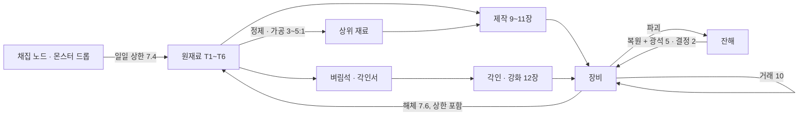

| 순환 지점 | 유입 | 유출 · 소멸 | 통제 수단 |
|---|---|---|---|
| 원재료 | 드롭 · 채집 · 해체 | 제작 · 정제 · 벼림석 · 복원 · 각성 개방 | 일일 산출 상한(계정 합산, D-25) |
| 장비 | 제작 · 드롭 | 해체(재료 일부 회수) · 신화 1회 거래 후 귀속 · 초월 귀속 | 등급별 드롭률(3.4), 제작 시도 상한 30 |
| 강화 단계 | 벼림석 + 골드 | 하락 · 파괴(−3) | 벼림석 = 재료 상한에 종속 |
| 보호재 | 대장장이 제작(일 2 · 4개) | 사용 시 소멸 | 보호재 일일 제작 상한 |

### 15.3 과금 경로 0 검산(3-C 과금 한계선 · D-11 · D-25 · D-41 · 01번 3장 원칙 8)

강화 · 제작의 확률 결과에 들어가는 자원을 로벅스로 늘리는 경로가 직접 · 간접 모두 0인지 자원별로 확인한다. 유료 상품 목록 자체는 10이 확정하며, 10은 이 표를 판정 기준으로 쓴다.

| 자원 | 이 문서의 유일한 공급원 | 직접 판매 | 간접 경로 차단 | 근거 |
|---|---|---|---|---|
| 강화 시도 횟수 | 벼림석(MT-33~38) + 골드 | 없음 | 벼림석 = 정제만(상점 판매 없음), 입력 광석 · 결정이 재료 일일 상한(7.4)에 묶임 | 7.3, 원칙 8(c) |
| 벼림석 · 재료(MT-01~32) | 드롭 · 채집 · 해체 · 정제 | 없음 | 일일 산출 상한 = 캐릭터별 + **계정 합산 3캐릭터분 고정** → 유료 추가 슬롯 캐릭터는 풀을 나눠 씀(늘지 않음) | 7.4, D-25 |
| 보호재(IT-48 · 49) | 대장장이 제작(일 2 · 4개/캐릭터, 계정 × 3) | 없음 | 제작 상한도 계정 합산, 복원권 · 파괴 보험 상품 없음 | 7.4 · 12.7, D-25 |
| 강화 성공률 · 단계 · 확정 성공 | 12.2 표 고정 + 대장장이 보정(상한 +1%p) | 없음 | 성공률 · 보정 · 확정 횟수를 바꾸는 유료 효과 없음, '강화 관련 배율' 상품 금지 | 12.10, D-11 |
| 제작 시도(DAILY_CRAFT_CAP) | 캐릭터 30회 · 계정 90회 | 없음 | 제작 병렬 슬롯 · 쿨타임 단축 상품 금지. **미완 제작 보관 기본 1칸은 모든 유저 무료 확정**(10.4 #9, 만료 시 재료 전액 반환 → 끊김 손실 0). 10이 추가 칸을 판다면 동시 보관 수만 늘고 시도 수 · 산출 · 재개 규칙은 불변(01 원칙 8(c), 02 8.3) | D-11, D-42, D-56 |
| 숙련도 · 도안 | 제작 숙련 경험치 · 6경로 도안(8.5) | 없음 | 경험치 부스트(D-11 · D-41)는 **캐릭터 경험치에만** +50%, 대장장이 숙련도 · 채집 숙련도 · 직업 경험치 배율에는 적용하지 않는다. 도안 · 도안 조각 판매 없음 | D-11, D-41 |
| 옵션 재설정 · 각인 · 복원 · 수리 · 각성 홈 개방 | 골드 + 재료(각성은 히든 피스 지식) | 없음 | 골드 소모처를 로벅스로 대체하는 상품 없음, 로벅스 ↔ 골드 교환 없음, 각성 홈 개방 판매 금지(05 과금 표) | 15.1, D-11, AS-07 |
| 미니게임 점수 | 플레이 입력 | 없음 | 판정 창 · 점수 보정 유료 효과 없음(보정은 TP-TEC · 열기 · 작업대 등급뿐, 10.2) | 10.2 |

- 결론: 강화 · 제작 결과에 영향을 주는 자원의 유료 경로 **0**. 유료 상품은 외형 · 창고 · 연출 · 확정형 시즌 패스와 경험치 부스트 1종(D-11)으로 한정되며, 이 문서의 어떤 수치도 과금 여부로 달라지지 않는다. 유료 외형은 6.4 외형 계층에만 붙고, 등급 테두리 · 강화 이펙트 · 한정 배지 · 명장 표식을 재현하거나 가릴 수 없어 **'등급 · 강화의 시각적 지위'도 돈으로 살 수 없다**(D-58 (d)).

## 16. 데이터 구조 힌트(11에 넘길 항목)

### 16.1 아이템 인스턴스 필드

| 필드 | 타입 | 예 | 설명 |
|---|---|---|---|
| uid | string(16) | "a3f9…" | 인스턴스 고유 ID(서버 생성, `HttpService:GenerateGUID` 축약, [10]). 로드 시 같은 계정 안 uid 중복 검사, 거래 · 의뢰 로그에 uid 기록(복제 탐지, 11 인계) |
| itemId | string | "IT-23" | 이 문서 6장 ID |
| tier / grade | int / int | 5 / 3 | 티어 1~6, 등급 0~5(일반~초월) |
| quality | int | 965 | 품질 Q × 10(정수 저장) |
| options | array[{o, v}] | [{o:"CRIT", v:72}] | 옵션 키 + 수치 × 10 |
| signature | {by, name, o, v, master} | {by:123, name:"…", o:"TEC_CRAFT", v:12, master:true} | 제작자 userId · 표시명 · 서명 옵션 · 명장 표식 |
| enh | int | 10 | 강화 단계 0~15 |
| guarUsed | int(bit) | 0b01 | +7 · +11 확정 사용 여부 |
| dropStreak | int | 0~2 | 연속 하락 카운트 |
| engr | string | "OOX__" | 각인 칸 상태(O 성공 · X 실패 · _ 빈 칸) |
| awaken | array[int] | [3, 0] | 각성 홈별 효과 번호(0 = 잠김) |
| dur / durMax | int / int | 88 / 110 | 내구도 |
| state | enum | "normal" / "remnant" | 잔해 여부 |
| bound / tradeCount | bool / int | false / 1 | 귀속 · 거래 횟수(신화 1회 규칙). 무료 지급 · 체험 대여 무기(6.1.1)는 bound = true · 판매가 0 |
| rerollCount | int | 7 | 옵션 재설정 천장 카운트 |
| limited | {id, serial} | null | 한정 장비 **참조만**. 소유자 · 획득 시각 · lastSeen은 유니버스 원장(16.2 limitedStock)이 권위 데이터이며, 로드 시 원장과 대조해 원장 우선(14.2, D-57) |
| skin | string 또는 null | "skin_0412" / null | 외형 덮어쓰기 ID(6.4). 외형 도감 · 유료 외형 · 시즌 외형 공통 키. null = 장비 기본 모습. 등급 테두리 · 강화 이펙트 · 한정 배지 · 명장 표식은 skin과 무관하게 그린다 |
| lock | {type, id} 또는 null | {type:"escrow", id:"cm_9f2…"} | 의뢰 에스크로 잠금(8.6) 또는 매크로 결과 확정 보류(10.5 #5, type "hold"). 잠기면 거래 · 해체 · 강화 불가 |

- 크기 추정(추정, 06-r1-T-11 검산): 위 필드를 키 이름 포함 JSON으로 직렬화하면 옵션 5줄 · 서명 · skin 포함 1개 약 **420~460바이트**(옵션 5 × 약 20 + 서명 약 80 + 나머지 키 · 값 약 250~280). 캐릭터 가방 + 창고 300개 ≈ 135KB, 3캐릭터 ≈ 405KB — DataStore 키당 4MB 한도 안(사실, [5]). 짧은 키 이름 · 배열 위치 인코딩을 쓰면 약 200바이트로 줄일 수 있다(11에서 결정).

### 16.2 캐릭터 · 계정 · 유니버스 데이터

| 범위 | 항목 | 설명 |
|---|---|---|
| 캐릭터 | blueprints: set[BP-ID], mastery: {smith, mining, herb, logging}, awakenKnow: set[int] | 도안 습득 · 숙련도 4종 · 각성 지식 |
| 캐릭터 | daily: {craft, ward, slip, mat[T1..T6], gather}, dayKey | 일일 카운터(UTC 날짜 키, 10에서 리셋 시각 확정) |
| 계정 | dailyPool: {craft, ward, slip, mat[T1..T6], gather} | 계정 합산 카운터(D-25). DataStore에는 키를 넘는 트랜잭션이 없으므로 **계정 풀과 3캐릭터 카운터를 계정 키 하나에 두고**, 세션 잠금을 가진 서버가 메모리에서 함께 증가시킨 뒤 한 번에 저장한다. 같은 계정 동시 접속은 세션 잠금으로 막는다(11, 06-r1-T-10) |
| 캐릭터 | pendingCraft: {bp, mats, seedId, stage, partialScores, pauseUsed, resumeCount, expiresAt} · commissionCraft(같은 형식, 대장장이 의뢰 작업 1칸) | 미완 제작 보관 무료 1칸(10.4 #8 · #9). 단계가 끝날 때마다 갱신, 만료 시 mats를 우편함으로 전액 반환 |
| 유니버스(MemoryStore) | craftSession_<userId>: {seed, schedule[], inputs[], stage, noteIdx, stats, offset} | 진행 중 · 중단된 미니게임(재개형). **TTL 86,400초(24시간)**, 다른 서버에서 재접속해도 재개 가능([7] [14]). 매크로 통계는 의심 플래그 시에만 계정 키에 30일 저장(10.5 #10) |
| 계정 | skinBook: set[외형 ID], craftOffsetMs: {judge: int(o_j), visual: int(o_v)} | 외형 도감(6.4, 계정 공유) · 미니게임 판정 · 표시 오프셋 마지막 값(10.4 #5, 기기 로컬이 우선) |
| 계정 | mailbox: array[{mailId, kind, payload, from, at}] | 우편함 키(의뢰 결과 · 수수료 · 보관 만료 반환 · 한정 반환 알림). mailId로 멱등 반영(8.6) |
| 유니버스 | commissions: {id: {kind, clientId, target(bp 또는 uid), escrow{mats, gold, uids}, fee, minMastery, createdAt, expiresAt(+72h), claimedBy, claimedAt, status(open/claimed/executing/done/expired), resultSeed}} + 게시판 색인 | 의뢰 레코드(8.6). 원본 DataStore(의뢰 ID 키), 게시판 조회 색인은 MemoryStore 정렬 맵(정렬 = 수수료). 수락 = 조건부 UpdateAsync로 claimedBy 1회 기록, 실행 = 2단계 기록(executing → done) |
| 유니버스 | limitedStock: {IT-41..47: {N, serials: {1..N: {owner, charId, acquiredAt, lastSeen, returnAt} 또는 null}}} | **한정 장비 일련번호별 소유 원장 = 권위 데이터**(D-57, 14.2). 잔여 수량 = 빈 번호 수. 획득 · 반환 · 시즌 리셋 · lastSeen 갱신 모두 이 키 하나의 UpdateAsync. 조회는 서버별 GetAsync + 5분 캐시(별도 limitedOwners 캐시 없음), [6] |
| 유니버스 | monthlyEnhStats_YYYYMM_00~15 | 강화 단계별 시도 · 결과 집계(월별 실측 공개용). 서버별로 메모리에 모은 뒤 **10분마다 샤드 키 16개 중 하나(serverJobId 해시)에 UpdateAsync로 더하고**, 공개 시점에 16개를 합산한다(쓰기 경합 분산, 06-r1-T-09). 옵션 재설정 실측(5.5)도 같은 방식 |

## 17. 튜닝 파라미터

| 이름 | 값 | 설명 | 장 |
|---|---|---|---|
| R_GRADE | 1.35 | 등급 간 기본 스탯 배율(원칙 12 하한 1.330, 3.7) | 3 |
| GEAR_ALPHA | 0.8 | 영웅 Q50 기본 스탯 = 0.8 × 04 기준 장비 식 | 3.2 |
| TIER_REF_LEVEL | 10T − 5 | 티어 기준 레벨 | 3.2 |
| ARMOR_SHARE | 몸 .35 · 머리 .25 · 손 .20 · 발 .20 | 방어구 배분 | 3.3 |
| QUALITY_FACTOR | 0.85 + 0.30 × Q/100 | 품질 → 기본 스탯 | 11.3 |
| OPT_COUNT | 0/1/2/3/4/5 | 등급별 옵션 수 | 3.1 |
| OPT_KAPPA / OPT_SIGMA | 무기 · 방어구 0.12 / 0.8, 장신구 0.40 / 0.25 | 옵션 점수 비율 · 범위 폭 | 5.1 |
| OPT_ROLL_EXP | 1.5 − Q/100 | 옵션 수치 R = U^지수 | 5.1 |
| OPT_POOL / OPT_GATE | 5.2 표 | 부위별 가중치 · 최소 등급 | 5.2 |
| REQ_A | 무기 1.5 · 방어구 0.4 · 장신구 0.75 | 요구 스탯 계수 | 4 |
| REQ_GRADE_STEP | 0.04 | 등급당 요구 스탯 +4% | 4 |
| ENGRAVE_SLOTS / RATE / BONUS | 2~7 / 0.60 / +1% | 각인 | 12.8 |
| ENH_TABLE | 12.2 표 | 강화 확률 | 12.2 |
| ENH_BONUS | +3%/단계, +10부터 +4% | 강화 스탯 보너스 | 12.1 |
| ENH_GUARANTEE | +7, +11 각 평생 1회 | 확정 성공 | 12.1 |
| DROP_STREAK_N | 2 | 연속 하락 보정 | 12.1 |
| RESTORE_DROP | 3 | 복원 시 단계 하향 | 12.7 |
| WARD_MAX_TARGET | +14 | 부적 사용 가능 최고 목표 단계 | 12.1 |
| ENH_GOLD_BASE / ZONE / GRADE | 30~600 / 1.0 · 1.6 · 2.4 / 1 + 0.15g | 강화 골드 | 12.3 |
| PROTECT_GOLD_MULT | 1.5 | 보호재 사용 시 골드 | 12.3 |
| HONE_PER_ATTEMPT | 1 / 2 / 3 | 구간별 벼림석 | 12.3 |
| SMITH_ENH_BONUS | +0.5%p(숙련 60) / +1%p(숙련 90 · J-H2) | 대장장이 강화 보정(상한 +1%p) | 12.1 |
| CRAFT_Q_WEIGHTS | 0.6 / 0.3 / 0.1 | 미니게임 · 숙련도 · 스킬 | 11.1 |
| CRAFT_S_PARTS | 직업 ≤40 · 기교/5 ≤30 · J-H2 20 · 서명 ≤10 | 스킬 보정 | 11.1 |
| GRADE_ROLL_BANDS | 11.2 표 | Q 구간별 승격 · 유지 · 강등 | 11.2 |
| MIN_GRADE_GUARANTEE | 요구 숙련도 + 20 | 강등 0% 조건 | 11.2 |
| MG_TABLE | 10.2 표 | 미니게임 난이도 | 10.2 |
| MG_WEIGHTS | 0.3 / 0.5 / 0.2 | 가열 · 단조 · 담금질 | 10.1 |
| JUDGE_MS | 50 / 100 / 160 | 완벽 · 좋음 · 보통 | 10.1 |
| LATENCY_TOL_MS | W = clamp(2σ_j + 24, 25, 40), σ_j = 1.4826 × MAD(최근 30개 잔차 r), 첫 3노트 W = 40 | 주장 시각 허용 폭 · 클램프 t_판정 = clamp(t_c, t_s − W, t_s + W)(D-61 (2), r1 120 → r2 min(40, 2σ_j + 16) → r3) | 10.4 |
| LATENCY_BIAS_N / LATENCY_WARMUP | 30개 / 3노트 · 시작 하트비트 10개(0.3초 간격) | 서버 추정 시각 t_s = t_r − b̂의 편차 b̂ = 최근 30개 (t_r − t_c) 중앙값, 초기값 = 시작 연출 하트비트 표본 | 10.4 |
| JUDGE_FLOOR_MS | 완벽 50 · 좋음 100 | 배율 · 보정 적용 후 판정 창 하한 | 10.2 · 10.4 |
| CRAFT_OFFSET_MS (o_j) | −150 ~ +150(10ms 단위) | 판정 오프셋: 판정에만 적용(채택 시각 − o_j, 판정 중심만 이동, 표시 불변), '박자 맞추기' 시각 큐 8탭 (t_c − 큐 시각) 중앙값(D-61 (1)) | 10.4 |
| CRAFT_VIS_OFFSET_MS (o_v) | −100 ~ +100(10ms 단위) | 표시 오프셋: 그리는 시점만 이동, 판정 무관(D-61 (1)) | 10.4 |
| FRAME_COMP_CAP_MS | 17 | 프레임 반 보정 상한(늦은 쪽 오차만) | 10.4 |
| CRAFT_RESUME_TTL / RESUME_MAX | 86,400초 / 5회 | 재개형 craftSession 보관 시간 · 제작당 재개 횟수 | 10.4 |
| CRAFT_HOLD_SLOTS | 1(무료) + 의뢰 작업 1 | 미완 제작 보관 칸 | 10.4 |
| PAUSE_MAX / PAUSE_TOTAL_S | 2회 / 60초 | 제작당 일시정지(수동 + 자동) 상한 | 10.3 |
| MACRO_CRAFT_STDDEV_MS / CV / FLAG_MIN | 12 / 0.02 / 2개 지표 | 매크로 의심(다변량 7지표 중 2개 이상) | 10.5 |
| MACRO_HOLD_HOURS | 48 | 의심 플래그 시 결과 확정 보류 검토 기한(r1 점수 상한 70 폐지) | 10.5 |
| MACRO_CLAMP_RATIO / CLAMP_OFF_SIGMA_MS / MACRO_LOG_DAYS | 0.30 / 20 / 30 | 클램프 발생 비율 보조 지표 · 지표 끄는 세션 잔차 σ_j · 의심 세션 로그 보관 일수(r2 대체 판정 비율 · RTT 표준편차 40 → r3, D-61 (2)) | 10.5 |
| BUFF_STACK | D-43 ① −75% · ② +50% · ③ 큰 값 1개, 대상 조건 피해 +40% · 표식 +25% | 장비 효과 · 버프 중첩 | 5.6 |
| AUTO_CRAFT_SCORE | 50 | 자동 제작 점수 | 10.6 |
| DAILY_CRAFT_CAP | 30(계정 90) | D-42 | 7.4 |
| DAILY_MAT_CAP[T] | 400 · 340 · 280 · 220 · 160 · 100(계정 × 3) | 재료 단위/일 | 7.4 |
| DAILY_WARD / SLIP_CRAFT | 2 / 4(계정 × 3) | 보호재 제작 상한 | 7.4 |
| MASTERY_XP | 10 · 25 · 60 · 150 · 400 · 1,000 | 도안 등급별 숙련 경험치(04 11.1) | 8.2 |
| MASTERY_ACCEL / FIRST_CRAFT_MULT | 숙련 1~19 ×3 / 도안별 첫 수작업 완성 ×5(곱) | 초반 숙련 가속(D-58 (e)) | 8.2 |
| PCT_TIER_COEF p(T) | 0.5 + 0.25 × max(0, T − 4) → 0.50 · 0.50 · 0.50 · 0.50 · 0.75 · 1.00 | % 옵션 티어 계수, 장신구 평탄 옵션은 min(s(T), p(T))(D-58 (c)) | 5.3 |
| DROP_PART_WEIGHT | 무기 36(군당 6) · 머리 · 몸 · 손 · 발 각 11 · 목걸이 · 반지 각 10 | 드롭 기본 아이템 부위 추첨 | 3.4 |
| FLUX_PRICE | 20 × 정제 결과 티어 | 정제 촉매 NPC 판매가(r1 200 × T) | 7.2 · 15.1 |
| COMMISSION_EXPIRE_H / ACCEPT_DO_H / MAX_OPEN | 72 / 24 / 의뢰인 3 · 대장장이 3 | 의뢰 게시판 기한 · 수락 후 수행 기한 · 동시 건수 | 8.6 |
| COMMISSION_FEE_MIN | 작업대 사용료 × 1 | 의뢰 최소 수수료 | 8.6 |
| BP_REQ | 8.2 표 | 도안 요구 숙련도 · 작업대 | 8.2 |
| WB_FEE | 20 · 50 · 120 · 300 · 700 · 1,500 × (0.5 + T/12) | 작업대 사용료 | 9 |
| DUR_MAX / DEATH_LOSS | 50~150 / 0.10 | 내구도 | 13 |
| REPAIR_RATE[T] | 1 · 2 · 4 · 6 · 8 · 10 × (1 + 0.25g) | 수리 단가 | 13 |
| LIMITED_N | 5 × 5종 + 1 × 2종 | 한정 장비 수량 | 14.1 |
| LIMITED_DORMANT / RETURN_DAYS | 7 / 30 | 휴면 · 반환 | 14.2 |
| LIMITED_LASTSEEN_H / SWEEP_H / RESPAWN_H | 6 / 1 / 24 | 원장 lastSeen 갱신 주기 · 반환 검사 주기 · 반환 후 재획득 대기 | 14.2 |
| FX_NEAR_PLAYERS / FX_RATE_MAX | 6명 / 10 | 강화 이펙트 파티클 표시 인원 · 이미터 Rate 상한 | 6.4 |
| DROP_EQUIP_RATE | 일반 2% · 정예 12% · 보스 1개 | 장비 드롭 | 3.4 |

## 18. 확인 필요 · 가정 · 출처

### 18.1 확인 필요(메인 결정 사항)

| # | 항목 | 내용 | 이 문서의 처리 | 영향 문서 |
|---|---|---|---|---|
| 1 | 풀장비 정의와 상위 등급 타수 | 04 5.5의 '레벨 60 풀장비 4~6타'를 전설(+0~+15)로 검산하면 4~5타로 지켜지지만, 01번 3장 원칙 12(+15 ≤ 한 등급 위 +0)를 지키려면 등급 간 1.35배가 필요해 신화 3~4타 · 초월 +15 2타가 된다 | **D-49로 확정**: '풀장비 = 전설', 등급 간 배율 ≥ 1.35, 신화 이상은 극소수 이론 상한(3.6). 04 5.2 '60 풀장비' 행을 3.6 값(무기 159 · 주 스탯 225 · 방어 약 231)으로, 5.2 기준 장비 열을 '영웅 Q50 = 0.8 × 기존 식 + 옵션'으로 갱신 요청 | 04, 05(9.4) |
| 2 | 자동 제작 결과 상한 | 01번 5장 #44는 '자동 제작 = 일반 등급 상한', 메인 골격은 '품질 점수 50 고정'. 품질 Q 자체를 50으로 고정하면 초보(예시 1, 수작업 Q 43.3)에게 자동 제작이 수작업보다 유리해져 02 3.3 실패 조건 (b)를 어긴다 | **D-50으로 확정**: '미니게임 점수 G = 50 고정' + **승격 0%**로 모든 숙련 단계에서 수작업 우위 보장(10.6) | 01 |
| 3 | 명장의 모루와 하위 무기 재료 경계 | 05 J-H2 조건의 '희귀 이상 망치 1개' 투입은 01번 5장 #8(하위 무기 재료는 일반 전설 도안에만)과 형식상 충돌. 요구 숙련도 40도 전설 도안 기준(60)과 다름 | BP-19를 '전설 등급 열쇠 물품 도안'(장비 아님)으로 분류해 예외 기록(7.5) | 01, 05 |
| 4 | 05 미니게임 입력 표기 | 05 10.1 #24는 '좌클릭 · 드래그 · Space / 탭 · 드래그 · 길게 / A · Thumbstick1 · R2' | 이 문서는 누르기 · 떼기 · 탭 3종, 패드 A · B · R2(10.3). 05 #24 갱신 요청(드래그 · Thumbstick1 = 메뉴 이동) | 05 |
| 5 | 강화 구간의 등급별 차이 | 01번 3장 원칙 2 · 6은 '구간 경계 · 최대 단계가 등급별로 다르다'였으나 메인 골격은 '+15 · 구간 고정, 파괴만 등급 차등' | 골격 채택. 등급 차이는 파괴 유무(12.9)와 기본 스탯 배율(3.1)로 표현 | 01 |
| 6 | 부적 사용 상한 | 01번 3장 원칙 5(c) '도박 구간 상한 이상 사용 불가'의 해석 | **D-50으로 확정**: +15 시도에는 부적 불가(+11~+14만). +15 보호 有 기대 파괴 1.25회의 원인(12.4) | — |
| 7 | 제작 수행 직업 | 3-B-12는 '대장장이 제작', D-02는 생산 직업 가치 | **D-50으로 확정**(도안 제작 = 대장장이 계열만 + 제작 의뢰). 도안 제작 · 잔해 복원 · 보호재 제작은 대장장이 계열만, 정제 · 각인 · 강화 · 수리(NPC)는 누구나. 다른 직업은 '제작 의뢰'(8.1) | 05, 08, 10 |
| 8 | 방패 장비 칸 | 03 3.4 '유리사막의 거울 방패'에 맞는 방패 칸이 없다(골격 부위 = 무기 · 방어구 4 · 장신구 2) | 목걸이 칸을 쓰는 '등에 메는 방패'로 처리(14.1) | 03 |
| 9 | 재료 일일 상한 수치 | D-25 · D-42는 원칙과 제작 · 채집 상수만 확정 | 티어별 재료 단위 상한(7.4)을 06 초안값으로 제시, 10에서 최종 | 10 |
| 10 | 각성 홈 개방 단위 | 히든 피스는 캐릭터 1회 완료인데 각성 홈은 장비마다 있다 | **D-50으로 확정**: 히든 피스 → '각성 지식'(영구) + 재료로 장비마다 개방(14.3). 07에 각성 지식 HP 8개 이상 요청 | 07 |
| 11 | 연습용 한손검 수치 | 05 2.2 '0-장비'는 연습용 한손검 공격력 10(04 5.2 레벨 1 기준선) | IT-59로 확정(6.1 · 6.1.1), 공격력 = T1 일반 9(3.2). 05 2.2의 '10'을 'IT-59, 공격력 9(06)'로 갱신 요청 | 05 |
| 12 | 04 11.2 '희귀 도안 환산' 열 | 숙련 10 전에는 희귀 도안을 쓸 수 없어 열 값(숙련 10 = 36회)이 실제와 다름 | 8.2 초반 가속(숙련 1~19 ×3, 첫 제작 ×5) 기준으로 '실제 제작 가능 도안 + 가속' 열로 갱신 요청(첫날 숙련 10 · 3일 숙련 20) | 04 |
| 13 | 직업 체험 대여 무기 ID | 05 3.6 '주 무기(일반) 임시 대여'에 W4 · W6 실물이 없었음(06-r1-M-01) | 6.1.1 표(IT-01 · 02 · 03 · 56 · 57 · 58)로 확정. 05 3.6에 IT- 참조 추가 요청 | 05 |
| 14 | 의뢰 게시판 · 우편함 · 원장의 서버 간 구현 | 06은 규칙(8.6 · 14.2)과 데이터 항목(16.2)만 정함 | 11에서 키 설계 · 큐 · 세션 잠금 · 만료 정리 작업 확정(D-55 · D-57) | 11 |

### 18.2 이 문서의 가정(ASSUMPTIONS.md 추가 후보, 번호는 메인이 부여)

| 후보 | 가정 | 영향 문서 |
|---|---|---|
| ① | 드롭 장비 품질은 균등 분포(일반 · 정예 10~70, 보스 20~80, 레이드 30~90)이고 제작 품질 기대값이 이보다 높다(D-02) | 06, 08, 10 |
| ② | 강화 · 수리 비용 감각은 04의 골드 드롭 추정(레벨 60 시간당 약 9,360)을 기준으로 했다. 10이 골드 유입을 확정하면 12.3 · 13장 계수만 비례 조정 | 06, 10 |
| ③ | 미니게임 판정 창(완벽 ±50 · 좋음 ±100 · 보통 ±160ms, 하한 완벽 50 · 좋음 100)과 주장 시각 허용 폭 W = clamp(2σ_j + 24, 25, 40)ms, 판정 오프셋 o_j −150~+150ms · 표시 오프셋 o_v −100~+100ms, 프레임 반 보정 상한 17ms, 블루투스 오디오 지연(150ms 이상 가능)은 일반 리듬 게임 · 상용 터치 지연(50~150ms) 수준의 추정치. **모바일 실측 목표(D-61)**: 출시 전 테스트에서 ⓐ 플랫폼별(PC · 모바일 · 콘솔) '완벽' 판정 비율 차 ≤ 5%p(같은 숙련 테스터 집단, **판정 오프셋 o_j를 시각 큐 '박자 맞추기'로 보정한 뒤**, 표시 오프셋 o_v = 0), ⓑ **셀룰러 · Wi-Fi를 따로 측정**해 정직한 입력의 **클램프 발생률 ≤ 5%**(10.4 #3 · 10.5 #8). ⓐ를 넘으면 o_j 범위 · 프레임 보정 · 판정 창을, ⓑ를 넘으면 **W 하한(25)부터** 조정하고 이어서 b̂ 표본 수(30) · W 상수(24)를 조정 | 06, 11 |
| ④ | 한정 장비 수량 N(수량형 5, 선착형 1)은 출시 초기 동시 접속 규모 미정 상태의 추정. 동접 규모가 크면 수량형만 늘린다 | 06, 09, 11 |
| ⑤ | 채집 노드(채광 · 벌목 · 약초) 배치는 06이 정의하며 03 8장 '주요 드롭'(몬스터 드롭)과 별개다 | 03, 06 |

### 18.3 출처

| # | 항목 | 사실/추정 | 출처 |
|---|---|---|---|
| 1 | `Random.new(seed)`: 시드를 주면 같은 난수열(서버 시드 패턴 재현) | 사실 | https://create.roblox.com/docs/reference/engine/datatypes/Random |
| 2 | `Workspace:GetServerTimeNow()`: 클라이언트가 추정한 서버 시각(동기화된 시각 기준) | 사실 | https://create.roblox.com/docs/reference/engine/classes/Workspace#GetServerTimeNow |
| 3 | `Player:GetNetworkPing()`: 공식 설명 "Returns the round-trip, isolated network latency of the player in seconds … doesn't involve data deserialization or processing" — **왕복 · 격리된 네트워크 지연이며 처리 · 프레임 대기 · 업/다운링크 비대칭을 포함하지 않는다**. 서버에서 다른 플레이어에게도 호출 가능, 클라이언트에서는 LocalPlayer만(06-r2-T-02 검수자 확인). 그래서 10.4 #3은 t_s를 RTT/2가 아니라 세션 입력 잔차 편차 b̂로 만들고, 이 API는 연결 상태 표시용 참고값으로만 쓴다(D-61 (2)) | 사실 | https://create.roblox.com/docs/reference/engine/classes/Player#GetNetworkPing |
| 4 | RemoteEvent로 클라이언트 → 서버 입력 전달(서버 권한 판정) | 사실(API) · 설계 | https://create.roblox.com/docs/reference/engine/classes/RemoteEvent |
| 5 | DataStore 키당 값 크기 4MB(4,194,304바이트) | 사실 | https://create.roblox.com/docs/cloud-services/data-stores/error-codes-and-limits |
| 6 | `GlobalDataStore:UpdateAsync` 원자적 읽기-수정-쓰기(한정 장비 수량 감소) | 사실(API) · 설계 | https://create.roblox.com/docs/reference/engine/classes/GlobalDataStore |
| 7 | MemoryStore 정렬 맵(SortedMap)으로 서버 간 공유 조회 캐시 | 사실(API) · 설계 | https://create.roblox.com/docs/cloud-services/memory-stores |
| 8 | UDim2 = Scale(상대) + Offset(절대) → 판정 띠를 화면 대비 비율로 그림 | 사실 | https://create.roblox.com/docs/reference/engine/datatypes/UDim2 |
| 9 | `UserInputService.PreferredInput`으로 입력 UI 세트 전환(05 10.3과 동일) | 사실 | https://create.roblox.com/docs/reference/engine/classes/UserInputService |
| 10 | `HttpService:GenerateGUID`로 인스턴스 고유 ID 생성 | 사실 | https://create.roblox.com/docs/reference/engine/classes/HttpService |
| 11 | 레퍼런스 구조(강화 3결과 · 보호재 · 확정 단계 · 잔해 · 각인 · 천장 · 서명 · 자동 제작 · 해체 · 한정 장비) | 01번 3장 · 5장 매핑 번호로만 인용 | 01_reference.md |
| 12 | 등급 배율 · 옵션 · 강화 확률 · 비용 · 미니게임 수치 전부 | 추정(튜닝 파라미터, 17장) | gen06.py(생성) · gen06_r2.py(r2 추가분) · verify06.py(독립 검산) |
| 13 | `RunService.RenderStepped`: 매 프레임 렌더 전에 발생(프레임 시간 dt 전달) | 사실(API) · 설계 | https://create.roblox.com/docs/reference/engine/classes/RunService#RenderStepped |
| 14 | MemoryStore 항목은 만료 시간(TTL)으로 제거되며 기본 만료 45일, 설정한 TTL로 짧게 둘 수 있음(craftSession 24시간) | 사실 | https://create.roblox.com/docs/cloud-services/memory-stores |
| 15 | `GuiService.MenuOpened`: 사용자가 로블록스 CoreGui 메뉴(Esc 메뉴)를 열 때 발생 | 사실 | https://create.roblox.com/docs/reference/engine/classes/GuiService#MenuOpened |
| 16 | `GuiService.TouchControlsEnabled`: 터치 컨트롤과 그 표시 UI를 켜고 끔(기본 true) | 사실 | https://create.roblox.com/docs/reference/engine/classes/GuiService#TouchControlsEnabled |
| 17 | `Enum.UserInputState.Cancel`: 입력이 더 이상 유효하지 않음을 뜻하는 특수 상태(ContextActionService 바인딩 교체 등) | 사실 | https://create.roblox.com/docs/reference/engine/enums/UserInputState |
| 18 | `ContextActionService:BindActionAtPriority`: 같은 입력에 여러 액션이 바인딩되면 우선순위가 높은 쪽이 먼저 호출 | 사실 | https://create.roblox.com/docs/reference/engine/classes/ContextActionService#BindActionAtPriority |
| 19 | PC Esc · 게임패드 ButtonStart는 로블록스 메뉴용 예약 입력으로 재정의 불가(06-r1-T-05 검수자 확인) | 사실(검수자 출처) | https://create.roblox.com/docs/input/input-action-system |
| 20 | `InputObject`에 입력 발생 시각 필드가 없음(Delta · KeyCode · Position · UserInputState · UserInputType) → 입력 시각은 프레임 처리 시점으로 양자화(06-r1-M-02 검수자 확인) | 사실 | https://create.roblox.com/docs/reference/engine/classes/InputObject |
| 21 | `GuiService.AutoSelectGuiEnabled`: 켜져 있으면 게임패드 Select 버튼(또는 Backslash)이 GUI를 선택 객체로 자동 지정("If activated, the Select button on a gamepad or Backslash will automatically set a GUI as the selected object"). 미니게임 중 false로 둠(10.3 #7, D-61 (3)). `GuiService.SelectedObject`로 선택 객체 해제 | 사실 | https://create.roblox.com/docs/reference/engine/classes/GuiService#AutoSelectGuiEnabled |

### 18.4 자가 검산(gen06.py 실행 결과)

| 검사 | 결과 | 비고 |
|---|---|---|
| 전설 +10 (권장 종착, 12.6) 4~6타 | 통과 | [3.42, 3.71, 4.02] |
| 전설 +15 4~6타 | 통과 | [3.24, 3.52, 3.81] |
| 전설 +0 공격 집중 4~6타 | 통과 | [3.3, 3.59, 3.89] |
| 도안 24+ | 통과 | 84 |
| 도안 경로 6종 각 3+ | 통과 | 상점 44 · 몬스터 드롭 20 · 세력 평판 6 · 유적 탐색 6 · 히든 피스 4 · 레이드 4 |
| 작업대 29곳 | 통과 |  |
| 예시 3건 | 통과 |  |
| 마르코프 검산 +6 | 통과 |  |
| +7 확정 | 통과 |  |
| 한정 장비 성능 상한 | 통과 | 84.5<=95.3 |
| IT 30+ | 통과 | 103 |
| MT 30+ | 통과 | 42 |
| IP 금지어 0건 | 통과 | [] |
| ID 교차 참조 | 통과 | [] |
| IT ↔ BP 상호 참조 | 통과 | [] |
| MVP 재료 확보(티어 1~6 × 5계열) | 통과 |  |
| 원칙 12 조건 A · B(7부위 × 5등급 쌍 + 10쌍) | 통과 | 3.7 |
| 강화 확률 합 100% · 파괴 < 하락(15단계) | 통과 | 12.2 |
| 미니게임 총 소요 40~75초(6등급) | 통과 | 10.2 |
| 01번 6.1~6.3 금지어 검사 | 0건 | 금지 목록 1034개 단어 대조(3글자 이상 부분 일치, 2글자 단어 경계 일치, 1글자 단어는 초 · 칸 등 일반 단위어와 겹쳐 제외) |
| 03 · 05 색인 밖 ID | 0건 | C- · N- · F- · RC- · SP- · T- · H- · A- · E- · J- · SK- |
| 마르코프 체인 독립 재계산(verify06.py, 12.2 표를 문서에서 직접 읽어 별도 구현) | 일치 | 12.4 표 15행 × 8열 · 12.6 보정 6칸 · 12.9 전부 소수 첫째 자리까지 같음 |
| 예시 계산 3건 재계산 | 일치 | Q 43.3 · 70.2 · 96.5, 공격력 34/26/19 · 105/78/58 · 193/143, 자동 제작 Q 34.8 · 50.9 |
| 결정 반영(D-37 · D-39 · D-42 · D-43 · D-49 · D-50) | 반영 | 5.2 치명 옵션 · 3.4 인스턴스 희귀 드롭 · 7.4 상한 · 5.6 중첩 · 3.1/3.6 풀장비 · 8.1/10.6/12.1/14.3 |
| **r2 · 도안 커버리지 72칸 빈 칸 0 · T6 전설 12부위**(verify06_r2.py, 8.4 전표를 문서에서 직접 읽어 셈) | 통과 | 6.1.2 행렬 = 8.4 전표 일치, 도안 → IT 티어 · 등급 일치, IT → 제작 BP 역참조 일치, 8.5 집계 = 전표 |
| r2 · 숙련도 마일스톤 도안 실재(일반 T4~6 · 희귀 T4~6 · 영웅 T4~6 · 전설 T1~3) | 통과 | BP-61 · 70 / BP-58 등 8 / BP-17 등 7 / BP-51 · 53 · 55 |
| r2 · MT-04 · MT-06 자연 산지 2곳 · 2대륙 이상(필드 포함, 주간 제한 없음) | 통과 | MT-04 H-08 · 09 · 15 · 32 · 37(4대륙) / MT-06 H-19 · 25 · 34 · 42 · 43(4대륙) |
| r2 · 정제 우회로 +10 촉매 비용 | 0.49배 | r1 6.49배 → r2 10,148골드 / 강화 골드 20,859(7.2 아래 표) |
| r2 · % 옵션 티어 계수 장신구 검산 | 통과 | T1 전설 · T3 신화 · T4 신화 목걸이 · 반지 ≤ T6 전설(5.3 표) |
| r2 · 숙련 가속 첫날 숙련 10 · 3일 숙련 20 | 통과 | 최악 900 → 10 · 3일 3,950 → 22(8.2 표) |
| r2 · 재개형 · 판정 수치(허용 폭 ≤ 40 < 완벽 하한 50, 오프셋 ±150, 프레임 보정 ≤ 17) | 반영 | 10.3 · 10.4 · 10.5 · 17장 |
| r3 · D-61 시각 판정(클램프 · W = clamp(2σ_j + 24, 25, 40) ≤ 40 < 완벽 하한 50, o_j 판정 전용 · o_v 표시 전용, 일시정지 ButtonY · AutoSelectGuiEnabled 끔) | 반영 | 10.3 · 10.4 · 10.5 · 16.2 · 17장 · 18.2 ③ · 18.3 [3] [21] |
| r2 결정 반영(D-55 · D-56 · D-57 · D-58) | 반영 | 8.6 의뢰 · 10.3~10.5 · 14.2/16.1/16.2 원장 · 6.1.1/6.1.2/6.4/7.2/5.3/8.2 |
| 과금 경로(강화 시도 · 보호재 · 벼림석 · 재료) | 0건 | 15.3 |

- 개수: 아이템 IT- 103개(장비 88 · 한정 7 · 기타 8), 재료 MT- 42개, 도안 BP- 84개, 옵션 15 + 서명 4 = 19종, 예시 계산 3건.


---

# 〔07_stories_hidden.md〕 — 미완성 — r1 FAIL 후 r2 수정 도중 중단

# 07_stories_hidden — 이야기 연결 구조 · 퀘스트 · 히든 피스

## 1. 문서 정보

| 항목 | 내용 |
|---|---|
| 버전 | r2 |
| r2 변경 요약 | r1 중대 13건 전부 수용(D-62). (1) L-01: CN-56을 '흔적 등장'(A-06 4장 '케슈 기록관 메모' · A-07 4장 '케슈 기록관 증언' 기록물)으로 고치고 NP-11 본인은 HP-17 완료 캐릭터에게만(MVP 연결 수 · A-07 MVP 연결 3 유지). (2) L-02: 9장 다중 위치 NPC 상시 동시 상주 규칙, 3.4 대화 장 대체 1장 무대 표(A-13 · A-17 · A-19 · A-22 · A-26 추가, 장 계수 0.8 · 전투 없음 · 2장 이동 경로), 8장 SP-04 MVP 근거. (3) S-04 · M-01: 2.3 '아크 전투 대상 레벨 = 무대 적정 하한' · 첫 아크 6개 위험도 3 이하 · 시작 위치마다 레벨 1~15 완주 가능 아크 2+(3.5 · 8장), A-09 4장 · A-13 2~3장 · A-07 5장 · A-27 5장 전투 없음, Q-A07-2 위험도 3 → 4, A-07 완주 레벨 35(05 4.2 J-H6 캐릭터 25~40 안). (4) S-01: 3.1 '장 평판 대상' 열(세력 1개), 연결 보너스 평판도 같은 기준, 12.4 검산 재계산 · 냉담 '화해 의뢰'. (5) S-02 · S-03: 12.6 단발 · 세력 의뢰 템플릿 표 · 하루 상한 · 계정 합산, 12.2 경험치 = 기준(L) × 설계 분 × 0.8, 세력 의뢰 인장 하루 합계 3건(+6/일), 일회성 인장 총량을 15.1 #12로 04에 넘김. (6) S-05: 시즌 시드(HP-28 · 29) 분리, 개인 시드 12개, 공용 사물 시드 판정 플레이어별. (7) S-06: 히든 피스 완료 캐릭터당 1회 · 한정 장비 획득 시도는 재고가 있을 때마다, 11.5 선착형 시즌 규칙 표. (8) S-07: 계약 배정 '남은 대상 > 0', Q-D11 · Q-W04 반복형 대체 계약. (9) M-04: 2.4 파티 진행 규칙 신설. (10) M-02: 11.4 아크 추천 UI 레벨 규칙 4항목. (11) M-03: 13.3 알파 8개 확정(D-62) · 알파 무대 검산 · 알파 한정 결말 보류. (12) 경미 반영: L-03 · L-04 · L-05(NP-38~44) · L-06 · L-07 · L-08 · L-09 · L-10 · L-11 · L-12, S-08 · S-09 · S-10 · S-13 · S-14 · S-15, M-05 · M-08 · M-09 · M-12 |
| r1 변경 요약 | 검수 전 자가 점검 반영. (1) D-59: A-04 · A-07을 MVP로 이동(MVP 아크 12). A-07의 MVP 안 연결이 1개뿐이라 기존 NPC 등장(NP-11 · NP-18)을 ① 인물 연결 CN-56(A-06 ↔ A-07) · CN-57(A-07 ↔ A-11)로 등록(기존 CN 번호 불변), HP-39(SK-V01)를 MVP 출시분에 추가, 13.2 특수 스킬 7(05 2.4 MVP SK-V01~V07과 일치), E-02 MVP 부분 개방 참여 아크 4, J-H1 T-01 대체본 확정 표기. (2) 13.3 알파 아크 검산 신설: D-59 '알파 7'로는 SP-01~04 도달 3+ 불가(전수 검사), 최소 8 → 15.1 #10. (3) 3-C: NPC 이름 3건 교체(NP-22 · NP-23 · NP-30, 대형 IP 인물 · 종족명과 동일). (4) 세력 평판 수치 '추정, 08 · 10 확정' 표기 통일. (5) 15.1 #1~#4 · #9 · #10을 D-59 결정 상태로 갱신 |
| 작성일 | 2026-10-01 |
| 상태 | r2 검수 대기 (배정: lore / system / player-market) |
| 목적 | 3-A [진행 순서] 07번 정의: 이야기 연결 구조 · 퀘스트 · 히든 피스. 4-정량의 이야기(아크 20+ · 모든 아크 연결 2+ · 고립 0 · 대형 연결 사건 3+ · 모든 시작 위치에서 아크 3+ · 표와 Mermaid)와 히든 피스 30+(발견 단서 · 조건 · 보상 · 연결 아크 · 종류 다양화), 3-B-2(정해진 줄거리 없음 · 이야기 연결)와 3-B-7(히든 피스 종류)을 이 문서에서 충족한다. |
| 의존 문서 | 00_BRIEF.md(3-B-2 · 3-B-7 · 4-정량), 01_reference.md(1장 용어: 한정 장비 · 선착형 히든 피스 · 각성 홈, 6장 IP 금지 목록), 02_concept.md(3.2 F2 · 5장 첫 10분 · 8.5 가드레일 · 11장 단계 · 14장 용어집), 03_world.md(3.1~3.4 역사 · 대형 사건 · 한정 장비 본체, 4장 세력, 7장 · 7.1 시작 위치 · 표지판, 8장 사냥터, 11장 아크 씨앗 30, 12장 히든 피스 배치 원칙, 13장 색인), 04_progression.md(6장 병렬 성장원 · 12장 탐험 인장), 05_classes_skills.md(4장 히든 직업 6 · 8장 특수 스킬 17), 06_items_crafting.md(8장 도안 · 14장 한정 장비 · 각성 홈), DECISIONS.md(D-01~D-63. 직접 적용: D-08 · D-09 · D-10 · D-15 · D-19 · D-24 · D-25 · D-28 · D-29 · D-31 · D-32 · D-36 · D-40 · D-48 · D-50 · D-51 · D-57 · D-59 · D-62), ASSUMPTIONS.md(AS-01~AS-13. 직접 적용: AS-02 · AS-03 · AS-05 · AS-08 · AS-10 · AS-11) |
| 이 문서를 기준으로 삼는 문서 | 08(레이드 보스와 사건의 비대응 규칙 · 평판 수치 조정), 09(탐험 랭킹: 히든 피스 · 아크 · 발견 집계, 한정 장비 탭), 10(계약 보상 · 평판 상점), 11(아크 진행 · 플래그 · 히든 피스 · 단서 노트 · 유니버스 카운터 데이터), 12(단계별 아크 · 히든 피스 출시 범위) |
| 표기 규칙 | 전부 한국어, 고유명사는 한국어 + 영문 병기(AS-05). 수치 · 반복 데이터는 ID가 있는 표. 지역 · 세력 · 종족 · 아크 이름은 03 13장 색인, 스킬 · 직업은 05, 아이템 · 도안 · 재료는 06의 ID만 쓴다. 이 문서가 새로 정의하는 ID: **NP-**(NPC) · **HP-**(히든 피스) · **Q-**(퀘스트) · **FL-**(세계 상태 플래그) · **CN-**(아크 연결). 사실은 출처(15장), 그 외 수치는 **추정**(설계값). 레퍼런스 고유명사는 쓰지 않는다(01번 6장). 생성 스크립트 대조 결과: 6.1~6.3 목록과 같은 단어는 6.4 허용어 '광기'(03 용어 '광기 지역')와 지형 일반어 '오아시스'(03 14.1 #8)뿐이고, 부분 일치(미르잔 · 이스메르)는 03 14.1 #8 판정을 따르고, 일반어 속 우연 부분 일치('하나로' · '전제로')는 고유명사가 아니다. |
| 대사 규칙 | 말풍선 한 번에 2줄 이내(AS-08), 장문 서사는 기록물(책 · 비석 · 벽화)로 선택 열람. 연령 톤은 경미(AS-02): 유혈 · 사망 묘사 없음, 위협은 '쓰러짐 · 사라짐 · 잠듦'으로 표현 |
| 수치 생성 | 아크 · 연결 · 플래그 · 히든 피스 표, 연결 수 · 고립 · 단계별 검산, 시작 위치 도달 수, Mermaid 그래프는 같은 데이터에서 스크립트(gen07.py, 저장소 밖)로 생성해 표 · 그래프 · 숫자가 일치한다. |

---

## 2. 이야기 설계 원칙

### 2.1 용어(02 14장을 따른다)

| 용어 | 정의 | ID |
|---|---|---|
| 아크 (Arc) | 한 지역에 묶인 이야기 단위. 장 3~6개 + 결말 1~3개. 시작 조건은 장소 · NPC · 물품뿐이고 레벨 · 다른 아크 완료 조건이 없다 | A-01~A-30(03 11장) |
| 장 (Chapter) | 아크의 세션 단위, 8~12분. 중간 저장. 장 계수: 짧은 장 0.8(대화 · 이동 중심) / 표준 1.0 / 최종 장 1.1(04 6장) | Q-Ann-n(두 자리 아크 번호, 3.2) |
| 0장 (Chapter Zero) | 시작 위치 첫 아크 7개에만 있는 3~5분 예외 장(D-10). 경험치 50 고정, 인장 +20. 건너뛰어도 같은 가치를 다른 경로로 얻는다(02 5.3). **캐릭터가 고른 시작 위치의 첫 아크 1개만 0장을 제안**하고, 나중에 다른 시작 도시에 도착하면 그 첫 아크는 1장부터 시작한다(04 12장 '0장 +20 캐릭터당 1회') | Q-Ann-0 |
| 결말 (Ending) | 최종 장의 선택. 결말이 2개 이상인 아크는 세계 상태 플래그(FL-)를 남기고 다른 아크가 읽는다 | 아크 표 '결말 분기' 열 |
| 연결 (Link) | 두 아크를 잇는 4유형: ① 인물(같은 NPC, 또는 그 NPC의 흔적 기록물 = '흔적 등장') · ② 사물(보상 물품 · 단서가 다른 아크의 열쇠) · ③ 결과(결말이 다른 아크의 상태를 바꿈) · ④ 사건(같은 대형 사건 E-의 다른 시점). **모든 연결은 선택적**이다 | CN-01~ |
| 대형 연결 사건 | 여러 대륙 아크 3개 이상이 같은 사건을 다른 시점에서 다루는 그물형 연결(D-15) | E-01~E-04 |
| 세계 상태 플래그 | 결말 · 보유 물품 · 사건 기록을 담는 값. **개인 단위가 기본**, 사건 세계 진행도만 유니버스 집계(세계 소식판 표시 전용) | FL- |
| 히든 피스 | 숨은 지역 · 퀘스트 · NPC · 아이템 · 직업 · 스킬 · 각성 지식. 단서 3 · 조건 · 보상 · 연결 아크를 가진다 | HP-01~ |
| 퀘스트 | 아크 장 · 일일 계약 · 주간 계약 · 단발 의뢰 · 세력 의뢰의 공통 실행 단위(12장) | Q- |

### 2.2 정해진 줄거리 없음 보장 장치(3-B-2)

| # | 장치 | 규칙 | 검증 위치 |
|---|---|---|---|
| 1 | 시작 조건 = 장소 · NPC · 물품 | 30개 아크 모두 시작 조건에 레벨 · 다른 아크 완료 · 사건 완료가 없다. 여러 진입점(대화 장 ↑ 포함)을 가진 아크는 어느 진입점에서 시작해도 같은 아크다 | 3.1 '시작 조건' 열 |
| 2 | 연결은 열쇠가 아니라 보너스 | 앞 아크를 안 해도 뒤 아크를 끝낼 수 있다. 연결이 주는 것은 대사 변형 · 단계 생략 · 연결 보너스(기록물 1 + 인장 +5 + 두 아크의 '장 평판 대상' 세력에 각 +25, 연결당 캐릭터 1회, 두 아크를 모두 완료한 시점에 지급)뿐 | 4.1 '선택성' 열 |
| 3 | 0장은 예외 단위 | 0장 완료가 어떤 해금의 조건도 아니다(D-10). Z 슬롯 · 첫 무기 · 갈림길 보상은 다른 경로로 같은 가치 | 3.2 · 02 5.3 |
| 4 | 대형 사건은 그물형 | 진입점 = 참여 아크 전부, 진행 순서 없음, 부분 진행만큼 보상, 단일 최종 보스 · 최종 지역 없음 | 6.6 가드레일 검증표 |
| 5 | 결말 무대 분산 | 같은 사건의 결말이 여러 대륙 · 여러 무대에 흩어진다(D-32). H-40 · H-41은 어떤 사건의 단독 결말 무대도 아니다 | 6.6 (d) · 6.7 |
| 6 | 해금 조건에 사건 ID 없음 | 히든 직업 · 특수 스킬 조건은 개별 아크 완료 · 행동 · 수치뿐(05). 사건(E-) 완료를 요구하는 해금은 0개 | 6.6 (c) |
| 7 | 추천은 여러 개를 동시에 | 아크 UI의 '가 볼 만한 이야기' 칸은 언제나 3개 이상(현재 대륙 2 + 다른 대륙 1)을 같은 크기로 보여 준다. 그중 2개 이상은 지금 레벨로 다음 장을 진행할 수 있는 아크다(11.4 #4). 화살표 하나짜리 '다음 목표' 표시는 없다 | 11.4 UI |
| 8 | 동시 진행 무제한 | 진행 중 아크 수 제한 없음. 화면 추적은 3개까지(유저가 고름) | 14장 데이터 |
| 9 | 텍스트는 짧게 | 장마다 말풍선 2줄 대사 최대 12개 + 선택 기록물. 컷신 없음(AS-08) | 3.2 |

### 2.3 아크 진행 규칙

| 항목 | 규칙 | 근거 |
|---|---|---|
| 레벨과 장 | 장 진행에 레벨 조건 없음. **아크 전투 대상 레벨 = 그 장 무대의 적정 하한(03 8장, 고정값)**. 입문 구역 장은 입문 몬스터(Lv1~4), 여러 무대를 거치는 장('A → B')은 전투가 일어나는 마지막 무대의 하한을 쓴다(3.2 '전투 대상 Lv' 열). 아크 전투 대상은 무관심 규칙 예외(04 7.2 #1)이므로 **진행 기준 = 플레이어 레벨 ≥ 전투 대상 레벨 − 7**(04 7.2 #7 정상 구간과 같은 폭), **아크 완주 레벨 = 그 아크 전투 장 하한의 최댓값**(장 순서상 마지막 전투 장 하한, 3.5). 전투 없는 장(대화 · 회수 · 열람 · 관측)은 무관심 몬스터 사이에서도 진행할 수 있다 | D-40, D-62 (2), 03 10.1 |
| 첫 아크 위험도 | 0장을 가진 첫 아크 6개(A-01 · A-03 · A-09 · A-10 · A-15 · A-20, SP-07 A-25 제외)는 **모든 장 무대 위험도 3 이하**(3.5 검산) | D-62 (2), D-24 |
| 시작 위치 완주 가능 아크 | 시작 위치마다 **레벨 1~15에 완주 가능한 아크(완주 레벨 ≤ 22 = 15 + 7) 2개 이상**(8장 '레벨 1~15 완주 가능' 열) | D-62 (2), 3-B-5 |
| 첫 갈림길 무대 | 첫 아크 2장과 표지판 방향 3 아크 1장은 03 7.1 ✔ 기준(입문 구역 · 적정 하한 ≤ 3 · 전투 없는 도시 · 초소). 위험도 2 이상 무대는 첫 아크 3장부터, 방향 3 아크는 2장부터 | D-24, D-29, 03 7.1 |
| 대화 장(↑) | 도보 상한을 넘는 아크(A-08 · A-11 · A-14 · A-18 · A-24)와 다른 지역에서 소개되는 아크(A-13 · A-17 · A-19 · A-22 · A-26)는 1장을 '시작 도시 안 NPC 대화 장'(전투 없음, 계수 0.8)으로 둔다. 대화 장 무대가 2곳 이상이면 **어느 무대에서 대화해도 같은 1장(Q- ID)이 완료**되고, 무대 · NPC · 2장 이동 경로는 3.4 표가 정한다 | D-28, D-62 (10), 03 7.1 검산 ③ |
| 시간형 장 | 밤 · 조수 · 폭풍 · 눈보라 이벤트가 필요한 장은 UTC 결정론 일정(03 2.5)을 쓰고, 다음 발생 시각을 지도에 표시한다. 이벤트를 기다리지 않는 대체 진행(같은 장의 낮 버전, 보상 동일)을 둔다 | AS-03(모바일 세션) |
| 결말 되돌리기 | 결말은 캐릭터당 1회 확정. 다른 결말은 다른 캐릭터 슬롯(D-09)으로 본다. 결말 확정 전 '이 선택은 FL-nn을 바꿉니다' 1줄 안내 | D-09 |
| 실패 | 장 실패(사망 · 이탈)는 장 시작 지점에서 재시작, 진행 손실 없음. 진행 기준(전투 대상 레벨 − 7)보다 낮은 레벨로 쓰러지면 11.4 #3 안내 | D-05 (4), D-24 |

### 2.4 파티 진행 규칙(D-62 (8))

아크 장 · 히든 피스를 파티로 할 때의 규칙. 처치 경험치 · 드롭은 04 7.5 · 08 3.1(개인 드롭)을 그대로 쓰고, 이 표는 장 진행 · 완료 · 보상만 정한다.

| # | 항목 | 규칙 | 근거 |
|---|---|---|---|
| ① | 아크 전투 대상 스폰 | **장 진행자 기준 개인 스폰**. 진행자와 같은 파티원에게만 보이고 함께 공격할 수 있다. 파티 밖 유저에게는 보이지 않아 처치를 가로챌 수 없다. 같은 파티에서 같은 장을 진행 중인 사람이 여럿이면 대상은 1세트만 스폰된다(파티 공유) | 3-B-4, D-40 |
| ② | 같은 장 동시 완료 | 같은 파티에서 **같은 장(Q- ID)을 진행 중인 파티원은 장 목표 달성 시 전원 완료**를 인정받는다. 조건: 목표 달성 지점 60 studs 안 · 최근 60초 안 활동 기여 1회 이상(04 7.5의 n 정의와 같음) | 04 7.5 |
| ③ | 완료자 동행 보상 | 그 장을 이미 완료한 파티원은 **동행 보상 = 장 경험치의 30%**를 받는다. 하루 3장까지(UTC 초기화, 계정 합산 = 3캐릭터분 9장, D-25). 인장 · 평판 · 연결 보너스 · 사건 기록은 없다 | 02 6장 PE-4, D-25 |
| ④ | 대화 · 결말 선택 | 대화 장과 결말 선택은 **각자 개인 UI**에서 한다. 다수결 · 파티장 대리 선택 없음. 개인 플래그(FL-)에 따른 NPC 대사는 각자 클라이언트에만 표시한다(같은 NPC 앞에서 파티원마다 다른 대사가 보여도 된다) | 7장 개인 단위, D-09 |
| ⑤ | 전투 장 강도 | **솔로로 완료 가능한 강도가 기준**(전투 대상 레벨 = 무대 적정 하한, 2.3). 파티 인원 n(1~4명, 5~6명은 4명 값)에 따라 전투 대상 체력 × (1 + 0.5 × (n − 1))(추정, D-29 인스턴스 스케일링과 같은 원리, 계수는 08 · 11 확정, 15.1 #15). 인스턴스 무대 장은 그 인스턴스 스케일링을 그대로 쓴다 | D-29, D-30 |
| ⑥ | 히든 피스 공동 수행 | 조건 상호작용을 한 사람 + **같은 파티원 중 그 히든 피스의 단서 3을 가지고 60 studs 안에 있는 사람**을 완료로 인정한다. 시드형(11.3)은 각자 자기 시드로 수행해야 한다. 선착형은 11.5 | 3-B-7 |

---

## 3. 아크 전체 표

### 3.1 아크 30개(03 11장 ID · 제목 · 대륙 그대로)

'장 수'는 0장을 뺀 수(0장은 별도 표기). '보상'의 경험치는 기준(L) × 분(04 6장 아크 장 공식, 12.2), 인장은 장당 +5 · 최종 장 +10 · 0장 +20(04 12장), 평판은 **'장 평판 대상' 세력 1개에만 장당 +100**(D-62 (3), '세력' 열의 첫 세력) + 결말 표기값(결말 표기 세력). '세력' 열의 나머지 세력은 등장 세력이며 장 평판을 받지 않는다. '연결 아크'는 4장 연결 표에서 계산한 값이다. 단계 = 출시 단계(13장).

| ID | 제목(영문) | 대륙 | 시작 조건 | 장 수 | 장별 요지 | 결말 분기 | 보상 | 세력 | 장 평판 대상 | 무대 | 연결 아크 | 단계 |
|---|---|---|---|---|---|---|---|---|---|---|---|---|
| A-01 | 무너진 다리의 청구서 (The Broken Bridge Bill) | C-01 아르텐 | SP-01 도착 시 T-02 촌장(NP-01)이 0장 제안(거절 가능) · T-02 게시판 '다리 수리비 청구서' | 5 + 0장 | 0 무너진 다리 대시로 건너기 · 들쥐 2~3 · 촌장 부탁(전투/채집 택1) / 1 청구서에 적힌 이름 셋(영주 · 목재상 · 모르는 이름) 묻기 / 2 기둥에 엉긴 진흙과 세르낙 인장 확인 / 3 늪에서 흘러온 진흙 길 추적 · 진흙 골렘 / 4 늪 깊은 곳의 균열 진흙 표본 채취 / 5 청구서를 누구에게 보낼지 결정 | (가) 목재상 고발: 부실 자재 탓으로 브렌마르 목재상에 청구 [FL-01 +1 · F-01 +500 · F-02 −300] / (나) 균열 보고: 표본을 회색 등불에 보내고 수리비는 마을 공동 부담 [FL-01 ±0 · F-11 +500] | 장 경험치 기준 × 49분 + 0장 50 고정 · 인장 +50 · 0장: 직업 주 무기 일반 1(IT-01~03 등, D-48) | F-01 · F-02 · F-11 | F-01 카엘룬(장당 +100) | T-02 · H-01 · H-04 | A-04②, A-05③, A-06②, A-07②, A-08① | MVP |
| A-02 | 잿나무 숲의 밀렵꾼 (Poachers of Ashwood) | C-01 아르텐 | H-02 입문 구역 '벌목지'의 덫에 걸린 새끼 늑대(SP-01 표지판 방향 3, SP-02 방향 2 숲 안) | 4 | 1 덫에 걸린 새끼 늑대 · 바르쿤 사냥꾼(NP-13) 만남 / 2 밀렵 덫 해체 · 잿빛 늑대 무리 / 3 윈모어 가죽 거래소에서 상인(NP-12)의 선적표 확인 / 4 밀렵꾼 일당과 대면 · 처리 결정 | (가) 경비대 인계: 밀렵꾼을 카엘룬 경비대에 넘김 [FL-01 +1 · F-01 +500] / (나) 사냥 구역 협정: 바르쿤 사냥꾼과 브렌마르 상인이 구역 표식 합의 [FL-01 −1 · F-02 +500] | 장 경험치 기준 × 39분 · 인장 +25 | F-01 · F-02 | F-01 카엘룬(장당 +100) | H-02 · T-06 | A-03④, A-05③, A-08①, A-16① | MVP |
| A-03 | 표류 화물의 인장 (The Drifting Cargo) | C-01 아르텐 | SP-02 도착 시 부두 하역 사고(0장, 거절 가능) · T-03 항만 게시판 | 5 + 0장 | 0 하역 사고(점프 · 대시) · 배수로 쥐 · 항만 서기 부탁(택1) / 1 탈라 인장이 찍힌 표류 화물 분류 / 2 화물 목록과 실제 내용물의 차이 · 창고 배수로의 하수 쥐 2(M-08) / 3 화물 일부가 흘러든 대극장 지하 / 4 표류 경로 추적 · 항로 지도 조각 발견 / 5 항만 회의에서 화물 반환 진술 | (단일) 화물을 탈라 · 브렌마르 대표 앞에서 반환(진술 내용은 FL-05 · FL-41을 읽어 대사만 바뀜) [F-02 +300 · F-06 +300] | 장 경험치 기준 × 49분 + 0장 50 고정 · 인장 +50 · 0장: 직업 주 무기 일반 1(D-48) | F-02 · F-06 | F-02 브렌마르(장당 +100) | T-03 · H-05 · H-10 · H-02 | A-02④, A-04①, A-12④, A-14③, A-16①, A-22② | MVP |
| A-04 | 하수도 아래의 옛 인장 (The Seal Beneath) | C-01 아르텐 | H-05 입구 배수로 벽의 낯선 문양(SP-02 흔적) · SP-02 표지판 방향 3 · A-03 2장 서기 대사 | 5 | 1 벽의 세르낙 인장 문양 탁본 / 2 하수 쥐 떼 · 녹슨 자동인형 / 3 뒷골목에서 정체를 밝히지 않는 수집가(NP-08)의 접선(소속 제안 없음, 03 4.2) / 4 하층의 하수도 문지기 / 5 인장 탁본을 누구에게 넘길지 결정 | (가) 열쇠지기에 넘김 [FL-22 = 열쇠지기 · F-12 +500 · F-02 −300] / (나) 브렌마르 의회에 넘김 [FL-22 = 의회 · F-02 +500 · F-12 −300] | 장 경험치 기준 × 49분 · 인장 +30 · SK-V01 습득 경로(HP-39) | F-02 · F-12 | F-02 브렌마르(장당 +100) | H-05 · T-03 | A-01②, A-03①, A-06①, A-15④, A-22① | MVP |
| A-05 | 사라진 국경 순찰대 (The Missing Patrol) | C-01 아르텐 | T-05 순찰대 본부 게시판 · H-03 언덕의 버려진 순찰 깃발 줍기(SP-01 반경) | 5 | 1 순찰대장(NP-15)의 의뢰 / 2 탈영 용병 흔적 · 버려진 야영지 / 3 브렌마르 통행증 발견(오해의 단서) / 4 협곡 균열 틈으로 이어진 발자국 / 5 생존 대원 구출 · 무엇을 보고할지 결정 | (가) 브렌마르 탓으로 보고 [FL-01 +1 · FL-02 = 브렌마르 · F-01 +500] / (나) 균열이 원인이라고 공개 [FL-01 −1 · FL-02 = 균열 · F-11 +500] / (다) 회색 등불과만 공유(비공개) [FL-02 = 비공개 · F-11 +700 · F-01 −300] | 장 경험치 기준 × 49분 · 인장 +30 | F-01 · F-02 · F-11 | F-01 카엘룬(장당 +100) | T-05 · H-03 · H-07 | A-01③, A-02③, A-07① | 확장 3차 |
| A-06 | 서고의 잃어버린 열쇠 (The Archive Key) | C-01 아르텐 | T-01 왕립 서고 사서(NP-10) '열쇠 없는 책장' | 6 | 1 서고 열쇠 분실 · 지하묘 문이 열렸다는 소식 / 2 지하묘 입구 · 서고 박쥐 / 3 비석 탁본 · 세르낙 인장 해독표 획득 / 4 관문 유적의 말하는 케슈 소문 · 열쇠 자국 · 야영지의 '케슈 기록관 메모'(기록물, NP-11의 흔적) / 5 열쇠지기(NP-08)의 알리바이 확인 / 6 열쇠를 빈 책장에 꽂는다(전투 없음, 인스턴스 본편은 선택) | (단일) 열쇠 회수(빈 책장의 수수께끼는 HP-03 · HP-33으로 이어짐) [F-01 +500] | 장 경험치 기준 × 57분 · 인장 +35 · J-H1 조건 'A-06 완료'(HP-33) | F-01 · F-12 | F-01 카엘룬(장당 +100) | T-01 · H-06 · H-08 · H-11 | A-01②, A-04①, A-07①, A-11④, A-17④, A-25② | MVP |
| A-07 | 테르가의 꺼지지 않는 등불 (The Lantern at Terga) | C-01 아르텐 | T-07 관측원(NP-09) · A-05 결말 나 · 다 후 편지 · SP-07에서 G3 통과 시 도착 대사 | 6 | 1 등불 기름 보급 의뢰 / 2 협곡 나룻배로 균열 지대까지 · 균열 늑대 · 등불 지점 점검 / 3 관측 기록 정리 · 등불 던지기 전수 / 4 에스카 조사단(NP-18)과 마주침 · 조사단이 받아 적은 '케슈 기록관 증언'(기록물, NP-11의 흔적) / 5 심부 관측(전투 없음, 무관심 접근) · G3 너머 그림자 닻의 떨림 / 6 등불을 어디에 둘지 결정(학설 선택) | (가) 테르가 심부 학설: 등불을 H-43에 유지 [FL-08 = H-43 · F-11 +500] / (나) 하드라 학설: 등불을 G3 너머로 보냄 [FL-08 = H-41 · F-11 +300 · F-01 +200] | 장 경험치 기준 × 59분 · 인장 +35 · SK-V02(3장, 아크 보상) · J-H6 조건 'A-07 완료'(HP-38) | F-11 · F-01 · F-09 | F-11 회색 등불(장당 +100) | T-07 · H-07 · H-09 · H-08 · H-43 | A-01②, A-05①, A-06①, A-11①, A-27④, A-29④ | MVP |
| A-08 | 윈모어의 밤 울음 (Night Cries of Winmoor) | C-01 아르텐 | T-02 '윈모어 목부'(NP-14) · T-03 '가죽 상인'(NP-12) 대화 장(↑, 03 7.1) · T-06 목장 | 4 | 1 사라진 가축과 밤 울음소리 이야기 / 2 가축 흔적 · 밤의 진흙 군주(D-31 보호 규칙) / 3 진흙 골렘의 균열 핵 / 4 울음의 정체(늪으로 끌려간 가축) 해결 | (단일) 가축 귀환 · 늪 경계 표식 설치 [F-01 +500] | 장 경험치 기준 × 39분 · 인장 +25 · SK-V06(최종 장, 아크 보상) | F-01 | F-01 카엘룬(장당 +100) | T-02 · T-03 · T-06 · H-04 | A-01①, A-02①, A-10④ | MVP |
| A-09 | 멈춘 용광로의 불씨 (The Cold Furnace) | C-02 스벨드 | SP-03 도착 시 갱도 낙석(0장, 거절 가능) · T-09 형제단 게시판 | 5 + 0장 | 0 갱도 낙석(대시) · 동굴 두더지 · 장인 부탁(채집/청소 택1) / 1 마력 결정 고갈 확인 · 작업대 첫 사용 / 2 결정 찌꺼기 조사 · 갱도 입구의 석탄 슬라임 2(M-08) / 3 석탄 슬라임 · 결정 찌꺼기 정령 1체 · 옛 결정맥 표시 / 4 승강기 창으로 심층 갱도의 별철 결정맥 관측(전투 없음, D-62 (2)) / 5 갱도를 더 팔지 결정 | (가) 심층 갱도 확장 [FL-03 = 확장 · F-03 +500 · F-13 −300] / (나) 정제 레시피로 대체(채굴 축소) [FL-03 = 정제 · F-13 +500] | 장 경험치 기준 × 49분 + 0장 50 고정 · 인장 +50 · 0장: 직업 주 무기 일반 1(D-48) | F-13 · F-03 | F-13 모루 형제단(장당 +100) | T-09 · H-12 | A-11①, A-12③ | MVP |
| A-10 | 설원의 큰 발자국 (The Great Tracks) | C-02 스벨드 | SP-04 도착 시 눈사태 길(0장, 거절 가능) · T-10 사냥대장(NP-04) | 5 + 0장 | 0 눈사태 길(대시) · 눈토끼 · 사냥대장 부탁(추적/덫 택1) / 1 거대 발자국 보고 / 2 발자국 추적(03 7.1 검산 ④) / 3 변이 설원 사슴 흔적 · 거대 비늘 조각 / 4 사슴의 둥지 · 눈보라 곰 / 5 사슴을 쏠지 결정 | (가) 사냥: 변이 사슴을 쓰러뜨림 [F-04 +500 · 두꺼운 가죽(MT-09) 3] / (나) 추적 기록: 놓아주고 회색 등불에 경로 보고 [F-11 +500 · 기록물 1] | 장 경험치 기준 × 49분 + 0장 50 고정 · 인장 +50 · 0장: 직업 주 무기 일반 1(D-48) | F-04 · F-11 | F-04 이스텔(장당 +100) | T-10 · H-13 · H-17 | A-08④, A-12①, A-13②, A-19② | MVP |
| A-11 | 산왕의 잃어버린 망치 (The Lost Hammer of the Peak) | C-02 스벨드 | T-09 '형제단 전령'(NP-16) 대화 장(↑) · T-08 장인 평의회 게시 | 6 | 1 산왕의 망치가 둘이었다는 소문 / 2 장인 평의회(NP-17) 청문 / 3 별철 결정맥과 옛 망치 자국 / 4 에스카 사절(NP-18)과 열쇠지기(NP-08)의 제안 / 5 명장의 케슈 흔적과 도안 조각 / 6 도안을 누구에게 맡길지 결정 | (가) 카르니스에 맡김 [FL-21 = 카르니스 · F-03 +500] / (나) 열쇠지기에 맡김 [FL-21 = 열쇠지기 · F-12 +500 · F-03 −300] / (다) 에스카에 맡김 [FL-21 = 에스카 · F-09 +500 · F-03 −300] | 장 경험치 기준 × 57분 · 인장 +35 · SK-V05(최종 장, 아크 보상) · J-H2 조건 'A-11 완료'(HP-34, 결말 무관) | F-03 · F-12 · F-09 | F-03 카르니스(장당 +100) | T-09 · T-08 · H-15 · H-19 | A-06④, A-07①, A-09①, A-13②, A-25① | MVP |
| A-12 | 두 부족의 얼음 다리 (The Ice Bridge) | C-02 스벨드 | H-14 기슭 '얼음 다리 초소'(SP-03 · 04 표지판 방향 3, 전투 없음) | 5 | 1 무너진 얼음 다리와 두 부족의 말다툼 / 2 능선 건너기 · 얼음 다리 잔해 통과 / 3 수리용 갈대 · 얼음 물고기 떼 / 4 얼음궁 관리인에게서 다리 쐐기 회수 / 5 부족 집회: 누가 다리를 고칠지 결정 | (가) 카르니스가 수리(광산권 우선) [FL-04 = 카르니스 · F-03 +500 · F-04 −300] / (나) 이스텔이 수리(사냥권 우선) [FL-04 = 이스텔 · F-04 +500 · F-03 −300] / (다) 공동 수리(통행 시간 나눔) [FL-04 = 공동 · F-03 +250 · F-04 +250] | 장 경험치 기준 × 49분 · 인장 +30 · SK-V04(2장 + 다리 통과, 아크 보상) | F-03 · F-04 | F-03 카르니스(장당 +100) | H-14 · H-20 · H-18 · T-11 | A-03④, A-09③, A-10①, A-14④ | MVP |
| A-13 | 옛 성채의 노래 (Song of the Old Keep) | C-02 스벨드 | T-13 노래꾼(NP-20) · T-09 · T-10 노래꾼(NP-20, 상시 상주) 대화 장 · 거대 비늘 조각(FL-35) 보유 시 대사 | 5 | 1 토르마 노래의 끊긴 마지막 소절 / 2 성채 석상 사이 통과 · 벽화 찾기(무관심 대상, 전투 없음) / 3 오르바르 협약 벽화 판독(전투 없음) / 4 폭설 봉우리 오르기 / 5 닻 앞에서 노래를 끝까지 부를지 결정 | (가) 재움: 노래를 끝까지 부른다 [FL-14 = 재움 · F-14 +500] / (나) 기록: 노래를 멈추고 닻의 목소리를 적는다 [FL-14 = 기록 · F-11 +300 · F-03 +200] | 장 경험치 기준 × 49분 · 인장 +30 · SK-V07 습득 경로(HP-41) | F-03 · F-14 | F-03 카르니스(장당 +100) | T-13 · T-09 · T-10 · H-16 · H-42 | A-10②, A-11②, A-19④ | MVP |
| A-14 | 얼어붙은 배 (The Frozen Ship) | C-02 스벨드 | T-10 '프로스텐 선원'(NP-21) 대화 장(↑) · T-12 항구 | 5 | 1 얼음항에 갇힌 루카이 배 소식 / 2 얼음항 · 항로 협정 결렬의 첫 피해 / 3 눈보라 속 실종 선원 수색 / 4 얼음궁 관리인에게서 얼음 쐐기 회수 / 5 얼음을 깰지, 겨울을 날지 결정 | (가) 얼음 깨기: 얼음궁 쐐기로 항로를 연다 [FL-05 = 출항 · F-07 +500] / (나) 겨울나기: 선원을 프로스텐에 머물게 함 [FL-05 = 월동 · F-04 +500] | 장 경험치 기준 × 49분 · 인장 +30 | F-04 · F-07 · F-02 | F-04 이스텔(장당 +100) | T-10 · T-12 · H-17 · H-18 | A-03③, A-12④, A-23① | 확장 3차 |
| A-15 | 모래 아래의 목소리 (Voices Under the Sand) | C-03 케브라 | SP-05 도착 시 무너진 수로 벽(0장, 거절 가능) · T-15 수로 관리인(NP-05) | 5 + 0장 | 0 수로 벽(대시) · 모래전갈 · 관리인 부탁(탐사/흔적 택1) / 1 오아시스 밑에서 들리는 목소리 / 2 초소 기록 열람(전투 없음, 03 7.1) / 3 수로 큰도마뱀 · 수로 관리 자동인형 / 4 수로 관리청과 정체를 밝히지 않는 수집가(NP-25)의 엇갈린 요구(소속 제안 없음) / 5 수로 열쇠를 누구에게 줄지 결정 | (가) 관리청에 반환 [FL-06 = 관리청 · F-05 +500] / (나) 열쇠지기에 맡김 [FL-06 = 열쇠지기 · F-12 +500 · F-05 −300] | 장 경험치 기준 × 47분 + 0장 50 고정 · 인장 +50 · 0장: 직업 주 무기 일반 1(D-48) · SK-V08(최종 장, 아크 보상) | F-05 · F-12 | F-05 미르잔(장당 +100) | T-15 · H-21 · H-26 · T-14 | A-04④, A-17②, A-18③ | 확장 1차 |
| A-16 | 잃어버린 낙타 행렬 (The Lost Caravan) | C-03 케브라 | H-27 입문 구역 '모래언덕'의 버려진 안장(SP-05 표지판 방향 3) · T-16 시세판 | 4 | 1 버려진 낙타 안장 · 모래도둑 견습 / 2 고원의 대상 흔적 · 고원 자칼 / 3 은거지에서 짐 일부 회수 / 4 짐의 수취인(NP-12) 확인 · 짐을 어디로 보낼지 결정 | (가) 탈라에 반환 [FL-07 = 탈라 · F-06 +500] / (나) 브렌마르 수취인에 인도 [FL-07 = 브렌마르 · F-02 +500 · F-06 −300] | 장 경험치 기준 × 41분 · 인장 +25 | F-06 · F-05 · F-02 | F-06 탈라(장당 +100) | H-27 · H-22 · T-16 | A-02①, A-03①, A-18③ | 확장 1차 |
| A-17 | 묘역의 파수꾼 (Wardens of the Necropolis) | C-03 케브라 | T-14 묘역 관리 사무소(NP-41) · T-15 수로 관리인(NP-05) 대화 장 · A-15 결말 후 편지 | 5 | 1 묘역에서 되풀이되는 옛 명령 / 2 파수 석상 사이 통과(무관심 대상, 전투 없음) / 3 묘역 인장 3개 활성화 / 4 케슈 서기관 출현 / 5 서기관을 쉬게 할지, 명령을 받아 적을지 결정 | (가) 안식: 서기관을 쉬게 함 [FL-18 = 안식 · F-05 +500] / (나) 기록: 명령을 받아 적음(서기 계승) [FL-18 = 기록 · F-05 +200 · 기록물 2] | 장 경험치 기준 × 49분 · 인장 +30 · J-H3 조건 'A-17 완료'(HP-35) | F-05 · F-09 | F-05 미르잔(장당 +100) | T-14 · T-15 · H-24 | A-06④, A-15②, A-19④ | 확장 1차 |
| A-18 | 협곡 다리의 통행세 (The Canyon Toll) | C-03 케브라 | T-15 '라흐마 통행세 징수원'(NP-22) 대화 장(↑) · T-17 | 4 | 1 다리를 점거한 모래도둑 소식 / 2 통행세로 사는 마을 사정 / 3 모래도둑 정찰병 · 다리 초소 / 4 통행세 협상(FL-06 · FL-07을 읽어 몫이 바뀜) | (가) 통행세 유지(미르잔 몫 인정) [F-05 +500] / (나) 공동 관리(모래도둑 일부 귀순) [F-06 +500 · F-05 −300] | 장 경험치 기준 × 39분 · 인장 +25 | F-06 · F-05 | F-06 탈라(장당 +100) | T-15 · T-17 · H-23 | A-15③, A-16③ | 확장 1차 |
| A-19 | 거울 신기루 (The Mirror Mirage) | C-03 케브라 | T-18 순례 사제(NP-30) · T-15 엘바르 순례 안내인(NP-38) 대화 장 · 거대 비늘 조각(FL-35) 보유 시 대사 | 5 | 1 순례 출발 · 고룡의 그림자 목격담 / 2 유리사막 가장자리 · 무관심 통과 / 3 첫 신기루 · 유리 정령 / 4 둘째 신기루 · 회색 등불 관측자와 합류 / 5 교단의 답과 등불의 답 중 선택 | (가) 교단의 답: 달래는 노래 [FL-15 = 재움 · F-14 +500] / (나) 등불의 답: 관측 기둥 설치 [FL-15 = 관측 · F-11 +500] | 장 경험치 기준 × 49분 · 인장 +30 · SK-V09 습득 경로(HP-42) | F-14 · F-11 | F-14 잠든 비늘(장당 +100) | T-18 · T-15 · H-25 | A-10②, A-13④, A-17④, A-21①, A-30④ | 확장 1차 |
| A-20 | 빈 그물 (The Empty Nets) | C-04 이스메르 | SP-06 도착 시 끊어진 잔교(0장, 거절 가능) · T-19 어촌장(NP-06) | 5 + 0장 | 0 끊어진 잔교(점프 · 대시) · 갯벌 게 · 어촌장 부탁(택1) / 1 빈 그물과 줄어든 어획 / 2 변이 문어 흔적(03 7.1 검산 ④) / 3 산호 사이 변이 개체 / 4 변이 문어와 해저의 균열 빛 / 5 원인을 어떻게 받아들일지 결정 | (가) 해저 학설 지지: 균열 원점이 산호해 해저라고 보고 [FL-09 = H-29 · F-11 +500] / (나) 어장 이동: 원인 규명보다 생계를 택함 [FL-09 = 이동 · F-07 +500] | 장 경험치 기준 × 49분 + 0장 50 고정 · 인장 +50 · 0장: 직업 주 무기 일반 1(D-48) · SK-V15(최종 장, 아크 보상) | F-07 · F-11 | F-07 루카이(장당 +100) | T-19 · H-28 · H-29 | A-23①, A-24④, A-27③ | 확장 2차 |
| A-21 | 울리지 않는 종 (The Silent Bell) | C-04 이스메르 | T-22 순례자(NP-27) "종이 울리지 않는다" · T-21 대사원 | 5 | 1 울리지 않는 종과 대사제 선출 / 2 루카이 통행세 문서 발견 / 3 시련 석상 · 사원 수호 정령 / 4 시련 감독관 / 5 누가 종을 울릴지 결정 | (가) 타협: 루카이와 순례선 통행세 합의 [FL-19 = 타협 · F-08 +300 · F-07 +300] / (나) 교단 우위: 잠든 비늘 교단 사제가 종을 울림 [FL-19 = 교단 · F-14 +500 · F-07 −300] | 장 경험치 기준 × 49분 · 인장 +30 · J-H4 조건 'A-21 완료'(HP-36) | F-08 · F-07 · F-14 | F-08 벨로스(장당 +100) | T-21 · H-33 | A-19①, A-22①, A-24①, A-30① | 확장 2차 |
| A-22 | 가라앉은 선착장의 지도 (The Sunken Chart) | C-04 이스메르 | T-20 지도 상인(NP-39) · T-19 표류물 수집가(NP-40) 대화 장 · 항로 지도 조각(FL-33) 보유 시 대사 | 5 | 1 세르낙 항로 지도 조각 소문 / 2 잠수종 타는 법 · 공기 주머니 안내 / 3 침몰선 케슈 선원 · 지도 조각 / 4 정체를 밝히지 않는 수집가(NP-26)의 접선(소속 제안 없음)과 사원 기록물 / 5 지도를 누구에게 넘길지 결정 | (가) 루카이 평의회에 넘김 [FL-11 = 루카이 · F-07 +500] / (나) 열쇠지기에 넘김 [FL-11 = 열쇠지기 · F-12 +500 · F-07 −300] | 장 경험치 기준 × 47분 · 인장 +30 · SK-V10 습득 경로(HP-43) | F-07 · F-12 · F-08 | F-07 루카이(장당 +100) | T-20 · T-19 · H-31 · T-21 | A-03②, A-04①, A-21①, A-23③, A-30② | 확장 2차 |
| A-23 | 등대지기의 선택 (The Lighthouse Keeper) | C-04 이스메르 | H-29 입문 구역 '얕은 물' 부표의 등대 신호(SP-06 표지판 방향 3) · T-23 | 4 | 1 부표에 걸린 등대 신호 깃발 / 2 펠라 시장의 등대 통제권 소문 / 3 폭풍 하피 · 등대 골렘 / 4 등대를 지킬지, 마을을 지킬지 결정(FL-11을 읽음) | (가) 등대: 등대를 루카이에 두고 불을 지킴 [FL-12 = 등대 · SK-V11 · F-07 +500] / (나) 마을: 등대 기름을 마을 대피에 씀 [FL-12 = 마을 · SK-V17 · F-06 +300 · F-02 +200] | 장 경험치 기준 × 39분 · 인장 +25 · SK-V11 또는 SK-V17(분기, 아크 보상) | F-07 · F-06 · F-02 | F-07 루카이(장당 +100) | H-29 · T-23 · H-32 | A-14①, A-20①, A-22③, A-28④ | 확장 2차 |
| A-24 | 정글의 오래된 약속 (The Jungle Promise) | C-04 이스메르 | T-19 '정글 길잡이 대기소'(NP-29) 대화 장(↑) · T-22 | 4 | 1 아이셀 순례자와 바르쿤 길잡이의 옛 약속 / 2 덩굴 정령 · 길잡이 표식 / 3 순례 중계지의 약속 문서(NP-27) / 4 균열에 뒤틀린 약속의 나무 되살리기 | (단일) 약속 갱신: 순례로 보호 구역 지정 [F-08 +500] | 장 경험치 기준 × 39분 · 인장 +25 | F-08 · F-11 | F-08 벨로스(장당 +100) | T-19 · H-30 · T-22 | A-20④, A-21① | 확장 2차 |
| A-25 | 마지막 명령서 (The Last Order) | C-05 하드라 | SP-07 도착 시 무너진 방벽(0장, 거절 가능) · T-24 초소장(NP-07) | 5 + 0장 | 0 안뜰(안전) · 초소장 부탁(택1) · 저장고 첫 전투 / 1 폐허에 남은 세르낙 명령서 소문 / 2 무관심 몬스터 사이에서 명령서 회수(전투 없음, 03 7.1) / 3 케슈 순찰병 · 폐허 자동인형 / 4 에스카 사절(NP-18)과 열쇠지기(NP-08) / 5 명령서를 누구에게 넘길지 결정(H-40 외곽 야영지 조망은 선택) | (가) 에스카에 넘김 [FL-20 = 에스카 · F-09 +500] / (나) 열쇠지기에 넘김 [FL-20 = 열쇠지기 · F-12 +500 · F-09 −300] | 장 경험치 기준 × 47분 + 0장 50 고정 · 인장 +50 · 0장: 직업 주 무기 일반 1(D-48) · SK-V16(최종 장, 아크 보상) | F-09 · F-12 · F-01 | F-09 에스카(장당 +100) | T-24 · H-37 | A-06②, A-11①, A-29② | 확장 4차 |
| A-26 | 흑염의 길잡이 (The Blackflame Guide) | C-05 하드라 | T-24 '구르한 길잡이'(NP-31) 대화 장 · T-26 | 4 | 1 평원을 건널 길잡이의 부탁 / 2 평원 가장자리 무관심 통과 · 잿빛 흔적 읽기 / 3 국지 충돌 지점 · 흑염 들소 / 4 누구의 길로 건널지 결정 | (가) 구르한의 길 [FL-13 = 구르한 · F-10 +500 · F-09 −300] / (나) 에스카의 길 [FL-13 = 에스카 · F-09 +500 · F-10 −300] | 장 경험치 기준 × 39분 · 인장 +25 · SK-V13 습득 경로(HP-45) | F-10 · F-09 | F-10 구르한(장당 +100) | T-26 · T-24 · H-39 | A-28①, A-29③ | 확장 4차 |
| A-27 | 첫 균열의 기록 (The First Rift) | C-05 하드라 | T-28 학자(NP-33) · SP-07 표지판 방향 3 | 6 | 1 관측 기록 정리 의뢰 / 2 재 자칼 · 균열 나방 / 3 세 학설의 기록 비교(FL-08 · FL-09를 읽음) / 4 잿빛 골렘과 관측 기둥 / 5 고른 학설 현장 관측(전투 없음, 광기 지역 안 진입 없음) / 6 학설 하나를 기록(정답 없음) | (가) 하드라 학설(H-41) [FL-10 = H-41 · F-11 +500] / (나) 아르텐 학설(H-43) [FL-10 = H-43 · F-11 +500] / (다) 이스메르 학설(H-29) [FL-10 = H-29 · F-11 +500] | 장 경험치 기준 × 59분 · 인장 +35 · SK-V12 습득 경로(HP-44) | F-11 · F-09 · F-14 | F-11 회색 등불(장당 +100) | T-28 · H-36 · H-43 · H-29 · H-41 | A-07④, A-20③, A-28①, A-29② | 확장 4차 |
| A-28 | 조용한 밀수 (The Quiet Smugglers) | C-05 하드라 | T-27 선장(NP-32)(SP-07 표지판 방향 3, 첫 이용 무료 정기 수레) | 4 | 1 밤마다 드나드는 밀수선 / 2 갈대 게 · 밀수 표식 / 3 갈대밭 은신처 / 4 밀수를 묵인할지, 알릴지 결정(FL-12를 읽음) | (가) 묵인: 하엘의 생계를 지킴 [F-10 +500] / (나) 신고: 회색 등불에 알림 [F-11 +500 · F-07 −300] | 장 경험치 기준 × 39분 · 인장 +25 | F-10 · F-07 · F-11 | F-10 구르한(장당 +100) | T-27 · H-35 | A-23④, A-26①, A-27① | 확장 4차 |
| A-29 | 첨탑의 마지막 등불 (The Spire's Last Light) | C-05 하드라 | T-25 등록관(NP-34) · T-24 초소장(NP-07) 대사 · SP-07 반경 H-38(90초) | 6 | 1 첨탑 채굴 허가증 / 2 채굴 소음과 닻의 떨림 / 3 첨탑 하층 · 첨탑 골렘 / 4 상층 기록물 열람(무관심 통과) / 5 마력 폭풍 정령 / 6 채굴을 멈출지 결정(H-40 진입은 선택, 결말 무대 아님) | (가) 채굴 중단: 닻을 재운다 [FL-17 = 재움 · F-08 +300 · F-14 +300 · F-09 −300] / (나) 채굴 지속: 닻을 관측한다 [FL-17 = 관측 · F-09 +500] | 장 경험치 기준 × 59분 · 인장 +35 · J-H5 조건 'A-29 완료'(HP-37) | F-09 · F-08 · F-14 | F-09 에스카(장당 +100) | T-25 · H-38 | A-07④, A-25②, A-26③, A-27②, A-30④ | 확장 4차 |
| A-30 | 잠든 비늘의 순례자 (Pilgrims of the Sleeping Scale) | C-04 이스메르 · C-05 하드라 | T-21 교단 사제(NP-30) · (확장 4차부터) T-25 순례 쉼터 | 5 | 1 고래뼈 동굴로 가는 순례 / 2 순례 행렬과 함께 입구까지 / 3 뼈 골렘 · 순례자 보호 / 4 오르바르의 그림자 / 5 닻을 깨울지, 재울지 결정 | (가) 재움 [FL-16 = 재움 · F-14 +500] / (나) 깨움: 닻의 목소리를 듣는다 [FL-16 = 깨움 · F-11 +300 · F-09 +200] | 장 경험치 기준 × 49분 · 인장 +30 · SK-V14(최종 장, 아크 보상) · 확장 4차 에필로그(T-25 → H-40 외곽 조망, 장 아님, 선택) | F-14 · F-11 · F-09 · F-08 | F-14 잠든 비늘(장당 +100) | T-21 · H-34 | A-19④, A-21①, A-22②, A-29④ | 확장 2차 |

### 3.2 장 구성 표(퀘스트 ID · 무대 · 위험도 · 전투 · 장 계수)

Q- ID = `Q-A<아크 번호 두 자리>-<장>`. 위험도는 03 8장 · 6장 값(도시 안은 안전, 입문 구역은 Lv1~4, 'A → B'는 두 무대 위험도). 전투 '없음' 장은 무관심 몬스터 사이에서도 진행 가능, '경미'는 입문 구역 · 적정 하한 ≤ 3 몬스터. **전투 대상 Lv = 그 장 무대의 적정 하한**(2.3, D-62 (2)). 경험치 = 기준(L) × 분(0장은 50 고정).

| Q- ID | 아크 | 장 | 무대 | 위험도 | 전투 | 전투 대상 Lv | 장 계수 | 경험치(기준 분) | 인장 |
|---|---|---|---|---|---|---|---|---|---|
| Q-A01-0 | A-01 | 0 | T-02 → H-01(입문 구역) | 1(입문 Lv1~4) | 경미 | 1~4(입문) | 0장(고정) | 50 고정 | +20 |
| Q-A01-1 | A-01 | 1 | T-02 | 안전(도시 안) | 없음 | — | 0.8 | 8 | +5 |
| Q-A01-2 | A-01 | 2 | H-01(입문 구역 가장자리 '늪 쪽 다리 기둥') | 1(입문 Lv1~4) | 경미 | 1~4(입문) | 1.0 | 10 | +5 |
| Q-A01-3 | A-01 | 3 | H-04 | 2 | 있음 | 12 | 1.0 | 10 | +5 |
| Q-A01-4 | A-01 | 4 | H-04 | 2 | 있음 | 12 | 1.0 | 10 | +5 |
| Q-A01-5 | A-01 | 5 | T-02 | 안전(도시 안) | 없음 | — | 1.1 | 11 | +10 |
| Q-A02-1 | A-02 | 1 | H-02(입문 구역 '벌목지') | 1(입문 Lv1~4) | 경미 | 1~4(입문) | 1.0 | 10 | +5 |
| Q-A02-2 | A-02 | 2 | H-02 | 1 | 있음 | 3 | 1.0 | 10 | +5 |
| Q-A02-3 | A-02 | 3 | T-06 | 안전(도시 안) | 없음 | — | 0.8 | 8 | +5 |
| Q-A02-4 | A-02 | 4 | H-02(숲지기 오두막) | 1 | 있음 | 3 | 1.1 | 11 | +10 |
| Q-A03-0 | A-03 | 0 | T-03 → H-05(입문 구역 '입구 배수로') | 1(입문 Lv1~4) | 경미 | 1~4(입문) | 0장(고정) | 50 고정 | +20 |
| Q-A03-1 | A-03 | 1 | T-03 | 안전(도시 안) | 없음 | — | 0.8 | 8 | +5 |
| Q-A03-2 | A-03 | 2 | T-03(항만 창고) → H-05(입문 구역 '입구 배수로') | 1(입문 Lv1~4) | 경미 | 1~4(입문) | 1.0 | 10 | +5 |
| Q-A03-3 | A-03 | 3 | H-10 | 2 | 있음 | 15 | 1.0 | 10 | +5 |
| Q-A03-4 | A-03 | 4 | H-02(해안 쪽) | 1 | 있음 | 3 | 1.0 | 10 | +5 |
| Q-A03-5 | A-03 | 5 | T-03 | 안전(도시 안) | 없음 | — | 1.1 | 11 | +10 |
| Q-A04-1 | A-04 | 1 | H-05(입문 구역 '입구 배수로') | 1(입문 Lv1~4) | 경미 | 1~4(입문) | 1.0 | 10 | +5 |
| Q-A04-2 | A-04 | 2 | H-05 | 1 | 있음 | 6 | 1.0 | 10 | +5 |
| Q-A04-3 | A-04 | 3 | T-03 | 안전(도시 안) | 없음 | — | 0.8 | 8 | +5 |
| Q-A04-4 | A-04 | 4 | H-05 | 1 | 있음 | 6 | 1.0 | 10 | +5 |
| Q-A04-5 | A-04 | 5 | H-05(옛 인장 벽) | 1 | 없음 | — | 1.1 | 11 | +10 |
| Q-A05-1 | A-05 | 1 | T-05 | 안전(도시 안) | 없음 | — | 0.8 | 8 | +5 |
| Q-A05-2 | A-05 | 2 | H-03 | 2 | 있음 | 11 | 1.0 | 10 | +5 |
| Q-A05-3 | A-05 | 3 | H-03(순찰 야영지) | 2 | 있음 | 11 | 1.0 | 10 | +5 |
| Q-A05-4 | A-05 | 4 | H-07 | 3 | 있음 | 22 | 1.0 | 10 | +5 |
| Q-A05-5 | A-05 | 5 | H-07(나룻배 야영지) | 3 | 없음 | — | 1.1 | 11 | +10 |
| Q-A06-1 | A-06 | 1 | T-01 | 안전(도시 안) | 없음 | — | 0.8 | 8 | +5 |
| Q-A06-2 | A-06 | 2 | H-06 | 3 | 있음 | 21 | 1.0 | 10 | +5 |
| Q-A06-3 | A-06 | 3 | H-06(비석 방) | 3 | 있음 | 21 | 1.0 | 10 | +5 |
| Q-A06-4 | A-06 | 4 | H-08(외곽 야영지) | 4 | 없음 | — | 1.0 | 10 | +5 |
| Q-A06-5 | A-06 | 5 | T-01 | 안전(도시 안) | 없음 | — | 0.8 | 8 | +5 |
| Q-A06-6 | A-06 | 6 | H-11(입구 홀) | 5 | 없음 | — | 1.1 | 11 | +10 |
| Q-A07-1 | A-07 | 1 | T-07 | 안전(도시 안) | 없음 | — | 0.8 | 8 | +5 |
| Q-A07-2 | A-07 | 2 | H-07 → H-09 | 3 → 4 | 있음 | 35 | 1.0 | 10 | +5 |
| Q-A07-3 | A-07 | 3 | T-07(관측탑) | 안전(도시 안) | 없음 | — | 1.0 | 10 | +5 |
| Q-A07-4 | A-07 | 4 | H-08 | 4 | 있음 | 32 | 1.0 | 10 | +5 |
| Q-A07-5 | A-07 | 5 | H-43(전진 야영지 외곽 관측대) | 5 | 없음 | — | 1.0 | 10 | +5 |
| Q-A07-6 | A-07 | 6 | T-07 | 안전(도시 안) | 없음 | — | 1.1 | 11 | +10 |
| Q-A08-1 | A-08 | 1 | T-02 또는 T-03(NPC 대화 장) | 안전(도시 안) | 없음 | — | 0.8 | 8 | +5 |
| Q-A08-2 | A-08 | 2 | T-06 → H-04(밤) | 안전 → 2 | 있음 | 12 | 1.0 | 10 | +5 |
| Q-A08-3 | A-08 | 3 | H-04 | 2 | 있음 | 12 | 1.0 | 10 | +5 |
| Q-A08-4 | A-08 | 4 | T-06(목장 헛간) | 안전(도시 안) | 없음 | — | 1.1 | 11 | +10 |
| Q-A09-0 | A-09 | 0 | T-09 → H-12(입문 구역) | 1(입문 Lv1~4) | 경미 | 1~4(입문) | 0장(고정) | 50 고정 | +20 |
| Q-A09-1 | A-09 | 1 | T-09 | 안전(도시 안) | 없음 | — | 0.8 | 8 | +5 |
| Q-A09-2 | A-09 | 2 | T-09(용광로 지하) → H-12(입문 구역) | 1(입문 Lv1~4) | 경미 | 1~4(입문) | 1.0 | 10 | +5 |
| Q-A09-3 | A-09 | 3 | H-12(깊은 쪽) | 1 | 있음 | 5 | 1.0 | 10 | +5 |
| Q-A09-4 | A-09 | 4 | H-12(깊은 쪽 '심층 승강기 상부 정거장') | 1 | 없음 | — | 1.0 | 10 | +5 |
| Q-A09-5 | A-09 | 5 | T-09 | 안전(도시 안) | 없음 | — | 1.1 | 11 | +10 |
| Q-A10-0 | A-10 | 0 | T-10 → H-13(입문 구역) | 1(입문 Lv1~4) | 경미 | 1~4(입문) | 0장(고정) | 50 고정 | +20 |
| Q-A10-1 | A-10 | 1 | T-10 | 안전(도시 안) | 없음 | — | 0.8 | 8 | +5 |
| Q-A10-2 | A-10 | 2 | H-13(입문 구역 '야영지 외곽 눈밭') | 1(입문 Lv1~4) | 경미 | 1~4(입문) | 1.0 | 10 | +5 |
| Q-A10-3 | A-10 | 3 | H-13 | 1 | 있음 | 8 | 1.0 | 10 | +5 |
| Q-A10-4 | A-10 | 4 | H-17 | 3 | 있음 | 22 | 1.0 | 10 | +5 |
| Q-A10-5 | A-10 | 5 | H-17(사냥꾼 오두막) | 3 | 없음 | — | 1.1 | 11 | +10 |
| Q-A11-1 | A-11 | 1 | T-09(NPC 대화 장) | 안전(도시 안) | 없음 | — | 0.8 | 8 | +5 |
| Q-A11-2 | A-11 | 2 | T-08 | 안전(도시 안) | 없음 | — | 1.0 | 10 | +5 |
| Q-A11-3 | A-11 | 3 | H-15 | 4 | 있음 | 31 | 1.0 | 10 | +5 |
| Q-A11-4 | A-11 | 4 | T-08 | 안전(도시 안) | 없음 | — | 0.8 | 8 | +5 |
| Q-A11-5 | A-11 | 5 | H-19(입구) | 5 | 있음 | 42 | 1.0 | 10 | +5 |
| Q-A11-6 | A-11 | 6 | T-08(산왕국 대장간) | 안전(도시 안) | 없음 | — | 1.1 | 11 | +10 |
| Q-A12-1 | A-12 | 1 | H-14(기슭 초소, 안전 구역) | 안전 구역 | 없음 | — | 0.8 | 8 | +5 |
| Q-A12-2 | A-12 | 2 | H-14 | 2 | 있음 | 16 | 1.0 | 10 | +5 |
| Q-A12-3 | A-12 | 3 | H-20 | 1 | 경미 | 1 | 1.0 | 10 | +5 |
| Q-A12-4 | A-12 | 4 | H-18 | 2 | 있음 | 18 | 1.0 | 10 | +5 |
| Q-A12-5 | A-12 | 5 | T-11 | 안전(도시 안) | 없음 | — | 1.1 | 11 | +10 |
| Q-A13-1 | A-13 | 1 | T-13 또는 T-09 · T-10(NPC 대화 장) | 안전(도시 안) | 없음 | — | 0.8 | 8 | +5 |
| Q-A13-2 | A-13 | 2 | H-16 | 4 | 없음 | — | 1.0 | 10 | +5 |
| Q-A13-3 | A-13 | 3 | H-16(문루) | 4 | 없음 | — | 1.0 | 10 | +5 |
| Q-A13-4 | A-13 | 4 | H-42(정상 대피소) | 5 | 있음 | 48 | 1.0 | 10 | +5 |
| Q-A13-5 | A-13 | 5 | H-42(그림자 닻) | 5 | 있음 | 48 | 1.1 | 11 | +10 |
| Q-A14-1 | A-14 | 1 | T-10(NPC 대화 장) | 안전(도시 안) | 없음 | — | 0.8 | 8 | +5 |
| Q-A14-2 | A-14 | 2 | T-12 | 안전(도시 안) | 없음 | — | 1.0 | 10 | +5 |
| Q-A14-3 | A-14 | 3 | H-17 | 3 | 있음 | 22 | 1.0 | 10 | +5 |
| Q-A14-4 | A-14 | 4 | H-18 | 2 | 있음 | 18 | 1.0 | 10 | +5 |
| Q-A14-5 | A-14 | 5 | T-12 | 안전(도시 안) | 없음 | — | 1.1 | 11 | +10 |
| Q-A15-0 | A-15 | 0 | T-15 → H-21(입문 구역) | 1(입문 Lv1~4) | 경미 | 1~4(입문) | 0장(고정) | 50 고정 | +20 |
| Q-A15-1 | A-15 | 1 | T-15 | 안전(도시 안) | 없음 | — | 0.8 | 8 | +5 |
| Q-A15-2 | A-15 | 2 | H-26(입구 바깥 수로 관리청 초소) | 2 | 없음 | — | 1.0 | 10 | +5 |
| Q-A15-3 | A-15 | 3 | H-26 | 2 | 있음 | 14 | 1.0 | 10 | +5 |
| Q-A15-4 | A-15 | 4 | T-14 | 안전(도시 안) | 없음 | — | 0.8 | 8 | +5 |
| Q-A15-5 | A-15 | 5 | H-26(최심부) | 2 | 없음 | — | 1.1 | 11 | +10 |
| Q-A16-1 | A-16 | 1 | H-27(입문 구역 '모래언덕') | 1(입문 Lv1~4) | 경미 | 1~4(입문) | 1.0 | 10 | +5 |
| Q-A16-2 | A-16 | 2 | H-22 | 2 | 있음 | 12 | 1.0 | 10 | +5 |
| Q-A16-3 | A-16 | 3 | H-27 | 1 | 있음 | 8 | 1.0 | 10 | +5 |
| Q-A16-4 | A-16 | 4 | T-16 | 안전(도시 안) | 없음 | — | 1.1 | 11 | +10 |
| Q-A17-1 | A-17 | 1 | T-14 또는 T-15(NPC 대화 장) | 안전(도시 안) | 없음 | — | 0.8 | 8 | +5 |
| Q-A17-2 | A-17 | 2 | H-24(묘역 문루) | 4 | 없음 | — | 1.0 | 10 | +5 |
| Q-A17-3 | A-17 | 3 | H-24 | 4 | 있음 | 32 | 1.0 | 10 | +5 |
| Q-A17-4 | A-17 | 4 | H-24 | 4 | 있음 | 32 | 1.0 | 10 | +5 |
| Q-A17-5 | A-17 | 5 | H-24(하층 입구) | 4 | 없음 | — | 1.1 | 11 | +10 |
| Q-A18-1 | A-18 | 1 | T-15(NPC 대화 장) | 안전(도시 안) | 없음 | — | 0.8 | 8 | +5 |
| Q-A18-2 | A-18 | 2 | T-17 | 안전(도시 안) | 없음 | — | 1.0 | 10 | +5 |
| Q-A18-3 | A-18 | 3 | H-23 | 3 | 있음 | 22 | 1.0 | 10 | +5 |
| Q-A18-4 | A-18 | 4 | T-17(협곡 다리) | 안전(도시 안) | 없음 | — | 1.1 | 11 | +10 |
| Q-A19-1 | A-19 | 1 | T-18 또는 T-15(NPC 대화 장) | 안전(도시 안) | 없음 | — | 0.8 | 8 | +5 |
| Q-A19-2 | A-19 | 2 | H-25(순례자 야영지) | 5 | 없음 | — | 1.0 | 10 | +5 |
| Q-A19-3 | A-19 | 3 | H-25 | 5 | 있음 | 45 | 1.0 | 10 | +5 |
| Q-A19-4 | A-19 | 4 | H-25 | 5 | 있음 | 45 | 1.0 | 10 | +5 |
| Q-A19-5 | A-19 | 5 | H-25(그림자 닻) | 5 | 있음 | 45 | 1.1 | 11 | +10 |
| Q-A20-0 | A-20 | 0 | T-19 → H-28(입문 구역) | 1(입문 Lv1~4) | 경미 | 1~4(입문) | 0장(고정) | 50 고정 | +20 |
| Q-A20-1 | A-20 | 1 | T-19 | 안전(도시 안) | 없음 | — | 0.8 | 8 | +5 |
| Q-A20-2 | A-20 | 2 | H-29(입문 구역 '부표 선착장 얕은 물') | 1(입문 Lv1~4) | 경미 | 1~4(입문) | 1.0 | 10 | +5 |
| Q-A20-3 | A-20 | 3 | H-29 | 1 | 있음 | 6 | 1.0 | 10 | +5 |
| Q-A20-4 | A-20 | 4 | H-29(깊은 쪽) | 1 | 있음 | 6 | 1.0 | 10 | +5 |
| Q-A20-5 | A-20 | 5 | T-19 | 안전(도시 안) | 없음 | — | 1.1 | 11 | +10 |
| Q-A21-1 | A-21 | 1 | T-21 | 안전(도시 안) | 없음 | — | 0.8 | 8 | +5 |
| Q-A21-2 | A-21 | 2 | T-21(종탑) | 안전(도시 안) | 없음 | — | 1.0 | 10 | +5 |
| Q-A21-3 | A-21 | 3 | H-33 | 3 | 있음 | 22 | 1.0 | 10 | +5 |
| Q-A21-4 | A-21 | 4 | H-33 | 3 | 있음 | 22 | 1.0 | 10 | +5 |
| Q-A21-5 | A-21 | 5 | T-21 | 안전(도시 안) | 없음 | — | 1.1 | 11 | +10 |
| Q-A22-1 | A-22 | 1 | T-20 또는 T-19(NPC 대화 장) | 안전(도시 안) | 없음 | — | 0.8 | 8 | +5 |
| Q-A22-2 | A-22 | 2 | H-31(잠수종 야영지) | 4 | 없음 | — | 1.0 | 10 | +5 |
| Q-A22-3 | A-22 | 3 | H-31 | 4 | 있음 | 31 | 1.0 | 10 | +5 |
| Q-A22-4 | A-22 | 4 | T-21 | 안전(도시 안) | 없음 | — | 0.8 | 8 | +5 |
| Q-A22-5 | A-22 | 5 | T-20(항만 평의회) | 안전(도시 안) | 없음 | — | 1.1 | 11 | +10 |
| Q-A23-1 | A-23 | 1 | H-29(입문 구역 '얕은 물') | 1(입문 Lv1~4) | 경미 | 1~4(입문) | 1.0 | 10 | +5 |
| Q-A23-2 | A-23 | 2 | T-23 | 안전(도시 안) | 없음 | — | 0.8 | 8 | +5 |
| Q-A23-3 | A-23 | 3 | H-32 | 4 | 있음 | 35 | 1.0 | 10 | +5 |
| Q-A23-4 | A-23 | 4 | H-32(등대) | 4 | 없음 | — | 1.1 | 11 | +10 |
| Q-A24-1 | A-24 | 1 | T-19(NPC 대화 장) | 안전(도시 안) | 없음 | — | 0.8 | 8 | +5 |
| Q-A24-2 | A-24 | 2 | H-30(가장자리) | 2 | 있음 | 18 | 1.0 | 10 | +5 |
| Q-A24-3 | A-24 | 3 | T-22 | 안전(도시 안) | 없음 | — | 1.0 | 10 | +5 |
| Q-A24-4 | A-24 | 4 | H-30 | 2 | 있음 | 18 | 1.1 | 11 | +10 |
| Q-A25-0 | A-25 | 0 | T-24 → H-37(입문 포켓 '무너진 저장고') | 1(입문 Lv1~4) | 경미 | 1~4(입문) | 0장(고정) | 50 고정 | +20 |
| Q-A25-1 | A-25 | 1 | T-24 | 안전(도시 안) | 없음 | — | 0.8 | 8 | +5 |
| Q-A25-2 | A-25 | 2 | H-37 | 4 | 없음 | — | 1.0 | 10 | +5 |
| Q-A25-3 | A-25 | 3 | H-37 | 4 | 있음 | 32 | 1.0 | 10 | +5 |
| Q-A25-4 | A-25 | 4 | T-24 | 안전(도시 안) | 없음 | — | 0.8 | 8 | +5 |
| Q-A25-5 | A-25 | 5 | H-37(폐허 깊은 곳) | 4 | 없음 | — | 1.1 | 11 | +10 |
| Q-A26-1 | A-26 | 1 | T-26 또는 T-24(NPC 대화 장) | 안전(도시 안) | 없음 | — | 0.8 | 8 | +5 |
| Q-A26-2 | A-26 | 2 | H-39 | 5 | 없음 | — | 1.0 | 10 | +5 |
| Q-A26-3 | A-26 | 3 | H-39 | 5 | 있음 | 42 | 1.0 | 10 | +5 |
| Q-A26-4 | A-26 | 4 | H-39(평원 건너편) | 5 | 없음 | — | 1.1 | 11 | +10 |
| Q-A27-1 | A-27 | 1 | T-28 | 안전(도시 안) | 없음 | — | 0.8 | 8 | +5 |
| Q-A27-2 | A-27 | 2 | H-36 | 2 | 있음 | 16 | 1.0 | 10 | +5 |
| Q-A27-3 | A-27 | 3 | T-28(관측탑) | 안전(도시 안) | 없음 | — | 1.0 | 10 | +5 |
| Q-A27-4 | A-27 | 4 | H-36(깊은 쪽) | 2 | 있음 | 16 | 1.0 | 10 | +5 |
| Q-A27-5 | A-27 | 5 | H-43 · H-29 · H-41 외곽 야영지 중 택1 | 5 · 1 · 6(외곽 야영지, 광기 지역 밖) | 없음 | — | 1.0 | 10 | +5 |
| Q-A27-6 | A-27 | 6 | T-28 | 안전(도시 안) | 없음 | — | 1.1 | 11 | +10 |
| Q-A28-1 | A-28 | 1 | T-27 | 안전(도시 안) | 없음 | — | 0.8 | 8 | +5 |
| Q-A28-2 | A-28 | 2 | H-35(입문 구역 '갈대밭 가장자리') | 1(입문 Lv1~4) | 경미 | 1~4(입문) | 1.0 | 10 | +5 |
| Q-A28-3 | A-28 | 3 | H-35 | 1 | 있음 | 5 | 1.0 | 10 | +5 |
| Q-A28-4 | A-28 | 4 | T-27(부두) | 안전(도시 안) | 없음 | — | 1.1 | 11 | +10 |
| Q-A29-1 | A-29 | 1 | T-25 | 안전(도시 안) | 없음 | — | 0.8 | 8 | +5 |
| Q-A29-2 | A-29 | 2 | H-38(첨탑 아래 야영지) | 5 | 없음 | — | 1.0 | 10 | +5 |
| Q-A29-3 | A-29 | 3 | H-38 | 5 | 있음 | 42 | 1.0 | 10 | +5 |
| Q-A29-4 | A-29 | 4 | H-38(상층) | 5 | 없음 | — | 1.0 | 10 | +5 |
| Q-A29-5 | A-29 | 5 | H-38(꼭대기) | 5 | 있음 | 42 | 1.0 | 10 | +5 |
| Q-A29-6 | A-29 | 6 | H-38(꼭대기) | 5 | 없음 | — | 1.1 | 11 | +10 |
| Q-A30-1 | A-30 | 1 | T-21 | 안전(도시 안) | 없음 | — | 0.8 | 8 | +5 |
| Q-A30-2 | A-30 | 2 | H-34(동굴 입구 야영지) | 5 | 없음 | — | 1.0 | 10 | +5 |
| Q-A30-3 | A-30 | 3 | H-34 | 5 | 있음 | 42 | 1.0 | 10 | +5 |
| Q-A30-4 | A-30 | 4 | H-34 | 5 | 있음 | 42 | 1.0 | 10 | +5 |
| Q-A30-5 | A-30 | 5 | H-34(그림자 닻) | 5 | 없음 | — | 1.1 | 11 | +10 |

### 3.3 집계 · 검산

| 항목 | 값 | 기준 |
|---|---|---|
| 아크 수 | **30** | 4-정량 20+ |
| 대륙별 | 아르텐 8 · 스벨드 6 · 케브라 5 · 이스메르 5 · 하드라 5, 두 대륙(A-30) 1 | 03 11.1과 같음 |
| 장 수(0장 제외) | 총 **147**장, 평균 4.90, 분포 4장 8개 · 5장 17개 · 6장 5개 | 아크당 3~6 |
| 0장 | 7개(시작 위치 7곳의 첫 아크) | D-10 |
| 아크 장 경험치 합 | 기준 × **1432분** (+ 0장 50 고정) | 04 6장 사냥 0회 경로표 가정 1,500분(30 × 5장 × 10분 × 1.0)과 차이 -4.5% → 15장 #4 |
| 결말 2개 이상 아크 | **26개** (A-01, A-02, A-04, A-05, A-07, A-09, A-10, A-11, A-12, A-13, A-14, A-15, A-16, A-17, A-18, A-19, A-20, A-21, A-22, A-23, A-25, A-26, A-27, A-28, A-29, A-30) | 골격 10+ |
| 결말 3개 아크 | A-05, A-11, A-12, A-27 | — |
| 시작 조건에 레벨 · 선행 아크 조건이 있는 아크 | 0 | 2.2 #1 |

### 3.4 대화 장 1장 무대와 2장 이동 경로(2.3 '대화 장', D-62 (10))

대화 장은 전투 없음 · 장 계수 0.8. 무대가 2곳 이상이면 어느 곳에서 대화해도 같은 1장이 완료된다. 다중 위치 NPC는 표기한 모든 곳에 상시 동시 상주한다(9장 머리말). 이동 시간은 03 2.6 연결표 값(추정).

| 아크 | Q- ID | 1장 대화 장 무대(NPC) | 2장 무대 | 1장 무대별 2장 이동 경로 |
|---|---|---|---|---|
| A-08 윈모어의 밤 울음 | Q-A08-1 | T-02(NP-14) 또는 T-03(NP-12) | T-06 → H-04(밤) | T-02 → T-06 정기편 60초 / T-03 → H-04 도보 85초 → T-06 도보 30초 |
| A-11 산왕의 잃어버린 망치 | Q-A11-1 | T-09(NP-16) | T-08 | T-09 → T-08 정기편 60초 |
| A-14 얼어붙은 배 | Q-A14-1 | T-10(NP-21) | T-12 | T-10 → H-13 → H-17 → T-12 도보 약 175초(무관심 통과) 또는 H-14 → T-11 도보 175초 → T-12 정기편 90초 |
| A-18 협곡 다리의 통행세 | Q-A18-1 | T-15(NP-22) | T-17 | T-15 → T-16 정기편 90초 → T-17 정기편 60초 |
| A-24 정글의 오래된 약속 | Q-A24-1 | T-19(NP-29) | H-30(가장자리) | T-19 → H-30 가장자리 도보 85초 |
| A-13 옛 성채의 노래 | Q-A13-1 | T-13 또는 T-09 · T-10(NP-20) | H-16 | T-13 → H-16 도보 50초 / T-09 → T-08 정기편 60초 → T-13 도보 100초 → H-16 / T-10 → H-14 → T-09 도보 165초 후 같은 경로 |
| A-17 묘역의 파수꾼 | Q-A17-1 | T-14(NP-41) 또는 T-15(NP-05) | H-24(묘역 문루) | T-14 → H-24 도보 60초 / T-15 → T-14 정기편 60초 → H-24 도보 60초 |
| A-19 거울 신기루 | Q-A19-1 | T-18(NP-30) 또는 T-15(NP-38) | H-25(순례자 야영지) | T-18 → H-25 도보 60초 / T-15 → T-16 정기편 90초 → T-17 정기편 60초 → H-23 경유 T-18 도보 130초 → H-25 |
| A-22 가라앉은 선착장의 지도 | Q-A22-1 | T-20(NP-39) 또는 T-19(NP-40) | H-31(잠수종 야영지) | T-20 → H-31 도보 50초 / T-19 → T-20 선편 90초 → H-31 |
| A-26 흑염의 길잡이 | Q-A26-1 | T-26 또는 T-24(NP-31) | H-39 | T-26 → H-39 도보 40초 / T-24 → H-38 도보 90초 → T-25 도보 60초 → T-26 정기편 90초 → H-39 |

### 3.5 아크별 레벨 검산(D-62 (2))

완주 레벨 = 전투 장 '전투 대상 Lv'의 최댓값(2.3). 레벨 1~15 완주 가능 = 완주 레벨 ≤ 22(플레이어 15 + 7). 장 위험도 범위는 11.4 아크 카드에 그대로 표시한다.

| 아크 | 장 위험도 범위 | 전투 장(전투 대상 Lv) | 완주 레벨 | 레벨 1~15 완주 가능 | 0장 첫 아크 위험도 ≤ 3 |
|---|---|---|---|---|---|
| A-01 무너진 다리의 청구서 | 안전~2 | 2장 1~4(입문) · 3장 12 · 4장 12 | **12** | ✔ | ✔(최고 2) |
| A-02 잿나무 숲의 밀렵꾼 | 안전~1 | 1장 1~4(입문) · 2장 3 · 4장 3 | **3** | ✔ | — |
| A-03 표류 화물의 인장 | 안전~2 | 2장 1~4(입문) · 3장 15 · 4장 3 | **15** | ✔ | ✔(최고 2) |
| A-04 하수도 아래의 옛 인장 | 안전~1 | 1장 1~4(입문) · 2장 6 · 4장 6 | **6** | ✔ | — |
| A-05 사라진 국경 순찰대 | 안전~3 | 2장 11 · 3장 11 · 4장 22 | **22** | ✔ | — |
| A-06 서고의 잃어버린 열쇠 | 안전~5 | 2장 21 · 3장 21 | **21** | ✔ | — |
| A-07 테르가의 꺼지지 않는 등불 | 안전~5 | 2장 35 · 4장 32 | **35** | — | — |
| A-08 윈모어의 밤 울음 | 안전~2 | 2장 12 · 3장 12 | **12** | ✔ | — |
| A-09 멈춘 용광로의 불씨 | 안전~1 | 2장 1~4(입문) · 3장 5 | **5** | ✔ | ✔(최고 1) |
| A-10 설원의 큰 발자국 | 안전~3 | 2장 1~4(입문) · 3장 8 · 4장 22 | **22** | ✔ | ✔(최고 3) |
| A-11 산왕의 잃어버린 망치 | 안전~5 | 3장 31 · 5장 42 | **42** | — | — |
| A-12 두 부족의 얼음 다리 | 안전~2 | 2장 16 · 3장 1 · 4장 18 | **18** | ✔ | — |
| A-13 옛 성채의 노래 | 안전~5 | 4장 48 · 5장 48 | **48** | — | — |
| A-14 얼어붙은 배 | 안전~3 | 3장 22 · 4장 18 | **22** | ✔ | — |
| A-15 모래 아래의 목소리 | 안전~2 | 3장 14 | **14** | ✔ | ✔(최고 2) |
| A-16 잃어버린 낙타 행렬 | 안전~2 | 1장 1~4(입문) · 2장 12 · 3장 8 | **12** | ✔ | — |
| A-17 묘역의 파수꾼 | 안전~4 | 3장 32 · 4장 32 | **32** | — | — |
| A-18 협곡 다리의 통행세 | 안전~3 | 3장 22 | **22** | ✔ | — |
| A-19 거울 신기루 | 안전~5 | 3장 45 · 4장 45 · 5장 45 | **45** | — | — |
| A-20 빈 그물 | 안전~1 | 2장 1~4(입문) · 3장 6 · 4장 6 | **6** | ✔ | ✔(최고 1) |
| A-21 울리지 않는 종 | 안전~3 | 3장 22 · 4장 22 | **22** | ✔ | — |
| A-22 가라앉은 선착장의 지도 | 안전~4 | 3장 31 | **31** | — | — |
| A-23 등대지기의 선택 | 안전~4 | 1장 1~4(입문) · 3장 35 | **35** | — | — |
| A-24 정글의 오래된 약속 | 안전~2 | 2장 18 · 4장 18 | **18** | ✔ | — |
| A-25 마지막 명령서 | 안전~4 | 3장 32 | **32** | — | — |
| A-26 흑염의 길잡이 | 안전~5 | 3장 42 | **42** | — | — |
| A-27 첫 균열의 기록 | 안전~2 | 2장 16 · 4장 16 | **16** | ✔ | — |
| A-28 조용한 밀수 | 안전~1 | 2장 1~4(입문) · 3장 5 | **5** | ✔ | — |
| A-29 첨탑의 마지막 등불 | 안전~5 | 3장 42 · 5장 42 | **42** | — | — |
| A-30 잠든 비늘의 순례자 | 안전~5 | 3장 42 · 4장 42 | **42** | — | — |

| 검산 | 값 | 판정 |
|---|---|---|
| 0장 첫 아크 6개 장 위험도 최댓값 | 3 | ✔ 3 이하(2.3) |
| 레벨 1~15 완주 가능 아크 | 19개(A-01, A-02, A-03, A-04, A-05, A-06, A-08, A-09, A-10, A-12, A-14, A-15, A-16, A-18, A-20, A-21, A-24, A-27, A-28) | 시작 위치별 수는 8장 |
| A-07(J-H6 조건 아크) 완주 레벨 | 35(2장 H-09) | 05 4.2 J-H6 예상 '캐릭터 25~40' 안 ✔. 4장 H-08(32)까지가 전투, 5장 H-43은 관측(전투 없음) |

---

## 4. 연결 표

### 4.1 아크 연결 57개

선택성 규칙: 모든 연결은 **양방향 선택**이다. 어느 아크를 먼저 하든 두 아크 모두 끝까지 진행되고, 다른 쪽을 이미 했으면 대사 변형 · 단계 생략을 받고, **두 아크를 모두 완료한 시점**(뒤에 끝낸 아크의 완료 처리 때, 14장 LinkBonus 비트 기록)에 **연결 보너스(기록물 1 + 인장 +5 + 두 아크의 '장 평판 대상' 세력에 각 +25, 같은 세력이면 +50, 연결당 캐릭터 1회)** 를 받는다(D-62 (3)). 대사 변형 · 단계 생략은 '먼저 한 쪽'을 시작만 했어도 그 장면(내용 열의 장)을 지났으면 적용된다. ③ 결과 연결의 플래그 값이 '미정'이면 기본 대사로 진행한다.

| 연결 ID | 아크 A ↔ 아크 B | 유형 | 내용 | 선택성 | 보너스 평판 |
|---|---|---|---|---|---|
| CN-01 | A-01 무너진 다리의 청구서 ↔ A-08 윈모어의 밤 울음 | ① 인물 | 윈모어 목부(NP-14)가 A-01 3장 늪 가장자리에 등장해 밤 울음 이야기를 꺼낸다 | A-08 미완료여도 A-01 진행. 먼저 한 쪽이 있으면 다른 쪽 1장 대사 변형 + 연결 보너스 | F-01 +50 |
| CN-02 | A-01 무너진 다리의 청구서 ↔ A-05 사라진 국경 순찰대 | ③ 결과 | FL-01 국경 긴장도: A-01 결말이 A-05 3장 통행증 장면의 대사 · 선택지 수를 바꾼다 | A-01 미완료면 FL-01 = 0으로 진행 | F-01 +50 |
| CN-03 | A-01 무너진 다리의 청구서 ↔ A-07 테르가의 꺼지지 않는 등불 | ② 사물 | FL-31 균열 진흙 표본(A-01 4장)을 A-07 2장 관측원에 건네면 관측 기록 1건 추가 | 표본 없이도 A-07 진행(기록 1건 적음) | F-01 +25 · F-11 +25 |
| CN-04 | A-01 무너진 다리의 청구서 ↔ A-04 하수도 아래의 옛 인장 | ② 사물 | FL-32 다리 기둥 인장 탁본(A-01 2장 · HP-11)이 A-04 5장 인장 벽의 추가 문양을 읽게 한다 | 탁본 없이도 결말 가능, 추가 기록물만 없음 | F-01 +25 · F-02 +25 |
| CN-05 | A-01 무너진 다리의 청구서 ↔ A-06 서고의 잃어버린 열쇠 | ② 사물 | FL-32 인장 탁본이 A-06 3장 비석 해독을 한 단계 줄인다 | 탁본 없이도 해독 가능(상호작용 1회 추가) | F-01 +50 |
| CN-06 | A-02 잿나무 숲의 밀렵꾼 ↔ A-08 윈모어의 밤 울음 | ① 인물 | 가죽 상인 도르카(NP-12)가 A-02 3장 선적표와 A-08 1장(T-03 대화 장)에 함께 등장 | 어느 쪽을 먼저 해도 됨. 순서에 따라 도르카 태도 대사만 다름 | F-01 +50 |
| CN-07 | A-02 잿나무 숲의 밀렵꾼 ↔ A-03 표류 화물의 인장 | ④ 사건 | E-03: 밀렵 가죽이 세이번 화물선으로 나간다(FL-41 선적표가 A-03 2장 화물 목록과 맞물림) | 선적표 없이도 A-03 진행, 있으면 목록 차이 판정 1단계 생략 | F-01 +25 · F-02 +25 |
| CN-08 | A-02 잿나무 숲의 밀렵꾼 ↔ A-16 잃어버린 낙타 행렬 | ① 인물 | 도르카(NP-12)가 사르케에서 낙타 짐의 수취인으로 다시 나타난다 | A-02 미완료면 도르카 첫 대면 대사로 진행 | F-01 +25 · F-06 +25 |
| CN-09 | A-02 잿나무 숲의 밀렵꾼 ↔ A-05 사라진 국경 순찰대 | ③ 결과 | FL-01 국경 긴장도: A-02 결말(경비대 인계 / 구역 협정)이 A-05에 반영 | A-02 미완료면 영향 없음 | F-01 +50 |
| CN-10 | A-03 표류 화물의 인장 ↔ A-04 하수도 아래의 옛 인장 | ① 인물 | 항만 서기 페릭(NP-02)이 A-03 2장에서 하수도 벽 문양을 언급, A-04 3장에도 등장 | A-04는 하수도 벽 문양만으로도 시작 | F-02 +50 |
| CN-11 | A-03 표류 화물의 인장 ↔ A-16 잃어버린 낙타 행렬 | ① 인물 | 탈라 대상 마렉(NP-23)이 세이번 항만 회의와 사르케 시세판에 모두 등장 | 양쪽 독립. 먼저 만난 쪽에 따라 첫 인사 대사만 다름 | F-02 +25 · F-06 +25 |
| CN-12 | A-03 표류 화물의 인장 ↔ A-22 가라앉은 선착장의 지도 | ② 사물 | FL-33 항로 지도 조각(세이번, A-03 4장)이 A-22 3장 지도 맞추기의 한 칸을 채운다 | 조각 없이도 A-22 진행(H-31에서 대체 조각 1개 추가 탐색) | F-02 +25 · F-07 +25 |
| CN-13 | A-03 표류 화물의 인장 ↔ A-14 얼어붙은 배 | ③ 결과 | FL-05 얼음항 결말(A-14)이 A-03 5장 항만 회의 대사(R4 항로 이야기)를 바꾼다 | A-14 미완료면 기본 대사 | F-02 +25 · F-04 +25 |
| CN-14 | A-03 표류 화물의 인장 ↔ A-12 두 부족의 얼음 다리 | ④ 사건 | E-03: 항로 결렬로 홀름벡행 다리 자재가 세이번 창고에 묶여 있다(A-03 2장 · A-12 3장) | 어느 쪽도 다른 쪽 완료가 필요 없음 | F-02 +25 · F-03 +25 |
| CN-15 | A-04 하수도 아래의 옛 인장 ↔ A-06 서고의 잃어버린 열쇠 | ① 인물 | 열쇠지기 세스(NP-08)가 A-04 3장 접선 · A-06 5장 알리바이 장면에 등장 | 세스 첫 대면이 어느 아크든 같은 소개 대사 | F-02 +25 · F-01 +25 |
| CN-16 | A-04 하수도 아래의 옛 인장 ↔ A-15 모래 아래의 목소리 | ④ 사건 | E-02: 세이번 하수도와 나임 수로에 같은 세르낙 인장 체계가 새겨져 있다 | 양쪽 독립. 둘 다 완료 시 사건 기록 보너스 | F-02 +25 · F-05 +25 |
| CN-17 | A-04 하수도 아래의 옛 인장 ↔ A-22 가라앉은 선착장의 지도 | ① 인물 | 세스(NP-08)가 카이루 항만에도 나타나 지도에 관심을 보인다(FL-22를 읽음) | A-04 미완료면 세스 첫 대면 대사 | F-02 +25 · F-07 +25 |
| CN-18 | A-05 사라진 국경 순찰대 ↔ A-07 테르가의 꺼지지 않는 등불 | ① 인물 | 순찰대장 레나(NP-15)가 A-07 1장 테르가 초소에 증원으로 와 있다(FL-02를 읽음) | A-05 미완료면 레나는 일반 순찰대장으로 등장 | F-01 +25 · F-11 +25 |
| CN-19 | A-06 서고의 잃어버린 열쇠 ↔ A-11 산왕의 잃어버린 망치 | ④ 사건 | E-02: 서고 금서 칸에 '산왕의 두 망치' 기록이 있다(A-06 4장 · A-11 1장) | 기록을 못 봤어도 A-11 진행 | F-01 +25 · F-03 +25 |
| CN-20 | A-06 서고의 잃어버린 열쇠 ↔ A-17 묘역의 파수꾼 | ④ 사건 | E-02: 왕도 조각 H-08과 H-24의 케슈가 같은 옛 명령문을 반복한다 | 양쪽 독립 | F-01 +25 · F-05 +25 |
| CN-21 | A-06 서고의 잃어버린 열쇠 ↔ A-25 마지막 명령서 | ② 사물 | FL-34 세르낙 인장 해독표(A-06 3장)로 A-25 2장 명령서의 둘째 문단을 읽는다 | 해독표 없이도 결말 가능, 둘째 문단은 T-24 학자 의뢰로 대체 | F-01 +25 · F-09 +25 |
| CN-22 | A-07 테르가의 꺼지지 않는 등불 ↔ A-27 첫 균열의 기록 | ④ 사건 | E-01: 테르가 등불과 등불 초소 관측망. FL-08이 A-27 3장 비교표에 들어간다 | A-07 미완료면 비교표의 테르가 칸이 '미관측' | F-11 +50 |
| CN-23 | A-07 테르가의 꺼지지 않는 등불 ↔ A-29 첨탑의 마지막 등불 | ④ 사건 | E-04: A-07 5장에서 G3 너머 하드라 닻의 떨림을 관측, A-29 2장의 떨림과 같은 주기 | 양쪽 독립 | F-11 +25 · F-09 +25 |
| CN-24 | A-08 윈모어의 밤 울음 ↔ A-10 설원의 큰 발자국 | ④ 사건 | E-01: 늪의 진흙 골렘과 설원 변이 사슴 — 회색 등불 편지로 두 변이를 비교 | 양쪽 독립 | F-01 +25 · F-04 +25 |
| CN-25 | A-09 멈춘 용광로의 불씨 ↔ A-11 산왕의 잃어버린 망치 | ① 인물 | 형제단 전령 핍(NP-16)과 장인 그웬(NP-03)이 두 아크를 오간다 | 어느 쪽도 다른 쪽이 필요 없음 | F-13 +25 · F-03 +25 |
| CN-26 | A-09 멈춘 용광로의 불씨 ↔ A-12 두 부족의 얼음 다리 | ③ 결과 | FL-03 심층 갱도 결말이 A-12 1장 두 부족의 다툼 강도와 5장 선택지 문구를 바꾼다 | A-09 미완료면 FL-03 = 미정 | F-13 +25 · F-03 +25 |
| CN-27 | A-10 설원의 큰 발자국 ↔ A-12 두 부족의 얼음 다리 | ① 인물 | 사냥대장 우르사(NP-04)와 부족장 아일라(NP-19)가 서로를 언급하고 함께 등장 | 양쪽 독립 | F-04 +25 · F-03 +25 |
| CN-28 | A-10 설원의 큰 발자국 ↔ A-13 옛 성채의 노래 | ② 사물 | FL-35 거대 비늘 조각(A-10 3장 · HP-13)을 이르멘 노래꾼에게 보이면 끊긴 소절 하나를 더 듣는다 | 조각 없이도 A-13 진행 | F-04 +25 · F-03 +25 |
| CN-29 | A-10 설원의 큰 발자국 ↔ A-19 거울 신기루 | ② 사물 | FL-35 거대 비늘 조각이 유리사막 신기루에 비쳐 신기루 통로 하나를 더 보여 준다 | 조각 없이도 A-19 진행 | F-04 +25 · F-14 +25 |
| CN-30 | A-11 산왕의 잃어버린 망치 ↔ A-13 옛 성채의 노래 | ② 사물 | FL-36 산왕 도안 사본(A-11 6장)과 성채 벽화를 맞추면 HP-30 단서 2가 열린다 | A-13 결말과 무관한 추가 단서 | F-03 +50 |
| CN-31 | A-11 산왕의 잃어버린 망치 ↔ A-25 마지막 명령서 | ① 인물 | 에스카 사절 세리스(NP-18)가 베르그홀과 카르드에 모두 나온다(FL-21을 읽음) | A-11 미완료면 세리스 첫 대면 대사 | F-03 +25 · F-09 +25 |
| CN-32 | A-12 두 부족의 얼음 다리 ↔ A-14 얼어붙은 배 | ④ 사건 | E-03: 얼음 다리와 얼어붙은 배 — 항로 결렬의 북방 피해. FL-04가 A-14 2장 대사에 | 양쪽 독립 | F-03 +25 · F-04 +25 |
| CN-33 | A-13 옛 성채의 노래 ↔ A-19 거울 신기루 | ④ 사건 | E-04: 토르마 노래 한 소절이 유리사막 닻을 가리킨다(닻끼리 동등, 순서 없음) | 양쪽 독립, 각자 독립 결말 | F-03 +25 · F-14 +25 |
| CN-34 | A-14 얼어붙은 배 ↔ A-23 등대지기의 선택 | ① 인물 | 루카이 선원 야노(NP-21)가 프로스텐에서 풀려나 펠라 등대 이야기에 등장(FL-05를 읽음) | A-14 미완료면 야노 첫 대면 대사 | F-04 +25 · F-07 +25 |
| CN-35 | A-15 모래 아래의 목소리 ↔ A-17 묘역의 파수꾼 | ② 사물 | FL-37 수로 관리청 옛 직책 목록(A-15 4장)이 A-17 3장 인장 활성 순서를 알려 준다 | 목록 없이도 시행착오로 활성 가능 | F-05 +50 |
| CN-36 | A-15 모래 아래의 목소리 ↔ A-18 협곡 다리의 통행세 | ③ 결과 | FL-06 수로 열쇠의 행방이 A-18 4장 관리청 몫 요구를 바꾼다 | A-15 미완료면 FL-06 = 미정 | F-05 +25 · F-06 +25 |
| CN-37 | A-16 잃어버린 낙타 행렬 ↔ A-18 협곡 다리의 통행세 | ③ 결과 | FL-07 낙타 짐의 행방이 A-18 4장 협상 상대 태도를 바꾼다 | A-16 미완료면 FL-07 = 미정 | F-06 +50 |
| CN-38 | A-17 묘역의 파수꾼 ↔ A-19 거울 신기루 | ④ 사건 | E-04: 케슈 서기관의 명령문에 '잠든 비늘의 뒤척임'이 나온다(FL-18을 읽음) | 양쪽 독립 | F-05 +25 · F-14 +25 |
| CN-39 | A-19 거울 신기루 ↔ A-21 울리지 않는 종 | ① 인물 | 순례 사제 에윈(NP-30)이 엘바르와 안세를 오간다 | 양쪽 독립 | F-14 +25 · F-08 +25 |
| CN-40 | A-19 거울 신기루 ↔ A-30 잠든 비늘의 순례자 | ④ 사건 | E-04: 유리사막 닻과 고래뼈 닻 — 같은 노래, 다른 답 | 양쪽 독립, 각자 독립 결말 | F-14 +50 |
| CN-41 | A-20 빈 그물 ↔ A-23 등대지기의 선택 | ① 인물 | 어촌장 렐리(NP-06)가 부표 신호를 처음 본 사람으로 A-23 1장에 등장 | 양쪽 독립 | F-07 +50 |
| CN-42 | A-20 빈 그물 ↔ A-24 정글의 오래된 약속 | ④ 사건 | E-01: 산호해 변이와 정글의 뒤틀림 — 같은 균열 빛 | 양쪽 독립 | F-07 +25 · F-08 +25 |
| CN-43 | A-20 빈 그물 ↔ A-27 첫 균열의 기록 | ③ 결과 | FL-09 토모 결말(해저 학설 지지 여부)이 A-27 3장 비교표와 5장 이스메르 선택지 대사에 | A-20 미완료면 이스메르 칸 '미관측' | F-07 +25 · F-11 +25 |
| CN-44 | A-21 울리지 않는 종 ↔ A-22 가라앉은 선착장의 지도 | ① 인물 | 열쇠지기 접선책 느와(NP-26)가 사원 기록물 반출 건으로 두 아크에 등장 | 양쪽 독립 | F-08 +25 · F-07 +25 |
| CN-45 | A-21 울리지 않는 종 ↔ A-24 정글의 오래된 약속 | ① 인물 | 순례자 수엔(NP-27)이 종 이야기(A-21)와 약속 문서(A-24)를 들고 다닌다 | 양쪽 독립 | F-08 +50 |
| CN-46 | A-21 울리지 않는 종 ↔ A-30 잠든 비늘의 순례자 | ① 인물 | 에윈(NP-30)이 대사제 선출(FL-19)에 따라 순례 인원을 다르게 꾸린다 | A-21 미완료면 기본 순례 행렬 | F-08 +25 · F-14 +25 |
| CN-47 | A-22 가라앉은 선착장의 지도 ↔ A-23 등대지기의 선택 | ③ 결과 | FL-11 지도 소유자가 A-23 4장 등대 통제 논쟁의 대사를 바꾼다 | A-22 미완료면 FL-11 = 미정 | F-07 +50 |
| CN-48 | A-22 가라앉은 선착장의 지도 ↔ A-30 잠든 비늘의 순례자 | ② 사물 | FL-38 고래뼈 표식 지도(A-22 5장)가 A-30 2장 동굴 지름길과 HP-31 단서 1이 된다 | 지도 없이도 A-30 진행(정면 경로) | F-07 +25 · F-14 +25 |
| CN-49 | A-23 등대지기의 선택 ↔ A-28 조용한 밀수 | ④ 사건 | E-03: 폭풍 군도 등대와 하엘 밀수선 — 같은 항로 결렬의 남쪽 끝(FL-12를 읽음) | 양쪽 독립 | F-07 +25 · F-10 +25 |
| CN-50 | A-25 마지막 명령서 ↔ A-29 첨탑의 마지막 등불 | ② 사물 | FL-39 마지막 명령서 사본(A-25 5장)이 A-29 1장 첨탑 등록 절차를 줄인다 | 사본 없이도 A-29 진행 | F-09 +50 |
| CN-51 | A-26 흑염의 길잡이 ↔ A-28 조용한 밀수 | ① 인물 | 구르한 길잡이 하르간(NP-31)이 하엘의 씨족 어항에도 들른다 | 양쪽 독립 | F-10 +50 |
| CN-52 | A-26 흑염의 길잡이 ↔ A-29 첨탑의 마지막 등불 | ③ 결과 | FL-13 흑염 길 결말이 A-29 1장 첨탑 허가 대사와 3장 동행 NPC를 바꾼다 | A-26 미완료면 FL-13 = 미정 | F-10 +25 · F-09 +25 |
| CN-53 | A-27 첫 균열의 기록 ↔ A-28 조용한 밀수 | ① 인물 | 회색 등불 학자 아스텔(NP-33)이 밀수선 관측 건으로 하엘에 온다 | 양쪽 독립 | F-11 +25 · F-10 +25 |
| CN-54 | A-27 첫 균열의 기록 ↔ A-29 첨탑의 마지막 등불 | ② 사물 | FL-40 균열 관측 기록 사본(A-27 3장)과 첨탑 기록을 합치면 HP-32 단서가 열린다 | 어느 쪽도 다른 쪽 완료가 필요 없음 | F-11 +25 · F-09 +25 |
| CN-55 | A-29 첨탑의 마지막 등불 ↔ A-30 잠든 비늘의 순례자 | ④ 사건 | E-04: 첨탑 아래 하드라 닻과 고래뼈 닻(확장 4차 에필로그에서 서로를 언급) | 양쪽 독립, 각자 독립 결말 | F-09 +25 · F-14 +25 |
| CN-56 | A-06 서고의 잃어버린 열쇠 ↔ A-07 테르가의 꺼지지 않는 등불 | ① 인물 | 흔적 등장: 말하는 케슈 기록관 아흐텔(NP-11)의 흔적이 두 아크에 나온다. A-06 4장(H-08 외곽 야영지)의 '케슈 기록관 메모'(기록물)와 A-07 4장(H-08) 조사단이 받아 적은 '케슈 기록관 증언'(기록물). NP-11 본인은 HP-17을 끝낸 캐릭터에게만 나와 두 장의 대사를 바꾼다(D-59로 두 아크 모두 MVP, D-62) | 양쪽 독립. 기록물은 HP-17과 무관하게 보이고, NP-11 본인 대사는 HP-17 완료 캐릭터에게만 | F-01 +25 · F-11 +25 |
| CN-57 | A-07 테르가의 꺼지지 않는 등불 ↔ A-11 산왕의 잃어버린 망치 | ① 인물 | 에스카 사절 세리스(NP-18)가 A-11 4장(T-08 제안)과 A-07 4장(H-08 조사단)에 나온다 | 양쪽 독립. 먼저 만난 쪽에 따라 조사 목적 설명 대사만 다름 | F-11 +25 · F-03 +25 |

### 4.2 아크별 연결 수(고립 검산)

| 아크 | 대륙 | ① | ② | ③ | ④ | 합계 | 연결 상대 | 판정(≥2) |
|---|---|---|---|---|---|---|---|---|
| A-01 | 아르텐 | 1 | 3 | 1 | 0 | **5** | A-04, A-05, A-06, A-07, A-08 | ✔ |
| A-02 | 아르텐 | 2 | 0 | 1 | 1 | **4** | A-03, A-05, A-08, A-16 | ✔ |
| A-03 | 아르텐 | 2 | 1 | 1 | 2 | **6** | A-02, A-04, A-12, A-14, A-16, A-22 | ✔ |
| A-04 | 아르텐 | 3 | 1 | 0 | 1 | **5** | A-01, A-03, A-06, A-15, A-22 | ✔ |
| A-05 | 아르텐 | 1 | 0 | 2 | 0 | **3** | A-01, A-02, A-07 | ✔ |
| A-06 | 아르텐 | 2 | 2 | 0 | 2 | **6** | A-01, A-04, A-07, A-11, A-17, A-25 | ✔ |
| A-07 | 아르텐 | 3 | 1 | 0 | 2 | **6** | A-01, A-05, A-06, A-11, A-27, A-29 | ✔ |
| A-08 | 아르텐 | 2 | 0 | 0 | 1 | **3** | A-01, A-02, A-10 | ✔ |
| A-09 | 스벨드 | 1 | 0 | 1 | 0 | **2** | A-11, A-12 | ✔ |
| A-10 | 스벨드 | 1 | 2 | 0 | 1 | **4** | A-08, A-12, A-13, A-19 | ✔ |
| A-11 | 스벨드 | 3 | 1 | 0 | 1 | **5** | A-06, A-07, A-09, A-13, A-25 | ✔ |
| A-12 | 스벨드 | 1 | 0 | 1 | 2 | **4** | A-03, A-09, A-10, A-14 | ✔ |
| A-13 | 스벨드 | 0 | 2 | 0 | 1 | **3** | A-10, A-11, A-19 | ✔ |
| A-14 | 스벨드 | 1 | 0 | 1 | 1 | **3** | A-03, A-12, A-23 | ✔ |
| A-15 | 케브라 | 0 | 1 | 1 | 1 | **3** | A-04, A-17, A-18 | ✔ |
| A-16 | 케브라 | 2 | 0 | 1 | 0 | **3** | A-02, A-03, A-18 | ✔ |
| A-17 | 케브라 | 0 | 1 | 0 | 2 | **3** | A-06, A-15, A-19 | ✔ |
| A-18 | 케브라 | 0 | 0 | 2 | 0 | **2** | A-15, A-16 | ✔ |
| A-19 | 케브라 | 1 | 1 | 0 | 3 | **5** | A-10, A-13, A-17, A-21, A-30 | ✔ |
| A-20 | 이스메르 | 1 | 0 | 1 | 1 | **3** | A-23, A-24, A-27 | ✔ |
| A-21 | 이스메르 | 4 | 0 | 0 | 0 | **4** | A-19, A-22, A-24, A-30 | ✔ |
| A-22 | 이스메르 | 2 | 2 | 1 | 0 | **5** | A-03, A-04, A-21, A-23, A-30 | ✔ |
| A-23 | 이스메르 | 2 | 0 | 1 | 1 | **4** | A-14, A-20, A-22, A-28 | ✔ |
| A-24 | 이스메르 | 1 | 0 | 0 | 1 | **2** | A-20, A-21 | ✔ |
| A-25 | 하드라 | 1 | 2 | 0 | 0 | **3** | A-06, A-11, A-29 | ✔ |
| A-26 | 하드라 | 1 | 0 | 1 | 0 | **2** | A-28, A-29 | ✔ |
| A-27 | 하드라 | 1 | 1 | 1 | 1 | **4** | A-07, A-20, A-28, A-29 | ✔ |
| A-28 | 하드라 | 2 | 0 | 0 | 1 | **3** | A-23, A-26, A-27 | ✔ |
| A-29 | 하드라 | 0 | 2 | 1 | 2 | **5** | A-07, A-25, A-26, A-27, A-30 | ✔ |
| A-30 | 이스메르 · 하드라 | 1 | 1 | 0 | 2 | **4** | A-19, A-21, A-22, A-29 | ✔ |

| 검산 항목 | 값 |
|---|---|
| 연결 총수 | **57** (① 인물 21 · ② 사물 12 · ③ 결과 9 · ④ 사건 15) |
| 최소 연결 수 | **2** (A-09, A-18, A-24, A-26) |
| 최대 연결 수 | 6 (A-03, A-06, A-07) |
| 평균 연결 수 | 3.80 |
| 고립 아크 | **0** |
| 연결 2 미만 아크 | 0 |
| 전체 그래프 연결성 | 연결됨(30개 아크가 한 덩어리) |
| 대륙을 넘는 연결 | 22 / 57 |

### 4.3 출시 단계별 연결 검산(02 11장 '출시된 아크끼리만 세어도')

미출시 대륙을 가리키는 단서는 '닫힌 문 · 닫힌 항로' 표시로 보여 주고 연결 수에 넣지 않는다(02 11장).

| 단계 | 출시 아크 수(누적) | 그 단계 활성 연결 수 | 최소 연결 수 | 연결 2 미만 아크 | 고립 |
|---|---|---|---|---|---|
| MVP | 12 | 18 | 2 | 0 | 0 |
| 확장 1차 | 17 | 28 | 2 | 0 | 0 |
| 확장 2차 | 23 | 39 | 2 | 0 | 0 |
| 확장 3차 | 25 | 45 | 2 | 0 | 0 |
| 확장 4차 | 30 | 57 | 2 | 0 | 0 |

---

## 5. Mermaid 연결 그래프

간선 라벨 ① 인물 · ② 사물 · ③ 결과 · ④ 사건. 노드 색 = 대륙(A-30은 첫 무대 대륙 이스메르에 둔다). 그래프는 4.1 표에서 생성했다.

### 5.1 전체 그래프(노드 30 · 간선 57 = 4.1 표 57행)

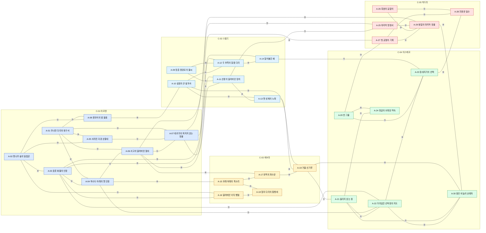

### 5.2 사건별 부분 그래프(4.1 표 중 양 끝이 모두 그 사건 참여 아크인 행만)

**E-01 균열의 확산 (The Spreading Rift)** — 노드 8 · 간선 8(CN-01, CN-02, CN-03, CN-18, CN-22, CN-24, CN-42, CN-43)

```mermaid
graph LR
    subgraph C01["C-01 아르텐"]
        A01["A-01 무너진 다리의 청구서"]
        A05["A-05 사라진 국경 순찰대"]
        A07["A-07 테르가의 꺼지지 않는 등불"]
        A08["A-08 윈모어의 밤 울음"]
    end
    subgraph C02["C-02 스벨드"]
        A10["A-10 설원의 큰 발자국"]
    end
    subgraph C04["C-04 이스메르"]
        A20["A-20 빈 그물"]
        A24["A-24 정글의 오래된 약속"]
    end
    subgraph C05["C-05 하드라"]
        A27["A-27 첫 균열의 기록"]
    end
    A01 ---|①| A08
    A01 ---|③| A05
    A01 ---|②| A07
    A05 ---|①| A07
    A07 ---|④| A27
    A08 ---|④| A10
    A20 ---|④| A24
    A20 ---|③| A27
    class A01,A05,A07,A08 c1;
    class A10 c2;
    class A20,A24 c4;
    class A27 c5;
    classDef c1 fill:#dbeafe,stroke:#1e40af,color:#111;
    classDef c2 fill:#e0f2fe,stroke:#0369a1,color:#111;
    classDef c3 fill:#fef3c7,stroke:#b45309,color:#111;
    classDef c4 fill:#dcfce7,stroke:#15803d,color:#111;
    classDef c5 fill:#fee2e2,stroke:#b91c1c,color:#111;
```

**E-02 세르낙 유산 쟁탈 (The Sernak Legacy)** — 노드 8 · 간선 9(CN-15, CN-16, CN-17, CN-19, CN-20, CN-21, CN-25, CN-31, CN-35)

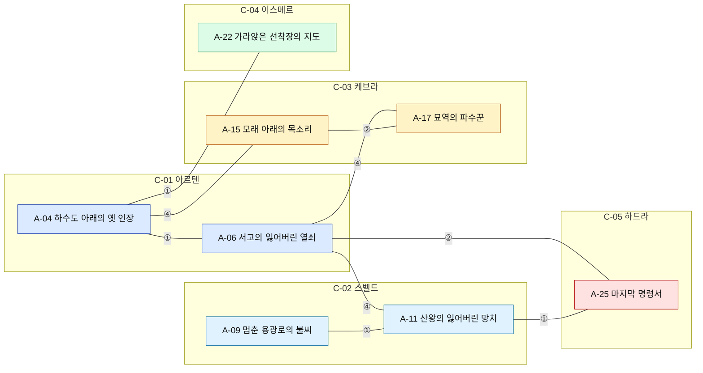

**E-03 대상단 항로 분쟁 (The Trade Route Dispute)** — 노드 9 · 간선 11(CN-07, CN-08, CN-11, CN-12, CN-13, CN-14, CN-32, CN-34, CN-37, CN-47, CN-49)

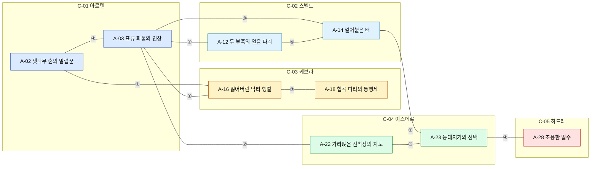

**E-04 고룡의 귀환 (Return of the Elder Dragon)** — 노드 8 · 간선 8(CN-23, CN-33, CN-38, CN-39, CN-40, CN-46, CN-52, CN-55)

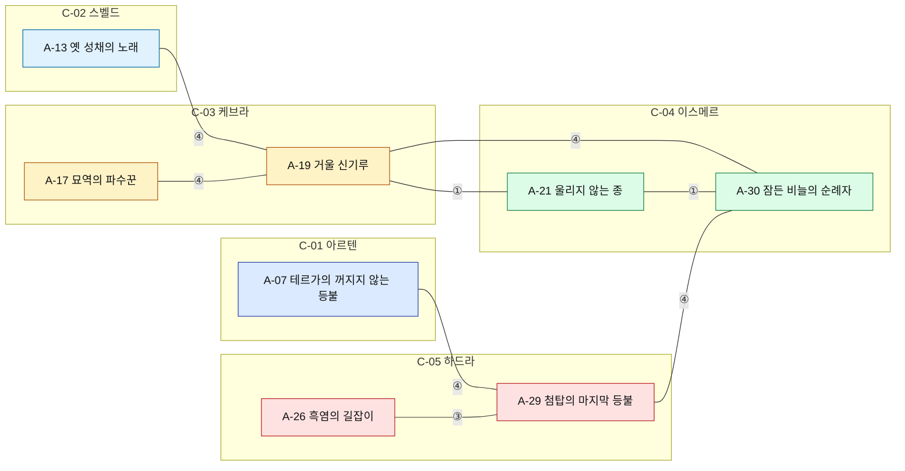

### 5.3 MVP 그래프(MVP 출시 아크 12개 사이의 연결만, D-59)

노드 12 · 간선 18(CN-01, CN-03, CN-04, CN-05, CN-06, CN-07, CN-10, CN-14, CN-15, CN-19, CN-24, CN-25, CN-26, CN-27, CN-28, CN-30, CN-56, CN-57)

```mermaid
graph LR
    subgraph C01["C-01 아르텐"]
        A01["A-01 무너진 다리의 청구서"]
        A02["A-02 잿나무 숲의 밀렵꾼"]
        A03["A-03 표류 화물의 인장"]
        A04["A-04 하수도 아래의 옛 인장"]
        A06["A-06 서고의 잃어버린 열쇠"]
        A07["A-07 테르가의 꺼지지 않는 등불"]
        A08["A-08 윈모어의 밤 울음"]
    end
    subgraph C02["C-02 스벨드"]
        A09["A-09 멈춘 용광로의 불씨"]
        A10["A-10 설원의 큰 발자국"]
        A11["A-11 산왕의 잃어버린 망치"]
        A12["A-12 두 부족의 얼음 다리"]
        A13["A-13 옛 성채의 노래"]
    end
    A01 ---|①| A08
    A01 ---|②| A07
    A01 ---|②| A04
    A01 ---|②| A06
    A02 ---|①| A08
    A02 ---|④| A03
    A03 ---|①| A04
    A03 ---|④| A12
    A04 ---|①| A06
    A06 ---|④| A11
    A08 ---|④| A10
    A09 ---|①| A11
    A09 ---|③| A12
    A10 ---|①| A12
    A10 ---|②| A13
    A11 ---|②| A13
    A06 ---|①| A07
    A07 ---|①| A11
    class A01,A02,A03,A04,A06,A07,A08 c1;
    class A09,A10,A11,A12,A13 c2;
    classDef c1 fill:#dbeafe,stroke:#1e40af,color:#111;
    classDef c2 fill:#e0f2fe,stroke:#0369a1,color:#111;
    classDef c3 fill:#fef3c7,stroke:#b45309,color:#111;
    classDef c4 fill:#dcfce7,stroke:#15803d,color:#111;
    classDef c5 fill:#fee2e2,stroke:#b91c1c,color:#111;
```

---

## 6. 대형 연결 사건 E-01~E-04

4개(4-정량 3+). 사건 진행은 **사건 기록**(참여 아크 1개 완료 = 기록 +1, FL-E1~E4)으로만 센다. 기록은 보상 단계(6.5)를 열 뿐 어떤 직업 · 지역 · 레벨 상한 · 등급의 조건도 아니다(D-15 (c)).

### 6.1 E-01 균열의 확산 (The Spreading Rift)

참여 아크 8개 · 대륙 4개(아르텐 · 스벨드 · 이스메르 · 하드라) · 결말 무대: 원점 학설 3개(H-41 · H-43 · H-29), 정답 없음. A-07(H-43) · A-20(H-29) · A-27(셋 중 택1)이 각자 결말

| 참여 아크 | 대륙 | 진입점(1장 무대) | 이 아크가 보는 사건의 시점 | 부분 보상(아크 완료 시) | 단계 |
|---|---|---|---|---|---|
| A-01 무너진 다리의 청구서 | 아르텐 | T-02 | 아르텐 변경: 늪에서 흘러온 균열 진흙(현상의 첫 목격) | 사건 기록 +1 · 사건 기록물 1편 | MVP |
| A-05 사라진 국경 순찰대 | 아르텐 | T-05 | 국경: 협곡 틈의 균열을 둘러싼 오해와 정치 | 사건 기록 +1 · 사건 기록물 1편 | 확장 3차 |
| A-07 테르가의 꺼지지 않는 등불 | 아르텐 | T-07 | 테르가: 심부 학설(H-43)의 관측 현장 | 사건 기록 +1 · 사건 기록물 1편 | MVP |
| A-08 윈모어의 밤 울음 | 아르텐 | T-02 또는 T-03(NPC 대화 장) | 목장: 균열 핵을 가진 진흙 골렘(생활 피해) | 사건 기록 +1 · 사건 기록물 1편 | MVP |
| A-10 설원의 큰 발자국 | 스벨드 | T-10 | 스벨드 설원: 변이 사슴(다른 대륙의 같은 현상) | 사건 기록 +1 · 사건 기록물 1편 | MVP |
| A-20 빈 그물 | 이스메르 | T-19 | 이스메르: 해저 학설(H-29)의 현장 | 사건 기록 +1 · 사건 기록물 1편 | 확장 2차 |
| A-24 정글의 오래된 약속 | 이스메르 | T-19(NPC 대화 장) | 정글: 균열이 바꾼 옛 약속의 땅 | 사건 기록 +1 · 사건 기록물 1편 | 확장 2차 |
| A-27 첫 균열의 기록 | 하드라 | T-28 | 하드라 등불 초소: 세 학설 비교, 정답 없음 | 사건 기록 +1 · 사건 기록물 1편 | 확장 4차 |

### 6.2 E-02 세르낙 유산 쟁탈 (The Sernak Legacy)

참여 아크 8개 · 대륙 5개(아르텐 · 스벨드 · 케브라 · 이스메르 · 하드라) · 결말 무대: 왕도 조각 4곳(H-08 HP-10 · H-24 HP-05 · H-31 HP-09 · H-40 HP-28). '진짜 왕도' 없음. 참여 아크 결말은 6.7 표의 8곳에 흩어짐

| 참여 아크 | 대륙 | 진입점(1장 무대) | 이 아크가 보는 사건의 시점 | 부분 보상(아크 완료 시) | 단계 |
|---|---|---|---|---|---|
| A-04 하수도 아래의 옛 인장 | 아르텐 | H-05(입문 구역 '입구 배수로') | 세이번 하수도: 세르낙 인장 체계 발견 | 사건 기록 +1 · 사건 기록물 1편 | MVP |
| A-06 서고의 잃어버린 열쇠 | 아르텐 | T-01 | 로엔: 서고 열쇠와 왕도 조각 H-08의 케슈 | 사건 기록 +1 · 사건 기록물 1편 | MVP |
| A-09 멈춘 용광로의 불씨 | 스벨드 | T-09 | 코르딘: 세르낙 결정맥과 용광로 | 사건 기록 +1 · 사건 기록물 1편 | MVP |
| A-11 산왕의 잃어버린 망치 | 스벨드 | T-09(NPC 대화 장) | 베르그홀: 세르낙 명장의 도안 쟁탈 | 사건 기록 +1 · 사건 기록물 1편 | MVP |
| A-15 모래 아래의 목소리 | 케브라 | T-15 | 나임: 세르낙 수로의 열쇠 | 사건 기록 +1 · 사건 기록물 1편 | 확장 1차 |
| A-17 묘역의 파수꾼 | 케브라 | T-14 또는 T-15(NPC 대화 장) | 자하르 묘역: 왕도 조각 H-24의 서기관 | 사건 기록 +1 · 사건 기록물 1편 | 확장 1차 |
| A-22 가라앉은 선착장의 지도 | 이스메르 | T-20 또는 T-19(NPC 대화 장) | 카이루: 왕도 조각 H-31의 항로 지도 | 사건 기록 +1 · 사건 기록물 1편 | 확장 2차 |
| A-25 마지막 명령서 | 하드라 | T-24 | 카르드: 왕도의 마지막 명령서(H-40 조망은 선택) | 사건 기록 +1 · 사건 기록물 1편 | 확장 4차 |

### 6.3 E-03 대상단 항로 분쟁 (The Trade Route Dispute)

참여 아크 9개 · 대륙 5개(아르텐 · 스벨드 · 케브라 · 이스메르 · 하드라) · 결말 무대: 항구 3곳(T-03 A-03 · T-16 A-16 · T-20 A-22)이 중심, 북쪽 끝 T-11 · T-12와 남쪽 끝 H-32 · T-27에도 각자의 결말이 있다. 광기 지역(H-40 · H-41)과 무관

| 참여 아크 | 대륙 | 진입점(1장 무대) | 이 아크가 보는 사건의 시점 | 부분 보상(아크 완료 시) | 단계 |
|---|---|---|---|---|---|
| A-02 잿나무 숲의 밀렵꾼 | 아르텐 | H-02(입문 구역 '벌목지') | 잿나무 숲: 항로로 팔려 나가는 밀렵 가죽 | 사건 기록 +1 · 사건 기록물 1편 | MVP |
| A-03 표류 화물의 인장 | 아르텐 | T-03 | 세이번: 표류 화물(분쟁의 첫 징조) | 사건 기록 +1 · 사건 기록물 1편 | MVP |
| A-12 두 부족의 얼음 다리 | 스벨드 | H-14(기슭 초소, 안전 구역) | 홀름벡: 끊긴 북방 자재 길 | 사건 기록 +1 · 사건 기록물 1편 | MVP |
| A-14 얼어붙은 배 | 스벨드 | T-10(NPC 대화 장) | 프로스텐: 결렬의 첫 피해 선박 | 사건 기록 +1 · 사건 기록물 1편 | 확장 3차 |
| A-16 잃어버린 낙타 행렬 | 케브라 | H-27(입문 구역 '모래언덕') | 사르케: 대상 행렬과 관세 | 사건 기록 +1 · 사건 기록물 1편 | 확장 1차 |
| A-18 협곡 다리의 통행세 | 케브라 | T-15(NPC 대화 장) | 라흐마: 다리 통행세 | 사건 기록 +1 · 사건 기록물 1편 | 확장 1차 |
| A-22 가라앉은 선착장의 지도 | 이스메르 | T-20 또는 T-19(NPC 대화 장) | 카이루: 항로 지도의 주인 | 사건 기록 +1 · 사건 기록물 1편 | 확장 2차 |
| A-23 등대지기의 선택 | 이스메르 | H-29(입문 구역 '얕은 물') | 폭풍 군도: 등대 통제권 | 사건 기록 +1 · 사건 기록물 1편 | 확장 2차 |
| A-28 조용한 밀수 | 하드라 | T-27 | 하엘: 결렬 뒤 남쪽 밀수 | 사건 기록 +1 · 사건 기록물 1편 | 확장 4차 |

### 6.4 E-04 고룡의 귀환 (Return of the Elder Dragon)

참여 아크 8개 · 대륙 5개(아르텐 · 스벨드 · 케브라 · 이스메르 · 하드라) · 결말 무대: 그림자 닻 4곳(H-42 A-13 · H-25 A-19 · H-34 A-30 · H-38/H-40 A-29) 각자 독립 결말

| 참여 아크 | 대륙 | 진입점(1장 무대) | 이 아크가 보는 사건의 시점 | 부분 보상(아크 완료 시) | 단계 |
|---|---|---|---|---|---|
| A-07 테르가의 꺼지지 않는 등불 | 아르텐 | T-07 | 테르가: G3 너머 닻의 떨림 관측 | 사건 기록 +1 · 사건 기록물 1편 | MVP |
| A-13 옛 성채의 노래 | 스벨드 | T-13 또는 T-09 · T-10(NPC 대화 장) | 스벨드 닻(H-42): 토르마의 노래 | 사건 기록 +1 · 사건 기록물 1편 | MVP |
| A-17 묘역의 파수꾼 | 케브라 | T-14 또는 T-15(NPC 대화 장) | 묘역: 서기관 명령문 속 뒤척임 | 사건 기록 +1 · 사건 기록물 1편 | 확장 1차 |
| A-19 거울 신기루 | 케브라 | T-18 또는 T-15(NPC 대화 장) | 케브라 닻(H-25): 신기루 속 그림자 | 사건 기록 +1 · 사건 기록물 1편 | 확장 1차 |
| A-21 울리지 않는 종 | 이스메르 | T-21 | 안세: 교단과 사원의 종 | 사건 기록 +1 · 사건 기록물 1편 | 확장 2차 |
| A-26 흑염의 길잡이 | 하드라 | T-26 또는 T-24(NPC 대화 장) | 흑염 평원: 닻 주변의 유목 충돌 | 사건 기록 +1 · 사건 기록물 1편 | 확장 4차 |
| A-29 첨탑의 마지막 등불 | 하드라 | T-25 | 하드라 닻(H-40): 첨탑 채굴 | 사건 기록 +1 · 사건 기록물 1편 | 확장 4차 |
| A-30 잠든 비늘의 순례자 | 이스메르 · 하드라 | T-21 | 이스메르 닻(H-34): 순례의 끝 | 사건 기록 +1 · 사건 기록물 1편 | 확장 2차 |

### 6.5 사건 기록 보상(부분 진행 = 진행분만큼, D-15 (b))

사건 기록은 참여 아크 하나를 끝낼 때마다 +1(결말 무관). 아래 보상은 **외형 · 칭호 · 기록물 · 인장**뿐이며 전투 수치 · 해금과 무관하다. 4개 사건 모두 같은 표를 쓴다.

| 사건 기록 | 보상 | 성격 |
|---|---|---|
| 1 | 사건 연표 1장(기록물) · 인장 +10 | 맥락 |
| 2 | 사건 지도 외형(세계 지도 위 사건 표식) · 인장 +10 | 수집 |
| 4 | 칭호 '<사건명>의 목격자' · 인장 +20 | 자랑 |
| 6 | 외형 장식 1(사건별 다름) · 인장 +20 | 자랑 |
| 참여 아크 전부 | 칭호 '<사건명>의 기록자' · 사건 연표 완본 | 탐험 랭킹(09) 가산 항목 |

세계 진행도(FL-U1~U4)는 전 유저의 사건 기록 합을 유니버스 단위로 집계해 **세계 소식판**에만 표시한다(예: "이번 주 균열 관측 기록 1,240건"). 게임 규칙 · 보상 · 지형을 바꾸지 않는다(구현 11, 03 2.5 동기화 원칙).

### 6.6 D-15 가드레일 검증표

| # | 가드레일 | E-01 | E-02 | E-03 | E-04 | 판정 |
|---|---|---|---|---|---|---|
| (a) | 진입점 = 참여 아크 전부, 순서 무관 | 진입점 8 = 참여 8 | 진입점 8 = 참여 8 | 진입점 9 = 참여 9 | 진입점 8 = 참여 8 | ✔ 모든 참여 아크의 시작 조건에 다른 아크 · 사건 조건 없음(3.1) |
| (b) | 부분 진행만큼 보상 | 아크 8개 × 기록 +1 | 아크 8개 × 기록 +1 | 아크 9개 × 기록 +1 | 아크 8개 × 기록 +1 | ✔ 6.5 표가 기록 1부터 보상 |
| (c) | 사건 완료가 직업 · 지역 · 레벨 상한 · 등급 개방의 조건이 아님 | 0건 | 0건 | 0건 | 0건 | ✔ 03 · 04 · 05 · 06 해금 조건에 E- 없음. 히든 직업 조건은 개별 아크(A-06 · A-07 · A-11 · A-17 · A-21 · A-29) 완료이며 사건 완료가 아니다 |
| (d) | 단일 최종 사건 · 최종 보스로 합쳐지지 않음(RB- 1:1 금지) | 결말 무대 8곳 | 결말 무대 8곳 | 결말 무대 9곳 | 결말 무대 8곳 | ✔ 사건마다 결말이 참여 아크별로 흩어짐. 07은 사건 보상에 레이드 보스(RB-)를 쓰지 않고, 08은 사건 1개 ↔ 레이드 보스 1개 대응을 만들지 않는다(15장 #8) |
| (e) | C-05 하드라는 종착지가 아니라 여러 입구 중 하나 | 하드라 1 / 다른 대륙 7 | 하드라 1 / 다른 대륙 7 | 하드라 1 / 다른 대륙 8 | 하드라 3 / 다른 대륙 5 | ✔ 하드라 아크와 다른 대륙 아크 사이 연결 9개(양방향). 어느 사건이든 하드라 아크를 거치지 않고 기록을 (참여 수 − 하드라 아크 수)까지 모을 수 있고, 하드라 아크도 다른 대륙 아크 없이 시작된다 |
| 보조 | 참여 아크 3개 이상 · 3대륙 이상 | 8아크 · 4대륙 | 8아크 · 5대륙 | 9아크 · 5대륙 | 8아크 · 5대륙 | ✔ |
| 보조 | 사건 하위 그래프가 한 덩어리이고 그물형(사이클 있음) | 연결 · 간선 8 ≥ 노드 8 | 연결 · 간선 9 ≥ 노드 8 | 연결 · 간선 11 ≥ 노드 9 | 연결 · 간선 8 ≥ 노드 8 | ✔ 5.2 그래프 |

### 6.7 결말 무대 분산 검산(D-32)

| 사건 | 참여 아크 최종 장 무대(서로 다른 곳) | H-40 · H-41이 단독 결말 무대인가 |
|---|---|---|
| E-01 | H-07 · H-17 · H-30 · T-02 · T-06 · T-07 · T-19 · T-28 | 아니오 |
| E-02 | H-05 · H-11 · H-24 · H-26 · H-37 · T-08 · T-09 · T-20 | 아니오 |
| E-03 | H-02 · H-32 · T-03 · T-11 · T-12 · T-16 · T-17 · T-20 · T-27 | 아니오 |
| E-04 | H-24 · H-25 · H-34 · H-38 · H-39 · H-42 · T-07 · T-21 | 아니오 |

- 30개 아크의 최종 장 무대 중 H-40 · H-41: **0곳**. A-25 · A-29 · A-30의 H-40은 선택 조망 · 에필로그이고, A-27 5장의 H-41은 외곽 야영지(광기 지역 밖)다. E-01 원점은 학설 3개로 남는다(03 3.2). E-02 왕도 조각 4곳은 히든 피스 HP-10 · HP-05 · HP-09 · HP-28로 따로 열린다.

### 6.8 출시 단계별 사건 개방(02 11장 누적 1 → 2 → 3 → 3 → 4)

사건 개방 = 세계 소식판 표시와 사건 기록 보상(6.5)이 켜지는 시점. 개방 전에도 참여 아크는 독립 아크로 진행되고, 개방 시 이미 끝낸 아크는 기록으로 소급한다.

| 사건 | 개방 단계 | 개방 시 출시된 참여 아크 | 대륙 수 | 비고 |
|---|---|---|---|---|
| E-01 균열의 확산 | 확장 2차 | A-01, A-07, A-08, A-10, A-20, A-24 | 3 |  |
| E-02 세르낙 유산 쟁탈 | MVP | A-04, A-06, A-09, A-11 | 2 | **MVP 부분 개방(2대륙, D-59)**: D-15의 3대륙 조건은 확장 1차부터 충족(15장 #2) |
| E-03 대상단 항로 분쟁 | 확장 1차 | A-02, A-03, A-12, A-16, A-18 | 3 |  |
| E-04 고룡의 귀환 | 확장 4차 | A-07, A-13, A-17, A-19, A-21, A-26, A-29, A-30 | 5 | 참여 아크는 확장 1차부터 3대륙에 걸치지만, 하드라 닻 아크(A-26 · A-29)와 함께 개방(02 11장 일정). 그 전에는 독립 아크로 진행 |

---

## 7. 세계 상태 플래그

개인 단위가 기본이다. 한 유저의 결말이 다른 유저의 세계를 바꾸지 않는다(같은 서버의 두 유저가 서로 다른 FL-03 값을 가질 수 있음). 유니버스 단위는 사건 세계 진행도 4개뿐이며 세계 소식판 표시 전용이다. 저장 · 동기화 방식은 11(14장 힌트).

| 플래그 ID | 이름 | 종류 | 설정 아크 · 히든 피스 | 읽는 곳 | 값 | 단위 |
|---|---|---|---|---|---|---|
| FL-01 | 국경 긴장도(카엘룬-브렌마르) | 결과 | A-01, A-02, A-05 | A-05, A-07 | 정수 −2~+2(초기 0) | 개인 |
| FL-02 | 순찰대의 진실 | 결과 | A-05 | A-07 | 미정/브렌마르/균열/비공개 | 개인 |
| FL-03 | 코르딘 심층 갱도 | 결과 | A-09 | A-12, A-11 | 미정/확장/정제 | 개인 |
| FL-04 | 얼음 다리 수리 주체 | 결과 | A-12 | A-14 | 미정/카르니스/이스텔/공동 | 개인 |
| FL-05 | 얼음항의 배 | 결과 | A-14 | A-03, A-23 | 미정/출항/월동 | 개인 |
| FL-06 | 수로 열쇠 | 결과 | A-15 | A-18, A-17 | 미정/관리청/열쇠지기 | 개인 |
| FL-07 | 낙타 짐의 행방 | 결과 | A-16 | A-18 | 미정/탈라/브렌마르 | 개인 |
| FL-08 | 테르가 학설 | 결과 | A-07 | A-27 | 미정/H-43/H-41 | 개인 |
| FL-09 | 토모 결말 | 결과 | A-20 | A-27 | 미정/H-29/이동 | 개인 |
| FL-10 | 균열 원점 학설 기록 | 결과 | A-27 | A-07 · A-20 재방문 대사 | 미정/H-41/H-43/H-29 | 개인 |
| FL-11 | 항로 지도 소유 | 결과 | A-22 | A-23 | 미정/루카이/열쇠지기 | 개인 |
| FL-12 | 등대 결말 | 결과 | A-23 | A-28 | 미정/등대/마을 | 개인 |
| FL-13 | 흑염 길 | 결과 | A-26 | A-29 | 미정/구르한/에스카 | 개인 |
| FL-14 | 스벨드 닻(H-42) | 결과 | A-13 | A-19 · A-30 · A-29 대사 | 미정/재움/기록 | 개인 |
| FL-15 | 케브라 닻(H-25) | 결과 | A-19 | A-13 · A-30 · A-29 대사 | 미정/재움/관측 | 개인 |
| FL-16 | 이스메르 닻(H-34) | 결과 | A-30 | A-13 · A-19 · A-29 대사 | 미정/재움/깨움 | 개인 |
| FL-17 | 하드라 닻(H-40) | 결과 | A-29 | A-13 · A-19 · A-30 대사 | 미정/재움/관측 | 개인 |
| FL-18 | 서기관의 운명 | 결과 | A-17 | A-19 | 미정/안식/기록 | 개인 |
| FL-19 | 대사제 | 결과 | A-21 | A-30 | 미정/타협/교단 | 개인 |
| FL-20 | 명령서 행방 | 결과 | A-25 | A-29 | 미정/에스카/열쇠지기 | 개인 |
| FL-21 | 산왕 도안 행방 | 결과 | A-11 | A-25 | 미정/카르니스/열쇠지기/에스카 | 개인 |
| FL-22 | 인장 탁본 행방 | 결과 | A-04 | A-06, A-22 | 미정/열쇠지기/의회 | 개인 |
| FL-31 | 균열 진흙 표본 | 사물 | A-01(4장) | A-07 | 보유 여부(bool) | 개인 |
| FL-32 | 다리 기둥 인장 탁본 | 사물 | A-01(2장) · HP-11 | A-04, A-06, HP-10, HP-17, HP-39 | bool | 개인 |
| FL-33 | 항로 지도 조각(세이번) | 사물 | A-03(4장) | A-22, HP-09 | bool | 개인 |
| FL-34 | 세르낙 인장 해독표 | 사물 | A-06(3장) | A-25, HP-17 | bool | 개인 |
| FL-35 | 거대 비늘 조각 | 사물 | A-10(3장) · HP-13 | A-13, A-19, HP-02 | bool | 개인 |
| FL-36 | 산왕 도안 사본 | 사물 | A-11(6장) | A-13, HP-30 | bool | 개인 |
| FL-37 | 수로 관리청 옛 직책 목록 | 사물 | A-15(4장) | A-17 | bool | 개인 |
| FL-38 | 고래뼈 표식 지도 | 사물 | A-22(5장) | A-30, HP-31 | bool | 개인 |
| FL-39 | 마지막 명령서 사본 | 사물 | A-25(5장) | A-29 | bool | 개인 |
| FL-40 | 균열 관측 기록 사본 | 사물 | A-27(3장) | A-29, HP-32 | bool | 개인 |
| FL-41 | 밀렵 가죽 선적표 | 사물 | A-02(3장) | A-03 | bool | 개인 |
| FL-E1 | E-01 사건 기록 수 | 사건 | E-01 참여 아크 완료 | 사건 기록 보상(6.5) | 0~8 | 개인 |
| FL-E2 | E-02 사건 기록 수 | 사건 | E-02 참여 아크 완료 | 사건 기록 보상 | 0~8 | 개인 |
| FL-E3 | E-03 사건 기록 수 | 사건 | E-03 참여 아크 완료 | 사건 기록 보상 | 0~9 | 개인 |
| FL-E4 | E-04 사건 기록 수 | 사건 | E-04 참여 아크 완료 | 사건 기록 보상 | 0~8 | 개인 |
| FL-U1 | E-01 세계 진행도 | 사건 | 전 유저의 E-01 참여 아크 완료 합 | 세계 소식판 표시만 | 누적 정수(주 단위 구간 표시) | 유니버스 |
| FL-U2 | E-02 세계 진행도 | 사건 | 전 유저 E-02 완료 합 | 세계 소식판 표시만 | 누적 정수 | 유니버스 |
| FL-U3 | E-03 세계 진행도 | 사건 | 전 유저 E-03 완료 합 | 세계 소식판 표시만 | 누적 정수 | 유니버스 |
| FL-U4 | E-04 세계 진행도 | 사건 | 전 유저 E-04 완료 합 | 세계 소식판 표시만 | 누적 정수 | 유니버스 |

- 집계: 결과 22 · 사물 11 · 사건 8 = 41개. 개인 37 · 유니버스 4. ③ 결과 연결 9개는 전부 결과 플래그로, ② 사물 연결 12개는 전부 사물 플래그로 구현된다.
- 사물 플래그는 인벤토리 아이템이 아니라 **단서 노트 항목**(무게 0, 거래 불가, 버릴 수 없음)이다. 06 IT- 번호를 쓰지 않는다(15장 #6).
- 플래그를 읽는 아크는 값이 '미정'일 때 기본 대사로 진행한다. 어떤 플래그도 장 진입을 막지 않는다(2.2 #2).

---

## 8. 시작 위치별 도달 아크

'자연스럽게 닿는다' = (a) 첫 갈림길 표지판(03 7.1) (b) 시작 도시 안 NPC가 1장을 대화 장으로 여는 경우 (c) 반경 사냥터(성문 도보 90초 이내, D-28) 안의 아크 무대 · 진입 물품. 셋 중 하나로 그 아크 1장을 시작할 수 있으면 센다. (b)는 시작 도시가 그 아크 1장의 대화 장 무대(3.4)인 경우만 센다. 03 11.1 목록에 (b) · (c) 경로를 더했다. '레벨 1~15 완주 가능' = 도달 아크 중 완주 레벨 ≤ 22인 아크(3.5, D-62 (2): 시작 위치마다 2+).

| SP | 시작 도시 | 단계 | 도달 아크(경로) | 설계 기준 수 | 그 SP 개방 단계에서 출시된 수 | MVP 단계 수 | 레벨 1~15 완주 가능(설계 / 개방 단계) |
|---|---|---|---|---|---|---|---|
| SP-01 | T-02 해든 마을 | MVP | A-01 무너진 다리의 청구서 — 첫 아크(0장 · 표지판 방향 1)<br>A-02 잿나무 숲의 밀렵꾼 — 표지판 방향 3 ✔ H-02 입문 구역 75초<br>A-08 윈모어의 밤 울음 — 표지판 방향 3 ✔↑ T-02 안 NP-14 대화 장<br>A-05 사라진 국경 순찰대 — 반경 H-03(85초) 버려진 순찰 깃발 (확장 3차) | **4** | 3 | 3 | **4** (A-01 · A-02 · A-08 · A-05) / 3 |
| SP-02 | T-03 세이번 | MVP | A-03 표류 화물의 인장 — 첫 아크(0장 · 표지판 방향 1)<br>A-04 하수도 아래의 옛 인장 — 표지판 방향 3 ✔ H-05 입구(도시 안)<br>A-08 윈모어의 밤 울음 — 표지판 방향 3 ✔↑ T-03 안 NP-12 대화 장<br>A-02 잿나무 숲의 밀렵꾼 — 표지판 방향 2 H-02 숲 안 입구(70초) | **4** | 4 | 4 | **4** (A-03 · A-04 · A-08 · A-02) / 4 |
| SP-03 | T-09 코르딘 | MVP | A-09 멈춘 용광로의 불씨 — 첫 아크(0장 · 표지판 방향 1)<br>A-11 산왕의 잃어버린 망치 — 표지판 방향 3 ✔↑ T-09 안 NP-16 대화 장<br>A-12 두 부족의 얼음 다리 — 표지판 방향 3 ✔ H-14 기슭 초소 80초<br>A-13 옛 성채의 노래 — 시작 도시 NPC: T-09 노래꾼(NP-20, 상시 상주) 대화 장 = Q-A13-1 대체 무대 | **4** | 4 | 4 | **2** (A-09 · A-12) / 2 |
| SP-04 | T-10 스케른 | MVP | A-10 설원의 큰 발자국 — 첫 아크(0장 · 표지판 방향 1)<br>A-12 두 부족의 얼음 다리 — 표지판 방향 3 ✔ H-14 기슭 초소 85초<br>A-14 얼어붙은 배 — 표지판 방향 3 ✔↑ T-10 안 NP-21 대화 장 (확장 3차)<br>A-13 옛 성채의 노래 — 시작 도시 NPC: T-10 노래꾼(NP-20, 상시 상주) 대화 장 = Q-A13-1 대체 무대 | **4** | 3 | 3 | **3** (A-10 · A-12 · A-14) / 2 |
| SP-05 | T-15 나임 | 확장 1차 | A-15 모래 아래의 목소리 — 첫 아크(0장 · 표지판 방향 1)<br>A-16 잃어버린 낙타 행렬 — 표지판 방향 3 ✔ H-27 입문 구역 70초<br>A-18 협곡 다리의 통행세 — 표지판 방향 3 ✔↑ T-15 안 NP-22 대화 장<br>A-17 묘역의 파수꾼 — 시작 도시 NPC: T-15 수로 관리인(NP-05) 대화 장 = Q-A17-1 대체 무대<br>A-19 거울 신기루 — 시작 도시 NPC: T-15 엘바르 순례 안내인(NP-38) 대화 장 = Q-A19-1 대체 무대 | **5** | 5 | — | **3** (A-15 · A-16 · A-18) / 3 |
| SP-06 | T-19 토모 섬 | 확장 2차 | A-20 빈 그물 — 첫 아크(0장 · 표지판 방향 1)<br>A-23 등대지기의 선택 — 표지판 방향 3 ✔ H-29 입문 구역 나룻배 60초<br>A-24 정글의 오래된 약속 — 표지판 방향 3 ✔↑ T-19 안 NP-29 대화 장<br>A-22 가라앉은 선착장의 지도 — 시작 도시 NPC: T-19 표류물 수집가(NP-40) 대화 장 = Q-A22-1 대체 무대 | **4** | 4 | — | **2** (A-20 · A-24) / 2 |
| SP-07 | T-24 카르드 | 확장 4차 | A-25 마지막 명령서 — 첫 아크(0장 · 표지판 방향 1)<br>A-28 조용한 밀수 — 표지판 방향 3 ✔ T-27(정기 수레 60초)<br>A-27 첫 균열의 기록 — 표지판 방향 3 ✔ T-28(110초)<br>A-26 흑염의 길잡이 — 시작 도시 NPC: T-24 구르한 길잡이(NP-31) 대화 장 = Q-A26-1 대체 무대<br>A-29 첨탑의 마지막 등불 — 반경 H-38(90초) · 초소장 NP-07 대사<br>A-07 테르가의 꺼지지 않는 등불 — 표지판 방향 3 G3 → T-07 도착(테르가 초소 = A-07 1장) | **6** | 6 | — | **2** (A-28 · A-27) / 2 |

| 검산 | 값 |
|---|---|
| 설계 기준 최소 | 4 (전부 3+) |
| 각 SP 개방 단계 최소 | 3 |
| MVP(SP-01~04) 최소 | 3 |
| 레벨 1~15 완주 가능 최소(설계 / 각 SP 개방 단계) | 2 / 2 (전부 2+, D-62 (2)) |
| 첫 갈림길 방향 3 ✔ 아크 1장 무대 | 03 7.1 그대로(A-02 H-02 입문 · A-08↑ · A-04 H-05 입문 · A-11↑ · A-12 초소 · A-14↑ · A-16 H-27 입문 · A-18↑ · A-23 H-29 입문 · A-24↑ · A-28 T-27 · A-27 T-28). 3.2에서 이 아크들의 1장 위험도가 전부 '안전' 또는 '1(입문)'인지 확인 |
| 다른 대륙 아크에 닿는 시작 위치 | SP-07(G3 → A-07). 나머지는 갈림길 문 · 항로 첫 통과 후(AS-10) |

- D-59로 A-04 · A-07이 MVP에 들어가 SP-02 표지판 방향 3의 ✔ 2개(A-04 H-05 입문 구역 · A-08↑)가 MVP부터 모두 작동한다. 하수도 벽 문양(이상한 흔적)은 MVP부터 A-04 시작 물품이자 HP-01 단서 1이다. MVP 단계 SP별 도달 수는 위 표 'MVP 단계 수' 열(13.2와 같은 값).
- **SP-04 MVP 근거**(D-62 (10)): A-10(첫 아크) · A-12(H-14 기슭 초소) · **A-13 = T-10 노래꾼 NP-20 대화 장(Q-A13-1 대체 무대, 3.4)**. NP-20은 T-13 · T-09 · T-10에 상시 동시 상주하므로(9장 머리말) 진입점이 시간에 따라 사라지지 않는다. SP-03의 A-13도 같은 NPC(T-09)다. A-14(T-10 NP-21)는 확장 3차부터 더해진다.

---

## 9. 주요 NPC

이야기 NPC 44명. 2개 이상 아크에 나오는 NPC가 ① 인물 연결의 축이다. 종족 · 세력은 03 색인. 케슈(RC-08)는 비플레이어블 종족의 말하는 개체, 전령 7호는 세르낙 자동인형(종족 아님).

**다중 위치 NPC 규칙(D-62 (10))**: '위치' 열에 2곳 이상이 적힌 NPC는 **표기한 모든 위치에 상시 동시 상주**한다(일정 이동 없음). 같은 NPC 데이터를 여러 곳에 두며, 위치마다 대사는 그 캐릭터의 개인 진행(아크 · 플래그 · 히든 피스)에 따라서만 달라진다. 숨은 NPC(HP- 발견형)는 그 히든 피스를 끝낸 캐릭터에게만 보인다(NP-11 · NP-24 · NP-35 · NP-36 · NP-37).

| NP ID | 이름(영문) | 종족 | 세력 | 위치 | 관련 아크 | 역할 |
|---|---|---|---|---|---|---|
| NP-01 | 엘마 듀르 (Elma Dure) | RC-01 | F-01 | T-02 | A-01 | 해든 촌장. 0장 부탁, HP-11 단서 대사 |
| NP-02 | 페릭 솔 (Perrick Sol) | RC-01 | F-02 | T-03 | A-03, A-04 | 세이번 항만 서기. 0장 부탁, HP-01 단서 대사 |
| NP-03 | 그웬 하르트 (Gwen Harth) | RC-02 | F-13 | T-09 | A-09, A-11 | 모루 형제단 장인. 0장 부탁, J-H2 단서 "산왕의 망치는 둘이었다" |
| NP-04 | 우르사 벡 (Ursa Beck) | RC-04 | F-04 | T-10 | A-10, A-12 | 스케른 사냥대장. 0장 부탁, HP-13 · HP-46 단서 |
| NP-05 | 나디르 셈 (Nadir Sem) | RC-05 | F-05 | T-15 | A-15, A-17 | 나임 수로 관리인. 0장 부탁, A-17 1장 대화 장(T-15), J-H3 단서 |
| NP-06 | 렐리 무안 (Relli Muan) | RC-03 | F-07 | T-19 | A-20, A-23 | 토모 어촌장. 0장 부탁, HP-15 단서 |
| NP-07 | 오스윈 칼데 (Oswin Calde) | RC-01 | F-09 | T-24 | A-25, A-29 | 카르드 초소장. 0장 부탁, J-H5 단서, HP-21 단서 |
| NP-08 | 세스 오르 (Seth Orr) | RC-01 | F-12 | T-03 · T-01 · T-08 · T-20 · T-24 | A-04, A-06, A-11, A-22, A-25 | 떠돌이 열쇠지기 수집가. 대륙을 오가는 인물 연결의 축 |
| NP-09 | 이델 마흐 (Idel Mah) | RC-05 | F-11 | T-07 | A-07 | 테르가 회색 등불 관측원. J-H6 단서, SK-V02 전수 |
| NP-10 | 쿠엔 래 (Quen Rae) | RC-03 | F-01 | T-01 | A-06 | 왕립 서고 사서. J-H1 단서 "열쇠 없는 책장" |
| NP-11 | 아흐텔 (Ah-Tel) | RC-08 | —(중립) | H-08 안쪽(HP-17 완료 캐릭터에게만 표시) | A-06, A-07 | 말하는 케슈 기록관(04 9.2 시나리오 B의 이야기 NPC). HP-17로 발견. HP-17 미완료 캐릭터는 A-06 · A-07에서 그의 흔적(기록물 '케슈 기록관 메모' · '증언')만 본다(CN-56) |
| NP-12 | 도르카 펜 (Dorka Fenn) | RC-01 | F-02 | T-03 · T-06 · T-16 | A-02, A-08, A-16 | 브렌마르 가죽 상인. 아르텐과 케브라를 잇는 인물 |
| NP-13 | 카샤 룬델 (Kasha Rundel) | RC-04 | F-01 | H-02 숲지기 오두막 | A-02 | 바르쿤 사냥꾼 |
| NP-14 | 히버트 노 (Hibbert Noe) | RC-01 | F-01 | T-06 · T-02 | A-08, A-01 | 윈모어 목부. A-08 1장 대화 장(T-02) |
| NP-15 | 레나 톨렌 (Lena Tollen) | RC-01 | F-01 | T-05 · T-07 | A-05, A-07 | 카엘룬 순찰대장 |
| NP-16 | 핍 가로 (Pip Garro) | RC-02 | F-13 | T-09 · T-08 | A-11, A-09 | 형제단 전령. A-11 1장 대화 장(T-09) |
| NP-17 | 도른 하임 (Dorn Haim) | RC-02 | F-03 | T-08 | A-11 | 카르니스 장인 평의원 |
| NP-18 | 세리스 발 (Seris Vahl) | RC-05 | F-09 | T-08 · T-07 · T-24 · T-25 | A-11, A-07, A-25 | 에스카 사절. 세 대륙에 나오는 인물 |
| NP-19 | 아일라 토른 (Aila Thorn) | RC-04 | F-04 | T-11 | A-12, A-10 | 이스텔 부족장 |
| NP-20 | 오말 (Omal) | RC-06 | F-03 | T-13 · T-09 · T-10 | A-13 | 토르마 노래꾼. A-13 1장 대화 장(세 곳 모두, Q-A13-1 대체 무대), HP-02 단서 |
| NP-21 | 야노 크릴 (Jano Krill) | RC-01 | F-07 | T-10 · T-12 · T-23 | A-14, A-23 | 루카이 선원. A-14 1장 대화 장(T-10) |
| NP-22 | 하심 룩 (Hasim Rook) | RC-04 | F-06 | T-15 · T-17 | A-18 | 라흐마 통행세 징수원. A-18 1장 대화 장(T-15) |
| NP-23 | 마렉 텐 (Marek Ten) | RC-01 | F-06 | T-16 · T-03 | A-03, A-16 | 탈라 대상. HP-14 단서 |
| NP-24 | 우르네 (Ur-Ne) | RC-08 | —(중립) | H-24 | A-17 | 묘역의 말하는 케슈 필경. HP-20으로 발견 |
| NP-25 | 자파 엘 (Jafa El) | RC-05 | F-12 | T-14 | A-15 | 열쇠지기 접선책(자하르). HP-18 진입점 |
| NP-26 | 느와 펠 (Nwa Fel) | RC-03 | F-12 | T-21 | A-21, A-22 | 열쇠지기 접선책(안세). HP-18 진입점 |
| NP-27 | 수엔 (Suen) | RC-05 | F-08 | T-22 | A-21, A-24 | 벨로스 순례자. J-H4 단서 "종이 울리지 않는다" |
| NP-28 | 고드 하윈 (Gord Hawin) | RC-01 | F-07 | H-32 등대 | A-23 | 등대지기. HP-22 단서 |
| NP-29 | 토카 (Toka) | RC-04 | F-08 | T-19 · T-22 | A-24 | 바르쿤 정글 길잡이. A-24 1장 대화 장(T-19), HP-51 단서 |
| NP-30 | 에윈 사우 (Ewin Sau) | RC-03 | F-14 | T-21 · T-18 · T-13 | A-19, A-21, A-30, A-13 | 잠든 비늘 순례 사제. E-04 네 닻을 오가는 인물 |
| NP-31 | 하르간 (Hargan) | RC-06 | F-10 | T-26 · T-24 · T-27 | A-26, A-28 | 구르한 길잡이. A-26 1장 대화 장(T-26 · T-24, Q-A26-1 대체 무대) |
| NP-32 | 네리 오크 (Neri Oak) | RC-04 | F-07 | T-27 | A-28 | 하엘 밀수선 선장. HP-16 단서 |
| NP-33 | 아스텔 크로 (Astel Crowe) | RC-01 | F-11 | T-28 | A-27, A-28 | 회색 등불 학자. HP-53 단서 |
| NP-34 | 벨라 수르 (Vela Sur) | RC-05 | F-09 | T-25 | A-29 | 오르멘 첨탑 등록관. J-H5 · HP-32 단서 |
| NP-35 | 해스크 (Hask) | RC-02 | F-13 | H-14 능선 동굴 | A-11, A-12 | 눈 속의 은둔 장인. HP-19로 발견 |
| NP-36 | 오렌 (Oren) | RC-01 | —(중립) | H-32 섬 3곳 중 1(개인 시드) | A-23, A-14 | 폭풍 군도 표류 은자. HP-22로 발견 |
| NP-37 | 전령 7호 (Herald No.7) | —(세르낙 자동인형) | —(중립) | T-24 안뜰 | A-25, A-29 | 멈춘 세르낙 전령 자동인형. HP-21로 깨움 |
| NP-38 | 사디아 렌 (Sadia Ren) | RC-05 | F-05 | T-18 · T-15 | A-19 | 엘바르 순례 안내인. A-19 1장 대화 장(T-15, Q-A19-1 대체 무대) |
| NP-39 | 오브 칼린 (Ob Kallin) | RC-01 | F-07 | T-20 | A-22 | 카이루 지도 상인. A-22 1장(T-20) |
| NP-40 | 미루 탄 (Miru Tan) | RC-04 | F-07 | T-19 | A-22 | 토모 표류물 수집가. A-22 1장 대화 장(T-19, Q-A22-1 대체 무대) |
| NP-41 | 자흐라 미엔 (Zahra Mien) | RC-01 | F-05 | T-14 | A-17 | 자하르 묘역 관리인. A-17 1장(T-14 관리 사무소), HP-20 단서 1 |
| NP-42 | 보른 하텔 (Born Hatel) | RC-02 | F-07 | H-31 잠수종 야영지 | A-22 | 잠수종 사공. A-22 2장 안내, HP-43 단서 2 |
| NP-43 | 레크 마일 (Rek Mile) | RC-04 | F-01 | H-07 나룻배 야영지 | A-05, A-07 | 은빛 강 나룻배 사공. HP-47 단서 1 |
| NP-44 | 닐라 포스 (Nila Foss) | RC-04 | F-04 | T-29 | A-12 | 요르나 낚시꾼. HP-52 단서 1 |

- 2개 이상 아크에 나오는 NPC: 25명. 2개 이상 대륙에 나오는 NPC: 6명(NP-08 · NP-12 · NP-18 · NP-21 · NP-23 · NP-30).
- 0장 부탁 NPC 7명(NP-01~07)은 시작 위치마다 1명. 고향 종족(D-08)이면 첫 대사 1줄이 바뀐다.

---

## 10. 히든 피스

### 10.1 히든 피스 표 A — 분류 · 위치 · 연결(HP-01~HP-53)

주 분류로 센다. 보조 분류는 겹치는 성격(예: 숨은 지역이 히든 직업의 궁극 각성 홈을 연다). 유형: 일반(전원 획득형) / 일반(수량형 = 한정 장비, 06 14.2) / 선착형(유니버스 최초 1인 · 1길드, 한정 장비 관련만). 시드 = 개인 시드(캐릭터마다 다른 조건) 또는 시즌 시드(유니버스 공통, 선착형만, 11.3). 반복: **히든 피스 완료(경험치 · 인장 · 기록)는 캐릭터당 1회**, 한정 장비 획득 시도는 별도(11.5, D-62 (6)).

| HP ID | 이름(영문) | 주 분류 | 보조 분류 | 대륙 | 위치 | 연결 아크 | 유형 | 반복 | 시드(개인 / 시즌) | 단계 | MVP 선정 |
|---|---|---|---|---|---|---|---|---|---|---|---|
| HP-01 | 인장 수로 (Seal Channel) | 숨은 지역 | — | 아르텐 | H-05 | A-04, A-03 | 일반 | 1회(구역 재입장 가능) | — | MVP | ✔ |
| HP-02 | 노래의 방 (Hall of the Song) | 숨은 지역 | 스킬(SK-V07 Lv3 각성) | 스벨드 | H-16 | A-13, A-10 | 일반 | 1회 | 소절 순서 | MVP |  |
| HP-03 | 서고 맨 아래 칸 (The Lowest Shelf) | 숨은 지역 | 직업(J-H1 궁극 각성 홈) | 아르텐 | H-11 | A-06 | 일반 | 1회 | — | MVP | ✔ |
| HP-04 | 꺼진 둘째 화로 (The Second Hearth) | 숨은 지역 | 직업(J-H2 궁극 각성 홈) | 스벨드 | H-19 | A-11 | 일반 | 1회 | — | MVP | ✔ |
| HP-05 | 세르낙 묘역 하층 (Lower Necropolis) | 숨은 지역 | 직업(J-H3 궁극 각성 홈) | 케브라 | H-24 | A-17, A-15 | 일반 | 1회(구역 재입장 가능) | 인장 순서 | 확장 1차 |  |
| HP-06 | 시련장의 옛 층 (The Elder Trial Floor) | 숨은 지역 | 직업(J-H4 궁극 각성 홈) | 이스메르 | H-33 | A-21 | 일반 | 1회 | — | 확장 2차 |  |
| HP-07 | 첨탑 기단 (The Spire Foundation) | 숨은 지역 | 직업(J-H5 궁극 각성 홈) | 하드라 | H-38 | A-29, A-25 | 일반 | 1회 | 시간대 | 확장 4차 |  |
| HP-08 | 옛 관측 참호 (Old Watch Trench) | 숨은 지역 | 직업(J-H6 궁극 각성 홈) | 아르텐 | H-09 | A-07, A-27 | 일반 | 1회 | — | 확장 3차 |  |
| HP-09 | 침몰선 선장실 (Captain's Cabin) | 숨은 지역 | — | 이스메르 | H-31 | A-22, A-03 | 일반 | 1회(구역 재입장 가능) | — | 확장 2차 |  |
| HP-10 | 안쪽 관문 (The Inner Gate) | 숨은 지역 | — | 아르텐 | H-08 | A-06, A-01 | 일반 | 1회(구역 재입장 가능) | — | MVP |  |
| HP-11 | 다리 기둥의 인장 (Seal on the Bridge Post) | 숨은 퀘스트 | — | 아르텐 | T-02 · H-01 · H-04 | A-01, A-04, A-06 | 일반 | 1회 | — | MVP | ✔ |
| HP-12 | 낙서의 주인 (Whose Scribbles) | 숨은 퀘스트 | — | 스벨드 | T-09 · H-12 · H-15 | A-09, A-11 | 일반 | 1회 | 낙서 위치 | MVP | ✔ |
| HP-13 | 비늘의 주인 (Owner of the Scale) | 숨은 퀘스트 | — | 스벨드 | T-10 · H-13 · H-17 | A-10, A-13, A-19 | 일반 | 1회 | — | MVP | ✔ |
| HP-14 | 바람이 지운 길 (The Wind-Erased Road) | 숨은 퀘스트 | — | 케브라 | H-22 | A-16, A-18 | 일반 | 1회 | 시간대 | 확장 1차 |  |
| HP-15 | 조수 시계 (The Tide Clock) | 숨은 퀘스트 | — | 이스메르 | H-28 · H-29 | A-20, A-23 | 일반 | 1회 | 바위 순서 | 확장 2차 |  |
| HP-16 | 갈대밭의 등불 신호 (Reedbank Signal) | 숨은 퀘스트 | — | 하드라 | H-35 | A-28, A-27 | 일반 | 1회 | 점화 순서 | 확장 4차 |  |
| HP-17 | 말하는 케슈 기록관 (The Speaking Recorder) | 숨은 NPC | — | 아르텐 | H-08 | A-06, A-07 | 일반 | 1회 | — | MVP |  |
| HP-18 | 열쇠지기 첫 접선 (First Contact) | 숨은 NPC | — | 아르텐 | T-03 · T-14 · T-21(진입 3곳) | A-04, A-15, A-22 | 일반 | 1회 | — | MVP |  |
| HP-19 | 눈 속의 은둔 장인 (The Hermit Smith) | 숨은 NPC | — | 스벨드 | H-14 | A-11, A-12 | 일반 | 1회 | 동굴 위치 | MVP | ✔ |
| HP-20 | 묘역의 케슈 필경 (The Necropolis Scribe) | 숨은 NPC | — | 케브라 | H-24 | A-17 | 일반 | 1회 | — | 확장 1차 |  |
| HP-21 | 전령 7호 (Herald No.7) | 숨은 NPC | — | 하드라 | T-24 | A-25, A-29 | 일반 | 1회 | — | 확장 4차 |  |
| HP-22 | 표류 은자 (The Castaway) | 숨은 NPC | — | 이스메르 | H-32 | A-23, A-14 | 일반 | 1회 | 섬 위치 | 확장 2차 |  |
| HP-23 | 서고지기의 잉크 지팡이 (Archivist's Ink Staff) | 숨은 아이템 | — | 아르텐 | H-11 | A-06 | 일반(수량형) | 완료 캐릭터당 1회 · 한정 장비 획득 시도는 재고가 있을 때 본체 처치마다(11.5) | — | 확장 2차 |  |
| HP-24 | 명장의 별철 망치 (Master's Starsteel Hammer) | 숨은 아이템 | — | 스벨드 | H-19 | A-11, A-09 | 일반(수량형) | 완료 캐릭터당 1회 · 한정 장비 획득 시도는 재고가 있을 때 본체 처치마다(11.5) | — | 확장 2차 |  |
| HP-25 | 유리사막의 거울 방패 (Mirror Shield of the Glass Desert) | 숨은 아이템 | — | 케브라 | H-25 | A-19, A-16 | 일반(수량형) | 완료 캐릭터당 1회 · 한정 장비 획득 시도는 재고가 있을 때 본체 처치마다(11.5) | — | 확장 2차 |  |
| HP-26 | 고래뼈 작살 (Whalebone Harpoon) | 숨은 아이템 | — | 이스메르 | H-34 | A-30, A-22 | 일반(수량형) | 완료 캐릭터당 1회 · 한정 장비 획득 시도는 재고가 있을 때 본체 처치마다(11.5) | — | 확장 2차 |  |
| HP-27 | 첨탑 마도사의 관 (Spire Mage's Circlet) | 숨은 아이템 | — | 하드라 | H-38 | A-29, A-27 | 일반(수량형) | 완료 캐릭터당 1회 · 한정 장비 획득 시도는 재고가 있을 때 본체 처치마다(11.5) | — | 확장 4차 |  |
| HP-28 | 조각난 왕도의 검 (Blade of the Shattered Capital) | 숨은 아이템 | — | 하드라 | H-40 | A-25, A-29, A-06 | 선착형 | 완료 캐릭터당 1회 · 한정 장비 획득 시도는 시즌마다(11.5) | 시즌 시드: 최종 장치 위치 | 확장 4차 |  |
| HP-29 | 균열의 눈 활 (Rift Eye Bow) | 숨은 아이템 | — | 하드라 | H-41 | A-27, A-07, A-20 | 선착형 | 완료 캐릭터당 1회 · 한정 장비 획득 시도는 시즌마다(11.5) | 시즌 시드: 최종 장치 위치 | 확장 4차 |  |
| HP-30 | 하늘쇠 대망치 도안 (Skyiron Greatmaul Blueprint) | 숨은 아이템 | — | 스벨드 | H-19 · H-16 | A-11, A-13 | 일반 | 1회 | — | 확장 4차 |  |
| HP-31 | 하늘쇠 장창 도안 (Skyiron Pike Blueprint) | 숨은 아이템 | — | 이스메르 | H-34 | A-22, A-30 | 일반 | 1회 | — | 확장 2차 |  |
| HP-32 | 공명 목걸이 도안 (Resonance Pendant Blueprint) | 숨은 아이템 | — | 하드라 | T-28 · H-38 | A-27, A-29 | 일반 | 1회 | — | 확장 4차 |  |
| HP-33 | 서고지기 (Archive Keeper) | 히든 직업 | — | 아르텐 | T-01 · H-06 · H-11 | A-06 | 일반 | 1회 | — | MVP | ✔ |
| HP-34 | 별철 명장 (Starsteel Master) | 히든 직업 | 아이템(BP-19 → IT-51) | 스벨드 | T-09 · H-15 · H-19 | A-11, A-09 | 일반 | 1회 | — | MVP | ✔ |
| HP-35 | 묘역 서기관 (Necropolis Scribe) | 히든 직업 | — | 케브라 | T-15 · T-14 · H-24 | A-17, A-15 | 일반 | 1회 | — | 확장 1차 |  |
| HP-36 | 시련 감독관 (Trial Overseer) | 히든 직업 | — | 이스메르 | T-22 · H-33 · T-21 | A-21 | 일반 | 1회 | — | 확장 2차 |  |
| HP-37 | 첨탑 마도사 (Spire Magus) | 히든 직업 | — | 하드라 | T-24 · H-38 · T-25 | A-29, A-25 | 일반 | 1회 | — | 확장 4차 |  |
| HP-38 | 균열 감시자 (Rift Watcher) | 히든 직업 | — | 아르텐 | T-07 · H-09 · H-04 · H-13 | A-07 | 일반 | 1회 | — | 확장 3차 |  |
| HP-39 | 인장 울림 (Seal Resonance) | 특수 스킬 | — | 아르텐 | H-05 | A-04, A-01 | 일반 | 1회 | — | MVP | ✔ |
| HP-40 | 자동인형 호출 (Call Automaton) | 특수 스킬 | — | 아르텐 | H-05 | A-03, A-04 | 일반 | 1회 | — | MVP | ✔ |
| HP-41 | 노래의 방패 (Shield Song) | 특수 스킬 | — | 스벨드 | H-16 | A-13 | 일반 | 1회 | — | MVP | ✔ |
| HP-42 | 신기루 분신 (Mirage Double) | 특수 스킬 | — | 케브라 | H-25 | A-19 | 일반 | 1회 | — | 확장 1차 |  |
| HP-43 | 조수 당김 (Tide Pull) | 특수 스킬 | — | 이스메르 | H-31 | A-22 | 일반 | 1회 | — | 확장 2차 |  |
| HP-44 | 균열 꿰매기 (Rift Stitch) | 특수 스킬 | — | 하드라 | T-28 · H-36 | A-27 | 일반 | 1회 | — | 확장 4차 |  |
| HP-45 | 흑염 돌진 (Blackflame Rush) | 특수 스킬 | — | 하드라 | H-39 | A-26 | 일반 | 1회 | — | 확장 4차 |  |
| HP-46 | 사냥꾼의 비석 (Hunter's Stone) | 각성 지식 | — | 스벨드 | H-17 | A-10, A-14 | 일반 | 1회 | — | MVP | ✔ |
| HP-47 | 바람 매의 둥지 (Hawk's Nest) | 각성 지식 | — | 아르텐 | H-07 | A-05, A-07 | 일반 | 1회 | 경로 | MVP | ✔ |
| HP-48 | 식은 결정맥 (The Cooled Vein) | 각성 지식 | — | 스벨드 | H-15 | A-09, A-11 | 일반 | 1회 | — | MVP | ✔ |
| HP-49 | 맹세의 비석 (Oath Stone) | 각성 지식 | — | 아르텐 | H-06 | A-06, A-05 | 일반 | 1회 | 비석 위치 | MVP |  |
| HP-50 | 함께 건넌 자의 종 (Bell of the Crossing) | 각성 지식 | — | 케브라 | H-23 | A-18, A-16 | 일반 | 1회 | — | 확장 1차 |  |
| HP-51 | 사냥꾼의 나무 (Hunter's Tree) | 각성 지식 | — | 이스메르 | H-30 | A-24, A-21 | 일반 | 1회 | — | 확장 2차 |  |
| HP-52 | 따뜻한 바위 (The Warm Rock) | 각성 지식 | — | 스벨드 | H-20 | A-12 | 일반 | 1회 | 시간대 | MVP | ✔ |
| HP-53 | 잿들 길표석 (Ashfield Waystones) | 각성 지식 | — | 하드라 | H-36 | A-27, A-28 | 일반 | 1회 | — | 확장 4차 |  |

### 10.2 히든 피스 표 B — 단서 · 조건 · 보상

단서 1 → 2 → 3은 대개 저위험 지역에서 시작한다(03 12.1 #7). 단서 3개가 모이면 지도에 희미한 표시(11.2). 각 행의 경험치 · 인장 = 주 분류 기본값(12.3) 그대로이며 **중복 지급하지 않는다**. 그 밖의 보상은 행에 적힌 것이다.

| HP ID | 단서 1 | 단서 2 | 단서 3 | 조건 | 보상 |
|---|---|---|---|---|---|
| HP-01 | T-03 하수도 벽의 낯선 문양(SP-02 이상한 흔적, 지형) | 항만 서기(NP-02) "배수로 밑 물소리가 두 겹"(NPC) | H-05 1구역 기록물 '하수도 도면'(기록물) | 단서 3 + H-05 1구역 물소리 벽 상호작용. 레벨 · 전투 조건 없음(인스턴스 1~4인 스케일링) | 인장 수로 구역 개방(재입장 가능) · 녹슨 자동인형 핵 채집 지점(HP-40 재료) · 각인 복원 가루(MT-40) 1 · 경험치 기준 × 10분 · 인장 +15 |
| HP-02 | 노래꾼(NP-20)의 끊긴 소절(NPC) | 거대 비늘 조각(FL-35) 보유 시 노래꾼 추가 대사(사물) | H-16 문루 기록물 '옛 노래'(기록물) | H-16 문루에서 노래 소절 3개를 개인 시드 순서로 연주(상호작용 3회, 전투 없음, 무관심 접근 가능) | 노래의 방 개방 · 기록물 '오르바르 협약 전문' · SK-V07 보유 시 Lv3 각성 · 각인 복원 가루(MT-40) 1 · 경험치 기준 × 10분 · 인장 +15 |
| HP-03 | 사서(NP-10) "맨 아래 칸은 비워 두라"(NPC) | H-06 비석 기록물(기록물) | H-11 최심부 빈 책장 아래 바닥 문양(지형) | J-H1 보유 + H-11 최심부 맨 아래 칸에 잉크 정령 잉크 3방울(H-11 드롭, 파티 공유) 투입 | SK-H1-04 각성 홈 개방(05 4.1) · 기록물 '서고지기의 마지막 목록' · 각인 복원 가루(MT-40) 1 · 경험치 기준 × 10분 · 인장 +15 |
| HP-04 | 장인(NP-03) "망치도 둘, 화로도 둘"(NPC) | H-15 별철 결정맥 옆 낙서(지형) | H-19 첫 화로 기록물(기록물) | J-H2 보유 + H-19 둘째 화로에 별철 원석(MT-04) 3 투입 후 점화(열기 게이지 100 상태 상호작용) | SK-H2-04 각성 홈 개방 · 기록물 '두 화로의 장부' · 각인 복원 가루(MT-40) 1 · 경험치 기준 × 10분 · 인장 +15 |
| HP-05 | 필경 우르네(NP-24) 대사(NPC) | A-17 3장 인장 활성 기록(기록물) | T-14 '왕릉 건축 일지'(기록물) | 묘역 인장 3개를 개인 시드 순서로 활성 후 하층 계단 진입(케슈 서기관 처치 불필요) | 하층 개방(왕도 조각 기록물, E-02) · J-H3 보유 시 SK-H3-04 각성 홈 개방 · 각인 복원 가루(MT-40) 1 · 경험치 기준 × 10분 · 인장 +15 |
| HP-06 | 순례자(NP-27) 대사(NPC) | H-33 시련 석상 기록(기록물) | T-21 사원 필사본(기록물) | H-33 1회 클리어 후 시련 석상 3개를 무기 해제 상태로 상호작용 | 옛 층 개방 · J-H4 보유 시 SK-H4-04 각성 홈 개방 · 각인 복원 가루(MT-40) 1 · 경험치 기준 × 10분 · 인장 +15 |
| HP-07 | 등록관(NP-34) 대사(NPC) | H-38 상층 기록물(기록물) | 초소장(NP-07) "첨탑은 땅 밑에서 시작한다"(NPC) | 첨탑 하층의 마력 흐름 표식 4개를 개인 시드 시간대에 확인(무관심 접근, 전투 없음) | 기단 개방 · J-H5 보유 시 SK-H5-04 각성 홈 개방 · 각인 복원 가루(MT-40) 1 · 경험치 기준 × 10분 · 인장 +15 |
| HP-08 | 관측원(NP-09) 대사(NPC) | T-07 관측탑 기록물(기록물) | H-09 꺼진 등불 지점(지형) | 등불 지점 5곳 점화 + 균열 확산 이벤트 시간(UTC 결정론) 중 참호 진입 | 참호 개방 · J-H6 보유 시 SK-H6-04 각성 홈 개방 · 각인 복원 가루(MT-40) 1 · 경험치 기준 × 10분 · 인장 +15 |
| HP-09 | 항로 지도 조각(FL-33)(사물) | 세스(NP-08) 대사(NPC) | H-31 공기 주머니 기록물(기록물) | 썰물 시간(UTC 결정론)에 잠수종 3구역 선장실 문 상호작용 | 선장실 개방(왕도 조각 이스메르 기록물) · IT-46 단서 1 · 각인 복원 가루(MT-40) 1 · 경험치 기준 × 10분 · 인장 +15 |
| HP-10 | 다리 기둥 인장 탁본(FL-32)(사물) | 아흐텔(NP-11) 대사(NPC) | H-08 외곽 야영지 기록물(기록물) | 관문 골렘(무관심) 사이 안쪽 관문 인장판 3개 상호작용(탁본 보유 시 2개) | 안쪽 관문 개방(왕도 조각 아르텐 기록물) · IT-46 단서 1 · 각인 복원 가루(MT-40) 1 · 경험치 기준 × 10분 · 인장 +15 |
| HP-11 | 다리 기둥의 세르낙 인장(SP-01 이상한 흔적, 지형) | 촌장(NP-01) "할아버지 때도 저 무늬가 있었지"(NPC) | T-02 마을 비석(기록물) | 인장 탁본 3곳(T-02 다리 기둥 · H-01 들판 표석 · H-04 늪 경계석). 전투 없음, 위험도 1~2 | FL-32 인장 탁본 · 도안 조각(MT-41) 2 · HP-10 단서 1 · 경험치 기준 × 15분 · 인장 +20 |
| HP-12 | 갱도 벽 옛 도안 낙서(SP-03 이상한 흔적, 지형) | 장인(NP-03) 대사(NPC) | H-12 휴게소 '광부 일지'(기록물) | 낙서 5개 중 개인 시드로 정해진 3개 찾기(H-12, 전투 없음) + 마지막 낙서 H-15 입구(무관심 접근) | 낙서 사본(IT-42 단서 1, 확장 2차부터 표시) · 도안 조각(MT-41) 2 · 경험치 기준 × 15분 · 인장 +20 |
| HP-13 | 눈 속 거대한 비늘 조각(SP-04 이상한 흔적, 지형) | 사냥대장(NP-04) 대사(NPC) | T-10 사냥 기록(기록물) | 비늘 조각 3개(H-13 본구역 2 · H-17 1, 무관심 접근 가능) | FL-35 거대 비늘 조각 · 기록물 · HP-02 단서 1 · 경험치 기준 × 15분 · 인장 +20 |
| HP-14 | T-16 시세판 옆 낡은 대상 지도(기록물) | 마렉(NP-23) 대사(NPC) | 바람 정령이 지나간 뒤 드러나는 표석(지형) | 개인 시드 시간대(하루 4구간 중 1)에 H-22 표석 4개 순회 | 옛 대상로 지도 표시(도보 지름길) · F-06 +200 · 경험치 기준 × 15분 · 인장 +20 |
| HP-15 | T-19 어촌 벽 조수표(기록물) | 어촌장(NP-06) 대사(NPC) | H-28 해시계 바위(지형) | 썰물 이벤트 중 개인 시드로 정해진 바위 3개를 시드가 정한 차례로 접촉 | 조수 예보(지도에 다음 썰물 시각 표시, 개인 편의) · 진주(MT-32) 3 · 경험치 기준 × 15분 · 인장 +20 |
| HP-16 | T-27 부두 등불(지형) | 선장(NP-32) 대사(NPC) | H-35 갈대밭 표지(기록물) | 밤 시간대 갈대밭 등불 3개를 개인 시드 순서로 켜기 | 밀수 은신처 지도 · F-11 +200 · 경험치 기준 × 15분 · 인장 +20 |
| HP-17 | H-06 비석에 새겨진 이름(기록물) | 사서(NP-10) "관문에 말하는 자가 있다"(NPC) | H-08 외곽 야영지 기록물(기록물) | H-08 안쪽에서 기록관 앞 '세르낙 인사'(해독표 FL-34 또는 탁본 FL-32 보유). 레벨 무관(무관심) | 이야기 NPC 아흐텔(NP-11) 대화 라인 12개(이후 A-06 4장 · A-07 4장에 본인 등장, CN-56) · A-06 · A-07 단서 · 경험치 기준 × 10분 · 인장 +10 |
| HP-18 | 기록물에 찍힌 열쇠 표식(기록물) | 하수도 · 수로 · 사원 벽의 같은 표식(지형) | 도시 뒷골목 열쇠 낙서(지형) | 열쇠 표식 3개 + 접선 장소에서 세르낙 인장 탁본 1개 제시(HP-11 · A-04 · A-15 중 아무 것) | F-12 소속 선택 가능 · 열쇠지기 세력 의뢰 해금(12.1 F-12 예외) · 접선책 NP-08 · NP-25 · NP-26 대화 라인 · 경험치 기준 × 10분 · 인장 +10 |
| HP-19 | 장인(NP-03) "능선에서 망치 소리가 난다"(NPC) | H-14 능선 대피소 기록물(기록물) | 눈보라 이벤트 중 들리는 망치 소리(지형) | 눈보라 이벤트 중(UTC 결정론) 개인 시드로 정해진 동굴 3후보 중 1곳 진입 | 은둔 장인 해스크(NP-35) · 외형 '서리 망치 장식' · F-13 +300 · 기록물 '두 망치의 행방'(HP-24 · HP-30 단서) · 경험치 기준 × 10분 · 인장 +10 |
| HP-20 | T-14 묘역 관리인(NP-41) 대사(NPC) | 묘역 벽의 필경 낙서(지형) | HP-05 단서 기록물(기록물) | 묘역 문루에서 밤 시간대 필경 잉크병 상호작용 | 이야기 NPC 우르네(NP-24) · J-H3 임명장 단서 · 경험치 기준 × 10분 · 인장 +10 |
| HP-21 | 안뜰의 멈춘 자동인형(SP-07 이상한 흔적, 지형) | 초소장(NP-07) 대사(NPC) | H-37 폐허 기록물(기록물) | 자동인형 톱니(MT-26) 3 + T-24 대장간(작업대 2)에서 수리 상호작용(대장장이 아니어도 가능) | 이야기 NPC 전령 7호(NP-37) · 세르낙 전령로 기록물 6 · IT-46 단서 1 · 경험치 기준 × 10분 · 인장 +10 |
| HP-22 | 등대지기(NP-28) 대사(NPC) | T-23 시장의 표류물(사물) | 폭풍 뒤 해안 모닥불(지형) | 폭풍 이벤트 종료 10분 안, 개인 시드로 정해진 섬 3곳 중 1곳 | 은자 오렌(NP-36) · 기록물 '항로 협정 원본 사본'(E-03) · F-07 +200 · 경험치 기준 × 10분 · 인장 +10 |
| HP-23 | T-01 왕립 서고 기록물(03 3.4)(기록물) | H-06 비석(기록물) | H-11 최심부 잉크 정령 기록(지형) | 단서 3 + H-11 서고지기 케슈 처치(파티 가능) + 잉크 정령 정수 5 투입 | IT-41(유니버스 수량 5, 06 14.2). 재고 0이면 06 대체 보상 · 경험치 기준 × 20분 · 인장 +20 |
| HP-24 | 갱도 낙서 사본(HP-12)(사물) | H-15 별철 기록(기록물) | 은둔 장인 기록물(HP-19)(기록물) | 단서 3 + H-19 명장의 케슈 처치 + 둘째 화로 장부 열람 | IT-42(수량 5) · 경험치 기준 × 20분 · 인장 +20 |
| HP-25 | T-15 오아시스 바닥 빛나는 돌(SP-05 이상한 흔적, 지형) | H-27 은거지의 훔친 거울 조각(사물) | H-25 신기루 기록(기록물) | 거울 조각 3 + 정오 시간대(UTC)에 H-25 신기루 중심 상호작용 | IT-43(수량 5) · 경험치 기준 × 20분 · 인장 +20 |
| HP-26 | 갯벌에 박힌 옛 선박 파편(SP-06 이상한 흔적, 지형) | H-29 진주 속 뼈 조각(사물) | H-34 동굴 벽화(기록물) | 심해 문어 왕(조수 이벤트) 처치 후 고래 두개골 상호작용 | IT-44(수량 5) · 경험치 기준 × 20분 · 인장 +20 |
| HP-27 | T-28 관측 기록(기록물) | H-36 잿들의 관측 기둥(지형) | H-38 꼭대기 관측실 기록물(기록물) | 단서 3 + H-38 꼭대기 마력 폭풍 정령 처치 | IT-45(수량 5) · 경험치 기준 × 20분 · 인장 +20 |
| HP-28 | 왕도 조각 기록물 2곳 이상(HP-10 · HP-05 · HP-09 중)(기록물) | 전령 7호(NP-37) 전령로 기록(NPC) | H-40 외곽 야영지(광기 지역 밖) 기록물(기록물) | 단서 3 + H-40 심장부 '왕도의 문' 장치 활성(원정대 권장). 시즌당 유니버스 최초 1인 · 1길드 | IT-46(수량 1, 시즌 반환 06 14.2) · 다른 참가자는 획득 기록 + 대체 보상 · 경험치 기준 × 20분 · 인장 +20 |
| HP-29 | H-43 학설 기록(A-07)(기록물) | H-29 깊은 쪽 해저 균열 빛(지형) | A-27 학설 기록(기록물) | 학설 기록 2개 이상 + 균열 확산 이벤트 중 H-41 균열 군주 처치(원정대 권장). 시즌당 유니버스 최초 1인 · 1길드 | IT-47(수량 1, 시즌 반환) · 다른 참가자는 획득 기록 + 대체 보상 · 경험치 기준 × 20분 · 인장 +20 |
| HP-30 | 산왕 도안 사본(FL-36, A-11)(사물) | 노래의 방 협약 전문(HP-02)(기록물) | 은둔 장인 '두 망치의 행방'(HP-19)(기록물) | A-11 완료 + A-13 3장 벽화 맞추기(또는 HP-02) + H-19 둘째 화로에서 도안 복원 상호작용 | BP-31(귀속, 제작 조건 숙련 99 · 작업대 5는 06) · 경험치 기준 × 15분 · 인장 +20 |
| HP-31 | 고래뼈 표식 지도(FL-38, A-22)(사물) | 순례 사제(NP-30) 대사(NPC) | H-34 동굴 벽화(기록물) | A-22 완료 + H-34 고래뼈 표식 지점 3곳(무관심 접근 가능) | BP-28(귀속) · 경험치 기준 × 15분 · 인장 +20 |
| HP-32 | 균열 관측 기록 사본(FL-40, A-27)(사물) | 등록관(NP-34) 대사(NPC) | H-38 상층 기록물(기록물) | A-27 3장 이상 + A-29 4장 이상 + 공명 마력 결정(MT-22) 3 봉헌 | BP-25(귀속) · 경험치 기준 × 15분 · 인장 +20 |
| HP-33 | 사서(NP-10) "열쇠 없는 책장"(NPC) | H-06 비석(기록물) | A-06 6장 빈 책장(지형) | 05 4장 J-H1 조건 그대로(마도사 직업 20 · 기록물 첫 열람 25 · A-06 완료 · H-11 클리어 1 · 사본 3종 투입). MVP 단계는 T-21 필사본 대신 T-01 '벨로스 기증 필사본' 허용(15장 #3) | J-H1 해금(05) · 경험치 기준 × 30분 · 인장 +30 |
| HP-34 | 장인(NP-03) "산왕의 망치는 둘이었다"(NPC) | H-15 별철 결정맥(지형) | A-11 6장 도안 조각(기록물) | 05 4장 J-H2 조건 그대로(대장장이 직업 20 · 숙련도 40 · A-11 완료 · H-19 클리어 1 · BP-19로 IT-51 명장의 모루 제작 판정 '좋음' 이상) | BP-19 습득(단서 2 단계에서 지급) · J-H2 해금(05) · 경험치 기준 × 30분 · 인장 +30 |
| HP-35 | 수로 관리인(NP-05) 대사(NPC) | A-15 · A-17 진행(기록물) | H-24 서기관 비석(지형) | 05 4장 J-H3 조건 그대로(아무 직업 15 · 정신 + 지력 120 · A-17 완료 · 비석 탁본 3 · T-14 임명장) | J-H3 해금(05) · 경험치 기준 × 30분 · 인장 +30 |
| HP-36 | 순례자(NP-27) "종이 울리지 않는다"(NPC) | A-21 진행(기록물) | H-33 감독관(지형) | 05 4장 J-H4 조건 그대로(아무 직업 15 · 체력 80 · A-21 완료 · H-33 솔로 무사망 1 또는 파티 3 · 시련의 서약) | J-H4 해금(05) · 경험치 기준 × 30분 · 인장 +30 |
| HP-37 | 초소장(NP-07) 대사(NPC) | A-25 · A-29 진행(기록물) | H-38 상층 기록물 5(기록물) | 05 4장 J-H5 조건 그대로(아무 직업 20 · 지력 100 · A-29 완료 · 상층 기록물 5 · 첨탑 등록) | J-H5 해금(05) · 경험치 기준 × 30분 · 인장 +30 |
| HP-38 | 관측원(NP-09) 대사(NPC) | A-07 진행(기록물) | 균열 영향 몬스터 흔적(지형) | 05 4장 J-H6 조건 그대로(궁수 직업 20 · F-11 '신뢰'(이 문서 12.4 = 3,000, 추정 · 08 · 10 확정, D-59) · 균열 몬스터 300(2대륙) · A-07 완료 · 관측 등불) | J-H6 해금(05) · 경험치 기준 × 30분 · 인장 +30 |
| HP-39 | A-04 진행(기록물) | 인장 수로의 공명음(지형) | 다리 기둥 탁본(FL-32)(사물) | 05 8장 그대로: A-04 최종 장 완료 + H-05 '옛 인장' 벽 상호작용 | SK-V01 · 경험치 기준 × 10분 · 인장 +15 |
| HP-40 | 인장 수로(HP-01)의 녹슨 핵(사물) | 항만 서기(NP-02) 대사(NPC) | 하수도 도면 기록물(기록물) | 05 8장 그대로: 녹슨 자동인형 핵 3 + 작업대 2등급 수리(대장장이 아니어도 가능) | SK-V03 · 경험치 기준 × 10분 · 인장 +15 |
| HP-41 | A-13 진행(기록물) | 노래꾼(NP-20) 대사(NPC) | 성채 벽화(지형) | 05 8장 그대로: A-13 최종 장 + 성채 벽화 3개 발견 | SK-V07 · 경험치 기준 × 10분 · 인장 +15 |
| HP-42 | A-19 진행(기록물) | 순례 사제(NP-30) 대사(NPC) | 거울 신기루(지형) | 05 8장 그대로: A-19 최종 장 + 거울 신기루 3회 통과 | SK-V09 · 경험치 기준 × 10분 · 인장 +15 |
| HP-43 | A-22 진행(기록물) | 잠수종 사공(NP-42) 대사(NPC) | 잠수종 유적 기록물(기록물) | 05 8장 그대로: A-22 최종 장 + 잠수종 유적 기록물 2 | SK-V10 · 경험치 기준 × 10분 · 인장 +15 |
| HP-44 | A-27 진행(기록물) | 학자(NP-33) 대사(NPC) | 균열 관측 기둥(지형) | 05 8장 그대로: A-27 최종 장 + 균열 관측 기록 5 | SK-V12 · 경험치 기준 × 10분 · 인장 +15 |
| HP-45 | A-26 진행(기록물) | 하르간(NP-31) 대사(NPC) | 흑염 들소 발자국(지형) | 05 8장 그대로: A-26 최종 장 + 흑염 들소 정예 처치 | SK-V13 · 경험치 기준 × 10분 · 인장 +15 |
| HP-46 | T-10 사냥꾼 비석(기록물) | 사냥대장(NP-04) 대사(NPC) | H-17 사냥꾼 오두막 기록물(기록물) | 눈보라 곰 3마리를 각각 앞 처치 후 10초 안에 연속 처치(파티 가능) → 비석 상호작용 | 각성 지식 #1 처치 연쇄(06 14.3) · 경험치 기준 × 10분 · 인장 +10 |
| HP-47 | 나룻배 사공(NP-43) 대사(NPC) | T-05 순찰대 훈련 기록(기록물) | 협곡 절벽의 둥지(지형) | 협곡 바위 사이를 대시 5회 연속으로 건너 둥지 도달(경로는 개인 시드 3종 중 1) | 각성 지식 #2 대시 일격 · 경험치 기준 × 10분 · 인장 +10 |
| HP-48 | 갱도 낙서(HP-12)(사물) | 전령 핍(NP-16) 대사(NPC) | H-15 심층 승강기 기록물(기록물) | T-09 용광로 불씨 3개를 10분 안에 H-15 식은 결정맥 3곳으로 운반(무관심 접근 가능) | 각성 지식 #3 열기 순환 · 경험치 기준 × 10분 · 인장 +10 |
| HP-49 | 잠든 갑주 기록물(기록물) | 순찰대장(NP-15) 대사(NPC) | H-06 갑주 방(지형) | 체력 50% 이하 상태로 맹세의 비석(개인 시드 3곳 중 1) 상호작용 | 각성 지식 #4 굳건함 · 경험치 기준 × 10분 · 인장 +10 |
| HP-50 | T-17 다리 비석 '함께 건넌 자'(기록물) | 징수원(NP-22) 대사(NPC) | 다리 양 끝의 종(지형) | 2인 이상이 다리 양 끝 종을 5초 안에 함께 울림. 솔로 대안: 종 사이 왕복 15초 안 2회 | 각성 지식 #5 파티 공명 · 경험치 기준 × 10분 · 인장 +10 |
| HP-51 | 길잡이 토카(NP-29) 대사(NPC) | T-22 사냥 기록(기록물) | 정글 표범 발자국(지형) | 정글 표범 정예 누적 5 처치 + 사냥꾼의 나무 상호작용 | 각성 지식 #6 사냥꾼 표식 · 경험치 기준 × 10분 · 인장 +10 |
| HP-52 | T-29 낚시꾼(NP-44) 대사(NPC) | 호숫가 비석(기록물) | 얼음 위 김 나는 구멍(지형) | 호숫가 온천 바위에서 비전투 60초 휴식(개인 시드 시간대) | 각성 지식 #7 회복의 숨 · 경험치 기준 × 10분 · 인장 +10 |
| HP-53 | 학자(NP-33) 대사(NPC) | T-28 '잿들 길표석' 기록물(기록물) | 잿 속 길표석(지형) | 길표석 6개 순회(전투 없음) | 각성 지식 #8 길잡이 · 경험치 기준 × 10분 · 인장 +10 |

### 10.3 종류별 집계

| 주 분류 | 수 | 비율 | 최소 목표 | HP ID | 보조 분류로 겹치는 수 |
|---|---|---|---|---|---|
| 숨은 지역 | **10** | 19% | 5+ | HP-01, HP-02, HP-03, HP-04, HP-05, HP-06, HP-07, HP-08, HP-09, HP-10 | 0 |
| 숨은 퀘스트 | **6** | 11% | 5+ | HP-11, HP-12, HP-13, HP-14, HP-15, HP-16 | 0 |
| 숨은 NPC | **6** | 11% | 4+ | HP-17, HP-18, HP-19, HP-20, HP-21, HP-22 | 0 |
| 숨은 아이템 | **10** | 19% | 8+(한정 장비 7 포함) | HP-23, HP-24, HP-25, HP-26, HP-27, HP-28, HP-29, HP-30, HP-31, HP-32 | 1 |
| 히든 직업 | **6** | 11% | 6(J-H1~H6 1:1) | HP-33, HP-34, HP-35, HP-36, HP-37, HP-38 | 6 |
| 특수 스킬 | **7** | 13% | 05 V 중 히든 피스 경로 전부(10.5) | HP-39, HP-40, HP-41, HP-42, HP-43, HP-44, HP-45 | 1 |
| 각성 지식 | **8** | 15% | 8+(D-50) | HP-46, HP-47, HP-48, HP-49, HP-50, HP-51, HP-52, HP-53 | 0 |
| **합계** | **53** | 100% | 30+(4-정량) · 36+(골격) | — | — |

- 어느 종류도 40%를 넘지 않는다(최대 19%, 03 12.1 #2). 선착형 2개 = 3.8%(03 12.1 #4 20% 이하). 개인 시드 12개 · 시즌 시드 2개(HP-28 · HP-29, 11.3).
- 03 12.3의 종류별 목표(36개 배분)는 출발점이고, 이 문서는 골격의 종류별 최소치(숨은 지역 5+ · 퀘스트 5+ · NPC 4+ · 아이템 8+ · 직업 6 · 각성 지식 8+)와 05 · 06 연계(10.5)를 모두 담아 53개로 늘렸다. 03 12.1 원칙(40% 상한 · 선착형 20% 이하 · 단서 2경로 이상 · 저위험 단서 시작)은 그대로 지킨다.
- 숨은 아이템 10 = 한정 장비 7(HP-23~29, IT-41~47 1:1) + 히든 피스 도안 3(HP-30 BP-31 · HP-31 BP-28 · HP-32 BP-25). 06 8.5의 '히든 피스' 도안 4종 중 BP-19는 HP-34(J-H2)의 보상으로 지급한다.

### 10.4 대륙별 · 단계별 분포

| 대륙 | 수 | 03 12.2 후보 수 | 저위험(위험도 1~2 · 도시) 위치 | 선착형 |
|---|---|---|---|---|
| C-01 아르텐 | **14** | 9 | 7 | 0 |
| C-02 스벨드 | **12** | 8 | 5 | 0 |
| C-03 케브라 | **7** | 7 | 2 | 0 |
| C-04 이스메르 | **9** | 6 | 3 | 0 |
| C-05 하드라 | **11** | 6 | 6 | 2 |
| 합계 | **53** | 36 | 23 | 2 |

| 단계 | 새로 열리는 히든 피스 | 누적 |
|---|---|---|
| MVP | 21 (HP-01, HP-02, HP-03, HP-04, HP-10, HP-11, HP-12, HP-13, HP-17, HP-18, HP-19, HP-33, HP-34, HP-39, HP-40, HP-41, HP-46, HP-47, HP-48, HP-49, HP-52) | 21 |
| 확장 1차 | 6 (HP-05, HP-14, HP-20, HP-35, HP-42, HP-50) | 27 |
| 확장 2차 | 12 (HP-06, HP-09, HP-15, HP-22, HP-23, HP-24, HP-25, HP-26, HP-31, HP-36, HP-43, HP-51) | 39 |
| 확장 3차 | 2 (HP-08, HP-38) | 41 |
| 확장 4차 | 12 (HP-07, HP-16, HP-21, HP-27, HP-28, HP-29, HP-30, HP-32, HP-37, HP-44, HP-45, HP-53) | 53 |

- MVP 단계에 설계상 열 수 있는 것은 21개이고, 그중 **16개를 MVP 출시분으로 선정**(13.2). 나머지 5개는 MVP 후 2~4주 소규모 갱신(D-19)용 예비다.
- 1~10 구간 지역(위험도 1 사냥터 · 시작 도시 반경)에 히든 직업 입구 단서가 있다: HP-33(T-01 사서) · HP-34(T-09 장인) · HP-35(T-15 수로 관리인) · HP-37(T-24 초소장) · HP-38(H-04 · H-13 균열 몬스터)(03 12.1 #1). HP-36의 단서 1(T-22 순례자)은 위험도 3 전초기지라 이 목록에 넣지 않는다.

### 10.5 05 · 06 연계 대응표

| 05 · 06 항목 | 이 문서의 히든 피스 / 아크 | 비고 |
|---|---|---|
| J-H1~J-H6 해금(05 4장) | HP-33~HP-38 1:1 | 조건은 05 그대로. 발견 단서 3단계를 이 문서가 정의 |
| 히든 직업 궁극 SK-Hn-04 각성 홈(05 4.1) | J-H1 HP-03 · J-H2 HP-04 · J-H3 HP-05 · J-H4 HP-06 · J-H5 HP-07 · J-H6 HP-08 | 근원 지역의 숨은 지역(보조 분류 '직업') |
| SK-V 습득 — 히든 피스 경로(아크 진행 밖 탐색 · 수집 · 처치가 조건에 있는 것) | SK-V01 HP-39 · V03 HP-40 · V07 HP-41 · V09 HP-42 · V10 HP-43 · V12 HP-44 · V13 HP-45 | 7개 |
| SK-V 습득 — 아크 보상 경로(장 완료 · 결말만이 조건) | V02 A-07 3장 · V04 A-12 2장 · V05 A-11 · V06 A-08 · V08 A-15 · V11/V17 A-23 결말 · V14 A-30 · V15 A-20 · V16 A-25 | 10개(V11 · V17 분기 포함). 아크 표 '보상' 열 |
| SK-V Lv2 · Lv3 각성(05 8장) | Lv2 = 습득 아크의 단서 노트 완성(그 아크 기록물 전부 열람), Lv3 = 같은 대륙 히든 피스 1개 완료(예: V07 Lv3 = HP-02) | 별도 HP 없음 |
| 각성 지식 #1~#8(06 14.3) | HP-46~HP-53 1:1 | MVP 대륙 배치 5개(HP-46 · 47 · 48 · 49 · 52) ≥ 4, MVP 출시 4개 |
| 한정 장비 IT-41~IT-47(06 14.1) | HP-23~HP-29 1:1 | 선착형 = HP-28 · HP-29만 |
| 히든 피스 도안 BP-19 · 25 · 28 · 31(06 8.5) | HP-34 · HP-32 · HP-31 · HP-30 | 06 '후보' 연계 아크 그대로(A-27 · A-29 / A-22 · A-30 / A-11 · A-13) |
| IT-51 명장의 모루(06 6.2) | HP-34 조건 안에서 BP-19로 제작 | 열쇠 물품 |
| MT-40 각인 복원 가루(06 7.2 '히든 피스') | 숨은 지역 HP 첫 완료 시 1개(HP-01~HP-10) | 각성 홈 개방 재료 |

---

## 11. 단서 시스템 · 공략 유출 대응 · 선착형 규칙

### 11.1 단서의 출처(03 12.1 #3: 2경로 이상)

| 출처 | 형태 | 표시 | 예 |
|---|---|---|---|
| 기록물 | 책 · 비석 · 벽화 · 일지. 장문 서사는 전부 여기(AS-08). 첫 열람 경험치 기준 × 0.5분(04 6장) | 단서 노트에 원문 저장, 다시 읽기 가능 | H-06 비석, T-02 마을 비석 |
| NPC 대사 | 말풍선 2줄. NPC 대화 선택지에 '최근 소문' 항목을 두고, 그 NPC와 서로 다른 게임 내 하루(실시간 20분)에 2회 이상 대화했으면 이 항목에서 단서 대사를 1회 확정 표시하고 단서 노트에 기록한다 | 단서 노트에 '누가 · 어디서' 1줄 | NP-10 "열쇠 없는 책장" |
| 지형 흔적 | 반짝이지 않는 이상한 사물(이상한 흔적). 근처에서 문맥 버튼 '살펴보기' | 단서 노트에 사진 아이콘 | 다리 기둥 인장, 눈 속 비늘 |
| 사물(플래그) | 아크 · 히든 피스 보상 단서 물품(FL-31~41) | 단서 노트 '물품' 탭 | FL-35 거대 비늘 조각 |

- 모든 히든 피스의 단서 3개 중 출처 종류는 2가지 이상이다(10.2 괄호 표기). 시작 위치 7곳의 '이상한 흔적'은 각각 HP-11 · HP-01 · HP-12 · HP-13 · HP-25 · HP-26 · HP-21의 단서 1이다.

### 11.2 단서 노트 UI와 지도 표시

| 단서 수(그 히든 피스) | 지도 | 노트 |
|---|---|---|
| 0 | 표시 없음 | 항목 없음 |
| 1 | 표시 없음 | '???' 항목 생성, 받은 단서 1줄 |
| 2 | 대륙 지도에 지역 이름만 흐리게 | 두 단서를 나란히 표시 |
| 3 | **희미한 원**(반지름 60 studs, 추정)을 지역 지도에 표시 | 조건 힌트 1줄(예: '밤에만', '숨을 고르고') |
| 완료 | 원이 발견 아이콘으로 바뀜 | 보상 · 연결 아크 표시, 탐험 랭킹 집계(09) |

- 모바일: 노트는 메뉴 안 탭(상시 버튼 추가 0, D-16). 단서를 얻으면 화면 가장자리 2초 알림 1줄.
- 단서 노트는 캐릭터 단위. 같은 계정 다른 캐릭터와 공유하지 않는다(11.3 시드와 정합).
- 한정 장비 히든 피스(HP-23~29)는 단서 2 이상 노트에 '남은 수량 n/N · 소진 시 대체 보상(06 14.2)'을 표시하고, 세계 소식판에도 재고 변화를 알린다.

### 11.3 공략 유출 대응

| 장치 | 규칙 | 적용 |
|---|---|---|
| 개인 시드 | seed = hash(캐릭터 ID, HP ID). 시드가 고르는 것: 시간대(하루 4구간 중 1) · 순서(3~4개 상호작용의 순열) · 위치(후보 3곳 중 1) | HP-02, HP-05, HP-07, HP-12, HP-14, HP-15, HP-16, HP-19, HP-22, HP-47, HP-49, HP-52(12개) |
| 시즌 시드(D-62 (5)) | seed = hash(시즌 ID, HP ID), **유니버스 공통**. 선착형의 최종 장치 위치를 시즌마다 후보 3곳 중 1곳으로 정한다. 서버만 계산하고 시즌 시작 때 공개하지 않는다. 개인 시드 목록에 넣지 않는다 | HP-28, HP-29(2개) |
| 공용 사물의 시드 판정 | 필드 · 유적 같은 공용 공간의 사물(인장 · 표석 · 등불 · 바위 · 동굴 입구)을 시드 순서 · 위치로 작동시키는 히든 피스는 **사물 상태를 플레이어별로 판정**한다. 다른 유저가 같은 사물을 다른 순서로 눌러도 서로 간섭하지 않고, 켜짐 · 열림 같은 시각 상태는 그 플레이어 화면에만 보인다 | 개인 시드 히든 피스 전부(예: HP-05 · HP-14 · HP-15 · HP-16) |
| 오답 처리 | 시드형 상호작용 프롬프트 · 후보 위치 표식은 그 히든 피스의 단서 3을 가진 캐릭터에게만 보인다. 순서형은 틀리면 초기화하고 같은 게임 내 하루(실시간 20분) 동안 재시도를 막는다. 위치형은 시드 위치가 아닌 후보에서 '빈 흔적' 기록물만 나온다 | 개인 시드 히든 피스 전부 |
| 단서 문구 연동 | 시드가 바꾼 값은 그 캐릭터의 단서 3 문구에 반영된다(예: "해가 기울 때" / "달이 뜰 때"). 공략은 '어디를 볼지'까지만 유효하고 '정답 값'은 각자 다르다 | 시드 적용 HP 전부 |
| 공략 허용 | 시드가 없는 히든 피스는 공략을 보고 해도 된다. 보상 감소 없음. 탐험 랭킹(09)은 완료 수 · 최초 발견 시각만 센다 | 전체 |
| 소규모 갱신 | 2~4주마다 히든 피스 2~3개 추가(D-19) — 10.4 MVP 예비 5개부터 | 12 |

### 11.4 아크 추천 UI(2.2 #7)

| 요소 | 규칙 |
|---|---|
| '가 볼 만한 이야기' 칸 | 미시작 아크 3개 이상을 같은 크기 카드로: 현재 대륙 2 + 다른 대륙 1(연결 상대 중). 카드 = 제목 · 1장 무대 · 1장 위험도 · 연결 아이콘(①~④) + 아래 #1 표시 |
| #1 카드 레벨 표시 | 카드에 **장 위험도 범위**(3.5, 예: '안전~5')와 **다음 장 위험도 · 적정 폭**(전투 대상 Lv, 전투 없는 장은 '전투 없음')을 함께 표시한다 |
| #2 추적 UI '다음 장' 줄 | 플레이어 레벨이 다음 장 전투 대상 Lv − 7(진행 기준, 2.3)보다 낮으면 회색으로 표시하고 1줄을 붙인다: "적정까지 n레벨 · 이 아크의 전투 없는 장은 지금 진행 가능"(남은 전투 없는 장이 없으면 뒷부분 생략) |
| #3 진입 경고 · 쓰러짐 안내 | 전투 장 무대에 들어갈 때 레벨이 진행 기준보다 낮으면 1줄 경고(진행은 막지 않음). 그 장에서 쓰러지면 D-24와 같은 방식으로 '지금 레벨에 갈 만한 이야기 2개'(#4 기준을 만족하는 미완료 아크)를 안내한다 |
| #4 추천 구성 | 3카드 중 **2개 이상은 다음 장이 현재 레벨의 진행 기준 안이거나 전투 없는 장인 아크**로 채운다. 나머지 1개는 거리 · 연결 기준(같은 크기 표시 원칙 유지). 후보가 모자라면 다른 대륙 아크로 채운다 |
| 연결 알림 | 아크를 끝내면 그 아크의 연결 상대 중 미시작 아크를 '이어지는 이야기'로 1줄 알림(최대 2개) |
| 금지 | 단일 화살표 '다음 목표', 아크 완료율 % 막대의 강조 표시, 미완료 아크 경고 |

### 11.5 선착형 규칙(한정 장비 관련만)

| 항목 | 규칙 |
|---|---|
| 대상 | HP-28(IT-46) · HP-29(IT-47) 2개(3.8%). 나머지 한정 장비 5종(HP-23~27)은 유니버스 수량 5의 수량형(선착형 아님, 06 14.2) |
| 판정 | 최종 장치 상호작용 · 보스 처치 시 서버가 원장 limitedStock의 **빈 일련번호 1개에 소유자를 기록**한다(06 14.2 D-57 · 08 8.5, UpdateAsync 1회, 별도 카운터 없음). 성공한 1인 · 1길드만 획득 |
| 시즌 | 시즌(8~12주, 09) 종료 시 세계로 반환되고 다음 시즌 선착이 다시 열린다(06 14.2). 최종 장치 위치는 시즌 시드(11.3)로 바뀐다 |
| 공개 | 세계 소식판 · 09 랭킹 '한정 장비' 탭에 소유자 공개 |
| 경계 | 선착형 보상은 성능 상한(06 14.1)을 넘지 않는다. 히든 직업 · 특수 스킬 · 각성 지식은 선착형이 없다(전원 획득형) |

**완료와 획득 시도의 분리(D-62 (6))**: 히든 피스 **완료**(경험치 · 인장 · 기록 · 탐험 랭킹)는 캐릭터당 1회다. 한정 장비 **획득 시도**는 완료와 별개로, 재고(빈 일련번호)가 있을 때 본체 보스 처치 · 장치 활성마다 할 수 있다.

| 상황 | 수량형 HP-23~27(IT-41~45, 수량 5) | 선착형 HP-28 · 29(IT-46 · 47, 시즌 1) |
|---|---|---|
| 처음 조건을 채우고 처치 · 작동, 재고 있음 | 완료 인정 + 획득 시도(원정대 · 파티면 08 8.5 분배) | 완료 인정 + 획득 시도(시즌 최초 1인 · 1길드) |
| 처음 조건을 채웠는데 재고 0 | 완료 인정 + 대체 보상(06 14.2) | 같은 시즌에 이미 선착됨 → 완료 인정 + 대체 보상 + '획득 기록'(그 원정대 참가자) |
| 선착 원정대의 다른 참가자 | (08 8.5 분배에서 떨어진 참가자) 완료 인정 + 획득 기록 | 완료 인정 + 획득 기록(이름 공개) + 대체 보상 |
| 이번 시즌 선착에 실패한 다른 원정대가 같은 시즌에 장치를 작동 | 해당 없음 | **완료 인정**(미완료 캐릭터만 경험치 · 인장) + 대체 보상. 한정 장비 없음 |
| 이미 완료한 캐릭터가 다시 처치 · 작동 | 재고(반환분 포함, 06 14.2 30일 미접속 반환)가 있으면 **획득 시도 가능**, 완료 보상은 다시 주지 않음. 같은 IT- 소유자는 후보 제외(08 8.5 ③) | 다음 시즌에 **경쟁 자격 있음**(전 시즌 완료자 · 전 시즌 소유자 포함, 시즌 리셋으로 소유가 비워짐). 완료 보상은 다시 주지 않음 |
| 재고 0일 때 다시 처치 · 작동 | 대체 보상 없음(첫 완료 때 1회만) | 대체 보상 없음(시즌당 첫 작동 1회만) |

---

## 12. 퀘스트 유형 · 보상

### 12.1 퀘스트 유형(정해진 줄거리 퀘스트 없음)

| 유형 | Q- ID 형식 | 시작 | 반복 | 지역 | 세션 단위 | 비고 |
|---|---|---|---|---|---|---|
| 아크 장 | Q-Ann-n (3.2) | 장소 · NPC · 물품(3.1) | 캐릭터당 장마다 1회(파티 동행 보상은 2.4 ③) | 그 아크 무대 | 8~12분(0장 3~5분) | 이야기의 본체. 연결 · 플래그 · 사건 기록 |
| 일일 계약 | Q-D01~Q-D11 | 계약 게시판(모든 도시 · 마을 · 야영지) 또는 메뉴 | 일 3개(UTC 초기화) | **지역 무관** | 3개 합계 15분 목표 · 상한 20분(02 4.4) | 전투 · 생산 · 탐험 범주 1개씩 배정, 하루 1회 무료 교체. **배정 · 교체 후보는 그 캐릭터의 남은 대상 수 > 0인 계약만**(D-62 (7)). 탐험 범주의 유한 대상 계약(Q-D07 · D08 · D09)이 모두 0이면 반복형 대체 계약 Q-D11을 배정 |
| 주간 계약 | Q-W01~Q-W04 | 같은 게시판 · 메뉴 | 주 3개 | 지역 무관 | 각 약 20분 분량 | 레이드 참여 · 제작 · 탐험 각 1(02 4.4). 탐험 Q-W03의 남은 대상이 0이면 Q-W04로 대체(D-62 (7)) |
| 단발 의뢰 | Q-R<도시 번호>-nn(템플릿 Q-RT01~05, 12.6) | 도시 게시판 · 이야기 NPC | 의뢰마다 1회, 게시판은 도시마다 하루 3건 갱신 | 그 도시 반경 | 설계 분 5~8(12.6) | 수집 · 처치 · 배달 · 채집 · 조사. 아크가 아니며 연결 없음 |
| 세력 의뢰 | Q-F<세력 번호>-nn(템플릿 Q-FT01~05, 12.6) | 세력 NPC(평판 '중립' 이상). **F-12 열쇠지기는 예외: HP-18 완료 후**(03 4.2 '첫 접선은 히든 단서로만'). 냉담 · 적대는 화해 의뢰(Q-FT05)만 | 세력당 하루 3건(냉담 · 적대는 화해 1건) | 그 세력 활동 대륙 | 설계 분 6~10(12.6) | 호위 · 전령 · 조사 · 토벌 · 화해. 평판의 반복 경로 |
| 숨은 퀘스트 | HP-nn(10장) | 단서 3 → 조건 | 1회 | 히든 피스 위치 | 10~20분 | 히든 피스의 한 종류 |

### 12.2 보상 공식(04 6장 · 12장 인용)

| 원천 | 캐릭터 경험치 | 인장 게이지 | 기타 |
|---|---|---|---|
| 아크 장 완료 | 기준(L) × 10분 × 장 계수(0.8 / 1.0 / 최종 1.1) | +5(최종 장 +10) | **장 평판 대상 세력(3.1) +100**. 직업 경험치는 이 값의 20%(D-46 (c) · D-54 이야기 태그) |
| 아크 장 동행(완료자) | 장 경험치의 30%(2.4 ③) | — | 하루 3장, 계정 합산 9장(D-25) |
| 0장 완료 | 50 고정(대화 · 기록물 포함) | +20 | 직업 주 무기 일반 1(D-48). 캐릭터당 1회(2.1) |
| 아크 결말 | (최종 장 경험치에 포함) | (최종 장에 포함) | 결말 표기 평판(선택 세력 +500 · 반대 세력 −300 기본) |
| 연결 보너스 | 기록물 첫 열람 경험치(기준 × 0.5분) | +5 | 두 아크의 장 평판 대상 세력에 각 +25(같은 세력이면 +50), 연결당 캐릭터 1회, 두 아크 모두 완료 시(4.1) |
| 이야기 NPC 대화 · 기록물 첫 열람 | 기준(L) × 0.5분 | — | 지점당 1회 |
| 히든 피스 완료 | 기준(L) × 10~30분(12.3) | +10~30(12.3) | 10.2 보상. 캐릭터당 1회 |
| 사건 기록 | — | 6.5 표 | 칭호 · 외형 · 기록물 |
| 일일 계약(1개) | 기준(L) × 5분 | +4 | 재료 상자 1(10) · 길드 기여(08) |
| 주간 계약(1개) | 기준(L) × 20분 | +15 | 재료 상자 2 · 길드 기여 |
| 단발 의뢰 · 세력 의뢰(1건) | **기준(L) × 설계 분 × 0.8**(이야기 태그). 설계 분 = 템플릿 고정값 5~10(12.6). **실제 소요 시간과 무관**(받아 두고 방치해도 늘지 않음) | 단발 0 · 세력 의뢰 +2(**하루 합계 3건까지 = +6/일**, 세력 무관, D-62 (4)) | 골드 G(L) × 설계 분 × 0.8(12.6) · 세력 의뢰 평판 +60. 하루 보상 상한 · 계정 합산은 12.6 |

- 기준(L)은 캐릭터 레벨 기준 경험치/분(04 3.1). 레벨 무관 진행이므로 고레벨이 저위험 아크를 해도 감소 없다(04 6장). 유료 경험치 부스트 적용은 04 3.3(D-41).

### 12.3 히든 피스 주 분류별 기본 보상(04 6장 '기준 × 10~30분' · 12장 '+10~30'의 배정)

| 주 분류 | 경험치(기준 분) | 인장 | 수 | 경험치 합(기준 분) |
|---|---|---|---|---|
| 숨은 지역 | 10 | +15 | 10 | 100 |
| 숨은 퀘스트 | 15 | +20 | 6 | 90 |
| 숨은 NPC | 10 | +10 | 6 | 60 |
| 숨은 아이템 | 15 (한정 장비 7개는 20) | +20 | 10 | 185 |
| 히든 직업 | 30 | +30 | 6 | 180 |
| 특수 스킬 | 10 | +15 | 7 | 70 |
| 각성 지식 | 10 | +10 | 8 | 80 |
| 합계 | 평균 14.4 | — | 53 | **765** |

- 04 6장 사냥 0회 경로표는 히든 피스 36 × 15분 = 540을 가정했다. 이 문서 값 765는 +225분(레벨 60 총량 5,393분의 4.2%)으로, 사냥 없는 경로를 조금 빠르게 할 뿐 90시간 곡선의 기준(사냥 100%)은 바뀌지 않는다(15장 #4).

### 12.4 세력 평판 단계(추정, 08 · 10이 상점 · 점령전 수치로 확정)

| 단계 | 평판 값 | 열리는 것(원칙) |
|---|---|---|
| 적대 | −3,000 이하 | 그 세력 상점 가격 +20%, 세력 의뢰는 화해 의뢰(Q-FT05) 하루 1건만(입장 차단 없음, 03 4.4) |
| 냉담 | −2,999 ~ −1 | 세력 의뢰는 화해 의뢰(Q-FT05) 하루 1건만(+60/일). 결말로 생긴 냉담(예: A-04 결말 (나) F-12 −300)도 약 5일이면 중립으로 돌아온다 |
| 중립 | 0 ~ 999 | 세력 의뢰 · 기본 상점 |
| 우호 | 1,000 ~ 2,999 | 평판 상점 1단(06 8.4 '우호' 도안) |
| 신뢰 | 3,000 ~ 5,999 | 평판 상점 2단(06 '신뢰' 도안), **J-H6 조건(F-11 신뢰)** |
| 명예 | 6,000 이상 | 칭호 · 외형, (확장 3차) 점령전 소속 선언 우대(08). 단계 이름은 D-59 '명예' |

| 평판 원천 | 값 | 상한 |
|---|---|---|
| 아크 장 완료 | **장 평판 대상 세력 1개(3.1 열)** +100 | 장당 1회 |
| 아크 결말 | 선택 세력 +500 · 반대 세력 −300(3.1 결말 열) | 아크당 1회 |
| 세력 의뢰 | +60 | 세력당 하루 3건 = 180/일(냉담 · 적대는 화해 1건 = 60/일) |
| 연결 보너스 | 두 아크의 장 평판 대상 세력에 각 +25(같은 세력이면 +50, 4.1 '보너스 평판' 열) | 연결당 1회 |
| 히든 피스 | +200~300(10.2) | 1회 |
| 고향 종족 | 시작 위치 세력 +50(04 10장) | 1회 |

- 검산(F-11 '신뢰' 3,000, J-H6, 장 평판 대상 기준 · 확장 3차까지 출시 아크): 장 평판은 F-11이 대상인 아크 중 확장 3차까지 출시된 A-07뿐(6장 × 100 = **+600**). 결말: A-07 (가) +500 · A-05 (나) · (다) +500~700 · A-10 (나) +500. 연결 보너스: A-07 쪽 F-11 +25 × 4(CN-03 · CN-18 · CN-56 · CN-57) = **+100**. 합계 2,200~2,400 → 남은 600~800은 세력 의뢰 180/일 × **4~5일**(또는 A-01 (나) · A-13 (나) · A-19 (나) · A-20 (가) 같은 F-11 결말 +300~500으로 대체). A-05 · A-10의 장 평판은 F-01 · F-04에 가므로 넣지 않았다.
- 레벨 검산: J-H6 조건 아크 A-07의 완주 레벨 35(3.5) · A-05 22 · A-10 22, 궁수 직업 20 = 캐릭터 약 22(05 4.2) → J-H6 해금 시점 캐릭터 약 35. **05 4.2 J-H6 예상(캐릭터 25~40)** 안이다(추정).

### 12.5 계약 풀(지역 무관)

'대상 유한' = 캐릭터가 다 쓰면 더 할 수 없는 대상(기록물 · 아크 장 · 단서 · 지점)을 쓰는 계약. 서버는 그 캐릭터의 남은 대상 수를 세어 0이면 배정 · 교체 후보에서 뺀다(D-62 (7)).

| Q- ID | 범주 | 내용 | 목표 소요 | 솔로 가능 | 대상 유한 |
|---|---|---|---|---|---|
| Q-D01 | 전투 | 적정 폭 안 일반 몬스터 20 처치(어느 사냥터든) | 5분 | ✔ | — |
| Q-D02 | 전투 | 정예 3 처치(파티 시 기여 인정, D-51) | 5분 | ✔ | — |
| Q-D03 | 전투 | 던전(인스턴스) 1구역 통과(1~4인 스케일링) | 6분 | ✔ | — |
| Q-D04 | 생산 | 채집 노드 15(일일 채집 상한 안) | 5분 | ✔ | — |
| Q-D05 | 생산 | 제작 2회 또는 수리 3회(대장장이 아니면 제작 의뢰 1회로 대체) | 5분 | ✔ | — |
| Q-D06 | 생산 | 정제 · 가공 3회(06 7.3) | 4분 | ✔ | — |
| Q-D07 | 탐험 | 기록물 2개 첫 열람 또는 이야기 NPC 대화 3 | 4분 | ✔ | ✔(미열람 기록물 · 미대화 NPC) |
| Q-D08 | 탐험 | 아크 장 목표 1단계 진행(장 완료 불필요) | 5분 | ✔ | ✔(미완료 장) |
| Q-D09 | 탐험 | 히든 피스 단서 1개 또는 새 지점 발견 1 | 5분 | ✔ | ✔(미획득 단서 · 미발견 지점) |
| Q-D10 | 탐험 | 세력 의뢰 1건 | 5분 | ✔ | — |
| Q-D11 | 탐험(반복형 대체) | 세계 소식판 사건 기록물 1편 다시 읽기 + 이미 발견한 탐험 지점 3곳 방문 | 5분 | ✔ | — (반복 가능) |
| Q-W01 | 레이드 참여 | 레이드 1회 참여(연습 모드 포함, 08) **또는** 던전 클리어 1회 + 정예 5 | 20분 | ✔(던전 대안) | — |
| Q-W02 | 제작 | 제작 10회(의뢰 수행 · 의뢰 맡김 포함) | 20분 | ✔ | — |
| Q-W03 | 탐험 | 아크 장 2개 완료 또는 히든 피스 단서 3개 | 20분 | ✔ | ✔(미완료 장 · 미획득 단서) |
| Q-W04 | 탐험(반복형 대체) | 이미 발견한 히든 피스 지역 3곳 재방문 + 단서 노트 정리(노트 항목 3개 열람) | 20분 | ✔ | — (반복 가능) |

- 일일 탐험 범주는 Q-D07 · D08 · D09 · D10 · D11 중 남은 대상 > 0인 것에서 고른다. Q-D10(세력 의뢰)은 중립 이상 세력이 하나라도 있으면 항상 가능하므로, 대상이 다 떨어진 캐릭터도 Q-D10 · Q-D11 중 하나가 배정되고 무료 교체로 다른 하나로 바꿀 수 있다. 주간 탐험은 Q-W03의 남은 대상이 0이면 Q-W04가 배정된다.
- 주간 계약 목표 소요를 20분으로 맞춰 보상(기준 × 20분)과 시간당 100%를 맞춘다(04 6장 '주간 계약 100%').

### 12.6 단발 · 세력 의뢰 템플릿과 하루 상한(D-62 (4))

도시 게시판 · 세력 NPC는 아래 템플릿에 그 도시 · 세력의 대상(사냥터 · 재료 · 거점)을 채워 의뢰를 만든다. **설계 분은 고정값**이며 경험치 · 골드는 실제 소요 시간과 무관하다. 경험치 = 기준(L) × 설계 분 × 0.8, 골드 = G(L) × 설계 분 × 0.8. G(L) = 분당 사냥 골드 추정 = 4마리 × (3 + 0.6 × L)(04 5.4 골드 추정식 × 04 7.5 솔로 분당 4마리, 10 확정).

| 템플릿 ID | 구분 | 유형 | 목표 | 설계 분 | 경험치(기준 분) | 골드(G(L) × 분) | 세력 평판 | 인장 |
|---|---|---|---|---|---|---|---|---|
| Q-RT01 | 단발 의뢰 | 수집 | 그 도시 반경 사냥터 드롭 재료 8개 납품 | 6 | 4.8 | 4.8 | — | — |
| Q-RT02 | 단발 의뢰 | 처치 | 반경 사냥터 적정 폭 안 일반 몬스터 12 | 6 | 4.8 | 4.8 | — | — |
| Q-RT03 | 단발 의뢰 | 배달 | 같은 대륙 이웃 도시 · 야영지 1곳(정기편 1회 이내)에 물품 전달 | 8 | 6.4 | 6.4 | — | — |
| Q-RT04 | 단발 의뢰 | 채집 | 채집 노드 6(일일 채집 상한 안에서 셈) | 5 | 4.0 | 4.0 | — | — |
| Q-RT05 | 단발 의뢰 | 조사 | 반경 사냥터의 표식 3곳 살펴보기 | 7 | 5.6 | 5.6 | — | — |
| Q-FT01 | 세력 의뢰 | 호위 | 세력 NPC를 반경 사냥터 경계까지 호위(습격 몬스터 = 그 무대 적정 하한, 2.3) | 10 | 8.0 | 8.0 | +60 | +2(하루 합계 3건까지) |
| Q-FT02 | 세력 의뢰 | 전령 | 세력 거점 2곳 사이 서신 전달(같은 대륙) | 8 | 6.4 | 6.4 | +60 | +2(하루 합계 3건까지) |
| Q-FT03 | 세력 의뢰 | 조사 | 지정 사냥터 지점 3곳 조사 · 기록 | 8 | 6.4 | 6.4 | +60 | +2(하루 합계 3건까지) |
| Q-FT04 | 세력 의뢰 | 토벌 | 세력이 지정한 정예 2 처치(적정 폭 안 사냥터 중 택1) | 7 | 5.6 | 5.6 | +60 | +2(하루 합계 3건까지) |
| Q-FT05 | 세력 의뢰 | 화해 | 냉담 · 적대 단계 전용. 세력 NPC 부탁 1건(전령형 또는 수집형) | 6 | 4.8 | 4.8 | +60 | +2(하루 합계 3건까지) |

| 하루 상한 항목 | 캐릭터 | 계정 합산(D-25, 기본 3슬롯분) | 비고(10에 넘길 값) |
|---|---|---|---|
| 단발 의뢰 게시 수 | 출시 도시 수 × 3(MVP 14도시 = 42건) | — | 게시만. 보상은 아래 상한 |
| 세력 의뢰 게시 수 | 활동 세력 수 × 3(MVP 8세력 = 24건: F-01 · 02 · 03 · 04 · 11 · 12 · 13 · 14) | — | F-12는 HP-18 완료 후 |
| 하루 최대 수령 건수(10 · 11 집계) | 도시 수 × 3 + 활동 세력 수 × 3(MVP 66건) | — | 게시 수 합계 |
| 단발 의뢰 경험치 · 골드 지급 | **하루 9건** | 27건 | 초과분은 지급 0(진행은 가능) |
| 세력 의뢰 경험치 · 골드 지급 | **하루 9건(세력 무관 합계)** | 27건 | 초과분은 평판만 |
| 세력 의뢰 평판 | 세력당 하루 3건(+180) | 캐릭터 단위(평판은 캐릭터 값) | 12.4 |
| 세력 의뢰 인장 | **하루 합계 3건 × +2 = +6** | 18 | D-62 (4). 04 12장 표 추가(15.1 #12) |

- 하루 9 + 9건 × 평균 설계 약 7분 × 0.8 ≈ 기준 약 100분 상당으로, 사냥 효율(100%)의 80%를 넘지 않는다. 의뢰는 지역 · 진행과 무관한 반복 원천이지만 효율 상한이 사냥보다 낮아 '의뢰만 도는 것'이 사냥을 대체하지 않는다.

---

## 13. MVP 범위와 출시 단계

### 13.1 단계별 아크 출시(02 11장 누적 목표 대비)

| 단계 | 새 아크 | 누적 | 02 11장 누적 목표 | 사건 개방(누적) | 시작 위치 |
|---|---|---|---|---|---|
| MVP | A-01, A-02, A-03, A-04, A-06, A-07, A-08, A-09, A-10, A-11, A-12, A-13 | **12** | 12 | 1(E-02) | SP-01, SP-02, SP-03, SP-04 |
| 확장 1차 | A-15, A-16, A-17, A-18, A-19 | **17** | 14 | 2(E-02, E-03) | SP-05 |
| 확장 2차 | A-20, A-21, A-22, A-23, A-24, A-30 | **23** | 20 | 3(E-01, E-02, E-03) | SP-06 |
| 확장 3차 | A-05, A-14 | **25** | 21 | 3(E-01, E-02, E-03) | — |
| 확장 4차 | A-25, A-26, A-27, A-28, A-29 | **30** | 24 | 4(E-01, E-02, E-03, E-04) | SP-07 |

- 확장 3차('세력의 시간', 새 대륙 없음)에 아르텐 · 스벨드의 세력 갈등 아크 2개(A-05 카엘룬-브렌마르 · A-14 브렌마르-루카이 항로 결렬의 북방 피해, 03 4.4)를 연다. A-04(SK-V01 습득) · A-07(SK-V02 습득)은 D-59로 MVP에 앞당겼다. A-07은 J-H6(확장 3차, 05 2.4)의 조건 아크이기도 하지만, MVP에서는 J-H6 해금(HP-38)과 각성 홈(HP-08)이 닫힌 채 아크만 독립 진행된다(조건 아크를 먼저 끝내 둔 캐릭터는 확장 3차에 소급 인정).
- 누적 수가 02 목표를 넘는 단계(확장 1차 17 · 확장 2차 23 · 확장 3차 25 · 확장 4차 30)는 '최소치 초과'다. 12번이 공수로 줄일 때는 4.3 단계별 연결 검산을 다시 돌린다(15장 #1).

### 13.2 MVP(C-01 아르텐 · C-02 스벨드)

| 항목 | MVP 값 | 근거 |
|---|---|---|
| 아크 | **12개**: A-01 무너진 다리의 청구서, A-02 잿나무 숲의 밀렵꾼, A-03 표류 화물의 인장, A-04 하수도 아래의 옛 인장, A-06 서고의 잃어버린 열쇠, A-07 테르가의 꺼지지 않는 등불, A-08 윈모어의 밤 울음, A-09 멈춘 용광로의 불씨, A-10 설원의 큰 발자국, A-11 산왕의 잃어버린 망치, A-12 두 부족의 얼음 다리, A-13 옛 성채의 노래 | 02 11장 아크 12(D-59) |
| 아크 연결(MVP 아크끼리만) | 간선 18, 최소 2, 고립 0. A-07의 MVP 연결 3(CN-03 · CN-56 · CN-57, CN-56은 흔적 등장) | 02 11장 단계별 검증 |
| 시작 위치 도달 | SP-01 3 · SP-02 4 · SP-03 4 · SP-04 3 | 각 3+ |
| 대형 사건 | E-02 부분 개방(A-04 · A-06 · A-09 · A-11, 2대륙) | 02 11장 사건 1. D-59: MVP는 2대륙 부분 개방, D-15 3대륙 조건은 확장 1차부터(6.8 · 15장 #2) |
| 히든 직업(D-36) | J-H1(HP-33, A-06 · H-11) · J-H2(HP-34, A-11 · H-19) + 궁극 각성 홈 HP-03 · HP-04. J-H1 사본 3종 중 T-21 사원 필사본은 MVP에서 T-01 '벨로스 기증 필사본'으로 대체(D-59) | 05 2.4 · 4장 |
| 특수 스킬 | 아크 보상: V02(A-07 3장) · V04(A-12 2장) · V05(A-11) · V06(A-08) / 히든 피스: V01(HP-39, A-04) · V03(HP-40) · V07(HP-41) = **7개** | 05 2.4 MVP SK-V01~V07(7)과 일치(D-59) |
| 히든 피스 | **16개**: HP-01, HP-03, HP-04, HP-11, HP-12, HP-13, HP-19, HP-33, HP-34, HP-39, HP-40, HP-41, HP-46, HP-47, HP-48, HP-52 | 02 11장 15 이상. 15 + HP-39(D-59로 SK-V01 습득 아크 A-04가 MVP에 들어와 05 2.4 MVP V01과 맞춤) |
| MVP 히든 피스 종류 | 숨은 지역 3 · 숨은 퀘스트 3 · 숨은 NPC 1 · 히든 직업 2 · 특수 스킬 3 · 각성 지식 4 | 7종 중 6종. 숨은 아이템은 한정 장비 개방(확장 2차, 02 11장) 전이라 0 |
| 각성 지식(D-50 MVP 대륙 4+) | MVP 대륙 배치 5(HP-46 · 47 · 48 · 49 · 52), MVP 출시 4 | 06 14.3 |
| MVP 예비 히든 피스 | HP-02, HP-10, HP-17, HP-18, HP-49 | MVP 후 소규모 갱신(D-19) |
| MVP 사냥터 의존(03 8.6 '선택' 4곳) | H-06: A-06, HP-33, HP-49 / H-08: A-06, A-07, HP-10, HP-17 / H-10: A-03 / H-11: A-06, HP-03, HP-33 | 15장 #5. MVP 아크 · MVP 단계 히든 피스가 '선택' 4곳을 모두 무대로 쓴다 → 12는 MVP 사냥터에 03 8.6 후보 22곳 전부(필수 18 + 선택 4)를 넣어야 한다 |

### 13.3 알파(D-19 · D-62 (1)) 아크 — 확정 8개

알파는 비공개 테스트라 02 11장 '출시 단계별 연결 검증'의 대상이 아니지만, D-62 (1)은 알파 아크가 SP-01~04를 덮을 것(각 3+)과 알파 상한 30에서 진행할 수 있는 장만 열 것을 정했다. MVP 아크 12개(C-01 · C-02) 중에서 전수 검사했다. 알파 무대 = 04 8.3 알파(1~30 3행) 사냥터 14곳(H-01 · H-02 · H-03 · H-04 · H-05 · H-06 · H-07 · H-10 · H-12 · H-13 · H-14 · H-17 · H-18 · H-20) + 도시 + 아래 '알파 비전투 무대' 1곳.

| 항목 | 값 | 판정 |
|---|---|---|
| SP-01~04 도달 3+를 만족하는 7개 조합 수 | **0** | 7개로는 불가 |
| SP-01~04 도달 3+의 최소 아크 수 | **8** (8개 조합 4가지) | 근거: SP-01 MVP 도달 아크는 A-01 · A-02 · A-08, SP-04는 A-10 · A-12 · A-13 각 3개뿐이라 6개가 고정되고, SP-02(A-03 또는 A-04) · SP-03(A-09 또는 A-11)에 1개씩 더 필요하다 |
| **알파 아크(확정, D-62)** | **8개**: A-01 무너진 다리의 청구서, A-02 잿나무 숲의 밀렵꾼, A-03 표류 화물의 인장, A-08 윈모어의 밤 울음, A-09 멈춘 용광로의 불씨, A-10 설원의 큰 발자국, A-12 두 부족의 얼음 다리, A-13 옛 성채의 노래 | 첫 아크(0장) 4개 A-01 · A-03 · A-09 · A-10 포함(02 5장 첫 10분 검증). 02 11장 · 용어집 '아크 8'과 같은 값 |
| 알파의 SP별 도달 | SP-01 3 · SP-02 3 · SP-03 3 · SP-04 3 | 각 3+ ✔ |
| 알파 안의 연결(참고) | 간선 8, 최소 1(A-01, A-09, A-13), 고립 0 | 알파는 연결 검증 대상 밖. 연결 2+까지 맞추려면 최소 9개 필요 |

**알파 아크 장 무대 검산('모든 장 무대가 알파 사냥터 · 도시 안', D-62 (1))**: ✔ = 알파 사냥터 · 도시, ◇ = 알파 비전투 무대, ⏸ = **알파 한정 결말 보류**(전투 대상 Lv 30 초과 또는 알파 밖 무대. MVP에서 열림).

| 아크 | 장별 무대 판정(장: 무대 · 전투 대상 Lv) | 알파에서 진행 가능한 장 | 알파 완주 | 완주 레벨 |
|---|---|---|---|---|
| A-01 무너진 다리의 청구서 | 0: ✔ T-02 · H-01 (Lv 1~4 입문) / 1: ✔ T-02 / 2: ✔ H-01 (Lv 1~4 입문) / 3: ✔ H-04 (Lv 12) / 4: ✔ H-04 (Lv 12) / 5: ✔ T-02 | 0~5장 | ✔ | 12 |
| A-02 잿나무 숲의 밀렵꾼 | 1: ✔ H-02 (Lv 1~4 입문) / 2: ✔ H-02 (Lv 3) / 3: ✔ T-06 / 4: ✔ H-02 (Lv 3) | 1~4장 | ✔ | 3 |
| A-03 표류 화물의 인장 | 0: ✔ T-03 · H-05 (Lv 1~4 입문) / 1: ✔ T-03 / 2: ✔ T-03 · H-05 (Lv 1~4 입문) / 3: ✔ H-10 (Lv 15) / 4: ✔ H-02 (Lv 3) / 5: ✔ T-03 | 0~5장 | ✔ | 15 |
| A-08 윈모어의 밤 울음 | 1: ✔ T-02 · T-03 / 2: ✔ T-06 · H-04 (Lv 12) / 3: ✔ H-04 (Lv 12) / 4: ✔ T-06 | 1~4장 | ✔ | 12 |
| A-09 멈춘 용광로의 불씨 | 0: ✔ T-09 · H-12 (Lv 1~4 입문) / 1: ✔ T-09 / 2: ✔ T-09 · H-12 (Lv 1~4 입문) / 3: ✔ H-12 (Lv 5) / 4: ✔ H-12 / 5: ✔ T-09 | 0~5장 | ✔ | 5 |
| A-10 설원의 큰 발자국 | 0: ✔ T-10 · H-13 (Lv 1~4 입문) / 1: ✔ T-10 / 2: ✔ H-13 (Lv 1~4 입문) / 3: ✔ H-13 (Lv 8) / 4: ✔ H-17 (Lv 22) / 5: ✔ H-17 | 0~5장 | ✔ | 22 |
| A-12 두 부족의 얼음 다리 | 1: ✔ H-14 / 2: ✔ H-14 (Lv 16) / 3: ✔ H-20 (Lv 1) / 4: ✔ H-18 (Lv 18) / 5: ✔ T-11 | 1~5장 | ✔ | 18 |
| A-13 옛 성채의 노래 | 1: ✔ T-13 · T-09 · T-10 / 2: ◇ H-16 / 3: ◇ H-16 / 4: ⏸ H-42 (Lv 48) / 5: ⏸ H-42 (Lv 48) | 1~3장 (4~5장 결말 보류) | — (진입 아크) | 48 |

| 검산 | 값 | 판정 |
|---|---|---|
| 알파 사냥터 · 도시 밖 무대를 쓰는 장 | 비전투 2장(A-13 2장, A-13 3장. H-16 = A-13 2~3장 비전투 무대(문루 · 석상 구역). 알파 사냥터 집계 밖, MVP 필수 사냥터라 선제작 손실 없음) · 결말 보류 2장 | ✔ 나머지 장은 모두 알파 사냥터 14곳 · 도시 안 |
| 결말 보류 장의 위치 | 4장 이후만(D-62 (1)) | ✔ |
| SP별 알파 완주 가능 아크 | SP-01 3 · SP-02 3 · SP-03 2 · SP-04 2 | SP-03 · SP-04는 첫 아크 + A-12의 2개 완주, A-13은 3장까지 '진입 아크'(갈림길 진입 검증용, M-03 ②) |
| 알파 특수 스킬 | V04(A-12 2장) · V06(A-08 최종 장) | A-13 최종 장이 결말 보류라 V07(HP-41)은 MVP부터. 05 2.4 알파 행('SK-V01 · V04 · V06' · '알파 아크 6개')은 A-04가 알파 밖이라 V01이 MVP부터이고 아크 수가 8이다 → 05 정합은 통합 검수(D-62, 15.1 #10) |

---

## 14. 데이터 구조 힌트(11에 넘길 것)

| 데이터 | 단위 | 필드(안) | 크기 추정 | 비고 |
|---|---|---|---|---|
| ArcProgress | 캐릭터 | arcId → {chapter: int8, state: 미시작/진행/완료, ending: int8, stepMask: uint16} × 30 + companion {day: uint16, count: int8}(2.4 ③ 동행 보상 일일 카운터) | 약 155바이트 | 진행 중 아크 수 제한 없음, 추적 3개 id 별도. 동행 보상의 계정 합산(9장/일)은 ContractState 계정 카운터 |
| PartyArcSession | 서버 메모리(저장 안 함) | {partyId, questId(Q-), spawnOwner, 진행 중 파티원 목록} | — | 2.4 ① 개인 스폰 · 파티 공유, ② 동시 완료 판정 |
| WorldFlags | 캐릭터 | FL-01~22 결과(int8) + FL-31~41 사물(bit) + FL-E1~E4(int8) | 약 40바이트 | 개인 단위(7장) |
| LinkBonus | 캐릭터 | CN-01~57 수령 여부 bit | 8바이트 | 연결 보너스 1회 |
| HiddenPieces | 캐릭터 | HP-01~53 → {clueMask: 3bit, state: 0~3, completedAt: uint32} | 약 300바이트 | 단서 노트 원천 |
| ClueNotes | 캐릭터 | 기록물 열람 id 목록(첫 열람 경험치 · J-H1 '기록물 25건' 판정) | 약 400바이트(기록물 200개 가정) | 원문은 게임 데이터, 저장은 id만 |
| HiddenSeed | 계산값 | 개인 시드 seed = hash(characterId, hpId) 12개 · 시즌 시드 seed = hash(seasonId, hpId) 2개(HP-28 · HP-29, 유니버스 공통) | 0(저장 안 함) | 서버에서 계산, 클라이언트에 정답 미전송. 공용 사물의 시드 상태는 플레이어별(11.3) |
| Reputation | 캐릭터 | F-01~F-14 int16 | 28바이트 | 12.4 단계 |
| ContractState | 캐릭터 + 계정 합산 | 일일 3 · 주간 3 진행, 단발 · 세력 의뢰 보상 건수(일), 세력 의뢰 인장 건수(일, 최대 3), 세력별 의뢰 건수(일), 동행 보상 건수(일), 계정 합산 카운터(D-25) | 약 80바이트 | 초기화 UTC. 계약 배정 시 남은 대상 수는 ArcProgress · HiddenPieces · ClueNotes에서 계산(12.5) |
| EventWorldProgress | 유니버스 | FL-U1~U4 누적 정수 | — | MemoryStore 등 서버 간 집계 → 세계 소식판(11 확정) |
| FirstClaim · LimitedGear | 유니버스 | 06 14.2 원장 limitedStock(IT-41~47 일련번호별 소유 기록, 선착형 HP-28 · 29 시즌 소유자 포함) | — | 빈 일련번호 1개에 소유자 기록(UpdateAsync 1회, 별도 카운터 없음, D-57 · 08 8.5) |

- 캐릭터당 이 문서 데이터 합계 약 1KB(추정). 로블록스 DataStore 키당 값 상한 안에서 캐릭터 데이터 한 키에 넣는 것을 전제로 하며, 상한 수치와 집계 방식은 11에서 공식 문서로 확정한다(15.3 출처).
- 서버 판정: 장 완료 · 결말 · 히든 피스 조건 판정은 전부 서버. 클라이언트는 문맥 버튼 입력만 보낸다(05 10.6 원칙).

---

## 15. 확인 필요 · 가정 · 출처

### 15.1 확인 필요(결정 필요 사항)

| # | 항목 | 내용 | 이 문서의 처리 | 영향 문서 |
|---|---|---|---|---|
| 1 | 단계별 아크 출시와 05 2.4 특수 스킬 단계 | r0: 02 11장(MVP 10 아크)과 05 2.4(MVP에 V01~V07)가 동시에 성립하지 않았다 | **D-59로 해소**: MVP 아크 12(A-04 · A-07 포함), MVP 특수 스킬 7(13.2). 02 11장은 이미 '아크 12' | 02, 05, 12 |
| 2 | MVP 대형 사건 1개와 D-15 '3대륙' | MVP는 2대륙이라 어떤 사건도 3대륙을 채울 수 없다 | **D-59로 확정**: MVP는 E-02 '부분 개방(2대륙)'으로 02의 '사건 1'을 맞추고, 3대륙 충족은 확장 1차부터(6.8) | 02, 12 |
| 3 | J-H1 조건의 T-21 사원 필사본 | 05 4장 J-H1 조건의 사본 3종 중 T-21(이스메르, 확장 2차)이 MVP 대륙 밖이다 | **D-59로 확정**: HP-33에 'MVP 단계는 T-01 벨로스 기증 필사본으로 대체'. 05 4장 J-H1 조건 문구 반영은 05 담당(현재 05에 미반영) | 05, 12 |
| 4 | 04 6장 단발 원천 가정 | 04는 아크 30 × 5장 = 1,500분, 히든 피스 36 × 15 = 540분을 가정. 이 문서는 장 147개 = 기준 × 1432분, 히든 피스 53개 = 765분 | **D-59로 확정**: 04 사냥 0회 경로표 단발 소계를 2,221 → 2,378로 갱신(장 1432분 · 히든 피스 765분, 일수 결과는 소폭 단축). 04 반영은 04 담당 | 04 |
| 5 | MVP 사냥터 '선택' 4곳 | MVP 아크 무대가 선택 4곳을 모두 쓴다: H-06(A-06 2~3장) · H-08(A-06 4장 · A-07 4장) · H-10(A-03 3장) · H-11(A-06 6장 · J-H1 · HP-03). r0는 H-11만 적었다(누락) | 13.2 'MVP 사냥터 의존' 행. 12가 MVP 사냥터를 고를 때 03 8.6 후보 22곳 전부 포함(또는 해당 장 무대 교체) | 03, 12 |
| 6 | 이야기 물품의 ID | ② 사물 연결 물품을 IT- 대신 사물 플래그(FL-31~41, 단서 노트 항목)로 두었다 | 06이 인벤토리 아이템화를 원하면 IT- 번호 부여 | 06, 11 |
| 7 | 03 11.1 시작 위치 도달 목록 | 03은 SP-05에 A-17을, SP-06에 A-22를, SP-07에 A-07을 넣지 않았다 | 시작 도시 NPC 대화 장 · G3 경로로 더했다(8장). 03 갱신은 통합 검수에서 교차 확인 | 03 |
| 8 | 레이드 보스와 사건 | D-15 (d) 'RB- 1:1 금지' | 07은 사건 보상에 RB-를 쓰지 않는다. 08은 사건 1개 ↔ 레이드 보스 1개 대응을 만들지 않는다 | 08 |
| 9 | 평판 단계 수치 | 05 14.1 #9 · 06 '우호 · 신뢰'의 수치가 없었다 | 12.4에 값(우호 1,000 · 신뢰 3,000 · 명예 6,000). **D-59: 추정, 08 · 10에서 상점 · 점령전과 함께 확정** | 05, 06, 08, 10 |
| 10 | 알파 아크 수 | r1: D-59 '알파 7'로는 SP-01~04 도달 3+가 불가(7개 조합 0가지), 최소 8(13.3) | **결정됨(D-62 (1))**: 알파 아크 8개(A-01 · A-02 · A-03 · A-08 · A-09 · A-10 · A-12 · A-13) 확정, 알파 상한 30에서 진행 가능한 장만 열고 4장 이후 레벨 30 초과 장은 '알파 한정 결말 보류'(13.3 장 무대 검산). 02 11장 · 용어집은 '아크 8'로 갱신됨. 05 2.4 알파 행('알파 아크 6개' · SK-V01)은 통합 검수에서 정합(알파 특수 스킬 = V04 · V06) | 02, 05, 12 |
| 11 | 04 14.1 #14 (c) | H-08 이야기 NPC '말하는 케슈 기록관' | NP-11 아흐텔 · HP-17로 확정. HP-17 미완료 캐릭터에게는 흔적 기록물만(CN-56, D-62) | 03, 04 |
| 12 | 04 12장 인장 획득 경로 표(D-62 (4), S-03) | 04 12장 표에 세력 의뢰 · 연결 보너스 · 사건 기록 인장이 없다 | **04 12장 반영 필요(통합 검수)**: 반복 = 세력 의뢰 +2, **하루 합계 3건(+6/일)**. 일회성 = 아크 장 885 + 0장 20(캐릭터당 1회) + 히든 피스 895 + 연결 보너스 285(57 × 5) + 사건 기록 240(4 × 60) = **2,325**(3,250의 72%) | 04 |
| 13 | 05 · 06의 히든 피스 번호 자리표시 | 05 8장 SK-V03 습득처와 06 8장 BP-19 · BP-25 · BP-28 · BP-31 획득처가 'HP- 07'로 적혀 이 문서 HP-07(첨탑 기단)과 같은 번호로 읽힌다 | **05 · 06 갱신 필요**: SK-V03 = HP-40, BP-19 = HP-34, BP-25 = HP-32, BP-28 = HP-31, BP-31 = HP-30 | 05, 06 |
| 14 | 03 8.2 H-15 '연결 아크'의 A-09 | D-62 (2)로 A-09 4장(첫 아크 위험도 3 이하)을 H-12 깊은 쪽 '심층 승강기 상부 정거장'의 관측 장으로 옮겼다. A-09는 H-15를 무대로 쓰지 않고 관측 대상으로만 다룬다(HP-12 · HP-48의 H-15 단서는 그대로) | 03 8.2 H-15 연결 아크 'A-09 · A-11' → 'A-11(A-09는 관측 대상)' 표기 정합은 통합 검수 | 03 |
| 15 | 아크 전투 대상 파티 스케일링 계수 | 2.4 ⑤ 체력 × (1 + 0.5 × (n − 1))은 추정. D-29 인스턴스 스케일링 계수가 아직 수치로 없다 | 08 · 11이 인스턴스 계수를 확정하면 같은 값으로 바꾼다 | 08, 11 |
| 16 | 단발 · 세력 의뢰 골드 G(L) | 12.6 G(L) = 4 × (3 + 0.6L)은 04 5.4 골드 추정식에서 만든 값 | 10이 골드 드롭 · 의뢰 골드를 확정할 때 하루 상한(12.6)과 함께 조정 | 10 |

### 15.2 이 문서의 가정(ASSUMPTIONS.md 추가 후보, 번호는 오케스트레이터가 부여)

| 후보 | 내용 | 영향 문서 |
|---|---|---|
| ① | 아크 결말은 캐릭터당 1회 확정, 다시 보기는 다른 캐릭터 슬롯으로만(D-09 3슬롯). 결말 초기화 상품은 두지 않는다 | 07, 10, 11 |
| ② | 세계 상태는 개인 단위. 같은 서버 유저끼리 결말이 달라도 지형 · NPC 배치는 같고 대사 · 단서만 다르다 | 07, 11 |
| ③ | 장당 대사 최대 12말풍선, 기록물 1편 최대 600자(한국어) | 07, 11 |
| ④ | 개인 시드 히든 피스의 시간대는 하루 4구간(실시간 20분 하루 기준 각 5분, 04 14.2 후보 ④)이며, 시드 시간대는 실시간 20분마다 돌아온다(대기 최대 15분) | 04, 07, 11 |

### 15.3 출처

| # | 항목 | 사실/추정 | 출처 |
|---|---|---|---|
| 1 | 사건 세계 진행도처럼 서버 간에 짧게 공유 · 집계하는 값은 MemoryStoreService로 다룰 수 있다(방식 · 한도 확정은 11) | 사실(기능 존재). 집계 주기 · 크기는 추정 | https://create.roblox.com/docs/cloud-services/memory-stores |
| 2 | 캐릭터 진행 데이터는 DataStore 키 값으로 저장하며 키당 값 크기 상한이 있다(수치 확정은 11) | 사실(상한 존재), 1KB 추정은 이 문서 | https://create.roblox.com/docs/cloud-services/data-stores |
| 3 | 문맥 버튼은 ProximityPrompt 방식(D-16 · D-45) | 사실 | https://create.roblox.com/docs/reference/engine/classes/ProximityPrompt |
| 4 | 아크 씨앗 · 대형 사건 · 한정 장비 본체 · 시작 위치 표지판 | 설계(03) | 03_world.md 3 · 7 · 11 · 12장 |
| 5 | 장 · 히든 피스 경험치, 인장 | 설계(04) | 04_progression.md 6 · 12장 |
| 6 | 히든 직업 조건 · 특수 스킬 습득 조건 | 설계(05) | 05_classes_skills.md 4 · 8장 |
| 7 | 한정 장비 · 각성 지식 · 히든 피스 도안 | 설계(06) | 06_items_crafting.md 8 · 14장 |
| 8 | 이름(NPC · 히든 피스) | 오리지널(3-C). 이 문서가 새로 지은 NPC · 히든 피스 · 장소 이름은 01번 6.1~6.3 목록과 일치 0건(생성 스크립트 대조, 1장 표기 규칙) | 01_reference.md 6장 |


---

# 〔08_social_raid.md〕 — 미완성 — 초안, r1 검수 도중 중단

# 08_social_raid — 파티 · 길드 · 원정대 · 레이드 · PvP

## 1. 문서 정보

| 항목 | 내용 |
|---|---|
| 버전 | r1 (자가 점검 반영: 기믹 피해 계수 · D-60 · D-62 (8) · D-63 정합) |
| 작성일 | 2026-10-01 |
| 상태 | 검수 대기(배정: system · roblox-tech · player-market) |
| 목적 | 3-B-4(길드 · 파티 · 레이드), 3-B-10(길드 · 원정대 단위 보스 레이드), 3-C(대장장이의 파티 · 레이드 역할, PvP 도입 판단), 4-정량 '레이드: 길드 · 원정대 보스 5+(권장 인원 · 기믹 3+ · 역할 분담 · 보상 분배 규칙)'을 구현 가능한 수치로 확정한다 |
| 의존 문서 | 00_BRIEF(기준), 01_reference(1장 용어: 세력 · 길드 · 거점 · 부활 지점 · 한정 장비, 5장 #1~#4 · #13 · #23~#28 · #42 · #52 · #58, 6장 IP 금지 목록), 02_concept(4.4 · 4.5 사회 루프, 8.3 과금 한계선, 8.4 PvP 원칙, 11장 MVP, 14장 용어집 #13~#18 · #22 · #34~#43 · #56), 03_world(4.1~4.5 세력 · 관계 행렬 · 거점 · 분쟁 구역, 8장 사냥터 · 인스턴스 7곳, 8.8 필드 보스, 13장 색인), 04_progression(5장 전투 공식 · 몬스터 스탯 · 보스 배율, 6장 병렬 성장원, 7.5 파티 경험치, 7.6 사망 · 부활, 7.7 인스턴스 동기화, 13장 상수), 05_classes_skills(3.1 역할, 3.3 대장장이 전투 겸업, 5.6 중첩 규칙, 9장 DPM, 10.6 서버 판정), 06_items_crafting(3.1 · 3.4 등급 · 드롭 분포, 6.3 무기 개조 속성, 8.4 레이드 도안, 8.6 의뢰, 13장 내구도, 14장 한정 장비), 07_stories_hidden(3.1 아크, 6장 대형 사건 · D-15 검증, 12.4 평판 단계 추정), DECISIONS(D-01~D-63, 직접 인용: D-01 · D-02 · D-05 · D-11 · D-13 · D-14 · D-15 · D-17 · D-19 · D-25 · D-26 · D-27 · D-28 · D-29 · D-30 · D-31 · D-34 · D-38 · D-39 · D-41 · D-42 · D-43 · D-44 · D-45 · D-49 · D-50 · D-51 · D-52 · D-55 · D-57 · D-59 · D-60 · D-62 · D-63), ASSUMPTIONS(AS-01~AS-13, 직접 인용: AS-02 · AS-03 · AS-04 · AS-06 · AS-07) |
| 이 문서를 기준으로 삼는 문서 | 09(레이드 · 결투 · 길드 기여 · 세력 기여 랭킹의 원천 데이터), 10(레이드 화폐 · 깃발 조각 상점 가격, 길드 기부 · 세금 · 할인의 골드 흐름), 11(길드 공유 데이터 · 레이드 인스턴스 · 점령전 스케줄 · 채팅 구현), 12(MVP · 확장 단계별 레이드 · 거점 · 분쟁 구역 범위) |
| ID | 이 문서가 새로 부여: 레이드 보스 **RB-01~RB-06**, 거점 **ST-01~ST-06**, 분쟁 구역 **PZ-01~PZ-03**. 지역 · 도시 · 세력 · 아크 · 사건(H- · T- · F- · A- · E- · C-)은 03 13장 · 07 색인, 직업 · 스킬(J- · SK-)은 05, 아이템 · 도안 · 재료(IT- · BP- · MT-)는 06의 것만 쓴다. 가정은 AS-(이 문서에서는 후보 번호 ①~), A-는 아크 전용 |
| 사실 · 추정 표기 | 로블록스 기술 · 정책 사실은 16.3 출처 번호 [R1]~[R10]을 붙인다. 출처 없는 수치는 **설계값**(이 문서의 결정)이며 라이브 지표로 다시 맞춘다(15장 튜닝 파라미터) |
| 검산 | 보스 체력 · 처치 시간 · 기믹 피해 계수 · 내구도 압박 · 길드 성장 · 분배 확률은 스크립트 gen08.py(04 5.1 · 5.3 식, 05 9.2 실효 계수)로 생성 · 검산했다(16.4) |

---

## 2. 사회 시스템 개요

혼자 놀아도 막히지 않고(3-B-5, D-30), 같이 놀면 손해 없이 더 넓은 콘텐츠가 열리는 계단 구조다. 위 계단은 아래 계단의 **필수 조건이 아니다**(길드 없이 원정대 · 레이드 참여 가능, 파티 없이 길드 가입 가능).

```mermaid
flowchart LR
    SOLO[솔로<br/>사냥 · 아크 · 제작 · 채집] --> PARTY[파티 최대 6인<br/>사냥 · 던전 · 필드 보스]
    SOLO -.길드 없이도 가능.-> EXP
    PARTY --> GUILD[길드 20→50인<br/>기여도 · 길드 홀 · 길드 스킬]
    PARTY --> EXP[원정대<br/>파티 2~4개 · 최대 24인]
    GUILD --> EXP
    EXP --> RAID[레이드 RB-01~06<br/>8 · 12 · 12 · 16 · 20 · 24인]
    GUILD -.확장 3차 · 세력 선언.-> SIEGE[거점 점령전 ST-<br/>주 1회 · 참가 신청]
    SOLO -.동의.-> DUEL[결투 1:1 · 파티 대 파티<br/>분쟁 구역 PZ-]
    RAID --> REWARD[개인 보상 확정 +<br/>단체 드롭 기여 가중 주사위]
    REWARD --> SMITH[레이드 도안 · 재료 →<br/>대장장이 제작 · 의뢰]
    SMITH --> PARTY
    RAID --> RANK[랭킹 09<br/>레이드 · 결투 · 길드 기여 · 세력 기여]
    SIEGE --> RANK
    DUEL --> RANK
```

| 단계 | 인원 | 진입 조건 | 핵심 보상 | MVP |
|---|---|---|---|---|
| 솔로 | 1 | 없음 | 모든 성장 경로(04 6장) | ✔ |
| 파티 | 2~6 | 없음(레벨 차 무관, 04 7.5 동행 보정) | 함께 사냥 1인당 95~110%(D-38), 던전 효율 정상 | ✔ |
| 길드 | 20~50 | 캐릭터 레벨 10 이상이 창설, 가입은 레벨 무관 | 길드 홀 · 창고 · 작업대, 길드 스킬(편의 · 경험치 +5% 상한), 길드 상점(외형) | ✔(길드 레벨 1~5) |
| 원정대 | 파티 2~4개(최대 24) | 레이드 전용 임시 연합. 길드 · 혼합 · 공개 모집 | 레이드 입장 | ✔ |
| 레이드 | 8~24(권장) | 보스별 최소 레벨만(입장 장비 점수 없음) | 개인 보상 + 단체 드롭 + 원정 훈장 | ✔(RB-01 · RB-02) |
| 결투 · 분쟁 구역 | 1:1 · 2:2~6:6 / 구역 자유 | 양측 동의 / 진입 동의 | 결투 랭킹(09) · 깃발 조각(분쟁 구역 외형 화폐) | ✔(PZ-01 · PZ-02) |
| 거점 점령전 | 측당 20 | 세력 선언 길드 + 신청 | 외형 · 칭호 · 거점 운영권(전투 스탯 없음) | 확장 3차 |

---

## 3. 파티

### 3.1 파티 규칙

| 항목 | 규칙 | 근거 |
|---|---|---|
| 인원 | 최대 **6인** | 01 5장 #23, 골격 |
| 구성 | 강제 구성 없음. 역할 태그만 표시 | 3-B-5(필수 직업 없음) |
| 역할 태그 | 탱커 · 딜러 · 치유 · 지원 · 대장장이 5종. 직업별 기본값(아래 3.2)을 쓰고 유저가 바꿀 수 있다. 태그는 파티 찾기 표시 · 레이드 역할 분담 표의 안내용일 뿐 판정에 쓰지 않는다 | 골격 |
| 파티장 | 초대 · 추방 · 위임 · 드롭 방식(아래) · 파티 찾기 등록. 파티장이 30초 이상 접속 끊김이면 자동 위임(파티 합류 순) | — |
| 레벨 차 | 제한 없음. 경험치는 04 7.5 동행 보정 그대로(아래 3.3 인용) | D-05 (5), D-38, D-51 |
| 파티 경험치 | 04 7.5 그대로. 이 문서는 수치를 새로 정하지 않는다 | 골격 '그대로 인용' |
| 드롭 | **개인 드롭**(파티원마다 따로 추첨, 남의 드롭을 볼 수 없음). 파티원 i의 처치당 장비 드롭 확률 = 06 3.4 확률 × P(k) ÷ n (n · k는 04 7.5 정의). 동레벨 6인 함께 사냥(분당 12마리)에서 1인당 분당 드롭 기회 = 12 × 1.9 ÷ 6 = 3.8마리분 ≈ 솔로 4마리분(95%) → 경험치 효율(D-38)과 같은 비율 | 경험치와 드롭을 같은 축으로 묶어 '파티 = 드롭 배수' 착취 방지 |
| 같은 서버 | 파티는 같은 플레이스 서버 안에서만 유지. 파티원이 다른 대륙(다른 플레이스)으로 가면 '원격 파티원'(채팅 · 위치 표시만, 경험치 · 드롭 분배 제외). 파티 텔레포트(파티장이 '모두 이동')는 TeleportAsync 한 번에 묶어 보낸다 [R5] | D-28(대륙 = 플레이스) |
| 던전 인스턴스 | 파티 단위 입장(입장 인원 스케일링: 2~4인 권장은 1~4인, 4~6인 권장은 1~6인, 04 7.1 · 03 8장 · D-29). **주간 보상 횟수 = 던전마다 캐릭터당 주 3회**(계정 합산 9회, D-25) — 클리어 보너스 · 보스 상자 · 희귀 드롭에만 적용, 처치 경험치 · 일반 재료는 무제한(D-39) | 04 6장 · 06 3.4가 08에 위임 |

### 3.2 직업별 기본 역할 태그

| 직업 | 기본 태그 | 바꿀 수 있는 태그(권장) | 근거(05 3.1 · 4장) |
|---|---|---|---|
| J-01 전사 | 탱커 | 딜러 | 굳센 피부 · 도발 / 근접 딜 |
| J-02 궁수 | 딜러 | 지원 | 원거리 단일 딜 |
| J-03 마도사 | 딜러 | 지원 | 광역 딜 · 둔화 |
| J-04 치유사 | 치유 | 지원 | 회복 · 보호막 · 되살림 |
| J-05 그림자술사 | 딜러 | — | 보스 단일 딜 |
| J-06 대장장이 · J-H2 별철 명장 | 대장장이 | 지원 · 딜러 | 현장 수리 · 담금질 · 보강 · 무기 개조 |
| J-H1 서고지기 | 딜러 | 지원 | 잉크 사슬(받는 마법 피해) |
| J-H3 묘역 서기관 | 지원 | 치유 | 묘비 낙인 · 묘역의 안식 |
| J-H4 시련 감독관 | 탱커 | — | 시련 선포 · 감독관의 규율 |
| J-H5 첨탑 마도사 | 딜러 | — | — |
| J-H6 균열 감시자 | 지원 | 딜러 | 등불 화살 표식 · 균열 차단 |

### 3.3 파티 경험치(04 7.5 인용, 수치 변경 없음)

| 항목 | 04 7.5 값 |
|---|---|
| P(k) | 1인 1.0 · 2인 1.4 · 3인 1.6 · 4인 1.7 · 5인 1.8 · 6인 1.9(k = 최근 10초 기여 인원) |
| 분배 | 개인_i = 몬스터 경험치 × P(k) ÷ n × 배율(d_i), n = 60 studs 안 · 60초 안 활동 기여자 |
| 동레벨 함께 사냥 1인당 | 100 / 105.0 / 106.7 / 106.3 / 99.0 / 95.0% |
| 분당 상한 | ③ 1.5 × 기준 × 부스트(캐리 상태는 부스트 없음), ③-2 k ≥ 2 처치 창은 min(③, 기준 × max(1.1, r) × 부스트) |
| 레이드 · 던전 | 레이드 보스 처치 경험치는 7.1 '레이드 클리어 경험치'로 따로 준다(P(k) 미적용) |

### 3.4 파티 찾기(Party Finder)

| 항목 | 규칙 |
|---|---|
| 등록 | 파티장이 '목적 · 지역 · 레벨 폭(표시용) · 역할 빈자리 · 언어 · 한 줄 메모(선택)'를 골라 등록. 메모는 자유 텍스트이므로 TextService 필터를 거친다(11.2) [R2] |
| 목적 7종 | 사냥 · 던전(H- 지정) · 아크(A- 지정) · 히든 피스 단서 · 필드 보스 · 채집 호위 · 레이드 연습 |
| 필터 | 대륙(C-) · 사냥터(H-) · 목적 · 레벨 폭(내 레벨이 포함된 것만 / 전부) · 역할 빈자리 · 언어 |
| 모바일 1탭 참가 | 목록 행 오른쪽 '참가' 버튼 1개(최소 지름 48, 05 11.2). 파티장의 '자동 수락'이 켜져 있으면 즉시 합류, 꺼져 있으면 파티장에게 수락 팝업(10초). 게임패드는 목록에서 A = 참가 |
| 범위 | 같은 대륙 플레이스의 모든 서버. 다른 서버의 파티에 참가하면 그 서버로 이동(TeleportToPlaceInstance)한다. 서버가 가득 차면 '가득 참' 표시 후 목록에서 내린다 |
| 갱신 | 등록 항목 TTL 120초, 파티 서버가 60초마다 갱신(살아 있는 파티만 보이게). 저장소는 11.1 '파티 찾기 색인' |
| 차단 | 내가 차단한 유저가 파티장인 항목은 목록에서 숨긴다(11.1) |

### 3.5 아크 · 히든 피스 파티 진행(D-62 (8), 07 2.3 아크 진행 규칙과 함께 쓴다)

아크 진행은 **캐릭터별**이다(07 2.3, 정해진 줄거리 없음 3-B-2). 파티는 진행을 합치지 않고 '같이 하는 것'만 돕는다. 경험치 · 평판 값은 07 12.2 · 12.4를 그대로 쓰고, 이 절은 파티일 때의 판정만 정한다.

| 항목 | 규칙 | 근거 |
|---|---|---|
| 전투 대상 스폰 | 장의 '아크 전투 대상'(07 2.3)은 그 장을 진행 중인 파티원 기준으로 **개인 스폰**하되 같은 파티원에게는 보이고 함께 공격할 수 있다(파티 공유). 파티 밖 유저에게는 보이지 않는다 | D-62 (8), 남의 아크 대상 가로채기 방지 |
| 같은 장 동시 완료 | 같은 장을 진행 중인 파티원은 목표(처치 · 회수 · 장치) 달성 순간 **모두 완료** 인정. 인정 범위 = 04 7.5의 n 정의(60 studs 안 · 최근 60초 기여 1회 이상) | D-62 (8), D-51 |
| 스케일링 | 장 전투 대상의 수 · 체력은 그 장을 함께 진행하는 파티원 수(1~4인)로 조정(D-29 인스턴스 스케일링과 같은 표, 5~6인은 4인 값). 완료자 동행은 인원에 넣지 않는다 | D-62 (8), D-29 |
| 완료자 동행 보상 | 그 장을 이미 완료한 파티원이 함께하면 **장 경험치 · 장 평판의 30%**. 캐릭터당 **하루 3장**까지, 계정 합산 상한(D-25) 적용. 결말 보상 · 히든 피스 보상 · 단서 기록 · 사건 기록(07 6.5)은 없음 | D-62 (8), 캐리 반복 착취 방지 |
| 결말 선택 | **개인**. 같은 장에서 결말을 고를 때 파티원마다 따로 고르고, 내 선택은 나의 세계 상태 플래그(07 7장)만 바꾼다. 파티장 대표 선택 없음 | D-62 (8), 07 2.3 '결말 되돌리기' |
| 히든 피스 공동 수행 | 07 10.2의 조건 중 '함께 수행 가능'(장치 · 처치형)은 조건을 처음 충족한 순간 60 studs 안 · 최근 60초 기여한 파티원 전원에게 완료 인정(각자 캐릭터당 1회, D-62 (6)). 단서 · 기록물 열람 · 대화형 조건은 개인별. 한정 장비 본체는 8.5 원정대 규칙 또는 06 14.2 선착 규칙 | D-62 (6)(8), 07 11.5 |
| 레벨 차 | 장 진행에 레벨 조건 없음(07 2.3). 파티원의 레벨이 장 적정 하한보다 높아도 동기화하지 않는다(오픈월드, D-05 (6)) · 경험치는 04 7.5 캐리 규칙 그대로 | D-05, D-51 |

---

## 4. 길드

### 4.1 창설 · 기본 규칙

| 항목 | 규칙 | 근거 |
|---|---|---|
| 창설 조건 | 캐릭터 레벨 10 이상, 골드 5,000(소모처, 10 확정), 어느 도시의 '길드 등록소' NPC | 01 5장 · 02 4.5 '창설 조건은 08' |
| 이름 · 태그 | 이름 2~12자 · 태그 2~4자(영숫자 · 한글). 등록 시 TextService 필터 + 표시 시 브로드캐스트 필터(11.2) [R2]. 레퍼런스 고유명사(01 6장) 금지어 목록과 운영 금칙어도 같이 검사 | 3-C IP, 로블록스 텍스트 필터 의무 |
| 소속 단위 | **캐릭터 단위**(캐릭터마다 다른 길드 가능). 같은 계정의 캐릭터 2개가 같은 길드에 들 수 있으나 길드 기여도 주간 상한은 **계정 합산**(4.4) | D-25 |
| 인원 상한 | 길드 레벨에 따라 20 → 50(4.2) | 골격 |
| 길드 레벨 | 1~10, 길드 경험치(= 길드원 기여도의 합)로 오른다. **MVP는 1~5**(14장) | 골격 |
| 전투 수치 | 길드 레벨 · 길드 스킬은 전투 스탯을 직접 올리지 않는다 | 골격, 3-C |

### 4.2 길드 레벨 표

길드 경험치 = 길드원 기여도(4.4)의 누적 합. 기준 성장 검산(gen08.py): 길드원의 60%가 '활동 길드원'(주 기여 약 660, 상한 700)일 때 중형 길드가 레벨 5까지 약 5주, 레벨 10까지 약 23주. **소형 길드(10명 전원 활동)** 는 레벨 5 약 7주 · 레벨 10 약 56주(약 1년) — 소형 길드도 레벨 5까지는 대형과 비슷한 속도로 닿고, 6 이후의 해금은 인원 · 외형 중심이라 늦어도 콘텐츠가 막히지 않는다.

| 길드 레벨 | 다음 레벨까지 필요 경험치 | 누적 | 인원 상한 | 해금(편의 · 외형만) | 중형 길드 도달(주) | 소형 10인 도달(주) |
|---|---|---|---|---|---|---|
| 1 | 6,000 | 0 | 20 | 길드 홀(기본 방) · 공용 창고 1탭(50칸) · 게시판 · 길드 채팅 · 길드 원정대 개설 | 0 | 0 |
| 2 | 9,000 | 6,000 | 24 | 길드 스킬 포인트 +1 · 길드 작업대 1등급 | 1 | 1 |
| 3 | 13,000 | 15,000 | 28 | 창고 2탭 · 길드 문장 색 3종 | 2 | 3 |
| 4 | 18,000 | 28,000 | 32 | 길드 스킬 포인트 +1 · 길드 계약 1개(주간, 4.6) | 3 | 5 |
| 5 | 27,000 | 46,000 | 36 | 길드 작업대 2등급 · 길드 홀 꾸미기 1단 · 길드 상점 2단 | 5 | 7 |
| 6 | 38,000 | 73,000 | 40 | 창고 3탭 · 길드 스킬 포인트 +1 · 세력 선언(확장 3차, 9.5) | 7 | 12 |
| 7 | 56,000 | 111,000 | 44 | 길드 계약 2개 · 길드 망토 문양 | 9 | 17 |
| 8 | 81,000 | 167,000 | 47 | 길드 작업대 3등급 · 길드 스킬 포인트 +1 | 13 | 26 |
| 9 | 117,000 | 248,000 | 50 | 창고 4탭 · 길드 홀 꾸미기 2단 | 17 | 38 |
| 10 | — | 365,000 | 50 | 길드 스킬 포인트 +1 · 칭호 '<길드명> 기수' · 길드 깃발 외형(점령전 깃발과 공용) | 23 | 56 |

- 길드 작업대 등급은 도시 대장간(06 9장)의 최고 5등급보다 낮게(최대 3) 둔다: 길드 홀은 '모이는 곳'이지 생산 효율의 정답이 되면 안 된다(대장간 도시 방문 동기 유지).
- 인원 상한이 줄어드는 일은 없다(길드 레벨은 내려가지 않는다).

### 4.3 직위 4단계와 권한

| 권한 | 길드장(1) | 간부(최대 5) | 정예(최대 15) | 일반 |
|---|---|---|---|---|
| 초대 | ✔ | ✔ | ✔ | — |
| 추방 | 간부 이하 | 정예 · 일반 | — | — |
| 직위 변경 | 전부 | 정예 ↔ 일반 | — | — |
| 길드장 위임 | ✔ | — | — | — |
| 공지 · 게시판 고정 | ✔ | ✔ | — | — |
| 게시판 글쓰기 | ✔ | ✔ | ✔ | ✔(하루 3건) |
| 창고 넣기 | ✔ | ✔ | ✔ | ✔ |
| 창고 꺼내기(하루) | 무제한 | 30개 | 10개 | 3개 |
| 길드 스킬 배분 | ✔ | — | — | — |
| 길드 원정대 개설(길드 명의) | ✔ | ✔ | ✔ | — |
| 길드 계약 선택 | ✔ | ✔ | — | — |
| 세력 선언 · 점령전 신청(확장 3차) | ✔ | 신청만 | — | — |
| 길드 해체 | ✔ | — | — | — |

- 창고 기록: 넣기 · 꺼내기는 30일 로그(누가 · 무엇 · 언제), 모든 직위가 열람.
- **귀속 장비(신화 1회 거래 후 · 초월 · 한정, 06 3.1 · 14.2)와 레이드 도안은 창고에 넣을 수 없다.**
- 길드장 장기 미접속: 14일 미접속이면 간부 중 '최근 4주 기여도 최고'에게 위임 투표가 열리고 7일 안 길드장 접속이 없으면 자동 위임(간부가 없으면 정예 중 같은 기준).

### 4.4 길드 기여도 원천 · 상한

기여도는 두 가지로 동시에 쌓인다: **길드 경험치**(길드 레벨용, 길드에 남음)와 **개인 기여 포인트**(길드 상점 화폐, 캐릭터에 남음 · 탈퇴해도 유지). 아래 값은 둘에 같은 값으로 들어간다.

| 원천 | 기여도 | 일일 상한 | 주간 상한 | 비고 |
|---|---|---|---|---|
| 일일 계약 1개 완료(07 12.5) | 10 | 30(3개) | — | 07 12.2 '일일 계약 · 길드 기여(08)' |
| 주간 계약 1개 완료 | 40 | — | 120(3개) | 07 12.2 |
| 던전 클리어(주간 보상 횟수 안) | 10 | 20(2회) | — | 소진 후 클리어는 0 |
| 필드 보스 처치(주간 보상 횟수 안) | 10 | 20 | — | 7.9 |
| 레이드 보스 처치(주간 보상 처치) | 60 | — | 보스당 1회 | 연습 모드 · 소진 후 0 |
| 길드원의 제작 · 수리 · 강화 의뢰 수행(06 8.6 · D-55 의뢰 게시판 · 에스크로, 의뢰인이 같은 길드) | 5 | 25(5건) | — | 자기 의뢰 · 같은 계정 의뢰는 0. 의뢰는 대장장이 일일 제작 상한(30)에 산입(D-55) |
| 골드 기부 | 100골드당 1 | 20(= 2,000골드) | — | 기부 골드는 **소멸**(골드 소모처, 10). 길드 금고로 쌓이지 않는다 |
| 재료 기부(길드 계약 4.6 납품) | 계약 표 | 계약 표 | — | 납품 재료는 소멸 |
| **합계 상한** | — | — | **캐릭터당 주 700 · 계정 합산 주 1,000** | 계정 합산 상한은 D-25 정신(캐릭터를 늘려 길드 성장을 사지 못하게) |

- 검산: 활동 길드원 주 기여 = (일일 계약 30 + 던전 20 + 필드 보스 20) × 6일 + 주간 계약 120 + 레이드 2회 120 = **660**(gen08.py). 골드 기부를 매일 상한까지 하면 +140 → 700 상한에 걸린다. 골드는 상한 때문에 '돈으로 길드 레벨 사기'가 되지 않는다(골격 '골드 기부는 상한').
- 같은 계정 · 같은 길드의 캐릭터 2개는 계정 합산 1,000을 나눠 쓴다.
- 탈퇴 후 72시간 안에 같은 길드에 다시 들어오면 그 주의 기여도는 이어서 계산(상한 우회 방지).

### 4.5 길드 스킬(포인트는 4.2 해금, 최대 5포인트)

| 스킬 | 단계 · 포인트 | 효과(단계별) | 상한 · 비고 |
|---|---|---|---|
| 동행의 등불 (Companion Lantern) | 1~3단 · 각 1포인트 | 길드원 캐릭터 경험치 +2% / +4% / **+5%** | **상한 +5%**(골격). 04 6장 원천 전부에 기본 경험치 기준 합연산으로 붙고, **분당 상한(04 7.5 ③ · ③-2)은 늘리지 않는다**. 캐리 상태 처치에는 적용하지 않는다(D-41과 같은 원리). 직업 경험치 · 숙련도 · 드롭에는 적용 없음. 랭킹 산정 영향 없음(09는 경험치를 쓰지 않는다) |
| 넓은 창고 (Wide Vault) | 1단 · 1포인트 | 공용 창고 탭당 +10칸 | 편의 |
| 길잡이 귀환 (Hall Recall) | 1단 · 1포인트 | 길드 홀 귀환 쿨타임 30분 → 15분 | 이동 편의(연출만, 골드 요금 없음) |
| 모루 공유 (Shared Anvil) | 1단 · 1포인트 | 길드 작업대 사용료 −50% | 사용료(06 9장)만, 제작 결과 · 확률 무관 |
| 원정 깃발 (Expedition Banner) | 1단 · 1포인트 | 공개 원정대 모집 목록 상단 노출 · 길드 원정대 준비 확인 시간 20초 → 40초 | 편의 |

- 포인트 5개로 위 7단계 중 5단계만 고를 수 있다(선택이 생기게). 재배분은 주 1회 무료.
- 경험치 +5% 영향 검산: 04 3.1 90시간 곡선 → 상한에 걸리지 않는 원천 기준 약 85.7시간(−4.8%). 부스트(D-11 +50%)와 함께여도 분당 상한은 그대로라 '부스트 + 길드'로 150%를 넘지 않는다.
- **판매 금지(10에 넘김)**: 길드 스킬 포인트 · 길드 경험치 · 길드 레벨 · 창고 탭을 로벅스로 파는 상품은 없다(D-11).

### 4.6 길드 홀 · 공용 창고 · 길드 작업대 · 게시판 · 길드 계약

| 시설 | 규칙 | 구현 메모(11) |
|---|---|---|
| 길드 홀 | 길드마다 1개의 **인스턴스**(길드 홀 플레이스의 예약 서버, 길드 레벨 1부터). 어느 도시의 '길드 등록소' NPC 또는 메뉴 '길드 홀 귀환'(쿨 30분)으로 입장. 마지막 길드원이 나가고 5분 뒤 닫힘 | 예약 서버 접근 코드를 길드 키에 저장해 재사용 [R5]. 첫 입장 시 생성 |
| 공용 창고 | 탭당 50칸(4.2), 길드 레벨에 따라 1~4탭. 장비 · 재료 · 소모품(귀속 불가 품목 제외) | 창고 키는 길드 핵심 키와 분리(13.1) |
| 길드 작업대 | 길드 레벨 2/5/8에 1/2/3등급(06 9장 작업대 등급 규칙 그대로). 대장장이 계열만 제작(D-50) | — |
| 게시판 | 공지 1 + 글 최대 20(오래된 것부터 삭제). 원정대 일정 글 형식(보스 · 시각 UTC · 역할 빈자리) | 자유 텍스트 필터(11.2) |
| 원정대 집결문 | 길드 홀 안에서 원정대 출발 가능(5.3) | — |
| 길드 계약 | 주 1~2개(4.2), 길드 공동 목표 1개 선택: 예) '길드원 합계 MT-03 은 원석 300 납품' · '던전 클리어 합계 20' · '레이드 처치 합계 3'. 달성 시 참여자 전원 개인 기여 포인트 +50, 길드 경험치 +1,000 | 납품 재료 소멸(재료 순환 10) |
| 길드 상점 | 개인 기여 포인트로 외형 · 길드 홀 장식 · 칭호 구매. 전투 수치 · 재료 · 도안 판매 없음 | 가격 10 |

### 4.7 가입 · 탈퇴 · 추방 · 해체

| 항목 | 규칙 | 이유 |
|---|---|---|
| 가입 | 초대 또는 '가입 신청'(길드 검색 → 신청 → 정예 이상이 수락). 레벨 제한은 길드가 선택(표시용 필터) | — |
| 자발적 탈퇴 | 즉시. 이후 **다른 길드 가입 쿨타임 24시간**, 같은 길드 재가입 72시간 | 기여 · 레이드 기록 돌려막기 방지 |
| 추방 | 직위 권한(4.3). 추방된 쪽 쿨타임 **12시간**(자발 탈퇴보다 짧게: 추방은 본인 귀책이 아닐 수 있음) | — |
| 레이드 · 점령전 중 | 진행 중인 레이드 인스턴스 · 점령전 인스턴스 안에서는 추방 · 탈퇴 처리를 **인스턴스 종료 뒤로 보류** | 분배 · 결과 중간 조작 방지 |
| 탈퇴 시 남는 것 | 개인 기여 포인트 · 구매한 외형 · 칭호 유지. 창고에 넣은 물품은 길드 소유(되돌려 받지 않음) | — |
| 해체 | 길드장만. **72시간 유예**(취소 가능, 전원 알림). 조건: 거점 보유 중 · 점령전 신청 중이면 불가. 해체 시 창고 물품은 **넣은 사람의 우편함**으로 반환(넣은 사람 캐릭터가 없으면 길드장), 길드 자금(9.4 세금)은 소멸. 길드명은 30일 뒤 해제 | 개인 자산 보존(01 5장 #4 '망명 · 재건') |
| 망명 허가 | 해체된 길드의 길드원은 해체 후 7일 동안 가입 쿨타임 없이 다른 길드에 들어갈 수 있다 | 01 5장 #4 |
| 자동 휴면 | 전원 90일 미접속이면 '휴면'(목록 비노출), 180일이면 해체 처리(위 해체 규칙) | 데이터 정리(13.1) |

### 4.8 서버 간 공유 데이터 요구(11에서 구현)

| 데이터 | 항목 | 일관성 요구 | 갱신 빈도 요구 | 크기 추정 |
|---|---|---|---|---|
| 길드 핵심 | 길드 ID · 이름 · 태그 · 레벨 · 길드 경험치 · 스킬 배분 · 길드장 · 세력 선언(확장) · 홀 접근 코드 · 생성일 | 강한 일관성(가입 · 탈퇴 · 직위 · 해체는 원자적) | 사건 발생 시 즉시(분당 수 회 미만) | 약 1KB |
| 멤버 목록 | 최대 50 × {userId, charId, 직위, 이번 주 기여, 누적 기여, 가입일, 마지막 접속} | 강한 일관성(정원 초과 금지) | 가입 · 탈퇴 · 직위 즉시, 기여 · 접속은 배치(아래) | 약 5KB |
| 기여 누적 | 길드 경험치 증가분 · 멤버별 주간 기여 | 최종 일관성 허용(수 분 지연 가능), 이중 집계 금지 | 서버별 메모리 누적 → 60초마다 공유 카운터에 원자 증가 → 5분마다 1개 서버가 영구 저장소로 반영 | — |
| 접속 상태 | 멤버별 온라인 · 위치(대륙 · 인스턴스 종류) | 최종 일관성 | 60초 갱신, TTL 120초 | 멤버당 약 60B |
| 창고 | 탭 × 50칸 + 30일 로그 | 강한 일관성(같은 칸 동시 꺼내기 방지) | 넣기 · 꺼내기 시 즉시 | 약 30KB(4탭 + 로그) |
| 게시판 | 공지 + 글 20 | 최종 일관성 | 작성 시 | 약 8KB |
| 길드 채팅 | 실시간 메시지(보관 없음, 최근 50개만 홀 · 접속 시 표시) | 최선 노력 전달(유실 허용) | 실시간 | 메시지당 ≤ 1KB [R3] |

- 원칙: **핵심 · 멤버(작고 드물게 바뀜)** 와 **기여 · 접속(자주 바뀜)** 을 같은 저장 키에 두지 않는다. 데이터 스토어는 같은 키 쓰기량이 유니버스 전체에서 분당 4MB로 제한되므로[R4], 수십 개 서버가 큰 길드 키를 매분 다시 쓰는 구조는 금지한다(13.1에서 계산).

---

## 5. 원정대(Expedition)

### 5.1 구성

| 항목 | 규칙 | 근거 |
|---|---|---|
| 정의 | **레이드 전용 임시 연합** = 파티 2~4개(최대 24인). 레이드 인스턴스가 닫히면 해산 | 골격, 01 5장 #26 |
| 최소 인원 | 없음(권장 인원만 표시). 인원이 적어도 보스 수치를 자동으로 낮추지 않는다(도전 허용) | 01 2.2.3 '원정대 최소 인원 제한' 변형 |
| 종류 | ① **길드 원정대**: 개설자가 길드 명의로 개설, 길드원 우선(빈자리를 공개 모집으로 열 수 있음) ② **공개 원정대**: 누구나 개설 · 참가. 길드 없는 유저도 참여 | 골격 |
| 혼합 | 길드 원정대가 빈자리를 공개로 열면 '혼합'. 처치 기록은 길드원이 과반이면 길드 기록, 아니면 공개 기록 | 09 레이드 랭킹 |
| 파티 배정 | 원정대장이 끌어다 놓기(PC) · 탭 두 번(모바일: 이름 탭 → 파티 탭) · 패드(A로 집기 → D-pad 이동 → A 놓기) | 3-C 입력 동등 |

### 5.2 권한

| 권한 | 원정대장 | 파티장 | 일반 |
|---|---|---|---|
| 모집 게시 · 마감 | ✔ | — | — |
| 파티 배정 · 파티장 지정 | ✔ | 자기 파티 안 순서 | — |
| 추방 | 전투 전 · 전멸 후 재시작 대기 중에만 | 자기 파티원(같은 조건) | — |
| 분배 방식(자동 / 자유 분배) | **입장 전**에만 변경(8.3) | — | 입장 시 확인 표시 |
| 연습 모드 지정 | 입장 전 | — | — |
| 전투 시작 카운트다운 · 월드 표식 4종(원 · 삼각 · 사각 · 별) | ✔ | ✔(표식만) | — |
| 준비 확인 | ✔ | 자기 파티 | 응답 |
| 원정대장 위임 | ✔ | — | — |

- 처치 순간부터 분배가 끝날 때(최대 10분)까지 **추방 · 원정대장 변경 · 분배 방식 변경 금지**. 분배 자격은 처치 순간 스냅숏으로 정한다(8.2).
- 원정대장이 끊기면 60초 뒤 파티장 중 합류 순으로 자동 위임.

### 5.3 모집 · 출발

| 단계 | 규칙 |
|---|---|
| 모집 게시판 | 모든 도시의 '원정 게시판' NPC · 길드 홀 · 메뉴. 항목 = 보스(RB-) · 시작 시각(UTC + 내 지역 시각 표시) · 최소 레벨(보스 최소 이상) · 역할 빈자리 표시(예: 탱커 2 · 치유 3 · 대장장이 2 · 딜러 5, **표시만, 강제 없음**) · 언어 · 연습 여부 · 분배 방식 |
| 모바일 1탭 참가 | 파티 찾기와 같은 '참가' 버튼. 역할 빈자리가 찬 태그로 신청하면 '그래도 신청' 1회 확인 |
| 출발 | 원정대원이 어느 도시 · 길드 홀에 있든 원정대장이 '출발' → 준비 확인 20초(원정 깃발 스킬 40초) → 응답한 인원을 레이드 플레이스의 **새 예약 서버**로 한 번에 텔레포트(최대 24 ≤ 1회 50명, 02 12장 [P-3-06]) [R5] |
| 늦은 합류 | 첫 전투 시작 전 · 전멸 후 재시작 대기 중에는 원정대원이 '합류'로 같은 인스턴스에 들어올 수 있다(접근 코드 공유, 13.2) |
| 공개 원정대 이탈 제재 | 공개 원정대에서 **전투 중 자발적 이탈**을 7일 안 3회 하면 공개 원정대 신청 30분 제한(길드 원정대는 제재 없음). 접속 끊김은 이탈로 세지 않는다(7.5) |

---

## 6. 레이드 보스 RB-01~RB-06

### 6.1 공통 수치 공식(04 5.3 보스 배율 + 인원 스케일링)

| 항목 | 공식 | 설명 |
|---|---|---|
| 기준 레벨 B | 보스마다 고정(6.2). 인스턴스 동기화는 **하향만**(04 7.7 · D-34): 레벨 > B인 참가자는 04 7.7 축소 계수 s · 장비 수치 상한(B 기준 장비 × 1.3)을 받는다. 레벨 ≤ B는 변화 없음 | D-05 (6) |
| 체력 | **HP_RB = 보스 체력(B) × N × k_HP**. 보스 체력(B) = 04 5.3 일반 체력(B) × 25. N = 권장 인원, k_HP = 보스별 시간 계수(6.2) | '인원 스케일링' = 설계 시 권장 인원 N에 비례. **실제 입장 인원으로 바꾸지 않는다**(5.1 최소 인원 없음 · 자동 보정 없음) |
| k_HP 산정 | k_HP = 목표 처치 시간 × 원정대 피해/초 ÷ (보스 체력(B) × N × 기믹 시간 계수 f). 원정대 피해/초 = 딜러 1인 피해/초 × 역할 환산 인원 × 가동률 0.70. **f = Σ(페이즈 체력 비 ÷ 페이즈 보스 피해 배율 m)**(6.2 아래 '기믹 피해 계수' 표: 소환물 · 열쇠로 돌린 피해, 보스 피해 감소 상태, 기믹 성공 보상 창을 반영) | 딜러 1인 피해/초 = 기본 공격력(B 기준 빌드 · 기준 장비, 04 5.2) × 실효 계수 1.85(05 9.2 딜러 평균) × 100/(100 + 보스 방어력) × 기대 배율. 역할 환산: 탱커 0.75 · 치유 0.30 · 대장장이 0.80 · 딜러 1.00, 버프 × (1 + 0.06 × 대장장이 담금질 커버율 + 0.03) |
| 공격력 | **ATK_RB = 보스 공격력(B) × 패턴 계수**. 보스 공격력(B) = 04 5.3 일반 공격력(B) × 2.2 | 패턴 계수는 보스별 표. 피해 = 04 5.1 받는 피해 식(방어 적용) |
| 방어력 | 보스 방어력(B) = 2B × 1.6 | 04 5.3 |
| 확정 피해 | 대상 **최대 체력 × p**. 받는 피해 감소 · 보호막을 무시(05 5.6, D-43 ①)하지만 **대시 · 무적 이동 스킬의 무적 구간에는 들어가지 않는다**(05 10.6 ④, D-52) | 기믹 실패 벌칙 전용. 장비 격차와 무관하게 '기믹을 처리했는가'만 묻는다 |
| 몬스터 치명 · 회피 | 보스 치명 없음 · 회피 0%(04 5.1) | — |
| 상태이상 | 기절 · 속박 · 넘어뜨림 · 마비 · 침묵 · 공포 면역, 둔화 −50% 상한, 도발 적용(기믹 중 제외)(05 5.6). **기믹 지정 기절**만 예외(표에 '기믹 기절') | — |
| 버프 상한 | 공격력 · 피해 증가 합 +50%, 대상 받는 피해 증가 범주 합 +25%, 받는 피해 감소 −75%(D-43 · 05 5.6). 보스 '받는 피해 +n%' 기믹 보상도 **대상 받는 피해 증가 범주**에 넣어 +25% 상한을 함께 쓴다 | 딜 체크를 기믹 처리로 대체하되 기믹 보상을 겹쳐 딜 폭주가 나지 않게(01 2.2.3) |
| 기본 공격 간격 | 탱커 대상 2.0초(04 5.1 '보스 패턴별' 확정) | — |
| 텔레그래프 | 위치 회피형 패턴 · 기믹은 **경고 표시 ≥ 1.5초**, 판정 시각에는 지연 보정 min(RTT/2, 150ms)를 적용해 '판정 시각 − 보정' 시점의 위치로 맞았는지 정한다(D-44 · D-52와 같은 상한) | 3-C 모바일 · 패드 공정 |

### 6.2 요약 표

| ID | 이름(영문) | 권장 인원 N | 기준 레벨 B | 최소 레벨 | 권장 장비(표시만) | 무대(H-, 대륙) | 출시 단계 | 체력 HP_RB(k_HP) | 보스 공격력(B) | 방어력 | 목표 처치 | 광폭화 | 팀 생명 예산 | 기믹 수 | 주간 보상 |
|---|---|---|---|---|---|---|---|---|---|---|---|---|---|---|---|
| RB-01 | 태엽 지휘자 오르골란 (Orgolan, the Clockwork Conductor) | 8 | 30 | 20 | T3 영웅 이상 | H-10 무너진 대극장 '본무대'(C-01) | **알파 · MVP** | 562,000 (1.75) | 475 | 96 | 7.5분 | 10분 | 4 | 3 | 캐릭터 주 1 |
| RB-02 | 잿불 모루거신 (Emberanvil Colossus) | 12 | 60 | 50 | T6 영웅 이상(전설 권장) | H-19 산왕의 옛 대장간 '대용광로실'(C-02) | **MVP** | 1,575,000 (2.19) | 1,274 | 192 | 10분 | 13분 | 6 | 4 | 캐릭터 주 1 |
| RB-03 | 모래시계 서기장 (The Hourglass Archon) | 12 | 60 | 50 | T6 영웅 이상(전설 권장) | H-24 태양왕조 옛 묘역 '왕릉 아래 기록실'(C-03) | 확장 1차 | 1,381,000 (1.92) | 1,274 | 192 | 10분 | 13분 | 6 | 3 | 캐릭터 주 1 |
| RB-04 | 폭풍등 갑각왕 (Stormlamp Carapace) | 16 | 80 | 70 | T8 영웅 이상(06 확장) | H-32 폭풍 군도 '번개 암초 둥지'(C-04) | 확장 2차 | 2,471,000 (2.13) | 2,004 | 256 | 11분 | 14분 30초 | 7 | 3 | 캐릭터 주 1 |
| RB-05 | 케슈 관문 집정관 (Kesh Gate Consul) | 20 | 80 | 70 | T8 영웅 이상(06 확장) | H-08 세르낙 관문 유적 '내전 회랑'(C-01) | 확장 3차 | 3,480,000 (2.40) | 2,004 | 256 | 12분 | 16분 | 8 | 3 | 캐릭터 주 1 |
| RB-06 | 재갈기 흑염수 (Ashmane, the Blackflame Beast) | 24 | 100 | 90 | T10 영웅 이상(06 확장) | H-39 흑염 평원 '흑염 회오리 분지'(C-05) | 확장 4차 | 4,162,000 (2.04) | 2,893 | 320 | 13분 | 17분 | 10 | 4 | 캐릭터 주 1 |

- 4-정량 '레이드 보스 5+': 설계 6개. 권장 인원 8 · 12 · 12 · 16 · 20 · 24(다양화). 기믹 3 · 4 · 3 · 3 · 3 · 4(전부 3+).
- 검산(gen08.py, 16.4): 권장 구성 · 기준 장비에서 처치 시간(기믹 피해 계수 f 반영) 7.5 · 10.0 · 10.0 · 11.0 · 12.0(RB-05 파수꾼 구간 제외, 7.4) · 13.0분, 광폭화까지 여유 1.30~1.34배. B 레벨 장비 상한(× 1.3, D-49 전설 풀장비 근사)까지 갖춘 원정대는 6.9 · 9.3 · 9.2 · 10.2 · 11.1 · 12.0분(약 −8%) — 장비가 좋으면 빨라지지만 기믹을 건너뛸 수는 없다(확정 피해).
- 목표 처치 시간은 **기준 장비**(04 5.2: 그 레벨대 희귀~영웅)로 맞춘다. D-49의 '풀장비 = 전설' 기준은 일반 몬스터 타수 기준이며, 레이드에서 전설 풀장비는 위 '장비 상한' 행(약 −8%)에 해당한다. 권장 장비 열은 표시만(7.1 입장 조건 아님).
- 기준 레벨 B는 레이드 플레이스에서만 쓰는 값으로 무대 H-의 오픈월드 적정 폭(03 8장)과 무관하다(예: H-32 적정 35~52, RB-04 B 80).
- **B 80 · 100 수치는 추정**: 04 5.2 기준 빌드 식(무기 8 + 2.4L, 주 스탯 10 + 3(L−1) + 0.25L)과 5.3 몬스터 식을 레벨 상한 확장 구간에 그대로 연장했다(04 5.3 '포화형 식은 확장 시에도 그대로'). 확장 2 · 4차에 04 · 06이 61~100 구간을 확정하면 같은 스크립트로 k_HP만 다시 맞춘다(15장 RAID_HP_K).

**기믹 피해 계수**(가동률 0.70 밖의 보스 피해 변화. m = 그 페이즈에서 보스에 실제로 들어가는 피해 배율, f = Σ(체력 비 ÷ m), gen08.py)

| RB | 페이즈(체력 비) · m | 반영한 기믹(가정) | f | k_HP(f 반영 전 → 후) |
|---|---|---|---|---|
| RB-01 | P1(0.40) 1.020 · P2(0.35) 0.946 · P3(0.25) 0.834 | G1 성공 +10% 8초/40초(P3 30초) · G2 성공 +20% 10초/60초 · P2 무대 인형 4기(6,420/45초) · P3 태엽 열쇠 2개(12,840/50초)로 돌린 피해 | 1.062 | 1.86 → **1.75** |
| RB-02 | P1(0.35) 1.000 · P2(0.35) 1.000 · P3(0.30) 0.978 | G3 백열(−60%) 해제까지 5초 + 성공 +20% 10초/45초. G1 · G2 · G4는 피해 배율 변화 없음(내구도는 아래 별도 검산) | 1.007 | 2.20 → **2.19** |
| RB-03 | P1(0.30) 0.861 · P2(0.35) 0.882 · P3(0.35) 0.875 | G3 해 · 달 장부(전 구간): 물리형(탱커 2 · 대장장이 2 · 딜러 3)과 마법형(치유 3 · 딜러 2) 중 감소 쪽 −50%, 무기 개조 2명이 60초씩 엇갈려 딜러 1명분을 상시 면제 → 장부 계수 0.806. × (1 + G1 받침대 3개 +24% 10초/35초(P3 28초) + G2 +20% 8초/60초) | 1.145 | 2.20 → **1.92** |
| RB-04 | P1(0.35) 1.000 · P2(0.35) 0.871 · P3(0.30) 1.032 | G2 닫힌 껍질: 동시 타격 준비 5초(받는 피해 −80%) + 갈라진 껍질 12초(+15%) 반복 · G3 성공 +20% 8초/50초 | 1.043 | 2.22 → **2.13** |
| RB-05 | 전 구간 1.000 | G1 관문 분할 동안 보스는 무적이고 **광폭화 타이머가 멈춘다**(7.4). 파수꾼 3기는 조별 피해(가동률 0.85)로 약 60초 · 2회 | 1.000 | 2.40 → **2.40** |
| RB-06 | P1(0.30) 1.000 · P2 · P3(0.70) 0.797 | G2 재 늑대 무리 5기(51,000/40초)를 4파티 중 1파티가 처리(파티 피해 기준 약 32초) | 1.178 | 2.40 → **2.04** |

- 기믹 성공 보상의 '대상 받는 피해 증가'는 범주 합 +25% 상한(6.1) 안에서 계산했다. 기믹 실패(확정 피해 · 소환물 추가)는 반영하지 않았다 → 실패가 늘면 처치 시간이 길어져 광폭화 여유(1.30배)를 먹는다.

- 무대 = 03 사냥터 H-의 깊은 구역을 **별도 레이드 플레이스**(예약 서버)로 만든 곳이다. 오픈월드 H-의 몬스터 · 필드 보스(03 8.8)와 별개이며 입구는 모든 도시의 '원정 게시판'에서 바로 출발한다(5.3) — 레이드 때문에 고위험 필드를 걸어서 지날 필요가 없다(3-B-5).

### 6.3 공통 패턴 계수와 피해 검산(기준 장비 B 레벨, 04 5.1 받는 피해 식)

| 패턴 | 계수 | 주기 | 대상 | B 30 피해(체력 비) | B 60 | B 80 | B 100 | 대응 |
|---|---|---|---|---|---|---|---|---|
| 기본 공격 | 1.0 | 2.0초 | 현재 도발 대상 | 탱커 227(18.7%) | 406(18.1%) | 522(17.9%) | 637(17.7%) | 치유사 지속 회복, 탱커 굳센 피부 −30% 시 12.4~13.1% |
| 탱커 강타 | 2.5(보스별 2.5~2.6) | 20~22초, 경고 1.5초 | 도발 대상 | 굳센 피부 중 398(32.7%) | 710(31.7%) | 913(31.3%) | 1,115(31.0%) | 굳센 피부 · 보강 · 감독관의 규율. 맨몸이면 568(46.7%) |
| 원정대 광역 | 0.6 | 15초 | 전원 | 비탱커 141(13.6%) | 255(13.6%) | 330(13.5%) | 404(13.5%) | 치유의 원 · 보호의 기도 |
| 기믹 실패 | 확정 피해 p | 기믹별 | 기믹별 | 최대 체력 × p | 〃 | 〃 | 〃 | 기믹 처리 · 대시 무적 |

- 체력 비는 B 레벨 기준 빌드의 최대 체력(탱커 = 근접 힘형 1,216 · 2,236 · 2,916 · 3,596, 비탱커 = 1,042 · 1,882 · 2,442 · 3,002) 대비. 레벨이 바뀌어도 비율이 거의 같아(±1%p) 보스 6개가 같은 체감 난이도 축 위에 놓인다.

### 6.4 RB-01 태엽 지휘자 오르골란 (8인 · B 30 · 알파 · MVP)

무너진 대극장(H-10) 무대 아래, 브렌마르 상인들이 숨겨 둔 '자동 연주 극단'의 지휘 인형이 멈추지 않는 공연을 이어 간다. 표류 화물(A-03)과 하수도 인장(A-04)의 배경 소문으로만 연결되며, 처치가 어느 아크 · 사건의 결말도 아니다(6.10).

| 페이즈 | 체력 구간 | 추가 패턴 | 소환 |
|---|---|---|---|
| P1 서곡 | 100~60% | 기본 3종 + G1 | — |
| P2 변주 | 60~25% | + G2 | 무대 인형 4기(45초마다, 체력 1,605 · 공격력 216 = 일반 30) |
| P3 피날레 | 25~0% | + G3, G1 주기 40 → 30초 | — |
| 광폭화 | 전투 10:00 | 공격력 ×1.5, 이후 20초마다 +25%p. 10:60부터 10초마다 '커튼콜' 확정 피해 100%(전멸) | — |

| 기믹 | 발동 | 해결법 | 실패 결과 | 모바일 · 패드 대응 |
|---|---|---|---|---|
| G1 조명 표식 (Spotlight Cue) · 위치 이동 | P1부터 40초마다(P3 30초), 무작위 2명(탱커 제외)에게 머리 위 조명 표식 5초 | 무대 가장자리 4개의 빛 원(반경 4 studs) 중 하나에 들어가 5초 끝 시점에 서 있기(원 1개에 1명) | 그 사람 확정 피해 50% + 반경 6 studs 안 다른 사람 25%. 성공 시 보스 '박자 놓침' 받는 피해 +10% 8초 | 원 반경 4(넓음) · 화면 가장자리 화살표 · 표식 대상 기기 진동(지원 기기). 판정은 지연 보정 위치. 이동 거리 최대 20 studs(4초 걸음) |
| G2 가면 순서 (Mask Sequence) · 순서 맞추기 | P2 진입 · 이후 60초마다. 보스가 가면 3개(색 + 모양: 붉은 원 · 푸른 삼각 · 금빛 별)를 1.5초 간격으로 보여 줌 | 무대 3면의 같은 가면 레버를 **보인 순서대로** 20초 안에 당김(근접 프롬프트 길게 0.5초, 누구나) | 원정대 전원 확정 피해 30% + 무대 인형 4기 즉시 추가. 성공 시 **기믹 기절** 6초 + 받는 피해 +20% 10초 | 색 + 모양 + 숫자(1 · 2 · 3) 병기(색각 대응). 프롬프트는 D-45 · D-52 규칙(패드 ButtonX, PC F, 모바일 자체 버튼). 레버 순서 HUD 상단 띠 표시 |
| G3 태엽 감기 (Wind-Up) · 역할 분담 + 속성 대응 | P3 진입 · 이후 50초마다. 보스가 15초 '그랜드 피날레' 시전, 무대 양끝에 태엽 열쇠 2개(각 체력 6,420 = 일반 30 × 4) 등장 | 딜러가 열쇠 2개를 15초 안에 파괴(딜러 4인 약 10초), 탱커는 보스 유지. **둔화 속성 무기(05 SK-J6-06 무기 개조 · 06 6.3) 또는 둔화 스킬 적중 시 시전 +5초**(1회) | 열쇠가 남으면 '포르티시모': 원정대 확정 피해 70% + 보스 공격력 +20%(전투 끝까지, 중첩 2회까지) | 열쇠는 자동 조준 후보 1순위(D-27 규칙의 '기믹 대상 우선'). 시전 바 · 남은 열쇠 수 HUD 표시 |

| 역할 | 할 일 |
|---|---|
| 탱커(1) | 보스를 무대 중앙에 고정, 강타 20초마다 굳센 피부. P2 무대 인형 도발(반경 10) |
| 딜러(4) | 보스 딜, P3 태엽 열쇠 우선 파괴. 조명 표식 받으면 빛 원으로 |
| 치유(2) | 탱커 지속 회복 1 · 광역 담당 1. G2 실패 직후 보호의 기도 |
| 지원(0~1) | 레버 담당(G2) 지정 3명 중 1. 표식 디버프 유지 |
| 대장장이(1) | 담금질 · 보강(탱커 강타 직전). **무기 개조 '둔화'를 G3 시작에 맞춰 딜러 1명에게**(쿨 120초 · 지속 60초라 G3 50초 주기 중 대략 2번에 1번) → 그 G3 시전 +5초. G2 레버 담당 |

| 보상(8장) | 값 |
|---|---|
| 개인 확정 | 골드 1,260 · 경험치 기준(min(레벨, 30)) × 20분(B 30 이상 10,000) · 원정 훈장 20 · MT-03 은 원석 6 · MT-21 중급 마력 결정 2 · MT-41 도안 조각 1 · 평판 F-02 · F-06 각 +150(주 1회) |
| 단체 드롭 | 장비 = 적격 · 미소진 인원 × 0.5개(최소 2), T3, 영웅 60% · 전설 37% · 신화 3% |

### 6.5 RB-02 잿불 모루거신 (12인 · B 60 · MVP · 내구도 압박 보스)

산왕의 옛 대장간(H-19) 가장 깊은 대용광로실에서, 세르낙 명장들이 남긴 용광로 거신이 녹을 먹는 불꽃으로 깨어났다. 멈춘 용광로(A-09) · 산왕의 망치(A-11)의 배경 소문, 모루 형제단(F-13) · 카르니스(F-03)의 의뢰로만 연결된다. **골격의 '대장장이가 없으면 매우 어렵지만 불가능하지 않은 장비 내구도 압박 기믹' 보스**다.

| 페이즈 | 체력 구간 | 추가 패턴 |
|---|---|---|
| P1 점화 | 100~65% | 기본 3종 + G1(전 구간) |
| P2 용해 | 65~30% | + G2 |
| P3 주조 | 30~0% | + G3, G1 강도 유지 |
| 광폭화 | 13:00 | 공격력 ×1.5, 20초마다 +25%p, 13:60부터 10초마다 확정 피해 100% |

| 기믹 | 발동 | 해결법 | 실패 결과 | 모바일 · 패드 대응 |
|---|---|---|---|---|
| G1 녹열 파동 (Rustheat Pulse) · **내구도 압박** | 전투 내내 20초마다 | **피할 수 없다**: 원정대 전원 착용 장비 내구도 −6%p(최대치 기준) + 원정대 광역 0.3배 피해. 회복 수단 ① 대장장이 현장 수리(SK-J6-03, 반경 8 파티 +15%p, 쿨 45초, **레이드에서는 횟수 상한 없음**) ② 아레나 3곳의 **식은 모루**(누구나, 근접 프롬프트 길게 3초 → 자기 장비 +12%p, 개인 쿨 43초, 모루 1개 동시 1명) | 내구도 0 장비는 성능 50%(06 13장: 기본 스탯 · 옵션 절반) → 피해 · 방어 반감 → 광폭화 초과 · 탱커 사망 | 장비 내구도 '망치 게이지'를 HUD 체력 바 아래 1줄로 상시 표시(30% 이하 주황 · 10% 이하 빨강). 식은 모루는 지도 · 화면 가장자리 아이콘. 대장장이는 '수리 집합' 빠른 신호(11.3)로 파티를 반경 8 안에 모은다 |
| G2 쇳물 거푸집 (Molten Molds) · 위치 이동 + 역할 분담 | P2부터 50초마다, 바닥에 거푸집 4개(반경 5) 표시 6초 후 쇳물 붓기 | 거푸집마다 **2명 이상**이 들어가 나눠 맞기(들어간 사람마다 확정 피해 15% + 내구도 −3%p). 탱커 2명은 보스 유지 → 딜러 · 치유 · 대장장이 · 지원 10명이 4곳 × 2~3명 | 2명 미만 거푸집마다 원정대 전원 확정 피해 25% + 그 자리에 슬래그 웅덩이 20초(밟으면 초당 내구도 −2%p) | 거푸집 안 인원 숫자(0/2)를 바닥에 크게 표시. 반경 5로 넓고 6초 여유 |
| G3 담금 수조 (Quench Sluice) · 협동 순서 + 속성 대응 | P3부터 45초마다 보스 '백열' 상태(받는 피해 −60%, 05 5.6 감소와 별개인 보스 상태) | 아레나 동 · 서 끝 수문 레버 2개를 **3초 안에 연달아** 당김(길게 2초, 누구나) → 백열 해제 + 받는 피해 +20% 10초. **둔화 속성 무기(무기 개조) 적중마다 백열 지속 −0.5초**(냉각, 최대 −6초) | 15초 안 해제 못 하면 '슬래그 폭발': 원정대 확정 피해 40% + 내구도 −8%p | 두 레버 사이 '3초 창'은 서버가 두 입력의 서버 수신 시각 차에 지연 보정 min(RTT/2, 150ms)를 각각 빼고 판정. 레버 위 남은 시간 원형 표시 |
| G4 모루 망치질 (Anvil Slam) · 탱커 교대 | 30초마다 탱커에게 '달군 자국' 중첩(1중첩당 받는 피해 +15%, 25초) | 2중첩 전에 다른 탱커가 도발해 교대(탱커 2명) | 3중첩 시 탱커 강타가 확정 피해 80%로 바뀜 | 중첩 수를 탱커 머리 위 · 파티 프레임에 숫자로. 도발 대상 자동 지정 |

**대장장이 유무에 따른 내구도 · 처치 시간 검산**(gen08.py 시간 단계 시뮬레이션, 기준 장비, 16.4)

| 구성 | 내구도 회복 수단 | 전투 중 최저 내구도 | 처치 시간 | 광폭화 13분 대비 | 판정 |
|---|---|---|---|---|---|
| 권장(대장장이 2 = 파티마다 1) | 현장 수리 15%p / 45초(분당 20%p ≥ 손실 분당 19.5%p) | 82% | 10.0분 | 여유 1.30배 | 정상 |
| 대장장이 1(한 파티만) | 한 파티 현장 수리 + 다른 파티 식은 모루 | 76%(모루 파티) | 약 11.1분 | 1.17배 | 할 만함 |
| **대장장이 0 + 식은 모루** | 모루 12%p / 43초(분당 16.7%p, 부족분은 시작 100%에서 깎임), 모루 이동 · 사용 8초 = 가동률 −18.6% | 58% | **12.5분** | **1.04배** | **매우 어렵지만 가능**(기믹 실수 1회면 실패) |
| 대장장이 0 + 모루 미사용 | 없음 | 5.3분에 0% → 이후 성능 50% | 15.0분 | 초과 | 실패 |
| 대장장이 0 + 모루 + B 장비 상한(× 1.3) | 모루 | 58% | 약 11.5분 | 1.13배 | 장비가 좋으면 여유 생김 |

- 대장장이 열기 수지: 현장 수리 40 / 45초 = 분당 53.3 소모. 망치 기본 공격 적중 +8(분당 약 35회 = 280) · 모루 내리치기 +15로 충분(05 3.4).
- 현장 수리의 '던전 인스턴스 1회당 3회 상한'(05 SK-J6-03 · 06 13장)은 **던전 인스턴스에만** 적용하고 **레이드 인스턴스에는 상한을 두지 않는다**(쿨타임 45초가 상한). 05 · 06 문구 정합 요청(16.1 #3).

| 역할 | 할 일 |
|---|---|
| 탱커(2) | 보스 고정 · G4 2중첩마다 교대. 강타 직전 굳센 피부 |
| 딜러(5) | 보스 딜. G2 거푸집 2곳 담당. 둔화 속성 무기를 받은 딜러는 G3 백열 중 보스 집중 |
| 치유(3) | 탱커 1 · 광역 2. G2 직후 거푸집 인원 회복, G1 0.3배 광역 누적 관리 |
| 지원(0~1) | G3 레버 담당(동), 표식 · 낙인 유지 |
| 대장장이(2) | **파티마다 1명, 45초마다 현장 수리**(파티원 '수리 집합'). 남는 열기로 담금질 · 보강. 1명은 무기 개조 '둔화'를 딜러에게, G3 레버 담당(서) |

| 보상(8장) | 값 |
|---|---|
| 개인 확정 | 골드 2,340 · 경험치 기준(min(레벨, 60)) × 20분(25,600) · 원정 훈장 40 · MT-06 하늘쇠 원석 4 · MT-05 운철 원석 6 · MT-40 각인 복원 가루 1 · 평판 F-03 · F-13 각 +150 |
| 단체 드롭 | 장비 T6(영웅 40 · 전설 50 · 신화 10%, 06 3.4), 신화의 50%는 IT-26 그림자 비늘 갑주 · 도안 1회 추첨(BP-26 12% · BP-27 5%, 대장장이 계열만 '필요') · MT-42 신화 정수 1(30%) |

### 6.6 RB-03 모래시계 서기장 (12인 · B 60 · 확장 1차)

태양왕조 옛 묘역(H-24) 왕릉 아래, 세르낙 묘역의 기록실을 지키던 서기장이 '시간을 되돌려 기록을 고친다'는 마지막 명령을 수행 중이다. 모래 아래의 목소리(A-15) · 묘역의 파수꾼(A-17)의 배경으로만 연결된다.

| 페이즈 | 체력 구간 | 추가 패턴 |
|---|---|---|
| P1 기록 | 100~70% | 기본 3종 + G1 + G3(해 · 달 교대) |
| P2 대조 | 70~35% | + G2 |
| P3 마감 | 35~0% | G3 '되감김' 활성, G1 주기 35 → 28초 |
| 광폭화 | 13:00 | RB-02와 같은 규칙 |

| 기믹 | 발동 | 해결법 | 실패 결과 | 모바일 · 패드 대응 |
|---|---|---|---|---|
| G1 모래시계 운반 (Hourglass Run) · 위치 이동 | 35초마다(P3 28초) 무작위 비탱커 3명에게 모래시계 8초(운반 중 이동 −20%) | 기록실 3곳의 받침대(반경 3)에 1명씩 올려놓기 | 운반자 확정 피해 60% + 속박 2초. 성공 받침대 1개당 보스 받는 피해 +8% 10초(범주 합 +25% 상한) | 받침대 3곳 지도 · 화면 가장자리 화살표, 가장 가까운 빈 받침대에 자동 길 표시 |
| G2 장부 대조 (Ledger Match) · 역할 분담 + 순서 | P2부터 60초마다 문 3개 위에 문양 3개(색 + 모양 + 숫자) | 원정대를 셋으로 나눠 같은 문양 발판에 **발판당 3명 이상** 10초 안에 서기(탱커는 보스 유지) | 틀리거나 빈 발판마다 원정대 확정 피해 20% + 모래 유령 2기(일반 60 × 2 = 체력 4,796). 성공 시 **기믹 기절** 5초 + 받는 피해 +20% 8초 | 발판 위 인원 숫자 표시, 발판 반경 5. 원정대장 월드 표식으로 미리 조 배정 가능(5.2) |
| G3 해와 달 장부 (Sun and Moon Ledgers) · 속성 대응 | 25초마다 해(물리 피해 −50%) ↔ 달(마법 피해 −50%) 교대. 머리 위 큰 아이콘 + 색 + 글자 | 그 장부에 강한 쪽이 딜을 몰고 반대쪽은 소환된 모래 유령 · 운반 지원. **무기 개조 · 명장의 서명이 걸린 무기 피해는 장부 감소를 무시**(대장장이의 속성 부여가 해법 1) | P3 '되감김': 감소된 쪽 피해의 20%만큼 보스 체력 회복(감소된 피해로 딜을 계속하면 보스가 회복) | 피해 숫자 색으로 '감소 중'(회색) 표시, 장부 전환 3초 전 소리 + 아이콘 깜빡임(깜빡임은 2회 이하, 05 접근성) |

| 역할 | 할 일 |
|---|---|
| 탱커(2) | 보스 고정 · G2 동안 보스를 문 3개에서 먼 쪽으로 유도 |
| 딜러(5) | 장부에 맞는 피해 유형으로 딜(근접 · 원거리 물리 ↔ 마법). 반대 장부 동안 유령 처리 |
| 치유(3) | 운반자 체력 관리(운반 실패 60%를 견디게), G2 실패 대비 보호막 |
| 지원(0~1) | 표식 · 낙인을 P3 기절 창에 맞춤. G2 조 배정 안내 |
| 대장장이(2) | **무기 개조(아무 속성)를 장부와 반대 유형 딜러에게** 걸어 그 딜러가 장부와 무관하게 딜하도록. 2명이 60초씩 엇갈려 걸면 딜러 1명분이 상시 면제(쿨 120초, 기믹 피해 계수 표). 보강 · 담금질 |

| 보상 | 값 |
|---|---|
| 개인 확정 | 골드 2,340 · 경험치 25,600(B 60) · 원정 훈장 40 · MT-23 상급 마력 결정 4 · MT-24 최상급 마력 결정 1 · MT-41 도안 조각 2 · 평판 F-05 · F-12 각 +150 |
| 단체 드롭 | 장비 T6(06 3.4 레이드 분포), 신화의 50%는 IT-29 첨탑 반지 · 도안 1회 추첨(BP-26 12% · BP-30 5%) · MT-42 신화 정수 1(30%) |

### 6.7 RB-04 폭풍등 갑각왕 (16인 · B 80 · 확장 2차)

폭풍 군도(H-32) 바깥 번개 암초에 등대 불빛을 등껍질에 모은 거대 갑각류가 둥지를 틀었다. 등대지기의 선택(A-23) · 빈 그물(A-20) · 가라앉은 선착장의 지도(A-22)의 배경. 무대는 다리로 이어진 바위섬 4개(수영 없음, 물 구역은 '걷는 물', D-26).

| 페이즈 | 체력 구간 | 추가 패턴 |
|---|---|---|
| P1 충전 | 100~65% | 기본 3종(강타 계수 2.5 · 22초) + G1 |
| P2 껍질 | 65~30% | + G2, 조수 교대(60초마다 바위섬 2개가 '감전 물'로, 서 있으면 초당 확정 피해 5%) |
| P3 폭풍 | 30~0% | + G3 |
| 광폭화 | 14:30 | 공통 규칙 |

| 기믹 | 발동 | 해결법 | 실패 결과 | 모바일 · 패드 대응 |
|---|---|---|---|---|
| G1 피뢰 표식 (Lightning Rod) · 위치 이동 | 30초마다 무작위 4명 '충전' 6초 | 피뢰침 4개 중 하나의 반경 3 studs 안에서 6초 끝 맞이(피뢰침 1개당 1명, 사용 후 30초 비활성) | 연쇄 번개: 그 사람 확정 피해 35% + 반경 8 안 전원 20% | 비활성 피뢰침은 회색, 활성은 노랑 + 번개 아이콘. 가장 가까운 활성 피뢰침 화살표 |
| G2 양면 껍질 (Twin Shell) · 역할 분담 | P2 동안 보스 '닫힌 껍질'(받는 피해 −80%) | 보스 앞 · 뒤 '균열 지점' 2곳에 각각 **4명 이상이 같은 5초 창 안에 적중** → 12초 '갈라진 껍질'(받는 피해 +15%). 탱커는 보스 방향 고정 | 껍질이 열리지 않으면 P2가 길어짐(시간 손실) + 40초마다 '껍질 회전' 원정대 광역 1.2배 | 균열 지점 2곳 위에 '앞 n/4 · 뒤 n/4' 카운터. 자동 조준은 가장 가까운 균열 지점 우선 |
| G3 등불 점화 순서 (Lamp Order) · 순서 맞추기 | P3부터 50초마다 바위섬 4개의 폭풍등이 순서대로 깜빡임(각 1.5초, 숫자 1~4 + 색) | 20초 안에 보인 순서대로 등 4개 점화(근접 프롬프트 길게 1초, 누구나) | 순서 틀림 · 시간 초과: 폭풍 해일 원정대 확정 피해 40% + 등 초기화. 성공: 보스 '눈부심' 8초(탱커 강타 무효) + 받는 피해 +20% | 순서 숫자를 HUD 상단 띠에 고정 표시(암기가 아닌 이동 · 분담 기믹). 섬 사이 다리 폭 8 studs |

| 역할 | 할 일 |
|---|---|
| 탱커(2) | 보스 방향 고정(G2 앞 · 뒤 균열 지점이 섬 안에 오게), 조수 교대 때 보스 이동 |
| 딜러(8) | G2 앞 4 · 뒤 4 동시 타격, G3 점화 4명 중 2 |
| 치유(4) | 조수 감전 · 연쇄 번개 대비. 섬마다 1명 |
| 지원(0~1) | 표식, G3 점화 순서 호출(빠른 신호 '1 · 2 · 3 · 4') |
| 대장장이(2) | 보강(강타), 현장 수리(장기전 내구도), **마비 속성 무기 개조 → 보스 받는 피해 +4%(06 6.3 보스 마비 대체 효과)** 와 G2 균열 지점 타격 |

| 보상 | 값 |
|---|---|
| 개인 확정 | 골드 3,060 · 경험치 기준(min(레벨, 80)) × 20분(40,000, 추정) · 원정 훈장 50 · T8 광석 · 마력 결정(06 확장 갱신 시 ID 부여) · 평판 F-07 · F-06 각 +150 |
| 단체 드롭 | 장비 T8(06 확장 정의), 분포 06 3.4 레이드 행 |

### 6.8 RB-05 케슈 관문 집정관 (20인 · B 80 · 확장 3차)

세르낙 관문 유적(H-08) 안쪽 내전 회랑에서, 세 관문의 인장을 한 몸에 묶은 케슈 집정관이 '관문을 다시 닫으라'는 옛 명령을 집행한다. 서고의 열쇠(A-06) · 테르가의 등불(A-07) · 마지막 명령서(A-25)의 배경. 확장 3차('세력의 시간')에 기존 대륙 아르텐에 추가되는 레이드다(D-13: 새 콘텐츠를 기존 대륙에도).

| 페이즈 | 체력 구간 | 추가 패턴 |
|---|---|---|
| P1 집행 | 100~70% | 기본 3종(강타 2.6) + G2 |
| P2 분할 | 70~40% | 70% 진입 시 G1(보스 '닫힘' 무적, 파수꾼 처치까지) |
| P3 명령 | 40~0% | 40% 진입 시 G1 재발동, 이후 G3 |
| 광폭화 | 16:00 | 공통 규칙. **G1 관문 분할(보스 닫힘) 동안 광폭화 타이머 정지**(7.4) |

| 기믹 | 발동 | 해결법 | 실패 결과 | 모바일 · 패드 대응 |
|---|---|---|---|---|
| G1 관문 분할 (Split Gates) · 역할 분담 | 70% · 40% 진입 시 관문 3개 개방, 보스 닫힘(무적) | 원정대를 3조(조마다 탱커 1 · 치유 1~2 포함 6~7명)로 나눠 곁방 3곳의 **인장 파수꾼**(각 체력 116,000 = 일반 80 × 40, 조 피해(가동률 0.85) 기준 약 60초)을 **서로 15초 안에** 처치 | 15초 창을 넘기면 살아남은 파수꾼이 쓰러진 파수꾼을 체력 50%로 되살림 + 원정대 확정 피해 20%. **화상 속성 무기에 맞은 파수꾼은 되살아날 때 체력 25%**(대장장이 보험) | 곁방마다 다른 파수꾼 체력 바 3개를 HUD에 상시 표시(조 사이 속도 맞추기). 관문 통과는 걷기, 로딩 없음(같은 플레이스) |
| G2 인장 공명 (Seal Resonance) · 속성(색) 대응 | 40초마다 전원에게 인장 3종(붉은 원 · 푸른 삼각 · 금빛 별) 중 하나, 보스가 같은 색 광선 3개 예고 2초 | 같은 인장끼리 자기 색 광선에 **3명 이상** 들어가 나눠 받기(광선 1개 총 확정 피해 120%를 들어간 인원이 나눔) | 다른 색 광선에 들어가면 그 사람 확정 피해 50%. 아무도 안 받은 광선은 원정대 전원 30% | 인장은 색 + 모양 + 이름 3중 표시. 광선 위에 '붉은 원 n/3' 카운터 |
| G3 명령 순서 (Command Order) · 순서 맞추기 + 위치 | P3 55초마다 동 · 서 · 남 · 북 발판(반경 6)에 1~4 번호가 2초씩 켜짐 | 전원이 3초 창마다 번호 순서대로 해당 발판으로 이동(4단계) | 각 단계에서 맞는 발판 밖의 사람 확정 피해 30% | 단계 번호 · 방향 화살표 HUD 고정, 발판 크게(반경 6). 서버가 단계 끝 시각 − 지연 보정 위치로 판정 |

| 역할 | 할 일 |
|---|---|
| 탱커(3) | 보스 1 · G1에서 조마다 파수꾼 1 |
| 딜러(9) | 조마다 3명, 파수꾼 체력 바 보며 속도 조절(빠른 조는 늦춤) |
| 치유(5) | 조마다 1~2, G2 나눠 받기 직후 광역 |
| 지원(0~2) | 조 배정 · 인장 색 호출, 표식 |
| 대장장이(3) | 조마다 1명: 담금질 · **화상 속성 무기 개조 → 파수꾼 부활 체력 25%** · 현장 수리 |

| 보상 | 값 |
|---|---|
| 개인 확정 | 골드 3,060 · 경험치 40,000(추정) · 원정 훈장 50 · T8 재료(06 확장) · 평판 F-01 · F-12 각 +150 |
| 단체 드롭 | 장비 T8(06 확장), 분포 06 3.4 레이드 행 |

### 6.9 RB-06 재갈기 흑염수 (24인 · B 100 · 확장 4차)

흑염 평원(H-39) 한가운데 흑염 회오리 분지에서, 재 갈기를 단 거대한 짐승이 유목민의 씨족 횃불을 꺼뜨리며 돈다. 흑염의 길잡이(A-26) · 조용한 밀수(A-28) · 첫 균열의 기록(A-27)의 배경. 광기 지역(H-40 · H-41)이 아닌 일반 위험도 5 사냥터의 깊은 구역에 두어 '하드라 = 종착지' 인상을 피한다(D-15 (e)).

| 페이즈 | 체력 구간 | 추가 패턴 |
|---|---|---|
| P1 질주 | 100~70% | 기본 3종(강타 = 직선 '흑염 돌진' 2.5, 폭 6 studs, 경고 2초) + G1 + G4 |
| P2 횃불 | 70~35% | + G2 |
| P3 고리 | 35~0% | + G3 |
| 광폭화 | 17:00 | 공통 규칙 |

| 기믹 | 발동 | 해결법 | 실패 결과 | 모바일 · 패드 대응 |
|---|---|---|---|---|
| G1 흑염 바람 (Blackflame Gale) · 위치 이동 | 45초마다 바람 방향(8방향) 화살표 3초 예고 | 돌기둥 6개 뒤 '바람 그늘'(기둥당 5명)로 들어가기. 기둥은 바람 2회 뒤 무너지고 60초 뒤 다시 솟음 | 그늘 밖 확정 피해 45% + 화상 5초 | 바람 화살표 화면 중앙 상단 고정, 그늘 영역 바닥 색 표시 |
| G2 씨족 횃불 (Clan Torches) · 역할 분담 | P2부터 40초마다 4방위 횃불 중 하나로 재 늑대 무리 5기(각 체력 10,200 = 일반 100 × 3, 공격력 일반 100) 돌진 | 4파티가 횃불 1개씩 맡아 무리 처리(파티 6인) | 무리가 횃불에 닿으면 꺼짐: 보스 공격력 +10%(꺼진 횃불당, 최대 +40%), G3 탈출구 감소 | 횃불 4개 상태 HUD 아이콘(켜짐 · 위험 · 꺼짐), 무리 접근 방향 화살표 |
| G3 흑염 고리 수렴 (Blackflame Ring Collapse) · 위치 + 앞 기믹 연계 | P3부터 60초마다 불 고리가 10초에 걸쳐 반경 20으로 좁혀짐 | **켜진 횃불 앞에만 탈출구**가 열림 → 탈출구로 나갔다가 고리가 풀리면 복귀 | 고리 안 · 고리 위: 확정 피해 50%. 켜진 횃불이 0개면 탈출구 없음 → 사실상 전멸 | 탈출구 위치 지도 · 화살표, 고리 수렴 남은 시간 원형 표시 |
| G4 갈기 불씨 (Mane Embers) · 속성 대응 | 70초마다 보스 '불씨' 중첩 시작(4초마다 +1) | **둔화 상태를 보스에 걸 때마다 −1**(무기 개조 '둔화', 서리 사슬 등 05 둔화 스킬, 3초에 1회까지) | 5중첩 시 흑염 폭발: 원정대 확정 피해 35% | 보스 머리 위 불씨 숫자, 둔화 적중 시 숫자 감소 효과 |

| 역할 | 할 일 |
|---|---|
| 탱커(3) | 보스 1(돌진 방향을 원정대 밖으로), 파티 2곳 무리 도발 |
| 딜러(12) | 파티마다 3명: 보스 딜 ↔ 횃불 방어 전환. 마도사 서리 사슬로 G4 불씨 감소 |
| 치유(6) | 파티마다 1~2 |
| 지원(0~2) | 바람 방향 · 그늘 배정 호출 |
| 대장장이(3) | **둔화 속성 무기 개조를 딜러에게 60초씩 엇갈려 → G4 불씨 감소를 거의 상시화**(1명 가동률 50%, 2명 이상이면 상시), 현장 수리(17분 장기전), 담금질 |

| 보상 | 값 |
|---|---|
| 개인 확정 | 골드 3,780 · 경험치 기준(min(레벨, 100)) × 20분(57,600, 추정) · 원정 훈장 60 · T10 재료(06 확장) · 평판 F-10 · F-11 각 +150 |
| 단체 드롭 | 장비 T10(06 확장), 분포 06 3.4 레이드 행 |

### 6.10 레이드 보스와 아크 · 세력 · 대형 사건의 관계(D-15 (d) 검증)

레이드 보스는 **어떤 아크 · 대형 사건의 결말 · 최종 보스가 아니다**. 레이드 처치는 사건 기록(07 6.5) · 세계 상태 플래그(07 7장)를 바꾸지 않고, 아크 진행 조건도 아니다. 관계는 '배경 소문 · 관련 세력 평판'뿐이다.

| RB | 배경 아크(07 3.1) | 관련 세력(평판) | 배경에 닿는 대형 사건 |
|---|---|---|---|
| RB-01 | A-03 · A-04 | F-02 · F-06 | E-03 · E-02 |
| RB-02 | A-09 · A-11 | F-03 · F-13 | E-02 |
| RB-03 | A-15 · A-17 | F-05 · F-12 | E-02 · E-04 |
| RB-04 | A-20 · A-22 · A-23 | F-07 · F-06 | E-01 · E-02 · E-03 |
| RB-05 | A-06 · A-07 · A-25 | F-01 · F-12 | E-01 · E-02 · E-04 |
| RB-06 | A-26 · A-27 · A-28 | F-10 · F-11 | E-01 · E-03 · E-04 |

| 대형 사건 | 배경으로 닿는 RB 수 | 1:1 여부 |
|---|---|---|
| E-01 균열의 확산 | 3(RB-04 · 05 · 06) | 아님 |
| E-02 세르낙 유산 쟁탈 | 5(RB-01 · 02 · 03 · 04 · 05) | 아님 |
| E-03 대상단 항로 분쟁 | 3(RB-01 · 04 · 06) | 아님 |
| E-04 고룡의 귀환 | 3(RB-03 · 05 · 06) | 아님 |

- 검산: 사건마다 RB 3개 이상, RB마다 아크 2개 이상 · 세력 2개. 사건 1 ↔ RB 1 대응 0건(D-15 (d), 07 15.1 #8). 그림자 닻 · 균열 원점 학설 지역(H-25 · H-34 · H-40 · H-41 · H-42 · H-29 · H-43)은 레이드 무대로 쓰지 않았다. RB-03(H-24) · RB-05(H-08)는 왕도 조각 사냥터 안이지만 **별도 레이드 플레이스의 다른 구역**(왕릉 아래 기록실 · 내전 회랑)이며, 왕도 조각 히든 피스 장치(HP-05 · HP-10, 07 6.2)와 A-17 최종 장 무대에는 손대지 않는다. 레이드 보상에 그 히든 피스 · 사건 기록을 넣지 않는다.

---

## 7. 레이드 공통 규칙

### 7.1 입장 · 동기화 · 경험치

| 항목 | 규칙 | 근거 |
|---|---|---|
| 입장 조건 | **보스별 최소 레벨만**(6.2). 장비 점수 · 직업 · 길드 · 평판 조건 없음. '권장 장비 등급'은 모집 화면 · 입구에 **표시만** | 골격, 3-B-5 |
| 입장 경로 | 모든 도시 '원정 게시판' · 길드 홀 · 메뉴 → 원정대 출발(5.3). 무대 H-로 걸어갈 필요 없음 | 모바일 동선 |
| 동기화 | 레벨 > B → 04 7.7 하향 동기화(축소 계수 s, 장비 수치 상한 = B 레벨 기준 장비 × 1.3, % 옵션 유지). 레벨 ≤ B → 변화 없음 | D-05 (6) · D-34 |
| 저레벨 참가 | 최소 레벨 이상이면 B보다 낮아도 참가. 올려 주지 않는다(하향만). 역할 · 기믹 수행으로 기여(8.2 기여 범주) | D-34 |
| 레이드 클리어 경험치 | 처치 시 1회: **기준(min(실제 레벨, B)) × 20분**(이야기 태그, 05 14.1 #19 '던전(레이드) 클리어 보너스 = 이야기'). 주간 보상 처치에만. 부스트(D-41)는 표기대로 적용 · 캐리 판정 없음(단발 보상) | 04 6장 '레이드 = 08에서 정의(동기화 레벨 기준)' |
| 보스 · 소환물 처치 경험치 | 없음(레이드는 성장 효율 경로가 아니다. 7.1 클리어 경험치만) | 04 8장 검증표에 레이드를 넣지 않음 |
| 주간 보상 횟수 | **보스마다 캐릭터당 주 1회**(처치 시 소모, 전멸 · 연습은 미소모). 계정 합산 = 기본 슬롯 3개분(보스마다 주 3회, D-25). 초기화 = 주간 초기화 UTC 단일 시각(10) | 02 4.4, D-25 |

### 7.2 인스턴스 수명 · 시도

| 항목 | 규칙 |
|---|---|
| 생성 | 원정대 출발 시 레이드 플레이스의 예약 서버 1개(원정대 전용) [R5]. 서버 인원 상한 = 권장 인원 N(8~24) + 관전 0 |
| 수명 | 생성 후 **120분**. 보스 처치 후 분배 10분 → 종료(원정대원은 출발한 도시 · 길드 홀로 귀환) |
| 시도 | 수명 안에서 무제한. 전멸 후 30초 정비 → 보스 체력 100% · 팀 생명 예산 초기화 · 소환물 제거. 전멸 횟수는 기록만(벌칙 없음) |
| 체크포인트 | 없음(페이즈 중간 저장 없음 → 처치 시간 · 기여 판정이 한 번의 시도로 끝남) |
| 전투 시작 | 원정대장 카운트다운 5초 또는 누군가 보스에 피해 · 도발 |
| 1인스턴스 1보스 | 한 인스턴스에서 한 보스만. 다른 보스는 새 원정대 출발 |

### 7.3 팀 생명 예산 · 사망 · 부활

| 권장 인원 N | 8 | 12 | 16 | 20 | 24 |
|---|---|---|---|---|---|
| 팀 생명 예산(사망 허용 횟수) | 4 | 6 | 7 | 8 | 10 |
| 인원 대비 | 50% | 50% | 44% | 40% | 42% |

| 항목 | 규칙 | 근거 |
|---|---|---|
| 사망 확정 | 05 10.6 ④ 논리 체력(서버 Attribute HP, D-60) · 사망 유예 150ms 뒤 확정(무적 되감기로 취소된 사망은 세지 않음). 팀 생명 예산 차감 · 사망 로그는 **확정 시점에만** | D-52, D-60 |
| 리셋 버튼 · 엔진 사망 | 레이드 인스턴스 안에서 리셋 버튼(ResetButtonCallback 서버 요청)은 '귀환'이 아니라 **사망 확정**(예산 −1, 내구도 −10%). Humanoid.Died · CharacterRemoving · 맵 밖 추락으로 서버가 확정하지 않은 사망이 생기면 '엔진 사망'으로 같은 처리(유예 없음). 리셋으로 기믹 표식을 떼는 꼼수는 예산을 쓰므로 이득이 없다 | D-60, 05 10.6 |
| 사망 1회 비용 | 팀 생명 예산 −1 + 04 7.6 사망 페널티(착용 장비 내구도 −10%) | 04 7.6, 06 13장 |
| 부활 방식(예산이 남아 있을 때) | ① 그 자리 부활: 치유사 되살림(SK-J4-06, 시전 10초 · 체력 30%) 또는 일으키기 향(IT-55) — **추가 예산 소모 없음** ② 15초 뒤 '인스턴스 안 입구'(아레나 가장자리) 부활(체력 100%, 복귀 걸음 약 10초) | 04 7.6 '레이드는 팀 생명 예산(08)' |
| 예산 0 | 이후 사망자는 부활 불가 → 관전(그 시도 끝까지). 살아 있는 사람만으로 계속 싸운다 | — |
| 전멸 | 살아 있는 참가자 0명 → 전멸(7.2) | — |
| 되살림 · 향 상한 | 던전의 '파티 합계 3회'(04 7.6 · 13장 DUNGEON_REVIVE_LIMIT)는 레이드에 적용하지 않는다. 레이드는 예산만 | 06 IT-55 '레이드는 팀 생명 예산' |

### 7.4 광폭화

| 시점 | 효과 |
|---|---|
| 광폭화 시각 T_E(6.2) | 보스 공격력 × 1.5, 패턴 주기 −30% |
| T_E 이후 20초마다 | 공격력 +25%p 누적 |
| T_E + 60초 | 10초마다 원정대 전원 확정 피해 100%(사실상 전멸) |
| 표시 | 남은 시간 타이머(HUD 상단), T_E 60초 전 경고 |
| 타이머 정지 | 보스가 기믹으로 **무적 · 전투 이탈 상태인 동안**(RB-05 G1 관문 분할) 광폭화 타이머가 멈춘다(HUD에 '정지' 표시). 처치 기록 시간(7.6 · 09)은 실제 경과 시간 그대로 |

### 7.5 재접속 · 이탈 처리

| 상황 | 처리 |
|---|---|
| 접속 끊김(모바일 앱 전환 포함) | 캐릭터는 10초 뒤 아레나에서 사라지고 '부재' 표시. **5분 안 재접속 시 같은 인스턴스로 복귀**(원정대 ID로 접근 코드 조회, 13.2). 부재 시간은 참여 시간에서 뺀다. 부재 중 사망 처리 · 예산 소모 없음 |
| 5분 초과 | 원정대에서 자동 제외. 그 시도의 분배 자격 없음. 제재 없음 |
| 자발적 이탈(전투 중 나가기) | 그 시도 분배 자격 상실. 공개 원정대 제재(5.3) |
| 전투 사이 교체 | 전멸 후 정비 · 첫 시도 전에만 새 인원 합류 가능 |
| 원정대장 끊김 | 60초 뒤 자동 위임(5.2) |
| 서버 장애로 인스턴스 소멸 | 처치 전: 보상 없음 · 주간 횟수 미소모. 처치 후 분배 중: 13.3 원자성 규칙으로 처치 결과는 이미 확정 기록 → 다음 접속 시 우편함으로 지급 |

### 7.6 기록

| 기록 | 내용 | 쓰는 곳 |
|---|---|---|
| 처치 기록 | 원정대 ID · RB · 시각 · 참가자(캐릭터 · 역할 태그 · 기여 C_i) · 처치 시간 · 사용 예산 · 전멸 횟수 · 길드 기록 여부(5.1) | 09 레이드 랭킹(처치 시간 · 무사망 · 시즌 처치 점수), 원정대원 개인 '레이드 일지' |
| 유니버스 최초 처치 | 보스별 최초 처치 원정대 이름(유니버스 1회, 원자적 기록) | 세계 소식판 · 칭호 '<RB> 첫 기록'(참가자 전원) |
| 분배 로그 | 아이템별 필요 · 양보 · 가중치 · 결과, 30일 보관 · 참가자 열람 | 분쟁 대응 |

### 7.7 연습 모드

| 항목 | 규칙 |
|---|---|
| 지정 | 원정대장이 입장 전에 '연습'을 켬. 같은 보스 · 같은 수치 · 같은 기믹 |
| 보상 | 개인 · 단체 · 경험치 · 훈장 · 평판 **0**, 주간 횟수 미소모 |
| 사망 | 팀 생명 예산은 그대로 적용(실전 연습), **내구도 손실 없음**(연습 부담 제거) |
| 기록 | 처치 기록은 남지만 랭킹 미반영. 07 Q-W01 주간 계약 '레이드 1회 참여(연습 포함)'은 인정 |
| 주간 보상 소진 후 재입장 | 그 캐릭터는 자동으로 '개인 연습' 상태: 실전 원정대에 들어가 도울 수 있으나 개인 보상 0 · 분배 자격 0(8.2). 원정대 전원이 소진이면 원정대 전체가 연습 모드 |

### 7.8 필드 보스 · 세계 이벤트 주기(04 7.2 · 14.1 #10 · 14.2 ④ 위임 확정)

| 항목 | 값 | 근거 |
|---|---|---|
| 하루 주기 · 밤 | 실시간 20분 중 밤 6분(04 추정값 **확정**). UTC 결정론 일정 | 04 13장 DAY_CYCLE_MIN / NIGHT_MIN |
| 조수(H-34 심해 문어 왕) | 60분 주기 중 간조 10분(출현 창) | 03 8.8 |
| 폭풍(H-32 등대 골렘) | 90분 주기 중 12분 | 03 8.8 |
| 균열 확산(H-41 · H-43 균열 군주) | 120분 주기 중 15분 | 03 8.8 |
| 필드 보스 레벨 | 그 사냥터 몬스터 레벨 범위 최고값(04 7.1) | 04 14.1 #10 |
| 아레나 반경 · 예고 | 60 studs · 30초 예고, 보스는 아레나 밖 추격 없음, 레벨 차 15 이상 유저는 진입 경고만 받고 보스는 공격받기 전 선공하지 않음(무관심 준용, D-31 확정) | D-31, 04 13장 |
| 필드 보스 주간 보상 | 보스마다 캐릭터당 주 3회(장비 1개 확정 · 보스 상자, 06 3.4), 계정 합산 9회. 소진 후 처치 경험치만 | D-39와 같은 원리 |
| 필드 보스 기여 | 보스 처치 경험치는 04 7.5 파티 규칙. 파티가 다른 유저 여럿이 함께 잡으면 피해 · 치유 · 도발 기여 10% 이상인 사람 모두 '주간 보상 처치' 인정(소유권 다툼 없음) | 03 8.8 공용 보스 |

---

## 8. 보상 분배 규칙

### 8.1 보상 구성

| 구분 | 내용 | 받는 사람 | 결정 방식 |
|---|---|---|---|
| **개인 확정 보상** | 골드(일반 골드(B) × 60) · 레이드 클리어 경험치(7.1) · 재료(보스별 6장 표) · 관련 세력 평판 +150 · **원정 훈장**(레이드 화폐, 8.8) | 분배 자격자(8.2) 전원 | 확정 지급(추첨 없음) |
| **단체 드롭** | 장비(적격 인원 × 0.5개, 최소 2) · 도안(보스별 확률 1회) · 특수 재료(MT-42 등, 보스별) | 분배 자격자 중 1명씩 | **기여 기반 가중 주사위**(기본, 8.3) 또는 자유 분배(8.4) |
| 한정 장비 | 원정대 처치형 한정 장비(8.5) | 1명 | 원장 원자 감소 + 가중 주사위 |
| 기록 보상 | 유니버스 최초 처치 칭호 · 시즌 처치 점수(8.9) | 참가자 전원(자격 무관, 연습 제외) | 확정 |

- 장비 개수 E_drop = max(2, ⌊E × 0.5 + 0.5⌋), **E = 분배 자격자 수**(주간 소진 · 자격 미달 · 연습 상태 제외). 1인 기대 장비 0.5개/주/보스. 등급 분포는 06 3.4 '레이드 보스' 행(영웅 40 · 전설 50 · 신화 10%, 품질 30~90 균등)을 쓰고, B 30인 RB-01만 영웅 60 · 전설 37 · 신화 3%(티어 T3 기준 신화 희소화). 06 3.4의 '참가자당 1개(기준안)'를 이 규칙으로 확정한다(16.1 #4).
- 장비 아이템 결정은 06 3.4 드롭 기본 아이템 규칙(등급 → 부위 → 그 티어 · 부위 칸 균등)과 같고, 보스 고유 신화(IT-26 · IT-29)는 신화 결과의 50%를 대신한다.

### 8.2 분배 자격(하한)

처치 순간에 아래 4개를 **모두** 충족한 참가자만 개인 확정 보상 · 단체 드롭 자격을 얻는다(스냅숏).

| # | 조건 | 값 | 이유 |
|---|---|---|---|
| ① | 참여 시간 | 처치한 시도의 전투 시간 중 아레나 안 체류(부재 제외) ≥ **70%** | 막판 합류 · 장시간 부재 차단 |
| ② | 생존 | 같은 시도에서 살아 있던 시간 ≥ **50%** | '생존' 조건(골격). 관전 상태로 끝까지 버티기 차단 |
| ③ | 역할 기여 C_i | ≥ **0.30**(아래 식) | 방치 · 무임 차단 |
| ④ | 주간 보상 | 그 보스 주간 보상 미소진(캐릭터 · 계정 풀) | D-25 |

**역할 기여 C_i**(서버 집계, 처치한 시도 기준)

| 범주 c | 값 v_ic | 집계 방법 |
|---|---|---|
| 피해 | 보스 · 기믹 대상(열쇠 · 파수꾼 · 무리 등)에 준 피해 | 서버 피해 판정 합 |
| 치유 | 유효 치유(초과 치유 제외) + 보호막이 실제로 흡수한 양 | 서버 |
| 방어 | 도발 대상으로서 받은 피해(감소 전) + 도발 유지 초 × 보스 기본 공격 피해/초 | 서버 |
| 지원 | 공격 버프 · 표식이 만든 추가 피해 + 방어 버프(보강 · 규율 · 굳센 피부 외 타인 대상)가 막은 피해 | 서버가 버프 적용 피해마다 '버프 없을 때와의 차'를 시전자에게 귀속 |
| 수리 | 현장 수리 · 식은 모루가 회복한 내구도 %p × 대상 인원 | 서버 |
| 기믹 | 기믹 수행 횟수(레버 · 발판 · 운반 · 점화 · 피뢰 · 나눠 받기 성공) | 서버 |

- **C_i = max_c(v_ic ÷ M_c) + 0.05 × 기믹 수행 횟수(가산 최대 +0.30)**. M_c = 그 범주 값이 0보다 큰 참가자들의 **중앙값**(그 범주 참여자가 1명이면 그 사람 값 → 비 1.0).
- 역할마다 자기 범주에서 평가되므로 치유사 · 탱커 · 대장장이가 피해 순위로 밀리지 않는다(3-C 대장장이 역할, D-02). 저레벨 참가자도 기믹 수행만으로 하한 0.30을 넘길 수 있다(기믹 6회 = 0.30).

### 8.3 기여 기반 가중 주사위(기본 분배)

| 단계 | 규칙 |
|---|---|
| 1. 선택 | 아이템마다 자격자에게 '필요 / 양보' 20초. **기본값** = 그 장비를 착용 조건(06 4장 레벨 · 스탯)상 지금 또는 동기화 전 실제 레벨로 착용 가능하면 '필요', 아니면 '양보'. **도안(BP-)은 대장장이 계열(J-06 · J-H2)만 '필요' 가능**(D-50 제작 주체), 이미 습득한 도안은 '필요' 불가 |
| 2. 가중치 | **w_i = clamp(C_i, 0.5, 1.5) × max(0.125, 0.5^{k_i}) × (이번 처치에서 이미 1개 받았으면 0.5)**. k_i = 같은 RB에서 **같은 아이템 ID**를 연속 획득한 주 수(획득하지 못한 주가 오면 0으로 초기화) |
| 3. 추첨 | '필요' 선택자 중 w_i 비례 확률(서버 난수). '필요'가 없으면 '양보' 선택자 중 균등. 아무도 없으면 자격자 전원 원정 훈장 +10으로 환산 |
| 4. 공개 | 추첨 전 각자 화면에 **자기 당첨 확률(%)** 표시, 추첨 후 분배 로그(7.6) |
| 5. 순서 | 아이템은 등급 높은 순(신화 → 전설 → 영웅) → 도안 → 특수 재료 순으로 추첨(앞에서 받은 사람의 '이번 처치 0.5'가 뒤 아이템에 적용) |
| 6. 거래 | 레이드 드롭 장비의 거래 규칙은 06 3.1 등급 규칙 그대로(신화 1회 거래). 레이드 도안은 귀속(06 8.1) |

### 8.4 자유 분배 모드

| 항목 | 규칙 |
|---|---|
| 지정 | 원정대장이 **입장 전**에만 켤 수 있다. 입장 화면에 '자유 분배 원정대' 표시, **원정대원 전원이 '동의'를 눌러야 입장**(동의하지 않으면 그 사람은 입장하지 않음) |
| 분배 | 처치 후 5분 안에 원정대장이 아이템을 **분배 자격자(8.2)에게만** 지정. 자격 없는 사람 · 원정대 밖 · 같은 아이템 2개 이상 독점 지정 불가(같은 처치에서 1인 최대 2개) |
| 미지정 | 5분 안 지정하지 않은 아이템은 자동으로 8.3 주사위 |
| 금지 | 처치 후 모드 변경 · 추방 · 원정대장 변경 금지(5.2). 개인 확정 보상은 자유 분배와 무관하게 전원 지급 |
| 공개 원정대 | 공개 원정대에서도 켤 수 있으나 모집 목록에 '자유 분배' 빨간 표시 |

### 8.5 한정 장비의 원정대 처치 분배(D-57 원장)

레이드 보스 RB-01~06은 **한정 장비를 떨어뜨리지 않는다**(한정 장비 본체는 06 14.1의 7곳). 이 절은 원정대 규모로 처치하는 한정 장비 획득(06 14.2 '다인 공동 획득', 07 HP-28 · HP-29 '원정대 권장', 확장 갱신으로 레이드에 한정 장비가 추가될 경우)에 쓰는 공통 규칙이다.

| 단계 | 처리 | 실패 시 |
|---|---|---|
| ① 처치 확정 | 처치 · 장치 활성 서버가 결과 레코드(결과 ID) 생성 | — |
| ② 원장 감소 | limitedStock 원장(D-57)에서 그 IT-의 잔여 수량을 **원자적으로 1 감소** + 빈 일련번호 1개를 '배정 대기'(결과 ID)로 예약. 선착형(IT-46 · IT-47)은 시즌 잔여 1 → 0 | 잔여 0 → 대체 보상(06 14.2: 각인 복원 가루 2 + 같은 계열 단서 기록물) 전원 |
| ③ 후보 | 분배 자격자(8.2) 중 '필요' 선택자. **이미 같은 IT- 한정 장비를 소유한 사람 제외**, 그 외 한정 장비 보유 수는 무관 | 후보 0 → '양보' 중 균등 → 그래도 0이면 예약 해제 · 수량 복구(원자 증가) |
| ④ 추첨 | 8.3 가중치(k_i는 적용 안 함 = 1.0) | — |
| ⑤ 원장 기록 | 예약 일련번호에 {owner, charId, acquiredAt, lastSeen} 기록(D-57). 결과 ID로 멱등 | 실패 시 재시도 큐 · 원장 우선(인벤토리는 다음 로드에 원장과 대조) |
| ⑥ 지급 | 당첨자 인벤토리에 '한정 참조' 항목 추가. 나머지 참가자 전원 '획득 기록'(이름 공개, 06 14.2) | — |
| 선착형 '1인 · 1길드' | 선착형은 당첨자 1인 + 처치 원정대 중 **길드 기록 길드**(5.1 과반 규칙) 1개를 '최초 길드'로 기록. 과반 길드가 없으면 '공개 원정대'로 기록 | 07 11.5 |

### 8.6 주간 횟수 소진 · 계정 합산

| 상황 | 개인 확정 | 단체 드롭 자격 | 장비 개수 E 산정 | 원정 훈장 |
|---|---|---|---|---|
| 미소진 · 자격 충족 | 전부 | ✔ | 포함 | ✔ |
| 미소진 · 자격 미달(8.2 ①~③) | **없음**(주간 횟수도 미소모) | — | 제외 | — |
| 이번 주 소진(같은 캐릭터) | 0(개인 연습, 7.7) | — | 제외 | 0 |
| 계정 풀 소진(다른 캐릭터로 3회 사용) | 0 | — | 제외 | 0 |
| 연습 모드 원정대 | 0 | — | — | 0 |

- 계정 풀(D-25): 보스마다 계정 주 3회. 유료 추가 슬롯 캐릭터는 이 풀을 나눠 쓴다(02 8.3).

### 8.7 예시 계산

**예시 1 — RB-02, 12인, 자격 · 소진 혼합, 장비 1개 추첨**

| 단계 | 계산 |
|---|---|
| 참가 | 12명. 이번 주 소진 2명(개인 연습) · 부재로 참여 시간 62%인 1명(① 미달) → 자격자 E = 9 |
| 장비 수 | E_drop = max(2, ⌊9 × 0.5 + 0.5⌋) = **5개**. 등급 추첨(06 3.4 레이드 행) 결과 신화 0 · 전설 3 · 영웅 2라고 하자 |
| 아이템 | 전설 T6 '몸 방어구'(같은 IT-) — '필요' 4명 |
| C_i 산출(피해 범주 중앙값 M = 175,000) | A 궁수 피해 210,000 → 1.20 / B 마도사 166,250 → 0.95 / C 그림자술사 245,000 → 1.40 / D 전사(딜러 태그) 105,000 → 0.60 |
| 보정 | B는 지난주 같은 IT-를 이 보스에서 받음(k = 1 → 0.5). C는 이번 처치 앞 순서에서 전설 1개를 이미 받음(× 0.5) |
| 가중치 | A 1.20 · B 0.95 × 0.5 = 0.475 · C 1.40 × 0.5 = 0.70 · D 0.60 → 합 2.975 |
| 확률 | **A 40.3% · B 16.0% · C 23.5% · D 20.2%** |

**예시 2 — 역할 범주 평가와 연속 획득 감소(같은 RB-02 처치, 영웅 장비 1개)**

| 참가자 | 주 범주 · 값 | 범주 중앙값 M | v ÷ M | 기믹 가산 | C_i | k_i | 가중치 | 확률 |
|---|---|---|---|---|---|---|---|---|
| E 대장장이 | 수리 1,200%p·인 | 1,200(수리 범주 참여자 2명 값의 중앙값) | 1.00 | 기믹 0회 | 1.00 | 0 | 1.00 | **43.5%** |
| F 치유사 | 치유 330,000 | 300,000 | 1.10 | 0 | 1.10 | 0 | 1.10 | **47.8%** |
| G 탱커 | 방어 280,000 | 400,000(탱커 2명 중앙값) | 0.70 | 레버 2회 +0.10 | 0.80 | 2(같은 장비 2주 연속) | 0.80 × 0.25 = 0.20 | **8.7%** |

- 대장장이는 피해 범주로는 하위(05 9.2 DPM 79%)지만 수리 범주에서 1.00이 되어 딜러와 같은 기준으로 경쟁한다. 같은 장비를 2주 연속 받은 G는 가중치가 1/4로 줄어 독점이 어렵다.

**예시 3 — RB-01, 8인 중 3명 소진**

| 항목 | 값 |
|---|---|
| 자격자 E | 8 − 3 = 5 |
| 장비 수 | max(2, ⌊5 × 0.5 + 0.5⌋) = **3개**(전원 미소진이었다면 4개) |
| 소진 3명 | 개인 확정 0 · 분배 0 · 처치 기록 · 시즌 점수만(8.9) |
| 자격자 1인 기대 장비 | 3 ÷ 5 = 0.6개(소진자가 도와도 자격자 몫이 줄지 않고 오히려 1인 기대가 약간 오름 → '도와주기' 동기, 장비 총량은 자격자 수에만 비례) |

**예시 4 — 한정 장비(원정대 처치형, HP-28 IT-46 선착형) 처리**

| 단계 | 값 |
|---|---|
| 원정대 | 18명, 자격자 15, '필요' 5(IT-46은 선착형이라 시즌 중 기존 소유자가 없다. 수량형 IT-41~45라면 같은 IT- 소유자를 ③에서 뺀다) |
| ② 원장 | 시즌 잔여 1 → 원자 감소 성공(0), 일련번호 #1 예약(결과 ID r-7f3a) |
| ③ 후보 | 5명(같은 IT- 소유자 0) |
| ④ 가중치 | C_i 1.3 · 1.0 · 0.9 · 0.7 · 0.5 → 합 4.4 → 29.5% · 22.7% · 20.5% · 15.9% · 11.4% |
| ⑤ 기록 | #1 = {owner: 당첨자, acquiredAt, lastSeen}. 최초 길드 = 원정대 18명 중 11명이 같은 길드 → 그 길드 |
| ⑥ 나머지 | 17명 '획득 기록' + HP-28 완료 인정(07 11.5), 대체 보상은 없음(본체가 지급되었으므로) |

### 8.8 원정 훈장(Expedition Medal) · 레이드 상점

레이드 개인 확정 보상으로만 얻는 화폐(로벅스 구매 · 거래 불가, 보유 상한 2,000). 상점은 모든 도시 '원정 게시판' NPC. 가격은 10이 경제 총량과 함께 최종 확정(여기는 설계값).

| 상품 | 가격(훈장) | 구매 상한 | 비고 |
|---|---|---|---|
| BP-26 균열 꿰맨 갑옷 도안(T5 전설) | 300 | 캐릭터 1회 | 대장장이 계열만 구매(D-50). 주간 드롭 12%의 대체 경로 |
| BP-27 그림자 비늘 갑주 도안(T6 신화) | 600 | 캐릭터 1회 | 〃 |
| BP-30 첨탑 반지 도안(T6 신화) | 600 | 캐릭터 1회 | 〃(확장 1차, RB-03 출시 후) |
| MT-42 신화 정수 | 150 | 주 1 | 초월 도안 재료(06) |
| MT-40 각인 복원 가루 | 40 | 주 2 | — |
| MT-06 하늘쇠 원석 × 5 | 30 | 주 2 | 자연 산지(06 7.2)가 주 공급원, 상점은 보조 |
| MT-41 도안 조각 × 3 | 20 | 주 3 | — |
| 외형(보스 문장 망토 · 무기 외형 · 칭호) | 120~250 | — | 성능 없음 |

- 수급 검산: MVP 주간 최대 획득(RB-01 20 + RB-02 40) = 60/주 → BP-27 600 = 10주, BP-26 300 = 5주. 드롭(12% · 5%/주)과 상점 중 먼저 오는 쪽으로 얻는다 → 주간 레이드를 꾸준히 한 대장장이는 시즌(8~12주) 안에 신화 도안 1개에 닿는다.
- **판매 금지**: 원정 훈장 · 레이드 주간 횟수 추가 · 분배 가중치를 로벅스로 파는 상품은 없다(D-11 · 02 8.3).

### 8.9 시즌 보상(시즌 = 09 랭킹 시즌, 8~12주)

| 보상 | 조건 | 성격 |
|---|---|---|
| 시즌 처치 점수 | 주간 보상 처치 1회당 RB-01 5점 · RB-02~06 10점, 그 RB 첫 처치(캐릭터 평생 1회) +10점 | 누적형(경쟁 아님) |
| BP-32 하늘쇠 검 도안(초월, 06) | 시즌 처치 점수 **120점** 도달(캐릭터 1회 · 귀속). 대장장이 계열만 도안으로 받고, 다른 직업은 같은 점수에서 '하늘쇠 검' 외형을 받는다(도안은 대장장이만 쓰므로, D-50) | 06 '레이드 보스 시즌 보상' 확정. MVP 기준 주 15점 + 첫 처치 20점 → 약 7주 |
| 시즌 칭호 · 외형 | 시즌 처치 점수 60 · 120 · 200 | 외형만 |
| 레이드 랭킹 상위 | 09가 정함(처치 시간 · 무사망) | 칭호 · 외형만(전투 수치 없음) |

---

## 9. PvP(D-01)

### 9.1 원칙

| 원칙 | 내용 | 근거 |
|---|---|---|
| 강제 PvP 0 | 오픈월드 어디에서도 동의 없는 PvP 없음. PvP는 ① 결투(양측 동의) ② 분쟁 구역(진입 동의) ③ 거점 점령전(길드 신청, 확장 3차)뿐 | D-01, 02 8.4 |
| 전투 스탯 보상 0 | 모든 PvP 보상은 외형 · 칭호 · 랭킹 · 거점 운영권(편의). 장비 · 재료 · 도안 · 강화 재료 보상 없음 | 골격, 3-C |
| 보정 | PvP 피해(플레이어 → 플레이어)에 공통 보정: 피해 × **0.40**, 치유 × 0.70, 상태이상 지속 × 0.5(기절 최대 1초), 확정 피해 없음 | 대인 교전 시간 30~60초 확보, 순간 처치 방지 |
| 대상 지정 | PvP 대상은 모든 플랫폼에서 **같은 자동 조준 보조**(가장 가까운 적대 플레이어) + 직접 지정(탭 · R3 · 클릭)으로 통일. PC도 PvP에서는 보조가 켜진다 | 05 14.2 '결투에서 전 플랫폼 탭 대상 지정 통일' 확정, 3-C 입력 공정 |
| 대시 · 무적 | 05 10.6 ④ 무적 되감기(상한 150ms) 그대로 | D-52 |

### 9.2 결투(Duel) — MVP

| 항목 | 규칙 |
|---|---|
| 형식 | 1:1 · 파티 대 파티(2:2~6:6, 기본 같은 인원. 양측 동의 시 불균형 허용) |
| 신청 | 상대 캐릭터 길게 누르기 · 우클릭 · 패드 대상 고정 후 Y → '결투 신청'. 상대 15초 안 수락(설정 '결투 신청 받지 않음' · 차단 유저는 신청 불가) |
| 장소 | ① 도시 안: 도시마다 '결투 마당'(안전 구역 안의 별도 구역) ② 도시 밖 필드: 신청자 위치에 반경 20 studs 결투 원 생성(반경 30 안에 적대 몬스터가 있으면 신청 불가). 던전 · 레이드 · 분쟁 구역 · 점령전 인스턴스에서는 신청 불가 |
| 외부 간섭 | 결투 원 안팎 서로 피해 · 치유 · 버프 불가. 원 밖으로 나가면 패배 |
| 장비 | **장비 그대로**(골격). PvP 공통 보정(9.1)만 |
| 레벨 차 보정 옵션 | 신청 화면 '레벨 맞춤' 켜기(기본: 레벨 차 5 이상이면 켜짐 제안). 켜면 **두 결투 참가자 사이 피해 · 치유 계산에만** 낮은 쪽 레벨 기준 04 7.7 축소 계수 s와 장비 수치 상한(× 1.3)을 적용. 결투 밖 대상(몬스터 · 다른 유저)과의 수치는 그대로라 오픈월드 동기화(D-05 (6) 금지)가 아니다. 파티 결투는 양측 최저 레벨 기준 |
| 승패 | 상대(파티면 상대 전원) 체력이 1이 되면 '패배'(사망 아님) · 3분 시간 초과면 남은 체력 비율 합이 큰 쪽 승 |
| 사망 페널티 | **없음**: 결투는 체력 1에서 끝나므로 04 7.6 사망 처리를 거치지 않는다(내구도 −10% 없음, 전투 소모 내구도만, 02 8.4 '내구도 소모만') |
| 보상 | 없음(일반 결투). 순위 결투만 랭킹 점수(9.3) |

### 9.3 순위 결투(결투 랭킹, MVP · D-14)

| 항목 | 규칙 | 09에 넘김 |
|---|---|---|
| 참가 | 캐릭터 레벨 **30 이상**(09 4.4), 결투 마당 NPC · 메뉴의 '순위 결투' 대기열(1:1만) | 09 4.4 |
| 경기장 | 매칭되면 두 사람을 **결투장 플레이스의 새 예약 서버**(1경기 1서버 · 2명)로 텔레포트하고, 경기 뒤 원래 서버로 돌려보낸다(D-28: 인스턴스 = 별도 플레이스) [R5]. 인스턴스 안이므로 아래 동기화가 D-05 (6)과 맞는다 | 09 4.4 '결투 인스턴스(08)' |
| 동기화(D-63) | 인스턴스 기준 레벨 = **현재 출시 단계의 레벨 상한**(MVP 60 · 확장 2차 80 · 확장 4차 100). 하향만(04 7.7 · D-34): 상한보다 높은 레벨은 없으므로 실제 효과는 **장비 수치 상한 = 기준 레벨 기준 장비 × 1.3**(전설 수준)이다 → 상한 레벨끼리는 신화 · 초월 · 고강화 격차가 '전설 수준'까지 줄어든다. 상한 미만 캐릭터는 올려 주지 않는다 | 09 4.4 · DU-7 |
| 매칭 | 레이팅(09 r) ±100에서 시작, 15초마다 ±50 확장(최대 ±400). 같은 레이팅 창 안에서는 **레벨 차 ≤ 10 상대 우선**(30초 뒤 ≤ 20, 60초 뒤 무제한). 대기 화면에 상대 레벨 표시, 내 레벨이 상한보다 낮으면 '레벨 불리(동기화 상향 없음)' 1줄 안내 | 저레벨 참가자 보호 |
| 레이팅 · 반복 상대 · 담합 | **09 4.4 그대로**(Glicko 방식, 초기 r 1,500 · RD 350, 같은 계정 쌍 7일 3경기까지 반영, DU-1~DU-8). 08은 별도 값을 두지 않는다 | 09 |
| 시간 · 승패 | 3분. 상대 논리 체력이 1이 되면 승(사망 아님, 9.2). 시간 종료 시 남은 논리 체력 비율(%, 소수 첫째 자리 반올림)이 큰 쪽 승, 같으면 **무승부** | 09 4.4 무승부 |
| 이탈 | 경기 중 이탈 · 연결 끊김 = 패(09 DU-6) | 09 |
| 보상 | 시즌 칭호 · 외형 · 휘장(09 RK-04, D-63 (2))만 | 09 |

### 9.4 분쟁 구역(Contested Zone, PZ-) — MVP 2곳

03 4.5의 분쟁 구역 이름을 확정하고 스벨드 1곳을 추가한다(골격 '1~2곳, 아르텐 · 스벨드').

| ID | 이름(영문) | 대륙 | 위치(H- 안 표시 구역) | 몬스터 레벨 | 면적(추정) | 깃발 언덕 | 단계 |
|---|---|---|---|---|---|---|---|
| PZ-01 | 강 건너 모래톱 (Far Sandbar) | C-01 | H-07 은빛 강 협곡 안(나룻배 야영지 건너편) | 22~38(H-07과 같음) | 약 250 × 250 studs | 1 | **MVP** |
| PZ-02 | 광맥 다툼 비탈 (Contested Vein Slope) | C-02 | H-14 서리송곳 능선 동쪽 비탈(ST-02 망루와 다른 구역) | 16~32(H-14와 같음) | 약 250 × 250 studs | 1 | **MVP** |
| PZ-03 | 재의 고리 (Ash Ring) | C-05 | H-39 흑염 평원 안 | 42~58(H-39와 같음) | 약 300 × 300 studs | 1 | 확장 4차 |

| 항목 | 규칙 | 근거 |
|---|---|---|
| 진입 | 경계를 넘을 때 팝업 1개: "분쟁 구역: 다른 유저가 공격할 수 있습니다." [들어가기] [돌아가기]. 들어가기 = 동의. '이번 접속 동안 묻지 않기' 체크 가능. 응답 전에는 경계 밖에 머문다. 대상(무관심 규칙)과 무관하게 **레벨 15 미만 캐릭터는 동의 버튼이 비활성**("레벨 15부터") | D-01 진입 경고 · 동의, 신규 보호 |
| PvP 상태 | 구역 안 + 나간 뒤 10초 동안 'PvP 표시'(머리 위 깃발). 파티원 · 같은 길드원 · 같은 원정대는 서로 공격 불가 | 깃발 피하기 방지 |
| 레벨 차 보호 | 공격자 레벨 − 대상 레벨 ≥ 10이면 피해 × 0.5 · 처치 보상 0, ≥ 20이면 공격 불가(대상이 그 공격자에게 면역) | 저레벨 사냥 방지(3-C 신규 유저 경험) |
| 사망 | 04 7.6 그대로(경험치 0 · 내구도 −10%). 부활 지점은 **구역 밖** 가장 가까운 야영지. 부활 후 15초 무적 · 공격 불가 | 사망 페널티 '가벼움' 유지 |
| 몬스터 | 구역 안 일반 몬스터 · 무관심 규칙은 그대로(03 10.1) | — |
| 보상 | **깃발 조각(Banner Scrap)**(분쟁 구역 전용 외형 화폐, 귀속 · 거래 불가 · 로벅스 판매 없음. 09 랭킹 보상 화폐 '휘장'(D-63 (2))과 별개): 처치 기여(피해 25% 이상) 1회 +2, 깃발 언덕 점유(15분마다 활성, 60초 유지) 참여 +5. 같은 상대를 30분 안에 다시 처치하면 0, 하루 상한 30 | 외형 · 칭호 상점(10)만 |
| 채집 | 구역 안 '분쟁 광맥' 노드: 같은 재료(PZ-01 · PZ-02 모두 MT-03 은 원석, 03 8장 H-07 · H-14 '광석(은)'), 채집량 × 1.3. **일일 채집 상한(D-17 · D-42) 안**에서만 → 산출 총량은 늘지 않고 시간만 줄어든다 | 3-B-5(여기서만 나는 재료 없음) |
| 어뷰징 방지 | 같은 두 계정 사이 처치가 1시간 안 3회를 넘으면 그 쌍의 깃발 조각 0 · 검토 큐. 피해를 전혀 주지 않은 대상(방치 · 부계정) 처치는 깃발 조각 0. 깃발 조각 획득은 계정 생성 7일 이상 · 캐릭터 레벨 15 이상 | 11 검토 큐 |
| 시각 | 지도 · 경계에 빨간 빗금 + 깃발 아이콘(색각 대응 무늬) | 04 7.8 |

### 9.5 거점 점령전(Siege, ST-) — 확장 3차

**거점 ST- 6곳**(03 4.5의 5곳 + 아르텐 오르덴 국경 1곳 추가, 골격 '6곳 이상 · 대륙별'). 거점은 필드 고정 장소이며 평시 외곽(상인 · 채집 · 이야기 NPC)만 열고 핵 구역은 봉쇄한다. 점령전은 거점을 복제한 예약 서버 인스턴스에서 한다(01 1장 용어 정의).

| ID | 이름(영문) | 대륙 | 인접 H- · T- | 연고 세력(선언 가능 세력) | 점령전 시각(UTC, 주 1회) | 단계 |
|---|---|---|---|---|---|---|
| ST-01 | 은빛 강 요새 (Silverrun Fort) | C-01 | H-07 · T-05 | F-01 · F-02 · F-11 | 토 11:00 | 확장 3차 |
| ST-02 | 서리송곳 망루 (Frostspike Watch) | C-02 | H-14 · T-11 | F-03 · F-04 · F-13 | 토 11:00 | 확장 3차 |
| ST-03 | 협곡 관문 (Canyon Gate) | C-03 | H-23 · T-17 | F-05 · F-06 · F-12 | 토 19:00 | 확장 3차 |
| ST-04 | 등대섬 (Beacon Isle) | C-04 | H-32 · T-23 | F-07 · F-06 · F-08 | 토 19:00 | 확장 3차 |
| ST-05 | 잿빛 첨탑 터 (Ash Spire Site) | C-05 | H-39 · T-26 | F-09 · F-10 · F-14 | 일 03:00 | **확장 4차**(C-05 개방, 03 4.5의 '확장 3차'를 정정 요청) |
| ST-06 | 오르덴 국경 보루 (Orden Border Bastion) | C-01 | H-03 · T-05 | F-01 · F-02 · F-12 | 일 03:00 | 확장 3차 |

- 연고 세력 집계: F-01~F-14 14개 세력이 모두 1곳 이상에 연고를 갖는다(F-01 · 02 · 06 · 12는 2곳).
- 시각 3구간(UTC 토 11:00 · 토 19:00 · 일 03:00)은 한국 · 유럽 · 미주 저녁 시간대를 하나씩 덮는다(같은 시각 거점 2곳, 한 길드는 한 시각에 1곳만 신청).

| 항목 | 규칙 | 근거 |
|---|---|---|
| 세력 선언 | 길드 레벨 6 이상(4.2) · 길드장 그 세력 평판 '신뢰' 이상 · 길드원 5명 이상 '우호' 이상 → 길드장이 세력 1개 선언. 변경 쿨타임 **4주**, 변경 시 보유 거점 운영권 즉시 상실(배신 규칙, 01 5장 #4) | 01 1장 '점령전 주체 = 세력 소속을 선언한 길드' |
| 참가 자격(개인) | 캐릭터 레벨 ≥ 현재 상한 − 10 · 선언 세력 평판 '우호' 이상 · 그 길드 가입 7일 이상 | 용병 급조 방지 |
| 신청 | 월 00:00 ~ 목 23:59 UTC, 연고 세력 선언 길드만. 신청서 = '도전장'(권리 아이템, 01 5장 #3: 거래 불가, 길드 계약 · 세력 의뢰 보상으로 획득) | 01 5장 #2 · #3 |
| 공격 측 결정 | 신청 길드 중 **도전 점수**(그 주 길드원 세력 공적 합, 1인당 상한 300, 10장) 최고 1길드 + 같은 세력 동맹 1길드(선택). 동점이면 먼저 신청 | — |
| 방어 측 | 현 보유 길드 + 같은 세력 동맹 1길드. 보유 길드가 없으면(첫 주) 신청 2위가 방어 측 | — |
| 인원 | **측당 최대 20, 총 40**(예약 서버 1개, TeleportAsync 1회 50명 이하) [R5] | AS-04 |
| 동기화 | 인스턴스 기준 레벨 = 현재 레벨 상한(하향만, 04 7.7). 장비 수치 상한 × 1.3으로 장비 격차 축소 + PvP 공통 보정(9.1) | D-34 |
| 진행 | 준비 10분(배치 · 방어 설치물 3개 배치) + 전투 20분(01 5장 #2 준비/전투 분리) | — |
| 승리 조건 | 공격 측이 20분 안 **거점 핵**(Stronghold Core) 파괴 → 공격 측 승. 핵은 보호막 3겹이며 **봉화대 3곳**을 공격 측이 30초 점유할 때마다 1겹 해제(방어 측 재점유 시 복구). 보호막 0일 때만 핵 공격 가능 | 02 용어집 #36 |
| 부활 | 측마다 진영 캠프에서 15초 뒤(팀 생명 예산 없음). 사망 페널티 없음(인스턴스 종료 시 내구도 손실 0) | 패배 부담 최소화 |
| 이탈 · 재접속 | 5분 안 재접속 복귀. 전투 중 자발 이탈 2회(4주) → 다음 점령전 개인 참가 불가 | — |

| 보상 | 내용 | 전투 스탯 |
|---|---|---|
| 거점 운영권(승리 길드, 다음 점령전까지 1주) | ① **세금**: 그 거점 외곽 NPC 상점 판매액의 2%를 길드 자금으로(주 상한 50,000골드, 길드 자금은 길드 홀 꾸미기 · 도전장 구매에만 사용, 개인 인출 불가) ② **할인**: 길드원은 그 거점 외곽 NPC 상점 5% 할인 ③ 거점 깃발 · 문장 외형 표시 | 없음 |
| 칭호 · 외형 | 참가자 '<거점> 수비대' · '<거점> 공략대' 칭호(시즌), 3주 이상 보유 길드 깃발 외형 | 없음 |
| 세력 평판 | 승 +200 · 패 +100(선언 세력), 그 세력과 '적대'(03 4.3)인 세력 −50 | 없음 |
| 랭킹 | 세력 기여 랭킹(09, 확장 3차) 원천: 점령전 참가 + 아래 '거점 핵 기여'(0~200) | 없음 |

| 개인 점령전 기여(09 RK-06 '거점 핵 기여' 원천) | 값 | 상한 |
|---|---|---|
| 봉화대 점유 · 탈환(30초 점유 완료 시 그 안에 있던 같은 측 전원) | +20 | 경기당 100 |
| 거점 핵 피해(공격 측) · 핵 방어 처치 기여(방어 측, 핵 반경 30 studs 안 처치 기여) | 핵 피해 1%당 +2 / 처치 기여 1회 +5 | 경기당 80 |
| 승리 측 | +20 | — |
| **경기당 합계** | — | **200** |
| **무교전 점령**(09 FA-2) | 경기 전체에서 양측이 상대 플레이어에게 준 피해 합 < 공격 측 인원 × 기준 레벨 기준 빌드 체력의 50%(사실상 교전 없음) 또는 한쪽 입장 인원 < 5 | 그 경기는 거점 결과만 반영하고 **개인 기여 · 세력 공적 · 평판 0**, 같은 두 길드 사이 2회 이상이면 양측 길드 검토 플래그 |

| 독점 · 운영 방지 | 규칙 |
|---|---|
| 한 길드 1거점 | 한 길드는 동시에 1곳만 보유 · 1시각에 1곳만 신청 |
| 장기 보유 | 4주 연속 보유 시 세금 1% · 다음 주 공격 측 동맹 2길드 허용 |
| 재건 | 거점을 잃은 길드는 다음 주 도전 점수 × 1.1(재건 보너스, 01 5장 #4) |
| 경제 상한 | 세금은 새 골드 생성이 아니라 NPC 상점 소모 골드의 일부를 돌려받는 것 → 소모처 감소분은 10이 총량 검산 |

---

## 10. 세력 평판

07 12.4의 추정 단계를 아래 값으로 **확정**한다(DECISIONS D-59의 '명예'는 07 표기 '존경'으로 통일, 16.1 #6).

| 단계 | 평판 값 | 세력 상점 가격 | 도안 | 외형 · 칭호 | 점령전(확장 3차) | 기타 |
|---|---|---|---|---|---|---|
| 적대 | −3,000 이하 | +20% | — | — | 선언 · 참가 불가 | 세력 의뢰 불가, 입장 차단 없음(03 4.4) |
| 냉담 | −2,999 ~ −1 | +10% | — | — | 불가 | 세력 의뢰 불가 |
| 중립 | 0 ~ 999 | 정가 | — | — | 불가 | 세력 의뢰 · 기본 상점 |
| 우호 | 1,000 ~ 2,999 | −3% | 평판 상점 1단(06 8.4 '우호' 도안) | 세력 문장 배지 | **개인 참가 가능** | — |
| 신뢰 | 3,000 ~ 5,999 | −6% | 평판 상점 2단(06 '신뢰' 도안) | 세력 망토 | **길드장 세력 선언 가능** | J-H6 조건(F-11 신뢰, 05) |
| 존경 | 6,000 이상 | −10% | — | 칭호 '<세력>의 벗' · 세력 외형 세트 | 도전 점수 동점 시 우선 | — |

| 평판 원천(07 12.4 + 이 문서 추가) | 값 | 상한 |
|---|---|---|
| 아크 장 · 결말 · 세력 의뢰 · 연결 보너스 · 히든 피스 · 고향 종족 | 07 12.4 그대로 | 07 12.4 |
| 레이드 주간 보상 처치(관련 세력 2개, 6.10) | +150씩 | 보스마다 주 1회 |
| 점령전 참가 | 승 +200 · 패 +100, 적대 세력 −50 | 주 1회 |
| 길드 계약 완료(세력 지정 계약) | +100 | 주 1~2회(4.6) |

- **세력 공적(Faction Merit)**: 평판과 별개로, 선언 세력을 위해 그 주에 한 활동(세력 의뢰 · 레이드 관련 세력 처치 · 점령전 · 세력 지정 길드 계약)의 점수. 매주 초기화. 용도 = 점령전 도전 점수(1인 주 상한 300)와 세력 기여 랭킹(09, 확장 3차). 값은 15장 FACTION_MERIT_*.
- 검산(평판 속도): 세력 의뢰 180/일 + 레이드 150/주 → 중립 0에서 우호 1,000까지 약 5일, 신뢰 3,000까지 약 15일(아크 결말 없이). 아크 결말 +500을 포함하면 07 12.4 검산(아크 3개 + 약 5일)과 같다.

---

## 11. 소셜 편의 · 안전

### 11.1 친구 · 차단 · 신고

| 기능 | 규칙 | 근거 |
|---|---|---|
| 친구 | 로블록스 친구(연결) 목록을 그대로 쓰고, 게임 안 '동료' 목록(최대 100, 파티 · 원정대를 함께한 유저 중 추가) 별도. 접속 · 위치(대륙 · 인스턴스 종류만) 표시 | 위치 세부 미표시(스토킹 방지) |
| 차단 | 차단한 유저의 채팅 · 파티 초대 · 결투 신청 · 거래 요청 · 길드 초대 · 원정대 신청이 나에게 보이지 않음, 파티 찾기 · 원정 모집에서 그 유저 항목 숨김. 차단 목록 최대 200 | — |
| 초대 받기 설정 | 파티 · 길드 · 결투 초대를 '모두 / 친구 · 길드 · 동료 / 받지 않음' 3단 | 모바일 팝업 피로 |
| 신고 | 채팅 · 행동 신고는 로블록스 기본 신고(TextChatService가 신고 · 차단 · 음소거를 지원) [R1] [R7]. 게임 규칙 위반(매크로 · 고의 방해 · 분배 사기 의심)은 게임 안 '운영 신고'로 별도 검토 큐(11) | — |
| 길드 · 원정대 신고 | 길드명 · 공지 · 게시판 글 신고 → 검토 큐, 숨김 처리 권한은 운영 | — |

### 11.2 채팅 · 텍스트 필터(로블록스 의무)

| 채널 | 범위 | 필터 · 구현(11) | 출처 |
|---|---|---|---|
| 일반 | 같은 서버 | **TextChatService 기본 채널**: 계정 정보 기반 자동 필터 | [R1] |
| 파티 · 원정대 | 같은 서버(원정대는 같은 인스턴스) | TextChatService **사용자 지정 TextChannel**(AddUserAsync로 구성원 추가) → 자동 필터 | [R6] |
| 귓속말 | 같은 서버 | TextChatService 다이렉트 채팅. 보내기 전 `CanUsersDirectChatAsync` 확인 | [R6] |
| 길드 | **서버 간**(길드원이 여러 서버에 흩어짐) | MessagingService로 서버 간 전달(메시지 ≤ 1KB, 서버당 분당 600 + 240 × 플레이어 전송 상한 등)[R3]. 받는 서버는 표시 전 받는 사람마다 `TextChatService:CanUsersChatAsync(보낸이, 받는이)`로 채팅 허용 여부를 확인하고[R6], 텍스트는 TextService 필터(보낸 사람 UserId 기준)를 거친 결과만 표시 [R2]. 구체 경로(TextChatService 서버 간 기능 사용 여부 포함)는 11에서 확정 | [R2] [R3] [R6] [R8] |
| 자유 텍스트(길드명 · 태그 · 공지 · 게시판 · 파티 · 원정 모집 메모) | 저장 후 여러 사람에게 표시 | 저장 시 `TextService:FilterStringAsync` + 표시 시 `GetNonChatStringForBroadcastAsync`. **저장된 텍스트도 표시할 때 다시 필터**(필터 규칙이 바뀔 수 있음) | [R2] |
| 빠른 신호(Quick Ping) | 같은 파티 · 원정대 | **자유 텍스트 없음**: 미리 정한 문구 12종(여기로 · 도움 · 준비 완료 · 수리 집합 · 레버 · 1 · 2 · 3 · 4 · 탱커 교대 · 피해라 · 고마워)과 월드 표식. 채팅이 제한된 유저도 레이드 협동 가능 | 모바일 타자 부담 · 연령 정책 대응 |

### 11.3 연령 정책 · 음성

| 항목 | 사실 · 대응 | 출처 |
|---|---|---|
| 채팅 연령 확인 | 로블록스는 채팅 이용에 연령 확인을 요구하며, 확인 후에는 비슷한 연령대 그룹끼리만 채팅하고 '신뢰하는 연결'은 예외다(사실, 2025-11 발표 · 도움말 기준). 게임은 이 판정을 **덮어쓰지 않는다**: 모든 채팅은 TextChatService · `CanUsersChatAsync` 결과를 따른다 | [R7] [R9] [R6] |
| 채팅 불가 유저 | 채팅 불가여도 파티 · 원정대 · 레이드 · 길드 활동이 막히지 않도록 빠른 신호 · 월드 표식 · 역할 태그로 협동 가능하게 설계(11.2) | 3-B-4 |
| 음성 | 로블록스 음성 채팅은 13세 이상 · 연령 확인(얼굴 연령 추정 또는 신분증) 후 사용 가능(사실). **이 게임은 MVP에 공간 음성을 켜지 않는다**(AS-02 Mild 목표 · 소규모 팀 운영 부담) | [R10] |
| 거래 · 분배 사기 | 분배 로그(7.6) · 자유 분배 사전 동의(8.4) · 의뢰 에스크로(D-55)로 '먼저 주면 잠적' 구조 제거 | — |
| 개인 정보 | 위치 공개는 대륙 · 인스턴스 종류까지, 접속 시간 기록은 본인 · 길드 직위자만 열람(길드 '마지막 접속'은 일 단위로 반올림) | — |

---

## 12. 대장장이의 파티 · 레이드 역할 종합(3-C, D-02)

대장장이는 **전투 겸업 생산 직업**이다(D-02). 파티 · 레이드에서 '자리가 있는 이유'를 아래처럼 수치로 보장한다. 어떤 레이드도 대장장이를 필수로 요구하지 않지만(3-B-5), RB-02는 없으면 매우 어렵다(6.5 검산).

| 역할 | 스킬(05) | 파티 · 레이드 수치 | 레이드에서의 쓰임 | 없으면 |
|---|---|---|---|---|
| 현장 수리 | SK-J6-03 | 반경 8 파티 내구도 +15%p, 쿨 45초. **레이드 횟수 상한 없음**(던전은 3회) | RB-02 녹열 파동 상쇄(분당 20%p ≥ 손실 19.5%p), 장기전(RB-04~06 14~17분) 사망 −10% 누적 회복 | 식은 모루(RB-02)로 대체 가능하나 가동률 −18.6% |
| 담금질 · 별철 담금 | SK-J6-01 · J-H2 | 반경 10 파티 기본 공격력 +12%(별철 +18% · 치명 피해 +10%p), 가동률 50%(33%) | 파티당 1명이면 파티원 1명당 DPM +6% → 6인 파티 기준 딜러 약 1.1명분(05 3.3) | 버프 상한(+50%) 안에서 다른 버프로 대체 |
| 보강 · 즉석 보강판 | SK-J6-04 · J-H2 | 대상 방어 +25% · 받는 피해 −10%(20초), 보강판 = 파티 보호막(기본 공격력 × 200%) | 탱커 강타(6.3 32%)를 약 26%로, G4 탱커 교대 보조 | 치유 부담 증가 |
| 무기 개조 · 명장의 서명 | SK-J6-06 · J-H2 | 시전 1회 = 대상 1명 · 60초, 피해 +8% + 속성 1종(화상 · 둔화 · 마비, 06 6.3). 쿨 120초(명장의 서명 180초) → 대장장이 1명당 가동률 50%(33%). 05 '전투 중 1회'는 '시전 1회당 1명'으로 읽는다(16.1 #11) | **속성 대응 기믹의 열쇠**: RB-01 G3(둔화 → 시전 +5초), RB-02 G3(둔화 → 백열 단축), RB-03 G3(장부 감소 무시), RB-04(마비 → 보스 받는 피해 +4%), RB-05 G1(화상 → 파수꾼 부활 체력 25%), RB-06 G4(둔화 → 불씨 감소) | 다른 직업의 둔화 스킬(서리 사슬 등)로 일부 대체, RB-03 · RB-05 효과는 대체 없음(난이도 상승만: RB-03 대장장이 0명(딜러로 대체)이면 장부 계수 0.806 → 0.750, 처치 약 +9% = 10.9분, 광폭화 여유 1.19배) |
| 기여 평가 | 8.2 '수리' · '지원' 범주 | 자기 범주 중앙값 대비로 평가 | 피해가 낮아도 분배 가중치 정상(8.7 예시 2) | — |
| 레이드 밖 | 06 8.6 의뢰 · 길드 작업대(4.6) · 레이드 도안 '필요' 독점권(8.3, D-50) | 레이드 도안은 대장장이 계열만 받음 → 레이드 보상이 대장장이를 거쳐 장비가 됨(01 2.3.2 '레이드 보상이 대장장이를 거치는 순환') | 길드 기여(의뢰 수행 +5) | — |

- 파티에서의 솔로 가치: DPM 75~85%(05 9.5)로 사냥 파티에서도 딜러 역할이 가능하고, 무기 개조 '둔화' · 보강으로 탱커 · 치유가 없는 소규모 파티의 부족분을 메운다.
- 대장장이 2명 이상: 같은 스킬 ID는 최댓값 1개(D-43 ②)라 담금질은 겹치지 않지만, 현장 수리 · 무기 개조 대상 · 보강 대상은 사람마다 따로 → 레이드 권장 인원표(6.2 역할 분담)에서 '파티마다 1명'.

---

## 13. 데이터 · 서버 요구(11에 넘길 것)

### 13.1 길드 데이터 크기 · 갱신 빈도

| 저장 단위 | 내용 | 크기 추정 | 쓰기 빈도(요구) | 저장소 제안 |
|---|---|---|---|---|
| 길드 핵심 키 | 4.8 '길드 핵심' + 멤버 목록(50) | 약 6KB | 가입 · 탈퇴 · 직위 · 스킬 · 레벨 업 때만(길드당 하루 수십 회) | DataStore, UpdateAsync(정원 · 직위 원자 검사) |
| 길드 창고 키 | 4탭 × 50칸 × 약 120B + 30일 로그(약 200건 × 80B) | 약 40KB | 넣기 · 꺼내기 때 | DataStore(핵심 키와 분리) |
| 길드 게시판 키 | 공지 + 20글 | 약 8KB | 글 작성 시 | DataStore |
| 기여 카운터 | 길드 경험치 증가분 · 멤버별 주간 기여 | 길드당 약 2KB | 서버마다 60초 배치 → 공유 카운터 원자 증가, 5분마다 길드당 1개 서버(잠금 보유)가 핵심 키에 반영 | MemoryStore 해시 맵(원자 갱신) [R8] → DataStore |
| 접속 상태 | 멤버별 온라인 · 위치 | 멤버당 약 60B | 60초 갱신, TTL 120초 | MemoryStore [R8] |

- 쓰기량 검산: 같은 키 쓰기 한도는 유니버스 전체 **분당 4MB**[R4]. 핵심 키(6KB)를 '매분 · 서버마다' 쓰면 길드원 50명이 50개 서버에 흩어진 최악에서 300KB/분이지만, 창고 키(40KB)를 같은 방식으로 쓰면 2MB/분으로 한도의 절반이 된다 → **창고 · 게시판은 사건 때만, 기여는 MemoryStore에서 모아 5분마다 1회**로 고정한다. 서버당 DataStore 쓰기 예산(분당 60 + 40 × 플레이어)[R4] 안에서 길드 관련 쓰기는 서버당 분당 10회 이하 목표.
- 캐릭터 키에 더할 사회 데이터: 길드 ID · 개인 기여 포인트 · 세력 평판 14개 · 세력 공적 · 원정 훈장 · 깃발 조각 · 결투 레이팅 · 레이드 주간 소진 플래그 6 · 시즌 처치 점수 · 동료 100 · 차단 200(약 4KB). 계정 키: 레이드 보스별 계정 풀 카운터 6(D-25).

### 13.2 레이드 인스턴스 생성 · 재접속 · 결과 원자성

| 항목 | 요구 | 출처 |
|---|---|---|
| 생성 | 원정대 출발 시 `TeleportOptions.ShouldReserveServer = true`로 레이드 플레이스 새 예약 서버에 원정대원을 한 번에 보낸다(≤ 24명) | [R5] |
| 접근 코드 | 원정대 ID → 예약 서버 접근 코드 · 인스턴스 정보(보스 · 연습 · 분배 방식 · 원정대 명단)를 MemoryStore에 TTL 7,200초로 저장 → 늦은 합류 · 5분 재접속에 사용 | [R8] |
| 텔레포트 데이터 | 보스 · 원정대 ID만(위조 가능하므로 보상 · 자격 판단에 쓰지 않음). 명단 · 설정은 MemoryStore에서 서버가 다시 읽는다 | [R5] '텔레포트 데이터는 클라이언트에 보이고 암호화되지 않음' |
| 결과 원자성 | 처치 시: ① 결과 레코드(결과 ID · 참가자 · C_i · 자격 · 추첨 결과)를 먼저 확정 기록 ② 참가자마다 **계정 키**에서 주간 풀 확인 · 차감(결과 ID 멱등) ③ **캐릭터 키**에 보상 지급(결과 ID 멱등) ④ 실패 · 이탈 · 서버 종료 시 미지급분은 우편함 키 → 다음 로드에 반영. 같은 결과 ID는 두 번 지급하지 않는다 | 06 8.6 · D-55의 2단계 기록 · 멱등 키와 같은 방식 |
| 유니버스 최초 처치 | 보스별 최초 처치 키 UpdateAsync 조건부 기록(비어 있을 때만) | [R4] |
| 한정 장비 | 8.5, 원장 원자 감소 · 일련번호 예약(D-57) | 06 14.2 |

### 13.3 공유 색인(MemoryStore)

| 색인 | 구조 | 항목 크기 · 수 | TTL · 갱신 |
|---|---|---|---|
| 파티 찾기 | 정렬 맵(대륙 · 목적별 분할), 정렬 = 등록 시각 | 약 300B × 동시 1,000 | 120초 · 60초 갱신 |
| 원정 모집 | 정렬 맵(보스별), 정렬 = 시작 시각 | 약 500B × 동시 300 | 시작 시각 + 30분 |
| 길드 검색 | 정렬 맵(이름 앞 글자), 원본은 DataStore | 약 200B × 길드 수 | 1일, 변경 시 |
| 레이드 인스턴스 | 해시 맵(원정대 ID → 접근 코드 · 명단) | 약 2KB × 동시 인스턴스 | 7,200초 |

- 한도: 메모리 크기 64KB + 1.2KB × 접속자, 요청 분당 1,000 + 120 × 동시 접속자, 항목 최대 32KB[R8]. 동시 접속 5,000 기준 크기 한도 약 6MB → 위 색인 합계 약 1.5MB(파티 0.3 · 모집 0.15 · 인스턴스 동시 200 × 2KB = 0.4 · 길드 검색 0.6)로 여유. 실측은 11.

### 13.4 점령전 · 분쟁 구역 스케줄

| 항목 | 요구 |
|---|---|
| 점령전 일정 | 주간 일정표(9.5 시각)를 설정 데이터로. 신청 마감(목 23:59 UTC) 직후 1개 서버가 공격 · 방어 측 결정(원자적, 결과를 거점 키에 기록) → 참가 길드원에게 알림 |
| 점령전 인스턴스 | 시작 15분 전 예약 서버 생성 · 접근 코드를 거점 키 · MemoryStore에 기록 → 참가자가 '입장' 시 텔레포트(측당 20) |
| 결과 | 핵 파괴 · 시간 종료 시 거점 키 UpdateAsync(보유 길드 · 운영권 만료 시각), 길드 핵심 키에 보유 거점 · 세금 상한 기록. 세금 정산은 일 1회 배치 |
| 분쟁 구역 | 대륙 플레이스 안 구역(별도 서버 아님). 깃발 언덕 15분 주기 = UTC 결정론 일정(03 2.5) |

---

## 14. MVP 범위

| 항목 | 알파(D-19) | MVP | 확장 |
|---|---|---|---|
| 파티 · 파티 찾기 | ✔ | ✔ | — |
| 길드 | 레벨 1~3 | **레벨 1~5**(인원 36, 창고 2탭, 스킬 포인트 2) | 확장 1차 레벨 6~10 |
| 길드 홀 | 기본 방 | 기본 방 + 꾸미기 1단 | 꾸미기 2단 |
| 원정대 | ✔(2파티) | ✔(2~4파티) | — |
| 레이드 | **1(RB-01)** | **2(RB-01 · RB-02)** | 확장 1차 RB-03 · 2차 RB-04 · 3차 RB-05 · 4차 RB-06(누적 6, 02 11장 '레이드 +1씩'과 일치) |
| 원정 훈장 상점 | — | BP-26 · BP-27 · 재료 · 외형 | BP-30(확장 1차) |
| 시즌 보상 | — | ✔(BP-32 마일스톤) | — |
| 결투 · 순위 결투 | 결투만 | ✔(D-14 결투 랭킹) | — |
| 분쟁 구역 | — | **PZ-01 · PZ-02** | 확장 4차 PZ-03 |
| 세력 평판 | 단계 · 상점 | 단계 · 상점 · 레이드 평판 | 확장 3차 세력 선언 · 세력 공적 · 점령전 |
| 거점 점령전 | — | — | 확장 3차 ST-01~04 · ST-06, 확장 4차 ST-05 |
| 빠른 신호 · 텍스트 필터 · 차단 · 신고 | ✔ | ✔ | — |

- 알파 상한 30(D-19) 안에서 RB-01(B 30)이 성립한다. 레이드 무대는 사냥터 H-10 · H-19와 **별도 레이드 플레이스**라 그 사냥터의 MVP 포함 여부와 무관하게 만들 수 있다(H-10은 03 8.6 '선택'). 다만 배경 연결(6.10)을 살리려면 H-10을 MVP에 넣는 것을 12번에 권한다(16.1 #2).
- MVP 레이드 2개의 대장장이 비중: RB-01은 대장장이 없이도 정상 난이도, RB-02는 대장장이가 있어야 정상 난이도 → '대장장이를 고른 유저가 레이드에서 원하는 자리'를 MVP부터 보여 준다(D-02).

---

## 15. 튜닝 파라미터(데이터 테이블로 뺄 상수)

| 상수 | 값 | 설명 | 절 |
|---|---|---|---|
| PARTY_MAX | 6 | 파티 인원 | 3.1 |
| PARTY_DROP_SHARE | P(k) ÷ n | 파티원 드롭 확률 배율(04 7.5와 같은 축) | 3.1 |
| PARTY_FINDER_TTL_S / REFRESH_S | 120 / 60 | 파티 찾기 항목 수명 · 갱신 | 3.4 |
| DUNGEON_WEEKLY_REWARD | 3(캐릭터) / 9(계정) | 던전마다 주간 보상 횟수 | 3.1 |
| GUILD_CREATE_LEVEL / GOLD | 10 / 5,000 | 길드 창설 조건 | 4.1 |
| GUILD_LEVEL_REQ[1..9] | 6,000 · 9,000 · 13,000 · 18,000 · 27,000 · 38,000 · 56,000 · 81,000 · 117,000 | 길드 레벨 필요 경험치 | 4.2 |
| GUILD_CAP[1..10] | 20 · 24 · 28 · 32 · 36 · 40 · 44 · 47 · 50 · 50 | 인원 상한 | 4.2 |
| GUILD_CONTRIB_WEEK_CAP | 캐릭터 700 / 계정 1,000 | 주간 기여 상한 | 4.4 |
| GUILD_GOLD_PER_CONTRIB / DAILY_CAP | 100골드 / 20(= 2,000골드) | 골드 기부 환산 · 일일 상한 | 4.4 |
| GUILD_XP_BONUS_MAX | +5% | 길드 스킬 경험치 상한(분당 상한 불변) | 4.5 |
| GUILD_LEAVE_CD_H / KICK_CD_H / REJOIN_SAME_H | 24 / 12 / 72 | 탈퇴 · 추방 쿨타임 | 4.7 |
| GUILD_DISBAND_GRACE_H | 72 | 해체 유예 | 4.7 |
| GUILD_FLUSH_S / PERSIST_S | 60 / 300 | 기여 배치 · 영구 반영 주기 | 4.8 · 13.1 |
| EXP_PARTIES / EXP_MAX | 2~4 / 24 | 원정대 구성 | 5.1 |
| READY_CHECK_S | 20(원정 깃발 40) | 준비 확인 | 5.3 |
| PUBLIC_LEAVE_PENALTY | 7일 3회 → 30분 | 공개 원정대 이탈 제재 | 5.3 |
| RAID_HP_K[RB-01..06] | 1.75 · 2.19 · 1.92 · 2.13 · 2.40 · 2.04 | 체력 시간 계수(기믹 피해 계수 f 반영) | 6.1 · 6.2 |
| RAID_GIMMICK_F[RB-01..06] | 1.062 · 1.007 · 1.145 · 1.043 · 1.000 · 1.178 | 기믹 시간 계수(알파 실측으로 갱신) | 6.2 |
| ENRAGE_PAUSE | 보스 무적 · 전투 이탈 기믹 동안 정지 | 광폭화 타이머 | 7.4 |
| RAID_ROLE_FACTOR | 탱커 0.75 · 치유 0.30 · 대장장이 0.80 · 딜러 1.00 | k_HP 산정용 | 6.1 |
| RAID_UPTIME | 0.70 | 기믹 · 이동 제외 가동률 | 6.1 |
| RAID_ENRAGE_MIN[RB-01..06] | 10 · 13 · 13 · 14.5 · 16 · 17 | 광폭화 시각 | 6.2 · 7.4 |
| ENRAGE_ATK / STEP / WIPE_S | ×1.5 / +25%p per 20초 / +60초 후 10초마다 100% | 광폭화 | 7.4 |
| TELEGRAPH_MIN_S | 1.5 | 위치 회피형 예고 하한 | 6.1 |
| LAG_COMP_CAP_MS | 150 | 기믹 판정 지연 보정 상한(D-44 · D-52와 같은 값) | 6.1 |
| RUSTHEAT_INTERVAL_S / LOSS | 20 / 6%p | RB-02 녹열 파동 | 6.5 |
| COOL_ANVIL_REPAIR / CD_S / CAST_S | 12%p / 43 / 3 | RB-02 식은 모루 | 6.5 |
| FIELD_REPAIR_RAID_LIMIT | 없음(쿨 45초) | 레이드 현장 수리 상한 | 6.5 · 12 |
| TEAM_LIFE[8 · 12 · 16 · 20 · 24] | 4 · 6 · 7 · 8 · 10 | 팀 생명 예산 | 7.3 |
| RAID_RESPAWN_S | 15 | 인스턴스 안 입구 부활 대기 | 7.3 |
| RAID_INSTANCE_LIFE_MIN / LOOT_MIN | 120 / 10 | 인스턴스 수명 · 분배 시간 | 7.2 |
| RAID_RECONNECT_MIN | 5 | 재접속 허용 | 7.5 |
| RAID_CLEAR_XP_MIN | 20 | 기준(min(L, B)) × 분 | 7.1 |
| RAID_GOLD_MULT | 60 | 일반 골드(B) × 60 | 8.1 |
| RAID_DROP_PER_ELIGIBLE / MIN | 0.5 / 2 | 단체 장비 개수 | 8.1 |
| ELIG_PRESENCE / SURVIVAL / CONTRIB_MIN | 0.70 / 0.50 / 0.30 | 분배 자격 | 8.2 |
| CONTRIB_GIMMICK_BONUS / MAX | 0.05 / 0.30 | 기믹 가산 | 8.2 |
| LOOT_W_CLAMP | 0.5~1.5 | C_i 가중 범위 | 8.3 |
| LOOT_REPEAT_DECAY / FLOOR | 0.5 / 0.125 | 연속 획득 감소 | 8.3 |
| LOOT_SAME_KILL_MULT | 0.5 | 같은 처치 2번째 아이템 | 8.3 |
| LOOT_CHOICE_S / FREE_ASSIGN_MIN / FREE_MAX_PER_PERSON | 20 / 5 / 2 | 선택 · 자유 분배 | 8.3 · 8.4 |
| MEDAL_PER_KILL[RB-01..06] | 20 · 40 · 40 · 50 · 50 · 60 | 원정 훈장 | 6장 · 8.8 |
| MEDAL_HOLD_CAP | 2,000 | 원정 훈장 보유 상한 | 8.8 |
| SEASON_POINTS / BP32_THRESHOLD | RB-01 5 · 그 외 10 · 첫 처치 +10 / 120 | 시즌 보상 | 8.9 |
| RAID_REP_PER_KILL | +150 × 2세력 | 레이드 평판 | 10 |
| PVP_DMG / HEAL / CC_MULT · STUN_MAX_S | 0.40 / 0.70 / 0.5 · 1.0 | PvP 공통 보정 | 9.1 |
| DUEL_RING_R / MOB_CLEAR_R / TIME_MIN | 20 / 30 studs / 3 | 결투 | 9.2 |
| RANKED_DUEL_LEVEL / SYNC_LEVEL / GEAR_CAP | 30 / 현재 레벨 상한(60 · 80 · 100) / 기준 장비 × 1.3 | 순위 결투(레이팅 상수는 09 4.4) | 9.3 |
| RANKED_MATCH_LVGAP | ≤ 10 → 30초 뒤 ≤ 20 → 60초 뒤 무제한 | 순위 결투 레벨 차 우선 매칭 | 9.3 |
| PZ_MIN_LEVEL / FLAG_LINGER_S | 15 / 10 | 분쟁 구역 | 9.4 |
| PZ_LEVEL_GAP_HALF / IMMUNE | 10 / 20 | 레벨 차 보호 | 9.4 |
| PZ_SCRAP_KILL / HILL / DAILY_CAP | 2 / 5 / 30 | 깃발 조각 | 9.4 |
| PZ_GATHER_MULT | 1.3(일일 상한 안) | 분쟁 광맥 | 9.4 |
| SIEGE_SIDE_MAX / PREP_MIN / BATTLE_MIN | 20 / 10 / 20 | 점령전 | 9.5 |
| SIEGE_BEACON_HOLD_S / SHIELD_LAYERS | 30 / 3 | 봉화대 · 핵 보호막 | 9.5 |
| SIEGE_TAX / TAX_WEEK_CAP / DISCOUNT | 2%(4주 연속 1%) / 50,000골드 / 5% | 거점 운영권 | 9.5 |
| FACTION_DECLARE_CD_W | 4 | 세력 변경 쿨타임 | 9.5 |
| FACTION_MERIT_WEEK_CAP | 300(1인) | 도전 점수 산입 상한 | 10 |
| REP_TIERS | −3,000 · 0 · 1,000 · 3,000 · 6,000 | 평판 단계 경계 | 10 |
| REP_SHOP_PRICE | +20 · +10 · 0 · −3 · −6 · −10% | 단계별 세력 상점 가격 | 10 |
| QUICK_PING_SET | 12종 | 빠른 신호 | 11.2 |

---

## 16. 확인 필요 · 가정 · 출처

### 16.1 확인 필요(메인 결정 · 다른 문서 정합)

| # | 항목 | 내용 | 이 문서의 처리 | 영향 문서 |
|---|---|---|---|---|
| 1 | 결투 '레벨 맞춤'과 D-05 (6) | D-05 (6)은 '인스턴스에서만 동기화, 오픈월드 동기화 없음'. 결투 레벨 맞춤은 필드 결투 원에서도 쓴다 | 두 참가자 사이 피해 · 치유 계산에만 적용(스탯 · 몬스터 전투 불변)이라 '오픈월드 동기화'가 아니라고 해석(9.2). 메인이 D-05 (6) 예외로 명시하거나, 레벨 맞춤을 결투 마당(도시 안 전용 구역)으로 한정할지 결정 | 04, 05 |
| 2 | MVP 사냥터 H-10 | RB-01 무대 배경이 H-10(03 8.6 '선택') | 레이드 플레이스는 별도라 필수는 아님. 12번에 H-10 MVP 포함 권장 | 03, 12 |
| 3 | 현장 수리 상한 문구 | 05 SK-J6-03 · 06 13장은 '던전 인스턴스 1회당 3회 상한(수치 06 · 08)' | 레이드는 상한 없음(쿨 45초만)으로 확정(6.5 · 12). 05 · 06 문구에 '레이드 제외' 추가 요청 | 05, 06 |
| 4 | 06 3.4 레이드 드롭 기준안 | 06은 '참가자당 1개(기준안)' | 8.1에서 '자격자 × 0.5개(최소 2) + 개인 확정 보상'으로 확정. RB-01만 신화 3%. 06 3.4 표 갱신 요청 | 06, 10 |
| 5 | 03 4.5 ST-05 단계 | 03은 잿빛 첨탑 터(C-05)를 '확장 3차'로 적었으나 C-05는 확장 4차 개방 | ST-05 = 확장 4차로 정정(9.5). 03 갱신은 통합 검수에서 | 03, 12 |
| 6 | 평판 최고 단계 이름 | D-59는 '명예 6,000', 07 12.4는 '존경 6,000' | '존경'으로 통일(10장). DECISIONS D-59 문구 정정 요청 | 07, 10 |
| 7 | B 80 · 100 수치 | 04 · 06이 61~100 구간 장비 · 재료(T7~T10)를 아직 정의하지 않음 | RB-04~06 체력 · 공격력은 04 식 연장 추정, 장비 · 재료 보상은 '06 확장 정의'로 표기. 확장 2 · 4차 직전 재검산(RAID_HP_K) | 04, 06, 12 |
| 8 | 02 용어집 #16 원정대 규모 | 02는 '파티 × 최대 4~5', 골격은 '2~4개(최대 24)' | 골격(최대 24) 채택. 02 용어집 갱신 요청 | 02 |
| 9 | 길드 경험치 보너스와 04 곡선 | +5%(상한)가 상한에 걸리지 않는 원천의 90시간 곡선을 약 85.7시간으로 줄인다 | 분당 상한 불변 · 캐리 미적용으로 허용(4.5). 04 3.1 비고에 1줄 추가 요청 | 04 |
| 10 | 길드 채팅 서버 간 구현 | TextChatService의 서버 간 기능 범위 vs MessagingService 직접 중계 | 요구사항(필터 · 연령 허용 확인 · 1KB)만 정함(11.2). 11이 방식 확정 | 11 |
| 11 | 05 SK-J6-06 '전투 중 1회' 문구 | 05는 '전투 중 1회 · 쿨 120초(명장의 서명 180초)'. '전투당 1회'로 읽으면 쿨타임이 의미 없고, 05 3.3 '명장의 서명은 쿨 180초라 더 드물게'와도 맞지 않는다 | '시전 1회 = 대상 1명 · 60초, 재사용은 쿨타임'으로 읽어 가동률 50%(33%)로 레이드 기믹을 설계(12장 · 기믹 피해 계수 표). 05 문구를 '시전 1회당 대상 1명'으로 정정 요청 | 05 |
| 12 | 09 1장 '08 정합 상태' 문구 | 09 1장은 '순위 결투 레벨 20 · 구간 3 · Elo K 32 · 초기 1,000'(08 초안 값)이라 적었으나 09 4.4 본문은 Glicko · 초기 1,500 · 레벨 30 · 레벨 상한 동기화 | 08 9.3을 09 4.4 본문에 맞춤(D-63 '랭크 결투 동기화는 08과 정합'). 09 1장 문구 정정 요청 | 09 |
| 13 | 3.5 아크 파티 진행과 07 | D-62 (8)의 파티 진행 규칙은 07 r2가 2.3에 반영 중 | 3.5에 판정 규칙(개인 스폰 · 동시 완료 · 동행 30% · 결말 개인 · 1~4인 · 히든 피스 공동 인정)을 두고 값은 07을 인용. 07 r2 반영 후 수치 대조 | 07 |
| 14 | 분쟁 구역 화폐 이름 | 08 초안의 '분쟁 휘장'이 D-63 (2) 랭킹 화폐 '휘장'과 겹침 | **깃발 조각(Banner Scrap)** 으로 개명(9.4). 10 상점 표에 별도 화폐로 등록 요청 | 10 |

### 16.2 이 문서의 가정(ASSUMPTIONS.md 추가 후보, 번호는 메인이 부여)

| 후보 | 가정 | 영향 문서 |
|---|---|---|
| ① | 레이드 원정대 피해 산정의 역할 환산(탱커 0.75 · 치유 0.30 · 대장장이 0.80)과 가동률 0.70은 추정. 알파 실측(보스별 처치 시간 분포)으로 RAID_HP_K를 다시 맞춘다 | 08, 12 |
| ② | 활동 길드원 비율 60% · 활동 길드원 주 기여 약 660은 추정(4.2 길드 성장 일정의 전제) | 08, 09 |
| ③ | 점령전 시각 3구간(UTC 토 11:00 · 토 19:00 · 일 03:00)은 한국 · 유럽 · 미주 저녁을 덮는다는 추정. 지역별 접속 분포 실측 후 조정 | 08, 11 |
| ④ | 공개 원정대 이탈 제재(7일 3회 → 30분)는 모바일 앱 전환 끊김을 이탈로 세지 않는다는 전제(접속 끊김 판별은 11) | 08, 11 |
| ⑤ | MVP에서 공간 음성 채팅을 켜지 않는다(AS-02 Mild 목표 · 운영 부담) | 08, 11, 12 |

### 16.3 출처(로블록스 공식 문서 · 도움말, 확인일 2026-10-01)

| 번호 | 내용(확인된 사실) | URL |
|---|---|---|
| R1 | TextChatService는 각 플레이어의 계정 정보에 따라 채팅 메시지를 자동 필터링한다 | https://create.roblox.com/docs/chat/in-experience-text-chat |
| R2 | 사용자 텍스트는 TextService:FilterStringAsync로 필터, 전원에게 보이는 텍스트는 GetNonChatStringForBroadcastAsync, 저장된 텍스트는 표시할 때 다시 필터 | https://create.roblox.com/docs/ui/text-filtering |
| R3 | 메시징 한도: 메시지 1KB(1,024자), 서버당 전송 분당 600 + 240 × 서버 인원, 토픽당 수신 분당 40 + 80 × 서버 수, 서버당 구독 20 + 8 × 서버 인원 | https://create.roblox.com/docs/cloud/guides/usage-messaging |
| R4 | 데이터 스토어: 서버당 쓰기 · 읽기 분당 60 + 40 × 플레이어, 키당 쓰기 처리량 유니버스 전체 분당 4MB, 키당 최대 4,194,304자 | https://create.roblox.com/docs/cloud-services/data-stores/error-codes-and-limits |
| R5 | 새 예약 서버로 보내려면 TeleportOptions.ShouldReserveServer = true. 텔레포트 데이터는 클라이언트에 보이고 암호화되지 않으므로 보안 데이터는 데이터 · 메모리 스토어로. (TeleportAsync 1회 최대 50명은 02 12장 [P-3-06]) | https://create.roblox.com/docs/projects/teleport · https://create.roblox.com/docs/reference/engine/classes/TeleportService |
| R6 | TextChatService:CanUserChatAsync · CanUsersChatAsync · CanUsersDirectChatAsync 메서드, 사용자 지정 TextChannel에 AddUserAsync로 구성원 추가 | https://create.roblox.com/docs/reference/engine/classes/TextChatService |
| R7 | 서버 간 채팅은 TextChatService의 확장으로 신고 · 필터 · 채팅 규칙 · 음소거 · 차단을 지원 | https://create.roblox.com/docs/chat/cross-server-chat |
| R8 | 메모리 스토어: 크기 64KB + 1.2KB × 사용자, 요청 분당 1,000 + 120 × 동시 접속자, 항목 최대 32KB, 만료 0~3,888,000초, 정렬 맵 · 큐 · 해시 맵 | https://create.roblox.com/docs/cloud-services/memory-stores |
| R9 | 채팅 연령 확인: 연령 그룹(5~8 · 9~12 · 13~15 · 16~17 · 18~20 · 21+), 확인 후 비슷한 연령대끼리만 채팅, 신뢰하는 연결 예외 | https://en.help.roblox.com/hc/en-us/articles/39143693116052-Understanding-Age-Checks-on-Roblox · https://about.roblox.com/newsroom/2025/11/roblox-requires-age-checks-limits-minor-and-adult-chat |
| R10 | 음성 채팅은 13세 이상이며 신분증 확인 또는 얼굴 연령 추정 후 처음 켤 수 있다 | https://en.help.roblox.com/hc/en-us/articles/34506487825428-How-do-I-turn-on-Voice-Chat |

- 프로젝트 내부 출처: 00_BRIEF · 01 · 02 · 03 · 04 · 05 · 06 · 07 · DECISIONS · ASSUMPTIONS(1장 의존 문서 열).
- 정책 · 한도는 바뀔 수 있으므로 11 · 12가 출시 직전 재확인한다(02 12장 원칙).

### 16.4 자가 검산(gen08.py 실행 결과 요약)

| 검산 | 결과 | 판정 |
|---|---|---|
| 기믹 피해 계수 f(6.2 표) | 1.062 · 1.007 · 1.145 · 1.043 · 1.000 · 1.178 → k_HP 1.75 · 2.19 · 1.92 · 2.13 · 2.40 · 2.04 | 초안 k(1.86 · 2.20 · 2.11 · 2.22 · 2.40 · 2.40)는 기믹으로 돌린 피해 · 장부 감소를 빼지 않아 처치가 4~18% 길어졌던 것을 정정 |
| 보스 6개 기준 장비 처치 시간(f 반영) | 7.48 · 10.01 · 9.99 · 11.02 · 12.03(파수꾼 구간 제외) · 13.00분 | 목표와 일치 |
| 광폭화 여유(광폭화 ÷ 처치) | 1.34 · 1.30 · 1.30 · 1.32 · 1.33 · 1.31 | 1.3배 이상 |
| B 장비 상한 원정대 처치 시간 | 6.91 · 9.25 · 9.23 · 10.19 · 11.12 · 12.02분 | 장비 이점 약 −8%(기믹 생략 불가) |
| 기믹 대상 처리 시간 | RB-01 열쇠 2개 딜러 4인 10.1초(창 15초) · RB-05 파수꾼 조 피해 50(가동률 1.0) / 59(0.85) / 72초(0.70) · RB-06 늑대 무리 1파티 32.0초(주기 40초) | 창 안 처리 가능 |
| RB-03 장부 계수 | 대장장이 2(무기 개조 엇갈림) 0.806 / 대장장이 0 0.750(처치 약 +9%) | 대장장이 없으면 어려워지나 가능 |
| 패턴 피해 체력 비(B 30~100) | 기본 17.7~18.7% · 강타(감소 중) 31.0~32.7% · 광역 13.5~13.6% | 레벨 무관 같은 체감 |
| RB-02 내구도(대장장이 2 / 1 / 0 + 모루 / 0 · 모루 없음) | 최저 82% · 10.0분 / 76% · 11.1분 / 58% · 12.5분 / 5.3분에 0% · 15.0분 | 대장장이 없으면 매우 어렵지만 가능(광폭화 13분) |
| 대장장이 열기 수지 | 현장 수리 분당 53.3 소모 < 충전 약 280+ | 충족 |
| 길드 성장(중형 60% 활동 / 소형 10인) | 레벨 5: 5주 / 7주, 레벨 10: 23주 / 56주 | 소형도 레벨 5까지 비슷 |
| 분배 예시 1 | 40.3 · 16.0 · 23.5 · 20.2% | 합 100% |
| 분배 예시 2 | 43.5 · 47.8 · 8.7% | 합 100% |
| 장비 개수(⌊E × 0.5 + 0.5⌋, 최소 2) | 자격자 9 → 5개, 5 → 3개, 24 → 12개 | 식과 일치(스크립트의 반올림을 내림식으로 정정) |
| 분배 예시 4 | 29.5 · 22.7 · 20.5 · 15.9 · 11.4% | 합 100% |
| D-15 (d) | 사건 4개 모두 RB 3개 이상과 배경 연결, 1:1 0건 | 충족 |
| 거점 · 분쟁 구역 | ST 6곳(5대륙, 아르텐 2) · PZ 3곳(MVP 2: 아르텐 · 스벨드) | 골격 충족 |


---

# 〔09_ranking.md〕 — 미완성 — 초안, r1 검수 도중 중단

# 09_ranking — 분야별 랭킹 (Field Rankings)

## 1. 문서 정보

| 항목 | 내용 |
|---|---|
| 문서 | 09_ranking.md (분야별 랭킹 / Field Rankings) |
| 버전 | r1(자가 점검 반영: 08 초안 정합 · D-63 반영) |
| 기준 조항 | 3-B-14(분야별 랭킹), 4-정량 '랭킹: 5개 분야 이상(산정식 · 갱신 주기 · 보상 · 어뷰징 방지)', 3-B-5(수직 구조 지양), 3-C(과금 한계선 · 사실/추정 구분 · 출처) |
| 따르는 결정 | D-01(PvP 단계 도입), D-02(대장장이 서포터 역할), D-11 · D-41(경험치 부스트 랭킹 영향 0), D-14(분야 도입 단계 알파 2 → MVP 4 → 확장 1차 5 → 확장 3차 7), D-19(8~12주 시즌), D-25(계정 합산 · 분야별 계정 최고 1캐릭터), D-34(인스턴스 동기화 하향만), D-36(히든 직업 단계), D-51(기여 인정 · 캐리 판정), D-55(의뢰 점수 = 대장장이 몫), D-57(한정 장비 원장), D-60(논리 체력 · 사망 확정), **D-63(RK-07 = 레이드 역할 점수 100% · 휘장(Insignia) 승인 · RK-01 계정 합집합)** |
| 의존 결정 · 가정 범위 | DECISIONS D-01~D-63, ASSUMPTIONS AS-01~AS-13(이 문서가 직접 쓰는 것: AS-02 · AS-04 · AS-06 · AS-07 · AS-09) |
| 입력 문서 | 01(5장 #12 · #53 · #54, 6장 금지어), 02(4.4 · 8.3 · 11장 · 14장), 04(6장 · 7.3~7.5 · 7.7 · 12장), 05(2.4 · 4장 · 10.6), 06(5.4 · 8.6 · 10.3~10.6 · 11장 · 14장), 07(3.3 · 6.5 · 10.3 · 11장 · 12.4 · 14장), **08(r1 초안: 4.4 길드 기여도 · 5.1 원정대 · 6.2 RB-01~06 · 7.1~7.7 레이드 규칙 · 8.2 분배 자격 C_i · 8.9 시즌 처치 점수 · 9.2~9.3 결투 · 순위 결투 · 9.5 점령전 · 10장 세력 공적)** |
| 08 정합 상태 | 08 r1 초안 값으로 맞췄다(레이드 RB-01~06 목표 처치 시간 · 권장 인원 · 팀 생명 예산 · 기믹, 순위 결투 레벨 20 · 구간 3 · Elo K 32 · 초기 1,000, 길드 기여도 원천 · 상한, 점령전 · 세력 공적). 08 검수에서 값이 바뀌면 12.1 #1~#5 · #12~#14를 다시 맞춘다 |
| 이 문서를 기준으로 삼는 문서 | 08(순위 결투 레이팅 세부(08 9.3 '세부 09') · 레이드 기록 판정 · 세력 공적 값(08 15장 FACTION_MERIT_*) · 무교전 점령 판정), 10(휘장 상점 · 외형 가격 · 초기화 시각), 11(랭킹 데이터 구조 · 서버 간 집계 · 시즌 리셋 작업), 12(MVP 4분야 · 단계별 분야 추가) |
| 표기 | 수치는 표. 랭킹 ID RK-, 보드 ID RK-nn-x. '사실'은 로블록스 공식 문서 출처를 붙이고, '설계'는 이 문서의 결정, '추정'은 라이브 실측 전 값이다 |

## 2. 랭킹 설계 원칙

### 2.1 원칙 표

| # | 원칙 | 규칙 | 근거 |
|---|---|---|---|
| P1 | 비수직 | 어떤 분야도 캐릭터 레벨 · 경험치 · 장비 등급 총합을 점수로 쓰지 않는다. 레벨 · 장비 차이가 결과에 들어가는 분야는 레이드 · 직업 = 레이드 인스턴스 동기화(08 7.1, 하향만 · 장비 수치 상한 B 기준 × 1.3), 결투 = 순위 결투 구간 하한 레벨 맞춤(08 9.3)으로 격차를 줄인다 | 3-B-5, D-05 (6) |
| P2 | 과금 무관 | 어떤 산정식에도 경험치 · 유료 상품 효과가 입력으로 들어가지 않는다. 경험치 부스트(D-11)는 경험치에만 곱해지므로 랭킹 점수에 미치는 영향이 **구조적으로 0**이다. 유료 추가 슬롯 캐릭터는 계정 대표 1개 규칙(4.0)으로 이득이 없다 | 3-C, D-11, D-41, D-25 |
| P3 | 다양한 플레이 스타일 | 전투 2분야(레이드 · 결투), 비전투 2분야(탐험 · 제작), 사회 2분야(길드 · 세력), 직업 1분야. 페르소나 PE-1~PE-4(02 6장) 모두 주력 분야가 1개 이상 있다(2.2) | 3-B-14, 02 6장 |
| P4 | 보상 경계 | 랭킹 보상 = 칭호 · 외형 · 이펙트 · 이름표 테두리 · 휘장(Insignia, 외형 · 칭호 교환 전용 귀속 화폐, D-63. 10의 '시즌 증표'와 같은 화폐). **전투 스탯 · 등급 · 강화 · 재료 · 도안 · 보호재 · 골드 직접 보상 0** | 3-C, 01 원칙 8, D-63 |
| P5 | 상위권 밖 보상 | 순위와 별개인 '개인 기록 목표'(6장)로 시즌 점수가 일정 이상이면 누구나 단계 배지 · 휘장을 받는다 | 2-현상황(모바일 · 캐주얼 비중) |
| P6 | 서버 판정 | 모든 점수는 서버가 판정한 사건(발견 · 제작 결과 · 처치 · 결투 결과)에서만 생긴다. 클라이언트는 점수를 보고하지 않는다 | 05 10.6, 06 10.5 #9 |
| P7 | 계정 대표 1개 | 같은 계정의 캐릭터는 분야(보드)마다 최고 1개만 순위에 오른다(4.0) | D-25 |

### 2.2 플레이 스타일별 주력 분야

| 페르소나(02 6장) | 주력 분야 | 보조 분야 | 이 유저가 상위권이 아니어도 받는 것 |
|---|---|---|---|
| PE-1 탐험 · 수집형(모바일 · 짧은 세션) | RK-01 탐험 | RK-05 길드(기여 상한이 낮아 짧은 세션도 기여) | 탐험 개인 기록 목표 1~3단계, 사건 기록자 칭호(07 6.5) |
| PE-2 경쟁 · 공략형 | RK-03 레이드, RK-04 결투 | RK-07 직업(레이드 역할 점수) | 보스별 기록 단계 배지, 결투 단계 배지 |
| PE-3 제작 · 경제형 | RK-02 제작 | RK-06 세력(F-13 모루 형제단을 선언한 길드 등) | 제작 개인 기록 목표, 명장 표식 유통 기록 |
| PE-4 동행 · 사교형 | RK-05 길드 | RK-03 레이드(원정대 기록) | 길드 단계 배지(길드원 전원), 개인 기여 배지 |

### 2.3 레벨 랭킹을 두지 않는 근거

| 항목 | 내용 |
|---|---|
| 결정 | 레벨 · 경험치 · 전투력 총합 랭킹을 두지 않는다. 01 5장 #54('통합 랭킹 = 레벨 · 경험치')는 **변형**으로 분야별 랭킹으로 대체한다 |
| 근거 한 줄 | 레벨 랭킹은 '가장 효율 좋은 사냥터 하나를 오래 도는 것'을 1등 전략으로 만들어 3-B-5가 금지한 강제 루트를 되살리고, 상한 60(D-04)에서는 변별력도 없으며, 경험치 부스트(D-11)가 순위에 직접 들어간다 |

### 2.4 랭킹 보상의 과금 경계(10에 넘김)

| 허용 | 금지 |
|---|---|
| 시즌 칭호 · 시즌 외형(랭킹 전용) · 이름표 테두리 · 무기 이펙트 · 길드 문장 테두리 · 휘장(외형 상점 전용, 귀속 · 거래 불가) | 전투 스탯 · 등급 · 강화 단계 · 보호재 · 재료 · 도안 · 골드 지급. 랭킹 전용 칭호 · 테두리 · 시즌 외형을 **로벅스 상품으로 재현 · 판매**(06 6.4 외형 계층과 같은 원칙: 유료 외형은 랭킹 표식을 재현 · 은폐할 수 없다). 휘장을 로벅스로 판매 |

## 3. 분야 요약 표(RK-01~07)

| ID | 분야(영문) | 도입 단계(D-14) | 집계 단위 | 보드 | 갱신(표시 / 정산) | 시즌 / 영구 | 보상 요약 |
|---|---|---|---|---|---|---|---|
| RK-01 | 탐험 (Exploration) | 알파 | **계정**(발견 대상 ID 합집합, 4.1) | RK-01-S 시즌 · RK-01-L 영구 | 내 점수 즉시 · 상위 100 30초~2분 / 주간 · 시즌 | 시즌 + 영구 | 탐험 시즌 칭호 · 지도 외형 · 휘장 |
| RK-02 | 제작 (Crafting) | 알파 | 캐릭터(대장장이 계열, 계정 대표 1) | RK-02-S 시즌 · RK-02-L 영구 | 즉시 · 30초~2분 / 주간 · 시즌 | 시즌 + 영구 | 작업대 외형 · 망치 이펙트 · 서명 테두리 · 휘장 |
| RK-03 | 레이드 (Raid) | MVP | 원정대(보스별 기록) + 캐릭터(종합) | RK-03-T 종합 · RK-03-B(보스 RB-마다 1: MVP RB-01 · 02 → 확장 4차 RB-01~06) | 즉시 · 30초~2분 / 주간 · 시즌 | 시즌 + 영구(보스별 최고 기록 · 최초 처치) | 원정대 기록 문장 · 보스 외형 장식 · 휘장 |
| RK-04 | 결투 (Duel) | MVP | 캐릭터(구간별, 계정 대표 1) | RK-04-S1(레벨 20~39) · S2(40~59) · S3(60 상한) — 08 9.3 순위 결투 구간 | 경기 직후 · 30초~2분 / 시즌 | 시즌(소프트 리셋) + 영구(구간별 시즌 최고) | 결투 칭호 · 등장 이펙트 · 휘장 |
| RK-05 | 길드 기여 (Guild) | 확장 1차 | 길드 | RK-05-A 전체 · RK-05-C 소규모(15인 이하) | 길드 레코드 5분 · 상위 100 30초~2분 / 주간 · 시즌 | 시즌 + 영구(시즌 1위 기록) | 길드 문장 테두리 · 길드 깃발 외형 · 길드원 휘장 |
| RK-06 | 세력 기여 (Faction) | 확장 3차 | 캐릭터(소속 길드의 선언 세력, 계정 대표 1) + 세력 합계 | RK-06-Fnn(확장 3차 11개, 확장 4차 F-01~F-14 14개) · RK-06-T 세력 합계 | 10분 / 시즌 | 시즌 + 영구(세력 시즌 우승 기록) | 세력 외형 · 세력 칭호 · 거점 깃발 장식(외형) · 휘장 |
| RK-07 | 직업별 (Class) | 확장 3차 | 캐릭터(시즌 대표 직업 1, 계정 대표 1) | RK-07-Jnn(기본 6 + 별개형 히든: 확장 3차 J-H3 · H4 = 8, 확장 4차 + J-H5 = 9) | 10분 / 시즌 | 시즌 + 영구(직업별 시즌 1위) | 직업 칭호 · 직업 무기 이펙트 · 휘장. 점수 = 레이드 역할 점수 100%(D-63) |

- 누적 분야 수: 알파 2(RK-01 · 02) → MVP 4(+RK-03 · 04) → 확장 1차 5(+RK-05) → 확장 3차 7(+RK-06 · 07). 02 11장 표와 같다.
- 표시 범위: 모든 보드 **상위 100 + 내 순위**(100위 안이면 정확한 순위, 밖이면 '상위 n%' 백분위) + 친구 · 길드원 필터(9장).
- 이 문서의 '실시간 표시'는 ① 내 점수 = 사건 직후 즉시(로컬 서버 값), ② 상위 100 = 상위권 후보 버퍼가 있는 보드 30초, 나머지 2~10분 지연(8.3)을 뜻한다. '정산'은 보상이 확정되는 주간 · 시즌 시점이다.

## 4. 분야별 상세

### 4.0 공통 정의

| 항목 | 규칙 |
|---|---|
| 점수 정수화 | 내부 점수 S는 소수 첫째 자리까지 계산하고 저장은 S10 = ⌊S × 10⌋(정수). OrderedDataStore 값은 정수만 허용한다(사실 [1]) |
| 동점 처리 | 정렬 값 V = S10 × 1,000,000 + (999,999 − 그 점수에 도달한 시각의 시즌 경과 분). 같은 점수면 먼저 도달한 쪽이 위. 시즌 12주 = 120,960분 < 999,999 |
| 계정 대표 1개(P7) | 캐릭터 단위 보드는 계정 키 하나에 캐릭터별 점수를 두고, 보드에는 **계정 ID를 키로 그 계정 최고 캐릭터 점수 1개**만 쓴다. 표시 이름 = 그 캐릭터. 대표가 바뀌면 같은 키의 값과 이름만 바뀐다(중복 등재 0) |
| 시즌 점수 / 영구 점수 | 시즌 점수 = 그 시즌(5장) 안에 생긴 점수 합. 영구 점수 = 출시 이후 누적(영구 보드가 있는 분야만) |
| 주간 점수 | 그 주(주간 초기화 ~ 다음 초기화) 안에 생긴 시즌 점수 증가분. 주간 보상(5.2)에만 쓰며 주간 색인(`rk_<보드>_W<주>`)은 상위 100 조회용이다(8.1). 결투는 주간 보드 없음 |
| 참여 자격 | 시즌 점수 > 0 그리고 분야별 최소 활동(각 절 '자격' 행). 자격 미달은 백분위 계산 · 보상에서 제외 |
| 타인 관여 점수의 인정 계정 | 다른 계정이 관여해야 생기는 점수(의뢰 · 서명 유통 · 결투 · 길드 기여)는 상대 계정이 **계정 나이 ≥ 14일**(Player.AccountAge, 사실 [7]) **그리고 그 계정 최고 캐릭터 레벨 ≥ 15**일 때만 인정(RK_TRUST_ACCOUNT_AGE_D · RK_TRUST_CHAR_LV) |
| 금지 입력 | 경험치(모든 태그) · 경험치 부스트 · 유료 상품 · 캐릭터 레벨 · 장비 등급 총합은 어떤 산정식에도 들어가지 않는다(P1 · P2) |

### 4.1 RK-01 탐험 (Exploration)

**산정식**

```
탐험 점수 S_EX = Σ_{x ∈ 새로 인정된 발견 대상} 기본점(x) × 순번 배율(x)
               + 사건 기록자 가산 + 시즌 관측 표식 점수
순번 배율(x)   = 히든 피스만: 유니버스 완료 순번 r이 1 → 2.0, 2~10 → 1.5, 11~100 → 1.2, 101 이상 → 1.0
               (그 외 대상은 1.0)
인정 단위      = 계정 합집합: 같은 계정의 어느 캐릭터가 x를 처음 달성할 때 1회만 점수(부캐 재발견 0점)
```

| 원천 | 기본점 | 인정 조건 | 상한 | 근거 문서 |
|---|---|---|---|---|
| 사냥터 · 던전 첫 발견 | 10 | 04 6장 발견 판정(입문 구역은 본구역 경계에서 발동) | 대상 수(설계 43곳) | 04 6장 · 7.9 |
| 도시 · 마을 첫 방문 | 5 | 시작 도시(캐릭터가 고른 SP의 T-)는 0 | 대상 수 | 04 6장(D-42) |
| 갈림길 문 · 항로 첫 통과 | 10 | 첫 통과 1회 | 대상 수 | 03 · 04 6장 |
| 전망 지점 · 숨은 입구 | 5 | 지점당 1회 | 대상 수 | 04 6장 |
| 기록물 첫 열람 | 2 | 07 11.1 기록물 | **100건까지**(200점) | 07 11.1 |
| 아크 완료(최종 장) | 40 | 결말 무관 1회 | 대상 수 | 07 3장 |
| 아크 결말 기록 | 10 | 계정이 아직 기록하지 않은 결말(아크 · 결말 쌍) | 결말 2개 이상 아크 26개의 추가 결말 수 | 07 3.3 |
| 히든 피스 완료 | 분류별(아래) × 순번 배율 | 서버 판정 완료(07 11.2 '완료') | 대상 수 | 07 10장 |
| 선착형 획득 | +100 | HP-28(IT-46) · HP-29(IT-47) 원장 기록 성공 1인(D-57) | 시즌당 보드 전체 2회 | 06 14.2 · 07 11.5 |
| 사건 기록자 | +100 | 07 6.5 '참여 아크 전부' 달성 | 사건 4개(E-01~E-04) | 07 6.5 |
| 시즌 관측 표식(Season Survey Marker) | 10 | 시즌마다 서버가 기존 전망 지점 · 숨은 입구 · 사냥터 경계 후보에서 **24곳**을 골라 표식을 둔다(MVP는 개방 대륙 C-01 · C-02에서만). 계정당 표식마다 시즌 1회 | 시즌 240점 | 이 문서(신규 장치, 12.1 #8) |

| 히든 피스 분류(07 10.3) | 기본점 | 수 | 소계(순번 배율 1.0) |
|---|---|---|---|
| 숨은 지역 | 60 | 10 | 600 |
| 숨은 퀘스트 | 70 | 6 | 420 |
| 숨은 NPC | 50 | 6 | 300 |
| 숨은 아이템(한정 장비 7개는 90) | 70 / 90 | 10 | 790 |
| 히든 직업 | 100 | 6 | 600 |
| 특수 스킬 | 60 | 7 | 420 |
| 각성 지식 | 50 | 8 | 400 |
| 합계 | — | 53 | **3,530** |

- 영구 점수 이론 최대(설계 전체, 순번 배율 1.0): 사냥터 430 + 도시 약 135 + 문 · 항로 90 + 전망 · 숨은 입구 약 200 + 기록물 200 + 아크 1,200 + 결말 기록 약 300 + 히든 피스 3,530 + 사건 기록자 400 ≈ **6,485**(추정, 순번 배율 · 선착형 · 시즌 표식 제외).
- **감쇠 · 상한**: 일회성 대상은 계정당 1회라 반복 파밍이 없다. 반복 원천은 시즌 관측 표식(시즌 240)뿐. 기록물은 100건 상한(장문 열람 클릭 파밍 방지).
- **공략 허용**(07 11.3): 공략을 보고 완료해도 기본점은 같다. 순번 배율만 '먼저 찾은 사람'을 보상한다.
- **자격**: 시즌 점수 ≥ 10.

**예시 계산(시즌 중 한 계정)**

| 사건 | 계산 | 점수 |
|---|---|---|
| 사냥터 5곳 첫 발견 | 5 × 10 | 50 |
| 도시 3곳 첫 방문 | 3 × 5 | 15 |
| 항로 1곳 첫 통과 | 1 × 10 | 10 |
| 기록물 12건 첫 열람 | 12 × 2 | 24 |
| 아크 2개 완료 + 부캐로 A-05 두 번째 결말 기록 | 2 × 40 + 1 × 10 | 90 |
| 신규 갱신으로 추가된 숨은 지역 히든 피스, 유니버스 완료 순번 37 | 60 × 1.2 | 72 |
| 같은 계정 부캐가 이미 계정이 발견한 사냥터 4곳 재방문 | 계정 합집합 → 0 | 0 |
| 시즌 관측 표식 6곳 | 6 × 10 | 60 |
| **합계 S_EX(시즌)** | | **321** |

**보상(시즌 RK-01-S 기준, 영구 보드는 명예의 전당 표시만)**

| 순위 구간 | 칭호 | 외형 · 이펙트 | 휘장 |
|---|---|---|---|
| 1위 | '<시즌명> 첫 번째 지도 제작자' | 시즌 지도 외형(금빛 테두리) + 이름표 테두리 + 발자국 이펙트 | 3,000 |
| 2~10위 | '<시즌명> 지도 제작자' | 시즌 지도 외형 + 이름표 테두리 | 2,000 |
| 11~100위 | '<시즌명> 길 찾는 이' | 시즌 지도 외형 | 1,200 |
| 상위 1%(100위 밖) | — | 이름표 테두리(은) | 600 |
| 상위 10% | — | — | 250 |

**어뷰징 방지**

| # | 위협 | 규칙 |
|---|---|---|
| EX-1 | 부캐 · 추가 슬롯으로 같은 발견 반복 | 계정 합집합 인정(대상 ID별 계정당 1회) |
| EX-2 | 좌표 조작 · 순간이동 핵으로 발견 | 발견은 서버 위치 판정 + 05 10.6 이동 검증을 통과한 위치에서만. 직전 30초 이동 거리가 (WalkSpeed × 30초 + 공식 이동 수단 거리) 초과면 그 발견 보류 · 플래그 |
| EX-3 | 자동 경로 봇 | 시간당 발견 수가 분야 p99.9의 2배 초과 또는 24시간 연속 발견 → 자동 플래그(7.2), 점수 보류 |
| EX-4 | 순번 보너스 선점용 대리 계정 · 계정 공유 | 순번 배율은 계정당 계산, 계정 나이 < 14일이면 순번 배율 1.0 고정 |
| EX-5 | 선착형 공동 획득 시 점수 몰아주기 | +100은 원장(D-57)에 기록된 1인만. 같은 원정대 참가자는 히든 피스 완료 점수만(07 11.5) |
| EX-6 | 시즌 관측 표식 위치 공유 후 순회 | 허용(공략 허용 원칙). 표식은 계정당 시즌 1회라 상한 240 |

### 4.2 RK-02 제작 (Crafting)

**산정식**

```
제작 1회 점수   P = B(도안 기본 등급) × q(Q) × m(방식) × d(감쇠)
  q(Q)          = 0.5 + Q / 100                       (Q = 06 11.1 품질 0~100 → q 0.5~1.5)
  m(방식)       = 수작업 1.0 / 의뢰 수행(다른 계정 의뢰인) 1.2 / 자동 제작 0.5
  d(감쇠)       = d_반복 × d_격차
    d_반복      = 그날 같은 도안 1~5회째 1.0 / 6~10회째 0.5 / 11회째 이후 0.2
    d_격차      = 대장장이 숙련도 ≥ 도안 요구 숙련도 + 20 이면 0.5, 아니면 1.0
그 외 의뢰 점수 = 강화 의뢰 묶음 2 · 잔해 복원 5 · 수리 1  (결과 · 성공 여부 무관, 다른 계정 의뢰인만)
서명 유통 점수  = 서명 장비(희귀 이상)를 '다른 계정'이 7일 이상 착용하면 장비 1개당 1회 B × 2
                  (J-H2 명장 표식(★) 장비는 × 1.5)
시즌 점수 S_CR  = Σ P + Σ 그 외 의뢰 점수 + Σ 서명 유통 점수
```

| B: 도안 기본 등급 | 일반 | 희귀 | 영웅 | 전설 | 신화 | 초월 |
|---|---|---|---|---|---|---|
| 기본점 | 1 | 3 | 8 | 20 | 50 | 120 |

| 원천 | 점수 | 인정 조건 | 상한 | 근거 |
|---|---|---|---|---|
| 도안 제작(수작업) | 위 P | 대장장이 계열(J-06 · J-H2)만 도안 제작 가능(D-50) | DAILY_CRAFT_CAP 30회/캐릭터(D-42), 계정 90 | 06 7.4 · 11장 |
| 제작 의뢰 수행 | 위 P × 1.2 | 의뢰인이 다른 계정 + 신뢰 조건(4.0). 의뢰 점수는 대장장이 몫(D-55) | 같은 일일 상한에 산입 + 같은 의뢰인 계정 → 같은 대장장이 주 3건까지 m = 1.2, 이후 1.0 | 06 8.6 |
| 자동 제작 | 위 P(m 0.5) | — | 일일 상한 산입 | 06 10.6 |
| 강화 · 복원 · 수리 의뢰 | 2 · 5 · 1 | 다른 계정 의뢰인 + 신뢰 조건 | 같은 의뢰인 → 같은 대장장이 주 3건 | 06 8.6 |
| 서명 유통 | B × 2(★ × 1.5) | 착용 계정이 신뢰 조건 충족, 착용 누적 7일, 장비 1개당 1회 | 같은 착용 계정 → 같은 대장장이 시즌 3개 | 06 5.4 |
| 보조 모드 제작 | 감점 없음 | 06 10.3 '노트 접근 시간 +30%' | 기록에 '보조' 표시만(06-r1-M-09) | 06 10.3 |

- **강화 결과는 점수에 넣지 않는다**: 강화 성공 · 단계는 확률 결과라 랭킹에 넣으면 '랭킹을 위한 반복 도박'을 부른다(01 3장 원칙, AS-02 도박성 연출 최소화). 강화 의뢰는 결과 무관 고정 2점.
- **최대치 검산(1일)**: 전설 도안 · Q 100 · 수작업 30회 = 20 × 1.5 × 1.0 × 30 = 900(같은 도안이면 d_반복으로 20 × 1.5 × (5 + 5 × 0.5 + 20 × 0.2) = 345). 일일 상한이 실질 상한이며 봇이 사람보다 '많이' 만들 수 없다(06 10.5 #11).
- **자격**: 시즌 점수 ≥ 30.

**예시 계산(06 11.4 예시 2 조건의 대장장이: 숙련 55 · 스킬 보정 44, 하루)**

| 사건 | 계산 | 점수 |
|---|---|---|
| 영웅 T3 도안(요구 숙련 30, 격차 25 ≥ 20) 수작업 G 70 → Q 62.9, 5회 | 8 × (0.5 + 0.629) × 1.0 × (1.0 × 0.5) × 5 | 22.6 |
| 전설 도안(요구 숙련 60 > 55라 제작 불가, 06 8.2) | — | — |
| 영웅 T4 도안 A(요구 숙련 50, 작업대 3, 격차 5) 수작업 G 97 → Q 79.1, 10회 | 8 × 1.291 × 1.0 × (5회 1.0 + 5회 0.5) = 8 × 1.291 × 7.5 | 77.5 |
| 다른 계정 제작 의뢰(영웅 T4 도안 B, 격차 5) Q 79.1, 3건 | 8 × 1.291 × 1.2 × 3 | 37.2 |
| 자동 제작 희귀 T2(요구 10, 격차 45) Q 50.9, 7회 | 3 × 1.009 × 0.5 × 0.5 × (5 + 2 × 0.5) | 4.5 |
| 강화 의뢰 묶음 2건 · 수리 의뢰 3건(다른 계정, 의뢰 1건 = 제작 시도 1회, 06 8.6) | 2 × 2 + 3 × 1 | 7 |
| 지난주 판 희귀 서명 장갑이 다른 계정에서 7일 착용됨 | 3 × 2 | 6 |
| **하루 합계(시도 5 + 10 + 3 + 7 + 5 = 30회 = DAILY_CRAFT_CAP)** | | **154.8** |

**보상(RK-02-S)**

| 순위 구간 | 칭호 | 외형 · 이펙트 | 휘장 |
|---|---|---|---|
| 1위 | '<시즌명> 으뜸 대장장이' | 시즌 작업대 외형 + 망치 불꽃 이펙트 + 서명 테두리(금) | 3,000 |
| 2~10위 | '<시즌명> 이름난 대장장이' | 시즌 작업대 외형 + 서명 테두리(은) | 2,000 |
| 11~100위 | '<시즌명> 솜씨 좋은 대장장이' | 서명 테두리(동) | 1,200 |
| 상위 1% | — | 망치 이펙트(약) | 600 |
| 상위 10% | — | — | 250 |

- '서명 테두리'는 제작자 서명(06 5.4) 표시 칸의 외형이다. 서명 수치 · 서명 옵션에는 영향이 없다.

**어뷰징 방지**

| # | 위협 | 규칙 |
|---|---|---|
| CR-1 | 의뢰 자전거래(같은 계정 의뢰) | 같은 계정 의뢰는 의뢰 점수 0(제작 자체는 가능, 수작업 m = 1.0으로만 집계) |
| CR-2 | 부계정 · 지인 간 의뢰 몰아주기 | 의뢰인 신뢰 조건(4.0) + 같은 의뢰인 → 같은 대장장이 주 3건까지만 가산 + 의뢰인 다양성 지수 < 0.3(7.1)이면 플래그 |
| CR-3 | 수수료 0 의뢰 남발 | 의뢰 수수료 최소 = 작업대 사용료 × 1(06 8.6)이 이미 걸림 + 72시간 미수행 · 취소 의뢰는 0점 |
| CR-4 | 저티어 도안 대량 반복 | d_반복 · d_격차 감쇠 + DAILY_CRAFT_CAP |
| CR-5 | 매크로 · 오토클릭 미니게임 | 06 10.5 #2 의심 플래그가 붙은 제작은 **랭킹 점수도 보류**(결과 장비 보류와 같은 48시간 검토). 확정 시 그 기간 제작 점수 무효(7.3) |
| CR-6 | 서명 유통 부풀리기(부계정 착용) | 착용 계정 신뢰 조건 + 같은 착용 계정 → 같은 대장장이 시즌 3개 + 착용 7일 누적 + 착용 계정이 그 장비로 전투 · 채집 활동 기록 1시간 이상 |
| CR-7 | 만들고 해체 반복(재료 순환) | 점수는 제작 시점 1회, 해체해도 회수 · 재부여 없음. 순환은 일일 제작 상한과 재료 손실(06 7.6)로 묶인다 |
| CR-8 | 다른 직업이 점수 얻기 위해 전직 반복 | 점수는 '그 캐릭터'에 쌓이고 계정 대표 1개만 등재. 전직해도 이미 쌓인 점수 유지, 이득 없음 |

### 4.3 RK-03 레이드 (Raid)

**산정식(08 6.2 · 7.3 · 7.6 값 적용)**

```
클리어 점수 S_clear = 1000 × T × D × G × N
  T(시간)   = clamp(T_par / T_clear, 0.5, 1.5)        T_par = 08 6.2 '목표 처치' 시간, T_clear = 서버 측정 전투 시간(7.2 전투 시작 ~ 처치)
  D(사망)   = 확정 사망 0회 1.10 / 그 외 max(0.5, 1 − 0.5 × 확정 사망 수 ÷ 팀 생명 예산)
              (사망 확정 = D-60 · 08 7.3, 유예 취소분 제외. 예산 = 08 7.3 TEAM_LIFE: 권장 인원이 다른 보스도 같은 축)
  G(기믹)   = 0.7 + 0.3 × (성공한 기믹 판정 수 / 발생한 기믹 판정 수)
              (서버 판정. 성공 · 실패가 갈리는 판정형 기믹만 센다. RB-02 G1 녹열 파동처럼 피할 수 없는 기믹은 제외)
  N(인원)   = min(1.15, 1 + 0.03 × max(0, 권장 인원 − 참가 인원))
              (참가 인원 = 전투 시작 인원 + 중간 합류 인원. 08 7.2 서버 인원 상한 = 권장 인원이라 초과 없음)
  이론 최대 = 1000 × 1.5 × 1.10 × 1.0 × 1.15 ≈ 1,897
  실현 상한(추정) ≈ 1000 × 1.087 × 1.10 × 1.0 × 1.0 ≈ 1,196  (08 16.4: B 장비 상한 원정대 처치 시간 약 −8% → T ≈ 1.087)

원정대 기록(RK-03-B, 보스별)    = 그 원정대 구성의 시즌 최고 S_clear (구성 = 참가 계정 집합의 해시)
개인 종합(RK-03-T, 캐릭터)       = Σ_보스 그 캐릭터가 '기여 인정'된 클리어 중 최고 S_clear
```

| RB(08 6.2) | 권장 인원 | T_par(목표 처치) | 팀 생명 예산 | 기믹 수 | 출시(= 보드 RK-03-B 추가) |
|---|---|---|---|---|---|
| RB-01 태엽 지휘자 오르골란 | 8 | 450초(7.5분) | 4 | 3 | MVP(알파는 보드 없음) |
| RB-02 잿불 모루거신 | 12 | 600초(10분) | 6 | 4 | MVP |
| RB-03 모래시계 서기장 | 12 | 600초(10분) | 6 | 3 | 확장 1차 |
| RB-04 폭풍등 갑각왕 | 16 | 660초(11분) | 7 | 3 | 확장 2차 |
| RB-05 케슈 관문 집정관 | 20 | 720초(12분) | 8 | 3 | 확장 3차 |
| RB-06 재갈기 흑염수 | 24 | 780초(13분) | 10 | 4 | 확장 4차 |

| 원천 · 조건 | 규칙 | 근거 |
|---|---|---|
| 집계 대상 | **정식 처치만**. 연습 모드(08 7.7) 처치는 기록만 남고 랭킹 미반영. 원정대 기록(RK-03-B)은 그 처치의 분배 자격자(08 8.2)가 참가 인원의 50% 이상일 때만 인정(전원 주간 소진 · 개인 연습 상태로 기록만 반복하는 것을 막음) | 08 7.7 '랭킹 미반영', 08 8.2 |
| 개인 기여 인정 | **08 8.2 분배 자격 4조건과 같다**: ① 참여 시간 ≥ 70% ② 생존 ≥ 50% ③ 역할 기여 C_i ≥ 0.30 ④ 그 보스 주간 보상 미소진. 넷 다 충족해야 개인 종합에 반영. 그래서 개인 종합에 들어가는 처치는 캐릭터당 보스마다 주 1회(계정 합산 주 3회, 08 7.1 · D-25) | D-51(기여 인정 원칙), D-02, 08 8.2 |
| 레벨 · 장비 격차 | 인스턴스 동기화(하향만, D-34 · 08 7.1: 레벨 > B는 축소 계수 s · 장비 수치 상한 B 기준 × 1.3)로 상한을 맞춘다. 저레벨 참가자는 불리하지만 점수는 원정대 공통이라 '캐리 받는 저레벨'도 기여 인정만 되면 같은 S_clear | D-05 (6) |
| 길드 기록 표시 | 08 5.1: 원정대 참가자 중 같은 길드원이 과반이면 RK-03-B 행에 길드 태그 표시(점수 차이 없음) | 08 5.1 |
| 최초 처치 | 보스별 유니버스 최초 처치 원정대는 명예의 전당 영구 기록(점수 가산 없음). 칭호 '<RB> 첫 기록'은 08 7.6 | 02 4.5, 08 7.6 |
| 08 시즌 처치 점수와의 관계 | 08 8.9 '시즌 처치 점수'(처치 횟수 누적, BP-32 마일스톤)는 경쟁이 아닌 누적 보상이며 RK-03 점수와 별개다(이중 집계 없음) | 08 8.9 |
| 자격 | 기여 인정된 정식 처치 1회 이상 | — |

**예시 계산(MVP 보스 2개, 같은 원정대)**

| 항목 | 값 | 계산 |
|---|---|---|
| RB-02 T | 1.0714 | 600 / 560(클리어 9분 20초) |
| RB-02 D | 0.9167 | 확정 사망 1회, 예산 6 → 1 − 0.5 × 1/6 |
| RB-02 G | 0.9813 | 판정형 기믹 16회(G2 거푸집 4 · G3 수문 3 · G4 탱커 교대 9) 중 15회 성공 → 0.7 + 0.3 × 15/16 |
| RB-02 N | 1.03 | 11인 참가(권장 12) → 1 + 0.03 × 1 |
| RB-02 S_clear | **993** | 1000 × 1.0714 × 0.9167 × 0.9813 × 1.03 = 992.6 |
| RB-01 S_clear | **1,179** | 8인 · 420초(T = 450/420 = 1.0714) · 무사망 1.10 · 기믹 판정 12회 전부 성공 1.0 · N 1.0 → 1000 × 1.0714 × 1.10 = 1,178.6 |
| 개인 종합(두 보스 모두 기여 인정) | **2,172** | 993 + 1,179 |
| 같은 RB-02 원정대에서 C_i 0.22 · 생존 40% 참가자 | 0(그 보스) | 08 8.2 ②③ 미충족 → 원정대 기록에는 이름이 남고 개인 종합에는 미반영 |

**보상(RK-03-T 종합 기준. RK-03-B 보스별은 상위 10 원정대에 '보스 기록 문장'만)**

| 순위 구간 | 칭호 | 외형 · 이펙트 | 휘장 |
|---|---|---|---|
| 1위 | '<시즌명> 원정의 선봉' | 시즌 레이드 망토 + 무기 이펙트(보스 테마) | 3,000 |
| 2~10위 | '<시즌명> 원정대 정예' | 시즌 레이드 망토 | 2,000 |
| 11~100위 | '<시즌명> 원정대원' | 망토 장식 | 1,200 |
| 상위 1% | — | 이름표 테두리(은) | 600 |
| 상위 10% | — | — | 250 |
| RK-03-B 보스별 상위 10 원정대 | — | 원정대 전원 '<RB- 이름> 기록 문장'(길드 문장 · 이름표 옆 표식) | — |

**어뷰징 방지**

| # | 위협 | 규칙 |
|---|---|---|
| RA-1 | 무임승차(캐리 탑승) | 개인 기여 인정(08 8.2 ①~④), 미충족이면 개인 종합 미반영 |
| RA-2 | 고레벨 · 고장비가 저위험 레이드 기록 독점 | 인스턴스 동기화(하향만) + 보스별 보드(같은 보스끼리만 비교) |
| RA-3 | 클리어 시간 조작(지연 유발 · 서버 정지) | 시간 = 서버 시각(`workspace:GetServerTimeNow()`). 전투 중 서버 Heartbeat 간격이 1초 이상 끊긴 구간이 누적 5초를 넘으면 그 기록은 '참고 기록'(보드 미등재) |
| RA-4 | 인원 보정 악용(권장 미만 시작 후 중간 합류) | N은 '전투 시작 인원 + 중간 합류 인원'으로 계산. 08 7.2상 늦은 합류는 첫 전투 전 · 전멸 후 대기 중에만 가능 |
| RA-5 | 기믹 판정 위조 | 기믹 성공 · 실패는 서버 판정만(05 10.6). 클라이언트 보고 없음 |
| RA-6 | 같은 계정 2캐릭터 동시 참가 | 세션 잠금으로 같은 계정 동시 접속 불가(06 16.2, 11) |
| RA-8 | 일부러 약한 동료를 넣어 사망 · 기믹 분모 조작 | D는 예산 대비 비율, G는 성공률이라 동료를 약하게 해도 오르지 않는다. N 보정 상한 1.15(5인 부족분) |
| RA-7 | 반복 처치로 기록 갱신 파밍 | 개인 종합은 주간 보상 처치만(캐릭터 보스당 주 1 · 계정 3, 08 7.1). 원정대 기록은 분배 자격자 50% 이상 처치만 + 최고값 1개. 연습 모드 0 |

### 4.4 RK-04 결투 (Duel)

**산정식(Elo 레이팅, 1:1 순위 결투 — 08 9.3 '초기 1,000, 일반 Elo(K = 32), 세부 09')**

```
E  = 1 / (1 + 10^((r_j − r) / 400))                    r = 내 레이팅, r_j = 상대 레이팅
r' = r + K × m × (s − E)                                s = 승 1 / 무 0.5 / 패 0, K = 32
m  = 1.0 기본 / 0.5 (DU-2: 상대가 신뢰 조건 미충족 또는 그 구간 시즌 5경기 미만인데 내가 이긴 경우) / 0 (DU-1 같은 상대 반복)
초기값 r = 1,000 (구간마다 따로)
보드 점수 S = r  (S10 = ⌊r × 10⌋ → 4.0 정렬 값 V. 표시는 반올림 정수)
시즌 소프트 리셋 r = 1,000 + 0.5 × (r − 1,000)
```

| 규칙 | 값 | 근거 |
|---|---|---|
| 대상 | 1:1 순위 결투만(결투 마당 '순위 결투' 대기열, 08 9.3). 일반 결투(신청제) · 파티 결투 · 분쟁 구역 PvP는 비랭크 | D-01, 08 9.2 · 9.3 |
| 구간 · 보드 | 08 9.3 구간 3개 = 보드 3개: **RK-04-S1 레벨 20~39 · S2 40~59 · S3 60(상한)**. 레이팅은 구간마다 따로 저장(구간을 올라가면 새 구간은 1,000에서 시작, 이전 구간 기록은 그 시즌 보드에 남음) | 08 9.3 |
| 레벨 · 장비 격차 | 구간 안에서는 레벨 맞춤 강제: **구간 하한 레벨 기준** 04 7.7 축소 계수 s + 장비 수치 상한(× 1.3), PvP 공통 보정(피해 × 0.40 등, 08 9.1) | P1, 08 9.1 · 9.3 |
| 참가 자격 | 캐릭터 레벨 ≥ 20(08 RANKED_DUEL_LEVEL) | 08 9.3 |
| 매칭 | 레이팅 ±100에서 시작, 15초마다 ±50 확장(최대 ±400) | 08 9.3 |
| 승패 · 무승부 | 상대 체력 1 = 패배(사망 아님). 3분 시간 초과 시 남은 체력 비율이 큰 쪽 승, 비율(소수 첫째 자리 %)이 같으면 무(s = 0.5) | 08 9.2 |
| 보드 자격 | 그 구간 시즌 순위 결투 10경기 이상(DUEL_MIN_MATCHES) + 최근 14일 안 1경기 이상(DUEL_ACTIVE_DAYS, 미충족이면 보드에서 숨김 · 레이팅 유지). Elo는 신뢰도 항이 없으므로 '적은 경기로 운 좋게 오른 점수'와 '정상에서 멈춰 있기'를 이 두 조건으로 막는다 | 설계 |
| K 값 | 32 고정(08 9.3). 배치 경기용 큰 K는 두지 않는다(08 값 준수) | 08 9.3 |

**예시 계산**

| 경우 | 입력 | E | 변동 K × m × (s − E) | r' |
|---|---|---|---|---|
| A 승리 | r 1,100 vs r_j 1,000 | 0.6401 | 32 × (1 − 0.6401) = +11.5 | **1,111.5** |
| A 패배 | 같음 | 0.6401 | 32 × (0 − 0.6401) = −20.5 | **1,079.5** |
| A 무승부 | 같음 | 0.6401 | 32 × (0.5 − 0.6401) = −4.5 | **1,095.5** |
| 신규끼리 첫 경기 승 | 1,000 vs 1,000 | 0.5000 | 32 × 0.5 = +16.0 | **1,016.0** |
| 신뢰 미충족 상대에게 승(DU-2) | 1,000 vs 1,000 | 0.5000 | 32 × 0.5 × 0.5 = +8.0 | **1,008.0** |
| 시즌 소프트 리셋 | r 1,300 | — | 1,000 + 0.5 × 300 | **1,150** |

**보상(RK-04-S3 상한 구간 기준. S1 · S2는 같은 칭호 · 외형에 구간 표기('<시즌명> 결투자 · 20~39'), 휘장은 50%)**

| 순위 구간 | 칭호 | 외형 · 이펙트 | 휘장 |
|---|---|---|---|
| 1위 | '<시즌명> 결투장의 주인' | 결투 등장 이펙트 + 시즌 결투 망토 + 이름표 테두리(금) | 3,000 |
| 2~10위 | '<시즌명> 결투 명수' | 결투 등장 이펙트 + 이름표 테두리(은) | 2,000 |
| 11~100위 | '<시즌명> 결투자' | 이름표 테두리(동) | 1,200 |
| 상위 1% | — | 승리 포즈 1종 | 600 |
| 상위 10% | — | — | 250 |

**어뷰징 방지**

| # | 위협 | 규칙 |
|---|---|---|
| DU-1 | 같은 상대 반복(승리 주고받기) | 같은 계정 쌍은 **24시간 안 4번째 경기부터 레이팅 변동 0**(08 9.3) + 7일 창 7번째 경기부터 변동 0(이 문서 추가). 변동 0이 된 쌍은 그 기간 매칭 후보에서 뒤로 미룸(02 11장 '같은 상대 반복 감점') |
| DU-2 | 부계정 상대로 승리 헌납 | 상대가 신뢰 조건(4.0) 미충족이거나 그 구간 시즌 순위 결투 5경기 미만이면 승리 시 레이팅 변동 × 0.5(m) |
| DU-3 | 무저항 패배(담합) | 패자가 준 피해 < 승자 논리 체력의 5% 그리고 패자 입력 0인 구간 ≥ 70%면 **경기 무효**(양측 레이팅 변동 0) + 양측 플래그 |
| DU-4 | 담합 고리(3계정 이상 돌려막기) | 최근 20경기 상대 다양성 지수(고유 상대 수 ÷ 경기 수) < 0.3이면 자동 플래그, 2시즌 연속이면 수동 검토 |
| DU-5 | 고의 패배로 레이팅 낮추고 하위 상대 사냥 | 하위 레이팅 구간에는 순위 보상이 없고, 낮은 상대를 이길 때 변동이 작다(E가 1에 가까움). 고의 패배는 DU-3로 무효 |
| DU-6 | 탈주 · 연결 끊기로 패배 회피 | 경기 중 이탈 = 패. 같은 시즌 이탈 3회 이후 24시간 랭크 결투 불가 |
| DU-7 | 레벨 · 장비 격차 · 구간 내려가기 | 구간 하한 레벨 맞춤(위 표). 레벨은 내려가지 않으므로 상위 구간 캐릭터가 하위 구간 보드에 남는 일은 없다(하위 구간 기록은 그 구간을 지날 때의 기록) |
| DU-8 | 대기열 동시 진입(큐 맞추기)으로 특정 상대와 반복 매칭 | 순위 결투는 신청이 아니라 대기열 매칭(08 9.3). 같은 쌍은 DU-1 상한 + AB-04 동반 접속 패턴으로 탐지. 일반 결투 신청 괴롭힘은 08 9.2 · 11.1(수신 설정 · 차단)이 담당 |

### 4.5 RK-05 길드 기여 (Guild Contribution)

**산정식(원천 = 08 4.4 길드 기여도)**

```
개인 주간 기여 c_i = 그 계정의 캐릭터들이 이 길드에 쌓은 08 4.4 길드 기여도 합 − 골드 기부분
                     (계정 단위, 랭킹 산입 상한 1인 주 700 = 08 캐릭터 상한)
길드 주간 점수   W_g = Σ_{기여 상위 30계정} min(c_i, 700) + 300 × 그 주 달성한 길드 계약 수(최대 2, 08 4.6)
길드 시즌 점수   S_GU = Σ_주 W_g
소규모 길드 보드(RK-05-C) = 시즌 종료 시점 인원 15명 이하이고 시즌 중 최대 인원도 20명 이하인 길드만
```

| 원천(08 4.4) | 점수 | 상한 · 조건(08 4.4 그대로) | 랭킹 산입 |
|---|---|---|---|
| 일일 계약 1개 완료 | 10 | 일 30(3개) | ✔ |
| 주간 계약 1개 완료 | 40 | 주 120(3개) | ✔ |
| 던전 클리어(주간 보상 횟수 안) | 10 | 일 20(2회) | ✔ |
| 필드 보스 처치(주간 보상 횟수 안) | 10 | 일 20 | ✔ |
| 레이드 보스 처치(주간 보상 처치) | 60 | 보스당 주 1회 | ✔ |
| 길드원의 제작 · 수리 · 강화 의뢰 수행(의뢰인이 같은 길드 · 다른 계정, 신뢰 조건 4.0) | 5 | 일 25(5건) | ✔ |
| 재료 기부(길드 계약 납품) | 08 계약 표 | 08 계약 표 | ✔ |
| 골드 기부 | 100골드당 1 | 일 20 | **✘**(골드는 거래로 옮길 수 있어 부계정 골드 몰아주기가 랭킹 점수가 되므로 제외. 길드 경험치에는 08대로 들어감) |
| 길드 계약 달성(길드 단위) | W_g + 300 | 주 1~2개(08 4.2 길드 레벨 4 · 7) | ✔(길드 점수에 직접) |
| **합계 상한** | — | 08: 캐릭터당 주 700 · 계정 합산 주 1,000 | 랭킹: **계정당 주 700**(같은 계정 캐릭터 2개가 같은 길드여도 1명분) |

- 길드 단위 보드는 길드 ID가 키다. 같은 계정의 여러 캐릭터는 **한 계정 = 1명**으로 c_i를 합산하고 랭킹 산입 상한 700을 계정에 건다(D-25). 08 계정 상한 1,000은 길드 경험치용이며, 랭킹은 캐릭터 수로 점수가 늘지 않게 더 낮은 700을 쓴다.
- 상위 30계정만 세는 이유: 인원 상한 50(08 4.2)인 길드가 인원 수만으로 이기지 않게 한다. 15인 이하 소규모 보드는 친구 길드(PE-4)용(08 길드 레벨 1 인원 상한 20 → 15인 이하는 '작게 유지하는 길드').
- 이론 최대 W_g = 30 × 700 + 600 = 21,600/주. 활동 길드원 주 기여 약 660(08 4.4 검산, 골드 제외) 기준 30명 전원 활동이면 약 20,400/주.
- **자격**: 시즌 중 주간 점수 > 0인 주 4주 이상.

**예시 계산(길드원 12명, 길드 레벨 4 · 길드 계약 1개 달성, 한 주)**

| 길드원 | 원천 | c_i |
|---|---|---|
| 8명(모바일, 일일 계약만 매일) | 30 × 7 = 210 | 210 × 8 = 1,680 |
| 3명(일일 계약 매일 + 주간 계약 3 + 던전 하루 2회 × 6일 + 레이드 2보스) | 210 + 120 + 120 + 120 = 570 | 570 × 3 = 1,710 |
| 1명(대장장이, 일일 계약 매일 + 길드원 의뢰 10건) | 210 + 50 = 260 | 260 |
| 길드 계약 1개 달성 | 300 | 300 |
| **W_g** | | **3,950** |

- 10주 시즌 같은 활동이면 S_GU = 39,500(6장 길드 단계 배지 3단계 위 · 4단계 아래).

**보상(RK-05-A · RK-05-C 각각)**

| 순위 구간 | 길드 보상 | 길드원 보상(시즌 중 14일 이상 소속 + 개인 시즌 기여 ≥ 300) | 휘장(길드원 1인당) |
|---|---|---|---|
| 1위 | 시즌 길드 문장 테두리(금) + 길드 깃발 외형 | 칭호 '<시즌명> 으뜸 길드 <길드명>' | 1,500 |
| 2~10위 | 길드 문장 테두리(은) + 길드 깃발 외형 | 칭호 '<시즌명> 이름난 길드' | 1,000 |
| 11~100위 | 길드 문장 테두리(동) | — | 600 |
| 상위 10% | 길드 깃발 장식 1종 | — | 200 |

**어뷰징 방지**

| # | 위협 | 규칙 |
|---|---|---|
| GU-1 | 길드 이동으로 점수 이전 | 기여는 '번 시점의 길드'에 고정. 탈퇴해도 길드 점수는 남고 새 길드로 옮겨지지 않는다. 가입 후 72시간 동안 랭킹 c_i는 0으로 집계(길드 경험치는 08대로 쌓임). 08 4.7 가입 쿨타임(탈퇴 24시간 · 같은 길드 72시간)과 겹쳐 '길드 갈아타기'로 주간 상한을 두 번 쓰지 못한다 |
| GU-2 | 부계정으로 인원 부풀리기 | 신뢰 조건(4.0) 미충족 계정 c_i = 0 + 상위 30계정 한도 + 계정당 주 700 |
| GU-3 | 보상만 노린 시즌 말 가입 | 길드원 보상은 시즌 중 14일 이상 소속 + 개인 시즌 기여 ≥ 300 |
| GU-7 | 골드로 길드 순위 사기 | 골드 기부는 랭킹 산입 0(위 원천 표). 길드 경험치 · 레벨에만 08 상한 안에서 반영 |
| GU-4 | 길드 해체 · 재창설로 기록 세탁 | 해체(08 4.7, 72시간 유예 후 확정)된 길드의 시즌 점수는 보드에서 제거, 길드원 보상 없음. 재창설 길드는 새 ID(점수 0). 08 '망명 허가'(해체 후 7일 가입 쿨타임 없음)로 옮긴 길드원도 GU-1 72시간 규칙은 그대로 |
| GU-5 | 길드원 의뢰 몰아주기 | 의뢰 기여는 같은 길드 · 다른 계정 · 신뢰 조건 · 일 5건(08 4.4) + 쌍 상한(CR-2 공통) |
| GU-6 | 소규모 보드 위장(시즌 말 인원 감축) | 시즌 중 최대 인원 20명 초과 이력이 있으면 RK-05-C 제외 |

### 4.6 RK-06 세력 기여 (Faction Contribution, 확장 3차)

**산정식(원천 = 08 10장 세력 공적 + 07 이야기 원천)**

```
개인 세력 기여 S_FA(캐릭터, 소속 세력 f 1개) = Σ 세력 공적 원천 점수 + Σ 이야기 원천 점수   (시즌 누적)
  소속 세력 f = 그 캐릭터가 속한 길드가 선언한 세력(08 9.5 '세력 선언'은 길드 단위)
세력 합계 T_f = Σ_{그 세력 소속 상위 500계정} min(S_FA, 6,000)
```

| 구분 | 원천 | 점수 | 상한 · 조건 | 근거 |
|---|---|---|---|---|
| 세력 공적 | 소속 세력의 세력 의뢰 완료 | 10 | 세력당 하루 3건(07 12.4) | 08 10장 · 07 12.4 |
| 세력 공적 | 레이드 주간 보상 처치(그 RB의 관련 세력이 소속 세력, 08 6.10) | 30 | 보스마다 주 1회 | 08 6.10 · 10장 |
| 세력 공적 | 세력 지정 길드 계약 완료(참여자) | 40 | 주 2회(08 4.2 · 4.6) | 08 10장 |
| 세력 공적 | 점령전 참가(전투 20분 중 10분 이상 인스턴스 안, 08 9.5) | 80 | 주 1회 | 08 9.5 |
| 세력 공적 | 점령전 승리(공격 측 핵 파괴 · 방어 측 20분 수비 성공) | 60 | 주 1회 | 08 9.5 |
| 세력 공적 | 봉화대 점유 · 재점유가 완료된 순간 점유 범위 안에 있던 측원 | 20/회 | 경기당 100 | 08 9.5 봉화대 3곳 · 30초 점유 |
| 이야기 | 소속 세력 관련 아크 장 완료 | 20 | 장당 1회(계정 합집합) | 07 3장 |
| 이야기 | 아크 결말에서 소속 세력 선택 | 50 | 아크당 1회 | 07 3.1 결말 열 |
| 이야기 | 소속 세력 관련 히든 피스 완료 | 30 | 1회 | 07 10.2 |

- 세력 공적 행의 값은 08 10장이 15장 FACTION_MERIT_*로 넘긴 값의 **제안**이다(08 정합 12.1 #4). 08의 '도전 점수 1인 주 상한 300'은 점령전 공격 측 결정용이며, 랭킹은 시즌 누적 · 1인 6,000 상한(T_f 산입)을 쓴다.
- 소속 선언은 08 9.5(길드 레벨 6 이상 · 길드장 '신뢰' 이상 · 변경 쿨타임 4주). 선언하지 않은 길드의 캐릭터 · 길드 없는 캐릭터는 RK-06에 오르지 않는다(평판은 07 · 08 10장 그대로 쌓임).
- 보드 수: 세력별 보드는 그 단계에 선언 · 점령전이 가능한 세력만 연다. 확장 3차 = 거점 ST-01~04 · ST-06의 연고 세력 **11개**(F-01~F-08 · F-11~F-13), 확장 4차 ST-05 개방 시 F-09 · F-10 · F-14 추가 = **14개**(08 9.5). + 세력 합계 보드 1개. 소속 인원이 적은 세력도 자기 보드 상위 100이 따로 있어 '작은 세력의 1위'가 성립한다.
- 상위 500계정 · 1인 6,000 상한은 인원 많은 세력이 합계를 독점하지 않게 한다.
- **자격**: 시즌 점수 ≥ 50.

**예시 계산(F-13 모루 형제단을 선언한 길드의 대장장이, 10주 시즌)**

| 원천 | 계산 | 점수 |
|---|---|---|
| 세력 의뢰 주 5일 × 3건 × 10주 | 10 × 150 | 1,500 |
| RB-02(관련 세력 F-03 · F-13) 주간 보상 처치 10주 | 30 × 10 | 300 |
| 세력 지정 길드 계약 주 1회 × 8주 | 40 × 8 | 320 |
| 점령전(ST-02, F-13 연고) 6주 참가 · 3승 · 봉화대 점유 경기당 평균 2회 | 6 × 80 + 3 × 60 + 6 × 2 × 20 | 900 |
| A-11 장 4개 + 결말(F-13 선택) | 4 × 20 + 50 | 130 |
| **S_FA** | | **3,150** |

**보상(RK-06-Fnn 세력별 보드 기준)**

| 순위 구간 | 칭호 | 외형 · 이펙트 | 휘장 |
|---|---|---|---|
| 세력별 1위 | '<세력명>의 기수' | 세력 시즌 외투 + 세력 문양 이펙트 | 2,500 |
| 세력별 2~10위 | '<세력명>의 정예' | 세력 시즌 외투 | 1,500 |
| 세력별 11~100위 | '<세력명>의 일원' | 세력 문양 장식 | 800 |
| 세력별 상위 10% | — | — | 200 |
| 세력 합계 1위 세력(RK-06-T) | 소속 선언자 전원(시즌 기여 ≥ 200) 세력 깃발 외형 + **'거점 깃발 장식권'**(다음 시즌 동안 그 세력이 점령한 거점에 세력 깃발 외형 표시) | — | 300 |

- 01 5장 '거점 운영권'의 해석: 랭킹 보상으로 주는 것은 **거점의 외형 표시권**뿐이다. 거점 운영권(세금 2% · 할인 5%, 08 9.5)은 점령전 승리 결과로만 정해지며 랭킹 보상이 아니다(P4).

**어뷰징 방지**

| # | 위협 | 규칙 |
|---|---|---|
| FA-1 | 시즌 중 세력 갈아타기로 점수 이전 | 소속 세력은 길드 선언으로 정해진다(08 9.5 변경 쿨타임 4주). 길드 이동 · 길드 선언 변경으로 캐릭터의 소속 세력이 바뀌면 이전 세력 점수는 동결(그 보드에 남고 옮겨지지 않음), 새 세력은 0부터. 시즌 중 두 번째 변경부터는 그 시즌 새 세력 점수를 집계하지 않는다 |
| FA-2 | 점령전 담합(세력 간 거점 주고받기) | **무교전 점령**(이 문서 정의, 08 정합 12.1 #4) = 핵이 파괴됐는데 그 경기 양측 플레이어 처치 합 < 양측 참가 인원 합 × 0.25. 해당 경기의 점령전 원천(참가 · 승리 · 봉화대) 0, 같은 두 길드 사이 2회 이상이면 양측 길드 플래그(AB-09) |
| FA-3 | 부계정 동원 | 신뢰 조건 미충족 계정 0점 + 계정 대표 1개 + 합계 상위 500 · 1인 6,000 상한 |
| FA-4 | 세력 의뢰 반복 | 07 12.4 하루 3건 상한이 그대로 걸림 |
| FA-6 | 점령전 용병 급조 | 08 9.5 개인 참가 자격(레벨 ≥ 상한 − 10 · 평판 '우호' · 길드 가입 7일)을 못 채운 캐릭터는 인스턴스에 들어올 수 없어 점수도 없다 |
| FA-5 | 거점 깃발 장식 남용(공격적 문구) | 장식은 고정 문양만, 자유 문구 없음 |

### 4.7 RK-07 직업별 (Class, 확장 3차)

**산정식(D-63: 레이드 역할 점수 100%, 별도 신규 콘텐츠 없음)**

```
보스별 직업 기록 J_b = max_{그 캐릭터가 대표 직업으로 기여 인정(4.3)된 그 보스의 시즌 처치} (S_clear × w_i)
  w_i = clamp(C_i, 0.5, 1.5)        C_i = 08 8.2 역할 기여(자기 역할 범주 값 ÷ 그 처치 참가자 중앙값 + 기믹 가산)
                                    (08 8.3 분배 가중치 LOOT_W_CLAMP와 같은 범위)
직업 점수 JM = round(Σ_{출시된 보스 b} J_b ÷ 출시된 보스 수)          (처치하지 않은 보스는 J_b = 0)
  이론 최대 ≈ 1,897 × 1.5 ≈ 2,846, 실현 상한(추정) ≈ 1,196 × 1.3 ≈ 1,550
```

| 항목 | 규칙 | 근거 |
|---|---|---|
| 직업 비교 방식 | 같은 직업끼리만 비교(직업별 보드). S_clear(원정대 전체의 완성도)에 C_i(자기 역할 범주에서 같은 처치 참가자 중앙값 대비 몫)를 곱해 '좋은 원정대에서 자기 역할을 잘 한 사람'이 위로 간다. 치유사는 치유, 탱커는 방어, 대장장이는 수리 · 지원 범주에서 평가되어(08 8.2 C_i는 범주 최댓값) 피해 순위로 밀리지 않는다 | D-02, 08 8.2 |
| 레벨 · 장비 격차 | 레이드 인스턴스 동기화(하향만, 08 7.1)를 그대로 받는다. 직업 레벨 · 캐릭터 레벨은 입력이 아니다 | P1, 2.3 |
| 보드 | 기본 직업 J-01~J-06 + 별개 직업형 히든(05 4.1). **확장 3차 = 6 + J-H3 · J-H4 = 8보드, 확장 4차 J-H5 출시(D-36) 시 9보드**. 상위 분기형 히든(J-H1 · J-H2 · J-H6)은 기반 직업 보드에 들고 이름 옆에 히든 표식(05 4.1) | 05 4.1, D-36 |
| 대표 직업 | 계정당 시즌 대표 직업 1개를 등록(시즌 중 변경 1회, 이전 점수 동결). 처치 시점의 직업이 대표 직업일 때만 J_b에 들어간다. 계정 대표 1개 원칙을 직업 보드 전체에 적용 | P7 |
| 레벨 랭킹이 아닌 근거 | 직업 레벨 · 캐릭터 레벨 · 장비 등급은 입력이 아니다. 레이드 최소 레벨(08 6.2)이 사실상의 참가 자격일 뿐 | 2.3 |
| 자격 | 대표 직업으로 기여 인정된 정식 처치 2회 이상(서로 다른 보스 또는 다른 주) | — |
| 직업 연무장 | **도입하지 않는다**(D-63, 소규모 팀 범위). 1인 표준화 인스턴스로 순수 조작 실력을 겨루는 안은 BACKLOG 후보로 넘긴다(12.1 #7) | D-63 |

| 직업 | 주 평가 범주(08 8.2, UI '내 기록 상세'에 표시) |
|---|---|
| J-01 전사 | 방어(도발 유지 · 받은 피해) |
| J-02 궁수(J-H6 포함) | 피해 |
| J-03 마도사(J-H1 포함) | 피해 |
| J-04 치유사 | 치유(유효 치유 + 보호막이 막은 피해) |
| J-05 그림자술사 | 피해 |
| J-06 대장장이(J-H2 포함) | 수리(현장 수리 · 식은 모루) · 지원(담금질 · 보강) |
| J-H3 · J-H4 · J-H5 | 05 6.2 핵심 스킬 성격에 따른 범주(서버는 범주 최댓값을 쓰므로 별도 지정 불필요) |

**예시 계산(J-04 치유사, 확장 3차 = 출시 보스 5개)**

| 보스 | S_clear | C_i → w_i | J_b |
|---|---|---|---|
| RB-01 | 1,179 | 1.25 | 1,473.8 |
| RB-02 | 993 | 1.10 | 1,092.3 |
| RB-03 | 1,050 | 1.00 | 1,050.0 |
| RB-04 | 920 | 1.15 | 1,058.0 |
| RB-05 | — (이번 시즌 미처치) | — | 0 |
| **JM** | | | (1,473.8 + 1,092.3 + 1,050.0 + 1,058.0 + 0) ÷ 5 = **935** |

**보상(RK-07-Jnn 직업별 보드)**

| 순위 구간 | 칭호 | 외형 · 이펙트 | 휘장 |
|---|---|---|---|
| 직업별 1위 | '<시즌명> 으뜸 <직업명>' | 직업 무기 이펙트 + 직업 외투 | 2,500 |
| 직업별 2~10위 | '<시즌명> 이름난 <직업명>' | 직업 무기 이펙트 | 1,500 |
| 직업별 11~100위 | '<직업명> 원정 우수' | 직업 기록 문장 | 800 |
| 직업별 상위 10% | — | — | 200 |

**어뷰징 방지**

| # | 위협 | 규칙 |
|---|---|---|
| CL-1 | 장비 · 레벨로 기록 올리기 | 레이드 인스턴스 동기화(하향만 · 장비 상한 × 1.3, 08 7.1) + 같은 직업끼리만 비교 |
| CL-2 | 여러 직업 보드 동시 등재 | 시즌 대표 직업 1개 |
| CL-3 | 매크로 · 자동 입력 | 05 10.6 매크로 탐지(쿨타임 직후 요청 분포) 플래그 시 그 처치의 J_b 보류(AB-06) |
| CL-4 | 계정 공유(대리 플레이) | 로블록스 이용약관 위반 사항으로 신고 경로만 안내. 탐지 지표: 같은 계정의 레이드 처치에서 입력 기기 종류(PC/모바일/패드)가 주 3회 이상 바뀌고 C_i 편차가 큼 → 수동 검토 |
| CL-5 | 레이드 기록 부풀리기 | RK-03의 기여 인정 · 어뷰징 규칙(RA-1~RA-8)을 그대로 따른다 |
| CL-6 | 약한 동료를 데려가 중앙값을 낮춰 C_i 부풀리기 | w_i 상한 1.5 + 약한 원정대는 S_clear(시간 · 사망 · 기믹)가 낮아 곱이 오르지 않는다. 같은 범주 참여자가 1명이면 C_i 범주 비는 1.0(08 8.2) |

## 5. 시즌 운영

### 5.1 기간 · 일정

| 항목 | 값 | 근거 |
|---|---|---|
| 시즌 길이 | 기본 **10주**(SEASON_WEEKS, 허용 8~12주). 대형 확장 출시와 겹치면 시즌을 그 출시 주 직전에 끝나도록 8~12주 안에서 조정 | D-19, 02 11장 |
| 시작 · 종료 시각 | 주간 초기화 시각(10이 정하는 단일 UTC 시각, 02 4.4)과 같은 순간. 시즌 n 종료 = 시즌 n+1 시작(공백 없음) | 02 4.4 |
| 시즌 이름 | '시즌 n — <부제>'(예: 시즌 1 — 첫 갈림길). 부제는 그 시즌 갱신 주제(소규모 갱신 D-19) | 설계 |
| 프리시즌 | 소프트 런치(연령 평가 기간, D-18) 동안은 **프리시즌**: 보드 · 개인 기록 목표는 정상, 순위 보상은 칭호만(외형 · 휘장 50%). 어뷰징 지표 기준선(7.1)을 이 기간 실측으로 잡는다 | D-18 |
| 시즌 일정 공개 | 시즌 시작 시 종료 일시를 랭킹 화면 상단에 표시(남은 일 · 시간) | 9장 |

### 5.2 주간 정산

| 항목 | 규칙 |
|---|---|
| 주간 점수 | 그 주 시즌 점수 증가분(4.0) |
| 주간 보상 | 주간 색인 보드 5개(RK-01-S · RK-02-S · RK-03-T, 확장 1차 후 RK-05-A · RK-05-C. 결투는 레이팅이라, 세력 · 직업은 갱신 주기가 길어 주간 없음) **주간 상위 100 → 휘장 100**. 외형 · 칭호 없음(시즌 보상과 구분). 상위 100 밖의 주간 동기는 개인 기록 목표(6장)가 맡는다 |
| 지급 | 주간 초기화 + 24시간 뒤(자동 플래그 계정 보류) 다음 접속 시 수령 |
| 주간 상위 100 기록 | 시즌 동안 보관(주간 스냅숏), '주간' 탭에서 지난 주 결과 열람 |

### 5.3 시즌 리셋(분야별 처리)

| 분야 | 시즌 종료 시 | 다음 시즌 시작 시 | 영구로 남는 것 |
|---|---|---|---|
| RK-01 탐험 | 시즌 점수 확정 | 시즌 점수 0, 시즌 관측 표식 24곳 재배치. 계정 합집합 발견 기록은 **유지**(이미 발견한 대상은 다시 점수를 주지 않음) | RK-01-L 영구 점수, 히든 피스 순번 기록 |
| RK-02 제작 | 시즌 점수 확정 | 시즌 점수 0, 서명 유통 쌍 상한 초기화 | RK-02-L 영구 점수 |
| RK-03 레이드 | 보스별 원정대 최고 기록 · 개인 종합 확정 | 0 | 보스별 역대 최고 기록 · 유니버스 최초 처치(명예의 전당) |
| RK-04 결투 | 구간별 레이팅 확정 | 구간마다 소프트 리셋 r = 1,000 + 0.5(r − 1,000). **다음 시즌 첫 순위 결투 때 적용**(지연 적용, 대량 쓰기 없음) | 구간별 시즌 최고 레이팅 |
| RK-05 길드 | 시즌 점수 확정 | 0 | 시즌 1위 길드 기록 |
| RK-06 세력 | 개인 · 세력 합계 확정 | 0, 소속 변경 집계 횟수 초기화(소속 = 길드 선언 세력은 유지) | 세력 시즌 우승 기록 |
| RK-07 직업 | 확정 | 0, 대표 직업 재선택 가능 | 직업별 시즌 1위 |
| 선착형 한정 장비(HP-28 · HP-29) | 06 14.2 원장 갱신으로 세계 반환 | 선착 경쟁 재개(07 11.5 최종 장치 위치 회전) | 역대 획득자 목록(한정 장비 탭) |

### 5.4 명예의 전당 (Hall of Records, 영구)

| 기록 | 단위 | 등재 조건 |
|---|---|---|
| 분야별 시즌 상위 3 | 계정(대표 캐릭터) / 길드 / 원정대 | 시즌 확정 결과 |
| 레이드 보스 유니버스 최초 처치 | 원정대(참가자 전원 이름) | 보스별 최초 정식 클리어 |
| 보스별 역대 최고 S_clear | 원정대 | 영구 최고값 |
| 히든 피스 유니버스 최초 완료 | 계정(캐릭터 이름) | 히든 피스별 순번 1 |
| 첫 초월 제작 · 첫 명장 표식(★) 신화 제작 | 캐릭터 | 유니버스 최초 |
| 대형 연결 사건 첫 기록자 | 계정 | E-01~E-04별 최초 '<사건명>의 기록자' |
| 결투 구간별 시즌 최고 레이팅 | 캐릭터 | 시즌 · 구간별 |

- 명예의 전당은 보상이 아니라 기록이다(점수 · 휘장 없음). 표시 이름은 등재 시점 이름으로 고정 저장한다(이름 변경 후에도 당시 이름, 필터링된 문자열, 9.4).

### 5.5 보상 지급 시점

| 시점 | 처리 |
|---|---|
| 시즌 종료 T | 모든 서버가 시즌 ID 전환(8.5). 새 점수는 다음 시즌으로 집계 |
| T ~ T + 20분 | 리더 서버가 보드별 최종 상위 1,000(GetSortedAsync 10페이지)과 히스토그램을 확정 키에 기록(8.5 #4) |
| T ~ T + 72시간 | **검토 기간**: 자동 플래그 계정 수동 검토, 무효 처리(7.3) 후 순위 재계산. 랭킹 화면에 '시즌 결과 검토 중' 표시 |
| T + 72시간 | 최종 결과 공개 + 보상 '수령 가능'. 각 계정은 다음 접속 시 서버가 확정 키와 자기 시즌 점수를 대조해 보상을 1회 지급(계정 키에 시즌별 수령 플래그, 멱등) |
| 수령 기한 | 없음(다음 시즌 이후 접속해도 지급) |
| 사후 무효 | 지급 후 어뷰징이 확정되면 칭호 · 외형 회수, 휘장은 잔액에서 차감(음수면 다음 획득분에서 상계) |

## 6. 개인 기록 목표 (단계 배지)

순위와 무관하게 **시즌 점수가 기준에 닿으면** 받는다. 단계 이름: 1 이정표(Waymark) · 2 디딤돌(Stepstone) · 3 나침반(Compass) · 4 망루(Watchtower) · 5 별자리(Constellation).

| 분야 | 1 이정표 | 2 디딤돌 | 3 나침반 | 4 망루 | 5 별자리 | 기준 근거(추정) |
|---|---|---|---|---|---|---|
| RK-01 탐험(시즌) | 30 | 100 | 250 | 500 | 900 | 시즌 관측 표식 3곳 = 30, 신규 갱신 히든 피스 2~3개 + 표식 전부 ≈ 400~500 |
| RK-02 제작(시즌) | 100 | 500 | 2,000 | 6,000 | 15,000 | 희귀 하루 10회(≈ 33/일) × 70일 ≈ 2,300 / 전설 하루 30회 ≈ 600~900/일 |
| RK-03 레이드(종합) | 출시 보스 수 × 300 | × 600 | × 850 | × 1,000 | × 1,150 | 실현 상한 ≈ 1,196/보스(4.3, 08 16.4 장비 상한 −8%), 4.3 예시 2보스 2,172 = 보스당 1,086 |
| RK-04 결투(가장 높은 구간 기준) | 순위 결투 10경기 | 레이팅 1,050 | 1,150 | 1,250 | 1,350 | Elo 초기 1,000 · K 32: 상대 평균 1,000에 승률 60%를 유지하면 약 1,070, 승률 75%면 약 1,190에서 균형 |
| RK-05 길드(길드 시즌) | 2,000 | 8,000 | 20,000 | 50,000 | 100,000 | 4.5 예시 12인 길드 ≈ 39,500, 이론 최대 216,000 |
| RK-05 개인 기여(시즌, 랭킹 산입분) | 300 | 1,000 | 2,500 | 4,000 | 5,500 | 일일 계약만 매일 = 210/주 × 10 = 2,100, 활동 길드원 약 660/주 × 10 = 6,600, 상한 7,000 |
| RK-06 세력(시즌) | 100 | 500 | 1,500 | 3,000 | 4,500 | 4.6 예시 3,150 |
| RK-07 직업(JM) | 300 | 500 | 750 | 1,000 | 1,250 | 4.7 예시 935(5보스 중 4 처치), 실현 상한 ≈ 1,550 |

| 단계 | 보상(분야마다 따로) | 목표 도달률(추정, 프리시즌 실측으로 조정) |
|---|---|---|
| 1 이정표 | 시즌 배지(프로필) + 휘장 50 | 시즌 활동 유저의 70% |
| 2 디딤돌 | 배지 + 휘장 100 | 40% |
| 3 나침반 | 배지 + 휘장 150 + 칭호 '<분야>의 나침반' | 15% |
| 4 망루 | 배지 + 휘장 200 + 분야 시즌 외형 조각(이름표 장식) | 5% |
| 5 별자리 | 배지 + 휘장 300 + '별자리' 시즌 외형(상위 1% 외형과 다른 디자인) | 1~2% |

- 분야당 최대 휘장 800. 4분야(MVP)를 모두 5단계까지 하면 3,200 = 시즌 1위 보상 1개분과 비슷하게 둔다(상위권이 아니어도 꾸준한 플레이로 같은 규모의 휘장).
- **영구 배지**: RK-01 영구 점수 1,000 · 2,500 · 4,000 · 5,500, RK-02 영구 점수 10,000 · 50,000 · 150,000에 영구 배지(외형 프레임). 휘장 없음.
- 길드 단계 배지는 길드원 전원(시즌 중 14일 이상 소속)이 받는다.

## 7. 공통 어뷰징 방지 · 제재 단계

### 7.1 탐지 지표

| ID | 지표 | 정의 | 기준(초기값, 프리시즌 실측으로 조정) | 적용 분야 |
|---|---|---|---|---|
| AB-01 | 점수 속도 이상치 | 1시간 점수 증가량 | 분야 p99.9의 2배 초과 | 전체 |
| AB-02 | 상대 다양성 지수 | 고유 상대 계정 수 ÷ 상호작용 수(최근 20건) | < 0.3 | 결투 · 의뢰 · 서명 유통 · 길드 의뢰 |
| AB-03 | 쌍 집중도 | 같은 계정 쌍 비율(최근 30일) | > 40% | 결투 · 의뢰 |
| AB-04 | 동반 접속 패턴 | 두 계정이 같은 서버(JobId)에 입장 · 퇴장 시각 차 60초 이내로 7일 중 5일 이상 + 서로 점수 거래 | 충족 | 결투 · 의뢰 · 길드 |
| AB-05 | 신규 계정 비율 | 상대 중 신뢰 조건 미충족 계정 비율 | > 50% | 결투 · 의뢰 · 길드 |
| AB-06 | 매크로 플래그 | 05 10.6(전투) · 06 10.5 #2(제작) 의심 플래그 | 플래그 1건 | 제작 · 결투 · 직업 · 레이드 |
| AB-07 | 이동 검증 실패 | 05 10.6 이동 검증 롤백 횟수(1시간) | ≥ 10 | 탐험 · 결투 |
| AB-08 | 무저항 경기 | DU-3 조건 | 1건 | 결투 |
| AB-09 | 무교전 점령 | FA-2 조건(4.6 정의) | 같은 두 길드 사이 2건 | 세력 |
| AB-10 | 연속 활동 | 24시간 연속 점수 사건 발생(휴식 구간 30분 미만) | 충족 | 전체 |

### 7.2 자동 플래그 규칙

| 조건 | 자동 조치 | 유저 표시 |
|---|---|---|
| AB-06 · AB-08 1건 | 해당 사건 점수 보류(48시간 검토) | 내 기록에 '검토 중' 1줄(공개 보드에는 보류분 제외 점수) |
| AB-01 · AB-07 · AB-10 중 1개 | 관찰(로그만) | 없음 |
| 위 지표 중 서로 다른 2개 이상(7일 안) | **보드 표시 보류**(상위 100에서 숨김) + 그 기간 점수 보류 | '기록 검토 중' |
| AB-02~05 중 2개 이상 + 상위 1% 안 | 시즌 보상 보류 → 수동 검토 대상 | '시즌 보상 검토 중' |

- 자동 조치는 **보류까지만**이다. 무효화 · 정지는 반드시 수동 검토를 거친다(오탐으로 점수를 영구히 깎지 않는다, 06 10.5 #5와 같은 원칙).
- 셀룰러 지연이 큰 모바일 유저의 오탐 방지: 세션 RTT 표준편차 > 40ms면 시간 기반 지표(AB-06의 제작 시각 위조 지표)를 끈다(06 10.5 #8).

### 7.3 제재 단계

| 단계 | 조치 | 결정 주체 | 대상 예 |
|---|---|---|---|
| 0 관찰 | 로그 보관 30일 | 자동 | 지표 1개 |
| 1 보류 | 사건 · 기간 점수 보류, 보드 숨김 | 자동 | 7.2 |
| 2 점수 무효 | 해당 사건 · 기간 점수 삭제, 순위 재계산, 그 시즌 해당 분야 보상 회수 | 운영 수동 검토 | 담합 결투 확정, 매크로 제작 확정 |
| 3 랭킹 참여 정지 | 해당 분야 1시즌 참여 불가(점수 0 고정), 2회째 전 분야 1시즌 | 운영 | 2단계 2회 |
| 4 계정 조치 | 로블록스 이용약관 위반(익스플로잇 · 계정 공유 등)은 게임 내 이용 제한 + 로블록스 신고 경로 | 운영 | 핵 · 익스플로잇 |

### 7.4 이의 제기

| 항목 | 규칙 |
|---|---|
| 창구 | 랭킹 화면 '내 기록' → '이의 제기'(사유 선택 + 짧은 설명, 텍스트 필터 적용) |
| 기한 | 조치 통보 후 7일 |
| 근거 자료 | 06 10.5 #10과 같은 방식으로 플래그 세션의 지표 요약을 30일 보관 |
| 결과 | 무혐의면 보류 해제 · 점수 복구 · 보상 지급(지연분 그대로) |

### 7.5 구조적 차단(규칙이 아니라 설계로 막는 것)

| 위협 | 설계 | 근거 |
|---|---|---|
| 경험치 부스트로 순위 상승 | 산정식에 경험치 입력 없음 | D-11 · D-41 |
| 유료 추가 슬롯 캐릭터로 중복 등재 · 점수 합산 | 계정 대표 1개(4.0), 탐험은 계정 합집합 | D-25 |
| 유료 상품으로 랭킹 효과 구매 | 랭킹 점수에 쓰이는 상한(제작 30회 · 의뢰 · 계약 · 레이드 주간 보상 · 길드 기여)은 과금 무관 동일. 길드 스킬 '동행의 등불'(경험치 +5%, 08 4.5)도 경험치에만 붙어 랭킹 영향 0 | D-11, D-41, 06 7.4, 08 4.5 |
| 골드로 랭킹 점수 구매 | 길드 골드 기부는 RK-05 산입 0(4.5), 어떤 분야도 골드 지출을 점수로 쓰지 않는다 | P2 |
| 클라이언트 점수 조작 | 점수는 서버 판정 사건에서만, 클라이언트 보고 0 | P6 |
| 레벨 · 장비 우위 | 레이드 · 직업 = 레이드 인스턴스 하향 동기화(08 7.1), 결투 = 구간 하한 레벨 맞춤(08 9.3) | P1 |

## 8. 기술 요구 (구현은 11)

### 8.1 데이터 구조

| 저장소 | 이름(예) | 키 → 값 | 역할 | 사실 근거 |
|---|---|---|---|---|
| DataStore(계정 키 안 필드) | 계정 데이터 rank 필드 | {seasonId, fields: {RK-nn: {chars: {charId: {S10, comp{원천별}, reachedAt}}, best: charId, weekly: S10, flags[]}}, exSet(탐험 계정 합집합 bitset), claimed: {seasonId: [보상 ID]}, duel: {charId: {br: {1~3: {r, n, best, lastAt}}}, pairLog[최근 20]}} | **권위 데이터**. 모든 점수 증가는 여기서 먼저 계산 · 저장. 08 13.1이 캐릭터 키에 둔 '결투 레이팅'은 이 필드로 일원화(12.1 #13) | 키당 4,194,304바이트 [2] |
| OrderedDataStore | `rk_<보드ID>_S<n>` · `rk_<보드ID>_W<yyyyww>` | 키 = userId(문자열, 50자 이하) 또는 guildId · 원정대 기록 ID → 값 = V(4.0 정렬 값, 정수) | 시즌 · 주간 순위 색인(파생 데이터). 상위 100 조회 · 시즌 확정. 주간 색인은 시즌 종료 후 보관만 | 정수 값만 · 버전 없음 [1], 페이지 최대 100 [2] |
| DataStore | `rkSnap_<보드ID>` | {seasonId, at, top: [{rank, id, name, S10, sub}] × 100, threshold100} | 상위 100 스냅숏(약 8KB). 모든 서버가 읽음 | [2] |
| DataStore | `rkHist_<보드ID>_S<n>_<00..15>` | {bucket[0..95]: count} | 백분위 계산용 히스토그램 샤드 16개(06 16.2 monthlyEnhStats와 같은 샤딩) | [2] |
| DataStore | `rkFinal_<보드ID>_S<n>` | 최종 상위 1,000 + 상위 1% · 10% 기준 점수 + 검토 결과 | 시즌 확정 · 보상 대조 | [2] |
| DataStore | `rkSeasonConfig` | [{id, name, startUtc, endUtc, markers[24]}] | 시즌 일정 · 관측 표식 위치(모든 서버가 시작 시 + 10분마다 읽음) | [2] |
| DataStore | `rkHoF` | 명예의 전당 목록(5.4) | 영구 기록 | [2] |
| MemoryStore 정렬 맵(Sorted Map) | `rkHot_<보드ID>` | 키 = userId → 값 {name, S10}, **sortKey = V**, TTL 600초 | 상위권 후보 버퍼(주요 보드만, 8.3) | 키 · 정렬 키 128자, 정렬 키 = 숫자 또는 문자열, 값 32KB, TTL 최대 3,888,000초 [3] [4] |
| MemoryStore 해시 맵 | `rkLock` | 'leader' → {jobId, players, until} TTL 90초 | 집계 리더 선출 | 해시 맵 키당 쓰기 약 5,000 · 읽기 약 15,000 RU/분 [3] |
| 길드 레코드(08 · 11) | 길드 키 안 필드 | {seasonId, weekly{accountId: c_i}, S10} | RK-05 권위 데이터 | [2] |

- 히스토그램 버킷: b = min(95, ⌊4 × log₂(1 + S10)⌋). 백분위 = (b보다 높은 버킷 합 + 같은 버킷 안 선형 보간) ÷ 전체. 표시는 상위 10% 안이면 1% 단위, 밖이면 5% 단위('상위 약 n%').
- OrderedDataStore 값은 정수만 저장한다(사실 [1]). 정수 범위 상한은 공식 문서에 명시가 없어 확인 필요(12.1 #9, 개발자 포럼에는 2⁶³ 보고가 있으나 비공식). V 최댓값은 S10 1,000만(≈ 점수 100만) × 10⁶ ≈ 10¹³로 배정밀도 정수 안전 범위(2⁵³ ≈ 9 × 10¹⁵) 안이다. 점수가 가장 큰 RK-05(이론 최대 216,000 → S10 216만)도 이 범위 안이다.

### 8.2 쓰기 경로(서버 1대 기준)

| 단계 | 처리 | 주기 |
|---|---|---|
| ① 사건 | 서버가 점수 사건 판정 → 계정 데이터 rank 필드 갱신(메모리) → 내 점수 UI 즉시 갱신 | 즉시 |
| ② 저장 | 계정 데이터 자동 저장(11 세션 저장 주기)과 함께 영속 | 11 |
| ③ 색인 | 바뀐 보드마다 계정 대표 값 V를 시즌 · 주간 OrderedDataStore에 각각 `SetAsync`(절댓값 쓰기라 재시도해도 멱등) | 300초마다 · 퇴장 시 · 서버 종료(BindToClose) 시 |
| ④ 히스토그램 | 이전 버킷 −1 · 새 버킷 +1 델타를 서버 메모리에 모아 샤드 키(serverJobId 해시) 1개에 `UpdateAsync` | 300초마다 |
| ⑤ 후보 버퍼 | 내 V ≥ 스냅숏 100위 값 × 0.9이면 `rkHot_<보드>`에 SetAsync(TTL 600초). 플레이어당 최고 2개 보드까지 | 60초마다(변동 시) |

### 8.3 서버 간 집계(리더)

| 작업 | 처리 | 주기 |
|---|---|---|
| 리더 선출 | 각 서버가 60초마다 `rkLock` UpdateAsync: 비었거나 만료면 자기 jobId · 인원 기록. **리더 자격 = 접속 인원 20명 이상 서버**(OrderedDataStore 목록 서버 한도 5 + 2 × 20 = 45/분 확보, 사실 [2]). 그런 서버가 없으면 인원이 가장 많은 서버가 맡고 목록 요청을 자기 서버 한도의 70% 안으로 스로틀(8.6). 리더는 30초마다 갱신 | 30~60초 |
| 주요 보드 상위 100(후보 버퍼 있음, 최대 10개: RK-01-S · 01-L · 02-S · 02-L · 03-T · 04-S1 · 04-S2 · 04-S3 · 05-A · 05-C) | `GetRangeAsync(Descending, 100)`로 후보를 읽고, 직전 스냅숏과 병합해 `rkSnap_` 기록. 2분마다 OrderedDataStore `GetSortedAsync(false, 100)`로 기준 동기화 | 30초 / 2분 |
| 기타 보드(RK-03-B 최대 6 · RK-06 최대 15 · RK-07 최대 9 = 30) · 주간 색인 5개 | `GetSortedAsync(false, 100)` → `rkSnap_` 기록 | 10분 |
| 후보 버퍼 정리 | 보드당 150개 초과분 · 스냅숏 100위 × 0.9 미만 항목 RemoveAsync | 2분 |
| 히스토그램 합산 | 16샤드 GetAsync → 합산 결과를 스냅숏에 백분위 표로 첨부 | 10분 |
| 일반 서버 읽기 | 보고 있는 유저가 있는 보드의 `rkSnap_` GetAsync, 서버 메모리 캐시 60초 | 유저가 탭을 열 때 · 60초 캐시 |
| 친구 · 길드 필터 | 친구 목록(최대 50) · 길드원 userId로 `BatchGetAsync`(OrderedDataStore, 키당 읽기 1회 [5]) → 화면용 정렬, 60초 캐시 | 탭 열 때 |

### 8.4 요청 한도 계산

전제: 동시 접속 CCU 3,000 · 서버당 30명(AS-04) · 서버 100대. 비교용 CCU 300(서버 10대). 한도 공식은 공식 문서 [2] [3].

| 요청 | 사용량(CCU 3,000) | 한도(공식) | 한도 값 | 사용률 |
|---|---|---|---|---|
| OrderedDataStore 쓰기(③ 시즌 + 주간), 서버당 | 30명 × 바뀐 보드 평균 2 × 2색인 ÷ 5분 = **24/분** | 서버 OrderedWrite 30 + 5 × 플레이어 | 180/분 | 13.3% |
| OrderedDataStore 쓰기, 경험 전체 | 3,000 × 0.8 = **2,400/분** | 경험 Ordered Write 300 + 20 × CCU | 60,300/분 | 4.0% |
| OrderedDataStore 목록(리더, 평시) | 주요 10 ÷ 2분 + (기타 30 + 주간 5) ÷ 10분 = **8.5/분** | 서버 OrderedList 5 + 2 × 플레이어 / 경험 300 + 2 × CCU | 리더 30명 65/분(20명 45/분) / 6,300/분 | 13.1%(18.9%) / 0.1% |
| OrderedDataStore 목록(리더, 시즌 확정 8.5 #4) | 확장 4차 최대 40보드 × 10페이지 ÷ 20분 = 20/분 + 평시 8.5 = **28.5/분** | 같음 | 리더 30명 65/분(20명 45/분) | 43.8%(63.3%) |
| OrderedDataStore 읽기(친구 · 길드 필터) | 분당 5% 유저가 열고 50키 → 3,000 × 0.05 × 50 = **7,500/분**(캐시 전) | 경험 Ordered Read 300 + 40 × CCU | 120,300/분 | 6.2% |
| 같은 항목, 서버당 | 30 × 0.05 × 50 = **75/분** | 서버 OrderedRead 60 + 40 × 플레이어 | 1,260/분 | 6.0% |
| DataStore 읽기(스냅숏) | 서버당 열람 중인 보드 평균 10개 × 60초 캐시 = 10/분 × 100대 = **1,000/분** | 경험 Read 300 + 40 × CCU | 120,300/분 | 0.8% |
| DataStore 쓰기 · 갱신(히스토그램 ④ + 스냅숏 + 길드 레코드) | 히스토그램 100대 × 2/분 = 200 + 스냅숏(주요 10 × 2/분 + 기타 35 ÷ 10분) ≈ 24 + 길드 약 180/분 = **약 400/분** | 경험 Write 300 + 20 × CCU | 60,300/분 | 0.7% |
| 스냅숏 키 1개 쓰기량 | 약 8KB × 2/분 = **16KB/분** | 키당 쓰기 4MB/분 [2] | 4,096KB/분 | 0.4% |
| MemoryStore 요청 단위(⑤ + 리더 읽기 + 잠금) | ⑤ 최대 150 × 10 ÷ 1분 = 1,500 + 리더 GetRangeAsync 100항목 × 10 × 2/분 = 2,000(반환 항목 수만큼 소모 [3]) + 잠금 약 100 = **약 3,600 RU/분** | 1,000 + 120 × CCU | 361,000 RU/분 | 1.0% |
| MemoryStore 정렬 맵 1개 | 보드당 약 350 RU/분 | 파티션 스로틀 시작 약 30,000 RU/분(정렬 맵 1개 = 파티션 1개, 공식 문서도 '약'으로 표기) [3] | 약 30,000 RU/분 | 1.2% |
| MemoryStore 메모리 | 최악 10보드 × 150항목 × 약 100B = **150KB** | 64KB + 1.2KB × 사용자 수 | 3,664KB | 4.1% |

| CCU 300(서버 10대) 확인 | 사용량 | 한도 | 사용률 |
|---|---|---|---|
| OrderedDataStore 쓰기(경험) | 240/분 | 300 + 20 × 300 = 6,300/분 | 3.8% |
| OrderedDataStore 목록(리더 서버 30명, 평시 / 시즌 확정) | 8.5 / 28.5/분 | 65/분 | 13.1% / 43.8% |
| MemoryStore 메모리 | 후보 항목은 TTL 600초라 **접속 중인 유저만** 남는다. 1인 최대 2보드 × 100B = 0.2KB/명 → 300명이 모두 후보여도 60KB | 64 + 360 = 424KB | ≤ 14.2% |
| MemoryStore 요청 단위 | 후보 수에 비례(최대 약 3,600) | 1,000 + 36,000 = 37,000 | ≤ 9.7% |

- MemoryStore 메모리 한도는 경험 전체 공유이고(06 craftSession · 의뢰 게시판 색인과 같이 씀) 사용자 수에 비례하므로, 랭킹은 **접속자 비례 TTL 항목(1인 ≤ 0.2KB)** 만 MemoryStore에 둔다. 상위 100 스냅숏 · 히스토그램 · 확정 결과처럼 접속자 수와 무관한 데이터는 DataStore에 둔다(설계 이유).
- 랭킹이 쓰는 MemoryStore 메모리 예산: 사용자 1인당 0.2KB(RANK_MS_BYTES_PER_USER) 이하. 초과하면 후보 버퍼를 끄고 스냅숏(2분)만으로 운영(8.6).

### 8.5 시즌 리셋 절차

| 순서 | 시점 | 처리 | 실패 시 |
|---|---|---|---|
| 1 | 시즌 시작 전 7일 | 운영이 `rkSeasonConfig`에 다음 시즌 {id, startUtc, endUtc, markers} 추가 | 미등록이면 현재 시즌을 1주 자동 연장(최대 12주) |
| 2 | T − 24시간 | 세계 소식판 · 랭킹 화면 공지. MessagingService로 '시즌 종료 예고' 1회 발행(메시지 1KB 이하 [6]) | 공지 누락은 화면 타이머로 대체 |
| 3 | T | 각 서버가 `workspace:GetServerTimeNow()`와 설정의 endUtc를 비교해 **사건 발생 시각 기준**으로 시즌 ID를 정한다(서버 간 통신 없이 같은 결과). T 이후 사건은 새 시즌 키(`rk_<보드>_S<n+1>`)에 쓴다 | 서버 시계 차이는 사건 시각 기준이라 경계 사건 1건 단위 오차만 |
| 4 | T ~ T + 20분 | 리더가 보드별 `GetSortedAsync` 10페이지(상위 1,000) + 히스토그램 합산 → `rkFinal_` 기록. 확장 4차 최대 40보드 × 10 = 400 목록 요청을 20분에 분산(20/분 + 평시 8.5 = 28.5/분 < 리더 자격 최소 45/분, 8.4) | 리더 교체 시 이어서(보드별 완료 플래그). 인원이 적은 서버가 리더면 한도 70% 안으로 늦춰 진행 |
| 5 | T ~ T + 72시간 | 검토 · 무효 처리 후 `rkFinal_` 갱신(제외 계정 목록 + 재계산 기준 점수) | — |
| 6 | T + 72시간 | `rkFinal_` status = final. 접속 시 보상 대조 · 지급(5.5) | — |
| 7 | 이전 시즌 키 | **삭제하지 않는다**(읽기 전용 보관, 명예의 전당 근거). 저장 한도 = 500MB + 1MB × 누적 사용자 수 [2] 안에서 보드 항목은 1개당 수십 바이트 | — |
| 8 | 결투 소프트 리셋 · 탐험 표식 재배치 | 대량 쓰기 없이 **지연 적용**(다음 경기 · 다음 접속 시 계정 데이터에서 계산) | — |

### 8.6 장애 처리

| 장애 | 처리 | 유저 표시 |
|---|---|---|
| OrderedDataStore 쓰기 실패 · 스로틀 | 지수 백오프 재시도(1 · 2 · 4 · 8 · 16초, 최대 5회), 실패 시 계정 데이터에 dirty 플래그 → 다음 주기 · 다음 접속 시 재색인 | 없음(내 점수는 정상) |
| 서버 비정상 종료(BindToClose 실패) | 권위 데이터는 계정 키(마지막 자동 저장까지). 색인은 다음 접속 시 재색인. 잃는 점수 = 마지막 자동 저장 이후 사건(11 저장 주기) | 없음 |
| 리더 서버 종료 | `rkLock` TTL 90초 만료 후 다른 서버가 인수 | 스냅숏 '갱신: n분 전' |
| 스냅숏 읽기 실패 | 서버 캐시의 마지막 스냅숏 유지 | '갱신: n분 전' |
| MemoryStore 한도 초과(메모리 · 요청 단위) | 후보 버퍼 쓰기 10분 중단, 스냅숏 2분 주기로만 운영 | 상위 100 갱신이 2분 주기로 느려짐 |
| 리더 서버 목록 한도 근접(인원 적은 리더) | 기타 보드 · 주간 색인 주기를 10분 → 20분으로 늘리고 시즌 확정 작업을 한도 70% 안으로 늦춤 | '갱신: n분 전' |
| 히스토그램 샤드 손상 · 누락 | 백분위 표시 숨김('집계 중'), 시즌 확정 시 리더가 OrderedDataStore 전체 페이지 순회로 재계산(참여자 10만이면 1,000요청을 2시간 분산, 8/분) | '백분위 집계 중' |
| 시즌 경계 중 접속 | 사건 시각 기준 시즌 ID(8.5 #3) | 화면 전환 시 새 시즌 표시 |
| 확정 키 기록 전 보상 요청 | 'final'이 아니면 지급하지 않음 | '시즌 결과 검토 중' |

### 8.7 11에 넘길 것

| # | 항목 |
|---|---|
| 1 | 계정 데이터 rank 필드 스키마(8.1)와 계정 키 크기 예산(탐험 bitset 약 200바이트 + 분야별 캐릭터 점수 약 300바이트 + 결투 구간별 레이팅 · pairLog 최근 20건) |
| 2 | 리더 선출 · 스냅숏 · 히스토그램 · 확정 작업 구현과 재시도 정책 |
| 3 | 세션 잠금(같은 계정 동시 접속 불가)을 RA-6 · 계정 대표 1개의 전제로 사용 |
| 4 | 이동 검증(05 10.6) 결과를 탐험 발견 판정(EX-2)에 연결 |
| 5 | 레이드 인스턴스의 서버 시각 기록 · Heartbeat 끊김 감지(RA-3) · 기믹 판정 로그 |
| 6 | 순위 결투 구간 하한 레벨 맞춤(08 9.3) · 무저항 판정(DU-3) 데이터 · 대기열 매칭 범위(서버 안 / 서버 간, 12.2 후보 4) |
| 7 | 이름 표시 텍스트 필터(9.4)와 명예의 전당 이름 고정 저장 |
| 8 | CCU별 실측으로 8.4 표 재검증(출시 전 부하 시험) |

## 9. UI (모바일 우선)

### 9.1 진입과 탭 구성

| 항목 | 규칙 | 근거 |
|---|---|---|
| 진입 | 메뉴 → '랭킹'. 상시 버튼 추가 0 | D-16 |
| 상단 분야 탭(가로 스크롤) | 탐험 · 제작 · 레이드 · 결투 · 길드 · 세력 · 직업 · **한정 장비** · 명예의 전당. 미출시 분야는 탭 자체를 숨김 | D-14, 06 14.2 · 07 11.5 |
| 보조 탭(세그먼트) | 시즌 / 주간 / 영구(영구 보드가 있는 분야만) | 5장 |
| 필터 칩 | 전체 · 친구 · 길드원 | 8.3 |
| 분야별 하위 선택 | 레이드: 종합 / 보스별(출시된 RB- 목록) · 결투: 구간 3개(20~39 / 40~59 / 60, 기본 = 내 현재 구간) · 세력: 내 세력 / 세력 합계 / 다른 세력 · 직업: 직업 8개(확장 4차 9개) · 길드: 전체 / 소규모 | 4장 |
| 첫 열람 안내 | 1줄 툴팁 "순위가 아니어도 기록 목표로 보상을 받아요" → 개인 기록 목표 패널로 연결 | P5 |

### 9.2 목록 화면(가로 기준)

| 영역 | 내용 | 크기 · 조작 |
|---|---|---|
| 상단 바 | 시즌 이름 · 남은 기간 · '갱신: n분 전' | 높이 48 이상 |
| 목록 | 순위 · 이름(캐릭터 + 길드 태그) · 점수 · 지난 스냅숏 대비 변동 화살표 · 칭호 아이콘. 제작 보드는 '보조' 표시(06 10.3), 히든 직업은 표식 | 행 높이 48 이상(05 11.2 최소 터치 크기와 같은 기준), 20행 단위 무한 스크롤로 100위까지 |
| 하단 고정 바(내 기록) | 내 순위(100위 안) 또는 '상위 약 n%' · 내 점수 · 다음 개인 기록 목표까지 n점 · 주간 점수 | 항상 표시, 탭하면 내 기록 상세 |
| 행 탭 | 프로필 카드(대표 칭호 · 분야 기록 · 시즌 배지). 신고 버튼 | 팝업 |
| 내 기록 상세 | 점수 원천별 내역(4장 원천 표 그대로) · 보류 중 점수 · 이의 제기 | — |

### 9.3 입력 방식별

| 입력 | 탭 전환 | 목록 이동 | 선택 |
|---|---|---|---|
| PC | 마우스 클릭 · Q/E(랭킹 창 열려 있을 때만) | 휠 | 클릭 |
| 모바일 | 탭 스와이프 · 탭 | 세로 스크롤 | 탭 |
| 게임패드 | LB / RB | D-pad 위/아래 · 왼쪽 스틱 | A, 닫기 B |

### 9.4 표시 정책

| 항목 | 규칙 | 근거 |
|---|---|---|
| 이름 · 길드명 | 다른 유저에게 보이는 사용자 입력 문자열은 TextService 필터(방송용 문자열)를 거친 값만 표시 | 사실 [8] |
| 개인정보 | 표시 = 캐릭터 이름 · 로블록스 표시 이름 · 길드명뿐. 국가 · 지역 · 나이 정보 없음(01 5장 '현실 국가 대표제' 변형 근거) | 01 5장 |
| 순위 숨기기 | 설정 '내 이름을 보드에 표시하지 않음' → 순위 행은 '이름 숨김'으로 표시(점수 · 보상은 정상) | 02 12장 정책 배려 |
| 한정 장비 탭 | 7종 × 'n/N' · 현재 소유자 · 휴면 표시 · 반환 예정, 선착형 역대 획득자 | 06 14.2, 07 11.5 |

## 10. MVP 범위

| 항목 | 알파 | MVP | 확장 1차 | 확장 3차 |
|---|---|---|---|---|
| 분야 | RK-01 · RK-02 | + RK-03 · RK-04 (4) | + RK-05 (5) | + RK-06 · RK-07 (7) |
| 보드 | 01-S · 01-L · 02-S · 02-L | + 03-T · 03-B × 2(RB-01 · RB-02) · 04-S1~S3 = **10** | + 05-A · 05-C · 03-B(RB-03) = **13**(확장 2차 03-B(RB-04) = 14) | + 03-B(RB-05) · 06-T · 06-F × 11 · 07-J × 8 = **35**(확장 4차 03-B(RB-06) · 06-F + 3 · 07-J(J-H5) = 40) |
| 시즌 | 알파는 시즌 없음(점수 · 보드만 검증) | 소프트 런치 = 프리시즌(5.1), 이후 시즌 1 | 시즌 계속 | 시즌 계속 |
| 후보 버퍼(MemoryStore) | 없음(스냅숏만) | 주요 8보드 | 주요 10보드 | 주요 10보드 |
| 개인 기록 목표 | 2분야 | 4분야 | 5분야 + 길드 배지 | 7분야 |
| 휘장 상점(10) | 없음 | 외형 8~12종(10에서 확정) | 확대 | 확대 |
| 명예의 전당 | 없음 | 레이드 최초 처치(RB-01 · RB-02) · 히든 피스 최초 완료 · 시즌 상위 3 | 동일 | + 세력 · 직업 |
| 관측 표식 | 없음 | C-01 · C-02에서 시즌 24곳 | + C-03 | 전 개방 대륙 |
| 어뷰징 | 서버 판정 · 계정 합집합 · 일일 상한 | 7장 전부(AB-01~08) | 동일 | + AB-09 |
| 한정 장비 탭 | 없음 | 숨김(한정 장비는 확장 2차 개방, 02 11장) | 숨김 | 표시(확장 2차부터) |

- MVP 4분야는 D-14 · 02 11장과 같다. 레이드 보드는 08 14장의 레이드 출시 순서(MVP RB-01 · 02 → 확장 1~4차 +1씩)를 따른다. 알파에는 RB-01이 있지만 RK-03은 MVP부터 연다(알파는 레이드 기록만 검증). 4-정량 '5개 분야 이상'은 확장 1차(RK-05)에서 충족하고, 이 문서는 7분야 전부의 산정식 · 주기 · 보상 · 어뷰징 방지를 정의한다.

## 11. 튜닝 파라미터

| 상수 | 값 | 단위 · 범위 | 위치 |
|---|---|---|---|
| SEASON_WEEKS | 10 | 8~12주 | 5.1 |
| RK_TRUST_ACCOUNT_AGE_D | 14 | 일 | 4.0 |
| RK_TRUST_CHAR_LV | 15 | 레벨 | 4.0 |
| EX_RECORD_CAP | 100 | 기록물 건수 | 4.1 |
| EX_ORDER_MULT | 2.0 / 1.5 / 1.2 / 1.0 | 순번 1 / 2~10 / 11~100 / 101+ | 4.1 |
| EX_MARKERS_PER_SEASON | 24 | 곳 | 4.1 |
| EX_HP_BASE | 60 · 70 · 50 · 70(90) · 100 · 60 · 50 | 분류별 | 4.1 |
| CR_GRADE_BASE | 1 · 3 · 8 · 20 · 50 · 120 | 일반~초월 | 4.2 |
| CR_Q_FACTOR | 0.5 + Q/100 | 0.5~1.5 | 4.2 |
| CR_MODE_MULT | 1.0 / 1.2 / 0.5 | 수작업 / 의뢰 / 자동 | 4.2 |
| CR_REPEAT_DECAY | 1.0(1~5) / 0.5(6~10) / 0.2(11+) | 같은 도안 하루 | 4.2 |
| CR_GAP_DECAY | 0.5 | 숙련 격차 ≥ 20 | 4.2 |
| CR_PAIR_WEEK_CAP | 3 | 의뢰인→대장장이 주 | 4.2 |
| CR_SIGN_WEAR_DAYS | 7 | 일 | 4.2 |
| CR_SIGN_PAIR_SEASON_CAP | 3 | 개 | 4.2 |
| RAID_T_CLAMP | 0.5~1.5 | — | 4.3 |
| RAID_DEATH_RATIO | 1 − 0.5 × 사망 ÷ 팀 생명 예산(하한 0.5), 무사망 1.10 | — | 4.3 |
| RAID_GIMMICK_BASE | 0.7 + 0.3 × 성공률 | — | 4.3 |
| RAID_N_STEP · CAP | 0.03 · 1.15 | — | 4.3 |
| RAID_RECORD_SOURCE | 주간 보상 처치(08 7.1) · 원정대 기록은 분배 자격자 ≥ 50% | — | 4.3 |
| RAID_CONTRIB_RULE | 08 8.2 ELIG_PRESENCE 0.70 · SURVIVAL 0.50 · CONTRIB_MIN 0.30 | 08 값 참조 | 4.3 |
| DUEL_INIT_R · K | 1,000 · 32 | 08 9.3 값 | 4.4 |
| DUEL_BRACKETS | 20~39 · 40~59 · 60 | 레벨(08 9.3) | 4.4 |
| DUEL_SOFT_RESET | 0.5 | 1,000 쪽으로 절반 | 4.4 |
| DUEL_ACTIVE_DAYS | 14 | 일(보드 표시 조건) | 4.4 |
| DUEL_MIN_MATCHES | 10 | 경기 | 4.4 |
| DUEL_PAIR_CAP | 24시간 3경기(08 9.3) · 7일 6경기 | 초과분 변동 0 | 4.4 |
| DUEL_NEWBIE_MULT | 0.5 | 신뢰 미충족 상대 | 4.4 |
| DUEL_MIN_LV | 20 | 캐릭터 레벨(08 RANKED_DUEL_LEVEL) | 4.4 |
| GU_MEMBER_WEEK_CAP | 700 | 점(계정당 랭킹 산입, 08 캐릭터 상한과 같음) | 4.5 |
| GU_CONTRACT_BONUS | 300 | 길드 계약 1개당 W_g 가산(주 최대 2) | 4.5 |
| GU_TOP_COUNT | 30 | 계정 | 4.5 |
| GU_JOIN_DELAY_H | 72 | 시간 | 4.5 |
| GU_SMALL_MAX | 15(시즌 중 최대 20) | 명 | 4.5 |
| FA_TOP_COUNT · MEMBER_CAP | 500 · 6,000 | — | 4.6 |
| FA_MERIT | 의뢰 10 · 레이드 30 · 길드 계약 40 · 점령전 참가 80 · 승리 60 · 봉화대 20(경기당 100) | 08 FACTION_MERIT_* 제안 | 4.6 |
| FA_NO_FIGHT_RATIO | 0.25 | 처치 합 ÷ 참가 인원 합 | 4.6 |
| CL_WEIGHT_CLAMP | 0.5~1.5 | w_i = clamp(C_i)(08 LOOT_W_CLAMP와 같음) | 4.7 |
| CL_MIN_KILLS | 2 | 대표 직업 기여 인정 처치 | 4.7 |
| SNAP_MAIN_S · MINOR_S | 30(후보 병합) · 120(정렬 동기화) · 600 | 초 | 8.3 |
| IDX_FLUSH_S | 300 | 초 | 8.2 |
| HOT_TTL_S · HOT_MAX · HOT_RATIO | 600 · 150 · 0.9 | — | 8.2 |
| RANK_MS_BYTES_PER_USER | 200 | 바이트 | 8.4 |
| HIST_BUCKETS · SHARDS | 96 · 16 | — | 8.1 |
| LEADER_MIN_PLAYERS | 20 | 리더 자격 서버 인원 | 8.3 |
| FINALIZE_MIN | 20 | 시즌 확정 분산 시간(분) | 8.5 |
| REVIEW_HOURS | 72 | 시간 | 5.5 |
| WEEKLY_REWARD | 상위 100 → 100 | 휘장 | 5.2 |
| SEASON_REWARD_INSIGNIA | 3,000 / 2,000 / 1,200 / 600 / 250 | 휘장(RK-04-S1 · S2는 50%) | 4장 |
| GOAL_INSIGNIA | 50 / 100 / 150 / 200 / 300 | 휘장 | 6장 |

## 12. 확인 필요 · 가정 · 출처

### 12.1 확인 필요(메인 결정 · 다른 문서 정합)

| # | 항목 | 현재 처리 | 정합 대상 |
|---|---|---|---|
| 1 | 레이드 보스 RB- 값(기준 시간 · 권장 인원 · 팀 생명 예산 · 기믹) | **정합 완료**: 08 6.2 RB-01~06 값으로 4.3 표 · 예시(RB-01 · RB-02) · 6장 기준 · 10장 보드 수 갱신. D는 08 7.3 팀 생명 예산 비율로 바꿈. 08 검수에서 값이 바뀌면 같은 식으로 재계산 | 08 |
| 2 | 길드 인원 상한 · 길드 기여도 · 길드 계약 | **정합 완료**: 08 4.2(20 → 50) · 4.4(원천 · 캐릭터 700 / 계정 1,000) · 4.6(계약)을 4.5에 반영. 랭킹은 골드 기부 제외 · 계정당 700 · 계약 1개당 +300(이 문서 결정) | 08 |
| 3 | 결투 규칙 · 순위 결투 | **정합 완료**: 08 9.2 · 9.3(레벨 20 · 구간 3 · 구간 하한 레벨 맞춤 · 대기열 매칭 · Elo K 32 · 초기 1,000 · 24시간 3경기 · 3분 시간 제한)을 4.4에 반영. Glicko 안은 폐기 | 08 |
| 4 | 점령전 기여 지표 · 무교전 점령 판정 · 세력 공적 값 | 08 9.5 · 10장에 기여 지표 · 무교전 판정 · FACTION_MERIT_* 값이 없어 4.6에 **이 문서 값으로 제안**(참가 80 · 승리 60 · 봉화대 20 · 무교전 = 처치 합 < 인원 합 × 0.25). 08 15장 FACTION_MERIT_*에 같은 값 반영 요청 | 08 |
| 5 | 원정대 최대 인원과 N 보정 | **정합 완료**: 08 7.2 레이드 서버 인원 상한 = 권장 인원 → N은 '권장 미만' 보정만(상한 1.15) | 08 |
| 6 | **휘장(Insignia) 확정**(D-63): 랭킹 · 개인 기록 목표 전용 귀속 화폐, 10의 '시즌 증표'와 같은 화폐(이름은 휘장), 거래 · 로벅스 판매 없음, 외형 · 칭호 교환 전용 | 상점 품목 · 가격은 10 | 10 |
| 7 | RK-07 직업 연무장 | **D-63으로 미도입**. RK-07 = 레이드 역할 점수 100%(4.7). 연무장(1인 표준화 인스턴스, 주간 규칙 변경)은 BACKLOG 후보 — 확장 이후 직업별 '솔로 실력' 축이 필요하다는 지표가 나오면 재검토 | 메인 · BACKLOG · 12 |
| 8 | 시즌 관측 표식(기존 지점 재활용, 신규 에셋 없음) | 4.1 | 07 · 12 |
| 9 | OrderedDataStore 정수 값 범위 상한(공식 문서 미기재, 포럼 비공식 2⁶³) | V ≤ 10¹³로 설계, 출시 전 Studio 시험으로 확인. 범위가 작으면 동점 처리 자릿수를 분 단위 → 시간 단위(10³)로 축소 | 11 |
| 10 | 주간 초기화 UTC 시각 | 10이 확정(02 4.4). 레이드 주간 보상 초기화(08 7.1)와 같은 시각 | 10 |
| 11 | RK-01 집계 단위 '계정 합집합'(D-63 승인) | 부캐 재발견 파밍 차단. 등재는 여전히 계정당 1개. 다른 분야는 '캐릭터 최고 1개'(D-25) | — |
| 12 | **'휘장' 명칭 충돌**: 08 9.4 '분쟁 휘장(Contest Insignia)'(분쟁 구역 보상) · 08 10장 '세력 문장 휘장'(우호 외형)과 이 문서의 랭킹 화폐 '휘장(Insignia)'(D-63) | 이 문서는 D-63 이름을 유지. 08 분쟁 휘장을 랭킹 휘장과 통합할지, '분쟁 증표' 등으로 개명할지 메인 결정 필요(10 화폐 표와 함께) | 08 · 10 · 메인 |
| 13 | 결투 레이팅 저장 위치 | 08 13.1은 캐릭터 키, 이 문서 8.1은 계정 rank 필드(캐릭터별 · 구간별). 계정 rank 필드로 일원화 제안 | 08 · 11 |
| 14 | RK-03 개인 기여 인정 = 08 8.2 분배 자격 | 08이 ELIG_* 값을 바꾸면 RK-03 · RK-07 인정도 자동으로 따라감(별도 상수 없음) | 08 |
| 15 | MemoryStore 정렬 맵 GetRangeAsync count 최댓값 | 이번 확인(2026-10-01)에서 공식 문서에 수치를 찾지 못함. 이 문서는 100만 요청하므로 200 · 100 어느 쪽이어도 영향 없음 | 11 |
### 12.2 이 문서의 가정(ASSUMPTIONS.md 추가 후보, 번호는 메인이 부여)

| 후보 | 가정 | 영향 문서 |
|---|---|---|
| 1 | (D-63으로 결정됨, 가정에서 제외) 랭킹 보상 화폐 '휘장'은 외형 · 칭호 교환 전용이며 골드 · 재료로 바꿀 수 없다 | 09, 10 |
| 2 | 동시 접속 3,000 · 서버당 30명 기준으로 요청 한도를 검산한다(AS-04 범위 하단) | 09, 11 |
| 3 | 프리시즌(소프트 런치) 기간 실측으로 어뷰징 지표 기준선 · 개인 기록 목표 기준을 다시 맞춘다 | 09, 12 |
| 4 | 순위 결투 대기열은 서버 안 결투 마당 매칭이 기본이고(08 9.3), 동시 접속이 적어 매칭이 안 되면 서버 간 매칭(MemoryStore 큐 + 예약 서버)을 11이 추가한다. 레이팅 · 랭킹 규칙은 어느 쪽이든 같다 | 08, 09, 11 |

### 12.3 출처

| # | 내용 | 출처(확인일 2026-10-01) | 구분 |
|---|---|---|---|
| [1] | OrderedDataStore는 저장 값이 정수여야 한다는 점만 GlobalDataStore와 다르다. 버전 · 메타데이터 미지원(DataStoreKeyInfo 항상 nil). 값 범위 상한은 미기재(12.1 #9) | https://create.roblox.com/docs/reference/engine/classes/OrderedDataStore · https://create.roblox.com/docs/cloud-services/data-stores | 사실 |
| [2] | 데이터 스토어 한도: 서버 Ordered Read 60 + 40 × 플레이어 · Write 30 + 5 × 플레이어 · List 5 + 2 × 플레이어(분당), 경험 Read 300 + 40 × CCU · Write 300 + 20 × CCU · List 300 + 2 × CCU(표준 · 순서형 동일), 표준 DataStore 서버 Read · Write 60 + 40 × 플레이어 · List 5 + 2 × 플레이어, 데이터 스토어 이름 · 키 이름 · 범위 50자, 키당 값 4,194,304바이트, OrderedDataStore 페이지 최대 100, 키당 쓰기 4MB/분 · 읽기 25MB/분, 저장 500MB + 1MB × 누적 사용자 | https://create.roblox.com/docs/cloud-services/data-stores/error-codes-and-limits | 사실 |
| [3] | MemoryStore: 메모리 64KB + 1.2KB × 사용자 수, 요청 단위 1,000 + 120 × 동시 접속(분당), GetRangeAsync는 반환 항목 수만큼 소모, 정렬 맵 1개 최대 1,000,000항목 · 100MB, 파티션 스로틀 시작 약 30,000 RU/분(문서도 '약'으로 표기, 정렬 맵 · 큐는 파티션 1개, 해시 맵은 여러 파티션 + 키당 쓰기 약 5,000 · 읽기 약 15,000 RU/분), 값 32KB, 만료 0~3,888,000초 | https://create.roblox.com/docs/cloud-services/memory-stores | 사실 |
| [4] | 정렬 맵 키 · 정렬 키 128자, 정렬 키는 숫자(정수 · 실수) 또는 문자열, 값 32KB, TTL 최대 3,888,000초(45일). GetRangeAsync count 최댓값은 이번 확인에서 문서 수치를 찾지 못함(12.1 #15) | https://create.roblox.com/docs/cloud-services/memory-stores/sorted-map · https://create.roblox.com/docs/reference/engine/classes/MemoryStoreSortedMap | 사실 |
| [5] | 순서형 데이터 스토어 BatchGetAsync는 요청 키 1개당 읽기 1회로 계산(N키 = N요청) | https://create.roblox.com/docs/cloud-services/data-stores | 사실 |
| [6] | MessagingService 메시지 1,024자(1KiB), 서버당 발신 600 + 240 × 플레이어(분당), 토픽당 수신 40 + 80 × 서버 수(분당) | https://create.roblox.com/docs/cloud/guides/usage-messaging · https://create.roblox.com/docs/reference/engine/classes/MessagingService | 사실 |
| [7] | Player.AccountAge(계정 나이, 일 단위) | https://create.roblox.com/docs/reference/engine/classes/Player#AccountAge | 사실 |
| [8] | 사용자 입력 텍스트 필터링 의무 | https://create.roblox.com/docs/ui/text-filtering | 사실 |
| [9] | Elo 레이팅 식(기대 승률 E = 1 / (1 + 10^((r_j − r)/400)), r' = r + K(s − E)). 08 9.3이 Elo K 32를 정함 | 공개 알고리즘. 이 문서 4.4 · 6장 값은 직접 계산(검산 스크립트 결과와 일치) | 설계(공개 수식) |
| [10] | 레퍼런스 매핑: 01 5장 #12(주기별 결산 · 세력 순위 → 주간 · 시즌 결산), #53(직업별 상위 N 공개 → RK-07), #54(통합 레벨 랭킹 → 분야별로 변형) | design/01_reference.md | 내부 |

### 12.4 자가 점검(4-정량 '랭킹')

| 기준 | 충족 | 위치 |
|---|---|---|
| 분야 5개 이상 | 7분야(확장 1차에 5 도달) | 3장 |
| 산정식 | 7분야 전부 수식 + 예시 계산 1건 이상 | 4.1~4.7 |
| 갱신 주기 | 표시 · 정산 구분, 보드별 주기 | 3장 · 5장 · 8.3 |
| 보상 | 분야별 순위 구간 표 + 개인 기록 목표 + 전투 스탯 보상 0 | 4장 · 6장 · 2.4 |
| 어뷰징 방지 | 분야별 표(EX 6 · CR 8 · RA 8 · DU 8 · GU 7 · FA 6 · CL 6 = 49) + 공통 지표 10 · 제재 5단계 · 구조적 차단 6 | 4장 · 7장 |
| 과금 무관 | 경험치 · 부스트 · 유료 효과 입력 0, 계정 대표 1개 | 2.1 P2 · 7.5 |
| 레퍼런스 고유명사 | 01 6.1~6.3 목록 단어 0건(r1 자가 Grep 스크립트, '전제로'의 부분 일치 1건은 오탐) | — |
| 08 정합 | RB-01~06 값 · 분배 자격 · 순위 결투 · 길드 기여도 · 점령전을 08 r1 초안 값으로 반영, 08에 넘길 값은 12.1 #4 · #12 · #13 | 4.3~4.6 · 12.1 |
| D-63 | RK-07 = 레이드 역할 점수 100%(연무장 미도입) · 휘장(Insignia) · RK-01 계정 합집합 | 4.1 · 4.7 · 2.1 P4 |
| 기술 한도 | 데이터 스토어 · 순서형 · 메모리 스토어 · 메시징 한도를 공식 문서로 재확인(2026-10-01), 8.4 사용률 전부 ≤ 63.3%(시즌 확정 시 인원 20명 리더 기준), 평시 ≤ 18.9% | 8.4 · 12.3 |
| ID | 이 문서 신규 ID는 RK-(보드 RK-nn-x)와 어뷰징 규칙 번호(EX · CR · RA · DU · GU · FA · CL · AB)뿐. 그 밖의 ID(C- · H- · T- · F- · J- · A- · HP- · IT- · RB- · ST- · E- · D- · AS-)는 모두 다른 문서 색인에 있는 것(자가 스크립트 대조 누락 0) | 전체 |


---

# 〔PROGRESS.md〕 — 진행 기록

# PROGRESS — 진행 현황

> 매 라운드 갱신. 세션 재개 시 이 파일부터 읽는다.

## 현재 위치
- 단계: 2 (상세)
- 작업 중 문서: 07 r2, 08 r1, 09 r1, 10 초안 — 병렬
- 비고: 10-01 12:55~13:30 UTC 한도 중단(14:53 재개). 07 r2·10 초안 재실행
- 비고: 사용량 한도 중단 이력 — 09-30 15:55~22:30, 10-01 01:00~03:30, 10-01 06:40~08:30 UTC. 08:32 재개(04 r1·05 r1·06 초안 재실행)
- 다음 할 일: 02 r1 판정 → DECISIONS → 수정 → r2 / 03 초안 자가 점검 후 검수
- 비고: 2026-09-30 15:55 UTC 자가 점검 에이전트가 사용량 한도로 실패 → 22:30 UTC 재개

## 단계별 현황
| 단계 | 내용 | 상태 |
|---|---|---|
| 0 | 준비 (BRIEF, CLAUDE.md, PROGRESS, 검수 에이전트 4종) | 완료 |
| 1 | 뼈대 (01, 02) | 완료 |
| 2 | 상세 (03~12) | 진행 중 |
| 3 | 통합 검수 (4명 전원, 최대 3라운드) | 대기 |
| 4 | 99_summary.md + 최종 보고 | 대기 |

## 문서별 현황
| 문서 | 배정 검수자 | 라운드 | 최신 판정 (S/L/T/M) | 상태 |
|---|---|---|---|---|
| 01_reference.md | lore, player-market, system | 3 | r3: lore PASS / r2: player-market PASS, system PASS | **통과** (3라운드) |
| 02_concept.md | 전원 | 3 | r3: M PASS / S PASS / T PASS, r2: L PASS | **통과** (3라운드) |
| 03_world.md | lore, player-market, roblox-tech | 3 | r3: L PASS / M PASS, r2: T PASS | **통과** (3라운드) |
| 04_progression.md | system, player-market, lore | 5 | r5: S PASS, r2: M PASS / L PASS | **통과** (5라운드) |
| 05_classes_skills.md | system, roblox-tech, player-market | 5 | r5: T PASS, r3: S PASS / M PASS | **통과** (5라운드) |
| 06_items_crafting.md | system, roblox-tech, player-market | 3 | r3: T PASS / M PASS, r2: S PASS | **통과** (3라운드) |
| 07_stories_hidden.md | lore, system, player-market | 2 | r1: L FAIL(중대2) / S FAIL(중대7) / M FAIL(중대4) | 13건 수용(D-62), r2 수정·검수 중 |
| 08_social_raid.md | system, roblox-tech, player-market | 1 | 검수 중 | 초안 1,173줄(레이드 보스 6·거점 6·분쟁 구역 3), r1 검수 중 |
| 09_ranking.md | system, roblox-tech, player-market | 1 | 검수 중 | 초안 927줄, r1 검수 중 |
| 10_economy.md | system, player-market, roblox-tech | 0 | - | 초안 작성 중 |
| 11_roblox_tech.md | roblox-tech, system, player-market | 0 | - | 대기 |
| 12_mvp_roadmap.md | player-market, roblox-tech, system | 0 | - | 대기 |
| 통합 검수 | 전원 | 0 | - | 대기 |
| 99_summary.md | - | - | - | 대기 |

## 라운드 로그
| 일시 | 문서 | 라운드 | 검수자 | 판정 | 치명/중대/경미 | 리뷰 파일 |
|---|---|---|---|---|---|---|
| 2026-09-30 22:50 | 01 | r1 | lore / player-market / system | FAIL / PASS / FAIL | 0-6-1 / 0-0-10 / 0-5-9 | reviews/01_r1_*.md |
| 2026-09-30 23:20 | 01 | r2 | lore / player-market / system | FAIL / PASS / PASS | 0-1-3 / 0-0-4 / 0-0-4 | reviews/01_r2_*.md |
| 2026-09-30 23:30 | 01 | r3 | lore | PASS | 0-0-1 | reviews/01_r3_lore-reviewer.md |
| 2026-10-01 00:10 | 02 | r1 | lore / player-market / system / roblox-tech | FAIL ×4 | 0-2-8 / 0-6-10 / 0-4-9 / 0-1-7 | reviews/02_r1_*.md |
| 2026-10-01 01:00 | 02 | r2 | lore / player-market / system / roblox-tech | PASS / FAIL / FAIL / 미완료 | 0-0-4 / 0-1-6 / 0-1-3 / - | reviews/02_r2_*.md |
| 2026-10-01 03:50 | 02 | r3 | player-market / system / roblox-tech | PASS ×3 | 0-0-4 / 0-0-3 / 0-0-4 | reviews/02_r3_*.md |
| 2026-10-01 04:10 | 03 | r1 | lore / player-market / roblox-tech | FAIL ×3 | 0-5-8 / 0-9-7 / 0-2-5 | reviews/03_r1_*.md |
| 2026-10-01 05:00 | 03 | r2 | lore / player-market / roblox-tech | FAIL / FAIL / PASS | 0-1-11 / 0-1-7 / 0-0-6 | reviews/03_r2_*.md |
| 2026-10-01 05:20 | 03 | r3 | lore / player-market | PASS / PASS | 0-0-1 / 0-0-2 | reviews/03_r3_*.md |
| 2026-10-01 09:00 | 04 | r1 | system / player-market / lore | FAIL ×3 | 0-6-12 / 0-4-7 / 0-1-9 | reviews/04_r1_*.md |
| 2026-10-01 09:20 | 05 | r1 | system / roblox-tech / player-market | FAIL ×3 | 1-7-6 / 0-3-8 / 0-3-7 | reviews/05_r1_*.md |
| 2026-10-01 09:40 | 04 | r2 | system / player-market / lore | FAIL / PASS / PASS | 0-2-7 / 0-0-4 / 0-0-2 | reviews/04_r2_*.md |
| 2026-10-01 10:10 | 05 | r2 | system / roblox-tech / player-market | FAIL ×3 | 0-3-8 / 0-2-4 / 0-2-6 | reviews/05_r2_*.md |
| 2026-10-01 10:30 | 06 | r1 | system / roblox-tech / player-market | FAIL ×3 | 0-3-7 / 0-5-8 / 0-6-4 | reviews/06_r1_*.md |
| 2026-10-01 10:50 | 04 | r3 | system | FAIL | 0-1-3 | reviews/04_r3_system-reviewer.md |
| 2026-10-01 11:10 | 04 | r4 | system | FAIL | 0-1-1 | reviews/04_r4_system-reviewer.md |
| 2026-10-01 11:30 | 05 | r3 | system / roblox-tech / player-market | PASS / FAIL / PASS | 0-0-2 / 0-1-2 / 0-0-2 | reviews/05_r3_*.md |
| 2026-10-01 11:45 | 04 | r5 | system | PASS | 0-0-2 | reviews/04_r5_system-reviewer.md |
| 2026-10-01 11:55 | 05 | r4 | roblox-tech | FAIL | 0-1-0 | reviews/05_r4_roblox-tech-reviewer.md |
| 2026-10-01 12:05 | 05 | r5 | roblox-tech | PASS | 0-0-1 | reviews/05_r5_roblox-tech-reviewer.md |
| 2026-10-01 12:20 | 06 | r2 | system / roblox-tech / player-market | PASS / FAIL / FAIL | 0-0-8 / 0-3-7 / 0-1-4 | reviews/06_r2_*.md |
| 2026-10-01 12:40 | 06 | r3 | roblox-tech / player-market | PASS / PASS | 0-0-3 / 0-0-2 | reviews/06_r3_*.md |
| 2026-10-01 12:50 | 07 | r1 | lore / system / player-market | FAIL ×3 | 0-2-11 / 0-7-8 / 0-4-8 | reviews/07_r1_*.md |


---

# 〔DECISIONS.md〕 — 설계 결정·이슈 대응

# DECISIONS — 설계 결정과 검수 이슈 대응 기록

> 형식: 검수 이슈는 이슈 ID(`<문서>-r<라운드>-<검수자약자>-<번호>`)별로 **수용(수정)** 또는 **반박(근거)** 를 적는다. 메인의 독자적 설계 판단(PvP·전쟁·대장장이 역할 등)은 `D-` 번호로 적는다.

## A. 메인 설계 판단 (D-번호)
| ID | 주제 | 결정 | 근거 | 영향 문서 |
|---|---|---|---|---|
| D-01 | 국가 간 전쟁·PvP 도입 여부 | **도입하되 단계적·제한적.** (1) 오픈월드 강제 PvP 없음. (2) MVP: 길드 간 '결투 신청제' PvP와 지정 분쟁 구역(진입 시 경고·동의)만. (3) 확장 단계: 시즌제 '거점 점령전'(국가/세력 단위, 주 1회 정해진 시간, 참가 신청제)으로 마크에이지식 세력 경쟁을 재현. 국가 간 전면 전쟁(영토 소멸·강제 참전)은 넣지 않음. | 근거: (a) 2-현상황 모바일 비중 높음 → 강제 PvP는 신규·모바일 유저 이탈 요인. (b) 3-B-5/3-C 비수직 구조: 저레벨 유저가 고레벨 지역을 자유롭게 탐험해야 하는데 오픈 PvP가 있으면 탐험이 불가능해짐. (c) 연령 등급·소규모 팀 운영 부담(치트·밸런스 민원). (d) 마크에이지의 '세력 경쟁' 재미는 기여도 경쟁·점령전 이벤트·세력 랭킹으로 살릴 수 있음. | 02, 03, 08, 09, 10, 11, 12 |
| D-02 | 대장장이의 성격 | **전투 겸업 생산 직업.** 전투력은 근접 계열 중 하위(순수 딜러의 약 75~85%), 대신 파티·레이드에서 '현장 수리·임시 강화(전투 중 무기 담금질 버프)·방어구 보강·무기 개조' 서포터 역할. 솔로 사냥도 가능한 수준을 보장. | 근거: 3-C '대장장이 성격 결정' 요구. 템빨 구조(생산 직업이 핵심)를 살리면서, 모바일·솔로 유저가 대장장이를 골라도 게임이 막히지 않아야 함(3-B-5). 생산 전용이면 파티에 자리가 없어 사회적 고립. | 02, 05, 06, 08 |
| D-03 | 도안 제작 조건 | **도안 제작에도 조건을 건다.** 단, 캐릭터 레벨이 아니라 '대장장이 숙련도(생산 레벨)'와 '작업대 등급'으로 제한. 장비 착용 조건은 캐릭터 레벨 + 스탯(3-B-12 필수). | 근거: 레벨만으로 제한하면 대장장이가 전투 레벨링을 강제당해 비수직 원칙과 충돌. 숙련도 제한은 '제작 활동 자체가 성장 경로'가 되게 함. | 05, 06, 10 |
| D-04 | 레벨 상한과 성장 구간 | 첫 출시 레벨 상한 **60**, 확장 시 80 → 100. 성장 구간은 10레벨 단위 6구간(1-10 … 51-60). 비수직 검증표는 이 6구간 기준. | 근거: 소규모 팀이 30+ 사냥터를 6구간에 분산 배치할 수 있는 현실적 상한. 4-정량의 '10레벨 단위 모든 구간 3곳 이상·2대륙 이상'을 만족시키기 쉬움. | 03, 04, 05, 06, 12 |
| D-05 | 비수직 구조 핵심 메커니즘 세트 | 다음 6개를 한 세트로 채택. (1) 사냥터마다 '권장 레벨'이 아닌 **위험도(1~6)와 적정 구간 폭**(예: 15~35)을 표시, 구간이 서로 겹치게 배치. (2) **무관심 규칙**: 자기보다 15레벨 이상 높은 일반 몬스터는 먼저 공격하지 않는 한 플레이어를 무시(일부 '광기 지역' 예외). (3) **병렬 성장원**: 사냥 외에 이야기(아크)·탐험 발견·제작·채집이 모두 캐릭터 경험치를 줌. (4) **가벼운 사망 페널티**: 경험치 손실 없음, 내구도 소모·근처 '부활 지점'(도시·마을·야영지) 부활. 부활 지점은 점령전용 '거점'과 다른 개념(01 용어 정의). (5) **동행 보정**: 파티 레벨 차이에 따른 경험치 분배 공식(캐리 허용·상한). (6) **인스턴스 한정 레벨 동기화**: 레이드·던전 인스턴스에서만 스탯 동기화, 오픈월드에서는 동기화 없음. | 근거: 3-B-5, 3-C '신규 유저가 고레벨 지역에 들어가면 무슨 일이 생기는지'. 오픈월드 전역 레벨 동기화는 성장 체감을 죽이므로 인스턴스에만 한정. | 03, 04, 07, 08, 11 |
| D-06 | Shift 대시와 시프트 락 충돌 | **게임 내 시프트 락 옵션을 끄고(StarterPlayer.EnableMouseLockOption = false), 자체 카메라 잠금(조준 모드)을 별도 키(PC: 마우스 휠 클릭 / 게임패드: R3 / 모바일: 화면 버튼)로 제공.** 설정에서 대시 키 재배치 허용. 자세한 근거·출처는 11번에서 확인. | 근거: 3-C 요구. Shift를 대시로 쓰려면 기본 시프트 락 토글과 분리해야 함. | 05, 11 |
| D-07 | 게임명·세계명 | 세계명 **'베이라(Veyra)'**, 게임명 **'베이라: 갈림길의 대륙 (Veyra Crossroads)'**. 모든 고유명사는 한국어 표기 + 영문 표기 병기(글로벌 출시 대비). | 근거: 3-C IP(오리지널 이름). '갈림길'은 시작 위치 선택·맞물리는 이야기라는 핵심 콘셉트를 직접 표현. | 02, 03 |
| D-08 | 종족과 시작 위치의 관계 | 종족 선택과 시작 위치 선택은 **독립**. 어떤 종족이든 어떤 시작 위치도 가능. 각 시작 위치에는 '고향 종족'이 있어 해당 종족이면 초반 대사·소소한 보너스(평판 +)만 다름. | 근거: 3-B-3 '유저가 시작 위치를 고른다'를 최대한 자유롭게. 종족에 시작 위치를 묶으면 선택지가 줄어듦. | 03, 04, 07 |
| D-09 | 캐릭터 슬롯과 직업 전환 | 계정당 캐릭터 슬롯 3개(기본), 직업은 캐릭터당 1개이며 '전직 의식'으로 전환 가능(전환 시 직업 레벨 유지, 스킬 포인트 재분배). 히든 직업은 기존 직업의 상위 분기 또는 완전 별개 직업 두 종류. | 근거: 소규모 팀의 데이터 구조 단순화(11), 히든 직업 발견의 가치 보존(07). | 04, 05, 07, 11 |
| D-10 | 캐릭터 생성 흐름과 직업 선택 시점 | 접속 → ① 종족+외형 1화면(기본값 미리 선택, 60초 이내) → ② 시작 위치 카드 선택 → ③ 게임 시작. **직업은 시작 전에 고르지 않는다.** '견습(공통 무기 스킬 Q만)'으로 시작하고, 시작 위치의 '갈림길 제단' NPC 또는 메뉴에서 언제든 6종 직업을 체험(대표 스킬 1개 시연) 후 선택. 접속부터 첫 조작까지 90초 이내. 직업 스킬 슬롯 Z 해금 = **캐릭터 레벨 2 도달 또는 첫 아크 1장 완료 중 먼저 달성한 것**. 첫 무기는 시작 위치 상인 NPC에게 무료 수령 가능. 튜토리얼 장(0장)은 3~5분짜리 예외 단위. | 근거: 3-B-2(튜토리얼이 강제 퀘스트가 되면 안 됨), 3-B-3/4, 모바일 첫 10분 이탈 최소화(2-현상황). | 02, 04, 05, 07 |
| D-11 | 유료 배율 부스트 | **경험치 부스트 1종만 제한 허용**: 게임 패스 1종, 개인 캐릭터 경험치 +50% 이하, 파티원 비전파, 랭킹 산정에서 부스트분 제외. **골드·재료·도안·보호재·드롭·제작/채집 숙련도·강화 관련 배율은 전부 금지.** 골드 소모처를 로벅스로 대체하는 상품, 시간당 산출(드롭·제작·판매)을 늘리는 편의(필드 가방 확장·제작 병렬 슬롯·경매 등록 슬롯)도 금지. 유료 편의는 창고(보관함)·외형·연출·구독형 편의 묶음·확정형 시즌 패스로 한정. | 근거: 3-C 과금 한계선. 경험치 부스트는 상한 60 도달 시점만 앞당기고 도달점(스탯·등급)은 동일하므로 '스탯·등급 직접 구매'가 아니며 01 원칙 8(c)(재료·강화 시도 산출 불변)와도 양립. 소규모 팀(AS-01) 매출 구조에 최소한의 검증된 상품군 확보. | 02, 10, 09 |
| D-12 | 위험도 척도 정의 | 위험도 = **적정 구간 하한 기준 절대 레벨 밴드**(1=1~10, 2=11~20, 3=21~30, 4=31~40, 5=41~50, 6=51~60). 레벨 상한 확장 시 7~10 추가. 적정 구간 폭은 위험도와 별도로 표기(예: 위험도 2, 적정 12~30). | 근거: 02-r1-S-01. 상한이 오를 때 척도 의미가 바뀌지 않게 함. | 02, 03, 04, 12 |
| D-13 | 레벨 상한 확장과 대륙의 분리 | 상한 상승(60→80→100) 시 새 구간마다 사냥터 3곳 이상을 **기존 대륙 2곳 이상을 포함해** 배치. 신규 대륙은 개방 시점 상한까지 1~상한 전 구간의 사냥터를 가진다('대륙 = 레벨대' 금지). 확장 2차 8구간, 확장 4차 10구간 충족. | 근거: 3-B-5, 4-정량, 01 교훈 #9. | 02, 03, 04, 12 |
| D-14 | 랭킹 분야 도입 단계 | MVP 4분야(탐험·제작·레이드·결투) → 확장 1차 +길드 기여 = 5 → 확장 3차 +세력 기여·직업별 = 7. | 근거: 4-정량 랭킹 5분야+, 02-r1-S-04 모순 해소. 결투 랭킹은 MVP 결투 신청제와 함께 시작. | 02, 09, 12 |
| D-15 | 대형 연결 사건 가드레일 | 대형 연결 사건 = 여러 대륙의 아크 3개 이상이 같은 사건을 다른 시점에서 다루는 **그물형 연결**. (a) 진입점은 참여 아크 전부, 순서 무관 (b) 부분 진행도 진행분만큼 보상 (c) 사건 완료가 직업·지역·레벨 상한·등급 개방의 필수 조건이 되지 않음 (d) 사건끼리 단일 최종 사건·단일 최종 보스로 합쳐지지 않음(RB-와 1:1 금지) (e) C-05 하드라는 종착지가 아니라 여러 입구 중 하나. | 근거: 3-B-2. 07의 검증 항목. | 02, 03, 07, 08 |
| D-16 | 모바일 입력 예산 | 전투 클러스터(오른손 엄지) = 공격 1 + 대시 1 + 스킬 6 = **8개 상한**. 보조: 조준 모드는 모바일에서 버튼 없이 '자동 조준 보조 기본 켜짐 + 설정 토글', 소모품은 버튼 1개(탭=1번, 길게=2번 전환), 상호작용은 대상 근처에서만 뜨는 문맥 버튼(ProximityPrompt 방식), 드롭은 자동 줍기. 상시 노출 총상한(조이스틱·점프·메뉴 포함) **13 이하**. 게임패드: RT 공격, B 대시, A 점프, X 상호작용, LB+X/Y/B 스킬 1~3, RB+X/Y/B 스킬 4~6, D-pad 좌/우 소모품, R3 조준, D-pad 위/아래 메뉴·지도. | 근거: 3-C 모바일·패드 동등, 02-r1-M-03/T-01. 05 매핑표의 기준. | 02, 05, 11 |
| D-17 | 저레벨의 고위험 지역 채집 악용 방지 | 채집·제작 캐릭터 경험치는 캐릭터 레벨 기준 산정(노드 등급 가산 없음, 상한: 같은 레벨 적정 사냥 경험치/분의 70%). 고등급 채집물은 채집 숙련도 요구치(캐릭터 레벨 아님). 발견 경험치는 지점당 1회. 재료 일일 산출 상한은 채집에도 적용. | 근거: 3-B-5(효율 1위 경로의 강제 루트화 방지), 02-r1-S-02. | 02, 04, 06, 10 |
| D-18 | 출시 단계별 타깃과 연령 평가 | 소프트 런치(로블록스 연령 평가 기간) 주 타깃 = 16세 이상 페르소나(PE-2·PE-3). 평가 통과 후 PE-1(9~15세) 1순위. 긴급 심사용 50,000 로벅스(환불성) 선지급은 **기본 미실행**(AS-01 예산), 예산 확보 시 옵션. 12번 출시 준비 항목. | 근거: 02-r1-M-05(공식 문서 확인 사실), 1-목표 상업 출시. | 02, 10, 12 |
| D-19 | MVP 이전 알파 단계와 갱신 주기 | 12번 첫 마일스톤에 **알파(비공개 테스트)**: 레벨 상한 30(3구간 × 사냥터 3+ · 2대륙), 기본 직업 4(대장장이·궁수 포함), 레이드 1, 아크 8(D-59·D-62로 6→8). 라이브 갱신 원칙: 대형 확장 사이 2~4주마다 소규모 갱신(히든 피스 2~3개 또는 주간 계약 테마 교체), 8~12주 랭킹 시즌 + 확정형 시즌 보상. | 근거: 2-현상황(소규모 팀 단계적 제작), 02-r1-M-06. | 02, 12 |
| D-20 | 시작 위치 수와 02 가칭 정리 | 시작 위치는 **7곳(SP-01~07)** 으로 확정(4-정량 6+ 충족, 소규모 팀 제작량 고려). 02_concept.md의 가칭(칼드라·오스마르·실렌·누마·벨크론, 루파르·실프린·골레온, SP-08 등)은 03_world.md 13장 색인의 이름으로 전부 교체한다. | 근거: 03이 세계 정의 문서이므로 02가 03을 따른다. | 02, 03, 07, 12 |
| D-21 | 시작 위치·도시 위험도 표기 | 도시 위험도 = 성문 밖 순찰 범위의 밴드(D-12). 시작 위치 카드에는 **'도시 위험도 (반경 사냥터 위험도 범위)'** 형식으로 병기(예: SP-03 '1 (반경 1~2)', SP-07 '4 (반경 2~5)'). | 근거: D-12 절대 밴드와 골격의 '위험도 2' 표기 충돌 해소. | 02, 03, 04 |
| D-22 | 수인 종족명 | '라칸(Rakan)'(유명 게임 캐릭터명) → '타르쉬(Tarsh)'(TRPG 국가명과 동일, 03-r1-L-01) → **'바르쿤(Varkun)' 확정**(웹 검색 5회, 공식 고유명사 동일 0건, 03 14.3 #6 기록). 02·03·04 전부 교체 완료. | 근거: 3-C IP(오리지널 이름). | 02, 03, 04, 05, 07 |
| D-23 | 추가 ID 접두어 | 거점 ST-, 분쟁 구역 PZ-, 대형 연결 사건 E-, 몬스터 MO-, 퀘스트 Q-, NPC NP-. CLAUDE.md에 추가. | 근거: 03 14.1 #7. | 03, 07, 08, 11 |
| D-24 | 레벨 차 완충 구간 | 무관심 규칙(15레벨 이상 차이)과 적정 구간 사이의 **레벨 차 8~14 완충 구간**: 일반 몬스터 선공 감지 거리 50% 축소, 첫 진입 시 경고 1줄, 이 구간에서 사망하면 '무관심까지 n레벨' 또는 '같은 레벨에 갈 만한 곳 2곳' 안내. 또한 첫 갈림길에서 제시되는 '다른 아크 입구'는 **위험도 1 밴드 안**에 둔다(인접 지역이 위험도 2여도 그 아크의 1장 무대는 위험도 1, 03·07 적용). | 근거: 3-C, 3-B-5, 02-r2-M-01(가짜 선택 방지). | 02, 03, 04, 07 |
| D-25 | 산출 상한의 적용 단위 | 재료·보호재·제작 시도 일일 상한, 주간 레이드 보상 횟수, 일일·주간 계약 보상은 캐릭터별로 두되 **계정 합산 상한 = 기본 슬롯 3개분으로 고정**. 유료 추가 슬롯 캐릭터는 이 계정 풀을 나눠 쓰고 풀을 늘리지 않는다. '계정 단위 보너스' = 보유 캐릭터 수에 비례하는 모든 효과(용어집 정의). 수치·집계는 10, 계정 합산 카운터는 09·11 데이터 구조. | 근거: 3-C 과금 한계선, 01 원칙 8(c), 02-r2-S-01. | 02, 09, 10, 11 |
| D-26 | 이동 수단과 수중 규칙 | (a) 배 = 플레이어 조종 없음. 선착장·잔교 사이를 NPC 나룻배가 정해진 경로로 자동 운항(탑승 = 근접 프롬프트 1회, 추가 버튼 0개, 무료 또는 소액 골드, 레벨·소유 조건 없음). (b) 위험도 1~2 '수중' 구역은 허리 높이 '걷는 물'(수영 상태 미사용), 지상 전투 규칙 그대로. (c) 수중 유적은 잠수종으로 들어가는 공기 주머니 실내 공간, 지상 전투 규칙 적용. 진짜 수영 전투는 넣지 않는다. (d) 플레이어 조종 탈것(말·썰매·낙타)은 MVP 제외, 정기편만. | 근거: 3-C 모바일·패드 동등(D-16 버튼 예산 유지), 03-r1-M-05/T-02. | 03, 04, 05, 11 |
| D-27 | 자동 조준과 무관심 몬스터 | 자동 조준·자동 대상 지정(모바일·게임패드)은 무관심 상태 몬스터를 후보에서 제외. 무관심 몬스터를 공격하려면 직접 탭(모바일) 또는 대상 고정 키(패드 R3·PC 클릭)로 지정 후 확인 1회. 광역 스킬의 범위 피해는 무관심 몬스터에게 들어가지 않는다(해제 없음). | 근거: 3-C 입력 방식 간 공정, 03-r1-M-08. | 03, 04, 05 |
| D-28 | 플레이스 분할 원칙과 대륙 내 연결 | 같은 대륙의 필드 사냥터·도시·동굴·유적 = **대륙당 1 플레이스**(StreamingEnabled, 대륙 면적 상한 약 4,000×4,000 studs 추정, 넘으면 2분할 경계 표시) / 던전(인스턴스)·레이드·점령전 = 별도 플레이스(예약 서버) / 대륙 간 = 텔레포트. 03에 대륙별 연결표(노드·인접·도보 시간·면적 등급) 추가. '반경' = 시작 도시 성문에서 도보 90초 이내. 첫 갈림길 3방향은 각각 도보 2분 이내, 다른 도시가 1장 무대면 첫 이용 무료 정기편 60초 이내. 기술 확정·출처는 11. | 근거: 1-목표, 03-r1-T-01/M-06. AS-12 대체. | 03, 07, 11, 12 |
| D-29 | 첫 전투·첫 갈림길 보강 규칙 | 모든 시작 위치에 '입문 구역'(몬스터 레벨 1~4, 시작 도시 도보 60초 이내) 보유. ✔(위험도 1 아크 입구) 기준 = '입문 구역 보유 또는 적정 하한 ≤ 3'. 방향 2(사냥터)와 방향 3(아크 입구)의 첫 목적지는 서로 다른 H-/T-. 표지판 정의는 7.1 한 곳에서만. 시작 도시 내부(안뜰 포함)는 안전 구역. 파티 권장 인스턴스는 1~4인 인원 스케일링(솔로 입장 가능). | 근거: 3-C 신규 유저 경험, D-24, 03-r1-M-01~M-04. | 03, 04, 07 |
| D-30 | 솔로 가능 사냥터 보장과 '파티 권장' 정의 | '파티 권장' = 해당 인원 기준 시간당 효율 정상, 솔로 입장·사냥 가능(솔로 효율 하한은 04에서 n% 보장). 모든 10레벨 구간에서 솔로 가능 사냥터 2곳 이상·2대륙 이상, MVP는 대륙당 1곳 이상. | 근거: 3-B-5, 2-현상황 모바일 솔로 세션, 03-r1-M-07. | 03, 04 |
| D-31 | 시간·이벤트 출현 필드 보스 규칙 | 출현 30초 전 사냥터 전체 배너 + 보스 아레나(지도 표시 원형 구역) 고정, 보스는 아레나 밖으로 추격하지 않음, 레벨 차 15 이상 유저는 아레나 진입 경고만 받고 보스는 공격받기 전까지 선공하지 않음(무관심 준용). | 근거: 3-C 신규 유저 경험, 03-r1-M-09. | 03, 04, 08 |
| D-32 | 대형 사건의 결말 무대 분산 | E-04 고룡의 몸·의식은 갈림의 날에 나뉘어 여러 대륙에 잠들어 있음('그림자 닻' 4곳, 각 닻 아크는 독립 결말). E-02 세르낙 왕도는 조각나 3개 대륙 이상에 분산. E-01 균열의 원점은 학설 2~3개로 남기고 정답을 정하지 않음. 한정 장비 본체 7곳 분산, 광기 지역(H-40·H-41) 몫은 2개 이하. 최상급 마력 결정 산지는 광기 지역 밖 2곳·2대륙 이상(또는 정제 레시피). 11.1 검산표에 'H-40·H-41이 어떤 E-의 유일한 결말 무대도 아님' 행 추가. | 근거: 3-B-2, D-15 (d)(e), 03-r1-L-02/L-05. | 03, 06, 07 |
| D-33 | 1~10 구간 소요 시간 예외 | 1~10 구간은 **5~6시간**(온보딩 구간, 02 첫 세션과 정합), 11~60 다섯 구간은 구간당 15~18시간. 레벨 60 총 목표 약 90시간 유지. | 근거: 04 초안 검산. 구간당 12시간을 1~10에 적용하면 레벨 2~5가 수십 분 단위가 되어 첫 10분 설계와 충돌. | 04 |
| D-34 | 인스턴스 동기화는 하향만, MVP 선별 조건 | 던전·레이드 인스턴스의 레벨 동기화는 **하향만**(상향 없음). 03 10.7 S2의 '상향' 표현은 오기이므로 수정. 12번 MVP 사냥터 선별 시 '모든 10레벨 구간에 3곳 이상·2대륙 이상·솔로 가능 1곳 이상(D-30)'을 조건으로 명시. | 근거: D-05 (6), 04 초안 검산(MVP 16곳이면 51~60 구간 미달 위험). | 03, 04, 12 |
| D-35 | 직업 레벨 상한과 전투 계수 정합 | 직업 레벨 상한 **40**(05 기준, 04의 '1~50'은 r2에서 40으로 갱신). 치유사·묘역 서기관의 주 스탯 '정신'을 04 5.1 주 스탯 열에 추가. 04의 평균 스킬 계수 상수(AVG_SKILL_COEF)는 1.4→**1.6**으로 갱신(05 표준 회전 실효 계수에 맞춤), 05 계수는 유지. 되살림(치유사) 쿨 60초는 궁극기 90~120초 원칙의 예외로 허용. | 근거: 05 초안 DPM 검산, 04·05 정합. | 04, 05 |
| D-36 | 알파·MVP 직업 구성 | 알파(D-19) 기본 직업 4 = **전사·궁수·마도사·대장장이**. MVP 기본 6 + 히든 2(J-H2 별철 명장(대장장이 분기)·J-H1 서고지기(마도사 분기)), 확장 1차 J-H3, 2차 J-H4, 3차 J-H6, 4차 J-H5(02 11장 누적 6과 일치). | 근거: 3-B-8(대장장이·궁수 필수), 소규모 팀 제작량. | 02, 05, 12 |
| D-37 | 치명타 스탯 정규화 | 치명타 확률은 **주 공격 스탯 4종(힘·민첩·지력·정신)이 1당 +0.05%p로 동일**하게 준다(민첩 전용 치명 보정 폐지). 민첩은 회피만 추가 보유, 기교는 치명 피해 유지. 목표: 레벨 1·30·60 모두 딜러 직업 간 기대 피해 배율 차이 ±8% 이내. 04 5장에 유형별 배율 비교표, 05 DPM은 r2에서 재계산. | 근거: 04-r1-S-01(레벨이 오를수록 민첩·기교 직업이 수직 우위), 3-C. | 04, 05, 06 |
| D-38 | 파티 경험치 배율 | 동레벨 파티 1인당 효율 목표 = 솔로의 **95~110%**. 파티 배율 P(n) = {1인 1.0, 2인 1.4, 3인 1.6, 4인 1.7, 5인 1.8, 6인 1.9}, 처치 속도 가정 {4, 6, 8, 10, 11, 12}마리/분. 저레벨 캐리 상한(자기 기준 150%)은 유지. | 근거: 3-B-4, D-30, 04-r1-M-02/S-03. | 04, 08 |
| D-39 | 인스턴스 보상 범위 | 던전 인스턴스는 **재입장 무제한, 처치 경험치·일반 재료는 일반 사냥과 동일**(분당 상한 적용). 주간 횟수는 클리어 보너스·보스 상자·희귀 드롭에만 건다. 소진 후 입구 배너 '주간 보상 소진: 경험치·재료만'. | 근거: 4-정량 검증표(인스턴스를 상시 성장처로 셈), D-34, 04-r1-M-04/S-04. | 04, 06, 08, 10 |
| D-40 | 정예 몬스터와 외곽 솔로 구역 | 정예도 레벨 차 15 이상이면 **무관심 적용**. 무관심 예외는 보스·네임드·아크 전투 대상·광기 지역만(03 10.1과 일치). 외곽 솔로 구역 = 본구역과 같은 몬스터 레벨 범위, 일반 몬스터 100%, 솔로 필드와 같은 밀도, 사냥터 면적의 30% 이상, 지도 경계 표시(H-42 48~56, H-43 46~56). | 근거: 3-C 신규 유저 경험, D-30, 04-r1-S-02/S-05. | 03, 04 |
| D-41 | 유료 경험치 부스트 적용 방식 | 부스트는 모든 경험치 원천(사냥·아크·발견·제작·채집)에 **표기대로 +50%**. 상한도 같은 배율로 확장(사냥 분당 상한 = 1.5 × 기준 × 부스트 배율, 제작·채집 0.7은 식에 내장). **저레벨 캐리 상한에는 부스트를 곱하지 않는다**(캐리+부스트 결합 차단). 3.3에 적용/비적용 원천 표. | 근거: 3-C 과금(효과 범위 명확화), D-11, 04-r1-M-03. | 04, 10 |
| D-42 | 첫 레벨업 시점과 일일 산출 상수 | 시작 도시 첫 방문 발견 경험치 0(발견 체크만), 입문 구역이 있는 사냥터의 발견은 **본구역 경계**에서 발동. 레벨 2 = 0장 완료 무렵(3~6분) 또는 0장 생략 시 처치·채집으로 5분 이내. 일일 산출 상수(04 13장, 10에서 최종): DAILY_GATHER_CAP = 캐릭터당 200노드, DAILY_CRAFT_CAP = 캐릭터당 30회(계정 합산 = 3캐릭터분, D-25). 값과 문서 참조 표기 분리. 사냥 0회 경로 계산표 추가. | 근거: D-10(Z 해금 시점), 04-r1-M-01/S-06. | 02, 04, 06, 10 |
| D-43 | 버프·피해 감소 중첩 규칙 | ① 받는 피해 감소: 곱연산 1 − Π(1 − rᵢ), 최종 상한 −75%(보스 '확정 피해' 기믹은 무시). ② 공격력·피해 증가: 같은 스킬 ID는 시전자 무관 최댓값 1개, 다른 스킬끼리 합연산, 합산 상한 +50%. ③ 같은 계열(담금질↔별철 담금, 무기 개조↔명장의 서명)은 큰 값 1개. 용어: '공격력 +n%' = 기본 공격력 × (1 + n), 소환수·보호막의 '공격력 × n%' = 시전자 기본 공격력 × n%. | 근거: 1-목표, 3-B-10(레이드 기믹 무력화 방지), 05-r1-S-04/S-05. | 04, 05, 06, 08 |
| D-44 | 이동형 스킬 권한과 지연 보정 | 대시·이동형 스킬은 **클라이언트가 즉시 이동**(캐릭터 물리 소유 유지), 서버는 이동 거리 ≤ 스킬 거리 + 2 studs·경로 Raycast 검증, 실패 시 시전 전 위치로 롤백. 속도 버프는 서버가 WalkSpeed 변경. 대시 무적은 서버에서 [수신 시각 − min(RTT/2, 150ms)]부터 판정(지연 보정 상한 150ms). 피해·쿨타임·자원은 서버 판정. | 근거: 3-C(모바일 지연 공정), 05-r1-T-01, 로블록스 network ownership 문서. | 05, 11 |
| D-45 | 기본 입력 충돌 해제 | PlayerModule을 포크해 기본 카메라의 ButtonR3 줌·키보드 I/O 줌 바인딩을 제거(줌은 휠·핀치만). 상호작용은 ProximityPrompt **Style = Custom**, GamepadKeyCode 미사용, ButtonX를 자체 핸들러에 바인딩해 L1/R1 조합이 아닐 때만 InputHoldBegin/End 호출. 되살림·일으키기도 같은 경로. | 근거: 3-C(게임패드 플레이 가능·입력 충돌 해결), 05-r1-T-02/T-03. | 05, 11 |
| D-46 | 직업 경험치 원천과 스킬 포인트 | 직업 경험치 = (a) 전투 태그 캐릭터 경험치 50% + (b) 직업 스킬 적중 max(1, 0.5 × min(몬스터 레벨, 캐릭터 레벨 + 5)), (b) 분당 상한 = (a) 기준의 20% + (c) 아크 20% + **(d) 제작·채집·발견 태그 캐릭터 경험치 50%**(사냥 0회 경로로 캐릭터 60에서 직업 30 이상 목표). 스킬 포인트: 해금·첫 착용 시 Lv1 무료, Lv n→n+1에 1포인트, 사용 포인트 = Σ(Lv − 1) ≤ 직업 레벨. | 근거: 3-B-5, D-03, 05-r1-S-06/S-07/S-08. | 04, 05, 11 |
| D-47 | 별개 직업형 히든 스킬 수와 히든 DPM 대역 | 별개 직업형 히든 3종(J-H3·H4·H5)은 직업 스킬 **6개**, 첫 스킬은 해금 조건 레벨과 같은 직업 레벨에서 열림, '전직 직후 장착 가능 직업 스킬 ≥ 2' 규칙. 히든 DPM 목표 대역: 딜러형 92~108%, J-H2 75~85%, J-H3(소환 지원형) 85~100% — 9.6 검산표. | 근거: 4-정량(직업당 스킬 6+), 3-C(히든 획득이 전투 서열을 만들지 않음), 05-r1-S-01~S-03. | 05 |
| D-48 | 견습 장비·직업 체험 | 견습은 연습용 한손검(W1, 일반)으로 시작. 0장 보상·상인 무료 무기 = 선택한 직업의 주 무기군 일반 1개(직업 미선택이면 6무기군 중 택1). 직업 선택 시 주 무기 없으면 제단에서 무료 1개(직업별 1회). 직업 체험: 갈림길 제단 옆 안전 구역 체험 마당(허수아비 3 + 이동 표적 1), 직업 카드 6장 → 주 무기 임시 대여 + **선택 직후 받는 Z 스킬과 같은 스킬**을 30초 체험, 반복 무제한. 대장장이 첫 Z는 열기 없이 쓸 수 있는 가시적 스킬로 조정. | 근거: D-10, 3-B-2, 05-r1-M-01/M-02. | 02, 03, 05, 06 |
| D-49 | 장비 기준선과 등급 간 배율 | 전투 수치의 '풀장비' 기준 = **전설 등급**(레벨 60 전설 풀장비가 위험도 6 일반 몬스터 4~5타). 등급 간 기본 스탯 배율 ≥ 1.35(강화 +15가 한 등급 위 +0을 넘지 않음, 01 원칙 12). 신화 3~4타·초월 +15 2타는 최상위 희소 장비의 결과로 허용. 04 5.2·5.5의 장비 가정은 이 기준으로 맞춘다. | 근거: 3-B-11, 01 3.3 원칙 12, 06 초안 검산. | 04, 06, 08 |
| D-50 | 자동 제작·보호재·제작 주체·각성 홈 | 자동 제작 = **미니게임 점수 50 고정 + 등급 승격 0%**(품질 Q는 공식대로). 파괴 방지 부적은 +15 시도에 사용 불가. 도안 제작은 대장장이 계열(J-06·J-H2)만, 다른 직업은 '제작 의뢰'로 이용. 각성 홈은 히든 피스로 '각성 지식'을 얻은 뒤 재료로 연다 → 07에 각성 지식 보상 히든 피스 8개 이상. | 근거: 3-B-12, 3-C 매크로 유인 제거, 06 초안. | 06, 07, 08, 10 |
| D-51 | 파티 배율 인원·캐리 판정 악용 방지 | 파티 배율 P(k)의 k = **그 처치에 최근 10초 안에 피해·치유·버프·도발로 기여한 파티원 수**(분배는 60 studs 안 파티원 n명). 최근 60초 기여 0인 파티원은 n에서 제외. 캐리 상태 = 그 처치에 피해·치유·버프를 준 플레이어(파티 여부 무관) 중 소유자보다 8레벨 이상 높은 사람이 있으면. 소유 파티 밖 플레이어의 피해 비율 ≥ 50%면 처치 경험치 = 몬스터 경험치 × 소유 파티 피해 비율. 채집·제작 인장 획득은 '노드 20회당 +1, 제작 3회당 +1'(04 r2 조정 승인). | 근거: 1-목표(90시간 곡선 유지), 3-C 과금(D-41 우회 차단), 04-r2-S-01/S-02. | 04, 08, 11 |
| D-52 | 대시 무적 되감기·프롬프트 엔진 발동 차단 | 무적 구간 = [t0, t0 + 0.2초], t0 = 수신 시각 − min(RTT/2, 150ms)(RTT = Player:GetNetworkPing). 서버는 플레이어별 최근 150ms 피해 기록을 보관해 t0 이후 피해를 환급, 치명 피해는 150ms '사망 유예' 후 확정. 보스 확정 피해에도 무적 적용(감소·보호막 무시만 유지). 같은 규칙을 무적·회피 100% 이동 스킬 전부에 적용. ProximityPrompt: KeyboardKeyCode = F·GamepadKeyCode = ButtonX 명시, L1/R1 누르는 동안 + 100ms는 ProximityPromptService.Enabled = false, InputHoldBegin/End는 모바일 자체 버튼 탭에만. | 근거: 3-C 입력 지연 공정·입력 충돌, 05-r2-T-01, 05-r1-T-03(재). | 05, 11 |
| D-53 | 첫 직업 선택 철회 | 견습에서 첫 직업을 고른 뒤 **직업 레벨 10 미만이면 갈림길 제단에서 무료 1회 다른 기본 직업으로 변경**(직업 레벨·견습 적립 유지, 포인트 전액 환급). '캐릭터 레벨 20 이하 무료 전직 1회'와 별개. 선택 팝업 문구를 실제 규칙대로. 그림자술사 체험·선택 직후 Z = 등 뒤 돌기, 체험 마당에서 직후 기본 공격 확정 치명 숫자 강조. | 근거: 3-B-2·3-B-4, D-10, 05-r2-M-01, 05-r1-M-01(재). | 05 |
| D-54 | 지속 피해 규칙·직업 경험치 이야기 태그·검산 기준 | 같은 시전자의 같은 지속 피해는 대상당 1개, 재적용 시 갱신(합산 없음), 방어 계수 적용·치명 미적용. 직업 경험치 (c)는 **이야기 태그 전체**(아크 장·계약·히든 피스·던전 클리어 보너스·이야기 NPC·기록물) 20%, 사냥 0회 경로 검산은 04 6장 배분(하루 50분, AS-03)을 그대로 써서 캐릭터 60 직업 30 이상이 되도록 (c)·(d) 비율 조정. DPM 검산은 모든 직업에 디버프·지속 피해를 같은 기준(가동률 반영)으로 넣고, 대장장이 75~85%·J-H2 대역 재확인(필요 시 모루 내리치기·달군 망치 하향). 풀장비 정의는 04 5.5·D-49와 일치. | 근거: 1-목표, 3-B-5, D-02, 05-r2-S-01~S-03. | 04, 05 |
| D-55 | 의뢰 게시판과 에스크로 | 제작·강화·복원·수리 의뢰는 **비동기 의뢰 게시판**(대장간 NPC 등록, 유니버스 공유 조회). 재료·장비는 **의뢰인 키에 남긴 채 잠금(escrow)**, 대장장이는 원격 작업. 72시간 미수락 시 전액 반환. 결과는 서버 확정 즉시 의뢰인 키에 기록(오프라인이면 우편함 키). 등급 강등 확률은 수락 전 양측 공개, 위험은 의뢰인 부담. 의뢰는 대장장이의 일일 제작 상한(30)에 산입, 숙련·랭킹·서명은 대장장이 몫. 동기형(거래 창) 의뢰는 즉시 버전. 서버 간 큐 구현은 11. | 근거: 1-목표, 3-C 대장장이 역할, 06-r1-M-04/T-03. | 06, 08, 09, 10, 11 |
| D-56 | 제작 미니게임 중단 처리와 입력 판정 | **재개형**: 서버가 craftSession(시드·진행 위치·받은 입력)을 TTL 24시간 보관, 재접속 시 같은 시드의 남은 단계부터 이어 하고 이전 점수 유지. 보관 1칸 무료(만료 시 재료 전액 우편 반환). 일시정지는 자체 입력(PC P, 패드 ButtonSelect, 화면 버튼) + GuiService.MenuOpened 자동 일시정지, 횟수·누적 시간 상한, UserInputState.Cancel은 '떼기' 무시. 미니게임 중 A·B·R2는 높은 우선순위 바인딩. 판정: 위협 모델 = '자동 입력은 막을 수 없고 탐지와 산출 상한으로 피해를 묶는다'. 클라이언트 주장 시각 허용 폭을 '완벽' 창보다 좁게(서버 추정 지연 지터 기반, 상한 ±40ms), 오프셋 −150~+150ms(박자 맞추기 자동 보정, 판정 중심만 이동), 판정 창 하한 완벽 ±50·좋음 ±100ms, 프레임 반 보정 상한 17ms. | 근거: 3-C(모바일 공정·매크로 대책), 06-r1-M-02/M-05/T-01/T-02/T-05. | 06, 11 |
| D-57 | 한정 장비 원장 | limitedStock 키 하나에 **일련번호별 소유 원장**{serial: owner, charId, acquiredAt, lastSeen}을 권위 데이터로 둔다. 인벤토리의 한정 항목은 참조, 로드 시 원장과 대조해 원장 우선. lastSeen은 소유자 세션이 갱신(접속 시 + 6시간마다), 30일 미접속 반환은 원장에서만 처리(인벤토리는 다음 로드 시 정리). | 근거: 1-목표(복제·유실 방지), 06-r1-T-04. | 06, 11 |
| D-58 | 아이템 커버리지·재료 산지·옵션 티어 | (a) 도안 커버리지: 6무기군·방어구 4·장신구 2 모두 T1~T6 각 티어에 제작 가능한 도안 1개 이상, T6 전설 제작 경로 전 부위 존재, 숙련도 마일스톤과 도안 실재 일치. 견습 무기 W4·W5·W6 추가, 직업별 무료 지급 무기 표. (b) T4·T6 광석 자연 산지 2곳·2대륙 이상(필드 포함), 보스 상자(주간 제한) 의존 금지, 정제 촉매 비용 하향. (c) % 옵션에 티어 계수(T1 0.5 → T6 1.0) 적용해 저티어 장신구 정답화 방지. (d) 외형 계층: 외형 도감(무료)·유료 외형은 등급 테두리·강화 이펙트·한정 배지·명장 표식을 재현·은폐 불가, 이름표·조사 창은 실제 등급 표시. (e) 숙련도 초반 가속(1~19 ×3, 도안별 첫 제작 ×5)과 숙련도 5 이하의 쓸모 있는 첫 제작품. | 근거: 3-B-5(강제 루트 방지), 3-B-11/12, 3-C 과금, 06-r1-S-01~S-03, M-01, M-03, M-06. | 04, 06, 10 |
| D-59 | MVP·알파 아크 수와 07 연동 | MVP 아크 **12개**(10→12: 시작 위치별 3+ 도달·J-H1/J-H2 아크·V01/V02 습득 아크 A-04·A-07 포함), 알파 아크 **7개**(SP-01~04 커버). MVP에서 E-02는 2대륙 부분 개방(D-15의 3대륙 조건은 확장 1차부터 충족). J-H1 해금의 T-21 사원 사본은 MVP에서 T-01 대체본(05에 반영). 04 6장 단발 경험치 소계는 07 기준(장 1,432분·히든 피스 765분, 합계 2,378)으로 갱신. 세력 평판 단계(우호 1,000 / 신뢰 3,000 / 명예 6,000)는 추정, 08·10에서 확정. | 근거: 4-정량(시작 위치별 3+ 아크), 2-현상황 MVP, 07 초안 검산. | 02, 04, 05, 07, 08, 10, 12 |
| D-60 | 논리 체력(서버 값)과 Humanoid 표시 분리 | 캐릭터 **논리 체력 = 서버 전용 Attribute HP·HPMax**. 모든 피해·회복·환급·보호막은 이 값에만 적용. Humanoid.Health는 표시용 거울(서버가 max(1, HP)로 맞춤, 사망 유예 중 1 유지), HUD는 Attribute HP를 읽음. 사망 확정 = DEATH_GRACE_MS 동안 유효한 무적 요청이 없으면 서버가 Humanoid.Health = 0 + 자체 사망 처리, 팀 생명 예산 차감·사망 로그는 확정 시점에만. 유예 중 피격 시각 이전 t0를 가진 대시·무적 요청은 예외 허용. 넉백·끌어당김은 서버 지시 → 클라이언트가 로컬 무적 구간이면 무시, 서버는 위치 허용 오차로 수용. '체력 1 하한' 류 스킬도 논리 체력에 적용. **엔진 사망 처리**: 리셋 버튼은 StarterGui:SetCore('ResetButtonCallback', BindableEvent)로 서버 요청화 — 비전투 5초 이상이면 '귀환'(부활 지점 이동, 페널티 없음), 전투 중·던전·레이드 인스턴스 안이면 사망 확정(팀 생명 예산 차감, 내구도 −10%). 서버는 Humanoid.Died·Player.CharacterRemoving을 감시해 서버가 확정하지 않은 사망·소멸을 '엔진 사망'으로 보고 논리 HP 0 + 동일 사망 처리(유예 없음). FallenPartsDestroyHeight는 맵 최저 지형보다 충분히 낮게, 맵 밖 추락은 엔진 사망 규칙으로. 근거 출처: Humanoid·StarterGui·Workspace 문서. | 근거: 3-C(기술 사실 출처), 1-목표, 05-r3-T-01. | 04, 05, 08, 11 |
| D-61 | 미니게임 시각 판정 정정 | (1) 판정 오프셋 o_j는 **판정에만** 적용(채택 시각 − o_j), 노트 표시는 서버 시각 기준 그대로. 표시 오프셋 o_v는 별도 설정(판정 무관). '박자 맞추기'는 **시각 큐만**으로 탭 8회 (t_c − 큐 시각) 중앙값 측정. (2) 주장 시각 검증은 대체가 아니라 **클램프**: t_판정 = clamp(t_c, t_s − W, t_s + W). 서버 추정 시각 t_s는 RTT/2가 아니라 세션 입력 잔차(t_c − t_s)의 이동 추정 편차로 보정, W = clamp(2σ_j + 24, 25, 40)ms(σ_j는 세션 잔차 분포, 첫 3노트 W = 40). 보조 지표는 '클램프 발생 비율', 셀룰러/Wi-Fi 별도 실측·정직 입력 클램프율 ≤ 5% 목표. (3) 미니게임 일시정지 게임패드 버튼 = **ButtonY**(미니게임 중 프리셋 전환을 Sink), ButtonSelect는 05의 예약 정책 유지, 미니게임 중 GuiService.AutoSelectGuiEnabled = false. | 근거: 3-C(모바일 공정, 입력 충돌), 06-r2-T-01~T-03, M-01. | 05, 06, 11 |
| D-62 | 아크 진행·보상 규칙 보강(07) | (1) 알파 아크 **8개**(SP-01~04 각 3+ 도달 최소 조합, 알파 상한 30에서 완주 가능한 장만, 4장 이후 레벨 30 초과 장은 '알파 한정 결말 보류'). (2) 아크 전투 대상 레벨 = **그 무대 적정 하한**(완주 레벨 = 마지막 전투 장 하한), 0장을 가진 첫 아크 6개는 전 장 위험도 3 이하, 시작 위치마다 레벨 1~15 완주 가능 아크 2+. A-07 J-H6 해금 경로 레벨을 05 4.2와 정합. (3) 아크별 '장 평판 대상' 세력 1개 명시(연결 보너스도 동일). (4) 단발·세력 의뢰 템플릿 표, 경험치는 **설계 분(고정 5~10분)** 기준(실측 무관), 계정 합산 상한 적용. 세력 의뢰 인장은 하루 합계 3건(+6/일), 연결 보너스·사건 기록 인장은 04 12장 표에 추가(통합 검수). (5) 개인 시드에서 HP-28·29 제외 → '시즌 시드 = hash(시즌 ID, HP ID), 유니버스 공통', 공용 사물의 시드 판정은 플레이어별. (6) 히든 피스 완료는 캐릭터당 1회, 한정 장비 획득 시도는 재고가 있을 때 본체 처치마다 가능. (7) 일일·주간 계약은 남은 대상 > 0인 것만 배정, 소진 시 반복형 대체 계약(Q-D11·Q-W04). (8) 파티 진행 규칙(개인 스폰·파티원 공유, 같은 장 동시 완료 인정, 완료자 동행 보상 30%·하루 3장, 결말 선택은 개인, 1~4인 스케일링, 히든 피스 공동 수행 인정 조건). (9) 아크 추천 UI에 장 위험도·다음 장 적정 폭 표시, 적정 하한 −7 미만이면 회색·경고·대안 2개 안내, 추천 3카드 중 2+는 현재 레벨에 맞는 아크. (10) 다중 위치 NPC는 모든 표기 위치 상시 상주, 다중 무대 아크는 대체 1장 무대 명시. | 근거: 3-B-2·3-B-4·3-B-5·3-B-7, 1-목표, 07-r1 중대 13건. | 02, 04, 05, 07, 12 |
| D-63 | 랭킹 세부 결정(09) | (1) '직업 연무장' 신규 콘텐츠는 만들지 않는다(소규모 팀 범위). RK-07 직업별 점수 = 레이드 역할 점수 100%(확장 3차 도입). 연무장은 BACKLOG 후보. (2) 랭킹 보상 전용 귀속 화폐 **'휘장(Insignia)'** 승인 — 10의 '시즌 증표'와 같은 것으로 통일(이름은 휘장), 거래·로벅스 판매 없음, 외형·칭호 교환 전용. (3) RK-01 탐험은 '계정 합집합' 집계(부캐 재발견 점수 중복 방지) 승인. 다른 분야는 '캐릭터 최고 1개'. 랭크 결투 동기화 규칙은 08과 정합. | 근거: 3-B-14, 2-현상황(소규모 팀), 09 초안. | 08, 09, 10, 12 |

## B. 검수 이슈 대응
(문서별·라운드별로 아래에 추가)

### 01_reference.md — r1 (검수: lore FAIL 중대 6 / system FAIL 중대 5 / player-market PASS)
| 이슈 ID | 결정 | 근거·수정 내용 |
|---|---|---|
| 01-r1-L-01 | 수용 | '히든 피스 = 이미 가진 것 안의 봉인' 정의와 '봉인 슬롯' 명칭은 레퍼런스 C 고유 설정과 동일. 설계 명칭을 **'각성 홈(Awakening Socket)'**(직업·장비의 잠긴 칸을 발견으로 여는 구조)으로 바꾸고, 6.4에 '봉인 ○○' 시스템명 금지 조건을 추가. |
| 01-r1-L-02 | 수용 | '유일' 용어를 버리고 **'한정 장비(Limited Gear)'**(세계 전체 수량 N개, 유니버스 단위 공유 데이터로 관리, 등급이 아닌 소유 상태 표시)와 **'선착형 히든 피스'**로 명명. 범위는 '유니버스(게임 전체) 단위'로 확정(구현은 11번). |
| 01-r1-L-03 | 수용 | 경계 규칙 명시: 하위 무기 재료 도안은 일반 전설 도안에만 허용, 한정 장비 획득 경로에 '하위 무기 조합' 불사용, 재료는 고정 4종 세트가 아닌 대체 가능 재료(같은 무기군 희귀 이상 N개 등), 방위·신수·원소 4세트 명명 금지. |
| 01-r1-L-04 | 수용 | 용어 확정: **세력(F-) = NPC 조직(국가·교단·상단), 해체되지 않음 / 길드 = 플레이어 조직 / 점령전 주체 = 세력 소속을 선언한 길드 / 점령 대상 = 전용 거점(요새·유적), 도시(T-)·시작 위치·수도는 제외**. D-01과 정합. 관련 표현('도시 영지화', '세력 해체')을 이 정의에 맞게 수정. |
| 01-r1-L-05 | 수용 | 6장을 '열린 목록(최소 검사 세트)'으로 선언하고 누락 고유명사 추가. '아크'는 이야기 단위 일반어로만 허용, 직업·인물명 금지 조건 추가. '카인' 동일 처리. |
| 01-r1-L-06 | 수용 | 북유럽 무기명·엑스칼리버·사신수는 아이템·스킬·지역·NPC 이름 및 세계관 서술에 사용 금지로 조건 변경. 규칙 (4)에 '6.4가 금지한 용도는 6.1~6.3 금지 적용' 추가. |
| 01-r1-S-01 | 수용 | 파괴 도입 원칙 확정: 구간 비율(안전/긴장/도박)은 등급 공통, **파괴는 영웅 등급 이상의 도박 구간에서만**, 일반·희귀는 도박 구간에서도 유지/하락만. 원칙 2 표와 원칙 3(b)·원칙 6을 이 문장으로 통일. |
| 01-r1-S-02 | 수용 | 확정 성공은 **장비 1개당 해당 단계에서 평생 1회**(하락 후 재도달 시 재적용 없음), 확정 단계는 최대 2곳(긴장 구간 첫 단계·도박 구간 첫 단계). 06 기대 시도 표는 이를 반영. |
| 01-r1-S-03 | 수용 | 두 층 분리: (a) 스탯 임계 패시브 = 조건부 효과(재분배 시 꺼짐), (b) 퀘스트·히든 피스 습득 스킬 = 유지되나 요구 스탯 충족 시에만 장착 가능. 5장에 '스탯 재분배 시 스킬 처리' 행 신설(04·05). |
| 01-r1-S-04 | 수용 | 시간 단축 상품은 **산출량이 바뀌지 않는 대기**(이동·정리·큐 슬롯 추가)에만 허용. 채집 재생성·제작 쿨타임 등 산출 관련 타이머 단축 금지, 재료·보호재·제작 시도의 일일 상한은 과금 무관 동일. 10번의 판정 기준으로 명시. |
| 01-r1-S-05 | 수용 | 지역 인장을 **캐릭터 단일 게이지**로 정의(어느 지역 인장이든 같은 게이지, 상한은 임의 2개 지역만으로 도달 가능, 지역별 개별 상한 금지). 반복 경로 3+(일일·사냥 드롭·채집/제작) + 일회성 보너스(히든 피스). |

### 01_reference.md — r2 (검수: lore FAIL 중대 1 / system PASS / player-market PASS)
| 이슈 ID | 결정 | 근거·수정 내용 |
|---|---|---|
| 01-r2-L-01 | 수용 | '거점' 정의와 '근처 거점 부활'이 충돌. 사망 부활은 **'부활 지점'(도시·마을·야영지)** 으로 용어 분리(D-05 (4) 문구도 수정). 거점의 존재 형태를 **필드 맵 위 고정 장소(평시 외곽 개방·핵 구역 봉쇄), 점령전은 거점을 복제한 예약 서버 인스턴스**로 확정해 1장 용어 정의에 추가. 메인이 직접 수정. r3는 변경 범위가 용어 2곳이므로 lore-reviewer만 재검수하고 system·player-market의 r2 PASS는 유지한다. |

### 02_concept.md — r1 (검수: lore FAIL 중대 2 / player-market FAIL 중대 6 / system FAIL 중대 4 / roblox-tech FAIL 중대 1)
| 이슈 ID | 결정 | 근거·수정 내용 |
|---|---|---|
| 02-r1-L-01, 02-r1-M-01 | 수용 (동일 이슈) | D-10: Z 슬롯 해금을 '레벨 2 또는 1장 완료 중 먼저', 첫 무기 상인 무료 수령, '반드시 일어나는 것'은 시작 위치 선택 1회만, 튜토리얼 0장 3~5분 예외 단위, 스킵 시 동등 가치 획득 명시. |
| 02-r1-L-02 | 수용 | D-15 가드레일 표를 8장에 추가하고 용어집 #3 정의를 그물형으로 교체. 확장 4차 '광기의 땅' 종착지 표현 제거. |
| 02-r1-M-02 | 수용 | D-10 캐릭터 생성 흐름(5.0절 신설): 종족+외형 → 시작 위치 → 시작(견습) → 직업은 게임 안에서 체험 후 선택. |
| 02-r1-M-03, 02-r1-T-01 | 수용 (동일 이슈) | D-16 모바일 입력 예산 두 층(전투 8 + 보조 분류) + 상시 총상한 13 + 게임패드 배치 원칙을 9.2에 기재. 5.2 UI 요소 수도 같은 기준으로 재산정. |
| 02-r1-M-04 | 수용(방식은 메인 선택) | D-11: 경험치 부스트 1종만 제한 허용, 나머지 배율 금지. 8.3에 '배율 부스트' 행 추가하고 경계 근거 한 줄. |
| 02-r1-M-05 | 수용 | D-18: 12절 대응을 'Mild + 평가 통과(또는 긴급 심사)'로, 6장에 출시 단계별 주 타깃 행 추가, 긴급 심사 수수료와 일반 요건 수수료 구분. |
| 02-r1-M-06 | 수용 | D-19: 11장에 알파 마일스톤과 소규모 갱신 주기 원칙 추가. 공수 추정 표는 12번에서 작성(02에는 원칙과 축소 축만). |
| 02-r1-S-01 | 수용 | D-12(위험도 절대 밴드), D-13(상한 확장과 대륙 분리) 원칙을 8.2·10·11장에 반영. |
| 02-r1-S-02 | 수용 | D-17 원칙 4개를 8.2 #3에 추가, L6 표에 채집 일일 산출 상한 명시. |
| 02-r1-S-03 | 수용 | D-11 후반부: 유료 텔레포트는 연출·외형만(골드 요금 동일), 제작 병렬 슬롯·필드 가방·경매 등록 슬롯은 과금 무관 동일, 유료는 창고만. 8.3 금지 열에 두 항목 추가. |
| 02-r1-S-04 | 수용 | D-14 분야 도입 단계 표를 10·11장에 반영, 8.4 결투 랭킹은 MVP 4분야에 포함되므로 유지. |

### 02_concept.md — r2 (검수: lore PASS / player-market FAIL 중대 1 / system FAIL 중대 1 / roblox-tech 미완료(사용량 한도) )
| 이슈 ID | 결정 | 근거·수정 내용 |
|---|---|---|
| 02-r2-M-01 | 수용 (a)+(b) | D-24. 5.2 '6~9분' 행과 5.3 표기를 '다른 아크 입구(옆 지역 경계, 위험도 1)'로 고치고, 8.2 #2에 완충 구간 원칙 추가. 5.2와 8.2가 같은 규칙을 가리키게 함. |
| 02-r2-S-01 | 수용 | D-25. 8.3 캐릭터 슬롯 항목에 계정 합산 상한 원칙 명시, 용어집에 '계정 단위 보너스' 정의 추가. |
| (운영) | - | roblox-tech는 r2를 완료하지 못해 r3에서 검수한다. lore의 r2 PASS는 r3 변경 범위(완충 구간·계정 합산 상한)가 서사·IP와 무관하므로 유지한다. |

### 03_world.md — r1 (검수: lore FAIL 중대 5 / player-market FAIL 중대 9 / roblox-tech FAIL 중대 2)
| 이슈 ID | 결정 | 근거·수정 내용 |
|---|---|---|
| 03-r1-L-01 | 수용 | D-22 갱신: 후보 순서대로 웹 검색 확인 후 확정, 문서 전체 교체, 14.3 출처에 확인 결과 기록. |
| 03-r1-L-02 | 수용 | D-32. E-01/E-02/E-04 결말 무대 분산, 한정 장비 본체 분산, 11.1 검산 행 추가. |
| 03-r1-L-03 | 수용 | 8장 사냥터 표에 '기원' 열 추가, H-24 '세르낙 묘역 위에 태양왕조 왕릉', 직책 '묘역 서기관', H-33 세르낙 시련장 재사용 한 줄, H-16은 케슈 개체 추가 또는 목록 제외. |
| 03-r1-L-04 | 수용 | 가정 접두어를 프로젝트 전체에서 **AS-** 로 변경(메인이 ASSUMPTIONS·CLAUDE·01·02·DECISIONS 직접 수정). 03은 수정 에이전트가 문맥 구분해 교체, 13장에 'A- = 아크 전용' 명시. |
| 03-r1-L-05 | 수용 | D-32 후반(최상급 마력 결정 산지 분산, 한정 장비 본체 위치 표 확정). |
| 03-r1-M-01 | 수용 | D-29: T-24 안뜰 안전 구역, 무관심 체험은 방벽 밖, 입문 포켓으로 1~3분 첫 전투 보장. |
| 03-r1-M-02 | 수용 | D-29: 입문 구역 열 추가, ✔ 기준 강화, 7.1 재검산, 10.3 문구 수정. |
| 03-r1-M-03 | 수용 | D-29: 표지판은 7.1 한 곳 정의, 7장은 참조만. 경매장은 시설 안내로. |
| 03-r1-M-04 | 수용 | D-29: SP-02 방향 2 솔로 필드, SP-06·SP-07 방향 2/3 장소 분리, 인스턴스 1~4인 스케일링. |
| 03-r1-M-05, 03-r1-T-02 | 수용 (동일 이슈) | D-26 이동 수단 정의 표를 2.5 또는 2.4에 추가. |
| 03-r1-M-06, 03-r1-T-01 | 수용 (연동) | D-28: 대륙별 연결표(노드·인접·도보 시간·면적 등급·플레이스 경계 후보) + 대륙별 Mermaid, 반경 정의, 방향별 도달 시간 열. 상한 초과 방향은 1장 무대를 시작 도시 안 NPC로 이동. |
| 03-r1-M-07 | 수용 | D-30: 파티 권장 정의, 9.1에 솔로 가능 열, 구간별 솔로 2곳+·2대륙+ 보장(H-09·H-15·H-39 솔로·2인, H-42 외곽 분리 등). |
| 03-r1-M-08 | 수용 | D-27 행을 10.1에 추가. |
| 03-r1-M-09 | 수용 | D-31 규칙을 8.8에 추가. |

### 03_world.md — r2 (검수: lore FAIL 중대 1 / player-market FAIL 중대 1 / roblox-tech PASS)
| 이슈 ID | 결정 | 근거·수정 내용 |
|---|---|---|
| 03-r2-L-01 | 수용 | 연표 #15·#17에서 균열 원점·확산 방향을 단정하는 표현 제거('처음 기록', '번진 것인지 깨어난 것인지 학설이 갈린다'), 2.1·3.2·8.6의 '확산' 방향 표현 점검, 11.1에 '연표는 E-01 원점을 단정하지 않는다' 검산 행. |
| 03-r2-M-01 | 수용 | 7.1 ✔ 기준을 방향 1(첫 아크 2장)에도 적용. SP-05 2장 = H-26 입구 바깥 초소(전투 없음) 또는 H-21 입문 구역, H-26 진입은 3장 이후. SP-04 2장 = H-13 입문 구역 외곽 눈밭. SP-07 2장 전투 없음 명시. '위험도 2 이상 구역은 방향 3 아크의 2장부터, 방향 1은 3장부터'. 검산 ④ 추가. |
| (운영) | - | roblox-tech PASS는 r3 변경이 서사·동선 텍스트에 한정되므로 유지. 03 10.7 S2 '상향 동기화' 오기를 D-34에 따라 '하향만'으로 함께 수정. 종족명 '바르쿤' 교체는 02·04·DECISIONS에 메인이 직접 반영. |

### 04_progression.md — r1 (검수: system FAIL 중대 6 / player-market FAIL 중대 4 / lore FAIL 중대 1)
| 이슈 ID | 결정 | 근거·수정 내용 |
|---|---|---|
| 04-r1-S-01 | 수용 | D-37: 치명 스탯 정규화, 5.5 풀장비 가정 중복 수정, 레벨 1·30·60 유형별 배율 비교표. |
| 04-r1-S-02 | 수용 (1안) | D-40 전반: 정예도 무관심 적용, 5.3 인용 수정, 9.1·9.2 시나리오 정합. |
| 04-r1-S-03, 04-r1-M-02 | 수용 (동일 이슈) | D-38 P(n) 표, 7.5 예시 3건·9.3·13장 재계산. |
| 04-r1-S-04, 04-r1-M-04 | 수용 (동일 이슈, 권장안) | D-39, 6장 '인스턴스 처치' 행 신설, 7.1·8.1·8.3 문장 수정. |
| 04-r1-S-05 | 수용 | D-40 후반: 외곽 솔로 구역 규칙·수치, 8.5 외곽 효율 계산. |
| 04-r1-S-06 | 수용 | D-42 후반: 상수 표기 분리, 13장 상수, 사냥 0회 경로 계산표. |
| 04-r1-M-01 | 수용 ((a)안) | D-42 전반: 발견 경험치 규칙 수정 후 3.4·9.1 재계산(0장 경로/생략 경로 두 경우 표). |
| 04-r1-M-03 | 수용 | D-41, 3.3 적용/비적용 원천 표. |
| 04-r1-L-01 | 수용 | 9.1 단계 9의 R3를 '위험 항로·위험도 4 해역 경고'로 수정, 신규 유저 탈출로는 G3·A-28만 예시. |
| (연동) | - | D-37은 05 DPM에 영향 → 05 r2에서 재계산. D-40의 외곽 솔로 구역 수치는 03에도 BACKLOG성 보강 필요(03 통과 상태 유지, 통합 검수에서 확인). |

### 05_classes_skills.md — r1 (검수: system FAIL 치명 1·중대 7 / roblox-tech FAIL 중대 3 / player-market FAIL 중대 3)
| 이슈 ID | 결정 | 근거·수정 내용 |
|---|---|---|
| 05-r1-S-01 | 수용 (치명) | D-47: 별개 직업형 3종 스킬 2개씩 추가(각 6), 6장 합계 66. |
| 05-r1-S-02 | 수용 | D-47: 첫 스킬 요구 레벨 = 해금 레벨, 전직 직후 장착 가능 ≥ 2 규칙. |
| 05-r1-S-03 | 수용 | D-47: 9.6 히든 DPM 검산표, J-H3 모래 유령 하향 등으로 대역 안에. |
| 05-r1-S-04 | 수용 | D-43 용어 정의, 담금질·별철 담금을 '파티 기본 공격력 +n%'로. |
| 05-r1-S-05 | 수용 | D-43 중첩 규칙을 5.6에 추가, 9.2 버프 배율 재계산. |
| 05-r1-S-06, S-07, S-08 | 수용 | D-46: 직업 경험치 (b) 상한·(d) 원천 추가, 2.3 검산 재계산(사냥 0회 경로 포함), 스킬 포인트 규칙 통일(5.2·12.1·12.3). |
| 05-r1-T-01 | 수용 | D-44: 10.6에 이동형 스킬 권한 행. |
| 05-r1-T-02, T-03 | 수용 | D-45: 10.2·10.3·11.4 수정, 충돌 검사표 정정. |
| 05-r1-M-01, M-02 | 수용 | D-48: 체험 사양 표, 견습 시작 장비, 6.1·6.2 '무기 요구' 열. |
| 05-r1-M-03 | 수용 | 11.1에 버튼 11개 (반지름, 각도) 좌표표, 겹침 0 검산, 모든 버튼 최소 48(논리 단위, GUI 좌표 기준), 11.2 수치 정합. 실기기 뷰포트 수치는 '확인 필요'로 11에 이관. |
| (연동) | - | D-37(치명 정규화)로 9장 DPM 전부 재계산. 05 자가 점검에서 추가한 레벨 비례 치명 임계 패시브(TP-J01·J03·J06B)는 D-37 적용 후 필요성 재검토. |

### 04_progression.md — r2 (검수: system FAIL 중대 2 / player-market PASS / lore PASS)
| 이슈 ID | 결정 | 근거·수정 내용 |
|---|---|---|
| 04-r2-S-01 | 수용 ((a)안 + 비기여 제외) | D-51 전반. 7.5 ①·판정 열·예시 (a)~(c), 9.2 #6, 9.3 #4, 13장 상수 재계산. |
| 04-r2-S-02 | 수용 | D-51 후반. 3.3 캐리 행·7.4 소유 규칙·7.5 ③·13장 정의 수정. |
| (운영) | - | r3는 system만 재검수. player-market·lore r2 PASS 유지(변경이 경험치 공식 내부에 한정). D-49(풀장비 = 전설, 등급 배율 ≥ 1.35)에 맞춰 5.2·5.5 장비 가정 문구도 함께 정합. |

### 05_classes_skills.md — r2 (검수: system FAIL 중대 3 / roblox-tech FAIL 중대 2 / player-market FAIL 중대 2)
| 이슈 ID | 결정 | 근거·수정 내용 |
|---|---|---|
| 05-r1-M-01 (재) | 수용 | D-53 후반: 3.1 J-05 체험 스킬 열 = 등 뒤 돌기, 체험 마당 치명 숫자 강조. |
| 05-r2-M-01 | 수용 | D-53 전반: 첫 선택 철회 규칙·13장 상수·팝업 문구. |
| 05-r1-T-03 (재) | 수용 | D-52 후반: ProximityPrompt 키코드 명시·엔진 발동 차단 경로. |
| 05-r2-T-01 | 수용 | D-52 전반: 무적 구간 식 정정, 피해 환급·사망 유예, 이동 스킬 공통 적용, RTT 출처. |
| 05-r2-S-01 | 수용 | D-54: (c) 이야기 태그 전체로 정의, 04 6장 배분 기준 재검산. |
| 05-r2-S-02 | 수용 | D-54: 지속 피해 규칙 통일, 독 바르기 문구, 9.5 보스 프리셋 행. |
| 05-r2-S-03 | 수용 | D-54: 디버프·지속 피해 동일 기준 검산, 대장장이 대역 재조정, 풀장비 정의 일치. |

### 06_items_crafting.md — r1 (검수: system FAIL 중대 3 / roblox-tech FAIL 중대 5 / player-market FAIL 중대 6)
| 이슈 ID | 결정 | 근거·수정 내용 |
|---|---|---|
| 06-r1-S-01, M-01 | 수용 | D-58 (a). |
| 06-r1-S-02 | 수용 | D-58 (b). |
| 06-r1-S-03 | 수용 | D-58 (c). |
| 06-r1-M-02, T-01, T-05 | 수용 | D-56 판정·일시정지 규칙. |
| 06-r1-M-03 | 수용 | D-58 (e). |
| 06-r1-M-04, T-03 | 수용 (동일 이슈) | D-55. |
| 06-r1-M-05, T-02 | 수용 (동일 이슈) | D-56 재개형. |
| 06-r1-M-06 | 수용 | D-58 (d), 16.1에 skin 필드. |
| 06-r1-T-04 | 수용 | D-57. |

### 04_progression.md — r3 (검수: system FAIL 중대 1)
| 이슈 ID | 결정 | 근거·수정 내용 |
|---|---|---|
| 04-r3-S-01 | 수용 ((a)안) | 캐리 상태가 아닌 파티원이 k ≥ 2 처치 경험치를 받은 60초 창에는 **전투 경험치 분당 상한 1.1 × 기준 × 부스트**(PARTY_XP_PER_MIN_CAP_MULT = 1.1). 동레벨 함께 사냥 105~106.7% 유지, 몰이 2인 140%·3인 160% → 110%로 제한, 최악 레벨 60 도달 약 82시간. 7.5 판정표에 '몰이(다중 대상) 2인·3인' 행, 638행 문장·14.1 #15·14.2 후보 ② 수정. |
| (승인) | - | r3 수정 에이전트가 지시 밖으로 추가한 두 규칙을 메인이 승인: 피해 기여 인정 문턱 10%(PARTY_CONTRIB_MIN_DMG_SHARE), 인스턴스 동기화에서 '공격력·방어력 옵션은 장비 수치 상한에 포함, % 옵션은 유지'. 06 3.6의 치명 확률(D-37 4종 합산)·TP-STR 누락은 06 r2에서 정합. |

### 04_progression.md — r4 (검수: system FAIL 중대 1)
| 이슈 ID | 결정 | 근거·수정 내용 |
|---|---|---|
| 04-r4-S-01 | 수용 | ③-2 상한을 처치 몬스터 레벨에 연동: **상한 = min(③ 상한, 기준(L_i) × max(1.1, r) × 부스트)**, r = 60초 창 안 k ≥ 2 처치 몬스터의 일반 등급 환산 경험치 평균 ÷ 레벨 L_i 일반 몬스터 경험치(r ≥ 1, 정예·보스 배율 제외). 동레벨 110%·동레벨 몰이 110% 유지, 상향 함께 사냥이 흩어짐 이상(d=−5/−7/−10에서 105/107/111%). 이 이슈는 r3 이슈의 되돌림이 아니라 보완(상향 사냥 케이스)이므로 반복 되돌림 규칙에 해당하지 않음. r5가 문서 상한 라운드. |

### 05_classes_skills.md — r3 (검수: system PASS / roblox-tech FAIL 중대 1 / player-market PASS)
| 이슈 ID | 결정 | 근거·수정 내용 |
|---|---|---|
| 05-r3-T-01 | 수용 | D-60. 10.6 ④·13장·J-H4 최후의 시련 수정. r4는 roblox-tech만 재검수(system·player-market r3 PASS 유지). J-H1 MVP T-01 대체본(D-59)도 함께 반영. |

### 05_classes_skills.md — r4 (검수: roblox-tech FAIL 중대 1)
| 이슈 ID | 결정 | 근거·수정 내용 |
|---|---|---|
| 05-r4-T-01 | 수용 | D-60 보강(엔진 사망 처리): 리셋 버튼 서버 요청화(비전투 5초 이상 '귀환', 전투·인스턴스 중 사망 확정), Died·CharacterRemoving 감시로 엔진 사망도 동일 집계, 낙사 높이 규칙. r3 이슈의 되돌림이 아닌 보완. r5가 문서 상한 라운드. |
| (승인) | - | r4 수정 에이전트가 추가한 'T-21 개방 이후 J-H1 원본·T-01 대체본 둘 다 인정, 이미 해금한 캐릭터는 영향 없음' 규칙 승인(07 HP-33에도 반영 필요 — 07 r2). |

### 06_items_crafting.md — r2 (검수: system PASS / roblox-tech FAIL 중대 3 / player-market FAIL 중대 1)
| 이슈 ID | 결정 | 근거·수정 내용 |
|---|---|---|
| 06-r2-T-01 | 수용 | D-61 (1). |
| 06-r2-T-02, M-01 | 수용 (연동) | D-61 (2) 클램프·세션 잔차 기반 t_s·W 식. |
| 06-r2-T-03 | 수용 ((a)안) | D-61 (3) ButtonY, AutoSelectGuiEnabled 끔. r1에서 같은 검수자가 낸 ButtonSelect 제안의 정정이므로 '되돌림 반복'으로 보지 않음. |
| (승인) | - | r2 수정 에이전트의 % 옵션 티어 계수 계단형 p(T) = 0.5 + 0.25 × max(0, T−4) 채택(선형이면 T3 신화가 T6 전설을 넘음). |

### 07_stories_hidden.md — r1 (검수: lore FAIL 중대 2 / system FAIL 중대 7 / player-market FAIL 중대 4)
| 이슈 ID | 결정 | 근거·수정 내용 |
|---|---|---|
| 07-r1-L-01 | 수용(권장안) | CN-56을 '흔적 등장'(기록물)으로, NP-11 본인은 HP-17 완료자에게만. |
| 07-r1-L-02 | 수용 | D-62 (10). |
| 07-r1-S-01 | 수용 | D-62 (3). |
| 07-r1-S-02 | 수용 | D-62 (4). |
| 07-r1-S-03 | 수용((b)안) | D-62 (4) 세력 의뢰 인장 상한. |
| 07-r1-S-04, M-01 | 수용 | D-62 (2), H-09 위험도 4 정정. |
| 07-r1-S-05 | 수용 | D-62 (5). |
| 07-r1-S-06 | 수용 | D-62 (6). |
| 07-r1-S-07 | 수용 | D-62 (7). |
| 07-r1-M-02 | 수용 | D-62 (9). |
| 07-r1-M-03 | 수용 | D-62 (1): 알파 8, 02 갱신(메인 직접), 05 2.4는 통합 검수에서 정합. |
| 07-r1-M-04 | 수용 | D-62 (8) 2.4 파티 진행 규칙 신설. |


---

# 〔ASSUMPTIONS.md〕 — 가정

# ASSUMPTIONS — 가정 목록 (ID 접두어 AS-, 구 A- 표기는 03-r1-L-04로 변경)

> 사용자에게 질문하지 않고 합리적으로 가정한 항목. 각 가정은 영향받는 문서를 적는다. 사용자가 뒤집으면 해당 문서를 갱신한다.

| ID | 가정 | 근거/이유 | 영향 문서 |
|---|---|---|---|
| AS-01 | 개발 팀 규모 1~3인, 첫 출시(MVP)까지 약 9~12개월, 예산은 로블록스 무료 도구 + 소액 에셋 구매 수준 | 2-현상황 '인원·일정·예산 미정, 1인~소규모' | 11, 12 |
| AS-02 | 연령 등급 목표: 로블록스 콘텐츠 성숙도 '경미(Mild)' 수준의 비사실적 판타지 전투(유혈·고어 없음). 도박성 연출 최소화 | 로블록스 정책상 넓은 연령층 확보가 상업성에 유리. 정확한 등급 명칭·기준은 검수자가 최신 공식 문서로 확인 | 02, 03, 07, 10 |
| AS-03 | 세션 길이: 모바일 1회 15~25분, PC 40~60분. 일일 2~3세션 | 모바일 비중이 높다는 2-현상황 + 일반적인 로블록스 이용 패턴 | 02, 04, 07, 08 |
| AS-04 | 필드 플레이스 서버 인원 상한 30~50명, 레이드는 예약 서버(ReservedServer)로 분리 | 오픈월드 성능과 사회성의 절충. 구체 수치·출처는 11에서 확정 | 08, 11 |
| AS-05 | 1차 언어 한국어, 영어 현지화를 전제로 모든 고유명사에 영문 표기를 병기 | 로블록스 글로벌 플랫폼 특성 | 03, 05, 06, 07 |
| AS-06 | 유료 확률형 상품(랜덤 박스)은 **넣지 않는다**. 유료 상품은 확정 지급형(꾸미기·편의·시간 단축)만 | 로블록스 유료 랜덤 아이템 확률 공개 정책과 각국 규제 부담을 소규모 팀이 감당하기 어려움. 게임 내 무료 재화로 얻는 확률 요소(강화·제작)는 유지하되 확률을 게임 내에 공개 | 06, 10 |
| AS-07 | 거래: 유저 간 직접 거래와 경매장을 둔다. 로벅스와 게임 재화의 교환은 없다 | 로블록스 정책(실제 화폐/로벅스 유저 간 거래 금지)에 맞춤. 세부는 10에서 | 10, 11 |
| AS-08 | 스토리 텍스트는 짧은 대사(한 말풍선 2줄 이내) 위주, 장문 서사는 '기록물(책·비석)' 형태로 선택 열람 | 모바일 유저의 텍스트 회피 경향 | 07 |
| AS-09 | 로블록스 연령 평가 기간 동안 신규 경험은 16세 이상에게만 노출되고, 평가 통과에 60일 내 250 unique plays(고참여 연령 확인 유저)가 필요하다는 검수자 확인 사실을 전제로 한다. 긴급 심사 수수료 50,000 로벅스는 기본 미지급 | 02-r1-M-05에서 공식 문서로 확인. 정책은 바뀔 수 있으므로 출시 직전 재확인 | 02, 10, 12 |
| AS-10 | 갈림길 문·항로는 레벨·평판 제한 없이 누구나 이용할 수 있다. 첫 이용 시 도착 대륙 위험도 안내만 한다 | 3-B-3/5 자유 이동 원칙. 이동 요금(골드)은 10에서 | 03, 04, 07, 11 |
| AS-11 | 광기 지역(무관심 규칙 미적용) 2곳은 확장 4차(하드라)에만 있고, MVP·확장 1~3차 대륙에는 없다 | 신규 유저 보호. 03에서 배치 | 03, 04, 12 |
| AS-12 | (폐기 → D-28로 대체) 플레이스 분할은 대륙당 1 플레이스 원칙 | 03-r1-T-01 | 03, 11 |
| AS-13 | 지팡이 무기군의 기본 공격은 명중 시 마나 +4를 회복한다(마법 직업의 자원 수지 보정). 수치는 05·06에서 튜닝 | 05 초안 자원 수지 검산 | 04, 05, 06 |


---

# 〔OPEN_ISSUES.md〕 — 미해결 이슈

# OPEN_ISSUES — 미해결·사용자 결정 필요 이슈

> (a) 라운드 상한(문서 5, 통합 3)에 걸려 남은 치명·중대 이슈, (b) 수정↔되돌림이 2회 이상 반복되어 '사용자 결정 필요'로 분류된 이슈.

| 이슈 ID | 문서 | 분류 | 내용 | 선택지 | 메인 권고 |
|---|---|---|---|---|---|


---

# 〔BACKLOG.md〕 — 경미 이슈 이관

# BACKLOG — 경미 이슈 이관

> 검수에서 나온 '경미' 이슈 중 이번 단계에서 처리하지 않은 것. 구현 전 정리 대상.

| 이슈 ID | 문서 | 위치 | 내용 | 검수자 제안 | 상태 |
|---|---|---|---|---|---|
| 01-r1-L-07 | 01 | 5장 #60(418줄) "마크에이지 시즌3의 '메인 퀘스트'(M16)", #62(420줄) "시즌1 종족 대결 M2 / 이종족 국가 · NPC  | 3-C "사실과 추정을 구분한다". 1장 조사 원본 행(14줄)은 "'확인됨'으로 표시된 사실만 쓴다"고 했 | 2.1.1에 "시즌1 = 종족 대결", "시즌3 유적 특수상자 열쇠를 메인 퀘스트로 획득"을, 2.2.1에 "모험가 기본 5계열(전사·마법사·궁수·도적·해적)"을, 2.3.1에 "이종족 NPC·종족 국가"를 확인 상태·출처와 함께 행으로 추가하고, 8장 M16·T8·K45 '확인한 내용 | 미처리 |
| 01-r1-M-01 | 01 | 3.3 원칙 8 (a)(c) (330줄), 2.2.4 '유료 확률형 옵션 재설정' 행 (181줄) | 3-C 과금("유료 확률형 상품이 있으면 로블록스 정책(확률 공개 등)과 관련 규제 검토 항목을 적는다") | 원칙 8(a)는 강화 재료·보호재·성공률을 "로벅스로 **직접** 판매하지 않는다"로만 막는다. 로블록스 정책(2026-05-26 개정 공지)에서 유료 랜덤 아이템은 "로벅스로 **직접** 또는 **로벅스로 산 게임 내 재화를 거쳐 간접으로**" 구매하는 경우를 모두 포함하며, 확률형  | 미처리 |
| 01-r1-M-02 | 01 | 7장 U23 (560줄) | 3-C 과금(로블록스 정책·규제 검토 항목), A-07(유저 간 거래) | U23의 확인 항목을 "정책 세부"라고만 적지 말고, 10·11번에서 확인할 구체 항목으로 쪼갠다. (1) `ArePaidRandomItemsRestricted`(유료 랜덤 제한 지역), (2) `IsPaidItemTradingAllowed`(로벅스로 산 아이템의 유저 간 거래 허용 여 | 미처리 |
| 01-r1-M-03 | 01 | 3.3 원칙 8 (c) (330줄) | 3-C 과금(P2W 한계선 정의), 4-정량 '과금: 상품 목록과 P2W 한계선' | "'시간 단축' 상품은 … 채집·제작 대기 시간 단축까지만 허용"이 **강화 관련 상품에만** 걸리는지 **과금 전체**에 걸리는지 불명확하다. 과금 전체로 읽으면 로블록스 RPG에서 가장 흔한 매출원인 경험치·드롭 부스트 게임 패스가 일괄 금지되는데, 이 문서에서 결정할 사항이 아니다 | 미처리 |
| 01-r1-M-04 | 01 | 2.2.3 '퀵슬롯 8칸 + 확장 8칸' 행 (159줄), 5장 #17 (375줄) | 3-C "모든 대시·스킬·미니게임은 모바일 터치와 게임패드로도 플레이", 3-B-9 | "화면 버튼 6~8개 상한"이 무엇을 세는지 정의가 없다. 기본 공격·점프(로블록스 기본 점프 버튼)·대시·조준 모드(D-06 모바일 화면 버튼)만으로 4개이고, Q·E·Z·X 4개를 더하면 이미 8개라 상호작용·포션·프리셋 전환 버튼이 들어갈 자리가 없다. 수정안: "스킬 버튼 4~6 | 미처리 |
| 01-r1-M-05 | 01 | 4장 비수직 교훈표(340~351줄), 2.2.1 '사냥터 정형화' 행(133줄) | 3-B-2(메인 퀘스트 라인 없음), 3-B-3(시작 위치 선택) | K43 "뉴비는 어디서 사냥할지 모른다"를 확인해 놓고, 레퍼런스에서 얻을 **첫 세션(온보딩) 교훈**이 없다. 튜토리얼이 선형 퀘스트 체인이 되면 3-B-2가 흔들리고, 반대로 안내가 없으면 모바일 신규 유저가 첫 10분 안에 이탈한다. 4장에 #13 행 추가: "시작 위치 안에서  | 미처리 |
| 01-r1-M-06 | 01 | 1장 판단 전제 (1) (13줄), 문서 전체 | 1-목표(상업 출시 전제), 3-A player-market-reviewer 항목("웹 검색으로 확인한 로블 | 레퍼런스 3종에는 로블록스 게임이 하나도 없어서 '로블록스에서 이미 검증된 것/실패한 것' 교훈이 빠져 있다. 01번 범위가 레퍼런스 3종이라면 최소한 "로블록스 장르 경쟁작 분석은 02번 차별점 절에서 한다(대상 예: World // Zero, Deepwoken, Fantastic F | 미처리 |
| 01-r1-M-07 | 01 | 5장 매핑표 #37·#38 (395~396줄), 5.1 대조표 (429~444줄) | 4-정량 '과금: 상품 목록과 P2W 한계선', 3-C 과금 | 과금에서 레퍼런스로부터 가져온 것이 '금지(유료 큐브)'와 '확률 공개'뿐이고, **팔아도 되는 것**의 모델은 없다. 메이플 조사에서 이미 확인한 퀵슬롯 확장권·키세팅 프리셋·캐릭터 슬롯 확장(K28, K30) 같은 편의형 상품을 '가져올 것'으로 넣고, 로블록스 결제 방식(게임 패스 | 미처리 |
| 01-r1-M-08 | 01 | 2.2.3 '원정대 최소 인원 제한' 행 (164줄), 5장 #26 (384줄) | 3-B-10(길드·원정대 레이드), 2-현상황(소규모 팀·모바일 비중) | "최소 인원 없음 + 인원이 적어도 난이도 보정 없음 + 상한 24~30인"은 출시 초기 동시 접속이 낮을 때 24인 이상 기준으로 조정된 레이드가 사실상 비어 있게 된다. 도전 허용 원칙은 유지하되 "레이드 규모 3단(6 / 12 / 24인)으로 같은 보스를 운영하고, 보상 상한은 규 | 미처리 |
| 01-r1-M-09 | 01 | 2.1.2 '유적 전원 획득형 보상' 행 (58줄), 5장 #5·#6·#7 (363~365줄) | 3-B-7(히든 피스를 세계 곳곳에 배치) | (1) '유일형(서버 최초 1인)'·'서버(월드) 단위 유일 장비'의 '서버'가 로블록스 서버 인스턴스(30~50명, A-04)인지 전체 게임(모든 서버 통합)인지 정의가 없다. 인스턴스 단위면 '유일'이 수백 개가 되어 희소성이 사라지므로 "전체 게임 단위"로 정의한다. (2) 고정  | 미처리 |
| 01-r1-M-10 | 01 | 2.3.2 '등급 6단계 + 그 위의 세계에 하나뿐' 행 '우리 게임에서의 형태' 열 (235줄), 3.3 원칙 5(c) (327줄), 원칙 9 | 3-C IP(메인 참고사항: 설계 제안 열에 레퍼런스 고유명사 금지) | 설계 제안 칸에 "(마크에이지 유일 장비와 통합)", "(메이플 200% 구조 참고)", "(마크에이지 토템 +0.5% 누적 구조 참고)", "(메이플 주문서 구조)"처럼 레퍼런스 이름이 남아 있다. 06번이 이 문장을 그대로 옮기면 IP 0건 기준을 어기게 된다. 각각 "(5장 #7과 | 미처리 |
| 01-r1-S-06 | 01 | 3.3 원칙 3(d)(325줄) | 1-목표(불명확). "같은 단계에서 하락이 N회 연속"에서, 하락하면 단계가 바뀌므로 '같은 단계에서의 연속 | "장비별 **연속 하락 카운터**. 하락할 때 +1, 성공하면 0으로 초기화, 유지는 카운터를 바꾸지 않음. 카운터가 2에 도달하면 다음 1회 시도의 하락·파괴 면제(N=2 권장, 확정은 06)"처럼 카운터 정의로 바꾼다. | 미처리 |
| 01-r1-S-07 | 01 | 3.3 원칙 2 표 '보호재' 열(322~323줄), 원칙 5(a)·(c)(327줄) | 1-목표(불명확). (1) 긴장 구간은 실패 결과가 유지/하락뿐이라 하락 방지재 하나만 써도 완전 무위험(성 | 보호재 적용 매트릭스(구간 × 보호재 종류 × 동시 사용 가능 여부 → 결과 분포)를 표로 둔다. 예: 긴장 구간은 하락 방지재만 가능(무위험 허용, 비용 200%), 도박 구간은 하락 방지재와 파괴 방지재 중 1종만 선택 가능, 파괴 방지재는 도박 구간의 아래쪽 절반 단계까지만 사용  | 미처리 |
| 01-r1-S-08 | 01 | 3.3 원칙 4(326줄)와 원칙 5(a)의 상호작용 | 없음(취향). 경제 순환 관점의 보완이다. 파괴가 항상 잔해 → 복원으로 이어지면 장비가 경제에서 사라지는  | 원칙 4에 순서 제약을 둔다. "복원 후 단계 ≤ 파괴 직전 단계 -2(하락보다 무거움), 복원 기대 비용 > 파괴 방지재 비용, 잔해는 거래 불가·보관 기한(예: 30일) 경과 시 재료로 자동 해체." 파괴가 골드·재료 소모처로 작동하는지는 10번 소모처 표에 넣도록 반영 문서에 10 | 미처리 |
| 01-r1-S-09 | 01 | 3.3 원칙 12(334줄), 2.1.3 '최상위 무기 한방' 행(84줄), 2.3.2 '등급 6단계 + 세계에 하나뿐' 행(235줄) | 없음(취향). 인플레 상한 보완이다. 원칙 12의 "한 등급 위 장비의 기본 성능을 넘지 않는다"는 최상위  | "초월 +최대 강화 ≤ 초월 +0 기본 성능 × 1.5(예시, 확정은 06). 서버 유일 보정은 강화 상한 계산 이후에 곱하고, 합계 상한은 같은 조건의 일반 초월 대비 +15%"처럼 최상위 등급 전용 상한 문장을 추가한다. | 미처리 |
| 01-r1-S-10 | 01 | 4장 #10(349줄), #6(345줄), D-05 (2)·(3) 인용부 | 없음(D-05 판단 자체는 유지하고, 01의 교훈에 빠진 보완 원칙을 지적한다). 무관심 규칙과 병렬 성장원 | 4장에 교훈 #13을 추가한다. "무관심 규칙은 전투 회피만 보장하고 보상은 보정한다. 탐험·채집 경험치는 min(지역 위험도 기준치, 플레이어 레벨 +10) 기준으로 계산하고, 고위험 채집 노드는 채집 숙련도 조건을 두거나 채집 행위 시 무관심을 해제(비선공 → 선공)한다." 반영 문 | 미처리 |
| 01-r1-S-11 | 01 | 2.2.3 '처치자 20% 선취' 행(162줄)과 '레벨차 페널티' 행(163줄), 4장 #4(343줄) | 없음(취향). 경험치를 순수 기여도(피해·회복·도발)로만 나누면 캐리받는 저레벨의 기여도가 0에 가까워, 같 | 분배식 원칙을 "파티 경험치 = 균등 기본분 50% + 역할 정규화 기여도 50%(딜·힐·도발을 역할별 백분위로 환산). 동행 보정은 저레벨 수령분 상한 = 자기 레벨 적정 사냥터 시간당 경험치의 ×2"처럼 적고, 수치 확정은 04·08로 넘긴다. | 미처리 |
| 01-r1-S-12 | 01 | 4장 #3(342줄) | 없음(취향). 4-정량 비수직 검증표를 실제로 통과하게 하는 보완이다. "효율이 아니라 보상 종류로 차별화" | "같은 10레벨 구간에서 적정 구간 폭이 겹치는 사냥터끼리는 시간당 경험치 편차 ±10% 이내, 시간당 골드 편차 ±15% 이내. 04번 비수직 검증표에 사냥터별 시간당 경험치 열을 필수로 넣는다"를 교훈 #3의 '우리 게임 규칙' 칸에 추가한다. | 미처리 |
| 01-r1-S-13 | 01 | 2.2.2 '일일/주간 이중 루프' 행(153줄), 5장 #39(397줄) | 없음(취향). A-03 세션 가정과의 정합 문제다. "일일 3개 · 주간 3개, 총 소요 30분 상한"이 하 | "일일 숙제 총 소요 ≤ 15분(모바일 1세션 이내), 주간 숙제 총 소요 ≤ 60분(주 3회 이상 나눠 할 수 있음)"으로 나눠 적는다. | 미처리 |
| 01-r1-S-14 | 01 | 5장 매핑 종합표(357~423줄) | 없음(취향). 추적성 보완이다. 1장 '범위'는 02~12번이 레퍼런스를 "5장 #번호"로만 인용하게 했는데 | 5장에 #66~#70으로 위 5개 행을 추가하고, 5.1 대조표의 3-B-5·8·9·12 행 매핑 # 열에 반영한다. | 미처리 |
| 01-r2-L-02 | 01 | 1장 설계 명칭 확정(18줄) '각성 홈(Awakening Socket)', 5장 #51(413줄), 6.4 허용어 표(522~543줄), 6. | 3-C IP("특유의 설정은 가져오지 않는다"), 4-정량 IP. 마크에이지 시즌4는 '각성'을 무기 시스템 | (1) 6.4에 다음 행을 추가한다. "각성 = 일반어, 우리 명칭은 '각성 홈'(#51)으로 한정. '강화 최종 단계 도달 → 무기 각성(요구 레벨·공격력 급상승)' 구조와 '각성한 ○○의 검' 식 아이템 명명은 금지(마크에이지 시즌4 설정)." (2) 6.1 사신수·사흉수·흑룡 계열 | 미처리 |
| 01-r2-L-03 | 01 | 2.3.3 현실 국가 대표제 대회 행(261줄) "서버/길드/시작 위치 진영 단위", 5장 #56(418줄) "서버 · 길드 · 진영 단위",  | 1-목표(구현 착수 가능성), 고유명사 일관성. r2 1장 용어 정의는 세력·길드·거점만 정의했다. 그런데  | 1장 용어 정의에 두 가지를 추가한다. (a) "진영 = 시작 위치(SP-)에서 파생된 대회 전용 소속 단위" 또는 "진영이라는 용어는 쓰지 않고 '세력'으로 통일"하고, 261줄·#56·543줄을 이 정의에 맞춘다. (b) "국가(N-)는 지리·행정 단위다. 세력(F-) 표에는 국가  | 미처리 |
| 01-r2-L-04 | 01 | 2.3.2 '등급 6단계 + 그 위의 세계에 하나뿐' 행(237줄) "초월 등급 내 '한정 장비' 표시" ↔ 1장 설계 명칭(18줄), 2.1. | 1-목표(문서 간 정의 일치). 237줄은 한정 장비를 '초월 등급 안의 표시'로 한정한다. 반면 18줄·6 | 18줄 정의에 적용 등급을 명시하고(예: "초월 등급 장비에만 부여" 또는 "신화·초월 등급에 부여"), 62줄·#7 비고에도 같은 문구를 넣는다. | 미처리 |
| 01-r2-M-01 | 01 | 3.3 원칙 8 (b)(c) (333~334줄) | 3-C 과금("돈으로 스탯이나 등급을 직접 사는 구조의 한계선을 정의"), 4-정량 '과금: 상품 목록과 P | r2의 8(c)는 "'시간 단축' 상품은 산출량이 바뀌지 않는 대기(이동·보관함 정리·제작 저장 슬롯)에만 허용"이고 "10번은 이 문장을 유료 상품 판정 기준으로 쓴다"로 끝난다. 강화 절 안의 원칙인데 판정 기준이 과금 전체로 넓어져서, 문자대로 적용하면 경험치·골드·드롭 부스트(시 | 미처리 |
| 01-r2-M-02 | 01 | 1장 '설계 명칭 확정(r2)' 행 (18줄), 2.1.2 '유적 전원 획득형 보상' 행 (60줄), 5장 #5 (367줄) | 3-B-7(히든 피스를 세계 곳곳에 배치), 3-C(비수직 구조 — 신규 유저의 경험) | 선착형 히든 피스는 "유니버스 단위 최초 1인·1길드만" 얻는다고 정의했는데, 한정 장비(62줄, 시즌 리셋 있음)와 달리 선착형 히든 피스는 **소진 후 처리 규칙이 없다**. 출시 후 몇 주 안에 선착형이 전부 소진되면 이후 들어온 유저는 단서를 끝까지 따라가도 "이미 발견됨"만 보 | 미처리 |
| 01-r2-M-03 | 01 | 2.2.2 '일일/주간 이중 루프 + 코인샵' 행 (155줄), 5장 #39 (401줄) | 없음(취향) — 관련: 2-현상황(모바일 비중 높음), ASSUMPTIONS A-03(모바일 1회 15~25 | "일일 3개 · 주간 3개 상한, 총 소요 30분 상한"의 30분이 하루 기준인지, 일일+주간 합계인지, 주 단위인지 정해져 있지 않다. 하루 30분이면 A-03의 모바일 1회 세션(15~25분)을 넘어 숙제만 하다 세션이 끝난다. 수정안: "일일 숙제 합계 15분 이하(모바일 1세션  | 미처리 |
| 01-r2-M-04 | 01 | 2.2.3 '부캐 140레벨 양산 노동' 행 (173줄) | 3-C 과금("돈으로 스탯이나 등급을 직접 사는 구조의 한계선을 정의") | 계정 단위 '가문' 보너스를 "캐릭터 슬롯 3개(D-09) 범위에서" 준다고 했는데, 캐릭터 슬롯 확장은 로블록스 RPG에서 흔한 게임 패스 상품이다. 나중에 10번에서 슬롯 확장을 판매하고 가문 보너스가 보유 캐릭터 수에 비례하면, 로벅스로 슬롯을 사는 것이 곧 본캐 스탯을 사는 것이 | 미처리 |
| 01-r2-S-01 | 01 | 2.1.2 '종당 소수만 존재하는 전설급 무기' 행(62줄), 2.1.3 '종당 1개 전설 무기' 행(85줄)·'최상위 무기 한방' 행(86줄) | 1-목표(구현 착수 가능 수준). r2에서 새로 정의한 '한정 장비'의 생애 규칙이 이 문서의 다른 원칙과  | 1장 '설계 명칭 확정'의 한정 장비 정의에 생애 규칙 한 줄을 추가한다. 권장안: "한정 장비는 초월 등급에만 붙는다. 소유 단위는 캐릭터 1인(길드가 획득하면 길드장이 지정)이다. 거래·해체는 불가하고 강화는 가능하지만 파괴 결과는 '하락'으로 대체한다(파괴 없음). 반환·시즌 리셋 | 미처리 |
| 01-r2-S-02 | 01 | 3.3 원칙 8(c)(334줄)의 허용 예시 '제작 진행 저장 슬롯 추가'. DECISIONS 01-r1-S-04의 '큐 슬롯 추가' 표현과 함 | 3-C 과금 "돈으로 스탯이나 등급을 직접 사는 구조의 한계선을 정의". 원칙 8(c)의 판정 기준(산출량이 | 예시에 조건을 붙인다. "제작 진행 저장 슬롯은 **진행이 플레이어의 미니게임 입력으로만 일어나고 시간이 지나는 것만으로는 진행되지 않는 작업**에 한해 허용한다. 자동 제작 대기열이나 시간 경과로 완료되는 공정의 동시 진행 슬롯은 유료 판매 금지." 01-r1-S-04 결정문의 '큐  | 미처리 |
| 01-r2-S-03 | 01 | 2.2.3 '지역 심볼' 행(171줄), 4장 #2(345줄), 5장 #40(402줄) | 없음(취향). 3-B-5 보완이다. 단일 게이지와 '임의 2개 지역으로 상한 도달'로 도달 가능성은 보장된다 | 교훈 #2의 '우리 게임 규칙' 칸에 "인장 게이지의 **일일 획득 상한은 캐릭터 단위로 합산**한다(어느 지역에서 얻든 같은 일일 상한). 2개 지역 활동만으로 일일 상한을 채울 수 있어야 한다"를 추가하고 반영 문서 04에 넘긴다. | 미처리 |
| 01-r2-S-04 | 01 | 3.3 원칙 1(c)(318줄), 원칙 2 표 도박 구간 행 '보호재' 열(325줄), 등급 예외 문장(327줄) | 1-목표(불명확). 01-r1-S-01 수정으로 일반·희귀 등급의 도박 구간은 실패 결과가 긴장 구간과 같은 | 원칙 2 표 도박 구간 보호재 칸을 "영웅 이상: 파괴 방지재. 일반·희귀: 하락 방지재 사용 가능(비용 배율은 긴장 구간보다 높게, 수치 06)"으로 쓴다. 원칙 1(c)에는 "일반·희귀의 도박 구간은 결과 종류 대신 하락 확률 상승으로 심각도를 올린다(도박 구간 하락 확률 > 긴장  | 미처리 |
| 01-r3-L-01 | 01 | 1장 '용어 정의' 행(17줄) "사망 시 부활은 도시 · 마을 · 야영지의 '부활 지점'에서 하며", 2.3.3 사망 페널티 행(259줄),  | 1-목표(개발자가 추가 질문 없이 구현에 착수할 수 있을 것). 부활 지점을 둘 곳으로 '야영지'가 새로 들 | 1장 '부활 지점 ≠ 거점' 문장 뒤에 야영지의 소속을 한 줄로 정의한다. 예: "야영지 = 도시·마을이 아닌 사냥터(H-) 안의 부활 지점이며, 03 사냥터 표의 '부활 지점' 열로 표기한다(별도 ID 없음)" 또는 "야영지 = T- ID를 가진 소규모 거주지(도시·마을 20+ 집계에 | 미처리 |
| 02-r1-L-03 | 02 | 5.1 시작 위치 후보 표 SP-02 '가시덤불 요새 (Thornhold)'(207줄) | 3-C(모든 이름은 오리지널로 짓는다). 'Thornhold'는 D&D 포가튼 렐름(Wizards of th | 영문 표기를 'Briarwatch Fort' 같은 조어로 바꾸거나, 한국어 의미를 살린 새 조어(예: 'Thornmarch Keep')로 바꾼다. 03 확정 전에 영문 고유명사를 기존 판타지 IP(D&D · MTG · WoW 등)와 웹 검색으로 대조한다는 원칙을 1장 '가칭 규칙'에 한 | 미처리 |
| 02-r1-L-04 | 02 | 5.1 시작 위치 후보 표 · 11장 표의 대륙 'C-01 칼드라 (Kaldra)'(206~207줄, 391줄) | 3-C(모든 이름은 오리지널로 짓는다). 'Kaldra'는 매직 더 개더링(Wizards of the Coa | 대륙명을 'Kaldren', 'Caldrith' 같이 기존 IP와 겹치지 않는 조어로 바꾼다(03 확정 전에 웹 검색으로 중복을 확인). | 미처리 |
| 02-r1-L-05 | 02 | 14장 용어집 #24 '제작자 서명 / Maker's Mark'(514줄) | 3-C(모든 이름은 오리지널로 짓는다), A-02 · 12장 '18+ 전용 요소(알코올)' 대응. 'Make | 영문을 'Smith's Signature' 또는 'Forge Signature'로 바꾼다. | 미처리 |
| 02-r1-L-06 | 02 | 2장 로블록스 스토어 설명문 한국어 행(30줄) ↔ 2장 세 줄 확장 1번(22줄) · D-07 | 1-목표(모순 없는 기준 문서). 22줄과 D-07은 '베이라'를 다섯 대륙으로 이루어진 **세계**의 이름 | 한국어 설명문을 "베이라의 여러 대륙을 마음대로 탐험하세요"로 고친다. 부제 '갈림길의 대륙'은 D-07 결정이므로 그대로 두되, 용어집에 "'갈림길의 대륙'은 게임 부제일 뿐 세계관 내 지명이 아니다"를 한 줄 추가한다. | 미처리 |
| 02-r1-L-07 | 02 | 14장 용어집 #2 '장(章) — 아크의 세션 단위(8~12분)'(492줄), 4.3 표 '아크 1장 8~12분'(112줄) ↔ 5.2 '3~6 | 1-목표(모순). 장 하나를 8~12분으로 정의했는데, 튜토리얼인 첫 아크 1장은 3~6분 구간 안에 시작하 | 용어집 #2를 "일반 장 8~12분, 시작 위치 첫 아크의 1장만 3~5분(튜토리얼 장)"으로 예외를 명시하거나, 5.2의 첫 과제를 '1장의 첫 과제'로 바꾸고 1장 완료 시점을 10분 이후로 옮긴다. | 미처리 |
| 02-r1-L-08 | 02 | 11장 MVP → 확장 개요 표 '핵심 추가' 열(391~395줄), 10장 아크 행(373줄) | 4-정량(아크 20+, 대형 연결 사건 3+). 대형 연결 사건 수가 MVP 1 → 확장 1차 2 → (2차 | 11장 표에 '아크(누적)' · '대형 연결 사건(누적)' 열을 추가한다. 예: MVP 10/1, 1차 14/2, 2차 20/3, 3차 21/3, 4차 24/4. | 미처리 |
| 02-r1-L-09 | 02 | 10장 아크 행 'MVP 구현 목표 10, 대형 연결 사건 1'(373줄), 11장 MVP 행(391줄) | 4-정량(모든 아크가 다른 아크 2개 이상과 연결, 고립 0, 모든 시작 위치에서 아크 3+ 도달). 설계  | 10장 또는 11장에 원칙을 추가한다. "각 출시 단계에서 **출시된 아크끼리만 세어도** 아크마다 연결 2+ · 고립 0 · MVP 시작 위치(SP-01~04)마다 도달 아크 3+를 만족한다. 미출시 대륙을 가리키는 단서는 '닫힌 항로' 같은 세계관 내 표시로 보여 주고, 이 단서는  | 미처리 |
| 02-r1-L-10 | 02 | 10장 종족 행 'MVP 6 설계 · 플레이어블 4'(366줄) ↔ 5.1 시작 위치 후보 표 '고향 종족' 열(206~213줄) | 4-정량(종족 6+, 플레이어블 여부 표시). MVP 시작 위치 SP-01~04의 고향 종족은 RC-01 · | MVP 플레이어블 4종을 명시한다(예: RC-01 · RC-02 · RC-03 · RC-04). 고향 시작 위치가 없는 종족(예: RC-02 엘프)은 MVP 대륙 안에 이주민 거주 구역이나 NPC 공동체를 두어 D-08 '고향 종족 대사 · 평판 보너스'를 대신할 장치가 있다고 적고,  | 미처리 |
| 02-r1-M-07 | 02 | 4.3 L2 표 '일일 계약 3개 10~15분'(116줄), 4.1 L3 행 '30분 이내'(76줄), 4.4 일일 계약 행(139줄), 14장 | 없음(취향) — 관련: ASSUMPTIONS A-03(모바일 1회 15~25분) | 같은 일일 계약 3개가 116줄에서는 10~15분, 76·139·523줄에서는 '30분 이내'다. 30분은 모바일 1세션(15~25분)을 넘어 숙제만으로 세션이 끝난다. "일일 계약 3개 합계 15분 이하(각 5분 이하), 모바일 1세션 안에 완료"로 통일한다. | 미처리 |
| 02-r1-M-08 | 02 | 14장 용어 #5 전원 획득형/선착형(495줄), 3.2 F2 실패 조건 (c)(57줄) | 3-B-7(히든 피스를 세계 곳곳에 배치), 3-C(신규 유저 경험) | 01-r2-M-02에서 제기한 '선착형 소진 후 처리'가 02에도 없다. 출시 몇 주 뒤 들어온 유저가 단서를 끝까지 따라가 '이미 발견됨'만 보는 경험은 F2의 핵심 재미를 깎는다. #5 정의에 "선착형은 최초 발견자에게 선착 보상(칭호·이름 각인·한정 외형)만 추가로 주고, 이후 발 | 미처리 |
| 02-r1-M-09 | 02 | 8.2 비수직 6종 표 #2 무관심 규칙(291줄) | 3-C(신규 유저가 고레벨 지역에 들어가면 무슨 일이 생기는지) | 무관심 규칙이 레벨 차 15 이상에서만 작동하므로, 레벨 1 유저보다 레벨 12 유저가 레벨 25 지역에서 더 위험하다(차이 13 = 선공 대상이면서 전투력은 크게 모자람). '조금 더 성장한 유저가 오히려 좌절하는' 역전 구간이 생긴다. 04번으로 넘길 원칙으로 "레벨 차 8~14 구 | 미처리 |
| 02-r1-M-10 | 02 | 7장 차별점 비교표(257~266줄) | 없음(취향) — 관련: 3-A [진행 순서] 02번 '차별점' | 메인 조사 파일에서 가장 가까운 경쟁작인 **Pilgrammed**(오리지널 오픈월드, 무기·방어구 제작, 비밀 탐색, 모바일·콘솔 지원)가 비교표에 없다. 비교 대상 8개 중 다수가 동접 수백 명대 이하이거나 장르가 다른데, 가장 겹치는 게임이 빠지면 차별점 검증이 약해진다. Pilg | 미처리 |
| 02-r1-M-11 | 02 | 14장 용어 #26 단계 강화 '안전·긴장·도박 3구간'(516줄) | 없음(취향) — 관련: ASSUMPTIONS A-02(Mild, 도박성 연출 최소화), 12장 도박 행(40 | 14장은 "이후 문서는 이 용어를 그대로 쓴다"고 했는데, 구간 이름 '도박'이 UI·현지화 용어로 그대로 넘어가면 Mild 목표·9~15세 타깃 게임의 강화 창에 'Gamble'이 뜬다. 로블록스가 시뮬레이션 도박을 금지하는 상황에서 성숙도 설문·신고 대응에 불리하다. 구간명을 '안전 | 미처리 |
| 02-r1-M-12 | 02 | 3.2 F2 행동 (3) '길드 채팅에 자랑'(54줄), 4.5 L5 사회 루프(147~166줄), 6장 PE-1·PE-4(245~249줄) | 3-B-4(파티·길드·레이드 필수), 2-현상황(모바일 비중) | 확인 결과 로블록스는 2026년부터 전 세계에서 채팅에 연령 확인을 요구하고, 연령 그룹(9세 미만/9~12/13~15/16~17/18~20/21+)이 인접 그룹과만 채팅할 수 있다(9~12세는 16세 이상과 채팅 불가, 9세 미만은 기본 채팅 꺼짐). PE-1(9~15)과 PE-2(1 | 미처리 |
| 02-r1-M-13 | 02 | 4.3 L2 표 '레이드 1회 30~40분, 모바일 권장하지 않음'(117줄), 4.3 도입 '모든 세션 목표는 중간 저장'(108줄) | 3-B-10(길드·원정대 레이드), 2-현상황(모바일 비중 높음) | 레이드가 모바일 세션(15~25분)에서 '권장하지 않음'이면 유저 다수인 모바일 층이 L4·L5 루프(주간 레이드·길드 목표)에서 빠진다. 또 108줄은 '모든 세션 목표는 중간 저장'이라 했는데 레이드의 중간 저장 방식이 없다. "레이드는 페이즈 단위 체크포인트(주간 초기화 전 재입장 | 미처리 |
| 02-r1-M-14 | 02 | 5.1 카드 정보 ③·⑦(196줄), 시작 위치 후보 표 위험도 열(206~213줄), 모바일 UI 요소 수(200줄) | 3-B-3(시작 위치 선택), 3-C(비수직 — '정답 시작 위치' 방지) | (1) 8곳 중 5곳이 위험도 2인데, 첫 선택 화면에서 '위험도 2'는 초보에게 회피 신호가 되어 선택이 위험도 1 세 곳에 몰릴 수 있다(F1 실패 조건 (b)). 시작 지점 자체는 전부 위험도 1로 두고 '인근 최고 위험도 2'로 표기하거나, 위험도 대신 추천 태그만 보여 준다.  | 미처리 |
| 02-r1-M-15 | 02 | 9장 플랫폼·조작 원칙(315~354줄) | 2-현상황(PC·모바일·콘솔 동시 지원, 모바일 비중 높음) | 6장에서 RAM 2~4GB Android가 다수라고 인용했지만 9장에는 (a) 화면 방향(가로 고정/세로 지원 여부, StarterGui.ScreenOrientation), (b) 저사양 기준 기기와 품질 하향 원칙(예: 기준 기기 1대 지정, 이펙트 품질 단계, 스트리밍 전제)이 없다 | 미처리 |
| 02-r1-M-16 | 02 | 6장 PE-2 과금 상품 '캐릭터 슬롯 추가'(250줄), 9.2 '판정 동등' 행 자동 조준 보조(341줄) | 3-C 과금(한계선), 3-C(모바일·게임패드 공정성) | (1) 캐릭터 슬롯 추가를 상품으로 두려면 01-r2-M-04와 같은 경계를 8.3에 한 줄 넣는다: "계정 단위 보너스(가문 보너스 등)에 들어가는 캐릭터 수는 기본 슬롯 3으로 고정, 추가 슬롯 캐릭터는 계정 보너스를 늘리지 않는다." (2) 자동 조준 보조가 모바일·패드 전용이면  | 미처리 |
| 02-r1-T-02 | 02 | 9.2 '판정 동등' 행(341줄), 9장 전체(서버 권한 원칙 없음) | 3-C(모바일 공정성 · 입력 지연), 1-목표 | "대시 무적 시간 · 스킬 선딜은 플랫폼 공통 + 입력 지연 보정"이라고만 되어 있고, 전투 판정을 누가 하는지(서버 권한 · 클라이언트 예측)가 없다. 05(스킬 수치 · 히트박스)가 11보다 먼저 작성되므로 02 9장에 원칙 1줄을 넣는다. 예: "데미지 · 쿨타임 · 자원 · 드롭 | 미처리 |
| 02-r1-T-03 | 02 | 9.2 '미니게임' 행(345줄) + '판정 동등' 행의 "입력 지연 보정"(341줄) | 3-C(미니게임 모바일 공정 · 매크로 · 오토클릭 대책) | "판정 서버 확정"과 "입력 지연 보정"을 같이 쓰면, 서버가 클라이언트가 보고한 시각을 어디까지 믿는지 정해야 한다. 원칙만 추가한다. (1) 서버가 매 시도마다 패턴 시드를 발급하고, 클라이언트 입력은 서버 수신 시각 기준으로 판정한다. 측정한 RTT의 절반만큼 판정 창을 넓혀 주되 | 미처리 |
| 02-r1-T-04 | 02 | 2장 세 줄 확장 1(22줄, 다섯 대륙), 4.6 소모 행 "텔레포트 요금"(187줄), 6장 과금 "텔레포트 편의 · 파티 텔레포트 편의"( | 2-현상황(1인~소규모 단계적 구현), 1-목표 | 플레이스 분할 원칙이 02에 없는데, 03(세계 규모 · 대륙 간 이동)이 02에만 의존하고 11은 마지막에 쓰인다. 그래서 03 · 08이 플레이스 제약을 모른 채 설계된다. 02에 잠정 원칙 3줄을 넣고 ASSUMPTIONS에 등록한다. (1) 대륙 1 = 플레이스 1(Streami | 미처리 |
| 02-r1-T-05 | 02 | 5.1 카드 정보 ⑦ "현재 이 위치 근처 접속 인원"(196줄), 5.2 0~1분 "고른 위치에 도착"(219줄) | 1-목표 | (1) 시작 선택 화면이 어느 플레이스에서 뜨는지(로비 플레이스 → 대륙 플레이스로 텔레포트, 또는 대륙 플레이스 안의 UI)를 정한다. 로비 방식이면 첫 1분 안에 텔레포트 로딩(저사양 모바일에서 수 초~수십 초, 추정)이 들어가므로 5.2 타임라인에 반영하고, SetTeleportG | 미처리 |
| 02-r1-T-06 | 02 | 4.3 "모든 세션 목표는 중간 저장이 되어 끊겨도 손실이 없다(11)"(108줄), 4.6 거래 행(186줄), 12장 데이터 저장 행(424 | 1-목표 | 12장은 4MB 한도만 적었다. 저장 빈도 · 복제 방지 원칙은 없다. 원칙 2줄을 추가한다. (1) 강화 파괴 · 제작 결과 · 거래 · 로벅스 구매처럼 되돌리면 이득인 결과는 즉시 저장(UpdateAsync)하고, 나머지는 주기 저장(예: 180초)과 퇴장 · 서버 종료 시 저장으로 | 미처리 |
| 02-r1-T-07 | 02 | 6장 플랫폼 사실(241줄), 9장 전체(성능 원칙 없음) | 2-현상황(모바일 비중 높음) | RAM 2~4GB 기기가 Android의 약 60%라는 사실은 인용했는데, 이를 설계 제약으로 바꾼 원칙이 없다. 05(스킬 이펙트) · 03(필드 밀도) · 08(레이드 인원)이 11보다 먼저 작성되므로 02 9장에 성능 원칙 행을 추가한다. 예: "저사양 기준 기기(RAM 3GB급) | 미처리 |
| 02-r1-T-08 | 02 | 10장 정량 목표표 MVP 열(360~383줄), 11장 MVP 행(391줄), 4.6 거래 행 "직거래 · 경매장"(186줄) | 2-현상황(1인~소규모, MVP → 확장), A-01(1~3인, 9~12개월) | MVP에 들어간 것 중 기술 위험이 가장 큰 항목은 서버 간 경매장(MemoryStore + DataStore 원자성 · 복제 방지), 예약 서버 레이드 2종, 유니버스 단위 선착형 판정이다. 경매장이 MVP에 들어가는지가 모호하다(11장 MVP 행에는 없고, 확장 1차에 '경매장 고도 | 미처리 |
| 02-r1-S-05 | 02 | 6장 세션 길이, 10장 '레벨 상한' 행(369행) | 3-B-5 · 4-정량 검증의 전제(성장 속도). 조항 직접 위반은 아님 | 세션 가정(A-03)은 있으나 레벨 상한 도달 목표 시간이 없어 04가 성장 곡선의 기준점을 잡을 수 없다. 방향만 정한다(예: PE-1 기준 하루 50분 → 1~60 누적 약 80~100시간, 구간별 소요 시간은 뒤로 갈수록 1.2~1.4배 완만 증가, 한 구간이 앞 구간의 2배를 넘 | 미처리 |
| 02-r1-S-06 | 02 | 4.1 L3(76행), 4.3 '일일 계약 3개' 행(116행), 4.4 일일 · 주간 계약(139~140행) | 3-B-5(주간 과제의 활동 강제) | 일일 계약 합계가 '30분 이내'(76 · 139행)와 '10~15분'(116행)으로 다르다. 모바일 하루 30~75분 중 30분이면 계약이 플레이의 절반 이상을 차지하므로 '합계 15분 목표, 상한 20분'으로 통일. 주간 계약 '레이드 참여 · 제작 · 탐험 각 1'은 레이드를 권장 | 미처리 |
| 02-r1-S-07 | 02 | 4.6 L6 경제 루프 표(181~187행) | 없음(취향) — 경제 원칙의 완결성(10에서 정량화) | '유입' 열이 재료 유입만 적고 골드 유입원(몬스터 골드 드롭, NPC 상점 판매(L1 '판매'), 계약 · 아크 보상)이 빠져 있다. 골드 유입원 행을 추가하고 원칙으로 '정상 플레이 시 골드 소모/유입 비율 목표 0.8~1.0, 10번에서 레벨 구간별 검산'을 둔다. 거래 · 경매장 | 미처리 |
| 02-r1-S-08 | 02 | 8.2 #6 인스턴스 한정 레벨 동기화(295행) | 3-C(신규 유저가 고레벨 지역에 들어가면 무슨 일이 생기는지) | '인스턴스에서는 역할 수행 가능'은 상향 동기화를 뜻하지만 방향 · 폭 · 보상 기준이 없다. 무제한 상향이면 1레벨이 위험도 5 던전 · 레이드에 들어가 레벨 무관 보상(도안 · 희귀 재료)과 경험치를 받는 최단 경로가 된다. 원칙: 하향 동기화는 무제한, 상향은 인스턴스 적정 구간  | 미처리 |
| 02-r1-S-09 | 02 | 8.2 #2(291행), 용어집 #8 · #11(498 · 501행), 11장 확장 4차(395행) | 3-C(신규 유저 규칙이 실제 작동) | '광기 지역 = 위험도 6'이면 위험도 6은 전부 무관심 규칙 예외인지, 광기 지역이 위험도 6의 부분집합인지 불명확하다. '광기 지역은 위험도와 별개 속성 플래그, 확장 4차 전에는 0곳, 광기 지역에만 있는 필수 재료 · 도안 없음'으로 정의. | 미처리 |
| 02-r1-S-10 | 02 | 5.1 시작 위치 후보 표(204~213행), 5.2 1~3분 행(220행) | 3-B-3 · 3.1 F1 실패 조건 (b)(정답 시작 위치) | 5.2는 모든 시작 위치에서 '위험도 1 몬스터와 첫 전투'라고 하지만 SP-02 · 04 · 06 · 07 · 08은 위험도 2이고 C-04는 위험도 1 시작이 없다. 시작 위치 '위험도'는 주변 2순위 지역 기준이고 첫 전투 구역은 전부 위험도 1이라고 정의하거나, 시작 위치 위험도 | 미처리 |
| 02-r1-S-11 | 02 | 8.4 MVP 결투 행(312행), 13장 09번 행(440행) | 4-정량(랭킹 어뷰징 방지) | 결투는 양측 동의제라 부계정 · 친구 간 승패 거래로 결투 랭킹 점수를 무한히 부풀릴 수 있다. 02에 원칙만 둔다: 점수 방식은 레이팅(상대 점수 반영), 같은 상대와는 일 3회 이후 점수 0, 같은 기기 · 같은 서버 반복 매칭 감점, 시즌 초기화. | 미처리 |
| 02-r1-S-12 | 02 | 4.1 L4 · L5(77~78행), 4.6 '제작' 행(184행), 11장 확장 2차 · 4차(393 · 395행) | 3-B-5(사실상 하나뿐인 재료원 금지) | 레이드 보상이 '레이드 도안 · 희귀 재료'인데 신화 · 초월 개방과 함께 이 재료가 레이드 단독 공급이 되면 상위 등급 = 레이드 강제가 된다. '모든 등급의 제작 재료는 레이드 외 경로(히든 피스 · 고위험 사냥터 · 해체) 1곳 이상에서도 얻을 수 있다(레이드는 속도 우위만)'를  | 미처리 |
| 02-r1-S-13 | 02 | 용어집 #14 인장(504행) | 없음(취향) | '지역 귀속 성장 자원'과 '캐릭터 단일 게이지'가 한 문장에 함께 있어 읽는 사람이 지역별 자원으로 오해할 수 있다. '지역에서 얻지만 캐릭터 단일 게이지에 쌓이는 성장 자원. 지역 구분은 외형 · 칭호 수집용'으로 고치고, 게이지가 무엇에 쓰이는지(교환처 · 성장 효과) 한 줄 추가 | 미처리 |
| 02-r2-L-01 | 02 | 14장 용어집 #38 '조준 모드'(637줄) ↔ 9.1 표 '마우스 휠 클릭' 행(396줄)·9.2 '입력 예산 — 보조' 행(410줄)·D- | 1-목표(개발자가 추가 질문 없이 구현 — 문서 안 모순). 용어집 #38은 조준 모드를 "PC 휠 클릭 / | #38 정의를 "자체 카메라 잠금(D-06). PC 휠 클릭 / 패드 R3 / 모바일은 버튼 없이 자동 조준 보조(설정 토글)"로 고친다. #46 정의를 "직업 선택 전 상태. 시작 시 공통 무기 스킬 Q만 보유하며, Z 슬롯 해금 후에는 견습 공통 스킬 1개가 임시 장착된다(직업 선택 | 미처리 |
| 02-r2-L-02 | 02 | 5.0 규칙 표 '직업 스킬 슬롯 Z 해금' 행(205줄), 8.1 D-10 행(317줄), 5.2 '6~9분' 행(244줄) | 1-목표(모호한 조건). r2에서 튜토리얼이 '0장'으로 분리되면서 Z 해금 조건 "첫 아크 1장 완료"의  | 문구를 "캐릭터 레벨 2 도달 또는 **어느 아크든 장 1개(0장 포함) 완료** 중 먼저 달성한 것"으로 바꾸고 D-10·8.1 행도 같은 문장으로 맞춘다. | 미처리 |
| 02-r2-L-03 | 02 | 1장 문서 정보 '가칭 규칙' 행(15줄), 5.1 시작 위치 후보 표 SP-02·SP-03(226~227줄), C-01(225줄) | 3-C(모든 이름은 오리지널로 짓는다). r1에서 'Thornhold'(D&D 포가튼 렐름 요새명)·'Kal | 1장 '가칭 규칙'에 한 줄 추가: "03·07에서 이름을 확정하기 전에 한글·영문 표기를 레퍼런스 3종(01번 6장) 외에 주요 판타지 IP(D&D, MTG, WoW, 엘더스크롤 등)와 웹 검색으로 대조하고, 같은 철자의 고유명사가 있으면 바꾼다." 동시에 SP-02(Thornhold | 미처리 |
| 02-r2-L-04 | 02 | 5.0 ③ 행 '견습(Apprentice)'(200줄), 용어집 #46 '견습'(645줄) ↔ 01_reference.md 6.1 '시스템·설정 | 3-C(레퍼런스 고유명사·특유 설정 재사용 금지), 4-정량(IP 0건). 01번 6.1은 마크에이지의 '견 | 01번 6.4에 행을 추가하도록 메인에게 넘긴다: "견습 — 직업 선택 전 상태를 가리키는 단독 일반어로만 허용. '견습 모험가' 조합, '모험가'와 묶은 등급 · 칭호 체계로는 쓰지 않는다." 02 용어집 #46 비고에도 "'모험가'와 조합 금지(01번 6.4)"를 한 줄 적는다. | 미처리 |
| 02-r2-M-02 | 02 | 14장 용어집 #38 조준 모드(637줄) ↔ 9.1 휠 클릭 행(396줄), 9.2 보조 입력 행(410줄), 9.3 해결 행(440줄) | 1-목표(문서 내 모순 없이 구현 가능) — 3-C(모바일 입력) | 용어집 #38은 조준 모드가 "모바일 버튼"이라고 정의한다. 반면 9.1·9.2·9.3과 D-16은 "모바일은 버튼 없음, 자동 조준 보조 기본 켜짐 + 설정 토글"이다. 용어집 머리에 "이후 문서는 이 용어를 그대로 쓴다"고 되어 있으니, 05 작성자가 모바일 버튼을 하나 더 만들어  | 미처리 |
| 02-r2-M-03 | 02 | 5.0 캐릭터 생성 흐름 표(194~200줄) | 없음(취향) — 관련: 2-현상황(모바일 비중), 5.2 첫 10분 | "접속부터 첫 조작까지 90초 이내"라고 했는데 ① 60초 + ② 30초 = 90초라서 ③ '로딩 포함' 시간이 들어갈 자리가 없다. 저사양 모바일에서는 로딩(또는 BACKLOG 02-r1-T-05의 로비 → 대륙 텔레포트)이 수 초~수십 초 걸린다(추정). 이 때문에 상한이 설계상 지 | 미처리 |
| 02-r2-M-04 | 02 | 6장 PE-3 과금 상품 '창고 확장 · 보관함 정리, 미완 미니게임 보관 슬롯'(274줄), 8.3 효과 범위 허용 열(357줄), 12장 개 | 3-C(대장장이 미니게임은 모바일에서도 공정해야 한다 — 화면 크기·입력 지연), 3-C 과금(한계선) | (1) 무료 유저가 미니게임 도중 끊겼을 때 무엇을 잃는지가 없다. '미완 미니게임 보관 슬롯'이 유료이고 무료 기본치가 적혀 있지 않기 때문이다. 모바일은 전화·앱 전환·네트워크 끊김이 잦으므로, 무료 유저가 끊김으로 재료를 잃는다면 모바일 유저만 과금으로 손실을 막는 구조가 된다.  | 미처리 |
| 02-r2-M-05 | 02 | 6장 PE-2 과금 상품 '길드 전용 프라이빗 서버(검토)'(274줄), 12장 프라이빗 서버 행(527줄), 8.3 금지 열 '시간당 산출(드 | 3-C 과금(돈으로 스탯·등급을 사는 구조의 한계선), 3-B-4(길드 필수) | 필드 플레이스의 유료 프라이빗 서버는 필드 보스·채집 노드·몬스터를 다른 유저와 나누지 않고 독점하게 해 준다. 그래서 8.3이 금지한 '시간당 산출 증가 편의'에 해당할 수 있다. 그런데 8.3에 판정이 없다. 또 공식 문서에 따르면 13세 미만은 개인정보·보호자 설정에 따라 프라이빗 | 미처리 |
| 02-r2-M-06 | 02 | 11장 MVP → 확장 표 '확장 1차' 행 '연령 평가 통과 후 PE-1 확보(D-18)'(480줄), 6장 출시 단계별 주 타깃 표(279~ | 1-목표(상업 출시 전제) — 관련 A-09, D-18 | (1) 연령 평가는 출시 후 60일 창 안에 끝나는 절차다. 대형 확장 1차(대륙 추가) 시점과는 관계가 없다. 그런데 표가 평가 통과를 확장 1차 행에 붙여 두어, 12번이 PE-1 유입을 확장 1차까지 미루는 것으로 읽을 수 있다. 확장 1차 행에서 이 문구를 빼고 MVP 행에 "출 | 미처리 |
| 02-r2-M-07 | 02 | 4장 코어 루프 L3·L4(77~78줄), 11장 라이브 갱신 원칙(498~504줄) | 없음(취향) — 관련: 2-현상황(소규모 팀, 업데이트 사이 공백), 6장 PE-2 이탈 위험 '콘텐츠 고갈 | 일일·주간 루프와 갱신 주기는 있지만 '복귀 동기'(며칠~몇 주 쉬었다 돌아온 유저가 다시 붙을 이유)가 없다. 소규모 팀은 대형 확장 사이 공백이 길어서 복귀 유저 비중이 매출에 크게 작용한다. 4.4 표에 원칙 1행을 추가한다. 예: "복귀 보정 — 7일 이상 미접속 후 복귀 시 놓 | 미처리 |
| 02-r2-S-02 | 02 | 6장 PE-2 과금 상품 '길드 전용 프라이빗 서버(검토)'(274행), 12장 프라이빗 서버 행(527행) | 3-C(과금 한계선). 8.3 금지 '시간당 산출(드롭·제작·판매)을 늘리는 편의'와 충돌할 여지 | 유료(월 로벅스 구독형) 프라이빗 서버가 필드 플레이스까지 포함하면 채집 노드·필드 보스·몬스터를 경쟁 없이 독점하게 되어 시간당 산출이 늘어난다. '검토' 상태라도 판정 기준을 미리 둔다. 유료 프라이빗 서버는 산출이 없는 플레이스(길드 홀·연습 모드)로 한정하거나, 필드 플레이스를  | 미처리 |
| 02-r2-S-03 | 02 | 10장 정량 목표표 '비수직 검증표' 행(455행), 8.2 #1(332행), 용어집 #9 적정 구간(608행) | 4-정량(레벨 10 단위 모든 구간에서 성장 가능한 사냥터 3곳 이상 · 2개 대륙 이상) | 한 사냥터가 어느 10레벨 구간에 '성장 가능한 사냥터'로 집계되는지 규칙이 없다. 적정 구간이 1레벨만 걸쳐도 집계하면(예: 적정 1~11 → 11~20 구간에 산입) 검증표가 형식적으로만 통과한다. 10장 해당 행에 집계 규칙을 추가한다. "사냥터는 적정 구간이 해당 10레벨 구간과 | 미처리 |
| 02-r2-S-04 | 02 | 5.1 카드 정보 ③·표시 수(215~216행), 시작 위치 후보 표(223~232행), 5.2 1~3분 행(242행), 8.2 밴드 설명(33 | 1-목표(문서 간 모순 없이 착수 가능). DECISIONS D-20·D-21과 불일치 | D-20(시작 위치 7곳 확정, 02 가칭을 03 이름으로 교체)과 D-21(시작 카드 위험도 = '도시 위험도 (반경 사냥터 위험도 범위)', SP-07 '4 (반경 2~5)')이 02에 아직 반영되지 않았다. 02는 '설계 기준 8곳', '위험도 = 인접 2순위 지역 기준 1~2', | 미처리 |
| 02-r3-M-01 | 02 | 12장 로블록스 정책 체크리스트 '16세 미만 노출 요건' 행(522줄), '프라이빗 서버' 행(535줄), '유저 간 로벅스 거래' 행(536 | 3-C(유료 상품의 로블록스 정책·규제 검토, 사실과 추정 구분 — 사실은 최신 출처로) — 3-C 과금(P | 메인 조사 파일(research_roblox_policy.md 2-12·2-17·2-05)에 '확인됨'으로 들어 있는 Roblox Plus 관련 사실 세 가지가 12장에 없다. 각각 해당 행에 반영한다. (1) 16세 미만 노출 요건의 구독 조건은 공식 문서상 "2개월 이상 Roblox | 미처리 |
| 02-r3-M-02 | 02 | 8.3 과금 한계선 표 '효과 범위' 행 허용 열(365줄) | 1-목표(개발자가 추가 질문 없이 구현 착수) — 경미 수준의 가독성 문제 | r3에서 캐릭터 슬롯 단서(D-25)를 한 문장 안에 넣으면서, 그 뒤의 "수치·집계는 10, 계정 합산 카운터는 09·11, 구독형 편의 묶음, 확정형 시즌 패스, 시간 단축(…)"이 단서의 일부처럼 읽힌다. 그래서 허용 상품 목록과 슬롯 조건의 경계가 흐려졌다. 허용 열을 번호 목록 | 미처리 |
| 02-r3-M-03 | 02 | 6장 PE-2 과금 상품 '캐릭터 슬롯 추가'(277줄), 8.3 허용 열 D-25 단서(365줄), 12장 판촉 규정 행(538줄) | 3-C 과금(상품 목록과 정책 검토) — 관련 [P-2-16] 오도·압박 구매 유도 금지 | D-25에 따라 유료 추가 슬롯 캐릭터는 일일·주간 산출 풀을 늘리지 않는다. 구매자가 "캐릭터가 하나 늘면 하루 재료·레이드 보상도 늘어난다"고 기대하고 샀다가 풀이 나뉘는 것을 알게 되면 환불 요청과 평판 손실이 생긴다. 8.3 단서나 10번 상품 목록 원칙에 "슬롯 상품 설명과 구 | 미처리 |
| 02-r3-M-04 | 02 | 5.0 ④(203줄) '갈림길 제단(Crossroads Shrine)', 용어집 #47(654줄) ↔ 03_world.md 7장 주석(351줄) | 없음(취향) — 관련 A-05(영문 병기, UI·현지화용), D-20(02가 03 이름을 따른다) | 첫 10분 안에 유저가 직접 보는 NPC 장소인데 영문 표기가 두 개다(Shrine/Altar, Crossroads/Crossroad). 03 13장 색인에는 이 항목이 없어서 어느 쪽이 기준인지 정할 수 없다. 03 13.1 색인에 '갈림길 제단'을 등록하고, 02 용어집 #47과 5 | 미처리 |
| 02-r3-T-01 | 02 | 14장 용어집 #38 '조준 모드'(645줄) ↔ 9.1 휠 클릭 행(404줄) · 9.2 보조 행(418줄) · 9.3 해결 행(448줄).  | 1-목표(문서 내 모순), 4-정량 입력 매핑표 3종(05가 이 문서를 그대로 따름) | (1) 용어집 #38 정의가 아직 "PC 휠 클릭 / 패드 R3 / **모바일 버튼**"이다. 그런데 D-16과 9.1 · 9.2 · 9.3은 모두 "모바일은 버튼 없음, 자동 조준 보조 기본 켜짐 + 설정 토글"이다. #38을 "PC 휠 클릭 / 패드 R3 / 모바일은 버튼 없이 자동 | 미처리 |
| 02-r3-T-02 | 02 | 9.2 '게임패드(D-16)' 행(423줄) — LB/RB를 스킬 수식 키로 사용 | 3-C(모든 스킬을 게임패드로 플레이 가능), 4-정량 입력 매핑표 3종 | 로블록스 기본 Backpack CoreGui가 켜져 있으면 ButtonL1 · ButtonR1을 도구 전환용으로 선점한다. 이때 ContextActionService 바인딩이 일관되게 동작하지 않는다는 보고가 있다(DevForum 버그 보고. 공식 문서 확인은 못 함, **확인 필요** | 미처리 |
| 02-r3-T-03 | 02 | 12장 '데이터 저장' 행(541줄) ↔ 6장 PE-2 과금 상품 '캐릭터 슬롯 추가'(277줄) · 8.3 효과 범위(365줄) · D-25 | 1-목표(11이 검증할 기준이 불명확), 3-C(사실/추정 구분 — 4MB 검증 대상 범위) | 4MB 검증 기준이 "캐릭터 슬롯 3 × 인벤토리"로 적혀 있다. 그런데 유료 캐릭터 슬롯 추가 상품이 있으므로 한 계정 키에 담기는 캐릭터 수는 3보다 클 수 있다. 문구를 다음처럼 바꾼다. "캐릭터 슬롯 상한(기본 3 + 유료 추가 최대 N, N은 10에서 확정) × 캐릭터 데이터  | 미처리 |
| 02-r3-T-04 | 02 | 6장 PE-2 과금 상품 '길드 전용 프라이빗 서버(검토)'(277줄), 12장 '프라이빗 서버' 행(535줄) | 2-현상황(1인~소규모 — 숨은 구현 비용), 1-목표 | 이 게임은 대륙 · 사냥터 단위로 플레이스를 나누는 구조다(A-12, 03 2장). 그런데 로블록스 프라이빗 서버는 접속한 플레이스의 서버 1개에만 적용된다. 그래서 다른 플레이스로 텔레포트하면 그 플레이스의 공개 서버로 간다. 길드원끼리 계속 같이 있게 하려면 PrivateServer | 미처리 |
| 02-r3-S-01 | 02 | 5.1 카드 정보 ③(217행), 5.2 '1~3분' 행(245행)·'6~9분' 행(247행), 5.3 '첫 갈림길 = 실제 갈림길'(262행) | 3-C(신규 유저가 고레벨 지역에 들어갔을 때의 규칙이 실제로 작동하는지), 1-목표(문서 간 모순 없이 착 | '첫 갈림길의 세 방향은 모두 위험도 1에서 시작하므로 완충 구간은 그 너머에서만 만난다'(341·662행)는 두 경우에 성립하지 않거나 해석이 갈린다. (1) SP-07은 도시 위험도 4이고 '방향 1 = 이 아크 1장(같은 지역)'의 무대가 위험도 4 구역(A-25 → H-37, 적 | 미처리 |
| 02-r3-S-02 | 02 | 8.2 #2 '레벨 차 7 이하는 적정 구간(일반 전투)'(341행), 용어집 #9 적정 구간(616행)·#55(662행) | 1-목표(용어 정의가 하나여야 구현 착수 가능) | 용어집 #9의 '적정 구간'은 사냥터 속성(효율이 정상인 플레이어 레벨 폭, 예: 15~35)인데 8.2 #2는 같은 단어를 '몬스터와 캐릭터의 레벨 차 7 이하'라는 개체 간 관계로 쓴다. 적정 구간 폭이 15~20인 사냥터(예: H-10 15~32, H-36 16~34)에서는 적정  | 미처리 |
| 02-r3-S-03 | 02 | 5.2 '6~9분' 행 방향 1 '이 아크 1장'(247행), 5.3(262행), 용어집 #2·#48(609·655행), 13장 03·07 행  | 1-목표(문서 간 모순 없이 착수 가능). D-10 Z 슬롯 해금 조건 '첫 아크 1장 완료'의 해석 | 02는 튜토리얼 = 0장, 다음 정규 장 = 1장으로 정의하지만 03 7장은 '첫 아크 1장은 튜토리얼 역할'(03 352행)·표지판 방향 1 = '첫 아크 2장'(03 361~367행)으로 번호를 하나씩 밀어 쓴다. 03 번호를 따르면 D-10의 'Z 해금 = 첫 아크 1장 완료'가  | 미처리 |
| 03-r1-L-06 | 03 | 3.1 #14 '하드라 북부 잿빛 평원'(114줄), 4.4 '잿빛 평원(H-39)'(215줄), 8.5 · 13.3 H-39 '흑염 평원'(4 | 1-목표(고유명사 일관성). 13장 머리말 '이후 문서는 이 표의 이름 · ID만 쓴다'를 이 문서 스스로  | H-39는 '흑염 평원'으로 통일하고, '잿빛 평원'은 하드라 지형의 일반 묘사로만 쓴다. 3.1 #14와 4.4는 '흑염 평원(H-39)'으로 바꾼다. 서고는 '로엔 왕립 서고(T-01 안 시설, 입구) → 그 아래 세르낙 유산인 침묵의 서고(H-11)'로 관계를 한 줄로 정의하고 4 | 미처리 |
| 03-r1-L-07 | 03 | T-27 하엘 '대륙 / 국가 C-05 / N-10'(325줄) · H-35 국가 N-10(439줄) vs 3.1 #14 '구르한 … 하드라 북 | 없음(취향). 설정 모순 정리 차원의 지적이다. | 하엘은 '구르한이 AP 700 이후 남안까지 내려와 차지한 어항'이라고 3.1 #14에 덧붙이거나, 소속을 무주지 또는 F-11로 바꾼다. 탈라에는 '엘바르 항(T-18)의 부두 임차권'이나 '사르케 하천항' 같은 해상 거점을 한 줄로 정의한다. 3.1 #12의 흔적 열은 'T-03 세 | 미처리 |
| 03-r1-L-08 | 03 | 4.4 F-02↔F-06 씨앗 'A-03 · A-16'(203줄), F-05↔F-06 씨앗 'A-16 · A-18'(208줄), F-08↔F-0 | 없음(취향). 표 사이 교차 참조가 불일치한다. A-16의 관련 세력에는 F-02가 없고(F-06 · F-0 | 11장 관련 세력 열에 A-16 → F-02, A-18 → F-05, A-30 → F-08을 추가하거나, 4.4의 씨앗 아크를 바꾼다(F-02↔F-06은 A-03 · A-23, F-05↔F-06은 A-16만). F-14 활동 대륙에 스벨드를 추가한다(H-16 벽화 · H-13 비늘 조각 | 미처리 |
| 03-r1-L-09 | 03 | 3.2 E-01 '네 대륙으로 번지는 중'(126줄), 3.1 #17(117줄, 아르텐 · 스벨드 · 이스메르만), 8.6 균열 영향 사냥터 목 | 없음(취향). 서사 정합성 문제다. 균열이 '네 대륙'으로 번진다고 했지만 케브라에는 균열 흔적이 하나도 없 | 케브라 사냥터 1곳(예: H-22 또는 H-23)에 균열 영향 몬스터를 두고 케브라 아크 1개를 E-01에 넣는다. 아니면 3.2를 '세 대륙'으로 고친다. E-03 이름은 '대상단 항로 분쟁 (The Trade Route Dispute)'처럼 무력 충돌을 뜻하지 않는 이름으로 바꾼다. | 미처리 |
| 03-r1-L-10 | 03 | 6장 머리말 '도시 내부는 안전 구역(몬스터 없음)'(295줄) vs SP-07 첫 10분 동선 '전초기지 안뜰의 무관심 몬스터 사이 이동'(3 | 없음(취향). 문서 안 서술 불일치다. T-24는 T- 거주지라서 내부에 몬스터가 없어야 하는데, 시작 동선 | '안뜰'을 '무너진 방벽 바깥 안뜰(안전 구역 경계 밖, H-37 가장자리)'로 정의해 6장 규칙과 맞춘다. S3 ⑤는 '하엘에서 항로 R3, 또는 카르드로 돌아가 G3'로 고친다. | 미처리 |
| 03-r1-L-11 | 03 | 9.1 검산 예(531줄) 'H-06(18~35)' · 'H-04(10~25)' vs 8.1 표 H-06 21~36 · H-04 12~26(38 | 없음(취향). 검산 문구가 표 수치와 맞지 않는다(표 기준으로 다시 세어 본 9.1의 구간별 사냥터 목록과  | 531줄 예시를 표 값으로 고친다. 'H-06(21~36)은 21~30(10레벨) · 31~40(6레벨)에 센다', 'H-04(12~26)은 1~10과 겹치지 않고 11~20(9) · 21~30(6)에 센다'. 565줄은 'SP-02(P1 · P2 공유 사냥터 0)'으로 고친다. | 미처리 |
| 03-r1-L-12 | 03 | RC-08 '케슈 (Kesh)'(252줄), 13.1(782줄), 14.1 #8(891줄) | 4-정량 IP / 01번 6.2. '케슈'는 01번 6.2 금지 목록의 '캐슈'(메이플스토리 직업 캐논슈터의 | RC-08을 발음이 겹치지 않는 이름(예: '세르낙의 잔영'을 줄인 '잔영족', 또는 '베슈크 Veshk'처럼 6.1~6.3과 2음절 이상 겹치지 않는 이름)으로 바꾸고, 보스명 '서고지기 케슈 · 명장의 케슈 · 케슈 서기관' 등 파생 이름도 일괄 교체한다. 14.1 #8의 '6.3  | 미처리 |
| 03-r1-L-13 | 03 | N-03 카르니스 '산왕 + 장인 길드 평의회'(153줄), H-19 '산왕의 옛 대장간'(407줄), A-11 '산왕의 잃어버린 망치 (The | 없음(취향). 레퍼런스 IP는 아니다. 다만 '드워프 + Mountain King + 망치' 조합은 유명 R | 한국어 '산왕'은 유지하되 영문은 'Peak Sovereign', A-11 영문은 'The Lost Hammer of the Peak'처럼 'Mountain King' 연쇄를 피한다. | 미처리 |
| 03-r1-M-10 | 03 | 9.1 표 아래 '겹침 검산 예'(531행) | 1-목표(수치 불일치). 검산 예의 'H-06(18~35)', 'H-04(10~25)'가 8장 표의 H-06 | 예를 'H-06(21~36): 11~20 겹침 0, 21~30 10레벨, 31~40 6레벨 → 2구간 산입', 'H-13(8~24): 1~10 겹침 3레벨 → 미산입'으로 바꾼다. | 미처리 |
| 03-r1-M-11 | 03 | 9.2 경로표 SP-06 P2(551행), SP-02 P1 · SP-04 P1 · SP-05 P2 | 3-B-5(검증 경로의 실현 가능성). SP-06 P2는 'H-33(12~38)'인데 H-33은 적정 22~ | SP-06 P2를 'H-28(1~12) → H-29(12~20) → H-33(22~38)'처럼 적정 폭 안에서 갈아타게 고친다. 경로 표기는 '사냥터(진입 레벨~이탈 레벨)'로 하고, 진입 레벨이 적정 하한보다 3레벨 넘게 낮지 않게 한다. | 미처리 |
| 03-r1-M-12 | 03 | 10.6 '드롭: 재료 드롭은 유지(고레벨이 저급 재료를 채집 · 사냥으로 얻는 경로 보장)'(633행), 7장 0장 택1 '광석 채집'(SP- | 3-B-2 · 3-B-3(첫 10분 동선의 성립). 고레벨 유저와 부캐릭터가 시작 지역 채집 노드를 선점하면 | 10.6에 '시작 위치 0장 · 1장용 채집 노드는 개인 노드(유저별 개별 표시 · 개별 재생성)로 두고, 일반 노드만 공유'라는 원칙을 추가한다. 재생성 수치는 04 · 06. | 미처리 |
| 03-r1-M-13 | 03 | 2.4 갈림길 문 '이동 방식: 즉시(문 통과)', 8장 머리말 '사냥터 1곳 = 플레이스 분할 최소 단위 후보'(A-12) | 2-현상황(모바일 비중 높음 · 저사양 Android), 1-목표 상업 출시. 사냥터마다 플레이스를 나누면  | 03에 원칙 2개를 추가한다(확정은 11). (a) 시작 도시와 반경 사냥터 3곳은 한 플레이스로 묶어 첫 10분 안에 텔레포트 로딩을 0회로 한다. (b) MVP는 대륙당 2~3개 '지역 묶음' 플레이스로 나눠 동접 밀도를 확보한다. 2.4 '즉시'는 '문 통과 시 로딩 화면 후 도착 | 미처리 |
| 03-r1-M-14 | 03 | 2.5 C-03 환경 규칙 '낮 시간대 사막 이동 시 물통 소모'(85행)와 그 아래 '어느 규칙도 입장을 막거나 전투 스탯을 깎지 않는다'(8 | 1-목표(규칙 결과 미정의). 물통이 바닥났을 때 어떻게 되는지 정의가 없다. 아무 결과가 없으면 규칙이 의 | '물통 0 = 이동 속도 -10%(전투 스탯 무관), 오아시스 · 도시 · 야영지에서 자동 무료 보충, 물통 게이지는 상시 버튼이 아닌 HUD 아이콘 1개'처럼 결과와 UI를 한 줄로 정하고, 수치는 04로 넘긴다. | 미처리 |
| 03-r1-M-15 | 03 | 5.2 종족별 시작 위치 매핑 RC-06 토르마 행(289행), 5장 종족 표 | 3-B-3 · 3-B-4(종족 선택 체감). 토르마는 고향 시작 위치가 없어 고향 보너스(대사 변형 · 평판 | SP-03 코르딘의 고향 종족을 '드워프 · 토르마'(동맹 관계, 고향 도시 T-08 · T-13 인접)로 2종 지정하거나, 'SP-04 스케른: 타르쉬 · 토르마'로 둔다. 5장 종족 표에 'MVP 플레이어블' 열을 추가한다(예: 인간 · 드워프 · 타르쉬 · 토르마 = MVP 고향  | 미처리 |
| 03-r1-M-16 | 03 | 10.2 위험도 표시 UI 원칙(588 · 590행) | 3-B-5 · 3-C(위험도 표시가 사실상 강제 루트가 되지 않게). 지도는 절대 밴드 색(1 초록~6 보라 | 지도에 '내 레벨 기준' 토글을 추가한다(기본 켜짐). 켜면 적정 폭 안 사냥터 전부를 같은 강조 테두리로 표시하고 '지금 갈 만한 곳 n곳'을 숫자로 보여 준다. 절대 위험도 숫자는 유지하되, 색은 몬스터 머리 위와 같은 상대 기준으로 통일하는 방안을 04에 넘긴다. | 미처리 |
| 03-r1-T-03 | 03 | 2.2 범례 '실선 = 갈림길 문(고대 전송문, 즉시 이동)', 2.4 '이동 방식: 즉시(문 통과)', R1~R4 '정기 선편(대기 최대 60 | 3-C 사실/추정 구분. 대륙이 다른 플레이스라면 문 통과는 '즉시'가 아니라 로블록스 로딩 화면을 거치는  | (1) '즉시'를 '문 통과 → 로딩 화면(목표 10초 이내, 추정, 맞춤 로딩 화면 SetTeleportGui) → 도착 도시'로 고친다. (2) 2.4 아래에 '파티원이 같은 문 · 같은 선편을 60초 안에 이용하면 파티 단위로 묶어 같은 서버로 보낸다(TeleportAsync에 파 | 미처리 |
| 03-r1-T-04 | 03 | 2.4 R4 '겨울 시즌엔 결빙으로 휴항', 2.5 '눈보라 이벤트' · '조수 이벤트', 8.8 출현 규칙('밤 시간대', '폭풍 이벤트 중' | 1-목표. 같은 플레이스에 서버가 여러 개 뜨는데, 위 이벤트가 서버마다 따로 도는지(서버 로컬 무작위),  | 2.5 아래에 '세계 이벤트 동기화 원칙' 표를 둔다. 권장안: 밤 · 조수 · 폭풍 · 눈보라 · 결빙 휴항 · 균열 확산 = 전부 UTC 시각 기반 결정론 일정(os.time으로 각 서버가 같은 결과를 계산, 서버 간 통신 없음). 플레이어 기여로 진행되는 세계 상태(예: 균열 확산 | 미처리 |
| 03-r1-T-05 | 03 | 8장 던전(인스턴스) 7곳(H-05 · H-10 · H-11 · H-18 · H-19 · H-26 · H-33)의 '부활 지점: 인스턴스 입구' | 1-목표. (1) A-04는 '레이드는 예약 서버'만 가정했고 던전(인스턴스)은 포함하지 않는데 14.3 # | ASSUMPTIONS에 A-13 '던전(인스턴스) = 파티 단위 예약 서버, 솔로 입장 허용, 정원 1~4(또는 1~6)'를 추가하고 14.3 #2를 A-13으로 고친다. 8장 '인스턴스 입구' 부활을 '인스턴스 안 입구(진행 유지, 전멸 시 필드로 귀환)'로 정의한다. 10.4 (c) | 미처리 |
| 03-r1-T-06 | 03 | 8.6 'MVP 후보: 아르텐 + 스벨드 22곳(02번 10절 MVP 목표 16곳 이상)', 8.1 · 8.2 'MVP 후보' 열 전부 ○ | 2-현상황(1인~소규모, MVP → 확장). A-01(1~3인, 9~12개월) 기준으로 MVP 후보가 사냥터 | 'MVP 후보' 열을 '필수 / 선택' 2단으로 나눈다. 검산한 최소 필수 세트(9.1 구간당 3곳 · 2대륙 + SP-01~04 반경 사냥터): H-01, H-02, H-03, H-04, H-05, H-07, H-09, H-12, H-13, H-14, H-15, H-16, H-17,  | 미처리 |
| 03-r1-T-07 | 03 | 10.7 S3 ⑤ '하엘(T-27)에서 항로 R3 또는 G3로 다른 대륙 이동 가능', 7.1 SP-07 방향 3 '위험도 1 마을 T-02까지 | 1-목표(플레이스 간 연결 지점 오기). G3는 T-24 카르드 전초기지에 있고 T-27 하엘에는 R3만 있 | S3 ⑤를 '하엘(T-27)에서 항로 R3(이스메르행), 또는 카르드(T-24)로 돌아가 G3(아르텐행)'으로 고친다. 7.1의 'A-10'을 '가정 A-10'으로 표기한다. 시나리오 번호를 S1 · S2 · S3 · S4 순서로 정렬한다. | 미처리 |
| 03-r2-L-02 | 03 | 11.1 결말 무대 분산 행(1082줄) 'E-02: 왕도 조각 4곳 · 4대륙(H-08 · H-24 · H-31 · H-40)', 11.1 대 | 없음(취향). 이야기 연결 정합성 문제다. 왕도 조각 4곳 가운데 H-08(A-06), H-24(A-17), | A-25(카르드, 세르낙 왕조의 명령서)의 관련 사냥터에 H-40(선택 진입)을 추가하거나, A-29의 대형 사건에 E-02를 추가해 H-40 조각에 E-02 아크를 1개 둔다. 8장 기원 열의 H-08은 '세르낙(왕도 조각 · 관문 구역)', H-24는 '세르낙 위 후대(아래층 = 왕 | 미처리 |
| 03-r2-L-03 | 03 | 11.1 결말 무대 분산 행(1082줄) 'E-03: 결말 무대는 항구 3곳(T-03 · T-16 · T-20), 하드라 무관' vs 6장 T- | 없음(취향). 03-r1-L-07의 남은 부분이다. 탈라는 항로 협정의 당사자이자 E-03의 축인데 자기 영 | (a) 탈라의 해상 거점을 한 줄로 정의한다. 예: '엘바르(T-18) 부두의 탈라 조차지(租借地)'를 6장 T-18 특징에 넣고, 11.1 E-03 결말 무대를 'T-03 세이번 · T-18 엘바르(탈라 조차 부두) · T-20 카이루'로 고친다. 또는 T-16을 '하천항'으로 바꿔  | 미처리 |
| 03-r2-L-04 | 03 | A-12 '두 부족의 얼음 다리'(1052줄) 대형 사건 E-03, 11.1 E-03 참여 아크(1078줄) | 없음(취향). 03-r1-L-09의 남은 부분이다. A-12의 요지와 관련 세력(F-03 · F-04)에는  | A-12 요지에 '얼음 다리 수리 자재(별철 · 목재)를 탈라 상단이 항로 관세를 이유로 묶어 두었다' 같은 연결 고리를 한 줄 넣고 관련 세력에 F-06을 추가한다. 아니면 A-12를 E-03에서 뺀다. 빼도 E-03은 8개 아크 · 5대륙으로 유지된다. | 미처리 |
| 03-r2-L-05 | 03 | 그림자 닻 몬스터 이름: H-42 '얼음 고룡 그림자'(784줄), H-25 '고룡의 그림자(약)'(794줄), H-34 '오르바르의 그림자(약 | 없음(취향). 고유명사 일관성 문제다. 같은 계열 몬스터가 다섯 가지 이름으로 불린다. 닻 네 곳 중 H-4 | 몬스터 이름을 '오르바르의 그림자'로 통일하고 지역 변형은 접두어로만 붙인다(예: '서리 · 유리 · 심해 · 뒤틀린'). 강도는 위험도 밴드로만 구분하고 '(강)/(약)' 표기는 뺀다(수치는 04). RC-07은 '고룡족(Elder Wyrmkin, 현존 개체는 오르바르 하나)'처럼 종 | 미처리 |
| 03-r2-L-06 | 03 | H-19 기원 '세르낙'(782줄) vs 3.1 #8(427줄) 'BP 시대 세르낙 휘하 산왕이 다스리던 드워프 왕국. H-19 산왕의 옛 대장 | 없음(취향). 분류 일관성 문제다. 세르낙 휘하 종족이 지은 시설인 H-16은 '세르낙 시대(토르마), 케슈 | H-19 기원을 '세르낙 시대(드워프 · 궁정 명장 파견)'로 바꾸고, 정의에 '명장은 세르낙 궁정 직책이라 그 작업장에는 케슈가 남는다'는 한 줄을 넣는다. 또는 기원 정의를 '세르낙 시대(휘하 종족 축조)'로 일반화하고 케슈 유무는 사냥터별로 표기한다. | 미처리 |
| 03-r2-L-07 | 03 | 4.2 F-12 '첫 접선은 히든 단서로만'(516줄) vs A-04 요지 '열쇠지기의 첫 접선'(1044줄), 7.1 SP-02 방향 3 '✔ | 없음(취향). 서술 불일치다. 열쇠지기와의 첫 접선이 '히든 단서로만' 열린다고 했는데, SP-02 첫 표지 | A-04 요지를 '하수도 벽의 세르낙 인장. 인장을 끝까지 따라간 자만 열쇠지기 접선책을 만난다(숨은 NPC, 12.3)'처럼 바꾼다. 접선은 A-04 후반의 숨은 분기(히든 단서 2개 이상 충족 시)로 두고, 1~2장은 인장 조사만 다룬다고 적는다. | 미처리 |
| 03-r2-L-08 | 03 | 2.6.4 이스메르 경계 후보 주석(324줄) '토모 섬(T-19 · H-28 · H-29 · H-30 · T-22 · T-21)은 한 덩어리다 | 없음(취향). 지리 서술이 모호하다. 루카이 마을 이름인 '토모 섬'이 벨로스 수도 · 정글 · 갈림길 문  | 섬 전체에 별도 이름을 붙이고(예: '무라 대섬 (Mura Isle)': 북쪽 끝 해안에 토모 어촌, 내륙에 무라 정글, 남쪽에 벨로스 사원령 안세), T-19는 '토모 어촌'으로 남긴다. H-29는 '섬 덩어리'가 아니라 '섬 앞바다(나룻배 구역)'로 따로 적는다. | 미처리 |
| 03-r2-L-09 | 03 | RC-08 '케슈 (Kesh)'(599줄), 13.1(1169줄), 파생 이름 '서고지기 케슈 · 명장의 케슈 · 케슈 서기관 · 케슈 사관 · | 4-정량 IP · 3-C('모든 이름은 오리지널'). 03-r1-L-12(01번 6.2 '캐슈'와 발음이 같 | 6.1~6.3 · 대형 IP와 철자 · 발음이 겹치지 않는 이름으로 바꾸고 파생 보스명을 일괄 교체한다. 후보(예: '세르낙 잔영 → 잔영족(Remnants)', '베슈크(Veshk)')는 확정 전에 웹 검색으로 확인하고 14.3에 기록한다. 바꾸지 않는다면 14.1에 '부분 일치 ·  | 미처리 |
| 03-r2-L-10 | 03 | F-12 '열쇠지기 (Keywardens)'(516줄), 13.1(1159줄) | 없음(취향). 영문 현지화에서 이름이 겹친다. 'Keywarden'은 Diablo III에서 열쇠를 떨구는  | 영문 표기를 'Order of the Kept Key' 또는 'Keyholders' Circle'처럼 바꾸는 것을 검토한다. 한국어 '열쇠지기'는 그대로 둔다. 확정 전에 웹 검색으로 확인한다. | 미처리 |
| 03-r2-L-11 | 03 | 02_concept.md 230줄 'RC-04 타르쉬 (Tarsh)', 235줄 'RC-04 타르쉬 · … RC-06 토르마는 고향 시작 위치가 | 4-정량 IP(Glorantha 국가명 'Tarsh'가 프로젝트 문서에 남아 있음), 1-목표(같은 대상을  | 메인이 02의 230 · 235 · 332줄을 '바르쿤(Varkun)'으로 바꾸고, 235줄은 'RC-06 토르마의 고향 시작 위치는 SP-03(드워프와 공동, 03 5.2)'로 고친다. DECISIONS D-22 행도 '바르쿤 확정'으로 갱신한다(현재는 아직 후보 순서 문구다). | 미처리 |
| 03-r2-L-12 | 03 | 10.7 S2(1029줄) '레벨 12 유저 … 스탯이 던전 기준(예: 45)으로 동기화', 10.5 '인스턴스 던전 … 레벨 동기화로 역할 수 | 1-목표(문서와 결정이 모순). 수치 · 메커니즘은 system 담당이고, lore는 문서-결정 정합성만 짚 | D-34대로 S2를 '레벨 45 유저가 레벨 12 친구와 위험도 2 인스턴스(예: H-18)에 들어가 45 → 던전 기준으로 하향 동기화'로 바꿔 쓰고, 10.5 인스턴스 행에서 '역할 수행 가능'의 근거를 하향 동기화 기준으로 고친다. | 미처리 |
| 03-r2-M-02 | 03 | 7장 표 아래 '입문 구역 검산'(698행) '7곳 전부 60초 이내에 Lv1~4 구역 1개 이상(SP-02 · 05 · 06 · 07은 2개) | 1-목표(검산 수치 불일치), 4-정량(검산 신뢰성). 7장 입문 구역 열의 값으로 직접 세었다. SP-02 | 괄호 문구를 '(60초 이내 2개는 SP-06. SP-02 · 05 · 07은 60~85초 거리에 두 번째 입문 구역이 있다)'로 고친다. | 미처리 |
| 03-r2-M-03 | 03 | 7.1 SP-07 행 방향 3 '✔ A-27 등불 초소(… 도보 110초 = H-36 가장자리 경유 · 무관심 …)'와 'G3 아르텐행 문(…  | 3-C(신규 유저 경험), 1-목표(규칙 적용 결과 불일치). | (a) 경로 설명을 'H-36 가장자리 경유(완충 구간: 선공 감지 50%, 도로 표시 따라 이동)'로 고친다. 아니면 T-24–T-28 사이 도로 양옆 폭 n studs를 '순찰로'(Lv16 미만 개체 스폰 금지, 또는 도로 위 비선공)로 정의한다. (b) 7.1에 'SP-07 방향  | 미처리 |
| 03-r2-M-04 | 03 | 6장 머리말 '도시 내부는 안전 구역(몬스터 없음)'(643행) ↔ 8장 입문 구역 표 'H-05 입구 배수로(하수도 바깥) / T-03 0초( | 1-목표(같은 장소를 안전 구역과 전투 구역으로 동시에 정의). 세이번 도시 안 0초 위치에 몬스터(하수 쥐 | 6장 머리말에 '도시 안 예외 필드 구역(입문 구역 전용, 경계선 배너 표시, 레벨 1~4 몬스터만)' 정의 한 줄을 추가하고, 해당 구역을 T-03 '입구 배수로', T-09 '휴게소 앞'으로 열거한다. 아니면 H-05 입구 배수로를 성문 밖 도보 30초 이내로 옮긴다. | 미처리 |
| 03-r2-M-05 | 03 | 8장 머리말 입문 구역 표(740~752행), 10.6 '몬스터 소유: 먼저 공격한 플레이어(파티)에게 처치 보상'(1019행) | 3-C(신규 유저 경험), 2-현상황(모바일 비중, 첫 10분 이탈). | 10.6에 '입문 구역의 0장 첫 전투 대상은 유저별 개인 스폰(해당 유저에게만 보이고 공격 가능, 또는 기여한 모든 유저에게 처치 인정), 일반 개체는 공유' 원칙을 추가한다. 재생성 시간(예: 10초 이하)과 스폰 상한은 04로 넘긴다. | 미처리 |
| 03-r2-M-06 | 03 | 7.1 표 방향 3 열(SP-01~SP-06은 ✔ 2개씩, SP-07은 A-28 · A-27 · G3 3개, 715~721행) ↔ 02 5.2  | 2-현상황(모바일 비중 높음), 1-목표(표지판 UI 사양 불명확). | 7.1 머리말에 '표지판은 화살표 3개다. 방향 3 화살표는 ✔ 후보 중 시작 도시 밖 목적지 1개를 대표로 보여주고, 나머지(↑ NPC 아크)는 시작 도시 안의 해당 NPC 머리 위 아이콘과 지도 마커로 보여준다'를 추가한다. SP-07의 G3는 표지판이 아니라 문 옆 안내 NPC로  | 미처리 |
| 03-r2-M-07 | 03 | 7.1 머리말 '3방향 = 방향 1 첫 아크 2장'(707행), 7장 동선(689~695행) ↔ 02 5.2 '6~9분' 행 '방향 3개 = 이 | 1-목표(문서 간 장 번호 불일치). 02는 표지판 방향 1을 '1장'으로 정의하고, 03은 '2장'으로 정 | 03 7장 동선에 '0장 = 튜토리얼(무너진 다리 · 첫 전투), 1장 = 촌장/초소장 부탁(택1), 표지판 방향 1 = 2장'처럼 장 경계를 명시하고, 02 5.2 '이 아크 1장'을 '이 아크 다음 장(03 7.1)'으로 맞추도록 메인이 갱신한다. | 미처리 |
| 03-r2-M-08 | 03 | 6장 도시 · 마을 표(645~675행)에 MVP 열 없음 ↔ 8장 사냥터 표 'MVP 후보(필수/선택)' 열, 8.6 MVP 후보 행 | 2-현상황(1인~소규모 팀 'MVP → 확장'), AS-01. 사냥터는 MVP 필수 18곳과 선택 4곳으로  | 6장에 'MVP' 열을 추가한다. | 미처리 |
| 03-r2-T-01 | 03 | 2.6 플레이스 분할 원칙 문단(108행) '시작 도시와 반경 사냥터 3곳(7장)은 어떤 분할에서도 같은 플레이스에 둔다(첫 10분 텔레포트 로 | 1-목표(문서 안 모순). SP-02 반경의 H-05, SP-03 반경의 H-18은 던전(인스턴스) = 별도 | 108행을 '시작 도시와 반경 사냥터 중 필드 · 동굴 구역(인스턴스 제외)은 같은 플레이스에 둔다. 첫 10분 권장 동선(7장)의 텔레포트 로딩은 0회이며, 인스턴스(H-05 · H-18) 입장은 유저 선택 시에만 텔레포트가 생긴다'로 고친다. H-05 '입구 배수로'는 'T-03 성 | 미처리 |
| 03-r2-T-02 | 03 | 2.6 표 읽는 법('플레이스 경계 후보 ○ = 끊을 수 있는 간선의 양 끝 노드'), 2.6.2 T-09 행, 2.6.3 경계 후보 간선 문단 | 1-목표(분할 시 연결 지점 누락). (1) 스벨드 경계 간선 T-08–T-09의 한쪽 끝 T-09가 '—' | T-09를 ○로 바꾼다. 케브라 경계 간선에 'T-15–T-16 정기편', 이스메르 경계에 'H-29–T-20 나룻배'를 추가한다. 2.6 표 읽는 법에 '분할 시 경계를 넘는 도보 간선은 경계 지점 텔레포트, 정기편 · 나룻배 간선은 탑승 시 텔레포트(도착 정류장 스폰)로 바꾼다. 상 | 미처리 |
| 03-r2-T-03 | 03 | 2.4 아래 '파티원이 같은 문 · 같은 선편을 60초 안에 이용하면 파티 단위로 묶어 같은 도착 서버로 보낸다(TeleportAsync에 파티 | 1-목표(구현 방식 모호). TeleportAsync에 배열을 넘기는 방식은 같은 호출에 들어간 플레이어만  | 2.4 문장을 '(a) 문 · 선착장에 파티원이 모이면 대기 카운트다운(예: 10초, 추정) 후 TeleportAsync에 파티원 배열을 넘겨 함께 이동, (b) 늦게 통과한 파티원은 선발 파티원의 도착 서버 ServerInstanceId(파티 공유 상태, 11에서 MemoryStore | 미처리 |
| 03-r2-T-04 | 03 | 2.6 플레이스 분할 원칙(대륙 면적 상한 4,000×4,000 studs), 2.6.1~2.6.5 '대륙당 1 플레이스', 2.4 도시 간 정 | 2-현상황(모바일 비중 높음 · 소규모 팀)과 1-목표. 공식 문서상 StreamingEnabled는 클라이 | 2.6 원칙 아래에 '성능 원칙(수치 확정 11)' 한 줄을 넣는다. 권장: (1) 사냥터 구역 휴면 — 플레이어가 구역 경계 안 또는 가장자리 300 studs 안에 없으면 몬스터 AI 정지 · 재생성 중지. (2) 서버당 동시 활성 몬스터 상한(예: 150, 추정)과 구역당 상한.  | 미처리 |
| 03-r2-T-05 | 03 | 2.4 이동 수단 표 '걷는 물' 행('Humanoid 수영 상태를 쓰지 않고 지상 이동 · 대시 · 스킬 규칙 그대로'), 2.6.2 H-20 | 3-C(사실/추정 구분 · 출처). '수영 상태를 쓰지 않는다'를 어떻게 보장하는지(Terrain 물을 쓰지 | 걷는 물 행에 '구현: Terrain 물 미사용, 반투명 파트 · 메시 수면 + 바닥 지형으로 표현(수영 판정 자체가 생기지 않음). Terrain 물을 쓸 경우의 Swimming 상태 비활성화 가능 여부는 11에서 공식 문서로 확인(확인 필요)'을 추가한다. 파트 수면 방식이 모바일  | 미처리 |
| 03-r2-T-06 | 03 | 10.7 S2 ①('레벨 12 유저 … 스탯이 던전 기준(예: 45)으로 동기화'), 10.5 '인스턴스 던전' 행('인스턴스 한정 레벨 동기화 | 1-목표(DECISIONS와의 모순). D-34는 인스턴스 레벨 동기화를 '하향만'으로 정하고 03 10.7 | S2를 D-34에 맞춰 '레벨 45 유저가 레벨 12 친구와 H-18 얼음궁 지하(위험도 2, 적정 18~36)에 입장 → 45가 36으로 하향 동기화'처럼 하향 예시로 바꾸거나, 저레벨 유저의 고위험 인스턴스 동행은 '동기화 없음, 동행 보정만' 결과로 고친다. 10.5 '인스턴스 던 | 미처리 |
| 03-r3-L-01 | 03 | 7.1 머리말 ✔ 기준(710줄) '위험도 2 이상 구역은 방향 3 아크의 2장부터, **방향 1(첫 아크)은 3장부터** 들어간다', 검산 ④ | 1-목표(문서 안 규칙과 예외가 충돌해 07 작성자가 A-25 2장 무대를 정할 수 없다). r3에서 새로  | 둘 중 하나를 고른다. (a) A-25 2장 무대를 H-37 입문 포켓 '무너진 저장고'(Lv1~3, 방벽 밖 20초) 안의 명령서 상자로 옮긴다. 이 경우 무관심 구역 횡단은 3장으로 미루고, 11장 A-25 요지와 722줄을 같이 고친다. (b) 지금 설계를 유지한다면 710줄 규칙 | 미처리 |
| 03-r3-M-01 | 03 | 7.1 검산 ④(728행) '위험도 2 이상 무대(H-04, H-14, H-17, H-26, H-29 본구역 등)는 전부 3장 이후다', 721 | 1-목표(문서 안 수치 불일치). 8.4 표(805행)에서 H-29의 위험도는 1, 적정은 6~20이다. 8 | 검산 ④의 괄호를 '(위험도 2 이상: H-04 · H-14 · H-17 · H-26 / 위험도 1이지만 적정 하한 > 3인 본구역: H-13 · H-29)'로 나눠 적는다. 그리고 규칙 문장을 '방향 1은 ✔ 기준(입문 구역 · 적정 하한 ≤ 3 · 전투 없음)을 벗어나는 무대를 3장 | 미처리 |
| 03-r3-M-02 | 03 | 7.1 SP-06 행(721행) '방향 1: A-20 2장 … H-29 입문 구역 부표 선착장 얕은 물, 나룻배 60초' ↔ '방향 3: ✔ A | 3-B-5 · 3-C(유저가 '어디로 갈지 고른다'고 체감해야 함). SP-06 표지판의 세 방향 가운데 방 | 다음 중 하나로 고친다. | 미처리 |
| 04-r1-L-02 | 04 | 9.1 단계 5(662행) "T-27 하엘(위험도 1)" | 1-목표(문서 간 수치 불일치). 03 6장 도시 표의 T-27 하엘 위험도는 **2**다. 03 7.1 S | 04 단계 5를 03 6장 정의값 "T-27 하엘(도시 위험도 2, 대륙에서 가장 안전한 곳)"으로 맞춘다. 03 7.1 주석의 '위험도 1 마을'은 '위험도 1 사냥터(H-35)로 이어지는 마을'로 고치도록 통합 검수 교차 확인 목록에 올린다. 아니면 03 6장 T-27을 1로 바꾸는 | 미처리 |
| 04-r1-L-03 | 04 | 9.1 단계 6(663행) "멈춘 자동인형(이상한 흔적) 관찰 → 히든 단서 1(07)"을 H-37 본구역에서 하는 행동으로 적음. 7.2 상황 | 1-목표(문서 내부 · 문서 간 모순). 03 7.1 표지판 표(이상한 흔적 열의 유일한 정의)는 SP-07 | 단계 6에서는 이 관찰을 빼고 단계 2(안뜰, 안전 구역)로 옮긴다. 예: "안뜰의 멈춘 자동인형(이상한 흔적, 03 7.1) 관찰 → 히든 단서 1(07)". 단계 6에는 'A-25 2장 입구 표시'만 남긴다. | 미처리 |
| 04-r1-L-04 | 04 | 9.1 단계 8(665행) "부활 선택: 카르드 전초기지(T-24) / 하엘(T-27) / 마지막 시작 위치" | 1-목표(같은 문서 규칙과 모순). 7.6 부활 위치 규칙은 (a) 사냥터 야영지 (b) **가장 가까운** | 단계 8을 "(a) H-37 부활 지점 = T-24 (b) 가장 가까운 거주지 = T-24 (c) 마지막 방문 시작 위치 = SP-07(T-24). 세 버튼이 같은 곳을 가리키면 1개로 합쳐 표시"로 고친다. 하엘을 부활 위치로 쓰고 싶다면 7.6에 '(d) 이번 세션에 방문한 같은 대 | 미처리 |
| 04-r1-L-05 | 04 | 9.2 시나리오 B 단계 3(674행) "케슈 사관 NPC(중립)와 대화" | 1-목표(고유명사 일관성). 03 8.1 H-08의 대표 몬스터 3종에 '케슈 사관'이 들어 있어 적대 몬스 | 대화 NPC는 별도 이름으로 나눈다(예: '말하는 케슈 기록관', NP- ID는 07에서 부여). 03 12.3 숨은 NPC 후보(케슈 이야기 NPC H-06 · H-24 · H-37)와 맞추려면 H-08 대신 그 목록의 지역으로 바꾸거나, 07이 H-08 케슈 이야기 NPC를 추가한다 | 미처리 |
| 04-r1-L-06 | 04 | 5.5 검산 표 #3(353행) "H-41 균열 군주 휘하 일반 개체(레벨 60)" | 1-목표(고유명사 일관성). 04 1장 ID 행은 "몬스터 이름은 03번 8장 '대표 몬스터'를 그대로 쓴다 | 03 8.5 H-41의 일반 몬스터 이름으로 바꾼다. 예: "H-41 뒤틀린 오르바르 그림자(레벨 60)". 아니면 H-40의 '세르낙 왕도 케슈(레벨 60)'로 바꾼다. | 미처리 |
| 04-r1-L-07 | 04 | 6장 표 아래 첫 항목(404행) "아크 24개 × 평균 5장 × 10분 = 약 20시간" | 4-정량(이야기 아크 수의 정의 문서와 불일치). 03 11.1 집계의 아크 씨앗은 **30개**(A-01~ | "아크 30개(03 11.1) × 평균 5장 × 10분 = 약 25시간 분량"으로 고치고, '단발 원천 약 32시간'과 '사냥 0회 경로 120~130시간' 추정을 다시 계산한다(단발 원천 약 37시간). 장 수 평균은 07에서 확정된다고 덧붙인다. | 미처리 |
| 04-r1-L-08 | 04 | 3.1 '레벨 1 → 2' 행(64행), 3.4 표 1→2 행(158행)과 판정 문단(168행), 9.1 단계 3(660행) "D-10 '0장  | 3-B-2(튜토리얼이 강제 관문이 되지 않음), D-10 인용 오류. D-10과 02 5.3 · 용어집 #4 | 세 곳을 "레벨 2 도달(0장 완료 시 보통 함께 도달) = Z 해금(D-10: 레벨 2 또는 첫 아크 1장 완료 중 먼저). 0장을 건너뛴 유저는 위험도 1 몬스터 약 5마리(22 × 5 = 110)로 같은 시점에 레벨 2"로 고친다. 3.4 판정 문단의 'D-10(0장 완료 시 레벨 | 미처리 |
| 04-r1-L-09 | 04 | 4.3 직업 자동 성장 유형 표 '대표 직업(05 예시)' 열(209~216행) | 1-목표(고유명사 일관성). 정의 문서 05 3.1의 기본 직업은 전사 · 궁수 · **마도사** · **치 | 대표 직업 열을 05의 ID와 이름으로 바꾼다. 근접 힘형 = J-01 전사 · J-H4(변형), 민첩형 = J-02 궁수 · J-05 그림자술사(기교 변형), 마법형 = J-03 마도사 · J-H5, 지원형 = J-04 치유사 · J-H3, 생산형 = J-06 대장장이, 균형형 = 현 | 미처리 |
| 04-r1-L-10 | 04 | 10장 표 아래 세 번째 항목(711행) "해당 세력 초기 평판 +50" | 1-목표(구현에 필요한 대응표 누락). '해당 세력'이 어느 F-인지 정의되어 있지 않다. 03 4.1에 따 | 10장에 SP → F- 대응 7행 표를 추가한다. 예: SP-01 F-01 / SP-02 F-02 / SP-03 F-03(또는 F-13, 하나로 확정) / SP-04 F-04 / SP-05 F-05 / SP-06 F-07 / SP-07 F-09. 그리고 "고향 종족이 아니면 0"을 명시 | 미처리 |
| 04-r1-M-05 | 04 | 3.4 표 6→7 · 7→8 행(163~164줄), 12장 획득 경로 표(768~776줄) | 1-목표(수치 모순) — 3.4는 누적 102분(6세션)에 '인장 단계 1~2', 162분(9세션)에 '인장 | 3.4의 인장 열을 12장 수치로 다시 계산해 '단계 1(약 4~6세션)'처럼 고친다. 또는 초반 체감을 인장이 맡게 하려면 SEAL_STAGE_GAUGE 앞 3단계를 40 / 120 / 250으로 당기고(이후 단계는 유지) 12장 '2개 지역' 검증을 다시 한다. | 미처리 |
| 04-r1-M-06 | 04 | 3.4 2→3 행 '첫 갈림길 선택 보상(도안 조각 또는 인장)'(159줄), 12장 획득 경로 표 | 3-B-2 · 02번 5.2 '어느 쪽이든 동일 가치' — 02번 5.2는 0장 보상 '인장 1'과 첫 갈림 | 12장 획득 경로 표에 '튜토리얼 0장 완료'와 '첫 갈림길 선택' 행을 추가하고 단위를 게이지로 고정한다. 예: 각 +20(단계 1의 20%)으로 두고, 07 · 10이 정하는 도안 조각 1개의 가치와 같은 등급임을 한 줄로 적는다. | 미처리 |
| 04-r1-M-07 | 04 | 6장 '제작 1회' · '채집 1회' 행의 '(10)' 표기(396~397줄), 7.3 '일일 산출 상한' 행 '재료 · 제작 시도 상한은 10 | 1-목표(표기 모호) — '(10)'이 10번 문서를 가리키는지 수치 10을 가리키는지 섞여 있다. 7.3은 | 문서 참조는 '10번 문서'로, 수치는 숫자로 구분해 쓴다. 11.2의 '캐릭터당 하루 제작 시도 30회'는 10번이 지켜야 할 **하한 요구**로 14.1 표에 올린다(10번이 이보다 낮게 정하면 11.2의 79일을 다시 계산). | 미처리 |
| 04-r1-M-08 | 04 | 7.4 레벨 차 보정 표 d ≥ 15 행(481줄), 7.7 예시 마지막 행(543줄), 9.3 | 3-B-4(파티) · 02번 PE-4(캐리받기) — 고레벨이 저레벨 친구를 데리고 저위험 지역이나 동기화 인 | 파티에 d ≥ 15인 파티원이 있을 때 고레벨에게 '동행 기여' 보상을 준다. 예: 저레벨 파티원이 레벨업하면 고레벨에게 인장 게이지 +5와 길드 기여도(08)를 주고, 일일 상한 5회 · 계정 합산(D-25)을 둔다. 경험치 · 희귀 드롭 · 골드는 주지 않아 인플레와 무관하다. | 미처리 |
| 04-r1-M-09 | 04 | 3장 · 6장(복귀 유저 보정 없음) | 없음(취향) — 모바일 50분/일 기준 레벨 60까지 약 108일이 걸리고 11~60 구간은 레벨당 4~5세 | '휴식 게이지'를 둔다. 도시 · 마을에서 로그아웃하면 실시간 1시간당 기준(L) × 2분이 쌓이고 상한은 기준(L) × 60분이다. 사냥 경험치 +100%로 소모하되 분당 상한 150% 안에서만 적용한다. 게임 패스 부스트와 중첩하지 않는다. | 미처리 |
| 04-r1-M-10 | 04 | 8.3 51~60 행 · 첫 번째 항목(615 · 617줄), 8.5 51~60 행(643줄), 7.4 몬스터 소유 규칙(485줄) | 3-B-5(같은 구간 여러 선택지의 실제 체감) — MVP 51~60 구간(18시간)의 솔로 상시 성장처는  | H-42 · H-43 외곽 솔로 구역의 최소 면적 또는 동시 스폰 수를 '서버 인원 상한 × 0.3명분 기준 1인당 일반 몬스터 4마리'처럼 수치로 요구사항화한다. 또는 외곽 솔로 구역에 개인 스폰(03 10.6의 개인 노드와 같은 방식)을 적용한다. | 미처리 |
| 04-r1-M-11 | 04 | 4.2 레벨별 스탯 포인트(190줄), 4.4 재분배(220~231줄) | 2-현상황(모바일 비중 높음) · 02번 PE-1 이탈 위험 '조작 실패 · 복잡한 UI' — 레벨당 자유  | 스탯 창에 '추천 배분' 버튼(직업 유형별 4.2 기준 빌드: 주 스탯 2 · 체력 1)과 '레벨업 시 자동 배분' 토글을 둔다. 직업 미선택 견습은 기본 켜짐, 숙련자 모드는 기본 꺼짐. 미배분 포인트가 있으면 메뉴 아이콘에 점 표시를 한다. 버튼은 스탯 창 안에 두어 D-16 상시  | 미처리 |
| 04-r1-S-07 | 04 | 4.5 머리말 '2단계 임계값 160은 … 60레벨에서만 닿는 전문화 보상'(246행), 4.4 대상 '자동 성장 포인트 전부'(225행) | 없음(취향). 수치 서술 오류 | 기준 빌드(주 스탯 3/레벨 + 기준 장비 0.25 × 레벨)는 레벨 47에 힘 160(10 + 138 + 12)에 닿는다. 5.2 표의 레벨 50 행도 169다. 자유 3 + 자동 1을 몰면 레벨 39에 닿는다. 4.4가 자동 성장분도 재분배할 수 있게 하므로, 5포인트를 모두 몰면  | 미처리 |
| 04-r1-S-08 | 04 | 7.1 '적정 폭의 뜻 … 효율이 기준의 80% 이상인 폭'(417행)과 8.2 데이터 | 없음(취향). 정의와 데이터 불일치 | 적정 상한 레벨에서의 효율은 H-01·H-28(1~12, 몬스터 최고 8) XP(8)/XP(12) = 39/51 = 76.5%, H-20(1~14) 77.6%, H-21(1~13) 77.8%, H-02(3~15) 78.7%다. 80%에 못 미친다. 저레벨에서 경험치 곡선의 상대 기울기가 | 미처리 |
| 04-r1-S-09 | 04 | 8.1 판정 기준 '±20%'(589행). 03 8.7 머리말 '시간당 경험치 · 골드 편차 기준(±10% · ±15%)은 04에서 검증'과 대 | 없음(취향). 문서 간 기준 불일치 | 03은 경험치 ±10%, 골드 ±15%를 04로 넘겼는데, 04는 경험치 ±20%만 판정하고 골드 편차는 계산하지 않았다. 8.2에 골드 효율 열을 추가한다(MOB_GOLD가 선형이므로 같은 방식으로 계산). 기준은 03과 04 중 한쪽으로 통일한다. | 미처리 |
| 04-r1-S-10 | 04 | 5.4 레벨 1 행(337행), 5.6 '5타 = 10초'(366행), 7.7 '16타'(542행), 7.2 예시 '레벨 30이 H-09 … 3 | 없음(취향). 검산 오기 | 레벨 1 평균 1타는 30 × 1.033 × 100/102 = 30.4다(30.8이 아님). 5.6에서 5번째 피격은 t = 8초다(첫 피격 t = 0). 7.7에서는 932 ÷ 57 = 16.4이므로 17타다. 레벨 30 대 H-09(35~48)는 35~37이 d 5~7로 정상 선공이 | 미처리 |
| 04-r1-S-11 | 04 | 4.2 주석·5.2 머리말 '반올림'(203·283행), 5.3 '반올림 정수'(315행) | 없음(취향). 확인 필요 | 표 수치는 반올림을 은행가 방식으로 했다. 2.5 → 2(5.2 레벨 10 힘 39), 12.5 → 12(레벨 50 힘 169), 39.5 → 40(마법형 레벨 60 정신), 28.5 → 28(정예 레벨 1 공격력)이다. Luau math.round의 0.5 처리 방식은 공식 문서에서  | 미처리 |
| 04-r1-S-12 | 04 | 7.6 '완충 구간 사망 안내 … n = 몬스터 레벨 − 15 − 내 레벨'(514행) | 없음(취향). 식 부호 오류 | 완충 구간(몬스터 − 나 = 8~14)에서 이 식은 항상 음수(−7~−1)다. 03 10.7 S4는 '무관심까지 7레벨'(d = 8)이라고 적었다. 식을 n = 15 − (몬스터 레벨 − 내 레벨)로 고치고, 문구도 'n레벨 더 높은 몬스터는 먼저 공격하지 않습니다'처럼 뜻이 통하게 바 | 미처리 |
| 04-r1-S-13 | 04 | 7.1 '몬스터 머리 위 색'(423행)과 7.2 #5 '머리 위 회색 + 눈 감은 아이콘'(438행), 9.2 2단계 '머리 위 회색'(673 | 없음(취향). 같은 상태에 다른 색 | 7.1은 d ≥ +15(몬스터가 높음)를 빨강 + 무관심 아이콘, ≤ −15(몬스터가 낮음)를 회색으로 정했다. 그런데 7.2와 9.2는 무관심 개체를 회색으로 표시한다. 회색이 '약한 몬스터'와 '30레벨 높은 몬스터'를 동시에 뜻하게 된다. 7.1 기준(빨강 + 눈 감은 아이콘)으로 | 미처리 |
| 04-r1-S-14 | 04 | 7.2 'd = 몬스터 − 플레이어'(438행), 7.4 'd = 플레이어 − 몬스터'(469행), 12장 '적정 폭 안(d ≤ 14)'(771 | 없음(취향). 같은 기호를 반대 부호로 사용 | 선공 판정용은 d_aggro(몬스터 − 플레이어), 보상 판정용은 d_reward(플레이어 − 몬스터)로 기호를 나눈다. 13장 상수와 12장 인장 조각 조건도 d_reward ≤ 14로 바꾼다. 7.4의 '적정 폭 안에서만'은 표(d ≤ 14면 100%)와 맞지 않으므로 'd_rewa | 미처리 |
| 04-r1-S-15 | 04 | 11.2 주석 '하루 30회라면 숙련도 100까지 약 79일'(746행) | 없음(취향). D-25(제작 시도 상한은 캐릭터별, 계정 합산은 3슬롯분)와의 정합 | 캐릭터 하나는 하루 10회까지라는 해석이 있다(D-25). 또한 11.2 자체의 '요구치보다 20 이상 높으면 50%' 규칙이 있다. 이 두 조건으로 등급을 올려 가며 다시 계산했다. 일반 90회, 희귀 264회, 영웅 281 + 460회(50부터 50% 적용), 전설 275 + 383 | 미처리 |
| 04-r1-S-16 | 04 | 6장 '제작 1회 = 기준(L) × 0.7 × 실제 미니게임 시간(분, 상한 3분)'(396행) | 없음(취향) | 실제 소요 시간에 비례해 경험치를 주면, 미니게임을 일부러 늦게 끝내 3분을 채우는 쪽이 이득이다. 도안 등급별 '설계 시간'(예: 일반 1분, 희귀 1.5분, 영웅 2분, 전설 이상 3분)을 고정해 쓴다. | 미처리 |
| 04-r1-S-17 | 04 | 10장 RC-02 '광석 채집 속도 +15%(채널링 6초 → 5.1초)'와 '채집 경험치는 행위 시간 기준이므로 분당 경험치 변화 없음'(701 | 없음(취향). 문서 내 정의 충돌 | '속도 +15%'라면 6/1.15 = 5.2초이고, 5.1초는 '시간 −15%'다. 둘 중 하나로 표기한다. 또 6장은 노드당 기준 0.07을 고정으로 주므로, 드워프는 같은 시간에 노드를 더 많이 캐서 분당 경험치가 오른다. 6장 식을 '기준 × 0.7 × 실제 채널링 시간'으로 바꾸 | 미처리 |
| 04-r1-S-18 | 04 | 3.4 판정 '4세션째부터는 2~4세션에 1회'(168행) | 없음(취향). 표와 서술 불일치 | 표에서 레벨업이 일어나는 세션은 6, 9, 12, 17이므로 마지막 간격은 5세션이다(9 → 10, 90분). '3~5세션에 1회'로 고치거나, 레벨 9 → 10의 목표 분을 80분 정도로 낮춰 간격을 4세션 이하로 맞춘다. 이 경우 레벨 10 → 11(86분)과의 역전도 함께 정리된다 | 미처리 |
| 05-r1-M-04 | 05 | 2.3 직업 경험치 원천(57줄), 04 11.1 '직업 선택 후'(04 721줄) | 3-B-2 · D-10 취지('언제든 · 미루기 가능'). 직업 경험치는 직업을 선택한 뒤에만 쌓인다. 그래 | 견습 동안 직업 경험치(처치 경험치의 50% · 장 완료 20%)를 '견습 적립'으로 쌓았다가 직업을 선택할 때 한꺼번에 지급한다. 적립 상한은 직업 레벨 5 누적치 4,490이다. 12.1에 `apprenticeJobXp` 키를 추가한다. | 미처리 |
| 05-r1-M-05 | 05 | 2.4 MVP 행(113줄), 4장 '도입 단계' 열, 4.2 아래 주석(232줄) | 3-B-8(궁수 필수 · 히든 직업 포함)의 체감, 02 F2. MVP 히든 직업은 마도사 분기(J-H1)와 | J-H6(궁수 분기)을 MVP로 당기는 안을 12와 검토한다. 조건 지역 T-07 · A-07 · H-04 · H-09 · H-13은 C-01 · C-02에 있다. F-11 평판 '신뢰'는 MVP에서 'A-07 완료 + 관측원 의뢰 n회'로 대체할 수 있다. 아니면 4.2 주석을 단계별 | 미처리 |
| 05-r1-M-06 | 05 | 10.2 아래 '조합 판정'(695줄), 13장 COMBO_MODIFIER_GRACE_MS(929줄) | 3-C(게임패드로도 대시 · 스킬을 플레이 가능, 입력 간 공정). 현재 규칙은 'L1/R1을 뗀 뒤 0.1 | 유예를 '수식 키를 누르기 직전 100ms 안의 X/Y/B를 조합으로 소급'하는 방향으로 바꾼다(앞쪽 버퍼). 수식 키를 뗀 뒤의 입력은 즉시 단독 동작으로 처리한다. 최소한 ButtonB(대시)는 뗀 뒤 유예 대상에서 뺀다. | 미처리 |
| 05-r1-M-07 | 05 | 10.1 #20 프리셋 전환(668줄) | 3-C(플랫폼 동등). 프리셋 전환이 PC는 R 1키, 패드는 Y 1버튼인데, 모바일은 메뉴 → 스킬 탭 → | 비전투 시 메뉴 버튼 길게 누르기(0.4초) = 프리셋 전환으로 정한다. 상시 버튼은 늘지 않는다. 전환 시 HUD에 '사냥/보스' 1줄 토스트를 띄운다. | 미처리 |
| 05-r1-M-08 | 05 | 2.3 직업 경험치 원천(57줄), 4.2 J-H2 행(226줄) | 3-C(대장장이 성격 · 역할 정의). PE-3(생산 · 거래 장인, 02 6장)의 체감 문제다. 대장장이  | 대장장이(J-06 · J-H2)인 동안에는 제작 1회의 숙련도 획득량 × 5를 직업 경험치로 준다(예: 일반 도안 10 → 50). 이 원천을 2.3에 (d)로 추가한다. 4.2 J-H2 행에는 '최소 19일(일일 제작 상한)'을 병기한다. | 미처리 |
| 05-r1-M-09 | 05 | 2.2 전직 비용(53줄), 5.2 재분배(259줄), 4장 머리말 '유료 조건 없음'(198줄) | 3-C(과금: 돈으로 스탯 · 등급을 직접 사는 구조의 한계선). 이 문서가 다루는 전직 · 스킬 재분배 · | 5장 끝에 '과금 경계(이 문서 범위)' 표를 둔다. 판매 금지: 전직권 · 재분배권(골드 비용 대체), 프리셋 3번째 칸, 스킬 슬롯 추가, 각성 홈 개방, 히든 조건 단축. 판매 허용(꾸미기): 스킬 이펙트 색 · 대시 궤적 외형(판정 · 범위 · 시인성 동일). 10에 그대로 넘긴 | 미처리 |
| 05-r1-M-10 | 05 | 11.5 '한 손 모드'(823줄) vs 11.2 '화면 방향'(793줄) | 없음(취향). 문서 내부 표현이 모순된다. 화면 방향은 LandscapeSensor 가로 고정 · 세로 미지 | '가로 화면에서 태블릿을 한 손으로 쥐는 경우 대응'으로 고치거나, 세로 지원을 하지 않는다는 것을 한 손 모드 행에도 명시한다. | 미처리 |
| 05-r1-T-04 | 05 | 10.3 구현 단계 2(약 703줄) | 1-목표(문서 안 모순) | 예시 코드는 `BindAction("Dash", handler, true, …)`로 createTouchButton을 true로 넘기는데, 본문은 "세 번째 인수는 false"라고 한다. 코드를 `false`로 고친다. 기본 시프트 락이 LeftShift와 RightShift를 둘 다  | 미처리 |
| 05-r1-T-05 | 05 | 11.2 크기 · 간격 · 영역 표(약 785~787줄) | 3-C(모바일 화면 크기 공정성) | 최소 지름 48px 하한은 0.11H 버튼에만 걸려 있다. 대시 · 점프 · Q · E(0.12H)는 H < 400일 때 48px 아래로 떨어진다. 로블록스 화면 좌표는 폰에서 논리 해상도라 가로 모드 H가 대개 약 360~430이다. 그래서 대부분의 폰에서 Z/X/C(하한 48px)가 | 미처리 |
| 05-r1-T-06 | 05 | 11.2 '안전 영역' 행(약 792줄) | 3-C(사실/추정 구분, 출처) | `IgnoreGuiInset = false`와 `ScreenInsets = DeviceSafeInsets`를 동시에 지정했는데, 두 속성은 서로 연동되는 것으로 알려져 있다(나중에 설정한 값이 다른 쪽을 덮을 수 있음). ScreenGui와 Enum.ScreenInsets 공식 페이지에 | 미처리 |
| 05-r1-T-07 | 05 | 10.6 '매크로' 행(약 739줄), 13장 MACRO_STDDEV_MS | 3-C(매크로 · 오토클릭 대책이 서버에서 검증 가능해야 함) | '입력 간격 표준편차 < 15ms'를 어디서 잴지 정해져 있지 않다. 서버 수신 간격으로 재면 네트워크 지터(보통 10~40ms)가 섞여 실제 매크로도 15ms를 넘는다. 클라이언트가 보고한 시각으로 재면 위조할 수 있다. 기준을 '서버 수신 간격'으로 정한다. 지표는 표준편차 대신 ( | 미처리 |
| 05-r1-T-08 | 05 | 5.4 소환수 행, 6.2 SK-H3-01 · SK-H3-04 · SK-H1-04, 8장 SK-V03 · SK-V09(분신), 11.3 '저사양 | 2-현상황(모바일 비중 높음, 소규모 팀), 3-C | 묘역 서기관 한 명이 소환수 4체(유령 1 + 호명 3)에 자동인형(V03)까지 최대 5체를 동시에 운용할 수 있다. 필드 서버 30~50명(AS-04) 기준 서버 NPC 수 상한이 없다. 상한을 13장 파라미터로 둘 것을 제안한다: 플레이어당 동시 소환 4(SUMMON_CAP_PER_ | 미처리 |
| 05-r1-T-09 | 05 | 10.2 ButtonStart / ButtonSelect 행(약 692줄), 14.1 #6 · #7, 14.3 #3 | 3-C(사실/추정 구분 · 출처) | 검수자가 확인한 결과를 반영한다. (a) ButtonSelect(PC 백슬래시)는 로블록스 기본 게임패드 UI 내비게이션 토글이다(GuiService.AutoSelectGuiEnabled). '미사용'으로 두되, 자체 메뉴(DPadUp)를 열 때 `GuiService.SelectedOb | 미처리 |
| 05-r1-T-10 | 05 | 6.1 SK-J6-06 무기 개조 '속성 3택 팝업(탭)', 6.2 SK-H2-04 명장의 서명 '속성 선택 팝업' | 3-C(모든 스킬을 모바일 · 패드로 플레이 가능) | 전투 중에 팝업을 띄우면 패드는 UI 모드로 들어가 Thumbstick1이 커서 이동이 되므로(10.2) 그동안 캐릭터가 멈춘다. 모바일도 팝업을 탭하는 동안 조이스틱을 쓸 수 없다. 속성은 비전투 시 스킬 설정에서 미리 정해 두고(기본 속성 1종, 명장의 서명은 2종), 버튼 1회로  | 미처리 |
| 05-r1-T-11 | 05 | 12.1 저장 데이터 항목 표 `inputBindings` 행(약 843줄) | 1-목표(11이 그대로 옮길 수 있는 저장 구조) | 표 제목은 '캐릭터 단위'인데 `inputBindings`만 계정 단위다. 이 행을 따로 빼서 '계정 키(D-25 계정 합산 카운터와 같은 키)'에 저장한다고 적는다. 크기 추정도 추가한다: 플랫폼 3 × 동작 25 × (키 이름 약 20자 + 동작 이름 약 15자) ≈ 2.6KB. | 미처리 |
| 05-r1-S-09 | 05 | 9.2 J-01 전사 행 · 9.3.1, 9.5 대장장이 열 | 4-정량(효과 수치 검산의 정확성). 04 4.5 공통 임계 패시브 TP-STR(힘 100: 근접 무기 스킬 | 9.1 검산 조건에 '공통 임계 패시브(04 4.5)는 총합 기준으로 적용'을 넣고 9.2 · 9.5를 다시 생성한다. 대역 이탈은 없을 것으로 보이지만 수치는 갱신한다. | 미처리 |
| 05-r1-S-10 | 05 | 9.5 머리말 "스킬 Lv5 성장식(1.32배)도 전 직업 공통이지만" | 4-정량(검산 정확성). 성장식은 스킬에만 붙고 기본 공격은 오르지 않는다. 그래서 DPM 중 스킬 비중이  | 9.5에 '스킬 Lv5(직업 레벨 40)' 행을 추가하고, 머리말 문장을 '기본 공격은 성장식 미적용이라 스킬 비중이 큰 직업이 더 오른다'로 고친다. | 미처리 |
| 05-r1-S-11 | 05 | 9.1 표준 회전(V 제외), 8장 소모 자원 규칙(기력 n / 마나 1.5n), 9.4 | 4-정량(소모 자원 · 효과 수치 검산 범위). 실제 슬롯은 6개(5.1)인데 검산은 5개만 쓴다. 기력 직 | 9.2에 'V 포함' 열을 추가해 대표 V 1개씩 넣고 다시 계산한다. 기력 직업 손해가 5%p를 넘으면 V 소모를 '기력 0.8n / 마나 1.5n'으로 조정한다. | 미처리 |
| 05-r1-S-12 | 05 | 12.3 단계 5 "전사로 복귀(8,100골드)" | 4-정량(수치 정합). 전직 비용은 300 × **캐릭터 레벨**(2.2 · 13장 CLASS_RITE_CO | '전사로 복귀(캐릭터 30 기준 9,000골드, 그사이 캐릭터 레벨이 올랐으면 300 × 그 레벨)'로 고친다. | 미처리 |
| 05-r1-S-13 | 05 | 6.2 SK-H2-01 별철 담금 · SK-H2-04 명장의 서명, 6.2 각주 "상위 분기형의 히든 스킬이 기본 스킬보다 '항상 우월'하지 않 | 3-C(비수직: 히든이 기본을 단순 대체하지 않는다는 이 문서의 원칙). 별철 담금(+18% · 치명 피해  | 별철 담금 쿨 60 → 90 또는 지속 30 → 20초(가동률 50% → 33%, 18% × 0.33 ≈ 6%로 담금질과 같은 기대값)로 바꾸고 '반경 10 → 대상 3명' 같은 차별점을 둔다. 명장의 서명은 쿨 120 → 180으로 바꾼다. 각주는 실제 트레이드오프를 적도록 고친다. | 미처리 |
| 05-r1-S-14 | 05 | 5.4 계수 행 "궁극기 4.0~7.0(쿨 90~120초라 분당 환산 시 일반 스킬과 같은 급)" | 없음(취향) | 분당 환산 계수는 하늘 균열 6.0 × 0.6 = 3.6/분, 마력 폭발 2.8 × 5 = 14/분, 화살 폭풍 4.8 × 0.67 = 3.2/분, 조준 사격 2.6 × 7.5 = 19.5/분이라 '같은 급'이 아니다. 문장을 '1회 폭발량은 일반 스킬의 2~3배, 분당 기여는 일반 스 | 미처리 |
| 04-r2-L-01 | 04 | 9.1 시나리오 A 단계 2(786행) '초소장 부탁(명령서 회수 / 등불 초소 전령 택1, 03 7장)', 단계 4(788행) '방향 1 A- | 1-목표(구현 착수에 필요한 장소 정의가 불명확함), 고유명사 일관성. 03 7.1 표지판 정의에서 A-25 | 9.1 단계 2에 0장 부탁 두 선택지의 장소를 적는다. 예: '명령서 회수 = 안뜰 안 무너진 기록실(안전 구역)', '등불 초소 전령 = 방벽 위 신호등 점화(안뜰 안)'처럼 둘 다 T-24 안이나 입문 포켓 안으로 둔다. 이름도 A-25 2장 '명령서 회수'와 다르게 짓는다(예:  | 미처리 |
| 04-r2-L-02 | 04 | 4.3 직업 자동 성장 유형 표 '근접 힘형' 행(243행) 'J-H4 시련 감독관' | 1-목표(같은 이름이 서로 다른 두 대상을 가리켜 데이터 키가 겹침), 고유명사 일관성. 03 8.3 H-3 | 05 r2에서 한쪽 이름을 바꾸고 04 4.3은 그 결과를 따른다. 예: 보스를 '시련장의 케슈 감독관 (Kesh Trial Warden)'으로 바꾸고 직업은 그대로 두거나, 직업을 '시련 계승자 (Trial Inheritor)'로 바꾼다. 05가 고치기 전까지 04 4.3은 'J-H4 | 미처리 |
| 04-r2-M-01 | 04 | 7.5 예시 (a) · (b)(617~618줄), 9.3 4단계(814줄), 9.2 6단계(804줄) | 3-B-4(파티) · 1-목표(검산 서술 오류) · 02번 PE-4(친구 따라온 동행자) — 예시들은 저레벨 | 캐리 상태(CARRY_LEVEL_GAP 이상 낮은) 파티원은 ① 총량 계산의 n에서 빼고, 그 파티원의 몫은 **별도 풀**(몬스터 경험치(M) × P(2) ÷ 2, 그 사람의 분당 상한 150% 적용)로 지급한다. 그러면 고레벨 측 1인당 효율은 동레벨 파티와 같아지고(손해 0), 저 | 미처리 |
| 04-r2-M-02 | 04 | 3.3 원천 표 '캐리 상태' 행(156줄), 7.5 ③(599줄), 7.8 UI 표 '파티 창' 행(673줄), 13장 CARRY_LEVEL_ | 3-C 과금(유료 상품 효과 범위의 명확성) · 3-B-4(파티) — 캐리 상태 기준이 레벨 차 **8**이 | (1) CARRY_LEVEL_GAP을 **15**(무관심 밴드, 저레벨이 몬스터와 정상 교전이 불가능한 차이)로 올리거나, 8을 유지하려면 '캐리 상태 = 처치 대상 몬스터 레벨 − 내 레벨 ≥ 15이고 파티원 중 d ≤ 7인 사람이 있을 때'처럼 몬스터 기준으로 정의한다. (2) 버프 | 미처리 |
| 04-r2-M-03 | 04 | 9.1 2단계(786줄), 7.9 입문 구역 행(684줄), 3.4.1 '0장 경로 1~3분' 행(174줄) | 3-B-3 · 02번 5.2(첫 10분 경험)의 이탈 위험 — 입문 구역 몬스터는 레벨 1~4(SP-07 포 | 둘 중 하나를 수치로 정한다. (a) 입문 구역에서 시작 도시 쪽 절반(첫 전투 지점)의 몬스터를 레벨 1~2로 고정하고 레벨 3~4는 안쪽에 둔다. (b) 캐릭터 레벨 1~2 동안 입문 구역 안에서 '견습 보호'(받는 피해 −50%, 동시 선공 최대 1기)를 적용한다. 어느 쪽이든 7 | 미처리 |
| 04-r2-M-04 | 04 | 3.4.1 '0장 생략 · 채집만' 행(179줄), 7.9 입문 구역의 레벨 차 보정 행(685줄) | 1-목표(구현 수치 누락) — '채집만으로 17노드(약 4~5분)에 레벨 2'는 0장용 **개인 채집 노드* | 7.9에 '0장용 개인 노드 = 시작 위치당 6개 이상, 개인 재생성 30초' 같은 수치를 두거나(17노드 ÷ 6개 = 3바퀴, 102초 채널링 + 대기 포함 약 4~5분), 06으로 넘긴다면 14.1에 '개인 노드 수 × (5분 ÷ 재생성 시간) ≥ 17' 조건을 06의 제약으로 등재 | 미처리 |
| 04-r2-S-03 | 04 | 7.5 예시 (a)·(b)(617~618행), 9.2 #6(804행), 9.3 #4(814행) | 없음(취향). 예시의 전제 오류 | 캐리 예시는 동레벨 파티의 처치 속도(2인 6, 3인 8, 4인 10마리/분)를 그대로 쓴다. 이는 저레벨 파티원이 처치 속도에 다른 파티원만큼 기여한다는 전제다. 실제로 레벨 8·12는 레벨 28~40 몬스터에게 의미 있는 피해를 주지 못한다. 실제 기여 인원으로 처치 속도를 다시 계 | 미처리 |
| 04-r2-S-04 | 04 | 8.1 SOLO_EFF_FLOOR 행 '정예 … 솔로는 일반만 잡는다는 전제'(705행), 8.5 마지막 예시 '≥ 60% × 92% ≈ 55% | 없음(취향). 14.1 #9가 이미 라이브 실측 대상으로 표시했으므로 경미로 둔다. 근거 계산과 정의의 불일 | 동레벨 솔로는 정예를 피할 수 없다. 정예는 d ≤ 7에서 감지 30 studs로 선공하고, 플레이어 걷기 속도와 같은 16 studs/s로 쫓아온다. 1:1로 싸우면 진다. 레벨 30 기준으로 계산했다. 플레이어는 정예(체력 6,420, 방어 78)를 287.9씩 22.3타, 약 22 | 미처리 |
| 04-r2-S-05 | 04 | 11.1 직업 레벨 행 '캐릭터 전투 경험치의 50%'(858행), 11.2 마지막 주석(884행), 3.3 '비적용: 직업 경험치' 행(160 | 없음(취향). D-46과 문서 간 정합(D-46 영향 문서에 04 포함) | D-46은 직업 경험치에 '(d) 제작·채집·발견 태그 캐릭터 경험치 50%'를 넣었고, 사냥 0회 경로로 캐릭터 60에서 직업 30 이상이 목표다. 04는 전투 50%, 스킬 적중, 아크 20%만 적는다. 11.1·11.2·13장(JOB_XP_RATIO를 태그별 표 {전투 0.5, 이 | 미처리 |
| 04-r2-S-06 | 04 | 5.2 마법형 참고 표(330~336행)와 5.5 #2·유형별 비교표 마법형 행(390·412·418행) | 없음(취향). 같은 빌드를 두 가지 방식으로 계산함 | 5.2 마법형 표는 레벨당 평균(정신 0.5, 체력 1.5)에 반올림을 적용해 레벨 60 정신 40, 체력 98을 쓴다(마나 1,602, 체력 1,876). 5.5는 홀짝 레벨 실제 계산으로 정신 39를 쓴다. 홀수 레벨 3~59는 29회이고, 치명 4종 합 296 → 19.80%다.  | 미처리 |
| 04-r2-S-07 | 04 | 6장 사냥 0회 경로 계산표 '제작 … 설계 시간 2분(영웅 도안 가정)'(495행)과 하루 플레이 시간별 결과 표(501~505행) | 없음(취향). 계산 전제 누락 | 영웅 도안은 숙련도 30이 필요하다(11.2). 일반 90회와 희귀 264회, 약 354회를 30회/일로 하면 약 12일이 걸린다. 그동안은 일반 도안 1분이 상한이어서 하루 30 × 0.7 × 1 = 21 기준 분이다. 이 때문에 100·150분/일 행은 초반 12일 동안 하루 21  | 미처리 |
| 04-r2-S-08 | 04 | 6장 '세력 평판 · 호위 · 전령' 행 '기준(L) × 소요 분 × 0.8'(478행) | 없음(취향). 04-r1-S-16과 같은 구조 | '소요 분'이 실제 걸린 시간이면, 호위·전령을 일부러 느리게 해서 경험치를 늘릴 수 있다. 제작에 적용한 것처럼 의뢰별 '설계 분'(07에서 의뢰마다 고정값)을 쓴다고 명시한다. 의뢰 1건당 상한은 예를 들어 15분으로 둔다. | 미처리 |
| 04-r2-S-09 | 04 | 7.9 입문 구역 행 '레벨 3 기준 빌드(공격력 49, 계수 1.6, 기대 배율 1.040)'(684행), 5.4 레벨 1 행 '견습, 계수  | 없음(취향). 같은 상태(견습)에 다른 계수를 씀 | 3.4.2에서 직업 선택은 레벨 4~5 무렵이다. 견습은 공통 무기 스킬 Q만 있다(D-10). 따라서 레벨 3은 대개 견습이고 계수 1.6이 아니다. 견습 계수를 1.0으로 다시 계산하면 레벨 3 대 레벨 4 몬스터는 49.2 × 1.0 × 100/108 × 1.040 = 47.4로  | 미처리 |
| 05-r2-M-02 | 05 | 2.2 단계 1 행(51줄) "E는 무기 스킬 2를 얻는 즉시(무기 스킬 3개는 처음부터 보유, 5.1)" vs 5.1 Q · E 행(285줄) | 1-목표(문서 안 문구 모순). 무기 스킬 3개는 처음부터 보유하므로, 2.2 문구대로면 E는 0분에 열린다 | 2.2 단계 1의 E 문구를 "E 슬롯 = 직업 선택 또는 캐릭터 레벨 3 중 먼저(5.1 · SLOT_UNLOCK_E)"로 고친다. | 미처리 |
| 05-r2-M-03 | 05 | 2.2 '0-장비' 행(50줄) "직업 미선택이면 6무기군 중 택1", 3.6 '카드' 행(225줄) "직업 카드 6장" | 1-목표(단계별 범위 불명확). 2.4에 따르면 알파는 직업 4 · 무기군 4(W1 · W2 · W3 · W | "그 단계에 개방된 무기군 중 택1(알파 4 · MVP 5 · 확장 1차 이후 6)", "그 단계에 개방된 기본 직업 카드(알파 4 · MVP 이후 6)"로 적는다. 2.4 표에 '체험 카드 수' 열을 넣어도 된다. | 미처리 |
| 05-r2-M-04 | 05 | 2.2 '0-장비' 행(50줄), 3.6 '선택 확인 팝업' 행(230줄), 12.2 '직업 선택' ⑤(999줄), 6장 머리말 '무기 요구'( | 3-C(모든 스킬을 모바일 터치로 플레이 가능, 모바일 첫 세션). 직업을 고를 때 주 무기를 가방에 '지급 | 12.2 '직업 선택'에 ⑥을 추가한다. "선택 직후 그 직업의 주 무기군 무기 중 가장 높은 등급 1개를 자동 착용(비전투 · 안전 구역이므로 즉시). 들고 있던 무기는 가방으로." 같은 규칙을 전직 의식에도 적용한다. 3.6 팝업 아래에 "주 무기(활)를 장착했습니다" 토스트 1줄을 | 미처리 |
| 05-r2-M-05 | 05 | 2.3 직업 경험치 원천 (a) · (c) · (d) 행(64~67줄), 5.8 판매 금지 행(382줄) "직업 경험치 단독 부스트(04 D-4 | 3-C 과금(한계선 명확화). 04 3.3 '비적용: 직업 경험치' 행은 직업 경험치를 '부스트 **전**  | 2.3 (a) · (c) · (d) 각 행에 "D-41 부스트 적용 **전** 캐릭터 경험치 기준, 상한도 부스트 전 값(04 3.3 비적용)"을 명시한다. 5.8 판매 금지 문구는 "직업 경험치에 대한 모든 유료 배율(D-41 부스트는 직업 경험치에 적용되지 않음, 04 3.3)"로  | 미처리 |
| 05-r2-M-06 | 05 | 3.1 J-04 치유사 '솔로 강점' 열(154줄) "느리지만 안정적인 사냥(DPM 약 60%)" vs 9.2 치유사 73.3% · 9.5 72 | 1-목표(문서 안 수치 불일치). 3.6 체험 카드의 '솔로 1줄'이 이 열을 원본으로 쓰므로 유저에게 보이 | "(DPM 약 73%, 딜러 평균 대비)"로 고친다. 카드 문구는 수치 없이 "솔로: 느리지만 쓰러지지 않는 사냥" 1줄로 한다. | 미처리 |
| 05-r2-M-07 | 05 | 2.2 단계 4 '장소: 도시(T-)의 갈림길 제단'(55줄), 3.6 '장소' 행(223줄) "각 시작 도시(SP-)의 갈림길 제단 … 가장  | 1-목표(배치 미정의). 03 7장 701줄은 '모든 시작 위치'에 제단을 둔다고만 적었다. 전직 의식이 가 | 2.2에 "갈림길 제단 배치 = 03 13장 도시 색인의 T- 중 '제단' 표시가 있는 곳, 최소 대륙당 2곳(시작 도시 + 대륙 중심 도시)"처럼 규칙을 적고 03 색인에 열을 추가하도록 연동한다. 체험 마당은 시작 도시에만 두고, 그 밖의 제단은 전직 의식과 '카드 + 대여 무기 없 | 미처리 |
| 05-r2-T-02 | 05 | 10.6 '판정 주체'(844줄) ↔ '이동형 스킬 권한' ②(845줄) | 1-목표(문서 안 모순) | '판정 주체'는 "클라이언트는 입력(스킬 ID · 방향 · 대상 ID)만 보낸다"고 하는데, ②는 서버가 '도착 위치'를 검사한다고 한다. 서버가 RemoteEvent를 받는 시점에 캐릭터 위치 복제가 이미 도착했는지는 순서가 보장되지 않으므로, 서버는 수신 시점에 도착 위치를 알 수  | 미처리 |
| 05-r2-T-03 | 05 | 11.1 '겹침 0 검산' 표 '클러스터 왼쪽 끝' 열(912~915줄) | 1-목표(검산값 오류) | 문맥 버튼은 '원점 기준 x = 0.82U'이고 원점은 오른쪽 끝에서 0.05U 안쪽이므로, 오른쪽 끝에서 잰 왼쪽 끝은 0.05U + 0.82U + 0.06U = 0.93U다. 표 값은 원점 오프셋을 빠뜨린 0.88U다. 바르게 고치면 U = 400 → 372(표 352), U = 4 | 미처리 |
| 05-r2-T-04 | 05 | 14.1 #12(1114줄), 10.3 2-b(809줄) | 2-현상황(소규모 팀 · 모바일 비중), 1-목표 | D-45로 PlayerModule 포크가 이미 정해졌으므로 #12의 '불가하면 자체 구현'을 확정한다. 같은 포크의 ControlModule에서 TouchJump 버튼의 위치 · 크기를 11.1 좌표(점프 r = 0.40U, θ = 77°, 지름 0.13U)로 바꾸고, DynamicTh | 미처리 |
| 05-r2-T-05 | 05 | 5.4 소환수 행(325줄), 6.2 아래 소환 문단(475줄), 8장 SK-V09 신기루 분신 | 3-C(공정성), 1-목표 | '서버 전체 40체 초과 시 가장 오래된 소환수 소멸'을 그대로 구현하면, 다른 플레이어의 소환이 내 소환수를 지우게 된다(서로 방해하는 수단이 됨). 규칙을 이렇게 바꾼다. 서버 합계가 SUMMON_CAP_SERVER에 닿으면 새 소환을 시도한 **본인의 가장 오래된 소환수**를 소멸 | 미처리 |
| 05-r2-S-04 | 05 | 3.1 표 J-05 '체험 스킬' 열("SK-J5-03 난도질"), 3.6 체험 스킬 행 · 6.3 J-05 해금 순서 · 12.2 직업 선택  | 1-목표(같은 항목이 표마다 다름) | 3.1 J-05 행을 "SK-J5-01 등 뒤 돌기"로 고친다. | 미처리 |
| 05-r2-S-05 | 05 | 5.7 연계 목록 '달군 망치(SK-J6-05) → 기본 공격 3회 → 각 +60%p + 화상' | 1-목표(6.1과 수치 불일치) | 5.7을 "+50%p"(S-03 조정 시 그 값)로 고친다. 수치는 6.1만 원본으로 두고 5.7은 'SK-J6-05 표 참조'로 바꾼다. | 미처리 |
| 05-r2-S-06 | 05 | 6.2 SK-H2-04 명장의 서명 쿨 180초, 5.3 쿨타임 범위("궁극기 성격 90~120초, 예외 1건: 되살림"), 13장 CD_ULT | 1-목표(데이터 검증 상수와 표 값 모순) | 5.3 예외에 "명장의 서명 180초(05-r1-S-13, 무기 개조와의 트레이드오프)"를 추가하고 13장에 CD_ULT_EXCEPTIONS 목록(SK-J4-06 60 · SK-H2-04 180)을 둔다. 또는 쿨 120을 유지하고 피해 +15% → +12%로 내린다. | 미처리 |
| 05-r2-S-07 | 05 | 2.3 원천 표 (a) · (c) · (d) 행, 5.8 판매 금지 행 '직업 경험치 단독 부스트(04 D-41 공용 경험치 부스트의 적용 범위 | 3-C 과금(유료 상품의 효과 범위가 명확해야 함), 1-목표 | 2.3 원천 표 머리에 "(a)~(d)의 캐릭터 경험치는 모두 **유료 부스트 적용 전** 값(04 3.3 비적용 행). (a)의 분당 상한도 부스트 미적용 상한 1.5 × 기준(L)으로 계산"을 넣는다. 5.8 괄호는 "(D-41 부스트는 직업 경험치에 적용되지 않는다)"로 고친다. | 미처리 |
| 05-r2-S-08 | 05 | 5.6 표('표식 · 낙인' · '받는 피해 감소' · '공격력 · 피해 증가' 행), 5.4 ③ "'마법 피해 +n%'(과부하 · 잉크 사슬) | 1-목표(중첩 규칙의 적용 범주 불명) | 5.6에 "대상 받는 피해 증가(표식 · 낙인 · 잉크 사슬 · 마비 · 균열 차단)는 모두 '표식 · 낙인' 범주, 종류별 1개 · 합산 상한 +25%" 1행을 추가한다. 5.4 ③에서 잉크 사슬을 뺀다. 과부하 같은 자기 피격 증가는 "① 곱연산에 (1 + 0.2)로 곱하고, 상한  | 미처리 |
| 05-r2-S-09 | 05 | 2.3 원천 (b) '직업 스킬 적중' | 3-B-4(파티 필수 요소의 역할 간 형평), 없음에 가까운 형평 문제 | (b) 적중 정의에 "전투 중 파티원에게 회복 · 보호막 · 버프를 준 직업 스킬 1회 = 적중 1회(같은 대상 초당 1회, 분당 상한 동일)"를 추가한다. | 미처리 |
| 05-r2-S-10 | 05 | 4.2 J-H2 행 "최소 19일(574회 ÷ 일일 제작 상한 30회)" | 4-정량(수치 정합) | "최소 20일"로 고친다. | 미처리 |
| 05-r2-S-11 | 05 | 5.2 '스킬 레벨 상한' 행 Lv = min(5, 1 + floor((직업 레벨 − 해금 레벨) / 4)), 7.3 '요구 직업 레벨(무기 스 | 1-목표(식의 입력값 미정의) | 5.2에 "무기 스킬 · 상위 분기형 히든 스킬의 해금 레벨은 각각 1 · 6.2 요구 레벨로 본다"를 추가한다. | 미처리 |
| 06-r1-M-07 | 06 | 12.1 · 12.2 · 12.9의 구간명 '도박 구간'(834~866줄, 959~966줄), 12.10 UI 표시(974줄) | 3-C 과금(로블록스 정책 검토), AS-02(도박성 연출 최소화). 로블록스 Community Standa | '도박 구간'은 문서 내부 용어로만 쓰고, 게임 UI 명칭은 '시련 구간 · 극한 구간'처럼 도박 · 베팅 · 잭팟 어휘가 없는 이름으로 바꾼다는 규칙을 12.10에 한 줄 추가한다. 출시 전 Community Standards의 도박 조항을 다시 확인하는 항목을 18.1에 넣는다. | 미처리 |
| 06-r1-M-08 | 06 | 10.5 #5 의심 계정 점수 상한 70(714줄) | 3-C(매크로 대책과 공정성의 균형). 의심 플래그가 붙으면 수동 검토 전에 곧바로 점수 상한 70이 걸린다 | 플래그가 붙으면 점수 상한 대신 '결과 확정 보류'로 처리한다. 결과는 정상 계산해 잠금 상태로 지급하고, 검토 48시간 안에 무혐의면 그대로 해제, 확정이면 회수 · 제재한다. 또는 상한을 유지하되 무혐의 판정 시 그 기간 제작 수만큼 '재료 환급 + 재시도권'을 지급한다. 오탐 시  | 미처리 |
| 06-r1-M-09 | 06 | 10.3 접근성 '노트 접근 시간 +30% 보조 모드(점수 상한 90)'(693줄) | 3-C(모든 미니게임은 모바일 · 게임패드로도 플레이 가능, 공정성). 보조 모드는 판정 창을 넓히지 않고  | 판정 폭이 같으므로 상한을 없애거나 95로 완화한다. 또는 제작 랭킹(09) 산정에서만 보조 모드 결과를 구분 표시하고 장비 결과에는 불이익을 주지 않는다. | 미처리 |
| 06-r1-M-10 | 06 | 5장 옵션(15종 + 서명 4종), 12.8 각인, 14.3 각성 홈 — 장비 비교 · 착용 UI 사양 없음 | 2-현상황(모바일 비중 높음), 3-C(모바일 대응). 장비 1개가 기본 스탯 · 품질 · 옵션 최대 5줄  | 6장 끝에 '장비 비교 UI' 표를 둔다. ① 획득 팝업과 가방 아이콘에 착용 중인 장비 대비 GS 변화량(▲ +n / ▼ −n) 한 줄. ② 상세는 탭해서 펼치기(기본은 기본 스탯 · 등급 · 강화 단계만). ③ '더 좋은 장비 착용' 버튼 1개(착용 조건 충족 장비 중 GS 최고). | 미처리 |
| 06-r1-T-06 | 06 | 10.4 #1 "클라이언트에는 '연출에 필요한 다음 1개'만 순차 전송"(699줄), 10.1 ① 가열(658줄) | 1-목표(구현 착수 가능성) | 가열 단계의 목표 띠는 연속으로 움직이므로 '다음 1개' 전송으로는 그릴 수 없다. 띠 경로를 1초 단위 구간으로 나눠 1초 앞서 보내도록 명시한다(띠 경로는 표시용이라 미리 알아도 이득이 작음). 온도 판정은 서버가 누르기·떼기 이벤트의 채택 시각으로 온도 곡선을 다시 시뮬레이션해 계 | 미처리 |
| 06-r1-T-07 | 06 | 10.5 #8 MACRO_SUBST_RATIO 0.30(717줄), 18.3 출처 [3](1241줄) | 3-C(미니게임 모바일 공정성 — 입력 지연), 3-C(사실/추정 구분) | `GetNetworkPing`은 처리·복제 지연을 뺀 '격리된 네트워크 지연'이다(DevForum 설명. 공식 API 페이지에는 설명이 없어 **확인 필요**). 그래서 t_r − RTT/2는 실제 송신 시각보다 늦게 잡히고, 모바일 30fps 프레임 대기·셀룰러 지터가 그대로 편차가  | 미처리 |
| 06-r1-T-08 | 06 | 12.10 1회 조작(972줄), 12.1 거래 · 12.7 잔해(845 · 941줄), 7.4 상한 · 16.2(1150~1151줄) | 1-목표(구현 착수 가능성 — 롤백·중복 요청 대책) | 서버 측 규칙 두 가지를 추가한다. ① 장비 1개당 처리 중 요청을 1개로 묶는 서버 잠금이다. RemoteEvent를 연타하면 같은 +14 상태를 두 번 읽고 두 번 굴리는 경합이 생기므로 막아야 한다. ② 고가치 결과(도박 구간 결과·파괴·잔해 복원·신화 첫 거래·한정 획득)는 결과 | 미처리 |
| 06-r1-T-09 | 06 | 16.2 monthlyEnhStats(1155줄), 12.10 월별 실측 공개(975줄), 5.5 재설정 월별 실측 공개(329줄) | 1-목표(서버 간 공유 데이터 처리 방식) | 모든 서버의 강화 시도를 유니버스 키 1개에 바로 누적하면 쓰기 예산과 경합 재시도가 몰린다. 서버별로 메모리에 집계한 뒤 10분마다 샤드 키(예: monthlyEnhStats_YYYYMM_00~15, serverJobId 해시)에 UpdateAsync로 더하고, 공개 시점에 합산하도록 | 미처리 |
| 06-r1-T-10 | 06 | 16.2 계정 dailyPool "캐릭터 카운터 증가와 같은 트랜잭션에서 증가"(1151줄) | 1-목표(구현 착수 가능성) | DataStore에는 키를 넘나드는 트랜잭션이 없다. 계정 풀과 3캐릭터 데이터를 한 키(계정 키)에 두거나, 계정 키를 세션 잠금으로 소유한 세션 메모리에서 둘을 함께 증가시킨 뒤 한 번에 저장한다고 고친다. 같은 계정의 동시 접속은 세션 잠금으로 막는다(11). | 미처리 |
| 06-r1-T-11 | 06 | 16.1 크기 추정 "직렬화 1개 약 180~260바이트"(1143줄) | 3-C(사실/추정 구분 — 추정의 근거) | 표의 필드를 JSON(키 이름 포함)으로 직렬화해 검산하면 옵션 5줄·서명·한정 null 포함 시 약 420~460바이트다. 옵션 5 × 약 20바이트 + 서명 약 80바이트 + 나머지 키·값 약 250바이트로 계산했다. 300개면 약 135KB/캐릭터, 3캐릭터 약 405KB로 4MB | 미처리 |
| 06-r1-T-12 | 06 | 12.1 단계 보너스 "+10 빛 이펙트, +15 외형 이펙트(등급색 불꽃)"(844줄), 3.1 초월 무지개 테두리(60줄) | 2-현상황(모바일 비중 높음 — 성능) | 필드 서버 30~50명(AS-04)이 모두 +10 이상 장비를 들면 파티클 이미터 수가 모바일 부담이 된다. 이펙트 예산을 적는다. 예: 강화 이펙트는 자기 캐릭터 + 화면 안 가까운 6명까지만 켜고, 그 밖은 정적 글로우로 바꾼다. 장비 1개당 ParticleEmitter 1개 · R | 미처리 |
| 06-r1-T-13 | 06 | 16.1 아이템 인스턴스 필드 uid "GenerateGUID 축약 string(16)"(1126줄) | 없음(취향) | 16자 축약(64비트)은 충돌 확률이 무시할 만하다. 다만 복제 탐지 근거로 쓰려면, 로드 시 같은 계정 안 uid 중복을 검사하고 거래·의뢰 로그에 uid를 남기는 규칙을 11 인계 항목으로 적는다. | 미처리 |
| 06-r1-S-04 | 06 | 12.4 '보호 有' 열·'보호재 소모 有' 열(888~909줄), 7.4 보호재 일일 제작 상한(512~513줄) | 4-완료기준 '강화: 기대 시도 횟수 표, 보호 장치'(표는 있으나 실현 가능성 표시 없음) | 보호 有 기대 부적 소모는 +13 28.2, +14 89.6, +15 353.7개다. 부적 제작 상한(캐릭터 2개/일, 계정 6개/일)으로 바꾸면 +13 약 14일, +14 약 45일, +15 약 177일(계정 전체로도 59일)이다. 즉 '보호 有' 경로는 +13 이상에서 사실상 불가능 | 미처리 |
| 06-r1-S-05 | 06 | 3.6 조건 문장 '치명타 확률 = 5% + 0.05%p × 주 스탯'(147줄)과 표의 치명 확률 열(151~158줄) | 3-C(사실·수치 정합) · D-37(치명타 확률은 공격 스탯 4종 합산) | D-37은 힘·민첩·지력·정신 4종 합계에 0.05%p를 준다. 3.6은 주 스탯만 넣어서 전설 +0이 23.2%다(04 5.2는 24.70%). 4종 합산으로 다시 계산해도 타수 판정(4~5타)은 바뀌지 않지만, 두 문서의 같은 행 값을 일치시킨다. 18.4 자가 검산에 'D-37 4 | 미처리 |
| 06-r1-S-06 | 06 | 7.3 '최상급 마력 결정 정제만 작업대 5'(492줄) vs 7.2 MT-06 '정제 … (작업대 5)'(446줄) · 9장 작업대 5 '+  | 1-목표(문서 내 모순) | MT-06 정제도 작업대 5(T-08 한 곳)가 필요한지 하나로 정한다. S-02의 산지 분산과 함께 보면, MT-06 정제는 작업대 4(4개 도시)로 내리는 편이 3-B-5에 맞는다. | 미처리 |
| 06-r1-S-07 | 06 | 7.4 아래 '상한 도달 후'(516줄), 7.6 해체 아래(538줄), 15.2 재료 순환 표 '장비' 행(1099줄) | 1-목표(구현 규칙 누락) | (1) 일일 재료 상한에 도달한 뒤 해체하면 어떻게 되는지 적혀 있지 않다(해체 차단, 골드 30% 환산, 산출 0 중 무엇인지). (2) 7.4가 쓰는 '재료 상점 매입가'와 장비 NPC 판매가의 유무·식이 없다. (3) 장비가 영구히 사라지는 경로가 자발적 해체뿐이다(잔해는 기한 없 | 미처리 |
| 06-r1-S-08 | 06 | 7.2 재료 전표 '산지 · 획득' 열(439~482줄), 12.6 아래 '실제 병목은 … 벼림석'(935줄) | 1-목표(드롭·노드 산출량 누락) | 몬스터별 재료 드롭 확률·수량과 채집 노드 1회 산출 수량이 없다. 그래서 일일 상한(T6 100단위)에 몇 시간 만에 닿는지, 12.6의 '벼림석이 골드보다 병목' 주장이 맞는지 검산할 수 없다. 기준 산출(예: 같은 티어 일반 몬스터 처치당 0.3단위, 노드 1회 2단위)을 두거나  | 미처리 |
| 06-r1-S-09 | 06 | 18.1 #5(1218줄), 12.1 단계 행(834줄) | 3-B-13(01번 분석 반영) — 01 3.3 원칙 2·6(등급별 상한·구간 경계 차등)과 06(6등급 공 | '골격 채택'을 DECISIONS에 D- 번호로 기록한다. 01 원칙 2·6 문장도 '구간·상한 공통, 등급 차이는 파괴 유무와 기본 스탯 배율로'로 함께 고쳐 두 문서가 서로 다른 기준을 말하지 않게 한다. | 미처리 |
| 06-r1-S-10 | 06 | 10.1 가열 점수 식(651줄), 10.6 '수작업이 항상 기대값이 높다'(726줄) | 1-목표(식 정의 불완전) | (1) 가열 점수의 분모는 1초 유예를 빼지만 분자(띠 안 시간)는 유예 구간을 빼는지가 정의되어 있지 않다. 그러면 100을 넘을 수 있다. `min(100, …)`을 넣거나 분자도 유예 이후 시간으로 한정한다. (2) 자동 제작 G = 50이므로 수작업 G < 50이면 수작업 Q가  | 미처리 |
| 04-r3-S-02 | 04 | 7.5 하단 일반식 문단 '흩어진 무리 사이에서 Σ k_무리 ≤ n이다'(635행), 기여 인정 표 아래 '한 사람이 피해와 지원을 함께 하면  | 없음(취향). 문서 안의 주장과 규칙이 어긋난다(효과 크기 +7% 안팎) | '큰 쪽 하나만'은 **한 처치 안에서만** 적용된다. 반면 m은 지원 대상만 세고 자기 피해 대상은 세지 않는다. 그래서 한 사람이 자기 대상에 피해 1, 동료 대상에 지원 1을 동시에 넣을 수 있다. 결과적으로 1인당 기여 합은 최대 2이고 Σk ≤ 2n이다. 직접 계산했다. 딜러  | 미처리 |
| 04-r3-S-03 | 04 | 7.5 ③ 캐리 상태 정의(612행), 3.3 '캐리 상태' 행(157행), 13장 CARRY_LEVEL_GAP(1027행), 7.5 우회 검산 | 없음(취향). 3-C 과금(D-41 캐리 + 부스트 결합 차단)의 잔여 틈이지만, 05 도발 스킬의 쿨타임( | 캐리 판정은 피해·치유·버프만 본다. 그래서 고레벨이 피해 없는 **도발**(SK-J1-04, SK-H4-01, SK-V09 분신)이나 피해 없는 디버프·군중 제어로 몬스터를 붙잡고 부스트 중인 저레벨이 피해를 100% 넣으면 캐리가 아니다. 파티라면 도발이 k에도 들어간다(k = 2) | 미처리 |
| 04-r3-S-04 | 04 | 7.4 '소유 파티 밖 피해 감액'(594~599행), 7.5 ③ 캐리 정의 '파티 여부 무관'(612행) | 없음(취향). 대리 육성을 막는 규칙이 반대로 방해 행위의 수단이 된다 | r3 이전에는 남의 대상을 때려도 소유자 보상에 영향이 없었다(7.4 '피해는 줄 수 있으나 보상 없음'). 이제는 파티 밖 플레이어가 피해 50% 이상을 넣으면 소유자 경험치가 그 비율만큼 깎인다. 고레벨 방해자가 저레벨이 먼저 친 대상을 한 방에 잡으면 소유자 경험치가 5% 안팎이  | 미처리 |
| 04-r4-S-02 | 04 | 5.3 몬스터 기준 스탯 표 보스 행(347행, 경험치 '일반 × 40'), 6장 사냥 행 '필드 일반·정예·보스 처치 … 60초 이동 창'(4 | 1-목표(개발자가 보스 경험치 표의 값을 실제로 얼마나 지급해야 하는지 물어야 한다). 수치가 아니라 의도가 | 보스 1마리 경험치는 일반 40마리분으로, 기준 10분어치다. 이것을 60초 창 상한이 한 번에 자른다. 레벨 30으로 계산했다. 솔로 보스는 5,000이 ③ 750에 잘려 15%만 받는다. 4인 파티 보스는 1인당 5,000 × 1.7 ÷ 4 = 2,125가 ③-2 550에 잘려 26 | 미처리 |
| 05-r3-M-01 | 05 | 12.2 '첫 선택 철회' 행 '유저에게 먼저 보여 주는 것' 열(1026줄) "제단 '직업 다시 고르기(1회 무료)' → 체험 마당 → 확인  | 1-목표(문서 안 흐름 불일치). 2.2에 따르면 시작 도시가 아닌 제단(대륙 중심 도시)에서도 철회를 할  | 12.2 철회 · 선택 · 전직 행에 다음과 같이 분기를 한 줄 넣는다. "시작 도시 제단 = 체험 마당 → 확인 팝업 / 그 밖의 제단 = 카드 + 10초 영상 → 확인 팝업(팝업 아래 '체험하려면 시작 도시 제단으로' 길 찾기 핀 버튼 1개)." | 미처리 |
| 05-r3-M-02 | 05 | 3.6 '체험 방식' 행(234줄) "화면 상단에 남은 초 · '다른 직업' · '이 직업 선택' 버튼", 11.2 크기 · 간격 표 | 3-C(모든 조작을 모바일 터치로 플레이할 수 있어야 함). 2-현상황(모바일 비중이 높음). 체험 마당은  | 3.6에 다음을 명시한다. "체험 HUD 상단 버튼 2개 = 지름 0.12U(최소 48) 이상의 알약형 버튼, `CoreUISafeInsets` ScreenGui의 상단 중앙에 배치(메뉴 버튼과 0.2U 이상 떨어뜨림), 서로 간격 ≥ 8". '이 직업 선택'은 기존 확인 팝업을 반드시 | 미처리 |
| 05-r3-T-02 | 05 | 10.2 ButtonX 행(811줄), 10.3 #7 ②(838줄), 11.4 게임패드 ②(979줄) | 3-C(모든 스킬을 게임패드로도 플레이할 수 있어야 하고 입력 충돌 해결을 명시해야 함). 확인 필요 | 두 가지는 공식 문서로 확인하지 못했다. ① L1과 X가 **같은 프레임**에 들어올 때, Lua의 L1 InputBegan 핸들러가 `ProximityPromptService.Enabled = false`를 실행하는 시점과 엔진이 GamepadKeyCode로 프롬프트를 발동하는 시점  | 미처리 |
| 05-r3-T-03 | 05 | 3.6 '장소'(231줄, "허수아비 · 표적은 클라이언트별 로컬 개체") ↔ 3.6 '체험 스킬'("판정 · 계수는 실제와 같음") ↔ 10. | 1-목표(문서 안 모순: 서버에는 로컬 허수아비가 없으므로 서버 판정을 할 수 없다) | 체험 모드의 판정 경로를 적는다. 체험 중 스킬 요청은 서버로 보내지 않는다. 클라이언트가 **서버와 같은 공유 ModuleScript**(피해 공식 5.4 · 스킬 표)로 로컬 허수아비에 대한 피해 숫자를 계산해 표시한다. 보상 · 경험치가 없으므로 위조해도 문제가 없다. 서버는 대여 | 미처리 |
| 05-r3-S-01 | 05 | 14.1 #1 '04 2장 · 11.1 · 11.2 · 13장 반영 완료' ↔ 04_progression.md 11.1 직업 레벨 행 · 11. | 1-목표(같은 수치가 두 문서에서 다름) | 14.1에 행을 추가해 04 11.1 · 11.2 글머리를 05 2.3에 맞춰 달라고 요청한다. 내용은 "원천 (a)~(d) · 견습 적립은 05 2.3", "사냥만 캐릭터 30 → 26, 48 → 40, 사냥 0회 하루 50분 캐릭터 60 → 35", "05 9장 검산 기준 직업 26 | 미처리 |
| 05-r3-S-02 | 05 | 5.6 '방어 감소' 행("합산 상한 −30%"), 6.1 SK-J6-02 모루 내리치기(대상 방어력 −10% 4초) | 1-목표(같은 스킬 ID를 여러 시전자가 걸 때의 중첩 규칙 미정) | 5.6 방어 감소 행의 상한 · 중첩 열에 다음을 넣는다. "같은 스킬 ID는 시전자와 무관하게 대상당 1개(갱신), 서로 다른 스킬끼리 합산, 상한 −30%". 13장 DOT_RULE 옆에 DEBUFF_SAME_ID_RULE 상수를 추가한다. | 미처리 |
| 04-r5-S-01 | 04 | 8.2 파티 권장 사냥터 행(767행 '몰이 … 7.5 ③-2 파티원 분당 상한으로 1인당 110% 이하다(DECISIONS 04 r3)'),  | 1-목표(문서 안 표현이 서로 다름). 7.5 ③-2와 13장 상수가 정의를 확정하고 있으므로 구현이 막히지 | 두 곳을 r4 식으로 맞춘다. '7.5 ③-2 파티원 분당 상한 min(③ 상한, 기준 × max(1.1, r) × 부스트)로 처치 몬스터 레벨 기준 110%(동레벨 110%, 상향 d = −10이면 144%, ③ 150% 이하)에 묶는다(DECISIONS 04 r3 · r4)'로 바꾼 | 미처리 |
| 04-r5-S-02 | 04 | 7.5 ③-2의 r 정의(615행 '정예 · 보스 배율 제외'), 5.3 정예 행(347행), 5.3 아래 '파티 권장 사냥터에 정예가 섞여 있 | 없음(취향). 7.5 설계 목표(607행)는 '같은 레벨 같은 대상' 기준이고, 정예를 솔로로 잡는 것이 현 | 레벨 30 동레벨 정예로 계산했다. 경험치 625, 실효 체력 4 × 1.3 = 5.2배이므로 전투 26초 + 이동 10초다. 솔로는 분당 1,041(208%)이고 ③에 걸려 150%다. 2인이 같은 대상을 잡으면 상한 전 약 192%인데, r = 1(정예 배율 제외)이라 ③-2에 걸려 | 미처리 |
| 05-r5-T-01 | 05 | 10.6 ④ '엔진 사망 (2)'의 제외 목록('접속 종료'), 12.1 비저장 캐릭터 Attribute 행 "접속 시 HP = HPMax"(1 | 3-B-10(레이드 팀 생명 예산 무결성). 08·11에서 해결할 수 있으므로 경미로 둔다 | 접속 종료로 캐릭터가 사라지는 경우는 엔진 사망에서 빠진다. 접속하면 HP = HPMax가 된다. 이 두 규칙이 겹치면 구멍이 생긴다. 전투 중이거나 사망 유예 중(HP = 0)인 플레이어가 접속을 끊고 다시 들어오면 사망 처리를 건너뛰고 체력이 가득 찬다. 레이드처럼 재입장이 허용되는 | 미처리 |
| 06-r2-M-02 | 06 | 6.1.1 '0장 완료 보상 · 갈림길 제단 상인 무료 수령(직업 미선택)' 행(475줄), 6.1 · 6.1.2 · 8.4 표 전체(MVP 표 | 2-현상황('MVP → 확장' 구조, 1인~소규모 팀), 1-목표. 05 MVP 표(05 145~146줄)는 | (1) 6.1.1 해당 행을 'MVP: 5무기군 중 택1(IT-01 · 02 · 03 · 56 · 57), 확장 1차부터 IT-58 추가'로 고친다. (2) 6.1 · 8.4 표에 'MVP' 열(✔ / 확장 n차)을 추가한다. 기준은 MVP 대륙(C-01 · C-02) 출처가 있는 도안 | 미처리 |
| 06-r2-M-03 | 06 | 8.6 의뢰 규칙 — '등록'(850줄) · '수락 전 위험 공개'(855줄) · '위험 부담'(856줄), 10.6 자동 제작(984~986줄 | 1-목표(구현 착수 가능), 3-C(대장장이의 역할). 다음 세 가지가 정해져 있지 않다. ① 의뢰를 **자 | (1) 의뢰 등록 때 의뢰인이 '수작업만 / 자동 허용'을 고르게 한다(기본 = 수작업만). 결과 로그와 대장장이 프로필에 G(미니게임 점수)를 공개한다. (2) 파괴 확률이 0보다 큰 단계가 들어 있는 강화 의뢰는 무응답 시 기본값을 '취소(잠금 유지, 게시판 복귀)'로 한다. (3) | 미처리 |
| 06-r2-M-04 | 06 | 6.5 장비 비교 UI #1 · #3(556 · 558줄), 3.7 GS 정의(171줄), 5.2 GS/단위(263~277줄) | 1-목표(구현 착수 가능), 2-현상황(모바일 비중 높음). #1은 'GS를 그 캐릭터 레벨 · 직업 기준으 | (1) 비교 GS는 '현재 캐릭터의 실제 스탯으로 04 5.1 전투 공식을 다시 계산한 피해 % 변화 + 유효 체력 % 변화'로 정의한다(서버나 클라이언트가 장비를 바꿔 끼운 가상 스탯을 계산). (2) 팝업 한 줄을 '⚔ +n% / 🛡 +n%' 두 칸으로 나눈다. (3) '더 좋은 장 | 미처리 |
| 06-r2-M-05 | 06 | 10.3 '일시정지(D-56)' 행 모바일 열 '좌상단 일시정지 버튼(지름 48 이상)'(928줄), 10.3 #4 일시정지 상한(935줄) | 3-C(미니게임은 모바일 터치로 공정하게 플레이 가능해야 함). 로블록스 화면 상단에는 끌 수 없는 코어 U | (1) 버튼 위치를 '`GuiService.TopbarInset` 아래 + `CoreUISafeInsets` 안쪽, 화면 우상단'으로 정한다. 버튼과 코어 메뉴 아이콘 사이는 최소 24px 띄운다. (2) 미니게임 시작 1초 안에 걸린 자동 일시정지와 메뉴를 3초 안에 닫은 경우는 일시 | 미처리 |
| 06-r2-T-04 | 06 | 10.3 #5 `Enum.ContextActionPriority.High + 100`(936줄) | 1-목표(구현에 바로 옮길 수 있는 표기) | `BindActionAtPriority`의 priority 인수는 정수다(공식: Default.Value = 2000). Luau에서 EnumItem에 숫자를 더할 수 없으므로 `Enum.ContextActionPriority.High.Value + 100`으로 고친다. | 미처리 |
| 06-r2-T-05 | 06 | 10.3 #2 · #3(933~934줄), 10.4 #8 가열 재개(955줄) | 3-C(미니게임 모바일 공정성, 서버 검증 가능한 대책) | (1) 일시정지 요청의 시각을 무엇으로 정하는지 적는다. 가열·담금질은 '즉시 정지'라서 정지 시각이 곧 바늘·온도 판정 시각이 된다. 그러므로 일시정지 요청 시각도 입력과 같은 t_c/W 검증(10.4 #3)을 거친다고 명시한다. (2) 모바일에서 전화 수신·앱 전환으로 앱이 백그라운 | 미처리 |
| 06-r2-T-06 | 06 | 16.2 pendingCraft · commissionCraft(1414줄), craftSession_<userId>(1415줄), 10.4 # | 1-목표(데이터 키 정의) | pendingCraft는 캐릭터 단위이고 대장장이는 의뢰 작업 칸이 따로 있는데, MemoryStore 키는 `craftSession_<userId>` 하나다. 같은 유저의 다른 캐릭터나 의뢰 작업 칸이 동시에 보관 상태면 키가 충돌한다. 키를 `craftSession_<userId>_ | 미처리 |
| 06-r2-T-07 | 06 | 8.6 '조회'(851줄), 16.2 commissions '게시판 색인'(1418줄) | 1-목표(서버 간 공유 데이터 처리 방식 — 한도 검산) | MemoryStore 메모리 한도는 게임 단위 64KB + 1.2KB × 동시 접속자다(공식). 그런데 열린 의뢰 수는 동시 접속자가 아니라 **일일 이용자 × 최대 72시간 보관**에 비례한다. 계산 예: 동접 1,000명이면 한도 약 1.26MB다. 일일 이용자를 동접의 10배로 잡 | 미처리 |
| 06-r2-T-08 | 06 | 8.6 '결과 기록'(858줄), 16.2 계정 mailbox(1417줄) | 1-목표(서버 간 공유 데이터 처리 방식) | 16.2는 mailbox를 '계정' 범위 필드로 적었다. 하지만 8.6은 세션 잠금이 걸린 의뢰인에게 '우편함 키'로 적재한다고 했다. 우편함이 세션 잠금된 계정 키 안에 있으면 다른 서버가 쓸 수 없다. 우편함은 **세션 잠금 밖의 별도 키**(`mail_<userId>`)라고 명시한 | 미처리 |
| 06-r2-T-09 | 06 | 14.2 '원장' · '획득' · '소유 유지 조건'(1287~1290줄), 16.2 limitedStock(1419줄) | 1-목표(복제 방지), 3-C(추정의 근거) | (1) 획득 UpdateAsync가 서버에는 실패로 보고됐지만 실제로는 기록된 경우(타임아웃 등)에 재시도하면 같은 플레이어에게 일련번호가 2개 기록될 수 있다. 변환 함수 안에서 '같은 획득 토큰(보스 처치 ID) 또는 같은 owner가 이미 이 아이템의 번호를 가짐'을 먼저 검사해  | 미처리 |
| 06-r2-T-10 | 06 | 10.5 #10 '검토 근거 보존 … 30일 보관(계정 키, 세션당 약 1KB)'(971줄), 16.2 craftSession 설명(1415줄) | 1-목표(데이터 저장 한도) | 의심 플래그가 계속 붙는 계정(실제 봇)은 하루 최대 90제작(계정 상한) × 30일 = 2,700세션 × 1KB ≈ 2.7MB를 **계정 키**에 쌓는다. 그러면 계정 키 값이 4MB 한도에 가까워진다. 또 자동 저장 때마다 2.7MB를 다시 쓰게 되어, 키당 쓰기 처리량 4MB/분  | 미처리 |
| 06-r2-S-01 | 06 | 5.1 옵션 규칙 '중앙값' 행(254줄) '모든 옵션의 중앙값은 같은 점수(등가 원칙)'와 5.3 티어 계수 표(306~310줄) | 1-목표(문서 서술과 공식 결과의 모순) | p(T)를 무기·방어구에도 곱하면서 T1~T5의 등가 원칙이 깨졌다. 평탄 옵션은 s(T)로 줄어 레벨별 기본 공격력 대비 비율(피해 %)이 일정하다. 반면 % 옵션은 p(T)만큼 피해 %가 줄어든다. 검산(T3 희귀 무기): 공격력 +4.9(= 10 × 0.486)는 약 2.07%이고 | 미처리 |
| 06-r2-S-02 | 06 | 7.2 아래 '정제 우회로 비용' 문단과 표(633~641줄), 18.4 'r2 · 정제 우회로 +10 촉매 비용'(1574줄) | 1-목표(표 수치와 전제 문장의 모순) | 문단은 '(운철 · 상급 결정은 자연 산지 가정)'이라고 하지만, MT-06 1개 촉매 420 = 120(MT-06 정제) + 3 × 100(MT-05 정제 3회)이다. 즉 운철을 정제한다고 가정한 값이다. MT-24 240은 상급 결정이 자연 산지일 때의 값이라 일치한다. 운철이 자연 | 미처리 |
| 06-r2-S-03 | 06 | 12.6 아래 '골드 감각' 문단 '실제 병목은 골드보다 벼림석(재료 일일 상한)'(1194줄), 7.3 벼림석 행(651줄) | 1-목표(문서 자체 수치로 반증되는 서술). 06-r1-S-08의 남은 부분 | 문서 수치로 검산했다. 벼림석 1개 = T6 재료 1단위(MT-38 = 원석 2 + 결정 1 → 3개)다. +10은 28.2단위로 일일 상한 100의 0.28일분이고, 골드 20,859는 사냥 2.2시간분이다. +12는 66단위(0.66일)와 골드 49,620(5.3시간)이다. +15( | 미처리 |
| 06-r2-S-04 | 06 | 3.4 '드롭 기본 아이템 규칙'(133줄)과 6.1 '획득 경로' 열의 특정 몬스터 표기 — IT-06(H-03 탈영 용병), IT-10(H- | 1-목표(같은 아이템의 드롭 출처 규칙이 두 가지로 읽힘) | 규칙 ③을 따르면 IT-13은 T3 W2 칸의 유일한 제작 아이템이므로 21~30레벨의 모든 몬스터에서 나온다. 그런데 6.1은 'H-07 협곡 도적' 드롭이라고 적는다. IT-20·IT-23의 '저확률'도 규칙 ③ 확률(장비 2% × 무기 6% × 등급표)과 같은지, 따로 더한 확률인 | 미처리 |
| 06-r2-S-05 | 06 | 8.6 의뢰 규칙 '등록' 행 '수수료(골드, 최소 = 작업대 사용료 × 1, 9장)'(850줄), 17장 COMMISSION_FEE_MIN(1 | 1-목표(강화·복원·수리 의뢰의 최소 수수료 미정의) | 9장 작업대 사용료는 도안 기본 등급 × 티어로 정해지므로 도안이 없는 ② 강화 · ③ 잔해 복원 · ④ 수리 의뢰에는 값이 없다. 의뢰 종류별 최소 수수료를 정한다. 예: 강화 = 대상 장비 (등급, 티어)의 작업대 사용료 × 1(묶음당), 복원 = 12.3 복원비 골드의 10%, 수 | 미처리 |
| 06-r2-S-06 | 06 | 8.2 '첫 3일 검산' 표와 아래 문단(724~730줄) | 1-목표 · system 검수 '성장 곡선이 세션 길이 가정(02)과 맞는지' — 일수 검산에 플레이 시간  | 표는 매일 DAILY_CRAFT_CAP 30회를 채운다고 가정한다. 미니게임만으로 1일차 30 × 40.4초 = 20.2분, 2일차 30 × 45.1초 = 22.6분이 들고, 재료도 T1 120단위 · T2 240단위를 매일 모아야 한다. 04의 모바일 50분/일(AS-03 세션 15~ | 미처리 |
| 06-r2-S-07 | 06 | 7.2 재료 전표 MT-12(591줄) · MT-30(609줄) · MT-24(603줄), 8.4 BP-73~84 재료 열(817~828줄) | 3-B-5 · 3-C(같은 성장 구간 재료원 선택지) — MVP 범위에서 단일 필드에 몰림 | T6 전설 도안 12종은 모두 MT-12(×4 또는 ×9)와 MT-30(×2 또는 ×9)을 쓴다. MVP 대륙(C-01 · C-02)에서 MT-12의 자연 산지는 H-42 하나다. 정제 경로의 입력 MT-11도 MVP에서는 H-42와 H-09 저확률뿐이다. MT-30의 MVP 산지도 H | 미처리 |
| 06-r2-S-08 | 06 | 3.6 조건 문장 '치명타 확률 = 5% + 0.05%p × 주 스탯(D-37)'(152줄)과 표 치명 확률 열(156~163줄) vs 5.2  | 1-목표(문서 내 모순) · D-37(공격 스탯 4종 합산). 06-r1-S-05 미해결, DECISIONS | 5.2 문단은 '주 공격 스탯 4종(힘 · 민첩 · 지력 · 정신) 1당 +0.05%p'라고 쓰고, 3.6은 주 스탯만 넣어 계산한다(전설 +0 23.2%). 3.6의 식을 4종 합산으로 바꾸고 표의 치명 확률 · 기대 배율 · 타수 열을 다시 계산한다(타수 판정 4~5타는 유지될 것으 | 미처리 |
| 06-r3-M-01 | 06 | 18.2 ③ⓑ(1517줄) '넘으면 W 하한(25)부터 조정', 10.5 #8(970줄) σ_j > 20 구간 설명 | 1-목표(구현 착수 가능), 3-C(미니게임 모바일 공정성). W = clamp(2σ_j + 24, 25,  | (1) ⓑ의 조정 순서를 'W 상수(24) → b̂ 표본 수(30) → 상한 40은 완벽 하한 50 미만 안에서만'으로 바꾸고, 하한 25는 조정 대상에서 뺀다. (2) ⓑ 목표 지표를 '클램프 발생률 ≤ 5%' 대신 **'클램프 때문에 판정 등급이 한 단계 떨어진 정직한 입력 비율 ≤ | 미처리 |
| 06-r3-M-02 | 06 | 10.4 #3 ① b̂ = 최근 30개 d의 중앙값(951줄), 17장 LATENCY_BIAS_N(1457줄) | 3-C(대장장이 미니게임은 모바일에서도 공정해야 하고 입력 지연을 고려). 제작 1회의 표본은 하트비트 10 | '편차 급변 재설정' 규칙을 추가한다. 연속 3개 입력(하트비트 포함)의 잔차 r이 같은 부호로 W를 넘으면, b̂를 그 3개 d의 중앙값으로 다시 잡는다. 이후 2입력 동안 W = 40으로 두고, 이 재설정을 10.5 #10 검토 로그에 남긴다(세션당 최대 2회). 재설정은 모든 입력 | 미처리 |
| 06-r3-T-01 | 06 | 10.4 #5 ③ '저장'(953줄), 16.2 계정 craftOffsetMs(1417줄), 10.4 #3 ③ '상한 근거'(951줄) | 3-C(매크로 대책은 서버에서 검증 가능해야 함), 1-목표(구현 가능 수준의 명세) | o_j는 '기기 로컬 우선'이라 서버가 판정에 쓰려면 클라이언트가 값을 보내야 한다. 그런데 언제 보내는지, 세션 중에 바꿀 수 있는지가 문서에 없다. 입력마다 o_j를 함께 보내거나 세션 중 변경을 받아 주면, 변조 클라이언트가 노트마다 o_j를 바꿔 ±150ms 폭으로 판정을 옮길  | 미처리 |
| 06-r3-T-02 | 06 | 10.3 #7 마지막 문장(938줄) '일시정지 화면의 버튼(재개 · 보관)은 Y(재개) · 화면 터치 · P로만 조작' | 3-C(모든 미니게임은 게임패드로도 플레이할 수 있어야 함) | GUI 선택 모드를 끈 상태에서 게임패드에는 Y(재개)만 배정되어 있다. 그래서 패드 유저는 일시정지 화면의 '보관'을 고를 방법이 없다(PC는 P와 마우스, 모바일은 터치로 가능). 일시정지 상태에서만 ButtonX를 '보관'에 바인딩하고, 실수 방지를 위해 0.5초 길게 누르기로 확 | 미처리 |
| 06-r3-T-03 | 06 | 10.3 공정성 표 '일시정지' 행 모바일 칸(928줄) '좌상단 일시정지 버튼(지름 48 이상)' | 3-C(미니게임 모바일 공정성 — 화면 크기) | 공식 문서상 로블록스 좌측 상단에는 기본 컨트롤(메뉴 버튼 등)이 있다. `GuiService.TopbarInset`은 그 컨트롤을 뺀 빈 영역이다. 좌상단 버튼을 잘못 누르면 로블록스 메뉴가 열리고, 자동 일시정지(10.3 #2)가 일시정지 2회 상한(10.3 #4)을 소모한다. 일시 | 미처리 |
| 07-r1-L-03 | 07 | 10.2 HP-29(1084행) · 11.1 하단 문장(1177행) | 4-정량(히든 피스 발견 단서 명시). 03 12.1 #3 '단서는 2경로 이상'과 11.1의 '모든 히든  | 단서 2를 'H-29 깊은 쪽 해저 균열 빛(지형)'으로, 또는 단서 3을 '학자 아스텔(NP-33) "세 학설은 한 곳을 가리키지 않는다"(NPC)'로 바꾼다. | 미처리 |
| 07-r1-L-04 | 07 | 8장 SP-05 'A-17 묘역의 파수꾼 — 시작 도시 NPC: 수로 관리인(NP-05) 대사 → T-14'(923행) | 4-정량(시작 위치 도달 아크 집계 정확성). 8장 (b)는 '시작 도시 안 NPC가 1장을 대화 장으로 여 | Q-A17-1에 대체 무대 'T-15 NP-05 대화 장(0.8)'을 넣거나, SP-05의 '설계 기준 수 · 개방 단계 수'를 4로 고친다. | 미처리 |
| 07-r1-L-05 | 07 | 3.1 A-19 시작 조건 'T-15 엘바르 순례 안내인' · A-22 'T-20 지도 상인 · T-19 표류물 수집가' · A-17 'T-14 | 1-목표(고유명사 · ID 일관성). 1장 표기 규칙은 이 문서가 NPC ID(NP-)를 새로 정의한다고 했 | 9장에 NP-38~NP-44를 추가한다(이름 · 종족 · 세력 · 위치 · 관련 아크 · HP). 기존 NPC로 대체할 수 있으면 그 ID로 바꾼다(예: 잠수종 사공 → 새 NP, T-14 묘역 관리인 → A-17 1장 관리 사무소 NPC와 같은 새 NP). | 미처리 |
| 07-r1-L-06 | 07 | 9장 하단 '2개 이상 대륙에 나오는 NPC'(983행) | 1-목표(집계 정확성). NP-23 마렉 텐의 위치는 T-16(케브라)과 T-03(아르텐)으로 2개 대륙인데 | 목록에 NP-23을 넣어 6명으로 고친다. | 미처리 |
| 07-r1-L-07 | 07 | 3.1 A-10 결말 (가) '상급 가죽(MT-09) 3'(80행) | 1-목표(고유명사 일관성, 아이템 이름은 06 기준). 06 재료 표의 MT-09 이름은 '두꺼운 가죽 (T | '두꺼운 가죽(MT-09) 3'으로 고친다. | 미처리 |
| 07-r1-L-08 | 07 | 13.1 하단 문단 'A-14 루카이-이스텔'(1321행) | 1-목표(설정 모순). 03 4.3에서 F-04 이스텔과 F-07 루카이는 우호(F)다. 03 4.4가 A- | 'A-14 브렌마르-루카이 항로 결렬의 북방 피해(03 4.4)'로 고친다. | 미처리 |
| 07-r1-L-09 | 07 | 10.2 HP-18 보상 '열쇠지기 의뢰 해금 · F-12 소속 선택 가능'(1073행) · 12.1 세력 의뢰 행 '평판 중립 이상'(1233 | 1-목표(규칙 모순). 03 4.2는 F-12의 '첫 접선은 히든 단서로만'이라고 했다. 그런데 이 문서에서 | 12.1 세력 의뢰 행에 'F-12는 예외: HP-18 완료 후'를 명시한다. A-04 3장 · A-15 4장 · A-22 4장의 접선은 '정체를 밝히지 않는 접선(소속 제안 없음)'으로 적어 03 4.2와 맞춘다. | 미처리 |
| 07-r1-L-10 | 07 | 15.1 확인 필요 표(1379~1391행) | 1-목표(문서 간 교차 참조). 05 8장 SK-V03 습득처가 'H-05 세이번 하수도 숨은 방(히든 지역 | 15.1에 '05 SK-V03 · 06 BP-19/25/28/31의 HP 번호 갱신 필요(위 대응)' 행을 추가해 05 · 06 수정 때 반영되게 한다. | 미처리 |
| 07-r1-L-11 | 07 | 10.4 하단 '1~10 구간 지역(위험도 1 사냥터 · 시작 도시 반경)에 히든 직업 입구 단서가 있다'(1147행) | 1-목표(설정 · 지리 정확성, 03 6장). 이 목록의 HP-36(T-22 순례자)은 위험도 3 전초기지  | HP-36을 이 목록에서 빼거나, HP-36 단서 1을 위험도 1 수도 T-21에 있는 NP-27 대사로 옮긴다. NP-27은 A-24 · A-21 순례 경로라 T-21 상주를 추가할 수 있다. | 미처리 |
| 07-r1-L-12 | 07 | 2.1 용어 표 '장' 행 'Q-Annn-n'(27행) · 12.1 '아크 장' 행 'Q-Annn-n' · 7장 FL-E1 '읽는 곳: 사건 기 | 1-목표(ID · 참조 일관성). 3.2의 실제 ID는 'Q-A01-1'처럼 두 자리이고(형식 정의 `Q-A | 'Q-Ann-n'(두 자리)로 통일하고, FL-E1의 참조를 '6.5'로 고친다. | 미처리 |
| 07-r1-L-13 | 07 | 10.1 · 10.2 HP-39 인장 울림(1034 · 1094행) | 3-B-7(히든 피스는 '숨은' 요소). HP-39의 조건은 'A-04 최종 장 완료 + H-05 옛 인장  | 조건에 아크 밖 탐색 요소를 1개 넣는다. 예: '인장 수로(HP-01) 안 공명 지점 3곳 탐색 후 옛 인장 벽 상호작용'. 그러면 HP-01 · HP-39가 이어진다. 넣지 않으려면 V01을 10.5 '아크 보상 경로'로 옮기고 10.3 집계를 다시 낸다(특수 스킬 6, 합계 52, | 미처리 |
| 07-r1-M-05 | 07 | 11.3 공략 유출 대응 '개인 시드' · '단서 문구 연동' 행 | 3-B-7(히든 피스) 관련. 직접 위반은 아니다. 시드가 고르는 값의 범위가 너무 작다. 순서는 3!=6  | (1) 시드형 히든 피스의 상호작용 프롬프트와 후보 위치 표식은 그 HP의 단서 3을 가진 캐릭터에게만 보이게 한다. (2) 순서형은 틀리면 초기화하고, 같은 게임 내 하루(실시간 20분) 동안 재시도를 막는다. (3) 위치형은 시드로 정해진 곳이 아닌 후보에서는 '빈 흔적' 기록물만  | 미처리 |
| 07-r1-M-06 | 07 | 10.2 HP-19(MVP 선정) · HP-08 · HP-09 · HP-15 · HP-22 · HP-26 · HP-29 조건, 2.3 '시간형  | AS-03(모바일 1회 15~25분) 관련. 직접 조항 위반은 아니다. 눈보라 · 폭풍 · 썰물 · 균열 확 | 11.2에 '이벤트 조건 히든 피스: 해당 이벤트는 실시간 60분 안에 최소 1회 발생(08 확정 시 상한으로 전달), 단서 3 보유 시 지도에 다음 발생 시각 표시, HP-22 "폭풍 종료 10분 안" 같은 창은 10분 이상 유지' 행을 추가한다. | 미처리 |
| 07-r1-M-07 | 07 | 10.2 HP-47 '바람 매의 둥지'(MVP 선정) | 3-C(모든 대시는 모바일 터치와 게임패드로도 플레이할 수 있어야 한다). '대시 5회 연속으로 바위 사이  | 착지 바위 지름 6 studs 이상, 바위 사이 거리는 대시 거리의 80% 이하, 시간 제한 없음, 떨어지면 마지막 바위로 복귀(체력 감소 없음)로 정한다. 대시 방향은 '이동 입력 방향, 입력이 없으면 카메라 정면'으로 PC · 모바일 · 패드에 같게 적용한다. 경로 위 협곡 구간은  | 미처리 |
| 07-r1-M-08 | 07 | 3.2 Q-A03-1 · Q-A03-2, Q-A09-1 · Q-A09-2(첫 아크 0장 직후) | 2-현상황(모바일 비중 높음) 관련. 직접 조항 위반은 아니다. SP-02 · SP-03의 첫 아크는 0장  | 0장이 있는 첫 아크는 '0장 다음 두 장 가운데 하나 이상은 입문 구역의 짧은 전투나 채집을 포함한다'로 정한다. 예를 들어 A-09 2장 '결정 찌꺼기 조사'를 H-12 입문 구역 석탄 슬라임 2마리로 바꾸고, A-03 2장 '항만 창고'에 배수로 쥐 2마리를 넣는다. 아니면 1 · | 미처리 |
| 07-r1-M-09 | 07 | 11.1 단서 출처 'NPC 대사' 행('같은 NPC는 세 번째 대화부터 단서 대사를 섞는다') | 1-목표(구현 시 불명확) 관련. '세 번째 대화'가 같은 세션에서 3번 탭하는 것인지, 서로 다른 날 3번 | 'NPC 대화 선택지에 "최근 소문" 항목을 두고, 그 NPC를 서로 다른 게임 내 하루에 2회 이상 대화했으면 이 항목에서 단서 대사를 1회 확정 표시하고 단서 노트에 기록한다'로 정한다. | 미처리 |
| 07-r1-M-10 | 07 | 2.3 '결말 되돌리기' 행('이 선택은 FL-nn을 바꿉니다' 1줄 안내) | 없음(취향) | 내부 ID 대신 표시용 이름과 영향을 받는 곳을 보여 준다. 예: "이 선택은 '국경 긴장도'를 바꾸고, 사라진 국경 순찰대 · 테르가의 꺼지지 않는 등불의 대사에 반영됩니다(이 캐릭터에서는 되돌릴 수 없음)". 이를 위해 7장 플래그 표에 '표시 이름' 열을 추가한다. | 미처리 |
| 07-r1-M-11 | 07 | 11.4 아크 추천 UI, 6.5 사건 기록 보상(02 7장 차별점 ③ '아크 연결망'의 체감 경로) | 3-B-2('이야기들이 서로 연결되고 맞물린다')의 체감 관련. 직접 위반은 아니다. 지금 연결은 대사 변형 | 아크 UI에 '이야기 연결망' 탭을 추가한다. 내용은 완료 · 진행한 아크 노드와 그 사이의 알려진 연결선(①~④ 아이콘)이고, 미발견 연결은 '?' 점선으로, 미출시 대륙은 '닫힌 항로'로 표시한다. 메뉴 안 탭이라 상시 버튼은 늘지 않는다(D-16). 14장 LinkBonus 비트를 | 미처리 |
| 07-r1-M-12 | 07 | 10.2 HP-23~HP-27(유니버스 수량 5, '재고 0이면 06 대체 보상'), 11.2 단서 노트 UI | 3-B-7(히든 피스 보상) 관련. 직접 위반은 아니다. 숨은 아이템 10개 중 5개는 상업 출시 규모에서  | 11.2 표의 단서 2 단계 이상 노트에 '남은 수량 n/5 · 소진 시 대체 보상: (06 14.2 항목)'을 표시하는 행을 추가한다. 세계 소식판에도 재고 변화를 표시한다. | 미처리 |
| 07-r1-S-08 | 07 | 10.2 머리말(1052행 '보상의 경험치 · 인장은 주 분류 기본값(12.3)에 더해 지급한다') | 1-목표(중복 지급으로 읽힘) | 각 행의 경험치 · 인장은 이미 12.3 기본값과 같다(예: HP-11 15분 · +20). '더해'를 그대로 읽으면 두 번 지급해 합계가 1,530분이 된다. '각 행의 경험치 · 인장 = 12.3 기본값(중복 지급 없음), 그 밖의 보상은 행에 적힌 것'으로 고친다. | 미처리 |
| 07-r1-S-09 | 07 | 12.4 평판 단계 표 '존경 6,000 이상' | 1-목표(DECISIONS D-59는 '명예 6,000') | 단계 이름을 D-59와 맞춘다(존경 ↔ 명예 중 하나로 통일하고 DECISIONS 또는 07을 갱신). | 미처리 |
| 07-r1-S-10 | 07 | 12.5 Q-W01 · Q-W03 '목표 소요 30분', 12.1 '주간 계약 각 약 20분 분량', 12.2 주간 계약 보상 기준(L) × 2 | 1-목표(04 6장 '주간 계약 100%'와 불일치) | 30분짜리 계약에 20분 보상이면 시간당 기준의 67%다. 목표 소요를 20분으로 줄이거나(Q-W01 '던전 클리어 2회' → 1회 + 정예 5, Q-W03 아크 장 3 → 2), 보상을 기준 × 30분으로 올리고 04 6장 사냥 0회 경로표의 주간 8.6/일을 12.9/일로 고치게 1 | 미처리 |
| 07-r1-S-11 | 07 | 3.3 · 12.3 끝 문단 · 15.1 #4(04 단발 소계 2,378) | 1-목표(04 6장 사냥 0회 경로표에 넘기는 값의 범위) | 07이 새로 정의한 단발 원천이 2,378에 빠져 있다. 연결 보너스 57 × 0.5 = 28.5분, 기록물(14장 200개 가정) · 이야기 NPC 첫 열람 각 0.5분(약 100분 이상), 0장 50 고정이다. 반대로 히든 피스 765분은 한 캐릭터가 53개를 모두 끝낸다는 가정이다 | 미처리 |
| 07-r1-S-12 | 07 | 10.2 HP-30 · HP-31 · HP-32 보상(BP-31 · BP-28 · BP-25 귀속) | 3-C(대장장이의 역할 정의 — D-50: 도안 제작은 대장장이 계열만) | 조건에 직업 제한이 없어 비대장장이도 이 히든 피스를 끝낼 수 있지만, 받는 귀속 도안은 쓸 수 없다. 둘 중 하나로 정한다. '비대장장이 완료 시 도안 대신 그 도안 제작 의뢰권 1회(재료는 의뢰자 부담) 지급', 또는 '귀속 도안을 같은 계정 대장장이 캐릭터로 1회 이전 가능'. | 미처리 |
| 07-r1-S-13 | 07 | 2.1 '0장' 행, 3.1 A-01 · 03 · 09 · 10 · 15 · 20 · 25 시작 조건('SPnn 도착 시') | 1-목표(반복 수령 여부 미정) | 다른 시작 도시에 나중에 도착한 캐릭터에게도 그 0장을 제안하는지 정하지 않았다. 제안한다면 0장 7개 × (50 경험치 · 인장 +20 · 일반 무기 1)을 반복해 받을 수 있다. 04 12장 '0장 완료 +20 캐릭터당 1회'와 맞춰 '0장은 캐릭터가 고른 SP의 첫 아크 1개만.  | 미처리 |
| 07-r1-S-14 | 07 | 2.2 #2 · 4.1 머리말(연결 보너스 '다른 쪽을 이미 했으면') | 1-목표(지급 시점 미정) | '이미 했으면'이 '완료'인지 '시작'인지, 그리고 지급 시점이 '뒤 아크의 연결 장면(CN 내용 열에 적힌 장) 도달 시'인지 '두 아크 모두 완료 시'인지 정한다. 14장 LinkBonus 비트를 언제 켜는지가 여기에 달려 있다. | 미처리 |
| 07-r1-S-15 | 07 | 11.5 '판정' 행('유니버스 카운터를 원자적으로 1 감소'), 14장 'FirstClaim · LimitedGear ... 원자적 감소' | 1-목표(06 14.2 D-57 원장 방식과 표현 불일치) | 06 14.2(D-57)는 '수량 = 원장의 빈 일련번호 수, 별도 카운터 없음, UpdateAsync 1회로 빈 번호에 소유자 기록'이다. 07의 '카운터 1 감소' 표현을 '원장 limitedStock의 빈 일련번호 1개에 소유자 기록(06 14.2)'으로 바꾼다. | 미처리 |


---

# 〔부록〕 검수 리뷰 전체


---

## 〔reviews/01_r1_lore-reviewer.md〕

# 01 r1 — lore-reviewer

## 판정: FAIL

## 이슈 수: 치명 0 / 중대 6 / 경미 1

## 이슈

### 01-r1-L-01
- 등급: 중대
- 위치: 2.3.2 '가져올 것' 표 "히든 피스 = 이미 가진 것 안의 봉인" 행(234줄), 5장 매핑 #51 "봉인 슬롯(직업 · 장비 내 잠긴 능력)"(409줄), 5.1 3-B-7 행(437줄) ↔ 2.3.4(271줄) "'봉인된 능력' 표현 = 원작 고유 용어", 6.3 설정 용어(513줄) "봉인된 능력, Sealed Ability", 6.1 스킬명(472줄) "봉인(뒤오 스킬)"
- 위반 조항: 3-C IP("특유의 설정은 가져오지 않는다"), 4-정량 IP(재사용 0건). 문서 스스로 '히든 피스 = 클래스에 봉인된 능력'(200줄, T25)을 원작 고유 설정으로 금지해 놓고, '우리 게임에서의 형태' 열에서 같은 정의("히든 피스 = 이미 가진 것 안의 봉인")와 거의 같은 명칭("봉인 슬롯")을 채택해 자기 금지 규칙과 모순된다. 02~12가 이 매핑을 인용하면 6.3 Grep 검사에서 '봉인'이 걸리는지 여부가 불분명해진다.
- 수정 제안: (1) 234줄 요소명을 "히든 피스 = 이미 가진 것 안의 봉인"에서 "발견이 기존 직업·장비의 잠긴 칸을 여는 구조"처럼 원작 정의를 쓰지 않는 서술로 바꾼다. (2) 설계 명칭 '봉인 슬롯'을 '봉인'이 들어가지 않는 오리지널 이름(예: '빈 홈', '각성 홈', '잠긴 칸')으로 바꾸고 #51, 5.1 3-B-7 행도 같이 고친다. (3) 6.4에 "'봉인'은 일반어이나 '히든 피스 = 봉인된 능력' 정의와 '봉인 ○○' 시스템명은 금지" 조건 행을 추가한다.

### 01-r1-L-02
- 등급: 중대
- 위치: 2.1.2 '유일형(서버 최초 1인)'(58줄), "서버(월드) 단위 '유일 장비'"(60줄), 2.1.3 83·84줄, 2.3.2 "초월 등급 내 '서버 유일' 태그"(235줄), 4장 #7(346줄), 5장 #5·#7(363·365줄), 5.1 3-B-11 행(441줄) ↔ 2.3.4(271줄) "유일(唯一)·비화 등 특수 등급명 = 원작 고유 용어", 6.3(513줄) "유일(唯一) 등급, 온리원, Only One"
- 위반 조항: 3-C IP(고유 용어·특유 설정 금지), 1-목표(추가 질문 없이 구현 가능). 원작의 '유일' 특수 등급은 '세계에 하나뿐인 아이템'을 뜻하는 등급 위 등급인데, 우리 설계가 '초월 등급 안의 서버 유일 태그'로 같은 단어·같은 위치(최상위 등급 위)·같은 의미를 재현한다. 문서가 스스로 금지한 용어와 설계 명칭이 충돌한다. 또 '서버'의 범위가 정의되지 않았다: 로블록스는 한 게임에 필드 서버 인스턴스가 여러 개(A-04, 서버당 30~50명)이므로 '서버 최초 1인', '서버 유일 장비'가 인스턴스 단위면 같은 '유일' 장비·히든 피스가 서버 수만큼 생겨 "세상에 몇 개 없는 전설급 무기"(2-현상황 마크에이지 항목)라는 세계 설정과 모순된다.
- 수정 제안: (1) 설계 명칭 '유일 장비' / '서버 유일 태그' / '유일형 히든 피스'를 '유일'이 들어가지 않는 오리지널 이름으로 바꾼다(예: 장비는 '단좌(單座) 장비'나 '왕관 장비', 히든 피스는 '선착형'). (2) 초월 등급 '안의 태그'라는 위치를 유지할 경우 등급처럼 보이지 않도록 "등급이 아닌 소유 상태 표시"라고 명시한다. (3) 범위를 "게임 전체(유니버스) 단위, 전 서버 공유 데이터로 관리"로 확정해 적는다(구현 방식은 11번 참조로 넘김). 확정 전이면 ASSUMPTIONS에 가정으로 올린다.

### 01-r1-L-03
- 등급: 중대
- 위치: 2.1.2 "하위 무기 4종 → 상위 무기 조합" 행(61줄), 5장 #8 "하위 무기 여러 종 → 전설 도안 재료"(366줄), 2.1.2 유일 장비 행(60줄) ↔ 2.1.4(95줄) "'4종 조합 → 상위 1개' 설정 금지", 6.4(527줄) 같은 금지 조건
- 위반 조항: 3-C IP(특유의 설정 금지), 4-정량 IP. 마크에이지의 특유 설정은 '하위 특수무기 4개(조합법 고정) → 종당 1개뿐인 최상위 무기'다(43줄). 가져올 것 표는 "전설 도안이 하위 무기 여러 종을 재료로 요구"와 "서버 단위 소수 유일 장비"를 둘 다 채택하는데, 두 요소가 결합되면 금지한 설정과 같아진다. '여러 종'의 개수, 조합법 고정 여부, 유일 장비 획득 경로에 조합이 들어가는지가 정해져 있지 않아 02~12 작성자가 경계를 판단할 수 없다.
- 수정 제안: 61줄·#8 비고에 경계 규칙을 명시한다. (a) 하위 무기를 재료로 쓰는 도안은 일반 전설 도안에만 허용하고, 유일 장비의 획득 경로에서는 '하위 무기 조합'을 쓰지 않는다(유일 장비는 레이드·히든 피스·소유 유지 조건 경로만). (b) 하위 무기 재료 수는 4종 고정 세트를 쓰지 않는다(예: 2~3종 중 택2, 또는 같은 무기군 아무 희귀 이상 무기 N개처럼 대체 가능한 재료). (c) 하위 무기 4종을 방위·신수·원소 4세트로 묶는 명명 금지.

### 01-r1-L-04
- 등급: 중대
- 위치: 2.1.2 "세력 거점마다 '거점 핵' 1개"(56줄), "세력·길드 해체 시 '망명/잠입/재건'"(67줄), 2.1.3 "배신(세력 이탈)"(76줄), 2.3.2 "길드가 도시를 점유·영지화하는 계단(세력 기여도 → 거점 운영권)"(238줄), 2.3.3 "국가는 NPC 국가로 고정"(255줄), 5장 #1·#52(359·412줄), D-01 "거점 점령전(국가/세력 단위)"
- 위반 조항: 1-목표(추가 질문 없이 구현 가능), 3-B-6(국가·도시 설정)·3-B-3(시작 위치)과의 정합. 점령전의 참가 주체가 '길드'(238줄)인지 '국가/세력'(D-01, 56줄)인지, 점령 대상이 '도시'(238줄)인지 별도 '거점'(56줄)인지 문서 안에서 엇갈린다. 또 '세력'을 NPC 국가(고정, 255줄)로 보면 '세력 해체·망명'(67줄)이 성립하지 않고, 길드로 보면 '세력 이탈 = 배신'(76줄)과 '세력 기여도'가 길드 기여도와 구분되지 않는다. 길드가 도시를 점유하면 시작 위치 도시(SP-)나 NPC 국가 수도의 소유가 바뀌어 03의 국가-도시 소속과 07의 지역 아크 배경이 흔들린다.
- 수정 제안: 01에 용어 정의 한 줄을 둔다. 예: "세력(F-) = 플레이어가 평판으로 소속을 고르는 NPC 조직(국가·교단·상단 등), 해체되지 않음. 길드 = 플레이어 조직. 점령전 주체 = 길드(세력 소속을 선언한 길드), 점령 대상 = 도시(T-)가 아닌 전용 '거점'(요새·유적 등), 시작 위치 도시와 국가 수도는 점령 대상에서 제외." 그리고 238줄 "도시를 점유·영지화"를 "거점을 점유·운영"으로, 67줄 "세력·길드 해체"를 "길드 해체·거점 상실"로 고친다.

### 01-r1-L-05
- 등급: 중대
- 위치: 6장 머리말(448~449줄) "lore-reviewer가 Grep으로 검사하는 체크리스트", 2.1.4(93줄)·2.2.4(178줄)·2.3.4(268줄) "(6.x장 목록 전체)", 6.2 직업명(489줄), 6.3 캐릭터(502~503줄)
- 위반 조항: 3-C IP("고유명사·캐릭터를 가져오지 않는다"), 4-정량 IP(재사용 0건). 금지 범위를 '6.x장 목록 전체'로 표현해 목록이 닫힌 목록처럼 읽히는데, 확인 결과 주요 고유명사가 빠져 있다. 템빨: 라우엘(레일 스미스, 주인공 핵심 동료), 쥬벨/쥬앙데르크(사하란 제국 황제), 하이젠(사하란 초대 황제). 메이플스토리 직업: 아델, 일리움, 아크, 칼리, 카데나, 호영, 라라(레프·노바·아니마 직업군). 목록에 없는 이름이 허용되는 것으로 오해되면 02~12에서 IP 재사용이 검사를 통과한다.
- 수정 제안: (1) 6장 머리말에 "레퍼런스의 모든 고유명사가 금지 대상이며 6.1~6.3은 최소 검사 세트(열린 목록)다"를 명시하고, 2.x.4의 "(6.x장 목록 전체)"를 "(6.x장 목록 포함 전체 고유명사)"로 바꾼다. (2) 위 누락 이름을 6.2 직업명·6.3 캐릭터(NPC)에 추가한다. (3) 메이플 직업 '아크'를 추가하면 00_BRIEF 4-정량의 용어 '아크(지역 이야기)'와 충돌하므로 6.4에 "아크 = 이야기 단위 일반어로만 허용, 직업·인물명 금지" 조건 행을 함께 넣는다. 같은 방식으로 '카인'(6.1 인물 + 6.2 직업)도 인물·직업명 금지를 명시한다.

### 01-r1-L-06
- 등급: 중대
- 위치: 6.4 허용어 "그람, 궁니르, 레바테인 등 북유럽 무기명 / 엑스칼리버"(528줄), 6장 검사 규칙 (4) "6.4의 '조건' 열이 우선한다: 단독 사용은 허용"(449줄) ↔ 6.1 장인 명작·최종 무기(464줄) "그람, 발뭉, 레바테인, 파프니르의 발톱, 궁니르, 란드그리드", 6.1 기타 아이템(468줄) "엑스칼리버"
- 위반 조항: 3-C IP(아이템명 재사용 금지, "모든 이름은 오리지널"), 4-정량 IP(재사용 0건). 그람·레바테인·궁니르·엑스칼리버는 마크에이지에서 '무기 아이템명' 자체다. 6.4가 이를 '단독 사용 허용'으로 두고 규칙 (4)가 6.4를 우선시키므로, 우리 문서에 '그람'이라는 전설 검이 나와도 규칙상 이슈가 아니게 된다. 이는 레퍼런스 아이템명의 그대로 재사용이다. 528줄의 "사용 자체를 권장하지 않는다"는 허용인지 금지인지 판정 기준이 되지 못한다.
- 수정 제안: 528줄 조건을 "아이템·무기·스킬·지역·NPC 이름으로 사용 금지(6.1과 동일 명칭이 되므로). 세계관 서술에서도 사용하지 않는다(3-C '모든 이름은 오리지널')"로 바꾸고, 규칙 (4)에 "6.4 조건이 금지한 용도는 6.1~6.3 금지가 그대로 적용된다"를 덧붙인다. 527줄 '사신수'도 마크에이지 시리즈 핵심 설정(사신수 무기·신전·게이트·아이들)이므로 "세계관의 4수호수 모티프로 쓰지 않음"을 조건에 추가한다.

### 01-r1-L-07
- 등급: 경미
- 위치: 5장 #60(418줄) "마크에이지 시즌3의 '메인 퀘스트'(M16)", #62(420줄) "시즌1 종족 대결 M2 / 이종족 국가 · NPC 종족 T5, T8", #63(421줄) "메 기본 5계열 K45"
- 위반 조항: 3-C "사실과 추정을 구분한다". 1장 조사 원본 행(14줄)은 "'확인됨'으로 표시된 사실만 쓴다"고 했는데, 위 세 사실은 2.1.1·2.2.1·2.3.1 '확인된 사실 요약' 표에 행이 없다. 또 8.1 M16 설명(582줄)에는 메인 퀘스트가, 8.3 T8 설명(652줄)에는 이종족 국가가 적혀 있지 않아 출처 추적이 끊긴다.
- 수정 제안: 2.1.1에 "시즌1 = 종족 대결", "시즌3 유적 특수상자 열쇠를 메인 퀘스트로 획득"을, 2.2.1에 "모험가 기본 5계열(전사·마법사·궁수·도적·해적)"을, 2.3.1에 "이종족 NPC·종족 국가"를 확인 상태·출처와 함께 행으로 추가하고, 8장 M16·T8·K45 '확인한 내용' 칸을 보강한다.

## 확인한 외부 출처
- https://namu.wiki/w/템빨(소설)/등장인물 (검색 결과 스니펫): 라우엘(레일 스미스)이 그리드의 부하인 주요 인물, 쥬벨(쥬앙데르크)이 사하란 제국 19대 황제, 초대 황제 하이젠 사하란 확인 → 6.3 누락 근거(01-r1-L-05)
- https://namu.wiki/w/메이플스토리/직업 , https://namu.wiki/w/칼리(메이플스토리) , https://namu.wiki/w/호영(메이플스토리) , https://namu.wiki/w/카데나 (검색 결과 스니펫): 메이플스토리 직업 아델·일리움·아크·칼리(레프), 카데나(노바), 호영·라라(아니마) 확인 → 6.2 누락 근거(01-r1-L-05)


---

## 〔reviews/01_r1_player-market-reviewer.md〕

# 01 r1 — player-market-reviewer

## 판정: PASS

## 이슈 수: 치명 0 / 중대 0 / 경미 10

## 이슈

### 01-r1-M-01
- 등급: 경미
- 위치: 3.3 원칙 8 (a)(c) (330줄), 2.2.4 '유료 확률형 옵션 재설정' 행 (181줄)
- 위반 조항: 3-C 과금("유료 확률형 상품이 있으면 로블록스 정책(확률 공개 등)과 관련 규제 검토 항목을 적는다")
- 수정 제안: 원칙 8(a)는 강화 재료·보호재·성공률을 "로벅스로 **직접** 판매하지 않는다"로만 막는다. 로블록스 정책(2026-05-26 개정 공지)에서 유료 랜덤 아이템은 "로벅스로 **직접** 또는 **로벅스로 산 게임 내 재화를 거쳐 간접으로**" 구매하는 경우를 모두 포함하며, 확률형 '강화(Enhancement items)'와 확률 보정(천장·행운 버프)도 명시적으로 포함한다. 적용 대상이 되면 호주·벨기에·네덜란드·영국·브라질 유저에게는 `PolicyService:GetPolicyInfoForPlayerAsync`의 `ArePaidRandomItemsRestricted`에 따라 해당 기능을 막거나 대체 경로를 줘야 하므로, 강화가 적용 대상이 되면 그 지역 유저에게는 강화 자체가 막힌다. 수정안: 원칙 8(a)를 "직접·간접(로벅스로 산 재화·재료·교환권 경유 포함) 모두 판매하지 않는다"로 바꾸고, (d) "강화·옵션 재설정·제작 판정에 들어가는 모든 재화·재료는 로벅스 구매 경로와 연결하지 않는다(A-06·A-07 전제)"를 추가한다. 원칙 8(c)가 허용한 '채집 대기 시간 단축' 상품이 강화 재료를 더 빨리 얻게 하는 경로가 되는데, 이것이 '간접 구매'에 해당하는지는 공식 문서 문구(재화 기준)만으로는 판단이 안 되므로 **확인 필요**로 7장 U23에 추가하고, 10번 확정 전까지는 강화 재료가 나오는 채집에는 시간 단축을 적용하지 않는 쪽을 기본값으로 둔다.

### 01-r1-M-02
- 등급: 경미
- 위치: 7장 U23 (560줄)
- 위반 조항: 3-C 과금(로블록스 정책·규제 검토 항목), A-07(유저 간 거래)
- 수정 제안: U23의 확인 항목을 "정책 세부"라고만 적지 말고, 10·11번에서 확인할 구체 항목으로 쪼갠다. (1) `ArePaidRandomItemsRestricted`(유료 랜덤 제한 지역), (2) `IsPaidItemTradingAllowed`(로벅스로 산 아이템의 유저 간 거래 허용 여부. A-07의 직접 거래·경매장에 로벅스 꾸미기 아이템이 올라갈 수 있으면 필수), (3) 콘텐츠 성숙도 라벨 설문 항목(A-02), (4) 확률 표기 형식(결과별 %, 합계 100%, 구매 전 표시). 출처는 create.roblox.com/docs/production/monetization/paid-random-items.

### 01-r1-M-03
- 등급: 경미
- 위치: 3.3 원칙 8 (c) (330줄)
- 위반 조항: 3-C 과금(P2W 한계선 정의), 4-정량 '과금: 상품 목록과 P2W 한계선'
- 수정 제안: "'시간 단축' 상품은 … 채집·제작 대기 시간 단축까지만 허용"이 **강화 관련 상품에만** 걸리는지 **과금 전체**에 걸리는지 불명확하다. 과금 전체로 읽으면 로블록스 RPG에서 가장 흔한 매출원인 경험치·드롭 부스트 게임 패스가 일괄 금지되는데, 이 문서에서 결정할 사항이 아니다. 수정안: "(c)는 강화 재료 획득 경로에 한정한다. 경험치·골드 부스트의 허용 여부와 상한(예: 개인 한정 최대 +50%, 랭킹 산정 제외)은 10번에서 정한다"로 범위를 명시한다.

### 01-r1-M-04
- 등급: 경미
- 위치: 2.2.3 '퀵슬롯 8칸 + 확장 8칸' 행 (159줄), 5장 #17 (375줄)
- 위반 조항: 3-C "모든 대시·스킬·미니게임은 모바일 터치와 게임패드로도 플레이", 3-B-9
- 수정 제안: "화면 버튼 6~8개 상한"이 무엇을 세는지 정의가 없다. 기본 공격·점프(로블록스 기본 점프 버튼)·대시·조준 모드(D-06 모바일 화면 버튼)만으로 4개이고, Q·E·Z·X 4개를 더하면 이미 8개라 상호작용·포션·프리셋 전환 버튼이 들어갈 자리가 없다. 수정안: "스킬 버튼 4~6개 상한 + 고정 버튼(기본 공격·점프·대시·조준·상호작용) 5개는 별도, 전투 중 동시 노출 총 11개 이하"처럼 셈 기준을 나누고, 버튼 최소 크기(예: 스킬 버튼 지름 ≥ 화면 짧은 변의 11%)는 05번에서 정한다고 적는다.

### 01-r1-M-05
- 등급: 경미
- 위치: 4장 비수직 교훈표(340~351줄), 2.2.1 '사냥터 정형화' 행(133줄)
- 위반 조항: 3-B-2(메인 퀘스트 라인 없음), 3-B-3(시작 위치 선택)
- 수정 제안: K43 "뉴비는 어디서 사냥할지 모른다"를 확인해 놓고, 레퍼런스에서 얻을 **첫 세션(온보딩) 교훈**이 없다. 튜토리얼이 선형 퀘스트 체인이 되면 3-B-2가 흔들리고, 반대로 안내가 없으면 모바일 신규 유저가 첫 10분 안에 이탈한다. 4장에 #13 행 추가: "시작 위치 안에서 끝나는 5분 이하 조작 튜토리얼(이동·대시·스킬 1개·첫 처치·첫 보상) → 이후 퀘스트 체인 없이 '갈림길' 선택지 3개(서로 다른 아크 입구) 제시. 튜토리얼 대사는 A-08 기준 2줄 이내". 반영 문서 03·04·07.

### 01-r1-M-06
- 등급: 경미
- 위치: 1장 판단 전제 (1) (13줄), 문서 전체
- 위반 조항: 1-목표(상업 출시 전제), 3-A player-market-reviewer 항목("웹 검색으로 확인한 로블록스 인기 RPG들과의 차별점")
- 수정 제안: 레퍼런스 3종에는 로블록스 게임이 하나도 없어서 '로블록스에서 이미 검증된 것/실패한 것' 교훈이 빠져 있다. 01번 범위가 레퍼런스 3종이라면 최소한 "로블록스 장르 경쟁작 분석은 02번 차별점 절에서 한다(대상 예: World // Zero, Deepwoken, Fantastic Frontier, Sailor Piece 등)"라는 인계 문장을 1장 '범위'에 넣는다. 그러면 02번 검수 때 누락 여부를 확인할 수 있다.

### 01-r1-M-07
- 등급: 경미
- 위치: 5장 매핑표 #37·#38 (395~396줄), 5.1 대조표 (429~444줄)
- 위반 조항: 4-정량 '과금: 상품 목록과 P2W 한계선', 3-C 과금
- 수정 제안: 과금에서 레퍼런스로부터 가져온 것이 '금지(유료 큐브)'와 '확률 공개'뿐이고, **팔아도 되는 것**의 모델은 없다. 메이플 조사에서 이미 확인한 퀵슬롯 확장권·키세팅 프리셋·캐릭터 슬롯 확장(K28, K30) 같은 편의형 상품을 '가져올 것'으로 넣고, 로블록스 결제 방식(게임 패스=영구 편의·꾸미기, 개발자 상품=소모형 확정 지급, 구독=월정액 편의)과 연결하는 매핑 행을 5장에 2~3개 추가한다(#66~#68, 반영 문서 10). D-09 캐릭터 슬롯 3개(기본)는 '슬롯 확장 게임 패스' 후보로 연결한다.

### 01-r1-M-08
- 등급: 경미
- 위치: 2.2.3 '원정대 최소 인원 제한' 행 (164줄), 5장 #26 (384줄)
- 위반 조항: 3-B-10(길드·원정대 레이드), 2-현상황(소규모 팀·모바일 비중)
- 수정 제안: "최소 인원 없음 + 인원이 적어도 난이도 보정 없음 + 상한 24~30인"은 출시 초기 동시 접속이 낮을 때 24인 이상 기준으로 조정된 레이드가 사실상 비어 있게 된다. 도전 허용 원칙은 유지하되 "레이드 규모 3단(6 / 12 / 24인)으로 같은 보스를 운영하고, 보상 상한은 규모별로 차등" 또는 "12인 이하 모드는 기믹 수 유지·체력만 보정"을 08번 설계 방향으로 명시한다.

### 01-r1-M-09
- 등급: 경미
- 위치: 2.1.2 '유적 전원 획득형 보상' 행 (58줄), 5장 #5·#6·#7 (363~365줄)
- 위반 조항: 3-B-7(히든 피스를 세계 곳곳에 배치)
- 수정 제안: (1) '유일형(서버 최초 1인)'·'서버(월드) 단위 유일 장비'의 '서버'가 로블록스 서버 인스턴스(30~50명, A-04)인지 전체 게임(모든 서버 통합)인지 정의가 없다. 인스턴스 단위면 '유일'이 수백 개가 되어 희소성이 사라지므로 "전체 게임 단위"로 정의한다. (2) 고정 위치·고정 해법 히든 피스는 출시 직후 공략 영상·위키로 퍼져 '발견' 재미가 빨리 사라진다. '단서 추리형'(#6)에 "시즌마다 단서 문구·위치 후보 풀에서 무작위 선택(후보 3~5곳)" 원칙을 추가해 07번에 넘긴다.

### 01-r1-M-10
- 등급: 경미
- 위치: 2.3.2 '등급 6단계 + 그 위의 세계에 하나뿐' 행 '우리 게임에서의 형태' 열 (235줄), 3.3 원칙 5(c) (327줄), 원칙 9 (331줄), 원칙 11 (333줄)
- 위반 조항: 3-C IP(메인 참고사항: 설계 제안 열에 레퍼런스 고유명사 금지)
- 수정 제안: 설계 제안 칸에 "(마크에이지 유일 장비와 통합)", "(메이플 200% 구조 참고)", "(마크에이지 토템 +0.5% 누적 구조 참고)", "(메이플 주문서 구조)"처럼 레퍼런스 이름이 남아 있다. 06번이 이 문장을 그대로 옮기면 IP 0건 기준을 어기게 된다. 각각 "(5장 #7과 통합)", "(5장 #31)", "(5장 #11)", "(5장 #35)"처럼 매핑 번호로 바꾼다.

## 확인한 외부 출처
- https://create.roblox.com/docs/production/monetization/paid-random-items — 유료 랜덤 아이템 정의: 로벅스 직접 구매 + 로벅스로 산 게임 내 재화를 거친 간접 구매 모두 포함. 확률형 강화(Enhancement items)도 포함. 결과별 확률 %·합계 100%·구매 전 표시. `ArePaidRandomItemsRestricted`가 true인 유저에게 대체 처리 5종 중 하나를 적용해야 함.
- https://devforum.roblox.com/t/clarifying-requirements-for-paid-random-items/4654622 — 2026-05-26 공지: 캡슐형·강화형·합성형·확률 보정형(천장·행운 버프) 분류, 제한 시장(호주·벨기에·네덜란드·영국·브라질), `IsPaidItemTradingAllowed`로 유료 아이템 거래 허용 여부를 따로 제어.
- https://create.roblox.com/docs/production/monetization/developer-products — 개발자 상품을 랜덤 보상으로 쓰려면 유료 랜덤 아이템 정책을 따라야 하고, 유료 랜덤 아이템은 게임 밖에서 판매 금지.
- https://robloxden.com/best-games/genres/rpg , https://www.pcgamesn.com/best-roblox-games — 2026 로블록스 인기 RPG 예시(World // Zero, Deepwoken, Fantastic Frontier, Sailor Piece 등) 확인(M-06 인계 대상 예시).


---

## 〔reviews/01_r1_system-reviewer.md〕

# 01 r1 — system-reviewer

## 판정: FAIL

## 이슈 수: 치명 0 / 중대 5 / 경미 9

## 이슈

### 01-r1-S-01
- 등급: 중대
- 위치: 3.3 원칙 2 표(317~323줄) vs 원칙 6(328줄)
- 위반 조항: 1-목표(구현 착수 가능 수준), 4-정량 '강화: 실패 시 결과(유지·하락·파괴)와 그 확률'. 원칙 2는 "구간 비율은 등급 공통, 도박 구간(상위 약 30%)에 파괴 도입"인데 원칙 6은 "등급이 낮은 장비는 파괴 구간이 아예 없을 수 있다"고 해 두 원칙이 서로 모순된다. 06번은 둘 중 하나를 어길 수밖에 없다.
- 수정 제안: 둘 중 하나로 확정한다. 권장안은 "구간 비율 40/30/30은 공통이지만, 일반·희귀 등급의 도박 구간은 '유지/하락'만 있고 파괴 확률 0%. 파괴는 영웅 이상 도박 구간에서만"으로 원칙 2 표에 등급 예외 행을 추가하는 것이다. 같은 문장을 원칙 3(b)에도 반영한다("파괴는 영웅 이상, 특정 단계 이상에서만").

### 01-r1-S-02
- 등급: 중대
- 위치: 3.3 원칙 5(d)(327줄), 2.2.2 '특정 단계 100% 이벤트' 행(149줄), 5장 #32(390줄)
- 위반 조항: 3-B-13 "단계가 오를수록 위험과 기대감이 함께 커지는 확률형 강화", 1-목표(불명확). '특정 단계 도달 시 첫 시도 확정 성공'을 도달할 때마다 적용한다고 읽으면 루프가 생긴다. 단계 k에서 확정 성공으로 k+1에 오른 뒤 k+1에서 -1 하락해 k로 돌아오면, k에 '다시 도달'했으므로 다음 시도가 또 확정 성공이 된다. 그러면 k+1의 하락은 1회분 비용만 잃는 사실상 무위험이 되고, 하락 방지재도 그 단계에서는 쓸모가 없어진다. 06번의 기대 시도 횟수 표도 어느 해석을 쓰느냐에 따라 달라진다.
- 수정 제안: 원칙 5(d)를 "확정 성공은 **장비 1개당 해당 단계에서 평생 1회**(하락·복원 후 재도달 시 재적용 없음). 확정 단계는 긴장 구간 첫 단계 1곳과 도박 구간 첫 단계 1곳, 최대 2곳"으로 고친다. 06번 기대 시도 표는 이 1회 소모를 반영해 계산하도록 명시한다.

### 01-r1-S-03
- 등급: 중대
- 위치: 2.1.2 '스탯 초기화 후 배운 스킬 유지' 행(63줄), '스탯 임계 패시브 · 특수 스킬' 행(62줄), 5장 #9(367줄)
- 위반 조항: 3-B-5·3-C 취지(같은 성장 구간에 여러 선택지. 빌드 선택이 의미를 가져야 함), 1-목표(불명확). 조사 원문(마크에이지 B7)에서 이 규칙은 "초기화해도 배운 스킬이 유지되어 **다른 스탯 스킬도 배울 수 있음**", 즉 누적 구조다. 우리 문서가 "해금된 스킬 유지"를 그대로 가져오고 스탯 임계 패시브도 '해금된 스킬'에 넣으면, 재분배를 반복해 스탯마다 임계값을 한 번씩 찍기만 하면 모든 임계 패시브를 한 캐릭터가 갖게 된다. 그러면 빌드 차별화가 무너지고 재분배 재화 비용이 유일한 제한이 된다. 문서가 적은 채택 이유 '빌드 실험 장려'와 반대 결과가 나온다.
- 수정 제안: 두 층으로 나눠 명시한다. (a) **스탯 임계 패시브**는 해당 스탯이 임계값 이상일 때만 켜지는 조건부 효과로, 재분배하면 꺼진다. (b) **퀘스트·히든 피스로 '습득'한 스킬**은 재분배해도 유지되지만, 사용 조건(요구 스탯)을 만족할 때만 슬롯에 장착할 수 있다. 5장에 '스탯 재분배 시 스킬 처리' 행을 신설하고 반영 문서를 04·05로 적는다.

### 01-r1-S-04
- 등급: 중대
- 위치: 3.3 원칙 8(c)(330줄)
- 위반 조항: 3-C 과금 "돈으로 스탯이나 등급을 직접 사는 구조의 한계선을 정의". 원칙 8(c)는 앞 절에서 "강화 시도 횟수를 늘리는 형태 금지"라고 해 놓고 뒤 절에서 "채집·제작 대기 시간 단축까지 허용"한다. 그런데 채집이 빨라지면 재료가 늘어 강화 시도가 늘고, 제작이 빨라지면 보호재(원칙 5(b)에서 대장장이 제작품)와 제작 판정 시도 횟수, 즉 높은 등급이 나올 기회가 늘어난다. 로벅스가 강화 시도·보호재·등급 기회로 간접 전환되므로 같은 원칙 안에서 자기모순이다.
- 수정 제안: 원칙 8(c)를 "시간 단축 상품은 **산출량이 바뀌지 않는 대기**(이동·보관함 정리·제작 진행 저장 슬롯 추가 등)에만 허용한다. 채집 재생성·제작 쿨타임 같은 산출량 관련 타이머를 단축하는 상품은 금지하고, 재료·보호재·제작 시도의 일일 산출 상한은 과금 여부와 상관없이 같게 둔다"로 바꾼다. 세부 목록은 10번에서 정하되 이 원칙을 판정 기준으로 둔다.

### 01-r1-S-05
- 등급: 중대
- 위치: 2.2.3 '지역 심볼' 행(169줄), 4장 #2(341줄), 5장 #40(398줄)
- 위반 조항: 3-B-5 "같은 성장 구간에도 여러 선택지". 참고한 레퍼런스의 지역 심볼도 원래 지역마다 '동급 효과'(심볼당 같은 포스·주스탯)였다. 레퍼런스에서 문제가 된 것(K38 '싫은 지역 강제 체류')은 효과 차이가 아니라, 지역마다 인장 성장치가 따로 쌓여서 최대치를 채우려면 **모든 지역**을 돌아야 한다는 점이었다. 이 문서의 변형은 획득 경로만 3개로 늘렸을 뿐 지역별로 따로 쌓이는 구조를 막지 않았다. 게다가 3경로 중 '히든 피스'는 한 번만 얻는 경로라, 반복해서 얻을 수 있는 경로는 사실상 2개(일일·사냥 드롭)다.
- 수정 제안: 인장을 **계정·캐릭터 단일 게이지**로 정의한다. 어느 지역 인장이든 같은 게이지를 채우고, 게이지 상한은 임의의 2개 지역 활동만으로 도달할 수 있게 한다. 지역별 인장은 외형·칭호 같은 수집 요소로만 남긴다. 획득 경로는 '반복 가능 경로 3+(일일·사냥 드롭·채집/제작) + 일회성 보너스(히든 피스)'로 다시 쓴다. 4장 #2의 '우리 게임 규칙' 칸에 "지역별 개별 상한 금지"를 추가한다.

### 01-r1-S-06
- 등급: 경미
- 위치: 3.3 원칙 3(d)(325줄)
- 위반 조항: 1-목표(불명확). "같은 단계에서 하락이 N회 연속"에서, 하락하면 단계가 바뀌므로 '같은 단계에서의 연속'을 무엇으로 세는지(해당 단계 시도 이력 기준인지, 장비의 전체 시도 기준인지, 사이에 낀 유지 결과가 연속을 끊는지) 정의되어 있지 않다. 글자 그대로 읽으면 발동하지 않는 조건이 될 수 있다.
- 수정 제안: "장비별 **연속 하락 카운터**. 하락할 때 +1, 성공하면 0으로 초기화, 유지는 카운터를 바꾸지 않음. 카운터가 2에 도달하면 다음 1회 시도의 하락·파괴 면제(N=2 권장, 확정은 06)"처럼 카운터 정의로 바꾼다.

### 01-r1-S-07
- 등급: 경미
- 위치: 3.3 원칙 2 표 '보호재' 열(322~323줄), 원칙 5(a)·(c)(327줄)
- 위반 조항: 1-목표(불명확). (1) 긴장 구간은 실패 결과가 유지/하락뿐이라 하락 방지재 하나만 써도 완전 무위험(성공/유지)이 된다. "완전 무위험으로 만들 수 없다"는 문장과 맞지 않는다. (2) 도박 구간에서 하락 방지재를 쓸 수 있는지, 두 보호재를 동시에 쓸 수 있는지(동시에 쓰면 결과가 성공/유지/하락이 됨)가 표에 없다. (3) "도박 구간 상한 이상 사용 불가"는 도박 구간이 최상위 구간이라 그 의미가 불분명하다.
- 수정 제안: 보호재 적용 매트릭스(구간 × 보호재 종류 × 동시 사용 가능 여부 → 결과 분포)를 표로 둔다. 예: 긴장 구간은 하락 방지재만 가능(무위험 허용, 비용 200%), 도박 구간은 하락 방지재와 파괴 방지재 중 1종만 선택 가능, 파괴 방지재는 도박 구간의 아래쪽 절반 단계까지만 사용 가능. "무위험 불가" 문장은 '도박 구간 한정'으로 범위를 좁힌다.

### 01-r1-S-08
- 등급: 경미
- 위치: 3.3 원칙 4(326줄)와 원칙 5(a)의 상호작용
- 위반 조항: 없음(취향). 경제 순환 관점의 보완이다. 파괴가 항상 잔해 → 복원으로 이어지면 장비가 경제에서 사라지는 경로가 해체(재료 반환)뿐이다. 또 복원 결과(단계 하향 폭)가 -1 이하이거나 복원 비용이 파괴 방지재보다 싸면 파괴 방지재가 쓸모없어진다.
- 수정 제안: 원칙 4에 순서 제약을 둔다. "복원 후 단계 ≤ 파괴 직전 단계 -2(하락보다 무거움), 복원 기대 비용 > 파괴 방지재 비용, 잔해는 거래 불가·보관 기한(예: 30일) 경과 시 재료로 자동 해체." 파괴가 골드·재료 소모처로 작동하는지는 10번 소모처 표에 넣도록 반영 문서에 10을 추가한다.

### 01-r1-S-09
- 등급: 경미
- 위치: 3.3 원칙 12(334줄), 2.1.3 '최상위 무기 한방' 행(84줄), 2.3.2 '등급 6단계 + 세계에 하나뿐' 행(235줄)
- 위반 조항: 없음(취향). 인플레 상한 보완이다. 원칙 12의 "한 등급 위 장비의 기본 성능을 넘지 않는다"는 최상위 등급인 초월에는 기준이 없다. 초월 장비는 강화 최대치에 서버 유일 +10~15%까지 더하면 상한이 열린다.
- 수정 제안: "초월 +최대 강화 ≤ 초월 +0 기본 성능 × 1.5(예시, 확정은 06). 서버 유일 보정은 강화 상한 계산 이후에 곱하고, 합계 상한은 같은 조건의 일반 초월 대비 +15%"처럼 최상위 등급 전용 상한 문장을 추가한다.

### 01-r1-S-10
- 등급: 경미
- 위치: 4장 #10(349줄), #6(345줄), D-05 (2)·(3) 인용부
- 위반 조항: 없음(D-05 판단 자체는 유지하고, 01의 교훈에 빠진 보완 원칙을 지적한다). 무관심 규칙과 병렬 성장원(탐험 발견·채집 경험치)을 함께 두면 저레벨 캐릭터가 위험도 6 지역에서 공격받지 않고 발견 지점을 돌거나 고급 채집물을 캐서 (a) 급속 레벨업을 하거나 (b) 부캐·봇으로 고급 재료를 싸게 공급할 수 있다.
- 수정 제안: 4장에 교훈 #13을 추가한다. "무관심 규칙은 전투 회피만 보장하고 보상은 보정한다. 탐험·채집 경험치는 min(지역 위험도 기준치, 플레이어 레벨 +10) 기준으로 계산하고, 고위험 채집 노드는 채집 숙련도 조건을 두거나 채집 행위 시 무관심을 해제(비선공 → 선공)한다." 반영 문서는 04·10.

### 01-r1-S-11
- 등급: 경미
- 위치: 2.2.3 '처치자 20% 선취' 행(162줄)과 '레벨차 페널티' 행(163줄), 4장 #4(343줄)
- 위반 조항: 없음(취향). 경험치를 순수 기여도(피해·회복·도발)로만 나누면 캐리받는 저레벨의 기여도가 0에 가까워, 같은 표의 '캐리 허용'이 실제로는 작동하지 않는다. 피해량 기준 분배는 처치자 선취와 같은 딜 경쟁도 다시 만든다.
- 수정 제안: 분배식 원칙을 "파티 경험치 = 균등 기본분 50% + 역할 정규화 기여도 50%(딜·힐·도발을 역할별 백분위로 환산). 동행 보정은 저레벨 수령분 상한 = 자기 레벨 적정 사냥터 시간당 경험치의 ×2"처럼 적고, 수치 확정은 04·08로 넘긴다.

### 01-r1-S-12
- 등급: 경미
- 위치: 4장 #3(342줄)
- 위반 조항: 없음(취향). 4-정량 비수직 검증표를 실제로 통과하게 하는 보완이다. "효율이 아니라 보상 종류로 차별화"라고만 되어 있고 같은 구간 사냥터끼리 효율 편차의 허용 범위가 없다. 편차가 크면 사냥터 수는 3+라도 효율 1위 한 곳으로 몰린다(K39·K43 교훈 재발).
- 수정 제안: "같은 10레벨 구간에서 적정 구간 폭이 겹치는 사냥터끼리는 시간당 경험치 편차 ±10% 이내, 시간당 골드 편차 ±15% 이내. 04번 비수직 검증표에 사냥터별 시간당 경험치 열을 필수로 넣는다"를 교훈 #3의 '우리 게임 규칙' 칸에 추가한다.

### 01-r1-S-13
- 등급: 경미
- 위치: 2.2.2 '일일/주간 이중 루프' 행(153줄), 5장 #39(397줄)
- 위반 조항: 없음(취향). A-03 세션 가정과의 정합 문제다. "일일 3개 · 주간 3개, 총 소요 30분 상한"이 하루 기준인지 불분명하다. 하루 기준이면 모바일 하루 이용 시간(15~25분 × 2~3세션 = 30~75분)의 40~100%를 숙제가 차지해 탐험·이야기(핵심 루프)에 쓸 시간이 사라진다.
- 수정 제안: "일일 숙제 총 소요 ≤ 15분(모바일 1세션 이내), 주간 숙제 총 소요 ≤ 60분(주 3회 이상 나눠 할 수 있음)"으로 나눠 적는다.

### 01-r1-S-14
- 등급: 경미
- 위치: 5장 매핑 종합표(357~423줄)
- 위반 조항: 없음(취향). 추적성 보완이다. 1장 '범위'는 02~12번이 레퍼런스를 "5장 #번호"로만 인용하게 했는데, 2장에서 채택·변형한 수치·밸런스 요소 몇 개가 5장에 번호가 없다. 스탯 재분배 시 스킬 유지(63줄), 긴 쿨 극딜기 + 기믹 페이즈 피해 상한(167줄), 계정 단위 가문 보너스(171줄), 제작 판정 스탯 1종(230줄), PvP 별도 피해 보정(84줄, T16~T19 PvP 50%)이 그렇다. 04·05·06·08 작성 때 인용할 번호가 없다.
- 수정 제안: 5장에 #66~#70으로 위 5개 행을 추가하고, 5.1 대조표의 3-B-5·8·9·12 행 매핑 # 열에 반영한다.

## 확인한 외부 출처
없음 (웹 조회 없음. 01-r1-S-03의 사실 근거는 메인이 지정한 조사 원문 research_markage.md B7 행 "스탯을 초기화해도 배운 스킬은 유지되어 다른 스탯 스킬도 배울 수 있음"으로 확인)


---

## 〔reviews/01_r2_lore-reviewer.md〕

# 01 r2 — lore-reviewer

## 판정: FAIL

## 이슈 수: 치명 0 / 중대 1 / 경미 3

## 이전 이슈 추적
| 이전 이슈 ID | 해결 여부 | 근거 한 줄 |
|---|---|---|
| 01-r1-L-01 | 해결 | 17·236줄·#51(413줄)이 '각성 홈'으로 바뀌었고 6.4 '봉인' 행(536줄)에 '봉인 ○○' 시스템명 금지가 추가됨 |
| 01-r1-L-02 | 해결 | 18·62줄·#5·#7이 '한정 장비' · '선착형'으로 바뀌었고 범위가 유니버스 단위로 확정됨. 6.4 '유일, 온리원' 행(537줄) 추가 |
| 01-r1-L-03 | 해결 | 63줄·#8(370줄)에 (a) 일반 전설 도안 한정 (b) 대체 가능 재료 (c) 4세트 명명 금지가 명시됨 |
| 01-r1-L-04 | 해결 | 1장 용어 정의(17줄) 신설, 58·69·240·257줄·#1·#4·#52가 이 정의에 맞게 수정됨 |
| 01-r1-L-05 | 해결 | 6장 범위 선언(454줄)에 열린 목록이 명시됨. 6.2(495줄)·6.3(509줄)에 누락 이름이 추가되고 6.4에 '아크'·'카인' 행(538·539줄)이 추가됨 |
| 01-r1-L-06 | 해결 | 6.4 북유럽 무기명 행(535줄)이 금지로 바뀌고 규칙 (4)(455줄) 단서, 사신수 모티프 금지(533줄)가 추가됨 |
| 01-r1-L-07 | 미해결(경미, BACKLOG 이관 확인) | 2.1.1·2.2.1·2.3.1에 해당 사실 행이 아직 없고 8장 M16·T8 설명도 그대로다. BACKLOG.md 7행에 '미처리'로 올라가 있으므로 이번 라운드 이슈 수에는 넣지 않음 |

## 이슈

### 01-r2-L-01
- 등급: 중대
- 위치: 1장 '용어 정의' 행(17줄) "점령 대상 = 점령전 전용 '거점'(요새 · 유적 등)", 2.1.2 준비/전투 시간 분리 행(59줄) "평시에는 거점 진입 불가 규칙 유지", 2.3.3 사망 페널티 행(259줄)·4장 #12(355줄) "근처 거점 부활(D-05)", 2.3.3 영지 → 건국 행(257줄) "거점 점령전(인스턴스)"
- 위반 조항: 1-목표(개발자가 추가 질문 없이 구현에 착수할 수 있을 것). r2에서 '거점'을 "점령전 전용 요새·유적이고 평시에는 진입할 수 없는 곳"으로 정의하고 "02~12번은 이 정의를 그대로 쓴다"(17줄)고 못 박았다. 그런데 같은 문서의 259·355줄은 사망 시 '근처 거점 부활'을 규칙으로 적는다. 정의대로 읽으면 사망한 유저가 평시에는 들어갈 수도 없는 점령전 요새에서 부활하게 되어 서로 모순된다. 03(지리 배치)·04(사망 규칙)·08(점령전)이 같은 단어를 서로 다른 뜻으로 쓰게 된다. 또 거점이 필드 맵 위의 장소인지(59줄 '평시 진입 불가'), 별도 인스턴스인지(257줄 '거점 점령전(인스턴스)')도 정해지지 않았다. 그래서 03이 거점을 대륙 지도에 배치해야 하는지 판단할 수 없다.
- 수정 제안: (1) 259·355줄의 '근처 거점 부활'을 '근처 부활 지점(도시·마을·야영지)'처럼 다른 용어로 바꾼다. 1장 용어 정의에 "부활 지점 ≠ 거점"을 한 줄 덧붙인다. D-05 (4)의 같은 표현도 메인이 함께 맞춘다. (2) 1장 정의에 거점의 존재 형태를 확정해 적는다. 예: "거점 = 필드 맵 위의 고정 장소(03 지도에 표시). 평시에는 외곽만 개방하고 핵 구역은 봉쇄한다. 점령전 시간에는 해당 거점을 복제한 예약 서버 인스턴스에서 전투한다(구현 11)." 또는 "거점 = 인스턴스 전용 맵으로, 필드에는 입구만 있다." 둘 중 하나를 고른다. 257줄 '(인스턴스)'도 이 정의에 맞춘다.

### 01-r2-L-02
- 등급: 경미
- 위치: 1장 설계 명칭 확정(18줄) '각성 홈(Awakening Socket)', 5장 #51(413줄), 6.4 허용어 표(522~543줄), 6.1 사신수·사흉수·흑룡 계열 무기 행(468줄)
- 위반 조항: 3-C IP("특유의 설정은 가져오지 않는다"), 4-정량 IP. 마크에이지 시즌4는 '각성'을 무기 시스템 용어로 쓴다. 10강을 달성하면 각성하고(49줄), 각성 시 요구 레벨이 70으로 오르며 공격력이 4000이 된다(47줄). 아이템명도 '각성한 청룡의 검', '각성한 현무의 창' 식이다. r2가 새로 채택한 설계 명칭 '각성 홈'은 구조가 달라(히든 피스로 칸을 여는 방식) 그 자체로는 문제가 없다. 하지만 6.4에 '각성' 행이 없어서, 06에서 '강화 N단계 도달 → 무기 각성(요구 레벨 상승 + 공격력 급상승)' 구조나 '각성한 ○○의 검' 식 명명이 나와도 금지 목록으로 잡히지 않는다.
- 수정 제안: (1) 6.4에 다음 행을 추가한다. "각성 = 일반어, 우리 명칭은 '각성 홈'(#51)으로 한정. '강화 최종 단계 도달 → 무기 각성(요구 레벨·공격력 급상승)' 구조와 '각성한 ○○의 검' 식 아이템 명명은 금지(마크에이지 시즌4 설정)." (2) 6.1 사신수·사흉수·흑룡 계열 무기 행에 '각성한 청룡의 검, 각성한 현무의 창, 각성한 주작의 단검, 각성한 백호의 도끼'를 추가한다.

### 01-r2-L-03
- 등급: 경미
- 위치: 2.3.3 현실 국가 대표제 대회 행(261줄) "서버/길드/시작 위치 진영 단위", 5장 #56(418줄) "서버 · 길드 · 진영 단위", 6.4(543줄) "국가대항전 → '진영 대회'", 1장 용어 정의(17줄) "세력(F-) = … NPC 조직(국가 · 교단 · 상단 등)"
- 위반 조항: 1-목표(구현 착수 가능성), 고유명사 일관성. r2 1장 용어 정의는 세력·길드·거점만 정의했다. 그런데 본문은 정의에 없는 '진영'을 대회 참가 단위로 3곳에서 쓴다. '시작 위치 진영'이 세력(F-)과 같은 것인지, 시작 위치(SP-)별 묶음인지 알 수 없다. 또 국가를 세력(F-)의 하위 유형으로 넣었는데, CLAUDE.md는 국가에 N-, 세력에 F- 접두어를 따로 준다. 그래서 한 국가가 N-과 F- 두 ID를 모두 갖는지 03 작성자가 판단할 수 없다.
- 수정 제안: 1장 용어 정의에 두 가지를 추가한다. (a) "진영 = 시작 위치(SP-)에서 파생된 대회 전용 소속 단위" 또는 "진영이라는 용어는 쓰지 않고 '세력'으로 통일"하고, 261줄·#56·543줄을 이 정의에 맞춘다. (b) "국가(N-)는 지리·행정 단위다. 세력(F-) 표에는 국가 소속 세력을 별도 F- ID로 등록하고 '소속 국가 N-' 열로 연결한다"처럼 N-/F- 관계를 적는다.

### 01-r2-L-04
- 등급: 경미
- 위치: 2.3.2 '등급 6단계 + 그 위의 세계에 하나뿐' 행(237줄) "초월 등급 내 '한정 장비' 표시" ↔ 1장 설계 명칭(18줄), 2.1.2 한정 장비 행(62줄), 5장 #7(369줄)
- 위반 조항: 1-목표(문서 간 정의 일치). 237줄은 한정 장비를 '초월 등급 안의 표시'로 한정한다. 반면 18줄·62줄·#7은 등급 제한 없이 "세계 전체 수량 N개 장비, 등급이 아닌 소유 상태 표시"로만 정의한다. 한정 장비가 초월 등급에만 붙는지, 전설·신화에도 붙을 수 있는지를 06이 어느 줄을 기준으로 삼아야 할지 알 수 없다. 86줄의 "성능 상한 = 같은 등급 최상 옵션의 +10~15%"도 어느 등급 기준인지가 이 결정에 따라 달라진다.
- 수정 제안: 18줄 정의에 적용 등급을 명시하고(예: "초월 등급 장비에만 부여" 또는 "신화·초월 등급에 부여"), 62줄·#7 비고에도 같은 문구를 넣는다.

## 확인한 외부 출처
- https://namu.wiki/w/마크에이지 시즌4/아이템 (검색 결과 스니펫): 시즌4 사신수 무기의 '각성' 시스템을 확인했다. '각성한 청룡의 검'은 공격력 4000, 레벨제한 70이고 '각성한 현무의 창', '각성한 주작의 단검', '각성한 백호의 도끼'도 있다. 01-r2-L-02의 근거다.


---

## 〔reviews/01_r2_player-market-reviewer.md〕

# 01 r2 — player-market-reviewer

## 판정: PASS

## 이슈 수: 치명 0 / 중대 0 / 경미 4

## 이전 이슈 추적
| 이전 이슈 ID | 해결 여부 | 근거 한 줄 |
|---|---|---|
| 01-r1-M-01 | 미해결 | 원칙 8(a)(334줄)는 여전히 "로벅스로 직접 판매하지 않는다"만 있다. 8(c)의 산출 타이머 단축·재료 지급 금지로 간접 경로 일부는 막혔으나, 로벅스로 산 게임 내 재화(골드 등)를 거친 간접 구매 금지 문구는 없다. BACKLOG 이관 확인, 10번 검수 때 재확인 |
| 01-r1-M-02 | 미해결 | U23(571줄) 문구 변화 없음. BACKLOG 이관 확인, 10·11번 검수 때 재확인 |
| 01-r1-M-03 | 미해결 → 01-r2-M-01로 대체 | r2에서 8(c)가 "10번 유료 상품 판정 기준"으로 넓어져 범위 문제가 달라졌으므로 새 ID로 다시 올림 |
| 01-r1-M-04 | 미해결 | 2.2.3(161줄)·#17(379줄) "화면 버튼 6~8개 상한" 셈 기준 정의 없음. BACKLOG 이관 확인, 05번 검수 때 재확인 |
| 01-r1-M-05 | 미해결 | 4장에 첫 세션(온보딩) 교훈 행 없음(12건 그대로). BACKLOG 이관 확인, 03·04·07번 검수 때 재확인 |
| 01-r1-M-06 | 미해결 | 1장에 로블록스 경쟁작 분석 인계 문장 없음. BACKLOG 이관 확인, 02번 검수 때 차별점 절에서 재확인 |
| 01-r1-M-07 | 미해결 | 5장에 '팔아도 되는 편의형 상품' 매핑 행 없음. BACKLOG 이관 확인, 10번 검수 때 재확인 |
| 01-r1-M-08 | 미해결 | 2.2.3(166줄)·#26(388줄) "최소 인원 없음 + 난이도 보정 없음 + 상한 24~30인" 그대로. BACKLOG 이관 확인, 08번 검수 때 재확인 |
| 01-r1-M-09 | 일부 해결 | (1) '서버' 범위는 1장 설계 명칭 확정(18줄)·#5·#7에서 유니버스 단위로 확정되어 해결. (2) 단서 위치 후보 풀 무작위화는 미반영(BACKLOG, 07번 검수 때 재확인) |
| 01-r1-M-10 | 미해결 | 237줄 "마크에이지 항목의 한정 장비와 통합", 원칙 5(c)(331줄) "메이플 200% 구조", 원칙 9(335줄) "마크에이지 토템", 원칙 11(337줄) "메이플 주문서 구조" 잔존. 1장 범위 규칙상 01번 내 언급은 허용되므로 경미 유지. BACKLOG 이관 확인 |

## 이슈

### 01-r2-M-01
- 등급: 경미
- 위치: 3.3 원칙 8 (b)(c) (333~334줄)
- 위반 조항: 3-C 과금("돈으로 스탯이나 등급을 직접 사는 구조의 한계선을 정의"), 4-정량 '과금: 상품 목록과 P2W 한계선', 1-목표(상업 출시 전제)
- 수정 제안: r2의 8(c)는 "'시간 단축' 상품은 산출량이 바뀌지 않는 대기(이동·보관함 정리·제작 저장 슬롯)에만 허용"이고 "10번은 이 문장을 유료 상품 판정 기준으로 쓴다"로 끝난다. 강화 절 안의 원칙인데 판정 기준이 과금 전체로 넓어져서, 문자대로 적용하면 경험치·골드·드롭 부스트(시간당 산출을 늘리는 상품)가 전부 금지되고 8(b)의 '시간 단축' 범주는 이동·정리 정도만 남는다. 이렇게 막는 것도 가능한 결정이지만, 레퍼런스 분석 문서의 강화 절에서 암묵적으로 정할 일은 아니다. 수정안: 8(c) 끝 문장을 "10번은 이 문장을 **강화·제작·옵션 재설정에 들어가는 재료·보호재·시도 횟수와 연결된** 유료 상품의 판정 기준으로 쓴다. 경험치·골드 부스트의 허용 여부와 상한(예: 개인 한정 +50% 이하, 강화 재료·보호재 드롭에는 미적용, 랭킹 산정 제외)은 10번에서 정한다"로 범위를 한정한다.

### 01-r2-M-02
- 등급: 경미
- 위치: 1장 '설계 명칭 확정(r2)' 행 (18줄), 2.1.2 '유적 전원 획득형 보상' 행 (60줄), 5장 #5 (367줄)
- 위반 조항: 3-B-7(히든 피스를 세계 곳곳에 배치), 3-C(비수직 구조 — 신규 유저의 경험)
- 수정 제안: 선착형 히든 피스는 "유니버스 단위 최초 1인·1길드만" 얻는다고 정의했는데, 한정 장비(62줄, 시즌 리셋 있음)와 달리 선착형 히든 피스는 **소진 후 처리 규칙이 없다**. 출시 후 몇 주 안에 선착형이 전부 소진되면 이후 들어온 유저는 단서를 끝까지 따라가도 "이미 발견됨"만 보게 되어, 2.1.2가 강점으로 든 '후발주자 박탈감 없음'과 반대가 된다. 07번으로 넘길 원칙으로 한 줄 추가: "선착형 히든 피스는 (a) 최초 발견자에게는 선착 보상(칭호·이름 각인·한정 외형), (b) 이후 발견자에게는 전원 획득형 기본 보상(스킬·도안 등 성장 보상은 동일)을 지급하고, 선착 보상만 시즌 단위로 재개방한다. 선착 여부가 스탯·스킬 차이를 만들지 않는다."

### 01-r2-M-03
- 등급: 경미
- 위치: 2.2.2 '일일/주간 이중 루프 + 코인샵' 행 (155줄), 5장 #39 (401줄)
- 위반 조항: 없음(취향) — 관련: 2-현상황(모바일 비중 높음), ASSUMPTIONS A-03(모바일 1회 15~25분, 일일 2~3세션)
- 수정 제안: "일일 3개 · 주간 3개 상한, 총 소요 30분 상한"의 30분이 하루 기준인지, 일일+주간 합계인지, 주 단위인지 정해져 있지 않다. 하루 30분이면 A-03의 모바일 1회 세션(15~25분)을 넘어 숙제만 하다 세션이 끝난다. 수정안: "일일 숙제 합계 15분 이하(모바일 1세션 안에 완료, 3개 각각 5분 이하), 주간 숙제는 1개당 20분 이하·세션 분할 가능(진행 저장)"처럼 단위를 나눈다. 수치 확정은 07·08·10번.

### 01-r2-M-04
- 등급: 경미
- 위치: 2.2.3 '부캐 140레벨 양산 노동' 행 (173줄)
- 위반 조항: 3-C 과금("돈으로 스탯이나 등급을 직접 사는 구조의 한계선을 정의")
- 수정 제안: 계정 단위 '가문' 보너스를 "캐릭터 슬롯 3개(D-09) 범위에서" 준다고 했는데, 캐릭터 슬롯 확장은 로블록스 RPG에서 흔한 게임 패스 상품이다. 나중에 10번에서 슬롯 확장을 판매하고 가문 보너스가 보유 캐릭터 수에 비례하면, 로벅스로 슬롯을 사는 것이 곧 본캐 스탯을 사는 것이 된다. 경계 문장 추가: "가문 보너스 산정에 들어가는 캐릭터 수는 최대 3으로 고정한다. 슬롯 확장(유료 여부와 무관) 캐릭터는 가문 보너스를 늘리지 않는다." 반영 문서 04·10.

## 확인한 외부 출처
없음


---

## 〔reviews/01_r2_system-reviewer.md〕

# 01 r2 — system-reviewer

## 판정: PASS

## 이슈 수: 치명 0 / 중대 0 / 경미 4

## 이전 이슈 추적
| 이전 이슈 ID | 해결 여부 | 근거 한 줄 |
|---|---|---|
| 01-r1-S-01 | 해결 | 원칙 2 표 도박 구간 행(325줄), 등급 예외 문장(327줄), 원칙 3(b)(329줄), 원칙 6(332줄), 2.2.2(149줄), 2.3.2(238줄), 2.3.3(254줄), 3.2(303줄), U2(550줄)가 모두 "파괴는 영웅 이상 도박 구간에서만, 일반·희귀 0%"로 통일됨 |
| 01-r1-S-02 | 해결 | 원칙 5(d)(331줄), 2.2.2(151줄), 3.2(306줄), 5장 #32(394줄)에 "장비 1개당 해당 단계 평생 1회, 하락·복원 후 재도달 시 재적용 없음, 최대 2곳, 06 기대 시도 표에 반영"이 명시되어 무위험 루프가 막힘 |
| 01-r1-S-03 | 해결 | 2.1.2(64~65줄), 5장 #9(371줄)·#66(428줄), 5.1 3-B-5·9 행에 두 층 분리(임계 패시브 = 조건부로 재분배 시 꺼짐 / 습득 스킬 = 유지하되 요구 스탯 충족 시에만 장착)가 반영되고 원작의 누적 습득 구조를 미채택으로 명시함 |
| 01-r1-S-04 | 해결 | 원칙 8(c)(334줄)이 "산출량이 바뀌지 않는 대기만 허용, 산출 관련 타이머 단축 금지, 일일 산출 상한은 과금 무관 동일, 10번 판정 기준"으로 바뀜. 허용 예시 중 하나의 조건 누락은 신규 경미 01-r2-S-02로 따로 올림 |
| 01-r1-S-05 | 해결 | 2.2.3(171줄), 4장 #2(345줄), 5장 #40(402줄)에 캐릭터 단일 게이지, 지역별 개별 상한 금지, 임의 2개 지역으로 상한 도달, 반복 경로 3+와 일회성 보너스가 반영됨. 획득 속도 쪽에 남은 틈은 신규 경미 01-r2-S-03으로 따로 올림 |
| 01-r1-S-06 | 미해결 | 경미. BACKLOG.md 18줄로 이관(미처리). 원칙 3(d)(329줄) 문구는 그대로이며 이번 라운드에 다시 올리지 않음 |
| 01-r1-S-07 | 미해결 | 경미. BACKLOG.md 19줄로 이관(미처리). 원칙 5(a)·(c)(331줄) 그대로. 다시 올리지 않음(r2 변경으로 생긴 공백은 01-r2-S-04) |
| 01-r1-S-08 | 미해결 | 경미. BACKLOG.md 20줄로 이관(미처리). 다시 올리지 않음 |
| 01-r1-S-09 | 미해결 | 경미. BACKLOG.md 21줄로 이관(미처리). 다시 올리지 않음 |
| 01-r1-S-10 | 미해결 | 경미. BACKLOG.md 22줄로 이관(미처리). 다시 올리지 않음 |
| 01-r1-S-11 | 미해결 | 경미. BACKLOG.md 23줄로 이관(미처리). 다시 올리지 않음 |
| 01-r1-S-12 | 미해결 | 경미. BACKLOG.md 24줄로 이관(미처리). 다시 올리지 않음 |
| 01-r1-S-13 | 미해결 | 경미. BACKLOG.md 25줄로 이관(미처리). 2.2.2(155줄)·#39(401줄) 그대로. 다시 올리지 않음 |
| 01-r1-S-14 | 미해결 | 경미. #66(스탯 재분배)만 반영됨. 극딜기 피해 상한·가문 보너스·제작 판정 스탯·PvP 보정은 여전히 # 번호가 없음. BACKLOG.md 26줄로 이관된 상태이므로 다시 올리지 않음 |

## 이슈

### 01-r2-S-01
- 등급: 경미
- 위치: 2.1.2 '종당 소수만 존재하는 전설급 무기' 행(62줄), 2.1.3 '종당 1개 전설 무기' 행(85줄)·'최상위 무기 한방' 행(86줄), 2.3.2 '등급 6단계 + 그 위의 세계에 하나뿐' 행(237줄), 5장 #7(369줄), 1장 설계 명칭 확정(18줄)
- 위반 조항: 1-목표(구현 착수 가능 수준). r2에서 새로 정의한 '한정 장비'의 생애 규칙이 이 문서의 다른 원칙과 어떻게 맞물리는지 정해지지 않았다. (1) 237줄은 "초월 등급 내 한정 장비 표시"인데 62·369줄은 등급을 제한하지 않아서, 한정 장비가 초월 전용인지 어느 등급에나 붙는지 두 가지로 읽힌다. (2) 유니버스 수량 N개로 관리하는 장비가 3장 원칙 2(영웅 이상 도박 구간 파괴 → 잔해), 2.3.2 '해체 → 재료'(233줄), 원칙 8(c)의 대상인지 정해지지 않았다. 파괴되거나 해체되면 세계 수량 N이 줄어드는지, 그 자리가 반환·재경쟁으로 돌아오는지도 없다. (3) '다인 레이드 공동 획득'(85줄)에서 소유 단위가 1인인지 길드인지, 귀속(62줄) 상태에서 양도·거래가 되는지 불분명하다. 11번 수량 관리 데이터 구조와 06번 강화 표가 이 결정에 따라 달라진다.
- 수정 제안: 1장 '설계 명칭 확정'의 한정 장비 정의에 생애 규칙 한 줄을 추가한다. 권장안: "한정 장비는 초월 등급에만 붙는다. 소유 단위는 캐릭터 1인(길드가 획득하면 길드장이 지정)이다. 거래·해체는 불가하고 강화는 가능하지만 파괴 결과는 '하락'으로 대체한다(파괴 없음). 반환·시즌 리셋 때 강화 단계는 초기화하고, 세계 수량 N은 소멸 없이 항상 유지한다(반환분은 재경쟁 풀로)." 수치와 세부는 06·11로 넘긴다.

### 01-r2-S-02
- 등급: 경미
- 위치: 3.3 원칙 8(c)(334줄)의 허용 예시 '제작 진행 저장 슬롯 추가'. DECISIONS 01-r1-S-04의 '큐 슬롯 추가' 표현과 함께 봄
- 위반 조항: 3-C 과금 "돈으로 스탯이나 등급을 직접 사는 구조의 한계선을 정의". 원칙 8(c)의 판정 기준(산출량이 바뀌지 않는 대기만 허용)은 맞다. 그런데 허용 예시인 '제작 진행 저장 슬롯(큐 슬롯)'은 조건에 따라 산출량을 바꾼다. 자동 제작(230줄, 빠름·저품질)이나 대작의 '대기형 공정'이 시간이 지나기만 하면 진행되는 방식으로 06에서 설계되면, 슬롯을 더 사는 만큼 동시에 돌아가는 제작 수가 늘어 시간당 산출량이 늘어난다. 10번은 이 예시를 판정 기준으로 그대로 쓸 것이므로, 조건 없이 허용 목록에 오르면 원칙과 예시가 서로 어긋난다.
- 수정 제안: 예시에 조건을 붙인다. "제작 진행 저장 슬롯은 **진행이 플레이어의 미니게임 입력으로만 일어나고 시간이 지나는 것만으로는 진행되지 않는 작업**에 한해 허용한다. 자동 제작 대기열이나 시간 경과로 완료되는 공정의 동시 진행 슬롯은 유료 판매 금지." 01-r1-S-04 결정문의 '큐 슬롯' 표현도 같은 조건으로 통일하도록 10번에 넘긴다.

### 01-r2-S-03
- 등급: 경미
- 위치: 2.2.3 '지역 심볼' 행(171줄), 4장 #2(345줄), 5장 #40(402줄)
- 위반 조항: 없음(취향). 3-B-5 보완이다. 단일 게이지와 '임의 2개 지역으로 상한 도달'로 도달 가능성은 보장된다. 하지만 일일 경로가 지역마다 따로 있으면 지역을 많이 돌수록 게이지가 빨리 찬다. 예를 들어 6개 지역 일일을 모두 하면 2개 지역만 하는 사람보다 3배 빨리 상한에 닿는다. 그래서 효율을 따지는 유저에게는 '모든 지역 일일 순회'가 최적 루트가 되고, 레퍼런스 문제(K38 싫은 지역 강제 체류)가 상한에 닿을 때까지 속도 형태로 다시 나타난다.
- 수정 제안: 교훈 #2의 '우리 게임 규칙' 칸에 "인장 게이지의 **일일 획득 상한은 캐릭터 단위로 합산**한다(어느 지역에서 얻든 같은 일일 상한). 2개 지역 활동만으로 일일 상한을 채울 수 있어야 한다"를 추가하고 반영 문서 04에 넘긴다.

### 01-r2-S-04
- 등급: 경미
- 위치: 3.3 원칙 1(c)(318줄), 원칙 2 표 도박 구간 행 '보호재' 열(325줄), 등급 예외 문장(327줄)
- 위반 조항: 1-목표(불명확). 01-r1-S-01 수정으로 일반·희귀 등급의 도박 구간은 실패 결과가 긴장 구간과 같은 '유지/-1 하락'이 됐다. 그런데 표의 도박 구간 보호재 칸에는 "파괴 방지재 사용 가능(영웅 이상)"만 있어서, 일반·희귀 도박 구간에서 하락 방지재를 쓸 수 있는지 비어 있다. 글자 그대로 읽으면 일반·희귀 도박 구간은 모든 구간 중 유일하게 어떤 보호재도 쓸 수 없는 구간이 된다. 또 원칙 1(c) '실패 결과의 심각도는 단계적으로 상승'이 일반·희귀에서는 긴장 → 도박 사이에 결과 종류로 보장되지 않는다. 확률로만 보장할 것인지 밝혀야 06이 표를 만들 수 있다.
- 수정 제안: 원칙 2 표 도박 구간 보호재 칸을 "영웅 이상: 파괴 방지재. 일반·희귀: 하락 방지재 사용 가능(비용 배율은 긴장 구간보다 높게, 수치 06)"으로 쓴다. 원칙 1(c)에는 "일반·희귀의 도박 구간은 결과 종류 대신 하락 확률 상승으로 심각도를 올린다(도박 구간 하락 확률 > 긴장 구간 하락 확률)"를 덧붙인다.

## 확인한 외부 출처
없음


---

## 〔reviews/01_r3_lore-reviewer.md〕

# 01 r3 — lore-reviewer

## 판정: PASS

## 이슈 수: 치명 0 / 중대 0 / 경미 1

## 이전 이슈 추적
| 이전 이슈 ID | 해결 여부 | 근거 한 줄 |
|---|---|---|
| 01-r2-L-01 | 해결 | 1장 용어 정의(17줄)에 '거점의 존재 형태'(필드 고정 장소, 평시 외곽 개방·핵 구역 봉쇄, 점령전은 복제 예약 서버 인스턴스)와 '부활 지점 ≠ 거점'이 추가됨. 59줄 '핵 구역 봉쇄(외곽만 개방)', 257줄 '필드 거점을 복제한 예약 서버 인스턴스', 259·355줄 '근처 부활 지점(도시·마을·야영지, 거점 아님)', DECISIONS D-05 (4) 문구가 모두 이 정의와 일치함. 문서 전체 Grep 결과 '거점 부활' 표현이 남아 있지 않음 |
| 01-r2-L-02 | 미해결(경미, BACKLOG 이관 확인) | 6.4에 '각성' 행이 아직 없음. BACKLOG.md 27행 '미처리' |
| 01-r2-L-03 | 미해결(경미, BACKLOG 이관 확인) | 261줄·#56·543줄의 '진영' 정의와 N-/F- 관계가 아직 1장에 없음. BACKLOG.md 28행 '미처리' |
| 01-r2-L-04 | 미해결(경미, BACKLOG 이관 확인) | 237줄 '초월 등급 내' ↔ 18줄·62줄·#7 불일치가 그대로임. BACKLOG.md 29행 '미처리' |
| 01-r1-L-07 | 미해결(경미, BACKLOG 이관 확인) | BACKLOG.md 7행 '미처리' |

## 이슈

### 01-r3-L-01
- 등급: 경미
- 위치: 1장 '용어 정의' 행(17줄) "사망 시 부활은 도시 · 마을 · 야영지의 '부활 지점'에서 하며", 2.3.3 사망 페널티 행(259줄), 4장 #12(355줄), DECISIONS D-05 (4)
- 위반 조항: 1-목표(개발자가 추가 질문 없이 구현에 착수할 수 있을 것). 부활 지점을 둘 곳으로 '야영지'가 새로 들어왔다. 도시·마을은 T- ID로 관리하지만, 야영지는 CLAUDE.md ID 접두어 체계에도 1장 용어 정의에도 없다. 그래서 03이 야영지를 T-(마을급)로 등록해야 하는지, 사냥터(H-) 안의 하위 지점으로 둬야 하는지 판단할 수 없다. 이 결정에 따라 04(사망 규칙), 11(부활 좌표 데이터)의 참조 방식도 달라진다.
- 수정 제안: 1장 '부활 지점 ≠ 거점' 문장 뒤에 야영지의 소속을 한 줄로 정의한다. 예: "야영지 = 도시·마을이 아닌 사냥터(H-) 안의 부활 지점이며, 03 사냥터 표의 '부활 지점' 열로 표기한다(별도 ID 없음)" 또는 "야영지 = T- ID를 가진 소규모 거주지(도시·마을 20+ 집계에서 제외)". 둘 중 하나를 고르고 D-05 (4)에도 같은 문구를 맞춘다.

## 확인한 외부 출처
없음


---

## 〔reviews/02_r1_lore-reviewer.md〕

# 02 r1 — lore-reviewer

## 판정: FAIL

## 이슈 수: 치명 0 / 중대 2 / 경미 8

## 이슈

### 02-r1-L-01
- 등급: 중대
- 위치: 5.2 첫 1분 / 3분 / 10분 표 '3~6분' 행(221줄), 표 아래 '첫 10분 안에 반드시 일어나는 것'(225줄) ↔ 5.3 '스킵' · '이탈 자유' 행(234~235줄)
- 위반 조항: 3-B-2(정해진 메인 퀘스트 라인 없음), 1-목표(문서만 보고 구현 착수 가능 — 모순). 5.2는 직업 스킬 슬롯 Z 해금과 일반 등급 무기 지급을 '첫 아크 1장 완료'에만 묶고 '반드시 일어나는 것'에 '아크 1장 완료'를 넣었다. 5.3은 같은 1장을 "안 해도 된다", "중간에 버려도 페널티 없음"이라고 한다. 조작 슬롯 해금이 특정 이야기 1장 완료에만 걸려 있으면 그 1장은 사실상 전 시작 위치 공통의 강제 튜토리얼 퀘스트가 되고, 개발자는 1장을 건너뛴 유저의 Z 슬롯 처리를 이 문서로 정할 수 없다.
- 수정 제안: (1) Z 슬롯 해금 조건을 이야기와 분리한다. 예: "캐릭터 레벨 2 도달 또는 첫 아크 1장 완료 중 먼저 달성한 것"(레벨 2는 위험도 1 몬스터 6~8마리 처치나 채집 · 발견 경험치로도 도달 가능). 첫 무기도 "시작 위치 상인 NPC에게서 무료 수령 가능"을 병기한다. (2) 225줄 '반드시 일어나는 것'을 '기본 경로를 따르면 일어나는 것'으로 바꾸고, 강제되는 항목은 '시작 위치 선택 1회'만 남긴다. (3) 5.3 '스킵' 행에 "1장을 건너뛰어도 Z 슬롯 · 첫 무기 · 갈림길 보상과 같은 가치를 다른 경로로 얻는다"를 명시한다.

### 02-r1-L-02
- 등급: 중대
- 위치: 14장 용어집 #3 '대형 연결 사건'(493줄), 11장 MVP → 확장 개요 '확장 4차 "광기의 땅"' 행(395줄), 3.2 F2 '만드는 시스템'(55줄)
- 위반 조항: 3-B-2(정해진 메인 스토리 · 메인 퀘스트 라인 없음), 4-정량(여러 대륙을 가로지르는 대형 연결 사건 3+). 대형 연결 사건을 "여러 대륙의 아크를 **한 줄로** 잇는 사건"이라고 정의해 대륙을 순서대로 지나가는 선형 사슬을 기준으로 삼았다. 또 마지막 확장(새 대륙 · 레벨 100 · 초월 등급 · 대형 연결 사건 4)을 '광기의 땅'이라는 하나의 종착지로 묶었다. 이 정의를 03 · 07이 그대로 이어받으면 대형 연결 사건 3~4개가 메인 퀘스트 라인이 되고, 그 끝이 단일 최종 지역 · 보스로 모이는 구조가 생길 수 있다. 02는 이를 막는 원칙을 하나도 두지 않았다.
- 수정 제안: 용어집 #3 정의를 "여러 대륙의 아크 3개 이상이 같은 사건을 서로 다른 시점에서 다루는 **그물형 연결**. 참여 아크 어디서든 진입할 수 있고 진행 순서를 강제하지 않는다"로 바꾼다. 그리고 8장(또는 3.2)에 '대형 연결 사건 가드레일' 표를 추가한다. (a) 진입점은 참여 아크 전부, 순서 무관 (b) 사건을 부분만 진행해도 진행한 만큼 보상 (c) 사건 완료가 직업 · 지역 · 레벨 상한 · 등급 개방의 필수 조건이 되지 않음 (d) 대형 연결 사건끼리 하나의 최종 사건 · 단일 최종 보스로 합쳐지지 않음(레이드 보스 RB-와 1:1로 묶지 않음) (e) 확장 4차 대륙 C-05는 '종착지'가 아니라 여러 입구 중 하나. 이 5개를 07의 검증 항목으로 넘긴다.

### 02-r1-L-03
- 등급: 경미
- 위치: 5.1 시작 위치 후보 표 SP-02 '가시덤불 요새 (Thornhold)'(207줄)
- 위반 조항: 3-C(모든 이름은 오리지널로 짓는다). 'Thornhold'는 D&D 포가튼 렐름(Wizards of the Coast)의 요새 지명이자 같은 이름의 공식 소설 제목이다(웹 확인). 드워프가 사는 요새라는 설정까지 겹친다. 레퍼런스 3종은 아니므로 4-정량 IP 기준 위반은 아니지만, 가칭이 03에서 그대로 확정되면 3-C 위반이 된다.
- 수정 제안: 영문 표기를 'Briarwatch Fort' 같은 조어로 바꾸거나, 한국어 의미를 살린 새 조어(예: 'Thornmarch Keep')로 바꾼다. 03 확정 전에 영문 고유명사를 기존 판타지 IP(D&D · MTG · WoW 등)와 웹 검색으로 대조한다는 원칙을 1장 '가칭 규칙'에 한 줄 추가한다.

### 02-r1-L-04
- 등급: 경미
- 위치: 5.1 시작 위치 후보 표 · 11장 표의 대륙 'C-01 칼드라 (Kaldra)'(206~207줄, 391줄)
- 위반 조항: 3-C(모든 이름은 오리지널로 짓는다). 'Kaldra'는 매직 더 개더링(Wizards of the Coast)의 전설 장비 이름이다(Kaldra Compleat, Sword/Shield/Helm of Kaldra, 웹 확인). 레퍼런스 3종은 아니지만 판타지 게임 IP 고유명사와 철자까지 똑같다.
- 수정 제안: 대륙명을 'Kaldren', 'Caldrith' 같이 기존 IP와 겹치지 않는 조어로 바꾼다(03 확정 전에 웹 검색으로 중복을 확인).

### 02-r1-L-05
- 등급: 경미
- 위치: 14장 용어집 #24 '제작자 서명 | Maker's Mark'(514줄)
- 위반 조항: 3-C(모든 이름은 오리지널로 짓는다), A-02 · 12장 '18+ 전용 요소(알코올)' 대응. 'Maker's Mark'는 장인의 각인이라는 일반 명사로도 쓰이지만, 대문자 고유 표기로는 미국 버번 위스키의 등록 상표(MAKER'S MARK®)다(웹 확인). 연령 등급 Mild를 노리는 게임의 영문 UI 용어가 주류 상표명과 똑같아진다.
- 수정 제안: 영문을 'Smith's Signature' 또는 'Forge Signature'로 바꾼다.

### 02-r1-L-06
- 등급: 경미
- 위치: 2장 로블록스 스토어 설명문 한국어 행(30줄) ↔ 2장 세 줄 확장 1번(22줄) · D-07
- 위반 조항: 1-목표(모순 없는 기준 문서). 22줄과 D-07은 '베이라'를 다섯 대륙으로 이루어진 **세계**의 이름으로 정했다. 그런데 한국어 스토어 설명문은 "베이라 **대륙**을 마음대로 탐험하세요"라고 써서 베이라를 대륙 하나처럼 보이게 한다. 영문 설명문("the continents of Veyra")과도 어긋난다.
- 수정 제안: 한국어 설명문을 "베이라의 여러 대륙을 마음대로 탐험하세요"로 고친다. 부제 '갈림길의 대륙'은 D-07 결정이므로 그대로 두되, 용어집에 "'갈림길의 대륙'은 게임 부제일 뿐 세계관 내 지명이 아니다"를 한 줄 추가한다.

### 02-r1-L-07
- 등급: 경미
- 위치: 14장 용어집 #2 '장(章) — 아크의 세션 단위(8~12분)'(492줄), 4.3 표 '아크 1장 8~12분'(112줄) ↔ 5.2 '3~6분' 행(221줄)
- 위반 조항: 1-목표(모순). 장 하나를 8~12분으로 정의했는데, 튜토리얼인 첫 아크 1장은 3~6분 구간 안에 시작하고 끝난다. 두 기준이 서로 다르다.
- 수정 제안: 용어집 #2를 "일반 장 8~12분, 시작 위치 첫 아크의 1장만 3~5분(튜토리얼 장)"으로 예외를 명시하거나, 5.2의 첫 과제를 '1장의 첫 과제'로 바꾸고 1장 완료 시점을 10분 이후로 옮긴다.

### 02-r1-L-08
- 등급: 경미
- 위치: 11장 MVP → 확장 개요 표 '핵심 추가' 열(391~395줄), 10장 아크 행(373줄)
- 위반 조항: 4-정량(아크 20+, 대형 연결 사건 3+). 대형 연결 사건 수가 MVP 1 → 확장 1차 2 → (2차 · 3차 기재 없음) → 확장 4차 4로 적혀 있어 세 번째 사건이 언제 들어오는지 알 수 없다. 아크도 MVP 10 → 최종 24만 있고 단계별 누적 수가 없어, 설계 기준 20+를 어느 단계에서 넘는지 확인할 수 없다.
- 수정 제안: 11장 표에 '아크(누적)' · '대형 연결 사건(누적)' 열을 추가한다. 예: MVP 10/1, 1차 14/2, 2차 20/3, 3차 21/3, 4차 24/4.

### 02-r1-L-09
- 등급: 경미
- 위치: 10장 아크 행 'MVP 구현 목표 10, 대형 연결 사건 1'(373줄), 11장 MVP 행(391줄)
- 위반 조항: 4-정량(모든 아크가 다른 아크 2개 이상과 연결, 고립 0, 모든 시작 위치에서 아크 3+ 도달). 설계 기준으로만 연결을 요구하므로, MVP 아크 10개 중 일부의 연결 상대가 미출시 대륙(C-03~05)에만 있으면 출시 시점에는 그 아크가 사실상 고립된다. 미출시 대륙을 가리키는 단서를 어떻게 처리할지도 정하지 않았다.
- 수정 제안: 10장 또는 11장에 원칙을 추가한다. "각 출시 단계에서 **출시된 아크끼리만 세어도** 아크마다 연결 2+ · 고립 0 · MVP 시작 위치(SP-01~04)마다 도달 아크 3+를 만족한다. 미출시 대륙을 가리키는 단서는 '닫힌 항로' 같은 세계관 내 표시로 보여 주고, 이 단서는 연결 수에 넣지 않는다." 이 원칙을 07 · 12의 검증 항목에 넣는다.

### 02-r1-L-10
- 등급: 경미
- 위치: 10장 종족 행 'MVP 6 설계 · 플레이어블 4'(366줄) ↔ 5.1 시작 위치 후보 표 '고향 종족' 열(206~213줄)
- 위반 조항: 4-정량(종족 6+, 플레이어블 여부 표시). MVP 시작 위치 SP-01~04의 고향 종족은 RC-01 · RC-03 · RC-04 세 종족뿐이다. MVP 플레이어블 4번째 종족이 무엇인지, 그 종족이 MVP에서 고향 시작 위치 없이 시작한다는 점을 서사적으로 어떻게 다룰지 정해져 있지 않다.
- 수정 제안: MVP 플레이어블 4종을 명시한다(예: RC-01 · RC-02 · RC-03 · RC-04). 고향 시작 위치가 없는 종족(예: RC-02 엘프)은 MVP 대륙 안에 이주민 거주 구역이나 NPC 공동체를 두어 D-08 '고향 종족 대사 · 평판 보너스'를 대신할 장치가 있다고 적고, 확정은 03 · 12로 넘긴다.

## 확인한 외부 출처
- https://forgottenrealms.fandom.com/wiki/Thornhold , https://en.wikipedia.org/wiki/Thornhold , https://www.goodreads.com/book/show/19858.Thornhold — 'Thornhold'는 포가튼 렐름(D&D)의 요새 지명(드워프 명칭 Stoneshaft Hold)이자 Elaine Cunningham의 1998년 공식 소설 제목.
- https://scryfall.com/card/cmm/958/kaldra-compleat , https://gatherer.wizards.com/MH2/en-us/227/kaldra-compleat — 'Kaldra'는 매직 더 개더링의 전설 장비 카드명(Kaldra Compleat).
- https://en.wikipedia.org/wiki/Maker%27s_Mark , https://www.thatsatrademark.com/blog/makers-mark — 'MAKER'S MARK'는 미국 버번 위스키 등록 상표(1959년 등록).
- 웹 검색 "메이플스토리 OR 템빨 + 칼드라/베이라/오스마르/벨크론/골레온", "Veyra/Goleon/Sylphrin/Velkron" — 레퍼런스 3종에서 같은 이름을 찾지 못함('Veyra'는 개인 창작 세계관 캐릭터로만 검색됨, 상업 IP 아님).
- 01_reference.md 6.1~6.4 금지 · 허용 목록으로 02_concept.md를 Grep 검사함 — 레퍼런스 고유명사 0건. '광기'(광기 지역 · 광기의 땅)는 6.4 조건(단독 일반어, 원작 스킬 세트로 쓰지 않음) 안의 사용이다.


---

## 〔reviews/02_r1_player-market-reviewer.md〕

# 02 r1 — player-market-reviewer

## 판정: FAIL

## 이슈 수: 치명 0 / 중대 6 / 경미 10

## 이슈

### 02-r1-M-01
- 등급: 중대
- 위치: 5.2 첫 1분/3분/10분 표(219~223줄), 5.2 '반드시 일어나는 것'(225줄), 5.3 '스킵'·'이탈 자유' 행(234~235줄), 14장 용어 #2 장(章)(492줄), 4.3 L2 표 '아크 1장 8~12분'(112줄)
- 위반 조항: 3-B-2(메인 퀘스트 없음 — 튜토리얼이 사실상 필수 퀘스트가 되면 안 됨), 1-목표(추가 질문 없이 구현 가능)
- 수정 제안: 세 가지가 서로 맞지 않는다. (1) 장(章) = 8~12분(492·112줄)인데 첫 아크 1장은 3분에 시작해 6분 안에 완료된다(221줄). 튜토리얼 장만 짧다면 예외로 명시해야 한다. (2) '반드시 일어나는 것'에 '아크 1장 완료'가 있는데(225줄), 5.3은 1장을 "안 해도 된다"·"중간에 버려도 된다"고 한다(234~235줄). (3) 직업 스킬 슬롯 Z 해금이 1장 완료 보상이다(221줄). 1장을 건너뛰면 직업 스킬 슬롯이 열리지 않으므로 1장은 결국 필수 관문이 되고, 튜토리얼이 모든 시작 위치 공통의 필수 퀘스트가 된다. 수정안: (a) "튜토리얼 장(0장)은 3~5분짜리 예외 단위이며 일반 장(8~12분)과 다르다"를 14장 #2에 추가한다. (b) Z 슬롯 해금을 1장 보상에서 떼어 '캐릭터 레벨 2 도달(어느 경험치원이든)' 같은 경로 무관 조건으로 바꾼다. 1장 보상은 무기 1개와 인장만 남긴다. (c) '반드시 일어나는 것'에서 '아크 1장 완료'를 빼고 "아크 1장 완료 **또는** 다른 방향 선택"으로 고친다.

### 02-r1-M-02
- 등급: 중대
- 위치: 5장 첫 10분 경험 전체(189~237줄), 5.1 시작 위치 선택 화면(191~200줄)
- 위반 조항: 3-B-3(시작 위치 선택), 3-B-4(종족·직업 필수), 1-목표(구현 가능 수준)
- 수정 제안: 첫 10분이 '시작 위치 카드 → 도착'부터 시작하고, **종족 선택(D-08: 시작 위치와 독립)·직업 선택·외형 설정이 언제, 어느 화면에서, 몇 단계로 일어나는지**가 없다. 3~6분에 '직업 스킬 Z'가 열리므로 직업이 그 전에 정해져 있어야 하는데, 이 시점이 정의되지 않았다. 게임 시작 전에 종족 6 × 직업 6 × 시작 위치 8을 차례로 고르게 하면 모바일 9~15세 유저가 조작도 해 보기 전에 선택 화면 3장을 지나야 하고, 첫 10분 중 이탈 위험이 가장 큰 구간이 된다. 수정안: 5.1 앞에 '5.0 캐릭터 생성 흐름' 표를 추가한다. 예: ① 종족 + 외형 1화면(기본값 미리 선택, 60초 이내) → ② 시작 위치 카드(5.1) → ③ 게임 시작. 직업은 게임 시작 전에 고르지 않고 '견습(공통 무기 스킬 Q만)'으로 시작한 뒤, 3~6분 구간에 시작 위치 NPC가 직업 6종 체험 선택(각 직업 대표 스킬 1개 시연)을 제공하는 방식 또는 시작 전 선택 방식 중 하나로 확정한다. 선택 전까지 걸리는 시간 상한(예: 접속부터 첫 조작까지 90초 이내)도 적는다.

### 02-r1-M-03
- 등급: 중대
- 위치: 9.1 PC 키 기준 슬롯 구성(321~334줄), 9.2 '슬롯 수 동등' 행(340줄), 9.3 해결 행(353줄), 7장 Arcane Odyssey 행 '모바일 우선 설계(버튼 상한 8)'(262줄)
- 위반 조항: 3-C(모든 대시·스킬·미니게임을 모바일 터치·게임패드로도 플레이 가능), 1-목표(원칙 간 모순)
- 수정 제안: 9.2는 모바일 화면 버튼을 "스킬 6 + 공격 + 대시 = 8개 상한(조이스틱·점프·메뉴 제외)"으로 정했지만, 9.1과 9.3이 요구하는 입력 중 **조준 모드(모바일 화면 버튼, D-06·353줄), 상호작용 F(NPC·채집·드롭 줍기), 소모품 1·2** 가 모바일에서 어디로 가는지 없다. 조준 버튼 하나만 더해도 9개로 상한을 넘고, 소모품·상호작용까지 넣으면 조이스틱·점프·메뉴 포함 상시 버튼이 15개 가까이 된다. 5.2의 첫 10분 UI 수(상한 8)에도 채집(221줄 '채집 택1')과 드롭 줍기에 필요한 상호작용 입력이 빠져 있다. 7장에서 '버튼 상한 8'을 차별점으로 내세웠으므로 숫자가 실제 입력 목록과 맞아야 한다. 수정안: 9.2에 '모바일 입력 전체 목록' 행을 추가하고 각 입력을 (a) 상시 버튼, (b) 상황형 버튼(ProximityPrompt처럼 대상이 가까울 때만 표시되는 상호작용), (c) 메뉴·휠 통합(소모품 2슬롯을 1개 버튼 + 길게 눌러 선택), (d) 자동 처리(드롭 자동 줍기) 중 하나로 분류한다. 조준 모드는 모바일에서 버튼 대신 '자동 조준 보조 켜짐이 기본, 조준 모드는 설정 토글'로 바꾸거나, 상한을 "상시 전투 버튼 9개(스킬 6 + 공격 + 대시 + 조준)"로 고친다. 5.2의 UI 요소 수 표도 같은 기준으로 다시 센다.

### 02-r1-M-04
- 등급: 중대
- 위치: 8.3 과금 한계선 원칙 '효과 범위' 행(302줄), 6장 페르소나 표 '과금 상품' 행(250줄), 10장 과금 행 'MVP 상품 8~12종'(381줄)
- 위반 조항: 3-C 과금("돈으로 스탯이나 등급을 직접 사는 구조의 한계선을 정의"), 4-정량 '과금: 상품 목록과 P2W 한계선', 1-목표(상업 출시 전제)
- 수정 제안: 로블록스 RPG에서 가장 흔한 유료 상품인 **경험치·골드·드롭 배율 부스트**(이 문서가 인용한 R-2·R-34의 2x Mastery·2x Money·XP Boost·Item drop x2)가 허용인지 금지인지 8.3에 없다. 허용 칸의 '시간 단축(산출량이 바뀌지 않는 대기만)'을 문자대로 읽으면 금지인데, 금지 칸에는 부스트가 명시되지 않았고 3-C는 '스탯·등급 직접 구매'만 막는다. 10번 작성자는 이 판정 없이 상품 목록을 만들 수 없고, 부스트를 금지하면 MVP 매출이 꾸미기·편의(에셋 제작 비용이 큰 품목)에 전부 의존하므로 소규모 팀(A-01)의 매출 구조도 이 판정으로 갈린다. 수정안: 8.3에 '배율 부스트' 행을 추가해 둘 중 하나로 확정한다. (가) 금지: "경험치·골드·드롭 배율 상품은 판매하지 않는다. 매출은 꾸미기 + 편의 + 구독(월 편의 묶음) + 시즌 패스(확정형)로 구성하고, 10번에 매출 구성 가정(품목군별 비중 추정)을 적는다." (나) 제한 허용: "경험치 부스트만 개인 +50% 이하·게임 패스 1종으로 허용, 골드·재료·도안·보호재 드롭 배율은 금지, 부스트 경험치는 랭킹 산정에서 제외, 파티원에게 전파되지 않음." 어느 쪽이든 '스탯·등급 직접 구매 금지'와의 경계 근거를 한 줄 적는다.

### 02-r1-M-05
- 등급: 중대
- 위치: 6장 플랫폼 사실·페르소나 표 PE-1(241~251줄), 12장 '라벨별 노출'·'16세 미만 노출 요건' 행(404~405줄)
- 위반 조항: 1-목표(상업 출시 전제), 3-C(사실과 추정 구분 — 정책 사실의 결론 누락)
- 수정 제안: 404줄은 "Mild 유지가 PE-1(9~15세) 확보 조건"이라고 하지만, 공식 문서 확인 결과 Mild만으로는 부족하다. 창작자 요건(연령 확인·2FA·환불성 수수료 또는 2개월 이상 Premium) 충족 후에도 **평가 통과 전까지 게임은 연령 확인된 16세 이상에게만 노출**되고, 평가는 60일 안에 '고참여 연령 확인 유저'(계정 기간·플레이 시간·60일 내 결제 이력 기준) 250 unique plays를 채워야 끝난다. 50,000 로벅스(환불성, 90일 후 환불) 긴급 심사로만 즉시 개방된다. 즉 1순위 페르소나 PE-1은 출시 첫 기간에 들어올 수 없고, 첫 유저는 16세 이상 결제 이력 유저여야 한다. 수정안: (1) 404줄 대응을 "Mild 유지 + 평가 통과(또는 긴급 심사)가 PE-1 확보 조건"으로 고친다. (2) 6장에 '출시 단계별 주 타깃' 행을 추가한다: 소프트 런치(평가 기간) = PE-2·PE-3(16+), 평가 통과 후 = PE-1 1순위. (3) 긴급 심사 50,000R 선지급 여부를 A-01 예산 가정과 함께 ASSUMPTIONS 또는 DECISIONS에 결정으로 남기고 12번 출시 준비에 넘긴다. (4) 404줄의 '긴급 심사 5만 로벅스(환불성)'는 긴급 심사 수수료이고 일반 요건의 환불성 수수료와 별개임을 구분해 적는다.

### 02-r1-M-06
- 등급: 중대
- 위치: 11장 MVP → 확장 개요(385~395줄), 10장 'MVP 구현 목표' 열(360~383줄)
- 위반 조항: 2-현상황(1인~소규모 팀이 단계적으로 만들 수 있는 'MVP → 확장' 구조), 1-목표(상업 출시 전제)
- 수정 제안: 두 가지가 빠져 있다. (1) **MVP 규모와 A-01의 일치 근거**: MVP는 대륙 2·도시 8·사냥터 16·기본 직업 6(+히든 2, 직업당 스킬 6 → 직업 스킬만 36개 이상, 무기군 4, 특수 6)·아크 10·히든 피스 15·레이드 2·제작 미니게임·강화·길드·결투·랭킹 3·입력 3종·레벨 60이다. 1~3인이 9~12개월 안에 애니메이션·이펙트·몬스터·UI를 포함해 만들 수 있다는 근거(예: 콘텐츠 단위별 제작 공수 추정)가 없다. 비수직 검증표 때문에 대륙 2개는 줄일 수 없으므로, 줄일 수 있는 축(레벨 상한·기본 직업 수·레이드 수)으로 **MVP 이전 단계**를 두는 편이 현실적이다. 예: '알파(비공개 테스트) = 레벨 상한 30(3구간 × 사냥터 3+ · 2대륙 = 사냥터 9+), 기본 직업 4(대장장이·궁수 포함), 레이드 1, 아크 6'을 12번 첫 마일스톤으로 추가. (2) **라이브 업데이트 주기**: 확장 단계가 '대륙 1개 추가' 단위뿐이라, 소규모 팀이면 업데이트 사이 공백이 수개월이 된다. 이 문서가 인용한 R-1은 업데이트 주기를 리텐션의 가장 강한 예측 변수로 들고, 상위작은 주간(Sailor Piece)~월간 이벤트(Blox Fruits)를 운영한다. 11장 표에 '대형 확장 사이의 소규모 갱신 주기'(예: 2~4주마다 히든 피스 2~3개 또는 주간 계약 테마 교체, 시즌 8~12주마다 랭킹 시즌 + 확정형 시즌 보상)를 원칙으로 넣고 세부는 12번에 넘긴다.

### 02-r1-M-07
- 등급: 경미
- 위치: 4.3 L2 표 '일일 계약 3개 10~15분'(116줄), 4.1 L3 행 '30분 이내'(76줄), 4.4 일일 계약 행(139줄), 14장 #33(523줄)
- 위반 조항: 없음(취향) — 관련: ASSUMPTIONS A-03(모바일 1회 15~25분)
- 수정 제안: 같은 일일 계약 3개가 116줄에서는 10~15분, 76·139·523줄에서는 '30분 이내'다. 30분은 모바일 1세션(15~25분)을 넘어 숙제만으로 세션이 끝난다. "일일 계약 3개 합계 15분 이하(각 5분 이하), 모바일 1세션 안에 완료"로 통일한다.

### 02-r1-M-08
- 등급: 경미
- 위치: 14장 용어 #5 전원 획득형/선착형(495줄), 3.2 F2 실패 조건 (c)(57줄)
- 위반 조항: 3-B-7(히든 피스를 세계 곳곳에 배치), 3-C(신규 유저 경험)
- 수정 제안: 01-r2-M-02에서 제기한 '선착형 소진 후 처리'가 02에도 없다. 출시 몇 주 뒤 들어온 유저가 단서를 끝까지 따라가 '이미 발견됨'만 보는 경험은 F2의 핵심 재미를 깎는다. #5 정의에 "선착형은 최초 발견자에게 선착 보상(칭호·이름 각인·한정 외형)만 추가로 주고, 이후 발견자도 성장 보상(스킬·도안 등)은 동일하게 받는다. 선착 여부가 스탯·스킬 차이를 만들지 않는다"를 덧붙인다.

### 02-r1-M-09
- 등급: 경미
- 위치: 8.2 비수직 6종 표 #2 무관심 규칙(291줄)
- 위반 조항: 3-C(신규 유저가 고레벨 지역에 들어가면 무슨 일이 생기는지)
- 수정 제안: 무관심 규칙이 레벨 차 15 이상에서만 작동하므로, 레벨 1 유저보다 레벨 12 유저가 레벨 25 지역에서 더 위험하다(차이 13 = 선공 대상이면서 전투력은 크게 모자람). '조금 더 성장한 유저가 오히려 좌절하는' 역전 구간이 생긴다. 04번으로 넘길 원칙으로 "레벨 차 8~14 구간은 선공 감지 거리 축소 + 입구 경고 1줄 + 첫 사망 시 '무관심까지 n레벨' 안내" 같은 완충 규칙 1줄을 8.2에 추가한다.

### 02-r1-M-10
- 등급: 경미
- 위치: 7장 차별점 비교표(257~266줄)
- 위반 조항: 없음(취향) — 관련: 3-A [진행 순서] 02번 '차별점'
- 수정 제안: 메인 조사 파일에서 가장 가까운 경쟁작인 **Pilgrammed**(오리지널 오픈월드, 무기·방어구 제작, 비밀 탐색, 모바일·콘솔 지원)가 비교표에 없다. 비교 대상 8개 중 다수가 동접 수백 명대 이하이거나 장르가 다른데, 가장 겹치는 게임이 빠지면 차별점 검증이 약해진다. Pilgrammed 행을 추가해 '제작이 부가 요소 vs 대장장이가 정식 직업·경제 중심', '비밀 탐색 vs 아크 연결망 + 단서 추리', 'PvP 없음 vs 결투 신청제' 차이를 시스템 위치(05·06·07·08)와 함께 적는다. 상위 4개가 원피스 2차창작이라 오리지널 판타지의 동접 상한이 낮다는 시장 위험도 한 줄 적는다.

### 02-r1-M-11
- 등급: 경미
- 위치: 14장 용어 #26 단계 강화 '안전·긴장·도박 3구간'(516줄)
- 위반 조항: 없음(취향) — 관련: ASSUMPTIONS A-02(Mild, 도박성 연출 최소화), 12장 도박 행(408줄)
- 수정 제안: 14장은 "이후 문서는 이 용어를 그대로 쓴다"고 했는데, 구간 이름 '도박'이 UI·현지화 용어로 그대로 넘어가면 Mild 목표·9~15세 타깃 게임의 강화 창에 'Gamble'이 뜬다. 로블록스가 시뮬레이션 도박을 금지하는 상황에서 성숙도 설문·신고 대응에 불리하다. 구간명을 '안전·긴장·도전(Safe / Tense / Risk)'으로 바꾸고, '도박'은 내부 설계 용어로도 쓰지 않는다.

### 02-r1-M-12
- 등급: 경미
- 위치: 3.2 F2 행동 (3) '길드 채팅에 자랑'(54줄), 4.5 L5 사회 루프(147~166줄), 6장 PE-1·PE-4(245~249줄)
- 위반 조항: 3-B-4(파티·길드·레이드 필수), 2-현상황(모바일 비중)
- 수정 제안: 확인 결과 로블록스는 2026년부터 전 세계에서 채팅에 연령 확인을 요구하고, 연령 그룹(9세 미만/9~12/13~15/16~17/18~20/21+)이 인접 그룹과만 채팅할 수 있다(9~12세는 16세 이상과 채팅 불가, 9세 미만은 기본 채팅 꺼짐). PE-1(9~15)과 PE-2(13~22)가 섞인 길드·원정대는 텍스트 채팅으로 레이드 기믹을 조율할 수 없고, 모바일 유저는 타이핑 자체도 어렵다. 9.2 또는 4.5에 "모든 협동 콘텐츠(파티·레이드·거래)는 채팅 없이 진행 가능: 핑(위치 표시)·프리셋 메시지·역할 아이콘·레이드 기믹 자동 표시" 원칙 1줄을 추가하고 08·11번에 넘긴다.

### 02-r1-M-13
- 등급: 경미
- 위치: 4.3 L2 표 '레이드 1회 30~40분, 모바일 권장하지 않음'(117줄), 4.3 도입 '모든 세션 목표는 중간 저장'(108줄)
- 위반 조항: 3-B-10(길드·원정대 레이드), 2-현상황(모바일 비중 높음)
- 수정 제안: 레이드가 모바일 세션(15~25분)에서 '권장하지 않음'이면 유저 다수인 모바일 층이 L4·L5 루프(주간 레이드·길드 목표)에서 빠진다. 또 108줄은 '모든 세션 목표는 중간 저장'이라 했는데 레이드의 중간 저장 방식이 없다. "레이드는 페이즈 단위 체크포인트(주간 초기화 전 재입장 시 도달 페이즈부터)" 또는 "보스별 15~20분 짧은 난이도 트랙"을 원칙으로 적고 08번에 넘긴다.

### 02-r1-M-14
- 등급: 경미
- 위치: 5.1 카드 정보 ③·⑦(196줄), 시작 위치 후보 표 위험도 열(206~213줄), 모바일 UI 요소 수(200줄)
- 위반 조항: 3-B-3(시작 위치 선택), 3-C(비수직 — '정답 시작 위치' 방지)
- 수정 제안: (1) 8곳 중 5곳이 위험도 2인데, 첫 선택 화면에서 '위험도 2'는 초보에게 회피 신호가 되어 선택이 위험도 1 세 곳에 몰릴 수 있다(F1 실패 조건 (b)). 시작 지점 자체는 전부 위험도 1로 두고 '인근 최고 위험도 2'로 표기하거나, 위험도 대신 추천 태그만 보여 준다. (2) ⑦ 접속 인원은 MVP 초기 저동접 때 '0~2명'이 표시되어 역효과가 난다. "일정 인원 이상일 때만 '활발' 배지 표시"로 바꾼다. (3) 5.3의 '숙련자 모드' 토글이 카드 화면에 있다면 200줄 UI 요소 수는 7개다. 셈에 포함한다.

### 02-r1-M-15
- 등급: 경미
- 위치: 9장 플랫폼·조작 원칙(315~354줄)
- 위반 조항: 2-현상황(PC·모바일·콘솔 동시 지원, 모바일 비중 높음)
- 수정 제안: 6장에서 RAM 2~4GB Android가 다수라고 인용했지만 9장에는 (a) 화면 방향(가로 고정/세로 지원 여부, StarterGui.ScreenOrientation), (b) 저사양 기준 기기와 품질 하향 원칙(예: 기준 기기 1대 지정, 이펙트 품질 단계, 스트리밍 전제)이 없다. 원칙 2줄만 추가하고 수치는 11번에 넘긴다.

### 02-r1-M-16
- 등급: 경미
- 위치: 6장 PE-2 과금 상품 '캐릭터 슬롯 추가'(250줄), 9.2 '판정 동등' 행 자동 조준 보조(341줄)
- 위반 조항: 3-C 과금(한계선), 3-C(모바일·게임패드 공정성)
- 수정 제안: (1) 캐릭터 슬롯 추가를 상품으로 두려면 01-r2-M-04와 같은 경계를 8.3에 한 줄 넣는다: "계정 단위 보너스(가문 보너스 등)에 들어가는 캐릭터 수는 기본 슬롯 3으로 고정, 추가 슬롯 캐릭터는 계정 보너스를 늘리지 않는다." (2) 자동 조준 보조가 모바일·패드 전용이면 결투 랭킹(MVP 포함)에서 입력 방식 간 유불리가 생긴다. "결투·분쟁 구역에서는 자동 조준 보조의 대상 고정 강도를 낮추거나 입력 방식별 매칭 옵션 제공" 원칙을 08·09번에 넘긴다.

## 확인한 외부 출처
- https://create.roblox.com/docs/production/publishing/kids-and-select — 16세 미만 공개 요건(연령 확인·2FA·환불성 수수료 또는 2개월 이상 구독·평가). "The game is first made available only to age-checked users 16 and older." 평가는 60일 안에 고참여 연령 확인 유저 250 unique plays(고참여 = 계정 기간·플레이 시간·60일 내 결제 이력). 긴급 심사 50,000 로벅스, 환불성(대상 자격 획득 90일 후 또는 결제 90일 후 환불). (02-r1-M-05)
- https://ir.roblox.com/news/news-details/2026/Roblox-Requires-Users-Worldwide-to-Age-Check-to-Access-Chat/default.aspx , https://en.help.roblox.com/hc/en-us/articles/43611824582292-How-to-chat-on-Roblox , https://www.engadget.com/gaming/roblox-now-requires-age-verification-to-use-in-game-chat-163213512.html — 2026년부터 채팅에 연령 확인 필수, 6개 연령 그룹, 인접 그룹과만 채팅(9~12세는 16세 이상과 불가, 9세 미만은 기본 채팅 꺼짐), 13세 이상은 Trusted Connections로 확장. (02-r1-M-12)


---

## 〔reviews/02_r1_roblox-tech-reviewer.md〕

# 02 r1 — roblox-tech-reviewer

## 판정: FAIL

## 이슈 수: 치명 0 / 중대 1 / 경미 7

## 이슈

### 02-r1-T-01
- 등급: 중대
- 위치: 9.2 모바일 · 게임패드 동등성 원칙 '슬롯 수 동등' 행(340줄) ↔ 9.1 PC 키 기준 슬롯 구성의 마우스 휠 클릭(328줄) · F 상호작용(329줄) · 1, 2 소모품(330줄) ↔ 9.3 해결 행(353줄, "모바일 버튼")
- 위반 조항: 3-C(모든 대시 · 스킬 · 미니게임은 모바일 터치와 게임패드로도 플레이 가능), 4-정량 입력 매핑표 3종, 1-목표(모순이 있으면 05가 매핑표를 쓸 수 없음)
- 수정 제안: 9.2는 "스킬 6 + 공격 + 대시 = 화면 버튼 8개 상한(조이스틱 · 점프 · 메뉴 제외)"이라고 못박았다. 그런데 같은 문서 9.1 · 9.3은 모바일에도 조준 모드 화면 버튼이 있다고 적었고(8 + 1 = 9, 상한 초과), 소모품 2슬롯과 상호작용(F)의 모바일 · 패드 대응은 아예 없다. 이대로면 05가 '8개 상한'과 '모든 PC 기능의 모바일 대응'을 동시에 만족할 수 없다. 9.2를 다음처럼 두 층으로 고친다. (1) 전투 클러스터(오른손 엄지 영역): 공격 1 + 대시 1 + 스킬 6 = 8. 상한 8은 그대로 둔다. (2) 보조 버튼: 조준 모드 1(또는 모바일에서는 조준 모드를 없애고 자동 조준 보조로 대체한다고 명시), 소모품 1(한 버튼에서 탭 = 1번, 길게 누르기 = 2번 전환 또는 소모품 휠), 상호작용은 ProximityPrompt처럼 대상 근처에서만 뜨는 문맥 버튼(상시 노출 아님). (3) 상시 노출 총상한(조이스틱 · 점프 · 메뉴 포함)을 따로 숫자로 적는다. 예: 13 이하. 게임패드도 필요한 동작 목록(공격 · 대시 · 점프 · 스킬 6 · 상호작용 · 조준 · 소모품 2 · 메뉴/지도 = 14개)과 배치 원칙을 적는다. 예: RT 공격, B 대시, A 점프, X 상호작용, LB 누른 채 X/Y/B = 스킬 1~3, RB 누른 채 X/Y/B = 스킬 4~6, D-pad 좌/우 소모품, R3 조준, 메뉴는 로블록스 예약 버튼을 피해 D-pad 위/아래. 이렇게 해야 05 매핑표가 이 원칙을 그대로 따를 수 있다.

### 02-r1-T-02
- 등급: 경미
- 위치: 9.2 '판정 동등' 행(341줄), 9장 전체(서버 권한 원칙 없음)
- 위반 조항: 3-C(모바일 공정성 · 입력 지연), 1-목표
- 수정 제안: "대시 무적 시간 · 스킬 선딜은 플랫폼 공통 + 입력 지연 보정"이라고만 되어 있고, 전투 판정을 누가 하는지(서버 권한 · 클라이언트 예측)가 없다. 05(스킬 수치 · 히트박스)가 11보다 먼저 작성되므로 02 9장에 원칙 1줄을 넣는다. 예: "데미지 · 쿨타임 · 자원 · 드롭 · 이동 거리는 서버가 확정한다(클라이언트 보고값 불신, 출처 create.roblox.com/docs/scripting/security/security-tactics). 클라이언트는 연출만 먼저 보여 준다(예측). 대시 무적 판정은 서버 시각 기준에 지연 보정 상한(예: 편도 최대 150ms)을 둔다. 보정 상한을 넘는 지연은 보정하지 않는다."

### 02-r1-T-03
- 등급: 경미
- 위치: 9.2 '미니게임' 행(345줄) + '판정 동등' 행의 "입력 지연 보정"(341줄)
- 위반 조항: 3-C(미니게임 모바일 공정 · 매크로 · 오토클릭 대책)
- 수정 제안: "판정 서버 확정"과 "입력 지연 보정"을 같이 쓰면, 서버가 클라이언트가 보고한 시각을 어디까지 믿는지 정해야 한다. 원칙만 추가한다. (1) 서버가 매 시도마다 패턴 시드를 발급하고, 클라이언트 입력은 서버 수신 시각 기준으로 판정한다. 측정한 RTT의 절반만큼 판정 창을 넓혀 주되 상한(예: 150ms)을 둔다. (2) 오토클릭 대책은 패턴 무작위화에 더해 서버 측 통계 검사를 넣는다. 예: 연속 N회 입력 간격의 분산이 임계치보다 작으면 판정 보너스를 없앤다. 세부 수치는 06 · 11에서 정한다.

### 02-r1-T-04
- 등급: 경미
- 위치: 2장 세 줄 확장 1(22줄, 다섯 대륙), 4.6 소모 행 "텔레포트 요금"(187줄), 6장 과금 "텔레포트 편의 · 파티 텔레포트 편의"(250줄), 13장 문서 목차 의존 순서(11이 03~10 뒤)
- 위반 조항: 2-현상황(1인~소규모 단계적 구현), 1-목표
- 수정 제안: 플레이스 분할 원칙이 02에 없는데, 03(세계 규모 · 대륙 간 이동)이 02에만 의존하고 11은 마지막에 쓰인다. 그래서 03 · 08이 플레이스 제약을 모른 채 설계된다. 02에 잠정 원칙 3줄을 넣고 ASSUMPTIONS에 등록한다. (1) 대륙 1 = 플레이스 1(StreamingEnabled 사용). 대륙 간 이동은 TeleportAsync로 한다(로딩 발생, 텔레포트 요금 · 편의 상품의 대상은 이것). (2) 파티는 같은 서버에 있으면 TeleportAsync 1회로 함께 이동한다(1회 최대 50명). 서버가 다른 원정대 · 길드원은 각 서버가 같은 예약 서버 access code로 개별 텔레포트한다(모집 · 코드 공유는 MemoryStore로, 11에서 확정). (3) 대륙 내 도시 간 이동은 같은 플레이스 안의 이동이다(로딩 없음).

### 02-r1-T-05
- 등급: 경미
- 위치: 5.1 카드 정보 ⑦ "현재 이 위치 근처 접속 인원"(196줄), 5.2 0~1분 "고른 위치에 도착"(219줄)
- 위반 조항: 1-목표
- 수정 제안: (1) 시작 선택 화면이 어느 플레이스에서 뜨는지(로비 플레이스 → 대륙 플레이스로 텔레포트, 또는 대륙 플레이스 안의 UI)를 정한다. 로비 방식이면 첫 1분 안에 텔레포트 로딩(저사양 모바일에서 수 초~수십 초, 추정)이 들어가므로 5.2 타임라인에 반영하고, SetTeleportGui로 커스텀 로딩 화면을 쓴다고 적는다. (2) ⑦ 접속 인원은 서버 간 집계가 필요하다. 각 서버가 30~60초마다 MemoryStore에 인원을 기록하고 선택 화면이 합계를 읽는 방식이라고 적는다. 구현 비용이 부담되면 MVP에서는 빼도 된다고 명시한다.

### 02-r1-T-06
- 등급: 경미
- 위치: 4.3 "모든 세션 목표는 중간 저장이 되어 끊겨도 손실이 없다(11)"(108줄), 4.6 거래 행(186줄), 12장 데이터 저장 행(424줄)
- 위반 조항: 1-목표
- 수정 제안: 12장은 4MB 한도만 적었다. 저장 빈도 · 복제 방지 원칙은 없다. 원칙 2줄을 추가한다. (1) 강화 파괴 · 제작 결과 · 거래 · 로벅스 구매처럼 되돌리면 이득인 결과는 즉시 저장(UpdateAsync)하고, 나머지는 주기 저장(예: 180초)과 퇴장 · 서버 종료 시 저장으로 처리한다. 서버당 쓰기 한도 60 + 인원 × 40회/분(50인 서버 = 2,060회/분) 안에 드는지 11에서 계산한다. (2) 캐릭터 데이터에는 세션 잠금을 건다(중복 로그인 차단). 직거래 · 경매장은 양측 데이터를 하나의 트랜잭션 절차로 커밋해 아이템 복제를 막는다(11). 출처: create.roblox.com/docs/cloud-services/data-stores/error-codes-and-limits, …/data-stores/best-practices.

### 02-r1-T-07
- 등급: 경미
- 위치: 6장 플랫폼 사실(241줄), 9장 전체(성능 원칙 없음)
- 위반 조항: 2-현상황(모바일 비중 높음)
- 수정 제안: RAM 2~4GB 기기가 Android의 약 60%라는 사실은 인용했는데, 이를 설계 제약으로 바꾼 원칙이 없다. 05(스킬 이펙트) · 03(필드 밀도) · 08(레이드 인원)이 11보다 먼저 작성되므로 02 9장에 성능 원칙 행을 추가한다. 예: "저사양 기준 기기(RAM 3GB급)에서 30FPS 유지. 필드 StreamingEnabled 필수. 한 화면 동시 활성 몬스터 상한과 스킬 1회당 파티클 상한은 11에서 수치로 정하고, 05 스킬 표에 이펙트 등급(저/중/고) 열을 둔다. 레이드 24~30인은 저사양에서 타인 이펙트를 간소화하는 옵션을 둔다."

### 02-r1-T-08
- 등급: 경미
- 위치: 10장 정량 목표표 MVP 열(360~383줄), 11장 MVP 행(391줄), 4.6 거래 행 "직거래 · 경매장"(186줄)
- 위반 조항: 2-현상황(1인~소규모, MVP → 확장), A-01(1~3인, 9~12개월)
- 수정 제안: MVP에 들어간 것 중 기술 위험이 가장 큰 항목은 서버 간 경매장(MemoryStore + DataStore 원자성 · 복제 방지), 예약 서버 레이드 2종, 유니버스 단위 선착형 판정이다. 경매장이 MVP에 들어가는지가 모호하다(11장 MVP 행에는 없고, 확장 1차에 '경매장 고도화'가 있다). "MVP = 같은 서버 안의 직거래만, 서버 간 경매장은 확장 1차"처럼 기술 컷 라인을 명시한다. 선착형 히든 피스도 MVP에서는 0~2개로 제한하도록 12에 기준을 남긴다. 게임패드 기본 예약 버튼(Start = 로블록스 메뉴, Select = UI 탐색 전환으로 알려져 있음)은 공식 문서에서 확인하지 못했다. 확인 필요 항목으로 11에 넘긴다.

## 확인한 외부 출처
- https://create.roblox.com/docs/cloud-services/data-stores/error-codes-and-limits — 키당 값 4,194,304, 총 저장량 500MB + 1MB × 누적 이용자, 서버당 Get/Set 60 + numPlayers × 40회/분, 키당 읽기 25MB/분 · 쓰기 4MB/분 확인. 02 12장 데이터 저장 행의 수치와 일치.
- https://create.roblox.com/docs/projects/teleport — TeleportData는 클라이언트에 보이고 암호화되지 않음, 예약 서버 텔레포트 실패 시 재시도 권장, SetTeleportGui로 커스텀 로딩 화면 가능 확인. 50명 한도 문구는 이 페이지에서 확인되지 않음.
- https://create.roblox.com/docs/reference/engine/classes/TeleportService (웹 검색 결과 요지) — "No more than 50 players can be teleported with a single TeleportAsync() call" 확인. 02 12장 텔레포트 행과 일치.
- https://create.roblox.com/docs/reference/engine/classes/UserInputService — PreferredInput 속성(Enum.PreferredInput) 존재 확인. 02 9.2 입력 판별 행과 일치.
- https://create.roblox.com/docs/reference/engine/classes/ContextActionService (웹 검색 결과 요지) — BindAction 자동 터치 버튼 최대 7개 확인. 02 9.2 터치 버튼 행과 일치.
- https://create.roblox.com/docs/reference/engine/classes/StarterPlayer — EnableMouseLockOption 속성 존재 확인. 기본값 문구는 페이지에서 확인되지 않음(02의 '확인 필요' 표기와 일치). 폐기 예정 문구("shift-lock related APIs are in the process of being deprecated … use UserInputService.MouseBehavior")는 웹 검색 결과로 확인했고, DevForum https://devforum.roblox.com/t/enablemouselockoption-should-not-be-deprecated/2394106 에서도 폐기 논의가 있음을 확인.
- https://create.roblox.com/docs/input/gamepad — 권장 관례(ButtonA 점프/확인, ButtonB 취소, 스틱 이동/카메라)만 있음. Start/Select 예약 여부는 문서에 없음 → 02-r1-T-08에서 확인 필요로 처리.


---

## 〔reviews/02_r1_system-reviewer.md〕

# 02 r1 — system-reviewer

## 판정: FAIL

## 이슈 수: 치명 0 / 중대 4 / 경미 9

## 이슈

### 02-r1-S-01
- 등급: 중대
- 위치: 11장 MVP → 확장 개요 표(389~395행), 10장 정량 목표표 '비수직 검증표' · '레벨 상한' 행(368~369행), 8.2 #1 위험도(1~6)(290행)
- 위반 조항: 3-B-5(같은 성장 구간에 여러 선택지, 강제 루트 금지), 4-정량(레벨 10 단위 모든 구간 사냥터 3+ · 2개 대륙+). 01번 4장 교훈 #9 '대륙 = 레벨 구간이 아니다'와도 충돌
- 수정 제안: 레벨 상한 상승이 신규 대륙 추가와 같은 단계에 묶여 있다(확장 2차: C-04 + 상한 80, 확장 4차: C-05 '광기의 땅' + 상한 100). 이대로면 61~80 = 누마, 81~100 = 벨크론이라는 '대륙 = 레벨대' 수직 구조가 자연스럽게 생긴다. 02에 다음 원칙을 명시한다. (1) 상한 상승 시 새 구간(61~70 … 91~100)마다 사냥터 3+를 **기존 대륙 2곳 이상을 포함해** 배치하고, 새 대륙에만 새 구간 사냥터를 두는 것을 금지. (2) 신규 대륙(C-03~C-05)은 개방 시점 상한까지 1~상한 전 구간 사냥터를 가진다(교훈 #9). (3) 10장 확장 목표의 '8~10구간(~100) 충족'을 단계별로 '확장 2차 8구간 · 확장 4차 10구간'으로 확정. (4) 위험도가 1~6 고정이면 상한 100에서 위험도 1단계가 약 17레벨 폭이 되어 표시 의미가 달라진다 — 위험도 척도를 상한에 따라 재매핑할지(예: 위험도 = 적정 구간 하한 기준 절대 레벨 밴드, 상한 상승 시 7~8 추가) 방향을 정한다.

### 02-r1-S-02
- 등급: 중대
- 위치: 8.2 비수직 구조 6종 표 #2 무관심 규칙 · #3 병렬 성장원(291~292행), 4.2 L1 채집 행(102행)
- 위반 조항: 3-B-5(효율 1위 경로가 강제 루트가 됨), 3-C(비수직 구조가 실제로 작동하는 방식을 구체적으로 설계). 3.1 F1 실패 조건 (a) '효율 1위 → 정답 루트'를 문서 스스로 제시함
- 수정 제안: '15레벨 이상 높은 일반 몬스터는 무시' + '고레벨 지역에서 채집 경험치로 성장 가능'을 합치면, 저레벨 캐릭터가 위험도 5~6 지역의 고등급 채집물을 전투 위험 0으로 캐는 것이 경험치/시간 · 재료 가치 모두 최상위 경로가 된다(저레벨 유지 부캐 · 봇 작업에도 최적). 02에 원칙을 추가한다. (1) 채집 · 제작으로 얻는 캐릭터 경험치는 **캐릭터 레벨 기준**으로 산정하고 노드 등급이 높아도 가산하지 않는다(상한: 같은 레벨의 적정 사냥 경험치/분의 70%). (2) 고등급 채집물은 채집 숙련도 요구치를 둔다(캐릭터 레벨 아님, D-03과 같은 방식). (3) 발견 경험치는 지점당 1회. (4) 재료 일일 산출 상한(01번 3장 원칙 8(c))이 채집에도 적용됨을 L6 표에 명시. 수치는 04 · 10에서 확정.

### 02-r1-S-03
- 등급: 중대
- 위치: 8.3 과금 한계선 원칙 표(299~305행), 6장 페르소나 '과금 상품' 행(250행), 12장 '개발자 상품' 행(415행), 4.6 L6 표 '소모' 행(187행), 4.1 L3 '제작 대기 회수'(76행)
- 위반 조항: 3-C(돈으로 스탯 · 등급을 사는 구조의 한계선 정의). 8.3 자체의 '로벅스 유래 재화로 강화 재료 구매 금지'와 모순
- 수정 제안: 세 곳이 한계선을 우회한다. (a) 골드 소모처 '텔레포트 요금'(187행)을 로벅스 '텔레포트 요금제'(415행)가 대체하면 과금 유저는 골드를 아낀다 → 골드는 경매장에서 강화 재료 · 보호재로 바뀌므로 사실상 로벅스 → 강화 재료 경로다. 유료 텔레포트는 연출 · 외형만 허용하고 골드 요금은 과금과 무관하게 같게 둔다고 명시. (b) L3에 '제작 대기'가 존재하므로 유료 '제작 진행 저장 슬롯 추가'가 병렬 제작 = 산출량 증가가 된다. 제작 대기 병렬 슬롯 수는 과금 무관 동일로 고정하고, 유료 슬롯은 '미완 미니게임 보관'처럼 산출과 무관한 용도로 한정. (c) 필드 가방 확장은 복귀 횟수 감소 = 시간당 드롭 · 골드 증가다. 필드 가방 상한은 과금 무관 동일, 유료는 창고(보관함)만. 경매장 등록 슬롯 추가도 동시 판매량 = 골드 수입에 직결되므로 무료 상한과 같게 하거나 제외. 8.3 '금지' 열에 '골드 소모처를 로벅스로 대체하는 상품', '시간당 산출(드롭 · 제작 · 판매)을 늘리는 편의'를 추가.

### 02-r1-S-04
- 등급: 중대
- 위치: 10장 '랭킹' 행(379행), 11장 확장 1차 · 3차 '핵심 추가'(392 · 394행), 8.4 PvP 원칙 MVP 행(312행), 4.5 L5 그래프(154행)
- 위반 조항: 1-목표(추가 질문 없이 착수 가능 — 문서 내 모순), 4-정량(랭킹 5개 분야+)
- 수정 제안: 랭킹 분야 수가 서로 맞지 않는다. MVP는 3분야(탐험 · 제작 · 레이드)인데 8.4는 MVP 결투에 '결투 랭킹 점수'를 준다. 확장 1차 '랭킹 5분야'는 3 + 결투 + ?인데, 남은 후보(세력 기여 · 직업별)는 11장에서 확장 3차에 추가되므로 1차의 5번째 분야가 존재하지 않는다. 또 3차까지 누적하면 3+1+?+2 = 7 이상인데 10장은 누적 6이다. 분야별 도입 단계를 한 표로 확정한다(예: MVP 탐험 · 제작 · 레이드 · 결투 4, 확장 1차 +길드 기여 = 5, 확장 3차 +세력 기여 · 직업별 = 7). 10장 누적 수를 이에 맞추고, 결투 점수가 MVP 랭킹에 없으면 8.4의 '결투 랭킹 점수'를 삭제한다.

### 02-r1-S-05
- 등급: 경미
- 위치: 6장 세션 길이, 10장 '레벨 상한' 행(369행)
- 위반 조항: 3-B-5 · 4-정량 검증의 전제(성장 속도). 조항 직접 위반은 아님
- 수정 제안: 세션 가정(A-03)은 있으나 레벨 상한 도달 목표 시간이 없어 04가 성장 곡선의 기준점을 잡을 수 없다. 방향만 정한다(예: PE-1 기준 하루 50분 → 1~60 누적 약 80~100시간, 구간별 소요 시간은 뒤로 갈수록 1.2~1.4배 완만 증가, 한 구간이 앞 구간의 2배를 넘지 않음). MVP 콘텐츠량(아크 10 · 사냥터 16 · 레이드 2)으로 이 시간을 채우는지도 12번 확인 항목으로 둔다.

### 02-r1-S-06
- 등급: 경미
- 위치: 4.1 L3(76행), 4.3 '일일 계약 3개' 행(116행), 4.4 일일 · 주간 계약(139~140행)
- 위반 조항: 3-B-5(주간 과제의 활동 강제)
- 수정 제안: 일일 계약 합계가 '30분 이내'(76 · 139행)와 '10~15분'(116행)으로 다르다. 모바일 하루 30~75분 중 30분이면 계약이 플레이의 절반 이상을 차지하므로 '합계 15분 목표, 상한 20분'으로 통일. 주간 계약 '레이드 참여 · 제작 · 탐험 각 1'은 레이드를 권장하지 않는 모바일(117행)에게 레이드를 강제하므로 '후보 6개 중 3개 선택'으로 바꾼다.

### 02-r1-S-07
- 등급: 경미
- 위치: 4.6 L6 경제 루프 표(181~187행)
- 위반 조항: 없음(취향) — 경제 원칙의 완결성(10에서 정량화)
- 수정 제안: '유입' 열이 재료 유입만 적고 골드 유입원(몬스터 골드 드롭, NPC 상점 판매(L1 '판매'), 계약 · 아크 보상)이 빠져 있다. 골드 유입원 행을 추가하고 원칙으로 '정상 플레이 시 골드 소모/유입 비율 목표 0.8~1.0, 10번에서 레벨 구간별 검산'을 둔다. 거래 · 경매장 봇/작업장 대책의 방향(신규 계정 거래 제한 기간, 경매장 가격 상하한, 고가 거래 로그)도 한 줄 명시.

### 02-r1-S-08
- 등급: 경미
- 위치: 8.2 #6 인스턴스 한정 레벨 동기화(295행)
- 위반 조항: 3-C(신규 유저가 고레벨 지역에 들어가면 무슨 일이 생기는지)
- 수정 제안: '인스턴스에서는 역할 수행 가능'은 상향 동기화를 뜻하지만 방향 · 폭 · 보상 기준이 없다. 무제한 상향이면 1레벨이 위험도 5 던전 · 레이드에 들어가 레벨 무관 보상(도안 · 희귀 재료)과 경험치를 받는 최단 경로가 된다. 원칙: 하향 동기화는 무제한, 상향은 인스턴스 적정 구간 하한까지 최대 +10레벨, 경험치는 원래 레벨 기준 + 동행 보정 상한 적용, 드롭 장비의 착용 조건은 그대로.

### 02-r1-S-09
- 등급: 경미
- 위치: 8.2 #2(291행), 용어집 #8 · #11(498 · 501행), 11장 확장 4차(395행)
- 위반 조항: 3-C(신규 유저 규칙이 실제 작동)
- 수정 제안: '광기 지역 = 위험도 6'이면 위험도 6은 전부 무관심 규칙 예외인지, 광기 지역이 위험도 6의 부분집합인지 불명확하다. '광기 지역은 위험도와 별개 속성 플래그, 확장 4차 전에는 0곳, 광기 지역에만 있는 필수 재료 · 도안 없음'으로 정의.

### 02-r1-S-10
- 등급: 경미
- 위치: 5.1 시작 위치 후보 표(204~213행), 5.2 1~3분 행(220행)
- 위반 조항: 3-B-3 · 3.1 F1 실패 조건 (b)(정답 시작 위치)
- 수정 제안: 5.2는 모든 시작 위치에서 '위험도 1 몬스터와 첫 전투'라고 하지만 SP-02 · 04 · 06 · 07 · 08은 위험도 2이고 C-04는 위험도 1 시작이 없다. 시작 위치 '위험도'는 주변 2순위 지역 기준이고 첫 전투 구역은 전부 위험도 1이라고 정의하거나, 시작 위치 위험도를 전부 1로 통일.

### 02-r1-S-11
- 등급: 경미
- 위치: 8.4 MVP 결투 행(312행), 13장 09번 행(440행)
- 위반 조항: 4-정량(랭킹 어뷰징 방지)
- 수정 제안: 결투는 양측 동의제라 부계정 · 친구 간 승패 거래로 결투 랭킹 점수를 무한히 부풀릴 수 있다. 02에 원칙만 둔다: 점수 방식은 레이팅(상대 점수 반영), 같은 상대와는 일 3회 이후 점수 0, 같은 기기 · 같은 서버 반복 매칭 감점, 시즌 초기화.

### 02-r1-S-12
- 등급: 경미
- 위치: 4.1 L4 · L5(77~78행), 4.6 '제작' 행(184행), 11장 확장 2차 · 4차(393 · 395행)
- 위반 조항: 3-B-5(사실상 하나뿐인 재료원 금지)
- 수정 제안: 레이드 보상이 '레이드 도안 · 희귀 재료'인데 신화 · 초월 개방과 함께 이 재료가 레이드 단독 공급이 되면 상위 등급 = 레이드 강제가 된다. '모든 등급의 제작 재료는 레이드 외 경로(히든 피스 · 고위험 사냥터 · 해체) 1곳 이상에서도 얻을 수 있다(레이드는 속도 우위만)'를 원칙으로 명시.

### 02-r1-S-13
- 등급: 경미
- 위치: 용어집 #14 인장(504행)
- 위반 조항: 없음(취향)
- 수정 제안: '지역 귀속 성장 자원'과 '캐릭터 단일 게이지'가 한 문장에 함께 있어 읽는 사람이 지역별 자원으로 오해할 수 있다. '지역에서 얻지만 캐릭터 단일 게이지에 쌓이는 성장 자원. 지역 구분은 외형 · 칭호 수집용'으로 고치고, 게이지가 무엇에 쓰이는지(교환처 · 성장 효과) 한 줄 추가.

## 확인한 외부 출처
없음


---

## 〔reviews/02_r2_lore-reviewer.md〕

# 02 r2 — lore-reviewer

## 판정: PASS

## 이슈 수: 치명 0 / 중대 0 / 경미 4

## 이전 이슈 추적
| 이전 이슈 ID | 해결 여부 | 근거 한 줄 |
|---|---|---|
| 02-r1-L-01 | 해결 | 5.0 규칙 표(205~207줄)·5.2 본문(247줄)·5.3 스킵 행(256줄)에서 Z 해금 = 레벨 2 또는 1장 완료, 첫 무기 상인 무료 수령, 강제는 시작 위치 선택 1회뿐으로 정리됨(D-10). |
| 02-r1-L-02 | 해결 | 8.5 가드레일 (a)~(e) 표, 용어집 #3 그물형 정의, 11장 확장 4차 '다섯 번째 갈림길'·'C-05는 종착지가 아니라 여러 입구 중 하나'로 교체됨(D-15). |
| 02-r1-L-03 | 미해결 | 경미라 BACKLOG 이관(미처리) 상태로 'Thornhold' 그대로 남음(226줄). 03 확정 전 처리 대상으로 유지하고, 재발 방지 원칙은 새 이슈 02-r2-L-03에 합쳐 올린다. |
| 02-r1-L-04 | 미해결 | 경미라 BACKLOG 이관(미처리). 'Kaldra'가 225줄·479줄에 남음. 02-r2-L-03에 합침. |
| 02-r1-L-05 | 해결 | 용어집 #24 영문이 'Forge Signature'로 교체됨(623줄). |
| 02-r1-L-06 | 해결 | 한국어 설명문이 "베이라의 여러 대륙"(31줄)으로 바뀌고 용어집 #54에 '갈림길의 대륙 = 부제, 지명 아님'이 추가됨. |
| 02-r1-L-07 | 해결 | 튜토리얼을 0장(3~5분 예외 단위)으로 분리하고 용어집 #2·#48, 4.3 표(113줄)에 예외가 명시됨. |
| 02-r1-L-08 | 해결 | 11장 표에 '아크 / 대형 연결 사건(누적)' 열 추가(알파 6/0, MVP 10/1, 1차 14/2, 2차 20/3, 3차 21/3, 4차 24/4). 20+는 확장 2차, 3+는 확장 2차에 도달함을 확인. |
| 02-r1-L-09 | 해결 | 11장 '아크 연결의 단계별 검증'(487줄)에 출시된 아크끼리만 세는 원칙과 '닫힌 항로' 단서 처리가 추가됨. |
| 02-r1-L-10 | 미해결 | 경미라 BACKLOG 이관(미처리). 10장 종족 행(453줄)은 여전히 'MVP 플레이어블 4'만 적고 어느 4종인지 없다. 03·12 확정 시 처리 대상으로 유지(재등록하지 않음). |

## 이슈

### 02-r2-L-01
- 등급: 경미
- 위치: 14장 용어집 #38 '조준 모드'(637줄) ↔ 9.1 표 '마우스 휠 클릭' 행(396줄)·9.2 '입력 예산 — 보조' 행(410줄)·D-16. 용어집 #46 '견습'(645줄) ↔ 5.0 ④ 행(201줄)
- 위반 조항: 1-목표(개발자가 추가 질문 없이 구현 — 문서 안 모순). 용어집 #38은 조준 모드를 "PC 휠 클릭 / 패드 R3 / **모바일 버튼**"이라고 정의하는데, 9.1·9.2·9.3과 D-16은 "모바일은 버튼 없음, 자동 조준 보조 기본 켜짐 + 설정 토글"이라고 한다. 용어집 머리말(596줄)이 "이후 문서는 이 용어를 그대로 쓴다"고 하므로 05·11이 용어집을 따르면 D-16 상시 버튼 상한 계산이 틀어진다. 또 #46은 견습을 "공통 무기 스킬 Q만 보유"로 정의하지만 5.0 ④는 직업 미선택 상태에서 Z가 해금되면 "견습 공통 스킬 1개가 임시로" Z에 들어간다고 해 견습이 Q 외 스킬을 가질 수 있다.
- 수정 제안: #38 정의를 "자체 카메라 잠금(D-06). PC 휠 클릭 / 패드 R3 / 모바일은 버튼 없이 자동 조준 보조(설정 토글)"로 고친다. #46 정의를 "직업 선택 전 상태. 시작 시 공통 무기 스킬 Q만 보유하며, Z 슬롯 해금 후에는 견습 공통 스킬 1개가 임시 장착된다(직업 선택 시 교체, 05에서 확정)"로 고친다.

### 02-r2-L-02
- 등급: 경미
- 위치: 5.0 규칙 표 '직업 스킬 슬롯 Z 해금' 행(205줄), 8.1 D-10 행(317줄), 5.2 '6~9분' 행(244줄)
- 위반 조항: 1-목표(모호한 조건). r2에서 튜토리얼이 '0장'으로 분리되면서 Z 해금 조건 "첫 아크 1장 완료"의 '1장'이 튜토리얼 0장을 뜻하는지, 0장 다음의 일반 장(8~12분)을 뜻하는지 불명확해졌다. 또 '첫 아크'가 '시작 위치의 첫 아크(A-01~A-08)'인지 '그 캐릭터가 처음 진행한 아무 아크'인지도 정해지지 않았다. 0장을 건너뛰고 옆 지역 아크(244줄의 '다른 아크 입구')로 간 유저에게 어느 쪽이 적용되는지 개발자가 판단할 수 없다. 레벨 2 조건과 OR이라 강제 관문 문제(3-B-2)는 없지만 구현 조건 문장이 모호하다.
- 수정 제안: 문구를 "캐릭터 레벨 2 도달 또는 **어느 아크든 장 1개(0장 포함) 완료** 중 먼저 달성한 것"으로 바꾸고 D-10·8.1 행도 같은 문장으로 맞춘다.

### 02-r2-L-03
- 등급: 경미
- 위치: 1장 문서 정보 '가칭 규칙' 행(15줄), 5.1 시작 위치 후보 표 SP-02·SP-03(226~227줄), C-01(225줄)
- 위반 조항: 3-C(모든 이름은 오리지널로 짓는다). r1에서 'Thornhold'(D&D 포가튼 렐름 요새명)·'Kaldra'(MTG 전설 장비명)를 지적했고 둘 다 BACKLOG 미처리로 남았다. 이번에 추가 확인한 결과 SP-03 영문 'Frostroot'도 스카이림 'Frostroot Cave'(드워프 거주지 추가 콘텐츠 속 장소), Blossom Tales 'Frostroot Shrine'과 철자가 같다. 레퍼런스 3종이 아니라 4-정량 IP 0건 기준 위반은 아니지만, 가칭 규칙에 '기존 판타지 IP와의 영문 중복 확인' 절차가 없어서 03이 가칭을 그대로 확정하면 같은 문제가 되풀이된다.
- 수정 제안: 1장 '가칭 규칙'에 한 줄 추가: "03·07에서 이름을 확정하기 전에 한글·영문 표기를 레퍼런스 3종(01번 6장) 외에 주요 판타지 IP(D&D, MTG, WoW, 엘더스크롤 등)와 웹 검색으로 대조하고, 같은 철자의 고유명사가 있으면 바꾼다." 동시에 SP-02(Thornhold)·C-01(Kaldra)는 BACKLOG 제안대로 바꾸고, SP-03은 'Rimeroot Hamlet'·'Frostvein Hollow' 같이 검색으로 확인한 조어로 바꾼다.

### 02-r2-L-04
- 등급: 경미
- 위치: 5.0 ③ 행 '견습(Apprentice)'(200줄), 용어집 #46 '견습'(645줄) ↔ 01_reference.md 6.1 '시스템·설정 용어' 행의 '견습 모험가(등급 체계)'
- 위반 조항: 3-C(레퍼런스 고유명사·특유 설정 재사용 금지), 4-정량(IP 0건). 01번 6.1은 마크에이지의 '견습 모험가(등급 체계)'를 금지어로 올려 두었다. 02는 '견습'을 단독으로 쓰므로 목록 단어와 똑같지는 않아 현재 위반은 아니다. 그러나 6.4 허용어 표에 '견습'의 허용 조건이 없어서, 05에서 '견습 모험가' 같은 조합이나 견습 → 정식 등급으로 오르는 '등급 체계' 설정으로 확장되면 금지어와 겹친다. 원작에서 '견습 모험가'가 무엇을 가리키는지는 웹 검색으로 확인하지 못했다(확인 필요).
- 수정 제안: 01번 6.4에 행을 추가하도록 메인에게 넘긴다: "견습 — 직업 선택 전 상태를 가리키는 단독 일반어로만 허용. '견습 모험가' 조합, '모험가'와 묶은 등급 · 칭호 체계로는 쓰지 않는다." 02 용어집 #46 비고에도 "'모험가'와 조합 금지(01번 6.4)"를 한 줄 적는다.

## 확인한 외부 출처
- https://en.uesp.net/wiki/Skyrim:Frostroot_Cave , https://elderscrolls.fandom.com/wiki/Frostroot_Cave — 'Frostroot Cave'는 The Elder Scrolls V: Skyrim 애니버서리 에디션 크리에이션('Nchuanthumz' 드워프 거주지) 속 장소.
- https://steamcommunity.com/sharedfiles/filedetails/?id=1346849291 — Blossom Tales 공략에 'Frostroot Shrine' 지역이 나온다.
- 웹 검색 "Deepvein" fantasy game — 같은 철자의 게임 고유명사를 찾지 못함.
- 웹 검색 "Lupar" race wolf — 'Lupin'(FF14 · D&D 늑대 종족)은 있으나 'Lupar'라는 같은 철자는 찾지 못함(비슷한 이름일 뿐 동일 명칭 아님).
- 웹 검색 마크에이지 "견습 모험가" — 원작에서 가리키는 대상을 찾지 못함(확인 필요, 02-r2-L-04).
- 01_reference.md 6.1~6.4 금지 · 허용 목록으로 02_concept.md를 Grep 검사함(모험가 · 에테르 · 세공 · 신호기 · 개척 · 봉인 · 유일 · 카인 · 주문서 · 결정석 · 큐브 · 사신수 계열 · 광기의 땅 등) — 레퍼런스 고유명사 0건. '유일하게'(199 · 650줄)는 6.4가 허용한 일반 서술어 용법.


---

## 〔reviews/02_r2_player-market-reviewer.md〕

# 02 r2 — player-market-reviewer

## 판정: FAIL

## 이슈 수: 치명 0 / 중대 1 / 경미 6

## 이전 이슈 추적

| 이전 이슈 ID | 해결 여부 | 근거 한 줄 |
|---|---|---|
| 02-r1-M-01 | 해결 | 5.0 규칙 표·5.3·용어집 #2·#48: Z 해금이 '레벨 2 또는 1장 완료 중 먼저'로 바뀌었고, 0장은 3~5분 예외 단위로 정의됐다. 첫 무기는 상인에게 무료로 받을 수 있고, 강제되는 것은 시작 위치 선택 1회뿐이다(D-10). |
| 02-r1-M-02 | 해결 | 5.0 캐릭터 생성 흐름(종족+외형 → 시작 위치 → 견습 시작, 90초 이내, 직업은 게임 안에서 체험 후 선택)이 새로 들어갔다. |
| 02-r1-M-03 | 해결 | 9.2 입력 전체 목록에서 모든 입력을 상시/상황형/자동 처리/제스처로 나눴다. 전투 클러스터 8, 상시 기본 12·상한 13으로 정했고, 5.2 버튼 수(4→6→7→8)를 같은 기준으로 다시 셌다. 검산 결과 일치한다. |
| 02-r1-M-04 | 해결 | 8.3에 '배율 부스트' 행과 경계 근거가 추가됐다(D-11). 경험치 부스트 1종만 허용하고 나머지 배율은 금지한다. |
| 02-r1-M-05 | 해결 | 6장 출시 단계별 타깃 표, 12장 '16세 미만 노출 요건' 행, A-09, D-18이 반영됐다. 긴급 심사 수수료와 일반 요건 수수료도 구분했다. 공식 문서를 다시 확인했고 문구가 일치한다. |
| 02-r1-M-06 | 해결 | 11장에 알파 마일스톤(상한 30·직업 4·레이드 1·아크 6)과 라이브 갱신 원칙(2~4주·8~12주)이 추가됐다. 공수 추정 표는 12번으로 넘겼는데, 02는 콘셉트 문서이므로 타당하다. |
| 02-r1-M-07 | 해결 | 4.1·4.3·4.4·용어집 #33을 '합계 15분 목표·상한 20분'으로 통일했다. |
| 02-r1-M-08 | 미해결(BACKLOG 이관, 경미) | 용어집 #5에 선착형 소진 후 처리가 여전히 없다. 07에서 처리할 수 있어 다시 올리지 않는다. |
| 02-r1-M-09 | 미해결 → 02-r2-M-01로 격상 | 8.2 #2가 그대로다. 게다가 5.2의 첫 갈림길이 레벨 2~3 유저를 바로 이 역전 구간(레벨 차 8~14)으로 보낸다. 그래서 첫 10분 설계 결함이 됐다. |
| 02-r1-M-10 | 미해결(BACKLOG 이관, 경미) | 7장 비교표에 여전히 Pilgrammed가 없다. |
| 02-r1-M-11 | 미해결(BACKLOG 이관, 경미) | 용어집 #26과 7장 Dungeon Quest 행에 '도박' 구간명이 남아 있다. |
| 02-r1-M-12 | 미해결(BACKLOG 이관, 경미) | 채팅 없이도 협동할 수 있어야 한다는 원칙이 여전히 없다. 08에서 처리할 수 있다. |
| 02-r1-M-13 | 미해결(BACKLOG 이관, 경미) | 4.3 레이드 행이 '모바일 권장하지 않음'으로 그대로다. |
| 02-r1-M-14 | 해결 | 5.1에서 ③위험도를 '인접 2순위 기준'으로 정의했고, 첫 전투 구역은 모든 곳에서 위험도 1이다. ⑦은 활동 배지로 바꿨고, UI 요소 수 7에 숙련자 모드 토글을 넣어 셌다. |
| 02-r1-M-15 | 미해결(BACKLOG 이관, 경미) | 9장에 화면 방향·저사양 원칙이 여전히 없다. |
| 02-r1-M-16 | 부분 해결 | (1) 캐릭터 슬롯은 8.3에 '계정 단위 보너스 산입 없음'으로 해결됐다. (2) 결투에서의 자동 조준 보조 원칙은 BACKLOG에 남아 있다. |

## 이슈

### 02-r2-M-01
- 등급: 중대
- 위치: 5.2 첫 1분/3분/10분 표 '6~9분' 행(244줄), 5.3 '첫 갈림길 = 실제 갈림길'(259줄), 8.2 #1·#2(332~333줄), 8.2 위험도 절대 밴드 표(341~345줄)
- 위반 조항: 3-C(비수직 구조가 실제로 작동하는 방식을 구체적으로 설계하고, 신규 유저가 고레벨 지역에 들어가면 무슨 일이 생기는지까지 적는다), 3-B-5(같은 성장 구간에 여러 선택지)
- 수정 제안: 첫 갈림길에서 고를 수 있는 세 방향 가운데 '다른 아크 입구(옆 지역, 위험도 2)'는 D-12 절대 밴드상 적정 구간 하한이 11~20인 곳이다. 이 시점 유저는 레벨 2~3이라 몬스터와 8~18레벨 차이가 난다. 레벨 차가 15 미만인 몬스터(레벨 11~17 전후)는 무관심 규칙(8.2 #2)이 적용되지 않아 먼저 공격한다. 그런데 유저 전투력은 크게 부족하다. 8.2가 이 구간에 대해 적은 대응은 '입구 경고 1줄 + 색 표시'뿐이다. 결국 10분 안에 주어지는 첫 자유 선택 셋 중 하나가 연속 사망 구간이 되고, 이는 F1 실패 조건 (c)와 5.3의 '가짜 선택 없음'에 정면으로 어긋난다. 모바일 신규 유저가 가장 많이 이탈할 지점이다. 다음 둘 중 하나로 고친다. (a) 첫 갈림길의 '다른 아크 입구'를 위험도 1 밴드(적정 하한 1~10) 안에 둔다. 인접 지역 전체가 위험도 2여도 그 아크의 1장 무대만은 위험도 1로 두도록 03·07에 넘긴다. 그리고 표기를 "다른 아크 입구(옆 지역 경계, 위험도 1)"로 고친다. (b) 8.2 #2에 레벨 차 완충 구간 원칙을 1줄 추가하고 04에 넘긴다. 예: "레벨 차 8~14: 일반 몬스터의 선공 감지 거리 50% 축소, 첫 진입 시 경고 1줄, 이 구간에서 사망하면 '무관심까지 n레벨' 또는 '같은 레벨에 갈 만한 곳 2곳' 안내". (a)와 (b)를 함께 적용해도 된다. 어느 쪽이든 5.2 표의 6~9분 행과 8.2 표의 신규 유저 열이 같은 규칙을 가리키게 한다.

### 02-r2-M-02
- 등급: 경미
- 위치: 14장 용어집 #38 조준 모드(637줄) ↔ 9.1 휠 클릭 행(396줄), 9.2 보조 입력 행(410줄), 9.3 해결 행(440줄)
- 위반 조항: 1-목표(문서 내 모순 없이 구현 가능) — 3-C(모바일 입력)
- 수정 제안: 용어집 #38은 조준 모드가 "모바일 버튼"이라고 정의한다. 반면 9.1·9.2·9.3과 D-16은 "모바일은 버튼 없음, 자동 조준 보조 기본 켜짐 + 설정 토글"이다. 용어집 머리에 "이후 문서는 이 용어를 그대로 쓴다"고 되어 있으니, 05 작성자가 모바일 버튼을 하나 더 만들어 상시 버튼 13 상한을 깰 수 있다. #38을 "PC 휠 클릭 / 패드 R3 / 모바일은 버튼 없음(자동 조준 보조 + 설정 토글, D-16)"으로 고친다. DECISIONS D-06 결정문의 '모바일: 화면 버튼'도 D-16으로 대체되었다고 주석을 단다.

### 02-r2-M-03
- 등급: 경미
- 위치: 5.0 캐릭터 생성 흐름 표(194~200줄)
- 위반 조항: 없음(취향) — 관련: 2-현상황(모바일 비중), 5.2 첫 10분
- 수정 제안: "접속부터 첫 조작까지 90초 이내"라고 했는데 ① 60초 + ② 30초 = 90초라서 ③ '로딩 포함' 시간이 들어갈 자리가 없다. 저사양 모바일에서는 로딩(또는 BACKLOG 02-r1-T-05의 로비 → 대륙 텔레포트)이 수 초~수십 초 걸린다(추정). 이 때문에 상한이 설계상 지켜질 수 없다. 두 가지 중 하나로 고친다. (a) 예산을 ① 45초 + ② 25초 + ③ 로딩 20초 = 90초로 재배분한다. (b) 90초를 '유저 체류 시간 제외, 필수 탭 3회 이내 + 로딩 20초 이내'처럼 측정 가능한 기준으로 바꾼다. 로딩 중에 시작 위치 NPC 대사 2줄이나 조작 힌트를 보여 주는 원칙도 12·11에 넘긴다.

### 02-r2-M-04
- 등급: 경미
- 위치: 6장 PE-3 과금 상품 '창고 확장 · 보관함 정리, 미완 미니게임 보관 슬롯'(274줄), 8.3 효과 범위 허용 열(357줄), 12장 개발자 상품 행 '보관함 정리'(524줄) ↔ 4.3 도입 "모든 세션 목표는 중간 저장이 되어 끊겨도 손실이 없다"(109줄)
- 위반 조항: 3-C(대장장이 미니게임은 모바일에서도 공정해야 한다 — 화면 크기·입력 지연), 3-C 과금(한계선)
- 수정 제안: (1) 무료 유저가 미니게임 도중 끊겼을 때 무엇을 잃는지가 없다. '미완 미니게임 보관 슬롯'이 유료이고 무료 기본치가 적혀 있지 않기 때문이다. 모바일은 전화·앱 전환·네트워크 끊김이 잦으므로, 무료 유저가 끊김으로 재료를 잃는다면 모바일 유저만 과금으로 손실을 막는 구조가 된다. 4.3의 '끊겨도 손실 없음'과도 어긋난다. 8.3에 "모든 유저에게 무료 기본 1슬롯(끊김·퇴장 시 진행 중 미니게임과 투입 재료를 자동 보관). 유료는 동시에 보관할 수 있는 추가 슬롯만. 시간이 지나는 것만으로는 진행되지 않음"을 적는다. (2) '보관함 정리'(자동 정렬)를 개발자 상품(소모형)으로 파는 것은 기본 UI 기능을 유료화한 것으로 보일 수 있어 평판 위험이 크다. 자동 정렬은 무료로 두고, 유료는 창고 칸 확장·탭 추가·외형으로만 한정할 것을 10번에 권고한다.

### 02-r2-M-05
- 등급: 경미
- 위치: 6장 PE-2 과금 상품 '길드 전용 프라이빗 서버(검토)'(274줄), 12장 프라이빗 서버 행(527줄), 8.3 금지 열 '시간당 산출(드롭 · 제작 · 판매)을 늘리는 편의'(357줄)
- 위반 조항: 3-C 과금(돈으로 스탯·등급을 사는 구조의 한계선), 3-B-4(길드 필수)
- 수정 제안: 필드 플레이스의 유료 프라이빗 서버는 필드 보스·채집 노드·몬스터를 다른 유저와 나누지 않고 독점하게 해 준다. 그래서 8.3이 금지한 '시간당 산출 증가 편의'에 해당할 수 있다. 그런데 8.3에 판정이 없다. 또 공식 문서에 따르면 13세 미만은 개인정보·보호자 설정에 따라 프라이빗 서버에 입장하지 못할 수 있어, 평가 통과 후 1순위인 PE-1(9~15세)의 일부가 자기 길드 서버에 못 들어가는 일이 생긴다. 8.3에 한 줄 추가한다. "프라이빗 서버는 무료로 제공하거나, 유료일 경우 비산출 공간(길드 홀 · 레이드 대기실 · 결투장)만 제공한다. 필드 플레이스 유료 프라이빗 서버에서는 필드 보스 · 채집 노드 산출이 공개 서버와 같고, 재료 일일 산출 상한도 똑같이 적용된다." 길드 콘텐츠(길드 목표·레이드 집결)가 프라이빗 서버 입장을 전제로 하지 않는다는 원칙도 08에 넘긴다.

### 02-r2-M-06
- 등급: 경미
- 위치: 11장 MVP → 확장 표 '확장 1차' 행 '연령 평가 통과 후 PE-1 확보(D-18)'(480줄), 6장 출시 단계별 주 타깃 표(279~283줄)
- 위반 조항: 1-목표(상업 출시 전제) — 관련 A-09, D-18
- 수정 제안: (1) 연령 평가는 출시 후 60일 창 안에 끝나는 절차다. 대형 확장 1차(대륙 추가) 시점과는 관계가 없다. 그런데 표가 평가 통과를 확장 1차 행에 붙여 두어, 12번이 PE-1 유입을 확장 1차까지 미루는 것으로 읽을 수 있다. 확장 1차 행에서 이 문구를 빼고 MVP 행에 "출시 후 60일 창 안에 평가 통과 → PE-1 개방"으로 옮긴다. (2) 250 unique plays를 채우지 못할 때의 대응이 없다. 게임이 16세 이상 전용으로 남는지, 재평가 조건은 무엇인지는 공식 문서에도 명시돼 있지 않다(확인 필요). 6장 표에 "D+45일 시점 고참여 플레이 수가 목표 경로(예: 150 미만)에 못 미치면 12번에서 긴급 심사 실행 여부를 재결정"처럼 판단 시점과 기준만 적는다.

### 02-r2-M-07
- 등급: 경미
- 위치: 4장 코어 루프 L3·L4(77~78줄), 11장 라이브 갱신 원칙(498~504줄)
- 위반 조항: 없음(취향) — 관련: 2-현상황(소규모 팀, 업데이트 사이 공백), 6장 PE-2 이탈 위험 '콘텐츠 고갈'
- 수정 제안: 일일·주간 루프와 갱신 주기는 있지만 '복귀 동기'(며칠~몇 주 쉬었다 돌아온 유저가 다시 붙을 이유)가 없다. 소규모 팀은 대형 확장 사이 공백이 길어서 복귀 유저 비중이 매출에 크게 작용한다. 4.4 표에 원칙 1행을 추가한다. 예: "복귀 보정 — 7일 이상 미접속 후 복귀 시 놓친 주간 계약 보상 일부(최대 2주분의 50%)를 한 번 지급하고, 복귀 후 첫 접속 때 '그동안 추가된 히든 피스 · 아크' 단서 1개를 안내한다. 과금 상품과 연결하지 않는다." 수치는 10·07에서 정한다.

## 확인한 외부 출처
- https://create.roblox.com/docs/production/publishing/kids-and-select — 평가 기간에는 "The game is first made available only to age-checked users 16 and older". 평가 기준은 "250 unique plays by highly engaged age-checked users within a 60-day window"(계정 기간·게임 플레이 시간·최근 60일 결제 이력). 긴급 심사는 게임당 50,000 로벅스(환불성). 60일 안에 평가를 못 채웠을 때의 처리·재평가 조건은 문서에 명시되어 있지 않다(02-r2-M-06, 확인 필요). 02 12장·A-09 문구와 일치한다(02-r1-M-05 해결 판정 근거).
- https://create.roblox.com/docs/production/monetization/private-servers — "While private servers can be free, you can also use private servers as a method of monetization by charging … a monthly Robux fee." "You cannot enable paid access … and private servers at the same time." "Players under the age of 13 may not be able to join private servers depending on their privacy and parental control settings." (02-r2-M-05)


---

## 〔reviews/02_r2_system-reviewer.md〕

# 02 r2 — system-reviewer

## 판정: FAIL

## 이슈 수: 치명 0 / 중대 1 / 경미 3

## 이전 이슈 추적
| 이전 이슈 ID | 해결 여부 | 근거 한 줄 |
|---|---|---|
| 02-r1-S-01 | 해결 | 8.2 위험도 절대 밴드 표(341~350행), 10장 비수직 검증표 행(455행), 11장 확장 2차·4차 행과 상한 확장 원칙(481~485행)에 D-12·D-13이 반영됨 |
| 02-r1-S-02 | 해결 | 8.2 #3(334행)에 D-17 원칙 4개, 4.2 채집 행(103행)·4.6 재료 행(184행)에 채집 일일 산출 상한 명시 |
| 02-r1-S-03 | 해결 | 8.3 금지 열(357행)에 골드 소모처 대체 상품·시간당 산출 증가 편의 금지 추가, 4.6 소모 행(188행)·6장 과금 행(274행)·12장 개발자 상품 행(524행) 정합 |
| 02-r1-S-04 | 해결 | 11장 랭킹 분야 도입 단계 표(489~496행)와 10장 랭킹 행(466행)이 MVP 4 → 1차 5 → 3차 7로 일치, 8.4 결투 랭킹(368행)도 MVP 4분야에 포함 |
| 02-r1-S-05 | 미해결 | 레벨 상한 도달 목표 시간이 여전히 없음. 경미, BACKLOG 이관 상태이므로 재등록하지 않음 |
| 02-r1-S-06 | 미해결 | 일일 계약은 '15분 목표·상한 20분'으로 통일(77·117·140행)됐으나 주간 계약은 여전히 '레이드 참여·제작·탐험 각 1' 고정(141행). 경미, BACKLOG 이관 상태이므로 재등록하지 않음 |
| 02-r1-S-07 | 미해결 | 4.6 L6 표(182~188행)에 골드 유입원 행이 여전히 없음. 경미, BACKLOG 이관 상태이므로 재등록하지 않음 |
| 02-r1-S-08 | 미해결 | 8.2 #6(337행) 상향 동기화 폭·보상 기준 여전히 없음. 경미, BACKLOG 이관 상태이므로 재등록하지 않음 |
| 02-r1-S-09 | 해결 | 8.2 #2(333행)·용어집 #11(610행)에서 광기 지역을 위험도와 별개 플래그, 확장 4차 전 0곳, 전용 필수 재료·도안 없음으로 정의 |
| 02-r1-S-10 | 해결 | 5.1 카드 ③(215행)·5.2 1~3분 행(242행)·8.2 밴드 설명(339행)에서 첫 전투 구역을 모든 시작 위치 위험도 1로 정의. 단 D-21·03과의 새 불일치는 02-r2-S-04로 별도 제기 |
| 02-r1-S-11 | 해결 | 11장 랭킹 도입 단계 표 MVP 행(494행)에 결투 어뷰징 방지 원칙(레이팅·같은 상대 반복 감점)과 09 이관을 명시 |
| 02-r1-S-12 | 미해결 | '레이드 외 경로 1곳 이상' 원칙이 4.6 제작 행(185행)·11장에 없음. 경미, BACKLOG 이관 상태이므로 재등록하지 않음 |
| 02-r1-S-13 | 미해결 | 용어집 #14(613행)에 '지역 귀속 성장 자원' 표현이 남아 있고 게이지 용도도 없음. 경미, BACKLOG 이관 상태이므로 재등록하지 않음 |

## 이슈

### 02-r2-S-01
- 등급: 중대
- 위치: 8.3 과금 한계선 '효과 범위' 허용 열 '캐릭터 슬롯 추가'(357행), 6장 PE-2 과금 상품 행(274행), 4.6 재료 행 '재료 일일 산출 상한'(184행), 4.4 주간 레이드 '보스당 주 1회 보상'(142행), 8.2 #3 (4)(334행)
- 위반 조항: 3-C(돈으로 스탯·등급을 사는 구조의 한계선 정의). 8.3 자체의 금지 항목 '과금 여부에 따른 일일 산출 상한 차등'(01번 3장 원칙 8(c))과 모순
- 수정 제안: 재료·보호재·제작 시도의 일일 산출 상한, 주간 레이드 보상(보스당 주 1회), 일일·주간 계약 보상의 **적용 단위(캐릭터/계정)** 가 정해져 있지 않다. 캐릭터 단위로 읽으면 유료 캐릭터 슬롯 1개를 살 때마다 계정의 일일 재료 상한·주간 레이드 도안/희귀 재료 수령 횟수가 그만큼 늘어나고, 창고·직거래로 본캐에 모인다. 이는 '과금 여부에 따른 일일 산출 상한 차등'을 슬롯 상품으로 우회하는 구조다. 8.3의 '계정 단위 보너스에 산입하지 않음'은 이 구조를 막지 못한다(02 안에 '계정 단위 보너스'의 정의도 없다). 8.3 허용 열의 캐릭터 슬롯 추가 항목에 다음 원칙을 명시한다. (1) 산출 상한(재료·보호재·제작 시도 일일 상한, 주간 레이드 보상 횟수, 계약 보상)은 캐릭터별로 두되, **계정 합산 상한 = 기본 슬롯 3개분**으로 고정한다. 유료 추가 슬롯 캐릭터는 이 계정 풀을 나눠 쓰고 풀을 늘리지 않는다. (2) '계정 단위 보너스'의 뜻을 용어집에 한 줄로 정의한다(예: 가문 보너스 등 보유 캐릭터 수에 비례하는 모든 효과). 수치와 집계 방식은 10번에서 정하고, 09·11번은 계정 합산 카운터를 데이터 구조에 넣는다.

### 02-r2-S-02
- 등급: 경미
- 위치: 6장 PE-2 과금 상품 '길드 전용 프라이빗 서버(검토)'(274행), 12장 프라이빗 서버 행(527행)
- 위반 조항: 3-C(과금 한계선). 8.3 금지 '시간당 산출(드롭·제작·판매)을 늘리는 편의'와 충돌할 여지
- 수정 제안: 유료(월 로벅스 구독형) 프라이빗 서버가 필드 플레이스까지 포함하면 채집 노드·필드 보스·몬스터를 경쟁 없이 독점하게 되어 시간당 산출이 늘어난다. '검토' 상태라도 판정 기준을 미리 둔다. 유료 프라이빗 서버는 산출이 없는 플레이스(길드 홀·연습 모드)로 한정하거나, 필드 플레이스를 허용하면 무료로만 제공한다. 어느 쪽이든 일일 산출 상한은 공개 서버와 같다.

### 02-r2-S-03
- 등급: 경미
- 위치: 10장 정량 목표표 '비수직 검증표' 행(455행), 8.2 #1(332행), 용어집 #9 적정 구간(608행)
- 위반 조항: 4-정량(레벨 10 단위 모든 구간에서 성장 가능한 사냥터 3곳 이상 · 2개 대륙 이상)
- 수정 제안: 한 사냥터가 어느 10레벨 구간에 '성장 가능한 사냥터'로 집계되는지 규칙이 없다. 적정 구간이 1레벨만 걸쳐도 집계하면(예: 적정 1~11 → 11~20 구간에 산입) 검증표가 형식적으로만 통과한다. 10장 해당 행에 집계 규칙을 추가한다. "사냥터는 적정 구간이 해당 10레벨 구간과 **5레벨 이상** 겹칠 때만 그 구간에 산입한다(04 검증표의 판정 기준)."

### 02-r2-S-04
- 등급: 경미
- 위치: 5.1 카드 정보 ③·표시 수(215~216행), 시작 위치 후보 표(223~232행), 5.2 1~3분 행(242행), 8.2 밴드 설명(339행), 5.0 튜토리얼 장 행(207행)·5.3(255행) '8곳', 11장 확장 1차·2차 시작 위치 열(480~481행)
- 위반 조항: 1-목표(문서 간 모순 없이 착수 가능). DECISIONS D-20·D-21과 불일치
- 수정 제안: D-20(시작 위치 7곳 확정, 02 가칭을 03 이름으로 교체)과 D-21(시작 카드 위험도 = '도시 위험도 (반경 사냥터 위험도 범위)', SP-07 '4 (반경 2~5)')이 02에 아직 반영되지 않았다. 02는 '설계 기준 8곳', '위험도 = 인접 2순위 지역 기준 1~2', '첫 전투 구역은 모든 시작 위치에서 위험도 1', 'SP-07·08 = C-04 확장 2차'로 남아 있어 03의 SP-07(C-05, 위험도 4, 첫 구역은 무관심 몬스터 사이 이동)과 충돌한다. 또 03 배치대로면 확장 1차(C-03 추가)에 열리는 시작 위치는 SP-05 1곳뿐이라 5.1의 '확장 1차에서 6곳·3대륙 도달' 문장이 성립하지 않는다. (1) 5.1 표를 03 13장 색인의 SP-01~07·대륙으로 교체하고 위험도 열을 D-21 형식으로 바꾼다. (2) '첫 전투 구역은 모든 시작 위치에서 위험도 1'을 '입문용 시작 위치(SP-01~06)의 첫 전투 구역은 위험도 1, 숙련자용(SP-07)은 경고 표시 + 위험도 1 지역으로 나가는 길을 처음부터 제공'으로 고친다. (3) 5.0·5.3의 '8곳'을 7곳으로, 11장 시작 위치 열과 '6곳 도달 단계'를 03 배치에 맞춰 다시 계산해 적는다.

## 확인한 외부 출처
없음


---

## 〔reviews/02_r3_player-market-reviewer.md〕

# 02 r3 — player-market-reviewer

## 판정: PASS

## 이슈 수: 치명 0 / 중대 0 / 경미 4

## 이전 이슈 추적

| 이전 이슈 ID | 해결 여부 | 근거 한 줄 |
|---|---|---|
| 02-r2-M-01 | 해결 | 5.2 '6~9분' 행(247줄), 5.3 '첫 갈림길 = 실제 갈림길'(262줄), 8.2 #2(341줄), 8.2 밴드 주석(347줄), 용어집 #55(662줄), D-24가 같은 규칙을 가리킨다. 세 방향 모두 위험도 1 밴드에서 시작하고, 레벨 차 8~14 완충 구간(감지 거리 50% 축소·첫 진입 경고·사망 시 안내)이 정의됐다. 03 7.1 표의 방향 3은 아직 '위험도 한 단계 위'(SP-05 A-18 위험도 3 등)로 남아 있다. 02가 D-24를 03 7.1·07에 넘긴다고 명시했으므로 이 차이는 03 검수에서 다룬다. |
| 02-r2-M-02 | 미해결(BACKLOG 이관, 경미) | 용어집 #38(645줄)은 여전히 '모바일 버튼'이고 D-06 결정문도 그대로다. r3에서 용어집을 고쳤으므로(#55·#56 추가) 같은 범위에서 1줄만 고치면 된다. |
| 02-r2-M-03 | 미해결(BACKLOG 이관, 경미) | 5.0(196~202줄) ①60초 + ②30초 = 90초로, ③ 로딩 시간이 들어갈 자리가 여전히 없다. |
| 02-r2-M-04 | 미해결(BACKLOG 이관, 경미) | 6장 PE-3(277줄)과 8.3(365줄)에 미완 미니게임 보관의 무료 기본 슬롯이 없다. 10번에서 처리할 수 있다. |
| 02-r2-M-05 | 미해결(BACKLOG 이관, 경미) | 12장 프라이빗 서버 행(535줄)이 그대로다. 새 사실(Roblox Plus 구독자는 유료 프라이빗 서버 무료)은 02-r3-M-01에 반영했다. |
| 02-r2-M-06 | 미해결(BACKLOG 이관, 경미) | 11장 확장 1차 행(488줄)에 '연령 평가 통과 후 PE-1 확보'가 남아 있다. |
| 02-r2-M-07 | 미해결(BACKLOG 이관, 경미) | 복귀 동기 원칙이 없다. 07·10에서 처리할 수 있다. |
| 02-r1-M-08 · 10 · 11 · 12 · 13 · 15 · 16(2) | 미해결(BACKLOG 이관, 경미) | r2 판정과 같다. 해당 상세 문서(07·08·10·11·05)에서 처리한다. |

## 이슈

### 02-r3-M-01
- 등급: 경미
- 위치: 12장 로블록스 정책 체크리스트 '16세 미만 노출 요건' 행(522줄), '프라이빗 서버' 행(535줄), '유저 간 로벅스 거래' 행(536줄). 8.3 '거래' 행(368줄)
- 위반 조항: 3-C(유료 상품의 로블록스 정책·규제 검토, 사실과 추정 구분 — 사실은 최신 출처로) — 3-C 과금(P2W 한계선)
- 수정 제안: 메인 조사 파일(research_roblox_policy.md 2-12·2-17·2-05)에 '확인됨'으로 들어 있는 Roblox Plus 관련 사실 세 가지가 12장에 없다. 각각 해당 행에 반영한다. (1) 16세 미만 노출 요건의 구독 조건은 공식 문서상 "2개월 이상 Roblox Plus 또는 Premium"이다. 'Premium'만 적힌 문구를 고친다. (2) Plus 구독자는 10~20% 할인을 받는다(로블록스가 보조하므로 창작자 수익은 같다). 상점 UI에 가격을 하드코딩하면 표시 가격이 실제와 어긋나므로 "가격은 GetProductInfoAsync로 실시간 표시"를 10·11에 넘긴다. (3) Plus 구독자는 유료 프라이빗 서버를 무료로 쓴다(창작자는 구독자당 월 최대 100R 보상). '길드 전용 프라이빗 서버' 상품의 매출 가정과 필드 독점 판정(02-r2-M-05)에 이 사실을 함께 넘긴다. (4) **공식 유저 간 로벅스 전송**(PromptRobuxTransferAsync, Plus 구독자 발신, 건당 10~500R, 게임 몫 10%)이 생겼다. 그런데 8.3 '거래' 금지 열에는 "로벅스와 게임 재화 교환 금지"만 있다. 이 상태로는 10번 작성자가 '선물·후원' 기능으로 전송 API를 넣고, 직거래(A-07)와 묶여 공식 경로의 로벅스→골드·강화 장비 거래(사실상 P2W 우회)가 생길 수 있다. 12장에 새 행 "공식 로벅스 전송: 사실(출처) / 대응: 게임 내에서 PromptRobuxTransferAsync를 호출하지 않는다. 플랫폼 밖 로벅스 전송의 대가로 아이템·골드를 주고받는 행위는 이용 규칙 위반으로 신고·제재 대상(10번)"을 추가한다. 8.3 '거래' 금지 열에는 "로벅스 전송 API 도입"을 한 줄 넣는다.

### 02-r3-M-02
- 등급: 경미
- 위치: 8.3 과금 한계선 표 '효과 범위' 행 허용 열(365줄)
- 위반 조항: 1-목표(개발자가 추가 질문 없이 구현 착수) — 경미 수준의 가독성 문제
- 수정 제안: r3에서 캐릭터 슬롯 단서(D-25)를 한 문장 안에 넣으면서, 그 뒤의 "수치·집계는 10, 계정 합산 카운터는 09·11, 구독형 편의 묶음, 확정형 시즌 패스, 시간 단축(…)"이 단서의 일부처럼 읽힌다. 그래서 허용 상품 목록과 슬롯 조건의 경계가 흐려졌다. 허용 열을 번호 목록으로 나눈다. ① 꾸미기 ② 창고 확장·보관함 정리 ③ 캐릭터 슬롯 추가(D-25 단서: 계정 합산 = 기본 슬롯 3개분 고정, 추가 슬롯은 풀 분할·계정 단위 보너스 미산입. 수치는 10, 카운터는 09·11) ④ 구독형 편의 묶음 ⑤ 확정형 시즌 패스 ⑥ 시간 단축(산출량이 바뀌지 않는 대기만).

### 02-r3-M-03
- 등급: 경미
- 위치: 6장 PE-2 과금 상품 '캐릭터 슬롯 추가'(277줄), 8.3 허용 열 D-25 단서(365줄), 12장 판촉 규정 행(538줄)
- 위반 조항: 3-C 과금(상품 목록과 정책 검토) — 관련 [P-2-16] 오도·압박 구매 유도 금지
- 수정 제안: D-25에 따라 유료 추가 슬롯 캐릭터는 일일·주간 산출 풀을 늘리지 않는다. 구매자가 "캐릭터가 하나 늘면 하루 재료·레이드 보상도 늘어난다"고 기대하고 샀다가 풀이 나뉘는 것을 알게 되면 환불 요청과 평판 손실이 생긴다. 8.3 단서나 10번 상품 목록 원칙에 "슬롯 상품 설명과 구매 확인 창에 '추가 캐릭터는 계정 일일·주간 보상 한도를 늘리지 않고 기존 한도를 나눠 씁니다'를 1줄 고지"를 넣는다. 상점 UI 원칙(10)으로 넘긴다.

### 02-r3-M-04
- 등급: 경미
- 위치: 5.0 ④(203줄) '갈림길 제단(Crossroads Shrine)', 용어집 #47(654줄) ↔ 03_world.md 7장 주석(351줄) '갈림길 제단(Crossroad Altar)'
- 위반 조항: 없음(취향) — 관련 A-05(영문 병기, UI·현지화용), D-20(02가 03 이름을 따른다)
- 수정 제안: 첫 10분 안에 유저가 직접 보는 NPC 장소인데 영문 표기가 두 개다(Shrine/Altar, Crossroads/Crossroad). 03 13장 색인에는 이 항목이 없어서 어느 쪽이 기준인지 정할 수 없다. 03 13.1 색인에 '갈림길 제단'을 등록하고, 02 용어집 #47과 5.0을 그 표기로 맞춘다. 같은 접두어를 쓰는 '갈림길 문(Crossroad Gate)'과 단수·복수도 통일한다.

## 확인한 외부 출처
- https://create.roblox.com/docs/production/monetization/roblox-plus (2026-09-30 갱신본, 메인 조사 사본 rb/production_monetization_roblox-plus.md로 확인) — Plus 구독자 10%(3개월째부터 20%) 할인을 로블록스가 보조해 창작자 수익은 같다. "If you hard-code prices, your in-game UI might display incorrect pricing to Plus subscribers." Plus 구독자는 유료 프라이빗 서버를 무료로 이용하고, 창작자는 구독자당 월 최대 100R 보상을 받는다. 공식 Robux 전송 기능이 있다(02-r3-M-01).
- https://create.roblox.com/docs/production/monetization/robux-transfers (같은 갱신본) — PromptRobuxTransferAsync. Plus 구독자가 발신하고 건당 10~500R, 게임 몫 10%·수신자 90%. 창작자는 전송 실행을 통제할 수 없다(02-r3-M-01).
- https://create.roblox.com/docs/production/publishing/kids-and-select (메인 조사 사본) — 게시 요건 "An active, 2+ month old Roblox Plus or Premium subscription"(02-r3-M-01 (1)).
- https://devforum.roblox.com/t/trading-in-game-items-for-robux-is-it-allowed/3572074 — 게임 아이템을 로벅스와 거래하는 것이 허용되는지에 대해 공식 답변이 없다. 커뮤니티 의견만 있다(확인 필요). 그래서 02-r3-M-01 (4)는 '정책 위반'이 아니라 8.3 한계선 원칙과 맞추는 설계 권고로만 올렸다.
- https://servicespv.com/en/roblox/leaderboard/rpg — 2026-09 RPG 상위는 Blox Fruits·Sailor Piece 등이며, 7장 비교 대상과 일치한다(새 이슈 없음).


---

## 〔reviews/02_r3_roblox-tech-reviewer.md〕

# 02 r3 — roblox-tech-reviewer

## 판정: PASS

## 이슈 수: 치명 0 / 중대 0 / 경미 4

## 이전 이슈 추적

r2는 사용량 한도로 완료하지 못했다. 그래서 r1 리뷰(02_r1_roblox-tech-reviewer.md)와 DECISIONS.md의 r1 대응(D-16)을 기준으로 판정한다.

| 이전 이슈 ID | 해결 여부 | 근거 한 줄 |
|---|---|---|
| 02-r1-T-01 (중대) | 해결 | 9.2를 두 층으로 나눴다(전투 클러스터 8 + 보조 분류). 상시 총상한 13(기본 12 = 3 + 2 + 6 + 1, 검산 일치)을 적었고, 9.2 입력 전체 목록 표와 게임패드 배치(D-16)도 넣었다. 5.2 단계별 버튼 수 4 → 6 → 7 → 8도 검산 결과 맞다. 9.1의 휠 클릭 · F · 1/2 모두 모바일 · 패드 대응이 있다. |
| 02-r1-T-02 (경미) | 미해결 · BACKLOG 이관 유지 | 9.2 '판정 동등' 행에 서버 권한 · 지연 보정 상한 원칙이 아직 없다. 경미이므로 BACKLOG(미처리)로 둔다. 05 착수 전에 처리하기를 권한다. |
| 02-r1-T-03 (경미) | 미해결 · BACKLOG 이관 유지 | 미니게임 행은 그대로 '판정 서버 확정 · 패턴 무작위화'만 있다. 06 · 11에서 처리한다. |
| 02-r1-T-04 (경미) | 부분 해결 · BACKLOG 유지 | A-10 · A-12가 추가됐고, 03 2장 · 14장이 '플레이스 텔레포트 방식은 11에서 확정'으로 정리했다. 파티 동반 이동 원칙은 아직 없다. |
| 02-r1-T-05 (경미) | 부분 해결 | 5.1 ⑦ 활동 배지가 '서버 간 집계 필요, MVP 제외 가능, 11'로 바뀌었다. 시작 화면이 어느 플레이스에 있는지와 로딩 시간은 BACKLOG(02-r2-M-03과 같은 뿌리)에 남아 있다. |
| 02-r1-T-06 (경미) | 미해결 · BACKLOG 이관 유지 | 12장 데이터 저장 행에 세션 잠금 · 즉시 저장 · 거래 복제 방지 원칙이 아직 없다. 11에서 처리한다. |
| 02-r1-T-07 (경미) | 미해결 · BACKLOG 이관 유지 | 성능 원칙(저사양 FPS 기준 · 이펙트 등급)이 없다. 05 스킬 표의 이펙트 열이 필요하므로 05 착수 전에 처리하기를 권한다. |
| 02-r1-T-08 (경미) | 미해결 · BACKLOG 이관 유지 | 11장 MVP 행에는 경매장이 없다. 그런데 확장 1차에는 '경매장 고도화'가 있고, 03 7장 SP-02(MVP) 첫 갈림길 표지판에는 '경매장'이 방향으로 나온다. MVP 경매장 범위(서버 내 / 서버 간)는 12에서 확정해야 한다. 게임패드 예약 버튼 건은 9.2에 '11에서 확인 필요'로 반영됐다. |

## 이슈

### 02-r3-T-01
- 등급: 경미
- 위치: 14장 용어집 #38 '조준 모드'(645줄) ↔ 9.1 휠 클릭 행(404줄) · 9.2 보조 행(418줄) · 9.3 해결 행(448줄). 9.2 게임패드 행 "필요한 동작 14개"(423줄)
- 위반 조항: 1-목표(문서 내 모순), 4-정량 입력 매핑표 3종(05가 이 문서를 그대로 따름)
- 수정 제안: (1) 용어집 #38 정의가 아직 "PC 휠 클릭 / 패드 R3 / **모바일 버튼**"이다. 그런데 D-16과 9.1 · 9.2 · 9.3은 모두 "모바일은 버튼 없음, 자동 조준 보조 기본 켜짐 + 설정 토글"이다. #38을 "PC 휠 클릭 / 패드 R3 / 모바일은 버튼 없이 자동 조준 보조(설정 토글)"로 고친다. (2) 9.2 게임패드 행이 열거한 바인딩을 세면 공격 1 · 대시 1 · 점프 1 · 상호작용 1 · 스킬 6 · 소모품 2 · 조준 1 · 메뉴 1 · 지도 1 = 15개다(이동 · 카메라 스틱 제외). "14개"를 "15개"로 고치거나, 메뉴 · 지도를 1개 동작으로 센다고 명시한다.

### 02-r3-T-02
- 등급: 경미
- 위치: 9.2 '게임패드(D-16)' 행(423줄) — LB/RB를 스킬 수식 키로 사용
- 위반 조항: 3-C(모든 스킬을 게임패드로 플레이 가능), 4-정량 입력 매핑표 3종
- 수정 제안: 로블록스 기본 Backpack CoreGui가 켜져 있으면 ButtonL1 · ButtonR1을 도구 전환용으로 선점한다. 이때 ContextActionService 바인딩이 일관되게 동작하지 않는다는 보고가 있다(DevForum 버그 보고. 공식 문서 확인은 못 함, **확인 필요**). LB/RB 수식 키가 이 배치의 핵심이므로 9.2 게임패드 행에 원칙 1줄을 추가한다. "StarterGui:SetCoreGuiEnabled(Enum.CoreGuiType.Backpack, false)로 기본 가방 UI를 끄고, 무기는 Tool 객체가 아닌 자체 장착 시스템으로 구현한다(Tool이 추가될 때 기본 가방이 바인딩을 되살리는 사례 보고 있음). 11에서 공식 문서로 재확인". 같은 이유로 ProximityPrompt의 기본 게임패드 키(ButtonX)가 9.2의 'X 상호작용'과 같은지도 11 확인 항목에 넣는다.

### 02-r3-T-03
- 등급: 경미
- 위치: 12장 '데이터 저장' 행(541줄) ↔ 6장 PE-2 과금 상품 '캐릭터 슬롯 추가'(277줄) · 8.3 효과 범위(365줄) · D-25
- 위반 조항: 1-목표(11이 검증할 기준이 불명확), 3-C(사실/추정 구분 — 4MB 검증 대상 범위)
- 수정 제안: 4MB 검증 기준이 "캐릭터 슬롯 3 × 인벤토리"로 적혀 있다. 그런데 유료 캐릭터 슬롯 추가 상품이 있으므로 한 계정 키에 담기는 캐릭터 수는 3보다 클 수 있다. 문구를 다음처럼 바꾼다. "캐릭터 슬롯 상한(기본 3 + 유료 추가 최대 N, N은 10에서 확정) × 캐릭터 데이터 + 계정 공용 데이터(창고 · 계정 합산 산출 카운터 · 히든 피스 발견 기록)를 11에서 4MB 안에 드는지 검증한다. 들지 않으면 캐릭터별 키로 분리한다." 키를 분리하면 계정 합산 카운터(D-25)와 캐릭터 보상 지급이 서로 다른 키가 된다. 그러면 원자성이 깨지므로(카운터만 증가하고 보상이 누락되거나, 그 반대) '카운터 갱신과 보상 지급은 같은 키의 UpdateAsync 1회로 처리하거나, 지급 영수증 ID로 멱등 처리한다'는 원칙을 11 과제로 함께 넘긴다. 출처: https://create.roblox.com/docs/cloud-services/data-stores/error-codes-and-limits (키당 4,194,304자, 2026-10-01 재확인).

### 02-r3-T-04
- 등급: 경미
- 위치: 6장 PE-2 과금 상품 '길드 전용 프라이빗 서버(검토)'(277줄), 12장 '프라이빗 서버' 행(535줄)
- 위반 조항: 2-현상황(1인~소규모 — 숨은 구현 비용), 1-목표
- 수정 제안: 이 게임은 대륙 · 사냥터 단위로 플레이스를 나누는 구조다(A-12, 03 2장). 그런데 로블록스 프라이빗 서버는 접속한 플레이스의 서버 1개에만 적용된다. 그래서 다른 플레이스로 텔레포트하면 그 플레이스의 공개 서버로 간다. 길드원끼리 계속 같이 있게 하려면 PrivateServerId를 검사하고, 목적지 플레이스마다 ReserveServer 코드를 발급 · 보관해 TeleportToPrivateServer로 보내는 별도 로직이 필요하다(DevForum 사례. 공식 문서 문구는 **확인 필요**). 12장 대응 열에 다음 1줄을 추가한다. "다중 플레이스 구조에서 프라이빗 서버를 유지하려면 플레이스별 예약 서버 매핑이 필요하다. 구현 비용이 크므로 MVP 상품 후보에서 제외하고, 11에서 비용을 확인한 뒤 10에서 판단한다."

## 확인한 외부 출처
- https://create.roblox.com/docs/cloud-services/data-stores/error-codes-and-limits — 2026-10-01 재확인. 총 저장량 500MB + 1MB × 누적 이용자, 키당 4,194,304자, 서버당 Get/Set 60 + numPlayers × 40회/분, OrderedDataStore Set 30 + numPlayers × 5회/분, 최신 버전만 저장량에 산입. 02 12장 데이터 저장 행의 수치와 일치한다.
- https://devforum.roblox.com/t/binding-keycodebuttonl1buttonr1-through-contextactionservice-not-possible-with-backpack-coregui/21767 — Backpack CoreGui가 켜져 있으면 ButtonL1/R1을 선점해 ContextActionService 바인딩이 일관되지 않다는 버그 보고, 그리고 SetCoreGuiEnabled(Backpack, false)로 해결한 사례. DevForum 보고이며 공식 문서 확인은 못 했다(02-r3-T-02, 확인 필요).
- https://devforum.roblox.com/t/how-to-reserve-and-teleport-to-private-servers/2037956 , https://devforum.roblox.com/t/teleport-private-server/2971271 — 다중 플레이스에서 프라이빗 서버를 유지하려면 PrivateServerId 검사 + ReserveServer + TeleportToPrivateServer가 필요하다는 사례(서버에서만 PrivateServerId 확인 가능). 공식 문서 문구는 확인 필요(02-r3-T-04).
- 03_world.md 13장 색인 대조(내부) — 02의 C-01~05 · SP-01~07 · RC-01~06 · A-01/03/09/10/15/20/25 이름과 영문이 03 색인과 모두 일치한다(D-20 반영 확인).


---

## 〔reviews/02_r3_system-reviewer.md〕

# 02 r3 — system-reviewer

## 판정: PASS

## 이슈 수: 치명 0 / 중대 0 / 경미 3

## 이전 이슈 추적
| 이전 이슈 ID | 해결 여부 | 근거 한 줄 |
|---|---|---|
| 02-r2-S-01 | 해결 | D-25가 4.4 상한 적용 단위 행(147행)·4.6 재료 행(186행)·6장 PE-2 과금 행(277행)·8.2 #3(342행)·8.3 효과 범위(365행)·용어집 #56(663행)·12장 데이터 저장 행(541행)에 반영됨. 계정 합산 = 기본 슬롯 3개분 고정과 추가 슬롯 풀 분할로 유료 슬롯이 산출 상한을 늘리는 경로가 막혔다(검산: 무료 3캐릭터 계정 = 3X, 유료 5캐릭터 계정 = 3X로 같음) |
| 02-r2-S-02 | 미해결 | 6장 PE-2(277행)·12장(535행) 유료 프라이빗 서버 판정 기준 여전히 없음. 경미, BACKLOG 이관 상태이므로 재등록하지 않음 |
| 02-r2-S-03 | 미해결 | 10장 비수직 검증표 행(463행)에 구간 산입 규칙 여전히 없음. 경미, BACKLOG 이관 상태이므로 재등록하지 않음 |
| 02-r2-S-04 | 해결 | 5.1 표(225~233행)가 03 13장 색인의 SP-01~07·대륙·첫 아크로 교체되고 위험도 열이 D-21 형식으로 바뀜. 5.0·5.3의 '8곳'이 7곳으로(209·258행), 11장 시작 위치 열(486~491행)과 5.1 표시 수(218행)가 03 배치대로 확장 1차 5곳·3대륙 → 확장 2차 6곳·4대륙으로 다시 계산됨. SP-07 예외 문구 미반영분은 D-24로 성격이 바뀌어 02-r3-S-01로 새로 제기 |
| 02-r1-S-05~08, S-12, S-13 | 미해결 | 모두 경미, BACKLOG 이관 상태(BACKLOG 64~72행)이므로 재등록하지 않음 |

## 이슈

### 02-r3-S-01
- 등급: 경미
- 위치: 5.1 카드 정보 ③(217행), 5.2 '1~3분' 행(245행)·'6~9분' 행(247행), 5.3 '첫 갈림길 = 실제 갈림길'(262행), 8.2 #2(341행)·밴드 설명(347행), 용어집 #55(662행)
- 위반 조항: 3-C(신규 유저가 고레벨 지역에 들어갔을 때의 규칙이 실제로 작동하는지), 1-목표(문서 간 모순 없이 착수 가능)
- 수정 제안: '첫 갈림길의 세 방향은 모두 위험도 1에서 시작하므로 완충 구간은 그 너머에서만 만난다'(341·662행)는 두 경우에 성립하지 않거나 해석이 갈린다. (1) SP-07은 도시 위험도 4이고 '방향 1 = 이 아크 1장(같은 지역)'의 무대가 위험도 4 구역(A-25 → H-37, 적정 32~48)이다. 03 7장도 SP-07의 1~3분을 '무관심 몬스터 사이 이동(전투 없음)'으로 두고 첫 전투를 H-35(위험도 1)로 미뤘으므로, 5.2 '1~3분 위험도 1 몬스터와 첫 전투'와 '세 방향 전부 위험도 1 밴드'는 SP-07에 해당하지 않는다. (2) 5.2·5.3의 '사냥터(위험도 1~2)'를 '위험도 2 사냥터를 직접 가리켜도 된다'로 읽으면 레벨 2~3 유저는 적정 하한 11 이상인 몬스터와 레벨 차 8 이상이 되어 표지판을 따라가자마자 완충 구간에 들어간다. 다음 두 문장을 넣는다. (a) "사냥터 방향 = 표지판이 직접 가리키는 첫 사냥터는 위험도 1이고, 위험도 2는 그 너머로 이어지는 경로다(예: H-01 → H-03)." (b) "SP-07(숙련자용)은 예외: 1~3분은 무관심 구역 이동, 첫 전투 구역은 위험도 1(H-35)이며 첫 10분 안에 도달한다. 첫 갈림길의 세 방향 중 '위험도 1에서 시작'을 요구하는 것은 사냥터 · 다른 아크 입구 두 방향이고, 이 아크 다음 장은 무관심 규칙으로 보호되는 위험도 4 구역이어도 된다." 03 7.1·07은 이 문장대로 검증한다.

### 02-r3-S-02
- 등급: 경미
- 위치: 8.2 #2 '레벨 차 7 이하는 적정 구간(일반 전투)'(341행), 용어집 #9 적정 구간(616행)·#55(662행)
- 위반 조항: 1-목표(용어 정의가 하나여야 구현 착수 가능)
- 수정 제안: 용어집 #9의 '적정 구간'은 사냥터 속성(효율이 정상인 플레이어 레벨 폭, 예: 15~35)인데 8.2 #2는 같은 단어를 '몬스터와 캐릭터의 레벨 차 7 이하'라는 개체 간 관계로 쓴다. 적정 구간 폭이 15~20인 사냥터(예: H-10 15~32, H-36 16~34)에서는 적정 구간 하한 유저가 상단 몬스터와 레벨 차 8 이상이 되므로 두 정의가 같은 상황을 서로 다르게 판정한다. 8.2 #2의 표현을 '레벨 차 7 이하 = 일반 교전 구간'처럼 다른 이름으로 바꾸고, 용어집 #55에 '레벨 차 구간(일반 교전 ≤7 / 완충 8~14 / 무관심 ≥15)은 몬스터 개체 기준, 적정 구간(#9)은 사냥터 기준'이라고 한 줄 구분한다. 사냥터 몬스터 레벨 범위와 적정 구간의 관계(예: 몬스터 레벨 상한 ≤ 적정 하한 + 14)는 04에서 정한다고 명시한다.

### 02-r3-S-03
- 등급: 경미
- 위치: 5.2 '6~9분' 행 방향 1 '이 아크 1장'(247행), 5.3(262행), 용어집 #2·#48(609·655행), 13장 03·07 행 '반드시 포함할 내용'(551·555행)
- 위반 조항: 1-목표(문서 간 모순 없이 착수 가능). D-10 Z 슬롯 해금 조건 '첫 아크 1장 완료'의 해석
- 수정 제안: 02는 튜토리얼 = 0장, 다음 정규 장 = 1장으로 정의하지만 03 7장은 '첫 아크 1장은 튜토리얼 역할'(03 352행)·표지판 방향 1 = '첫 아크 2장'(03 361~367행)으로 번호를 하나씩 밀어 쓴다. 03 번호를 따르면 D-10의 'Z 해금 = 첫 아크 1장 완료'가 튜토리얼 완료로 바뀌어 해금 시점(3~5분 대 8~12분 후)이 달라진다. 02가 기준이므로 13장 03·07 행에 "장 번호: 튜토리얼 = 0장, 첫 갈림길 방향 1 = 1장(D-10, 용어집 #2 · #48)"을 반드시 포함할 내용으로 추가해 03 · 07이 같은 번호를 쓰게 한다.

## 확인한 외부 출처
없음


---

## 〔reviews/03_r1_lore-reviewer.md〕

# 03 r1 — lore-reviewer

## 판정: FAIL

## 이슈 수: 치명 0 / 중대 5 / 경미 8

## 이슈

### 03-r1-L-01
- 등급: 중대
- 위치: 5장 종족 표 RC-04 '타르쉬 (Tarsh)'(약 248줄), 13.1 색인(778줄), 14.1 #4(887줄). D-22로 '라칸'을 대체한 이름
- 위반 조항: 3-C IP '모든 이름은 오리지널로 짓는다'. D-22가 '유명 게임 IP와 같은 이름'을 피하려고 교체했는데, 바꾼 이름 'Tarsh'가 Chaosium의 TRPG 세계관 Glorantha(RuneQuest)에 나오는 공식 국가명 'Kingdom of Tarsh'와 그 주민 집단 'Tarshites'와 철자가 같다. 종족·민족 이름이라는 쓰임새도 겹친다. 14.3 #5의 '대형 IP 지명·인물명 동일 0건' 주장도 이 때문에 사실과 다르다.
- 수정 제안: RC-04 영문·한국어 이름을 새로 지어 문서 전체(5장, 5.1, 5.2, 4.1 주력 종족 열, 13.1, 14.1 #4)에서 일괄 교체한다. 후보(예: '바르쿤 Varkun', '호르벤 Horven')는 확정 전에 웹 검색으로 TRPG·게임·소설의 동일 고유명사가 없는지 확인하고 그 결과를 14.3 출처에 적는다. D-22는 새 이름으로 갱신한다.

### 03-r1-L-02
- 등급: 중대
- 위치: 3.1 #2(102줄, 세르낙 왕도 = 하드라 중심부 H-40), RC-07 고향 H-40(251줄), 3.2 E-01 '하드라에서 시작된 균열'(126줄) · E-04 '하드라 깊은 곳의 오르바르'(129줄), A-27 '균열의 원점'(681줄 → H-41), A-29 · A-30 '순례가 향하는 곳은 뒤틀린 심장부'(683~684줄), 8.7 51~60행 '한정 장비 본체'는 H-40 · H-41에만 있음(491줄)
- 위반 조항: 3-B-2(정해진 메인 스토리 없음), D-15 (d) 단일 최종 사건·최종 보스 금지 · (e) 하드라는 종착지가 아님. 진입 순서는 자유라 해도, 대형 사건 4개 중 3개(E-01 원점, E-02 세르낙 왕도, E-04 오르바르 본체)의 '정답 장소'와 한정 장비 본체가 모두 위험도 6 광기 지역 H-40 · H-41 한 곳에 모여 있다. 그 결과 "모든 이야기는 결국 하드라 심장부의 오르바르로 끝난다"는 단일 결말 구조가 세계 설정 단계에서 생긴다. 11.1의 '하드라는 입구 중 하나' 주장은 입구만 따지고, 사건의 결말 무대가 어디인지는 검증하지 않는다.
- 수정 제안: (a) E-04: 오르바르의 몸이나 의식이 갈림의 날에 나뉘어 여러 대륙에 잠들어 있다고 정의한다. 예를 들어 '그림자 닻' 4곳(H-42 스벨드, H-25 케브라, H-34 이스메르, H-40 하드라)이 서로 동등하고, 각 닻을 다루는 아크(A-13, A-19, A-30, A-29)가 저마다 독립된 결말을 가진다. (b) E-02: 세르낙 왕도를 '갈림의 날에 조각난 왕도'로 바꾸고 조각을 H-08 · H-31 · H-40 등 3개 대륙 이상에 나눈다. (c) E-01: 균열의 원점을 학설 2~3개로 남긴다(하드라 / 테르가 H-43 / 산호해 H-29). 정답은 문서에서 정하지 않는다. (d) 한정 장비 본체를 3.3 · 12.3에 적힌 7곳에 나눠 두고, H-40 · H-41 몫은 7개 중 2개 이하로 한다(L-05와 연동). (e) 11.1 검산표에 'H-40 · H-41이 어떤 E-의 유일한 결말 무대도 아니다'라는 행을 추가한다.

### 03-r1-L-03
- 등급: 중대
- 위치: 3.3 '히든 직업의 근원' 행(139줄: 서고지기 · 명장 · 수로 관리인 · 시련 감독관 · 첨탑 마도사 ↔ H-11, H-19, H-24, H-33, H-38), 3.3 '유적' 행(136줄: H-16 · H-24 포함, "케슈가 지킨다"), 3.1 #1(101줄), 4.4 F-05↔F-09(209줄), 8장 H-16(404줄) · H-24(418줄) · H-26(420줄) · H-33(432줄), 12.1 #5(711줄)
- 위반 조항: 1-목표(문서 안 모순 때문에 05 · 07 작성자가 히든 직업의 기원 서사를 정할 수 없다), 3-B-7 · 3-B-8(히든 직업 근원의 세계관 근거). 모순은 네 가지다. ① 직책 순서상 '수로 관리인'이 H-24 '태양왕조 옛 묘역'에 대응하는데, 수로 시설은 H-26 지하 수로 사원(보스 '수로 관리 자동인형')이고 H-24의 보스는 '케슈 서기관'이다. ② H-24는 이름상 미르잔 태양왕조(AP 150 성립)의 묘역인데 3.1 #1 · 3.3에서는 세르낙 유적으로 분류된다. 4.4는 그곳의 케슈 출현을 이상 현상으로 묘사한다. ③ H-33 '벨로스 시련의 방'은 벨로스(AP 260 독립)의 시설로만 나오고 세르낙 기원 서술이 없다. 그런데도 12.1 #5('히든 직업 근원은 세르낙 유산 지역')의 근원 5곳 중 하나다. ④ H-16 '토르마 옛 성채'는 3.3에서 '케슈가 지키는 세르낙 유적'인데 몬스터 표에는 케슈가 없고 이름도 토르마의 성채다.
- 수정 제안: 8장 사냥터 표에 '기원' 열(세르낙 / 후대 국가 / 후대가 세르낙 위에 세움)을 추가해 H-06 · H-08 · H-16 · H-19 · H-24 · H-26 · H-31 · H-33 · H-38 · H-40의 기원을 확정한다. H-24는 '세르낙 묘역 위에 태양왕조가 왕릉을 얹었다'로 정의하고, 3.3의 직책명을 '수로 관리인'에서 '묘역 서기관'으로 바꾼다(보스 '케슈 서기관'과 맞춤). 또는 근원을 H-26으로 옮기고 12.2 · 12.3을 같이 고친다. H-33은 '벨로스 사원이 세르낙 시련장을 재사용한다'는 한 줄을 넣는다. H-16은 3.3 유적 목록에서 빼거나, 몬스터 표에 케슈 개체를 추가한다.

### 03-r1-L-04
- 등급: 중대
- 위치: 1장 표기 규칙 '(A-05)'(13줄), 2.2 '(A-10)'(48줄), 2.5 '(A-11)'(87줄), 3.3 '(A-08)'(141줄), 7.1 SP-07 방향 3 '위험도 1 마을 T-02까지 도보, A-10'(368줄), 8장 머리말 '(A-12)'(377줄), 8.6 '(A-11)'(455줄). 반면 2.4 R4 '(A-14 아크 소재)'(74줄)와 11장 이후의 A-는 아크 ID다
- 위반 조항: 1-목표(개발자가 추가 질문 없이 구현), CLAUDE.md ID 접두어 규칙('아크 A-'). 이 문서는 아크 ID A-01~A-30을 확정하는 색인 문서인데, 같은 A- 토큰으로 ASSUMPTIONS의 가정 A-01~A-12도 가리킨다. A-05, A-08, A-10, A-11, A-12, A-14는 아크와 가정 양쪽에 다 있는 번호다. 특히 368줄 'A-10'은 표 셀 안에 있어서 아크 A-10(설원의 큰 발자국, 스벨드)으로 읽히는데, 문맥상 실제로는 가정 A-10(문 이용 제한 없음)이다. 04 · 07 · 11이 이 표기를 물려받으면 아크 연결표와 Mermaid 노드 참조가 오염된다.
- 수정 제안: 프로젝트 전체에서 가정 ID 접두어를 'AS-'로 바꾼다(ASSUMPTIONS.md, CLAUDE.md ID 접두어 목록, 01~03의 인용). 최소한 03 안에서는 가정을 모두 '가정 A-nn'으로 적고, 368줄은 '(가정 A-10: 이동 제한 없음)'으로 고친다. 13장 색인 머리말에 'A- = 아크 전용'을 명시한다.

### 03-r1-L-05
- 등급: 중대
- 위치: 8.5 H-40 · H-41 주요 드롭 '마력 결정(최상급)'(444~445줄), 2.5 C-05 대표 재료 '최상급 마력 결정'(87줄), 8.7 51~60행 '한정 장비 본체(선착형 포함), 최상급 마력 결정'(491줄). 대비: 3.3 한정 장비의 원형 위치 7곳(138줄), 12.3 숨은 아이템 위치 7곳(735줄)
- 위반 조항: 3-B-5(강제 루트 금지), 02_concept 용어집 #11('광기 지역에만 있는 필수 재료 · 도안 없음', 618줄)과의 문서 간 모순, 1-목표. ① 이 문서에서 '최상급 마력 결정'의 산지는 광기 지역 H-40 · H-41 둘뿐이다. 06에서 이 재료가 초월 등급 제작이나 강화에 쓰이면 광기 지역이 반드시 거쳐야 하는 곳이 된다. ② 3.3과 12.3은 한정 장비를 H-11 · H-19 · H-25 · H-34 · H-38 · H-40 · H-41의 7곳에 둔다. 8장 · 8.7에서는 H-11 · H-19 · H-25 · H-34 · H-38이 '단서'만 주고 본체는 H-40 · H-41에만 있다. 한정 장비 본체가 어디서 나오는지 문서 안에서 정해지지 않는다.
- 수정 제안: (a) 최상급 마력 결정에 광기 지역 밖 산지를 2곳 이상, 2개 대륙 이상에 둔다. 예: H-25 · H-34 · H-38 · H-42에서 낮은 확률로 드롭, 또는 상급 마력 결정 N개를 작업대 5등급에서 정제. 아니면 '광기 지역 재료는 외형 · 대체 옵션 전용이고 필수 재료가 아니다'라는 문장을 8.7에 명시하고 06이 따르게 한다. (b) 한정 장비 본체의 위치를 표로 확정한다(장비 단위 → 본체 위치 H-, 단서 시작 지역 H- 또는 T-). 본체는 3.3의 7곳에 나누고, H-40 · H-41 몫은 2개 이하로 한다(L-02 (d)와 같은 수정).

### 03-r1-L-06
- 등급: 경미
- 위치: 3.1 #14 '하드라 북부 잿빛 평원'(114줄), 4.4 '잿빛 평원(H-39)'(215줄), 8.5 · 13.3 H-39 '흑염 평원'(443 · 837줄) / T-01 '왕립 서고 입구'(299줄), A-06 '왕립 서고의 열쇠'(660줄), 4.4 '왕도 서고(H-11)'(202줄), H-11 '침묵의 서고'(393줄)
- 위반 조항: 1-목표(고유명사 일관성). 13장 머리말 '이후 문서는 이 표의 이름 · ID만 쓴다'를 이 문서 스스로 지키지 않는다. H-39가 '잿빛 평원'과 '흑염 평원' 두 이름으로 불리고, H-11은 '왕립 서고 · 왕도 서고 · 침묵의 서고' 세 이름으로 불린다. 이 때문에 왕립 서고(카엘룬 시설)와 침묵의 서고(세르낙 유산 던전)가 같은 장소인지 알 수 없다.
- 수정 제안: H-39는 '흑염 평원'으로 통일하고, '잿빛 평원'은 하드라 지형의 일반 묘사로만 쓴다. 3.1 #14와 4.4는 '흑염 평원(H-39)'으로 바꾼다. 서고는 '로엔 왕립 서고(T-01 안 시설, 입구) → 그 아래 세르낙 유산인 침묵의 서고(H-11)'로 관계를 한 줄로 정의하고 4.4의 '왕도 서고'를 고친다.

### 03-r1-L-07
- 등급: 경미
- 위치: T-27 하엘 '대륙 / 국가 C-05 / N-10'(325줄) · H-35 국가 N-10(439줄) vs 3.1 #14 '구르한 … 하드라 북부 잿빛 평원에 정착'(114줄) / 3.1 #13 항로 협정 당사자 탈라(113줄) · 4.4 탈라의 항로 · 등대 분쟁(203 · 211줄) vs 탈라 영토 T-16 · T-17이 모두 '항구 ×'(314~315줄) / 3.1 #12 '아르텐 서해안 항구 도시들이 … 브렌마르 결성(T-03, T-04)'(112줄) vs T-04 마르켈 '항구 ×'(302줄) / T-01 '세르낙 관문 유적을 성벽으로 쓴 왕도'(299줄) · 3.1 #7(107줄) vs H-08 세르낙 관문 유적 위험도 4(390줄) / 3.1 #10 '같은 세기에 벨로스 독립'(110줄) vs 4.4 '벨로스 독립(AP 260)'(212줄) / 3.1 #8 카르니스 '재건'(108줄) vs H-19 '산왕의 옛 대장간'이 BP 40 세르낙 시대 시설(104줄)
- 위반 조항: 없음(취향). 설정 모순 정리 차원의 지적이다.
- 수정 제안: 하엘은 '구르한이 AP 700 이후 남안까지 내려와 차지한 어항'이라고 3.1 #14에 덧붙이거나, 소속을 무주지 또는 F-11로 바꾼다. 탈라에는 '엘바르 항(T-18)의 부두 임차권'이나 '사르케 하천항' 같은 해상 거점을 한 줄로 정의한다. 3.1 #12의 흔적 열은 'T-03 세이번(항구) · T-04 마르켈(의회 수도, 내륙)'로 고친다. 로엔과 H-08은 '로엔 성벽은 관문 유적의 바깥 고리, H-08은 성벽 밖 안쪽 관문 구역'처럼 위치 관계를 명시한다. 벨로스 독립 연도는 하나로 통일한다. 3.1에 'BP 시대 세르낙 휘하의 산왕(드워프 왕) → AP 85 재건'을 한 줄 넣어 '재건'과 '산왕의 옛 대장간'의 근거를 만든다.

### 03-r1-L-08
- 등급: 경미
- 위치: 4.4 F-02↔F-06 씨앗 'A-03 · A-16'(203줄), F-05↔F-06 씨앗 'A-16 · A-18'(208줄), F-08↔F-09 씨앗 'A-29 · A-30'(213줄) vs 11장 관련 세력 열(670 · 672 · 684줄) / 4.2 F-14 활동 대륙 '이스메르 · 케브라 · 하드라'(171줄) vs A-13 관련 세력 F-14(667줄, 스벨드)
- 위반 조항: 없음(취향). 표 사이 교차 참조가 불일치한다. A-16의 관련 세력에는 F-02가 없고(F-06 · F-05만), A-18에는 F-05가 없고(F-06만), A-30에는 F-08이 없다(F-14 · F-11 · F-09). 4.4가 씨앗으로 지목한 아크에 정작 그 쌍의 한쪽 세력이 빠져 있다. 잠든 비늘 교단은 스벨드에서 활동하지 않는다고 했는데 스벨드 아크 A-13에 관련 세력으로 나온다.
- 수정 제안: 11장 관련 세력 열에 A-16 → F-02, A-18 → F-05, A-30 → F-08을 추가하거나, 4.4의 씨앗 아크를 바꾼다(F-02↔F-06은 A-03 · A-23, F-05↔F-06은 A-16만). F-14 활동 대륙에 스벨드를 추가한다(H-16 벽화 · H-13 비늘 조각 순례).

### 03-r1-L-09
- 등급: 경미
- 위치: 3.2 E-01 '네 대륙으로 번지는 중'(126줄), 3.1 #17(117줄, 아르텐 · 스벨드 · 이스메르만), 8.6 균열 영향 사냥터 목록(456줄, 케브라 0곳), 11장 E-01 참여 아크(케브라 0개) / E-03 이름 '대상단 항로 전쟁 (The Trade Route War)'(651 · 792줄) vs 3.2 '무력 충돌은 없다'(128줄) / A-12 '두 부족의 얼음 다리'의 E-03 배정(666줄)
- 위반 조항: 없음(취향). 서사 정합성 문제다. 균열이 '네 대륙'으로 번진다고 했지만 케브라에는 균열 흔적이 하나도 없다. E-03은 '전쟁'이라는 이름과 '무력 충돌 없음'(D-01 정합) 설정이 충돌한다. A-12는 광산권 · 사냥권을 다투는 육상 분쟁이고 관련 세력(F-03 · F-04)도 항로 당사자가 아니어서 E-03에 넣을 근거가 없다.
- 수정 제안: 케브라 사냥터 1곳(예: H-22 또는 H-23)에 균열 영향 몬스터를 두고 케브라 아크 1개를 E-01에 넣는다. 아니면 3.2를 '세 대륙'으로 고친다. E-03 이름은 '대상단 항로 분쟁 (The Trade Route Dispute)'처럼 무력 충돌을 뜻하지 않는 이름으로 바꾼다. A-12에는 '얼음 다리 수리 자재를 탈라 상단이 독점 공급한다' 같은 항로 · 관세 연결 고리를 한 줄 넣거나 E-03에서 뺀다(빼도 E-03은 8개 아크 · 5개 대륙으로 유지된다).

### 03-r1-L-10
- 등급: 경미
- 위치: 6장 머리말 '도시 내부는 안전 구역(몬스터 없음)'(295줄) vs SP-07 첫 10분 동선 '전초기지 안뜰의 무관심 몬스터 사이 이동'(347줄) · 10.7 S3 ②(645줄) / 10.7 S3 ⑤ '하엘(T-27)에서 항로 R3 또는 G3로'(645줄)
- 위반 조항: 없음(취향). 문서 안 서술 불일치다. T-24는 T- 거주지라서 내부에 몬스터가 없어야 하는데, 시작 동선에는 안뜰에 몬스터가 있다. G3의 하드라 쪽 끝은 T-24 카르드이므로 하엘에서는 G3를 탈 수 없다.
- 수정 제안: '안뜰'을 '무너진 방벽 바깥 안뜰(안전 구역 경계 밖, H-37 가장자리)'로 정의해 6장 규칙과 맞춘다. S3 ⑤는 '하엘에서 항로 R3, 또는 카르드로 돌아가 G3'로 고친다.

### 03-r1-L-11
- 등급: 경미
- 위치: 9.1 검산 예(531줄) 'H-06(18~35)' · 'H-04(10~25)' vs 8.1 표 H-06 21~36 · H-04 12~26(388 · 386줄) / 9.2 주석(565줄) 'SP-02(P1 · P2 모두 H-09 없음)' vs SP-02 P1 경로에 H-09 포함(542줄)
- 위반 조항: 없음(취향). 검산 문구가 표 수치와 맞지 않는다(표 기준으로 다시 세어 본 9.1의 구간별 사냥터 목록과 곳 수는 6구간 모두 맞다).
- 수정 제안: 531줄 예시를 표 값으로 고친다. 'H-06(21~36)은 21~30(10레벨) · 31~40(6레벨)에 센다', 'H-04(12~26)은 1~10과 겹치지 않고 11~20(9) · 21~30(6)에 센다'. 565줄은 'SP-02(P1 · P2 공유 사냥터 0)'으로 고친다.

### 03-r1-L-12
- 등급: 경미
- 위치: RC-08 '케슈 (Kesh)'(252줄), 13.1(782줄), 14.1 #8(891줄)
- 위반 조항: 4-정량 IP / 01번 6.2. '케슈'는 01번 6.2 금지 목록의 '캐슈'(메이플스토리 직업 캐논슈터의 통용 약칭)와 표기가 한 글자(ㅔ/ㅐ)만 다르고, 현대 한국어 발음으로는 같다. 정확히 같은 단어는 아니라서 치명은 아니다. 다만 한국어 커뮤니티 검색과 음성 대화에서 레퍼런스 직업 약칭과 섞일 위험이 있다. 14.1 #8이 묻는 '미르잔 · 이스메르 · 오아시스' 부분 일치는 별개 이름으로 판정한다(이슈 아님). 참고로 '메르'는 6.3이 아니라 6.2(직업 약칭) 항목이다.
- 수정 제안: RC-08을 발음이 겹치지 않는 이름(예: '세르낙의 잔영'을 줄인 '잔영족', 또는 '베슈크 Veshk'처럼 6.1~6.3과 2음절 이상 겹치지 않는 이름)으로 바꾸고, 보스명 '서고지기 케슈 · 명장의 케슈 · 케슈 서기관' 등 파생 이름도 일괄 교체한다. 14.1 #8의 '6.3 인물 메르'를 '6.2 직업 약칭 메르'로 바로잡는다.

### 03-r1-L-13
- 등급: 경미
- 위치: N-03 카르니스 '산왕 + 장인 길드 평의회'(153줄), H-19 '산왕의 옛 대장간'(407줄), A-11 '산왕의 잃어버린 망치 (The Mountain King's Hammer)'(665줄)
- 위반 조항: 없음(취향). 레퍼런스 IP는 아니다. 다만 '드워프 + Mountain King + 망치' 조합은 유명 RTS 게임의 드워프 영웅 유닛 'Mountain King'(망치 투척 기술)을 강하게 떠올리게 한다(확인 필요: 연상 정도에 대한 판단이며 명칭 자체는 일반어).
- 수정 제안: 한국어 '산왕'은 유지하되 영문은 'Peak Sovereign', A-11 영문은 'The Lost Hammer of the Peak'처럼 'Mountain King' 연쇄를 피한다.

## 확인한 외부 출처
- https://wellofdaliath.chaosium.com/home/gloranthan-documents/history-of-glorantha/timeline-dragonpass/1535-1556-the-conquest-of-tarsh/ — Chaosium 공식 Glorantha 자료. 'Kingdom of Tarsh'가 RuneQuest 세계관의 국가명이고, 주민을 'Tarshites'로 부른다는 것을 확인했다(03-r1-L-01 근거).
- https://rqwiki.chaosium.com/glorantha/dragon-pass.html — Dragon Pass 지역에서 Tarsh와 Sartar가 대립하는 왕국이라는 것을 확인했다.
- https://namu.wiki/w/%EC%BA%90%EB%85%BC%EC%8A%88%ED%84%B0 — 메이플스토리 '캐논슈터'의 통용 약칭이 '캐슈'임을 확인했다(03-r1-L-12 근거, 01번 6.2 목록과 일치).
- https://dcfanon.fandom.com/wiki/Grey_Lantern_Corps — 'Grey Lantern'은 DC 'Green Lantern'의 팬 창작 용어일 뿐 공식 IP 고유명사가 아님을 확인했다. 그래서 F-11 '회색 등불 (Grey Lantern)'은 이슈로 올리지 않았다.


---

## 〔reviews/03_r1_player-market-reviewer.md〕

# 03 r1 — player-market-reviewer

## 판정: FAIL

## 이슈 수: 치명 0 / 중대 9 / 경미 7

## 이슈

### 03-r1-M-01
- 등급: 중대
- 위치: 7장 시작 위치 표 SP-07 '첫 10분 권장 동선'(347행), 10.7 S3 ②(645행) ↔ 6장 머리말 '도시 내부는 안전 구역(몬스터 없음)'(295행)
- 위반 조항: 1-목표(문서 내 모순으로 구현 불가), 3-C '신규 유저가 고레벨 지역에 들어가면 무슨 일이 생기는지'. SP-07은 시작 도시(T-24) 안뜰에 적정 32~48 몬스터를 배치해 6장의 안전 구역 정의와 충돌한다. 또 02 5.2 '1~3분: 위험도 1 몬스터 2~3마리와 첫 전투(모든 시작 위치)'와도 맞지 않는다. SP-07의 첫 전투는 반경 밖 H-35까지 걸어가야 생기는데, 그 시점과 거리가 정의되어 있지 않다. 레벨 1 유저가 스폰 직후 안뜰에서 공격 버튼을 한 번만 눌러도 즉사한다.
- 수정 제안: (a) T-24 안뜰은 안전 구역으로 두고, 무관심 몬스터 체험은 방벽 바로 밖(H-37 경계)으로 옮긴다. (b) 전초기지 안이나 방벽 옆 60초 도보 거리 안에 레벨 1~4 '입문 포켓'(예: 무너진 저장고, 고장 난 자동인형 잔해 3기, 몬스터 레벨 1~3)을 두어 1~3분 첫 전투를 보장한다. 아니면 02 5.2에 'SP-07은 첫 전투가 H-35 도착 시점(n분)'이라는 예외를 명시하고, T-24→H-35 이동 시간 상한(예: 도보 3분 또는 무료 정기 수레 1분)을 적는다.

### 03-r1-M-02
- 등급: 중대
- 위치: 7장 SP-03 · SP-04 첫 전투 사냥터, 7.1 ✔ 대상, 8장 적정 폭, 10.3 위험도 1 문구(598행)
- 위반 조항: 3-C 신규 유저 경험, 3-B-5. 02 5.2는 '세 방향 모두 레벨 2~3 유저가 바로 갈 수 있다'고 약속한다. 그런데 D-24 ✔ 검사는 '위험도 1 밴드(적정 하한 1~10)'만 확인하므로, 적정 하한이 5~8인 곳도 통과한다. 검산 결과는 다음과 같다. SP-04의 1~3분 첫 전투 H-13은 적정 8~24라서 레벨 1 대 레벨 8 이상, 레벨 차 7로 정상 선공 범위다. SP-03 첫 전투 H-12는 5~18이다. SP-05 ✔ H-27은 8~22, SP-06 ✔ H-29는 6~20이다. 레벨 2~3에 견습 Q 스킬 하나뿐인 유저가 몇 레벨 위 몬스터를 상대해야 한다. 10.3의 위험도 1 문구 '누구나 걸을 수 있는 땅'은 실제와 다르다.
- 수정 제안: 첫 전투 사냥터와 ✔ 대상 사냥터 모두에 '입문 구역(몬스터 레벨 1~4, 시작 도시에서 도보 60초 이내)' 열을 추가해 하위 구역을 정의한다. 예: H-13 '스케른 야영지 외곽(Lv1~4)', H-12 '갱도 입구 휴게소 앞(Lv1~4)', H-27 '은거지 바깥 모래언덕(Lv2~5)', H-29 '부표 선착장 얕은 물(Lv2~5)'. ✔ 기준을 '위험도 1 밴드'에서 '입문 구역 보유 또는 적정 하한 ≤ 3'으로 강화하고 7.1 검산을 다시 한다. 10.3 위험도 1 문구는 '처음 걷기 좋은 땅입니다. 깊은 곳은 조금 더 강합니다.' 정도로 바꾼다.

### 03-r1-M-03
- 등급: 중대
- 위치: 7장 표 '첫 10분 권장 동선'의 표지판 3방향(341~347행) ↔ 7.1 첫 갈림길 표지판 표(360~368행)
- 위반 조항: 1-목표(같은 대상을 두 곳에서 다르게 정의), 3-B-2 · D-24(첫 갈림길에 '다른 아크 입구, 위험도 1' 방향 필수). 7장 동선은 다음과 같다. SP-02 '(A-03 2장 / H-05 하수도 / 경매장)'은 방향 3이 아크가 아닌 경매장이다. SP-03 '(A-09 2장 / H-12 / H-14 능선 방향)'은 다른 아크 입구가 없고, 방향 3이 위험도 2(16~32) 능선이다. SP-06 '(A-20 2장 / H-29 / H-30 정글)'은 방향 3이 위험도 2(18~36)다. 7.1은 이와 다른 표지판(A-04 · A-11 · A-12 · A-23 ✔)을 정의한다. 레벨 디자이너가 어느 쪽 표지판을 만들어야 하는지 정할 수 없다.
- 수정 제안: 7장 '첫 10분 권장 동선'의 표지판 부분을 '표지판(7.1 참조)'으로 바꿔 한 곳에서만 정의한다. 아니면 7장의 3방향을 7.1과 같은 순서와 같은 대상(방향 1 아크 2장 / 방향 2 사냥터 / 방향 3 ✔ 아크 입구)으로 맞춘다. 경매장은 방향이 아니라 도시 안 시설 안내로 옮긴다.

### 03-r1-M-04
- 등급: 중대
- 위치: 7.1 표 SP-02 · SP-06 · SP-07 행(363 · 367 · 368행)
- 위반 조항: 3-B-5(같은 구간에 여러 선택지), 02 5.3 '첫 갈림길 = 실제 갈림길(가짜 선택 없음)'. 다음 세 시작 위치는 ✔ 방향 3이 방향 2와 물리적으로 같은 장소다. SP-02는 방향 2 H-05 하수도, 방향 3 ✔ A-04 'H-05 입구'이고, 첫 전투('하수도 입구 쥐')와 0장 택1('하수도 조사')도 하수도다. SP-06은 방향 2 H-28→H-29, ✔ A-23 'H-29 부표'다. SP-07은 방향 2 H-35, ✔ A-28 'H-35'다. 유저가 실제로 고를 수 있는 위험도 1 목적지는 두 곳뿐이다. SP-02의 A-04는 같은 도시(세이번)의 아크라서 '옆 지역 아크'도 아니다. 게다가 SP-02의 방향 2인 H-05는 파티 권장 2~4인 인스턴스여서, 솔로 모바일 신규 유저에게 9분 시점에 파티 던전을 권하는 셈이 된다.
- 수정 제안: SP-02 방향 2를 솔로 필드로 바꾼다(H-02 잿나무 숲 또는 신규 '세이번 해안 절벽(Seyburn Cliffs)' 필드, 위험도 1, 적정 1~12, 솔로). H-05는 ✔ A-04 입구로만 남긴다. SP-06은 방향 2를 'H-28 갯벌 깊은 쪽'으로 한정하고, ✔ 방향 3을 H-29가 아닌 다른 곳(예: A-24 1장 무대를 토모 섬 선착장 안 '정글 길잡이 대기소'로 옮겨 ✔화)으로 둔다. SP-07은 방향 2를 'H-36 등불 잿들 외곽 입문 구역'으로 바꾸거나, ✔ A-28을 하엘(T-27) 마을 안 무대로 바꿔 장소를 분리한다. 7.1 검산에 '방향 2와 방향 3의 첫 목적지는 서로 다른 H-/T-'라는 조건을 추가한다. 인스턴스 H-05는 1~4인 인원 스케일링(솔로 입장 가능)을 원칙으로 적는다.

### 03-r1-M-05
- 등급: 중대
- 위치: 2.5 C-04 환경 규칙 '배 필요 구역(H-29 · H-31 · H-32)'(86행), 8.4 H-29 '필드(수중 · 배)' · H-31 '유적(수중)', 7.1 SP-06 ✔ 'H-29, 위험도 1, 배'
- 위반 조항: 3-C(모든 조작은 모바일 터치 · 게임패드로도 가능해야 함), 1-목표. SP-06에서 위험도 1인 유일한 ✔ 방향이 배가 있어야 갈 수 있는데, 배를 어떻게 얻는지(구매 · 대여 · 퀘스트), 비용, 조작(모바일 버튼 추가 여부), 수중 규칙(호흡 제한 · 수중 전투 가능 여부)이 어느 문서에도 원칙으로 정의되어 있지 않다. 배 획득에 골드나 퀘스트가 걸리면 SP-06의 첫 10분 ✔ 경로가 막힌다. 수중 전투는 로블록스 기본 수영 물리 위에서 모바일 조작 부담이 크다.
- 수정 제안: 2.5에 원칙 행을 추가한다. (a) 배 = 선착장 NPC 무료 대여, 레벨 제한 없음, 정해진 부표 사이 자동 항해(모바일은 목적지 탭 1회) 또는 이동 조이스틱 재사용. 추가 상시 버튼 0개(D-16 상한 13 유지). (b) 위험도 1~2 수중 구역은 호흡 제한 없음, 수면 위 전투만 하고 수중 전투는 위험도 3 이상(H-31)부터. (c) 수치와 조작 상세는 04 · 05 · 11로 넘긴다고 명시한다.

### 03-r1-M-06
- 등급: 중대
- 위치: 7장 '반경 내 사냥터 3곳' 열, 7.1 방향 3의 1장 무대(T-06 · T-08 · T-12 · T-17 · T-22 · T-28), 2.4 '도시 간 정기편'
- 위반 조항: 1-목표(첫 10분 동선을 구현할 수 없음), 3-B-3. '반경'의 크기(도보 시간 또는 거리)와 시작 도시에서 각 방향 목적지까지의 이동 시간이 어디에도 없다. 02 5.2는 6~9분에 표지판, 9~10분에 '고른 방향으로 이동'을 요구한다. 그런데 SP-03 ✔ A-11의 1장 무대는 수도 T-08 베르그홀, SP-01 · 02의 A-08은 T-06, SP-04의 A-14는 T-12 프로스텐, SP-05의 A-18은 T-17, SP-06의 A-24는 T-22로, 모두 다른 도시다. 도보로 몇 분인지, 정기편이 필요한지 알 수 없다. 모바일 15~25분 세션(A-03)에서 이동만으로 세션이 끝날 수 있다.
- 수정 제안: 7장에 '반경' 정의(예: 시작 도시 성문에서 도보 90초 이내 = 반경)와 '방향별 도달 시간' 열을 추가한다. 상한은 방향 1·2·3 각각 도보 2분 이내, 다른 도시가 1장 무대면 '첫 이용 무료 정기편 60초 이내'다. 상한을 넘는 방향(T-08 · T-12 · T-22 등)은 표지판에서 빼거나, 1장 무대를 시작 도시 안의 전령 · 대기소 NPC로 옮겨 2장부터 이동하게 한다.

### 03-r1-M-07
- 등급: 중대
- 위치: 8.1~8.5 사냥터 표 '파티 권장' 열, 9.1 비수직 검증표
- 위반 조항: 3-B-5(같은 성장 구간에도 여러 선택지), 2-현상황(모바일 비중 높음, 1순위 페르소나 PE-1은 솔로 15~25분 세션). '파티 권장' 열을 검산하면 41~50 구간과 51~60 구간에 '솔로' 또는 '솔로 · 2인' 사냥터가 0곳이다. 가장 작은 단위가 2~4인(H-09 · H-15 · H-32 · H-37 · H-39)이다. MVP(아르텐 · 스벨드)로 좁히면 31~40 구간도 솔로 가능 사냥터가 H-07 한 곳뿐이다. 레벨 38 이후 솔로 유저에게는 사냥 선택지가 없어 파티 또는 비전투 성장원만 남는다. '파티 권장'이 몬스터 수치 조정 기준인지 단순 안내인지도 정의되어 있지 않다.
- 수정 제안: (a) 8장 머리말에 '파티 권장 = 해당 인원 기준 시간당 효율 정상. 솔로 입장 · 사냥 가능, 솔로 효율은 04에서 n% 이상 보장' 같은 정의를 넣는다. (b) 9.1에 '솔로 가능(솔로 · 솔로 · 2인)' 열을 추가하고 모든 구간에서 솔로 가능 2곳 이상 · 2대륙 이상을 보장한다. MVP는 대륙당 1곳 이상이다. 예: H-09 → 솔로 · 2인, H-15 → 솔로 · 2인, H-39 → 솔로 · 2인, H-42 → 2~4인에서 솔로 가능 외곽(정상 대피소 주변)을 분리한다. 51~60 구간은 H-39 외곽 · H-42 외곽을 솔로 가능으로 둔다.

### 03-r1-M-08
- 등급: 중대
- 위치: 10.1 무관심 규칙 '해제 조건'(578행), 10.2 '모바일' 행
- 위반 조항: 3-C(모바일 · 게임패드 동등), 3-C '신규 유저가 고레벨 지역에 들어가면'. D-16은 모바일 '자동 조준 보조 기본 켜짐'이고, 10.1은 '공격 · 스킬 대상 지정 시 해제'다. 두 규칙이 어떻게 맞물리는지 정의가 없다. 모바일 유저가 공격 버튼을 누르면 자동 조준이 가장 가까운 무관심 몬스터를 잡아 해제될 수 있다. 그러면 S1 · S3 시나리오(무관심 몬스터 사이를 걷기)와 SP-07 동선이 모바일에서는 실수 한 번에 사망으로 끝난다. PC는 직접 조준이라 이 위험이 작아 입력 방식 간 불공정이 생긴다.
- 수정 제안: 10.1에 행을 추가한다. '자동 조준 · 자동 대상 지정(모바일 · 게임패드)은 무관심 상태 몬스터를 후보에서 제외한다. 무관심 몬스터를 공격하려면 몬스터를 직접 탭하거나(모바일), 대상 고정 키(패드 R3 · PC 클릭)로 지정한 뒤 확인 1회("이 몬스터는 n레벨 높습니다. 공격할까요?")를 거쳐야 한다. 광역 스킬의 범위 피해는 무관심 몬스터에게 들어가지 않는다(해제 없음).' 05 입력 매핑에도 같은 규칙을 넣는다고 명시한다.

### 03-r1-M-09
- 등급: 중대
- 위치: 8.8 필드 보스 표 '출현 규칙'(497 · 506 · 508 · 509행)과 표 아래 주석(511행)
- 위반 조항: 1-목표(문서 내 모순), 3-C 신규 유저 경험. 주석은 '저레벨은 출현 조건을 트리거하지 않는 방식으로 회피한다'고 하지만, 다음 보스들은 유저 행동이 아니라 시간이나 이벤트로 나온다. 늪의 진흙 군주(H-04, 밤 시간대), 등대 골렘(H-32, 폭풍 이벤트), 심해 문어 왕(H-34, 조수 이벤트), 균열 군주(H-41 · H-43, 균열 이벤트). 이 보스들은 무관심도 적용되지 않는다. 특히 H-04는 SP-01 · SP-02 첫 갈림길 A-08의 2장 무대이자 A-01의 연결 사냥터라서, 레벨 5 안팎의 신규 유저가 밤에 회피 수단 없이 보스에게 습격당한다.
- 수정 제안: 시간 · 이벤트 출현 보스에 규칙 하나를 추가한다. '(a) 출현 30초 전에 사냥터 전체에 배너를 띄우고 보스 아레나(지도 표시 원형 구역)를 고정한다. (b) 보스는 아레나 밖으로 추격하지 않는다. (c) 레벨 차 15 이상 유저는 아레나 진입 경고만 받고, 보스는 공격받기 전까지 그 유저를 선공하지 않는다(무관심 준용).' 아니면 H-04 진흙 군주를 '늪 중앙 제단 접촉 시 출현'처럼 유저 트리거형으로 바꾼다.

### 03-r1-M-10
- 등급: 경미
- 위치: 9.1 표 아래 '겹침 검산 예'(531행)
- 위반 조항: 1-목표(수치 불일치). 검산 예의 'H-06(18~35)', 'H-04(10~25)'가 8장 표의 H-06 21~36, H-04 12~26과 다르다. 9.1 표의 판정은 8장 값으로 직접 다시 세어 봐도 맞으므로(1~10: 9 / 11~20: 14 / 21~30: 13 / 31~40: 15 / 41~50: 15 / 51~60: 10) 예시 문장만 이전 값이 남아 있다.
- 수정 제안: 예를 'H-06(21~36): 11~20 겹침 0, 21~30 10레벨, 31~40 6레벨 → 2구간 산입', 'H-13(8~24): 1~10 겹침 3레벨 → 미산입'으로 바꾼다.

### 03-r1-M-11
- 등급: 경미
- 위치: 9.2 경로표 SP-06 P2(551행), SP-02 P1 · SP-04 P1 · SP-05 P2
- 위반 조항: 3-B-5(검증 경로의 실현 가능성). SP-06 P2는 'H-33(12~38)'인데 H-33은 적정 22~38인 2~4인 인스턴스다. 레벨 12에 들어가면 적정 하한보다 10레벨 낮아 솔로로는 성립하지 않는 예시다. SP-02 P1 H-05(1~20, 적정 6~20), SP-04 P1 H-13(1~24, 적정 8~24), SP-05 P2 H-27(1~22, 적정 8~22)도 적정 하한 아래 구간을 포함한다.
- 수정 제안: SP-06 P2를 'H-28(1~12) → H-29(12~20) → H-33(22~38)'처럼 적정 폭 안에서 갈아타게 고친다. 경로 표기는 '사냥터(진입 레벨~이탈 레벨)'로 하고, 진입 레벨이 적정 하한보다 3레벨 넘게 낮지 않게 한다.

### 03-r1-M-12
- 등급: 경미
- 위치: 10.6 '드롭: 재료 드롭은 유지(고레벨이 저급 재료를 채집 · 사냥으로 얻는 경로 보장)'(633행), 7장 0장 택1 '광석 채집'(SP-03) · '조개 채집'(SP-06)
- 위반 조항: 3-B-2 · 3-B-3(첫 10분 동선의 성립). 고레벨 유저와 부캐릭터가 시작 지역 채집 노드를 선점하면, 신규 유저의 0장 채집 선택지(SP-03 광석, SP-06 조개)와 첫 재료 획득이 막힐 수 있다. 노드 공유와 재생성 원칙이 없다.
- 수정 제안: 10.6에 '시작 위치 0장 · 1장용 채집 노드는 개인 노드(유저별 개별 표시 · 개별 재생성)로 두고, 일반 노드만 공유'라는 원칙을 추가한다. 재생성 수치는 04 · 06.

### 03-r1-M-13
- 등급: 경미
- 위치: 2.4 갈림길 문 '이동 방식: 즉시(문 통과)', 8장 머리말 '사냥터 1곳 = 플레이스 분할 최소 단위 후보'(A-12)
- 위반 조항: 2-현상황(모바일 비중 높음 · 저사양 Android), 1-목표 상업 출시. 사냥터마다 플레이스를 나누면 첫 10분 동선(시작 도시 → 첫 전투 → 표지판 방향)에서 저사양 모바일 기준 10~30초 로딩이 여러 번 생길 수 있다. 소프트 런치(16세 이상 노출, D-18)의 낮은 동접에서는 22개 사냥터에 유저가 흩어져 '빈 세계'로 보인다. '즉시' 표기도 플레이스 간 텔레포트 로딩과 맞지 않는다.
- 수정 제안: 03에 원칙 2개를 추가한다(확정은 11). (a) 시작 도시와 반경 사냥터 3곳은 한 플레이스로 묶어 첫 10분 안에 텔레포트 로딩을 0회로 한다. (b) MVP는 대륙당 2~3개 '지역 묶음' 플레이스로 나눠 동접 밀도를 확보한다. 2.4 '즉시'는 '문 통과 시 로딩 화면 후 도착(같은 플레이스면 즉시)'으로 바꾼다.

### 03-r1-M-14
- 등급: 경미
- 위치: 2.5 C-03 환경 규칙 '낮 시간대 사막 이동 시 물통 소모'(85행)와 그 아래 '어느 규칙도 입장을 막거나 전투 스탯을 깎지 않는다'(89행)
- 위반 조항: 1-목표(규칙 결과 미정의). 물통이 바닥났을 때 어떻게 되는지 정의가 없다. 아무 결과가 없으면 규칙이 의미 없고, 체력 감소 같은 결과가 있으면 89행과 충돌할 수 있다. 모바일 캐주얼에게 자원 관리 부담이 하나 더 생긴다.
- 수정 제안: '물통 0 = 이동 속도 -10%(전투 스탯 무관), 오아시스 · 도시 · 야영지에서 자동 무료 보충, 물통 게이지는 상시 버튼이 아닌 HUD 아이콘 1개'처럼 결과와 UI를 한 줄로 정하고, 수치는 04로 넘긴다.

### 03-r1-M-15
- 등급: 경미
- 위치: 5.2 종족별 시작 위치 매핑 RC-06 토르마 행(289행), 5장 종족 표
- 위반 조항: 3-B-3 · 3-B-4(종족 선택 체감). 토르마는 고향 시작 위치가 없어 고향 보너스(대사 변형 · 평판 +50)를 받을 수 없는 유일한 플레이어블 종족이다. MVP 시작 위치(SP-01~04, 02 11장) 기준으로는 엘프 · 아이셀 · 토르마 3종족이 고향 시작 위치가 없다. 02 10장의 'MVP 플레이어블 4종'이 어느 종족인지도 03 종족 표에 표시되어 있지 않다.
- 수정 제안: SP-03 코르딘의 고향 종족을 '드워프 · 토르마'(동맹 관계, 고향 도시 T-08 · T-13 인접)로 2종 지정하거나, 'SP-04 스케른: 타르쉬 · 토르마'로 둔다. 5장 종족 표에 'MVP 플레이어블' 열을 추가한다(예: 인간 · 드워프 · 타르쉬 · 토르마 = MVP 고향 시작 위치 보유 4종).

### 03-r1-M-16
- 등급: 경미
- 위치: 10.2 위험도 표시 UI 원칙(588 · 590행)
- 위반 조항: 3-B-5 · 3-C(위험도 표시가 사실상 강제 루트가 되지 않게). 지도는 절대 밴드 색(1 초록~6 보라)이고 몬스터 머리 위는 플레이어 기준 상대 레벨 색이라 색 체계가 두 가지다. 레벨 45 유저에게 위험도 5 지역은 '빨강'으로 보여서 적정 지역이 위험해 보인다. 같은 레벨에 갈 곳이 여럿이라는 사실(9.1)도 지도에서 한눈에 보이지 않아 유저가 가장 가까운 한 곳을 정답 루트로 받아들이기 쉽다.
- 수정 제안: 지도에 '내 레벨 기준' 토글을 추가한다(기본 켜짐). 켜면 적정 폭 안 사냥터 전부를 같은 강조 테두리로 표시하고 '지금 갈 만한 곳 n곳'을 숫자로 보여 준다. 절대 위험도 숫자는 유지하되, 색은 몬스터 머리 위와 같은 상대 기준으로 통일하는 방안을 04에 넘긴다.

## 확인한 외부 출처
- https://create.roblox.com/docs/production/promotion/content-maturity — 성숙도 라벨 4단계(Minimal/Mild/Moderate/Restricted)를 확인했다. Mild는 'mild fear-based content'(소름 끼치는 외형의 NPC, 점프 스케어, 불길한 음악, 긴장감을 쌓는 게임플레이)를 허용한다. 03의 케슈(유령형 잔존체) · 광기 지역 · 묘역 · 지하묘 테마는 유혈 · 신체 훼손 묘사가 없으면 A-02 목표 라벨 Mild 안에 들어간다고 판단해 이슈로 올리지 않았다.


---

## 〔reviews/03_r1_roblox-tech-reviewer.md〕

# 03 r1 — roblox-tech-reviewer

## 판정: FAIL

## 이슈 수: 치명 0 / 중대 2 / 경미 5

## 이슈

### 03-r1-T-01
- 등급: 중대
- 위치: 2장 '세계 개요와 지도'(2.2 대륙 배치 그래프만 있음), 7장 '반경 내 사냥터 3곳' 열, 8장 머리말(A-12 '사냥터 1곳 = 플레이스 분할 최소 단위 후보'), 10.2 '사냥터 입구(경계선 통과 시)', 10.5 '배달 · 전령(무관심 몬스터 사이를 걸어서)', 10.7 S1 · S3 · S4, 7.1 SP-07 'T-07 → T-02까지 도보'
- 위반 조항: 1-목표(개발자가 이 문서만 보고 구현 착수 가능). 대륙 사이 연결(G · R)은 정의했지만 대륙 안에서 도시(T-)와 사냥터(H-)가 서로 어디에 붙어 있는지(인접), 얼마나 먼지(도보 시간), 얼마나 큰지(면적)가 어디에도 없다. 그런데 문서는 경계선을 걸어서 넘는 이음매 없는 이동을 전제로 시나리오를 짠다(S1: 레벨 6이 SP-01에서 H-09까지 걸어감, S3: T-24 → H-37 → H-35를 첫 10분 안에 걸어감, 7.1: T-07에서 T-02까지 도보). A-12처럼 사냥터 단위로 플레이스를 나누면 이 경계마다 텔레포트 로딩 화면이 생기고(출처 #1), 대륙 하나를 플레이스 하나로 두면 아르텐(사냥터 12 + 도시 7 + 문 3 + 항구)의 면적이 스트리밍 · 모바일 메모리 예산 안에 드는지 알아야 한다. 인접 · 거리 · 면적이 없어서 11번에서 어느 쪽인지 판단할 수 없고, 레벨 디자이너는 지도를 그릴 수 없다. 7장 '반경'도 정의(거리 기준)가 없다.
- 수정 제안: (1) 대륙마다 '대륙 내 연결표'를 추가한다. 열: 노드(T-/H-) | 인접 노드 | 도보 시간(초, 추정) | 면적 등급(S ≈ 300×300 studs, M ≈ 600×600, L ≈ 1,000×1,000, 추정) | 플레이스 경계 후보 여부. 대륙별 Mermaid 그래프 1개씩. (2) 7장 '반경'을 '시작 도시에서 도보 3분 이내(추정)'처럼 거리로 정의한다. (3) 플레이스 분할 원칙을 03에 한 줄로 고정해 11이 따르게 한다. 권장안: '같은 대륙의 필드 사냥터 · 도시 · 동굴 · 유적 = 대륙당 1 플레이스(StreamingEnabled, 대륙 전체 면적 상한 약 4,000×4,000 studs, 추정) / 던전(인스턴스) · 레이드 · 점령전 = 별도 플레이스(예약 서버) / 대륙 간 = 텔레포트'. 이 원칙이면 10.2 경계선 배너와 S1 · S3 · S4 도보 시나리오가 그대로 성립한다. 면적이 상한을 넘는 대륙(아르텐 후보)은 '동부/서부' 2플레이스로 나누는 경계를 연결표에 표시한다.

### 03-r1-T-02
- 등급: 중대
- 위치: 2.5 대륙 표 C-04 '배 필요 구역(H-29 · H-31 · H-32)', 8.4 H-29 '필드(수중 · 배)' · H-31 '유적(수중)' · 부활 지점 '잠수종 야영지', 7장 SP-06 첫 10분 동선 'H-29 얕은 바다(배)', 7.1 SP-06 방향 3 '✔ A-23 산호 바다 부표(H-29, 위험도 1, 배)', 2.4 '탈것'
- 위반 조항: 1-목표(구현 착수 불가 수준의 누락), 3-C '모든 대시 · 스킬 · 미니게임은 모바일 터치와 게임패드로도 플레이할 수 있어야 한다'. 배와 수중 전투라는 새 이동 방식을 지형 규칙으로 도입했지만 01 · 02 · DECISIONS 어디에도 정의가 없다(Grep 결과 '배 필요 · 수중 · 탈것 · 조종 · 수영' 정의 0건, 02번 9.2의 '탈것 임시 버튼 여유 1'만 있음). 배가 플레이어 소유 아이템인지(어디서 얻나, 레벨 1이 첫 10분에 쓸 수 있나), 플레이어가 조종하는 탈것인지 NPC 자동 운항인지, 수중에서 대시(Shift)와 Q · E · Z · X 스킬이 동작하는지(로블록스 기본 수영 상태에서는 지상 이동 · 대시 로직이 그대로 동작하지 않음), 모바일 · 패드에서 상하 이동(잠수 · 부상)을 어떤 입력으로 하는지가 없다. 특히 SP-06의 D-24 검산(7.1)은 위험도 1 밴드 ✔ 후보가 'H-29(배)' 하나뿐이라, 배 사양이 막히면 SP-06의 첫 갈림길 조건이 무너진다.
- 수정 제안: 03에 '이동 수단 정의' 표를 추가한다. 권장안: (a) 배 = 플레이어 조종 없음. 부표 선착장 · 잔교 사이를 NPC 나룻배가 정해진 경로로 자동 운항(탑승 = ProximityPrompt 1회, 추가 버튼 0개, 골드 소액 또는 무료). 레벨 · 소유 조건 없음(A-10과 같은 원칙). (b) H-29 '수중' = 수심 얕은 '걷는 물'(허리 높이, Humanoid 수영 상태 미사용)로 지상 전투 규칙 그대로 적용. (c) H-31 수중 유적 = '잠수종'으로 들어가는 공기 주머니(에어 포켓) 구조의 실내 공간으로 지상 전투 규칙 적용, 진짜 수영 전투는 넣지 않음. (d) 플레이어 조종 탈것(말 · 썰매 · 낙타 등)은 MVP에서 제외하고 정기편만 둔다고 2.4에 명시. 이렇게 하면 모바일 버튼 예산(D-16)과 05 스킬 사양을 건드리지 않는다. 수영 전투를 넣을 경우에는 05 입력 매핑표에 PC/모바일/패드 잠수 · 부상 입력과 수중 스킬 동작 규칙을 추가해야 한다고 적는다.

### 03-r1-T-03
- 등급: 경미
- 위치: 2.2 범례 '실선 = 갈림길 문(고대 전송문, 즉시 이동)', 2.4 '이동 방식: 즉시(문 통과)', R1~R4 '정기 선편(대기 최대 60초)', R3 '항해 중 폭풍 이벤트 가능'
- 위반 조항: 3-C 사실/추정 구분. 대륙이 다른 플레이스라면 문 통과는 '즉시'가 아니라 로블록스 로딩 화면을 거치는 텔레포트다(공식 문서: 텔레포트 시 사용자는 새 플레이스 로딩 동안 표준 로딩 화면을 본다, 실패할 수 있어 재시도 처리 필요). 또 문을 걸어서 각자 통과하면 파티원이 도착 플레이스의 서로 다른 서버로 흩어질 수 있는데, 파티 동행 규칙이 없다. R3 '항해 중 폭풍 이벤트'는 항해 구간 자체가 별도 인스턴스여야 성립하는데 그 전제가 없다.
- 수정 제안: (1) '즉시'를 '문 통과 → 로딩 화면(목표 10초 이내, 추정, 맞춤 로딩 화면 SetTeleportGui) → 도착 도시'로 고친다. (2) 2.4 아래에 '파티원이 같은 문 · 같은 선편을 60초 안에 이용하면 파티 단위로 묶어 같은 서버로 보낸다(TeleportAsync에 파티원 배열 전달, 상세 11)' 한 줄을 추가한다. (3) R3 폭풍 이벤트는 '항해 = 도착 지역 플레이스 안의 해상 구간(도착 직후 연출)'로 할지 '항해 전용 예약 서버'로 할지 둘 중 하나를 적고, 소규모 팀이면 전자를 권장한다.

### 03-r1-T-04
- 등급: 경미
- 위치: 2.4 R4 '겨울 시즌엔 결빙으로 휴항', 2.5 '눈보라 이벤트' · '조수 이벤트', 8.8 출현 규칙('밤 시간대', '폭풍 이벤트 중', '조수 이벤트 시', '균열 확산 이벤트(E-01) 중'), 3.2 '균열이 네 대륙으로 번지는 중'
- 위반 조항: 1-목표. 같은 플레이스에 서버가 여러 개 뜨는데, 위 이벤트가 서버마다 따로 도는지(서버 로컬 무작위), 모든 서버가 같은 시각표를 쓰는지(UTC 기준 결정론), 플레이어 행동으로 세계 상태가 바뀌는지(서버 간 공유 상태)가 정해지지 않았다. 마지막 경우에는 MemoryStore · MessagingService 설계가 필요해 11번 공수가 크게 달라진다. R4 휴항이 서버마다 다르면 '어떤 서버에서는 배가 뜨는' 불일치가 생긴다.
- 수정 제안: 2.5 아래에 '세계 이벤트 동기화 원칙' 표를 둔다. 권장안: 밤 · 조수 · 폭풍 · 눈보라 · 결빙 휴항 · 균열 확산 = 전부 UTC 시각 기반 결정론 일정(os.time으로 각 서버가 같은 결과를 계산, 서버 간 통신 없음). 플레이어 기여로 진행되는 세계 상태(예: 균열 확산도)는 확장 단계에서만, 11번에서 MemoryStore 집계로 설계. 이벤트 주기 수치(예: 밤 = 실시간 20분 중 6분, 추정)는 04 · 08.

### 03-r1-T-05
- 등급: 경미
- 위치: 8장 던전(인스턴스) 7곳(H-05 · H-10 · H-11 · H-18 · H-19 · H-26 · H-33)의 '부활 지점: 인스턴스 입구', 10.4 부활 위치 (a)~(c), 14.3 출처 #2 '인스턴스 던전 · 레이드를 예약 서버로 분리한다(A-04)'
- 위반 조항: 1-목표. (1) A-04는 '레이드는 예약 서버'만 가정했고 던전(인스턴스)은 포함하지 않는데 14.3 #2는 던전까지 A-04로 인용한다. (2) '인스턴스 입구' 부활이 예약 서버 안의 입구(진행 유지)인지, 필드 플레이스의 입구로 텔레포트 귀환(진행 소실)인지 모호하다. (3) 10.4 (c) '마지막으로 방문한 시작 위치'는 다른 대륙이면 사망 직후 텔레포트가 된다. (4) 솔로 입장 허용 여부(파티 권장 2~4인은 '권장'뿐), 접속 끊김 시 재입장 규칙이 없다. SP-02 첫 갈림길의 사냥터 방향(7.1)이 H-05 인스턴스뿐이라 신규 유저의 첫 텔레포트 경험이 여기서 생긴다.
- 수정 제안: ASSUMPTIONS에 A-13 '던전(인스턴스) = 파티 단위 예약 서버, 솔로 입장 허용, 정원 1~4(또는 1~6)'를 추가하고 14.3 #2를 A-13으로 고친다. 8장 '인스턴스 입구' 부활을 '인스턴스 안 입구(진행 유지, 전멸 시 필드로 귀환)'로 정의한다. 10.4 (c)에 '다른 플레이스면 텔레포트(로딩 화면) 후 부활'을 명시한다. 재입장 규칙(끊김 후 n분 안에 같은 예약 서버로 복귀, ReservedServerAccessCode 보관)은 11번으로 위임한다고 적는다.

### 03-r1-T-06
- 등급: 경미
- 위치: 8.6 'MVP 후보: 아르텐 + 스벨드 22곳(02번 10절 MVP 목표 16곳 이상)', 8.1 · 8.2 'MVP 후보' 열 전부 ○
- 위반 조항: 2-현상황(1인~소규모, MVP → 확장). A-01(1~3인, 9~12개월) 기준으로 MVP 후보가 사냥터 22곳(인스턴스 던전 5곳 포함) · 도시 14곳 · 대표 몬스터 66종(22×3) · 필드 보스 8종이다. 12번이 최종이라도, 03에서 전부 ○로 두면 12번이 무엇을 빼도 되는지 알 수 없다.
- 수정 제안: 'MVP 후보' 열을 '필수 / 선택' 2단으로 나눈다. 검산한 최소 필수 세트(9.1 구간당 3곳 · 2대륙 + SP-01~04 반경 사냥터): H-01, H-02, H-03, H-04, H-05, H-07, H-09, H-12, H-13, H-14, H-15, H-16, H-17, H-18, H-20, H-42, H-43 + (H-11 또는 H-19) = 18곳. 나머지(H-06, H-08, H-10, H-11/H-19 중 하나)는 '선택'으로 표시한다. 몬스터는 사냥터 간 재활용(색 · 크기 변형) 허용 원칙을 한 줄 추가해 모델 제작 수를 줄인다.

### 03-r1-T-07
- 등급: 경미
- 위치: 10.7 S3 ⑤ '하엘(T-27)에서 항로 R3 또는 G3로 다른 대륙 이동 가능', 7.1 SP-07 방향 3 '위험도 1 마을 T-02까지 도보, A-10', 10.7 시나리오 순서(S1 · S2 · S4 · S3)
- 위반 조항: 1-목표(플레이스 간 연결 지점 오기). G3는 T-24 카르드 전초기지에 있고 T-27 하엘에는 R3만 있다(2.4 · 6장). 문 위치는 플레이스 연결 지점이 되므로 오기가 그대로 구현되면 연결이 틀린다. 7.1의 'A-10'은 가정 A-10인지 아크 A-10(스벨드)인지 모호하다.
- 수정 제안: S3 ⑤를 '하엘(T-27)에서 항로 R3(이스메르행), 또는 카르드(T-24)로 돌아가 G3(아르텐행)'으로 고친다. 7.1의 'A-10'을 '가정 A-10'으로 표기한다. 시나리오 번호를 S1 · S2 · S3 · S4 순서로 정렬한다.

## 확인한 외부 출처
- https://create.roblox.com/docs/projects/teleport — 텔레포트 시 사용자는 새 플레이스가 로딩되는 동안 표준 로딩 화면을 본다. TeleportAsync에 Player 배열을 넘겨 여러 명을 같은 서버로 보낼 수 있다. TeleportOptions.ShouldReserveServer = true로 예약 서버 생성, ReservedServerAccessCode로 기존 예약 서버 재입장. 텔레포트는 실패할 수 있어 pcall · 재시도와 TeleportInitFailed 처리가 권장된다. 텔레포트 데이터는 클라이언트에 노출 · 비암호화. (03-r1-T-03, T-05 근거)
- https://create.roblox.com/docs/reference/engine/classes/TeleportService — SetTeleportGui로 도착 플레이스용 맞춤 로딩 GUI 지정 가능, TeleportInitFailed 이벤트 존재, ReserveServerAsync로 예약 서버 생성. 1회 텔레포트 인원 상한(50명)은 이 페이지 요약에서 확인되지 않음(02번 출처 P-3-06 인용 수치, 11번에서 재확인 필요). (03-r1-T-03 근거)
- https://create.roblox.com/docs/workspace/streaming — StreamingEnabled는 신규 플레이스 기본 켜짐, 콘텐츠를 동적으로 로드 · 언로드해 저메모리 기기에서도 플레이 가능. StreamingMinRadius 기본 64 studs, StreamingTargetRadius 기본 1024 studs. 대형 오픈월드에 StreamOutBehavior = Opportunistic 등 권장. (03-r1-T-01 '대륙당 1 플레이스 + 스트리밍' 권장안 근거. 대륙 면적 상한 4,000×4,000 studs는 공식 수치가 아닌 추정)


---

## 〔reviews/03_r2_lore-reviewer.md〕

# 03 r2 — lore-reviewer

## 판정: FAIL

## 이슈 수: 치명 0 / 중대 1 / 경미 11

## 이전 이슈 추적

| 이전 이슈 ID | 해결 여부 | 근거 한 줄 |
|---|---|---|
| 03-r1-L-01 | 해결 | RC-04가 '바르쿤(Varkun)'으로 바뀌었고, 03 안에 타르쉬 · 라칸 · Tarsh가 남아 있지 않음을 Grep으로 확인했다. 웹 재검색에서도 공식 IP 고유명사와 같은 이름은 나오지 않았다. 02에 남은 표기는 03-r2-L-11로 따로 올린다 |
| 03-r1-L-02 | 해결 | 3.1 #2 · #5, 3.2, 3.4, 11.1 '결말 무대 분산' 행에 D-32가 반영됐다: 왕도 조각 4곳, 그림자 닻 4곳, 한정 장비 본체 7곳 중 광기 지역 몫 2. 다만 E-01은 연표 서술이 학설 구조와 어긋나 03-r2-L-01로 새로 올린다 |
| 03-r1-L-03 | 해결 | 8장에 '기원' 열이 생겼다. H-24는 '세르낙 묘역 위 태양왕조 왕릉'과 직책 '묘역 서기관'으로 정리됐고, H-33은 '세르낙 시련장 재사용', H-16은 '세르낙 시대(토르마), 케슈 없음'으로 바뀌었다. 3.3 유적 목록에서도 H-16이 빠졌다 |
| 03-r1-L-04 | 해결 | 가정 인용이 전부 AS-nn으로 바뀌었다(49 · 721줄 등). 1장 표기 규칙과 13장 머리말에 'A- = 아크 전용'이 명시됐다 |
| 03-r1-L-05 | 해결 | 3.4에 한정 장비 본체 표(7곳)와 최상급 마력 결정 산지 표가 생겼다. 광기 지역 밖 산지는 H-42 · H-25 두 곳(2대륙)이고 정제 레시피도 있다. 8.7에도 같은 문장이 들어갔다 |
| 03-r1-L-06 | 해결 | H-39는 '흑염 평원'으로 통일됐고 '잿빛 평원'은 지형을 묘사하는 일반어로만 남았다(59 · 507줄). 서고는 'T-01 왕립 서고(시설) 아래 H-11 침묵의 서고'로 관계가 정의됐다(647 · 549줄) |
| 03-r1-L-07 | 미해결(일부) | 하엘 소속, 3.1 #12, 로엔과 H-08의 위치 관계, 벨로스 독립 연도, 카르니스 재건은 반영됐다. 탈라 대상단의 해상 거점은 여전히 없다(T-16 · T-17 모두 '항구 ×'). 11.1이 T-16을 '항구'로 부르면서 새 모순이 생겼다 → 03-r2-L-03 |
| 03-r1-L-08 | 해결 | 11장에 A-16 F-02, A-18 F-05, A-30 F-08이 추가됐고, F-14 활동 대륙에 스벨드가 들어갔다. 4.4의 20쌍과 씨앗 아크의 관련 세력이 모두 맞는지 다시 대조했다 |
| 03-r1-L-09 | 미해결(일부) | 3.2에 '네 대륙'이 무엇인지 열거됐고 E-03 이름도 '분쟁'으로 바뀌었다. 하지만 A-12를 E-03에 넣을 근거(항로 · 관세 연결 고리)는 아직 없다 → 03-r2-L-04 |
| 03-r1-L-10 | 해결 | T-24 안뜰이 안전 구역으로 정의됐다(670 · 695줄). S3 ⑤는 '수레로 카르드에 돌아가 G3'로 고쳐졌다 |
| 03-r1-L-11 | 해결 | 9.1 검산 예가 표 값(H-06 21~36, H-04 12~26)과 맞고, 9.2 주석은 'SP-02(P1 · P2 공유 사냥터 0)'으로 고쳐졌다 |
| 03-r1-L-12 | 미해결 | 14.1 #8의 '메르 = 6.2'는 고쳐졌다. 그러나 RC-08 '케슈(Kesh)'는 그대로이고, 이번에 외부 IP와 같은 이름이라는 근거가 하나 더 확인됐다 → 03-r2-L-09 |
| 03-r1-L-13 | 해결 | A-11 영문이 'The Lost Hammer of the Peak'로 바뀌었고 'Mountain King' 연쇄가 사라졌다 |

## 이슈

### 03-r2-L-01
- 등급: 중대
- 위치: 3.1 연표 #15(434줄) 'AP 780 하드라에서 첫 마력 균열 관측', #17(436줄) 'AP 892 균열이 하드라 밖으로 번지기 시작. 아르텐 테르가, 스벨드 설원, 이스메르 산호해에서 변이 몬스터 첫 보고'. 이와 충돌하는 곳: 3.2 E-01(445줄) '원점은 학설 3개로 갈리고 정답을 정하지 않는다: ① H-41 ② H-43 ③ H-29', A-27(1067줄) '정답은 없다', 11.1 결말 무대 분산 행(1082줄) 'A-07 · A-20도 각각 자기 학설의 결말을 가진다'
- 위반 조항: 1-목표(문서 안 모순 때문에 07이 A-07 · A-20 · A-27의 결말을 쓸 수 없다), 3-B-2 · D-15 (e)(하드라는 종착지가 아니라 입구 중 하나) · D-32 (c)(원점은 학설 2~3개, 정답 없음). 연표는 사실을 적는 표인데, 거기서 균열이 하드라에서 먼저 생기고 112년 뒤 '하드라 밖으로 번졌다'고 확정해 버린다. 그러면 학설 ② 테르가 심부와 ③ 산호해는 정사 연표가 이미 부정한 학설이 된다. 결국 '균열의 진짜 원점 = 하드라 H-41'이 사실상 정답이 되어, r1-L-02에서 없앤 '모든 이야기는 하드라로 수렴' 구조가 E-01에 다시 생긴다. A-07(테르가 학설)과 A-20(산호해 학설)이 '자기 학설의 결말'을 가지려면 그 학설이 연표와 충돌하지 않아야 한다.
- 수정 제안: (a) #15를 'AP 780 하드라에서 마력 균열이 처음 **기록**된다(관측탑과 학자가 하드라에만 있었다). 같은 시기 다른 대륙의 옛 기록에도 비슷한 현상이 있었다는 주장이 있다'로 바꾼다. (b) #17을 'AP 892 아르텐 테르가 · 스벨드 설원 · 이스메르 산호해에서 변이 몬스터 첫 보고. 하드라에서 **번진 것인지**, 각 대륙에 **원래 잠들어 있던 균열이 깨어난 것인지** 회색 등불 안에서도 학설이 갈린다'로 바꾼다. 방향을 단정하는 동사 '번지다'를 연표에서 뺀다. (c) 2.1 · 3.2 · 8.6 'E-01 씨앗'의 '확산' 표현도 같은 기준으로 점검한다. E-01 이름 '균열의 확산'은 유지해도 되지만 확산 방향은 적지 않는다. (d) 11.1 결말 무대 분산 행에 '연표(3.1)는 E-01 원점을 단정하지 않는다'는 검산 한 줄을 추가한다.

### 03-r2-L-02
- 등급: 경미
- 위치: 11.1 결말 무대 분산 행(1082줄) 'E-02: 왕도 조각 4곳 · 4대륙(H-08 · H-24 · H-31 · H-40)', 11.1 대형 사건별 연결 E-02 = A-04, 06, 09, 11, 15, 17, 22, 25(1078줄), 3.4 #6 '조각난 왕도의 검' 본체 H-40(473줄) / 8장 기원 열: H-08(765줄) '세르낙', H-24(793줄) '세르낙 위 후대' vs H-31(805줄) '세르낙(왕도 조각)', H-40(819줄) '세르낙(왕도 조각 · 그림자 닻)'
- 위반 조항: 없음(취향). 이야기 연결 정합성 문제다. 왕도 조각 4곳 가운데 H-08(A-06), H-24(A-17), H-31(A-22)에는 E-02 아크가 닿는다. 그러나 H-40에 닿는 아크(A-29 · A-30)는 둘 다 E-04 전용이어서, H-40 조각은 'E-02 결말 무대 중 하나'라는 주장과 달리 E-02 아크가 하나도 없다. 3.4 #6 한정 장비는 E-02 단서로 얻는데, 그 본체가 있는 곳의 아크는 E-02가 아니다. 또 8장 기원 열에서 '왕도 조각' 표시가 H-31 · H-40에만 있고 H-08 · H-24에는 없다.
- 수정 제안: A-25(카르드, 세르낙 왕조의 명령서)의 관련 사냥터에 H-40(선택 진입)을 추가하거나, A-29의 대형 사건에 E-02를 추가해 H-40 조각에 E-02 아크를 1개 둔다. 8장 기원 열의 H-08은 '세르낙(왕도 조각 · 관문 구역)', H-24는 '세르낙 위 후대(아래층 = 왕도 조각 · 묘역)'로 표기를 맞춘다.

### 03-r2-L-03
- 등급: 경미
- 위치: 11.1 결말 무대 분산 행(1082줄) 'E-03: 결말 무대는 항구 3곳(T-03 · T-16 · T-20), 하드라 무관' vs 6장 T-16 사르케 '항구 ×'(662줄), T-17 '항구 ×'(663줄) / 3.1 #13(432줄) 탈라 흔적 '항로 R1 · R2'(R1은 T-03↔T-20, R2는 T-18 미르잔령↔T-23) / 11.1 E-03 참여 아크에 A-28(하엘, 하드라)이 들어 있다
- 위반 조항: 없음(취향). 03-r1-L-07의 남은 부분이다. 탈라는 항로 협정의 당사자이자 E-03의 축인데 자기 영토에 항구가 없다. 11.1은 내륙 수도 T-16을 '항구'로 부른다. 'E-03 … 하드라 무관'이라는 표현도 하드라 아크 A-28이 E-03에 들어 있는 것과 겉으로 충돌한다.
- 수정 제안: (a) 탈라의 해상 거점을 한 줄로 정의한다. 예: '엘바르(T-18) 부두의 탈라 조차지(租借地)'를 6장 T-18 특징에 넣고, 11.1 E-03 결말 무대를 'T-03 세이번 · T-18 엘바르(탈라 조차 부두) · T-20 카이루'로 고친다. 또는 T-16을 '하천항'으로 바꿔 항구 열을 ○로 한다. (b) '하드라 무관'을 '결말 무대는 하드라 밖(A-28은 참여 아크일 뿐 결말 무대 아님)'으로 고친다.

### 03-r2-L-04
- 등급: 경미
- 위치: A-12 '두 부족의 얼음 다리'(1052줄) 대형 사건 E-03, 11.1 E-03 참여 아크(1078줄)
- 위반 조항: 없음(취향). 03-r1-L-09의 남은 부분이다. A-12의 요지와 관련 세력(F-03 · F-04)에는 항로 · 관세 요소가 없어서 E-03에 넣을 서사 근거가 없다.
- 수정 제안: A-12 요지에 '얼음 다리 수리 자재(별철 · 목재)를 탈라 상단이 항로 관세를 이유로 묶어 두었다' 같은 연결 고리를 한 줄 넣고 관련 세력에 F-06을 추가한다. 아니면 A-12를 E-03에서 뺀다. 빼도 E-03은 8개 아크 · 5대륙으로 유지된다.

### 03-r2-L-05
- 등급: 경미
- 위치: 그림자 닻 몬스터 이름: H-42 '얼음 고룡 그림자'(784줄), H-25 '고룡의 그림자(약)'(794줄), H-34 '오르바르의 그림자(약)'(808줄), H-40 '오르바르의 그림자(강)'(819줄), 비(非)닻 H-16 '오르바르의 그림자(약)'(779줄), H-41 '뒤틀린 오르바르 그림자'(820줄). 관련 서술: 3.2 '네 닻은 서로 동등'(448줄), RC-07 '오르바르 (Orvar, 고룡족)' 종족 행(598줄) vs 3.1 #3 · #5 '오르바르는 잠들고' · '오르바르의 몸과 의식'(422 · 424줄, 단일 개체)
- 위반 조항: 없음(취향). 고유명사 일관성 문제다. 같은 계열 몬스터가 다섯 가지 이름으로 불린다. 닻 네 곳 중 H-40만 '(강)'이어서 '네 닻은 동등'이라는 설정과 표기가 어긋나 보인다. 또 '오르바르'가 종족명(RC-07 고룡족)인지 한 개체의 이름인지 정해져 있지 않다.
- 수정 제안: 몬스터 이름을 '오르바르의 그림자'로 통일하고 지역 변형은 접두어로만 붙인다(예: '서리 · 유리 · 심해 · 뒤틀린'). 강도는 위험도 밴드로만 구분하고 '(강)/(약)' 표기는 뺀다(수치는 04). RC-07은 '고룡족(Elder Wyrmkin, 현존 개체는 오르바르 하나)'처럼 종족명과 개체명을 나누거나, 비고에 '종족이자 유일 개체'라고 명시한다.

### 03-r2-L-06
- 등급: 경미
- 위치: H-19 기원 '세르낙'(782줄) vs 3.1 #8(427줄) 'BP 시대 세르낙 휘하 산왕이 다스리던 드워프 왕국. H-19 산왕의 옛 대장간은 그 시절 시설' / 8장 기원 정의(735줄) '세르낙 시대(토르마) = 세르낙 휘하 토르마가 지은 성채(케슈 없음)'
- 위반 조항: 없음(취향). 분류 일관성 문제다. 세르낙 휘하 종족이 지은 시설인 H-16은 '세르낙 시대(토르마), 케슈 없음'인데, 같은 처지인 H-19(산왕 = 드워프 시설)는 '세르낙'으로 분류되고 '명장의 케슈'가 지킨다. 05 · 07 작성자가 H-19가 세르낙 궁정 시설인지 드워프 왕국 시설인지 판단할 수 없다.
- 수정 제안: H-19 기원을 '세르낙 시대(드워프 · 궁정 명장 파견)'로 바꾸고, 정의에 '명장은 세르낙 궁정 직책이라 그 작업장에는 케슈가 남는다'는 한 줄을 넣는다. 또는 기원 정의를 '세르낙 시대(휘하 종족 축조)'로 일반화하고 케슈 유무는 사냥터별로 표기한다.

### 03-r2-L-07
- 등급: 경미
- 위치: 4.2 F-12 '첫 접선은 히든 단서로만'(516줄) vs A-04 요지 '열쇠지기의 첫 접선'(1044줄), 7.1 SP-02 방향 3 '✔ A-04 하수도 벽'(716줄, 첫 갈림길 표지판에 노출), 12.3 숨은 NPC '열쇠지기 접선책(T-03 …)'(1121줄)
- 위반 조항: 없음(취향). 서술 불일치다. 열쇠지기와의 첫 접선이 '히든 단서로만' 열린다고 했는데, SP-02 첫 표지판에 노출되는 일반 아크 A-04의 요지 자체가 '첫 접선'이다. 07이 T-03 접선책을 숨은 NPC로 둘지 A-04의 일반 장면으로 둘지 정할 수 없다.
- 수정 제안: A-04 요지를 '하수도 벽의 세르낙 인장. 인장을 끝까지 따라간 자만 열쇠지기 접선책을 만난다(숨은 NPC, 12.3)'처럼 바꾼다. 접선은 A-04 후반의 숨은 분기(히든 단서 2개 이상 충족 시)로 두고, 1~2장은 인장 조사만 다룬다고 적는다.

### 03-r2-L-08
- 등급: 경미
- 위치: 2.6.4 이스메르 경계 후보 주석(324줄) '토모 섬(T-19 · H-28 · H-29 · H-30 · T-22 · T-21)은 한 덩어리다' vs T-19 '토모 섬 (Tomo Isle)' = 루카이(N-07) 어촌 마을(665줄), T-21 안세 = 벨로스(N-08) 수도(667줄), H-29는 나룻배로만 닿는 산호 바다(317줄)
- 위반 조항: 없음(취향). 지리 서술이 모호하다. 루카이 마을 이름인 '토모 섬'이 벨로스 수도 · 정글 · 갈림길 문 G5까지 품은 섬 전체의 이름으로도 쓰인다. 바다 구역 H-29도 같은 '섬 덩어리'에 들어가 있다.
- 수정 제안: 섬 전체에 별도 이름을 붙이고(예: '무라 대섬 (Mura Isle)': 북쪽 끝 해안에 토모 어촌, 내륙에 무라 정글, 남쪽에 벨로스 사원령 안세), T-19는 '토모 어촌'으로 남긴다. H-29는 '섬 덩어리'가 아니라 '섬 앞바다(나룻배 구역)'로 따로 적는다.

### 03-r2-L-09
- 등급: 경미
- 위치: RC-08 '케슈 (Kesh)'(599줄), 13.1(1169줄), 파생 이름 '서고지기 케슈 · 명장의 케슈 · 케슈 서기관 · 케슈 사관 · 케슈 순찰병' 등(8장, 8.8)
- 위반 조항: 4-정량 IP · 3-C('모든 이름은 오리지널'). 03-r1-L-12(01번 6.2 '캐슈'와 발음이 같음)에 근거가 하나 더 붙었다. 'Kesh'는 Ursula K. Le Guin의 장편 『Always Coming Home』(1985)에 나오는 민족 '케슈(the Kesh people)'의 이름과 철자가 같다. 다만 Kesh는 수메르 도시명 · 시크교 용어로도 쓰이는 실재어이고, 쓰임새(세르낙 잔존 망령)가 원작(미래 인간 공동체)과 다르다. 그래서 D-22 'Tarsh'(Glorantha 고유 조어, 같은 '민족' 용도)보다 위험이 낮다고 보고 경미로 둔다.
- 수정 제안: 6.1~6.3 · 대형 IP와 철자 · 발음이 겹치지 않는 이름으로 바꾸고 파생 보스명을 일괄 교체한다. 후보(예: '세르낙 잔영 → 잔영족(Remnants)', '베슈크(Veshk)')는 확정 전에 웹 검색으로 확인하고 14.3에 기록한다. 바꾸지 않는다면 14.1에 '부분 일치 · 동일 철자 검토 결과(캐슈 발음 유사, Le Guin 민족명 동일 철자, 실재어)'를 남기고 메인 판단으로 유지한다.

### 03-r2-L-10
- 등급: 경미
- 위치: F-12 '열쇠지기 (Keywardens)'(516줄), 13.1(1159줄)
- 위반 조항: 없음(취향). 영문 현지화에서 이름이 겹친다. 'Keywarden'은 Diablo III에서 열쇠를 떨구는 고유 보스 4종의 공통 칭호다(Odeg the Keywarden 등). 우리 쪽은 비밀결사 이름이라 쓰임새가 다르고, 일반 합성어여서 IP 위반으로 보지는 않는다. 다만 영문 UI에서는 같은 단어로 검색된다.
- 수정 제안: 영문 표기를 'Order of the Kept Key' 또는 'Keyholders' Circle'처럼 바꾸는 것을 검토한다. 한국어 '열쇠지기'는 그대로 둔다. 확정 전에 웹 검색으로 확인한다.

### 03-r2-L-11
- 등급: 경미
- 위치: 02_concept.md 230줄 'RC-04 타르쉬 (Tarsh)', 235줄 'RC-04 타르쉬 · … RC-06 토르마는 고향 시작 위치가 없고', 332줄 'D-22 … 수인 종족명 타르쉬(Tarsh)' vs 03 RC-04 '바르쿤(Varkun)'(595줄), 5.2 'SP-03의 고향 종족은 드워프 · 토르마 2종'(633 · 637줄), 14.1 #4 영향 문서 '02'(1274줄)
- 위반 조항: 4-정량 IP(Glorantha 국가명 'Tarsh'가 프로젝트 문서에 남아 있음), 1-목표(같은 대상을 두 이름으로 부름). 이번 검수 대상은 03이고 03 자체는 맞게 고쳐졌다. 그래서 등급은 경미로 둔다. 하지만 '02는 03 확정 이름으로 이미 통일됐다'는 전제(D-20)가 RC-04 이름과 토르마 고향 시작 위치에서는 사실이 아니다. 3단계 통합 검수에서는 중대 이상이 될 항목이다.
- 수정 제안: 메인이 02의 230 · 235 · 332줄을 '바르쿤(Varkun)'으로 바꾸고, 235줄은 'RC-06 토르마의 고향 시작 위치는 SP-03(드워프와 공동, 03 5.2)'로 고친다. DECISIONS D-22 행도 '바르쿤 확정'으로 갱신한다(현재는 아직 후보 순서 문구다).

### 03-r2-L-12
- 등급: 경미
- 위치: 10.7 S2(1029줄) '레벨 12 유저 … 스탯이 던전 기준(예: 45)으로 동기화', 10.5 '인스턴스 던전 … 레벨 동기화로 역할 수행 가능'(1011줄) vs DECISIONS D-34 '인스턴스 동기화는 하향만. 03 10.7 S2의 '상향' 표현은 오기이므로 수정'
- 위반 조항: 1-목표(문서와 결정이 모순). 수치 · 메커니즘은 system 담당이고, lore는 문서-결정 정합성만 짚는다. 그래서 경미로 둔다.
- 수정 제안: D-34대로 S2를 '레벨 45 유저가 레벨 12 친구와 위험도 2 인스턴스(예: H-18)에 들어가 45 → 던전 기준으로 하향 동기화'로 바꿔 쓰고, 10.5 인스턴스 행에서 '역할 수행 가능'의 근거를 하향 동기화 기준으로 고친다.

## 확인한 외부 출처
- https://new-varkun-official.fandom.com/wiki/New_Varkun_Official_Wiki · http://worldofwarcraft.blizzard.com/en-us/character/us/eitrigg/Varkun · https://mistbank.fandom.com/wiki/Varku'un — "Varkun"을 검색하면 Amino 팬 창작 위키, WoW 플레이어 캐릭터명, 철자가 다른 팬 위키만 나온다. 공식 IP의 종족 · 국가 · 인물명과 같은 이름은 확인되지 않았다(03-r1-L-01 해결 판정 근거. 14.3 #6에는 Amino 팬 위키 'New Varkun'이 빠져 있지만 비공식이라 이슈로 올리지 않는다).
- 한국어 검색 '바르쿤 종족 OR 캐릭터 OR 게임' — 결과는 '바르카(원신)', '바르칸 데모프' 같은 다른 이름뿐이고, 같은 이름은 0건이었다.
- https://en.wikipedia.org/wiki/Always_Coming_Home — Ursula K. Le Guin의 1985년 소설에 나오는 민족 이름이 'the Kesh people'임을 확인했다(03-r2-L-09 근거).
- https://www.diablowiki.net/Keywarden — Diablo III의 고유 보스 4종이 'the Keywarden' 칭호를 쓴다는 것을 확인했다(03-r2-L-10 근거).


---

## 〔reviews/03_r2_player-market-reviewer.md〕

# 03 r2 — player-market-reviewer

## 판정: FAIL

## 이슈 수: 치명 0 / 중대 1 / 경미 7

## 이전 이슈 추적

| 이전 이슈 ID | 해결 여부 | 근거 한 줄 |
|---|---|---|
| 03-r1-M-01 | 해결 | 6장 T-24 행과 7장 SP-07 동선에서 안뜰을 안전 구역으로 정했고, 방벽 밖 20초 거리 입문 포켓 '무너진 저장고'(Lv1~3)에서 1~3분 첫 전투를 보장한다(D-29). |
| 03-r1-M-02 | 해결 | 7장에 입문 구역 열, 8장 머리말에 입문 구역 표 11곳을 추가했다. ✔ 기준을 '입문 구역 보유 또는 적정 하한 ≤ 3'으로 강화했고 10.3 위험도 1 문구도 고쳤다. |
| 03-r1-M-03 | 해결 | 표지판을 7.1 한 곳에서만 정의하고 7장은 '표지판(7.1)'로 참조만 한다. 경매장은 시설 안내로 옮겼다. |
| 03-r1-M-04 | 해결 | 검산 ②에서 방향 2와 방향 3의 첫 목적지가 7곳 모두 다르다. SP-02 방향 2는 H-02 솔로 필드로 바뀌었고, H-05에는 1~4인 스케일링을 적용했다. |
| 03-r1-M-05 | 해결 | 2.4 '이동 수단 정의' 표를 추가했다(NPC 나룻배 자동 운항, 추가 버튼 0개, 걷는 물, 잠수종 공기 주머니, 수영 전투 없음)(D-26). |
| 03-r1-M-06 | 해결 | '반경'을 도보 90초로 정의하고 2.6에 연결표 5개를 추가했다. 7.1에는 방향별 도달 시간을 적고, 상한을 넘는 아크는 1장 무대를 시작 도시 안 NPC(↑)로 옮겼다. 반경 21곳을 직접 검산했고 전부 90초 이내다. |
| 03-r1-M-07 | 해결 | 8장 머리말에 '파티 권장'을 정의했고 9.1에 솔로 가능 열을 추가했다. 직접 검산한 결과 6구간 모두 솔로 가능 2곳 이상 · 2대륙 이상이고, MVP는 대륙당 1곳 이상이다. |
| 03-r1-M-08 | 해결 | 10.1에 자동 조준 행(D-27)을 추가했다. 무관심 몬스터는 자동 조준 후보에서 빠지고, 광역 피해로 무관심이 해제되지 않는다. |
| 03-r1-M-09 | 해결 | 8.8에 시간 · 이벤트 출현 보스 규칙(D-31)을 추가했다. 배너, 아레나 고정, 아레나 밖 추격 금지, 레벨 차 15 이상 선공 금지가 들어갔다. |
| 03-r1-M-10 | 해결 | 9.1 겹침 검산 예를 8장 값(H-06 21~36, H-04 12~26, H-13 8~24)으로 고쳤다. 직접 검산해도 일치한다. |
| 03-r1-M-11 | 해결 | 9.2 경로 14개를 전부 검산했다. 진입 레벨이 적정 하한보다 3레벨 넘게 낮은 구간은 없다(입문 구역이 있는 사냥터 제외). 등장 횟수 표(3회 1곳 / 2회 25곳 / 1회 16곳 / 0회 1곳)도 일치한다. |
| 03-r1-M-12 | 해결 | 10.6에 개인 채집 노드 원칙을 추가했다. |
| 03-r1-M-13 | 해결 | 2.6에 대륙당 1 플레이스와 '시작 도시 + 반경 3곳은 같은 플레이스' 원칙(D-28)을 넣었고, 2.4 이동 방식을 '로딩 화면 후 도착'으로 고쳤다. |
| 03-r1-M-14 | 해결 | 2.5 C-03 행에 물통이 0일 때의 결과(이동 속도 -10%), 무료 보충 장소, HUD 아이콘 1개를 정의했다. |
| 03-r1-M-15 | 해결 | 5.2에서 SP-03의 고향 종족을 드워프 · 토르마로 정했고, 5장 본문에 MVP 플레이어블 4종을 적었다. |
| 03-r1-M-16 | 미해결(BACKLOG 이관) | 10.2는 여전히 절대 밴드 색만 쓴다. 경미 이슈라 BACKLOG.md에 이관된 것을 확인했고 이번 라운드에 다시 올리지 않는다(04에서 처리 권장). |

## 이슈

### 03-r2-M-01
- 등급: 중대
- 위치: 7.1 표 '방향 1: 첫 아크 2장(도달)' 열(713~721행), 특히 SP-05 행 'A-15 2장 수로 입구(H-26 입구, 60초)'(719행). 7.1 머리말의 ✔ 기준과 '위험도 2 이상 구역은 2장부터 들어간다'(709행)
- 위반 조항: 3-C(신규 유저가 고레벨 지역에 들어갔을 때의 경험), 3-B-5, 1-목표. 02 5.2 '6~9분' 행은 '세 방향 모두 레벨 2~3 유저가 바로 갈 수 있다'고 약속한다. 그런데 7.1에서 레벨 2~3 접근 가능 여부를 검사하는 기준(✔)은 방향 3에만 걸려 있고, 방향 1(첫 아크 2장)에는 기준이 없다. 머리말의 '위험도 2 이상 구역은 2장부터 들어간다'는 오히려 방향 1(= 2장)이 위험도 2 이상으로 가는 것을 허용한다. 구체적인 사례는 다음과 같다.
  - SP-05: 방향 1의 무대가 H-26 지하 수로 사원이다. 이곳은 적정 14~30인 위험도 2 인스턴스이고 입문 구역이 없다. 레벨 2~3 유저와는 레벨 차 11~12로 완충 구간이고, 무관심도 적용되지 않는다. 인스턴스는 인원수만 스케일링하고 레벨 동기화는 하향만 한다(D-34). 그래서 솔로 신규 유저가 9~10분 시점에 들어가면 전투가 성립하지 않는다.
  - SP-04: 방향 1 무대가 H-13 본구역(적정 하한 8)인지, 입문 구역 '외곽 눈밭'인지 정해져 있지 않다.
  - SP-07: 방향 1은 H-37 본구역(32~48)에서 진행되는데 '무관심 사이 이동'으로만 적혀 있다. 2장에 전투가 있는지 없는지 기준이 없다.
  방향 1은 대부분의 신규 유저가 따라가는 기본 경로다. 이 경로가 첫 세션 끝에 죽기만 하는 방향이면 모바일 첫 세션의 이탈 지점이 된다.
- 수정 제안: 7.1 머리말의 ✔ 기준을 방향 1에도 똑같이 적용한다. 기준은 '2장 무대가 입문 구역 보유 사냥터, 적정 하한 ≤ 3인 곳, 또는 전투가 없는 도시 · 초소 · 입구 바깥'이다. '위험도 2 이상 구역은 2장부터'는 '방향 3 아크의 2장부터, 방향 1은 3장부터'로 바꾼다. 행별 수정은 다음과 같다.
  - SP-05: 2장을 'H-26 입구 바깥 수로 관리청 초소(전투 없음, 60초)' 또는 'H-21 입문 구역의 무너진 수로 틈 조사'로 바꾼다. H-26 인스턴스 진입은 3장 이후(권장 레벨 표시 대신 '적정 14~30' 배너)로 미룬다.
  - SP-04: 2장 무대를 'H-13 입문 구역 외곽 눈밭(Lv1~4)'으로 명시한다.
  - SP-07: 2장에 '전투 없음(무관심 사이 회수)'을 명시한다.
  - 7.1 검산에 '검산 ④: 방향 1 무대가 ✔ 기준 충족(7곳)'을 추가한다.

### 03-r2-M-02
- 등급: 경미
- 위치: 7장 표 아래 '입문 구역 검산'(698행) '7곳 전부 60초 이내에 Lv1~4 구역 1개 이상(SP-02 · 05 · 06 · 07은 2개)'
- 위반 조항: 1-목표(검산 수치 불일치), 4-정량(검산 신뢰성). 7장 입문 구역 열의 값으로 직접 세었다. SP-02의 두 번째 입문 구역 H-02 벌목지는 70초, SP-05의 H-27 모래언덕은 70초, SP-07의 H-35 갈대밭은 정기 수레 60초에 도보 25초를 더해 85초다. 셋 다 60초를 넘는다. 60초 이내에 2개가 있는 곳은 SP-06(H-28 30초, H-29 나룻배 60초)뿐이다. '1개 이상'이라는 판정 자체는 7곳 모두 맞는다.
- 수정 제안: 괄호 문구를 '(60초 이내 2개는 SP-06. SP-02 · 05 · 07은 60~85초 거리에 두 번째 입문 구역이 있다)'로 고친다.

### 03-r2-M-03
- 등급: 경미
- 위치: 7.1 SP-07 행 방향 3 '✔ A-27 등불 초소(… 도보 110초 = H-36 가장자리 경유 · 무관심 …)'와 'G3 아르텐행 문(… T-07 초소 위험도 4 → 초소 안 정기 마차 90초로 로엔 …)'(721행), 10.7 S3 ⑤(1030행)
- 위반 조항: 3-C(신규 유저 경험), 1-목표(규칙 적용 결과 불일치).
  - (a) H-36은 적정 16~34다. 첫 10분 시점의 레벨 2~5 유저에게 Lv16~19 개체는 레벨 차 11~14로, 무관심이 아니라 완충 구간(10.1)이다. 그래서 '무관심'이라는 표기는 사실과 다르다. 선공 감지 50%가 적용될 뿐 공격은 받을 수 있다.
  - (b) G3 탈출로는 도착지 T-07에서 로엔으로 가는 정기 마차가 '골드 소액'(2.4 이동 수단 표)이다. 2.4의 '첫 이용 무료' 규칙은 첫 갈림길 아크 방향에만 붙어 있다. 그래서 골드가 없는 레벨 3 유저가 위험도 4 초소에 내리면 마차 요금이 막힐 수 있다.
- 수정 제안: (a) 경로 설명을 'H-36 가장자리 경유(완충 구간: 선공 감지 50%, 도로 표시 따라 이동)'로 고친다. 아니면 T-24–T-28 사이 도로 양옆 폭 n studs를 '순찰로'(Lv16 미만 개체 스폰 금지, 또는 도로 위 비선공)로 정의한다. (b) 7.1에 'SP-07 방향 3의 G3 → T-07 → T-01 마차는 첫 이용 무료'를 추가하고, 2.4 정기편 행의 '첫 이용 무료' 적용 대상에 '시작 위치 7.1 탈출로'를 넣는다.

### 03-r2-M-04
- 등급: 경미
- 위치: 6장 머리말 '도시 내부는 안전 구역(몬스터 없음)'(643행) ↔ 8장 입문 구역 표 'H-05 입구 배수로(하수도 바깥) | T-03 0초(도시 안) | 하수 쥐'(744행), 7장 SP-02 입문 구역 'H-05 입구 배수로(0초 …)'(690행), 2.6.1 H-05 행 '입문 구역 입구 배수로는 입구 앞 필드 구역'(127행). 7장 '시작 도시 내부(… 갱도 휴게소 포함)는 전부 안전 구역'(698행) ↔ H-12 입문 구역 '갱도 입구 휴게소 앞'(745행)
- 위반 조항: 1-목표(같은 장소를 안전 구역과 전투 구역으로 동시에 정의). 세이번 도시 안 0초 위치에 몬스터(하수 쥐)가 있는 전투 구역이 있다. 이것이 도시 안의 예외 필드 구역인지, 성벽 밖 구역인지 레벨 디자이너가 정할 수 없다. 갱도 휴게소도 '시작 도시 내부(안전)'와 'H-12 부활 지점(사냥터 안 야영지)'이라는 정의가 섞여 있다.
- 수정 제안: 6장 머리말에 '도시 안 예외 필드 구역(입문 구역 전용, 경계선 배너 표시, 레벨 1~4 몬스터만)' 정의 한 줄을 추가하고, 해당 구역을 T-03 '입구 배수로', T-09 '휴게소 앞'으로 열거한다. 아니면 H-05 입구 배수로를 성문 밖 도보 30초 이내로 옮긴다.

### 03-r2-M-05
- 등급: 경미
- 위치: 8장 머리말 입문 구역 표(740~752행), 10.6 '몬스터 소유: 먼저 공격한 플레이어(파티)에게 처치 보상'(1019행)
- 위반 조항: 3-C(신규 유저 경험), 2-현상황(모바일 비중, 첫 10분 이탈).
  - 입문 구역은 모든 신규 유저가 1~3분 시점에 첫 전투를 하는 공유 필드 구역이다. 플레이어 30~50명이 있는 서버(AS-04)에서 광고 유입처럼 신규 유저가 몰리면, 이미 몰리는 SP-01 '마을 앞 들판'에서 2~3마리를 여럿이 다투게 된다.
  - SP-07 '무너진 저장고'는 재생성되는 개체가 3기뿐이다.
  - 그런데 10.6의 '먼저 공격한 플레이어 소유' 규칙 때문에 첫 처치를 못 하는 유저가 생긴다.
  - 채집 노드는 r1 지적으로 개인 노드가 되었지만(10.6), 첫 전투 대상에는 같은 보호가 없다.
- 수정 제안: 10.6에 '입문 구역의 0장 첫 전투 대상은 유저별 개인 스폰(해당 유저에게만 보이고 공격 가능, 또는 기여한 모든 유저에게 처치 인정), 일반 개체는 공유' 원칙을 추가한다. 재생성 시간(예: 10초 이하)과 스폰 상한은 04로 넘긴다.

### 03-r2-M-06
- 등급: 경미
- 위치: 7.1 표 방향 3 열(SP-01~SP-06은 ✔ 2개씩, SP-07은 A-28 · A-27 · G3 3개, 715~721행) ↔ 02 5.2 '방향 3개'
- 위반 조항: 2-현상황(모바일 비중 높음), 1-목표(표지판 UI 사양 불명확).
  - 02 5.2와 5.3은 표지판을 '3방향'으로 정의한다. 그런데 7.1은 방향 3에 목적지 2~3개를 둔다. 그래서 실제 표지판은 화살표가 4~5개다.
  - 방향 3의 두 목적지가 한 화살표 아래 묶이는지, 별도 화살표인지 정의가 없다.
  - 표지판 텍스트 분량과 버튼 수(02 5.2 튜토리얼 구간 상한 8)에 어떤 영향을 주는지도 알 수 없다.
- 수정 제안: 7.1 머리말에 '표지판은 화살표 3개다. 방향 3 화살표는 ✔ 후보 중 시작 도시 밖 목적지 1개를 대표로 보여주고, 나머지(↑ NPC 아크)는 시작 도시 안의 해당 NPC 머리 위 아이콘과 지도 마커로 보여준다'를 추가한다. SP-07의 G3는 표지판이 아니라 문 옆 안내 NPC로 옮긴다.

### 03-r2-M-07
- 등급: 경미
- 위치: 7.1 머리말 '3방향 = 방향 1 첫 아크 2장'(707행), 7장 동선(689~695행) ↔ 02 5.2 '6~9분' 행 '방향 3개 = 이 아크 1장(같은 지역)', D-10 'Z 해금 = 레벨 2 또는 첫 아크 1장 완료 중 먼저'
- 위반 조항: 1-목표(문서 간 장 번호 불일치). 02는 표지판 방향 1을 '1장'으로 정의하고, 03은 '2장'으로 정의한다. 03 기준이면 촌장 부탁 같은 단계가 1장이 되어 표지판 전에 1장이 끝나고, D-10의 Z 해금 시점이 6분 이전으로 당겨진다. 02 기준이면 1장 완료는 표지판 이후다. 07이 장을 구성할 때와 05가 Z 해금 시점을 정할 때 기준이 둘이 된다.
- 수정 제안: 03 7장 동선에 '0장 = 튜토리얼(무너진 다리 · 첫 전투), 1장 = 촌장/초소장 부탁(택1), 표지판 방향 1 = 2장'처럼 장 경계를 명시하고, 02 5.2 '이 아크 1장'을 '이 아크 다음 장(03 7.1)'으로 맞추도록 메인이 갱신한다.

### 03-r2-M-08
- 등급: 경미
- 위치: 6장 도시 · 마을 표(645~675행)에 MVP 열 없음 ↔ 8장 사냥터 표 'MVP 후보(필수/선택)' 열, 8.6 MVP 후보 행
- 위반 조항: 2-현상황(1인~소규모 팀 'MVP → 확장'), AS-01. 사냥터는 MVP 필수 18곳과 선택 4곳으로 나뉘어 있다. 그런데 아르텐 · 스벨드의 도시 · 마을 14곳(T-01~T-13, T-29)은 MVP 구분이 없어 전부 만들어야 하는 것처럼 읽힌다. 1~3인 팀이 9~12개월(AS-01) 안에 거주지 14곳(수도 4곳 포함)과 사냥터 18~22곳을 만드는 것은 12번이 가장 먼저 줄여야 할 항목이다. 03이 최소 세트를 표시하지 않으면 12가 연결표(2.6)의 도달 시간 · 반경 검산을 다시 해야 한다.
- 수정 제안: 6장에 'MVP' 열을 추가한다.
  - 필수: SP-01~04 시작 도시 4곳(T-02 · T-03 · T-09 · T-10), G1 · R4 양끝(T-01 · T-08 · T-12), 필수 사냥터의 부활 · 정기편 노드(T-05 · T-06 · T-07 · T-11 · T-13 · T-29 중 2.6 연결표상 필요한 곳).
  - 선택: 나머지(예: T-04 마르켈은 G2가 확장 1차이므로 선택).
  - 선택 도시를 빼도 7.1 도달 상한과 반경 검산이 유지되는지 한 줄로 검산한다.

## 확인한 외부 출처
없음


---

## 〔reviews/03_r2_roblox-tech-reviewer.md〕

# 03 r2 — roblox-tech-reviewer

## 판정: PASS

## 이슈 수: 치명 0 / 중대 0 / 경미 6

## 이전 이슈 추적
| 이전 이슈 ID | 해결 여부 | 근거 한 줄 |
|---|---|---|
| 03-r1-T-01 | 해결 | 2.6에 플레이스 분할 원칙 한 줄 고정(D-28)과 대륙별 연결표 5개(노드 · 인접 · 도보 초 · 면적 등급 · 경계 후보) · Mermaid 5개 추가. 7장 '반경 = 성문 도보 90초' 정의. 검산: 면적 합계 아르텐 5.96M · 스벨드 6.88M · 케브라 5.34M · 이스메르 4.7M이 표 값과 일치하고, 7장 반경 21곳의 도보 초가 연결표와 전부 일치. 정기편 10 · 선편 2 · 정기 수레 1 = 간선 13, 나룻배 4도 2.6 집계와 일치 |
| 03-r1-T-02 | 해결 | 2.4 '이동 수단 정의' 표(D-26): 나룻배 자동 운항 · 프롬프트 1회 · 버튼 0개, 걷는 물(수영 상태 미사용), 잠수종 공기 주머니 실내, 조종 탈것 MVP 제외, 수영 전투 도입 시 05 매핑 추가 조건까지 명시 |
| 03-r1-T-03 | 해결 | 2.2 · 2.4에 '문 통과 → 로딩 화면(목표 10초, 추정, 맞춤 GUI)', 파티 묶음 텔레포트 한 줄, R3 폭풍을 도착 플레이스 안 해상 구간으로 확정 |
| 03-r1-T-04 | 해결 | 2.5 '세계 이벤트 동기화 원칙': UTC 결정론 일정, 플레이어 기여형 세계 상태는 확장 단계 MemoryStore(11) |
| 03-r1-T-05 | 해결 | 8장 머리말에 '인스턴스 안 입구 = 예약 서버 안 진행 유지, 전멸 시 필드 입구 귀환', D-28/D-29로 던전 = 예약 서버 · 1~4(1~6)인 스케일링, 10.4 (c) 텔레포트 후 부활, 재입장 규칙은 14.2에서 11로 위임 |
| 03-r1-T-06 | 해결 | MVP 열 필수 18 / 선택 4. 검산: 필수 18곳만으로 9.1 6구간 각각 5 · 7 · 5 · 6 · 5 · 3곳, 전부 C-01 · C-02 2대륙. 몬스터 재활용 원칙 한 줄 추가 |
| 03-r1-T-07 | 해결 | S3 ⑤ 'R3 또는 카르드로 돌아가 G3'로 수정, 가정 인용 AS-nn 분리, 시나리오 S1~S4 순서 정렬 |

## 이슈

### 03-r2-T-01
- 등급: 경미
- 위치: 2.6 플레이스 분할 원칙 문단(108행) '시작 도시와 반경 사냥터 3곳(7장)은 어떤 분할에서도 같은 플레이스에 둔다(첫 10분 텔레포트 로딩 0회)', 7장 SP-02 · SP-03 '반경 내 사냥터 3곳', 8장 머리말 입문 구역 표 'H-05 입구 배수로 T-03 0초(도시 안)', 6장 머리말 '도시 내부는 안전 구역(몬스터 없음)'
- 위반 조항: 1-목표(문서 안 모순). SP-02 반경의 H-05, SP-03 반경의 H-18은 던전(인스턴스) = 별도 플레이스(예약 서버)라서 '반경 사냥터 3곳 = 같은 플레이스'가 성립하지 않는다. SP-02 방향 3 A-04(H-05 입구)에 들어가면 첫 10분 안에 텔레포트가 생긴다. 또 H-05 입문 구역 '입구 배수로'를 '도시 안 0초'로 적어 '도시 내부 = 몬스터 없음'과 충돌하고, 몬스터 스폰 구역 경계를 어디에 그어야 할지 모호하다.
- 수정 제안: 108행을 '시작 도시와 반경 사냥터 중 필드 · 동굴 구역(인스턴스 제외)은 같은 플레이스에 둔다. 첫 10분 권장 동선(7장)의 텔레포트 로딩은 0회이며, 인스턴스(H-05 · H-18) 입장은 유저 선택 시에만 텔레포트가 생긴다'로 고친다. H-05 '입구 배수로'는 'T-03 성벽 바로 밖 필드 구역(도보 10초 안팎, 대륙 플레이스 안)'으로 위치를 고쳐 안전 구역 정의와 분리한다.

### 03-r2-T-02
- 등급: 경미
- 위치: 2.6 표 읽는 법('플레이스 경계 후보 ○ = 끊을 수 있는 간선의 양 끝 노드'), 2.6.2 T-09 행, 2.6.3 경계 후보 간선 문단, 2.6.4 경계 후보 문단
- 위반 조항: 1-목표(분할 시 연결 지점 누락). (1) 스벨드 경계 간선 T-08–T-09의 한쪽 끝 T-09가 '—'로 표시돼 정의와 어긋난다. (2) 케브라를 H-22–T-16에서 끊으면 서부(T-15)와 동부(T-16)를 잇는 정기편 T-15–T-16(90초)도 경계를 넘는데 경계 간선 목록에 없다. (3) 이스메르를 T-19–T-20에서 끊으면 H-29(토모 섬 덩어리)–T-20 나룻배 90초 간선도 경계를 넘는다. (4) 정기편 · 나룻배가 플레이스 경계를 넘을 때 '탑승 → 텔레포트(로딩)'로 바뀐다는 규칙이 없다.
- 수정 제안: T-09를 ○로 바꾼다. 케브라 경계 간선에 'T-15–T-16 정기편', 이스메르 경계에 'H-29–T-20 나룻배'를 추가한다. 2.6 표 읽는 법에 '분할 시 경계를 넘는 도보 간선은 경계 지점 텔레포트, 정기편 · 나룻배 간선은 탑승 시 텔레포트(도착 정류장 스폰)로 바꾼다. 상세 11' 한 줄을 넣는다.

### 03-r2-T-03
- 등급: 경미
- 위치: 2.4 아래 '파티원이 같은 문 · 같은 선편을 60초 안에 이용하면 파티 단위로 묶어 같은 도착 서버로 보낸다(TeleportAsync에 파티원 배열 전달)', 8장 머리말 '전멸 시 필드 플레이스의 입구로 귀환'
- 위반 조항: 1-목표(구현 방식 모호). TeleportAsync에 배열을 넘기는 방식은 같은 호출에 들어간 플레이어만 묶는다. '60초 안에' 따로 통과한 파티원은 먼저 간 파티원의 도착 서버를 알아야 따라갈 수 있는데(TeleportOptions.ServerInstanceId로 특정 공개 서버 지정 가능, 공식 문서), 그 경로가 적혀 있지 않다. 또 배열 텔레포트로 공개 서버에 갈 때 매치메이킹은 배열 첫 유저 정보를 쓴다(공식 문서). 인스턴스 전멸 · 클리어 후 '필드 입구 귀환'이 원래 있던 필드 서버인지 아무 서버인지도 없어 파티가 흩어질 수 있다.
- 수정 제안: 2.4 문장을 '(a) 문 · 선착장에 파티원이 모이면 대기 카운트다운(예: 10초, 추정) 후 TeleportAsync에 파티원 배열을 넘겨 함께 이동, (b) 늦게 통과한 파티원은 선발 파티원의 도착 서버 ServerInstanceId(파티 공유 상태, 11에서 MemoryStore 등)로 60초 안에 따라간다. 정원 초과로 실패하면 파티 전원을 새 공개 서버로 재시도'로 구체화한다. 8장 머리말에 '인스턴스 종료 시 파티 전원을 입장 전 필드 서버(ServerInstanceId)로 배열 텔레포트, 정원 초과 시 같은 플레이스의 다른 서버'를 추가하고 상세는 11로 위임한다.

### 03-r2-T-04
- 등급: 경미
- 위치: 2.6 플레이스 분할 원칙(대륙 면적 상한 4,000×4,000 studs), 2.6.1~2.6.5 '대륙당 1 플레이스', 2.4 도시 간 정기편(예: T-02–T-06 도보 150초 vs 정기편 60초 → 약 40 studs/s)
- 위반 조항: 2-현상황(모바일 비중 높음 · 소규모 팀)과 1-목표. 공식 문서상 StreamingEnabled는 클라이언트로의 복제만 줄이고 서버는 모든 콘텐츠를 계속 가진다. 대륙당 1 플레이스면 한 서버가 대륙 전체 사냥터(아르텐 필드 · 유적 9구역 + 도시 7)의 몬스터 AI · 재생성 · 채집 노드를 동시에 돌린다. 문서는 '면적(studs²)'만 상한으로 두는데 실제 병목은 서버 측 활성 몬스터 · NPC 수와 인스턴스(파트) 수다. 또 정기편이 약 40 studs/s로 플레이어를 실어 나르면 스트리밍 반경(기본 1024 studs) 밖 도착지를 미리 불러와야 한다.
- 수정 제안: 2.6 원칙 아래에 '성능 원칙(수치 확정 11)' 한 줄을 넣는다. 권장: (1) 사냥터 구역 휴면 — 플레이어가 구역 경계 안 또는 가장자리 300 studs 안에 없으면 몬스터 AI 정지 · 재생성 중지. (2) 서버당 동시 활성 몬스터 상한(예: 150, 추정)과 구역당 상한. (3) 면적 상한과 함께 대륙 플레이스 인스턴스 수 예산을 11에서 실측으로 정함. (4) 정기편 · 나룻배 · 잠수종 탑승 시 도착 지점을 Player:RequestStreamAroundAsync로 미리 불러오기. 세계 상태 · 몬스터 수 수치는 04 · 08 · 11에 위임한다고 적는다.

### 03-r2-T-05
- 등급: 경미
- 위치: 2.4 이동 수단 표 '걷는 물' 행('Humanoid 수영 상태를 쓰지 않고 지상 이동 · 대시 · 스킬 규칙 그대로'), 2.6.2 H-20 · 2.6.4 H-28 · H-29
- 위반 조항: 3-C(사실/추정 구분 · 출처). '수영 상태를 쓰지 않는다'를 어떻게 보장하는지(Terrain 물을 쓰지 않고 파트 · 메시로 물 표면만 그리는지, Terrain 물을 쓰되 Humanoid의 Swimming 상태를 끄는지)가 없다. Terrain 물에서의 Swimming 진입 조건과 Humanoid:SetStateEnabled로 Swimming을 끌 수 있는지는 이번에 공식 문서 페이지 요약에서 확인하지 못했다(확인 필요).
- 수정 제안: 걷는 물 행에 '구현: Terrain 물 미사용, 반투명 파트 · 메시 수면 + 바닥 지형으로 표현(수영 판정 자체가 생기지 않음). Terrain 물을 쓸 경우의 Swimming 상태 비활성화 가능 여부는 11에서 공식 문서로 확인(확인 필요)'을 추가한다. 파트 수면 방식이 모바일 성능에도 유리하다.

### 03-r2-T-06
- 등급: 경미
- 위치: 10.7 S2 ①('레벨 12 유저 … 스탯이 던전 기준(예: 45)으로 동기화'), 10.5 '인스턴스 던전' 행('인스턴스 한정 레벨 동기화로 역할 수행 가능')
- 위반 조항: 1-목표(DECISIONS와의 모순). D-34는 인스턴스 레벨 동기화를 '하향만'으로 정하고 03 10.7 S2의 상향 표현을 오기로 수정하라고 적었다. 현재 S2는 레벨 12를 45로 올리는 상향 동기화를 예시로 들고 결과를 '참여'로 적어, 서버 스탯 계산(동기화 방향) 구현 기준이 두 개가 된다.
- 수정 제안: S2를 D-34에 맞춰 '레벨 45 유저가 레벨 12 친구와 H-18 얼음궁 지하(위험도 2, 적정 18~36)에 입장 → 45가 36으로 하향 동기화'처럼 하향 예시로 바꾸거나, 저레벨 유저의 고위험 인스턴스 동행은 '동기화 없음, 동행 보정만' 결과로 고친다. 10.5 '인스턴스 던전' 행도 '하향 동기화(D-34)로 고레벨 동행자가 저레벨 인스턴스에서 과도하게 캐리하지 않음'으로 맞춘다.

## 확인한 외부 출처
- https://create.roblox.com/docs/workspace/streaming — Workspace.StreamingEnabled는 Studio에서 새로 만든 플레이스에 기본 켜짐. StreamingMinRadius 기본 64, StreamingTargetRadius 기본 1024 권장. 스트리밍은 클라이언트 복제에만 작용하고 콘텐츠는 서버에 남는다(03-r2-T-04 근거). 대형 월드에는 ModelStreamingBehavior Improved · StreamOutBehavior Opportunistic 권장, Persistent 모델 과용은 성능 저하. Player:RequestStreamAroundAsync로 수동 프리페치 가능. 모바일 메모리 한도 수치는 이 페이지에 없음. 03 14.3 #7의 사실 기술(기본 켜짐 · 동적 로드/언로드 · TargetRadius 1024)과 일치. 4,000×4,000 studs 상한은 공식 수치가 아니며 문서도 '추정'으로 표시함.
- https://create.roblox.com/docs/projects/teleport — 텔레포트 중 표준 로딩 화면, SetTeleportGui로 맞춤 ScreenGui(그 안의 스크립트는 실행되지 않음). TeleportAsync는 Player 배열을 받고, 서버를 지정하지 않으면 공개 서버로 가며 배열 첫 유저 정보로 매치메이킹. TeleportOptions.ReservedServerAccessCode · ShouldReserveServer로 예약 서버, ServerInstanceId로 특정 공개 서버 지정 가능(03-r2-T-03 근거). 텔레포트는 실패할 수 있어 pcall · 재시도 · TeleportInitFailed 처리 권장. 텔레포트 데이터는 클라이언트에 보이고 암호화되지 않음. 1회 호출 인원 상한 · 요청 제한은 이 페이지에 명시 없음. 03 14.3 #8 사실 기술과 일치.
- https://create.roblox.com/docs/reference/engine/enums/HumanoidStateType · https://create.roblox.com/docs/reference/engine/classes/Humanoid — Swimming 상태(값 4)와 SetStateEnabled 메서드 존재만 확인. Terrain 물에서의 Swimming 진입 조건, Swimming 비활성화 가능 여부는 페이지 요약에서 확인되지 않음(03-r2-T-05 '확인 필요').


---

## 〔reviews/03_r3_lore-reviewer.md〕

# 03 r3 — lore-reviewer

## 판정: PASS

## 이슈 수: 치명 0 / 중대 0 / 경미 1

## 이전 이슈 추적

| 이전 이슈 ID | 해결 여부 | 근거 한 줄 |
|---|---|---|
| 03-r2-L-01 | 해결 | 3.1 #15(435줄)는 '처음 **기록**된다(관측탑과 학자가 하드라에만 있었다)', #17(437줄)은 '번진 것인지 … 깨어난 것인지 학설이 갈린다(연표는 원점 · 방향을 단정하지 않는다)'로 바뀌었다. 3.2 E-01(446줄)에 '확산 방향도 정하지 않는다'가 들어갔고, 8.6(836줄)에는 '어느 대륙이 원점 · 출발점인지는 정하지 않는다'가, 11.1 결말 무대 분산 행(1084줄)에는 검산 문장이 들어갔다. '균열' · '확산' · '번지' · '원점'을 Grep으로 전수 확인했다. 원점을 하드라로 단정하는 서술은 더 이상 없다. F-09↔F-11 '회색 등불이 에스카 채굴을 지목'(564줄)은 세력의 주장일 뿐이고, #17의 '회색 등불 안에서도 학설이 갈린다'와도 충돌하지 않는다 |
| 03-r2-L-02 | 미해결(BACKLOG 이관, 경미) | 내용은 바뀌지 않았다(A-25 · A-29의 E- 열 그대로). 경미 이슈이고 BACKLOG 117줄에 있으므로 다시 올리지 않는다 |
| 03-r2-L-03 | 미해결(BACKLOG 이관, 경미) | 11.1 'E-03 … 항구 3곳(T-03 · T-16 · T-20), 하드라 무관'이 그대로 남아 있다. BACKLOG 118줄에 있어 다시 올리지 않는다 |
| 03-r2-L-04 | 미해결(BACKLOG 이관, 경미) | A-12(1054줄)가 그대로다. BACKLOG 119줄 |
| 03-r2-L-05 | 미해결(BACKLOG 이관, 경미) | 그림자 몬스터 이름이 그대로다. BACKLOG 120줄 |
| 03-r2-L-06 | 미해결(BACKLOG 이관, 경미) | H-19 기원 표기가 그대로다. BACKLOG 121줄 |
| 03-r2-L-07 | 미해결(BACKLOG 이관, 경미) | A-04 요지 '열쇠지기의 첫 접선'(1046줄)이 그대로다. BACKLOG 122줄 |
| 03-r2-L-08 | 미해결(BACKLOG 이관, 경미) | 2.6.4 '토모 섬' 서술이 그대로다. BACKLOG 123줄 |
| 03-r2-L-09 | 미해결(BACKLOG 이관, 경미) | RC-08 '케슈(Kesh)'가 그대로다. BACKLOG 124줄. 3단계 통합 검수에서 메인의 유지/교체 판단 기록(14.1)을 다시 확인한다 |
| 03-r2-L-10 | 미해결(BACKLOG 이관, 경미) | F-12 영문 'Keywardens'가 그대로다. BACKLOG 125줄 |
| 03-r2-L-11 | 해결 | design/0*.md 전체를 Grep한 결과 '타르쉬' · 'Tarsh'는 03 14.1 #4의 변경 이력 서술에만 남아 있다. 02의 잔존 표기는 사라졌다 |
| 03-r2-L-12 | 해결 | 10.7 S2(1031줄)가 '동기화는 하향만, 상향 없음(D-05 (6) · D-34)'과 '레벨 12 유저의 스탯은 올라가지 않는다'로 다시 쓰였다. 저레벨이 참여하는 방식도 역할 · 보조 · 채집 · 단서 수집으로 바뀌어 D-34와 맞는다 |

## 이슈

### 03-r3-L-01
- 등급: 경미
- 위치: 7.1 머리말 ✔ 기준(710줄) '위험도 2 이상 구역은 방향 3 아크의 2장부터, **방향 1(첫 아크)은 3장부터** 들어간다', 검산 ④(728줄) '위험도 2 이상 무대(…)는 전부 3장 이후다'. 이와 충돌하는 곳: 7.1 SP-07 방향 1(722줄) 'A-25 2장 명령서 회수(**H-37 본구역**, 20초, 전투 없음)', 11장 A-25 요지(1067줄) '2장은 H-37 무관심 몬스터 사이에서 명령서 회수만'. H-37은 위험도 4, 적정 32~48이다(818줄)
- 위반 조항: 1-목표(문서 안 규칙과 예외가 충돌해 07 작성자가 A-25 2장 무대를 정할 수 없다). r3에서 새로 들어간 '방향 1은 3장부터' 규칙에 SP-07 A-25 2장이 걸리는데, 검산 ④는 '전부 3장 이후'라고 적고 있다. 방향 1 ✔ 기준이 허용하는 2장 무대는 '입문 구역 보유 사냥터 · 적정 하한 ≤ 3 · 전투 없는 도시 · 초소 · 입구 바깥'이다. H-37 본구역은 이 가운데 어디에도 해당하지 않는다. 동선 · 리스크 판단은 player-market 담당이므로 lore는 서술 정합성만 짚고 경미로 둔다.
- 수정 제안: 둘 중 하나를 고른다. (a) A-25 2장 무대를 H-37 입문 포켓 '무너진 저장고'(Lv1~3, 방벽 밖 20초) 안의 명령서 상자로 옮긴다. 이 경우 무관심 구역 횡단은 3장으로 미루고, 11장 A-25 요지와 722줄을 같이 고친다. (b) 지금 설계를 유지한다면 710줄 규칙에 '예외: SP-07 A-25 2장은 위험도 4 본구역이지만 무관심 몬스터 사이 비전투 회수만 한다(D-27 자동 조준 제외)'를 명시한다. 검산 ④의 '전부 3장 이후' 문장도 'SP-07 A-25 2장 예외 1건'으로 고친다.

## 확인한 외부 출처
없음


---

## 〔reviews/03_r3_player-market-reviewer.md〕

# 03 r3 — player-market-reviewer

## 판정: PASS

## 이슈 수: 치명 0 / 중대 0 / 경미 2

## 이전 이슈 추적

| 이전 이슈 ID | 해결 여부 | 근거 한 줄 |
|---|---|---|
| 03-r2-M-01 | 해결 | 7.1 머리말(710행)에서 ✔ 기준을 방향 1에도 적용했고, '방향 3은 2장부터, 방향 1은 3장부터'로 바꿨다. 행별로 확인한 결과는 다음과 같다. SP-05는 H-26 입구 바깥 초소(전투 없음, 60초)이고 인스턴스는 3장 이후로 미뤘다. SP-04는 H-13 입문 구역(25초)이다. SP-07은 '전투 없음, 전투는 3장부터'로 명시했다. 검산 ④(728행)도 추가했다. SP-07 2장 무대 H-37 본구역(적정 32~48)은 레벨 1~5 유저와 레벨 차가 27 이상이어서 10.1 무관심 규칙(+15)에 맞는다. |
| 03-r2-M-02 | BACKLOG 이관 | 경미. 699행 문구는 그대로이며 재등록하지 않는다. |
| 03-r2-M-03 | BACKLOG 이관 | 경미. 722행 'H-36 가장자리 경유 · 무관심' 표기는 그대로이며 재등록하지 않는다. |
| 03-r2-M-04 | BACKLOG 이관 | 경미. 재등록하지 않는다. |
| 03-r2-M-05 | BACKLOG 이관 | 경미. 재등록하지 않는다. |
| 03-r2-M-06 | BACKLOG 이관 | 경미. 재등록하지 않는다. |
| 03-r2-M-07 | BACKLOG 이관 | 경미. 702행 '첫 아크 1장은 튜토리얼 역할'과 7.1 '방향 1 = 2장'이 여전히 함께 있다. 재등록하지 않는다. |
| 03-r2-M-08 | BACKLOG 이관 | 경미. 재등록하지 않는다. |

## 이슈

### 03-r3-M-01
- 등급: 경미
- 위치: 7.1 검산 ④(728행) '위험도 2 이상 무대(H-04, H-14, H-17, H-26, H-29 본구역 등)는 전부 3장 이후다', 721행 SP-06 'H-29 본구역(적정 6~20)은 3장부터'
- 위반 조항: 1-목표(문서 안 수치 불일치). 8.4 표(805행)에서 H-29의 위험도는 1, 적정은 6~20이다. 8장 머리말의 정의(위험도 = 적정 하한이 속한 밴드)를 적용해도 위험도 1이다. 그런데 검산 ④는 H-29 본구역을 '위험도 2 이상'으로 분류한다. 이 때문에 07이 '3장부터'를 위험도 규칙으로 읽을지, 적정 하한 > 3 규칙으로 읽을지 기준이 두 개가 된다. 이 기준이 무엇이냐에 따라 SP-06 첫 아크의 3장 무대 범위가 달라진다.
- 수정 제안: 검산 ④의 괄호를 '(위험도 2 이상: H-04 · H-14 · H-17 · H-26 / 위험도 1이지만 적정 하한 > 3인 본구역: H-13 · H-29)'로 나눠 적는다. 그리고 규칙 문장을 '방향 1은 ✔ 기준(입문 구역 · 적정 하한 ≤ 3 · 전투 없음)을 벗어나는 무대를 3장부터 쓴다'로 통일한다.

### 03-r3-M-02
- 등급: 경미
- 위치: 7.1 SP-06 행(721행) '방향 1: A-20 2장 … H-29 입문 구역 부표 선착장 얕은 물, 나룻배 60초' ↔ '방향 3: ✔ A-23 산호 바다 부표(H-29 입문 구역 얕은 물, NPC 나룻배 60초)'
- 위반 조항: 3-B-5 · 3-C(유저가 '어디로 갈지 고른다'고 체감해야 함). SP-06 표지판의 세 방향 가운데 방향 1과 방향 3이 같은 나룻배를 타고 같은 하위 구역(H-29 '얕은 물')으로 간다. 7.1의 '방향 2 ≠ 방향 3' 규칙(03-r1-M-04)은 지켰다. 하지만 유저 화면에서는 화살표 3개 중 2개가 같은 배를 가리키므로 실제로는 '배를 탄다 / 갯벌로 간다' 두 갈래로 보인다. r3에서 방향 1의 2장 무대를 ✔ 기준에 맞추느라 H-29 입문 구역으로 옮기면서 생긴 겹침이다.
- 수정 제안: 다음 중 하나로 고친다.
  - (a) SP-06 방향 1의 2장 무대를 T-19 안의 전투 없는 장소(예: '어촌장 집 뒤 그물 창고, 변이 문어 먹물 흔적 조사', 0초)로 바꾸고, H-29 진입은 3장으로 미룬다.
  - (b) 방향 3의 ✔ 대표를 A-24↑(T-19 안 정글 길잡이 대기소)로 바꾸고, A-23은 지도 마커로만 보여준다.
  - 어느 쪽이든 7.1에 '세 방향의 첫 목적지(H-/T- 하위 구역 기준)는 서로 달라야 한다'는 검산 ⑤를 추가한다.

## 확인한 외부 출처
없음


---

## 〔reviews/04_r1_lore-reviewer.md〕

# 04 r1 — lore-reviewer

## 판정: FAIL

## 이슈 수: 치명 0 / 중대 1 / 경미 9

## 이슈

### 04-r1-L-01
- 등급: 중대
- 위치: 9.1 시나리오 A 단계 9(666행) "또는 하엘 항로 R3(이스메르행, 위험도 2 항로)"
- 위반 조항: 3-C(신규 유저가 고레벨 지역에 들어가면 무슨 일이 생기는지 · 위험도 표시), 1-목표(문서 간 모순). 03 2.4 갈림길 문 · 항로 표에서 R3는 "항로(위험) · 항로 위험도 **4** · 경고 배너"이고 2.2 그래프 설명도 "R3는 위험도 4 해역"이다. 04는 레벨 5 신규 유저의 탈출로로 R3를 '위험도 2'로 안내해, 3-C 시나리오가 실제 위험 표시와 반대되는 정보를 준다.
- 수정 제안: 단계 9의 R3 표기를 "하엘 항로 R3(이스메르 T-20 카이루행, **위험 항로 · 위험도 4 해역 경고 배너**, 03 2.4)"로 고치고, 시스템이 하는 일 열에 "탑승 전 R3 위험 배너 1줄(03 2.4), 이용 제한 없음(AS-10)"을 적는다. 신규 유저 탈출로 예시는 03 7.1 SP-07 방향 3에 실제로 있는 G3(→ T-07 → 정기 마차 → T-01)와 A-28 하엘(H-35 입문 구역)만 쓰고, R3는 '선택지이지만 위험 항로'로 따로 구분한다.

### 04-r1-L-02
- 등급: 경미
- 위치: 9.1 단계 5(662행) "T-27 하엘(위험도 1)"
- 위반 조항: 1-목표(문서 간 수치 불일치). 03 6장 도시 표의 T-27 하엘 위험도는 **2**다. 03 7.1 SP-07 주석은 "위험도 1 마을 하엘"이라고 적어 03 안에서도 갈리는데, 04가 그중 한쪽을 따랐다. 시작 카드와 도시 위험도 표시(D-21)에 쓰이는 값이 둘로 나뉜다.
- 수정 제안: 04 단계 5를 03 6장 정의값 "T-27 하엘(도시 위험도 2, 대륙에서 가장 안전한 곳)"으로 맞춘다. 03 7.1 주석의 '위험도 1 마을'은 '위험도 1 사냥터(H-35)로 이어지는 마을'로 고치도록 통합 검수 교차 확인 목록에 올린다. 아니면 03 6장 T-27을 1로 바꾸는 쪽으로 한 곳에서만 정한다.

### 04-r1-L-03
- 등급: 경미
- 위치: 9.1 단계 6(663행) "멈춘 자동인형(이상한 흔적) 관찰 → 히든 단서 1(07)"을 H-37 본구역에서 하는 행동으로 적음. 7.2 상황표(449행)는 "안뜰의 '멈춘 자동인형'은 오브젝트"라고 적음
- 위반 조항: 1-목표(문서 내부 · 문서 간 모순). 03 7.1 표지판 표(이상한 흔적 열의 유일한 정의)는 SP-07의 이상한 흔적을 "전초기지 **안뜰**의 멈춘 자동인형"으로 정의한다.
- 수정 제안: 단계 6에서는 이 관찰을 빼고 단계 2(안뜰, 안전 구역)로 옮긴다. 예: "안뜰의 멈춘 자동인형(이상한 흔적, 03 7.1) 관찰 → 히든 단서 1(07)". 단계 6에는 'A-25 2장 입구 표시'만 남긴다.

### 04-r1-L-04
- 등급: 경미
- 위치: 9.1 단계 8(665행) "부활 선택: 카르드 전초기지(T-24) / 하엘(T-27) / 마지막 시작 위치"
- 위반 조항: 1-목표(같은 문서 규칙과 모순). 7.6 부활 위치 규칙은 (a) 사냥터 야영지 (b) **가장 가까운** 도시 · 마을 (c) 마지막 방문 시작 위치다. H-37의 부활 지점은 T-24이고(03 8.5), H-37에서 가장 가까운 거주지도 T-24(도보 20초)다. 하엘(정기 수레 60초 + α)은 (b)가 될 수 없고, 시작 위치(SP-)도 아니다.
- 수정 제안: 단계 8을 "(a) H-37 부활 지점 = T-24 (b) 가장 가까운 거주지 = T-24 (c) 마지막 방문 시작 위치 = SP-07(T-24). 세 버튼이 같은 곳을 가리키면 1개로 합쳐 표시"로 고친다. 하엘을 부활 위치로 쓰고 싶다면 7.6에 '(d) 이번 세션에 방문한 같은 대륙 거주지 1곳' 같은 규칙을 먼저 추가한다.

### 04-r1-L-05
- 등급: 경미
- 위치: 9.2 시나리오 B 단계 3(674행) "케슈 사관 NPC(중립)와 대화"
- 위반 조항: 1-목표(고유명사 일관성). 03 8.1 H-08의 대표 몬스터 3종에 '케슈 사관'이 들어 있어 적대 몬스터로 정의되어 있다. 03 5장 RC-08은 케슈가 '파수꾼(적) 또는 이야기 NPC(중립)' 둘 다 될 수 있다고 하지만, 같은 이름의 개체가 몬스터이자 대화 NPC가 되면 개발자가 적대 여부를 정할 수 없다.
- 수정 제안: 대화 NPC는 별도 이름으로 나눈다(예: '말하는 케슈 기록관', NP- ID는 07에서 부여). 03 12.3 숨은 NPC 후보(케슈 이야기 NPC H-06 · H-24 · H-37)와 맞추려면 H-08 대신 그 목록의 지역으로 바꾸거나, 07이 H-08 케슈 이야기 NPC를 추가한다고 적는다.

### 04-r1-L-06
- 등급: 경미
- 위치: 5.5 검산 표 #3(353행) "H-41 균열 군주 휘하 일반 개체(레벨 60)"
- 위반 조항: 1-목표(고유명사 일관성). 04 1장 ID 행은 "몬스터 이름은 03번 8장 '대표 몬스터'를 그대로 쓴다"고 했는데, '균열 군주 휘하 일반 개체'는 03에 없는 몬스터다. 03 8.8의 균열 군주는 이벤트형 필드 보스다.
- 수정 제안: 03 8.5 H-41의 일반 몬스터 이름으로 바꾼다. 예: "H-41 뒤틀린 오르바르 그림자(레벨 60)". 아니면 H-40의 '세르낙 왕도 케슈(레벨 60)'로 바꾼다.

### 04-r1-L-07
- 등급: 경미
- 위치: 6장 표 아래 첫 항목(404행) "아크 24개 × 평균 5장 × 10분 = 약 20시간"
- 위반 조항: 4-정량(이야기 아크 수의 정의 문서와 불일치). 03 11.1 집계의 아크 씨앗은 **30개**(A-01~A-30)다.
- 수정 제안: "아크 30개(03 11.1) × 평균 5장 × 10분 = 약 25시간 분량"으로 고치고, '단발 원천 약 32시간'과 '사냥 0회 경로 120~130시간' 추정을 다시 계산한다(단발 원천 약 37시간). 장 수 평균은 07에서 확정된다고 덧붙인다.

### 04-r1-L-08
- 등급: 경미
- 위치: 3.1 '레벨 1 → 2' 행(64행), 3.4 표 1→2 행(158행)과 판정 문단(168행), 9.1 단계 3(660행) "D-10 '0장 완료 시 레벨 2'"
- 위반 조항: 3-B-2(튜토리얼이 강제 관문이 되지 않음), D-10 인용 오류. D-10과 02 5.3 · 용어집 #48은 "Z 해금 = 레벨 2 도달 **또는** 첫 아크 1장 완료 중 먼저 달성한 것, 0장 완료에만 걸린 해금 · 보상은 없다"고 정한다. 04는 'D-10(0장 완료 시 레벨 2)', '0장 완료 = Z 슬롯 해금'으로 적어, 0장이 해금 조건인 것처럼 읽힌다.
- 수정 제안: 세 곳을 "레벨 2 도달(0장 완료 시 보통 함께 도달) = Z 해금(D-10: 레벨 2 또는 첫 아크 1장 완료 중 먼저). 0장을 건너뛴 유저는 위험도 1 몬스터 약 5마리(22 × 5 = 110)로 같은 시점에 레벨 2"로 고친다. 3.4 판정 문단의 'D-10(0장 완료 시 레벨 2)과 충돌'은 '02 5.2의 첫 3~6분 레벨 2 목표와 충돌'로 바꾼다.

### 04-r1-L-09
- 등급: 경미
- 위치: 4.3 직업 자동 성장 유형 표 '대표 직업(05 예시)' 열(209~216행)
- 위반 조항: 1-목표(고유명사 일관성). 정의 문서 05 3.1의 기본 직업은 전사 · 궁수 · **마도사** · **치유사** · **그림자술사** · 대장장이다. 04의 '마법사 계열', '사제 · **음유** 계열', '견습 이후 **만능** 계열'은 05에 없는 직업이다. 05는 '균형형'이라는 이름을 J-H3의 '정신 · 지력 변형'(지원형과 같은 분포)에 쓰고 있어, 04의 균형형(3레벨 주기 6스탯 균등)과 용어가 겹친다. 05는 J-05의 '민첩형(기교 변형)'과 J-H4의 '근접 힘형(체력 변형)'도 정의하는데, 04에는 이 변형이 없다.
- 수정 제안: 대표 직업 열을 05의 ID와 이름으로 바꾼다. 근접 힘형 = J-01 전사 · J-H4(변형), 민첩형 = J-02 궁수 · J-05 그림자술사(기교 변형), 마법형 = J-03 마도사 · J-H5, 지원형 = J-04 치유사 · J-H3, 생산형 = J-06 대장장이, 균형형 = 현재 해당 직업 없음(예약). 4.3 아래에 "05의 '변형' 분포는 6유형의 파생이며, 05의 J-H3 '균형형 변형'은 04 정의의 지원형과 같다"는 주석을 달거나, 05와 협의해 유형 이름을 하나로 맞춘다.

### 04-r1-L-10
- 등급: 경미
- 위치: 10장 표 아래 세 번째 항목(711행) "해당 세력 초기 평판 +50"
- 위반 조항: 1-목표(구현에 필요한 대응표 누락). '해당 세력'이 어느 F-인지 정의되어 있지 않다. 03 4.1에 따르면 국가와 세력은 1:1이라 대부분은 시작 도시 국가의 F-로 추론할 수 있다. 다만 SP-03(T-09 코르딘)은 N-03(F-03) 소속이면서 F-13 모루 형제단 본부이기도 해서 추론이 두 갈래로 나뉜다.
- 수정 제안: 10장에 SP → F- 대응 7행 표를 추가한다. 예: SP-01 F-01 / SP-02 F-02 / SP-03 F-03(또는 F-13, 하나로 확정) / SP-04 F-04 / SP-05 F-05 / SP-06 F-07 / SP-07 F-09. 그리고 "고향 종족이 아니면 0"을 명시한다.

## 확인한 외부 출처
- https://maplestory.fandom.com/wiki/Nimble_Feet — 메이플스토리 초보자 이동 스킬 이름이 'Nimble Feet'임을 확인. 04 4.5의 '발 빠름 (Light Feet)'은 다른 이름이고 일반 개념(이동 관련 패시브)이므로 IP 이슈 아님.
- https://en.wikibooks.org/wiki/MapleStory/Beginner_Guide/Skills — 'Light Feet'라는 메이플스토리 스킬명이 검색되지 않음을 확인.


---

## 〔reviews/04_r1_player-market-reviewer.md〕

# 04 r1 — player-market-reviewer

## 판정: FAIL

## 이슈 수: 치명 0 / 중대 4 / 경미 7

## 이슈

### 04-r1-M-01
- 등급: 중대
- 위치: 6장 '발견: 사냥터 · 던전 첫 방문'(기준 × 2분) · '도시 첫 방문'(기준 × 1분) 행(392~394줄), 3.1 '레벨 1 → 2' 행(64줄), 3.4 표 1→2 행(158줄), 9.1 시나리오 A 3단계(660줄)
- 위반 조항: 1-목표(문서 간 모순으로 구현 기준 불명확) · 3-B-2(첫 10분 온보딩 단계 설계, D-10 · 02번 5.2와 충돌) — 레벨 1의 기준 경험치/분은 88이므로 시작 도시 첫 방문 88 + 입문 구역이 속한 사냥터 첫 방문 176 = 264로, **첫 전투 전에** 레벨 1→2 필요치 100을 넘는다. SP-01은 성문 밖 30초(H-01), SP-07은 방벽 밖 20초(H-37 입문 포켓)에 발견이 발동하므로 도착 후 30초~1분 안에 레벨 2 = Z 슬롯 해금이 일어난다. 02번 5.2의 '1~3분 Q만 → 3~6분 0장 완료 시 Z 해금' 단계 노출(버튼 6 → 7)과 3.4 표 '0장 완료 = Z 슬롯 해금', 9.1 3단계 'Z 해금 = 0장 완료 시점'이 모두 성립하지 않는다. 9.1은 같은 표 안에서 2단계(저장고 진입 = H-37 발견)와 3단계(0장 완료 시 레벨 2)가 서로 어긋난다. 또 '발견 경험치만큼만 더 빠르다'(154줄)는 레벨 1에서 3분 분량 = 레벨 1→2의 2.6배라는 점을 과소평가한다.
- 수정 제안: (a) 시작 도시와 입문 구역이 있는 사냥터는 '입문 구역 경계'가 아니라 **본구역 경계**를 넘을 때 발견을 발동하고, 시작 도시 첫 방문 발견 경험치는 0(발견 체크만)으로 둔다. 또는 (b) 레벨 1~4의 발견 경험치를 `min(기준(L) × n분, 그 레벨 필요 경험치 × 20%)`로 제한한다. 그다음 3.4 1→3 행과 9.1 3단계를 재계산해 '레벨 2 도달 = 0장 완료 무렵(3~6분)'이 되는지, 0장을 건너뛰는 경로(처치 4~5마리 + 채집)로도 5분 안에 레벨 2가 되는지 두 경우를 표로 적는다.

### 04-r1-M-02
- 등급: 중대
- 위치: 7.5 동행 보정 ①~③(489~502줄), 예시 (a) · (c)의 레벨 30 · 레벨 50 결과, 8.1 '파티 권장 사냥터' 행(587줄), 14.2 후보 ②(888줄)
- 위반 조항: 3-B-4(파티는 필수 요소) · 1-목표(8.1 설계 목표와 7.5 공식의 모순) — P(n) = 1 + 0.1(n−1)과 후보 ②의 파티 처치 속도로 **같은 레벨끼리** 파티를 짜면 1인당 분당 경험치가 2인 0.55M × 6 = 3.3M(솔로 4M의 82.5%), 3인 0.4M × 8 = 3.2M(80%), 4인 0.325M × 10 = 3.25M(81%)이 된다. 즉 파티를 짜는 것만으로 모든 파티원이 17~20%를 손해 본다(문서 예시 (a)의 레벨 30 = 80%, (c)의 레벨 50 = 82%가 그 결과). 8.1은 'P(n)과 스폰 밀도로 1인당 효율을 솔로와 같게'라고 하지만, 공식은 솔로 필드(MVP 필수 18곳 중 솔로 · 솔로 2인 13곳)에서 친구와 같이 사냥하는 행동을 벌한다. 02번 PE-4(친구 따라온 동행자) · 4.5 L5 사회 루프('인원 보너스 경험치')의 시작점이 수치상 손해다. 5 · 6인 처치 속도는 후보 ②에 없어 6인 파티(P(6) = 1.5)의 1인당 효율을 계산할 수 없다.
- 수정 제안: 동레벨 파티의 1인당 효율 목표를 **솔로의 100~110%**(분당 상한 150%는 그대로)로 명시하고 P(n)을 표로 바꾼다. 예: P = {1인 1.0, 2인 1.4, 3인 1.6, 4인 1.7, 5인 1.8, 6인 1.9}, 처치 속도 가정에 5인 11 · 6인 12마리/분을 추가 → 1인당 2인 4.2M(105%) · 3인 4.27M(107%) · 4인 4.25M(106%) · 5인 3.96M(99%) · 6인 3.8M(95%). 7.5 예시 3건과 9.3 4단계, 13장 PARTY_BONUS_PER_MEMBER를 이 표로 다시 계산한다. 캐리 상한(저레벨 150%)은 바뀌지 않는다.

### 04-r1-M-03
- 등급: 중대
- 위치: 3.3 아래 '유료 경험치 부스트'(150줄), 6장 아래 두 번째 항목(405줄), 6장 '제작 1회' · '채집 1회' 행(396~397줄), 7.5 ③(493줄)
- 위반 조항: 3-C 과금(유료 상품의 효과 범위가 정의되어야 P2W 한계선을 판정할 수 있다) · 1-목표(모순) — 3.3은 부스트가 '사냥 · 아크 · 발견 · 제작 · 채집 경험치에 같은 배율로 적용'된다고 하고, 405줄은 '상한(분당 150%, 제작 · 채집 70%)은 부스트 적용 후 값에 건다'고 한다. 제작 · 채집 경험치는 식 자체가 기준 × 0.7 × 행위 시간이라 연속 수행 시 이미 70%이므로, 부스트 ×1.5 = 105%가 70%로 잘려 **제작 · 채집에는 부스트 효과가 0**이 된다. 사냥도 기준 속도(분당 4마리)에서 정확히 150%라 처치가 조금만 빨라도 부스트분이 잘리고, 파티 캐리 중인 저레벨은 이미 상한이라 부스트 효과가 0이다. 판매 문구 '+50%'와 실제 효과가 활동별로 0~50%로 갈리는데 어느 쪽이 사양인지 정해져 있지 않다. 또 제작 · 채집 70% 상한의 집계 창이 없다. 제작 1회 경험치(최대 기준 × 2.1분)는 완성 시점에 한 번에 들어오는데, 60초 창으로 자르면 3분 미니게임 경험치의 2/3가 버려진다.
- 수정 제안: (1) 상한을 '부스트 배율 × 기본 상한'으로 정의한다(사냥 1.5 × 1.5 = 225%가 아니라 '분당 상한 = 1.5 × 기준 × 부스트 배율', 제작 · 채집 = 0.7 × 기준 × 부스트 배율). 그러면 부스트는 모든 원천에 표기대로 +50%가 되고, D-17의 '같은 레벨 사냥 대비 70%' 비율도 유지된다(부스트 사냥 150% 대비 105%). 저레벨 캐리 상한에 부스트를 곱할지는 따로 한 줄로 정한다(권장: 곱하지 않음 — 캐리 + 부스트 결합 차단). (2) 제작 · 채집 70%는 '분당 상한'이 아니라 **식에 내장된 값**이며 별도 창 상한이 없다고 명시한다(일일 시도 · 산출 상한이 실질 상한). (3) 10번 상품 설명 문구의 기준이 되도록 '부스트 적용 대상 원천 / 비적용 원천' 표를 3.3에 둔다.

### 04-r1-M-04
- 등급: 중대
- 위치: 6장 '사냥' 행 · '던전 클리어 보너스' 행(389 · 400줄), 8.1 유형 계수 '던전(인스턴스) 1.05(… 주간 상한)'(586줄), 8.3 첫 번째 항목 '인스턴스는 주간 보상 상한이 있으므로 필드 2곳이 상시 사냥처'(617줄), 7.7(519~528줄)
- 위반 조항: 1-목표(구현 기준 누락 · 모순) · 3-B-5 · 4-정량 비수직 검증표(인스턴스를 '성장 가능한 사냥터'로 세는 근거) — 6장은 인스턴스 안 처치 경험치를 일반 '사냥'(주간 제한 없음)으로 두고 클리어 보너스만 주간 횟수 안에 넣는다. 반면 8.1 · 8.3은 인스턴스에 '주간 상한'이 있어 상시 사냥처가 아니라고 한다. 주간 보상 횟수를 다 쓴 뒤 재입장이 가능한지, 그때 처치 경험치 · 재료 · 희귀 드롭이 나오는지가 정의되지 않았다. 모바일 솔로 유저에게 인스턴스는 1~4인 스케일링 · 솔로 하한 90% · 효율 105%로 가장 매력적인 성장처라서, 이 규칙에 따라 (a) 인스턴스 반복이 효율 1위 루트가 되거나 (b) MVP 51~60 구간의 상시 성장처가 필드 외곽 2곳(H-42 · H-43 외곽 솔로)뿐이 된다. 둘은 체감이 정반대다.
- 수정 제안: 6장에 '인스턴스(던전) 처치' 행을 따로 두고 다음 중 하나로 확정한다. 권장안: 재입장 무제한, 처치 경험치는 일반 사냥과 같음(유형 계수 1.05 유지, 분당 상한 적용). 주간 횟수는 **클리어 보너스 · 보스 상자 · 희귀 드롭**에만 건다. 횟수 소진 후에는 입구 배너에 '주간 보상 소진: 경험치 · 재료만'을 표시한다. 그다음 8.1 유형 계수 설명의 '주간 상한'과 8.3 첫 번째 항목의 '필드 2곳이 상시 사냥처' 문장을 이 규칙에 맞게 고친다. 반대안(처치 경험치도 주간 제한)을 고르면 8.2 · 8.3에서 인스턴스를 '상시 성장처'에서 빼고 51~60 MVP 구간의 상시 성장처 수를 다시 센다.

### 04-r1-M-05
- 등급: 경미
- 위치: 3.4 표 6→7 · 7→8 행(163~164줄), 12장 획득 경로 표(768~776줄)
- 위반 조항: 1-목표(수치 모순) — 3.4는 누적 102분(6세션)에 '인장 단계 1~2', 162분(9세션)에 '인장 단계 2~3'이라고 한다. 12장 획득 경로로 162분(약 3.2일, 50분/일) 동안 얻을 수 있는 게이지의 상한은 일일 계약 4일 × 12 = 48, 주간 계약 3개 45, 플레이 시간 전부를 아크에 쓴 경우 16장 × 5 = 80, 발견 약 8곳 × 3 = 24를 합쳐 약 197이다. 단계 2(250)에도 닿지 못하고 단계 3(450)은 불가능하다. 1~10 구간에서 레벨업이 없는 세션의 체감 근거(168줄)가 수치로 뒷받침되지 않는다.
- 수정 제안: 3.4의 인장 열을 12장 수치로 다시 계산해 '단계 1(약 4~6세션)'처럼 고친다. 또는 초반 체감을 인장이 맡게 하려면 SEAL_STAGE_GAUGE 앞 3단계를 40 / 120 / 250으로 당기고(이후 단계는 유지) 12장 '2개 지역' 검증을 다시 한다.

### 04-r1-M-06
- 등급: 경미
- 위치: 3.4 2→3 행 '첫 갈림길 선택 보상(도안 조각 또는 인장)'(159줄), 12장 획득 경로 표
- 위반 조항: 3-B-2 · 02번 5.2 '어느 쪽이든 동일 가치' — 02번 5.2는 0장 보상 '인장 1'과 첫 갈림길 보상 '도안 조각 1개 또는 인장 1개(동일 가치)'를 약속한다. 그런데 12장 획득 경로에 이 두 원천이 없고, '인장 1개'가 게이지 +1(만점 3,250의 0.03%)인지 다른 단위인지 정의되지 않았다. 게이지 +1이라면 도안 조각과 동일 가치라는 첫 선택 보상의 약속이 깨진다.
- 수정 제안: 12장 획득 경로 표에 '튜토리얼 0장 완료'와 '첫 갈림길 선택' 행을 추가하고 단위를 게이지로 고정한다. 예: 각 +20(단계 1의 20%)으로 두고, 07 · 10이 정하는 도안 조각 1개의 가치와 같은 등급임을 한 줄로 적는다.

### 04-r1-M-07
- 등급: 경미
- 위치: 6장 '제작 1회' · '채집 1회' 행의 '(10)' 표기(396~397줄), 7.3 '일일 산출 상한' 행 '재료 · 제작 시도 상한은 10'(464줄), 11.2 아래 '일일 제작 시도 상한(10)이 하루 30회라면'(746줄)
- 위반 조항: 1-목표(표기 모호) — '(10)'이 10번 문서를 가리키는지 수치 10을 가리키는지 섞여 있다. 7.3은 '상한은 10'으로 읽혀서, 하루 채집 10노드(채널링 1분)와 제작 10회로 구현될 위험이 있다. 그렇게 되면 02번 L1 루프의 채집, 10장 드워프 채집 속도 특성, 6장 '사냥 0회 경로'가 사실상 무력화된다. 11.2의 '숙련도 100까지 약 79일'은 **캐릭터 1명 기준 하루 30회**를 전제로 하는데, D-25(캐릭터별 + 계정 합산 3슬롯분)에서 숙련도는 캐릭터별이므로 그 전제가 10번에 대한 요구사항인지 가정인지 불분명하다.
- 수정 제안: 문서 참조는 '10번 문서'로, 수치는 숫자로 구분해 쓴다. 11.2의 '캐릭터당 하루 제작 시도 30회'는 10번이 지켜야 할 **하한 요구**로 14.1 표에 올린다(10번이 이보다 낮게 정하면 11.2의 79일을 다시 계산).

### 04-r1-M-08
- 등급: 경미
- 위치: 7.4 레벨 차 보정 표 d ≥ 15 행(481줄), 7.7 예시 마지막 행(543줄), 9.3
- 위반 조항: 3-B-4(파티) · 02번 PE-4(캐리받기) — 고레벨이 저레벨 친구를 데리고 저위험 지역이나 동기화 인스턴스에 가면 경험치 10% · 희귀 드롭 0%로 얻는 것이 거의 없다. 저레벨의 '캐리 허용'은 공식으로 보장되지만, 캐리를 해주는 쪽의 동기는 없다. 친구 · 길드 신규 유입(PE-4)이 고레벨의 선의에만 기댄다.
- 수정 제안: 파티에 d ≥ 15인 파티원이 있을 때 고레벨에게 '동행 기여' 보상을 준다. 예: 저레벨 파티원이 레벨업하면 고레벨에게 인장 게이지 +5와 길드 기여도(08)를 주고, 일일 상한 5회 · 계정 합산(D-25)을 둔다. 경험치 · 희귀 드롭 · 골드는 주지 않아 인플레와 무관하다.

### 04-r1-M-09
- 등급: 경미
- 위치: 3장 · 6장(복귀 유저 보정 없음)
- 위반 조항: 없음(취향) — 모바일 50분/일 기준 레벨 60까지 약 108일이 걸리고 11~60 구간은 레벨당 4~5세션이다. 며칠 쉬고 돌아온 유저를 당겨 올 장치(휴식 경험치 · 복귀 보정)가 성장 축에 없다.
- 수정 제안: '휴식 게이지'를 둔다. 도시 · 마을에서 로그아웃하면 실시간 1시간당 기준(L) × 2분이 쌓이고 상한은 기준(L) × 60분이다. 사냥 경험치 +100%로 소모하되 분당 상한 150% 안에서만 적용한다. 게임 패스 부스트와 중첩하지 않는다.

### 04-r1-M-10
- 등급: 경미
- 위치: 8.3 51~60 행 · 첫 번째 항목(615 · 617줄), 8.5 51~60 행(643줄), 7.4 몬스터 소유 규칙(485줄)
- 위반 조항: 3-B-5(같은 구간 여러 선택지의 실제 체감) — MVP 51~60 구간(18시간)의 솔로 상시 성장처는 H-42 · H-43의 '외곽 솔로' 하위 구역 2곳뿐이다. 필드 서버 30~50명(AS-04)의 만렙 직전 유저가 좁은 외곽 구역 두 곳에 몰리면, 먼저 때린 사람이 소유하는 규칙(7.4) 때문에 몹 쟁탈이 생겨 실제 효율이 8.5의 100%보다 떨어질 수 있다.
- 수정 제안: H-42 · H-43 외곽 솔로 구역의 최소 면적 또는 동시 스폰 수를 '서버 인원 상한 × 0.3명분 기준 1인당 일반 몬스터 4마리'처럼 수치로 요구사항화한다. 또는 외곽 솔로 구역에 개인 스폰(03 10.6의 개인 노드와 같은 방식)을 적용한다.

### 04-r1-M-11
- 등급: 경미
- 위치: 4.2 레벨별 스탯 포인트(190줄), 4.4 재분배(220~231줄)
- 위반 조항: 2-현상황(모바일 비중 높음) · 02번 PE-1 이탈 위험 '조작 실패 · 복잡한 UI' — 레벨당 자유 3포인트를 6스탯에 직접 배분해야 하고, 미배분 포인트를 쌓아 둘 수 있다. 모바일 9~15세 유저가 배분하지 않거나 잘못 배분하면 5.4 기준 빌드보다 약해져 '같은 레벨에서 5.5타'라는 전제가 깨진다. 레벨 20 이후에는 재분배에 골드 비용(약 1.1~1.3시간 사냥분)이 든다.
- 수정 제안: 스탯 창에 '추천 배분' 버튼(직업 유형별 4.2 기준 빌드: 주 스탯 2 · 체력 1)과 '레벨업 시 자동 배분' 토글을 둔다. 직업 미선택 견습은 기본 켜짐, 숙련자 모드는 기본 꺼짐. 미배분 포인트가 있으면 메뉴 아이콘에 점 표시를 한다. 버튼은 스탯 창 안에 두어 D-16 상시 노출 수에 산입하지 않는다.

## 확인한 외부 출처
없음


---

## 〔reviews/04_r1_system-reviewer.md〕

# 04 r1 — system-reviewer

## 판정: FAIL

## 이슈 수: 치명 0 / 중대 6 / 경미 12

## 이슈

### 04-r1-S-01
- 등급: 중대
- 위치: 4.1 6스탯 정의(179~186행), 5.1 공식(267~271행), 5.5 검산 #3과 아래 주석(353~355행). 05 9.4 '직업 간 비율은 레벨 30과 동일'과 충돌
- 위반 조항: 1-목표(문서 간 수치 모순 때문에 구현 기준을 정할 수 없음), 3-C(직업 간 수직 우열 방지. 05 9.1이 정한 딜러 ±8% 목표를 04 공식이 레벨이 오를수록 깨뜨림)
- 수정 제안: 민첩 1은 '공격력 +2, 치명타 +0.1%p, 회피 +0.05%p'를 주고, 힘·지력·정신 1은 공격력 +2만 준다. 기교도 치명 피해로 곱해진다. 그래서 민첩·기교 직업의 상대 피해가 레벨에 비례해 벌어진다. 직접 다시 계산한 기대 배율은 다음과 같다. 레벨 30 기준 빌드에서는 궁수 1.085, 전사·마도사 1.033으로 차이가 +5%다. 레벨 60 기준 장비에서는 궁수 민첩 202, 치명 25.2%, 배율 1.139로 차이가 +10%다. 5.5 풀장비 가정에서는 궁수 654 × 1.187 = 776, 마도사 614 × 1.052 = 646으로 차이가 +20%다. 05 9.2 레벨 30 DPM에 레벨 60 풀장비 배율 변화(전사 ×2.16, 궁수 ×2.47, 마도사 ×2.16, 그림자술사 ×2.53, 대장장이 ×2.20)를 곱하면 딜러 평균 대비 비율은 그림자술사 114%, 전사 88%다. 05가 정한 92~108% 밖이다. 고칠 것은 세 가지다. (a) 치명타 확률을 주 공격 스탯 4종(힘·민첩·지력·정신)이 똑같이 1당 +0.05%p씩 갖게 하고 DEX_TO_CRIT 0.001을 없앤다. 또는 치명 확률을 기교 전용(1당 +0.1%p)으로 옮긴다. (b) 5.5 풀장비 가정은 '주 스탯 +30 · 체력 +20 · 주 스탯이 아닌 보조 2종 +20'으로 고친다. 지금은 민첩이 주 스탯인 직업이 '주 스탯 +30'과 '민첩 +20'을 둘 다 받아 민첩 50이 중복된다. (c) 5.4·5.5에 레벨 1·30·60의 유형별(힘·민첩·지력·정신·기교) 기대 배율 비교표를 넣는다. 이때 임계 패시브(TP-STR 1단계 레벨 29, 2단계 레벨 47 활성)도 포함한다. 그런 다음 레벨 60 직업 간 차이가 ±8% 안에 드는지 검산한다.

### 04-r1-S-02
- 등급: 중대
- 위치: 5.3 몬스터 기준 스탯 표 '정예 … 무관심 미적용(03 10.1)'(309행), 7.2 판정 순서 #1(432행), 8.1 NORMAL_MOB_RATIO_MIN(588행), 9.1 시나리오 A 4·6단계(661·663행), 9.2 시나리오 B 1~2단계(672~673행)
- 위반 조항: 3-C(신규 유저가 고레벨 지역에 들어가면 무슨 일이 생기는지를 '실제로 작동하게' 설계), 3-B-5. 03 10.1(무관심 예외는 광기·보스·네임드·아크 전투 대상이고 정예는 없음)과도 모순
- 수정 제안: 04는 정예를 무관심 예외(항상 선공)로 두면서, 파티 권장 사냥터는 일반 몬스터 비율을 40~60%까지만 보장한다. 따라서 정예가 최대 40~60% 섞인다. 정예는 감지 30 studs, 추적 16 studs/s로 플레이어 기본 속도 16과 같다. 레벨 40 정예의 공격력은 478이고, 레벨 5(체력 366, 방어 21.5)에게 1타에 393 피해를 준다. 즉 한 방에 죽인다. 그런데 9.1·9.2 시나리오는 SP-07 바로 옆 H-37(2~4인)과 H-08(3~4인)에서 '몬스터 전부 무관심'이라고 적는다. 이 시나리오는 실제 규칙과 다르다. 다음 중 하나로 고친다. (1) 정예도 d ≥ 15이면 무관심을 적용하고, 예외는 보스·네임드·아크 전투 대상만 둔다(03 10.1과 일치). 권장안이다. (2) 정예를 항상 선공으로 유지한다면 정예 추적 속도를 14 이하로 낮추고, 정예 스폰을 지도에 표시된 '정예 구역'(길·야영지·채집 노드에서 감지 거리 × 2 이상 떨어진 곳)에만 둔다. 9.1·9.2에는 정예 조우 단계와 수치를 추가한다. 어느 쪽이든 5.3의 '(03 10.1)' 인용을 바로잡는다.

### 04-r1-S-03
- 등급: 중대
- 위치: 7.5 동행 보정 ①과 예시 (a)~(c)(491·496~502행), 8.1 '파티 권장 사냥터' 행(587행), 9.3 4단계(687행), 14.2 후보 ②(888행)
- 위반 조항: 3-B-4(파티 필수 요소)·3-B-10, D-30의 '파티 권장 = 그 인원 기준 시간당 효율 정상'. 문서 안의 식으로는 정상 효율이 나오지 않아 1-목표 위반
- 수정 제안: P(n) = 1 + 0.1(n−1)과 후보 ②의 처치 속도(2인 6, 3인 8, 4인 10마리/분)를 넣고 같은 레벨끼리 파티를 짠 경우를 계산했다. 1인당 효율은 2인 1.1/2 × 6/4 = 82.5%, 3인 80%, 4인 81%다. 예시 (a)·9.3에서 레벨 30이 받는 75~80%는 '캐리의 비용'이 아니다. 같은 레벨 친구와 둘이서만 사냥해도 82%로 떨어진다. 그래서 솔로 필드에서 파티를 짜면 항상 손해다. 8.1은 '스폰 밀도로 맞춘다'고만 하고 배율이 없어 구현할 수 없다. 수정안은 P(n) = 4n ÷ KILLS(n)로 두고 표로 확정하는 것이다(1.00 / 1.33 / 1.50 / 1.60 / 1.67 / 1.71, KILLS = 4/6/8/10/12/14). 또는 파티 권장 사냥터의 스폰 밀도 배율(2~4인 ×1.25, 3~4인 ×1.30, 4~6인 ×1.40)을 13장 상수로 넣는다. 저레벨 캐리는 분당 상한 1.5배가 그대로 막는다. 예시 (a)~(c)와 9.3도 다시 계산한다.

### 04-r1-S-04
- 등급: 중대
- 위치: 6장 '던전 클리어 보너스' 행(400행), 7.1 '입장 제한' 행(419행), 8.1 유형 계수 '던전 … 주간 상한'(586행), 8.3 첫째 주석(617행)
- 위반 조항: 4-정량(비수직 검증표의 '성장 가능한 사냥터'를 어떻게 셀지), 1-목표(인스턴스 보상 상한의 범위가 불명확), D-34(MVP 구간당 3곳 이상)
- 수정 제안: 7.1은 인스턴스의 제한이 '인원 상한뿐'이라고 한다. 반면 8.1과 8.3은 인스턴스에 '주간 (보상) 상한'이 있어 '필드 2곳이 상시 사냥처'라고 한다. 처치 경험치에도 주간 상한이 걸리면, MVP 51~60 구간에서 상시 성장할 수 있는 곳은 H-42·H-43 두 곳뿐이다. 둘 다 파티 권장이고 외곽 솔로 구역에만 의존한다. 그러면 D-34의 '3곳 이상'은 형식상으로만 충족된다. 수정안은 두 가지 중 하나다. (a) '인스턴스 안 처치 경험치·재료 드롭은 주간 상한 없음. 주간 횟수 제한은 클리어 보너스(6장)와 희귀 드롭에만 건다'를 7.1·8.1에 명시하고, 8.3 주석을 고친다. (b) 처치 경험치까지 주간 상한을 건다면 인스턴스는 검증표에서 '보조'로 따로 세고, MVP 51~60에 상시 필드 1곳을 추가한다(예: H-09 적정 폭을 35~56으로 넓히거나 H-16을 32~54로 넓힌다).

### 04-r1-S-05
- 등급: 중대
- 위치: 8.1 SOLO_EFF_FLOOR '외곽 솔로 구역 100%'(588행), 8.2 솔로 열 41~50·51~60(599~600행), 8.5 표 41~50·51~60(642~643행)
- 위반 조항: D-30(구간마다 솔로 가능 2곳 이상 · 2대륙 이상, MVP는 대륙당 1곳 이상), 3-B-5, 1-목표
- 수정 제안: MVP 51~60 구간에서 솔로로 사냥할 수 있는 곳은 H-42 외곽과 H-43 외곽뿐이다. H-43 외곽은 41~50과 51~60 두 구간에 모두 세어진다. 그런데 04와 03 어디에도 외곽 솔로 구역의 몬스터 레벨 범위, 면적, 일반 몬스터 비율이 없다. 외곽에 낮은 레벨 개체만 두면 레벨 58 솔로의 효율은 100%가 아니다. 예를 들어 외곽 몬스터가 46~50이면 XP(50)/XP(58) × 1.0 = 81%이고, 레벨 차 8 이상 개체는 85% 이하로 떨어진다. 이 경우 D-30 MVP 조건이 깨진다. 7.1 또는 8.1에 다음을 규칙으로 넣는다. '외곽 솔로 구역 = 본구역과 같은 몬스터 레벨 범위 [적정 하한, 적정 상한 − 4], 일반 몬스터 100%, 밀도는 솔로 필드와 같음, 면적은 사냥터의 30% 이상, 지도에 경계 표시'. H-42는 48~56, H-43은 46~56으로 수치를 명시하고, 8.5에 외곽 구역 효율을 따로 계산한다.

### 04-r1-S-06
- 등급: 중대
- 위치: 6장 제작·채집 행(396~397행)과 '사냥 0회' 추정(404행), 7.3 '일일 산출 상한 … 재료 · 제작 시도 상한은 10'(464행), 8.4 '사냥 없는 경로'(627행), 11.2 '일일 제작 시도 상한(10)이 하루 30회라면'(746행)
- 위반 조항: 1-목표(같은 표기 '(10)'이 값인지 10번 문서 참조인지 모호), D-05 (3)·D-17(병렬 성장원이 실제로 작동하는지), 3-B-5(8.4가 근거로 쓰는 '사냥 없는 경로'를 검증할 수 없음)
- 수정 제안: 7.3을 문자 그대로 읽으면 재료·제작 일일 상한 값은 10이다. 그러면 채집 경험치는 하루 10노드 × 기준 0.07 = 기준 0.7분이다. 사실상 0이므로 6장의 '채집 최대 70%(연속 채집 시)'는 성립하지 않는다. 제작도 10회 × 최대 3분 × 0.7이어서 하루 기준 21분이 상한이다. 반대로 11.2는 같은 '(10)'을 10번 문서 참조로 읽고 하루 30회를 가정한다. 고칠 것은 세 가지다. (a) 값과 문서 참조 표기를 분리한다. 예: '일일 상한 = 10번 문서 DAILY_GATHER_CAP · DAILY_CRAFT_CAP'. (b) 04가 검산에 쓴 가정값을 13장 상수로 둔다. 예: 채집 노드 일 200회, 제작 시도 캐릭터당 일 30회. 아니면 '산출 상한 도달 후에도 채집 행위 경험치는 계속 준다(재료만 0)'로 경험치와 산출을 분리한다. (c) 6장 '사냥 0회로 60, 120~130시간'의 계산식을 표로 보인다. 단발 원천 32시간 + 일일 계약 15분/일 + 주간 계약 60분/주 + 제작·채집(상한 적용 후)을 더하고, 결과로 달력 일수와 플레이 시간을 함께 적는다.

### 04-r1-S-07
- 등급: 경미
- 위치: 4.5 머리말 '2단계 임계값 160은 … 60레벨에서만 닿는 전문화 보상'(246행), 4.4 대상 '자동 성장 포인트 전부'(225행)
- 위반 조항: 없음(취향). 수치 서술 오류
- 수정 제안: 기준 빌드(주 스탯 3/레벨 + 기준 장비 0.25 × 레벨)는 레벨 47에 힘 160(10 + 138 + 12)에 닿는다. 5.2 표의 레벨 50 행도 169다. 자유 3 + 자동 1을 몰면 레벨 39에 닿는다. 4.4가 자동 성장분도 재분배할 수 있게 하므로, 5포인트를 모두 몰면 레벨 31에 닿는다. '60레벨에서만'이라는 서술은 틀렸다. 의도대로라면 2단계 임계값을 220 이상으로 올린다. 아니면 서술을 '기준 빌드 레벨 47, 몰빵 레벨 31'로 고친다.

### 04-r1-S-08
- 등급: 경미
- 위치: 7.1 '적정 폭의 뜻 … 효율이 기준의 80% 이상인 폭'(417행)과 8.2 데이터
- 위반 조항: 없음(취향). 정의와 데이터 불일치
- 수정 제안: 적정 상한 레벨에서의 효율은 H-01·H-28(1~12, 몬스터 최고 8) XP(8)/XP(12) = 39/51 = 76.5%, H-20(1~14) 77.6%, H-21(1~13) 77.8%, H-02(3~15) 78.7%다. 80%에 못 미친다. 저레벨에서 경험치 곡선의 상대 기울기가 커서 생기는 현상이다. 적정 상한을 1~2 낮추거나(H-01 11, H-02 14, H-20 13, H-21 12), 위험도 1에서는 FIT_RANGE_MOB_TOP_OFFSET을 3으로 둔다.

### 04-r1-S-09
- 등급: 경미
- 위치: 8.1 판정 기준 '±20%'(589행). 03 8.7 머리말 '시간당 경험치 · 골드 편차 기준(±10% · ±15%)은 04에서 검증'과 대비
- 위반 조항: 없음(취향). 문서 간 기준 불일치
- 수정 제안: 03은 경험치 ±10%, 골드 ±15%를 04로 넘겼는데, 04는 경험치 ±20%만 판정하고 골드 편차는 계산하지 않았다. 8.2에 골드 효율 열을 추가한다(MOB_GOLD가 선형이므로 같은 방식으로 계산). 기준은 03과 04 중 한쪽으로 통일한다.

### 04-r1-S-10
- 등급: 경미
- 위치: 5.4 레벨 1 행(337행), 5.6 '5타 = 10초'(366행), 7.7 '16타'(542행), 7.2 예시 '레벨 30이 H-09 … 35~44: 완충'(448행)
- 위반 조항: 없음(취향). 검산 오기
- 수정 제안: 레벨 1 평균 1타는 30 × 1.033 × 100/102 = 30.4다(30.8이 아님). 5.6에서 5번째 피격은 t = 8초다(첫 피격 t = 0). 7.7에서는 932 ÷ 57 = 16.4이므로 17타다. 레벨 30 대 H-09(35~48)는 35~37이 d 5~7로 정상 선공이고, 38~44가 완충, 45~48이 무관심이다.

### 04-r1-S-11
- 등급: 경미
- 위치: 4.2 주석·5.2 머리말 '반올림'(203·283행), 5.3 '반올림 정수'(315행)
- 위반 조항: 없음(취향). 확인 필요
- 수정 제안: 표 수치는 반올림을 은행가 방식으로 했다. 2.5 → 2(5.2 레벨 10 힘 39), 12.5 → 12(레벨 50 힘 169), 39.5 → 40(마법형 레벨 60 정신), 28.5 → 28(정예 레벨 1 공격력)이다. Luau math.round의 0.5 처리 방식은 공식 문서에서 확인하지 못했다(확인 필요). 13장에 ROUNDING 규칙을 명시하고(예: '0에서 먼 쪽으로 반올림'), 표를 그 규칙으로 다시 생성한다.

### 04-r1-S-12
- 등급: 경미
- 위치: 7.6 '완충 구간 사망 안내 … n = 몬스터 레벨 − 15 − 내 레벨'(514행)
- 위반 조항: 없음(취향). 식 부호 오류
- 수정 제안: 완충 구간(몬스터 − 나 = 8~14)에서 이 식은 항상 음수(−7~−1)다. 03 10.7 S4는 '무관심까지 7레벨'(d = 8)이라고 적었다. 식을 n = 15 − (몬스터 레벨 − 내 레벨)로 고치고, 문구도 'n레벨 더 높은 몬스터는 먼저 공격하지 않습니다'처럼 뜻이 통하게 바꾼다.

### 04-r1-S-13
- 등급: 경미
- 위치: 7.1 '몬스터 머리 위 색'(423행)과 7.2 #5 '머리 위 회색 + 눈 감은 아이콘'(438행), 9.2 2단계 '머리 위 회색'(673행)
- 위반 조항: 없음(취향). 같은 상태에 다른 색
- 수정 제안: 7.1은 d ≥ +15(몬스터가 높음)를 빨강 + 무관심 아이콘, ≤ −15(몬스터가 낮음)를 회색으로 정했다. 그런데 7.2와 9.2는 무관심 개체를 회색으로 표시한다. 회색이 '약한 몬스터'와 '30레벨 높은 몬스터'를 동시에 뜻하게 된다. 7.1 기준(빨강 + 눈 감은 아이콘)으로 통일한다.

### 04-r1-S-14
- 등급: 경미
- 위치: 7.2 'd = 몬스터 − 플레이어'(438행), 7.4 'd = 플레이어 − 몬스터'(469행), 12장 '적정 폭 안(d ≤ 14)'(771행), 7.4 희귀 드롭 열 '0%(적정 폭 안에서만)'(481행)
- 위반 조항: 없음(취향). 같은 기호를 반대 부호로 사용
- 수정 제안: 선공 판정용은 d_aggro(몬스터 − 플레이어), 보상 판정용은 d_reward(플레이어 − 몬스터)로 기호를 나눈다. 13장 상수와 12장 인장 조각 조건도 d_reward ≤ 14로 바꾼다. 7.4의 '적정 폭 안에서만'은 표(d ≤ 14면 100%)와 맞지 않으므로 'd_reward ≤ 14'로 고친다.

### 04-r1-S-15
- 등급: 경미
- 위치: 11.2 주석 '하루 30회라면 숙련도 100까지 약 79일'(746행)
- 위반 조항: 없음(취향). D-25(제작 시도 상한은 캐릭터별, 계정 합산은 3슬롯분)와의 정합
- 수정 제안: 캐릭터 하나는 하루 10회까지라는 해석이 있다(D-25). 또한 11.2 자체의 '요구치보다 20 이상 높으면 50%' 규칙이 있다. 이 두 조건으로 등급을 올려 가며 다시 계산했다. 일반 90회, 희귀 264회, 영웅 281 + 460회(50부터 50% 적용), 전설 275 + 383회, 신화 87회로 약 1,840회다. 하루 10회면 약 184일로, 레벨 60(108일)의 1.7배다. 캐릭터당 일일 시도 수를 가정값으로 명시하고, 위 방식으로 다시 계산해 '레벨 60과 비슷한 길이'라는 목표를 맞춘다. 예: 캐릭터당 일 20회면 약 92일이다.

### 04-r1-S-16
- 등급: 경미
- 위치: 6장 '제작 1회 = 기준(L) × 0.7 × 실제 미니게임 시간(분, 상한 3분)'(396행)
- 위반 조항: 없음(취향)
- 수정 제안: 실제 소요 시간에 비례해 경험치를 주면, 미니게임을 일부러 늦게 끝내 3분을 채우는 쪽이 이득이다. 도안 등급별 '설계 시간'(예: 일반 1분, 희귀 1.5분, 영웅 2분, 전설 이상 3분)을 고정해 쓴다.

### 04-r1-S-17
- 등급: 경미
- 위치: 10장 RC-02 '광석 채집 속도 +15%(채널링 6초 → 5.1초)'와 '채집 경험치는 행위 시간 기준이므로 분당 경험치 변화 없음'(701행). 6장 채집 행 '기준 × 0.07 고정'(397행)
- 위반 조항: 없음(취향). 문서 내 정의 충돌
- 수정 제안: '속도 +15%'라면 6/1.15 = 5.2초이고, 5.1초는 '시간 −15%'다. 둘 중 하나로 표기한다. 또 6장은 노드당 기준 0.07을 고정으로 주므로, 드워프는 같은 시간에 노드를 더 많이 캐서 분당 경험치가 오른다. 6장 식을 '기준 × 0.7 × 실제 채널링 시간'으로 바꾸거나, 10장 비고를 고친다. 인장 6단계(채널링 −5%)에도 같은 규칙을 적용한다.

### 04-r1-S-18
- 등급: 경미
- 위치: 3.4 판정 '4세션째부터는 2~4세션에 1회'(168행)
- 위반 조항: 없음(취향). 표와 서술 불일치
- 수정 제안: 표에서 레벨업이 일어나는 세션은 6, 9, 12, 17이므로 마지막 간격은 5세션이다(9 → 10, 90분). '3~5세션에 1회'로 고치거나, 레벨 9 → 10의 목표 분을 80분 정도로 낮춰 간격을 4세션 이하로 맞춘다. 이 경우 레벨 10 → 11(86분)과의 역전도 함께 정리된다.

## 확인한 외부 출처
- https://create.roblox.com/docs/reference/engine/libraries/math — math.round(x: number): number 시그니처만 있고 0.5 처리 방식 설명이 없다. 04-r1-S-11은 '확인 필요'로 표시했다.


---

## 〔reviews/04_r2_lore-reviewer.md〕

# 04 r2 — lore-reviewer

## 판정: PASS

## 이슈 수: 치명 0 / 중대 0 / 경미 2

## 이전 이슈 추적
| 이전 이슈 ID | 해결 여부 | 근거 한 줄 |
|---|---|---|
| 04-r1-L-01 | 해결 | 9.1 단계 9(793행)가 R3를 '위험 항로 · 위험도 4 해역, 탑승 전 위험 배너(03 2.4)'로 고쳤다. 신규 유저 탈출로는 G3(→ T-07 → 정기 마차 → T-01)와 A-28(→ T-27 → H-35)만 안내한다. 03 2.4 R3 행(T-20 ↔ T-27, 위험도 4)과 맞는다 |
| 04-r1-L-02 | 해결 | 9.1 단계 5(789행)가 'T-27 하엘(도시 위험도 2, 대륙에서 가장 안전한 곳, 03 6장)'으로 03 6장 값과 맞다. 03 7.1 주석 수정은 14.1 #14(b)에 교차 확인 항목으로 올라 있다 |
| 04-r1-L-03 | 해결 | 멈춘 자동인형 관찰을 단계 2(안뜰, 786행)로 옮겼다. 03 7.1의 이상한 흔적 정의(전초기지 안뜰)와 맞다 |
| 04-r1-L-04 | 해결 | 단계 8(792행)이 (a) T-24, (b) T-24, (c) SP-07로 고쳐졌고 같은 곳은 합쳐 표시한다. 7.6 규칙과 맞다 |
| 04-r1-L-05 | 해결 | 9.2 단계 3(801행)에서 대화 NPC를 '말하는 케슈 기록관'으로 따로 떼었다. 03 12.3 후보 추가는 14.1 #14(c)로 07·통합 검수에 넘겼다 |
| 04-r1-L-06 | 해결 | 5.5 #3(391행)이 'H-41 뒤틀린 오르바르 그림자(레벨 60)'로 바뀌었다. #1 광기 골렘(H-40), #2 광기 나방 떼(H-41)도 03 8.5 대표 몬스터에 있다 |
| 04-r1-L-07 | 해결 | 6장 사냥 0회 경로 계산표(484·488행)가 아크 30개(03 11.1) × 5장으로 다시 계산되었다. 히든 피스 36개(03 12.2), 도시 28곳(T-01~T-29에서 시작 도시 1곳 제외), 문·항로 9곳(G1~G5, R1~R4)도 03과 일치한다 |
| 04-r1-L-08 | 해결 | 3.1(65행), 3.4.2(189행), 3.4 판정 문단(199행), 9.1 단계 3(787행)이 전부 'Z 해금 = 레벨 2 또는 첫 아크 1장 완료 중 먼저(D-10), 0장 완료에만 걸린 해금은 없다'로 고쳐졌다 |
| 04-r1-L-09 | 해결 | 4.3 대표 직업 열(243~248행)이 05 3.1의 ID·이름(J-01 전사, J-02 궁수, J-03 마도사, J-04 치유사, J-05 그림자술사, J-06 대장장이, J-H3·J-H4·J-H5)으로 바뀌었다. 05의 '균형형(정신·지력 변형)'이 04의 지원형과 같은 분포라는 주석도 달렸다 |
| 04-r1-L-10 | 해결 | 10장(840~848행)에 SP → T- → N- = F- 대응 7행 표가 생겼다. SP-03은 F-03 카르니스로 정했고 F-13은 대상이 아니라고 적었다. 고향 종족이 아니면 0이라는 문장도 있다. 03 4.1 국가 표(N-01~N-10 = F-01~F-10)와 03 5장 고향 종족 표와도 맞다 |

## 이슈

### 04-r2-L-01
- 등급: 경미
- 위치: 9.1 시나리오 A 단계 2(786행) '초소장 부탁(명령서 회수 / 등불 초소 전령 택1, 03 7장)', 단계 4(788행) '방향 1 A-25 2장(본구역, 전투 없음)', 3.4.1 0장 경로 표(171~176행)
- 위반 조항: 1-목표(구현 착수에 필요한 장소 정의가 불명확함), 고유명사 일관성. 03 7.1 표지판 정의에서 A-25 2장은 'H-37 본구역에서 명령서 회수'다. 04 단계 2의 0장 부탁도 이름이 '명령서 회수'이고, 어디서 하는지는 적혀 있지 않다. 0장 부탁이 A-25 2장과 같은 H-37 본구역 회수라면 0장 진행 중에 본구역 경계를 넘는다. 그러면 H-37 발견 경험치 192(D-42)가 0장 완료 전에 들어온다. 이는 단계 3 '72 + 50 = 122'와 단계 4 '0장 뒤 본구역 경계에서 발견'의 순서와 충돌한다. 또 다른 선택지인 '등불 초소 전령'은 T-28까지 도보 110초 거리다(03 7.1, H-36 가장자리 경유). 이 선택지를 고르면 0장(3~5분) 안에 T-28 도시 첫 방문 발견이 생긴다. 이 경우는 3.4.1 표에 없다.
- 수정 제안: 9.1 단계 2에 0장 부탁 두 선택지의 장소를 적는다. 예: '명령서 회수 = 안뜰 안 무너진 기록실(안전 구역)', '등불 초소 전령 = 방벽 위 신호등 점화(안뜰 안)'처럼 둘 다 T-24 안이나 입문 포켓 안으로 둔다. 이름도 A-25 2장 '명령서 회수'와 다르게 짓는다(예: 0장 '흩어진 보급 장부 줍기'). 0장에서 T-28이나 H-37 본구역에 가야 한다면 3.4.1 표에 SP-07 행을 추가하고 발견 경험치를 넣어 레벨 2 시점을 다시 계산한다. 03 7장 SP-07 동선 문구를 고치는 일은 14.1 #14 교차 확인 목록에 (d)로 추가한다.

### 04-r2-L-02
- 등급: 경미
- 위치: 4.3 직업 자동 성장 유형 표 '근접 힘형' 행(243행) 'J-H4 시련 감독관'
- 위반 조항: 1-목표(같은 이름이 서로 다른 두 대상을 가리켜 데이터 키가 겹침), 고유명사 일관성. 03 8.3 H-33 대표 몬스터와 03 8.8 필드 보스·네임드 표의 '시련 감독관 (Trial Overseer)'은 H-33 인스턴스의 최종 보스다. 05 5장 J-H4 '시련 감독관 (Trial Overseer)'은 히든 직업이다. 둘은 한국어명과 영문명이 모두 같다. 서고지기 계열은 '서고지기 케슈 (Archivist Kesh)'(보스)와 'J-H1 서고지기 (Archive Keeper)'(직업)로 나뉘어 있는데, 시련 감독관만 구분이 없다. 04는 05의 이름을 인용하는 쪽이므로 원인은 05에 있다.
- 수정 제안: 05 r2에서 한쪽 이름을 바꾸고 04 4.3은 그 결과를 따른다. 예: 보스를 '시련장의 케슈 감독관 (Kesh Trial Warden)'으로 바꾸고 직업은 그대로 두거나, 직업을 '시련 계승자 (Trial Inheritor)'로 바꾼다. 05가 고치기 전까지 04 4.3은 'J-H4(05 확정명)'처럼 ID 중심으로 적는다. 이 항목을 14.1 #14 교차 확인 목록에 추가한다.

## 확인한 외부 출처
없음


---

## 〔reviews/04_r2_player-market-reviewer.md〕

# 04 r2 — player-market-reviewer

## 판정: PASS

## 이슈 수: 치명 0 / 중대 0 / 경미 4

## 이전 이슈 추적

| 이전 이슈 ID | 해결 여부 | 근거 한 줄 |
|---|---|---|
| 04-r1-M-01 | 해결 | D-42: 시작 도시 발견 0 · 본구역 경계 발동(6장 468 · 470줄, 13장 DISCOVERY_*). 3.4.1 두 경로 표 검산: 0장 경로 44~70 → 56~92(< 100) → +50 = 106~142, 0장 완료 무렵 레벨 2. 생략 경로 5 × 22 = 110 / 4 × 22 + 12 = 100, 약 2.5~3.5분. 9.1 3단계 72 + 50 = 122도 정합 |
| 04-r1-M-02 | 해결 | D-38 P(n) 표(7.5): 1.4/2 × 6/4 = 105.0%, 1.6/3 × 8/4 = 106.7%, 1.7/4 × 10/4 = 106.3%, 1.8/5 × 11/4 = 99.0%, 1.9/6 × 12/4 = 95.0% 직접 재계산 일치. 동레벨 파티 손해 해소 |
| 04-r1-M-03 | 해결 | D-41: 3.3 적용 · 비적용 원천 표, 상한 = 1.5 × 기준 × b, 제작 · 채집 0.7 식 내장 · 창 상한 없음 명시. 부스트분이 잘리는 원천 없음 |
| 04-r1-M-04 | 해결 | D-39: 6장 '인스턴스 처치' 행(재입장 무제한, 처치 경험치 · 일반 재료 주간 상한 없음), 8.1 유형 계수 · 8.3 첫 항목 문장 정합, 소진 배너 문구 확정 |
| 04-r1-M-05 | 해결 | 3.4.2 인장 열 재계산(6→7 약 100~120 = 단계 1, 9→10 약 250 = 단계 2 무렵). 12장 획득 경로로 검산 시 330분(약 6.6일) 0장 20 + 갈림길 20 + 일일 84 + 주간 45 + 발견 약 24 + 아크 약 80 ≈ 270으로 '약 250' 성립 |
| 04-r1-M-06 | 해결 | 12장 '튜토리얼 0장 완료 +20' · '첫 갈림길 선택 +20(도안 조각 1개와 동일 가치)' 행 추가, SEAL_TUTORIAL / SEAL_FIRST_FORK 상수화 |
| 04-r1-M-07 | 해결 | 문서 참조('10번 문서')와 값(DAILY_CRAFT_CAP 30 · DAILY_GATHER_CAP 200) 분리, 30회를 캐릭터당 하한 요구로 14.1 #13에 등재 |
| 04-r1-M-08 | 미해결 | BACKLOG 이관(경미). 단 r1 이관 근거였던 '캐리를 해도 고레벨이 손해 보지 않는다'는 서술이 수치상 성립하지 않아 04-r2-M-01로 새로 올림 |
| 04-r1-M-09 | 미해결 | BACKLOG 이관(경미, 취향). 재상정하지 않음 |
| 04-r1-M-10 | 해결 | 7.1 외곽 솔로 구역 (5) 동시 스폰 ≥ 60마리(50 × 0.3 × 4), 8.5 하단 근거 문장 |
| 04-r1-M-11 | 해결 | 4.2 '모바일 배분 보조'(추천 배분 버튼 · 자동 배분 토글 · 미배분 점 표시, D-16 비산입) |

## 이슈

### 04-r2-M-01
- 등급: 경미
- 위치: 7.5 예시 (a) · (b)(617~618줄), 9.3 4단계(814줄), 9.2 6단계(804줄)
- 위반 조항: 3-B-4(파티) · 1-목표(검산 서술 오류) · 02번 PE-4(친구 따라온 동행자) — 예시들은 저레벨 동행자가 포함된 파티에 **동레벨 파티의 처치 속도 가정**(2인 6 · 3인 8 · 4인 10마리/분)을 그대로 쓴다. 그러나 캐리받는 저레벨의 피해 기여는 거의 없다(예: 레벨 12가 레벨 40 몬스터에 주는 1타 ≈ 200 × 1.6 × 100/180 ≈ 178 vs 레벨 45의 약 400, 레벨 8은 레벨 28~30 몬스터에 1타 약 80~90). 실효 처치 속도로 다시 계산하면 (a) 레벨 30: 66.7 × 약 6.6마리 ≈ 440/분 = **88%**(문서 107%), (b) 레벨 45: 126 × 약 4.9마리 ≈ 617/분 = **73%**(문서 90%), 9.3 레벨 30: 48.9 × 약 8.5마리 ≈ 415/분 = **83%**(문서 98%). 즉 고레벨은 저레벨 친구를 파티에 넣는 순간 P(n)의 n이 늘어 12~27%를 손해 보는데, 문서는 '캐리를 해도 손해 보지 않는다 / 거의 없다'고 적는다. BACKLOG의 04-r1-M-08(캐리 제공자 동기 부재)과 겹치면 PE-4 유입 경로가 고레벨의 선의에만 기댄다.
- 수정 제안: 캐리 상태(CARRY_LEVEL_GAP 이상 낮은) 파티원은 ① 총량 계산의 n에서 빼고, 그 파티원의 몫은 **별도 풀**(몬스터 경험치(M) × P(2) ÷ 2, 그 사람의 분당 상한 150% 적용)로 지급한다. 그러면 고레벨 측 1인당 효율은 동레벨 파티와 같아지고(손해 0), 저레벨은 기존과 같이 150%에서 잘려 인플레 영향이 없다. 수정하지 않는다면 (a) · (b) · 9.3의 효율 서술을 실효 처치 속도 기준(73~88%)으로 고치고 '캐리 비용'으로 명시한 뒤 04-r1-M-08(동행 기여 보상)을 BACKLOG에서 08로 넘긴다.

### 04-r2-M-02
- 등급: 경미
- 위치: 3.3 원천 표 '캐리 상태' 행(156줄), 7.5 ③(599줄), 7.8 UI 표 '파티 창' 행(673줄), 13장 CARRY_LEVEL_GAP(982줄)
- 위반 조항: 3-C 과금(유료 상품 효과 범위의 명확성) · 3-B-4(파티) — 캐리 상태 기준이 레벨 차 **8**이다. 8은 완충 구간 하한일 뿐 저레벨이 실제로 싸울 수 있는 범위(d 8~14, 7.2 #6)라서, 레벨 30 부스트 구매자가 레벨 38 길드원과 레벨 34 몬스터를 잡으면 실제로는 같이 싸우는데도 부스트가 꺼진다(146 × 1.4 ÷ 2 × 6 = 613/분 = 기준 123% vs 솔로 부스트 150%). 구매자는 '레벨이 조금 높은 친구와 파티하면 산 상품이 꺼진다'를 겪는데, 파티 창 표시(673줄)는 '캐리 허용 · 내 상한 n/분'뿐이라 부스트 정지를 알 방법이 없다. 상품 설명(10번)에 예외가 적혀도 플레이 중 표시가 없으면 '부스트가 안 먹는다'는 환불 · CS 문의로 이어진다.
- 수정 제안: (1) CARRY_LEVEL_GAP을 **15**(무관심 밴드, 저레벨이 몬스터와 정상 교전이 불가능한 차이)로 올리거나, 8을 유지하려면 '캐리 상태 = 처치 대상 몬스터 레벨 − 내 레벨 ≥ 15이고 파티원 중 d ≤ 7인 사람이 있을 때'처럼 몬스터 기준으로 정의한다. (2) 버프 바의 부스트 아이콘에 '캐리 중 일시 정지' 회색 표시와 파티 창 한 줄('부스트: 캐리 상태라 일시 정지')을 7.8에 추가한다. D-16 상시 버튼 수에는 산입하지 않는다.

### 04-r2-M-03
- 등급: 경미
- 위치: 9.1 2단계(786줄), 7.9 입문 구역 행(684줄), 3.4.1 '0장 경로 1~3분' 행(174줄)
- 위반 조항: 3-B-3 · 02번 5.2(첫 10분 경험)의 이탈 위험 — 입문 구역 몬스터는 레벨 1~4(SP-07 포켓 1~3)이고 d ≤ 7이라 정상 선공(24 studs)한다. 레벨 1 견습(공격력 30, 계수 1.0, 체력 230, 방어 7.5)이 레벨 3 개체(체력 308, 방어 6, 공격력 28)를 만나면 처치 약 11타, 피격 1타 25.9 → 사망까지 9타(16초)다. 1:1은 이기지만 재생성되는 3기 중 2기가 동시에 선공하면 사망까지 약 8초로 처치 전에 죽는다. 문서는 레벨 1 vs 레벨 1(3.6타 · 13타 생존)과 레벨 3 vs 레벨 4만 검산하고, 도착 1~3분 안의 **레벨 1 vs 레벨 3~4** 조합은 검산하지 않았다. 모바일 첫 접속 유저의 첫 사망이 0장 첫 전투에서 나는 것은 첫 10분 이탈 지점이다.
- 수정 제안: 둘 중 하나를 수치로 정한다. (a) 입문 구역에서 시작 도시 쪽 절반(첫 전투 지점)의 몬스터를 레벨 1~2로 고정하고 레벨 3~4는 안쪽에 둔다. (b) 캐릭터 레벨 1~2 동안 입문 구역 안에서 '견습 보호'(받는 피해 −50%, 동시 선공 최대 1기)를 적용한다. 어느 쪽이든 7.9 입문 구역 행에 레벨 1 vs 레벨 3 · 4의 처치 타수 · 생존 시간을 추가 검산한다.

### 04-r2-M-04
- 등급: 경미
- 위치: 3.4.1 '0장 생략 · 채집만' 행(179줄), 7.9 입문 구역의 레벨 차 보정 행(685줄)
- 위반 조항: 1-목표(구현 수치 누락) — '채집만으로 17노드(약 4~5분)에 레벨 2'는 0장용 **개인 채집 노드**가 한 유저에게 17회 이상 채집 가능한 수(또는 재생성 속도)를 전제로 한다. 03 10.6은 개인 노드의 '재생성 수치는 04 · 06'이라고 넘겼는데 04에는 개인 노드 수 · 재생성 시간이 없다. 노드가 3~5개뿐이고 재생성이 수 분이면 채집 선호 유저(PE-3)의 '전투 없는 첫 레벨 2' 경로가 5분 안에 성립하지 않는다.
- 수정 제안: 7.9에 '0장용 개인 노드 = 시작 위치당 6개 이상, 개인 재생성 30초' 같은 수치를 두거나(17노드 ÷ 6개 = 3바퀴, 102초 채널링 + 대기 포함 약 4~5분), 06으로 넘긴다면 14.1에 '개인 노드 수 × (5분 ÷ 재생성 시간) ≥ 17' 조건을 06의 제약으로 등재한다.

## 확인한 외부 출처
없음


---

## 〔reviews/04_r2_system-reviewer.md〕

# 04 r2 — system-reviewer

## 판정: FAIL

## 이슈 수: 치명 0 / 중대 2 / 경미 7

## 이전 이슈 추적

| 이전 이슈 ID | 해결 여부 | 근거 한 줄 |
|---|---|---|
| 04-r1-S-01 | 해결 | 치명 4종 동일 계수(D-37), 풀장비 중복 제거, 5.5 유형별 비교표를 재계산했다. 레벨 30 1.034, 60 1.067, 풀장비 1.066으로 딜러 ±8% 안이다. 5.2·5.4·5.5 수치 전부 재현됨 |
| 04-r1-S-02 | 해결 | 5.3·7.2 #1·#5·#6에서 정예도 d ≥ 15 무관심이 되었다. 9.1·9.2 시나리오도 규칙과 일치한다(D-40) |
| 04-r1-S-03 | 해결 | P(n) 표가 생겼고 동레벨 1인당 105.0 / 106.7 / 106.3 / 99.0 / 95.0%를 재현했다. 예시 (a)~(c)·9.2 #6·9.3 #4 수치도 재현했다. 단, 바뀐 식에서 새 허점이 생겼다(04-r2-S-01) |
| 04-r1-S-04 | 해결 | 6장 '인스턴스 처치' 행, 7.1·8.1·8.3에 처치 경험치·재료의 주간 상한 없음이 명시되었다(D-39) |
| 04-r1-S-05 | 해결 | 7.1에 외곽 솔로 구역 규칙이 생겼다. 8.5 외곽 효율을 재현했다: H-43 외곽 51~60 97.6%(XP(56) 289 ÷ 296·304·312·320) |
| 04-r1-S-06 | 해결 | 상수(13장)와 문서 참조를 분리했다. 사냥 0회 계산표를 재현했다: 2,221 기준 분, 일 79.6 / 103.6분, 50분/일 112.3일 → 113일 |
| 04-r1-S-07 | 해결 | 4.5 머리말이 레벨 47 / 39 / 31로 정정되었다 |
| 04-r1-S-08 | 미해결(경미, BACKLOG) | 7.1 '80% 이상인 폭'은 그대로다. H-01 적정 상한 효율은 76.5%. 재상정하지 않음 |
| 04-r1-S-09 | 미해결(경미, BACKLOG) | 골드 편차 열이 없다. 재상정하지 않음 |
| 04-r1-S-10 | 해결 | 31.0, 8초, 17타, 35~37 / 38~44 / 45~48 모두 정정되었다 |
| 04-r1-S-11 | 미해결(경미, BACKLOG) | 반올림 규칙 상수가 없다. 5.2 레벨 50 힘 169(12.5 → 12)가 그대로다. 재상정하지 않음 |
| 04-r1-S-12 | 해결 | n = 15 − (몬스터 − 나), 1~7로 정정되었다 |
| 04-r1-S-13 | 해결 | 7.2 #5·9.2 #2가 빨강 + 눈 감은 아이콘으로 통일되었다 |
| 04-r1-S-14 | 미해결(경미, BACKLOG) | 7.4 '적정 폭 안에서만'과 12장 'd ≤ 14' 기호 혼용이 그대로다. 재상정하지 않음 |
| 04-r1-S-15 | 미해결(경미, BACKLOG) | 11.2의 '79일'이 그대로다. 30회/일에 등급 진행과 50% 규칙을 적용하면 약 1,840회 ÷ 30 = 약 61일이다. 재상정하지 않음 |
| 04-r1-S-16 | 해결 | 도안 등급별 설계 시간으로 고정했다(6장, 13장 CRAFT_DESIGN_MIN) |
| 04-r1-S-17 | 해결 | 채집 경험치가 실제 채널링 시간 비례로 바뀌었고, RC-02는 '시간 −15%'로 표기되었다 |
| 04-r1-S-18 | 해결 | 간격 2·2·3·4·4세션을 재현했다(누적 62.6 / 105.6 / 165.6 / 240.6 / 330.6분) |

## 이슈

### 04-r2-S-01
- 등급: 중대
- 위치: 7.5 ① 'n = 처치 지점 60 studs 안의 파티원 수'(597행), P(n) 표(602~611행), 13장 PARTY_XP_MULT · PARTY_SHARE_RADIUS(980·983행), 8.1 '파티 권장 사냥터' 행(704행)
- 위반 조항: 1-목표. 문서가 정한 D-38 목표(동레벨 파티 1인당 95~110%)와 3.1 레벨 60 약 90시간 곡선이 문서의 식 자체로 성립하지 않는다
- 수정 제안: P(n)이 '같은 대상을 함께 잡아 처치 속도가 n배가 되지 않는다'(중복 타격 손실)는 전제로 커졌다. 그런데 n은 60 studs 안의 파티원 수일 뿐이고 그 처치에 기여했는지는 보지 않는다. 그래서 파티를 맺고 반경 60 studs 안에서 각자 다른 몬스터를 잡으면 전제가 깨진다. 직접 계산했다. 동레벨 2인이 각자 분당 4마리를 잡으면 1인 몫은 1.4 ÷ 2 × 8 ÷ 4 = 140%다. 3인은 1.6 ÷ 3 × 12 ÷ 4 = 160%이고 분당 상한 150%에 걸린다. 6인은 190%여서 역시 150%에 걸린다. 밀도 경쟁으로 1인당 분당 3마리로 떨어져도 6인은 1.9 ÷ 6 × 18 ÷ 4 = 142.5%다. 결국 '모르는 사람과 파티만 맺고 흩어져 사냥'이 최적 행동이 된다. 이 경우 레벨 60은 5,393 ÷ 1.5 = 약 60시간, 부스트 시 상한 225%로 약 40시간이 되어 3.1의 90시간 곡선을 대체한다. 같은 이유로 방치 파티원도 n에 들어간다. 동레벨 2인 중 1명이 방치해도 1.4 ÷ 2 × 4 ÷ 4 = 70%를 받는다. 다음 중 하나로 고친다. (a) 배율 인원을 k로 바꾼다. k = 그 처치에 최근 10초 안에 피해·치유·버프·도발로 기여한 파티원 수다. X = M × P(k)로 두고, 분배는 60 studs 안 파티원 n명으로 한다. 이렇게 하면 흩어져 사냥할 때 1.0 ÷ 2 × 8 ÷ 4 = 100%, 같은 대상을 함께 잡을 때 105%가 된다. (b) 캐리 상태가 아닌 파티원의 전투 경험치 분당 상한을 1.1 × 기준 × 부스트로 따로 둔다(13장 PARTY_XP_PER_MIN_CAP_MULT = 1.1). 또 최근 60초 동안 기여가 0인 파티원은 n에서 뺀다. 어느 쪽이든 7.5 판정 열과 예시 (a)~(c), 9.2 #6, 9.3 #4를 다시 계산한다.

### 04-r2-S-02
- 등급: 중대
- 위치: 6장 머리말 아래 '캐리와 부스트를 겹쳐 150%를 넘길 수도 없다'(480행), 3.3 '캐리 상태' 행(156행), 7.5 ③ 캐리 정의(599행), 7.4 '몬스터 소유'(589행), 13장 CARRY_LEVEL_GAP(982행)
- 위반 조항: 1-목표(문서 안 규칙끼리 모순), 3-C 과금(D-41이 정한 부스트 효과 범위가 우회됨)
- 수정 제안: 캐리 상태는 '처치 지점 60 studs 안에 나보다 8레벨 이상 높은 **파티원**'으로만 정의되어 있다. 그런데 7.4에 따르면 소유권은 먼저 공격한 사람에게 있고, 다른 플레이어도 그 대상에 피해를 줄 수 있다. 그래서 파티를 맺지 않으면 캐리 판정을 피할 수 있다. 직접 계산했다. 부스트 중인 레벨 12가 레벨 40 몬스터를 직접 지정해 먼저 친다(D-27 확인 1회). 파티가 아닌 레벨 45 친구가 그 몬스터를 처치한다. 레벨 12는 소유자 솔로로 처리된다(n = 1, P = 1.0, d = −28 → 100%). 캐리 상태가 아니므로 ×1.5가 적용되고 상한도 1.5 × 204 × 1.5 = 459/분이다. 같은 일을 파티로 하면 306/분이므로 1.5배를 더 받는다. 6장의 '150%를 넘길 수 없다'는 문장과 D-41의 '캐리 + 부스트 결합 차단'이 둘 다 깨진다. 부계정·작업장의 대리 육성에도 같은 경로가 쓰인다. 다음과 같이 고친다. (a) 캐리 상태 정의를 바꾼다. '그 처치에 피해·치유·버프를 준 플레이어(파티 여부 무관) 중 소유자보다 8레벨 이상 높은 사람이 있으면 캐리 상태'. (b) 7.4 소유 규칙에 한 줄을 더한다. '소유 파티 밖 플레이어의 피해 비율이 50% 이상이면 처치 경험치 = 몬스터 경험치 × 소유 파티의 피해 비율'. 3.3 표와 13장에도 같은 정의를 반영한다.

### 04-r2-S-03
- 등급: 경미
- 위치: 7.5 예시 (a)·(b)(617~618행), 9.2 #6(804행), 9.3 #4(814행)
- 위반 조항: 없음(취향). 예시의 전제 오류
- 수정 제안: 캐리 예시는 동레벨 파티의 처치 속도(2인 6, 3인 8, 4인 10마리/분)를 그대로 쓴다. 이는 저레벨 파티원이 처치 속도에 다른 파티원만큼 기여한다는 전제다. 실제로 레벨 8·12는 레벨 28~40 몬스터에게 의미 있는 피해를 주지 못한다. 실제 기여 인원으로 처치 속도를 다시 계산했다. (a) 레벨 30은 2인분인 분당 6마리로 66.7 × 6 = 400/분, 기준의 80%다. (b) 레벨 45는 사실상 1인인 분당 4.3마리로 126 × 4.3 = 542/분, 64%다. 9.2 #6의 레벨 40은 126 × 4 = 504/분, 70%다. 9.3 #4의 레벨 30은 3인분인 분당 8마리로 48.9 × 8 = 391/분, 78%다. '캐리를 해도 손해 보지 않는다'와 '손해가 거의 없다'는 '캐리 비용은 20~35%'로 고친다. 또는 04-r2-S-01 (a)를 반영한 뒤 기여 인원 기준으로 다시 쓴다.

### 04-r2-S-04
- 등급: 경미
- 위치: 8.1 SOLO_EFF_FLOOR 행 '정예 … 솔로는 일반만 잡는다는 전제'(705행), 8.5 마지막 예시 '≥ 60% × 92% ≈ 55%'(773행), 13장 NORMAL_MOB_RATIO_MIN(976행), 7.2 #7 '정상 선공(감지 24 studs)'(544행)
- 위반 조항: 없음(취향). 14.1 #9가 이미 라이브 실측 대상으로 표시했으므로 경미로 둔다. 근거 계산과 정의의 불일치다
- 수정 제안: 동레벨 솔로는 정예를 피할 수 없다. 정예는 d ≤ 7에서 감지 30 studs로 선공하고, 플레이어 걷기 속도와 같은 16 studs/s로 쫓아온다. 1:1로 싸우면 진다. 레벨 30 기준으로 계산했다. 플레이어는 정예(체력 6,420, 방어 78)를 287.9씩 22.3타, 약 22초에 잡는다. 정예는 155씩 8타, 12.6초에 플레이어를 죽인다. 따라서 '일반 몬스터 비율 하한'만으로는 솔로 하한 50~70%의 근거가 되지 않는다. 다음을 고친다. (1) 파티 권장 사냥터의 정예는 '정예 구역'에만 스폰하고, 일반 몬스터 동선에서 감지 거리 × 2(60 studs) 이상 떨어뜨린다. 지도에 표시한다. (2) 2인 권장(H-17) 값이 NORMAL_MOB_RATIO_MIN에 없으므로 '2인 60%'를 추가한다. 13장 SOLO_EFF_FLOOR에도 '2인 70'을 넣는다. (3) SOLO_EFF_FLOOR가 '기준 대비'인지 '그 사냥터 8.2 효율 대비'인지 하나로 정한다. 8.5 예시는 두 기준을 곱해 썼다. (4) 7.2 #7을 '정상 선공(감지 일반 24 / 정예 30 studs)'으로 고친다.

### 04-r2-S-05
- 등급: 경미
- 위치: 11.1 직업 레벨 행 '캐릭터 전투 경험치의 50%'(858행), 11.2 마지막 주석(884행), 3.3 '비적용: 직업 경험치' 행(160행), 13장 JOB_XP_RATIO(1012행)
- 위반 조항: 없음(취향). D-46과 문서 간 정합(D-46 영향 문서에 04 포함)
- 수정 제안: D-46은 직업 경험치에 '(d) 제작·채집·발견 태그 캐릭터 경험치 50%'를 넣었고, 사냥 0회 경로로 캐릭터 60에서 직업 30 이상이 목표다. 04는 전투 50%, 스킬 적중, 아크 20%만 적는다. 11.1·11.2·13장(JOB_XP_RATIO를 태그별 표 {전투 0.5, 이야기 0.2, 제작·채집·발견 0.5}로)과 3.3 비적용 행 문구를 D-46에 맞춘다. 상세는 05 2.3을 참조로 둔다.

### 04-r2-S-06
- 등급: 경미
- 위치: 5.2 마법형 참고 표(330~336행)와 5.5 #2·유형별 비교표 마법형 행(390·412·418행)
- 위반 조항: 없음(취향). 같은 빌드를 두 가지 방식으로 계산함
- 수정 제안: 5.2 마법형 표는 레벨당 평균(정신 0.5, 체력 1.5)에 반올림을 적용해 레벨 60 정신 40, 체력 98을 쓴다(마나 1,602, 체력 1,876). 5.5는 홀짝 레벨 실제 계산으로 정신 39를 쓴다. 홀수 레벨 3~59는 29회이고, 치명 4종 합 296 → 19.80%다. 실제 지급 규칙(4.3: 홀수 레벨 지력·정신, 짝수 레벨 지력·체력)대로 계산하면 정신 39, 체력 99, 최대 마나 1,598, 최대 체력 1,888이다. 5.2 표를 이 값으로 고친다. 레벨 30도 정신 24, 체력 10 + 29 + 15 = 54로 같은 방식임을 주석에 적는다.

### 04-r2-S-07
- 등급: 경미
- 위치: 6장 사냥 0회 경로 계산표 '제작 … 설계 시간 2분(영웅 도안 가정)'(495행)과 하루 플레이 시간별 결과 표(501~505행)
- 위반 조항: 없음(취향). 계산 전제 누락
- 수정 제안: 영웅 도안은 숙련도 30이 필요하다(11.2). 일반 90회와 희귀 264회, 약 354회를 30회/일로 하면 약 12일이 걸린다. 그동안은 일반 도안 1분이 상한이어서 하루 30 × 0.7 × 1 = 21 기준 분이다. 이 때문에 100·150분/일 행은 초반 12일 동안 하루 21 기준 분이 줄어든다. 50분/일 행은 단발 원천이 끝난 뒤 제작 시간이 26.4분/일로 상한 안이므로 영향이 없다. 또한 사냥 0회 경로에서 하루 30회 영웅 제작에 들어갈 재료를 채집 200노드만으로 댈 수 있는지 06·10 재료 소모량과 함께 확인해야 한다. 표에 '숙련도 진행에 따른 설계 시간(일반 1 → 희귀 1.5 → 영웅 2)'을 넣어 100·150분 행을 다시 계산하고, 재료 수급 전제를 14.1에 한 줄로 넣는다.

### 04-r2-S-08
- 등급: 경미
- 위치: 6장 '세력 평판 · 호위 · 전령' 행 '기준(L) × 소요 분 × 0.8'(478행)
- 위반 조항: 없음(취향). 04-r1-S-16과 같은 구조
- 수정 제안: '소요 분'이 실제 걸린 시간이면, 호위·전령을 일부러 느리게 해서 경험치를 늘릴 수 있다. 제작에 적용한 것처럼 의뢰별 '설계 분'(07에서 의뢰마다 고정값)을 쓴다고 명시한다. 의뢰 1건당 상한은 예를 들어 15분으로 둔다.

### 04-r2-S-09
- 등급: 경미
- 위치: 7.9 입문 구역 행 '레벨 3 기준 빌드(공격력 49, 계수 1.6, 기대 배율 1.040)'(684행), 5.4 레벨 1 행 '견습, 계수 1.0'(372행), 3.4.2 '4 → 5 직업 선택'(192행)
- 위반 조항: 없음(취향). 같은 상태(견습)에 다른 계수를 씀
- 수정 제안: 3.4.2에서 직업 선택은 레벨 4~5 무렵이다. 견습은 공통 무기 스킬 Q만 있다(D-10). 따라서 레벨 3은 대개 견습이고 계수 1.6이 아니다. 견습 계수를 1.0으로 다시 계산하면 레벨 3 대 레벨 4 몬스터는 49.2 × 1.0 × 100/108 × 1.040 = 47.4로 8.4 → 9타다. 견습 평균 계수를 상수(APPRENTICE_AVG_COEF, 예 1.2: 기본 공격 + Q)로 13장에 두고 레벨 1·3 검산에 같은 값을 쓴다. 그 결과 '1마리 약 15초'(3.4.1)가 유지되는지 확인한다.

## 확인한 외부 출처
없음


---

## 〔reviews/04_r3_system-reviewer.md〕

# 04 r3 — system-reviewer

## 판정: FAIL

## 이슈 수: 치명 0 / 중대 1 / 경미 3

## 이전 이슈 추적

| 이전 이슈 ID | 해결 여부 | 근거 한 줄 |
|---|---|---|
| 04-r2-S-01 | 해결 | k(기여 인원)와 n(60초 활동 기여자)이 분리되었다. 재계산 결과 흩어짐 2·3·6인 100%, 밀도 경쟁 75%, 지원 1 + 흩어진 5인 90%(P(1.2) = 1.08), 방치자 60초 뒤 0이 모두 재현된다. 이번에 지적한 '파티만 맺고 흩어져 사냥'과 '방치' 경로는 닫혔다. 다만 같은 교전 구역에서 여러 대상을 함께 잡는 경로가 새로 열려 있다(04-r3-S-01) |
| 04-r2-S-02 | 해결 | 캐리 판정이 파티 여부와 무관해졌고, 7.4에 소유 파티 밖 피해 감액이 생겼다. 우회 검산표 6행(459 → 36 / 306 / 204 / 306 / 306)을 재현했다. 남은 틈(도발·군중 제어)은 쿨타임 때문에 상시로 쓰기 어려워 경미로 둔다(04-r3-S-03) |
| 04-r2-S-03 | 해결(경미) | 예시 (a)~(c), 9.2 #6, 9.3 #4를 피해 기여 인원 기준으로 다시 썼다. (a) 400/분 80%·87%, k = 2이면 350/분 70%·76%, 둘만 사냥하면 105%·114%. (b) 306 / 504(60%) / 360(43%). (c) 1,029(105%) / 669(52%). 9.2 #6 504(70%) / 360(50%). 9.3 #4 368(74%) / 491(98%) / 391(78%). 모두 재현했다 |
| 04-r2-S-04~S-09 | BACKLOG(경미) | 메인 지시대로 재등록하지 않는다 |
| D-49 정합 | 확인 | 5.2 전설 풀장비 행을 재계산했다. 물리 공격력 159 + 26 + 450 = 635, 체력 2,296, 방어 231.5, 치명 24.70%, 치명 피해 178%, 기대 배율 1.193. 5.5 #1~#3은 639 / 577 / 556, 몬스터 체력 2,195 / 2,297 / 2,398이라 3.4 / 4.0 / 4.3타 = 4·4·5타다. 06 3.6 '전설 +0 (Q50)' 행(무기 159, 주 스탯 225, 기본 공격력 635, 4·5·5타)과 함께 4~5타 구간에 있다. 유형별 비교표 전설 풀장비 행 814 / 765 / 780 / 788 / 765 / 772도 재현했다(딜러 평균 786.75 대비 97.2~103.5%, 최고 ÷ 최저 1.065). 7.7 동기화 예시도 재현했다: s 0.380, 공격력 232, 체력 872, 방어 78, 1타 315.6, 3.5타 → 4타, 피격 57.3 → 16타 |

## 이슈

### 04-r3-S-01
- 등급: 중대
- 위치: 7.5 머리말 설계 목표(605행), ① k 정의(610행), 기여 인정 표(617~621행), P(k) 판정표(626~633행), 7.5 하단 '부분 분담은 … 같은 교전 구역에서만 가능하므로 그 구역의 처치 속도는 함께 사냥 가정에 묶인다'(638행), 14.1 #15(1083행), 14.2 후보 ②(1093행), 13장 PARTY_KILLS_PER_MIN_ASSUMED(1023행)
- 위반 조항: 1-목표. 문서 자체 식으로 D-38·D-51의 '함께 사냥 1인당 95~110%'와 3.1의 90시간 곡선이 성립하지 않는다(04-r2-S-01과 같은 결과가 다른 경로로 생긴다)
- 수정 제안: P(k)는 '같은 대상을 함께 잡으면 처치 속도가 k배가 되지 않는다'는 손실을 메우는 값이고, 그 손실은 처치 속도 가정 4 / 6 / 8 / 10 / 11 / 12마리/분으로만 반영된다. 그런데 k는 '그 대상 총 피해의 10% 이상'만 확인한다. 그래서 피해가 낭비되지 않는 방식으로 여럿이 기여하면 처치 속도 손실 없이 배율만 받는다. 3.1 전제(1마리 15초 = 전투 5초 + 이동·탐색 10초)로 직접 계산했다. (1) 동레벨 2인이 한 번에 2마리를 끌어 광역이나 번갈아 타격으로 함께 잡는다. 두 사람 모두 각 대상에 피해 약 50%를 넣으므로 k = 2다. 전투 시간은 5초(체력 2배 ÷ 화력 2배)이고 이동은 같으니 15초에 2마리, 즉 분당 8마리다. 1인당 효율은 1.4 ÷ 2 × 8 ÷ 4 = **140%**다. (2) 3인이 3마리씩 몰이하면 분당 12마리, 1.6 ÷ 3 × 12 ÷ 4 = 160%이고 분당 상한 150%에 걸린다. 이 경우 레벨 60 도달은 5,393 ÷ 1.5 = 약 60시간이다. 부스트를 쓰면 1.6 × 1.5 = 240%가 상한 225%에 걸려 약 40시간이다. 04-r2-S-01이 지적한 결과와 같다. 참고로 단일 대상을 함께 잡아도 이동 10초는 그대로이므로 12.5초에 1마리, 분당 4.8마리다. 가정 6마리보다 낮다. 그래서 2인 파티의 합리적 행동은 '몰이 + 광역'이 되고, 이것은 악용이 아니라 일반 파티의 기본 행동이다. 638행의 '같은 교전 구역이면 함께 사냥 처치 속도에 묶인다'는 근거가 없다. 14.1 #15의 대응 수단(PARTY_CONTRIB_MIN_DMG_SHARE 0.10 → 0.2)으로도 막을 수 없다. 광역 피해는 대상마다 1/k(2~5인이면 20~50%)씩 나뉘어 문턱을 넘기 때문이다. 8.1이 '파티 권장 사냥터의 스폰 밀도'로 처치 속도를 묶는 문장은 솔로 필드(1인당 분당 4마리 밀도, 7.1 외곽 동시 스폰 60마리 등)에는 적용되지 않는다. 고치는 방법은 다음과 같다. (a) **캐리 상태가 아닌 파티원**의 전투 경험치 분당 상한을 따로 둔다. 1.1 × 기준(L_i) × 부스트로 하고 13장 PARTY_XP_PER_MIN_CAP_MULT = 1.1을 추가한다. 적용 대상은 k ≥ 2 처치에서 받은 경험치가 그 60초 창에 들어 있는 파티원이다. 이렇게 하면 동레벨 함께 사냥(105~106.7%)은 그대로이고 몰이 2인 140%, 3인 160%는 110%로 잘린다. 최악의 레벨 60 도달 시간은 5,393 ÷ 1.1 = 약 82시간이 되어 D-38 상단 안에 든다. 캐리 수령자의 150%와 고레벨 캐리어 쪽 계산(예시 (a)~(c), 9.2 #6, 9.3 #4)은 바뀌지 않는다. (b) 또는 P(k)를 처치당 배율이 아닌 '파티 분당 총량 보정'으로 바꾼다. 둘 중 하나로 7.5 판정표에 '몰이(다중 대상) 2인·3인' 행을 넣고, 638행 문장과 14.1 #15, 14.2 후보 ②를 고친다.

### 04-r3-S-02
- 등급: 경미
- 위치: 7.5 하단 일반식 문단 '흩어진 무리 사이에서 Σ k_무리 ≤ n이다'(635행), 기여 인정 표 아래 '한 사람이 피해와 지원을 함께 하면 큰 쪽 하나만 센다'(623행)
- 위반 조항: 없음(취향). 문서 안의 주장과 규칙이 어긋난다(효과 크기 +7% 안팎)
- 수정 제안: '큰 쪽 하나만'은 **한 처치 안에서만** 적용된다. 반면 m은 지원 대상만 세고 자기 피해 대상은 세지 않는다. 그래서 한 사람이 자기 대상에 피해 1, 동료 대상에 지원 1을 동시에 넣을 수 있다. 결과적으로 1인당 기여 합은 최대 2이고 Σk ≤ 2n이다. 직접 계산했다. 딜러 + 치유사가 흩어져 각자 사냥하고 치유사가 빛의 손길(05 SK-J4-01, 쿨타임 4초)로 매번 딜러를 치유하면, 딜러 처치는 전부 k = 2다. 4 × 1.4 + 2.4(치유사 DPM 60%) = 8.0, 1인당 100%다. 딜러 2인이 전투 함성(쿨타임 30초, 반경 8)을 서로에게 걸면 처치의 약 1/3이 k = 1.5(P 1.2)가 되어 약 106.7%다. 둘 다 95~110% 대역 안이므로 경미로 둔다. 문장을 'Σk ≤ 2n. 지원 스킬의 쿨타임·반경 때문에 실제 이득은 +7% 안팎'으로 고치거나, m에 '그 사람이 최근 10초 안에 피해 10% 이상을 준 대상'도 포함해 Σk ≤ n이 성립하게 한다. 04-r3-S-01 (a)의 1.1배 상한을 넣으면 이 경로도 함께 막힌다.

### 04-r3-S-03
- 등급: 경미
- 위치: 7.5 ③ 캐리 상태 정의(612행), 3.3 '캐리 상태' 행(157행), 13장 CARRY_LEVEL_GAP(1027행), 7.5 우회 검산 맺음말 '고레벨의 도움을 받는 경로(파티·비파티·치유·버프)는 전부 캐리 상태'(661행)
- 위반 조항: 없음(취향). 3-C 과금(D-41 캐리 + 부스트 결합 차단)의 잔여 틈이지만, 05 도발 스킬의 쿨타임(굳센 피부 25초 중 도발 4초, 시련 선포 20초 중 6초) 때문에 상시로 쓰기 어렵다
- 수정 제안: 캐리 판정은 피해·치유·버프만 본다. 그래서 고레벨이 피해 없는 **도발**(SK-J1-04, SK-H4-01, SK-V09 분신)이나 피해 없는 디버프·군중 제어로 몬스터를 붙잡고 부스트 중인 저레벨이 피해를 100% 넣으면 캐리가 아니다. 파티라면 도발이 k에도 들어간다(k = 2). 직접 계산했다. 레벨 12(부스트)가 레벨 40 몬스터를 분당 3마리 잡으면 126 × 1.5 × 3 = 567이고, 상한 459(225%)가 적용된다. 캐리였다면 306이다. 캐리 판정 대상에 '그 대상을 도발했거나 그 대상에 디버프·군중 제어를 건 플레이어'를 추가한다. 또는 '그 대상의 적대 목록에 최근 10초 안에 오른 플레이어 + 그 대상과 교전 중인 소유 파티원에게 치유·버프를 준 플레이어'로 정의를 일반화한다. 661행 문장도 같이 고친다.

### 04-r3-S-04
- 등급: 경미
- 위치: 7.4 '소유 파티 밖 피해 감액'(594~599행), 7.5 ③ 캐리 정의 '파티 여부 무관'(612행)
- 위반 조항: 없음(취향). 대리 육성을 막는 규칙이 반대로 방해 행위의 수단이 된다
- 수정 제안: r3 이전에는 남의 대상을 때려도 소유자 보상에 영향이 없었다(7.4 '피해는 줄 수 있으나 보상 없음'). 이제는 파티 밖 플레이어가 피해 50% 이상을 넣으면 소유자 경험치가 그 비율만큼 깎인다. 고레벨 방해자가 저레벨이 먼저 친 대상을 한 방에 잡으면 소유자 경험치가 5% 안팎이 된다. 또 지나가던 8레벨 이상 높은 플레이어의 광역 피해가 1이라도 들어가면 그 처치는 캐리 상태가 되어 구매한 부스트가 빠진다. 다음과 같이 고친다. (1) 감액 조건에 '파티 밖 피해자 중 소유자보다 CARRY_LEVEL_GAP 이상 높은 플레이어의 피해 비율 ≥ 50%'를 넣는다. 동레벨 행인은 대리 육성 효과가 없으므로 감액 대상에서 뺀다. (2) 파티 밖 플레이어가 캐리를 일으키는 조건에만 피해 10% 이상(PARTY_CONTRIB_MIN_DMG_SHARE)을 적용한다. 파티원은 지금처럼 피해 > 0이다. 대리 육성(피해 95%)은 그대로 막힌다. (3) 감액이나 부스트 제외가 일어났으면 경험치 로그에 사유를 남긴다.

## 확인한 외부 출처
없음


---

## 〔reviews/04_r4_system-reviewer.md〕

# 04 r4 — system-reviewer

## 판정: FAIL

## 이슈 수: 치명 0 / 중대 1 / 경미 1

## 이전 이슈 추적

| 이전 이슈 ID | 해결 여부 | 근거 한 줄 |
|---|---|---|
| 04-r3-S-01 | 해결 | ③-2(1.1 × 기준(L_i) × 부스트)를 넣었다. 재계산 결과 몰이 2인 140% → 110%(부스트 210 → 165%), 3인 160% → 110%(240 → 165%), n인 몰이 상한 전 P(n) = 140~190% → 110%, 최악 도달 5,393 ÷ 1.1 = 4,903분 = 81.7시간(90시간의 90.9%), 부스트 5,393 ÷ 1.65 = 3,268분 = 54.5시간이다. ③-2 적용 확인(a) 550·506, (b) 928, (c) 1,408·1,470, 9.2 #6 792, 9.3 #4 550도 맞다. 동레벨 같은 대상 사냥에서 몰이로 배율을 키우는 경로는 닫혔다. 다만 상한의 기준을 '자기 레벨 기준(L_i)'으로 잡아서, 상향 사냥에서는 함께 사냥이 흩어져 사냥보다 불리해지는 부작용이 생겼다(04-r4-S-01). 이 기준은 r3에서 내가 제안한 값이다 |
| 04-r3-S-02 | BACKLOG(경미) | 재등록하지 않는다. 참고로 ③-2가 k ≥ 2 처치에 걸리므로 이 경로(1인당 Σk ≤ 2n)도 110%에 묶인다 |
| 04-r3-S-03, S-04 | BACKLOG(경미) | 재등록하지 않는다 |

## 이슈

### 04-r4-S-01
- 등급: 중대
- 위치: 7.5 ③-2 행(614행), 7.5 머리말 설계 목표(606행), 7.5 하단 '파티만 맺고 흩어져 사냥은 최적 행동이 아니다'(641행), 7.4 머리말 '저레벨의 상향 사냥은 7.5 분당 상한으로만 제한'(578행), 3.3 사냥 행(157행), 6장 사냥 행(469행), 13장 PARTY_XP_PER_MIN_CAP_MULT(1038행), 14.1 #15(1091행)
- 위반 조항: 1-목표(문서 안 주장끼리 모순). 3-B-4(파티 필수 요소)와 그 하위 설계 목표(D-38 '함께 사냥 = 솔로의 95~110%', D-51 '흩어져 사냥은 최적 행동이 아님', D-30 '파티 권장 사냥터에서 적정 인원 = 정상 효율')가 상향 사냥에서 깨진다
- 수정 제안: 문제는 ③-2 상한이 '자기 레벨 기준 × 1.1'로 고정된 데 있다. 솔로 상향 사냥은 ③ 150%까지 허용되고, ③-2는 k = 1 처치에는 걸리지 않는다. 그래서 몬스터 레벨이 자기보다 높아질수록 '파티를 맺고 같이 잡기'가 '흩어지기'보다 손해가 된다. 5.3 식과 3.1 전제(같은 레벨 5타, 전투 5초 + 이동 10초)로 레벨 30 기준 직접 계산했다. 처치 시간 비 = (체력_M ÷ 방어 계수_M) ÷ (1,605 ÷ 0.625)이다. (1) d = −5(몬스터 35): 경험치 151.25, 체력 1,748, 방어 계수 100/170 → 처치 시간 비 1.157 → 15.79초/마리 → 솔로·흩어짐 574.8/분 = **115%**. (2) d = −7(몬스터 37, 흰색 구간): 경험치 162.45, 체력 1,802.8, 방어 계수 100/174 → 1.222 → 16.11초 → 605.1/분 = **121%**. (3) d = −10(몬스터 40, 완충 구간이며 5.5 예시의 6.6타와 같음): 경험치 180 → 16.6초 → 650.6/분 = **130%**. 같은 둘이 파티로 같은 대상을 함께 잡거나 몰이를 하면 k = 2이므로 ③-2에 따라 **110%(550/분)**에서 잘린다. 2인 몰이를 d = −7에서 하면 상한 전 113.7 × 7.45마리 = 847/분(169%)이다. 같은 둘이 파티를 유지한 채 흩어지면 k = 1이라 ③-2 대상이 아니고 각자 115 / 121 / 130%를 받는다. 결과적으로 상향 사냥에서는 '흩어져 사냥'이 함께 사냥보다 5~20%p 높다. 함께 사냥 ÷ 솔로 = 96% / 91% / 85%로 D-38 하한 95%를 밑돈다. 641행 문장과 606행 목표, 578행('상향 사냥은 분당 상한으로만 제한', 실제로는 파티만 110%)이 서로 맞지 않는다. 파티 권장 사냥터에서 적정 폭 상단 몬스터를 파티로 잡는 것은 정상 플레이이므로 악용이 아니라 기본 행동이 손해를 보는 구조다. **고치는 방법**: ③-2 상한의 기준을 처치한 몬스터 레벨에 연동한다. ③-2 상한 = min(③ 상한, **기준(L_i) × max(1.1, r) × 부스트**)로 한다. r = 그 60초 창 안 k ≥ 2 처치 몬스터의 '일반 등급 환산 경험치'(20 + 2M + M²/20, 정예·보스 배율 제외) 평균 ÷ 레벨 L_i 일반 몬스터 경험치이고, r은 1 이상이다. 13장에는 PARTY_XP_CAP_REF = 'max(1.1, r)'을 추가한다. 검산 결과는 다음과 같다. 동레벨은 r = 1이라 110%로 지금과 같고, 같은 레벨 몰이 140·160%도 110%에서 잘린다. d = −5는 r = 1.21 → 상한 121%로 솔로 115% 대비 105%. d = −7은 r = 1.30 → 130%로 솔로 121% 대비 107%. d = −10은 r = 1.44 → 144%로 솔로 130% 대비 111%. 함께 사냥이 흩어짐 이상이 되고 D-38 대역(약 95~111%) 안에 든다. 상향 몰이의 최악 레벨 60 도달 시간은 5,393 ÷ 1.44 = 약 62시간이다. 이것은 솔로 상향 사냥(d = −10, 130% → 약 69시간)이 이미 허용하는 범위(578행)와 같은 수준이고, 위험(완충 구간·피격 8타)이 비용으로 남는다. 반영 위치: 614·606·641행, 판정표에 '상향 함께 사냥 d = −7' 행, 157·469행, 13장 상수, 14.1 #15의 라이브 지표('d < 0 처치에서 함께/흩어짐 효율 비')
- 확인: r을 정예·보스 배율이 아니라 일반 등급 환산값으로 잡는 이유가 있다. 정예(경험치 ×5)를 r에 그대로 넣으면 상한이 5배로 풀린다

### 04-r4-S-02
- 등급: 경미
- 위치: 5.3 몬스터 기준 스탯 표 보스 행(347행, 경험치 '일반 × 40'), 6장 사냥 행 '필드 일반·정예·보스 처치 … 60초 이동 창'(469행), 8.1 유형 계수 '던전 1.05(… 보스 포함)'(752행), 7.5 ③·③-2
- 위반 조항: 1-목표(개발자가 보스 경험치 표의 값을 실제로 얼마나 지급해야 하는지 물어야 한다). 수치가 아니라 의도가 불명확해서 경미로 둔다
- 수정 제안: 보스 1마리 경험치는 일반 40마리분으로, 기준 10분어치다. 이것을 60초 창 상한이 한 번에 자른다. 레벨 30으로 계산했다. 솔로 보스는 5,000이 ③ 750에 잘려 15%만 받는다. 4인 파티 보스는 1인당 5,000 × 1.7 ÷ 4 = 2,125가 ③-2 550에 잘려 26%이고, 직전 60초에 잡몹 경험치가 있으면 0에 가까워진다. r4의 ③-2로 파티 쪽 손실이 750 → 550으로 커졌다. 상한 자체는 필요하다. 보스 처치 시간 대비 경험치(체력 25배 × 방어 1.6배 ≈ 일반 처치 전투 32회분, 이동 없음)가 솔로 기준 약 3~4배라 상한을 풀면 던전 보스 반복이 곡선을 깬다. 그러므로 둘 중 하나로 정한다. (a) 보스 경험치 배율을 실제로 받는 값에 맞춰 '일반 × 6'(③ 1.5분어치)으로 낮추고, 8.1 던전 계수 1.05의 근거 문장을 '보스 경험치는 상한 안 값으로 산정'으로 고친다. (b) 배율 ×40을 유지하되 '상한 초과분은 버림. 보스 경험치 표는 표시값이고 실지급은 ③·③-2 상한 이내'라고 469행과 347행에 명시한다. 경험치 로그(02 8.2 #3)에는 '상한 초과 n 소실'을 표시한다

## 확인한 외부 출처
없음


---

## 〔reviews/04_r5_system-reviewer.md〕

# 04 r5 — system-reviewer

## 판정: PASS

## 이슈 수: 치명 0 / 중대 0 / 경미 2

## 이전 이슈 추적

| 이전 이슈 ID | 해결 여부 | 근거 한 줄 |
|---|---|---|
| 04-r4-S-01 | 해결 | ③-2를 min(③ 상한, 기준(L_i) × max(1.1, r) × 부스트)로 바꿨고 r은 일반 등급 환산값을 쓴다(615행, 13장 PARTY_XP_CAP_REF 1053행, 158·470·579·607행, 14.1 #15). 5.3 식으로 직접 다시 계산했다. 체력 1,605 / 1,747.8 / 1,802.7 / 1,883.5 / 1,936.5. 처치 시간 비 1.000 / 1.157 / 1.222 / 1.321 / 1.388. 솔로 분당 500 / 574.9 / 605.1 / 650.5 / 680.8. r 1.00 / 1.21 / 1.30 / 1.44 / 1.54. 상한 550 / 605 / 650 / 720 / 750(③). 함께(상한) ÷ 솔로 110 / 105 / 107 / 111 / 110%. 644~650행 표와 모두 일치한다. 2인 같은 대상(솔로 × 1.05) 603.6 / 635.5 / 683은 상한 미달이고, 3인(× 1.067) 613 → 605(상한) / 645.5 / 694도 맞다. 레벨 60 도달 5,393 ÷ 1.44 = 3,745분(62.4시간), 부스트 41.6시간, 흩어짐 −6~14%p도 맞다. 예시 (a) 레벨 28은 r = 125 ÷ 115.2 = 1.085 < 1.1이라 상한 506이 그대로다. 일반 레벨에서도 성립한다. 솔로 효율 = r × 15 ÷ (5t + 10)이고 t ≥ 1이면 솔로 ≤ r이므로, 상한 1.1r ≥ 1.1 × 솔로다. ③에 걸리는 구간에서는 둘 다 150%다. 따라서 d < 0인 모든 L에서 함께 ≥ 흩어짐이다 |
| 04-r4-S-02 | BACKLOG(경미) | 재등록하지 않는다 |

## 이슈

### 04-r5-S-01
- 등급: 경미
- 위치: 8.2 파티 권장 사냥터 행(767행 '몰이 … 7.5 ③-2 파티원 분당 상한으로 1인당 110% 이하다(DECISIONS 04 r3)'), 14.2 후보 ②(1118행 '7.5 ③-2 파티원 분당 상한(1.1 × 기준 × 부스트)으로 110%에 묶는다(DECISIONS 04 r3)')
- 위반 조항: 1-목표(문서 안 표현이 서로 다름). 7.5 ③-2와 13장 상수가 정의를 확정하고 있으므로 구현이 막히지는 않는다
- 수정 제안: 두 곳을 r4 식으로 맞춘다. '7.5 ③-2 파티원 분당 상한 min(③ 상한, 기준 × max(1.1, r) × 부스트)로 처치 몬스터 레벨 기준 110%(동레벨 110%, 상향 d = −10이면 144%, ③ 150% 이하)에 묶는다(DECISIONS 04 r3 · r4)'로 바꾼다

### 04-r5-S-02
- 등급: 경미
- 위치: 7.5 ③-2의 r 정의(615행 '정예 · 보스 배율 제외'), 5.3 정예 행(347행), 5.3 아래 '파티 권장 사냥터에 정예가 섞여 있어도'(351행)
- 위반 조항: 없음(취향). 7.5 설계 목표(607행)는 '같은 레벨 같은 대상' 기준이고, 정예를 솔로로 잡는 것이 현실적인지는 05·08 전투 수치에 달려 있다
- 수정 제안: 레벨 30 동레벨 정예로 계산했다. 경험치 625, 실효 체력 4 × 1.3 = 5.2배이므로 전투 26초 + 이동 10초다. 솔로는 분당 1,041(208%)이고 ③에 걸려 150%다. 2인이 같은 대상을 잡으면 상한 전 약 192%인데, r = 1(정예 배율 제외)이라 ③-2에 걸려 110%다. 정예를 솔로로 잡을 수 있으면 흩어져 정예 사냥(150%)이 함께 정예 사냥(110%)보다 유리해진다. 7.5 판정표 아래에 '정예 처치의 함께/흩어짐 비'를 한 줄 적는다. 그리고 둘 중 하나를 고른다. (a) 정예는 솔로 처치가 사실상 불가능한 수치(공격력 1.5배)이므로 비교 대상이 아니라고 명시한다. (b) r 산정에서만 정예 처치를 '일반 × 1.3'(체력 4배 대비 이동 절약분)으로 환산한다. 14.1 #15 라이브 지표에 '정예 처치의 k별 1인당 효율'을 추가한다

## 확인한 외부 출처
없음


---

## 〔reviews/05_r1_player-market-reviewer.md〕

# 05 r1 — player-market-reviewer

## 판정: FAIL

## 이슈 수: 치명 0 / 중대 3 / 경미 7

## 이슈

### 05-r1-M-01
- 등급: 중대
- 위치: 3.1 기본 직업 표 '체험 스킬(D-10)' 열(127~134줄), 2.2 단계 1(49줄), 6.3 해금 순서(419~424줄), 12.2 '직업 선택' 행(850줄)
- 위반 조항: 1-목표(문서만 보고 구현 착수 가능). 02 13장 목차가 '견습 · 갈림길 제단 직업 체험(D-10)'을 05 담당으로 지정했는데, 05에는 체험 스킬 ID 한 열과 "대표 스킬 1개 시연" 한 줄뿐이라 체험을 어디서 · 어떻게 · 몇 번 하는지 구현할 수 없다. 3-B-2·3-B-4(D-10 근거): 체험은 첫 10분 안에 하는 첫 '의미 있는 선택'이다. 그런데 체험에서 보여 주는 스킬과 선택 직후 받는 스킬이 다르다. 전사(회전 베기) · 마도사(마력 폭발) · 그림자술사(난도질)의 체험 스킬은 직업 레벨 5 해금이다. 2.3 · 04 3.2로 계산하면 캐릭터 레벨 약 6~7, 플레이 약 50분 뒤에 열린다. 선택 직후 Z에 들어가는 직업 스킬 1은 전사가 '전투 함성'(버프), 대장장이가 '담금질'(버프)인데, 담금질은 열기 30이 필요하고 열기는 0에서 시작한다. 결국 '보고 고른 것'과 '받은 것'이 다르고, 핵심 직업인 대장장이(3-B-8)는 첫 Z 버튼이 눈에 보이는 효과가 없는 버프가 된다.
- 수정 제안: (1) '4.x 갈림길 제단 직업 체험 사양' 표를 추가한다. 장소: 제단 옆 안전 구역 체험 마당(허수아비 3 + 이동 표적 1). 방식: 직업 카드 6장 → 탭 → 그 직업의 주 무기(일반)를 임시로 빌려 쥐고, 체험 스킬을 Z에 임시 장착한 채 30초 자유 사용. 반복 무제한, 나가면 원래 상태로 돌아간다. 카드 정보: 역할 아이콘 · 모바일 난이도(3.1) · 솔로 1줄 · 파티 1줄 · 주 무기, 각 1줄 이내(AS-08). 선택 확인 팝업: "캐릭터 레벨 20 이하 전직 1회 무료(2.2)". (2) 체험 스킬과 직업 스킬 1을 맞춘다. 가장 쉬운 방법은 해금 순서를 바꾸는 것이다. 예: 전사 1 = 회전 베기 ↔ 5 = 전투 함성, 마도사 체험 = 불꽃 구슬(1), 그림자술사 1 = 난도질 ↔ 5 = 등 뒤 돌기, 대장장이 1 = 모루 내리치기 ↔ 3 = 담금질. 이렇게 하면 6직업 모두 직업 스킬 1이 눈에 보이는 피해 · 회복 스킬이 된다. 해금 순서를 바꾸지 않는다면 체험 카드에 '직업 레벨 5에 획득'을 표시하고, 선택 직후 받는 스킬 1도 함께 시연한다. 6.3 · 9.2 표준 회전(직업 레벨 24 기준)은 영향이 없다.

### 05-r1-M-02
- 등급: 중대
- 위치: 2.2 단계 0(48줄) 'Q(들고 있는 무기의 무기 스킬 1)', 7.3 아래 주석(480줄), 7.4 '궁수의 창' 행(491줄), 3.4 열기 충전(169줄)
- 위반 조항: 1-목표(구현 착수 불가). 3-B-2(0장을 건너뛴 유저도 같은 경험을 해야 함, D-10). 견습은 처음부터 Q(들고 있는 무기의 무기 스킬)를 쓰고, 02 5.2의 첫 전투(1~3분)도 Q를 쓴다. 그런데 첫 무기는 0장 완료 보상(3~6분) 또는 상인 무료 수령(03 7장 701줄: 갈림길 제단)으로만 정의되어 있다. 0분에 무엇을 쥐고 있는지, 그 무료 무기가 어느 무기군(W1~W6)인지는 05 · 02 · 03 어디에도 없다. 한편 7.4에 따르면 궁수 직업 스킬은 활이 없으면 비활성이고, 3.4에 따르면 대장장이 열기는 망치 기본 공격 · 망치 무기 스킬로만 쌓인다. 그래서 한손검을 받은 유저가 궁수나 대장장이를 고르면, 선택 직후 Z가 비활성되거나(궁수) 열기 0으로 쓸 수 없다(대장장이). 첫 1시간 안에 이탈하는 지점이 된다. 궁수 이외 직업의 직업 스킬에 무기 조건이 있는지도 정의되어 있지 않다.
- 수정 제안: (1) 2.2에 '견습 시작 장비' 행을 둔다. 예: 연습용 한손검(W1, 일반, 공격력 = 04 레벨 1 기준치)을 쥐고 시작한다. (2) 0장 보상과 상인 무료 수령 무기는 '선택한 직업의 주 무기군 일반 1개'로 한다. 직업을 아직 고르지 않았다면 6무기군 중 1개를 고른다. (3) 직업을 선택했는데 주 무기군 무기가 없으면 제단에서 주 무기 일반 1개를 무료로 준다(직업별 1회, 전직 시에도). (4) 6.1 · 6.2 표에 '무기 요구' 열을 추가한다. 예: 궁수 = 활 필요 / 그 외 = 무기 무관. 비활성일 때의 UI 문구도 적는다.

### 05-r1-M-03
- 등급: 중대
- 위치: 11.1 배치 그림과 '오른손 엄지 호' 설명(759~778줄), 11.2 크기 · 간격(782~796줄), 13장 MOBILE_BUTTON_SCALE · THUMB_ARC_R(920~921줄)
- 위반 조항: 3-C(모든 대시 · 스킬을 모바일 터치로 플레이 가능), 1-목표(수치끼리 모순이라 그대로 구현할 수 없음). 검산 결과는 다음과 같다. (a) 호 사이 반지름 간격은 0.12H인데, 같은 각도에 놓인 공격(반지름 0.08H)과 안쪽에서 두 번째 호 버튼(0.06H)의 반지름 합은 0.14H다. 두 버튼이 겹친다. 두 번째 호(0.06H)와 바깥 호(0.055H)는 반지름 합 0.115H에 간격 하한 0.015H를 더하면 0.13H로, 0.12H를 넘는다. 각 버튼의 각도가 정의되어 있지 않아 겹침을 피할 방법이 문서에 없다. (b) 그림에서는 Q · 공격 · E가 한 줄이고 맨 아래 줄 오른쪽 모서리에 점프가 있다. 본문의 '공격이 가장 안쪽 호'와 맞지 않는다. (c) 최소 지름 48px 하한은 Z · X · C · V · 소모품에만 걸려 있다. H = 360(가로 방향 Android 흔한 높이)에서는 Q · E · 대시 · 점프가 0.12H = 43px로 Z · X · C(하한 48px)보다 작아진다. '자주 누르는 버튼을 크게'라는 원칙과 반대로 뒤집힌다. (d) 예시 '1080p 기준 173px'는 GUI 단위가 물리 픽셀이라는 전제다. DevForum 예제에는 iPhone XR 뷰포트가 800×414(논리 단위)로 나온다. 실제 휴대폰 H는 약 330~414이고 상단 인셋을 빼면 더 작아서, 대부분의 휴대폰이 하한 경로로 떨어진다(공식 문서로는 미확인, 확인 필요).
- 수정 제안: (1) 버튼 11개마다 '모서리 기준 (반지름, 각도)' 좌표표를 둔다. 예: 공격 중심 반지름 0.22H · 45°, 중간 호 반지름 0.42H에 대시 10° · 점프 80° · Q 35° · E 57°, 바깥 호 반지름 0.62H에 Z 8° · X 27° · C 46° · V 65° · 소모품 84°. 그림도 이 좌표대로 다시 그린다. (2) 최소 지름 하한을 전투 클러스터 전체에 건다. 공격은 최소 64px, 그 외는 최소 48px. 하한 적용 시 호 반지름을 키우는 규칙(반지름 = max(Scale 값, 하한 기반 값))도 적는다. (3) H = 320 / 360 / 414 / 768(태블릿) 네 경우의 실제 지름 · 인접 간격 검산표를 11.2에 추가해 '간격 ≥ 8px, 겹침 0'을 보인다. (4) 1080p 예시는 '논리 단위 H 기준'으로 바꾸고, GUI 단위가 논리 단위인지는 14.1에 '확인 필요(roblox-tech)'로 올린다.

### 05-r1-M-04
- 등급: 경미
- 위치: 2.3 직업 경험치 원천(57줄), 04 11.1 '직업 선택 후'(04 721줄)
- 위반 조항: 3-B-2 · D-10 취지('언제든 · 미루기 가능'). 직업 경험치는 직업을 선택한 뒤에만 쌓인다. 그래서 견습으로 탐험을 먼저 한 유저는 그 시간의 직업 경험치를 잃는다. 캐릭터 레벨 5까지 견습이면 직업 경험치 약 1,700, 직업 레벨 3에 해당한다. 결과적으로 '빨리 고르라'는 압력이 생긴다.
- 수정 제안: 견습 동안 직업 경험치(처치 경험치의 50% · 장 완료 20%)를 '견습 적립'으로 쌓았다가 직업을 선택할 때 한꺼번에 지급한다. 적립 상한은 직업 레벨 5 누적치 4,490이다. 12.1에 `apprenticeJobXp` 키를 추가한다.

### 05-r1-M-05
- 등급: 경미
- 위치: 2.4 MVP 행(113줄), 4장 '도입 단계' 열, 4.2 아래 주석(232줄)
- 위반 조항: 3-B-8(궁수 필수 · 히든 직업 포함)의 체감, 02 F2. MVP 히든 직업은 마도사 분기(J-H1)와 대장장이 분기(J-H2) 둘뿐이다. 그래서 MVP에서 전사 · 궁수 · 치유사 · 그림자술사 유저(기본 6직업 중 4직업)가 닿을 수 있는 히든 직업은 0개다. 4.2 주석의 "첫 히든(J-H4 · J-H3)은 캐릭터 약 19~28에서 열린다 → F2 루프가 중반에 시작"도 MVP에는 맞지 않는다. 두 직업 모두 확장 1 · 2차에 들어오고, MVP에서 가장 빠른 히든은 캐릭터 25~45다. D-36 결정 사항이므로 경미로 둔다.
- 수정 제안: J-H6(궁수 분기)을 MVP로 당기는 안을 12와 검토한다. 조건 지역 T-07 · A-07 · H-04 · H-09 · H-13은 C-01 · C-02에 있다. F-11 평판 '신뢰'는 MVP에서 'A-07 완료 + 관측원 의뢰 n회'로 대체할 수 있다. 아니면 4.2 주석을 단계별로 고친다. 'MVP: 첫 히든 = J-H2 · J-H1, 캐릭터 25~45 / 확장 1차 이후: J-H3 · J-H4 19~28'로 나누고, MVP에서 4직업은 히든 없음을 명시한다.

### 05-r1-M-06
- 등급: 경미
- 위치: 10.2 아래 '조합 판정'(695줄), 13장 COMBO_MODIFIER_GRACE_MS(929줄)
- 위반 조항: 3-C(게임패드로도 대시 · 스킬을 플레이 가능, 입력 간 공정). 현재 규칙은 'L1/R1을 뗀 뒤 0.1초 안의 X/Y/B도 조합으로 본다'다. LB+X(Q)를 쓴 직후 위험 패턴을 피하려고 B(대시)를 누르면 Z 스킬(LB+B)이 나가고 대시는 나가지 않는다. 회피를 놓치는 오입력이 패드에서만 생긴다.
- 수정 제안: 유예를 '수식 키를 누르기 직전 100ms 안의 X/Y/B를 조합으로 소급'하는 방향으로 바꾼다(앞쪽 버퍼). 수식 키를 뗀 뒤의 입력은 즉시 단독 동작으로 처리한다. 최소한 ButtonB(대시)는 뗀 뒤 유예 대상에서 뺀다.

### 05-r1-M-07
- 등급: 경미
- 위치: 10.1 #20 프리셋 전환(668줄)
- 위반 조항: 3-C(플랫폼 동등). 프리셋 전환이 PC는 R 1키, 패드는 Y 1버튼인데, 모바일은 메뉴 → 스킬 탭 → 상단 토글로 3단계다. 보스 직전 전환이 모바일에서만 느리다.
- 수정 제안: 비전투 시 메뉴 버튼 길게 누르기(0.4초) = 프리셋 전환으로 정한다. 상시 버튼은 늘지 않는다. 전환 시 HUD에 '사냥/보스' 1줄 토스트를 띄운다.

### 05-r1-M-08
- 등급: 경미
- 위치: 2.3 직업 경험치 원천(57줄), 4.2 J-H2 행(226줄)
- 위반 조항: 3-C(대장장이 성격 · 역할 정의). PE-3(생산 · 거래 장인, 02 6장)의 체감 문제다. 대장장이 직업 경험치는 처치 · 직업 스킬 적중 · 장 완료에서만 나오고 제작에서는 0이다. 그래서 MVP 대장장이 히든 J-H2(직업 레벨 20)를 노리는 제작 위주 유저는 전투 약 28시간이 필요하다. 반대로 4.2의 '35~60시간'에는 숙련도 40(제작 약 570회)에 DAILY_CRAFT_CAP 30회/일(D-42)이 걸린다는 점이 빠져 있다. 플레이 시간과 관계없이 최소 19일이 걸린다.
- 수정 제안: 대장장이(J-06 · J-H2)인 동안에는 제작 1회의 숙련도 획득량 × 5를 직업 경험치로 준다(예: 일반 도안 10 → 50). 이 원천을 2.3에 (d)로 추가한다. 4.2 J-H2 행에는 '최소 19일(일일 제작 상한)'을 병기한다.

### 05-r1-M-09
- 등급: 경미
- 위치: 2.2 전직 비용(53줄), 5.2 재분배(259줄), 4장 머리말 '유료 조건 없음'(198줄)
- 위반 조항: 3-C(과금: 돈으로 스탯 · 등급을 직접 사는 구조의 한계선). 이 문서가 다루는 전직 · 스킬 재분배 · 프리셋 · 슬롯 · 각성 홈 · 특수 스킬 가운데 무엇을 로벅스로 팔 수 있는지가 적혀 있지 않다. D-11의 '구독형 편의 묶음'에 전직권 · 재분배 할인이 들어갈 수 있는지도 모호하다.
- 수정 제안: 5장 끝에 '과금 경계(이 문서 범위)' 표를 둔다. 판매 금지: 전직권 · 재분배권(골드 비용 대체), 프리셋 3번째 칸, 스킬 슬롯 추가, 각성 홈 개방, 히든 조건 단축. 판매 허용(꾸미기): 스킬 이펙트 색 · 대시 궤적 외형(판정 · 범위 · 시인성 동일). 10에 그대로 넘긴다.

### 05-r1-M-10
- 등급: 경미
- 위치: 11.5 '한 손 모드'(823줄) vs 11.2 '화면 방향'(793줄)
- 위반 조항: 없음(취향). 문서 내부 표현이 모순된다. 화면 방향은 LandscapeSensor 가로 고정 · 세로 미지원인데, 한 손 모드는 '태블릿 세로 파지 대응'이라고 적혀 있다.
- 수정 제안: '가로 화면에서 태블릿을 한 손으로 쥐는 경우 대응'으로 고치거나, 세로 지원을 하지 않는다는 것을 한 손 모드 행에도 명시한다.

## 확인한 외부 출처
- https://create.roblox.com/docs/input/mobile — 모바일 입력 문서. 권장 터치 버튼 크기, 휴대폰 뷰포트 크기, 픽셀 스케일링에 대한 기술이 없음(05-r1-M-03 (d)는 확인 필요로 둠).
- https://devforum.roblox.com/t/full-release-build-cross-platform-ui-with-the-viewportdisplaysize-api/3880384 — ViewportDisplaySize(Small/Medium/Large)는 물리 크기 기반 분류다. GUI 단위가 논리 픽셀인지는 명시되어 있지 않음.
- 웹 검색(DevForum, CurrentScreenOrientation · ViewportSize 관련 스레드) 결과 요약에서 iPhone XR 뷰포트 800×414 예제를 확인. 휴대폰 GUI 높이가 수백 단위(논리 단위)라는 정황 근거이며 공식 문서 확인은 아님.
- https://create.roblox.com/docs/ui/size-modifiers — 검색 결과로만 확인(Scale/Offset · UIAspectRatioConstraint 사용 원칙). 버튼 최소 크기 공식 수치는 없음.


---

## 〔reviews/05_r1_roblox-tech-reviewer.md〕

# 05 r1 — roblox-tech-reviewer

## 판정: FAIL

## 이슈 수: 치명 0 / 중대 3 / 경미 8

## 이슈

### 05-r1-T-01
- 등급: 중대
- 위치: 10.6 매크로 대책 · 서버 권한 '판정 주체' 행(약 735줄) ↔ 5.5 대시(약 290줄), 10.5 '판정 동등' 행(약 729줄), 이동형 스킬(SK-J1-02 맹렬 돌진 · SK-J3-04 전이 · SK-J5-01 등 뒤 돌기 · SK-H1-03 기록 되감기 · SK-H5-03 첨탑 전이 · SK-W1-02 · SK-W2-03 · SK-W6-03 · SK-V13 등)
- 위반 조항: 1-목표(개발자가 추가 질문 없이 구현 착수), 3-C(모든 대시·스킬을 모바일·패드로 공정하게, 입력 지연)
- 수정 제안: 10.6은 "클라이언트 예측은 애니메이션·이펙트·버튼 쿨타임 표시뿐"이라고 해서 대시와 순간 이동·돌진·도약의 캐릭터 이동까지 서버가 하는 것처럼 읽힌다. 로블록스 플레이어 캐릭터는 클라이언트가 물리를 소유하므로, 서버가 CFrame으로 옮기면 RTT만큼 늦게 움직이고 클라이언트 물리와 부딪친다. 반대로 클라이언트가 옮기면 벽 통과·텔레포트 악용을 서버가 검증해야 한다(출처: network-ownership 문서). 또 대시 무적 0.2초를 서버 수신 시각 기준으로만 판정하면 RTT 150~250ms인 모바일 유저는 화면에서 피했는데 맞는 상황이 생긴다. 10.5 '판정 동등'의 지연 보정은 쿨타임 허용 오차뿐이다. 10.6에 '이동형 스킬 권한' 행을 추가할 것을 제안한다. (a) 대시와 모든 이동형 스킬은 클라이언트가 즉시 이동을 실행한다(클라이언트 소유 유지). 서버는 '시전 전 위치 → 도착 위치' 거리 ≤ 스킬 거리 + 2 studs인지, 경로에 벽이 없는지(Raycast)를 검사하고, 실패하면 시전 전 위치로 되돌린다(롤백). 속도 버프(서리 발 +40% · 갯벌 발 +35% · 연막 +20%)는 서버가 Humanoid.WalkSpeed를 바꾼다. (b) 대시 무적은 서버에서 [수신 시각 − min(RTT/2, 100ms), 그 시각 + 0.2초] 구간으로 적용한다(되감기 상한 100ms). (c) 서버는 기록 되감기용으로 플레이어별 위치 기록을 4초 × 10Hz = 40개 보관한다. 지역 이동이나 인스턴스 진입이 끼어 있으면 되감기를 무효로 하고 마나 50%를 돌려준다. 이 수치들은 13장 파라미터(MOVE_VALIDATE_TOL 2, IFRAME_REWIND_MS 100, POS_HISTORY_HZ 10)로 뺀다.

### 05-r1-T-02
- 등급: 중대
- 위치: 10.2 게임패드 충돌 검사 ButtonR3 행(약 689줄) '충돌 없음', 10.1 #12 · #13(ButtonR3), 10.1 #18 PC 'I(가방 탭)'(약 666줄), 10.3 구현 단계 표
- 위반 조항: 3-C(PC 키 기준이되 모든 스킬을 게임패드로도 플레이 가능. 입력 충돌 해결 명시), 1-목표
- 수정 제안: 로블록스 기본 PlayerModule의 카메라 스크립트는 게임패드 ButtonR3(오른쪽 스틱 누르기)를 카메라 줌 단계 전환('RbxCameraGamepadZoom')에 쓰고, 키보드 I/O를 줌 인/아웃, ←/→를 카메라 회전('RbxCameraKeypress')에 쓴다. 그래서 문서대로라면 R3를 누를 때 조준 모드가 켜지면서 줌도 바뀌고, PC에서 I를 누르면 가방이 열리면서 카메라도 당겨진다. 10.2의 '충돌 없음'은 사실과 다르다. 10.3에 7단계 '기본 카메라 바인딩 해제'를 추가할 것을 제안한다. PlayerModule을 StarterPlayerScripts로 포크해 CameraInput에서 ButtonR3 · I · O 바인딩을 지운다(권장. DevForum은 런타임 UnbindAction에 경합 위험이 있다고 지적한다). 대안은 `ContextActionService:BindActionAtPriority`로 같은 키를 더 높은 우선순위로 바인딩하고 Sink를 반환하는 것이다. 줌은 마우스 휠과 핀치로만 남긴다. 10.4 '금지' 목록은 '예약 키'와 '해제한 기본 키'를 구분해 적는다.

### 05-r1-T-03
- 등급: 중대
- 위치: 10.2 ButtonX 행(약 683줄) '없음', 10.2 아래 '조합 판정' 문단(약 695줄), 11.4 '문맥 프롬프트는 ProximityPrompt의 GamepadKeyCode = ButtonX'(약 813줄)
- 위반 조항: 3-C(게임패드로도 플레이 가능, 버튼 충돌 해결), 1-목표
- 수정 제안: ProximityPrompt는 GamepadKeyCode로 지정한 키를 누르면 그대로 발동한다. 공식 문서에는 수식 키(L1/R1)를 조건으로 거는 기능이 없다. 그래서 NPC나 쓰러진 파티원 근처에서 LB+X(무기 스킬 Q)를 누르면 Q 스킬과 상호작용이 동시에 발동한다. '조합 판정'의 "L1/R1을 누른 채 X를 누르면 단독 동작(상호작용)은 발동하지 않는다"는 자체 ContextActionService 핸들러에만 적용되고 엔진이 처리하는 프롬프트에는 적용되지 않는다. 아래 둘 중 하나를 명시할 것을 제안한다. (a) 클라이언트에서 L1/R1을 누르는 동안과 뗀 뒤 100ms(COMBO_MODIFIER_GRACE_MS) 동안 `ProximityPromptService.Enabled = false`로 둔다. (b) 모든 프롬프트를 Style = Custom으로 만들고 GamepadKeyCode를 쓰지 않는다. 대신 ButtonX를 자체 CAS 핸들러에 바인딩하고 조합이 아닐 때만 `prompt:InputHoldBegin()` / `InputHoldEnd()`를 호출한다. 되살림의 '문맥 버튼으로도 발동'(6.1 SK-J4-06)과 '일으키기'(10.7)도 같은 경로를 탄다고 적는다.

### 05-r1-T-04
- 등급: 경미
- 위치: 10.3 구현 단계 2(약 703줄)
- 위반 조항: 1-목표(문서 안 모순)
- 수정 제안: 예시 코드는 `BindAction("Dash", handler, true, …)`로 createTouchButton을 true로 넘기는데, 본문은 "세 번째 인수는 false"라고 한다. 코드를 `false`로 고친다. 기본 시프트 락이 LeftShift와 RightShift를 둘 다 썼으므로 대시 바인딩에도 `Enum.KeyCode.RightShift`를 추가한다(재배치 기본값 포함).

### 05-r1-T-05
- 등급: 경미
- 위치: 11.2 크기 · 간격 · 영역 표(약 785~787줄)
- 위반 조항: 3-C(모바일 화면 크기 공정성)
- 수정 제안: 최소 지름 48px 하한은 0.11H 버튼에만 걸려 있다. 대시 · 점프 · Q · E(0.12H)는 H < 400일 때 48px 아래로 떨어진다. 로블록스 화면 좌표는 폰에서 논리 해상도라 가로 모드 H가 대개 약 360~430이다. 그래서 대부분의 폰에서 Z/X/C(하한 48px)가 대시 · Q · E보다 커지는 역전이 생긴다. '1080p 173px · 720p 115px' 예시도 실제 기기의 Roblox 좌표와 맞지 않는다. 모든 버튼에 하한을 건다: 공격 64px, 대시 · 점프 · Q · E 52px, 나머지 48px. 예시는 'H = 360(일반 폰 가로) · 768(태블릿)' 기준 실제 px로 다시 적는다.

### 05-r1-T-06
- 등급: 경미
- 위치: 11.2 '안전 영역' 행(약 792줄)
- 위반 조항: 3-C(사실/추정 구분, 출처)
- 수정 제안: `IgnoreGuiInset = false`와 `ScreenInsets = DeviceSafeInsets`를 동시에 지정했는데, 두 속성은 서로 연동되는 것으로 알려져 있다(나중에 설정한 값이 다른 쪽을 덮을 수 있음). ScreenGui와 Enum.ScreenInsets 공식 페이지에는 둘의 관계 설명이 없어 확인하지 못했다(확인 필요). ScreenInsets 하나만 지정하는 것으로 줄일 것을 제안한다. 전투 클러스터는 `CoreUISafeInsets`(상단 로블록스 버튼 회피 포함), 전체 화면 연출은 `DeviceSafeInsets`로 둔다. 14.3 출처 [6]에 ScreenGui 페이지 URL을 추가한다.

### 05-r1-T-07
- 등급: 경미
- 위치: 10.6 '매크로' 행(약 739줄), 13장 MACRO_STDDEV_MS
- 위반 조항: 3-C(매크로 · 오토클릭 대책이 서버에서 검증 가능해야 함)
- 수정 제안: '입력 간격 표준편차 < 15ms'를 어디서 잴지 정해져 있지 않다. 서버 수신 간격으로 재면 네트워크 지터(보통 10~40ms)가 섞여 실제 매크로도 15ms를 넘는다. 클라이언트가 보고한 시각으로 재면 위조할 수 있다. 기준을 '서버 수신 간격'으로 정한다. 지표는 표준편차 대신 (a) 같은 스킬을 쿨타임 종료 후 첫 요청까지 걸린 시간의 분포가 30분 동안 ±1틱(1/60초) 안에 몰리는지, (b) 기본 공격 길게 누르기와 탭 연타를 구분하는 방식으로 바꾼다. 결과는 즉시 제재가 아니라 '검토 큐 적재'(11)로 한다.

### 05-r1-T-08
- 등급: 경미
- 위치: 5.4 소환수 행, 6.2 SK-H3-01 · SK-H3-04 · SK-H1-04, 8장 SK-V03 · SK-V09(분신), 11.3 '저사양' 행
- 위반 조항: 2-현상황(모바일 비중 높음, 소규모 팀), 3-C
- 수정 제안: 묘역 서기관 한 명이 소환수 4체(유령 1 + 호명 3)에 자동인형(V03)까지 최대 5체를 동시에 운용할 수 있다. 필드 서버 30~50명(AS-04) 기준 서버 NPC 수 상한이 없다. 상한을 13장 파라미터로 둘 것을 제안한다: 플레이어당 동시 소환 4(SUMMON_CAP_PER_PLAYER), 필드 서버 전체 40(SUMMON_CAP_SERVER), 초과 시 가장 오래된 소환수 소멸. 구현 방식도 정한다. 소환수는 Humanoid 없는 Anchored 모델로 서버 간이 AI(초당 1타, 경로 탐색 없이 시전자 주변 추적)를 돌린다. 다른 플레이어의 스킬 이펙트는 서버가 RemoteEvent로 알리고 각 클라이언트가 직접 재생하며, 저사양 단계에서는 타인 이펙트를 생략한다고 명시하고 세부는 11로 넘긴다.

### 05-r1-T-09
- 등급: 경미
- 위치: 10.2 ButtonStart / ButtonSelect 행(약 692줄), 14.1 #6 · #7, 14.3 #3
- 위반 조항: 3-C(사실/추정 구분 · 출처)
- 수정 제안: 검수자가 확인한 결과를 반영한다. (a) ButtonSelect(PC 백슬래시)는 로블록스 기본 게임패드 UI 내비게이션 토글이다(GuiService.AutoSelectGuiEnabled). '미사용'으로 두되, 자체 메뉴(DPadUp)를 열 때 `GuiService.SelectedObject`를 첫 탭으로 지정하고 닫을 때 nil로 돌리는 처리를 10.2 UI 모드 열에 적는다. (b) ContextActionService 공식 페이지에는 '자동 터치 버튼 최대 7개'라는 기술이 없다. 14.3 #3에 '공식 문서 미기재'로 적고, 02 [P-6-02]의 근거 표기 정정을 메인에 요청한다. 05는 자체 GUI를 쓰므로 영향은 없다. (c) Backpack이 L1/R1을 쓴다는 것은 공식 문서에서 확인하지 못했다(확인 필요). Backpack을 끄는 처리(10.3 #6)는 어느 쪽이든 유효하므로 유지한다.

### 05-r1-T-10
- 등급: 경미
- 위치: 6.1 SK-J6-06 무기 개조 '속성 3택 팝업(탭)', 6.2 SK-H2-04 명장의 서명 '속성 선택 팝업'
- 위반 조항: 3-C(모든 스킬을 모바일 · 패드로 플레이 가능)
- 수정 제안: 전투 중에 팝업을 띄우면 패드는 UI 모드로 들어가 Thumbstick1이 커서 이동이 되므로(10.2) 그동안 캐릭터가 멈춘다. 모바일도 팝업을 탭하는 동안 조이스틱을 쓸 수 없다. 속성은 비전투 시 스킬 설정에서 미리 정해 두고(기본 속성 1종, 명장의 서명은 2종), 버튼 1회로 바로 발동하게 바꿀 것을 제안한다. 전투 중 변경은 버튼 길게 누르기(0.4초)로 여는 선택 링에서 하고, 링이 열려 있는 동안에도 이동 입력은 유지한다.

### 05-r1-T-11
- 등급: 경미
- 위치: 12.1 저장 데이터 항목 표 `inputBindings` 행(약 843줄)
- 위반 조항: 1-목표(11이 그대로 옮길 수 있는 저장 구조)
- 수정 제안: 표 제목은 '캐릭터 단위'인데 `inputBindings`만 계정 단위다. 이 행을 따로 빼서 '계정 키(D-25 계정 합산 카운터와 같은 키)'에 저장한다고 적는다. 크기 추정도 추가한다: 플랫폼 3 × 동작 25 × (키 이름 약 20자 + 동작 이름 약 15자) ≈ 2.6KB.

## 확인한 외부 출처
- https://devforum.roblox.com/t/how-would-i-disable-gamepad-camera-zoom-on-the-player-module/3124535 — 기본 카메라 게임패드 줌 액션 이름 'RbxCameraGamepadZoom', UnbindAction보다 PlayerModule 포크를 권장(경합 위험)
- https://devforum.roblox.com/t/cameramaxzoomdistance-being-changed-disables-gamepad-r3-from-being-able-to-zoom-the-camera/2733026 , https://devforum.roblox.com/t/pressing-right-thumbstick-on-gamepad-does-not-zoom-camera-out-if-starterplayercameraminzoomdistance-is-used/1564397 — 기본 카메라가 게임패드 R3(오른쪽 스틱 누르기)로 줌을 전환함(T-02)
- https://devforum.roblox.com/t/disabling-i-and-o-keys-to-zoom-the-camera-in-and-out/620825 , https://devforum.roblox.com/t/disable-camera-move-with-the-keys-ioleftright/2709868 — 기본 카메라 'RbxCameraKeypress'가 I/O 줌, ←/→ 회전을 바인딩. 우선순위가 더 높은 Sink 바인딩이나 PlayerModule 포크로 해제(T-02)
- https://create.roblox.com/docs/ui/proximity-prompts — KeyboardKeyCode/GamepadKeyCode는 "사용자가 누르거나 누르고 있으면 발동". 수식 키 조건이나 기본 입력을 끄는 방법에 대한 언급 없음(T-03)
- https://create.roblox.com/docs/reference/engine/classes/ProximityPromptService — Enabled(bool) 속성 존재, 프롬프트 기능 전체를 켜고 끔(T-03 해결안)
- https://create.roblox.com/docs/physics/network-ownership — 클라이언트가 소유한 파트는 서버가 물리를 검증할 수 없고, 텔레포트 · 벽 통과 악용이 가능하니 서버 검증이 필요하다(T-01)
- https://create.roblox.com/docs/input/gamepad — 권장 관례만 있음(A 확인/점프, B 취소/회피, R2 주 동작, L1/R1/X/Y 보조). 예약 버튼 목록은 없음
- https://devforum.roblox.com/t/how-to-disable-gui-navigation-non-permanently/2200446 , https://robloxapi.github.io/ref/class/GuiService.html — ButtonSelect(백슬래시)가 게임패드 UI 내비게이션 토글(AutoSelectGuiEnabled)(T-09)
- https://create.roblox.com/docs/reference/engine/classes/ContextActionService — 자동 터치 버튼 수 상한 기술 없음, Sink/Pass 우선순위 처리(T-09, T-02)
- https://create.roblox.com/docs/reference/engine/classes/UserInputService — PreferredInput(Touch / Gamepad / KeyboardAndMouse) 존재 확인(10.3 #5 사실 확인)
- https://create.roblox.com/docs/reference/engine/classes/StarterPlayer — EnableMouseLockOption(bool) 존재, 기본값 미기재(10.3 #1 기술과 일치)
- https://create.roblox.com/docs/reference/engine/classes/ScreenGui , https://create.roblox.com/docs/reference/engine/enums/ScreenInsets — ScreenInsets 열거값(None / DeviceSafeInsets / CoreUISafeInsets / TopbarSafeInsets) 확인. IgnoreGuiInset과의 관계는 페이지에 설명 없음(T-06 확인 필요)


---

## 〔reviews/05_r1_system-reviewer.md〕

# 05 r1 — system-reviewer

## 판정: FAIL

## 이슈 수: 치명 1 / 중대 7 / 경미 6

## 이슈

### 05-r1-S-01
- 등급: 치명
- 위치: 6장 머리말 "기본 6직업 × 6 = 36 + 히든 6직업 × 4 = 24", 6.2 히든 직업 스킬 표(SK-H3-01~04 · SK-H4-01~04 · SK-H5-01~04), 2.2 단계 3b
- 위반 조항: 4-정량 "스킬: 직업당 6+". 별개 직업형 히든 J-H3 묘역 서기관 · J-H4 시련 감독관 · J-H5 첨탑 마도사는 전직 의식으로 직업이 바뀌는 독립 직업(2.2 3b, 12.2 '이전 직업 스킬은 휴면')인데 직업 스킬이 4개뿐이다. 직접 세면 J-H3 4 · J-H4 4 · J-H5 4로 3개 직업이 최소치 6에 미달한다(상위 분기형 J-H1 · H2 · H6은 기반 6 + 4 = 10으로 충족). 4번째는 각성 홈으로 잠겨 있어 해금 직후 쓸 수 있는 수는 사실상 3개다.
- 수정 제안: 별개 직업형 3종에 직업 스킬을 2개씩 추가해 각 6개로 만든다(예: SK-H3-05 · 06, SK-H4-05 · 06, SK-H5-05 · 06). 요구 직업 레벨을 15 / 16 / 18 / 20 / 23 / 27(궁극 31 유지)처럼 해금 조건 레벨(J-H3 · H4 = 15, J-H5 = 20)부터 바로 열리게 배치하고, 6장 합계를 36 + (3 × 4 + 3 × 6) = 66으로 고친다. 추가 스킬도 슬롯 · 쿨타임 · 소모 자원 · 효과 수치를 전부 적는다.

### 05-r1-S-02
- 등급: 중대
- 위치: 4장 표 J-H3 · J-H4 해금 조건('아무 직업 레벨 15 이상'), 6.2 SK-H3-01 · SK-H4-01 요구 직업 레벨 20, 6장 머리말 "유지되므로 전직 즉시 1~2개는 열린다"
- 위반 조항: 1-목표(구현 착수 가능한 무모순 문서). 해금은 직업 레벨 15부터인데 첫 히든 스킬이 20에 열리므로, 직업 레벨 15~19에 전직하면 이전 직업 스킬은 휴면(12.2)이고 새 직업 스킬은 0개라 Z/X/C가 전부 빈다. 머리말의 '전직 즉시 1~2개'와도 맞지 않는다(직업 20에서 1개, 23에서 2개, 27에서 3개). 4.2의 '첫 히든(J-H4 · J-H3)은 캐릭터 약 19~28에서 열린다'는 쓸 수 있는 직업 스킬 0개인 상태를 가리킨다.
- 수정 제안: S-01의 스킬 추가와 함께 첫 스킬 요구 레벨을 해금 레벨(15)과 같게 맞춘다. 또는 해금 조건을 직업 레벨 20으로 올리고 해금 직후 최소 2개가 열리게 한다(예: 20 / 20 / 23 / 27 / 31). 어느 쪽이든 '전직 직후 장착 가능한 직업 스킬 수 ≥ 2'를 2.2 표에 규칙으로 적는다.

### 05-r1-S-03
- 등급: 중대
- 위치: 9장 전체(9.2 · 9.5는 기본 6직업만 검산), 6.2 히든 스킬 표, 6.2 각주 "'항상 우월'하지 않게"
- 위반 조항: 3-C(비수직 구조. 히든 획득 여부가 전투 서열을 만들지 않아야 한다)와 1-목표. 히든 직업 6종의 DPM 검산이 없다. 이 문서의 9.1 방식으로 직접 계산하면 J-H3 묘역 서기관(캐릭터 30 · 직업 27, 치유사 분포, 기본 공격력 290)은 Q · E 마력 탄 · 밀어내기 파동 4,634 + 1,483, 묘비 낙인 1.4 × 187.2 × 6회 = 1,573, 사자의 장부 2.0 × 187.2 × 4회 = 1,498, 모래 유령 290 × 0.7 × 0.625 × 15타 × 2.4회 = 4,567, 기본 공격 (60 − 18.2) ÷ 1.1 = 38.0회 × 206 = 7,822, 합 21,577에 낙인 +15% × 가동률 0.8 = 1.12를 곱하면 **약 24,170 = 딜러 평균의 112.8%**(±8% 상한 초과, 궁극기 제외, 마나 758 ÷ 예산 1,204로 제약 없음)이다. J-H6(궁수 분기)도 흩뿌림 사격을 등불 화살(220% + 표식 8%, 가동률 0.8)로 바꾸면 약 22,500(105%)으로, 궁수 94.9% 대비 +10%p다.
- 수정 제안: 9.6 '히든 직업 DPM 검산' 표를 추가한다(6종, 각 해금 직후 직업 레벨과 캐릭터 30 · 40 · 60 기준 빌드). 목표 대역은 딜러형 92~108%, J-H2 75~85%, J-H3은 소환 지원형 85~100% 같은 식으로 직업마다 적는다. J-H3은 모래 유령 70% → 45% 또는 묘비 낙인 +15% → +8%로 내려 대역 안에 넣는다.

### 05-r1-S-04
- 등급: 중대
- 위치: 3.3 담금질 행 · 6.1 SK-J6-01("파티 무기 공격력 +12%") · 6.2 SK-H2-01("무기 공격력 +18%"), 9.3.3 합계 행(버프 배율 1.060), 그 밖의 '공격력' 표기(SK-J1-01 '공격력', SK-H1-04 '마법 공격력 60%', SK-H3-01 · SK-V03 '주 스탯 공격력', SK-J4-02 '정신 기준 공격력', SK-H2-03 · SK-W3-02 '공격력 × n%')
- 위반 조항: 1-목표. 04 5.1에서 '무기 공격력'은 기본 공격력 = 무기 공격력 + 2 × 주 스탯의 한 항이다. 글자대로 무기 공격력(80)에 +12%를 걸면 기본 공격력 260 대비 +3.7%, 가동률 50%면 +1.8%라서 대장장이 DPM은 (8,692 + 7,744) × 1.018 = 16,734 = 78.1%가 된다. 3.3의 '파티 DPM +6%, 파티 기여 딜러 1.1명분'은 약 0.9명분으로 떨어진다. 9장은 기본 공격력 전체 +12%로 계산했으므로 표기와 검산이 서로 다르고, 개발자가 어느 값에 곱할지 정할 수 없다. 소환수 · 보호막의 '공격력' 표기 5종도 5.4의 '시전자 기본 공격력 × 표시 비율'과 용어가 맞지 않는다.
- 수정 제안: 5.4에 용어 정의 1행을 추가한다: "공격력 +n% = 기본 공격력 × (1 + n)", "소환수 · 보호막의 '공격력 × n%' = 시전자 기본 공격력(주 스탯 기준) × n%". 담금질 · 별철 담금은 '파티 기본 공격력 +12% / +18%'로 고쳐 9장 검산과 맞춘다. '무기만 강화'라는 연출을 살리려면 수치를 바꾼다(예: 무기 공격력 +40%이면 레벨 30에서 약 +12.3%).

### 05-r1-S-05
- 등급: 중대
- 위치: 5.6 상태이상 · 효과 정의(공격력 버프 · 받는 피해 감소 행 없음), 6.1 SK-J1-04 · SK-J1-06, 7.3 SK-W1-03 · SK-W5-03, 6.2 SK-H4-01 · SK-H4-03, SK-J6-04, 8장 SK-V17
- 위반 조항: 1-목표(중첩 규칙이 없으면 구현 불가)와 3-B-10(레이드 기믹 무력화). '받는 피해 −n%'의 합연산 · 곱연산과 상한이 없다. 전사 혼자 굳센 피부 −30% + 전장의 축 −20% + 받아치기 −60%를 합연산하면 −110%로 무적이다. 전사(망치 부 무기) 모루 자세 −40%로도 −90%가 된다. 여기에 보강 −10% · 감독관의 규율 −15% · V17 −20% · TP-VIT −3%가 파티 단위로 더해진다. 공격력 버프(전투 함성 +10%, 담금질 +12%, 별철 담금 +18%, 전장의 축 +25%, 과부하 +30%, 무기 개조 +8% / 명장의 서명 +15%)도 같은 범주끼리 중첩되는지, 같은 스킬을 다른 시전자 2명이 걸면 겹치는지 정의가 없다(대장장이 2명 파티 → 담금질 +24%?).
- 수정 제안: 5.6에 3행을 추가한다. ① 받는 피해 감소: 효과끼리 곱연산(1 − Π(1 − rᵢ)), 최종 상한 −75%(보스 기믹 '확정 피해'는 무시). ② 공격력 · 피해 증가 버프: '같은 스킬 ID는 시전자와 무관하게 최댓값 1개', 서로 다른 스킬은 합연산, 합산 상한 +50%. ③ 담금질 ↔ 별철 담금, 무기 개조 ↔ 명장의 서명은 같은 계열이라 다른 시전자가 걸어도 큰 값 1개만 적용. 9.2의 버프 배율을 이 규칙으로 다시 계산했다고 적는다.

### 05-r1-S-06
- 등급: 중대
- 위치: 2.3 직업 경험치 원천 (b) "직업 스킬 적중 1회당 max(1, 0.5 × 몬스터 레벨)", 2.3 검산 문단("캐릭터 30 → 24" 등), 9.1 '캐릭터 30 · 직업 24', 13장 JOB_XP_SKILL_HIT
- 위반 조항: 3-C(비수직 구조와 성장 곡선의 근거)와 1-목표. 검산은 '04 3.2 누적 경험치 × 50%'만 써서 사냥 중 반드시 생기는 (b)를 넣지 않았다. 레벨 30 기준 (a)는 4마리/분 × 125 × 0.5 = 250/분이다. (b)는 표준 회전의 직업 스킬 사용 약 15회/분(9.3.1: 6 + 5 + 4)에 광역 대상마다 따로 들어오므로 단일 대상이면 약 5~15회 × 15 = 75~225/분, 회전 베기로 3체를 맞히면 그 이상이다. (a) 대비 +30~90%로, 직업 40 도달은 '캐릭터 55'가 아니라 캐릭터 약 38~45가 된다. 캐릭터 30의 직업 레벨도 24가 아니라 약 26~30이어서 9장의 기준점, 스킬 레벨 상한(5.2), 4.2 히든 해금 시점이 모두 바뀐다. 또 (b)는 몬스터 레벨 기준이고 분당 상한이 없다. 04 7.5의 분당 상한은 '전투 태그 캐릭터 경험치'에만 걸린다. 그래서 저레벨이 고레벨 파티에 동행해 레벨 55 정예 · 필드 보스(체력 25배)를 때리면 적중당 27.5를 상한 없이 받는다.
- 수정 제안: (b)를 max(1, 0.5 × min(M, 캐릭터 레벨 + 5))로 바꾸고 '(b) 분당 상한 = (a) 기준(캐릭터 레벨)의 20%'를 둔다. 2.3 검산 문단을 (a) + (b)(가정: 직업 스킬 적중 6회/분) 기준으로 다시 계산하고, 9.1 직업 레벨 기준값과 4.2 표를 그 결과로 맞춘다. (b)를 빼는 쪽이면 2.3 · 04 11.1 · 13장에서 함께 지운다.

### 05-r1-S-07
- 등급: 중대
- 위치: 2.3 직업 경험치 원천 (a)~(c), 2.3 검산 "아크 · 제작 위주 캐릭터는 (b)(c) 가산으로 캐릭터 60 즈음 직업 35~40", 4장 J-H2 조건 '대장장이 직업 레벨 20 이상', 6.1 SK-J6-06 무기 개조(직업 20)
- 위반 조항: 3-B-5(같은 성장 구간에도 여러 선택지)와 3-C(대장장이 성격 · 역할), D-03 근거('제작 활동 자체가 성장 경로'). 직업 경험치 원천에 제작 · 채집이 없다. 04 6장 '사냥 0회 경로'(아크 약 20시간분 + 제작 · 채집)로 크는 대장장이는 (c) 아크 20%만 받는다. 아크 120장 × 10분 × 기준(평균 약 600) ≈ 72만 × 0.2 ≈ 14만이므로 캐릭터 60에서도 직업 약 17에 그친다. 그래서 C 슬롯 이후 스킬 레벨 · 무기 개조(20) · J-H2 별철 명장(직업 20)을 얻으려면 사냥을 해야 한다. 2.3의 '제작 위주 캐릭터 직업 35~40'은 이 문서의 식으로 나오지 않는다(제작은 (b) 직업 스킬 적중도 만들지 않는다).
- 수정 제안: 원천 (d)를 추가한다: "제작 · 채집 · 이야기 · 발견 태그 캐릭터 경험치의 50%(전투와 같은 비율)를 직업 경험치로". 아니면 "현재 직업이 대장장이 · J-H2일 때 제작 캐릭터 경험치의 60%"로 범위를 좁힌다. 2.3 검산에 '사냥 0회 경로(04 6장)' 행을 넣어 캐릭터 60에서 직업 30 이상이 되는지 보인다.

### 05-r1-S-08
- 등급: 중대
- 위치: 5.2 사용처("직업 스킬(6 × 4 = 24) · 히든 스킬(4 × 4 = 16) · 무기 스킬(무기군당 3 × 4 = 12)"), 12.1 `skillPointsSpent`("SK-ID → int(1~5), 합 ≤ jobLevel"), 12.3 단계 0 · 단계 3
- 위반 조항: 1-목표. 스킬 포인트 비용 규칙이 서로 다르다. 5.2는 '스킬당 4포인트 = Lv1 무료, Lv2~5에 1씩'이다. 12.3 단계 0은 저장값(레벨) 합 5 + 5 + 4 + 2 + 4 + 4 = 24를 '포인트 24 사용'으로 써서 'Lv1도 1포인트'다. 5.2 규칙이면 사용 포인트는 4 + 4 + 3 + 1 + 3 + 3 = 18이다. 단계 0 설명 '직업 스킬 4개 Lv3~5'도 SK-J1-01:2와 맞지 않는다. 12.3 단계 3은 한 칸 안에서 무기 스킬 레벨이 '유지'라고 했다가 '환급되어 0'이라고 한다. 레벨 0이면 무기 스킬을 못 쓰는지(견습 Q 사용 규칙과 충돌), Lv1로 남는지 정할 수 없다.
- 수정 제안: 5.2에 한 줄로 확정한다: "스킬 해금 · 무기군 첫 착용 시 Lv1 무료. Lv n → n+1에 1포인트. 사용 포인트 = Σ(Lv − 1) ≤ 직업 레벨." 12.1 저장 설명을 'SK-ID → 현재 레벨(1~5), 사용 포인트 = Σ(Lv − 1)'로 바꾼다. 12.3 단계 0은 18포인트 사용 + 미사용 6으로, 단계 3은 '무기 스킬은 Lv1로 돌아가고 포인트 환급'으로 고친다.

### 05-r1-S-09
- 등급: 경미
- 위치: 9.2 J-01 전사 행 · 9.3.1, 9.5 대장장이 열
- 위반 조항: 4-정량(효과 수치 검산의 정확성). 04 4.5 공통 임계 패시브 TP-STR(힘 100: 근접 무기 스킬 계수 +5%)이 검산에서 빠졌다. 레벨 30 전사 힘은 105라 켜져 있다. 베어 넘기기 3,295 + 찌르기 돌진 2,471에 +5%를 하면 +288 × 0.99로 DPM 약 20,688(96.3%)이다. 대장장이는 힘이 100에 닿는 캐릭터 약 34부터 망치 무기 스킬에 +5%가 붙어야 하는데 9.5에 반영했는지 표시가 없다. 마도사 TP-INT(지력 105: 마나 −8%)도 같다.
- 수정 제안: 9.1 검산 조건에 '공통 임계 패시브(04 4.5)는 총합 기준으로 적용'을 넣고 9.2 · 9.5를 다시 생성한다. 대역 이탈은 없을 것으로 보이지만 수치는 갱신한다.

### 05-r1-S-10
- 등급: 경미
- 위치: 9.5 머리말 "스킬 Lv5 성장식(1.32배)도 전 직업 공통이지만"
- 위반 조항: 4-정량(검산 정확성). 성장식은 스킬에만 붙고 기본 공격은 오르지 않는다. 그래서 DPM 중 스킬 비중이 큰 직업이 더 크게 오른다(레벨 30 스킬 비중: 마도사 72%, 궁수 63%, 전사 58%, 대장장이 53%). 모든 스킬을 Lv5로 두고 다시 계산하면 레벨 30에서 마도사 106.7%, 전사 93.5%, 대장장이 78.9%이고, 레벨 60 보정 적용 기준 빌드에서 마도사 약 105.4%, 그림자술사 약 106.1%다. 대역 안이지만 '공통이라 상쇄'라는 전제는 틀렸다.
- 수정 제안: 9.5에 '스킬 Lv5(직업 레벨 40)' 행을 추가하고, 머리말 문장을 '기본 공격은 성장식 미적용이라 스킬 비중이 큰 직업이 더 오른다'로 고친다.

### 05-r1-S-11
- 등급: 경미
- 위치: 9.1 표준 회전(V 제외), 8장 소모 자원 규칙(기력 n / 마나 1.5n), 9.4
- 위반 조항: 4-정량(소모 자원 · 효과 수치 검산 범위). 실제 슬롯은 6개(5.1)인데 검산은 5개만 쓴다. 기력 직업은 이미 충족률 0.93~0.99로 여유가 없어 V(예: SK-V13 기력 25 × 3회 = 75/분)를 더하면 궁수가 0.81로 떨어진다. 마나 직업은 여유가 있다(치유사 예산 1,160 vs 소모 855, 마도사 786 vs 735). 그래서 V 슬롯 가치가 자원 종류에 따라 갈린다.
- 수정 제안: 9.2에 'V 포함' 열을 추가해 대표 V 1개씩 넣고 다시 계산한다. 기력 직업 손해가 5%p를 넘으면 V 소모를 '기력 0.8n / 마나 1.5n'으로 조정한다.

### 05-r1-S-12
- 등급: 경미
- 위치: 12.3 단계 5 "전사로 복귀(8,100골드)"
- 위반 조항: 4-정량(수치 정합). 전직 비용은 300 × **캐릭터 레벨**(2.2 · 13장 CLASS_RITE_COST)이다. 8,100 = 300 × 27은 직업 레벨을 넣은 값이다. 캐릭터 레벨은 30 이상이므로 9,000골드 이상이어야 한다.
- 수정 제안: '전사로 복귀(캐릭터 30 기준 9,000골드, 그사이 캐릭터 레벨이 올랐으면 300 × 그 레벨)'로 고친다.

### 05-r1-S-13
- 등급: 경미
- 위치: 6.2 SK-H2-01 별철 담금 · SK-H2-04 명장의 서명, 6.2 각주 "상위 분기형의 히든 스킬이 기본 스킬보다 '항상 우월'하지 않게 쿨타임 · 자원이 더 무겁다", 9.4 열기 수지
- 위반 조항: 3-C(비수직: 히든이 기본을 단순 대체하지 않는다는 이 문서의 원칙). 별철 담금(+18% · 치명 피해 +10%p, 열기 40 + 기력 20, 쿨 60)과 담금질(+12%, 열기 30 + 기력 15, 쿨 60)은 쿨이 같다. 명장의 서명(+15% · 속성 2)과 무기 개조(+8% · 속성 1)도 쿨 120으로 같다. 9.4에서 열기는 분당 약 580 충전에 상한 100이라 '항상 가득'이므로 열기 추가 소모는 비용이 아니다. 실제 차이는 기력 +5뿐이라 두 쌍 모두 상위 호환이다.
- 수정 제안: 별철 담금 쿨 60 → 90 또는 지속 30 → 20초(가동률 50% → 33%, 18% × 0.33 ≈ 6%로 담금질과 같은 기대값)로 바꾸고 '반경 10 → 대상 3명' 같은 차별점을 둔다. 명장의 서명은 쿨 120 → 180으로 바꾼다. 각주는 실제 트레이드오프를 적도록 고친다.

### 05-r1-S-14
- 등급: 경미
- 위치: 5.4 계수 행 "궁극기 4.0~7.0(쿨 90~120초라 분당 환산 시 일반 스킬과 같은 급)"
- 위반 조항: 없음(취향)
- 수정 제안: 분당 환산 계수는 하늘 균열 6.0 × 0.6 = 3.6/분, 마력 폭발 2.8 × 5 = 14/분, 화살 폭풍 4.8 × 0.67 = 3.2/분, 조준 사격 2.6 × 7.5 = 19.5/분이라 '같은 급'이 아니다. 문장을 '1회 폭발량은 일반 스킬의 2~3배, 분당 기여는 일반 스킬 1개의 약 1/4'로 바꾼다.

## 확인한 외부 출처
없음


---

## 〔reviews/05_r2_player-market-reviewer.md〕

# 05 r2 — player-market-reviewer

## 판정: FAIL

## 이슈 수: 치명 0 / 중대 2 / 경미 6

## 이전 이슈 추적

| 이전 이슈 ID | 해결 여부 | 근거 한 줄 |
|---|---|---|
| 05-r1-M-01 | 미해결 | 3.6 체험 사양 표 신설, 전사·대장장이 해금 순서 교체는 반영됐다. 그러나 3.1 J-05 '체험 스킬 = 선택 직후 Z' 열이 아직 SK-J5-03 난도질(요구 직업 레벨 5)로 남아 있어 3.6·6.1·6.3(등 뒤 돌기, 요구 1)과 충돌한다. 아래에 같은 ID로 다시 올린다 |
| 05-r1-M-02 | 해결 | 2.2 '0-장비' 행(연습용 한손검 W1, Q = 베어 넘기기), 주 무기 무료 지급 규칙, 6.1·6.2 '무기 요구' 열과 비활성 문구, 3.4 모루 내리치기 열기 +15(무기 무관)가 반영됐다 |
| 05-r1-M-03 | 해결 | 11.1에 U = clamp(H, 400, 600) 좌표표가 있다. 직접 검산 결과 대시·Q 현 길이는 2 × 160 × sin11.5° = 63.8, 지름 52를 빼면 간격 11.8이다. 바깥 호 인접 간격은 18.8, 공격·Q 간격은 26.5다. 전 버튼 최소 48, 겹침 0을 확인했다 |
| 05-r1-M-04 | 해결 | 2.3 '견습 적립'(상한 4,490), 12.1 `apprenticeJobXp`, 12.2 ④ 반영 |
| 05-r1-M-05 | 해결 | 4.2 주석을 MVP와 확장 1차 이후로 나눴다. MVP에서 4직업은 히든이 0개임을 명시했고, J-H6를 앞당길지는 14.1 #16으로 12에 넘겼다 |
| 05-r1-M-06 | 해결 | 10.2 조합 판정에서 ButtonB를 유예 대상에서 뺐다(13장 COMBO_MODIFIER_GRACE_MS 주석 일치) |
| 05-r1-M-07 | 해결 | 10.1 #20: 메뉴 버튼을 길게 누르면(0.4초) 프리셋이 전환되고 토스트가 뜬다. 13장 PRESET_HOLD_SEC 반영 |
| 05-r1-M-08 | 해결 | 2.3 (d) 제작·채집·발견 원천을 추가했다. 4.2 J-H2 행에 '최소 19일(574회 ÷ 30회/일)'을 병기 |
| 05-r1-M-09 | 해결 | 5.8 과금 경계 표(판매 금지·판매 허용) 신설 |
| 05-r1-M-10 | 해결 | 11.5 한 손 모드를 '가로 화면에서 태블릿 한 손 파지'로 고치고, 세로 미지원을 명시 |

## 이슈

### 05-r1-M-01
- 등급: 중대
- 위치: 3.1 기본 직업 표 J-05 행 '체험 스킬 = 선택 직후 Z' 열(155줄). 대조 대상은 3.6 '체험 스킬' 행(227줄), 6.1 SK-J5-01 · SK-J5-03(421 · 423줄), 6.3 J-05 해금 순서(487줄), 12.2 '직업 선택' ②(999줄)
- 위반 조항: 1-목표(문서만 보고 구현 착수). 3-B-4 · 3-B-2(D-10 · D-48: 체험한 스킬 = 선택 직후 받는 스킬). 12.2 ②와 2.2 단계 1은 "Z에 직업 스킬 1(= 체험 스킬, 3.1)"이라며 3.1 열을 원본으로 지정한다. 그런데 3.1의 J-05 값은 SK-J5-03 난도질이다. 난도질은 6.1에서 요구 직업 레벨 5라서 직업 레벨 1에 자동 장착할 수 없다. 3.6 · 6.3은 등 뒤 돌기(요구 1)라고 적는다. 그래서 그림자술사의 체험 스킬과 선택 직후 Z가 문서 안에서 두 가지로 읽힌다. 3.1 열을 그대로 구현하면 r1에서 지적한 '보고 고른 것 ≠ 받은 것'이 그림자술사에서 다시 생긴다.
- 수정 제안: 3.1 J-05 행의 체험 스킬 열을 "SK-J5-01 등 뒤 돌기(요구 직업 레벨 1)"로 고친다. 159줄 설명의 "6직업 모두 … 순간 이동 스킬"은 등 뒤 돌기를 가리킨다고 명시한다. 체험 마당에서 등 뒤 돌기만으로는 피해 숫자가 보이지 않는다. 그러므로 3.6 '체험 스킬' 행에 "그림자술사는 등 뒤 돌기 직후 기본 공격 1회의 확정 치명타 숫자를 강조 표시"를 추가해, 30초 안에 효과가 눈에 보이게 한다.

### 05-r2-M-01
- 등급: 중대
- 위치: 2.2 단계 4 '전직 의식' 행(55줄) "전직 가능 직업 레벨 10 이상", 2.3 직업 레벨 10 행(81줄), 3.6 '선택 확인 팝업' 행(230줄), 2.3 검산표 '사냥만' 캐릭터 10 → 직업 9(120줄)
- 위반 조항: 1-목표(누락). 첫 직업을 고른 뒤 직업 레벨 10 전에 바꾸려는 유저에게 무엇을 보여 줄지(제단 버튼 상태 · 안내 문구 · 대안)가 어디에도 없다. 3-B-4 · 3-B-2(D-10 근거 '첫 10분 이탈 최소화', D-48). 3.6 선택 팝업은 "캐릭터 레벨 20 이하에서는 전직 1회 무료"라고만 알린다. 실제로는 직업 레벨 10이 지나야 전직할 수 있다. 2.3 검산으로 보면 사냥만 했을 때 캐릭터 약 11, 사냥 0회 경로에서는 캐릭터 약 14~16이다. D-33 기준 1~10 구간이 5~6시간이므로, 30초 허수아비 체험 뒤 고른 직업을 첫 6시간 안팎 동안 되돌릴 수 없다. 무료 전직이 실제로 가능한 범위는 '직업 10 이상이면서 캐릭터 20 이하'로 좁다. 그런데 팝업은 첫 직업을 고른 직후 무료 전직을 쓸 수 있는 것처럼 읽힌다. 2.2 '규칙' 행의 '전직 직후 장착 가능 ≥ 2'는 직업 레벨 3에서 이미 충족된다(요구 1 · 3). 그러니 이 규칙이 레벨 10 관문을 정당화하지 않는다.
- 수정 제안: (1) '첫 선택 철회' 규칙을 추가한다. 견습에서 첫 직업을 고른 뒤 직업 레벨 10 미만이면 갈림길 제단에서 무료로 1회 다른 기본 직업으로 바꿀 수 있다(골드 0). 직업 레벨 · 견습 적립은 유지하고 포인트는 전액 환급한다. 이 경우 직업 레벨 1~2라 Z 1개만 열리는 상황은 2.2 '규칙' 행의 예외로 둔다(최초 선택과 같은 취급). 이 철회권은 '캐릭터 레벨 20 이하 1회 무료'와 별개로 센다. 13장에 `CLASS_REPICK_FREE = 1`, `CLASS_REPICK_MAX_JOB_LEVEL = 9`를 추가한다. (2) 철회권을 쓴 뒤 직업 레벨 10 미만에서 또 바꾸려 하면 제단 전직 버튼은 회색으로 두고 1줄 안내를 띄운다: "직업 레벨 10부터 전직 의식 가능(현재 n)". (3) 3.6 팝업 문구를 "선택 후 직업 레벨 10 전까지 1회 무료로 다시 고를 수 있습니다." 1줄로 바꾼다(AS-08).

### 05-r2-M-02
- 등급: 경미
- 위치: 2.2 단계 1 행(51줄) "E는 무기 스킬 2를 얻는 즉시(무기 스킬 3개는 처음부터 보유, 5.1)" vs 5.1 Q · E 행(285줄) "E: 직업 선택 또는 캐릭터 레벨 3 중 먼저" · 13장 SLOT_UNLOCK_E
- 위반 조항: 1-목표(문서 안 문구 모순). 무기 스킬 3개는 처음부터 보유하므로, 2.2 문구대로면 E는 0분에 열린다. 5.1 · 13장 · 02 5.2(1~3분 'Q 1개만')와 어긋난다.
- 수정 제안: 2.2 단계 1의 E 문구를 "E 슬롯 = 직업 선택 또는 캐릭터 레벨 3 중 먼저(5.1 · SLOT_UNLOCK_E)"로 고친다.

### 05-r2-M-03
- 등급: 경미
- 위치: 2.2 '0-장비' 행(50줄) "직업 미선택이면 6무기군 중 택1", 3.6 '카드' 행(225줄) "직업 카드 6장"
- 위반 조항: 1-목표(단계별 범위 불명확). 2.4에 따르면 알파는 직업 4 · 무기군 4(W1 · W2 · W3 · W5), MVP는 직업 6 · 무기군 5(W6은 확장 1차)다. 그런데 0장 보상 · 상인 무료 무기 선택지와 체험 카드 수는 6으로 고정되어 있다.
- 수정 제안: "그 단계에 개방된 무기군 중 택1(알파 4 · MVP 5 · 확장 1차 이후 6)", "그 단계에 개방된 기본 직업 카드(알파 4 · MVP 이후 6)"로 적는다. 2.4 표에 '체험 카드 수' 열을 넣어도 된다.

### 05-r2-M-04
- 등급: 경미
- 위치: 2.2 '0-장비' 행(50줄), 3.6 '선택 확인 팝업' 행(230줄), 12.2 '직업 선택' ⑤(999줄), 6장 머리말 '무기 요구'(391줄)
- 위반 조항: 3-C(모든 스킬을 모바일 터치로 플레이 가능, 모바일 첫 세션). 직업을 고를 때 주 무기를 가방에 '지급'하는 것만 정의되어 있다. 착용까지는 정의되어 있지 않다. 한손검을 쥔 견습이 궁수를 고르면 선택 직후 Z(조준 사격, 활 필요)가 회색이 된다. 이 유저는 메뉴 → 가방 → 활 착용을 직접 해야 한다. 첫 10분 안에 모바일에서 메뉴를 2단계 더 거쳐야 하는 지점이다. 체험 마당에서는 대여 무기를 쥔 채 써 봤기 때문에 '선택했더니 버튼이 잠겼다'는 낙차가 생긴다.
- 수정 제안: 12.2 '직업 선택'에 ⑥을 추가한다. "선택 직후 그 직업의 주 무기군 무기 중 가장 높은 등급 1개를 자동 착용(비전투 · 안전 구역이므로 즉시). 들고 있던 무기는 가방으로." 같은 규칙을 전직 의식에도 적용한다. 3.6 팝업 아래에 "주 무기(활)를 장착했습니다" 토스트 1줄을 띄운다.

### 05-r2-M-05
- 등급: 경미
- 위치: 2.3 직업 경험치 원천 (a) · (c) · (d) 행(64~67줄), 5.8 판매 금지 행(382줄) "직업 경험치 단독 부스트(04 D-41 공용 경험치 부스트의 적용 범위를 넘는 것)"
- 위반 조항: 3-C 과금(한계선 명확화). 04 3.3 '비적용: 직업 경험치' 행은 직업 경험치를 '부스트 **전** 캐릭터 전투 경험치의 50%'로 정했다. 05 2.3 (a) · (c) · (d)는 '적용 후 값' · '상한이 먼저 걸린 뒤'만 적고 부스트를 적용하기 전인지 후인지는 적지 않았다. 게다가 (a)의 '분당 상한(04 7.5)'은 D-41에 따라 부스트 배율만큼 늘어난다. 05만 보고 구현하면 유료 부스트가 직업 레벨까지 올리게 된다. 그러면 5.8이 금지한 '히든 직업 조건 단축'(J-H1 · H2 · H6 직업 20)과 충돌한다.
- 수정 제안: 2.3 (a) · (c) · (d) 각 행에 "D-41 부스트 적용 **전** 캐릭터 경험치 기준, 상한도 부스트 전 값(04 3.3 비적용)"을 명시한다. 5.8 판매 금지 문구는 "직업 경험치에 대한 모든 유료 배율(D-41 부스트는 직업 경험치에 적용되지 않음, 04 3.3)"로 바꾼다.

### 05-r2-M-06
- 등급: 경미
- 위치: 3.1 J-04 치유사 '솔로 강점' 열(154줄) "느리지만 안정적인 사냥(DPM 약 60%)" vs 9.2 치유사 73.3% · 9.5 72.3~73.3%
- 위반 조항: 1-목표(문서 안 수치 불일치). 3.6 체험 카드의 '솔로 1줄'이 이 열을 원본으로 쓰므로 유저에게 보이는 정보에 영향을 준다.
- 수정 제안: "(DPM 약 73%, 딜러 평균 대비)"로 고친다. 카드 문구는 수치 없이 "솔로: 느리지만 쓰러지지 않는 사냥" 1줄로 한다.

### 05-r2-M-07
- 등급: 경미
- 위치: 2.2 단계 4 '장소: 도시(T-)의 갈림길 제단'(55줄), 3.6 '장소' 행(223줄) "각 시작 도시(SP-)의 갈림길 제단 … 가장 가까운 갈림길 제단으로 길 찾기 핀"
- 위반 조항: 1-목표(배치 미정의). 03 7장 701줄은 '모든 시작 위치'에 제단을 둔다고만 적었다. 전직 의식이 가능한 '도시(T-)'가 모든 T-인지, 시작 도시 7곳(MVP 4곳)뿐인지가 정해져 있지 않다. 그 범위에 따라 시작 대륙을 떠난 유저(예: C-02에서 C-03으로 이동)가 전직 · 체험을 하려고 몇 분을 이동해야 하는지가 달라진다.
- 수정 제안: 2.2에 "갈림길 제단 배치 = 03 13장 도시 색인의 T- 중 '제단' 표시가 있는 곳, 최소 대륙당 2곳(시작 도시 + 대륙 중심 도시)"처럼 규칙을 적고 03 색인에 열을 추가하도록 연동한다. 체험 마당은 시작 도시에만 두고, 그 밖의 제단은 전직 의식과 '카드 + 대여 무기 없이 10초 영상 미리보기'만 제공하는 식으로 범위를 나눈다.

## 확인한 외부 출처
- https://create.roblox.com/docs/projects/cross-platform — 크로스플랫폼 개발 문서. 터치 버튼 최소 크기·간격·가장자리 여백 수치가 없음(05 14.3 #7 '공식 수치 없음'과 일치. 검색 요약에 나온 '최소 44 · 간격 8 · 가장자리 48'은 출처 페이지를 확인하지 못해 이슈 근거로 쓰지 않음).


---

## 〔reviews/05_r2_roblox-tech-reviewer.md〕

# 05 r2 — roblox-tech-reviewer

## 판정: FAIL

## 이슈 수: 치명 0 / 중대 2 / 경미 4

## 이전 이슈 추적

| 이전 이슈 ID | 해결 여부 | 근거 한 줄 |
|---|---|---|
| 05-r1-T-01 | 해결 | D-44로 10.6에 '이동형 스킬 권한' 행 추가(클라이언트 즉시 이동, 서버 거리·Raycast 검증과 롤백, WalkSpeed 서버 변경, 위치 기록 40개). 되감기 상한을 150ms로 둔 것은 설계 판단으로 수용. 무적 구간 식과 소급 적용 방식은 새 이슈 05-r2-T-01로 올림 |
| 05-r1-T-02 | 해결 | 10.2 ButtonR3 행에 '기본 바인딩 충돌 → 해제', 10.3 2-b에 PlayerModule 포크와 대안(BindActionAtPriority + Sink), 10.4에 '금지 ② 해제한 기본 키'(I·O·R3) 반영 |
| 05-r1-T-03 | 미해결 | `Style = Custom`은 기본 UI만 없앤다. 엔진의 키 발동(KeyboardKeyCode 기본 E, GamepadKeyCode 기본 ButtonX)은 그대로 남는다(공식 API 문서). 문서에는 엔진 발동을 끄는 방법이 없어서, PC E(무기 스킬 2)와 패드 L1+X(무기 스킬 Q)가 상호작용과 함께 발동하는 충돌이 그대로다. r1 제안 (b)가 불완전했던 점까지 포함해 아래에 같은 ID로 다시 올림 |
| 05-r1-T-04 | 해결 | 10.3 #2 코드가 `false`로 바뀌었고 RightShift 추가 |
| 05-r1-T-05 | 해결 | U = clamp(H, 400, 600)과 모든 버튼 하한(64/52/48) 반영, 11.1 검산표 신설 |
| 05-r1-T-06 | 해결 | 11.2 안전 영역을 ScreenInsets 하나로 지정(CoreUISafeInsets / DeviceSafeInsets), 출처 [15] 추가 |
| 05-r1-T-07 | 해결 | 10.6 매크로 행이 서버 수신 시각 기준, 쿨 종료 후 ±1틱 분포, 길게 누르기와 탭 연타 구분, 검토 큐 적재로 바뀜 |
| 05-r1-T-08 | 해결 | 5.4에 SUMMON_CAP_PER_PLAYER 4 / SERVER 40, Anchored 모델 + 간이 AI, 타인 이펙트 생략 명시 |
| 05-r1-T-09 | 해결 | 10.2 ButtonSelect 행에 SelectedObject 처리, 14.3 #3 '공식 문서 미기재', 14.1 #6 Backpack '확인 못함' 명시 |
| 05-r1-T-10 | 해결 | SK-J6-06 · SK-H2-04가 사전 지정 + 버튼 1회 발동, 길게 누르면 선택 링(이동 유지) |
| 05-r1-T-11 | 해결 | 12.1에 계정 단위 표를 분리하고 inputBindings 크기 추정 2.6KB 추가 |

## 이슈

### 05-r1-T-03
- 등급: 중대
- 위치: 10.2 ButtonX 행(787줄), 10.3 #7(814줄), 11.4 게임패드 행(955줄), 10.7 '쓰러진 파티원'(862줄), 14.3 #12
- 위반 조항: 3-C(PC 키가 기준이지만 모든 스킬을 게임패드로도 플레이할 수 있어야 하고 입력 충돌 해결을 명시해야 함), 1-목표(개발자가 추가 질문 없이 구현 착수)
- 수정 제안: ProximityPrompt API 문서에는 "Style이 Custom이면 기본 UI를 제공하지 않는다"는 설명만 있다. 키 입력으로 발동하는 기능은 Style과 관계없이 남는다. 또 KeyboardKeyCode 기본값은 **E**, GamepadKeyCode 기본값은 **ButtonX**다. 그래서 지금 문서대로 Style = Custom만 지정하면 PC에서 NPC 옆에서 E(무기 스킬 2)를 누를 때, 패드에서 L1+X를 누를 때 프롬프트가 함께 발동한다. 자체 핸들러의 InputHoldBegin 경로는 '추가' 경로일 뿐이고 엔진 경로를 막지 못한다. 10.3 #7과 11.4를 아래처럼 고칠 것을 제안한다. (1) 모든 프롬프트에 `KeyboardKeyCode = F`(10.4 재배치 값), `GamepadKeyCode = ButtonX`를 명시해서 만든다. 재배치하면 클라이언트가 PromptShown 시점에 해당 프롬프트의 KeyCode를 새 값으로 덮어쓴다. (2) 클라이언트는 ButtonL1 · ButtonR1을 누르는 동안과 뗀 뒤 COMBO_MODIFIER_GRACE_MS(100ms) 동안 `ProximityPromptService.Enabled = false`로 둔다(엔진 발동 자체를 끄는 공식 속성). 그사이 자체 프롬프트 UI는 PromptHidden에 따라 잠시 숨겨진다. (3) InputHoldBegin/End는 모바일의 자체 프롬프트 버튼을 탭할 때만 쓴다(공식 문서가 밝힌 용도). (4) '가장 가까운 1개'는 `ProximityPromptService.MaxPromptsVisible = 1`로 보장한다. 되살림의 문맥 발동과 일으키기도 같은 규칙을 따른다고 적는다. 10.2 충돌 열 문구도 "Style = Custom + 수식 키 중 ProximityPromptService 비활성"으로 고친다.

### 05-r2-T-01
- 등급: 중대
- 위치: 10.6 '이동형 스킬 권한' ④(845줄), 10.5 '판정 동등'(838줄), 13장 IFRAME_REWIND_MS_CAP(1087줄), 6.1 SK-J3-04 전이 · 7.3 SK-W2-03 후퇴 사격(0.3초 무적), SK-J5-06 암습 연격(회피 100%)
- 위반 조항: 3-C(모바일 입력 지연 공정. 10.5가 '대시 무적 0.2초 플랫폼 공통'을 약속함), 1-목표
- 수정 제안: (a) 구간 식이 모순이다. 무적 구간이 [수신 − r, 수신 + 0.2초]이면 길이가 0.2 + r이 되어, RTT 300ms 유저는 무적이 0.35초가 된다. 지연이 클수록 무적이 길어져서 10.5의 '0.2초 공통'과 맞지 않는다. 식을 **[t0, t0 + 0.2초], t0 = 수신 시각 − r, r = min(RTT/2, 150ms)** 로 고친다. (b) 서버는 무적 시작을 과거로 되돌리는데, 그 사이 이미 적용한 피해를 어떻게 처리할지 정의가 없다. 그래서 '되감기'를 구현할 수 없다. 제안은 다음과 같다. 서버가 플레이어별로 최근 150ms 동안 받은 피해 기록(서버 시각 · 피해량 · 부여된 상태이상)을 보관하고, 대시 요청을 받으면 t0 이후에 들어온 피해를 환급한다(체력 복구 · 그 피해로 걸린 상태이상 제거). 치명 피해는 바로 사망 처리하지 않는다. 체력 0으로 고정한 '사망 유예'를 IFRAME_REWIND_MS_CAP(150ms) 동안 둔다. 그 안에 t0 ≤ 피격 시각인 대시 요청이 오면 사망을 취소하고, 오지 않으면 사망을 확정한다. 보스 '확정 피해'(5.6)도 환급 대상인지 명시한다(권장: 무적 판정은 확정 피해에도 적용, 감소 · 보호막 무시만 유지). (c) 같은 규칙을 전이(0.3초) · 후퇴 사격(0.3초) · 암습 연격(회피 100%)에도 적용한다고 적는다. (d) RTT 출처를 `Player:GetNetworkPing()`(서버에서 호출, 왕복 지연을 초 단위로 반환)의 이동 평균으로 정한다.

### 05-r2-T-02
- 등급: 경미
- 위치: 10.6 '판정 주체'(844줄) ↔ '이동형 스킬 권한' ②(845줄)
- 위반 조항: 1-목표(문서 안 모순)
- 수정 제안: '판정 주체'는 "클라이언트는 입력(스킬 ID · 방향 · 대상 ID)만 보낸다"고 하는데, ②는 서버가 '도착 위치'를 검사한다고 한다. 서버가 RemoteEvent를 받는 시점에 캐릭터 위치 복제가 이미 도착했는지는 순서가 보장되지 않으므로, 서버는 수신 시점에 도착 위치를 알 수 없다. 이동형 스킬의 페이로드에 `startPos` · `endPos`를 추가하고, 다음 순서로 검증한다고 적는다. ① startPos와 서버가 마지막으로 아는 위치의 차이 ≤ WalkSpeed × RTT + MOVE_VALIDATE_TOL. ② |endPos − startPos| ≤ 스킬 거리 + MOVE_VALIDATE_TOL이고 Raycast에 막힘이 없다. ③ 수신 후 RTT + 0.25초 안에 복제된 위치가 endPos ± 2 studs인지 확인하고, 실패하면 롤백. 돌진 경로 피해 판정은 검증된 startPos → endPos 선분으로 서버가 계산한다.

### 05-r2-T-03
- 등급: 경미
- 위치: 11.1 '겹침 0 검산' 표 '클러스터 왼쪽 끝' 열(912~915줄)
- 위반 조항: 1-목표(검산값 오류)
- 수정 제안: 문맥 버튼은 '원점 기준 x = 0.82U'이고 원점은 오른쪽 끝에서 0.05U 안쪽이므로, 오른쪽 끝에서 잰 왼쪽 끝은 0.05U + 0.82U + 0.06U = 0.93U다. 표 값은 원점 오프셋을 빠뜨린 0.88U다. 바르게 고치면 U = 400 → 372(표 352), U = 414 → 385(표 364), U = 600 → 558(표 528)이다. H = 320 · 16:9의 조이스틱 경계 379와의 여유는 7로 줄어든다(겹침은 여전히 0). 표를 고치고, 여유 8 이상을 원하면 문맥 버튼을 x = 0.80U로 옮긴다.

### 05-r2-T-04
- 등급: 경미
- 위치: 14.1 #12(1114줄), 10.3 2-b(809줄)
- 위반 조항: 2-현상황(소규모 팀 · 모바일 비중), 1-목표
- 수정 제안: D-45로 PlayerModule 포크가 이미 정해졌으므로 #12의 '불가하면 자체 구현'을 확정한다. 같은 포크의 ControlModule에서 TouchJump 버튼의 위치 · 크기를 11.1 좌표(점프 r = 0.40U, θ = 77°, 지름 0.13U)로 바꾸고, DynamicThumbstick의 활성 영역을 왼쪽 1/3로 묶는다. 대안인 `GuiService.TouchControlsEnabled = false`는 기본 조이스틱까지 함께 꺼지므로 쓰지 않는다고 적는다. 포크하면 로블록스의 PlayerModule 업데이트를 받지 못하므로 다음을 11에 넘긴다: 포크 기준 버전 기록, 분기마다 원본과 diff 확인, 수정 범위를 CameraInput(R3 · I/O)과 TouchJump · DynamicThumbstick으로 한정.

### 05-r2-T-05
- 등급: 경미
- 위치: 5.4 소환수 행(325줄), 6.2 아래 소환 문단(475줄), 8장 SK-V09 신기루 분신
- 위반 조항: 3-C(공정성), 1-목표
- 수정 제안: '서버 전체 40체 초과 시 가장 오래된 소환수 소멸'을 그대로 구현하면, 다른 플레이어의 소환이 내 소환수를 지우게 된다(서로 방해하는 수단이 됨). 규칙을 이렇게 바꾼다. 서버 합계가 SUMMON_CAP_SERVER에 닿으면 새 소환을 시도한 **본인의 가장 오래된 소환수**를 소멸시키고, 본인 소환수가 없으면 소환을 1체로 줄여 발동한다(자원은 정상 소모). 또 SK-V09 분신(체력 · 도발이 있는 개체)이 소환수 상한에 포함되는지, 서버 개체인지 적는다(권장: 소환수와 같은 Anchored 간이 AI, 상한 포함).

## 확인한 외부 출처
- https://raw.githubusercontent.com/Roblox/creator-docs/main/content/en-us/reference/engine/classes/ProximityPrompt.yaml — Style: "When set to Custom, no default UI will be provided." KeyboardKeyCode 기본값 E, GamepadKeyCode 기본값 ButtonX. InputHoldBegin/End는 "prompt GUI button press로 발동하려는 개발자용"(05-r1-T-03 재상정 근거)
- https://create.roblox.com/docs/reference/engine/classes/ProximityPrompt — 위와 같은 클래스의 공식 레퍼런스 페이지(본문 설명은 GitHub 원본 yaml에서 확인)
- https://raw.githubusercontent.com/Roblox/creator-docs/main/content/en-us/reference/engine/classes/ProximityPromptService.yaml — Enabled("프롬프트를 켜고 표시할지"), MaxPromptsVisible("플레이어에게 보이는 최대 프롬프트 수") 확인(05-r1-T-03 수정안)
- https://devforum.roblox.com/t/custom-proximity-prompt/1542153 — Custom 스타일에서도 키 입력이 프롬프트를 발동한다는 커뮤니티 보고(공식 yaml과 일치)
- https://raw.githubusercontent.com/Roblox/creator-docs/main/content/en-us/reference/engine/classes/Player.yaml — GetNetworkPing: "Returns the round-trip, isolated network latency of the player in seconds." DevEnableMouseLock: Shift로 마우스 잠금을 토글할 수 있는지 결정(10.3 #1 사실 확인, 05-r2-T-01 (d))
- https://raw.githubusercontent.com/Roblox/creator-docs/main/content/en-us/reference/engine/classes/GuiService.yaml — TouchControlsEnabled(기본 true, 터치 컨트롤 전체 켜기/끄기), AutoSelectGuiEnabled, SelectedObject 확인(05-r2-T-04, 10.2 ButtonSelect 행 사실 확인)
- https://devforum.roblox.com/t/gamepad-buttonr3-does-not-respect-contextactionservice-sinking-input/4625695 — 2026-05 보고된 'R3가 CAS Sink를 무시' 건은 보고자 측 원인으로 종결. 10.3 2-b의 BindActionAtPriority 대안은 유효(D-45 타당성 확인)
- https://devforum.roblox.com/t/how-would-i-disable-gamepad-camera-zoom-on-the-player-module/3124535 — R3 줌 해제에는 PlayerModule 포크가 권장되고, 포크하면 PlayerModule 업데이트를 받지 못한다(05-r2-T-04)


---

## 〔reviews/05_r2_system-reviewer.md〕

# 05 r2 — system-reviewer

## 판정: FAIL

## 이슈 수: 치명 0 / 중대 3 / 경미 8

## 이전 이슈 추적

| 이전 이슈 ID | 해결 여부 | 근거 한 줄 |
|---|---|---|
| 05-r1-S-01 | 해결 | 6.2를 세면 J-H3 · H4 · H5가 각 6개(01~06)다. 6.1 36 + 6.2 30(분기형 12 + 별개형 18) = 66으로 머리말과 같다. |
| 05-r1-S-02 | 해결 | 별개형 첫 2스킬 요구 레벨이 해금 조건 레벨과 같다(H3 · H4 15, H5 20). 2.2 '규칙' 행 · 2.3 · 6.3 · 12.2가 서로 맞는다. |
| 05-r1-S-03 | 해결 | 9.6 표가 신설됐다. 캐릭터 30 행 6종을 9.1 방식으로 다시 계산했고 모두 표와 ±0.1% 안에서 맞는다: J-H1 22,769 · J-H2 17,506 · J-H3 21,059 · J-H4 18,982 · J-H5 22,113 · J-H6 21,158. |
| 05-r1-S-04 | 해결 | 5.4에 용어 정의 ①~④가 들어갔고, 담금질 · 별철 담금이 '기본 공격력 +n%'로 9.3.3 검산과 맞는다. |
| 05-r1-S-05 | 해결 | 5.6에 ① 곱연산 · 상한 −75%, ② 같은 ID 1개 · 합연산 상한 +50%, ③ 같은 계열 규칙이 들어갔다. 예시 0.7 × 0.8 × 0.4 = 0.224 → −77.6% → −75%로 검산이 맞는다. (표식 계열 분류 누락은 새 이슈 S-08) |
| 05-r1-S-06 | 해결 | (b)에 min(M, L+5)와 분당 상한 0.1 × 기준(L)이 들어갔다. 사냥만 행을 0.6 × 04 3.2 누적으로 다시 계산했다: 캐릭터 10/20/30/40/50 → 직업 9/18/26/34/40, 직업 20 = 캐릭터 22, 직업 40 = 캐릭터 48. 모두 표와 같다. |
| 05-r1-S-07 | 미해결 → 05-r2-S-01로 재등록 | 원천 (d)는 들어갔다. 그러나 사냥 0회 검산이 현재 04 6장 계산표와 다른 배분(아크 20h · 제작 33h)을 쓴다. 04 6장 그대로 하루 50분(AS-03)으로 계산하면 캐릭터 60에서 직업 26~28이라 D-46 목표 30에 못 미친다. |
| 05-r1-S-08 | 해결 | 5.2 · 12.1 · 13장이 Σ(Lv − 1)로 통일됐다. 12.3 단계 0은 4 + 4 + 3 + 1 + 3 + 3 = 18, 단계 3은 16 + 8 = 24 ≤ 24, 단계 5는 27 − 12 = 15로 검산이 맞는다. |
| 05-r1-S-09 | 해결 | 9.3.1에 TP-STR × 1.05가 들어갔다(1.6 × 1.10 × 1.05 = 1.848). 전사 21,321을 재현했다. |
| 05-r1-S-10 | 해결 | 9.5에 Lv5 행이 추가됐고 머리말이 고쳐졌다. |
| 05-r1-S-11 | 미해결(경미, BACKLOG 미처리) | 8장 V 소모 규칙과 9.2 'V 포함' 열이 그대로다. 궁수 충족률이 0.93이라 V 1개(기력 60/분)를 더하면 약 0.83이 된다. BACKLOG 처리 대상으로 두고 다시 올리지 않는다. |
| 05-r1-S-12 | 해결 | 12.3 단계 1 · 5가 9,000골드(300 × 캐릭터 30)로 고쳐졌다. |
| 05-r1-S-13 | 해결 | 별철 담금은 20초(가동 33%), 명장의 서명은 쿨 180이 됐다. 쿨 180이 5.3 상한과 부딪치는 문제는 새 이슈 S-06 |
| 05-r1-S-14 | 해결 | 5.4 계수 행 문구가 고쳐졌다. |

## 이슈

### 05-r2-S-01
- 등급: 중대
- 위치: 2.3 '검산 (a)+(b)+(c)+(d)' 표의 '사냥 0회' · '사냥 0회 하한' 행, 그 아래 첫 번째 글머리("사냥 0회 경로도 캐릭터 60에서 직업 30~35"), 2.3 원천 표 (c) 행, 4.2 J-H2 행("사냥 0회 경로 약 33"), 14.2 후보 ①
- 위반 조항: 3-B-5(같은 성장 구간의 여러 선택지. 직업 축에서 사냥 외 경로가 실제로 성립해야 함), 1-목표(04 6장과의 수치 모순). 05-r1-S-07 후속이다.
  - 2.3은 '아크 20h · 발견 3h · 제작·채집 33h · 히든 피스 9h · 계약 25h'를 가정했다. 현재 04 6장 계산표와 맞지 않는다. 04는 아크 1,500 기준분 = **25h**이고 반복 원천은 하루 플레이 시간에 따라 배분이 정해진다.
  - 04 6장의 배분 순서(계약 → 단발 → 제작 → 채집)와 하루 50분(AS-03)을 그대로 넣었다. 04의 113일을 재현한 상태에서 제작·채집 몫은 약 521 기준분(8.7h)이고 계약은 약 2,650 기준분(44h)이다.
  - 경험치량 가중(레벨 50 이후에 제작이 몰림)으로 계산하면 직업 경험치는 아크 155k + 발견 46k + 제작 264k ≈ 465k다. **캐릭터 60에서 직업 28**이다(시간 비례 계산이면 12.1% → 직업 26).
  - 같은 계산에서 직업 20은 캐릭터 약 44~49에 도달한다. 2.3 · 4.2의 '캐릭터 33'과 다르다.
  - 2.3의 '하한(17.2% → 30)'은 하한이 아니다. 실제 하한은 주 타깃인 모바일 50분/일 유저다.
  - 원인은 계약 · 히든 피스 · 던전 클리어 보너스 · 이야기 NPC · 기록물의 직업 경험치를 '태그 미정 → 0'으로 둔 것이다. 이 원천들이 (c) '아크 장 완료'에 드는지 문서가 정하지 않았다. 그래서 개발자가 직업 경험치 지급 대상을 확정할 수 없다.
- 수정 제안:
  - (c)를 "이야기 태그 전체(아크 장 · 이야기 NPC · 기록물 · 히든 피스 · 세력 의뢰 · 일일 · 주간 계약 · 던전 클리어 보너스)의 20%"로 넓힌다. 04 6장 표에 각 원천의 태그 열을 추가해 달라고 요청한다(14.1에 행 추가).
  - 이렇게 하면 같은 계산으로 50분/일 유저가 캐릭터 60에서 직업 약 34~35, 직업 20은 캐릭터 약 34다.
  - 2.3 '사냥 0회' 행을 04 6장의 하루 50 / 100 / 150분 3행으로 바꾸고, 04 스크립트의 배분 순서로 다시 생성한다. '하한' 행은 50분 행으로 대체한다.
  - 4.2 J-H2와 14.2 후보 ①도 그 결과로 맞춘다.

### 05-r2-S-02
- 등급: 중대
- 위치: 6.1 SK-J5-02 독 바르기("12초 동안 기본 공격마다 중독 3초 × 15%/초(적중당 45% 추가)"), 5.6 중독 행("시전자별 1개"), 6.3 J-05 보스 프리셋(독 바르기 포함), 9.2 · 9.5(독 바르기 미검산)
- 위반 조항: 1-목표(같은 효과의 규칙이 두 곳에서 다름), 3-C(직업 간 서열이 생기지 않아야 함. 딜러 ±8% 대역은 이 문서의 기준)
  - 6.1은 적중마다 45%가 '추가'된다고 쓰고, 5.6은 같은 시전자의 중독을 대상당 1개로 제한한다. 갱신 여부도 적혀 있지 않다(화상 행에만 '(갱신)'이 있다).
  - **6.1 문자대로** 구현하면 단검 간격 0.7초 × 버프 36초/분 = 적중 약 51회 × 0.45 = 분당 계수 +23.1이다. 등 뒤 돌기를 독 바르기로 바꾼 표준 회전은 22,114 − 521 + 23.1 × 194.5 ≈ **26,090**이고, 딜러 평균 대비 약 116~121%다(±8% 이탈).
  - **5.6 '1개 · 갱신'** 으로 구현하면 1회당 (12 + 3)초 × 15% = 225%, 분당 6.75이고 약 22,900(105~106%)이다.
  - 구현 해석에 따라 DPM이 15%p 갈리는데 9장은 어느 쪽도 검산하지 않았다. 보스 프리셋(6.3)에 들어 있으므로 실제로 쓰이는 회전이다.
- 수정 제안:
  - 5.6 화상 · 중독 행을 하나의 규칙으로 통일한다: "같은 시전자의 같은 지속 피해는 대상당 1개. 재적용 시 남은 시간을 새 지속으로 갱신하고 합산하지 않는다. 지속 피해는 방어 계수를 적용하고 치명타는 적용하지 않는다(또는 적용, 둘 중 하나로 확정)."
  - 독 바르기 효과 문구는 "12초 동안 기본 공격 적중 시 대상 중독(초당 15%, 3초) 부여 · 갱신. 1회 최대 225%"로 고친다.
  - 9.5에 '보스 프리셋' 행을 추가해 그림자술사(난도질 · 독 바르기 · 등 뒤 돌기 대체) 단일 대상 DPM을 넣고 ±8% 안인지 보인다.

### 05-r2-S-03
- 등급: 중대
- 위치: 9.1 '버프' 행(표식 · 낙인만 가동률 반영, 방어 감소 · 지속 피해 규칙 없음), 9.3.3 대장장이 상세(방어 계수 0.625 고정, 달군 망치 화상 미포함), 9.5 대장장이 열 · 9.6 J-H2 행, 9.5 머리말 "레벨 60 풀장비(04 5.5 r2 가정: 무기 180, … 보조 2종 +20)", 3.3 '솔로 사냥 보장' 행, 13장 BLACKSMITH_DPM_TARGET
- 위반 조항: 3-C(대장장이 전투 겸업의 역할 정의, D-02의 DPM 75~85%가 이 문서의 정의), 1-목표(같은 표 안에서 효과 반영 기준이 직업마다 다름, 04 4.2 · 5.5 풀장비 정의와 불일치)
  - (1) 모루 내리치기의 '대상 방어력 −10% 6초'(쿨 8, 가동 75%)가 검산에서 빠졌다. 반면 J-H3 낙인 · J-H6 표식은 가동률 0.8로 넣었다. 레벨 30 방어 60 → 54이면 계수가 0.6494 ÷ 0.625 = 1.039이고, 가동 75%로 **×1.029**다. 레벨 60(방어 120 → 108)이면 0.4808 ÷ 0.4545 = 1.058, 가동 75%로 **×1.043**이다.
  - (2) 달군 망치의 '화상 2초 × 10%'가 빠졌다. 반면 불꽃 구슬 화상(3초 × 20%)은 220%에 넣었다. 1.3초 간격 3타로 갱신하면 4.6초 × 10% = 0.46/회, 분당 2.3이다(레벨 30 대장장이 분당 총계수 약 94의 +2.4%).
  - 둘을 넣고 다시 계산하면 레벨 30은 (8,458 + 402 + 8,003) × 1.06 × 1.029 ≈ **18,400 = 85.4%** 다. 레벨 60 기준 빌드는 83.2% × 1.043 × 1.023 ≈ **88.8%**, 레벨 60 풀장비(05 표 값 84.5% 기준)는 약 **90%** 다. J-H2도 레벨 60에서 약 89%가 된다. D-02 · D-47의 75~85%를 벗어난다.
  - (3) 9.5 · 9.6의 풀장비 행은 04가 폐지한 'r2 가정(무기 180 · 보조 2종 +20)'을 쓴다. 현재 04 4.2 · 5.5(D-49)는 전설 풀장비(무기 159 · 공격력 옵션 +26 · 주 스탯 +38 · 기교 +7 · 치명 +6.95%p · 치명 피해 +19.5%p)다. 이 정의로 다시 계산하면 대장장이의 기대 피해 지수가 딜러 대비 95.7% → 98.2%로 올라 풀장비 비율이 더 높아진다(본 검수 모델로 ×1.025). 9.5 끝 글머리의 '기본 공격력 614 · 556'도 04 5.5의 635 · 575와 다르다.
- 수정 제안:
  - 9.1에 "대상 디버프(방어 감소 · 표식 · 낙인)는 가동률(지속 ÷ 쿨) × 효과, 지속 피해는 S-02 규칙으로 회전에 포함"을 넣는다.
  - 9.5 · 9.6 풀장비 행을 04 4.2 · 5.5(D-49) 정의로 다시 생성한다.
  - 대역 복귀용 조정 예시: 모루 내리치기 200% → **180%**, 방어 감소 6초 → **4초**(가동 50%), 달군 망치 +50%p × 3 → **+30%p × 3**에 화상 삭제.
  - 이 조정의 본 검수 추정치는 레벨 30 약 78.6%, 레벨 60 기준 빌드 약 81.7%, D-49 풀장비 약 83.7%다. J-H2도 같은 스킬을 쓰므로 함께 맞춘다.
  - 결과로 3.3 '약 81%' 문장, 13장 BLACKSMITH_DPM_TARGET 주석, 9.6 J-H2 행을 갱신한다.

### 05-r2-S-04
- 등급: 경미
- 위치: 3.1 표 J-05 '체험 스킬' 열("SK-J5-03 난도질"), 3.6 체험 스킬 행 · 6.3 J-05 해금 순서 · 12.2 직업 선택 ②
- 위반 조항: 1-목표(같은 항목이 표마다 다름)
  - 3.1은 그림자술사의 선택 직후 Z를 난도질(요구 직업 레벨 5)로 적었다.
  - 3.6 · 6.3 · 3.1 각주('순간 이동 스킬')와 D-48 규칙('요구 직업 레벨 1 스킬')은 등 뒤 돌기(SK-J5-01)를 가리킨다.
  - 12.2는 3.1을 참조하므로 직업 레벨 1에서 장착할 수 없는 스킬을 지정하게 된다.
- 수정 제안: 3.1 J-05 행을 "SK-J5-01 등 뒤 돌기"로 고친다.

### 05-r2-S-05
- 등급: 경미
- 위치: 5.7 연계 목록 '달군 망치(SK-J6-05) → 기본 공격 3회 → 각 +60%p + 화상'
- 위반 조항: 1-목표(6.1과 수치 불일치)
  - r2에서 6.1 · 9.5는 +50%p × 3으로 내렸다. 5.7은 r1 값 +60%p 그대로다.
- 수정 제안: 5.7을 "+50%p"(S-03 조정 시 그 값)로 고친다. 수치는 6.1만 원본으로 두고 5.7은 'SK-J6-05 표 참조'로 바꾼다.

### 05-r2-S-06
- 등급: 경미
- 위치: 6.2 SK-H2-04 명장의 서명 쿨 180초, 5.3 쿨타임 범위("궁극기 성격 90~120초, 예외 1건: 되살림"), 13장 CD_ULT_MAX 120
- 위반 조항: 1-목표(데이터 검증 상수와 표 값 모순)
  - 05-r1-S-13 반영으로 180초가 됐다. 5.3 · 13장 상한 120과 충돌하고, 5.3은 예외를 되살림 1건만 적었다. CD_ULT_MAX로 테이블을 검증하면 이 행에서 오류가 난다.
- 수정 제안: 5.3 예외에 "명장의 서명 180초(05-r1-S-13, 무기 개조와의 트레이드오프)"를 추가하고 13장에 CD_ULT_EXCEPTIONS 목록(SK-J4-06 60 · SK-H2-04 180)을 둔다. 또는 쿨 120을 유지하고 피해 +15% → +12%로 내린다.

### 05-r2-S-07
- 등급: 경미
- 위치: 2.3 원천 표 (a) · (c) · (d) 행, 5.8 판매 금지 행 '직업 경험치 단독 부스트(04 D-41 공용 경험치 부스트의 적용 범위를 넘는 것)'
- 위반 조항: 3-C 과금(유료 상품의 효과 범위가 명확해야 함), 1-목표
  - 04 3.3 표는 '비적용: 직업 경험치 — 부스트 **전** 캐릭터 경험치의 50%'로 정했다.
  - 05 (a)는 '레벨 차 보정 · 파티 분배 적용 후 값', '분당 상한(04 7.5)이 먼저 걸린 뒤의 50%'라고만 쓴다. 04 7.5 ③의 상한에는 부스트 배율이 곱해지므로, 05만 읽으면 부스트 적용 후 값의 50%로 구현된다.
  - (c) · (d)는 부스트 처리가 아예 없다. 5.8 문구는 D-41 부스트가 직업 경험치에 적용되는 것처럼 읽힌다.
- 수정 제안: 2.3 원천 표 머리에 "(a)~(d)의 캐릭터 경험치는 모두 **유료 부스트 적용 전** 값(04 3.3 비적용 행). (a)의 분당 상한도 부스트 미적용 상한 1.5 × 기준(L)으로 계산"을 넣는다. 5.8 괄호는 "(D-41 부스트는 직업 경험치에 적용되지 않는다)"로 고친다.

### 05-r2-S-08
- 등급: 경미
- 위치: 5.6 표('표식 · 낙인' · '받는 피해 감소' · '공격력 · 피해 증가' 행), 5.4 ③ "'마법 피해 +n%'(과부하 · 잉크 사슬)", 6.2 SK-H1-02 잉크 사슬 · SK-H6-02 균열 차단 · SK-H5-02 과부하, 5.6 마비 행
- 위반 조항: 1-목표(중첩 규칙의 적용 범주 불명)
  - 대상 쪽 '받는 피해 증가'는 범주가 정해지지 않았다: 잉크 사슬 '받는 마법 피해 +8%', 마비 '받는 마법 피해 +10%', 균열 차단 '균열 영향 몬스터 받는 피해 +20%'.
  - 5.4 ③은 잉크 사슬을 시전자 버프인 '마법 피해 +n%'로 분류했다. 그런데 5.6 ② 목록에는 잉크 사슬이 없고, 효과 자체는 대상 디버프다.
  - 균열 차단 +20%가 표식 · 낙인(합산 상한 +25%)에 드는지 정해지지 않았다. 들어가지 않으면 낙인 8 + 표식 8 + 20 = +36%다.
  - 과부하의 자기 '받는 피해 +20%'가 ① 곱연산식(rᵢ = −0.2)에 음수로 들어가는지도 없다.
- 수정 제안: 5.6에 "대상 받는 피해 증가(표식 · 낙인 · 잉크 사슬 · 마비 · 균열 차단)는 모두 '표식 · 낙인' 범주, 종류별 1개 · 합산 상한 +25%" 1행을 추가한다. 5.4 ③에서 잉크 사슬을 뺀다. 과부하 같은 자기 피격 증가는 "① 곱연산에 (1 + 0.2)로 곱하고, 상한 −75%는 감소 쪽에만 적용"으로 적는다.

### 05-r2-S-09
- 등급: 경미
- 위치: 2.3 원천 (b) '직업 스킬 적중'
- 위반 조항: 3-B-4(파티 필수 요소의 역할 간 형평), 없음에 가까운 형평 문제
  - (b)는 몬스터 적중만 센다. 파티에서 빛의 손길 · 보호의 기도 · 치유의 원 위주로 쓰는 치유사, 담금질 · 보강 · 현장 수리 위주로 쓰는 대장장이는 (b)가 거의 0이다.
  - 그래서 직업 경험치가 (a) 50%만 들어온다(딜러는 60%). 사냥만 경로에서 직업 40 도달이 캐릭터 48 → 약 52로 늦어진다.
- 수정 제안: (b) 적중 정의에 "전투 중 파티원에게 회복 · 보호막 · 버프를 준 직업 스킬 1회 = 적중 1회(같은 대상 초당 1회, 분당 상한 동일)"를 추가한다.

### 05-r2-S-10
- 등급: 경미
- 위치: 4.2 J-H2 행 "최소 19일(574회 ÷ 일일 제작 상한 30회)"
- 위반 조항: 4-정량(수치 정합)
  - 574 ÷ 30 = 19.13이라 19일이면 570회다. 최소는 20일이다.
- 수정 제안: "최소 20일"로 고친다.

### 05-r2-S-11
- 등급: 경미
- 위치: 5.2 '스킬 레벨 상한' 행 Lv = min(5, 1 + floor((직업 레벨 − 해금 레벨) / 4)), 7.3 '요구 직업 레벨(무기 스킬은 없음)'
- 위반 조항: 1-목표(식의 입력값 미정의)
  - 무기 스킬에는 해금 레벨이 없어 상한식에 넣을 값이 정해지지 않았다.
  - 12.3 단계 3(직업 24에서 지팡이 무기 스킬 Lv5)이 성립하려면 해금 레벨 1로 간주해야 한다.
- 수정 제안: 5.2에 "무기 스킬 · 상위 분기형 히든 스킬의 해금 레벨은 각각 1 · 6.2 요구 레벨로 본다"를 추가한다.

## 확인한 외부 출처
없음


---

## 〔reviews/05_r3_player-market-reviewer.md〕

# 05 r3 — player-market-reviewer

## 판정: PASS

## 이슈 수: 치명 0 / 중대 0 / 경미 2

## 이전 이슈 추적

| 이전 이슈 ID | 해결 여부 | 근거 한 줄 |
|---|---|---|
| 05-r1-M-01 | 해결 | 3.1 J-05 체험 스킬 열(163줄)이 SK-J5-01 등 뒤 돌기(요구 1)로 바뀌었다. 3.6 체험 스킬 행(235줄), 6.3 해금 순서(496줄), 12.2 ②가 서로 맞는다. 3.6에 확정 치명 숫자 강조 연출(1.5배 크기 · 다른 색 · '치명' 글자)도 들어갔다(D-53) |
| 05-r2-M-01 | 해결 | 2.2 1-b 첫 선택 철회 규칙이 들어갔다(직업 레벨 1~9 · 제단 무료 1회 · 직업 레벨과 견습 적립 유지 · 포인트 전액 환급 · 무료 전직과 별개 집계). 회색 버튼 안내 문구, 3.6 팝업 문구 정정, 12.1 `classRepickUsed`, 12.2 처리 순서, 13장 CLASS_REPICK_FREE · CLASS_REPICK_MAX_JOB_LEVEL도 반영됐다 |
| 05-r2-M-02 | 해결 | 2.2 단계 1(52줄)이 "E 슬롯 = 직업 선택 또는 캐릭터 레벨 3 중 먼저"로 바뀌어 5.1 · 13장과 같다 |
| 05-r2-M-03 | 해결 | 2.2 '0-장비'에 "그 단계에 개방된 무기군 중 택1(알파 4 · MVP 5 · 확장 1차 이후 6)", 3.6 카드에 "그 단계에 개방된 기본 직업 카드(알파 4 · MVP 이후 6)"가 반영됐다 |
| 05-r2-M-04 | 해결 | 2.2 '0-장비', 3.6 팝업, 12.2 직업 선택 ⑥ · 철회 ⑥ · 전직 ⑧에 주 무기 자동 착용과 토스트가 반영됐다 |
| 05-r2-M-05 | 해결 | 2.3 '부스트 처리' 문단과 (a) · (c) · (d) 각 행에 '부스트 적용 전'이 명시됐다. 5.8 판매 금지 문구가 "직업 경험치에 대한 모든 유료 배율"로 바뀌었고, 13장 JOB_XP_RATIO에도 같은 설명이 있다 |
| 05-r2-M-06 | 해결 | 3.1 J-04 솔로 강점이 "DPM 약 73%, 딜러 평균 대비, 9.2"로 바뀌었다(9.2 73.4%와 일치). 3.6 카드 예시는 수치 없이 "솔로: 느리지만 쓰러지지 않는 사냥"이다 |
| 05-r2-M-07 | 해결 | 2.2 아래에 제단 배치 규칙(시작 도시 전부 + 대륙당 중심 도시 1곳 이상, 대륙당 최소 2곳)이 생겼다. 체험 마당은 시작 도시 제단에만 두고 그 밖의 제단은 카드 + 10초 영상만 제공한다. 03 색인 연동은 14.1 #18로 넘겼다 |

## 이슈

### 05-r3-M-01
- 등급: 경미
- 위치: 12.2 '첫 선택 철회' 행 '유저에게 먼저 보여 주는 것' 열(1026줄) "제단 '직업 다시 고르기(1회 무료)' → 체험 마당 → 확인 팝업"과 2.2 '갈림길 제단 배치' 문단(60줄) "모든 제단에서 직업 선택 · 첫 선택 철회 · 전직 의식이 된다. 체험 마당(3.6)은 시작 도시 제단에만"
- 위반 조항: 1-목표(문서 안 흐름 불일치). 2.2에 따르면 시작 도시가 아닌 제단(대륙 중심 도시)에서도 철회를 할 수 있다. 그런데 거기에는 체험 마당이 없으므로 12.2의 "→ 체험 마당" 단계를 그대로 밟을 수 없다. 직업 선택(12.2 첫 행)과 전직 의식도 같은 상황이다. 그 결과 시작 도시가 아닌 제단에서 체험을 건너뛰고 카드 + 영상만 보고 바로 확정하는지, 아니면 가장 가까운 시작 도시로 길 찾기 핀을 찍는지가 정해지지 않았다.
- 수정 제안: 12.2 철회 · 선택 · 전직 행에 다음과 같이 분기를 한 줄 넣는다. "시작 도시 제단 = 체험 마당 → 확인 팝업 / 그 밖의 제단 = 카드 + 10초 영상 → 확인 팝업(팝업 아래 '체험하려면 시작 도시 제단으로' 길 찾기 핀 버튼 1개)."

### 05-r3-M-02
- 등급: 경미
- 위치: 3.6 '체험 방식' 행(234줄) "화면 상단에 남은 초 · '다른 직업' · '이 직업 선택' 버튼", 11.2 크기 · 간격 표
- 위반 조항: 3-C(모든 조작을 모바일 터치로 플레이할 수 있어야 함). 2-현상황(모바일 비중이 높음). 체험 마당은 첫 10분 안에 거의 모든 모바일 유저가 지나가는 화면이다. 그런데 체험 중 상단 버튼 2개('다른 직업' · '이 직업 선택')는 크기 · 위치 · 안전 영역이 정의되지 않았다. 11.1 좌표표와 11.2에는 전투 HUD 버튼만 있다. 상단 오른쪽에는 메뉴 버튼(0.08U 위치)이 있고 로블록스 코어 상단 바도 있어서 겹치거나 버튼이 너무 작아질 위험이 있다. 또 '이 직업 선택'은 되돌리기 비용이 걸린 버튼인데, 모바일에서 실수로 누르면 1회뿐인 철회권을 쓰게 될 수 있다.
- 수정 제안: 3.6에 다음을 명시한다. "체험 HUD 상단 버튼 2개 = 지름 0.12U(최소 48) 이상의 알약형 버튼, `CoreUISafeInsets` ScreenGui의 상단 중앙에 배치(메뉴 버튼과 0.2U 이상 떨어뜨림), 서로 간격 ≥ 8". '이 직업 선택'은 기존 확인 팝업을 반드시 거치게 하고(바로 확정하지 않음), 팝업의 '선택' · '취소' 버튼도 같은 최소 크기를 적용한다.

## 확인한 외부 출처
없음


---

## 〔reviews/05_r3_roblox-tech-reviewer.md〕

# 05 r3 — roblox-tech-reviewer

## 판정: FAIL

## 이슈 수: 치명 0 / 중대 1 / 경미 2

## 이전 이슈 추적

| 이전 이슈 ID | 해결 여부 | 근거 한 줄 |
|---|---|---|
| 05-r1-T-03 | 해결 | 10.1 #14, 10.2 ButtonX 행, 10.3 #7, 10.7, 11.4, 13장 PROMPT_KEYS · COMBO_MODIFIER_GRACE_MS에 KeyboardKeyCode = F · GamepadKeyCode = ButtonX 명시, L1/R1 누르는 동안 + 100ms `ProximityPromptService.Enabled = false`, InputHoldBegin/End 모바일 전용, MaxPromptsVisible = 1이 반영됐다. 공식 yaml에서 Enabled("프롬프트를 켜고 표시할지", 보안 None · 클라이언트 쓰기 가능), PromptShown/PromptHidden("client-side")을 다시 확인해 기술적으로 타당하다. 같은 프레임 동시 입력 문제는 새 경미 05-r3-T-02로 올림 |
| 05-r2-T-01 | 해결 | 무적 구간 [t0, t0 + 0.2초] · t0 = 수신 − min(RTT/2, 150ms), 피해 기록 150ms 환급, 사망 유예, 확정 피해에도 무적, 이동 스킬 공통 적용, RTT = `Player:GetNetworkPing()` 이동 평균이 10.5 · 10.6 ④ · 13장에 반영됐다. GetNetworkPing은 공식 yaml에서 서버 호출이 가능하고 왕복 지연을 초 단위로 반환함을 확인했다. 다만 '체력 0 고정 사망 유예'는 로블록스 Humanoid 동작과 충돌한다. r2에서 내가 낸 제안 자체에 있던 결함이므로 새 중대 05-r3-T-01로 올림 |
| 05-r2-T-02 | 해결 | 10.6 '판정 주체'와 ②에 startPos · endPos 페이로드와 (i)~(iii) 검증 순서가 들어갔다 |
| 05-r2-T-03 | 해결 | 문맥 버튼을 x = 0.80U로 옮기고 표 열을 0.91U(364 / 377 / 546)로 고쳤다. 검산 결과 U = 400에서 364, 조이스틱 경계 379, 여유 15로 일치한다. X 버튼과의 간격도 약 54로 겹침이 없다 |
| 05-r2-T-04 | 해결 | 14.1 #12에 포크 확정, TouchJump · DynamicThumbstick 수정, TouchControlsEnabled 미사용, 포크 유지 규칙 3개가 반영됐다 |
| 05-r2-T-05 | 해결 | 5.4와 13장 SUMMON_CAP에 '본인의 가장 오래된 소환수 소멸, 본인 소환수가 없으면 1체로 축소', SK-V09 분신을 상한에 포함하는 규칙이 반영됐다 |

## 이슈

### 05-r3-T-01
- 등급: 중대
- 위치: 10.6 '이동형 스킬 권한' ④ "체력을 0으로 만드는 피해는 바로 사망 처리하지 않고 체력 0 고정 '사망 유예' 150ms"(869줄), 13장 DMG_HISTORY_MS / DEATH_GRACE_MS(1123줄), 4장 J-H4 최후의 시련("체력이 1 아래로 내려가지 않음")
- 위반 조항: 3-C(사실과 추정을 구분하고 로블록스 기술 제약에는 출처를 단다. 엔진 동작을 확인하지 않고 '체력 0 고정'을 설계함), 1-목표(이 문장대로 구현하면 사망을 취소할 수 없다)
- 수정 제안: 공식 Humanoid 문서는 이렇게 적는다. "Health가 0에 닿으면 Humanoid는 자동으로 Dead 상태로 바뀐다." "죽은 Humanoid의 Health는 계속 0으로 설정된다." BreakJointsOnDeath의 기본값은 true다. 또 "SetStateEnabled는 서버와 클라이언트 사이에 복제되지 않는다." 플레이어 캐릭터는 클라이언트가 소유하므로, 서버가 Dead 상태를 끄는 방법도 믿을 수 없다. 따라서 체력을 `Humanoid.Health`로 관리하면 '체력 0 고정 → 사망 취소'가 불가능하다. 피해를 환급해도 캐릭터는 이미 Dead이고 관절이 끊겨 있다. 10.6 ④와 13장에 다음을 명시한다. (1) **논리 체력은 서버 값으로 둔다**: 캐릭터 Attribute `HP` · `HPMax`를 서버만 쓴다. 모든 피해 · 회복 · 환급 · 보호막은 이 값에만 적용한다. (2) **`Humanoid.Health`는 표시용 거울**로 쓴다. 서버가 `Humanoid.Health = max(1, HP)`로 맞추고, 사망 유예 중에도 1을 유지한다. HUD 체력 바는 Attribute `HP`를 읽어 0으로 그린다. (3) **사망 확정** = DEATH_GRACE_MS가 지날 때까지 유효한 무적 요청이 없으면, 서버가 `Humanoid.Health = 0`을 설정하고 자체 사망 처리(04 7.6 사망 페널티 · 08 팀 생명 예산 차감)를 실행한다. 팀 생명 예산 차감과 사망 로그는 **확정 시점에만** 한다는 문장도 넣는다. (4) 유예 중 '행동 불가'에서 **피격 시각 이전 t0를 가진 대시 · 무적 요청은 예외**로 처리한다고 적는다. 지금 문장은 '행동 불가'와 '그 안에 무적 요청이 오면 사망 취소'가 서로 부딪친다. (5) 환급할 수 없는 효과를 정한다. 넉백 · 끌어당김처럼 위치를 바꾸는 효과는 서버가 RemoteEvent로 클라이언트에 지시한다. 클라이언트는 자신의 로컬 무적 구간 안이면 그 지시를 무시하고, 서버는 그 구간을 ②(i)의 위치 허용 오차로 받아준다. J-H4 최후의 시련의 '체력 1 하한'도 같은 논리 체력에 거는 규칙으로 적는다.

### 05-r3-T-02
- 등급: 경미
- 위치: 10.2 ButtonX 행(811줄), 10.3 #7 ②(838줄), 11.4 게임패드 ②(979줄)
- 위반 조항: 3-C(모든 스킬을 게임패드로도 플레이할 수 있어야 하고 입력 충돌 해결을 명시해야 함). 확인 필요
- 수정 제안: 두 가지는 공식 문서로 확인하지 못했다. ① L1과 X가 **같은 프레임**에 들어올 때, Lua의 L1 InputBegan 핸들러가 `ProximityPromptService.Enabled = false`를 실행하는 시점과 엔진이 GamepadKeyCode로 프롬프트를 발동하는 시점 중 어느 쪽이 먼저인지. ② ButtonX를 ContextActionService로 바인딩할 때 핸들러가 Sink를 반환하면 엔진 프롬프트 입력까지 막히는지. 그래서 아래 두 가지를 보험으로 적는다. (a) 즉시 발동하는 프롬프트(HoldDuration 0)를 두지 않고 **모든 프롬프트 HoldDuration ≥ 0.15초**로 한다(PROMPT_MIN_HOLD_SEC). 그러면 같은 프레임에 들어온 L1 + X는 홀드 시작에 그치고, 곧바로 Enabled = false가 되어 PromptHidden으로 홀드가 취소된다. (b) ButtonX의 CAS 핸들러는 수식 키가 눌려 있지 않으면 `Enum.ContextActionResult.Pass`를 반환한다. 그래야 단독 X가 프롬프트 쪽에 전달된다. 실제 동작은 11번 단계에서 실기 패드로 검증한다고 14.1에 추가한다.

### 05-r3-T-03
- 등급: 경미
- 위치: 3.6 '장소'(231줄, "허수아비 · 표적은 클라이언트별 로컬 개체") ↔ 3.6 '체험 스킬'("판정 · 계수는 실제와 같음") ↔ 10.6 '판정 주체'("피해 · 적중은 전부 서버")
- 위반 조항: 1-목표(문서 안 모순: 서버에는 로컬 허수아비가 없으므로 서버 판정을 할 수 없다)
- 수정 제안: 체험 모드의 판정 경로를 적는다. 체험 중 스킬 요청은 서버로 보내지 않는다. 클라이언트가 **서버와 같은 공유 ModuleScript**(피해 공식 5.4 · 스킬 표)로 로컬 허수아비에 대한 피해 숫자를 계산해 표시한다. 보상 · 경험치가 없으므로 위조해도 문제가 없다. 서버는 대여 무기 · 임시 Z 장착 · 체험 종료 복구(3.6 '종료 시')만 관리한다. 체험 중에는 서버 쪽 실제 스킬 요청을 거부한다(체험 플래그). 그래야 체험 마당 밖으로 나가 대여 무기 · 50% 비용으로 실제 몬스터를 치는 악용이 막힌다. 마당 경계를 벗어나면 서버가 체험을 즉시 종료한다.

## 확인한 외부 출처
- https://raw.githubusercontent.com/Roblox/creator-docs/main/content/en-us/reference/engine/classes/Player.yaml (create.roblox.com/docs/reference/engine/classes/Player 의 원본) — GetNetworkPing: "Returns the round-trip, isolated network latency in seconds." 서버에서 호출할 수 있다. 클라이언트에서는 LocalPlayer에만 동작한다. 지연은 역직렬화 · 처리 시간을 뺀 값이다. D-52 RTT 출처로 타당하다
- https://raw.githubusercontent.com/Roblox/creator-docs/main/content/en-us/reference/engine/classes/ProximityPromptService.yaml (create.roblox.com/docs/reference/engine/classes/ProximityPromptService 원본) — Enabled: "Whether ProximityPrompts are enabled, and therefore shown, in-experience." 보안 None(읽기 · 쓰기). MaxPromptsVisible: 보이는 최대 프롬프트 수. PromptShown / PromptHidden: "Triggers client-side". D-52 프롬프트 차단 경로가 타당함을 확인했다(05-r1-T-03 해결 근거)
- https://raw.githubusercontent.com/Roblox/creator-docs/main/content/en-us/reference/engine/classes/Humanoid.yaml (create.roblox.com/docs/reference/engine/classes/Humanoid 원본) — Health: "If the humanoid is dead, this property is continually set to 0." Health가 0에 닿으면 Dead 상태로 자동 전환된다. BreakJointsOnDeath 기본값 true. SetStateEnabled: "using SetStateEnabled() on the server does not replicate the change to the client, nor vice-versa"(05-r3-T-01 근거)
- https://create.roblox.com/docs/reference/engine/classes/Humanoid — 레퍼런스 페이지 요약본에는 Health 설명이 렌더링되지 않아 원본 yaml로 확인했다


---

## 〔reviews/05_r3_system-reviewer.md〕

# 05 r3 — system-reviewer

## 판정: PASS

## 이슈 수: 치명 0 / 중대 0 / 경미 2

## 이전 이슈 추적

| 이전 이슈 ID | 해결 여부 | 근거 한 줄 |
|---|---|---|
| 05-r2-S-01 | 해결 | (c)가 이야기 태그 전체 20%로 정의됐다(2.3 · 13장 JOB_XP_STORY_RATIO). 04 6장 배분(하루 50분: 계약 23.6 → 단발 26.4 기준 분/일, 단발 소진(약 84일 · 캐릭터 약 49) 뒤 계약 + 제작 18.5)을 04 3.2 전표로 다시 계산했다. 1단계 비율 0.213 × 2,059,800 ≈ 438k, 2단계 비율 0.332 × 1,302,912 ≈ 432k, 합계 약 871k(캐릭터 경험치 대비 25.9%). 캐릭터 60에서 직업 35이고, 구성은 이야기 62% · 제작 33% · 발견 5%로 문서와 같다. 직업 20은 캐릭터 34.x, 직업 5 · 10 · 12는 캐릭터 8 · 15 · 19로 맞는다. 하루 100분은 약 1,171k로 캐릭터 60 직전에 직업 40이 되어 문서와 같다 |
| 05-r2-S-02 | 해결 | 5.6 지속 피해 공통 규칙과 6.1 독 바르기 문구(1회 최대 225%)가 통일됐다. 레벨 30 보스 프리셋을 다시 계산했다: 22,114 − 등 뒤 돌기 치명 보너스 521 + 중독 6.75 × 290 × 0.625 = 1,223 ≈ 22,8xx, 딜러 평균 21,524 대비 105.9%. 표와 같고 ±8% 안이다 |
| 05-r2-S-03 | 해결 | 9.1에 디버프 · 지속 피해 동일 기준이 들어갔다. 대장장이 레벨 30을 다시 계산했다: 스킬 43.85 · 기본 45.77 계수/분 × 162.5 × 1.0765 = 15,673, × 1.06 × 1.0195(방어 −10%, 가동 4/8) = 16,930(문서 16,937), 78.7%. J-H2 16,995 = 79.0%. 레벨 60 전설 풀장비는 공격력비 · 치명 기대 배율비 · 방어 감소 배율 · TP-STR 160을 반영한 근사로 약 84.5%다. 문서 값 83.9%와 같은 대역이고 85% 이하다. 풀장비 정의(무기 159 + 26 · 주 스탯 +38 · 기본 공격력 635 / 575)는 04 5.5 · D-49와 일치한다 |
| 05-r2-S-04 | 해결 | 3.1 J-05 체험 스킬 = SK-J5-01 등 뒤 돌기 |
| 05-r2-S-05 | 해결 | 5.7이 'SK-J6-05 표 참조'로 바뀌었다 |
| 05-r2-S-06 | 해결 | 5.3 예외 2건과 13장 CD_ULT_EXCEPTIONS(SK-J4-06 60 · SK-H2-04 180)가 추가됐다 |
| 05-r2-S-07 | 해결 | 2.3 머리말에 '부스트 적용 전'이 들어갔고 (a) 상한은 1.5 × 기준(L)이다. 5.8 괄호도 고쳐졌다 |
| 05-r2-S-08 | 해결 | 5.6 '대상 받는 피해 증가 범주'(MARK_SUM_CAP 0.25)가 들어갔고 5.4 ③에서 잉크 사슬이 빠졌다. 자기 피격 증가 (1 + 0.2) 규칙도 들어갔다 |
| 05-r2-S-09 | 해결 | (b)에 지원 스킬 적중 정의가 추가됐다 |
| 05-r2-S-10 | 해결 | 4.2가 '최소 20일'로 고쳐졌다 |
| 05-r2-S-11 | 해결 | 5.2 '해금 레벨 입력값'에 무기 스킬 = 1이 들어갔다 |

## 이슈

### 05-r3-S-01
- 등급: 경미
- 위치: 14.1 #1 '04 2장 · 11.1 · 11.2 · 13장 반영 완료' ↔ 04_progression.md 11.1 직업 레벨 행 · 11.2 끝 글머리
- 위반 조항: 1-목표(같은 수치가 두 문서에서 다름)
  - 04 11.1은 직업 경험치 원천을 '전투 경험치의 50% + 직업 스킬 적중 소량'으로만 적었다.
  - 04 11.2 글머리는 '사냥만 캐릭터 30 → 직업 24, 55 → 40(상한)', '05 9장 DPM 검산 기준 = 캐릭터 30 · 직업 24'라고 쓴다.
  - 05 2.3 · 9.1은 '캐릭터 30 → 직업 26, 직업 40 = 캐릭터 48', 검산 기준 직업 26이고, (c) 이야기 태그 · (d) 제작 · 채집 · 발견 원천도 있다.
  - 05 14.1 #1은 04 반영을 '완료'로 표시해 이 불일치가 동기화 요청 목록에서 빠져 있다.
- 수정 제안: 14.1에 행을 추가해 04 11.1 · 11.2 글머리를 05 2.3에 맞춰 달라고 요청한다. 내용은 "원천 (a)~(d) · 견습 적립은 05 2.3", "사냥만 캐릭터 30 → 26, 48 → 40, 사냥 0회 하루 50분 캐릭터 60 → 35", "05 9장 검산 기준 직업 26"이다. #1의 '반영 완료'는 '2장 · 13장 반영, 11.1 · 11.2 수치 동기화 대기'로 고친다.

### 05-r3-S-02
- 등급: 경미
- 위치: 5.6 '방어 감소' 행("합산 상한 −30%"), 6.1 SK-J6-02 모루 내리치기(대상 방어력 −10% 4초)
- 위반 조항: 1-목표(같은 스킬 ID를 여러 시전자가 걸 때의 중첩 규칙 미정)
  - 공격력 버프(②)에는 '같은 스킬 ID는 시전자와 무관하게 최댓값 1개' 규칙이 있다. 표식 · 낙인에는 '종류별 1개' 규칙이 있다. 방어 감소 행에는 합산 상한만 있다.
  - 문자대로 구현하면 레이드에서 대장장이 · 별철 명장 3명의 모루 내리치기가 −30%까지 합산된다.
  - 레벨 60 보스 방어 120 기준으로 방어 계수가 0.4545에서 0.5435로 오른다. 공격대 전원 피해가 +19.6%이고, 대장장이 1명일 때 가동 구간 효과(+5.8%)의 약 3.4배다.
  - 그 결과 '대장장이 여러 명 편성'이 레이드 최적해가 될 수 있다(08 레이드 역할 분담에 영향).
- 수정 제안: 5.6 방어 감소 행의 상한 · 중첩 열에 다음을 넣는다. "같은 스킬 ID는 시전자와 무관하게 대상당 1개(갱신), 서로 다른 스킬끼리 합산, 상한 −30%". 13장 DOT_RULE 옆에 DEBUFF_SAME_ID_RULE 상수를 추가한다.

## 확인한 외부 출처
없음


---

## 〔reviews/05_r4_roblox-tech-reviewer.md〕

# 05 r4 — roblox-tech-reviewer

## 판정: FAIL

## 이슈 수: 치명 0 / 중대 1 / 경미 0

## 이전 이슈 추적

| 이전 이슈 ID | 해결 여부 | 근거 한 줄 |
|---|---|---|
| 05-r3-T-01 | 해결 | 10.6 ④ (가)~(라), 사망 유예, 사망 확정, 환급 불가 효과, 12.1 비저장 Attribute 행, 13장 HP_SOURCE · HP_MIRROR · DMG_HISTORY_MS / DEATH_GRACE_MS · KNOCKBACK_AUTHORITY, SK-H4-04, 출처 [17]에 r3 제안 (1)~(5)가 모두 반영됐다. 출처 [17]의 Humanoid 동작 설명도 공식 yaml과 일치한다. 다만 이번 분리로 '서버가 확정하지 않은 엔진 쪽 사망' 경로가 새로 생겼고 규칙이 비어 있다. 이 문제는 새 중대 05-r4-T-01로 올림 |
| 05-r3-T-02 | 미해결(BACKLOG 이관) | 경미라 BACKLOG에 넘어갔다. 재등록하지 않는다 |
| 05-r3-T-03 | 미해결(BACKLOG 이관) | 경미라 BACKLOG에 넘어갔다. 재등록하지 않는다 |

## 이슈

### 05-r4-T-01
- 등급: 중대
- 위치: 10.6 '이동형 스킬 권한' ④ '사망 확정'(870줄), 12.1 비저장 캐릭터 Attribute 행 "접속 · 리스폰 시 HP = HPMax"(1014줄), 13장 DMG_HISTORY_MS / DEATH_GRACE_MS(1127줄)
- 위반 조항: 1-목표(개발자가 추가 질문 없이 구현할 수 있어야 함), 3-B-10(레이드 팀 생명 예산 무결성), 3-C(서버 권한 · 치트 대책)
- 수정 제안: D-60 이후 사망 처리(04 7.6 사망 페널티 · 08 팀 생명 예산 차감 · 사망 로그)는 '논리 HP 0 → DEATH_GRACE_MS 경과' 경로에서만 실행된다. 하지만 Humanoid는 그 경로를 거치지 않고도 죽는다. 사례는 두 가지다. (a) 로블록스 기본 메뉴의 **캐릭터 리셋 버튼**. 공식 문서는 `StarterGui:SetCore("ResetButtonCallback", …)`로 이 버튼의 동작을 끄거나 BindableEvent로 바꿀 수 있다고 적는다. 기본값에서는 리셋하면 그냥 죽는다. (b) **`Workspace.FallenPartsDestroyHeight` 아래로 떨어지는 경우**. 엔진이 파트와 조상 Model을 nil로 보내므로 캐릭터가 사라진다. 지금 문서대로 구현하면 이 두 경우에 논리 HP > 0인 채로 캐릭터가 죽는다. 서버 사망 처리는 실행되지 않고, 리스폰 때 HP = HPMax가 된다. 그러면 레이드나 던전에서 체력이 바닥난 플레이어가 리셋 한 번으로 **팀 생명 예산 차감 없이 체력을 가득 채울 수 있다**. 사망 페널티(내구도 −10%)도 피하고, 04 7.6의 부활 위치 선택 UI도 거치지 않는다. 10.6 ④와 13장에 다음 3줄을 넣는다. (1) `StarterGui:SetCore("ResetButtonCallback", BindableEvent)`로 리셋 버튼을 서버 요청으로 바꾼다. 서버는 비전투 상태(5초)에서만 받아 주고, 받은 요청은 '사망 확정'과 같은 자체 사망 처리로 보낸다. 전투 중이거나 레이드 · 던전 인스턴스 안이면 거부하거나 사망으로 확정해 팀 생명 예산을 차감한다. 메인이 둘 중 하나를 고른다. (2) 서버는 `Humanoid.Died`와 `Player.CharacterRemoving`을 감시한다. 서버가 확정한 사망이 아닌데 캐릭터가 죽거나 사라지면 **엔진 사망**으로 보고, 논리 HP를 0으로 만든 뒤 같은 자체 사망 처리(사망 페널티 · 팀 생명 예산 차감 · 사망 로그 · 부활 위치 선택)를 실행한다. 사망 유예는 적용하지 않는다. (3) 낙사 높이는 맵 최저 지형보다 충분히 낮게 둔다. 맵 밖 추락은 엔진 사망 규칙 (2)로 처리한다(별도 낙하 피해를 두지 않는다면 그렇게 명시). 구현 세부(PlayerModule · CharacterAutoLoads 처리)는 11로 넘겨도 되지만, '엔진 사망도 서버 사망 처리와 동일하게 집계한다'는 규칙은 이 문서의 사망 정의에 있어야 한다.

## 확인한 외부 출처
- https://raw.githubusercontent.com/Roblox/creator-docs/main/content/en-us/reference/engine/classes/StarterGui.yaml (create.roblox.com/docs/reference/engine/classes/StarterGui 원본): SetCore "ResetButtonCallback"은 "Determines the behavior, if any, of the reset button given a boolean or a BindableEvent to be fired when a player requests to reset." 불리언으로 기본 리셋 동작 유지 여부를 정하고, BindableEvent를 주면 플레이어가 리셋을 확인할 때 그 이벤트가 발생한다(05-r4-T-01 근거)
- https://raw.githubusercontent.com/Roblox/creator-docs/main/content/en-us/reference/engine/classes/Workspace.yaml (create.roblox.com/docs/reference/engine/classes/Workspace 원본): FallenPartsDestroyHeight는 "the height at which the engine automatically removes falling BaseParts and their ancestor Models from Workspace by parenting them to nil"이다. 모델의 마지막 파트가 제거되면 모델도 제거된다(05-r4-T-01 근거)
- https://raw.githubusercontent.com/Roblox/creator-docs/main/content/en-us/reference/engine/classes/Humanoid.yaml (r3에서 확인): Health가 0이 되면 Dead로 전환되고, BreakJointsOnDeath 기본값은 true이며, SetStateEnabled는 복제되지 않는다. 문서 출처 [17]과 일치함을 재확인했다(05-r3-T-01 해결 근거)


---

## 〔reviews/05_r5_roblox-tech-reviewer.md〕

# 05 r5 — roblox-tech-reviewer

## 판정: PASS

## 이슈 수: 치명 0 / 중대 0 / 경미 1

## 이전 이슈 추적

| 이전 이슈 ID | 해결 여부 | 근거 한 줄 |
|---|---|---|
| 05-r4-T-01 | 해결 | r4 제안 (1)~(3)이 모두 반영됐다. (1)은 10.6 ④ '엔진 사망 (1)'과 13장 RESET_POLICY에 있다. 리셋 버튼을 서버 요청으로 바꿨고, 비전투 5초 이상이면서 인스턴스 밖이면 '귀환', 전투 중이거나 인스턴스 안이면 사망 확정으로 처리한다. 메인이 둘 중 하나를 고르라는 요청에는 상황별로 나눠 답했다. (2)는 '엔진 사망 (2)'와 ENGINE_DEATH_HANDLING에 있다. Died와 CharacterRemoving을 감시해 서버가 확정하지 않은 사망을 같은 자체 사망 처리로 보내고, 사망 유예는 적용하지 않는다. (3)은 '낙사 높이 (3)'에 있다. 낙사 높이를 최저 지형 Y − 100 studs 이하로 두고, 낙하 피해는 두지 않는다고 명시했다. 12.1 행의 '리스폰 시 HP = HPMax는 서버 사망 처리를 거친 리스폰에만 적용'과 출처 [18]·[19]도 갖췄다. 리셋 콜백을 건너뛰는 변조 클라이언트도 (2)에서 사망으로 잡히므로 우회 경로가 남지 않는다 |
| 05-r3-T-02 | 미해결(BACKLOG 이관) | 경미라 BACKLOG에 넘어갔다. 재등록하지 않는다 |
| 05-r3-T-03 | 미해결(BACKLOG 이관) | 경미라 BACKLOG에 넘어갔다. 재등록하지 않는다 |

## 이슈

### 05-r5-T-01
- 등급: 경미
- 위치: 10.6 ④ '엔진 사망 (2)'의 제외 목록('접속 종료'), 12.1 비저장 캐릭터 Attribute 행 "접속 시 HP = HPMax"(1015줄), 13장 ENGINE_DEATH_HANDLING(1131줄)
- 위반 조항: 3-B-10(레이드 팀 생명 예산 무결성). 08·11에서 해결할 수 있으므로 경미로 둔다
- 수정 제안: 접속 종료로 캐릭터가 사라지는 경우는 엔진 사망에서 빠진다. 접속하면 HP = HPMax가 된다. 이 두 규칙이 겹치면 구멍이 생긴다. 전투 중이거나 사망 유예 중(HP = 0)인 플레이어가 접속을 끊고 다시 들어오면 사망 처리를 건너뛰고 체력이 가득 찬다. 레이드처럼 재입장이 허용되는 곳에서는 팀 생명 예산 차감도 피한다. 08(레이드 재입장 규칙)이나 11(세션 처리)에 아래 둘 중 하나를 넣는다. (a) 전투 중이거나 인스턴스 안에서 접속이 끊기면 사망 확정과 같은 처리를 한다(유예 중이면 무조건 사망 확정). (b) 접속이 끊길 때 논리 HP를 세션 데이터(MemoryStore, TTL은 재입장 허용 시간)에 남겨 두고, 재접속하면 그 값으로 복원한다. 이 문서에서는 ENGINE_DEATH_HANDLING 비고에 "접속 종료 중 전투 · 유예 상태 처리는 08 · 11"이라는 참조 한 줄만 있으면 된다.

## 확인한 외부 출처
- https://create.roblox.com/docs/reference/engine/classes/Player#CharacterRemoving : 페이지에는 'Detecting Player Spawns and Despawns' 코드 예제에 이벤트가 쓰인다는 것만 나온다. 접속 종료 때 이벤트가 발생하는지는 적혀 있지 않다. 문서가 '접속 종료'를 엔진 사망에서 명시적으로 빼고 있으므로, 이 이벤트가 접속 종료 때 발생하든 안 하든 규칙은 성립한다
- https://raw.githubusercontent.com/Roblox/creator-docs/main/content/en-us/reference/engine/classes/StarterGui.yaml (r4에서 확인): SetCore "ResetButtonCallback"에 BindableEvent를 주면 플레이어가 리셋을 확인할 때 그 이벤트가 발생한다. 문서 출처 [18]과 일치한다
- https://raw.githubusercontent.com/Roblox/creator-docs/main/content/en-us/reference/engine/classes/Workspace.yaml (r4에서 확인): FallenPartsDestroyHeight 아래로 떨어진 파트와 조상 Model은 nil로 보내진다. 문서 출처 [19]와 일치한다


---

## 〔reviews/06_r1_player-market-reviewer.md〕

# 06 r1 — player-market-reviewer

## 판정: FAIL

## 이슈 수: 치명 0 / 중대 6 / 경미 4

## 이슈

### 06-r1-M-01
- 등급: 중대
- 위치: 6.1 장비 40종 표(355~394줄) · 6.1 아래 무기군 분포 문단(397줄) · 8.4 도안 전표 BP-01~05(580~584줄)
- 위반 조항: 1-목표(문서만 보고 구현 착수 가능), 3-B-4 · 3-B-8(직업 · 대장장이 필수). 05 2.2 '0-장비'(D-48)는 "갈림길 제단 무료 지급 무기 = 선택한 직업의 주 무기군 일반 1개, 무기 IT- ID · 수치는 06"이라고 06에 넘겼다. 그런데 06에는 T1(레벨 1~10) 일반 무기가 W1 · W2 · W3(IT-01~03)뿐이고 W4 단검 · W5 망치 · W6 창은 T1 일반이 없다(W4 최저 = IT-06 T2 희귀, W5 최저 = IT-09 T2 · Lv 11, W6 최저 = IT-07 T2 희귀). 05가 시작 장비로 정한 '연습용 한손검'도 06에 ID가 없다(IT-01은 '견습 한손검'). 그 결과 레벨 1~10에서 대장장이(J-06 주 무기 W5)나 그림자술사(J-05 주 무기 W4)를 고르면 지급할 무기가 없고, 대장장이가 처음 만들 수 있는 자기 무기(BP-05 대장간 망치)도 Lv 11 착용이라 첫 제작품을 쓸 수 없다. 체험 마당의 '주 무기(일반) 임시 대여'(05 3.6)도 W4 · W6는 대여할 실물이 없다. 첫 10분의 직업 선택 → 무료 무기 → 첫 전투 흐름이 이 세 직업에서 끊긴다.
- 수정 제안: (1) T1 일반 무기 3종을 추가한다. IT-56 견습 단검(W4, T1 · Lv 1, 공격력 9, 민첩 10), IT-57 견습 망치(W5, T1 · Lv 1, 공격력 9, 힘·정신 중 높은 값 10), IT-58 견습 창(W6, T1 · Lv 1, 공격력 9, 힘·민첩 중 높은 값 10). 상점 도안 BP-38~40(일반 · 숙련도 1 · 작업대 1, 재료는 8.3 식)도 함께 둔다. (2) '연습용 한손검'을 IT-01과 같은 아이템으로 할지 별도 귀속 · 판매가 0 아이템(IT-59)으로 할지 정한다. (3) 6.1 아래에 '직업별 무료 지급 무기' 표를 둔다: J-01 IT-01 · J-02 IT-02 · J-03 · J-04 IT-03 · J-05 IT-56 · J-06 IT-57, 직업 미선택은 6종 중 택1, 체험 대여도 같은 ID. (4) 397줄 '6무기군 모두 일반 ~ 신화 경로가 있고' 문장을 실제 표와 맞춘다(현재 W4 · W6는 일반 등급 아이템이 없다).

### 06-r1-M-02
- 등급: 중대
- 위치: 10.4 입력 지연 보정 #2 · #3 · #5(700~703줄), 10.2 판정 창 배율 열(673~678줄), 18.2 가정 ③(1231줄)
- 위반 조항: 3-C(대장장이 미니게임은 모바일에서도 공정해야 하고, 화면 크기와 입력 지연을 고려한다). 상용 스마트폰의 터치 종단 지연(터치 → 화면 반영)은 50~150ms이고 기기마다 다르다(외부 출처 2). PC는 보통 이보다 낮다. 사용자는 보이는 화면에 맞춰 탭하므로 '표시 지연 + 터치 입력 지연'만큼 판정이 늦게 기록된다. 그런데 10.4 #5의 오프셋 범위는 ±60ms뿐이고, 자동 보정 절차가 없으며, 오프셋은 '표시 시점만' 옮긴다. 또 Roblox `InputObject`에는 입력 시각 필드가 없다(외부 출처 3). 그래서 클라이언트 입력 시각은 프레임 처리 시점으로 양자화된다. 저사양 모바일 30fps면 프레임당 33ms 오차가 생긴다. 신화 · 초월 판정 창 배율(×0.85 · ×0.80)을 곱하면 '완벽'은 ±42.5ms · ±40ms가 된다. 프레임 1개(33ms)와 기기 지연의 잔차만으로 완벽 판정을 놓칠 수 있다. 결과적으로 '모든 보정은 화면 크기 · 기기와 무관'(681줄)이라는 주장과 달리 저사양 모바일 기기가 구조적으로 불리하다.
- 수정 제안: (1) 오프셋 범위를 −150 ~ +150ms(10ms 단위)로 넓힌다. 첫 제작 전과 설정 메뉴에 '박자 맞추기' 자동 보정(소리 · 시각 큐 8회 탭 → 오차 중앙값을 오프셋으로 제안)을 둔다. 오프셋은 기기별로 로컬에 저장한다. (2) 오프셋은 표시 시점과 함께 클라이언트 주장 시각에도 같은 값만큼 적용한다(판정 중심만 옮기고 폭은 그대로라 판정이 넓어지지 않는다). 서버는 계정별 오프셋 값과 변경 이력을 기록해 매크로 통계(10.5 #2)에 넣는다. (3) 판정 창에 하한을 둔다. 모든 배율과 보정을 적용한 뒤에도 완벽 ≥ ±50ms · 좋음 ≥ ±100ms를 유지한다(배율은 보통 창과 노트 속도에만 적용). (4) 클라이언트는 `RenderStepped` 프레임 시간을 함께 보내고, 서버는 반 프레임(1/(2 × fps), 상한 17ms)만큼 늦은 쪽 오차를 빼 준다. (5) 18.2 가정 ③에 '모바일 실측 목표: 플랫폼별 완벽 판정 비율 차이 ≤ 5%p'를 출시 전 검증 항목으로 적는다.

### 06-r1-M-03
- 등급: 중대
- 위치: 8.2 도안 요구 숙련도 · 숙련 경험치/회(555~566줄), 7.3 정제 숙련 경험치 2/회(493줄), 7.4 DAILY_CRAFT_CAP 30(511줄)
- 위반 조항: 3-B-8 · 3-B-12(대장장이 제작이 핵심인 구조), 1-목표(상업 출시 전제 — 신규 대장장이 첫 주 이탈). 검산: 숙련도 1 → 10 누적 경험치는 04 11.2 식(50 + 8n + 0.3n²)으로 896이다. 숙련도 10 전에는 희귀 도안을 만들 수 없으니 일반 도안(10/회)만 쓸 수 있고, 896 ÷ 10 = **약 90회**다. 일일 제작 상한 30회면 3일이 걸린다. 정제(2/회)를 더해도 T1 재료 일일 상한 400 중 제작 몫(30회 × 4개 = 120)을 뺀 나머지로 벼림석 정제가 약 93회(186 경험치)라 2~3일이 걸린다. 04 11.2 표의 '희귀 도안 환산 36회'는 희귀 도안을 쓸 수 없는 구간이라 실제와 다르다. 그 사이 대장장이가 만들 수 있는 것은 BP-01~05 일반 장비뿐이다. 그런데 같은 시기 일반 몬스터 드롭의 14%가 희귀다(3.4). 따라서 첫 2~3일 동안은 132줄의 '제작이 드롭보다 낫다'가 성립하지 않고, 대장장이를 고른 유저가 첫 세션에서 '만든 것이 쓸모 있다'는 경험을 하지 못한다.
- 수정 제안: (1) 숙련도 1~19 구간 숙련 경험치에 초반 가속을 둔다(×3). 또는 도안별 '첫 제작 보너스'(그 도안 첫 완성 시 경험치 ×5, 도안당 1회)를 둔다. 목표는 첫날 30회 안에 숙련도 10(희귀 도안), 3일 안에 숙련도 20(작업대 2 도안)이다. 예: 일반 도안 10 × 3 = 30/회 → 30회 = 900 → 숙련도 10 도달. (2) 숙련도 1~9에서 만들 수 있는 '쓸모 있는 첫 제작품'을 1~2종 둔다. 예: BP-37 이동식 모루의 요구 숙련도를 15 → 5로 낮추거나, 숙련도 5 일반 도안 중 서명 옵션 '내구 단련'이 붙어 같은 일반 드롭보다 실익이 있는 장비. (3) 04 11.2 표의 '희귀 도안 환산' 열을 '실제 제작 가능 도안 기준'으로 고치도록 18.1에 갱신 요청을 추가한다.

### 06-r1-M-04
- 등급: 중대
- 위치: 8.1 '제작 의뢰(D-50)' 행(550줄), 12.1 '대장장이 보정 … 강화 의뢰'(842줄), 12.7 복원 '의뢰 가능'(942줄), 13장 '수리 — 대장장이 의뢰'(991줄)
- 위반 조항: 1-목표(구현 착수 가능), 3-C(대장장이의 파티 · 레이드 역할 정의). D-50으로 도안 제작 · 보호재 제작이 대장장이 계열 전용이 되었다. 그러면 나머지 5직업 유저가 '제작품 > 드롭'(132줄) 가치에 닿는 경로는 경매장 구매와 '제작 의뢰'뿐이다. 그런데 제작 의뢰는 "거래 창의 '제작 의뢰'로 재료 · 수수료를 넘긴다" 한 줄만 있다. 거래 창은 같은 서버의 두 사람이 동시에 있어야 하므로, 필드 서버 30~50명(AS-04) 중 해당 숙련도의 대장장이를 만날 확률이 낮은 모바일 단시간 유저(AS-03)는 사실상 의뢰를 쓸 수 없다. 개발자가 정해야 할 다음 항목도 비어 있다: 어느 작업대에서 하는지(의뢰인이 그 도시에 있어야 하는지), 재료 보관(에스크로), 강등 위험을 누가 지는지, 의뢰가 대장장이 또는 의뢰인 중 누구의 일일 제작 상한 30회에 들어가는지, 숙련 경험치 · 제작 랭킹 귀속, 미니게임 도중 끊겼을 때 재료가 어디로 가는지(10.4 #6 미완 작업은 누구 칸인지), 사기 방지. 강화 의뢰 · 복원 의뢰 · 수리 의뢰도 같은 틀이 없다.
- 수정 제안: 8.6 '의뢰 규칙' 표를 새로 만든다. (1) 비동기 의뢰 게시판: 모든 대장간 NPC에서 등록하고 유니버스 공유로 조회한다. 의뢰인은 도안 ID · 재료(에스크로로 NPC에 보관) · 수수료(골드) · 최소 숙련도를 걸고, 대장장이가 수락하면 대장장이 쪽 작업대에서 수행한다. 72시간 동안 수락이 없으면 재료 · 수수료를 전액 우편 반환한다. (2) 결과는 의뢰인 우편함으로 보내고, 등급 강등 확률은 수락 전에 의뢰인 · 대장장이 모두에게 11.2 표 기준으로 보여 준다. 위험은 의뢰인이 진다(수수료 환불 없음). (3) 의뢰는 대장장이의 제작 상한 30회에 넣고, 숙련 경험치 · 제작 랭킹 · 서명은 대장장이 몫, 결과 장비는 의뢰인 몫이다. (4) 동기형(거래 창) 의뢰는 같은 규칙의 즉시 버전으로 남긴다. (5) 강화 · 복원 · 수리 의뢰도 같은 게시판의 의뢰 종류로 둔다. 서버 간 큐 구현은 11에 넘긴다고 명시한다.

### 06-r1-M-05
- 등급: 중대
- 위치: 10.4 #6 연결 끊김 · 앱 전환(704줄), 16.2 pendingCraft(1152줄), 15.3 '제작 시도' 행 '유료화 여부는 10'(1113줄)
- 위반 조항: 3-C(미니게임 모바일 공정성), 3-C 과금(한계선). 모바일은 전화 · 앱 전환 · 네트워크 끊김이 잦다. 10.4 #6은 '미완 작업 1칸(24시간)'만 정하고 다음을 정하지 않았다. ① 24시간이 지나면 보관된 재료가 어떻게 되는지(소멸이면 모바일 유저만 재료를 잃는다). ② 1칸이 이미 차 있을 때 다시 끊기면 두 번째 제작의 재료는 어떻게 되는지. ③ 이 1칸이 모든 유저에게 무료인지. 15.3은 '유료화 여부는 10'이라고 해서 기본 1칸 자체가 유료 상품이 될 여지를 남긴다. 끊김에 따른 손실을 돈으로만 막는 구조가 되면, 모바일 유저에게 사실상 과금을 요구하는 셈이다.
- 수정 제안: 10.4 #6을 이렇게 바꾼다. "모든 유저에게 무료 1칸. 24시간 만료 시 재료를 우편으로 전액 반환(시도 횟수는 반환하지 않음, 손실 0). 1칸이 찬 상태에서 새 제작을 시작하려 하면 '보관 중인 제작을 먼저 재개 / 재료 반환' 팝업을 띄워 2중 보관 상황을 만들지 않는다." 15.3에는 "기본 1칸은 무료 확정. 유료는 추가 칸(동시 보관 수)만, 산출량 불변"이라고 적는다.

### 06-r1-M-06
- 등급: 중대
- 위치: 3.1 등급 표 UI 색 · 모양(53~60줄), 12.1 단계 보너스 '+10 빛 이펙트, +15 외형 이펙트(등급색 불꽃)'(844줄), 14.2 '외형 변경'(1033줄), 15.3 결론 '유료 상품은 외형 · …'(1118줄), 16.1 아이템 인스턴스 필드(1122~1141줄)
- 위반 조항: 3-C 과금(돈으로 스탯이나 등급을 직접 사는 구조의 한계선 정의), 1-목표. 02 · 15.3은 유료 상품의 중심을 '외형'으로 정했다. 그런데 06에는 장비 외형을 성능과 분리하는 계층(외형 덮어쓰기 · 외형 도감)이 없고, 16.1 인스턴스 필드에도 외형 필드가 없다. 그래서 10이 장비 꾸미기 상품을 붙일 자리가 없다. 더 큰 문제는 경계가 없다는 점이다. 유료 외형이 등급색(초월 무지개 테두리), +15 등급색 불꽃, 한정 장비 외형 · 배지를 흉내 낼 수 있는지가 정해져 있지 않다. 흉내 낼 수 있으면 '강화 +15 · 초월'이라는 성취의 시각적 지위를 로벅스로 사는 셈이 되어 3-C 한계선의 '등급' 부분이 허물어진다.
- 수정 제안: 6.4 '외형 계층'을 새로 만든다. (1) 부위 7칸의 외형 덮어쓰기. 출처: 무료(한 번 획득한 장비 외형이 자동 등록되는 '외형 도감'), 유료(10의 외형 상품), 시즌 보상. (2) 금지: 등급 테두리 색 · 모양(3.1), +10 빛 · +15 등급색 불꽃, 한정 장비 본체 외형 · '한정 n/N' 배지, 명장 표식(★)은 유료 외형이 재현하거나 가릴 수 없다. 외형을 덮어써도 이름표 · 조사 창에 실제 등급 · 강화 단계가 항상 표시된다. 강화 이펙트는 외형 위에 그대로 그린다. (3) 한정 장비 외형은 소유 중일 때만 쓸 수 있고, 반환되면 해제된다. (4) 16.1에 `skin`(외형 아이템 ID 또는 null) 필드를 추가한다.

### 06-r1-M-07
- 등급: 경미
- 위치: 12.1 · 12.2 · 12.9의 구간명 '도박 구간'(834~866줄, 959~966줄), 12.10 UI 표시(974줄)
- 위반 조항: 3-C 과금(로블록스 정책 검토), AS-02(도박성 연출 최소화). 로블록스 Community Standards는 모의(simulated) 도박도 금지하고, 게임 내 가치 있는 아이템을 걸고 하는 도박 활동을 금지한다(외부 출처 1). 무료 재화 강화는 일반적인 확률 강화 시스템이라 바로 위반은 아니라고 본다(확인 필요). 다만 거래 가능한(골드 가치가 있는) 장비를 걸고 '도박 구간'이라는 이름을 게임 안에 그대로 노출하면 신고 · 심사 때 오해를 살 수 있다.
- 수정 제안: '도박 구간'은 문서 내부 용어로만 쓰고, 게임 UI 명칭은 '시련 구간 · 극한 구간'처럼 도박 · 베팅 · 잭팟 어휘가 없는 이름으로 바꾼다는 규칙을 12.10에 한 줄 추가한다. 출시 전 Community Standards의 도박 조항을 다시 확인하는 항목을 18.1에 넣는다.

### 06-r1-M-08
- 등급: 경미
- 위치: 10.5 #5 의심 계정 점수 상한 70(714줄)
- 위반 조항: 3-C(매크로 대책과 공정성의 균형). 의심 플래그가 붙으면 수동 검토 전에 곧바로 점수 상한 70이 걸린다. 리듬 게임 상위 숙련자 · 고주사율 PC 유저가 오탐되면, 검토가 끝날 때까지 만든 장비의 품질을 영구히 잃는다(재료는 이미 소모됨). 핵심 고객층(대장장이 랭커)의 불만 요인이 된다.
- 수정 제안: 플래그가 붙으면 점수 상한 대신 '결과 확정 보류'로 처리한다. 결과는 정상 계산해 잠금 상태로 지급하고, 검토 48시간 안에 무혐의면 그대로 해제, 확정이면 회수 · 제재한다. 또는 상한을 유지하되 무혐의 판정 시 그 기간 제작 수만큼 '재료 환급 + 재시도권'을 지급한다. 오탐 시 보상 규칙을 표에 적는다.

### 06-r1-M-09
- 등급: 경미
- 위치: 10.3 접근성 '노트 접근 시간 +30% 보조 모드(점수 상한 90)'(693줄)
- 위반 조항: 3-C(모든 미니게임은 모바일 · 게임패드로도 플레이 가능, 공정성). 보조 모드는 판정 창을 넓히지 않고 노트를 일찍 보여 줄 뿐인데도 점수 상한 90을 건다. 그래서 저사양 기기 · 접근성 사용자는 '완벽' 구간(90~100)의 상단과 11.2 Q 90~100 승격 20% 구간에 닿기 어렵다.
- 수정 제안: 판정 폭이 같으므로 상한을 없애거나 95로 완화한다. 또는 제작 랭킹(09) 산정에서만 보조 모드 결과를 구분 표시하고 장비 결과에는 불이익을 주지 않는다.

### 06-r1-M-10
- 등급: 경미
- 위치: 5장 옵션(15종 + 서명 4종), 12.8 각인, 14.3 각성 홈 — 장비 비교 · 착용 UI 사양 없음
- 위반 조항: 2-현상황(모바일 비중 높음), 3-C(모바일 대응). 장비 1개가 기본 스탯 · 품질 · 옵션 최대 5줄 · 서명 · 강화 · 각인 7칸 · 각성 3칸 · 내구도를 가진다. 모바일 작은 화면에서 신규 유저가 '이게 더 좋은가'를 판단할 비교 기준이 문서에 없다. 3.7에서 정의한 GS(장비 점수)는 검산용으로만 쓰인다.
- 수정 제안: 6장 끝에 '장비 비교 UI' 표를 둔다. ① 획득 팝업과 가방 아이콘에 착용 중인 장비 대비 GS 변화량(▲ +n / ▼ −n) 한 줄. ② 상세는 탭해서 펼치기(기본은 기본 스탯 · 등급 · 강화 단계만). ③ '더 좋은 장비 착용' 버튼 1개(착용 조건 충족 장비 중 GS 최고). ④ 버튼 크기는 05 11장 최소 48 기준을 따른다.

## 확인한 외부 출처
1. https://about.roblox.com/community-standards — "we prohibit both simulated and actual gambling activities on the platform. No real money, Robux, or in-game items of value may be exchanged in connection with any gambling activities."를 확인했다. 유료 랜덤 아이템은 구매 전 확률을 숫자로 공개해야 하고, 결과가 무가치(지불만 잃는 결과)일 수 없으며, PolicyService로 대상 유저를 제한해야 한다는 조항도 확인했다(06은 유료 확률형 없음 → 해당 없음, AS-06).
2. https://www.researchgate.net/publication/310824109_Software-reduced_touchscreen_latency 및 https://android-developers.googleblog.com/2016/04/a-new-method-to-measure-touch-and-audio.html (검색 결과 요약) — 상용 터치스크린 종단 지연 50~200ms, 일반 모바일 기기 50~150ms, 기기별 차이(Nexus 5 약 70ms 등)를 확인했다(06-r1-M-02 근거).
3. https://create.roblox.com/docs/reference/engine/classes/InputObject — InputObject 속성은 Delta · KeyCode · Position · UserInputState · UserInputType이며 입력 발생 시각 필드가 없음을 확인했다(06-r1-M-02의 프레임 양자화 근거).


---

## 〔reviews/06_r1_roblox-tech-reviewer.md〕

# 06 r1 — roblox-tech-reviewer

## 판정: FAIL

## 이슈 수: 치명 0 / 중대 5 / 경미 8

## 이슈

### 06-r1-T-01
- 등급: 중대
- 위치: 10.4 입력 지연 보정 #1 · #3(699~701줄), 10.5 매크로 대책 #2 · #7 · #8(711 · 716~717줄)
- 위반 조항: 3-C(대장장이 미니게임 매크로·오토클릭 대책, 서버 검증 가능해야 함), 3-C(사실/추정 구분)
- 수정 제안: (1) 10.5 #7의 "정답 시각표는 클라이언트에 없으므로 시각표 기반 자동 입력이 불가능하다"는 사실이 아니다. 노트 n의 연출 정보는 접근 시작 시각(정답 시각 − 접근 시간)에 보내지고, 클라이언트는 노트가 고리에 닿는 순간을 그려야 하므로 접근 시간을 알아야 한다. 그러면 정답 시각 = 수신 시각 + 접근 시간을 클라이언트가 그대로 계산할 수 있다. 주입 스크립트나 화면을 읽는 외부 오토클릭으로 '노트 도착 순간 입력'을 만드는 것도 막히지 않는다. 이 문장은 지우고, 위협 모델을 "자동 입력은 막을 수 없고, 탐지와 산출 상한으로 피해를 묶는다"로 바꿔 적는다. (2) 10.4 #3은 클라이언트가 주장한 시각 t_c를 서버 추정 시각에서 ±120ms 안이면 그대로 채택한다. 이 허용 폭이 '좋음' 창(±100ms)보다 넓다. 그래서 변조 클라이언트는 실제 입력 시각과 상관없이 t_c = 정답 시각으로 보고하기만 하면 120ms 안의 입력을 모두 '완벽'으로 바꿀 수 있다. 수정안: t_c 채택 폭을 세션별로 측정한 편도 지연 편차 기반으로 줄인다. 예: 세션 시작 3초 동안 핑 표본 10개로 지터 σ_j를 재고 허용 폭 = min(40ms, 2σ_j + 16ms). 폭 밖이면 서버 추정 시각을 쓴다. t_c가 서버 추정보다 '정답 쪽'으로 치우친 비율도 세션 통계로 기록한다. (3) 10.5 #2의 탐지 조건(표준편차 < 12ms 그리고 평균 절대 오차 < 15ms)은 봇이 σ = 25ms 정규 잡음만 섞어도 빠져나간다. 이때 봇은 |오차| ≤ 50ms 비율 약 95%로 G ≈ 97을 얻는다. 판정 오차 분포의 첨도·자기상관, 노트 접근 시작 후 입력까지의 반응 시간 분포, 세션 간 점수 분산 같은 다변량 지표를 추가한다. 그리고 "탐지 실패 시 최대 이득 = 일일 30회 × 승격 상한 20%"라는 피해 상한 계산을 표로 명시한다.

### 06-r1-T-02
- 등급: 중대
- 위치: 10.4 #6 '미완 작업' 처리(704줄), 10.3 일시정지 행(690줄), 16.2 pendingCraft(1152줄)
- 위반 조항: 3-C(미니게임 공정성·남용 대책), 3-B-12(완성품 등급·스펙은 미니게임 결과로 결정)
- 수정 제안: 지금 규칙은 "연결 끊김·앱 전환 → 재료째 보관, 다시 열면 처음부터 재시도, 시도 횟수는 처음 1회만"이다. 그러면 플레이어는 단조에서 빗나감이 나는 순간 앱을 전환하거나(모바일) 연결을 끊고(PC) 공짜로 다시 할 수 있다. 결국 점수는 '최고 N회 중 1회'가 되고, 서버가 이를 막을 수 없다. 수정안 중 하나를 고른다. (a) 재개형: 서버는 craftSession(시드·진행 위치·이미 받은 입력)을 MemoryStore에 TTL 24시간으로 보관한다. 재접속하면 같은 시드의 **남은 단계부터 이어 하고** 지난 입력 점수는 유지한다. (b) 처음부터 다시 하는 방식을 유지하려면 중단 시점까지 받은 입력으로 점수를 확정하고, 남은 노트는 빗나감으로 처리한다. 그 결과 Q가 낮으면 '재시도 1회/일'만 무료로 둔다. 어느 쪽이든 서버가 감지한 연결 끊김(PlayerRemoving)과 의도적 앱 전환을 구분할 수 없다는 점을 문서에 적는다. 일시정지에도 횟수·누적 시간 상한(예: 제작당 2회 · 합계 60초, 초과 시 그 단계 자동 진행)을 둔다.

### 06-r1-T-03
- 등급: 중대
- 위치: 8.1 제작 의뢰(550줄), 12.1 '강화 의뢰'(842줄), 12.7 복원 의뢰(942줄), 13장 수리 의뢰 · 한정 장비 수리(991~992줄), 3.1 초월 '의뢰 제작 시 의뢰인 귀속'(60줄)
- 위반 조항: 1-목표(개발자가 추가 질문 없이 구현), 3-C(사실/추정 — 거래 복제 방지는 구현 가능성 핵심)
- 수정 제안: 의뢰 4종(제작·강화·잔해 복원·수리)은 다른 플레이어의 재료·장비를 대장장이가 일정 시간 다루는 '플레이어 간 소유권 이동'이다. 그런데 에스크로 규칙이 없다. 아래를 표로 정의한다. ① 소유권: 의뢰 중 재료·장비는 '의뢰 보관(escrow)' 상태다. 의뢰인 데이터에 그대로 두고 잠금 플래그만 걸지, 대장장이 쪽으로 옮길지를 정한다. 권장은 의뢰인 키에 남기고 잠그는 방식이다. ② 귀속 장비(초월·한정·신화 1회 거래 후)는 거래가 불가하다. 그러니 강화·복원·수리 의뢰가 '이동 없이 원격 작업'이 되도록 위 방식을 쓴다고 명시한다. ③ 중간 이탈 처리: 의뢰인 또는 대장장이가 미니게임·강화 연출 중 서버를 떠날 때 결과를 누구에게 언제 지급하는지 정한다. 예: 결과는 서버가 확정한 즉시 의뢰인 키에 UpdateAsync로 쓰고, 오프라인이면 우편함 키에 적재한다. 10.4 #6 pendingCraft는 누구 슬롯을 쓰는지도 정한다. ④ 한도 귀속: 일일 제작 시도(DAILY_CRAFT_CAP)·보호재 제작 상한·숙련 경험치·랭킹 서명 수를 의뢰인과 대장장이 중 누구에게 세는지 정한다. ⑤ 원자성: 수수료 골드 지급과 결과 지급은 같은 키 안에서 처리하거나 2단계(예약→확정) 기록으로 처리하고, 재시도 시 중복 지급을 막는 의뢰 ID(uid)를 둔다. 상세 구현이 11이면 '11로 넘김' 표에 위 5개 항목을 질문 없이 옮길 수 있게 적는다.

### 06-r1-T-04
- 등급: 중대
- 위치: 14.2 한정 장비 규칙 '획득' · '소유 유지 조건' · '시즌 리셋'(1028~1031줄), 16.1 limited 필드(1141줄), 16.2 limitedStock · limitedOwners(1154줄)
- 위반 조항: 1-목표(구현 착수 가능성), 3-C(서버 간 공유 데이터 처리 — 4-정량 기술 항목의 전제)
- 수정 제안: (1) 유니버스 수량 키(UpdateAsync 원자 감소)와 플레이어 인벤토리 키는 서로 다른 키다. DataStore에는 여러 키를 묶는 트랜잭션이 없다. 그래서 '감소 성공 → 인벤토리 저장 전 서버 종료'가 일어나면 수량은 줄었는데 소유자가 없는 상태가 된다. 반대 순서면 복제가 생긴다. 수정안: limitedStock 키 하나에 **일련번호별 소유 원장** {serial: {ownerUserId, charId, acquiredAt, lastSeen}}을 두고 이를 권위 데이터로 삼는다. 27개라 1KB 미만이다. 플레이어 인벤토리의 limited 항목은 참조로만 쓰고, 로드할 때마다 원장과 대조해 불일치하면 원장 쪽을 따른다. (2) '30일 미접속 → 인벤토리에서 제거'는 오프라인 플레이어의 키를 다른 서버가 고쳐야 하므로, 그 플레이어가 동시에 접속하면 경합이 생긴다. 수정안: lastSeen은 소유자 세션이 원장에 갱신한다(접속 시 1회 + 6시간마다). 반환은 원장에서만 처리한다. 원장 갱신 주체는 MessagingService로 정한 리더 서버이거나, 모든 서버가 시작 시와 1시간마다 UpdateAsync 안에서 조건 검사를 하는 방식이다. 인벤토리 제거는 소유자가 다음에 로드할 때 원장 대조로 처리한다. 선착형 시즌 리셋도 같은 원장 갱신으로 처리한다. (3) limitedOwners를 MemoryStore 정렬 맵 캐시로 쓴다면 갱신 경로(원장 변경 시 캐시 무효화)와 MemoryStore 항목 만료(최대 45일) 처리를 적는다. 원장 키 하나가 27개 전체를 담으므로 캐시 없이 GetAsync(서버당 5분 캐시)로도 충분한지 비교해 하나를 고른다.

### 06-r1-T-05
- 등급: 중대
- 위치: 10.3 모바일·게임패드 공정성 표 '일시정지' 행 · ① 가열 · ② 단조(687~690줄), 10.1 '전투 HUD는 숨기고'(647줄)
- 위반 조항: 3-C(모든 미니게임은 모바일 터치·게임패드로 플레이 가능, 기본 기능과의 입력 충돌 해결 방식 명시)
- 수정 제안: (1) 일시정지 키로 지정한 PC **Esc**와 게임패드 **Start(ButtonStart)**는 로블록스 예약 입력이다. 둘 다 항상 로블록스 메뉴를 열고 재정의할 수 없다(아래 출처). 그래서 문서대로는 구현할 수 없다. 수정안: 일시정지를 자체 입력으로 바꾼다(PC P 또는 Backspace, 패드 ButtonSelect, 모바일·공통 화면 일시정지 버튼). 또 `GuiService.MenuOpened` 이벤트로 로블록스 메뉴가 열리면 미니게임을 **자동 일시정지**한다. CAS 바인딩이 메뉴 때문에 취소될 때 들어오는 `UserInputState.Cancel`은 '떼기'로 판정하지 않도록 무시하는 규칙도 적는다(담금질의 떼기 1회 판정이 메뉴 열기로 잘못 확정되는 것 방지). (2) 게임패드 A는 점프, B는 대시(D-16)에 바인딩되어 있다. 미니게임 중에는 ContextActionService에 더 높은 우선순위(BindActionAtPriority)로 A·B·R2를 바인딩해 `Enum.ContextActionResult.Sink`로 삼키고, 캐릭터 이동·점프·대시를 잠근다는 문장을 넣는다. PC의 Space(점프)와 좌클릭(기본 공격)도 같다. (3) 모바일 '화면 하단 60% 아무 곳'은 기본 터치 조이스틱·점프 버튼 영역과 겹친다. 미니게임 동안 기본 터치 컨트롤을 숨기고(`GuiService.TouchControlsEnabled = false` 또는 PlayerModule 컨트롤 비활성), 하단 60%를 덮는 투명 입력 프레임으로 받는다고 명시한다.

### 06-r1-T-06
- 등급: 경미
- 위치: 10.4 #1 "클라이언트에는 '연출에 필요한 다음 1개'만 순차 전송"(699줄), 10.1 ① 가열(658줄)
- 위반 조항: 1-목표(구현 착수 가능성)
- 수정 제안: 가열 단계의 목표 띠는 연속으로 움직이므로 '다음 1개' 전송으로는 그릴 수 없다. 띠 경로를 1초 단위 구간으로 나눠 1초 앞서 보내도록 명시한다(띠 경로는 표시용이라 미리 알아도 이득이 작음). 온도 판정은 서버가 누르기·떼기 이벤트의 채택 시각으로 온도 곡선을 다시 시뮬레이션해 계산하고, 클라이언트 온도 표시는 예측값이라는 점도 적는다. 예측과 서버 결과가 어긋날 때의 표시 규칙(결과 화면에서 서버 값으로 교정)도 함께 적는다.

### 06-r1-T-07
- 등급: 경미
- 위치: 10.5 #8 MACRO_SUBST_RATIO 0.30(717줄), 18.3 출처 [3](1241줄)
- 위반 조항: 3-C(미니게임 모바일 공정성 — 입력 지연), 3-C(사실/추정 구분)
- 수정 제안: `GetNetworkPing`은 처리·복제 지연을 뺀 '격리된 네트워크 지연'이다(DevForum 설명. 공식 API 페이지에는 설명이 없어 **확인 필요**). 그래서 t_r − RTT/2는 실제 송신 시각보다 늦게 잡히고, 모바일 30fps 프레임 대기·셀룰러 지터가 그대로 편차가 된다. 그러면 정직한 모바일 유저도 '대체 판정 30% 이상 → 의심 플래그 → 점수 상한 70'(#5)에 걸릴 수 있다. 수정안: 대체 판정 비율은 단독으로 플래그를 걸지 않고 #2 통계 지표와 '그리고' 조건으로만 쓴다. 세션 RTT 표준편차가 40ms를 넘으면 이 지표를 끈다. 18.3 [3]은 '사실'에서 '확인 필요(공식 설명 없음)'로 바꾼다.

### 06-r1-T-08
- 등급: 경미
- 위치: 12.10 1회 조작(972줄), 12.1 거래 · 12.7 잔해(845 · 941줄), 7.4 상한 · 16.2(1150~1151줄)
- 위반 조항: 1-목표(구현 착수 가능성 — 롤백·중복 요청 대책)
- 수정 제안: 서버 측 규칙 두 가지를 추가한다. ① 장비 1개당 처리 중 요청을 1개로 묶는 서버 잠금이다. RemoteEvent를 연타하면 같은 +14 상태를 두 번 읽고 두 번 굴리는 경합이 생기므로 막아야 한다. ② 고가치 결과(도박 구간 결과·파괴·잔해 복원·신화 첫 거래·한정 획득)는 결과를 보여 주기 전에 즉시 저장한다. 세션 자동 저장 주기(11)와 별개다. 서버당 쓰기 예산(60 + 플레이어 수 × 40/분, 출처 [A])과 키당 쓰기 처리량(4MB/분)을 고려해 '도박 구간 이상만 즉시 저장, 그 아래는 주기 저장'처럼 범위를 정한다.

### 06-r1-T-09
- 등급: 경미
- 위치: 16.2 monthlyEnhStats(1155줄), 12.10 월별 실측 공개(975줄), 5.5 재설정 월별 실측 공개(329줄)
- 위반 조항: 1-목표(서버 간 공유 데이터 처리 방식)
- 수정 제안: 모든 서버의 강화 시도를 유니버스 키 1개에 바로 누적하면 쓰기 예산과 경합 재시도가 몰린다. 서버별로 메모리에 집계한 뒤 10분마다 샤드 키(예: monthlyEnhStats_YYYYMM_00~15, serverJobId 해시)에 UpdateAsync로 더하고, 공개 시점에 합산하도록 명시한다. 또는 AnalyticsService 커스텀 이벤트로 수집하고 공개 수치는 운영이 수동 게시하는 방식 중 하나를 고른다.

### 06-r1-T-10
- 등급: 경미
- 위치: 16.2 계정 dailyPool "캐릭터 카운터 증가와 같은 트랜잭션에서 증가"(1151줄)
- 위반 조항: 1-목표(구현 착수 가능성)
- 수정 제안: DataStore에는 키를 넘나드는 트랜잭션이 없다. 계정 풀과 3캐릭터 데이터를 한 키(계정 키)에 두거나, 계정 키를 세션 잠금으로 소유한 세션 메모리에서 둘을 함께 증가시킨 뒤 한 번에 저장한다고 고친다. 같은 계정의 동시 접속은 세션 잠금으로 막는다(11).

### 06-r1-T-11
- 등급: 경미
- 위치: 16.1 크기 추정 "직렬화 1개 약 180~260바이트"(1143줄)
- 위반 조항: 3-C(사실/추정 구분 — 추정의 근거)
- 수정 제안: 표의 필드를 JSON(키 이름 포함)으로 직렬화해 검산하면 옵션 5줄·서명·한정 null 포함 시 약 420~460바이트다. 옵션 5 × 약 20바이트 + 서명 약 80바이트 + 나머지 키·값 약 250바이트로 계산했다. 300개면 약 135KB/캐릭터, 3캐릭터 약 405KB로 4MB 안에는 든다. 추정치를 이 값으로 고치고, 짧은 키 이름 또는 배열 위치 인코딩을 쓰면 약 200바이트로 줄일 수 있다는 점을 11에 넘긴다.

### 06-r1-T-12
- 등급: 경미
- 위치: 12.1 단계 보너스 "+10 빛 이펙트, +15 외형 이펙트(등급색 불꽃)"(844줄), 3.1 초월 무지개 테두리(60줄)
- 위반 조항: 2-현상황(모바일 비중 높음 — 성능)
- 수정 제안: 필드 서버 30~50명(AS-04)이 모두 +10 이상 장비를 들면 파티클 이미터 수가 모바일 부담이 된다. 이펙트 예산을 적는다. 예: 강화 이펙트는 자기 캐릭터 + 화면 안 가까운 6명까지만 켜고, 그 밖은 정적 글로우로 바꾼다. 장비 1개당 ParticleEmitter 1개 · Rate ≤ 10으로 하고, 설정에 '다른 플레이어 장비 이펙트 끄기'를 둔다.

### 06-r1-T-13
- 등급: 경미
- 위치: 16.1 아이템 인스턴스 필드 uid "GenerateGUID 축약 string(16)"(1126줄)
- 위반 조항: 없음(취향)
- 수정 제안: 16자 축약(64비트)은 충돌 확률이 무시할 만하다. 다만 복제 탐지 근거로 쓰려면, 로드 시 같은 계정 안 uid 중복을 검사하고 거래·의뢰 로그에 uid를 남기는 규칙을 11 인계 항목으로 적는다.

## 확인한 외부 출처
- https://create.roblox.com/docs/cloud-services/data-stores/error-codes-and-limits — 키당 값 4,194,304자(문서의 4MB 주장 일치), 키당 쓰기 처리량 4MB/분, 서버당 Set/Update 요청 한도 60 + numPlayers × 40 /분(이 리뷰의 [A])
- https://create.roblox.com/docs/input/input-action-system — Escape 키와 게임패드 ButtonStart는 로블록스 메뉴를 여는 예약 입력이며 "cannot be overridden"(06-r1-T-05 근거)
- https://create.roblox.com/docs/reference/engine/classes/ContextActionService — 예약 키 목록 기재 없음(위 Input Action System 문서로 대체 확인)
- https://create.roblox.com/docs/reference/engine/classes/Player#GetNetworkPing — 공식 페이지에 반환값 설명(왕복/편도, 처리 지연 포함 여부)이 없음 → 확인 필요
- https://devforum.roblox.com/t/playergetnetworkping-lacks-documentation/1544599 · https://devforum.roblox.com/t/question-for-networking-experts-on-getnetworkping-solved/2990289 — GetNetworkPing = 처리·복제 지연을 제외한 격리 네트워크 지연(초), 왕복(비공식 출처, 06-r1-T-07)
- https://create.roblox.com/docs/reference/engine/classes/Workspace#GetServerTimeNow — 공식 페이지에 정밀도·동기화 설명 없음(API 존재만 확인)


---

## 〔reviews/06_r1_system-reviewer.md〕

# 06 r1 — system-reviewer

## 판정: FAIL

## 이슈 수: 치명 0 / 중대 3 / 경미 7

## 이슈

### 06-r1-S-01
- 등급: 중대
- 위치: 6.1 장비 40종(353~394줄), 8.4 도안 전표 37종(576~616줄), 8.2 도안 요구 숙련도 표(553~564줄), 3.4 드롭 표·'드롭 장비의 티어 = ceil(몬스터 레벨/10)'(124~132줄), 9장 작업대 3 '전설 T1~T3'(635줄)
- 위반 조항: 1-목표(추가 질문 없이 구현), 3-B-12(대장장이 제작이 장비 공급 경로), 3-B-5(같은 성장 구간에 선택지 여러 개)
- 수정 제안: 기본 아이템과 도안 목록이 티어 × 부위 × 등급 조합을 덮지 못한다. 직접 세어 보면 다음과 같다. (1) T6(51~60)에는 신화(BP-27~30)와 초월(BP-31~33) 도안만 있고 일반·희귀·영웅·전설 T6 도안은 0개다. IT도 0개다. D-49가 정한 '풀장비 = T6 전설'은 제작 경로가 없다. 신화 도안을 일부러 낮은 품질로 만들어 강등이 나오기를 기다리는 방법만 남는다. (2) T5(41~50)에는 전설 4종(W2·W5·목걸이·몸)만 있고 일반~영웅 T5 도안은 0개다. (3) W4 단검·W6 창은 T3~T5에 도안도 IT도 없다(W4: T2 희귀, T6 신화 / W6: T2 희귀, T6 신화). W3 지팡이는 T5~T6 제작 무기가 없다. (4) 8.2·9장·04 11.2는 '숙련도 60 = 전설 T1~T3 도안'을 마일스톤으로 두지만 T1~T3 전설 도안은 0개다. 그래서 숙련도 60→70 구간(필요 18,166 경험치)은 영웅 T4 도안 2개(BP-17·18, 둘 다 세력 '신뢰' 귀속)나 경험치가 반으로 깎인 영웅 T1~T3 도안(30/회, 약 606회 ≈ 20일)으로만 채울 수 있다. (5) 3.4 드롭은 티어·등급만 정하고 어느 기본 아이템(부위·무기군·이름·ID)이 떨어지는지 규칙이 없다. 그래서 51~60 일반 몬스터가 떨굴 T6 일반~전설 장비는 기본 아이템 자체가 정의되어 있지 않다. 다음을 추가한다. ① '기본형 아이템 규칙': 티어 6 × 부위 12(무기군 6 + 방어구 4 + 장신구 2) = 72개 기본형에 대한 ID 체계(예: IT-B-<T>-<부위>), 이름 규칙, 드롭 시 부위·무기군 추첨 가중치. ② '기본형 도안' 계열: 티어별로 12부위 × 일반~전설 도안과 획득 경로를 둔다. 경로는 티어마다 3곳 이상·2대륙 이상(상점·드롭·조각 교환)으로 분산한다. 최소한 T4~T6 전설 12부위는 반드시 넣는다. ③ T1~T3 전설 도안을 3종 이상 넣거나, 8.2·04 11.2의 '숙련도 60 전설' 마일스톤을 실제 도안에 맞게 고친다.

### 06-r1-S-02
- 등급: 중대
- 위치: 7.2 재료 전표 MT-04(444줄)·MT-05(445줄)·MT-06(446줄)·MT-38(478줄), 7.1 아래 '특정 사냥터가 필수 경로가 되지 않는다'(435줄), 12.3 복원비 '같은 티어 광석 5'(876줄), 3.4 D-39 ①(131줄)
- 위반 조항: 3-B-5(같은 성장 구간의 재료원 선택지), 3-C(비수직 구조가 실제로 작동할 것), 1-목표(주간 제한 여부 불명확)
- 수정 제안: T6 광석 MT-06의 자연 산지는 H-19(인스턴스 1곳, 보스 드롭)와 레이드뿐이다. T4 광석 MT-04의 자연 산지도 H-15 한 곳이다. 둘 다 C-02에 있다. 그런데 MT-06은 T6 벼림석 MT-38(모든 T6 강화의 유일한 재료), T6 잔해 복원(파괴 1회당 광석 5), 한손검·단검·망치·머리·몸 T6 제작의 주 재료다. 대체 경로인 정제를 계산하면 MT-06 1개 = 은 원석 36 + 중급 결정 9 + 공명 결정 3 + 상급 결정 1 + 정제 촉매 골드 5,400(1,000 × 3 + 1,200 × 2)이다. MT-38 3개(MT-06 2 + MT-24 1)에는 촉매 골드만 10,800이 든다. 이 경로로 +10을 만들면(벼림석 28개) 촉매만 약 100,800골드로, 강화 골드 20,859의 약 5배다. 사실상 H-19가 51~60 강화·제작의 필수 사냥터가 된다. 게다가 H-19 보스의 MT-06 드롭이 D-39 ①의 '보스 상자'에 들어가 주간 횟수 제한을 받는지도 적혀 있지 않다. 06은 채집 노드 배치를 직접 정의하므로(484줄) 다음과 같이 고친다. ① T6 광석 최상급 채광 노드(숙련 85)를 3곳 이상·2대륙 이상에 둔다(예: H-42 C-02, H-43 C-01, H-25 C-03, H-38 C-05). ② T4 별철 원석 중급 노드를 H-08 · H-24 · H-32 등에 추가해 3곳·2대륙 이상으로 늘린다. ③ 또는 MT-38 레시피를 'T6 주 계열 재료(광석·가죽·목재 중 아무거나) 2 + 최상급 결정 1'로 넓힌다. ④ H-19 보스의 MT-06이 주간 제한 밖의 일반 드롭인지 명시한다.

### 06-r1-S-03
- 등급: 중대
- 위치: 5.3 '% 옵션 티어 계수 1.0'과 아래 설명 '낮은 티어 장비의 % 옵션이 … 자연 교체된다'(304~307줄), 3.3 장신구 표(103~113줄), 5.5 옵션 재설정 비용(326줄)
- 위반 조항: 1-목표(문서의 설계 서술과 공식 결과가 모순)
- 수정 제안: % 옵션은 티어와 무관하게 T6 크기로 붙고 장신구는 옵션 중심(κ 0.40)이다. 그래서 저티어 장신구가 고티어 장신구와 거의 같아진다. 검산(레벨 60 전설 풀장비, 기본 공격력 635): 목걸이 칸에 T1 전설 목걸이(주 스탯 3 × 1.05)를 끼고 천장으로 치명 확률·치명 피해·쿨감 % 3줄을 고르면, 같은 3줄을 단 T6 전설 목걸이(주 스탯 11 × 1.05)와의 차이는 주 스탯 8.4 = 공격력 16.8 + 치명 0.42%p, 피해 약 3%뿐이다. 반면 재설정 비용은 T1이 640골드 + MT-19 3개이고 T6은 3,840골드 + MT-24(희소) 3개다. T3 신화 목걸이(레벨 21 착용)는 % 4줄(전설 줄 기준 5.4줄분)로 장비 점수 약 14.1이다. T6 전설 목걸이 약 11.0보다 높다. 이대로면 최상위 유저가 저티어 장신구를 싼 재료로 재설정·강화하는 것이 정답이 된다. 그러면 '자연 교체' 서술이 깨지고 T6 재설정이 골드·MT-24 소모처 역할을 하지 못한다. 셋 중 하나를 고른다. ① % 옵션 티어 계수 = 0.5 + 0.5 × s(T)(T1 0.57 … T6 1.0)로 바꾼 뒤 3.7 조건 A·B를 다시 검산한다. ② 착용자 레벨 − 아이템 티어 하한 ≥ 20이면 % 옵션 효과를 50%로 줄인다. ③ 옵션 재설정 비용 티어를 '아이템 티어'가 아니라 '착용자 레벨 티어'로 받는다. 어느 쪽을 고르든 5.3 서술을 실제 결과에 맞게 고친다.

### 06-r1-S-04
- 등급: 경미
- 위치: 12.4 '보호 有' 열·'보호재 소모 有' 열(888~909줄), 7.4 보호재 일일 제작 상한(512~513줄)
- 위반 조항: 4-완료기준 '강화: 기대 시도 횟수 표, 보호 장치'(표는 있으나 실현 가능성 표시 없음)
- 수정 제안: 보호 有 기대 부적 소모는 +13 28.2, +14 89.6, +15 353.7개다. 부적 제작 상한(캐릭터 2개/일, 계정 6개/일)으로 바꾸면 +13 약 14일, +14 약 45일, +15 약 177일(계정 전체로도 59일)이다. 즉 '보호 有' 경로는 +13 이상에서 사실상 불가능하다. 표에 '보호재 확보 일수(캐릭터 / 계정)' 열을 추가하고, '보호 有'는 보호재 상한을 무시한 이론값이라고 적는다. 또는 부적 상한을 단계별 소모에 맞춰 다시 정한다(예: 캐릭터 4개/일).

### 06-r1-S-05
- 등급: 경미
- 위치: 3.6 조건 문장 '치명타 확률 = 5% + 0.05%p × 주 스탯'(147줄)과 표의 치명 확률 열(151~158줄)
- 위반 조항: 3-C(사실·수치 정합) · D-37(치명타 확률은 공격 스탯 4종 합산)
- 수정 제안: D-37은 힘·민첩·지력·정신 4종 합계에 0.05%p를 준다. 3.6은 주 스탯만 넣어서 전설 +0이 23.2%다(04 5.2는 24.70%). 4종 합산으로 다시 계산해도 타수 판정(4~5타)은 바뀌지 않지만, 두 문서의 같은 행 값을 일치시킨다. 18.4 자가 검산에 'D-37 4종 합산' 항목도 추가한다.

### 06-r1-S-06
- 등급: 경미
- 위치: 7.3 '최상급 마력 결정 정제만 작업대 5'(492줄) vs 7.2 MT-06 '정제 … (작업대 5)'(446줄) · 9장 작업대 5 '+ 하늘쇠 원석'(637줄)
- 위반 조항: 1-목표(문서 내 모순)
- 수정 제안: MT-06 정제도 작업대 5(T-08 한 곳)가 필요한지 하나로 정한다. S-02의 산지 분산과 함께 보면, MT-06 정제는 작업대 4(4개 도시)로 내리는 편이 3-B-5에 맞는다.

### 06-r1-S-07
- 등급: 경미
- 위치: 7.4 아래 '상한 도달 후'(516줄), 7.6 해체 아래(538줄), 15.2 재료 순환 표 '장비' 행(1099줄)
- 위반 조항: 1-목표(구현 규칙 누락)
- 수정 제안: (1) 일일 재료 상한에 도달한 뒤 해체하면 어떻게 되는지 적혀 있지 않다(해체 차단, 골드 30% 환산, 산출 0 중 무엇인지). (2) 7.4가 쓰는 '재료 상점 매입가'와 장비 NPC 판매가의 유무·식이 없다. (3) 장비가 영구히 사라지는 경로가 자발적 해체뿐이다(잔해는 기한 없음, 내구도 0도 파괴 없음). 그러니 장비 재고가 계속 쌓이는 구조다. 세 가지 규칙(값은 10 이관 표기 가능)을 15.2에 추가한다.

### 06-r1-S-08
- 등급: 경미
- 위치: 7.2 재료 전표 '산지 · 획득' 열(439~482줄), 12.6 아래 '실제 병목은 … 벼림석'(935줄)
- 위반 조항: 1-목표(드롭·노드 산출량 누락)
- 수정 제안: 몬스터별 재료 드롭 확률·수량과 채집 노드 1회 산출 수량이 없다. 그래서 일일 상한(T6 100단위)에 몇 시간 만에 닿는지, 12.6의 '벼림석이 골드보다 병목' 주장이 맞는지 검산할 수 없다. 기준 산출(예: 같은 티어 일반 몬스터 처치당 0.3단위, 노드 1회 2단위)을 두거나 '10이 확정'으로 이관한다고 명시한다. 이관한다면 12.6의 병목 서술은 '가정'으로 표시한다.

### 06-r1-S-09
- 등급: 경미
- 위치: 18.1 #5(1218줄), 12.1 단계 행(834줄)
- 위반 조항: 3-B-13(01번 분석 반영) — 01 3.3 원칙 2·6(등급별 상한·구간 경계 차등)과 06(6등급 공통 +15·구간 고정)이 다름
- 수정 제안: '골격 채택'을 DECISIONS에 D- 번호로 기록한다. 01 원칙 2·6 문장도 '구간·상한 공통, 등급 차이는 파괴 유무와 기본 스탯 배율로'로 함께 고쳐 두 문서가 서로 다른 기준을 말하지 않게 한다.

### 06-r1-S-10
- 등급: 경미
- 위치: 10.1 가열 점수 식(651줄), 10.6 '수작업이 항상 기대값이 높다'(726줄)
- 위반 조항: 1-목표(식 정의 불완전)
- 수정 제안: (1) 가열 점수의 분모는 1초 유예를 빼지만 분자(띠 안 시간)는 유예 구간을 빼는지가 정의되어 있지 않다. 그러면 100을 넘을 수 있다. `min(100, …)`을 넣거나 분자도 유예 이후 시간으로 한정한다. (2) 자동 제작 G = 50이므로 수작업 G < 50이면 수작업 Q가 더 낮다(예시 1 조건에서 G 40이면 Q 28.8 < 자동 34.8). '항상'을 'G > 50일 때'로 고친다. 미니게임 결과 화면에 '이 점수면 자동 제작보다 낮음' 안내를 넣을지도 정한다.

## 확인한 외부 출처
없음


---

## 〔reviews/06_r2_player-market-reviewer.md〕

# 06 r2 — player-market-reviewer

## 판정: FAIL

## 이슈 수: 치명 0 / 중대 1 / 경미 4

## 이전 이슈 추적

| 이전 이슈 ID | 해결 여부 | 근거 한 줄 |
|---|---|---|
| 06-r1-M-01 | 해결 | IT-56~58 견습 단검·망치·창(T1 일반)과 IT-59 연습용 한손검(귀속·판매가 0)이 추가되었다. 6.1.1에 직업별 무료 지급·체험 대여 표가 생겼고, 6.1.2 행렬은 72칸 빈 칸 0이다. 무기군 분포(W1 9·W2 7·W3 6·W4 8·W5 8·W6 7)도 직접 세어 확인했다. |
| 06-r1-M-02 | 해결 | 10.4 #5~#7에 오프셋 ±150ms, '박자 맞추기' 8탭 보정, 판정 중심만 이동, 판정 창 하한 완벽 50·좋음 100, 프레임 반 보정 17ms가 반영되었다. 18.2 ③에 플랫폼별 '완벽' 비율 차 ≤ 5%p 검증 항목도 들어갔다. (단, 대체 판정 규칙에서 새 문제가 생겨 06-r2-M-01로 따로 올림) |
| 06-r1-M-03 | 해결 | 8.2 초반 가속(숙련 1~19 ×3, 도안별 첫 제작 ×5)을 재계산했다. 최악은 1일 900(숙련 10)·3일 3,950(숙련 22), 보통은 1일 2,100·2일 3,800으로 표와 일치한다. 숙련 1부터 쓸모 있는 첫 제작품(BP-39 견습 망치·BP-41~43, 서명 '내구 단련')도 확인했다. |
| 06-r1-M-04 | 해결 | 8.6 의뢰 규칙 표(비동기 게시판·에스크로·72시간·위험 공개·한도 산입·몫 배분·중간 이탈·사기 방지)가 생겼고, 강화·복원·수리 의뢰도 같은 틀을 쓴다. 세부 공백은 06-r2-M-03(경미)으로 따로 올림. |
| 06-r1-M-05 | 해결 | 10.4 #8·#9: 재개형, 모든 유저 무료 1칸, 24시간 만료 시 재료 전액 우편 반환, 2중 보관 방지 팝업. 15.3에 '기본 1칸 무료 확정, 유료는 추가 칸만'이 명시되었다. |
| 06-r1-M-06 | 해결 | 6.4 외형 계층에 재현·은폐 금지 4항목, 실제 등급 표시, 한정 외형 해제 규칙이 들어갔고 16.1에 `skin`, 16.2에 `skinBook`이 추가되었다. 15.3 결론도 갱신되었다. |
| 06-r1-M-07 | 미해결(경미, BACKLOG 이관) | 12.10에 UI 명칭 규칙이 아직 없다. 경미라 BACKLOG 처리 상태를 존중하고 재등록하지 않는다. |
| 06-r1-M-08 | 해결 | 10.5 #5에서 점수 상한 70을 폐지했다. 결과 확정 보류(48시간) 후 무혐의면 해제한다. |
| 06-r1-M-09 | 해결 | 10.3 접근성: 보조 모드의 점수 상한을 없애고 09 랭킹에서만 '보조'로 표시한다. |
| 06-r1-M-10 | 해결 | 6.5 장비 비교 UI 4항목이 추가되었다. 계산 기준의 공백은 06-r2-M-04(경미)로 따로 올림. |

## 이슈

### 06-r2-M-01
- 등급: 중대
- 위치: 10.4 #3 '주장 시각 검증'(950줄), 10.5 #8(969줄), 17장 LATENCY_TOL_MS(1455줄), 18.2 ③(1514줄)
- 위반 조항: 3-C(대장장이 미니게임은 모바일에서도 공정해야 하고, 입력 지연을 고려한다). 10.4 #3은 |t_c − t_s| > W이면 클라이언트 시각 t_c를 **버리고** 서버 추정 t_s = t_r − RTT/2로 **통째로 대체**해 판정한다. 그런데 정직한 입력에서도 t_c와 t_s의 차이는 상향 편도 지연의 흔들림, 상·하향 비대칭, 서버가 RemoteEvent를 프레임 단위로 처리할 때 생기는 수신 시각 양자화(최대 약 16.7ms)를 모두 담는다. 셀룰러(모바일 데이터) 환경에서는 이 차이가 40ms를 넘는 일이 흔하다. 대체가 일어나는 순간 판정 오차는 정의상 W보다 크다(≥ 40ms). 게다가 지연은 대부분 '늦은 쪽'으로 쏠려 있다. 그래서 완벽 창(±50ms) 안에서 정확히 친 정직한 입력도 좋음·보통으로 떨어진다. 예를 들어 잔차 표준편차 25ms면 정직한 입력의 약 11%가 대체되고, 대체된 입력 대부분이 '완벽'을 잃는다. W를 정하는 σ_j도 문제다. σ_j는 세션 시작 3초 동안 `GetNetworkPing` 표본 10개로 잰다. 이 API의 의미(평활값 여부)는 18.3 [3]에서 스스로 '확인 필요'로 적었다. 평활값이라면 σ_j가 과소 추정되어 W가 16~25ms로 좁아지고, Wi-Fi 유저까지 대체 판정을 받는다. 10.5 #8은 RTT 표준편차 > 40ms일 때 **매크로 지표**만 끄고 **대체 판정 자체**는 그대로 둔다. 18.2 ③의 조정 대상(오프셋·프레임 보정·판정 창)에도 W가 빠져 있다. 결과적으로 06-r1-M-02로 맞춘 기기 지연 보정을 네트워크 경로가 다시 무너뜨리고, 모바일 비중이 높은 유저층(2-현상황)이 구조적으로 불리해진다.
- 수정 제안: (1) 대체 대신 **클램프**로 바꾼다: `t_판정 = clamp(t_c, t_s − W, t_s + W)`. 위조로 옮길 수 있는 폭은 지금처럼 최대 W(≤ 40ms)이다. 정직한 유저의 오차는 '초과분(|t_c − t_s| − W)'으로 줄어든다(예: 차이 60ms → 오차 20ms, 지금은 60ms). (2) W에 하한을 둔다: `W = clamp(2σ_j + 16 + 8, 25, 40)`. 8은 서버 수신 프레임 양자화의 절반이다. σ_j는 핑 표본 대신 그 세션 입력들의 잔차 (t_c − t_s) 분포에서 이동 추정한다(첫 3개 노트는 기본값 W = 40). (3) 10.5 #8의 '대체 판정 비율' 보조 지표는 '클램프 발생 비율'로 이름과 정의를 바꾼다. (4) 18.2 ③ 검증 항목을 넓힌다: '셀룰러 vs Wi-Fi'를 따로 측정하고 정직한 입력의 클램프 발생률 ≤ 5%를 목표로 둔다. 넘으면 W 하한부터 조정한다. 17장 LATENCY_TOL_MS 행도 같은 식으로 고친다.

### 06-r2-M-02
- 등급: 경미
- 위치: 6.1.1 '0장 완료 보상 · 갈림길 제단 상인 무료 수령(직업 미선택)' 행(475줄), 6.1 · 6.1.2 · 8.4 표 전체(MVP 표시 열 없음), 467줄 '초월은 MVP에서 W1 · W2 · W5만'
- 위반 조항: 2-현상황('MVP → 확장' 구조, 1인~소규모 팀), 1-목표. 05 MVP 표(05 145~146줄)는 MVP 무기군을 W1~W5의 5개로 두고 W6 창은 확장 1차에 연다. 그런데 6.1.1은 직업 미선택 유저에게 '6무기군 중 택1'로 IT-58 견습 창을 MVP 첫 10분 선택지에 넣는다. 또 7.2 재료표에는 MVP 열이 있지만 IT-(장비 88종)과 BP-(도안 84종)에는 MVP 포함 여부가 없다. 그래서 1~3인 팀(AS-01)이 MVP에 만들 장비 모델·도안 수를 06만 보고 정할 수 없다.
- 수정 제안: (1) 6.1.1 해당 행을 'MVP: 5무기군 중 택1(IT-01 · 02 · 03 · 56 · 57), 확장 1차부터 IT-58 추가'로 고친다. (2) 6.1 · 8.4 표에 'MVP' 열(✔ / 확장 n차)을 추가한다. 기준은 MVP 대륙(C-01 · C-02) 출처가 있는 도안과 W6 제외다. (3) 기본형 44종(IT-60~103)은 '무기군·부위별 공용 메시 + 재료 계열 색 변형'으로 만든다는 아트 재사용 규칙을 한 줄 적어, MVP 모델 제작 수를 12(무기군 6·부위 6) 단위로 묶는다.

### 06-r2-M-03
- 등급: 경미
- 위치: 8.6 의뢰 규칙 — '등록'(850줄) · '수락 전 위험 공개'(855줄) · '위험 부담'(856줄), 10.6 자동 제작(984~986줄)
- 위반 조항: 1-목표(구현 착수 가능), 3-C(대장장이의 역할). 다음 세 가지가 정해져 있지 않다. ① 의뢰를 **자동 제작**(5초, G = 50, 승격 0%)으로 수행해도 되는지. 수수료는 결과와 무관하게 지급되므로(856줄), 허용되면 대장장이가 5초 자동 제작으로 수수료와 숙련 경험치만 챙기는 것이 최적 전략이 된다. 의뢰인이 기대한 '숙련 대장장이의 승격 확률'이 사라진다. ② 30분 무응답 시 기본값이 '자동 확정'이다. 이 기본값이 파괴 확률이 있는 **강화 의뢰**(+11 이상 구간)에도 그대로 적용된다. ③ 최소 수수료가 '작업대 사용료 × 1'인데, 사용료를 대장장이와 의뢰인 중 누가 내는지가 없다. 대장장이가 낸다면 최소 수수료 의뢰는 대장장이 순수익이 0이다.
- 수정 제안: (1) 의뢰 등록 때 의뢰인이 '수작업만 / 자동 허용'을 고르게 한다(기본 = 수작업만). 결과 로그와 대장장이 프로필에 G(미니게임 점수)를 공개한다. (2) 파괴 확률이 0보다 큰 단계가 들어 있는 강화 의뢰는 무응답 시 기본값을 '취소(잠금 유지, 게시판 복귀)'로 한다. (3) 작업대 사용료는 의뢰인 에스크로에서 차감하고, 수수료는 대장장이 순수익으로 정의한다. 최소 수수료 = 작업대 사용료 × 0.5 + 10골드처럼 0보다 큰 값으로 둔다.

### 06-r2-M-04
- 등급: 경미
- 위치: 6.5 장비 비교 UI #1 · #3(556 · 558줄), 3.7 GS 정의(171줄), 5.2 GS/단위(263~277줄)
- 위반 조항: 1-목표(구현 착수 가능), 2-현상황(모바일 비중 높음). #1은 'GS를 그 캐릭터 레벨 · 직업 기준으로 계산'한다고 했다. 그런데 GS/단위(5.2)는 T6 · L55 · 영웅 기준 캐릭터에서만 수치가 있고, 레벨·직업별 환산식이 없다. 레벨 5 캐릭터에서는 공격력 +1의 가치가 L55의 몇 배라서, 고정 표를 쓰면 저레벨 비교 결과가 틀어진다. 또 GS는 공격(피해 %)과 방어(유효 체력 %)를 한 숫자로 더한다. 그래서 #3 '더 좋은 장비 착용' 버튼이 치유사 · 탱커의 방어 옵션 장비를 공격 옵션 장비로 바꿔 끼울 수 있다.
- 수정 제안: (1) 비교 GS는 '현재 캐릭터의 실제 스탯으로 04 5.1 전투 공식을 다시 계산한 피해 % 변화 + 유효 체력 % 변화'로 정의한다(서버나 클라이언트가 장비를 바꿔 끼운 가상 스탯을 계산). (2) 팝업 한 줄을 '⚔ +n% / 🛡 +n%' 두 칸으로 나눈다. (3) '더 좋은 장비 착용'의 가중치는 직업 역할(05 3.1 역할 열)에 따라 딜러는 공격 1.0 · 방어 0.3, 탱커 · 치유사는 공격 0.3 · 방어 1.0으로 둔다.

### 06-r2-M-05
- 등급: 경미
- 위치: 10.3 '일시정지(D-56)' 행 모바일 열 '좌상단 일시정지 버튼(지름 48 이상)'(928줄), 10.3 #4 일시정지 상한(935줄)
- 위반 조항: 3-C(미니게임은 모바일 터치로 공정하게 플레이 가능해야 함). 로블록스 화면 상단에는 끌 수 없는 코어 UI(메뉴 아이콘 등)가 있고, 그 영역은 `GuiService.TopbarInset`으로 따로 주어진다(외부 출처 1 · 2). 일시정지 버튼을 '좌상단'에 두면 엄지가 코어 메뉴 아이콘을 잘못 누르기 쉽다. 그러면 `MenuOpened` 자동 일시정지가 걸리고, 제작당 일시정지 상한(2회 · 60초)이 잘못 누른 횟수만큼 줄어든다. 상한을 넘기면 '중단'으로 전환되어 재개 횟수까지 깎인다.
- 수정 제안: (1) 버튼 위치를 '`GuiService.TopbarInset` 아래 + `CoreUISafeInsets` 안쪽, 화면 우상단'으로 정한다. 버튼과 코어 메뉴 아이콘 사이는 최소 24px 띄운다. (2) 미니게임 시작 1초 안에 걸린 자동 일시정지와 메뉴를 3초 안에 닫은 경우는 일시정지 상한에 넣지 않는다(오조작 면제, 제작당 1회).

## 확인한 외부 출처
1. https://create.roblox.com/docs/reference/engine/classes/GuiService#TopbarInset — `TopbarInset`은 로블록스 상단 인터페이스가 차지하는 사각 영역(Rect)이고, 개발자 UI를 그 주변에 배치하는 예제가 있음을 확인했다(06-r2-M-05).
2. https://devforum.roblox.com/t/how-can-i-add-buttons-to-the-topbar/2804384 (검색 결과 요약, 비공식) — 메뉴 아이콘은 끌 수 없는 코어 UI라는 점, `GuiService`의 `DeviceSafeInsets` · `CoreUISafeInsets`로 모바일 안전 영역을 얻는다는 점을 확인했다(06-r2-M-05, 비공식 출처라 '확인 필요' 수준의 보조 근거).
3. https://create.roblox.com/docs/reference/engine/classes/Player#GetNetworkPing — 06 18.3 [3]과 같다. 공식 페이지에 평활 여부 · 구성 설명이 없음을 06 본문이 스스로 '확인 필요'로 표시한 상태다. 06-r2-M-01의 σ_j 과소 추정 위험의 근거다.


---

## 〔reviews/06_r2_roblox-tech-reviewer.md〕

# 06 r2 — roblox-tech-reviewer

## 판정: FAIL

## 이슈 수: 치명 0 / 중대 3 / 경미 7

## 이전 이슈 추적

| 이전 이슈 ID | 해결 여부 | 근거 한 줄 |
|---|---|---|
| 06-r1-T-01 | 해결 | 10.4 위협 모델 재작성, #3 허용 폭 W = min(40, 2σ_j + 16) < 완벽 하한 50, 10.5 #2 다변량 지표 (a)~(g), #11 피해 상한 표가 반영됐다. 단 W·t_s 계산식 자체의 편향은 신규 06-r2-T-02로 올린다 |
| 06-r1-T-02 | 해결 | 10.4 #8 재개형(같은 시드의 남은 단계부터 재개, 이전 점수 유지), #9 보관 1칸·만료 시 재료 반환, 10.3 #4 일시정지 2회·60초 상한이 반영됐다 |
| 06-r1-T-03 | 해결 | 8.6에 의뢰 4종의 에스크로(의뢰인 키 잠금), 귀속 장비 원격 작업, 중간 이탈, 한도 귀속, 2단계 기록과 멱등 ID가 표로 정의되고 '11로 넘김' 열이 생겼다 |
| 06-r1-T-04 | 해결 | 14.2·16.2에 limitedStock 단일 키 소유 원장(D-57)이 들어갔다. 획득은 UpdateAsync 1회, 반환은 원장에서만, 로드 시 원장 우선으로 정리됐다. 재시도 멱등성은 신규 경미 06-r2-T-09로 올린다 |
| 06-r1-T-05 | 해결 | Esc·ButtonStart 사용을 없앴고, MenuOpened 자동 일시정지, Cancel 무시, BindActionAtPriority Sink, TouchControlsEnabled = false가 반영됐다. 다만 대체 입력으로 고른 ButtonSelect가 05와 충돌한다. 이건 r1에서 이 검수자가 낸 제안이 불완전했던 탓이며 신규 06-r2-T-03으로 올린다 |
| 06-r1-T-06 | 해결 | 10.4 #1에 가열 띠 1초 구간 선전송, 서버 재시뮬레이션, 결과 화면 교정이 들어갔다 |
| 06-r1-T-07 | 해결 | 10.5 #8에 대체 판정 비율을 단독 플래그로 쓰지 않는 규칙과 RTT 표준편차 40ms 초과 시 끄는 규칙이 들어갔다. 18.3 [3]은 '확인 필요'로 바뀌었다. 이제 공식 설명이 확인되므로 갱신은 06-r2-T-02에서 다룬다 |
| 06-r1-T-08 | 미해결(경미, BACKLOG 이관 유지) | 장비 1개당 서버 처리 잠금과 고가치 결과 즉시 저장 범위가 아직 없다. 12.10의 '다음 시도 입력 차단'은 클라이언트 쪽 규칙일 뿐이다. 경미라 다시 세지 않는다 |
| 06-r1-T-09 | 해결 | 16.2 monthlyEnhStats 샤드 16개를 10분마다 합산하는 방식이 들어갔다 |
| 06-r1-T-10 | 해결 | 16.2 계정 키 하나에 계정 풀과 3캐릭터 카운터를 두고 세션 잠금 메모리에서 함께 증가시키는 방식이 들어갔다 |
| 06-r1-T-11 | 해결 | 16.1 크기 추정을 420~460바이트, 3캐릭터 약 405KB로 고쳤다 |
| 06-r1-T-12 | 해결 | 6.4 강화 이펙트 성능 예산 표(가까운 6명, 이미터 1개·Rate ≤ 10, 끄기 설정)가 들어갔다 |
| 06-r1-T-13 | 해결 | 16.1 uid 설명에 계정 내 중복 검사와 거래·의뢰 로그 기록이 들어갔다 |

## 이슈

### 06-r2-T-01
- 등급: 중대
- 위치: 10.4 #5 '기기 지연 오프셋'(952줄), 18.2 ③(1514줄)
- 위반 조항: 3-C(대장장이 미니게임은 모바일에서도 공정해야 함 — 입력 지연), 1-목표(추가 질문 없이 구현 가능)
- 수정 제안: 지금 문장은 "오프셋은 표시 시점과 판정 시각 모두에 같은 값만큼 적용(채택 시각 − 오프셋으로 판정) → 판정 중심만 옮긴다"이다. 이대로 구현하면 오프셋은 아무 효과가 없다. 기기 지연을 L(표시 지연 d_v + 입력 처리 지연 d_i)로 두고 검산한다. 노트를 오프셋 o만큼 늦게 그리면 고리 도착은 t_ans + o + d_v에 보이고, 유저는 t_ans + o + d_v + e에 누르며, 채택 시각은 t_ans + o + L + e다. 여기서 o를 빼면 판정 오차는 L + e로, 오프셋을 쓰기 전과 같다. 반대 방향(o만큼 일찍 그림)으로 해석하면 오차는 L − 2o + e로 과보정된다. 어느 해석이든 '판정 중심만 옮긴다'는 문장과 맞지 않고, 개발자가 부호와 대상을 정할 수 없다. 수정안: (1) 판정 오프셋 o_j는 **판정에만** 적용한다(채택 시각 − o_j). 노트 표시는 서버 시각 기준 그대로 둔다. '박자 맞추기'는 표시를 바꾸지 않은 상태에서 탭 8회의 (클라이언트 t_c − 큐 시각) 중앙값을 재고, 그 값을 o_j로 제안한다. (2) 표시 오프셋이 따로 필요하면 '표시 오프셋 o_v'를 별도 설정으로 두고, 판정에는 o_j만 쓴다고 명시한다. (3) 소리 큐는 모바일 블루투스 이어폰에서 시각 큐보다 150ms 이상 늦을 수 있다(추정, 출시 전 실측). 그러니 박자 맞추기는 **시각 큐만**으로 재고, 소리는 보조라고 적는다. 아니면 소리 전용 오프셋을 따로 둔다. 18.2 ③의 '플랫폼별 완벽 판정 비율 차 ≤ 5%p' 실측 목표는 이 수정 뒤의 오프셋 정의로 다시 적는다.

### 06-r2-T-02
- 등급: 중대
- 위치: 10.4 #3 '주장 시각 검증'(950줄), 10.5 #8(969줄), 18.3 [3](1524줄)
- 위반 조항: 3-C(미니게임 모바일 공정성 — 입력 지연), 3-C(사실/추정 구분, 기술 제약 출처)
- 수정 제안: 공식 문서는 이제 `Player:GetNetworkPing`을 "round-trip, isolated network latency … doesn't involve data deserialization or processing"으로 설명한다(아래 출처, 서버에서 다른 플레이어에게도 호출 가능하고 클라이언트 제한은 LocalPlayer만). 그러면 t_s = t_r − RTT/2에서 빼는 값은 실제 지연보다 작다. 빠지는 것은 서버의 역직렬화·처리 시간, 서버가 프레임 경계에서 원격 이벤트를 처리하기까지의 대기(60Hz면 최대 약 16.7ms, 추정), 업링크와 다운링크의 비대칭(셀룰러에서 큼, 추정)이다. 그래서 **t_s는 정직한 입력의 실제 시각보다 일관되게 늦다.** 게다가 σ_j를 '격리된 네트워크 핑 표본 10개'로 재므로 σ_j가 작게 나와 W ≈ 16~26ms가 된다. 그 결과 정직한 유저의 |t_c − t_s|가 위 편향 때문에 W를 자주 넘고, 그 입력은 늦게 잡힌 t_s로 판정된다. 판정 채택값이 t_c(편향 없음)와 t_s(늦음)로 입력마다 섞이니 오차 분포가 두 봉우리가 된다. 이 손해는 셀룰러 모바일에서 가장 크다. 10.5 #8은 RTT 표준편차 > 40ms일 때 '지표'만 끄고 대체 판정 자체는 그대로 둔다. 수정안: (1) 서버 추정 시각을 RTT/2가 아니라 **세션 실측 편차**로 만든다. 세션의 최근 30개 입력과 박자 맞추기 탭으로 b̂ = 중앙값(t_r − t_c)을 구하고, t_s = t_r − b̂로 둔다. (2) σ_j는 잔차 r = (t_r − t_c) − b̂의 강건 표준편차(1.4826 × MAD)로 구하고, W = clamp(2σ_j + 17, 17, 40)ms로 둔다. 하한 17ms는 서버 프레임 대기를 덮는 값이다. b̂는 일정한 편차만 흡수하므로, 위조 클라이언트가 t_c를 옮길 수 있는 폭은 여전히 W(≤ 40) 안이다. (3) 세션 시작 전 b̂ 표본이 부족한 첫 5개 입력은 t_c 채택 폭을 40ms로 두고 통계 지표(10.5 #2)에서만 뺀다. (4) 18.3 [3]을 '사실(공식: 왕복·격리 지연, 처리 제외)'로 고치고, 이 API는 표시용 참고값으로만 쓴다고 적는다.

### 06-r2-T-03
- 등급: 중대
- 위치: 10.3 공정성 표 '일시정지' 행 게임패드 칸(928줄), 10.3 #1(932줄) ↔ 05 10.1 #22(800줄) · 10.2 ButtonSelect 행(823줄) · 10.4 금지 ① 예약 키(848줄)
- 위반 조항: 1-목표(문서 간 모순으로 구현 불가), 3-C(기본 기능과의 입력 충돌 해결 방식 명시, 미니게임은 게임패드로도 플레이 가능)
- 수정 제안: 06은 미니게임 일시정지를 게임패드 **ButtonSelect**에 바인딩한다. 그런데 05는 ButtonSelect를 '로블록스 예약(게임패드 UI 내비게이션 토글) · 우리 바인딩 없음 · 배정 불가 목록'으로 정해 두었다. 개발자는 어느 쪽을 따라야 할지 알 수 없다. 공식 문서상 ButtonSelect는 재정의 불가 예약 입력은 아니다(Input Action System의 예약 목록은 Esc · F9 · F11 · F12 · PrintScreen · ButtonStart뿐). 하지만 `GuiService.AutoSelectGuiEnabled`(기본 켜짐)는 "the Select button on a gamepad … will automatically set a GUI as the selected object"로 동작한다. 그래서 미니게임 중 Select를 누르면 GUI 선택 모드가 함께 켜진다. 그 상태에서 ButtonA가 선택된 GUI를 누르는 데 쓰이면 단조 탭 입력과 충돌할 수 있다(CAS 바인딩과 GUI 선택 중 어느 쪽이 A를 먼저 받는지는 공식 문서 미기재, 확인 필요). 이 제안은 r1에서 이 검수자가 낸 것이라 바로잡는다. 둘 중 하나를 고른다. (a) 일시정지를 **ButtonY**로 바꾼다. 미니게임은 비전투이므로 ButtonY의 단독 동작(프리셋 전환)은 미니게임 중 우선순위 바인딩으로 Sink한다. 10.3 #5의 바인딩 목록에 Y를 추가한다. (b) ButtonSelect를 유지하려면 미니게임 시작 시 `GuiService.AutoSelectGuiEnabled = false`, `GuiService.SelectedObject = nil`로 두고 종료 시 복원하는 규칙을 10.3 #6 옆에 적는다. 그리고 05 10.2 · 10.4에 '미니게임 화면에서만 예외 바인딩'을 추가해 달라고 18.1에 요청한다. 권장은 (a)다(05 수정 불필요).

### 06-r2-T-04
- 등급: 경미
- 위치: 10.3 #5 `Enum.ContextActionPriority.High + 100`(936줄)
- 위반 조항: 1-목표(구현에 바로 옮길 수 있는 표기)
- 수정 제안: `BindActionAtPriority`의 priority 인수는 정수다(공식: Default.Value = 2000). Luau에서 EnumItem에 숫자를 더할 수 없으므로 `Enum.ContextActionPriority.High.Value + 100`으로 고친다.

### 06-r2-T-05
- 등급: 경미
- 위치: 10.3 #2 · #3(933~934줄), 10.4 #8 가열 재개(955줄)
- 위반 조항: 3-C(미니게임 모바일 공정성, 서버 검증 가능한 대책)
- 수정 제안: (1) 일시정지 요청의 시각을 무엇으로 정하는지 적는다. 가열·담금질은 '즉시 정지'라서 정지 시각이 곧 바늘·온도 판정 시각이 된다. 그러므로 일시정지 요청 시각도 입력과 같은 t_c/W 검증(10.4 #3)을 거친다고 명시한다. (2) 모바일에서 전화 수신·앱 전환으로 앱이 백그라운드로 가도 `MenuOpened`는 발생하지 않는다. 서버가 연결 끊김을 감지할 때까지 노트는 빗나감으로 처리된다. `UserInputService.WindowFocusReleased`가 모바일 백그라운드 전환에서도 발생하는지는 공식 문서에 없다(확인 필요). 확인되면 이 이벤트도 자동 일시정지로 받고 10.3 #4 상한에 산입한다. (3) 가열 단계를 재개할 때 온도 초기값(끊긴 순간 값 유지인지, 0인지)을 적는다. 띠 밖에서 끊고 재개했을 때 온도가 띠 안 값으로 돌아가는 이득이 없도록 '끊긴 순간 서버 시뮬레이션 온도 유지'를 권장한다.

### 06-r2-T-06
- 등급: 경미
- 위치: 16.2 pendingCraft · commissionCraft(1414줄), craftSession_<userId>(1415줄), 10.4 #9(956줄), 8.6 '중간 이탈'(860줄)
- 위반 조항: 1-목표(데이터 키 정의)
- 수정 제안: pendingCraft는 캐릭터 단위이고 대장장이는 의뢰 작업 칸이 따로 있는데, MemoryStore 키는 `craftSession_<userId>` 하나다. 같은 유저의 다른 캐릭터나 의뢰 작업 칸이 동시에 보관 상태면 키가 충돌한다. 키를 `craftSession_<userId>_<charId>_<own|comm>`으로 정한다(50자 이내). '보관 1칸'이 유저 단위인지 캐릭터 단위인지도 10.4 #9에 적는다.

### 06-r2-T-07
- 등급: 경미
- 위치: 8.6 '조회'(851줄), 16.2 commissions '게시판 색인'(1418줄)
- 위반 조항: 1-목표(서버 간 공유 데이터 처리 방식 — 한도 검산)
- 수정 제안: MemoryStore 메모리 한도는 게임 단위 64KB + 1.2KB × 동시 접속자다(공식). 그런데 열린 의뢰 수는 동시 접속자가 아니라 **일일 이용자 × 최대 72시간 보관**에 비례한다. 계산 예: 동접 1,000명이면 한도 약 1.26MB다. 일일 이용자를 동접의 10배로 잡고 그중 30%가 하루 1건씩 등록해 평균 48시간 열려 있으면 열린 의뢰는 6,000건이다. 색인 항목을 약 150바이트(키 + 종류 · 도안 · 티어 · 수수료 · 최소 숙련 JSON)로 잡으면 약 0.9MB로 한도의 약 70%를 쓴다. craftSession(보관 24시간)과 08 · 09의 MemoryStore 사용분도 같은 한도를 나눠 쓴다. 다음을 적는다. 색인 값은 정렬 키(수수료)와 필터용 최소 필드만 담고 항목당 100바이트 이하로 둔다. 원본은 DataStore에 둔다. 정렬 맵을 '의뢰 종류 4 × 티어 6 = 24개'로 나눠 필터 조회가 한 맵만 읽게 한다. 열린 의뢰 총수 상한과 넘쳤을 때의 처리(등록 대기 또는 오래된 순 색인 제외)를 둔다. 11에 넘길 항목으로 표에 추가한다.

### 06-r2-T-08
- 등급: 경미
- 위치: 8.6 '결과 기록'(858줄), 16.2 계정 mailbox(1417줄)
- 위반 조항: 1-목표(서버 간 공유 데이터 처리 방식)
- 수정 제안: 16.2는 mailbox를 '계정' 범위 필드로 적었다. 하지만 8.6은 세션 잠금이 걸린 의뢰인에게 '우편함 키'로 적재한다고 했다. 우편함이 세션 잠금된 계정 키 안에 있으면 다른 서버가 쓸 수 없다. 우편함은 **세션 잠금 밖의 별도 키**(`mail_<userId>`)라고 명시한다. 처리한 mailId 집합은 세션 잠금 키에 기록해 멱등을 보장한다고도 적는다. 또 접속 중인 의뢰인은 '다음 로드 시 반영'이 아니라, 세션을 가진 서버가 MessagingService 알림을 받는 즉시 우편함을 읽어 반영하게 한다. MessagingService는 전달이 보장되지 않으므로 5분 주기 폴링을 보조로 둔다.

### 06-r2-T-09
- 등급: 경미
- 위치: 14.2 '원장' · '획득' · '소유 유지 조건'(1287~1290줄), 16.2 limitedStock(1419줄)
- 위반 조항: 1-목표(복제 방지), 3-C(추정의 근거)
- 수정 제안: (1) 획득 UpdateAsync가 서버에는 실패로 보고됐지만 실제로는 기록된 경우(타임아웃 등)에 재시도하면 같은 플레이어에게 일련번호가 2개 기록될 수 있다. 변환 함수 안에서 '같은 획득 토큰(보스 처치 ID) 또는 같은 owner가 이미 이 아이템의 번호를 가짐'을 먼저 검사해 멱등으로 만든다. 1인 다수 보유 허용 여부도 적는다. (2) '27칸, 1KB 미만'은 맞지 않는다. 칸당 {owner, charId, acquiredAt, lastSeen, returnAt} JSON은 약 90~110바이트라 27칸이면 약 2.5~3KB다. 4MB 한도에는 문제가 없으니 수치만 고친다. (3) 모든 서버가 시작 시와 1시간마다 하는 반환 검사는, 먼저 캐시된 GetAsync로 만료 번호가 있는지 보고 있을 때만 UpdateAsync한다고 적는다. 변환 함수는 바꿀 것이 없으면 nil을 반환해 쓰기를 취소한다고도 적는다(게임 단위 쓰기 한도 300 + 동접 × 20/분, 공식).

### 06-r2-T-10
- 등급: 경미
- 위치: 10.5 #10 '검토 근거 보존 … 30일 보관(계정 키, 세션당 약 1KB)'(971줄), 16.2 craftSession 설명(1415줄)
- 위반 조항: 1-목표(데이터 저장 한도)
- 수정 제안: 의심 플래그가 계속 붙는 계정(실제 봇)은 하루 최대 90제작(계정 상한) × 30일 = 2,700세션 × 1KB ≈ 2.7MB를 **계정 키**에 쌓는다. 그러면 계정 키 값이 4MB 한도에 가까워진다. 또 자동 저장 때마다 2.7MB를 다시 쓰게 되어, 키당 쓰기 처리량 4MB/분 안에서 분당 1회 남짓밖에 저장하지 못한다. 저장이 실패하면 롤백이 생긴다. 로그는 별도 DataStore의 날짜 키(`macroLog_<userId>_<YYYYMMDD>`, 하루 최대 90KB)에 쓰고, 30일 뒤 정리(또는 만료 처리)한다고 고친다.

## 확인한 외부 출처
- https://raw.githubusercontent.com/Roblox/creator-docs/main/content/en-us/reference/engine/classes/Player.yaml (create.roblox.com/docs/reference/engine/classes/Player#GetNetworkPing 원문) — GetNetworkPing: "Returns the round-trip, isolated network latency of the player in seconds … doesn't involve data deserialization or processing." 클라이언트에서는 LocalPlayer에만 호출 가능, security None(서버 호출 가능). 06-r2-T-02 근거
- https://raw.githubusercontent.com/Roblox/creator-docs/main/content/en-us/reference/engine/classes/GuiService.yaml (create.roblox.com/docs/reference/engine/classes/GuiService 원문) — AutoSelectGuiEnabled: "If activated, the Select button on a gamepad or Backslash will automatically set a GUI as the selected object." TouchControlsEnabled: "Used to enable and disable touch controls and touch control display UI. Defaults to true", 쓰기 security None(10.3 #6 타당). MenuOpened: "Fires when the user opens the Roblox CoreGui escape menu."(10.3 #2 타당). 06-r2-T-03 근거
- https://create.roblox.com/docs/input/input-action-system — 예약 입력은 Escape · F9 · F11 · F12 · PrintScreen · 게임패드 ButtonStart이며 "cannot be overridden". ButtonSelect는 이 목록에 없다(06-r2-T-03)
- https://raw.githubusercontent.com/Roblox/creator-docs/main/content/en-us/reference/engine/classes/ContextActionService.yaml — BindActionAtPriority priority 인수는 int이고 "higher considered before lower". Default.Value = 2000. GUI 선택 중 ButtonA 처리 순서는 미기재(06-r2-T-03 확인 필요, 06-r2-T-04)
- https://raw.githubusercontent.com/Roblox/creator-docs/main/content/en-us/reference/engine/classes/UserInputService.yaml — WindowFocusReleased는 "typically when it is minimized by the user"로만 설명되고 모바일 백그라운드 언급은 없다(06-r2-T-05 확인 필요)
- https://create.roblox.com/docs/cloud-services/memory-stores — 메모리 한도 64KB + 1.2KB × 사용자, 요청 1000 + 120 × 동접/분, 만료 0~3,888,000초(45일). craftSession TTL 24시간은 범위 안(D-56 타당). 06-r2-T-07 근거
- https://create.roblox.com/docs/cloud-services/data-stores/error-codes-and-limits — 서버당 읽기·쓰기 60 + numPlayers × 40/분, 게임 단위 쓰기 300 + concurrentUsers × 20/분, 키당 쓰기 4MB/분(요청당 1KB 단위 올림), 키 이름 50자, 값 4,194,304자. 06-r2-T-06 · T-09 · T-10 근거, D-57 단일 키 원장 크기·빈도는 한도 안


---

## 〔reviews/06_r2_system-reviewer.md〕

# 06 r2 — system-reviewer

## 판정: PASS

## 이슈 수: 치명 0 / 중대 0 / 경미 8

## 이전 이슈 추적

| 이전 이슈 ID | 해결 여부 | 근거 한 줄 |
|---|---|---|
| 06-r1-S-01 | 해결 | 6.1.2 행렬을 직접 셌다. 72칸 모두 도안이 있고(8.4 전표 BP-38~84와 일치), T6 전설 12부위는 BP-73~84, 숙련 60 전설 T1~T3은 BP-51·53·55다. 3.4에 드롭 기본 아이템 규칙(등급 → 부위 가중치 합 100% → 칸 균등)이 생겼다. r2 추가 도안 47종의 출처는 03 색인 기준으로 전부 3곳 이상·2대륙 이상·MVP 1곳 이상이다. |
| 06-r1-S-02 | 해결 | MT-06 노드 H-42(C-02)·H-43(C-01)·H-25(C-03)·H-34(C-04)와 일반 드롭 H-42·H-43·H-19가 있고, 모두 03의 레벨대 42~60이다. MT-04는 4대륙이다. 주간 제한 밖이라는 점도 3.4·7.2에 적혀 있다. 채광 85가 없어도 3곳·2대륙에서 드롭으로 얻는다. |
| 06-r1-S-03 | 해결 | p(T) 적용 후 다시 계산했다. T3 신화 목걸이(% 옵션만)는 3.95 + 1.08 × 2.46 × 0.5 × 4 = 9.26이고, T4 신화는 10.30, T6 전설은 5.17 + 5.91 = 11.08이다. 5.3 표와 일치한다. 남은 부작용은 06-r2-S-01에 적었다. |
| 06-r1-S-04 | 미해결(BACKLOG 이관) | 12.4에 보호재 확보 일수 열이 아직 없다. 경미라서 이번 라운드에는 다시 올리지 않는다. |
| 06-r1-S-05 | 미해결 | 3.6 조건 문장은 아직 '주 스탯'만 쓰고, DECISIONS 04-r3 (승인) 행이 약속한 '06 r2에서 정합'이 반영되지 않았다. 06-r2-S-08로 다시 올린다. |
| 06-r1-S-06 | 해결 | MT-06 정제가 작업대 4로 정리됐다(7.2·9장). 이제 7.3 '최상급 결정만 작업대 5'와 일치한다. |
| 06-r1-S-07 | 미해결(BACKLOG 이관) | 상한에 도달한 뒤의 해체 처리, 상점 매입가, 장비 소멸 경로가 아직 없다. 경미라서 다시 올리지 않는다. |
| 06-r1-S-08 | 부분 해결 | '노드·드롭 1회 산출 수량은 10에서 확정'은 명시됐다. 그러나 12.6의 병목 서술은 그대로이고, 문서 자체 수치와도 맞지 않는다. 이 부분은 06-r2-S-03으로 올린다. |
| 06-r1-S-09 | 미해결(BACKLOG 이관) | 18.1 #5는 아직 D- 번호가 없다. 경미라서 다시 올리지 않는다. |
| 06-r1-S-10 | 해결 | 가열 점수에 min(100)과 유예 이후 분자를 반영했다. 10.6에 'G > 50일 때' 조건과 결과 화면 안내 1줄이 들어갔다. |

## 이슈

### 06-r2-S-01
- 등급: 경미
- 위치: 5.1 옵션 규칙 '중앙값' 행(254줄) '모든 옵션의 중앙값은 같은 점수(등가 원칙)'와 5.3 티어 계수 표(306~310줄)
- 위반 조항: 1-목표(문서 서술과 공식 결과의 모순)
- 수정 제안: p(T)를 무기·방어구에도 곱하면서 T1~T5의 등가 원칙이 깨졌다. 평탄 옵션은 s(T)로 줄어 레벨별 기본 공격력 대비 비율(피해 %)이 일정하다. 반면 % 옵션은 p(T)만큼 피해 %가 줄어든다. 검산(T3 희귀 무기): 공격력 +4.9(= 10 × 0.486)는 약 2.07%이고, 치명 확률 1.6%p(= 3.2 × 0.5)는 약 1.04%다. 그래서 같은 등급에서 % 옵션이 붙으면 기대 가치가 절반이다. T1에서는 0.5 ÷ 1.0으로 같은 결과다. r1 S-03의 원인은 옵션 중심 부위(κ 0.40)인 장신구에만 있었다. 둘 중 하나를 고른다. ① p(T)를 장신구에만 적용하고 무기·방어구는 p = 1.0을 유지한다(무기·방어구는 기본 스탯이 지배해서 r1에서도 저티어 정답화가 없었다). ② 현행을 유지하고 5.1 문장을 '등가 원칙은 T6 기준. T1~T5의 % 옵션 가치는 평탄 옵션의 p(T)/s(T)×(레벨 보정)배'로 고친다. 6.5 장비 비교 UI의 GS 변화 한 줄도 이 차이를 반영해 계산한다고 적는다.

### 06-r2-S-02
- 등급: 경미
- 위치: 7.2 아래 '정제 우회로 비용' 문단과 표(633~641줄), 18.4 'r2 · 정제 우회로 +10 촉매 비용'(1574줄)
- 위반 조항: 1-목표(표 수치와 전제 문장의 모순)
- 수정 제안: 문단은 '(운철 · 상급 결정은 자연 산지 가정)'이라고 하지만, MT-06 1개 촉매 420 = 120(MT-06 정제) + 3 × 100(MT-05 정제 3회)이다. 즉 운철을 정제한다고 가정한 값이다. MT-24 240은 상급 결정이 자연 산지일 때의 값이라 일치한다. 운철이 자연 산지라면 MT-06 1개 = 120골드이고, +10까지의 촉매 합은 18.8 × 120 + 9.4 × 240 = 4,512골드(강화 골드의 0.22배)다. 표를 이 값으로 고치거나, 문장을 '운철은 별철에서 정제, 상급 결정은 자연 산지 가정'으로 고쳐 둘을 일치시킨다. r1 행(5,400 = 1,200 × 2 + 1,000 × 3)도 같은 전제이므로 함께 적는다.

### 06-r2-S-03
- 등급: 경미
- 위치: 12.6 아래 '골드 감각' 문단 '실제 병목은 골드보다 벼림석(재료 일일 상한)'(1194줄), 7.3 벼림석 행(651줄)
- 위반 조항: 1-목표(문서 자체 수치로 반증되는 서술). 06-r1-S-08의 남은 부분
- 수정 제안: 문서 수치로 검산했다. 벼림석 1개 = T6 재료 1단위(MT-38 = 원석 2 + 결정 1 → 3개)다. +10은 28.2단위로 일일 상한 100의 0.28일분이고, 골드 20,859는 사냥 2.2시간분이다. +12는 66단위(0.66일)와 골드 49,620(5.3시간)이다. +15(보호 無)는 1,769단위(상한 17.7일분)와 골드 1,391,037(148.6시간)이다. 하루 50분(04 모바일 기준)으로 바꾸면 골드만 약 178일이 걸린다. 따라서 상한이 병목이 되는 구간은 없고, 골드가 병목이다. 산출 수량이 10에서 정해지기 전까지 이 문장을 '가정: 1회 산출 수량이 시간당 T6 X단위 미만이면 재료가 병목'으로 바꾼다. 아니면 '병목은 골드, 일일 상한은 다계정 · 봇 상한 역할'로 고친다. 12.6 표에 '+n 도달 필요 일수(골드 / 상한)' 2열을 추가하면 10이 계수를 맞추기 쉽다.

### 06-r2-S-04
- 등급: 경미
- 위치: 3.4 '드롭 기본 아이템 규칙'(133줄)과 6.1 '획득 경로' 열의 특정 몬스터 표기 — IT-06(H-03 탈영 용병), IT-10(H-10 가면 검객), IT-13(H-07 협곡 도적), IT-14(H-18 얼음궁 관리인), IT-20(H-24 케슈 서기관, 저확률), IT-23(H-42 설산 거인, 저확률), IT-38(H-29), IT-04(H-01)(382~414줄)
- 위반 조항: 1-목표(같은 아이템의 드롭 출처 규칙이 두 가지로 읽힘)
- 수정 제안: 규칙 ③을 따르면 IT-13은 T3 W2 칸의 유일한 제작 아이템이므로 21~30레벨의 모든 몬스터에서 나온다. 그런데 6.1은 'H-07 협곡 도적' 드롭이라고 적는다. IT-20·IT-23의 '저확률'도 규칙 ③ 확률(장비 2% × 무기 6% × 등급표)과 같은지, 따로 더한 확률인지 알 수 없다. 50% 대체 규칙은 '드롭 전용' 아이템에만 걸려 있다. 다음 중 하나를 3.4에 적는다. (a) 6.1의 특정 몬스터 표기는 '대표 출처(안내용)'이고 확률은 규칙 ③과 같다. (b) 표기된 몬스터에서는 그 아이템의 칸 추첨 가중치를 ×N(예: ×5)으로 올린다. IT-39(드롭 전용 · 필드 보스 '저확률')도 '50% 대체 × 보스 등급표의 전설 10% = 전설 IT-39 5%'인지 한 줄로 확정한다.

### 06-r2-S-05
- 등급: 경미
- 위치: 8.6 의뢰 규칙 '등록' 행 '수수료(골드, 최소 = 작업대 사용료 × 1, 9장)'(850줄), 17장 COMMISSION_FEE_MIN(1476줄)
- 위반 조항: 1-목표(강화·복원·수리 의뢰의 최소 수수료 미정의)
- 수정 제안: 9장 작업대 사용료는 도안 기본 등급 × 티어로 정해지므로 도안이 없는 ② 강화 · ③ 잔해 복원 · ④ 수리 의뢰에는 값이 없다. 의뢰 종류별 최소 수수료를 정한다. 예: 강화 = 대상 장비 (등급, 티어)의 작업대 사용료 × 1(묶음당), 복원 = 12.3 복원비 골드의 10%, 수리 = 13장 NPC 수리비의 10%. 강화 묶음 의뢰의 '최대 시도 수'에 상한이 있는지(예: 묶음당 100회)와, 묶음 1건 = 제작 시도 1회 산입이 의도인지도 적는다.

### 06-r2-S-06
- 등급: 경미
- 위치: 8.2 '첫 3일 검산' 표와 아래 문단(724~730줄)
- 위반 조항: 1-목표 · system 검수 '성장 곡선이 세션 길이 가정(02)과 맞는지' — 일수 검산에 플레이 시간 전제가 없음
- 수정 제안: 표는 매일 DAILY_CRAFT_CAP 30회를 채운다고 가정한다. 미니게임만으로 1일차 30 × 40.4초 = 20.2분, 2일차 30 × 45.1초 = 22.6분이 들고, 재료도 T1 120단위 · T2 240단위를 매일 모아야 한다. 04의 모바일 50분/일(AS-03 세션 15~25분)이면 하루 플레이의 40~45% 이상이 제작 화면이다. 그래서 '첫날 숙련 10'이 실제 1일차에 가능한지 확인할 수 없다. 표에 '미니게임 소요(분)', '필요 재료 단위', '모바일 50분/일 기준 달성일' 열을 추가한다. 자동 제작 시나리오(5초, 경험치 50%: 10 × 0.5 × 3 = 15/회 → 30회 450/일 → 2일차 숙련 10)도 한 행 넣어, 시간이 적은 유저의 경로를 보여 준다. 재료 수집 시간은 10이 산출 수량을 정할 때 다시 검산한다고 적는다.

### 06-r2-S-07
- 등급: 경미
- 위치: 7.2 재료 전표 MT-12(591줄) · MT-30(609줄) · MT-24(603줄), 8.4 BP-73~84 재료 열(817~828줄)
- 위반 조항: 3-B-5 · 3-C(같은 성장 구간 재료원 선택지) — MVP 범위에서 단일 필드에 몰림
- 수정 제안: T6 전설 도안 12종은 모두 MT-12(×4 또는 ×9)와 MT-30(×2 또는 ×9)을 쓴다. MVP 대륙(C-01 · C-02)에서 MT-12의 자연 산지는 H-42 하나다. 정제 경로의 입력 MT-11도 MVP에서는 H-42와 H-09 저확률뿐이다. MT-30의 MVP 산지도 H-42와 H-16 저확률뿐이다. 그래서 MVP의 51~60 T6 전설 제작은 사실상 H-42를 거쳐야 한다. 전체 게임에서도 MT-12는 2곳(H-39 · H-42)이다. 다음과 같이 고친다. ① MT-12 드롭에 H-43 재의 늑대 무리(C-01, 46~60)를 추가해 MVP 2곳 · 2대륙, 전체 3곳으로 늘린다. ② MT-30 드롭에 H-43 뒤틀린 재 거인 또는 H-19 명장의 케슈(일반 몬스터 분)를 추가한다. 12번 MVP 로드맵에 넘길 때 'MVP 51~60 재료 산지 2곳 이상' 검사 행을 18.4에 둔다.

### 06-r2-S-08
- 등급: 경미
- 위치: 3.6 조건 문장 '치명타 확률 = 5% + 0.05%p × 주 스탯(D-37)'(152줄)과 표 치명 확률 열(156~163줄) vs 5.2 아래 '치명 옵션과 D-37' 문단(279줄)
- 위반 조항: 1-목표(문서 내 모순) · D-37(공격 스탯 4종 합산). 06-r1-S-05 미해결, DECISIONS '04_progression.md — r3' (승인) 행이 06 r2 정합을 약속했으나 반영되지 않음
- 수정 제안: 5.2 문단은 '주 공격 스탯 4종(힘 · 민첩 · 지력 · 정신) 1당 +0.05%p'라고 쓰고, 3.6은 주 스탯만 넣어 계산한다(전설 +0 23.2%). 3.6의 식을 4종 합산으로 바꾸고 표의 치명 확률 · 기대 배율 · 타수 열을 다시 계산한다(타수 판정 4~5타는 유지될 것으로 보인다). 18.4에 'D-37 4종 합산' 검사 행을 추가한다. 04와의 값 대조는 통합 검수로 미룬다.

## 확인한 외부 출처
없음


---

## 〔reviews/06_r3_player-market-reviewer.md〕

# 06 r3 — player-market-reviewer

## 판정: PASS

## 이슈 수: 치명 0 / 중대 0 / 경미 2

## 이전 이슈 추적

| 이전 이슈 ID | 해결 여부 | 근거 한 줄 |
|---|---|---|
| 06-r2-M-01 | 해결 | 10.4 #3에서 대체 판정을 클램프 `t_판정 = clamp(t_c, t_s − W, t_s + W)`로 바꿨다. t_s는 RTT/2 대신 세션 잔차 중앙값 b̂로 보정한다. W = clamp(2σ_j + 24, 25, 40)이고 σ_j는 세션 잔차의 MAD로 잡는다. 10.5 #8은 '클램프 발생 비율'로 바뀌었고 σ_j > 20이면 이 지표를 끈다. 18.2 ③ⓑ에는 셀룰러·Wi-Fi 별도 측정과 클램프율 ≤ 5%가 들어갔고, 17장 LATENCY_TOL_MS 행도 같은 식으로 고쳐졌다. 검산: σ_j = 30ms 셀룰러에서 W = 40일 때 정직한 입력의 평균 손해는 E[(\|r\| − 40)+] ≈ 2.6ms다. 대체 판정을 쓰던 r2(차이 전체가 손해)보다 손해가 한 자릿수 작다. |
| 06-r2-M-02 | 미해결(경미, BACKLOG 이관) | BACKLOG 256줄에 '미처리'로 이관되어 있다. 재등록하지 않는다. |
| 06-r2-M-03 | 미해결(경미, BACKLOG 이관) | BACKLOG 257줄. 재등록하지 않는다. |
| 06-r2-M-04 | 미해결(경미, BACKLOG 이관) | BACKLOG 258줄. 재등록하지 않는다. |
| 06-r2-M-05 | 미해결(경미, BACKLOG 이관) | BACKLOG 259줄. 10.3 모바일 일시정지 버튼은 여전히 '좌상단'이다. 경미라 재등록하지 않는다. |

## 이슈

### 06-r3-M-01
- 등급: 경미
- 위치: 18.2 ③ⓑ(1517줄) '넘으면 W 하한(25)부터 조정', 10.5 #8(970줄) σ_j > 20 구간 설명
- 위반 조항: 1-목표(구현 착수 가능), 3-C(미니게임 모바일 공정성). W = clamp(2σ_j + 24, 25, 40)에서 하한 25가 실제로 걸리는 경우는 σ_j < 0.5ms뿐이다. 그래서 정직한 입력의 클램프율이 5%를 넘는 상황(σ_j가 커져 W가 상한 40에 붙는 셀룰러 구간)에서 하한을 조정해도 아무 효과가 없다. 10.5 #8도 σ_j > 20이면 정직한 입력의 클램프율이 5%를 넘는다고 스스로 적고 있다. 셀룰러 유저 일부는 튜닝 절차로 ⓑ 목표를 구조적으로 맞출 수 없다. 상한 40은 보안 한계(완벽 하한 50 미만)라서 올릴 수도 없다. 이 튜닝 지시는 r2 제안(06-r2-M-01 (4))을 그대로 옮긴 것으로, 검수자 제안의 오류다.
- 수정 제안: (1) ⓑ의 조정 순서를 'W 상수(24) → b̂ 표본 수(30) → 상한 40은 완벽 하한 50 미만 안에서만'으로 바꾸고, 하한 25는 조정 대상에서 뺀다. (2) ⓑ 목표 지표를 '클램프 발생률 ≤ 5%' 대신 **'클램프 때문에 판정 등급이 한 단계 떨어진 정직한 입력 비율 ≤ 1%(셀룰러·Wi-Fi 별도)'**로 바꾼다. 클램프 손해는 초과분뿐이라 발생률보다 등급 하락률이 플레이어 체감에 직접 맞는다(σ_j = 30에서 클램프 발생률은 약 18%지만 평균 손해는 약 2.6ms).

### 06-r3-M-02
- 등급: 경미
- 위치: 10.4 #3 ① b̂ = 최근 30개 d의 중앙값(951줄), 17장 LATENCY_BIAS_N(1457줄)
- 위반 조항: 3-C(대장장이 미니게임은 모바일에서도 공정해야 하고 입력 지연을 고려). 제작 1회의 표본은 하트비트 10개 + 입력 약 6~12개로, 30개를 채우지 못하는 경우가 많다. 미니게임 도중 모바일 망이 바뀌면(Wi-Fi ↔ 셀룰러 전환, 기지국 핸드오버) 편도 지연이 한 번에 크게 바뀐다(예: +80ms). 중앙값 b̂는 표본의 절반 이상이 새 값이 될 때까지 따라오지 못한다. 그동안 정직한 입력의 잔차 r이 W(≤ 40)를 계속 넘어 클램프되고, 노트당 약 40ms를 잃어 남은 단조 노트 대부분이 '완벽'을 놓친다. 10.4 #8 재개형은 연결이 끊긴 경우만 다루고, 끊기지 않은 지연 급변은 다루지 않는다.
- 수정 제안: '편차 급변 재설정' 규칙을 추가한다. 연속 3개 입력(하트비트 포함)의 잔차 r이 같은 부호로 W를 넘으면, b̂를 그 3개 d의 중앙값으로 다시 잡는다. 이후 2입력 동안 W = 40으로 두고, 이 재설정을 10.5 #10 검토 로그에 남긴다(세션당 최대 2회). 재설정은 모든 입력에 공통으로 걸리는 편차만 옮기므로 위조 클라이언트가 노트별로 옮길 수 있는 폭은 여전히 W 안이다. 17장에 `LATENCY_REBASE_N 3 · LATENCY_REBASE_MAX 2` 행을 추가한다.

## 확인한 외부 출처
없음


---

## 〔reviews/06_r3_roblox-tech-reviewer.md〕

# 06 r3 — roblox-tech-reviewer

## 판정: PASS

## 이슈 수: 치명 0 / 중대 0 / 경미 3

## 이전 이슈 추적

| 이전 이슈 ID | 해결 여부 | 근거 한 줄 |
|---|---|---|
| 06-r2-T-01 | 해결 | 10.4 #5가 판정 오프셋 o_j(판정에만, 채택 시각 − o_j)와 표시 오프셋 o_v(판정 무관)로 나뉘었다. 검산 t_c = 정답 + L + e, o_j ≈ L → 오차 e가 성립한다. 박자 맞추기는 시각 큐만으로 (t_c − 큐 시각) 중앙값을 재고, 18.2 ③ 실측 목표도 새 정의로 바뀌었다 |
| 06-r2-T-02 | 해결 | t_s는 RTT/2 대신 t_r − b̂(최근 30개 d의 중앙값)로 정했다. σ_j = 1.4826 × MAD, W = clamp(2σ_j + 24, 25, 40)으로 상한 40 < 완벽 하한 50이 유지된다. 대체 대신 클램프, 처리 순서(클램프 → −o_j → 프레임 보정), 첫 3노트 W 40·지표 제외, 18.3 [3] '사실(왕복·격리·처리 제외)'이 반영됐다. 10.5 #8의 'σ_j > 20ms에서 클램프 약 5%'는 정규 가정에서 |r| > 2σ ≈ 4.6%로 맞다 |
| 06-r2-T-03 | 해결 | 게임패드 일시정지는 ButtonY로 바뀌었다. 미니게임 중에는 BindActionAtPriority로 Y 단독(05 10.1 #20 프리셋 전환)을 Sink하고, ButtonSelect는 05의 예약 정책을 따른다. AutoSelectGuiEnabled = false · SelectedObject = nil과 종료 시 복원(10.3 #7)이 들어가 05와의 모순이 없어졌다. 05의 L1+Y · R1+Y 조합은 미니게임 중 전투 불가 상태이고 Y를 Sink하므로 충돌하지 않는다 |
| 06-r2-T-04 ~ T-10 | 경미(BACKLOG 이관) | 메인 지시에 따라 다시 올리지 않는다 |

## 이슈

### 06-r3-T-01
- 등급: 경미
- 위치: 10.4 #5 ③ '저장'(953줄), 16.2 계정 craftOffsetMs(1417줄), 10.4 #3 ③ '상한 근거'(951줄)
- 위반 조항: 3-C(매크로 대책은 서버에서 검증 가능해야 함), 1-목표(구현 가능 수준의 명세)
- 수정 제안: o_j는 '기기 로컬 우선'이라 서버가 판정에 쓰려면 클라이언트가 값을 보내야 한다. 그런데 언제 보내는지, 세션 중에 바꿀 수 있는지가 문서에 없다. 입력마다 o_j를 함께 보내거나 세션 중 변경을 받아 주면, 변조 클라이언트가 노트마다 o_j를 바꿔 ±150ms 폭으로 판정을 옮길 수 있다. 그러면 '위조로 옮길 수 있는 폭은 최대 40ms'라는 10.4 #3 ③의 상한이 깨진다. 산출 피해 자체는 10.5 #11 상한에 묶이므로 경미로 둔다. 다음 문장을 추가한다. "o_j · o_v는 제작 시작 요청에 실어 1회만 보내고, 서버는 그 값을 craftSession에 고정한다. 세션 중 변경은 다음 제작부터 적용한다. 재개(10.4 #8) 때도 보관된 값을 쓴다. 서버는 범위(−150~+150, 10ms 단위) 밖 값을 0으로 처리한다."

### 06-r3-T-02
- 등급: 경미
- 위치: 10.3 #7 마지막 문장(938줄) '일시정지 화면의 버튼(재개 · 보관)은 Y(재개) · 화면 터치 · P로만 조작'
- 위반 조항: 3-C(모든 미니게임은 게임패드로도 플레이할 수 있어야 함)
- 수정 제안: GUI 선택 모드를 끈 상태에서 게임패드에는 Y(재개)만 배정되어 있다. 그래서 패드 유저는 일시정지 화면의 '보관'을 고를 방법이 없다(PC는 P와 마우스, 모바일은 터치로 가능). 일시정지 상태에서만 ButtonX를 '보관'에 바인딩하고, 실수 방지를 위해 0.5초 길게 누르기로 확정하게 한다. ButtonX도 10.3 #5의 Sink 목록에 넣는다. 화면 버튼에는 패드 글리프(Y 재개 / X 길게 보관)를 표시한다.

### 06-r3-T-03
- 등급: 경미
- 위치: 10.3 공정성 표 '일시정지' 행 모바일 칸(928줄) '좌상단 일시정지 버튼(지름 48 이상)'
- 위반 조항: 3-C(미니게임 모바일 공정성 — 화면 크기)
- 수정 제안: 공식 문서상 로블록스 좌측 상단에는 기본 컨트롤(메뉴 버튼 등)이 있다. `GuiService.TopbarInset`은 그 컨트롤을 뺀 빈 영역이다. 좌상단 버튼을 잘못 누르면 로블록스 메뉴가 열리고, 자동 일시정지(10.3 #2)가 일시정지 2회 상한(10.3 #4)을 소모한다. 일시정지 버튼은 `GuiService.TopbarInset` 영역 안(inset.Min.X 오른쪽)이나 그 아래에 둔다고 적는다. 또는 우상단(기기 안전 영역 안)에 두고, 하단 60% 입력 프레임과는 겹치지 않게 한다고 명시한다.

## 확인한 외부 출처
- https://raw.githubusercontent.com/Roblox/creator-docs/main/content/en-us/reference/engine/classes/GuiService.yaml (create.roblox.com/docs/reference/engine/classes/GuiService 원문) — TopbarInset: "Returns a Rect object representing the unoccupied area between the Roblox left-most controls and the edge of the device safe area."(06-r3-T-03 근거). AutoSelectGuiEnabled: "If activated, the Select button on a gamepad or Backslash will automatically set a GUI as the selected object."(10.3 #7 · 18.3 [21] 인용 일치). SelectedObject: "Sets the GuiObject currently being focused on by the GUI navigator."(10.3 #7의 nil 설정 타당)
- https://create.roblox.com/docs/reference/engine/classes/GuiService — 렌더링된 페이지에는 위 설명이 나오지 않아 원문 yaml로 확인했다
- r2에서 확인한 GetNetworkPing("round-trip, isolated network latency … doesn't involve data deserialization or processing") 문구와 18.3 [3] 인용이 같음을 대조했다


---

## 〔reviews/07_r1_lore-reviewer.md〕

# 07 r1 — lore-reviewer

## 판정: FAIL

## 이슈 수: 치명 0 / 중대 2 / 경미 11

## 이슈

### 07-r1-L-01
- 등급: 중대
- 위치: 4.1 연결 표 CN-56(341행) · 3.1 A-06 '장별 요지' 4장(76행) · 9장 NP-11(955행) · 10.1 HP-17(1012행) · 10.2 HP-17(1072행)
- 위반 조항: 1-목표(문서 안 모순), 3-B-7(숨은 NPC). CN-56은 아흐텔(NP-11)이 A-06 4장(H-08 외곽 야영지)과 A-07 4장(H-08)에 'HP-17 발견 여부와 무관하게' 나온다고 적었다. 그런데 9장은 NP-11을 'HP-17로 발견'한다고 했고, HP-17(숨은 NPC)은 'H-08 안쪽에서 해독표 FL-34 또는 탁본 FL-32를 가지고 세르낙 인사'를 해야 만나는 조건이다. 3.1 A-06 4장도 '말하는 케슈 소문'이라고만 적어 직접 만나지 않는다. D-59로 A-06 · A-07이 둘 다 MVP가 되어 MVP 유저 전원이 아크 장에서 NP-11을 만나면 HP-17은 숨은 NPC가 아니게 된다. 개발자는 HP-17을 끝내지 않은 캐릭터에게 NP-11을 스폰할지 판단할 수 없다.
- 수정 제안: (권장) CN-56을 'HP-17과 무관하게 NP-11 본인이 아니라 그의 흔적이 나온다'로 고친다. A-06 4장에서는 외곽 야영지의 '케슈 기록관 메모'(기록물)를, A-07 4장에서는 조사단이 받아 적은 '케슈 기록관 증언'(기록물)을 보여 주고, NP-11 본인은 HP-17을 끝낸 캐릭터에게만 나와 대사를 바꾼다. 유형은 ① 인물로 두고 '흔적 등장'을 명시하거나 ② 사물로 바꾼다. 어느 쪽이든 MVP 연결 수는 18이고 A-07의 MVP 연결은 3이다. 이렇게 고치지 않으려면 HP-17의 주 분류를 '숨은 퀘스트(아흐텔 대화 라인 해금)'로 바꾸고 10.3 집계를 다시 낸다(숨은 NPC 5 · 숨은 퀘스트 7. 골격 최소 4+ · 5+는 유지).

### 07-r1-L-02
- 등급: 중대
- 위치: 9장 '위치' 열(NP-08 · NP-12 · NP-14 · NP-16 · NP-18 · NP-20 · NP-21 · NP-22 · NP-29 · NP-30 · NP-31, '순회' · '순례' 표기) · 3.1 A-13 · A-19 · A-22 · A-26 '시작 조건' · 3.2 Q-A13-1(173행) · Q-A19-1(202행) · Q-A22-1(218행) · Q-A26-1(237행) · 8장 SP-04 'MVP 단계 수 3'(922행) · 2.3 '대화 장' 행(56행)
- 위반 조항: 4-정량('모든 시작 위치에서 3개 이상의 아크에 자연스럽게 닿을 것'의 근거), 1-목표(구현 불명확). 이름 있는 NPC 한 명이 2~5개 도시에 '순회'로 적혀 있지만 상주 규칙(모든 표기 위치에 동시 상주인지, 정해진 일정으로 이동하는지)이 없다. 8장 (b) 정의는 '시작 도시 안 NPC가 1장을 대화 장으로 여는 경우'다. 그런데 3.2는 ↑ 아크(A-08 · A-11 · A-14 · A-18 · A-24)에만 'NPC 대화 장' 무대를 따로 적었고, 2.3이 대화 장을 둘 수 있다고 한 A-13 · A-19 · A-22 · A-26은 Q-A13-1 = T-13, Q-A19-1 = T-18, Q-A22-1 = T-20, Q-A26-1 = T-26만 적었다. 그래서 T-10에서 노래꾼 NP-20과 대화하면 1장이 끝나는지, T-13으로 가라는 안내일 뿐인지 정해지지 않았다. MVP에서 SP-04의 도달 수는 A-10 · A-12 · A-13 = 3이다. A-13이 빠지면 2가 되어 02 11장 단계별 검증(시작 위치마다 3+)이 깨진다. 13.3이 제안한 알파 8도 A-13에 기댄다.
- 수정 제안: (1) 9장 머리말에 '다중 위치 NPC는 표기한 모든 위치에 상시 동시 상주한다(개인 진행에 따라 대사만 다름)'를 적는다. 일정 이동을 원하면 UTC 결정론 일정(03 2.5)과 '시작 도시에는 상시 상주' 보장을 적는다. (2) 3.2에 대체 1장 무대를 ↑ 아크처럼 넣는다. Q-A13-1 = T-13 또는 T-09 · T-10(NP-20 대화 장), Q-A19-1 = T-18 또는 T-15(순례 안내인 대화 장), Q-A22-1 = T-20 또는 T-19(표류물 수집가 대화 장), Q-A26-1 = T-26 또는 T-24(NP-31 대화 장). 장 계수는 0.8, 전투 없음으로 하고 2장 이동 경로(정기편 · 문)도 1줄씩 적는다. (3) 8장 SP-04 MVP 근거에 'A-13 = T-10 NP-20 대화 장(Q-A13-1 대체 무대)'을 명시한다.

### 07-r1-L-03
- 등급: 경미
- 위치: 10.2 HP-29(1084행) · 11.1 하단 문장(1177행)
- 위반 조항: 4-정량(히든 피스 발견 단서 명시). 03 12.1 #3 '단서는 2경로 이상'과 11.1의 '모든 히든 피스의 단서 3개 중 출처 종류는 2가지 이상' 문장을 HP-29가 어긴다. 단서 3개(H-43 학설 기록 · H-29 해저 학설 기록 · A-27 학설 기록)가 모두 기록물이다. 53개를 직접 대조한 결과 위반은 HP-29 하나다.
- 수정 제안: 단서 2를 'H-29 깊은 쪽 해저 균열 빛(지형)'으로, 또는 단서 3을 '학자 아스텔(NP-33) "세 학설은 한 곳을 가리키지 않는다"(NPC)'로 바꾼다.

### 07-r1-L-04
- 등급: 경미
- 위치: 8장 SP-05 'A-17 묘역의 파수꾼 — 시작 도시 NPC: 수로 관리인(NP-05) 대사 → T-14'(923행)
- 위반 조항: 4-정량(시작 위치 도달 아크 집계 정확성). 8장 (b)는 '시작 도시 안 NPC가 1장을 대화 장으로 여는 경우'인데, NP-05의 대사는 T-14로 가라는 안내일 뿐이다. 3.2 Q-A17-1의 무대는 T-14 하나다. 정의대로 세면 SP-05 도달은 5가 아니라 4다(3+는 유지).
- 수정 제안: Q-A17-1에 대체 무대 'T-15 NP-05 대화 장(0.8)'을 넣거나, SP-05의 '설계 기준 수 · 개방 단계 수'를 4로 고친다.

### 07-r1-L-05
- 등급: 경미
- 위치: 3.1 A-19 시작 조건 'T-15 엘바르 순례 안내인' · A-22 'T-20 지도 상인 · T-19 표류물 수집가' · A-17 'T-14 묘역 관리 사무소' · 10.2 HP-20 단서 1 'T-14 묘역 관리인' · HP-43 단서 2 '잠수종 사공' · HP-47 단서 1 '나룻배 사공' · HP-52 단서 1 'T-29 낚시꾼'
- 위반 조항: 1-목표(고유명사 · ID 일관성). 1장 표기 규칙은 이 문서가 NPC ID(NP-)를 새로 정의한다고 했는데, 아크 진입점이나 히든 피스 단서를 주는 NPC 7명에게 NP-가 없다. 그중 A-22의 표류물 수집가는 SP-06 도달 수의 근거다.
- 수정 제안: 9장에 NP-38~NP-44를 추가한다(이름 · 종족 · 세력 · 위치 · 관련 아크 · HP). 기존 NPC로 대체할 수 있으면 그 ID로 바꾼다(예: 잠수종 사공 → 새 NP, T-14 묘역 관리인 → A-17 1장 관리 사무소 NPC와 같은 새 NP).

### 07-r1-L-06
- 등급: 경미
- 위치: 9장 하단 '2개 이상 대륙에 나오는 NPC'(983행)
- 위반 조항: 1-목표(집계 정확성). NP-23 마렉 텐의 위치는 T-16(케브라)과 T-03(아르텐)으로 2개 대륙인데, 목록(NP-08 · 12 · 18 · 21 · 30)에서 빠졌다.
- 수정 제안: 목록에 NP-23을 넣어 6명으로 고친다.

### 07-r1-L-07
- 등급: 경미
- 위치: 3.1 A-10 결말 (가) '상급 가죽(MT-09) 3'(80행)
- 위반 조항: 1-목표(고유명사 일관성, 아이템 이름은 06 기준). 06 재료 표의 MT-09 이름은 '두꺼운 가죽 (Thick Hide)'이다.
- 수정 제안: '두꺼운 가죽(MT-09) 3'으로 고친다.

### 07-r1-L-08
- 등급: 경미
- 위치: 13.1 하단 문단 'A-14 루카이-이스텔'(1321행)
- 위반 조항: 1-목표(설정 모순). 03 4.3에서 F-04 이스텔과 F-07 루카이는 우호(F)다. 03 4.4가 A-14를 씨앗으로 둔 긴장 쌍은 F-02 브렌마르 ↔ F-07 루카이다. A-14의 두 결말(F-07 +500 / F-04 +500)도 두 세력을 대립시키지 않는다.
- 수정 제안: 'A-14 브렌마르-루카이 항로 결렬의 북방 피해(03 4.4)'로 고친다.

### 07-r1-L-09
- 등급: 경미
- 위치: 10.2 HP-18 보상 '열쇠지기 의뢰 해금 · F-12 소속 선택 가능'(1073행) · 12.1 세력 의뢰 행 '평판 중립 이상'(1233행) · 3.1 A-04 3장 '열쇠지기(NP-08)의 접선' · 결말 (가) F-12 +500
- 위반 조항: 1-목표(규칙 모순). 03 4.2는 F-12의 '첫 접선은 히든 단서로만'이라고 했다. 그런데 이 문서에서는 MVP 아크 A-04 3장에 NP-08과의 공개 접선이 있다. 또 F-12 의뢰는 12.1의 일반 규칙(평판 0 이상)으로는 처음부터 열리고, HP-18 규칙으로는 HP-18을 끝내야 열린다. 둘 중 어느 쪽이 맞는지 정해지지 않았다.
- 수정 제안: 12.1 세력 의뢰 행에 'F-12는 예외: HP-18 완료 후'를 명시한다. A-04 3장 · A-15 4장 · A-22 4장의 접선은 '정체를 밝히지 않는 접선(소속 제안 없음)'으로 적어 03 4.2와 맞춘다.

### 07-r1-L-10
- 등급: 경미
- 위치: 15.1 확인 필요 표(1379~1391행)
- 위반 조항: 1-목표(문서 간 교차 참조). 05 8장 SK-V03 습득처가 'H-05 세이번 하수도 숨은 방(히든 지역, HP- 07)'으로 적혀 있다. 06 8장 BP-19 · BP-25 · BP-28 · BP-31의 획득처도 'HP- 07'이다. 이 자리표시가 이 문서의 HP-07(첨탑 기단, J-H5 각성 홈)과 같은 번호로 읽힌다. 실제 대응은 SK-V03 = HP-40, BP-19 = HP-34, BP-25 = HP-32, BP-28 = HP-31, BP-31 = HP-30이다.
- 수정 제안: 15.1에 '05 SK-V03 · 06 BP-19/25/28/31의 HP 번호 갱신 필요(위 대응)' 행을 추가해 05 · 06 수정 때 반영되게 한다.

### 07-r1-L-11
- 등급: 경미
- 위치: 10.4 하단 '1~10 구간 지역(위험도 1 사냥터 · 시작 도시 반경)에 히든 직업 입구 단서가 있다'(1147행)
- 위반 조항: 1-목표(설정 · 지리 정확성, 03 6장). 이 목록의 HP-36(T-22 순례자)은 위험도 3 전초기지 T-22(03 6장)에 있다. 시작 도시도, 위험도 1 사냥터도 아니다.
- 수정 제안: HP-36을 이 목록에서 빼거나, HP-36 단서 1을 위험도 1 수도 T-21에 있는 NP-27 대사로 옮긴다. NP-27은 A-24 · A-21 순례 경로라 T-21 상주를 추가할 수 있다.

### 07-r1-L-12
- 등급: 경미
- 위치: 2.1 용어 표 '장' 행 'Q-Annn-n'(27행) · 12.1 '아크 장' 행 'Q-Annn-n' · 7장 FL-E1 '읽는 곳: 사건 기록 보상(6.2)'(898행)
- 위반 조항: 1-목표(ID · 참조 일관성). 3.2의 실제 ID는 'Q-A01-1'처럼 두 자리이고(형식 정의 `Q-A<아크 번호>-<장>`), 사건 기록 보상 표는 6.5다.
- 수정 제안: 'Q-Ann-n'(두 자리)로 통일하고, FL-E1의 참조를 '6.5'로 고친다.

### 07-r1-L-13
- 등급: 경미
- 위치: 10.1 · 10.2 HP-39 인장 울림(1034 · 1094행)
- 위반 조항: 3-B-7(히든 피스는 '숨은' 요소). HP-39의 조건은 'A-04 최종 장 완료 + H-05 옛 인장 벽 상호작용'이다. 그런데 Q-A04-5의 무대가 바로 그 'H-05(옛 인장 벽)'이라서, 아크를 끝낸 유저는 사실상 모두 같은 자리에서 얻는다. 10.5가 정의한 '히든 피스 경로(아크 진행 밖 탐색 · 수집 · 처치)'에 들지 않는다.
- 수정 제안: 조건에 아크 밖 탐색 요소를 1개 넣는다. 예: '인장 수로(HP-01) 안 공명 지점 3곳 탐색 후 옛 인장 벽 상호작용'. 그러면 HP-01 · HP-39가 이어진다. 넣지 않으려면 V01을 10.5 '아크 보상 경로'로 옮기고 10.3 집계를 다시 낸다(특수 스킬 6, 합계 52, 30+ 유지).

## 확인한 외부 출처
없음


---

## 〔reviews/07_r1_player-market-reviewer.md〕

# 07 r1 — player-market-reviewer

## 판정: FAIL

## 이슈 수: 치명 0 / 중대 4 / 경미 8

## 이슈

### 07-r1-M-01
- 등급: 중대
- 위치: 8장 '시작 위치별 도달 아크' 표(SP-03 · SP-04 행), 3.2 장 구성 표(Q-A09-4, Q-A11-3, Q-A13-2~5), 2.3 '레벨과 장' 행
- 위반 조항: 3-C(비수직 구조가 실제로 작동하는 방식, 신규 유저 경험), 3-B-5(같은 성장 구간의 여러 선택지), 4-정량 '모든 시작 위치에서 3개 이상의 아크에 자연스럽게 닿을 수 있을 것'의 체감 기준. 8장은 '1장을 시작할 수 있으면 센다'로만 셌다. 그런데 2.3에 따라 아크 전투 대상은 무관심 규칙 예외이고 '그 무대의 적정 폭 안 레벨'로 배치된다. 03 8장 적정 폭으로 계산하면: (1) SP-03의 첫 아크(시작 카드 ⑤에 표시되는 아크) A-09는 4장이 H-15(위험도 4, 적정 31~46) 전투다. 레벨 차 7 이하(레벨 약 24)가 되어야 진행할 수 있고, D-33 곡선(1~10 5~6시간, 이후 구간당 15~18시간)으로 약 25~30시간 플레이 뒤다. (2) SP-03의 MVP 도달 아크 4개 중 레벨 1~15에 끝까지 할 수 있는 것은 A-12 하나다. A-11은 3장 H-15(31~46), 5장 H-19(42~60)에서 막히고, A-13은 2~3장 H-16(32~50), 4~5장 H-42(48~60)에서 막힌다. (3) SP-04의 MVP 도달 3개 중 A-13은 1장(대화)만 하고 멈춘다. 게다가 A-13의 SP-04 진입 NPC인 NP-20은 'T-13 · T-09 · T-10 순회'라서, 순회 일정에 따라 T-10에 없을 때는 SP-04의 MVP 도달 수가 2가 된다(02 11장 '출시된 시작 위치마다 도달 3+').
- 수정 제안: (a) 8장 표에 '레벨 1~15에 완주 가능한 아크 수' 열을 추가한다. 조건은 모든 전투 장의 적정 하한이 22 이하(플레이어 15 + 7)인 것이고, 시작 위치마다 2개 이상을 목표로 한다. 또 0장을 가진 첫 아크 6개(SP-07 A-25 제외)는 전투 장을 모두 위험도 3 이하로 둔다는 규칙을 2.3에 넣는다. (b) A-09 4장은 '심층 승강기에서 별철 결정맥 관측(전투 없음, 무관심 접근)'으로 바꾸고, 전투는 H-12 깊은 쪽(위험도 1, 5~18)의 결정 찌꺼기 정령 1체로 옮긴다. 아니면 4장 무대 자체를 H-12 '폐갱 구역'으로 바꾼다. (c) A-13 2~3장은 A-17 2장처럼 '성채 석상 사이 통과 · 벽화 찾기(무관심 대상, 전투 없음)'로 바꾸고 전투는 4~5장에만 둔다. 레벨 17 이하는 H-16(32~)에서 무관심이 적용되므로 1~3장을 바로 진행할 수 있다. (d) A-11 3장(H-15)도 같은 방식으로 '전투 없음 + 무관심 접근'을 검토한다. (e) NP-20은 T-09 · T-10 · T-13에 상시 배치(같은 NPC 데이터를 여러 곳에 두기)로 바꾸거나, T-09 · T-10의 '순회 노래꾼'을 상주 NPC ID로 따로 정의해 진입점이 항상 있게 한다.

### 07-r1-M-02
- 등급: 중대
- 위치: 11.4 아크 추천 UI(카드 = '제목 · 1장 무대 · 위험도'), 2.2 #7, 2.3 '레벨과 장' · '실패' 행
- 위반 조항: 3-C(신규 유저가 고레벨 지역에 들어가면 무슨 일이 생기는지까지 적는다), 3-B-5, D-24(가짜 선택 방지). 아크 카드는 1장의 위험도만 보여 준다. 그래서 A-13 · A-11처럼 1장이 '안전(도시 대화 장)'인 아크가 레벨 3 유저에게 '안전' 카드로 추천되지만, 2장 이후는 위험도 4~5다. 아크 전투 대상은 무관심 예외(2.3, D-40)라서 아크 추적을 따라 H-15 · H-16에 들어간 저레벨 유저는 바로 공격받아 쓰러지고, 장 시작 지점에서 재시작하는 것을 되풀이하게 된다. 장 진입 전 경고, 장별 위험도 표시, 같은 레벨 대안 안내가 어디에도 정의되어 있지 않다. 2.2 #7 '가 볼 만한 이야기'의 정렬 기준도 '가까운 순'뿐이라 레벨 적합도를 보지 않는다.
- 수정 제안: 11.4에 다음 규칙을 추가한다. (1) 카드에 '장 위험도 범위(예: 안전~5)'와 '다음 장 위험도 · 적정 폭'을 함께 표시한다. (2) 추적 UI의 '다음 장' 줄은 플레이어 레벨이 적정 하한 − 7보다 낮으면 회색으로 표시하고 "적정까지 n레벨 · 이 아크의 전투 없는 장은 지금 진행 가능" 1줄을 붙인다. (3) 전투 장 무대에 들어갈 때 레벨이 적정 하한 − 7보다 낮으면 1줄 경고를 띄우고, 쓰러지면 D-24와 같은 방식으로 '같은 레벨에 갈 만한 이야기 2개'를 안내한다. (4) '가 볼 만한 이야기' 3카드 중 2개 이상은 다음 장이 현재 레벨의 적정 폭 안이거나 전투 없는 장인 아크로 채운다(같은 크기 표시 원칙은 유지).

### 07-r1-M-03
- 등급: 중대
- 위치: 13.3 알파(D-19 · D-59) 아크 검산, 15.1 #10
- 위반 조항: 2-현상황('MVP → 확장' 단계 구조로 소규모 팀이 단계적으로 만들 수 있게), 1-목표(이 문서만 보고 구현 착수). 제안 알파 아크 8개 가운데 A-09와 A-13은 알파 범위 안에서 끝낼 수 없다. 알파 상한은 30(D-19)이고 알파 사냥터는 04 8.3 1~30 3행의 14곳(H-01 · 02 · 03 · 04 · 05 · 06 · 07 · 10 · 12 · 13 · 14 · 17 · 18 · 20)이다. A-09 4장의 H-15와 A-13 2~5장의 H-16 · H-42는 이 목록에 없다. 그러면 알파에서 SP-03이 끝낼 수 있는 아크는 A-12 하나, SP-04는 A-10 · A-12 둘이다. '갈림길이 작동하는지 확인'(02 11장 알파 주제)을 검증할 수 없고, 13.3의 'SP별 도달 3 ✔'는 1장 진입만 센 값이다. 또 D-59 '알파 7'과 이 문서의 '최소 8'(검산 결과 8이 맞음: SP-01 · SP-04가 각각 도달 아크 3개뿐이라 6개가 고정되고, SP-02 · SP-03에 1개씩 더 필요하다)이 아직 충돌한 채 남아 있다.
- 수정 제안: (1) 13.3에 '알파 아크의 모든 장 무대가 알파 사냥터 14곳 · 도시 안에 있는가' 검산 행을 추가한다. (2) M-01 (b)를 적용해 A-09를 알파에서 끝낼 수 있게 한다. (3) SP-04의 세 번째 완주 아크는 다음 중 하나로 정한다. ① 전 장이 위험도 3 이하(T-10 · T-12 · H-17 · H-18)인 A-14를 알파에만 미리 공개한다. ② A-13에 '알파 한정 결말 보류(3장까지 진행, 4장 이후는 MVP에서 열림)' 규칙을 명시하고, 알파 검증 지표에서 A-13을 '진입' 아크로만 센다. (4) D-59의 알파 아크 수를 8 이상으로 갱신해 달라고 요청하는 내용을 15.1 #10에 '권고안 + 근거 표'로 정리해, 02 11장 · 05 2.4와 같은 수를 쓰게 한다.

### 07-r1-M-04
- 등급: 중대
- 위치: 2.3 아크 진행 규칙, 7장 세계 상태 플래그(개인 단위), 14장 데이터 구조, 10.2(HP 공동 수행)
- 위반 조항: 3-B-4(파티 필수 요소), 1-목표(추가 질문 없이 구현). 이 게임의 이야기 본체인 아크 장을 파티로 할 때의 규칙이 없다. 이 문서에서 '파티'는 HP-03 · HP-23 · HP-36 · HP-46 · HP-50의 조건 문구에만 나온다. 구현자가 바로 막히는 질문은 다음과 같다. (a) 아크 전투 대상(진흙 골렘, 밀렵꾼 일당 등)이 진행자 개인 스폰인가, 공유 필드 스폰인가. 공유라면 다른 유저가 처치를 가로챌 수 있다. (b) 같은 장을 진행 중인 파티원이 함께 완료로 인정되는가. (c) 이미 그 장을 끝낸 친구가 도와주면 무엇을 받는가. 02 6장 PE-4 '친구 따라온 동행자'의 핵심 동기다. (d) 결말 선택과 개인 플래그(FL-)가 서로 다른 파티원이 같은 NPC 앞에 있을 때 대사를 어떻게 처리하는가. (e) 전투 장의 강도는 솔로 기준인가, 인원에 따라 스케일링되는가. 3.2에 권장 인원 열이 없고, H-16(필드, 3~4인 권장)에서 하는 A-13 2~3장 전투는 인스턴스 스케일링(D-29)도 적용되지 않는다. (f) 히든 피스 조건을 파티가 함께 수행했을 때 누가 완료를 인정받는가. HP-28 · HP-29만 정의되어 있다.
- 수정 제안: 2.3 아래에 '2.4 파티 진행 규칙' 표를 신설한다. ① 아크 전투 대상은 장 진행자 기준 개인 스폰으로 하고, 같은 파티원에게는 보이고 함께 공격할 수 있게 한다. 파티 밖 유저에게는 보이지 않거나 공격할 수 없다. ② 파티 안에서 같은 장(Q- ID)을 진행 중인 사람은 모두 완료를 인정받는다. ③ 이미 그 장을 끝낸 파티원은 '동행 보상'(장 경험치의 30%, 하루 3장 상한, 연결 보너스 없음)을 받는다. ④ 대화 장 · 결말 선택은 각자 개인 UI에서 하고, 개인 플래그에 따른 대사는 각자 클라이언트에만 표시한다. ⑤ 전투 장 강도는 솔로 완료 가능을 기준으로 하고, 파티 인원 1~4명에 따라 체력을 스케일링한다(D-29와 같은 계수). ⑥ 히든 피스 공동 수행은 '조건 상호작용을 한 사람 + 같은 파티원 중 단서 3을 가진 사람'을 완료로 인정한다(시드형은 각자 시드). 14장 ArcProgress에 파티 동행 카운터를 추가한다.

### 07-r1-M-05
- 등급: 경미
- 위치: 11.3 공략 유출 대응 '개인 시드' · '단서 문구 연동' 행
- 위반 조항: 3-B-7(히든 피스) 관련. 직접 위반은 아니다. 시드가 고르는 값의 범위가 너무 작다. 순서는 3!=6 또는 4!=24가지, 위치는 3곳 중 1곳, 시간대는 4구간 중 1구간(최대 대기 15분, 15.2 ④)이다. 그리고 틀렸을 때의 규칙(초기화 · 재시도 제한)이 없다. 이대로면 공략은 "순서 6가지를 다 눌러 보라 / 동굴 3곳을 다 가 보라"가 되고, '정답 값은 각자 다르다'는 효과가 거의 없다. 틀린 순서 입력을 어떻게 처리할지도 구현자가 정해야 한다.
- 수정 제안: (1) 시드형 히든 피스의 상호작용 프롬프트와 후보 위치 표식은 그 HP의 단서 3을 가진 캐릭터에게만 보이게 한다. (2) 순서형은 틀리면 초기화하고, 같은 게임 내 하루(실시간 20분) 동안 재시도를 막는다. (3) 위치형은 시드로 정해진 곳이 아닌 후보에서는 '빈 흔적' 기록물만 나오게 한다. 이 규칙들을 11.3 표에 '오답 처리' 행으로 추가한다.

### 07-r1-M-06
- 등급: 경미
- 위치: 10.2 HP-19(MVP 선정) · HP-08 · HP-09 · HP-15 · HP-22 · HP-26 · HP-29 조건, 2.3 '시간형 장' 행
- 위반 조항: AS-03(모바일 1회 15~25분) 관련. 직접 조항 위반은 아니다. 눈보라 · 폭풍 · 썰물 · 균열 확산 이벤트의 주기가 04에서 '08에서 확정'으로 미뤄져 있다. 그런데 아크 장(2.3)에는 '다음 발생 시각 지도 표시 + 낮 버전 대체 진행'이 있는 반면, 이벤트 조건 히든 피스에는 최대 대기 시간이나 표시 규칙이 없다. 주기가 길게 정해지면 MVP의 HP-19는 모바일 세션 안에서 거의 시도할 수 없다.
- 수정 제안: 11.2에 '이벤트 조건 히든 피스: 해당 이벤트는 실시간 60분 안에 최소 1회 발생(08 확정 시 상한으로 전달), 단서 3 보유 시 지도에 다음 발생 시각 표시, HP-22 "폭풍 종료 10분 안" 같은 창은 10분 이상 유지' 행을 추가한다.

### 07-r1-M-07
- 등급: 경미
- 위치: 10.2 HP-47 '바람 매의 둥지'(MVP 선정)
- 위반 조항: 3-C(모든 대시는 모바일 터치와 게임패드로도 플레이할 수 있어야 한다). '대시 5회 연속으로 바위 사이 건너기'는 터치 조이스틱의 방향 정밀도에 크게 좌우되는데, 착지 판정 · 실패 처리 · 시간 제한이 정의되어 있지 않다. 또 H-07의 적정 폭은 22~38이라 레벨 8~15 유저는 완충 구간(D-24)에서 선공을 받으면서 플랫폼을 건너야 한다.
- 수정 제안: 착지 바위 지름 6 studs 이상, 바위 사이 거리는 대시 거리의 80% 이하, 시간 제한 없음, 떨어지면 마지막 바위로 복귀(체력 감소 없음)로 정한다. 대시 방향은 '이동 입력 방향, 입력이 없으면 카메라 정면'으로 PC · 모바일 · 패드에 같게 적용한다. 경로 위 협곡 구간은 몬스터가 오지 않는 무접근 지대로 명시한다.

### 07-r1-M-08
- 등급: 경미
- 위치: 3.2 Q-A03-1 · Q-A03-2, Q-A09-1 · Q-A09-2(첫 아크 0장 직후)
- 위반 조항: 2-현상황(모바일 비중 높음) 관련. 직접 조항 위반은 아니다. SP-02 · SP-03의 첫 아크는 0장 직후 1 · 2장이 모두 도시 안 비전투 장이다(8 + 10분 = 약 18분). 그래서 첫 모바일 세션(15~25분, AS-03)의 나머지를 대화와 도보로 채우게 된다. 02 6장 PE-1의 이탈 위험 '텍스트 과다'에 해당한다.
- 수정 제안: 0장이 있는 첫 아크는 '0장 다음 두 장 가운데 하나 이상은 입문 구역의 짧은 전투나 채집을 포함한다'로 정한다. 예를 들어 A-09 2장 '결정 찌꺼기 조사'를 H-12 입문 구역 석탄 슬라임 2마리로 바꾸고, A-03 2장 '항만 창고'에 배수로 쥐 2마리를 넣는다. 아니면 1 · 2장을 합쳐 짧은 장(계수 0.8) 1개로 만든다.

### 07-r1-M-09
- 등급: 경미
- 위치: 11.1 단서 출처 'NPC 대사' 행('같은 NPC는 세 번째 대화부터 단서 대사를 섞는다')
- 위반 조항: 1-목표(구현 시 불명확) 관련. '세 번째 대화'가 같은 세션에서 3번 탭하는 것인지, 서로 다른 날 3번 방문하는 것인지 정의되어 있지 않다. 말풍선을 넘기며 지나가는 모바일 유저는 단서 대사를 보지 못할 가능성이 크다.
- 수정 제안: 'NPC 대화 선택지에 "최근 소문" 항목을 두고, 그 NPC를 서로 다른 게임 내 하루에 2회 이상 대화했으면 이 항목에서 단서 대사를 1회 확정 표시하고 단서 노트에 기록한다'로 정한다.

### 07-r1-M-10
- 등급: 경미
- 위치: 2.3 '결말 되돌리기' 행('이 선택은 FL-nn을 바꿉니다' 1줄 안내)
- 위반 조항: 없음(취향)
- 수정 제안: 내부 ID 대신 표시용 이름과 영향을 받는 곳을 보여 준다. 예: "이 선택은 '국경 긴장도'를 바꾸고, 사라진 국경 순찰대 · 테르가의 꺼지지 않는 등불의 대사에 반영됩니다(이 캐릭터에서는 되돌릴 수 없음)". 이를 위해 7장 플래그 표에 '표시 이름' 열을 추가한다.

### 07-r1-M-11
- 등급: 경미
- 위치: 11.4 아크 추천 UI, 6.5 사건 기록 보상(02 7장 차별점 ③ '아크 연결망'의 체감 경로)
- 위반 조항: 3-B-2('이야기들이 서로 연결되고 맞물린다')의 체감 관련. 직접 위반은 아니다. 지금 연결은 대사 변형, 단계 생략, 기록물 1 + 인장 +5 + 평판 +50, 그리고 '이어지는 이야기' 알림 최대 2개로만 드러난다. 02 7장이 경쟁작과의 차별점으로 내세운 '맞물림'을 유저가 한눈에 보는 화면이 없다.
- 수정 제안: 아크 UI에 '이야기 연결망' 탭을 추가한다. 내용은 완료 · 진행한 아크 노드와 그 사이의 알려진 연결선(①~④ 아이콘)이고, 미발견 연결은 '?' 점선으로, 미출시 대륙은 '닫힌 항로'로 표시한다. 메뉴 안 탭이라 상시 버튼은 늘지 않는다(D-16). 14장 LinkBonus 비트를 그대로 표시 원천으로 쓴다.

### 07-r1-M-12
- 등급: 경미
- 위치: 10.2 HP-23~HP-27(유니버스 수량 5, '재고 0이면 06 대체 보상'), 11.2 단서 노트 UI
- 위반 조항: 3-B-7(히든 피스 보상) 관련. 직접 위반은 아니다. 숨은 아이템 10개 중 5개는 상업 출시 규모에서 재고가 빨리 바닥날 수 있다. 그런데 단서를 모으는 동안 남은 수량을 알 수 없어서, 단서 3개와 보스 처치까지 마친 뒤에야 대체 보상이라는 사실을 알게 된다.
- 수정 제안: 11.2 표의 단서 2 단계 이상 노트에 '남은 수량 n/5 · 소진 시 대체 보상: (06 14.2 항목)'을 표시하는 행을 추가한다. 세계 소식판에도 재고 변화를 표시한다.

## 확인한 외부 출처
- https://create.roblox.com/docs/production/promotion/content-maturity — 콘텐츠 설명자 목록(Violence · Blood · Fear · Crude humor · Unplayable gambling · Strong language · Romantic themes · Alcohol · Social hangout · Free-form user creation · Sensitive issues · Paid random items · Paid item trading · Media · AI interaction)을 확인했다. 범죄 · 밀수 · 절도 설명자는 없으므로 A-02 · A-16 · A-18 · A-28의 소재는 성숙도 등급에 영향을 주지 않는다. Mild 폭력 정의는 "Implied or unrealistic depictions of violence, such as bodies disappearing the moment their health reaches zero"이고, 07 1장 대사 규칙('쓰러짐 · 사라짐 · 잠듦', 유혈 · 사망 묘사 없음)과 맞다.


---

## 〔reviews/07_r1_system-reviewer.md〕

# 07 r1 — system-reviewer

## 판정: FAIL

## 이슈 수: 치명 0 / 중대 7 / 경미 8

## 이슈

### 07-r1-S-01
- 등급: 중대
- 위치: 3.1 아크 표 머리말(67행 '평판은 관련 세력 장당 +100') · '세력' 열, 2.2 #2 · 4.1 머리말 '연결 보너스 관련 세력 평판 +50', 12.2 · 12.4 평판 원천 표, 12.4 J-H6 검산(1287행)
- 위반 조항: 1-목표(문서만 보고 구현 가능) — 평판 지급 대상이 정의되지 않아 수치가 두 가지로 갈린다
- 수정 제안: '세력' 열에는 세력이 2~4개 있다(A-01 F-01 · F-02 · F-11, A-07 F-11 · F-01 · F-09). '장당 +100'이 열에 있는 모든 세력에 가는지, 첫 번째 세력에만 가는지 정하지 않았다. 12.4 검산은 A-07(F-11이 첫 번째)의 장 평판 +600은 넣었지만 A-05(F-11이 세 번째) · A-10(F-11이 두 번째)의 장 평판은 뺐으니 '첫 번째 세력만'으로 계산한 셈이다. 반대로 '모든 세력'이면 F-11은 A-05 5장 +500과 A-10 5장 +500을 더 받아 신뢰 3,000에 아크만으로 닿는다(600+500+500+700+500+500 = 3,300). 그러면 검산의 '세력 의뢰 4~5일'은 0일이 된다. 다음을 고친다. (1) 3.1에 '장 평판 대상' 열을 새로 만들어 아크마다 세력 1개(또는 '세력 열 전부')를 적는다. (2) 연결 보너스 +50의 대상 규칙을 정한다. 예: '두 아크의 장 평판 대상 세력에 각 +25'. (3) 12.4 검산을 (1) 기준으로 다시 한다. 이와 별개로 냉담(−1 이하)이 되면 세력 의뢰가 막히고, 그러면 반복 회복 경로가 없다. '첫 번째 세력만' 규칙을 적용해 직접 확인해 보면 F-12 열쇠지기는 어느 아크에서도 첫 번째 세력이 아니다. 그래서 A-04 결말 (나)(F-12 −300)를 고른 캐릭터는 이후 F-12 우호 결말을 고르지 않는 한 영구히 냉담에 묶이고, 평판 상점에도 영구히 못 들어간다. 해결책으로 '냉담 단계에서는 화해 의뢰 하루 1건(+60)'을 두거나, 세력 의뢰 진입 조건을 '−999 이상'으로 낮춘다.

### 07-r1-S-02
- 등급: 중대
- 위치: 12.1 퀘스트 유형 표 '단발 의뢰 Q-R' · '세력 의뢰 Q-F' 행, 12.2 '단발 의뢰 · 세력 의뢰' 행(기준(L) × 소요 분 × 0.8)
- 위반 조항: 1-목표(구현 착수 불가 — 반복 퀘스트 데이터 없음), 3-C(반복 데이터는 구현용 표)
- 수정 제안: 일일 · 주간 계약은 12.5에 풀(Q-D01~10, Q-W01~03)이 있다. 그런데 단발 의뢰와 세력 의뢰는 형식(Q-R<도시>-nn, Q-F<세력>-nn)만 있고 템플릿 표가 없다. 세력 의뢰는 12.4에서 '평판의 반복 경로'이고 J-H6 검산에도 쓰이는데 데이터가 없는 상태다. 또 경험치 식의 '소요 분'이 정의되지 않았다. 구현자가 실측 시간으로 넣으면 의뢰를 받아 두고 방치하는 것만으로 분당 기준 80%의 경험치를 얻는 방치 경로가 생긴다. 다음을 고친다. (1) Q-R · Q-F 템플릿 표를 추가한다(템플릿 ID · 유형(수집/처치/배달/호위/전령/조사) · 목표 수량 · **설계 분(고정값, 5~10)** · 골드 · 평판). (2) 12.2 식을 '기준(L) × 설계 분 × 0.8'로 바꾸고, 실제 소요 시간과 무관하다고 적는다. (3) 계정 합산 상한(D-25)을 적용할지 적는다. 세력 수 × 3건 × 3캐릭터면 MVP 대륙만으로도 하루 수십 건의 골드 유입이 생기므로, 10번에 넘길 '하루 최대 건수 = 도시 수 × 3 + 활동 세력 수 × 3' 수치를 표로 둔다.

### 07-r1-S-03
- 등급: 중대
- 위치: 12.2 표 '단발 의뢰 · 세력 의뢰' 인장 열(세력 의뢰 +2), '연결 보너스' +5, 6.5 사건 기록 보상 인장 +10/+10/+20/+20
- 위반 조항: 1-목표(04 12장 인장 수지와 모순), D-51(채집 · 제작 인장을 일일 계약 12/일 규모로 맞춘 결정)
- 수정 제안: 04 12장 '획득 경로' 표에는 세력 의뢰 · 연결 보너스 · 사건 기록 인장이 없다. 직접 세어 보면 다음과 같다. 세력 의뢰는 세력당 하루 3건 × +2이고, 초기 평판 0이 '중립'이라 첫날부터 모든 세력의 의뢰가 열린다. 그래서 MVP 대륙 세력 약 8개면 48/일, 전 대륙 14개면 84/일이다. 이는 D-51이 맞춘 일일 계약 12/일의 4~7배이고, 04 12장의 '3,250 도달 약 60~90일' 추정을 깬다(인장 스탯은 +28, 60레벨 기준 스탯 합의 7.9%). 일회성 원천인 연결 보너스 57 × 5 = 285와 사건 기록 4 × 60 = 240도 04 표에 없다. 다음 중 하나를 고른다. (a) 세력 의뢰 인장을 0으로 하고 평판만 준다. (b) '세력 의뢰 인장은 하루 합계 3건까지(+6/일)'. 그리고 연결 보너스 · 사건 기록 인장을 04 12장 표에 넣도록 15.1에 04 영향 항목을 추가한다(일회성 합계: 아크 885 + 0장 20 + 히든 피스 895 + 연결 285 + 사건 240 = 2,325, 3,250의 72%).

### 07-r1-S-04
- 등급: 중대
- 위치: 2.3 '레벨과 장' 행('그 무대의 적정 폭 안 레벨로 배치'), 3.2 Q-A07-2(위험도 '3') · Q-A07-4/5 · Q-A13-4/5, 13.3 알파 제안 아크, 12.4 J-H6 검산 끝 문장
- 위반 조항: 1-목표(배치 레벨 값 없음, 05 4.2와 상충), 3-C(신규 유저가 고레벨 지역에 들어갔을 때의 규칙이 실제로 작동해야 함)
- 수정 제안: 아크 전투 대상은 무관심 예외인데 '적정 폭 안'이라고만 해서 실제 배치 레벨(하한? 중앙?)을 정할 수 없다. 03 8장으로 검산한 결과는 다음과 같다. (1) J-H6 조건인 A-07은 4장이 H-08(32~48) 전투, 5장이 H-43(46~60) 전투다. 그래서 솔로로 끝내려면 캐릭터 약 46이 필요하고, 05 4.2의 J-H6 예상 '캐릭터 25~40'과 맞지 않는다(07 12.4는 이를 '04 4.2'로 잘못 인용하고 '어긋나지 않는다'고 적었다). (2) Q-A07-2의 H-09는 03에서 위험도 4(35~52)인데 3.2는 3으로 적었다. 이 장은 MVP SK-V02의 습득 경로다. (3) 13.3 알파 제안 8개 중 A-13(4~5장 H-42 48~60)은 알파 레벨 상한 30(D-19)에서 끝낼 수 없다. 그 결과 '알파 특수 스킬 V07(HP-41)'도 얻을 수 없다. 다음을 고친다. (a) '아크 전투 대상 레벨 = 무대 적정 하한(고정)'처럼 수치 규칙을 정한다. (b) 아크 전투 장을 파티로 해도 되는지, 장 완료를 파티원 누가 인정받는지 정한다. 예: '그 장을 진행 중인 파티원 전원 완료, 7.5 동행 보정 적용'. (c) J-H6은 05 4.2를 '캐릭터 40~50(솔로) / 25~40(파티 동행)'으로 고치게 15.1에 올리거나, A-07 5장 무대를 H-09 외곽(35~)으로 내린다. (d) 알파에는 '아크 전투 대상 레벨 = min(배치 레벨, 30)' 같은 알파 한정 보정을 두거나, A-13을 알파의 '1~3장 개방' 아크로 표기한다. SP-04가 3개에 닿으려면 A-13이 반드시 필요하다.

### 07-r1-S-05
- 등급: 중대
- 위치: 10.1 '개인 시드' 열 HP-28 · HP-29('최종 장치 위치(시즌 회전)'), 10.3 '개인 시드 14개', 11.3 '개인 시드' 행(seed = hash(캐릭터 ID, HP ID), 적용 14개에 HP-28 · HP-29 포함) vs '선착형 최종 장치 회전' 행(서버가 시즌마다 정함), 14장 HiddenSeed
- 위반 조항: 1-목표(같은 기능에 서로 다른 두 규칙)
- 수정 제안: 개인 시드 식대로 하면 HP-28 · HP-29의 최종 장치 위치가 캐릭터마다 다르다. 그러면 선착 경쟁에서 큰 원정대가 후보 3곳을 동시에 덮어 버리고, '서버가 시즌마다 정하고 공개하지 않는다'는 규칙과도 모순된다. HP-28 · HP-29를 개인 시드 목록에서 빼고 별도 유형 '시즌 시드 = hash(시즌 ID, HP ID), 유니버스 공통'으로 정의한다. 그러면 개인 시드는 12개가 되므로 10.3과 11.3의 수를 고친다. 또 HP-05(H-24, 인스턴스 아닌 유적)처럼 공용 공간의 사물을 시드 순서로 작동시키는 히든 피스는 사물 상태를 플레이어별로 판정한다고 적는다(다른 유저가 같은 인장을 다른 순서로 눌러도 서로 간섭하지 않음).

### 07-r1-S-06
- 등급: 중대
- 위치: 10.1 HP-23~27 '반복' 열('1회(재고 소진 시 대체 보상)'), HP-28 · 29 '시즌마다 1회 경쟁', 11.5 '다른 참가자' 행
- 위반 조항: 1-목표(06 14.2 반환 · 재획득 규칙과 07의 '1회'가 이어지지 않음)
- 수정 제안: 06 14.2는 30일 미접속 반환 뒤 'returnAt 이후 본체 위치에서 다시 획득 가능'이라고 한다. 그런데 07은 HP-23~27을 캐릭터당 1회로 묶었다. 재고 0일 때 대체 보상을 받은 캐릭터나 이미 완료한 캐릭터가 반환된 재고에 도전할 수 있는지 정하지 않았다. 출시 후 몇 달이 지나면 활동 유저 대부분이 '완료(대체 보상)' 상태가 되어 반환 재고에 접근할 사람이 사실상 없어진다. 다음처럼 정한다. '히든 피스 완료(경험치 · 인장 · 기록)는 캐릭터당 1회, 한정 장비 획득 시도는 본체 보스 · 장치 처치 때마다 가능(재고가 있을 때만)'. 선착형도 '이번 시즌 선착에 실패한 다른 원정대가 같은 시즌에 장치를 작동하면 히든 피스 완료를 인정하는가'와 '전 시즌 완료자의 다음 시즌 경쟁 자격'을 표로 적는다. 11.5의 '같은 원정대 참가자'와 '선착에 실패해도 히든 피스 자체는 완료'의 적용 범위가 지금은 다르게 읽힌다.

### 07-r1-S-07
- 등급: 중대
- 위치: 12.5 계약 풀 Q-D07 · Q-D08 · Q-D09 · Q-W03, 12.1 '일일 계약' 행(범주별 1개 배정, 하루 1회 무료 교체)
- 위반 조항: 1-목표(배정 규칙 누락), 3-B-5(일일 · 주간 계약은 04 6장의 '지역 무관 병렬 성장원'이자 사냥 0회 경로의 반복 원천)
- 수정 제안: 탐험 범주 4종 중 3종(기록물 첫 열람 · 아크 장 진행 · 히든 피스 단서/새 지점)과 주간 탐험 Q-W03(아크 장 3개 또는 단서 3개)은 대상이 유한하다. 30아크 147장, 단서 159개를 다 쓴 캐릭터는 이 계약을 끝낼 수 없다. 이때 일일 탐험 계약은 4종 중 3종이 불가라서 무료 교체 1회를 써도 약 절반의 날에 완료할 수 없다(3/4 × 2/3 = 0.5). 주간 탐험은 매주 불가다. 배정 규칙에 '서버가 그 캐릭터의 남은 대상 수 > 0인 계약만 배정'을 넣는다. 그리고 소진 시 대체 계약을 정의한다. 예: Q-D11 '세계 소식판 사건 기록물 다시 읽기 + 탐험 지점 3곳 방문(반복 가능)', Q-W04 '이미 발견한 히든 피스 지역 3곳 재방문 · 단서 노트 정리'.

### 07-r1-S-08
- 등급: 경미
- 위치: 10.2 머리말(1052행 '보상의 경험치 · 인장은 주 분류 기본값(12.3)에 더해 지급한다')
- 위반 조항: 1-목표(중복 지급으로 읽힘)
- 수정 제안: 각 행의 경험치 · 인장은 이미 12.3 기본값과 같다(예: HP-11 15분 · +20). '더해'를 그대로 읽으면 두 번 지급해 합계가 1,530분이 된다. '각 행의 경험치 · 인장 = 12.3 기본값(중복 지급 없음), 그 밖의 보상은 행에 적힌 것'으로 고친다.

### 07-r1-S-09
- 등급: 경미
- 위치: 12.4 평판 단계 표 '존경 6,000 이상'
- 위반 조항: 1-목표(DECISIONS D-59는 '명예 6,000')
- 수정 제안: 단계 이름을 D-59와 맞춘다(존경 ↔ 명예 중 하나로 통일하고 DECISIONS 또는 07을 갱신).

### 07-r1-S-10
- 등급: 경미
- 위치: 12.5 Q-W01 · Q-W03 '목표 소요 30분', 12.1 '주간 계약 각 약 20분 분량', 12.2 주간 계약 보상 기준(L) × 20분
- 위반 조항: 1-목표(04 6장 '주간 계약 100%'와 불일치)
- 수정 제안: 30분짜리 계약에 20분 보상이면 시간당 기준의 67%다. 목표 소요를 20분으로 줄이거나(Q-W01 '던전 클리어 2회' → 1회 + 정예 5, Q-W03 아크 장 3 → 2), 보상을 기준 × 30분으로 올리고 04 6장 사냥 0회 경로표의 주간 8.6/일을 12.9/일로 고치게 15.1에 올린다.

### 07-r1-S-11
- 등급: 경미
- 위치: 3.3 · 12.3 끝 문단 · 15.1 #4(04 단발 소계 2,378)
- 위반 조항: 1-목표(04 6장 사냥 0회 경로표에 넘기는 값의 범위)
- 수정 제안: 07이 새로 정의한 단발 원천이 2,378에 빠져 있다. 연결 보너스 57 × 0.5 = 28.5분, 기록물(14장 200개 가정) · 이야기 NPC 첫 열람 각 0.5분(약 100분 이상), 0장 50 고정이다. 반대로 히든 피스 765분은 한 캐릭터가 53개를 모두 끝낸다는 가정이다. 하지만 HP-03 · HP-04는 J-H1 · J-H2 보유가 조건이고, HP-33 · 34 · 38은 서로 다른 기본 직업 20(마도사 · 대장장이 · 궁수)이 조건이며, HP-28 · 29는 선착형이다. 따라서 한 캐릭터가 실제로 얻을 수 있는 값을 따로 적는다. 예: 직업 1계열 기준 히든 직업 HP 1~4개 → 약 645~705분. 04에 넘기는 값은 '단발 상한(전부)'과 '한 캐릭터 기준'의 두 값으로 준다.

### 07-r1-S-12
- 등급: 경미
- 위치: 10.2 HP-30 · HP-31 · HP-32 보상(BP-31 · BP-28 · BP-25 귀속)
- 위반 조항: 3-C(대장장이의 역할 정의 — D-50: 도안 제작은 대장장이 계열만)
- 수정 제안: 조건에 직업 제한이 없어 비대장장이도 이 히든 피스를 끝낼 수 있지만, 받는 귀속 도안은 쓸 수 없다. 둘 중 하나로 정한다. '비대장장이 완료 시 도안 대신 그 도안 제작 의뢰권 1회(재료는 의뢰자 부담) 지급', 또는 '귀속 도안을 같은 계정 대장장이 캐릭터로 1회 이전 가능'.

### 07-r1-S-13
- 등급: 경미
- 위치: 2.1 '0장' 행, 3.1 A-01 · 03 · 09 · 10 · 15 · 20 · 25 시작 조건('SPnn 도착 시')
- 위반 조항: 1-목표(반복 수령 여부 미정)
- 수정 제안: 다른 시작 도시에 나중에 도착한 캐릭터에게도 그 0장을 제안하는지 정하지 않았다. 제안한다면 0장 7개 × (50 경험치 · 인장 +20 · 일반 무기 1)을 반복해 받을 수 있다. 04 12장 '0장 완료 +20 캐릭터당 1회'와 맞춰 '0장은 캐릭터가 고른 SP의 첫 아크 1개만. 다른 SP 첫 아크는 1장부터 시작'이라고 적는다.

### 07-r1-S-14
- 등급: 경미
- 위치: 2.2 #2 · 4.1 머리말(연결 보너스 '다른 쪽을 이미 했으면')
- 위반 조항: 1-목표(지급 시점 미정)
- 수정 제안: '이미 했으면'이 '완료'인지 '시작'인지, 그리고 지급 시점이 '뒤 아크의 연결 장면(CN 내용 열에 적힌 장) 도달 시'인지 '두 아크 모두 완료 시'인지 정한다. 14장 LinkBonus 비트를 언제 켜는지가 여기에 달려 있다.

### 07-r1-S-15
- 등급: 경미
- 위치: 11.5 '판정' 행('유니버스 카운터를 원자적으로 1 감소'), 14장 'FirstClaim · LimitedGear ... 원자적 감소'
- 위반 조항: 1-목표(06 14.2 D-57 원장 방식과 표현 불일치)
- 수정 제안: 06 14.2(D-57)는 '수량 = 원장의 빈 일련번호 수, 별도 카운터 없음, UpdateAsync 1회로 빈 번호에 소유자 기록'이다. 07의 '카운터 1 감소' 표현을 '원장 limitedStock의 빈 일련번호 1개에 소유자 기록(06 14.2)'으로 바꾼다.

## 확인한 외부 출처
없음


---

## 〔reviews/07_r2_system-reviewer.md〕

# 07 r2 — system-reviewer

## 판정: FAIL

## 이슈 수: 치명 0 / 중대 1 / 경미 3

## 이전 이슈 추적

| 이전 이슈 ID | 해결 여부 | 근거 한 줄 |
|---|---|---|
| 07-r1-S-01 | 해결 | 3.1에 '장 평판 대상' 열(세력 1개)을 새로 만들었다. 30행 모두 '세력' 열 첫 세력과 같다. 4.1 보너스 평판 57행을 대상 규칙으로 전수 검산해 모두 일치했다. 12.4 F-11 검산을 다시 하면 600 + 1,500~1,700 + 100 = 2,200~2,400이고, 남는 값 ÷ 180 = 4~5일로 문서와 같다. 냉담 화해 의뢰(+60/일)도 추가됐다 |
| 07-r1-S-02 | 해결 | 12.6에 Q-RT01~05 · Q-FT01~05 템플릿, 설계 분 고정, 하루 상한 9 + 9건, 계정 합산 27 + 27건이 생겼다. 설계 분의 보정 수준은 새 이슈 07-r2-S-01로 따로 올린다 |
| 07-r1-S-03 | 해결 | (b)안이 반영됐다(세력 의뢰 인장은 하루 합계 3건 +6, 단발 0). 일회성 인장 총량 2,325(885 + 20 + 895 + 285 + 240)를 검산했고 맞다. 04 반영은 통합 검수로 넘어갔다 |
| 07-r1-S-04 | 해결 | 2.3에 전투 대상 Lv = 무대 적정 하한 · 진행 기준 −7이 들어갔고, 3.2에 '전투 대상 Lv' 열, 3.5 검산, 2.4 파티 규칙이 생겼다. A-07 완주 35는 05 4.2 J-H6 '25~40' 안이다. Q-A07-2 위험도는 4로 고쳐졌고, 알파 A-13은 4~5장 결말 보류로 처리됐다 |
| 07-r1-S-05 | 해결 | 시즌 시드(HP-28 · 29)가 분리됐다. 개인 시드를 10.1 · 11.3 · 14장에서 세어 보면 12개로 모두 같다. 공용 사물은 플레이어별로 판정한다 |
| 07-r1-S-06 | 해결 | 11.5에 '완료와 획득 시도의 분리' 표가 생겼다. 반환 재고 재도전, 선착 실패 원정대, 다음 시즌 자격이 모두 정의됐다 |
| 07-r1-S-07 | 해결 | 배정 규칙 '남은 대상 > 0'과 Q-D11 · Q-W04 반복형 대체가 들어갔고, Q-D10이 늘 배정 가능함을 명시했다 |
| 07-r1-S-08 | 해결 | 10.2 머리말이 '12.3 기본값 그대로, 중복 지급 없음'으로 바뀌었다. 히든 피스 합계를 다시 세면 765분 · 인장 895로 맞다 |
| 07-r1-S-09 | 해결 | 12.4 단계 이름이 '명예'로 통일됐다 |
| 07-r1-S-10 | 해결 | Q-W01 · Q-W03 목표 소요가 20분으로 바뀌어 보상(기준 × 20분)과 같아졌다 |
| 07-r1-S-11 | 미해결(경미, BACKLOG 이관) | 15.1 #4는 여전히 단발 소계 2,378 하나뿐이고 '한 캐릭터 기준' 값이 없다. 경미 이슈라 BACKLOG에 그대로 둔다 |
| 07-r1-S-12 | 미해결(경미, BACKLOG 이관) | HP-30~32 귀속 도안을 비대장장이가 받는 경우가 아직 정의되지 않았다. BACKLOG에 그대로 둔다 |
| 07-r1-S-13 | 해결 | 2.1 0장 행이 '고른 SP의 첫 아크 1개만'으로 바뀌었다 |
| 07-r1-S-14 | 해결 | 4.1 머리말에서 지급 시점을 '두 아크 모두 완료 시'로, 대사 변형은 '장면 통과'로 정했다 |
| 07-r1-S-15 | 해결 | 11.5 '판정' 행과 14장이 원장의 빈 일련번호 기록 방식(D-57)으로 바뀌었다 |

## 이슈

### 07-r2-S-01
- 등급: 중대
- 위치: 12.6 템플릿 표(1427~1436행), 같은 절 끝 문단(1448행 '사냥 효율(100%)의 80%를 넘지 않는다'), 12.2 '단발 의뢰 · 세력 의뢰' 행(1354행)
- 위반 조항: 1-목표(같은 문서의 속도 기준과 템플릿 설계 분이 서로 맞지 않아, 04 6장 '세력 의뢰 80%' 성장 곡선을 이 표대로는 구현할 수 없다)
- 수정 제안: 설계 분을 실측과 떼어 놓은 결정(D-62 (4))은 방치 경로를 막는다. 그러나 이번에는 설계 분이 실제 최소 소요 시간보다 2~4배 크다. 그 결과 의뢰 효율이 '80% 이하'가 아니라 사냥의 약 2배가 된다. 같은 문서와 04의 속도 기준으로 직접 검산하면 다음과 같다.
  - (1) Q-RT02 처치 12마리: 04 3.1 기준 분당 4마리이고 12.5 Q-D01도 20마리 = 5분이므로 실제 약 3분이다. 의뢰 보상 4.8 + 처치 경험치 3.0(사냥 100%가 별도로 지급됨) = 기준 7.8분 상당을 3분에 얻는다(260%).
  - (2) Q-RT04 채집 노드 6개: Q-D04가 노드 15개 = 5분이므로 실제 약 2분이다. 보상 4.0 + 채집 0.42를 2분에 얻는다(약 220%).
  - (3) Q-FT04 정예 2: Q-D02가 정예 3 = 5분이므로 실제 약 3.3분이다. 보상 5.6에 정예 처치 경험치가 따로 붙는다.
  - (4) Q-RT03 배달(정기편 1회 60~90초)과 Q-FT01 호위(반경 사냥터 = 성문 도보 90초 이내, D-28)는 실제 2~3분이 걸리는데 설계 분은 8 · 10이다.
  - 하루 상한 9 + 9건이면 의뢰만으로 기준 약 100분 상당이 나온다. 걸리는 실제 시간은 약 30~45분이고, 처치 경험치는 별도다. AS-03 모바일 하루 50분 유저가 의뢰만 돌면 사냥 대비 약 2배 속도로 성장하므로, 04 3.3 · 6장의 90시간 · 108일 곡선이 깨진다. 같은 이유로 골드(G(L) × 설계 분 × 0.8)도 처치 골드와 겹쳐 2배 넘게 유입된다(레벨 60, 18건이면 약 1.6만 G/일/캐릭터. 같은 50분 사냥 골드 7,800의 2배).
  - 다음을 고친다.
    - (a) 설계 분 = '04 3.1 처치 속도 · 12.5 계약 속도 · 03 2.6 이동 시간으로 계산한 최소 소요'로 다시 정한다. 예: RT01 3, RT02 3, RT03 = 정기편 시간 + 1분(약 3), RT04 2, RT05 3, FT01 4, FT02 4, FT03 4, FT04 4, FT05 3.
    - (b) 처치 · 채집이 들어간 템플릿(RT01 · RT02 · RT04 · FT01 · FT04)은 처치 · 채집 경험치와 골드가 이미 100% 지급된다. 그러므로 의뢰 보상 계수를 0.8이 아니라 '가산분 0.3'으로 낮추고, 0.8은 비전투(배달 · 조사 · 전령 · 화해)에만 쓴다.
    - (c) 끝 문단에 하루 의뢰 총량(기준 분)과 실제 소요 분을 다시 적어 '실제 시간 대비 ≤ 100%'를 검산으로 보인다.

### 07-r2-S-02
- 등급: 경미
- 위치: 2.3 '레벨과 장' 행(55행 '아크 완주 레벨 = 그 아크 전투 장 하한의 최댓값(장 순서상 마지막 전투 장 하한, 3.5)'), 3.5 머리말(311행)
- 위반 조항: 1-목표(한 값에 정의가 두 개)
- 수정 제안: '최댓값'과 '마지막 전투 장 하한'은 A-03(15 / 3) · A-07(35 / 32) · A-14(22 / 18) · A-16(12 / 8)에서 서로 다른 값이 된다. 3.5와 8장은 모두 최댓값으로 계산했으므로 괄호 안의 '장 순서상 마지막 전투 장 하한'을 지운다. 그리고 D-62 (2)의 문구('완주 레벨 = 마지막 전투 장 하한')도 '최댓값'으로 맞추도록 DECISIONS 갱신을 요청한다.

### 07-r2-S-03
- 등급: 경미
- 위치: 12.4 '냉담' 행(1378행 'A-04 결말 (나) F-12 −300도 약 5일이면 중립'), 12.1 '세력 의뢰' 행(1337행 F-12 예외: HP-18 완료 후), 12.6 '세력 의뢰 게시 수' 행(1441행 MVP 8세력에 F-12 포함), 13.2 'MVP 예비 히든 피스'(HP-18)
- 위반 조항: 1-목표(예시 수치가 MVP에서 성립하지 않음)
- 수정 제안: F-12 의뢰(화해 포함)는 HP-18을 완료해야 열린다. 그런데 HP-18은 MVP 출시분이 아니라 예비다. 그래서 MVP에서 A-04 (나)를 고른 캐릭터는 화해 의뢰로 회복할 수 없고, 남은 경로는 A-11 (나)(F-12 +500, F-03 −300)뿐이다. 둘 중 하나로 정한다. (a) '냉담 · 적대 화해 의뢰(Q-FT05)는 F-12도 HP-18 없이 열림'으로 예외를 둔다. (b) 12.4 예시에 'F-12는 HP-18 완료 후'를 붙이고, 12.6 MVP 활동 세력에서 F-12를 'HP-18 출시 갱신 후'로 표기한다(MVP 게시 수 24 → 21건, 하루 최대 수령 66 → 63건).

### 07-r2-S-04
- 등급: 경미
- 위치: 12.4 '레벨 검산'(1394행), 3.5 A-11 행(완주 레벨 42), 10.2 HP-34
- 위반 조항: 1-목표(히든 직업 해금 레벨 교차 검산 누락)
- 수정 제안: D-62 (2)에 따라 J-H6만 05 4.2와 맞춰 검산했다. 같은 방식을 J-H2(3-B-8 대장장이 계열 히든)에 적용하면 A-11 완주 레벨은 42(5장 H-19 하한)다. 진행 기준(−7)으로 계산해도 35이고, 05 4.2 J-H2 '캐릭터 25~40' 상단을 넘는다. 05 조건 'H-19 클리어 1'(03 8장 H-19 42~60) 자체도 같은 범위를 넘는다. 12.4 레벨 검산에 J-H1(A-06 21) · J-H2(A-11 42)를 추가하고, J-H2의 어긋남은 15.1에 05 4.2 갱신 항목으로 올린다(예: J-H2 '캐릭터 35~45'). 05 갱신이 어렵다면 A-11 5장 무대를 H-15 외곽(31~)으로 내린다.

## 확인한 외부 출처
없음


---

## 〔reviews/08_r1_roblox-tech-reviewer.md〕

# 08 r1 — roblox-tech-reviewer

## 판정: FAIL

## 이슈 수: 치명 0 / 중대 5 / 경미 8

## 이슈

### 08-r1-T-01
- 등급: 중대
- 위치: 5.3 '출발'(287줄), 13.2 '생성'(1040줄), 9.3 '경기장'(859줄), 3.1 '같은 서버'(66줄)와 11.2 '파티 · 원정대'(985줄)
- 위반 조항: 1-목표(문서만 보고 구현 착수), 3-B-10(원정대 단위 레이드). 5.3은 "원정대원이 어느 도시 · 길드 홀에 있든" 출발한다고 하고, 13.2는 그 인원을 `TeleportOptions.ShouldReserveServer = true`로 "한 번에" 보낸다고 적었다. TeleportAsync는 호출한 서버에 있는 Player만 넘길 수 있다. ShouldReserveServer = true는 호출할 때마다 새 예약 서버를 만든다. 그래서 원정대원이 서버 3곳(대륙 플레이스 2곳과 길드 홀)에 흩어져 있으면 예약 서버가 3개 생기고 원정대가 갈라진다. 순위 결투(9.3)도 서로 다른 서버의 두 사람을 매칭하므로 같은 결함이 있다. 출발 전 원정대 상태(명단 · 파티 배정 · 준비 확인 응답 · 자유 분배 동의 · 원정대장 위임)를 서버 간에 어디에 두고 어떻게 동기화하는지도 없다. 13.3에는 '원정 모집' 색인만 있고 순위 결투 대기열은 없다. 또 3.1은 다른 플레이스로 간 '원격 파티원'에게 채팅을 유지한다고 하지만, 11.2는 파티 채널을 '같은 서버'로 한정해 서로 모순된다.
- 수정 제안: (1) 13.2 생성 절차를 이렇게 바꾼다. 출발 버튼을 처리한 서버가 `TeleportService:ReserveServerAsync(raidPlaceId)`로 접근 코드를 하나 받는다. 그 코드를 MemoryStore '레이드 인스턴스' 해시 맵(원정대 ID 키)에 쓴다. MessagingService 토픽 `exp:<원정대ID>`로 '출발(접근 코드 키)'을 알린다. 원정대원이 있는 각 서버가 자기 서버의 원정대원만 `TeleportOptions.ReservedServerAccessCode`로 TeleportAsync한다. 순위 결투도 같다. 매칭 서버가 접근 코드를 만들고 두 사람의 서버가 각자 보낸다. (2) 13.3에 '원정대 상태' 해시 맵(원정대 ID → 명단 · 파티 배정 · 준비 응답 · 분배 방식 · 동의 · 원정대장, 약 3KB, TTL = 시작 시각 + 2시간)과 '순위 결투 대기열'(MemoryStoreQueue 또는 레이팅 정렬 맵, 항목 약 100B)을 추가한다. 상태가 바뀌면 MessagingService로 '갱신됨' 신호만 보내고, 내용은 각 서버가 해시 맵에서 다시 읽는다. (3) 준비 확인 20초 안에 텔레포트가 실패한 인원(TeleportInitFailed)은 최대 3회 재시도한다. 그래도 실패하면 늦은 합류 대상으로 남긴다. (4) 순위 결투가 끝난 뒤 '원래 서버'로 돌아갈 때는 `ServerInstanceId`를 쓰고, 그 서버가 가득 찼거나 닫혔으면 같은 플레이스의 아무 공개 서버로 간다. (5) 원격 파티원의 채팅을 유지할지 정한다. 유지한다면 길드 채팅과 같은 서버 간 경로(11.2 길드 행)를 쓴다고 적고, 유지하지 않는다면 3.1에서 '채팅'을 뺀다.

### 08-r1-T-02
- 등급: 중대
- 위치: 6.1 '텔레그래프'(309줄), 6.4 RB-01 G1 '판정은 지연 보정 위치'(367줄), 6.8 RB-05 G3 '단계 끝 시각 − 지연 보정 위치로 판정'(503줄)
- 위반 조항: 3-C(모바일 입력 지연 공정). D-44에 따라 캐릭터 물리는 클라이언트가 소유한다. 그래서 서버가 시각 T에 아는 위치는 이미 그 클라이언트의 약 RTT/2 이전 위치다. 클라이언트는 경고를 RTT/2 늦게 보고, 판정 순간도 RTT/2 늦게 본다. 그 결과 실제 회피 시간은 이미 '1.5초 − RTT'로 줄어 있다. 여기에 '판정 시각 − min(RTT/2, 150ms)' 시점의 위치로 판정하면 회피 시간은 '1.5초 − 1.5 × RTT'까지 더 줄어든다. 보정 방향이 반대라서 RTT가 큰 모바일 유저가 더 불리해진다. D-44 · D-52의 '수신 시각 − RTT/2'는 입력이 일어난 시각을 되돌려 계산하는 데 맞는 식이다. 위치 판정에 그대로 옮기면 안 된다.
- 수정 제안: 위치형 판정 규칙을 이렇게 바꾼다. "판정 시각 T에 결과를 확정하지 않는다. T + min(RTT, 300ms)까지 그 플레이어에게서 받은 위치 중 타임스탬프가 T에 가장 가까운 위치로 판정한다(판정 대기 상한 LAG_COMP_POS_CAP_MS = 300). 피해 적용과 연출은 그 대기 뒤에 한다." RTT는 `Player:GetNetworkPing()` × 2를 쓴다. 서버는 플레이어별로 최근 0.5초 위치 이력(10Hz)을 보관한다. 15장에 LAG_COMP_POS_CAP_MS를 추가한다. 입력형 판정(RB-02 G3 레버 3초 창)의 '수신 시각 − 보정'은 지금대로 둔다.

### 08-r1-T-03
- 등급: 중대
- 위치: 4.6 '공용 창고'(217줄), 4.8 '창고'(245줄), 13.1 '길드 창고 키'(1028줄), 4.7 '해체' 창고 반환(233줄)
- 위반 조항: 1-목표(구현 착수 가능성). 아이템 복제 방지가 빠졌다. 창고 넣기 · 꺼내기는 캐릭터 키와 길드 창고 키라는 두 DataStore 키 사이의 이동이다. 문서는 창고 키의 '강한 일관성'(UpdateAsync)만 요구하고 두 키 사이의 이전 규칙은 적지 않았다. 넣기에서 창고 키 UpdateAsync가 성공한 뒤 서버가 꺼지면, 캐릭터 키에는 이전 저장분이 남아 있어 아이템이 복제된다. 꺼내기에서 창고 쪽 제거가 성공한 뒤 캐릭터 저장 전에 서버가 꺼지면 아이템이 사라진다. 13.2의 결과 ID 멱등 방식은 레이드 보상에만 적용되어 있다. 4.7은 해체할 때 '넣은 사람에게' 반환한다고 하지만, 칸 구조(약 120B)에 넣은 사람 필드가 있는지도 정해지지 않았다.
- 수정 제안: 13.1에 '창고 이전 규약'을 추가한다. 넣기: ① 캐릭터 키를 UpdateAsync해서 아이템을 빼고 `pendingOut{transferId, item}`을 기록한다. ② 창고 키를 UpdateAsync해서 칸에 넣고 `appliedTransfers`(최근 100개)에 transferId를 남긴다. 이미 있는 transferId면 아무것도 하지 않는다. ③ 캐릭터 키에서 pendingOut을 지운다. ①과 ③ 사이에 서버가 죽으면 다음 로드 때 pendingOut을 ②부터 다시 실행한다. 꺼내기는 반대 방향으로 한다. 창고 키에 `pendingIn{transferId, charId, item}`을 남기고, 캐릭터 키에서 transferId 멱등으로 지급한 뒤 pendingIn을 지운다. 칸 구조에 `depositorCharId` 필드를 두어 4.7 해체 반환에 쓴다. 한정 · 귀속 품목은 ①에서 서버가 거부한다(4.3).

### 08-r1-T-04
- 등급: 중대
- 위치: 13.2 '결과 원자성'(1043줄), 8.3 1~5단계(712~716줄), 7.2 '수명'(592줄), 7.5 '서버 장애로 인스턴스 소멸'(634줄)
- 위반 조항: 1-목표(모순), 3-B-10(레이드 보상 지급). 13.2 ①은 처치 시 '추첨 결과'까지 담은 결과 레코드를 먼저 기록한다고 한다. 그러나 8.3에서 추첨은 처치 뒤 아이템마다 20초 '필요 / 양보' 선택이 끝나야 하고, 분배는 최대 10분 걸린다. 처치 시점에는 추첨 결과가 있을 수 없다. 13.2 ②는 처치 시점에 주간 풀을 차감한다. 그러므로 분배 도중(최대 10분) 서버가 죽으면 주간 횟수는 이미 소모되었는데 아직 추첨하지 않은 아이템을 처리할 규칙이 없다. 7.5의 '처치 결과는 이미 확정 기록 → 우편함'은 미추첨 아이템을 다루지 못한다. 누가 복구를 실행하는지도 없다.
- 수정 제안: 13.2를 3단계로 나눈다. ① 처치 시: 결과 레코드(결과 ID · 자격자 · C_i · 아이템 목록, 등급 · 부위 · 아이템 ID는 이때 서버가 미리 굴려 확정 · 추첨용 난수 시드 · 상태 'LOOTING' · 마감 시각 = 처치 + 10분)를 DataStore `raidResult/<결과ID>`에 기록한다. 그다음 개인 확정 보상과 주간 풀 차감을 한다. ② 아이템마다 추첨이 끝나면 결과 레코드에 그 아이템의 당첨자를 덧붙여 쓴다(UpdateAsync). 당첨 아이템은 당첨자 캐릭터 키에 결과 ID + 아이템 순번으로 멱등 지급한다. ③ 서버가 사라져 'LOOTING'이 마감 시각을 넘긴 레코드는, 자격자 중 누구든 다음에 로드될 때 그 서버가 UpdateAsync로 '복구 소유권'을 잡는다. 남은 아이템은 8.3 기본값(착용 가능 = 필요)과 저장된 시드로 추첨하고, 결과를 각 당첨자의 우편함 키에 넣은 뒤 상태를 'DONE'으로 바꾼다. 캐릭터 키는 지급한 결과 ID를 최근 50개까지 보관한다. 7.5의 참조 번호는 '13.3'이 아니라 '13.2'로 고친다.

### 08-r1-T-05
- 등급: 중대
- 위치: 11.2 '빠른 신호' 12종(989줄), 5.2 '월드 표식 4종'(274줄), 6.5 RB-02 G1 '수리 집합 빠른 신호'(397줄), 6.7 RB-04 '빠른 신호 1 · 2 · 3 · 4'(480줄), 9.2 '신청'의 '패드 대상 고정 후 Y'(845줄)
- 위반 조항: 3-C(모든 조작을 모바일 터치 · 게임패드로도), 4-정량(입력 매핑표 3종). 08이 새로 만든 빠른 신호와 월드 표식은 레이드 기믹 수행 수단이고, 11.3에 따르면 채팅이 불가한 유저의 유일한 협동 수단이다. 그런데 PC 키 · 모바일 버튼 · 게임패드 버튼 배정이 어디에도 없다. 05 10.1을 보면 모바일 상시 버튼은 12개(상한 13, 남은 1칸은 탈것 · 이벤트용)이고, 게임패드에서 비어 있는 버튼은 ButtonL2와 ButtonL3뿐이다. 9.2는 결투 신청을 'Y'로 두었는데, 05 10.2에서 ButtonY 단독은 '프리셋 전환(비전투)'이다. 결투 신청은 비전투 상황에서 하므로 두 동작이 같은 버튼에서 충돌한다.
- 수정 제안: 08에 '사회 · 레이드 입력 추가 매핑' 표를 둔다. 예시는 다음과 같다. 빠른 신호 휠: PC G(누른 채 마우스 방향 → 떼면 전송) / 모바일 파티 · 원정대 · 레이드 중에만 13번째 버튼 '신호'(탭하면 휠, 레이드 · 던전 인스턴스에는 탈것이 없으므로 D-16의 여분 칸을 쓴다) / 게임패드 ButtonL2 누른 채 Thumbstick2로 선택, 떼면 전송. 월드 표식(원정대장 · 파티장): PC Ctrl + 1~4로 커서 위치 지면 / 모바일 신호 휠 안 '표식' 하위 4칸(탭한 뒤 지면 탭) / 게임패드 ButtonL2 + DPad 상 · 하 · 좌 · 우로 화면 중앙 지면. 결투 신청: 게임패드는 대상 플레이어를 고정한 뒤 ButtonL3(예비)로 '대상 메뉴'(결투 · 파티 초대 · 거래 · 차단)를 열고, ButtonY 단독은 프리셋 전환 전용으로 둔다. 05 10.1 · 10.2에 반영하도록 16.1에 정합 항목을 추가한다.

### 08-r1-T-06
- 등급: 경미
- 위치: 7.2 '생성' "서버 인원 상한 = 권장 인원 N(8~24) + 관전 0"(591줄), 6.2 무대 열, 5.1 '정의'(최대 24)
- 위반 조항: 1-목표(구현 명확성). 예약 서버의 최대 인원은 플레이스의 Max Players 설정을 따르며, 서버마다 따로 정할 수 없다. 문서는 '레이드 플레이스'를 단수로 쓴다. 그래서 RB-01~06이 플레이스 하나에 있는지, 보스마다 플레이스가 따로 있는지 알 수 없다. 플레이스 하나라면 Max Players는 24가 되고, RB-01의 8인 상한은 스크립트로 막아야 한다. 원정대 모집(5.1 '최대 24')이 보스별 N을 넘지 못한다는 규칙도 없다.
- 수정 제안: "레이드 보스마다 별도 플레이스 1개(RB-01~06 = 6개), 각 플레이스의 Max Players = N"으로 적는다. 원정 모집 정원을 그 보스의 N으로 자동 제한하고, 예약 서버에 N + 1번째 플레이어가 도착하면 서버가 출발 도시로 되돌린다(늦은 합류 경쟁 대비)고 적는다. 길드 홀 플레이스는 Max Players 50, 점령전 플레이스는 ST마다 1개 · Max Players 40으로 함께 적는다.

### 08-r1-T-07
- 등급: 경미
- 위치: 3.4 '범위' TeleportToPlaceInstance(103줄), 4.6 '길드 홀' 예약 서버 접근 코드(216줄), 13.4 '점령전 인스턴스'(1063줄)
- 위반 조항: 3-C(사실 · 출처). TeleportToPlaceInstance는 공식 API 참조에서 deprecated이고 'TeleportAsync()를 쓰라'고 안내한다. ReserveServer도 deprecated이며 ReserveServerAsync로 바뀌었다. 4.6의 '접근 코드 재사용'은 공식 문서상 맞다(접근 코드는 무기한 유효하다). 그러나 "마지막 길드원이 나가고 5분 뒤 닫힘"은 엔진이 빈 서버를 스스로 닫으므로 개발자가 제어할 수 없는 문장이다.
- 수정 제안: 3.4는 "TeleportAsync + TeleportOptions.ServerInstanceId"로 바꾼다. 4.6 · 13.4에 "TeleportService:ReserveServerAsync로 접근 코드를 발급한다(코드는 무기한 유효, 서버가 없으면 첫 입장 때 새로 뜬다)"를 넣는다. '5분 뒤 닫힘'은 지우거나 "빈 서버는 엔진이 닫는다. 다음 입장 때 같은 접근 코드로 새 서버가 뜬다"로 고친다. 16.3 R5에 TeleportService API 참조(50명 상한 · 코드 무기한 유효 · deprecated 안내)를 출처로 추가한다.

### 08-r1-T-08
- 등급: 경미
- 위치: 11.2 '길드' MessagingService(987줄), 16.3 R3(1196줄)
- 위반 조항: 3-C(사실 · 출처), 서버 간 공유 데이터 한도 검산 누락. R3에는 서버당 전송 한도와 토픽당 수신 한도만 적혀 있고, 가장 먼저 걸리는 '게임 전체 수신 (400 + 200 × 서버 수)/분'이 빠졌다. 검산: 동시 접속 5,000명 · 서버당 40명이면 서버 125개이고, 게임 전체 수신 한도는 25,400/분이다. 접속 중 길드원 3,000명이 1인당 분당 0.3건씩 길드 채팅을 보내면 900건이 된다. 길드 토픽을 구독하는 서버가 평균 15개라고 하면 수신은 13,500/분으로 한도의 약 53%다. 길드 공지 · 원정대 신호 · 초대 알림까지 같은 한도를 나눠 쓰므로 여유가 적다. 공식 서버 간 채팅(cross-server chat)은 약 200명 단위 전역 채널이어서 길드 전용 채널로는 쓸 수 없다.
- 수정 제안: R3에 '게임 전체 수신 (400 + 200 × 서버 수)/분'을 추가한다. 11.2 길드 행에 다음 요구를 넣는다. "서버마다 길드 토픽별로 0.5초 묶음 전송(메시지 여러 건을 1KB 안에 합침), 길드 채팅 1인 분당 10건 상한, 게임 전체 수신 사용률 70% 초과 시 길드 채팅을 MemoryStore 정렬 맵 폴링(3초)으로 전환". 공식 서버 간 채팅은 길드 채널 용도로 쓸 수 없다는 사실을 16.1 #10에 적는다.

### 08-r1-T-09
- 등급: 경미
- 위치: 13.3 '파티 찾기' 정렬 맵(1051줄)과 '한도' 문단(1056줄), 3.4 '갱신'(104줄)
- 위반 조항: 3-C(사실 · 출처), 한도 검산 누락. R8에서 메모리 크기와 요청 총량은 맞다. 그러나 구조 단위 한도가 빠졌다. 공식 문서는 단일 파티션이 대략 분당 30,000 요청 단위에서 스로틀되고, 해시 맵 키 하나는 쓰기 약 5,000 · 읽기 약 15,000 요청 단위/분이라고 한다. GetRangeAsync는 반환 항목 수만큼 단위를 쓴다. 대륙 하나의 '사냥' 목록(항목 200개)을 플레이어 150명이 1분에 1번씩 직접 조회하면 30,000 단위/분으로 파티션 한도에 닿는다.
- 수정 제안: 3.4 · 13.3에 다음을 적는다. "클라이언트는 MemoryStore를 직접 읽지 않는다. 서버가 자기 대륙 · 목적 색인을 15초마다 최대 100개 읽어 캐시하고, 필터링은 서버 캐시에서 한다. 검산: 대륙당 서버 40개 × 4회/분 × 100 = 16,000 단위/분 < 30,000". R8에 파티션 · 해시 맵 키 한도를 추가한다.

### 08-r1-T-10
- 등급: 경미
- 위치: 7.5 '접속 끊김' 5분 재접속(629줄), 13.2 '접근 코드'(1041줄)
- 위반 조항: 1-목표(구현 명확성). 재접속한 플레이어는 시작 플레이스나 대륙 서버로 들어온다. 그런데 그 플레이어가 어느 원정대에 속했는지 찾는 색인(userId → 원정대 ID)이 없다. 지금 색인은 원정대 ID → 접근 코드 방향뿐이다.
- 수정 제안: 13.3에 '진행 중 레이드 참가자' 해시 맵(userId → 원정대 ID, TTL 300초)을 추가한다. 레이드 서버가 부재 플레이어마다 이 키를 쓰고, 로드한 서버가 이 키를 확인해 '레이드 복귀' 팝업과 접근 코드 텔레포트를 띄운다고 적는다.

### 08-r1-T-11
- 등급: 경미
- 위치: 6.7 RB-04 무대(바위섬 4개 · G3 등 4개 순서, 460 · 473줄), 6.4 RB-01 G2 무대 3면 레버(368줄), 6.8 RB-05 곁방 3곳(501줄)
- 위반 조항: 3-C(모바일 공정). 레이드 플레이스의 StreamingEnabled 여부와 기믹 오브젝트의 스트리밍 처리가 적혀 있지 않다. 새 플레이스는 기본으로 스트리밍이 켜진다. 저사양 모바일에서 스트리밍 반경이 줄면 다른 섬의 폭풍등이나 먼 레버가 클라이언트에 없을 수 있어 순서 기믹을 볼 수 없다.
- 수정 제안: 7.2에 "레이드 플레이스: 아레나 전체가 반경 200 studs 이하이면 StreamingEnabled = false. 켜는 경우 기믹 오브젝트(레버 · 등 · 받침대 · 피뢰침 · 발판 · 횃불)는 ModelStreamingMode = Persistent. 보스 경고 장판 · 기믹 HUD는 저사양 이펙트 생략(05 5.4) 대상에서 제외"를 추가한다.

### 08-r1-T-12
- 등급: 경미
- 위치: 4.8 '기여 누적'(243줄), 13.1 '기여 카운터'(1030줄)와 계정 키 목록(1034줄), 4.4 '계정 합산 주 1,000'(192줄), 4.3 · 4.7 장기 미접속 위임 · 휴면 · 해체 · 길드명 30일 해제(176 · 233~235줄)
- 위반 조항: 1-목표(구현 명확성). (a) 'MemoryStore 누적 → 5분마다 DataStore 반영'에서 '이중 집계 금지'를 어떻게 지키는지 없다. 반영한 뒤 카운터를 비우기 전에 서버가 죽으면 같은 값이 다시 더해진다. (b) 계정 합산 기여 상한 1,000의 카운터가 13.1 계정 키 목록에 없다. (c) 14일 위임 투표, 90일 휴면, 180일 해체, 길드명 30일 해제 같은 시간 기반 처리를 어느 서버가 언제 실행하는지 없다(로블록스에는 예약 작업 기능이 없다). 길드명 중복을 막는 권위 키도 없다(13.3 길드 검색은 TTL 1일 MemoryStore라 권위 데이터가 아니다). (d) 다른 서버에 접속해 있는 길드원을 추방하거나 초대할 때 길드 키와 그 캐릭터 키를 어떤 순서로 맞추는지 없다.
- 수정 제안: (a) 카운터에 '세대 번호'를 둔다. 반영하는 서버가 MemoryStore에서 세대 n을 n+1로 넘기면서 값을 꺼내고, 핵심 키의 `lastFlushedGen`이 n 미만일 때만 더한다. (b) 계정 키에 `guildContribWeek{week, total}`을 추가한다. (c) 시간 기반 처리는 지연 평가로 한다. 길드 키를 누군가 로드할 때 마지막 접속 시각과 비교해 처리하고, 길드명은 DataStore `guildName/<정규화 이름>` 키를 UpdateAsync 조건부로 선점 · 해제한다. (d) 길드 키를 권위 데이터로 둔다. 캐릭터 키의 길드 ID는 로드할 때 길드 키와 대조해 고친다. 접속 중인 대상에게는 MessagingService로 알린다.

### 08-r1-T-13
- 등급: 경미
- 위치: 9.5 '인원' "측당 최대 20, 총 40(예약 서버 1개, TeleportAsync 1회 50명 이하)"(912줄), 5.3 '출발' "최대 24 ≤ 1회 50명"(287줄)
- 위반 조항: 3-C(사실 근거의 적용 오류). 참가자는 여러 서버에서 들어온다. 그래서 '1회 50명 이하'는 인원 상한의 근거가 되지 못한다. 1회 상한은 한 서버에서 한 번 호출할 때의 상한일 뿐이다. 실제 상한은 플레이스 Max Players와 서버 측 입장 검사다.
- 수정 제안: 근거를 "점령전 플레이스 Max Players 40 + 서버가 측별 20명 초과 입장을 거부"로 바꾸고, 50명 상한은 '한 서버에서 보내는 묶음 크기'로만 적는다.

## 확인한 외부 출처
- https://create.roblox.com/docs/cloud-services/data-stores/error-codes-and-limits — 서버당 읽기 · 쓰기 60 + 40 × 플레이어/분, 키당 쓰기 4MB/분 · 읽기 25MB/분, 값 최대 4,194,304자, 경험 전체 쓰기 300 + 20 × 동시 접속/분. 같은 키 쓰기 간격(6초) 제한은 현재 문서에 없다(08 R4 서술과 일치).
- https://create.roblox.com/docs/cloud-services/memory-stores — 메모리 64KB + 1.2KB × 사용자, 요청 1,000 + 120 × 동시 접속자/분, 항목 32KB, 만료 0~3,888,000초(08 R8과 일치). 추가 사실: 단일 파티션 약 30,000 요청 단위/분에서 스로틀, 해시 맵 키당 쓰기 약 5,000 · 읽기 약 15,000 단위/분, GetRangeAsync는 반환 항목 수만큼 단위 소모(08-r1-T-09 근거).
- https://create.roblox.com/docs/cloud/guides/usage-messaging — 메시지 1,024자, 서버당 전송 600 + 240 × 플레이어/분, 토픽당 수신 (40 + 80 × 서버 수)/분, **게임 전체 수신 (400 + 200 × 서버 수)/분**, 구독 20 + 8 × 플레이어, 구독 요청 240/분(08-r1-T-08 근거).
- https://raw.githubusercontent.com/Roblox/creator-docs/main/content/en-us/reference/engine/classes/TeleportService.yaml (create.roblox.com/docs/reference/engine/classes/TeleportService 원문) — "No more than 50 players can be teleported with a single TeleportAsync() call", ReserveServer deprecated → ReserveServerAsync, "Access codes remain valid indefinitely", TeleportToPlaceInstance deprecated → TeleportAsync(08-r1-T-07 근거).
- https://create.roblox.com/docs/projects/teleport — 새 예약 서버 = ShouldReserveServer = true, 기존 예약 서버 = ReservedServerAccessCode, 특정 공개 서버 = ServerInstanceId, 텔레포트 데이터는 클라이언트에 보이며 암호화되지 않음, TeleportInitFailed 재시도(08-r1-T-01 근거).
- https://create.roblox.com/docs/chat/cross-server-chat — 서버 간 채팅은 약 200명 단위 전역 채널로 자동 묶이고, 신고 · 필터 · 차단을 지원한다. 사용자 지정(길드) 채널 기능은 없다(08-r1-T-08 근거).


---

## 〔reviews/08_r1_system-reviewer.md〕

# 08 r1 — system-reviewer

## 판정: FAIL

## 이슈 수: 치명 0 / 중대 3 / 경미 6

## 이슈

### 08-r1-S-01
- 등급: 중대
- 위치: 6.1 공통 수치 공식 '기준 레벨 B' 행(299줄) · 7.1 '동기화' 행(581줄) vs 9.3 '동기화(D-63)' 행(860줄) · 9.5 '동기화' 행(913줄), 6.2 아래 검산 문단(323~324줄)
- 위반 조항: 1-목표(문서만 보고 추가 질문 없이 구현), 3-C(대장장이의 레이드 역할 정의 — 12장 'RB-02는 없으면 매우 어렵다'가 장비 상한을 전제로 함)
- 수정 제안: 장비 수치 상한(기준 장비 × 1.3)이 '레벨 = 기준 레벨'인 사람에게도 걸리는지에 대해 문서 안에서 규칙이 서로 다르다. 7.1과 04 7.7은 "레벨 ≤ B는 변화 없음"(상한도 없음)인데, 9.3 순위 결투와 9.5 점령전은 "상한 레벨에는 레벨이 더 높을 수 없으니 실제 효과는 장비 수치 상한"이라며 레벨 = 기준인 사람에게 상한을 건다. 7.1을 그대로 구현하면 MVP 레벨 상한 60에서 RB-02·RB-03(B 60)에 들어오는 사람은 모두 레벨 ≤ B라서 신화·초월·고강화 장비가 **아무 제한 없이** 들어간다. 04 5.5·06 3.6 기준 1타 피해: 전설 +0은 영웅 기준 장비의 약 1.25배, 신화 +10은 약 1.78배(기본 공격력 836 × 기대 배율 1.29 ÷ (556 × 1.091))다. 신화 +10 원정대라면 RB-02가 10.0 → 약 5.6분에 끝나고, 녹열 파동으로 내구도가 0에 닿는 시점(5.3분)과 거의 같아진다. 그러면 내구도 압박 기믹과 대장장이의 자리가 함께 사라진다. 이 상태는 06 3.6 판정문의 전제 '(1) 인스턴스·레이드는 동기화(장비 수치 상한 1.3배)로 이 격차가 전투 판정에 들어가지 않는다'와도 어긋난다. 고칠 방법: '레이드·순위 결투·점령전 인스턴스에서 장비 수치 상한은 **레벨과 무관하게 모든 참가자**에게 적용하고, 레벨 축소 계수 s는 레벨 > B인 사람에게만 적용한다'를 7.1·6.1에 명시한다(04 7.7 '적용 대상' 행에 레이드 예외를 넣도록 정합 요청). 그다음 6.2 검산의 '장비 상한' 행이 정말 처치 시간의 하한인지 다시 검산한다.

### 08-r1-S-02
- 등급: 중대
- 위치: 6.2 아래 검산 문단(323줄 'B 레벨 장비 상한(× 1.3, D-49 전설 풀장비 근사) … 약 −8%'), 6.5 대장장이 유무 검산표 마지막 행(410줄), 12장 '무기 개조' 행 · 14장 아래 'RB-02는 대장장이가 있어야 정상 난이도'(1087줄), 9.3 동기화 행 '전설 수준까지 줄어든다'(860줄), 16.4 'B 장비 상한 원정대 처치 시간' 행
- 위반 조항: 3-C(대장장이의 파티·레이드 역할 — 'RB-02는 대장장이 없으면 매우 어렵다'는 수치 보장이 성립하지 않음), 1-목표(문서의 검산 결론이 문서·의존 문서의 공식과 모순)
- 수정 제안: '−8%'는 무기 공격력만 1.3배로 올린 값(556 → 152 × 1.3 + 2 × 202 ≈ 602, +8.2%)이다. 그런데 04 7.7의 장비 상한은 무기 공격력·방어구 합에만 걸리고, 장비 주 스탯과 % 옵션(치명 확률·치명 피해)은 유지된다. D-49 '풀장비'인 전설 +0의 실제 이점을 04 5.5 값으로 다시 계산하면 다음과 같다: 기본 공격력 635 ÷ 556 = 1.142, 기대 배율 1.193 ÷ 1.091 = 1.094 → 딜러 피해/초 **약 +25%**. 처치 시간은 10.0 → 약 8.0분(−20%)이 된다. 같은 배율을 RB-02 '대장장이 0 + 식은 모루'(12.5분)에 적용하면 **약 10.0분, 광폭화 여유 1.30배로 '정상' 판정**이 나온다. 결국 권장 장비(6.2 '전설 권장')를 갖춘 원정대에게는 대장장이가 필요 없다. 순위 결투도 같은 이유로 '전설 수준까지'가 성립하지 않는다. 초월 +15 공격 집중은 상한을 걸어도 기본 공격력 197.6 + 2 × 407 ≈ 1,012, 기대 배율 1.76이므로 전설 대비 약 2.35배가 남는다. 수정안은 세 가지다. (a) 6.2·6.5·16.4의 '장비 상한' 행을 주 스탯·% 옵션 유지를 반영해 다시 계산한다. (b) RB-02 대장장이 의존도를 '전설 풀장비' 원정대 기준으로 다시 맞춘다. 예: G1 녹열 파동 −6%p → −8%p로 올리고 식은 모루 회복 12%p → 10%p로 낮추거나, 내구도 0 성능을 50% → 0%가 아닌 '내구도 30% 이하부터 선형 감소'로 바꿔 상시 압박이 되게 한다. (c) 레이드·순위 결투용 상한에 '장비에서 온 주 스탯 합 ≤ B 기준 장비 주 스탯 × 1.3'과 '장비 % 옵션 합 ≤ 전설 Q50 옵션 기대값'을 더하거나, 9.3의 '전설 수준까지 줄어든다' 문구를 실제 남는 격차 수치로 바꾼다.

### 08-r1-S-03
- 등급: 중대
- 위치: 8.1 장비 개수 규칙 E_drop = max(2, ⌊E × 0.5 + 0.5⌋)(680줄), 6.5·6.6 단체 드롭의 '도안 1회 추첨'·'MT-42 1(30%)'(426·456줄), 8.2 분배 자격 ①~③(689~691줄), 8.6 '미소진 · 자격 미달 → 주간 횟수 미소모'(748줄), 8.7 예시 3(786줄)
- 위반 조항: 1-목표(문서 내 모순: 8.1 '1인 기대 장비 0.5개/주/보스'와 예시 3 '장비 총량은 자격자 수에만 비례'가 최소 2개 규칙과 충돌), 시스템 검수 항목 '경제·인플레이션 / 봇·작업장 취약성'
- 수정 제안: 장비 '최소 2개'와 처치당 고정 수량 드롭(도안 1회 추첨 · MT-42 30%)이 자격자 수 E에 비례하지 않는다. 그래서 E가 작을수록 1인당 수량이 커진다. RB-02 기준 1인 기대치는 E = 12일 때 장비 0.5 · MT-42 0.025 · 도안 추첨 1/12회이고, E = 1일 때 장비 **2(4배)** · MT-42 **0.30(12배)** · 도안 추첨 **1회(12배)**다. E를 1로 만드는 방법도 쉽다. 8.6에 따르면 '자격 미달'은 주간 횟수를 소모하지 않으므로, 도우미 11명이 참여 시간 70%를 일부러 밑돌면(아레나 밖에서 31% 대기) 자격 없이 함께 싸울 수 있다. 소진된 본캐 11명이 부캐(계정 풀 3) 1명씩 번갈아 데려가는 방법도 있다. 이렇게 1명씩 돌아가며 처치하면 주당 도안·신화 정수 산출이 최대 12배가 되고, 거래 가능한 전설·신화(1회) 장비가 경매장으로 흘러간다. 고칠 방법: (1) E_drop은 기대값이 정확히 0.5E가 되게 한다. 예: ⌊0.5E⌋ + Bernoulli(0.5E − ⌊0.5E⌋). 최소 2는 E ≥ ⌈N/2⌉일 때만 적용한다. (2) 도안·특수 재료 추첨 확률에 min(1, E ÷ N)을 곱한다(RB-02 E = 1이면 MT-42 30% × 1/12 = 2.5%). (3) 처치 순간 인스턴스 안에 있던 미소진 참가자는 자격 미달이어도 주간 횟수를 소모하게 해서 '일부러 자격 미달' 우회를 막는다(서버 장애·접속 끊김 5분 초과는 예외). 예시 3의 '도와주기' 동기 문구는 수정 후 값으로 고친다.

### 08-r1-S-04
- 등급: 경미
- 위치: 6.2 '기믹 피해 계수' 표 RB-03 행(334줄) · 6.6 대장장이 역할(451줄) · 12장 무기 개조 행 · 16.4 'RB-03 장부 계수'
- 위반 조항: 1-목표(검산값과 규칙 불일치)
- 수정 제안: 장부 계수 0.806은 '장부 감소를 받는 쪽 딜러 1명이 늘 면제'라고 가정한 값이다. 하지만 장부는 25초마다 바뀌고 무기 개조는 60초 동안 대상 1명(피해 유형 고정)에 걸린다. 그래서 개조된 딜러가 '자기 유형이 감소되는 장부'에 있는 시간은 약 50%(60초 중 25~35초)뿐이다. 다시 계산하면 장부 계수 ≈ 0.750 + 0.0556 × 0.5 ≈ **0.778**, f ≈ 1.186이 된다. k_HP 1.92를 그대로 두면 처치 시간은 약 10.4분, 광폭화 여유는 1.25배다. 처리 방법은 둘 중 하나다: k_HP를 약 1.85로 다시 맞추거나, 장부 교대 주기를 60초로 늘려 개조 지속(60초)과 맞춘다. 12장의 '대장장이 0명이면 처치 +9%'도 같이 다시 계산한다.

### 08-r1-S-05
- 등급: 경미
- 위치: 6.4 무대 인형·태엽 열쇠, 6.6 모래 유령, 6.8 인장 파수꾼, 6.9 재 늑대 무리(361·369·442·501·532줄)
- 위반 조항: 3-C(반복 데이터는 구현에 바로 옮길 수 있는 표 형식)
- 수정 제안: 소환물·기믹 대상은 체력만 '일반 M × n'으로 적혀 있고 방어력·공격력·공격 간격·도발 가능 여부가 없다. 16.4의 처리 시간 검산(파수꾼 59초)은 보스 방어 256을 쓴 결과로 보이는데, 일반 80의 방어 160을 쓰면 약 43초가 된다. 'RB 소환물 표'(ID · 체력 · 공격력 · 방어력 · 간격 · 무관심/도발 · 처치 경험치 0)를 추가하고, 검산에 쓴 방어값을 명시한다.

### 08-r1-S-06
- 등급: 경미
- 위치: 8.2 역할 기여 C_i 표 '수리' 범주(702줄)와 C_i 식(705줄)
- 위반 조항: 없음(취향)
- 수정 제안: RB-02에서는 '식은 모루'로 자기 장비를 고치는 것도 '수리' 범주에 들어간다. 그래서 모루를 쓰는 사람 대부분이 수리 중앙값 근처(v ÷ M ≈ 1.0)에 놓이고, 피해·치유를 거의 하지 않아도 C_i ≥ 0.30을 넘는다. 이는 ③ '방치·무임 차단'의 의도와 맞지 않는다. 수리 범주는 '타인 대상 수리량'만 세도록 바꾼다(자기 대상 0). 참여자가 1~2명뿐인 범주(지원 등)는 중앙값 대신 '원정대 피해 범주 중앙값 × 역할 환산 계수(6.1)' 같은 하한 기준을 함께 쓰는 방식을 검토한다.

### 08-r1-S-07
- 등급: 경미
- 위치: 8.3 가중치 w_i의 연속 획득 감소 k_i(713줄), 8.7 예시 2 아래 문단(777줄)
- 위반 조항: 없음(취향)
- 수정 제안: k_i는 '같은 아이템 ID'를 연속으로 얻은 경우에만 오른다. 그런데 06 3.4의 드롭 아이템 결정은 등급 → 부위 → 칸 균등이라 같은 ID가 연속으로 나올 확률이 낮아, 감소가 거의 작동하지 않는다. 그러면 피해 상위자(C_i 1.5)가 하위자(0.5)보다 매 처치 3배 가중치로 계속 받게 되어 '독점이 어렵다'는 결론이 약하다. k_i 기준을 '같은 RB에서 장비를 받은 연속 주 수'(아이템 ID 무관)로 바꾸거나, 최근 4주 같은 RB 획득 개수에 0.7^n을 곱하는 방식을 제안한다.

### 08-r1-S-08
- 등급: 경미
- 위치: 4.2 길드 레벨 표 '중형 길드 도달(주)' 열과 머리말(138~151줄), 4.6 길드 계약(221줄), 16.4 '길드 성장' 행
- 위반 조항: 없음(취향)
- 수정 제안: '중형 길드'의 인원이 정의되어 있지 않아 도달 주 수를 재현할 수 없다. 역산하면 활동 인원이 레벨 2~5에서 약 11~14명, 레벨 10 직전에 약 24명이므로, 총원이 20 → 40명으로 늘어난다고 가정한 것으로 보인다. 또 길드 계약 완료 보상(길드 경험치 +1,000, 주 1~2회)이 검산에 들어가지 않아, 소형 10인 레벨 10 도달은 실제로 56주가 아니라 약 43~48주다. 중형의 인원 궤적(예: 20 → 40, 활동 60%)을 표에 적고, 계약 경험치를 넣은 값과 뺀 값을 함께 표시한다.

### 08-r1-S-09
- 등급: 경미
- 위치: 9.5 '신청' 행(909줄) · 보상 표 '거점 운영권 ① 세금'(921줄) · '독점 · 운영 방지' 표 '경제 상한'(939줄)
- 위반 조항: 없음(취향)
- 수정 제안: 도전장 획득 경로가 둘로 적혀 있다. 신청 행은 '길드 계약·세력 의뢰 보상으로 획득', 운영권 행은 '길드 자금으로 도전장 구매'라서 상점 가격이 없다. 구매처·가격(10에 위임할 경우 그 사실)을 적는다. 세금 기준 '외곽 NPC 상점 판매액'은 '유저가 NPC 상점에서 구매한 골드(소모)'인지 '유저가 NPC에 판 금액(유입)'인지에 따라 새 골드 생성 여부가 갈린다. 939줄 설명대로라면 '유저의 NPC 상점 구매액'으로 문구를 고정한다.

## 확인한 외부 출처
없음


---

## 〔reviews/09_r1_roblox-tech-reviewer.md〕

# 09 r1 — roblox-tech-reviewer

## 판정: FAIL

## 이슈 수: 치명 0 / 중대 6 / 경미 7

## 이슈

### 09-r1-T-01
- 등급: 중대
- 위치: 4.4 RK-04 규칙 표(322~331줄) · DU-1(358줄) · 12.2 후보 4(951줄) · 8.1 duel 스키마(706줄) ↔ 08_social_raid.md 9.3(858~865줄)
- 위반 조항: 1-목표(개발자가 추가 질문 없이 구현에 착수 가능), 4-정량 '랭킹: 산정식 · 갱신 주기'. 같은 r1 문서끼리 순위 결투 규칙이 정면으로 어긋난다. 09는 '08 9.3 정합 완료'(13줄 · 931줄)라고 적었지만 현재 08 9.3은 다르게 적혀 있다. 09는 참가 레벨 20, 구간 3개(보드 3개), Elo K 32 · 초기 1,000, 같은 쌍 24시간 3경기 + 7일 6경기, **서버 안 결투 마당 매칭이 기본**이고 구간 하한 레벨에 맞춘다. 08은 레벨 30, 구간 없음(인스턴스 기준 = 레벨 상한), 'Glicko 초기 1,500 · RD 350', 7일 3경기, **1경기 1예약 서버(결투장 플레이스)로 텔레포트**한다. 기술 측면에서는 보드 수(3 vs 1), 계정 스키마 `duel.br{1~3}`, 매칭 인프라(서버 안 vs 서버 간 큐 + ReservedServer)가 모두 갈린다. 서버 간 매칭이 쓰는 MemoryStore 큐 · 텔레포트 비용은 8.3 · 8.4에 없다. 또 서버당 30명(AS-04)인 필드 서버 안에서 '레벨 20+ · 같은 구간 · 레이팅 ±400 · 대기열에 들어온 사람'끼리만 매칭하면 서버당 후보가 0~2명이라, 서버 안 매칭을 기본으로 두면 순위 결투가 사실상 성립하지 않는다. 확장 2차 · 4차에 레벨 상한이 80 · 100으로 오르는데(08 9.3), 09 구간은 20~39 · 40~59 · 60뿐이라 61레벨 이상이 들어갈 보드도 없다.
- 수정 제안: 08과 09 가운데 한 곳을 기준으로 정하고 다른 쪽은 '세부는 09' 참조만 남긴다. 기술 권고는 다음과 같다. ① 매칭은 **서버 간 매칭을 기본**으로 한다. MemoryStore 정렬 맵 `duelQ_<보드>`(키 userId, sortKey = 레이팅, 값 {jobId, 레벨, 입장 시각}, TTL 120초). 매칭 리더(8.3의 rkLock 리더 겸임 또는 별도 해시 맵 잠금)가 5초마다 GetRangeAsync로 짝을 맞추고 `TeleportService:ReserveServer` → `TeleportAsync(TeleportOptions.ReservedServerAccessCode)`로 2명을 보낸다. 경기 뒤에는 원래 플레이스로 돌려보낸다. ② 8.4에 행을 추가한다. 예: CCU 3,000에서 대기 2% = 60명이면 리더 읽기가 12회/분 × 60항목 = 720 RU/분, 대기 등록 · 갱신이 약 120 RU/분이고, 1경기 = 예약 서버 1개 · 텔레포트 2회다. ③ 구간을 쓸 거면 레벨 상한 확장에 맞춰 구간 수를 매개변수(DUEL_BRACKETS)로 두고, 확장 2차 · 4차의 보드 수를 10장 표에 반영한다. ④ 레이팅 식(Elo/Glicko)과 반복 상한도 하나로 정한다. Glicko라면 계정 스키마에 RD · σ 필드를 추가한다.

### 09-r1-T-02
- 등급: 중대
- 위치: 8.1 OrderedDataStore 행(707줄, '키 = userId 또는 guildId · 원정대 기록 ID') · 8.2 쓰기 경로(720~728줄) · 8.3(730~740줄) · 4.1 순번 배율(91줄) · 4.6 세력 합계 T_f(437줄)
- 위반 조항: 1-목표(구현 착수 가능성), 3-B-14(분야별 랭킹이 실제로 집계되어야 함). 8.2 쓰기 경로는 '플레이어 1명 → 계정 키 → userId 색인'만 정의한다. **개인이 아닌 단위의 보드**는 쓰는 주체 · 시점 · 원자성이 없다. RK-05 길드 보드(guildId 키, W_g = 상위 30계정 합)는 08 13.1의 기여 카운터에 골드 기부가 섞여 있어 랭킹용 c_i(골드 제외 · 가입 72시간 0 · 신뢰 조건)를 따로 셀 카운터가 없다. RK-03-B 원정대 보드는 '시즌 최고값'이라 SetAsync가 아니라 비교 갱신이 필요한데 방식이 없고, 기록 ID → 참가자 명단 저장소도 없다. RK-06-T 세력 합계(세력별 상위 500계정 min(S_FA, 6,000) 합)는 계산 주체와 목록 요청 비용이 없다. RK-01 순번 배율과 명예의 전당 '히든 피스별 순번 1'에 필요한 히든 피스별 유니버스 완료 카운터도 없다(07에도 정의 없음, Grep '순번' 0건).
- 수정 제안: 8.2에 '단체 보드 쓰기 경로' 표를 추가한다. ① RK-05: 08 13.1 MemoryStore 해시 맵 기여 카운터에 **랭킹 전용 필드 `rc_<accountId>`** 를 따로 둔다. 골드 제외 · 72시간 · 신뢰 필터는 기여가 생긴 서버에서 적용한다. 5분 배치를 하는 잠금 보유 서버가 W_g를 계산해 길드 레코드에 UpdateAsync하고, ODS `rk_RK-05-A_S<n>`/주간 색인에 SetAsync한다(길드 수 2,000이면 2,000 × 2 ÷ 5분 = 800/분, 경험 Ordered Write 한도 60,300/분의 1.3%). ② RK-03-B: 레이드 인스턴스 서버가 처치 확정 때(08 13.2 ① 결과 레코드 직후) DataStore `rkParty_<recordId>`{members[userId, 캐릭터 이름], guildTag, best}에 기록하고, ODS에는 `UpdateAsync(function(old) return math.max(old or 0, V) end)`로 쓴다(OrderedDataStore는 GlobalDataStore의 UpdateAsync를 상속한다 [출처 1]). ③ RK-06-T: 리더가 10분마다 RK-06-Fnn 상위 500(5페이지 × 14보드 = 70 목록 요청 ÷ 10분 = 7/분)을 읽어 T_f를 계산하고 스냅숏에만 기록한다(ODS 불필요). 8.4 목록 행을 평시 8.5 → 15.5/분(리더 20명 45/분의 34%), 시즌 확정 28.5 → 35.5/분(79%)으로 고친다. 확정 때 70% 스로틀 규칙과 충돌하므로 FINALIZE_MIN을 20 → 30분으로 늘린다. ④ 히든 피스 순번: DataStore `hpOrder_<HP-nn>`에 완료 판정 서버가 UpdateAsync +1을 하고 반환값을 r로 쓴다(멱등을 위해 완료 이벤트 ID 목록 대신 계정별 '순번 기록 완료' 플래그를 계정 키에 둔다).

### 09-r1-T-03
- 등급: 중대
- 위치: 8.1 rkSnap_ · rkHot_(708 · 713줄) · 8.3 '2분마다 GetSortedAsync 기준 동기화' · '기타 보드 GetSortedAsync → rkSnap_'(735~736줄) · 8.3 친구 · 길드 필터(740줄) · 9.2 목록 '이름(캐릭터 + 길드 태그) · 칭호 아이콘'(829줄)
- 위반 조항: 1-목표(구현 착수 가능성), 3-C(사실 기반 기술 설계). OrderedDataStore 항목은 '키(userId) + 정수 값'뿐이다(값이 정수여야 하는 것만 다르다, [출처 1]). 후보 버퍼가 없는 보드(RK-03-B 6 · RK-06 15 · RK-07 9 · 주간 5)와 2분 기준 동기화에서 들어오는 행, 친구 · 길드 필터 결과에는 **표시할 캐릭터 이름 · 길드 태그 · 칭호를 얻는 경로가 없다**. 계정 키 전체(인벤토리 포함, 수십 KB)를 행마다 GetAsync로 읽게 하면 리더 서버 표준 읽기 한도(60 + 40 × 플레이어 = 20명 860/분)에 대해 최악 30보드 × 100행 ÷ 10분 + 10보드 × 100행 ÷ 2분 = 800/분(93%)이 되어 8.4의 '평시 ≤ 18.9%' 결론이 깨진다.
- 수정 제안: 8.1에 작은 표시용 키를 추가한다. DataStore `rkProfile` 키 = userId → {repCharName(필터 결과), guildTag, titleId, hidden(9.4 이름 숨김), updatedAt}, 약 200B. 대표 캐릭터 · 이름 · 길드 · 칭호가 바뀔 때만 쓴다. 리더는 userId → 프로필을 메모리에 캐시하고, 스냅숏에 **새로 들어온 행만** `BatchGetAsync`로 읽는다(GlobalDataStore에 BatchGetAsync가 있다, [출처 2]). 친구 · 길드 필터도 같은 키를 쓴다. 8.4에 '프로필 읽기(리더) = 신규 진입 행 수/분, 상한 300/분(20명 리더 표준 읽기 860/분의 35%)' 행을 추가하고, 캐시가 비는 리더 교체 직후에는 스냅숏의 이름을 그대로 쓰도록 한다.

### 09-r1-T-04
- 등급: 중대
- 위치: 8.1 계정 rank 필드 스키마(706줄: 단일 `seasonId`, `weekly: S10`) · 5.5 보상 지급 시점(603~612줄) · 8.5 #3~#6(777~780줄) · 8.6 '서버 비정상 종료 → 다음 접속 시 재색인'(789줄) · 4.5 길드원 보상 자격(411줄)
- 위반 조항: 1-목표(구현 착수 가능성), 4-정량 '랭킹: 보상'(보상이 정확히 지급되어야 함). ① 계정 rank 필드는 시즌 ID와 주간 점수를 하나씩만 가진다. 시즌 n+1의 첫 사건(또는 로드)에서 필드가 0으로 바뀌면, T + 72시간에 '확정 키와 **자기 시즌 점수**를 대조'(610줄)할 시즌 n 점수가 계정 키에 남지 않는다. 주간 보상(주간 초기화 + 24시간 뒤 수령, 573줄)도 지난주 점수가 없다. ② 확정(rkFinal)은 T ~ T + 20분에 상위 1,000을 읽는다. 하지만 색인은 300초 주기이고, 서버가 비정상 종료되면 '다음 접속 시 재색인'이라 시즌 마지막 수 분 또는 크래시 사용자의 점수가 확정 목록에서 빠진다. 72시간 검토에서 ODS를 다시 읽는지도 적혀 있지 않다. ③ 길드원 보상 자격(시즌 중 14일 이상 소속 + 개인 시즌 기여 ≥ 300)과 RK-05 개인 기록 목표(625줄)에 필요한 '시즌 소속 기간 · 시즌 랭킹 산입 기여 누계'를 저장할 곳이 없다. 08 길드 레코드 `weekly{accountId: c_i}`는 주마다 덮어쓴다.
- 수정 제안: ① 스키마에 `prev: {seasonId, boards: {보드ID: {S10, V, eligible}}, guildSeason}`과 `prevWeek: {weekId, boards: {보드ID: S10}}`를 추가한다. 시즌 · 주 전환 시 현재 값을 prev로 옮기고 수령 플래그가 찍히면 비운다. 크기는 보드 40 × 약 30B ≈ 1.2KB다. ② 확정을 두 단계로 나눈다. T + 20분은 '잠정', T + 71시간에 ODS를 다시 읽는 것이 '최종'이다. 검토 기간 중 dirty 계정이 접속하면 사건 시각 < T인 점수를 시즌 n 키에 재색인한다. 보상 대조에는 max(계정 prev, ODS 시즌 n 값)를 쓴다. ③ 계정 키에 `guildSeason: {guildId, joinedAt, daysInGuild, cSeason}`을 두고, 기여가 생긴 서버가 함께 갱신한다. 길드 레코드 쪽은 `season{accountId: cSeason}`을 주간과 분리해 누적한다(50명 × 약 30B = 1.5KB).

### 09-r1-T-05
- 등급: 중대
- 위치: 7.1 탐지 지표 AB-01~AB-10(643~656줄) · 7.2(658~668줄) · 7.3 '점수 무효 · 순위 재계산 · 보상 회수'(676줄) · 5.5 사후 무효(612줄) · DU-1 7일 6경기(358줄) · CR-2 · CR-6 쌍 상한(225 · 229줄) · 8.1 스키마(pairLog 최근 20만)
- 위반 조항: 1-목표(구현 착수 가능성), 4-정량 '랭킹: 어뷰징 방지'. 규칙은 있지만 이를 계산할 데이터와 실행 경로가 없다. ① AB-01 '분야 p99.9'를 만들 시간당 증가량 분포 저장소가 없다. ② AB-02(최근 20건) · AB-03(최근 30일 쌍 비율) · DU-1(7일 6경기) · CR-2(의뢰인 → 대장장이 주 3건) · CR-6(착용 계정 → 대장장이 시즌 3개) 쌍 카운터가 스키마에 없다. pairLog 20건으로는 7일 · 30일 창을 셀 수 없다. 20경기를 넘게 하면 앞선 반복 경기가 창에서 빠진다. ③ AB-04(두 계정이 같은 JobId에 60초 안에 입장 · 퇴장, 7일 중 5일)는 **서로 다른 계정의 서버 간 접속 이력 비교**가 필요한데 그 이력의 저장소가 없다. ④ 보류 점수(7.2 '보류분 제외 점수')를 따로 담을 원장이 없다. ⑤ 운영 무효 · 회수(7.3 · 5.5)를 **세션 잠금 중인 계정**(다른 서버 접속 중)에 반영하는 경로가 없다. 직접 UpdateAsync로 쓰면 그 서버의 다음 자동 저장이 덮어써 무효가 사라진다.
- 수정 제안: 8.1에 다음을 추가한다. ① `rkRate_<분야>_<yyyymm>_<00..15>` 시간당 증가량 히스토그램 샤드(rkHist와 같은 방식, 300초 배치)를 두고, 리더가 1시간마다 p99.9를 계산해 rkSeasonConfig 옆 `rkBaseline`에 기록한다. ② 계정 키 `rk.pairs`: {pairHash: {d1, d7, d30, wk, season}} 최대 200항목(약 6KB). 오래된 항목은 LRU로 정리하고 DU-1 · CR-2 · CR-6 · AB-02 · AB-03이 같이 쓴다. ③ 계정 키 `sessLog`: 최근 7일 {jobId, joinAt, leaveAt} 최대 60건(약 3KB). AB-04는 '점수가 오간 쌍'이 생길 때 그 서버가 상대 계정 키를 GetAsync해 비교한다(사건 단위라 요청 수가 작다). ④ `rk.held[{eventId, board, S10, until}]` 원장을 둔다. ⑤ 운영 조치 큐 DataStore `modq_<userId>`(조치 ID 멱등)를 둔다. 운영 도구(Open Cloud 데이터 스토어 API)가 여기에 쓰고 MessagingService `modq` 토픽으로 알리면, 세션 보유 서버는 즉시, 아니면 다음 로드 때 반영한다. 이 경로를 8.7 '11에 넘길 것'에 추가한다.

### 09-r1-T-06
- 등급: 중대
- 위치: 4.0 '타인 관여 점수의 인정 계정'(81줄: Player.AccountAge) · 4.2 서명 유통 점수(173~174 · 188줄) · CR-6(229줄) · 8.2 ①(724줄: '서버가 점수 사건 판정 → 계정 데이터 rank 필드 갱신')
- 위반 조항: 1-목표(구현 착수 가능성), 3-C(사실 기반 기술 설계 · 출처). ① `Player.AccountAge`는 **그 서버에 접속한 Player 인스턴스**에서만 읽을 수 있다([출처 7], Player 클래스 속성). 그런데 신뢰 조건은 다른 서버에 있거나 오프라인인 상대에게 걸린다. 비동기 의뢰 게시판(D-55)의 의뢰인, 서명 장비 착용 계정, 길드 의뢰 의뢰인이 그렇다. 상대의 '계정 나이 · 최고 캐릭터 레벨'을 얻는 경로가 없다. ② 서명 유통 점수는 **착용 계정 서버**에서 '7일 착용 + 활동 1시간'이 판정되는데, 점수는 **대장장이 계정**에 쌓여야 한다. 8.2 ①은 '사건이 난 서버가 자기 플레이어의 계정 키를 고친다'만 정의한다. 대장장이가 다른 서버에 접속 중(세션 잠금)이거나 오프라인일 때 점수를 넘기는 경로 · 멱등 키가 없다. 직접 UpdateAsync하면 세션 보유 서버의 다음 저장이 덮어쓴다.
- 수정 제안: ① 각 계정 키에 `trust: {ageDaysAtLogin, loginUtc, maxCharLv}`를 로그인 때마다 기록한다. 상대 신뢰 여부 = ageDaysAtLogin + (현재 − loginUtc)/86,400 ≥ 14 그리고 maxCharLv ≥ 15로 판정한다. 의뢰 레코드에는 등록 시점의 의뢰인 trust 스냅숏을 넣고, 서명 장비 착용 판정 시에는 착용 서버가 자기 플레이어의 AccountAge를 직접 읽는다. ② 타 계정 점수 적립은 06 16.2 **우편함 키 방식**을 그대로 쓴다. `mailbox`에 {mailId = hash(itemUid, wearerAccountId), kind: 'rkCredit', board: 'RK-02', S10}를 적재하고 MessagingService로 알린다. 대장장이 세션 보유 서버는 즉시, 아니면 다음 로드 때 mailId 멱등으로 반영한 뒤 색인한다. 같은 경로를 4.0의 '다른 계정이 관여해야 생기는 점수' 전부에 공통 규칙으로 적는다.

### 09-r1-T-07
- 등급: 경미
- 위치: 7.2 마지막 줄(668줄) '세션 RTT 표준편차 > 40ms면 시간 기반 지표를 끈다(06 10.5 #8)'
- 위반 조항: 3-C(사실/추정 구분 · 문서 간 일관성). 06 10.5 #8은 D-61 (2)로 '세션 잔차 강건 표준편차 σ_j > 20ms면 클램프 비율 지표를 끈다'로 바뀌었다(CLAMP_OFF_SIGMA_MS 20). 09는 폐기된 'RTT 표준편차 40ms'를 인용한다.
- 수정 제안: '06 10.5 #8 · D-61 (2)의 σ_j > 20ms(CLAMP_OFF_SIGMA_MS) 조건을 그대로 따른다'로 바꾸고, 09에서는 수치를 다시 적지 않는다.

### 09-r1-T-08
- 등급: 경미
- 위치: 5.4 명예의 전당 '표시 이름은 등재 시점 이름으로 고정 저장(필터링된 문자열)'(601줄) · 9.4 이름 · 길드명(846줄) · rkSnap_ name 필드
- 위반 조항: 3-C(로블록스 정책 사실 · 출처). 로블록스 텍스트 필터 문서는 데이터 스토어에 저장한 사용자 텍스트에 대해 'the stored text might include inappropriate words that should be filtered when retrieving them'이라고 적는다([출처 8]). 필터 결과를 영구 고정 저장하는 방식은 필터 규칙 갱신을 반영하지 못한다.
- 수정 제안: 원문(미필터)을 저장하고, 스냅숏 생성 때 리더가 새로 들어온 행만 `TextService:FilterStringAsync` → `GetNonChatStringForBroadcastAsync`로 다시 필터해 캐시한다. 명예의 전당은 원문을 고정 저장하되 표시 서버가 열람 때 필터하고, 결과를 서버 메모리에 24시간 캐시한다. 필터 실패 시에는 '이름 확인 중'을 표시한다.

### 09-r1-T-09
- 등급: 경미
- 위치: 8.2 ③ '퇴장 시 · 서버 종료(BindToClose) 시'(726줄) · 8.4 DataStore 쓰기 행(755줄)
- 위반 조항: 3-C(사실 기반 한도 계산). 서버 OrderedDataStore 쓰기 한도는 `30 + numPlayers × 5`/분이다([출처 3]). 서버 종료 때는 플레이어가 먼저 빠지면서 한도가 30/분 쪽으로 줄어든다. 30명 × 바뀐 보드 2 × 색인 2 = 120회를 BindToClose(최대 30초) 안에 쓰면 대부분 스로틀된다. 그리고 8.4 히스토그램 사용량을 '100대 × 2/분 = 200'으로 적었는데, ④는 300초 주기(0.2/분)라 사용량 산식이 본문 주기와 맞지 않는다.
- 수정 제안: 색인은 PlayerRemoving에서 그 플레이어 몫만 즉시 쓰고, BindToClose는 '시즌 색인 우선 · 주간 색인 생략 · 실패분 dirty' 순서로 최선 노력만 한다고 명시한다. 8.4 히스토그램 행은 100대 × 0.2/분 = 20/분으로 고치거나 주기를 60초로 바꾼다.

### 09-r1-T-10
- 등급: 경미
- 위치: 8.1 히스토그램(709 · 717줄) · 8.2 ④(727줄) · 5.5 상위 1% · 10% 보상 · 8.6 히스토그램 손상(794줄)
- 위반 조항: 4-정량 '랭킹: 보상'(정확한 지급). '이전 버킷 −1 · 새 버킷 +1' 델타 방식은 계정 저장은 됐는데 델타 반영 전에 서버가 종료되면 조용히 어긋난다. 이 어긋남은 '손상 · 누락'으로 감지되지 않는다. 버킷 폭은 2^(1/4) ≈ 19%라 상위 10% 경계 보간 오차도 커서 250 휘장 지급 대상이 틀릴 수 있다.
- 수정 제안: 히스토그램은 화면 백분위 표시용으로만 쓴다. 보상 경계(상위 1% · 10%)는 72시간 검토 기간에 리더가 ODS를 실제로 페이지 순회해 정확히 확정한다. 참여 10만이면 10% = 1만 행 = 100페이지 × 40보드 = 4,000 목록 요청이고, 20명 리더 70% = 31/분으로 약 2.2시간이 걸려 기간 안에 들어간다. 시즌 중에는 매주 1회 ODS 순회로 히스토그램을 재기준화한다.

### 09-r1-T-11
- 등급: 경미
- 위치: 9.3 입력 방식별(838~840줄)
- 위반 조항: 3-C(모든 입력 방식에서 충돌 없는 조작). 랭킹 창의 PC Q/E와 패드 LB/RB · D-pad 위/아래는 전투 스킬 Q/E, D-16의 LB/RB + X/Y/B 스킬 조합, D-pad 위/아래 메뉴 · 지도와 키가 같다. 창이 열려 있을 때의 우선순위 · Sink 규칙과 전투 중에 창을 열었을 때의 처리가 없다.
- 수정 제안: 06 미니게임(D-56 · D-61)처럼 창이 열린 동안 `ContextActionService:BindActionAtPriority`(전투 바인딩보다 높은 우선순위)로 Q/E · LB/RB · D-pad를 바인딩하고 `Enum.ContextActionResult.Sink`를 반환한다고 명시한다. 피격 · 전투 진입 시 창 유지 여부(권장: 유지하되 스킬 입력은 창이 소비)와 B로 닫힌 뒤 바인딩 해제 순서도 적는다.

### 09-r1-T-12
- 등급: 경미
- 위치: 8.1 ODS 이름 `rk_<보드ID>_S<n>` · `rk_<보드ID>_W<yyyyww>`(707줄) · 5.2 주간 정산(567~574줄) · 4.1 시즌 관측 표식 '서버가 24곳을 골라'(108줄) ↔ 8.5 #1 '운영이 markers 등록'(775줄)
- 위반 조항: 1-목표(구현 착수 가능성). ① 영구 보드(RK-01-L · RK-02-L)에도 시즌 접미사 이름 규칙을 그대로 쓰고 있어 영구 색인 키 이름이 정해지지 않았다. ② 주간 초기화는 10이 정하는 단일 UTC 시각인데 `yyyyww`(달력 주)를 쓰면 경계가 어긋난다. ③ 주간 확정(상위 100 스냅숏을 누가 언제 고정하는지)이 8.5에 없다. ④ 관측 표식을 고르는 주체가 4.1과 8.5에서 다르다.
- 수정 제안: 영구 색인은 `rk_<보드ID>_L`, 주간 색인은 `rk_<보드ID>_S<n>W<k>`(시즌 내 주 번호)로 정한다. 8.5에 '주간 확정' 행을 추가한다(주간 초기화 + 24시간에 리더가 주간 색인 상위 100을 `rkWeekFinal_<보드>_S<n>W<k>`에 기록하고, 계정 `claimed`에 주 단위 플래그). 표식 선택은 '운영이 등록, 미등록 시 서버가 hash(시즌 ID)로 후보 중 결정론적 선택'으로 통일한다.

### 09-r1-T-13
- 등급: 경미
- 위치: 10장 MVP 범위 '후보 버퍼(MemoryStore) MVP 주요 8보드'(858줄) · 8.3 리더 작업 전체
- 위반 조항: 2-현상황(1인~소규모 팀이 단계적으로 만들 수 있는 MVP). MVP에서 리더 선출 · MemoryStore 후보 버퍼 30초 병합 · 히스토그램 샤드 · 2단계 확정을 모두 만들면 소규모 팀(AS-01 1~3인)의 랭킹 구현 범위가 커진다. 30초 '실시간' 상위 100은 MVP 필수 요구가 아니다.
- 수정 제안: MVP는 'ODS 2분 GetSortedAsync 스냅숏 + 리더 선출 + 확정'만 두고, 후보 버퍼(⑤ · rkHot)는 확장 1차로 미룬다. 10장 표의 MVP 후보 버퍼 칸을 '없음(스냅숏 2분)'으로 바꾸고 8.4 MVP 사용량을 다시 적는다.

## 확인한 외부 출처
- [출처 1] https://create.roblox.com/docs/reference/engine/classes/OrderedDataStore — 고유 메서드는 GetSortedAsync(ascending, pagesize, minValue, maxValue)뿐이고 GlobalDataStore 메서드(GetAsync · SetAsync · UpdateAsync · IncrementAsync · RemoveAsync · BatchGetAsync · OnUpdate)를 상속한다. 값 정수 범위는 페이지에 기재가 없다(09 12.1 #9 '확인 필요' 처리와 일치).
- [출처 2] https://create.roblox.com/docs/reference/engine/classes/GlobalDataStore — BatchGetAsync(keys, options) 존재 확인. https://create.roblox.com/docs/cloud-services/data-stores — "Each key you request counts as one read request, so a single call for N keys counts as N requests against the ordered data store read limit."(09 [5]와 일치).
- [출처 3] https://create.roblox.com/docs/cloud-services/data-stores/error-codes-and-limits — 서버 한도: 표준 Read · Write 60 + 40 × players, List 5 + 2 × players. 순서형 Read 60 + 40 × players, Write 30 + 5 × players, List 5 + 2 × players, Remove 30 + 5 × players. 경험 한도: Read 300 + 40 × CCU, Write 300 + 20 × CCU, List 300 + 2 × CCU(표준 · 순서형 동일). 키당 쓰기 4MB/분 · 읽기 25MB/분, 이름 · 키 · 범위 50자, 값 4,194,304, 저장 500MB + 1MB × 누적 사용자, 순서형 페이지 최대 100. 09 8.4 · 12.3 [2] 수치와 일치.
- [출처 4] https://create.roblox.com/docs/cloud-services/memory-stores — 메모리 64KB + 1.2KB × 사용자, 요청 단위 1,000 + 120 × 동시 접속/분, 정렬 맵 · 큐 최대 1,000,000항목 · 100MB, 파티션 약 30,000 RU/분, 해시 맵 키당 쓰기 약 5,000 · 읽기 약 15,000 RU/분, GetRangeAsync는 반환 항목 수만큼 소모, 해시 맵 UpdateAsync 최소 2 RU, 값 32KB, 만료 0~3,888,000초. 09 [3]과 일치.
- [출처 6] https://create.roblox.com/docs/cloud/guides/usage-messaging — 메시지 1,024자, 서버당 발신 600 + 240 × 플레이어/분, 토픽당 수신 40 + 80 × 서버 수/분, 구독 20 + 8 × 플레이어, 토픽 이름 80자. 09 [6]과 일치.
- [출처 7] https://create.roblox.com/docs/reference/engine/classes/Player — AccountAge는 Player 인스턴스 속성(접속 중인 플레이어에서만 읽을 수 있음, 09-r1-T-06 근거).
- [출처 8] https://create.roblox.com/docs/ui/text-filtering — 저장된 사용자 텍스트는 "should be filtered when retrieving them", 모두에게 보이는 텍스트는 GetNonChatStringForBroadcastAsync 사용. FilterStringAsync 요청 한도는 페이지에 기재 없음.


---

## 〔reviews/09_r1_system-reviewer.md〕

# 09 r1 — system-reviewer

## 판정: FAIL

## 이슈 수: 치명 0 / 중대 9 / 경미 6

## 이슈

### 09-r1-S-01
- 등급: 중대
- 위치: 4.1 RK-01 산정식 · 원천 표(84~124행), 5.2 주간 보상(572행), 6장 RK-01 기준(620행), 5.1 프리시즌(564행)
- 위반 조항: 4-정량 '랭킹: 산정식 · 보상 · 어뷰징 방지', 1-목표(시즌 보드와 단계 기준이 산정식과 맞지 않음)
- 수정 제안: 시즌 점수에 '계정 평생 1회' 원천(사냥터 10 · 도시 5 · 아크 40 · 히든 피스 50~100 등)이 그대로 들어간다. 그래서 2시즌째부터 기존 유저가 시즌에 얻을 수 있는 점수는 '관측 표식 240 + 그 시즌 신규 히든 피스(D-19 갱신 2~3개 × 2~3회 ≈ 400~550)' ≈ 640~800에 막힌다. 반면 첫 시즌 유저(새 로블록스 계정 포함)는 MVP 콘텐츠만으로 1,800점 이상을 얻는다. MVP 출시 히든 피스 16개 ≈ 1,020 + 아크 12 × 40 = 480 + 사냥터 · 도시 ≈ 200 + 표식 240이다. 결과는 세 가지다. ① RK-01-S와 주간 RK-01-S 상위 100이 '이번 시즌에 처음 시작한 사람' 보드가 된다. ② 새 계정을 만들면 점수가 처음부터 다시 쌓이는 우회가 생긴다(EX-1 계정 합집합은 같은 계정 안에서만 막는다). ③ 프리시즌과 시즌 1에서는 '별자리 900 = 도달률 1~2%' 가정이 깨진다. 수정안: (a) 시즌 보드 원천을 '시즌 반복 원천'(관측 표식, 그 시즌에 추가된 대상, 히든 피스 순번 가산분, 사건 기록자)으로 제한하고, 평생 1회 원천은 RK-01-L에만 넣는다. 또는 (b) 평생 1회 원천의 시즌 산입에 상한을 둔다(시즌당 300, 초과분은 영구 보드에만). 6장 RK-01 단계 기준은 바꾼 식으로 다시 계산한다(예: (a)를 쓰면 30 · 80 · 160 · 280 · 420).

### 09-r1-S-02
- 등급: 중대
- 위치: 4.2 RK-02 산정식 B 표(166~180행), '최대치 검산'(192행), 2.1 P2(24행), 7.5 '골드로 랭킹 점수 구매'(696행)
- 위반 조항: 1-목표(문서 안 모순: 7.5에는 '어떤 분야도 골드 지출을 점수로 쓰지 않는다'고 적혀 있지만 산정식은 재료 처리량에 비례한다), system 검수 '경제 · 인플레이션'(3-A 시스템 검수 범위)
- 수정 제안: B가 1 → 120으로 120배까지 벌어진다. 그래서 RK-02 점수는 미니게임 품질 q(최대 1.5배 차이)보다 '고등급 재료를 하루에 얼마나 많이 넣었는가'로 정해진다. 검산은 다음과 같다. ① 문서는 전설 900을 하루 최대치로 적었지만, 실제 최대치는 신화 50 × 1.5 × 30회 = 2,250, 의뢰 m 1.2를 쓰면 2,700, 초월은 120 × 1.5 × 1.2 × 30 = 6,480이다. ② 숙련 100에서 d_격차는 전설(요구 60 · 70)에 0.5, 신화(요구 90)와 초월(요구 99)에 1.0이다. 따라서 상위 대장장이가 점수를 온전히 받는 도안은 신화와 초월뿐이다. ③ 신화 T6 1회에는 재료 23단위가 든다(06 8.3: 11 + 5 + 4 + 3). 30회면 690단위로, 캐릭터 T6 일일 상한 100(06 7.4)을 넘는 590단위를 경매로 사야 한다. 즉 골드가 곧 점수다. 또 신화 장비가 대량으로 풀리고, 신화를 해체하면 신화 정수 2가 나오므로(06 7.6) 초월 재료 공급까지 늘어난다. 수정안: B를 압축한다(예: 1 · 2 · 3 · 4 · 5 · 6, 또는 1 · 1.5 · 2.2 · 3 · 4 · 5). 하루에 B를 온전히 쳐 주는 횟수를 정하고(예: 하루 10회, 이후 B = 1로 계산), 신화 · 초월은 '도안별 주 1회만 B 온전' 규칙을 둔다. '최대치 검산'은 신화 · 초월 · 의뢰 m을 넣어 다시 계산한다. 랭킹이 늘리는 고등급 재료 수요와 신화 공급은 10의 총량표에 넘긴다.

### 09-r1-S-03
- 등급: 중대
- 위치: 4.3 RB 표 RB-05 행(259행), 6장 RK-03 · RK-07 기준(622 · 627행)
- 위반 조항: 1-목표(수치 모순: 08 6.2 · 16.4는 RB-05의 목표 처치 12.03분을 '파수꾼 구간 제외'로 정의하는데, 09는 T_clear를 08 7.4의 '실제 경과 시간 그대로'로 잰다)
- 수정 제안: RB-05의 G1 관문 분할(무적, 약 60초 × 2회, 08 6.2 기믹 표)이 T_clear에는 들어가고 T_par 720초에는 빠져 있다. 기준 장비로 잡으면 T = 720 / (722 + 120) ≈ 0.855이고, 장비 상한 원정대도 720 / (667 + 120) ≈ 0.915다. 그래서 실현 상한이 약 1,006으로, 다른 보스 약 1,196보다 16% 낮다. 이 차이가 RK-03-T 합산과 RK-07 JM 평균을 RB-05에서 구조적으로 깎는다. 확장 3차 별자리 기준(5 × 1,150 = 5,750)도 나머지 4보스 평균 1,186을 요구하게 되어 실현 상한에 가까워진다. 수정안은 둘 중 하나다. (a) RB-05 T_par = 720 + 120 = 840초. (b) T_clear에서 보스 무적 · 광폭화 정지 구간을 뺀다(08 7.4 정지 규칙과 같은 기준). 어느 쪽이든 모든 RB에 '광폭화 정지 구간 처리'를 한 줄로 명시한다.

### 09-r1-S-04
- 등급: 중대
- 위치: 4.0 동점 처리(76행), 4.3 개인 종합(250행) · 보상 표(285~294행), 4.7 J_b, 5.5 보상 지급(608~610행)
- 위반 조항: 1-목표(구현 불명확: 같은 정렬 값 V의 순위와 보상 구간이 정의되지 않음)
- 수정 제안: 고정 원정대가 모든 보스를 함께 잡으면 원정대원 8~24명의 RK-03-T 합(각 보스 최고 S_clear)이 같다. '그 점수에 도달한 분'도 같은 처치 시각이므로 V까지 똑같다. 이때 1위(단독 칭호 '원정의 선봉'), 2~10위, 11~100위가 OrderedDataStore 반환 순서라는 임의 기준으로 갈린다. RK-07도 w_i가 상한 1.5에 걸리면 같은 원정대의 같은 직업끼리 V가 같다. 수정안: 4.0에 '같은 V는 같은 순위(표준 경쟁 순위 1 · 1 · 1 · 4)'를 넣고, 동순위자는 모두 그 순위의 보상 구간을 받는다고 명시한다. 1위 칭호를 한 명에게만 주려면 2차 키를 정한다(예: RK-03-T = 그 시즌 기여 인정 처치들의 C_i 합, RK-07 = 상한 적용 전 C_i). 상위 100 경계에서 동순위가 넘치는 경우의 처리(전원 포함)도 함께 적는다.

### 09-r1-S-05
- 등급: 중대
- 위치: 4.3 원정대 기록 RK-03-B '구성 = 참가 계정 집합의 해시'(249행), 보상 'RK-03-B 보스별 상위 10 원정대'(294행), RA-7(307행)
- 위반 조항: 4-정량 '랭킹: 어뷰징 방지'(반복 매칭 · 구성 바꾸기로 보드 점유)
- 수정 제안: 구성 해시가 계정 1명만 달라져도 새 행이 된다. 그래서 같은 핵심 원정대가 한 명씩 바꿔 가며 보스별 상위 10을 여러 행으로 채울 수 있고, '상위 10 기록 문장 대리 획득'(골드 받고 캐리)도 판매 경로가 된다. 분배 자격자 50% 조건은 계정당 보스별 주 3회(D-25) 풀로 쉽게 채운다. 수정안은 둘 중 하나다. (a) 보스별 보드에는 계정마다 그 계정이 포함된 최고 기록 1행만 남긴다(계정이 더 높은 행에 이미 있으면 낮은 행은 표시와 보상에서 제외). (b) 참가 계정이 60% 이상 겹치는 구성은 같은 원정대로 보고 최고값 1행만 둔다. 이 규칙을 RA-9로 추가한다.

### 09-r1-S-06
- 등급: 중대
- 위치: 4.7 RK-07 산정식 w_i = clamp(C_i, 0.5, 1.5)(497~501행), CL-6(553행), 직업 · 범주 표(514~522행)
- 위반 조항: 4-정량 '랭킹: 어뷰징 방지'(산정식을 부풀릴 수 있는가), 3-B-14(직업별 랭킹이 직업 실력을 재야 함)
- 수정 제안: 08 8.2의 C_i는 원정대 안 중앙값 대비 비율이라 구성으로 부풀릴 수 있다. ① 피해 범주의 중앙값에는 피해가 0보다 큰 모든 참가자(탱커 · 치유 · 대장장이)가 들어가 딜러 비율이 위로 밀린다. 08 8.7 예시에서도 이미 1.40이다. ② 치유사 3명 가운데 2명이 피해 범주로 옮겨 가 치유를 조금만 하면, 주 치유사의 비율은 바로 상한에 닿는다. 옮겨 간 둘은 max_c로 피해 범주 값을 받으므로 손해가 없다. 그래서 CL-6의 '약한 원정대는 S_clear가 낮다'는 반론이 성립하지 않는다. ③ 기믹 가산 +0.30까지 더하면 상위권 대부분이 1.5에 걸려 RK-07 순위가 사실상 S_clear(원정대 순위)가 된다. 수정안: 랭킹용 w는 분배용 C_i와 분리한다. 보스 · 범주별 고정 기준값 R_{b,c}(gen08 기준 빌드 · 기준 장비의 역할별 초당 산출 × T_par)로 w = v_ic ÷ R_{b,c}를 계산한다. 기믹 가산은 랭킹에서 +0.10까지로 줄이고, 상한은 2.0으로 올리거나 1.5 이후 감쇠(1.5 + 0.5 × (x − 1.5)/(x − 1.0))를 쓴다.

### 09-r1-S-07
- 등급: 중대
- 위치: 4.6 보상 표(469~477행, 세력별 보드 11~14개), 4.7 보상 표(537~542행, J-H3 · J-H4 · J-H5 보드), 4.4 S1 · S2 보상(344행), 4.5 RK-05-C(409행)
- 위반 조항: 4-정량 '랭킹: 보상 · 어뷰징 방지'(보상 구간이 참가 인원과 관계없이 고정되어 순위 보상이 참여 보상이 됨)
- 수정 제안: 세력별 보드와 별개 직업형 히든 직업 보드는 자격자가 100명 미만일 수 있다. 그러면 자격만 채운 모든 참가자가 '11~100위 800 휘장'을 받는다(RK-06 자격 = 시즌 50점, RK-07 자격 = 처치 2회). 인원이 적은 세력을 골라 선언하면 적은 노력으로 1위 2,500 · 2~10위 1,500을 가져가는 경로가 생긴다. 수정안: 순위 구간 보상은 '자격자 ≥ 구간 하한 순위 × 10'일 때만 연다(11~100위는 자격자 1,000명 이상, 2~10위는 100명 이상). 미달이면 구간을 백분위로 바꾼다(1위 = 상위 1% 그리고 1위, 2~10위 → 상위 5%, 11~100위 → 상위 10%). 이 규칙을 4.0 공통 정의에 넣는다.

### 09-r1-S-08
- 등급: 중대
- 위치: 3장 RK-06 집계 단위(62행), 4.0 계정 대표 1개(77행), 4.5 길드원 보상(411행), 2.1 P2 · P7(24 · 29행), 7.5 '유료 추가 슬롯'(694행)
- 위반 조항: 3-C 과금 한계선(D-25 '계정 단위 보너스 = 보유 캐릭터 수에 비례하는 모든 효과' 금지), 1-목표(P2의 '유료 추가 슬롯 이득 없음'과 모순)
- 수정 제안: '계정 대표 1개'가 보드 단위라서 캐릭터별로 다른 길드 · 다른 세력에 두면, 한 계정이 세력 보드 여러 개(확장 4차 최대 14개)에 동시에 오르고 길드 보상도 여러 길드에서 받는다(08 계정 상한 1,000 안에서 길드당 기여 ≥ 300 × 3길드 가능). 그러면 보상이 캐릭터 수, 곧 유료 추가 슬롯 수에 비례한다. 수정안: ① RK-06에 RK-07과 같은 '계정당 시즌 대표 세력 1개'를 둔다(시즌 중 변경 1회, 이전 점수 동결). ② RK-05 길드원 보상 · 길드 단계 배지 휘장은 계정당 시즌 1개 길드(그 계정에서 순위가 가장 높은 길드)만 준다. ③ RK-04 S1~S3는 구간이 3개로 고정이라 유료 슬롯 영향이 없지만, 2.1 P2 문구를 '모든 분야 보상 합이 기본 슬롯 3개를 넘는 캐릭터 수에 따라 늘지 않는다'로 바꾸고 검산 1줄을 붙인다.

### 09-r1-S-09
- 등급: 중대
- 위치: 1장 '08 정합 상태'(13행), 4.4 RK-04 규칙 표(322~331행) · DU-1(358행), 4.6 세력 공적 표(442~447행) · FA-2(486행), 12.1 #3 · #4(931~932행), 3장 RK-04 보드 S3 '60(상한)'(60행)
- 위반 조항: 1-목표(문서 간 모순으로 구현 불가: 08 r1 현재본과 값이 다르고, 08 9.3은 '09 4.4 그대로'라며 09에 위임하므로 순환 참조)
- 수정 제안: 현재 08 r1과 어긋나는 값은 다음과 같다. ① 순위 결투 참가 레벨: 09는 20, 08 9.3 · 15장 RANKED_DUEL_LEVEL은 30. ② 레이팅: 09는 Elo K 32 · 초기 1,000, 08 9.3은 'Glicko · 초기 1,500 · RD 350'을 09 값이라고 적음. ③ 동기화: 09는 구간 하한 레벨, 08은 현재 레벨 상한(60 · 80 · 100). ④ 쌍 상한: 09는 24시간 3 · 7일 6, 08은 7일 3. ⑤ 경기 장소: 09 12.2 #4는 서버 안 결투 마당, 08은 경기마다 예약 서버. ⑥ 점령전 원천: 09는 참가 80 · 승리 60 · 봉화대 20(경기당 100), 08 9.5는 봉화대 20(100) · 핵 기여 0~80 · 승리 20, 경기당 200. ⑦ 무교전 점령: 09는 처치 합 < 인원 합 × 0.25, 08은 피해 합 < 공격 측 인원 × 기준 체력 50% 또는 한쪽 < 5명. 덧붙여 09의 S3 '60(상한)'은 확장 2차 상한 80 · 4차 100에서 61레벨 이상 캐릭터의 구간이 정의되지 않는다. 수정안: 레이팅 식 · 쌍 상한 · 결투 구간은 09가 권위 문서임을 1장에 명시하고, 08 9.3은 값 대신 참조만 두게 한다. 구간은 상한 기준 상대값(S1 = 20~(상한 − 21), S2 = (상한 − 20)~(상한 − 1), S3 = 상한)으로 정의한다. 점령전 원천 · 무교전 정의는 08 9.5를 권위로 삼아 09 4.6 표를 08 값으로 바꾸고, 4.6 예시 계산(900점)과 6장 RK-06 기준을 다시 계산한다.

### 09-r1-S-10
- 등급: 경미
- 위치: 4.1 히든 피스 분류 표 '숨은 아이템' 행 · 합계(115 · 119행), 영구 점수 이론 최대(121행)
- 위반 조항: 1-목표(표 검산 오류)
- 수정 제안: 숨은 아이템 10개 = 한정 장비 7 × 90 + 도안 3 × 70 = 840이다(문서는 790). 합계는 3,530 → 3,580, 영구 이론 최대는 6,485 → 약 6,535로 고친다. 6.3 영구 배지 5,500(이론 최대의 84%)도 이 값으로 다시 확인한다.

### 09-r1-S-11
- 등급: 경미
- 위치: 4.4 산정식 m(316행), DU-2(359행), 6장 RK-04 기준(623행)
- 위반 조항: 없음(취향)
- 수정 제안: m = 0.5는 승자에게만 적용되고 패자는 전액 잃는다. 경기마다 8점이 사라지는 디플레이션이다(1,000 대 1,000 기준 +8 / −16). 조건 '그 구간 시즌 5경기 미만'은 시즌 시작 때 모든 유저에게 해당하므로, 시즌마다 1인당 약 20점씩 평균이 내려가 6장 기준(1,050~1,350)이 점점 어려워진다. 조건을 '그 구간 통산 5경기 미만'으로 바꾸고, 신뢰 미충족 상대에게 진 쪽도 × 0.5를 적용해 대칭으로 만든다.

### 09-r1-S-12
- 등급: 경미
- 위치: 5.2 주간 보상(572행), 4.0 주간 점수(79행)
- 위반 조항: 없음(취향)
- 수정 제안: RK-03-T의 주간 점수 = '시즌 최고 기록 증가분'이다. 그래서 주간 상위 100은 그 주에 처음 잡았거나 최고 기록을 갱신한 사람의 보드가 되고, 개선을 여러 주에 나눠 내는 기록 조절로 주간 휘장 100을 여러 번 받을 수 있다. RK-03 주간 보드는 '그 주 주간 보상 처치 S_clear 합'(증가분이 아닌 그 주 값)으로 바꾼다.

### 09-r1-S-13
- 등급: 경미
- 위치: 6장 '길드 단계 배지는 길드원 전원(시즌 중 14일 이상 소속)'(639행), RK-05 개인 기여 행(625행)
- 위반 조항: 없음(취향)
- 수정 제안: 기여가 0인 길드원도 길드 단계 배지 휘장(최대 800)을 받는 무임 경로다. 4.5 GU-3과 같은 '개인 시즌 기여 ≥ 300' 조건을 붙인다. 또 RK-05에 길드 단계와 개인 기여 단계가 둘 다 있으므로, 이 분야에서 휘장이 최대 800인지 1,600인지 명시한다.

### 09-r1-S-14
- 등급: 경미
- 위치: 4장 보상 표 전체, 5.2, 6장, 11장 SEASON_REWARD_INSIGNIA · WEEKLY_REWARD
- 위반 조항: 없음(취향)
- 수정 제안: 10이 휘장 상점 가격을 정할 수 있도록 시즌당 휘장 총 발행량 표를 추가한다. 검산 기준값: 보드당 상위 100 = 3,000 + 9 × 2,000 + 90 × 1,200 = 129,000. 주간 = 보드 5 × 100명 × 100 × 10주 = 500,000. 상위 1% · 10% 구간 = 자격자 수 × (0.01 × 600 + 0.09 × 250). 단계 배지 = 자격자 1인당 기대 약 112/분야(70% × 50 + 40% × 100 + 15% × 150 + 5% × 200 + 1.5% × 300). CCU 300 · 3,000 두 가정으로 표를 만든다.

### 09-r1-S-15
- 등급: 경미
- 위치: 4.3 D(사망) 식(240행)
- 위반 조항: 없음(취향)
- 수정 제안: 사망 0회 1.10에서 1회로 넘어갈 때 점수가 크게 떨어진다(RB-01: 1.10 → 0.875, −20.5%). 이 낙차에 08 7.2의 '전멸 시 예산 초기화 · 시도 무제한'이 겹치면, 첫 사망 직후 일부러 전멸하는 것이 최적 전략이 된다. D = max(0.5, 1.10 − 0.6 × 확정 사망 ÷ 팀 생명 예산)처럼 연속식으로 바꾼다(RB-01 사망 1회 0.95, 예산 소진 0.5).

## 확인한 외부 출처
없음
