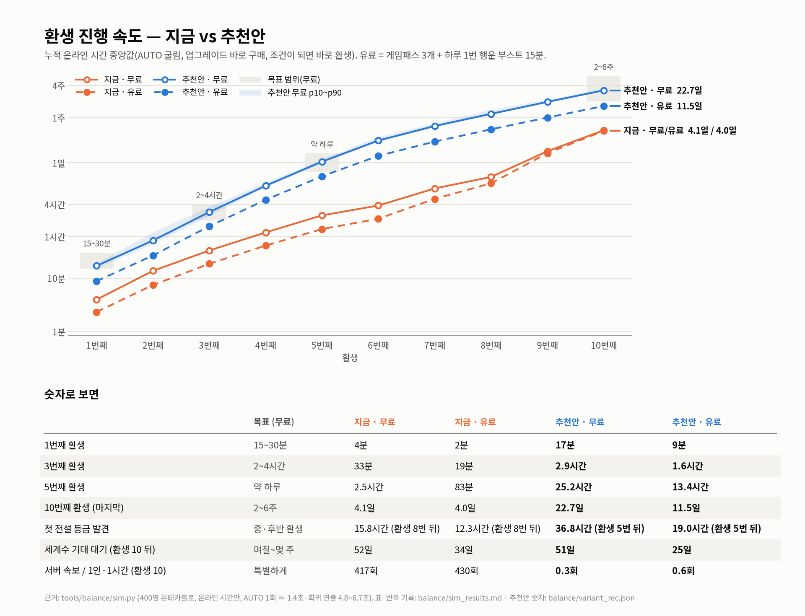

# 밸런스 제안: 환생마다 행운 ×2, 희귀 확률 자릿수 올리기

> 제안 요청: "환생마다 행운 배수를 x2로 늘리고 전체적인 확률의 자릿수를 높이는 것도 나쁘지 않을지도"
> 결론: **좋은 방향입니다. 다만 둘만 바꾸면 게임이 오히려 3~6배 빨라지거나 흔한 명소를 영영 못 얻는 문제가 생겨서,
> 환생 코인·등급 수입·속보 기준을 같이 맞추고 "자동 발견" 규칙 하나를 더했습니다.**
> 숫자는 모두 시뮬레이터(`tools/balance/sim.py`, 실제 Luau 코드와 대조해 불일치 0건)로 400명씩 돌린 중앙값입니다.
> 추천안 전체 숫자: `balance/variant_rec.json` · 근거와 반복 기록: `balance/sim_results.md`



**정해 주실 것 1개 — 첫 환생 시간.** 지금은 4분이라 목표 "15~30분"과 "초반이 지금보다 느려지지 않게"를 동시에 맞출 수 없습니다.
환생 1단계 코인 한 숫자로 고릅니다.

| 1단계 코인 | 첫 환생(무료) | 흔함·보통(1·2등급) 발견 속도 | 5 / 15 / 60분에 찾은 명소 수 |
|---|---|---|---|
| **30만 (추천)** | **17분** (p10~p90 15~19분) | 지금과 같음 (5분 37개, 10분 38개 전부) | 64 / 85 / 114 (15~20분 무렵 3·4등급 2~3개 늦음) |
| 10만 | 10분 | 지금과 같음 | 64 / 88 / 116 (어느 시점에도 안 줄어듦) |
| 5천 (지금 그대로) | 4분 | 지금과 같음 | 지금과 같음 |

---

## 1. 무엇이 바뀌나

### 1-1. 환생 보상: 행운 +20%씩 → ×2씩

| 환생 수 | 0 | 1 | 2 | 3 | 5 | 7 | 10 (최대) |
|---|---|---|---|---|---|---|---|
| 지금 행운 배율 (1 + 0.2×환생) | ×1 | ×1.2 | ×1.4 | ×1.6 | ×2.0 | ×2.4 | ×3.0 |
| **추천 행운 배율 (2^환생)** | ×1 | ×2 | ×4 | ×8 | ×32 | ×128 | **×1,024** |
| 관광 수입 배율 (그대로, +50%씩) | ×1 | ×1.5 | ×2 | ×2.5 | ×3.5 | ×4.5 | ×6 |

최대 행운(지구본 20레벨 ×3, 여권 도장 5개 ×2.25 포함): 무료 20.25 → **6,912**, 행운 VIP 40.5 → **13,824**, VIP+행운 부스트+서버 행운 162 → **55,296**.

### 1-2. 확률 자릿수: 1/1,000 부터 희귀할수록 더 늘림

- **1/1,000 미만(1~3등급, 80개)은 한 자리도 안 바꿉니다** → 첫 굴림 느낌·초반 발견 속도가 지금과 같음.
- 1/1,000 이상 70개 중 61개(1/1,080 카파도키아부터)는 희귀할수록 크게 늘려서, 가장 희귀한 세계수가 1/4천만 → **1/50억**(×125)이 됩니다. 1/1,000~1/2,000 사이 9개는 그대로, 순서도 그대로.

| 명소 | 등급 | 지금 | **추천** | 배 |
|---|---|---|---|---|
| 에펠탑 · 타지마할 | 3 국가 | 1/200 · 1/600 | 1/200 · 1/600 | ×1 |
| 스핑크스 | 4 세계 | 1/1,200 | 1/1,250 | ×1.04 |
| 모아이 석상 | 4 세계 | 1/7,000 | 1/8,000 | ×1.14 |
| 알렉산드리아 등대 | 5 불가사의 | 1/15,000 | 1/20,000 | ×1.3 |
| 로도스 거상 | 5 불가사의 | 1/60,000 | 1/125,000 | ×2.1 |
| 트로이 목마 | 6 잃어버린 유산 | 1/200,000 | 1/650,000 | ×3.3 |
| 아틀란티스 | 6 잃어버린 유산 | 1/400,000 | 1/1,900,000 | ×4.8 |
| 젊음의 샘 | 7 전설 | 1/1,000,000 | 1/8,000,000 | ×8 |
| 용궁 | 7 전설 | 1/2,000,000 | 1/25,000,000 | ×12.5 |
| 무 대륙 | 7 전설 | 1/3,000,000 | 1/45,000,000 | ×15 |
| 사하라 신기루 성 | 7 전설 | 1/5,000,000 | 1/110,000,000 | ×22 |
| 샹그릴라 | 7 전설 | 1/10,000,000 | 1/375,000,000 | ×37.5 |
| **세계수** | 7 전설 | 1/40,000,000 | **1/5,000,000,000** | ×125 |

150개 전체 값: `balance/variant_rec.json` 의 `landmarks`.

### 1-3. 등급 표

어느 명소도 등급이 바뀌지 않습니다(150개 모두 확인). 등급 경계와 4~7등급 수입만 바뀝니다.

| 등급 | 개수 | 지금 범위 | **추천 범위** | 초당 수입 지금 → **추천** | 행운 1 에서 나올 확률 지금 → 추천 |
|---|---|---|---|---|---|
| 1 일반 명소 | 8 | 1/2~1/9 | 그대로 | 1 → 1 | 25% → 25% |
| 2 도시 명소 | 30 | 1/10~1/95 | 그대로 | 2 → 2 | 58% → 58% |
| 3 국가 명소 | 42 | 1/100~1/950 | 그대로 | 5 → 5 | 15.5% → 15.5% |
| 4 세계 명소 | 35 | 1/1,000~1/9,000 | 1/1,000~1/11,000 (경계 1,000) | 12 → 12 | 1.4% → 1.35% |
| 5 불가사의 | 20 | 1/10,000~1/90,000 | 1/12,500~1/225,000 (경계 12,500) | 30 → **35** | 1/1,200 → 1/1,760 |
| 6 잃어버린 유산 | 9 | 1/100,000~1/800,000 | 1/250,000~1/5,500,000 (경계 250,000) | 80 → **120** | 1/27,500 → 1/91,000 |
| 7 전설 | 6 | 1/1,000,000~1/40,000,000 | 1/8,000,000~1/5,000,000,000 (경계 8,000,000) | 250 → **500** | 1/463,000 → 1/5,000,000 |

### 1-4. 환생 단계 1~10

코인은 한국어(게임 화면 `Format.short` 표기). "그 판 행운" = 무료 플레이어가 그 판을 시작할 때 → 환생할 때의 행운.

| # | 지금 조건 | **추천 코인** | **추천 필요 명소 (확률)** | 그 판 행운 | 도착 (무료 누적) |
|---|---|---|---|---|---|
| 1 | 5천 + 에펠탑·자유의 여신상 | **30만** (300K) | 에펠탑(1/200)·자유의 여신상(1/70) | 1 → 1.5 | 17분 |
| 2 | 3만 + 콜로세움·타지마할 | **150만** (1.5M) | 기자 피라미드(1/2,250)·치첸이트사(1/3,250) | 2 → 4.6 | 51분 |
| 3 | 15만 + 스핑크스·만리장성 | **2,500만** (25M) | 모아이(1/8,000)·스톤헨지(1/11,000)·알렉산드리아 등대(1/20,000) | 4 → 12 | 2.9시간 |
| 4 | 60만 + 피라미드·치첸이트사·마추픽추 | **2억 5천만** (250M) | 바빌론 공중정원(1/50,000)·아르테미스 신전(1/70,000)·로도스 거상(1/125,000) | 8 → 48 | 8.9시간 |
| 5 | 250만 + 페트라·모아이·스톤헨지 | **15억** (1.5B) | 올림피아 제우스 상(1/160,000)·마우솔로스 영묘(1/225,000)·트로이 목마(1/650,000) | 16 → 108 | 25.2시간 |
| 6 | 1천만 + 알렉산드리아 등대·리프 | **60억** (6B) | 아틀란티스(1/1,900,000)·미노타우로스의 미궁(1/2,750,000) | 32 → 216 | 2.6일 |
| 7 | 4천만 + 바빌론·로도스·난마돌 | **130억** (13B) | 황룡사 9층 목탑(1/4,000,000)·엘도라도(1/5,500,000) | 64 → 432 | 4.9일 |
| 8 | 1억 6천만 + 바벨탑 | **280억** (28B) | 젊음의 샘(1/8,000,000)·용궁(1/25,000,000) | 128 → 864 | 8.2일 |
| 9 | 6억 4천만 + 아틀란티스·엘도라도 | **650억** (65B) | 무 대륙(1/45,000,000)·질랜디아(1/1,200,000) | 256 → 1,728 | 13.8일 |
| 10 | 25억 6천만 + 용궁 | **1,400억** (140B) | 사하라 신기루 성(1/110,000,000) | 512 → 3,456 | 22.7일 |

- 샹그릴라(1/3.75억)·세계수(1/50억)는 조건에 넣지 않은 **꿈 목표**입니다(10단계를 샹그릴라로 하면 운 나쁜 10%가 33일까지 막힘).
- 모든 관문에서 필요한 명소는 그 판에 유료 플레이어가 부스트를 다 켠 최대 행운보다 **5.8배 이상 희귀**합니다 → 행운이 너무 높아 못 뽑는 일은 없습니다.
  환생 시기는 대부분 코인이 정합니다(명소를 기다리느라 늦는 사람은 판마다 0~22%).
- 그대로 두는 것: 굴림 간격 1.2초, 업그레이드 4종(가격·성장·최대), 게임패스 3종, 상품 3종, 별 보너스, 여권 도장 +25%, 발견 보너스 공식, 환생 수입 +50%, 최대 환생 10.

### 1-5. 새 규칙: 자동 발견

행운이 ×1,024 까지 오르면 굴림 방식(희귀한 것부터 `행운/N` 판정) 때문에 **N ≤ 행운인 흔한 명소는 다시는 나오지 않습니다.**
처음 온 유료(VIP) 플레이어는 흔한 명소 몇 개를 영영 못 얻어 여권 도장이 **0/5에서 막혔습니다**(시뮬레이션 중앙값).

- 규칙: **아직 발견 안 한 명소 중 N ≤ 영구 행운**(지구본 × 도장 × 환생 × 행운 VIP, 부스트·서버 행운 제외)인 것은 발견한 것으로 칩니다.
- 도감·여권 기준(`Discovered`)만 바뀝니다. 보유(`Inventory`)·공원 수입·환생 조건에는 들어가지 않습니다.
- 결과: 무료·유료 모두 여권 도장 5/5 (100%).

---

## 2. 플레이 타임라인

온라인 시간만 셉니다. AUTO 굴림, 업그레이드는 살 수 있으면 바로, 환생도 조건이 되면 바로.
**유료** = 게임패스 3개(행운 VIP·빠른 굴림·수입 2배, 897 R$)를 처음부터 + 하루 1번 행운 부스트 15분(49 R$).

| 환생 | 목표 (무료) | 지금 무료 | 지금 유료 | **추천 무료** (p10~p90) | **추천 유료** |
|---|---|---|---|---|---|
| 1 | 15~30분 | 4분 | 2분 | **17분** (15~19분) | **9분** |
| 2 | | 14분 | 7분 | **51분** (43~72분) | **26분** |
| 3 | 2~4시간 | 33분 | 19분 | **2.9시간** (2.5~3.6시간) | **1.6시간** |
| 4 | | 72분 | 41분 | **8.9시간** (8.3~10.2시간) | **4.9시간** |
| 5 | 약 하루 | 2.5시간 | 83분 | **25.2시간** (23.8~28.0시간) | **13.4시간** |
| 6 | | 3.8시간 | 2.1시간 | **2.6일** (2.5~3.1일) | **32.3시간** |
| 7 | | 7.9시간 | 5.1시간 | **4.9일** (4.6~5.5일) | **2.5일** |
| 8 | | 13.0시간 | 9.9시간 | **8.2일** (7.9~9.9일) | **4.2일** |
| 9 | | 39.4시간 | 36.3시간 | **13.8일** (13.4~15.4일) | **7.0일** |
| 10 | 2~6주 | 4.1일 | 4.0일 | **22.7일** (22.1~24.4일) | **11.5일** |
| 첫 전설 등급 | 중·후반 환생 | 15.8시간 (환생 8번 뒤) | 12.3시간 (8번 뒤) | **36.8시간 (5번 뒤)** | **19.0시간 (5번 뒤)** |
| 세계수 기대 대기 (환생 10 뒤) | 며칠~몇 주 | 52일 | 34일 | **51일** | **25일** |
| 5 / 15 / 60분에 찾은 명소 | 지금 이상 | 64 / 88 / 114 | 71 / 95 / 117 | **64 / 85 / 114** | **71 / 99 / 123** |
| 여권 도장 5개 다 모은 사람 | 전원 | 100% | 0% (중앙값 1/5) | **100%** | **100%** |

- 지금 게임은 모든 목표보다 **3.5~6.4배 빠릅니다**(10번째 환생까지 4일).
- 유료가 약 2배 빠른 건 대부분 **수입 2배** 덕분입니다. 행운 VIP는 명소 사냥과 세계수 대기(51 → 25일)를 줄입니다.
- **빠른 굴림·여행사는 지금 AUTO 속도를 못 바꿉니다**(연출 시간이 굴림 간격보다 길어서, 4번 "선택 1" 참고).
- 행운 부스트를 많이 사도(하루 3번 + 서버 행운) 10번째 환생은 11.4일로 몇 시간만 빨라집니다(코인이 시계라서). 게임패스를 30분 뒤에 사도 10번째는 똑같이 11.5일.

---

## 3. 부작용과 같이 바뀌는 것

### 3-1. 서버 속보 · 홀로그램

| | 지금 | **추천** | 해당 명소 |
|---|---|---|---|
| 속보 `ANNOUNCE_ONE_IN` | 1/1,000 이상 | **1/25,000,000 이상** | 용궁·무 대륙·사하라 신기루 성·샹그릴라·세계수 |
| 홀로그램 `HOLOGRAM_ONE_IN` | 1/10,000 이상 | **1/100,000,000 이상** | 사하라 신기루 성·샹그릴라·세계수 |

| 플레이어 1명·1시간당 속보 (무료 / 유료) | 판 0~1 | 판 3 | 판 5 | 판 8 | 판 10 |
|---|---|---|---|---|---|
| 지금 (1/1,000) | 49~72 / 94~134 | 125 / 223 | 194 / 292 | 385 / 395 | **417 / 430** |
| 추천 (1/2,500만) | 0 / 0 | 0.003 / 0.006 | 0.012 / 0.023 | 0.08 / 0.16 | **0.3 / 0.6** |

- 지금은 후반 플레이어 1명이 1분에 7번꼴로 속보를 띄웁니다. 추천안은 후반 10명 서버에서 시간당 3~6번 → "특별한 소식".
- 대신 새 플레이어는 한동안 자기 속보가 없습니다(무료 첫 속보 약 2.9일, 환생 6번 뒤). 홀로그램은 후반 1인 시간당 0.05~0.1번.
- (선택) **혼합 규칙**: 1/2,500만 이상 **또는** (1/12,500 이상이면서 그 플레이어 행운의 20,000배 이상) → 새 플레이어도 1.5~2시간에 한 번쯤 자기 속보, 후반은 그대로 0.3~0.6.

### 3-2. 화면 숫자 길이 (UI)

가장 긴 확률 글자: 지금 `1 in 40,000,000`(15자) → 추천 `1 in 5,000,000,000`(18자).
확률 글자는 모두 `TextScaled` + 최대 크기라 **넘치지 않고 작아지기만** 합니다. 실제 글꼴(FredokaOne·LuckiestGuy)로 맞는 글자 크기를 재 봤습니다(1280×720 기준 px, UI 배율 전).

| 자리 (코드) | 상자 · 최대 | 지금 가장 긴 것 | 1/1.1억 | 1/3.75억 | **1/50억** | (참고) 1/400억 |
|---|---|---|---|---|---|---|
| 도감 카드 색 띠 (`Panels.luau` collectionCard) | 112×19 · 15 | 15 | 15 | 14.6 | **13.1** | 12.1 |
| 여권·환생 카드 (`Panels.luau` passportCard, 환생 창 카드) | 96×17 · 14 | 13.6 | 13.1 | 12.6 | **11.3** | 10.3 |
| 공개 연출 확률 (`Hud.luau` RevealOdds) | 700×30 · 28 | 28 | 28 | 28 | **28** | 28 |
| 속보 띠 (`Hud.news`, 이름 14자 기준) | 348×36 · 22 | 14.4 (가장 긴 이름) | 14.3 | 16.3 | **16.3** | — |
| 코인 알약 (`Hud.luau` CoinLabel, 콤마 전체) | 155×52 · 36 | 23.2 (25억 6천만) | — | — | **19.9** (1,400억) | 1조: 17.9 |

- **글자 크기 수정은 필요 없습니다.** 작아지는 건 샹그릴라·세계수 카드(10~17%)와 후반 코인 숫자 정도입니다. 속보 띠는 지금 가장 긴 경우보다 오히려 넉넉합니다.
- (선택) 도감 색 띠 글자 좌우 여백 8 → 4px(`Size = UDim2.new(1, -8, 1, -7)`)이면 `1 in 5,000,000,000`도 14.2로 거의 같은 크기.
- 휴대폰(UI 배율 0.55)에서 여권 카드의 세계수 확률은 약 6px로 작지만, 지금도 7.5px 수준입니다. 더 키우려면 10억 이상만 `1 in 5B` 처럼 줄이는 방법이 있으나 "항상 콤마 자연수" 규칙(`Format.oneIn`, 테스트 `tests/run.luau:1535`)과 부딪혀서 권하지 않습니다.
- 환생 창 행운 칩은 `×1024`(콤마 없음, 칩이 글자 길이만큼 늘어남) — 문제없음. 아래 줄 `+20%` 문구는 `×2`로 바꿔야 합니다(4번).

### 3-3. 스토어 페이지 그림·설명

| 파일 | 할 일 |
|---|---|
| `art/store/icon.png` (`tools/store/make_icon.py`) | 세계수 확률을 코드에서 읽음 → `1/5,000,000,000`(4자 늘어남)으로 다시 그리고 숫자가 들어가는지 확인 |
| `art/store/thumb_1~4.png`, `thumbs_sheet.png` (`tools/store/thumbs.py`) | 확률을 `Landmarks.luau`에서 읽음 → 다시 그리기. 확률 딱지는 글자 크기 고정(84/62)이라 폭 확인. 이웃 공원 채우기 `maxOneIn: 100000` → `250000`(같은 5등급 이하 묶음 유지) |
| `art/store/description.txt` (4·20줄), `description.md` (17·33·49·50줄) | `1/40,000,000` → `1/5,000,000,000`, 전설 목록 숫자 |
| `README.md` (4줄, 명소 표), `DESIGN.md` (186·195줄) | 확률표·환생 행운 공식·9·10단계 문구 |

(`art/store`는 다른 작업이 아직 커밋 안 한 수정이 있어서, 그 작업이 끝난 뒤 바꾸는 게 안전합니다.)

### 3-4. 기존 플레이어 저장

저장(`LandmarkRNG_v1`)에는 명소 Id·개수·환생 수만 있고 확률·등급은 없습니다 → **저장 형식은 그대로, 옮기는 코드 필요 없음.** 저장소 이름도 그대로 두면 됩니다.

| 저장 값 | 바뀐 뒤 |
|---|---|
| `Rebirths` (환생 수) | 그대로 유지. 행운이 바로 새 배율로(3번 한 사람 ×1.6 → ×8, 10번 ×3 → ×1,024). 다음 환생 조건은 새 표(예: 3번 한 사람 → 2억 5천만 + 바빌론·아르테미스·로도스). 빨리 올린 환생 수는 깎지 않음 = 기존 플레이어가 앞선 채로 시작 |
| `Inventory`·`Discovered`·별 | 그대로. 등급이 바뀌는 명소가 없어 색·등급 같음. 5·6·7등급 수입이 올라 공원 수입은 약간 늘어남 |
| 여권 도장 | 도장에 필요한 명소 135개 목록이 똑같음 → 잃는 도장 없음. 환생 많이 한 사람은 자동 발견으로 도장이 늘 수 있음 |
| `Coins`·`Upgrades` | 그대로(업그레이드 가격은 안 바뀜, 환생 코인만 커짐) |
| 부스트·영수증·게임패스 | 영향 없음 |
| 최대 환생(10) 달성자 | 이미 끝. 행운 ×1,024 로 샹그릴라·세계수(무료 기대 51일) 도전 |

---

## 4. 구현할 코드 변경

| 파일 | 바꿀 것 |
|---|---|
| `src/shared/Config.luau` | `TIER_INCOME = { 1, 2, 5, 12, 35, 120, 500 }` · `REBIRTHS` 아래 표로 · `REBIRTH_LUCK_BONUS = 0.2` → **`REBIRTH_LUCK_MULT = 2`** (행운 × 2^환생 수) · `ANNOUNCE_ONE_IN = 25000000` · `HOLOGRAM_ONE_IN = 100000000` |
| `src/shared/Landmarks.luau` | `Tiers` 의 `MinOneIn`: 5등급 10000 → **12500**, 6등급 100000 → **250000**, 7등급 1000000 → **8000000** · `DEFINITIONS` 의 N: 61개(카파도키아 1,080 → 1,100 … 세계수 40,000,000 → 5,000,000,000), 값은 `variant_rec.json` 그대로. Id 는 그대로 |
| `src/shared/PlayerState.luau` | `luck()`: `rebirthMult = Config.REBIRTH_LUCK_MULT ^ rebirthsOf(data)` · 새 `permanentLuck(data, mods)`(부스트·서버 행운 뺀 행운) + **`autoDiscover(data, mods)`**: N ≤ 영구 행운인 명소를 `Discovered` 에 넣고, 도장이 새로 생기면(행운 ↑) 한 번 더. `Inventory` 는 건드리지 않음 |
| `src/server/init.server.luau` | `autoDiscover` 호출: 접속해서 저장 불러온 뒤, 굴림 직전(`RollLogic.roll` 앞, 약 523줄), 업그레이드 구매(570줄), 환생(626줄), 게임패스 구매 뒤 → 상태 보내기 |
| `src/client/Perks.luau` | `REBIRTH_LUCK` 를 `Config.REBIRTH_LUCK_MULT`(기본 2)로, `rebirthMults` 행운 = `REBIRTH_LUCK ^ rebirths` |
| `src/client/Panels.luau` | 1218줄 `"+20%"` → `"×2"` (1198줄 주석도) |
| `tests/run.luau` | 422줄·470줄 첫 환생 코인 5000 → 300000, 473~478줄 코인 부족분 예시(4000.5 / 5000 → 299000.5 / 300000), 555~560줄 "행운 +20%" → "×2"(2번 환생 = 행운 4) · 새 테스트: `autoDiscover`(행운 12 → N ≤ 12 명소만 발견, `Inventory` 그대로), VIP 도장이 안 막힘 |

```lua
-- src/shared/Config.luau
REBIRTHS = {
	{ Coins = 300000, Landmarks = { "eiffel", "liberty" } },
	{ Coins = 1500000, Landmarks = { "pyramid", "chichen" } },
	{ Coins = 25000000, Landmarks = { "moai", "stonehenge", "alexandria" } },
	{ Coins = 250000000, Landmarks = { "babylon", "artemis", "rhodes" } },
	{ Coins = 1500000000, Landmarks = { "zeus", "mausoleum", "trojanhorse" } },
	{ Coins = 6000000000, Landmarks = { "atlantis", "labyrinth" } },
	{ Coins = 13000000000, Landmarks = { "hwangnyongsa", "eldorado" } },
	{ Coins = 28000000000, Landmarks = { "fountainofyouth", "yonggung" } },
	{ Coins = 65000000000, Landmarks = { "mu", "zealandia" } },
	{ Coins = 140000000000, Landmarks = { "skyisland" } },
} :: { RebirthStep },
REBIRTH_LUCK_MULT = 2, -- 환생 1회마다 행운 ×2 (행운 × 2^환생 수)
```

**선택 (권장 순서):**
1. **AUTO 에서 이미 발견한 명소는 짧은 연출** — `Hud.luau` 1274·1322·1380줄의 `info.Fast and rank < 4` 조건에 "이미 발견함"을 더하기.
   지금은 4등급 이상이 나올 때마다 AUTO 가 4.8~6.7초 멈춰서 빠른 굴림(199 R$)·여행사가 사실상 효과가 없습니다.
   넣으면 10번째 환생 무료 18.2일 / 유료 9.2일 — 이때는 **세계수 1/10,000,000,000, 속보 1/100,000,000** 으로 같이 올리기.
2. 속보 혼합 규칙(3-1) — `init.server.luau` 535줄.
3. 도감 색 띠 여백 8 → 4px(3-2).

**주의:**
- 시간은 온라인 시간만 셉니다. 로블록스는 20분 동안 입력이 없으면 내보내므로 "몇 주 AFK 자동 굴림"은 그 대책이 있어야 성립합니다.
- 굴림 1회 네트워크 왕복 0.12초는 가정값입니다.
- 재현: `python3 tools/balance/variant_rec_design.py && python3 tools/balance/compare.py` · 그림: `python3 tools/balance/proposal_chart.py --font-regular <NotoSansKR-Regular.ttf> --font-bold <NotoSansKR-Bold.ttf>`
