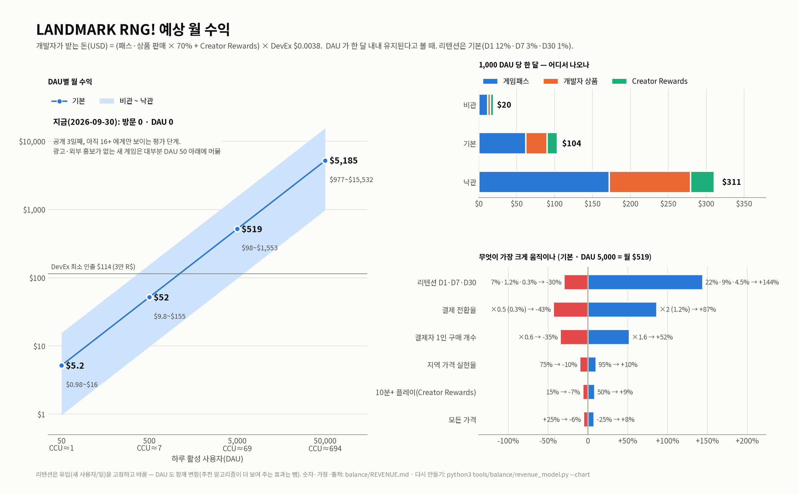

# 예상 수익 (LANDMARK RNG!)

> 요청: "게임 예상 수익" · 그리고 "방문수 0 실화냐"
> 결론: **방문 0은 지금 규칙에서는 이상한 일이 아닙니다(공개 3일째, 아직 16+ 에게만 보이는 평가 단계, 추천 노출 0).
> 지금 수익은 0이고, 게임은 사람이 들어와야 돈이 됩니다. 1,000 DAU 가 한 달 유지되면 개발자 몫은 월 약 $104(비관 $20 ~ 낙관 $311).**
> 광고나 외부 홍보 없이 올린 새 게임은 대부분 DAU 50 아래에 머뭅니다. 그 구간에서는 월 $1~16이고, DevEx 최소 인출액($114)을
> 모으는 데 몇 달에서 몇 년이 걸립니다. 숫자는 모두 [`tools/balance/revenue_model.py`](../tools/balance/revenue_model.py)
> 가 만든 것이고(상품·가격은 `Config.luau` 에서 읽음), 전체 값은 [`revenue_results.json`](revenue_results.json) 에 있습니다.
> 조사 날짜는 2026-09-30입니다. **[가정]** 은 제가 정한 값, **[제3자]** 는 로블록스가 아닌 곳의 추정치, S 번호는 끝의 출처입니다.



## 한눈에 보기

| 하루 활성 사용자(DAU) | 동접(CCU) 약 | 월 수익(USD, 기본) | 비관 ~ 낙관 | DevEx 최소 $114 까지(기본) |
|---|---|---|---|---|
| **지금: 0** | 0 | **$0** | — | — |
| 50 | 1 | **$5** | $1 ~ $16 | 22달 |
| 500 | 7 | **$52** | $10 ~ $155 | 2.2달 |
| 5,000 | 69 | **$519** | $98 ~ $1,553 | 1주 |
| 50,000 | 694 | **$5,185** | $977 ~ $15,532 | 바로 |

- USD = 개발자가 실제로 받는 돈입니다: (패스·상품 판매 Robux × 70% + Creator Rewards) × DevEx $0.0038.
  플레이어가 낸 돈(Robux 를 $0.01 로 환산)은 이 금액의 약 3.3배입니다. 기본 1,000 DAU 기준으로 플레이어는 약 $338 을 쓰고 개발자는 $104 를 받습니다.
- 가장 크게 바꾸는 것은 **트래픽**(DAU)입니다. 그다음이 **리텐션 > 결제 전환 > 결제자 1인 구매 개수 > 가격** 순입니다(5장).
- 가장 먼저 할 일은 수익화 손질이 아닙니다. **사람이 들어오게 하는 것**입니다. 평가 단계를 넘길 첫 16+ 플레이어,
  영어 설명과 게임 안 글자가 먼저입니다(0장).

---

## 0. 방문 0 — 왜 그런가, 무엇을 하면 되나

### 지금 상태 (2026-09-30, 공개 읽기 API 로 확인 — 쓰기 호출 없음) [S16]

| 항목 | 값 |
|---|---|
| 유니버스 / 시작 플레이스 | 10768332367 / 111213385828988 ("LANDMARK RNG!", 만든이 sjp012520) |
| 만든 날 · 마지막 게시 | 2026-09-27 · 2026-09-30 (**공개 3일째**) |
| 방문 · 지금 동접 · 즐겨찾기 | **0 · 0 · 0** |
| 좋아요 / 싫어요 | 1 / 0 (누군가 플레이는 함. 아마 만든 사람 본인이고, 본인 방문은 방문 수에 안 잡힌다는 포럼 보고가 있음 — 의견이 엇갈림 [S13]) |
| 공개 목록 | 만든 사람의 **공개** 게임 목록에 있음 (비공개 아님) |
| 로블록스 검색 "LANDMARK RNG" | 상위 40개에 **없음**. Flying RNG · Truck RNG 같은 인기 게임만 나옴 |
| 아바타 · 장르 · 서버 인원 | R15(MorphToR15) · Simulation / Tycoon · 8명 |
| 설명 | 원문은 한국어이고 다른 언어는 자동 번역됩니다. 영어로 받으면 "같은 명소를 또 찾으면"이 **"If you find another celebrity like this"** 로 잘못 번역되어 나옵니다 |
| 게임 안 글자 | 한국어만 있음 (`art/store/description.md` "게시 전 확인") |

### 왜 0인가 (영향이 큰 순서)

1. **새 게임 평가 단계 (2026-05-19부터)** [S10]. 새 게임은 처음에 **나이 확인을 마친 16세 이상에게만** 보입니다.
   "highly engaged" 한 16+ 사용자(최근 60일 안에 로블록스에서 결제했고 이 게임을 충분히 한 사람)의 고유 플레이가
   **60일 안에 250번** 쌓여야 모든 나이(Roblox Kids 5~8세, Select 9~15세)에게 열립니다. 나이 확인을 한 DAU 중
   13세 미만이 35%, 13~17세가 38%입니다 [S11]. 그래서 16세 미만은 대략 절반 이상이 됩니다(13~15세를 13~17세의 3/5로 친 추정).
   RNG·타이쿤 장르의 주 고객층이 바로 이 연령대라서 지금은 가장 큰 손님층이 이 게임을 아예 볼 수 없습니다.
   (모든 나이에 게시하려면 ID 인증 + 2단계 인증 + Roblox Plus 또는 게임당 1,000 R$ 환불 가능 수수료도 필요합니다. 평가를 빨리 끝내는
   유료 심사는 50,000 R$ 입니다 [S10].)
2. **추천(Recommended For You) 노출이 아직 없음.** 새 게임이 며칠에서 몇 주 동안 홈 추천 노출 0인 것은 흔한 일입니다 [S13].
   2026-06 부터 추천 알고리즘은 **28일 리텐션**(1일 · 2~7일 · 8~28일)과 친구와 함께 하는 날, 결제를 봅니다 [S12].
   그래서 판단이 서기까지 2~4주가 걸린다는 관찰이 있습니다 [제3자, S12].
   즉 추천은 "사람이 먼저 와서 남아야" 시작됩니다. 들어온 사람이 0이면 알고리즘이 판단할 데이터도 0입니다.
3. **검색은 인기순입니다.** 이름을 정확히 쳐도 인기 게임이 먼저 나옵니다. 새 게임은 하루 이틀 뒤에야 검색에 잡히는 일이 흔합니다 [S13].
   "RNG" 가 들어간 이름은 경쟁이 특히 심합니다.
4. **한국어 전용.** 평가 단계에서 들어올 수 있는 16+ 사용자는 대부분 한국어를 읽지 못합니다(한국은 로블록스에서 작은 시장 [가정]). 그들에게 게임 안 글자가 읽히지 않고, 설명은 오역으로 보입니다.
   누가 들어와도 D1 리텐션이 낮게 나올 가능성이 큽니다 [가정]. 리텐션이 낮으면 2번의 추천도 멀어집니다.

### 무엇을 하면 되나 (순서대로)

| # | 할 일 | 왜 | 비용 |
|---|---|---|---|
| 1 | Creator Hub 에서 **게시 대상(16+ / 모든 나이)**, 성숙도 설문, ID·2단계 인증, Roblox Plus 또는 1,000 R$ 수수료를 확인 | 모든 나이로 열릴 조건을 먼저 갖춤(API 로는 확인 못 함) | 0 ~ 1,000 R$(환불 가능) |
| 2 | **영어**: 설명 영어 번역을 직접 넣고(로컬라이제이션 → 체험 정보 → 영어), 게임 안 글자 자동 번역을 켜거나 영어 표를 넣기 | 평가 단계 손님(16+)이 게임을 이해해야 남음 | 시간 |
| 3 | **첫 16+ 플레이어 250명(highly engaged)**: 친구·디스코드·쇼츠/틱톡 영상, 작은 광고 테스트 | 평가 통과 조건. 16+ 방문 중 15~30%가 "highly engaged" 로 세어진다고 보면 **방문 약 830~1,700번** 이 필요하고, 전부 광고로 모으면 **약 $40~$750** [가정 + S9] | $0 ~ $750 |
| 4 | 광고를 켜면 **아이콘 A/B**(`art/store/icon_a.png` / `icon_b.png`)로 같은 조건 두 캠페인 | 클릭률 1%p 차이로 1플레이당 비용이 절반까지 바뀐다는 보고 [제3자, S9] | 광고비 |
| 5 | 2~4주 동안 리텐션·세션 길이를 보고 온보딩을 손봄(7장) | 추천 알고리즘이 28일 리텐션을 봄 | 시간 |

---

## 1. 조사한 사실 (2026-09-30)

| 사실 | 값 | 출처 |
|---|---|---|
| 게임 안 판매(게임패스·개발자 상품) 수수료 | 로블록스 30%, **개발자 70%** | S1 |
| DevEx(Robux → USD) | 2025-09-05 이후 번 Robux **$0.0038** / R$ (그 전 것 $0.0035). 최소 인출 **30,000 Earned R$ = $114** | S2 |
| 미국 18+ DevEx | 2026-06-08 부터 **$0.0054** (+42%). 미국·나이 확인 18+ 플레이어의 패스·개발자 상품·구독·비공개 서버 구매분만, **자격 있는 게임만**(R15 아바타, 품질 기준). 나머지는 $0.0038 로 섞어서 계산 | S3 |
| Premium Payouts | **2025-07-24 부터 Creator Rewards 로 바뀜** | S4 |
| Creator Rewards(일일 참여) | "Active Spender"(최근 60일 $9.99 이상 결제)가 **그날 처음 연 게임 3개 중 하나**에서 하루 합쳐 10분 이상 하면 **5 R$** | S4 |
| Creator Rewards(Audience Expansion) | 공유 링크로 새로 오거나 60일 넘게 쉬다 돌아온 사용자의 첫 $100 결제의 35%. **게임이 60일 평균 DAU 100 이상**이어야 함 → 지금은 해당 없음 | S4 |
| 지역 가격 | 게임패스·개발자 상품 모두 켤 수 있음(선택). 지역 가격은 기본값보다 비싸지 않고 **최대 70% 까지 할인**. 결제자 수 증가: 브라질 +22.4%, 필리핀 +44.8%, 멕시코 +13.8% | S5 |
| 가격 최적화 | 가격 테스트를 한 게임의 수익 증가 **중앙값 +4%**. **한 달 거래 60,000건 이상**인 게임만 쓸 수 있음 → 한참 먼 이야기 | S6 |
| 리텐션 벤치마크 | GameAnalytics 2026 (GameAnalytics 를 쓰는 게임 500여 개, 2025-08~2026-07): D1 / D7 / D30 **중앙값 10.3% / 1.6% / 0.5%**, 상위 1% D30 4.7% | S7 |
| 세션 길이 | 게임 세션 중앙값 **9.8분**(상위 5% 16.6분, 상위 1% 21.1분) | S7 |
| 결제 | 기간 중 뭐라도 결제한 플레이어 **3.80%**. 게임별 결제자 1인 평균(ARPPU) 중앙값 $0.70 · p75 $1.25 · p90 $2.33 | S7 |
| 결제 전환(제3자) | 흔히 1~3%, 시뮬레이터·타이쿤이 높은 편 | S8 [제3자] |
| 광고 | 스폰서 게임 1플레이당 비용 평균 약 **$0.45**, 잘 만든 캠페인 $0.02~0.10. CPM 약 $6.50 | S9 [제3자] |
| 사용자 연령(나이 확인 DAU) | 13세 미만 35% · 13~17세 38% · 18세 이상 27% (2026 Q2) | S11 |
| 새 게임 평가 | 2026-05-19~: 처음엔 16+ 에게만 → 60일 안 highly engaged 250 플레이면 모든 나이 | S10 |
| 추천 알고리즘 | 2026-06: 28일 리텐션(1일 · 2~7일 · 8~28일), 함께 한 날, 결제를 봄. RDC 2026(9월): 어린 플레이어는 짧은 게임, 나이 많은 플레이어는 깊은 게임을 더 오래 한다는 점을 순위에 반영, "새 사용자를 데려오는 게임" 순위 시험 | S12, S14 |

찾지 못한 것: 장르별(RNG·타이쿤) 공개 전환율·ARPPU 벤치마크는 로블록스 공식 자료가 없습니다. 그래서 위 제3자 범위와
GameAnalytics 전체 값으로 가정을 잡았습니다. `create.roblox.com`·`gameanalytics.com` 일부 페이지는 이 환경에서 열리지 않아서
검색 결과 요약으로 확인했습니다.

---

## 2. 모델

한 달(30일) 동안 DAU 가 그대로 유지된다고 보고 계산합니다.

- **수명 활동일 L** = 1 + Σ R(d). R(d) 는 D1·D7·D30 을 지나는 거듭제곱 곡선(180일까지)입니다.
- **새 사용자 / 달** = DAU × 30 / L (그 DAU 를 유지하려면 이만큼 새로 들어와야 함)
- **결제자 / 달** = 새 사용자 × 평생 결제 전환율
- **결제자 1인** = 패스마다 "살 확률" + 개발자 상품마다 "평생 몇 번"
- **플레이어가 쓴 Robux** = Σ 개수 × 가격 × 지역 가격 실현율
- **개발자 몫** = 위 × 70% · **Creator Rewards** = DAU × Active Spender 비율 × 자격(10분+, 첫 3개 게임) × 5 R$ × 30
- **USD** = (개발자 몫 + Creator Rewards) × $0.0038

### 상품과 진행 속도 (시뮬레이터로 잰 값)

`python3 tools/balance/revenue_model.py --pass-value` → [`revenue_pass_value.json`](revenue_pass_value.json)
(`sim.py` 200명, 자동 굴림, 온라인 시간 중앙값). 5번째 환생까지 걸리는 시간으로 "산 만큼 빨라지나"를 봤습니다.

| 상품 | 가격 | 하는 일 | 5번째 환생(무료 25.8시간 대비) | 1 R$ 당 체감 |
|---|---|---|---|---|
| 수입 2배 (패스) | 299 | 관광 수입 ×2 | **14.9시간 (-42%)** | 가장 좋음 |
| 행운 VIP (패스) | 399 | 행운 ×2 | 22.5시간 (-13%) | 진행은 조금, 희귀 발견 기대감이 큼 |
| 빠른 굴림 (패스) | 199 | 굴림 간격 ×0.7 | 23.8시간 (-7%) | 약함 |
| 패스 3종 | 897 | 전부 | **12.0시간 (-53%)** · 첫 환생 17분 → 8분 | |
| 행운 부스트 (상품) | 49 | 15분 행운 ×2 | 하루(온라인 24시간)에 1번: **변화 없음** · 플레이 20분마다 1번(= 늘 켬): -13% | 한 번은 재미용 |
| 서버 행운 (상품) | 99 | 서버 전체 15분 행운 ×2 | (행운 부스트와 같음, 남에게도 줌) | 같이 하는 재미 |
| 코인 팩 (상품) | 79 | 30분치 수입(최소 1,000) | 하루 1번: -2% · 20분마다 1번: -51% | 한 번은 작음 |

→ "유료가 약 2배 빠름"(PROPOSAL.md)은 **패스 3종**이 거의 다 만든 차이입니다. 개발자 상품은 한 번 사서는 진행이 거의 안 빨라집니다.
그래서 반복 구매는 "재미·기대감"에 기대게 되고, 모델도 결제자 1인 평생 개수를 낮게 잡았습니다.

### 가정 — 시나리오

| | 비관 | **기본** | 낙관 | 근거 |
|---|---|---|---|---|
| 리텐션 D1 / D7 / D30 (DAU 표에는 기본만 씀) | 7% / 1.2% / 0.3% | **12% / 3% / 1%** | 22% / 9% / 4.5% | [가정] S7 중앙값 10.3 / 1.6 / 0.5 보다 기본은 조금 위, 낙관은 상위권 |
| → 수명 활동일 L | 1.5일 | **2.4일** | 7.3일 | |
| 새 사용자 → 평생 결제 전환 | 0.2% | **0.6%** | 1.2% | [가정] 새 사용자 대부분은 한 번 몇 분만 함. S7 의 3.80% 는 1년 동안 한 번이라도 결제한 비율(이미 자리 잡은 게임 표본) |
| 결제자 중 수입 2배 / 행운 VIP / 빠른 굴림 구매 | 35 / 25 / 15% | **50 / 40 / 30%** | 60 / 50 / 40% | [가정] 위 표의 가치 순서 |
| 결제자 1인 평생 행운 부스트 / 서버 행운 / 코인 팩 | 1 / 0.1 / 0.2개 | **2 / 0.3 / 0.5개** | 3 / 0.6 / 1개 | [가정] 한 번은 진행 효과가 작음 |
| 지역 가격 실현율(평균 판매가 / 정가) | 75% | **85%** | 95% | [가정] 지역 가격을 켰을 때. 최대 할인 70% [S5] |
| 하루 DAU 중 Active Spender | 5% | **8%** | 11% | [가정] |
| 그중 이 게임이 "첫 3개 + 10분+" | 15% | **30%** | 50% | [가정] 세션 중앙값 9.8분 [S7], AUTO 굴림이라 오래 켜 둠 |

---

## 3. 결과 — DAU별 월 수익 (리텐션 기본)

| DAU | 시나리오 | 플레이어가 쓴 R$ | 개발자 몫(70%) | Creator Rewards | 합계 Earned R$ | **USD** | DevEx 최소까지 |
|---|---|---|---|---|---|---|---|
| 50 | 비관 | 287 | 201 | 56 | 257 | $0.98 | 117달 |
| 50 | **기본** | 1.7K | 1.2K | 180 | 1.4K | **$5.2** | 22달 |
| 50 | 낙관 | 5.2K | 3.7K | 412 | 4.1K | $16 | 7.3달 |
| 500 | 비관 | 2.9K | 2.0K | 562 | 2.6K | $9.8 | 12달 |
| 500 | **기본** | 17K | 12K | 1.8K | 14K | **$52** | 2.2달 |
| 500 | 낙관 | 52K | 37K | 4.1K | 41K | $155 | 0.7달 |
| 5,000 | 비관 | 29K | 20K | 5.6K | 26K | $98 | 1.2달 |
| 5,000 | **기본** | 169K | 118K | 18K | 136K | **$519** | 0.2달 |
| 5,000 | 낙관 | 525K | 367K | 41K | 409K | $1,553 | 0.1달 |
| 50,000 | 비관 | 287K | 201K | 56K | 257K | $977 | 바로 |
| 50,000 | **기본** | 1.69M | 1.18M | 180K | 1.36M | **$5,185** | 바로 |
| 50,000 | 낙관 | 5.25M | 3.67M | 412K | 4.09M | $15,532 | 바로 |

### 1,000 DAU 당 (한 달)

| | 비관 | **기본** | 낙관 |
|---|---|---|---|
| 새 사용자 | 12,381 | 12,381 | 12,381 |
| 결제자 | 25 | **74** | 149 |
| 플레이어가 쓴 R$ (패스 / 상품) | 5.7K (4.4K / 1.4K) | **34K (23K / 11K)** | 105K (65K / 40K) |
| 개발자 몫 + Creator Rewards | 4.0K + 1.1K R$ | **24K + 3.6K R$** | 73K + 8.2K R$ |
| **개발자 USD** | **$20** | **$104** | **$311** |
| 새 사용자 1명 가치(USD) | $0.002 | **$0.008** | $0.025 |
| 대시보드 결제 전환(그날 결제자 / DAU) | 0.13% | **0.62%** | 1.76% |
| 대시보드 ARPPU(결제한 날 1인) | 152 R$ | **182 R$** | 199 R$ |
| 대시보드 ARPDAU(플레이어가 쓴 R$ / DAU) | 0.19 R$ | **1.13 R$** | 3.50 R$ |

- 상품별(기본, 플레이어가 쓴 R$): 행운 VIP 10.1K · 수입 2배 9.4K · 행운 부스트 6.2K · 빠른 굴림 3.8K · 코인 팩 2.5K · 서버 행운 1.9K.
  **패스가 약 70%** 입니다.
- 대시보드 값은 라이브 뒤 Creator Hub 분석과 바로 맞대어 보라고 넣었습니다(7장). 결제한 날 수는 1 + 0.5 × (산 개수 - 1) 로 잡았습니다 [가정].
- **맞춰 보기(대략)**: 로블록스는 2025년 제작자에게 약 $10억을 지급했습니다 [S15]. 2025 평균 DAU 를 약 1.2억으로 잡으면
  플랫폼 DAU 1명당 하루 약 6 Earned R$ 입니다. 한 사람이 여러 게임을 하므로 "게임 DAU" 기준으로는 이보다 몇 배 작습니다.
  이 모델은 0.2(비관) / 0.9(기본) / 2.7(낙관) Earned R$ 이니, 작은 새 게임으로서 과하지 않은 범위입니다.
  제3자 추정 "평범한 시뮬레이터 ARPDAU 약 $0.003~0.006" [S8] 과도 기본($0.0035)이 맞습니다.

---

## 4. 현실적인 트래픽 — 각 DAU 단계에 가려면

| 단계 | CCU | 새 사용자 / 일(기본 리텐션) | 전부 광고로 데려오면 월(1플레이 $0.05 ~ $0.45) | 기본 수익 / 월 | 보통 필요한 것 |
|---|---|---|---|---|---|
| **지금 0** | 0 | 0 | — | $0 | 평가 단계 통과(0장) |
| 50 | 약 1 | 21 | $31 ~ $279 | $5 | 친구·디스코드·쇼츠 몇 개. 평가를 넘기면 검색·추천에서 조금씩 |
| 500 | 약 7 | 206 | $310 ~ $2,786 | $52 | 추천에 실리기 시작: D1 10~15% 이상, 세션 10분 이상, 영어. 또는 광고를 계속 |
| 5,000 | 약 69 | 2,063 | $3,095 ~ $27,857 | $519 | 추천이 계속 밀어 줌: 상위권 리텐션·같이 하기, 잦은 업데이트, 유튜버·틱톡 |
| 50,000 | 약 694 | 20,635 | $31K ~ $279K | $5,185 | 상위 1% 급: 인기 장르 흐름 + 큰 업데이트 + 크리에이터 홍보 |

솔직하게:

- **새 사용자 1명의 가치는 $0.002~0.025** 이고, 광고 1플레이는 $0.05~0.45 입니다. **광고비는 수익으로 돌아오지 않습니다**(낙관이라도 2배 이상, 기본은 6~50배 손해).
  광고는 이익을 내는 수단이 아니라 **평가 통과와 추천 알고리즘의 첫 데이터를 사는 돈**으로만 의미가 있습니다.
  그래서 작게 쓰고 리텐션을 보고 멈출지 판단합니다.
- 광고·외부 홍보 없이 올린 새 게임은 **대부분 DAU 0~50** 에 머뭅니다. 지금처럼 한국어 전용 + 평가 단계라면 **0~10** 이 현실적입니다 [가정].
  그 구간 수익은 **월 $0~5** 이고, DevEx 최소 인출($114)까지 몇 년이 걸립니다.
- 500 DAU 이상은 광고비로 사기보다 **리텐션으로 추천을 얻어야** 도달하는 구간입니다. 추천이 붙으면 광고 없이 유지됩니다.
  이 모델의 DAU 는 "추천이 얼마나 밀어 주나"에 달렸고, 그것은 리텐션(28일)이 정합니다 [S12].

---

## 5. 무엇이 가장 크게 움직이나 (민감도)

기본 시나리오, DAU 5,000(월 $519)에서 하나씩만 바꿨습니다. 리텐션은 **유입(새 사용자/일)을 고정**하고 바꿨으므로 DAU 도 함께 변합니다.
리텐션이 좋으면 추천 알고리즘이 더 보여 주는 효과는 **빼고** 계산했습니다. 실제로는 리텐션 쪽이 이보다 더 큽니다.

| 바꾼 것 | 나쁘게 | 좋게 |
|---|---|---|
| **리텐션 D1·D7·D30** | 7%·1.2%·0.3% → **-30%** | 22%·9%·4.5% → **+144%** |
| 결제 전환율 | ×0.5 (0.3%) → -43% | ×2 (1.2%) → +87% |
| 결제자 1인 구매 개수 | ×0.6 → -35% | ×1.6 → +52% |
| 지역 가격 실현율 | 75% → -10% | 95% → +10% |
| 10분+ 플레이(Creator Rewards) | 15% → -7% | 50% → +9% |
| 모든 가격 | +25% → -6% | -25% → +8% |

- **가격은 거의 안 움직입니다**(±25% 에 ±8% 안쪽. 가격 탄력성 1.3 [가정], 가격 최적화 중앙값 +4% [S6] 와 맞음). 가격 조정은 뒤로 미룹니다.
- 리텐션은 이 표에서도 1등이고, 여기에 더해 **DAU 자체(추천)** 를 정합니다. 그래서 돈을 벌려면 리텐션이 먼저입니다.

---

## 6. 제안 (우선순위 · 대략 효과)

효과는 기본 시나리오 1,000 DAU(월 $104) 기준이고, 크기는 모두 [가정]입니다. 모두 **제안일 뿐이고 이번에 게임 코드는 바꾸지 않았습니다**.

| # | 제안 | 대략 효과 | 왜 이 게임에 |
|---|---|---|---|
| 0 | **영어 + 평가 통과**(0장) | ×0 → 가능 | 이것 없이는 아래가 모두 0에 곱해짐 |
| 1 | **일일 보상 · 연속 접속 · 오프라인 수입(몇 시간 상한)** | **+17%** (D1 +3%p, D7 +1%p, D30 +0.4%p, 유입 고정) + 추천 | 타이쿤인데 나가 있는 동안 공원이 멈춤. 28일 리텐션이 추천을 정함 [S12] |
| 2 | **첫 구매 스타터 팩** 99 R$, 한 번만(예: 수입 2배 1시간 + 코인 + 행운 부스트 2개) | **+30%** (결제 전환 ×1.25, 결제자 40% 구매) | 지금 가장 싼 첫 구매가 49 R$ 부스트인데 진행 효과가 거의 없음. 첫 결제의 문턱을 낮추고 가치를 느끼게 |
| 3 | **상황별 제안**: 첫 환생 직후 "수입 2배", 코인이 모자랄 때 "코인 팩", 희귀 직전 연출에 "행운 부스트" | +17% (결제 전환 ×1.2) | 수입 2배가 가치 1등(-42%)인데 상점을 열어야만 보임 |
| 4 | **반복 상품을 쓸모 있게**: 행운 부스트 30분 또는 ×3, 큰 코인 팩(2시간치), 수입 부스트(15분 수입 ×2) | +16% (개발자 상품 ×1.6) | 시뮬레이터상 한 번 사서는 진행이 거의 안 변함(2장 표) |
| 5 | **지역 가격 켜기**(패스·상품 모두) | ±10% 쪽 + 결제자 수 | 브라질·필리핀 결제자 +22~45% [S5]. 손이 거의 안 듦 |
| 6 | 미국 18+ DevEx 자격 확인(이미 R15) | +2% (개발자 몫의 5% 가 해당된다고 볼 때) | 16+ 평가 단계 손님과 겹침. 품질 기준이 있어 자격은 확인 필요 [S3] |
| — | ~~AUTO 굴림 패스~~ | 권하지 않음 | AUTO 는 이미 무료이고 게임의 중심. 막으면 세션·리텐션·Creator Rewards(10분+)가 같이 떨어짐 |
| — | 가격 올리기/내리기 | ±8% 안쪽 | 5장. 가격 최적화 도구도 거래 60,000건/월 이상부터 [S6] |

---

## 7. 라이브 뒤에 볼 것 (분석)

2~4주 동안, 새 사용자가 1,000명 이상 쌓인 뒤에 봅니다 [가정: 그보다 적으면 잡음이 큼]. 무엇을 보내고 Creator Hub 어디서 읽는지는
[DESIGN.md](../DESIGN.md) "분석" 에 있습니다. 아래 기준으로 시나리오를 고르고
이 문서의 숫자를 다시 맞춥니다(`SCENARIOS` 값만 바꿔서 다시 실행하면 됩니다).

| 어디서 | 지표 | 비관 / 기본 / 낙관 기준 | 나쁘면 먼저 할 것 |
|---|---|---|---|
| Creator Hub → 리텐션 | D1 · D7 · D30 | 7 / 12 / 22% · 1.2 / 3 / 9% · 0.3 / 1 / 4.5% | D1 < 7% → 첫 5분(온보딩) |
| Creator Hub → 참여 | 세션 길이, DAU 1인 플레이 시간 | 9.8분이 전체 중앙값 [S7], 이 모델은 하루 20분 | < 8분 → 초반 목표·AUTO 안내 |
| Creator Hub → 수익화 | 결제 전환 · ARPPU · ARPDAU | 0.13 / 0.62 / 1.76% · 152 / 182 / 199 R$ · 0.19 / 1.13 / 3.5 R$ | 전환 < 0.3% → 스타터 팩·상황별 제안 |
| Creator Hub → 유입·추천 | 노출, 클릭률(플레이 비율), 홈 추천 노출, 출처(검색·홈·광고) | 홈 추천 노출이 0에서 벗어나는 날 | 노출은 있는데 클릭이 낮으면 아이콘·썸네일 |
| 분석 퍼널: 온보딩 (`src/server/Analytics.luau`) | 처음 들어옴 → 첫 굴림 → 첫 새 명소 → 첫 전시 → 첫 강화 → 도감 열기 → 첫 1/1,000 → 첫 환생 | 첫 굴림 ≥ 90% [가정], 첫 환생(무료 중앙값 17분)까지 가는 비율 | 가장 크게 빠지는 단계 한 곳부터 |
| 분석 퍼널: 상점 · 구매 | 상점 열기 → 카드 누름 → 구매 창 → 구매 (상품별) | 상품별 구매 창 → 구매 비율 | 누르고 안 사면 가격·설명, 안 누르면 노출 위치 |
| 분석 퍼널: 환생 · 도장, 사용자 지정 이벤트(SessionEnd · AutoOn 등) | 환생 1→10, 접속 시간 구간 | 시뮬레이터 속도(PROPOSAL.md)와 비교 | 너무 빠르거나 느린 구간 |

---

## 8. 가정 목록

| 가정 | 값 | 근거 / 출처 |
|---|---|---|
| 한 달 동안 DAU 가 그대로 유지 | 30일, 안정 상태 | 계산을 단순하게 |
| 리텐션 시나리오 | 7·1.2·0.3 / 12·3·1 / 22·9·4.5% | S7 중앙값 10.3·1.6·0.5%, 상위 1% D30 4.7% |
| 리텐션 곡선 | D1·D7·D30 을 지나는 거듭제곱, 180일까지 | 흔한 모양 |
| 평생 결제 전환(새 사용자) | 0.2 / 0.6 / 1.2% | S7(3.80%, 1년 값), S8(1~3%) 보다 낮게 — 새 게임, 짧은 수명 |
| 패스 구매 비율 · 상품 평생 개수 | 2장 표 | 시뮬레이터 가치 순서(`revenue_pass_value.json`) |
| 지역 가격 실현율 | 75 / 85 / 95% | S5(최대 70% 할인) |
| Active Spender 비율 · 자격 | 5·8·11% · 15·30·50% | S4 규칙, 세션 S7 |
| 미국 18+ 비율 | 기본 0% (제안 6에서만 5%) | S3 |
| Robux 평균 구매가 | $0.01 | 400 R$ = $4.99(= $0.0125), 큰 묶음·Premium 은 더 쌈. "플레이어가 쓴 돈" 참고용일 뿐 |
| 하루 플레이 시간 | 20분 / DAU | S7 세션 9.8분 × 1~2번 + AUTO |
| 광고 1플레이 비용 | $0.05 ~ $0.45 | S9 [제3자] |
| 평가 단계: 16+ 방문 중 highly engaged 비율 | 15 ~ 30% | [가정] S10 정의(최근 60일 결제 + 충분한 플레이) |
| 가격 탄력성 | 1.3 | [가정] S6 과 모순되지 않는 값 |
| 리텐션 ↑ → 전환 ∝ (L/L0)^0.5, 상품 개수 ∝ (L/L0)^0.7 | | [가정] 오래 하는 사람이 더 삼 |
| 같은 날 여러 개 구매 | 두 번째부터 50% 는 같은 날 | [가정] 대시보드 지표 환산용 |
| 추천 알고리즘 효과 | **모델에 없음** | 리텐션의 진짜 효과는 표보다 큼 |
| 스타터 팩 등 제안 효과 | 6장 숫자 | [가정] |

## 9. 출처

- **S1** 수수료 30% / 개발자 70% — Roblox 문서 [Passes](https://create.roblox.com/docs/production/monetization/game-passes) ·
  [Developer products](https://create.roblox.com/docs/production/monetization/developer-products)
  (이 환경에서 직접 열리지 않아 검색 요약으로 확인: [GamerHorizon](https://gamerhorizon.blog/roblox-gamepass-tax-revenue-split))
- **S2** DevEx $0.0038(2025-09-05~), 최소 30,000 R$ — [Roblox Help: Developer Exchange](https://en.help.roblox.com/hc/en-us/articles/13061189551124-Developer-Exchange-Help-and-Information-Page) ·
  [DevForum: DevEx rate confusion](https://devforum.roblox.com/t/devex-rate-confusion/4717348) ·
  [DEV: three DevEx rates](https://dev.to/superlede/roblox-has-three-devex-rates-now-one-constant-wont-cut-it-12ld)
- **S3** 미국 18+ DevEx $0.0054 — [Roblox 문서: U.S. 18+ exchange rate](https://create.roblox.com/docs/production/monetization/18-plus-devex-rate) ·
  [Roblox 뉴스룸 2026-04](https://about.roblox.com/newsroom/2026/04/roblox-fuels-high-fidelity-games-over-18-players-increases-qualifying-devex-rate-42) ·
  [devex.gg 요약](https://devex.gg/18-plus-devex-rate)
- **S4** Creator Rewards(Premium Payouts 대체, 2025-07-24) — [Roblox 문서: Creator Rewards](https://create.roblox.com/docs/creator-rewards) ·
  [DevForum 발표](https://devforum.roblox.com/t/introducing-creator-rewards-earn-more-by-growing-the-community/3777628) ·
  [Roblox Wiki](https://roblox.fandom.com/wiki/Creator_Rewards)
- **S5** 지역 가격 — [Roblox 뉴스룸 2025-04](https://about.roblox.com/newsroom/2025/04/roblox-launches-regional-pricing-for-in-experience-items) ·
  [DevForum: 개발자 상품 지역 가격](https://devforum.roblox.com/t/introducing-regional-pricing-for-developer-products/3971235) ·
  [creator-docs regional-pricing.md](https://github.com/Roblox/creator-docs/blob/main/content/en-us/production/monetization/regional-pricing.md)
- **S6** 가격 최적화(중앙값 +4%, 60,000건/월) — [Roblox 문서: Price optimization](https://create.roblox.com/docs/production/monetization/price-optimization) ·
  [DevForum: 대상 확대](https://devforum.roblox.com/t/opening-up-price-optimization-to-more-experiences/3471832)
- **S7** GameAnalytics 2026 Roblox Benchmark Report — [gameanalytics.com](https://www.gameanalytics.com/reports/2026-roblox-report)
  (검색 요약: [Mellow/GameDev Reports](https://gamedevreports.substack.com/p/gameanalytics-key-roblox-and-roblox))
- **S8** [제3자] 전환율·ARPDAU 범위 — [Roblox 문서: Monetization analytics](https://create.roblox.com/docs/production/analytics/monetization) ·
  [ZehnStudio 용어집](https://zehn-studio26.com/glossary/conversion-rate/) ·
  [Calculators Universe](https://calculatorsuniverse.com/blog/roblox-game-revenue-genre-conversion-explained) ·
  [DevForum: 인기 늘자 전환 하락](https://devforum.roblox.com/t/payer-conversion-rate-and-arpdau-decreasing-as-game-gains-more-popularity/3898921)
- **S9** [제3자] 광고 비용 — [Roblox 문서: Ads Manager](https://create.roblox.com/docs/production/promotion/ads-manager) ·
  [BLOXG 광고 벤치마크 2026](https://bloxg.com/statistics/roblox-advertising-benchmarks) ·
  [DevForum: 시뮬레이터 하루 광고비](https://devforum.roblox.com/t/sponsoring-my-simulator-game-how-much-ad-credit-should-i-spend-per-day/3598962)
- **S10** 새 게임 게시 조건·평가(2026-05-19) — [DevForum 발표](https://devforum.roblox.com/t/new-publishing-requirements-evaluation-process-for-games/4573166) ·
  [creator-docs kids-and-select.md](https://github.com/Roblox/creator-docs/blob/main/content/en-us/production/publishing/kids-and-select.md) ·
  [RTC: 500 → 250명](https://x.com/Roblox_RTC/status/2090136001976951030)
- **S11** Roblox 2026 Q2 주주 서한(연령 분포) — [Shareholder Letter PDF](https://s27.q4cdn.com/984876518/files/doc_financials/2026/q2/Roblox-Q2-2026-Earnings-Shareholder-Letter.pdf)
- **S12** 추천 알고리즘(28일) — [Roblox 뉴스룸 2026-06: Optimizing Discovery](https://about.roblox.com/newsroom/2026/06/optimizing-discovery-great-games-reach-millions-players-roblox) ·
  [DevForum: RFY 알고리즘](https://devforum.roblox.com/t/boost-your-discovery-with-the-improved-recommended-for-you-algorithm-and-analytics-for-creators/3587441) ·
  [제3자] [lensblox: 2~4주](https://lensblox.com/blog/roblox-algorithm-change-2026-explained/)
- **S13** 새 게임 노출 0 · 검색 · 본인 방문 — [DevForum: 9일째 홈 추천 0](https://devforum.roblox.com/t/new-public-experience-has-received-0-home-recommendation-impressions-after-9-days-is-this-normal/4780294) ·
  [DevForum: 11일째 0](https://devforum.roblox.com/t/my-roblox-game-didnt-get-any-home-recommendation-impressions-even-11-days-after-release/4754372) ·
  [DevForum: 검색에 안 나옴](https://devforum.roblox.com/t/game-doesnt-show-up-on-search/4181165) ·
  [DevForum: 방문은 어떻게 세나](https://devforum.roblox.com/t/how-are-visits-calculated/452508)
- **S14** RDC 2026(9월) — [Roblox 뉴스룸](https://about.roblox.com/newsroom/2026/09/rdc-2026-the-world-needs-more-play) ·
  [PocketGamer.biz](https://www.pocketgamer.biz/roblox-unveils-new-play-creation-and-monetisation-tools-at-rdc-2026/)
- **S15** 2025 제작자 지급 약 $10억 — [TipRanks/TheFly](https://www.tipranks.com/news/the-fly/roblox-says-on-track-to-pay-out-1b-to-creators-in-2025-thefly)
- **S16** 이 게임의 공개 값(읽기 전용, 2026-09-30) — `games.roblox.com/v2/users/2038945024/games`, `games.roblox.com/v1/games?universeIds=10768332367`,
  `…/v1/games/votes`, `…/favorites/count`, `apis.roblox.com/search-api/omni-search?searchQuery=LANDMARK%20RNG`

## 다시 만들기

```bash
python3 tools/balance/revenue_model.py                 # 표 + balance/revenue_results.json
python3 tools/balance/revenue_model.py --chart --font-regular NotoSansKR-Regular.ttf --font-bold NotoSansKR-Bold.ttf
python3 tools/balance/revenue_model.py --pass-value    # 상품별 진행 속도(sim.py, 약 1분) → balance/revenue_pass_value.json
```

글꼴을 안 주면 `tools/store/cache/fonts/NotoSansKR-Black.ttf` 를 씁니다. 가격을 바꾸면 `Config.luau` 에서 다시 읽고,
라이브 숫자가 나오면 스크립트 위쪽의 `SCENARIOS` · `RETENTION` 만 고치면 됩니다.
