# 기본 장비 세트 (로블록스용)

케이마스터 요청분: **기본 갑옷 · 무기 · 아티팩트**.

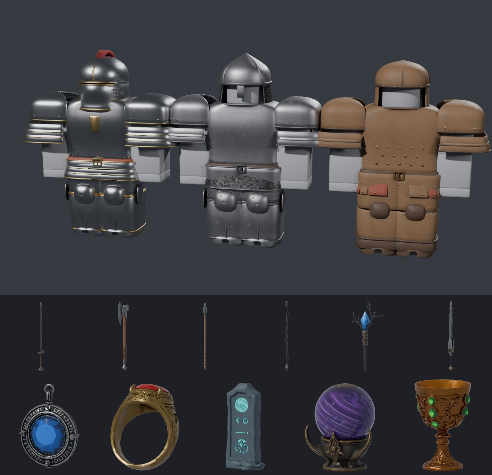

| 구분 | 만든 방법 | 수량 | 폴더 |
|---|---|---|---|
| 무기 | Meshy text-to-3D (meshy-7.1, PBR) | 6종 | `weapons/` |
| 아티팩트 | Meshy text-to-3D (meshy-7.1, PBR) | 5종 | `artifacts/` |
| 방어구 (투구·갑옷·각반) | **코드 모델링** (Blender 파이썬, R15 몸 치수에 맞춰 설계) | 3세트 × 3부위 | `armor/` |

> 방어구는 GPT-5.6 Sol처럼 "LLM이 코드로 3D를 짜는" 방식으로 만들었습니다.
> 다만 이 작업 환경에는 OpenAI 키가 없어서 Sol을 직접 호출하지는 못했고, 대신 Claude가 같은 방식(Blender 스크립트 → 메시 → PBR 텍스처 베이크)으로 직접 모델링했습니다.
> 소스는 `tools/build_armor.py`에 있어서 수치를 고치고 다시 돌리면 그대로 다시 만들어집니다.

모든 파일은 **FBX**(텍스처 내장)이고, 메시는 부위당 1만 삼각형 이하라 로블록스 한도(2만) 안에 들어갑니다.
텍스처는 1024²(로블록스 최대치)로 맞췄습니다.

---

## 방어구 — 가죽 / 철 / 기사

| 세트 | 투구 | 갑옷 | 각반 |
|---|---|---|---|
| 가죽 `leather` | 가죽 모자 + 귀덮개, 박음질, 청동 징 | 징 박은 가죽 흉갑, 옆구리 끈, 가죽 술(허리), 겹친 가죽 어깨받이 | 허벅지 보호대, 정강이 보호대 + 끈, 무릎 패드, 가죽 장화 |
| 철 `iron` | 원뿔형 투구 + 코가리개, 리벳 띠, 사슬 목가리개 | 능선 있는 철 흉갑(리벳·말린 테두리), 사슬 치마, 2단 어깨받이 | 허벅지 판, 무릎 덮개(날개), 정강이 판, 철 신발 |
| 기사 `knight` | 밀폐형 투구(눈구멍·숨구멍), 금 장식, 붉은 깃털 | 금 테두리 판금 흉갑 + 가슴 문장, 3단 허리 판, 3단 대형 어깨받이 | 금 테두리 판금 다리, 무릎 덮개, 겹판 신발 |

| 가죽 | 철 | 기사 |
|---|---|---|
| 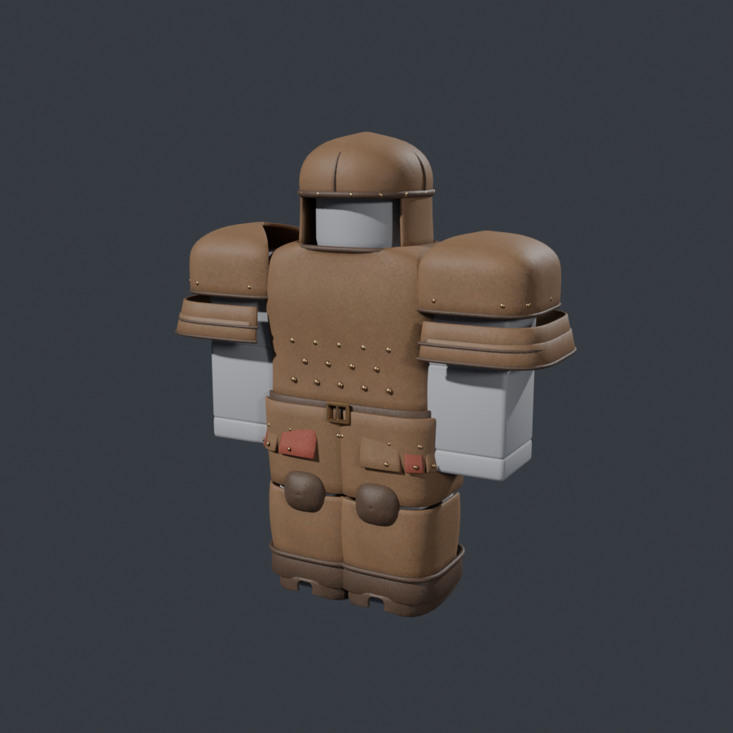 | 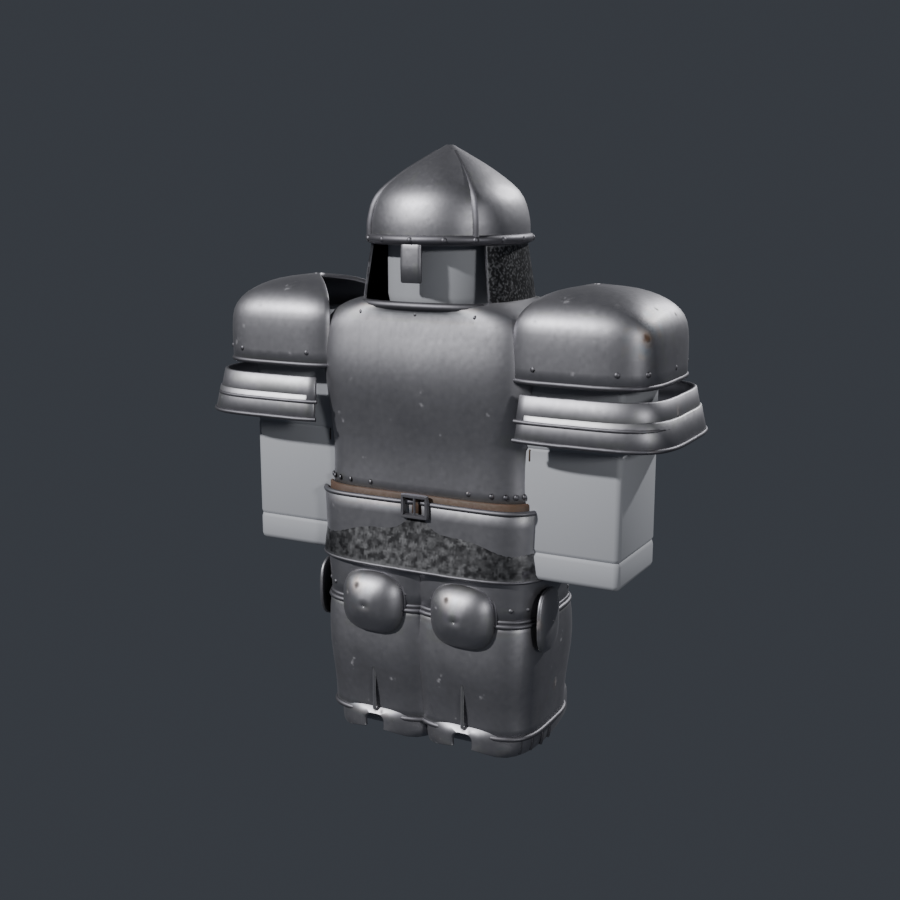 | 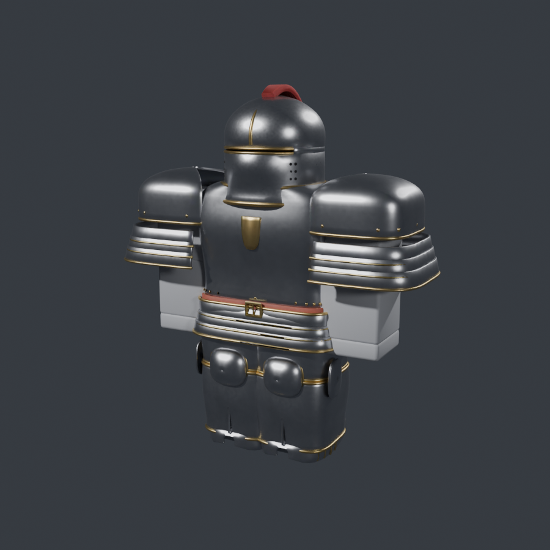 |
| 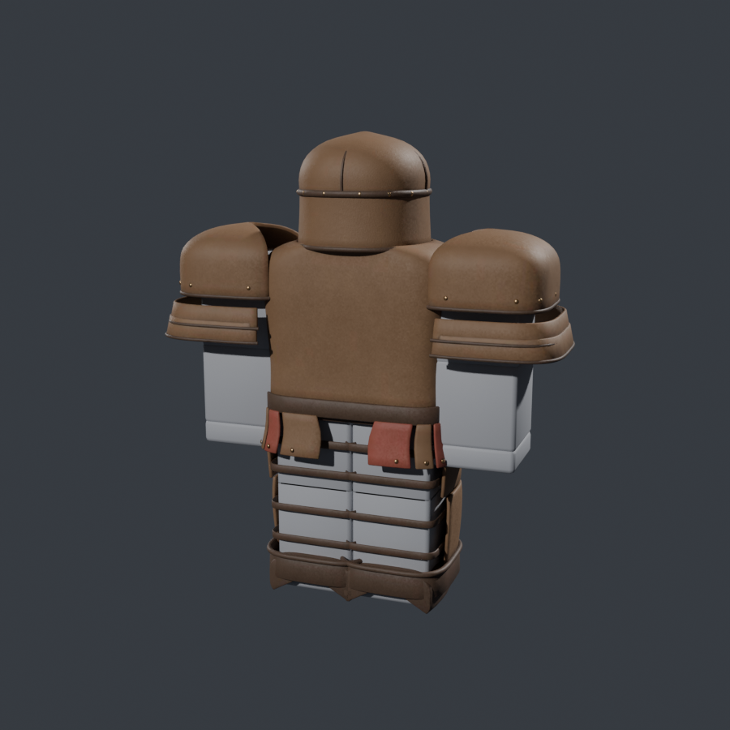 | 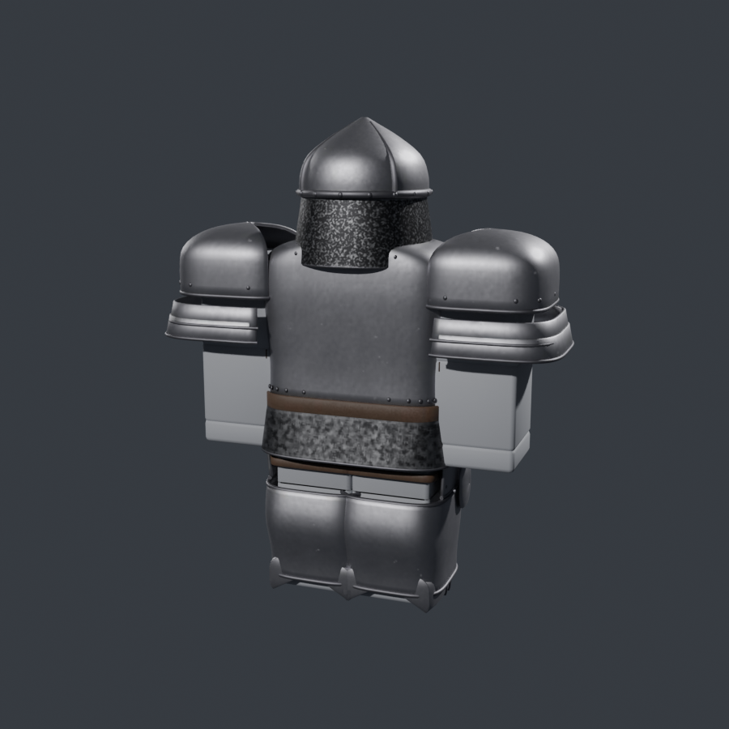 | 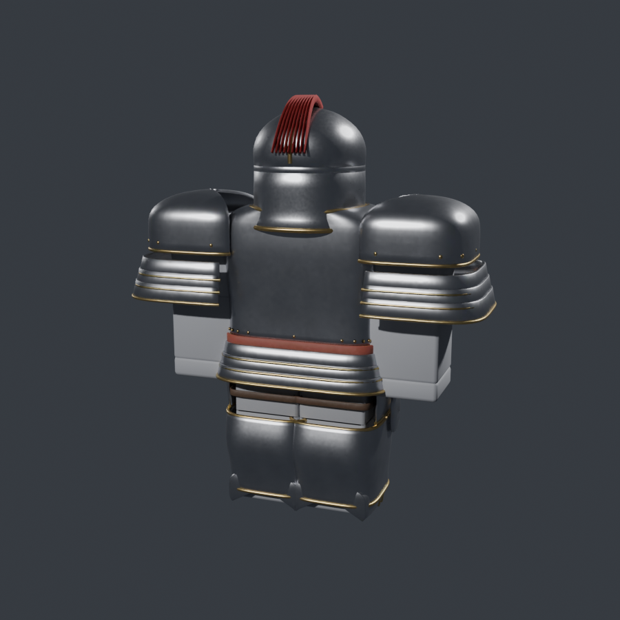 |

**구조:** 파일 하나(예: `knight_chest.fbx`) 안에 메시가 **붙을 부위 이름**으로 들어 있습니다.

| 파일 | 안에 든 메시 (= 붙는 R15 부위) |
|---|---|
| `*_helmet.fbx` | `Head` |
| `*_chest.fbx` | `UpperTorso`, `LowerTorso`, `RightUpperArm`, `LeftUpperArm` (어깨받이) |
| `*_greaves.fbx` | `RightUpperLeg`, `LeftUpperLeg`, `RightLowerLeg`, `LeftLowerLeg`, `RightFoot`, `LeftFoot` |

부위별로 따로 붙기 때문에 걷거나 팔을 휘둘러도 갑옷이 몸을 따라 움직입니다.
`ArmorService`가 캐릭터의 실제 부위 크기를 읽어서 갑옷 크기를 맞추므로, 체형(키·폭·Rthro)이 달라도 들어맞습니다. **R6 캐릭터도 지원**합니다.

## 무기 (Meshy)

| id | 이름 | 길이 | 미리보기 |
|---|---|---|---|
| `iron_longsword` | 철 롱소드 | 4.4 | 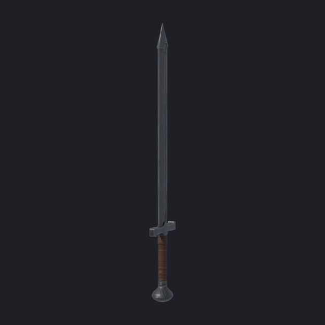 |
| `battle_axe` | 전투 도끼 | 4.0 | 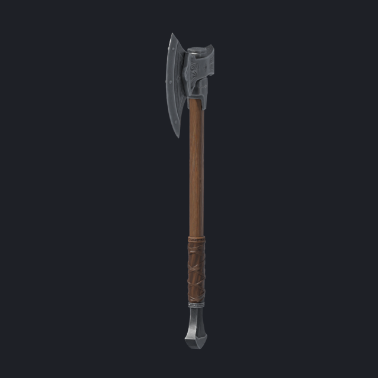 |
| `spear` | 창 | 7.0 | 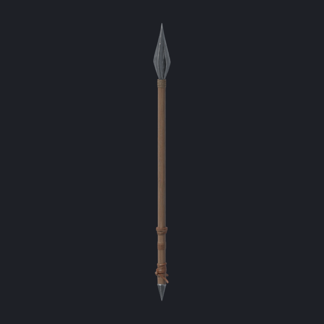 |
| `longbow` | 장궁 | 4.8 | 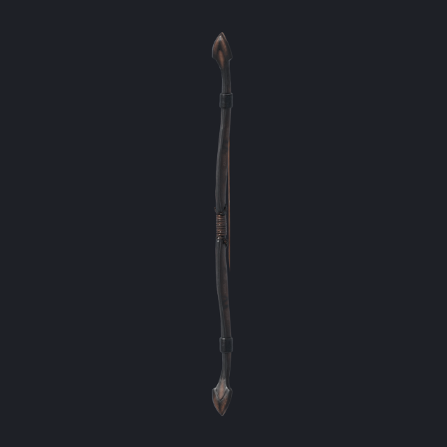 |
| `mage_staff` | 마법 지팡이 (푸른 빛) | 5.6 | 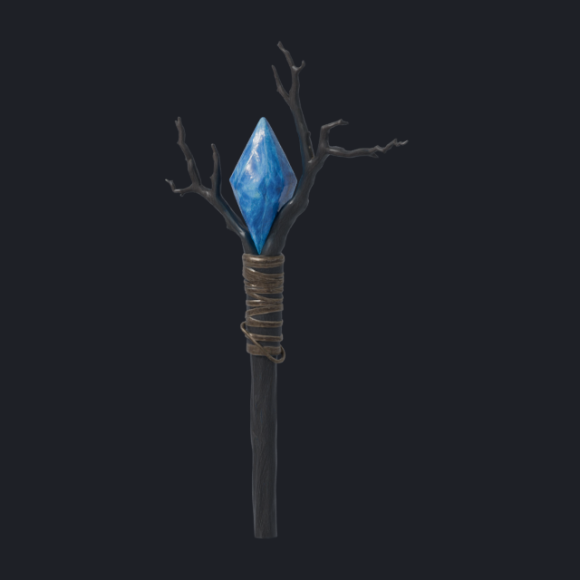 |
| `dagger` | 단검 | 1.9 | 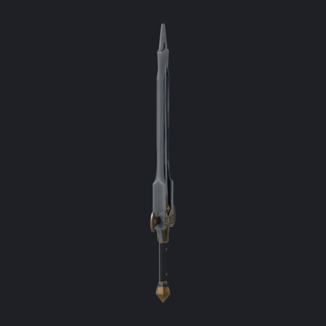 |

모두 **날·머리가 위(+Y), 날 끝이 앞(-Z)** 으로 정리돼 있고, 손잡이 위치(`Tool.Grip`)도 계산돼 있어서 Tool로 만들면 바로 제대로 쥡니다. 길이 단위는 스터드입니다.

## 아티팩트 (Meshy)

| id | 이름 | 미리보기 |
|---|---|---|
| `guardian_amulet` | 수호의 부적 (푸른 빛) | 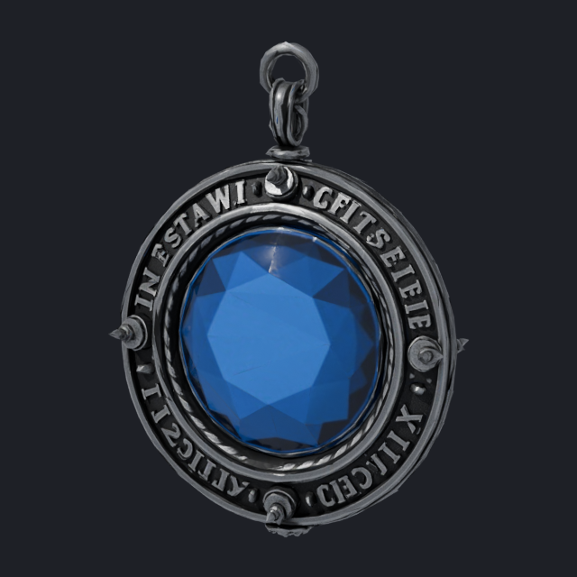 |
| `flame_ring` | 화염의 반지 (붉은 빛) | 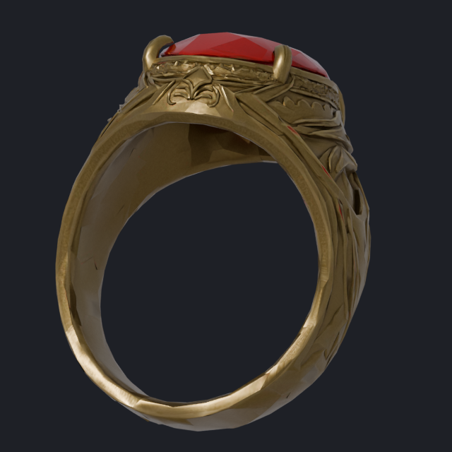 |
| `ancient_runestone` | 고대 룬석 (청록 빛) | 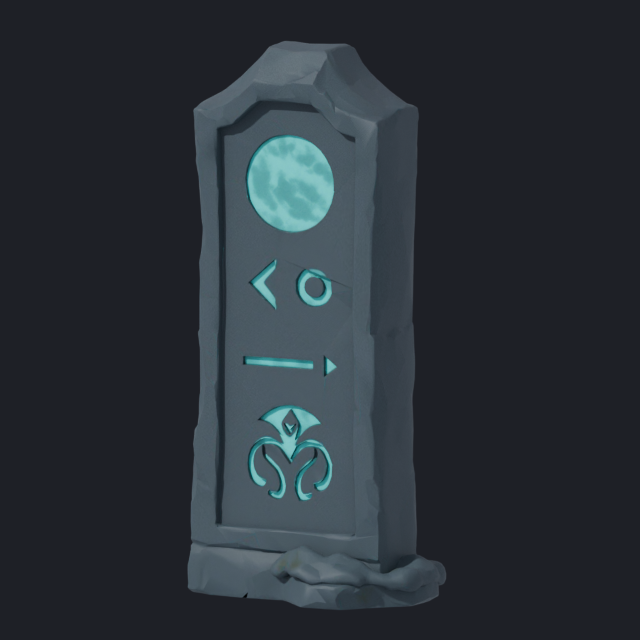 |
| `arcane_orb` | 비전 오브 (보라 빛) | 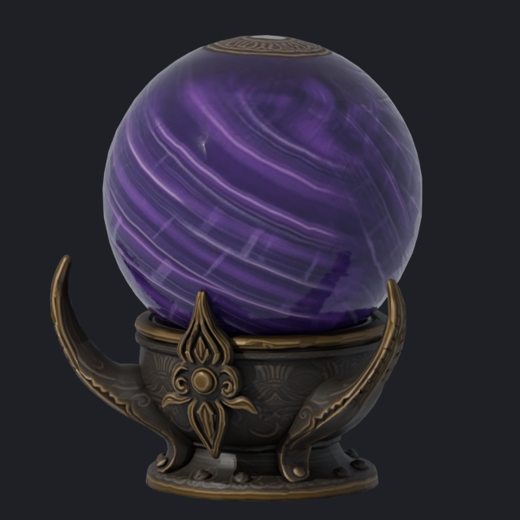 |
| `chalice_of_life` | 생명의 성배 | 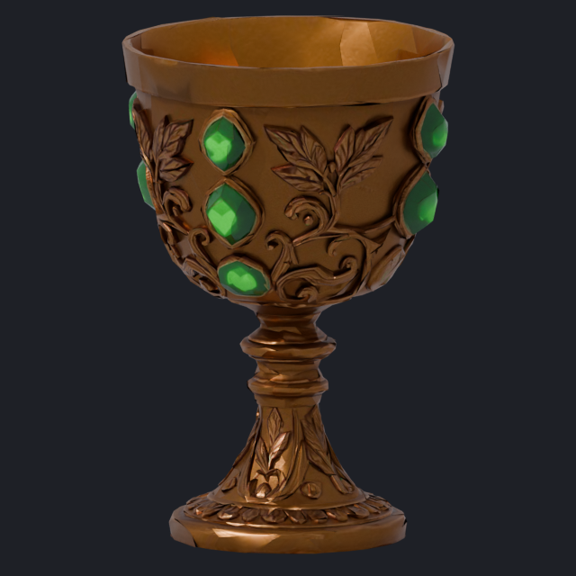 |

손에 드는 Tool로도, 바닥이나 받침대에 세워 두는 진열용으로도 쓸 수 있습니다. 빛나는 아이템에는 `PointLight`가 자동으로 붙습니다.

---

## Studio 에 넣는 법 (5분)

1. **FBX 가져오기** — 홈 탭 → **Import 3D** → `armor/*.fbx`, `weapons/*.fbx`, `artifacts/*.fbx`를 한꺼번에 선택해서 가져옵니다.
   - 설정은 기본값 그대로 두면 됩니다. 단, 방어구 파일은 여러 메시로 돼 있으니 **메시 합치기(Merge Meshes)는 끈 상태**여야 합니다.
   - 가져온 것들이 Workspace에 파일 이름(`knight_chest`, `battle_axe` …)으로 생깁니다.
2. **정리** — `roblox/SetupFromImport.command.lua` 내용을 **명령 모음(Command Bar)** 에 붙여넣고 Enter를 누르면
   `ReplicatedStorage/ItemAssets/Armor`, `.../Items`로 자동으로 옮겨집니다.
3. **스크립트 넣기** — `ReplicatedStorage`에 폴더 `ItemSystem`을 만들고 그 안에 **ModuleScript** 3개를 만듭니다(이름 = 파일 이름).
   - `ItemData` ← `roblox/ItemData.lua`
   - `ArmorService` ← `roblox/ArmorService.lua`
   - `ItemService` ← `roblox/ItemService.lua`
4. (테스트) `ServerScriptService`에 **Script** `TestKit`을 만들고 `roblox/TestKit.server.lua`를 붙여넣습니다 → 플레이하면
   기사 세트를 입고, 무기·아티팩트를 전부 받습니다.
   채팅 명령: `/armor leather` · `/armor iron chest` · `/armor off` · `/give all` · `/give spear`

최종 구조:
```
ReplicatedStorage
├─ ItemAssets
│  ├─ Armor   leather_helmet, leather_chest, ... knight_greaves  (가져온 모델)
│  └─ Items   iron_longsword, ..., chalice_of_life               (가져온 메시)
└─ ItemSystem
   ├─ ItemData      (ModuleScript)
   ├─ ArmorService  (ModuleScript)
   └─ ItemService   (ModuleScript)
ServerScriptService
└─ TestKit (Script, 테스트용 — 실제 게임에서는 지워도 됨)
```

## 코드에서 쓰기

```lua
local ItemSystem = game.ReplicatedStorage.ItemSystem
local ArmorService = require(ItemSystem.ArmorService)
local ItemService = require(ItemSystem.ItemService)

-- 방어구 (세트: "leather" | "iron" | "knight",  부위: "helmet" | "chest" | "greaves")
ArmorService.Equip(character, "iron", "helmet")
ArmorService.EquipSet(character, "knight")
ArmorService.Unequip(character, "chest")
ArmorService.GetEquipped(character)   --> { helmet = "iron", chest = "knight", greaves = "knight" }

-- 무기·아티팩트
local sword = ItemService.CreateTool("iron_longsword")
sword.Parent = player.Backpack
sword.Activated:Connect(function() --[[ 공격 처리 ]] end)

local orb = ItemService.CreateDisplay("arcane_orb", CFrame.new(0, 3, 0))  -- 진열용(고정)
orb.Parent = workspace

ItemService.List("weapon")    --> { "battle_axe", "dagger", ... }
```

- 투구를 쓰면 머리카락·모자 액세서리가 자동으로 숨겨집니다(`ArmorService.HIDE_HAIR_UNDER_HELMET`).
- 장착은 서버에서 하면 모두에게 보입니다. 리스폰할 때마다 다시 `Equip`해 주세요(TestKit이 예시).
- 공격 판정, 휘두르기 애니메이션, 스탯 같은 게임 로직은 넣지 않았습니다.

## 문제 해결

| 증상 | 확인할 것 |
|---|---|
| `... 가 없습니다` 경고 | `ItemAssets/Armor`, `ItemAssets/Items` 안의 이름이 파일 이름과 같은지 (`knight_chest`, `battle_axe` …) |
| 방어구 한 조각만 안 보임 | 모델 안의 메시 이름이 부위 이름(`UpperTorso` 등)인지. 임포터가 이름 뒤에 번호를 붙여도 앞부분이 같으면 찾습니다 |
| 금속/거칠기 느낌이 안 남 | 임포터가 PBR을 못 읽은 경우입니다. 각 MeshPart에 `SurfaceAppearance`를 넣고 `*/textures/`의 `_color` · `_normal` · `_roughness` · `_metalness`를 지정하면 됩니다 |
| 앞뒤가 반대로 붙음 | FBX는 로블록스 문서 권장 축(Forward Z / Up Y)으로 내보냈습니다. 그래도 뒤집히면 가져올 때 *World Forward*를 바꿔서 다시 가져오세요 |

---

## 다시 만들기 / 수정하기 (`tools/`)

```bash
pip install bpy==4.5.4 pillow numpy requests

# 방어구: 수치를 고친 뒤 다시 빌드 (모델링 → UV → PBR 베이크 → FBX → 미리보기 → fit_data.json)
python roblox_items/tools/build_armor.py --out roblox_items/armor
python roblox_items/tools/build_armor.py --out /tmp/x --no-bake --sets knight   # 모양만 빠르게 확인

# Meshy: 프롬프트는 meshy_generate.py 의 ITEMS (한 개당 30 크레딧, 진행 상황은 meshy_jobs.json)
python roblox_items/tools/meshy_generate.py --out <원본폴더> --only spear
python roblox_items/tools/process_meshy.py --raw <원본폴더> --out roblox_items     # 방향·크기·손잡이·텍스처 정리

# Luau 데이터 갱신 (fit_data.json + item_data.json → roblox/ItemData.lua)
python roblox_items/tools/make_luau.py

# 내보낸 FBX 를 다시 불러와 마네킹에 입혀 미리보기 렌더 (FBX 왕복 확인 겸용)
python roblox_items/tools/render_previews.py --armor roblox_items/armor

# Studio 없이 ArmorService/ItemService 로직 테스트 (모의 Roblox 환경, luau CLI 필요)
roblox_items/tools/luau_test/run.sh path/to/luau      # → ALL PASS (273 checks)
```

| 파일 | 내용 |
|---|---|
| `tools/armor_lib.py` | 모델링 기본기(초타원 단면 로프트, 두께, 테두리 관, 리벳), 절차적 재질(강철/철/금/가죽/천/사슬), UV·베이크·FBX |
| `tools/build_armor.py` | 세트별 디자인(가죽/철/기사) |
| `tools/meshy_generate.py` | Meshy 생성 (프롬프트·태스크 ID 기록) |
| `tools/process_meshy.py` | Meshy 결과 정리(방향·크기·손잡이·텍스처) |
| `tools/make_luau.py` | Luau 데이터 모듈 생성 |
| `tools/render_previews.py` | FBX 재임포트 → 미리보기 렌더 |
| `tools/luau_test/` | 모의 Roblox 환경에서 장착(R15·R6·체형 배율)·Tool 생성 로직 테스트 |
| `armor/fit_data.json`, `item_data.json` | 부위 기준 오프셋·크기, 아이템 크기·손잡이 (Luau 데이터 원본) |

Meshy 사용량: 450 크레딧 (11종 × 30 + 결과가 나빴던 도끼·지팡이·룬석 재생성 4회 × 30).
